# PACK 1999 TEMPLATES PARTE 03 - Bloco 9

Templates neste bloco: 20

## Sumário

- [Template 562 - Extrair item completo do Monday.com](#template-562)
- [Template 563 - Limpeza automática de tags do registro Docker](#template-563)
- [Template 564 - Assistente AI para classificar e priorizar e-mails Outlook](#template-564)
- [Template 565 - Agente AI com geração de gráficos](#template-565)
- [Template 566 - Extrair e resumir resultados do Bing Copilot](#template-566)
- [Template 567 - Converter notícias da BBC em podcast](#template-567)
- [Template 568 - Indexação de documento e chat por similaridade](#template-568)
- [Template 569 - Assistente SQL para análises de transporte](#template-569)
- [Template 570 - Tradutor de áudio do Telegram (55 idiomas)](#template-570)
- [Template 571 - Agente ReAct para busca e processamento de páginas web](#template-571)
- [Template 572 - Agendamento com pré-qualificação por IA](#template-572)
- [Template 573 - Lembrete diário de yoga via LINE](#template-573)
- [Template 574 - Auto-categorização de posts WordPress por IA](#template-574)
- [Template 575 - Rastreamento e pesquisa de startups financiadas](#template-575)
- [Template 576 - Throttle automático do qBittorrent por eventos do Plex](#template-576)
- [Template 577 - Chat RAG sobre a especificação OpenAPI do GitHub](#template-577)
- [Template 578 - Sincronizar timers para Syncro](#template-578)
- [Template 579 - Banner do Twitter com avatares de seguidores](#template-579)
- [Template 580 - Alerta de novas violações do Have I Been Pwned](#template-580)
- [Template 581 - Exportar pedidos do Shopify](#template-581)

---

<a id="template-562"></a>

## Template 562 - Extrair item completo do Monday.com

- **Nome:** Extrair item completo do Monday.com
- **Descrição:** Extrai dados completos de um item do Monday.com — incluindo todas as colunas, colunas de relação com outros quadros (linked pulses) e subitens — e consolida essas informações em um único JSON.
- **Funcionalidade:** • Receber ID do item: Usa uma variável de entrada (pulse) para determinar qual item será processado.
• Obter item principal: Busca o item especificado e recupera todos os seus dados de coluna.
• Indexar colunas por ID e por nome: Constrói estruturas que mapeiam colunas por seus IDs e por seus títulos para acesso rápido.
• Identificar colunas de relação de quadro: Filtra e coleta apenas as colunas do tipo de relação entre quadros (board_relation).
• Puxar itens relacionados (linked pulses): Para cada relação encontrada, recupera os itens vinculados e suas colunas completas.
• Puxar subitens: Lê a coluna de subitens, extrai os IDs e recupera cada subitem com suas respectivas colunas.
• Consolidar e agregar: Agrega todos os dados coletados (item principal, colunas indexadas, itens relacionados e subitens) em um único objeto JSON de saída.
- **Ferramentas:** • Monday.com: Plataforma para gerenciar quadros, itens, colunas, relações entre quadros e subitens; usada aqui via API para buscar itens e seus dados completos.

## Fluxo visual

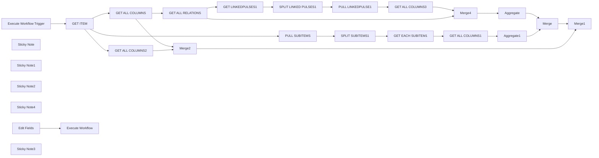

## Fluxo (.json) :

```json
{
  "id": "ZdGZh4qmOqTQe1oq",
  "meta": {
    "instanceId": "da824ad45fda1b156c8390a3c35cdfbb10059e671c074c19429dac59c5ae98f6"
  },
  "name": "MONDAY GET FULL ITEM",
  "tags": [
    {
      "id": "uKg1PU2D27Vsr8ud",
      "name": "MONDAY",
      "createdAt": "2023-12-05T07:54:13.266Z",
      "updatedAt": "2023-12-05T07:54:13.266Z"
    }
  ],
  "nodes": [
    {
      "id": "20299349-bc2c-4aa8-b083-db31cb9aa278",
      "name": "GET ALL COLUMNS",
      "type": "n8n-nodes-base.code",
      "position": [
        1840,
        -600
      ],
      "parameters": {
        "jsCode": "function createColumnValuesArray(data) {\n  const result = {};\n  data.forEach(item => {\n    const name = item.id;\n    result[name] = item;\n  });\n\n  return result;\n}\n\ncolumns = $input.last().json.column_values\ndata1 = { \"name\" : $input.last().json.name, \"id\" : $input.last().json.id }\ndata2 = createColumnValuesArray(columns)\n\nconst combinedData = { \"item\" : data1, columnValuesById: data2}\n\nreturn (combinedData)\n\n\n"
      },
      "typeVersion": 2
    },
    {
      "id": "04c2550e-41d8-46f4-a131-2ea99dd4258a",
      "name": "GET ALL RELATIONS",
      "type": "n8n-nodes-base.code",
      "position": [
        1860,
        -220
      ],
      "parameters": {
        "jsCode": "var data = $input.last().json.columnValuesById;\ni = 0;\nrelations = [];\nfor (var key in data) {\n    if (data[key].type == \"board_relation\") {\n      relations[i] = data[key];\n      i++\n    }\n}\n\nreturn relations;\n\n"
      },
      "typeVersion": 2
    },
    {
      "id": "5796cb17-199b-4838-ae9c-c3636824bd13",
      "name": "PULL LINKEDPULSE1",
      "type": "n8n-nodes-base.mondayCom",
      "position": [
        1720,
        -40
      ],
      "parameters": {
        "itemId": "=\n{{ $json.linkedPulse.linkedPulseId }}",
        "resource": "boardItem",
        "operation": "get"
      },
      "credentials": {
        "mondayComApi": {
          "id": "5nd48DKapWBLcUBx",
          "name": "Monday.com account"
        }
      },
      "notesInFlow": true,
      "typeVersion": 1
    },
    {
      "id": "67a8a151-5875-4ec7-8fda-f797f3d3b198",
      "name": "GET LINKEDPULSES1",
      "type": "n8n-nodes-base.code",
      "position": [
        1340,
        -40
      ],
      "parameters": {
        "mode": "runOnceForEachItem",
        "jsCode": "data = $input.item.json.value\nid = $input.item.json.id\nname = $input.item.json.column.title\n\nconst linkedPulseID = JSON.parse(data).linkedPulseIds\n\nreturn { \"linkedPulse\": linkedPulseID, \"id\" : id, \"name\": name }\n"
      },
      "typeVersion": 2
    },
    {
      "id": "5dbe451d-ec23-48bf-9193-55a03b8752a4",
      "name": "SPLIT LINKED PULSES1",
      "type": "n8n-nodes-base.splitOut",
      "position": [
        1540,
        -40
      ],
      "parameters": {
        "include": "=",
        "options": {},
        "fieldToSplitOut": "linkedPulse"
      },
      "typeVersion": 1
    },
    {
      "id": "536897b1-ed71-4888-9761-cb4a363f0a86",
      "name": "SPLIT SUBITEMS1",
      "type": "n8n-nodes-base.splitOut",
      "position": [
        1540,
        200
      ],
      "parameters": {
        "include": "selectedOtherFields",
        "options": {},
        "fieldToSplitOut": "linkedPulseIds",
        "fieldsToInclude": "linkedPulseIds[0].linkedPulseId"
      },
      "typeVersion": 1
    },
    {
      "id": "57777d0c-77d0-4652-a798-2d347b12cfb4",
      "name": "GET EACH SUBITEM1",
      "type": "n8n-nodes-base.mondayCom",
      "position": [
        1700,
        200
      ],
      "parameters": {
        "itemId": "=\n{{ $json.linkedPulseIds.linkedPulseId }}",
        "resource": "boardItem",
        "operation": "get"
      },
      "credentials": {
        "mondayComApi": {
          "id": "5nd48DKapWBLcUBx",
          "name": "Monday.com account"
        }
      },
      "notesInFlow": true,
      "typeVersion": 1
    },
    {
      "id": "1a7574db-16bb-4d69-b91f-33b20e52c794",
      "name": "GET ALL COLUMNS1",
      "type": "n8n-nodes-base.code",
      "position": [
        1880,
        200
      ],
      "parameters": {
        "mode": "runOnceForEachItem",
        "jsCode": "function createColumnValuesArray(data) {\n  const result = {};\n  data.forEach(item => {\n    const name = item.id;\n    result[name] = item;\n  });\n\n  return result;\n}\n\ncolumns = $input.item.json.column_values\ndata1 = { \"name\" : $input.item.json.name, \"id\" : $input.item.json.id }\ndata2 = createColumnValuesArray(columns)\n\nconst combinedData = { ...data1, ...data2 }\n\nreturn (combinedData)\n\n\n"
      },
      "typeVersion": 2
    },
    {
      "id": "ba95aef3-49b3-4a3e-a5fd-51ec04691949",
      "name": "GET ALL COLUMNS2",
      "type": "n8n-nodes-base.code",
      "position": [
        1840,
        -420
      ],
      "parameters": {
        "jsCode": "function createColumnValuesArray(data) {\n  const result = {};\n  data.forEach(item => {\n  if (item.type != \"subtasks\") {\n    const name = item.column.title;\n    result[name] = item;\n  }\n  });\n\n  return result;\n}\n\ncolumns = $input.last().json.column_values\ndata = createColumnValuesArray(columns)\nreturn {\"columnValuesByName\": data}\n\n\n"
      },
      "typeVersion": 2
    },
    {
      "id": "8c475537-efe6-4417-b293-e47abe817f7a",
      "name": "Aggregate1",
      "type": "n8n-nodes-base.aggregate",
      "onError": "continueRegularOutput",
      "position": [
        2180,
        100
      ],
      "parameters": {
        "options": {},
        "aggregate": "aggregateAllItemData",
        "destinationFieldName": "subitems"
      },
      "typeVersion": 1,
      "alwaysOutputData": true
    },
    {
      "id": "f96f5fb7-1701-4cf4-b572-2ed3d8376232",
      "name": "PULL SUBITEMS",
      "type": "n8n-nodes-base.code",
      "position": [
        1320,
        200
      ],
      "parameters": {
        "jsCode": "//Search for \"Subitems\" column\nconst columnName = \"Subitems\"\nfunction getColumnValue(item, columnId) {\n    const column = item.column_values.find(column => column.column.title === columnId);\n    if (column) {\n          return column\n    } else {\n        return null;\n    }\n}\nconst columnValue = getColumnValue($input.last().json, columnName);\nreturn JSON.parse(columnValue.value);\n\n//ALT OPTION - direct access by column_values[0]\n//var ids = $input.last().json['column_values'][0]['value'];\n//return JSON.parse(ids)"
      },
      "typeVersion": 2
    },
    {
      "id": "aa96e7e9-6c2a-46d4-95af-124609a7b524",
      "name": "GET ITEM",
      "type": "n8n-nodes-base.mondayCom",
      "position": [
        1180,
        -600
      ],
      "parameters": {
        "itemId": "=\n{{ $input.item.json.pulse }}",
        "resource": "boardItem",
        "operation": "get"
      },
      "credentials": {
        "mondayComApi": {
          "id": "5nd48DKapWBLcUBx",
          "name": "Monday.com account"
        }
      },
      "notesInFlow": true,
      "typeVersion": 1
    },
    {
      "id": "da23cad1-77f9-4035-8ad3-b322dadba853",
      "name": "GET ALL COLUMNS3",
      "type": "n8n-nodes-base.code",
      "position": [
        1880,
        -40
      ],
      "parameters": {
        "mode": "runOnceForEachItem",
        "jsCode": "function createColumnValuesArray(data) {\n  const result = {};\n  data.forEach(item => {\n    const name = item.id;\n    result[name] = item;\n  });\n\n  return result;\n}\n\ncolumns = $input.item.json.column_values\ndata1 = { \"name\" : $input.item.json.name, \"id\" : $input.item.json.id }\ndata2 = createColumnValuesArray(columns)\n\nconst combinedData = { \"item\" : data1, columnValuesById: data2}\n\nreturn (combinedData)\n\n\n"
      },
      "typeVersion": 2
    },
    {
      "id": "9c27b7af-2568-4b07-b526-9c18ca52649f",
      "name": "Merge4",
      "type": "n8n-nodes-base.merge",
      "position": [
        2180,
        -100
      ],
      "parameters": {
        "mode": "combine",
        "options": {},
        "combinationMode": "mergeByPosition"
      },
      "typeVersion": 2.1,
      "alwaysOutputData": true
    },
    {
      "id": "6f0008fd-b8f5-4161-8fbf-363b3d5a7794",
      "name": "Aggregate",
      "type": "n8n-nodes-base.aggregate",
      "onError": "continueRegularOutput",
      "position": [
        2340,
        -100
      ],
      "parameters": {
        "options": {},
        "aggregate": "aggregateAllItemData",
        "destinationFieldName": "boardrelations"
      },
      "typeVersion": 1,
      "alwaysOutputData": true
    },
    {
      "id": "d95b1e2a-405e-417b-8618-89af85b10350",
      "name": "Merge",
      "type": "n8n-nodes-base.merge",
      "onError": "continueRegularOutput",
      "position": [
        2540,
        0
      ],
      "parameters": {
        "mode": "combine",
        "options": {},
        "combinationMode": "mergeByPosition"
      },
      "typeVersion": 2.1,
      "alwaysOutputData": true
    },
    {
      "id": "e9d7977d-1fd3-4be8-ad90-b42a93bc1ea4",
      "name": "Merge2",
      "type": "n8n-nodes-base.merge",
      "onError": "continueRegularOutput",
      "position": [
        2480,
        -240
      ],
      "parameters": {
        "mode": "combine",
        "options": {},
        "combinationMode": "mergeByPosition"
      },
      "typeVersion": 2.1,
      "alwaysOutputData": true
    },
    {
      "id": "72e04613-f953-49b0-ad13-4bd5464cc55e",
      "name": "Merge1",
      "type": "n8n-nodes-base.merge",
      "position": [
        2680,
        -160
      ],
      "parameters": {
        "mode": "combine",
        "options": {},
        "combinationMode": "mergeByPosition"
      },
      "typeVersion": 2.1
    },
    {
      "id": "0846e8ee-8b58-40c2-8d3f-1e33f519bf55",
      "name": "Execute Workflow Trigger",
      "type": "n8n-nodes-base.executeWorkflowTrigger",
      "position": [
        980,
        -600
      ],
      "parameters": {},
      "typeVersion": 1
    },
    {
      "id": "1c753c05-3541-4579-a815-b3465f26d51c",
      "name": "Sticky Note",
      "type": "n8n-nodes-base.stickyNote",
      "position": [
        1300,
        -240
      ],
      "parameters": {
        "width": 752.1995067108865,
        "height": 335.74971164936585,
        "content": "PULL ALL BOARDRELATION COLUMNS AND THEIR DATA"
      },
      "typeVersion": 1
    },
    {
      "id": "79c61e1f-6cbf-45ca-b0d3-31250fb7be18",
      "name": "Sticky Note1",
      "type": "n8n-nodes-base.stickyNote",
      "position": [
        1300,
        120
      ],
      "parameters": {
        "width": 748.2468880082052,
        "height": 237.44804034647325,
        "content": "PULL ALL SUBITEMS AND THEIR COLUMN DATA\n"
      },
      "typeVersion": 1
    },
    {
      "id": "b5da95d7-d0d8-4ad1-ab93-e06e6c823ed2",
      "name": "Sticky Note2",
      "type": "n8n-nodes-base.stickyNote",
      "position": [
        1720,
        -640
      ],
      "parameters": {
        "color": 4,
        "width": 325.58246828143024,
        "height": 352.5605536332179,
        "content": "PULL ALL COLUMN DATA AND INDEX BY ID AND NAME\n"
      },
      "typeVersion": 1
    },
    {
      "id": "02125cbf-aa28-4cf1-a0ef-cf3cf45e76c2",
      "name": "Sticky Note4",
      "type": "n8n-nodes-base.stickyNote",
      "position": [
        2140,
        -298.05978270268713
      ],
      "parameters": {
        "color": 5,
        "width": 677.0818915801614,
        "height": 605.5742002344051,
        "content": "COMBINE ALL DATA INTO ONE JSON OUTPUT\n"
      },
      "typeVersion": 1
    },
    {
      "id": "e96deeef-6fb5-4130-b422-752e0e0dc9c5",
      "name": "Execute Workflow",
      "type": "n8n-nodes-base.executeWorkflow",
      "position": [
        1180,
        -780
      ],
      "parameters": {
        "options": {
          "waitForSubWorkflow": true
        },
        "workflowId": "ZdGZh4qmOqTQe1oq"
      },
      "typeVersion": 1
    },
    {
      "id": "955d8a6e-931c-411f-a26a-17f547370fd9",
      "name": "Edit Fields",
      "type": "n8n-nodes-base.set",
      "position": [
        980,
        -780
      ],
      "parameters": {
        "fields": {
          "values": [
            {
              "name": "pulse",
              "stringValue": "4030768878"
            }
          ]
        },
        "options": {}
      },
      "typeVersion": 3.2
    },
    {
      "id": "f508d0cd-448c-482e-9eeb-d569f26dbaab",
      "name": "Sticky Note3",
      "type": "n8n-nodes-base.stickyNote",
      "position": [
        940,
        -920
      ],
      "parameters": {
        "color": 6,
        "width": 418.4714893828877,
        "height": 302.08861782546296,
        "content": "HOW TO USE\n-Copy these nodes into another workflow, and update the workflow id in the execute workflow node\n-Using the Edit Fields nodes, define the “pulse” variable which will tell the workflow which monday item to pull data from.\n"
      },
      "typeVersion": 1
    }
  ],
  "active": false,
  "pinData": {},
  "settings": {
    "executionOrder": "v1"
  },
  "versionId": "dd22e2e2-0699-41d1-b6ad-001073624540",
  "connections": {
    "Merge": {
      "main": [
        [
          {
            "node": "Merge1",
            "type": "main",
            "index": 1
          }
        ]
      ]
    },
    "Merge2": {
      "main": [
        [
          {
            "node": "Merge1",
            "type": "main",
            "index": 0
          }
        ]
      ]
    },
    "Merge4": {
      "main": [
        [
          {
            "node": "Aggregate",
            "type": "main",
            "index": 0
          }
        ]
      ]
    },
    "GET ITEM": {
      "main": [
        [
          {
            "node": "GET ALL COLUMNS",
            "type": "main",
            "index": 0
          },
          {
            "node": "GET ALL COLUMNS2",
            "type": "main",
            "index": 0
          },
          {
            "node": "PULL SUBITEMS",
            "type": "main",
            "index": 0
          }
        ]
      ]
    },
    "Aggregate": {
      "main": [
        [
          {
            "node": "Merge",
            "type": "main",
            "index": 0
          }
        ]
      ]
    },
    "Aggregate1": {
      "main": [
        [
          {
            "node": "Merge",
            "type": "main",
            "index": 1
          }
        ]
      ]
    },
    "Edit Fields": {
      "main": [
        [
          {
            "node": "Execute Workflow",
            "type": "main",
            "index": 0
          }
        ]
      ]
    },
    "PULL SUBITEMS": {
      "main": [
        [
          {
            "node": "SPLIT SUBITEMS1",
            "type": "main",
            "index": 0
          }
        ]
      ]
    },
    "GET ALL COLUMNS": {
      "main": [
        [
          {
            "node": "GET ALL RELATIONS",
            "type": "main",
            "index": 0
          },
          {
            "node": "Merge2",
            "type": "main",
            "index": 0
          }
        ]
      ]
    },
    "SPLIT SUBITEMS1": {
      "main": [
        [
          {
            "node": "GET EACH SUBITEM1",
            "type": "main",
            "index": 0
          }
        ]
      ]
    },
    "GET ALL COLUMNS1": {
      "main": [
        [
          {
            "node": "Aggregate1",
            "type": "main",
            "index": 0
          }
        ]
      ]
    },
    "GET ALL COLUMNS2": {
      "main": [
        [
          {
            "node": "Merge2",
            "type": "main",
            "index": 1
          }
        ]
      ]
    },
    "GET ALL COLUMNS3": {
      "main": [
        [
          {
            "node": "Merge4",
            "type": "main",
            "index": 1
          }
        ]
      ]
    },
    "GET ALL RELATIONS": {
      "main": [
        [
          {
            "node": "GET LINKEDPULSES1",
            "type": "main",
            "index": 0
          },
          {
            "node": "Merge4",
            "type": "main",
            "index": 0
          }
        ]
      ]
    },
    "GET EACH SUBITEM1": {
      "main": [
        [
          {
            "node": "GET ALL COLUMNS1",
            "type": "main",
            "index": 0
          }
        ]
      ]
    },
    "GET LINKEDPULSES1": {
      "main": [
        [
          {
            "node": "SPLIT LINKED PULSES1",
            "type": "main",
            "index": 0
          }
        ]
      ]
    },
    "PULL LINKEDPULSE1": {
      "main": [
        [
          {
            "node": "GET ALL COLUMNS3",
            "type": "main",
            "index": 0
          }
        ]
      ]
    },
    "SPLIT LINKED PULSES1": {
      "main": [
        [
          {
            "node": "PULL LINKEDPULSE1",
            "type": "main",
            "index": 0
          }
        ]
      ]
    },
    "Execute Workflow Trigger": {
      "main": [
        [
          {
            "node": "GET ITEM",
            "type": "main",
            "index": 0
          }
        ]
      ]
    }
  }
}
```

<a id="template-563"></a>

## Template 563 - Limpeza automática de tags do registro Docker

- **Nome:** Limpeza automática de tags do registro Docker
- **Descrição:** Fluxo agendado que identifica e remove tags antigas de imagens em um registro Docker, executa coleta de lixo e envia notificações sobre remoções ou falhas.
- **Funcionalidade:** • Agendamento periódico: Executa o processo automaticamente em horários definidos.
• Listagem de repositórios: Recupera todos os repositórios disponíveis no registro.
• Recuperação de tags por imagem: Obtém a lista de tags de cada imagem.
• Filtragem e validação de tags: Remove entradas inválidas ou vazias antes do processamento.
• Separação de tags: Processa cada tag individualmente para análise detalhada.
• Ordenação por data de criação: Ordena tags para determinar quais são as mais antigas.
• Agrupamento por imagem: Reagrupe tags por repositório para decisões por imagem.
• Identificação de tags a remover: Mantém as mais recentes (incluindo latest quando presente) e marca as demais para remoção.
• Consulta de digest de manifest: Obtém o digest do manifest associado à tag para remoção segura.
• Remoção de tags por digest: Executa chamadas DELETE ao registro para remover manifests/tags obsoletos.
• Execução de coleta de lixo remota: Roda garbage-collect no host do registro para liberar espaço após remoções.
• Notificações por e-mail: Envia avisos de remoção bem-sucedida e alertas em caso de falha.
- **Ferramentas:** • Registro Docker (Docker Registry HTTP API v2): Armazenamento de imagens e ponto de acesso para listar tags, consultar manifests e excluir objetos.
• Host com Docker Compose: Ambiente remoto onde o serviço de registro é executado e onde é executado o comando de garbage-collect.
• Acesso SSH com chave privada: Permite executar comandos remotos no host do registro para a coleta de lixo.
• Servidor de e-mail/SMTP: Envio de notificações sobre remoções e falhas para destinatários configurados.
• Autenticação HTTP básica: Credenciais utilizadas para autenticar chamadas à API do registro.


## Fluxo visual

```mermaid
flowchart LR
    N1["Fetch Manifest Digest"]
    N2["Remove Old Tags"]
    N3["Retrieve Image Tags"]
    N4["List Images"]
    N5["Extract Image Names"]
    N6["Identify Tags to Remove"]
    N7["Scheduled Trigger"]
    N8["Send Notification Email"]
    N9["Split Tags"]
    N10["Filter Valid Tags"]
    N11["Fetch Manifest Digest for Blob"]
    N12["Update Fields"]
    N13["Group Tags by Image"]
    N14["Sort by Creation Date"]
    N15["Send Failure Notification Email"]
    N16["Execute Garbage Collection"]

    N9 --> N10
    N4 --> N5
    N12 --> N14
    N2 --> N16
    N2 --> N15
    N10 --> N1
    N7 --> N4
    N5 --> N3
    N13 --> N6
    N3 --> N9
    N1 --> N11
    N14 --> N13
    N6 --> N2
    N6 --> N8
    N11 --> N12
```

## Fluxo (.json) :

```json
{
  "nodes": [
    {
      "id": "6b1865a7-f150-4d2b-b1f7-37c68b2173d6",
      "name": "Fetch Manifest Digest",
      "type": "n8n-nodes-base.httpRequest",
      "position": [
        920,
        -300
      ],
      "parameters": {
        "url": "={{\"https://<<your-registry-url>>/v2/\" + $json.name + \"/manifests/\" + $json.tag}}",
        "options": {
          "fullResponse": true
        },
        "authentication": "genericCredentialType",
        "genericAuthType": "httpBasicAuth",
        "headerParametersUi": {
          "parameter": [
            {
              "name": "Accept",
              "value": "application/vnd.docker.distribution.manifest.v2+json, application/vnd.oci.image.manifest.v1+json, application/vnd.oci.image.index.v1+json, application/vnd.docker.distribution.manifest.list.v2+json"
            }
          ]
        }
      },
      "typeVersion": 2
    },
    {
      "id": "3c1daca9-3897-4596-b62d-db561f8cb047",
      "name": "Remove Old Tags",
      "type": "n8n-nodes-base.httpRequest",
      "onError": "continueErrorOutput",
      "position": [
        840,
        -40
      ],
      "parameters": {
        "url": "={{\"https://<<your-registry-url>>/v2/\" + $json.image + \"/manifests/\" + $json.tag.digest}}",
        "options": {},
        "requestMethod": "DELETE",
        "authentication": "genericCredentialType",
        "genericAuthType": "httpBasicAuth",
        "headerParametersUi": {
          "parameter": [
            {
              "name": "Accept",
              "value": "application/vnd.docker.distribution.manifest.v2+json"
            }
          ]
        }
      },
      "typeVersion": 2
    },
    {
      "id": "6974749e-8c85-4334-a7e7-e964f057ed6f",
      "name": "Retrieve Image Tags",
      "type": "n8n-nodes-base.httpRequest",
      "position": [
        400,
        -300
      ],
      "parameters": {
        "url": "={{\"https://<<your-registry-url>>/v2/\" + $json[\"image\"] + \"/tags/list\"}}",
        "options": {},
        "authentication": "genericCredentialType",
        "genericAuthType": "httpBasicAuth",
        "headerParametersUi": {
          "parameter": [
            {
              "name": "Accept",
              "value": "application/vnd.docker.distribution.manifest.v2+json, application/vnd.oci.image.manifest.v1+json, application/vnd.oci.image.index.v1+json, application/vnd.docker.distribution.manifest.list.v2+json"
            }
          ]
        }
      },
      "typeVersion": 2
    },
    {
      "id": "30857c32-508e-4f95-8e26-c9f2fc84e074",
      "name": "List Images",
      "type": "n8n-nodes-base.httpRequest",
      "position": [
        40,
        -300
      ],
      "parameters": {
        "url": "https://<<your-registry-url>>/v2/_catalog",
        "options": {},
        "authentication": "genericCredentialType",
        "genericAuthType": "httpBasicAuth"
      },
      "typeVersion": 2
    },
    {
      "id": "c5965a6a-28e6-4217-a846-a849de153430",
      "name": "Extract Image Names",
      "type": "n8n-nodes-base.code",
      "position": [
        220,
        -300
      ],
      "parameters": {
        "jsCode": "const images = items[0].json.repositories;\nreturn images.map(image => ({ json: { image } }));"
      },
      "typeVersion": 2
    },
    {
      "id": "b13eb6e5-1a16-4992-b0bd-9b228559fecf",
      "name": "Identify Tags to Remove",
      "type": "n8n-nodes-base.code",
      "position": [
        600,
        -40
      ],
      "parameters": {
        "jsCode": "const result = [];\n\nfor (const item of items) {\n  const tags = item.json.tags;\n  if (tags) {\n    const latestTag = tags.includes('latest') ? 'latest' : null;\n    const sortedTags = tags.filter(tag => tag !== 'latest')\n                            .sort((a, b) => new Date(b.created) - new Date(a.created));\n    const keepTags = sortedTags.slice(0, 10);\n    if (latestTag) keepTags.push('latest');\n    const deleteTags = sortedTags.slice(10);\n    result.push(...deleteTags.map(tag => ({ json: { image: item.json.name, tag } })));\n  }\n}\n\nreturn result;\n"
      },
      "typeVersion": 2
    },
    {
      "id": "da15ae49-09ee-4658-86a5-9b0a2180c637",
      "name": "Scheduled Trigger",
      "type": "n8n-nodes-base.scheduleTrigger",
      "position": [
        -140,
        -300
      ],
      "parameters": {
        "rule": {
          "interval": [
            {
              "triggerAtHour": 1
            }
          ]
        }
      },
      "typeVersion": 1.2
    },
    {
      "id": "bcc347be-5520-46c0-aac9-0b14ddd8b184",
      "name": "Send Notification Email",
      "type": "n8n-nodes-base.emailSend",
      "position": [
        840,
        180
      ],
      "webhookId": "47f852c3-7136-4e6d-92f6-47322dbba5da",
      "parameters": {
        "text": "=Image : {{ $json.image }}\nTag : {{ $json.tag.tag }}\n\nRemoved",
        "options": {},
        "subject": "Docker Registry Cleaner Notification",
        "toEmail": "to@example.com",
        "fromEmail": "from@example.com",
        "emailFormat": "text"
      },
      "typeVersion": 2.1
    },
    {
      "id": "2c3770ef-cb4c-4007-8897-f4eb7ad3b7cf",
      "name": "Split Tags",
      "type": "n8n-nodes-base.splitOut",
      "position": [
        580,
        -300
      ],
      "parameters": {
        "include": "selectedOtherFields",
        "options": {
          "destinationFieldName": "tag"
        },
        "fieldToSplitOut": "tags",
        "fieldsToInclude": "name"
      },
      "typeVersion": 1
    },
    {
      "id": "4fffa947-02cf-4608-acab-8284250cf622",
      "name": "Filter Valid Tags",
      "type": "n8n-nodes-base.filter",
      "position": [
        740,
        -300
      ],
      "parameters": {
        "options": {},
        "conditions": {
          "options": {
            "version": 2,
            "leftValue": "",
            "caseSensitive": true,
            "typeValidation": "strict"
          },
          "combinator": "and",
          "conditions": [
            {
              "id": "bb56b84e-e7cb-4867-93f8-ac40c71bde4f",
              "operator": {
                "type": "string",
                "operation": "notEmpty",
                "singleValue": true
              },
              "leftValue": "={{ $json.tag }}",
              "rightValue": ""
            },
            {
              "id": "acd8e00c-5fa0-4c62-ba96-9e6f456f7703",
              "operator": {
                "type": "string",
                "operation": "notEmpty",
                "singleValue": true
              },
              "leftValue": "={{ $json.name }}",
              "rightValue": ""
            }
          ]
        }
      },
      "typeVersion": 2.2
    },
    {
      "id": "c023ba14-d12d-497c-9b30-97db04a34c1b",
      "name": "Fetch Manifest Digest for Blob",
      "type": "n8n-nodes-base.httpRequest",
      "position": [
        -120,
        -40
      ],
      "parameters": {
        "url": "={{\"https://<<your-registry-url>>/v2/\" + $('Filter Valid Tags').item.json.name + \"/blobs/\" + $json.body.config.digest}}",
        "options": {
          "fullResponse": false
        },
        "authentication": "genericCredentialType",
        "genericAuthType": "httpBasicAuth",
        "headerParametersUi": {
          "parameter": [
            {
              "name": "Accept",
              "value": "application/vnd.docker.distribution.manifest.v2+json"
            }
          ]
        }
      },
      "typeVersion": 2
    },
    {
      "id": "f054b91e-abd4-4854-9bfa-e4a2b70f7e2c",
      "name": "Update Fields",
      "type": "n8n-nodes-base.set",
      "position": [
        60,
        -40
      ],
      "parameters": {
        "options": {},
        "assignments": {
          "assignments": [
            {
              "id": "c970bdb8-ddbf-486b-a716-c66274a248a7",
              "name": "name",
              "type": "string",
              "value": "={{ $('Filter Valid Tags').item.json.name }}"
            },
            {
              "id": "7ce79761-6557-413c-a9a6-5d1ca564a3df",
              "name": "tag",
              "type": "string",
              "value": "={{ $('Filter Valid Tags').item.json.tag }}"
            },
            {
              "id": "45948a25-d35c-4e3f-9556-3d52a1a89f80",
              "name": "created",
              "type": "string",
              "value": "={{ $json.created }}"
            },
            {
              "id": "c73a14ad-91f6-477f-b4c3-037db319b9ee",
              "name": "digest",
              "type": "string",
              "value": "={{ $('Fetch Manifest Digest').item.json.headers['docker-content-digest'] }}"
            }
          ]
        }
      },
      "typeVersion": 3.4
    },
    {
      "id": "54405505-8445-491a-8f5d-232da8c842d2",
      "name": "Group Tags by Image",
      "type": "n8n-nodes-base.code",
      "position": [
        420,
        -40
      ],
      "parameters": {
        "jsCode": "const groupedData = items.reduce((acc, item) => {\n  const name = item.json.name;\n  if (!acc[name]) {\n    acc[name] = [];\n  }\n  acc[name].push({\n    tag: item.json.tag,\n    created: item.json.created,\n    digest: item.json.digest\n  });\n  return acc;\n}, {});\n\nreturn Object.keys(groupedData).map(name => ({\n  json: { name, tags: groupedData[name] }\n}));\n"
      },
      "typeVersion": 2
    },
    {
      "id": "980aab86-44cd-47d5-b3b7-42cbae26eb09",
      "name": "Sort by Creation Date",
      "type": "n8n-nodes-base.sort",
      "position": [
        240,
        -40
      ],
      "parameters": {
        "options": {},
        "sortFieldsUi": {
          "sortField": [
            {
              "order": "descending",
              "fieldName": "created"
            }
          ]
        }
      },
      "typeVersion": 1
    },
    {
      "id": "0561efb9-4903-4bec-bc1a-8131e5f5de67",
      "name": "Send Failure Notification Email",
      "type": "n8n-nodes-base.emailSend",
      "position": [
        1120,
        80
      ],
      "webhookId": "47f852c3-7136-4e6d-92f6-47322dbba5da",
      "parameters": {
        "text": "=Image : {{ $json.image }}\nTag : {{ $json.tag.tag }}\n\nFailed",
        "options": {},
        "subject": "[FAIL] Docker Registry Cleaner Notification",
        "toEmail": "to@example.com",
        "fromEmail": "from@example.com",
        "emailFormat": "text"
      },
      "typeVersion": 2.1
    },
    {
      "id": "eaa28914-351c-4934-ba1c-0d39faf67ef3",
      "name": "Execute Garbage Collection",
      "type": "n8n-nodes-base.ssh",
      "position": [
        1120,
        -100
      ],
      "parameters": {
        "cwd": "/opt/services/",
        "command": "docker compose exec -it -u root registry bin/registry garbage-collect --delete-untagged /etc/docker/registry/config.yml",
        "authentication": "privateKey"
      },
      "typeVersion": 1
    }
  ],
  "pinData": {},
  "connections": {
    "Split Tags": {
      "main": [
        [
          {
            "node": "Filter Valid Tags",
            "type": "main",
            "index": 0
          }
        ]
      ]
    },
    "List Images": {
      "main": [
        [
          {
            "node": "Extract Image Names",
            "type": "main",
            "index": 0
          }
        ]
      ]
    },
    "Update Fields": {
      "main": [
        [
          {
            "node": "Sort by Creation Date",
            "type": "main",
            "index": 0
          }
        ]
      ]
    },
    "Remove Old Tags": {
      "main": [
        [
          {
            "node": "Execute Garbage Collection",
            "type": "main",
            "index": 0
          }
        ],
        [
          {
            "node": "Send Failure Notification Email",
            "type": "main",
            "index": 0
          }
        ]
      ]
    },
    "Filter Valid Tags": {
      "main": [
        [
          {
            "node": "Fetch Manifest Digest",
            "type": "main",
            "index": 0
          }
        ]
      ]
    },
    "Scheduled Trigger": {
      "main": [
        [
          {
            "node": "List Images",
            "type": "main",
            "index": 0
          }
        ]
      ]
    },
    "Extract Image Names": {
      "main": [
        [
          {
            "node": "Retrieve Image Tags",
            "type": "main",
            "index": 0
          }
        ]
      ]
    },
    "Group Tags by Image": {
      "main": [
        [
          {
            "node": "Identify Tags to Remove",
            "type": "main",
            "index": 0
          }
        ]
      ]
    },
    "Retrieve Image Tags": {
      "main": [
        [
          {
            "node": "Split Tags",
            "type": "main",
            "index": 0
          }
        ]
      ]
    },
    "Fetch Manifest Digest": {
      "main": [
        [
          {
            "node": "Fetch Manifest Digest for Blob",
            "type": "main",
            "index": 0
          }
        ]
      ]
    },
    "Sort by Creation Date": {
      "main": [
        [
          {
            "node": "Group Tags by Image",
            "type": "main",
            "index": 0
          }
        ]
      ]
    },
    "Identify Tags to Remove": {
      "main": [
        [
          {
            "node": "Remove Old Tags",
            "type": "main",
            "index": 0
          },
          {
            "node": "Send Notification Email",
            "type": "main",
            "index": 0
          }
        ]
      ]
    },
    "Fetch Manifest Digest for Blob": {
      "main": [
        [
          {
            "node": "Update Fields",
            "type": "main",
            "index": 0
          }
        ]
      ]
    }
  }
}
```

<a id="template-564"></a>

## Template 564 - Assistente AI para classificar e priorizar e-mails Outlook

- **Nome:** Assistente AI para classificar e priorizar e-mails Outlook
- **Descrição:** Fluxo que lê e-mails não sinalizados e sem categoria, limpa o conteúdo, consulta contatos e regras, usa um modelo de IA para categorizar e priorizar e aplica a categoria e importância diretamente na conta de e-mail.
- **Funcionalidade:** • Monitoramento de e-mails não sinalizados e sem categoria: Recupera mensagens novas que não estão sinalizadas e não possuem categoria definida.
• Sanitização do conteúdo do e-mail: Remove HTML, links, imagens, tabelas e caracteres indesejados para gerar um texto limpo para análise.
• Conversão para Markdown/texto simplificado: Converte corpo HTML para formato texto/markdown antes do processamento pela IA.
• Integração e atualização de contatos: Busca contatos de um CRM (Monday.com) e faz upsert em base de contatos para enriquecer a análise do remetente.
• Busca de regras, categorias e regras de exclusão: Recupera tabelas configuráveis (categories, rules, delete rules) para orientar a classificação automática.
• Processamento em lote: Faz loop e divisão em lotes para processar múltiplas mensagens de forma controlada.
• Análise e categorização por IA: Envia o e-mail e contexto (contatos, categorias, regras) para um modelo de linguagem que retorna uma saída JSON estruturada com categoria, subcategoria (ex.: Action) e análise justificativa.
• Parser de saída estruturada: Garante que a resposta da IA esteja em JSON válido com campos esperados (id, subject, category, subCategory, analysis).
• Aplicação de categoria e prioridade: Atualiza o e-mail na caixa com a categoria sugerida e, quando aplicável, ajusta a importância para High.
• Agendamento e gatilho manual: Suporta execução agendada para checagem periódica de e-mails e também gatilho manual para testes.
- **Ferramentas:** • Microsoft Outlook (Microsoft 365): Conta de e-mail usada para recuperar mensagens e aplicar atualizações de categoria e importância.
• OpenAI (modelo GPT-4o): Modelo de linguagem usado para analisar o conteúdo do e-mail e determinar a categoria, subcategoria e justificativa.
• Airtable: Armazena e fornece dados configuráveis como categorias, regras, delete rules e lista de contatos usados na lógica de classificação.
• Monday.com: Fonte de contatos CRM usada para enriquecer o contexto de remetentes e sincronizar a base de contatos.


## Fluxo visual

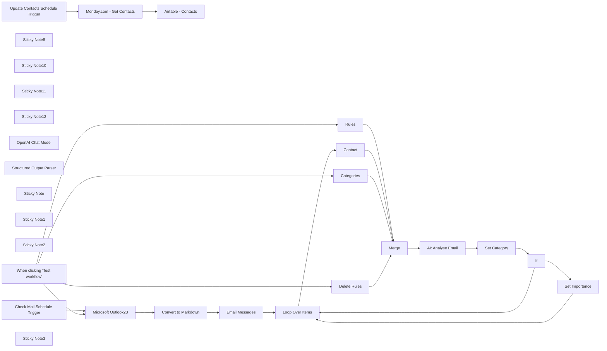

## Fluxo (.json) :

```json
{
  "id": "reQhibpNwU63Y8sn",
  "meta": {
    "instanceId": "2128095e13afd30151f0fb53632960213a789cd45ed0afd3a7fb96a985bb4bcf",
    "templateId": "2454",
    "templateCredsSetupCompleted": true
  },
  "name": "Microsoft Outlook AI Email Assistant",
  "tags": [],
  "nodes": [
    {
      "id": "a923cfb0-64fe-499a-8f0e-13fc848731df",
      "name": "When clicking ‘Test workflow’",
      "type": "n8n-nodes-base.manualTrigger",
      "position": [
        980,
        540
      ],
      "parameters": {},
      "typeVersion": 1
    },
    {
      "id": "ea865c8e-5c73-4d37-97d1-0349a265b9a4",
      "name": "Sticky Note8",
      "type": "n8n-nodes-base.stickyNote",
      "position": [
        2880,
        -600
      ],
      "parameters": {
        "color": 5,
        "width": 675,
        "height": 107,
        "content": "# Microsoft Outlook AI Email Assistant"
      },
      "typeVersion": 1
    },
    {
      "id": "c835042f-421b-44a0-8dc4-686ac638b358",
      "name": "Sticky Note10",
      "type": "n8n-nodes-base.stickyNote",
      "position": [
        1300,
        60
      ],
      "parameters": {
        "width": 612,
        "height": 401,
        "content": "## Outlook Business with filters\nFilters:\n```\nflag/flagStatus eq 'notFlagged' and not categories/any()\n```\n\nThese filters ensure we do not process flagged emails or email that already have a category set."
      },
      "typeVersion": 1
    },
    {
      "id": "51ae8a4e-2d37-4118-a538-cd0fd4f427f7",
      "name": "Microsoft Outlook23",
      "type": "n8n-nodes-base.microsoftOutlook",
      "position": [
        1540,
        240
      ],
      "parameters": {
        "limit": 10,
        "fields": [
          "flag",
          "from",
          "importance",
          "replyTo",
          "sender",
          "subject",
          "toRecipients",
          "body",
          "categories",
          "isRead"
        ],
        "output": "fields",
        "options": {},
        "filtersUI": {
          "values": {
            "filters": {
              "custom": "flag/flagStatus eq 'notFlagged' and not categories/any()",
              "foldersToInclude": [
                "AAMkADYyNmQ0YWE1LWQxYjEtNDBhYS1hODI3LTg3MTkyNDAwMzE5NwAuAAAAAAA44w-ZZoU7QLO9GQAyv8UcAQAkfR2JHrRET4CmwDGznLN6AAAAAAEMAAA="
              ]
            }
          }
        },
        "operation": "getAll"
      },
      "credentials": {
        "microsoftOutlookOAuth2Api": {
          "id": "nv0cz3C6VZDzEgtR",
          "name": "Microsoft365 Email Account"
        }
      },
      "typeVersion": 2
    },
    {
      "id": "a144adad-6fef-4f76-a06e-c889e8f16080",
      "name": "Sticky Note11",
      "type": "n8n-nodes-base.stickyNote",
      "position": [
        2020,
        60
      ],
      "parameters": {
        "color": 6,
        "width": 459,
        "height": 401,
        "content": "## Sanitise Email \nRemoves HTML and useless information in preparation for the AI Agent"
      },
      "typeVersion": 1
    },
    {
      "id": "92ccac8f-9ce3-4f81-a499-e55835be3fc7",
      "name": "Sticky Note12",
      "type": "n8n-nodes-base.stickyNote",
      "position": [
        2020,
        580
      ],
      "parameters": {
        "color": 4,
        "width": 736,
        "height": 558,
        "content": "## Get Rules & Categories\nEdit the airtables to set your own categories, rules, contacts and/or delete rules. "
      },
      "typeVersion": 1
    },
    {
      "id": "5b304e0f-002c-42c6-82a0-9ab1dc858861",
      "name": "OpenAI Chat Model",
      "type": "@n8n/n8n-nodes-langchain.lmChatOpenAi",
      "position": [
        3860,
        460
      ],
      "parameters": {
        "model": "gpt-4o",
        "options": {
          "temperature": 0.2
        }
      },
      "credentials": {
        "openAiApi": {
          "id": "l2JgpErNc5namHVH",
          "name": "OpenAI account"
        }
      },
      "typeVersion": 1
    },
    {
      "id": "210816e8-6a1f-4e63-a90e-d953e0e87ccd",
      "name": "Set Category",
      "type": "n8n-nodes-base.microsoftOutlook",
      "position": [
        4500,
        240
      ],
      "parameters": {
        "messageId": {
          "__rl": true,
          "mode": "id",
          "value": "={{ $json.output.id }}"
        },
        "operation": "update",
        "updateFields": {
          "categories": "={{ [$json.output.category] }}"
        }
      },
      "credentials": {
        "microsoftOutlookOAuth2Api": {
          "id": "nv0cz3C6VZDzEgtR",
          "name": "Microsoft365 Email Account"
        }
      },
      "typeVersion": 2
    },
    {
      "id": "fe4f8e8f-6a5c-4b7b-b5f7-10f1f374397c",
      "name": "Structured Output Parser",
      "type": "@n8n/n8n-nodes-langchain.outputParserStructured",
      "position": [
        4040,
        460
      ],
      "parameters": {
        "schemaType": "manual",
        "inputSchema": "{\n \"type\": \"object\",\n \"properties\": {\n \"id\": {\n \"type\": \"string\",\n \"description\": \"The email id\"\n },\n \"subject\": {\n \"type\": \"string\",\n \"description\": \"The email subject line\"\n },\n \"category\": {\n \"type\": \"string\",\n \"description\": \"Primary classification of the email\"\n },\n \"subCategory\": {\n \"type\": \"string\",\n \"description\": \"Optional sub-classification if applicable\"\n },\n \"analysis\": {\n \"type\": \"string\",\n \"description\": \"Reasoning behind the categorization\"\n }\n },\n \"required\": [\"id\",\"subject\", \"category\", \"analysis\"]\n}"
      },
      "typeVersion": 1.2
    },
    {
      "id": "489028ca-f265-4ea2-b8dd-64dd6b06c8f6",
      "name": "If",
      "type": "n8n-nodes-base.if",
      "position": [
        4740,
        240
      ],
      "parameters": {
        "options": {},
        "conditions": {
          "options": {
            "version": 2,
            "leftValue": "",
            "caseSensitive": true,
            "typeValidation": "strict"
          },
          "combinator": "and",
          "conditions": [
            {
              "id": "6e4ecd0c-d151-4e5b-8d66-558f9f9ec3b0",
              "operator": {
                "name": "filter.operator.equals",
                "type": "string",
                "operation": "equals"
              },
              "leftValue": "={{ $('AI: Analyse Email').item.json.output.subCategory }}",
              "rightValue": "Action"
            }
          ]
        }
      },
      "typeVersion": 2.2
    },
    {
      "id": "e2a27071-bac6-4a67-94fb-93e7ac218c89",
      "name": "Set Importance",
      "type": "n8n-nodes-base.microsoftOutlook",
      "position": [
        5000,
        220
      ],
      "parameters": {
        "messageId": {
          "__rl": true,
          "mode": "id",
          "value": "={{ $('AI: Analyse Email').item.json.output.id }}"
        },
        "operation": "update",
        "updateFields": {
          "importance": "High"
        }
      },
      "credentials": {
        "microsoftOutlookOAuth2Api": {
          "id": "nv0cz3C6VZDzEgtR",
          "name": "Microsoft365 Email Account"
        }
      },
      "typeVersion": 2
    },
    {
      "id": "61cecccf-589f-4514-b126-cfbfc7d94981",
      "name": "AI: Analyse Email",
      "type": "@n8n/n8n-nodes-langchain.agent",
      "position": [
        3860,
        240
      ],
      "parameters": {
        "text": "=Categorise the following email:\n<email>\n{{ $('Loop Over Items').item.json.toJsonString() }}\n</email>\n\n<Contact>\n{{ $('Contact').all().toJsonString() }}\n</Contact>\n\n<DeleteRules>\n{{ $('Delete Rules').all().toJsonString() }}\n</DeleteRules>\n\n<Categories>\n{{ $('Categories').all().toJsonString() }}\n</Categories>\n\nEnsure your final output is valid JSON with no additional text or token in the following format:\n\n{\n \"subject\": \"SUBJECT_LINE\",1\n \"category\": \"CATEGORY\",\n \"subCategory\": \"SUBCATEGORY\", //use sparingly\n \"analysis\": \"ANALYSIS_REASONING\"\n}\n\nRemember you can only use ONE of the following category 'Name' values from the 'Categories' defined above. No other categories can be used. Use the subcategory for additional context, for example, if a client email requires action or if a supplier email requires action. Do not create any additional subcategories; you can only use ONE of the category 'Name' values from the 'Categories' defined above.",
        "options": {
          "systemMessage": "=Categories: \"\"\"{{ $('Categories').all().toJsonString() }}\"\"\"\n\nYou are an AI email assistant for the *insert role & title*. Your task is to categorize incoming emails using one of the category 'Name' values defined in 'Categories' above.\n\nYou may also use the subcategory:\n- Action\n\nInstructions:\nAnalyse the email subject, body, and sender's email address to determine the appropriate category by referring to the 'Usage', 'Sender Indicators' and 'Subject Indicators' defined in the 'Categories' above.\n\n\nOutput Format:\nProduce output in valid JSON format:\n{\n \"id\": \"{{ $('Loop Over Items').item.json.id }}\",\n \"subject\": \"SUBJECT_LINE\",\n \"category\": \"PRIMARY CATEGORY\",\n \"subCategory\": \"SUBCATEGORY\", // use sparingly\n \"analysis\": \"Brief 1-2 sentence explanation of category choice\"\n}\n- Replace \"SUBJECT_LINE\" with the actual subject of the email.\n- \"PRIMARY CATEGORY\" should be one of the categories listed above.\n- \"SUBCATEGORY\" should be \"Action\" if applicable; otherwise, omit or leave blank.\n- The \"analysis\" should be a brief 1-2 sentence explanation of why the category was chosen. Also, indicate if there was a match for the 'Contact' email and the email sender.\n\nImportant:\nYou may only use the categories and the subcategory listed above; do not create any additional categories or subcategories.\n\nNo additional text or tokens should be included outside the JSON output.\n"
        },
        "promptType": "define",
        "hasOutputParser": true
      },
      "typeVersion": 1.6
    },
    {
      "id": "947eb4d7-9067-4144-819b-f53947ca77f8",
      "name": "Sticky Note",
      "type": "n8n-nodes-base.stickyNote",
      "position": [
        1420,
        -620
      ],
      "parameters": {
        "color": 6,
        "width": 760,
        "height": 400,
        "content": "## CRM Contact List Integration \nFor this workflow I am retrieving supplier & client contacts from Monday.com the email assistant has better context to categorise, prioritise and reply to emails.\nThe list is updated daily or you can change the scheduler trigger to update more or less frequently.\nYou could replace this with your own CRM."
      },
      "typeVersion": 1
    },
    {
      "id": "79815a8f-5650-4ec9-97b3-c0201469d048",
      "name": "Sticky Note1",
      "type": "n8n-nodes-base.stickyNote",
      "position": [
        3640,
        60
      ],
      "parameters": {
        "width": 700,
        "height": 580,
        "content": "## Categorise & Prioritise Emails Agent \n"
      },
      "typeVersion": 1
    },
    {
      "id": "2e9411a8-30da-4ee5-9597-cb08e34049a5",
      "name": "Sticky Note2",
      "type": "n8n-nodes-base.stickyNote",
      "position": [
        4400,
        120
      ],
      "parameters": {
        "color": 4,
        "width": 740,
        "height": 280,
        "content": "## Set the category & importance using the output from the agent\n"
      },
      "typeVersion": 1
    },
    {
      "id": "138a734f-0ac5-4e50-a4af-b7255e11e862",
      "name": "Check Mail Schedule Trigger",
      "type": "n8n-nodes-base.scheduleTrigger",
      "disabled": true,
      "position": [
        980,
        260
      ],
      "parameters": {
        "rule": {
          "interval": [
            {
              "field": "minutes",
              "minutesInterval": 15
            }
          ]
        }
      },
      "typeVersion": 1.2
    },
    {
      "id": "709795fd-68ff-4881-9f30-6270dea83f7c",
      "name": "Update Contacts Schedule Trigger",
      "type": "n8n-nodes-base.scheduleTrigger",
      "position": [
        1080,
        -420
      ],
      "parameters": {
        "rule": {
          "interval": [
            {}
          ]
        }
      },
      "typeVersion": 1.2
    },
    {
      "id": "552803ce-3dae-415d-b14d-a7b990450482",
      "name": "Monday.com - Get Contacts",
      "type": "n8n-nodes-base.mondayCom",
      "position": [
        1520,
        -440
      ],
      "parameters": {
        "boardId": "1840712625",
        "groupId": "topics",
        "resource": "boardItem",
        "operation": "getAll",
        "returnAll": true
      },
      "credentials": {
        "mondayComApi": {
          "id": "wur9UFaP9YKCFZly",
          "name": "Monday.com - API User"
        }
      },
      "typeVersion": 1
    },
    {
      "id": "cf41ebb0-f295-4f1a-a49c-05471a4d9220",
      "name": "Airtable - Contacts",
      "type": "n8n-nodes-base.airtable",
      "position": [
        1920,
        -440
      ],
      "parameters": {
        "base": {
          "__rl": true,
          "mode": "list",
          "value": "appNmgIGA4Fhculsn",
          "cachedResultUrl": "https://airtable.com/appNmgIGA4Fhculsn",
          "cachedResultName": "AI Email Assistant"
        },
        "table": {
          "__rl": true,
          "mode": "list",
          "value": "tbl8gTTEn96uFRDHE",
          "cachedResultUrl": "https://airtable.com/appNmgIGA4Fhculsn/tbl8gTTEn96uFRDHE",
          "cachedResultName": "Contacts"
        },
        "columns": {
          "value": {
            "Type": "={{ $json.column_values[1].text }}",
            "Email": "={{ $json.column_values[6].text }}",
            "Last Name": "={{ $json.name.split(\" \",2).last() }}",
            "First Name": "={{ $json.name.split(\" \",2).first() }}"
          },
          "schema": [
            {
              "id": "id",
              "type": "string",
              "display": true,
              "removed": false,
              "readOnly": true,
              "required": false,
              "displayName": "id",
              "defaultMatch": true
            },
            {
              "id": "Email",
              "type": "string",
              "display": true,
              "removed": false,
              "readOnly": false,
              "required": false,
              "displayName": "Email",
              "defaultMatch": false,
              "canBeUsedToMatch": true
            },
            {
              "id": "First Name",
              "type": "string",
              "display": true,
              "removed": false,
              "readOnly": false,
              "required": false,
              "displayName": "First Name",
              "defaultMatch": false,
              "canBeUsedToMatch": true
            },
            {
              "id": "Last Name",
              "type": "string",
              "display": true,
              "removed": false,
              "readOnly": false,
              "required": false,
              "displayName": "Last Name",
              "defaultMatch": false,
              "canBeUsedToMatch": true
            },
            {
              "id": "Type",
              "type": "string",
              "display": true,
              "removed": false,
              "readOnly": false,
              "required": false,
              "displayName": "Type",
              "defaultMatch": false,
              "canBeUsedToMatch": true
            }
          ],
          "mappingMode": "defineBelow",
          "matchingColumns": [
            "Email"
          ]
        },
        "options": {},
        "operation": "upsert"
      },
      "credentials": {
        "airtableTokenApi": {
          "id": "Bgr0Fi30Oek2jpXT",
          "name": "Airtable Personal Access Token account"
        }
      },
      "typeVersion": 2.1
    },
    {
      "id": "6d698b4d-f18c-4e4a-9c83-8a39208aee8c",
      "name": "Convert to Markdown",
      "type": "n8n-nodes-base.markdown",
      "notes": "Converts the body of the email to markdown",
      "position": [
        2120,
        240
      ],
      "parameters": {
        "html": "={{ $json.body.content }}",
        "options": {}
      },
      "notesInFlow": true,
      "typeVersion": 1
    },
    {
      "id": "012109cc-dcba-464b-b3bc-17201b1ad436",
      "name": "Email Messages",
      "type": "n8n-nodes-base.set",
      "notes": "Set email fields",
      "position": [
        2320,
        240
      ],
      "parameters": {
        "options": {},
        "assignments": {
          "assignments": [
            {
              "id": "edb304e1-3e9f-4a77-918c-25646addbc53",
              "name": "subject",
              "type": "string",
              "value": "={{ $json.subject }}"
            },
            {
              "id": "57a3ef3a-2701-40d9-882f-f43a7219f148",
              "name": "importance",
              "type": "string",
              "value": "={{ $json.importance }}"
            },
            {
              "id": "d8317f4f-aa0e-4196-89af-cb016765490a",
              "name": "sender",
              "type": "object",
              "value": "={{ $json.sender.emailAddress }}"
            },
            {
              "id": "908716c8-9ff7-4bdc-a1a3-64227559635e",
              "name": "from",
              "type": "object",
              "value": "={{ $json.from.emailAddress }}"
            },
            {
              "id": "ce007329-e221-4c5a-8130-2f8e9130160f",
              "name": "body",
              "type": "string",
              "value": "={{ $json.data\n .replace(/<[^>]*>/g, '') // Remove HTML tags\n .replace(/\\[(.*?)\\]\\((.*?)\\)/g, '') // Remove Markdown links like [text](link)\n .replace(/!\\[.*?\\]\\(.*?\\)/g, '') // Remove Markdown images like \n .replace(/\\|/g, '') // Remove table separators \"|\"\n .replace(/-{3,}/g, '') // Remove horizontal rule \"---\"\n .replace(/\\n+/g, ' ') // Remove multiple newlines\n .replace(/([^\\w\\s.,!?@])/g, '') // Remove special characters except essential ones\n .replace(/\\s{2,}/g, ' ') // Replace multiple spaces with a single space\n .trim() // Trim leading/trailing whitespace\n}}\n"
            },
            {
              "id": "6abfcc56-7b0a-469e-82fc-ce294ed5162b",
              "name": "id",
              "type": "string",
              "value": "={{ $json.id }}"
            }
          ]
        }
      },
      "typeVersion": 3.4
    },
    {
      "id": "6d3933f3-3f2e-4268-8979-d6c93c961916",
      "name": "Rules",
      "type": "n8n-nodes-base.airtable",
      "position": [
        2400,
        720
      ],
      "parameters": {
        "base": {
          "__rl": true,
          "mode": "list",
          "value": "appNmgIGA4Fhculsn",
          "cachedResultUrl": "https://airtable.com/appNmgIGA4Fhculsn",
          "cachedResultName": "AI Email Assistant"
        },
        "table": {
          "__rl": true,
          "mode": "list",
          "value": "tblMSXbMFKETNToxV",
          "cachedResultUrl": "https://airtable.com/appNmgIGA4Fhculsn/tblMSXbMFKETNToxV",
          "cachedResultName": "Rules"
        },
        "options": {},
        "operation": "search"
      },
      "credentials": {
        "airtableTokenApi": {
          "id": "Bgr0Fi30Oek2jpXT",
          "name": "Airtable Personal Access Token account"
        }
      },
      "executeOnce": true,
      "typeVersion": 2.1
    },
    {
      "id": "9166d63f-0c16-490f-afb8-e30ef25c49da",
      "name": "Categories",
      "type": "n8n-nodes-base.airtable",
      "position": [
        2300,
        860
      ],
      "parameters": {
        "base": {
          "__rl": true,
          "mode": "list",
          "value": "appNmgIGA4Fhculsn",
          "cachedResultUrl": "https://airtable.com/appNmgIGA4Fhculsn",
          "cachedResultName": "AI Email Assistant"
        },
        "table": {
          "__rl": true,
          "mode": "list",
          "value": "tbliKDp5PoFNF7YI7",
          "cachedResultUrl": "https://airtable.com/appNmgIGA4Fhculsn/tbliKDp5PoFNF7YI7",
          "cachedResultName": "Categories"
        },
        "options": {},
        "operation": "search"
      },
      "credentials": {
        "airtableTokenApi": {
          "id": "Bgr0Fi30Oek2jpXT",
          "name": "Airtable Personal Access Token account"
        }
      },
      "executeOnce": true,
      "typeVersion": 2.1
    },
    {
      "id": "f48e5a29-0eee-4420-80d9-2b9b016fba0d",
      "name": "Delete Rules",
      "type": "n8n-nodes-base.airtable",
      "position": [
        2140,
        960
      ],
      "parameters": {
        "base": {
          "__rl": true,
          "mode": "list",
          "value": "appNmgIGA4Fhculsn",
          "cachedResultUrl": "https://airtable.com/appNmgIGA4Fhculsn",
          "cachedResultName": "AI Email Assistant"
        },
        "table": {
          "__rl": true,
          "mode": "list",
          "value": "tbl84EJr7y65ed4zh",
          "cachedResultUrl": "https://airtable.com/appNmgIGA4Fhculsn/tbl84EJr7y65ed4zh",
          "cachedResultName": "Delete Rules"
        },
        "options": {},
        "operation": "search"
      },
      "credentials": {
        "airtableTokenApi": {
          "id": "Bgr0Fi30Oek2jpXT",
          "name": "Airtable Personal Access Token account"
        }
      },
      "executeOnce": true,
      "typeVersion": 2.1
    },
    {
      "id": "d6ad6091-2c7e-41b9-a9b3-b8715208cec0",
      "name": "Contact",
      "type": "n8n-nodes-base.airtable",
      "position": [
        3080,
        240
      ],
      "parameters": {
        "base": {
          "__rl": true,
          "mode": "list",
          "value": "appNmgIGA4Fhculsn",
          "cachedResultUrl": "https://airtable.com/appNmgIGA4Fhculsn",
          "cachedResultName": "AI Email Assistant"
        },
        "table": {
          "__rl": true,
          "mode": "list",
          "value": "tbl8gTTEn96uFRDHE",
          "cachedResultUrl": "https://airtable.com/appNmgIGA4Fhculsn/tbl8gTTEn96uFRDHE",
          "cachedResultName": "Contacts"
        },
        "options": {},
        "operation": "search",
        "filterByFormula": "={Email}='{{ $('Loop Over Items').item.json.from.address }}'"
      },
      "credentials": {
        "airtableTokenApi": {
          "id": "Bgr0Fi30Oek2jpXT",
          "name": "Airtable Personal Access Token account"
        }
      },
      "executeOnce": false,
      "typeVersion": 2.1,
      "alwaysOutputData": true
    },
    {
      "id": "bc1ede01-fa21-4446-a4e1-1a725a3a4887",
      "name": "Loop Over Items",
      "type": "n8n-nodes-base.splitInBatches",
      "position": [
        2720,
        260
      ],
      "parameters": {
        "options": {}
      },
      "typeVersion": 3
    },
    {
      "id": "fcdd837d-8852-4dcf-924c-aba4f2cddeba",
      "name": "Merge",
      "type": "n8n-nodes-base.merge",
      "position": [
        3420,
        220
      ],
      "parameters": {
        "mode": "chooseBranch",
        "numberInputs": 4
      },
      "typeVersion": 3
    },
    {
      "id": "f790dd9b-19bb-4649-975e-00a511f2dd9f",
      "name": "Sticky Note3",
      "type": "n8n-nodes-base.stickyNote",
      "position": [
        3020,
        60
      ],
      "parameters": {
        "color": 4,
        "height": 400,
        "content": "## Match Contact\nCheck if the sender is an existing contact. Note in this workflow the contacts are dynamically loaded from Monday.com"
      },
      "typeVersion": 1
    }
  ],
  "active": false,
  "pinData": {},
  "settings": {},
  "versionId": "e0fed20f-21be-4e21-bcc9-8af7062229dd",
  "connections": {
    "If": {
      "main": [
        [
          {
            "node": "Set Importance",
            "type": "main",
            "index": 0
          }
        ],
        [
          {
            "node": "Loop Over Items",
            "type": "main",
            "index": 0
          }
        ]
      ]
    },
    "Merge": {
      "main": [
        [
          {
            "node": "AI: Analyse Email",
            "type": "main",
            "index": 0
          }
        ]
      ]
    },
    "Rules": {
      "main": [
        [
          {
            "node": "Merge",
            "type": "main",
            "index": 1
          }
        ]
      ]
    },
    "Contact": {
      "main": [
        [
          {
            "node": "Merge",
            "type": "main",
            "index": 0
          }
        ]
      ]
    },
    "Categories": {
      "main": [
        [
          {
            "node": "Merge",
            "type": "main",
            "index": 2
          }
        ]
      ]
    },
    "Delete Rules": {
      "main": [
        [
          {
            "node": "Merge",
            "type": "main",
            "index": 3
          }
        ]
      ]
    },
    "Set Category": {
      "main": [
        [
          {
            "node": "If",
            "type": "main",
            "index": 0
          }
        ]
      ]
    },
    "Email Messages": {
      "main": [
        [
          {
            "node": "Loop Over Items",
            "type": "main",
            "index": 0
          }
        ]
      ]
    },
    "Set Importance": {
      "main": [
        [
          {
            "node": "Loop Over Items",
            "type": "main",
            "index": 0
          }
        ]
      ]
    },
    "Loop Over Items": {
      "main": [
        [],
        [
          {
            "node": "Contact",
            "type": "main",
            "index": 0
          }
        ]
      ]
    },
    "AI: Analyse Email": {
      "main": [
        [
          {
            "node": "Set Category",
            "type": "main",
            "index": 0
          }
        ]
      ]
    },
    "OpenAI Chat Model": {
      "ai_languageModel": [
        [
          {
            "node": "AI: Analyse Email",
            "type": "ai_languageModel",
            "index": 0
          }
        ]
      ]
    },
    "Convert to Markdown": {
      "main": [
        [
          {
            "node": "Email Messages",
            "type": "main",
            "index": 0
          }
        ]
      ]
    },
    "Microsoft Outlook23": {
      "main": [
        [
          {
            "node": "Convert to Markdown",
            "type": "main",
            "index": 0
          }
        ]
      ]
    },
    "Structured Output Parser": {
      "ai_outputParser": [
        [
          {
            "node": "AI: Analyse Email",
            "type": "ai_outputParser",
            "index": 0
          }
        ]
      ]
    },
    "Monday.com - Get Contacts": {
      "main": [
        [
          {
            "node": "Airtable - Contacts",
            "type": "main",
            "index": 0
          }
        ]
      ]
    },
    "Check Mail Schedule Trigger": {
      "main": [
        [
          {
            "node": "Microsoft Outlook23",
            "type": "main",
            "index": 0
          }
        ]
      ]
    },
    "Update Contacts Schedule Trigger": {
      "main": [
        [
          {
            "node": "Monday.com - Get Contacts",
            "type": "main",
            "index": 0
          }
        ]
      ]
    },
    "When clicking ‘Test workflow’": {
      "main": [
        [
          {
            "node": "Microsoft Outlook23",
            "type": "main",
            "index": 0
          },
          {
            "node": "Rules",
            "type": "main",
            "index": 0
          },
          {
            "node": "Categories",
            "type": "main",
            "index": 0
          },
          {
            "node": "Delete Rules",
            "type": "main",
            "index": 0
          }
        ]
      ]
    }
  }
}
```

<a id="template-565"></a>

## Template 565 - Agente AI com geração de gráficos

- **Nome:** Agente AI com geração de gráficos
- **Descrição:** Agente conversacional que gera e incorpora gráficos nas respostas, transformando descrições em definições Chart.js e em imagens via URL.
- **Funcionalidade:** • Agente conversacional com integração de gráficos: responde a mensagens e pode incluir imagens de gráficos nas respostas.
• Geração de definições Chart.js: converte uma solicitação descritiva do usuário em uma definição de gráfico válida em JSON.
• Criação automática de URL de imagem: transforma a definição do gráfico em um link de imagem pronto para uso (QuickChart).
• Uso de formato estruturado: exige saída JSON estrita para garantir validade e consistência do gráfico gerado.
• Manutenção de contexto em janela: preserva histórico recente da conversa para respostas coerentes.
• Ferramenta acionável para gráficos: permite que a geração de gráfico seja invocada como uma ferramenta durante o diálogo.
- **Ferramentas:** • OpenAI: Modelo de linguagem usado para interpretar solicitações do usuário e gerar definições de gráfico em formato estruturado.
• QuickChart.io: Serviço que renderiza definições Chart.js como imagens acessíveis por URL.


## Fluxo visual

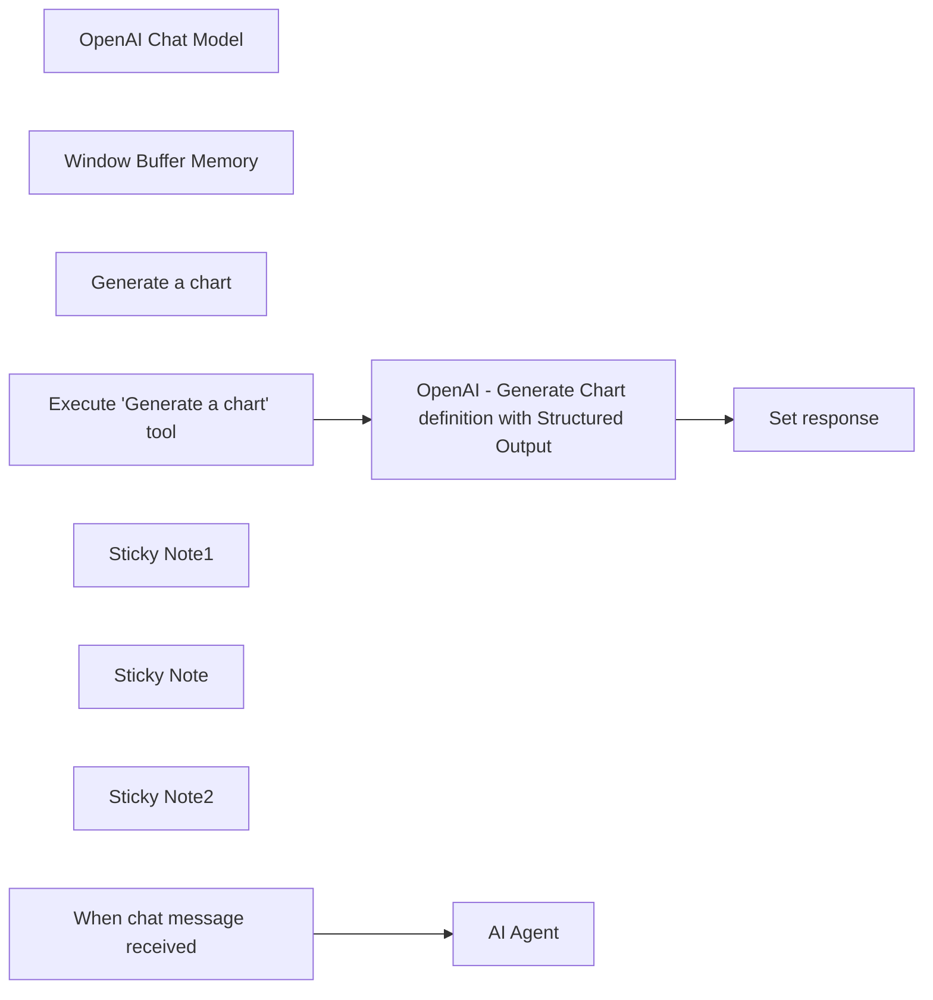

## Fluxo (.json) :

```json
{
  "id": "6yNJxDjV9rSiOkj9",
  "meta": {
    "instanceId": "f4f5d195bb2162a0972f737368404b18be694648d365d6c6771d7b4909d28167",
    "templateCredsSetupCompleted": true
  },
  "name": "AI Agent with charts capabilities using OpenAI Structured Output",
  "tags": [
    {
      "id": "9tRfTc35T5pruw03",
      "name": "experiment",
      "createdAt": "2024-03-18T15:32:10.504Z",
      "updatedAt": "2024-03-18T15:32:10.504Z"
    }
  ],
  "nodes": [
    {
      "id": "4b7c314a-d7c5-46cb-af6f-b3ff02a182b7",
      "name": "OpenAI Chat Model",
      "type": "@n8n/n8n-nodes-langchain.lmChatOpenAi",
      "position": [
        980,
        600
      ],
      "parameters": {
        "model": "gpt-4o-mini-2024-07-18",
        "options": {}
      },
      "credentials": {
        "openAiApi": {
          "id": "WqzqjezKh8VtxdqA",
          "name": "OpenAi account - Baptiste"
        }
      },
      "typeVersion": 1
    },
    {
      "id": "cf4ffa49-8830-4db2-9a7d-b8931e806947",
      "name": "Window Buffer Memory",
      "type": "@n8n/n8n-nodes-langchain.memoryBufferWindow",
      "position": [
        1120,
        600
      ],
      "parameters": {},
      "typeVersion": 1.2
    },
    {
      "id": "22d36226-ca37-4ccc-a2d6-826b78c2f1f3",
      "name": "Generate a chart",
      "type": "@n8n/n8n-nodes-langchain.toolWorkflow",
      "position": [
        1260,
        600
      ],
      "parameters": {
        "name": "generate_a_chart",
        "schemaType": "manual",
        "workflowId": "={{ $workflow.id }}",
        "description": "Call this tool whenever you need to generate a chart.",
        "inputSchema": "{\n\"type\": \"object\",\n\"properties\": {\n\t\"query\": {\n\t\t\"type\": \"string\",\n\t\t\"description\": \"a query describing the chart to generate\"\n\t\t}\n\t}\n}",
        "specifyInputSchema": true
      },
      "typeVersion": 1.1
    },
    {
      "id": "d9ea85d7-3a56-4a95-88c8-60e5c95014e7",
      "name": "Execute \"Generate a chart\" tool",
      "type": "n8n-nodes-base.executeWorkflowTrigger",
      "position": [
        580,
        1100
      ],
      "parameters": {},
      "typeVersion": 1
    },
    {
      "id": "68d538f7-acce-447f-9ab1-6975639e05f7",
      "name": "OpenAI - Generate Chart definition with Structured Output",
      "type": "n8n-nodes-base.httpRequest",
      "position": [
        880,
        1100
      ],
      "parameters": {
        "url": "https://api.openai.com/v1/chat/completions",
        "method": "POST",
        "options": {},
        "jsonBody": "={\n    \"model\": \"gpt-4o-2024-08-06\",\n    \"messages\": [\n        {\n            \"role\": \"system\",\n            \"content\": \"Based on the user request, generate a valid Chart.js definition. Important: - Be careful with the data scale and beginatzero that all data are visible. Example if ploted data 2 and 3 on a bar chart, the baseline should be 0. - Charts colors should be different only if there are multiple datasets. - Output valid JSON. In scales, min and max are numbers. Example: `{scales:{yAxes:[{ticks:{min:0,max:3}`\"\n        },\n        {\n            \"role\": \"user\",\n            \"content\": \"{{ $json.query.query }}\"\n        }\n    ],\n    \"response_format\": {\n  \"type\": \"json_schema\",\n  \"json_schema\": {\n    \"name\": \"chart_configuration\",\n    \"description\": \"Configuration schema for Chart.js charts\",\n    \"strict\": true,\n    \"schema\": {\n  \"type\": \"object\",\n  \"properties\": {\n    \"type\": {\n      \"type\": \"string\",\n      \"enum\": [\"bar\", \"line\", \"radar\", \"pie\", \"doughnut\", \"polarArea\", \"bubble\", \"scatter\", \"area\"]\n    },\n    \"data\": {\n      \"type\": \"object\",\n      \"properties\": {\n        \"labels\": {\n          \"type\": \"array\",\n          \"items\": {\n            \"type\": \"string\"\n          }\n        },\n        \"datasets\": {\n          \"type\": \"array\",\n          \"items\": {\n            \"type\": \"object\",\n            \"properties\": {\n              \"label\": {\n                \"type\": [\"string\", \"null\"]\n              },\n              \"data\": {\n                \"type\": \"array\",\n                \"items\": {\n                  \"type\": \"number\"\n                }\n              },\n              \"backgroundColor\": {\n                \"type\": [\"array\", \"null\"],\n                \"items\": {\n                  \"type\": \"string\"\n                }\n              },\n              \"borderColor\": {\n                \"type\": [\"array\", \"null\"],\n                \"items\": {\n                  \"type\": \"string\"\n                }\n              },\n              \"borderWidth\": {\n                \"type\": [\"number\", \"null\"]\n              }\n            },\n            \"required\": [\"data\", \"label\", \"backgroundColor\", \"borderColor\", \"borderWidth\"],\n            \"additionalProperties\": false\n          }\n        }\n      },\n      \"required\": [\"labels\", \"datasets\"],\n      \"additionalProperties\": false\n    },\n    \"options\": {\n      \"type\": \"object\",\n      \"properties\": {\n        \"scales\": {\n          \"type\": [\"object\", \"null\"],\n          \"properties\": {\n            \"yAxes\": {\n              \"type\": \"array\",\n              \"items\": {\n                \"type\": [\"object\", \"null\"],\n                \"properties\": {\n                  \"ticks\": {\n                    \"type\": [\"object\", \"null\"],\n                    \"properties\": {\n                      \"max\": {\n                        \"type\": [\"number\", \"null\"]\n                      },\n                      \"min\": {\n                        \"type\": [\"number\", \"null\"]\n                      },\n                      \"stepSize\": {\n                        \"type\": [\"number\", \"null\"]\n                      },\n                      \"beginAtZero\": {\n                        \"type\": [\"boolean\", \"null\"]\n                      }\n                    },\n                    \"required\": [\"max\", \"min\", \"stepSize\", \"beginAtZero\"],\n                    \"additionalProperties\": false\n                  },\n                  \"stacked\": {\n                    \"type\": [\"boolean\", \"null\"]\n                  }\n                },\n                \"required\": [\"ticks\", \"stacked\"],\n                \"additionalProperties\": false\n              }},\n              \"xAxes\": {\n                \"type\": [\"object\", \"null\"],\n                \"properties\": {\n                  \"stacked\": {\n                    \"type\": [\"boolean\", \"null\"]\n                  }\n                },\n                \"required\": [\"stacked\"],\n                \"additionalProperties\": false\n              }\n          },\n          \"required\": [\"yAxes\", \"xAxes\"],\n          \"additionalProperties\": false\n        },\n        \"plugins\": {\n          \"type\": [\"object\", \"null\"],\n          \"properties\": {\n            \"title\": {\n              \"type\": [\"object\", \"null\"],\n              \"properties\": {\n                \"display\": {\n                  \"type\": [\"boolean\", \"null\"]\n                },\n                \"text\": {\n                  \"type\": [\"string\", \"null\"]\n                }\n              },\n              \"required\": [\"display\", \"text\"],\n              \"additionalProperties\": false\n            },\n            \"legend\": {\n              \"type\": [\"object\", \"null\"],\n              \"properties\": {\n                \"display\": {\n                  \"type\": [\"boolean\", \"null\"]\n                },\n                \"position\": {\n                  \"type\": [\"string\", \"null\"],\n                  \"enum\": [\"top\", \"left\", \"bottom\", \"right\", null]\n                }\n              },\n              \"required\": [\"display\", \"position\"],\n              \"additionalProperties\": false\n            }\n          },\n          \"required\": [\"title\", \"legend\"],\n          \"additionalProperties\": false\n        }\n      },\n      \"required\": [\"scales\", \"plugins\"],\n      \"additionalProperties\": false\n    }\n  },\n  \"required\": [\"type\", \"data\", \"options\"],\n  \"additionalProperties\": false\n}\n}\n}\n}",
        "sendBody": true,
        "sendHeaders": true,
        "specifyBody": "json",
        "authentication": "predefinedCredentialType",
        "headerParameters": {
          "parameters": [
            {
              "name": "=Content-Type",
              "value": "application/json"
            }
          ]
        },
        "nodeCredentialType": "openAiApi"
      },
      "credentials": {
        "openAiApi": {
          "id": "WqzqjezKh8VtxdqA",
          "name": "OpenAi account - Baptiste"
        }
      },
      "typeVersion": 4.2
    },
    {
      "id": "0fd4ad08-ad85-4d0b-b75f-0e59f789cbfd",
      "name": "Set response",
      "type": "n8n-nodes-base.set",
      "position": [
        1120,
        1100
      ],
      "parameters": {
        "options": {},
        "assignments": {
          "assignments": [
            {
              "id": "37512e1a-8376-4ba0-bdcd-34bb9329ae4b",
              "name": "response",
              "type": "string",
              "value": "={{ encodeURIComponent(\"https://quickchart.io/chart?width=200&c=\"+$json.choices[0].message.content) }}\n\n"
            }
          ]
        }
      },
      "typeVersion": 3.4
    },
    {
      "id": "6785cadb-4875-47ac-9b57-29b583c53937",
      "name": "Sticky Note1",
      "type": "n8n-nodes-base.stickyNote",
      "position": [
        20,
        260
      ],
      "parameters": {
        "color": 7,
        "width": 680.7609104727082,
        "height": 619.3187860363884,
        "content": "## Workflow: AI Agent with charts capabilities using OpenAI Structured Output\n\n**Overview**\n- This workflow is a experiment to integrate charts into an AI Agent\n- The AI Agent has normal AI conversation and can invoke a tool to integrate a graph in the conversation.\n- It uses OpenAI Structured Output to generate a chart definition according to Quickchart specifications.\n\n\n**How it works**\n- Activate the workflow\n- Start chatting with the AI Agent.\n- When the AI Agent detects that the user needs a chat, it calls the tool\n- The tool calls the sub-workflow with a query.\n- The sub-workflow calls the HTTP Request node (calling OpenAI) to retrieve a chart definition\n- In the \"set response\" node, he chat definition is added at the end of a quickchart.io url - the URL to the chart image. It is sent back to the AI Agent.\n- The AI Agent uses this image in its response.\n- For example, you can ask the AI Agent to generate a chart about the top 5 movies at the box office\n\n\n**Notes**\n- The full Quickchart.io specifications have not been integrated, thus there are some possible glitches (e.g due to the size of the graph, radar graphs are not displayed properly)\n- This could be provided to any automation, not only AI Agents."
      },
      "typeVersion": 1
    },
    {
      "id": "fd507ff6-2d16-4498-ba2b-d91b02079311",
      "name": "Sticky Note",
      "type": "n8n-nodes-base.stickyNote",
      "position": [
        740,
        800
      ],
      "parameters": {
        "color": 7,
        "width": 768.8586342909368,
        "height": 503,
        "content": "## Generate a Quickchart definition\n\n**HTTP Request node**\n- Send the chart query to OpenAI, with a defined JSON response format - *using HTTP Request node as it has not yet been implemented in the OpenAI nodes*\n- The JSON structure is based on ChartJS and Quickchart.io definitions, that let us create nice looking graphs.\n- The output is a JSON containing the chart definition that is passed to the next node.\n\n**Set Response node**\n- Adds the chart definition at the end of a Quickchart.io URL ([see documentation](https://quickchart.io/documentation/usage/parameters/))\n- Note that in the parameters, we specify the width to 250 in order to be properly displayed in the chart interface."
      },
      "typeVersion": 1
    },
    {
      "id": "7f14532a-75ee-40f8-a45b-0f037af7cb05",
      "name": "Sticky Note2",
      "type": "n8n-nodes-base.stickyNote",
      "position": [
        740,
        260
      ],
      "parameters": {
        "color": 7,
        "width": 768,
        "height": 485.8165429718969,
        "content": "### Chat Agent\n- This is agent is mostly here to demonstrate how to use the sub workflow.\n- This is a basic agent with a tool \"generate a chart\"\n- The tool calls the sub-workflow\n- The sub-workflow responds with the Quickchart URL that is displayed in the conversation"
      },
      "typeVersion": 1
    },
    {
      "id": "7793a567-c4d4-4745-83c9-adf5397755e9",
      "name": "AI Agent",
      "type": "@n8n/n8n-nodes-langchain.agent",
      "position": [
        1020,
        400
      ],
      "parameters": {
        "options": {
          "systemMessage": "You're a general purpose ai. Using markdown, you can display images in the conversation. Don't change the width of the chart"
        }
      },
      "typeVersion": 1.6
    },
    {
      "id": "71bd2cb5-7b20-4d83-adba-c1fd57511155",
      "name": "When chat message received",
      "type": "@n8n/n8n-nodes-langchain.chatTrigger",
      "position": [
        840,
        400
      ],
      "webhookId": "1281cd48-08a0-431d-9bf5-9bb60e6b7a77",
      "parameters": {
        "options": {}
      },
      "typeVersion": 1.1
    }
  ],
  "active": false,
  "pinData": {},
  "settings": {
    "executionOrder": "v1"
  },
  "versionId": "3af7cf64-60dc-4ba6-9ac6-f7ed2453812c",
  "connections": {
    "Generate a chart": {
      "ai_tool": [
        [
          {
            "node": "AI Agent",
            "type": "ai_tool",
            "index": 0
          }
        ]
      ]
    },
    "OpenAI Chat Model": {
      "ai_languageModel": [
        [
          {
            "node": "AI Agent",
            "type": "ai_languageModel",
            "index": 0
          }
        ]
      ]
    },
    "Window Buffer Memory": {
      "ai_memory": [
        [
          {
            "node": "AI Agent",
            "type": "ai_memory",
            "index": 0
          }
        ]
      ]
    },
    "When chat message received": {
      "main": [
        [
          {
            "node": "AI Agent",
            "type": "main",
            "index": 0
          }
        ]
      ]
    },
    "Execute \"Generate a chart\" tool": {
      "main": [
        [
          {
            "node": "OpenAI - Generate Chart definition with Structured Output",
            "type": "main",
            "index": 0
          }
        ]
      ]
    },
    "OpenAI - Generate Chart definition with Structured Output": {
      "main": [
        [
          {
            "node": "Set response",
            "type": "main",
            "index": 0
          }
        ]
      ]
    }
  }
}
```

<a id="template-566"></a>

## Template 566 - Extrair e resumir resultados do Bing Copilot

- **Nome:** Extrair e resumir resultados do Bing Copilot
- **Descrição:** Fluxo que dispara um trabalho de raspagem sobre o Bing Copilot, aguarda e baixa o snapshot de resultados, extrai e estrutura o conteúdo com um modelo de linguagem e envia um resumo e os dados estruturados para um webhook.
- **Funcionalidade:** • Disparo de coleta: Envia uma requisição para iniciar a raspagem do conteúdo alvo com um prompt específico (ex.: "Top hotels in New York").
• Armazenamento do identificador do snapshot: Captura e salva o snapshot_id retornado pela API para acompanhamento.
• Verificação de progresso e espera: Consulta periodicamente o status do snapshot e espera quando necessário até que esteja pronto.
• Download do snapshot: Baixa o snapshot em formato JSON quando o processo estiver concluído.
• Validação de erros: Verifica se o snapshot contém erros antes de prosseguir com o processamento.
• Extração e formatação estruturada: Usa um modelo de linguagem para transformar o conteúdo bruto em JSON estruturado seguindo um esquema definido.
• Quebra e carregamento de documentos: Divide textos longos em trechos e carrega como documentos para sumarização quando aplicável.
• Geração de resumo conciso: Cria um resumo resumido e direto do conteúdo extraído.
• Notificação via webhook: Envia tanto os dados estruturados quanto o resumo para um endpoint externo para consumo ou monitoramento.
- **Ferramentas:** • Bright Data: Plataforma de raspagem/coleção usada para disparar o trabalho, acompanhar o progresso e baixar snapshots dos resultados.
• Microsoft Bing Copilot: Fonte dos conteúdos rastreados (página alvo para extração das conversas/resultados).
• Google Gemini (PaLM API): Modelo de linguagem usado para extrair, formatar e resumir o conteúdo em JSON e em texto conciso.
• webhook.site: Endpoint público utilizado para receber notificações com o JSON estruturado e o resumo gerado.


## Fluxo visual

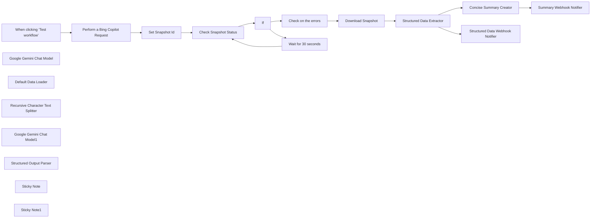

## Fluxo (.json) :

```json
{
  "id": "AnbedV2Ntx97sfed",
  "meta": {
    "instanceId": "885b4fb4a6a9c2cb5621429a7b972df0d05bb724c20ac7dac7171b62f1c7ef40",
    "templateCredsSetupCompleted": true
  },
  "name": "Extract & Summarize Bing Copilot Search Results with Gemini AI and Bright Data",
  "tags": [
    {
      "id": "Kujft2FOjmOVQAmJ",
      "name": "Engineering",
      "createdAt": "2025-04-09T01:31:00.558Z",
      "updatedAt": "2025-04-09T01:31:00.558Z"
    },
    {
      "id": "ddPkw7Hg5dZhQu2w",
      "name": "AI",
      "createdAt": "2025-04-13T05:38:08.053Z",
      "updatedAt": "2025-04-13T05:38:08.053Z"
    }
  ],
  "nodes": [
    {
      "id": "5f358132-63bd-4c66-80da-4fb9911f607f",
      "name": "When clicking ‘Test workflow’",
      "type": "n8n-nodes-base.manualTrigger",
      "position": [
        -1140,
        400
      ],
      "parameters": {},
      "typeVersion": 1
    },
    {
      "id": "43a157f6-2fb8-4c90-bf5d-92fc64c9df10",
      "name": "Google Gemini Chat Model",
      "type": "@n8n/n8n-nodes-langchain.lmChatGoogleGemini",
      "notes": "Gemini Experimental Model",
      "position": [
        760,
        580
      ],
      "parameters": {
        "options": {},
        "modelName": "models/gemini-2.0-flash-thinking-exp-01-21"
      },
      "credentials": {
        "googlePalmApi": {
          "id": "YeO7dHZnuGBVQKVZ",
          "name": "Google Gemini(PaLM) Api account"
        }
      },
      "notesInFlow": true,
      "typeVersion": 1
    },
    {
      "id": "f2d34617-ea34-4163-b9d5-a35fed807dbb",
      "name": "Default Data Loader",
      "type": "@n8n/n8n-nodes-langchain.documentDefaultDataLoader",
      "position": [
        940,
        580
      ],
      "parameters": {
        "options": {}
      },
      "typeVersion": 1
    },
    {
      "id": "707fdb4a-f534-4984-b97d-1839db1afc03",
      "name": "Recursive Character Text Splitter",
      "type": "@n8n/n8n-nodes-langchain.textSplitterRecursiveCharacterTextSplitter",
      "position": [
        1040,
        800
      ],
      "parameters": {
        "options": {},
        "chunkOverlap": 100
      },
      "typeVersion": 1
    },
    {
      "id": "0440b1dd-ca72-467c-a27a-76609ae08fcf",
      "name": "If",
      "type": "n8n-nodes-base.if",
      "position": [
        -220,
        400
      ],
      "parameters": {
        "options": {},
        "conditions": {
          "options": {
            "version": 2,
            "leftValue": "",
            "caseSensitive": true,
            "typeValidation": "strict"
          },
          "combinator": "and",
          "conditions": [
            {
              "id": "6a7e5360-4cb5-4806-892e-5c85037fa71c",
              "operator": {
                "type": "string",
                "operation": "equals"
              },
              "leftValue": "={{ $('Check Snapshot Status').item.json.status }}",
              "rightValue": "ready"
            }
          ]
        }
      },
      "typeVersion": 2.2
    },
    {
      "id": "a23f3c86-200a-4d3c-a762-51cce158c4dd",
      "name": "Set Snapshot Id",
      "type": "n8n-nodes-base.set",
      "position": [
        -700,
        400
      ],
      "parameters": {
        "options": {},
        "assignments": {
          "assignments": [
            {
              "id": "2c3369c6-9206-45d7-9349-f577baeaf189",
              "name": "snapshot_id",
              "type": "string",
              "value": "={{ $json.snapshot_id }}"
            }
          ]
        }
      },
      "typeVersion": 3.4
    },
    {
      "id": "cee238ff-f725-4a24-8117-540be1c66a56",
      "name": "Download Snapshot",
      "type": "n8n-nodes-base.httpRequest",
      "position": [
        140,
        200
      ],
      "parameters": {
        "url": "=https://api.brightdata.com/datasets/v3/snapshot/{{ $json.snapshot_id }}",
        "options": {
          "timeout": 10000
        },
        "sendQuery": true,
        "authentication": "genericCredentialType",
        "genericAuthType": "httpHeaderAuth",
        "queryParameters": {
          "parameters": [
            {
              "name": "format",
              "value": "json"
            }
          ]
        }
      },
      "credentials": {
        "httpHeaderAuth": {
          "id": "kdbqXuxIR8qIxF7y",
          "name": "Header Auth account"
        }
      },
      "typeVersion": 4.2
    },
    {
      "id": "6bb33d11-7176-4dc7-89fe-1ee794793d3e",
      "name": "Google Gemini Chat Model1",
      "type": "@n8n/n8n-nodes-langchain.lmChatGoogleGemini",
      "position": [
        380,
        380
      ],
      "parameters": {
        "options": {},
        "modelName": "models/gemini-2.0-flash-exp"
      },
      "credentials": {
        "googlePalmApi": {
          "id": "YeO7dHZnuGBVQKVZ",
          "name": "Google Gemini(PaLM) Api account"
        }
      },
      "typeVersion": 1
    },
    {
      "id": "b2309938-eaaf-4d63-b8c8-53666cd57dac",
      "name": "Structured Output Parser",
      "type": "@n8n/n8n-nodes-langchain.outputParserStructured",
      "position": [
        540,
        380
      ],
      "parameters": {
        "jsonSchemaExample": "[{\n  \"city\": \"string\",\n  \"hotels\": [\n    {\n      \"name\": \"string\",\n      \"address\": \"string\",\n      \"description\": \"string\",\n      \"website\": \"string\",\n      \"area\": \"string (optional)\"\n    }\n  ]\n}\n]\n"
      },
      "typeVersion": 1.2
    },
    {
      "id": "747b1e50-1cae-4efb-86d3-9221438701cd",
      "name": "Check on the errors",
      "type": "n8n-nodes-base.if",
      "position": [
        -20,
        20
      ],
      "parameters": {
        "options": {},
        "conditions": {
          "options": {
            "version": 2,
            "leftValue": "",
            "caseSensitive": true,
            "typeValidation": "strict"
          },
          "combinator": "and",
          "conditions": [
            {
              "id": "b267071c-7102-407b-a98d-f613bcb1a106",
              "operator": {
                "type": "string",
                "operation": "equals"
              },
              "leftValue": "={{ $json.errors.toString() }}",
              "rightValue": "0"
            }
          ]
        }
      },
      "typeVersion": 2.2
    },
    {
      "id": "0bf63795-1f1d-4d6b-90c1-1effae83fd40",
      "name": "Sticky Note",
      "type": "n8n-nodes-base.stickyNote",
      "position": [
        -1140,
        80
      ],
      "parameters": {
        "width": 400,
        "height": 220,
        "content": "## Note\n\nDeals with the Bing Copilot Search using the Bright Data Web Scraper API.\n\nThe Basic LLM Chain and summarization is done to demonstrate the usage of the N8N AI capabilities.\n\n**Please make sure to update the Webhook Notification URL**"
      },
      "typeVersion": 1
    },
    {
      "id": "3872fb7a-382a-446d-8cb0-6ac5a282a801",
      "name": "Sticky Note1",
      "type": "n8n-nodes-base.stickyNote",
      "position": [
        -620,
        80
      ],
      "parameters": {
        "width": 420,
        "height": 220,
        "content": "## LLM Usages\n\nGoogle Gemini Flash Exp model is being used.\n\nBasic LLM Chain makes use of the Output formatter for formatting the response\n\nSummarization Chain is being used for summarization of the content"
      },
      "typeVersion": 1
    },
    {
      "id": "a1453c72-fef3-4cec-967a-858b28ba31d8",
      "name": "Check Snapshot Status",
      "type": "n8n-nodes-base.httpRequest",
      "position": [
        -460,
        400
      ],
      "parameters": {
        "url": "=https://api.brightdata.com/datasets/v3/progress/{{ $json.snapshot_id }}",
        "options": {},
        "sendHeaders": true,
        "authentication": "genericCredentialType",
        "genericAuthType": "httpHeaderAuth"
      },
      "credentials": {
        "httpHeaderAuth": {
          "id": "kdbqXuxIR8qIxF7y",
          "name": "Header Auth account"
        }
      },
      "typeVersion": 4.2
    },
    {
      "id": "5750853b-a07d-455e-b630-977dd733613e",
      "name": "Structured Data Extractor",
      "type": "@n8n/n8n-nodes-langchain.chainLlm",
      "position": [
        360,
        200
      ],
      "parameters": {
        "text": "=Extract the content as a structured JSON.\n\nHere's the content - {{ $json.answer_text }}",
        "messages": {
          "messageValues": [
            {
              "message": "You are an expert data formatter"
            }
          ]
        },
        "promptType": "define",
        "hasOutputParser": true
      },
      "typeVersion": 1.6
    },
    {
      "id": "a86f935f-fe57-40ea-9197-5f20e3002899",
      "name": "Concise Summary Creator",
      "type": "@n8n/n8n-nodes-langchain.chainSummarization",
      "position": [
        760,
        200
      ],
      "parameters": {
        "options": {
          "summarizationMethodAndPrompts": {
            "values": {
              "prompt": "=Write a concise summary of the following:\n\n\n{{ $('Download Snapshot').item.json.answer_text }}\n\n",
              "combineMapPrompt": "=Write a concise summary of the following:\n\n\n\n\n\nCONCISE SUMMARY: {{ $('Download Snapshot').item.json.answer_text }}"
            }
          }
        },
        "operationMode": "documentLoader"
      },
      "typeVersion": 2
    },
    {
      "id": "848ce4b1-0aed-4af2-bf55-bcdb30bbc88a",
      "name": "Wait for 30 seconds",
      "type": "n8n-nodes-base.wait",
      "position": [
        -280,
        660
      ],
      "webhookId": "f2aafd71-61f2-4aa4-8290-fa3bbe3d46b9",
      "parameters": {
        "amount": 30
      },
      "typeVersion": 1.1
    },
    {
      "id": "5467a870-0734-457b-909e-be425a432ebf",
      "name": "Structured Data Webhook Notifier",
      "type": "n8n-nodes-base.httpRequest",
      "position": [
        760,
        0
      ],
      "parameters": {
        "url": "https://webhook.site/bc804ce5-4a45-4177-a68a-99c80e5c86e6",
        "options": {},
        "sendBody": true,
        "bodyParameters": {
          "parameters": [
            {
              "name": "response",
              "value": "={{ $json.output }}"
            }
          ]
        }
      },
      "typeVersion": 4.2
    },
    {
      "id": "bf8a4868-ead7-411e-97ba-9faea308d836",
      "name": "Summary Webhook Notifier",
      "type": "n8n-nodes-base.httpRequest",
      "position": [
        1140,
        200
      ],
      "parameters": {
        "url": "https://webhook.site/bc804ce5-4a45-4177-a68a-99c80e5c86e6",
        "options": {},
        "sendBody": true,
        "bodyParameters": {
          "parameters": [
            {
              "name": "response",
              "value": "={{ $json.output }}"
            }
          ]
        }
      },
      "typeVersion": 4.2
    },
    {
      "id": "60a59b93-9a7c-4d22-ab66-2249fb9ed27e",
      "name": "Perform a Bing Copilot Request",
      "type": "n8n-nodes-base.httpRequest",
      "position": [
        -920,
        400
      ],
      "parameters": {
        "url": "https://api.brightdata.com/datasets/v3/trigger",
        "method": "POST",
        "options": {},
        "jsonBody": "[\n  {\n    \"url\": \"https://copilot.microsoft.com/chats\",\n    \"prompt\": \"Top hotels in New York\"\n  }\n]",
        "sendBody": true,
        "sendQuery": true,
        "sendHeaders": true,
        "specifyBody": "json",
        "authentication": "genericCredentialType",
        "genericAuthType": "httpHeaderAuth",
        "queryParameters": {
          "parameters": [
            {
              "name": "dataset_id",
              "value": "gd_m7di5jy6s9geokz8w"
            },
            {
              "name": "include_errors",
              "value": "true"
            }
          ]
        },
        "headerParameters": {
          "parameters": [
            {}
          ]
        }
      },
      "credentials": {
        "httpHeaderAuth": {
          "id": "kdbqXuxIR8qIxF7y",
          "name": "Header Auth account"
        }
      },
      "typeVersion": 4.2
    }
  ],
  "active": false,
  "pinData": {},
  "settings": {
    "executionOrder": "v1"
  },
  "versionId": "4462ae6e-4ecd-4f64-aad8-4aa9e65982b6",
  "connections": {
    "If": {
      "main": [
        [
          {
            "node": "Check on the errors",
            "type": "main",
            "index": 0
          }
        ],
        [
          {
            "node": "Wait for 30 seconds",
            "type": "main",
            "index": 0
          }
        ]
      ]
    },
    "Set Snapshot Id": {
      "main": [
        [
          {
            "node": "Check Snapshot Status",
            "type": "main",
            "index": 0
          }
        ]
      ]
    },
    "Download Snapshot": {
      "main": [
        [
          {
            "node": "Structured Data Extractor",
            "type": "main",
            "index": 0
          }
        ]
      ]
    },
    "Check on the errors": {
      "main": [
        [
          {
            "node": "Download Snapshot",
            "type": "main",
            "index": 0
          }
        ]
      ]
    },
    "Default Data Loader": {
      "ai_document": [
        [
          {
            "node": "Concise Summary Creator",
            "type": "ai_document",
            "index": 0
          }
        ]
      ]
    },
    "Wait for 30 seconds": {
      "main": [
        [
          {
            "node": "Check Snapshot Status",
            "type": "main",
            "index": 0
          }
        ]
      ]
    },
    "Check Snapshot Status": {
      "main": [
        [
          {
            "node": "If",
            "type": "main",
            "index": 0
          }
        ]
      ]
    },
    "Concise Summary Creator": {
      "main": [
        [
          {
            "node": "Summary Webhook Notifier",
            "type": "main",
            "index": 0
          }
        ]
      ]
    },
    "Google Gemini Chat Model": {
      "ai_languageModel": [
        [
          {
            "node": "Concise Summary Creator",
            "type": "ai_languageModel",
            "index": 0
          }
        ]
      ]
    },
    "Structured Output Parser": {
      "ai_outputParser": [
        [
          {
            "node": "Structured Data Extractor",
            "type": "ai_outputParser",
            "index": 0
          }
        ]
      ]
    },
    "Google Gemini Chat Model1": {
      "ai_languageModel": [
        [
          {
            "node": "Structured Data Extractor",
            "type": "ai_languageModel",
            "index": 0
          }
        ]
      ]
    },
    "Structured Data Extractor": {
      "main": [
        [
          {
            "node": "Concise Summary Creator",
            "type": "main",
            "index": 0
          },
          {
            "node": "Structured Data Webhook Notifier",
            "type": "main",
            "index": 0
          }
        ]
      ]
    },
    "Perform a Bing Copilot Request": {
      "main": [
        [
          {
            "node": "Set Snapshot Id",
            "type": "main",
            "index": 0
          }
        ]
      ]
    },
    "Recursive Character Text Splitter": {
      "ai_textSplitter": [
        [
          {
            "node": "Default Data Loader",
            "type": "ai_textSplitter",
            "index": 0
          }
        ]
      ]
    },
    "When clicking ‘Test workflow’": {
      "main": [
        [
          {
            "node": "Perform a Bing Copilot Request",
            "type": "main",
            "index": 0
          }
        ]
      ]
    }
  }
}
```

<a id="template-567"></a>

## Template 567 - Converter notícias da BBC em podcast

- **Nome:** Converter notícias da BBC em podcast
- **Descrição:** Busca artigos na página principal da BBC, seleciona os mais adequados, gera um roteiro de podcast usando um modelo de linguagem e converte o roteiro em áudio.
- **Funcionalidade:** • Captura da página principal da BBC: Faz requisição à página inicial para obter links e blocos de notícias.
• Extração de blocos de notícia: Identifica e separa blocos de notícia (títulos, links e descrições) do HTML extraído.
• Limitação de itens: Restringe o processamento aos primeiros 10 itens para controle de volume.
• Classificação de adequação: Usa um modelo de linguagem para avaliar se a manchete/descrição é adequada para narrativa em podcast.
• Recuperação de conteúdo detalhado: Acessa as páginas de detalhe das notícias classificadas como adequadas para obter o conteúdo completo.
• Extração e filtragem de conteúdo: Extrai o texto detalhado das matérias e descarta itens sem conteúdo útil.
• Agregação de artigos: Junta os artigos válidos em um único conjunto para processamento posterior.
• Geração de roteiro de podcast por LLM: Constrói um roteiro em estilo conversacional, formatado como um único bloco de texto e retornado em JSON.
• Verificação e parse do output: Valida e interpreta o JSON de saída contendo o roteiro.
• Conversão em áudio TTS: Se o roteiro existir, envia o texto para um serviço de texto-para-fala para gerar o arquivo de áudio.
- **Ferramentas:** • BBC (site): Fonte das manchetes e artigos de notícias utilizados como conteúdo.
• Google Gemini (PaLM): Modelo de linguagem usado para classificar manchetes e para gerar o roteiro do podcast.
• Hugging Face (serviço de TTS): Serviço de síntese de voz utilizado para converter o roteiro do podcast em áudio (modelo de inferência especificado).
• ElevenLabs (formatação alvo mencionada): Referência de formato de roteiro compatível para síntese de voz (o fluxo prepara o texto para uso direto com serviços de TTS como este).


## Fluxo visual

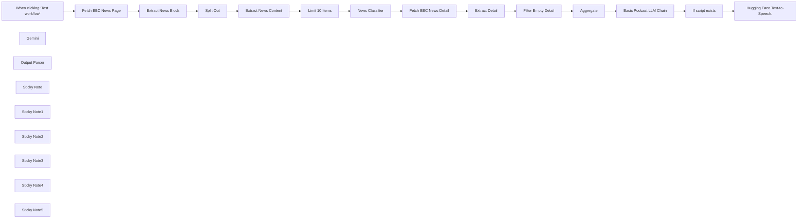

## Fluxo (.json) :

```json
{
  "meta": {
    "instanceId": "5287ddd2fa569cf8e4c5a724666246a45305c032a19bb677c9e4b963d365f84b",
    "templateCredsSetupCompleted": true
  },
  "nodes": [
    {
      "id": "95c798a4-bc34-4219-b7c3-6b4a4070886b",
      "name": "When clicking ‘Test workflow’",
      "type": "n8n-nodes-base.manualTrigger",
      "position": [
        -320,
        1080
      ],
      "parameters": {},
      "typeVersion": 1
    },
    {
      "id": "09987590-1ec2-48d4-aa04-32b85addd9e6",
      "name": "Split Out",
      "type": "n8n-nodes-base.splitOut",
      "position": [
        420,
        1080
      ],
      "parameters": {
        "options": {},
        "fieldToSplitOut": "newsTitle"
      },
      "typeVersion": 1
    },
    {
      "id": "758e3f60-01dc-46c7-bb53-7460eaed92e3",
      "name": "Extract News Block",
      "type": "n8n-nodes-base.html",
      "position": [
        220,
        1080
      ],
      "parameters": {
        "options": {},
        "operation": "extractHtmlContent",
        "extractionValues": {
          "values": [
            {
              "key": "newsTitle",
              "cssSelector": ".eGcloy",
              "returnArray": true,
              "returnValue": "html"
            }
          ]
        }
      },
      "typeVersion": 1.2
    },
    {
      "id": "20440f9a-a40c-4419-af6d-383de041d078",
      "name": "Extract News Content",
      "type": "n8n-nodes-base.html",
      "position": [
        600,
        1080
      ],
      "parameters": {
        "options": {},
        "operation": "extractHtmlContent",
        "dataPropertyName": "newsTitle",
        "extractionValues": {
          "values": [
            {
              "key": "title",
              "cssSelector": "h2"
            },
            {
              "key": "link",
              "attribute": "href",
              "cssSelector": "a",
              "returnValue": "attribute"
            },
            {
              "key": "description",
              "cssSelector": ".kYtujW"
            }
          ]
        }
      },
      "typeVersion": 1.2
    },
    {
      "id": "47a50ada-127a-4037-8fe7-41c0caebb3de",
      "name": "Aggregate",
      "type": "n8n-nodes-base.aggregate",
      "position": [
        2000,
        1060
      ],
      "parameters": {
        "options": {},
        "aggregate": "aggregateAllItemData"
      },
      "typeVersion": 1
    },
    {
      "id": "33050a43-842d-464d-b227-a6c2c870c0af",
      "name": "Fetch BBC News Detail",
      "type": "n8n-nodes-base.httpRequest",
      "position": [
        1400,
        1060
      ],
      "parameters": {
        "url": "=https://www.bbc.com{{ $json.link }}",
        "options": {}
      },
      "typeVersion": 4.2
    },
    {
      "id": "646bfe6b-cac6-4177-9b59-dc205b44b7eb",
      "name": "Extract Detail",
      "type": "n8n-nodes-base.html",
      "position": [
        1600,
        1060
      ],
      "parameters": {
        "options": {},
        "operation": "extractHtmlContent",
        "extractionValues": {
          "values": [
            {
              "key": "newsDetail",
              "cssSelector": ".dlWCEZ .fYAfXe",
              "returnArray": true
            }
          ]
        }
      },
      "typeVersion": 1.2
    },
    {
      "id": "6e14f528-1e94-411f-8601-3c713d492aa9",
      "name": "Filter Empty Detail",
      "type": "n8n-nodes-base.filter",
      "position": [
        1800,
        1060
      ],
      "parameters": {
        "options": {},
        "conditions": {
          "options": {
            "version": 2,
            "leftValue": "",
            "caseSensitive": true,
            "typeValidation": "strict"
          },
          "combinator": "and",
          "conditions": [
            {
              "id": "7066e88c-03da-4196-b1c5-80bc16fa3fc6",
              "operator": {
                "type": "array",
                "operation": "notEmpty",
                "singleValue": true
              },
              "leftValue": "={{ $json.newsDetail }}",
              "rightValue": ""
            }
          ]
        }
      },
      "typeVersion": 2.2
    },
    {
      "id": "5863e420-2392-468a-8e03-5d4c273168e0",
      "name": "If script exists",
      "type": "n8n-nodes-base.if",
      "position": [
        2620,
        1060
      ],
      "parameters": {
        "options": {},
        "conditions": {
          "options": {
            "version": 1,
            "leftValue": "",
            "caseSensitive": true,
            "typeValidation": "strict"
          },
          "combinator": "and",
          "conditions": [
            {
              "id": "2e968b41-88f7-4b28-9837-af50ae130979",
              "operator": {
                "type": "string",
                "operation": "exists",
                "singleValue": true
              },
              "leftValue": "=voice_id {{ $json.output.podcast_script }}",
              "rightValue": ""
            }
          ]
        }
      },
      "typeVersion": 2
    },
    {
      "id": "90b370d3-5712-401d-b769-490014e2b17c",
      "name": "Basic Podcast LLM Chain",
      "type": "@n8n/n8n-nodes-langchain.chainLlm",
      "position": [
        2200,
        1060
      ],
      "parameters": {
        "text": "=News Articles:{{ $json.data.map(item => item.newsDetail) }}",
        "messages": {
          "messageValues": [
            {
              "message": "= \n*Convert the following one or multiple news articles into a podcast script formatted for direct use in ElevenLabs. If there is only one news piece, transform it into a compelling and engaging narrative. If multiple news stories are provided, structure them like a news bulletin, presenting each piece sequentially with smooth transitions. Avoid a formal or dry tone; instead, use a natural, conversational, and warm style. The podcast should feel dynamic, engaging, and informative while maintaining a storytelling approach.*  \n\n- *Ensure the script is formatted as a single, continuous text block suitable for direct speech synthesis.*  \n- *Start with an engaging introduction that sets the tone for the podcast.*  \n- *Narrate each news story smoothly, with natural transitions between segments.*  \n- *End with a closing statement that leaves the listener informed and engaged.*  \n- *Output must be in JSON format, with the full script as a single string under the key `\"podcast_script\"`.*  \n\n---\n\n### **Input Format:**  \n```json\n{\n  \"news_articles\": [\n    {\n      \"title\": \"First News Title\",\n      \"content\": \"First news article content...\"\n    },\n    {\n      \"title\": \"Second News Title\",\n      \"content\": \"Second news article content...\"\n    }\n  ]\n}\n```\n\n---\n\nExpected JSON Output Format:\n \n{\n  \"podcast_script\": \"Welcome to today's news podcast! We have some exciting stories lined up for you. Let's start with our first story. [First news article content rewritten in a conversational, engaging style]... Moving on to our next topic... [Second news article content rewritten dynamically]... That’s all for today’s news bulletin! Stay informed and see you next time.\"\n}\n\n\n "
            }
          ]
        },
        "promptType": "define",
        "hasOutputParser": true
      },
      "typeVersion": 1.5
    },
    {
      "id": "24c212c2-6d06-4fe1-841b-bc52a21060b1",
      "name": "Gemini",
      "type": "@n8n/n8n-nodes-langchain.lmChatGoogleGemini",
      "position": [
        1600,
        1600
      ],
      "parameters": {
        "options": {},
        "modelName": "models/gemini-2.0-pro-exp-02-05"
      },
      "credentials": {
        "googlePalmApi": {
          "id": "5x46RlCURyTUmbGW",
          "name": "Google Gemini(PaLM) Api account 2"
        }
      },
      "typeVersion": 1
    },
    {
      "id": "02e9f1ee-dc80-403c-8c19-0e6f918cf8ed",
      "name": "Output Parser",
      "type": "@n8n/n8n-nodes-langchain.outputParserStructured",
      "position": [
        2360,
        1280
      ],
      "parameters": {
        "jsonSchemaExample": "{\n\t\"podcast_script\": \"California\"\n}"
      },
      "typeVersion": 1.2
    },
    {
      "id": "395ddac7-b2a4-48c5-b2d3-d21078d29c54",
      "name": "News Classifier",
      "type": "@n8n/n8n-nodes-langchain.textClassifier",
      "position": [
        980,
        1080
      ],
      "parameters": {
        "options": {},
        "inputText": "=I will only send the headline as input:\n{{ $json.title }} {{ $json.description }}",
        "categories": {
          "categories": [
            {
              "category": "Suitable",
              "description": "=Role: News Content Suitability Assessor (Positive)\n\nTask: Determine if the given news headline is highly likely to be suitable for storytelling, focusing on positive and engaging aspects.\n\nCriteria (Focus on what makes it suitable):\n\nCuriosity and Interest: Does the headline present an event, discovery, or information that is likely to pique the curiosity of a broad audience? Does it have a \"wow\" factor or relate to a significant trend?\n\nStorytelling Potential: Does the headline lend itself well to narrative expansion? Could it be the start of an engaging story, a key point in a developing situation, or a surprising conclusion?\n\nPositive or Neutral Tone: Is the headline generally positive, neutral, or focused on solutions/progress? (Avoid headlines that primarily focus on conflict, negativity, or routine events).\n\nRelevance: Does the headline touch upon topics that are relevant to a wide audience, such as health, science, technology, interesting discoveries, or positive global events?\n\nOutput Format:\n\nHeadline: [Original news headline]\n\nSuitable: [Yes / No] (Only say \"Yes\" if strongly confident)\n\nReason (Brief): [Briefly explain why it's likely suitable, focusing on the positive aspects.]\n\nExample (for the LLM to learn from):\n\nHeadline: \"Scientists Discover New Species of Butterfly in Amazon Rainforest\"\n\nSuitable: Yes\n\nReason: Discovery, biodiversity, positive natural event, intriguing.\n\nHeadline: \"Stock Market Experiences Minor Fluctuations\"\n\nSuitable: No\n\nReason: Routine economic event, lacks general interest."
            },
            {
              "category": "Not Suitable",
              "description": "=Role: News Content Filter (Negative)\n\nTask: Identify news headlines that are clearly unsuitable for storytelling due to negative content, lack of general interest, or ethical concerns.\n\nCriteria (Focus on what makes it unsuitable):\n\nNegative Content: Does the headline contain violence, crime, accidents, death, suffering, or other traumatic events?\n\nPolitical/Economic Routine: Does the headline focus on routine political announcements, standard economic reports (like minor market changes), or internal political disputes?\n\nDivisive or Harmful Content: Does the headline contain hate speech, discrimination, strong political bias, or potentially harmful misinformation?\n\nLack of General Interest: Is the headline highly niche, specific to a very small group, or about a topic unlikely to interest a broad audience?\n\nOutput Format:\n\nHeadline: [Original news headline]\n\nNot Suitable: [Yes / No] (Only say \"Yes\" if strongly confident)\n\nReason (Brief): [Briefly explain why it's clearly unsuitable.]\n\nExample (for the LLM to learn from):\n\nHeadline: \"Local Politician Announces Campaign Platform\"\n\nNot Suitable: Yes\n\nReason: Routine political event, lacks broad appeal.\n\nHeadline: \"Car Crash Results in Minor Injuries\"\n\nNot Suitable: Yes\n\nReason: Negative event (accident), though thankfully not severe."
            }
          ]
        }
      },
      "typeVersion": 1
    },
    {
      "id": "13fac9ed-688c-4af9-a810-d49a74b98c22",
      "name": "Fetch BBC News Page",
      "type": "n8n-nodes-base.httpRequest",
      "position": [
        -60,
        1080
      ],
      "parameters": {
        "url": "https://www.bbc.com/",
        "options": {},
        "responseFormat": "string"
      },
      "typeVersion": 1
    },
    {
      "id": "e2aa33f3-aa7c-4a9d-ac3c-32f9f5872606",
      "name": "Sticky Note",
      "type": "n8n-nodes-base.stickyNote",
      "position": [
        -120,
        920
      ],
      "parameters": {
        "width": 500,
        "height": 340,
        "content": "## This node fetches the main BBC News page, which contains links to various news articles."
      },
      "typeVersion": 1
    },
    {
      "id": "0821b944-44cb-41ed-b5ff-70f99018c5dc",
      "name": "Sticky Note1",
      "type": "n8n-nodes-base.stickyNote",
      "position": [
        960,
        840
      ],
      "parameters": {
        "color": 2,
        "width": 340,
        "height": 360,
        "content": "## This node uses a Gemini LLM to classify news articles based on their titles and descriptions. It determines if the content is suitable for a podcast.\n\n"
      },
      "typeVersion": 1
    },
    {
      "id": "d32b2ebb-0a4d-4d27-9262-894ab7a65cce",
      "name": "Sticky Note2",
      "type": "n8n-nodes-base.stickyNote",
      "position": [
        1360,
        820
      ],
      "parameters": {
        "color": 3,
        "width": 400,
        "height": 420,
        "content": "## This node fetches the detailed content of the news articles that were classified as suitable for a podcast."
      },
      "typeVersion": 1
    },
    {
      "id": "e6e1d180-b2c2-4b62-a611-7c039037ed69",
      "name": "Sticky Note3",
      "type": "n8n-nodes-base.stickyNote",
      "position": [
        2180,
        880
      ],
      "parameters": {
        "color": 4,
        "width": 340,
        "height": 320,
        "content": "## This node uses a Gemini LLM to convert the news articles into a podcast script.\n"
      },
      "typeVersion": 1
    },
    {
      "id": "d8776355-967d-4875-b948-25792f6f38ec",
      "name": "Sticky Note4",
      "type": "n8n-nodes-base.stickyNote",
      "position": [
        2840,
        920
      ],
      "parameters": {
        "color": 5,
        "width": 360,
        "height": 300,
        "content": "##  It structures the script for direct use with the Hugging Face text-to-speech model."
      },
      "typeVersion": 1
    },
    {
      "id": "631a2caf-c640-41df-9215-2b542de51ccb",
      "name": "Sticky Note5",
      "type": "n8n-nodes-base.stickyNote",
      "position": [
        -660,
        740
      ],
      "parameters": {
        "width": 460,
        "height": 280,
        "content": "## 3rd Party Application Requirements:\n\n### Gemini \nYou've already set up a Gemini LLM. No access token is needed for this.\n### Hugging Face\n You'll need an access token for the Hugging Face text-to-speech model \n"
      },
      "typeVersion": 1
    },
    {
      "id": "655e6799-5b7c-4747-b3a9-d01b47f5cba8",
      "name": "Limit 10 Items",
      "type": "n8n-nodes-base.limit",
      "position": [
        800,
        1080
      ],
      "parameters": {
        "maxItems": 10
      },
      "typeVersion": 1
    },
    {
      "id": "64d011d2-9c51-4f1f-a3b8-edf3fcbc6710",
      "name": "Hugging Face Text-to-Speech.",
      "type": "n8n-nodes-base.httpRequest",
      "position": [
        2900,
        1060
      ],
      "parameters": {
        "url": "https://router.huggingface.co/hf-inference/models/facebook/mms-tts-eng",
        "method": "POST",
        "options": {},
        "sendBody": true,
        "authentication": "predefinedCredentialType",
        "bodyParameters": {
          "parameters": [
            {
              "name": "inputs",
              "value": "={{ $json.output.podcast_script }}"
            }
          ]
        },
        "nodeCredentialType": "huggingFaceApi"
      },
      "credentials": {
        "huggingFaceApi": {
          "id": "FF4PO5RYOJqZ0vhQ",
          "name": "HuggingFaceApi account"
        }
      },
      "typeVersion": 4.2
    }
  ],
  "pinData": {},
  "connections": {
    "Gemini": {
      "ai_languageModel": [
        [
          {
            "node": "News Classifier",
            "type": "ai_languageModel",
            "index": 0
          },
          {
            "node": "Basic Podcast LLM Chain",
            "type": "ai_languageModel",
            "index": 0
          }
        ]
      ]
    },
    "Aggregate": {
      "main": [
        [
          {
            "node": "Basic Podcast LLM Chain",
            "type": "main",
            "index": 0
          }
        ]
      ]
    },
    "Split Out": {
      "main": [
        [
          {
            "node": "Extract News Content",
            "type": "main",
            "index": 0
          }
        ]
      ]
    },
    "Output Parser": {
      "ai_outputParser": [
        [
          {
            "node": "Basic Podcast LLM Chain",
            "type": "ai_outputParser",
            "index": 0
          }
        ]
      ]
    },
    "Extract Detail": {
      "main": [
        [
          {
            "node": "Filter Empty Detail",
            "type": "main",
            "index": 0
          }
        ]
      ]
    },
    "Limit 10 Items": {
      "main": [
        [
          {
            "node": "News Classifier",
            "type": "main",
            "index": 0
          }
        ]
      ]
    },
    "News Classifier": {
      "main": [
        [
          {
            "node": "Fetch BBC News Detail",
            "type": "main",
            "index": 0
          }
        ]
      ]
    },
    "If script exists": {
      "main": [
        [
          {
            "node": "Hugging Face Text-to-Speech.",
            "type": "main",
            "index": 0
          }
        ],
        []
      ]
    },
    "Extract News Block": {
      "main": [
        [
          {
            "node": "Split Out",
            "type": "main",
            "index": 0
          }
        ]
      ]
    },
    "Fetch BBC News Page": {
      "main": [
        [
          {
            "node": "Extract News Block",
            "type": "main",
            "index": 0
          }
        ]
      ]
    },
    "Filter Empty Detail": {
      "main": [
        [
          {
            "node": "Aggregate",
            "type": "main",
            "index": 0
          }
        ]
      ]
    },
    "Extract News Content": {
      "main": [
        [
          {
            "node": "Limit 10 Items",
            "type": "main",
            "index": 0
          }
        ]
      ]
    },
    "Fetch BBC News Detail": {
      "main": [
        [
          {
            "node": "Extract Detail",
            "type": "main",
            "index": 0
          }
        ]
      ]
    },
    "Basic Podcast LLM Chain": {
      "main": [
        [
          {
            "node": "If script exists",
            "type": "main",
            "index": 0
          }
        ]
      ]
    },
    "When clicking ‘Test workflow’": {
      "main": [
        [
          {
            "node": "Fetch BBC News Page",
            "type": "main",
            "index": 0
          }
        ]
      ]
    }
  }
}
```

<a id="template-568"></a>

## Template 568 - Indexação de documento e chat por similaridade

- **Nome:** Indexação de documento e chat por similaridade
- **Descrição:** Baixa um arquivo do Google Drive, divide o conteúdo em trechos, gera embeddings e os armazena em um índice vetorial para permitir consultas via chat que recuperam trechos relevantes.
- **Funcionalidade:** • Definir URL do arquivo: Permite configurar a URL do arquivo do Google Drive antes de iniciar o processo.
• Baixar arquivo do Google Drive: Faz o download do arquivo especificado para processamento.
• Dividir texto em trechos: Separa o conteúdo em chunks com sobreposição para melhorar a recuperação de contexto.
• Gerar embeddings: Calcula vetores de representação do texto usando um serviço de embeddings.
• Inserir no índice vetorial: Insere os embeddings no índice (com opção de limpar namespace antes), preparando os dados para busca por similaridade.
• Carregamento manual: Permite iniciar o fluxo de carregamento via um botão de teste/manual.
• Consulta via chat: Recebe perguntas, gera embedding da consulta, recupera trechos relevantes do índice e fornece resposta baseada nesses trechos.
• Resposta com modelo de conversação: Utiliza um modelo de linguagem para formular a resposta final usando os trechos recuperados.
- **Ferramentas:** • Google Drive: Armazenamento de arquivos e fonte dos documentos a serem indexados.
• Pinecone: Serviço de banco de vetores para armazenar e buscar embeddings por similaridade (índice vetorial, ex. 1536 dimensões).
• OpenAI: Fornece modelos para gerar embeddings e para gerar respostas em linguagem natural.


## Fluxo visual

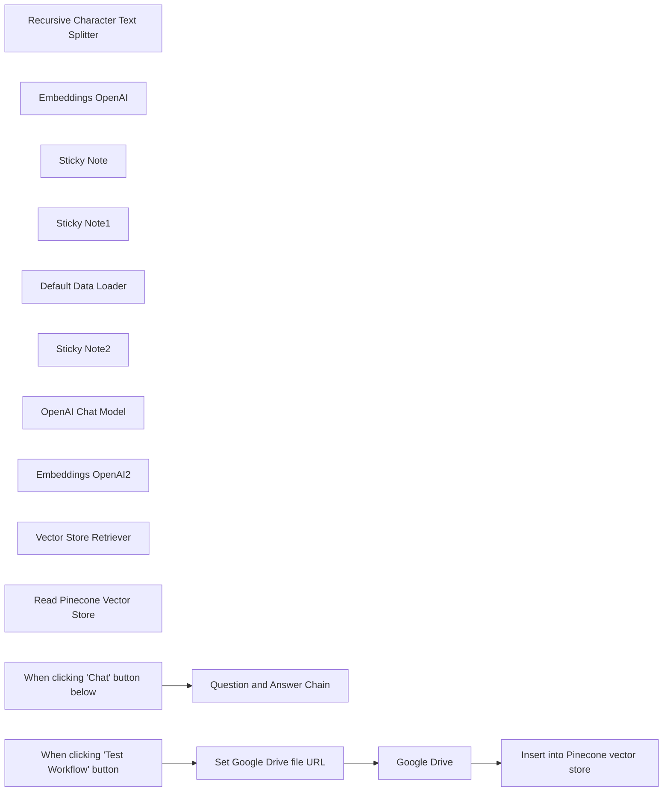

## Fluxo (.json) :

```json
{
  "meta": {
    "instanceId": "62b3b6db4f4d3641a1fa1da6dfb9699a19380a1f60cbc18fc75d6d145f35552b"
  },
  "nodes": [
    {
      "id": "40bb5497-d1d2-4eb7-b683-78b88c8d9230",
      "name": "Google Drive",
      "type": "n8n-nodes-base.googleDrive",
      "position": [
        496.83478320435574,
        520
      ],
      "parameters": {
        "fileId": {
          "__rl": true,
          "mode": "url",
          "value": "https://drive.google.com/file/d/11Koq9q53nkk0F5Y8eZgaWJUVR03I4-MM/view"
        },
        "options": {},
        "operation": "download"
      },
      "credentials": {
        "googleDriveOAuth2Api": {
          "id": "20",
          "name": "Google Drive account"
        }
      },
      "typeVersion": 3
    },
    {
      "id": "1323d520-1528-4a5a-9806-8f4f45306098",
      "name": "Recursive Character Text Splitter",
      "type": "@n8n/n8n-nodes-langchain.textSplitterRecursiveCharacterTextSplitter",
      "position": [
        996.8347832043557,
        920
      ],
      "parameters": {
        "chunkSize": 3000,
        "chunkOverlap": 200
      },
      "typeVersion": 1
    },
    {
      "id": "796b155a-64e6-4a52-9168-a37c68077d99",
      "name": "Embeddings OpenAI",
      "type": "@n8n/n8n-nodes-langchain.embeddingsOpenAi",
      "position": [
        836.8347832043557,
        740
      ],
      "parameters": {
        "options": {}
      },
      "credentials": {
        "openAiApi": {
          "id": "JCgD7807AQpe8Xge",
          "name": "OpenAi account"
        }
      },
      "typeVersion": 1
    },
    {
      "id": "dbe42c28-6f0b-4999-8372-0b42f6fb5916",
      "name": "Sticky Note",
      "type": "n8n-nodes-base.stickyNote",
      "position": [
        260,
        420
      ],
      "parameters": {
        "color": 7,
        "width": 978.0454109366399,
        "height": 806.6556079800943,
        "content": "### Load data into database\nFetch file from Google Drive, split it into chunks and insert into Pinecone index"
      },
      "typeVersion": 1
    },
    {
      "id": "43dc3736-834d-4322-8fd2-7826b0208c4b",
      "name": "Sticky Note1",
      "type": "n8n-nodes-base.stickyNote",
      "position": [
        1520,
        420
      ],
      "parameters": {
        "color": 7,
        "width": 654.1028019808174,
        "height": 806.8716167324012,
        "content": "### Chat with database\nEmbed the incoming chat message and use it retrieve relevant chunks from the vector store. These are passed to the model to formulate an answer "
      },
      "typeVersion": 1
    },
    {
      "id": "53b18460-8ad6-425a-a01f-c2295cfddde8",
      "name": "Default Data Loader",
      "type": "@n8n/n8n-nodes-langchain.documentDefaultDataLoader",
      "position": [
        996.8347832043557,
        740
      ],
      "parameters": {
        "options": {},
        "dataType": "binary"
      },
      "typeVersion": 1
    },
    {
      "id": "e729a021-eab3-48fa-a818-457efcaeebb2",
      "name": "Sticky Note2",
      "type": "n8n-nodes-base.stickyNote",
      "position": [
        -20,
        740
      ],
      "parameters": {
        "height": 264.61498034081166,
        "content": "## Try me out\n1. In Pinecone, create an index with 1536 dimensions and select it in *both* Pinecone nodes\n2. Click 'test workflow' at the bottom of the canvas to load data into the vector store\n3. Click 'chat' at the bottom of the canvas to ask questions about the data"
      },
      "typeVersion": 1
    },
    {
      "id": "3e17c89c-620d-4892-b944-d792e48e3772",
      "name": "Question and Answer Chain",
      "type": "@n8n/n8n-nodes-langchain.chainRetrievalQa",
      "position": [
        1560,
        521
      ],
      "parameters": {},
      "typeVersion": 1.2
    },
    {
      "id": "516507f9-d0d9-4975-85d0-a7852ee41518",
      "name": "OpenAI Chat Model",
      "type": "@n8n/n8n-nodes-langchain.lmChatOpenAi",
      "position": [
        1560,
        741
      ],
      "parameters": {
        "options": {}
      },
      "credentials": {
        "openAiApi": {
          "id": "JCgD7807AQpe8Xge",
          "name": "OpenAi account"
        }
      },
      "typeVersion": 1
    },
    {
      "id": "8b0a5d26-a60a-40ab-8200-72f542532096",
      "name": "Embeddings OpenAI2",
      "type": "@n8n/n8n-nodes-langchain.embeddingsOpenAi",
      "position": [
        1700,
        1081
      ],
      "parameters": {
        "options": {}
      },
      "credentials": {
        "openAiApi": {
          "id": "JCgD7807AQpe8Xge",
          "name": "OpenAi account"
        }
      },
      "typeVersion": 1
    },
    {
      "id": "07f61d20-cf50-48e8-9d34-92244af436cb",
      "name": "Vector Store Retriever",
      "type": "@n8n/n8n-nodes-langchain.retrieverVectorStore",
      "position": [
        1760,
        741
      ],
      "parameters": {},
      "typeVersion": 1
    },
    {
      "id": "0777de17-99a0-499a-b71f-245d5f76642e",
      "name": "Read Pinecone Vector Store",
      "type": "@n8n/n8n-nodes-langchain.vectorStorePinecone",
      "position": [
        1700,
        921
      ],
      "parameters": {
        "options": {},
        "pineconeIndex": {
          "__rl": true,
          "mode": "list",
          "value": "test-index",
          "cachedResultName": "test-index"
        }
      },
      "credentials": {
        "pineconeApi": {
          "id": "Pp5aPt4JWBkDOGqZ",
          "name": "PineconeApi account"
        }
      },
      "typeVersion": 1
    },
    {
      "id": "cc5e6897-9d0b-4352-a882-5dc23104bf97",
      "name": "Insert into Pinecone vector store",
      "type": "@n8n/n8n-nodes-langchain.vectorStorePinecone",
      "position": [
        856.8347832043557,
        520
      ],
      "parameters": {
        "mode": "insert",
        "options": {
          "clearNamespace": true
        },
        "pineconeIndex": {
          "__rl": true,
          "mode": "list",
          "value": "test-index",
          "cachedResultName": "test-index"
        }
      },
      "credentials": {
        "pineconeApi": {
          "id": "Pp5aPt4JWBkDOGqZ",
          "name": "PineconeApi account"
        }
      },
      "typeVersion": 1
    },
    {
      "id": "c358aa73-b60f-453f-a3ef-539faa98c9b5",
      "name": "When clicking 'Chat' button below",
      "type": "@n8n/n8n-nodes-langchain.chatTrigger",
      "position": [
        1360,
        521
      ],
      "webhookId": "e259b6fe-b2a9-4dbc-98a4-9a160e7ac10c",
      "parameters": {},
      "typeVersion": 1
    },
    {
      "id": "d35db9e1-4efc-4980-9814-55fbe65e08fd",
      "name": "When clicking 'Test Workflow' button",
      "type": "n8n-nodes-base.manualTrigger",
      "position": [
        76.83478320435574,
        520
      ],
      "parameters": {},
      "typeVersion": 1
    },
    {
      "id": "4c04f576-e834-467d-98b4-38a2d501d82f",
      "name": "Set Google Drive file URL",
      "type": "n8n-nodes-base.set",
      "position": [
        296,
        520
      ],
      "parameters": {
        "options": {},
        "assignments": {
          "assignments": [
            {
              "id": "50025ff5-1b53-475f-b150-2aafef1c4c21",
              "name": "file_url",
              "type": "string",
              "value": "https://drive.google.com/file/d/11Koq9q53nkk0F5Y8eZgaWJUVR03I4-MM/view"
            }
          ]
        }
      },
      "typeVersion": 3.3
    }
  ],
  "pinData": {},
  "connections": {
    "Google Drive": {
      "main": [
        [
          {
            "node": "Insert into Pinecone vector store",
            "type": "main",
            "index": 0
          }
        ]
      ]
    },
    "Embeddings OpenAI": {
      "ai_embedding": [
        [
          {
            "node": "Insert into Pinecone vector store",
            "type": "ai_embedding",
            "index": 0
          }
        ]
      ]
    },
    "OpenAI Chat Model": {
      "ai_languageModel": [
        [
          {
            "node": "Question and Answer Chain",
            "type": "ai_languageModel",
            "index": 0
          }
        ]
      ]
    },
    "Embeddings OpenAI2": {
      "ai_embedding": [
        [
          {
            "node": "Read Pinecone Vector Store",
            "type": "ai_embedding",
            "index": 0
          }
        ]
      ]
    },
    "Default Data Loader": {
      "ai_document": [
        [
          {
            "node": "Insert into Pinecone vector store",
            "type": "ai_document",
            "index": 0
          }
        ]
      ]
    },
    "Vector Store Retriever": {
      "ai_retriever": [
        [
          {
            "node": "Question and Answer Chain",
            "type": "ai_retriever",
            "index": 0
          }
        ]
      ]
    },
    "Set Google Drive file URL": {
      "main": [
        [
          {
            "node": "Google Drive",
            "type": "main",
            "index": 0
          }
        ]
      ]
    },
    "Read Pinecone Vector Store": {
      "ai_vectorStore": [
        [
          {
            "node": "Vector Store Retriever",
            "type": "ai_vectorStore",
            "index": 0
          }
        ]
      ]
    },
    "Recursive Character Text Splitter": {
      "ai_textSplitter": [
        [
          {
            "node": "Default Data Loader",
            "type": "ai_textSplitter",
            "index": 0
          }
        ]
      ]
    },
    "When clicking 'Chat' button below": {
      "main": [
        [
          {
            "node": "Question and Answer Chain",
            "type": "main",
            "index": 0
          }
        ]
      ]
    },
    "When clicking 'Test Workflow' button": {
      "main": [
        [
          {
            "node": "Set Google Drive file URL",
            "type": "main",
            "index": 0
          }
        ]
      ]
    }
  }
}
```

<a id="template-569"></a>

## Template 569 - Assistente SQL para análises de transporte

- **Nome:** Assistente SQL para análises de transporte
- **Descrição:** Fluxo que recebe solicitações via chat, gera e valida consultas SQL para a tabela transport.shipments no BigQuery e retorna os resultados em formato estruturado ao usuário.
- **Funcionalidade:** • Detecção de solicitações via chat: Inicia o processo ao receber mensagens do usuário.
• Geração de consultas SQL com modelo de linguagem: Utiliza um modelo de chat para traduzir solicitações em consultas SQL seguindo instruções do sistema.
• Memória de conversa: Mantém contexto recente para suportar interações consecutivas.
• Sanitização de consultas: Limpa e remove formatação de bloco de código das consultas antes da execução.
• Encaminhamento para execução de consulta: Envia a consulta sanitizada para um serviço que executa SQL no banco de dados.
• Execução e retorno de resultados: Recupera resultados da tabela transport.shipments e devolve apenas os dados em formato estruturado.
• Regras de apresentação: Aplica políticas de não exibir a consulta SQL, formatar resultados como tabelas, limitar número de linhas e fornecer resumos quando necessário.
- **Ferramentas:** • OpenAI (gpt-4o-mini): Geração e interpretação de linguagem natural para transformar pedidos em consultas SQL e formatar respostas.
• Google BigQuery: Armazenamento e execução das consultas SQL na tabela transport.shipments para recuperar os dados solicitados.


## Fluxo visual

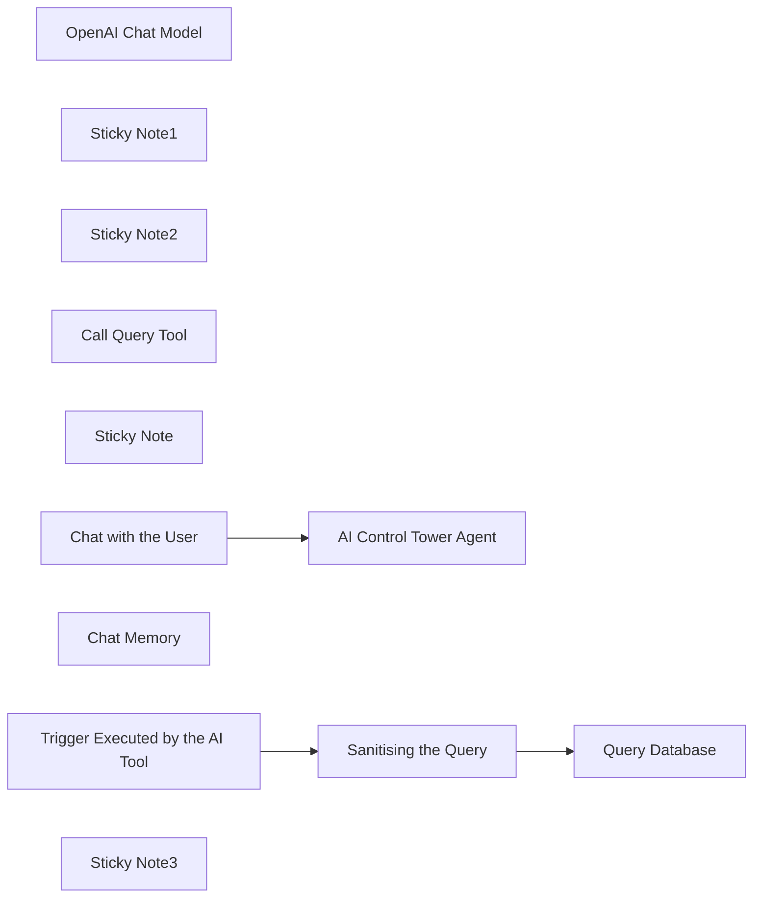

## Fluxo (.json) :

```json
{
  "meta": {
    "instanceId": "6a5e68bcca67c4cdb3e0b698d01739aea084e1ec06e551db64aeff43d174cb23"
  },
  "nodes": [
    {
      "id": "53b36910-966f-45ba-a425-a3260a55059f",
      "name": "OpenAI Chat Model",
      "type": "@n8n/n8n-nodes-langchain.lmChatOpenAi",
      "position": [
        340,
        480
      ],
      "parameters": {
        "model": {
          "__rl": true,
          "mode": "list",
          "value": "gpt-4o-mini"
        },
        "options": {}
      },
      "typeVersion": 1.2
    },
    {
      "id": "177235e8-c925-43d0-9695-10f072e26350",
      "name": "AI Control Tower Agent",
      "type": "@n8n/n8n-nodes-langchain.agent",
      "position": [
        380,
        240
      ],
      "parameters": {
        "options": {
          "systemMessage": "=You are an AI-powered SQL assistant specialized in supply chain analytics. \nYour role is to execute SQL queries on BigQuery and return only the results in a structured format.\n\nToday we are May 31, 2021.\n\n### **Behavior & Rules**\n1️⃣ **Query Execution:**\n   - Your only task is to process user requests and return **direct results** from BigQuery.\n   - Do **not** display the SQL query.\n   - Only return structured **data** as output.\n\n2️⃣ **Data Presentation:**\n   - Format the results as a **table** whenever possible.\n   - If results are numerical (counts, percentages, aggregates), return them **clearly and concisely**.\n   - If results contain multiple rows, return **only the first 10** for preview, unless the user specifies otherwise.\n\n3️⃣ **Handling Large Datasets:**\n   - If the user asks for many rows, show the first **100 rows max** unless specified.\n   - Provide a **summary** when dealing with large data instead of showing everything.\n\n4️⃣ **Response Format:**\n   - ✅ **For counts & metrics:**  \n     `\"There were 5,432 delayed shipments in the last 21 days.\"`\n   - ✅ **For tables:**  \n     | ShipmentID | City  | Store  | Order Date | Delivery Date | On Time? |\n     |-----------|-------|--------|------------|--------------|----------|\n     | 12345     | NYC   | ST1    | 2024-03-10 | 2024-03-15   | No       |\n     | 67890     | Paris | ST4    | 2024-03-11 | 2024-03-16   | Yes      |\n\n5️⃣ **Clarifying Unclear Requests:**\n   - If the user request is **too broad**, ask for clarification instead of running an expensive query.\n\n---\n\n### Schema Awareness\nAll SQL queries must use the BigQuery table:  \n`transport.shipments`  \n\nThis table includes fields such as:\n- `Shipment ID`, `City`, `Store`, `Order Date`, `Delivery Date`, `On Time Delivery`\n- As well as operational timestamps: `Transmission`, `Loading`, `Airport Arrival`, etc.\n- And status flags: `Transmission OnTime`, `Loading OnTime`, `Airport OnTime`, `Store Open`\n\nUse these fields appropriately when analyzing shipment performance.\n\n---\n\n### Tool Usage Instruction (for \"bigquery_tool\")\n\nWhenever you need to run a SQL query, use the tool called `bigquery_tool`.\n\nYou must provide the query in the following format:\n```json\n{\n  \"query\": \"SELECT COUNT(*) FROM `transport.shipments` WHERE `On Time Delivery` = FALSE\"\n}\n"
        }
      },
      "typeVersion": 1.8
    },
    {
      "id": "5366cc5f-85d3-44d2-9b1b-62febfcb44e3",
      "name": "Sticky Note1",
      "type": "n8n-nodes-base.stickyNote",
      "position": [
        -100,
        -120
      ],
      "parameters": {
        "color": 7,
        "width": 200,
        "height": 520,
        "content": "### 1. Workflow Trigger with Chat\nThis workflow uses a simple chat window as a trigger. You can replace it with Telegram, Slack, Teams or a webhook trigger linked to your chat.\n\n#### How to setup?\n*Nothing to do.*\n"
      },
      "typeVersion": 1
    },
    {
      "id": "4218a062-12f8-437d-ab22-5a653a3089b2",
      "name": "Sticky Note2",
      "type": "n8n-nodes-base.stickyNote",
      "position": [
        140,
        -120
      ],
      "parameters": {
        "color": 7,
        "width": 700,
        "height": 740,
        "content": "### 2. AI Agent equipped with the query tool\nIn order to have more control on the input of the BigQuery node, we don't use the BigQuery tool. Instead we have a set of nodes to retrieve the SQL query, clean it and send it to a BigQuery Node.\n\n#### How to setup?\n- **AI Agent with the Chat Model**:\n   1. Add a **chat model** with the required credentials *(Example: Open AI 4o-mini)*\n   2. Adapt the **name of your BigQuery table** in the system prompt *(Example: transports.shipments)*\n   3. Adapt the **tables fields explanation** in the system prompt\n  [Learn more about the AI Agent Node](https://docs.n8n.io/integrations/builtin/cluster-nodes/root-nodes/n8n-nodes-langchain.agent)\n- Copy and past the **nodes in the yellow sticker** in another workflow. Point the query tool to this workflow.\n[Learn more about the Custom n8n Workflow Tool node](https://docs.n8n.io/integrations/builtin/cluster-nodes/sub-nodes/n8n-nodes-langchain.toolworkflow)"
      },
      "typeVersion": 1
    },
    {
      "id": "c5967f58-00e8-4f03-9110-913547f7ab9c",
      "name": "Call Query Tool",
      "type": "@n8n/n8n-nodes-langchain.toolWorkflow",
      "position": [
        640,
        440
      ],
      "parameters": {
        "name": "bigquery_tool",
        "workflowId": {
          "__rl": true,
          "mode": "list",
          "value": "4Os7DoxHjFuTwWio",
          "cachedResultName": "🔨 Big Query Tool"
        },
        "description": "=Use this tool to run an SQL query and fetch the result from the BigQuery database.\n\nThe tool expects input in the following format:\n{\n  \"query\": \"SELECT COUNT(*) FROM `transport.shipments` WHERE `On Time Delivery` = FALSE\"\n}\n\nOnly provide the SQL query as a string inside the 'query' key. Do not include code formatting (like ```sql), comments, or explanations. The tool will return only the raw result from the database.\n",
        "workflowInputs": {
          "value": {
            "query": "={{ $fromAI(\"query\", \"SQL query to run\") }}"
          },
          "schema": [
            {
              "id": "query",
              "type": "string",
              "display": true,
              "removed": false,
              "required": false,
              "displayName": "query",
              "defaultMatch": false,
              "canBeUsedToMatch": true
            }
          ],
          "mappingMode": "defineBelow",
          "matchingColumns": [
            "query"
          ],
          "attemptToConvertTypes": false,
          "convertFieldsToString": false
        }
      },
      "typeVersion": 2
    },
    {
      "id": "429813c8-b07f-4551-aeea-1744a1225449",
      "name": "Sticky Note",
      "type": "n8n-nodes-base.stickyNote",
      "position": [
        900,
        -120
      ],
      "parameters": {
        "width": 760,
        "height": 460,
        "content": "### 3. Big Query Workflow\nExecute the SQL query generated by the AI agent in Big Query. Retrieve the results and send them back to the AI Agent.\n\n### How to set up?\n- Paste these nodes in a separate workflow so you can use it with multiple agents.\n- **Google BigQuery API**:\n   1. Add your Google Translate API credentials\n   2. The project in which your table is located\n  [Learn more about the Google BigQuery Node](https://docs.n8n.io/integrations/builtin/app-nodes/n8n-nodes-base.googlebigquery)\n"
      },
      "typeVersion": 1
    },
    {
      "id": "bede0624-8923-4af0-8adc-8be22d556066",
      "name": "Query Database",
      "type": "n8n-nodes-base.googleBigQuery",
      "position": [
        1520,
        180
      ],
      "parameters": {
        "options": {},
        "sqlQuery": "={{ $json.query }}",
        "projectId": {
          "__rl": true,
          "mode": "list",
          "value": "=",
          "cachedResultUrl": "=",
          "cachedResultName": "="
        }
      },
      "notesInFlow": true,
      "typeVersion": 2.1
    },
    {
      "id": "137e4dbc-db8d-4ec7-a3e0-478dde6ef27c",
      "name": "Trigger Executed by the AI Tool",
      "type": "n8n-nodes-base.executeWorkflowTrigger",
      "position": [
        960,
        180
      ],
      "parameters": {
        "workflowInputs": {
          "values": [
            {
              "name": "query"
            }
          ]
        }
      },
      "typeVersion": 1.1
    },
    {
      "id": "42a2801e-582e-4340-83af-ef0041eab4f9",
      "name": "Sanitising the Query",
      "type": "n8n-nodes-base.code",
      "position": [
        1240,
        180
      ],
      "parameters": {
        "jsCode": "return [\n  {\n    json: {\n      query: $input.first().json.query.replace(/```sql|```/g, \"\").trim()\n    }\n  }\n];\n"
      },
      "typeVersion": 2
    },
    {
      "id": "7c86fda0-116c-47ad-aaf5-8b83d2c083c6",
      "name": "Chat Memory",
      "type": "@n8n/n8n-nodes-langchain.memoryBufferWindow",
      "position": [
        480,
        480
      ],
      "parameters": {},
      "typeVersion": 1.3
    },
    {
      "id": "e1408ac1-24da-4d38-8fdf-c110a54d3f55",
      "name": "Chat with the User",
      "type": "@n8n/n8n-nodes-langchain.chatTrigger",
      "position": [
        -60,
        240
      ],
      "webhookId": "ee7c418b-d7d6-41f9-8e87-0f71b8ae1cf9",
      "parameters": {
        "options": {}
      },
      "typeVersion": 1.1
    },
    {
      "id": "bc49829b-45f2-4910-9c37-907271982f14",
      "name": "Sticky Note3",
      "type": "n8n-nodes-base.stickyNote",
      "position": [
        900,
        380
      ],
      "parameters": {
        "width": 780,
        "height": 540,
        "content": "### 4. Do you need more details?\nFind a step-by-step guide in this tutorial\n\n[🎥 Watch My Tutorial](https://www.loom.com/share/50271f9d50214d7184830985497a75ec?sid=d0c410dc-29f1-488f-b89a-4011de0ded07)"
      },
      "typeVersion": 1
    }
  ],
  "pinData": {},
  "connections": {
    "Chat Memory": {
      "ai_memory": [
        [
          {
            "node": "AI Control Tower Agent",
            "type": "ai_memory",
            "index": 0
          }
        ]
      ]
    },
    "Call Query Tool": {
      "ai_tool": [
        [
          {
            "node": "AI Control Tower Agent",
            "type": "ai_tool",
            "index": 0
          }
        ]
      ]
    },
    "OpenAI Chat Model": {
      "ai_languageModel": [
        [
          {
            "node": "AI Control Tower Agent",
            "type": "ai_languageModel",
            "index": 0
          }
        ]
      ]
    },
    "Chat with the User": {
      "main": [
        [
          {
            "node": "AI Control Tower Agent",
            "type": "main",
            "index": 0
          }
        ]
      ]
    },
    "Sanitising the Query": {
      "main": [
        [
          {
            "node": "Query Database",
            "type": "main",
            "index": 0
          }
        ]
      ]
    },
    "Trigger Executed by the AI Tool": {
      "main": [
        [
          {
            "node": "Sanitising the Query",
            "type": "main",
            "index": 0
          }
        ]
      ]
    }
  }
}
```

<a id="template-570"></a>

## Template 570 - Tradutor de áudio do Telegram (55 idiomas)

- **Nome:** Tradutor de áudio do Telegram (55 idiomas)
- **Descrição:** Bot que recebe mensagens de voz no Telegram, transcreve a fala, detecta e traduz automaticamente entre dois idiomas configuráveis, e responde com texto e áudio.
- **Funcionalidade:** • Recepção de mensagens de voz no Telegram: monitora atualizações e recebe arquivos de áudio enviados pelos usuários.
• Download do áudio: obtém o arquivo de voz associado à mensagem para processamento.
• Tratamento de entrada/erros: garante que campos ausentes não quebrem o fluxo e prepara o texto para tradução.
• Transcrição de áudio para texto: converte fala em texto usando um serviço de IA de reconhecimento de voz.
• Detecção automática de idioma e tradução: identifica o idioma da transcrição e traduz entre o idioma nativo e o idioma alvo configurados (inverte a direção se necessário).
• Configuração de idiomas: permite definir o idioma nativo e o idioma para tradução em um nó de configurações.
• Resposta em texto no Telegram: envia a tradução como mensagem de texto formatada (Markdown).
• Resposta em áudio no Telegram: gera e envia uma versão em áudio da tradução como arquivo de áudio.
• Suporte multilingue: compatível com dezenas de idiomas (lista extensa de idiomas suportados pelo serviço de speech-to-text).
- **Ferramentas:** • Telegram: plataforma de mensagens utilizada para receber as mensagens de voz dos usuários e enviar respostas em texto e áudio.
• OpenAI: serviço de IA usado para transcrição de áudio (speech-to-text), detecção/geração de texto (tradução) e geração de áudio a partir do texto.

## Fluxo visual

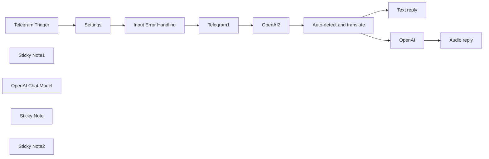

## Fluxo (.json) :

```json
{
  "id": "IvgAFAUOSI3biT4L",
  "meta": {
    "instanceId": "2723a3a635131edfcb16103f3d4dbaadf3658e386b4762989cbf49528dccbdbd"
  },
  "name": "Translate Telegram audio messages with AI (55 supported languages) v1",
  "tags": [],
  "nodes": [
    {
      "id": "f91fa0cf-ea01-4fc0-9ef2-754da399b7fb",
      "name": "Telegram Trigger",
      "type": "n8n-nodes-base.telegramTrigger",
      "position": [
        440,
        220
      ],
      "webhookId": "c537cfcc-6c4a-436a-8871-d32f8ce016cb",
      "parameters": {
        "updates": [
          "*"
        ],
        "additionalFields": {}
      },
      "credentials": {
        "telegramApi": {
          "id": "Ov00cT0t4h4AFtZ0",
          "name": "Telegram account"
        }
      },
      "typeVersion": 1
    },
    {
      "id": "057ae05f-2c7d-48c5-a057-a6917a88971c",
      "name": "Sticky Note1",
      "type": "n8n-nodes-base.stickyNote",
      "position": [
        1240,
        0
      ],
      "parameters": {
        "width": 556.5162909529794,
        "height": 586.6978417266175,
        "content": "## Translation\n\n- Converts from speech to text.\n\n- Translates the language from the native language to translated language (as specified in settings node)\n\n"
      },
      "typeVersion": 1
    },
    {
      "id": "c6947668-118e-4e23-bc55-1cdbce554a20",
      "name": "Text reply",
      "type": "n8n-nodes-base.telegram",
      "position": [
        2240,
        220
      ],
      "parameters": {
        "text": "={{ $json.text }}",
        "chatId": "={{ $('Telegram Trigger').item.json.message.chat.id }}",
        "additionalFields": {
          "parse_mode": "Markdown"
        }
      },
      "credentials": {
        "telegramApi": {
          "id": "Ov00cT0t4h4AFtZ0",
          "name": "Telegram account"
        }
      },
      "typeVersion": 1
    },
    {
      "id": "93551aea-0213-420d-bf82-7669ab291dae",
      "name": "Telegram1",
      "type": "n8n-nodes-base.telegram",
      "position": [
        1060,
        220
      ],
      "parameters": {
        "fileId": "={{ $('Telegram Trigger').item.json.message.voice.file_id }}",
        "resource": "file"
      },
      "credentials": {
        "telegramApi": {
          "id": "Ov00cT0t4h4AFtZ0",
          "name": "Telegram account"
        }
      },
      "typeVersion": 1.1
    },
    {
      "id": "972177e4-b0a4-424f-9ca6-6555ff3271d7",
      "name": "OpenAI Chat Model",
      "type": "@n8n/n8n-nodes-langchain.lmChatOpenAi",
      "position": [
        1520,
        400
      ],
      "parameters": {
        "options": {}
      },
      "credentials": {
        "openAiApi": {
          "id": "fOF5kro9BJ6KMQ7n",
          "name": "OpenAi account"
        }
      },
      "typeVersion": 1
    },
    {
      "id": "0e8f610f-03a7-4943-bd19-b3fb10c89519",
      "name": "Input Error Handling",
      "type": "n8n-nodes-base.set",
      "position": [
        860,
        220
      ],
      "parameters": {
        "fields": {
          "values": [
            {
              "name": "message.text",
              "stringValue": "={{ $json?.message?.text || \"\" }}"
            }
          ]
        },
        "options": {}
      },
      "typeVersion": 3.2
    },
    {
      "id": "c8ab9e01-c9b5-4647-8008-9157ed97c4c3",
      "name": "Sticky Note",
      "type": "n8n-nodes-base.stickyNote",
      "position": [
        1920,
        0
      ],
      "parameters": {
        "width": 585.8688089385912,
        "height": 583.7625899280566,
        "content": "## Telegram output\n\n- Provide the output in both text as well as speech. \n\n- Many languages are supported including English,French, German, Spanish, Chinese, Japanese.\n\nFull list here:\nhttps://platform.openai.com/docs/guides/speech-to-text/supported-languages\n"
      },
      "typeVersion": 1
    },
    {
      "id": "0898dc4d-c3ad-43df-871f-1896f673f631",
      "name": "Sticky Note2",
      "type": "n8n-nodes-base.stickyNote",
      "position": [
        -140,
        0
      ],
      "parameters": {
        "color": 4,
        "width": 489.00549958607303,
        "height": 573.4892086330929,
        "content": "## Multi-lingual AI Powered Universal Translator with Speech ⭐\n\n### Key capabilities\nThis flow enables a Telegram bot that can \n- accept speech in one of 55 languages \n- translates to another language and returns result in speech\n\n### Use case:\n- Learning a new language\n- Communicate with others while traveling to another country\n\n### Setup\n- Open the Settings node and specify the languages you would like to work with"
      },
      "typeVersion": 1
    },
    {
      "id": "ae0595d2-7e40-4c1e-a643-4b232220d19a",
      "name": "Settings",
      "type": "n8n-nodes-base.set",
      "position": [
        660,
        220
      ],
      "parameters": {
        "options": {},
        "assignments": {
          "assignments": [
            {
              "id": "501ac5cc-73e8-4e9c-bf91-df312aa9ff88",
              "name": "language_native",
              "type": "string",
              "value": "english"
            },
            {
              "id": "efb9a7b2-5baa-44cc-b94d-c8030f17e890",
              "name": "language_translate",
              "type": "string",
              "value": "french"
            }
          ]
        }
      },
      "typeVersion": 3.3
    },
    {
      "id": "2d3654cf-a182-4916-a50c-a501828c2f6e",
      "name": "Auto-detect and translate",
      "type": "@n8n/n8n-nodes-langchain.chainLlm",
      "position": [
        1500,
        220
      ],
      "parameters": {
        "text": "=Detect the language of the text that follows. \n- If it is {{ $('Settings').item.json.language_native }} translate to {{ $('Settings').item.json.language_translate }}. \n- If it is in {{ $('Settings').item.json.language_translate }} translate to {{ $('Settings').item.json.language_native }} . \n- In the output just provide the translation and do not explain it. Just provide the translation without anything else.\n\nText:\n {{ $json.text }}\n",
        "promptType": "define"
      },
      "typeVersion": 1.4
    },
    {
      "id": "a6e63516-4967-4e81-ba5b-58ad0ab21ee3",
      "name": "Audio reply",
      "type": "n8n-nodes-base.telegram",
      "position": [
        2240,
        400
      ],
      "parameters": {
        "chatId": "={{ $('Telegram Trigger').item.json.message.chat.id }}",
        "operation": "sendAudio",
        "binaryData": true,
        "additionalFields": {}
      },
      "credentials": {
        "telegramApi": {
          "id": "Ov00cT0t4h4AFtZ0",
          "name": "Telegram account"
        }
      },
      "typeVersion": 1.1
    },
    {
      "id": "e4782117-03de-41d2-9208-390edc87fc08",
      "name": "OpenAI2",
      "type": "@n8n/n8n-nodes-langchain.openAi",
      "position": [
        1300,
        220
      ],
      "parameters": {
        "options": {},
        "resource": "audio",
        "operation": "transcribe"
      },
      "credentials": {
        "openAiApi": {
          "id": "fOF5kro9BJ6KMQ7n",
          "name": "OpenAi account"
        }
      },
      "typeVersion": 1.3
    },
    {
      "id": "b29355f5-122c-4557-8215-28fdb523d221",
      "name": "OpenAI",
      "type": "@n8n/n8n-nodes-langchain.openAi",
      "position": [
        2020,
        400
      ],
      "parameters": {
        "input": "={{ $json.text }}",
        "options": {},
        "resource": "audio"
      },
      "credentials": {
        "openAiApi": {
          "id": "fOF5kro9BJ6KMQ7n",
          "name": "OpenAi account"
        }
      },
      "typeVersion": 1.3
    }
  ],
  "active": true,
  "pinData": {},
  "settings": {
    "executionOrder": "v1"
  },
  "versionId": "ac9c6f40-10c8-4b60-9215-8d4e253bf318",
  "connections": {
    "OpenAI": {
      "main": [
        [
          {
            "node": "Audio reply",
            "type": "main",
            "index": 0
          }
        ]
      ]
    },
    "OpenAI2": {
      "main": [
        [
          {
            "node": "Auto-detect and translate",
            "type": "main",
            "index": 0
          }
        ]
      ]
    },
    "Settings": {
      "main": [
        [
          {
            "node": "Input Error Handling",
            "type": "main",
            "index": 0
          }
        ]
      ]
    },
    "Telegram1": {
      "main": [
        [
          {
            "node": "OpenAI2",
            "type": "main",
            "index": 0
          }
        ]
      ]
    },
    "Telegram Trigger": {
      "main": [
        [
          {
            "node": "Settings",
            "type": "main",
            "index": 0
          }
        ]
      ]
    },
    "OpenAI Chat Model": {
      "ai_languageModel": [
        [
          {
            "node": "Auto-detect and translate",
            "type": "ai_languageModel",
            "index": 0
          }
        ]
      ]
    },
    "Input Error Handling": {
      "main": [
        [
          {
            "node": "Telegram1",
            "type": "main",
            "index": 0
          }
        ]
      ]
    },
    "Auto-detect and translate": {
      "main": [
        [
          {
            "node": "Text reply",
            "type": "main",
            "index": 0
          },
          {
            "node": "OpenAI",
            "type": "main",
            "index": 0
          }
        ]
      ]
    }
  }
}
```

<a id="template-571"></a>

## Template 571 - Agente ReAct para busca e processamento de páginas web

- **Nome:** Agente ReAct para busca e processamento de páginas web
- **Descrição:** Fluxo que permite a um agente guiado por um modelo de linguagem buscar páginas web via requisição HTTP, processar e converter o conteúdo em Markdown, e retornar o texto ao solicitante com validações e redução de tamanho quando necessário.
- **Funcionalidade:** • Gatilho por mensagem manual: inicia o agente quando uma nova mensagem de chat é recebida.
• Agente ReAct integrado a modelo de linguagem: usa um modelo de chat para raciocínio e decisão sobre quando e como chamar a ferramenta de requisição.
• Ferramenta de requisição HTTP customizada: aceita uma query string (?url=...&method=...) para buscar uma página web em modo "full" ou "simplified".
• Conversão e interpretação de parâmetros: transforma a query string em JSON e aplica limites de tamanho configuráveis.
• Tratamento de erros: detecta query inválida ou erros na requisição e retorna mensagens de erro apropriadas (instrução de correção ou mensagem de erro original).
• Extração e limpeza de HTML: isola o conteúdo da tag <body> e remove scripts, estilos, noscript, iframes, objetos, embeds, vídeos, áudios, SVGs e comentários.
• Simplificação opcional: quando solicitado, substitui links e fontes de imagens por marcadores (NOURL / NOIMG) para reduzir tamanho.
• Conversão para Markdown: transforma o HTML limpo em Markdown para reduzir ainda mais o tamanho e manter estrutura legível.
• Verificação de comprimento: mede o tamanho do conteúdo resultante e retorna "ERROR: PAGE CONTENT TOO LONG" se exceder o limite definido.
- **Ferramentas:** • OpenAI API: modelo de linguagem usado para raciocínio, tomada de decisão e geração das respostas finais.
• Servidores web / endpoints HTTP: fontes externas de conteúdo que são requisitadas para obter as páginas a serem processadas.
• Conversor HTML para Markdown: biblioteca/serviço que transforma o conteúdo HTML limpo em Markdown para envio ao usuário.

## Fluxo visual

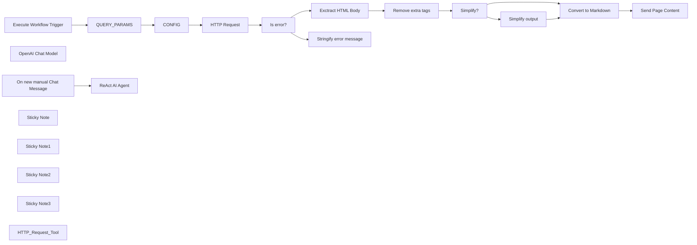

## Fluxo (.json) :

```json
{
  "id": "dsKnCFwysROIA4MT",
  "meta": {
    "instanceId": "03524270bab2c2dfd5b82778cd1355e56cdda3cf098bf2dfd865e18164c00485"
  },
  "name": "Agent with custom HTTP Request",
  "tags": [],
  "nodes": [
    {
      "id": "e7374976-f3c1-4f60-ae57-9eec65444216",
      "name": "On new manual Chat Message",
      "type": "@n8n/n8n-nodes-langchain.manualChatTrigger",
      "position": [
        763,
        676
      ],
      "parameters": {},
      "typeVersion": 1
    },
    {
      "id": "97e84a23-9536-43cd-94e9-b8166be8ed32",
      "name": "OpenAI Chat Model",
      "type": "@n8n/n8n-nodes-langchain.lmChatOpenAi",
      "position": [
        983,
        896
      ],
      "parameters": {
        "model": "gpt-4-1106-preview",
        "options": {
          "timeout": 300000,
          "temperature": 0.7,
          "frequencyPenalty": 0.3
        }
      },
      "credentials": {
        "openAiApi": {
          "id": "wPFAzp4ZHdLLwvkK",
          "name": "OpenAi account"
        }
      },
      "typeVersion": 1
    },
    {
      "id": "63d98361-8978-4042-84e7-53a0e226f946",
      "name": "HTTP Request",
      "type": "n8n-nodes-base.httpRequest",
      "onError": "continueRegularOutput",
      "position": [
        1360,
        1200
      ],
      "parameters": {
        "url": "={{ encodeURI($json.query.url) }}",
        "options": {
          "response": {
            "response": {
              "neverError": true
            }
          },
          "allowUnauthorizedCerts": true
        }
      },
      "typeVersion": 4.1,
      "alwaysOutputData": false
    },
    {
      "id": "17d4b5ae-f5d3-4793-8419-d3c879f7f50d",
      "name": "Exctract HTML Body",
      "type": "n8n-nodes-base.set",
      "position": [
        1780,
        1480
      ],
      "parameters": {
        "fields": {
          "values": [
            {
              "name": "HTML",
              "stringValue": "={{ $json?.data.match(/<body[^>]*>([\\s\\S]*?)</body>/i)[1] }}"
            }
          ]
        },
        "include": "selected",
        "options": {},
        "includeFields": "HTML"
      },
      "typeVersion": 3.2
    },
    {
      "id": "36c38ee4-724c-4ba2-a59a-ac0bbc912e94",
      "name": "Is error?",
      "type": "n8n-nodes-base.if",
      "position": [
        1560,
        1200
      ],
      "parameters": {
        "conditions": {
          "boolean": [
            {
              "value1": "={{ $json.hasOwnProperty('error') }}",
              "value2": true
            }
          ]
        }
      },
      "typeVersion": 1
    },
    {
      "id": "4e4d97ce-14a9-4f4f-aa75-f218784d9ed9",
      "name": "Stringify error message",
      "type": "n8n-nodes-base.set",
      "position": [
        1780,
        980
      ],
      "parameters": {
        "fields": {
          "values": [
            {
              "name": "page_content",
              "stringValue": "={{ $('QUERY_PARAMS').first()?.json?.query?.url == null ? \"INVALID action_input. This should be an HTTP query string like this: \\\"?url=VALIDURL&method=SELECTEDMETHOD\\\". Only a simple string value is accepted. JSON object as an action_input is NOT supported!\" : JSON.stringify($json.error) }}"
            }
          ]
        },
        "include": "selected",
        "options": {},
        "includeFields": "HTML"
      },
      "typeVersion": 3.2
    },
    {
      "id": "8452e5c4-aa29-4a02-9579-8d9da3727bcb",
      "name": "Execute Workflow Trigger",
      "type": "n8n-nodes-base.executeWorkflowTrigger",
      "position": [
        760,
        1200
      ],
      "parameters": {},
      "typeVersion": 1
    },
    {
      "id": "063220c2-fa4d-4d5e-9549-7712aaa72921",
      "name": "Remove extra tags",
      "type": "n8n-nodes-base.set",
      "position": [
        1980,
        1480
      ],
      "parameters": {
        "fields": {
          "values": [
            {
              "name": "HTML",
              "stringValue": "={{ ($json.HTML || \"HTML BODY CONTENT FOR THIS SEARCH RESULT IS NOT AVAILABLE\").replace(/<script[^>]*>([\\s\\S]*?)</script>|<style[^>]*>([\\s\\S]*?)</style>|<noscript[^>]*>([\\s\\S]*?)</noscript>|<!--[\\s\\S]*?-->|<iframe[^>]*>([\\s\\S]*?)</iframe>|<object[^>]*>([\\s\\S]*?)</object>|<embed[^>]*>([\\s\\S]*?)</embed>|<video[^>]*>([\\s\\S]*?)</video>|<audio[^>]*>([\\s\\S]*?)</audio>|<svg[^>]*>([\\s\\S]*?)</svg>/ig, '')}}"
            }
          ]
        },
        "options": {}
      },
      "typeVersion": 3.2
    },
    {
      "id": "036511d7-a4be-4bbf-b4bc-47ddfabfe76f",
      "name": "Simplify output",
      "type": "n8n-nodes-base.set",
      "notes": "remove links and image URLs",
      "position": [
        2360,
        1380
      ],
      "parameters": {
        "fields": {
          "values": [
            {
              "name": "HTML",
              "stringValue": "={{ $json.HTML.replace(/href\\s*=\\s*\"(.+?)\"/gi, 'href=\"NOURL\"').replace(/src\\s*=\\s*\"(.+?)\"/gi, 'src=\"NOIMG\"')}}"
            }
          ]
        },
        "options": {}
      },
      "notesInFlow": true,
      "typeVersion": 3.2
    },
    {
      "id": "5e2b5383-adcf-4de0-a406-4f5d631b5e8a",
      "name": "Simplify?",
      "type": "n8n-nodes-base.if",
      "position": [
        2180,
        1480
      ],
      "parameters": {
        "conditions": {
          "string": [
            {
              "value1": "={{ $('CONFIG').first()?.json?.query?.method }}",
              "value2": "simplif",
              "operation": "contains"
            }
          ]
        }
      },
      "typeVersion": 1
    },
    {
      "id": "a0fc004a-ab0f-4b31-94df-50f5eee69c86",
      "name": "QUERY_PARAMS",
      "type": "n8n-nodes-base.set",
      "position": [
        960,
        1200
      ],
      "parameters": {
        "fields": {
          "values": [
            {
              "name": "query",
              "type": "objectValue",
              "objectValue": "={{ $json.query.substring($json.query.indexOf('?') + 1).split('&').reduce((result, item) => (result[item.split('=')[0]] = decodeURIComponent(item.split('=')[1]), result), {}) }}"
            }
          ]
        },
        "options": {}
      },
      "typeVersion": 3.2
    },
    {
      "id": "3b6599d6-ce9a-4861-9b52-07156eb52539",
      "name": "CONFIG",
      "type": "n8n-nodes-base.set",
      "position": [
        1160,
        1200
      ],
      "parameters": {
        "fields": {
          "values": [
            {
              "name": "query.maxlimit",
              "type": "numberValue",
              "numberValue": "={{ $json?.query?.maxlimit == null ? 70000 : Number($json?.query?.maxlimit) }}"
            }
          ]
        },
        "options": {}
      },
      "typeVersion": 3.2
    },
    {
      "id": "14f683be-76f6-4034-9a0e-d785738b135f",
      "name": "Sticky Note",
      "type": "n8n-nodes-base.stickyNote",
      "position": [
        721,
        1134
      ],
      "parameters": {
        "width": 556.25,
        "height": 235.79999999999995,
        "content": "### Convert the query string into JSON, apply the limit for a page length"
      },
      "typeVersion": 1
    },
    {
      "id": "6deabcb7-a984-48ec-af2a-8c70b3a4e4bf",
      "name": "Sticky Note1",
      "type": "n8n-nodes-base.stickyNote",
      "position": [
        1720,
        840
      ],
      "parameters": {
        "width": 491,
        "height": 285.7,
        "content": "## Send an error message:\n1. If query param was incorrect, return the instruction. AI Agent should pick up on this and adapt the query on the next iteration.\n2. If the query is OK and an error was during the HTTP Request, then send back the original error message."
      },
      "typeVersion": 1
    },
    {
      "id": "df1e8d00-0e18-44fa-8f94-8a53c27f7c88",
      "name": "Sticky Note2",
      "type": "n8n-nodes-base.stickyNote",
      "position": [
        1720,
        1160
      ],
      "parameters": {
        "width": 1200,
        "height": 472.5,
        "content": "## Post-processing of the HTML page:\n1. Keep only <BODY> content\n2. Remove inline <SCRIPT> tag entirely, as well as: NOSCRIPT, IFRAME, OBJECT, EMBED, VIDEO, AUDIO, SVG, and HTML comments.\n3. In case query parameter method=simplified, replace all page URLs (a href) and IMG (src) with NOURL / NOIMG - this may save up to 20% of the page length\n4. Convert the remaining HTML to Markdown. This step further reduces the length of the page: long HTML tags and styles are eliminated, but the markdown syntax keeps some page structure. This gives much better results compared to just a blank text.\n5. Finally, check the page length. If it's too long, send an \"ERROR: PAGE CONTENT TOO LONG\" instead of the actual page. Of course, you could split the page content in chunks, but sometimes long pages just don't have a needed content, so it makes little sense to burn tokens on them."
      },
      "typeVersion": 1
    },
    {
      "id": "6afe96a0-0fba-4ae1-ab8f-f7da56d420b1",
      "name": "Sticky Note3",
      "type": "n8n-nodes-base.stickyNote",
      "position": [
        720,
        540
      ],
      "parameters": {
        "width": 616.8597285067872,
        "height": 483.0226244343891,
        "content": "## Example ReAct AI Agent\n1. Agent Prompt is default\n2. Check the description of the HTTP_Request_Tool, it guides the agent to provide a query string with several parameters instead of a JSON object"
      },
      "typeVersion": 1
    },
    {
      "id": "d5ff2114-1e74-43cf-9f3c-744c241988db",
      "name": "ReAct AI Agent",
      "type": "@n8n/n8n-nodes-langchain.agent",
      "position": [
        983,
        676
      ],
      "parameters": {
        "agent": "reActAgent",
        "options": {
          "prefix": "Answer the following questions as best you can. You have access to the following tools:",
          "suffix": "Begin!\n\n\tQuestion: {input}\n\tThought:{agent_scratchpad}",
          "suffixChat": "Begin! Reminder to always use the exact characters `Final Answer` when responding.",
          "humanMessageTemplate": "{input}\n\n{agent_scratchpad}"
        }
      },
      "typeVersion": 1
    },
    {
      "id": "cc7aef4a-a1fb-4a69-a670-1f200f9e9541",
      "name": "Convert to Markdown",
      "type": "n8n-nodes-base.markdown",
      "position": [
        2540,
        1480
      ],
      "parameters": {
        "html": "={{ $json.HTML }}",
        "options": {},
        "destinationKey": "page_content"
      },
      "typeVersion": 1
    },
    {
      "id": "11806e8c-5fc4-4d9d-8144-179356993aa7",
      "name": "Send Page Content",
      "type": "n8n-nodes-base.set",
      "position": [
        2740,
        1480
      ],
      "parameters": {
        "fields": {
          "values": [
            {
              "name": "page_content",
              "stringValue": "={{ $json.page_content.length < $('CONFIG').first()?.json?.query?.maxlimit ? $json.page_content : \"ERROR: PAGE CONTENT TOO LONG\" }}"
            },
            {
              "name": "page_length",
              "type": "numberValue",
              "numberValue": "={{ $json.page_content.length }}"
            }
          ]
        },
        "include": "selected",
        "options": {}
      },
      "typeVersion": 3.2
    },
    {
      "id": "a3a6b199-517b-4987-8281-d7997a32f54b",
      "name": "HTTP_Request_Tool",
      "type": "@n8n/n8n-nodes-langchain.toolWorkflow",
      "position": [
        1103,
        896
      ],
      "parameters": {
        "name": "HTTP_Request_Tool",
        "workflowId": "={{ $workflow.id }}",
        "description": "Call this tool to fetch a webpage content. The input should be a stringified HTTP query parameter like this: \"?url=VALIDURL&method=SELECTEDMETHOD\". \"url\" parameter should contain the valid URL string. \"method\" key can be either \"full\" or \"simplified\". method=full will fetch the whole webpage content in the Markdown format, including page links and image links. method=simplified will return the Markdown content of the page but remove urls and image links from the page content for simplicity. Before calling this tool, think strategically which \"method\" to call. Best of all to use method=simplified. However, if you anticipate that the page request is not final or if you need to extract links from the page, pick method=full.",
        "responsePropertyName": "page_content"
      },
      "typeVersion": 1
    }
  ],
  "active": false,
  "pinData": {},
  "settings": {
    "executionOrder": "v1"
  },
  "versionId": "9db853c5-3658-47c1-b98a-5858b1c184ec",
  "connections": {
    "CONFIG": {
      "main": [
        [
          {
            "node": "HTTP Request",
            "type": "main",
            "index": 0
          }
        ]
      ]
    },
    "Is error?": {
      "main": [
        [
          {
            "node": "Stringify error message",
            "type": "main",
            "index": 0
          }
        ],
        [
          {
            "node": "Exctract HTML Body",
            "type": "main",
            "index": 0
          }
        ]
      ]
    },
    "Simplify?": {
      "main": [
        [
          {
            "node": "Simplify output",
            "type": "main",
            "index": 0
          }
        ],
        [
          {
            "node": "Convert to Markdown",
            "type": "main",
            "index": 0
          }
        ]
      ]
    },
    "HTTP Request": {
      "main": [
        [
          {
            "node": "Is error?",
            "type": "main",
            "index": 0
          }
        ]
      ]
    },
    "QUERY_PARAMS": {
      "main": [
        [
          {
            "node": "CONFIG",
            "type": "main",
            "index": 0
          }
        ]
      ]
    },
    "Simplify output": {
      "main": [
        [
          {
            "node": "Convert to Markdown",
            "type": "main",
            "index": 0
          }
        ]
      ]
    },
    "HTTP_Request_Tool": {
      "ai_tool": [
        [
          {
            "node": "ReAct AI Agent",
            "type": "ai_tool",
            "index": 0
          }
        ]
      ]
    },
    "OpenAI Chat Model": {
      "ai_languageModel": [
        [
          {
            "node": "ReAct AI Agent",
            "type": "ai_languageModel",
            "index": 0
          }
        ]
      ]
    },
    "Remove extra tags": {
      "main": [
        [
          {
            "node": "Simplify?",
            "type": "main",
            "index": 0
          }
        ]
      ]
    },
    "Exctract HTML Body": {
      "main": [
        [
          {
            "node": "Remove extra tags",
            "type": "main",
            "index": 0
          }
        ]
      ]
    },
    "Convert to Markdown": {
      "main": [
        [
          {
            "node": "Send Page Content",
            "type": "main",
            "index": 0
          }
        ]
      ]
    },
    "Execute Workflow Trigger": {
      "main": [
        [
          {
            "node": "QUERY_PARAMS",
            "type": "main",
            "index": 0
          }
        ]
      ]
    },
    "On new manual Chat Message": {
      "main": [
        [
          {
            "node": "ReAct AI Agent",
            "type": "main",
            "index": 0
          }
        ]
      ]
    }
  }
}
```

<a id="template-572"></a>

## Template 572 - Agendamento com pré-qualificação por IA

- **Nome:** Agendamento com pré-qualificação por IA
- **Descrição:** Fluxo para receber solicitações de agendamento, qualificar a enquete com IA, coletar dados em formulários sequenciais, solicitar aprovação administrativa e criar evento no calendário quando aprovado.
- **Funcionalidade:** • Qualificação de enquêtes por IA: Classifica automaticamente a mensagem do solicitante para decidir se a solicitação é relevante para um encontro.
• Formulários sequenciais com termos: Coleta informações em etapas, exibindo termos e condições que devem ser aceitos antes de continuar.
• Geração dinâmica de opções de data: Oferece opções de data próximas (ex.: próximos dias) excluindo fins de semana e com escolhas de horário predefinidas.
• Extração e normalização de valores: Agrega nome, email, mensagem e converte data e hora para um formato padrão para uso interno.
• Resumo automático da solicitação: Gera um resumo conciso da enquete usando modelo de linguagem para facilitar a revisão administrativa e a descrição do evento.
• Confirmação ao usuário: Envia um recibo por e-mail ao solicitante com o resumo da solicitação imediatamente após o envio.
• Aprovação humana em segundo plano: Dispara um processo assíncrono que envia ao administrador um e-mail com botões para confirmar ou recusar a solicitação; o sistema aguarda a decisão.
• Agendamento no calendário quando aprovado: Cria um evento no calendário com participante convidado e link de conferência ao receber a confirmação administrativa.
• Notificação de recusa: Caso seja recusado, envia um e-mail ao solicitante informando a decisão.
• Processo de aprovação assíncrono: A etapa de aprovação roda em segundo plano para não bloquear a experiência do usuário que já recebeu o recibo.
- **Ferramentas:** • OpenAI: Modelo de linguagem utilizado para classificar o texto da enquete e gerar resumos concisos.
• Gmail: Envio de e-mails ao solicitante e ao administrador, incluindo mensagens que permitem aprovação humana via botões.
• Google Calendar: Criação de eventos no calendário, adição de participantes e geração de link de conferência.

## Fluxo visual

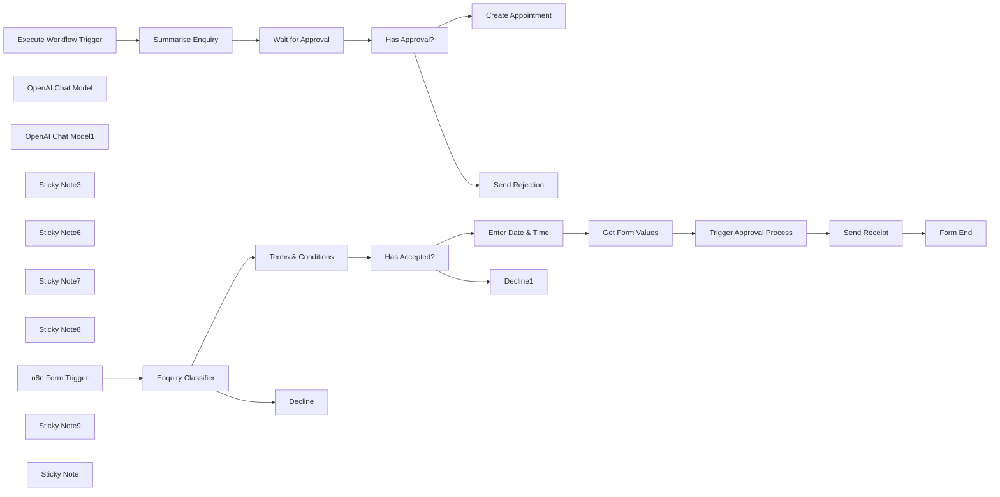

## Fluxo (.json) :

```json
{
  "meta": {
    "instanceId": "408f9fb9940c3cb18ffdef0e0150fe342d6e655c3a9fac21f0f644e8bedabcd9"
  },
  "nodes": [
    {
      "id": "76589d1c-45f3-4a89-906f-8ef300d34964",
      "name": "n8n Form Trigger",
      "type": "n8n-nodes-base.formTrigger",
      "position": [
        -2520,
        -280
      ],
      "webhookId": "5e7637dd-d222-4786-8cdc-7b66cebc1481",
      "parameters": {
        "path": "schedule_appointment",
        "options": {
          "ignoreBots": true,
          "appendAttribution": true,
          "useWorkflowTimezone": true
        },
        "formTitle": "Schedule an Appointment",
        "formFields": {
          "values": [
            {
              "fieldLabel": "Your Name",
              "placeholder": "eg. Sam Smith",
              "requiredField": true
            },
            {
              "fieldType": "email",
              "fieldLabel": "Email",
              "placeholder": "eg. sam@example.com",
              "requiredField": true
            },
            {
              "fieldType": "textarea",
              "fieldLabel": "Enquiry",
              "placeholder": "eg. I'm looking for...",
              "requiredField": true
            }
          ]
        },
        "formDescription": "Welcome to Jim's Appointment Form.\nBefore we set a date, please tell me a little about yourself and how I can help."
      },
      "typeVersion": 2.1
    },
    {
      "id": "194b7073-fa33-4e75-85ed-c02724c8075c",
      "name": "Form End",
      "type": "n8n-nodes-base.form",
      "position": [
        -420,
        -260
      ],
      "webhookId": "8fcc907b-bc2e-4fdf-a829-82c83e677724",
      "parameters": {
        "options": {
          "formTitle": "Appointment Request Sent!"
        },
        "operation": "completion",
        "completionTitle": "Appointment Request Sent!",
        "completionMessage": "=Thank you for submitting an appointment request. A confirmation of this request will be sent to your inbox. I'll get back to you shortly with a confirmation of the appointment.\n\nHere is the summary of the appointment request.\n\nName: {{ $('Get Form Values').item.json.name }}\nDate & Time: {{ DateTime.fromISO($('Get Form Values').item.json.dateTime).format('EEE, dd MMM @ t') }}\nEnquiry: {{ $('Get Form Values').item.json.enquiry.trim() }}\n"
      },
      "typeVersion": 1
    },
    {
      "id": "688ea2cc-b595-4b6f-9214-d5dfd3893172",
      "name": "Enter Date & Time",
      "type": "n8n-nodes-base.form",
      "position": [
        -1260,
        -320
      ],
      "webhookId": "0cd03415-66f8-4c82-8069-5bfd8ea310bd",
      "parameters": {
        "options": {
          "formTitle": "Enter a Date & Time",
          "formDescription": "=Please select a date and time"
        },
        "defineForm": "json",
        "jsonOutput": "={{\n[\n   {\n      \"fieldLabel\":\"Date\",\n      \"requiredField\":true,\n      \"fieldType\": \"dropdown\",\n      \"fieldOptions\":\n        Array(5).fill(0)\n          .map((_,idx) => $now.plus(idx+1, 'day'))\n          .filter(d => !d.isWeekend)\n          .map(d => ({ option: d.format('EEE, d MMM') }))\n   },\n   {\n     \"fieldLabel\": \"Time\",\n     \"requiredField\": true,\n     \"fieldType\": \"dropdown\",\n     \"fieldOptions\": [\n        { \"option\": \"9:00 am\" },\n        { \"option\": \"10:00 am\" },\n        { \"option\": \"11:00 am\" },\n        { \"option\": \"12:00 pm\" },\n        { \"option\": \"1:00 pm\" },\n        { \"option\": \"2:00 pm\" },\n        { \"option\": \"3:00 pm\" },\n        { \"option\": \"4:00 pm\" },\n        { \"option\": \"5:00 pm\" },\n        { \"option\": \"6:00 pm\" }\n     ]\n   }\n]\n}}"
      },
      "typeVersion": 1
    },
    {
      "id": "602c40f9-ab11-4908-aab3-1a199126e097",
      "name": "Get Form Values",
      "type": "n8n-nodes-base.set",
      "position": [
        -900,
        -260
      ],
      "parameters": {
        "mode": "raw",
        "options": {},
        "jsonOutput": "={{\n{\n  name: $('n8n Form Trigger').first().json['Your Name'],\n  email: $('n8n Form Trigger').first().json.Email,\n  enquiry: $('n8n Form Trigger').first().json.Enquiry,\n  dateTime: DateTime.fromFormat(`${$json.Date} ${$json.Time}`, \"EEE, dd MMM t\"),\n  submittedAt: $('n8n Form Trigger').first().json.submittedAt,\n}\n}}"
      },
      "typeVersion": 3.4
    },
    {
      "id": "21f93645-5e27-4e9f-a72c-47a39e42a79c",
      "name": "Terms & Conditions",
      "type": "n8n-nodes-base.form",
      "position": [
        -1680,
        -240
      ],
      "webhookId": "dcf32f99-8fb7-457a-8a58-ac1a018b1873",
      "parameters": {
        "options": {
          "formTitle": "Before we continue...",
          "formDescription": "=Terms and Conditions for Booking an Appointment\n\nNon-Binding Nature of Discussions:\nAny information shared, discussed, or agreed upon during the call is non-binding and provisional. No agreement, service, or commitment shall be considered confirmed unless explicitly documented and agreed to in writing.\n\nProhibition of Recording and Note-Taking Tools:\nBy proceeding with the appointment, the user agrees not to use AI assistants, note-taking applications, recording devices, or any other technology to record or transcribe the conversation, whether manually or automatically. This is to ensure confidentiality and respect for the integrity of the discussion.\n\nConfirmation of Understanding:\nBy booking this appointment, you acknowledge and accept these terms and conditions in full."
        },
        "formFields": {
          "values": [
            {
              "fieldType": "dropdown",
              "fieldLabel": "Please select",
              "multiselect": true,
              "fieldOptions": {
                "values": [
                  {
                    "option": "I accept the terms and conditions"
                  }
                ]
              },
              "requiredField": true
            }
          ]
        }
      },
      "typeVersion": 1
    },
    {
      "id": "22e03fec-bd56-4fc3-864a-f1e81a864cb5",
      "name": "OpenAI Chat Model",
      "type": "@n8n/n8n-nodes-langchain.lmChatOpenAi",
      "position": [
        -2340,
        -140
      ],
      "parameters": {
        "options": {}
      },
      "credentials": {
        "openAiApi": {
          "id": "8gccIjcuf3gvaoEr",
          "name": "OpenAi account"
        }
      },
      "typeVersion": 1
    },
    {
      "id": "8b4e9bba-cd57-46af-8042-4b47e5ebcd82",
      "name": "Has Accepted?",
      "type": "n8n-nodes-base.if",
      "position": [
        -1500,
        -240
      ],
      "parameters": {
        "options": {},
        "conditions": {
          "options": {
            "version": 2,
            "leftValue": "",
            "caseSensitive": true,
            "typeValidation": "strict"
          },
          "combinator": "and",
          "conditions": [
            {
              "id": "bc7c3e99-e610-4997-82a7-4851f2c04c19",
              "operator": {
                "type": "string",
                "operation": "startsWith"
              },
              "leftValue": "={{ $json[\"Please select\"] }}",
              "rightValue": "I accept"
            }
          ]
        }
      },
      "typeVersion": 2.2
    },
    {
      "id": "627a4c00-e831-4a77-8aad-f417f0f8e6dd",
      "name": "Send Receipt",
      "type": "n8n-nodes-base.gmail",
      "position": [
        -580,
        -260
      ],
      "webhookId": "5f590407-4ab9-4ae6-bb85-38dbe41d6dce",
      "parameters": {
        "sendTo": "={{ $('Get Form Values').first().json.email }}",
        "message": "=<p>Dear {{ $('Get Form Values').first().json.name }},</p>\n<p>Thanks for requesting an appointment. We will review and get back to you shortly.</p>\n<p>Here is the summary of the request that was sent:</p>\n<p>\nName: {{ $('Get Form Values').first().json.name }}<br/>\nEmail: {{ $('Get Form Values').first().json.email }}<br/>\nEnquiry: {{ $('Get Form Values').first().json.enquiry }}<br/>\nSubmitted at: {{ $('Get Form Values').first().json.submittedAt }}\n</p>\n",
        "options": {},
        "subject": "=Appointment Request Received for {{ DateTime.fromISO($('Get Form Values').first().json.dateTime).format('EEE, dd MMM @ t') }}"
      },
      "credentials": {
        "gmailOAuth2": {
          "id": "Sf5Gfl9NiFTNXFWb",
          "name": "Gmail account"
        }
      },
      "typeVersion": 2.1
    },
    {
      "id": "91d3dd7d-53f8-4f8e-9af2-ec54cf7f42ad",
      "name": "Wait for Approval",
      "type": "n8n-nodes-base.gmail",
      "position": [
        340,
        -260
      ],
      "webhookId": "ab9c6c5e-334d-44bb-a8fd-a58140bc680d",
      "parameters": {
        "sendTo": "=admin@example.com",
        "message": "=<h2>A new appointment request was submitted!</h2>\n<p>\nRequesting appointment date is <strong>{{ DateTime.fromISO($('Execute Workflow Trigger').item.json.dateTime).format('EEE, dd MMM @ t') }}</strong>.\n</p>\n<p>\nName: {{ $('Execute Workflow Trigger').first().json.name }}<br/>\nEmail: {{ $('Execute Workflow Trigger').first().json.email }}<br/>\nEnquiry Summary: {{ $json.text }}<br/>\nSubmitted at: {{ $('Execute Workflow Trigger').first().json.submittedAt }}\n</p>",
        "subject": "New Appointment Request!",
        "operation": "sendAndWait",
        "approvalOptions": {
          "values": {
            "approvalType": "double",
            "approveLabel": "Confirm"
          }
        }
      },
      "credentials": {
        "gmailOAuth2": {
          "id": "Sf5Gfl9NiFTNXFWb",
          "name": "Gmail account"
        }
      },
      "typeVersion": 2.1
    },
    {
      "id": "7a02b57b-b9b1-45b1-9b3d-aebb84259875",
      "name": "Has Approval?",
      "type": "n8n-nodes-base.if",
      "position": [
        520,
        -260
      ],
      "parameters": {
        "options": {},
        "conditions": {
          "options": {
            "version": 2,
            "leftValue": "",
            "caseSensitive": true,
            "typeValidation": "strict"
          },
          "combinator": "and",
          "conditions": [
            {
              "id": "e5e37acb-9e9d-4a9e-bf59-a35dfc035886",
              "operator": {
                "type": "boolean",
                "operation": "true",
                "singleValue": true
              },
              "leftValue": "={{ $json.data.approved }}",
              "rightValue": ""
            }
          ]
        }
      },
      "typeVersion": 2.2
    },
    {
      "id": "96aab8be-4c5e-4e14-a6ea-6d2b743551be",
      "name": "OpenAI Chat Model1",
      "type": "@n8n/n8n-nodes-langchain.lmChatOpenAi",
      "position": [
        0,
        -120
      ],
      "parameters": {
        "options": {}
      },
      "credentials": {
        "openAiApi": {
          "id": "8gccIjcuf3gvaoEr",
          "name": "OpenAi account"
        }
      },
      "typeVersion": 1
    },
    {
      "id": "6f2b5454-70a3-4391-b785-bb871c3e2081",
      "name": "Create Appointment",
      "type": "n8n-nodes-base.googleCalendar",
      "position": [
        720,
        -340
      ],
      "parameters": {
        "end": "={{ DateTime.fromISO($('Execute Workflow Trigger').first().json.dateTime).plus(30, 'minute').toISO() }}",
        "start": "={{ $('Execute Workflow Trigger').first().json.dateTime }}",
        "calendar": {
          "__rl": true,
          "mode": "list",
          "value": "c_5792bdf04bc395cbcbc6f7b754268245a33779d36640cc80a357711aa2f09a0a@group.calendar.google.com",
          "cachedResultName": "n8n-events"
        },
        "additionalFields": {
          "summary": "=Appointment Scheduled - {{ $('Execute Workflow Trigger').item.json.name }} & Jim",
          "attendees": [
            "={{ $('Execute Workflow Trigger').item.json.email }}"
          ],
          "description": "={{ $('Summarise Enquiry').first().json.text }}\n\nOriginal message:\n> {{ $('Execute Workflow Trigger').item.json.enquiry }}",
          "conferenceDataUi": {
            "conferenceDataValues": {
              "conferenceSolution": "hangoutsMeet"
            }
          }
        }
      },
      "credentials": {
        "googleCalendarOAuth2Api": {
          "id": "kWMxmDbMDDJoYFVK",
          "name": "Google Calendar account"
        }
      },
      "typeVersion": 1.2
    },
    {
      "id": "e6881867-5b3c-4b85-b06a-a0a3c01be227",
      "name": "Send Rejection",
      "type": "n8n-nodes-base.gmail",
      "position": [
        720,
        -180
      ],
      "webhookId": "5f590407-4ab9-4ae6-bb85-38dbe41d6dce",
      "parameters": {
        "sendTo": "={{ $('Execute Workflow Trigger').first().json.email }}",
        "message": "=<p>Dear {{ $('Execute Workflow Trigger').first().json.name }},</p>\n<p>Unfortunately, we cannot schedule the requested appointment at the requested time.</p>\n<p>Kind regards</p>\n",
        "options": {},
        "subject": "=Appointment Request Rejected for {{ DateTime.fromISO($('Execute Workflow Trigger').first().json.dateTime).format('EEE, dd MMM @ t') }}"
      },
      "credentials": {
        "gmailOAuth2": {
          "id": "Sf5Gfl9NiFTNXFWb",
          "name": "Gmail account"
        }
      },
      "typeVersion": 2.1
    },
    {
      "id": "40785eca-943c-45f6-b4a9-0c95538621ed",
      "name": "Sticky Note3",
      "type": "n8n-nodes-base.stickyNote",
      "position": [
        -2580,
        -555.2889298043726
      ],
      "parameters": {
        "color": 7,
        "width": 763.0427617951669,
        "height": 611.898918296892,
        "content": "## 1. Qualify Enquiries Using AI\n[Learn more about the text classifier](https://docs.n8n.io/integrations/builtin/cluster-nodes/root-nodes/n8n-nodes-langchain.text-classifier/)\n\nWith n8n's multi-forms, you’re no longer stuck creating long, overwhelming forms. Instead, you have more flexibility and control to design smarter, more engaging form experiences.\n\nIn this demo, we’ll explore an appointment request scenario where a user wants to schedule a call to discuss their inquiry. However, not all inquiries require a meeting, making it a perfect use case for AI to pre-qualify the request. We can handle this validation using the text classifier node."
      },
      "typeVersion": 1
    },
    {
      "id": "985be8d1-e77a-475b-9ac2-dba163dbd950",
      "name": "Sticky Note6",
      "type": "n8n-nodes-base.stickyNote",
      "position": [
        -1800,
        -549.8684464902185
      ],
      "parameters": {
        "color": 7,
        "width": 781.472405063291,
        "height": 606.0718987341766,
        "content": "## 2. Split Form For Better User Experience\n[Learn more about the forms](https://docs.n8n.io/integrations/builtin/core-nodes/n8n-nodes-base.form)\n\nOnboarding is a great reason to split your big form into smaller ones. Taking the user through a step by step process ensures a smooth experience and keeps them engaged throughout.\n\nHere, we take the opportunity of the extra context space to display a terms and conditions which the user must agree to making their request. The next form then asks for desired date and time of the event."
      },
      "typeVersion": 1
    },
    {
      "id": "9b0a3f0e-e15d-4d0e-b620-1acc78bf812c",
      "name": "Decline",
      "type": "n8n-nodes-base.form",
      "position": [
        -2020,
        -160
      ],
      "webhookId": "4353eadb-b7a0-45f2-8dd8-5f6cd882d8d8",
      "parameters": {
        "options": {},
        "operation": "completion",
        "completionTitle": "Send me a DM Instead!",
        "completionMessage": "Thanks for your enquiry but it may not necessarily need an appointment. Please feel free to email me instead at jim@example.com."
      },
      "typeVersion": 1
    },
    {
      "id": "fcd3eb7d-6389-4c07-97cc-275ae387c963",
      "name": "Decline1",
      "type": "n8n-nodes-base.form",
      "position": [
        -1260,
        -160
      ],
      "webhookId": "4353eadb-b7a0-45f2-8dd8-5f6cd882d8d8",
      "parameters": {
        "options": {},
        "operation": "completion",
        "completionTitle": "Send me a DM Instead!",
        "completionMessage": "Thanks for your enquiry but it may not necessarily need an appointment. Please feel free to email me instead at jim@example.com."
      },
      "typeVersion": 1
    },
    {
      "id": "d89427cb-fffb-4aa4-b55c-b315fa0e92be",
      "name": "Sticky Note7",
      "type": "n8n-nodes-base.stickyNote",
      "position": [
        -1000,
        -498.80432681242814
      ],
      "parameters": {
        "color": 7,
        "width": 792.9401150747982,
        "height": 497.4250863060987,
        "content": "## 3. Send Acknowledgement to User and Start Approval Process\n[Learn more about the Gmail node](https://docs.n8n.io/integrations/builtin/app-nodes/n8n-nodes-base.gmail/)\n\nOnce all form steps are concluded, we can send a notification to the requester via email and in the background, trigger another email to the admin to initiate the approval process. The approval process works in a separate execution so doesn't interrupt the user's form experience."
      },
      "typeVersion": 1
    },
    {
      "id": "041081e1-ee98-4b40-aa14-1980b23f4031",
      "name": "Sticky Note8",
      "type": "n8n-nodes-base.stickyNote",
      "position": [
        -160,
        -620
      ],
      "parameters": {
        "color": 7,
        "width": 609.4228768699652,
        "height": 287.178089758343,
        "content": "## 4. Approve or Decline Appointment\n[Learn more about the Waiting for Approval](https://docs.n8n.io/integrations/builtin/app-nodes/n8n-nodes-base.gmail/message-operations/#send-a-message-and-wait-for-approval)\n\nThe Wait for Approval feature for Gmail is a special operation which allows for human-in-the-loop interaction in n8n workflows. In this example, the human interaction is the approval of the appointment request. The feature will put the workflow in a waiting state where a message is sent to the admin with 2 buttons: confirm and decline.\n\nWhen the admin clicks on the confirm button, the workflow resumes from the Gmail node and a meeting event is created for the requesting user in Google Calendar.\n\nWhen declined, a rejection email is sent to the requester instead."
      },
      "typeVersion": 1
    },
    {
      "id": "d6af0f50-234f-46ca-aa41-7f3891aff8a3",
      "name": "Trigger Approval Process",
      "type": "n8n-nodes-base.executeWorkflow",
      "position": [
        -740,
        -260
      ],
      "parameters": {
        "mode": "each",
        "options": {
          "waitForSubWorkflow": false
        },
        "workflowId": {
          "__rl": true,
          "mode": "id",
          "value": "={{ $workflow.id }}"
        }
      },
      "typeVersion": 1.1
    },
    {
      "id": "e524d6df-9b6d-4d61-8e71-08a0d3a751d7",
      "name": "Execute Workflow Trigger",
      "type": "n8n-nodes-base.executeWorkflowTrigger",
      "position": [
        -160,
        -260
      ],
      "parameters": {},
      "typeVersion": 1
    },
    {
      "id": "74dccbc1-7728-4336-a18a-2541007fd369",
      "name": "Summarise Enquiry",
      "type": "@n8n/n8n-nodes-langchain.chainLlm",
      "position": [
        0,
        -260
      ],
      "parameters": {
        "text": "=The enquiry is as follows:\n{{ $('Execute Workflow Trigger').first().json.enquiry.substring(0, 500) }}",
        "messages": {
          "messageValues": [
            {
              "message": "Summarise the given enquiry"
            }
          ]
        },
        "promptType": "define"
      },
      "typeVersion": 1.5
    },
    {
      "id": "b74f0f5a-39f0-4db3-beba-03caf981c5d2",
      "name": "Sticky Note9",
      "type": "n8n-nodes-base.stickyNote",
      "position": [
        -3080,
        -640
      ],
      "parameters": {
        "width": 468.6766398158801,
        "height": 690.6653164556957,
        "content": "## Try it out!\n\n### This n8n template is a simple appointment scheduling workflow using n8n forms with AI thrown in the mix for good measure. It also uses n8n's wait for approval feature which allows the ability to confirm appointment requests and create events in Google Calendar.\n\n### How it works\n* We start with a form trigger which asks for the purpose of the appointment.\n* Instantly, we can qualify this by using a text classifier node which uses AI's contextual understanding to ensure the appointment is worthwhile. If not, an alternative is suggested instead.\n* Multi-page forms are then used to set the terms of the appointment and ask the user for a desired date and time.\n* An acknowledgement is sent to the user while an approval by email process is triggered in the background.\n* In a subworkflow, we use Gmail with the wait for approval operation to send an approval form to the admin user who can either confirm or decline the appointment request.\n* When approved, a Google Calendar event is created. When declined, the user is notified  via email that the appointment request was declined.\n\n### Need Help?\nJoin the [Discord](https://discord.com/invite/XPKeKXeB7d) or ask in the [Forum](https://community.n8n.io/)!\n\nHappy Hacking!\n"
      },
      "typeVersion": 1
    },
    {
      "id": "d3c87dfa-d6e5-402a-89e5-6d8f93b824a6",
      "name": "Sticky Note",
      "type": "n8n-nodes-base.stickyNote",
      "position": [
        299,
        -280
      ],
      "parameters": {
        "width": 177.66444188722656,
        "height": 257.56869965477557,
        "content": "\n\n\n\n\n\n\n\n\n\n\n\n\n\n\n### 🚨 Set your admin email here!"
      },
      "typeVersion": 1
    },
    {
      "id": "6351121d-6ebe-432d-b370-13296fd58e1a",
      "name": "Enquiry Classifier",
      "type": "@n8n/n8n-nodes-langchain.textClassifier",
      "position": [
        -2340,
        -280
      ],
      "parameters": {
        "options": {
          "fallback": "other"
        },
        "inputText": "={{ $json.Enquiry }}",
        "categories": {
          "categories": [
            {
              "category": "relevant enquiry",
              "description": "Enquire about AI, automation, digital products and product engineering."
            }
          ]
        }
      },
      "typeVersion": 1
    }
  ],
  "pinData": {},
  "connections": {
    "Send Receipt": {
      "main": [
        [
          {
            "node": "Form End",
            "type": "main",
            "index": 0
          }
        ]
      ]
    },
    "Has Accepted?": {
      "main": [
        [
          {
            "node": "Enter Date & Time",
            "type": "main",
            "index": 0
          }
        ],
        [
          {
            "node": "Decline1",
            "type": "main",
            "index": 0
          }
        ]
      ]
    },
    "Has Approval?": {
      "main": [
        [
          {
            "node": "Create Appointment",
            "type": "main",
            "index": 0
          }
        ],
        [
          {
            "node": "Send Rejection",
            "type": "main",
            "index": 0
          }
        ]
      ]
    },
    "Get Form Values": {
      "main": [
        [
          {
            "node": "Trigger Approval Process",
            "type": "main",
            "index": 0
          }
        ]
      ]
    },
    "n8n Form Trigger": {
      "main": [
        [
          {
            "node": "Enquiry Classifier",
            "type": "main",
            "index": 0
          }
        ]
      ]
    },
    "Enter Date & Time": {
      "main": [
        [
          {
            "node": "Get Form Values",
            "type": "main",
            "index": 0
          }
        ]
      ]
    },
    "OpenAI Chat Model": {
      "ai_languageModel": [
        [
          {
            "node": "Enquiry Classifier",
            "type": "ai_languageModel",
            "index": 0
          }
        ]
      ]
    },
    "Summarise Enquiry": {
      "main": [
        [
          {
            "node": "Wait for Approval",
            "type": "main",
            "index": 0
          }
        ]
      ]
    },
    "Wait for Approval": {
      "main": [
        [
          {
            "node": "Has Approval?",
            "type": "main",
            "index": 0
          }
        ]
      ]
    },
    "Enquiry Classifier": {
      "main": [
        [
          {
            "node": "Terms & Conditions",
            "type": "main",
            "index": 0
          }
        ],
        [
          {
            "node": "Decline",
            "type": "main",
            "index": 0
          }
        ]
      ]
    },
    "OpenAI Chat Model1": {
      "ai_languageModel": [
        [
          {
            "node": "Summarise Enquiry",
            "type": "ai_languageModel",
            "index": 0
          }
        ]
      ]
    },
    "Terms & Conditions": {
      "main": [
        [
          {
            "node": "Has Accepted?",
            "type": "main",
            "index": 0
          }
        ]
      ]
    },
    "Execute Workflow Trigger": {
      "main": [
        [
          {
            "node": "Summarise Enquiry",
            "type": "main",
            "index": 0
          }
        ]
      ]
    },
    "Trigger Approval Process": {
      "main": [
        [
          {
            "node": "Send Receipt",
            "type": "main",
            "index": 0
          }
        ]
      ]
    }
  }
}
```

<a id="template-573"></a>

## Template 573 - Lembrete diário de yoga via LINE

- **Nome:** Lembrete diário de yoga via LINE
- **Descrição:** Gera e envia diariamente uma mensagem com as poses de yoga (texto + carrossel de imagens) para um usuário no LINE e registra logs em planilhas.
- **Funcionalidade:** • Agendamento diário: aciona o envio em horário programado (21:30).
• Leitura do banco de poses: recupera nomes, imagens (uri) e links (url) de uma planilha para compor a mensagem.
• Geração de cards Flex (carrossel): monta um JSON de Flex Message com imagens e ações para exibição no LINE.
• Geração de texto amigável: cria uma mensagem de texto para o usuário com emojis e formatação adequada; divide em partes se muito longa.
• Validação e correção de JSON: utiliza modelos para validar e corrigir o JSON final antes do envio.
• Envio via LINE Push: envia a mensagem (texto e Flex) para o usuário alvo usando a API do LINE.
• Registro em logs: grava o resumo da mensagem e cada pose enviada em planilhas separadas para controle e contagem.
• Extração e transformação: converte linhas da planilha em estruturas JSON por pose e extrai apenas os nomes quando necessário.
• Uso de IA para parsing e formatação: aplica modelos para estruturar saídas, gerar JSON padronizado e melhorar o texto para o usuário.
- **Ferramentas:** • Google Sheets: armazena o banco de poses, dados de imagens/links e logs de envio.
• LINE Messaging API: serviço usado para enviar mensagens push (texto e Flex Message) ao usuário.
• Serviço de modelo de linguagem (via Azure): gera e corrige texto e JSON estruturado para mensagens e parsers.
• PocketYoga (site de poses): fonte/referência dos dados de poses, imagens e links usados no conteúdo.

## Fluxo visual

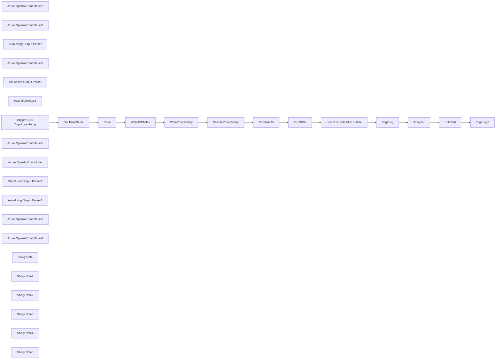

## Fluxo (.json) :

```json
{
  "id": "2DzQ1FH11S3Gp6wn",
  "meta": {
    "instanceId": "558d88703fb65b2d0e44613bc35916258b0f0bf983c5d4730c00c424b77ca36a",
    "templateCredsSetupCompleted": true
  },
  "name": "YogiAI",
  "tags": [],
  "nodes": [
    {
      "id": "2afc390e-d774-4db4-a52f-138f13837646",
      "name": "Azure OpenAI Chat Model2",
      "type": "@n8n/n8n-nodes-langchain.lmChatAzureOpenAi",
      "position": [
        1040,
        0
      ],
      "parameters": {
        "model": "4o",
        "options": {
          "temperature": 0.8
        }
      },
      "credentials": {
        "azureOpenAiApi": {
          "id": "5AjoWhww5SQi2VXd",
          "name": "Azure Open AI account"
        }
      },
      "typeVersion": 1
    },
    {
      "id": "529d9ed9-3ae5-41cb-983e-874aa37ee1c7",
      "name": "YogaLog",
      "type": "n8n-nodes-base.googleSheets",
      "position": [
        2240,
        -100
      ],
      "parameters": {
        "columns": {
          "value": {
            "Date": "={{ $('Trigger 2130 YogaPosesToday').first().json.timestamp }}",
            "JSON": "={{ $('CombineAll').item.json.LineBody }}",
            "Text": "={{ $('RewritePosesToday').item.json.text }}"
          },
          "schema": [
            {
              "id": "Date",
              "type": "string",
              "display": true,
              "removed": false,
              "required": false,
              "displayName": "Date",
              "defaultMatch": false,
              "canBeUsedToMatch": true
            },
            {
              "id": "Text",
              "type": "string",
              "display": true,
              "required": false,
              "displayName": "Text",
              "defaultMatch": false,
              "canBeUsedToMatch": true
            },
            {
              "id": "JSON",
              "type": "string",
              "display": true,
              "removed": false,
              "required": false,
              "displayName": "JSON",
              "defaultMatch": false,
              "canBeUsedToMatch": true
            }
          ],
          "mappingMode": "defineBelow",
          "matchingColumns": [
            "Date"
          ],
          "attemptToConvertTypes": false,
          "convertFieldsToString": false
        },
        "options": {},
        "operation": "append",
        "sheetName": {
          "__rl": true,
          "mode": "list",
          "value": 325576327,
          "cachedResultUrl": "https://docs.google.com/spreadsheets/d/1s_yzDNbbtXhfoOKUlmBHwhgWkR2FuoiKz4WQOu4tQmk/edit#gid=325576327",
          "cachedResultName": "YogaLog"
        },
        "documentId": {
          "__rl": true,
          "mode": "list",
          "value": "1s_yzDNbbtXhfoOKUlmBHwhgWkR2FuoiKz4WQOu4tQmk",
          "cachedResultUrl": "https://docs.google.com/spreadsheets/d/1s_yzDNbbtXhfoOKUlmBHwhgWkR2FuoiKz4WQOu4tQmk/edit?usp=drivesdk",
          "cachedResultName": "SerenityAI"
        }
      },
      "credentials": {
        "googleSheetsOAuth2Api": {
          "id": "TKSdrVOdpgxWBVk8",
          "name": "Google Sheets account"
        }
      },
      "typeVersion": 4.5
    },
    {
      "id": "d491b5c3-31ab-49b2-abc3-8c2a67cf9571",
      "name": "Azure OpenAI Chat Model3",
      "type": "@n8n/n8n-nodes-langchain.lmChatAzureOpenAi",
      "position": [
        2360,
        120
      ],
      "parameters": {
        "model": "4o",
        "options": {}
      },
      "credentials": {
        "azureOpenAiApi": {
          "id": "5AjoWhww5SQi2VXd",
          "name": "Azure Open AI account"
        }
      },
      "typeVersion": 1
    },
    {
      "id": "3b1ebdcb-9e6b-437c-8f51-944218c0c276",
      "name": "Auto-fixing Output Parser",
      "type": "@n8n/n8n-nodes-langchain.outputParserAutofixing",
      "position": [
        2520,
        80
      ],
      "parameters": {
        "options": {}
      },
      "typeVersion": 1
    },
    {
      "id": "3fc67522-501c-4e43-bf9d-b367d57ad4f9",
      "name": "Azure OpenAI Chat Model1",
      "type": "@n8n/n8n-nodes-langchain.lmChatAzureOpenAi",
      "position": [
        2540,
        120
      ],
      "parameters": {
        "model": "4o",
        "options": {}
      },
      "credentials": {
        "azureOpenAiApi": {
          "id": "5AjoWhww5SQi2VXd",
          "name": "Azure Open AI account"
        }
      },
      "typeVersion": 1
    },
    {
      "id": "19bd208b-a5c5-47b3-a2cc-e92a71444be7",
      "name": "Structured Output Parser",
      "type": "@n8n/n8n-nodes-langchain.outputParserStructured",
      "position": [
        2640,
        220
      ],
      "parameters": {
        "schemaType": "manual",
        "inputSchema": "{\n  \"type\": \"object\",\n  \"properties\": {\n    \"yogaPoses\": {\n      \"type\": \"array\",\n      \"items\": {\n        \"type\": \"object\",\n        \"properties\": {\n          \"sequence\": { \"type\": \"integer\" },\n          \"name\": { \"type\": \"string\" }\n        },\n        \"required\": [\"sequence\", \"name\"],\n        \"additionalProperties\": false\n      }\n    }\n  },\n  \"required\": [\"yogaPoses\"]\n}"
      },
      "typeVersion": 1.2
    },
    {
      "id": "2bf3f3d3-84c7-4fd4-b1b9-8c0fb7df44b1",
      "name": "AI Agent",
      "type": "@n8n/n8n-nodes-langchain.agent",
      "position": [
        2400,
        -60
      ],
      "parameters": {
        "text": "=You'll change this into properly format of JSON without having emoji. You'll also make sure the name is matched the data in googlesheet\n\n {{ $json.Text }}",
        "options": {},
        "promptType": "define",
        "hasOutputParser": true
      },
      "typeVersion": 1.7
    },
    {
      "id": "fa3fc89e-54d8-4706-af59-72dbd80fbef4",
      "name": "PosesDatabase1",
      "type": "n8n-nodes-base.googleSheetsTool",
      "position": [
        2480,
        220
      ],
      "parameters": {
        "options": {},
        "sheetName": {
          "__rl": true,
          "mode": "list",
          "value": 1104924292,
          "cachedResultUrl": "https://docs.google.com/spreadsheets/d/1s_yzDNbbtXhfoOKUlmBHwhgWkR2FuoiKz4WQOu4tQmk/edit#gid=1104924292",
          "cachedResultName": "Yoga"
        },
        "documentId": {
          "__rl": true,
          "mode": "list",
          "value": "1s_yzDNbbtXhfoOKUlmBHwhgWkR2FuoiKz4WQOu4tQmk",
          "cachedResultUrl": "https://docs.google.com/spreadsheets/d/1s_yzDNbbtXhfoOKUlmBHwhgWkR2FuoiKz4WQOu4tQmk/edit?usp=drivesdk",
          "cachedResultName": "SerenityAI"
        },
        "descriptionType": "manual",
        "toolDescription": "Yoga Poses Database to read\n"
      },
      "credentials": {
        "googleSheetsOAuth2Api": {
          "id": "TKSdrVOdpgxWBVk8",
          "name": "Google Sheets account"
        }
      },
      "typeVersion": 4.5
    },
    {
      "id": "ff7bd540-c89b-43d1-bb07-bb060a6b4ba6",
      "name": "YogaLog2",
      "type": "n8n-nodes-base.googleSheets",
      "position": [
        2980,
        20
      ],
      "parameters": {
        "columns": {
          "value": {
            "Date": "={{ $('Trigger 2130 YogaPosesToday').first().json.timestamp }}",
            "Pose": "={{ $json.name }}",
            "Sequence": "={{ $json.sequence }}"
          },
          "schema": [
            {
              "id": "Date",
              "type": "string",
              "display": true,
              "removed": false,
              "required": false,
              "displayName": "Date",
              "defaultMatch": false,
              "canBeUsedToMatch": true
            },
            {
              "id": "Sequence",
              "type": "string",
              "display": true,
              "removed": false,
              "required": false,
              "displayName": "Sequence",
              "defaultMatch": false,
              "canBeUsedToMatch": true
            },
            {
              "id": "Pose",
              "type": "string",
              "display": true,
              "removed": false,
              "required": false,
              "displayName": "Pose",
              "defaultMatch": false,
              "canBeUsedToMatch": true
            }
          ],
          "mappingMode": "defineBelow",
          "matchingColumns": [
            "Date"
          ],
          "attemptToConvertTypes": false,
          "convertFieldsToString": false
        },
        "options": {},
        "operation": "append",
        "sheetName": {
          "__rl": true,
          "mode": "list",
          "value": 2060471945,
          "cachedResultUrl": "https://docs.google.com/spreadsheets/d/1s_yzDNbbtXhfoOKUlmBHwhgWkR2FuoiKz4WQOu4tQmk/edit#gid=2060471945",
          "cachedResultName": "YogaLog2"
        },
        "documentId": {
          "__rl": true,
          "mode": "list",
          "value": "1s_yzDNbbtXhfoOKUlmBHwhgWkR2FuoiKz4WQOu4tQmk",
          "cachedResultUrl": "https://docs.google.com/spreadsheets/d/1s_yzDNbbtXhfoOKUlmBHwhgWkR2FuoiKz4WQOu4tQmk/edit?usp=drivesdk",
          "cachedResultName": "SerenityAI"
        }
      },
      "credentials": {
        "googleSheetsOAuth2Api": {
          "id": "TKSdrVOdpgxWBVk8",
          "name": "Google Sheets account"
        }
      },
      "typeVersion": 4.5
    },
    {
      "id": "f649c5b9-fad1-412c-8389-ed53b95e5583",
      "name": "Split Out",
      "type": "n8n-nodes-base.splitOut",
      "position": [
        2740,
        -120
      ],
      "parameters": {
        "options": {},
        "fieldToSplitOut": "output.yogaPoses"
      },
      "typeVersion": 1
    },
    {
      "id": "8194e695-fa9e-4555-9da5-b7dbdc1b0e4a",
      "name": "Trigger 2130 YogaPosesToday",
      "type": "n8n-nodes-base.scheduleTrigger",
      "position": [
        -200,
        -20
      ],
      "parameters": {
        "rule": {
          "interval": [
            {
              "triggerAtHour": 21,
              "triggerAtMinute": 30
            }
          ]
        }
      },
      "typeVersion": 1.2
    },
    {
      "id": "3b5706d8-4968-4b9c-a255-7d1f806d85dc",
      "name": "Azure OpenAI Chat Model5",
      "type": "@n8n/n8n-nodes-langchain.lmChatAzureOpenAi",
      "position": [
        1340,
        180
      ],
      "parameters": {
        "model": "4o",
        "options": {
          "temperature": 0.9
        }
      },
      "credentials": {
        "azureOpenAiApi": {
          "id": "5AjoWhww5SQi2VXd",
          "name": "Azure Open AI account"
        }
      },
      "typeVersion": 1
    },
    {
      "id": "acee6e43-f094-4f30-bffb-6c56b0425327",
      "name": "Get PoseName",
      "type": "n8n-nodes-base.googleSheets",
      "position": [
        40,
        -20
      ],
      "parameters": {
        "options": {
          "dataLocationOnSheet": {
            "values": {
              "range": "B18:D28",
              "rangeDefinition": "specifyRangeA1"
            }
          }
        },
        "sheetName": {
          "__rl": true,
          "mode": "list",
          "value": 2035276041,
          "cachedResultUrl": "https://docs.google.com/spreadsheets/d/1s_yzDNbbtXhfoOKUlmBHwhgWkR2FuoiKz4WQOu4tQmk/edit#gid=2035276041",
          "cachedResultName": "NotePad"
        },
        "documentId": {
          "__rl": true,
          "mode": "list",
          "value": "1s_yzDNbbtXhfoOKUlmBHwhgWkR2FuoiKz4WQOu4tQmk",
          "cachedResultUrl": "https://docs.google.com/spreadsheets/d/1s_yzDNbbtXhfoOKUlmBHwhgWkR2FuoiKz4WQOu4tQmk/edit?usp=drivesdk",
          "cachedResultName": "SerenityAI"
        }
      },
      "credentials": {
        "googleSheetsOAuth2Api": {
          "id": "TKSdrVOdpgxWBVk8",
          "name": "Google Sheets account"
        }
      },
      "typeVersion": 4.5
    },
    {
      "id": "6be3a88c-4e0f-44e6-97c1-eafa13230ae7",
      "name": "WritePosesToday",
      "type": "@n8n/n8n-nodes-langchain.chainLlm",
      "position": [
        1120,
        -160
      ],
      "parameters": {
        "text": "=Let's calm down and focus on these poses today.\n\n{{ $('Code').item.json.poseNamesOnly }}\n\nhave a great practice!",
        "messages": {
          "messageValues": [
            {
              "message": "=You're experienced yoga instructor. You'll say the topic and asking the student to focus on practice today. You'll later give the yoga poses list for practicing today. You will also include related pose or variation from the list. You'll make sure to include all the poses from the list.\n"
            }
          ]
        },
        "promptType": "define"
      },
      "retryOnFail": true,
      "typeVersion": 1.5
    },
    {
      "id": "8d9cdf4c-a432-44ff-a0a3-133fbc8e9daa",
      "name": "RewritePosesToday",
      "type": "@n8n/n8n-nodes-langchain.chainLlm",
      "position": [
        1180,
        60
      ],
      "parameters": {
        "text": "={{ $json.text }}",
        "messages": {
          "messageValues": [
            {
              "message": "=You'll format and add emoji before the poses name to make it chat-friendly to send via Line. You will only return the message to be sent.\n\nIf the message is too long, you'll split by ====== to 3 messages\n"
            }
          ]
        },
        "promptType": "define"
      },
      "retryOnFail": true,
      "typeVersion": 1.5
    },
    {
      "id": "2e419654-1f83-48df-8ac0-9ec621444cc2",
      "name": "Azure OpenAI Chat Model",
      "type": "@n8n/n8n-nodes-langchain.lmChatAzureOpenAi",
      "position": [
        480,
        100
      ],
      "parameters": {
        "model": "4o",
        "options": {
          "temperature": 0.9
        }
      },
      "credentials": {
        "azureOpenAiApi": {
          "id": "5AjoWhww5SQi2VXd",
          "name": "Azure Open AI account"
        }
      },
      "typeVersion": 1
    },
    {
      "id": "ad1bf966-114e-4bb8-abff-f5768e907aff",
      "name": "WriteJSONflex",
      "type": "@n8n/n8n-nodes-langchain.chainLlm",
      "position": [
        580,
        -80
      ],
      "parameters": {
        "text": "={{ $json.outputText }}",
        "messages": {
          "messageValues": [
            {
              "message": "=You are JSON parser, you'll write JSON in this format for all the row in 'GetPoseName' You'll notice the differnet between uri and url.\n\n{\n\"type\": \"bubble\",\n\"hero\": {\n\"type\": \"image\",\n\"url\": \"https://pocketyoga.com/assets/images/thumbnails146/SupineAngle-tn146.png \", \n\"size\": \"full\",\n\"aspectRatio\": \"20:13\",\n\"aspectMode\": \"fit\",\n\"action\": {\n\"type\": \"uri\",\n\"uri\": \"https://pocketyoga.com/pose/SupineAngle \"\n}\n},\n\"body\": {\n\"type\": \"box\",\n\"layout\": \"vertical\",\n\"contents\": [\n{\n\"type\": \"text\",\n\"text\": \"Supine Angle (supta konasana)\",\n\"size\": \"lg\",\n\"wrap\": true,\n\"action\": {\n\"type\": \"message\",\n\"label\": \"action\",\n\"text\": \"Supine Angle (supta konasana)\"\n}\n}\n]\n}\n},\n{\n\"type\": \"bubble\",\n\"hero\": {\n\"type\": \"image\",\n\"url\": \"https://pocketyoga.com/assets/images/thumbnails146/SupineAngle-tn146.png \",\n\"size\": \"full\",\n\"aspectRatio\": \"20:13\",\n\"aspectMode\": \"fit\",\n\"action\": {\n\"type\": \"uri\",\n\"uri\": \"https://pocketyoga.com/pose/SupineAngle \"\n}\n},\n\"body\": {\n\"type\": \"box\",\n\"layout\": \"vertical\",\n\"contents\": [\n{\n\"type\": \"text\",\n\"text\": \"Supine Angle (supta konasana)\",\n\"size\": \"lg\",\n\"wrap\": true,\n\"action\": {\n\"type\": \"message\",\n\"label\": \"action\",\n\"text\": \"Supine Angle (supta konasana)\"\n}\n}\n]\n}\n}"
            }
          ]
        },
        "promptType": "define",
        "hasOutputParser": true
      },
      "retryOnFail": true,
      "typeVersion": 1.5
    },
    {
      "id": "1e6af9e5-675d-4d9a-aba6-304d218ea138",
      "name": "Structured Output Parser1",
      "type": "@n8n/n8n-nodes-langchain.outputParserStructured",
      "position": [
        780,
        220
      ],
      "parameters": {
        "jsonSchemaExample": "[\n  {\n    \"type\": \"bubble\",\n    \"hero\": {\n      \"type\": \"image\",\n      \"url\": \"https://pocketyoga.com/assets/images/thumbnails146/SupineAngle-tn146.png\",\n      \"size\": \"full\",\n      \"aspectRatio\": \"20:13\",\n      \"aspectMode\": \"fit\",\n      \"action\": {\n        \"type\": \"uri\",\n        \"uri\": \"https://pocketyoga.com/pose/SupineAngle\"\n      }\n    },\n    \"body\": {\n      \"type\": \"box\",\n      \"layout\": \"vertical\",\n      \"contents\": [\n        {\n          \"type\": \"text\",\n          \"text\": \"Supine Angle (supta konasana)\",\n          \"size\": \"lg\",\n          \"wrap\": true,\n          \"action\": {\n            \"type\": \"message\",\n            \"label\": \"action\",\n            \"text\": \"Supine Angle (supta konasana)\"\n          }\n        }\n      ]\n    }\n  },\n  {\n    \"type\": \"bubble\",\n    \"hero\": {\n      \"type\": \"image\",\n      \"url\": \"https://pocketyoga.com/assets/images/thumbnails146/SupineAngle-tn146.png\",\n      \"size\": \"full\",\n      \"aspectRatio\": \"20:13\",\n      \"aspectMode\": \"fit\",\n      \"action\": {\n        \"type\": \"uri\",\n        \"uri\": \"https://pocketyoga.com/pose/SupineAngle\"\n      }\n    },\n    \"body\": {\n      \"type\": \"box\",\n      \"layout\": \"vertical\",\n      \"contents\": [\n        {\n          \"type\": \"text\",\n          \"text\": \"Supine Angle (supta konasana)\",\n          \"size\": \"lg\",\n          \"wrap\": true,\n          \"action\": {\n            \"type\": \"message\",\n            \"label\": \"action\",\n            \"text\": \"Supine Angle (supta konasana)\"\n          }\n        }\n      ]\n    }\n  }\n]"
      },
      "typeVersion": 1.2
    },
    {
      "id": "5559c5b9-6c2c-4adb-9544-79be3f1f85d1",
      "name": "Auto-fixing Output Parser1",
      "type": "@n8n/n8n-nodes-langchain.outputParserAutofixing",
      "position": [
        680,
        80
      ],
      "parameters": {
        "options": {}
      },
      "typeVersion": 1
    },
    {
      "id": "2335f74e-3fe6-4720-bb88-1bbda320ae8b",
      "name": "Azure OpenAI Chat Model6",
      "type": "@n8n/n8n-nodes-langchain.lmChatAzureOpenAi",
      "position": [
        640,
        200
      ],
      "parameters": {
        "model": "4o",
        "options": {}
      },
      "credentials": {
        "azureOpenAiApi": {
          "id": "5AjoWhww5SQi2VXd",
          "name": "Azure Open AI account"
        }
      },
      "typeVersion": 1
    },
    {
      "id": "83d02971-bdf6-4c45-b705-f2f49fa49525",
      "name": "Azure OpenAI Chat Model4",
      "type": "@n8n/n8n-nodes-langchain.lmChatAzureOpenAi",
      "position": [
        1780,
        200
      ],
      "parameters": {
        "model": "4o",
        "options": {
          "temperature": 0.5
        }
      },
      "credentials": {
        "azureOpenAiApi": {
          "id": "5AjoWhww5SQi2VXd",
          "name": "Azure Open AI account"
        }
      },
      "typeVersion": 1
    },
    {
      "id": "5e5c1c11-cf3d-47f4-91ce-14d7e3f493fb",
      "name": "Code",
      "type": "n8n-nodes-base.code",
      "position": [
        240,
        -20
      ],
      "parameters": {
        "jsCode": "const items = $input.all();\n\nlet outputText = \"\";\nlet poseNamesList = []; // New list to store only PoseNames\n\nitems.forEach(item => {\n  const { PoseName, uri, url } = item.json;\n  outputText += `Name: ${PoseName}\\nuri: ${uri}\\nurl: ${url}\\n\\n`;\n  poseNamesList.push(PoseName); // Add PoseName to the list\n});\n\nreturn [\n  {\n    json: {\n      outputText,  // Original formatted text\n      poseNamesOnly: poseNamesList.join('\\n') // New: PoseNames as text list\n    }\n  }\n];"
      },
      "typeVersion": 2
    },
    {
      "id": "864e2fbb-a9dc-43ba-918e-0197821de598",
      "name": "Line Push with Flex Bubble",
      "type": "n8n-nodes-base.httpRequest",
      "position": [
        1980,
        -80
      ],
      "parameters": {
        "url": "https://api.line.me/v2/bot/message/push",
        "method": "POST",
        "options": {},
        "jsonBody": "={{ $json.text }}",
        "sendBody": true,
        "specifyBody": "json",
        "authentication": "genericCredentialType",
        "genericAuthType": "httpHeaderAuth"
      },
      "credentials": {
        "httpHeaderAuth": {
          "id": "yiPG7xPwvDzsY0Qd",
          "name": "Line @511dizji"
        }
      },
      "retryOnFail": false,
      "typeVersion": 4.2
    },
    {
      "id": "91e50734-8899-4d23-9a4f-ce637d9e5ed1",
      "name": "CombineAll",
      "type": "n8n-nodes-base.set",
      "position": [
        1640,
        -100
      ],
      "parameters": {
        "options": {},
        "assignments": {
          "assignments": [
            {
              "id": "9c82e62c-dfbc-4b09-899d-f4d1581e1c15",
              "name": "LineBody",
              "type": "string",
              "value": "={\n  \"to\": \"Ue9cc622e33e5333e3784298412ec9aed\",\n  \"messages\": [\n    {\n      \"type\": \"text\",\n      \"text\": \"{{ $json.text.replaceAll(\"\\n\",\"\\\\n\").replaceAll(\"\\n\",\"\").removeMarkdown().removeTags().replaceAll('\"',\"\") }}\"\n    },\n    {\n      \"type\": \"flex\",\n      \"altText\": \"Yoga Poses Images\",\n      \"contents\": {\n        \"type\": \"carousel\",\n        \"contents\": [  {{ $('WriteJSONflex').all().flatMap(item => JSON.stringify(item.json.output)).join(',') }}\n\n          ] \n      }\n    }\n  ]\n}"
            }
          ]
        }
      },
      "typeVersion": 3.4
    },
    {
      "id": "dc6d5dfe-66ad-49ca-b246-ee52f270269d",
      "name": "Fix JSON",
      "type": "@n8n/n8n-nodes-langchain.chainLlm",
      "position": [
        1720,
        120
      ],
      "parameters": {
        "text": "=Fix this JSON\n\n{{ $json.LineBody }}",
        "messages": {
          "messageValues": [
            {
              "message": "=You are JSON formatter, You'll fix the JSON and return only the JSON that has been fixed. Do not explain or write anything else"
            }
          ]
        },
        "promptType": "define",
        "hasOutputParser": true
      },
      "retryOnFail": true,
      "typeVersion": 1.5
    },
    {
      "id": "a062cf06-f438-4d1e-9c0c-d2fc00f40071",
      "name": "Sticky Note",
      "type": "n8n-nodes-base.stickyNote",
      "position": [
        -300,
        -380
      ],
      "parameters": {
        "color": 5,
        "width": 260,
        "height": 240,
        "content": "## YogiAI\n\nThis YogiAI is to provide daily reminder and pose of the day to the user via Line Push Message\n\nThe data will be generated from GoogleSheet Weighted Random Poses and Push to your Line at the scheduled time\n\n"
      },
      "typeVersion": 1
    },
    {
      "id": "8d2184a9-af30-4b1e-826b-69a8f37d8256",
      "name": "Sticky Note1",
      "type": "n8n-nodes-base.stickyNote",
      "position": [
        0,
        -320
      ],
      "parameters": {
        "color": 4,
        "width": 400,
        "height": 500,
        "content": "## Get the Data\nThis is to get the data from GoogleSheet \n\nIn the range we got, we'll have PosesName, uri (image link), and url (link when clicked) \n\nThe sample is here \nhttps://docs.google.com/spreadsheets/d/1eqLJsUL_QkOMy_qPzNCrUCZdx36asC8P1i3PowTQqLY/edit?usp=sharing\n\nThe data is from https://pocketyoga.com/pose/\n\n***YOU SHOULD UPDATE IT WITH YOUR OWN DATA***"
      },
      "typeVersion": 1
    },
    {
      "id": "6d688a1c-90aa-4c3a-a868-946c61cec7cf",
      "name": "Sticky Note2",
      "type": "n8n-nodes-base.stickyNote",
      "position": [
        440,
        -320
      ],
      "parameters": {
        "color": 2,
        "width": 540,
        "height": 660,
        "content": "## Write FlexMessage for Images\n\nTo send the information in Line, we need to write a JSON for Flex Message meaning that it can slides to show the images of the pose\n\nWe use auto-parser here to make sure the JSON followed the required format\n\nhttps://developers.line.biz/en/docs/messaging-api/using-flex-messages/\n\nYou can also use https://developers.line.biz/flex-simulator/?status=success to simulate the format "
      },
      "typeVersion": 1
    },
    {
      "id": "e5b92f32-e282-49cd-8084-68e380572ee9",
      "name": "Sticky Note3",
      "type": "n8n-nodes-base.stickyNote",
      "position": [
        1000,
        -320
      ],
      "parameters": {
        "color": 2,
        "width": 540,
        "height": 660,
        "content": "## Write Text for Poses today \n\nThis node we want to have user friendly text such as with emojis, etc. So, we give Azure OpenAI the poses of today and ask it to rewrie"
      },
      "typeVersion": 1
    },
    {
      "id": "38cc9d2f-be2c-4448-9746-5d533108df7c",
      "name": "Sticky Note4",
      "type": "n8n-nodes-base.stickyNote",
      "position": [
        1600,
        -320
      ],
      "parameters": {
        "color": 3,
        "width": 540,
        "height": 660,
        "content": "## Combine the result and push it via Line\n\n1) We used 'Edit Field' to combine all the output\n(Hint: you can have input_txt and output_txt to debug your script here)\n2) To make sure that our JSON is proper, we asked AI to fix it again. \n3) Use Line Push >> Please replace \"to\" to your own UID and create the header authorization with the channel you have\n\nhttps://developers.line.biz/en/docs/messaging-api/sending-messages/\n"
      },
      "typeVersion": 1
    },
    {
      "id": "b88d6f78-ce54-4b83-b009-e4e22e518c7c",
      "name": "Sticky Note5",
      "type": "n8n-nodes-base.stickyNote",
      "position": [
        2200,
        -320
      ],
      "parameters": {
        "color": 6,
        "width": 1020,
        "height": 660,
        "content": "## Write back the data into Log and Log2 \n\nWe used log2 to count how many time we send each poses and weighted this back into the 'Yoga' Sheet to make the random more random ;)\n\nTo put the data back, we also want to extract from the output and split it out to put back to google sheet"
      },
      "typeVersion": 1
    }
  ],
  "active": false,
  "pinData": {},
  "settings": {
    "timezone": "Asia/Bangkok",
    "executionOrder": "v1"
  },
  "versionId": "8d3482ff-25e6-479f-a33b-b33d1aeb51fc",
  "connections": {
    "Code": {
      "main": [
        [
          {
            "node": "WriteJSONflex",
            "type": "main",
            "index": 0
          }
        ]
      ]
    },
    "YogaLog": {
      "main": [
        [
          {
            "node": "AI Agent",
            "type": "main",
            "index": 0
          }
        ]
      ]
    },
    "AI Agent": {
      "main": [
        [
          {
            "node": "Split Out",
            "type": "main",
            "index": 0
          }
        ]
      ]
    },
    "Fix JSON": {
      "main": [
        [
          {
            "node": "Line Push with Flex Bubble",
            "type": "main",
            "index": 0
          }
        ]
      ]
    },
    "YogaLog2": {
      "main": [
        []
      ]
    },
    "Split Out": {
      "main": [
        [
          {
            "node": "YogaLog2",
            "type": "main",
            "index": 0
          }
        ]
      ]
    },
    "CombineAll": {
      "main": [
        [
          {
            "node": "Fix JSON",
            "type": "main",
            "index": 0
          }
        ]
      ]
    },
    "Get PoseName": {
      "main": [
        [
          {
            "node": "Code",
            "type": "main",
            "index": 0
          }
        ]
      ]
    },
    "WriteJSONflex": {
      "main": [
        [
          {
            "node": "WritePosesToday",
            "type": "main",
            "index": 0
          }
        ]
      ]
    },
    "PosesDatabase1": {
      "ai_tool": [
        [
          {
            "node": "AI Agent",
            "type": "ai_tool",
            "index": 0
          }
        ]
      ]
    },
    "WritePosesToday": {
      "main": [
        [
          {
            "node": "RewritePosesToday",
            "type": "main",
            "index": 0
          }
        ]
      ]
    },
    "RewritePosesToday": {
      "main": [
        [
          {
            "node": "CombineAll",
            "type": "main",
            "index": 0
          }
        ]
      ]
    },
    "Azure OpenAI Chat Model": {
      "ai_languageModel": [
        [
          {
            "node": "WriteJSONflex",
            "type": "ai_languageModel",
            "index": 0
          }
        ]
      ]
    },
    "Azure OpenAI Chat Model1": {
      "ai_languageModel": [
        [
          {
            "node": "Auto-fixing Output Parser",
            "type": "ai_languageModel",
            "index": 0
          }
        ]
      ]
    },
    "Azure OpenAI Chat Model2": {
      "ai_languageModel": [
        [
          {
            "node": "WritePosesToday",
            "type": "ai_languageModel",
            "index": 0
          }
        ]
      ]
    },
    "Azure OpenAI Chat Model3": {
      "ai_languageModel": [
        [
          {
            "node": "AI Agent",
            "type": "ai_languageModel",
            "index": 0
          }
        ]
      ]
    },
    "Azure OpenAI Chat Model4": {
      "ai_languageModel": [
        [
          {
            "node": "Fix JSON",
            "type": "ai_languageModel",
            "index": 0
          }
        ]
      ]
    },
    "Azure OpenAI Chat Model5": {
      "ai_languageModel": [
        [
          {
            "node": "RewritePosesToday",
            "type": "ai_languageModel",
            "index": 0
          }
        ]
      ]
    },
    "Azure OpenAI Chat Model6": {
      "ai_languageModel": [
        [
          {
            "node": "Auto-fixing Output Parser1",
            "type": "ai_languageModel",
            "index": 0
          }
        ]
      ]
    },
    "Structured Output Parser": {
      "ai_outputParser": [
        [
          {
            "node": "Auto-fixing Output Parser",
            "type": "ai_outputParser",
            "index": 0
          }
        ]
      ]
    },
    "Auto-fixing Output Parser": {
      "ai_outputParser": [
        [
          {
            "node": "AI Agent",
            "type": "ai_outputParser",
            "index": 0
          }
        ]
      ]
    },
    "Structured Output Parser1": {
      "ai_outputParser": [
        [
          {
            "node": "Auto-fixing Output Parser1",
            "type": "ai_outputParser",
            "index": 0
          }
        ]
      ]
    },
    "Auto-fixing Output Parser1": {
      "ai_outputParser": [
        [
          {
            "node": "WriteJSONflex",
            "type": "ai_outputParser",
            "index": 0
          }
        ]
      ]
    },
    "Line Push with Flex Bubble": {
      "main": [
        [
          {
            "node": "YogaLog",
            "type": "main",
            "index": 0
          }
        ]
      ]
    },
    "Trigger 2130 YogaPosesToday": {
      "main": [
        [
          {
            "node": "Get PoseName",
            "type": "main",
            "index": 0
          }
        ]
      ]
    }
  }
}
```

<a id="template-574"></a>

## Template 574 - Auto-categorização de posts WordPress por IA

- **Nome:** Auto-categorização de posts WordPress por IA
- **Descrição:** Automatiza a classificação de posts do WordPress usando um modelo de linguagem para atribuir uma categoria principal a cada post e atualizar os posts com o ID de categoria.
- **Funcionalidade:** • Acionamento manual: inicia o fluxo manualmente ao executar o teste.
• Recuperação de posts do WordPress: obtém todos os posts para processamento em lote.
• Classificação por IA: envia o título de cada post a um agente de linguagem que seleciona um único ID de categoria a partir de uma lista fixa.
• Atualização de categorias no WordPress: atualiza cada post com o ID de categoria retornado pela IA.
• Prompt configurável: permite editar a instrução e a lista de categorias/IDs usadas pelo agente de IA.
• Processamento em massa: suporta operação sobre múltiplos posts em sequência para categorizar todo o acervo.
- **Ferramentas:** • WordPress: plataforma de gerenciamento de conteúdo onde os posts são lidos e atualizados; as categorias devem estar pré-criadas no site.
• OpenAI (modelo de linguagem): serviço de IA que analisa títulos de posts e retorna o ID da categoria mais adequada.

## Fluxo visual

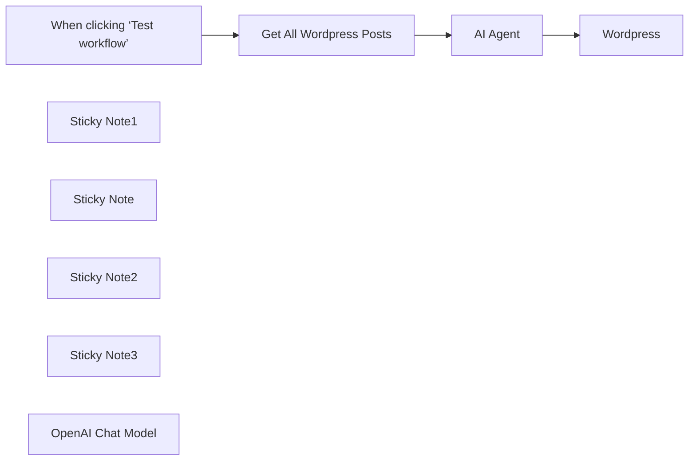

## Fluxo (.json) :

```json
{
  "id": "caaf1WFANPKAikiH",
  "meta": {
    "instanceId": "558d88703fb65b2d0e44613bc35916258b0f0bf983c5d4730c00c424b77ca36a",
    "templateCredsSetupCompleted": true
  },
  "name": "Auto categorize wordpress template",
  "tags": [],
  "nodes": [
    {
      "id": "2017403c-7496-48f8-a487-8a017c7adfe3",
      "name": "When clicking ‘Test workflow’",
      "type": "n8n-nodes-base.manualTrigger",
      "position": [
        680,
        320
      ],
      "parameters": {},
      "typeVersion": 1
    },
    {
      "id": "82ff288f-4234-4192-9046-33e5ffee5264",
      "name": "Wordpress",
      "type": "n8n-nodes-base.wordpress",
      "position": [
        1500,
        320
      ],
      "parameters": {
        "postId": "={{ $('Get All Wordpress Posts').item.json.id }}",
        "operation": "update",
        "updateFields": {
          "categories": "={{ $json.output }}"
        }
      },
      "credentials": {
        "wordpressApi": {
          "id": "lGWPwxTdfPDDbFjj",
          "name": "Rumjahn.com wordpress"
        }
      },
      "typeVersion": 1
    },
    {
      "id": "521deb22-62dd-4b5f-8b9a-aab9777821da",
      "name": "Sticky Note1",
      "type": "n8n-nodes-base.stickyNote",
      "position": [
        620,
        -100
      ],
      "parameters": {
        "width": 504.88636363636317,
        "content": "## How to Auto-Categorize 82 Blog Posts in 2 Minutes using A.I. (No Coding Required)\n\n💡 Read the [case study here](https://rumjahn.com/how-to-use-a-i-to-categorize-wordpress-posts-and-streamline-your-content-organization-process/).\n\n📺 Watch the [youtube tutorial here](https://www.youtube.com/watch?v=IvQioioVqhw)\n\n"
      },
      "typeVersion": 1
    },
    {
      "id": "4090d827-f8cd-47ef-ad4f-654ee58216f6",
      "name": "Sticky Note",
      "type": "n8n-nodes-base.stickyNote",
      "position": [
        860,
        180
      ],
      "parameters": {
        "color": 3,
        "width": 188.14814814814804,
        "height": 327.3400673400663,
        "content": "### Get wordpress posts\n\nTurn off return all if you're running into issues.\n"
      },
      "typeVersion": 1
    },
    {
      "id": "71585d54-fdcc-42a5-8a0e-0fac3adc1809",
      "name": "Sticky Note2",
      "type": "n8n-nodes-base.stickyNote",
      "position": [
        1080,
        80
      ],
      "parameters": {
        "color": 4,
        "width": 315.1464152082392,
        "height": 416.90235690235625,
        "content": "### A.I. Categorization\n\n1. you need to set up the categories first in wordpress\n\n2. Edit the message prompt and change the categories and category numbers"
      },
      "typeVersion": 1
    },
    {
      "id": "29354054-8600-4e45-99d0-6f30f779a505",
      "name": "Sticky Note3",
      "type": "n8n-nodes-base.stickyNote",
      "position": [
        1480,
        240
      ],
      "parameters": {
        "color": 5,
        "width": 171.64983164983155,
        "height": 269.59595959595947,
        "content": "### Update category"
      },
      "typeVersion": 1
    },
    {
      "id": "d9fe6289-6b97-4830-80aa-754ac4d4b3e0",
      "name": "Get All Wordpress Posts",
      "type": "n8n-nodes-base.wordpress",
      "position": [
        900,
        320
      ],
      "parameters": {
        "options": {},
        "operation": "getAll",
        "returnAll": true
      },
      "credentials": {
        "wordpressApi": {
          "id": "lGWPwxTdfPDDbFjj",
          "name": "Rumjahn.com wordpress"
        }
      },
      "typeVersion": 1
    },
    {
      "id": "ed40bf13-8294-4b4e-a8b6-5749989d3420",
      "name": "OpenAI Chat Model",
      "type": "@n8n/n8n-nodes-langchain.lmChatOpenAi",
      "position": [
        1080,
        540
      ],
      "parameters": {
        "options": {}
      },
      "credentials": {
        "openAiApi": {
          "id": "XO3iT1iYT5Vod56X",
          "name": "OpenAi account"
        }
      },
      "typeVersion": 1
    },
    {
      "id": "dafeb935-532e-4067-9dfb-7e9a6bbc4e5a",
      "name": "AI Agent",
      "type": "@n8n/n8n-nodes-langchain.agent",
      "position": [
        1100,
        320
      ],
      "parameters": {
        "text": "=You are an expert content strategist and taxonomy specialist with extensive experience in blog categorization and content organization.\n\nI will provide you with a blog post's title. Your task is to assign ONE primary category ID from this fixed list:\n\n13 = Content Creation\n14 = Digital Marketing\n15 = AI Tools\n17 = Automation & Integration\n18 = Productivity Tools\n19 = Analytics & Strategy\n\nAnalyze the title and return only the single most relevant category ID number that best represents the main focus of the post. While a post might touch on multiple topics, select the dominant theme that would be most useful for navigation purposes.\n\n{{ $json.title.rendered }}\n\nOutput only the category number",
        "options": {},
        "promptType": "define"
      },
      "typeVersion": 1.7
    }
  ],
  "active": false,
  "pinData": {},
  "settings": {
    "executionOrder": "v1"
  },
  "versionId": "2a753171-425f-4b5a-bd1b-8591ad2d142c",
  "connections": {
    "AI Agent": {
      "main": [
        [
          {
            "node": "Wordpress",
            "type": "main",
            "index": 0
          }
        ]
      ]
    },
    "OpenAI Chat Model": {
      "ai_languageModel": [
        [
          {
            "node": "AI Agent",
            "type": "ai_languageModel",
            "index": 0
          }
        ]
      ]
    },
    "Get All Wordpress Posts": {
      "main": [
        [
          {
            "node": "AI Agent",
            "type": "main",
            "index": 0
          }
        ]
      ]
    },
    "When clicking ‘Test workflow’": {
      "main": [
        [
          {
            "node": "Get All Wordpress Posts",
            "type": "main",
            "index": 0
          }
        ]
      ]
    }
  }
}
```

<a id="template-575"></a>

## Template 575 - Rastreamento e pesquisa de startups financiadas

- **Nome:** Rastreamento e pesquisa de startups financiadas
- **Descrição:** Este fluxo monitora feeds de notícias para identificar anúncios de financiamento, extrai e estrutura informações chave sobre as empresas envolvidas e realiza pesquisa aprofundada, armazenando os resultados para análise posterior.
- **Funcionalidade:** • Coletar sitemaps de notícias: Recupera feeds de TechCrunch e VentureBeat para localizar novos artigos.
• Filtrar artigos relevantes: Separa artigos individuais e filtra por palavras-chave relacionadas a financiamentos (ex.: "raise").
• Baixar conteúdo dos artigos: Requisições HTTP para obter o HTML completo dos artigos selecionados.
• Extrair texto e título: Parseia o HTML usando seletores CSS para obter conteúdo limpo para análise.
• Unir dados de fontes: Combina artigos de múltiplas fontes num único fluxo de dados para análise consolidada.
• Extrair dados estruturados: Usa modelos de linguagem para identificar e extrair campos como nome da empresa, rodada, valor, investidores e avaliação.
• Pesquisar site da empresa: Consulta modelos LLM para encontrar o website oficial da empresa a partir do nome extraído.
• Refinar e validar JSON: Aplica um parser com auto-correção para garantir saída estruturada e consistente.
• Realizar pesquisa aprofundada: Executa pesquisas profundas (incluindo opções alternativas) para compilar histórico, modelo de negócio, concorrentes e fontes citadas.
• Armazenar resultados e encaminhar: Registra dados estruturados e relatórios em uma base externa e aciona um subworkflow para pesquisa adicional quando necessário.
• Rastrear fontes: Mantém e salva links/citações das fontes usadas para permitir verificação posterior.
- **Ferramentas:** • TechCrunch: Fonte de artigos e sitemap usada para detectar anúncios de financiamento.
• VentureBeat: Fonte de artigos e sitemap usada para detectar anúncios de financiamento.
• Perplexity AI: Serviço de pesquisa profunda e geração de relatórios com citações usado para compilar o relatório detalhado.
• OpenRouter (modelos Llama): Utilizado para consultas de busca (ex.: encontrar o website da empresa) via modelo LLM.
• Anthropic (Claude 3.5): Modelos de linguagem empregados para extração de dados estruturados e parsing robusto.
• Jina DeepSearch: Opção de busca profunda para pesquisas alternativas e complementares.
• Airtable: Base externa para armazenar os registros estruturados, relatórios e links das fontes.

## Fluxo visual

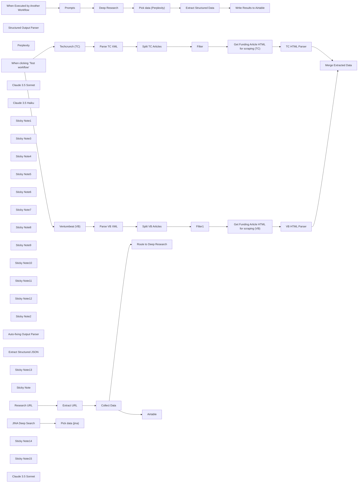

## Fluxo (.json) :

```json
{
  "meta": {
    "instanceId": "d4d7965840e96e50a3e02959a8487c692901dfa8d5cc294134442c67ce1622d3",
    "templateCredsSetupCompleted": true
  },
  "nodes": [
    {
      "id": "5d02237f-151b-4bb4-9341-b11149925309",
      "name": "When clicking ‘Test workflow’",
      "type": "n8n-nodes-base.manualTrigger",
      "position": [
        -980,
        -40
      ],
      "parameters": {},
      "typeVersion": 1
    },
    {
      "id": "dc60bffa-b6f8-432d-85ed-0d08f092a454",
      "name": "Filter",
      "type": "n8n-nodes-base.filter",
      "position": [
        -20,
        -220
      ],
      "parameters": {
        "options": {},
        "conditions": {
          "options": {
            "version": 2,
            "leftValue": "",
            "caseSensitive": true,
            "typeValidation": "strict"
          },
          "combinator": "and",
          "conditions": [
            {
              "id": "3b4c2e25-862d-4b4e-aa66-38c5f0e5a7b2",
              "operator": {
                "type": "string",
                "operation": "contains"
              },
              "leftValue": "={{ $json['urlset.url']['news:news']['news:title'] }}",
              "rightValue": "raise"
            }
          ]
        }
      },
      "typeVersion": 2.2
    },
    {
      "id": "f779a004-57f6-451b-984b-3fd9517e4842",
      "name": "Structured Output Parser",
      "type": "@n8n/n8n-nodes-langchain.outputParserStructured",
      "position": [
        1900,
        100
      ],
      "parameters": {
        "jsonSchemaExample": "{\n\t\"website_url\": \"https://example.com\"\n}"
      },
      "typeVersion": 1.2
    },
    {
      "id": "adcffd7e-943e-488f-a11b-0b64e45c6ff6",
      "name": "Perplexity",
      "type": "@n8n/n8n-nodes-langchain.lmChatOpenRouter",
      "position": [
        1380,
        100
      ],
      "parameters": {
        "model": "perplexity/llama-3.1-sonar-small-128k-online",
        "options": {}
      },
      "credentials": {
        "openRouterApi": {
          "id": "Wz9uIFEMzOmhbt1D",
          "name": "OpenRouter account"
        }
      },
      "typeVersion": 1
    },
    {
      "id": "0c90db72-bbd0-4f8c-bf9e-6005dc99344f",
      "name": "Filter1",
      "type": "n8n-nodes-base.filter",
      "position": [
        -20,
        120
      ],
      "parameters": {
        "options": {},
        "conditions": {
          "options": {
            "version": 2,
            "leftValue": "",
            "caseSensitive": true,
            "typeValidation": "strict"
          },
          "combinator": "and",
          "conditions": [
            {
              "id": "3b4c2e25-862d-4b4e-aa66-38c5f0e5a7b2",
              "operator": {
                "type": "string",
                "operation": "contains"
              },
              "leftValue": "={{ $json.loc }}",
              "rightValue": "raise"
            }
          ]
        }
      },
      "typeVersion": 2.2
    },
    {
      "id": "f770791d-a987-4509-b8fc-648f31deda88",
      "name": "Extract Structured Data ",
      "type": "@n8n/n8n-nodes-langchain.informationExtractor",
      "position": [
        960,
        -60
      ],
      "parameters": {
        "text": "=Article Title: {{ $json.title }}\nArticle Text:{{ $json.text }}",
        "options": {},
        "attributes": {
          "attributes": [
            {
              "name": "company_name",
              "description": "What is the company called"
            },
            {
              "name": "funding_round",
              "description": "Seed, Series A,B,C,D etc."
            },
            {
              "name": "funding_amount",
              "type": "number",
              "description": "How much is the amount of the funding round - full numbers please"
            },
            {
              "name": "lead_investor",
              "description": "Who is leading the funding round"
            },
            {
              "name": "market",
              "description": "In which market is the company operating"
            },
            {
              "name": "participating_investors",
              "description": "Comma separated list of other participating investors"
            },
            {
              "name": "press_release_url",
              "description": "The URL to the original press release "
            },
            {
              "name": "evaluation",
              "type": "number",
              "description": "How high is the evaluation of the company - full numbers please"
            }
          ]
        }
      },
      "typeVersion": 1
    },
    {
      "id": "370e4875-a95b-4736-b500-7427dd6b9e57",
      "name": "Research URL",
      "type": "@n8n/n8n-nodes-langchain.chainLlm",
      "position": [
        1300,
        -60
      ],
      "parameters": {
        "text": "=Find the website for this company: {{ $json.output.company_name }}",
        "promptType": "define"
      },
      "typeVersion": 1.5
    },
    {
      "id": "6d0cd072-f97f-466b-8e11-c2affad19a3f",
      "name": "Extract URL",
      "type": "@n8n/n8n-nodes-langchain.chainLlm",
      "position": [
        1680,
        -60
      ],
      "parameters": {
        "text": "={{ $json.text }}",
        "promptType": "define",
        "hasOutputParser": true
      },
      "typeVersion": 1.5
    },
    {
      "id": "196cca20-66f0-4732-a36b-235606700bd4",
      "name": "Merge Extracted Data",
      "type": "n8n-nodes-base.merge",
      "position": [
        720,
        -60
      ],
      "parameters": {},
      "typeVersion": 3
    },
    {
      "id": "a7063f58-6eaa-4248-b9e9-6f6cc3551d24",
      "name": "Split TC Articles",
      "type": "n8n-nodes-base.splitOut",
      "position": [
        -160,
        -220
      ],
      "parameters": {
        "include": "=",
        "options": {},
        "fieldToSplitOut": "urlset.url"
      },
      "typeVersion": 1
    },
    {
      "id": "2bfebd7a-3f63-4206-9de0-1053b8e760da",
      "name": "TC HTML Parser",
      "type": "n8n-nodes-base.html",
      "position": [
        440,
        -220
      ],
      "parameters": {
        "options": {
          "cleanUpText": true
        },
        "operation": "extractHtmlContent",
        "extractionValues": {
          "values": [
            {
              "key": "text",
              "cssSelector": ".wp-block-post-content"
            },
            {
              "key": "title",
              "cssSelector": ".wp-block-post-title"
            }
          ]
        }
      },
      "typeVersion": 1.2
    },
    {
      "id": "2c52fc2d-42bc-4f62-8157-ff0cece23d48",
      "name": "Split VB Articles",
      "type": "n8n-nodes-base.splitOut",
      "position": [
        -160,
        120
      ],
      "parameters": {
        "options": {},
        "fieldToSplitOut": "urlset.url"
      },
      "typeVersion": 1
    },
    {
      "id": "b9fd414c-70a8-40b0-bb1a-b499b7be5ff5",
      "name": "VB HTML Parser",
      "type": "n8n-nodes-base.html",
      "position": [
        440,
        120
      ],
      "parameters": {
        "options": {},
        "operation": "extractHtmlContent",
        "extractionValues": {
          "values": [
            {
              "key": "text",
              "cssSelector": "#content"
            },
            {
              "key": "title",
              "cssSelector": ".article-title"
            }
          ]
        }
      },
      "typeVersion": 1.2
    },
    {
      "id": "67825bec-b689-4257-a421-0446884b918e",
      "name": "Venturebeat (VB)",
      "type": "n8n-nodes-base.httpRequest",
      "position": [
        -640,
        120
      ],
      "parameters": {
        "url": "https://venturebeat.com/news-sitemap.xml",
        "options": {}
      },
      "typeVersion": 4.2
    },
    {
      "id": "68d1f94b-89c1-4d00-8400-475722ff8a0f",
      "name": "Techcrunch (TC)",
      "type": "n8n-nodes-base.httpRequest",
      "position": [
        -640,
        -220
      ],
      "parameters": {
        "url": "https://techcrunch.com/news-sitemap.xml",
        "options": {}
      },
      "typeVersion": 4.2
    },
    {
      "id": "30a62f02-089b-4d10-ae6f-6f19119934c2",
      "name": "Claude 3.5 Sonnet",
      "type": "@n8n/n8n-nodes-langchain.lmChatAnthropic",
      "position": [
        1060,
        100
      ],
      "parameters": {
        "model": "claude-3-5-sonnet-20241022",
        "options": {}
      },
      "credentials": {
        "anthropicApi": {
          "id": "IuDNko14nN79w51k",
          "name": "Anthropic account 2"
        }
      },
      "typeVersion": 1.2
    },
    {
      "id": "6e8453ba-ac37-4e10-bb50-df92d3d342a1",
      "name": "Claude 3.5 Haiku",
      "type": "@n8n/n8n-nodes-langchain.lmChatAnthropic",
      "position": [
        1740,
        100
      ],
      "parameters": {
        "model": "claude-3-5-haiku-20241022",
        "options": {}
      },
      "credentials": {
        "anthropicApi": {
          "id": "IuDNko14nN79w51k",
          "name": "Anthropic account 2"
        }
      },
      "typeVersion": 1.2
    },
    {
      "id": "2bb5b903-c08d-4231-962b-7c56616b4f1e",
      "name": "Collect Data",
      "type": "n8n-nodes-base.set",
      "position": [
        2060,
        -60
      ],
      "parameters": {
        "options": {},
        "assignments": {
          "assignments": [
            {
              "id": "379c7461-0ede-413a-9976-02c1351caf9b",
              "name": "website_url",
              "type": "string",
              "value": "={{ $json.output.website_url }}"
            },
            {
              "id": "1e638aa9-bbc6-4869-8aa3-9ebb102cf290",
              "name": "company_name",
              "type": "string",
              "value": "={{ $('Extract Structured Data ').item.json.output.company_name }}"
            },
            {
              "id": "8047a593-0aa0-4ef5-89c1-1e1f3c42ee23",
              "name": "funding_round",
              "type": "string",
              "value": "={{ $('Extract Structured Data ').item.json.output.funding_round }}"
            },
            {
              "id": "fb324383-fe81-4964-bc18-a5992e1005a8",
              "name": "funding_amount",
              "type": "number",
              "value": "={{ $('Extract Structured Data ').item.json.output.funding_amount }}"
            },
            {
              "id": "75c1c919-0249-468d-8c08-ce818a8260b9",
              "name": "lead_investor",
              "type": "string",
              "value": "={{ $('Extract Structured Data ').item.json.output.lead_investor }}"
            },
            {
              "id": "1b938b68-68ad-4b59-a372-d141b3fa188a",
              "name": "market",
              "type": "string",
              "value": "={{ $('Extract Structured Data ').item.json.output.market }}"
            },
            {
              "id": "0b2efd2b-ef69-4e59-ac2b-7ef47e288965",
              "name": "participating_investors",
              "type": "string",
              "value": "={{ $('Extract Structured Data ').item.json.output.participating_investors }}"
            },
            {
              "id": "f49e6523-f000-4c8b-bdec-7e436ead6359",
              "name": "press_release_url",
              "type": "string",
              "value": "={{ $('Extract Structured Data ').item.json.output.press_release_url }}"
            },
            {
              "id": "270451dc-2f26-41f0-8b6a-2afe4e498652",
              "name": "evaluation",
              "type": "number",
              "value": "={{ $('Extract Structured Data ').item.json.output.evaluation }}"
            }
          ]
        }
      },
      "typeVersion": 3.4
    },
    {
      "id": "29a49e31-22dd-4f33-89ca-d12bbf217c76",
      "name": "Airtable",
      "type": "n8n-nodes-base.airtable",
      "position": [
        2320,
        -160
      ],
      "parameters": {
        "base": {
          "__rl": true,
          "mode": "list",
          "value": "appYwSYZShjr8TN5r",
          "cachedResultUrl": "https://airtable.com/appYwSYZShjr8TN5r",
          "cachedResultName": "Funding Rounds"
        },
        "table": {
          "__rl": true,
          "mode": "list",
          "value": "tblQTIWUC8FBMF16F",
          "cachedResultUrl": "https://airtable.com/appYwSYZShjr8TN5r/tblQTIWUC8FBMF16F",
          "cachedResultName": "Funding Round Base"
        },
        "columns": {
          "value": {},
          "schema": [
            {
              "id": "company_name",
              "type": "string",
              "display": true,
              "removed": false,
              "readOnly": false,
              "required": false,
              "displayName": "company_name",
              "defaultMatch": false,
              "canBeUsedToMatch": true
            },
            {
              "id": "website_url",
              "type": "string",
              "display": true,
              "removed": false,
              "readOnly": false,
              "required": false,
              "displayName": "website_url",
              "defaultMatch": false,
              "canBeUsedToMatch": true
            },
            {
              "id": "funding_round",
              "type": "string",
              "display": true,
              "removed": false,
              "readOnly": false,
              "required": false,
              "displayName": "funding_round",
              "defaultMatch": false,
              "canBeUsedToMatch": true
            },
            {
              "id": "funding_amount",
              "type": "number",
              "display": true,
              "removed": false,
              "readOnly": false,
              "required": false,
              "displayName": "funding_amount",
              "defaultMatch": false,
              "canBeUsedToMatch": true
            },
            {
              "id": "lead_investor",
              "type": "string",
              "display": true,
              "removed": false,
              "readOnly": false,
              "required": false,
              "displayName": "lead_investor",
              "defaultMatch": false,
              "canBeUsedToMatch": true
            },
            {
              "id": "participating_investors",
              "type": "string",
              "display": true,
              "removed": false,
              "readOnly": false,
              "required": false,
              "displayName": "participating_investors",
              "defaultMatch": false,
              "canBeUsedToMatch": true
            },
            {
              "id": "market",
              "type": "string",
              "display": true,
              "removed": false,
              "readOnly": false,
              "required": false,
              "displayName": "market",
              "defaultMatch": false,
              "canBeUsedToMatch": true
            },
            {
              "id": "press_release_url",
              "type": "string",
              "display": true,
              "removed": false,
              "readOnly": false,
              "required": false,
              "displayName": "press_release_url",
              "defaultMatch": false,
              "canBeUsedToMatch": true
            },
            {
              "id": "evaluation",
              "type": "number",
              "display": true,
              "removed": false,
              "readOnly": false,
              "required": false,
              "displayName": "evaluation",
              "defaultMatch": false,
              "canBeUsedToMatch": true
            }
          ],
          "mappingMode": "autoMapInputData",
          "matchingColumns": [],
          "attemptToConvertTypes": false,
          "convertFieldsToString": false
        },
        "options": {},
        "operation": "create"
      },
      "credentials": {
        "airtableTokenApi": {
          "id": "JwUch1mrw0pUVtnE",
          "name": "Airtable Personal Access Token account 2"
        }
      },
      "typeVersion": 2.1
    },
    {
      "id": "497815af-12ea-4d1e-94aa-c403bcc55f7b",
      "name": "Sticky Note1",
      "type": "n8n-nodes-base.stickyNote",
      "position": [
        1420,
        400
      ],
      "parameters": {
        "color": 4,
        "width": 300,
        "content": "## Company Research\nUsing Perplexity Deep Research  we can find more information about the company."
      },
      "typeVersion": 1
    },
    {
      "id": "13a156e5-d3e0-46b8-9ad6-0a1c3de775b0",
      "name": "Sticky Note3",
      "type": "n8n-nodes-base.stickyNote",
      "position": [
        -700,
        -440
      ],
      "parameters": {
        "color": 6,
        "content": "## TechCrunch & VentureBeat\nHTTP GET requests to fetch the latest articles from tech news sitemap feeds."
      },
      "typeVersion": 1
    },
    {
      "id": "0f202470-8506-4e01-a5fb-f3519ede91a8",
      "name": "Sticky Note4",
      "type": "n8n-nodes-base.stickyNote",
      "position": [
        -440,
        -440
      ],
      "parameters": {
        "content": "## Parse XML\nConverts XML data to structured JSON for easier processing of article metadata."
      },
      "typeVersion": 1
    },
    {
      "id": "dd485685-9962-47b0-9876-f8ebdb434040",
      "name": "Sticky Note5",
      "type": "n8n-nodes-base.stickyNote",
      "position": [
        -180,
        -440
      ],
      "parameters": {
        "width": 280,
        "content": "## Split Articles & Filter:\nSeparates individual articles and filters to keep only the most relevant ones based on keywords (raised)"
      },
      "typeVersion": 1
    },
    {
      "id": "fda62c36-cb3e-45a9-8c8c-42d2a3b13ea6",
      "name": "Sticky Note6",
      "type": "n8n-nodes-base.stickyNote",
      "position": [
        120,
        -440
      ],
      "parameters": {
        "content": "## Get Article\nFetches the full article content for each relevant article in the feed."
      },
      "typeVersion": 1
    },
    {
      "id": "caca7808-997d-48a1-8869-edcbd2dce2dd",
      "name": "Sticky Note7",
      "type": "n8n-nodes-base.stickyNote",
      "position": [
        380,
        -440
      ],
      "parameters": {
        "content": "## HTML Parser\nExtracts clean text content from the HTML articles for analysis."
      },
      "typeVersion": 1
    },
    {
      "id": "97cbd997-6f42-4454-a33a-81737ea8bd9f",
      "name": "Sticky Note8",
      "type": "n8n-nodes-base.stickyNote",
      "position": [
        640,
        -440
      ],
      "parameters": {
        "width": 260,
        "content": "## Merge Extracted Data\nCombines articles from multiple sources into a unified dataset for comprehensive analysis."
      },
      "typeVersion": 1
    },
    {
      "id": "d9b84d9e-7718-419a-9d81-6403e3273f36",
      "name": "Sticky Note9",
      "type": "n8n-nodes-base.stickyNote",
      "position": [
        920,
        -440
      ],
      "parameters": {
        "width": 300,
        "content": "## Extract Structured Data\nIdentifies and structures key information from article text such as company names, funding details, and tech trends."
      },
      "typeVersion": 1
    },
    {
      "id": "060e8914-c025-4594-a99a-539c5c5cfec4",
      "name": "Sticky Note10",
      "type": "n8n-nodes-base.stickyNote",
      "position": [
        1240,
        -440
      ],
      "parameters": {
        "width": 360,
        "content": "## Research company website\nUses perplexity to find the company website with search"
      },
      "typeVersion": 1
    },
    {
      "id": "7f1dc67d-7c2d-4b6a-83b2-c2775bc91085",
      "name": "Sticky Note11",
      "type": "n8n-nodes-base.stickyNote",
      "position": [
        1620,
        -440
      ],
      "parameters": {
        "width": 360,
        "content": "## Extract URL\nSince perplexity uses Llama which is not great at structured output - 2 step approach for a more reliable run"
      },
      "typeVersion": 1
    },
    {
      "id": "fa7d5737-7970-478d-aa4d-24db31c6ac2e",
      "name": "Sticky Note12",
      "type": "n8n-nodes-base.stickyNote",
      "position": [
        2000,
        -440
      ],
      "parameters": {
        "width": 420,
        "content": "## Collect data & write to airtable\nCollecting all data to pass on to detailed company research and store information in airtable"
      },
      "typeVersion": 1
    },
    {
      "id": "1ce484cc-d22c-44b7-8de3-421904307353",
      "name": "Sticky Note2",
      "type": "n8n-nodes-base.stickyNote",
      "position": [
        2040,
        400
      ],
      "parameters": {
        "color": 4,
        "width": 440,
        "content": "## Extract structured data from report\nDeep Research produces long text output. We use a parser here to make the information available in structured format. As the json structure is quite complex I am using a strong model and the Auto-fixing Output Parser\n"
      },
      "typeVersion": 1
    },
    {
      "id": "50fbc465-a6ab-4fc7-af1e-f91bd2f40e5d",
      "name": "Auto-fixing Output Parser",
      "type": "@n8n/n8n-nodes-langchain.outputParserAutofixing",
      "position": [
        2280,
        780
      ],
      "parameters": {
        "options": {}
      },
      "typeVersion": 1
    },
    {
      "id": "3eb9aa59-9b57-4375-ac39-4e1fd900365e",
      "name": "Extract Structured JSON ",
      "type": "@n8n/n8n-nodes-langchain.outputParserStructured",
      "position": [
        2440,
        920
      ],
      "parameters": {
        "schemaType": "manual",
        "inputSchema": "{\n  \"type\": \"object\",\n  \"properties\": {\n    \"company_name\": {\n      \"type\": \"string\",\n      \"description\": \"Official name of the company receiving funding\"\n    },\n    \"funding_round\": {\n      \"type\": \"string\",\n      \"description\": \"Type of funding round (Seed, Series A, B, C, etc.)\",\n      \"enum\": [\"Pre-Seed\", \"Seed\", \"Series A\", \"Series B\", \"Series C\", \"Series D\", \"Series E+\", \"Growth Equity\", \"Late Stage\", \"Venture Round\", \"Convertible Note\", \"Debt Financing\", \"Grant\", \"Private Equity\", \"Other\"]\n    },\n    \"funding_amount\": {\n      \"type\": \"object\",\n      \"properties\": {\n        \"value\": {\n          \"type\": \"number\",\n          \"description\": \"Numerical value of the funding amount\"\n        },\n        \"currency\": {\n          \"type\": \"string\",\n          \"description\": \"Currency of the funding amount\",\n          \"default\": \"USD\"\n        }\n      }\n    },\n    \"announcement_date\": {\n      \"type\": \"string\",\n      \"format\": \"date\",\n      \"description\": \"Date when the funding was publicly announced (YYYY-MM-DD)\"\n    },\n    \"lead_investor\": {\n      \"type\": [\"string\", \"array\"],\n      \"description\": \"Primary investor(s) leading the round. Can be single string or array for multiple leads.\"\n    },\n    \"participating_investors\": {\n      \"type\": \"array\",\n      \"items\": {\n        \"type\": \"string\"\n      },\n      \"description\": \"Other firms or angels who participated in the round\"\n    },\n    \"industry\": {\n      \"type\": \"array\",\n      \"items\": {\n        \"type\": \"string\"\n      },\n      \"description\": \"Primary industry categories or verticals\"\n    },\n    \"company_description\": {\n      \"type\": \"string\",\n      \"description\": \"Brief explanation of what the company does\"\n    },\n    \"hq_location\": {\n      \"type\": \"object\",\n      \"properties\": {\n        \"city\": {\n          \"type\": \"string\"\n        },\n        \"country\": {\n          \"type\": \"string\"\n        }\n      },\n      \"description\": \"Company headquarters location\"\n    },\n    \"website_url\": {\n      \"type\": \"string\",\n      \"format\": \"uri\",\n      \"description\": \"Company's official website\"\n    },\n    \"founding_year\": {\n      \"type\": \"integer\",\n      \"description\": \"Year the company was founded\"\n    },\n    \"founder_names\": {\n      \"type\": \"array\",\n      \"items\": {\n        \"type\": \"string\"\n      },\n      \"description\": \"Names of company founders\"\n    },\n    \"ceo_name\": {\n      \"type\": \"string\",\n      \"description\": \"Name of current CEO\"\n    },\n    \"employee_count\": {\n      \"type\": [\"integer\", \"string\"],\n      \"description\": \"Current number of employees (exact or range)\"\n    },\n    \"total_funding\": {\n      \"type\": \"object\",\n      \"properties\": {\n        \"value\": {\n          \"type\": \"number\"\n        },\n        \"currency\": {\n          \"type\": \"string\",\n          \"default\": \"USD\"\n        }\n      },\n      \"description\": \"Total funding raised to date including this round\"\n    },\n    \"funding_purpose\": {\n      \"type\": \"array\",\n      \"items\": {\n        \"type\": \"string\"\n      },\n      \"description\": \"Stated use of funds (e.g., expansion, R&D, marketing)\"\n    },\n    \"business_model\": {\n      \"type\": \"array\",\n      \"items\": {\n        \"type\": \"string\",\n        \"enum\": [\"B2B\", \"B2C\", \"B2B2C\", \"D2C\", \"Marketplace\", \"SaaS\", \"Hardware\", \"Hybrid\", \"Other\"]\n      },\n      \"description\": \"Company's business model categories\"\n    },\n    \"valuation\": {\n      \"type\": \"object\",\n      \"properties\": {\n        \"pre_money\": {\n          \"type\": \"object\",\n          \"properties\": {\n            \"value\": {\n              \"type\": \"number\"\n            },\n            \"currency\": {\n              \"type\": \"string\",\n              \"default\": \"USD\"\n            }\n          }\n        },\n        \"post_money\": {\n          \"type\": \"object\",\n          \"properties\": {\n            \"value\": {\n              \"type\": \"number\"\n            },\n            \"currency\": {\n              \"type\": \"string\",\n              \"default\": \"USD\"\n            }\n          }\n        }\n      },\n      \"description\": \"Company valuation information (if disclosed)\"\n    },\n    \"previous_rounds\": {\n      \"type\": \"array\",\n      \"items\": {\n        \"type\": \"object\",\n        \"properties\": {\n          \"date\": {\n            \"type\": \"string\",\n            \"format\": \"date\"\n          },\n          \"round\": {\n            \"type\": \"string\"\n          },\n          \"amount\": {\n            \"type\": \"object\",\n            \"properties\": {\n              \"value\": {\n                \"type\": \"number\"\n              },\n              \"currency\": {\n                \"type\": \"string\"\n              }\n            }\n          },\n          \"investors\": {\n            \"type\": \"array\",\n            \"items\": {\n              \"type\": \"string\"\n            }\n          }\n        }\n      },\n      \"description\": \"Information about previous funding rounds\"\n    }\n  }\n}"
      },
      "typeVersion": 1.2
    },
    {
      "id": "fde5dc11-c264-4f82-982b-23398de84888",
      "name": "Sticky Note13",
      "type": "n8n-nodes-base.stickyNote",
      "position": [
        960,
        400
      ],
      "parameters": {
        "color": 4,
        "content": "## Exectuted as a subworkflow\n"
      },
      "typeVersion": 1
    },
    {
      "id": "618170f3-eacd-4c9f-bd0f-1530408ff50d",
      "name": "Prompts",
      "type": "n8n-nodes-base.set",
      "position": [
        1280,
        600
      ],
      "parameters": {
        "options": {},
        "assignments": {
          "assignments": [
            {
              "id": "6751c31d-b5d5-4c87-bc36-5b7f5e317062",
              "name": "user_prompt",
              "type": "string",
              "value": "=I need comprehensive information about {{ $json.company_name }} that recently announced a {{ $json.funding_round }} funding round of {{ $json.funding_amount }}.  \n\nPlease research and compile the following:  \n\n## Company Background  \n- Year founded and founding story \n- Founder backgrounds and previous ventures \n- Current executive team composition \n- Total funding raised to date (including all previous rounds) \n- Previous investors before this round \n\n## Business Analysis  \n- Detailed description of products/services \n- Primary revenue model (subscription, freemium, transaction fees, etc.) \n- Target customer segments \n- Current estimated customer/user count \n- Estimated annual revenue (if available) \n\n## Market Position  \n- Primary competitors in their space \n- Unique selling proposition/competitive advantage \n- Recent partnerships or major client announcements \n- Market size and growth rate of their industry \n- Their estimated market share Growth Trajectory  \n- Employee growth rate over past 1-2 years \n- Geographic expansion plans \n- Recent product launches or roadmap information \n- Any stated plans for the funding (expansion, R&D, etc.) \n\n## Additional Context  \n- Any recent news about the company beyond funding \n- Relevant industry trends affecting their business \n- Notable advisors or board members \n- Any regulatory considerations for their market\n"
            },
            {
              "id": "362a60c8-8c48-44c6-819e-217d361a4c4d",
              "name": "system_prompt",
              "type": "string",
              "value": "=You are a company research assistant.\nPlease include sources for all information gathered so I can verify and explore further."
            }
          ]
        }
      },
      "typeVersion": 3.4
    },
    {
      "id": "170f4ffb-ebeb-4277-8d72-b5bd553b5a3e",
      "name": "Deep Research",
      "type": "n8n-nodes-base.httpRequest",
      "position": [
        1520,
        600
      ],
      "parameters": {
        "url": "https://api.perplexity.ai/chat/completions",
        "method": "POST",
        "options": {},
        "jsonBody": "={\n  \"model\": \"sonar-deep-research\",\n  \"messages\": [\n    {\n      \"role\": \"system\",\n      \"content\": \"{{ $json.system_prompt.replace(/\\n/g, \" \").replace(/\\s+/g, \" \").trim() }}\"\n    },\n    {\n      \"role\": \"user\",\n      \"content\": \"{{ $json.user_prompt.replace(/\\n/g, \" \").replace(/\\s+/g, \" \").trim() }}\"\n    }\n  ]\n}",
        "sendBody": true,
        "sendHeaders": true,
        "specifyBody": "json",
        "authentication": "genericCredentialType",
        "genericAuthType": "httpHeaderAuth",
        "headerParameters": {
          "parameters": [
            {}
          ]
        }
      },
      "credentials": {
        "httpHeaderAuth": {
          "id": "zeTmfLMIZb16l3SX",
          "name": "Perplexity Auth"
        }
      },
      "typeVersion": 4.2
    },
    {
      "id": "a6a227b1-7590-408f-b4e4-8ea3eeef871e",
      "name": "Pick data (Perplexity)",
      "type": "n8n-nodes-base.set",
      "position": [
        1800,
        600
      ],
      "parameters": {
        "options": {},
        "assignments": {
          "assignments": [
            {
              "id": "d99c7dc9-5d1a-4cb8-b391-62df3e905530",
              "name": "report",
              "type": "string",
              "value": "={{ $json.choices[0].message.content }}"
            },
            {
              "id": "7f2ff728-a4f6-4422-bd65-34a09e5b6fab",
              "name": "links",
              "type": "array",
              "value": "={{ $json.citations }}"
            }
          ]
        }
      },
      "typeVersion": 3.4
    },
    {
      "id": "b836050a-9cab-4cbc-bd4c-b53730e8df06",
      "name": "Pick data (jina)",
      "type": "n8n-nodes-base.set",
      "position": [
        1800,
        840
      ],
      "parameters": {
        "options": {},
        "assignments": {
          "assignments": [
            {
              "id": "93201e0b-ad34-421a-92f0-bf7e78a81743",
              "name": "report",
              "type": "string",
              "value": "={{ $json.choices[0].message.content }}"
            },
            {
              "id": "39133a41-16fb-4008-8e60-8994f2158963",
              "name": "links",
              "type": "array",
              "value": "={{ $json.visitedURLs }}"
            }
          ]
        }
      },
      "typeVersion": 3.4
    },
    {
      "id": "925c6359-de4f-409f-b872-d12180d3a957",
      "name": "Sticky Note",
      "type": "n8n-nodes-base.stickyNote",
      "position": [
        1500,
        1000
      ],
      "parameters": {
        "color": 4,
        "width": 420,
        "height": 140,
        "content": "## Optional: Use jina Deep Search\nhttps://jina.ai/news/a-practical-guide-to-implementing-deepsearch-deepresearch\n\n"
      },
      "typeVersion": 1
    },
    {
      "id": "fd00e4d5-dffd-4ecb-a722-7f37d6dc5b9f",
      "name": "When Executed by Another Workflow",
      "type": "n8n-nodes-base.executeWorkflowTrigger",
      "position": [
        1020,
        600
      ],
      "parameters": {
        "workflowInputs": {
          "values": [
            {
              "name": "company_name"
            },
            {
              "name": "funding_amount",
              "type": "number"
            },
            {
              "name": "funding_round"
            }
          ]
        }
      },
      "typeVersion": 1.1
    },
    {
      "id": "859ed482-0670-4023-92cf-aec4d688193d",
      "name": "JINA Deep Search",
      "type": "n8n-nodes-base.httpRequest",
      "position": [
        1520,
        840
      ],
      "parameters": {
        "url": "https://deepsearch.jina.ai/v1/chat/completions",
        "method": "POST",
        "options": {},
        "jsonBody": "={\n  \"model\": false,\n  \"messages\": [\n    {\n      \"role\": \"user\",\n      \"content\": \"{{ $json.system_prompt.replace(/\\n/g, \" \").replace(/\\s+/g, \" \").trim() }}\"\n    },\n    {\n      \"role\": \"user\",\n      \"content\": \"{{ $json.user_prompt.replace(/\\n/g, \" \").replace(/\\s+/g, \" \").trim() }}\"\n    }\n  ],\n  \"stream\": false,\n  \"reasoning_effort\": false\n}",
        "sendBody": true,
        "specifyBody": "json",
        "authentication": "genericCredentialType",
        "genericAuthType": "httpHeaderAuth"
      },
      "credentials": {
        "httpHeaderAuth": {
          "id": "30Y0DulqMzqn5psh",
          "name": "Jina Auth"
        }
      },
      "typeVersion": 4.2
    },
    {
      "id": "9b3f8bc7-72b4-4010-8427-5fd6a9706e50",
      "name": "Write Results to Airtable",
      "type": "n8n-nodes-base.airtable",
      "position": [
        2720,
        600
      ],
      "parameters": {
        "base": {
          "__rl": true,
          "mode": "list",
          "value": "appYwSYZShjr8TN5r",
          "cachedResultUrl": "https://airtable.com/appYwSYZShjr8TN5r",
          "cachedResultName": "Funding Rounds"
        },
        "table": {
          "__rl": true,
          "mode": "list",
          "value": "tbltUvIthISpEbgUp",
          "cachedResultUrl": "https://airtable.com/appYwSYZShjr8TN5r/tbltUvIthISpEbgUp",
          "cachedResultName": "Company Deep Research"
        },
        "columns": {
          "value": {
            "ceo_name": "={{ $json.output.ceo_name }}",
            "currency": "={{ $json.output.funding_amount.currency }}",
            "industry": "={{ Array.isArray($json.output.industry) ? $json.output.industry.join(', ') : $json.output.industry }}",
            "valuation": "={{ JSON.stringify($json.output.valuation) }}",
            "hq_location": "={{ $json.output.hq_location.city }}, {{ $json.output.hq_location.country }}",
            "source_urls": "={{ $('Pick data (Perplexity)').item.json.links.map((item, idx) => `${idx + 1}: ${item}`).join('\\n') }}",
            "company_name": "={{ $json.output.company_name }}",
            "founder_names": "={{ Array.isArray($json.output.founder_names) ? $json.output.founder_names.join(', ') : $json.output.founder_names }}",
            "founding_year": "={{ $json.output.founding_year }}",
            "funding_round": "={{ $json.output.funding_round }}",
            "lead_investor": "={{ Array.isArray($json.output.lead_investor) ? $json.output.lead_investor.join(', ') : $json.output.lead_investor }}",
            "total_funding": "={{ $json.output.total_funding.value }}",
            "business_model": "={{ Array.isArray($json.output.business_model) ? $json.output.business_model.join(', ') : $json.output.business_model }}",
            "employee_count": "={{ $json.output.employee_count }}",
            "funding_amount": "={{ $json.output.funding_amount.value }}",
            "funding_purpose": "={{ Array.isArray($json.output.funding_purpose) ? $json.output.funding_purpose.join(', ') : $json.output.funding_purpose }}\n",
            "original_report": "={{ $('Pick data (Perplexity)').item.json.report }}",
            "previous_rounds": "={{ JSON.stringify($json.output.previous_rounds) }}",
            "announcement_date": "={{ $json.output.announcement_date }}",
            "company_description": "={{ $json.output.company_description }}",
            "total_funding_currency": "={{ $json.output.total_funding.currency }}",
            "participating_investors": "={{ Array.isArray($json.output.participating_investors) ? $json.output.participating_investors.join(', ') : $json.output.participating_investors }}"
          },
          "schema": [
            {
              "id": "company_name",
              "type": "string",
              "display": true,
              "removed": false,
              "readOnly": false,
              "required": false,
              "displayName": "company_name",
              "defaultMatch": false,
              "canBeUsedToMatch": true
            },
            {
              "id": "funding_round",
              "type": "string",
              "display": true,
              "removed": false,
              "readOnly": false,
              "required": false,
              "displayName": "funding_round",
              "defaultMatch": false,
              "canBeUsedToMatch": true
            },
            {
              "id": "funding_amount",
              "type": "number",
              "display": true,
              "removed": false,
              "readOnly": false,
              "required": false,
              "displayName": "funding_amount",
              "defaultMatch": false,
              "canBeUsedToMatch": true
            },
            {
              "id": "currency",
              "type": "string",
              "display": true,
              "removed": false,
              "readOnly": false,
              "required": false,
              "displayName": "currency",
              "defaultMatch": false,
              "canBeUsedToMatch": true
            },
            {
              "id": "announcement_date",
              "type": "string",
              "display": true,
              "removed": false,
              "readOnly": false,
              "required": false,
              "displayName": "announcement_date",
              "defaultMatch": false,
              "canBeUsedToMatch": true
            },
            {
              "id": "lead_investor",
              "type": "string",
              "display": true,
              "removed": false,
              "readOnly": false,
              "required": false,
              "displayName": "lead_investor",
              "defaultMatch": false,
              "canBeUsedToMatch": true
            },
            {
              "id": "participating_investors",
              "type": "string",
              "display": true,
              "removed": false,
              "readOnly": false,
              "required": false,
              "displayName": "participating_investors",
              "defaultMatch": false,
              "canBeUsedToMatch": true
            },
            {
              "id": "industry",
              "type": "string",
              "display": true,
              "removed": false,
              "readOnly": false,
              "required": false,
              "displayName": "industry",
              "defaultMatch": false,
              "canBeUsedToMatch": true
            },
            {
              "id": "company_description",
              "type": "string",
              "display": true,
              "removed": false,
              "readOnly": false,
              "required": false,
              "displayName": "company_description",
              "defaultMatch": false,
              "canBeUsedToMatch": true
            },
            {
              "id": "hq_location",
              "type": "string",
              "display": true,
              "removed": false,
              "readOnly": false,
              "required": false,
              "displayName": "hq_location",
              "defaultMatch": false,
              "canBeUsedToMatch": true
            },
            {
              "id": "website_url",
              "type": "string",
              "display": true,
              "removed": true,
              "readOnly": false,
              "required": false,
              "displayName": "website_url",
              "defaultMatch": false,
              "canBeUsedToMatch": true
            },
            {
              "id": "founding_year",
              "type": "number",
              "display": true,
              "removed": false,
              "readOnly": false,
              "required": false,
              "displayName": "founding_year",
              "defaultMatch": false,
              "canBeUsedToMatch": true
            },
            {
              "id": "founder_names",
              "type": "string",
              "display": true,
              "removed": false,
              "readOnly": false,
              "required": false,
              "displayName": "founder_names",
              "defaultMatch": false,
              "canBeUsedToMatch": true
            },
            {
              "id": "ceo_name",
              "type": "string",
              "display": true,
              "removed": false,
              "readOnly": false,
              "required": false,
              "displayName": "ceo_name",
              "defaultMatch": false,
              "canBeUsedToMatch": true
            },
            {
              "id": "employee_count",
              "type": "number",
              "display": true,
              "removed": false,
              "readOnly": false,
              "required": false,
              "displayName": "employee_count",
              "defaultMatch": false,
              "canBeUsedToMatch": true
            },
            {
              "id": "total_funding",
              "type": "number",
              "display": true,
              "removed": false,
              "readOnly": false,
              "required": false,
              "displayName": "total_funding",
              "defaultMatch": false,
              "canBeUsedToMatch": true
            },
            {
              "id": "total_funding_currency",
              "type": "string",
              "display": true,
              "removed": false,
              "readOnly": false,
              "required": false,
              "displayName": "total_funding_currency",
              "defaultMatch": false,
              "canBeUsedToMatch": true
            },
            {
              "id": "funding_purpose",
              "type": "string",
              "display": true,
              "removed": false,
              "readOnly": false,
              "required": false,
              "displayName": "funding_purpose",
              "defaultMatch": false,
              "canBeUsedToMatch": true
            },
            {
              "id": "business_model",
              "type": "string",
              "display": true,
              "removed": false,
              "readOnly": false,
              "required": false,
              "displayName": "business_model",
              "defaultMatch": false,
              "canBeUsedToMatch": true
            },
            {
              "id": "valuation",
              "type": "string",
              "display": true,
              "removed": false,
              "readOnly": false,
              "required": false,
              "displayName": "valuation",
              "defaultMatch": false,
              "canBeUsedToMatch": true
            },
            {
              "id": "previous_rounds",
              "type": "string",
              "display": true,
              "removed": false,
              "readOnly": false,
              "required": false,
              "displayName": "previous_rounds",
              "defaultMatch": false,
              "canBeUsedToMatch": true
            },
            {
              "id": "source_urls",
              "type": "string",
              "display": true,
              "removed": false,
              "readOnly": false,
              "required": false,
              "displayName": "source_urls",
              "defaultMatch": false,
              "canBeUsedToMatch": true
            },
            {
              "id": "original_report",
              "type": "string",
              "display": true,
              "removed": false,
              "readOnly": false,
              "required": false,
              "displayName": "original_report",
              "defaultMatch": false,
              "canBeUsedToMatch": true
            }
          ],
          "mappingMode": "defineBelow",
          "matchingColumns": [],
          "attemptToConvertTypes": false,
          "convertFieldsToString": false
        },
        "options": {},
        "operation": "create"
      },
      "credentials": {
        "airtableTokenApi": {
          "id": "JwUch1mrw0pUVtnE",
          "name": "Airtable Personal Access Token account 2"
        }
      },
      "typeVersion": 2.1
    },
    {
      "id": "703707ad-8bb4-4d86-9531-90866a400e39",
      "name": "Extract Structured Data",
      "type": "@n8n/n8n-nodes-langchain.chainLlm",
      "position": [
        2120,
        600
      ],
      "parameters": {
        "text": "=\nSources Urls: \n{{ $json.links.map((item, idx) => `${idx + 1}: ${item}`).join('\\n') }}\n\nReport: {{ $json.report.replace(/<think>[\\s\\S]*?</think>/g, ''); }}",
        "messages": {
          "messageValues": [
            {
              "message": "Only extract available information. Do not fill in information that cant be backed with the provided document."
            }
          ]
        },
        "promptType": "define",
        "hasOutputParser": true
      },
      "typeVersion": 1.5
    },
    {
      "id": "8475db8d-9d57-4476-bdac-beee857f50df",
      "name": "Sticky Note14",
      "type": "n8n-nodes-base.stickyNote",
      "position": [
        -1140,
        -440
      ],
      "parameters": {
        "color": 6,
        "width": 420,
        "content": "## Identify companies that just raised funds\n\nIncludes deep research of the Company Background, Market Position and Business Analysis "
      },
      "typeVersion": 1
    },
    {
      "id": "330e38c4-9941-4c27-ac88-243ef032dd5d",
      "name": "Route to Deep Research",
      "type": "n8n-nodes-base.executeWorkflow",
      "position": [
        2320,
        40
      ],
      "parameters": {
        "options": {},
        "workflowId": {
          "__rl": true,
          "mode": "id",
          "value": "TtsCaYjVToaUEE6V"
        },
        "workflowInputs": {
          "value": {
            "company_name": "={{ $json.company_name }}",
            "funding_round": "={{ $json.funding_round }}",
            "funding_amount": "={{ $json.funding_amount }}"
          },
          "schema": [
            {
              "id": "company_name",
              "type": "string",
              "display": true,
              "removed": false,
              "required": false,
              "displayName": "company_name",
              "defaultMatch": false,
              "canBeUsedToMatch": true
            },
            {
              "id": "funding_amount",
              "type": "number",
              "display": true,
              "removed": false,
              "required": false,
              "displayName": "funding_amount",
              "defaultMatch": false,
              "canBeUsedToMatch": true
            },
            {
              "id": "funding_round",
              "type": "string",
              "display": true,
              "removed": false,
              "required": false,
              "displayName": "funding_round",
              "defaultMatch": false,
              "canBeUsedToMatch": true
            }
          ],
          "mappingMode": "defineBelow",
          "matchingColumns": [],
          "attemptToConvertTypes": false,
          "convertFieldsToString": true
        }
      },
      "typeVersion": 1.2
    },
    {
      "id": "d4061dc5-5849-487b-ae2c-a0cf60b8ed12",
      "name": "Parse TC XML",
      "type": "n8n-nodes-base.xml",
      "position": [
        -380,
        -220
      ],
      "parameters": {
        "options": {}
      },
      "typeVersion": 1
    },
    {
      "id": "3c8a9ac6-8f7b-4b21-91d3-7d8cf25670f7",
      "name": "Parse VB XML",
      "type": "n8n-nodes-base.xml",
      "position": [
        -380,
        120
      ],
      "parameters": {
        "options": {}
      },
      "typeVersion": 1
    },
    {
      "id": "3b61cc4d-dc62-4266-8f59-740a23cd8a1c",
      "name": "Sticky Note15",
      "type": "n8n-nodes-base.stickyNote",
      "position": [
        2560,
        -160
      ],
      "parameters": {
        "color": 6,
        "width": 400,
        "height": 120,
        "content": "## Airtable Base \nhttps://airtable.com/appYwSYZShjr8TN5r/shryOEdmJmZE5ROce"
      },
      "typeVersion": 1
    },
    {
      "id": "02c13204-1e3e-4f1a-be15-5ee842696340",
      "name": "Claude  3.5 Sonnet",
      "type": "@n8n/n8n-nodes-langchain.lmChatAnthropic",
      "position": [
        2120,
        920
      ],
      "parameters": {
        "model": "claude-3-5-sonnet-20241022",
        "options": {}
      },
      "credentials": {
        "anthropicApi": {
          "id": "IuDNko14nN79w51k",
          "name": "Anthropic account 2"
        }
      },
      "typeVersion": 1.2
    },
    {
      "id": "77df4556-e5da-4bd6-9df2-bb4993256258",
      "name": "Get Funding Article HTML for scraping (TC)",
      "type": "n8n-nodes-base.httpRequest",
      "position": [
        180,
        -220
      ],
      "parameters": {
        "url": "={{ $json['urlset.url'].loc }}",
        "options": {}
      },
      "typeVersion": 4.2
    },
    {
      "id": "c6082aa7-84ce-40ce-8372-a73163439a8f",
      "name": "Get Funding Article HTML for scraping (VB)",
      "type": "n8n-nodes-base.httpRequest",
      "position": [
        180,
        120
      ],
      "parameters": {
        "url": "={{ $json.loc }}",
        "options": {}
      },
      "typeVersion": 4.2
    }
  ],
  "pinData": {},
  "connections": {
    "Filter": {
      "main": [
        [
          {
            "node": "Get Funding Article HTML for scraping (TC)",
            "type": "main",
            "index": 0
          }
        ]
      ]
    },
    "Filter1": {
      "main": [
        [
          {
            "node": "Get Funding Article HTML for scraping (VB)",
            "type": "main",
            "index": 0
          }
        ]
      ]
    },
    "Prompts": {
      "main": [
        [
          {
            "node": "Deep Research",
            "type": "main",
            "index": 0
          }
        ]
      ]
    },
    "Perplexity": {
      "ai_languageModel": [
        [
          {
            "node": "Research URL",
            "type": "ai_languageModel",
            "index": 0
          }
        ]
      ]
    },
    "Extract URL": {
      "main": [
        [
          {
            "node": "Collect Data",
            "type": "main",
            "index": 0
          }
        ]
      ]
    },
    "Collect Data": {
      "main": [
        [
          {
            "node": "Route to Deep Research",
            "type": "main",
            "index": 0
          },
          {
            "node": "Airtable",
            "type": "main",
            "index": 0
          }
        ]
      ]
    },
    "Parse TC XML": {
      "main": [
        [
          {
            "node": "Split TC Articles",
            "type": "main",
            "index": 0
          }
        ]
      ]
    },
    "Parse VB XML": {
      "main": [
        [
          {
            "node": "Split VB Articles",
            "type": "main",
            "index": 0
          }
        ]
      ]
    },
    "Research URL": {
      "main": [
        [
          {
            "node": "Extract URL",
            "type": "main",
            "index": 0
          }
        ]
      ]
    },
    "Deep Research": {
      "main": [
        [
          {
            "node": "Pick data (Perplexity)",
            "type": "main",
            "index": 0
          }
        ]
      ]
    },
    "TC HTML Parser": {
      "main": [
        [
          {
            "node": "Merge Extracted Data",
            "type": "main",
            "index": 0
          }
        ]
      ]
    },
    "VB HTML Parser": {
      "main": [
        [
          {
            "node": "Merge Extracted Data",
            "type": "main",
            "index": 1
          }
        ]
      ]
    },
    "Techcrunch (TC)": {
      "main": [
        [
          {
            "node": "Parse TC XML",
            "type": "main",
            "index": 0
          }
        ]
      ]
    },
    "Claude 3.5 Haiku": {
      "ai_languageModel": [
        [
          {
            "node": "Extract URL",
            "type": "ai_languageModel",
            "index": 0
          }
        ]
      ]
    },
    "JINA Deep Search": {
      "main": [
        [
          {
            "node": "Pick data (jina)",
            "type": "main",
            "index": 0
          }
        ]
      ]
    },
    "Pick data (jina)": {
      "main": [
        []
      ]
    },
    "Venturebeat (VB)": {
      "main": [
        [
          {
            "node": "Parse VB XML",
            "type": "main",
            "index": 0
          }
        ]
      ]
    },
    "Claude 3.5 Sonnet": {
      "ai_languageModel": [
        [
          {
            "node": "Extract Structured Data ",
            "type": "ai_languageModel",
            "index": 0
          }
        ]
      ]
    },
    "Split TC Articles": {
      "main": [
        [
          {
            "node": "Filter",
            "type": "main",
            "index": 0
          }
        ]
      ]
    },
    "Split VB Articles": {
      "main": [
        [
          {
            "node": "Filter1",
            "type": "main",
            "index": 0
          }
        ]
      ]
    },
    "Claude  3.5 Sonnet": {
      "ai_languageModel": [
        [
          {
            "node": "Extract Structured Data",
            "type": "ai_languageModel",
            "index": 0
          },
          {
            "node": "Auto-fixing Output Parser",
            "type": "ai_languageModel",
            "index": 0
          }
        ]
      ]
    },
    "Merge Extracted Data": {
      "main": [
        [
          {
            "node": "Extract Structured Data ",
            "type": "main",
            "index": 0
          }
        ]
      ]
    },
    "Pick data (Perplexity)": {
      "main": [
        [
          {
            "node": "Extract Structured Data",
            "type": "main",
            "index": 0
          }
        ]
      ]
    },
    "Extract Structured Data": {
      "main": [
        [
          {
            "node": "Write Results to Airtable",
            "type": "main",
            "index": 0
          }
        ]
      ]
    },
    "Extract Structured Data ": {
      "main": [
        [
          {
            "node": "Research URL",
            "type": "main",
            "index": 0
          }
        ]
      ]
    },
    "Extract Structured JSON ": {
      "ai_outputParser": [
        [
          {
            "node": "Auto-fixing Output Parser",
            "type": "ai_outputParser",
            "index": 0
          }
        ]
      ]
    },
    "Structured Output Parser": {
      "ai_outputParser": [
        [
          {
            "node": "Extract URL",
            "type": "ai_outputParser",
            "index": 0
          }
        ]
      ]
    },
    "Auto-fixing Output Parser": {
      "ai_outputParser": [
        [
          {
            "node": "Extract Structured Data",
            "type": "ai_outputParser",
            "index": 0
          }
        ]
      ]
    },
    "Write Results to Airtable": {
      "main": [
        []
      ]
    },
    "When Executed by Another Workflow": {
      "main": [
        [
          {
            "node": "Prompts",
            "type": "main",
            "index": 0
          }
        ]
      ]
    },
    "When clicking ‘Test workflow’": {
      "main": [
        [
          {
            "node": "Techcrunch (TC)",
            "type": "main",
            "index": 0
          },
          {
            "node": "Venturebeat (VB)",
            "type": "main",
            "index": 0
          }
        ]
      ]
    },
    "Get Funding Article HTML for scraping (TC)": {
      "main": [
        [
          {
            "node": "TC HTML Parser",
            "type": "main",
            "index": 0
          }
        ]
      ]
    },
    "Get Funding Article HTML for scraping (VB)": {
      "main": [
        [
          {
            "node": "VB HTML Parser",
            "type": "main",
            "index": 0
          }
        ]
      ]
    }
  }
}
```

<a id="template-576"></a>

## Template 576 - Throttle automático do qBittorrent por eventos do Plex

- **Nome:** Throttle automático do qBittorrent por eventos do Plex
- **Descrição:** Ativa ou desativa o limite de velocidade no qBittorrent conforme eventos de reprodução do Plex, ignorando reproduções locais.
- **Funcionalidade:** • Recepção de eventos do servidor de mídia: Recebe notificações POST com o payload de reprodução.
• Filtro de reprodução local: Ignora eventos quando a reprodução é local (campo "local").
• Identificação da ação de reprodução: Detecta ações media.play, media.resume, media.pause e media.stop.
• Autenticação no qBittorrent: Faz login na API do qBittorrent para obter cookie de sessão antes de operar.
• Verificação do estado atual de throttle: Consulta transfer/speedLimitsMode para saber se o throttle está ativo.
• Ativação condicional do throttle: Em play/resume, ativa o modo de limite de velocidade apenas se ainda não estiver ativo.
• Desativação condicional do throttle: Em pause/stop, desativa o modo de limite de velocidade apenas se estiver ativo.
• Uso de variáveis configuráveis: Emprega credenciais, IP interno e porta configuráveis para acessar o qBittorrent.
- **Ferramentas:** • Plex: Fornece eventos de reprodução (webhook) indicando ações do usuário e se a reprodução é local.
• qBittorrent: API web usada para autenticação (cookie) e para consultar/alternar o modo de limites de velocidade (speedLimitsMode / toggleSpeedLimitsMode).

## Fluxo visual

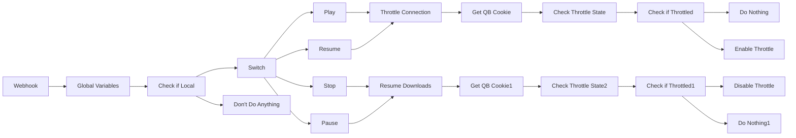

## Fluxo (.json) :

```json
{
  "id": 11,
  "name": "Plex Automatic Throttler",
  "nodes": [
    {
      "name": "Webhook",
      "type": "n8n-nodes-base.webhook",
      "position": [
        60,
        440
      ],
      "webhookId": "72a05ff6-05f5-4e7a-9eee-54a350bb6a47",
      "parameters": {
        "path": "72a05ff6-05f5-4e7a-9eee-54a350bb6a47",
        "options": {},
        "httpMethod": "POST"
      },
      "typeVersion": 1
    },
    {
      "name": "Switch",
      "type": "n8n-nodes-base.switch",
      "position": [
        640,
        580
      ],
      "parameters": {
        "rules": {
          "rules": [
            {
              "value2": "media.resume",
              "operation": "contains"
            },
            {
              "output": 1,
              "value2": "media.play",
              "operation": "contains"
            },
            {
              "output": 2,
              "value2": "media.pause",
              "operation": "contains"
            },
            {
              "output": 3,
              "value2": "media.stop",
              "operation": "contains"
            }
          ]
        },
        "value1": "={{$node[\"Webhook\"].json[\"body\"][\"payload\"]}}",
        "dataType": "string"
      },
      "typeVersion": 1
    },
    {
      "name": "Resume",
      "type": "n8n-nodes-base.noOp",
      "position": [
        860,
        280
      ],
      "parameters": {},
      "typeVersion": 1
    },
    {
      "name": "Check if Local",
      "type": "n8n-nodes-base.if",
      "position": [
        460,
        440
      ],
      "parameters": {
        "conditions": {
          "string": [
            {
              "value1": "={{$json[\"body\"][\"payload\"]}}",
              "value2": "\"local\":false",
              "operation": "contains"
            }
          ]
        }
      },
      "typeVersion": 1
    },
    {
      "name": "Play",
      "type": "n8n-nodes-base.noOp",
      "position": [
        860,
        440
      ],
      "parameters": {},
      "typeVersion": 1
    },
    {
      "name": "Don't Do Anything",
      "type": "n8n-nodes-base.noOp",
      "position": [
        660,
        220
      ],
      "parameters": {},
      "typeVersion": 1
    },
    {
      "name": "Pause",
      "type": "n8n-nodes-base.noOp",
      "position": [
        860,
        680
      ],
      "parameters": {},
      "typeVersion": 1
    },
    {
      "name": "Stop",
      "type": "n8n-nodes-base.noOp",
      "position": [
        860,
        840
      ],
      "parameters": {},
      "typeVersion": 1
    },
    {
      "name": "Get QB Cookie",
      "type": "n8n-nodes-base.httpRequest",
      "position": [
        1260,
        360
      ],
      "parameters": {
        "url": "=http://{{$node[\"Global Variables\"].json[\"qbittorent\"][\"internalIP\"]}}:{{$node[\"Global Variables\"].json[\"qbittorent\"][\"port\"]}}/api/v2/auth/login",
        "options": {
          "fullResponse": true
        },
        "responseFormat": "string",
        "queryParametersUi": {
          "parameter": [
            {
              "name": "username",
              "value": "={{$node[\"Global Variables\"].json[\"qbittorent\"][\"username\"]}}"
            },
            {
              "name": "password",
              "value": "={{$node[\"Global Variables\"].json[\"qbittorent\"][\"password\"]}}"
            }
          ]
        },
        "headerParametersUi": {
          "parameter": [
            {
              "name": "Referer",
              "value": "=http://localhost:{{$node[\"Global Variables\"].json[\"qbittorent\"][\"port\"]}}"
            }
          ]
        }
      },
      "typeVersion": 1
    },
    {
      "name": "Get QB Cookie1",
      "type": "n8n-nodes-base.httpRequest",
      "position": [
        1260,
        760
      ],
      "parameters": {
        "url": "=http://{{$node[\"Global Variables\"].json[\"qbittorent\"][\"internalIP\"]}}:{{$node[\"Global Variables\"].json[\"qbittorent\"][\"port\"]}}/api/v2/auth/login",
        "options": {
          "fullResponse": true
        },
        "responseFormat": "string",
        "queryParametersUi": {
          "parameter": [
            {
              "name": "username",
              "value": "={{$node[\"Global Variables\"].json[\"qbittorent\"][\"username\"]}}"
            },
            {
              "name": "password",
              "value": "={{$node[\"Global Variables\"].json[\"qbittorent\"][\"password\"]}}"
            }
          ]
        },
        "headerParametersUi": {
          "parameter": [
            {
              "name": "Referer",
              "value": "=http://localhost:{{$node[\"Global Variables\"].json[\"qbittorent\"][\"port\"]}}"
            }
          ]
        }
      },
      "typeVersion": 1
    },
    {
      "name": "Global Variables",
      "type": "n8n-nodes-base.set",
      "position": [
        280,
        440
      ],
      "parameters": {
        "values": {
          "string": [
            {
              "name": "qbittorent.username",
              "value": "yourusername"
            },
            {
              "name": "qbittorent.password",
              "value": "yourpassword"
            },
            {
              "name": "qbittorent.internalIP",
              "value": "192.168.1.218"
            },
            {
              "name": "qbittorent.port",
              "value": "2020"
            }
          ]
        },
        "options": {}
      },
      "typeVersion": 1
    },
    {
      "name": "Check Throttle State",
      "type": "n8n-nodes-base.httpRequest",
      "position": [
        1460,
        360
      ],
      "parameters": {
        "url": "=http://{{$node[\"Global Variables\"].json[\"qbittorent\"][\"internalIP\"]}}:{{$node[\"Global Variables\"].json[\"qbittorent\"][\"port\"]}}/api/v2/transfer/speedLimitsMode",
        "options": {
          "fullResponse": true
        },
        "requestMethod": "POST",
        "queryParametersUi": {
          "parameter": [
            {
              "name": "Cookie",
              "value": "={{$node[\"Get QB Cookie\"].json[\"headers\"][\"set-cookie\"][0].match(/[^;]*/).toString()}}"
            }
          ]
        },
        "headerParametersUi": {
          "parameter": [
            {
              "name": "Referer",
              "value": "=http://localhost:{{$node[\"Global Variables\"].json[\"qbittorent\"][\"port\"]}}"
            },
            {
              "name": "Cookie",
              "value": "={{$node[\"Get QB Cookie\"].json[\"headers\"][\"set-cookie\"][0].match(/[^;]*/).toString()}}"
            }
          ]
        }
      },
      "typeVersion": 1
    },
    {
      "name": "Check if Throttled",
      "type": "n8n-nodes-base.if",
      "position": [
        1680,
        360
      ],
      "parameters": {
        "conditions": {
          "number": [
            {
              "value1": "={{$json[\"body\"]}}",
              "value2": 1,
              "operation": "equal"
            }
          ],
          "string": []
        }
      },
      "typeVersion": 1
    },
    {
      "name": "Do Nothing",
      "type": "n8n-nodes-base.noOp",
      "position": [
        1900,
        260
      ],
      "parameters": {},
      "typeVersion": 1
    },
    {
      "name": "Check Throttle State2",
      "type": "n8n-nodes-base.httpRequest",
      "position": [
        1460,
        760
      ],
      "parameters": {
        "url": "=http://{{$node[\"Global Variables\"].json[\"qbittorent\"][\"internalIP\"]}}:{{$node[\"Global Variables\"].json[\"qbittorent\"][\"port\"]}}/api/v2/transfer/speedLimitsMode",
        "options": {
          "fullResponse": true
        },
        "requestMethod": "POST",
        "queryParametersUi": {
          "parameter": [
            {
              "name": "Cookie",
              "value": "={{$node[\"Get QB Cookie1\"].json[\"headers\"][\"set-cookie\"][0].match(/[^;]*/).toString()}}"
            }
          ]
        },
        "headerParametersUi": {
          "parameter": [
            {
              "name": "Referer",
              "value": "=http://localhost:{{$node[\"Global Variables\"].json[\"qbittorent\"][\"port\"]}}"
            },
            {
              "name": "Cookie",
              "value": "={{$node[\"Get QB Cookie1\"].json[\"headers\"][\"set-cookie\"][0].match(/[^;]*/).toString()}}"
            }
          ]
        }
      },
      "typeVersion": 1
    },
    {
      "name": "Check if Throttled1",
      "type": "n8n-nodes-base.if",
      "position": [
        1660,
        760
      ],
      "parameters": {
        "conditions": {
          "number": [
            {
              "value1": "={{$json[\"body\"]}}",
              "value2": 1,
              "operation": "equal"
            }
          ],
          "string": []
        }
      },
      "typeVersion": 1
    },
    {
      "name": "Do Nothing1",
      "type": "n8n-nodes-base.noOp",
      "position": [
        1900,
        860
      ],
      "parameters": {},
      "typeVersion": 1
    },
    {
      "name": "Throttle Connection",
      "type": "n8n-nodes-base.noOp",
      "position": [
        1060,
        360
      ],
      "parameters": {},
      "typeVersion": 1
    },
    {
      "name": "Resume Downloads",
      "type": "n8n-nodes-base.noOp",
      "position": [
        1060,
        760
      ],
      "parameters": {},
      "typeVersion": 1
    },
    {
      "name": "Disable Throttle",
      "type": "n8n-nodes-base.httpRequest",
      "position": [
        1900,
        660
      ],
      "parameters": {
        "url": "=http://{{$node[\"Global Variables\"].json[\"qbittorent\"][\"internalIP\"]}}:{{$node[\"Global Variables\"].json[\"qbittorent\"][\"port\"]}}/api/v2/transfer/toggleSpeedLimitsMode",
        "options": {},
        "requestMethod": "POST",
        "queryParametersUi": {
          "parameter": [
            {
              "name": "Cookie",
              "value": "={{$node[\"Get QB Cookie1\"].json[\"headers\"][\"set-cookie\"][0].match(/[^;]*/).toString()}}"
            }
          ]
        },
        "headerParametersUi": {
          "parameter": [
            {
              "name": "Referer",
              "value": "=http://localhost:{{$node[\"Global Variables\"].json[\"qbittorent\"][\"port\"]}}"
            },
            {
              "name": "Cookie",
              "value": "={{$node[\"Get QB Cookie1\"].json[\"headers\"][\"set-cookie\"][0].match(/[^;]*/).toString()}}"
            }
          ]
        }
      },
      "typeVersion": 1
    },
    {
      "name": "Enable Throttle",
      "type": "n8n-nodes-base.httpRequest",
      "position": [
        1900,
        440
      ],
      "parameters": {
        "url": "=http://{{$node[\"Global Variables\"].json[\"qbittorent\"][\"internalIP\"]}}:{{$node[\"Global Variables\"].json[\"qbittorent\"][\"port\"]}}/api/v2/transfer/toggleSpeedLimitsMode",
        "options": {},
        "requestMethod": "POST",
        "queryParametersUi": {
          "parameter": [
            {
              "name": "Cookie",
              "value": "={{$node[\"Get QB Cookie\"].json[\"headers\"][\"set-cookie\"][0].match(/[^;]*/).toString()}}"
            }
          ]
        },
        "headerParametersUi": {
          "parameter": [
            {
              "name": "Referer",
              "value": "=http://localhost:{{$node[\"Global Variables\"].json[\"qbittorent\"][\"port\"]}}"
            },
            {
              "name": "Cookie",
              "value": "={{$node[\"Get QB Cookie\"].json[\"headers\"][\"set-cookie\"][0].match(/[^;]*/).toString()}}"
            }
          ]
        }
      },
      "typeVersion": 1
    }
  ],
  "active": true,
  "settings": {},
  "connections": {
    "Play": {
      "main": [
        [
          {
            "node": "Throttle Connection",
            "type": "main",
            "index": 0
          }
        ]
      ]
    },
    "Stop": {
      "main": [
        [
          {
            "node": "Resume Downloads",
            "type": "main",
            "index": 0
          }
        ]
      ]
    },
    "Pause": {
      "main": [
        [
          {
            "node": "Resume Downloads",
            "type": "main",
            "index": 0
          }
        ]
      ]
    },
    "Resume": {
      "main": [
        [
          {
            "node": "Throttle Connection",
            "type": "main",
            "index": 0
          }
        ]
      ]
    },
    "Switch": {
      "main": [
        [
          {
            "node": "Resume",
            "type": "main",
            "index": 0
          }
        ],
        [
          {
            "node": "Play",
            "type": "main",
            "index": 0
          }
        ],
        [
          {
            "node": "Pause",
            "type": "main",
            "index": 0
          }
        ],
        [
          {
            "node": "Stop",
            "type": "main",
            "index": 0
          }
        ]
      ]
    },
    "Webhook": {
      "main": [
        [
          {
            "node": "Global Variables",
            "type": "main",
            "index": 0
          }
        ]
      ]
    },
    "Get QB Cookie": {
      "main": [
        [
          {
            "node": "Check Throttle State",
            "type": "main",
            "index": 0
          }
        ]
      ]
    },
    "Check if Local": {
      "main": [
        [
          {
            "node": "Don't Do Anything",
            "type": "main",
            "index": 0
          }
        ],
        [
          {
            "node": "Switch",
            "type": "main",
            "index": 0
          }
        ]
      ]
    },
    "Get QB Cookie1": {
      "main": [
        [
          {
            "node": "Check Throttle State2",
            "type": "main",
            "index": 0
          }
        ]
      ]
    },
    "Global Variables": {
      "main": [
        [
          {
            "node": "Check if Local",
            "type": "main",
            "index": 0
          }
        ]
      ]
    },
    "Resume Downloads": {
      "main": [
        [
          {
            "node": "Get QB Cookie1",
            "type": "main",
            "index": 0
          }
        ]
      ]
    },
    "Check if Throttled": {
      "main": [
        [
          {
            "node": "Do Nothing",
            "type": "main",
            "index": 0
          }
        ],
        [
          {
            "node": "Enable Throttle",
            "type": "main",
            "index": 0
          }
        ]
      ]
    },
    "Check if Throttled1": {
      "main": [
        [
          {
            "node": "Disable Throttle",
            "type": "main",
            "index": 0
          }
        ],
        [
          {
            "node": "Do Nothing1",
            "type": "main",
            "index": 0
          }
        ]
      ]
    },
    "Throttle Connection": {
      "main": [
        [
          {
            "node": "Get QB Cookie",
            "type": "main",
            "index": 0
          }
        ]
      ]
    },
    "Check Throttle State": {
      "main": [
        [
          {
            "node": "Check if Throttled",
            "type": "main",
            "index": 0
          }
        ]
      ]
    },
    "Check Throttle State2": {
      "main": [
        [
          {
            "node": "Check if Throttled1",
            "type": "main",
            "index": 0
          }
        ]
      ]
    }
  }
}
```

<a id="template-577"></a>

## Template 577 - Chat RAG sobre a especificação OpenAPI do GitHub

- **Nome:** Chat RAG sobre a especificação OpenAPI do GitHub
- **Descrição:** Fluxo que indexa a especificação OpenAPI do GitHub em um banco vetorial e fornece um chat que responde perguntas usando busca semântica e modelos de linguagem.
- **Funcionalidade:** • Indexação da especificação GitHub: baixa a especificação OpenAPI e prepara o conteúdo para uso.
• Quebra de texto e pré-processamento: divide o documento em partes menores para melhor representação.
• Geração de embeddings: cria vetores semânticos para cada trecho do documento.
• Armazenamento em banco vetorial: insere os embeddings em um índice vetorial para buscas futuras.
• Recepção de consultas via chat: aceita perguntas de usuários por uma interface de chat.
• Busca semântica por similaridade: transforma a consulta em embedding e recupera trechos relevantes do índice.
• Geração de respostas com LLM: utiliza um modelo de linguagem para compor respostas baseadas nos trechos recuperados.
• Memória de contexto: mantém um buffer de conversa para fornecer respostas mais coerentes no diálogo contínuo.
• Integração de ferramenta de pesquisa: expõe o banco vetorial como ferramenta consultável pelo agente responsável pelas respostas.
- **Ferramentas:** • GitHub: repositório que hospeda a especificação OpenAPI usada como fonte de conhecimento.
• OpenAI: provê modelos de linguagem e geração de embeddings para criação de vetores e respostas.
• Pinecone: serviço de banco de dados vetorial para armazenar e recuperar embeddings de forma eficiente.

## Fluxo visual

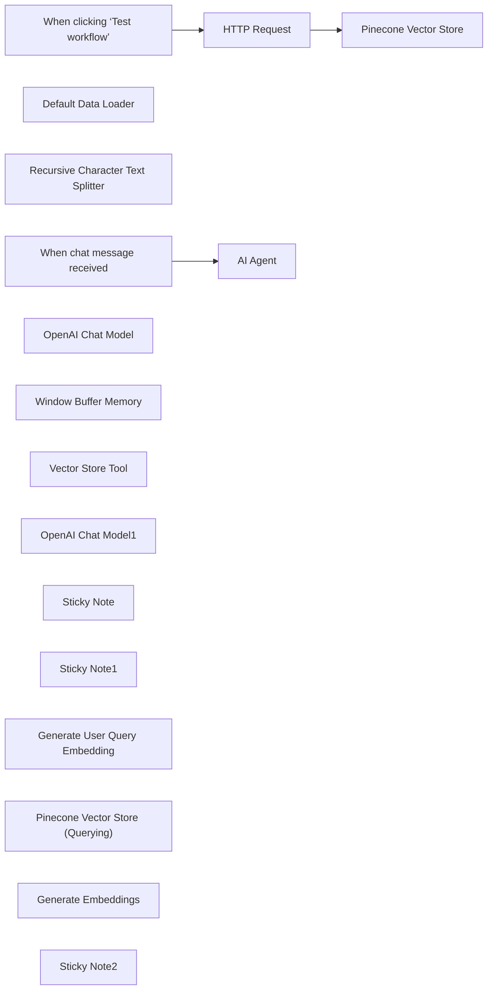

## Fluxo (.json) :

```json
{
  "id": "FD0bHNaehP3LzCNN",
  "meta": {
    "instanceId": "69133932b9ba8e1ef14816d0b63297bb44feb97c19f759b5d153ff6b0c59e18d"
  },
  "name": "Chat with GitHub OpenAPI Specification using RAG (Pinecone and OpenAI)",
  "tags": [],
  "nodes": [
    {
      "id": "362cb773-7540-4753-a401-e585cdf4af8a",
      "name": "When clicking ‘Test workflow’",
      "type": "n8n-nodes-base.manualTrigger",
      "position": [
        0,
        0
      ],
      "parameters": {},
      "typeVersion": 1
    },
    {
      "id": "45470036-cae6-48d0-ac66-addc8999e776",
      "name": "HTTP Request",
      "type": "n8n-nodes-base.httpRequest",
      "position": [
        300,
        0
      ],
      "parameters": {
        "url": "https://raw.githubusercontent.com/github/rest-api-description/refs/heads/main/descriptions/api.github.com/api.github.com.json",
        "options": {}
      },
      "typeVersion": 4.2
    },
    {
      "id": "a9e65897-52c9-4941-bf49-e1a659e442ef",
      "name": "Pinecone Vector Store",
      "type": "@n8n/n8n-nodes-langchain.vectorStorePinecone",
      "position": [
        520,
        0
      ],
      "parameters": {
        "mode": "insert",
        "options": {},
        "pineconeIndex": {
          "__rl": true,
          "mode": "list",
          "value": "n8n-demo",
          "cachedResultName": "n8n-demo"
        }
      },
      "credentials": {
        "pineconeApi": {
          "id": "bQTNry52ypGLqt47",
          "name": "PineconeApi account"
        }
      },
      "typeVersion": 1
    },
    {
      "id": "c2a2354b-5457-4ceb-abfc-9a58e8593b81",
      "name": "Default Data Loader",
      "type": "@n8n/n8n-nodes-langchain.documentDefaultDataLoader",
      "position": [
        660,
        180
      ],
      "parameters": {
        "options": {}
      },
      "typeVersion": 1
    },
    {
      "id": "7338d9ea-ae8f-46eb-807f-a15dc7639fc9",
      "name": "Recursive Character Text Splitter",
      "type": "@n8n/n8n-nodes-langchain.textSplitterRecursiveCharacterTextSplitter",
      "position": [
        740,
        360
      ],
      "parameters": {
        "options": {}
      },
      "typeVersion": 1
    },
    {
      "id": "44fd7a59-f208-4d5d-a22d-e9f8ca9badf1",
      "name": "When chat message received",
      "type": "@n8n/n8n-nodes-langchain.chatTrigger",
      "position": [
        -20,
        760
      ],
      "webhookId": "089e38ab-4eee-4c34-aa5d-54cf4a8f53b7",
      "parameters": {
        "options": {}
      },
      "typeVersion": 1.1
    },
    {
      "id": "51d819d6-70ff-428d-aa56-1d7e06490dee",
      "name": "AI Agent",
      "type": "@n8n/n8n-nodes-langchain.agent",
      "position": [
        320,
        760
      ],
      "parameters": {
        "options": {
          "systemMessage": "You are a helpful assistant providing information about the GitHub API and how to use it based on the OpenAPI V3 specifications."
        }
      },
      "typeVersion": 1.7
    },
    {
      "id": "aed548bf-7083-44ad-a3e0-163dee7423ef",
      "name": "OpenAI Chat Model",
      "type": "@n8n/n8n-nodes-langchain.lmChatOpenAi",
      "position": [
        220,
        980
      ],
      "parameters": {
        "options": {}
      },
      "credentials": {
        "openAiApi": {
          "id": "tQLWnWRzD8aebYvp",
          "name": "OpenAi account"
        }
      },
      "typeVersion": 1.1
    },
    {
      "id": "dfe9f356-2225-4f4b-86c7-e56a230b4193",
      "name": "Window Buffer Memory",
      "type": "@n8n/n8n-nodes-langchain.memoryBufferWindow",
      "position": [
        420,
        1020
      ],
      "parameters": {},
      "typeVersion": 1.3
    },
    {
      "id": "4cf672ee-13b8-4355-b8e0-c2e7381671bc",
      "name": "Vector Store Tool",
      "type": "@n8n/n8n-nodes-langchain.toolVectorStore",
      "position": [
        580,
        980
      ],
      "parameters": {
        "name": "GitHub_OpenAPI_Specification",
        "description": "Use this tool to get information about the GitHub API. This database contains OpenAPI v3 specifications."
      },
      "typeVersion": 1
    },
    {
      "id": "1df7fb85-9d4a-4db5-9bed-41d28e2e4643",
      "name": "OpenAI Chat Model1",
      "type": "@n8n/n8n-nodes-langchain.lmChatOpenAi",
      "position": [
        840,
        1160
      ],
      "parameters": {
        "options": {}
      },
      "credentials": {
        "openAiApi": {
          "id": "tQLWnWRzD8aebYvp",
          "name": "OpenAi account"
        }
      },
      "typeVersion": 1.1
    },
    {
      "id": "7b52ef7a-5935-451e-8747-efe16ce288af",
      "name": "Sticky Note",
      "type": "n8n-nodes-base.stickyNote",
      "position": [
        -40,
        -260
      ],
      "parameters": {
        "width": 640,
        "height": 200,
        "content": "## Indexing content in the vector database\nThis part of the workflow is responsible for extracting content, generating embeddings and sending them to the Pinecone vector store.\n\nIt requests the OpenAPI specifications from GitHub using a HTTP request. Then, it splits the file in chunks, generating embeddings for each chunk using OpenAI, and saving them in Pinecone vector DB."
      },
      "typeVersion": 1
    },
    {
      "id": "3508d602-56d4-4818-84eb-ca75cdeec1d0",
      "name": "Sticky Note1",
      "type": "n8n-nodes-base.stickyNote",
      "position": [
        -20,
        560
      ],
      "parameters": {
        "width": 580,
        "content": "## Querying and response generation \n\nThis part of the workflow is responsible for the chat interface, querying the vector store and generating relevant responses.\n\nIt uses OpenAI GPT 4o-mini to generate responses."
      },
      "typeVersion": 1
    },
    {
      "id": "5a9808ef-4edd-4ec9-ba01-2fe50b2dbf4b",
      "name": "Generate User Query Embedding",
      "type": "@n8n/n8n-nodes-langchain.embeddingsOpenAi",
      "position": [
        480,
        1400
      ],
      "parameters": {
        "options": {}
      },
      "credentials": {
        "openAiApi": {
          "id": "tQLWnWRzD8aebYvp",
          "name": "OpenAi account"
        }
      },
      "typeVersion": 1.2
    },
    {
      "id": "f703dc8e-9d4b-45e3-8994-789b3dfe8631",
      "name": "Pinecone Vector Store (Querying)",
      "type": "@n8n/n8n-nodes-langchain.vectorStorePinecone",
      "position": [
        440,
        1220
      ],
      "parameters": {
        "options": {},
        "pineconeIndex": {
          "__rl": true,
          "mode": "list",
          "value": "n8n-demo",
          "cachedResultName": "n8n-demo"
        }
      },
      "credentials": {
        "pineconeApi": {
          "id": "bQTNry52ypGLqt47",
          "name": "PineconeApi account"
        }
      },
      "typeVersion": 1
    },
    {
      "id": "ea64a7a5-1fa5-4938-83a9-271929733a8e",
      "name": "Generate Embeddings",
      "type": "@n8n/n8n-nodes-langchain.embeddingsOpenAi",
      "position": [
        480,
        220
      ],
      "parameters": {
        "options": {}
      },
      "credentials": {
        "openAiApi": {
          "id": "tQLWnWRzD8aebYvp",
          "name": "OpenAi account"
        }
      },
      "typeVersion": 1.2
    },
    {
      "id": "65cbd4e3-91f6-441a-9ef1-528c3019e238",
      "name": "Sticky Note2",
      "type": "n8n-nodes-base.stickyNote",
      "position": [
        -820,
        -260
      ],
      "parameters": {
        "width": 620,
        "height": 320,
        "content": "## RAG workflow in n8n\n\nThis is an example of how to use RAG techniques to create a chatbot with n8n. It is an API documentation chatbot that can answer questions about the GitHub API. It uses OpenAI for generating embeddings, the gpt-4o-mini LLM for generating responses and Pinecone as a vector database.\n\n### Before using this template\n* create OpenAI and Pinecone accounts\n* obtain API keys OpenAI and Pinecone \n* configure credentials in n8n for both\n* ensure you have a Pinecone index named \"n8n-demo\" or adjust the workflow accordingly."
      },
      "typeVersion": 1
    }
  ],
  "active": false,
  "pinData": {},
  "settings": {
    "executionOrder": "v1"
  },
  "versionId": "2908105f-c20c-4183-bb9d-26e3559b9911",
  "connections": {
    "HTTP Request": {
      "main": [
        [
          {
            "node": "Pinecone Vector Store",
            "type": "main",
            "index": 0
          }
        ]
      ]
    },
    "OpenAI Chat Model": {
      "ai_languageModel": [
        [
          {
            "node": "AI Agent",
            "type": "ai_languageModel",
            "index": 0
          }
        ]
      ]
    },
    "Vector Store Tool": {
      "ai_tool": [
        [
          {
            "node": "AI Agent",
            "type": "ai_tool",
            "index": 0
          }
        ]
      ]
    },
    "OpenAI Chat Model1": {
      "ai_languageModel": [
        [
          {
            "node": "Vector Store Tool",
            "type": "ai_languageModel",
            "index": 0
          }
        ]
      ]
    },
    "Default Data Loader": {
      "ai_document": [
        [
          {
            "node": "Pinecone Vector Store",
            "type": "ai_document",
            "index": 0
          }
        ]
      ]
    },
    "Generate Embeddings": {
      "ai_embedding": [
        [
          {
            "node": "Pinecone Vector Store",
            "type": "ai_embedding",
            "index": 0
          }
        ]
      ]
    },
    "Window Buffer Memory": {
      "ai_memory": [
        [
          {
            "node": "AI Agent",
            "type": "ai_memory",
            "index": 0
          }
        ]
      ]
    },
    "When chat message received": {
      "main": [
        [
          {
            "node": "AI Agent",
            "type": "main",
            "index": 0
          }
        ]
      ]
    },
    "Generate User Query Embedding": {
      "ai_embedding": [
        [
          {
            "node": "Pinecone Vector Store (Querying)",
            "type": "ai_embedding",
            "index": 0
          }
        ]
      ]
    },
    "Pinecone Vector Store (Querying)": {
      "ai_vectorStore": [
        [
          {
            "node": "Vector Store Tool",
            "type": "ai_vectorStore",
            "index": 0
          }
        ]
      ]
    },
    "Recursive Character Text Splitter": {
      "ai_textSplitter": [
        [
          {
            "node": "Default Data Loader",
            "type": "ai_textSplitter",
            "index": 0
          }
        ]
      ]
    },
    "When clicking ‘Test workflow’": {
      "main": [
        [
          {
            "node": "HTTP Request",
            "type": "main",
            "index": 0
          }
        ]
      ]
    }
  }
}
```

<a id="template-578"></a>

## Template 578 - Sincronizar timers para Syncro

- **Nome:** Sincronizar timers para Syncro
- **Descrição:** O fluxo recebe eventos de chamadas, verifica se há um ticket correspondente na planilha e, se houver, cria uma entrada de tempo no Syncro com os detalhes da chamada.
- **Funcionalidade:** • Receber evento de chamada via webhook: Inicia o fluxo ao receber dados de uma chamada (call_id, datas e contato).
• Carregar variável de ambiente: Define a URL base do Syncro usada nas requisições API.
• Procurar correspondência na planilha: Busca o call_id na planilha para obter o número do ticket associado.
• Verificar correspondência: Decide seguir com a criação do timer somente se houver um ticket correspondente.
• Criar entrada de tempo no Syncro: Envia start_at, end_at, notas e user_id para o endpoint de timer do ticket correspondente.
• Cancelar quando sem correspondência: Não executa ação caso não seja encontrado ticket para o call_id.
- **Ferramentas:** • Sistema de telefonia / serviço que envia webhooks: Origem dos eventos de chamadas contendo call_id, timestamps e informações de contato.
• Google Sheets: Planilha usada para mapear call_id ao número do ticket correspondente.
• Syncro MSP (API): Plataforma onde é criada a entrada de tempo no ticket via endpoint /api/v1/tickets/{ticket}/timer_entry.

## Fluxo visual

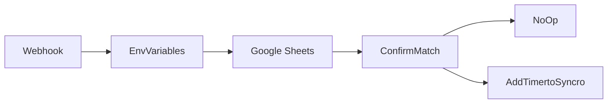

## Fluxo (.json) :

```json
{
  "meta": {
    "instanceId": "8c8c5237b8e37b006a7adce87f4369350c58e41f3ca9de16196d3197f69eabcd"
  },
  "nodes": [
    {
      "id": "1e603735-dd86-4691-8ece-c81fff396161",
      "name": "Webhook",
      "type": "n8n-nodes-base.webhook",
      "position": [
        370,
        250
      ],
      "webhookId": "484b94c9-8285-4ec9-aa52-f5a41eb84d1a",
      "parameters": {
        "path": "timersyncro",
        "options": {},
        "httpMethod": "POST",
        "responseData": "allEntries",
        "responseMode": "lastNode"
      },
      "typeVersion": 1
    },
    {
      "id": "2b243a13-a258-4198-9cad-057c6117b50a",
      "name": "EnvVariables",
      "type": "n8n-nodes-base.set",
      "position": [
        570,
        250
      ],
      "parameters": {
        "values": {
          "string": [
            {
              "name": "syncro_baseurl",
              "value": "https://subdomain.syncromsp.com"
            }
          ]
        },
        "options": {}
      },
      "typeVersion": 1
    },
    {
      "id": "0108d71b-ae26-4e64-9a52-9b6de15c4fbd",
      "name": "Google Sheets",
      "type": "n8n-nodes-base.googleSheets",
      "position": [
        750,
        250
      ],
      "parameters": {
        "range": "A:B",
        "options": {},
        "sheetId": "xxx",
        "operation": "lookup",
        "lookupValue": "={{$node[\"Webhook\"].json[\"body\"][\"call_id\"]}}",
        "lookupColumn": "Call"
      },
      "credentials": {
        "googleApi": {
          "id": null,
          "name": "Google"
        }
      },
      "typeVersion": 1
    },
    {
      "id": "6747ff1c-f7f0-48a2-9aa2-fd1c72401233",
      "name": "ConfirmMatch",
      "type": "n8n-nodes-base.if",
      "position": [
        900,
        250
      ],
      "parameters": {
        "conditions": {
          "number": [],
          "string": [
            {
              "value1": "={{$node[\"Google Sheets\"].json[\"Ticket\"]}}",
              "operation": "isEmpty"
            }
          ],
          "boolean": []
        }
      },
      "typeVersion": 1
    },
    {
      "id": "207192d8-f8f4-4f23-af61-91e254cbeee9",
      "name": "NoOp",
      "type": "n8n-nodes-base.noOp",
      "position": [
        1060,
        100
      ],
      "parameters": {},
      "typeVersion": 1
    },
    {
      "id": "7cd7ba20-951d-4654-82b5-2e8081774723",
      "name": "AddTimertoSyncro",
      "type": "n8n-nodes-base.httpRequest",
      "position": [
        1080,
        420
      ],
      "parameters": {
        "url": "={{$node[\"EnvVariables\"].parameter[\"values\"][\"string\"][0][\"value\"]}}/api/v1/tickets/{{$node[\"Google Sheets\"].json[\"Ticket\"]}}/timer_entry",
        "method": "POST",
        "options": {},
        "sendBody": true,
        "authentication": "genericCredentialType",
        "bodyParameters": {
          "parameters": [
            {
              "name": "start_at",
              "value": "={{new Date(parseInt($node[\"Webhook\"].json[\"body\"][\"date_started\"])).toISOString()}}"
            },
            {
              "name": "end_at",
              "value": "={{new Date(parseInt($node[\"Webhook\"].json[\"body\"][\"date_ended\"])).toISOString()}}"
            },
            {
              "name": "notes",
              "value": "=Phone call from {{$node[\"Webhook\"].json[\"body\"][\"contact\"][\"name\"]}} ({{$node[\"Webhook\"].json[\"body\"][\"contact\"][\"phone\"]}})."
            },
            {
              "name": "user_id",
              "value": "24223"
            }
          ]
        },
        "genericAuthType": "httpHeaderAuth"
      },
      "typeVersion": 3
    }
  ],
  "connections": {
    "Webhook": {
      "main": [
        [
          {
            "node": "EnvVariables",
            "type": "main",
            "index": 0
          }
        ]
      ]
    },
    "ConfirmMatch": {
      "main": [
        [
          {
            "node": "NoOp",
            "type": "main",
            "index": 0
          }
        ],
        [
          {
            "node": "AddTimertoSyncro",
            "type": "main",
            "index": 0
          }
        ]
      ]
    },
    "EnvVariables": {
      "main": [
        [
          {
            "node": "Google Sheets",
            "type": "main",
            "index": 0
          }
        ]
      ]
    },
    "Google Sheets": {
      "main": [
        [
          {
            "node": "ConfirmMatch",
            "type": "main",
            "index": 0
          }
        ]
      ]
    }
  }
}
```

<a id="template-579"></a>

## Template 579 - Banner do Twitter com avatares de seguidores

- **Nome:** Banner do Twitter com avatares de seguidores
- **Descrição:** O fluxo busca os últimos seguidores, monta um banner com os avatares deles sobre um template e atualiza o banner do perfil no Twitter.
- **Funcionalidade:** • Captura de seguidores: Obtém os seguidores mais recentes da conta (máx. 3) incluindo a URL do avatar.
• Ajuste da URL do avatar: Converte a URL do avatar para resolução maior (substitui 'normal' por '400x400').
• Download de imagens: Baixa os avatares e o template de fundo a partir das URLs.
• Processamento de imagem: Redimensiona os avatares, aplica recorte circular e cria versões menores para composição.
• Composição do banner: Posiciona múltiplos avatares sobre o template nas posições definidas e gera o arquivo final.
• Publicação no Twitter: Envia o banner finalizado para atualizar o banner do perfil usando autenticação OAuth1.
- **Ferramentas:** • Twitter API: Fornece endpoints para listar seguidores (API v2) e atualizar o banner do perfil (API v1.1) com autenticação OAuth1.
• Hospedagem de imagem (template): URL externa que serve o template de fundo usado para compor o banner.

## Fluxo visual

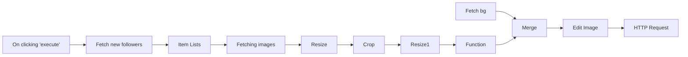

## Fluxo (.json) :

```json
{
  "nodes": [
    {
      "name": "On clicking 'execute'",
      "type": "n8n-nodes-base.manualTrigger",
      "position": [
        260,
        210
      ],
      "parameters": {},
      "typeVersion": 1
    },
    {
      "name": "Fetch new followers",
      "type": "n8n-nodes-base.httpRequest",
      "position": [
        460,
        210
      ],
      "parameters": {
        "url": "https://api.twitter.com/2/users/{YOUR_USER_ID}/followers?user.fields=profile_image_url&max_results=3",
        "options": {},
        "authentication": "headerAuth"
      },
      "credentials": {
        "httpHeaderAuth": {
          "id": "2",
          "name": "Twitter Token"
        }
      },
      "typeVersion": 1
    },
    {
      "name": "Item Lists",
      "type": "n8n-nodes-base.itemLists",
      "position": [
        660,
        210
      ],
      "parameters": {
        "options": {},
        "fieldToSplitOut": "data"
      },
      "typeVersion": 1
    },
    {
      "name": "Function",
      "type": "n8n-nodes-base.function",
      "position": [
        1660,
        210
      ],
      "parameters": {
        "functionCode": "const binary = {};\nfor (let i=0; i < items.length; i++) {\n binary[`data${i}`] = items[i].binary.avatar;\n}\n\nreturn [\n {\n json: {\n numIcons: items.length,\n },\n binary,\n }\n];\n"
      },
      "typeVersion": 1
    },
    {
      "name": "Merge",
      "type": "n8n-nodes-base.merge",
      "position": [
        1910,
        110
      ],
      "parameters": {
        "mode": "mergeByIndex"
      },
      "typeVersion": 1
    },
    {
      "name": "Fetching images",
      "type": "n8n-nodes-base.httpRequest",
      "position": [
        860,
        210
      ],
      "parameters": {
        "url": "={{$json[\"profile_image_url\"].replace('normal','400x400')}}",
        "options": {},
        "responseFormat": "file",
        "dataPropertyName": "avatar"
      },
      "typeVersion": 1
    },
    {
      "name": "Fetch bg",
      "type": "n8n-nodes-base.httpRequest",
      "position": [
        1660,
        -40
      ],
      "parameters": {
        "url": "{TEMPLATE_IMAGE_URL}",
        "options": {},
        "responseFormat": "file",
        "dataPropertyName": "bg"
      },
      "typeVersion": 1
    },
    {
      "name": "Resize",
      "type": "n8n-nodes-base.editImage",
      "position": [
        1060,
        210
      ],
      "parameters": {
        "width": 200,
        "height": 200,
        "options": {},
        "operation": "resize",
        "dataPropertyName": "avatar"
      },
      "typeVersion": 1
    },
    {
      "name": "Crop",
      "type": "n8n-nodes-base.editImage",
      "position": [
        1260,
        210
      ],
      "parameters": {
        "options": {
          "format": "png"
        },
        "operation": "multiStep",
        "operations": {
          "operations": [
            {
              "width": 200,
              "height": 200,
              "operation": "create",
              "backgroundColor": "#000000ff"
            },
            {
              "color": "#ffffff00",
              "operation": "draw",
              "primitive": "circle",
              "endPositionX": 25,
              "endPositionY": 50,
              "startPositionX": 100,
              "startPositionY": 100
            },
            {
              "operator": "In",
              "operation": "composite",
              "dataPropertyNameComposite": "avatar"
            }
          ]
        },
        "dataPropertyName": "avatar"
      },
      "typeVersion": 1
    },
    {
      "name": "Edit Image",
      "type": "n8n-nodes-base.editImage",
      "position": [
        2110,
        110
      ],
      "parameters": {
        "options": {},
        "operation": "multiStep",
        "operations": {
          "operations": [
            {
              "operation": "composite",
              "positionX": 1000,
              "positionY": 375,
              "dataPropertyNameComposite": "data0"
            },
            {
              "operation": "composite",
              "positionX": 1100,
              "positionY": 375,
              "dataPropertyNameComposite": "data1"
            },
            {
              "operation": "composite",
              "positionX": 1200,
              "positionY": 375,
              "dataPropertyNameComposite": "data2"
            }
          ]
        },
        "dataPropertyName": "bg"
      },
      "typeVersion": 1
    },
    {
      "name": "Resize1",
      "type": "n8n-nodes-base.editImage",
      "position": [
        1450,
        210
      ],
      "parameters": {
        "width": 75,
        "height": 75,
        "options": {},
        "operation": "resize",
        "dataPropertyName": "avatar"
      },
      "typeVersion": 1
    },
    {
      "name": "HTTP Request",
      "type": "n8n-nodes-base.httpRequest",
      "position": [
        2310,
        110
      ],
      "parameters": {
        "url": "https://api.twitter.com/1.1/account/update_profile_banner.json",
        "options": {
          "bodyContentType": "multipart-form-data"
        },
        "requestMethod": "POST",
        "authentication": "oAuth1",
        "jsonParameters": true,
        "sendBinaryData": true,
        "binaryPropertyName": "banner:bg"
      },
      "credentials": {
        "oAuth1Api": {
          "id": "13",
          "name": "Twitter OAuth1.0"
        }
      },
      "typeVersion": 1
    }
  ],
  "connections": {
    "Crop": {
      "main": [
        [
          {
            "node": "Resize1",
            "type": "main",
            "index": 0
          }
        ]
      ]
    },
    "Merge": {
      "main": [
        [
          {
            "node": "Edit Image",
            "type": "main",
            "index": 0
          }
        ]
      ]
    },
    "Resize": {
      "main": [
        [
          {
            "node": "Crop",
            "type": "main",
            "index": 0
          }
        ]
      ]
    },
    "Resize1": {
      "main": [
        [
          {
            "node": "Function",
            "type": "main",
            "index": 0
          }
        ]
      ]
    },
    "Fetch bg": {
      "main": [
        [
          {
            "node": "Merge",
            "type": "main",
            "index": 0
          }
        ]
      ]
    },
    "Function": {
      "main": [
        [
          {
            "node": "Merge",
            "type": "main",
            "index": 1
          }
        ]
      ]
    },
    "Edit Image": {
      "main": [
        [
          {
            "node": "HTTP Request",
            "type": "main",
            "index": 0
          }
        ]
      ]
    },
    "Item Lists": {
      "main": [
        [
          {
            "node": "Fetching images",
            "type": "main",
            "index": 0
          }
        ]
      ]
    },
    "Fetching images": {
      "main": [
        [
          {
            "node": "Resize",
            "type": "main",
            "index": 0
          }
        ]
      ]
    },
    "Fetch new followers": {
      "main": [
        [
          {
            "node": "Item Lists",
            "type": "main",
            "index": 0
          }
        ]
      ]
    },
    "On clicking 'execute'": {
      "main": [
        [
          {
            "node": "Fetch new followers",
            "type": "main",
            "index": 0
          }
        ]
      ]
    }
  }
}
```

<a id="template-580"></a>

## Template 580 - Alerta de novas violações do Have I Been Pwned

- **Nome:** Alerta de novas violações do Have I Been Pwned
- **Descrição:** Verifica periodicamente as últimas violações publicadas no haveibeenpwned.com e alerta quando uma nova violação é detectada, mantendo um cache local para evitar alertas duplicados.
- **Funcionalidade:** • Consulta periódica da API: Faz requisições regulares para obter a última violação publicada.
• Cache local: Salva o nome da última violação detectada em um arquivo local para comparação nas próximas execuções.
• Comparação de registros: Compara o nome da violação atual com o valor armazenado para determinar se é nova.
• Fluxo condicional de alertas: Direciona para envio de alerta quando há uma nova violação ou para um caminho de não ação quando já foi vista.
• Inicialização do cache: Permite criar/limpar o arquivo de cache para forçar um novo alerta na próxima execução.
- **Ferramentas:** • haveibeenpwned.com API: Fonte externa que fornece informações sobre violações recentes.
• Sistema de ficheiros local: Armazena e lê um arquivo de cache (cache.json) para manter estado entre execuções.
• Serviços de notificação (ex.: Slack, Discord): Destinos sugeridos para envio de alertas quando uma nova violação é detectada.

## Fluxo visual

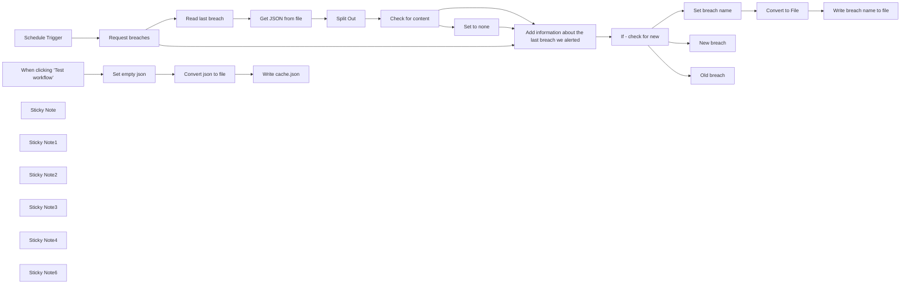

## Fluxo (.json) :

```json
{
  "meta": {
    "instanceId": "568298fde06d3db80a2eea77fe5bf45f0c7bb898dea20b769944e9ac7c6c5a80",
    "templateCredsSetupCompleted": true
  },
  "nodes": [
    {
      "id": "eb8bbb43-d6ca-48f9-9522-12ac7100961d",
      "name": "When clicking ‘Test workflow’",
      "type": "n8n-nodes-base.manualTrigger",
      "position": [
        -1360,
        380
      ],
      "parameters": {},
      "typeVersion": 1
    },
    {
      "id": "77bf0c40-b045-40f9-9401-d1b206938180",
      "name": "Convert to File",
      "type": "n8n-nodes-base.convertToFile",
      "position": [
        -360,
        -420
      ],
      "parameters": {
        "options": {},
        "operation": "toJson",
        "binaryPropertyName": "=data"
      },
      "typeVersion": 1.1
    },
    {
      "id": "c2e870c2-52e8-4808-9091-e3dcf286eaa5",
      "name": "Split Out",
      "type": "n8n-nodes-base.splitOut",
      "position": [
        -660,
        20
      ],
      "parameters": {
        "options": {},
        "fieldToSplitOut": "data"
      },
      "typeVersion": 1,
      "alwaysOutputData": true
    },
    {
      "id": "2bcafdc1-94e0-4a3d-9ad5-a189973be980",
      "name": "Schedule Trigger",
      "type": "n8n-nodes-base.scheduleTrigger",
      "position": [
        -1500,
        -340
      ],
      "parameters": {
        "rule": {
          "interval": [
            {
              "field": "minutes",
              "minutesInterval": 15
            }
          ]
        }
      },
      "typeVersion": 1.2
    },
    {
      "id": "a602fdf3-82d8-4bc1-806b-576b6fc904b7",
      "name": "Sticky Note",
      "type": "n8n-nodes-base.stickyNote",
      "position": [
        -1520,
        -520
      ],
      "parameters": {
        "width": 760,
        "content": "### Receive an alert when new breaches are added to haveibeenpwned.com\nThis workflow demonstrates how we can receive alerts when new breaches are added to haveibeenpwned.com.\nIt also demonstrates a simple method for caching data between executions."
      },
      "typeVersion": 1
    },
    {
      "id": "a53e7c76-0823-415f-91fd-920b354568d3",
      "name": "Request breaches",
      "type": "n8n-nodes-base.httpRequest",
      "position": [
        -1240,
        -340
      ],
      "parameters": {
        "url": "https://haveibeenpwned.com/api/v3/latestbreach",
        "options": {}
      },
      "typeVersion": 4.2
    },
    {
      "id": "777c65aa-1bce-40eb-9de1-dd8fef4afd05",
      "name": "Read last breach",
      "type": "n8n-nodes-base.readWriteFile",
      "notes": "we alerted about.",
      "position": [
        -1020,
        -160
      ],
      "parameters": {
        "options": {},
        "fileSelector": "./cache.json"
      },
      "notesInFlow": true,
      "typeVersion": 1,
      "alwaysOutputData": true
    },
    {
      "id": "d6638b7b-6209-497a-a176-91751a10bab1",
      "name": "Get JSON from file",
      "type": "n8n-nodes-base.extractFromFile",
      "position": [
        -840,
        -80
      ],
      "parameters": {
        "options": {},
        "operation": "fromJson"
      },
      "typeVersion": 1,
      "alwaysOutputData": true
    },
    {
      "id": "42103453-54db-4d18-8d2b-9b56f5d3a3dd",
      "name": "Check for content",
      "type": "n8n-nodes-base.if",
      "position": [
        -480,
        20
      ],
      "parameters": {
        "options": {},
        "conditions": {
          "options": {
            "version": 2,
            "leftValue": "",
            "caseSensitive": true,
            "typeValidation": "strict"
          },
          "combinator": "and",
          "conditions": [
            {
              "id": "6bf6a0bd-e9b3-4fde-a9cc-08f4d0e94fd6",
              "operator": {
                "type": "string",
                "operation": "exists",
                "singleValue": true
              },
              "leftValue": "={{ $json.lastItem }}",
              "rightValue": ""
            }
          ]
        }
      },
      "typeVersion": 2.2
    },
    {
      "id": "2dfa332e-9892-4385-a693-2ff2fc51f067",
      "name": "Set to none",
      "type": "n8n-nodes-base.set",
      "notes": "File was empty.",
      "position": [
        -300,
        80
      ],
      "parameters": {
        "options": {},
        "assignments": {
          "assignments": [
            {
              "id": "47736e3f-0961-4b73-b4d5-207792640e87",
              "name": "lastItem",
              "type": "string",
              "value": "none"
            }
          ]
        }
      },
      "notesInFlow": true,
      "typeVersion": 3.4
    },
    {
      "id": "6653599a-db6a-4a01-af5c-d79a2d58202f",
      "name": "If - check for new",
      "type": "n8n-nodes-base.if",
      "position": [
        -840,
        -340
      ],
      "parameters": {
        "options": {},
        "conditions": {
          "options": {
            "version": 2,
            "leftValue": "",
            "caseSensitive": true,
            "typeValidation": "strict"
          },
          "combinator": "and",
          "conditions": [
            {
              "id": "badd0a56-081f-49e2-92f4-7711f1cd9289",
              "operator": {
                "type": "string",
                "operation": "notEquals"
              },
              "leftValue": "={{ $json.lastItem }}",
              "rightValue": "={{ $json.Name }}"
            }
          ]
        }
      },
      "typeVersion": 2.2
    },
    {
      "id": "1f2cbeda-0c84-4b54-84ec-03a7b22f4471",
      "name": "Set breach name",
      "type": "n8n-nodes-base.set",
      "position": [
        -560,
        -420
      ],
      "parameters": {
        "options": {},
        "assignments": {
          "assignments": [
            {
              "id": "d0714936-9956-4af8-93f9-3c44ef7beb09",
              "name": "lastItem",
              "type": "string",
              "value": "={{ $json.Name }}"
            }
          ]
        }
      },
      "typeVersion": 3.4
    },
    {
      "id": "85314f2d-98d7-461a-a565-5202006ddd39",
      "name": "Write breach name to file",
      "type": "n8n-nodes-base.readWriteFile",
      "position": [
        -180,
        -420
      ],
      "parameters": {
        "options": {},
        "fileName": "./cache.json",
        "operation": "write"
      },
      "typeVersion": 1
    },
    {
      "id": "e4cc122c-172f-4154-b534-c2c9268cf10d",
      "name": "New breach",
      "type": "n8n-nodes-base.noOp",
      "notes": "Send alert",
      "position": [
        -560,
        -680
      ],
      "parameters": {},
      "notesInFlow": true,
      "typeVersion": 1
    },
    {
      "id": "80b7507f-d5f2-4a3d-9090-784f80770478",
      "name": "Old breach",
      "type": "n8n-nodes-base.noOp",
      "notes": "already alerted.",
      "position": [
        -560,
        -160
      ],
      "parameters": {},
      "notesInFlow": true,
      "typeVersion": 1
    },
    {
      "id": "63f65fa4-fba1-4ab4-93ff-cd4df9068b19",
      "name": "Sticky Note1",
      "type": "n8n-nodes-base.stickyNote",
      "position": [
        -600,
        -500
      ],
      "parameters": {
        "color": 7,
        "width": 640,
        "height": 240,
        "content": "### Save the name of the breach\nWe will check it the next time the workflow runs to see if we have a new breach."
      },
      "typeVersion": 1
    },
    {
      "id": "5a8dd017-e3e4-445e-be0f-24a8033d7dac",
      "name": "Sticky Note2",
      "type": "n8n-nodes-base.stickyNote",
      "position": [
        -600,
        -240
      ],
      "parameters": {
        "color": 7,
        "width": 640,
        "height": 240,
        "content": "### This breach has been seen before\nIf we end up here it means that the latest breach has been seen before."
      },
      "typeVersion": 1
    },
    {
      "id": "eb563c4a-54f5-4583-8fb1-e5ee5a14ca43",
      "name": "Sticky Note3",
      "type": "n8n-nodes-base.stickyNote",
      "position": [
        -600,
        -760
      ],
      "parameters": {
        "color": 3,
        "width": 640,
        "height": 240,
        "content": "### This is a new breach - send alert\nIf we end up here it means that the latest breach is new. Time to send some alerts to Slack, or Discord or something."
      },
      "typeVersion": 1
    },
    {
      "id": "45b58d9b-7172-447d-91ab-e91e3516c8d9",
      "name": "Sticky Note4",
      "type": "n8n-nodes-base.stickyNote",
      "position": [
        -1220,
        300
      ],
      "parameters": {
        "color": 7,
        "width": 600,
        "height": 260,
        "content": "### Clean up the cache\nDelete the `./cache.json` file. This will make sure the alert is triggered on the next run."
      },
      "typeVersion": 1
    },
    {
      "id": "bb2401d2-716c-47eb-9797-5b69583058ee",
      "name": "Set empty json",
      "type": "n8n-nodes-base.set",
      "position": [
        -1180,
        380
      ],
      "parameters": {
        "options": {},
        "assignments": {
          "assignments": [
            {
              "id": "69f35659-fd32-4fa7-969e-6cf266519f5b",
              "name": "data",
              "type": "string",
              "value": "{}"
            }
          ]
        }
      },
      "typeVersion": 3.4
    },
    {
      "id": "c3abbf86-50f2-4772-bc7c-9a57ac39d4a3",
      "name": "Write cache.json",
      "type": "n8n-nodes-base.readWriteFile",
      "position": [
        -840,
        380
      ],
      "parameters": {
        "options": {},
        "fileName": "./cache.json",
        "operation": "write"
      },
      "typeVersion": 1
    },
    {
      "id": "69f03dd6-11f0-41e6-8871-9b17c44ef2fe",
      "name": "Convert json to file",
      "type": "n8n-nodes-base.convertToFile",
      "position": [
        -1000,
        380
      ],
      "parameters": {
        "options": {},
        "operation": "toJson"
      },
      "typeVersion": 1.1
    },
    {
      "id": "2cf6adf9-59e4-4450-b7f8-96907155da84",
      "name": "Add information about the last breach we alerted",
      "type": "n8n-nodes-base.merge",
      "position": [
        -1020,
        -340
      ],
      "parameters": {
        "mode": "combine",
        "options": {},
        "combineBy": "combineAll"
      },
      "typeVersion": 3
    },
    {
      "id": "80e38061-140a-4c78-b49c-dcf796da1427",
      "name": "Sticky Note6",
      "type": "n8n-nodes-base.stickyNote",
      "position": [
        -1480,
        -100
      ],
      "parameters": {
        "color": 6,
        "width": 380,
        "height": 240,
        "content": "## Support My Work! ❤️\n\n**👋 Hello! I'm Audun / xqus** \n🔗 My work: [xqus.com](https://xqus.com)\n💸 n8n shop: [xqus.gumroad.com](https://xqus.gumroad.com)\n\n**If you find this workflow helpful**, consider downloading or purchasing it on [Gumroad](https://xqus.gumroad.com/l/hasgi).\n\nYour support helps me create more useful n8n workflows and resources for the community. \n-Thanks a lot! 🙌"
      },
      "typeVersion": 1
    }
  ],
  "pinData": {},
  "connections": {
    "Split Out": {
      "main": [
        [
          {
            "node": "Check for content",
            "type": "main",
            "index": 0
          }
        ]
      ]
    },
    "Set to none": {
      "main": [
        [
          {
            "node": "Add information about the last breach we alerted",
            "type": "main",
            "index": 1
          }
        ]
      ]
    },
    "Set empty json": {
      "main": [
        [
          {
            "node": "Convert json to file",
            "type": "main",
            "index": 0
          }
        ]
      ]
    },
    "Convert to File": {
      "main": [
        [
          {
            "node": "Write breach name to file",
            "type": "main",
            "index": 0
          }
        ]
      ]
    },
    "Set breach name": {
      "main": [
        [
          {
            "node": "Convert to File",
            "type": "main",
            "index": 0
          }
        ]
      ]
    },
    "Read last breach": {
      "main": [
        [
          {
            "node": "Get JSON from file",
            "type": "main",
            "index": 0
          }
        ]
      ]
    },
    "Request breaches": {
      "main": [
        [
          {
            "node": "Read last breach",
            "type": "main",
            "index": 0
          },
          {
            "node": "Add information about the last breach we alerted",
            "type": "main",
            "index": 0
          }
        ]
      ]
    },
    "Schedule Trigger": {
      "main": [
        [
          {
            "node": "Request breaches",
            "type": "main",
            "index": 0
          }
        ]
      ]
    },
    "Check for content": {
      "main": [
        [
          {
            "node": "Add information about the last breach we alerted",
            "type": "main",
            "index": 1
          }
        ],
        [
          {
            "node": "Set to none",
            "type": "main",
            "index": 0
          }
        ]
      ]
    },
    "Get JSON from file": {
      "main": [
        [
          {
            "node": "Split Out",
            "type": "main",
            "index": 0
          }
        ]
      ]
    },
    "If - check for new": {
      "main": [
        [
          {
            "node": "Set breach name",
            "type": "main",
            "index": 0
          },
          {
            "node": "New breach",
            "type": "main",
            "index": 0
          }
        ],
        [
          {
            "node": "Old breach",
            "type": "main",
            "index": 0
          }
        ]
      ]
    },
    "Convert json to file": {
      "main": [
        [
          {
            "node": "Write cache.json",
            "type": "main",
            "index": 0
          }
        ]
      ]
    },
    "Write breach name to file": {
      "main": [
        []
      ]
    },
    "When clicking ‘Test workflow’": {
      "main": [
        [
          {
            "node": "Set empty json",
            "type": "main",
            "index": 0
          }
        ]
      ]
    },
    "Add information about the last breach we alerted": {
      "main": [
        [
          {
            "node": "If - check for new",
            "type": "main",
            "index": 0
          }
        ]
      ]
    }
  }
}
```

<a id="template-581"></a>

## Template 581 - Exportar pedidos do Shopify

- **Nome:** Exportar pedidos do Shopify
- **Descrição:** Automatiza a extração de pedidos de uma loja Shopify e grava os dados em uma planilha do Google Sheets, incluindo tratamento de paginação.
- **Funcionalidade:** • Agendamento e execução manual: permite executar o fluxo periodicamente ou testar manualmente.
• Requisição de pedidos ao Shopify: realiza chamadas à API de pedidos com parâmetros de limite e campos específicos.
• Detecção e extração de paginação: identifica o cabeçalho Link com rel="next" e extrai o parâmetro page_info para buscar próximas páginas.
• Loop e agregação de páginas: percorre todas as páginas disponíveis e consolida os resultados em um único conjunto.
• Separação de itens: transforma a lista de pedidos em itens individuais para processamento linha a linha.
• Mapeamento e atualização na planilha: mapeia campos selecionados (id, note, email, processed_at) e insere/atualiza linhas na planilha usando o id como chave.
• Orientações de configuração: inclui notas para inserir a URL da loja e um link para clonar a planilha de exemplo.
- **Ferramentas:** • Shopify: API da loja usada para recuperar os pedidos.
• Google Sheets: planilha usada para armazenar e atualizar os dados dos pedidos.

## Fluxo visual

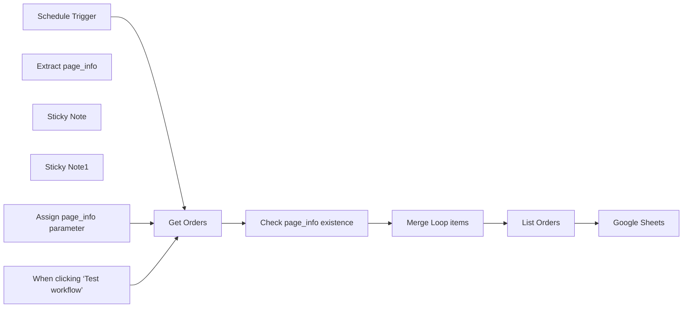

## Fluxo (.json) :

```json
{
  "meta": {
    "instanceId": "e634e668fe1fc93a75c4f2a7fc0dad807ca318b79654157eadb9578496acbc76",
    "templateCredsSetupCompleted": true
  },
  "nodes": [
    {
      "id": "33114dba-d3e2-469c-bb01-e50d4e84be53",
      "name": "When clicking ‘Test workflow’",
      "type": "n8n-nodes-base.manualTrigger",
      "position": [
        120,
        60
      ],
      "parameters": {},
      "typeVersion": 1
    },
    {
      "id": "68a92424-8345-40d1-bdb2-ad4b68c35406",
      "name": "Get Orders",
      "type": "n8n-nodes-base.httpRequest",
      "position": [
        500,
        0
      ],
      "parameters": {
        "url": "https://{store}.myshopify.com/admin/api/2025-01/orders.json",
        "options": {
          "response": {
            "response": {
              "fullResponse": true
            }
          }
        },
        "sendQuery": true,
        "authentication": "predefinedCredentialType",
        "queryParameters": {
          "parameters": [
            {
              "name": "limit",
              "value": "250"
            },
            {
              "name": "fields",
              "value": "id,note,email,processed_at,customer"
            },
            {
              "name": "={{ $json.page_info ? \"page_info\" : \"status\" }}",
              "value": "={{ $json.page_info ? $json.page_info : 'any' }}"
            }
          ]
        },
        "nodeCredentialType": "shopifyAccessTokenApi"
      },
      "credentials": {
        "shopifyAccessTokenApi": {
          "id": "vtyKGPLLdjc7MLea",
          "name": "Shopify Access Token account"
        }
      },
      "typeVersion": 4.2
    },
    {
      "id": "e0e67ff4-cba3-420e-ad06-4201d8517470",
      "name": "Extract page_info ",
      "type": "n8n-nodes-base.code",
      "position": [
        900,
        120
      ],
      "parameters": {
        "jsCode": "function parseNextParams(headerValue) {\n    // Match the URL inside <>\n    const urlMatch = headerValue.match(/<([^>]+)>;\\s*rel=\"next\"/);\n    if (!urlMatch) return null;\n\n    const url = urlMatch[1]; // Extracted URL\n    const paramsString = url.split(\"?\")[1]; // Get query string\n\n    if (!paramsString) return {}; // No params found\n\n    // Convert query string to object\n    return paramsString.split(\"&\").reduce((acc, param) => {\n        const [key, value] = param.split(\"=\");\n        acc[decodeURIComponent(key)] = decodeURIComponent(value);\n        return acc;\n    }, {});\n}\n\n/* Example usage\n`<https://59b774-3.myshopify.com/admin/api/2025-01/orders.json?limit=250&fields=id%2Cnote%2Cemail%2Cprocessed_at%2Ccustomer&page_info=eyJzdGF0dXMiOiJhbnkiLCJsYXN0X2lkIjo2MzQ5MjI3MDAwMDk0LCJsYXN0X3ZhbHVlIjoiMjAyNC0xMi0zMSAwOToxMzowMi42MTcxNjYiLCJkaXJlY3Rpb24iOiJuZXh0In0>; rel=\"next\"`\n*/\nconst headerValue = $input.first().json.headers.link;\nconst params = parseNextParams(headerValue);\nreturn params;"
      },
      "typeVersion": 2
    },
    {
      "id": "fd06d8fa-3c6d-4877-a2e8-cb71b0d0ef32",
      "name": "Merge Loop items",
      "type": "n8n-nodes-base.code",
      "position": [
        1120,
        -100
      ],
      "parameters": {
        "jsCode": "let results = [],\n  i = 0;\n\ndo {\n  try {\n    results = results.concat($(\"Get Orders\").all(0, i));\n  } catch (error) {\n    return results;\n  }\n  i++;\n} while (true);"
      },
      "typeVersion": 2
    },
    {
      "id": "cd9840ad-4ec2-4979-b0cc-c7dc42917452",
      "name": "List Orders",
      "type": "n8n-nodes-base.splitOut",
      "position": [
        1380,
        -100
      ],
      "parameters": {
        "options": {},
        "fieldToSplitOut": "body.orders"
      },
      "typeVersion": 1
    },
    {
      "id": "9d491fda-ab2e-4247-85bd-969a07476471",
      "name": "Google Sheets",
      "type": "n8n-nodes-base.googleSheets",
      "position": [
        1620,
        -100
      ],
      "parameters": {
        "columns": {
          "value": {
            "id": "={{ $json.id }}",
            "note": "={{ $json.note }}",
            "email": "={{ $json.email }}",
            "processed_at": "={{ $json.processed_at }}"
          },
          "schema": [
            {
              "id": "id",
              "type": "string",
              "display": true,
              "removed": false,
              "required": false,
              "displayName": "id",
              "defaultMatch": true,
              "canBeUsedToMatch": true
            },
            {
              "id": "email",
              "type": "string",
              "display": true,
              "required": false,
              "displayName": "email",
              "defaultMatch": false,
              "canBeUsedToMatch": true
            },
            {
              "id": "processed_at",
              "type": "string",
              "display": true,
              "required": false,
              "displayName": "processed_at",
              "defaultMatch": false,
              "canBeUsedToMatch": true
            },
            {
              "id": "note",
              "type": "string",
              "display": true,
              "required": false,
              "displayName": "note",
              "defaultMatch": false,
              "canBeUsedToMatch": true
            }
          ],
          "mappingMode": "defineBelow",
          "matchingColumns": [
            "id"
          ],
          "attemptToConvertTypes": false,
          "convertFieldsToString": false
        },
        "options": {},
        "operation": "appendOrUpdate",
        "sheetName": {
          "__rl": true,
          "mode": "list",
          "value": 2030201341,
          "cachedResultUrl": "https://docs.google.com/spreadsheets/d/1yf_RYZGFHpMyOvD3RKGSvIFY2vumvI4474Qm_1t4-jM/edit#gid=2030201341",
          "cachedResultName": "shopify_orders"
        },
        "documentId": {
          "__rl": true,
          "mode": "list",
          "value": "1yf_RYZGFHpMyOvD3RKGSvIFY2vumvI4474Qm_1t4-jM",
          "cachedResultUrl": "https://docs.google.com/spreadsheets/d/1yf_RYZGFHpMyOvD3RKGSvIFY2vumvI4474Qm_1t4-jM/edit?usp=drivesdk",
          "cachedResultName": "Squarespace automation"
        }
      },
      "credentials": {
        "googleSheetsOAuth2Api": {
          "id": "JgI9maibw5DnBXRP",
          "name": "Google Sheets account"
        }
      },
      "typeVersion": 4.5
    },
    {
      "id": "d1974350-5fcb-448a-b895-17b296de0019",
      "name": "Sticky Note",
      "type": "n8n-nodes-base.stickyNote",
      "position": [
        440,
        -160
      ],
      "parameters": {
        "width": 232,
        "height": 346,
        "content": "## Edit this node 👇\n\nGet your store URL and replace in the GET url: https://{your-store}.myshopify.com/admin/api/2025-01/orders.json\n"
      },
      "typeVersion": 1
    },
    {
      "id": "bbc911a5-0020-47d9-8b2f-2edd7ac83325",
      "name": "Sticky Note1",
      "type": "n8n-nodes-base.stickyNote",
      "position": [
        1580,
        -260
      ],
      "parameters": {
        "width": 252,
        "height": 346,
        "content": "## Clone this spreadsheet\n\nhttps://docs.google.com/spreadsheets/d/1KRl6aCCU2SE3Z6vB2EbTnSwSUAre0BLf9Wu6fyPlrIE/edit?usp=sharing"
      },
      "typeVersion": 1
    },
    {
      "id": "fdec0965-3a0c-4886-90b4-f2ef4f0cebdd",
      "name": "Schedule Trigger",
      "type": "n8n-nodes-base.scheduleTrigger",
      "position": [
        120,
        -120
      ],
      "parameters": {
        "rule": {
          "interval": [
            {}
          ]
        }
      },
      "typeVersion": 1.2
    },
    {
      "id": "87cdb9e8-a031-4a40-a5e6-65a0cfc40180",
      "name": "Assign page_info parameter",
      "type": "n8n-nodes-base.set",
      "position": [
        1120,
        120
      ],
      "parameters": {
        "options": {},
        "assignments": {
          "assignments": [
            {
              "id": "57e59bb7-ac20-4a1b-b54a-3468fc0519d3",
              "name": "page_info",
              "type": "string",
              "value": "={{ $json.page_info }}"
            }
          ]
        }
      },
      "typeVersion": 3.4
    },
    {
      "id": "8f15e8a1-19de-401f-8ef2-358a42e806bb",
      "name": "Check page_info existence",
      "type": "n8n-nodes-base.if",
      "position": [
        720,
        0
      ],
      "parameters": {
        "options": {},
        "conditions": {
          "options": {
            "version": 2,
            "leftValue": "",
            "caseSensitive": true,
            "typeValidation": "strict"
          },
          "combinator": "and",
          "conditions": [
            {
              "id": "30d965c3-cbba-430e-81c2-ef8b543665e7",
              "operator": {
                "type": "string",
                "operation": "notContains"
              },
              "leftValue": "={{ $json.headers.link }}",
              "rightValue": "rel=\"next\""
            }
          ]
        }
      },
      "typeVersion": 2.2
    }
  ],
  "pinData": {},
  "connections": {
    "Get Orders": {
      "main": [
        [
          {
            "node": "Check page_info existence",
            "type": "main",
            "index": 0
          }
        ]
      ]
    },
    "List Orders": {
      "main": [
        [
          {
            "node": "Google Sheets",
            "type": "main",
            "index": 0
          }
        ]
      ]
    },
    "Merge Loop items": {
      "main": [
        [
          {
            "node": "List Orders",
            "type": "main",
            "index": 0
          }
        ]
      ]
    },
    "Schedule Trigger": {
      "main": [
        [
          {
            "node": "Get Orders",
            "type": "main",
            "index": 0
          }
        ]
      ]
    },
    "Extract page_info ": {
      "main": [
        [
          {
            "node": "Assign page_info parameter",
            "type": "main",
            "index": 0
          }
        ]
      ]
    },
    "Check page_info existence": {
      "main": [
        [
          {
            "node": "Merge Loop items",
            "type": "main",
            "index": 0
          }
        ],
        [
          {
            "node": "Extract page_info ",
            "type": "main",
            "index": 0
          }
        ]
      ]
    },
    "Assign page_info parameter": {
      "main": [
        [
          {
            "node": "Get Orders",
            "type": "main",
            "index": 0
          }
        ]
      ]
    },
    "When clicking ‘Test workflow’": {
      "main": [
        [
          {
            "node": "Get Orders",
            "type": "main",
            "index": 0
          }
        ]
      ]
    }
  }
}
```
