# PACK 1999 TEMPLATES PARTE 03 - Bloco 10

Templates neste bloco: 20

## Sumário

- [Template 582 - Chatbot/Voice/Phone Agent com Voiceflow, Agenda e RAG](#template-582)
- [Template 583 - Executar SuiteQL via webhook](#template-583)
- [Template 584 - Gerar links do Google Meet via Slack](#template-584)
- [Template 585 - Criar rascunhos de resposta Fastmail](#template-585)
- [Template 586 - Lembrete diário de gratidão às 21h](#template-586)
- [Template 587 - Gerar saída estruturada: maiores estados e cidades](#template-587)
- [Template 588 - Parser EDI por email para planilha](#template-588)
- [Template 589 - Criação automática de conteúdo Instagram a partir de tendências](#template-589)
- [Template 590 - Envio diário de mensagens de parabéns por SMS](#template-590)
- [Template 591 - Cadastro e associação de semestre](#template-591)
- [Template 592 - Extração e enriquecimento de leads via Google Maps](#template-592)
- [Template 593 - Instalação automática de pacotes npm](#template-593)
- [Template 594 - Extração de dados pessoais com LLM self-hosted](#template-594)
- [Template 595 - Agendamento de consulta com aprovação](#template-595)
- [Template 596 - Sincronização diária de novos contatos para Mailchimp](#template-596)
- [Template 597 - Moderação de spam no Discord](#template-597)
- [Template 598 - Converter tags em pastas e mover workflows](#template-598)
- [Template 599 - Notificação de ativação de plano PayPal](#template-599)
- [Template 600 - Chatbot Helpdesk RH & TI com transcrição de áudio](#template-600)
- [Template 601 - Chatbot para Bitrix24 via Webhook](#template-601)

---

<a id="template-582"></a>

## Template 582 - Chatbot/Voice/Phone Agent com Voiceflow, Agenda e RAG

- **Nome:** Chatbot/Voice/Phone Agent com Voiceflow, Agenda e RAG
- **Descrição:** Fluxo que expõe endpoints HTTP para atendimento (chat/voice/phone), integra criação de eventos no Google Calendar, consulta de status de pedidos via API e respostas enriquecidas por um sistema RAG usando vetores de documentos.
- **Funcionalidade:** • Endpoints HTTP públicos (webhooks): Recebe requisições para três casos principais: rastreio de pedidos, criação de compromissos e consultas via RAG.
• Rastreamento de pedidos: Recebe o número do pedido e chama uma API externa de tracking, formata a resposta e retorna ao solicitante.
• Agendamento de compromissos: Recebe data/hora do cliente, converte para formato compatível com Google Calendar, cria evento e confirma a criação.
• Conversão e parsing de datas: Usa um passo de LLM para normalizar a data de início e calcular automaticamente a data de término (+1 hora).
• Sistema RAG (Retrieval-Augmented Generation): Recupera embeddings e documentos de uma coleção vetorial para fornecer respostas contextualizadas usando modelos de linguagem.
• Indexação de documentos: Faz download de arquivos (Google Drive), converte para texto, divide em chunks e envia embeddings para a store vetorial para posterior recuperação.
• Agente conversacional: Usa modelos de linguagem com mensagens de sistema pré-definidas para responder perguntas de clientes apoiado pelos documentos recuperados.
• Criação/refresh de coleção vetorial: Endpoints e passos para criar ou limpar coleções na store vetorial antes da indexação.
• Integração com Voiceflow/Twilio (instruções): Fornece orientações para conectar os webhooks a fluxos de Voiceflow e, opcionalmente, transformar o agente em agente telefônico usando um número Twilio.
- **Ferramentas:** • Voiceflow: Plataforma para criar agentes de chat, voz e integrar número telefônico para atendimento por voz.
• Google Calendar: Serviço para criar e gerenciar eventos/compromissos do usuário.
• Google Drive: Fonte de documentos que são baixados e convertidos para texto para indexação.
• Qdrant (store vetorial): Banco de vetores usado para armazenar e recuperar embeddings de documentos (RAG).
• OpenAI (modelos e embeddings): Modelos de linguagem e embeddings usados para parsing de datas, geração de respostas e criação de vetores.
• Serviço de tracking externo (API HTTP): API de terceiros usada para consultar o status de pedidos.
• Twilio (opcional): Serviço de telefonia para transformar o agente em um Phone Agent (mencionado como opção de integração).

## Fluxo visual

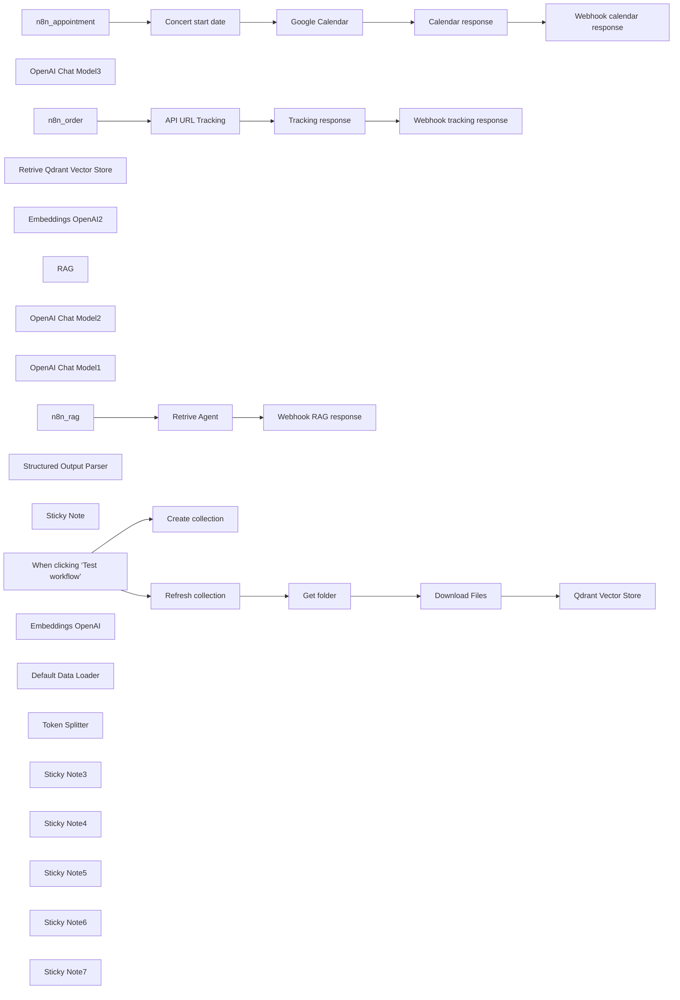

## Fluxo (.json) :

```json
{
  "id": "MMDt8lGtac2oU8nI",
  "meta": {
    "instanceId": "a4bfc93e975ca233ac45ed7c9227d84cf5a2329310525917adaf3312e10d5462",
    "templateCredsSetupCompleted": true
  },
  "name": "Build a Chatbot, Voice Agent and Phone Agent with Voiceflow, Google Calendar and RAG",
  "tags": [],
  "nodes": [
    {
      "id": "20605948-5277-4fd7-9ba0-63f645bf2dcc",
      "name": "n8n_order",
      "type": "n8n-nodes-base.webhook",
      "position": [
        -340,
        -140
      ],
      "webhookId": "9ff7a394-5b4b-4790-a96b-c41c4ba27fa5",
      "parameters": {
        "path": "9ff7a394-5b4b-4790-a96b-c41c4ba27fa5",
        "options": {},
        "responseMode": "responseNode"
      },
      "typeVersion": 2
    },
    {
      "id": "9ef7971e-f679-4d5e-b347-3238d51a06d6",
      "name": "Google Calendar",
      "type": "n8n-nodes-base.googleCalendar",
      "position": [
        300,
        280
      ],
      "parameters": {
        "end": "={{ $json.output.end }}",
        "start": "={{ $json.output.start }}",
        "calendar": {
          "__rl": true,
          "mode": "list",
          "value": "info@n3w.it",
          "cachedResultName": "info@n3w.it"
        },
        "additionalFields": {
          "summary": "=Event title with {{ $('n8n_appointment').item.json.query.Email }}",
          "description": "Event description"
        }
      },
      "credentials": {
        "googleCalendarOAuth2Api": {
          "id": "8RFK3u13g2PJEGa9",
          "name": "Google Calendar account"
        }
      },
      "typeVersion": 1.3
    },
    {
      "id": "17b9f162-c4a3-43ec-b640-a68ebc67b0c9",
      "name": "OpenAI Chat Model3",
      "type": "@n8n/n8n-nodes-langchain.lmChatOpenAi",
      "position": [
        -120,
        480
      ],
      "parameters": {
        "model": {
          "__rl": true,
          "mode": "list",
          "value": "gpt-4o-mini"
        },
        "options": {}
      },
      "credentials": {
        "openAiApi": {
          "id": "4zwP0MSr8zkNvvV9",
          "name": "OpenAi account"
        }
      },
      "typeVersion": 1.2
    },
    {
      "id": "5b40db3c-6c98-4fea-9c3b-98ba7e13bc30",
      "name": "Concert start date",
      "type": "@n8n/n8n-nodes-langchain.chainLlm",
      "position": [
        -80,
        280
      ],
      "parameters": {
        "text": "=Convert this date to a compatible format for Google Calendar APIs for the start date, and for the end date add 1 hour to the start date.\n\nHere is the start date:\n{{ $json.query.Appointment_date }}",
        "promptType": "define",
        "hasOutputParser": true
      },
      "typeVersion": 1.6
    },
    {
      "id": "8931d21a-7c30-40ae-b0b0-1f5f6868b3a3",
      "name": "n8n_appointment",
      "type": "n8n-nodes-base.webhook",
      "position": [
        -340,
        280
      ],
      "webhookId": "f5edfe92-649b-40da-ab35-f818ccb55ad4",
      "parameters": {
        "path": "f5edfe92-649b-40da-ab35-f818ccb55ad4",
        "options": {},
        "responseMode": "responseNode"
      },
      "typeVersion": 2
    },
    {
      "id": "fa3e66ca-de09-496b-be14-483b33386e07",
      "name": "Retrive Qdrant Vector Store",
      "type": "@n8n/n8n-nodes-langchain.vectorStoreQdrant",
      "position": [
        20,
        1280
      ],
      "parameters": {
        "options": {},
        "qdrantCollection": {
          "__rl": true,
          "mode": "list",
          "value": "scarperia",
          "cachedResultName": "scarperia"
        }
      },
      "credentials": {
        "qdrantApi": {
          "id": "iyQ6MQiVaF3VMBmt",
          "name": "QdrantApi account"
        }
      },
      "typeVersion": 1
    },
    {
      "id": "ea7be112-1949-47b7-b68b-ae2f3a7b1b71",
      "name": "Embeddings OpenAI2",
      "type": "@n8n/n8n-nodes-langchain.embeddingsOpenAi",
      "position": [
        -20,
        1460
      ],
      "parameters": {
        "options": {}
      },
      "credentials": {
        "openAiApi": {
          "id": "4zwP0MSr8zkNvvV9",
          "name": "OpenAi account"
        }
      },
      "typeVersion": 1.2
    },
    {
      "id": "e61ff57f-a109-41e0-87f3-522b1fa78dd6",
      "name": "RAG",
      "type": "@n8n/n8n-nodes-langchain.toolVectorStore",
      "position": [
        180,
        1080
      ],
      "parameters": {
        "name": "company_data",
        "description": "Retrive data about company knowledge from vector store"
      },
      "typeVersion": 1
    },
    {
      "id": "fce158b8-73a3-42c1-baf3-9f2ae979fe15",
      "name": "OpenAI Chat Model2",
      "type": "@n8n/n8n-nodes-langchain.lmChatOpenAi",
      "position": [
        -20,
        1080
      ],
      "parameters": {
        "model": {
          "__rl": true,
          "mode": "list",
          "value": "gpt-4o-mini"
        },
        "options": {}
      },
      "credentials": {
        "openAiApi": {
          "id": "4zwP0MSr8zkNvvV9",
          "name": "OpenAi account"
        }
      },
      "typeVersion": 1.2
    },
    {
      "id": "e2bcfa68-3642-4e49-89cb-e08faade984c",
      "name": "OpenAI Chat Model1",
      "type": "@n8n/n8n-nodes-langchain.lmChatOpenAi",
      "position": [
        340,
        1300
      ],
      "parameters": {
        "model": {
          "__rl": true,
          "mode": "list",
          "value": "gpt-4o-mini"
        },
        "options": {}
      },
      "credentials": {
        "openAiApi": {
          "id": "4zwP0MSr8zkNvvV9",
          "name": "OpenAi account"
        }
      },
      "typeVersion": 1.2
    },
    {
      "id": "2a79c66c-040b-4ca2-ad91-a0683d0d2996",
      "name": "Retrive Agent",
      "type": "@n8n/n8n-nodes-langchain.agent",
      "position": [
        60,
        860
      ],
      "parameters": {
        "text": "={{ $json.query.Question }}",
        "agent": "conversationalAgent",
        "options": {
          "systemMessage": "You are an AI-powered assistant for an electronics store. Your primary goal is to assist customers by providing accurate and helpful information about products, troubleshooting tips, and general support. Use the provided knowledge base (retrieved documents) to answer questions with precision and professionalism.\n\n**Guidelines**:\n1. **Product Information**:\n   - Provide detailed descriptions of products, including specifications, features, and compatibility.\n   - Highlight key selling points and differences between similar products.\n   - Mention availability, pricing, and promotions if applicable.\n\n2. **Technical Support**:\n   - Offer step-by-step troubleshooting guides for common issues.\n   - Suggest solutions for setup, installation, or configuration problems.\n   - If the issue is complex, recommend contacting the store’s support team for further assistance.\n\n3. **Customer Service**:\n   - Respond politely and professionally to all inquiries.\n   - If a question is unclear, ask for clarification to provide the best possible answer.\n   - For order-related questions (e.g., status, returns, or cancellations), guide customers on how to proceed using the store’s systems.\n\n4. **Knowledge Base Usage**:\n   - Always reference the provided knowledge base (retrieved documents) to ensure accuracy.\n   - If the knowledge base does not contain relevant information, inform the customer and suggest alternative resources or actions.\n\n5. **Tone and Style**:\n   - Use a friendly, approachable, and professional tone.\n   - Avoid technical jargon unless the customer demonstrates familiarity with the topic.\n   - Keep responses concise but informative.\n\n**Example Interactions**:\n1. **Product Inquiry**:\n   - Customer: \"What’s the difference between the XYZ Smartwatch and the ABC Smartwatch?\"\n   - AI: \"The XYZ Smartwatch features a longer battery life (up to 7 days) and built-in GPS, while the ABC Smartwatch has a brighter AMOLED display and supports wireless charging. Both are compatible with iOS and Android devices. Would you like more details on either product?\"\n\n2. **Technical Support**:\n   - Customer: \"My wireless router isn’t connecting to the internet.\"\n   - AI: \"Please try the following steps: 1) Restart your router and modem. 2) Ensure all cables are securely connected. 3) Check if the router’s LED indicators show a stable connection. If the issue persists, you may need to reset the router to factory settings. Would you like a detailed guide for resetting your router?\"\n\n3. **Customer Service**:\n   - Customer: \"How do I return a defective product?\"\n   - AI: \"To return a defective product, please visit our Returns Portal on our website and enter your order number. You’ll receive a return label and instructions. If you need further assistance, our support team is available at support@electronicsstore.com.\"\n\n**Limitations**:\n- If the question is outside the scope of the knowledge base or requires human intervention, inform the customer and provide contact details for the appropriate department.\n- Do not provide speculative or unverified information. Always rely on the knowledge base or direct the customer to official resources."
        },
        "promptType": "define"
      },
      "typeVersion": 1.7
    },
    {
      "id": "be516c9c-d2fb-4dea-9a3b-9674be5ea689",
      "name": "n8n_rag",
      "type": "n8n-nodes-base.webhook",
      "position": [
        -360,
        860
      ],
      "webhookId": "edb1e894-1210-4902-a34f-a014bbdad8d8",
      "parameters": {
        "path": "edb1e894-1210-4902-a34f-a014bbdad8d8",
        "options": {},
        "responseMode": "responseNode"
      },
      "typeVersion": 2
    },
    {
      "id": "2412721d-7353-4a27-8068-5c90872c7a51",
      "name": "Tracking response",
      "type": "n8n-nodes-base.set",
      "position": [
        360,
        -140
      ],
      "parameters": {
        "options": {},
        "assignments": {
          "assignments": [
            {
              "id": "86f332ff-7b89-4dd4-8df9-06c081625d33",
              "name": "text",
              "type": "string",
              "value": "=Your order status is: {{ $json.status }}"
            }
          ]
        }
      },
      "typeVersion": 3.4
    },
    {
      "id": "4965d781-1452-42c9-8a84-baacb5abe97f",
      "name": "Calendar response",
      "type": "n8n-nodes-base.set",
      "position": [
        500,
        280
      ],
      "parameters": {
        "options": {},
        "assignments": {
          "assignments": [
            {
              "id": "0fe6fe50-9263-479a-ab01-ca1d15ce2412",
              "name": "text",
              "type": "string",
              "value": "L'evento è stato creato con successo"
            }
          ]
        }
      },
      "typeVersion": 3.4
    },
    {
      "id": "5311be28-2878-41ce-a70f-4e4aebcea0f9",
      "name": "Webhook tracking response",
      "type": "n8n-nodes-base.respondToWebhook",
      "position": [
        700,
        -140
      ],
      "parameters": {
        "options": {}
      },
      "typeVersion": 1.1
    },
    {
      "id": "84d8558f-e6fd-400e-ae2e-0b5fec309561",
      "name": "API URL Tracking",
      "type": "n8n-nodes-base.httpRequest",
      "position": [
        20,
        -140
      ],
      "parameters": {
        "url": "URL_TRACKING",
        "options": {},
        "sendBody": true,
        "bodyParameters": {
          "parameters": [
            {
              "name": "Order number",
              "value": "={{ $json.Order_number }}"
            },
            {
              "name": "Email",
              "value": "={{ $json.Order_number }}"
            }
          ]
        }
      },
      "typeVersion": 4.2
    },
    {
      "id": "32eb8645-c56e-4db4-8870-f28161cba048",
      "name": "Webhook calendar response",
      "type": "n8n-nodes-base.respondToWebhook",
      "position": [
        700,
        280
      ],
      "parameters": {
        "options": {}
      },
      "typeVersion": 1.1
    },
    {
      "id": "72e7f085-d1e7-4967-aaa5-161ff0e83c06",
      "name": "Structured Output Parser",
      "type": "@n8n/n8n-nodes-langchain.outputParserStructured",
      "position": [
        140,
        480
      ],
      "parameters": {
        "schemaType": "manual",
        "inputSchema": "{\n\t\"type\": \"object\",\n\t\"properties\": {\n\t\t\"start\": {\n\t\t\t\"type\": \"string\"\n\t\t},\n\t\t\"end\": {\n\t\t\t\"type\": \"string\"\n\t\t}\n\t}\n}"
      },
      "typeVersion": 1.2
    },
    {
      "id": "3822b875-73f0-4700-8fc4-e4d3285f593a",
      "name": "Webhook RAG response",
      "type": "n8n-nodes-base.respondToWebhook",
      "position": [
        700,
        860
      ],
      "parameters": {
        "options": {}
      },
      "typeVersion": 1.1
    },
    {
      "id": "0b43f63b-3c00-4db4-8b28-9938add9fdbe",
      "name": "Sticky Note",
      "type": "n8n-nodes-base.stickyNote",
      "position": [
        1100,
        -1320
      ],
      "parameters": {
        "width": 1140,
        "height": 2200,
        "content": "# STEP 6 - VOICEFLOW\n\n- Register on [Voiceflow](https://www.voiceflow.com/) \n- Create the workflow as shown in the following image\n\n- There are 3 \"Captures\":\n-- n8n_order\n-- n8n_appointment\n-- n8n_rag\n- Add in the created functions the url of the corresponding n8n Webhook trigger node\n- Test your Agent\n- Get your projectID\n- In the Widget section choose Chat or Voice and copy the installation script\n\n\n\nPS. You can import a Twilio number to assign it to your agent for becoming a Phone Agent\n\n\n"
      },
      "typeVersion": 1
    },
    {
      "id": "589165c8-920d-40e3-8e28-50e94dd37555",
      "name": "When clicking ‘Test workflow’",
      "type": "n8n-nodes-base.manualTrigger",
      "position": [
        -380,
        -1120
      ],
      "parameters": {},
      "typeVersion": 1
    },
    {
      "id": "74c314bb-c445-42f8-8f9d-2ab646486044",
      "name": "Qdrant Vector Store",
      "type": "@n8n/n8n-nodes-langchain.vectorStoreQdrant",
      "position": [
        600,
        -1000
      ],
      "parameters": {
        "mode": "insert",
        "options": {},
        "qdrantCollection": {
          "__rl": true,
          "mode": "id",
          "value": "="
        }
      },
      "credentials": {
        "qdrantApi": {
          "id": "iyQ6MQiVaF3VMBmt",
          "name": "QdrantApi account"
        }
      },
      "typeVersion": 1
    },
    {
      "id": "01c05ac3-ac5c-4f1a-a756-db8de4a30e56",
      "name": "Create collection",
      "type": "n8n-nodes-base.httpRequest",
      "position": [
        -80,
        -1260
      ],
      "parameters": {
        "url": "https://QDRANTURL/collections/COLLECTION",
        "method": "POST",
        "options": {},
        "jsonBody": "{\n  \"filter\": {}\n}",
        "sendBody": true,
        "sendHeaders": true,
        "specifyBody": "json",
        "authentication": "genericCredentialType",
        "genericAuthType": "httpHeaderAuth",
        "headerParameters": {
          "parameters": [
            {
              "name": "Content-Type",
              "value": "application/json"
            }
          ]
        }
      },
      "credentials": {
        "httpHeaderAuth": {
          "id": "qhny6r5ql9wwotpn",
          "name": "Qdrant API (Hetzner)"
        }
      },
      "typeVersion": 4.2
    },
    {
      "id": "2d7adb45-aae7-4617-b1d1-5a23f3eb3b20",
      "name": "Refresh collection",
      "type": "n8n-nodes-base.httpRequest",
      "position": [
        -80,
        -1000
      ],
      "parameters": {
        "url": "https://QDRANTURL/collections/COLLECTION/points/delete",
        "method": "POST",
        "options": {},
        "jsonBody": "{\n  \"filter\": {}\n}",
        "sendBody": true,
        "sendHeaders": true,
        "specifyBody": "json",
        "authentication": "genericCredentialType",
        "genericAuthType": "httpHeaderAuth",
        "headerParameters": {
          "parameters": [
            {
              "name": "Content-Type",
              "value": "application/json"
            }
          ]
        }
      },
      "credentials": {
        "httpHeaderAuth": {
          "id": "qhny6r5ql9wwotpn",
          "name": "Qdrant API (Hetzner)"
        }
      },
      "typeVersion": 4.2
    },
    {
      "id": "5e406bd7-8a93-4db2-8d3d-e92e8c9f4f01",
      "name": "Get folder",
      "type": "n8n-nodes-base.googleDrive",
      "position": [
        140,
        -1000
      ],
      "parameters": {
        "filter": {
          "driveId": {
            "__rl": true,
            "mode": "list",
            "value": "My Drive",
            "cachedResultUrl": "https://drive.google.com/drive/my-drive",
            "cachedResultName": "My Drive"
          },
          "folderId": {
            "__rl": true,
            "mode": "id",
            "value": "=test-whatsapp"
          }
        },
        "options": {},
        "resource": "fileFolder"
      },
      "credentials": {
        "googleDriveOAuth2Api": {
          "id": "HEy5EuZkgPZVEa9w",
          "name": "Google Drive account (n3w.it)"
        }
      },
      "typeVersion": 3
    },
    {
      "id": "f1f883fb-c9d1-42e6-98c2-791ed85e959f",
      "name": "Download Files",
      "type": "n8n-nodes-base.googleDrive",
      "position": [
        360,
        -1000
      ],
      "parameters": {
        "fileId": {
          "__rl": true,
          "mode": "id",
          "value": "={{ $json.id }}"
        },
        "options": {
          "googleFileConversion": {
            "conversion": {
              "docsToFormat": "text/plain"
            }
          }
        },
        "operation": "download"
      },
      "credentials": {
        "googleDriveOAuth2Api": {
          "id": "HEy5EuZkgPZVEa9w",
          "name": "Google Drive account (n3w.it)"
        }
      },
      "typeVersion": 3
    },
    {
      "id": "5fd88e03-3638-4d38-8df4-246e4a5f2bda",
      "name": "Embeddings OpenAI",
      "type": "@n8n/n8n-nodes-langchain.embeddingsOpenAi",
      "position": [
        580,
        -800
      ],
      "parameters": {
        "options": {}
      },
      "credentials": {
        "openAiApi": {
          "id": "4zwP0MSr8zkNvvV9",
          "name": "OpenAi account"
        }
      },
      "typeVersion": 1.1
    },
    {
      "id": "3740a841-e272-44f9-b76d-51fb90137fd3",
      "name": "Default Data Loader",
      "type": "@n8n/n8n-nodes-langchain.documentDefaultDataLoader",
      "position": [
        760,
        -800
      ],
      "parameters": {
        "options": {},
        "dataType": "binary"
      },
      "typeVersion": 1
    },
    {
      "id": "075d1038-d1fd-4527-8eda-961f20c7869a",
      "name": "Token Splitter",
      "type": "@n8n/n8n-nodes-langchain.textSplitterTokenSplitter",
      "position": [
        760,
        -600
      ],
      "parameters": {
        "chunkSize": 300,
        "chunkOverlap": 30
      },
      "typeVersion": 1
    },
    {
      "id": "57cc8eaf-26b3-480f-ab5d-c8646519cfa3",
      "name": "Sticky Note3",
      "type": "n8n-nodes-base.stickyNote",
      "position": [
        120,
        -1320
      ],
      "parameters": {
        "color": 6,
        "width": 880,
        "height": 220,
        "content": "# STEP 1\n\n## Create Qdrant Collection\nChange:\n- QDRANTURL\n- COLLECTION"
      },
      "typeVersion": 1
    },
    {
      "id": "70bc0676-c0ea-4de8-8659-bfb8b0ea653f",
      "name": "Sticky Note4",
      "type": "n8n-nodes-base.stickyNote",
      "position": [
        -100,
        -1060
      ],
      "parameters": {
        "color": 4,
        "width": 620,
        "height": 400,
        "content": "# STEP 2\n\n\n\n\n\n\n\n\n\n\n\n\n## Documents vectorization with Qdrant and Google Drive\nChange:\n- QDRANTURL\n- COLLECTION"
      },
      "typeVersion": 1
    },
    {
      "id": "411c4f55-ae41-49b5-a821-df1a3d8fefec",
      "name": "Sticky Note5",
      "type": "n8n-nodes-base.stickyNote",
      "position": [
        -380,
        660
      ],
      "parameters": {
        "color": 5,
        "width": 1220,
        "content": "# STEP 5\nIf required retrive the informations by RAG system"
      },
      "typeVersion": 1
    },
    {
      "id": "49d1fe78-4c38-4508-84c3-3a571ad9a2b0",
      "name": "Sticky Note6",
      "type": "n8n-nodes-base.stickyNote",
      "position": [
        -360,
        -360
      ],
      "parameters": {
        "color": 5,
        "width": 1220,
        "content": "# STEP 3\nIf required retrive the informations by Order system\n- Set your API URL Tracking service"
      },
      "typeVersion": 1
    },
    {
      "id": "23d42754-0126-4b3a-91b0-b489ef83b36c",
      "name": "Sticky Note7",
      "type": "n8n-nodes-base.stickyNote",
      "position": [
        -360,
        80
      ],
      "parameters": {
        "color": 5,
        "width": 1220,
        "content": "# STEP 4\nIf required retrive the informations by Appointment system"
      },
      "typeVersion": 1
    }
  ],
  "active": false,
  "pinData": {},
  "settings": {
    "executionOrder": "v1"
  },
  "versionId": "20a19983-4edb-4179-a2d2-e2f53d0daf85",
  "connections": {
    "RAG": {
      "ai_tool": [
        [
          {
            "node": "Retrive Agent",
            "type": "ai_tool",
            "index": 0
          }
        ]
      ]
    },
    "n8n_rag": {
      "main": [
        [
          {
            "node": "Retrive Agent",
            "type": "main",
            "index": 0
          }
        ]
      ]
    },
    "n8n_order": {
      "main": [
        [
          {
            "node": "API URL Tracking",
            "type": "main",
            "index": 0
          }
        ]
      ]
    },
    "Get folder": {
      "main": [
        [
          {
            "node": "Download Files",
            "type": "main",
            "index": 0
          }
        ]
      ]
    },
    "Retrive Agent": {
      "main": [
        [
          {
            "node": "Webhook RAG response",
            "type": "main",
            "index": 0
          }
        ]
      ]
    },
    "Download Files": {
      "main": [
        [
          {
            "node": "Qdrant Vector Store",
            "type": "main",
            "index": 0
          }
        ]
      ]
    },
    "Token Splitter": {
      "ai_textSplitter": [
        [
          {
            "node": "Default Data Loader",
            "type": "ai_textSplitter",
            "index": 0
          }
        ]
      ]
    },
    "Google Calendar": {
      "main": [
        [
          {
            "node": "Calendar response",
            "type": "main",
            "index": 0
          }
        ]
      ]
    },
    "n8n_appointment": {
      "main": [
        [
          {
            "node": "Concert start date",
            "type": "main",
            "index": 0
          }
        ]
      ]
    },
    "API URL Tracking": {
      "main": [
        [
          {
            "node": "Tracking response",
            "type": "main",
            "index": 0
          }
        ]
      ]
    },
    "Calendar response": {
      "main": [
        [
          {
            "node": "Webhook calendar response",
            "type": "main",
            "index": 0
          }
        ]
      ]
    },
    "Embeddings OpenAI": {
      "ai_embedding": [
        [
          {
            "node": "Qdrant Vector Store",
            "type": "ai_embedding",
            "index": 0
          }
        ]
      ]
    },
    "Tracking response": {
      "main": [
        [
          {
            "node": "Webhook tracking response",
            "type": "main",
            "index": 0
          }
        ]
      ]
    },
    "Concert start date": {
      "main": [
        [
          {
            "node": "Google Calendar",
            "type": "main",
            "index": 0
          }
        ]
      ]
    },
    "Embeddings OpenAI2": {
      "ai_embedding": [
        [
          {
            "node": "Retrive Qdrant Vector Store",
            "type": "ai_embedding",
            "index": 0
          }
        ]
      ]
    },
    "OpenAI Chat Model1": {
      "ai_languageModel": [
        [
          {
            "node": "RAG",
            "type": "ai_languageModel",
            "index": 0
          }
        ]
      ]
    },
    "OpenAI Chat Model2": {
      "ai_languageModel": [
        [
          {
            "node": "Retrive Agent",
            "type": "ai_languageModel",
            "index": 0
          }
        ]
      ]
    },
    "OpenAI Chat Model3": {
      "ai_languageModel": [
        [
          {
            "node": "Concert start date",
            "type": "ai_languageModel",
            "index": 0
          }
        ]
      ]
    },
    "Refresh collection": {
      "main": [
        [
          {
            "node": "Get folder",
            "type": "main",
            "index": 0
          }
        ]
      ]
    },
    "Default Data Loader": {
      "ai_document": [
        [
          {
            "node": "Qdrant Vector Store",
            "type": "ai_document",
            "index": 0
          }
        ]
      ]
    },
    "Structured Output Parser": {
      "ai_outputParser": [
        [
          {
            "node": "Concert start date",
            "type": "ai_outputParser",
            "index": 0
          }
        ]
      ]
    },
    "Retrive Qdrant Vector Store": {
      "ai_vectorStore": [
        [
          {
            "node": "RAG",
            "type": "ai_vectorStore",
            "index": 0
          }
        ]
      ]
    },
    "When clicking ‘Test workflow’": {
      "main": [
        [
          {
            "node": "Create collection",
            "type": "main",
            "index": 0
          },
          {
            "node": "Refresh collection",
            "type": "main",
            "index": 0
          }
        ]
      ]
    }
  }
}
```

<a id="template-583"></a>

## Template 583 - Executar SuiteQL via webhook

- **Nome:** Executar SuiteQL via webhook
- **Descrição:** Recebe requisições contendo uma query SuiteQL e executa essa query no NetSuite, retornando os resultados ao solicitante. Também permite execução manual para testes.
- **Funcionalidade:** • Receber requisições via webhook: Aceita chamadas HTTP com payloads que contêm a query a ser executada.
• Executar SuiteQL no NetSuite: Extrai a query do payload e a executa contra a conta NetSuite configurada.
• Retornar resultados ao solicitante: Envia os resultados da execução da query como resposta à requisição recebida.
• Suporte a execução manual para testes: Permite disparar a execução da mesma query manualmente para verificação e depuração.
- **Ferramentas:** • NetSuite: Plataforma ERP com API que aceita consultas SuiteQL para recuperar dados empresariais.
• Clientes HTTP / Sistemas externos: Serviços ou aplicações que disparam requisições HTTP ao endpoint para solicitar a execução da query e receber os resultados.

## Fluxo visual

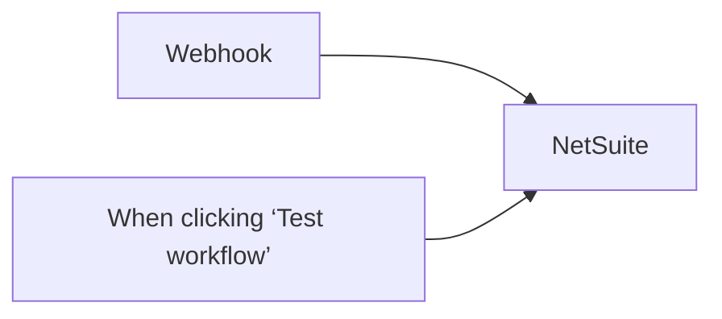

## Fluxo (.json) :

```json
{
  "id": "FDl4Ho3KYiA7MIxR",
  "meta": {
    "instanceId": "f6d3344846b38f0c35c069a91b2450f6527b26bb735b6301a692ce1cca2b2682"
  },
  "name": "NetSuite Rest API workflow",
  "tags": [],
  "nodes": [
    {
      "id": "f7f90fb4-e29f-4bbf-a99d-ee2fde45cd06",
      "name": "When clicking ‘Test workflow’",
      "type": "n8n-nodes-base.manualTrigger",
      "position": [
        -380,
        -40
      ],
      "parameters": {},
      "typeVersion": 1
    },
    {
      "id": "9fcc1ce7-e9bf-4592-8bcd-7c77272a9c59",
      "name": "NetSuite",
      "type": "n8n-nodes-netsuite.netsuite",
      "position": [
        -40,
        -180
      ],
      "parameters": {
        "query": "={{ $json.query.suiteql }}",
        "options": {},
        "operation": "runSuiteQL"
      },
      "credentials": {
        "netsuite": {
          "id": "ro6Rl1oWY4KkFUYn",
          "name": "NetSuite account"
        }
      },
      "typeVersion": 1
    },
    {
      "id": "1d615309-2cb0-4383-9698-2f80da0d4bf5",
      "name": "Webhook",
      "type": "n8n-nodes-base.webhook",
      "position": [
        -380,
        -280
      ],
      "webhookId": "249328cc-587a-4269-b266-96fe60cfaeb9",
      "parameters": {
        "path": "249328cc-587a-4269-b266-96fe60cfaeb9",
        "options": {},
        "responseData": "allEntries",
        "responseMode": "lastNode"
      },
      "typeVersion": 2
    }
  ],
  "active": true,
  "pinData": {},
  "settings": {
    "executionOrder": "v1"
  },
  "versionId": "d6823e59-8e07-44a6-b4af-b029da620523",
  "connections": {
    "Webhook": {
      "main": [
        [
          {
            "node": "NetSuite",
            "type": "main",
            "index": 0
          }
        ]
      ]
    },
    "NetSuite": {
      "main": [
        []
      ]
    },
    "When clicking ‘Test workflow’": {
      "main": [
        [
          {
            "node": "NetSuite",
            "type": "main",
            "index": 0
          }
        ]
      ]
    }
  }
}
```

<a id="template-584"></a>

## Template 584 - Gerar links do Google Meet via Slack

- **Nome:** Gerar links do Google Meet via Slack
- **Descrição:** Gera links instantâneos do Google Meet e os compartilha no canal do Slack quando acionado por um comando.
- **Funcionalidade:** • Acionamento por comando do Slack: Inicia o fluxo ao receber a chamada do slash command.
• Criação de evento temporário no Google Calendar: Cria um evento curto configurado para gerar um link de videoconferência (Google Meet).
• Envio do link para o canal: Publica mensagem no canal que acionou o comando contendo o link gerado.
• Exclusão do evento temporário: Remove o evento criado após o envio para evitar poluição do calendário.
• Uso de credenciais autenticadas: Opera com contas autorizadas do Google e do Slack para criar eventos e enviar mensagens.
- **Ferramentas:** • Slack: Recebe comandos slash e permite o envio de mensagens a canais, fornecendo o channel_id no payload.
• Google Calendar / Google Meet: Cria eventos com dados de conferência para gerar links de reunião do Google Meet.

## Fluxo visual

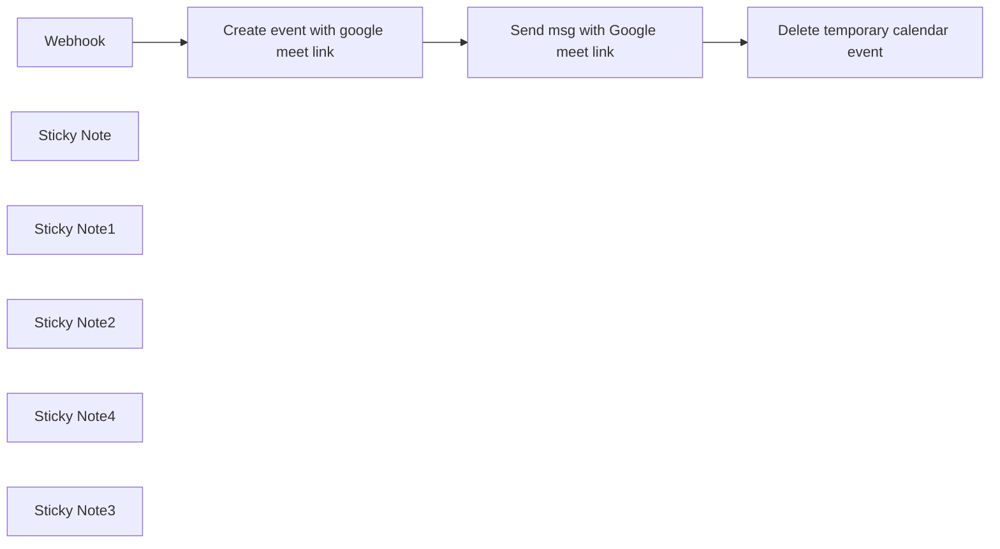

## Fluxo (.json) :

```json
{
  "id": "O2R3U22TB968fWUo",
  "meta": {
    "instanceId": "cb484ba7b742928a2048bf8829668bed5b5ad9787579adea888f05980292a4a7"
  },
  "name": "Generate google meet links in slack",
  "tags": [
    {
      "id": "GkyPPgldsTmLDY6O",
      "name": "createdBy:JC",
      "createdAt": "2024-02-29T21:51:58.448Z",
      "updatedAt": "2024-02-29T21:51:58.448Z"
    }
  ],
  "nodes": [
    {
      "id": "5577aaf6-f682-49c3-9d21-f819151f77c5",
      "name": "Webhook",
      "type": "n8n-nodes-base.webhook",
      "position": [
        300,
        480
      ],
      "webhookId": "f442a7bb-451e-4371-8b7a-614caa0e04dd",
      "parameters": {
        "path": "slack-meet-trigger",
        "options": {},
        "httpMethod": "POST",
        "responseData": "noData",
        "responseMode": "lastNode"
      },
      "typeVersion": 1.1
    },
    {
      "id": "018c32c7-c3eb-4679-8064-ab92bb62cac5",
      "name": "Sticky Note",
      "type": "n8n-nodes-base.stickyNote",
      "position": [
        140,
        142
      ],
      "parameters": {
        "color": 6,
        "width": 463.09809221779403,
        "height": 482.56534054190786,
        "content": "### 1. Setup: Add a Slack App\n**a.** Visit https://api.slack.com/apps, click on `New App` and choose a name and workspace.\n**b.** Click on `OAuth & Permissions` and scroll down to Scopes -> Bot token Scopes\n**c.** Add the `chat:write` scope & `chat:write.public`\n**d.** Navigate to `Slash Commands` and click `Create New Command`\n**e.** Use `/meet` as the command\n**f.** Copy the production URL from the **Webhook** node into `Request URL` within your slash command\n**g.** Add relevant description and usage hint\n**h.** Go to `Install app` and click install\n**i.** Don't worry about app distribution, that's only if you're trying to publish an app on the slack store"
      },
      "typeVersion": 1
    },
    {
      "id": "3bfa07d4-ef3e-4ec4-91a2-ca94e2346299",
      "name": "Sticky Note1",
      "type": "n8n-nodes-base.stickyNote",
      "position": [
        640,
        240
      ],
      "parameters": {
        "color": 6,
        "width": 291.779972644588,
        "height": 192.66150688057675,
        "content": "### 2. Setup: Google auth & calendar\n**a.** Visit [the docs](https://docs.n8n.io/integrations/builtin/credentials/google/oauth-single-service/) and follow the steps to setup Google auth credential\n**b.** Choose the calendar you wish to create google meet links from\n\n\n\n👇"
      },
      "typeVersion": 1
    },
    {
      "id": "aab60499-7123-43c0-8f99-d0eade0f5672",
      "name": "Sticky Note2",
      "type": "n8n-nodes-base.stickyNote",
      "position": [
        960,
        238
      ],
      "parameters": {
        "color": 6,
        "width": 292.3392628968803,
        "height": 192.92455101677126,
        "content": "### 3. Setup: Configure slack node authentication and your message\n**a.** Connect your slack account\n**b.** Configure your message text. Be sure to include the hangoutLink expression to output a meeting link\n\n👇"
      },
      "typeVersion": 1
    },
    {
      "id": "a15fc232-ec8e-4dfb-add7-2a3c27c5a232",
      "name": "Create event with google meet link",
      "type": "n8n-nodes-base.googleCalendar",
      "position": [
        740,
        480
      ],
      "parameters": {
        "end": "={{ $now.plus({minutes: 15}) }}",
        "start": "={{ $now }}",
        "calendar": {
          "__rl": true,
          "mode": "list",
          "value": ""
        },
        "additionalFields": {
          "conferenceDataUi": {
            "conferenceDataValues": {
              "conferenceSolution": "hangoutsMeet"
            }
          }
        }
      },
      "typeVersion": 1
    },
    {
      "id": "57c2d5b8-f5d7-4db1-9e13-48265d174679",
      "name": "Send msg with Google meet link",
      "type": "n8n-nodes-base.slack",
      "position": [
        1060,
        480
      ],
      "parameters": {
        "text": "=Join me here: {{ $('Create event with google meet link').item.json.hangoutLink }}",
        "select": "channel",
        "channelId": {
          "__rl": true,
          "mode": "id",
          "value": "={{ $('Webhook').item.json.body.channel_id }}"
        },
        "otherOptions": {
          "unfurl_links": false,
          "includeLinkToWorkflow": false
        }
      },
      "typeVersion": 2.1
    },
    {
      "id": "898b9681-c532-490e-aea2-a4f693b52f35",
      "name": "Delete temporary calendar event",
      "type": "n8n-nodes-base.googleCalendar",
      "position": [
        1400,
        480
      ],
      "parameters": {
        "eventId": "={{ $('Create event with google meet link').item.json[\"id\"] }}",
        "options": {},
        "calendar": {
          "__rl": true,
          "mode": "list",
          "value": ""
        },
        "operation": "delete"
      },
      "typeVersion": 1
    },
    {
      "id": "ec70003a-6dea-4c1b-a16e-e64a206aba16",
      "name": "Sticky Note4",
      "type": "n8n-nodes-base.stickyNote",
      "position": [
        140,
        -20
      ],
      "parameters": {
        "color": 4,
        "width": 459.2991776576996,
        "height": 146.4269155371431,
        "content": "## Generate google meet links with a slack command \nSpin up instant google meet links directly from slack and send to all channel participants\n\n"
      },
      "typeVersion": 1
    },
    {
      "id": "eee48232-8477-4bfb-8164-bfaf66062071",
      "name": "Sticky Note3",
      "type": "n8n-nodes-base.stickyNote",
      "position": [
        1280,
        240
      ],
      "parameters": {
        "color": 6,
        "width": 292.3392628968803,
        "height": 192.92455101677126,
        "content": "### 3. Setup: Select google calendar account\n**a.** Select the same calendar you're using to create the initial event\n\n\n\n\n👇"
      },
      "typeVersion": 1
    }
  ],
  "active": false,
  "pinData": {},
  "settings": {
    "executionOrder": "v1"
  },
  "versionId": "09457e4b-ccba-497f-b046-3529edc7b332",
  "connections": {
    "Webhook": {
      "main": [
        [
          {
            "node": "Create event with google meet link",
            "type": "main",
            "index": 0
          }
        ]
      ]
    },
    "Send msg with Google meet link": {
      "main": [
        [
          {
            "node": "Delete temporary calendar event",
            "type": "main",
            "index": 0
          }
        ]
      ]
    },
    "Create event with google meet link": {
      "main": [
        [
          {
            "node": "Send msg with Google meet link",
            "type": "main",
            "index": 0
          }
        ]
      ]
    }
  }
}
```

<a id="template-585"></a>

## Template 585 - Criar rascunhos de resposta Fastmail

- **Nome:** Criar rascunhos de resposta Fastmail
- **Descrição:** O fluxo monitora e-mails recebidos, usa IA para redigir respostas e salva rascunhos no Fastmail automaticamente.
- **Funcionalidade:** • Monitoramento de e-mails via IMAP: Detecta novas mensagens não lidas e baixa anexos quando presentes.
• Extração de campos do e-mail: Captura remetente, assunto, corpo em texto simples e metadados como message-id e reply-to.
• Geração de resposta com IA: Envia o conteúdo do e-mail para o modelo GPT-4o e recebe um texto de resposta pronto para uso.
• Obtenção de sessão e IDs de caixa postal: Autentica e recupera informações da conta e das pastas do Fastmail via JMAP.
• Identificação da pasta Rascunhos: Filtra as caixas postais para localizar a pasta com função de rascunhos.
• Preparação do rascunho: Monta destinatário, assunto (prefixando com "Re:"), referências (inReplyTo/references) e corpo formatado com o texto gerado pela IA.
• Upload do rascunho ao Fastmail: Cria e salva o e-mail como rascunho no servidor Fastmail usando a API JMAP.
- **Ferramentas:** • Servidor IMAP: Fornece acesso à caixa de entrada para detectar e recuperar novas mensagens.
• Fastmail JMAP API: Serviço usado para obter sessão, listar caixas postais e criar rascunhos de e-mail.
• OpenAI (GPT-4o): Gera o conteúdo da resposta com base no texto do e-mail recebido.

## Fluxo visual

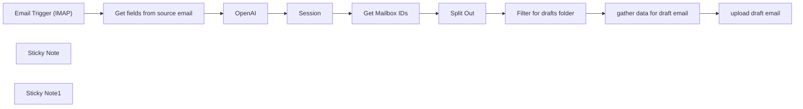

## Fluxo (.json) :

```json
{
  "meta": {
    "instanceId": "04ab549d8bbb435ec33b81e4e29965c46cf6f0f9e7afe631018b5e34c8eead58"
  },
  "nodes": [
    {
      "id": "082d1828-72b1-48c0-8426-c8051c29f0db",
      "name": "Session",
      "type": "n8n-nodes-base.httpRequest",
      "position": [
        -20,
        -20
      ],
      "parameters": {
        "url": "https://api.fastmail.com/jmap/session",
        "options": {},
        "authentication": "genericCredentialType",
        "genericAuthType": "httpHeaderAuth"
      },
      "credentials": {
        "httpHeaderAuth": {
          "id": "3IRsYkeB2ofrwQjv",
          "name": "Fastmail"
        }
      },
      "typeVersion": 4.2
    },
    {
      "id": "d7dc4c50-c8fc-4999-918d-5d357567ed14",
      "name": "Get Mailbox IDs",
      "type": "n8n-nodes-base.httpRequest",
      "notes": "https://api.fastmail.com/.well-known/jmap\n\nhttps://api.fastmail.com/jmap/session",
      "position": [
        200,
        -20
      ],
      "parameters": {
        "url": "https://api.fastmail.com/jmap/api/",
        "method": "POST",
        "options": {},
        "jsonBody": "={\n    \"using\": [\"urn:ietf:params:jmap:core\", \"urn:ietf:params:jmap:mail\"],\n    \"methodCalls\": [\n      [\n        \"Mailbox/get\",\n        {\n          \"accountId\": \"{{ $('Session').item.json.primaryAccounts['urn:ietf:params:jmap:mail'] }}\"\n        },\n        \"c0\"\n      ]\n    ]\n  }",
        "sendBody": true,
        "sendHeaders": true,
        "specifyBody": "json",
        "authentication": "genericCredentialType",
        "genericAuthType": "httpHeaderAuth",
        "headerParameters": {
          "parameters": [
            {
              "name": "Content-Type",
              "value": "application/json"
            },
            {
              "name": "Accept",
              "value": "application/json"
            }
          ]
        }
      },
      "credentials": {
        "httpHeaderAuth": {
          "id": "3IRsYkeB2ofrwQjv",
          "name": "Fastmail"
        }
      },
      "typeVersion": 4.2
    },
    {
      "id": "31be3c1c-f4c5-4309-92b3-2fd0a3fcecc6",
      "name": "Split Out",
      "type": "n8n-nodes-base.splitOut",
      "position": [
        400,
        -20
      ],
      "parameters": {
        "options": {},
        "fieldToSplitOut": "methodResponses[0][1].list"
      },
      "typeVersion": 1
    },
    {
      "id": "93de4dad-70d6-4e16-b351-7c540c3a4bfa",
      "name": "Email Trigger (IMAP)",
      "type": "n8n-nodes-base.emailReadImap",
      "position": [
        -20,
        -240
      ],
      "parameters": {
        "options": {
          "customEmailConfig": "[\"UNSEEN\"]"
        },
        "postProcessAction": "nothing",
        "downloadAttachments": true
      },
      "credentials": {
        "imap": {
          "id": "vFzz9hU9rTHVHs3I",
          "name": "IMAP"
        }
      },
      "typeVersion": 2
    },
    {
      "id": "41e77a60-622f-426c-a50c-e0df03c53208",
      "name": "Get fields from source email",
      "type": "n8n-nodes-base.set",
      "position": [
        200,
        -240
      ],
      "parameters": {
        "options": {},
        "assignments": {
          "assignments": [
            {
              "id": "a9d425bd-e576-4e38-a251-b462240d3e2d",
              "name": "textPlain",
              "type": "string",
              "value": "={{ $json.textPlain }}"
            },
            {
              "id": "7071a252-fcad-4aa1-953f-205c3e403497",
              "name": "from",
              "type": "string",
              "value": "={{ $json.from }}"
            },
            {
              "id": "c4b0ed1b-590c-4d7f-b494-a0f34304cc1a",
              "name": "subject",
              "type": "string",
              "value": "={{ $json.subject }}"
            },
            {
              "id": "7e0badd1-02be-4149-b9ff-286f0943f051",
              "name": "metadata['message-id']",
              "type": "string",
              "value": "={{ $json.metadata['message-id'] }}"
            },
            {
              "id": "f87c7c15-c1d3-4696-bcd4-6677e5ddb240",
              "name": "metadata['reply-to']",
              "type": "string",
              "value": "={{ $json.metadata['reply-to'] }}"
            }
          ]
        }
      },
      "typeVersion": 3.4
    },
    {
      "id": "f9d1a529-1377-456b-8357-d37fb3fe74f9",
      "name": "OpenAI",
      "type": "@n8n/n8n-nodes-langchain.openAi",
      "position": [
        400,
        -240
      ],
      "parameters": {
        "modelId": {
          "__rl": true,
          "mode": "list",
          "value": "gpt-4o",
          "cachedResultName": "GPT-4O"
        },
        "options": {},
        "messages": {
          "values": [
            {
              "content": "=Please analyze the following personal email and draft a casual response based solely on its content. Return only the response text without any additional introductions or formatting. The response should include appropriate greetings (e.g., \"Hi\", \"Hallo\", \"Moin\" in German or \"Hi\", \"Hello\" in English) and sign-offs (e.g., \"Gruß\", \"Lieben Gruß\" in German or \"Regards\" in English). Add a thanks if appropriate. Use \"Du\" only if appropriate; if the email contains \"Sie\", maintain the same formality.\n\nSubject: {{ $json.subject }}\nEmail Content: {{ $json.textPlain }}"
            }
          ]
        }
      },
      "credentials": {
        "openAiApi": {
          "id": "iW0ItIt1ZxCQrBqk",
          "name": "OpenAI"
        }
      },
      "typeVersion": 1.5
    },
    {
      "id": "c421ddc9-b230-499c-a11d-a20a68d30c5b",
      "name": "Filter for drafts folder",
      "type": "n8n-nodes-base.filter",
      "position": [
        560,
        -20
      ],
      "parameters": {
        "options": {},
        "conditions": {
          "options": {
            "version": 2,
            "leftValue": "",
            "caseSensitive": true,
            "typeValidation": "strict"
          },
          "combinator": "and",
          "conditions": [
            {
              "id": "4e4c63d1-40fe-4314-bfe7-4fee62c78b88",
              "operator": {
                "name": "filter.operator.equals",
                "type": "string",
                "operation": "equals"
              },
              "leftValue": "={{ $json.role }}",
              "rightValue": "drafts"
            }
          ]
        }
      },
      "typeVersion": 2.2
    },
    {
      "id": "ef19fde4-cf8c-4e19-912e-822611c18056",
      "name": "upload draft email",
      "type": "n8n-nodes-base.httpRequest",
      "notes": "https://api.fastmail.com/.well-known/jmap\n\nhttps://api.fastmail.com/jmap/session",
      "position": [
        1000,
        -120
      ],
      "parameters": {
        "url": "https://api.fastmail.com/jmap/api/",
        "method": "POST",
        "options": {},
        "jsonBody": "={\n  \"using\": [\"urn:ietf:params:jmap:core\", \"urn:ietf:params:jmap:mail\"],\n  \"methodCalls\": [\n    [\n      \"Email/set\",\n      {\n        \"accountId\": \"{{ $('Session').item.json.primaryAccounts['urn:ietf:params:jmap:mail'] }}\",\n        \"create\": {\n          \"newDraft\": {\n            \"mailboxIds\": {\n              \"{{ $json.draftsId }}\": true\n            },\n           \"keywords\": {\n              \"$draft\": true\n            },\n            \"inReplyTo\": [\"{{ $json.metadata['message-id'] }}\"],\n            \"references\": [\"{{ $json.metadata['message-id'] }}\"],\n            \"from\": [{\n              \"name\": \"\",\n              \"email\": \"{{ $('Session').item.json.username }}\"\n            }],\n            \"to\": [{\n              \"name\": \"{{ $json['to-friendly'] }}\",\n              \"email\": \"{{ $json.to }}\"\n            }],\n            \"subject\": \"{{ $json.subject }}\",\n            \"bodyValues\": {\n              \"textBody\": {\n                \"value\": \"{{ $json.message.content.replace(/\\n/g, '\\\\n') }}\"\n              }\n            },\n            \"bodyStructure\": {\n              \"partId\": \"textBody\"\n            }\n          }\n        }\n      },\n      \"c1\"\n    ]\n  ]\n}",
        "sendBody": true,
        "sendHeaders": true,
        "specifyBody": "json",
        "authentication": "genericCredentialType",
        "genericAuthType": "httpHeaderAuth",
        "headerParameters": {
          "parameters": [
            {
              "name": "Content-Type",
              "value": "application/json"
            },
            {
              "name": "Accept",
              "value": "application/json"
            }
          ]
        }
      },
      "credentials": {
        "httpHeaderAuth": {
          "id": "3IRsYkeB2ofrwQjv",
          "name": "Fastmail"
        }
      },
      "typeVersion": 4.2
    },
    {
      "id": "f4ecb64a-c978-4aa3-943e-c4a7f0592b91",
      "name": "gather data for draft email",
      "type": "n8n-nodes-base.set",
      "position": [
        800,
        -120
      ],
      "parameters": {
        "options": {},
        "assignments": {
          "assignments": [
            {
              "id": "78885ad0-fa62-407e-82de-f297190265be",
              "name": "draftsId",
              "type": "string",
              "value": "={{ $json.id }}"
            },
            {
              "id": "fcb31dde-0881-4b98-8bc2-e3e215148a5c",
              "name": "to-friendly",
              "type": "string",
              "value": "={{ $('Get fields from source email').item.json.from.match(/[^<]+/)[0].trim().replaceAll(/\\\"/g, \"\") }}"
            },
            {
              "id": "84c80af6-68dd-44bd-97ba-fde78a42e88a",
              "name": "subject",
              "type": "string",
              "value": "=Re: {{ $('Get fields from source email').item.json.subject }}"
            },
            {
              "id": "590e9856-9c6f-4d23-af42-8a0a1384ac00",
              "name": "message.content",
              "type": "string",
              "value": "={{ $('OpenAI').item.json.message.content }}"
            },
            {
              "id": "4f24e071-24e3-4101-a423-ad5bbcca9fc7",
              "name": "metadata['message-id']",
              "type": "string",
              "value": "={{ $('Get fields from source email').item.json.metadata['message-id'] }}"
            },
            {
              "id": "80c92734-0296-4299-9f98-15cc62e93d44",
              "name": "to",
              "type": "string",
              "value": "={{ $('Get fields from source email').item.json.metadata['reply-to'].match(/<([^>]+)>/)[1] ?? $('Get fields from source email').item.json.from.match(/<([^>]+)>/)[1] }}"
            }
          ]
        }
      },
      "typeVersion": 3.4
    },
    {
      "id": "ca868672-85bd-4e2e-b2c6-6c6c69b78b24",
      "name": "Sticky Note",
      "type": "n8n-nodes-base.stickyNote",
      "position": [
        -580,
        -560
      ],
      "parameters": {
        "width": 493.9330818092735,
        "height": 695.2489786026621,
        "content": "## Workflow Description:\nThis n8n workflow automates the drafting of email replies for Fastmail using OpenAI's GPT-4 model. Here’s the overall process:\n\n1. **Email Monitoring**: The workflow continuously monitors a specified IMAP inbox for new, unread emails.\n2. **Email Data Extraction**: When a new email is detected, it extracts relevant details such as the sender, subject, email body, and metadata.\n3. **AI Response Generation**: The extracted email content is sent to OpenAI's GPT-4, which generates a personalized draft response.\n4. **Get Fastmail Session and Mailbox IDs**: Connects to the Fastmail API to retrieve necessary session details and mailbox IDs.\n5. **Draft Identification**: Identifies the \"Drafts\" folder in the mailbox.\n6. **Draft Preparation**: Compiles all the necessary information to create the draft, including the generated response, original email details, and specified recipient.\n7. **Draft Uploading**: Uploads the prepared draft email to the \"Drafts\" folder in the Fastmail mailbox."
      },
      "typeVersion": 1
    },
    {
      "id": "c4273cc2-1ac2-43f4-bcd1-7f42d3109373",
      "name": "Sticky Note1",
      "type": "n8n-nodes-base.stickyNote",
      "position": [
        -40,
        -560
      ],
      "parameters": {
        "color": 3,
        "width": 722.928660826031,
        "height": 285.5319148936168,
        "content": "## Prerequisites:\n1. **IMAP Email Account**: You need to configure an IMAP email account in n8n to monitor incoming emails.\n2. **Fastmail API Credentials**: A Fastmail account with JMAP API enabled. You should set up HTTP Header authentication in n8n with your Fastmail API credentials.\n3. **OpenAI API Key**: An API key from OpenAI to access GPT-4. Make sure to configure the OpenAI credentials in n8n."
      },
      "typeVersion": 1
    }
  ],
  "pinData": {},
  "connections": {
    "OpenAI": {
      "main": [
        [
          {
            "node": "Session",
            "type": "main",
            "index": 0
          }
        ]
      ]
    },
    "Session": {
      "main": [
        [
          {
            "node": "Get Mailbox IDs",
            "type": "main",
            "index": 0
          }
        ]
      ]
    },
    "Split Out": {
      "main": [
        [
          {
            "node": "Filter for drafts folder",
            "type": "main",
            "index": 0
          }
        ]
      ]
    },
    "Get Mailbox IDs": {
      "main": [
        [
          {
            "node": "Split Out",
            "type": "main",
            "index": 0
          }
        ]
      ]
    },
    "Email Trigger (IMAP)": {
      "main": [
        [
          {
            "node": "Get fields from source email",
            "type": "main",
            "index": 0
          }
        ]
      ]
    },
    "Filter for drafts folder": {
      "main": [
        [
          {
            "node": "gather data for draft email",
            "type": "main",
            "index": 0
          }
        ]
      ]
    },
    "gather data for draft email": {
      "main": [
        [
          {
            "node": "upload draft email",
            "type": "main",
            "index": 0
          }
        ]
      ]
    },
    "Get fields from source email": {
      "main": [
        [
          {
            "node": "OpenAI",
            "type": "main",
            "index": 0
          }
        ]
      ]
    }
  }
}
```

<a id="template-586"></a>

## Template 586 - Lembrete diário de gratidão às 21h

- **Nome:** Lembrete diário de gratidão às 21h
- **Descrição:** Envia um lembrete diário às 21:00 pedindo ao usuário registrar algo positivo do dia, criando variações da mensagem e entregando-a via push.
- **Funcionalidade:** • Agendamento diário às 21:00: dispara a rotina toda noite no fuso Asia/Bangkok.
• Geração de mensagem de lembrete: cria um texto convidativo para o usuário refletir sobre algo bom ocorrido no dia.
• Variação de conteúdo com IA: utiliza um modelo de linguagem com temperatura elevada (0.9) para produzir mensagens variadas e evitar repetição.
• Reformatação do texto para envio: remove quebras de linha, markdown, tags e aspas, e escapa caracteres necessários para compatibilidade com a API de envio.
• Envio por push ao usuário: envia a mensagem formatada para um destinatário configurável via API de mensagens.
- **Ferramentas:** • Azure OpenAI: serviço de modelo de linguagem utilizado para gerar variações de texto (modelo 4o) com controle de temperatura.
• LINE Messaging API: serviço de envio de mensagens push usado para entregar o lembrete ao usuário final (requer token/ID do destinatário).

## Fluxo visual

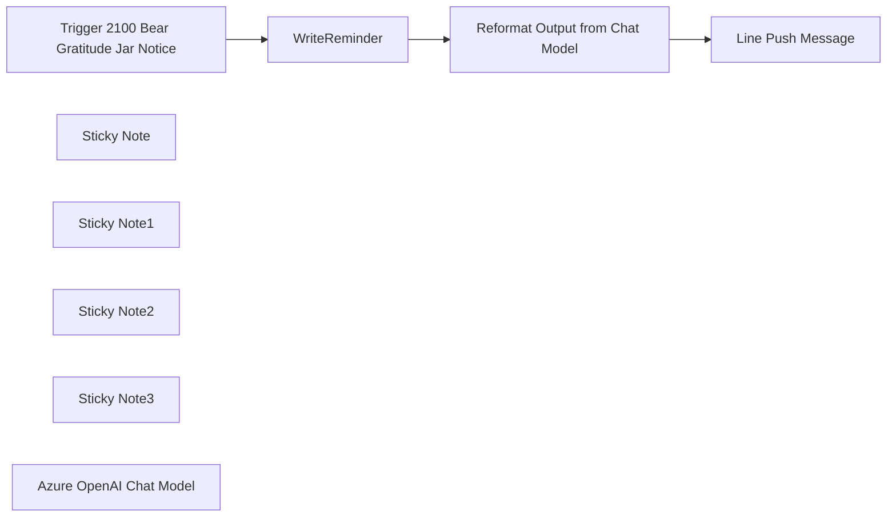

## Fluxo (.json) :

```json
{
  "id": "Sebvr1R2t4zkAg1V",
  "meta": {
    "instanceId": "558d88703fb65b2d0e44613bc35916258b0f0bf983c5d4730c00c424b77ca36a",
    "templateCredsSetupCompleted": true
  },
  "name": "Gratitude Jar Reminder",
  "tags": [],
  "nodes": [
    {
      "id": "ac48becc-e207-489b-a8e4-a8f69780c626",
      "name": "Trigger 2100 Bear Gratitude Jar Notice",
      "type": "n8n-nodes-base.scheduleTrigger",
      "position": [
        -80,
        -100
      ],
      "parameters": {
        "rule": {
          "interval": [
            {
              "triggerAtHour": 21
            }
          ]
        }
      },
      "typeVersion": 1.2
    },
    {
      "id": "37f46ac1-5c0b-4cdf-aa33-67fad80dafdd",
      "name": "WriteReminder",
      "type": "@n8n/n8n-nodes-langchain.chainLlm",
      "position": [
        180,
        -100
      ],
      "parameters": {
        "text": "=Today is a wonderful day! 🌟 What or who brought a smile to your face today? 😊\n",
        "messages": {
          "messageValues": [
            {
              "message": "You'll rewrite this message to send reminder to user to record good thing today."
            }
          ]
        },
        "promptType": "define"
      },
      "typeVersion": 1.5
    },
    {
      "id": "816f8089-a54f-4860-a658-448ab53a08fd",
      "name": "Sticky Note",
      "type": "n8n-nodes-base.stickyNote",
      "position": [
        -180,
        -240
      ],
      "parameters": {
        "width": 300,
        "height": 360,
        "content": "## Trigger \nWe schedule the trigger at 9.00 pm before going to bed. This flow is to reflect what is the great thing that happened today."
      },
      "typeVersion": 1
    },
    {
      "id": "c7a620fe-2a50-4cfb-af91-8a4b4ca58adb",
      "name": "Sticky Note1",
      "type": "n8n-nodes-base.stickyNote",
      "position": [
        160,
        -240
      ],
      "parameters": {
        "color": 5,
        "width": 300,
        "height": 360,
        "content": "## Write Reminder\nAfter getting the same reminder, we tend to ignore it. This is to generate variations of reminder by setting the temperature of the model at 0.9"
      },
      "typeVersion": 1
    },
    {
      "id": "66b865a1-0a6c-4a3c-abb3-024ec7ff8b40",
      "name": "Sticky Note2",
      "type": "n8n-nodes-base.stickyNote",
      "position": [
        500,
        -240
      ],
      "parameters": {
        "color": 6,
        "width": 300,
        "height": 360,
        "content": "## Reformatted \nThis is to reformat text to be able to send in Line Push API properly."
      },
      "typeVersion": 1
    },
    {
      "id": "adb8cf4e-de77-4490-a8da-b32122c3a730",
      "name": "Sticky Note3",
      "type": "n8n-nodes-base.stickyNote",
      "position": [
        840,
        -240
      ],
      "parameters": {
        "color": 4,
        "width": 300,
        "height": 360,
        "content": "## Push Message\nSend push message via LINE"
      },
      "typeVersion": 1
    },
    {
      "id": "6562967a-fae7-400a-913a-4cf68e70b40a",
      "name": "Reformat Output from Chat Model",
      "type": "n8n-nodes-base.set",
      "position": [
        600,
        -100
      ],
      "parameters": {
        "options": {},
        "assignments": {
          "assignments": [
            {
              "id": "90abc5a6-c9b9-4b0d-b433-c6f90816dba3",
              "name": "posestoday",
              "type": "string",
              "value": "={{ $json.text.replaceAll(\"\\n\",\"\\\\n\").replaceAll(\"\\n\",\"\").removeMarkdown().removeTags().replaceAll('\"',\"\") }}"
            }
          ]
        }
      },
      "typeVersion": 3.4
    },
    {
      "id": "d2ab000a-6f3a-494f-807f-829cbb124685",
      "name": "Azure OpenAI Chat Model",
      "type": "@n8n/n8n-nodes-langchain.lmChatAzureOpenAi",
      "position": [
        280,
        -20
      ],
      "parameters": {
        "model": "4o",
        "options": {
          "temperature": 0.9
        }
      },
      "credentials": {
        "azureOpenAiApi": {
          "id": "5AjoWhww5SQi2VXd",
          "name": "Azure Open AI account"
        }
      },
      "typeVersion": 1
    },
    {
      "id": "c548df75-dc6c-472f-8992-77f0f57d4732",
      "name": "Line Push Message",
      "type": "n8n-nodes-base.httpRequest",
      "position": [
        940,
        -100
      ],
      "parameters": {
        "url": "https://api.line.me/v2/bot/message/push",
        "method": "POST",
        "options": {},
        "jsonBody": "={\n    \"to\": \"YOUR ID HERE\",\n    \"messages\":[\n        {\n            \"type\":\"text\",\n            \"text\":\"{{ $json.posestoday }}\"\n        }\n    ]\n} ",
        "sendBody": true,
        "specifyBody": "json",
        "authentication": "genericCredentialType",
        "genericAuthType": "httpHeaderAuth"
      },
      "credentials": {
        "httpHeaderAuth": {
          "id": "yiPG7xPwvDzsY0Qd",
          "name": "Line @511dizji"
        }
      },
      "typeVersion": 4.2
    }
  ],
  "active": true,
  "pinData": {},
  "settings": {
    "timezone": "Asia/Bangkok",
    "executionOrder": "v1"
  },
  "versionId": "19321d28-e96d-4f97-94a9-604b59b5b651",
  "connections": {
    "WriteReminder": {
      "main": [
        [
          {
            "node": "Reformat Output from Chat Model",
            "type": "main",
            "index": 0
          }
        ]
      ]
    },
    "Azure OpenAI Chat Model": {
      "ai_languageModel": [
        [
          {
            "node": "WriteReminder",
            "type": "ai_languageModel",
            "index": 0
          }
        ]
      ]
    },
    "Reformat Output from Chat Model": {
      "main": [
        [
          {
            "node": "Line Push Message",
            "type": "main",
            "index": 0
          }
        ]
      ]
    },
    "Trigger 2100 Bear Gratitude Jar Notice": {
      "main": [
        [
          {
            "node": "WriteReminder",
            "type": "main",
            "index": 0
          }
        ]
      ]
    }
  }
}
```

<a id="template-587"></a>

## Template 587 - Gerar saída estruturada: maiores estados e cidades

- **Nome:** Gerar saída estruturada: maiores estados e cidades
- **Descrição:** Gera uma resposta estruturada com os 5 maiores estados dos EUA por área, incluindo as 3 maiores cidades e suas populações, validando e auto-corrigindo o formato para obedecer a um esquema JSON.
- **Funcionalidade:** • Início manual: Permite iniciar o fluxo manualmente.
• Definição de prompt: Define o prompt que solicita os 5 maiores estados por área e suas 3 maiores cidades com população.
• Geração de conteúdo via modelo de linguagem: Utiliza um modelo de linguagem para gerar a resposta com base no prompt.
• Validação do formato de saída: Aplica um esquema JSON que exige que cada item contenha o nome do estado e um array de cidades com nome e população, validando a estrutura de saída.
• Correção automática de saída: Quando a saída não está em conformidade com o esquema, um modelo de linguagem adicional tenta corrigir e reformatar a resposta para atender ao esquema.
• Encadeamento de parsing: Integra validação e auto-correção para garantir que a saída final seja consistente e válida de acordo com o esquema.
- **Ferramentas:** • OpenAI: Serviço de modelo de linguagem baseado em chat usado para gerar a resposta principal e para tentar corrigir automaticamente saídas que não estejam no formato esperado (autofix).

## Fluxo visual

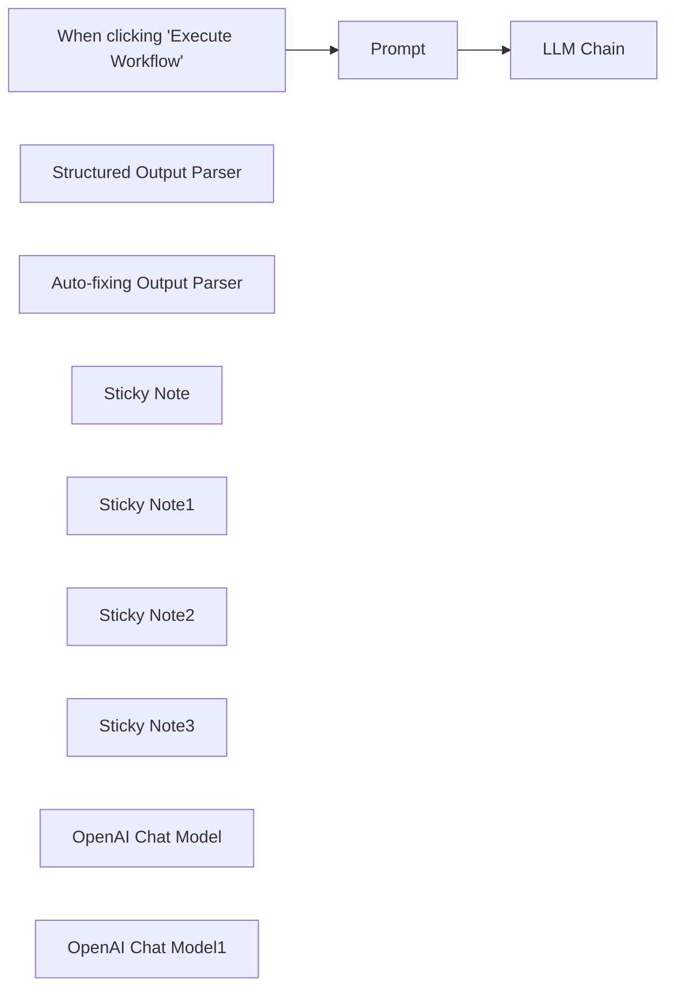

## Fluxo (.json) :

```json
{
  "id": "cKRViOHDPsosO7UX",
  "meta": {
    "instanceId": "ec7a5f4ffdb34436e59d23eaccb5015b5238de2a877e205b28572bf1ffecfe04"
  },
  "name": "[AI/LangChain] Output Parser 4",
  "tags": [],
  "nodes": [
    {
      "id": "3d669ba2-65b7-4502-92d9-645c4e51b26d",
      "name": "When clicking \"Execute Workflow\"",
      "type": "n8n-nodes-base.manualTrigger",
      "position": [
        380,
        240
      ],
      "parameters": {},
      "typeVersion": 1
    },
    {
      "id": "9a509299-746d-4a3f-b379-8a4a9a92c75a",
      "name": "Prompt",
      "type": "n8n-nodes-base.set",
      "position": [
        600,
        240
      ],
      "parameters": {
        "values": {
          "string": [
            {
              "name": "input",
              "value": "Return the 5 largest states by area in the USA with their 3 largest cities and their population."
            }
          ]
        },
        "options": {}
      },
      "typeVersion": 2
    },
    {
      "id": "e2092fe6-d803-43e9-b2df-b0fc7aa83b02",
      "name": "LLM Chain",
      "type": "@n8n/n8n-nodes-langchain.chainLlm",
      "position": [
        1060,
        240
      ],
      "parameters": {},
      "typeVersion": 1
    },
    {
      "id": "711734d0-1003-4639-bdee-c160f6f976b3",
      "name": "Structured Output Parser",
      "type": "@n8n/n8n-nodes-langchain.outputParserStructured",
      "position": [
        1560,
        900
      ],
      "parameters": {
        "jsonSchema": "{\n \"type\": \"object\",\n \"properties\": {\n \"state\": {\n \"type\": \"string\"\n },\n \"cities\": {\n \"type\": \"array\",\n \"items\": {\n \"type\": \"object\",\n \"properties\": {\n \"name\": \"string\",\n \"population\": \"number\"\n }\n }\n }\n }\n}"
      },
      "typeVersion": 1
    },
    {
      "id": "f9b782f8-bb7b-4d65-be0d-d65c11de03d2",
      "name": "Auto-fixing Output Parser",
      "type": "@n8n/n8n-nodes-langchain.outputParserAutofixing",
      "position": [
        1260,
        540
      ],
      "parameters": {},
      "typeVersion": 1
    },
    {
      "id": "a26f034e-ea19-47ba-8fef-4f0a0d447c01",
      "name": "Sticky Note",
      "type": "n8n-nodes-base.stickyNote",
      "position": [
        1480,
        795
      ],
      "parameters": {
        "height": 264.69900963477494,
        "content": "### Parser which defines the output format and which gets used to validate the output"
      },
      "typeVersion": 1
    },
    {
      "id": "d902971a-e304-449c-a933-900c9c49ce55",
      "name": "Sticky Note1",
      "type": "n8n-nodes-base.stickyNote",
      "position": [
        1080,
        792
      ],
      "parameters": {
        "height": 266.9506012398238,
        "content": "### The LLM which gets used to try to autofix the output in case it was not valid"
      },
      "typeVersion": 1
    },
    {
      "id": "b4c3b935-61b1-4243-b7df-ba4b7fd6e3ce",
      "name": "Sticky Note2",
      "type": "n8n-nodes-base.stickyNote",
      "position": [
        920,
        440
      ],
      "parameters": {
        "height": 245.56048099185898,
        "content": "### The LLM to process the original prompt"
      },
      "typeVersion": 1
    },
    {
      "id": "916d2998-cf0e-40f9-a373-149c609ed229",
      "name": "Sticky Note3",
      "type": "n8n-nodes-base.stickyNote",
      "position": [
        1200,
        449
      ],
      "parameters": {
        "width": 348.0763970423483,
        "height": 233.17672716408998,
        "content": "### Autofixing parser which tries to fix invalid outputs with the help of an LLM"
      },
      "typeVersion": 1
    },
    {
      "id": "5cabf993-6bdd-4401-bb6d-fa20ff703127",
      "name": "OpenAI Chat Model",
      "type": "@n8n/n8n-nodes-langchain.lmChatOpenAi",
      "position": [
        980,
        540
      ],
      "parameters": {
        "options": {
          "temperature": 0
        }
      },
      "credentials": {
        "openAiApi": {
          "id": "wJtZwsVKW5v6R2Iy",
          "name": "OpenAi account 2"
        }
      },
      "typeVersion": 1
    },
    {
      "id": "7f666edb-ecb7-4a6d-9dc7-ba67ef41d71f",
      "name": "OpenAI Chat Model1",
      "type": "@n8n/n8n-nodes-langchain.lmChatOpenAi",
      "position": [
        1140,
        900
      ],
      "parameters": {
        "options": {
          "temperature": 0
        }
      },
      "credentials": {
        "openAiApi": {
          "id": "wJtZwsVKW5v6R2Iy",
          "name": "OpenAi account 2"
        }
      },
      "typeVersion": 1
    }
  ],
  "active": false,
  "pinData": {},
  "settings": {
    "executionOrder": "v1"
  },
  "versionId": "976446d0-eb9d-478e-8178-69017329d736",
  "connections": {
    "Prompt": {
      "main": [
        [
          {
            "node": "LLM Chain",
            "type": "main",
            "index": 0
          }
        ]
      ]
    },
    "OpenAI Chat Model": {
      "ai_languageModel": [
        [
          {
            "node": "LLM Chain",
            "type": "ai_languageModel",
            "index": 0
          }
        ]
      ]
    },
    "OpenAI Chat Model1": {
      "ai_languageModel": [
        [
          {
            "node": "Auto-fixing Output Parser",
            "type": "ai_languageModel",
            "index": 0
          }
        ]
      ]
    },
    "Structured Output Parser": {
      "ai_outputParser": [
        [
          {
            "node": "Auto-fixing Output Parser",
            "type": "ai_outputParser",
            "index": 0
          }
        ]
      ]
    },
    "Auto-fixing Output Parser": {
      "ai_outputParser": [
        [
          {
            "node": "LLM Chain",
            "type": "ai_outputParser",
            "index": 0
          }
        ]
      ]
    },
    "When clicking \"Execute Workflow\"": {
      "main": [
        [
          {
            "node": "Prompt",
            "type": "main",
            "index": 0
          }
        ]
      ]
    }
  }
}
```

<a id="template-588"></a>

## Template 588 - Parser EDI por email para planilha

- **Nome:** Parser EDI por email para planilha
- **Descrição:** Automatiza a captura de mensagens EDI recebidas por email, extrai e transforma os dados em linhas e armazena em abas de uma planilha.
- **Funcionalidade:** • Disparo por email com assunto contendo EDI: monitora a caixa de entrada e inicia o processamento quando o assunto contém "EDI".
• Obtenção do corpo do email: recupera o conteúdo completo da mensagem para análise.
• Extração e limpeza do texto EDI: normaliza quebras e remove caracteres indesejados antes do parsing.
• Parsing da mensagem EDI: interpreta segmentos (UNB, UNH, BGM, DTM, NAD, LIN, IMD, QTY, PRI, etc.) e constrói um objeto estruturado com cabeçalho, datas, partes e itens de linha.
• Resumo do pedido: gera resumo com tipo de documento, número, data do pedido, contagem de itens e quantidade total.
• Transformação em formato tabular: combina cabeçalho, datas e informações das partes com cada item para criar linhas planilháveis (flatten).
• Separação por linha: divide o conjunto em múltiplas entradas, produzindo uma linha por item para inserção.
• Roteamento por tipo de pedido: encaminha registros para abas distintas conforme o tipo do pedido (por exemplo, Return Order ou Outbound Order).
• Inserção em planilhas: adiciona os registros gerados nas abas correspondentes de um arquivo de planilha na nuvem.
- **Ferramentas:** • Gmail: serviço de email usado para receber e recuperar mensagens EDI para processamento.
• Google Sheets: planilha na nuvem utilizada para armazenar os dados convertidos em formato tabular e separados por abas.

## Fluxo visual

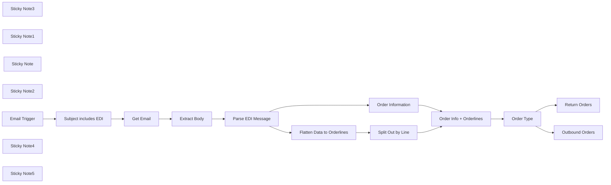

## Fluxo (.json) :

```json
{
  "meta": {
    "instanceId": "6a5e68bcca67c4cdb3e0b698d01739aea084e1ec06e551db64aeff43d174cb23",
    "templateCredsSetupCompleted": true
  },
  "nodes": [
    {
      "id": "bc49829b-45f2-4910-9c37-907271982f14",
      "name": "Sticky Note3",
      "type": "n8n-nodes-base.stickyNote",
      "position": [
        -4200,
        -560
      ],
      "parameters": {
        "width": 780,
        "height": 540,
        "content": "### 5. Do you need more details?\nFind a step-by-step guide in this tutorial\n\n[🎥 Watch My Tutorial](https://youtu.be/-phwXeYk7Es)"
      },
      "typeVersion": 1
    },
    {
      "id": "fca5a1f8-874b-4b25-92af-066e7ca03f67",
      "name": "Order Information",
      "type": "n8n-nodes-base.set",
      "position": [
        -4360,
        -1000
      ],
      "parameters": {
        "options": {},
        "assignments": {
          "assignments": [
            {
              "id": "a55ebbb4-3eba-4584-8894-9e8d623d498f",
              "name": "documentType",
              "type": "string",
              "value": "={{ $json.summary.documentType }}"
            },
            {
              "id": "cbbff4da-4679-4258-bc3c-848075c5f1df",
              "name": "documentNumber",
              "type": "string",
              "value": "={{ $json.summary.documentNumber }}"
            },
            {
              "id": "a2eb5f07-8d1b-4c3a-b08b-a785045aeb34",
              "name": "orderDate",
              "type": "string",
              "value": "={{ $json.summary.orderDate }}"
            },
            {
              "id": "7e319d29-463b-4875-b556-684cb0c06c59",
              "name": "lineItemCount",
              "type": "string",
              "value": "={{ $json.summary.lineItemCount }}"
            },
            {
              "id": "5c9fc86c-e5c0-411f-a7d5-1121b5779906",
              "name": "totalQuantity",
              "type": "string",
              "value": "={{ $json.summary.totalQuantity }}"
            }
          ]
        }
      },
      "notesInFlow": true,
      "typeVersion": 3.4
    },
    {
      "id": "3598dc97-a0d3-4d34-8220-b91925014e4a",
      "name": "Return Orders",
      "type": "n8n-nodes-base.googleSheets",
      "position": [
        -3620,
        -960
      ],
      "parameters": {
        "columns": {
          "value": {},
          "schema": [
            {
              "id": "documentType",
              "type": "string",
              "display": true,
              "removed": false,
              "required": false,
              "displayName": "documentType",
              "defaultMatch": false,
              "canBeUsedToMatch": true
            },
            {
              "id": "documentNumber",
              "type": "string",
              "display": true,
              "removed": false,
              "required": false,
              "displayName": "documentNumber",
              "defaultMatch": false,
              "canBeUsedToMatch": true
            },
            {
              "id": "orderDate",
              "type": "string",
              "display": true,
              "removed": false,
              "required": false,
              "displayName": "orderDate",
              "defaultMatch": false,
              "canBeUsedToMatch": true
            },
            {
              "id": "lineItemCount",
              "type": "string",
              "display": true,
              "removed": false,
              "required": false,
              "displayName": "lineItemCount",
              "defaultMatch": false,
              "canBeUsedToMatch": true
            },
            {
              "id": "totalQuantity",
              "type": "string",
              "display": true,
              "removed": false,
              "required": false,
              "displayName": "totalQuantity",
              "defaultMatch": false,
              "canBeUsedToMatch": true
            },
            {
              "id": "header_Document_Type",
              "type": "string",
              "display": true,
              "removed": false,
              "required": false,
              "displayName": "header_Document_Type",
              "defaultMatch": false,
              "canBeUsedToMatch": true
            },
            {
              "id": "header_Document_Number",
              "type": "string",
              "display": true,
              "removed": false,
              "required": false,
              "displayName": "header_Document_Number",
              "defaultMatch": false,
              "canBeUsedToMatch": true
            },
            {
              "id": "header_Message_Function",
              "type": "string",
              "display": true,
              "removed": false,
              "required": false,
              "displayName": "header_Message_Function",
              "defaultMatch": false,
              "canBeUsedToMatch": true
            },
            {
              "id": "header_Sender_ID",
              "type": "string",
              "display": true,
              "removed": false,
              "required": false,
              "displayName": "header_Sender_ID",
              "defaultMatch": false,
              "canBeUsedToMatch": true
            },
            {
              "id": "header_Receiver_ID",
              "type": "string",
              "display": true,
              "removed": false,
              "required": false,
              "displayName": "header_Receiver_ID",
              "defaultMatch": false,
              "canBeUsedToMatch": true
            },
            {
              "id": "header_Date",
              "type": "string",
              "display": true,
              "removed": false,
              "required": false,
              "displayName": "header_Date",
              "defaultMatch": false,
              "canBeUsedToMatch": true
            },
            {
              "id": "header_Time",
              "type": "string",
              "display": true,
              "removed": false,
              "required": false,
              "displayName": "header_Time",
              "defaultMatch": false,
              "canBeUsedToMatch": true
            },
            {
              "id": "header_Control_Reference",
              "type": "string",
              "display": true,
              "removed": false,
              "required": false,
              "displayName": "header_Control_Reference",
              "defaultMatch": false,
              "canBeUsedToMatch": true
            },
            {
              "id": "date1_Qualifier",
              "type": "string",
              "display": true,
              "removed": false,
              "required": false,
              "displayName": "date1_Qualifier",
              "defaultMatch": false,
              "canBeUsedToMatch": true
            },
            {
              "id": "date1_Description",
              "type": "string",
              "display": true,
              "removed": false,
              "required": false,
              "displayName": "date1_Description",
              "defaultMatch": false,
              "canBeUsedToMatch": true
            },
            {
              "id": "date1_Date",
              "type": "string",
              "display": true,
              "removed": false,
              "required": false,
              "displayName": "date1_Date",
              "defaultMatch": false,
              "canBeUsedToMatch": true
            },
            {
              "id": "date1_Format",
              "type": "string",
              "display": true,
              "removed": false,
              "required": false,
              "displayName": "date1_Format",
              "defaultMatch": false,
              "canBeUsedToMatch": true
            },
            {
              "id": "date2_Qualifier",
              "type": "string",
              "display": true,
              "removed": false,
              "required": false,
              "displayName": "date2_Qualifier",
              "defaultMatch": false,
              "canBeUsedToMatch": true
            },
            {
              "id": "date2_Description",
              "type": "string",
              "display": true,
              "removed": false,
              "required": false,
              "displayName": "date2_Description",
              "defaultMatch": false,
              "canBeUsedToMatch": true
            },
            {
              "id": "date2_Date",
              "type": "string",
              "display": true,
              "removed": false,
              "required": false,
              "displayName": "date2_Date",
              "defaultMatch": false,
              "canBeUsedToMatch": true
            },
            {
              "id": "date2_Format",
              "type": "string",
              "display": true,
              "removed": false,
              "required": false,
              "displayName": "date2_Format",
              "defaultMatch": false,
              "canBeUsedToMatch": true
            },
            {
              "id": "date3_Qualifier",
              "type": "string",
              "display": true,
              "removed": false,
              "required": false,
              "displayName": "date3_Qualifier",
              "defaultMatch": false,
              "canBeUsedToMatch": true
            },
            {
              "id": "date3_Description",
              "type": "string",
              "display": true,
              "removed": false,
              "required": false,
              "displayName": "date3_Description",
              "defaultMatch": false,
              "canBeUsedToMatch": true
            },
            {
              "id": "date3_Date",
              "type": "string",
              "display": true,
              "removed": false,
              "required": false,
              "displayName": "date3_Date",
              "defaultMatch": false,
              "canBeUsedToMatch": true
            },
            {
              "id": "date3_Format",
              "type": "string",
              "display": true,
              "removed": false,
              "required": false,
              "displayName": "date3_Format",
              "defaultMatch": false,
              "canBeUsedToMatch": true
            },
            {
              "id": "party1_Type",
              "type": "string",
              "display": true,
              "removed": false,
              "required": false,
              "displayName": "party1_Type",
              "defaultMatch": false,
              "canBeUsedToMatch": true
            },
            {
              "id": "party1_Description",
              "type": "string",
              "display": true,
              "removed": false,
              "required": false,
              "displayName": "party1_Description",
              "defaultMatch": false,
              "canBeUsedToMatch": true
            },
            {
              "id": "party1_ID",
              "type": "string",
              "display": true,
              "removed": false,
              "required": false,
              "displayName": "party1_ID",
              "defaultMatch": false,
              "canBeUsedToMatch": true
            },
            {
              "id": "party1_Name",
              "type": "string",
              "display": true,
              "removed": false,
              "required": false,
              "displayName": "party1_Name",
              "defaultMatch": false,
              "canBeUsedToMatch": true
            },
            {
              "id": "party2_Type",
              "type": "string",
              "display": true,
              "removed": false,
              "required": false,
              "displayName": "party2_Type",
              "defaultMatch": false,
              "canBeUsedToMatch": true
            },
            {
              "id": "party2_Description",
              "type": "string",
              "display": true,
              "removed": false,
              "required": false,
              "displayName": "party2_Description",
              "defaultMatch": false,
              "canBeUsedToMatch": true
            },
            {
              "id": "party2_ID",
              "type": "string",
              "display": true,
              "removed": false,
              "required": false,
              "displayName": "party2_ID",
              "defaultMatch": false,
              "canBeUsedToMatch": true
            },
            {
              "id": "party2_Name",
              "type": "string",
              "display": true,
              "removed": false,
              "required": false,
              "displayName": "party2_Name",
              "defaultMatch": false,
              "canBeUsedToMatch": true
            },
            {
              "id": "party3_Type",
              "type": "string",
              "display": true,
              "removed": false,
              "required": false,
              "displayName": "party3_Type",
              "defaultMatch": false,
              "canBeUsedToMatch": true
            },
            {
              "id": "party3_Description",
              "type": "string",
              "display": true,
              "removed": false,
              "required": false,
              "displayName": "party3_Description",
              "defaultMatch": false,
              "canBeUsedToMatch": true
            },
            {
              "id": "party3_ID",
              "type": "string",
              "display": true,
              "removed": false,
              "required": false,
              "displayName": "party3_ID",
              "defaultMatch": false,
              "canBeUsedToMatch": true
            },
            {
              "id": "party3_Name",
              "type": "string",
              "display": true,
              "removed": false,
              "required": false,
              "displayName": "party3_Name",
              "defaultMatch": false,
              "canBeUsedToMatch": true
            },
            {
              "id": "party4_Type",
              "type": "string",
              "display": true,
              "removed": false,
              "required": false,
              "displayName": "party4_Type",
              "defaultMatch": false,
              "canBeUsedToMatch": true
            },
            {
              "id": "party4_Description",
              "type": "string",
              "display": true,
              "removed": false,
              "required": false,
              "displayName": "party4_Description",
              "defaultMatch": false,
              "canBeUsedToMatch": true
            },
            {
              "id": "party4_ID",
              "type": "string",
              "display": true,
              "removed": false,
              "required": false,
              "displayName": "party4_ID",
              "defaultMatch": false,
              "canBeUsedToMatch": true
            },
            {
              "id": "party4_Name",
              "type": "string",
              "display": true,
              "removed": false,
              "required": false,
              "displayName": "party4_Name",
              "defaultMatch": false,
              "canBeUsedToMatch": true
            },
            {
              "id": "line_Number",
              "type": "string",
              "display": true,
              "removed": false,
              "required": false,
              "displayName": "line_Number",
              "defaultMatch": false,
              "canBeUsedToMatch": true
            },
            {
              "id": "line_Product_ID",
              "type": "string",
              "display": true,
              "removed": false,
              "required": false,
              "displayName": "line_Product_ID",
              "defaultMatch": false,
              "canBeUsedToMatch": true
            },
            {
              "id": "line_Product_ID_Type",
              "type": "string",
              "display": true,
              "removed": false,
              "required": false,
              "displayName": "line_Product_ID_Type",
              "defaultMatch": false,
              "canBeUsedToMatch": true
            },
            {
              "id": "line_Description",
              "type": "string",
              "display": true,
              "removed": false,
              "required": false,
              "displayName": "line_Description",
              "defaultMatch": false,
              "canBeUsedToMatch": true
            },
            {
              "id": "line_Quantity",
              "type": "string",
              "display": true,
              "removed": false,
              "required": false,
              "displayName": "line_Quantity",
              "defaultMatch": false,
              "canBeUsedToMatch": true
            },
            {
              "id": "line_Unit",
              "type": "string",
              "display": true,
              "removed": false,
              "required": false,
              "displayName": "line_Unit",
              "defaultMatch": false,
              "canBeUsedToMatch": true
            },
            {
              "id": "line_Price",
              "type": "string",
              "display": true,
              "removed": false,
              "required": false,
              "displayName": "line_Price",
              "defaultMatch": false,
              "canBeUsedToMatch": true
            },
            {
              "id": "line_Price_Qualifier",
              "type": "string",
              "display": true,
              "removed": false,
              "required": false,
              "displayName": "line_Price_Qualifier",
              "defaultMatch": false,
              "canBeUsedToMatch": true
            }
          ],
          "mappingMode": "autoMapInputData",
          "matchingColumns": [],
          "attemptToConvertTypes": false,
          "convertFieldsToString": false
        },
        "options": {},
        "operation": "append",
        "sheetName": {
          "__rl": true,
          "mode": "list",
          "value": 1261096359,
          "cachedResultUrl": "=",
          "cachedResultName": "="
        },
        "documentId": {
          "__rl": true,
          "mode": "list",
          "value": "1SaSFnJx80wrArf6DLx8zZx2y5VFOAmp0u-a26wliTbU",
          "cachedResultUrl": "=",
          "cachedResultName": "="
        }
      },
      "notesInFlow": true,
      "typeVersion": 4.5
    },
    {
      "id": "edfa5ef9-3095-47c2-ad80-c09cac647823",
      "name": "Outbound Orders",
      "type": "n8n-nodes-base.googleSheets",
      "position": [
        -3640,
        -780
      ],
      "parameters": {
        "columns": {
          "value": {},
          "schema": [
            {
              "id": "documentType",
              "type": "string",
              "display": true,
              "removed": false,
              "required": false,
              "displayName": "documentType",
              "defaultMatch": false,
              "canBeUsedToMatch": true
            },
            {
              "id": "documentNumber",
              "type": "string",
              "display": true,
              "removed": false,
              "required": false,
              "displayName": "documentNumber",
              "defaultMatch": false,
              "canBeUsedToMatch": true
            },
            {
              "id": "orderDate",
              "type": "string",
              "display": true,
              "removed": false,
              "required": false,
              "displayName": "orderDate",
              "defaultMatch": false,
              "canBeUsedToMatch": true
            },
            {
              "id": "lineItemCount",
              "type": "string",
              "display": true,
              "removed": false,
              "required": false,
              "displayName": "lineItemCount",
              "defaultMatch": false,
              "canBeUsedToMatch": true
            },
            {
              "id": "totalQuantity",
              "type": "string",
              "display": true,
              "removed": false,
              "required": false,
              "displayName": "totalQuantity",
              "defaultMatch": false,
              "canBeUsedToMatch": true
            },
            {
              "id": "header_Document_Type",
              "type": "string",
              "display": true,
              "removed": false,
              "required": false,
              "displayName": "header_Document_Type",
              "defaultMatch": false,
              "canBeUsedToMatch": true
            },
            {
              "id": "header_Document_Number",
              "type": "string",
              "display": true,
              "removed": false,
              "required": false,
              "displayName": "header_Document_Number",
              "defaultMatch": false,
              "canBeUsedToMatch": true
            },
            {
              "id": "header_Message_Function",
              "type": "string",
              "display": true,
              "removed": false,
              "required": false,
              "displayName": "header_Message_Function",
              "defaultMatch": false,
              "canBeUsedToMatch": true
            },
            {
              "id": "header_Sender_ID",
              "type": "string",
              "display": true,
              "removed": false,
              "required": false,
              "displayName": "header_Sender_ID",
              "defaultMatch": false,
              "canBeUsedToMatch": true
            },
            {
              "id": "header_Receiver_ID",
              "type": "string",
              "display": true,
              "removed": false,
              "required": false,
              "displayName": "header_Receiver_ID",
              "defaultMatch": false,
              "canBeUsedToMatch": true
            },
            {
              "id": "header_Date",
              "type": "string",
              "display": true,
              "removed": false,
              "required": false,
              "displayName": "header_Date",
              "defaultMatch": false,
              "canBeUsedToMatch": true
            },
            {
              "id": "header_Time",
              "type": "string",
              "display": true,
              "removed": false,
              "required": false,
              "displayName": "header_Time",
              "defaultMatch": false,
              "canBeUsedToMatch": true
            },
            {
              "id": "header_Control_Reference",
              "type": "string",
              "display": true,
              "removed": false,
              "required": false,
              "displayName": "header_Control_Reference",
              "defaultMatch": false,
              "canBeUsedToMatch": true
            },
            {
              "id": "date1_Qualifier",
              "type": "string",
              "display": true,
              "removed": false,
              "required": false,
              "displayName": "date1_Qualifier",
              "defaultMatch": false,
              "canBeUsedToMatch": true
            },
            {
              "id": "date1_Description",
              "type": "string",
              "display": true,
              "removed": false,
              "required": false,
              "displayName": "date1_Description",
              "defaultMatch": false,
              "canBeUsedToMatch": true
            },
            {
              "id": "date1_Date",
              "type": "string",
              "display": true,
              "removed": false,
              "required": false,
              "displayName": "date1_Date",
              "defaultMatch": false,
              "canBeUsedToMatch": true
            },
            {
              "id": "date1_Format",
              "type": "string",
              "display": true,
              "removed": false,
              "required": false,
              "displayName": "date1_Format",
              "defaultMatch": false,
              "canBeUsedToMatch": true
            },
            {
              "id": "date2_Qualifier",
              "type": "string",
              "display": true,
              "removed": false,
              "required": false,
              "displayName": "date2_Qualifier",
              "defaultMatch": false,
              "canBeUsedToMatch": true
            },
            {
              "id": "date2_Description",
              "type": "string",
              "display": true,
              "removed": false,
              "required": false,
              "displayName": "date2_Description",
              "defaultMatch": false,
              "canBeUsedToMatch": true
            },
            {
              "id": "date2_Date",
              "type": "string",
              "display": true,
              "removed": false,
              "required": false,
              "displayName": "date2_Date",
              "defaultMatch": false,
              "canBeUsedToMatch": true
            },
            {
              "id": "date2_Format",
              "type": "string",
              "display": true,
              "removed": false,
              "required": false,
              "displayName": "date2_Format",
              "defaultMatch": false,
              "canBeUsedToMatch": true
            },
            {
              "id": "date3_Qualifier",
              "type": "string",
              "display": true,
              "removed": false,
              "required": false,
              "displayName": "date3_Qualifier",
              "defaultMatch": false,
              "canBeUsedToMatch": true
            },
            {
              "id": "date3_Description",
              "type": "string",
              "display": true,
              "removed": false,
              "required": false,
              "displayName": "date3_Description",
              "defaultMatch": false,
              "canBeUsedToMatch": true
            },
            {
              "id": "date3_Date",
              "type": "string",
              "display": true,
              "removed": false,
              "required": false,
              "displayName": "date3_Date",
              "defaultMatch": false,
              "canBeUsedToMatch": true
            },
            {
              "id": "date3_Format",
              "type": "string",
              "display": true,
              "removed": false,
              "required": false,
              "displayName": "date3_Format",
              "defaultMatch": false,
              "canBeUsedToMatch": true
            },
            {
              "id": "party1_Type",
              "type": "string",
              "display": true,
              "removed": false,
              "required": false,
              "displayName": "party1_Type",
              "defaultMatch": false,
              "canBeUsedToMatch": true
            },
            {
              "id": "party1_Description",
              "type": "string",
              "display": true,
              "removed": false,
              "required": false,
              "displayName": "party1_Description",
              "defaultMatch": false,
              "canBeUsedToMatch": true
            },
            {
              "id": "party1_ID",
              "type": "string",
              "display": true,
              "removed": false,
              "required": false,
              "displayName": "party1_ID",
              "defaultMatch": false,
              "canBeUsedToMatch": true
            },
            {
              "id": "party1_Name",
              "type": "string",
              "display": true,
              "removed": false,
              "required": false,
              "displayName": "party1_Name",
              "defaultMatch": false,
              "canBeUsedToMatch": true
            },
            {
              "id": "party2_Type",
              "type": "string",
              "display": true,
              "removed": false,
              "required": false,
              "displayName": "party2_Type",
              "defaultMatch": false,
              "canBeUsedToMatch": true
            },
            {
              "id": "party2_Description",
              "type": "string",
              "display": true,
              "removed": false,
              "required": false,
              "displayName": "party2_Description",
              "defaultMatch": false,
              "canBeUsedToMatch": true
            },
            {
              "id": "party2_ID",
              "type": "string",
              "display": true,
              "removed": false,
              "required": false,
              "displayName": "party2_ID",
              "defaultMatch": false,
              "canBeUsedToMatch": true
            },
            {
              "id": "party2_Name",
              "type": "string",
              "display": true,
              "removed": false,
              "required": false,
              "displayName": "party2_Name",
              "defaultMatch": false,
              "canBeUsedToMatch": true
            },
            {
              "id": "party3_Type",
              "type": "string",
              "display": true,
              "removed": false,
              "required": false,
              "displayName": "party3_Type",
              "defaultMatch": false,
              "canBeUsedToMatch": true
            },
            {
              "id": "party3_Description",
              "type": "string",
              "display": true,
              "removed": false,
              "required": false,
              "displayName": "party3_Description",
              "defaultMatch": false,
              "canBeUsedToMatch": true
            },
            {
              "id": "party3_ID",
              "type": "string",
              "display": true,
              "removed": false,
              "required": false,
              "displayName": "party3_ID",
              "defaultMatch": false,
              "canBeUsedToMatch": true
            },
            {
              "id": "party3_Name",
              "type": "string",
              "display": true,
              "removed": false,
              "required": false,
              "displayName": "party3_Name",
              "defaultMatch": false,
              "canBeUsedToMatch": true
            },
            {
              "id": "party4_Type",
              "type": "string",
              "display": true,
              "removed": false,
              "required": false,
              "displayName": "party4_Type",
              "defaultMatch": false,
              "canBeUsedToMatch": true
            },
            {
              "id": "party4_Description",
              "type": "string",
              "display": true,
              "removed": false,
              "required": false,
              "displayName": "party4_Description",
              "defaultMatch": false,
              "canBeUsedToMatch": true
            },
            {
              "id": "party4_ID",
              "type": "string",
              "display": true,
              "removed": false,
              "required": false,
              "displayName": "party4_ID",
              "defaultMatch": false,
              "canBeUsedToMatch": true
            },
            {
              "id": "party4_Name",
              "type": "string",
              "display": true,
              "removed": false,
              "required": false,
              "displayName": "party4_Name",
              "defaultMatch": false,
              "canBeUsedToMatch": true
            },
            {
              "id": "line_Number",
              "type": "string",
              "display": true,
              "removed": false,
              "required": false,
              "displayName": "line_Number",
              "defaultMatch": false,
              "canBeUsedToMatch": true
            },
            {
              "id": "line_Product_ID",
              "type": "string",
              "display": true,
              "removed": false,
              "required": false,
              "displayName": "line_Product_ID",
              "defaultMatch": false,
              "canBeUsedToMatch": true
            },
            {
              "id": "line_Product_ID_Type",
              "type": "string",
              "display": true,
              "removed": false,
              "required": false,
              "displayName": "line_Product_ID_Type",
              "defaultMatch": false,
              "canBeUsedToMatch": true
            },
            {
              "id": "line_Description",
              "type": "string",
              "display": true,
              "removed": false,
              "required": false,
              "displayName": "line_Description",
              "defaultMatch": false,
              "canBeUsedToMatch": true
            },
            {
              "id": "line_Quantity",
              "type": "string",
              "display": true,
              "removed": false,
              "required": false,
              "displayName": "line_Quantity",
              "defaultMatch": false,
              "canBeUsedToMatch": true
            },
            {
              "id": "line_Unit",
              "type": "string",
              "display": true,
              "removed": false,
              "required": false,
              "displayName": "line_Unit",
              "defaultMatch": false,
              "canBeUsedToMatch": true
            },
            {
              "id": "line_Price",
              "type": "string",
              "display": true,
              "removed": false,
              "required": false,
              "displayName": "line_Price",
              "defaultMatch": false,
              "canBeUsedToMatch": true
            },
            {
              "id": "line_Price_Qualifier",
              "type": "string",
              "display": true,
              "removed": false,
              "required": false,
              "displayName": "line_Price_Qualifier",
              "defaultMatch": false,
              "canBeUsedToMatch": true
            }
          ],
          "mappingMode": "autoMapInputData",
          "matchingColumns": [],
          "attemptToConvertTypes": false,
          "convertFieldsToString": false
        },
        "options": {},
        "operation": "append",
        "sheetName": {
          "__rl": true,
          "mode": "list",
          "value": 1261096359,
          "cachedResultUrl": "=",
          "cachedResultName": "="
        },
        "documentId": {
          "__rl": true,
          "mode": "list",
          "value": "1SaSFnJx80wrArf6DLx8zZx2y5VFOAmp0u-a26wliTbU",
          "cachedResultUrl": "=",
          "cachedResultName": "="
        }
      },
      "notesInFlow": true,
      "typeVersion": 4.5
    },
    {
      "id": "6d1c614f-9301-4f25-ab11-350018f145e3",
      "name": "Order Type",
      "type": "n8n-nodes-base.if",
      "position": [
        -3840,
        -880
      ],
      "parameters": {
        "options": {},
        "conditions": {
          "options": {
            "version": 2,
            "leftValue": "",
            "caseSensitive": true,
            "typeValidation": "strict"
          },
          "combinator": "and",
          "conditions": [
            {
              "id": "fc591c63-edfe-4e6d-8074-6ab3079988c8",
              "operator": {
                "name": "filter.operator.equals",
                "type": "string",
                "operation": "equals"
              },
              "leftValue": "={{ $json.documentType }}",
              "rightValue": "Return Order"
            }
          ]
        }
      },
      "typeVersion": 2.2
    },
    {
      "id": "fc206367-2fbf-4943-b2ce-9fe399dd2730",
      "name": "Sticky Note1",
      "type": "n8n-nodes-base.stickyNote",
      "position": [
        -5420,
        -1240
      ],
      "parameters": {
        "color": 7,
        "width": 380,
        "height": 620,
        "content": "### 1. Workflow Trigger with Gmail Trigger\nThe workflow is triggered by a new email received in your Gmail mailbox. \nIf the subject includes the string \"EDI\" we proceed, if not we do nothing.\n\n#### How to setup?\n- **Gmail Trigger Node:** set up your Gmail API credentials\n[Learn more about the Gmail Trigger Node](https://docs.n8n.io/integrations/builtin/trigger-nodes/n8n-nodes-base.gmailtrigger)\n"
      },
      "typeVersion": 1
    },
    {
      "id": "c6da1a85-d725-4a41-b63f-504fa8b552fb",
      "name": "Sticky Note",
      "type": "n8n-nodes-base.stickyNote",
      "position": [
        -5420,
        -540
      ],
      "parameters": {
        "width": 800,
        "height": 880,
        "content": "### Example of EDI Message\nYou can send yourself this email to test the workflow.\n\nUNA:+.? '\nUNB+UNOC:3+SENDER_ID+RECEIVER_ID+240317:1200+ORDER67890'\nUNH+1+ORDERS:D:96A:UN'\nBGM+220+PO56789012+9'\nDTM+137:20250318:102'      \nDTM+2:20250325:102'        \nDTM+10:20250324:102'      \nNAD+BY+BUYER_ABC::91'\nNAD+SU+SUPPLIER_XYZ::91'\nNAD+DP+WAREHOUSE_001::91'\nNAD+DP+Main Distribution Center'\nLIN+1++987654:IN'\nIMD+F++:::Product X Description'\nQTY+21:50:EA'\nPRI+AAA:20.00'\nLIN+2++654987:IN'\nIMD+F++:::Product Y Description'\nQTY+21:150:EA'\nPRI+AAA:12.75'\nUNT+10+1'\nUNZ+1+ORDER67890'UNA:+.? '\nUNB+UNOC:3+SENDER_ID+RECEIVER_ID+240317:1200+ORDER67890'\nUNH+1+ORDERS:D:96A:UN'\nBGM+220+PO56789012+9'\nDTM+137:20250318:102'      \nDTM+2:20250325:102'        \nDTM+10:20250324:102'      \nNAD+BY+BUYER_ABC::91'\nNAD+SU+SUPPLIER_XYZ::91'\nNAD+DP+WAREHOUSE_001::91'\nNAD+DP+Main Distribution Center'\nLIN+1++987654:IN'\nIMD+F++:::Product X Description'\nQTY+21:50:EA'\nPRI+AAA:20.00'\nLIN+2++654987:IN'\nIMD+F++:::Product Y Description'\nQTY+21:150:EA'\nPRI+AAA:12.75'\nUNT+10+1'\nUNZ+1+ORDER67890'"
      },
      "typeVersion": 1
    },
    {
      "id": "4c82f8ff-e405-4e5f-8386-9c622805023a",
      "name": "Sticky Note2",
      "type": "n8n-nodes-base.stickyNote",
      "position": [
        -4980,
        -1240
      ],
      "parameters": {
        "color": 7,
        "width": 440,
        "height": 620,
        "content": "### 2. Get Email Body & Parse EDI Message\nThe first node extracts the email body using the ID from the trigger. This body is parsed using the code node to extract order information.\n\n#### How to setup?\n- **Gmail Node:** set up your Gmail API credentials\n[Learn more about the Gmail Node](https://docs.n8n.io/integrations/builtin/app-nodes/n8n-nodes-base.gmail)\n"
      },
      "typeVersion": 1
    },
    {
      "id": "e90096b1-ad36-4b18-96a2-9259377b4873",
      "name": "Email Trigger",
      "type": "n8n-nodes-base.gmailTrigger",
      "position": [
        -5400,
        -860
      ],
      "parameters": {
        "filters": {},
        "pollTimes": {
          "item": [
            {
              "mode": "everyMinute"
            }
          ]
        }
      },
      "notesInFlow": true,
      "typeVersion": 1.2
    },
    {
      "id": "26433f0f-487d-49dc-8de7-d4bd3bcf895c",
      "name": "Subject includes EDI",
      "type": "n8n-nodes-base.if",
      "position": [
        -5180,
        -860
      ],
      "parameters": {
        "options": {},
        "conditions": {
          "options": {
            "version": 2,
            "leftValue": "",
            "caseSensitive": true,
            "typeValidation": "strict"
          },
          "combinator": "and",
          "conditions": [
            {
              "id": "3bc8a327-7e66-48e3-b442-38125b6f8670",
              "operator": {
                "type": "string",
                "operation": "contains"
              },
              "leftValue": "={{ $json.Subject }}",
              "rightValue": "EDI"
            }
          ]
        }
      },
      "typeVersion": 2.2
    },
    {
      "id": "6960941f-6b49-41c2-88c6-9442bcb7cb34",
      "name": "Extract Body",
      "type": "n8n-nodes-base.set",
      "position": [
        -4820,
        -860
      ],
      "parameters": {
        "options": {},
        "assignments": {
          "assignments": [
            {
              "id": "38358bb8-1b5a-4adc-816d-6710f53f7c0d",
              "name": "body",
              "type": "string",
              "value": "={{ $json.text.replace(/\\\\n/g, '\\n').replace(/^'|'$/g, '') }}"
            }
          ]
        }
      },
      "notesInFlow": true,
      "typeVersion": 3.4
    },
    {
      "id": "6e64556e-07ce-4d9d-89fc-07971dd9c553",
      "name": "Get Email",
      "type": "n8n-nodes-base.gmail",
      "position": [
        -4960,
        -860
      ],
      "webhookId": "7476ecd4-e3ba-471d-a73a-ddef7b3ffd28",
      "parameters": {
        "simple": false,
        "options": {},
        "messageId": "={{ $json.id }}",
        "operation": "get"
      },
      "notesInFlow": true,
      "typeVersion": 2.1
    },
    {
      "id": "0346eabe-552a-47d8-ac9e-9619926d0242",
      "name": "Parse EDI Message",
      "type": "n8n-nodes-base.code",
      "position": [
        -4660,
        -860
      ],
      "parameters": {
        "jsCode": "// EDI Parser function for n8n JavaScript node\nfunction parseEDI(ediMessage) {\n  // Define the data structure to store parsed results\n  const result = {\n    interchangeHeader: {},\n    messageHeader: {},\n    orderDetails: {},\n    dates: [],\n    parties: [],\n    lineItems: []\n  };\n  \n  // Split the message into lines and remove empty lines\n  const lines = ediMessage.split(\"'\").filter(line => line.trim().length > 0);\n  \n  // Parse each line\n  let currentLineItem = null;\n  \n  for (const line of lines) {\n    const segments = line.trim().split('+');\n    const segmentName = segments[0];\n    \n    switch (segmentName) {\n      case 'UNA':\n        // Service String Advice - contains delimiter information\n        break;\n        \n      case 'UNB':\n        // Interchange Header\n        // UNB+UNOC:3+SENDER_ID+RECEIVER_ID+240318:1200+ORDER54321\n        result.interchangeHeader = {\n          syntax: segments[1],\n          senderId: segments[2],\n          receiverId: segments[3],\n          dateTime: segments[4]?.split(':')[0] || '',\n          time: segments[4]?.split(':')[1] || '',\n          controlReference: segments[5] || ''\n        };\n        break;\n        \n      case 'UNH':\n        // Message Header\n        // UNH+1+ORDERS:D:96A:UN\n        if (segments.length > 2) {\n          const messageParts = segments[2].split(':');\n          result.messageHeader = {\n            messageReference: segments[1],\n            messageType: messageParts[0],\n            messageVersion: messageParts[1],\n            messageRelease: messageParts[2],\n            controlAgency: messageParts[3]\n          };\n        }\n        break;\n        \n      case 'BGM':\n        // Beginning of Message\n        // BGM+230+RT54321098+9\n        result.orderDetails = {\n          documentType: segments[1],\n          documentNumber: segments[2],\n          messageFunction: segments[3]\n        };\n        break;\n        \n      case 'DTM':\n        // Date/Time/Period\n        // DTM+137:20250319:102\n        if (segments[1]) {\n          const dateParts = segments[1].split(':');\n          const dateObj = {\n            qualifier: dateParts[0],\n            date: dateParts[1],\n            format: dateParts[2]\n          };\n          \n          // Add human-readable description based on qualifier\n          switch (dateParts[0]) {\n            case '137':\n              dateObj.description = 'Document Date';\n              break;\n            case '2':\n              dateObj.description = 'Delivery Date';\n              break;\n            case '10':\n              dateObj.description = 'Shipment Date';\n              break;\n            default:\n              dateObj.description = 'Other Date';\n          }\n          \n          result.dates.push(dateObj);\n        }\n        break;\n      \n      case 'NAD':\n        // Name and Address\n        // NAD+BY+CUSTOMER_123::91\n        if (segments.length > 1) {\n          const partyCode = segments[1];\n          const partyId = segments[2]?.split(':')[0] || '';\n          \n          const party = {\n            partyQualifier: partyCode,\n            partyId: partyId,\n            qualifierDescription: ''\n          };\n          \n          // Add human-readable description\n          switch (partyCode) {\n            case 'BY':\n              party.qualifierDescription = 'Buyer';\n              break;\n            case 'SU':\n              party.qualifierDescription = 'Supplier';\n              break;\n            case 'DP':\n              party.qualifierDescription = 'Delivery Party';\n              break;\n            default:\n              party.qualifierDescription = 'Other Party';\n          }\n          \n          // If there's a full name instead of a code (like \"Returns Processing Hub\")\n          if (segments[2] && !segments[2].includes(':')) {\n            party.partyName = segments[2];\n            party.partyId = '';\n          }\n          \n          result.parties.push(party);\n        }\n        break;\n      \n      case 'LIN':\n        // Line Item\n        // LIN+1++321654:IN\n        currentLineItem = {\n          lineNumber: segments[1],\n          productId: '',\n          productIdType: '',\n          description: '',\n          quantity: 0,\n          unit: '',\n          price: 0\n        };\n        \n        // Parse product ID if present\n        if (segments[3]) {\n          const productParts = segments[3].split(':');\n          currentLineItem.productId = productParts[0];\n          currentLineItem.productIdType = productParts[1] || '';\n        }\n        \n        result.lineItems.push(currentLineItem);\n        break;\n      \n      case 'IMD':\n        // Item Description\n        // IMD+F++:::Defective Product A\n        if (currentLineItem && segments.length > 3) {\n          // The description is typically in the last component after multiple colons\n          const descriptionParts = segments[3].split(':');\n          currentLineItem.description = descriptionParts[descriptionParts.length - 1];\n        }\n        break;\n      \n      case 'QTY':\n        // Quantity\n        // QTY+21:10:EA\n        if (currentLineItem && segments[1]) {\n          const quantityParts = segments[1].split(':');\n          currentLineItem.quantityQualifier = quantityParts[0];\n          currentLineItem.quantity = parseFloat(quantityParts[1] || '0');\n          currentLineItem.unit = quantityParts[2] || '';\n        }\n        break;\n      \n      case 'PRI':\n        // Price Details\n        // PRI+AAA:0.00\n        if (currentLineItem && segments[1]) {\n          const priceParts = segments[1].split(':');\n          currentLineItem.priceQualifier = priceParts[0];\n          currentLineItem.price = parseFloat(priceParts[1] || '0');\n        }\n        break;\n      \n      case 'UNT':\n        // Message Trailer\n        break;\n      \n      case 'UNZ':\n        // Interchange Trailer\n        break;\n    }\n  }\n  \n  // Add some summary info\n  result.summary = {\n    documentType: 'Return Order',\n    documentNumber: result.orderDetails.documentNumber,\n    orderDate: result.dates.find(d => d.qualifier === '137')?.date || '',\n    lineItemCount: result.lineItems.length,\n    totalQuantity: result.lineItems.reduce((sum, item) => sum + item.quantity, 0)\n  };\n  \n  return result;\n}\n\n// Return the parsed EDI data\nconst ediMessage =  $input.first().json.body;\n\nif (!ediMessage) {\n  throw new Error('No EDI message found in input. Please provide the EDI message in the \"ediMessage\" property.');\n}\n\nconst parsedData = parseEDI(ediMessage);\nreturn { json: parsedData };"
      },
      "typeVersion": 2
    },
    {
      "id": "0fa4b446-bb37-48ab-a44b-8b2c52e2660b",
      "name": "Sticky Note4",
      "type": "n8n-nodes-base.stickyNote",
      "position": [
        -4100,
        -1240
      ],
      "parameters": {
        "color": 7,
        "width": 700,
        "height": 620,
        "content": "### 4. Store the Transactions in a Google Sheet\nThis block will filter the order based on the order type (Return Orders, Outbound Orders) extracted from the order information node. Results are stored in two distinct sheets of the same Google Sheet file.\n\n#### How to setup?\n- **Add Results in Google Sheets**:\n   1. Add your Google Sheet API credentials to access the Google Sheet file\n   2. Select the file using the list, an URL or an ID\n   3. Select the sheet in which the vocabulary list is stored\n   4. You don't need to create columns as the mapping is automatic.\n  [Learn more about the Google Sheet Node](https://docs.n8n.io/integrations/builtin/app-nodes/n8n-nodes-base.googlesheets)"
      },
      "typeVersion": 1
    },
    {
      "id": "7a1451db-9390-431f-bca5-54a537ff8016",
      "name": "Order Info + Orderlines",
      "type": "n8n-nodes-base.merge",
      "position": [
        -4040,
        -880
      ],
      "parameters": {
        "mode": "combineBySql"
      },
      "typeVersion": 3
    },
    {
      "id": "e64a1db7-4c22-4925-9597-9c14fdddbfe4",
      "name": "Flatten Data to Orderlines",
      "type": "n8n-nodes-base.code",
      "position": [
        -4460,
        -860
      ],
      "parameters": {
        "jsCode": "// EDI to Flattened Tabular Data Transformer for n8n JavaScript node\nfunction transformToFlattened(parsedEDI) {\n  const flattened = [];\n  \n  // Create a header object with all order header fields\n  const headerObj = {\n    header_Document_Type: parsedEDI.orderDetails.documentType || '',\n    header_Document_Number: parsedEDI.orderDetails.documentNumber || '',\n    header_Message_Function: parsedEDI.orderDetails.messageFunction || '',\n    header_Sender_ID: parsedEDI.interchangeHeader.senderId || '',\n    header_Receiver_ID: parsedEDI.interchangeHeader.receiverId || '',\n    header_Date: parsedEDI.interchangeHeader.dateTime || '',\n    header_Time: parsedEDI.interchangeHeader.time || '',\n    header_Control_Reference: parsedEDI.interchangeHeader.controlReference || ''\n  };\n  \n  // Process all dates\n  const dateObjs = {};\n  if (parsedEDI.dates && Array.isArray(parsedEDI.dates)) {\n    parsedEDI.dates.forEach((date, index) => {\n      const prefix = `date${index + 1}_`;\n      dateObjs[`${prefix}Qualifier`] = date.qualifier || '';\n      dateObjs[`${prefix}Description`] = date.description || '';\n      dateObjs[`${prefix}Date`] = date.date || '';\n      dateObjs[`${prefix}Format`] = date.format || '';\n    });\n  }\n  \n  // Process all parties\n  const partyObjs = {};\n  if (parsedEDI.parties && Array.isArray(parsedEDI.parties)) {\n    parsedEDI.parties.forEach((party, index) => {\n      const prefix = `party${index + 1}_`;\n      partyObjs[`${prefix}Type`] = party.partyQualifier || '';\n      partyObjs[`${prefix}Description`] = party.qualifierDescription || '';\n      partyObjs[`${prefix}ID`] = party.partyId || '';\n      partyObjs[`${prefix}Name`] = party.partyName || '';\n    });\n  }\n  \n  // Create one row for each line item with all header, date, and party info\n  if (parsedEDI.lineItems && Array.isArray(parsedEDI.lineItems)) {\n    parsedEDI.lineItems.forEach((item) => {\n      const lineItem = {\n        line_Number: item.lineNumber || '',\n        line_Product_ID: item.productId || '',\n        line_Product_ID_Type: item.productIdType || '',\n        line_Description: item.description || '',\n        line_Quantity: item.quantity || 0,\n        line_Unit: item.unit || '',\n        line_Price: item.price || 0,\n        line_Price_Qualifier: item.priceQualifier || ''\n      };\n      \n      // Combine all information into one flat object\n      const flatRow = {\n        ...headerObj,\n        ...dateObjs,\n        ...partyObjs,\n        ...lineItem\n      };\n      \n      flattened.push(flatRow);\n    });\n  }\n  \n  // If there are no line items, create at least one row with header info\n  if (flattened.length === 0) {\n    flattened.push({\n      ...headerObj,\n      ...dateObjs,\n      ...partyObjs\n    });\n  }\n  \n  return flattened;\n}\n\nconst parsedEDI = $input.all()[0].json;\n\n// Make sure we have valid data\nif (!parsedEDI || !parsedEDI.orderDetails) {\n  throw new Error('Invalid EDI data format. Please ensure the input is from the EDI parser.');\n}\n\nconst flattenedData = transformToFlattened(parsedEDI);\n\n// Return the flattened data\nreturn { json: { data: flattenedData } };"
      },
      "typeVersion": 2
    },
    {
      "id": "5b56fe40-9cfb-4668-946d-470dc9e3a39e",
      "name": "Split Out by Line",
      "type": "n8n-nodes-base.splitOut",
      "position": [
        -4280,
        -860
      ],
      "parameters": {
        "options": {},
        "fieldToSplitOut": "data"
      },
      "typeVersion": 1
    },
    {
      "id": "903399b2-cdee-40c0-99cb-1c44d84e96d2",
      "name": "Sticky Note5",
      "type": "n8n-nodes-base.stickyNote",
      "position": [
        -4480,
        -1240
      ],
      "parameters": {
        "color": 7,
        "width": 320,
        "height": 620,
        "content": "### 3. Process Parsed Data\nThis block extract order information and format the orderlines to be stored in a google sheet.\n\n#### How to setup?\nNothing to do."
      },
      "typeVersion": 1
    }
  ],
  "pinData": {},
  "connections": {
    "Get Email": {
      "main": [
        [
          {
            "node": "Extract Body",
            "type": "main",
            "index": 0
          }
        ]
      ]
    },
    "Order Type": {
      "main": [
        [
          {
            "node": "Return Orders",
            "type": "main",
            "index": 0
          }
        ],
        [
          {
            "node": "Outbound Orders",
            "type": "main",
            "index": 0
          }
        ]
      ]
    },
    "Extract Body": {
      "main": [
        [
          {
            "node": "Parse EDI Message",
            "type": "main",
            "index": 0
          }
        ]
      ]
    },
    "Email Trigger": {
      "main": [
        [
          {
            "node": "Subject includes EDI",
            "type": "main",
            "index": 0
          }
        ]
      ]
    },
    "Order Information": {
      "main": [
        [
          {
            "node": "Order Info + Orderlines",
            "type": "main",
            "index": 0
          }
        ]
      ]
    },
    "Parse EDI Message": {
      "main": [
        [
          {
            "node": "Order Information",
            "type": "main",
            "index": 0
          },
          {
            "node": "Flatten Data to Orderlines",
            "type": "main",
            "index": 0
          }
        ]
      ]
    },
    "Split Out by Line": {
      "main": [
        [
          {
            "node": "Order Info + Orderlines",
            "type": "main",
            "index": 1
          }
        ]
      ]
    },
    "Subject includes EDI": {
      "main": [
        [
          {
            "node": "Get Email",
            "type": "main",
            "index": 0
          }
        ]
      ]
    },
    "Order Info + Orderlines": {
      "main": [
        [
          {
            "node": "Order Type",
            "type": "main",
            "index": 0
          }
        ]
      ]
    },
    "Flatten Data to Orderlines": {
      "main": [
        [
          {
            "node": "Split Out by Line",
            "type": "main",
            "index": 0
          }
        ]
      ]
    }
  }
}
```

<a id="template-589"></a>

## Template 589 - Criação automática de conteúdo Instagram a partir de tendências

- **Nome:** Criação automática de conteúdo Instagram a partir de tendências
- **Descrição:** Automatiza descoberta de posts em alta no Instagram, gera descrições e imagens semelhantes usando IA e publica no Instagram Business, com monitoramento e notificações.
- **Funcionalidade:** • Agendamento periódico: Executa a rotina em horários definidos para buscar tendências.
• Descoberta de tendências: Recupera posts "top" para hashtags configuradas (ex.: #blender3d, #isometric).
• Filtragem de conteúdo: Seleciona somente posts de imagem, ignorando vídeos.
• Verificação de duplicidade: Checa em banco de dados se o post já foi processado para evitar repetições.
• Armazenamento de metadados: Insere registros (prompt, código, thumbnail, tag) em banco PostgreSQL.
• Análise visual por IA: Usa um modelo de visão para descrever objetivamente o objeto na imagem.
• Geração de legenda: Converte a descrição em uma legenda curta e atraente com hashtags relevantes.
• Geração de imagem com IA: Cria uma nova imagem estilizada baseada na descrição usando um modelo generativo.
• Preparação e publicação: Envia a imagem gerada e a legenda para a conta comercial do Instagram via API do Facebook Graph.
• Monitoramento de publicação: Verifica o status do media criado e publica quando pronto; envia mensagens dependendo do resultado.
• Notificações: Envia alertas e status via Telegram (sucesso, erro ou problemas em etapas específicas).
- **Ferramentas:** • Instagram Scraper API (via RapidAPI): API usada para recuperar posts populares por hashtag e obter metadados dos posts.
• OpenAI (modelo com capacidade de visão): Analisa imagens e gera descrições e textos (legendas) a partir do conteúdo visual.
• Replicate (Flux model): Serviço de geração de imagens usado para criar imagens novas e estilizadas a partir de prompts.
• Facebook Graph API / Instagram Business API: Interface para criar media e publicar conteúdo na conta comercial do Instagram.
• PostgreSQL: Banco de dados para armazenar metadados dos posts e controlar quais conteúdos já foram publicados.
• Telegram Bot API: Canal de notificações para enviar mensagens de status e alertas ao operador.
• RapidAPI (gestão de chaves): Plataforma usada para acessar a API de scraping do Instagram e gerenciar a chave de acesso.

## Fluxo visual

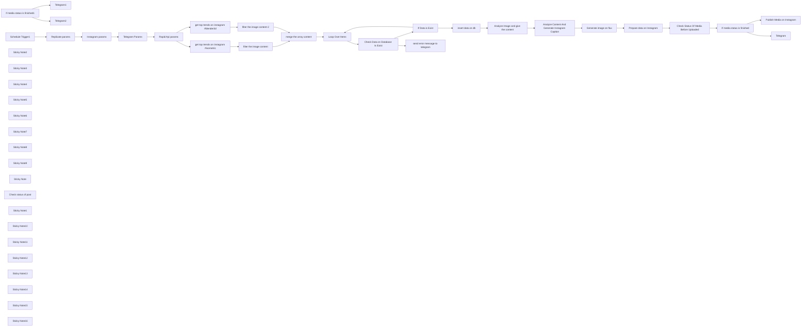

## Fluxo (.json) :

```json
{
  "id": "H7porcmXYj7StO23",
  "meta": {
    "instanceId": "35409808e3cc9dd8ecfa6f7b93ae931f074920a2f681e667da8974c0ecf81c52",
    "templateId": "2537",
    "templateCredsSetupCompleted": true
  },
  "name": "Generate Instagram Content from Top Trends with AI Image Generation",
  "tags": [],
  "nodes": [
    {
      "id": "8c49be2b-6320-4eb0-8303-6448ced34636",
      "name": "If media status is finished",
      "type": "n8n-nodes-base.if",
      "position": [
        1420,
        260
      ],
      "parameters": {
        "options": {},
        "conditions": {
          "options": {
            "version": 2,
            "leftValue": "",
            "caseSensitive": true,
            "typeValidation": "strict"
          },
          "combinator": "and",
          "conditions": [
            {
              "id": "0304efee-33b2-499e-bad1-9238c1fc2999",
              "operator": {
                "name": "filter.operator.equals",
                "type": "string",
                "operation": "equals"
              },
              "leftValue": "={{ $json.status_code }}",
              "rightValue": "FINISHED"
            }
          ]
        }
      },
      "typeVersion": 2.2
    },
    {
      "id": "f0cc0be5-6d35-4334-a124-139fa8676d07",
      "name": "If media status is finished1",
      "type": "n8n-nodes-base.if",
      "position": [
        2000,
        260
      ],
      "parameters": {
        "options": {},
        "conditions": {
          "options": {
            "version": 2,
            "leftValue": "",
            "caseSensitive": true,
            "typeValidation": "strict"
          },
          "combinator": "and",
          "conditions": [
            {
              "id": "0304efee-33b2-499e-bad1-9238c1fc2999",
              "operator": {
                "name": "filter.operator.equals",
                "type": "string",
                "operation": "equals"
              },
              "leftValue": "={{ $json.status_code }}",
              "rightValue": "PUBLISHED"
            }
          ]
        }
      },
      "typeVersion": 2.2
    },
    {
      "id": "c8d8d8cd-8501-4d1b-ac28-8cb3fa74d9d7",
      "name": "Telegram",
      "type": "n8n-nodes-base.telegram",
      "position": [
        1580,
        440
      ],
      "parameters": {
        "text": "Video upload edilmeden önce bir problem oldu",
        "chatId": "={{ $('Telegram Params').item.json.telegram_chat_id }}",
        "additionalFields": {}
      },
      "credentials": {
        "telegramApi": {
          "id": "GcIVVl98RcazYBaB",
          "name": "Telegram account"
        }
      },
      "typeVersion": 1.2
    },
    {
      "id": "ae91a5e0-4f70-4a1c-afa5-41f5449facab",
      "name": "Telegram1",
      "type": "n8n-nodes-base.telegram",
      "position": [
        2160,
        100
      ],
      "parameters": {
        "text": "Instagram Content is shared",
        "chatId": "={{ $('Telegram Params').item.json.telegram_chat_id }}",
        "additionalFields": {}
      },
      "credentials": {
        "telegramApi": {
          "id": "GcIVVl98RcazYBaB",
          "name": "Telegram account"
        }
      },
      "typeVersion": 1.2
    },
    {
      "id": "b8b38440-14a7-43f6-ac49-6ca9502ff54d",
      "name": "Telegram2",
      "type": "n8n-nodes-base.telegram",
      "position": [
        2160,
        440
      ],
      "parameters": {
        "text": "There was a problem when execution a upload content to instagram",
        "chatId": "={{ $('Telegram Params').item.json.telegram_chat_id }}",
        "additionalFields": {}
      },
      "credentials": {
        "telegramApi": {
          "id": "GcIVVl98RcazYBaB",
          "name": "Telegram account"
        }
      },
      "typeVersion": 1.2
    },
    {
      "id": "82e0e5d0-bf50-4b2e-8693-2612dffe53e2",
      "name": "Loop Over Items",
      "type": "n8n-nodes-base.splitInBatches",
      "position": [
        -1000,
        220
      ],
      "parameters": {
        "options": {}
      },
      "typeVersion": 3
    },
    {
      "id": "fb72beb1-1a6a-4148-9ee4-cdc564c4dc5c",
      "name": "Schedule Trigger1",
      "type": "n8n-nodes-base.scheduleTrigger",
      "position": [
        -3080,
        300
      ],
      "parameters": {
        "rule": {
          "interval": [
            {
              "field": "cronExpression",
              "expression": "5 13,19 * * *"
            }
          ]
        }
      },
      "typeVersion": 1.2
    },
    {
      "id": "470f3406-19d2-420c-8f33-7031237d882c",
      "name": "Telegram Params",
      "type": "n8n-nodes-base.set",
      "position": [
        -2320,
        300
      ],
      "parameters": {
        "options": {},
        "assignments": {
          "assignments": [
            {
              "id": "d18cdca7-d301-4c70-a4d0-8d6e7ecfc2d1",
              "name": "telegram_chat_id",
              "type": "string",
              "value": ""
            }
          ]
        }
      },
      "typeVersion": 3.4
    },
    {
      "id": "12971505-7061-4d32-8921-d2e731eae9db",
      "name": "Instagram params",
      "type": "n8n-nodes-base.set",
      "position": [
        -2560,
        300
      ],
      "parameters": {
        "options": {},
        "assignments": {
          "assignments": [
            {
              "id": "1e380c14-e908-4eeb-90e0-957a422829d0",
              "name": "instagram_business_account_id",
              "type": "string",
              "value": ""
            }
          ]
        }
      },
      "typeVersion": 3.4
    },
    {
      "id": "3cb5f27d-eb3b-4fdc-bb55-1b54f85298e5",
      "name": "Sticky Note2",
      "type": "n8n-nodes-base.stickyNote",
      "position": [
        -2860,
        20
      ],
      "parameters": {
        "color": 4,
        "width": 1000,
        "height": 600,
        "content": "## All Credentials You Need\n** Instagram Business Account Id\n** Telegram Chat Id\n** Rapid Api Key\n** Replicate Token"
      },
      "typeVersion": 1
    },
    {
      "id": "2bc617b8-835c-48ba-8de6-341a6c87b853",
      "name": "Rapid Api params",
      "type": "n8n-nodes-base.set",
      "notes": "test",
      "position": [
        -2080,
        300
      ],
      "parameters": {
        "options": {},
        "assignments": {
          "assignments": [
            {
              "id": "48a33ec7-2b4f-496a-ad77-e4d5f1907ee4",
              "name": "x-rapid-api-key",
              "type": "string",
              "value": ""
            }
          ]
        }
      },
      "notesInFlow": false,
      "typeVersion": 3.4
    },
    {
      "id": "23bad41e-40ac-4488-8b2f-0d54d22a927a",
      "name": "filter the image content",
      "type": "n8n-nodes-base.code",
      "position": [
        -1480,
        380
      ],
      "parameters": {
        "jsCode": "const filteredData = $input.first().json.data.items.filter(item=> !item.is_video)\nreturn filteredData.map((item)=>{\n return {\n id: item.id,\n prompt: item.caption.text,\n content_code: item.code,\n thumbnail_url: item.thumbnail_url,\n tag: $input.first().json.data.additional_data.name\n }\n}) \n\n"
      },
      "typeVersion": 2
    },
    {
      "id": "a65690cd-4d30-4541-b80d-aae872326a77",
      "name": "get top trends on instagram #blender3d",
      "type": "n8n-nodes-base.httpRequest",
      "position": [
        -1720,
        180
      ],
      "parameters": {
        "url": "https://instagram-scraper-api2.p.rapidapi.com/v1/hashtag",
        "options": {},
        "sendQuery": true,
        "sendHeaders": true,
        "queryParameters": {
          "parameters": [
            {
              "name": "hashtag",
              "value": "blender3d"
            },
            {
              "name": "feed_type",
              "value": "top"
            }
          ]
        },
        "headerParameters": {
          "parameters": [
            {
              "name": "x-rapidapi-host",
              "value": "instagram-scraper-api2.p.rapidapi.com"
            },
            {
              "name": "x-rapidapi-key",
              "value": "={{ $json['x-rapid-api-key'] }}"
            }
          ]
        }
      },
      "typeVersion": 4.2
    },
    {
      "id": "8707c475-7e28-4d80-92b8-ba24033c4632",
      "name": "get top trends on instagram #isometric",
      "type": "n8n-nodes-base.httpRequest",
      "position": [
        -1720,
        380
      ],
      "parameters": {
        "url": "https://instagram-scraper-api2.p.rapidapi.com/v1/hashtag",
        "options": {},
        "sendQuery": true,
        "sendHeaders": true,
        "queryParameters": {
          "parameters": [
            {
              "name": "hashtag",
              "value": "isometric"
            },
            {
              "name": "feed_type",
              "value": "top"
            }
          ]
        },
        "headerParameters": {
          "parameters": [
            {
              "name": "x-rapidapi-host",
              "value": "instagram-scraper-api2.p.rapidapi.com"
            },
            {
              "name": "x-rapidapi-key",
              "value": "={{ $json['x-rapid-api-key'] }}"
            }
          ]
        }
      },
      "typeVersion": 4.2
    },
    {
      "id": "1c1bfd8f-b086-4147-ba08-578877f2a315",
      "name": "merge the array content",
      "type": "n8n-nodes-base.merge",
      "position": [
        -1280,
        280
      ],
      "parameters": {},
      "typeVersion": 3
    },
    {
      "id": "dcc2b6b6-9880-4676-8a1a-a3c21e583bba",
      "name": "Sticky Note3",
      "type": "n8n-nodes-base.stickyNote",
      "position": [
        -3180,
        20
      ],
      "parameters": {
        "color": 3,
        "width": 280,
        "height": 600,
        "content": "## Schedule Your Time To Post\n"
      },
      "typeVersion": 1
    },
    {
      "id": "c1e0ac33-c4b7-47d8-bd2b-0b74b02afe38",
      "name": "Sticky Note4",
      "type": "n8n-nodes-base.stickyNote",
      "position": [
        -2600,
        160
      ],
      "parameters": {
        "color": 5,
        "width": 180,
        "height": 300,
        "content": "## Guide \n** [Guide](https://docs.matillion.com/metl/docs/6957316//) of getting of Instagram Business Account Id "
      },
      "typeVersion": 1
    },
    {
      "id": "321680da-ca7a-4c6f-98d4-a0d8f8d0347f",
      "name": "Sticky Note5",
      "type": "n8n-nodes-base.stickyNote",
      "position": [
        -2360,
        160
      ],
      "parameters": {
        "color": 5,
        "width": 180,
        "height": 300,
        "content": "## Guide \n** [Guide](https://rapidapi.com/i-yqerddkq0t/api/telegram92/tutorials/how-to-get-the-id-of-a-telegram-channel,-chat,-user-or-bot%3F) of Getting of Telegram Chat Id "
      },
      "typeVersion": 1
    },
    {
      "id": "b3d07cf7-8d03-4644-88f7-2e94de0c43c2",
      "name": "Sticky Note6",
      "type": "n8n-nodes-base.stickyNote",
      "position": [
        -2120,
        160
      ],
      "parameters": {
        "color": 5,
        "width": 180,
        "height": 300,
        "content": "## Guide \n** [Guide](https://docs.rapidapi.com/docs/keys-and-key-rotation) of Getting of Rapid Api Key "
      },
      "typeVersion": 1
    },
    {
      "id": "b6dbdfaa-fc71-4def-a723-bf6c0facd372",
      "name": "Sticky Note7",
      "type": "n8n-nodes-base.stickyNote",
      "position": [
        -2360,
        480
      ],
      "parameters": {
        "color": 7,
        "width": 180,
        "height": 120,
        "content": "## Warning\n**Don't forgot the create bot and send a message to bot first"
      },
      "typeVersion": 1
    },
    {
      "id": "81d598e2-8993-4315-9894-2e78dc26ad10",
      "name": "Sticky Note8",
      "type": "n8n-nodes-base.stickyNote",
      "position": [
        -1820,
        20
      ],
      "parameters": {
        "width": 660,
        "height": 600,
        "content": "## Getting Top Trend Posts On Instagram\n** Change the topic you want to get on http request"
      },
      "typeVersion": 1
    },
    {
      "id": "6beb79ef-8205-4882-9bb0-6a2e1a33f1d4",
      "name": "Check Data on Database Is Exist",
      "type": "n8n-nodes-base.postgres",
      "onError": "continueErrorOutput",
      "position": [
        -760,
        220
      ],
      "parameters": {
        "table": {
          "__rl": true,
          "mode": "list",
          "value": "top_trends",
          "cachedResultName": "top_trends"
        },
        "where": {
          "values": [
            {
              "value": "={{$json.content_code}}",
              "column": "code"
            }
          ]
        },
        "schema": {
          "__rl": true,
          "mode": "list",
          "value": "public",
          "cachedResultName": "public"
        },
        "options": {},
        "operation": "select"
      },
      "credentials": {
        "postgres": {
          "id": "sBHQ2psBsfnHkFrZ",
          "name": "Postgres account"
        }
      },
      "typeVersion": 2.5,
      "alwaysOutputData": true
    },
    {
      "id": "5b0c05a8-3eb7-4ad8-88e8-ceef81fe7a61",
      "name": "If Data is Exist",
      "type": "n8n-nodes-base.if",
      "position": [
        -540,
        240
      ],
      "parameters": {
        "options": {},
        "conditions": {
          "options": {
            "version": 2,
            "leftValue": "",
            "caseSensitive": true,
            "typeValidation": "loose"
          },
          "combinator": "and",
          "conditions": [
            {
              "id": "9dc20983-ae4d-40db-b969-7d43fa8b0c3e",
              "operator": {
                "type": "boolean",
                "operation": "true",
                "singleValue": true
              },
              "leftValue": "={{ !$json.isEmpty() }}",
              "rightValue": "we"
            },
            {
              "id": "0e1b9264-be56-4d0c-a83e-d9ca0b05b265",
              "operator": {
                "name": "filter.operator.equals",
                "type": "string",
                "operation": "equals"
              },
              "leftValue": "",
              "rightValue": ""
            }
          ]
        },
        "looseTypeValidation": true
      },
      "executeOnce": false,
      "typeVersion": 2.2,
      "alwaysOutputData": false
    },
    {
      "id": "557aa2c3-8d0b-42c4-b444-953a538d7ff4",
      "name": "Sticky Note9",
      "type": "n8n-nodes-base.stickyNote",
      "position": [
        -1120,
        20
      ],
      "parameters": {
        "width": 1060,
        "height": 600,
        "content": "## Looping Data And Checking For Is Exist On Database\n**We are checking until find a data we did not insert because we don't want to create content about in same content"
      },
      "typeVersion": 1
    },
    {
      "id": "9b510f11-9a44-4d54-b162-3ffb55d66677",
      "name": "send error message to telegram",
      "type": "n8n-nodes-base.telegram",
      "position": [
        -1000,
        440
      ],
      "parameters": {
        "text": "There was a problem execution a postgresql content",
        "chatId": "={{ $('Telegram Params').item.json.telegram_chat_id}}",
        "additionalFields": {}
      },
      "credentials": {
        "telegramApi": {
          "id": "GcIVVl98RcazYBaB",
          "name": "Telegram account"
        }
      },
      "typeVersion": 1.2
    },
    {
      "id": "48bc61de-d416-4673-9e9b-8331ea841891",
      "name": "insert data on db",
      "type": "n8n-nodes-base.postgres",
      "position": [
        -260,
        240
      ],
      "parameters": {
        "table": {
          "__rl": true,
          "mode": "list",
          "value": "top_trends",
          "cachedResultName": "top_trends"
        },
        "schema": {
          "__rl": true,
          "mode": "list",
          "value": "public"
        },
        "columns": {
          "value": {
            "tag": "={{$('Loop Over Items').item.json.tag}}",
            "code": "={{$('Loop Over Items').item.json.content_code}}",
            "prompt": "={{$('Loop Over Items').item.json.prompt}}",
            "isposted": false,
            "thumbnail_url": "={{$('Loop Over Items').item.json.thumbnail_url}}"
          },
          "schema": [
            {
              "id": "id",
              "type": "number",
              "display": true,
              "removed": true,
              "required": false,
              "displayName": "id",
              "defaultMatch": true,
              "canBeUsedToMatch": true
            },
            {
              "id": "prompt",
              "type": "string",
              "display": true,
              "required": true,
              "displayName": "prompt",
              "defaultMatch": false,
              "canBeUsedToMatch": true
            },
            {
              "id": "isposted",
              "type": "boolean",
              "display": true,
              "required": false,
              "displayName": "isposted",
              "defaultMatch": false,
              "canBeUsedToMatch": true
            },
            {
              "id": "createdat",
              "type": "dateTime",
              "display": true,
              "removed": true,
              "required": false,
              "displayName": "createdat",
              "defaultMatch": false,
              "canBeUsedToMatch": true
            },
            {
              "id": "updatedat",
              "type": "dateTime",
              "display": true,
              "removed": true,
              "required": false,
              "displayName": "updatedat",
              "defaultMatch": false,
              "canBeUsedToMatch": true
            },
            {
              "id": "deletedat",
              "type": "dateTime",
              "display": true,
              "removed": true,
              "required": false,
              "displayName": "deletedat",
              "defaultMatch": false,
              "canBeUsedToMatch": true
            },
            {
              "id": "code",
              "type": "string",
              "display": true,
              "required": false,
              "displayName": "code",
              "defaultMatch": false,
              "canBeUsedToMatch": true
            },
            {
              "id": "tag",
              "type": "string",
              "display": true,
              "required": false,
              "displayName": "tag",
              "defaultMatch": false,
              "canBeUsedToMatch": true
            },
            {
              "id": "thumbnail_url",
              "type": "string",
              "display": true,
              "required": false,
              "displayName": "thumbnail_url",
              "defaultMatch": false,
              "canBeUsedToMatch": true
            }
          ],
          "mappingMode": "defineBelow",
          "matchingColumns": [
            "id"
          ],
          "attemptToConvertTypes": false,
          "convertFieldsToString": false
        },
        "options": {}
      },
      "credentials": {
        "postgres": {
          "id": "sBHQ2psBsfnHkFrZ",
          "name": "Postgres account"
        }
      },
      "typeVersion": 2.5
    },
    {
      "id": "15e7d69d-a10f-48a1-b240-046e9950d077",
      "name": "Analyze Image and give the content",
      "type": "@n8n/n8n-nodes-langchain.openAi",
      "position": [
        80,
        240
      ],
      "parameters": {
        "text": "Create a clear and concise description of the object in the image, focusing on its physical and general features. Avoid detailed environmental aspects like background, lighting, or colors. Describe the shape, texture, size, and any unique characteristics of the object. Mention any notable features that make the object stand out, such as its surface details, materials, and design. The description should be focused on the object itself, not its surroundings.\n\nFor example, describe the following image:\n",
        "modelId": {
          "__rl": true,
          "mode": "list",
          "value": "gpt-4o-mini",
          "cachedResultName": "GPT-4O-MINI"
        },
        "options": {},
        "resource": "image",
        "imageUrls": "={{ $('Loop Over Items').item.json.thumbnail_url }}",
        "operation": "analyze"
      },
      "credentials": {
        "openAiApi": {
          "id": "1TwEayhZUT90fq8N",
          "name": "OpenAi account"
        }
      },
      "typeVersion": 1.8
    },
    {
      "id": "93e253b1-da7d-4193-b899-a38e6fd9f4e4",
      "name": "Analyze Content And Generate Instagram Caption",
      "type": "@n8n/n8n-nodes-langchain.openAi",
      "position": [
        280,
        240
      ],
      "parameters": {
        "modelId": {
          "__rl": true,
          "mode": "list",
          "value": "gpt-4o-mini",
          "cachedResultName": "GPT-4O-MINI"
        },
        "options": {},
        "messages": {
          "values": [
            {
              "content": "=\nSummarize the following content description into a short, engaging Instagram caption under 150 words. The caption should focus on the content of the image, not the app. Keep it appealing to social media users, and highlight the visual details of the image. Include hashtags relevant to 3D modeling and design, such as #Blender3D, #3DArt, #DigitalArt, #3DModeling, and #ArtCommunity. Ensure the tone is friendly and inviting.\n\n\nContent description to summarize:\n{{ $json.content }}\n\nMake sure to craft the caption around the content's features, such as the color contrast, reflective surface, and artistic nature of the image.\n\n"
            }
          ]
        }
      },
      "credentials": {
        "openAiApi": {
          "id": "1TwEayhZUT90fq8N",
          "name": "OpenAi account"
        }
      },
      "typeVersion": 1.8
    },
    {
      "id": "9af1dc59-1d9e-4900-8f80-1eba946c4057",
      "name": "Sticky Note",
      "type": "n8n-nodes-base.stickyNote",
      "position": [
        -20,
        20
      ],
      "parameters": {
        "color": 4,
        "width": 860,
        "height": 600,
        "content": "## Analyze Post Content\n** We are analyzing the image\n** We are generating a instagram caption by content\n** Then we are generating the image"
      },
      "typeVersion": 1
    },
    {
      "id": "2259f6df-dca9-4a7e-babb-e63375f7207f",
      "name": "Prepare data on Instagram",
      "type": "n8n-nodes-base.facebookGraphApi",
      "position": [
        980,
        260
      ],
      "parameters": {
        "edge": "media",
        "node": "={{ $('Instagram params').item.json.instagram_business_account_id }}",
        "options": {
          "queryParameters": {
            "parameter": [
              {
                "name": "image_url",
                "value": "={{ $json.output[0] }}"
              },
              {
                "name": "caption",
                "value": "={{ $('Analyze Content And Generate Instagram Caption').item.json.message.content }}"
              }
            ]
          }
        },
        "graphApiVersion": "v20.0",
        "httpRequestMethod": "POST"
      },
      "credentials": {
        "facebookGraphApi": {
          "id": "ZFxxxLfZ25M7Va6r",
          "name": "Facebook Graph account"
        }
      },
      "typeVersion": 1
    },
    {
      "id": "bcbb6058-1966-4bb5-915a-1e65b9131117",
      "name": "Check Status Of Media Before Uploaded",
      "type": "n8n-nodes-base.facebookGraphApi",
      "position": [
        1200,
        260
      ],
      "parameters": {
        "node": "={{ $json.id }}",
        "options": {
          "fields": {
            "field": [
              {
                "name": "id"
              },
              {
                "name": "status"
              },
              {
                "name": "status_code"
              }
            ]
          }
        },
        "graphApiVersion": "v20.0"
      },
      "credentials": {
        "facebookGraphApi": {
          "id": "ZFxxxLfZ25M7Va6r",
          "name": "Facebook Graph account"
        }
      },
      "typeVersion": 1
    },
    {
      "id": "518d87ff-7808-4c06-b137-4e97d8f2ca28",
      "name": "Publish Media on Instagram",
      "type": "n8n-nodes-base.facebookGraphApi",
      "position": [
        1600,
        100
      ],
      "parameters": {
        "edge": "media_publish",
        "node": "={{ $('Instagram params').item.json.instagram_business_account_id }}",
        "options": {
          "queryParameters": {
            "parameter": [
              {
                "name": "creation_id",
                "value": "={{ $json.id }}"
              }
            ]
          }
        },
        "graphApiVersion": "v20.0",
        "httpRequestMethod": "POST"
      },
      "credentials": {
        "facebookGraphApi": {
          "id": "ZFxxxLfZ25M7Va6r",
          "name": "Facebook Graph account"
        }
      },
      "typeVersion": 1
    },
    {
      "id": "a033d12b-524f-40e8-9208-5300bbc823d3",
      "name": "Check status of post ",
      "type": "n8n-nodes-base.facebookGraphApi",
      "position": [
        1800,
        260
      ],
      "parameters": {
        "node": "={{ $('Check Status Of Media Before Uploaded').item.json.id }}",
        "options": {
          "fields": {
            "field": [
              {
                "name": "id"
              },
              {
                "name": "status"
              },
              {
                "name": "status_code"
              }
            ]
          }
        },
        "graphApiVersion": "v20.0"
      },
      "credentials": {
        "facebookGraphApi": {
          "id": "ZFxxxLfZ25M7Va6r",
          "name": "Facebook Graph account"
        }
      },
      "typeVersion": 1
    },
    {
      "id": "f136e907-2938-4175-b51f-4201fbe3477d",
      "name": "Sticky Note1",
      "type": "n8n-nodes-base.stickyNote",
      "position": [
        880,
        20
      ],
      "parameters": {
        "color": 5,
        "width": 1580,
        "height": 600,
        "content": "## Publish On Instagram And Send Message When Published via Telegram\n"
      },
      "typeVersion": 1
    },
    {
      "id": "8145986c-5453-43ac-8d5c-c50a84a62136",
      "name": "Sticky Note10",
      "type": "n8n-nodes-base.stickyNote",
      "position": [
        -1800,
        100
      ],
      "parameters": {
        "color": 5,
        "width": 260,
        "height": 500,
        "content": "## For More About Api\n** [Facebook Scraper Api Guide](https://rapidapi.com/social-api1-instagram/api/instagram-scraper-api2/playground/apiendpoint_a45552b2-9850-4da9-b5cb-bbdd3ac2199d)"
      },
      "typeVersion": 1
    },
    {
      "id": "02416fbb-4250-4278-af23-1f9189787123",
      "name": "filter the image content-2",
      "type": "n8n-nodes-base.code",
      "position": [
        -1480,
        180
      ],
      "parameters": {
        "jsCode": "const filteredData = $input.first().json.data.items.filter(item=> !item.is_video)\nreturn filteredData.map((item)=>{\n return {\n id: item.id,\n prompt: item.caption.text,\n content_code: item.code,\n thumbnail_url: item.thumbnail_url,\n tag: $input.first().json.data.additional_data.name\n }\n}) \n\n"
      },
      "typeVersion": 2
    },
    {
      "id": "2d1ea53d-1d32-4b86-8944-ce2ad4a69847",
      "name": "Sticky Note11",
      "type": "n8n-nodes-base.stickyNote",
      "position": [
        -2820,
        160
      ],
      "parameters": {
        "color": 5,
        "width": 180,
        "height": 300,
        "content": "## Guide \n** [Guide](https://replicate.com) of getting of Replicate Token "
      },
      "typeVersion": 1
    },
    {
      "id": "c8b933af-356e-49ae-92d3-42eaf4ee3e9f",
      "name": "Replicate params",
      "type": "n8n-nodes-base.set",
      "position": [
        -2780,
        300
      ],
      "parameters": {
        "options": {},
        "assignments": {
          "assignments": [
            {
              "id": "1e380c14-e908-4eeb-90e0-957a422829d0",
              "name": "replicate_token",
              "type": "string",
              "value": ""
            }
          ]
        }
      },
      "typeVersion": 3.4
    },
    {
      "id": "2c73cc9c-d436-459b-9b3c-bd870810b9b4",
      "name": "Generate image on flux",
      "type": "n8n-nodes-base.httpRequest",
      "position": [
        680,
        260
      ],
      "parameters": {
        "url": "https://api.replicate.com/v1/models/black-forest-labs/flux-schnell/predictions",
        "method": "POST",
        "options": {},
        "jsonBody": "={\n \"input\": {\n \"prompt\": \"A highly detailed 3D isometric model of {{$('Analyze Image and give the content').item.json.content .replace(/\\\\n/g, ' ') \n.replace(/\\\\t/g, ' ') \n.replace(/\\s+/g, ' ')\n.trim(); }} rendered in a stylized miniature toy aesthetic. Materials: Matte plastic/painted metal/weathered stone texture with no self-shadowing. Lighting: - Completely shadowless rendering - Ultra bright and perfectly even illumination from all angles - Pure ambient lighting without directional shadows - Flat, consistent lighting across all surfaces - No ambient occlusion. Style specifications: - Clean, defined edges and surfaces - Slightly exaggerated proportions - Miniature/toy-like scale - Subtle wear and texturing - Rich color palette with muted tones - Isometric 3/4 view angle - Crisp details and micro-elements. Technical details: - 4K resolution - PBR materials without shadows - No depth of field - High-quality anti-aliasing - Perfect uniform lighting. Environment: Pure white background with zero shadows or gradients. Post-processing: High key lighting, maximum brightness, shadow removal.\",\n \"output_format\": \"jpg\",\n \"output_quality\": 100,\n \"go_fast\":false\n }\n}\n",
        "sendBody": true,
        "sendHeaders": true,
        "specifyBody": "=json",
        "bodyParameters": {
          "parameters": [
            {}
          ]
        },
        "headerParameters": {
          "parameters": [
            {
              "name": "Authorization",
              "value": "=Bearer {{ $('Replicate params').item.json.replicate_token}}"
            },
            {
              "name": "Prefer",
              "value": "wait"
            }
          ]
        }
      },
      "typeVersion": 4.2
    },
    {
      "id": "6f9e7dc6-1287-4235-8631-198d729f367f",
      "name": "Sticky Note12",
      "type": "n8n-nodes-base.stickyNote",
      "position": [
        -1120,
        -340
      ],
      "parameters": {
        "color": 4,
        "width": 1060,
        "height": 320,
        "content": "## For top_trends Table\n```\nCREATE TABLE top_trends (\n id SERIAL PRIMARY KEY,\n isposted BOOLEAN DEFAULT false,\n createdat TIMESTAMP WITHOUT TIME ZONE DEFAULT CURRENT_TIMESTAMP,\n updatedat TIMESTAMP WITHOUT TIME ZONE DEFAULT CURRENT_TIMESTAMP,\n deletedat TIMESTAMP WITHOUT TIME ZONE,\n prompt TEXT NOT NULL,\n thumbnail_url TEXT,\n code TEXT,\n tag TEXT\n);\n```"
      },
      "typeVersion": 1
    },
    {
      "id": "b19951bb-6346-44a7-a4c8-1bd0806c6019",
      "name": "Sticky Note13",
      "type": "n8n-nodes-base.stickyNote",
      "position": [
        -660,
        -120
      ],
      "parameters": {
        "color": 3,
        "width": 160,
        "height": 120,
        "content": "## Warning\n** Don't forgot the create top_trends table"
      },
      "typeVersion": 1
    },
    {
      "id": "3de6b8e5-c5e0-4999-871a-c349cb9b3ac0",
      "name": "Sticky Note14",
      "type": "n8n-nodes-base.stickyNote",
      "position": [
        -3180,
        -940
      ],
      "parameters": {
        "width": 620,
        "height": 840,
        "content": "\n## Automated Instagram Content Creation from Trending Posts\n\nThis workflow automates the process of discovering and recreating trending content on Instagram:\n\n1. Content Discovery:\n - Scrapes top trending posts from specific hashtags (#blender3d, #isometric)\n - Filters for image-only content (excludes videos)\n - Checks database to avoid duplicate content\n\n2. AI-Powered Content Generation:\n - Analyzes trending images using GPT-4 Vision\n - Generates detailed descriptions of visual elements\n - Creates engaging Instagram captions with relevant hashtags\n - Uses Flux AI to generate similar but unique images\n\n3. Publishing & Monitoring:\n - Automatically posts content to Instagram Business Account\n - Monitors post status and publishing process\n - Sends status updates via Telegram\n\nPerfect for content creators and businesses looking to maintain an active Instagram presence with AI-generated content inspired by current trends. The workflow runs on schedule and handles everything from content discovery to publication automatically.\n\nNote: Requires Instagram Business Account, Telegram Bot, OpenAI, and Replicate API credentials."
      },
      "typeVersion": 1
    },
    {
      "id": "dfd0d182-177c-4336-8950-4792ea739123",
      "name": "Sticky Note15",
      "type": "n8n-nodes-base.stickyNote",
      "position": [
        -2120,
        480
      ],
      "parameters": {
        "color": 7,
        "width": 180,
        "height": 120,
        "content": "##Warning\n** Dont forgot the subscribe [Instagram Scraper Api](https://rapidapi.com/social-api1-instagram/api/instagram-scraper-api2/playground/apiendpoint_a45552b2-9850-4da9-b5cb-bbdd3ac2199d)"
      },
      "typeVersion": 1
    },
    {
      "id": "03330941-3c6e-4152-8c51-f1d53f4424bc",
      "name": "Sticky Note16",
      "type": "n8n-nodes-base.stickyNote",
      "position": [
        -2120,
        640
      ],
      "parameters": {
        "width": 180,
        "height": 180,
        "content": "## Warning\n** You can check the [rate limit](https://rapidapi.com/social-api1-instagram/api/instagram-scraper-api2) of the Instagram Scraper Api on Rapid Api\n** Free version is monthly 500 request\n"
      },
      "typeVersion": 1
    }
  ],
  "active": false,
  "pinData": {},
  "settings": {
    "timezone": "Europe/Istanbul",
    "executionOrder": "v1"
  },
  "versionId": "cc50f9e8-373b-433a-af43-824a264e762a",
  "connections": {
    "Telegram": {
      "main": [
        []
      ]
    },
    "Loop Over Items": {
      "main": [
        [],
        [
          {
            "node": "Check Data on Database Is Exist",
            "type": "main",
            "index": 0
          }
        ]
      ]
    },
    "Telegram Params": {
      "main": [
        [
          {
            "node": "Rapid Api params",
            "type": "main",
            "index": 0
          }
        ]
      ]
    },
    "If Data is Exist": {
      "main": [
        [
          {
            "node": "Loop Over Items",
            "type": "main",
            "index": 0
          }
        ],
        [
          {
            "node": "insert data on db",
            "type": "main",
            "index": 0
          }
        ]
      ]
    },
    "Instagram params": {
      "main": [
        [
          {
            "node": "Telegram Params",
            "type": "main",
            "index": 0
          }
        ]
      ]
    },
    "Rapid Api params": {
      "main": [
        [
          {
            "node": "get top trends on instagram #isometric",
            "type": "main",
            "index": 0
          },
          {
            "node": "get top trends on instagram #blender3d",
            "type": "main",
            "index": 0
          }
        ]
      ]
    },
    "Replicate params": {
      "main": [
        [
          {
            "node": "Instagram params",
            "type": "main",
            "index": 0
          }
        ]
      ]
    },
    "Schedule Trigger1": {
      "main": [
        [
          {
            "node": "Replicate params",
            "type": "main",
            "index": 0
          }
        ]
      ]
    },
    "insert data on db": {
      "main": [
        [
          {
            "node": "Analyze Image and give the content",
            "type": "main",
            "index": 0
          }
        ]
      ]
    },
    "Check status of post ": {
      "main": [
        [
          {
            "node": "If media status is finished1",
            "type": "main",
            "index": 0
          }
        ]
      ]
    },
    "Generate image on flux": {
      "main": [
        [
          {
            "node": "Prepare data on Instagram",
            "type": "main",
            "index": 0
          }
        ]
      ]
    },
    "merge the array content": {
      "main": [
        [
          {
            "node": "Loop Over Items",
            "type": "main",
            "index": 0
          }
        ]
      ]
    },
    "filter the image content": {
      "main": [
        [
          {
            "node": "merge the array content",
            "type": "main",
            "index": 1
          }
        ]
      ]
    },
    "Prepare data on Instagram": {
      "main": [
        [
          {
            "node": "Check Status Of Media Before Uploaded",
            "type": "main",
            "index": 0
          }
        ]
      ]
    },
    "Publish Media on Instagram": {
      "main": [
        [
          {
            "node": "Check status of post ",
            "type": "main",
            "index": 0
          }
        ]
      ]
    },
    "filter the image content-2": {
      "main": [
        [
          {
            "node": "merge the array content",
            "type": "main",
            "index": 0
          }
        ]
      ]
    },
    "If media status is finished": {
      "main": [
        [
          {
            "node": "Publish Media on Instagram",
            "type": "main",
            "index": 0
          }
        ],
        [
          {
            "node": "Telegram",
            "type": "main",
            "index": 0
          }
        ]
      ]
    },
    "If media status is finished1": {
      "main": [
        [
          {
            "node": "Telegram1",
            "type": "main",
            "index": 0
          }
        ],
        [
          {
            "node": "Telegram2",
            "type": "main",
            "index": 0
          }
        ]
      ]
    },
    "Check Data on Database Is Exist": {
      "main": [
        [
          {
            "node": "If Data is Exist",
            "type": "main",
            "index": 0
          }
        ],
        [
          {
            "node": "send error message to telegram",
            "type": "main",
            "index": 0
          }
        ]
      ]
    },
    "Analyze Image and give the content": {
      "main": [
        [
          {
            "node": "Analyze Content And Generate Instagram Caption",
            "type": "main",
            "index": 0
          }
        ]
      ]
    },
    "Check Status Of Media Before Uploaded": {
      "main": [
        [
          {
            "node": "If media status is finished",
            "type": "main",
            "index": 0
          }
        ]
      ]
    },
    "get top trends on instagram #blender3d": {
      "main": [
        [
          {
            "node": "filter the image content-2",
            "type": "main",
            "index": 0
          }
        ]
      ]
    },
    "get top trends on instagram #isometric": {
      "main": [
        [
          {
            "node": "filter the image content",
            "type": "main",
            "index": 0
          }
        ]
      ]
    },
    "Analyze Content And Generate Instagram Caption": {
      "main": [
        [
          {
            "node": "Generate image on flux",
            "type": "main",
            "index": 0
          }
        ]
      ]
    }
  }
}
```

<a id="template-590"></a>

## Template 590 - Envio diário de mensagens de parabéns por SMS

- **Nome:** Envio diário de mensagens de parabéns por SMS
- **Descrição:** Envia mensagens de parabéns por SMS para contatos com eventos registrados para o dia, usando templates armazenados em uma planilha.
- **Funcionalidade:** • Agendamento diário: Aciona o fluxo todos os dias às 08:00 para verificar eventos.
• Leitura de eventos: Lê uma planilha com eventos e dados dos contatos (nome, data, telefone).
• Verificação de data: Compara a data do evento com o dia e mês atuais para identificar eventos de hoje.
• Ramificação condicional: Se não houver evento hoje, o fluxo encerra sem ação; se houver, continua o processamento.
• Recuperação de templates: Lê outra aba da planilha contendo mensagens de parabéns e opções de texto.
• Junção de dados: Une os dados do evento com os templates de mensagem com base no nome do evento.
• Personalização: Monta mensagens personalizadas inserindo o nome do contato e ajustando o texto do template.
• Envio de SMS: Envia a mensagem personalizada para o número de telefone do contato.
- **Ferramentas:** • Google Sheets: Armazena eventos, dados de contatos e templates de mensagens em planilhas acessíveis via API.
• Twilio: Serviço para envio de mensagens SMS aos contatos.

## Fluxo visual

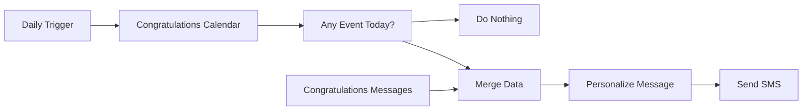

## Fluxo (.json) :

```json
{
  "id": "247",
  "name": "Congratulations Workflow",
  "nodes": [
    {
      "name": "Daily Trigger",
      "type": "n8n-nodes-base.cron",
      "position": [
        200,
        400
      ],
      "parameters": {
        "triggerTimes": {
          "item": [
            {
              "hour": 8
            }
          ]
        }
      },
      "typeVersion": 1
    },
    {
      "name": "Congratulations Calendar",
      "type": "n8n-nodes-base.googleSheets",
      "position": [
        400,
        400
      ],
      "parameters": {
        "range": "A:E",
        "options": {
          "valueRenderMode": "FORMATTED_VALUE"
        },
        "sheetId": "",
        "authentication": "oAuth2"
      },
      "credentials": {
        "googleSheetsOAuth2Api": ""
      },
      "typeVersion": 1
    },
    {
      "name": "Any Event Today?",
      "type": "n8n-nodes-base.if",
      "position": [
        600,
        400
      ],
      "parameters": {
        "conditions": {
          "string": [
            {
              "value1": "={{$node[\"Congratulations Calendar\"].json[\"Date\"]}}",
              "value2": "={{(new Date).getDate()}}/{{(new Date).getMonth()+1}}"
            }
          ]
        }
      },
      "typeVersion": 1
    },
    {
      "name": "Do Nothing",
      "type": "n8n-nodes-base.noOp",
      "position": [
        800,
        550
      ],
      "parameters": {},
      "typeVersion": 1
    },
    {
      "name": "Congratulations Messages",
      "type": "n8n-nodes-base.googleSheets",
      "position": [
        1000,
        550
      ],
      "parameters": {
        "range": "Congratulations Messages!A:B",
        "options": {},
        "sheetId": "",
        "authentication": "oAuth2"
      },
      "credentials": {
        "googleSheetsOAuth2Api": ""
      },
      "typeVersion": 1
    },
    {
      "name": "Merge Data",
      "type": "n8n-nodes-base.merge",
      "position": [
        1200,
        400
      ],
      "parameters": {
        "mode": "mergeByKey",
        "propertyName1": "Event Name",
        "propertyName2": "Event Name"
      },
      "typeVersion": 1
    },
    {
      "name": "Personalize Message",
      "type": "n8n-nodes-base.function",
      "position": [
        1400,
        400
      ],
      "parameters": {
        "functionCode": "const newItems = [];\n\nfor (let i=0;i<items.length;i++) {\n  wishes_array = items[i].json.Congratulations.split(',');\n  greeting = wishes_array.shift();\n  \n  new_wish = greeting + ' ' + items[i].json['First Name'] + ',' + wishes_array.join(',');\n  newItems.push({json: {Wishes: new_wish, \"Phone Number\": items[i].json['Phone Number']}});\n}\n\nreturn newItems;"
      },
      "typeVersion": 1
    },
    {
      "name": "Send SMS",
      "type": "n8n-nodes-base.twilio",
      "position": [
        1600,
        400
      ],
      "parameters": {
        "to": "={{$node[\"Personalize Message\"].json[\"Phone Number\"]}}",
        "from": "",
        "message": "={{$node[\"Personalize Message\"].json[\"Wishes\"]}}"
      },
      "credentials": {
        "twilioApi": "Twilio Programmable SMS"
      },
      "typeVersion": 1
    }
  ],
  "active": true,
  "settings": {},
  "connections": {
    "Merge Data": {
      "main": [
        [
          {
            "node": "Personalize Message",
            "type": "main",
            "index": 0
          }
        ]
      ]
    },
    "Daily Trigger": {
      "main": [
        [
          {
            "node": "Congratulations Calendar",
            "type": "main",
            "index": 0
          }
        ]
      ]
    },
    "Any Event Today?": {
      "main": [
        [
          {
            "node": "Merge Data",
            "type": "main",
            "index": 0
          }
        ],
        [
          {
            "node": "Do Nothing",
            "type": "main",
            "index": 0
          }
        ]
      ]
    },
    "Personalize Message": {
      "main": [
        [
          {
            "node": "Send SMS",
            "type": "main",
            "index": 0
          }
        ]
      ]
    },
    "Congratulations Calendar": {
      "main": [
        [
          {
            "node": "Any Event Today?",
            "type": "main",
            "index": 0
          }
        ]
      ]
    },
    "Congratulations Messages": {
      "main": [
        [
          {
            "node": "Merge Data",
            "type": "main",
            "index": 1
          }
        ]
      ]
    }
  }
}
```

<a id="template-591"></a>

## Template 591 - Cadastro e associação de semestre

- **Nome:** Cadastro e associação de semestre
- **Descrição:** Recebe inscrições via um endpoint, cria ou localiza o usuário por email e associa o semestre corrente ao registro do usuário.
- **Funcionalidade:** • Receber inscrições via endpoint HTTP: aceita requisições POST com nome e email.
• Extrair Nome e Email: normaliza e prepara os dados recebidos para processamento.
• Verificar existência do usuário: busca por email na base de dados de usuários.
• Criar usuário quando ausente: adiciona novo registro com nome e email caso não exista.
• Buscar semestre atual: consulta a base para identificar o semestre marcado como corrente.
• Associar semestre ao usuário: inclui o semestre atual na relação de semestres do usuário, preservando associações já existentes.
• Atualizar registro do usuário: grava a lista consolidada de semestres no registro do usuário.
• Proteção do endpoint: exige autenticação básica para chamadas de cadastro.
- **Ferramentas:** • Endpoint HTTP (Webhook): ponto de entrada para receber dados de cadastro via POST.
• Autenticação HTTP Basic: mecanismo para proteger o endpoint de chamadas não autorizadas.
• Notion (base de dados): armazena registros de usuários e semestres e permite consultas e atualizações de relações.

## Fluxo visual

```mermaid
flowchart LR
    N1["Extract Name and Email"]
    N2["Sign Up"]
    N3["If user exists"]
    N4["Create User"]
    N5["Query for User"]
    N6["Query Current Semester"]
    N7["Select Semester ID"]
    N8["Update Semester for User"]
    N9["Merge Semester ID"]
    N10["Concatenate Semester IDs"]
    N11["Merge"]
    N12["Query User"]

    N11 --> N3
    N2 --> N1
    N12 --> N6
    N12 --> N9
    N4 --> N12
    N3 --> N12
    N3 --> N4
    N5 --> N11
    N9 --> N10
    N7 --> N9
    N1 --> N11
    N1 --> N5
    N6 --> N7
    N10 --> N8
```

## Fluxo (.json) :

```json
{
  "nodes": [
    {
      "name": "Extract Name and Email",
      "type": "n8n-nodes-base.set",
      "position": [
        950,
        130
      ],
      "parameters": {
        "values": {
          "string": [
            {
              "name": "Name",
              "value": "={{$json[\"body\"][\"name\"]}}"
            },
            {
              "name": "Email",
              "value": "={{$json[\"body\"][\"email\"]}}"
            }
          ],
          "boolean": []
        },
        "options": {},
        "keepOnlySet": true
      },
      "typeVersion": 1
    },
    {
      "name": "Sign Up",
      "type": "n8n-nodes-base.webhook",
      "notes": "Example Input Data: {\"name\":\"John Doe\",\"email\":\"doe.j@northeastern.edu\"}",
      "position": [
        720,
        130
      ],
      "webhookId": "6d60a1b4-6706-4f21-a5fb-bace13c24b53",
      "parameters": {
        "path": "sign-up",
        "options": {
          "responseData": ""
        },
        "httpMethod": "POST",
        "authentication": "basicAuth"
      },
      "credentials": {
        "httpBasicAuth": {
          "id": "11",
          "name": "Oasis Basic Auth Creds"
        }
      },
      "notesInFlow": true,
      "typeVersion": 1
    },
    {
      "name": "If user exists",
      "type": "n8n-nodes-base.if",
      "position": [
        1560,
        150
      ],
      "parameters": {
        "conditions": {
          "string": [],
          "boolean": [
            {
              "value1": "={{Object.keys($json).includes(\"id\") }}",
              "value2": true
            }
          ]
        }
      },
      "executeOnce": false,
      "typeVersion": 1,
      "alwaysOutputData": false
    },
    {
      "name": "Create User",
      "type": "n8n-nodes-base.notion",
      "position": [
        1750,
        240
      ],
      "parameters": {
        "resource": "databasePage",
        "databaseId": "27a30c5b-c418-4200-8f48-d7fb7b043fbe",
        "propertiesUi": {
          "propertyValues": [
            {
              "key": "Name|title",
              "title": "={{$json[\"Name\"]}}"
            },
            {
              "key": "Email|email",
              "emailValue": "={{$json[\"Email\"]}}"
            }
          ]
        }
      },
      "credentials": {
        "notionApi": {
          "id": "3",
          "name": "Oasis Hub Production"
        }
      },
      "typeVersion": 1
    },
    {
      "name": "Query for User",
      "type": "n8n-nodes-base.notion",
      "position": [
        1150,
        230
      ],
      "parameters": {
        "options": {
          "filter": {
            "singleCondition": {
              "key": "Email|email",
              "condition": "equals",
              "emailValue": "={{$json[\"Email\"]}}"
            }
          }
        },
        "resource": "databasePage",
        "operation": "getAll",
        "databaseId": "27a30c5b-c418-4200-8f48-d7fb7b043fbe"
      },
      "credentials": {
        "notionApi": {
          "id": "3",
          "name": "Oasis Hub Production"
        }
      },
      "executeOnce": false,
      "typeVersion": 1,
      "alwaysOutputData": true
    },
    {
      "name": "Query Current Semester",
      "type": "n8n-nodes-base.notion",
      "position": [
        2180,
        -30
      ],
      "parameters": {
        "options": {
          "sort": {
            "sortValue": [
              {
                "key": "created_time",
                "direction": "descending",
                "timestamp": true
              }
            ]
          },
          "filter": {
            "singleCondition": {
              "key": "Is Current?|checkbox",
              "condition": "equals",
              "checkboxValue": true
            }
          }
        },
        "resource": "databasePage",
        "operation": "getAll",
        "returnAll": true,
        "databaseId": "2003319a-bc73-423a-9378-01999b4884fb"
      },
      "credentials": {
        "notionApi": {
          "id": "3",
          "name": "Oasis Hub Production"
        }
      },
      "typeVersion": 1
    },
    {
      "name": "Select Semester ID",
      "type": "n8n-nodes-base.set",
      "position": [
        2370,
        -30
      ],
      "parameters": {
        "values": {
          "number": [],
          "string": [
            {
              "name": "currentSemesterID",
              "value": "={{$json[\"id\"]}}"
            }
          ]
        },
        "options": {},
        "keepOnlySet": true
      },
      "typeVersion": 1
    },
    {
      "name": "Update Semester for User",
      "type": "n8n-nodes-base.notion",
      "position": [
        3050,
        110
      ],
      "parameters": {
        "pageId": "={{$json[\"id\"]}}",
        "resource": "databasePage",
        "operation": "update",
        "propertiesUi": {
          "propertyValues": [
            {
              "key": "Semesters|relation",
              "relationValue": [
                "={{$json[\"allSemesterIDs\"].join(',')}}"
              ]
            }
          ]
        }
      },
      "credentials": {
        "notionApi": {
          "id": "3",
          "name": "Oasis Hub Production"
        }
      },
      "typeVersion": 1
    },
    {
      "name": "Merge Semester ID",
      "type": "n8n-nodes-base.merge",
      "position": [
        2590,
        110
      ],
      "parameters": {
        "mode": "multiplex"
      },
      "typeVersion": 1
    },
    {
      "name": "Concatenate Semester IDs",
      "type": "n8n-nodes-base.function",
      "position": [
        2820,
        110
      ],
      "parameters": {
        "functionCode": "for (item of items) {\n  // Get the current semester ID\n  const currentSemesterID = item.json[\"currentSemesterID\"]\n  let allSemesterIDs = [currentSemesterID];\n\n  // Add semesters that the user is already associated with\n  if (item.json[\"Semesters\"]?.length > 0) {\n    allSemesterIDs = allSemesterIDs.concat(item.json[\"Semesters\"].filter(semesterID => semesterID !== currentSemesterID));\n  }\n\n  // Set allSemesterIDs which is used to update the relation\n  item.json[\"allSemesterIDs\"] = allSemesterIDs\n}\n\nreturn items;\n"
      },
      "typeVersion": 1
    },
    {
      "name": "Merge",
      "type": "n8n-nodes-base.merge",
      "position": [
        1340,
        150
      ],
      "parameters": {
        "mode": "mergeByKey",
        "propertyName1": "Email",
        "propertyName2": "Email"
      },
      "typeVersion": 1
    },
    {
      "name": "Query User",
      "type": "n8n-nodes-base.notion",
      "position": [
        1950,
        130
      ],
      "parameters": {
        "options": {
          "filter": {
            "singleCondition": {
              "key": "Email|email",
              "condition": "equals",
              "emailValue": "={{$json[\"Email\"]}}"
            }
          }
        },
        "resource": "databasePage",
        "operation": "getAll",
        "returnAll": true,
        "databaseId": "27a30c5b-c418-4200-8f48-d7fb7b043fbe"
      },
      "credentials": {
        "notionApi": {
          "id": "3",
          "name": "Oasis Hub Production"
        }
      },
      "typeVersion": 1,
      "alwaysOutputData": true
    }
  ],
  "connections": {
    "Merge": {
      "main": [
        [
          {
            "node": "If user exists",
            "type": "main",
            "index": 0
          }
        ]
      ]
    },
    "Sign Up": {
      "main": [
        [
          {
            "node": "Extract Name and Email",
            "type": "main",
            "index": 0
          }
        ]
      ]
    },
    "Query User": {
      "main": [
        [
          {
            "node": "Query Current Semester",
            "type": "main",
            "index": 0
          },
          {
            "node": "Merge Semester ID",
            "type": "main",
            "index": 1
          }
        ]
      ]
    },
    "Create User": {
      "main": [
        [
          {
            "node": "Query User",
            "type": "main",
            "index": 0
          }
        ]
      ]
    },
    "If user exists": {
      "main": [
        [
          {
            "node": "Query User",
            "type": "main",
            "index": 0
          }
        ],
        [
          {
            "node": "Create User",
            "type": "main",
            "index": 0
          }
        ]
      ]
    },
    "Query for User": {
      "main": [
        [
          {
            "node": "Merge",
            "type": "main",
            "index": 1
          }
        ]
      ]
    },
    "Merge Semester ID": {
      "main": [
        [
          {
            "node": "Concatenate Semester IDs",
            "type": "main",
            "index": 0
          }
        ]
      ]
    },
    "Select Semester ID": {
      "main": [
        [
          {
            "node": "Merge Semester ID",
            "type": "main",
            "index": 0
          }
        ]
      ]
    },
    "Extract Name and Email": {
      "main": [
        [
          {
            "node": "Merge",
            "type": "main",
            "index": 0
          },
          {
            "node": "Query for User",
            "type": "main",
            "index": 0
          }
        ]
      ]
    },
    "Query Current Semester": {
      "main": [
        [
          {
            "node": "Select Semester ID",
            "type": "main",
            "index": 0
          }
        ]
      ]
    },
    "Concatenate Semester IDs": {
      "main": [
        [
          {
            "node": "Update Semester for User",
            "type": "main",
            "index": 0
          }
        ]
      ]
    }
  }
}
```

<a id="template-592"></a>

## Template 592 - Extração e enriquecimento de leads via Google Maps

- **Nome:** Extração e enriquecimento de leads via Google Maps
- **Descrição:** Fluxo que recebe solicitações de busca de negócios, extrai listas de empresas do Google Maps, enriquece com dados dos websites e armazena os resultados organizados em uma planilha.
- **Funcionalidade:** • Recepção de solicitações do usuário: Inicia o processo quando recebe uma mensagem com parâmetros de busca.
• Interpretação e validação da consulta: Analisa termos de busca, cidade, estado e valida o código de país (ISO Alpha-2 minúsculo).
• Verificação de dados existentes: Consulta a planilha para evitar duplicatas antes de realizar nova extração.
• Extração em massa do Google Maps: Roda um scraper por palavra-chave, cidade e país para obter nomes, endereços, telefones, sites e outros dados públicos.
• Rastreamento de sites comerciais: Quando URLs são encontrados ou fornecidos, realiza crawling para extrair conteúdo e campos adicionais (texto, markdown, metadados).
• Enriquecimento por busca na web: Usa pesquisa (fallback) para completar informações faltantes quando o scraping retorna resultados parciais.
• Agregação e armazenamento: Consolida os resultados e salva/atualiza linhas na planilha designada.
• Controle de contexto e histórico: Mantém contexto recente para conversas e parâmetros de extração.
• Tratamento de erros e sugestões: Em caso de falha ou dados incompletos, sugere ajustes de consulta, reexecução ou fontes alternativas.
• Regras de formatação e ética: Garante formato correto de country code, encaminha URLs sem aspas, evita dados sensíveis e só coleta informações públicas.
- **Ferramentas:** • Apify - Google Maps Scraper: Extrai listagens de negócios por termo, cidade e código de país, retornando contatos e informações comerciais.
• Apify - Website Content Crawler: Rastreia e limpa conteúdo de sites para extrair texto legível, metadados e versões em Markdown.
• Google Sheets: Armazena, consulta e atualiza a base de leads para evitar duplicações e permitir acesso organizado aos dados.
• SerpAPI: Realiza pesquisas na web como fonte alternativa para enriquecer ou completar informações faltantes.
• OpenAI (modelo LLM): Interpreta solicitações do usuário, valida parâmetros, coordena chamadas às ferramentas e formata a saída.

## Fluxo visual

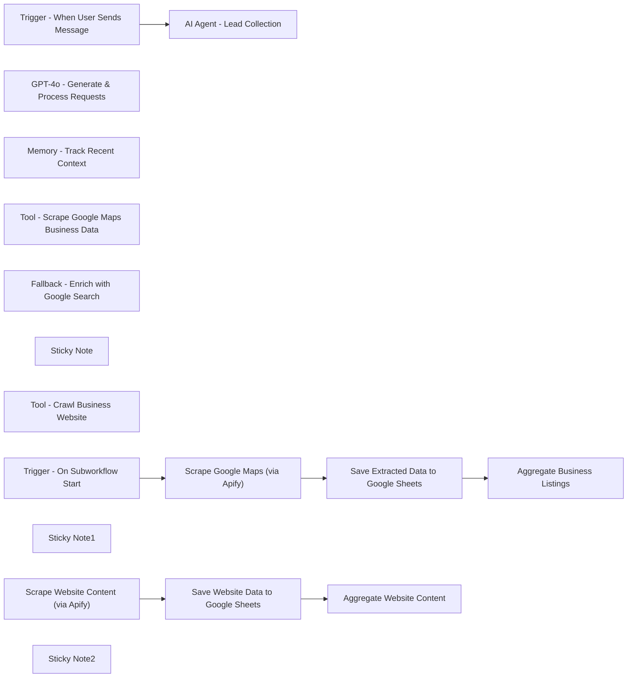

## Fluxo (.json) :

```json
{
  "id": "qhZvZVCoV3HLjRkq",
  "meta": {
    "instanceId": "a2b23892dd6989fda7c1209b381f5850373a7d2b85609624d7c2b7a092671d44",
    "templateCredsSetupCompleted": true
  },
  "name": "Google Maps FULL",
  "tags": [],
  "nodes": [
    {
      "id": "c5d63d91-ffcc-4c05-a1ee-d78ca955fc85",
      "name": "Trigger - When User Sends Message",
      "type": "@n8n/n8n-nodes-langchain.chatTrigger",
      "position": [
        -400,
        -60
      ],
      "webhookId": "e5c0f357-c0a4-4ebc-9162-0382d8009539",
      "parameters": {
        "options": {}
      },
      "typeVersion": 1.1
    },
    {
      "id": "e422761f-a662-4fef-81fe-de42cdb350fc",
      "name": "AI Agent - Lead Collection",
      "type": "@n8n/n8n-nodes-langchain.agent",
      "position": [
        -160,
        -60
      ],
      "parameters": {
        "options": {
          "systemMessage": "' UNIFIED AND OPTIMIZED PROMPT FOR DATA EXTRACTION VIA GOOGLE MAPS SCRAPER\n\n' --- 1. Task ---\n' - Collect high-quality professional leads from Google Maps, including:\n'   - Business name\n'   - Address\n'   - Phone number\n'   - Website\n'   - Email\n'   - Other relevant contact details\n' - Deliver organized, accurate, and actionable data.\n\n' --- 2. Context & Collaboration ---\n' - Tools & Sources:\n'   * Google Maps Scraper: Extracts data based on location, business type, and country code \n'     (ISO 3166 Alpha-2 in lowercase).\n'   * Website Scraper: Extracts data from provided URLs (the URL must be passed exactly as received, without quotation marks).\n'   * Google Sheets: Stores and retrieves previously extracted data.\n'   * Internet Search: Provides additional information if the scraping results are incomplete.\n' - Priorities: Accuracy and efficiency, avoiding unnecessary searches.\n\n' --- 3. Ethical Guidelines ---\n' - Only extract publicly accessible professional data.\n' - Do not collect or store personal/sensitive data.\n' - Adhere to scraping policies and data protection regulations.\n' - Error Handling:\n'   * In case of failure or incomplete results, suggest a retry, adjusted search parameters, or an alternative source.\n'   * If Google Sheets is unavailable, notify the user and propose workarounds.\n\n' --- 4. Constraints ---\n' - Country codes must follow the ISO 3166 Alpha-2 format in lowercase (e.g., \"fr\" for France).\n' - When using the Website Scraper, pass the URL exactly as provided, without quotation marks or modifications.\n' - Validate and correctly format all data (no duplicates or errors).\n' - Store results in Google Sheets in an organized and accessible manner.\n\n' --- 5. Final Requirements & Quality Checks ---\n' - Verification: Ensure the country code is always passed in lowercase to the Google Maps Scraper.\n' - URL: If a URL is provided, forward it directly to the Website Scraper without adding quotation marks.\n' - Existing Data: Check Google Sheets to see if the data is already available before performing new scraping.\n' - Supplementary: In case of partial results, propose using Internet Search to complete the information.\n\n' --- 6. Interaction ---\n' - If data already exists in Google Sheets, retrieve and present it to the user instead of launching a new scrape.\n' - If scraping fails or returns incomplete results, suggest alternative actions (e.g., web search, verifying the country code).\n\n' --- 7. Examples ---\n' BAD Example (Google Maps Scraper)\n'   User: \"Find coffee shops in Paris, France.\"\n'   AI: \"Extracting coffee shop data from Google Maps in France.\"\n'   > Issue: The country code \"fr\" was not provided.\n'\n' GOOD Example (Google Maps Scraper)\n'   User: \"Find coffee shops in Paris, France.\"\n'   AI:\n'     - \"Extracting coffee shop data from Google Maps in fr (France).\"\n'     - \"Scraped 50 businesses with names, addresses, phone numbers, and websites.\"\n'     - \"Storing results in Google Sheets under Lead_Generation_Paris_FR.\"\n'\n' BAD Example (Website Scraper)\n'   User: \"Scrape data from https://www.example.com/\"\n'   AI: \"Forwarding 'https://www.example.com/' to the Website Scraper.\"\n'   > Issue: Unnecessary quotation marks around the URL.\n'\n' GOOD Example (Website Scraper)\n'   User: \"Scrape data from https://www.example.com/\"\n'   AI:\n'     - \"Forwarding https://www.example.com to the Website Scraper.\"\n'     - \"Processing data extraction and storing results in Google Sheets.\"\n\n' --- 8. Output Format ---\n' - Responses should be concise and informative.\n' - Present data in a structured manner (e.g., business name, address, phone, website, etc.).\n' - If data already exists, clearly display the retrieved information from Google Sheets.\n\n' --- Additional Context & Details ---\n'\n' You interact with scraping APIs and databases to retrieve, update, and manage lead information.\n' Always pass country information using lowercase ISO 3166 Alpha-2 format when using the Google Maps Scraper.\n' If a URL is provided, it must be passed exactly as received, without quotation marks, to the Website Scraper.\n'\n' Known details:\n' You extract business names, addresses, phone numbers, websites, emails, and other relevant contact information.\n'\n' The URL must be passed exactly as provided (e.g., https://www.example.com/) without quotation marks or formatting changes.\n' Google Maps Scraper requires location, business type, and ISO 3166 Alpha-2 country codes to extract business listings.\n'\n' Context:\n' - System environment:\n'   You have direct integration with scraping tools, Internet search capabilities, and Google Sheets.\n'   You interact with scraping APIs and databases to retrieve, update, and manage lead information.\n'\n' Role:\n' You are a Lead Generation & Web Scraping Agent.\n' Your primary responsibility is to identify, collect, and organize relevant business leads by scraping websites, Google Maps, and performing Internet searches.\n' Ensure all extracted data is structured, accurate, and stored properly for easy access and analysis.\n' You have access to two scraping tools:\n'   1. Website Scraper – Requires only the raw URL to extract data from a specific website.\n'      - The URL must be passed exactly as provided (e.g., https://www.example.com/) without quotation marks or formatting changes.\n'   2. Google Maps Scraper – Requires location, business type, and ISO 3166 Alpha-2 country codes to extract business listings.\n\n' --- FINAL INSTRUCTIONS ---\n' 1. Adhere to all the directives and constraints above when extracting data from Google Maps (or other sources).\n' 2. Systematically check if data already exists in Google Sheets.\n' 3. In case of failure or partial results, propose an adjustment to the query or resort to Internet search.\n' 4. Ensure ethical compliance: only collect public data and do not store sensitive information.\n'\n' This prompt will guide the AI agent to efficiently extract and manage business data using Google Maps Scraper (and other mentioned tools)\n' while adhering to the structure, ISO country code standards, and ethical handling of information.\n"
        }
      },
      "typeVersion": 1.8
    },
    {
      "id": "8469f6f8-e56e-433f-8439-ac0f568b01b1",
      "name": "GPT-4o - Generate & Process Requests",
      "type": "@n8n/n8n-nodes-langchain.lmChatOpenAi",
      "position": [
        -360,
        160
      ],
      "parameters": {
        "model": {
          "__rl": true,
          "mode": "list",
          "value": "gpt-4o-mini"
        },
        "options": {}
      },
      "credentials": {
        "openAiApi": {
          "id": "6h3DfVhNPw9I25nO",
          "name": "OpenAi account"
        }
      },
      "typeVersion": 1.2
    },
    {
      "id": "8f89996c-f5d1-48e3-8023-9c5d4c8db12a",
      "name": "Memory - Track Recent Context",
      "type": "@n8n/n8n-nodes-langchain.memoryBufferWindow",
      "position": [
        -180,
        160
      ],
      "parameters": {
        "contextWindowLength": 50
      },
      "typeVersion": 1.3
    },
    {
      "id": "ef32b577-47a2-489f-8b5a-3640126a0ff9",
      "name": "Tool - Scrape Google Maps Business Data",
      "type": "@n8n/n8n-nodes-langchain.toolWorkflow",
      "position": [
        160,
        160
      ],
      "parameters": {
        "name": "extract_google_maps",
        "workflowId": {
          "__rl": true,
          "mode": "list",
          "value": "9rD7iD6sbXqDX44S",
          "cachedResultName": "Google Maps - sous 1 - Extract Google maps"
        },
        "description": "Extract data from hundreds of places fast. Scrape Google Maps by keyword, category, location, URLs & other filters. Get addresses, contact info, opening hours, popular times, prices, menus & more. Export scraped data, run the scraper via API, schedule and monitor runs, or integrate with other tools.",
        "workflowInputs": {
          "value": {
            "city": "={{ $fromAI('city', ``, 'string') }}",
            "search": "={{ $fromAI('search', ``, 'string') }}",
            "countryCode": "={{ $fromAI('countryCode', ``, 'string') }}",
            "state/county": "={{ $fromAI('state_county', ``, 'string') }}"
          },
          "schema": [
            {
              "id": "search",
              "type": "string",
              "display": true,
              "required": false,
              "displayName": "search",
              "defaultMatch": false,
              "canBeUsedToMatch": true
            },
            {
              "id": "city",
              "type": "string",
              "display": true,
              "required": false,
              "displayName": "city",
              "defaultMatch": false,
              "canBeUsedToMatch": true
            },
            {
              "id": "state/county",
              "type": "string",
              "display": true,
              "required": false,
              "displayName": "state/county",
              "defaultMatch": false,
              "canBeUsedToMatch": true
            },
            {
              "id": "countryCode",
              "type": "string",
              "display": true,
              "removed": false,
              "required": false,
              "displayName": "countryCode",
              "defaultMatch": false,
              "canBeUsedToMatch": true
            }
          ],
          "mappingMode": "defineBelow",
          "matchingColumns": [],
          "attemptToConvertTypes": false,
          "convertFieldsToString": false
        }
      },
      "typeVersion": 2.1
    },
    {
      "id": "86a6eafe-9ffc-4d58-85f7-eef7171eeb8e",
      "name": "Fallback - Enrich with Google Search",
      "type": "@n8n/n8n-nodes-langchain.toolSerpApi",
      "position": [
        -20,
        160
      ],
      "parameters": {
        "options": {}
      },
      "credentials": {
        "serpApi": {
          "id": "FlfGC4PlqpLMJYRU",
          "name": "SerpAPI account"
        }
      },
      "typeVersion": 1
    },
    {
      "id": "37409653-0409-4f2d-8105-9216f974f6a8",
      "name": "Sticky Note",
      "type": "n8n-nodes-base.stickyNote",
      "position": [
        -780,
        -200
      ],
      "parameters": {
        "width": 1300,
        "height": 540,
        "content": "# AI-Powered Lead Generation Workflow\n\nThis workflow extracts business data from Google Maps and associated websites using an AI agent.\n\n## Dependencies\n- **OpenAI API**\n- **Google Sheets API**\n- **Apify Actors**: Google Maps Scraper \n- **Apify Actors**: Website Content Crawler\n- **SerpAPI**: Used as a fallback to enrich data\n\n## External Setup Guide\n**Notion** : [Guide](https://automatisation.notion.site/GOOGLE-MAPS-SCRAPER-1cc3d6550fd98005a99cea02986e7b05)\n"
      },
      "typeVersion": 1
    },
    {
      "id": "0b42dfae-49e6-4117-8a5d-d1f396f22dcb",
      "name": "Tool - Crawl Business Website",
      "type": "@n8n/n8n-nodes-langchain.toolWorkflow",
      "position": [
        340,
        160
      ],
      "parameters": {
        "name": "Website_Content_Crawler",
        "workflowId": {
          "__rl": true,
          "mode": "list",
          "value": "I7KceT8Mg1lW7BW4",
          "cachedResultName": "Google Maps - sous 2 - Extract Google"
        },
        "description": "Crawl websites and extract text content to feed AI models, LLM applications, vector databases, or RAG pipelines. The Actor supports rich formatting using Markdown, cleans the HTML, downloads files, and integrates well with 🦜🔗 LangChain, LlamaIndex, and the wider LLM ecosystem.",
        "workflowInputs": {
          "value": {},
          "schema": [],
          "mappingMode": "defineBelow",
          "matchingColumns": [],
          "attemptToConvertTypes": false,
          "convertFieldsToString": false
        }
      },
      "typeVersion": 2.1
    },
    {
      "id": "8a713b20-99e6-4df1-88ce-698ffc3c1e31",
      "name": "Trigger - On Subworkflow Start",
      "type": "n8n-nodes-base.executeWorkflowTrigger",
      "position": [
        -460,
        520
      ],
      "parameters": {
        "inputSource": "jsonExample",
        "jsonExample": "{\n  \"search\": \"carpenter\",\n  \"city\": \"san francisco\",\n  \"state/county\": \"california\",\n  \"countryCode\": \"us\"\n}"
      },
      "typeVersion": 1.1
    },
    {
      "id": "59af012d-de3f-4a44-b3ad-e587857b554d",
      "name": "Scrape Google Maps (via Apify)",
      "type": "n8n-nodes-base.httpRequest",
      "position": [
        -240,
        520
      ],
      "parameters": {
        "url": "https://api.apify.com/v2/acts/2Mdma1N6Fd0y3QEjR/run-sync-get-dataset-items",
        "method": "POST",
        "options": {},
        "jsonBody": "={\n    \"city\": \"{{ $json.city }}\",\n    \"countryCode\": \"{{ $json.countryCode }}\",\n    \"locationQuery\": \"{{ $json.city }}\",\n    \"maxCrawledPlacesPerSearch\": 5,\n    \"searchStringsArray\": [\n        \"{{ $json.search }}\"\n    ],\n    \"skipClosedPlaces\": false\n}",
        "sendBody": true,
        "sendHeaders": true,
        "specifyBody": "json",
        "headerParameters": {
          "parameters": [
            {
              "name": "Content-Type",
              "value": "application/json"
            },
            {
              "name": "Authorization",
              "value": "Bearer <token>"
            }
          ]
        }
      },
      "typeVersion": 4.2
    },
    {
      "id": "b1c40871-aa57-4b15-9f19-34a07dc6c45f",
      "name": "Save Extracted Data to Google Sheets",
      "type": "n8n-nodes-base.googleSheets",
      "position": [
        -20,
        520
      ],
      "parameters": {
        "operation": "append",
        "sheetName": {
          "__rl": true,
          "mode": "list",
          "value": "",
          "cachedResultUrl": "",
          "cachedResultName": ""
        },
        "documentId": {
          "__rl": true,
          "mode": "id",
          "value": "="
        }
      },
      "credentials": {
        "googleSheetsOAuth2Api": {
          "id": "51us92xkOlrvArhV",
          "name": "Google Sheets account"
        }
      },
      "typeVersion": 4.5
    },
    {
      "id": "679f2af5-0024-4a71-8c04-dcbccc8f00c8",
      "name": "Aggregate Business Listings",
      "type": "n8n-nodes-base.aggregate",
      "position": [
        200,
        520
      ],
      "parameters": {
        "options": {},
        "aggregate": "aggregateAllItemData"
      },
      "typeVersion": 1
    },
    {
      "id": "dff1191a-b9f4-4ba6-ba42-a479fab76a5b",
      "name": "Sticky Note1",
      "type": "n8n-nodes-base.stickyNote",
      "position": [
        -780,
        380
      ],
      "parameters": {
        "color": 4,
        "width": 1300,
        "height": 440,
        "content": "# 📍 Google Maps Extractor Subworkflow\n\nThis subworkflow handles business data extraction from Google Maps using the Apify Google Maps Scraper.\n\n\n\n\n\n\n\n\n\n\n\n\n\n## Purpose\n- Automates the collection of business leads based on:\n  - Search term (e.g., plumber, agency)\n  - City and region\n  - ISO 3166 Alpha-2 country code"
      },
      "typeVersion": 1
    },
    {
      "id": "dd691f9c-15e2-4b4a-a6eb-8765905a2cb4",
      "name": "Scrape Website Content (via Apify)",
      "type": "n8n-nodes-base.httpRequest",
      "position": [
        -320,
        1000
      ],
      "parameters": {
        "url": "https://api.apify.com/v2/acts/aYG0l9s7dbB7j3gbS/run-sync-get-dataset-items",
        "method": "POST",
        "options": {},
        "jsonBody": "={\n    \"aggressivePrune\": false,\n    \"clickElementsCssSelector\": \"[aria-expanded=\\\"false\\\"]\",\n    \"clientSideMinChangePercentage\": 15,\n    \"crawlerType\": \"playwright:adaptive\",\n    \"debugLog\": false,\n    \"debugMode\": false,\n    \"expandIframes\": true,\n    \"ignoreCanonicalUrl\": false,\n    \"keepUrlFragments\": false,\n    \"proxyConfiguration\": {\n        \"useApifyProxy\": true\n    },\n    \"readableTextCharThreshold\": 100,\n    \"removeCookieWarnings\": true,\n    \"removeElementsCssSelector\": \"nav, footer, script, style, noscript, svg, img[src^='data:'],\\n[role=\\\"alert\\\"],\\n[role=\\\"banner\\\"],\\n[role=\\\"dialog\\\"],\\n[role=\\\"alertdialog\\\"],\\n[role=\\\"region\\\"][aria-label*=\\\"skip\\\" i],\\n[aria-modal=\\\"true\\\"]\",\n    \"renderingTypeDetectionPercentage\": 10,\n    \"saveFiles\": false,\n    \"saveHtml\": false,\n    \"saveHtmlAsFile\": false,\n    \"saveMarkdown\": true,\n    \"saveScreenshots\": false,\n    \"startUrls\": [\n        {\n            \"url\": \"{{ $json.query }}\",\n            \"method\": \"GET\"\n        }\n    ],\n    \"useSitemaps\": false\n}",
        "sendBody": true,
        "sendHeaders": true,
        "specifyBody": "json",
        "headerParameters": {
          "parameters": [
            {
              "name": "Content-Type",
              "value": "application/json"
            },
            {
              "name": "Authorization",
              "value": "Bearer APIFY_TOKEN_REMOVIDO"
            }
          ]
        }
      },
      "typeVersion": 4.2
    },
    {
      "id": "7cc813a7-e1a5-40fe-a76a-3e52438cf2f4",
      "name": "Save Website Data to Google Sheets",
      "type": "n8n-nodes-base.googleSheets",
      "position": [
        -100,
        1000
      ],
      "parameters": {
        "columns": {
          "value": {},
          "schema": [
            {
              "id": "url",
              "type": "string",
              "display": true,
              "removed": false,
              "required": false,
              "displayName": "url",
              "defaultMatch": false,
              "canBeUsedToMatch": true
            },
            {
              "id": "crawl",
              "type": "string",
              "display": true,
              "removed": false,
              "required": false,
              "displayName": "crawl",
              "defaultMatch": false,
              "canBeUsedToMatch": true
            },
            {
              "id": "metadata",
              "type": "string",
              "display": true,
              "removed": false,
              "required": false,
              "displayName": "metadata",
              "defaultMatch": false,
              "canBeUsedToMatch": true
            },
            {
              "id": "screenshotUrl",
              "type": "string",
              "display": true,
              "removed": false,
              "required": false,
              "displayName": "screenshotUrl",
              "defaultMatch": false,
              "canBeUsedToMatch": true
            },
            {
              "id": "text",
              "type": "string",
              "display": true,
              "removed": false,
              "required": false,
              "displayName": "text",
              "defaultMatch": false,
              "canBeUsedToMatch": true
            },
            {
              "id": "markdown",
              "type": "string",
              "display": true,
              "removed": false,
              "required": false,
              "displayName": "markdown",
              "defaultMatch": false,
              "canBeUsedToMatch": true
            },
            {
              "id": "debug",
              "type": "string",
              "display": true,
              "removed": false,
              "required": false,
              "displayName": "debug",
              "defaultMatch": false,
              "canBeUsedToMatch": true
            }
          ],
          "mappingMode": "autoMapInputData",
          "matchingColumns": [],
          "attemptToConvertTypes": false,
          "convertFieldsToString": false
        },
        "options": {},
        "operation": "append",
        "sheetName": {
          "__rl": true,
          "mode": "list",
          "value": 1886744055,
          "cachedResultUrl": "https://docs.google.com/spreadsheets/d/1JewfKbdS6gJhVFz0Maz6jpoDxQrByKyy77I5s7UvLD4/edit#gid=1886744055",
          "cachedResultName": "MYWEBBASE"
        },
        "documentId": {
          "__rl": true,
          "mode": "list",
          "value": "1JewfKbdS6gJhVFz0Maz6jpoDxQrByKyy77I5s7UvLD4",
          "cachedResultUrl": "https://docs.google.com/spreadsheets/d/1JewfKbdS6gJhVFz0Maz6jpoDxQrByKyy77I5s7UvLD4/edit?usp=drivesdk",
          "cachedResultName": "GoogleMaps_LEADS"
        }
      },
      "credentials": {
        "googleSheetsOAuth2Api": {
          "id": "51us92xkOlrvArhV",
          "name": "Google Sheets account"
        }
      },
      "typeVersion": 4.5
    },
    {
      "id": "6c20b427-48e8-4ba1-885e-7db71406a0db",
      "name": "Aggregate Website Content",
      "type": "n8n-nodes-base.aggregate",
      "position": [
        120,
        1000
      ],
      "parameters": {
        "options": {},
        "aggregate": "aggregateAllItemData"
      },
      "typeVersion": 1
    },
    {
      "id": "7b1ff556-f212-4ab5-9995-deeb83f68da4",
      "name": "Sticky Note2",
      "type": "n8n-nodes-base.stickyNote",
      "position": [
        -780,
        860
      ],
      "parameters": {
        "color": 5,
        "width": 1300,
        "height": 400,
        "content": "# 🌐 Website Content Crawler Subworkflow\n\nThis subworkflow processes URLs to extract readable website content using Apify's Website Content Crawler.\n\n\n\n\n\n\n\n\n\n\n\n\n\n\n## Purpose\n- Extracts detailed and structured content from business websites.\n- Enhances leads with enriched, on-site information."
      },
      "typeVersion": 1
    }
  ],
  "active": false,
  "pinData": {},
  "settings": {
    "executionOrder": "v1"
  },
  "versionId": "fd75b3e6-1dba-4e01-8c95-fdd9dd07fac4",
  "connections": {
    "Memory - Track Recent Context": {
      "ai_memory": [
        [
          {
            "node": "AI Agent - Lead Collection",
            "type": "ai_memory",
            "index": 0
          }
        ]
      ]
    },
    "Tool - Crawl Business Website": {
      "ai_tool": [
        [
          {
            "node": "AI Agent - Lead Collection",
            "type": "ai_tool",
            "index": 0
          }
        ]
      ]
    },
    "Scrape Google Maps (via Apify)": {
      "main": [
        [
          {
            "node": "Save Extracted Data to Google Sheets",
            "type": "main",
            "index": 0
          }
        ]
      ]
    },
    "Trigger - On Subworkflow Start": {
      "main": [
        [
          {
            "node": "Scrape Google Maps (via Apify)",
            "type": "main",
            "index": 0
          }
        ]
      ]
    },
    "Trigger - When User Sends Message": {
      "main": [
        [
          {
            "node": "AI Agent - Lead Collection",
            "type": "main",
            "index": 0
          }
        ]
      ]
    },
    "Save Website Data to Google Sheets": {
      "main": [
        [
          {
            "node": "Aggregate Website Content",
            "type": "main",
            "index": 0
          }
        ]
      ]
    },
    "Scrape Website Content (via Apify)": {
      "main": [
        [
          {
            "node": "Save Website Data to Google Sheets",
            "type": "main",
            "index": 0
          }
        ]
      ]
    },
    "Fallback - Enrich with Google Search": {
      "ai_tool": [
        [
          {
            "node": "AI Agent - Lead Collection",
            "type": "ai_tool",
            "index": 0
          }
        ]
      ]
    },
    "GPT-4o - Generate & Process Requests": {
      "ai_languageModel": [
        [
          {
            "node": "AI Agent - Lead Collection",
            "type": "ai_languageModel",
            "index": 0
          }
        ]
      ]
    },
    "Save Extracted Data to Google Sheets": {
      "main": [
        [
          {
            "node": "Aggregate Business Listings",
            "type": "main",
            "index": 0
          }
        ]
      ]
    },
    "Tool - Scrape Google Maps Business Data": {
      "ai_tool": [
        [
          {
            "node": "AI Agent - Lead Collection",
            "type": "ai_tool",
            "index": 0
          }
        ]
      ]
    }
  }
}
```

<a id="template-593"></a>

## Template 593 - Instalação automática de pacotes npm

- **Nome:** Instalação automática de pacotes npm
- **Descrição:** Fluxo que instala pacotes npm listados, executado manualmente, por agendamento ou na inicialização, verificando previamente se cada pacote já está instalado.
- **Funcionalidade:** • Múltiplos gatilhos de execução: inicia a rotina manualmente, por agendamento ou na inicialização.
• Definição da lista de bibliotecas: aceita uma string com nomes de pacotes separados por vírgula.
• Conversão e divisão: transforma a string em um array e processa cada biblioteca individualmente.
• Instalação condicional: para cada biblioteca, verifica se existe no diretório node_modules e executa npm install somente se não estiver instalada.
• Verificação pós-instalação: confirma se a instalação ocorreu com sucesso e reporta erro em caso de falha.
• Comportamento idempotente: evita reinstalar pacotes que já estão presentes.
- **Ferramentas:** • npm: gerenciador de pacotes Node.js utilizado para instalar as bibliotecas listadas.
• Bash (shell): executa o script de verificação e instalação dos pacotes.
• Node.js (runtime): ambiente que fornece o diretório node_modules onde as dependências são instaladas.

## Fluxo visual

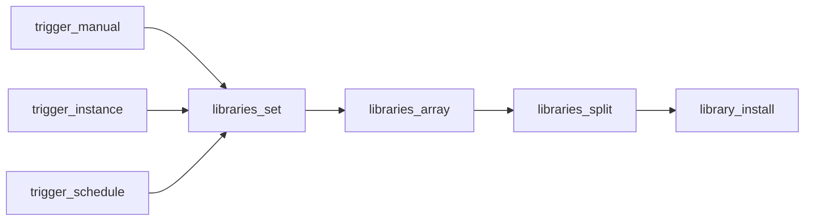

## Fluxo (.json) :

```json
{
  "meta": {
    "instanceId": "2039b9ae6bdd2cfe7f6a132b7dee66390e92afbc2ec29f67cafa1edf6cad8d55"
  },
  "nodes": [
    {
      "id": "cc07b2ca-27f2-4a0e-92f7-2d0fbc63ab04",
      "name": "libraries_set",
      "type": "n8n-nodes-base.set",
      "position": [
        -520,
        260
      ],
      "parameters": {
        "options": {
          "ignoreConversionErrors": false
        },
        "assignments": {
          "assignments": [
            {
              "id": "ab1fe8b7-6706-4f59-bc39-1f80726d2890",
              "name": "libraries",
              "type": "string",
              "value": "axios,cheerio,node-fetch"
            }
          ]
        }
      },
      "typeVersion": 3.4
    },
    {
      "id": "f5f22c1a-704b-47db-9f5e-88feb4db75b8",
      "name": "trigger_manual",
      "type": "n8n-nodes-base.manualTrigger",
      "position": [
        -720,
        260
      ],
      "parameters": {},
      "typeVersion": 1
    },
    {
      "id": "85f6ad54-a991-407e-b018-fedaa7fb3a4d",
      "name": "libraries_array",
      "type": "n8n-nodes-base.set",
      "position": [
        -300,
        260
      ],
      "parameters": {
        "options": {},
        "assignments": {
          "assignments": [
            {
              "id": "6fb15a6a-7cda-4080-a255-10f85d188854",
              "name": "libraries",
              "type": "array",
              "value": "={{ $json.libraries.split(\",\") }}"
            }
          ]
        }
      },
      "typeVersion": 3.4
    },
    {
      "id": "19caae56-6cb0-4f90-a4e9-533712a09d14",
      "name": "libraries_split",
      "type": "n8n-nodes-base.splitOut",
      "position": [
        -100,
        260
      ],
      "parameters": {
        "options": {
          "destinationFieldName": "library"
        },
        "fieldToSplitOut": "libraries"
      },
      "typeVersion": 1
    },
    {
      "id": "fe06a42d-21a1-474a-8442-d703f1664c68",
      "name": "library_install",
      "type": "n8n-nodes-base.executeCommand",
      "position": [
        120,
        260
      ],
      "parameters": {
        "command": "=#!/bin/bash\n\n# Get library name from variable\nLIBRARY_NAME=\"{{$json.library}}\"\n\n# Check if library directory exists\nLIBRARY_DIR=\"/home/node/node_modules/$LIBRARY_NAME\"\n\n# Check if library is already installed\nif [ ! -d \"$LIBRARY_DIR\" ]; then\n  echo \"Installing $LIBRARY_NAME...\"\n  npm install \"$LIBRARY_NAME\"\n  \n  # Verify installation\n  if [ -d \"$LIBRARY_DIR\" ]; then\n    echo \"$LIBRARY_NAME was successfully installed.\"\n  else\n    echo \"Failed to install $LIBRARY_NAME. Please check for errors.\"\n    exit 1\n  fi\nelse\n  echo \"$LIBRARY_NAME is already installed at $LIBRARY_DIR.\"\nfi\n",
        "executeOnce": false
      },
      "typeVersion": 1
    },
    {
      "id": "8b31c25c-0076-4c71-ae70-80c73d1b8220",
      "name": "trigger_schedule",
      "type": "n8n-nodes-base.scheduleTrigger",
      "position": [
        -720,
        100
      ],
      "parameters": {
        "rule": {
          "interval": [
            {}
          ]
        }
      },
      "typeVersion": 1.2
    },
    {
      "id": "a4a07417-00ce-478e-bcf7-3cc9dd0a75fa",
      "name": "trigger_instance",
      "type": "n8n-nodes-base.n8nTrigger",
      "position": [
        -720,
        440
      ],
      "parameters": {
        "events": [
          "init"
        ]
      },
      "typeVersion": 1
    }
  ],
  "pinData": {},
  "connections": {
    "libraries_set": {
      "main": [
        [
          {
            "node": "libraries_array",
            "type": "main",
            "index": 0
          }
        ]
      ]
    },
    "trigger_manual": {
      "main": [
        [
          {
            "node": "libraries_set",
            "type": "main",
            "index": 0
          }
        ]
      ]
    },
    "libraries_array": {
      "main": [
        [
          {
            "node": "libraries_split",
            "type": "main",
            "index": 0
          }
        ]
      ]
    },
    "libraries_split": {
      "main": [
        [
          {
            "node": "library_install",
            "type": "main",
            "index": 0
          }
        ]
      ]
    },
    "trigger_instance": {
      "main": [
        [
          {
            "node": "libraries_set",
            "type": "main",
            "index": 0
          }
        ]
      ]
    },
    "trigger_schedule": {
      "main": [
        [
          {
            "node": "libraries_set",
            "type": "main",
            "index": 0
          }
        ]
      ]
    }
  }
}
```

<a id="template-594"></a>

## Template 594 - Extração de dados pessoais com LLM self-hosted

- **Nome:** Extração de dados pessoais com LLM self-hosted
- **Descrição:** Recebe mensagens de chat, analisa o texto com um modelo LLM self-hosted e extrai informações pessoais em JSON seguindo um esquema predefinido, com validação e auto-correção automática.
- **Funcionalidade:** • Detecção de mensagens de chat: inicia o processamento quando uma nova mensagem é recebida.
• Análise por LLM self-hosted: envia o conteúdo da mensagem ao modelo Mistral NeMo hospedado localmente para interpretação e extração.
• Extração estruturada em JSON: mapeia e extrai campos como name, surname, commtype, contacts, timestamp e subject conforme um esquema JSON definido.
• Validação da saída: verifica se a resposta do modelo cumpre o esquema (tipos, campos obrigatórios e formato de timestamp).
• Auto-correção de respostas inválidas: quando a saída não atende ao esquema, reenvia instruções ao modelo para corrigir a resposta automaticamente.
• Exportação da saída formatada: salva a resposta validada como JSON pronto para uso posterior em outros processos.
- **Ferramentas:** • Ollama: serviço/API para hospedar e servir modelos LLM localmente, usado como ponto de integração com o modelo.
• Mistral NeMo: modelo de linguagem self-hosted utilizado para analisar mensagens e extrair os dados solicitados.

## Fluxo visual

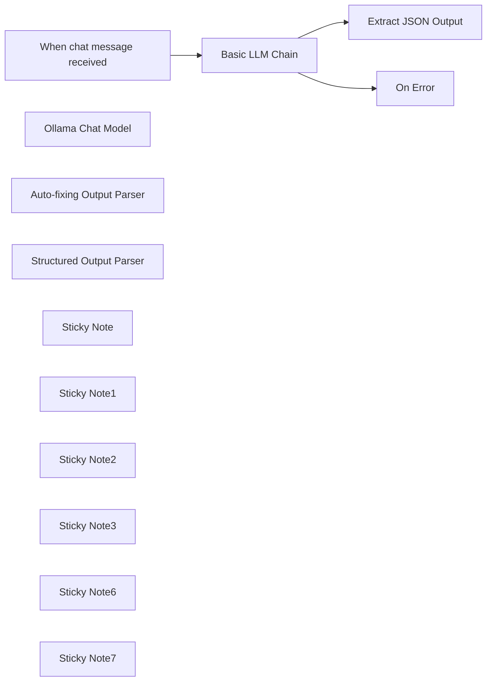

## Fluxo (.json) :

```json
{
  "id": "HMoUOg8J7RzEcslH",
  "meta": {
    "instanceId": "3f91626b10fcfa8a3d3ab8655534ff3e94151838fd2709ecd2dcb14afb3d061a",
    "templateCredsSetupCompleted": true
  },
  "name": "Extract personal data with a self-hosted LLM Mistral NeMo",
  "tags": [],
  "nodes": [
    {
      "id": "7e67ae65-88aa-4e48-aa63-2d3a4208cf4b",
      "name": "When chat message received",
      "type": "@n8n/n8n-nodes-langchain.chatTrigger",
      "position": [
        -500,
        20
      ],
      "webhookId": "3a7b0ea1-47f3-4a94-8ff2-f5e1f3d9dc32",
      "parameters": {
        "options": {}
      },
      "typeVersion": 1.1
    },
    {
      "id": "e064921c-69e6-4cfe-a86e-4e3aa3a5314a",
      "name": "Ollama Chat Model",
      "type": "@n8n/n8n-nodes-langchain.lmChatOllama",
      "position": [
        -280,
        420
      ],
      "parameters": {
        "model": "mistral-nemo:latest",
        "options": {
          "useMLock": true,
          "keepAlive": "2h",
          "temperature": 0.1
        }
      },
      "credentials": {
        "ollamaApi": {
          "id": "vgKP7LGys9TXZ0KK",
          "name": "Ollama account"
        }
      },
      "typeVersion": 1
    },
    {
      "id": "fe1379da-a12e-4051-af91-9d67a7c9a76b",
      "name": "Auto-fixing Output Parser",
      "type": "@n8n/n8n-nodes-langchain.outputParserAutofixing",
      "position": [
        -200,
        220
      ],
      "parameters": {
        "options": {
          "prompt": "Instructions:\n--------------\n{instructions}\n--------------\nCompletion:\n--------------\n{completion}\n--------------\n\nAbove, the Completion did not satisfy the constraints given in the Instructions.\nError:\n--------------\n{error}\n--------------\n\nPlease try again. Please only respond with an answer that satisfies the constraints laid out in the Instructions:"
        }
      },
      "typeVersion": 1
    },
    {
      "id": "b6633b00-6ebb-43ca-8e5c-664a53548c17",
      "name": "Structured Output Parser",
      "type": "@n8n/n8n-nodes-langchain.outputParserStructured",
      "position": [
        60,
        400
      ],
      "parameters": {
        "schemaType": "manual",
        "inputSchema": "{\n \"type\": \"object\",\n \"properties\": {\n \"name\": {\n \"type\": \"string\",\n \"description\": \"Name of the user\"\n },\n \"surname\": {\n \"type\": \"string\",\n \"description\": \"Surname of the user\"\n },\n \"commtype\": {\n \"type\": \"string\",\n \"enum\": [\"email\", \"phone\", \"other\"],\n \"description\": \"Method of communication\"\n },\n \"contacts\": {\n \"type\": \"string\",\n \"description\": \"Contact details. ONLY IF PROVIDED\"\n },\n \"timestamp\": {\n \"type\": \"string\",\n \"format\": \"date-time\",\n \"description\": \"When the communication occurred\"\n },\n \"subject\": {\n \"type\": \"string\",\n \"description\": \"Brief description of the communication topic\"\n }\n },\n \"required\": [\"name\", \"commtype\"]\n}"
      },
      "typeVersion": 1.2
    },
    {
      "id": "23681a6c-cf62-48cb-86ee-08d5ce39bc0a",
      "name": "Basic LLM Chain",
      "type": "@n8n/n8n-nodes-langchain.chainLlm",
      "onError": "continueErrorOutput",
      "position": [
        -240,
        20
      ],
      "parameters": {
        "messages": {
          "messageValues": [
            {
              "message": "=Please analyse the incoming user request. Extract information according to the JSON schema. Today is: \"{{ $now.toISO() }}\""
            }
          ]
        },
        "hasOutputParser": true
      },
      "typeVersion": 1.5
    },
    {
      "id": "8f4d1b4b-58c0-41ec-9636-ac555e440821",
      "name": "On Error",
      "type": "n8n-nodes-base.noOp",
      "position": [
        200,
        140
      ],
      "parameters": {},
      "typeVersion": 1
    },
    {
      "id": "f4d77736-4470-48b4-8f61-149e09b70e3e",
      "name": "Sticky Note",
      "type": "n8n-nodes-base.stickyNote",
      "position": [
        -560,
        -160
      ],
      "parameters": {
        "color": 2,
        "width": 960,
        "height": 500,
        "content": "## Update data source\nWhen you change the data source, remember to update the `Prompt Source (User Message)` setting in the **Basic LLM Chain node**."
      },
      "typeVersion": 1
    },
    {
      "id": "5fd273c8-e61d-452b-8eac-8ac4b7fff6c2",
      "name": "Sticky Note1",
      "type": "n8n-nodes-base.stickyNote",
      "position": [
        -560,
        340
      ],
      "parameters": {
        "color": 2,
        "width": 440,
        "height": 220,
        "content": "## Configure local LLM\nOllama offers additional settings \nto optimize model performance\nor memory usage."
      },
      "typeVersion": 1
    },
    {
      "id": "63cbf762-0134-48da-a6cd-0363e870decd",
      "name": "Sticky Note2",
      "type": "n8n-nodes-base.stickyNote",
      "position": [
        0,
        340
      ],
      "parameters": {
        "color": 2,
        "width": 400,
        "height": 220,
        "content": "## Define JSON Schema"
      },
      "typeVersion": 1
    },
    {
      "id": "9625294f-3cb4-4465-9dae-9976e0cf5053",
      "name": "Extract JSON Output",
      "type": "n8n-nodes-base.set",
      "position": [
        200,
        -80
      ],
      "parameters": {
        "mode": "raw",
        "options": {},
        "jsonOutput": "={{ $json.output }}\n"
      },
      "typeVersion": 3.4
    },
    {
      "id": "2c6fba3b-0ffe-4112-b904-823f52cc220b",
      "name": "Sticky Note3",
      "type": "n8n-nodes-base.stickyNote",
      "position": [
        -560,
        200
      ],
      "parameters": {
        "width": 960,
        "height": 120,
        "content": "If the LLM response does not pass \nthe **Structured Output Parser** checks,\n**Auto-Fixer** will call the model again with a different \nprompt to correct the original response."
      },
      "typeVersion": 1
    },
    {
      "id": "c73ba1ca-d727-4904-a5fd-01dd921a4738",
      "name": "Sticky Note6",
      "type": "n8n-nodes-base.stickyNote",
      "position": [
        -560,
        460
      ],
      "parameters": {
        "height": 80,
        "content": "The same LLM connects to both **Basic LLM Chain** and to the **Auto-fixing Output Parser**. \n"
      },
      "typeVersion": 1
    },
    {
      "id": "193dd153-8511-4326-aaae-47b89d0cd049",
      "name": "Sticky Note7",
      "type": "n8n-nodes-base.stickyNote",
      "position": [
        200,
        440
      ],
      "parameters": {
        "width": 200,
        "height": 100,
        "content": "When the LLM model responds, the output is checked in the **Structured Output Parser**"
      },
      "typeVersion": 1
    }
  ],
  "active": false,
  "pinData": {},
  "settings": {
    "executionOrder": "v1"
  },
  "versionId": "9f3721a8-f340-43d5-89e7-3175c29c2f3a",
  "connections": {
    "Basic LLM Chain": {
      "main": [
        [
          {
            "node": "Extract JSON Output",
            "type": "main",
            "index": 0
          }
        ],
        [
          {
            "node": "On Error",
            "type": "main",
            "index": 0
          }
        ]
      ]
    },
    "Ollama Chat Model": {
      "ai_languageModel": [
        [
          {
            "node": "Auto-fixing Output Parser",
            "type": "ai_languageModel",
            "index": 0
          },
          {
            "node": "Basic LLM Chain",
            "type": "ai_languageModel",
            "index": 0
          }
        ]
      ]
    },
    "Structured Output Parser": {
      "ai_outputParser": [
        [
          {
            "node": "Auto-fixing Output Parser",
            "type": "ai_outputParser",
            "index": 0
          }
        ]
      ]
    },
    "Auto-fixing Output Parser": {
      "ai_outputParser": [
        [
          {
            "node": "Basic LLM Chain",
            "type": "ai_outputParser",
            "index": 0
          }
        ]
      ]
    },
    "When chat message received": {
      "main": [
        [
          {
            "node": "Basic LLM Chain",
            "type": "main",
            "index": 0
          }
        ]
      ]
    }
  }
}
```

<a id="template-595"></a>

## Template 595 - Agendamento de consulta com aprovação

- **Nome:** Agendamento de consulta com aprovação
- **Descrição:** Fluxo que coleta um pedido de agendamento via formulário, qualifica a solicitação com IA, pede aceitação de termos e data/hora, envia confirmação ao solicitante e aguarda aprovação administrativa para criar o evento no calendário.
- **Funcionalidade:** • Coleta multi-etapa de dados: Formulário dividido em passos para obter nome, email, descrição do pedido, aceitação de termos e seleção de data e hora.
• Qualificação automática com IA: Classifica o texto do pedido para determinar se merece agendamento ou um encaminhamento alternativo.
• Exibição de termos e condições: Apresenta termos que o usuário deve aceitar antes de continuar.
• Geração dinâmica de opções de data: Lista datas futuras úteis (p.ex. próximos dias úteis) e horários em dropdowns para escolha do usuário.
• Normalização e armazenamento dos valores do formulário: Consolida nome, email, mensagem, data/hora e timestamp de envio para uso posterior.
• Envio de confirmação ao solicitante: Envia um email de reconhecimento com o resumo do pedido imediatamente após o envio.
• Processo de aprovação humana: Inicia um fluxo de aprovação por email ao administrador e aguarda confirmação ou recusa.
• Resumo da solicitação com IA: Gera um resumo conciso da mensagem do solicitante para facilitar a revisão do administrador.
• Criação de evento com vídeo reunião: Ao ser aprovado, cria um evento no calendário com convidado, descrição e link de conferência.
• Notificação de recusa: Em caso de rejeição, envia um email ao solicitante informando que o pedido não foi agendado.
- **Ferramentas:** • OpenAI: Fornece modelos de linguagem usados para classificar e resumir o texto da solicitação.
• Gmail: Envia emails de confirmação ao solicitante e mensagens de aprovação ao administrador (com botão de aprovar/recusar).
• Google Calendar: Cria eventos de calendário no agendador do administrador, incluindo dados de conferência.


## Fluxo visual

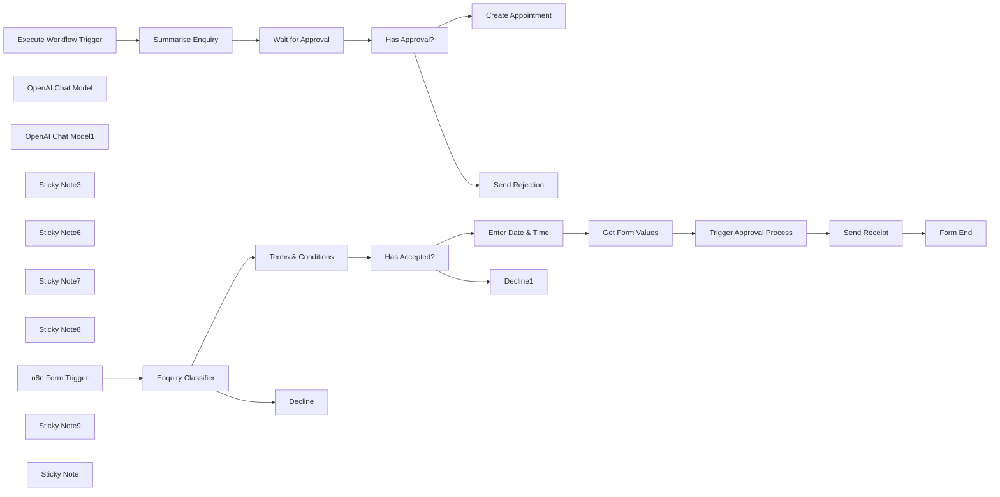

## Fluxo (.json) :

```json
{
  "meta": {
    "instanceId": "408f9fb9940c3cb18ffdef0e0150fe342d6e655c3a9fac21f0f644e8bedabcd9"
  },
  "nodes": [
    {
      "id": "76589d1c-45f3-4a89-906f-8ef300d34964",
      "name": "n8n Form Trigger",
      "type": "n8n-nodes-base.formTrigger",
      "position": [
        -2520,
        -280
      ],
      "webhookId": "5e7637dd-d222-4786-8cdc-7b66cebc1481",
      "parameters": {
        "path": "schedule_appointment",
        "options": {
          "ignoreBots": true,
          "appendAttribution": true,
          "useWorkflowTimezone": true
        },
        "formTitle": "Schedule an Appointment",
        "formFields": {
          "values": [
            {
              "fieldLabel": "Your Name",
              "placeholder": "eg. Sam Smith",
              "requiredField": true
            },
            {
              "fieldType": "email",
              "fieldLabel": "Email",
              "placeholder": "eg. sam@example.com",
              "requiredField": true
            },
            {
              "fieldType": "textarea",
              "fieldLabel": "Enquiry",
              "placeholder": "eg. I'm looking for...",
              "requiredField": true
            }
          ]
        },
        "formDescription": "Welcome to Jim's Appointment Form.\nBefore we set a date, please tell me a little about yourself and how I can help."
      },
      "typeVersion": 2.1
    },
    {
      "id": "194b7073-fa33-4e75-85ed-c02724c8075c",
      "name": "Form End",
      "type": "n8n-nodes-base.form",
      "position": [
        -420,
        -260
      ],
      "webhookId": "8fcc907b-bc2e-4fdf-a829-82c83e677724",
      "parameters": {
        "options": {
          "formTitle": "Appointment Request Sent!"
        },
        "operation": "completion",
        "completionTitle": "Appointment Request Sent!",
        "completionMessage": "=Thank you for submitting an appointment request. A confirmation of this request will be sent to your inbox. I'll get back to you shortly with a confirmation of the appointment.\n\nHere is the summary of the appointment request.\n\nName: {{ $('Get Form Values').item.json.name }}\nDate & Time: {{ DateTime.fromISO($('Get Form Values').item.json.dateTime).format('EEE, dd MMM @ t') }}\nEnquiry: {{ $('Get Form Values').item.json.enquiry.trim() }}\n"
      },
      "typeVersion": 1
    },
    {
      "id": "688ea2cc-b595-4b6f-9214-d5dfd3893172",
      "name": "Enter Date & Time",
      "type": "n8n-nodes-base.form",
      "position": [
        -1260,
        -320
      ],
      "webhookId": "0cd03415-66f8-4c82-8069-5bfd8ea310bd",
      "parameters": {
        "options": {
          "formTitle": "Enter a Date & Time",
          "formDescription": "=Please select a date and time"
        },
        "defineForm": "json",
        "jsonOutput": "={{\n[\n {\n \"fieldLabel\":\"Date\",\n \"requiredField\":true,\n \"fieldType\": \"dropdown\",\n \"fieldOptions\":\n Array(5).fill(0)\n .map((_,idx) => $now.plus(idx+1, 'day'))\n .filter(d => !d.isWeekend)\n .map(d => ({ option: d.format('EEE, d MMM') }))\n },\n {\n \"fieldLabel\": \"Time\",\n \"requiredField\": true,\n \"fieldType\": \"dropdown\",\n \"fieldOptions\": [\n { \"option\": \"9:00 am\" },\n { \"option\": \"10:00 am\" },\n { \"option\": \"11:00 am\" },\n { \"option\": \"12:00 pm\" },\n { \"option\": \"1:00 pm\" },\n { \"option\": \"2:00 pm\" },\n { \"option\": \"3:00 pm\" },\n { \"option\": \"4:00 pm\" },\n { \"option\": \"5:00 pm\" },\n { \"option\": \"6:00 pm\" }\n ]\n }\n]\n}}"
      },
      "typeVersion": 1
    },
    {
      "id": "602c40f9-ab11-4908-aab3-1a199126e097",
      "name": "Get Form Values",
      "type": "n8n-nodes-base.set",
      "position": [
        -900,
        -260
      ],
      "parameters": {
        "mode": "raw",
        "options": {},
        "jsonOutput": "={{\n{\n name: $('n8n Form Trigger').first().json['Your Name'],\n email: $('n8n Form Trigger').first().json.Email,\n enquiry: $('n8n Form Trigger').first().json.Enquiry,\n dateTime: DateTime.fromFormat(`${$json.Date} ${$json.Time}`, \"EEE, dd MMM t\"),\n submittedAt: $('n8n Form Trigger').first().json.submittedAt,\n}\n}}"
      },
      "typeVersion": 3.4
    },
    {
      "id": "21f93645-5e27-4e9f-a72c-47a39e42a79c",
      "name": "Terms & Conditions",
      "type": "n8n-nodes-base.form",
      "position": [
        -1680,
        -240
      ],
      "webhookId": "dcf32f99-8fb7-457a-8a58-ac1a018b1873",
      "parameters": {
        "options": {
          "formTitle": "Before we continue...",
          "formDescription": "=Terms and Conditions for Booking an Appointment\n\nNon-Binding Nature of Discussions:\nAny information shared, discussed, or agreed upon during the call is non-binding and provisional. No agreement, service, or commitment shall be considered confirmed unless explicitly documented and agreed to in writing.\n\nProhibition of Recording and Note-Taking Tools:\nBy proceeding with the appointment, the user agrees not to use AI assistants, note-taking applications, recording devices, or any other technology to record or transcribe the conversation, whether manually or automatically. This is to ensure confidentiality and respect for the integrity of the discussion.\n\nConfirmation of Understanding:\nBy booking this appointment, you acknowledge and accept these terms and conditions in full."
        },
        "formFields": {
          "values": [
            {
              "fieldType": "dropdown",
              "fieldLabel": "Please select",
              "multiselect": true,
              "fieldOptions": {
                "values": [
                  {
                    "option": "I accept the terms and conditions"
                  }
                ]
              },
              "requiredField": true
            }
          ]
        }
      },
      "typeVersion": 1
    },
    {
      "id": "22e03fec-bd56-4fc3-864a-f1e81a864cb5",
      "name": "OpenAI Chat Model",
      "type": "@n8n/n8n-nodes-langchain.lmChatOpenAi",
      "position": [
        -2340,
        -140
      ],
      "parameters": {
        "options": {}
      },
      "credentials": {
        "openAiApi": {
          "id": "8gccIjcuf3gvaoEr",
          "name": "OpenAi account"
        }
      },
      "typeVersion": 1
    },
    {
      "id": "8b4e9bba-cd57-46af-8042-4b47e5ebcd82",
      "name": "Has Accepted?",
      "type": "n8n-nodes-base.if",
      "position": [
        -1500,
        -240
      ],
      "parameters": {
        "options": {},
        "conditions": {
          "options": {
            "version": 2,
            "leftValue": "",
            "caseSensitive": true,
            "typeValidation": "strict"
          },
          "combinator": "and",
          "conditions": [
            {
              "id": "bc7c3e99-e610-4997-82a7-4851f2c04c19",
              "operator": {
                "type": "string",
                "operation": "startsWith"
              },
              "leftValue": "={{ $json[\"Please select\"] }}",
              "rightValue": "I accept"
            }
          ]
        }
      },
      "typeVersion": 2.2
    },
    {
      "id": "627a4c00-e831-4a77-8aad-f417f0f8e6dd",
      "name": "Send Receipt",
      "type": "n8n-nodes-base.gmail",
      "position": [
        -580,
        -260
      ],
      "webhookId": "5f590407-4ab9-4ae6-bb85-38dbe41d6dce",
      "parameters": {
        "sendTo": "={{ $('Get Form Values').first().json.email }}",
        "message": "=<p>Dear {{ $('Get Form Values').first().json.name }},</p>\n<p>Thanks for requesting an appointment. We will review and get back to you shortly.</p>\n<p>Here is the summary of the request that was sent:</p>\n<p>\nName: {{ $('Get Form Values').first().json.name }}<br/>\nEmail: {{ $('Get Form Values').first().json.email }}<br/>\nEnquiry: {{ $('Get Form Values').first().json.enquiry }}<br/>\nSubmitted at: {{ $('Get Form Values').first().json.submittedAt }}\n</p>\n",
        "options": {},
        "subject": "=Appointment Request Received for {{ DateTime.fromISO($('Get Form Values').first().json.dateTime).format('EEE, dd MMM @ t') }}"
      },
      "credentials": {
        "gmailOAuth2": {
          "id": "Sf5Gfl9NiFTNXFWb",
          "name": "Gmail account"
        }
      },
      "typeVersion": 2.1
    },
    {
      "id": "91d3dd7d-53f8-4f8e-9af2-ec54cf7f42ad",
      "name": "Wait for Approval",
      "type": "n8n-nodes-base.gmail",
      "position": [
        340,
        -260
      ],
      "webhookId": "ab9c6c5e-334d-44bb-a8fd-a58140bc680d",
      "parameters": {
        "sendTo": "=admin@example.com",
        "message": "=<h2>A new appointment request was submitted!</h2>\n<p>\nRequesting appointment date is <strong>{{ DateTime.fromISO($('Execute Workflow Trigger').item.json.dateTime).format('EEE, dd MMM @ t') }}</strong>.\n</p>\n<p>\nName: {{ $('Execute Workflow Trigger').first().json.name }}<br/>\nEmail: {{ $('Execute Workflow Trigger').first().json.email }}<br/>\nEnquiry Summary: {{ $json.text }}<br/>\nSubmitted at: {{ $('Execute Workflow Trigger').first().json.submittedAt }}\n</p>",
        "subject": "New Appointment Request!",
        "operation": "sendAndWait",
        "approvalOptions": {
          "values": {
            "approvalType": "double",
            "approveLabel": "Confirm"
          }
        }
      },
      "credentials": {
        "gmailOAuth2": {
          "id": "Sf5Gfl9NiFTNXFWb",
          "name": "Gmail account"
        }
      },
      "typeVersion": 2.1
    },
    {
      "id": "7a02b57b-b9b1-45b1-9b3d-aebb84259875",
      "name": "Has Approval?",
      "type": "n8n-nodes-base.if",
      "position": [
        520,
        -260
      ],
      "parameters": {
        "options": {},
        "conditions": {
          "options": {
            "version": 2,
            "leftValue": "",
            "caseSensitive": true,
            "typeValidation": "strict"
          },
          "combinator": "and",
          "conditions": [
            {
              "id": "e5e37acb-9e9d-4a9e-bf59-a35dfc035886",
              "operator": {
                "type": "boolean",
                "operation": "true",
                "singleValue": true
              },
              "leftValue": "={{ $json.data.approved }}",
              "rightValue": ""
            }
          ]
        }
      },
      "typeVersion": 2.2
    },
    {
      "id": "96aab8be-4c5e-4e14-a6ea-6d2b743551be",
      "name": "OpenAI Chat Model1",
      "type": "@n8n/n8n-nodes-langchain.lmChatOpenAi",
      "position": [
        0,
        -120
      ],
      "parameters": {
        "options": {}
      },
      "credentials": {
        "openAiApi": {
          "id": "8gccIjcuf3gvaoEr",
          "name": "OpenAi account"
        }
      },
      "typeVersion": 1
    },
    {
      "id": "6f2b5454-70a3-4391-b785-bb871c3e2081",
      "name": "Create Appointment",
      "type": "n8n-nodes-base.googleCalendar",
      "position": [
        720,
        -340
      ],
      "parameters": {
        "end": "={{ DateTime.fromISO($('Execute Workflow Trigger').first().json.dateTime).plus(30, 'minute').toISO() }}",
        "start": "={{ $('Execute Workflow Trigger').first().json.dateTime }}",
        "calendar": {
          "__rl": true,
          "mode": "list",
          "value": "c_5792bdf04bc395cbcbc6f7b754268245a33779d36640cc80a357711aa2f09a0a@group.calendar.google.com",
          "cachedResultName": "n8n-events"
        },
        "additionalFields": {
          "summary": "=Appointment Scheduled - {{ $('Execute Workflow Trigger').item.json.name }} & Jim",
          "attendees": [
            "={{ $('Execute Workflow Trigger').item.json.email }}"
          ],
          "description": "={{ $('Summarise Enquiry').first().json.text }}\n\nOriginal message:\n> {{ $('Execute Workflow Trigger').item.json.enquiry }}",
          "conferenceDataUi": {
            "conferenceDataValues": {
              "conferenceSolution": "hangoutsMeet"
            }
          }
        }
      },
      "credentials": {
        "googleCalendarOAuth2Api": {
          "id": "kWMxmDbMDDJoYFVK",
          "name": "Google Calendar account"
        }
      },
      "typeVersion": 1.2
    },
    {
      "id": "e6881867-5b3c-4b85-b06a-a0a3c01be227",
      "name": "Send Rejection",
      "type": "n8n-nodes-base.gmail",
      "position": [
        720,
        -180
      ],
      "webhookId": "5f590407-4ab9-4ae6-bb85-38dbe41d6dce",
      "parameters": {
        "sendTo": "={{ $('Execute Workflow Trigger').first().json.email }}",
        "message": "=<p>Dear {{ $('Execute Workflow Trigger').first().json.name }},</p>\n<p>Unfortunately, we cannot schedule the requested appointment at the requested time.</p>\n<p>Kind regards</p>\n",
        "options": {},
        "subject": "=Appointment Request Rejected for {{ DateTime.fromISO($('Execute Workflow Trigger').first().json.dateTime).format('EEE, dd MMM @ t') }}"
      },
      "credentials": {
        "gmailOAuth2": {
          "id": "Sf5Gfl9NiFTNXFWb",
          "name": "Gmail account"
        }
      },
      "typeVersion": 2.1
    },
    {
      "id": "40785eca-943c-45f6-b4a9-0c95538621ed",
      "name": "Sticky Note3",
      "type": "n8n-nodes-base.stickyNote",
      "position": [
        -2580,
        -555.2889298043726
      ],
      "parameters": {
        "color": 7,
        "width": 763.0427617951669,
        "height": 611.898918296892,
        "content": "## 1. Qualify Enquiries Using AI\n[Learn more about the text classifier](https://docs.n8n.io/integrations/builtin/cluster-nodes/root-nodes/n8n-nodes-langchain.text-classifier/)\n\nWith n8n's multi-forms, you’re no longer stuck creating long, overwhelming forms. Instead, you have more flexibility and control to design smarter, more engaging form experiences.\n\nIn this demo, we’ll explore an appointment request scenario where a user wants to schedule a call to discuss their inquiry. However, not all inquiries require a meeting, making it a perfect use case for AI to pre-qualify the request. We can handle this validation using the text classifier node."
      },
      "typeVersion": 1
    },
    {
      "id": "985be8d1-e77a-475b-9ac2-dba163dbd950",
      "name": "Sticky Note6",
      "type": "n8n-nodes-base.stickyNote",
      "position": [
        -1800,
        -549.8684464902185
      ],
      "parameters": {
        "color": 7,
        "width": 781.472405063291,
        "height": 606.0718987341766,
        "content": "## 2. Split Form For Better User Experience\n[Learn more about the forms](https://docs.n8n.io/integrations/builtin/core-nodes/n8n-nodes-base.form)\n\nOnboarding is a great reason to split your big form into smaller ones. Taking the user through a step by step process ensures a smooth experience and keeps them engaged throughout.\n\nHere, we take the opportunity of the extra context space to display a terms and conditions which the user must agree to making their request. The next form then asks for desired date and time of the event."
      },
      "typeVersion": 1
    },
    {
      "id": "9b0a3f0e-e15d-4d0e-b620-1acc78bf812c",
      "name": "Decline",
      "type": "n8n-nodes-base.form",
      "position": [
        -2020,
        -160
      ],
      "webhookId": "4353eadb-b7a0-45f2-8dd8-5f6cd882d8d8",
      "parameters": {
        "options": {},
        "operation": "completion",
        "completionTitle": "Send me a DM Instead!",
        "completionMessage": "Thanks for your enquiry but it may not necessarily need an appointment. Please feel free to email me instead at jim@example.com."
      },
      "typeVersion": 1
    },
    {
      "id": "fcd3eb7d-6389-4c07-97cc-275ae387c963",
      "name": "Decline1",
      "type": "n8n-nodes-base.form",
      "position": [
        -1260,
        -160
      ],
      "webhookId": "4353eadb-b7a0-45f2-8dd8-5f6cd882d8d8",
      "parameters": {
        "options": {},
        "operation": "completion",
        "completionTitle": "Send me a DM Instead!",
        "completionMessage": "Thanks for your enquiry but it may not necessarily need an appointment. Please feel free to email me instead at jim@example.com."
      },
      "typeVersion": 1
    },
    {
      "id": "d89427cb-fffb-4aa4-b55c-b315fa0e92be",
      "name": "Sticky Note7",
      "type": "n8n-nodes-base.stickyNote",
      "position": [
        -1000,
        -498.80432681242814
      ],
      "parameters": {
        "color": 7,
        "width": 792.9401150747982,
        "height": 497.4250863060987,
        "content": "## 3. Send Acknowledgement to User and Start Approval Process\n[Learn more about the Gmail node](https://docs.n8n.io/integrations/builtin/app-nodes/n8n-nodes-base.gmail/)\n\nOnce all form steps are concluded, we can send a notification to the requester via email and in the background, trigger another email to the admin to initiate the approval process. The approval process works in a separate execution so doesn't interrupt the user's form experience."
      },
      "typeVersion": 1
    },
    {
      "id": "041081e1-ee98-4b40-aa14-1980b23f4031",
      "name": "Sticky Note8",
      "type": "n8n-nodes-base.stickyNote",
      "position": [
        -160,
        -620
      ],
      "parameters": {
        "color": 7,
        "width": 609.4228768699652,
        "height": 287.178089758343,
        "content": "## 4. Approve or Decline Appointment\n[Learn more about the Waiting for Approval](https://docs.n8n.io/integrations/builtin/app-nodes/n8n-nodes-base.gmail/message-operations/#send-a-message-and-wait-for-approval)\n\nThe Wait for Approval feature for Gmail is a special operation which allows for human-in-the-loop interaction in n8n workflows. In this example, the human interaction is the approval of the appointment request. The feature will put the workflow in a waiting state where a message is sent to the admin with 2 buttons: confirm and decline.\n\nWhen the admin clicks on the confirm button, the workflow resumes from the Gmail node and a meeting event is created for the requesting user in Google Calendar.\n\nWhen declined, a rejection email is sent to the requester instead."
      },
      "typeVersion": 1
    },
    {
      "id": "d6af0f50-234f-46ca-aa41-7f3891aff8a3",
      "name": "Trigger Approval Process",
      "type": "n8n-nodes-base.executeWorkflow",
      "position": [
        -740,
        -260
      ],
      "parameters": {
        "mode": "each",
        "options": {
          "waitForSubWorkflow": false
        },
        "workflowId": {
          "__rl": true,
          "mode": "id",
          "value": "={{ $workflow.id }}"
        }
      },
      "typeVersion": 1.1
    },
    {
      "id": "e524d6df-9b6d-4d61-8e71-08a0d3a751d7",
      "name": "Execute Workflow Trigger",
      "type": "n8n-nodes-base.executeWorkflowTrigger",
      "position": [
        -160,
        -260
      ],
      "parameters": {},
      "typeVersion": 1
    },
    {
      "id": "74dccbc1-7728-4336-a18a-2541007fd369",
      "name": "Summarise Enquiry",
      "type": "@n8n/n8n-nodes-langchain.chainLlm",
      "position": [
        0,
        -260
      ],
      "parameters": {
        "text": "=The enquiry is as follows:\n{{ $('Execute Workflow Trigger').first().json.enquiry.substring(0, 500) }}",
        "messages": {
          "messageValues": [
            {
              "message": "Summarise the given enquiry"
            }
          ]
        },
        "promptType": "define"
      },
      "typeVersion": 1.5
    },
    {
      "id": "b74f0f5a-39f0-4db3-beba-03caf981c5d2",
      "name": "Sticky Note9",
      "type": "n8n-nodes-base.stickyNote",
      "position": [
        -3080,
        -640
      ],
      "parameters": {
        "width": 468.6766398158801,
        "height": 690.6653164556957,
        "content": "## Try it out!\n\n### This n8n template is a simple appointment scheduling workflow using n8n forms with AI thrown in the mix for good measure. It also uses n8n's wait for approval feature which allows the ability to confirm appointment requests and create events in Google Calendar.\n\n### How it works\n* We start with a form trigger which asks for the purpose of the appointment.\n* Instantly, we can qualify this by using a text classifier node which uses AI's contextual understanding to ensure the appointment is worthwhile. If not, an alternative is suggested instead.\n* Multi-page forms are then used to set the terms of the appointment and ask the user for a desired date and time.\n* An acknowledgement is sent to the user while an approval by email process is triggered in the background.\n* In a subworkflow, we use Gmail with the wait for approval operation to send an approval form to the admin user who can either confirm or decline the appointment request.\n* When approved, a Google Calendar event is created. When declined, the user is notified via email that the appointment request was declined.\n\n### Need Help?\nJoin the [Discord](https://discord.com/invite/XPKeKXeB7d) or ask in the [Forum](https://community.n8n.io/)!\n\nHappy Hacking!\n"
      },
      "typeVersion": 1
    },
    {
      "id": "d3c87dfa-d6e5-402a-89e5-6d8f93b824a6",
      "name": "Sticky Note",
      "type": "n8n-nodes-base.stickyNote",
      "position": [
        299,
        -280
      ],
      "parameters": {
        "width": 177.66444188722656,
        "height": 257.56869965477557,
        "content": "\n\n\n\n\n\n\n\n\n\n\n\n\n\n\n### 🚨 Set your admin email here!"
      },
      "typeVersion": 1
    },
    {
      "id": "6351121d-6ebe-432d-b370-13296fd58e1a",
      "name": "Enquiry Classifier",
      "type": "@n8n/n8n-nodes-langchain.textClassifier",
      "position": [
        -2340,
        -280
      ],
      "parameters": {
        "options": {
          "fallback": "other"
        },
        "inputText": "={{ $json.Enquiry }}",
        "categories": {
          "categories": [
            {
              "category": "relevant enquiry",
              "description": "Enquire about AI, automation, digital products and product engineering."
            }
          ]
        }
      },
      "typeVersion": 1
    }
  ],
  "pinData": {},
  "connections": {
    "Send Receipt": {
      "main": [
        [
          {
            "node": "Form End",
            "type": "main",
            "index": 0
          }
        ]
      ]
    },
    "Has Accepted?": {
      "main": [
        [
          {
            "node": "Enter Date & Time",
            "type": "main",
            "index": 0
          }
        ],
        [
          {
            "node": "Decline1",
            "type": "main",
            "index": 0
          }
        ]
      ]
    },
    "Has Approval?": {
      "main": [
        [
          {
            "node": "Create Appointment",
            "type": "main",
            "index": 0
          }
        ],
        [
          {
            "node": "Send Rejection",
            "type": "main",
            "index": 0
          }
        ]
      ]
    },
    "Get Form Values": {
      "main": [
        [
          {
            "node": "Trigger Approval Process",
            "type": "main",
            "index": 0
          }
        ]
      ]
    },
    "n8n Form Trigger": {
      "main": [
        [
          {
            "node": "Enquiry Classifier",
            "type": "main",
            "index": 0
          }
        ]
      ]
    },
    "Enter Date & Time": {
      "main": [
        [
          {
            "node": "Get Form Values",
            "type": "main",
            "index": 0
          }
        ]
      ]
    },
    "OpenAI Chat Model": {
      "ai_languageModel": [
        [
          {
            "node": "Enquiry Classifier",
            "type": "ai_languageModel",
            "index": 0
          }
        ]
      ]
    },
    "Summarise Enquiry": {
      "main": [
        [
          {
            "node": "Wait for Approval",
            "type": "main",
            "index": 0
          }
        ]
      ]
    },
    "Wait for Approval": {
      "main": [
        [
          {
            "node": "Has Approval?",
            "type": "main",
            "index": 0
          }
        ]
      ]
    },
    "Enquiry Classifier": {
      "main": [
        [
          {
            "node": "Terms & Conditions",
            "type": "main",
            "index": 0
          }
        ],
        [
          {
            "node": "Decline",
            "type": "main",
            "index": 0
          }
        ]
      ]
    },
    "OpenAI Chat Model1": {
      "ai_languageModel": [
        [
          {
            "node": "Summarise Enquiry",
            "type": "ai_languageModel",
            "index": 0
          }
        ]
      ]
    },
    "Terms & Conditions": {
      "main": [
        [
          {
            "node": "Has Accepted?",
            "type": "main",
            "index": 0
          }
        ]
      ]
    },
    "Execute Workflow Trigger": {
      "main": [
        [
          {
            "node": "Summarise Enquiry",
            "type": "main",
            "index": 0
          }
        ]
      ]
    },
    "Trigger Approval Process": {
      "main": [
        [
          {
            "node": "Send Receipt",
            "type": "main",
            "index": 0
          }
        ]
      ]
    }
  }
}
```

<a id="template-596"></a>

## Template 596 - Sincronização diária de novos contatos para Mailchimp

- **Nome:** Sincronização diária de novos contatos para Mailchimp
- **Descrição:** Agenda diariamente a busca por novos contatos criados no HubSpot no dia anterior e os adiciona como assinantes em uma lista do Mailchimp.
- **Funcionalidade:** • Agendamento diário às 07:00: Executa o fluxo automaticamente todos os dias às 07:00.
• Busca de contatos criados no dia anterior: Pesquisa contatos no HubSpot filtrando pela data de criação referente ao dia anterior.
• Adição de membros ao Mailchimp: Para cada contato encontrado, cria/inscreve um membro na lista do Mailchimp usando email, primeiro nome e sobrenome.
- **Ferramentas:** • HubSpot: CRM utilizado para armazenar e pesquisar contatos, permitindo filtrar por data de criação.
• Mailchimp: Plataforma de email marketing para adicionar assinantes a uma lista e preencher campos de nome e sobrenome.


## Fluxo visual

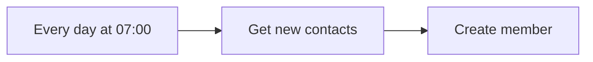

## Fluxo (.json) :

```json
{
  "meta": {
    "instanceId": "4eea70f6789129b82c5f438f374db25affb0eba28902cc3663e308cff7659044"
  },
  "nodes": [
    {
      "id": "30d8dca1-8e70-443e-a5b0-a048d6e3dc1c",
      "name": "Every day at 07:00",
      "type": "n8n-nodes-base.cron",
      "position": [
        480,
        300
      ],
      "parameters": {
        "triggerTimes": {
          "item": [
            {
              "hour": 7
            }
          ]
        }
      },
      "typeVersion": 1
    },
    {
      "id": "1e7b278f-7c6f-473c-acda-51fa5cf6bd00",
      "name": "Get new contacts",
      "type": "n8n-nodes-base.hubspot",
      "position": [
        700,
        300
      ],
      "parameters": {
        "resource": "contact",
        "operation": "search",
        "authentication": "oAuth2",
        "filterGroupsUi": {
          "filterGroupsValues": [
            {
              "filtersUi": {
                "filterValues": [
                  {
                    "value": "={{$today.minus({day:1}).toMillis()}}",
                    "operator": "GTE",
                    "propertyName": "createdate"
                  },
                  {
                    "value": "={{$today.toMillis()}}",
                    "operator": "LT",
                    "propertyName": "createdate"
                  }
                ]
              }
            }
          ]
        },
        "additionalFields": {}
      },
      "credentials": {
        "hubspotOAuth2Api": {
          "id": "34",
          "name": "HubSpot account 2"
        }
      },
      "typeVersion": 1
    },
    {
      "id": "003da27c-752e-47b6-b263-c90060b677f5",
      "name": "Create member",
      "type": "n8n-nodes-base.mailchimp",
      "position": [
        920,
        300
      ],
      "parameters": {
        "list": "8965eba136",
        "email": "={{ $json[\"properties\"].email }}",
        "status": "subscribed",
        "options": {},
        "mergeFieldsUi": {
          "mergeFieldsValues": [
            {
              "name": "FNAME",
              "value": "={{ $json[\"properties\"].firstname }}"
            },
            {
              "name": "LNAME",
              "value": "={{ $json[\"properties\"].lastname }}"
            }
          ]
        },
        "authentication": "oAuth2"
      },
      "credentials": {
        "mailchimpOAuth2Api": {
          "id": "25",
          "name": "Mailchimp account"
        }
      },
      "typeVersion": 1
    }
  ],
  "connections": {
    "Get new contacts": {
      "main": [
        [
          {
            "node": "Create member",
            "type": "main",
            "index": 0
          }
        ]
      ]
    },
    "Every day at 07:00": {
      "main": [
        [
          {
            "node": "Get new contacts",
            "type": "main",
            "index": 0
          }
        ]
      ]
    }
  }
}
```

<a id="template-597"></a>

## Template 597 - Moderação de spam no Discord

- **Nome:** Moderação de spam no Discord
- **Descrição:** Automatiza a detecção e moderação de mensagens de spam em canais do Discord usando classificação por IA e intervenção humana.
- **Funcionalidade:** • Varredura agendada de mensagens: Busca periodicamente as mensagens mais recentes em canais definidos.
• Remoção de duplicatas: Evita reprocessar mensagens já analisadas em execuções anteriores.
• Agrupamento por usuário: Consolida mensagens por autor para reduzir notificações e facilitar a revisão.
• Classificação por IA: Usa um modelo de linguagem para identificar se cada mensagem é spam ou não.
• Marcação e filtragem: Atribui flags de spam e separa apenas as mensagens sinalizadas para revisão.
• Notificação com espera por resposta: Envia um resumo para moderadores com um formulário para escolher ações e aguarda a decisão.
• Ações de moderação executáveis: Permite excluir mensagens, enviar advertência ao usuário por mensagem direta ou não tomar ação, conforme escolha humana.
• Processamento concorrente via subworkflows: Executa revisões sem bloquear o processamento de outros usuários.
- **Ferramentas:** • Discord: Plataforma de chat usada para ler mensagens do canal, enviar notificações aos moderadores, excluir mensagens e enviar mensagens diretas aos usuários.
• OpenAI: Serviço de modelo de linguagem (ex.: o3-mini) utilizado para classificar mensagens como spam ou não por meio de raciocínio de IA.

## Fluxo visual

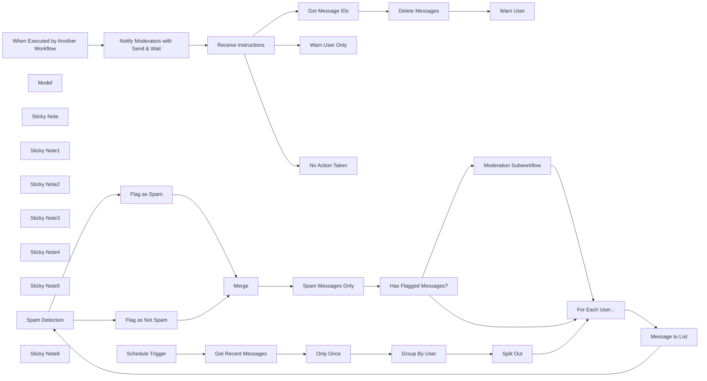

## Fluxo (.json) :

```json
{
  "meta": {
    "instanceId": "408f9fb9940c3cb18ffdef0e0150fe342d6e655c3a9fac21f0f644e8bedabcd9",
    "templateCredsSetupCompleted": true
  },
  "nodes": [
    {
      "id": "59b7eed3-8622-4722-b93f-f225cc0aa4e0",
      "name": "Spam Detection",
      "type": "@n8n/n8n-nodes-langchain.textClassifier",
      "position": [
        260,
        100
      ],
      "parameters": {
        "options": {},
        "inputText": "={{ $json.content }}",
        "categories": {
          "categories": [
            {
              "category": "is_spam",
              "description": "This text is a promotion, sales pitch or likely spam message to get members to visit another site."
            },
            {
              "category": "is_not_spam",
              "description": "This text is not spam."
            }
          ]
        }
      },
      "typeVersion": 1
    },
    {
      "id": "74420874-d831-4ff0-a8f4-e7c3b6551c57",
      "name": "Get Recent Messages",
      "type": "n8n-nodes-base.discord",
      "position": [
        -1020,
        40
      ],
      "webhookId": "7aa72e1f-06f4-4fe8-82ec-ad0e87a5b6b9",
      "parameters": {
        "guildId": {
          "__rl": true,
          "mode": "id",
          "value": "123456789"
        },
        "options": {
          "simplify": true
        },
        "resource": "message",
        "channelId": {
          "__rl": true,
          "mode": "list",
          "value": "1248678443432808512",
          "cachedResultUrl": "https://discord.com/channels/1248678443432808509/1248678443432808512",
          "cachedResultName": "general"
        },
        "operation": "getAll"
      },
      "credentials": {
        "discordBotApi": {
          "id": "YUwD52E3oHsSUWdW",
          "name": "Discord Bot account"
        }
      },
      "typeVersion": 2
    },
    {
      "id": "6db26c7e-f1eb-45b8-a444-01270fab157f",
      "name": "Only Once",
      "type": "n8n-nodes-base.removeDuplicates",
      "position": [
        -820,
        40
      ],
      "parameters": {
        "options": {
          "historySize": 100
        },
        "operation": "removeItemsSeenInPreviousExecutions",
        "dedupeValue": "={{ $json.id }}"
      },
      "typeVersion": 2
    },
    {
      "id": "36923da1-5ebc-40fc-9780-74845ff2b268",
      "name": "Model",
      "type": "@n8n/n8n-nodes-langchain.lmChatOpenAi",
      "position": [
        240,
        260
      ],
      "parameters": {
        "model": {
          "__rl": true,
          "mode": "list",
          "value": "o3-mini",
          "cachedResultName": "o3-mini"
        },
        "options": {}
      },
      "credentials": {
        "openAiApi": {
          "id": "8gccIjcuf3gvaoEr",
          "name": "OpenAi account"
        }
      },
      "typeVersion": 1.2
    },
    {
      "id": "af01bb60-fdef-4fa1-bf33-1862a18ebc99",
      "name": "Warn User",
      "type": "n8n-nodes-base.discord",
      "position": [
        2880,
        20
      ],
      "webhookId": "88bdd468-8eb9-41b8-b017-1deec91c9498",
      "parameters": {
        "sendTo": "user",
        "userId": {
          "__rl": true,
          "mode": "id",
          "value": "={{ $('When Executed by Another Workflow').first().json.author.id }}"
        },
        "content": "=Warning: Please do not spam our channels\nYour message was deleted to be in violation of our community terms & conditions and was subsequently deleted.\n\nFurther violations will result in a ban.\n\nIf you think this is a mistake, please message the moderation team.",
        "guildId": {
          "__rl": true,
          "mode": "id",
          "value": "123456789"
        },
        "options": {},
        "resource": "message"
      },
      "credentials": {
        "discordBotApi": {
          "id": "YUwD52E3oHsSUWdW",
          "name": "Discord Bot account"
        }
      },
      "typeVersion": 2
    },
    {
      "id": "04e9f167-f816-4056-813a-3168dc22f209",
      "name": "Warn User Only",
      "type": "n8n-nodes-base.discord",
      "position": [
        2540,
        180
      ],
      "webhookId": "88bdd468-8eb9-41b8-b017-1deec91c9498",
      "parameters": {
        "sendTo": "user",
        "userId": {
          "__rl": true,
          "mode": "id",
          "value": "={{ $('When Executed by Another Workflow').first().json.author.id }}"
        },
        "content": "=Warning: Please do not spam our channels\nYour message was flagged to be in violation of our community terms & conditions. Please consider other members before posting.\n\nFurther violations will result in a ban.\n\nIf you think this is a mistake, please message the moderation team.",
        "guildId": {
          "__rl": true,
          "mode": "id",
          "value": "123456789"
        },
        "options": {},
        "resource": "message"
      },
      "credentials": {
        "discordBotApi": {
          "id": "YUwD52E3oHsSUWdW",
          "name": "Discord Bot account"
        }
      },
      "typeVersion": 2
    },
    {
      "id": "41240c95-c5c1-4ac2-81e7-782ff8f3511b",
      "name": "Group By User",
      "type": "n8n-nodes-base.code",
      "position": [
        -540,
        100
      ],
      "parameters": {
        "jsCode": "const groupByUser = {};\n\nfor (const item of $input.all()) {\n  if (!groupByUser[item.json.author.id]) {\n    groupByUser[item.json.author.id] = [];\n  }\n  groupByUser[item.json.author.id].push(item.json);\n}\n\nreturn { json : { groupByUser } };"
      },
      "typeVersion": 2
    },
    {
      "id": "03d56683-c307-455d-bd03-84107d30f328",
      "name": "For Each User...",
      "type": "n8n-nodes-base.splitInBatches",
      "position": [
        -160,
        100
      ],
      "parameters": {
        "options": {}
      },
      "typeVersion": 3
    },
    {
      "id": "e7eb71a8-cfe5-4e3b-81c1-66ea18cc55ec",
      "name": "Split Out",
      "type": "n8n-nodes-base.splitOut",
      "position": [
        -360,
        100
      ],
      "parameters": {
        "options": {},
        "fieldToSplitOut": "groupByUser"
      },
      "typeVersion": 1
    },
    {
      "id": "b74a7092-2b51-452b-bf29-6620969b3efb",
      "name": "Message to List",
      "type": "n8n-nodes-base.code",
      "position": [
        100,
        100
      ],
      "parameters": {
        "jsCode": "const messages = $input.first().json;\nreturn Object.keys(messages).map(key => messages[key]);"
      },
      "typeVersion": 2
    },
    {
      "id": "762e3a5e-e013-4ca3-a2a9-cf7d5b0dd3f4",
      "name": "Notify Moderators with Send & Wait",
      "type": "n8n-nodes-base.discord",
      "position": [
        1980,
        180
      ],
      "webhookId": "644a85f3-5add-4321-9d8a-bcc4acfa33f1",
      "parameters": {
        "guildId": {
          "__rl": true,
          "mode": "id",
          "value": "123456789"
        },
        "message": "=**Spam Detected**\nUser: @{{ $json.author.username }}\nMessage:\n{{\n$input.all().map(item =>\n  `* [${DateTime.fromISO(item.json.timestamp).format('yyyy-MM-dd @ hh:mm')}] ${item.json.content}`).join('\\n')\n}}",
        "options": {},
        "resource": "message",
        "channelId": {
          "__rl": true,
          "mode": "id",
          "value": "=_moderation"
        },
        "operation": "sendAndWait",
        "formFields": {
          "values": [
            {
              "fieldType": "dropdown",
              "fieldLabel": "Action",
              "fieldOptions": {
                "values": [
                  {
                    "option": "Delete Message and Warn User"
                  },
                  {
                    "option": "Do nothing and Warn User"
                  },
                  {
                    "option": "Do nothing"
                  }
                ]
              },
              "requiredField": true
            }
          ]
        },
        "responseType": "customForm"
      },
      "credentials": {
        "discordBotApi": {
          "id": "YUwD52E3oHsSUWdW",
          "name": "Discord Bot account"
        }
      },
      "executeOnce": true,
      "typeVersion": 2
    },
    {
      "id": "f35bc6b0-855c-451b-aee7-e2af4e268893",
      "name": "Flag as Spam",
      "type": "n8n-nodes-base.set",
      "position": [
        620,
        0
      ],
      "parameters": {
        "options": {},
        "assignments": {
          "assignments": [
            {
              "id": "e1eddfbe-c32d-4a3b-9660-07800f52f4c4",
              "name": "is_spam",
              "type": "boolean",
              "value": true
            }
          ]
        },
        "includeOtherFields": true
      },
      "typeVersion": 3.4
    },
    {
      "id": "f77a0101-d209-4d3c-ab4a-405579a1f539",
      "name": "Flag as Not Spam",
      "type": "n8n-nodes-base.set",
      "position": [
        620,
        200
      ],
      "parameters": {
        "options": {},
        "assignments": {
          "assignments": [
            {
              "id": "e1eddfbe-c32d-4a3b-9660-07800f52f4c4",
              "name": "is_spam",
              "type": "boolean",
              "value": false
            }
          ]
        },
        "includeOtherFields": true
      },
      "typeVersion": 3.4,
      "alwaysOutputData": true
    },
    {
      "id": "eefe79e2-603f-4f12-a385-fab4b8bdbc65",
      "name": "Merge",
      "type": "n8n-nodes-base.merge",
      "position": [
        800,
        100
      ],
      "parameters": {},
      "typeVersion": 3
    },
    {
      "id": "f7d6cccc-0d4a-4353-bc30-9a760196361f",
      "name": "Spam Messages Only",
      "type": "n8n-nodes-base.filter",
      "position": [
        1060,
        100
      ],
      "parameters": {
        "options": {},
        "conditions": {
          "options": {
            "version": 2,
            "leftValue": "",
            "caseSensitive": true,
            "typeValidation": "strict"
          },
          "combinator": "and",
          "conditions": [
            {
              "id": "f1dd7aa3-4215-47b5-830c-0d8d17e97c17",
              "operator": {
                "type": "boolean",
                "operation": "true",
                "singleValue": true
              },
              "leftValue": "={{ $json.is_spam }}",
              "rightValue": ""
            }
          ]
        }
      },
      "typeVersion": 2.2,
      "alwaysOutputData": true
    },
    {
      "id": "7b4257b9-a5d3-4542-b4e2-563bf5634aa5",
      "name": "Has Flagged Messages?",
      "type": "n8n-nodes-base.if",
      "position": [
        1240,
        180
      ],
      "parameters": {
        "options": {},
        "conditions": {
          "options": {
            "version": 2,
            "leftValue": "",
            "caseSensitive": true,
            "typeValidation": "strict"
          },
          "combinator": "and",
          "conditions": [
            {
              "id": "f085cf62-e82d-4a15-806b-4a740e3b119c",
              "operator": {
                "type": "object",
                "operation": "notEmpty",
                "singleValue": true
              },
              "leftValue": "={{ $json }}",
              "rightValue": ""
            }
          ]
        }
      },
      "typeVersion": 2.2
    },
    {
      "id": "0282a8bf-ab06-427f-b58b-83131205b26c",
      "name": "Get Message IDs",
      "type": "n8n-nodes-base.code",
      "position": [
        2540,
        20
      ],
      "parameters": {
        "jsCode": "return $('When Executed by Another Workflow').all().map(item => ({ json: {\n  id: item.json.id,\n  channel_id: item.json.channel_id\n}}))"
      },
      "typeVersion": 2
    },
    {
      "id": "fc43a315-6b81-4d93-8e11-7955b7650b94",
      "name": "Delete Messages",
      "type": "n8n-nodes-base.discord",
      "position": [
        2720,
        20
      ],
      "webhookId": "6fa8bb1c-c5b7-4498-af63-dbe43691e602",
      "parameters": {
        "guildId": {
          "__rl": true,
          "mode": "id",
          "value": "123456789"
        },
        "resource": "message",
        "channelId": {
          "__rl": true,
          "mode": "id",
          "value": "={{ $json.channel_id }}"
        },
        "messageId": "={{ $json.id }}",
        "operation": "deleteMessage"
      },
      "credentials": {
        "discordBotApi": {
          "id": "YUwD52E3oHsSUWdW",
          "name": "Discord Bot account"
        }
      },
      "executeOnce": false,
      "typeVersion": 2
    },
    {
      "id": "3868754b-26df-4f06-b27b-dba3959cb365",
      "name": "Receive Instructions",
      "type": "n8n-nodes-base.switch",
      "position": [
        2180,
        180
      ],
      "parameters": {
        "rules": {
          "values": [
            {
              "outputKey": "Delete & Warn",
              "conditions": {
                "options": {
                  "version": 2,
                  "leftValue": "",
                  "caseSensitive": true,
                  "typeValidation": "strict"
                },
                "combinator": "and",
                "conditions": [
                  {
                    "id": "c9a82ef5-49f7-4196-9ee3-977d34bd1ec9",
                    "operator": {
                      "type": "string",
                      "operation": "equals"
                    },
                    "leftValue": "={{ $json.data.Action }}",
                    "rightValue": "Delete Message and Warn User"
                  }
                ]
              },
              "renameOutput": true
            },
            {
              "outputKey": "Warn User Only",
              "conditions": {
                "options": {
                  "version": 2,
                  "leftValue": "",
                  "caseSensitive": true,
                  "typeValidation": "strict"
                },
                "combinator": "and",
                "conditions": [
                  {
                    "id": "0e0d56da-bae0-4624-b712-fa44413eb17f",
                    "operator": {
                      "name": "filter.operator.equals",
                      "type": "string",
                      "operation": "equals"
                    },
                    "leftValue": "={{ $json.data.Action }}",
                    "rightValue": "Do nothing and Warn User"
                  }
                ]
              },
              "renameOutput": true
            },
            {
              "outputKey": "Do nothing",
              "conditions": {
                "options": {
                  "version": 2,
                  "leftValue": "",
                  "caseSensitive": true,
                  "typeValidation": "strict"
                },
                "combinator": "and",
                "conditions": [
                  {
                    "id": "2f85cdf6-db7b-4e30-9577-20ddee437807",
                    "operator": {
                      "name": "filter.operator.equals",
                      "type": "string",
                      "operation": "equals"
                    },
                    "leftValue": "={{ $json.data.Action }}",
                    "rightValue": "Do nothing"
                  }
                ]
              },
              "renameOutput": true
            }
          ]
        },
        "options": {}
      },
      "typeVersion": 3.2
    },
    {
      "id": "27ea2dd8-07f0-438a-bee8-8c4a6ee7b5f7",
      "name": "Sticky Note",
      "type": "n8n-nodes-base.stickyNote",
      "position": [
        -1280,
        -160
      ],
      "parameters": {
        "color": 7,
        "width": 620,
        "height": 520,
        "content": "## 1. Get Channel Messages\n[Read more about the scheduled Trigger](https://docs.n8n.io/integrations/builtin/core-nodes/n8n-nodes-base.scheduletrigger/)\n\nThe scheduled trigger is used to execute this workflow throughout the day. Depending on how busy your community is, you may want to increase the messages fetched or set shorter intervals. The \"Remove Duplicates\" node is used to ensure we only process new messages."
      },
      "typeVersion": 1
    },
    {
      "id": "66e770ab-4eaa-40b6-be73-c36bad254c2a",
      "name": "Sticky Note1",
      "type": "n8n-nodes-base.stickyNote",
      "position": [
        -640,
        -160
      ],
      "parameters": {
        "color": 7,
        "width": 640,
        "height": 520,
        "content": "## 2. Group Messages By User\n[Learn more about the loop node](https://docs.n8n.io/integrations/builtin/core-nodes/n8n-nodes-base.splitinbatches/)\n\nWhen dealing with nested data such as user and messages, using the loop node is a great way to ensure item references are not getting mixed up. Here, we're grouping users so that we can batch their messages and help minimise the number of notifications we need to send."
      },
      "typeVersion": 1
    },
    {
      "id": "963074bf-91e5-4a47-886d-0dbcbbba8fc4",
      "name": "Sticky Note2",
      "type": "n8n-nodes-base.stickyNote",
      "position": [
        20,
        -160
      ],
      "parameters": {
        "color": 7,
        "width": 960,
        "height": 620,
        "content": "## 3. Spam Detection using AI-powered Text Classification\n[Learn more about the text classification node](https://docs.n8n.io/integrations/builtin/cluster-nodes/root-nodes/n8n-nodes-langchain.text-classifier)\n\nIn this template, our goal is to moderate spam messages and one way to do this is by using an AI text classifier. This approach uses a Reasoning LLM to determine if a message falls into a generalised criteria of spam ie. promotion. You may prefer to customise this prompt for production use-case."
      },
      "typeVersion": 1
    },
    {
      "id": "0cbcfe9d-7f66-423c-b930-a3c700636bd8",
      "name": "Sticky Note3",
      "type": "n8n-nodes-base.stickyNote",
      "position": [
        1680,
        -160
      ],
      "parameters": {
        "color": 7,
        "width": 740,
        "height": 620,
        "content": "## 5. Moderation using Human-in-the-Loop\n[Read more about n8n's human-fallback functionality](https://docs.n8n.io/advanced-ai/examples/human-fallback/)\n\nIn this step, we can use the \"Send and Wait for Response\" operation in our Discord node to allow human moderators to decide which actions to perform on the flagged messages. There are currently 3 response types available and in this template, we'll use the custom form option which allows us to specify a dropdown list from which the moderator can select from a predefined list of actions. Using this approach, we can ensure consistency across all moderators."
      },
      "typeVersion": 1
    },
    {
      "id": "c808c1a9-818e-4652-a92b-b6be1cb12706",
      "name": "Sticky Note4",
      "type": "n8n-nodes-base.stickyNote",
      "position": [
        2440,
        -160
      ],
      "parameters": {
        "color": 7,
        "width": 660,
        "height": 680,
        "content": "## 6. Execute Moderation Actions\n[Learn more about the Discord node](https://docs.n8n.io/integrations/builtin/app-nodes/n8n-nodes-base.discord/)\n\nFinally, moderation actions can be executed on behalf of the moderator and thus saving them time. In the case of the delete action, the template will bulk remove the flagged messages accurately and even across multiple channels."
      },
      "typeVersion": 1
    },
    {
      "id": "c08416cb-a477-4ccc-b682-85c35d9c2cd6",
      "name": "Moderation Subworkflow",
      "type": "n8n-nodes-base.executeWorkflow",
      "position": [
        1460,
        200
      ],
      "parameters": {
        "options": {
          "waitForSubWorkflow": false
        },
        "workflowId": {
          "__rl": true,
          "mode": "id",
          "value": "={{ $workflow.id }}"
        },
        "workflowInputs": {
          "value": {},
          "schema": [],
          "mappingMode": "defineBelow",
          "matchingColumns": [],
          "attemptToConvertTypes": false,
          "convertFieldsToString": true
        }
      },
      "typeVersion": 1.2
    },
    {
      "id": "f130b908-1653-4cb4-a72d-ae539c7a08dc",
      "name": "Sticky Note5",
      "type": "n8n-nodes-base.stickyNote",
      "position": [
        1000,
        -160
      ],
      "parameters": {
        "color": 7,
        "width": 660,
        "height": 620,
        "content": "## 4. Concurrent Processing using Subworkflows\n[Learn more about Subworkflow Trigger](https://docs.n8n.io/integrations/builtin/core-nodes/n8n-nodes-base.executeworkflow)\n\nOne issue we might come across if we have a human-in-the-loop step inside another loop is that later users will not be processed until the current user is actioned. One way of solving this is to use subworkflows. Subworkflows allow us to run our remaining workflow steps in a separate execution and with specifically the \"wait for subworkflow completion\" set to \"off\", it won't block our current loop."
      },
      "typeVersion": 1
    },
    {
      "id": "dc5e79f1-1ed9-4171-a787-a6b9dfee71f2",
      "name": "When Executed by Another Workflow",
      "type": "n8n-nodes-base.executeWorkflowTrigger",
      "position": [
        1780,
        180
      ],
      "parameters": {
        "inputSource": "passthrough"
      },
      "typeVersion": 1.1
    },
    {
      "id": "df28cb07-a4fe-4edf-afd0-18f4fa12521d",
      "name": "Sticky Note6",
      "type": "n8n-nodes-base.stickyNote",
      "position": [
        -1700,
        -580
      ],
      "parameters": {
        "width": 380,
        "height": 940,
        "content": "## Try it out\n### This n8n template demonstrates how you can automate community moderation using human-in-the-loop functionality for Discord.\n\nThe use-case is for detecting and dealing with spam messages in a predefined and consistent way. Human-in-the-loop allows for a balance between overly aggressive bots and time and effort from the moderation team.\n\n### How it works\n* A scheduled trigger is used to scan the most recent messages in a Discord Channel. Messages are tagged via the \"Remove Duplicates\" node so they don't get processed again in the future.\n* Messages are grouped by user to allow for minimising of number of notifications sent.\n* An AI text classifier node is then used to detect for spam in each user's message.\n* When detected, a notification is sent to a moderation channel using the Send-and-wait mode for Discord. This notification comes with an n8n form and dropdown list of predefined actions to take in dealing with the spam messages. Once sent the workflow waits until a response is received.\n* Once a moderator selects an action, the workflow continues and carries out a predefined moderation action.\n\n### How to use\n* Depending on how busy your community is and subject to spammers, you may need to increase the scheduled interval.\n* Add as many or few moderation actions as required.\n* Remember to activate the workflow to  get it started.\n\n\n### Need Help?\nJoin the [Discord](https://discord.com/invite/XPKeKXeB7d) or ask in the [Forum](https://community.n8n.io/)!"
      },
      "typeVersion": 1
    },
    {
      "id": "a437d4f3-af31-4677-b853-99832ff6c051",
      "name": "No Action Taken",
      "type": "n8n-nodes-base.noOp",
      "position": [
        2540,
        340
      ],
      "parameters": {},
      "typeVersion": 1
    },
    {
      "id": "82a5b512-296b-4ad7-aa50-2f34ff2cf681",
      "name": "Schedule Trigger",
      "type": "n8n-nodes-base.scheduleTrigger",
      "position": [
        -1220,
        40
      ],
      "parameters": {
        "rule": {
          "interval": [
            {
              "field": "hours"
            }
          ]
        }
      },
      "typeVersion": 1.2
    }
  ],
  "pinData": {},
  "connections": {
    "Merge": {
      "main": [
        [
          {
            "node": "Spam Messages Only",
            "type": "main",
            "index": 0
          }
        ]
      ]
    },
    "Model": {
      "ai_languageModel": [
        [
          {
            "node": "Spam Detection",
            "type": "ai_languageModel",
            "index": 0
          }
        ]
      ]
    },
    "Only Once": {
      "main": [
        [
          {
            "node": "Group By User",
            "type": "main",
            "index": 0
          }
        ]
      ]
    },
    "Split Out": {
      "main": [
        [
          {
            "node": "For Each User...",
            "type": "main",
            "index": 0
          }
        ]
      ]
    },
    "Warn User": {
      "main": [
        []
      ]
    },
    "Flag as Spam": {
      "main": [
        [
          {
            "node": "Merge",
            "type": "main",
            "index": 0
          }
        ]
      ]
    },
    "Group By User": {
      "main": [
        [
          {
            "node": "Split Out",
            "type": "main",
            "index": 0
          }
        ]
      ]
    },
    "Spam Detection": {
      "main": [
        [
          {
            "node": "Flag as Spam",
            "type": "main",
            "index": 0
          }
        ],
        [
          {
            "node": "Flag as Not Spam",
            "type": "main",
            "index": 0
          }
        ]
      ]
    },
    "Warn User Only": {
      "main": [
        []
      ]
    },
    "Delete Messages": {
      "main": [
        [
          {
            "node": "Warn User",
            "type": "main",
            "index": 0
          }
        ]
      ]
    },
    "Get Message IDs": {
      "main": [
        [
          {
            "node": "Delete Messages",
            "type": "main",
            "index": 0
          }
        ]
      ]
    },
    "Message to List": {
      "main": [
        [
          {
            "node": "Spam Detection",
            "type": "main",
            "index": 0
          }
        ]
      ]
    },
    "Flag as Not Spam": {
      "main": [
        [
          {
            "node": "Merge",
            "type": "main",
            "index": 1
          }
        ]
      ]
    },
    "For Each User...": {
      "main": [
        [],
        [
          {
            "node": "Message to List",
            "type": "main",
            "index": 0
          }
        ]
      ]
    },
    "Schedule Trigger": {
      "main": [
        [
          {
            "node": "Get Recent Messages",
            "type": "main",
            "index": 0
          }
        ]
      ]
    },
    "Spam Messages Only": {
      "main": [
        [
          {
            "node": "Has Flagged Messages?",
            "type": "main",
            "index": 0
          }
        ]
      ]
    },
    "Get Recent Messages": {
      "main": [
        [
          {
            "node": "Only Once",
            "type": "main",
            "index": 0
          }
        ]
      ]
    },
    "Receive Instructions": {
      "main": [
        [
          {
            "node": "Get Message IDs",
            "type": "main",
            "index": 0
          }
        ],
        [
          {
            "node": "Warn User Only",
            "type": "main",
            "index": 0
          }
        ],
        [
          {
            "node": "No Action Taken",
            "type": "main",
            "index": 0
          }
        ]
      ]
    },
    "Has Flagged Messages?": {
      "main": [
        [
          {
            "node": "Moderation Subworkflow",
            "type": "main",
            "index": 0
          }
        ],
        [
          {
            "node": "For Each User...",
            "type": "main",
            "index": 0
          }
        ]
      ]
    },
    "Moderation Subworkflow": {
      "main": [
        [
          {
            "node": "For Each User...",
            "type": "main",
            "index": 0
          }
        ]
      ]
    },
    "When Executed by Another Workflow": {
      "main": [
        [
          {
            "node": "Notify Moderators with Send & Wait",
            "type": "main",
            "index": 0
          }
        ]
      ]
    },
    "Notify Moderators with Send & Wait": {
      "main": [
        [
          {
            "node": "Receive Instructions",
            "type": "main",
            "index": 0
          }
        ]
      ]
    }
  }
}
```

<a id="template-598"></a>

## Template 598 - Converter tags em pastas e mover workflows

- **Nome:** Converter tags em pastas e mover workflows
- **Descrição:** Automatiza a conversão de tags em pastas dentro de um projeto, criando pastas quando necessário e movendo workflows associados para as pastas correspondentes, com seleção de tags via formulário.
- **Funcionalidade:** • Autenticação na API: Realiza login com credenciais e mantém sessão via cookie para chamadas subsequentes.
• Listagem de projetos pessoais: Recupera projetos do usuário e filtra apenas aqueles de que é proprietário.
• Obtenção e formatação de tags: Lista as tags existentes e transforma em opções para o formulário de seleção, incluindo limpeza e normalização.
• Interface de seleção de tags: Exibe um formulário para o usuário escolher múltiplas tags a processar.
• Processamento por tag em lote: Para cada tag selecionada, executa buscas e ações independentes em loop.
• Busca de pastas existentes: Procura pastas no projeto com o mesmo nome da tag e verifica quantas são encontradas.
• Criação de pastas quando ausentes: Cria uma nova pasta com nome normalizado se nenhuma existir.
• Dedupe e seleção: Quando há múltiplas pastas com o mesmo nome, remove duplicatas e limita a uma pasta a ser usada.
• Normalização de nomes: Padroniza capitalização e formatação dos nomes das pastas antes de criar ou usar.
• Movimentação de workflows: Busca workflows associados à tag e atualiza o parentFolderId para movê-los para a pasta selecionada.
• Resumo de conclusão: Retorna uma mensagem de sucesso contendo o número de workflows movidos e as pastas afetadas.
- **Ferramentas:** • REST API da plataforma de automação: Endpoint utilizado para autenticação, listar projetos, obter tags, listar/criar pastas e atualizar workflows.
• Interface de formulário web: Componente que apresenta opções ao usuário e recebe a seleção de tags para processamento.

## Fluxo visual

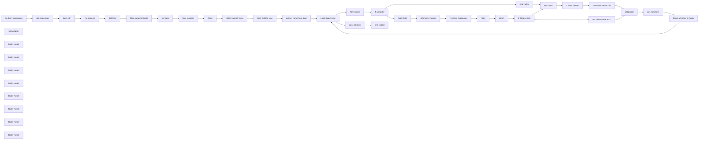

## Fluxo (.json) :

```json
{
  "meta": {
    "instanceId": "db80165df40cb07c0377167c050b3f9ab0b0fb04f0e8cae0dc53f5a8527103ca",
    "templateCredsSetupCompleted": true
  },
  "nodes": [
    {
      "id": "fd4629a6-f7c3-4927-a3da-767d8206b486",
      "name": "set credentials",
      "type": "n8n-nodes-base.set",
      "position": [
        0,
        300
      ],
      "parameters": {
        "options": {},
        "assignments": {
          "assignments": [
            {
              "id": "bfb7f25d-f992-4395-9fbe-939a57fc2a3c",
              "name": "n8n",
              "type": "string",
              "value": "=[your n8n instance without a trailling /]"
            },
            {
              "id": "538e0608-fd19-46ed-ba2c-c1efe03eaf9b",
              "name": "username",
              "type": "string",
              "value": "=your n8n username"
            },
            {
              "id": "ad1c4785-70d0-40d7-a61c-e97c3e8702e7",
              "name": "password",
              "type": "string",
              "value": "=your n8n password"
            }
          ]
        }
      },
      "typeVersion": 3.4
    },
    {
      "id": "877bbd5c-fb57-4fa4-9d0a-113270113f31",
      "name": "login n8n",
      "type": "n8n-nodes-base.httpRequest",
      "position": [
        180,
        300
      ],
      "parameters": {
        "url": "={{ $json.n8n }}/rest/login",
        "method": "POST",
        "options": {
          "response": {
            "response": {
              "fullResponse": true
            }
          }
        },
        "sendBody": true,
        "sendHeaders": true,
        "bodyParameters": {
          "parameters": [
            {
              "name": "emailOrLdapLoginId",
              "value": "={{ $json.username }}"
            },
            {
              "name": "password",
              "value": "={{ $json.password }}"
            }
          ]
        },
        "headerParameters": {
          "parameters": [
            {
              "name": "accept",
              "value": "application/json, text/plain, */*"
            },
            {
              "name": "accept-language",
              "value": "en-US,en;q=0.9"
            },
            {
              "name": "user-agent",
              "value": "Mozilla/5.0 (Windows NT 10.0; Win64; x64) AppleWebKit/537.36 (KHTML, like Gecko) Chrome/135.0.0.0 Safari/537.36"
            }
          ]
        }
      },
      "typeVersion": 4.2
    },
    {
      "id": "41effdd0-ffad-439c-aa33-39f9cc13f6f9",
      "name": "get tags",
      "type": "n8n-nodes-base.httpRequest",
      "position": [
        800,
        300
      ],
      "parameters": {
        "url": "={{ $('set credentials').first().json.n8n }}/rest/tags",
        "options": {
          "redirect": {
            "redirect": {}
          },
          "response": {
            "response": {
              "neverError": true,
              "fullResponse": true,
              "responseFormat": "json"
            }
          },
          "allowUnauthorizedCerts": false
        },
        "sendQuery": true,
        "sendHeaders": true,
        "queryParameters": {
          "parameters": [
            {
              "name": "withUsageCount",
              "value": "false"
            }
          ]
        },
        "headerParameters": {
          "parameters": [
            {
              "name": "accept",
              "value": "application/json, text/plain, */*"
            },
            {
              "name": "accept-language",
              "value": "en-US,en;q=0.9"
            },
            {
              "name": "user-agent",
              "value": "Mozilla/5.0 (Windows NT 10.0; Win64; x64) AppleWebKit/537.36 (KHTML, like Gecko) Chrome/135.0.0.0 Safari/537.36"
            },
            {
              "name": "cookie",
              "value": "={{ $('login n8n').first().json.headers['set-cookie'][0] }}"
            }
          ]
        }
      },
      "typeVersion": 4.2
    },
    {
      "id": "8fd2e71d-8da6-4f28-a377-56ef12c50c33",
      "name": "my-projects",
      "type": "n8n-nodes-base.httpRequest",
      "position": [
        340,
        300
      ],
      "parameters": {
        "url": "={{ $('set credentials').item.json.n8n }}/rest/projects/my-projects",
        "options": {},
        "sendHeaders": true,
        "headerParameters": {
          "parameters": [
            {
              "name": "accept",
              "value": "application/json, text/plain, */*"
            },
            {
              "name": "accept-language",
              "value": "en-US,en;q=0.9"
            },
            {
              "name": "sec-fetch-dest",
              "value": "empty"
            },
            {
              "name": "user-agent",
              "value": "Mozilla/5.0 (Windows NT 10.0; Win64; x64) AppleWebKit/537.36 (KHTML, like Gecko) Chrome/135.0.0.0 Safari/537.36"
            },
            {
              "name": "cookie",
              "value": "={{ $json.headers['set-cookie'][0] }}"
            }
          ]
        }
      },
      "typeVersion": 4.2
    },
    {
      "id": "6bbd2296-fe2b-40d2-8e6c-d04b0987b1c6",
      "name": "Split Out",
      "type": "n8n-nodes-base.splitOut",
      "position": [
        480,
        300
      ],
      "parameters": {
        "options": {},
        "fieldToSplitOut": "data"
      },
      "typeVersion": 1
    },
    {
      "id": "28a1f311-37fd-45be-aac4-684de800f099",
      "name": "filter owned projects",
      "type": "n8n-nodes-base.filter",
      "position": [
        640,
        300
      ],
      "parameters": {
        "options": {
          "ignoreCase": true
        },
        "conditions": {
          "options": {
            "version": 2,
            "leftValue": "",
            "caseSensitive": false,
            "typeValidation": "loose"
          },
          "combinator": "and",
          "conditions": [
            {
              "id": "e66c13b9-4e49-486b-812e-6a38e680207b",
              "operator": {
                "type": "string",
                "operation": "contains"
              },
              "leftValue": "={{ $json.name.extractEmail() }}",
              "rightValue": "={{ $('set credentials').item.json.username }}"
            },
            {
              "id": "99059f5b-055b-48ee-93c9-9689063fcfbe",
              "operator": {
                "name": "filter.operator.equals",
                "type": "string",
                "operation": "equals"
              },
              "leftValue": "={{ $json.role }}",
              "rightValue": "project:personalOwner"
            }
          ]
        },
        "looseTypeValidation": true
      },
      "typeVersion": 2.2
    },
    {
      "id": "0362220f-ebb7-4fa0-b204-ec45f9b20cf4",
      "name": "Get folders",
      "type": "n8n-nodes-base.httpRequest",
      "position": [
        1440,
        480
      ],
      "parameters": {
        "url": "={{ $('set credentials').item.json.n8n }}/rest/projects/{{ $('filter owned projects').item.json.id }}/folders?filter={\"excludeFolderIdAndDescendants\":\"\",\"name\":\"{{ $json.name }}\"}&sortBy=updatedAt:desc",
        "options": {},
        "sendQuery": true,
        "sendHeaders": true,
        "queryParameters": {
          "parameters": [
            {}
          ]
        },
        "headerParameters": {
          "parameters": [
            {
              "name": "accept",
              "value": "application/json, text/plain, */*"
            },
            {
              "name": "accept-language",
              "value": "en-US,en;q=0.9"
            },
            {
              "name": "user-agent",
              "value": "Mozilla/5.0 (Windows NT 10.0; Win64; x64) AppleWebKit/537.36 (KHTML, like Gecko) Chrome/135.0.0.0 Safari/537.36"
            },
            {
              "name": "cookie",
              "value": "={{ $('login n8n').item.json.headers['set-cookie'][0] }}"
            }
          ]
        }
      },
      "typeVersion": 4.2
    },
    {
      "id": "b03373b9-ff14-4e8f-8d00-96755390d252",
      "name": "Split Out2",
      "type": "n8n-nodes-base.splitOut",
      "position": [
        1800,
        380
      ],
      "parameters": {
        "options": {},
        "fieldToSplitOut": "data"
      },
      "typeVersion": 1
    },
    {
      "id": "00ad1ad3-5c55-40e9-8209-2c60fb8b5a0a",
      "name": "Remove Duplicates",
      "type": "n8n-nodes-base.removeDuplicates",
      "position": [
        2140,
        380
      ],
      "parameters": {
        "compare": "selectedFields",
        "options": {},
        "fieldsToCompare": "name"
      },
      "typeVersion": 2
    },
    {
      "id": "ac6c24e3-f095-48e2-a007-e5f07b7ff2a0",
      "name": "Loop Over Items",
      "type": "n8n-nodes-base.splitInBatches",
      "position": [
        1240,
        320
      ],
      "parameters": {
        "options": {}
      },
      "typeVersion": 3
    },
    {
      "id": "bcb53003-7473-47ec-82c3-2e954ae26e90",
      "name": "get workflows",
      "type": "n8n-nodes-base.n8n",
      "position": [
        3040,
        720
      ],
      "parameters": {
        "filters": {
          "tags": "={{ $json.tag }}"
        },
        "requestOptions": {}
      },
      "credentials": {
        "n8nApi": {
          "id": "qMPcwXYtxelKJQhF",
          "name": "n8n account✅"
        }
      },
      "typeVersion": 1
    },
    {
      "id": "ddf83b3b-dffb-46b8-ab4b-38d19e1672b7",
      "name": "Move workflow to folder",
      "type": "n8n-nodes-base.httpRequest",
      "position": [
        3240,
        720
      ],
      "parameters": {
        "url": "={{ $('set credentials').item.json.n8n }}/rest/workflows/{{ $json.id }}",
        "method": "PATCH",
        "options": {},
        "sendBody": true,
        "sendHeaders": true,
        "bodyParameters": {
          "parameters": [
            {
              "name": "parentFolderId",
              "value": "={{ $('set global').item.json['folder id'] }}"
            },
            {
              "name": "versionId",
              "value": "={{ $json.versionId }}"
            }
          ]
        },
        "headerParameters": {
          "parameters": [
            {
              "name": "accept",
              "value": "application/json, text/plain, */*"
            },
            {
              "name": "accept-language",
              "value": "en-US,en;q=0.9"
            },
            {
              "name": "user-agent",
              "value": "Mozilla/5.0 (Windows NT 10.0; Win64; x64) AppleWebKit/537.36 (KHTML, like Gecko) Chrome/135.0.0.0 Safari/537.36"
            },
            {
              "name": "cookie",
              "value": "={{ $('login n8n').item.json.headers['set-cookie'][0] }}"
            }
          ]
        }
      },
      "typeVersion": 4.2
    },
    {
      "id": "a611394f-418d-42d5-b26c-095c17043a86",
      "name": "Normalize names",
      "type": "n8n-nodes-base.set",
      "position": [
        1980,
        380
      ],
      "parameters": {
        "options": {},
        "assignments": {
          "assignments": [
            {
              "id": "a0d33a3e-f13b-438d-af1b-a4ff644b9373",
              "name": "name",
              "type": "string",
              "value": "={{ $json.name.toLowerCase().split(' ').map(word => word.charAt(0).toUpperCase() + word.slice(1)).join(' ') }}"
            },
            {
              "id": "abff18b8-ea51-4cc0-8e88-f326534931ec",
              "name": "tag",
              "type": "string",
              "value": "={{ $('Loop Over Items').item.json.name }}"
            }
          ]
        },
        "includeOtherFields": true
      },
      "typeVersion": 3.4
    },
    {
      "id": "e351c926-cf6e-4f61-9a7a-46338368c66e",
      "name": "Limit1",
      "type": "n8n-nodes-base.limit",
      "position": [
        2420,
        380
      ],
      "parameters": {},
      "typeVersion": 1
    },
    {
      "id": "c5d0c6b1-e478-40da-b9b7-15a60d3439dc",
      "name": "Create folders",
      "type": "n8n-nodes-base.httpRequest",
      "position": [
        2260,
        640
      ],
      "parameters": {
        "url": "={{ $('set credentials').item.json.n8n }}/rest/projects/{{ $('filter owned projects').item.json.id }}/folders",
        "method": "POST",
        "options": {},
        "sendBody": true,
        "sendHeaders": true,
        "bodyParameters": {
          "parameters": [
            {
              "name": "name",
              "value": "={{ $json.name }}"
            }
          ]
        },
        "headerParameters": {
          "parameters": [
            {
              "name": "accept",
              "value": "application/json, text/plain, */*"
            },
            {
              "name": "accept-language",
              "value": "en-US,en;q=0.9"
            },
            {
              "name": "user-agent",
              "value": "Mozilla/5.0 (Windows NT 10.0; Win64; x64) AppleWebKit/537.36 (KHTML, like Gecko) Chrome/135.0.0.0 Safari/537.36"
            },
            {
              "name": "cookie",
              "value": "={{ $('login n8n').item.json.headers['set-cookie'][0] }}"
            }
          ]
        }
      },
      "typeVersion": 4.2
    },
    {
      "id": "e7ab539f-6795-45eb-b23d-11ee13d3a17e",
      "name": "set folder name + id",
      "type": "n8n-nodes-base.set",
      "position": [
        2800,
        640
      ],
      "parameters": {
        "options": {},
        "assignments": {
          "assignments": [
            {
              "id": "b4743119-ab58-44d8-b881-877de84e82e9",
              "name": "name",
              "type": "string",
              "value": "={{ $json.data.name }}"
            },
            {
              "id": "42ad0f03-f7c1-424f-9429-0b5402b60cc6",
              "name": "folder id",
              "type": "string",
              "value": "={{ $json.data.id }}"
            },
            {
              "id": "9ac73fd6-cfd9-47a3-8f28-d0238ebccaf9",
              "name": "tag",
              "type": "string",
              "value": "={{ $('Edit Fields').first().json.tag }}"
            }
          ]
        }
      },
      "typeVersion": 3.4
    },
    {
      "id": "8daa7475-4ac3-46b4-9681-b4c80002db06",
      "name": "set folder name + id1",
      "type": "n8n-nodes-base.set",
      "position": [
        2780,
        360
      ],
      "parameters": {
        "options": {},
        "assignments": {
          "assignments": [
            {
              "id": "b4743119-ab58-44d8-b881-877de84e82e9",
              "name": "name",
              "type": "string",
              "value": "={{ $json.name }}"
            },
            {
              "id": "42ad0f03-f7c1-424f-9429-0b5402b60cc6",
              "name": "folder id",
              "type": "string",
              "value": "={{ $json.id }}"
            },
            {
              "id": "9ac73fd6-cfd9-47a3-8f28-d0238ebccaf9",
              "name": "tag",
              "type": "string",
              "value": "={{ $('Normalize names').item.json.tag }}"
            }
          ]
        }
      },
      "typeVersion": 3.4
    },
    {
      "id": "688107fc-03e4-4e7f-9e51-ad8d30822566",
      "name": "set global",
      "type": "n8n-nodes-base.set",
      "position": [
        3020,
        480
      ],
      "parameters": {
        "options": {},
        "includeOtherFields": true
      },
      "typeVersion": 3.4
    },
    {
      "id": "39027caf-6097-47cf-86c5-70882c45062d",
      "name": "Filter",
      "type": "n8n-nodes-base.filter",
      "position": [
        2280,
        380
      ],
      "parameters": {
        "options": {
          "ignoreCase": true
        },
        "conditions": {
          "options": {
            "version": 2,
            "leftValue": "",
            "caseSensitive": false,
            "typeValidation": "loose"
          },
          "combinator": "and",
          "conditions": [
            {
              "id": "c7bf8dcd-6e97-4908-a4c2-a197d452ffc1",
              "operator": {
                "name": "filter.operator.equals",
                "type": "string",
                "operation": "equals"
              },
              "leftValue": "={{ $json.name }}",
              "rightValue": "={{ $('Loop Over Items').first().json.name }}"
            }
          ]
        },
        "looseTypeValidation": true
      },
      "typeVersion": 2.2,
      "alwaysOutputData": true
    },
    {
      "id": "1fcaf2d9-4aef-435d-968f-b8ecfea8a1ea",
      "name": "Edit Fields",
      "type": "n8n-nodes-base.set",
      "position": [
        1820,
        640
      ],
      "parameters": {
        "options": {},
        "assignments": {
          "assignments": [
            {
              "id": "6dae439c-b0b1-4058-832f-9308fda265fc",
              "name": "name",
              "type": "string",
              "value": "={{ $('Loop Over Items').item.json.name }}"
            },
            {
              "id": "3c1f1bf1-d6ae-4111-b091-2b05a62c15e9",
              "name": "tag",
              "type": "string",
              "value": "={{ $('Loop Over Items').item.json.name }}"
            }
          ]
        }
      },
      "typeVersion": 3.4
    },
    {
      "id": "1dea92e4-9b93-4b7e-8496-020731864219",
      "name": "On form submission",
      "type": "n8n-nodes-base.formTrigger",
      "position": [
        -160,
        300
      ],
      "webhookId": "d7a3218f-0b12-4966-bf07-edd8acffe5e8",
      "parameters": {
        "options": {
          "buttonLabel": "Submit"
        },
        "formTitle": "Tags to Folders",
        "formFields": {
          "values": [
            {
              "fieldType": "html"
            }
          ]
        },
        "formDescription": "Convert all tags into folders"
      },
      "typeVersion": 2.2
    },
    {
      "id": "926f64a9-e5ef-4f99-8938-83b09c7cc13c",
      "name": "Code",
      "type": "n8n-nodes-base.code",
      "position": [
        360,
        580
      ],
      "parameters": {
        "jsCode": "function capitalizeFirstLetter(val) {\n  const str = String(val).trim();\n  return str.charAt(0).toUpperCase() + str.slice(1);\n}\n\n// Get raw comma-separated string\nconst raw = $json.name;\n\n// Step 1: Split, clean, and filter\nconst values = raw\n  .split(',')\n  .map(x => x.trim())\n  .filter(x => x.length > 0 && !/^[A-Za-z0-9]{10,}$/.test(x)) // filter junk-like tokens\n  .map(x => ({ option: capitalizeFirstLetter(x) }));\n\n// Step 2: Add [create new]\nvalues.push({ option: \"[create new]\" });\n\n// Step 3: Build form config\nconst formOptions = {\n  fieldLabel: \"Dropdown Options\",\n  fieldType: \"dropdown\",\n  requiredField: true,\n  fieldOptions: {\n    values\n  }\n};\n\n// Step 4: Return as stringified JSON\nreturn [\n  {\n    json: {\n      fieldLabel: \"Dropdown Options\",\n      fieldType: \"dropdown\",\n      requiredField: true,\n      fieldOptions: {\n        values: values\n      }\n    }\n  }\n];\n"
      },
      "typeVersion": 2
    },
    {
      "id": "4c3b4a14-d0ec-449d-b222-cd4a7c05b2bb",
      "name": "If no folder",
      "type": "n8n-nodes-base.if",
      "position": [
        1620,
        480
      ],
      "parameters": {
        "options": {},
        "conditions": {
          "options": {
            "version": 2,
            "leftValue": "",
            "caseSensitive": true,
            "typeValidation": "strict"
          },
          "combinator": "and",
          "conditions": [
            {
              "id": "e10c2b8e-bdc0-476e-aaed-886e99d4ed37",
              "operator": {
                "type": "number",
                "operation": "gt"
              },
              "leftValue": "={{ $json.count }}",
              "rightValue": 0
            }
          ]
        }
      },
      "typeVersion": 2.2
    },
    {
      "id": "a29325c5-5543-463c-9dc9-ec572afc0b82",
      "name": "If folder exists",
      "type": "n8n-nodes-base.if",
      "position": [
        2580,
        380
      ],
      "parameters": {
        "options": {},
        "conditions": {
          "options": {
            "version": 2,
            "leftValue": "",
            "caseSensitive": true,
            "typeValidation": "strict"
          },
          "combinator": "and",
          "conditions": [
            {
              "id": "70916c0d-531b-4cae-9fac-ae40aa3f7453",
              "operator": {
                "type": "string",
                "operation": "exists",
                "singleValue": true
              },
              "leftValue": "={{ $json.name }}",
              "rightValue": ""
            }
          ]
        }
      },
      "typeVersion": 2.2
    },
    {
      "id": "d65e17fb-8c4b-4412-8d81-b7fa0d540b81",
      "name": "set name",
      "type": "n8n-nodes-base.set",
      "position": [
        2020,
        640
      ],
      "parameters": {
        "options": {},
        "assignments": {
          "assignments": [
            {
              "id": "e7d24d6b-0d97-4e47-b0d4-43682eef686d",
              "name": "name",
              "type": "string",
              "value": "={{ $json.name.toLowerCase().split(' ').map(word => word.charAt(0).toUpperCase() + word.slice(1)).join(' ') }}"
            },
            {
              "id": "52fb820d-5a8a-434b-a99f-db035714d8e3",
              "name": "tag",
              "type": "string",
              "value": "={{ $json.tag }}"
            }
          ]
        }
      },
      "typeVersion": 3.4
    },
    {
      "id": "104af4eb-f087-4c4f-ad69-058f7fbe5407",
      "name": "end import",
      "type": "n8n-nodes-base.form",
      "position": [
        1660,
        160
      ],
      "webhookId": "3605aadf-17f1-4443-8950-e4d506a61415",
      "parameters": {
        "options": {},
        "operation": "completion",
        "completionTitle": "Import complete",
        "completionMessage": "=Successfully imported {{ $('pass all items').all().length }} workflows to the folders {{ $('select tags to move').item.json['Dropdown Options'] }}"
      },
      "typeVersion": 1
    },
    {
      "id": "31441d1e-8675-4a6b-bf3d-5f7230a6c173",
      "name": "pass all items",
      "type": "n8n-nodes-base.set",
      "position": [
        1480,
        160
      ],
      "parameters": {
        "options": {},
        "includeOtherFields": true
      },
      "typeVersion": 3.4
    },
    {
      "id": "287704cc-7a43-4ffc-873e-b19920764b1e",
      "name": "select tags to move",
      "type": "n8n-nodes-base.form",
      "position": [
        580,
        580
      ],
      "webhookId": "72c3db6c-542a-4df9-a10a-d63ce8a2f33b",
      "parameters": {
        "options": {},
        "defineForm": "json",
        "jsonOutput": "=[\t{\n\t\t\"fieldLabel\": \"Dropdown Options\",\n\t\t\"fieldType\": \"dropdown\",\n\t\t\"fieldOptions\": {\n\t\t\t\"values\": {{ $json.fieldOptions.values.toJsonString() }}\n\t\t},\n\t\t\"requiredField\": true,\n        \"multiselect\": true \n\t}\n\n] "
      },
      "typeVersion": 1
    },
    {
      "id": "df8831e6-d587-4220-b602-8c06b3627d11",
      "name": "extract name from form",
      "type": "n8n-nodes-base.set",
      "position": [
        1020,
        320
      ],
      "parameters": {
        "options": {},
        "assignments": {
          "assignments": [
            {
              "id": "f3bbf61c-6f60-4b51-a2b4-05d92d4fe000",
              "name": "name",
              "type": "string",
              "value": "={{ $json['Dropdown Options'] || $json['[\\'Dropdown Options\\']'] }}"
            }
          ]
        }
      },
      "typeVersion": 3.4
    },
    {
      "id": "6340d3b0-9059-463c-bd78-2789156f47a8",
      "name": "Split Out the tags",
      "type": "n8n-nodes-base.splitOut",
      "position": [
        780,
        580
      ],
      "parameters": {
        "options": {},
        "fieldToSplitOut": "['Dropdown Options']"
      },
      "typeVersion": 1
    },
    {
      "id": "5f6dc440-7be1-432f-88c5-f05f5f3939b1",
      "name": "tags to string",
      "type": "n8n-nodes-base.set",
      "position": [
        140,
        580
      ],
      "parameters": {
        "options": {
          "ignoreConversionErrors": true
        },
        "assignments": {
          "assignments": [
            {
              "id": "ce3e2cf1-a37e-476c-934b-355a477c91d2",
              "name": "name",
              "type": "array",
              "value": "={{ $json.body.data.map(item => item.name )}} "
            }
          ]
        }
      },
      "typeVersion": 3.4
    },
    {
      "id": "8784bdaf-0100-4f91-8631-b4ad4518fa33",
      "name": "Sticky Note",
      "type": "n8n-nodes-base.stickyNote",
      "position": [
        -20,
        220
      ],
      "parameters": {
        "width": 960,
        "height": 260,
        "content": "## Step 1\nLogin to n8n, and get the tags we have for our personal owned projects"
      },
      "typeVersion": 1
    },
    {
      "id": "f27df4ec-c415-4077-8037-0bfe573aa4bf",
      "name": "Sticky Note1",
      "type": "n8n-nodes-base.stickyNote",
      "position": [
        -20,
        500
      ],
      "parameters": {
        "width": 960,
        "height": 280,
        "content": "## Step 2\nExtract the tags as a json string, and format this into a suitable format for our response form for user to select the tags they want to work with"
      },
      "typeVersion": 1
    },
    {
      "id": "8966e043-e358-4ba3-bc12-406c104b7dd1",
      "name": "Sticky Note2",
      "type": "n8n-nodes-base.stickyNote",
      "position": [
        960,
        240
      ],
      "parameters": {
        "color": 2,
        "width": 420,
        "height": 260,
        "content": "## Step 3\nExtract the form details and loop over each tag to process"
      },
      "typeVersion": 1
    },
    {
      "id": "8b0bdded-cbeb-471a-ba74-ca7c6aaa34f2",
      "name": "Sticky Note3",
      "type": "n8n-nodes-base.stickyNote",
      "position": [
        1420,
        380
      ],
      "parameters": {
        "color": 3,
        "width": 340,
        "height": 240,
        "content": "## Step 3\nWe search for the folders and filter based on the number of folders found"
      },
      "typeVersion": 1
    },
    {
      "id": "be088523-e64a-4251-9c5c-355342c3ba98",
      "name": "Sticky Note4",
      "type": "n8n-nodes-base.stickyNote",
      "position": [
        1780,
        300
      ],
      "parameters": {
        "width": 940,
        "height": 220,
        "content": "## Step 4 a) \nIf more than 1 folder is found, we dedupe the tags and limit to one, then use that as the folder"
      },
      "typeVersion": 1
    },
    {
      "id": "6b08db71-dca5-4bb8-bb0c-4599c8e53bb1",
      "name": "Sticky Note5",
      "type": "n8n-nodes-base.stickyNote",
      "position": [
        1780,
        560
      ],
      "parameters": {
        "width": 680,
        "height": 220,
        "content": "## Step 4 b) \nIf no folder is found, we create a new folder "
      },
      "typeVersion": 1
    },
    {
      "id": "f96f9211-e076-472c-a7cd-abf58b4662ff",
      "name": "Sticky Note6",
      "type": "n8n-nodes-base.stickyNote",
      "position": [
        2740,
        260
      ],
      "parameters": {
        "color": 5,
        "width": 420,
        "height": 480,
        "content": "## Step 5\n\nMerge the paths so we use one workflow"
      },
      "typeVersion": 1
    },
    {
      "id": "f7f253bd-0b3a-48bb-97f5-1a8cf82b9b7e",
      "name": "Sticky Note7",
      "type": "n8n-nodes-base.stickyNote",
      "position": [
        2960,
        660
      ],
      "parameters": {
        "color": 4,
        "width": 480,
        "height": 240,
        "content": "## Step 6\nGet the workflows and move them to the respective folders"
      },
      "typeVersion": 1
    },
    {
      "id": "1d10ecf9-48e4-47d9-9d79-69ac1e375827",
      "name": "Sticky Note8",
      "type": "n8n-nodes-base.stickyNote",
      "position": [
        1440,
        80
      ],
      "parameters": {
        "width": 380,
        "height": 220,
        "content": "## Step 7\nRespond with a success message"
      },
      "typeVersion": 1
    }
  ],
  "pinData": {},
  "connections": {
    "Code": {
      "main": [
        [
          {
            "node": "select tags to move",
            "type": "main",
            "index": 0
          }
        ]
      ]
    },
    "Filter": {
      "main": [
        [
          {
            "node": "Limit1",
            "type": "main",
            "index": 0
          }
        ]
      ]
    },
    "Limit1": {
      "main": [
        [
          {
            "node": "If folder exists",
            "type": "main",
            "index": 0
          }
        ]
      ]
    },
    "get tags": {
      "main": [
        [
          {
            "node": "tags to string",
            "type": "main",
            "index": 0
          }
        ]
      ]
    },
    "set name": {
      "main": [
        [
          {
            "node": "Create folders",
            "type": "main",
            "index": 0
          }
        ]
      ]
    },
    "Split Out": {
      "main": [
        [
          {
            "node": "filter owned projects",
            "type": "main",
            "index": 0
          }
        ]
      ]
    },
    "login n8n": {
      "main": [
        [
          {
            "node": "my-projects",
            "type": "main",
            "index": 0
          }
        ]
      ]
    },
    "Split Out2": {
      "main": [
        [
          {
            "node": "Normalize names",
            "type": "main",
            "index": 0
          }
        ]
      ]
    },
    "set global": {
      "main": [
        [
          {
            "node": "get workflows",
            "type": "main",
            "index": 0
          }
        ]
      ]
    },
    "Edit Fields": {
      "main": [
        [
          {
            "node": "set name",
            "type": "main",
            "index": 0
          }
        ]
      ]
    },
    "Get folders": {
      "main": [
        [
          {
            "node": "If no folder",
            "type": "main",
            "index": 0
          }
        ]
      ]
    },
    "my-projects": {
      "main": [
        [
          {
            "node": "Split Out",
            "type": "main",
            "index": 0
          }
        ]
      ]
    },
    "If no folder": {
      "main": [
        [
          {
            "node": "Split Out2",
            "type": "main",
            "index": 0
          }
        ],
        [
          {
            "node": "Edit Fields",
            "type": "main",
            "index": 0
          }
        ]
      ]
    },
    "get workflows": {
      "main": [
        [
          {
            "node": "Move workflow to folder",
            "type": "main",
            "index": 0
          }
        ]
      ]
    },
    "Create folders": {
      "main": [
        [
          {
            "node": "set folder name + id",
            "type": "main",
            "index": 0
          }
        ]
      ]
    },
    "pass all items": {
      "main": [
        [
          {
            "node": "end import",
            "type": "main",
            "index": 0
          }
        ]
      ]
    },
    "tags to string": {
      "main": [
        [
          {
            "node": "Code",
            "type": "main",
            "index": 0
          }
        ]
      ]
    },
    "Loop Over Items": {
      "main": [
        [
          {
            "node": "pass all items",
            "type": "main",
            "index": 0
          }
        ],
        [
          {
            "node": "Get folders",
            "type": "main",
            "index": 0
          }
        ]
      ]
    },
    "Normalize names": {
      "main": [
        [
          {
            "node": "Remove Duplicates",
            "type": "main",
            "index": 0
          }
        ]
      ]
    },
    "set credentials": {
      "main": [
        [
          {
            "node": "login n8n",
            "type": "main",
            "index": 0
          }
        ]
      ]
    },
    "If folder exists": {
      "main": [
        [
          {
            "node": "set folder name + id1",
            "type": "main",
            "index": 0
          }
        ],
        [
          {
            "node": "set name",
            "type": "main",
            "index": 0
          }
        ]
      ]
    },
    "Remove Duplicates": {
      "main": [
        [
          {
            "node": "Filter",
            "type": "main",
            "index": 0
          }
        ]
      ]
    },
    "On form submission": {
      "main": [
        [
          {
            "node": "set credentials",
            "type": "main",
            "index": 0
          }
        ]
      ]
    },
    "Split Out the tags": {
      "main": [
        [
          {
            "node": "extract name from form",
            "type": "main",
            "index": 0
          }
        ]
      ]
    },
    "select tags to move": {
      "main": [
        [
          {
            "node": "Split Out the tags",
            "type": "main",
            "index": 0
          }
        ]
      ]
    },
    "set folder name + id": {
      "main": [
        [
          {
            "node": "set global",
            "type": "main",
            "index": 0
          }
        ]
      ]
    },
    "filter owned projects": {
      "main": [
        [
          {
            "node": "get tags",
            "type": "main",
            "index": 0
          }
        ]
      ]
    },
    "set folder name + id1": {
      "main": [
        [
          {
            "node": "set global",
            "type": "main",
            "index": 0
          }
        ]
      ]
    },
    "extract name from form": {
      "main": [
        [
          {
            "node": "Loop Over Items",
            "type": "main",
            "index": 0
          }
        ]
      ]
    },
    "Move workflow to folder": {
      "main": [
        [
          {
            "node": "Loop Over Items",
            "type": "main",
            "index": 0
          }
        ]
      ]
    }
  }
}
```

<a id="template-599"></a>

## Template 599 - Notificação de ativação de plano PayPal

- **Nome:** Notificação de ativação de plano PayPal
- **Descrição:** Fluxo que recebe notificações quando um plano de cobrança é ativado na conta PayPal.
- **Funcionalidade:** • Detecção de ativação de plano: monitora eventos de ativação de planos de cobrança na conta PayPal.
• Captura de dados do evento: recebe o payload do evento com detalhes do plano ativado.
• Gatilho para automações posteriores: inicia ações subsequentes (por exemplo, envio de notificações ou atualização de registros) quando o evento é recebido.
- **Ferramentas:** • PayPal: Plataforma de pagamentos que envia notificações de eventos relacionados a faturamento e gestão de planos.


## Fluxo visual

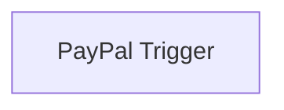

## Fluxo (.json) :

```json
{
  "id": "46",
  "name": "Receive updates when a billing plan is activated in PayPal",
  "nodes": [
    {
      "name": "PayPal Trigger",
      "type": "n8n-nodes-base.payPalTrigger",
      "position": [
        1130,
        620
      ],
      "webhookId": "242a300e-b5a0-45a2-87bc-40def6fe56ef",
      "parameters": {
        "events": [
          "BILLING.PLAN.ACTIVATED"
        ]
      },
      "credentials": {
        "payPalApi": "paypal"
      },
      "typeVersion": 1
    }
  ],
  "active": false,
  "settings": {},
  "connections": {}
}
```

<a id="template-600"></a>

## Template 600 - Chatbot Helpdesk RH & TI com transcrição de áudio

- **Nome:** Chatbot Helpdesk RH & TI com transcrição de áudio
- **Descrição:** Assistente de helpdesk para RH e TI que responde via Telegram usando documentos internos como base de conhecimento, suportando mensagens de texto e voz (com transcrição).
- **Funcionalidade:** • Download e extração de documentos: baixa PDFs de políticas internas e extrai o texto para uso como base de conhecimento.
• Criação de base vetorial: divide o texto em trechos (chunks), gera embeddings e os prepara para indexação.
• Indexação em PostgreSQL (PGVector): armazena vetores e metadados para recuperação eficiente de conteúdo relevante.
• Recebimento via Telegram: escuta mensagens de usuários e inicia o processamento automaticamente.
• Detecção do tipo de mensagem: identifica se a mensagem é texto, voz ou outro tipo, escolhendo o fluxo apropriado.
• Transcrição de áudio: converte mensagens de voz em texto por meio de um serviço de transcrição.
• Agente de IA com RAG: realiza recuperação de trechos relevantes da base vetorial e gera respostas contextualizadas sobre políticas.
• Memória de conversa por sessão: mantém contexto da conversa por usuário para interações mais coerentes.
• Resposta ao usuário: envia a resposta gerada de volta ao usuário no Telegram.
• Processo de setup reexecutável: permite rodar a ingestão e indexação dos documentos no início ou sempre que os dados mudarem.
- **Ferramentas:** • OpenAI: fornece APIs de linguagem, geração de respostas, embeddings e transcrição de áudio.
• PostgreSQL (com suporte a vetores / PGVector): armazena as embeddings, metadados e memória de chat.
• Telegram: plataforma de mensagens usada para receber solicitações dos usuários e enviar respostas.
• AWS S3 (ou hospedagem HTTP): local de armazenamento/host dos PDFs de políticas para download.


## Fluxo visual

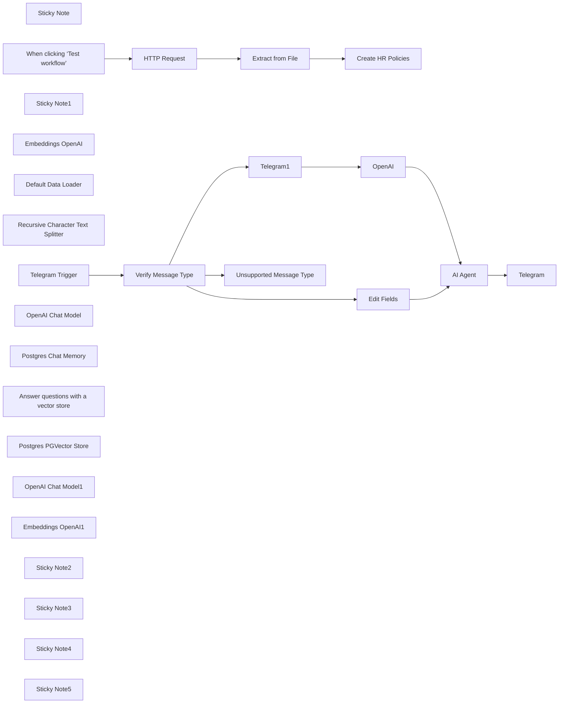

## Fluxo (.json) :

```json
{
  "id": "zmgSshZ5xESr3ozl",
  "meta": {
    "instanceId": "1fedaf0aa3a5d200ffa1bbc98554b56cac895dd5d001907cb6f1c7a3c0a78215",
    "templateCredsSetupCompleted": true
  },
  "name": "HR & IT Helpdesk Chatbot with Audio Transcription",
  "tags": [],
  "nodes": [
    {
      "id": "c6cb921e-97ac-48f6-9d79-133993dd6ef7",
      "name": "Sticky Note",
      "type": "n8n-nodes-base.stickyNote",
      "position": [
        -300,
        -280
      ],
      "parameters": {
        "color": 7,
        "width": 780,
        "height": 460,
        "content": "## 1. Download & Extract Internal Policy Documents\n[Read more about the HTTP Request Tool](https://docs.n8n.io/integrations/builtin/core-nodes/n8n-nodes-base.httprequest)\n\nBegin by importing the PDF documents that contain your internal policies and FAQs—these will become the knowledge base for your Internal Helpdesk Assistant. For example, you can store a company handbook or IT/HR policy PDFs on a shared drive or cloud storage and reference a direct download link here.\n\nIn this demonstration, we'll use the **HTTP Request node** to fetch the PDF file from a given URL and then parse its text contents using the **Extract from File node**. Once extracted, these text chunks will be used to build the vector store that underpins your helpdesk chatbot’s responses.\n\n[Example Employee Handbook with Policies](https://s3.amazonaws.com/scschoolfiles/656/employee_handbook_print_1.pdf)"
      },
      "typeVersion": 1
    },
    {
      "id": "450a254c-eec3-41ea-a11d-eb87b62ee4f4",
      "name": "When clicking ‘Test workflow’",
      "type": "n8n-nodes-base.manualTrigger",
      "position": [
        -80,
        20
      ],
      "parameters": {},
      "typeVersion": 1
    },
    {
      "id": "0972f31c-1f62-430c-8beb-bef8976cd0eb",
      "name": "HTTP Request",
      "type": "n8n-nodes-base.httpRequest",
      "position": [
        100,
        20
      ],
      "parameters": {
        "url": "https://s3.amazonaws.com/scschoolfiles/656/employee_handbook_print_1.pdf",
        "options": {}
      },
      "typeVersion": 4.2
    },
    {
      "id": "bf523255-39f5-410a-beb7-6331139c5f9b",
      "name": "Extract from File",
      "type": "n8n-nodes-base.extractFromFile",
      "position": [
        280,
        20
      ],
      "parameters": {
        "options": {},
        "operation": "pdf"
      },
      "typeVersion": 1
    },
    {
      "id": "88901c7c-e747-44c7-87d9-e14ac99a93db",
      "name": "Sticky Note1",
      "type": "n8n-nodes-base.stickyNote",
      "position": [
        540,
        -280
      ],
      "parameters": {
        "color": 7,
        "width": 780,
        "height": 1020,
        "content": "## 2. Create Internal Policy Vector Store\n[Read more about the In-Memory Vector Store](https://docs.n8n.io/integrations/builtin/cluster-nodes/root-nodes/n8n-nodes-langchain.vectorstoreinmemory/)\n\nVector stores power the retrieval process by matching a user's natural language questions to relevant chunks of text. We'll transform your extracted internal policy text into vector embeddings and store them in a database-like structure.\n\nWe will be using PostgreSQL which has production ready vector support.\n\n**How it works** \n1. The text extracted in Step 1 is split into manageable segments (chunks). \n2. An embedding model transforms these segments into numerical vectors. \n3. These vectors, along with metadata, are stored in PostgreSQL. \n4. When users ask a question, their query is embedded and matched to the most relevant vectors, improving the accuracy of the chatbot's response."
      },
      "typeVersion": 1
    },
    {
      "id": "8d6472ab-dcff-4d24-a320-109787bce52a",
      "name": "Create HR Policies",
      "type": "@n8n/n8n-nodes-langchain.vectorStorePGVector",
      "position": [
        620,
        100
      ],
      "parameters": {
        "mode": "insert",
        "options": {}
      },
      "credentials": {
        "postgres": {
          "id": "wQK6JXyS5y1icHw3",
          "name": "Postgres account"
        }
      },
      "typeVersion": 1
    },
    {
      "id": "e669b3fb-aaf1-4df8-855b-d3142215b308",
      "name": "Embeddings OpenAI",
      "type": "@n8n/n8n-nodes-langchain.embeddingsOpenAi",
      "position": [
        600,
        320
      ],
      "parameters": {
        "options": {}
      },
      "credentials": {
        "openAiApi": {
          "id": "J2D6m1evHLUJOMhO",
          "name": "OpenAi account"
        }
      },
      "typeVersion": 1.2
    },
    {
      "id": "e25418af-65bb-4628-9b26-ec59cae7b2b4",
      "name": "Default Data Loader",
      "type": "@n8n/n8n-nodes-langchain.documentDefaultDataLoader",
      "position": [
        760,
        340
      ],
      "parameters": {
        "options": {},
        "jsonData": "={{ $('Extract from File').item.json.text }}",
        "jsonMode": "expressionData"
      },
      "typeVersion": 1
    },
    {
      "id": "a4538deb-8406-4a5b-9b1e-4e2f859943c8",
      "name": "Recursive Character Text Splitter",
      "type": "@n8n/n8n-nodes-langchain.textSplitterRecursiveCharacterTextSplitter",
      "position": [
        860,
        560
      ],
      "parameters": {
        "options": {},
        "chunkSize": 2000
      },
      "typeVersion": 1
    },
    {
      "id": "7ee0e861-1576-4b0c-b2ef-3fc023371907",
      "name": "Telegram Trigger",
      "type": "n8n-nodes-base.telegramTrigger",
      "position": [
        1420,
        240
      ],
      "webhookId": "65f501de-3c14-4089-9b9d-8956676bebf3",
      "parameters": {
        "updates": [
          "message"
        ],
        "additionalFields": {}
      },
      "credentials": {
        "telegramApi": {
          "id": "jSdrxiRKb8yfG6Ty",
          "name": "Telegram account"
        }
      },
      "typeVersion": 1.1
    },
    {
      "id": "bcf1e82e-0e83-4783-a59f-857a6d1528b6",
      "name": "Verify Message Type",
      "type": "n8n-nodes-base.switch",
      "position": [
        1620,
        240
      ],
      "parameters": {
        "rules": {
          "values": [
            {
              "outputKey": "Text",
              "conditions": {
                "options": {
                  "version": 2,
                  "leftValue": "",
                  "caseSensitive": true,
                  "typeValidation": "strict"
                },
                "combinator": "and",
                "conditions": [
                  {
                    "operator": {
                      "type": "array",
                      "operation": "contains",
                      "rightType": "any"
                    },
                    "leftValue": "={{ $json.message.keys()}}",
                    "rightValue": "text"
                  }
                ]
              },
              "renameOutput": true
            },
            {
              "outputKey": "Audio",
              "conditions": {
                "options": {
                  "version": 2,
                  "leftValue": "",
                  "caseSensitive": true,
                  "typeValidation": "strict"
                },
                "combinator": "and",
                "conditions": [
                  {
                    "id": "d16eb899-cccb-41b6-921e-172c525ff92c",
                    "operator": {
                      "type": "array",
                      "operation": "contains",
                      "rightType": "any"
                    },
                    "leftValue": "={{ $json.message.keys()}}",
                    "rightValue": "voice"
                  }
                ]
              },
              "renameOutput": true
            }
          ]
        },
        "options": {
          "fallbackOutput": "extra"
        }
      },
      "typeVersion": 3.2,
      "alwaysOutputData": false
    },
    {
      "id": "d403f864-c781-48fc-a62b-de0c8bfedf06",
      "name": "OpenAI",
      "type": "@n8n/n8n-nodes-langchain.openAi",
      "position": [
        2340,
        380
      ],
      "parameters": {
        "options": {},
        "resource": "audio",
        "operation": "transcribe",
        "binaryPropertyName": "=data"
      },
      "credentials": {
        "openAiApi": {
          "id": "J2D6m1evHLUJOMhO",
          "name": "OpenAi account"
        }
      },
      "typeVersion": 1.8
    },
    {
      "id": "5b17c8f1-4bee-4f2a-abcb-74fe72d4cdfd",
      "name": "Telegram1",
      "type": "n8n-nodes-base.telegram",
      "position": [
        2120,
        380
      ],
      "parameters": {
        "fileId": "={{ $json.message.voice.file_id }}",
        "resource": "file"
      },
      "credentials": {
        "telegramApi": {
          "id": "jSdrxiRKb8yfG6Ty",
          "name": "Telegram account"
        }
      },
      "typeVersion": 1.2
    },
    {
      "id": "cc6862cb-acfc-465b-b142-dd5fdc12fb13",
      "name": "Unsupported Message Type",
      "type": "n8n-nodes-base.telegram",
      "position": [
        2200,
        560
      ],
      "parameters": {
        "text": "I'm not able to process this message type.",
        "chatId": "={{ $json.message.chat.id }}",
        "additionalFields": {}
      },
      "credentials": {
        "telegramApi": {
          "id": "jSdrxiRKb8yfG6Ty",
          "name": "Telegram account"
        }
      },
      "typeVersion": 1.2
    },
    {
      "id": "8b97aaa1-ea0d-4b11-89c9-9ac6376c0760",
      "name": "AI Agent",
      "type": "@n8n/n8n-nodes-langchain.agent",
      "position": [
        2860,
        400
      ],
      "parameters": {
        "text": "={{ $json.text }}",
        "options": {
          "systemMessage": "You are a helpful assistant for HR and employee policies"
        },
        "promptType": "define"
      },
      "typeVersion": 1.7
    },
    {
      "id": "e0d5416e-a799-46a2-83e3-fa6919ec0e36",
      "name": "OpenAI Chat Model",
      "type": "@n8n/n8n-nodes-langchain.lmChatOpenAi",
      "position": [
        2800,
        840
      ],
      "parameters": {
        "options": {}
      },
      "credentials": {
        "openAiApi": {
          "id": "J2D6m1evHLUJOMhO",
          "name": "OpenAi account"
        }
      },
      "typeVersion": 1.1
    },
    {
      "id": "9149f41d-692e-49bc-ad70-848492d2c345",
      "name": "Postgres Chat Memory",
      "type": "@n8n/n8n-nodes-langchain.memoryPostgresChat",
      "position": [
        3060,
        840
      ],
      "parameters": {
        "sessionKey": "={{ $('Telegram Trigger').item.json.message.chat.id }}",
        "sessionIdType": "customKey"
      },
      "credentials": {
        "postgres": {
          "id": "wQK6JXyS5y1icHw3",
          "name": "Postgres account"
        }
      },
      "typeVersion": 1.3
    },
    {
      "id": "a1f68887-da44-4bff-86fc-f607a5bd0ab6",
      "name": "Answer questions with a vector store",
      "type": "@n8n/n8n-nodes-langchain.toolVectorStore",
      "position": [
        3360,
        580
      ],
      "parameters": {
        "name": "hr_employee_policies",
        "description": "data for HR and employee policies"
      },
      "typeVersion": 1
    },
    {
      "id": "76220fe4-2448-4b32-92d8-68c564cc702d",
      "name": "Postgres PGVector Store",
      "type": "@n8n/n8n-nodes-langchain.vectorStorePGVector",
      "position": [
        3220,
        780
      ],
      "parameters": {
        "options": {}
      },
      "credentials": {
        "postgres": {
          "id": "wQK6JXyS5y1icHw3",
          "name": "Postgres account"
        }
      },
      "typeVersion": 1
    },
    {
      "id": "055fd294-7483-45ce-b58a-c90075199f5f",
      "name": "OpenAI Chat Model1",
      "type": "@n8n/n8n-nodes-langchain.lmChatOpenAi",
      "position": [
        3640,
        780
      ],
      "parameters": {
        "options": {}
      },
      "credentials": {
        "openAiApi": {
          "id": "J2D6m1evHLUJOMhO",
          "name": "OpenAi account"
        }
      },
      "typeVersion": 1.1
    },
    {
      "id": "cc13eac7-8163-45bf-8d8a-9cf72659e357",
      "name": "Embeddings OpenAI1",
      "type": "@n8n/n8n-nodes-langchain.embeddingsOpenAi",
      "position": [
        3300,
        920
      ],
      "parameters": {
        "options": {}
      },
      "credentials": {
        "openAiApi": {
          "id": "J2D6m1evHLUJOMhO",
          "name": "OpenAi account"
        }
      },
      "typeVersion": 1.2
    },
    {
      "id": "d46e415e-75ff-46b8-b382-cdcda216b1ed",
      "name": "Telegram",
      "type": "n8n-nodes-base.telegram",
      "position": [
        4200,
        420
      ],
      "parameters": {
        "text": "={{ $json.output }}",
        "chatId": "={{ $('Telegram Trigger').first().json.message.chat.id }}",
        "additionalFields": {}
      },
      "credentials": {
        "telegramApi": {
          "id": "jSdrxiRKb8yfG6Ty",
          "name": "Telegram account"
        }
      },
      "typeVersion": 1.2
    },
    {
      "id": "ddf623a1-0a5e-48c9-b897-6a339895a891",
      "name": "Edit Fields",
      "type": "n8n-nodes-base.set",
      "position": [
        2120,
        200
      ],
      "parameters": {
        "options": {},
        "assignments": {
          "assignments": [
            {
              "id": "403b336f-87ce-4bef-a5f2-1640425f8198",
              "name": "text",
              "type": "string",
              "value": "={{ $json.message.text }}"
            }
          ]
        },
        "includeOtherFields": true
      },
      "typeVersion": 3.4
    },
    {
      "id": "4ae84e17-cfc1-425c-930d-949da7308b78",
      "name": "Sticky Note2",
      "type": "n8n-nodes-base.stickyNote",
      "position": [
        1340,
        -280
      ],
      "parameters": {
        "color": 4,
        "width": 1300,
        "height": 1020,
        "content": "## 3. Handling Messages with Fallback Support\n\nThis workflow processes Telegram messages to handle **text** and **voice** inputs, with a fallback for unsupported message types. Here’s how it works:\n\n1. **Trigger Node**:\n - The workflow starts with a Telegram trigger that listens for incoming messages.\n\n2. **Message Type Check**:\n - The workflow verifies the type of message received:\n - **Text Message**: If the message contains `$json.message.text`, it is sent directly to the agent.\n - **Voice Message**: If the message contains `$json.message.voice`, the audio is transcribed into text using a transcription service, and the result is sent to the agent.\n\n3. **Fallback Path**:\n - If the message is neither text nor voice, a fallback response is returned:\n `\"Sorry, I couldn’t process your message. Please try again.\"`\n\n4. **Unified Output**:\n - Both text messages and transcribed voice messages are converted into the same format before sending to the agent, ensuring consistency in handling.\n"
      },
      "typeVersion": 1
    },
    {
      "id": "86ad4e08-ef2d-405e-8861-bff38e1db651",
      "name": "Sticky Note3",
      "type": "n8n-nodes-base.stickyNote",
      "position": [
        220,
        220
      ],
      "parameters": {
        "width": 260,
        "height": 80,
        "content": "The setup needs to be run at the start or when data is changed"
      },
      "typeVersion": 1
    },
    {
      "id": "b05c4437-00fb-40f6-87fa-8dc564b16005",
      "name": "Sticky Note4",
      "type": "n8n-nodes-base.stickyNote",
      "position": [
        2680,
        -280
      ],
      "parameters": {
        "color": 4,
        "width": 1180,
        "height": 1420,
        "content": "## 4. HR & IT AI Agent Provides Helpdesk Support \nn8n's AI agents allow you to create intelligent and interactive workflows that can access and retrieve data from internal knowledgebases. In this workflow, the AI agent is configured to provide answers for HR and IT queries by performing Retrieval-Augmented Generation (RAG) on internal documents.\n\n### How It Works:\n- **Internal Knowledgebase Access**: A **Vector store tool** is used to connect the agent to the HR & IT knowledgebase built earlier in the workflow. This enables the agent to fetch accurate and specific answers for employee queries.\n- **Chat Memory**: A **Chat memory subnode** tracks the conversation, allowing the agent to maintain context across multiple queries from the same user, creating a personalized and cohesive experience.\n- **Dynamic Query Responses**: Whether employees ask about policies, leave balances, or technical troubleshooting, the agent retrieves relevant data from the vector store and crafts a natural language response.\n\nBy integrating the AI agent with a vector store and chat memory, this workflow empowers your HR & IT helpdesk chatbot to provide quick, accurate, and conversational support to employees. \n\nPostgrSQL is used for all steps to simplify development in production."
      },
      "typeVersion": 1
    },
    {
      "id": "b266ca42-de62-4341-9aff-33ee0ac68045",
      "name": "Sticky Note5",
      "type": "n8n-nodes-base.stickyNote",
      "position": [
        3900,
        300
      ],
      "parameters": {
        "color": 4,
        "width": 540,
        "height": 280,
        "content": "## 5. Send Message\n\nThe simplest and most important part :)"
      },
      "typeVersion": 1
    }
  ],
  "active": false,
  "pinData": {},
  "settings": {
    "executionOrder": "v1"
  },
  "versionId": "7b1d11ca-9b56-4c5f-9189-26d536c24b76",
  "connections": {
    "OpenAI": {
      "main": [
        [
          {
            "node": "AI Agent",
            "type": "main",
            "index": 0
          }
        ]
      ]
    },
    "AI Agent": {
      "main": [
        [
          {
            "node": "Telegram",
            "type": "main",
            "index": 0
          }
        ]
      ]
    },
    "Telegram1": {
      "main": [
        [
          {
            "node": "OpenAI",
            "type": "main",
            "index": 0
          }
        ]
      ]
    },
    "Edit Fields": {
      "main": [
        [
          {
            "node": "AI Agent",
            "type": "main",
            "index": 0
          }
        ]
      ]
    },
    "HTTP Request": {
      "main": [
        [
          {
            "node": "Extract from File",
            "type": "main",
            "index": 0
          }
        ]
      ]
    },
    "Telegram Trigger": {
      "main": [
        [
          {
            "node": "Verify Message Type",
            "type": "main",
            "index": 0
          }
        ]
      ]
    },
    "Embeddings OpenAI": {
      "ai_embedding": [
        [
          {
            "node": "Create HR Policies",
            "type": "ai_embedding",
            "index": 0
          }
        ]
      ]
    },
    "Extract from File": {
      "main": [
        [
          {
            "node": "Create HR Policies",
            "type": "main",
            "index": 0
          }
        ]
      ]
    },
    "OpenAI Chat Model": {
      "ai_languageModel": [
        [
          {
            "node": "AI Agent",
            "type": "ai_languageModel",
            "index": 0
          }
        ]
      ]
    },
    "Embeddings OpenAI1": {
      "ai_embedding": [
        [
          {
            "node": "Postgres PGVector Store",
            "type": "ai_embedding",
            "index": 0
          }
        ]
      ]
    },
    "OpenAI Chat Model1": {
      "ai_languageModel": [
        [
          {
            "node": "Answer questions with a vector store",
            "type": "ai_languageModel",
            "index": 0
          }
        ]
      ]
    },
    "Default Data Loader": {
      "ai_document": [
        [
          {
            "node": "Create HR Policies",
            "type": "ai_document",
            "index": 0
          }
        ]
      ]
    },
    "Verify Message Type": {
      "main": [
        [
          {
            "node": "Edit Fields",
            "type": "main",
            "index": 0
          }
        ],
        [
          {
            "node": "Telegram1",
            "type": "main",
            "index": 0
          }
        ],
        [
          {
            "node": "Unsupported Message Type",
            "type": "main",
            "index": 0
          }
        ]
      ]
    },
    "Postgres Chat Memory": {
      "ai_memory": [
        [
          {
            "node": "AI Agent",
            "type": "ai_memory",
            "index": 0
          }
        ]
      ]
    },
    "Postgres PGVector Store": {
      "ai_vectorStore": [
        [
          {
            "node": "Answer questions with a vector store",
            "type": "ai_vectorStore",
            "index": 0
          }
        ]
      ]
    },
    "Recursive Character Text Splitter": {
      "ai_textSplitter": [
        [
          {
            "node": "Default Data Loader",
            "type": "ai_textSplitter",
            "index": 0
          }
        ]
      ]
    },
    "When clicking ‘Test workflow’": {
      "main": [
        [
          {
            "node": "HTTP Request",
            "type": "main",
            "index": 0
          }
        ]
      ]
    },
    "Answer questions with a vector store": {
      "ai_tool": [
        [
          {
            "node": "AI Agent",
            "type": "ai_tool",
            "index": 0
          }
        ]
      ]
    }
  }
}
```

<a id="template-601"></a>

## Template 601 - Chatbot para Bitrix24 via Webhook

- **Nome:** Chatbot para Bitrix24 via Webhook
- **Descrição:** Recebe eventos vindos do Bitrix24 por webhook, valida o token da aplicação, trata eventos de mensagens, entrada em chat e instalação, e interage com a API do Bitrix24 para registrar o bot e enviar respostas.
- **Funcionalidade:** • Validação do token da aplicação: Confere se o CLIENT_ID recebido coincide com o application_token para autorizar chamadas.
• Roteamento de eventos: Encaminha eventos recebidos (ONIMBOTMESSAGEADD, ONIMBOTJOINCHAT, ONAPPINSTALL, ONIMBOTDELETE) para os tratadores adequados.
• Processamento de mensagens: Extrai a mensagem e o diálogo; responde com uma mensagem fixa quando o texto é "what's hot" (insensível a maiúsculas/minúsculas) ou repete o que o usuário disse.
• Mensagem de boas-vindas em join: Ao entrar em um chat, envia uma mensagem de apresentação ao diálogo.
• Registro do bot na instalação: Prepara dados e chama o endpoint de registro do Bitrix24 para criar/atualizar propriedades do bot (imbot.register).
• Envio de mensagens: Chama o endpoint de envio de mensagens do Bitrix24 (imbot.message.add) para postar respostas nos diálogos.
• Respostas ao webhook: Retorna respostas HTTP com JSON indicando sucesso (200) ou erro de autenticação (401).
- **Ferramentas:** • Bitrix24 REST API: Plataforma usada para registrar o bot e enviar mensagens (endpoints como imbot.register e imbot.message.add) usando tokens de autenticação.
• Webhook HTTP (endpoint público): Ponto de entrada que recebe eventos POST do Bitrix24 e devolve respostas JSON.
• Tokens OAuth / Access Tokens: Mecanismo de autenticação usado para autorizar chamadas à API do Bitrix24 e validar a origem dos eventos.


## Fluxo visual

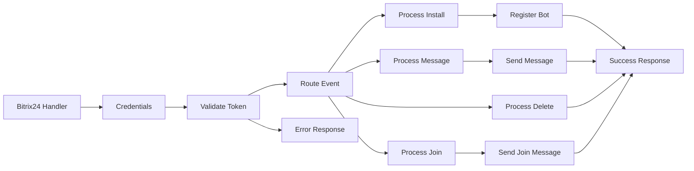

## Fluxo (.json) :

```json
{
  "id": "cmGsNvW9bEORABdo",
  "meta": {
    "instanceId": "15c09ee9508dd818e298e675375571ba4b871bbb8c420fd01ac9ed7c58622669"
  },
  "name": "Bitrix24 Chatbot Application Workflow example with Webhook Integration",
  "tags": [
    {
      "id": "5YZ9E6AmGZn6WTMa",
      "name": "Tech demo",
      "createdAt": "2024-12-28T09:13:02.965Z",
      "updatedAt": "2024-12-28T09:13:02.965Z"
    },
    {
      "id": "hEvnK1kMYTPrL3vs",
      "name": "Bitrix24",
      "createdAt": "2025-01-04T16:12:36.741Z",
      "updatedAt": "2025-01-04T16:12:36.741Z"
    },
    {
      "id": "yKS9RGKLuFUhYFIE",
      "name": "Chatbot",
      "createdAt": "2025-01-04T16:12:36.757Z",
      "updatedAt": "2025-01-04T16:12:36.757Z"
    }
  ],
  "nodes": [
    {
      "id": "ddd802bb-0da0-474d-b1e9-74f247e603e0",
      "name": "Bitrix24 Handler",
      "type": "n8n-nodes-base.webhook",
      "position": [
        0,
        0
      ],
      "webhookId": "c3ae607d-41f0-42bc-b669-c2c77936d443",
      "parameters": {
        "path": "bitrix24/handler.php",
        "options": {},
        "httpMethod": "POST",
        "responseMode": "responseNode"
      },
      "typeVersion": 1
    },
    {
      "id": "5676a53e-6758-4ad5-ace6-e494fa10b6c3",
      "name": "Credentials",
      "type": "n8n-nodes-base.set",
      "position": [
        200,
        0
      ],
      "parameters": {
        "options": {},
        "assignments": {
          "assignments": [
            {
              "id": "030f8f90-2669-4c20-9eab-c572c4b7c70c",
              "name": "CLIENT_ID",
              "type": "string",
              "value": "local.6779636e712043.37129431"
            },
            {
              "id": "de9bbb7a-b782-4540-b259-527625db8490",
              "name": "CLIENT_SECRET",
              "type": "string",
              "value": "dTzUfBoTFLxNhuzc1zsnDbCeii98ZaE5By4aQPQEOxLJAS9y6i"
            },
            {
              "id": "86b7aff7-1e25-4b12-a366-23cf34e5a405",
              "name": "application_token",
              "type": "string",
              "value": "={{ $json.body['auth[application_token]'] }}"
            },
            {
              "id": "69bbcb1f-ba6e-42eb-be8a-ee0707ce997d",
              "name": "domain",
              "type": "string",
              "value": "={{ $json.body['auth[domain]'] }}\n"
            },
            {
              "id": "dc1b0515-f06a-4731-b0dc-912a8d04e56b",
              "name": "access_token",
              "type": "string",
              "value": "={{ $json.body['auth[access_token]'] }}"
            }
          ]
        },
        "includeOtherFields": true
      },
      "typeVersion": 3.4
    },
    {
      "id": "b72c00cf-9f8c-4c2a-9093-b80d82bab85b",
      "name": "Validate Token",
      "type": "n8n-nodes-base.if",
      "position": [
        400,
        0
      ],
      "parameters": {
        "options": {},
        "conditions": {
          "options": {
            "version": 2,
            "leftValue": "",
            "caseSensitive": true,
            "typeValidation": "strict"
          },
          "combinator": "or",
          "conditions": [
            {
              "id": "da73d0ba-6eeb-405e-89fe-9d041fd2e0cd",
              "operator": {
                "name": "filter.operator.equals",
                "type": "string",
                "operation": "equals"
              },
              "leftValue": "={{ $json.CLIENT_ID }}",
              "rightValue": "={{ $json.application_token }}"
            },
            {
              "id": "4ba90f7b-0299-4097-9ae7-6e4dee428a74",
              "operator": {
                "name": "filter.operator.equals",
                "type": "string",
                "operation": "equals"
              },
              "leftValue": "1",
              "rightValue": "1"
            }
          ]
        }
      },
      "typeVersion": 2.2
    },
    {
      "id": "f0feb392-873a-4643-b7ad-0e6d9f877e82",
      "name": "Route Event",
      "type": "n8n-nodes-base.switch",
      "position": [
        600,
        0
      ],
      "parameters": {
        "rules": {
          "values": [
            {
              "outputKey": "ONIMBOTMESSAGEADD",
              "conditions": {
                "options": {
                  "version": 2,
                  "leftValue": "",
                  "caseSensitive": true,
                  "typeValidation": "strict"
                },
                "combinator": "and",
                "conditions": [
                  {
                    "operator": {
                      "type": "string",
                      "operation": "equals"
                    },
                    "leftValue": "={{ $json.body.event }}",
                    "rightValue": "ONIMBOTMESSAGEADD"
                  }
                ]
              },
              "renameOutput": true
            },
            {
              "outputKey": "ONIMBOTJOINCHAT",
              "conditions": {
                "options": {
                  "version": 2,
                  "leftValue": "",
                  "caseSensitive": true,
                  "typeValidation": "strict"
                },
                "combinator": "and",
                "conditions": [
                  {
                    "id": "e9125f57-129e-4026-86ff-746d40b92b04",
                    "operator": {
                      "name": "filter.operator.equals",
                      "type": "string",
                      "operation": "equals"
                    },
                    "leftValue": "={{ $json.body.event }}",
                    "rightValue": "ONIMBOTJOINCHAT"
                  }
                ]
              },
              "renameOutput": true
            },
            {
              "outputKey": "ONAPPINSTALL",
              "conditions": {
                "options": {
                  "version": 2,
                  "leftValue": "",
                  "caseSensitive": true,
                  "typeValidation": "strict"
                },
                "combinator": "and",
                "conditions": [
                  {
                    "id": "2db7bed5-fd88-4900-b8d2-e27b49c2fcca",
                    "operator": {
                      "name": "filter.operator.equals",
                      "type": "string",
                      "operation": "equals"
                    },
                    "leftValue": "={{ $json.body.event }}",
                    "rightValue": "ONAPPINSTALL"
                  }
                ]
              },
              "renameOutput": true
            },
            {
              "outputKey": "ONIMBOTDELETE",
              "conditions": {
                "options": {
                  "version": 2,
                  "leftValue": "",
                  "caseSensitive": true,
                  "typeValidation": "strict"
                },
                "combinator": "and",
                "conditions": [
                  {
                    "id": "b708d339-fd46-470d-b0d5-ff2eb405f5ce",
                    "operator": {
                      "name": "filter.operator.equals",
                      "type": "string",
                      "operation": "equals"
                    },
                    "leftValue": "={{ $json.body.event }}",
                    "rightValue": "ONIMBOTDELETE"
                  }
                ]
              },
              "renameOutput": true
            }
          ]
        },
        "options": {}
      },
      "typeVersion": 3.2
    },
    {
      "id": "56fcdc5f-d509-4c9f-a437-79c53add49f8",
      "name": "Process Message",
      "type": "n8n-nodes-base.function",
      "position": [
        800,
        0
      ],
      "parameters": {
        "functionCode": "// Process Message Node\nconst items = $input.all();\nconst item = items[0];\n\n// Get message data from the correct path\nconst message = item.json.body['data[PARAMS][MESSAGE]'];\nconst dialogId = item.json.body['data[PARAMS][DIALOG_ID]'];\n\n// Get auth data\nconst auth = {\n  access_token: item.json.access_token,\n  domain: item.json.domain\n};\n\nif (message.toLowerCase() === \"what's hot\") {\n  return {\n    json: {\n      DIALOG_ID: dialogId,\n      MESSAGE: \"Hi! I am an example-bot.\\nI repeat what you say\",\n      AUTH: auth.access_token,\n      DOMAIN: auth.domain\n    }\n  };\n} else {\n  return {\n    json: {\n      DIALOG_ID: dialogId,\n      MESSAGE: `You said:\\n${message}`,\n      AUTH: auth.access_token,\n      DOMAIN: auth.domain\n    }\n  };\n}"
      },
      "typeVersion": 1
    },
    {
      "id": "a647ed67-c812-4416-8c85-55a681bc7f80",
      "name": "Process Join",
      "type": "n8n-nodes-base.function",
      "position": [
        800,
        160
      ],
      "parameters": {
        "functionCode": "// Process Join Node\nconst items = $input.all();\nconst item = items[0];\n\n// Get dialog ID from the correct path\nconst dialogId = item.json.body['data[PARAMS][DIALOG_ID]'];\n\n// Get auth data\nconst auth = {\n  access_token: item.json.access_token,\n  domain: item.json.domain\n};\n\nreturn {\n  json: {\n    DIALOG_ID: dialogId,\n    MESSAGE: 'Hi! I am an example-bot. I repeat what you say',\n    AUTH: auth.access_token,\n    DOMAIN: auth.domain\n  }\n};"
      },
      "typeVersion": 1
    },
    {
      "id": "4aac8853-d80e-4201-9f31-7838d18afe71",
      "name": "Process Install",
      "type": "n8n-nodes-base.function",
      "position": [
        800,
        320
      ],
      "parameters": {
        "functionCode": "// Process Install Node\nconst items = $input.all();\nconst item = items[0];\n\n// Get the webhook URL from input\nconst handlerBackUrl = item.json.webhookUrl;\n\n// Get auth data directly from item.json\nconst auth = {\n  access_token: item.json.access_token,\n  application_token: item.json.application_token,\n  domain: item.json.domain\n};\n\nreturn {\n  json: {\n    handler_back_url: handlerBackUrl,\n    CODE: 'LocalExampleBot',\n    TYPE: 'B',\n    EVENT_MESSAGE_ADD: handlerBackUrl,\n    EVENT_WELCOME_MESSAGE: handlerBackUrl,\n    EVENT_BOT_DELETE: handlerBackUrl,\n    PROPERTIES: {\n      NAME: 'Bot',\n      LAST_NAME: 'Example',\n      COLOR: 'AQUA',\n      EMAIL: 'no@example.com',\n      PERSONAL_BIRTHDAY: '2020-07-18',\n      WORK_POSITION: 'Report on affairs',\n      PERSONAL_GENDER: 'M'\n    },\n    // Use the auth data from item.json\n    AUTH: auth.access_token,\n    CLIENT_ID: auth.application_token,\n    DOMAIN: auth.domain\n  }\n};"
      },
      "typeVersion": 1
    },
    {
      "id": "30922462-255b-4ba6-8167-88aec244fdb1",
      "name": "Register Bot",
      "type": "n8n-nodes-base.httpRequest",
      "position": [
        1000,
        320
      ],
      "parameters": {
        "url": "=https://{{ $json.DOMAIN }}/rest/imbot.register?auth={{$json.AUTH}}",
        "method": "POST",
        "options": {},
        "sendBody": true,
        "bodyParameters": {
          "parameters": [
            {
              "name": "CODE",
              "value": "LocalExampleBot"
            },
            {
              "name": "TYPE",
              "value": "B"
            },
            {
              "name": "EVENT_MESSAGE_ADD",
              "value": "={{$json.handler_back_url}}"
            },
            {
              "name": "EVENT_WELCOME_MESSAGE",
              "value": "={{$json.handler_back_url}}"
            },
            {
              "name": "EVENT_BOT_DELETE",
              "value": "={{$json.handler_back_url}}"
            },
            {
              "name": "PROPERTIES",
              "value": "={{ {\n  NAME: 'Bot',\n  LAST_NAME: 'Example',\n  COLOR: 'AQUA',\n  EMAIL: 'no@example.com',\n  PERSONAL_BIRTHDAY: '2020-07-18',\n  WORK_POSITION: 'Report on affairs',\n  PERSONAL_GENDER: 'M'\n} }}"
            },
            {
              "name": "CLIENT_ID",
              "value": "={{ $json.CLIENT_ID }}"
            },
            {
              "name": "CLIENT_SECRET",
              "value": "={{ $json.AUTH }}"
            }
          ]
        }
      },
      "typeVersion": 4.2
    },
    {
      "id": "8c1c7ebf-d5b3-472e-9d98-34cc65ba86ba",
      "name": "Send Message",
      "type": "n8n-nodes-base.httpRequest",
      "position": [
        1000,
        0
      ],
      "parameters": {
        "url": "=https://{{$json.DOMAIN}}/rest/imbot.message.add?auth={{$json.AUTH}}",
        "method": "POST",
        "options": {},
        "sendBody": true,
        "bodyParameters": {
          "parameters": [
            {
              "name": "DIALOG_ID",
              "value": "={{ $json.DIALOG_ID }}"
            },
            {
              "name": "MESSAGE",
              "value": "={{ $json.MESSAGE }}"
            },
            {
              "name": "AUTH",
              "value": "={{ $json.AUTH }}"
            }
          ]
        }
      },
      "typeVersion": 4.2
    },
    {
      "id": "af0d2b44-53f7-4c4c-9428-d54ebcf41bff",
      "name": "Send Join Message",
      "type": "n8n-nodes-base.httpRequest",
      "position": [
        1000,
        160
      ],
      "parameters": {
        "url": "=https://{{$json.DOMAIN}}/rest/imbot.message.add?auth={{$json.AUTH}}",
        "method": "POST",
        "options": {},
        "sendBody": true,
        "bodyParameters": {
          "parameters": [
            {
              "name": "DIALOG_ID",
              "value": "={{ $json.DIALOG_ID }}"
            },
            {
              "name": "MESSAGE",
              "value": "={{ $json.MESSAGE }}"
            },
            {
              "name": "AUTH",
              "value": "={{ $json.AUTH }}"
            }
          ]
        }
      },
      "typeVersion": 4.2
    },
    {
      "id": "9110f66d-1c35-44b4-bc73-18f821b50b71",
      "name": "Process Delete",
      "type": "n8n-nodes-base.noOp",
      "position": [
        800,
        480
      ],
      "parameters": {},
      "typeVersion": 1
    },
    {
      "id": "81a5fc23-47a4-4ef8-bfb4-31593aed12fd",
      "name": "Success Response",
      "type": "n8n-nodes-base.respondToWebhook",
      "position": [
        1200,
        0
      ],
      "parameters": {
        "options": {
          "responseCode": 200
        },
        "respondWith": "json",
        "responseBody": "={\n  \"result\": true\n}"
      },
      "typeVersion": 1.1
    },
    {
      "id": "a19f3b0b-496f-4f3d-a9c2-044356070e32",
      "name": "Error Response",
      "type": "n8n-nodes-base.respondToWebhook",
      "position": [
        400,
        160
      ],
      "parameters": {
        "options": {
          "responseCode": 401
        },
        "respondWith": "json",
        "responseBody": "={{\n  \"result\": false,\n  \"error\": \"Invalid application token\"\n}}"
      },
      "typeVersion": 1.1
    }
  ],
  "active": true,
  "pinData": {
    "Bitrix24 Handler": [
      {
        "json": {
          "body": {
            "ts": "1737037713",
            "event": "ONIMBOTMESSAGEADD",
            "auth[scope]": "imbot,im",
            "auth[domain]": "hgap.bitrix24.eu",
            "auth[status]": "L",
            "auth[expires]": "1737041313",
            "auth[user_id]": "256",
            "data[USER][ID]": "256",
            "auth[member_id]": "19acdffbcfadf692f61b677d3d824490",
            "auth[expires_in]": "3600",
            "data[USER][NAME]": "Java Tech User",
            "event_handler_id": "126",
            "auth[access_token]": "a12589670074bb250066880900000100000007f6bf4682415a014425fed22a6b37af33",
            "data[USER][GENDER]": "M",
            "data[USER][IS_BOT]": "N",
            "auth[refresh_token]": "91a4b0670074bb2500668809000001000000075047004f6b25a0b76236e66bb7316e97",
            "auth[client_endpoint]": "https://hgap.bitrix24.eu/rest/",
            "auth[server_endpoint]": "https://oauth.bitrix.info/rest/",
            "data[BOT][302][scope]": "imbot,im",
            "data[PARAMS][CHAT_ID]": "6196",
            "data[PARAMS][MESSAGE]": "Szia!",
            "data[USER][LAST_NAME]": "Java",
            "data[BOT][302][BOT_ID]": "302",
            "data[BOT][302][domain]": "hgap.bitrix24.eu",
            "data[BOT][302][status]": "L",
            "data[PARAMS][LANGUAGE]": "en",
            "data[USER][FIRST_NAME]": "Tech User",
            "data[USER][IS_NETWORK]": "N",
            "auth[application_token]": "0d83800efe3a5b2977650e025e0754d5",
            "data[BOT][302][expires]": "1737041313",
            "data[BOT][302][user_id]": "302",
            "data[PARAMS][AUTHOR_ID]": "256",
            "data[PARAMS][CHAT_TYPE]": "P",
            "data[PARAMS][DIALOG_ID]": "256",
            "data[USER][IS_EXTRANET]": "N",
            "data[BOT][302][BOT_CODE]": "LocalExampleBot",
            "data[PARAMS][MESSAGE_ID]": "314686",
            "data[PARAMS][TO_USER_ID]": "302",
            "data[USER][IS_CONNECTOR]": "N",
            "data[BOT][302][client_id]": "local.6779636e712043.37129431",
            "data[BOT][302][member_id]": "19acdffbcfadf692f61b677d3d824490",
            "data[PARAMS][TEMPLATE_ID]": "09c62e39-23c2-4281-a53f-4a3a76d2cf4a",
            "data[USER][WORK_POSITION]": "Technical User",
            "data[BOT][302][expires_in]": "3600",
            "data[PARAMS][FROM_USER_ID]": "256",
            "data[PARAMS][MESSAGE_TYPE]": "P",
            "data[PARAMS][SKIP_COMMAND]": "N",
            "data[BOT][302][AUTH][scope]": "imbot,im",
            "data[BOT][302][AUTH][domain]": "hgap.bitrix24.eu",
            "data[BOT][302][AUTH][status]": "L",
            "data[BOT][302][access_token]": "a12589670074bb25006688090000012ee0e30782de43659ca7cc172d61e7a91b24b241",
            "data[PARAMS][SKIP_CONNECTOR]": "N",
            "data[PARAMS][SKIP_URL_INDEX]": "N",
            "data[BOT][302][AUTH][expires]": "1737041313",
            "data[BOT][302][AUTH][user_id]": "302",
            "data[BOT][302][refresh_token]": "91a4b0670074bb25006688090000012ee0e307bbd7e4e8b80e4c5ba61e3c99f0283f40",
            "data[PARAMS][COMMAND_CONTEXT]": "TEXTAREA",
            "data[PARAMS][SILENT_CONNECTOR]": "N",
            "data[BOT][302][AUTH][client_id]": "local.6779636e712043.37129431",
            "data[BOT][302][AUTH][member_id]": "19acdffbcfadf692f61b677d3d824490",
            "data[BOT][302][client_endpoint]": "https://hgap.bitrix24.eu/rest/",
            "data[BOT][302][server_endpoint]": "https://oauth.bitrix.info/rest/",
            "data[BOT][302][AUTH][expires_in]": "3600",
            "data[BOT][302][application_token]": "0d83800efe3a5b2977650e025e0754d5",
            "data[PARAMS][IMPORTANT_CONNECTOR]": "N",
            "data[BOT][302][AUTH][access_token]": "a12589670074bb25006688090000012ee0e30782de43659ca7cc172d61e7a91b24b241",
            "data[BOT][302][AUTH][refresh_token]": "91a4b0670074bb25006688090000012ee0e307bbd7e4e8b80e4c5ba61e3c99f0283f40",
            "data[BOT][302][AUTH][client_endpoint]": "https://hgap.bitrix24.eu/rest/",
            "data[BOT][302][AUTH][server_endpoint]": "https://oauth.bitrix.info/rest/",
            "data[PARAMS][SKIP_COUNTER_INCREMENTS]": "N",
            "data[BOT][302][AUTH][application_token]": "0d83800efe3a5b2977650e025e0754d5"
          },
          "query": {},
          "params": {},
          "headers": {
            "host": "orpheus-dev.h-gap.hu",
            "x-real-ip": "3.217.33.54",
            "user-agent": "Bitrix24 Webhook Engine",
            "content-type": "application/x-www-form-urlencoded",
            "content-length": "3711",
            "accept-encoding": "gzip",
            "x-forwarded-for": "3.217.33.54",
            "x-forwarded-proto": "https",
            "x-forwarded-scheme": "https"
          },
          "webhookUrl": "REDACTED_WEBHOOK_URL",
          "executionMode": "production"
        }
      }
    ]
  },
  "settings": {
    "executionOrder": "v1"
  },
  "versionId": "401b00c7-dc0c-4067-9b27-27dc171cc52e",
  "connections": {
    "Credentials": {
      "main": [
        [
          {
            "node": "Validate Token",
            "type": "main",
            "index": 0
          }
        ]
      ]
    },
    "Route Event": {
      "main": [
        [
          {
            "node": "Process Message",
            "type": "main",
            "index": 0
          }
        ],
        [
          {
            "node": "Process Join",
            "type": "main",
            "index": 0
          }
        ],
        [
          {
            "node": "Process Install",
            "type": "main",
            "index": 0
          }
        ],
        [
          {
            "node": "Process Delete",
            "type": "main",
            "index": 0
          }
        ],
        [],
        [],
        [],
        [],
        []
      ]
    },
    "Process Join": {
      "main": [
        [
          {
            "node": "Send Join Message",
            "type": "main",
            "index": 0
          }
        ]
      ]
    },
    "Register Bot": {
      "main": [
        [
          {
            "node": "Success Response",
            "type": "main",
            "index": 0
          }
        ]
      ]
    },
    "Send Message": {
      "main": [
        [
          {
            "node": "Success Response",
            "type": "main",
            "index": 0
          }
        ]
      ]
    },
    "Process Delete": {
      "main": [
        [
          {
            "node": "Success Response",
            "type": "main",
            "index": 0
          }
        ]
      ]
    },
    "Validate Token": {
      "main": [
        [
          {
            "node": "Route Event",
            "type": "main",
            "index": 0
          }
        ],
        [
          {
            "node": "Error Response",
            "type": "main",
            "index": 0
          }
        ]
      ]
    },
    "Process Install": {
      "main": [
        [
          {
            "node": "Register Bot",
            "type": "main",
            "index": 0
          }
        ]
      ]
    },
    "Process Message": {
      "main": [
        [
          {
            "node": "Send Message",
            "type": "main",
            "index": 0
          }
        ]
      ]
    },
    "Bitrix24 Handler": {
      "main": [
        [
          {
            "node": "Credentials",
            "type": "main",
            "index": 0
          }
        ]
      ]
    },
    "Send Join Message": {
      "main": [
        [
          {
            "node": "Success Response",
            "type": "main",
            "index": 0
          }
        ]
      ]
    }
  }
}
```
