# PACK COM 1999 TEMPLATES PARA SEU N8N - Parte 4

Templates nesta parte: 200

## Sumário

- [Template 602 - Chatbot de suporte com busca no help center](#template-602)
- [Template 603 - Análise de sentimento de feedback de clientes](#template-603)
- [Template 604 - Qualificação automática de leads com GPT-4](#template-604)
- [Template 605 - Envio diário de digest de templates por categoria](#template-605)
- [Template 606 - Consulta automática de versículos GetBible](#template-606)
- [Template 607 - Gerar calendário ICS a partir de Excel de datas letivas](#template-607)
- [Template 608 - Geração e envio de fatura em PDF](#template-608)
- [Template 609 - Análise de vídeo com Gemini AI](#template-609)
- [Template 610 - Resumo histórico diário de manchetes do Hacker News](#template-610)
- [Template 611 - Verificação de e-mail Icypeas (único)](#template-611)
- [Template 612 - Converter pesquisa Perplexity em HTML responsivo](#template-612)
- [Template 613 - Quick Start DeepSeek Chat e R1](#template-613)
- [Template 614 - Conversão de PDF para texto](#template-614)
- [Template 615 - Receber clima de qualquer cidade](#template-615)
- [Template 616 - Processamento de imagem IA via Telegram](#template-616)
- [Template 617 - MCP Server integrado ao Google Calendar](#template-617)
- [Template 618 - Rastreamento autônomo de perfis sociais](#template-618)
- [Template 619 - Raspagem e indexação de ensaios de Paul Graham](#template-619)
- [Template 620 - Captura e verificação de e-mails](#template-620)
- [Template 621 - Raspagem dos 20 artigos mais recentes do TechCrunch](#template-621)
- [Template 622 - Salvar perfil Humantic AI de convidados Calendly no Notion](#template-622)
- [Template 623 - Servidor MCP para gerenciar e executar workflows](#template-623)
- [Template 624 - Verificação e atualização automática da imagem do n8n](#template-624)
- [Template 625 - Extração de domínio de e-mail](#template-625)
- [Template 626 - Agendamento de consultas do Dr. Hakim](#template-626)
- [Template 627 - Agente AI para geração e execução de comandos Proxmox](#template-627)
- [Template 628 - Sincronizar issues do Jira com Notion](#template-628)
- [Template 629 - Baixar imagem e extrair informações](#template-629)
- [Template 630 - Pesquisa automática de participantes de reunião](#template-630)
- [Template 631 - Alerta de mudanças em clientes (post/posição)](#template-631)
- [Template 632 - Notificações de respostas do lemlist com classificação automática](#template-632)
- [Template 633 - Gerar e salvar tweet com hashtag aleatória](#template-633)
- [Template 634 - Consulta de clima por cidade](#template-634)
- [Template 635 - Sincronização Google Sheets → Postgres com geração de SQL por LLM](#template-635)
- [Template 636 - Gerador de imagens por estilo a partir de referência](#template-636)
- [Template 637 - Análise de cabeçalhos de e-mail e reputação de IP](#template-637)
- [Template 638 - Envio simples de SMS internacional](#template-638)
- [Template 639 - Chatbot Telegram multimodal com IA](#template-639)
- [Template 640 - CallForge: AI Gong Sales Call Processor](#template-640)
- [Template 641 - Resposta automática a RFPs](#template-641)
- [Template 642 - Geração automática de questões de exame](#template-642)
- [Template 643 - Triagem automática de CV com IA](#template-643)
- [Template 644 - Geração automática de respostas a RFPs](#template-644)
- [Template 645 - Bot Telegram com agente de IA e geração de imagens](#template-645)
- [Template 646 - Processamento de webhooks Adobe Sign](#template-646)
- [Template 647 - Análise RAG de earnings trimestrais](#template-647)
- [Template 648 - Relatório semanal do time](#template-648)
- [Template 649 - Relatório semanal da equipa](#template-649)
- [Template 650 - Monitoramento e notificação de releases do GitHub](#template-650)
- [Template 651 - Endpoint simples para gerar URL de busca do Google](#template-651)
- [Template 652 - Publicação automática no Instagram via Google Drive e IA](#template-652)
- [Template 653 - Busca e resumo web com Perplexity, Gemini e Bright Data](#template-653)
- [Template 654 - Enriquecimento de empresas com IA](#template-654)
- [Template 655 - Resumo automático de Docs para Planilha](#template-655)
- [Template 656 - Processamento e extração de documentos com LlamaParse](#template-656)
- [Template 657 - Processo IA de geração de imagem a partir de Telegram](#template-657)
- [Template 658 - Transformar artigos do Hacker News em vídeos](#template-658)
- [Template 659 - Encadeamento de prompts LLM (sequencial e paralelo)](#template-659)
- [Template 660 - Curador de projetos GitHub do Hacker News](#template-660)
- [Template 661 - Resumo de feedback via GPT-4](#template-661)
- [Template 662 - Classificar e registrar feedback do curso](#template-662)
- [Template 663 - Atualizar prioridades do Todoist com IA](#template-663)
- [Template 664 - Fábrica automatizada de conteúdo para redes sociais](#template-664)
- [Template 665 - RAG e chat com conteúdo WordPress](#template-665)
- [Template 666 - Agente AI com memória de longo prazo e roteador de ferramentas](#template-666)
- [Template 667 - Detecção de logins suspeitos](#template-667)
- [Template 668 - Extrair comentários de página do Facebook](#template-668)
- [Template 669 - Adicionar convidados à planilha e newsletter](#template-669)
- [Template 670 - Agente de chat para consulta de pedidos e rastreamento](#template-670)
- [Template 671 - Chatbot com memória de longo prazo e armazenamento de notas (Telegram)](#template-671)
- [Template 672 - Gerar voiceover a partir de vídeo com IA multimodal](#template-672)
- [Template 673 - Encaminhar e-mails da Netflix para múltiplos endereços](#template-673)
- [Template 674 - Webhook para PostHog (evento via query)](#template-674)
- [Template 675 - Unir entrevistas e dados de funcionários](#template-675)
- [Template 676 - Assistente SMS para consultas de cursos](#template-676)
- [Template 677 - Enviar SMS ao sair de casa](#template-677)
- [Template 678 - Criar fatura no QuickBooks ao criar tarefa no Onfleet](#template-678)
- [Template 679 - Monitorar menções no Twitter e notificar Slack](#template-679)
- [Template 680 - Converter CSV para JSON e salvar](#template-680)
- [Template 681 - Criar campanha de e-mail a partir de interações no LinkedIn](#template-681)
- [Template 682 - Leitura de arquivo binário local](#template-682)
- [Template 683 - Newsletter mensal de eventos](#template-683)
- [Template 684 - Paginação e coleta de contatos HubSpot](#template-684)
- [Template 685 - Exportar Google Sheets para Dropbox (XLS) periódicamente](#template-685)
- [Template 686 - Enviar evento Track para Segment](#template-686)
- [Template 687 - Geração de artigos no tom da marca](#template-687)
- [Template 688 - Assistente jurídico para código tributário do Texas](#template-688)
- [Template 689 - Caption Creator para redes sociais](#template-689)
- [Template 690 - Criar empresa no Salesmate](#template-690)
- [Template 691 - Criação automática de legendas para Instagram](#template-691)
- [Template 692 - Enviar email ao ocorrer falha](#template-692)
- [Template 693 - Validador de fotos de passaporte por IA](#template-693)
- [Template 694 - Processamento de PDFs com Adobe PDF Services](#template-694)
- [Template 695 - Notificação por email de novo arquivo](#template-695)
- [Template 696 - Raspador autônomo de perfis sociais](#template-696)
- [Template 697 - Gerar e publicar relatório Qualys no Slack](#template-697)
- [Template 698 - Traduzir instruções de coquetel para italiano](#template-698)
- [Template 699 - Anexar dados JSON na planilha](#template-699)
- [Template 700 - Gerenciamento de caso na TheHive](#template-700)
- [Template 701 - Chatbot de políticas e benefícios com busca semântica e lookup de funcionários](#template-701)
- [Template 702 - Chatbot RAG para Open Channels do Bitrix24](#template-702)
- [Template 703 - Leitura de planilha via webhook](#template-703)
- [Template 704 - Criar canal, convidar usuários e enviar mensagem com arquivo](#template-704)
- [Template 705 - Revisão automática de MR via LLM](#template-705)
- [Template 706 - Enviar respostas de formulário para planilha](#template-706)
- [Template 707 - Entrevistador AI para teste prático de condução (UK)](#template-707)
- [Template 708 - Alerta diário de editais de IA](#template-708)
- [Template 709 - Extração rápida de dados de clientes](#template-709)
- [Template 710 - Registro e alerta de problemas por formulário](#template-710)
- [Template 711 - Insights de avaliações do Trustpilot](#template-711)
- [Template 712 - Upsert de clientes em Google Sheets](#template-712)
- [Template 713 - Processamento automático de faturas por email](#template-713)
- [Template 714 - Exemplos de requisições HTTP e paginação](#template-714)
- [Template 715 - Extrair POs e gravar linhas em planilha](#template-715)
- [Template 716 - Enviar notas do Obsidian por e-mail](#template-716)
- [Template 717 - Captura de vagas LinkedIn para Google Sheets](#template-717)
- [Template 718 - Sincronização Sheets → Orbit](#template-718)
- [Template 719 - Verificação de fatos por sentença](#template-719)
- [Template 720 - Importar CSV de concertos para MySQL](#template-720)
- [Template 721 - Recomendação de Receita da Semana](#template-721)
- [Template 722 - Exportar tabela SQL para CSV](#template-722)
- [Template 723 - Detecção de texto em imagem com OCR e registro](#template-723)
- [Template 724 - Publicar vídeo do Drive em Instagram, TikTok e YouTube](#template-724)
- [Template 725 - Rastreador de despesas via chat para Google Sheets](#template-725)
- [Template 726 - Atendimento e vendas para capas Apple](#template-726)
- [Template 727 - Gatilho de agendamento Acuity](#template-727)
- [Template 728 - Cadeia LLM customizada e agente com pesquisa Wikipedia](#template-728)
- [Template 729 - Geração automática de certificados via formulário](#template-729)
- [Template 730 - Nova lista criada no Affinity](#template-730)
- [Template 731 - Roteamento de chat para calendário e tarefas](#template-731)
- [Template 732 - Monitoramento de mudanças em página web](#template-732)
- [Template 733 - Indexação por objetos para busca de imagens](#template-733)
- [Template 734 - Monitor de procedimentos sustentáveis da UE](#template-734)
- [Template 735 - Agente IA para Airtable e análise de dados](#template-735)
- [Template 736 - Geração automática de flashcards em mandarim](#template-736)
- [Template 737 - Integração JotForm → KlickTipp com transformação de dados e tagging](#template-737)
- [Template 738 - Box: monitoramento de MOVED/DOWNLOADED em item específico](#template-738)
- [Template 739 - Extrator de logo-sheets para Airtable](#template-739)
- [Template 740 - Integração Typeform → KlickTipp com gestão de tags](#template-740)
- [Template 741 - Tutor de Chinês com Telegram e Sheets](#template-741)
- [Template 742 - Extração estruturada de dados e análise com Bright Data e Google Gemini](#template-742)
- [Template 743 - Criação, atualização e consulta de webinar](#template-743)
- [Template 744 - Etiquetagem automática de mensagens do Gmail com IA](#template-744)
- [Template 745 - Sincronizar coleção do Squarespace com Google Sheets](#template-745)
- [Template 746 - Exportar conteúdo do WordPress para CSV](#template-746)
- [Template 747 - Chat com memória de conversa e IA](#template-747)
- [Template 748 - Criar linha em Grist para itens confirmados](#template-748)
- [Template 749 - Assistente de estudos em processamento de sinais (Telegram)](#template-749)
- [Template 750 - Geração de imagens via OpenAI](#template-750)
- [Template 751 - Assistente DSP com IA e memória](#template-751)
- [Template 752 - Adicionar clientes do Notion ao Clockify](#template-752)
- [Template 753 - Envio diário de receitas por e-mail](#template-753)
- [Template 754 - Criar tabela e inserir registro no CrateDB](#template-754)
- [Template 755 - Resumo Diário de E-mails com IA](#template-755)
- [Template 756 - Sincronizar links do canal Telegram para Readeck e Hoarder](#template-756)
- [Template 757 - Publicar releases do GitLab no Outline](#template-757)
- [Template 758 - Resumo diário de emails](#template-758)
- [Template 759 - Raspagem e indexação de ensaios em banco vetorial](#template-759)
- [Template 760 - Detectar workflows que usam modelos de IA](#template-760)
- [Template 761 - Email com imagem embutida (CID)](#template-761)
- [Template 762 - Publicar piada em imagem às 17h no Twitter](#template-762)
- [Template 763 - Fluxo de Keyword Research com Ahrefs](#template-763)
- [Template 764 - Converter JPG para PDF e salvar localmente](#template-764)
- [Template 765 - Geração e catalogação de prompts](#template-765)
- [Template 766 - Atualizar título de XML e enviar para Dropbox](#template-766)
- [Template 767 - Processo de recibos com Mindee e Airtable](#template-767)
- [Template 768 - Sincronização de usuários Entra → Zammad](#template-768)
- [Template 769 - Aprendizado diário de idiomas](#template-769)
- [Template 770 - Consulta de credenciais de workflows via AI](#template-770)
- [Template 771 - Sugestão de drink aleatório no Mattermost](#template-771)
- [Template 772 - Envio de leads do Airtable para Lemlist](#template-772)
- [Template 773 - Recomendações HN para aprender um tópico](#template-773)
- [Template 774 - Ligar lâmpada e ajustar brilho](#template-774)
- [Template 775 - Alerta de domínio suspeito para novas empresas](#template-775)
- [Template 776 - Agente Web Airtop](#template-776)
- [Template 777 - Atualizar posição da ISS no RabbitMQ a cada minuto](#template-777)
- [Template 778 - Criar dataset vetorial para LLMs com Bright Data, Gemini e Pinecone](#template-778)
- [Template 779 - Sincronizar eventos agendados do Discord para Google Calendar](#template-779)
- [Template 780 - Receber mensagens de ActiveMQ via AMQP Trigger](#template-780)
- [Template 781 - Enviar mensagem para Discord via webhook](#template-781)
- [Template 782 - Arquivamento mensal e classificação de faixas do Spotify](#template-782)
- [Template 783 - Pesquisar empresas LinkedIn e adicionar ao CRM Airtable](#template-783)
- [Template 784 - Enviar pedido XML por POST para API de vendas](#template-784)
- [Template 785 - Geração de emails de vendas personalizados](#template-785)
- [Template 786 - Atualizar títulos e descrições Printify com IA](#template-786)
- [Template 787 - Parser de corpo de email por rótulos](#template-787)
- [Template 788 - Geração de fatura PDF a partir de Typeform](#template-788)
- [Template 789 - Busca e simplificação de páginas web via query string](#template-789)
- [Template 790 - Sincronização Asana-Notion: criar/atualizar tarefas](#template-790)
- [Template 791 - Atualizações de evento em Asana](#template-791)
- [Template 792 - Mapa de dependências e auto-tagging de subworkflows](#template-792)
- [Template 793 - Gerar links de download públicos para arquivos de uma pasta do Drive](#template-793)
- [Template 794 - Exportar tabela PostgreSQL para CSV](#template-794)
- [Template 795 - Criação de tarefa no Asana via Webhook](#template-795)
- [Template 796 - Scraper visual com IA e Google Sheets](#template-796)
- [Template 797 - Chatbot de pedido por dados da planilha](#template-797)
- [Template 798 - Rastreamento de tópicos por palavra-chave](#template-798)
- [Template 799 - Registro automático de recibos e despesas](#template-799)
- [Template 800 - Criar ticket no Freshdesk com status aberto](#template-800)
- [Template 801 - Publicar posts do blog no Medium](#template-801)

---

<a id="template-602"></a>

## Template 602 - Chatbot de suporte com busca no help center

- **Nome:** Chatbot de suporte com busca no help center
- **Descrição:** Fluxo que recebe mensagens de chat, consulta o centro de suporte da AcuityScheduling via API de busca e gera respostas assistidas por um modelo de linguagem, retornando links para artigos relevantes.
- **Funcionalidade:** • Recepção de mensagem de chat: Inicia o fluxo ao receber uma pergunta do usuário.
• Agente baseado em LLM: Utiliza um modelo de linguagem com instruções de sistema para atuar como assistente de suporte da AcuityScheduling.
• Ferramenta de busca integrada: Chama uma ferramenta personalizada que executa uma busca no portal de suporte para obter artigos relevantes.
• Consulta à API de busca: Executa requisições HTTP ao endpoint de busca do help center para recuperar resultados.
• Filtragem e extração de campos: Processa os resultados para extrair título, corpo e URL dos artigos mais relevantes.
• Agregação de resposta: Consolida os itens encontrados em uma única resposta formatada para o agente.
• Memória simples de contexto: Mantém um buffer de memória curto para contexto de conversa durante a interação.
• Tratamento de resultados vazios: Detecta quando não há artigos relevantes e retorna uma resposta apropriada.
- **Ferramentas:** • OpenAI: Modelo de linguagem utilizado para interpretar a pergunta do usuário e gerar respostas (por exemplo, gpt-4o-mini).
• AcuityScheduling Help Center (Search API): Repositório de artigos de suporte consultado para obter conteúdo atualizado e links.
• Algolia: Serviço de busca que indexa e fornece os resultados do help center via API.


## Fluxo visual

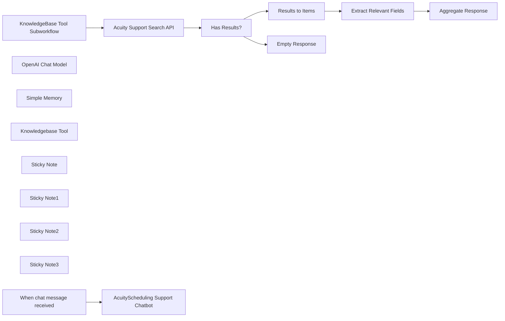

## Fluxo (.json) :

```json
{
  "meta": {
    "instanceId": "408f9fb9940c3cb18ffdef0e0150fe342d6e655c3a9fac21f0f644e8bedabcd9",
    "templateCredsSetupCompleted": true
  },
  "nodes": [
    {
      "id": "8f203423-b063-4918-a6ec-dad3ac7d1a20",
      "name": "When chat message received",
      "type": "@n8n/n8n-nodes-langchain.chatTrigger",
      "position": [
        860,
        -100
      ],
      "webhookId": "c82193c7-163c-4556-942f-81c80037e0ea",
      "parameters": {
        "options": {}
      },
      "typeVersion": 1.1
    },
    {
      "id": "d9f2e90f-128b-458b-b3cf-79db2ec08633",
      "name": "OpenAI Chat Model",
      "type": "@n8n/n8n-nodes-langchain.lmChatOpenAi",
      "position": [
        1000,
        100
      ],
      "parameters": {
        "model": {
          "__rl": true,
          "mode": "list",
          "value": "gpt-4o-mini"
        },
        "options": {}
      },
      "credentials": {
        "openAiApi": {
          "id": "8gccIjcuf3gvaoEr",
          "name": "OpenAi account"
        }
      },
      "typeVersion": 1.2
    },
    {
      "id": "4f752502-8589-4e31-bbe1-4b8395e7325a",
      "name": "Simple Memory",
      "type": "@n8n/n8n-nodes-langchain.memoryBufferWindow",
      "position": [
        1160,
        100
      ],
      "parameters": {},
      "typeVersion": 1.3
    },
    {
      "id": "61ca5a4b-3661-4330-ac4c-e09e75dd764c",
      "name": "Acuity Support Search API",
      "type": "n8n-nodes-base.httpRequest",
      "position": [
        1840,
        80
      ],
      "parameters": {
        "url": "https://2al21hjwoz-dsn.algolia.net/1/indexes/*/queries?x-algolia-agent=Algolia%20for%20JavaScript%20(3.35.1)%3B%20Browser%20(lite)%3B%20instantsearch.js%201.12.1%3B%20Zendesk%20Integration%20(2.32.0)%3B%20JS%20Helper%20(2.28.1)&x-algolia-application-id=2AL21HJWOZ&x-algolia-api-key=c3c07dd7fb575008575163c085a62b92",
        "method": "POST",
        "options": {},
        "jsonBody": "={{\n{\n  \"requests\":[\n    {\n      \"indexName\":\"Zendesk 4-25\",\n      \"params\": \"query=\" + $json.query + \"&hitsPerPage=5&page=0&facets=%5B%22locale.locale%22%2C%22label_names%22%2C%22category.title%22%5D&tagFilters=&facetFilters=%5B%22locale.locale%3Aen-us%22%5D\"\n    }\n  ]\n}\n}}",
        "sendBody": true,
        "sendHeaders": true,
        "specifyBody": "json",
        "headerParameters": {
          "parameters": [
            {
              "name": "Accept-Language",
              "value": "en"
            },
            {
              "name": "Cache-Control",
              "value": "no-cache"
            },
            {
              "name": "Connection",
              "value": "keep-alive"
            },
            {
              "name": "Origin",
              "value": "https://help.acuityscheduling.com"
            },
            {
              "name": "Referer",
              "value": "https://help.acuityscheduling.com/"
            },
            {
              "name": "User-Agent",
              "value": "Mozilla/5.0 (Macintosh; Intel Mac OS X 10_15_7) AppleWebKit/537.36 (KHTML, like Gecko) Chrome/134.0.0.0 Safari/537.36"
            },
            {
              "name": "accept",
              "value": "application/json"
            }
          ]
        }
      },
      "typeVersion": 4.2
    },
    {
      "id": "8ecd6287-982c-4754-9300-4c6d54202273",
      "name": "Extract Relevant Fields",
      "type": "n8n-nodes-base.set",
      "position": [
        2560,
        80
      ],
      "parameters": {
        "options": {},
        "assignments": {
          "assignments": [
            {
              "id": "a6973f14-e17d-46b0-9c5b-c6d9967dbf99",
              "name": "title",
              "type": "string",
              "value": "={{ $json.title }}"
            },
            {
              "id": "88092adb-7f63-4daa-8c7a-cbd85750e180",
              "name": "body",
              "type": "string",
              "value": "={{ $json.body_safe }}"
            },
            {
              "id": "12718897-a73d-4c3a-bcfb-b17c890458ec",
              "name": "url",
              "type": "string",
              "value": "=https://help.acuityscheduling.com/hc/en-us/articles/{{ $json.id }}"
            }
          ]
        }
      },
      "typeVersion": 3.4
    },
    {
      "id": "bf5855b2-8e73-4c29-b277-adee63e8bf59",
      "name": "Results to Items",
      "type": "n8n-nodes-base.splitOut",
      "position": [
        2360,
        80
      ],
      "parameters": {
        "options": {},
        "fieldToSplitOut": "results[0].hits"
      },
      "typeVersion": 1
    },
    {
      "id": "c9329816-bbe0-4de7-b6fb-fa87783f6a5c",
      "name": "Has Results?",
      "type": "n8n-nodes-base.if",
      "position": [
        2040,
        80
      ],
      "parameters": {
        "options": {},
        "conditions": {
          "options": {
            "version": 2,
            "leftValue": "",
            "caseSensitive": true,
            "typeValidation": "strict"
          },
          "combinator": "and",
          "conditions": [
            {
              "id": "f5d7e890-f00a-4252-8588-c6662e71790c",
              "operator": {
                "type": "array",
                "operation": "lengthGt",
                "rightType": "number"
              },
              "leftValue": "={{ $json.results[0]?.hits ?? [] }}",
              "rightValue": 0
            }
          ]
        }
      },
      "typeVersion": 2.2
    },
    {
      "id": "860a178a-d500-4291-acfc-9c9f4638d6c7",
      "name": "Empty Response",
      "type": "n8n-nodes-base.set",
      "position": [
        2360,
        260
      ],
      "parameters": {
        "options": {},
        "assignments": {
          "assignments": [
            {
              "id": "0ce36950-83d9-4964-8763-f329a4cda5a8",
              "name": "response",
              "type": "array",
              "value": "[]"
            }
          ]
        }
      },
      "typeVersion": 3.4
    },
    {
      "id": "c9f2a08b-88c2-4287-994c-f7af58e98301",
      "name": "Aggregate Response",
      "type": "n8n-nodes-base.aggregate",
      "position": [
        2760,
        80
      ],
      "parameters": {
        "options": {},
        "aggregate": "aggregateAllItemData",
        "destinationFieldName": "response"
      },
      "typeVersion": 1
    },
    {
      "id": "5f1f8874-7022-4ea1-b0a7-de42c4f800a1",
      "name": "Knowledgebase Tool",
      "type": "@n8n/n8n-nodes-langchain.toolWorkflow",
      "position": [
        1320,
        100
      ],
      "parameters": {
        "name": "acuity_support_search",
        "workflowId": {
          "__rl": true,
          "mode": "id",
          "value": "={{ $workflow.id }}"
        },
        "description": "Call this tool to query AcuityScheduling's Support Center Search API.",
        "workflowInputs": {
          "value": {
            "query": "={{ /*n8n-auto-generated-fromAI-override*/ $fromAI('query', ``, 'string') }}"
          },
          "schema": [
            {
              "id": "query",
              "type": "string",
              "display": true,
              "removed": false,
              "required": false,
              "displayName": "query",
              "defaultMatch": false,
              "canBeUsedToMatch": true
            }
          ],
          "mappingMode": "defineBelow",
          "matchingColumns": [],
          "attemptToConvertTypes": false,
          "convertFieldsToString": false
        }
      },
      "typeVersion": 2.1
    },
    {
      "id": "3913ddaa-852e-4463-a072-fe8be22bc184",
      "name": "Sticky Note",
      "type": "n8n-nodes-base.stickyNote",
      "position": [
        720,
        -300
      ],
      "parameters": {
        "color": 7,
        "width": 780,
        "height": 580,
        "content": "## 1. Simple Chatbot with Knowledgebase Tool\n[Learn more about AI agents](https://docs.n8n.io/integrations/builtin/cluster-nodes/root-nodes/n8n-nodes-langchain.agent)\n\nThe AI agent node is the simplest and recommended way to create user-friendly chatbots in n8n. Here, we'll define a support agent which can answer AcuityScheduling.com questions. To ensure the answers are accurate and up-to-date, we'll connect it to the support knowledgebase via a custom workflow tool."
      },
      "typeVersion": 1
    },
    {
      "id": "e24d75f9-6d3c-4bca-b67f-33737ee969ee",
      "name": "Sticky Note1",
      "type": "n8n-nodes-base.stickyNote",
      "position": [
        1540,
        -140
      ],
      "parameters": {
        "color": 7,
        "width": 700,
        "height": 440,
        "content": "## 2. Use your Existing Help Portal Search\n[Read more about the HTTP request tool](https://docs.n8n.io/integrations/builtin/core-nodes/n8n-nodes-base.httprequest)\n\nThe concept of RAG need to be synonymous with vector stores! In truth, many companies with a decent enough support website are able to leverage this existing knowledgebase for support agents. This saves time, money and effort and additional avoids maintenance of a vector store where syncs and updates are common."
      },
      "typeVersion": 1
    },
    {
      "id": "f5feebf1-fd6d-4558-a868-7ea4f852386c",
      "name": "Sticky Note2",
      "type": "n8n-nodes-base.stickyNote",
      "position": [
        2260,
        -140
      ],
      "parameters": {
        "color": 7,
        "width": 720,
        "height": 600,
        "content": "## 3. Clean up the Results to Optimise Tokens\n[Read more about the aggregate node](https://docs.n8n.io/integrations/builtin/core-nodes/n8n-nodes-base.aggregate)\n\nOf course, the results are intended for the website format but by using the custom workflow tool, we can edit it down to suit our chat scenario and save LLM costs (in terms of tokens) whilst we're at it. "
      },
      "typeVersion": 1
    },
    {
      "id": "8132de59-9b47-460a-9cb9-f2ec83123a3f",
      "name": "AcuityScheduling Support Chatbot",
      "type": "@n8n/n8n-nodes-langchain.agent",
      "position": [
        1060,
        -100
      ],
      "parameters": {
        "options": {
          "systemMessage": "You are a support assistant for the SaaS company, AcuityScheduling.com. Your task is to openly help the user with any questions regarding the AcuityScheduling service however, you are restricted to only this service. If the user asks questions unrelated to AcuityScheduling, you may ask them for clarification, explain you are not able to help them out of scope or redirect them to support@acuityScheduling.com. Be factual in your answer, tap into the resources or tools available and do not rely on your training data (which might be out-of-date). When returning a response to the user, you are encouraged to share the URL of the knowledgebase page where the user can explore the documentation for themselves."
        }
      },
      "typeVersion": 1.8
    },
    {
      "id": "564bde38-25ea-4969-aa3f-bff66ec2782f",
      "name": "Sticky Note3",
      "type": "n8n-nodes-base.stickyNote",
      "position": [
        260,
        -840
      ],
      "parameters": {
        "width": 440,
        "height": 1120,
        "content": "## Try it Out!\n### This n8n template demonstrates how you can leverage existing support site search to power your Support Chatbots and agents.\n\nBuilding a support chatbot need not be complicated! If building and indexing vector stores or duplicating data isn't necessarily your thing, an alternative implementation of the [RAG](https://www.databricks.com/glossary/retrieval-augmented-generation-rag) approach is to leverage existing knowledge-bases such as support portals.\n\n### How it works\n* A simple AI agent is connected with chat trigger to receive user queries.\n* The AI agent is instructed to fetch information from the knowledge-base via the attached custom workflow tool (aka \"knowledgebase tool\").\n* There is no step to replicate the entire support articles database into a vector store. You may choose not too because of time, cost and maintainence involved.\n* Instead, the tool leverages the existing support portal's search API to retrieve knowledge-base articles.\n* Finally, the search results are formatted before sending an aggregated response back to the agent.\n\n### How to use?\n* Customise the subworkflow to work with your own support portal API and format accordingly.\n* Try the following queries\n  * How do I connect my icloud to acuityScheduling?\n  * How do I download past invoices for my Acuity account?\n\n### Requirements\n* OpenAI for LLM.\n* If your organisation's APIs require authorisation, you may need to add custom credentials as necessary.\n\n### Customising this workflow\n* Add additional tools to reach other parts of your internal knowledgebase.\n* Not using OpenAI? Feel free to swap but ensure the LLM has tools/function calling support.\n\n\n### Need Help?\nJoin the [Discord](https://discord.com/invite/XPKeKXeB7d) or ask in the [Forum](https://community.n8n.io/)!\n\nHappy Hacking!"
      },
      "typeVersion": 1
    },
    {
      "id": "a918718f-915d-4d5c-a7c2-a015b8a84bbb",
      "name": "KnowledgeBase Tool Subworkflow",
      "type": "n8n-nodes-base.executeWorkflowTrigger",
      "position": [
        1620,
        80
      ],
      "parameters": {
        "workflowInputs": {
          "values": [
            {
              "name": "query"
            }
          ]
        }
      },
      "typeVersion": 1.1
    }
  ],
  "pinData": {},
  "connections": {
    "Has Results?": {
      "main": [
        [
          {
            "node": "Results to Items",
            "type": "main",
            "index": 0
          }
        ],
        [
          {
            "node": "Empty Response",
            "type": "main",
            "index": 0
          }
        ]
      ]
    },
    "Simple Memory": {
      "ai_memory": [
        [
          {
            "node": "AcuityScheduling Support Chatbot",
            "type": "ai_memory",
            "index": 0
          }
        ]
      ]
    },
    "Results to Items": {
      "main": [
        [
          {
            "node": "Extract Relevant Fields",
            "type": "main",
            "index": 0
          }
        ]
      ]
    },
    "OpenAI Chat Model": {
      "ai_languageModel": [
        [
          {
            "node": "AcuityScheduling Support Chatbot",
            "type": "ai_languageModel",
            "index": 0
          }
        ]
      ]
    },
    "Knowledgebase Tool": {
      "ai_tool": [
        [
          {
            "node": "AcuityScheduling Support Chatbot",
            "type": "ai_tool",
            "index": 0
          }
        ]
      ]
    },
    "Extract Relevant Fields": {
      "main": [
        [
          {
            "node": "Aggregate Response",
            "type": "main",
            "index": 0
          }
        ]
      ]
    },
    "Acuity Support Search API": {
      "main": [
        [
          {
            "node": "Has Results?",
            "type": "main",
            "index": 0
          }
        ]
      ]
    },
    "When chat message received": {
      "main": [
        [
          {
            "node": "AcuityScheduling Support Chatbot",
            "type": "main",
            "index": 0
          }
        ]
      ]
    },
    "KnowledgeBase Tool Subworkflow": {
      "main": [
        [
          {
            "node": "Acuity Support Search API",
            "type": "main",
            "index": 0
          }
        ]
      ]
    }
  }
}
```

<a id="template-603"></a>

## Template 603 - Análise de sentimento de feedback de clientes

- **Nome:** Análise de sentimento de feedback de clientes
- **Descrição:** Recebe feedback de clientes via formulário, classifica o sentimento do texto usando OpenAI e registra o resultado junto com os dados do formulário em uma planilha do Google Sheets.
- **Funcionalidade:** • Coleta de feedback por formulário: Gera um formulário web para que clientes enviem nome, categoria, contato e comentário.
• Classificação de sentimento: Envia o texto do feedback para o serviço de IA para identificar o sentimento (por exemplo: positivo, negativo, neutro).
• União dos dados: Combina a resposta do classificador de sentimento com os campos enviados pelo formulário.
• Registro em planilha: Adiciona uma nova linha na planilha do Google Sheets contendo timestamp, categoria, sentimento, nome, contato e feedback.
• Confirmação ao usuário: Mostra uma mensagem de envio confirmando que a resposta foi registrada.
- **Ferramentas:** • OpenAI: Serviço de inteligência artificial usado para classificar o sentimento do texto do feedback.
• Google Sheets: Planilha online utilizada para armazenar registros de feedback e resultados de sentimento.
• Formulário web (webhook): Interface de coleta de respostas dos clientes que dispara o fluxo quando o formulário é submetido.


## Fluxo visual

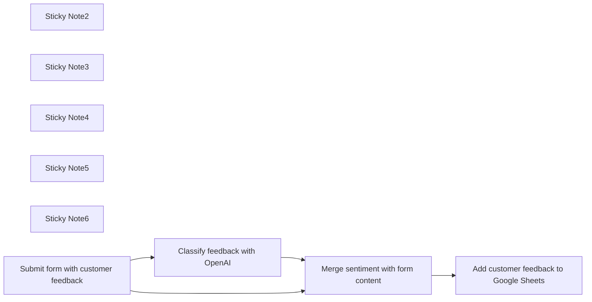

## Fluxo (.json) :

```json
{
  "meta": {
    "instanceId": "82a17fa4a0b8e81bf77e5ab999d980f392150f2a9541fde626dc5f74857b1f54"
  },
  "nodes": [
    {
      "id": "4ea39a4f-d8c1-438f-9738-bfbb906a3d7a",
      "name": "Sticky Note2",
      "type": "n8n-nodes-base.stickyNote",
      "position": [
        1200,
        1020
      ],
      "parameters": {
        "width": 253,
        "height": 342,
        "content": "## Send customer feedback to OpenAI for sentiment analysis"
      },
      "typeVersion": 1
    },
    {
      "id": "6962ea41-7d15-4932-919f-21ac94fa1269",
      "name": "Sticky Note3",
      "type": "n8n-nodes-base.stickyNote",
      "position": [
        1960,
        1180
      ],
      "parameters": {
        "width": 253,
        "height": 342,
        "content": "## Add new feedback to google sheets"
      },
      "typeVersion": 1
    },
    {
      "id": "4c8a8984-2d8e-4139-866b-6f3536aced07",
      "name": "Sticky Note4",
      "type": "n8n-nodes-base.stickyNote",
      "position": [
        800,
        1600
      ],
      "parameters": {
        "width": 1407,
        "height": 254,
        "content": "## Instructions\n1. Connect Google sheets\n2. Connect your OpenAi account (api key + org Id)\n3. Create a customer feedback form, use an existing one or use the one below as example. \nAll set!\n\n\n- Here is the example google sheet being used in this workflow: https://docs.google.com/spreadsheets/d/1omWdRbiT6z6GNZ6JClu9gEsRhPQ6J0EJ2yXyFH9Zng4/edit?usp=sharing. You can download it to your account."
      },
      "typeVersion": 1
    },
    {
      "id": "d43a9574-626d-4817-87ba-d99bdd6f41dc",
      "name": "Sticky Note5",
      "type": "n8n-nodes-base.stickyNote",
      "position": [
        800,
        1160
      ],
      "parameters": {
        "width": 253,
        "height": 342,
        "content": "## Feedback form is submitted"
      },
      "typeVersion": 1
    },
    {
      "id": "76dab2dc-935f-416e-91aa-5a1b7017ec1b",
      "name": "Sticky Note6",
      "type": "n8n-nodes-base.stickyNote",
      "position": [
        1600,
        1180
      ],
      "parameters": {
        "width": 253,
        "height": 342,
        "content": "## Merge form data and OpenAI result"
      },
      "typeVersion": 1
    },
    {
      "id": "9772eac1-8df2-4305-9b2c-265d3c5a9a4a",
      "name": "Add customer feedback to Google Sheets",
      "type": "n8n-nodes-base.googleSheets",
      "position": [
        2020,
        1320
      ],
      "parameters": {
        "columns": {
          "value": {
            "Category": "={{ $json['What is your feedback about?'] }}",
            "Sentiment": "={{ $json.text }}",
            "Timestamp": "={{ $json.submittedAt }}",
            "Entered by": "=Form",
            "Customer Name": "={{ $json.Name }}",
            "Customer contact": "={{ $json['How do we get in touch with you?'] }}",
            "Customer Feedback": "={{ $json['Your feedback'] }}"
          },
          "schema": [
            {
              "id": "Timestamp",
              "type": "string",
              "display": true,
              "required": false,
              "displayName": "Timestamp",
              "defaultMatch": false,
              "canBeUsedToMatch": true
            },
            {
              "id": "Category",
              "type": "string",
              "display": true,
              "required": false,
              "displayName": "Category",
              "defaultMatch": false,
              "canBeUsedToMatch": true
            },
            {
              "id": "Customer Feedback",
              "type": "string",
              "display": true,
              "required": false,
              "displayName": "Customer Feedback",
              "defaultMatch": false,
              "canBeUsedToMatch": true
            },
            {
              "id": "Customer Name",
              "type": "string",
              "display": true,
              "required": false,
              "displayName": "Customer Name",
              "defaultMatch": false,
              "canBeUsedToMatch": true
            },
            {
              "id": "Customer contact",
              "type": "string",
              "display": true,
              "required": false,
              "displayName": "Customer contact",
              "defaultMatch": false,
              "canBeUsedToMatch": true
            },
            {
              "id": "Entered by",
              "type": "string",
              "display": true,
              "required": false,
              "displayName": "Entered by",
              "defaultMatch": false,
              "canBeUsedToMatch": true
            },
            {
              "id": "Urgent?",
              "type": "string",
              "display": true,
              "required": false,
              "displayName": "Urgent?",
              "defaultMatch": false,
              "canBeUsedToMatch": true
            },
            {
              "id": "Sentiment",
              "type": "string",
              "display": true,
              "required": false,
              "displayName": "Sentiment",
              "defaultMatch": false,
              "canBeUsedToMatch": true
            }
          ],
          "mappingMode": "defineBelow",
          "matchingColumns": []
        },
        "options": {},
        "operation": "append",
        "sheetName": {
          "__rl": true,
          "mode": "list",
          "value": "gid=0",
          "cachedResultUrl": "https://docs.google.com/spreadsheets/d/1omWdRbiT6z6GNZ6JClu9gEsRhPQ6J0EJ2yXyFH9Zng4/edit#gid=0",
          "cachedResultName": "Sheet1"
        },
        "documentId": {
          "__rl": true,
          "mode": "list",
          "value": "1omWdRbiT6z6GNZ6JClu9gEsRhPQ6J0EJ2yXyFH9Zng4",
          "cachedResultUrl": "https://docs.google.com/spreadsheets/d/1omWdRbiT6z6GNZ6JClu9gEsRhPQ6J0EJ2yXyFH9Zng4/edit?usp=drivesdk",
          "cachedResultName": "CustomerFeedback"
        }
      },
      "credentials": {
        "googleSheetsOAuth2Api": {
          "id": "3",
          "name": "Google Sheets account"
        }
      },
      "typeVersion": 4.1
    },
    {
      "id": "12084971-c81b-4a0e-814e-120867562642",
      "name": "Merge sentiment with form content",
      "type": "n8n-nodes-base.merge",
      "position": [
        1680,
        1320
      ],
      "parameters": {
        "mode": "combine",
        "options": {},
        "combinationMode": "multiplex"
      },
      "typeVersion": 2.1
    },
    {
      "id": "235edf5b-7724-4712-8dc5-d8327a0620b8",
      "name": "Classify feedback with OpenAI",
      "type": "n8n-nodes-base.openAi",
      "position": [
        1280,
        1180
      ],
      "parameters": {
        "prompt": "=Classify the sentiment in the following customer feedback: {{ $json['Your feedback'] }}",
        "options": {}
      },
      "credentials": {
        "openAiApi": {
          "id": "s2iucY0IctjYNbrb",
          "name": "OpenAi account"
        }
      },
      "typeVersion": 1
    },
    {
      "id": "af4b22aa-0925-40b1-a9ac-298f9745a98e",
      "name": "Submit form with customer feedback",
      "type": "n8n-nodes-base.formTrigger",
      "position": [
        860,
        1340
      ],
      "webhookId": "e7bf682e-48e8-40de-9815-cd180cdd1480",
      "parameters": {
        "options": {
          "formSubmittedText": "Your response has been recorded"
        },
        "formTitle": "Customer Feedback",
        "formFields": {
          "values": [
            {
              "fieldLabel": "Name",
              "requiredField": true
            },
            {
              "fieldType": "dropdown",
              "fieldLabel": "What is your feedback about?",
              "fieldOptions": {
                "values": [
                  {
                    "option": "Product"
                  },
                  {
                    "option": "Service"
                  },
                  {
                    "option": "Other"
                  }
                ]
              },
              "requiredField": true
            },
            {
              "fieldType": "textarea",
              "fieldLabel": "Your feedback",
              "requiredField": true
            },
            {
              "fieldLabel": "How do we get in touch with you?"
            }
          ]
        },
        "formDescription": "Please give feedback about our company orproducts."
      },
      "typeVersion": 1
    }
  ],
  "connections": {
    "Classify feedback with OpenAI": {
      "main": [
        [
          {
            "node": "Merge sentiment with form content",
            "type": "main",
            "index": 0
          }
        ]
      ]
    },
    "Merge sentiment with form content": {
      "main": [
        [
          {
            "node": "Add customer feedback to Google Sheets",
            "type": "main",
            "index": 0
          }
        ]
      ]
    },
    "Submit form with customer feedback": {
      "main": [
        [
          {
            "node": "Classify feedback with OpenAI",
            "type": "main",
            "index": 0
          },
          {
            "node": "Merge sentiment with form content",
            "type": "main",
            "index": 1
          }
        ]
      ]
    }
  }
}
```

<a id="template-604"></a>

## Template 604 - Qualificação automática de leads com GPT-4

- **Nome:** Qualificação automática de leads com GPT-4
- **Descrição:** Automatiza a qualificação de novos leads recebidos via formulário/planilha, usando GPT-4 para avaliar e registrar uma classificação no documento.
- **Funcionalidade:** • Monitoramento de novas entradas: Detecta automaticamente novos registros adicionados à planilha.
• Preparação de dados do lead: Coleta e formata informações do formulário (nome, email, área, tamanho da equipe) para avaliação.
• Avaliação com modelo de linguagem: Envia instruções (mensagem do sistema) e dados do lead ao GPT-4 para decidir se o lead é qualificado.
• Extração de resposta estruturada: Converte a resposta JSON do GPT em campos utilizáveis pela automação.
• Combinação de dados: Junta o registro original com a avaliação do GPT para manter contexto.
• Atualização da planilha: Escreve a classificação/resultados do GPT de volta em uma coluna específica da planilha.
- **Ferramentas:** • Google Sheets: Armazenamento e atualização dos registros de leads, além de disparo com novas entradas.
• Google Forms: Fonte opcional de submissões que alimenta a planilha com novos leads.
• OpenAI (GPT-4): Modelo de linguagem usado para avaliar e classificar a qualidade dos leads.


## Fluxo visual

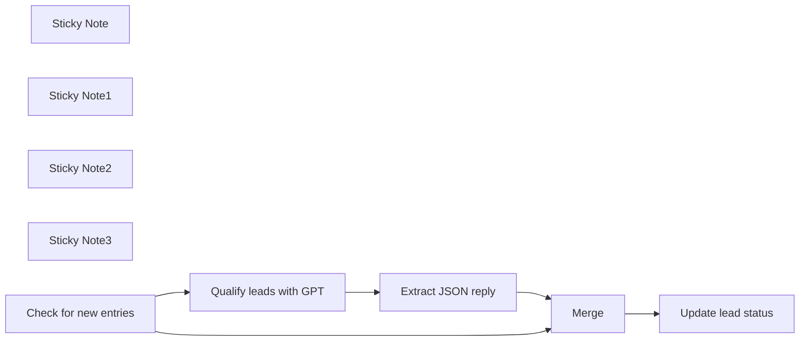

## Fluxo (.json) :

```json
{
  "id": "8FLJK1NsduFL0Y5P",
  "meta": {
    "instanceId": "fb924c73af8f703905bc09c9ee8076f48c17b596ed05b18c0ff86915ef8a7c4a"
  },
  "name": "Qualify new leads in Google Sheets via OpenAI's GPT-4",
  "tags": [
    {
      "id": "y9tvM3hISJKT2jeo",
      "name": "Ted's Tech Talks",
      "createdAt": "2023-08-15T22:12:34.260Z",
      "updatedAt": "2023-08-15T22:12:34.260Z"
    }
  ],
  "nodes": [
    {
      "id": "1f179325-0bec-4e5c-8ebd-0a2bb3ebefaa",
      "name": "Merge",
      "type": "n8n-nodes-base.merge",
      "position": [
        1440,
        340
      ],
      "parameters": {
        "mode": "combine",
        "options": {},
        "combinationMode": "mergeByPosition"
      },
      "typeVersion": 2.1
    },
    {
      "id": "7b548661-2b32-451f-ba52-91ca86728f1e",
      "name": "Sticky Note",
      "type": "n8n-nodes-base.stickyNote",
      "position": [
        358,
        136.3642172523962
      ],
      "parameters": {
        "width": 442,
        "height": 360.6357827476038,
        "content": "### 1. Create a Google Sheet document\n* This template uses Google Sheet document connected to Google Forms, but a standalone Sheet document will work too\n* Adapt initial trigger to your needs: check for new entries periodically or add a manual trigger\n\n[Link to the Google Sheet template](https://docs.google.com/spreadsheets/d/1jk8ZbfOMObvHGGImc0sBJTZB_hracO4jRqfbryMgzEs)"
      },
      "typeVersion": 1
    },
    {
      "id": "308b4dce-4656-47bd-b217-69565b1c34f6",
      "name": "Sticky Note1",
      "type": "n8n-nodes-base.stickyNote",
      "position": [
        820,
        420
      ],
      "parameters": {
        "width": 471,
        "height": 322,
        "content": "### 2. Provide lead qualification instructions\n* Create a __system message__ with overall instructions\n* Add a __user message__ with the JSON variables\n* Set node parses the resulting JSON object, but you can also request a plain string response in the system message"
      },
      "typeVersion": 1
    },
    {
      "id": "c00442ca-98cf-4296-b084-f0881ce4fd39",
      "name": "Sticky Note2",
      "type": "n8n-nodes-base.stickyNote",
      "position": [
        1320,
        222.18785942492013
      ],
      "parameters": {
        "width": 355,
        "height": 269.81214057507987,
        "content": "### 3. Combine the initial data with GPT response\n* This Merge node puts together original records from the google sheet and responses from the OpenAI"
      },
      "typeVersion": 1
    },
    {
      "id": "62643a4c-a69c-4351-9960-20413285ff33",
      "name": "Sticky Note3",
      "type": "n8n-nodes-base.stickyNote",
      "position": [
        1700,
        220
      ],
      "parameters": {
        "width": 398,
        "height": 265,
        "content": "### 4. Update the Google Sheet document\n* Provide __Column to Match On__ (usually a timestamp in case of Google Forms)\n* Enter the result from GPT into a separate column"
      },
      "typeVersion": 1
    },
    {
      "id": "4cd58340-81c4-46c7-b346-25a9b6ef2910",
      "name": "Update lead status",
      "type": "n8n-nodes-base.googleSheets",
      "position": [
        1860,
        340
      ],
      "parameters": {
        "columns": {
          "value": {
            "Rating": "={{ $json.reply.rating }}",
            "Timestamp": "={{ $json.Timestamp }}"
          },
          "schema": [
            {
              "id": "Timestamp",
              "type": "string",
              "display": true,
              "removed": false,
              "required": false,
              "displayName": "Timestamp",
              "defaultMatch": false,
              "canBeUsedToMatch": true
            },
            {
              "id": "Email Address",
              "type": "string",
              "display": true,
              "removed": true,
              "required": false,
              "displayName": "Email Address",
              "defaultMatch": false,
              "canBeUsedToMatch": true
            },
            {
              "id": "Your name",
              "type": "string",
              "display": true,
              "removed": true,
              "required": false,
              "displayName": "Your name",
              "defaultMatch": false,
              "canBeUsedToMatch": true
            },
            {
              "id": "Your business area",
              "type": "string",
              "display": true,
              "removed": true,
              "required": false,
              "displayName": "Your business area",
              "defaultMatch": false,
              "canBeUsedToMatch": true
            },
            {
              "id": "Your team size",
              "type": "string",
              "display": true,
              "removed": true,
              "required": false,
              "displayName": "Your team size",
              "defaultMatch": false,
              "canBeUsedToMatch": true
            },
            {
              "id": "Rating",
              "type": "string",
              "display": true,
              "required": false,
              "displayName": "Rating",
              "defaultMatch": false,
              "canBeUsedToMatch": true
            },
            {
              "id": "row_number",
              "type": "string",
              "display": true,
              "removed": true,
              "readOnly": true,
              "required": false,
              "displayName": "row_number",
              "defaultMatch": false,
              "canBeUsedToMatch": true
            }
          ],
          "mappingMode": "defineBelow",
          "matchingColumns": [
            "Timestamp"
          ]
        },
        "options": {},
        "operation": "update",
        "sheetName": {
          "__rl": true,
          "mode": "list",
          "value": 72739218,
          "cachedResultUrl": "https://docs.google.com/spreadsheets/d/1jk8ZbfOMObvHGGImc0sBJTZB_hracO4jRqfbryMgzEs/edit#gid=72739218",
          "cachedResultName": "Form Responses 1"
        },
        "documentId": {
          "__rl": true,
          "mode": "list",
          "value": "1jk8ZbfOMObvHGGImc0sBJTZB_hracO4jRqfbryMgzEs",
          "cachedResultUrl": "https://docs.google.com/spreadsheets/d/1jk8ZbfOMObvHGGImc0sBJTZB_hracO4jRqfbryMgzEs/edit?usp=drivesdk",
          "cachedResultName": "Join Community (Responses)"
        }
      },
      "credentials": {
        "googleSheetsOAuth2Api": {
          "id": "RtRiRezoxiWkzZQt",
          "name": "Ted's Tech Talks Google account"
        }
      },
      "typeVersion": 4.2
    },
    {
      "id": "fea0acee-13b6-441a-8cf9-c8fedbc4617d",
      "name": "Extract JSON reply",
      "type": "n8n-nodes-base.set",
      "position": [
        1120,
        580
      ],
      "parameters": {
        "fields": {
          "values": [
            {
              "name": "reply",
              "type": "objectValue",
              "objectValue": "={{ JSON.parse($json.message.content) }}"
            }
          ]
        },
        "include": "selected",
        "options": {}
      },
      "typeVersion": 3.2
    },
    {
      "id": "0a0608fe-894f-4eb5-b690-233c6dfc0428",
      "name": "Qualify leads with GPT",
      "type": "n8n-nodes-base.openAi",
      "position": [
        900,
        580
      ],
      "parameters": {
        "prompt": {
          "messages": [
            {
              "role": "system",
              "content": "Your task is to qualify incoming leads. Leads are form submissions to a closed community group. Use the following criteria for a quality lead:\n\n1. We are looking for decision makers who run companies or who have some teams. The bigger the team - the better. Basically, everyone with some level of responsibility should be accepted. This is the main criterion.\n2. Email from a non-standard domain. Ideally this should be a corporate domain, but this is a secondary criterion.\n\nPlease thing step by step whether a lead is quality or not?\n\nIf at least one of the criteria satisfy, reply with \"qualified\" in response. Otherwise reply \"not qualified\". Reply with a JSON of the following structure: {\"rating\":\"string\",\"explanation\":\"string\"}. Reply only with with the JSON and nothing more!"
            },
            {
              "content": "=Here's a lead info:\nName: {{ $json['Your name'] }}\nEmail: {{ $json['Email Address'] }}\nBusiness area: {{ $json['Your business area'] }}\nSize of the team: {{ $json['Your team size'] }}"
            }
          ]
        },
        "options": {
          "temperature": 0.3
        },
        "resource": "chat",
        "chatModel": "gpt-4-turbo-preview"
      },
      "credentials": {
        "openAiApi": {
          "id": "rveqdSfp7pCRON1T",
          "name": "Ted's Tech Talks OpenAi"
        }
      },
      "typeVersion": 1.1
    },
    {
      "id": "22fdec69-a4a9-430d-9950-79195799ae7a",
      "name": "Check for new entries",
      "type": "n8n-nodes-base.googleSheetsTrigger",
      "position": [
        520,
        340
      ],
      "parameters": {
        "event": "rowAdded",
        "options": {},
        "pollTimes": {
          "item": [
            {
              "mode": "everyMinute"
            }
          ]
        },
        "sheetName": {
          "__rl": true,
          "mode": "list",
          "value": 72739218,
          "cachedResultUrl": "https://docs.google.com/spreadsheets/d/1jk8ZbfOMObvHGGImc0sBJTZB_hracO4jRqfbryMgzEs/edit#gid=72739218",
          "cachedResultName": "Form Responses 1"
        },
        "documentId": {
          "__rl": true,
          "mode": "list",
          "value": "1jk8ZbfOMObvHGGImc0sBJTZB_hracO4jRqfbryMgzEs",
          "cachedResultUrl": "https://docs.google.com/spreadsheets/d/1jk8ZbfOMObvHGGImc0sBJTZB_hracO4jRqfbryMgzEs/edit?usp=drivesdk",
          "cachedResultName": "Join Community (Responses)"
        }
      },
      "credentials": {
        "googleSheetsTriggerOAuth2Api": {
          "id": "m33qCYf9eEvSgo0x",
          "name": "Ted's Tech Talks Google Sheets Trigger"
        }
      },
      "typeVersion": 1
    }
  ],
  "active": false,
  "pinData": {},
  "settings": {
    "executionOrder": "v1"
  },
  "versionId": "ffad0998-1a6b-469d-9297-6d7fd88387b9",
  "connections": {
    "Merge": {
      "main": [
        [
          {
            "node": "Update lead status",
            "type": "main",
            "index": 0
          }
        ]
      ]
    },
    "Extract JSON reply": {
      "main": [
        [
          {
            "node": "Merge",
            "type": "main",
            "index": 1
          }
        ]
      ]
    },
    "Check for new entries": {
      "main": [
        [
          {
            "node": "Merge",
            "type": "main",
            "index": 0
          },
          {
            "node": "Qualify leads with GPT",
            "type": "main",
            "index": 0
          }
        ]
      ]
    },
    "Qualify leads with GPT": {
      "main": [
        [
          {
            "node": "Extract JSON reply",
            "type": "main",
            "index": 0
          }
        ]
      ]
    }
  }
}
```

<a id="template-605"></a>

## Template 605 - Envio diário de digest de templates por categoria

- **Nome:** Envio diário de digest de templates por categoria
- **Descrição:** Envia diariamente um email personalizado para cada assinante com os templates mais recentes das categorias que ele segue, incluindo resumos gerados por IA.
- **Funcionalidade:** • Agendamento diário: Executa o fluxo automaticamente todos os dias em horário definido.
• Leitura de assinantes de planilha: Obtém nome, email e categorias de interesse a partir de um arquivo Excel.
• Cálculo de categorias únicas: Identifica categorias distintas entre todos os assinantes para otimizar buscas.
• Busca de templates por categoria: Consulta uma API pública para obter os templates mais recentes de cada categoria.
• Resumo por IA: Gera resumos curtos (1–2 frases) das descrições dos templates usando um modelo de linguagem.
• Filtragem por assinante: Seleciona apenas os templates relevantes às categorias de cada assinante.
• Remoção de duplicados e itens já enviados: Evita enviar o mesmo template mais de uma vez para o mesmo assinante.
• Geração de email HTML personalizado: Monta um conteúdo HTML com títulos, autores, datas e resumos para cada assinante.
• Envio de email: Dispara o digest individualmente para o email do assinante via serviço de e-mail.
- **Ferramentas:** • Microsoft Excel: Armazenamento e leitura da lista de assinantes (nome, email, categorias).
• API pública de busca de templates: Fonte para obter os templates mais recentes por categoria.
• OpenAI (modelo de linguagem): Geração automática de resumos curtos para descrições de templates.
• Microsoft Outlook / Microsoft 365: Serviço de envio de emails em formato HTML para os assinantes.

## Fluxo visual

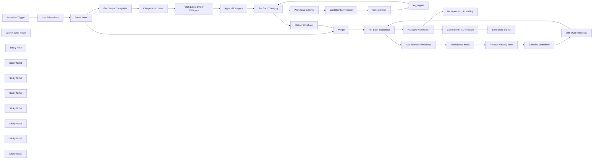

## Fluxo (.json) :

```json
{
  "meta": {
    "instanceId": "408f9fb9940c3cb18ffdef0e0150fe342d6e655c3a9fac21f0f644e8bedabcd9",
    "templateCredsSetupCompleted": true
  },
  "nodes": [
    {
      "id": "c3a9ba81-3a7e-4afe-be8b-cf482cbb88c2",
      "name": "Schedule Trigger",
      "type": "n8n-nodes-base.scheduleTrigger",
      "position": [
        -1040,
        -540
      ],
      "parameters": {
        "rule": {
          "interval": [
            {
              "triggerAtHour": 6
            }
          ]
        }
      },
      "typeVersion": 1.2
    },
    {
      "id": "f63d035c-5a7b-4cf4-8730-5fa7dff6f94b",
      "name": "Get Subscribers",
      "type": "n8n-nodes-base.microsoftExcel",
      "position": [
        -860,
        -540
      ],
      "parameters": {
        "options": {},
        "resource": "worksheet",
        "workbook": {
          "__rl": true,
          "mode": "id",
          "value": "="
        },
        "operation": "readRows",
        "worksheet": {
          "__rl": true,
          "mode": "id",
          "value": "="
        }
      },
      "credentials": {
        "microsoftExcelOAuth2Api": {
          "id": "56tIUYYVARBe9gfX",
          "name": "Microsoft Excel account"
        }
      },
      "typeVersion": 2.1
    },
    {
      "id": "e93aa8de-5c68-4a01-ae60-beb141e0a430",
      "name": "Get Unique Categories",
      "type": "n8n-nodes-base.set",
      "position": [
        -400,
        -160
      ],
      "parameters": {
        "options": {},
        "assignments": {
          "assignments": [
            {
              "id": "fe138128-50d5-469f-8c0b-0af8c873f198",
              "name": "categories",
              "type": "array",
              "value": "={{ $input.all().flatMap(item => item.json.categories).unique() }}"
            }
          ]
        }
      },
      "executeOnce": true,
      "typeVersion": 3.4
    },
    {
      "id": "a874ae4e-d67e-4019-9e5c-03ea677468ae",
      "name": "OpenAI Chat Model",
      "type": "@n8n/n8n-nodes-langchain.lmChatOpenAi",
      "position": [
        760,
        80
      ],
      "parameters": {
        "model": {
          "__rl": true,
          "mode": "list",
          "value": "gpt-4o-mini"
        },
        "options": {}
      },
      "credentials": {
        "openAiApi": {
          "id": "8gccIjcuf3gvaoEr",
          "name": "OpenAi account"
        }
      },
      "typeVersion": 1.2
    },
    {
      "id": "bc9c7578-3b6f-45fb-9f93-94637774d125",
      "name": "Aggregate",
      "type": "n8n-nodes-base.aggregate",
      "position": [
        1180,
        40
      ],
      "parameters": {
        "options": {},
        "aggregate": "aggregateAllItemData"
      },
      "typeVersion": 1
    },
    {
      "id": "ae83c9e2-a267-463c-a606-b4d101f93f92",
      "name": "Collect Fields",
      "type": "n8n-nodes-base.set",
      "position": [
        980,
        -60
      ],
      "parameters": {
        "options": {},
        "assignments": {
          "assignments": [
            {
              "id": "4a266505-4b88-41cf-bf22-f38c705c27e5",
              "name": "workflow_id",
              "type": "number",
              "value": "={{ $('Workflows to Items').item.json.workflow.id }}"
            },
            {
              "id": "df3348e2-b6ec-4c38-a146-c38be9b830bc",
              "name": "workflow_name",
              "type": "string",
              "value": "={{ $('Workflows to Items').item.json.workflow.name }}"
            },
            {
              "id": "b4646059-748f-407a-b829-d6605d5ab683",
              "name": "workflow_desc",
              "type": "string",
              "value": "={{ $json.response.text }}"
            },
            {
              "id": "eac0d9ab-9445-4bc2-9e64-160fe44b9ace",
              "name": "workflow_created_at",
              "type": "string",
              "value": "={{ $('Workflows to Items').item.json.workflow.createdAt }}"
            },
            {
              "id": "24a3c0cb-224c-4ce6-b59e-38b10ab2c02f",
              "name": "author_id",
              "type": "number",
              "value": "={{ $('Workflows to Items').item.json.workflow.user.id }}"
            },
            {
              "id": "a2b8a52f-be72-484c-aa86-582b73be1859",
              "name": "author_name",
              "type": "string",
              "value": "={{ $('Workflows to Items').item.json.workflow.user.name }}"
            },
            {
              "id": "ae735511-8c7c-4bef-b6ac-cfe3d4b87b4f",
              "name": "author_username",
              "type": "string",
              "value": "={{ $('Workflows to Items').item.json.workflow.user.username }}"
            },
            {
              "id": "2dc1f59f-a854-4322-85df-c5998f782dcd",
              "name": "category",
              "type": "string",
              "value": "={{ $('For Each Category').item.json.category }}"
            }
          ]
        }
      },
      "typeVersion": 3.4
    },
    {
      "id": "8ca1ea7e-9098-4e82-919b-ba98ae7d7574",
      "name": "Categories to Items",
      "type": "n8n-nodes-base.splitOut",
      "position": [
        -220,
        -160
      ],
      "parameters": {
        "options": {
          "destinationFieldName": "category"
        },
        "fieldToSplitOut": "categories"
      },
      "typeVersion": 1
    },
    {
      "id": "eb6d74b8-f1ed-4ab2-8c5f-7e6c6361b055",
      "name": "For Each Category",
      "type": "n8n-nodes-base.splitInBatches",
      "position": [
        320,
        -160
      ],
      "parameters": {
        "options": {}
      },
      "typeVersion": 3
    },
    {
      "id": "8640ffac-9df6-4154-bcd5-dfa90c3843d4",
      "name": "Workflows to Items",
      "type": "n8n-nodes-base.splitOut",
      "position": [
        500,
        -60
      ],
      "parameters": {
        "options": {
          "destinationFieldName": "workflow"
        },
        "fieldToSplitOut": "workflows"
      },
      "typeVersion": 1
    },
    {
      "id": "4456a43b-df26-4bb8-a62d-b9f05eff4479",
      "name": "Workflow Summarizer",
      "type": "@n8n/n8n-nodes-langchain.chainLlm",
      "position": [
        660,
        -60
      ],
      "parameters": {
        "text": "=## Description\n```\n{{ $json.workflow.description.replaceAll('#', '') }}\n```",
        "messages": {
          "messageValues": [
            {
              "message": "=You have received a description of a n8n template from the official template gallery. Your task is to summarize the description into one or two sentences. The summary should loosely follow the structure of:\n* identify the goal of the template\n* describe the method or approached implemented\n* highlight which important n8n nodes were used\n\neg. \"Obtain real-time crypto market insights using an AI-powered workflow with CoinMarketCap APIs through Telegram\""
            }
          ]
        },
        "promptType": "define"
      },
      "typeVersion": 1.5
    },
    {
      "id": "5f4a5921-c954-4523-8925-90401d8dbf22",
      "name": "Merge",
      "type": "n8n-nodes-base.merge",
      "position": [
        660,
        -460
      ],
      "parameters": {
        "mode": "chooseBranch"
      },
      "typeVersion": 3.1
    },
    {
      "id": "f95fb28c-875c-4105-aa83-9fea257ea440",
      "name": "Fetch Latest 10 per Category",
      "type": "n8n-nodes-base.httpRequest",
      "position": [
        -40,
        -160
      ],
      "parameters": {
        "url": "=https://n8n.io/api/product-api/workflows/search",
        "options": {},
        "sendQuery": true,
        "queryParameters": {
          "parameters": [
            {
              "name": "category",
              "value": "={{$json.category }}"
            },
            {
              "name": "rows",
              "value": "10"
            },
            {
              "name": "sort",
              "value": "createdAt:desc"
            },
            {
              "name": "page",
              "value": "1"
            }
          ]
        }
      },
      "typeVersion": 4.2
    },
    {
      "id": "4dda6cbc-e53f-452d-b257-df9ef18abd75",
      "name": "No Operation, do nothing",
      "type": "n8n-nodes-base.noOp",
      "position": [
        1560,
        -460
      ],
      "parameters": {},
      "typeVersion": 1
    },
    {
      "id": "881337d8-3ca8-43d2-931f-9cfec16cc367",
      "name": "Get Relevant Workflows",
      "type": "n8n-nodes-base.set",
      "position": [
        1380,
        -280
      ],
      "parameters": {
        "options": {},
        "assignments": {
          "assignments": [
            {
              "id": "fbd0ad94-e5aa-4082-81f5-d7b2e08dfbcf",
              "name": "workflows",
              "type": "array",
              "value": "={{\n$json.categories\n  .flatMap(cat =>\n    $('Flatten Workflows').first().json.workflows.filter(item => item.category === cat)\n  )\n}}"
            }
          ]
        }
      },
      "typeVersion": 3.4
    },
    {
      "id": "b3ad0e26-e495-4dae-bfdd-f65961178acc",
      "name": "Flatten Workflows",
      "type": "n8n-nodes-base.set",
      "position": [
        500,
        -280
      ],
      "parameters": {
        "options": {},
        "assignments": {
          "assignments": [
            {
              "id": "17a82dd9-3fcf-44d9-b5da-bf89a1f53d59",
              "name": "workflows",
              "type": "array",
              "value": "={{\n$input.all().flatMap(item => item.json.data)\n}}"
            }
          ]
        }
      },
      "executeOnce": true,
      "typeVersion": 3.4
    },
    {
      "id": "05f72731-f8b0-4d8f-ba78-66ef8fbaf059",
      "name": "Remove Already Seen",
      "type": "n8n-nodes-base.removeDuplicates",
      "position": [
        1740,
        -280
      ],
      "parameters": {
        "options": {},
        "operation": "removeItemsSeenInPreviousExecutions",
        "dedupeValue": "={{ $('For Each Subscriber').item.json.name.toSnakeCase() }}_{{ $json.workflow_id }}"
      },
      "typeVersion": 2
    },
    {
      "id": "3904d2a2-9a95-4e11-883e-b2e88c6a884f",
      "name": "Workflow to Items",
      "type": "n8n-nodes-base.splitOut",
      "position": [
        1560,
        -280
      ],
      "parameters": {
        "options": {},
        "fieldToSplitOut": "workflows"
      },
      "typeVersion": 1
    },
    {
      "id": "d416dee7-df0f-4579-a25f-6baed16453e8",
      "name": "Combine Workflows",
      "type": "n8n-nodes-base.aggregate",
      "position": [
        1920,
        -280
      ],
      "parameters": {
        "options": {},
        "aggregate": "aggregateAllItemData"
      },
      "typeVersion": 1
    },
    {
      "id": "3797dd21-3144-47e8-9359-841b97073001",
      "name": "Has New Workflows?",
      "type": "n8n-nodes-base.if",
      "position": [
        1380,
        -600
      ],
      "parameters": {
        "options": {},
        "conditions": {
          "options": {
            "version": 2,
            "leftValue": "",
            "caseSensitive": true,
            "typeValidation": "strict"
          },
          "combinator": "and",
          "conditions": [
            {
              "id": "08403b2a-4ae6-4cf5-aa88-cc49441e3c56",
              "operator": {
                "type": "array",
                "operation": "lengthGt",
                "rightType": "number"
              },
              "leftValue": "={{ $json.data }}",
              "rightValue": 0
            }
          ]
        }
      },
      "typeVersion": 2.2
    },
    {
      "id": "0cd6ce35-c083-4db6-bc87-9d21e70a3bab",
      "name": "With User Reference",
      "type": "n8n-nodes-base.set",
      "position": [
        2100,
        -280
      ],
      "parameters": {
        "options": {},
        "assignments": {
          "assignments": [
            {
              "id": "d69921eb-b518-4614-af63-e67a521ee373",
              "name": "name",
              "type": "string",
              "value": "={{ $('For Each Subscriber').item.json.name }}"
            },
            {
              "id": "01ee6e0a-9d03-42f6-ad46-68b9df861679",
              "name": "email",
              "type": "string",
              "value": "={{ $('For Each Subscriber').item.json.email }}"
            },
            {
              "id": "5263e512-1b24-43c8-9033-6547dab2811b",
              "name": "categories",
              "type": "array",
              "value": "={{ $('For Each Subscriber').item.json.categories }}"
            }
          ]
        },
        "includeOtherFields": true
      },
      "typeVersion": 3.4
    },
    {
      "id": "b3a616c7-615f-49ff-8e6f-530324a98be4",
      "name": "Generate HTML Template",
      "type": "n8n-nodes-base.html",
      "position": [
        1740,
        -720
      ],
      "parameters": {
        "html": "<h1>New Workflows for {{ $now.format('DD') }}</h1>\n{{\n$json.categories\n  .filter(cat =>\n    $json.data.filter(item => item.category === cat).length > 0\n  )\n  .map(category => `\n    <h2>${category.toSentenceCase()}</h2>\n    <ul>\n    ${$json.data\n      .filter(workflow => workflow.category === category)\n      .map(workflow => `\n      <li>\n        <a href=\"https://n8n.io/workflows/${workflow.workflow_id}\">\n          <h3>${workflow.workflow_name}</h3>\n        </a>\n        <p>\n          by\n          <a href=\"https://n8n.io/creators/${workflow.author_username}\">\n            ${workflow.author_name}\n          </a>\n          &middot;\n          created on ${DateTime.fromISO(workflow.workflow_created_at).toFormat('DD')}\n        </p>\n        <p>${workflow.workflow_desc}</p>\n      </li>\n    `).join('\\n')}\n    </ul>\n  `)\n  .join('\\n')\n}}"
      },
      "typeVersion": 1.2
    },
    {
      "id": "0c9865c7-9352-4fda-a943-34c8f524de6c",
      "name": "Parse Rows",
      "type": "n8n-nodes-base.set",
      "position": [
        -660,
        -540
      ],
      "parameters": {
        "options": {},
        "assignments": {
          "assignments": [
            {
              "id": "d89dfc07-3c1f-4fbc-9a52-3748797a4840",
              "name": "name",
              "type": "string",
              "value": "={{ $json.name }}"
            },
            {
              "id": "c622ceca-2e6d-4bab-bb08-235f704c7e2f",
              "name": "email",
              "type": "string",
              "value": "={{ $json.email }}"
            },
            {
              "id": "9fca8e33-330a-4e4d-b461-251cd7e5c620",
              "name": "categories",
              "type": "array",
              "value": "={{ $json.categories.split(',') }}"
            }
          ]
        }
      },
      "typeVersion": 3.4
    },
    {
      "id": "f5fbd7f2-65e5-4dd7-8e43-38a8a99e3321",
      "name": "Send Daily Digest",
      "type": "n8n-nodes-base.microsoftOutlook",
      "position": [
        1920,
        -720
      ],
      "webhookId": "8cd83f97-1e5f-4280-9a9d-26d1ee05c45e",
      "parameters": {
        "subject": "=New Workflows for {{ $now.format('DD') }}",
        "bodyContent": "={{\n$json.html\n  .replaceAll('\\n', '')\n  .replaceAll('  ', '')\n  .trim()\n}}",
        "toRecipients": "={{ $('Has New Workflows?').item.json.email }}",
        "additionalFields": {
          "from": "=no-reply <no-reply@example.com>",
          "replyTo": "=no-reply <no-reply@example.com>",
          "bodyContentType": "html"
        }
      },
      "credentials": {
        "microsoftOutlookOAuth2Api": {
          "id": "EWg6sbhPKcM5y3Mr",
          "name": "Microsoft Outlook account"
        }
      },
      "typeVersion": 2
    },
    {
      "id": "e81ba3a0-e3f6-4231-8870-8ef03edf41e1",
      "name": "Append Category",
      "type": "n8n-nodes-base.set",
      "position": [
        140,
        -160
      ],
      "parameters": {
        "options": {},
        "assignments": {
          "assignments": [
            {
              "id": "b965dee8-f3b5-419b-b39a-79bf2b7d04c1",
              "name": "category",
              "type": "string",
              "value": "={{ $('Categories to Items').item.json.category }}"
            }
          ]
        },
        "includeOtherFields": true
      },
      "typeVersion": 3.4
    },
    {
      "id": "e1c2c743-a560-47e8-b906-a2e8fd17622f",
      "name": "Sticky Note",
      "type": "n8n-nodes-base.stickyNote",
      "position": [
        -1060,
        -740
      ],
      "parameters": {
        "color": 7,
        "width": 440,
        "content": "## 1. Get Subscribers from Excel\n[Learn more about the Excel node](https://docs.n8n.io/integrations/builtin/app-nodes/n8n-nodes-base.microsoftexcel)\n\nExcel can be an easy way to store a simple list of subscribers who will receive our daily digest. We can also specify only the categories they are interested in."
      },
      "typeVersion": 1
    },
    {
      "id": "e10a23be-2af7-4b92-9b5f-df855e6ee349",
      "name": "Sticky Note1",
      "type": "n8n-nodes-base.stickyNote",
      "position": [
        -400,
        -420
      ],
      "parameters": {
        "color": 7,
        "width": 620,
        "height": 220,
        "content": "## 2. Fetch Latest Templates from n8n\n[Learn more about the HTTP Request node](https://docs.n8n.io/integrations/builtin/core-nodes/n8n-nodes-base.httprequest)\n\nUsing the HTTP request node, we can call the n8n.io template search API to the latest published templates. However, to save on resources, we only want to fetch from categories relevant to our subscribers. To do so:\n1) We only want to fetch latest templates from unique categories amongst all subscribers\n2) Do this fetching once to later reference for all subscribers"
      },
      "typeVersion": 1
    },
    {
      "id": "0ee0b2ca-0247-4471-a6f5-920fd8e67f96",
      "name": "Sticky Note2",
      "type": "n8n-nodes-base.stickyNote",
      "position": [
        500,
        260
      ],
      "parameters": {
        "color": 7,
        "width": 580,
        "height": 180,
        "content": "## 3. Generate AI Summary For Each Template\n[Read more about the Basic LLM node](https://docs.n8n.io/integrations/builtin/cluster-nodes/root-nodes/n8n-nodes-langchain.chainllm)\n\nWhen building our email digest, we'd rather have a shortened and summarized version of each template's description for easier scanning and reading. We can use AI to accomplish this and merge it with the template object."
      },
      "typeVersion": 1
    },
    {
      "id": "ab234694-2878-440b-aeb5-37573ebe517e",
      "name": "Sticky Note3",
      "type": "n8n-nodes-base.stickyNote",
      "position": [
        1680,
        -60
      ],
      "parameters": {
        "color": 7,
        "width": 580,
        "height": 200,
        "content": "## 4. Filter Relevant Templates for Subscriber\n[Read more about the Split Out node](https://docs.n8n.io/integrations/builtin/core-nodes/n8n-nodes-base.splitout)\n\nFor each subscriber, we want to filter out our freshly collected n8n.io templates by the categories relevant to the subscriber as defined in the Excel sheet. A \"Remove duplicates\" node can be used to keep track of duplicate templates - as templates can have more than one category and appear twice!"
      },
      "typeVersion": 1
    },
    {
      "id": "460a8b3d-c125-41c3-95c5-afdfe63c7561",
      "name": "Sticky Note4",
      "type": "n8n-nodes-base.stickyNote",
      "position": [
        1740,
        -960
      ],
      "parameters": {
        "color": 7,
        "width": 580,
        "height": 200,
        "content": "## 5. Generate Daily Digest and Send Via Outlook\n[Read more about the Outlook node](https://docs.n8n.io/integrations/builtin/app-nodes/n8n-nodes-base.microsoftoutlook)\n\nFinally, we can construct our digest's content using the HTML node and customise it by subscriber as necessary. The Outlook node is then used to send the digest to the subscriber."
      },
      "typeVersion": 1
    },
    {
      "id": "c79a2775-6276-41df-a9f0-64017e88a8c7",
      "name": "Sticky Note5",
      "type": "n8n-nodes-base.stickyNote",
      "position": [
        -500,
        0
      ],
      "parameters": {
        "color": 5,
        "width": 200,
        "height": 120,
        "content": "### Execute Once\nThis node has been set to execute once rather than for each subscriber."
      },
      "typeVersion": 1
    },
    {
      "id": "5290822e-b63b-4b73-8511-6a12e2387656",
      "name": "Sticky Note6",
      "type": "n8n-nodes-base.stickyNote",
      "position": [
        -940,
        -360
      ],
      "parameters": {
        "color": 5,
        "width": 280,
        "height": 120,
        "content": "### Columns\n- name *(text)*\n- email *(text)*\n- categories *(text, comma-delimited)*"
      },
      "typeVersion": 1
    },
    {
      "id": "56acbd11-7fa5-44b8-b031-fcdeb6e44839",
      "name": "For Each Subscriber",
      "type": "n8n-nodes-base.splitInBatches",
      "position": [
        1180,
        -460
      ],
      "parameters": {
        "options": {}
      },
      "typeVersion": 3
    },
    {
      "id": "6aef7efc-1bc7-4a1d-b0cb-459484b3d179",
      "name": "Sticky Note7",
      "type": "n8n-nodes-base.stickyNote",
      "position": [
        -1600,
        -1400
      ],
      "parameters": {
        "width": 500,
        "height": 1000,
        "content": "## Try It Out!\n### This n8n template builds a newsletter (\"daily digest\") delivery service which pulls and summarises the latest n8n.io template in select categories defined by subscribers.\n\nIt's scheduled to run once a day and sends the newsletter directly to subscriber via a nicely formatted email. If you've had trouble keeping up with the latest and greatest templates beign published daily, this workflow can save you a lot of time!\n\n### How it works\n* A scheduled trigger pulls a list of subscribers (email and category preferences) from an Excel workbook.\n* We work out unique categories amongst all subscribers and only fetch the latest n8n website templates from these categories to save on resources and optimise the number of API calls we make.\n* The fetched templates are summarised via AI to produce a short description which is more suitable for our email format.\n* For each subscriber, we filter and collect only the templates relevant to their category preferences (as defined in the Excel) and ensure that duplicate templates or those which have been \"seen before\" are omitted.\n* A HTML node is then used to generate the email newsletter. HTML emails are the perfect format since we can add links back to the template.\n* Finally, we use the Outlook node to send the email digest to the subscriber.\n\n### How to use\n* Populate your Excel sheet with 3 columns: name, email and categories. Categories is a comma-delimited list of categories which match the n8n template website. The available categories are AI, SecOps, Sales, IT Ops, Marketing, Engineering, DevOps, Building Blocks, Design, Finance, HR, Other, Product and Support.\n* To subscribe a new user, simply add their email to the Excel sheet with at least one category.\n* To unsubscribe a user, remove them from the sheet.\n* If you're not interested in paid templates, you may want to filter them out after fetching them.\n\n### Need Help?\nJoin the [Discord](https://discord.com/invite/XPKeKXeB7d) or ask in the [Forum](https://community.n8n.io/)!"
      },
      "typeVersion": 1
    }
  ],
  "pinData": {},
  "connections": {
    "Merge": {
      "main": [
        [
          {
            "node": "For Each Subscriber",
            "type": "main",
            "index": 0
          }
        ]
      ]
    },
    "Aggregate": {
      "main": [
        [
          {
            "node": "For Each Category",
            "type": "main",
            "index": 0
          }
        ]
      ]
    },
    "Parse Rows": {
      "main": [
        [
          {
            "node": "Get Unique Categories",
            "type": "main",
            "index": 0
          },
          {
            "node": "Merge",
            "type": "main",
            "index": 0
          }
        ]
      ]
    },
    "Collect Fields": {
      "main": [
        [
          {
            "node": "Aggregate",
            "type": "main",
            "index": 0
          }
        ]
      ]
    },
    "Append Category": {
      "main": [
        [
          {
            "node": "For Each Category",
            "type": "main",
            "index": 0
          }
        ]
      ]
    },
    "Get Subscribers": {
      "main": [
        [
          {
            "node": "Parse Rows",
            "type": "main",
            "index": 0
          }
        ]
      ]
    },
    "Schedule Trigger": {
      "main": [
        [
          {
            "node": "Get Subscribers",
            "type": "main",
            "index": 0
          }
        ]
      ]
    },
    "Combine Workflows": {
      "main": [
        [
          {
            "node": "With User Reference",
            "type": "main",
            "index": 0
          }
        ]
      ]
    },
    "Flatten Workflows": {
      "main": [
        [
          {
            "node": "Merge",
            "type": "main",
            "index": 1
          }
        ]
      ]
    },
    "For Each Category": {
      "main": [
        [
          {
            "node": "Flatten Workflows",
            "type": "main",
            "index": 0
          }
        ],
        [
          {
            "node": "Workflows to Items",
            "type": "main",
            "index": 0
          }
        ]
      ]
    },
    "OpenAI Chat Model": {
      "ai_languageModel": [
        [
          {
            "node": "Workflow Summarizer",
            "type": "ai_languageModel",
            "index": 0
          }
        ]
      ]
    },
    "Workflow to Items": {
      "main": [
        [
          {
            "node": "Remove Already Seen",
            "type": "main",
            "index": 0
          }
        ]
      ]
    },
    "Has New Workflows?": {
      "main": [
        [
          {
            "node": "Generate HTML Template",
            "type": "main",
            "index": 0
          }
        ],
        [
          {
            "node": "No Operation, do nothing",
            "type": "main",
            "index": 0
          }
        ]
      ]
    },
    "Workflows to Items": {
      "main": [
        [
          {
            "node": "Workflow Summarizer",
            "type": "main",
            "index": 0
          }
        ]
      ]
    },
    "Categories to Items": {
      "main": [
        [
          {
            "node": "Fetch Latest 10 per Category",
            "type": "main",
            "index": 0
          }
        ]
      ]
    },
    "For Each Subscriber": {
      "main": [
        [
          {
            "node": "Has New Workflows?",
            "type": "main",
            "index": 0
          }
        ],
        [
          {
            "node": "Get Relevant Workflows",
            "type": "main",
            "index": 0
          }
        ]
      ]
    },
    "Remove Already Seen": {
      "main": [
        [
          {
            "node": "Combine Workflows",
            "type": "main",
            "index": 0
          }
        ]
      ]
    },
    "With User Reference": {
      "main": [
        [
          {
            "node": "For Each Subscriber",
            "type": "main",
            "index": 0
          }
        ]
      ]
    },
    "Workflow Summarizer": {
      "main": [
        [
          {
            "node": "Collect Fields",
            "type": "main",
            "index": 0
          }
        ]
      ]
    },
    "Get Unique Categories": {
      "main": [
        [
          {
            "node": "Categories to Items",
            "type": "main",
            "index": 0
          }
        ]
      ]
    },
    "Generate HTML Template": {
      "main": [
        [
          {
            "node": "Send Daily Digest",
            "type": "main",
            "index": 0
          }
        ]
      ]
    },
    "Get Relevant Workflows": {
      "main": [
        [
          {
            "node": "Workflow to Items",
            "type": "main",
            "index": 0
          }
        ]
      ]
    },
    "Fetch Latest 10 per Category": {
      "main": [
        [
          {
            "node": "Append Category",
            "type": "main",
            "index": 0
          }
        ]
      ]
    }
  }
}
```

<a id="template-606"></a>

## Template 606 - Consulta automática de versículos GetBible

- **Nome:** Consulta automática de versículos GetBible
- **Descrição:** Fluxo que recebe referências bíblicas em JSON, normaliza-as e consulta a API GetBible retornando o resultado no formato padrão da API.
- **Funcionalidade:** • Recepção de input JSON: Aceita objeto JSON com referências, tradução e versão.
• Normalização de referências: Converte array de referências em uma única string separada por ponto e vírgula e aplica valor padrão se ausente.
• Construção dinâmica de URL: Monta a URL da API com base na versão, tradução e referências fornecidas.
• Consulta à API externa: Executa requisição HTTP para obter os versículos solicitados.
• Mapeamento da resposta: Encapsula a resposta da API no campo "result" para manter o formato esperado pelo consumidor.
- **Ferramentas:** • GetBible API: Serviço público de consulta de passagens bíblicas (query.getbible.net) que fornece traduções, capítulos e versículos no formato JSON.

## Fluxo visual

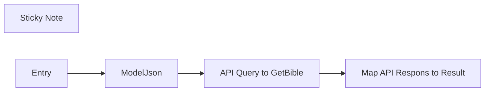

## Fluxo (.json) :

```json
{
  "id": "gqwYlZvL1dwy9W3T",
  "meta": {
    "templateCredsSetupCompleted": true
  },
  "name": "getBible Query v1.0",
  "tags": [],
  "nodes": [
    {
      "id": "37e21e75-6f18-45fc-9b74-860c1e095b83",
      "name": "Sticky Note",
      "type": "n8n-nodes-base.stickyNote",
      "position": [
        -880,
        -320
      ],
      "parameters": {
        "width": 780,
        "height": 1720,
        "content": "# GetBible Query Workflow Documentation\n\n## Overview\n\nThe **GetBibleQuery** workflow is a modular and self-standing workflow designed to retrieve scriptures based on provided references. It serves as an intermediary layer that takes in a structured JSON object, extracts the references, and returns the corresponding scriptures in the same format as if they were retrieved directly from the API.\n\nThis workflow is highly adaptable and can be integrated into various projects where scriptural references need to be dynamically fetched.\n\n## JSON Input Structure\n\nThe workflow expects a JSON object with the following parameters:\n\n - References should include the book name, chapter, and verse(s). \n - Multiple verses can be separated by commas (e.g., `John 3:16,18`).\n - Ranges can be specified using a dash (e.g., `John 3:16-18`).\n - The Bible [translation](https://api.getbible.net/v2/translations.json) to be used.\n - Specifies the API version (v2)\n\n### Example JSON Input:\n\n```json\n{\n  \"references\": [\n      \"1 John 3:16\",\n      \"Jn 3:16\",\n      \"James 3:16\",\n      \"Rom 3:16\"\n  ],\n  \"translation\": \"kjv\",\n  \"version\": \"v2\"\n}\n```\n\n### API Response Format\n\nThe response returned by this workflow follows the same API format as if the request were made directly to the source API. This ensures compatibility with projects that rely on standard API responses.\n\nExample JSON Response (in this workflow):\n```json\n{\n  \"result\": {\n    \"kjv_62_3\": {\n      \"translation\": \"King James Version\",\n      \"abbreviation\": \"kjv\",\n      \"lang\": \"en\",\n      \"language\": \"English\",\n      \"direction\": \"LTR\",\n      \"encoding\": \"UTF-8\",\n      \"book_nr\": 62,\n      \"book_name\": \"1 John\",\n      \"chapter\": 3,\n      \"name\": \"1 John 3\",\n      \"ref\": [\n        \"1 John 3:16\"\n      ],\n      \"verses\": [\n        {\n          \"chapter\": 3,\n          \"verse\": 16,\n          \"name\": \"1 John 3:16\",\n          \"text\": \"Hereby perceive we the love of God, because he laid down his life for us: and we ought to lay down our lives for the brethren.\"\n        }\n      ]\n    }\n  }\n}\n```\n\n## Integration and Usage\n\nThe GetBible Query workflow is designed for easy integration into any project that requires scripture retrieval. Simply pass the appropriate JSON object as input, and it will return the requested scripture passages.\n\n## Support\n\nFor any questions or additional assistance, please visit our [Support desk](https://git.vdm.dev/getBible/support) or [API documentation](https://getbible.net/docs)"
      },
      "typeVersion": 1
    },
    {
      "id": "8d5da846-fd1b-48f6-8199-2f9a3a4c99b5",
      "name": "Entry",
      "type": "n8n-nodes-base.executeWorkflowTrigger",
      "position": [
        0,
        0
      ],
      "parameters": {
        "inputSource": "jsonExample",
        "jsonExample": "{\n  \"references\": [\n      \"1 John 3:16\",\n      \"Jn 3:16\",\n      \"James 3:16\",\n      \"Rom 3:16\"\n  ],\n  \"translation\": \"kjv\",\n  \"version\": \"v2\"\n}"
      },
      "typeVersion": 1.1
    },
    {
      "id": "17444cd4-4ec3-4d8f-9f9d-29369632c420",
      "name": "ModelJson",
      "type": "n8n-nodes-base.code",
      "position": [
        220,
        0
      ],
      "parameters": {
        "jsCode": "// Loop over input items and process the 'references' field\nfor (let item of $input.all()) {\n  // Check if 'references' exists and is an array\n  if (Array.isArray(item.json.references)) {\n    item.json.references = item.json.references.join('; ');\n  } else {\n    // Handle cases where 'references' is missing or not an array\n    item.json.references = 'John 3:16';\n  }\n}\n\n// Return the modified items\nreturn $input.all();"
      },
      "executeOnce": true,
      "retryOnFail": false,
      "typeVersion": 2,
      "alwaysOutputData": true
    },
    {
      "id": "b392423f-22d7-4b3f-8e25-9c703c33c78d",
      "name": "API Query to GetBible",
      "type": "n8n-nodes-base.httpRequest",
      "position": [
        460,
        0
      ],
      "parameters": {
        "url": "=https://query.getbible.net/{{ $json.version || 'v2' }}/{{ $json.translation || 'kjv' }}/{{ $json.references }}",
        "options": {}
      },
      "executeOnce": false,
      "typeVersion": 4.2,
      "alwaysOutputData": false
    },
    {
      "id": "e55d8b82-a30a-4ed9-a28f-ae2d9808422c",
      "name": "Map API Respons to Result",
      "type": "n8n-nodes-base.set",
      "position": [
        680,
        0
      ],
      "parameters": {
        "options": {},
        "assignments": {
          "assignments": [
            {
              "id": "360a59c4-5e4c-43b8-8b0b-bb121054a709",
              "name": "result",
              "type": "object",
              "value": "={{ $json }}"
            }
          ]
        }
      },
      "typeVersion": 3.4
    }
  ],
  "pinData": {
    "Entry": [
      {
        "json": {
          "version": "v2",
          "references": [
            "1 John 3:16",
            "Jn 3:16",
            "James 3:16",
            "Rom 3:16"
          ],
          "translation": "kjv"
        }
      }
    ]
  },
  "settings": {
    "executionOrder": "v1"
  },
  "versionId": "c8a37d01-c65f-4975-878a-20ed73c42b6b",
  "staticData": null,
  "connections": {
    "Entry": {
      "main": [
        [
          {
            "node": "ModelJson",
            "type": "main",
            "index": 0
          }
        ]
      ]
    },
    "ModelJson": {
      "main": [
        [
          {
            "node": "API Query to GetBible",
            "type": "main",
            "index": 0
          }
        ]
      ]
    },
    "API Query to GetBible": {
      "main": [
        [
          {
            "node": "Map API Respons to Result",
            "type": "main",
            "index": 0
          }
        ]
      ]
    }
  },
  "triggerCount": 0
}
```

<a id="template-607"></a>

## Template 607 - Gerar calendário ICS a partir de Excel de datas letivas

- **Nome:** Gerar calendário ICS a partir de Excel de datas letivas
- **Descrição:** Baixa uma planilha de datas letivas, converte o conteúdo para um formato legível por IA, extrai eventos estruturados, gera um ficheiro ICS e envia-o por email.
- **Funcionalidade:** • Download do ficheiro Excel: Baixa a folha de cálculo com as datas dos termos a partir de um URL público.
• Conversão do Excel para Markdown: Transforma o conteúdo da(s) folha(s) em markdown para permitir a análise por IA.
• Extração estruturada de eventos com IA: Identifica eventos, número da semana, datas de início e títulos em formato estruturado.
• Normalização de datas: Converte/ajusta valores de data (incluindo números seriais) para datas ISO/UTC legíveis.
• Ordenação de eventos: Ordena os eventos por data de início para garantir sequência correta.
• Geração de ficheiro ICS: Constrói um calendário no formato ICS com os eventos extraídos.
• Criação de ficheiro binário .ics: Converte o conteúdo ICS em ficheiro binário pronto para partilha.
• Envio por email com anexo: Envia o ficheiro .ics para destinatários especificados por email.
- **Ferramentas:** • Cloudflare Markdown Conversion Service: serviço que converte ficheiros (como XLSX) em markdown para facilitar a extração por modelos de linguagem.
• Google Gemini (PaLM) API: modelo de linguagem usado para analisar o markdown e extrair informação estruturada sobre eventos.
• Gmail: serviço de email utilizado para enviar o ficheiro ICS como anexo.
• Site da University of Westminster: fonte pública do ficheiro XLSX com as datas letivas 2025/2026.

## Fluxo visual

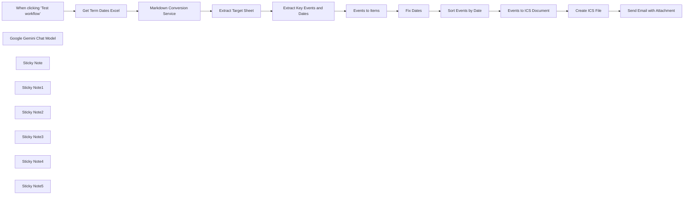

## Fluxo (.json) :

```json
{
  "meta": {
    "instanceId": "408f9fb9940c3cb18ffdef0e0150fe342d6e655c3a9fac21f0f644e8bedabcd9",
    "templateCredsSetupCompleted": true
  },
  "nodes": [
    {
      "id": "dbaac3bd-6049-4f2e-8782-98b1656d8331",
      "name": "When clicking ‘Test workflow’",
      "type": "n8n-nodes-base.manualTrigger",
      "position": [
        -500,
        -20
      ],
      "parameters": {},
      "typeVersion": 1
    },
    {
      "id": "6605c1b6-4723-4aeb-9ade-ac05350e7631",
      "name": "Get Term Dates Excel",
      "type": "n8n-nodes-base.httpRequest",
      "position": [
        -140,
        0
      ],
      "parameters": {
        "url": "https://www.westminster.ac.uk/sites/default/public-files/general-documents/undergraduate-term-dates-2025%E2%80%932026.xlsx",
        "options": {
          "response": {
            "response": {
              "responseFormat": "file"
            }
          }
        }
      },
      "typeVersion": 4.2
    },
    {
      "id": "ed83ae3c-ebf7-42b5-9317-4e1fbd88905c",
      "name": "Extract Key Events and Dates",
      "type": "@n8n/n8n-nodes-langchain.informationExtractor",
      "position": [
        640,
        -20
      ],
      "parameters": {
        "text": "={{ $json.target_sheet }}",
        "options": {
          "systemPromptTemplate": "Capture the values as seen. Do not convert dates."
        },
        "schemaType": "manual",
        "inputSchema": "{\n\t\"type\": \"array\",\n\t\"items\": {\n\t  \"type\": \"object\",\n      \"properties\": {\n        \"week_number\": { \"type\": \"number\" },\n        \"week_beginning\": { \"type\": \"string\" },\n        \"title\": { \"type\": \"string\" }\n      }\n\t}\n}"
      },
      "typeVersion": 1
    },
    {
      "id": "78af1a09-6aa7-48f9-af2a-539a739c6571",
      "name": "Extract Target Sheet",
      "type": "n8n-nodes-base.set",
      "position": [
        300,
        0
      ],
      "parameters": {
        "options": {},
        "assignments": {
          "assignments": [
            {
              "id": "0dd68450-2492-490a-ade1-62311eb541ef",
              "name": "target_sheet",
              "type": "string",
              "value": "={{ $json.result[0].data.split('##')[9] }}"
            }
          ]
        }
      },
      "typeVersion": 3.4
    },
    {
      "id": "4bec1392-c262-4256-8199-54c101f281c2",
      "name": "Fix Dates",
      "type": "n8n-nodes-base.set",
      "position": [
        1320,
        0
      ],
      "parameters": {
        "options": {},
        "assignments": {
          "assignments": [
            {
              "id": "c6f0fa0e-1cbf-4da9-8928-a11502da0991",
              "name": "week_beginning",
              "type": "string",
              "value": "={{\nnew Date(2025,8,15,0,0,0).toDateTime().toUTC()\n  .plus({ 'day': $json.week_beginning - 45915 })\n}}"
            }
          ]
        },
        "includeOtherFields": true
      },
      "typeVersion": 3.4
    },
    {
      "id": "0df44568-4bc6-46ed-9419-5462f528dbc3",
      "name": "Google Gemini Chat Model",
      "type": "@n8n/n8n-nodes-langchain.lmChatGoogleGemini",
      "position": [
        740,
        120
      ],
      "parameters": {
        "options": {},
        "modelName": "models/gemini-2.5-pro-preview-03-25"
      },
      "credentials": {
        "googlePalmApi": {
          "id": "dSxo6ns5wn658r8N",
          "name": "Google Gemini(PaLM) Api account"
        }
      },
      "typeVersion": 1
    },
    {
      "id": "13aa069f-dc32-4a57-9a57-29264a09c80d",
      "name": "Create ICS File",
      "type": "n8n-nodes-base.convertToFile",
      "position": [
        2100,
        -20
      ],
      "parameters": {
        "options": {
          "fileName": "={{ $('Get Term Dates Excel').first().binary.data.fileName }}.ics",
          "mimeType": "text/calendar"
        },
        "operation": "toBinary",
        "sourceProperty": "data"
      },
      "typeVersion": 1.1
    },
    {
      "id": "6cf27afd-8f16-40c7-bbc3-bba7fcf76097",
      "name": "Events to ICS Document",
      "type": "n8n-nodes-base.code",
      "position": [
        1720,
        0
      ],
      "parameters": {
        "language": "python",
        "pythonCode": "from datetime import datetime, timedelta\nimport base64\n\nasync def json_array_to_ics_pyodide(json_array, prodid=\"-//My Application//EN\"):\n    \"\"\"\n    Converts a JSON array of calendar events to ICS file content in a Pyodide environment.\n\n    Args:\n        json_array: A list of dictionaries, where each dictionary represents an event\n                    and contains keys like \"week_number\", \"week_beginning\", and \"title\".\n                    It's expected that \"week_beginning\" is an ISO 8601 formatted\n                    date string.\n        prodid: The product identifier string for the ICS file.\n\n    Returns:\n        A string containing the content of the ICS file.\n    \"\"\"\n    ical = [\"BEGIN:VCALENDAR\",\n            \"VERSION:2.0\",\n            f\"PRODID:{prodid}\"]\n\n    for event_data in json_array:\n        week_number = event_data.get(\"week_number\")\n        week_beginning_str = event_data.get(\"week_beginning\")\n        title = event_data.get(\"title\")\n\n        if week_beginning_str and title:\n            try:\n                # Parse the week_beginning string to a datetime object\n                week_beginning = datetime.fromisoformat(week_beginning_str.replace('Z', '+00:00'))\n\n                # Calculate the end of the week (assuming events last for the whole week)\n                week_ending = week_beginning + timedelta(days=7)\n\n                uid = f\"week-{week_number}-{week_beginning.strftime('%Y%m%d')}@my-application\"\n                dtstamp = datetime.utcnow().strftime('%Y%m%dT%H%M%SZ')\n                dtstart = week_beginning.strftime('%Y%m%d')\n                dtend = week_ending.strftime('%Y%m%d')\n                summary = title\n\n                ical.extend([\n                    \"BEGIN:VEVENT\",\n                    f\"UID:{uid}\",\n                    f\"DTSTAMP:{dtstamp}\",\n                    f\"DTSTART;VALUE=DATE:{dtstart}\",\n                    f\"DTEND;VALUE=DATE:{dtend}\",\n                    f\"SUMMARY:{summary}\",\n                    \"END:VEVENT\"\n                ])\n\n                # You can add more properties here if your JSON data contains them,\n                # for example:\n                # if \"description\" in event_data:\n                #     ical.append(f\"DESCRIPTION:{event_data['description']}\")\n                # if \"location\" in event_data:\n                #     ical.append(f\"LOCATION:{event_data['location']}\")\n\n            except ValueError as e:\n                print(f\"Error processing event with week_beginning '{week_beginning_str}': {e}\")\n                continue  # Skip to the next event if there's a parsing error\n\n    ical.append(\"END:VCALENDAR\")\n    return \"\\r\\n\".join(ical)\n\nics_content = await json_array_to_ics_pyodide([item.json for item in _input.all()])\nics_bytes = ics_content.encode('utf-8')\nbase64_bytes = base64.b64encode(ics_bytes)\nbase64_string = base64_bytes.decode('utf-8')\n\nreturn {\n  \"data\": base64_string\n}"
      },
      "typeVersion": 2
    },
    {
      "id": "e5c94c64-4262-4951-a772-75af431e578a",
      "name": "Sort Events by Date",
      "type": "n8n-nodes-base.sort",
      "position": [
        1520,
        0
      ],
      "parameters": {
        "options": {},
        "sortFieldsUi": {
          "sortField": [
            {
              "fieldName": "week_beginning"
            }
          ]
        }
      },
      "typeVersion": 1
    },
    {
      "id": "3bbe74bb-cd20-4116-9272-12be8ac54700",
      "name": "Sticky Note",
      "type": "n8n-nodes-base.stickyNote",
      "position": [
        -260,
        -240
      ],
      "parameters": {
        "color": 7,
        "width": 780,
        "height": 500,
        "content": "## 1. Parse Excel Files Using Cloudflare®️ Markdown Conversion\n[Learn more about Cloudflare's Markdown Conversion Service](https://developers.cloudflare.com/workers-ai/markdown-conversion/)\n\nToday's LLMs cannot parse Excel files directly so the best we can do is to convert the spreadsheet into a format that they can, namely markdown. To do this, we can use Cloudflare's brand new document conversion service which was designed specifically for this task. The result is the sheet is transcribed as a markdown table.\n\nThe **Markdown Conversion Service** is currently free to use at time of writing but requires a Cloudflare account."
      },
      "typeVersion": 1
    },
    {
      "id": "18fc9626-1c55-4893-8e72-06c48754ceb8",
      "name": "Markdown Conversion Service",
      "type": "n8n-nodes-base.httpRequest",
      "position": [
        80,
        0
      ],
      "parameters": {
        "url": "https://api.cloudflare.com/client/v4/accounts/{ACCOUNT_ID}/ai/tomarkdown",
        "method": "POST",
        "options": {},
        "sendBody": true,
        "contentType": "multipart-form-data",
        "authentication": "predefinedCredentialType",
        "bodyParameters": {
          "parameters": [
            {
              "name": "files",
              "parameterType": "formBinaryData",
              "inputDataFieldName": "data"
            }
          ]
        },
        "nodeCredentialType": "cloudflareApi"
      },
      "credentials": {
        "cloudflareApi": {
          "id": "qOynkQdBH48ofOSS",
          "name": "Cloudflare account"
        }
      },
      "typeVersion": 4.2
    },
    {
      "id": "5f71bc64-985c-43c4-bdfa-3cfda7e9c060",
      "name": "Sticky Note1",
      "type": "n8n-nodes-base.stickyNote",
      "position": [
        540,
        -240
      ],
      "parameters": {
        "color": 7,
        "width": 680,
        "height": 540,
        "content": "## 2. Extract Term Dates to Events Using AI\n[Learn more about the Information Extractor](https://docs.n8n.io/integrations/builtin/cluster-nodes/root-nodes/n8n-nodes-langchain.information-extractor)\n\nData entry is probably the number one reason as to why we need AI/LLMs. This time-consuming and menial task can be completed in seconds and with a high degree of accuracy. Here, we ask the AI to extract each event with the term dates to a list of events using structured output."
      },
      "typeVersion": 1
    },
    {
      "id": "e9083886-81e3-483e-b959-12ce9005d862",
      "name": "Sticky Note2",
      "type": "n8n-nodes-base.stickyNote",
      "position": [
        1240,
        -240
      ],
      "parameters": {
        "color": 7,
        "width": 660,
        "height": 480,
        "content": "## 3. Use Events to Create ICS Document\n[Learn more about the code node](https://docs.n8n.io/integrations/builtin/core-nodes/n8n-nodes-base.code/)\n\nNow we have our events, let's create a calendar to put them in. Using the code now, we can construct a simple ICS document - this is the format which can be imported into iCal, Google Calendar and Outlook. For tasks like these, the Code node is best suited to handle custom transformations."
      },
      "typeVersion": 1
    },
    {
      "id": "04a7c856-88b4-4daa-a56f-6e2741907e4c",
      "name": "Events to Items",
      "type": "n8n-nodes-base.splitOut",
      "position": [
        1000,
        -20
      ],
      "parameters": {
        "options": {},
        "fieldToSplitOut": "output"
      },
      "typeVersion": 1
    },
    {
      "id": "cab455c9-b15d-440d-9f30-7afe1af23ea8",
      "name": "Sticky Note3",
      "type": "n8n-nodes-base.stickyNote",
      "position": [
        1920,
        -240
      ],
      "parameters": {
        "color": 7,
        "width": 720,
        "height": 480,
        "content": "## 4. Create ICS Binary File for Import\n[Learn more about the Convert to File node](https://docs.n8n.io/integrations/builtin/core-nodes/n8n-nodes-base.converttofile)\n\nFinally with our ICS document ready, we can use the \"Convert to File\" node to build an ICS binary file which can be shared with team members, classmates or even instructors."
      },
      "typeVersion": 1
    },
    {
      "id": "c0861ef1-08f4-49e9-a700-a7224296cc72",
      "name": "Send Email with Attachment",
      "type": "n8n-nodes-base.gmail",
      "position": [
        2340,
        -20
      ],
      "webhookId": "835ef864-60c4-4b84-84ee-104ee10644eb",
      "parameters": {
        "sendTo": "jim@example.com",
        "message": "=Hey,\n\nPlease find attached calendar for Undergraduate terms dates 2025/2026.\n\nThanks",
        "options": {
          "attachmentsUi": {
            "attachmentsBinary": [
              {}
            ]
          }
        },
        "subject": "Undergraduate Terms Dates Calendar 2025/2026",
        "emailType": "text"
      },
      "credentials": {
        "gmailOAuth2": {
          "id": "Sf5Gfl9NiFTNXFWb",
          "name": "Gmail account"
        }
      },
      "typeVersion": 2.1
    },
    {
      "id": "85c4d928-83c7-445a-8e9b-d9daef05ae1d",
      "name": "Sticky Note4",
      "type": "n8n-nodes-base.stickyNote",
      "position": [
        -20,
        200
      ],
      "parameters": {
        "color": 5,
        "width": 280,
        "height": 80,
        "content": "### Cloudflare Account Required\nAdd your Cloudflare {ACCOUNT_ID} to the URL"
      },
      "typeVersion": 1
    },
    {
      "id": "6a2d8e78-0b15-498f-bc96-bbbac1da1f21",
      "name": "Sticky Note5",
      "type": "n8n-nodes-base.stickyNote",
      "position": [
        -1020,
        -880
      ],
      "parameters": {
        "width": 420,
        "height": 1380,
        "content": "## Try it out!\n### This n8n template imports an XLSX containing terms dates for a university, extracts the relevant events using AI and converts the events to an ICS file which can be imported into iCal, Google Calendar or Outlook.\n\nManually adding important term dates to your calendar by hand? Stop! Automate it with this simple AI/LLM-powered document understanding and extraction template. This cool use-case can be applied to many scenarios where Excel files are predominantly used.\n\n### How it works\n* The term dates excel file (xlsx) are imported into the workflow from the university's website using the http request node.\n* To parse the excel file, we use an external service - [Cloudflare's Markdown Conversion Service](https://developers.cloudflare.com/workers-ai/markdown-conversion/). This converts the excel's sheets into markdown tables which our LLM can read.\n* To extract the events and their dates from the markdown, we can use the Information Extractor node for structured output. LLMs are great for this use-case because they can understand the layout; one row may have many data points.\n* With our data, there are endless possibilities to use it! But for this demonstration, we'll generate an ICS file so that we can import the extracted events into our calendar. We use the Python code node to combine the events into the ICS spec and the \"Convert to File\" node to create the ICS binary.\n* Finally, let's distribute the ICS file by email to other students or instructors who  may also find this incredibly helpful for the upcoming semester!\n\n### How to use\n* Ensure you're downloading the correct excel file and amend the URL parameter of the \"Get Term Dates Excel\" as necessary.\n* Update the gmail node with your email or other emails as required. Alternatively, send the ICS file to Google Drive or a student portal.\n\n### Requirements\n* Cloudflare Account is required to use the Markdown Conversion Service.\n* Gemini for LLM document understanding and extraction.\n* Gmail for email sending.\n\n### Customising the workflow\n* This template should work for other Excel files which - for a university - there are many. Some will be more complicated than others so experiment with different parsers and extraction tools and strategies.\n\n### Need Help?\nJoin the [Discord](https://discord.com/invite/XPKeKXeB7d) or ask in the [Forum](https://community.n8n.io/)!\n\nHappy Hacking!"
      },
      "typeVersion": 1
    }
  ],
  "pinData": {},
  "connections": {
    "Fix Dates": {
      "main": [
        [
          {
            "node": "Sort Events by Date",
            "type": "main",
            "index": 0
          }
        ]
      ]
    },
    "Create ICS File": {
      "main": [
        [
          {
            "node": "Send Email with Attachment",
            "type": "main",
            "index": 0
          }
        ]
      ]
    },
    "Events to Items": {
      "main": [
        [
          {
            "node": "Fix Dates",
            "type": "main",
            "index": 0
          }
        ]
      ]
    },
    "Sort Events by Date": {
      "main": [
        [
          {
            "node": "Events to ICS Document",
            "type": "main",
            "index": 0
          }
        ]
      ]
    },
    "Extract Target Sheet": {
      "main": [
        [
          {
            "node": "Extract Key Events and Dates",
            "type": "main",
            "index": 0
          }
        ]
      ]
    },
    "Get Term Dates Excel": {
      "main": [
        [
          {
            "node": "Markdown Conversion Service",
            "type": "main",
            "index": 0
          }
        ]
      ]
    },
    "Events to ICS Document": {
      "main": [
        [
          {
            "node": "Create ICS File",
            "type": "main",
            "index": 0
          }
        ]
      ]
    },
    "Google Gemini Chat Model": {
      "ai_languageModel": [
        [
          {
            "node": "Extract Key Events and Dates",
            "type": "ai_languageModel",
            "index": 0
          }
        ]
      ]
    },
    "Markdown Conversion Service": {
      "main": [
        [
          {
            "node": "Extract Target Sheet",
            "type": "main",
            "index": 0
          }
        ]
      ]
    },
    "Extract Key Events and Dates": {
      "main": [
        [
          {
            "node": "Events to Items",
            "type": "main",
            "index": 0
          }
        ]
      ]
    },
    "When clicking ‘Test workflow’": {
      "main": [
        [
          {
            "node": "Get Term Dates Excel",
            "type": "main",
            "index": 0
          }
        ]
      ]
    }
  }
}
```

<a id="template-608"></a>

## Template 608 - Geração e envio de fatura em PDF

- **Nome:** Geração e envio de fatura em PDF
- **Descrição:** Gera um documento de fatura em PDF a partir de dados inseridos em um formulário e envia o arquivo por email.
- **Funcionalidade:** • Coleta de dados via formulário: Permite inserir informações da fatura (nome do comprador, endereço e itens com preços) através de um formulário.
• Montagem do payload para JSReport: Mapeia os campos do formulário e monta um corpo JSON compatível com o template 'invoice-main'.
• Geração de documento PDF: Chama a API do JSReport para renderizar o template com os dados fornecidos e retornar o PDF resultante.
• Autenticação na API: Realiza a chamada à API do serviço de relatórios utilizando autenticação (HTTP Basic) configurada.
• Envio de email com anexo: Anexa o PDF gerado e envia a fatura para o destinatário configurado usando conta de email autenticada.
• Suporte a itens dinâmicos na fatura: Permite incluir múltiplos itens com nomes e preços que são inseridos no documento.
- **Ferramentas:** • JSReport Online: Serviço de geração de relatórios que processa templates (ex.: invoice-main) e produz PDFs via API HTTP.
• Gmail: Serviço de email utilizado para enviar a fatura gerada, autenticado via OAuth2.

## Fluxo visual

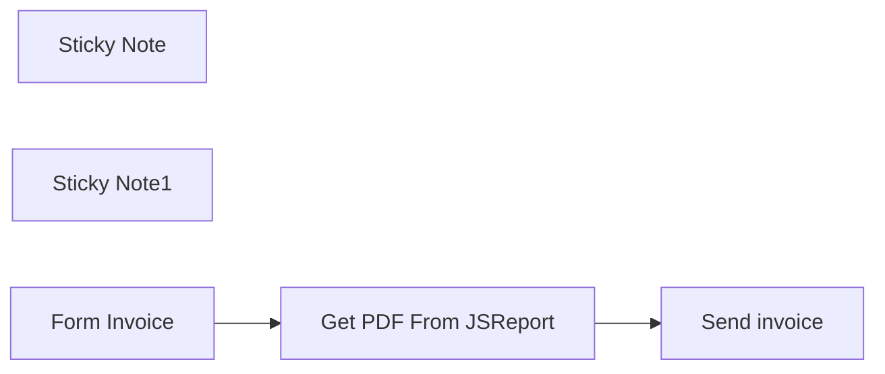

## Fluxo (.json) :

```json
{
  "id": "i8nBvPOtFYWk5eoq",
  "meta": {
    "instanceId": "c5a9958b493899f1235322c2c0e4f007083d1c79bb2c9043ae90b75371e276c7"
  },
  "name": "Get PDF with JSReport",
  "tags": [
    {
      "id": "2L2vOvQ2wUBVYeh1",
      "name": "Send",
      "createdAt": "2024-05-03T13:40:43.868Z",
      "updatedAt": "2024-05-03T13:40:43.868Z"
    },
    {
      "id": "SBlaOF5ezhukSiIT",
      "name": "JSReport",
      "createdAt": "2024-05-03T13:40:38.379Z",
      "updatedAt": "2024-05-03T13:40:38.379Z"
    },
    {
      "id": "vRTFSK4WW6nL2U7z",
      "name": "PDF",
      "createdAt": "2024-05-03T13:40:34.380Z",
      "updatedAt": "2024-05-03T13:40:34.380Z"
    }
  ],
  "nodes": [
    {
      "id": "9514b49d-80f3-41d2-bcbc-8fa08e27cb64",
      "name": "Get PDF From JSReport",
      "type": "n8n-nodes-base.httpRequest",
      "notes": "Generating the document in JSReport",
      "position": [
        1040,
        320
      ],
      "parameters": {
        "url": "https://xxx.jsreportonline.net/api/report",
        "method": "POST",
        "options": {},
        "jsonBody": "=   {\n      \"template\": { \"name\" : \"invoice-main\" },\n      \"data\" :{\n    \"number\": \"123\",\n    \"seller\": {\n        \"name\": \"Next Step Webs, Inc.\",\n        \"road\": \"12345 Sunny Road\",\n        \"country\": \"Sunnyville, TX 12345\"\n    },\n    \"buyer\": {\n        \"name\": \"{{ $json[\"buyer name\"] }}\",\n        \"road\": \"{{ $json[\"buyer road\"] }}\",\n        \"country\": \"{{ $json[\"buyer country\"] }}\"\n    },\n    \"items\": [{\n        \"name\": \"{{ $json[\"Item 1 Name\"] }}\",\n        \"price\": {{ $json[\"Item 1 Price\"] }}\n    }, {\n        \"name\": \"{{ $json[\"Item 2 Name\"] }}\",\n        \"price\": {{ $json[\"Item 2 Price\"] }}\n    }]\n}\n   }",
        "sendBody": true,
        "specifyBody": "json",
        "authentication": "genericCredentialType",
        "genericAuthType": "httpBasicAuth"
      },
      "credentials": {
        "httpBasicAuth": {
          "id": "oKwHNpbRnChEV8xq",
          "name": "Unnamed credential"
        }
      },
      "notesInFlow": true,
      "typeVersion": 4.2
    },
    {
      "id": "d33abb5b-50b0-44d9-8a92-e910bb180ea5",
      "name": "Sticky Note",
      "type": "n8n-nodes-base.stickyNote",
      "position": [
        460,
        240
      ],
      "parameters": {
        "height": 372,
        "content": "##  Streamlining Billing Processes: From Data Input to Document Generation\n\nThis process presents the possibility of using a form, such as the one provided by n8n, to enter billing information, then calling JSReport to generate documents such as PDFs, Word, Excel, etc., and finally sending the invoice by email.\n"
      },
      "typeVersion": 1
    },
    {
      "id": "85981fc7-ecb5-49f3-9395-9866ded70257",
      "name": "Sticky Note1",
      "type": "n8n-nodes-base.stickyNote",
      "position": [
        903,
        240
      ],
      "parameters": {
        "color": 4,
        "width": 363,
        "height": 568,
        "content": "## Information for calling JSReport\n\n\n\n\n\n\n\n\n\n\n\n\n\n\n### URL API : \nhttps://xxx.jsreportonline.net/api/report\n\n### Use :\nTo use JSReport, simply call the APIs with the base URL. You can create a free account here: https://jsreport.net/online.\n\nThe APIs are available here: https://jsreport.net/learn/api.\n\nIn this example, we're sending a sample body that you can find in your JSReport test space."
      },
      "typeVersion": 1
    },
    {
      "id": "94ae99b3-0ec9-4916-9bf4-19cfeb599966",
      "name": "Form Invoice",
      "type": "n8n-nodes-base.formTrigger",
      "notes": "Allows you to enter invoice information",
      "position": [
        740,
        320
      ],
      "webhookId": "1d0c5777-4033-4bf4-8d0e-8a2069d79c86",
      "parameters": {
        "path": "1d0c5777-4033-4bf4-8d0e-8a2069d79c86",
        "options": {},
        "formTitle": "Create Facture",
        "formFields": {
          "values": [
            {
              "fieldLabel": "buyer name",
              "requiredField": true
            },
            {
              "fieldLabel": "buyer road",
              "requiredField": true
            },
            {
              "fieldLabel": "buyer country",
              "requiredField": true
            },
            {
              "fieldLabel": "Item 1 Name"
            },
            {
              "fieldType": "number",
              "fieldLabel": "Item 1 Price"
            },
            {
              "fieldLabel": "Item 2 Name"
            },
            {
              "fieldLabel": "Item 2 Price"
            }
          ]
        },
        "formDescription": "Create a PDF invoice from an n8n and JSReport form"
      },
      "notesInFlow": true,
      "typeVersion": 2
    },
    {
      "id": "142c4a45-1228-4be5-8172-9834bb9ca491",
      "name": "Send invoice",
      "type": "n8n-nodes-base.gmail",
      "notes": "Using GMAIL to send the invoice",
      "position": [
        1340,
        320
      ],
      "parameters": {
        "sendTo": "contact@nonocode.fr",
        "message": "Good morning,  \n\nPlease find your invoice.  \n\nSincerely,",
        "options": {
          "attachmentsUi": {
            "attachmentsBinary": [
              {}
            ]
          }
        },
        "subject": "New Facture"
      },
      "credentials": {
        "gmailOAuth2": {
          "id": "N3pxr94UxrQSovu5",
          "name": "Gmail account"
        }
      },
      "notesInFlow": true,
      "typeVersion": 2.1
    }
  ],
  "active": true,
  "pinData": {},
  "settings": {
    "executionOrder": "v1"
  },
  "versionId": "8e1b0f98-68ec-4300-a948-52439d00db66",
  "connections": {
    "Form Invoice": {
      "main": [
        [
          {
            "node": "Get PDF From JSReport",
            "type": "main",
            "index": 0
          }
        ]
      ]
    },
    "Get PDF From JSReport": {
      "main": [
        [
          {
            "node": "Send invoice",
            "type": "main",
            "index": 0
          }
        ]
      ]
    }
  }
}
```

<a id="template-609"></a>

## Template 609 - Análise de vídeo com Gemini AI

- **Nome:** Análise de vídeo com Gemini AI
- **Descrição:** Analisa um vídeo a partir de uma URL usando a API Gemini para gerar uma descrição detalhada do conteúdo visual.
- **Funcionalidade:** • Download do vídeo: baixa o arquivo de vídeo a partir de uma URL pública e converte para formato binário para processamento.
• Upload para análise: envia o vídeo ao serviço de análise com cabeçalhos e metadados adequados.
• Processamento assíncrono: aguarda o término do processamento do arquivo no servidor antes de solicitar a análise.
• Análise multimodal com IA: solicita ao modelo generativo uma descrição detalhada do que acontece no vídeo (elementos visuais, ações, cores, branding, estilo e técnicas criativas).
• Extração do resultado: captura a resposta gerada pelo modelo e armazena a descrição em uma variável para uso posterior.
• Execução de teste e configuração: permite executar manualmente com uma URL de teste e usar uma chave de API configurável via variável de ambiente.
- **Ferramentas:** • Google Gemini (Generative Language API): serviço de IA multimodal responsável por processar o arquivo de vídeo e gerar a descrição textual detalhada.
• Serviço de hospedagem de vídeo / CDN: origem pública do arquivo de vídeo (URL) usada para o download inicial.

## Fluxo visual

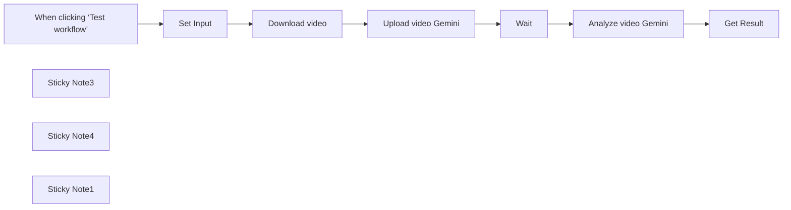

## Fluxo (.json) :

```json
{
  "id": "hKkZYhJqBNir8amQ",
  "meta": {
    "instanceId": "a943fc71a4dfb51cc3424882233bcd72e7a73857958af1cf464f7c21580c726e"
  },
  "name": "🎥 Gemini AI Video Analysis",
  "tags": [
    {
      "id": "bjzc8PEM2FgX8rUa",
      "name": "Marketing",
      "createdAt": "2025-04-18T13:34:48.192Z",
      "updatedAt": "2025-04-18T13:34:48.192Z"
    },
    {
      "id": "OiWw6VmsJz6ZBAzz",
      "name": "AI",
      "createdAt": "2025-04-25T09:59:58.961Z",
      "updatedAt": "2025-04-25T09:59:58.961Z"
    }
  ],
  "nodes": [
    {
      "id": "f5c9faf8-441a-49ef-a0de-0daa08c3bbfa",
      "name": "Wait",
      "type": "n8n-nodes-base.wait",
      "position": [
        400,
        160
      ],
      "webhookId": "7d0cd0c0-ce85-4372-b7a5-b0be061fc2b9",
      "parameters": {},
      "typeVersion": 1.1
    },
    {
      "id": "c0336074-a30f-4fc0-aa57-7142cea1a3da",
      "name": "Download video",
      "type": "n8n-nodes-base.httpRequest",
      "position": [
        -40,
        160
      ],
      "parameters": {
        "url": "={{ $json.video_url }}",
        "options": {}
      },
      "typeVersion": 4.2
    },
    {
      "id": "8b04c774-7a02-43ff-bac9-d19a427d514e",
      "name": "Upload video Gemini",
      "type": "n8n-nodes-base.httpRequest",
      "position": [
        180,
        160
      ],
      "parameters": {
        "url": "=https://generativelanguage.googleapis.com/upload/v1beta/files?key={{ $vars.GeminiKey }}",
        "method": "POST",
        "options": {},
        "sendBody": true,
        "contentType": "binaryData",
        "sendHeaders": true,
        "headerParameters": {
          "parameters": [
            {
              "name": "X-Goog-Upload-Command",
              "value": "start, upload, finalize"
            },
            {
              "name": "X-Goog-Upload-Header-Content-Length",
              "value": "={{ $binary.data.fileSize }}"
            },
            {
              "name": "X-Goog-Upload-Header-Content-Type",
              "value": "=video/{{ $binary.data.fileExtension }}"
            },
            {
              "name": "Content-Type",
              "value": "video/mp4"
            }
          ]
        },
        "inputDataFieldName": "=data"
      },
      "typeVersion": 4.2
    },
    {
      "id": "eacf4317-18bc-441a-a415-488b65bb9545",
      "name": "Analyze video Gemini",
      "type": "n8n-nodes-base.httpRequest",
      "position": [
        620,
        160
      ],
      "parameters": {
        "url": "=https://generativelanguage.googleapis.com/v1beta/models/gemini-2.0-flash-exp:generateContent?key={{ $vars.GeminiKey }}",
        "method": "POST",
        "options": {},
        "jsonBody": "={\n    \"contents\": [\n        {\n            \"role\": \"user\",\n            \"parts\": [\n                {\n                    \"fileData\": {\n                        \"fileUri\": \"{{ $json.file.uri }}\",\n                        \"mimeType\": \"{{ $json.file.mimeType }}\"\n                    }\n                },\n                {\n                    \"text\": \"Describe in detail what is visually happening in the video, including key elements, actions, colors, and branding. Note the style, tone, and any notable creative techniques being used.\"\n                }\n            ]\n        }\n    ],\n    \"generationConfig\": {\n        \"temperature\": 1.4,\n        \"topK\": 40,\n        \"topP\": 0.95,\n        \"maxOutputTokens\": 8192,\n        \"responseModalities\": [\"Text\"]\n    }\n}\n",
        "sendBody": true,
        "sendHeaders": true,
        "specifyBody": "json",
        "headerParameters": {
          "parameters": [
            {
              "name": "Content-Type",
              "value": "application/json"
            }
          ]
        }
      },
      "typeVersion": 4.2
    },
    {
      "id": "ff204f3f-947e-4b6a-a9a3-822d6d57064b",
      "name": "When clicking ‘Test workflow’",
      "type": "n8n-nodes-base.manualTrigger",
      "position": [
        -480,
        160
      ],
      "parameters": {},
      "typeVersion": 1
    },
    {
      "id": "d842a85d-121d-46ed-9df7-44d2c7849c03",
      "name": "Set Input",
      "type": "n8n-nodes-base.set",
      "position": [
        -260,
        160
      ],
      "parameters": {
        "options": {},
        "assignments": {
          "assignments": [
            {
              "id": "6e1728e0-4749-47b9-92ae-4d1c0b7008c8",
              "name": "video_url",
              "type": "string",
              "value": "https://video-gru2-1.xx.fbcdn.net/v/t42.1790-2/469342405_958689216107669_4819692307529683812_n.mp4?_nc_cat=109&ccb=1-7&_nc_sid=c53f8f&_nc_ohc=DMM4-vR_LwoQ7kNvwGFIAOW&_nc_oc=AdkqAUzPHupjN-yAD8AGHbbnsMLQptad7NFTL-fuRa3Kq12boE6Ar_elagnzmgR87uU&_nc_zt=28&_nc_ht=video-gru2-1.xx&_nc_gid=ikICtUIUUCoHz775L2uRBw&oh=00_AfHlScWo8zXllEsqzl3wabxNva8z_qiFuA2g-hWzvnlVdg&oe=681596F3"
            }
          ]
        }
      },
      "typeVersion": 3.4
    },
    {
      "id": "efb6ed9b-5f65-4bf3-8ea9-00430abdb247",
      "name": "Get Result",
      "type": "n8n-nodes-base.set",
      "position": [
        840,
        160
      ],
      "parameters": {
        "options": {},
        "assignments": {
          "assignments": [
            {
              "id": "1ea390b9-3371-4a3a-8741-bd6ec74dc64b",
              "name": "videoDescription",
              "type": "string",
              "value": "={{ $json.candidates[0].content.parts[0].text }}"
            }
          ]
        }
      },
      "typeVersion": 3.4
    },
    {
      "id": "fc917016-b2f3-4d69-8924-0aa16b4b43bc",
      "name": "Sticky Note3",
      "type": "n8n-nodes-base.stickyNote",
      "position": [
        -920,
        -380
      ],
      "parameters": {
        "color": 7,
        "width": 560,
        "height": 520,
        "content": "## Video Analysis with Gemini AI\n\nThis workflow demonstrates how to analyze video content using Google's Gemini 2.0 Flash API:\n1. Download a video from a URL\n2. Upload it to Gemini's servers\n3. Process the video with AI to generate a detailed description\n4. Extract the analysis results\n\nUse cases: Content moderation, video cataloging, accessibility features, etc.\n\nOUTPUT: The workflow produces a detailed text description of the video content in the \"MediaDescription\" variable.\nYou can use this data for content tagging, searchable descriptions, accessibility, moderation, or cataloging.\n\n⚙️ **Before using this workflow**, make sure to set the `GeminiKey` environment variable with your Gemini API key.  \nThis ensures your API key is securely managed and not hardcoded in the workflow.\n\n__SECURITY NOTE__: This workflow contains an API key in the workflow data.  \nFor production use, store your API keys in Credentials or use environment variables (like `GeminiKey`) instead of hardcoding them.\n"
      },
      "typeVersion": 1
    },
    {
      "id": "8854f039-f23f-4174-8821-7acfbc5ecfab",
      "name": "Sticky Note4",
      "type": "n8n-nodes-base.stickyNote",
      "position": [
        -320,
        20
      ],
      "parameters": {
        "color": 5,
        "width": 220,
        "height": 300,
        "content": "## Configuration\nDefine the video URL you want to analyze.\n"
      },
      "typeVersion": 1
    },
    {
      "id": "189ede99-f80f-4f41-8481-c9ba518fd0e7",
      "name": "Sticky Note1",
      "type": "n8n-nodes-base.stickyNote",
      "position": [
        -70,
        -140
      ],
      "parameters": {
        "color": 4,
        "width": 820,
        "height": 460,
        "content": "## Video Processing Pipeline\n\nThis section handles the complete video processing workflow:\n\n1. DOWNLOAD: First, we fetch the video from the provided URL, converting it to binary data that Gemini can process\n\n2. UPLOAD: Next, we send the binary video data to Gemini's servers where it's stored temporarily for AI processing\n\n3. ANALYZE: Finally, we request Gemini's AI to analyze the video content. You can customize the prompt in the \"Analyze video Gemini\" node to focus on specific aspects of the video content you're interested in\n\nThe Wait node ensures the video is fully processed before analysis begins.\n"
      },
      "typeVersion": 1
    }
  ],
  "active": false,
  "pinData": {
    "Upload video Gemini": [
      {
        "json": {
          "file": {
            "uri": "https://generativelanguage.googleapis.com/v1beta/files/7whopq8rwtt8",
            "name": "files/7whopq8rwtt8",
            "state": "PROCESSING",
            "source": "UPLOADED",
            "mimeType": "video/mp4",
            "sizeBytes": "933141",
            "createTime": "2025-04-28T18:12:40.864881Z",
            "sha256Hash": "MWQwYmQ2YWViYmRiNDNjZTYyY2I2ODhkOWRlNzdlMzkyZDJkMTU0NTM5NTE1OWM2MTJlMWRiNTNhNTIyZDVmZA==",
            "updateTime": "2025-04-28T18:12:40.864881Z",
            "expirationTime": "2025-04-30T18:12:40.834671218Z"
          }
        }
      }
    ],
    "Analyze video Gemini": [
      {
        "json": {
          "candidates": [
            {
              "content": {
                "role": "model",
                "parts": [
                  {
                    "text": "Okay, here's a detailed description of the video:\n\n**Overview**\nThe video is a promotional piece for Advanced Sim Racing, featuring a high-end BMW-branded racing simulator setup at a BMW dealership event. It also highlights the presence of a well-known personality: Georges St-Pierre (GSP). The video mixes detailed close-ups of the equipment, shots of people interacting with the simulator, and branding elements.\n\n**Detailed Description:**\n\n*   **0:00-0:01:** Opens with a dynamic shot of someone using the advanced racing simulator. We see triple monitors displaying a race, and the participant grips the steering wheel with intent. The seat is black, with \"OMP\" branded at the top, \"ADVANCED Sim Racing\" and a large BMW logo prominently displayed on its back.\n\n*   **0:01-0:03:** Tight focus on the steering wheel, emphasizing its sophisticated design and multiple buttons.  We see the brand name \"OMP\" on the wheel itself, while the backboard is adorned with the company’s slogan, “ADVANCED Sim Racing”.\n\n*   **0:03-0:07:** We shift to show the simulator being used at a BMW dealership.  A group of people gathers around with the hood open of a BMW car, seemingly intrigued and looking at the person experiencing the simulator.\n\n*   **0:07-0:11:** George St-Pierre appears among the crowd.\n\n*   **0:11-0:13:** Close-up of the SimuCube motor\n\n*   **0:13-0:15:** George St-Pierre gets onto the simulator while people assist him.\n\n*   **0:15-0:21:** Focus on the haptic feedback engine and the back of an employee’s t-shirt that says “ADVANCED Sim Racing DBOX SIMUCUBE”\n\n*   **0:22-0:24:** Small lego replica of the BMW 3 series next to one of the monitor’s along with the car’s front side view with distinct headlights.\n\n*   **0:24-0:25:** The outside of the event, labeled BMW Laval with the BMW logo, ice cream booth nearby.\n\n*   **0:25-0:27:** More participants getting on the simulator\n\n*   **0:27-0:29:** The ranking for different drivers\n\n*   **0:29-0:33:** View of the racing pedals and the race seat with the “OMP” brand.\n\n**Key Elements & Equipment**\n*   **Sim Racing Rig:** A highly advanced racing simulator is central to the video.  It is equipped with a racing seat, steering wheel, pedals, multiple monitors and a SimuCube haptic engine for feedback\n*   **BMW Branding:** The presence of the BMW logo and the incorporation of BMW vehicles underscore the affiliation.\n\n**Style & Tone:**\n*   **High-Tech:**  The video conveys a sense of sophisticated technology and realistic immersion in simulated racing.\n*   **Promotional/Enthusiastic:**  The music and the editing suggest excitement and interest in the product.\n*   **Stylish:** Use of slow-motion shots, close-ups and selective focus adds a modern, visually appealing look.\n\nI hope this helps!"
                  }
                ]
              },
              "avgLogprobs": -1.1206862455033986,
              "finishReason": "STOP"
            }
          ],
          "modelVersion": "gemini-2.0-flash-exp",
          "usageMetadata": {
            "totalTokenCount": 10149,
            "promptTokenCount": 9441,
            "promptTokensDetails": [
              {
                "modality": "TEXT",
                "tokenCount": 36
              },
              {
                "modality": "AUDIO",
                "tokenCount": 825
              },
              {
                "modality": "VIDEO",
                "tokenCount": 8580
              }
            ],
            "candidatesTokenCount": 708,
            "candidatesTokensDetails": [
              {
                "modality": "TEXT",
                "tokenCount": 708
              }
            ]
          }
        }
      }
    ]
  },
  "settings": {
    "executionOrder": "v1"
  },
  "versionId": "5f8d8d62-091e-4883-bbb0-8087ebe7b501",
  "connections": {
    "Wait": {
      "main": [
        [
          {
            "node": "Analyze video Gemini",
            "type": "main",
            "index": 0
          }
        ]
      ]
    },
    "Set Input": {
      "main": [
        [
          {
            "node": "Download video",
            "type": "main",
            "index": 0
          }
        ]
      ]
    },
    "Download video": {
      "main": [
        [
          {
            "node": "Upload video Gemini",
            "type": "main",
            "index": 0
          }
        ]
      ]
    },
    "Upload video Gemini": {
      "main": [
        [
          {
            "node": "Wait",
            "type": "main",
            "index": 0
          }
        ]
      ]
    },
    "Analyze video Gemini": {
      "main": [
        [
          {
            "node": "Get Result",
            "type": "main",
            "index": 0
          }
        ]
      ]
    },
    "When clicking ‘Test workflow’": {
      "main": [
        [
          {
            "node": "Set Input",
            "type": "main",
            "index": 0
          }
        ]
      ]
    }
  }
}
```

<a id="template-610"></a>

## Template 610 - Resumo histórico diário de manchetes do Hacker News

- **Nome:** Resumo histórico diário de manchetes do Hacker News
- **Descrição:** Coleta manchetes do front page do Hacker News para a mesma data em anos anteriores, gera um resumo categorizado com ajuda de um modelo de linguagem e publica o resultado em um canal do Telegram.
- **Funcionalidade:** • Agendamento diário: dispara o processo em um horário pré-definido para executar a rotina.
• Geração de lista de datas históricas: calcula as mesmas datas em anos anteriores (até 2007), com tratamento especial para a data inicial.
• Requisição de front pages por data: faz requisições à página de notícias para cada data gerada.
• Extração de manchetes e datas: parseia o HTML retornado e extrai títulos, URLs e a data associada.
• Consolidação em um único JSON: agrega todas as manchetes e metadados em um único objeto para processamento posterior.
• Resumo e categorização por IA: envia os dados consolidados a um modelo de linguagem para identificar as 10–15 manchetes mais relevantes, agrupá-las por temas e formatá-las em Markdown com links e prefixo do ano.
• Publicação no Telegram: envia o texto final formatado para um canal/bot do Telegram para distribuição.
- **Ferramentas:** • Hacker News (news.ycombinator.com): fonte das manchetes históricas e HTML a ser consultado.
• Google Gemini (PaLM): modelo de linguagem usado para analisar, categorizar e formatar as manchetes em Markdown.
• Telegram: plataforma de entrega para publicar o resumo formatado em um canal/bot.

## Fluxo visual

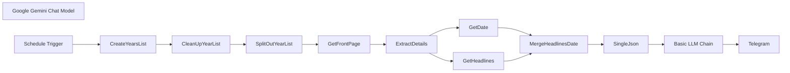

## Fluxo (.json) :

```json
{
  "nodes": [
    {
      "id": "6ea4e702-1af8-407b-b653-964a519db1c2",
      "name": "Basic LLM Chain",
      "type": "@n8n/n8n-nodes-langchain.chainLlm",
      "position": [
        1560,
        -360
      ],
      "parameters": {
        "text": "=You are a highly skilled news categorizer, specializing in indentifying interesting stuff from Hacker News front-page headlines.\n\nYou are provided with JSON data containing a list of dates and their corresponding top headlines from the Hacker News front page. Each headline will also include a URL linking to the original article or discussion. Importantly, the dates provided will be the SAME DAY across MULTIPLE YEARS (e.g., January 1st, 2023, January 1st, 2022, January 1st, 2021, etc.). You need to indentify key headlines and also analyze how the tech landscape has evolved over the years, as reflected in the headlines for this specific day.\n\nYour task is to indentify top 10-15 headlines from across the years from the given json data and return in Markdown formatted bullet points categorizing into themes and adding markdown hyperlinks to the source URL with Prefixing Year before the headline. Follow the Output Foramt Mentioned.\n\n**Input Format:**\n\n```json\n[\n {\n \"headlines\": [\n \"Headline 1 Title [URL1]\",\n \"Headline 2 Title [URL2]\",\n \"Headline 3 Title [URL3]\",\n ...\n ]\n \"date\": \"YYYY-MM-DD\",\n },\n {\n \"headlines\": [\n \"Headline 1 Title [URL1]\",\n \"Headline 2 Title [URL2]\",\n ...\n ]\n \"date\": \"YYYY-MM-DD\",\n },\n ...\n]\n```\n\n**Output Format In Markdown**\n\n```\n# HN Lookback <FullMonthName-DD> | <start YYYY> to <end YYYY> \n\n## [Theme 1]\n- YYYY [Headline 1](URL1)\n- YYYY [Headline 2](URL2)\n...\n\n## [Theme 2]\n- YYYY [Headline 1](URL1)\n- YYYY [Headline 2](URL2)\n...\n\n... \n\n## <this is optional>\n<if any interesing ternds emerge mention them in oneline>\n```\n\n**Here is the Json data for Hackernews Headlines across the years**\n\n```\n{{ JSON.stringify($json.data) }}\n```",
        "promptType": "define"
      },
      "typeVersion": 1.5
    },
    {
      "id": "b5a97c2a-0c3b-4ebe-aec5-7bca6b55ad4c",
      "name": "Google Gemini Chat Model",
      "type": "@n8n/n8n-nodes-langchain.lmChatGoogleGemini",
      "position": [
        1740,
        -200
      ],
      "parameters": {
        "options": {},
        "modelName": "models/gemini-1.5-pro"
      },
      "credentials": {
        "googlePalmApi": {
          "id": "Hx1fn2jrUvojSKye",
          "name": "Google Gemini(PaLM) Api account"
        }
      },
      "typeVersion": 1
    },
    {
      "id": "18cba750-aef5-451d-880f-2c12d8540d78",
      "name": "Schedule Trigger",
      "type": "n8n-nodes-base.scheduleTrigger",
      "position": [
        -380,
        -360
      ],
      "parameters": {
        "rule": {
          "interval": [
            {
              "triggerAtHour": 21
            }
          ]
        }
      },
      "typeVersion": 1.2
    },
    {
      "id": "341da616-8670-4cd9-b47a-ee25e2ae9862",
      "name": "CreateYearsList",
      "type": "n8n-nodes-base.code",
      "position": [
        -200,
        -360
      ],
      "parameters": {
        "jsCode": "for (const item of $input.all()) {\n const currentDateStr = item.json.timestamp.split('T')[0];\n const currentDate = new Date(currentDateStr);\n const currentYear = currentDate.getFullYear();\n const currentMonth = currentDate.getMonth(); // 0 for January, 1 for February, etc.\n const currentDay = currentDate.getDate();\n\n const datesToFetch = [];\n for (let year = currentYear; year >= 2007; year--) {\n let targetDate;\n if (year === 2007) {\n // Special handling for 2007 to start from Feb 19\n if (currentMonth > 1 || (currentMonth === 1 && currentDay >= 19))\n {\n targetDate = new Date(2007, 1, 19); // Feb 19, 2007\n } else {\n continue; // Skip 2007 if currentDate is before Feb 19\n }\n } else {\n targetDate = new Date(year, currentMonth, currentDay);\n }\n \n // Format the date as YYYY-MM-DD\n const formattedDate = targetDate.toISOString().split('T')[0];\n datesToFetch.push(formattedDate);\n }\n item.json.datesToFetch = datesToFetch;\n}\n\nreturn $input.all();"
      },
      "typeVersion": 2
    },
    {
      "id": "42e24547-be24-4f29-8ce8-c0df7d47a6ff",
      "name": "CleanUpYearList",
      "type": "n8n-nodes-base.set",
      "position": [
        0,
        -360
      ],
      "parameters": {
        "options": {},
        "assignments": {
          "assignments": [
            {
              "id": "b269dc0d-21e1-4124-8f3a-2c7bfa4add5c",
              "name": "datesToFetch",
              "type": "array",
              "value": "={{ $json.datesToFetch }}"
            }
          ]
        }
      },
      "typeVersion": 3.4
    },
    {
      "id": "6e51ad05-0f3d-4bfb-8c8d-5b71e7355344",
      "name": "SplitOutYearList",
      "type": "n8n-nodes-base.splitOut",
      "position": [
        200,
        -360
      ],
      "parameters": {
        "options": {},
        "fieldToSplitOut": "datesToFetch"
      },
      "typeVersion": 1
    },
    {
      "id": "6f827071-718f-4e27-9f7a-cc50296f7bc4",
      "name": "GetFrontPage",
      "type": "n8n-nodes-base.httpRequest",
      "position": [
        420,
        -360
      ],
      "parameters": {
        "url": "=https://news.ycombinator.com/front",
        "options": {
          "batching": {
            "batch": {
              "batchSize": 1,
              "batchInterval": 3000
            }
          }
        },
        "sendQuery": true,
        "queryParameters": {
          "parameters": [
            {
              "name": "day",
              "value": "={{ $json.datesToFetch }}"
            }
          ]
        }
      },
      "typeVersion": 4.2
    },
    {
      "id": "7287e6b1-337f-4634-ac23-5ceaa87b0db3",
      "name": "ExtractDetails",
      "type": "n8n-nodes-base.html",
      "position": [
        640,
        -360
      ],
      "parameters": {
        "options": {},
        "operation": "extractHtmlContent",
        "extractionValues": {
          "values": [
            {
              "key": "=headlines",
              "cssSelector": ".titleline",
              "returnArray": true,
              "skipSelectors": "span"
            },
            {
              "key": "date",
              "cssSelector": ".pagetop > font"
            }
          ]
        }
      },
      "typeVersion": 1.2
    },
    {
      "id": "fceff31e-4dcd-4199-89c5-8eb75cd479bf",
      "name": "GetHeadlines",
      "type": "n8n-nodes-base.set",
      "position": [
        920,
        -460
      ],
      "parameters": {
        "options": {},
        "assignments": {
          "assignments": [
            {
              "id": "e1ce33e9-e4f8-4215-bbdb-156a955a0a97",
              "name": "headlines",
              "type": "array",
              "value": "={{ $json.headlines }}"
            }
          ]
        }
      },
      "typeVersion": 3.4
    },
    {
      "id": "f7683614-7225-4f05-ba12-86b326fdb4a1",
      "name": "GetDate",
      "type": "n8n-nodes-base.set",
      "position": [
        920,
        -280
      ],
      "parameters": {
        "options": {},
        "assignments": {
          "assignments": [
            {
              "id": "fc1d15f6-a999-4d6b-a7bc-3ffa9427679e",
              "name": "date",
              "type": "string",
              "value": "={{ $json.date }}"
            }
          ]
        }
      },
      "typeVersion": 3.4
    },
    {
      "id": "7e09ce85-ece1-46a0-aa59-8e3da66413b2",
      "name": "MergeHeadlinesDate",
      "type": "n8n-nodes-base.merge",
      "position": [
        1180,
        -360
      ],
      "parameters": {
        "mode": "combine",
        "options": {},
        "combineBy": "combineByPosition"
      },
      "typeVersion": 3
    },
    {
      "id": "db3bf408-8179-4ca4-a5b4-8a390b68f994",
      "name": "SingleJson",
      "type": "n8n-nodes-base.aggregate",
      "position": [
        1380,
        -360
      ],
      "parameters": {
        "options": {},
        "aggregate": "aggregateAllItemData"
      },
      "typeVersion": 1
    },
    {
      "id": "2abbc0e9-ed1e-4ba0-9d2f-7c3cd314a0fe",
      "name": "Telegram",
      "type": "n8n-nodes-base.telegram",
      "position": [
        2020,
        -360
      ],
      "parameters": {
        "text": "={{ $json.text }}",
        "chatId": "@OnThisDayHN",
        "additionalFields": {
          "parse_mode": "Markdown",
          "appendAttribution": false
        }
      },
      "credentials": {
        "telegramApi": {
          "id": "6nIwfhIWcwJFTPTg",
          "name": "OnThisDayHNBot"
        }
      },
      "typeVersion": 1.2
    }
  ],
  "pinData": {},
  "connections": {
    "GetDate": {
      "main": [
        [
          {
            "node": "MergeHeadlinesDate",
            "type": "main",
            "index": 1
          }
        ]
      ]
    },
    "SingleJson": {
      "main": [
        [
          {
            "node": "Basic LLM Chain",
            "type": "main",
            "index": 0
          }
        ]
      ]
    },
    "GetFrontPage": {
      "main": [
        [
          {
            "node": "ExtractDetails",
            "type": "main",
            "index": 0
          }
        ]
      ]
    },
    "GetHeadlines": {
      "main": [
        [
          {
            "node": "MergeHeadlinesDate",
            "type": "main",
            "index": 0
          }
        ]
      ]
    },
    "ExtractDetails": {
      "main": [
        [
          {
            "node": "GetHeadlines",
            "type": "main",
            "index": 0
          },
          {
            "node": "GetDate",
            "type": "main",
            "index": 0
          }
        ]
      ]
    },
    "Basic LLM Chain": {
      "main": [
        [
          {
            "node": "Telegram",
            "type": "main",
            "index": 0
          }
        ]
      ]
    },
    "CleanUpYearList": {
      "main": [
        [
          {
            "node": "SplitOutYearList",
            "type": "main",
            "index": 0
          }
        ]
      ]
    },
    "CreateYearsList": {
      "main": [
        [
          {
            "node": "CleanUpYearList",
            "type": "main",
            "index": 0
          }
        ]
      ]
    },
    "Schedule Trigger": {
      "main": [
        [
          {
            "node": "CreateYearsList",
            "type": "main",
            "index": 0
          }
        ]
      ]
    },
    "SplitOutYearList": {
      "main": [
        [
          {
            "node": "GetFrontPage",
            "type": "main",
            "index": 0
          }
        ]
      ]
    },
    "MergeHeadlinesDate": {
      "main": [
        [
          {
            "node": "SingleJson",
            "type": "main",
            "index": 0
          }
        ]
      ]
    },
    "Google Gemini Chat Model": {
      "ai_languageModel": [
        [
          {
            "node": "Basic LLM Chain",
            "type": "ai_languageModel",
            "index": 0
          }
        ]
      ]
    }
  }
}
```

<a id="template-611"></a>

## Template 611 - Verificação de e-mail Icypeas (único)

- **Nome:** Verificação de e-mail Icypeas (único)
- **Descrição:** Fluxo que gera as credenciais necessárias e realiza uma verificação de e-mail única usando a API do Icypeas.
- **Funcionalidade:** • Execução manual: inicia o processo quando o usuário executa o fluxo manualmente.
• Geração de assinatura HMAC-SHA1: cria uma assinatura baseada no método, caminho e timestamp utilizando a API secret.
• Montagem de credenciais: prepara a combinação de API Key e assinatura para o cabeçalho de autorização e define o cabeçalho X-ROCK-TIMESTAMP.
• Envio de requisição POST: envia um POST ao endpoint de verificação de e-mail com o endereço de e-mail no corpo da requisição.
• Rastreio de resultado: permite consultar o resultado da verificação no painel do Icypeas.
- **Ferramentas:** • Icypeas: serviço de verificação de e-mails que fornece API para checagem individual de endereços e painel web para visualização dos resultados (https://app.icypeas.com).

## Fluxo visual

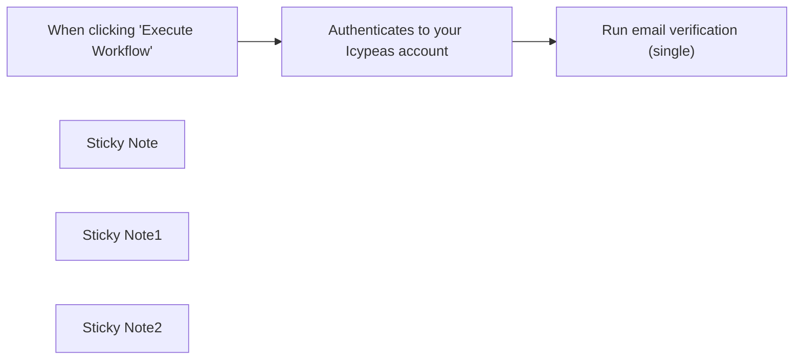

## Fluxo (.json) :

```json
{
  "id": "IwOOVikQC7cn9VTv",
  "meta": {
    "instanceId": "a897062ac3223eacd9c7736276b653c446bc776a63cde2a42a2949ad984f7092"
  },
  "name": "Email verification with Icypeas (single)",
  "tags": [],
  "nodes": [
    {
      "id": "83105cfd-9107-4dae-8282-07c6594ebbd2",
      "name": "When clicking \"Execute Workflow\"",
      "type": "n8n-nodes-base.manualTrigger",
      "position": [
        1460,
        460
      ],
      "parameters": {},
      "typeVersion": 1
    },
    {
      "id": "7146ee71-e4fc-4c1f-bdbd-af1466525fef",
      "name": "Run email verification (single)",
      "type": "n8n-nodes-base.httpRequest",
      "position": [
        2180,
        460
      ],
      "parameters": {
        "url": "={{ $json.api.url }}",
        "method": "POST",
        "options": {},
        "sendBody": true,
        "sendHeaders": true,
        "authentication": "genericCredentialType",
        "bodyParameters": {
          "parameters": [
            {
              "name": "email",
              "value": "=uyqsdqkudhfiqudhfiqduhfiqdhfqif@gmail.com"
            }
          ]
        },
        "genericAuthType": "httpHeaderAuth",
        "headerParameters": {
          "parameters": [
            {
              "name": "X-ROCK-TIMESTAMP",
              "value": "={{ $json.api.timestamp }}"
            }
          ]
        }
      },
      "credentials": {
        "httpHeaderAuth": {
          "id": "KGXtUrqC6lNLwW2w",
          "name": "Header Auth account"
        }
      },
      "typeVersion": 4.1
    },
    {
      "id": "1e004997-dfc6-45ad-9351-9a096cb4c991",
      "name": "Sticky Note",
      "type": "n8n-nodes-base.stickyNote",
      "position": [
        1280,
        200
      ],
      "parameters": {
        "height": 250.2614840989399,
        "content": "## Email verification with Icypeas (single)\n\nThis workflow demonstrates how to perform an email verification using Icypeas. Visit https://icypeas.com to create your account.\n\n\n"
      },
      "typeVersion": 1
    },
    {
      "id": "c56e06c9-971b-47ea-9c23-af639933479b",
      "name": "Sticky Note1",
      "type": "n8n-nodes-base.stickyNote",
      "position": [
        1607,
        276
      ],
      "parameters": {
        "width": 506,
        "height": 1030,
        "content": "## Authenticates to your Icypeas account\n\nThis code node utilizes your API key, API secret, and User ID to establish a connection with your Icypeas account.\n\n\n\n\n\n\n\n\n\n\n\n\n\n\n\n\n\nOpen this node and insert your API Key, API secret, and User ID within the quotation marks. You can locate these credentials on your Icypeas profile at https://app.icypeas.com/bo/profile. Here is the extract of what you have to change :\n\nconst API_KEY = \"**PUT_API_KEY_HERE**\";\nconst API_SECRET = \"**PUT_API_SECRET_HERE**\";\nconst USER_ID = \"**PUT_USER_ID_HERE**\";\n\nDo not change any other line of the code.\n\nIf you are a self-hosted user, follow these steps to activate the crypto module :\n\n1.Access your n8n instance:\nLog in to your n8n instance using your web browser by navigating to the URL of your instance, for example: http://your-n8n-instance.com.\n\n2.Go to Settings:\nIn the top-right corner, click on your username, then select \"Settings.\"\n\n3.Select General Settings:\nIn the left menu, click on \"General.\"\n\n4.Enable the Crypto module:\nScroll down to the \"Additional Node Packages\" section. You will see an option called \"crypto\" with a checkbox next to it. Check this box to enable the Crypto module.\n\n5.Save the changes:\nAt the bottom of the page, click \"Save\" to apply the changes.\n\nOnce you've followed these steps, the Crypto module should be activated for your self-hosted n8n instance. Make sure to save your changes and optionally restart your n8n instance for the changes to take effect.\n\n\n\n\n\n\n\n\n\n\n\n"
      },
      "typeVersion": 1
    },
    {
      "id": "0b0425b7-52e7-4d4c-8c7f-6fb4821b9ce1",
      "name": "Sticky Note2",
      "type": "n8n-nodes-base.stickyNote",
      "position": [
        2113,
        280
      ],
      "parameters": {
        "width": 492,
        "height": 748,
        "content": "## Performs an email verification on your Icypeas account\n\n\nThis node executes an HTTP request (POST) to verify the email you have provided in the body section, using Icypeas.\n\n\n\n\n\n\n\n\n\n\n\n\n\n### You need to create credentials in the HTTP Request node :\n\n➔ In the Credential for Header Auth, click on - Create new Credential -.\n➔ In the Name section, write “Authorization”\n➔ In the Value section, select expression (located just above the field on the right when you hover on top of it) and write {{ $json.api.key + ':' + $json.api.signature }} .\n➔ Then click on “Save” to save the changes.\n\n### To verify the email :\n\n➔ go to the Body Parameters section,\n➔ create a new parameter,\n➔ enter \"email\" in the Name field.\n➔ put the email you want to verify in the Value field.\n\nYou will find the result here : https://app.icypeas.com/bo/singlesearch?task=email-verification.\n"
      },
      "typeVersion": 1
    },
    {
      "id": "7784528c-863c-4940-9fe2-f257884a6a73",
      "name": "Authenticates to your Icypeas account",
      "type": "n8n-nodes-base.code",
      "position": [
        1800,
        460
      ],
      "parameters": {
        "jsCode": "const BASE_URL = \"https://app.icypeas.com\";\nconst PATH = \"/api/email-verification\";\nconst METHOD = \"POST\";\n\n// Change here\nconst API_KEY = \"PUT_API_KEY_HERE\";\nconst API_SECRET = \"PUT_API_SECRET_HERE\";\nconst USER_ID = \"PUT_USER_ID_HERE\";\n////////////////\n\nconst genSignature = (\n    path,\n    method,\n    secret,\n    timestamp = new Date().toISOString()\n) => {\n    const Crypto = require('crypto');\n    const payload = `${method}${path}${timestamp}`.toLowerCase();\n    const sign = Crypto.createHmac(\"sha1\", secret).update(payload).digest(\"hex\");\n\n    return sign;\n};\n\nconst fullPath = `${BASE_URL}${PATH}`;\n$input.first().json.api = {\n  timestamp: new Date().toISOString(),\n  secret: API_SECRET,\n  key: API_KEY,\n  userId: USER_ID,\n  url: fullPath,\n};\n$input.first().json.api.signature = genSignature(PATH, METHOD, API_SECRET, $input.first().json.api.timestamp);\nreturn $input.first();"
      },
      "typeVersion": 1
    }
  ],
  "active": false,
  "pinData": {},
  "settings": {
    "executionOrder": "v1"
  },
  "versionId": "39bdb71c-d7c4-4b1a-8e4f-938d30411190",
  "connections": {
    "When clicking \"Execute Workflow\"": {
      "main": [
        [
          {
            "node": "Authenticates to your Icypeas account",
            "type": "main",
            "index": 0
          }
        ]
      ]
    },
    "Authenticates to your Icypeas account": {
      "main": [
        [
          {
            "node": "Run email verification (single)",
            "type": "main",
            "index": 0
          }
        ]
      ]
    }
  }
}
```

<a id="template-612"></a>

## Template 612 - Converter pesquisa Perplexity em HTML responsivo

- **Nome:** Converter pesquisa Perplexity em HTML responsivo
- **Descrição:** Recebe um tópico via webhook, melhora o prompt, realiza pesquisa usando Perplexity, estrutura o resultado como artigo e entrega um HTML final estilizado e responsivo.
- **Funcionalidade:** • Recepção de tópico via HTTP: aceita um parâmetro de tópico através de requisição GET/POST.
• Aprimoramento do prompt: refina o texto do usuário para obter melhores resultados de pesquisa.
• Execução de pesquisa automática: consulta um serviço de pesquisa para obter conteúdo e citações relevantes.
• Extração e validação de JSON: transforma a resposta em objeto JSON estruturado contendo título, metadados, conteúdo e hashtags.
• Montagem do artigo: organiza título, metadata, texto principal, seções e citações em um formato consistente.
• Conversão para HTML responsivo: gera um documento HTML de linha única com estilo moderno usando classes Tailwind e regras de formatação específicas (listas, blockquotes, preservação de </br>, etc.).
• Distribuição e notificação: envia prévias do conteúdo para um chat via Telegram e responde ao solicitante com o HTML gerado.
• Tratamento de erros: detecta ausência de tópico e retorna resposta de erro apropriada.
- **Ferramentas:** • Perplexity API: serviço de pesquisa e geração de respostas com retorno de citações utilizado para pesquisa sobre o tópico.
• OpenAI API (gpt-4o-mini): modelo usado para melhorar prompts e converter/formatar o artigo em HTML.
• Telegram: canal de notificações para enviar prévias do conteúdo ao usuário ou grupo.
• Tailwind CSS (CDN): biblioteca de estilo usada no HTML gerado para garantir layout moderno e responsivo.

## Fluxo visual

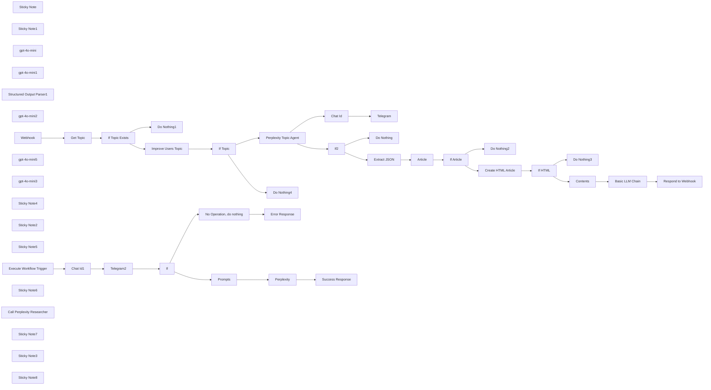

## Fluxo (.json) :

```json
{
  "id": "HnqGW0eq5asKfZxf",
  "meta": {
    "instanceId": "03907a25f048377a8789a4332f28148522ba31ee907fababf704f1d88130b1b6",
    "templateCredsSetupCompleted": true
  },
  "name": "🔍🛠️Perplexity Researcher to HTML Web Page",
  "tags": [],
  "nodes": [
    {
      "id": "ad5d96c6-941a-4ab3-b349-10bae99e5988",
      "name": "Sticky Note",
      "type": "n8n-nodes-base.stickyNote",
      "position": [
        320,
        1360
      ],
      "parameters": {
        "color": 3,
        "width": 625.851492623043,
        "height": 465.2493344282225,
        "content": "## Create Article from Perplexity Research"
      },
      "typeVersion": 1
    },
    {
      "id": "19b3ca66-5fd2-4d04-b25a-a17fb38642f8",
      "name": "Sticky Note1",
      "type": "n8n-nodes-base.stickyNote",
      "position": [
        1240,
        1360
      ],
      "parameters": {
        "color": 4,
        "width": 479.02028317328745,
        "height": 464.14912719677955,
        "content": "## Convert Article into HTML"
      },
      "typeVersion": 1
    },
    {
      "id": "7fad54e8-5a50-42da-b38d-08f6912615ab",
      "name": "gpt-4o-mini",
      "type": "@n8n/n8n-nodes-langchain.lmChatOpenAi",
      "position": [
        1380,
        1660
      ],
      "parameters": {
        "model": "gpt-4o-mini-2024-07-18",
        "options": {
          "responseFormat": "text"
        }
      },
      "credentials": {
        "openAiApi": {
          "id": "h597GY4ZJQD47RQd",
          "name": "OpenAi account"
        }
      },
      "typeVersion": 1
    },
    {
      "id": "5291869f-3ac6-4ce2-88f3-b572924b6082",
      "name": "gpt-4o-mini1",
      "type": "@n8n/n8n-nodes-langchain.lmChatOpenAi",
      "position": [
        1560,
        1040
      ],
      "parameters": {
        "options": {
          "topP": 1,
          "timeout": 60000,
          "maxTokens": -1,
          "maxRetries": 2,
          "temperature": 0,
          "responseFormat": "text",
          "presencePenalty": 0,
          "frequencyPenalty": 0
        }
      },
      "credentials": {
        "openAiApi": {
          "id": "h597GY4ZJQD47RQd",
          "name": "OpenAi account"
        }
      },
      "typeVersion": 1
    },
    {
      "id": "a232f6ca-ad4c-40fa-a641-f0dd83c8f18a",
      "name": "Structured Output Parser1",
      "type": "@n8n/n8n-nodes-langchain.outputParserStructured",
      "position": [
        640,
        1660
      ],
      "parameters": {
        "schemaType": "manual",
        "inputSchema": "{\n  \"type\": \"object\",\n  \"properties\": {\n    \"article\": {\n      \"type\": \"object\",\n      \"required\": [\"category\", \"title\", \"metadata\", \"content\", \"hashtags\"],\n      \"properties\": {\n        \"category\": {\n          \"type\": \"string\",\n          \"description\": \"Article category\"\n        },\n        \"title\": {\n          \"type\": \"string\",\n          \"description\": \"Article title\"\n        },\n        \"metadata\": {\n          \"type\": \"object\",\n          \"properties\": {\n            \"timePosted\": {\n              \"type\": \"string\",\n              \"description\": \"Time since article was posted\"\n            },\n            \"author\": {\n              \"type\": \"string\",\n              \"description\": \"Article author name\"\n            },\n            \"tag\": {\n              \"type\": \"string\",\n              \"description\": \"Article primary tag\"\n            }\n          },\n          \"required\": [\"timePosted\", \"author\", \"tag\"]\n        },\n        \"content\": {\n          \"type\": \"object\",\n          \"properties\": {\n            \"mainText\": {\n              \"type\": \"string\",\n              \"description\": \"Main article content\"\n            },\n            \"sections\": {\n              \"type\": \"array\",\n              \"items\": {\n                \"type\": \"object\",\n                \"properties\": {\n                  \"title\": {\n                    \"type\": \"string\",\n                    \"description\": \"Section title\"\n                  },\n                  \"text\": {\n                    \"type\": \"string\",\n                    \"description\": \"Section content\"\n                  },\n                  \"quote\": {\n                    \"type\": \"string\",\n                    \"description\": \"Blockquote text\"\n                  }\n                },\n                \"required\": [\"title\", \"text\", \"quote\"]\n              }\n            }\n          },\n          \"required\": [\"mainText\", \"sections\"]\n        },\n        \"hashtags\": {\n          \"type\": \"array\",\n          \"items\": {\n            \"type\": \"string\"\n          },\n          \"description\": \"Article hashtags\"\n        }\n      }\n    }\n  }\n}"
      },
      "typeVersion": 1.2
    },
    {
      "id": "e7d1adac-88aa-4f76-92bf-bbac3aa6386a",
      "name": "gpt-4o-mini2",
      "type": "@n8n/n8n-nodes-langchain.lmChatOpenAi",
      "position": [
        420,
        1660
      ],
      "parameters": {
        "options": {
          "topP": 1,
          "timeout": 60000,
          "maxTokens": -1,
          "maxRetries": 2,
          "temperature": 0,
          "responseFormat": "json_object",
          "presencePenalty": 0,
          "frequencyPenalty": 0
        }
      },
      "credentials": {
        "openAiApi": {
          "id": "h597GY4ZJQD47RQd",
          "name": "OpenAi account"
        }
      },
      "typeVersion": 1
    },
    {
      "id": "156e51db-03f7-4099-afe8-6f0361c5b497",
      "name": "Webhook",
      "type": "n8n-nodes-base.webhook",
      "position": [
        160,
        860
      ],
      "webhookId": "6a8e3ae7-02ae-4663-a27a-07df448550ab",
      "parameters": {
        "path": "pblog",
        "options": {},
        "responseMode": "responseNode"
      },
      "typeVersion": 2
    },
    {
      "id": "6dd3eba7-e779-4e4a-960e-c5a7b6b3a929",
      "name": "Respond to Webhook",
      "type": "n8n-nodes-base.respondToWebhook",
      "position": [
        2820,
        1480
      ],
      "parameters": {
        "options": {},
        "respondWith": "text",
        "responseBody": "={{ $json.text }}"
      },
      "typeVersion": 1.1
    },
    {
      "id": "27ee681e-4259-4323-b4fe-629f99cb33d0",
      "name": "Telegram",
      "type": "n8n-nodes-base.telegram",
      "position": [
        2320,
        880
      ],
      "parameters": {
        "text": "={{ $('Perplexity Topic Agent').item.json.output.slice(0, 300) }}",
        "chatId": "={{ $json.telegram_chat_id }}",
        "additionalFields": {
          "parse_mode": "HTML",
          "appendAttribution": false
        }
      },
      "credentials": {
        "telegramApi": {
          "id": "BIE64nzfpGeesXUn",
          "name": "Telegram account"
        }
      },
      "typeVersion": 1.2
    },
    {
      "id": "f437d40c-2bf6-43e2-b77b-e5c2cdc35055",
      "name": "gpt-4o-mini5",
      "type": "@n8n/n8n-nodes-langchain.lmChatOpenAi",
      "position": [
        2480,
        1660
      ],
      "parameters": {
        "options": {
          "topP": 1,
          "timeout": 60000,
          "maxTokens": -1,
          "maxRetries": 2,
          "temperature": 0,
          "responseFormat": "text",
          "presencePenalty": 0,
          "frequencyPenalty": 0
        }
      },
      "credentials": {
        "openAiApi": {
          "id": "h597GY4ZJQD47RQd",
          "name": "OpenAi account"
        }
      },
      "typeVersion": 1
    },
    {
      "id": "275bce4a-4252-41d4-bcba-174f0c51bf4a",
      "name": "Basic LLM Chain",
      "type": "@n8n/n8n-nodes-langchain.chainLlm",
      "position": [
        2340,
        1480
      ],
      "parameters": {
        "text": "=Create a modern, responsive single-line HTML document. Convert any markdown to Tailwind CSS classes. Replace markdown lists with proper HTML list elements. Remove all newline characters while preserving </br> tags in content. Enhance the layout with Tailwind CSS cards where appropriate. Use the following base structure, but improve the styling and responsiveness:\n\n<!DOCTYPE html>\n<html lang=\"en\">\n\n<head>\n    <meta charset=\"UTF-8\">\n    <meta name=\"viewport\" content=\"width=device-width, initial-scale=1.0\">\n    <title>Comprehensive Overview of DeepSeek V3</title>\n    <link href=\"https://cdn.jsdelivr.net/npm/tailwindcss@2.2.19/dist/tailwind.min.css\" rel=\"stylesheet\">\n</head>\n\n<body class=\"bg-gray-100 font-sans\">\n    <div class=\"relative p-4\">\n        <div class=\"max-w-3xl mx-auto text-sm\">\n            <div class=\"mt-3 bg-white rounded-lg shadow-lg flex flex-col justify-between leading-normal\">\n                <div class=\"p-6\">\n                    <h1 class=\"text-gray-900 font-bold text-4xl mb-4\">Comprehensive Overview of DeepSeek V3</h1>\n                    <div class=\"mb-4\">\n                        <p class=\"leading-8\"><strong>Time Posted:</strong> Just now</p>\n                        <p class=\"leading-8\"><strong>Author:</strong> AI Research Team</p>\n                        <p class=\"leading-8\"><strong>Tag:</strong> AI Models</p>\n                    </div>\n                    <p class=\"leading-8 my-4\"><strong>DeepSeek V3</strong> is a state-of-the-art AI model that leverages\n                        advanced architectures and techniques to deliver high performance across various applications.\n                        This overview covers its key concepts, practical applications, advantages, limitations, and best\n                        practices for implementation.</p>\n                    <section class=\"mb-6\">\n                        <h2 class=\"text-2xl font-bold my-3\">Key Concepts and Core Components</h2>\n                        <p class=\"leading-8 my-3\"><strong>1. Mixture-of-Experts (MoE) Architecture:</strong> DeepSeek V3\n                            employs a Mixture-of-Experts (MoE) architecture, which consists of multiple neural networks,\n                            each optimized for different tasks. This architecture allows for efficient processing by\n                            activating only a portion of the network for each task, reducing hardware costs.</p>\n                        <p class=\"leading-8 my-3\"><strong>2. Parameters:</strong> The model boasts a total of 671\n                            billion\n                            parameters, with 37 billion active parameters for each token during processing. The addition\n                            of\n                            the Multi-Token Prediction (MTP) module increases the total parameters to 685 billion,\n                            making it\n                            significantly larger than other models like Meta's Llama 3.1 (405B).</p>\n                        <p class=\"leading-8 my-3\"><strong>3. Multi-head Latent Attention (MLA):</strong> DeepSeek V3\n                            uses\n                            Multi-head Latent Attention (MLA) to extract key details from text multiple times, improving\n                            its\n                            accuracy.</p>\n                        <p class=\"leading-8 my-3\"><strong>4. Multi-Token Prediction (MTP):</strong> The model utilizes\n                            Multi-Token Prediction to generate several tokens at once, speeding up inference and\n                            enabling\n                            speculative decoding.</p>\n                        <blockquote\n                            class=\"italic leading-8 my-3 p-5 text-indigo-600 font-semibold bg-indigo-50 rounded-lg border-l-4 border-indigo-600\">\n                            DeepSeek V3 employs a Mixture-of-Experts architecture for efficient processing.</blockquote>\n                    </section>\n                    <section class=\"mb-6\">\n                        <h2 class=\"text-2xl font-bold my-3\">Practical Applications</h2>\n                        <ol class=\"list-decimal pl-5\">\n                            <li class=\"leading-8 my-3\"><strong>Translation, Coding, and Content Generation:</strong>\n                                DeepSeek V3 is designed for a wide range of tasks including translation, coding, content\n                                generation, and reasoning. It excels in English, Chinese, coding, and mathematics,\n                                rivaling leading commercial models like OpenAI's GPT-4.</li>\n                            <li class=\"leading-8 my-3\"><strong>Research and Development:</strong> The open-source nature\n                                of DeepSeek V3 fuels innovation, allowing researchers to experiment with and build upon\n                                its technology.</li>\n                            <li class=\"leading-8 my-3\"><strong>Commercial Applications:</strong> The licensing of\n                                DeepSeek V3 makes it permissible for commercial use, opening it up to numerous\n                                applications across different industries.</li>\n                            <li class=\"leading-8 my-3\"><strong>Democratization of AI:</strong> By making powerful AI\n                                accessible, DeepSeek V3 levels the playing field, allowing smaller organizations to\n                                compete with larger ones.</li>\n                        </ol>\n                        <blockquote\n                            class=\"italic leading-8 my-3 p-5 text-indigo-600 font-semibold bg-indigo-50 rounded-lg border-l-4 border-indigo-600\">\n                            DeepSeek V3 democratizes AI access for smaller organizations.</blockquote>\n                    </section>\n                    <section class=\"mb-6\">\n                        <h2 class=\"text-2xl font-bold my-3\">Advantages</h2>\n                        <ol class=\"list-decimal pl-5\">\n                            <li class=\"leading-8 my-3\"><strong>Speed and Efficiency:</strong> DeepSeek V3 processes\n                                information at a blistering 60 tokens per second, a threefold increase over its\n                                predecessor. It uses advanced inference capabilities, deploying 32 H800 GPUs for prefill\n                                and 320 H800 GPUs for decoding.</li>\n                            <li class=\"leading-8 my-3\"><strong>Cost-Effectiveness:</strong> The model was trained for a\n                                mere $5.5 million, a fraction of the estimated over $100 million invested by OpenAI in\n                                GPT-4. DeepSeek V3 offers significantly lower prices for its online services, with 1\n                                million tokens priced at just $1.1, currently offered at a promotional rate of $0.28.\n                            </li>\n                            <li class=\"leading-8 my-3\"><strong>Innovation in Inference:</strong> The model's advanced\n                                inference capabilities set the standard for future model deployment, making it a\n                                powerful tool in the digital realm.</li>\n                        </ol>\n                        <blockquote\n                            class=\"italic leading-8 my-3 p-5 text-indigo-600 font-semibold bg-indigo-50 rounded-lg border-l-4 border-indigo-600\">\n                            DeepSeek V3 processes information at 60 tokens per second.</blockquote>\n                    </section>\n                    <section class=\"mb-6\">\n                        <h2 class=\"text-2xl font-bold my-3\">Limitations</h2>\n                        <ol class=\"list-decimal pl-5\">\n                            <li class=\"leading-8 my-3\"><strong>Deployment Complexity:</strong> Deploying DeepSeek V3\n                                requires advanced hardware and a deployment strategy that separates the prefilling and\n                                decoding stages, which might be unachievable for small companies due to a lack of\n                                resources. The recommended deployment unit for DeepSeek V3 is relatively large, posing a\n                                burden for small-sized teams.</li>\n                            <li class=\"leading-8 my-3\"><strong>Potential for Further Enhancement:</strong> Although\n                                DeepSeek V3 has achieved an end-to-end generation speed of more than two times that of\n                                DeepSeek V2, there still remains potential for further enhancement with the development\n                                of more advanced hardware.</li>\n                        </ol>\n                        <blockquote\n                            class=\"italic leading-8 my-3 p-5 text-indigo-600 font-semibold bg-indigo-50 rounded-lg border-l-4 border-indigo-600\">\n                            Deployment of DeepSeek V3 may be complex for small companies.</blockquote>\n                    </section>\n                    <section class=\"mb-6\">\n                        <h2 class=\"text-2xl font-bold my-3\">Best Practices for Implementation</h2>\n                        <ol class=\"list-decimal pl-5\">\n                            <li class=\"leading-8 my-3\"><strong>Hardware Requirements:</strong> Ensure that the\n                                deployment environment has the necessary advanced hardware to handle the model's\n                                requirements, including multiple GPUs for prefill and decoding.</li>\n                            <li class=\"leading-8 my-3\"><strong>Deployment Strategy:</strong> Implement a deployment\n                                strategy that separates the prefilling and decoding stages to optimize performance and\n                                efficiency.</li>\n                            <li class=\"leading-8 my-3\"><strong>Monitoring and Optimization:</strong> Continuously\n                                monitor the model's performance and optimize it as needed to address any limitations and\n                                improve efficiency.</li>\n                            <li class=\"leading-8 my-3\"><strong>Community Engagement:</strong> Engage with the\n                                open-source community to leverage the collective knowledge and resources available,\n                                which can help in addressing any challenges and improving the model further.</li>\n                        </ol>\n                        <blockquote\n                            class=\"italic leading-8 my-3 p-5 text-indigo-600 font-semibold bg-indigo-50 rounded-lg border-l-4 border-indigo-600\">\n                            Engage with the open-source community for better implementation.</blockquote>\n                    </section>\n                    <p class=\"leading-8 my-6\"><strong>Hashtags:</strong> <span\n                            class=\"text-indigo-600\">#DeepSeekV3</span> <span class=\"text-indigo-600\">#AI</span> <span\n                            class=\"text-indigo-600\">#MachineLearning</span> <span\n                            class=\"text-indigo-600\">#OpenSource</span></p>\n                </div>\n            </div>\n        </div>\n    </div>\n</body>\n\n</html>\n\n-------\n\nRequirements:\n- Output must be a single line of HTML\n- Enhanced with modern Tailwind CSS styling\n- Proper HTML list structures\n- Responsive design\n- No newlines except </br> in content\n- No markdown formatting\n- Clean, readable layout\n- Properly formatted hashtags\n- No explanation or additional text in output\n- No code block markers or escape characters\n- Wnsure Metadata, Title and Content are included in HTML\n\nMetadata: {{ $('Article').item.json.article.metadata.toJsonString() }}\nTitle: {{ $json.title }}\nContent: {{ $json.html }}\n",
        "promptType": "define"
      },
      "typeVersion": 1.4
    },
    {
      "id": "cddd9324-8471-4dcb-a46b-836015db9833",
      "name": "Do Nothing1",
      "type": "n8n-nodes-base.noOp",
      "position": [
        560,
        1080
      ],
      "parameters": {},
      "typeVersion": 1
    },
    {
      "id": "432a0ae9-451a-4830-b065-8b0593de92ea",
      "name": "gpt-4o-mini3",
      "type": "@n8n/n8n-nodes-langchain.lmChatOpenAi",
      "position": [
        1020,
        1040
      ],
      "parameters": {
        "options": {
          "topP": 1,
          "timeout": 60000,
          "maxTokens": -1,
          "maxRetries": 2,
          "temperature": 0,
          "responseFormat": "text",
          "presencePenalty": 0,
          "frequencyPenalty": 0
        }
      },
      "credentials": {
        "openAiApi": {
          "id": "h597GY4ZJQD47RQd",
          "name": "OpenAi account"
        }
      },
      "typeVersion": 1
    },
    {
      "id": "55e00886-b6c1-4f7a-81ae-e8e0d4102cab",
      "name": "Sticky Note4",
      "type": "n8n-nodes-base.stickyNote",
      "position": [
        2200,
        1360
      ],
      "parameters": {
        "color": 6,
        "width": 531,
        "height": 465,
        "content": "## Create HTML Page with TailwindCSS Styling"
      },
      "typeVersion": 1
    },
    {
      "id": "1ed7f754-1279-4511-a085-6ed4e4c36de1",
      "name": "Sticky Note2",
      "type": "n8n-nodes-base.stickyNote",
      "position": [
        320,
        760
      ],
      "parameters": {
        "width": 450.54438902818094,
        "height": 489.5271576259337,
        "content": "## Parse Topic from Get Request"
      },
      "typeVersion": 1
    },
    {
      "id": "e9dcb568-7f8d-40c5-94cb-6f25386436cf",
      "name": "Sticky Note5",
      "type": "n8n-nodes-base.stickyNote",
      "position": [
        820,
        760
      ],
      "parameters": {
        "color": 5,
        "width": 380,
        "height": 488,
        "content": "## Improve the Users Topic"
      },
      "typeVersion": 1
    },
    {
      "id": "a7fdaddb-d6fc-4d45-85cc-a372cfb90327",
      "name": "If2",
      "type": "n8n-nodes-base.if",
      "position": [
        2120,
        1140
      ],
      "parameters": {
        "options": {},
        "conditions": {
          "options": {
            "version": 2,
            "leftValue": "",
            "caseSensitive": true,
            "typeValidation": "strict"
          },
          "combinator": "and",
          "conditions": [
            {
              "id": "8e35de0a-ac16-4555-94f4-24e97bdf4b33",
              "operator": {
                "type": "string",
                "operation": "notEmpty",
                "singleValue": true
              },
              "leftValue": "{{ $json.output }}",
              "rightValue": ""
            }
          ]
        }
      },
      "typeVersion": 2.2
    },
    {
      "id": "57d056b8-7e91-41e4-8b74-dce15847a09b",
      "name": "Prompts",
      "type": "n8n-nodes-base.set",
      "position": [
        1300,
        2080
      ],
      "parameters": {
        "options": {},
        "assignments": {
          "assignments": [
            {
              "id": "efbe7563-8502-407e-bfa0-a4a26d8cddd4",
              "name": "user",
              "type": "string",
              "value": "={{ $('Execute Workflow Trigger').item.json.topic }}"
            },
            {
              "id": "05e0b629-bb9f-4010-96a8-10872764705a",
              "name": "system",
              "type": "string",
              "value": "Assistant is a large language model.  Assistant is designed to be able to assist with a wide range of tasks, from answering simple questions to providing in-depth explanations and discussions on a wide range of topics. As a language model, Assistant is able to generate human-like text based on the input it receives, allowing it to engage in natural-sounding conversations and provide responses that are coherent and relevant to the topic at hand.  Assistant is constantly learning and improving, and its capabilities are constantly evolving. It is able to process and understand large amounts of text, and can use this knowledge to provide accurate and informative responses to a wide range of questions. Additionally, Assistant is able to generate its own text based on the input it receives, allowing it to engage in discussions and provide explanations and descriptions on a wide range of topics.  Overall, Assistant is a powerful system that can help with a wide range of tasks and provide valuable insights and information on a wide range of topics. Whether you need help with a specific question or just want to have a conversation about a particular topic, Assistant is here to assist.  "
            }
          ]
        }
      },
      "typeVersion": 3.4
    },
    {
      "id": "8209cece-fde4-485f-81a1-2d24a6eac474",
      "name": "Execute Workflow Trigger",
      "type": "n8n-nodes-base.executeWorkflowTrigger",
      "position": [
        420,
        2180
      ],
      "parameters": {},
      "typeVersion": 1
    },
    {
      "id": "445e4d15-c2b0-4152-a0f8-d6b93ad5bae6",
      "name": "Telegram2",
      "type": "n8n-nodes-base.telegram",
      "position": [
        860,
        2180
      ],
      "parameters": {
        "text": "=<i>{{ $('Execute Workflow Trigger').item.json.topic }}</i>",
        "chatId": "={{ $json.telegram_chat_id }}",
        "additionalFields": {
          "parse_mode": "HTML",
          "appendAttribution": false
        }
      },
      "credentials": {
        "telegramApi": {
          "id": "BIE64nzfpGeesXUn",
          "name": "Telegram account"
        }
      },
      "typeVersion": 1.2
    },
    {
      "id": "57a5b3ce-5490-4d50-91cc-c36e508eee4d",
      "name": "If",
      "type": "n8n-nodes-base.if",
      "position": [
        1080,
        2180
      ],
      "parameters": {
        "options": {},
        "conditions": {
          "options": {
            "version": 2,
            "leftValue": "",
            "caseSensitive": true,
            "typeValidation": "strict"
          },
          "combinator": "and",
          "conditions": [
            {
              "id": "7e2679dc-c898-415d-a693-c2c1e7259b6a",
              "operator": {
                "type": "string",
                "operation": "notContains"
              },
              "leftValue": "={{ $('Execute Workflow Trigger').item.json.topic }}",
              "rightValue": "undefined"
            }
          ]
        }
      },
      "typeVersion": 2.2
    },
    {
      "id": "fdf827dc-96b1-4ed3-895b-2a0f5f4c41a3",
      "name": "No Operation, do nothing",
      "type": "n8n-nodes-base.noOp",
      "position": [
        1300,
        2300
      ],
      "parameters": {},
      "typeVersion": 1
    },
    {
      "id": "944aa564-f449-47a6-9d9c-c20a48946ab6",
      "name": "Sticky Note6",
      "type": "n8n-nodes-base.stickyNote",
      "position": [
        320,
        1940
      ],
      "parameters": {
        "color": 5,
        "width": 1614,
        "height": 623,
        "content": "## 🛠️perplexity_research_tool\n\n"
      },
      "typeVersion": 1
    },
    {
      "id": "3806c079-8c08-48b7-a3ed-a26f6d86c67f",
      "name": "Perplexity Topic Agent",
      "type": "@n8n/n8n-nodes-langchain.agent",
      "position": [
        1580,
        860
      ],
      "parameters": {
        "text": "=Topic: {{ $json.text }}",
        "options": {
          "systemMessage": "Use the perplexity_research_tool to provide research on the users topic.\n\n"
        },
        "promptType": "define",
        "hasOutputParser": true
      },
      "typeVersion": 1.6
    },
    {
      "id": "cfc55dbb-78e6-47ef-bf55-810311bd37e8",
      "name": "Call Perplexity Researcher",
      "type": "@n8n/n8n-nodes-langchain.toolWorkflow",
      "position": [
        1780,
        1040
      ],
      "parameters": {
        "name": "perplexity_research_tool",
        "fields": {
          "values": [
            {
              "name": "topic",
              "stringValue": "= {{ $json.text }}"
            }
          ]
        },
        "workflowId": {
          "__rl": true,
          "mode": "id",
          "value": "HnqGW0eq5asKfZxf"
        },
        "description": "Call this tool to perform Perplexity research.",
        "jsonSchemaExample": "{\n  \"topic\": \"\"\n}"
      },
      "typeVersion": 1.2
    },
    {
      "id": "5ca35a40-506d-4768-a65c-a331718040bc",
      "name": "Do Nothing",
      "type": "n8n-nodes-base.noOp",
      "position": [
        2320,
        1140
      ],
      "parameters": {},
      "typeVersion": 1
    },
    {
      "id": "17028837-4706-43f3-8291-f150860caa4c",
      "name": "Do Nothing2",
      "type": "n8n-nodes-base.noOp",
      "position": [
        1020,
        1700
      ],
      "parameters": {},
      "typeVersion": 1
    },
    {
      "id": "adebf1ad-62d9-4b79-b9a1-4a9395067803",
      "name": "Do Nothing3",
      "type": "n8n-nodes-base.noOp",
      "position": [
        2000,
        1700
      ],
      "parameters": {},
      "typeVersion": 1
    },
    {
      "id": "fe19e472-3b2b-4c07-b957-fb2afc426998",
      "name": "Do Nothing4",
      "type": "n8n-nodes-base.noOp",
      "position": [
        1260,
        1080
      ],
      "parameters": {},
      "typeVersion": 1
    },
    {
      "id": "41e23462-a7fa-42a8-adbc-83a662f63f0c",
      "name": "Sticky Note7",
      "type": "n8n-nodes-base.stickyNote",
      "position": [
        1460,
        760
      ],
      "parameters": {
        "color": 3,
        "width": 480,
        "height": 488,
        "content": "## 🤖Perform Perplexity Research"
      },
      "typeVersion": 1
    },
    {
      "id": "dcc3bd83-1f8c-4000-a832-c2c6e7c157ba",
      "name": "Get Topic",
      "type": "n8n-nodes-base.set",
      "position": [
        380,
        860
      ],
      "parameters": {
        "options": {},
        "assignments": {
          "assignments": [
            {
              "id": "57f0eab2-ef1b-408c-82d5-a8c54c4084a6",
              "name": "topic",
              "type": "string",
              "value": "={{ $json.query.topic }}"
            }
          ]
        }
      },
      "typeVersion": 3.4
    },
    {
      "id": "5572e5b1-0b4c-4e6d-b413-5592aab59571",
      "name": "If Topic Exists",
      "type": "n8n-nodes-base.if",
      "position": [
        560,
        860
      ],
      "parameters": {
        "options": {},
        "conditions": {
          "options": {
            "version": 2,
            "leftValue": "",
            "caseSensitive": true,
            "typeValidation": "strict"
          },
          "combinator": "and",
          "conditions": [
            {
              "id": "2c565aa5-0d11-47fb-8621-6db592579fa8",
              "operator": {
                "type": "string",
                "operation": "notEmpty",
                "singleValue": true
              },
              "leftValue": "={{ $json.topic }}",
              "rightValue": ""
            }
          ]
        }
      },
      "typeVersion": 2.2
    },
    {
      "id": "509ee61f-defb-41e8-84cf-70ac5a7448d0",
      "name": "Improve Users Topic",
      "type": "@n8n/n8n-nodes-langchain.chainLlm",
      "position": [
        880,
        860
      ],
      "parameters": {
        "text": "=How would you improve the following prompt as of {{ $now }}, focusing on:\n\n1. Key Concepts & Definitions\n   - Main terminology and foundational concepts\n   - Technical background and context\n\n2. Core Components\n   - Essential elements and their relationships\n   - Critical processes and workflows\n\n3. Practical Applications\n   - Real-world use cases\n   - Implementation considerations\n\n4. Analysis & Insights\n   - Advantages and limitations\n   - Best practices and recommendations\n\nThe final output should be a maximum 2 sentence pure text prompt without any preamble or further explanation.  The final output will be providced to Perplexity as a research prompt.\n\nPrompt to analyze: {{ $json.topic }}",
        "promptType": "define"
      },
      "typeVersion": 1.4
    },
    {
      "id": "69ee4c6a-f6ef-47a2-bd5c-ccaf49ec7c94",
      "name": "If Topic",
      "type": "n8n-nodes-base.if",
      "position": [
        1260,
        860
      ],
      "parameters": {
        "options": {},
        "conditions": {
          "options": {
            "version": 2,
            "leftValue": "",
            "caseSensitive": true,
            "typeValidation": "strict"
          },
          "combinator": "and",
          "conditions": [
            {
              "id": "329653d4-330f-4b41-96e7-4652c1448902",
              "operator": {
                "type": "string",
                "operation": "notEmpty",
                "singleValue": true
              },
              "leftValue": "={{ $json.text }}",
              "rightValue": ""
            }
          ]
        }
      },
      "typeVersion": 2.2
    },
    {
      "id": "daa3027b-774d-44b1-b0a5-27008768c65d",
      "name": "Chat Id",
      "type": "n8n-nodes-base.set",
      "position": [
        2120,
        880
      ],
      "parameters": {
        "options": {},
        "assignments": {
          "assignments": [
            {
              "id": "0aa8fcc9-26f4-485c-8fc1-a5c13d0dd279",
              "name": "telegram_chat_id",
              "type": "number",
              "value": 1234567890
            }
          ]
        }
      },
      "typeVersion": 3.4
    },
    {
      "id": "97f32ad1-f91e-4ccc-8248-d10da823b26a",
      "name": "Article",
      "type": "n8n-nodes-base.set",
      "position": [
        780,
        1480
      ],
      "parameters": {
        "options": {},
        "assignments": {
          "assignments": [
            {
              "id": "0eb5952b-c133-4b63-8102-d4b8ec7b9b5a",
              "name": "article",
              "type": "object",
              "value": "={{ $json.output.article }}"
            }
          ]
        }
      },
      "typeVersion": 3.4
    },
    {
      "id": "e223dee3-c79f-421d-b2b8-2f3551a45f71",
      "name": "Extract JSON",
      "type": "@n8n/n8n-nodes-langchain.agent",
      "position": [
        440,
        1480
      ],
      "parameters": {
        "text": "=Extract a JSON object from this content: {{ $json.output }}",
        "options": {},
        "promptType": "define",
        "hasOutputParser": true
      },
      "retryOnFail": true,
      "typeVersion": 1.6
    },
    {
      "id": "de8aafb6-b05d-4278-8719-9b3c266fcf3a",
      "name": "If Article",
      "type": "n8n-nodes-base.if",
      "position": [
        1020,
        1480
      ],
      "parameters": {
        "options": {},
        "conditions": {
          "options": {
            "version": 2,
            "leftValue": "",
            "caseSensitive": true,
            "typeValidation": "strict"
          },
          "combinator": "and",
          "conditions": [
            {
              "id": "329653d4-330f-4b41-96e7-4652c1448902",
              "operator": {
                "type": "string",
                "operation": "notEmpty",
                "singleValue": true
              },
              "leftValue": "{{ $json.article }}",
              "rightValue": ""
            }
          ]
        }
      },
      "typeVersion": 2.2
    },
    {
      "id": "f9450b58-3b81-4b61-8cbf-2cdf5a2f56a0",
      "name": "Create HTML Article",
      "type": "@n8n/n8n-nodes-langchain.agent",
      "position": [
        1360,
        1480
      ],
      "parameters": {
        "text": "=Convert this verbatim into HTML: {{ $json.article.toJsonString() }}\n\n## Formatting Guidelines\n- HTML document must be single line document without tabs or line breaks\n- Use proper HTML tags throughout\n- Do not use these tags:  <html> <body> <style> <head>\n- Use <h1> tag for main title\n- Use <h2> tags for secondary titles\n- Structure with <p> tags for paragraphs\n- Include appropriate spacing\n- Use <blockquote> for direct quotes\n- Maintain consistent formatting\n- Write in clear, professional tone\n- Break up long paragraphs\n- Use engaging subheadings\n- Include transitional phrases\n\nThe final JSON response should contain only the title and content fields, with the content including all HTML formatting.\n{\n\t\"title\": \"the title\",\n\t\"content\": \"the HTML\"\n}",
        "agent": "conversationalAgent",
        "options": {},
        "promptType": "define"
      },
      "retryOnFail": true,
      "typeVersion": 1.6
    },
    {
      "id": "53cbaa6e-6508-48e3-9a5a-58f5bc111c2d",
      "name": "If HTML",
      "type": "n8n-nodes-base.if",
      "position": [
        1780,
        1480
      ],
      "parameters": {
        "options": {},
        "conditions": {
          "options": {
            "version": 2,
            "leftValue": "",
            "caseSensitive": true,
            "typeValidation": "strict"
          },
          "combinator": "and",
          "conditions": [
            {
              "id": "329653d4-330f-4b41-96e7-4652c1448902",
              "operator": {
                "type": "string",
                "operation": "notEmpty",
                "singleValue": true
              },
              "leftValue": "={{ $json.output.parseJson().title }}",
              "rightValue": ""
            },
            {
              "id": "0a05f73a-2901-4157-8194-cb81d259ce71",
              "operator": {
                "type": "string",
                "operation": "notEmpty",
                "singleValue": true
              },
              "leftValue": "={{ $json.output.parseJson().content }}",
              "rightValue": ""
            },
            {
              "id": "b61c1d25-a010-42d3-9f9d-fa927c483bae",
              "operator": {
                "name": "filter.operator.equals",
                "type": "string",
                "operation": "equals"
              },
              "leftValue": "",
              "rightValue": ""
            }
          ]
        }
      },
      "typeVersion": 2.2
    },
    {
      "id": "33e4e2cd-be0c-4fc9-b705-b0e8aac496f9",
      "name": "Contents",
      "type": "n8n-nodes-base.set",
      "position": [
        2000,
        1480
      ],
      "parameters": {
        "options": {},
        "assignments": {
          "assignments": [
            {
              "id": "af335333-acb8-4c9e-8184-d20cd03e08f6",
              "name": "title",
              "type": "string",
              "value": "={{ $json.output.parseJson().title }}"
            },
            {
              "id": "7fbd2264-c0e1-4bdc-b754-b0faa538879c",
              "name": "content",
              "type": "string",
              "value": "={{ $json.output.parseJson().content }}"
            }
          ]
        }
      },
      "typeVersion": 3.4
    },
    {
      "id": "8bf36853-8a04-4a0b-8715-e03a8fc8359d",
      "name": "Chat Id1",
      "type": "n8n-nodes-base.set",
      "position": [
        660,
        2180
      ],
      "parameters": {
        "options": {},
        "assignments": {
          "assignments": [
            {
              "id": "0aa8fcc9-26f4-485c-8fc1-a5c13d0dd279",
              "name": "telegram_chat_id",
              "type": "number",
              "value": 1234567890
            }
          ]
        }
      },
      "typeVersion": 3.4
    },
    {
      "id": "a3fe75d1-8db0-45cb-87f6-76fc27cb59f6",
      "name": "Sticky Note3",
      "type": "n8n-nodes-base.stickyNote",
      "position": [
        600,
        2080
      ],
      "parameters": {
        "width": 420,
        "height": 340,
        "content": "## Optional"
      },
      "typeVersion": 1
    },
    {
      "id": "22e9edbc-7aa6-4549-ae9f-2c31ad7d0542",
      "name": "Sticky Note8",
      "type": "n8n-nodes-base.stickyNote",
      "position": [
        2060,
        760
      ],
      "parameters": {
        "width": 420,
        "height": 340,
        "content": "## Optional"
      },
      "typeVersion": 1
    },
    {
      "id": "e62ff7d5-bd54-434c-b048-0dc7cd2c7f9b",
      "name": "Success Response",
      "type": "n8n-nodes-base.set",
      "position": [
        1700,
        2080
      ],
      "parameters": {
        "options": {},
        "assignments": {
          "assignments": [
            {
              "id": "eb89464a-5919-4962-880c-3f5903e267de",
              "name": "response",
              "type": "string",
              "value": "={{ $('Perplexity').item.json.choices[0].message.content }}"
            }
          ]
        },
        "includeOtherFields": true
      },
      "typeVersion": 3.4
    },
    {
      "id": "c6ba0613-47c6-442f-99e8-0eaec8cacc20",
      "name": "Error Response",
      "type": "n8n-nodes-base.set",
      "position": [
        1700,
        2300
      ],
      "parameters": {
        "options": {},
        "assignments": {
          "assignments": [
            {
              "id": "eb89464a-5919-4962-880c-3f5903e267de",
              "name": "response",
              "type": "string",
              "value": "=Error.  No topic provided."
            }
          ]
        },
        "includeOtherFields": true
      },
      "typeVersion": 3.4
    },
    {
      "id": "30d8065c-55d8-4099-abb2-ddb01635129d",
      "name": "Perplexity",
      "type": "n8n-nodes-base.httpRequest",
      "position": [
        1500,
        2080
      ],
      "parameters": {
        "url": "https://api.perplexity.ai/chat/completions",
        "method": "POST",
        "options": {},
        "jsonBody": "={\n  \"model\": \"llama-3.1-sonar-small-128k-online\",\n  \"messages\": [\n    {\n      \"role\": \"system\",\n      \"content\": \"{{ $json.system }}\"\n    },\n    {\n      \"role\": \"user\",\n      \"content\": \"{{ $json.user }}\"\n    }\n  ],\n  \"max_tokens\": \"4000\",\n  \"temperature\": 0.2,\n  \"top_p\": 0.9,\n  \"return_citations\": true,\n  \"search_domain_filter\": [\n    \"perplexity.ai\"\n  ],\n  \"return_images\": false,\n  \"return_related_questions\": false,\n  \"search_recency_filter\": \"month\",\n  \"top_k\": 0,\n  \"stream\": false,\n  \"presence_penalty\": 0,\n  \"frequency_penalty\": 1\n}",
        "sendBody": true,
        "specifyBody": "json",
        "authentication": "genericCredentialType",
        "genericAuthType": "httpHeaderAuth"
      },
      "credentials": {
        "httpCustomAuth": {
          "id": "vxjFugFpr4Od6gws",
          "name": "Confluence REST API"
        },
        "httpHeaderAuth": {
          "id": "wokWVLDQUDi0DC7I",
          "name": "Perplexity"
        }
      },
      "typeVersion": 4.2
    }
  ],
  "active": false,
  "pinData": {},
  "settings": {
    "executionOrder": "v1"
  },
  "versionId": "9ebf0569-4d9d-4783-b797-e5df2a8e8415",
  "connections": {
    "If": {
      "main": [
        [
          {
            "node": "Prompts",
            "type": "main",
            "index": 0
          }
        ],
        [
          {
            "node": "No Operation, do nothing",
            "type": "main",
            "index": 0
          }
        ]
      ]
    },
    "If2": {
      "main": [
        [
          {
            "node": "Extract JSON",
            "type": "main",
            "index": 0
          }
        ],
        [
          {
            "node": "Do Nothing",
            "type": "main",
            "index": 0
          }
        ]
      ]
    },
    "Article": {
      "main": [
        [
          {
            "node": "If Article",
            "type": "main",
            "index": 0
          }
        ]
      ]
    },
    "Chat Id": {
      "main": [
        [
          {
            "node": "Telegram",
            "type": "main",
            "index": 0
          }
        ]
      ]
    },
    "If HTML": {
      "main": [
        [
          {
            "node": "Contents",
            "type": "main",
            "index": 0
          }
        ],
        [
          {
            "node": "Do Nothing3",
            "type": "main",
            "index": 0
          }
        ]
      ]
    },
    "Prompts": {
      "main": [
        [
          {
            "node": "Perplexity",
            "type": "main",
            "index": 0
          }
        ]
      ]
    },
    "Webhook": {
      "main": [
        [
          {
            "node": "Get Topic",
            "type": "main",
            "index": 0
          }
        ]
      ]
    },
    "Chat Id1": {
      "main": [
        [
          {
            "node": "Telegram2",
            "type": "main",
            "index": 0
          }
        ]
      ]
    },
    "Contents": {
      "main": [
        [
          {
            "node": "Basic LLM Chain",
            "type": "main",
            "index": 0
          }
        ]
      ]
    },
    "If Topic": {
      "main": [
        [
          {
            "node": "Perplexity Topic Agent",
            "type": "main",
            "index": 0
          }
        ],
        [
          {
            "node": "Do Nothing4",
            "type": "main",
            "index": 0
          }
        ]
      ]
    },
    "Get Topic": {
      "main": [
        [
          {
            "node": "If Topic Exists",
            "type": "main",
            "index": 0
          }
        ]
      ]
    },
    "Telegram2": {
      "main": [
        [
          {
            "node": "If",
            "type": "main",
            "index": 0
          }
        ]
      ]
    },
    "If Article": {
      "main": [
        [
          {
            "node": "Create HTML Article",
            "type": "main",
            "index": 0
          }
        ],
        [
          {
            "node": "Do Nothing2",
            "type": "main",
            "index": 0
          }
        ]
      ]
    },
    "Perplexity": {
      "main": [
        [
          {
            "node": "Success Response",
            "type": "main",
            "index": 0
          }
        ]
      ]
    },
    "gpt-4o-mini": {
      "ai_languageModel": [
        [
          {
            "node": "Create HTML Article",
            "type": "ai_languageModel",
            "index": 0
          }
        ]
      ]
    },
    "Extract JSON": {
      "main": [
        [
          {
            "node": "Article",
            "type": "main",
            "index": 0
          }
        ]
      ]
    },
    "gpt-4o-mini1": {
      "ai_languageModel": [
        [
          {
            "node": "Perplexity Topic Agent",
            "type": "ai_languageModel",
            "index": 0
          }
        ]
      ]
    },
    "gpt-4o-mini2": {
      "ai_languageModel": [
        [
          {
            "node": "Extract JSON",
            "type": "ai_languageModel",
            "index": 0
          }
        ]
      ]
    },
    "gpt-4o-mini3": {
      "ai_languageModel": [
        [
          {
            "node": "Improve Users Topic",
            "type": "ai_languageModel",
            "index": 0
          }
        ]
      ]
    },
    "gpt-4o-mini5": {
      "ai_languageModel": [
        [
          {
            "node": "Basic LLM Chain",
            "type": "ai_languageModel",
            "index": 0
          }
        ]
      ]
    },
    "Basic LLM Chain": {
      "main": [
        [
          {
            "node": "Respond to Webhook",
            "type": "main",
            "index": 0
          }
        ]
      ]
    },
    "If Topic Exists": {
      "main": [
        [
          {
            "node": "Improve Users Topic",
            "type": "main",
            "index": 0
          }
        ],
        [
          {
            "node": "Do Nothing1",
            "type": "main",
            "index": 0
          }
        ]
      ]
    },
    "Create HTML Article": {
      "main": [
        [
          {
            "node": "If HTML",
            "type": "main",
            "index": 0
          }
        ]
      ]
    },
    "Improve Users Topic": {
      "main": [
        [
          {
            "node": "If Topic",
            "type": "main",
            "index": 0
          }
        ]
      ]
    },
    "Perplexity Topic Agent": {
      "main": [
        [
          {
            "node": "If2",
            "type": "main",
            "index": 0
          },
          {
            "node": "Chat Id",
            "type": "main",
            "index": 0
          }
        ]
      ]
    },
    "Execute Workflow Trigger": {
      "main": [
        [
          {
            "node": "Chat Id1",
            "type": "main",
            "index": 0
          }
        ]
      ]
    },
    "No Operation, do nothing": {
      "main": [
        [
          {
            "node": "Error Response",
            "type": "main",
            "index": 0
          }
        ]
      ]
    },
    "Structured Output Parser1": {
      "ai_outputParser": [
        [
          {
            "node": "Extract JSON",
            "type": "ai_outputParser",
            "index": 0
          }
        ]
      ]
    },
    "Call Perplexity Researcher": {
      "ai_tool": [
        [
          {
            "node": "Perplexity Topic Agent",
            "type": "ai_tool",
            "index": 0
          }
        ]
      ]
    }
  }
}
```

<a id="template-613"></a>

## Template 613 - Quick Start DeepSeek Chat e R1

- **Nome:** Quick Start DeepSeek Chat e R1
- **Descrição:** Fluxo que inicia por uma mensagem de chat e encaminha para um agente conversacional com memória, conectando a modelos DeepSeek remotos e locais para geração de respostas e raciocínio.
- **Funcionalidade:** • Gatilho por mensagem de chat: inicia o processo ao receber uma entrada de chat.
• Agente conversacional configurado: utiliza uma mensagem sistema para comportamento do assistente e processa diálogos de forma contextual.
• Memória de janela (contexto): mantém histórico recente da conversa para respostas mais coerentes.
• Integração com modelos remotos DeepSeek: envia requisições HTTP ao endpoint da API DeepSeek para modelos como deepseek-chat (V3) e deepseek-reasoner (R1).
• Integração com modelo local via Ollama: permite usar o modelo local deepseek-r1 para inferência offline.
• Exemplos de requisições HTTP: inclui chamadas com corpo JSON e corpo raw para /chat/completions, demonstrando formatos de uso e autenticação por cabeçalho.
• Tratamento de falhas e re-tentativa: configuração para tentar novamente ou continuar após erros em componentes críticos.
• Documentação embutida: blocos de notas com links e instruções rápidas sobre configuração e chaves de API.
- **Ferramentas:** • DeepSeek API: serviço de modelos de linguagem com compatibilidade OpenAI, incluindo deepseek-chat (V3) para chat e deepseek-reasoner (R1) para raciocínio avançado; acessível via https://api.deepseek.com.
• Plataforma de gerenciamento DeepSeek: interface para gerar e gerenciar chaves de API em https://platform.deepseek.com/api_keys.
• Ollama (runtime local): ambiente para executar modelos locais, usado aqui com o modelo deepseek-r1:14b para inferência sem depender da API.
• Requisições HTTP com autenticação por cabeçalho: mecanismo para enviar chamadas ao endpoint de chat, suportando corpos JSON ou raw e cabeçalhos de autenticação.

## Fluxo visual

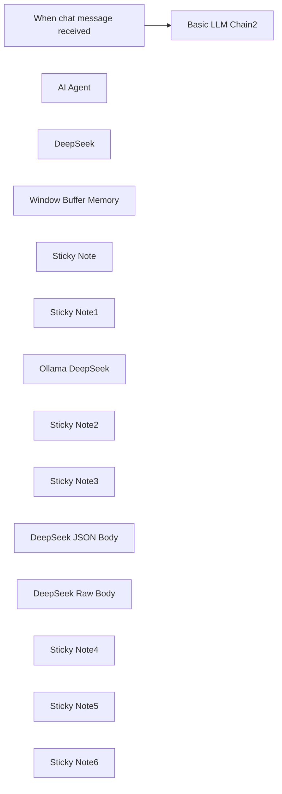

## Fluxo (.json) :

```json
{
  "id": "IyhH1KHtXidKNSIA",
  "meta": {
    "instanceId": "31e69f7f4a77bf465b805824e303232f0227212ae922d12133a0f96ffeab4fef"
  },
  "name": "🐋DeepSeek V3 Chat & R1 Reasoning Quick Start",
  "tags": [],
  "nodes": [
    {
      "id": "54c59cae-fbd0-4f0d-b633-6304e6c66d89",
      "name": "When chat message received",
      "type": "@n8n/n8n-nodes-langchain.chatTrigger",
      "position": [
        -840,
        -740
      ],
      "webhookId": "b740bd14-1b9e-4b1b-abd2-1ecf1184d53a",
      "parameters": {
        "options": {}
      },
      "typeVersion": 1.1
    },
    {
      "id": "ef85680e-569f-4e74-a1b4-aae9923a0dcb",
      "name": "AI Agent",
      "type": "@n8n/n8n-nodes-langchain.agent",
      "onError": "continueErrorOutput",
      "position": [
        -320,
        40
      ],
      "parameters": {
        "agent": "conversationalAgent",
        "options": {
          "systemMessage": "You are a helpful assistant."
        }
      },
      "retryOnFail": true,
      "typeVersion": 1.7,
      "alwaysOutputData": true
    },
    {
      "id": "07a8c74c-768e-4b38-854f-251f2fe5b7bf",
      "name": "DeepSeek",
      "type": "@n8n/n8n-nodes-langchain.lmChatOpenAi",
      "position": [
        -360,
        220
      ],
      "parameters": {
        "model": "=deepseek-reasoner",
        "options": {}
      },
      "credentials": {
        "openAiApi": {
          "id": "MSl7SdcvZe0SqCYI",
          "name": "deepseek"
        }
      },
      "typeVersion": 1.1
    },
    {
      "id": "a6d58a8c-2d16-4c91-adde-acac98868150",
      "name": "Window Buffer Memory",
      "type": "@n8n/n8n-nodes-langchain.memoryBufferWindow",
      "position": [
        -220,
        220
      ],
      "parameters": {},
      "typeVersion": 1.3
    },
    {
      "id": "401a5932-9f3e-4b17-a531-3a19a6a7788a",
      "name": "Basic LLM Chain2",
      "type": "@n8n/n8n-nodes-langchain.chainLlm",
      "position": [
        -320,
        -800
      ],
      "parameters": {
        "messages": {
          "messageValues": [
            {
              "message": "You are a helpful assistant."
            }
          ]
        }
      },
      "typeVersion": 1.5
    },
    {
      "id": "215dda87-faf7-4206-bbc3-b6a6b1eb98de",
      "name": "Sticky Note",
      "type": "n8n-nodes-base.stickyNote",
      "position": [
        -440,
        -460
      ],
      "parameters": {
        "color": 5,
        "width": 420,
        "height": 340,
        "content": "## DeepSeek using HTTP Request\n### DeepSeek Reasoner R1\nhttps://api-docs.deepseek.com/\nRaw Body"
      },
      "typeVersion": 1
    },
    {
      "id": "6457c0f7-ad02-4ad3-a4a0-9a7a6e8f0f7f",
      "name": "Sticky Note1",
      "type": "n8n-nodes-base.stickyNote",
      "position": [
        -440,
        -900
      ],
      "parameters": {
        "color": 4,
        "width": 580,
        "height": 400,
        "content": "## DeepSeek with Ollama Local Model"
      },
      "typeVersion": 1
    },
    {
      "id": "2ac8b41f-b27d-4074-abcc-430a8f5928e8",
      "name": "Ollama DeepSeek",
      "type": "@n8n/n8n-nodes-langchain.lmChatOllama",
      "position": [
        -320,
        -640
      ],
      "parameters": {
        "model": "deepseek-r1:14b",
        "options": {
          "format": "default",
          "numCtx": 16384,
          "temperature": 0.6
        }
      },
      "credentials": {
        "ollamaApi": {
          "id": "7aPaLgwpfdMWFYm9",
          "name": "Ollama account 127.0.0.1"
        }
      },
      "typeVersion": 1
    },
    {
      "id": "37a94fc0-eff3-4226-8633-fb170e5dcff2",
      "name": "Sticky Note2",
      "type": "n8n-nodes-base.stickyNote",
      "position": [
        -440,
        -80
      ],
      "parameters": {
        "color": 3,
        "width": 600,
        "height": 460,
        "content": "## DeepSeek Conversational Agent w/Memory\n"
      },
      "typeVersion": 1
    },
    {
      "id": "52b484bb-1693-4188-ba55-643c40f10dfc",
      "name": "Sticky Note3",
      "type": "n8n-nodes-base.stickyNote",
      "position": [
        20,
        -460
      ],
      "parameters": {
        "color": 6,
        "width": 420,
        "height": 340,
        "content": "## DeepSeek using HTTP Request\n### DeepSeek Chat V3\nhttps://api-docs.deepseek.com/\nJSON Body"
      },
      "typeVersion": 1
    },
    {
      "id": "ec46acef-60f6-4d34-b636-3654125f5897",
      "name": "DeepSeek JSON Body",
      "type": "n8n-nodes-base.httpRequest",
      "position": [
        160,
        -320
      ],
      "parameters": {
        "url": "https://api.deepseek.com/chat/completions",
        "method": "POST",
        "options": {},
        "jsonBody": "={\n \"model\": \"deepseek-chat\",\n \"messages\": [\n {\n \"role\": \"system\",\n \"content\": \"{{ $json.chatInput }}\"\n },\n {\n \"role\": \"user\",\n \"content\": \"Hello!\"\n }\n ],\n \"stream\": false\n}",
        "sendBody": true,
        "specifyBody": "json",
        "authentication": "genericCredentialType",
        "genericAuthType": "httpHeaderAuth"
      },
      "credentials": {
        "httpHeaderAuth": {
          "id": "9CsntxjSlce6yWbN",
          "name": "deepseek"
        }
      },
      "typeVersion": 4.2
    },
    {
      "id": "e5295120-57f9-4e02-8b73-f00e4d6baa48",
      "name": "DeepSeek Raw Body",
      "type": "n8n-nodes-base.httpRequest",
      "position": [
        -300,
        -320
      ],
      "parameters": {
        "url": "https://api.deepseek.com/chat/completions",
        "body": "={\n \"model\": \"deepseek-reasoner\",\n \"messages\": [\n {\"role\": \"user\", \"content\": \"{{ $json.chatInput.trim() }}\"}\n ],\n \"stream\": false\n }",
        "method": "POST",
        "options": {},
        "sendBody": true,
        "contentType": "raw",
        "authentication": "genericCredentialType",
        "rawContentType": "application/json",
        "genericAuthType": "httpHeaderAuth"
      },
      "credentials": {
        "httpHeaderAuth": {
          "id": "9CsntxjSlce6yWbN",
          "name": "deepseek"
        }
      },
      "typeVersion": 4.2
    },
    {
      "id": "571dc713-ce54-4330-8bdd-94e057ecd223",
      "name": "Sticky Note4",
      "type": "n8n-nodes-base.stickyNote",
      "position": [
        -1060,
        -460
      ],
      "parameters": {
        "color": 7,
        "width": 580,
        "height": 840,
        "content": "# Your First DeepSeek API Call\n\nThe DeepSeek API uses an API format compatible with OpenAI. By modifying the configuration, you can use the OpenAI SDK or softwares compatible with the OpenAI API to access the DeepSeek API.\n\nhttps://api-docs.deepseek.com/\n\n## Configuration Parameters\n\n| Parameter | Value |\n|-----------|--------|\n| base_url | https://api.deepseek.com |\n| api_key | https://platform.deepseek.com/api_keys |\n\n\n\n## Important Notes\n\n- To be compatible with OpenAI, you can also use `https://api.deepseek.com/v1` as the base_url. Note that the v1 here has NO relationship with the model's version.\n\n- The deepseek-chat model has been upgraded to DeepSeek-V3. The API remains unchanged. You can invoke DeepSeek-V3 by specifying `model='deepseek-chat'`.\n\n- deepseek-reasoner is the latest reasoning model, DeepSeek-R1, released by DeepSeek. You can invoke DeepSeek-R1 by specifying `model='deepseek-reasoner'`."
      },
      "typeVersion": 1
    },
    {
      "id": "f0ac3f32-218e-4488-b67f-7b7f7e8be130",
      "name": "Sticky Note5",
      "type": "n8n-nodes-base.stickyNote",
      "position": [
        -1060,
        -900
      ],
      "parameters": {
        "color": 2,
        "width": 580,
        "height": 400,
        "content": "## Four Examples for Connecting to DeepSeek\nhttps://api-docs.deepseek.com/\nhttps://platform.deepseek.com/api_keys"
      },
      "typeVersion": 1
    },
    {
      "id": "91642d68-ab5d-4f61-abaf-8cb7cb991c29",
      "name": "Sticky Note6",
      "type": "n8n-nodes-base.stickyNote",
      "position": [
        -180,
        -640
      ],
      "parameters": {
        "color": 7,
        "width": 300,
        "height": 120,
        "content": "### Ollama Local\nhttps://ollama.com/\nhttps://ollama.com/library/deepseek-r1"
      },
      "typeVersion": 1
    }
  ],
  "active": false,
  "pinData": {
    "When chat message received": [
      {
        "json": {
          "action": "sendMessage",
          "chatInput": "provide 10 sentences that end in the word apple.",
          "sessionId": "68cb82d504c14f5eb80bdf2478bd39bb"
        }
      }
    ]
  },
  "settings": {
    "executionOrder": "v1"
  },
  "versionId": "e354040e-7898-4ff9-91a2-b6d36030dac8",
  "connections": {
    "AI Agent": {
      "main": [
        []
      ]
    },
    "DeepSeek": {
      "ai_languageModel": [
        [
          {
            "node": "AI Agent",
            "type": "ai_languageModel",
            "index": 0
          }
        ]
      ]
    },
    "Ollama DeepSeek": {
      "ai_languageModel": [
        [
          {
            "node": "Basic LLM Chain2",
            "type": "ai_languageModel",
            "index": 0
          }
        ]
      ]
    },
    "Window Buffer Memory": {
      "ai_memory": [
        [
          {
            "node": "AI Agent",
            "type": "ai_memory",
            "index": 0
          }
        ]
      ]
    },
    "When chat message received": {
      "main": [
        [
          {
            "node": "Basic LLM Chain2",
            "type": "main",
            "index": 0
          }
        ]
      ]
    }
  }
}
```

<a id="template-614"></a>

## Template 614 - Conversão de PDF para texto

- **Nome:** Conversão de PDF para texto
- **Descrição:** Fluxo que gera PDFs a partir de HTML e extrai o conteúdo textual de PDFs, tanto de arquivos gerados internamente quanto de PDFs acessíveis por URL.
- **Funcionalidade:** • Disparo manual: Inicia o fluxo ao acionar o teste/manualmente.
• Geração de PDF a partir de HTML: Converte um trecho HTML (ex.: <h1>Hello World</h1>) em um arquivo PDF.
• Extração de texto de PDF gerado: Processa o PDF criado a partir do HTML e extrai seu conteúdo em texto.
• Extração de texto de PDF remoto: Recebe um URL de PDF (fornecido por um script) e converte o PDF remoto em texto.
• Suporte a entradas por script: Permite fornecer dinamicamente o caminho/URL do PDF via código para processamento.
- **Ferramentas:** • Conversor HTML para PDF: Gera arquivos PDF a partir de conteúdo HTML.
• Conversor/Extrator de PDF para texto: Analisa arquivos PDF e extrai o conteúdo textual.
• Fonte de PDF remoto (URL público): Arquivo PDF hospedado externamente usado como entrada para extração de texto.

## Fluxo visual

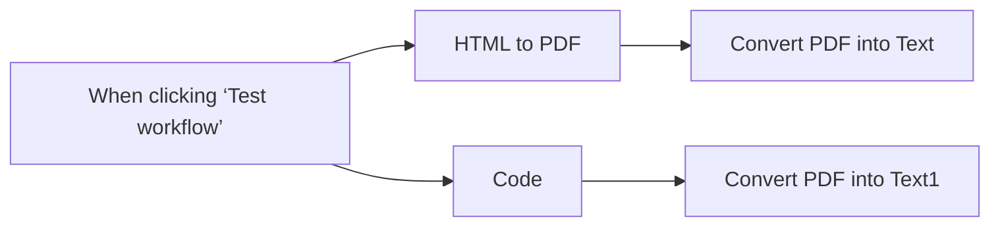

## Fluxo (.json) :

```json
{
  "id": "MIA4ozGH71fC3KCe",
  "meta": {
    "instanceId": "7599ed929ea25767a019b87ecbc83b90e16a268cb51892887b450656ac4518a2"
  },
  "name": "pdf to text",
  "tags": [],
  "nodes": [
    {
      "id": "d92f690d-c84d-451d-9ab8-da6f9356e0ca",
      "name": "Convert PDF into Text",
      "type": "@custom-js/n8n-nodes-pdf-toolkit.PdfToText",
      "position": [
        -120,
        100
      ],
      "parameters": {},
      "credentials": {
        "customJsApi": {
          "id": "h29wo2anYKdANAzm",
          "name": "CustomJS account"
        }
      },
      "typeVersion": 1
    },
    {
      "id": "420cfac7-a621-4bf3-bd34-3fee569321e4",
      "name": "HTML to PDF",
      "type": "@custom-js/n8n-nodes-pdf-toolkit.html2Pdf",
      "position": [
        -340,
        100
      ],
      "parameters": {
        "htmlInput": "<h1>Hello World</h1>"
      },
      "credentials": {
        "customJsApi": {
          "id": "h29wo2anYKdANAzm",
          "name": "CustomJS account"
        }
      },
      "typeVersion": 1
    },
    {
      "id": "83c05ec3-1225-41d0-b5b4-f9f6be7619ea",
      "name": "Convert PDF into Text1",
      "type": "@custom-js/n8n-nodes-pdf-toolkit.PdfToText",
      "position": [
        -120,
        300
      ],
      "parameters": {
        "resource": "url",
        "field_name": "={{ $json.path }}"
      },
      "credentials": {
        "customJsApi": {
          "id": "h29wo2anYKdANAzm",
          "name": "CustomJS account"
        }
      },
      "typeVersion": 1
    },
    {
      "id": "787e9369-abb5-483e-ba43-8837b5c586f9",
      "name": "Code",
      "type": "n8n-nodes-base.code",
      "position": [
        -340,
        300
      ],
      "parameters": {
        "jsCode": "return {\"json\": {\"path\": \"https://www.nlbk.niedersachsen.de/download/164891/Test-pdf_3.pdf.pdf\"}};"
      },
      "typeVersion": 2
    },
    {
      "id": "df553684-dfa8-4af4-a57b-ebbc9ef2a33f",
      "name": "When clicking ‘Test workflow’",
      "type": "n8n-nodes-base.manualTrigger",
      "position": [
        -560,
        200
      ],
      "parameters": {},
      "typeVersion": 1
    }
  ],
  "active": false,
  "pinData": {},
  "settings": {
    "executionOrder": "v1"
  },
  "versionId": "97b60904-2b34-4a77-b171-d02f87c17134",
  "connections": {
    "Code": {
      "main": [
        [
          {
            "node": "Convert PDF into Text1",
            "type": "main",
            "index": 0
          }
        ]
      ]
    },
    "HTML to PDF": {
      "main": [
        [
          {
            "node": "Convert PDF into Text",
            "type": "main",
            "index": 0
          }
        ]
      ]
    },
    "When clicking ‘Test workflow’": {
      "main": [
        [
          {
            "node": "HTML to PDF",
            "type": "main",
            "index": 0
          },
          {
            "node": "Code",
            "type": "main",
            "index": 0
          }
        ]
      ]
    }
  }
}
```

<a id="template-615"></a>

## Template 615 - Receber clima de qualquer cidade

- **Nome:** Receber clima de qualquer cidade
- **Descrição:** Este fluxo recebe uma solicitação externa com o nome de uma cidade e retorna informações meteorológicas atuais dessa cidade.
- **Funcionalidade:** • Recepção de solicitação via webhook: Aceita requisições externas contendo o parâmetro 'city'.
• Consulta de clima por cidade: Realiza busca das condições meteorológicas atuais com base no nome da cidade fornecida.
• Extração e formatação dos dados: Seleciona temperatura e descrição do tempo a partir da resposta e prepara a saída.
• Resposta ao solicitante: Retorna os dados processados como resposta à requisição recebida.
- **Ferramentas:** • OpenWeatherMap API: Serviço externo usado para obter dados meteorológicos atuais a partir do nome da cidade.

## Fluxo visual

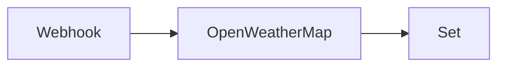

## Fluxo (.json) :

```json
{
  "id": "158",
  "name": "Receive the weather information of any city",
  "nodes": [
    {
      "name": "Webhook",
      "type": "n8n-nodes-base.webhook",
      "position": [
        580,
        340
      ],
      "webhookId": "45690b6a-2b01-472d-8839-5e83a74858e5",
      "parameters": {
        "path": "45690b6a-2b01-472d-8839-5e83a74858e5",
        "options": {},
        "responseData": "allEntries",
        "responseMode": "lastNode"
      },
      "typeVersion": 1
    },
    {
      "name": "OpenWeatherMap",
      "type": "n8n-nodes-base.openWeatherMap",
      "position": [
        770,
        340
      ],
      "parameters": {
        "cityName": "={{$node[\"Webhook\"].json[\"query\"][\"city\"]}}"
      },
      "credentials": {
        "openWeatherMapApi": ""
      },
      "typeVersion": 1
    },
    {
      "name": "Set",
      "type": "n8n-nodes-base.set",
      "position": [
        970,
        340
      ],
      "parameters": {
        "values": {
          "string": [
            {
              "name": "temp",
              "value": "={{$node[\"OpenWeatherMap\"].json[\"main\"][\"temp\"]}}"
            },
            {
              "name": "description",
              "value": "={{$node[\"OpenWeatherMap\"].json[\"weather\"][0][\"description\"]}}"
            }
          ]
        },
        "options": {},
        "keepOnlySet": true
      },
      "typeVersion": 1
    }
  ],
  "active": false,
  "settings": {},
  "connections": {
    "Webhook": {
      "main": [
        [
          {
            "node": "OpenWeatherMap",
            "type": "main",
            "index": 0
          }
        ]
      ]
    },
    "OpenWeatherMap": {
      "main": [
        [
          {
            "node": "Set",
            "type": "main",
            "index": 0
          }
        ]
      ]
    }
  }
}
```

<a id="template-616"></a>

## Template 616 - Processamento de imagem IA via Telegram

- **Nome:** Processamento de imagem IA via Telegram
- **Descrição:** Fluxo que recebe mensagens via Telegram, usa IA para gerar uma imagem a partir do texto da mensagem e envia a imagem resultante de volta ao usuário.
- **Funcionalidade:** • Detecção de mensagens recebidas: Inicia a automação assim que o usuário envia uma mensagem para permitir interação em tempo real.
• Geração de imagem por IA: Cria uma imagem com base no texto fornecido pelo usuário.
• Consolidação de dados: Agrupa informações de saída, incluindo a imagem gerada, para processamento adicional.
• Envio da imagem de volta: Encaminha a imagem gerada ao usuário pelo Telegram, fechando o ciclo de comunicação.
- **Ferramentas:** • Telegram: Plataforma de mensagens usada para receber mensagens e enviar imagens geradas de volta.
• OpenAI: Serviço de IA utilizado para criar imagens com base no texto fornecido pelo usuário.

## Fluxo visual

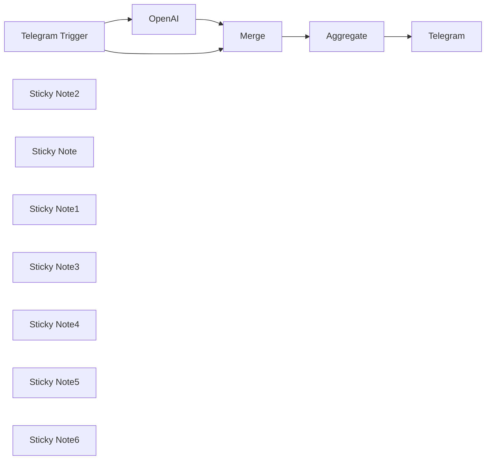

## Fluxo (.json) :

```json
{
  "meta": {
    "instanceId": "f691e434c527bcfc50a22f01094756f14427f055aa0b6917a75441617ecd7fb2"
  },
  "nodes": [
    {
      "id": "a998289c-65da-49ea-ba8a-4b277d9e16f3",
      "name": "Telegram Trigger",
      "type": "n8n-nodes-base.telegramTrigger",
      "position": [
        1060,
        640
      ],
      "webhookId": "2901cde3-b35a-4b0b-a1ba-17a7d9f80125",
      "parameters": {
        "updates": [
          "message",
          "*"
        ],
        "additionalFields": {}
      },
      "credentials": {
        "telegramApi": {
          "id": "pbbCqv0hRu9TDmWm",
          "name": "Telegram account"
        }
      },
      "typeVersion": 1.1
    },
    {
      "id": "7f50072a-5312-4a47-823e-0513cd9d383a",
      "name": "OpenAI",
      "type": "@n8n/n8n-nodes-langchain.openAi",
      "position": [
        1380,
        640
      ],
      "parameters": {
        "prompt": "={{ $json.message.text }}",
        "options": {},
        "resource": "image"
      },
      "credentials": {
        "openAiApi": {
          "id": "p4Qrsjiuev2epBzW",
          "name": "OpenAi account"
        }
      },
      "typeVersion": 1.3
    },
    {
      "id": "a59264d6-c199-4d7b-ade4-1e31f10eb632",
      "name": "Telegram",
      "type": "n8n-nodes-base.telegram",
      "position": [
        1580,
        1000
      ],
      "parameters": {
        "chatId": "={{ $json.data[1].message.from.id }}",
        "operation": "sendPhoto",
        "binaryData": true,
        "additionalFields": {}
      },
      "credentials": {
        "telegramApi": {
          "id": "pbbCqv0hRu9TDmWm",
          "name": "Telegram account"
        }
      },
      "typeVersion": 1.1
    },
    {
      "id": "e0719c38-75ae-4082-91ba-d68c7cd28339",
      "name": "Merge",
      "type": "n8n-nodes-base.merge",
      "position": [
        1060,
        1000
      ],
      "parameters": {},
      "typeVersion": 2.1
    },
    {
      "id": "bee14b74-248b-4e17-9221-378daff965aa",
      "name": "Aggregate",
      "type": "n8n-nodes-base.aggregate",
      "position": [
        1320,
        1000
      ],
      "parameters": {
        "options": {
          "includeBinaries": true
        },
        "aggregate": "aggregateAllItemData"
      },
      "typeVersion": 1
    },
    {
      "id": "50293949-3dc0-4b35-a040-a3ad1a9e80d0",
      "name": "Sticky Note2",
      "type": "n8n-nodes-base.stickyNote",
      "position": [
        -60,
        479.3775380651615
      ],
      "parameters": {
        "width": 1036.6634532467683,
        "height": 671.0981521245417,
        "content": "\n# N8N Workflow: AI-Enhanced Image Processing and Communication\n\n## Description:\nThis n8n workflow integrates artificial intelligence to optimize image processing tasks and streamline communication via Telegram. Each node in the workflow provides specific benefits that contribute to enhancing user engagement and facilitating efficient communication.\n\n## Title:\nAI-Enhanced Image Processing and Communication Workflow with n8n\n\n## Node Names and Benefits:\n\n\n3. Set up the necessary credentials for the Telegram account and OpenAI API.\n4. Configure each node in the workflow to maximize its benefits and optimize user engagement.\n5. Run the workflow to leverage AI-enhanced image processing and communication capabilities for enhanced user interactions.\n6. Monitor the workflow execution for any errors or issues that may arise during processing.\n7. Customize the workflow nodes, parameters, or AI models to align with specific business objectives and user engagement strategies.\n8. Embrace the power of AI-driven image processing and interactive communication on Telegram to elevate user engagement and satisfaction levels.\n\n## Elevate your user engagement strategies with AI-powered image processing and seamless communication on Telegram using n8n!\n"
      },
      "typeVersion": 1
    },
    {
      "id": "529fb39e-5140-41b2-8454-2a1c45d670d0",
      "name": "Sticky Note",
      "type": "n8n-nodes-base.stickyNote",
      "position": [
        1000,
        480
      ],
      "parameters": {
        "width": 276.16526553869744,
        "height": 296.62433647952383,
        "content": " **Telegram Trigger Node**:\n   - Benefit: Initiates the workflow based on incoming messages from users on Telegram, enabling real-time interaction and communication."
      },
      "typeVersion": 1
    },
    {
      "id": "339bc4ff-bca0-48ee-98ce-bbf7deb3f6fc",
      "name": "Sticky Note1",
      "type": "n8n-nodes-base.stickyNote",
      "position": [
        1320,
        480
      ],
      "parameters": {
        "width": 238.40710655577766,
        "height": 316.8446819098802,
        "content": " **OpenAI Node**:\n   - Benefit: Utilizes AI algorithms to analyze text content of messages, generating intelligent responses and enhancing the quality of communication."
      },
      "typeVersion": 1
    },
    {
      "id": "64216b05-5a6e-44f5-8cf1-86487368d892",
      "name": "Sticky Note3",
      "type": "n8n-nodes-base.stickyNote",
      "position": [
        1520,
        820
      ],
      "parameters": {
        "width": 229.95409290591755,
        "height": 332.7896020182219,
        "content": "**Telegram Node**:\n   - Benefit: Sends processed data, including images and responses, back to users on Telegram, ensuring seamless communication and user engagement."
      },
      "typeVersion": 1
    },
    {
      "id": "c15a57ee-f461-43d0-9232-b6d2728ee058",
      "name": "Sticky Note4",
      "type": "n8n-nodes-base.stickyNote",
      "position": [
        1260,
        820
      ],
      "parameters": {
        "height": 332.78960201822133,
        "content": "**Merge Node**:\n   - Benefit: Combines and organizes processed data for efficient handling and integration, optimizing the workflow's data management capabilities."
      },
      "typeVersion": 1
    },
    {
      "id": "f6f0aaac-426a-4923-9100-a52f53e78dec",
      "name": "Sticky Note5",
      "type": "n8n-nodes-base.stickyNote",
      "position": [
        1000,
        820
      ],
      "parameters": {
        "height": 326.33042266316727,
        "content": "**Aggregate Node**:\n   - Benefit: Aggregates all item data, including binaries if specified, for comprehensive reporting and analysis, aiding in decision-making and performance evaluation.\n"
      },
      "typeVersion": 1
    },
    {
      "id": "c36d8d68-0641-4e6d-92b1-82879d81e2c9",
      "name": "Sticky Note6",
      "type": "n8n-nodes-base.stickyNote",
      "position": [
        -80,
        460
      ],
      "parameters": {
        "color": 2,
        "width": 1837.5703604833238,
        "height": 706.8771853945606,
        "content": ""
      },
      "typeVersion": 1
    }
  ],
  "pinData": {},
  "connections": {
    "Merge": {
      "main": [
        [
          {
            "node": "Aggregate",
            "type": "main",
            "index": 0
          }
        ]
      ]
    },
    "OpenAI": {
      "main": [
        [
          {
            "node": "Merge",
            "type": "main",
            "index": 0
          }
        ]
      ]
    },
    "Aggregate": {
      "main": [
        [
          {
            "node": "Telegram",
            "type": "main",
            "index": 0
          }
        ]
      ]
    },
    "Telegram Trigger": {
      "main": [
        [
          {
            "node": "OpenAI",
            "type": "main",
            "index": 0
          },
          {
            "node": "Merge",
            "type": "main",
            "index": 1
          }
        ]
      ]
    }
  }
}
```

<a id="template-617"></a>

## Template 617 - MCP Server integrado ao Google Calendar

- **Nome:** MCP Server integrado ao Google Calendar
- **Descrição:** Fluxo que integra um endpoint MCP (SSE) com um agente de IA para gerenciar eventos no Google Calendar — buscar, criar, atualizar e deletar — a partir de mensagens de chat.
- **Funcionalidade:** • Receber eventos via MCP Server (SSE): expõe e utiliza um endpoint público para receber/emitir eventos em tempo real.
• Processamento por agente de IA: interpreta mensagens de chat e decide ações a executar no calendário.
• Memória de conversas: mantém histórico contextual para conversas contínuas e decisões mais precisas.
• Busca de eventos: recupera múltiplos eventos com filtros por intervalo e limite.
• Criação de eventos: cria novos eventos com título, descrição, data/hora de início e fim.
• Atualização de eventos: atualiza campos de eventos existentes usando o ID do evento.
• Exclusão de eventos: remove eventos por ID.
• Conexão entre agente e MCP: o agente usa o endpoint SSE do MCP para enviar e receber comandos/eventos.
• Configuração de credenciais: exige autenticação para acesso ao calendário e ao modelo de linguagem selecionado.
- **Ferramentas:** • Google Calendar: serviço de calendário usado para armazenar, recuperar, criar, atualizar e excluir eventos.
• Provedor de modelo de linguagem (ex.: OpenAI gpt-4o / gpt-4o-mini): processa entrada de linguagem natural, gera respostas e decide ações sobre o calendário.
• Endpoint SSE / MCP Server: canal de eventos em tempo real (Server-Sent Events) que conecta o agente de IA ao serviço que dispara os eventos.

## Fluxo visual

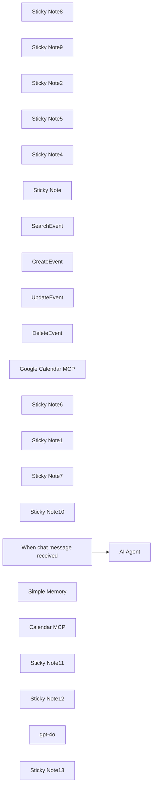

## Fluxo (.json) :

```json
{
  "id": "5opbTWPZRN05bYdz",
  "meta": {
    "instanceId": "2ca62dfdbee183085041310c6198e97a69dbf85e4843e42c21169e2f5e3db806",
    "templateCredsSetupCompleted": true
  },
  "name": "Build an MCP Server with Google Calendar",
  "tags": [],
  "nodes": [
    {
      "id": "4be79e3f-3e83-4432-b23f-4e4e9cac171b",
      "name": "Sticky Note8",
      "type": "n8n-nodes-base.stickyNote",
      "position": [
        -360,
        -800
      ],
      "parameters": {
        "color": 2,
        "width": 2720,
        "height": 140,
        "content": ""
      },
      "typeVersion": 1
    },
    {
      "id": "439a0233-c8ec-4ea5-8630-0f6e62c76bef",
      "name": "Sticky Note9",
      "type": "n8n-nodes-base.stickyNote",
      "position": [
        520,
        -780
      ],
      "parameters": {
        "color": 2,
        "width": 960,
        "height": 80,
        "content": "# Learn How to Build a MCP Server with Google Calendar"
      },
      "typeVersion": 1
    },
    {
      "id": "08996f0a-4a2d-438f-a8d7-aca78968d33f",
      "name": "Sticky Note2",
      "type": "n8n-nodes-base.stickyNote",
      "position": [
        -360,
        -600
      ],
      "parameters": {
        "color": 7,
        "width": 620,
        "height": 280,
        "content": "# Introduce\n\nThis tutorial focuses on guiding users through the process of deploying MCP service with Google Calendar. By following this step - by - step guide, you'll be able to leverage the powerful features of MCP Server with Google Calendar, such as creating, reading, updating, and deleting events."
      },
      "typeVersion": 1
    },
    {
      "id": "0f866ad6-d1af-4732-be64-8c97af7e55ac",
      "name": "Sticky Note5",
      "type": "n8n-nodes-base.stickyNote",
      "position": [
        -360,
        -240
      ],
      "parameters": {
        "color": 6,
        "width": 620,
        "height": 760,
        "content": "# Author\n\n### SunGuannan\nFreelance consultant from China, specializing in automations and data analysis. I work with select clients, addressing their toughest projects.\n\nFor business inquiries, email me at sguann2023@gmail.com.\n"
      },
      "typeVersion": 1
    },
    {
      "id": "4e2cdec7-8d04-40a7-9270-0f408ebf2efb",
      "name": "Sticky Note4",
      "type": "n8n-nodes-base.stickyNote",
      "position": [
        300,
        -600
      ],
      "parameters": {
        "color": 5,
        "width": 620,
        "content": "## Step1: Google Calendar tools require credentials\nIf you don't have your Google Credentials set up in n8n yet, watch [this](https://www.youtube.com/watch?v=3Ai1EPznlAc) video to learn how to do it.\n\nIf you are using n8n Cloud plans, it's very intuitive to setup and you may not even need the tutorial."
      },
      "typeVersion": 1
    },
    {
      "id": "0a3941f5-959f-499c-b5a6-b2b66b203b1e",
      "name": "Sticky Note",
      "type": "n8n-nodes-base.stickyNote",
      "position": [
        300,
        -420
      ],
      "parameters": {
        "color": 5,
        "width": 620,
        "height": 220,
        "content": "## Step 2: Create MCP Server Trigger and activate\nLog in to n8n and create a new workflow. On the new workflow page, click “Add First Step” to open a searchable menu of nodes and triggers. \n\nType “MCP Server Trigger” in the search bar and select it from the results to start your workflow. \n\nThis sets up how n8n receives events from the MCP Server, laying the groundwork for integrating Google Calendar into your automation. "
      },
      "typeVersion": 1
    },
    {
      "id": "42800020-7ed3-4419-9847-d2a751aa3071",
      "name": "SearchEvent",
      "type": "n8n-nodes-base.googleCalendarTool",
      "position": [
        400,
        260
      ],
      "parameters": {
        "limit": "={{ /*n8n-auto-generated-fromAI-override*/ $fromAI('Limit', ``, 'number') }}",
        "options": {},
        "timeMax": "={{ /*n8n-auto-generated-fromAI-override*/ $fromAI('Before', ``, 'string') }}",
        "timeMin": "={{ /*n8n-auto-generated-fromAI-override*/ $fromAI('After', ``, 'string') }}",
        "calendar": {
          "__rl": true,
          "mode": "list",
          "value": "sguann2023@gmail.com",
          "cachedResultName": "sguann2023@gmail.com"
        },
        "operation": "getAll"
      },
      "credentials": {
        "googleCalendarOAuth2Api": {
          "id": "Wi0S7gZu9R8zFjTC",
          "name": "Google Calendar account"
        }
      },
      "typeVersion": 1.3
    },
    {
      "id": "5d2bce57-f77d-4fd1-9342-d81107a6009d",
      "name": "CreateEvent",
      "type": "n8n-nodes-base.googleCalendarTool",
      "position": [
        520,
        260
      ],
      "parameters": {
        "end": "={{ /*n8n-auto-generated-fromAI-override*/ $fromAI('End', ``, 'string') }}",
        "start": "={{ /*n8n-auto-generated-fromAI-override*/ $fromAI('Start', ``, 'string') }}",
        "calendar": {
          "__rl": true,
          "mode": "list",
          "value": "sguann2023@gmail.com",
          "cachedResultName": "sguann2023@gmail.com"
        },
        "additionalFields": {
          "summary": "={{ $fromAI(\"event_title\", \"The event title\", \"string\") }}",
          "description": "={{ $fromAI(\"event_description\", \"The event description\", \"string\") }}"
        }
      },
      "credentials": {
        "googleCalendarOAuth2Api": {
          "id": "Wi0S7gZu9R8zFjTC",
          "name": "Google Calendar account"
        }
      },
      "typeVersion": 1.3
    },
    {
      "id": "dbebec9c-fecc-4154-ba77-cfbb519ba40a",
      "name": "UpdateEvent",
      "type": "n8n-nodes-base.googleCalendarTool",
      "position": [
        640,
        260
      ],
      "parameters": {
        "eventId": "={{ /*n8n-auto-generated-fromAI-override*/ $fromAI('Event_ID', ``, 'string') }}",
        "calendar": {
          "__rl": true,
          "mode": "list",
          "value": "sguann2023@gmail.com",
          "cachedResultName": "sguann2023@gmail.com"
        },
        "operation": "update",
        "updateFields": {
          "end": "={{ /*n8n-auto-generated-fromAI-override*/ $fromAI('End', ``, 'string') }}",
          "start": "={{ /*n8n-auto-generated-fromAI-override*/ $fromAI('Start', ``, 'string') }}",
          "summary": "={{ $fromAI(\"event_title\", \"The event title\", \"string\") }}",
          "description": "={{ $fromAI(\"event_description\", \"The event description\", \"string\") }}"
        }
      },
      "credentials": {
        "googleCalendarOAuth2Api": {
          "id": "Wi0S7gZu9R8zFjTC",
          "name": "Google Calendar account"
        }
      },
      "typeVersion": 1.3
    },
    {
      "id": "24ef1fd5-29dc-4208-a33b-5337307d01e0",
      "name": "DeleteEvent",
      "type": "n8n-nodes-base.googleCalendarTool",
      "position": [
        760,
        260
      ],
      "parameters": {
        "eventId": "={{ /*n8n-auto-generated-fromAI-override*/ $fromAI('Event_ID', ``, 'string') }}",
        "options": {},
        "calendar": {
          "__rl": true,
          "mode": "list",
          "value": "sguann2023@gmail.com",
          "cachedResultName": "sguann2023@gmail.com"
        },
        "operation": "delete"
      },
      "credentials": {
        "googleCalendarOAuth2Api": {
          "id": "Wi0S7gZu9R8zFjTC",
          "name": "Google Calendar account"
        }
      },
      "typeVersion": 1.3
    },
    {
      "id": "ec4aa55d-c6ee-4990-9c51-6ee1892600dd",
      "name": "Google Calendar MCP",
      "type": "@n8n/n8n-nodes-langchain.mcpTrigger",
      "position": [
        400,
        60
      ],
      "webhookId": "f9d9d5ea-6f83-42c8-ae50-ee6c71789bca",
      "parameters": {
        "path": "my-calendar"
      },
      "typeVersion": 1
    },
    {
      "id": "7e49bc5e-c3c1-47b3-8a0a-8f3b91ad954b",
      "name": "Sticky Note6",
      "type": "n8n-nodes-base.stickyNote",
      "position": [
        300,
        -180
      ],
      "parameters": {
        "color": 5,
        "width": 620,
        "height": 600,
        "content": "## Step 3: Incorporate Google Calendar Tools\nAfter creating the MCP Server Trigger, rename it to \"Google Calendar MCP \" for clarity. \n\nClick \"Tools\" and type \"Google Calendar\" in the search bar to find tools for various Google Calendar operations. \n\nYou can add multiple tools, each for a specific task. For example, \"Get Many\" retrieves multiple events, \"Create\" makes new ones, \"Update\" modifies existing events, and \"Delete\" removes them. Use these tools to build customized, efficient workflows for your Google Calendar data. "
      },
      "typeVersion": 1
    },
    {
      "id": "6a86eb61-0e1f-4de1-a77f-0470fe1cd3ec",
      "name": "Sticky Note1",
      "type": "n8n-nodes-base.stickyNote",
      "position": [
        300,
        440
      ],
      "parameters": {
        "color": 5,
        "width": 620,
        "height": 580,
        "content": "## Step 4: Copy Your MCP Server Trigger URL and Activate Your Workflow\nDouble - click on the \"Google Calendar MCP\" node. On the node detail page, you'll locate the production URL, which might look something like \"https://xxx/mcp/my - calendar/sse\". Make sure to copy this URL as it will be used later in your workflow setup.\n\nAfter obtaining the URL, save the workflow. Then, check the \"Inactive\" button to activate the trigger. \n\n\nOnce activated, your workflow will start listening for events from the MCP Server, enabling seamless integration with the Google Calendar service."
      },
      "typeVersion": 1
    },
    {
      "id": "aed25c42-78e1-4984-8831-768e2bbe6888",
      "name": "Sticky Note7",
      "type": "n8n-nodes-base.stickyNote",
      "position": [
        960,
        -600
      ],
      "parameters": {
        "color": 4,
        "width": 620,
        "height": 140,
        "content": "## Step 5: Create a New Workflow for AI Agent\nAt this stage, you're required to create a new workflow. Once the new workflow interface is open, click on the \"Add First Step\" option. In the list of available nodes and triggers that appears, search for and select the \"on Chat Message\" option to add it to your workflow. This sets the initial trigger for your AI-Agent-related workflow."
      },
      "typeVersion": 1
    },
    {
      "id": "214dbba6-dffe-4c43-8c14-77babd52107f",
      "name": "Sticky Note10",
      "type": "n8n-nodes-base.stickyNote",
      "position": [
        960,
        -440
      ],
      "parameters": {
        "color": 4,
        "width": 620,
        "height": 1060,
        "content": "## Step 6: Add AI Agent Node\nAfter successfully creating the Chat Messages Trigger, you can proceed to add an \"AI Agent\" node right after it. Double - click on this newly added \"AI Agent\" node to open its configuration panel.\n\nIn the configuration, you'll need to add a specific option. Under the System Message field, enter the following text: \"You are a helpful assistant. Current datetime is {{ $now.toString() }}\". This message provides the AI with the current date and time, which can be useful for context in various interactions.\n\nNext, select an appropriate Large Language Model (LLM) from the available options. This model will be responsible for handling the chat and delivering events.\n\nTo enable continuous and context - aware conversations, add memory to the Agent. This allows the AI Agent to remember previous interactions, providing a more seamless and engaging chat experience.\n\nFinally, search for and add the \"MCP Client\" tool. In the SSE Endpoint section of the \"MCP Client\" configuration, paste the URL that you copied in Step 4. This step connects the AI Agent workflow to the MCP Server, enabling data flow and interaction between the two. "
      },
      "typeVersion": 1
    },
    {
      "id": "7ba10d96-e1cc-456d-9174-c848524466dd",
      "name": "AI Agent",
      "type": "@n8n/n8n-nodes-langchain.agent",
      "position": [
        1220,
        20
      ],
      "parameters": {
        "options": {
          "systemMessage": "=You are a helpful assistant.\nCurrent datetime is {{ $now.toString() }}"
        }
      },
      "typeVersion": 1.8
    },
    {
      "id": "2d577167-74d2-4966-8c39-79477787ed68",
      "name": "When chat message received",
      "type": "@n8n/n8n-nodes-langchain.chatTrigger",
      "position": [
        1020,
        20
      ],
      "webhookId": "7b02318f-1c6b-4f2a-9a4f-b17fa69ea680",
      "parameters": {
        "options": {}
      },
      "typeVersion": 1.1
    },
    {
      "id": "0c5f70f5-5156-42f1-90ab-1f294f2fa2d9",
      "name": "Simple Memory",
      "type": "@n8n/n8n-nodes-langchain.memoryBufferWindow",
      "position": [
        1320,
        240
      ],
      "parameters": {},
      "typeVersion": 1.3
    },
    {
      "id": "cf747bc2-9c08-4f8f-9408-135e17ef0d3d",
      "name": "Calendar MCP",
      "type": "@n8n/n8n-nodes-langchain.mcpClientTool",
      "position": [
        1440,
        240
      ],
      "parameters": {
        "sseEndpoint": "https://xxx.app.n8n.cloud/mcp/my-calendar/sse"
      },
      "typeVersion": 1
    },
    {
      "id": "8891a5de-e35f-4367-bfb7-0e54ce4452be",
      "name": "Sticky Note11",
      "type": "n8n-nodes-base.stickyNote",
      "position": [
        1020,
        360
      ],
      "parameters": {
        "color": 7,
        "height": 240,
        "content": "## Why model 4o? 👆\nAfter testing 4o-mini it had some difficulties handling the calendar requests, while the 4o model handled it with ease.\n\nDepending on your prompt and tools, 4o-mini might be able to work well too, but it requires further testing."
      },
      "typeVersion": 1
    },
    {
      "id": "f5d9ddb5-5957-4d22-8d85-a1c08eb813d8",
      "name": "Sticky Note12",
      "type": "n8n-nodes-base.stickyNote",
      "position": [
        1620,
        -600
      ],
      "parameters": {
        "color": 6,
        "width": 740,
        "height": 520,
        "content": "# Let's Try!\n\n\n\n"
      },
      "typeVersion": 1
    },
    {
      "id": "31b467cd-1d70-4c05-ae14-9f9e455cd55c",
      "name": "gpt-4o",
      "type": "@n8n/n8n-nodes-langchain.lmChatOpenAi",
      "position": [
        1180,
        240
      ],
      "parameters": {
        "model": {
          "__rl": true,
          "mode": "list",
          "value": "gpt-4o-mini"
        },
        "options": {}
      },
      "credentials": {
        "openAiApi": {
          "id": "40ZaiQQN82bPTck0",
          "name": "OpenAi account"
        }
      },
      "typeVersion": 1.2
    },
    {
      "id": "007f0f3f-e7ca-4ea8-acba-cfde3bd8d1dd",
      "name": "Sticky Note13",
      "type": "n8n-nodes-base.stickyNote",
      "position": [
        1620,
        -40
      ],
      "parameters": {
        "color": 7,
        "width": 740,
        "height": 80,
        "content": "# Enjoy It! 😊 😊 😊 "
      },
      "typeVersion": 1
    }
  ],
  "active": false,
  "pinData": {},
  "settings": {
    "executionOrder": "v1"
  },
  "versionId": "c99542aa-af94-4e26-b255-473a26e0a962",
  "connections": {
    "gpt-4o": {
      "ai_languageModel": [
        [
          {
            "node": "AI Agent",
            "type": "ai_languageModel",
            "index": 0
          }
        ]
      ]
    },
    "CreateEvent": {
      "ai_tool": [
        [
          {
            "node": "Google Calendar MCP",
            "type": "ai_tool",
            "index": 0
          }
        ]
      ]
    },
    "DeleteEvent": {
      "ai_tool": [
        [
          {
            "node": "Google Calendar MCP",
            "type": "ai_tool",
            "index": 0
          }
        ]
      ]
    },
    "SearchEvent": {
      "ai_tool": [
        [
          {
            "node": "Google Calendar MCP",
            "type": "ai_tool",
            "index": 0
          }
        ]
      ]
    },
    "UpdateEvent": {
      "ai_tool": [
        [
          {
            "node": "Google Calendar MCP",
            "type": "ai_tool",
            "index": 0
          }
        ]
      ]
    },
    "Calendar MCP": {
      "ai_tool": [
        [
          {
            "node": "AI Agent",
            "type": "ai_tool",
            "index": 0
          }
        ]
      ]
    },
    "Simple Memory": {
      "ai_memory": [
        [
          {
            "node": "AI Agent",
            "type": "ai_memory",
            "index": 0
          }
        ]
      ]
    },
    "When chat message received": {
      "main": [
        [
          {
            "node": "AI Agent",
            "type": "main",
            "index": 0
          }
        ]
      ]
    }
  }
}
```

<a id="template-618"></a>

## Template 618 - Rastreamento autônomo de perfis sociais

- **Nome:** Rastreamento autônomo de perfis sociais
- **Descrição:** Fluxo que percorre websites fornecidos, extrai links e conteúdo, identifica perfis de redes sociais e grava os resultados em uma base de dados.
- **Funcionalidade:** • Leitura de empresas do banco de dados: Recupera nomes e websites a partir de uma tabela para processar cada domínio.
• Preparação de parâmetros: Mapeia e padroniza os campos necessários (nome e website) antes do rastreio.
• Agente de rastreamento baseado em IA: Utiliza um modelo de linguagem para orquestrar o processo de coleta e decisão sobre quais páginas visitar.
• Recuperação de conteúdo e links: Faz requisições HTTP às páginas, obtém HTML, extrai texto e links e converte conteúdo para formato legível (Markdown) quando necessário.
• Normalização e filtragem de URLs: Concatena caminhos relativos com domínio, valida URLs, remove entradas vazias e elimina duplicados.
• Agregação de resultados: Consolida as URLs extraídas em uma estrutura unificada por empresa (lista de perfis sociais).
• Mapeamento e inserção: Combina dados da empresa com os perfis encontrados e insere novas linhas na tabela de saída.
• Resiliência e recomendações: Conta com tentativas em caso de falha e sugere uso de proxy para melhorar a acurácia do rastreio.
- **Ferramentas:** • Supabase: Banco de dados usado para ler a lista de empresas de entrada e gravar os resultados extraídos.
• OpenAI (modelo GPT-4o): Modelo de linguagem usado como agente para comandar o rastreamento, interpretar conteúdo e estruturar a saída.
• Páginas web públicas (HTTP/HTTPS): Fontes públicas alvo do rastreio, onde o fluxo obtém HTML, texto e links para análise.

## Fluxo visual

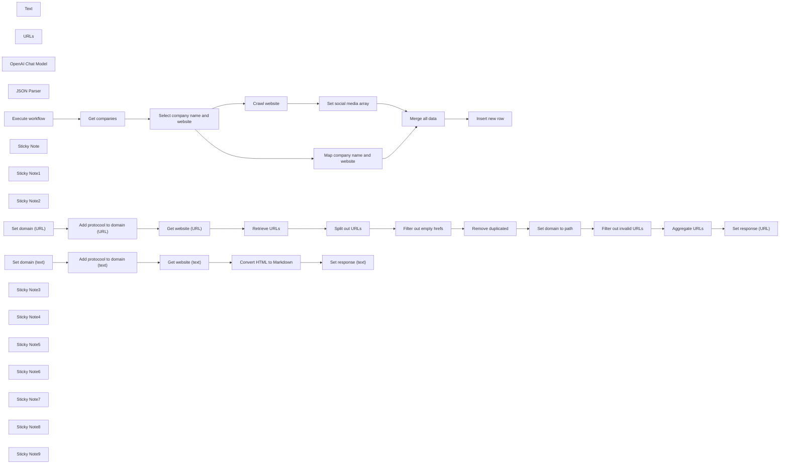

## Fluxo (.json) :

```json
{
  "nodes": [
    {
      "id": "6cdc45e5-1fa4-47fe-b80a-0e1560996936",
      "name": "Text",
      "type": "@n8n/n8n-nodes-langchain.toolWorkflow",
      "position": [
        1460,
        980
      ],
      "parameters": {
        "name": "text_retrieval_tool",
        "source": "parameter",
        "description": "Call this tool to return all text from the given website. Query should be full website URL.",
        "workflowJson": "{\n  \"nodes\": [\n    {\n      \"parameters\": {},\n      \"id\": \"05107436-c9cb-419b-ae8a-b74d309a130d\",\n      \"name\": \"Execute workflow\",\n      \"type\": \"n8n-nodes-base.manualTrigger\",\n      \"typeVersion\": 1,\n      \"position\": [\n        2220,\n        620\n      ]\n    },\n    {\n      \"parameters\": {\n        \"assignments\": {\n          \"assignments\": [\n            {\n              \"id\": \"253c2b17-c749-4f0a-93e8-5ff74f1ce49b\",\n              \"name\": \"domain\",\n              \"value\": \"={{ $json.query }}\",\n              \"type\": \"string\"\n            }\n          ]\n        },\n        \"options\": {}\n      },\n      \"id\": \"bb8be616-3227-4705-8520-1827069faacd\",\n      \"name\": \"Set domain\",\n      \"type\": \"n8n-nodes-base.set\",\n      \"typeVersion\": 3.3,\n      \"position\": [\n        2440,\n        620\n      ]\n    },\n    {\n      \"parameters\": {\n        \"assignments\": {\n          \"assignments\": [\n            {\n              \"id\": \"ed0f1505-82b6-4393-a0d8-088055137ec9\",\n              \"name\": \"domain\",\n              \"value\": \"={{ $json.domain.startsWith(\\\"http\\\") ? $json.domain : \\\"http://\\\" + $json.domain }}\",\n              \"type\": \"string\"\n            }\n          ]\n        },\n        \"options\": {}\n      },\n      \"id\": \"bdf29340-f135-489f-848e-1c7fa43a01df\",\n      \"name\": \"Add protocool to domain\",\n      \"type\": \"n8n-nodes-base.set\",\n      \"typeVersion\": 3.3,\n      \"position\": [\n        2640,\n        620\n      ]\n    },\n    {\n      \"parameters\": {\n        \"assignments\": {\n          \"assignments\": [\n            {\n              \"id\": \"2b1c7ff8-06a7-448b-99b7-5ede4b2e0bf0\",\n              \"name\": \"response\",\n              \"value\": \"={{ $json.data }}\",\n              \"type\": \"string\"\n            }\n          ]\n        },\n        \"options\": {}\n      },\n      \"id\": \"9f0aa264-08c1-459a-bb99-e28599fe8f76\",\n      \"name\": \"Set response\",\n      \"type\": \"n8n-nodes-base.set\",\n      \"typeVersion\": 3.3,\n      \"position\": [\n        3300,\n        620\n      ]\n    },\n    {\n      \"parameters\": {\n        \"url\": \"={{ $json.domain }}\",\n        \"options\": {}\n      },\n      \"id\": \"cec7c8e8-bf5e-43d5-aa41-876293dbec78\",\n      \"name\": \"Get website\",\n      \"type\": \"n8n-nodes-base.httpRequest\",\n      \"typeVersion\": 4.2,\n      \"position\": [\n        2860,\n        620\n      ]\n    },\n    {\n      \"parameters\": {\n        \"html\": \"={{ $json.data }}\",\n        \"options\": {\n          \"ignore\": \"a,img\"\n        }\n      },\n      \"id\": \"1af94fcb-bca3-45c4-9277-18878c75d417\",\n      \"name\": \"Convert HTML to Markdown\",\n      \"type\": \"n8n-nodes-base.markdown\",\n      \"typeVersion\": 1,\n      \"position\": [\n        3080,\n        620\n      ]\n    }\n  ],\n  \"connections\": {\n    \"Execute workflow\": {\n      \"main\": [\n        [\n          {\n            \"node\": \"Set domain\",\n            \"type\": \"main\",\n            \"index\": 0\n          }\n        ]\n      ]\n    },\n    \"Set domain\": {\n      \"main\": [\n        [\n          {\n            \"node\": \"Add protocool to domain\",\n            \"type\": \"main\",\n            \"index\": 0\n          }\n        ]\n      ]\n    },\n    \"Add protocool to domain\": {\n      \"main\": [\n        [\n          {\n            \"node\": \"Get website\",\n            \"type\": \"main\",\n            \"index\": 0\n          }\n        ]\n      ]\n    },\n    \"Get website\": {\n      \"main\": [\n        [\n          {\n            \"node\": \"Convert HTML to Markdown\",\n            \"type\": \"main\",\n            \"index\": 0\n          }\n        ]\n      ]\n    },\n    \"Convert HTML to Markdown\": {\n      \"main\": [\n        [\n          {\n            \"node\": \"Set response\",\n            \"type\": \"main\",\n            \"index\": 0\n          }\n        ]\n      ]\n    }\n  },\n  \"pinData\": {}\n}",
        "requestOptions": {}
      },
      "typeVersion": 1.1
    },
    {
      "id": "af8efccb-ba3c-44de-85f7-b932d7a2e3ca",
      "name": "URLs",
      "type": "@n8n/n8n-nodes-langchain.toolWorkflow",
      "position": [
        1640,
        980
      ],
      "parameters": {
        "name": "url_retrieval_tool",
        "source": "parameter",
        "description": "Call this tool to return all URLs from the given website. Query should be full website URL.",
        "workflowJson": "{\n  \"nodes\": [\n    {\n      \"parameters\": {},\n      \"id\": \"05107436-c9cb-419b-ae8a-b74d309a130d\",\n      \"name\": \"Execute workflow\",\n      \"type\": \"n8n-nodes-base.manualTrigger\",\n      \"typeVersion\": 1,\n      \"position\": [\n        2200,\n        740\n      ]\n    },\n    {\n      \"parameters\": {\n        \"operation\": \"extractHtmlContent\",\n        \"extractionValues\": {\n          \"values\": [\n            {\n              \"key\": \"output\",\n              \"cssSelector\": \"a\",\n              \"returnValue\": \"attribute\",\n              \"returnArray\": true\n            }\n          ]\n        },\n        \"options\": {}\n      },\n      \"id\": \"1972e13e-d923-45e8-9752-e4bf45faaccf\",\n      \"name\": \"Retrieve URLs\",\n      \"type\": \"n8n-nodes-base.html\",\n      \"typeVersion\": 1.2,\n      \"position\": [\n        3060,\n        740\n      ]\n    },\n    {\n      \"parameters\": {\n        \"fieldToSplitOut\": \"output\",\n        \"options\": {}\n      },\n      \"id\": \"19703fbc-05ff-4d80-ab53-85ba6d39fc3f\",\n      \"name\": \"Split out URLs\",\n      \"type\": \"n8n-nodes-base.splitOut\",\n      \"typeVersion\": 1,\n      \"position\": [\n        3280,\n        740\n      ]\n    },\n    {\n      \"parameters\": {\n        \"compare\": \"selectedFields\",\n        \"fieldsToCompare\": \"href\",\n        \"options\": {}\n      },\n      \"id\": \"5cc988e7-de9b-4177-b5e7-edb3842202c8\",\n      \"name\": \"Remove duplicated\",\n      \"type\": \"n8n-nodes-base.removeDuplicates\",\n      \"typeVersion\": 1,\n      \"position\": [\n        3720,\n        740\n      ]\n    },\n    {\n      \"parameters\": {\n        \"assignments\": {\n          \"assignments\": [\n            {\n              \"id\": \"04ced063-09f0-496c-9b28-b8095f9e2297\",\n              \"name\": \"href\",\n              \"value\": \"={{ $json.href.startsWith(\\\"/\\\") ? $('Add protocool to domain (URL)').item.json[\\\"domain\\\"] + $json.href : $json.href }}\",\n              \"type\": \"string\"\n            }\n          ]\n        },\n        \"includeOtherFields\": true,\n        \"include\": \"selected\",\n        \"includeFields\": \"title\",\n        \"options\": {}\n      },\n      \"id\": \"4715a25d-93a7-4056-8768-e3f886a1a0c9\",\n      \"name\": \"Set domain to path\",\n      \"type\": \"n8n-nodes-base.set\",\n      \"typeVersion\": 3.3,\n      \"position\": [\n        3940,\n        740\n      ]\n    },\n    {\n      \"parameters\": {\n        \"conditions\": {\n          \"options\": {\n            \"caseSensitive\": true,\n            \"leftValue\": \"\",\n            \"typeValidation\": \"strict\"\n          },\n          \"conditions\": [\n            {\n              \"id\": \"d01ea6a8-7e75-40d4-98f2-25d42b245f36\",\n              \"leftValue\": \"={{ $json.href.isUrl() }}\",\n              \"rightValue\": \"\",\n              \"operator\": {\n                \"type\": \"boolean\",\n                \"operation\": \"true\",\n                \"singleValue\": true\n              }\n            }\n          ],\n          \"combinator\": \"and\"\n        },\n        \"options\": {}\n      },\n      \"id\": \"353deefb-ae69-440c-95b6-fdadacf4bf91\",\n      \"name\": \"Filter out invalid URLs\",\n      \"type\": \"n8n-nodes-base.filter\",\n      \"typeVersion\": 2,\n      \"position\": [\n        4160,\n        740\n      ]\n    },\n    {\n      \"parameters\": {\n        \"aggregate\": \"aggregateAllItemData\",\n        \"include\": \"specifiedFields\",\n        \"fieldsToInclude\": \"title,href\",\n        \"options\": {}\n      },\n      \"id\": \"9f87be8c-72d7-4ab1-b297-dc7069b2dd11\",\n      \"name\": \"Aggregate URLs\",\n      \"type\": \"n8n-nodes-base.aggregate\",\n      \"typeVersion\": 1,\n      \"position\": [\n        4380,\n        740\n      ]\n    },\n    {\n      \"parameters\": {\n        \"conditions\": {\n          \"options\": {\n            \"caseSensitive\": true,\n            \"leftValue\": \"\",\n            \"typeValidation\": \"strict\"\n          },\n          \"conditions\": [\n            {\n              \"id\": \"5b9b7353-bd04-4af2-9480-8de135ff4223\",\n              \"leftValue\": \"={{ $json.href }}\",\n              \"rightValue\": \"\",\n              \"operator\": {\n                \"type\": \"string\",\n                \"operation\": \"exists\",\n                \"singleValue\": true\n              }\n            }\n          ],\n          \"combinator\": \"and\"\n        },\n        \"options\": {}\n      },\n      \"id\": \"35c8323a-5350-403a-9c2d-114b0527e395\",\n      \"name\": \"Filter out empty hrefs\",\n      \"type\": \"n8n-nodes-base.filter\",\n      \"typeVersion\": 2,\n      \"position\": [\n        3500,\n        740\n      ]\n    },\n    {\n      \"parameters\": {\n        \"assignments\": {\n          \"assignments\": [\n            {\n              \"id\": \"253c2b17-c749-4f0a-93e8-5ff74f1ce49b\",\n              \"name\": \"domain\",\n              \"value\": \"={{ $json.query }}\",\n              \"type\": \"string\"\n            }\n          ]\n        },\n        \"options\": {}\n      },\n      \"id\": \"d9f6a148-6c8c-4a58-89f5-4e9cfcd8d910\",\n      \"name\": \"Set domain (URL)\",\n      \"type\": \"n8n-nodes-base.set\",\n      \"typeVersion\": 3.3,\n      \"position\": [\n        2400,\n        740\n      ]\n    },\n    {\n      \"parameters\": {\n        \"assignments\": {\n          \"assignments\": [\n            {\n              \"id\": \"ed0f1505-82b6-4393-a0d8-088055137ec9\",\n              \"name\": \"domain\",\n              \"value\": \"={{ $json.domain.startsWith(\\\"http\\\") ? $json.domain : \\\"http://\\\" + $json.domain }}\",\n              \"type\": \"string\"\n            }\n          ]\n        },\n        \"options\": {}\n      },\n      \"id\": \"1f974444-da58-4a47-a9c3-ba3091fc1e96\",\n      \"name\": \"Add protocool to domain (URL)\",\n      \"type\": \"n8n-nodes-base.set\",\n      \"typeVersion\": 3.3,\n      \"position\": [\n        2620,\n        740\n      ]\n    },\n    {\n      \"parameters\": {\n        \"url\": \"={{ $json.domain }}\",\n        \"options\": {}\n      },\n      \"id\": \"31d7c7d4-8f61-402b-858d-63dd68ac69ee\",\n      \"name\": \"Get website (URL)\",\n      \"type\": \"n8n-nodes-base.httpRequest\",\n      \"typeVersion\": 4.2,\n      \"position\": [\n        2840,\n        740\n      ]\n    },\n    {\n      \"parameters\": {\n        \"assignments\": {\n          \"assignments\": [\n            {\n              \"id\": \"53c1c016-7983-4eba-a91d-da2a0523d805\",\n              \"name\": \"response\",\n              \"value\": \"={{ JSON.stringify($json.data) }}\",\n              \"type\": \"string\"\n            }\n          ]\n        },\n        \"options\": {}\n      },\n      \"id\": \"f4b6df77-96be-4b12-9a8b-ae9b7009f13d\",\n      \"name\": \"Set response (URL)\",\n      \"type\": \"n8n-nodes-base.set\",\n      \"typeVersion\": 3.3,\n      \"position\": [\n        4600,\n        740\n      ]\n    }\n  ],\n  \"connections\": {\n    \"Execute workflow\": {\n      \"main\": [\n        [\n          {\n            \"node\": \"Set domain (URL)\",\n            \"type\": \"main\",\n            \"index\": 0\n          }\n        ]\n      ]\n    },\n    \"Retrieve URLs\": {\n      \"main\": [\n        [\n          {\n            \"node\": \"Split out URLs\",\n            \"type\": \"main\",\n            \"index\": 0\n          }\n        ]\n      ]\n    },\n    \"Split out URLs\": {\n      \"main\": [\n        [\n          {\n            \"node\": \"Filter out empty hrefs\",\n            \"type\": \"main\",\n            \"index\": 0\n          }\n        ]\n      ]\n    },\n    \"Remove duplicated\": {\n      \"main\": [\n        [\n          {\n            \"node\": \"Set domain to path\",\n            \"type\": \"main\",\n            \"index\": 0\n          }\n        ]\n      ]\n    },\n    \"Set domain to path\": {\n      \"main\": [\n        [\n          {\n            \"node\": \"Filter out invalid URLs\",\n            \"type\": \"main\",\n            \"index\": 0\n          }\n        ]\n      ]\n    },\n    \"Filter out invalid URLs\": {\n      \"main\": [\n        [\n          {\n            \"node\": \"Aggregate URLs\",\n            \"type\": \"main\",\n            \"index\": 0\n          }\n        ]\n      ]\n    },\n    \"Aggregate URLs\": {\n      \"main\": [\n        [\n          {\n            \"node\": \"Set response (URL)\",\n            \"type\": \"main\",\n            \"index\": 0\n          }\n        ]\n      ]\n    },\n    \"Filter out empty hrefs\": {\n      \"main\": [\n        [\n          {\n            \"node\": \"Remove duplicated\",\n            \"type\": \"main\",\n            \"index\": 0\n          }\n        ]\n      ]\n    },\n    \"Set domain (URL)\": {\n      \"main\": [\n        [\n          {\n            \"node\": \"Add protocool to domain (URL)\",\n            \"type\": \"main\",\n            \"index\": 0\n          }\n        ]\n      ]\n    },\n    \"Add protocool to domain (URL)\": {\n      \"main\": [\n        [\n          {\n            \"node\": \"Get website (URL)\",\n            \"type\": \"main\",\n            \"index\": 0\n          }\n        ]\n      ]\n    },\n    \"Get website (URL)\": {\n      \"main\": [\n        [\n          {\n            \"node\": \"Retrieve URLs\",\n            \"type\": \"main\",\n            \"index\": 0\n          }\n        ]\n      ]\n    }\n  },\n  \"pinData\": {}\n}",
        "requestOptions": {}
      },
      "typeVersion": 1.1
    },
    {
      "id": "725dc9d9-dc10-4895-aedb-93ecd7494d76",
      "name": "OpenAI Chat Model",
      "type": "@n8n/n8n-nodes-langchain.lmChatOpenAi",
      "position": [
        1300,
        980
      ],
      "parameters": {
        "model": "gpt-4o",
        "options": {
          "temperature": 0,
          "responseFormat": "json_object"
        },
        "requestOptions": {}
      },
      "credentials": {
        "openAiApi": {
          "id": "Qp9mop4DylpfqiTH",
          "name": "OpenAI (avirago@avirago.pl)"
        }
      },
      "typeVersion": 1
    },
    {
      "id": "2b9aa18b-e72e-486a-b307-db50e408842b",
      "name": "JSON Parser",
      "type": "@n8n/n8n-nodes-langchain.outputParserStructured",
      "position": [
        1800,
        980
      ],
      "parameters": {
        "schemaType": "manual",
        "inputSchema": "{\n  \"type\": \"object\",\n  \"properties\": {\n    \"social_media\": {\n      \"type\": \"array\",\n      \"items\": {\n        \"type\": \"object\",\n        \"properties\": {\n          \"platform\": {\n            \"type\": \"string\",\n            \"description\": \"The name of the social media platform (e.g., LinkedIn, Instagram)\"\n          },\n          \"urls\": {\n            \"type\": \"array\",\n            \"items\": {\n              \"type\": \"string\",\n              \"format\": \"uri\",\n              \"description\": \"A URL for the social media platform\"\n            }\n          }\n        },\n        \"required\": [\"platform\", \"urls\"],\n        \"additionalProperties\": false\n      }\n    }\n  },\n  \"required\": [\"platforms\"],\n  \"additionalProperties\": false\n}\n",
        "requestOptions": {}
      },
      "typeVersion": 1.2
    },
    {
      "id": "87dcfe83-01f3-439c-8175-7da3d96391b4",
      "name": "Map company name and website",
      "type": "n8n-nodes-base.set",
      "position": [
        1400,
        300
      ],
      "parameters": {
        "options": {},
        "assignments": {
          "assignments": [
            {
              "id": "ae484e44-36bc-4d88-9772-545e579a261c",
              "name": "company_name",
              "type": "string",
              "value": "={{ $json.name }}"
            },
            {
              "id": "c426ab19-649c-4443-aabb-eb0826680452",
              "name": "company_website",
              "type": "string",
              "value": "={{ $json.website }}"
            }
          ]
        }
      },
      "typeVersion": 3.3
    },
    {
      "id": "a904bd16-b470-4c98-ac05-50bbc09bf24b",
      "name": "Execute workflow",
      "type": "n8n-nodes-base.manualTrigger",
      "position": [
        540,
        620
      ],
      "parameters": {},
      "typeVersion": 1
    },
    {
      "id": "a9801b62-a691-457c-a52f-ac0d68c8e8b3",
      "name": "Get companies",
      "type": "n8n-nodes-base.supabase",
      "position": [
        780,
        620
      ],
      "parameters": {
        "tableId": "companies_input",
        "operation": "getAll"
      },
      "credentials": {
        "supabaseApi": {
          "id": "TZeFGe5qO3z7X5Zk",
          "name": "Supabase (workfloows@gmail.com)"
        }
      },
      "typeVersion": 1
    },
    {
      "id": "40d8fe8a-2975-4ea5-b6ac-46e19d158eea",
      "name": "Select company name and website",
      "type": "n8n-nodes-base.set",
      "position": [
        1040,
        620
      ],
      "parameters": {
        "include": "selected",
        "options": {},
        "assignments": {
          "assignments": []
        },
        "includeFields": "name,website",
        "includeOtherFields": true
      },
      "typeVersion": 3.3
    },
    {
      "id": "20aa3aea-f1f6-435c-a511-d4e8db047c6d",
      "name": "Set social media array",
      "type": "n8n-nodes-base.set",
      "position": [
        1800,
        720
      ],
      "parameters": {
        "options": {},
        "assignments": {
          "assignments": [
            {
              "id": "a6e109b7-9333-44e8-aa13-590aeb91a56b",
              "name": "social_media",
              "type": "array",
              "value": "={{ $json.output.social_media }}"
            }
          ]
        }
      },
      "typeVersion": 3.3
    },
    {
      "id": "53f64ebf-8d9f-4718-9a33-aaae06e9cf9a",
      "name": "Merge all data",
      "type": "n8n-nodes-base.merge",
      "position": [
        2040,
        620
      ],
      "parameters": {
        "mode": "combine",
        "options": {},
        "combinationMode": "mergeByPosition"
      },
      "typeVersion": 2.1
    },
    {
      "id": "e38e590e-cc1c-485f-b6c4-e7631f1c8381",
      "name": "Insert new row",
      "type": "n8n-nodes-base.supabase",
      "position": [
        2260,
        620
      ],
      "parameters": {
        "tableId": "companies_output",
        "dataToSend": "autoMapInputData"
      },
      "credentials": {
        "supabaseApi": {
          "id": "TZeFGe5qO3z7X5Zk",
          "name": "Supabase (workfloows@gmail.com)"
        }
      },
      "typeVersion": 1
    },
    {
      "id": "aac08494-b324-4307-a5c5-5d5345cc9070",
      "name": "Convert HTML to Markdown",
      "type": "n8n-nodes-base.markdown",
      "position": [
        2100,
        1314
      ],
      "parameters": {
        "html": "={{ $json.data }}",
        "options": {
          "ignore": "a,img"
        }
      },
      "typeVersion": 1
    },
    {
      "id": "ca6733cb-973f-4e7b-9d52-48f1af2e08e3",
      "name": "Sticky Note",
      "type": "n8n-nodes-base.stickyNote",
      "position": [
        1420,
        940
      ],
      "parameters": {
        "color": 5,
        "width": 157.8125,
        "height": 166.55000000000004,
        "content": ""
      },
      "typeVersion": 1
    },
    {
      "id": "4acd71c9-9e31-43fc-bda6-66d6a057306b",
      "name": "Sticky Note1",
      "type": "n8n-nodes-base.stickyNote",
      "position": [
        1600,
        940
      ],
      "parameters": {
        "color": 4,
        "width": 157.8125,
        "height": 166.55000000000004,
        "content": ""
      },
      "typeVersion": 1
    },
    {
      "id": "359adcd6-6bb9-4d64-8dde-6a45b0439fd6",
      "name": "Sticky Note2",
      "type": "n8n-nodes-base.stickyNote",
      "position": [
        1420,
        1180
      ],
      "parameters": {
        "color": 5,
        "width": 1117.5005339977713,
        "height": 329.45390772033636,
        "content": "### Text scraper tool\nThis tool is designed to return all text from the given webpage.\n\n💡 **Consider adding proxy for better crawling accuracy.**\n"
      },
      "typeVersion": 1
    },
    {
      "id": "84133903-dcec-4c0c-8684-fdeb49f5702d",
      "name": "Retrieve URLs",
      "type": "n8n-nodes-base.html",
      "position": [
        2120,
        1700
      ],
      "parameters": {
        "options": {},
        "operation": "extractHtmlContent",
        "extractionValues": {
          "values": [
            {
              "key": "output",
              "cssSelector": "a",
              "returnArray": true,
              "returnValue": "attribute"
            }
          ]
        }
      },
      "typeVersion": 1.2
    },
    {
      "id": "2ebffed6-5517-47ff-9fcd-5ce503aa3b63",
      "name": "Split out URLs",
      "type": "n8n-nodes-base.splitOut",
      "position": [
        2340,
        1700
      ],
      "parameters": {
        "options": {},
        "fieldToSplitOut": "output"
      },
      "typeVersion": 1
    },
    {
      "id": "215da9b2-0c0d-4d0e-b5f9-9887be75b0c4",
      "name": "Remove duplicated",
      "type": "n8n-nodes-base.removeDuplicates",
      "position": [
        2780,
        1700
      ],
      "parameters": {
        "compare": "selectedFields",
        "options": {},
        "fieldsToCompare": "href"
      },
      "typeVersion": 1
    },
    {
      "id": "55825a1c-9351-413c-858a-c44cd3078f11",
      "name": "Set domain to path",
      "type": "n8n-nodes-base.set",
      "position": [
        3000,
        1700
      ],
      "parameters": {
        "include": "selected",
        "options": {},
        "assignments": {
          "assignments": [
            {
              "id": "04ced063-09f0-496c-9b28-b8095f9e2297",
              "name": "href",
              "type": "string",
              "value": "={{ $json.href.startsWith(\"/\") ? $('Add protocool to domain (URL)').item.json[\"domain\"] + $json.href : $json.href }}"
            }
          ]
        },
        "includeFields": "title",
        "includeOtherFields": true
      },
      "typeVersion": 3.3
    },
    {
      "id": "57858d59-2727-4291-9dc6-238101de25ea",
      "name": "Filter out invalid URLs",
      "type": "n8n-nodes-base.filter",
      "position": [
        3220,
        1700
      ],
      "parameters": {
        "options": {},
        "conditions": {
          "options": {
            "leftValue": "",
            "caseSensitive": true,
            "typeValidation": "strict"
          },
          "combinator": "and",
          "conditions": [
            {
              "id": "d01ea6a8-7e75-40d4-98f2-25d42b245f36",
              "operator": {
                "type": "boolean",
                "operation": "true",
                "singleValue": true
              },
              "leftValue": "={{ $json.href.isUrl() }}",
              "rightValue": ""
            }
          ]
        }
      },
      "typeVersion": 2
    },
    {
      "id": "0e487a35-8a6c-48f7-9048-fe66a5a346e8",
      "name": "Aggregate URLs",
      "type": "n8n-nodes-base.aggregate",
      "position": [
        3440,
        1700
      ],
      "parameters": {
        "include": "specifiedFields",
        "options": {},
        "aggregate": "aggregateAllItemData",
        "fieldsToInclude": "title,href"
      },
      "typeVersion": 1
    },
    {
      "id": "0062af28-8727-4ed4-b283-e250146c2085",
      "name": "Filter out empty hrefs",
      "type": "n8n-nodes-base.filter",
      "position": [
        2560,
        1700
      ],
      "parameters": {
        "options": {},
        "conditions": {
          "options": {
            "leftValue": "",
            "caseSensitive": true,
            "typeValidation": "strict"
          },
          "combinator": "and",
          "conditions": [
            {
              "id": "5b9b7353-bd04-4af2-9480-8de135ff4223",
              "operator": {
                "type": "string",
                "operation": "exists",
                "singleValue": true
              },
              "leftValue": "={{ $json.href }}",
              "rightValue": ""
            }
          ]
        }
      },
      "typeVersion": 2
    },
    {
      "id": "995e04f2-f5e3-48b8-879e-913f3a9fb657",
      "name": "Set domain (text)",
      "type": "n8n-nodes-base.set",
      "position": [
        1460,
        1314
      ],
      "parameters": {
        "options": {},
        "assignments": {
          "assignments": [
            {
              "id": "253c2b17-c749-4f0a-93e8-5ff74f1ce49b",
              "name": "domain",
              "type": "string",
              "value": "={{ $json.query }}"
            }
          ]
        }
      },
      "typeVersion": 3.3
    },
    {
      "id": "c88f1008-00f8-4285-b595-a936e1f925a5",
      "name": "Add protocool to domain (text)",
      "type": "n8n-nodes-base.set",
      "position": [
        1660,
        1314
      ],
      "parameters": {
        "options": {},
        "assignments": {
          "assignments": [
            {
              "id": "ed0f1505-82b6-4393-a0d8-088055137ec9",
              "name": "domain",
              "type": "string",
              "value": "={{ $json.domain.startsWith(\"http\") ? $json.domain : \"http://\" + $json.domain }}"
            }
          ]
        }
      },
      "typeVersion": 3.3
    },
    {
      "id": "3bc68a89-8bab-423a-b4bf-4739739aeb07",
      "name": "Get website (text)",
      "type": "n8n-nodes-base.httpRequest",
      "position": [
        1880,
        1314
      ],
      "parameters": {
        "url": "={{ $json.domain }}",
        "options": {}
      },
      "typeVersion": 4.2
    },
    {
      "id": "9d4782c3-872b-4e3c-9f8c-02cfea7a8ff2",
      "name": "Set response (text)",
      "type": "n8n-nodes-base.set",
      "position": [
        2320,
        1314
      ],
      "parameters": {
        "options": {},
        "assignments": {
          "assignments": [
            {
              "id": "2b1c7ff8-06a7-448b-99b7-5ede4b2e0bf0",
              "name": "response",
              "type": "string",
              "value": "={{ $json.data }}"
            }
          ]
        }
      },
      "typeVersion": 3.3
    },
    {
      "id": "2b6ffbd9-892d-4246-b47c-86ad51362ac9",
      "name": "Set domain (URL)",
      "type": "n8n-nodes-base.set",
      "position": [
        1460,
        1700
      ],
      "parameters": {
        "options": {},
        "assignments": {
          "assignments": [
            {
              "id": "253c2b17-c749-4f0a-93e8-5ff74f1ce49b",
              "name": "domain",
              "type": "string",
              "value": "={{ $json.query }}"
            }
          ]
        }
      },
      "typeVersion": 3.3
    },
    {
      "id": "2477677e-262e-45a3-99c3-06607b5ae270",
      "name": "Get website (URL)",
      "type": "n8n-nodes-base.httpRequest",
      "position": [
        1900,
        1700
      ],
      "parameters": {
        "url": "={{ $json.domain }}",
        "options": {}
      },
      "typeVersion": 4.2
    },
    {
      "id": "4f84eb31-7ad4-4b10-8043-b474fc7f367a",
      "name": "Set response (URL)",
      "type": "n8n-nodes-base.set",
      "position": [
        3660,
        1700
      ],
      "parameters": {
        "options": {},
        "assignments": {
          "assignments": [
            {
              "id": "53c1c016-7983-4eba-a91d-da2a0523d805",
              "name": "response",
              "type": "string",
              "value": "={{ JSON.stringify($json.data) }}"
            }
          ]
        }
      },
      "typeVersion": 3.3
    },
    {
      "id": "2d2288dd-2ab5-41a1-984c-ff7c5bbab8d1",
      "name": "Sticky Note3",
      "type": "n8n-nodes-base.stickyNote",
      "position": [
        1420,
        1560
      ],
      "parameters": {
        "color": 4,
        "width": 2467.2678721043376,
        "height": 328.79842054012374,
        "content": "### URL scraper tool\nThis tool is designed to return all links (URLs) from the given webpage.\n\n💡 **Consider adding proxy for better crawling accuracy.**"
      },
      "typeVersion": 1
    },
    {
      "id": "61c1b30f-38e5-44a5-a8be-edd4df1b13e5",
      "name": "Sticky Note4",
      "type": "n8n-nodes-base.stickyNote",
      "position": [
        720,
        400
      ],
      "parameters": {
        "width": 221.7729148148145,
        "height": 400.16865185185225,
        "content": "### Get companies from database\nRetrieve names and websites of companies from Supabase table to process crawling.\n\n💡 **You can replace Supabase with other database of your choice.**"
      },
      "typeVersion": 1
    },
    {
      "id": "b6c6643a-4450-4576-b9c3-e28bc9ebed5d",
      "name": "Sticky Note5",
      "type": "n8n-nodes-base.stickyNote",
      "position": [
        980,
        429.32034814814835
      ],
      "parameters": {
        "width": 221.7729148148145,
        "height": 370.14757037037066,
        "content": "### Set parameters for execution\nPass only `name` and `website` values from database. \n\n⚠️ **If you use other field namings, update this node.**"
      },
      "typeVersion": 1
    },
    {
      "id": "52196e71-c2c2-4ec9-91ab-f7ebc9874d6c",
      "name": "Sticky Note6",
      "type": "n8n-nodes-base.stickyNote",
      "position": [
        1360,
        536.6201859111013
      ],
      "parameters": {
        "width": 339.7128777777775,
        "height": 328.4957622370491,
        "content": "### Crawling agent (retrieve social media profile links)\nCrawl website to extract social media profile links and return them in unified JSON format.\n\n💡 **You can change type of retrieved data by editing prompt and parser schema.**"
      },
      "typeVersion": 1
    },
    {
      "id": "ea11931b-c1c7-43c4-a728-f10479863e38",
      "name": "Sticky Note7",
      "type": "n8n-nodes-base.stickyNote",
      "position": [
        2200,
        435.3819888888892
      ],
      "parameters": {
        "width": 221.7729148148145,
        "height": 364.786662962963,
        "content": "### Insert data to database\nAdd new rows in database table with extracted data.\n\n💡 **You can replace Supabase with other database of your choice.**"
      },
      "typeVersion": 1
    },
    {
      "id": "bc3d3337-a5b9-45ec-bb73-810cea9c0e73",
      "name": "Add protocool to domain (URL)",
      "type": "n8n-nodes-base.set",
      "position": [
        1680,
        1700
      ],
      "parameters": {
        "options": {},
        "assignments": {
          "assignments": [
            {
              "id": "ed0f1505-82b6-4393-a0d8-088055137ec9",
              "name": "domain",
              "type": "string",
              "value": "={{ $json.domain.startsWith(\"http\") ? $json.domain : \"http://\" + $json.domain }}"
            }
          ]
        }
      },
      "typeVersion": 3.3
    },
    {
      "id": "db91703c-0133-4030-a9b5-fc3ab4331784",
      "name": "Sticky Note8",
      "type": "n8n-nodes-base.stickyNote",
      "position": [
        0,
        660
      ],
      "parameters": {
        "color": 3,
        "width": 369.60264559047334,
        "height": 256.26672065702303,
        "content": "## ⚠️ Note\n\n1. Complete video guide for this workflow is available [on my YouTube](https://youtu.be/2W09puFZwtY). \n2. Remember to add your credentials and configure nodes.\n3. If you like this workflow, please subscribe to [my YouTube channel](https://www.youtube.com/@workfloows) and/or [my newsletter](https://workfloows.com/).\n\n**Thank you for your support!**"
      },
      "typeVersion": 1
    },
    {
      "id": "54530733-f8dc-44c7-a645-6f279e9a2c21",
      "name": "Sticky Note9",
      "type": "n8n-nodes-base.stickyNote",
      "position": [
        0,
        420
      ],
      "parameters": {
        "color": 7,
        "width": 369.93062670813185,
        "height": 212.09880341753203,
        "content": "## Autonomous AI crawler\nThis workflow autonomously navigates through given websites and retrieves social media profile links. \n\n💡 **You can modify this workflow to retrieve other type of data (e.g. contact details or company profile summary).**"
      },
      "typeVersion": 1
    },
    {
      "id": "b43aee3c-47b5-47fd-89c4-7d213b26b4ca",
      "name": "Crawl website",
      "type": "@n8n/n8n-nodes-langchain.agent",
      "position": [
        1400,
        720
      ],
      "parameters": {
        "text": "=Retrieve social media profile URLs from this website: {{ $json.website }}",
        "options": {
          "systemMessage": "You are an automated web crawler tasked with extracting social media URLs from a webpage provided by the user. You have access to a text retrieval tool to gather all text content from the page and a URL retrieval tool to identify and navigate through links on the page. Utilize the URLs retrieved to crawl additional pages. Your objective is to provide a unified JSON output containing the extracted data (links to all possible social media profiles from the website)."
        },
        "promptType": "define",
        "hasOutputParser": true
      },
      "retryOnFail": true,
      "typeVersion": 1.6
    }
  ],
  "pinData": {
    "Get companies": [
      {
        "id": 1,
        "name": "n8n",
        "website": "https://n8n.io"
      }
    ]
  },
  "connections": {
    "Text": {
      "ai_tool": [
        [
          {
            "node": "Crawl website",
            "type": "ai_tool",
            "index": 0
          }
        ]
      ]
    },
    "URLs": {
      "ai_tool": [
        [
          {
            "node": "Crawl website",
            "type": "ai_tool",
            "index": 0
          }
        ]
      ]
    },
    "JSON Parser": {
      "ai_outputParser": [
        [
          {
            "node": "Crawl website",
            "type": "ai_outputParser",
            "index": 0
          }
        ]
      ]
    },
    "Crawl website": {
      "main": [
        [
          {
            "node": "Set social media array",
            "type": "main",
            "index": 0
          }
        ]
      ]
    },
    "Get companies": {
      "main": [
        [
          {
            "node": "Select company name and website",
            "type": "main",
            "index": 0
          }
        ]
      ]
    },
    "Retrieve URLs": {
      "main": [
        [
          {
            "node": "Split out URLs",
            "type": "main",
            "index": 0
          }
        ]
      ]
    },
    "Aggregate URLs": {
      "main": [
        [
          {
            "node": "Set response (URL)",
            "type": "main",
            "index": 0
          }
        ]
      ]
    },
    "Merge all data": {
      "main": [
        [
          {
            "node": "Insert new row",
            "type": "main",
            "index": 0
          }
        ]
      ]
    },
    "Split out URLs": {
      "main": [
        [
          {
            "node": "Filter out empty hrefs",
            "type": "main",
            "index": 0
          }
        ]
      ]
    },
    "Execute workflow": {
      "main": [
        [
          {
            "node": "Get companies",
            "type": "main",
            "index": 0
          }
        ]
      ]
    },
    "Set domain (URL)": {
      "main": [
        [
          {
            "node": "Add protocool to domain (URL)",
            "type": "main",
            "index": 0
          }
        ]
      ]
    },
    "Get website (URL)": {
      "main": [
        [
          {
            "node": "Retrieve URLs",
            "type": "main",
            "index": 0
          }
        ]
      ]
    },
    "OpenAI Chat Model": {
      "ai_languageModel": [
        [
          {
            "node": "Crawl website",
            "type": "ai_languageModel",
            "index": 0
          }
        ]
      ]
    },
    "Remove duplicated": {
      "main": [
        [
          {
            "node": "Set domain to path",
            "type": "main",
            "index": 0
          }
        ]
      ]
    },
    "Set domain (text)": {
      "main": [
        [
          {
            "node": "Add protocool to domain (text)",
            "type": "main",
            "index": 0
          }
        ]
      ]
    },
    "Get website (text)": {
      "main": [
        [
          {
            "node": "Convert HTML to Markdown",
            "type": "main",
            "index": 0
          }
        ]
      ]
    },
    "Set domain to path": {
      "main": [
        [
          {
            "node": "Filter out invalid URLs",
            "type": "main",
            "index": 0
          }
        ]
      ]
    },
    "Filter out empty hrefs": {
      "main": [
        [
          {
            "node": "Remove duplicated",
            "type": "main",
            "index": 0
          }
        ]
      ]
    },
    "Set social media array": {
      "main": [
        [
          {
            "node": "Merge all data",
            "type": "main",
            "index": 1
          }
        ]
      ]
    },
    "Filter out invalid URLs": {
      "main": [
        [
          {
            "node": "Aggregate URLs",
            "type": "main",
            "index": 0
          }
        ]
      ]
    },
    "Convert HTML to Markdown": {
      "main": [
        [
          {
            "node": "Set response (text)",
            "type": "main",
            "index": 0
          }
        ]
      ]
    },
    "Map company name and website": {
      "main": [
        [
          {
            "node": "Merge all data",
            "type": "main",
            "index": 0
          }
        ]
      ]
    },
    "Add protocool to domain (URL)": {
      "main": [
        [
          {
            "node": "Get website (URL)",
            "type": "main",
            "index": 0
          }
        ]
      ]
    },
    "Add protocool to domain (text)": {
      "main": [
        [
          {
            "node": "Get website (text)",
            "type": "main",
            "index": 0
          }
        ]
      ]
    },
    "Select company name and website": {
      "main": [
        [
          {
            "node": "Crawl website",
            "type": "main",
            "index": 0
          },
          {
            "node": "Map company name and website",
            "type": "main",
            "index": 0
          }
        ]
      ]
    }
  }
}
```

<a id="template-619"></a>

## Template 619 - Raspagem e indexação de ensaios de Paul Graham

- **Nome:** Raspagem e indexação de ensaios de Paul Graham
- **Descrição:** Raspagem dos ensaios do site de Paul Graham, extração do texto, geração de embeddings e armazenamento em um banco vetorial para possibilitar perguntas e respostas via modelo de linguagem.
- **Funcionalidade:** • Disparo manual: Permite executar o fluxo sob demanda para iniciar a raspagem.
• Coleta de lista de ensaios: Obtém a página de índice de artigos e extrai os links dos ensaios.
• Limitação para testes: Restringe o processamento aos primeiros itens (ex.: primeiros 3) para execução mais rápida.
• Recuperação de conteúdo dos ensaios: Faz requisições às páginas individuais dos ensaios e captura o HTML.
• Extração de texto limpo: Remove elementos não textuais e extrai o corpo do texto dos ensaios.
• Segmentação de texto: Divide o conteúdo em pedaços (chunks) para melhor indexação e recuperação.
• Geração de embeddings: Cria vetores semânticos do texto para indexação.
• Inserção em banco vetorial: Limpa (opcional) e carrega as embeddings no collection especificada do banco vetorial.
• Cadeia de QA com recuperação: Permite receber mensagens de chat e, usando um recuperador vetorial, responde às perguntas com base nos documentos indexados.
- **Ferramentas:** • Site de Paul Graham (paulgraham.com): Fonte pública dos ensaios a serem raspados e indexados.
• Milvus: Banco de vetores para armazenar e recuperar embeddings dos textos.
• OpenAI (modelos de linguagem e embeddings): Gera respostas em linguagem natural e cria embeddings semânticos dos textos.

## Fluxo visual

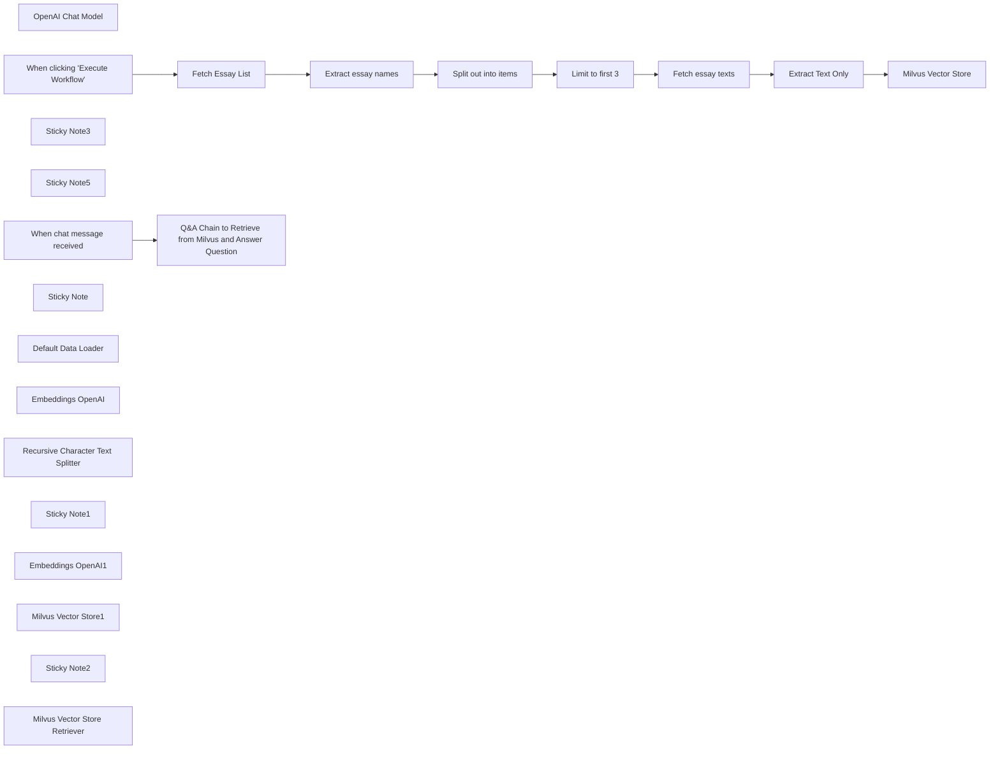

## Fluxo (.json) :

```json
{
  "meta": {
    "instanceId": "89c9c2dbc29ad74e9e02caaf3e27ce718c567278274962e355a9a9679d5f3af7"
  },
  "nodes": [
    {
      "id": "33e94ee1-4244-4075-bb4b-93a99a2cacd9",
      "name": "OpenAI Chat Model",
      "type": "@n8n/n8n-nodes-langchain.lmChatOpenAi",
      "position": [
        20,
        560
      ],
      "parameters": {
        "model": {
          "__rl": true,
          "mode": "list",
          "value": "gpt-4o-mini"
        },
        "options": {}
      },
      "typeVersion": 1.2
    },
    {
      "id": "dd97266d-a039-4d8f-bc7d-fb439ad5a6d7",
      "name": "When clicking \"Execute Workflow\"",
      "type": "n8n-nodes-base.manualTrigger",
      "position": [
        -180,
        0
      ],
      "parameters": {},
      "typeVersion": 1
    },
    {
      "id": "c4d4a979-3182-46c9-b145-fa4e6ba57011",
      "name": "Fetch Essay List",
      "type": "n8n-nodes-base.httpRequest",
      "position": [
        80,
        0
      ],
      "parameters": {
        "url": "http://www.paulgraham.com/articles.html",
        "options": {}
      },
      "typeVersion": 4.2
    },
    {
      "id": "2e2913f9-d01a-41e8-b1b8-9a981910db7b",
      "name": "Extract essay names",
      "type": "n8n-nodes-base.html",
      "position": [
        280,
        0
      ],
      "parameters": {
        "options": {},
        "operation": "extractHtmlContent",
        "extractionValues": {
          "values": [
            {
              "key": "essay",
              "attribute": "href",
              "cssSelector": "table table a",
              "returnArray": true,
              "returnValue": "attribute"
            }
          ]
        }
      },
      "typeVersion": 1.2
    },
    {
      "id": "c121dc65-37e3-49d4-b449-f28491e19a6f",
      "name": "Split out into items",
      "type": "n8n-nodes-base.splitOut",
      "position": [
        480,
        0
      ],
      "parameters": {
        "options": {},
        "fieldToSplitOut": "essay"
      },
      "typeVersion": 1
    },
    {
      "id": "5644c48d-62b6-4e2d-ad25-013b55f5ec71",
      "name": "Fetch essay texts",
      "type": "n8n-nodes-base.httpRequest",
      "position": [
        880,
        0
      ],
      "parameters": {
        "url": "=http://www.paulgraham.com/{{ $json.essay }}",
        "options": {}
      },
      "typeVersion": 4.2
    },
    {
      "id": "cd84596e-4046-4d33-9f43-cf464e5c5c01",
      "name": "Limit to first 3",
      "type": "n8n-nodes-base.limit",
      "position": [
        680,
        0
      ],
      "parameters": {
        "maxItems": 3
      },
      "typeVersion": 1
    },
    {
      "id": "318aeeed-fcce-4de2-aa04-92033ef01f28",
      "name": "Extract Text Only",
      "type": "n8n-nodes-base.html",
      "position": [
        1200,
        0
      ],
      "parameters": {
        "options": {},
        "operation": "extractHtmlContent",
        "extractionValues": {
          "values": [
            {
              "key": "data",
              "cssSelector": "body",
              "skipSelectors": "img,nav"
            }
          ]
        }
      },
      "typeVersion": 1.2
    },
    {
      "id": "0668851e-a31f-4e6e-8966-4544092e318e",
      "name": "Sticky Note3",
      "type": "n8n-nodes-base.stickyNote",
      "position": [
        0,
        -120
      ],
      "parameters": {
        "width": 1071.752021563343,
        "height": 285.66037735849045,
        "content": "## Scrape latest Paul Graham essays"
      },
      "typeVersion": 1
    },
    {
      "id": "cf9af24c-9e08-4f27-ad4e-509f72e54a9b",
      "name": "Sticky Note5",
      "type": "n8n-nodes-base.stickyNote",
      "position": [
        1120,
        -120
      ],
      "parameters": {
        "width": 625,
        "height": 607,
        "content": "## Load into Milvus vector store"
      },
      "typeVersion": 1
    },
    {
      "id": "95e9a59d-1832-4eb7-b58d-ba391c1acb1c",
      "name": "When chat message received",
      "type": "@n8n/n8n-nodes-langchain.chatTrigger",
      "position": [
        -200,
        380
      ],
      "webhookId": "cd2703a7-f912-46fe-8787-3fb83ea116ab",
      "parameters": {
        "options": {}
      },
      "typeVersion": 1.1
    },
    {
      "id": "0076ea3d-e667-4df2-83c3-9de0d3de0498",
      "name": "Sticky Note",
      "type": "n8n-nodes-base.stickyNote",
      "position": [
        -380,
        -160
      ],
      "parameters": {
        "width": 280,
        "height": 180,
        "content": "## Step 1\n1. Set up a Milvus server based on [this guide](https://milvus.io/docs/install_standalone-docker-compose.md). And then create a collection named `my_collection`.\n2. Click this workflow to load scrape and load Paul Graham essays to Milvus collection.\n"
      },
      "typeVersion": 1
    },
    {
      "id": "e90a069e-cfd8-49f1-8fe6-a334bb920027",
      "name": "Milvus Vector Store",
      "type": "@n8n/n8n-nodes-langchain.vectorStoreMilvus",
      "position": [
        1420,
        0
      ],
      "parameters": {
        "mode": "insert",
        "options": {
          "clearCollection": true
        },
        "milvusCollection": {
          "__rl": true,
          "mode": "list",
          "value": "my_collection",
          "cachedResultName": "my_collection"
        }
      },
      "typeVersion": 1.1
    },
    {
      "id": "d786c471-d564-4f25-beab-f1c7f4559f7a",
      "name": "Default Data Loader",
      "type": "@n8n/n8n-nodes-langchain.documentDefaultDataLoader",
      "position": [
        1460,
        220
      ],
      "parameters": {
        "options": {},
        "jsonData": "={{ $('Extract Text Only').item.json.data }}",
        "jsonMode": "expressionData"
      },
      "typeVersion": 1
    },
    {
      "id": "26730b7b-2bb9-46f8-83c3-3d4ffdfdef57",
      "name": "Embeddings OpenAI",
      "type": "@n8n/n8n-nodes-langchain.embeddingsOpenAi",
      "position": [
        1320,
        240
      ],
      "parameters": {
        "options": {}
      },
      "typeVersion": 1.2
    },
    {
      "id": "de836110-4073-44d5-bbf3-d57f57525f69",
      "name": "Recursive Character Text Splitter",
      "type": "@n8n/n8n-nodes-langchain.textSplitterRecursiveCharacterTextSplitter",
      "position": [
        1540,
        340
      ],
      "parameters": {
        "options": {},
        "chunkSize": 6000
      },
      "typeVersion": 1
    },
    {
      "id": "ddaa936e-416a-40e4-adf6-cf7ebfb8b094",
      "name": "Sticky Note1",
      "type": "n8n-nodes-base.stickyNote",
      "position": [
        -380,
        280
      ],
      "parameters": {
        "width": 280,
        "height": 120,
        "content": "## Step 2\nChat with this QA Chain with Milvus retriever\n"
      },
      "typeVersion": 1
    },
    {
      "id": "f5b7410f-37c7-40ff-b841-12ed04252317",
      "name": "Embeddings OpenAI1",
      "type": "@n8n/n8n-nodes-langchain.embeddingsOpenAi",
      "position": [
        80,
        860
      ],
      "parameters": {
        "options": {}
      },
      "typeVersion": 1.2
    },
    {
      "id": "7a5d1b3f-9b2c-4943-9b40-2a213e30159c",
      "name": "Milvus Vector Store1",
      "type": "@n8n/n8n-nodes-langchain.vectorStoreMilvus",
      "position": [
        120,
        720
      ],
      "parameters": {
        "milvusCollection": {
          "__rl": true,
          "mode": "list",
          "value": "my_collection",
          "cachedResultName": "my_collection"
        }
      },
      "typeVersion": 1.1
    },
    {
      "id": "2402387f-e147-4239-9128-34af296e0012",
      "name": "Sticky Note2",
      "type": "n8n-nodes-base.stickyNote",
      "position": [
        -20,
        360
      ],
      "parameters": {
        "color": 7,
        "width": 574,
        "height": 629,
        "content": ""
      },
      "typeVersion": 1
    },
    {
      "id": "3665ef25-e464-496a-84d6-980b96e78e9a",
      "name": "Q&A Chain to Retrieve from Milvus and Answer Question",
      "type": "@n8n/n8n-nodes-langchain.chainRetrievalQa",
      "position": [
        120,
        380
      ],
      "parameters": {
        "options": {}
      },
      "typeVersion": 1.5
    },
    {
      "id": "10bf4a2c-ee2b-4185-b1e5-29b8664078fb",
      "name": "Milvus Vector Store Retriever",
      "type": "@n8n/n8n-nodes-langchain.retrieverVectorStore",
      "position": [
        260,
        580
      ],
      "parameters": {},
      "typeVersion": 1
    }
  ],
  "pinData": {},
  "connections": {
    "Fetch Essay List": {
      "main": [
        [
          {
            "node": "Extract essay names",
            "type": "main",
            "index": 0
          }
        ]
      ]
    },
    "Limit to first 3": {
      "main": [
        [
          {
            "node": "Fetch essay texts",
            "type": "main",
            "index": 0
          }
        ]
      ]
    },
    "Embeddings OpenAI": {
      "ai_embedding": [
        [
          {
            "node": "Milvus Vector Store",
            "type": "ai_embedding",
            "index": 0
          }
        ]
      ]
    },
    "Extract Text Only": {
      "main": [
        [
          {
            "node": "Milvus Vector Store",
            "type": "main",
            "index": 0
          }
        ]
      ]
    },
    "Fetch essay texts": {
      "main": [
        [
          {
            "node": "Extract Text Only",
            "type": "main",
            "index": 0
          }
        ]
      ]
    },
    "OpenAI Chat Model": {
      "ai_languageModel": [
        [
          {
            "node": "Q&A Chain to Retrieve from Milvus and Answer Question",
            "type": "ai_languageModel",
            "index": 0
          }
        ]
      ]
    },
    "Embeddings OpenAI1": {
      "ai_embedding": [
        [
          {
            "node": "Milvus Vector Store1",
            "type": "ai_embedding",
            "index": 0
          }
        ]
      ]
    },
    "Default Data Loader": {
      "ai_document": [
        [
          {
            "node": "Milvus Vector Store",
            "type": "ai_document",
            "index": 0
          }
        ]
      ]
    },
    "Extract essay names": {
      "main": [
        [
          {
            "node": "Split out into items",
            "type": "main",
            "index": 0
          }
        ]
      ]
    },
    "Milvus Vector Store1": {
      "ai_vectorStore": [
        [
          {
            "node": "Milvus Vector Store Retriever",
            "type": "ai_vectorStore",
            "index": 0
          }
        ]
      ]
    },
    "Split out into items": {
      "main": [
        [
          {
            "node": "Limit to first 3",
            "type": "main",
            "index": 0
          }
        ]
      ]
    },
    "When chat message received": {
      "main": [
        [
          {
            "node": "Q&A Chain to Retrieve from Milvus and Answer Question",
            "type": "main",
            "index": 0
          }
        ]
      ]
    },
    "Milvus Vector Store Retriever": {
      "ai_retriever": [
        [
          {
            "node": "Q&A Chain to Retrieve from Milvus and Answer Question",
            "type": "ai_retriever",
            "index": 0
          }
        ]
      ]
    },
    "When clicking \"Execute Workflow\"": {
      "main": [
        [
          {
            "node": "Fetch Essay List",
            "type": "main",
            "index": 0
          }
        ]
      ]
    },
    "Recursive Character Text Splitter": {
      "ai_textSplitter": [
        [
          {
            "node": "Default Data Loader",
            "type": "ai_textSplitter",
            "index": 0
          }
        ]
      ]
    }
  }
}
```

<a id="template-620"></a>

## Template 620 - Captura e verificação de e-mails

- **Nome:** Captura e verificação de e-mails
- **Descrição:** Coleta endereços de e-mail via formulário, verifica se são válidos e adiciona contatos válidos a uma lista de e-mails.
- **Funcionalidade:** • Captura de e-mail via formulário: Recebe submissões de um formulário público com campo de e-mail obrigatório.
• Verificação da validade do e-mail: Consulta um serviço de verificação para determinar se o endereço é válido.
• Decisão automática com base na verificação: Se o e-mail for considerado válido, segue para cadastro; se não, o fluxo não realiza nenhuma ação adicional.
• Adição do contato a uma lista de envio: Insere o e-mail verificado em uma lista específica de contatos para envios futuros.
- **Ferramentas:** • Hunter.io: Serviço de verificação de e-mails para determinar se um endereço é válido.
• SendGrid: Plataforma de gestão de contatos e envio de e-mails usada para adicionar o contato a uma lista de assinatura.

## Fluxo visual

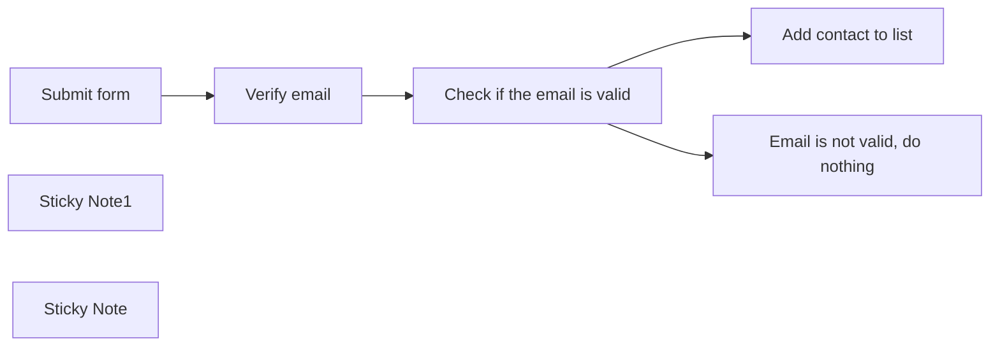

## Fluxo (.json) :

```json
{
  "id": "1blBTEfOEjamDB0N",
  "meta": {
    "instanceId": "558d88703fb65b2d0e44613bc35916258b0f0bf983c5d4730c00c424b77ca36a",
    "templateCredsSetupCompleted": true
  },
  "name": "Email form",
  "tags": [],
  "nodes": [
    {
      "id": "0994dde9-bad8-49b8-b164-1f191decf9ff",
      "name": "Email is not valid, do nothing",
      "type": "n8n-nodes-base.noOp",
      "position": [
        940,
        480
      ],
      "parameters": {},
      "typeVersion": 1
    },
    {
      "id": "b27e140e-7758-42d4-bf07-39b17f85fc82",
      "name": "Check if the email is valid",
      "type": "n8n-nodes-base.if",
      "position": [
        620,
        260
      ],
      "parameters": {
        "options": {},
        "conditions": {
          "options": {
            "version": 1,
            "leftValue": "",
            "caseSensitive": true,
            "typeValidation": "strict"
          },
          "combinator": "and",
          "conditions": [
            {
              "id": "54d84c8a-63ee-40ed-8fb2-301fff0194ba",
              "operator": {
                "name": "filter.operator.equals",
                "type": "string",
                "operation": "equals"
              },
              "leftValue": "={{ $json.status }}",
              "rightValue": "valid"
            }
          ]
        }
      },
      "typeVersion": 2
    },
    {
      "id": "a691af9a-f66f-4fd1-ab82-3d3450098d67",
      "name": "Verify email",
      "type": "n8n-nodes-base.hunter",
      "position": [
        360,
        260
      ],
      "parameters": {
        "email": "={{ $json.Email }}",
        "operation": "emailVerifier"
      },
      "credentials": {
        "hunterApi": {
          "id": "wC6eWJWcNeFHvBqV",
          "name": "Hunter account"
        }
      },
      "typeVersion": 1
    },
    {
      "id": "cfe4d91b-209c-49df-8483-141f5e27fba2",
      "name": "Submit form",
      "type": "n8n-nodes-base.formTrigger",
      "position": [
        80,
        260
      ],
      "webhookId": "80be3272-e1bc-47e4-8112-d39488e84f4b",
      "parameters": {
        "options": {},
        "formTitle": "Join my mailing list now",
        "formFields": {
          "values": [
            {
              "fieldLabel": "Email",
              "requiredField": true
            }
          ]
        },
        "formDescription": "10x your productivity with my A.I. tips. I'll cut the B.S. and give you the most practical tips for A.I. automation."
      },
      "typeVersion": 2.2
    },
    {
      "id": "30d816d9-7a91-47b2-8c06-da0b9114f375",
      "name": "Add contact to list",
      "type": "n8n-nodes-base.sendGrid",
      "position": [
        940,
        240
      ],
      "parameters": {
        "email": "={{ $json.Email }}",
        "resource": "contact",
        "additionalFields": {
          "listIdsUi": {
            "listIdValues": {
              "listIds": [
                "11a55438-d4a8-4740-b054-d273359b7dfe"
              ]
            }
          }
        }
      },
      "credentials": {
        "sendGridApi": {
          "id": "AFtBIAiI3x5QS0WL",
          "name": "SendGrid account"
        }
      },
      "typeVersion": 1
    },
    {
      "id": "e80255c8-25b2-48d5-8605-d7702cbf7bc7",
      "name": "Sticky Note1",
      "type": "n8n-nodes-base.stickyNote",
      "position": [
        60,
        -100
      ],
      "parameters": {
        "width": 505,
        "height": 180,
        "content": "## Automate Email List Building with n8n and Hunter io\n\n💡 Read the [case study here](https://rumjahn.com/create-email-capture-forms-for-free-using-n8n-and-sendgrid-and-easily-grow-your-subscriber-list/).\n\n📺 Watch the [youtube tutorial here](https://www.youtube.com/watch?v=NgvEHwu19Rs&t=2s)\n\n"
      },
      "typeVersion": 1
    },
    {
      "id": "f989d552-81b9-4ee7-aa28-a006b703280f",
      "name": "Sticky Note",
      "type": "n8n-nodes-base.stickyNote",
      "position": [
        300,
        100
      ],
      "parameters": {
        "color": 4,
        "height": 320,
        "content": "## Hunter io\n\nYou need to get a Hunter.io account and input the API key. There's 50 free credits per month."
      },
      "typeVersion": 1
    }
  ],
  "active": true,
  "pinData": {},
  "settings": {
    "executionOrder": "v1"
  },
  "versionId": "1df322f8-6d69-4ae7-b094-3f0dec019d3b",
  "connections": {
    "Submit form": {
      "main": [
        [
          {
            "node": "Verify email",
            "type": "main",
            "index": 0
          }
        ]
      ]
    },
    "Verify email": {
      "main": [
        [
          {
            "node": "Check if the email is valid",
            "type": "main",
            "index": 0
          }
        ]
      ]
    },
    "Check if the email is valid": {
      "main": [
        [
          {
            "node": "Add contact to list",
            "type": "main",
            "index": 0
          }
        ],
        [
          {
            "node": "Email is not valid, do nothing",
            "type": "main",
            "index": 0
          }
        ]
      ]
    }
  }
}
```

<a id="template-621"></a>

## Template 621 - Raspagem dos 20 artigos mais recentes do TechCrunch

- **Nome:** Raspagem dos 20 artigos mais recentes do TechCrunch
- **Descrição:** Coleta os 20 artigos mais recentes da seção "Latest" do TechCrunch, extraindo metadados e o conteúdo completo de cada post.
- **Funcionalidade:** • Início manual para teste: Permite executar o fluxo manualmente para iniciar a raspagem.
• Requisição da página "Latest": Faz requisição da página principal de artigos recentes do TechCrunch.
• Extração da lista de posts: Isola o bloco HTML que contém a lista de artigos.
• Separação dos posts individuais: Divide a lista em itens separados para processamento individual.
• Extração de metadados resumidos: Captura imagem, título, URL e data de cada post a partir da lista.
• Requisição da página de cada post: Acessa a página detalhada de cada artigo utilizando a URL extraída.
• Extração de conteúdo e metadados completos: Obtém título, conteúdo, thumbnail e data diretamente da página do artigo.
• Consolidação e salvamento dos campos: Organiza e salva os campos finais (url, created_at, image, title, content) para uso posterior.
- **Ferramentas:** • TechCrunch: Fonte dos artigos e páginas detalhadas a serem raspadas.
• HTTP/HTTPS: Protocolo utilizado para solicitar páginas e obter o conteúdo HTML.

## Fluxo visual

```mermaid
flowchart LR
    N1["When clicking ‘Test workflow’"]
    N2["Request Techcrunsh Latest Page"]
    N3["Parse a posts box"]
    N4["Parse all posts"]
    N5["split out the posts"]
    N6["Parse each post in detail"]
    N7["Request a post detail page"]
    N8["Parse a post's content and metadata"]
    N9["Save the values"]

    N4 --> N5
    N3 --> N4
    N5 --> N6
    N6 --> N7
    N7 --> N8
    N2 --> N3
    N1 --> N2
    N8 --> N9
```

## Fluxo (.json) :

```json
{
  "id": "MKGrRFnUuMZMAxNf",
  "meta": {
    "instanceId": "0b0f5302e78710cf1b1457ee15a129d8e5d83d4e366bd96d14cc37da6693e692"
  },
  "name": "Scrape Latest 20 TechCrunch Articles",
  "tags": [],
  "nodes": [
    {
      "id": "f757df19-a2b0-42c5-b75e-e4af51696059",
      "name": "When clicking ‘Test workflow’",
      "type": "n8n-nodes-base.manualTrigger",
      "position": [
        -400,
        160
      ],
      "parameters": {},
      "typeVersion": 1
    },
    {
      "id": "1311d3be-cf2e-42ca-ae69-8ebfeb71eefb",
      "name": "Request Techcrunsh Latest Page",
      "type": "n8n-nodes-base.httpRequest",
      "position": [
        -220,
        160
      ],
      "parameters": {
        "url": "=https://techcrunch.com/latest/0",
        "options": {}
      },
      "typeVersion": 4.2
    },
    {
      "id": "c7807fdf-3b0b-40f8-b912-214475501861",
      "name": "Parse a posts box",
      "type": "n8n-nodes-base.html",
      "position": [
        -40,
        160
      ],
      "parameters": {
        "options": {},
        "operation": "extractHtmlContent",
        "extractionValues": {
          "values": [
            {
              "key": "box",
              "cssSelector": "ul.wp-block-post-template",
              "returnValue": "html"
            }
          ]
        }
      },
      "typeVersion": 1.2
    },
    {
      "id": "4f6720e2-32ee-41dd-a369-a05bb06b4441",
      "name": "Parse all posts",
      "type": "n8n-nodes-base.html",
      "position": [
        120,
        160
      ],
      "parameters": {
        "options": {
          "trimValues": true
        },
        "operation": "extractHtmlContent",
        "dataPropertyName": "box",
        "extractionValues": {
          "values": [
            {
              "key": "posts",
              "cssSelector": "li.wp-block-post",
              "returnArray": true,
              "returnValue": "html"
            }
          ]
        }
      },
      "typeVersion": 1.2
    },
    {
      "id": "2d4f5589-1c27-4fa0-9c64-34d02fb091cf",
      "name": "split out the posts",
      "type": "n8n-nodes-base.splitOut",
      "position": [
        300,
        160
      ],
      "parameters": {
        "options": {},
        "fieldToSplitOut": "posts"
      },
      "typeVersion": 1
    },
    {
      "id": "bf35ac63-554a-4039-9636-78016110f615",
      "name": "Parse each post in detail",
      "type": "n8n-nodes-base.html",
      "position": [
        520,
        160
      ],
      "parameters": {
        "options": {
          "trimValues": true
        },
        "operation": "extractHtmlContent",
        "dataPropertyName": "posts",
        "extractionValues": {
          "values": [
            {
              "key": "image",
              "attribute": "src",
              "cssSelector": "img",
              "returnValue": "attribute"
            },
            {
              "key": "title",
              "cssSelector": "h3.loop-card__title"
            },
            {
              "key": "url",
              "attribute": "data-destinationlink",
              "cssSelector": "h3>a",
              "returnValue": "attribute"
            },
            {
              "key": "created_at",
              "attribute": "datetime",
              "cssSelector": "time",
              "returnValue": "attribute"
            }
          ]
        }
      },
      "typeVersion": 1.2
    },
    {
      "id": "2aedd43b-5c04-410e-be37-7e84b798e551",
      "name": "Request a post detail page",
      "type": "n8n-nodes-base.httpRequest",
      "position": [
        720,
        160
      ],
      "parameters": {
        "url": "={{ $json.url }}",
        "options": {}
      },
      "typeVersion": 4.2
    },
    {
      "id": "e0d9eb9c-096c-47de-b39a-d72083d403de",
      "name": "Parse a post's content and metadata",
      "type": "n8n-nodes-base.html",
      "position": [
        940,
        160
      ],
      "parameters": {
        "options": {
          "trimValues": true,
          "cleanUpText": true
        },
        "operation": "extractHtmlContent",
        "extractionValues": {
          "values": [
            {
              "key": "content",
              "cssSelector": "div.entry-content"
            },
            {
              "key": "title",
              "cssSelector": "h1.wp-block-post-title"
            },
            {
              "key": "thumbnail",
              "attribute": "src",
              "cssSelector": "img.attachment-post-thumbnail",
              "returnValue": "attribute"
            },
            {
              "key": "created_at",
              "attribute": "datetime",
              "cssSelector": "time",
              "returnValue": "attribute"
            }
          ]
        }
      },
      "executeOnce": false,
      "typeVersion": 1.2
    },
    {
      "id": "513c616e-9362-4246-a420-70c93863ad6e",
      "name": "Save the values",
      "type": "n8n-nodes-base.set",
      "position": [
        1120,
        160
      ],
      "parameters": {
        "options": {},
        "assignments": {
          "assignments": [
            {
              "id": "411666fc-c934-4cfe-93c8-dd2ba426fa46",
              "name": "url",
              "type": "string",
              "value": "={{ $('Parse each post in detail').item.json.url }}"
            },
            {
              "id": "251700fe-bfee-46a6-b157-c0d029edb594",
              "name": "created_at",
              "type": "string",
              "value": "={{ $('Parse each post in detail').item.json.created_at }}"
            },
            {
              "id": "296f4201-06a3-4d81-b85f-5d0b045e09bd",
              "name": "image",
              "type": "string",
              "value": "={{ $('Parse each post in detail').item.json.image }}"
            },
            {
              "id": "1af47c5f-1b6e-4894-b7c5-9a037a328a0d",
              "name": "content",
              "type": "string",
              "value": "={{ $json.content }}"
            },
            {
              "id": "5595be9f-7d2a-43c5-8b40-839f787e9ace",
              "name": "title",
              "type": "string",
              "value": "={{ $json.title }}"
            }
          ]
        }
      },
      "typeVersion": 3.4
    }
  ],
  "active": false,
  "pinData": {},
  "settings": {
    "executionOrder": "v1"
  },
  "versionId": "6f14b55f-11a9-46f6-ba96-4abdfd3fe2f8",
  "connections": {
    "Parse all posts": {
      "main": [
        [
          {
            "node": "split out the posts",
            "type": "main",
            "index": 0
          }
        ]
      ]
    },
    "Parse a posts box": {
      "main": [
        [
          {
            "node": "Parse all posts",
            "type": "main",
            "index": 0
          }
        ]
      ]
    },
    "split out the posts": {
      "main": [
        [
          {
            "node": "Parse each post in detail",
            "type": "main",
            "index": 0
          }
        ]
      ]
    },
    "Parse each post in detail": {
      "main": [
        [
          {
            "node": "Request a post detail page",
            "type": "main",
            "index": 0
          }
        ]
      ]
    },
    "Request a post detail page": {
      "main": [
        [
          {
            "node": "Parse a post's content and metadata",
            "type": "main",
            "index": 0
          }
        ]
      ]
    },
    "Request Techcrunsh Latest Page": {
      "main": [
        [
          {
            "node": "Parse a posts box",
            "type": "main",
            "index": 0
          }
        ]
      ]
    },
    "When clicking ‘Test workflow’": {
      "main": [
        [
          {
            "node": "Request Techcrunsh Latest Page",
            "type": "main",
            "index": 0
          }
        ]
      ]
    },
    "Parse a post's content and metadata": {
      "main": [
        [
          {
            "node": "Save the values",
            "type": "main",
            "index": 0
          }
        ]
      ]
    }
  }
}
```

<a id="template-622"></a>

## Template 622 - Salvar perfil Humantic AI de convidados Calendly no Notion

- **Nome:** Salvar perfil Humantic AI de convidados Calendly no Notion
- **Descrição:** Quando um convidado agenda via Calendly, o fluxo obtém o identificador do usuário, consulta o serviço de análise de personalidade e grava um registro com o resumo de personalidade no Notion.
- **Funcionalidade:** • Detecção de novo convidado: Inicia o processo ao receber o evento de convidado criado pelo sistema de agendamento.
• Extração de identificador do payload: Lê a resposta específica do convidado no payload para obter o identificador usado na análise.
• Consulta ao serviço de análise: Usa o identificador para buscar o perfil e análise de personalidade detalhada.
• Consulta detalhada do perfil: Realiza uma chamada adicional para obter os resultados completos do usuário a partir do serviço de análise.
• Criação/atualização de registro: Gera uma página no banco de dados com nome e blocos contendo resumo de personalidade e pontuações.
- **Ferramentas:** • Calendly: Plataforma de agendamento que dispara eventos quando um convidado é criado.
• Humantic AI: Serviço de análise de personalidade que retorna perfil, sumário e pontuações comportamentais.
• Notion: Espaço de trabalho onde são criadas páginas ou registros com o resumo e detalhes da personalidade.

## Fluxo visual

```mermaid
flowchart LR
    N1["Notion"]
    N2["Humantic AI"]
    N3["Calendly Trigger"]
    N4["Humantic AI1"]

    N2 --> N4
    N4 --> N1
    N3 --> N2
```

## Fluxo (.json) :

```json
{
  "nodes": [
    {
      "name": "Notion",
      "type": "n8n-nodes-base.notion",
      "position": [
        1050,
        300
      ],
      "parameters": {
        "blockUi": {
          "blockValues": [
            {
              "textContent": "=Name: {{$json[\"display_name\"]}}\nPersonality: {{$json[\"personality_analysis\"][\"summary\"][\"ocean\"][\"description\"].join(', ')}}, {{$json[\"personality_analysis\"][\"summary\"][\"disc\"][\"description\"].join(', ')}}\nOpenness: {{$json[\"personality_analysis\"][\"ocean_assessment\"][\"openness\"][\"level\"]}} {{$json[\"personality_analysis\"][\"ocean_assessment\"][\"openness\"][\"score\"]}}\nCalculativeness: {{$json[\"personality_analysis\"][\"disc_assessment\"][\"calculativeness\"][\"level\"]}} {{$json[\"personality_analysis\"][\"disc_assessment\"][\"calculativeness\"][\"score\"]}}"
            }
          ]
        },
        "resource": "databasePage",
        "databaseId": "",
        "propertiesUi": {
          "propertyValues": [
            {
              "key": "Name|title",
              "title": "={{$json[\"display_name\"]}}"
            }
          ]
        }
      },
      "credentials": {
        "notionApi": ""
      },
      "typeVersion": 1
    },
    {
      "name": "Humantic AI",
      "type": "n8n-nodes-base.humanticAi",
      "position": [
        650,
        300
      ],
      "parameters": {
        "userId": "={{$json[\"payload\"][\"questions_and_responses\"][\"1_response\"]}}"
      },
      "credentials": {
        "humanticAiApi": "humantic"
      },
      "typeVersion": 1
    },
    {
      "name": "Calendly Trigger",
      "type": "n8n-nodes-base.calendlyTrigger",
      "position": [
        450,
        300
      ],
      "webhookId": "6d38c1f6-42ee-4f44-b424-20943075087b",
      "parameters": {
        "events": [
          "invitee.created"
        ]
      },
      "credentials": {
        "calendlyApi": ""
      },
      "typeVersion": 1
    },
    {
      "name": "Humantic AI1",
      "type": "n8n-nodes-base.humanticAi",
      "position": [
        850,
        300
      ],
      "parameters": {
        "userId": "={{$json[\"results\"][\"userid\"]}}",
        "options": {},
        "operation": "get"
      },
      "credentials": {
        "humanticAiApi": ""
      },
      "typeVersion": 1
    }
  ],
  "connections": {
    "Humantic AI": {
      "main": [
        [
          {
            "node": "Humantic AI1",
            "type": "main",
            "index": 0
          }
        ]
      ]
    },
    "Humantic AI1": {
      "main": [
        [
          {
            "node": "Notion",
            "type": "main",
            "index": 0
          }
        ]
      ]
    },
    "Calendly Trigger": {
      "main": [
        [
          {
            "node": "Humantic AI",
            "type": "main",
            "index": 0
          }
        ]
      ]
    }
  }
}
```

<a id="template-623"></a>

## Template 623 - Servidor MCP para gerenciar e executar workflows

- **Nome:** Servidor MCP para gerenciar e executar workflows
- **Descrição:** Fluxo que atua como um servidor MCP, permitindo que um agente descubra, gerencie e execute workflows selecionados, mantendo um conjunto de workflows "disponíveis" em memória.
- **Funcionalidade:** • Expor ferramentas MCP ao agente: disponibiliza operações para listar, buscar, adicionar, remover e executar workflows.
• Buscar workflows filtrados: obtém workflows marcados para uso pelo agente.
• Simplificar metadados de workflows: extrai id, nome, descrição e esquema de parâmetros dos workflows para uso pelo agente.
• Gerir pool de workflows disponíveis: adiciona, remove e lista workflows mantidos em memória persistida.
• Validar disponibilidade antes de executar: impede execução de workflows que não estão na lista de disponíveis e retorna erro adequado.
• Executar workflows como subworkflows: chama workflows adicionados passando parâmetros via passthrough e agrega resultados.
• Manter memória de contexto para conversas: buffer de memória para suportar interações do agente.
• Comunicação com clientes MCP: expõe endpoints SSE/webhook para receber comandos de clientes de agente.
• Operações atômicas em memória: usa set/get/delete para controlar o estado do pool de workflows.
- **Ferramentas:** • Redis: armazenamento em memória para guardar e gerir a lista de workflows "disponíveis".
• OpenAI (modelo de linguagem): fornece capacidade de entendimento e tomada de decisão para o agente conversacional.
• Cliente MCP / Agent (ex.: Claude Desktop): conecta-se ao servidor via SSE/webhook para interagir e enviar solicitações ao agente.
• Plataforma de automação com API: fonte dos workflows (necessita credenciais/API key) para listar e inspecionar definições e metadados.

## Fluxo visual

```mermaid
flowchart LR
    N1["Simplify Workflows"]
    N2["When Executed by Another Workflow"]
    N3["Operations"]
    N4["Get MCP-tagged Workflows"]
    N5["Filter Matching Ids"]
    N6["Store In Memory"]
    N7["AddTool Success"]
    N8["AddTool Error"]
    N9["Get Memory"]
    N10["Split Out"]
    N11["Filter Matching IDs"]
    N12["Store In Memory1"]
    N13["Remove Tool Success"]
    N14["Convert to JSON"]
    N15["listTools Success"]
    N16["Get MCP-tagged Workflows1"]
    N17["Simplify Workflows1"]
    N18["listTools Success1"]
    N19["Get Parameters"]
    N20["executeTool Result"]
    N21["AI Agent"]
    N22["When chat message received"]
    N23["MCP Client"]
    N24["Simple Memory"]
    N25["Convert to JSON1"]
    N26["Has Workflow Available?"]
    N27["ExecuteTool Error"]
    N28["Workflow Exists?"]
    N29["N8N Workflows MCP Server"]
    N30["Add Workflow"]
    N31["RemoveWorkflow"]
    N32["List Workflows"]
    N33["SearchWorkflows"]
    N34["ExecuteWorkflow"]
    N35["Sticky Note"]
    N36["Execute Workflow with PassThrough Variables"]
    N37["Sticky Note1"]
    N38["Sticky Note2"]
    N39["OpenAI Chat Model"]
    N40["Is Empty Array?"]
    N41["Delete Key"]
    N42["Sticky Note3"]
    N43["Sticky Note4"]
    N44["Sticky Note5"]
    N45["Sticky Note6"]
    N46["Sticky Note7"]

    N10 --> N11
    N41 --> N13
    N9 --> N3
    N3 --> N4
    N3 --> N14
    N3 --> N15
    N3 --> N16
    N3 --> N25
    N19 --> N36
    N14 --> N10
    N40 --> N41
    N40 --> N12
    N6 --> N7
    N25 --> N26
    N12 --> N13
    N28 --> N1
    N28 --> N8
    N1 --> N6
    N11 --> N40
    N5 --> N28
    N17 --> N18
    N26 --> N19
    N26 --> N27
    N4 --> N5
    N16 --> N17
    N22 --> N21
    N2 --> N9
    N36 --> N20
```

## Fluxo (.json) :

```json
{
  "meta": {
    "instanceId": "408f9fb9940c3cb18ffdef0e0150fe342d6e655c3a9fac21f0f644e8bedabcd9",
    "templateCredsSetupCompleted": true
  },
  "nodes": [
    {
      "id": "e3ed1048-bad0-4e91-bfb5-aef3e1883de4",
      "name": "Simplify Workflows",
      "type": "n8n-nodes-base.set",
      "position": [
        -1740,
        0
      ],
      "parameters": {
        "options": {},
        "assignments": {
          "assignments": [
            {
              "id": "821226b0-12ad-4d1d-81c3-dfa3c286cce4",
              "name": "id",
              "type": "string",
              "value": "={{ $json.id }}"
            },
            {
              "id": "629d95d6-2501-4ad4-a5ed-e557237e1cc2",
              "name": "name",
              "type": "string",
              "value": "={{ $json.name }}"
            },
            {
              "id": "30699f7c-98d3-44ee-9749-c5528579f7e6",
              "name": "description",
              "type": "string",
              "value": "={{\n$json.nodes\n  .filter(node => node.type === 'n8n-nodes-base.stickyNote')\n  .filter(node => node.parameters.content.toLowerCase().includes('try it out'))\n  .map(node => node.parameters.content.substr(0,255) + '...')\n  .join('\\n')\n}}"
            },
            {
              "id": "6199c275-1ced-4f72-ba59-cb068db54c1b",
              "name": "parameters",
              "type": "string",
              "value": "={{\n(function(node) {\n  if (!node) return {};\n  const inputs = node.parameters.workflowInputs.values;\n  return {\n    \"type\": \"object\",\n    \"required\": inputs.map(input => input.name),\n    \"properties\": inputs.reduce((acc, input) => ({\n      ...acc,\n      [input.name]: { type: input.type ?? 'string' }\n    }), {})\n  }\n})(\n$json.nodes\n  .filter(node => node.type === 'n8n-nodes-base.executeWorkflowTrigger')\n  .first()\n)\n.toJsonString()\n}}"
            }
          ]
        }
      },
      "executeOnce": false,
      "typeVersion": 3.4
    },
    {
      "id": "a935f5b6-3a35-49e7-870c-87e4daf0ad13",
      "name": "When Executed by Another Workflow",
      "type": "n8n-nodes-base.executeWorkflowTrigger",
      "position": [
        -3060,
        600
      ],
      "parameters": {
        "workflowInputs": {
          "values": [
            {
              "name": "operation"
            },
            {
              "name": "workflowIds"
            },
            {
              "name": "parameters",
              "type": "object"
            }
          ]
        }
      },
      "typeVersion": 1.1
    },
    {
      "id": "2ff5e521-5288-47a9-af49-55a1bbbfb4f4",
      "name": "Operations",
      "type": "n8n-nodes-base.switch",
      "position": [
        -2660,
        560
      ],
      "parameters": {
        "rules": {
          "values": [
            {
              "outputKey": "Add",
              "conditions": {
                "options": {
                  "version": 2,
                  "leftValue": "",
                  "caseSensitive": true,
                  "typeValidation": "strict"
                },
                "combinator": "and",
                "conditions": [
                  {
                    "id": "3254a8f9-5fd3-4089-be16-cc3fd20639b8",
                    "operator": {
                      "type": "string",
                      "operation": "equals"
                    },
                    "leftValue": "={{ $('When Executed by Another Workflow').first().json.operation }}",
                    "rightValue": "addWorkflow"
                  }
                ]
              },
              "renameOutput": true
            },
            {
              "outputKey": "remove",
              "conditions": {
                "options": {
                  "version": 2,
                  "leftValue": "",
                  "caseSensitive": true,
                  "typeValidation": "strict"
                },
                "combinator": "and",
                "conditions": [
                  {
                    "id": "a33dd02d-5192-48c9-b569-eafddabd2462",
                    "operator": {
                      "name": "filter.operator.equals",
                      "type": "string",
                      "operation": "equals"
                    },
                    "leftValue": "={{ $('When Executed by Another Workflow').first().json.operation }}",
                    "rightValue": "removeWorkflow"
                  }
                ]
              },
              "renameOutput": true
            },
            {
              "outputKey": "list",
              "conditions": {
                "options": {
                  "version": 2,
                  "leftValue": "",
                  "caseSensitive": true,
                  "typeValidation": "strict"
                },
                "combinator": "and",
                "conditions": [
                  {
                    "id": "2d68dc3f-a213-47f8-8453-1bceae404653",
                    "operator": {
                      "name": "filter.operator.equals",
                      "type": "string",
                      "operation": "equals"
                    },
                    "leftValue": "={{ $('When Executed by Another Workflow').first().json.operation }}",
                    "rightValue": "listWorkflows"
                  }
                ]
              },
              "renameOutput": true
            },
            {
              "outputKey": "search",
              "conditions": {
                "options": {
                  "version": 2,
                  "leftValue": "",
                  "caseSensitive": true,
                  "typeValidation": "strict"
                },
                "combinator": "and",
                "conditions": [
                  {
                    "id": "2146a87e-1a50-4caa-a2ee-f7f6fc2b19c9",
                    "operator": {
                      "name": "filter.operator.equals",
                      "type": "string",
                      "operation": "equals"
                    },
                    "leftValue": "={{ $('When Executed by Another Workflow').first().json.operation }}",
                    "rightValue": "searchWorkflows"
                  }
                ]
              },
              "renameOutput": true
            },
            {
              "outputKey": "execute",
              "conditions": {
                "options": {
                  "version": 2,
                  "leftValue": "",
                  "caseSensitive": true,
                  "typeValidation": "strict"
                },
                "combinator": "and",
                "conditions": [
                  {
                    "id": "98b25a51-2cb5-49af-9609-827245595dc9",
                    "operator": {
                      "name": "filter.operator.equals",
                      "type": "string",
                      "operation": "equals"
                    },
                    "leftValue": "={{ $('When Executed by Another Workflow').first().json.operation }}",
                    "rightValue": "executeWorkflow"
                  }
                ]
              },
              "renameOutput": true
            }
          ]
        },
        "options": {}
      },
      "typeVersion": 3.2
    },
    {
      "id": "5b78271a-6474-4d87-a344-72f7f63822dc",
      "name": "Get MCP-tagged Workflows",
      "type": "n8n-nodes-base.n8n",
      "position": [
        -2400,
        200
      ],
      "parameters": {
        "filters": {
          "tags": "mcp"
        },
        "requestOptions": {}
      },
      "credentials": {
        "n8nApi": {
          "id": "5vELmsVPmK4Bkqkg",
          "name": "n8n account"
        }
      },
      "typeVersion": 1
    },
    {
      "id": "1197d29e-b124-4576-846d-876ad16de6e9",
      "name": "Filter Matching Ids",
      "type": "n8n-nodes-base.filter",
      "position": [
        -2180,
        200
      ],
      "parameters": {
        "options": {},
        "conditions": {
          "options": {
            "version": 2,
            "leftValue": "",
            "caseSensitive": true,
            "typeValidation": "strict"
          },
          "combinator": "and",
          "conditions": [
            {
              "id": "90c97733-48de-4402-8388-5d49e3534388",
              "operator": {
                "type": "boolean",
                "operation": "true",
                "singleValue": true
              },
              "leftValue": "={{\n$json.id\n  ? $('When Executed by Another Workflow').first().json.workflowIds.split(',').includes($json.id)\n  : false\n}}",
              "rightValue": "={{ $json.id }}"
            }
          ]
        }
      },
      "executeOnce": false,
      "typeVersion": 2.2,
      "alwaysOutputData": true
    },
    {
      "id": "81623298-c3e7-4e20-86a9-d2587b302f28",
      "name": "Store In Memory",
      "type": "n8n-nodes-base.redis",
      "position": [
        -1520,
        0
      ],
      "parameters": {
        "key": "mcp_n8n_tools",
        "value": "={{\n($('Get Memory').item.json.data?.parseJson() ?? [])\n  .concat($input.all().map(item => item.json))\n  .toJsonString()\n}}",
        "operation": "set"
      },
      "credentials": {
        "redis": {
          "id": "zU4DA70qSDrZM1El",
          "name": "Redis account (localhost)"
        }
      },
      "executeOnce": true,
      "typeVersion": 1
    },
    {
      "id": "5ff0ea2f-a2ee-4cc3-bdf9-153ce5973770",
      "name": "AddTool Success",
      "type": "n8n-nodes-base.set",
      "position": [
        -1300,
        0
      ],
      "parameters": {
        "options": {},
        "assignments": {
          "assignments": [
            {
              "id": "d921063f-e8ed-44a8-95a0-4402ecde6c5d",
              "name": "=response",
              "type": "string",
              "value": "={{ $('Simplify Workflows').all().length }} tools were added successfully."
            }
          ]
        }
      },
      "executeOnce": true,
      "typeVersion": 3.4
    },
    {
      "id": "1d3169cc-15cd-4296-9e63-bb162322e5e2",
      "name": "AddTool Error",
      "type": "n8n-nodes-base.set",
      "position": [
        -1740,
        200
      ],
      "parameters": {
        "options": {},
        "assignments": {
          "assignments": [
            {
              "id": "8c4e0763-a4ff-4e8a-a992-13e4e12a5685",
              "name": "response",
              "type": "string",
              "value": "Expected Tools matching Ids given, but none found."
            }
          ]
        }
      },
      "executeOnce": true,
      "typeVersion": 3.4
    },
    {
      "id": "6149a950-c1ed-44b4-aee6-3daeabf8ba01",
      "name": "Get Memory",
      "type": "n8n-nodes-base.redis",
      "position": [
        -2860,
        600
      ],
      "parameters": {
        "key": "mcp_n8n_tools",
        "options": {},
        "operation": "get",
        "propertyName": "data"
      },
      "credentials": {
        "redis": {
          "id": "zU4DA70qSDrZM1El",
          "name": "Redis account (localhost)"
        }
      },
      "typeVersion": 1
    },
    {
      "id": "3c538002-45f7-4a2f-9ef4-5aede63235ab",
      "name": "Split Out",
      "type": "n8n-nodes-base.splitOut",
      "position": [
        -2180,
        400
      ],
      "parameters": {
        "options": {},
        "fieldToSplitOut": "data"
      },
      "typeVersion": 1
    },
    {
      "id": "d41e48e0-d610-4e18-9942-842419c99c83",
      "name": "Filter Matching IDs",
      "type": "n8n-nodes-base.filter",
      "position": [
        -1960,
        400
      ],
      "parameters": {
        "options": {},
        "conditions": {
          "options": {
            "version": 2,
            "leftValue": "",
            "caseSensitive": true,
            "typeValidation": "strict"
          },
          "combinator": "and",
          "conditions": [
            {
              "id": "d2c149fb-d115-449b-9b74-f3c2f8ff7950",
              "operator": {
                "type": "boolean",
                "operation": "false",
                "singleValue": true
              },
              "leftValue": "={{\n$json.id\n  ? $('Operations').first().json.workflowIds.split(',').includes($json.id)\n  : false\n}}",
              "rightValue": ""
            }
          ]
        }
      },
      "typeVersion": 2.2,
      "alwaysOutputData": true
    },
    {
      "id": "21d8cdda-bb47-42cd-a056-809a5556b438",
      "name": "Store In Memory1",
      "type": "n8n-nodes-base.redis",
      "position": [
        -1520,
        500
      ],
      "parameters": {
        "key": "mcp_n8n_tools",
        "value": "={{ $input.all().flatMap(item => item.json.data).compact() }}",
        "operation": "set"
      },
      "credentials": {
        "redis": {
          "id": "zU4DA70qSDrZM1El",
          "name": "Redis account (localhost)"
        }
      },
      "executeOnce": true,
      "typeVersion": 1
    },
    {
      "id": "5a391d0a-ba13-4d54-85fd-eb2f6a935614",
      "name": "Remove Tool Success",
      "type": "n8n-nodes-base.set",
      "position": [
        -1300,
        400
      ],
      "parameters": {
        "options": {},
        "assignments": {
          "assignments": [
            {
              "id": "1368947f-6625-4e2e-ae27-0fcad0a1d12a",
              "name": "response",
              "type": "string",
              "value": "={{ $('When Executed by Another Workflow').first().json.workflowIds.split(',').length }} tool(s) removed successfully."
            }
          ]
        }
      },
      "typeVersion": 3.4
    },
    {
      "id": "65dfecc4-43ba-4518-adbf-9676c5cb1377",
      "name": "Convert to JSON",
      "type": "n8n-nodes-base.set",
      "position": [
        -2400,
        400
      ],
      "parameters": {
        "options": {},
        "assignments": {
          "assignments": [
            {
              "id": "bce29a06-cff6-4409-96d2-04cc858a0e98",
              "name": "data",
              "type": "array",
              "value": "={{ $json.data.parseJson() }}"
            }
          ]
        }
      },
      "typeVersion": 3.4
    },
    {
      "id": "b8b64fc2-63cf-4b17-9b6d-9d94aec10065",
      "name": "listTools Success",
      "type": "n8n-nodes-base.set",
      "position": [
        -2400,
        600
      ],
      "parameters": {
        "options": {},
        "assignments": {
          "assignments": [
            {
              "id": "bce29a06-cff6-4409-96d2-04cc858a0e98",
              "name": "response",
              "type": "array",
              "value": "={{\n$json.data\n  ? $json.data.parseJson()\n  : []\n}}"
            }
          ]
        }
      },
      "typeVersion": 3.4
    },
    {
      "id": "d4fd9e74-f040-4b3c-8ce0-371315a0d130",
      "name": "Get MCP-tagged Workflows1",
      "type": "n8n-nodes-base.n8n",
      "position": [
        -2180,
        600
      ],
      "parameters": {
        "filters": {
          "tags": "mcp"
        },
        "requestOptions": {}
      },
      "credentials": {
        "n8nApi": {
          "id": "5vELmsVPmK4Bkqkg",
          "name": "n8n account"
        }
      },
      "typeVersion": 1
    },
    {
      "id": "d58922c4-b721-4228-83cb-0b1d9632bbc6",
      "name": "Simplify Workflows1",
      "type": "n8n-nodes-base.set",
      "position": [
        -1960,
        600
      ],
      "parameters": {
        "options": {},
        "assignments": {
          "assignments": [
            {
              "id": "821226b0-12ad-4d1d-81c3-dfa3c286cce4",
              "name": "id",
              "type": "string",
              "value": "={{ $json.id }}"
            },
            {
              "id": "629d95d6-2501-4ad4-a5ed-e557237e1cc2",
              "name": "name",
              "type": "string",
              "value": "={{ $json.name }}"
            },
            {
              "id": "30699f7c-98d3-44ee-9749-c5528579f7e6",
              "name": "description",
              "type": "string",
              "value": "={{\n$json.nodes\n  .filter(node => node.type === 'n8n-nodes-base.stickyNote')\n  .filter(node => node.parameters.content.toLowerCase().includes('try it out'))\n  .map(node => node.parameters.content.substr(0,255) + '...')\n  .join('\\n')\n}}"
            },
            {
              "id": "137221ef-f0a3-4441-bae7-d9d4a22e05b7",
              "name": "parameters",
              "type": "string",
              "value": "={{\n(function(node) {\n  if (!node) return {};\n  const inputs = node.parameters.workflowInputs.values;\n  return {\n    \"type\": \"object\",\n    \"required\": inputs.map(input => input.name),\n    \"properties\": inputs.reduce((acc, input) => ({\n      ...acc,\n      [input.name]: { type: input.type ?? 'string' }\n    }), {})\n  }\n})(\n$json.nodes\n  .filter(node => node.type === 'n8n-nodes-base.executeWorkflowTrigger')\n  .first()\n)\n.toJsonString()\n}}"
            }
          ]
        }
      },
      "executeOnce": false,
      "typeVersion": 3.4
    },
    {
      "id": "b44b1115-5153-4b98-979f-219a32b693de",
      "name": "listTools Success1",
      "type": "n8n-nodes-base.aggregate",
      "position": [
        -1740,
        600
      ],
      "parameters": {
        "options": {},
        "aggregate": "aggregateAllItemData",
        "destinationFieldName": "response"
      },
      "typeVersion": 1
    },
    {
      "id": "e9d9a33c-ebfa-4f74-a4da-fb6b6f6f6df5",
      "name": "Get Parameters",
      "type": "n8n-nodes-base.set",
      "position": [
        -1920,
        1020
      ],
      "parameters": {
        "mode": "raw",
        "options": {},
        "jsonOutput": "={{ $('When Executed by Another Workflow').first().json.parameters }}"
      },
      "typeVersion": 3.4
    },
    {
      "id": "c028324a-5c79-4ce9-afd6-097b6f75a74a",
      "name": "executeTool Result",
      "type": "n8n-nodes-base.aggregate",
      "position": [
        -1440,
        1020
      ],
      "parameters": {
        "options": {},
        "aggregate": "aggregateAllItemData",
        "destinationFieldName": "response"
      },
      "typeVersion": 1
    },
    {
      "id": "9eeac3cb-af7e-44c7-8891-6ff4367d0b54",
      "name": "AI Agent",
      "type": "@n8n/n8n-nodes-langchain.agent",
      "position": [
        -3600,
        1040
      ],
      "parameters": {
        "options": {
          "systemMessage": "=You are a helpful assistant who only uses workflows to answer questions and perform tasks.\n* When asked to complete a task, you will assume there is a workflow which you can use. Do not generate custom scripts or raw commands - use a workflow isntead.\n* Only use the available active workflows as listed using the \"listWorkflows\" tool.\n* Workflows returned by \"listWorkflows\" tool are active in the pool and do not need to be added again.\n* Always ask the user before adding workflows to the availble pool.\n* You do not need to confirm each step with the user when executing workflows.\n* When executing the workflow, the required parameters schema for it is listed in the workflow's profile. To get this profile, use the listWokflows tool.\n* If no available workflows are suitable and you are not able to complete the task, simply let the user know.\n* Do not search for workflows in the directory unless the user requests."
        }
      },
      "typeVersion": 1.8
    },
    {
      "id": "23601548-7863-403e-a671-267bf592b824",
      "name": "When chat message received",
      "type": "@n8n/n8n-nodes-langchain.chatTrigger",
      "position": [
        -3840,
        1040
      ],
      "webhookId": "86a50552-8058-4896-bd7e-ab95eba073ce",
      "parameters": {
        "options": {}
      },
      "typeVersion": 1.1
    },
    {
      "id": "54ed210d-e1b8-4bd7-85e4-88678111a45e",
      "name": "MCP Client",
      "type": "@n8n/n8n-nodes-langchain.mcpClientTool",
      "position": [
        -3360,
        1240
      ],
      "parameters": {
        "sseEndpoint": "=<Production URL of MCP Server>"
      },
      "typeVersion": 1
    },
    {
      "id": "c612da64-9cc1-4601-a987-cd2023fd1863",
      "name": "Simple Memory",
      "type": "@n8n/n8n-nodes-langchain.memoryBufferWindow",
      "position": [
        -3500,
        1240
      ],
      "parameters": {
        "contextWindowLength": 30
      },
      "typeVersion": 1.3
    },
    {
      "id": "77a9fd22-c31c-49e4-9d5f-af572b137925",
      "name": "Convert to JSON1",
      "type": "n8n-nodes-base.set",
      "position": [
        -2360,
        1120
      ],
      "parameters": {
        "options": {},
        "assignments": {
          "assignments": [
            {
              "id": "bce29a06-cff6-4409-96d2-04cc858a0e98",
              "name": "data",
              "type": "array",
              "value": "={{ $json.data.parseJson() }}"
            }
          ]
        }
      },
      "typeVersion": 3.4
    },
    {
      "id": "3377aa25-4190-4bdc-be20-b4e324212060",
      "name": "Has Workflow Available?",
      "type": "n8n-nodes-base.if",
      "position": [
        -2140,
        1120
      ],
      "parameters": {
        "options": {},
        "conditions": {
          "options": {
            "version": 2,
            "leftValue": "",
            "caseSensitive": true,
            "typeValidation": "strict"
          },
          "combinator": "and",
          "conditions": [
            {
              "id": "9c9df00b-b090-4773-8012-1824b4eeb13f",
              "operator": {
                "type": "object",
                "operation": "exists",
                "singleValue": true
              },
              "leftValue": "={{\n$json.data.find(d => d.id === $('When Executed by Another Workflow').item.json.workflowIds)\n}}",
              "rightValue": ""
            }
          ]
        }
      },
      "typeVersion": 2.2
    },
    {
      "id": "92b1bb21-d739-47f0-a278-92ffa5a10cbf",
      "name": "ExecuteTool Error",
      "type": "n8n-nodes-base.set",
      "position": [
        -1920,
        1220
      ],
      "parameters": {
        "options": {},
        "assignments": {
          "assignments": [
            {
              "id": "2fa3e311-e836-42f4-922a-fae19d8e0267",
              "name": "response",
              "type": "string",
              "value": "=Expected workflow to be available but not yet added. You can only use workflows which have been added to the available pool. Use the listWorkflows tool to see available workflows."
            }
          ]
        }
      },
      "typeVersion": 3.4
    },
    {
      "id": "529e35e0-cf11-405a-9011-e6f7f2122a4e",
      "name": "Workflow Exists?",
      "type": "n8n-nodes-base.if",
      "position": [
        -1960,
        200
      ],
      "parameters": {
        "options": {},
        "conditions": {
          "options": {
            "version": 2,
            "leftValue": "",
            "caseSensitive": true,
            "typeValidation": "strict"
          },
          "combinator": "and",
          "conditions": [
            {
              "id": "15aef770-639e-4df0-900f-29013ccd00c4",
              "operator": {
                "type": "object",
                "operation": "notEmpty",
                "singleValue": true
              },
              "leftValue": "={{ $json }}",
              "rightValue": ""
            }
          ]
        }
      },
      "typeVersion": 2.2
    },
    {
      "id": "ba278834-c774-4a3d-8ebc-f64ac77317c2",
      "name": "N8N Workflows MCP Server",
      "type": "@n8n/n8n-nodes-langchain.mcpTrigger",
      "position": [
        -3720,
        240
      ],
      "webhookId": "4625bcf4-0dd9-4562-a70f-6fee41f6f12d",
      "parameters": {
        "path": "4625bcf4-0dd9-4562-a70f-6fee41f6f12d"
      },
      "typeVersion": 1
    },
    {
      "id": "ed940612-4772-4377-afe2-5484a8978665",
      "name": "Add Workflow",
      "type": "@n8n/n8n-nodes-langchain.toolWorkflow",
      "position": [
        -3800,
        460
      ],
      "parameters": {
        "name": "addWorkflow",
        "workflowId": {
          "__rl": true,
          "mode": "id",
          "value": "={{ $workflow.id }}"
        },
        "description": "Adds one or more workflows by ID to the available pool of workflows for the agent. You can get a list of workflows by calling the listTool tool.",
        "workflowInputs": {
          "value": {
            "operation": "addWorkflow",
            "parameters": "null",
            "workflowIds": "={{ /*n8n-auto-generated-fromAI-override*/ $fromAI('workflowIds', ``, 'string') }}"
          },
          "schema": [
            {
              "id": "operation",
              "type": "string",
              "display": true,
              "required": false,
              "displayName": "operation",
              "defaultMatch": false,
              "canBeUsedToMatch": true
            },
            {
              "id": "workflowIds",
              "type": "string",
              "display": true,
              "required": false,
              "displayName": "workflowIds",
              "defaultMatch": false,
              "canBeUsedToMatch": true
            },
            {
              "id": "parameters",
              "type": "object",
              "display": true,
              "required": false,
              "displayName": "parameters",
              "defaultMatch": false,
              "canBeUsedToMatch": true
            }
          ],
          "mappingMode": "defineBelow",
          "matchingColumns": [],
          "attemptToConvertTypes": false,
          "convertFieldsToString": false
        }
      },
      "typeVersion": 2.1
    },
    {
      "id": "e7d5096c-3545-43fd-aa1f-495dc041ccce",
      "name": "RemoveWorkflow",
      "type": "@n8n/n8n-nodes-langchain.toolWorkflow",
      "position": [
        -3700,
        560
      ],
      "parameters": {
        "name": "removeWorkflow",
        "workflowId": {
          "__rl": true,
          "mode": "id",
          "value": "={{ $workflow.id }}"
        },
        "description": "Removes one or more workflows by ID from the available pool of workflows for the agent.",
        "workflowInputs": {
          "value": {
            "operation": "removeWorkflow",
            "parameters": "null",
            "workflowIds": "={{ /*n8n-auto-generated-fromAI-override*/ $fromAI('workflowIds', ``, 'string') }}"
          },
          "schema": [
            {
              "id": "operation",
              "type": "string",
              "display": true,
              "required": false,
              "displayName": "operation",
              "defaultMatch": false,
              "canBeUsedToMatch": true
            },
            {
              "id": "workflowIds",
              "type": "string",
              "display": true,
              "required": false,
              "displayName": "workflowIds",
              "defaultMatch": false,
              "canBeUsedToMatch": true
            },
            {
              "id": "parameters",
              "type": "object",
              "display": true,
              "required": false,
              "displayName": "parameters",
              "defaultMatch": false,
              "canBeUsedToMatch": true
            }
          ],
          "mappingMode": "defineBelow",
          "matchingColumns": [],
          "attemptToConvertTypes": false,
          "convertFieldsToString": false
        }
      },
      "typeVersion": 2.1
    },
    {
      "id": "c20b63dc-e768-4529-a08c-5370853fc4c9",
      "name": "List Workflows",
      "type": "@n8n/n8n-nodes-langchain.toolWorkflow",
      "position": [
        -3580,
        660
      ],
      "parameters": {
        "name": "listTool",
        "workflowId": {
          "__rl": true,
          "mode": "id",
          "value": "={{ $workflow.id }}"
        },
        "description": "Lists the available pool of workflows for the agent.",
        "workflowInputs": {
          "value": {
            "operation": "listWorkflows",
            "parameters": "null",
            "workflowIds": "null"
          },
          "schema": [
            {
              "id": "operation",
              "type": "string",
              "display": true,
              "required": false,
              "displayName": "operation",
              "defaultMatch": false,
              "canBeUsedToMatch": true
            },
            {
              "id": "workflowIds",
              "type": "string",
              "display": true,
              "required": false,
              "displayName": "workflowIds",
              "defaultMatch": false,
              "canBeUsedToMatch": true
            },
            {
              "id": "parameters",
              "type": "object",
              "display": true,
              "required": false,
              "displayName": "parameters",
              "defaultMatch": false,
              "canBeUsedToMatch": true
            }
          ],
          "mappingMode": "defineBelow",
          "matchingColumns": [],
          "attemptToConvertTypes": false,
          "convertFieldsToString": false
        }
      },
      "typeVersion": 2.1
    },
    {
      "id": "88fb8a1e-2f4c-4ff1-8be9-0f7afee2dd4d",
      "name": "SearchWorkflows",
      "type": "@n8n/n8n-nodes-langchain.toolWorkflow",
      "position": [
        -3460,
        560
      ],
      "parameters": {
        "name": "searchTool",
        "workflowId": {
          "__rl": true,
          "mode": "id",
          "value": "={{ $workflow.id }}"
        },
        "description": "Returns all workflows which can be added to the pool of available workflows for the agent.",
        "workflowInputs": {
          "value": {
            "operation": "searchWorkflows",
            "parameters": "null",
            "workflowIds": "null"
          },
          "schema": [
            {
              "id": "operation",
              "type": "string",
              "display": true,
              "required": false,
              "displayName": "operation",
              "defaultMatch": false,
              "canBeUsedToMatch": true
            },
            {
              "id": "workflowIds",
              "type": "string",
              "display": true,
              "required": false,
              "displayName": "workflowIds",
              "defaultMatch": false,
              "canBeUsedToMatch": true
            },
            {
              "id": "parameters",
              "type": "object",
              "display": true,
              "required": false,
              "displayName": "parameters",
              "defaultMatch": false,
              "canBeUsedToMatch": true
            }
          ],
          "mappingMode": "defineBelow",
          "matchingColumns": [],
          "attemptToConvertTypes": false,
          "convertFieldsToString": false
        }
      },
      "typeVersion": 2.1
    },
    {
      "id": "c643c007-de89-4d94-9739-aeb2032c792f",
      "name": "ExecuteWorkflow",
      "type": "@n8n/n8n-nodes-langchain.toolWorkflow",
      "position": [
        -3340,
        460
      ],
      "parameters": {
        "name": "executeTool",
        "workflowId": {
          "__rl": true,
          "mode": "id",
          "value": "={{ $workflow.id }}"
        },
        "description": "Executes a workflow which has been added to the pool of available workflows for the agent.",
        "workflowInputs": {
          "value": {
            "operation": "executeWorkflow",
            "parameters": "={{ /*n8n-auto-generated-fromAI-override*/ $fromAI('parameters', ``, 'string') }}",
            "workflowIds": "={{ /*n8n-auto-generated-fromAI-override*/ $fromAI('workflowIds', ``, 'string') }}"
          },
          "schema": [
            {
              "id": "operation",
              "type": "string",
              "display": true,
              "required": false,
              "displayName": "operation",
              "defaultMatch": false,
              "canBeUsedToMatch": true
            },
            {
              "id": "workflowIds",
              "type": "string",
              "display": true,
              "required": false,
              "displayName": "workflowIds",
              "defaultMatch": false,
              "canBeUsedToMatch": true
            },
            {
              "id": "parameters",
              "type": "object",
              "display": true,
              "required": false,
              "displayName": "parameters",
              "defaultMatch": false,
              "canBeUsedToMatch": true
            }
          ],
          "mappingMode": "defineBelow",
          "matchingColumns": [],
          "attemptToConvertTypes": false,
          "convertFieldsToString": false
        }
      },
      "typeVersion": 2.1
    },
    {
      "id": "4f1c1559-8d50-48b1-94f2-542e0bb4d494",
      "name": "Sticky Note",
      "type": "n8n-nodes-base.stickyNote",
      "position": [
        -3920,
        80
      ],
      "parameters": {
        "color": 7,
        "width": 720,
        "height": 740,
        "content": "## 1. Add MCP Server Trigger\n[Read more about the MCP server trigger](https://docs.n8n.io/integrations/builtin/core-nodes/n8n-nodes-langchain.mcptrigger/)"
      },
      "typeVersion": 1
    },
    {
      "id": "54d61491-04dc-4263-96e0-67827842ca07",
      "name": "Execute Workflow with PassThrough Variables",
      "type": "n8n-nodes-base.executeWorkflow",
      "position": [
        -1660,
        1020
      ],
      "parameters": {
        "options": {
          "waitForSubWorkflow": true
        },
        "workflowId": {
          "__rl": true,
          "mode": "id",
          "value": "={{ $('When Executed by Another Workflow').first().json.workflowIds }}"
        },
        "workflowInputs": {
          "value": {},
          "schema": [],
          "mappingMode": "defineBelow",
          "matchingColumns": [],
          "attemptToConvertTypes": false,
          "convertFieldsToString": true
        }
      },
      "executeOnce": false,
      "typeVersion": 1.2
    },
    {
      "id": "1042884f-a44c-4757-9ff9-3a5cc81058f2",
      "name": "Sticky Note1",
      "type": "n8n-nodes-base.stickyNote",
      "position": [
        -2600,
        -140
      ],
      "parameters": {
        "color": 7,
        "width": 740,
        "height": 300,
        "content": "## 2. Dynamically manage a list of \"Available\" Workflows\n[Learn more about the n8n node](https://docs.n8n.io/integrations/builtin/core-nodes/n8n-nodes-base.n8n)\n\nThe idea is to limit the number of workflows the agent has access to in order to ensure undesired workflows or duplication of similar workflows are avoided. Here, we do this by managing a virtual list of workflows in memory using Redis - under the hood, it's just an array to store Workflow details.\n\nGood to note, the intended workflows must have **Subworkflow triggers** and ideally, with input schema set as well. This template analyses each workflow's JSON and captures its input schema as part of the workflow's description. Doing so,  when it comes time to execute, the agent will know in what format to set the parameters when calling the subworkflow.\n"
      },
      "typeVersion": 1
    },
    {
      "id": "903ead44-3eab-4606-aa4e-e66378bb5f7e",
      "name": "Sticky Note2",
      "type": "n8n-nodes-base.stickyNote",
      "position": [
        -2420,
        820
      ],
      "parameters": {
        "color": 7,
        "width": 1160,
        "height": 600,
        "content": "## 3. Let the Agent execute any N8N Workflow\n[Learn more about the Execute Workflow node](https://docs.n8n.io/integrations/builtin/core-nodes/n8n-nodes-base.executeworkflow/)\n\nFinally once the agent has gathered the required workflows, it will start performing the requested task by executing one or more available workflows. The desired behaviour is that the agent will use \"listWorkflows\" to see which workflows are \"active\" and then plan out how to use them. Attempts to use a workflow before adding it to the available pool will result in an error response."
      },
      "typeVersion": 1
    },
    {
      "id": "194fbcbc-a7bb-41c8-9289-a214b1415386",
      "name": "OpenAI Chat Model",
      "type": "@n8n/n8n-nodes-langchain.lmChatOpenAi",
      "position": [
        -3660,
        1240
      ],
      "parameters": {
        "model": {
          "__rl": true,
          "mode": "list",
          "value": "gpt-4.1-mini",
          "cachedResultName": "gpt-4.1-mini"
        },
        "options": {}
      },
      "credentials": {
        "openAiApi": {
          "id": "8gccIjcuf3gvaoEr",
          "name": "OpenAi account"
        }
      },
      "typeVersion": 1.2
    },
    {
      "id": "aee33258-cf30-4cb4-ab58-7bef7ba27b65",
      "name": "Is Empty Array?",
      "type": "n8n-nodes-base.if",
      "position": [
        -1740,
        400
      ],
      "parameters": {
        "options": {},
        "conditions": {
          "options": {
            "version": 2,
            "leftValue": "",
            "caseSensitive": true,
            "typeValidation": "strict"
          },
          "combinator": "and",
          "conditions": [
            {
              "id": "2cd1b233-fb24-45d5-9efd-1db44b817809",
              "operator": {
                "type": "array",
                "operation": "empty",
                "singleValue": true
              },
              "leftValue": "={{ $input.all().flatMap(item => item.json.data).compact() }}",
              "rightValue": ""
            }
          ]
        }
      },
      "typeVersion": 2.2
    },
    {
      "id": "b367a25f-e679-4a71-910e-27f1aa686816",
      "name": "Delete Key",
      "type": "n8n-nodes-base.redis",
      "position": [
        -1520,
        300
      ],
      "parameters": {
        "key": "mcp_n8n_tools",
        "operation": "delete"
      },
      "credentials": {
        "redis": {
          "id": "zU4DA70qSDrZM1El",
          "name": "Redis account (localhost)"
        }
      },
      "executeOnce": true,
      "typeVersion": 1
    },
    {
      "id": "eec527e1-db4d-4294-a076-379ebd9640a9",
      "name": "Sticky Note3",
      "type": "n8n-nodes-base.stickyNote",
      "position": [
        -3920,
        860
      ],
      "parameters": {
        "color": 7,
        "width": 740,
        "height": 560,
        "content": "## 4. Connect any Agent with a MCP Client\nUse this agent to test your MCP server. Note, i"
      },
      "typeVersion": 1
    },
    {
      "id": "c9b51f36-f9bd-4a60-b195-8da229462331",
      "name": "Sticky Note4",
      "type": "n8n-nodes-base.stickyNote",
      "position": [
        -2880,
        820
      ],
      "parameters": {
        "color": 5,
        "width": 320,
        "height": 400,
        "content": "* **AddWorkflow**\n  This tool adds (or rather, appends) workflows to our \"available\" list.\n* **RemoveWorkflow**\n  This tool removes a workflow entry from our list.\n* **listWorkflows**\n  This tool displays the current state of the workflows list and the available workflows within it. Useful for checking which workflows have been added to the list.\n* **searchWorkflows**\n  For now, this tools just pulls the existing workflows from the n8n instance and returns it to the agent. Given more resources, you may want to swap this out for a indexed search instead (you'll need to build this yourself!)."
      },
      "typeVersion": 1
    },
    {
      "id": "91b2859a-7563-4ebd-ae61-c9a487e18d81",
      "name": "Sticky Note5",
      "type": "n8n-nodes-base.stickyNote",
      "position": [
        -4600,
        -180
      ],
      "parameters": {
        "width": 600,
        "height": 1440,
        "content": "## Try it out!\n### This n8n template shows you how to create an MCP server out of your existing n8n workflows. With this, any MCP client connected can get more done with powerful end-to-end workflows rather than just simple tools.\n\nDesigning agent tools for outcome rather than utility has been a long recommended practice of mine and it applies well when it comes to building MCP servers; In gist, it prefers agents to be making the least calls possible to complete a task.\n\nThis is why n8n can be a great fit for MCP servers! This template connects your agent/MCP client (like Claude Desktop) to your existing workflows by allowing the AI to discover, manage and run these workflows indirectly.\n\n### How it works\n* An MCP trigger is used and attaches 4 custom workflow tools to discover and manage existing workflows to use and 1 custom workflow tool to execute them.\n* We'll introduce an idea of \"available\" workflows which the agent is allowed to use. This will help limit and avoid some issues when trying to use every workflow such as clashes or non-production.\n* The n8n node is a core node which taps into your n8n instance API and is able to retrieve all workflows or filter by tag. For our example, we've tagged the workflows we want to use with \"mcp\" and these are exposed through the tool \"search workflows\".\n* Redis is used as our main memory for keeping track of which workflows are \"available\". The tools we have are \"add Workflow\", \"remove workflow\" and \"list workflows\". The agent should be able to manage this autonomously.\n* Our approach to allow the agent to execute workflows is to use the Subworkflow trigger. The tricky part is figuring out the input schema for each but was eventually solved by pulling this information out of the workflow's template JSON and adding it as part of the \"available\" workflow's description. To pass parameters through the Subworkflow trigger, we can do so via the passthrough method - which is that incoming data is used when parameters are not explicitly set within the node.\n* When running, the agent will not see the \"available\" workflows immediately but will need to discover them via \"list\" and \"search\". The human will need to make the agent aware that these workflows will be preferred when answering queries or completing tasks.\n\n### How to use\n* First, decide which workflows will be made visible to the MCP server. This example uses the tag of \"mcp\" but you can all workflows or filter in other ways.\n* Next, ensure these workflows have Subworkflow triggers with input schema set. This is how the MCP server will run them.\n* Set the MCP server to \"active\" which turns on production mode and makes available to production URL.\n* Use this production URL in your MCP client. For Claude Desktop, see the instructions here - https://docs.n8n.io/integrations/builtin/core-nodes/n8n-nodes-langchain.mcptrigger/#integrating-with-claude-desktop.\n* There is a small learning curve which will shape how you communicate with this MCP server so be patient and test. The MCP server will work better if there is a focused goal in mind ie. Research and report, rather than just a collection of unrelated tools.\n\n### Requirements\n* N8N API key to filter for selected workflows.\n* N8N workflows with Subworkflow triggers!\n* Redis for memory and tracking the \"available\" workflows.\n* MCP Client or Agent for usage such as Claude Desktop - https://claude.ai/download\n\n### Customising this workflow\n* If your targeted workflows do not use the subworkflow trigger, it is possible to amend the executeTool to use HTTP requests for webhooks.\n* Managing available workflows helps if you have many workflows where some may be too similar for the agent. If this isn't a problem for you however, feel free to remove the concept of \"available\" and let the agent discover and use all workflows!"
      },
      "typeVersion": 1
    },
    {
      "id": "ec3194d2-90c8-4019-a1b5-576c61e9a8b0",
      "name": "Sticky Note6",
      "type": "n8n-nodes-base.stickyNote",
      "position": [
        -2600,
        -280
      ],
      "parameters": {
        "color": 5,
        "width": 380,
        "height": 120,
        "content": "### How many existing workflows can I use?\nWell, as many as you want really! For this example, I've limited it for workflows which are tagged as \"mcp\" but you can remove this filter to allow all."
      },
      "typeVersion": 1
    },
    {
      "id": "5f587241-5604-4724-bc01-3c9bc3f7bdc2",
      "name": "Sticky Note7",
      "type": "n8n-nodes-base.stickyNote",
      "position": [
        -1720,
        1000
      ],
      "parameters": {
        "height": 440,
        "content": "\n\n\n\n\n\n\n\n\n\n\n\n\n\n\n### 🚨 Ensure this node does not set the input schema!\nFor passthrough parameters to work, this node should not make available input schema fields. ie. the input fields should not be visible.\n\nIf there are, the node needs to be reset!"
      },
      "typeVersion": 1
    }
  ],
  "pinData": {},
  "connections": {
    "Split Out": {
      "main": [
        [
          {
            "node": "Filter Matching IDs",
            "type": "main",
            "index": 0
          }
        ]
      ]
    },
    "Delete Key": {
      "main": [
        [
          {
            "node": "Remove Tool Success",
            "type": "main",
            "index": 0
          }
        ]
      ]
    },
    "Get Memory": {
      "main": [
        [
          {
            "node": "Operations",
            "type": "main",
            "index": 0
          }
        ]
      ]
    },
    "MCP Client": {
      "ai_tool": [
        [
          {
            "node": "AI Agent",
            "type": "ai_tool",
            "index": 0
          }
        ]
      ]
    },
    "Operations": {
      "main": [
        [
          {
            "node": "Get MCP-tagged Workflows",
            "type": "main",
            "index": 0
          }
        ],
        [
          {
            "node": "Convert to JSON",
            "type": "main",
            "index": 0
          }
        ],
        [
          {
            "node": "listTools Success",
            "type": "main",
            "index": 0
          }
        ],
        [
          {
            "node": "Get MCP-tagged Workflows1",
            "type": "main",
            "index": 0
          }
        ],
        [
          {
            "node": "Convert to JSON1",
            "type": "main",
            "index": 0
          }
        ]
      ]
    },
    "Add Workflow": {
      "ai_tool": [
        [
          {
            "node": "N8N Workflows MCP Server",
            "type": "ai_tool",
            "index": 0
          }
        ]
      ]
    },
    "Simple Memory": {
      "ai_memory": [
        [
          {
            "node": "AI Agent",
            "type": "ai_memory",
            "index": 0
          }
        ]
      ]
    },
    "Get Parameters": {
      "main": [
        [
          {
            "node": "Execute Workflow with PassThrough Variables",
            "type": "main",
            "index": 0
          }
        ]
      ]
    },
    "List Workflows": {
      "ai_tool": [
        [
          {
            "node": "N8N Workflows MCP Server",
            "type": "ai_tool",
            "index": 0
          }
        ]
      ]
    },
    "RemoveWorkflow": {
      "ai_tool": [
        [
          {
            "node": "N8N Workflows MCP Server",
            "type": "ai_tool",
            "index": 0
          }
        ]
      ]
    },
    "Convert to JSON": {
      "main": [
        [
          {
            "node": "Split Out",
            "type": "main",
            "index": 0
          }
        ]
      ]
    },
    "ExecuteWorkflow": {
      "ai_tool": [
        [
          {
            "node": "N8N Workflows MCP Server",
            "type": "ai_tool",
            "index": 0
          }
        ]
      ]
    },
    "Is Empty Array?": {
      "main": [
        [
          {
            "node": "Delete Key",
            "type": "main",
            "index": 0
          }
        ],
        [
          {
            "node": "Store In Memory1",
            "type": "main",
            "index": 0
          }
        ]
      ]
    },
    "SearchWorkflows": {
      "ai_tool": [
        [
          {
            "node": "N8N Workflows MCP Server",
            "type": "ai_tool",
            "index": 0
          }
        ]
      ]
    },
    "Store In Memory": {
      "main": [
        [
          {
            "node": "AddTool Success",
            "type": "main",
            "index": 0
          }
        ]
      ]
    },
    "Convert to JSON1": {
      "main": [
        [
          {
            "node": "Has Workflow Available?",
            "type": "main",
            "index": 0
          }
        ]
      ]
    },
    "Store In Memory1": {
      "main": [
        [
          {
            "node": "Remove Tool Success",
            "type": "main",
            "index": 0
          }
        ]
      ]
    },
    "Workflow Exists?": {
      "main": [
        [
          {
            "node": "Simplify Workflows",
            "type": "main",
            "index": 0
          }
        ],
        [
          {
            "node": "AddTool Error",
            "type": "main",
            "index": 0
          }
        ]
      ]
    },
    "OpenAI Chat Model": {
      "ai_languageModel": [
        [
          {
            "node": "AI Agent",
            "type": "ai_languageModel",
            "index": 0
          }
        ]
      ]
    },
    "Simplify Workflows": {
      "main": [
        [
          {
            "node": "Store In Memory",
            "type": "main",
            "index": 0
          }
        ]
      ]
    },
    "Filter Matching IDs": {
      "main": [
        [
          {
            "node": "Is Empty Array?",
            "type": "main",
            "index": 0
          }
        ]
      ]
    },
    "Filter Matching Ids": {
      "main": [
        [
          {
            "node": "Workflow Exists?",
            "type": "main",
            "index": 0
          }
        ]
      ]
    },
    "Simplify Workflows1": {
      "main": [
        [
          {
            "node": "listTools Success1",
            "type": "main",
            "index": 0
          }
        ]
      ]
    },
    "Has Workflow Available?": {
      "main": [
        [
          {
            "node": "Get Parameters",
            "type": "main",
            "index": 0
          }
        ],
        [
          {
            "node": "ExecuteTool Error",
            "type": "main",
            "index": 0
          }
        ]
      ]
    },
    "Get MCP-tagged Workflows": {
      "main": [
        [
          {
            "node": "Filter Matching Ids",
            "type": "main",
            "index": 0
          }
        ]
      ]
    },
    "Get MCP-tagged Workflows1": {
      "main": [
        [
          {
            "node": "Simplify Workflows1",
            "type": "main",
            "index": 0
          }
        ]
      ]
    },
    "When chat message received": {
      "main": [
        [
          {
            "node": "AI Agent",
            "type": "main",
            "index": 0
          }
        ]
      ]
    },
    "When Executed by Another Workflow": {
      "main": [
        [
          {
            "node": "Get Memory",
            "type": "main",
            "index": 0
          }
        ]
      ]
    },
    "Execute Workflow with PassThrough Variables": {
      "main": [
        [
          {
            "node": "executeTool Result",
            "type": "main",
            "index": 0
          }
        ]
      ]
    }
  }
}
```

<a id="template-624"></a>

## Template 624 - Verificação e atualização automática da imagem do n8n

- **Nome:** Verificação e atualização automática da imagem do n8n
- **Descrição:** Verifica periodicamente a versão da imagem em execução, consulta a versão mais recente no GitHub e, com aprovação, atualiza a imagem e reinicia os serviços, notificando via Telegram.
- **Funcionalidade:** • Agendamento e disparo manual: Permite checagens periódicas e execução sob demanda.
• Definição de variáveis padrão: Define diretório de trabalho, nome do container e ID do Telegram usados pelo fluxo.
• Verificação da versão instalada: Executa comando remoto para obter a versão da imagem atualmente em execução no servidor.
• Obtenção da versão mais recente: Consulta a API do GitHub para recuperar a release mais recente do repositório.
• Normalização de string de versão: Remove prefixos indesejados (ex.: "n8n@") do tag retornado.
• Comparação de versões: Compara a versão instalada com a versão disponível no GitHub.
• Notificação quando está atualizado: Envia mensagem informando que não há necessidade de atualização.
• Solicitação de aprovação para atualizar: Envia mensagem interativa pedindo permissão para iniciar o processo de atualização.
• Processo de atualização automatizado: Ao receber aprovação, puxa a nova imagem, executa docker compose pull e reinicia os serviços (docker compose up -d).
• Notificação pós-atualização: Informa via Telegram que a atualização foi iniciada/concluída.
- **Ferramentas:** • Docker: Usado para inspecionar containers, puxar imagens e executar containers.
• Docker Compose: Usado para puxar imagens definidas no arquivo compose e subir os serviços com as novas imagens.
• GitHub API: Fonte para obter informações da última release do repositório oficial.
• SSH: Para executar comandos remotamente no servidor onde os containers rodam.
• Telegram: Canal de notificação e interação para solicitar aprovação e enviar status.
• jq: Utilitário de linha de comando usado remotamente para extrair campos JSON (ex.: tag da imagem).

## Fluxo visual

```mermaid
flowchart LR
    N1["Pull n8n Image"]
    N2["docker compose pull"]
    N3["check n8n installed version"]
    N4["When clicking ‘Test workflow’"]
    N5["Schedule Trigger"]
    N6["Sticky Note"]
    N7["Sticky Note1"]
    N8["Sticky Note2"]
    N9["Sticky Note3"]
    N10["Sticky Note4"]
    N11["Sticky Note5"]
    N12["Sticky Note6"]
    N13["Sticky Note7"]
    N14["Sticky Note8"]
    N15["Sticky Note9"]
    N16["Sticky Note10"]
    N17["Sticky Note11"]
    N18["docker compose up"]
    N19["Sticky Note12"]
    N20["Set Default variable"]
    N21["Github HTTP Request"]
    N22["Merge Results"]
    N23["Edit Version String"]
    N24["Comapre Two Input"]
    N25["Telegram Notif"]
    N26["Telegram Approve"]
    N27["Telegram Notif1"]

    N22 --> N24
    N1 --> N2
    N27 --> N24
    N5 --> N20
    N26 --> N1
    N24 --> N25
    N24 --> N26
    N18 --> N27
    N23 --> N22
    N21 --> N23
    N2 --> N18
    N20 --> N3
    N20 --> N21
    N3 --> N22
    N4 --> N20
```

## Fluxo (.json) :

```json
{
  "id": "PVBUCGQUOiOrIfli",
  "meta": {
    "instanceId": "740d0a59ff901341d9247a8b17beaace585edc6342f8d716c9cf18ea3ac6313a",
    "templateCredsSetupCompleted": true
  },
  "name": "n8n update",
  "tags": [
    {
      "id": "AW45ve4sa5vbdnkZ",
      "name": "#n8n",
      "createdAt": "2025-03-30T00:22:43.140Z",
      "updatedAt": "2025-03-30T00:22:43.140Z"
    }
  ],
  "nodes": [
    {
      "id": "445aa127-ac55-4e01-ab07-90a45cf0fab1",
      "name": "Pull n8n Image",
      "type": "n8n-nodes-base.ssh",
      "position": [
        300,
        -240
      ],
      "parameters": {
        "cwd": "={{ $('Set Default variable').item.json['working-directory'] }}",
        "command": "sudo docker pull docker.n8n.io/n8nio/n8n"
      },
      "credentials": {
        "sshPassword": {
          "id": "tqNyOVbQTikb35Tk",
          "name": "SSH Password account"
        }
      },
      "typeVersion": 1
    },
    {
      "id": "e437f006-cdee-4ab3-bfaa-f323b072c380",
      "name": "docker compose pull",
      "type": "n8n-nodes-base.ssh",
      "position": [
        560,
        -240
      ],
      "parameters": {
        "cwd": "={{ $('Set Default variable').item.json['working-directory'] }}",
        "command": "sudo docker compose pull"
      },
      "credentials": {
        "sshPassword": {
          "id": "tqNyOVbQTikb35Tk",
          "name": "SSH Password account"
        }
      },
      "typeVersion": 1
    },
    {
      "id": "79e7a23e-1bd6-45c8-b9b0-ee959c11aa01",
      "name": "check n8n installed version",
      "type": "n8n-nodes-base.ssh",
      "position": [
        -1100,
        -660
      ],
      "parameters": {
        "cwd": "={{ $json['working-directory'] }}",
        "command": "=sudo docker inspect \"{{ $json['n8n-container-name'] }}\" | jq -r '.[0].Config.Labels[\"org.opencontainers.image.version\"]'"
      },
      "credentials": {
        "sshPassword": {
          "id": "tqNyOVbQTikb35Tk",
          "name": "SSH Password account"
        }
      },
      "executeOnce": false,
      "typeVersion": 1,
      "alwaysOutputData": false
    },
    {
      "id": "a84ab5f7-da59-4d7a-aeac-ec1651115924",
      "name": "When clicking ‘Test workflow’",
      "type": "n8n-nodes-base.manualTrigger",
      "position": [
        -1800,
        -200
      ],
      "parameters": {},
      "typeVersion": 1
    },
    {
      "id": "9306fb33-0780-49db-bf22-13e264f0c2bf",
      "name": "Schedule Trigger",
      "type": "n8n-nodes-base.scheduleTrigger",
      "position": [
        -1800,
        -460
      ],
      "parameters": {
        "rule": {
          "interval": [
            {
              "daysInterval": 3,
              "triggerAtHour": 13
            }
          ]
        }
      },
      "typeVersion": 1.2
    },
    {
      "id": "a47fe6aa-f12b-4974-ac55-214b2fd76eff",
      "name": "Sticky Note",
      "type": "n8n-nodes-base.stickyNote",
      "position": [
        -1540,
        -660
      ],
      "parameters": {
        "height": 500,
        "content": "## Default Variables  \nBefore starting, please set the following variables:  \n\n- **working-directory**: The directory where your `docker-compose.yml` file is located.  \n- **n8n-container-name**: The name of your n8n Docker container.  \n- **telegram-id**: Your Telegram chat ID. You can find it by messaging `@get_id_bot` on Telegram.  \n"
      },
      "typeVersion": 1
    },
    {
      "id": "bd9cba21-5ce6-4ce1-803b-ac77b9e58f45",
      "name": "Sticky Note1",
      "type": "n8n-nodes-base.stickyNote",
      "position": [
        -1300,
        -240
      ],
      "parameters": {
        "height": 300,
        "content": "\n\n\n\n\n\n\n\n\n\n\n\n\n\n\nGet information from the n8n GitHub repository to find the latest released version of n8n.  \n"
      },
      "typeVersion": 1
    },
    {
      "id": "4db11a08-3feb-4f91-9671-a675a2e7ae76",
      "name": "Sticky Note2",
      "type": "n8n-nodes-base.stickyNote",
      "position": [
        -1040,
        -240
      ],
      "parameters": {
        "height": 300,
        "content": "\n\n\n\n\n\n\n\n\n\n\n\nThis node removes \"n8n@\" from the version string.  \nFor example:  \n- Before: `n8n@1.84.3`  \n- After: `1.84.3`  \n\n"
      },
      "typeVersion": 1
    },
    {
      "id": "d479524f-143e-4894-909d-e9970590e0e2",
      "name": "Sticky Note3",
      "type": "n8n-nodes-base.stickyNote",
      "position": [
        -1160,
        -880
      ],
      "parameters": {
        "height": 400,
        "content": "## Check Installed Image Version  \nExecute a command on the server to determine which version of n8n is currently running.  \n"
      },
      "typeVersion": 1
    },
    {
      "id": "f896acec-2dc5-477b-88f2-9b8e36550006",
      "name": "Sticky Note4",
      "type": "n8n-nodes-base.stickyNote",
      "position": [
        -820,
        -880
      ],
      "parameters": {
        "width": 420,
        "height": 520,
        "content": "## SQL Query: Merging Inputs  \nThis query retrieves the `stdout` field from `input1` and `tag_name` from `input2`.  \nIt uses a `LEFT JOIN` to merge the data based on matching `id` fields.  \n\nQuery:  \n```sql\nSELECT input1.stdout AS stdout, \ninput2.tag_name AS tag_name\nFROM input1\nLEFT JOIN input2 ON input1.id = input2.id;\n"
      },
      "typeVersion": 1
    },
    {
      "id": "7913800b-b46f-40e2-851d-cc3cc2104843",
      "name": "Sticky Note5",
      "type": "n8n-nodes-base.stickyNote",
      "position": [
        -60,
        -1080
      ],
      "parameters": {
        "height": 380,
        "content": "## Telegram Notificaton [OPTIONAL]\nSend a Telegram message and inform that there is nothing to do and n8n is already on the latest version.\n\n\n\n\n\n\n\n\n"
      },
      "typeVersion": 1
    },
    {
      "id": "63ef2c3f-d0d2-438e-9427-90592397df22",
      "name": "Sticky Note6",
      "type": "n8n-nodes-base.stickyNote",
      "position": [
        -380,
        -680
      ],
      "parameters": {
        "height": 340,
        "content": "## Compare Versions  \nThis node compares two versions: one from Docker and another from the n8n GitHub repository.  \nIf a new version is available, it will be detected.  \n\n\n"
      },
      "typeVersion": 1
    },
    {
      "id": "77ebd46f-09af-4e68-a1a7-a6d97c3f9021",
      "name": "Sticky Note7",
      "type": "n8n-nodes-base.stickyNote",
      "position": [
        -40,
        -420
      ],
      "parameters": {
        "height": 340,
        "content": "## Telegram Approve\nSend a Telegram notification and inform that a new version is available. Ask if the user wants to update.\n\n\n\n\n\n\n\n\n\n\n\n"
      },
      "typeVersion": 1
    },
    {
      "id": "7365971c-1e77-4eae-a23f-9f7843b40889",
      "name": "Sticky Note8",
      "type": "n8n-nodes-base.stickyNote",
      "position": [
        220,
        -420
      ],
      "parameters": {
        "height": 340,
        "content": "## Pull Docker Image\nPull the latest n8n image. You can modify the command as needed.\n\n\n\n\n\n\n\n\n"
      },
      "typeVersion": 1
    },
    {
      "id": "1e7b547c-e9b1-4b91-8241-6cdd6a746100",
      "name": "Sticky Note9",
      "type": "n8n-nodes-base.stickyNote",
      "position": [
        500,
        -420
      ],
      "parameters": {
        "height": 340,
        "content": "## Docker Compose Pull\nRuns in the directory you defined in the Default variable.\n\n\n\n\n\n\n\n\n\n"
      },
      "typeVersion": 1
    },
    {
      "id": "f2817779-b2e9-4205-baf7-1f0481bae0e4",
      "name": "Sticky Note10",
      "type": "n8n-nodes-base.stickyNote",
      "position": [
        780,
        -420
      ],
      "parameters": {
        "height": 340,
        "content": "## Docker Compose Up \nIn this step, the container will be started with the new image.\n\n\n\n\n\n\n\n\n\n\n"
      },
      "typeVersion": 1
    },
    {
      "id": "4823d32f-9237-444f-812f-1bc494d0e087",
      "name": "Sticky Note11",
      "type": "n8n-nodes-base.stickyNote",
      "position": [
        1060,
        -420
      ],
      "parameters": {
        "height": 340,
        "content": "## Telegram Notificaton\nSend a Telegram notification and inform that n8n has been updated.\n\n\n\n\n\n\n\n\n"
      },
      "typeVersion": 1
    },
    {
      "id": "8bcf0308-7904-4635-8f0e-7335e360dabc",
      "name": "docker compose up",
      "type": "n8n-nodes-base.ssh",
      "position": [
        840,
        -240
      ],
      "parameters": {
        "cwd": "={{ $('Set Default variable').item.json['working-directory'] }}",
        "command": "sudo docker compose up -d"
      },
      "credentials": {
        "sshPassword": {
          "id": "tqNyOVbQTikb35Tk",
          "name": "SSH Password account"
        }
      },
      "typeVersion": 1
    },
    {
      "id": "add506c6-88b7-480c-be13-2de86f6094ca",
      "name": "Sticky Note12",
      "type": "n8n-nodes-base.stickyNote",
      "position": [
        -1840,
        -660
      ],
      "parameters": {
        "height": 340,
        "content": "## Schedule Trigger  \nYou can schedule this workflow, for example, every three days to check n8n images.\n\n\n\n\n\n"
      },
      "typeVersion": 1
    },
    {
      "id": "045ebd0a-9d54-4cae-8307-f23ed26103f9",
      "name": "Set Default variable",
      "type": "n8n-nodes-base.set",
      "position": [
        -1480,
        -320
      ],
      "parameters": {
        "options": {},
        "assignments": {
          "assignments": [
            {
              "id": "c06b2d24-1fd7-40f0-aee5-b5d6553e289e",
              "name": "working-directory",
              "type": "string",
              "value": ""
            },
            {
              "id": "451aad67-5190-4eab-a982-56092734bb07",
              "name": "n8n-container-name",
              "type": "string",
              "value": ""
            },
            {
              "id": "8a294900-f367-47a2-b260-344b133dc2ff",
              "name": "telegram-id",
              "type": "string",
              "value": "598677820"
            }
          ]
        }
      },
      "typeVersion": 3.4,
      "alwaysOutputData": true
    },
    {
      "id": "6bc2b28c-0f3c-44aa-a536-766f972f9e22",
      "name": "Github HTTP Request",
      "type": "n8n-nodes-base.httpRequest",
      "position": [
        -1240,
        -220
      ],
      "parameters": {
        "url": "https://api.github.com/repos/n8n-io/n8n/releases/latest",
        "options": {}
      },
      "typeVersion": 4.2,
      "alwaysOutputData": false
    },
    {
      "id": "8ba3f574-9f2b-48d2-95fc-b57d57ecf6c1",
      "name": "Merge Results",
      "type": "n8n-nodes-base.merge",
      "position": [
        -660,
        -560
      ],
      "parameters": {
        "mode": "combineBySql",
        "query": "SELECT input1.stdout, input2.tag_name \nFROM input1 \nLEFT JOIN input2 ON true;"
      },
      "typeVersion": 3.1
    },
    {
      "id": "c97723c3-1733-4481-add2-7ecae02ea144",
      "name": "Edit Version String",
      "type": "n8n-nodes-base.set",
      "position": [
        -960,
        -220
      ],
      "parameters": {
        "options": {},
        "assignments": {
          "assignments": [
            {
              "id": "f6e5cc51-aa49-46e5-aa4c-73baec811afa",
              "name": "tag_name",
              "type": "string",
              "value": "={{ $json[\"tag_name\"].replace(\"n8n@\", \"\") }}"
            }
          ]
        }
      },
      "typeVersion": 3.4
    },
    {
      "id": "22bec435-84ba-44bb-8127-c5b099fda7f2",
      "name": "Comapre Two Input",
      "type": "n8n-nodes-base.if",
      "position": [
        -320,
        -500
      ],
      "parameters": {
        "options": {},
        "conditions": {
          "options": {
            "version": 2,
            "leftValue": "",
            "caseSensitive": true,
            "typeValidation": "strict"
          },
          "combinator": "and",
          "conditions": [
            {
              "id": "e88d2c77-5ee1-4296-a612-d9b2290f6e03",
              "operator": {
                "type": "string",
                "operation": "equals"
              },
              "leftValue": "={{ $json.stdout }}",
              "rightValue": "={{ $json.tag_name }}"
            }
          ]
        },
        "looseTypeValidation": "="
      },
      "typeVersion": 2.2
    },
    {
      "id": "be9bdef5-88f4-4f12-8938-82f8206b8655",
      "name": "Telegram Notif",
      "type": "n8n-nodes-base.telegram",
      "position": [
        0,
        -860
      ],
      "webhookId": "38d19f3d-0ef4-40df-b831-701ea242bb8f",
      "parameters": {
        "text": "n8n is up to date.",
        "chatId": "={{ $('Set Default variable').item.json['telegram-id'] }}",
        "additionalFields": {}
      },
      "credentials": {
        "telegramApi": {
          "id": "Zx3ibmlSzRKZQsFa",
          "name": "Telegram account"
        }
      },
      "typeVersion": 1.2
    },
    {
      "id": "59ece477-dcf2-4898-a362-7fcd35a49315",
      "name": "Telegram Approve",
      "type": "n8n-nodes-base.telegram",
      "position": [
        20,
        -240
      ],
      "webhookId": "e816696f-cb7a-4036-92bf-eafb5f06778c",
      "parameters": {
        "chatId": "={{ $('Set Default variable').item.json['telegram-id'] }}",
        "message": "Hi, \na new n8n version is available. \nI'm ready to update. \nCan I start now?",
        "options": {},
        "operation": "sendAndWait"
      },
      "credentials": {
        "telegramApi": {
          "id": "Zx3ibmlSzRKZQsFa",
          "name": "Telegram account"
        }
      },
      "typeVersion": 1.2
    },
    {
      "id": "292efcfd-bbd7-4170-9e9f-020f10483c5e",
      "name": "Telegram Notif1",
      "type": "n8n-nodes-base.telegram",
      "position": [
        1120,
        -240
      ],
      "webhookId": "254019a6-a298-4a9e-b100-8b92f22469c3",
      "parameters": {
        "text": "We are updating n8n to the latest version.",
        "chatId": "={{ $('Set Default variable').item.json['telegram-id'] }}",
        "additionalFields": {}
      },
      "credentials": {
        "telegramApi": {
          "id": "Zx3ibmlSzRKZQsFa",
          "name": "Telegram account"
        }
      },
      "typeVersion": 1.2
    }
  ],
  "active": true,
  "pinData": {},
  "settings": {
    "timezone": "Asia/Tehran",
    "executionOrder": "v1"
  },
  "versionId": "e7c52f1d-e131-4911-bf04-5d3ebefc8271",
  "connections": {
    "Merge Results": {
      "main": [
        [
          {
            "node": "Comapre Two Input",
            "type": "main",
            "index": 0
          }
        ]
      ]
    },
    "Pull n8n Image": {
      "main": [
        [
          {
            "node": "docker compose pull",
            "type": "main",
            "index": 0
          }
        ]
      ]
    },
    "Telegram Notif1": {
      "main": [
        [
          {
            "node": "Comapre Two Input",
            "type": "main",
            "index": 0
          }
        ]
      ]
    },
    "Schedule Trigger": {
      "main": [
        [
          {
            "node": "Set Default variable",
            "type": "main",
            "index": 0
          }
        ]
      ]
    },
    "Telegram Approve": {
      "main": [
        [
          {
            "node": "Pull n8n Image",
            "type": "main",
            "index": 0
          }
        ]
      ]
    },
    "Comapre Two Input": {
      "main": [
        [
          {
            "node": "Telegram Notif",
            "type": "main",
            "index": 0
          }
        ],
        [
          {
            "node": "Telegram Approve",
            "type": "main",
            "index": 0
          }
        ]
      ]
    },
    "docker compose up": {
      "main": [
        [
          {
            "node": "Telegram Notif1",
            "type": "main",
            "index": 0
          }
        ]
      ]
    },
    "Edit Version String": {
      "main": [
        [
          {
            "node": "Merge Results",
            "type": "main",
            "index": 1
          }
        ]
      ]
    },
    "Github HTTP Request": {
      "main": [
        [
          {
            "node": "Edit Version String",
            "type": "main",
            "index": 0
          }
        ]
      ]
    },
    "docker compose pull": {
      "main": [
        [
          {
            "node": "docker compose up",
            "type": "main",
            "index": 0
          }
        ]
      ]
    },
    "Set Default variable": {
      "main": [
        [
          {
            "node": "check n8n installed version",
            "type": "main",
            "index": 0
          },
          {
            "node": "Github HTTP Request",
            "type": "main",
            "index": 0
          }
        ]
      ]
    },
    "check n8n installed version": {
      "main": [
        [
          {
            "node": "Merge Results",
            "type": "main",
            "index": 0
          }
        ]
      ]
    },
    "When clicking ‘Test workflow’": {
      "main": [
        [
          {
            "node": "Set Default variable",
            "type": "main",
            "index": 0
          }
        ]
      ]
    }
  }
}
```

<a id="template-625"></a>

## Template 625 - Extração de domínio de e-mail

- **Nome:** Extração de domínio de e-mail
- **Descrição:** Recebe um endereço de e-mail de entrada e extrai o nome do domínio que vem após o caractere '@'.
- **Funcionalidade:** • Gatilho manual: inicia o fluxo quando o usuário aciona a execução.
• Definição de e-mail de exemplo: cria um registro de entrada com o endereço de e-mail 'email@domain2.com' para teste.
• Extração do domínio: identifica o caractere '@' e extrai a parte que vem após ele como o domínio.
• Retorno do resultado: disponibiliza o domínio extraído no campo 'domain' do objeto de saída.
- **Ferramentas:** • Nenhuma ferramenta externa: o fluxo processa o e-mail internamente e não depende de integrações com serviços externos.

## Fluxo visual

```mermaid
flowchart LR
    N1["On clicking 'execute'"]
    N2["Extract domain name"]
    N3["Sample email"]

    N3 --> N2
    N1 --> N3
```

## Fluxo (.json) :

```json
{
  "nodes": [
    {
      "name": "On clicking 'execute'",
      "type": "n8n-nodes-base.manualTrigger",
      "position": [
        240,
        300
      ],
      "parameters": {},
      "typeVersion": 1
    },
    {
      "name": "Extract domain name",
      "type": "n8n-nodes-base.function",
      "position": [
        700,
        300
      ],
      "parameters": {
        "functionCode": "// Take email and extract the domain name \nvar email = ($json[\"email\"]);\nvar name   = email.substring(0, email.lastIndexOf(\"@\"));\nvar domain = email.substring(email.lastIndexOf(\"@\") +1);\n\n//To display the final domain name. (result)\n\nreturn [{\n  json: { domain }\n}]"
      },
      "typeVersion": 1
    },
    {
      "name": "Sample email",
      "type": "n8n-nodes-base.set",
      "position": [
        460,
        300
      ],
      "parameters": {
        "values": {
          "string": [
            {
              "name": "email",
              "value": "email@domain2.com"
            }
          ]
        },
        "options": {},
        "keepOnlySet": true
      },
      "typeVersion": 1
    }
  ],
  "connections": {
    "Sample email": {
      "main": [
        [
          {
            "node": "Extract domain name",
            "type": "main",
            "index": 0
          }
        ]
      ]
    },
    "On clicking 'execute'": {
      "main": [
        [
          {
            "node": "Sample email",
            "type": "main",
            "index": 0
          }
        ]
      ]
    }
  }
}
```

<a id="template-626"></a>

## Template 626 - Agendamento de consultas do Dr. Hakim

- **Nome:** Agendamento de consultas do Dr. Hakim
- **Descrição:** Fluxo que gerencia solicitações de agendamento via chat, verifica disponibilidade, solicita confirmação do paciente e registra o agendamento em calendário e planilha.
- **Funcionalidade:** • Recepção de mensagens de chat: Inicia o processo ao receber a solicitação do paciente.
• Assistente de IA conversacional: Conduz a coleta de informações obrigatórias (nome completo, telefone, data e hora desejada) e interage de forma profissional.
• Validação de horário e regras de escritório: Verifica se o pedido está dentro do horário de funcionamento e respeita duração da consulta (1h) e intervalo de 15 minutos.
• Checagem de disponibilidade: Consulta o calendário para confirmar se o horário solicitado está livre.
• Solicitação de confirmação: Não confirma o agendamento automaticamente — aguarda a confirmação do paciente antes de criar o evento.
• Criação de evento no calendário: Reserva o horário no calendário com título contendo nome do paciente e telefone após confirmação.
• Registro em planilha: Adiciona os dados do paciente e a data/hora na planilha após o agendamento.
• Memória por sessão: Mantém o contexto da conversa por sessão para acompanhar o processo de reserva.
- **Ferramentas:** • Serviço de chat/webhook: Canal pelo qual as mensagens dos pacientes chegam e disparam o fluxo.
• OpenAI (modelo de linguagem): Gera respostas conversacionais, coleta informações e aplica a lógica de agendamento.
• Google Calendar: Consulta disponibilidade e cria eventos de consulta no calendário do consultório.
• Google Sheets: Armazena os dados dos pacientes e os detalhes dos agendamentos.

## Fluxo visual

```mermaid
flowchart LR
    N1["When chat message received"]
    N2["AI Agent"]
    N3["OpenAI Chat Model"]
    N4["Window Buffer Memory"]
    N5["Sticky Note2"]
    N6["Sticky Note"]
    N7["Sticky Note1"]
    N8["Sticky Note3"]
    N9["Sticky Note4"]
    N10["Check Availability"]
    N11["Creat event"]
    N12["Add data"]

    N1 --> N2
```

## Fluxo (.json) :

```json
{
  "id": "my335cY3wVwMqvqy",
  "meta": {
    "instanceId": "2ee8293be0fa6380527ab247a1eb95264d17c994507730562aa1c31ddb264f82",
    "templateCredsSetupCompleted": true
  },
  "name": "Reservation Medcin",
  "tags": [],
  "nodes": [
    {
      "id": "32fe7a8b-aa1a-4517-a167-41972f77d69b",
      "name": "When chat message received",
      "type": "@n8n/n8n-nodes-langchain.chatTrigger",
      "position": [
        -360,
        -40
      ],
      "webhookId": "8f427031-1110-4ea3-aef7-5d06ba7d5bce",
      "parameters": {
        "options": {}
      },
      "typeVersion": 1.1
    },
    {
      "id": "3510bb5a-3c8b-4978-a6c5-5c077be74f3f",
      "name": "AI Agent",
      "type": "@n8n/n8n-nodes-langchain.agent",
      "position": [
        -20,
        -60
      ],
      "parameters": {
        "options": {
          "systemMessage": "=🎯 Role of the Assistant\nYou are a virtual assistant specializing in appointment management for Dr. Hakim. Your goal is to schedule consultations accurately, ensuring real availability while providing a smooth experience for patients.\n\n🕒 Office Hours\nMonday - Friday: 9:00 AM - 8:00 PM\nSaturday: 9:00 AM - 1:00 PM\nSunday: ❌ Closed\nConsultation Duration: 1 hour\nBreak Between Patients: 15 minutes\n\n📅 Booking Process\n\n1️⃣ Request Patient Information (Mandatory):\nFull Name\nPhone Number\nDesired Date and Time\n2️⃣ Availability Check:\nIf the requested time is outside office hours → offer only available slots.\nIf the requested time is available, ask for confirmation and book it.\nIf the requested time is unavailable, apologize and suggest the actual available slots on the requested day (between 9:00 AM and 8:00 PM, respecting breaks).\n\n##Example:\nIf a patient requests an appointment at 10:00 AM, check Google Calendar to confirm availability between 9:00 AM and 8:00 PM, considering the consultation duration (1 hour) and the 15-minute breaks.\n\n🚨 Do not confirm the appointment immediately—you must receive the patient's confirmation first.\n\n3️⃣ Confirmation & Updates:\nConfirm availability with the patient before finalizing.\nUpdate Google Calendar & Google Sheets after every booking.\nGoogle Calendar Event Title: \"Patient Name - Phone Number\".\nFor modifications or cancellations, free the slot and update the schedule.\n\n##Tools:\nUse \"Cheek Avilability\" to check available slots.\nUse \"Creat event\" to book the appointment.\nUse \"Add Data\" to record patient information.\n\n💬 Communication\n✅ Respond clearly, professionally, and in a friendly manner.\n✅ Always confirm the final date and time with the patient.\n✅ Ensure Google Calendar and Google Sheets are updated after every booking.\n\n📅 Today's date: {{ $now }}."
        }
      },
      "typeVersion": 1.7
    },
    {
      "id": "fea932f2-c99e-4e1a-83bc-b06abf6cce41",
      "name": "OpenAI Chat Model",
      "type": "@n8n/n8n-nodes-langchain.lmChatOpenAi",
      "position": [
        -80,
        160
      ],
      "parameters": {
        "model": {
          "__rl": true,
          "mode": "list",
          "value": "gpt-4o-mini"
        },
        "options": {}
      },
      "credentials": {
        "openAiApi": {
          "id": "x0tQpNXNP6v5Ovtd",
          "name": "OpenAi account 2"
        }
      },
      "typeVersion": 1.2
    },
    {
      "id": "05bfbeb4-d2a4-4372-b763-6da636ed4393",
      "name": "Window Buffer Memory",
      "type": "@n8n/n8n-nodes-langchain.memoryBufferWindow",
      "position": [
        60,
        160
      ],
      "parameters": {
        "sessionKey": "={{ $('When chat message received').item.json.sessionId }}",
        "sessionIdType": "customKey"
      },
      "typeVersion": 1.3
    },
    {
      "id": "86899211-daf8-4fc6-a61a-98504b239d83",
      "name": "Sticky Note2",
      "type": "n8n-nodes-base.stickyNote",
      "position": [
        20,
        -220
      ],
      "parameters": {
        "color": 7,
        "width": 194,
        "height": 141,
        "content": "**AI Agent 👇**\nThe Prompt is already there, You just need to setup the prompt user message with your text message."
      },
      "typeVersion": 1
    },
    {
      "id": "947c5aa3-549e-49f1-b136-030cbd3ca6ff",
      "name": "Sticky Note",
      "type": "n8n-nodes-base.stickyNote",
      "position": [
        -120,
        300
      ],
      "parameters": {
        "color": 7,
        "width": 150,
        "height": 80,
        "content": "**Chat Model ☝️**\nAdd your Open Ai API Key "
      },
      "typeVersion": 1
    },
    {
      "id": "cac840df-644e-4092-b678-af2fdf3fc378",
      "name": "Sticky Note1",
      "type": "n8n-nodes-base.stickyNote",
      "position": [
        240,
        300
      ],
      "parameters": {
        "color": 7,
        "width": 190,
        "height": 80,
        "content": "**Gpoogle Calendar ☝️**\nConnect to Google Calendar"
      },
      "typeVersion": 1
    },
    {
      "id": "f474ee97-ba38-4100-bfc7-0d01d0a4c599",
      "name": "Sticky Note3",
      "type": "n8n-nodes-base.stickyNote",
      "position": [
        500,
        300
      ],
      "parameters": {
        "color": 7,
        "width": 190,
        "height": 80,
        "content": "**Google Sheets ☝️**\nConnect to Google Sheets"
      },
      "typeVersion": 1
    },
    {
      "id": "51fcd961-7b0b-4435-a315-17d4ddc1ed30",
      "name": "Sticky Note4",
      "type": "n8n-nodes-base.stickyNote",
      "position": [
        40,
        300
      ],
      "parameters": {
        "color": 7,
        "width": 150,
        "height": 80,
        "content": "**Memory ☝️**\nAdd the Session ID "
      },
      "typeVersion": 1
    },
    {
      "id": "398fdf7a-508d-4a0a-8c2c-1f0075b6ad56",
      "name": "Check Availability",
      "type": "n8n-nodes-base.googleCalendarTool",
      "position": [
        200,
        160
      ],
      "parameters": {
        "options": {},
        "timeMax": "={{ /*n8n-auto-generated-fromAI-override*/ $fromAI('End_Time', ``, 'string') }}",
        "timeMin": "={{ /*n8n-auto-generated-fromAI-override*/ $fromAI('Start_Time', ``, 'string') }}",
        "calendar": {
          "__rl": true,
          "mode": "list",
          "value": "3009ae2f09f9ecab6eaa1d36f0b38c099f0e370759cad1c51691f9dc0fbd64fd@group.calendar.google.com",
          "cachedResultName": "Prise de rendez vous pour les Medcins "
        },
        "resource": "calendar"
      },
      "credentials": {
        "googleCalendarOAuth2Api": {
          "id": "NtT31ekfbGzWyc9k",
          "name": "Google Calendar account"
        }
      },
      "typeVersion": 1.3
    },
    {
      "id": "43673597-ffb6-4d38-8fb0-975eb47976f6",
      "name": "Creat event",
      "type": "n8n-nodes-base.googleCalendarTool",
      "position": [
        360,
        160
      ],
      "parameters": {
        "end": "={{ /*n8n-auto-generated-fromAI-override*/ $fromAI('End', ``, 'string') }}",
        "start": "={{ /*n8n-auto-generated-fromAI-override*/ $fromAI('Start', ``, 'string') }}",
        "calendar": {
          "__rl": true,
          "mode": "list",
          "value": "3009ae2f09f9ecab6eaa1d36f0b38c099f0e370759cad1c51691f9dc0fbd64fd@group.calendar.google.com",
          "cachedResultName": "Prise de rendez vous pour les Medcins "
        },
        "additionalFields": {}
      },
      "credentials": {
        "googleCalendarOAuth2Api": {
          "id": "NtT31ekfbGzWyc9k",
          "name": "Google Calendar account"
        }
      },
      "typeVersion": 1.3
    },
    {
      "id": "650b5d36-7b52-4bb2-953a-d9ee278a35eb",
      "name": "Add data",
      "type": "n8n-nodes-base.googleSheetsTool",
      "position": [
        500,
        160
      ],
      "parameters": {
        "columns": {
          "value": {
            "Nom complet": "={{ /*n8n-auto-generated-fromAI-override*/ $fromAI('Nom_complet', ``, 'string') }}",
            "Date / heure ": "={{ /*n8n-auto-generated-fromAI-override*/ $fromAI('Date___heure_', ``, 'string') }}",
            "Numéro de telephone": "={{ /*n8n-auto-generated-fromAI-override*/ $fromAI('Num_ro_de_telephone', ``, 'string') }}"
          },
          "schema": [
            {
              "id": "Nom complet",
              "type": "string",
              "display": true,
              "required": false,
              "displayName": "Nom complet",
              "defaultMatch": false,
              "canBeUsedToMatch": true
            },
            {
              "id": "Numéro de telephone",
              "type": "string",
              "display": true,
              "required": false,
              "displayName": "Numéro de telephone",
              "defaultMatch": false,
              "canBeUsedToMatch": true
            },
            {
              "id": "Date / heure ",
              "type": "string",
              "display": true,
              "required": false,
              "displayName": "Date / heure ",
              "defaultMatch": false,
              "canBeUsedToMatch": true
            },
            {
              "id": "Confirmé",
              "type": "string",
              "display": true,
              "removed": true,
              "required": false,
              "displayName": "Confirmé",
              "defaultMatch": false,
              "canBeUsedToMatch": true
            }
          ],
          "mappingMode": "defineBelow",
          "matchingColumns": [],
          "attemptToConvertTypes": false,
          "convertFieldsToString": false
        },
        "options": {},
        "operation": "append",
        "sheetName": {
          "__rl": true,
          "mode": "list",
          "value": "gid=0",
          "cachedResultUrl": "https://docs.google.com/spreadsheets/d/1JAbg-TJZr7fqiRMAjQY6baDAkQoigzUd4YqbTPoQqWE/edit#gid=0",
          "cachedResultName": "Feuille 1"
        },
        "documentId": {
          "__rl": true,
          "mode": "list",
          "value": "1JAbg-TJZr7fqiRMAjQY6baDAkQoigzUd4YqbTPoQqWE",
          "cachedResultUrl": "https://docs.google.com/spreadsheets/d/1JAbg-TJZr7fqiRMAjQY6baDAkQoigzUd4YqbTPoQqWE/edit?usp=drivesdk",
          "cachedResultName": "RDV Medcin"
        }
      },
      "credentials": {
        "googleSheetsOAuth2Api": {
          "id": "Q4J5dsFmt1OSnjNV",
          "name": "Google Sheets account"
        }
      },
      "typeVersion": 4.5
    }
  ],
  "active": false,
  "pinData": {},
  "settings": {
    "executionOrder": "v1"
  },
  "versionId": "39048f71-6a4c-4181-947e-5e2545c4dc1e",
  "connections": {
    "AI Agent": {
      "main": [
        []
      ]
    },
    "Add data": {
      "ai_tool": [
        [
          {
            "node": "AI Agent",
            "type": "ai_tool",
            "index": 0
          }
        ]
      ]
    },
    "Creat event": {
      "ai_tool": [
        [
          {
            "node": "AI Agent",
            "type": "ai_tool",
            "index": 0
          }
        ]
      ]
    },
    "OpenAI Chat Model": {
      "ai_languageModel": [
        [
          {
            "node": "AI Agent",
            "type": "ai_languageModel",
            "index": 0
          }
        ]
      ]
    },
    "Check Availability": {
      "ai_tool": [
        [
          {
            "node": "AI Agent",
            "type": "ai_tool",
            "index": 0
          }
        ]
      ]
    },
    "Window Buffer Memory": {
      "ai_memory": [
        [
          {
            "node": "AI Agent",
            "type": "ai_memory",
            "index": 0
          }
        ]
      ]
    },
    "When chat message received": {
      "main": [
        [
          {
            "node": "AI Agent",
            "type": "main",
            "index": 0
          }
        ]
      ]
    }
  }
}
```

<a id="template-627"></a>

## Template 627 - Agente AI para geração e execução de comandos Proxmox

- **Nome:** Agente AI para geração e execução de comandos Proxmox
- **Descrição:** Fluxo que recebe solicitações (chat, Telegram, email ou webhook), usa um modelo de linguagem para gerar comandos estruturados da API Proxmox, valida parâmetros, executa chamadas na API e formata as respostas.
- **Funcionalidade:** • Recepção de solicitações: Aceita entradas via chat, Telegram, Gmail ou webhook.
• Interpretação de intenção: Usa um modelo de linguagem para entender pedidos relacionados ao Proxmox.
• Geração de comandos API estruturados: Produz JSON estrito contendo response_type, url e details para chamadas à API Proxmox.
• Validação de parâmetros: Detecta parâmetros obrigatórios faltantes e retorna mensagens de erro apropriadas.
• Comportamento padrão: Define node padrão (psb1) se não informado e determina vmid disponível consultando o cluster.
• Roteamento por método HTTP: Direciona requests gerados para endpoints GET, POST, PUT ou DELETE conforme o response_type.
• Execução de chamadas Proxmox: Realiza chamadas HTTP autenticadas contra a API Proxmox.
• Parsing e formatação de respostas: Normaliza respostas de tarefas, oculta dados sensíveis e converte timestamps para formato legível.
• Mesclagem de resultados: Combina resultados de múltiplas chamadas para fornecer um retorno consolidado.
- **Ferramentas:** • Proxmox API: API alvo para gerenciar VMs, consultas de cluster e operações (start/stop/clone/migrate/etc.).
• Proxmox Wiki: Fonte de documentação para regras e parâmetros da API Proxmox.
• Proxmox API Viewer (documentação): Referência detalhada dos endpoints e exemplos de uso.
• Google Gemini (PaLM): Modelo de linguagem usado para interpretar intenções do usuário e gerar comandos estruturados.
• Telegram: Canal de entrada opcional para receber comandos de usuários.
• Gmail: Canal de entrada opcional para receber comandos via email.
• Webhooks / HTTP endpoints: Recebem eventos externos e permitem integração com outras aplicações.

## Fluxo visual

```mermaid
flowchart LR
    N1["HTTP Request1"]
    N2["Proxmox API Documentation"]
    N3["Auto-fixing Output Parser"]
    N4["Google Gemini Chat Model1"]
    N5["Structured Output Parser"]
    N6["Proxmox"]
    N7["HTTP Request"]
    N8["Sticky Note"]
    N9["Sticky Note1"]
    N10["Google Gemini Chat Model2"]
    N11["Sticky Note2"]
    N12["When chat message received"]
    N13["Telegram Trigger"]
    N14["Gmail Trigger"]
    N15["Webhook"]
    N16["Sticky Note3"]
    N17["Proxmox API Wiki"]
    N18["Structure Response"]
    N19["Sticky Note4"]
    N20["Sticky Note5"]
    N21["Structgure Response from Proxmox"]
    N22["Format Response and Hide Sensitive Data"]
    N23["If"]
    N24["HTTP Request2"]
    N25["Merge"]
    N26["HTTP Request3"]
    N27["Google Gemini Chat Model"]
    N28["AI Agent1"]
    N29["If1"]
    N30["HTTP Request4"]
    N31["Merge1"]
    N32["AI Agent"]
    N33["Switch"]
    N34["Sticky Note6"]
    N35["Sticky Note7"]

    N23 --> N1
    N23 --> N24
    N29 --> N26
    N29 --> N30
    N25 --> N21
    N31 --> N21
    N33 --> N7
    N33 --> N23
    N33 --> N29
    N32 --> N33
    N7 --> N18
    N1 --> N25
    N24 --> N25
    N26 --> N31
    N30 --> N31
    N18 --> N28
    N12 --> N32
    N21 --> N22
```

## Fluxo (.json) :

```json
{
  "meta": {
    "instanceId": "n8n.syncbricks.com"
  },
  "nodes": [
    {
      "id": "e6d85380-7cfa-4c6e-9b0f-d390ad0cbc67",
      "name": "HTTP Request1",
      "type": "n8n-nodes-base.httpRequest",
      "position": [
        1400,
        -180
      ],
      "parameters": {
        "url": "=https://proxmox.syncbricks.com/api2/json{{ $json.output.url }}",
        "method": "=POST",
        "options": {
          "allowUnauthorizedCerts": true
        },
        "jsonBody": "={{ $json.output.details }}",
        "sendBody": true,
        "specifyBody": "json",
        "authentication": "genericCredentialType",
        "genericAuthType": "httpHeaderAuth"
      },
      "credentials": {
        "httpHeaderAuth": {
          "id": "pJcVQegRQ5mpraoQ",
          "name": "Proxmox"
        }
      },
      "typeVersion": 4.2
    },
    {
      "id": "9b497de8-0f01-40b1-8f8e-28fad1f758c4",
      "name": "Proxmox API Documentation",
      "type": "@n8n/n8n-nodes-langchain.toolHttpRequest",
      "position": [
        -300,
        40
      ],
      "parameters": {
        "url": "https://pve.proxmox.com/pve-docs/api-viewer/index.html",
        "toolDescription": "This is Proxmox API Documentation ensure to read the details from here"
      },
      "typeVersion": 1.1
    },
    {
      "id": "e7ac54a9-37be-44b5-b58e-8b631892367e",
      "name": "Auto-fixing Output Parser",
      "type": "@n8n/n8n-nodes-langchain.outputParserAutofixing",
      "position": [
        40,
        60
      ],
      "parameters": {
        "options": {
          "prompt": "Instructions:\n--------------\n{instructions}\n--------------\nCompletion:\n--------------\n{completion}\n--------------\n\nAbove, the Completion did not satisfy the constraints given in the Instructions.\nError:\n--------------\n{error}\n--------------\n\nPlease try again. Please only respond with an answer that satisfies the constraints laid out in the Instructions:"
        }
      },
      "typeVersion": 1
    },
    {
      "id": "5d8c8c6d-d5de-4c87-9950-46f1f5757314",
      "name": "Google Gemini Chat Model1",
      "type": "@n8n/n8n-nodes-langchain.lmChatGoogleGemini",
      "position": [
        -40,
        360
      ],
      "parameters": {
        "options": {},
        "modelName": "models/gemini-2.0-flash-exp"
      },
      "credentials": {
        "googlePalmApi": {
          "id": "pKFvSpPWSRFpnBoB",
          "name": "Google Gemini(PaLM) Api account"
        }
      },
      "typeVersion": 1
    },
    {
      "id": "8565ac2f-0cdd-4e7f-a1e9-6f273869e068",
      "name": "Structured Output Parser",
      "type": "@n8n/n8n-nodes-langchain.outputParserStructured",
      "position": [
        180,
        360
      ],
      "parameters": {
        "jsonSchemaExample": "{\n \"response_type\": \"POST\",\n \"url\": \"/nodes/psb1/qemu\",\n \"details\": {\n \"vmid\": 105,\n \"cores\": 4,\n \"memory\": 8192,\n \"net0\": \"virtio,bridge=vmbr0\",\n \"disk0\": \"local:10,format=qcow2\",\n \"sockets\": 1,\n \"ostype\": \"l26\"\n },\n \"message\": \"The VM with ID 105 has been successfully configured to be created on node psb1.\"\n}"
      },
      "typeVersion": 1.2
    },
    {
      "id": "80b1ef4d-b4c7-40b4-969f-f53d0068cac7",
      "name": "Proxmox",
      "type": "@n8n/n8n-nodes-langchain.toolHttpRequest",
      "position": [
        -80,
        40
      ],
      "parameters": {
        "url": "https://10.11.12.101:8006/api2/json/cluster/status",
        "authentication": "genericCredentialType",
        "genericAuthType": "httpHeaderAuth",
        "toolDescription": "=This is Proxmox which will help you to get the details of existing Proxmox installations, ensure to append to existing url : https://10.11.12.101:8006/api2/ to get response from existing proxmox \n\nMy prommox nodes are named as psb1, psb2 and psb3\npsb1 : https://10.11.12.101:8006/api2/\npsb2 : https://10.11.12.102:8006/api2/\npsb3 : https://10.11.12.102:8006/api2/"
      },
      "credentials": {
        "httpHeaderAuth": {
          "id": "pJcVQegRQ5mpraoQ",
          "name": "Proxmox"
        }
      },
      "typeVersion": 1.1
    },
    {
      "id": "09444fa1-3b5e-4411-b70c-cf777db971bb",
      "name": "HTTP Request",
      "type": "n8n-nodes-base.httpRequest",
      "position": [
        1080,
        -320
      ],
      "parameters": {
        "url": "=https://10.11.12.101:8006/api2/json{{ $json.output.properties.url.pattern }}",
        "method": "=GET",
        "options": {
          "allowUnauthorizedCerts": true
        },
        "authentication": "genericCredentialType",
        "genericAuthType": "httpHeaderAuth"
      },
      "credentials": {
        "httpHeaderAuth": {
          "id": "pJcVQegRQ5mpraoQ",
          "name": "Proxmox"
        }
      },
      "typeVersion": 4.2
    },
    {
      "id": "d148b395-01e9-48a6-b98c-cb515fa3446d",
      "name": "Sticky Note",
      "type": "n8n-nodes-base.stickyNote",
      "position": [
        900,
        -660
      ],
      "parameters": {
        "width": 736.2768017274677,
        "height": 1221.0199187779397,
        "content": "## API Key for Proxmox\n** Create Credentails *** ensure to create credentials in Proxmox Data Center as API Key and then create credentails. \n** Add Credentials to n8n ** Click on Credentails, add new Credentails and Chose Header Auth\n** In Header Auth Below will be used \nName : Authorization\nValue : PVEAPIToken=<user>@<realm>!<token-id>=<token-value>\n\nSuppose my token id is n8n and key is 1234 so value will be as below\n\nValue : PVEAPIToken=root@pam!n8n=1234\n"
      },
      "typeVersion": 1
    },
    {
      "id": "d356bb83-c567-44b6-ba23-3e330abf835e",
      "name": "Sticky Note1",
      "type": "n8n-nodes-base.stickyNote",
      "position": [
        -1240,
        -120
      ],
      "parameters": {
        "color": 6,
        "width": 492.990678850593,
        "height": 702.0895748933872,
        "content": "## Trigger\nYou can use any trigger as input, a chat, telegram, email etc"
      },
      "typeVersion": 1
    },
    {
      "id": "d2829180-9c14-4437-9ae1-1bb822d8d925",
      "name": "Google Gemini Chat Model2",
      "type": "@n8n/n8n-nodes-langchain.lmChatGoogleGemini",
      "position": [
        1880,
        -320
      ],
      "parameters": {
        "options": {},
        "modelName": "models/gemini-2.0-flash-exp"
      },
      "credentials": {
        "googlePalmApi": {
          "id": "pKFvSpPWSRFpnBoB",
          "name": "Google Gemini(PaLM) Api account"
        }
      },
      "typeVersion": 1
    },
    {
      "id": "0e8a617b-8b95-4bed-8bff-876266fc4151",
      "name": "Sticky Note2",
      "type": "n8n-nodes-base.stickyNote",
      "position": [
        -440,
        -690
      ],
      "parameters": {
        "color": 5,
        "width": 789.7678716732242,
        "height": 1260.380358008782,
        "content": "## Porxmox Custom AI Agent \nIt uses the intelligence provided to it including the Proxmox API Wiki, Proxmox Cluster Linked and Proxmox API Documentation.\n\nThe AI Model connected with this is Gemini, you can connect any AI Model by Ollama, OpenAI, Claude etc.\n\nOutput Parser is used to ensure the fixed output structure that can be used for API URL"
      },
      "typeVersion": 1
    },
    {
      "id": "4cbf39ae-7b81-44b1-858c-10c21af9d558",
      "name": "When chat message received",
      "type": "@n8n/n8n-nodes-langchain.chatTrigger",
      "position": [
        -680,
        -300
      ],
      "webhookId": "63de8c82-04fc-4126-8bbf-b0eb62794d74",
      "parameters": {
        "options": {}
      },
      "typeVersion": 1.1
    },
    {
      "id": "f91a1d2d-ce33-4469-b4da-e9ef1dd070e0",
      "name": "Telegram Trigger",
      "type": "n8n-nodes-base.telegramTrigger",
      "position": [
        -1080,
        320
      ],
      "webhookId": "c86fa48b-ae66-46f2-b438-f156225a5c74",
      "parameters": {
        "updates": [
          "message"
        ],
        "additionalFields": {}
      },
      "credentials": {
        "telegramApi": {
          "id": "uwpC7pPg6WJYh8Ad",
          "name": "Telegram account"
        }
      },
      "typeVersion": 1.1
    },
    {
      "id": "aec3c1f4-058e-4321-99dd-772dcc04e206",
      "name": "Gmail Trigger",
      "type": "n8n-nodes-base.gmailTrigger",
      "position": [
        -1080,
        -20
      ],
      "parameters": {
        "filters": {},
        "pollTimes": {
          "item": [
            {
              "mode": "everyMinute"
            }
          ]
        }
      },
      "credentials": {
        "gmailOAuth2": {
          "id": "pccYQxL0liStKP66",
          "name": "Gmail account INFO"
        }
      },
      "typeVersion": 1.2
    },
    {
      "id": "1afea4f3-adea-42ac-bc48-fa863b26e5a0",
      "name": "Webhook",
      "type": "n8n-nodes-base.webhook",
      "position": [
        -1080,
        160
      ],
      "webhookId": "459d848d-72ed-490f-bc48-e5dc60242896",
      "parameters": {
        "path": "459d848d-72ed-490f-bc48-e5dc60242896",
        "options": {},
        "authentication": "headerAuth"
      },
      "credentials": {
        "httpHeaderAuth": {
          "id": "pJcVQegRQ5mpraoQ",
          "name": "Proxmox"
        }
      },
      "typeVersion": 2
    },
    {
      "id": "de4af096-7b23-41ba-b390-8c52f58b09c6",
      "name": "Sticky Note3",
      "type": "n8n-nodes-base.stickyNote",
      "position": [
        380,
        -680
      ],
      "parameters": {
        "color": 3,
        "width": 486.2369951168387,
        "height": 1245.2937736920358,
        "content": "## HTTP methods\nGET\tRetrieve resources\tFetch VM status, list nodes, get logs.\n\nPOST\tCreate or trigger actions\tStart/stop VMs, create backups.\n\nPUT\tUpdate/replace entire resource configuration\tModify VM configurations.\n\nDELETE\tDelete resources\tRemove VMs, delete users, remove files.\n\nOPTIONS\tFetch supported methods for an endpoint\tCheck available operations for an API.\n\nPATCH\tApply partial updates\tUpdate specific fields in VM settings."
      },
      "typeVersion": 1
    },
    {
      "id": "2c4ef73b-281f-4a24-81a2-cae72e446955",
      "name": "Proxmox API Wiki",
      "type": "@n8n/n8n-nodes-langchain.toolHttpRequest",
      "position": [
        -180,
        40
      ],
      "parameters": {
        "url": "https://pve.proxmox.com/wiki/Proxmox_VE_API",
        "toolDescription": "Get the proxmox API details from Proxmox Wiki"
      },
      "typeVersion": 1.1
    },
    {
      "id": "f11ac59e-6031-4435-a417-200cdd559bd2",
      "name": "Structure Response",
      "type": "n8n-nodes-base.code",
      "position": [
        1480,
        -520
      ],
      "parameters": {
        "jsCode": "// Access all items from the incoming node\nconst items = $input.all();\n\n// Combine all fields of each item into a single string\nconst combinedData = items.map(item => {\n const inputData = item.json; // Access the JSON data of the current item\n \n // Combine all fields into a single string\n const combinedField = Object.entries(inputData)\n .map(([key, value]) => {\n // Handle objects or arrays by converting them to JSON strings\n const formattedValue = typeof value === 'object' ? JSON.stringify(value) : value;\n return `${key}: ${formattedValue}`;\n })\n .join(' | '); // Combine key-value pairs as a single string with a delimiter\n\n // Return the new structure\n return {\n json: {\n combinedField // Only keep the combined field for table representation\n },\n };\n});\n\n// Output the combined data\nreturn combinedData;\n"
      },
      "typeVersion": 2
    },
    {
      "id": "7752281b-226b-4c19-bcd4-33804ea2abe7",
      "name": "Sticky Note4",
      "type": "n8n-nodes-base.stickyNote",
      "position": [
        1680,
        -660
      ],
      "parameters": {
        "color": 5,
        "width": 895.2529822972874,
        "height": 517.5348441931358,
        "content": "## Porxmox Custom AI Agent (Get)\nThis agent will convert the response from proxmox to meaningful explanation"
      },
      "typeVersion": 1
    },
    {
      "id": "fd65db23-0d36-42b1-a012-2ddcdd2ca914",
      "name": "Sticky Note5",
      "type": "n8n-nodes-base.stickyNote",
      "position": [
        1680,
        -122.8638048233953
      ],
      "parameters": {
        "color": 5,
        "width": 900.3261837471116,
        "height": 712.4591709572671,
        "content": "## Created or triggered an action on the server.\nResponse will come back here"
      },
      "typeVersion": 1
    },
    {
      "id": "60234199-d28c-4fb8-8ad7-1d24693599ed",
      "name": "Structgure Response from Proxmox",
      "type": "n8n-nodes-base.code",
      "position": [
        2120,
        140
      ],
      "parameters": {
        "jsCode": "// Access the 'data' field from the input\nlet rawData = $json[\"data\"];\n\n// Split the string by colon (:) to extract parts\nlet parts = rawData.split(\":\");\n\n// Create an object with the extracted parts\nreturn {\n upid: parts[0], // UPID\n node: parts[1], // Node (e.g., psb1)\n processID: parts[2], // Process ID\n taskID: parts[3], // Task ID\n timestamp: parts[4], // Timestamp\n operation: parts[5], // Operation (e.g., aptupdate)\n user: parts[7] // User (e.g., root@pam!n8n)\n};\n"
      },
      "typeVersion": 2
    },
    {
      "id": "57ab92f3-6f65-459d-8f41-8a391108457b",
      "name": "Format Response and Hide Sensitive Data",
      "type": "n8n-nodes-base.code",
      "position": [
        2380,
        140
      ],
      "parameters": {
        "jsCode": "// Extract required fields from the input\nlet node = $json[\"node\"] || \"unknown node\";\nlet operation = $json[\"operation\"] || \"unknown operation\";\nlet user = $json[\"user\"] || \"unknown user\";\nlet rawTimestamp = $json[\"timestamp\"] || \"unknown timestamp\";\n\n// Convert timestamp to a readable format\nlet readableTimestamp = \"Invalid timestamp\";\ntry {\n let timestamp = parseInt(rawTimestamp, 16) * 1000; // Convert hex to milliseconds\n readableTimestamp = new Date(timestamp).toLocaleString();\n} catch (error) {\n readableTimestamp = \"Unable to parse timestamp\";\n}\n\n// Construct the simple message\nlet message = `The operation '${operation}' was executed successfully on node '${node}' by user '${user}' at '${readableTimestamp}'.`;\n\nreturn {\n message: message\n};\n"
      },
      "typeVersion": 2
    },
    {
      "id": "aca671cb-4bb7-4f9e-847a-34d89151d2e2",
      "name": "If",
      "type": "n8n-nodes-base.if",
      "position": [
        1060,
        -80
      ],
      "parameters": {
        "options": {},
        "conditions": {
          "options": {
            "version": 2,
            "leftValue": "",
            "caseSensitive": true,
            "typeValidation": "loose"
          },
          "combinator": "or",
          "conditions": [
            {
              "id": "da8ce97e-70bf-42a4-981c-e2133bcee24a",
              "operator": {
                "type": "string",
                "operation": "notEmpty",
                "singleValue": true
              },
              "leftValue": "={{ $json.output.details }}",
              "rightValue": ""
            },
            {
              "id": "d7052c40-9a43-452e-901c-6c8fd0122e5f",
              "operator": {
                "type": "string",
                "operation": "exists",
                "singleValue": true
              },
              "leftValue": "={{ $json.output.details }}",
              "rightValue": ""
            }
          ]
        },
        "looseTypeValidation": true
      },
      "typeVersion": 2.2
    },
    {
      "id": "15562980-019c-4d91-8f80-f85420efc8b0",
      "name": "HTTP Request2",
      "type": "n8n-nodes-base.httpRequest",
      "position": [
        1400,
        20
      ],
      "parameters": {
        "url": "=https://10.11.12.101:8006/api2/json{{ $json.output.url }}",
        "method": "=POST",
        "options": {
          "allowUnauthorizedCerts": true
        },
        "authentication": "genericCredentialType",
        "genericAuthType": "httpHeaderAuth"
      },
      "credentials": {
        "httpHeaderAuth": {
          "id": "pJcVQegRQ5mpraoQ",
          "name": "Proxmox"
        }
      },
      "typeVersion": 4.2
    },
    {
      "id": "fd974862-4e06-4874-8477-c2c3b559669a",
      "name": "Merge",
      "type": "n8n-nodes-base.merge",
      "position": [
        1820,
        -20
      ],
      "parameters": {},
      "typeVersion": 3
    },
    {
      "id": "5c0d9814-3c9e-4ef4-8f12-9495785c1c06",
      "name": "HTTP Request3",
      "type": "n8n-nodes-base.httpRequest",
      "position": [
        1400,
        200
      ],
      "parameters": {
        "url": "=https://10.11.12.101:8006/api2/json{{ $json.output.url }}",
        "method": "DELETE",
        "options": {
          "allowUnauthorizedCerts": true
        },
        "authentication": "genericCredentialType",
        "genericAuthType": "httpHeaderAuth"
      },
      "credentials": {
        "httpHeaderAuth": {
          "id": "pJcVQegRQ5mpraoQ",
          "name": "Proxmox"
        }
      },
      "typeVersion": 4.2
    },
    {
      "id": "097c10ac-577e-44ce-8aa2-446137973b18",
      "name": "Google Gemini Chat Model",
      "type": "@n8n/n8n-nodes-langchain.lmChatGoogleGemini",
      "position": [
        -420,
        40
      ],
      "parameters": {
        "options": {},
        "modelName": "models/gemini-2.0-flash-exp"
      },
      "credentials": {
        "googlePalmApi": {
          "id": "pKFvSpPWSRFpnBoB",
          "name": "Google Gemini(PaLM) Api account"
        }
      },
      "typeVersion": 1
    },
    {
      "id": "b26ce08e-9eeb-4fbe-8283-7197d2595021",
      "name": "AI Agent1",
      "type": "@n8n/n8n-nodes-langchain.agent",
      "position": [
        1860,
        -520
      ],
      "parameters": {
        "text": "=You are a are a Proxmox Information Output Expert who will provide the summary of the information generated about proxmox. Here is the information about proxmox : from url{{ $('AI Agent').item.json.output.properties.url.pattern }} {{ $json.combinedField }}",
        "agent": "conversationalAgent",
        "options": {},
        "promptType": "define"
      },
      "typeVersion": 1.7
    },
    {
      "id": "942305fd-38b9-4636-8713-35a43fb5879f",
      "name": "If1",
      "type": "n8n-nodes-base.if",
      "position": [
        1080,
        120
      ],
      "parameters": {
        "options": {},
        "conditions": {
          "options": {
            "version": 2,
            "leftValue": "",
            "caseSensitive": true,
            "typeValidation": "loose"
          },
          "combinator": "or",
          "conditions": [
            {
              "id": "da8ce97e-70bf-42a4-981c-e2133bcee24a",
              "operator": {
                "type": "string",
                "operation": "empty",
                "singleValue": true
              },
              "leftValue": "={{ $json.output.details }}",
              "rightValue": ""
            },
            {
              "id": "d7052c40-9a43-452e-901c-6c8fd0122e5f",
              "operator": {
                "type": "string",
                "operation": "notExists",
                "singleValue": true
              },
              "leftValue": "={{ $json.output.details }}",
              "rightValue": ""
            }
          ]
        },
        "looseTypeValidation": true
      },
      "typeVersion": 2.2
    },
    {
      "id": "09bfbbf3-72aa-472f-8e91-2552798263a2",
      "name": "HTTP Request4",
      "type": "n8n-nodes-base.httpRequest",
      "position": [
        1400,
        380
      ],
      "parameters": {
        "url": "=https://10.11.12.101:8006/api2/json{{ $json.output.url }}",
        "method": "DELETE",
        "options": {
          "allowUnauthorizedCerts": true
        },
        "authentication": "genericCredentialType",
        "genericAuthType": "httpHeaderAuth"
      },
      "credentials": {
        "httpHeaderAuth": {
          "id": "pJcVQegRQ5mpraoQ",
          "name": "Proxmox"
        }
      },
      "typeVersion": 4.2
    },
    {
      "id": "18e68174-872a-4bd9-b54f-b7ab97db1b0b",
      "name": "Merge1",
      "type": "n8n-nodes-base.merge",
      "position": [
        1860,
        260
      ],
      "parameters": {},
      "typeVersion": 3
    },
    {
      "id": "1492e53e-66b5-485b-b7e5-a42b76ebccb6",
      "name": "AI Agent",
      "type": "@n8n/n8n-nodes-langchain.agent",
      "position": [
        -260,
        -300
      ],
      "parameters": {
        "text": "=You are a Proxmox AI Agent expert designed to generate API commands based on user input. \nThis is Proxmox which will help you to get the details of existing Proxmox installations, ensure to append to existing url : https://10.11.12.101:8006/api2/ to get response from existing proxmox \n\nMy prommox nodes are named as psb1, psb2 and psb3\npsb1 : https://10.11.12.101:8006/api2/\npsb2 : https://10.11.12.102:8006/api2/\npsb3 : https://10.11.12.102:8006/api2/\n\nYour objectives are:\n\n### **1. Understand User Intent**\n- Parse user requests related to Proxmox operations.\n- Accurately interpret intent to generate valid Proxmox API commands.\n\n### **2. Refer to tools**\n- **Proxmox API Documentation**\n= ** Proxmox API Wiki**\n- **Proxmox**\n- Ensure every generated command meets the API's specifications, including required fields.\n\n### **3. Structure Responses**\nEvery response must include:\n- `response_type`: The HTTP method (e.g., POST, GET, DELETE).\n- `url`: The API endpoint, complete with placeholders (e.g., `/nodes/{node}/qemu/{vmid}`).\n- `details`: The payload for the request. Exclude optional fields if not explicitly defined by the user to allow default handling by Proxmox.\n\n### **4. Validate Inputs**\n- **Mandatory Fields**:\n - Validate user input for required parameters.\n - If missing fields are detected, respond with:\n {\n \"message\": \"Missing required parameters: [list of missing parameters].\"\n }\n\n- **Optional Fields**:\n - Omit fields not provided by the user to leverage Proxmox's defaults.\n\n### **5. Default Behavior**\n- If the user omits the `node`, default to `psb1`.\n- Automatically generate the next available VM ID (`vmid`) by querying Proxmox for the highest existing ID.\n\n### **6. Rules for Outputs**\n- Always respond in strict JSON format:\n - Start with `{` and end with `}`.\n - Avoid additional information or comments.\n - Do not include sensitive data such as passwords, fingerprints, or keys.\n- If input is unrelated to Proxmox, respond with:\n\n {\n \"response_type\": \"Invalid\"\n }\n\n### **7. Examples**\n\n1. Create a VM\nInput: \"Create a VM with ID 201, 2 cores, 4GB RAM, and 32GB disk on node1 using virtio network and SCSI storage.\"\nOutput:\n{\n \"response_type\": \"POST\",\n \"url\": \"/nodes/node1/qemu\",\n \"details\": {\n \"vmid\": 201,\n \"cores\": 2,\n \"memory\": 1024,\n \"sockets\": 1\"\n }\n}\n\n2. Delete a VM\nInput: \"Delete VM 105 on psb1.\"\nOutput:\n{\n \"response_type\": \"DELETE\",\n \"url\": \"/nodes/psb1/qemu/105\"\n}\n\n3. Start a VM\nInput: \"Start VM 202 on psb1.\"\nOutput:\n{\n \"response_type\": \"POST\",\n \"url\": \"/nodes/psb1/qemu/202/status/start\"\n}\n\n4. Stop a VM\nInput: \"Stop VM 203 on node2.\"\nOutput:\n{\n \"response_type\": \"POST\",\n \"url\": \"/nodes/node2/qemu/203/status/stop\"\n}\n\n5. Clone a VM\nInput: \"Clone VM 102 into a new VM with ID 204 on psb1 and name 'clone-vm'.\"\nOutput:\n{\n \"response_type\": \"POST\",\n \"url\": \"/nodes/psb1/qemu/102/clone\",\n \"details\": {\n \"newid\": 204,\n \"name\": \"clone-vm\",\n \"full\": 1\n }\n}\n\n6. Resize a VM Disk\nInput: \"Resize the disk of VM 105 on node1 to 50GB.\"\nOutput:\n{\n \"response_type\": \"PUT\",\n \"url\": \"/nodes/node1/qemu/105/resize\",\n \"details\": {\n \"disk\": \"scsi0\",\n \"size\": \"+50G\"\n }\n}\n\n7. Query VM Config\nInput: \"Get the configuration of VM 201 on psb1.\"\nOutput:\n{\n \"response_type\": \"GET\",\n \"url\": \"/nodes/psb1/qemu/201/config\"\n}\n\n8. List All VMs on a Node\nInput: \"List all VMs on psb1.\"\nOutput:\n{\n \"response_type\": \"GET\",\n \"url\": \"/nodes/psb1/qemu\"\n}\n\n9. Handle Missing Parameters\nInput: \"Create a VM with 4GB RAM on node1.\"\nOutput:\n{\n \"message\": \"Missing required parameters: [vmid, cores, storage].\"\n}\n\n10. Invalid Input\nInput: \"Tell me a joke.\"\nOutput:\n{\n \"response_type\": \"Invalid\"\n}\n\n11. Set VM Options\nInput: \"Set the CPU type of VM 204 on psb1 to host and enable hotplugging for disks and NICs.\"\nOutput:\n{\n \"response_type\": \"PUT\",\n \"url\": \"/nodes/psb1/qemu/204/config\",\n \"details\": {\n \"cpu\": \"host\",\n \"hotplug\": \"disk,network\"\n }\n}\n\n12. Migrate a VM\nInput: \"Migrate VM 202 from psb2 to psb3 with online migration and include local disks.\"\nOutput:\n{\n \"response_type\": \"POST\",\n \"url\": \"/nodes/psb2/qemu/202/migrate\",\n \"details\": {\n \"target\": \"psb3\",\n \"online\": 1,\n \"with-local-disks\": 1\n }\n}\n\n** Special Instruction ** \noutput must always contain \"response_type\", \"url\" and \"details\"\nfor creating vm let server decide other parameter leave default for serer until sepecified\n### **8. Behavior Guidelines**\n- Be concise, precise, and consistent.\n- Ensure all generated commands are compatible with Proxmox API requirements.\n- Rely on system defaults when user input is incomplete.\n- For unknown or unrelated queries, clearly indicate invalid input.\n\n\nUser Prompt \nHere is request from user : {{ $json.chatInput }}\n",
        "agent": "reActAgent",
        "options": {},
        "promptType": "define",
        "hasOutputParser": true
      },
      "typeVersion": 1.7
    },
    {
      "id": "9253d036-0f76-4470-bf61-2bf9db014b02",
      "name": "Switch",
      "type": "n8n-nodes-base.switch",
      "position": [
        540,
        -300
      ],
      "parameters": {
        "rules": {
          "values": [
            {
              "outputKey": "GET",
              "conditions": {
                "options": {
                  "version": 2,
                  "leftValue": "",
                  "caseSensitive": true,
                  "typeValidation": "strict"
                },
                "combinator": "and",
                "conditions": [
                  {
                    "operator": {
                      "type": "string",
                      "operation": "equals"
                    },
                    "leftValue": "={{ $json.output.response_type }}",
                    "rightValue": "GET"
                  }
                ]
              },
              "renameOutput": true
            },
            {
              "outputKey": "POST",
              "conditions": {
                "options": {
                  "version": 2,
                  "leftValue": "",
                  "caseSensitive": true,
                  "typeValidation": "strict"
                },
                "combinator": "and",
                "conditions": [
                  {
                    "id": "e3edd683-b884-4c88-b1ea-d3640141b054",
                    "operator": {
                      "name": "filter.operator.equals",
                      "type": "string",
                      "operation": "equals"
                    },
                    "leftValue": "={{ $json.output.response_type }}",
                    "rightValue": "POST"
                  }
                ]
              },
              "renameOutput": true
            },
            {
              "outputKey": "Update",
              "conditions": {
                "options": {
                  "version": 2,
                  "leftValue": "",
                  "caseSensitive": true,
                  "typeValidation": "strict"
                },
                "combinator": "and",
                "conditions": [
                  {
                    "id": "a9c59c0d-001c-4d95-992e-bff2af54eb4a",
                    "operator": {
                      "name": "filter.operator.equals",
                      "type": "string",
                      "operation": "equals"
                    },
                    "leftValue": "={{ $json.output.response_type }}",
                    "rightValue": "PUT"
                  }
                ]
              },
              "renameOutput": true
            },
            {
              "outputKey": "OPTIONS",
              "conditions": {
                "options": {
                  "version": 2,
                  "leftValue": "",
                  "caseSensitive": true,
                  "typeValidation": "strict"
                },
                "combinator": "and",
                "conditions": [
                  {
                    "id": "70bf8cc2-0a43-431c-97c7-a8b4eadb5bd9",
                    "operator": {
                      "name": "filter.operator.equals",
                      "type": "string",
                      "operation": "equals"
                    },
                    "leftValue": "={{ $json.output.response_type }}",
                    "rightValue": "OPTIONS"
                  }
                ]
              },
              "renameOutput": true
            },
            {
              "outputKey": "DELETE",
              "conditions": {
                "options": {
                  "version": 2,
                  "leftValue": "",
                  "caseSensitive": true,
                  "typeValidation": "strict"
                },
                "combinator": "and",
                "conditions": [
                  {
                    "id": "0e43b05b-7f45-40a3-b8aa-180dd8155b08",
                    "operator": {
                      "name": "filter.operator.equals",
                      "type": "string",
                      "operation": "equals"
                    },
                    "leftValue": "={{ $json.output.response_type }}",
                    "rightValue": "DELETE"
                  }
                ]
              },
              "renameOutput": true
            },
            {
              "outputKey": "INVALID",
              "conditions": {
                "options": {
                  "version": 2,
                  "leftValue": "",
                  "caseSensitive": true,
                  "typeValidation": "strict"
                },
                "combinator": "and",
                "conditions": [
                  {
                    "id": "bd03a24c-a233-4302-a576-1bfe0060c367",
                    "operator": {
                      "name": "filter.operator.equals",
                      "type": "string",
                      "operation": "equals"
                    },
                    "leftValue": "={{ $json.output.response_type }}",
                    "rightValue": "Invalid"
                  }
                ]
              },
              "renameOutput": true
            }
          ]
        },
        "options": {}
      },
      "typeVersion": 3.2
    },
    {
      "id": "c410a832-dafc-479a-93d6-b96ae4f6d3fb",
      "name": "Sticky Note6",
      "type": "n8n-nodes-base.stickyNote",
      "position": [
        -720,
        -680
      ],
      "parameters": {
        "color": 7,
        "width": 261.5261328042567,
        "height": 1262.1316376259997,
        "content": "## Trigger\nYou can use any trigger as input, a chat, telegram, email etc\n\nYou can think of any input, even it could be from your cloud platform, your own Web Applicaiton, etc. \n\nPossibilities are limitless.\n\nChat is shown just as example."
      },
      "typeVersion": 1
    },
    {
      "id": "a4962963-ce33-4398-ad9d-75df3a85c64f",
      "name": "Sticky Note7",
      "type": "n8n-nodes-base.stickyNote",
      "position": [
        -1240,
        -680
      ],
      "parameters": {
        "color": 4,
        "width": 475.27306699862953,
        "height": 515.4734551650874,
        "content": "## Developed by Amjid Ali\n\nThank you for using this workflow template. It has taken me countless hours of hard work, research, and dedication to develop, and I sincerely hope it adds value to your work.\n\nIf you find this template helpful, I kindly ask you to consider supporting my efforts. Your support will help me continue improving and creating more valuable resources.\n\nYou can contribute via PayPal here:\n\nhttp://paypal.me/pmptraining\n\nAdditionally, when sharing this template, I would greatly appreciate it if you include my original information to ensure proper credit is given.\n\nThank you for your generosity and support!\nEmail : amjid@amjidali.com\nhttps://linkedin.com/in/amjidali\nhttps://syncbricks.com\nhttps://youtube.com/@syncbricks"
      },
      "typeVersion": 1
    }
  ],
  "pinData": {},
  "connections": {
    "If": {
      "main": [
        [
          {
            "node": "HTTP Request1",
            "type": "main",
            "index": 0
          }
        ],
        [
          {
            "node": "HTTP Request2",
            "type": "main",
            "index": 0
          }
        ]
      ]
    },
    "If1": {
      "main": [
        [
          {
            "node": "HTTP Request3",
            "type": "main",
            "index": 0
          }
        ],
        [
          {
            "node": "HTTP Request4",
            "type": "main",
            "index": 0
          }
        ]
      ]
    },
    "Merge": {
      "main": [
        [
          {
            "node": "Structgure Response from Proxmox",
            "type": "main",
            "index": 0
          }
        ]
      ]
    },
    "Merge1": {
      "main": [
        [
          {
            "node": "Structgure Response from Proxmox",
            "type": "main",
            "index": 0
          }
        ]
      ]
    },
    "Switch": {
      "main": [
        [
          {
            "node": "HTTP Request",
            "type": "main",
            "index": 0
          }
        ],
        [
          {
            "node": "If",
            "type": "main",
            "index": 0
          }
        ],
        null,
        null,
        [
          {
            "node": "If1",
            "type": "main",
            "index": 0
          }
        ]
      ]
    },
    "Proxmox": {
      "ai_tool": [
        [
          {
            "node": "AI Agent",
            "type": "ai_tool",
            "index": 0
          }
        ]
      ]
    },
    "AI Agent": {
      "main": [
        [
          {
            "node": "Switch",
            "type": "main",
            "index": 0
          }
        ]
      ]
    },
    "HTTP Request": {
      "main": [
        [
          {
            "node": "Structure Response",
            "type": "main",
            "index": 0
          }
        ]
      ]
    },
    "HTTP Request1": {
      "main": [
        [
          {
            "node": "Merge",
            "type": "main",
            "index": 0
          }
        ]
      ]
    },
    "HTTP Request2": {
      "main": [
        [
          {
            "node": "Merge",
            "type": "main",
            "index": 1
          }
        ]
      ]
    },
    "HTTP Request3": {
      "main": [
        [
          {
            "node": "Merge1",
            "type": "main",
            "index": 0
          }
        ]
      ]
    },
    "HTTP Request4": {
      "main": [
        [
          {
            "node": "Merge1",
            "type": "main",
            "index": 1
          }
        ]
      ]
    },
    "Proxmox API Wiki": {
      "ai_tool": [
        [
          {
            "node": "AI Agent",
            "type": "ai_tool",
            "index": 0
          }
        ]
      ]
    },
    "Structure Response": {
      "main": [
        [
          {
            "node": "AI Agent1",
            "type": "main",
            "index": 0
          }
        ]
      ]
    },
    "Google Gemini Chat Model": {
      "ai_languageModel": [
        [
          {
            "node": "AI Agent",
            "type": "ai_languageModel",
            "index": 0
          }
        ]
      ]
    },
    "Structured Output Parser": {
      "ai_outputParser": [
        [
          {
            "node": "Auto-fixing Output Parser",
            "type": "ai_outputParser",
            "index": 0
          }
        ]
      ]
    },
    "Auto-fixing Output Parser": {
      "ai_outputParser": [
        [
          {
            "node": "AI Agent",
            "type": "ai_outputParser",
            "index": 0
          }
        ]
      ]
    },
    "Google Gemini Chat Model1": {
      "ai_languageModel": [
        [
          {
            "node": "Auto-fixing Output Parser",
            "type": "ai_languageModel",
            "index": 0
          }
        ]
      ]
    },
    "Google Gemini Chat Model2": {
      "ai_languageModel": [
        [
          {
            "node": "AI Agent1",
            "type": "ai_languageModel",
            "index": 0
          }
        ]
      ]
    },
    "Proxmox API Documentation": {
      "ai_tool": [
        [
          {
            "node": "AI Agent",
            "type": "ai_tool",
            "index": 0
          }
        ]
      ]
    },
    "When chat message received": {
      "main": [
        [
          {
            "node": "AI Agent",
            "type": "main",
            "index": 0
          }
        ]
      ]
    },
    "Structgure Response from Proxmox": {
      "main": [
        [
          {
            "node": "Format Response and Hide Sensitive Data",
            "type": "main",
            "index": 0
          }
        ]
      ]
    }
  }
}
```

<a id="template-628"></a>

## Template 628 - Sincronizar issues do Jira com Notion

- **Nome:** Sincronizar issues do Jira com Notion
- **Descrição:** Sincroniza issues do Jira com uma base de dados no Notion, criando, atualizando ou arquivando páginas conforme os eventos das issues.
- **Funcionalidade:** • Detecção de eventos do Jira: escuta eventos de criação, atualização e exclusão de issues via webhook.
• Criação de página no Notion: para issues novas, cria uma página com título, chave, ID, link e status.
• Atualização de página existente: localiza a página correspondente pelo Issue ID e atualiza título e status quando a issue é atualizada.
• Arquivamento de página: ao receber evento de exclusão, encontra e arquiva a página relacionada no Notion.
• Mapeamento de status: converte o status da issue no Jira para os valores do campo select do Notion usando uma tabela de lookup.
• Busca por página com filtro personalizado: gera filtros para localizar páginas do Notion com base no Issue ID.
• Controle condicional do fluxo: direciona operações de criação, atualização ou exclusão com base no tipo de evento recebido.
- **Ferramentas:** • Jira: plataforma de rastreamento de issues e origem dos eventos (criação, atualização, exclusão).
• Notion: base de dados para armazenar e gerenciar páginas que representam as issues, incluindo propriedades como título, ID, link e status.


## Fluxo visual

```mermaid
flowchart LR
    N1["Create database page"]
    N2["Note"]
    N3["Find database page"]
    N4["Switch"]
    N5["IF"]
    N6["Delete issue"]
    N7["On issues created/updated/deleted"]
    N8["Lookup table"]
    N9["Create custom Notion filters"]
    N10["Update issue"]

    N5 --> N1
    N5 --> N9
    N4 --> N10
    N4 --> N6
    N8 --> N5
    N3 --> N4
    N9 --> N3
    N7 --> N8
```

## Fluxo (.json) :

```json
{
  "id": "YCQFaJdmJc6Rx4o7",
  "meta": {
    "instanceId": "0c0787ab1a9ebbb0967650f7b4012417acdd61c2fa7c9e119981847e2fc8b09c"
  },
  "name": "Sync Jira issues with subsequent comments to Notion database",
  "tags": [
    {
      "id": "24",
      "name": "n8n team",
      "createdAt": "2023-02-28T11:17:04.513Z",
      "updatedAt": "2023-02-28T11:17:04.513Z"
    }
  ],
  "nodes": [
    {
      "id": "3f36dc12-5011-4786-aa21-f20ba72944df",
      "name": "Create database page",
      "type": "n8n-nodes-base.notion",
      "position": [
        460,
        460
      ],
      "parameters": {
        "title": "={{$node[\"On issues created/updated/deleted\"].json[\"issue\"][\"fields\"][\"summary\"]}}",
        "options": {},
        "resource": "databasePage",
        "databaseId": "e3503d88-accb-4ddb-aa45-f962cb03e729",
        "propertiesUi": {
          "propertyValues": [
            {
              "key": "Issue Key|rich_text",
              "textContent": "={{$node[\"On issues created/updated/deleted\"].json[\"issue\"][\"key\"]}}"
            },
            {
              "key": "Issue ID|number",
              "numberValue": "={{parseInt($node[\"On issues created/updated/deleted\"].json[\"issue\"][\"id\"])}}"
            },
            {
              "key": "Link|url",
              "urlValue": "=https://n8n-io.atlassian.net/browse/{{$node[\"On issues created/updated/deleted\"].json[\"issue\"][\"key\"]}}",
              "ignoreIfEmpty": true
            },
            {
              "key": "Status|select",
              "selectValue": "={{$node[\"Lookup table\"].json[\"Status ID\"]}}"
            }
          ]
        }
      },
      "credentials": {
        "notionApi": {
          "id": "XNjSmr171NUO17TK",
          "name": "REPLACE ME"
        }
      },
      "typeVersion": 2
    },
    {
      "id": "2d13b713-dd3d-48aa-a550-fe8db1e7aafd",
      "name": "Note",
      "type": "n8n-nodes-base.stickyNote",
      "position": [
        660,
        460
      ],
      "parameters": {
        "width": 232.65822784810126,
        "height": 137.9746835443038,
        "content": "### `IF` & `Switch` nodes\nThese conditional nodes (`IF` and `Switch`) determine which Notion [**CRUD**](https://www.sumologic.com/glossary/crud/) operations will be performed."
      },
      "typeVersion": 1
    },
    {
      "id": "374761f7-9299-41a3-8bb3-25434f4f9eaf",
      "name": "Find database page",
      "type": "n8n-nodes-base.notion",
      "position": [
        660,
        660
      ],
      "parameters": {
        "options": {},
        "resource": "databasePage",
        "operation": "getAll",
        "returnAll": true,
        "databaseId": "e3503d88-accb-4ddb-aa45-f962cb03e729",
        "filterJson": "={{$node[\"Create custom Notion filters\"].json[\"notionfilter\"]}}",
        "filterType": "json"
      },
      "credentials": {
        "notionApi": {
          "id": "XNjSmr171NUO17TK",
          "name": "REPLACE ME"
        }
      },
      "typeVersion": 2
    },
    {
      "id": "159db4ca-c8da-439a-aa44-63527c7b9dcd",
      "name": "Switch",
      "type": "n8n-nodes-base.switch",
      "position": [
        860,
        660
      ],
      "parameters": {
        "rules": {
          "rules": [
            {
              "value2": "jira:issue_updated"
            },
            {
              "output": 1,
              "value2": "jira:issue_deleted"
            }
          ]
        },
        "value1": "={{$node[\"On issues created/updated/deleted\"].json[\"webhookEvent\"]}}",
        "dataType": "string"
      },
      "typeVersion": 1
    },
    {
      "id": "080fb157-e160-4bf0-9348-05eabee60f9f",
      "name": "IF",
      "type": "n8n-nodes-base.if",
      "position": [
        240,
        560
      ],
      "parameters": {
        "conditions": {
          "string": [
            {
              "value1": "={{$node[\"On issues created/updated/deleted\"].json[\"webhookEvent\"]}}",
              "value2": "jira:issue_created"
            }
          ]
        }
      },
      "typeVersion": 1
    },
    {
      "id": "3ec2a130-251d-4d28-8dc3-ca31f528f90e",
      "name": "Delete issue",
      "type": "n8n-nodes-base.notion",
      "position": [
        1080,
        760
      ],
      "parameters": {
        "pageId": "={{ $node[\"Find database page\"].json[\"id\"] }}",
        "operation": "archive"
      },
      "credentials": {
        "notionApi": {
          "id": "XNjSmr171NUO17TK",
          "name": "REPLACE ME"
        }
      },
      "typeVersion": 2
    },
    {
      "id": "5a23919a-ee95-4935-b619-5eb0b486eef7",
      "name": "On issues created/updated/deleted",
      "type": "n8n-nodes-base.jiraTrigger",
      "position": [
        -160,
        560
      ],
      "webhookId": "042e0fd3-9776-4c23-9f0d-dc032ef22744",
      "parameters": {
        "events": [
          "jira:issue_created",
          "jira:issue_deleted",
          "jira:issue_updated"
        ],
        "additionalFields": {}
      },
      "credentials": {
        "jiraSoftwareCloudApi": {
          "id": "xZbqpSTMv8IjtS5Y",
          "name": "REPLACE ME"
        }
      },
      "typeVersion": 1
    },
    {
      "id": "6d3bbfce-cbfc-4590-827b-4ec1eb5c11b6",
      "name": "Lookup table",
      "type": "n8n-nodes-base.code",
      "position": [
        40,
        560
      ],
      "parameters": {
        "jsCode": "/* Lookup table for the statuses in Jira. You can find the status IDs by\n   following the instructions provided at this link:\n   https://community.atlassian.com/t5/Jira-Service-Management/How-do-I-get-a-list-of-statuses-that-show-the-associated-status/qaq-p/1803682\n*/\nvar lookup = {\n    \"To Do\": \"To do\",\n    \"In Progress\": \"In progress\",\n    \"Done\": \"Done\"\n};\n\n\n\nnew_items = [];\n\nfor (item of $items(\"On issues created/updated/deleted\")) {\n  console.log(item.json[\"Status\"]);\n  // instantiate a new variable for status\n  var issue_status = item.json[\"issue\"][\"fields\"][\"status\"][\"name\"];\n  // check if the status is in the lookup table\n  if (issue_status in lookup) {\n    // if it is, then add the status ID to the new_items array\n    new_items.push({\n      \"Status ID\": lookup[issue_status]\n    });\n  }\n}\n\nreturn new_items;"
      },
      "typeVersion": 2
    },
    {
      "id": "bdc966ce-16bf-47de-aba3-fcd0f912f95f",
      "name": "Create custom Notion filters",
      "type": "n8n-nodes-base.code",
      "position": [
        460,
        660
      ],
      "parameters": {
        "jsCode": "const new_items = [];\nfor (item of $items(\"On issues created/updated/deleted\")) {\n\n  // do not process this item if action is created\n  if (item.json[\"webhookEvent\"] == \"jira:issue_created\") {\n    continue;\n  }\n\n  // build the output template\n  var new_item = {\n    \"json\": {\n      \"notionfilter\": \"\"\n    }\n  };\n  new_item = JSON.stringify(new_item);\n  new_item = JSON.parse(new_item);\n  new_items.push(new_item);\n\n  // create Notion filter to find specific database page by issue ID\n  notionfilter = {\n    or: [],\n  }\n\n  const filter = {\n    property: 'Issue ID',\n    number: {\n      equals: parseInt(item.json[\"issue\"][\"id\"])\n    }\n  }\n  notionfilter[\"or\"].push(filter);\n\n  new_item.json.notionfilter = JSON.stringify(notionfilter); \n}\n\nreturn new_items;"
      },
      "typeVersion": 2
    },
    {
      "id": "f92157a9-1a63-4907-87c8-0b54c3b0ac8e",
      "name": "Update issue",
      "type": "n8n-nodes-base.notion",
      "position": [
        1080,
        560
      ],
      "parameters": {
        "pageId": "={{ $node[\"Find database page\"].json[\"id\"] }}",
        "options": {},
        "resource": "databasePage",
        "operation": "update",
        "propertiesUi": {
          "propertyValues": [
            {
              "key": "Title|title",
              "title": "={{$node[\"On issues created/updated/deleted\"].json[\"issue\"][\"fields\"][\"summary\"]}}"
            },
            {
              "key": "Status|select",
              "selectValue": "={{$node[\"Lookup table\"].json[\"Status ID\"]}}"
            }
          ]
        }
      },
      "credentials": {
        "notionApi": {
          "id": "XNjSmr171NUO17TK",
          "name": "REPLACE ME"
        }
      },
      "typeVersion": 2
    }
  ],
  "active": false,
  "pinData": {},
  "settings": {
    "executionOrder": "v1"
  },
  "versionId": "490138aa-d92d-439a-b7bb-d6d00a9fab86",
  "connections": {
    "IF": {
      "main": [
        [
          {
            "node": "Create database page",
            "type": "main",
            "index": 0
          }
        ],
        [
          {
            "node": "Create custom Notion filters",
            "type": "main",
            "index": 0
          }
        ]
      ]
    },
    "Switch": {
      "main": [
        [
          {
            "node": "Update issue",
            "type": "main",
            "index": 0
          }
        ],
        [
          {
            "node": "Delete issue",
            "type": "main",
            "index": 0
          }
        ]
      ]
    },
    "Lookup table": {
      "main": [
        [
          {
            "node": "IF",
            "type": "main",
            "index": 0
          }
        ]
      ]
    },
    "Find database page": {
      "main": [
        [
          {
            "node": "Switch",
            "type": "main",
            "index": 0
          }
        ]
      ]
    },
    "Create custom Notion filters": {
      "main": [
        [
          {
            "node": "Find database page",
            "type": "main",
            "index": 0
          }
        ]
      ]
    },
    "On issues created/updated/deleted": {
      "main": [
        [
          {
            "node": "Lookup table",
            "type": "main",
            "index": 0
          }
        ]
      ]
    }
  }
}
```

<a id="template-629"></a>

## Template 629 - Baixar imagem e extrair informações

- **Nome:** Baixar imagem e extrair informações
- **Descrição:** Fluxo que baixa uma imagem de um serviço público e extrai informações básicas sobre o arquivo de imagem.
- **Funcionalidade:** • Gatilho manual: Permite iniciar o fluxo ao clicar em executar.
• Download de imagem: Faz uma requisição HTTP para obter uma imagem a partir de uma URL pública.
• Extração de informações da imagem: Obtém metadados da imagem como formato, dimensões e tamanho do arquivo.
- **Ferramentas:** • picsum.photos: Serviço público que fornece imagens placeholder via URL, usado como fonte da imagem.


## Fluxo visual

```mermaid
flowchart LR
    N1["On clicking 'execute'"]
    N2["Edit Image"]
    N3["HTTP Request"]

    N3 --> N2
    N1 --> N3
```

## Fluxo (.json) :

```json
{
  "nodes": [
    {
      "name": "On clicking 'execute'",
      "type": "n8n-nodes-base.manualTrigger",
      "position": [
        250,
        300
      ],
      "parameters": {},
      "typeVersion": 1
    },
    {
      "name": "Edit Image",
      "type": "n8n-nodes-base.editImage",
      "position": [
        650,
        300
      ],
      "parameters": {
        "operation": "information"
      },
      "typeVersion": 1
    },
    {
      "name": "HTTP Request",
      "type": "n8n-nodes-base.httpRequest",
      "position": [
        450,
        300
      ],
      "parameters": {
        "url": "https://picsum.photos/200/300",
        "options": {},
        "responseFormat": "file"
      },
      "typeVersion": 1
    }
  ],
  "connections": {
    "HTTP Request": {
      "main": [
        [
          {
            "node": "Edit Image",
            "type": "main",
            "index": 0
          }
        ]
      ]
    },
    "On clicking 'execute'": {
      "main": [
        [
          {
            "node": "HTTP Request",
            "type": "main",
            "index": 0
          }
        ]
      ]
    }
  }
}
```

<a id="template-630"></a>

## Template 630 - Pesquisa automática de participantes de reunião

- **Nome:** Pesquisa automática de participantes de reunião
- **Descrição:** Automatiza a pesquisa sobre os participantes de um evento de calendário, agrega informações sobre cada pessoa e suas empresas (quando aplicável) e envia um briefing por email.
- **Funcionalidade:** • Detecção de evento de calendário: Inicia o fluxo quando um novo evento é criado.
• Filtragem do próprio usuário: Remove o proprietário do calendário da lista de participantes para não pesquisar sobre si mesmo.
• Separação de participantes: Divide a lista de convidados para processar cada um individualmente.
• Verificação de email corporativo: Identifica se o email é de domínio corporativo ou um provedor pessoal usando correspondência por padrão.
• Pesquisa sobre a pessoa: Realiza uma pesquisa na web para reunir informações objetivas sobre o dono do email (o que faz, interesses, observações relevantes).
• Pesquisa sobre a empresa: Quando aplicável, consulta o site da empresa para extrair o que ela faz, problema que resolve e modelo de negócio.
• Agregação de resultados: Reúne todas as respostas geradas para cada participante em um conjunto único de dados.
• Geração de relatório em HTML: Converte o conteúdo em markdown para HTML formatado como briefing de reunião.
• Envio de relatório por email: Envia o briefing final para um destinatário configurável.
• Configuração de contexto e destinatário: Permite definir contexto pessoal para melhorar a acurácia das pesquisas e o email de destino para o envio do relatório.
- **Ferramentas:** • Google Calendar: Fonte de eventos que dispara a automação quando uma nova reunião é criada.
• OpenAI Responses API (com web search preview e modelo GPT-4o): Realiza pesquisas web e gera resumos objetivos sobre pessoas e empresas.
• Provedor de email (Gmail): Envia o briefing final em HTML para o destinatário configurado.


## Fluxo visual

```mermaid
flowchart LR
    N1["Research Company"]
    N2["Research Person"]
    N3["Google Calendar Trigger"]
    N4["Filter Out Myself"]
    N5["Split Out Attendees"]
    N6["For Each Attendee"]
    N7["Is Company Email?"]
    N8["Combine All Research"]
    N9["Collect Fields"]
    N10["Sticky Note4"]
    N11["Sticky Note"]
    N12["Sticky Note1"]
    N13["Write HTML"]
    N14["Sticky Note2"]
    N15["Edit Fields"]
    N16["Send Report"]
    N17["Person Prompt"]
    N18["Company Prompt"]

    N13 --> N16
    N15 --> N5
    N17 --> N2
    N9 --> N6
    N18 --> N1
    N2 --> N9
    N1 --> N17
    N4 --> N6
    N6 --> N8
    N6 --> N7
    N7 --> N18
    N7 --> N17
    N5 --> N4
    N8 --> N13
    N3 --> N15
```

## Fluxo (.json) :

```json
{
  "meta": {
    "instanceId": "45e293393b5dd8437fb351e5b1ef5511ef67e6e0826a1c10b9b68be850b67593"
  },
  "nodes": [
    {
      "id": "7976731d-692d-45f8-b986-3f82d998dfa0",
      "name": "Research Company",
      "type": "n8n-nodes-base.httpRequest",
      "position": [
        600,
        780
      ],
      "parameters": {
        "url": "https://api.openai.com/v1/responses",
        "options": {},
        "requestMethod": "POST",
        "authentication": "headerAuth",
        "jsonParameters": true,
        "bodyParametersJson": "={{\n  JSON.stringify({\n    model: \"gpt-4o\",\n    tools: [{ type: \"web_search_preview\" }],\n    input: $json.prompt\n  })\n}}",
        "queryParametersJson": "{}",
        "headerParametersJson": "{}"
      },
      "credentials": {
        "httpHeaderAuth": {
          "id": "rhDo5pdVQQsBgcVZ",
          "name": "Header Auth account 2"
        }
      },
      "typeVersion": 1
    },
    {
      "id": "2f123bde-a5a0-4828-81e8-b875ac27d081",
      "name": "Research Person",
      "type": "n8n-nodes-base.httpRequest",
      "position": [
        940,
        960
      ],
      "parameters": {
        "url": "https://api.openai.com/v1/responses",
        "options": {},
        "requestMethod": "POST",
        "authentication": "headerAuth",
        "jsonParameters": true,
        "bodyParametersJson": "={{\n  JSON.stringify({\n    model: \"gpt-4o\",\n    tools: [{ type: \"web_search_preview\" }],\n    input: $json.prompt\n  })\n}}",
        "queryParametersJson": "{}",
        "headerParametersJson": "{}"
      },
      "credentials": {
        "httpHeaderAuth": {
          "id": "rhDo5pdVQQsBgcVZ",
          "name": "Header Auth account 2"
        }
      },
      "typeVersion": 1
    },
    {
      "id": "07131cea-4600-479f-9048-3e1ec26dac25",
      "name": "Google Calendar Trigger",
      "type": "n8n-nodes-base.googleCalendarTrigger",
      "position": [
        -1000,
        940
      ],
      "parameters": {
        "options": {},
        "pollTimes": {
          "item": [
            {
              "mode": "everyMinute"
            }
          ]
        },
        "triggerOn": "eventCreated",
        "calendarId": {
          "__rl": true,
          "mode": "list",
          "value": "youremail@example.com",
          "cachedResultName": "Your Name Here"
        }
      },
      "credentials": {
        "googleCalendarOAuth2Api": {
          "id": "gpYtW24uwPf0eJEq",
          "name": "Google Calendar account"
        }
      },
      "typeVersion": 1
    },
    {
      "id": "fece4fec-b5e5-43ee-8bb2-64093729137a",
      "name": "Filter Out Myself",
      "type": "n8n-nodes-base.filter",
      "position": [
        -320,
        940
      ],
      "parameters": {
        "options": {},
        "conditions": {
          "options": {
            "version": 2,
            "leftValue": "",
            "caseSensitive": true,
            "typeValidation": "strict"
          },
          "combinator": "and",
          "conditions": [
            {
              "id": "a45fab6b-2017-4740-a7a2-dfc90bc2eafb",
              "operator": {
                "type": "boolean",
                "operation": "false",
                "singleValue": true
              },
              "leftValue": "={{ $json.self }}",
              "rightValue": ""
            }
          ]
        }
      },
      "typeVersion": 2.2
    },
    {
      "id": "c25cf9a0-99b9-4e52-8852-0824ff53982c",
      "name": "Split Out Attendees",
      "type": "n8n-nodes-base.splitOut",
      "position": [
        -480,
        940
      ],
      "parameters": {
        "options": {},
        "fieldToSplitOut": "=attendees"
      },
      "typeVersion": 1
    },
    {
      "id": "e7709b40-db55-4b4f-8953-218b96d38d73",
      "name": "For Each Attendee",
      "type": "n8n-nodes-base.splitInBatches",
      "position": [
        -40,
        940
      ],
      "parameters": {
        "options": {}
      },
      "typeVersion": 3
    },
    {
      "id": "5db7b2b5-078e-4b3a-b8b6-d12903127a93",
      "name": "Is Company Email?",
      "type": "n8n-nodes-base.if",
      "position": [
        260,
        960
      ],
      "parameters": {
        "options": {},
        "conditions": {
          "options": {
            "version": 2,
            "leftValue": "",
            "caseSensitive": true,
            "typeValidation": "strict"
          },
          "combinator": "and",
          "conditions": [
            {
              "id": "2e0ad575-3652-4981-ad78-e76d95880448",
              "operator": {
                "type": "string",
                "operation": "notRegex"
              },
              "leftValue": "={{ $('For Each Attendee').item.json.email }}",
              "rightValue": "@(gmail\\.com|hotmail\\.com|yahoo\\.com|outlook\\.com|icloud\\.com|aol\\.com|live\\.com|msn\\.com|protonmail\\.com|me\\.com|mail\\.com|gmx\\.com|yandex\\.com)"
            }
          ]
        }
      },
      "typeVersion": 2.2
    },
    {
      "id": "14e226d4-7f42-4da3-b941-9c69facbbbf6",
      "name": "Combine All Research",
      "type": "n8n-nodes-base.aggregate",
      "position": [
        260,
        260
      ],
      "parameters": {
        "options": {},
        "aggregate": "aggregateAllItemData"
      },
      "typeVersion": 1
    },
    {
      "id": "599fb5b6-8426-4edf-bae8-34ad69aa68e9",
      "name": "Collect Fields",
      "type": "n8n-nodes-base.set",
      "position": [
        1100,
        960
      ],
      "parameters": {
        "options": {},
        "assignments": {
          "assignments": [
            {
              "id": "f4b7dbc5-8f43-4cb7-aa59-508822625152",
              "name": "person",
              "type": "string",
              "value": "={{ $json.output[1].content[0].text }}"
            },
            {
              "id": "28988743-7e98-41c3-a564-0e507f8a69af",
              "name": "company",
              "type": "string",
              "value": "={{ $('For Each Attendee').item.json.email.match(/@(gmail\\.com|hotmail\\.com|yahoo\\.com|outlook\\.com|icloud\\.com|aol\\.com|live\\.com|msn\\.com|protonmail\\.com|me\\.com|mail\\.com|gmx\\.com|yandex\\.com)/) ? 'No company information found.' : $('Research Company').item.json.output[1].content[0].text }}"
            },
            {
              "id": "ed7cc918-4b08-4de8-a21e-7410cfe6b6cb",
              "name": "email",
              "type": "string",
              "value": "={{ $('For Each Attendee').item.json.email }}"
            }
          ]
        }
      },
      "typeVersion": 3.4
    },
    {
      "id": "d226f2f5-9671-49b7-bd3d-eea8896aee87",
      "name": "Sticky Note4",
      "type": "n8n-nodes-base.stickyNote",
      "position": [
        -1040,
        620
      ],
      "parameters": {
        "color": 7,
        "width": 880,
        "height": 700,
        "content": "## 1. New Google Calendar Event Detected\n\nOur workflow is triggered when a new calendar event comes in. \n\nThe event gives us access to a list of attendees which we can loop over in the next step. We need to filter out ourselves if we are in the meeting too!"
      },
      "typeVersion": 1
    },
    {
      "id": "89881dac-69cb-42fd-995c-bc459eab28a5",
      "name": "Sticky Note",
      "type": "n8n-nodes-base.stickyNote",
      "position": [
        200,
        620
      ],
      "parameters": {
        "color": 7,
        "width": 1120,
        "height": 700,
        "content": "## 2. Research Attendee + Company\n\nAPI calls are made to the OpenAI Responses API using the new web search preview endpoint. This allows us to search the web for any mentions of each attendee. If the email address is a company email, we also make a search request to find out about the company. We use some context about ourself (in the \"Set Context\" node) so that the LLM can make an educated guess if there are many people with the same name."
      },
      "typeVersion": 1
    },
    {
      "id": "2a7f467e-cd0c-45f3-bbcd-9b37746b74ef",
      "name": "Sticky Note1",
      "type": "n8n-nodes-base.stickyNote",
      "position": [
        200,
        0
      ],
      "parameters": {
        "color": 7,
        "width": 1120,
        "height": 580,
        "content": "## 3. Generate + Send Report\n\nFinally, we combine all the data from the meeting attendees into a report. The report gets written in Markdown, converted into HTML, and the send via the Gmail API."
      },
      "typeVersion": 1
    },
    {
      "id": "d04cf49a-d1fa-4019-9a98-01ec64bd6a37",
      "name": "Write HTML",
      "type": "n8n-nodes-base.markdown",
      "position": [
        440,
        260
      ],
      "parameters": {
        "mode": "markdownToHtml",
        "options": {
          "tables": true
        },
        "markdown": "=### Meeting Briefing\n\n{{ \n\n$json.data.reduce((acc, entry, index) => acc + (`\n\n### Person ${index + 1} (${entry.email}):\n\n${entry.person}\n\n### Person ${index + 1} Company:\n\n${entry.company}\n\n---`)\n\n, '').trim().replace(/---$/, '')\n\n}}"
      },
      "typeVersion": 1
    },
    {
      "id": "ac2a56db-2d80-4412-8985-a29577db5bcb",
      "name": "Sticky Note2",
      "type": "n8n-nodes-base.stickyNote",
      "position": [
        -840,
        1100
      ],
      "parameters": {
        "width": 310,
        "height": 200,
        "content": "## Edit Here\nEdit a few variables here to get started:\n- **context**: Some information about you to help the web search return the right people. \n- **email**: The email that you want to send the report to."
      },
      "typeVersion": 1
    },
    {
      "id": "d32e4220-78fa-4581-abd3-ceff4e95641a",
      "name": "Edit Fields",
      "type": "n8n-nodes-base.set",
      "position": [
        -740,
        940
      ],
      "parameters": {
        "options": {},
        "assignments": {
          "assignments": [
            {
              "id": "ad442334-0219-4297-91c3-03575920d9b9",
              "name": "context",
              "type": "string",
              "value": "I am working in web development, based in Singapore/Australia, and I work with startups"
            },
            {
              "id": "46cff036-7624-4682-8a22-966a5c46c7b5",
              "name": "email",
              "type": "string",
              "value": "youremail@example.com"
            },
            {
              "id": "c9b83d56-8b24-4767-bc83-0eb0b5f62986",
              "name": "attendees",
              "type": "array",
              "value": "={{ $json.attendees }}"
            }
          ]
        }
      },
      "typeVersion": 3.4
    },
    {
      "id": "600667b6-aae3-4a9e-a71c-a0819921a823",
      "name": "Send Report",
      "type": "n8n-nodes-base.gmail",
      "position": [
        600,
        260
      ],
      "webhookId": "86c63a4a-64e7-41e5-b657-c80b59dce562",
      "parameters": {
        "sendTo": "={{ $('Edit Fields').item.json.email }}",
        "message": "={{ $json.data }}",
        "options": {
          "appendAttribution": false
        },
        "subject": "=Meeting Briefing: {{ $('Google Calendar Trigger').item.json.summary }} ({{ new Date($('Google Calendar Trigger').item.json.start.dateTime).format(\"dd/MM/yyyy\") }})"
      },
      "credentials": {
        "gmailOAuth2": {
          "id": "aXTuNMJaYuKFOKTa",
          "name": "Gmail account"
        }
      },
      "typeVersion": 2.1
    },
    {
      "id": "863c58b1-3b88-4b25-9191-31c77c2911cd",
      "name": "Person Prompt",
      "type": "n8n-nodes-base.set",
      "position": [
        780,
        960
      ],
      "parameters": {
        "options": {},
        "assignments": {
          "assignments": [
            {
              "id": "7096cd1e-179c-4230-b869-73f7cb1a9ff9",
              "name": "prompt",
              "type": "string",
              "value": "=I have a call scheduled with {{ $('For Each Attendee').item.json.email }} Please find out as much as you can about the owner of this email address. \n\n- What do they do? \n- What are their interests? \n- What might I not know about them?\n\n{{ $('For Each Attendee').item.json.email.match(/@(gmail\\.com|hotmail\\.com|yahoo\\.com|outlook\\.com|icloud\\.com|aol\\.com|live\\.com|msn\\.com|protonmail\\.com|me\\.com|mail\\.com|gmx\\.com|yandex\\.com)/) ? '' : `Make sure to crawl their company website (http:/$('For Each Attendee').item.json.email.split('@')[1]}) to see if there's anything there.` }} \n\nFor context: {{ $('Edit Fields').item.json.email }}. If there is any ambiguity, use this information to find the most likely person to be meeting with me.\n\nDon't tailor your answer to this context - stay objective about the person only. Make your answer less than 100 words."
            }
          ]
        }
      },
      "typeVersion": 3.4
    },
    {
      "id": "dbc54bdb-1b50-44ae-a3d2-b4ab33d1ecc3",
      "name": "Company Prompt",
      "type": "n8n-nodes-base.set",
      "position": [
        440,
        780
      ],
      "parameters": {
        "options": {},
        "assignments": {
          "assignments": [
            {
              "id": "9d1121f3-a5a6-4f73-8726-0a84cad94e77",
              "name": "prompt",
              "type": "string",
              "value": "=Check out the website http://{{ $('For Each Attendee').item.json.email.split(\"@\")[1] }}). \n\n- What does this company do? \n- What problem do they solve? \n- What is their business model? \n\nFor context about me: {{ $('Edit Fields').item.json.context }}.\n\nDon't mention anything about this context in your answer - stay objective about the company. Make your answer less than 100 words. \n\nIf you are unable to find a company at this URL, just write 'Company Not Found'."
            }
          ]
        }
      },
      "typeVersion": 3.4
    }
  ],
  "pinData": {},
  "connections": {
    "Write HTML": {
      "main": [
        [
          {
            "node": "Send Report",
            "type": "main",
            "index": 0
          }
        ]
      ]
    },
    "Edit Fields": {
      "main": [
        [
          {
            "node": "Split Out Attendees",
            "type": "main",
            "index": 0
          }
        ]
      ]
    },
    "Person Prompt": {
      "main": [
        [
          {
            "node": "Research Person",
            "type": "main",
            "index": 0
          }
        ]
      ]
    },
    "Collect Fields": {
      "main": [
        [
          {
            "node": "For Each Attendee",
            "type": "main",
            "index": 0
          }
        ]
      ]
    },
    "Company Prompt": {
      "main": [
        [
          {
            "node": "Research Company",
            "type": "main",
            "index": 0
          }
        ]
      ]
    },
    "Research Person": {
      "main": [
        [
          {
            "node": "Collect Fields",
            "type": "main",
            "index": 0
          }
        ]
      ]
    },
    "Research Company": {
      "main": [
        [
          {
            "node": "Person Prompt",
            "type": "main",
            "index": 0
          }
        ]
      ]
    },
    "Filter Out Myself": {
      "main": [
        [
          {
            "node": "For Each Attendee",
            "type": "main",
            "index": 0
          }
        ]
      ]
    },
    "For Each Attendee": {
      "main": [
        [
          {
            "node": "Combine All Research",
            "type": "main",
            "index": 0
          }
        ],
        [
          {
            "node": "Is Company Email?",
            "type": "main",
            "index": 0
          }
        ]
      ]
    },
    "Is Company Email?": {
      "main": [
        [
          {
            "node": "Company Prompt",
            "type": "main",
            "index": 0
          }
        ],
        [
          {
            "node": "Person Prompt",
            "type": "main",
            "index": 0
          }
        ]
      ]
    },
    "Split Out Attendees": {
      "main": [
        [
          {
            "node": "Filter Out Myself",
            "type": "main",
            "index": 0
          }
        ]
      ]
    },
    "Combine All Research": {
      "main": [
        [
          {
            "node": "Write HTML",
            "type": "main",
            "index": 0
          }
        ]
      ]
    },
    "Google Calendar Trigger": {
      "main": [
        [
          {
            "node": "Edit Fields",
            "type": "main",
            "index": 0
          }
        ]
      ]
    }
  }
}
```

<a id="template-631"></a>

## Template 631 - Alerta de mudanças em clientes (post/posição)

- **Nome:** Alerta de mudanças em clientes (post/posição)
- **Descrição:** Verifica clientes associados a um proprietário no HubSpot, busca informações no LinkedIn e notifica por email quando há alterações no último post ou na posição profissional.
- **Funcionalidade:** • Obter lista de proprietários do HubSpot: Chama a API para recuperar todos os owners e processá-los individualmente.
• Filtrar proprietário configurado: Seleciona o owner pelo email definido nas configurações para execução focalizada.
• Buscar clientes do proprietário com paginação: Pesquisa contactos associados ao owner e itera para obter todos (limite de 200 por página tratado automaticamente).
• Agrupar e consolidar resultados: Junta todas as páginas de contactos para processamento subsequente.
• Sincronizar com Google Sheets: Cria ou atualiza linhas na folha por email do cliente para manter um histórico e permitir comparações.
• Verificar URL do LinkedIn: Lê o campo linkedin_url na folha e, se ausente, tenta encontrar o perfil pesquisando por nome e empresa.
• Obter dados do LinkedIn (último post e posição): Usa APIs externas/sub-workflows para obter o último post e a posição profissional do perfil.
• Comparar com dados existentes no documento: Compara o último post e a posição obtidos com os valores guardados na folha para detectar mudanças.
• Atualizar folha e marcar alterações: Regista as mudanças (post e posição) e actualiza as colunas relevantes com data e dados novos.
• Gerar e enviar email de alerta: Consolida uma mensagem listando clientes com atualizações e envia por email ao proprietário configurado.
- **Ferramentas:** • HubSpot: API usada para obter a lista de proprietários e pesquisar contactos/contatos associados a um owner.
• Google Sheets: Folha de cálculo usada para armazenar, comparar e atualizar dados dos clientes (email, linkedin_url, último post, posição, data).
• LinkedIn via RapidAPI: Serviço externo usado para obter perfil, procurar por nome/empresa e extrair informações como URL de perfil, último post e posição.
• Gmail: Serviço de email usado para enviar as notificações consolidadas ao proprietário.


## Fluxo visual

```mermaid
flowchart LR
    N1["When clicking ‘Test workflow’"]
    N2["Get list of owners"]
    N3["Get list of clients for owner"]
    N4["Sticky Note1"]
    N5["If"]
    N6["Edit"]
    N7["Increment Page"]
    N8["Split Out1"]
    N9["Merge al the entries"]
    N10["If linkedin url is empty"]
    N11["if new post"]
    N12["Get list of clients"]
    N13["When Executed by Another Workflow"]
    N14["Get last post"]
    N15["Gmail"]
    N16["Search for user by link"]
    N17["Do nothing"]
    N18["Merge profileURL"]
    N19["Set last_post"]
    N20["Set last_position"]
    N21["if new position"]
    N22["Set data here"]
    N23["Sticky Note"]
    N24["Change this for testing"]
    N25["Create entry with email"]
    N26["Get rows from document"]
    N27["Search for user profile by names"]
    N28["Profile URL not found?"]
    N29["Set the profile URL"]
    N30["Set the profile URL1"]
    N31["Update last post"]
    N32["Updates last position"]
    N33["Set post_updated"]
    N34["Set position_updated"]
    N35["Generate the email text"]
    N36["Merge on email"]
    N37["Split Out owners"]
    N38["Get current owner"]
    N39["Sticky Note2"]
    N40["Sticky Note3"]
    N41["Sticky Note4"]
    N42["Sticky Note5"]
    N43["Sticky Note6"]
    N44["Sticky Note7"]
    N45["Sticky Note10"]
    N46["Sticky Note8"]

    N5 --> N9
    N5 --> N3
    N6 --> N3
    N11 --> N31
    N14 --> N19
    N22 --> N2
    N19 --> N11
    N7 --> N5
    N36 --> N35
    N21 --> N32
    N18 --> N16
    N33 --> N36
    N37 --> N38
    N31 --> N33
    N38 --> N12
    N20 --> N21
    N2 --> N37
    N12 --> N24
    N29 --> N18
    N9 --> N8
    N34 --> N36
    N30 --> N18
    N32 --> N34
    N26 --> N10
    N28 --> N17
    N28 --> N29
    N24 --> N25
    N25 --> N26
    N35 --> N15
    N16 --> N14
    N16 --> N20
    N10 --> N27
    N10 --> N30
    N3 --> N7
    N27 --> N28
    N13 --> N6
    N1 --> N22
```

## Fluxo (.json) :

```json
{
  "nodes": [
    {
      "id": "2804a082-c17b-482f-828d-901dab7e7a11",
      "name": "When clicking ‘Test workflow’",
      "type": "n8n-nodes-base.manualTrigger",
      "position": [
        -160,
        40
      ],
      "parameters": {},
      "typeVersion": 1
    },
    {
      "id": "58d51340-5246-4089-ae63-f16ff4be184e",
      "name": "Get list of owners",
      "type": "n8n-nodes-base.httpRequest",
      "position": [
        280,
        40
      ],
      "parameters": {
        "url": "https://api.hubapi.com/crm/v3/owners",
        "options": {},
        "authentication": "predefinedCredentialType",
        "nodeCredentialType": "hubspotOAuth2Api"
      },
      "credentials": {
        "hubspotOAuth2Api": {
          "id": "qubiIFrowxvUdpu6",
          "name": "HubSpot account for node"
        }
      },
      "typeVersion": 4.2
    },
    {
      "id": "335ffd8c-68fa-4d55-85e9-462963a8a291",
      "name": "Get list of clients for owner",
      "type": "n8n-nodes-base.httpRequest",
      "position": [
        280,
        575
      ],
      "parameters": {
        "url": "https://api.hubapi.com/crm/v3/objects/contacts/search",
        "method": "POST",
        "options": {},
        "jsonBody": "={\n  \"filterGroups\": [\n    {\n      \"filters\": [\n        {\n          \"propertyName\": \"hubspot_owner_id\",\n          \"operator\": \"EQ\",\n          \"value\": \"{{ $('When Executed by Another Workflow').item.json.ownerId }}\"\n        }\n      ]\n    }\n  ],\n  \"properties\": [\"firstname\", \"lastname\", \"email\", \"linkedinURL\", \"company\"],\n\"limit\": 200,\n\"after\": {{ $node['Edit'].json[\"sofar\"] }}\n} ",
        "sendBody": true,
        "specifyBody": "json",
        "authentication": "predefinedCredentialType",
        "nodeCredentialType": "hubspotOAuth2Api"
      },
      "credentials": {
        "hubspotOAuth2Api": {
          "id": "qubiIFrowxvUdpu6",
          "name": "HubSpot account for node"
        }
      },
      "typeVersion": 4.2
    },
    {
      "id": "5d116139-1764-4d3a-8696-d280fb7e9d8f",
      "name": "Sticky Note1",
      "type": "n8n-nodes-base.stickyNote",
      "position": [
        -210,
        -260
      ],
      "parameters": {
        "color": 4,
        "width": 420,
        "height": 460,
        "content": "## Settings\n- Set in \"Set data here\" the email you are registered with in Hubspot as an Owner, and the link of a Google sheet copied [from this one](https://docs.google.com/spreadsheets/d/1y17jIU6JnNPcmazWf2GsmRpdjBBMnkN41tRJnAO5KrQ/edit?usp=sharing)\n"
      },
      "typeVersion": 1
    },
    {
      "id": "a8a15bd4-5a46-4f70-87bd-4db7170b4928",
      "name": "If",
      "type": "n8n-nodes-base.if",
      "position": [
        720,
        575
      ],
      "parameters": {
        "options": {},
        "conditions": {
          "options": {
            "version": 2,
            "leftValue": "",
            "caseSensitive": true,
            "typeValidation": "loose"
          },
          "combinator": "and",
          "conditions": [
            {
              "id": "d5df6d6c-ff5f-46ad-a8d4-38e326d7415e",
              "operator": {
                "type": "number",
                "operation": "gte"
              },
              "leftValue": "={{ $node['Edit'].json.sofar }}",
              "rightValue": "={{ $('Get list of clients for owner').item.json.total }}"
            }
          ]
        },
        "looseTypeValidation": true
      },
      "typeVersion": 2.2
    },
    {
      "id": "eda30bd9-95bb-43d4-8981-479036103dd1",
      "name": "Edit",
      "type": "n8n-nodes-base.set",
      "position": [
        60,
        575
      ],
      "parameters": {
        "options": {},
        "assignments": {
          "assignments": [
            {
              "id": "8a403dc5-2b05-430d-b1cc-39f70f5ac82d",
              "name": "sofar",
              "type": "number",
              "value": "=0"
            },
            {
              "id": "dca65b15-f545-42f1-90df-37efb03e267d",
              "name": "results",
              "type": "array",
              "value": "[]"
            }
          ]
        }
      },
      "typeVersion": 3.4
    },
    {
      "id": "4c6c8217-6610-413e-8b1c-185a96e44882",
      "name": "Increment Page",
      "type": "n8n-nodes-base.set",
      "position": [
        500,
        500
      ],
      "parameters": {
        "values": {
          "number": [
            {
              "name": "sofar",
              "value": "={{$node[\"Edit\"].json[\"sofar\"] = $node[\"Edit\"].json[\"sofar\"] + $('Get list of clients for owner').item.json.results.length}}"
            }
          ]
        },
        "options": {}
      },
      "executeOnce": true,
      "typeVersion": 1
    },
    {
      "id": "58f53fe6-36a4-4385-ba93-e15dd589c0a4",
      "name": "Split Out1",
      "type": "n8n-nodes-base.splitOut",
      "position": [
        1160,
        575
      ],
      "parameters": {
        "options": {},
        "fieldToSplitOut": "results"
      },
      "typeVersion": 1
    },
    {
      "id": "c92983ba-bef3-463a-a6de-8f205822f359",
      "name": "Merge al the entries",
      "type": "n8n-nodes-base.code",
      "position": [
        940,
        575
      ],
      "parameters": {
        "jsCode": "let results = [],\n  i = 0;\n\ndo {\n  try {\n    results = results.concat($(\"Get list of clients for owner\").all(0, i));\n  } catch (error) {\n    console.log(results)\n    return results;\n  }\n  i++;\n} while (true);"
      },
      "typeVersion": 2
    },
    {
      "id": "68c51fbd-3845-4eb2-9204-d78cc30413bf",
      "name": "If linkedin url is empty",
      "type": "n8n-nodes-base.if",
      "position": [
        1820,
        40
      ],
      "parameters": {
        "options": {},
        "conditions": {
          "options": {
            "version": 2,
            "leftValue": "",
            "caseSensitive": true,
            "typeValidation": "strict"
          },
          "combinator": "and",
          "conditions": [
            {
              "id": "84952199-2e1d-4ea8-bfb8-d4aa975d6df1",
              "operator": {
                "type": "string",
                "operation": "empty",
                "singleValue": true
              },
              "leftValue": "={{ $json.linkedin_url }}",
              "rightValue": ""
            }
          ]
        }
      },
      "typeVersion": 2.2
    },
    {
      "id": "18e4e4bd-4039-4770-a3d0-13edafe6103c",
      "name": "if new post",
      "type": "n8n-nodes-base.if",
      "position": [
        3580,
        40
      ],
      "parameters": {
        "options": {},
        "conditions": {
          "options": {
            "version": 2,
            "leftValue": "",
            "caseSensitive": true,
            "typeValidation": "strict"
          },
          "combinator": "and",
          "conditions": [
            {
              "id": "48d6777d-5431-4cb9-9716-5059277bac5e",
              "operator": {
                "type": "string",
                "operation": "notEquals"
              },
              "leftValue": "={{ $('Get rows from document').item.json['last post'] }}",
              "rightValue": "={{ $('Set last_post').item.json.last_post }}"
            }
          ]
        }
      },
      "typeVersion": 2.2
    },
    {
      "id": "a5623af7-6fba-43b0-be50-c9d3c52aba32",
      "name": "Get list of clients",
      "type": "n8n-nodes-base.executeWorkflow",
      "position": [
        940,
        40
      ],
      "parameters": {
        "mode": "each",
        "options": {},
        "workflowId": {
          "__rl": true,
          "mode": "id",
          "value": "={{ $workflow.id }}",
          "cachedResultName": "={{ $workflow.id }}"
        },
        "workflowInputs": {
          "value": {
            "ownerId": "={{ $json.id }}"
          },
          "schema": [
            {
              "id": "ownerId",
              "type": "string",
              "display": true,
              "removed": false,
              "required": false,
              "displayName": "ownerId",
              "defaultMatch": false,
              "canBeUsedToMatch": true
            }
          ],
          "mappingMode": "defineBelow",
          "matchingColumns": [
            "ownerId"
          ],
          "attemptToConvertTypes": false,
          "convertFieldsToString": true
        }
      },
      "typeVersion": 1.2
    },
    {
      "id": "9f771153-6b83-4ac0-b642-ee2d4b65a41c",
      "name": "When Executed by Another Workflow",
      "type": "n8n-nodes-base.executeWorkflowTrigger",
      "position": [
        -160,
        575
      ],
      "parameters": {
        "workflowInputs": {
          "values": [
            {
              "name": "ownerId"
            }
          ]
        }
      },
      "typeVersion": 1.1
    },
    {
      "id": "437dc3e5-0340-41ce-aea1-36749bd054ad",
      "name": "Get last post",
      "type": "n8n-nodes-base.executeWorkflow",
      "position": [
        3140,
        40
      ],
      "parameters": {
        "mode": "each",
        "options": {},
        "workflowId": {
          "__rl": true,
          "mode": "list",
          "value": "rnVcO8Bw0avTm4GB",
          "cachedResultName": "get personal posts for agent"
        },
        "workflowInputs": {
          "value": {
            "maxItems": 1,
            "username": "={{ $json.username }}",
            "responseType": "detail"
          },
          "schema": [
            {
              "id": "username",
              "type": "string",
              "display": true,
              "required": false,
              "displayName": "username",
              "defaultMatch": false,
              "canBeUsedToMatch": true
            },
            {
              "id": "responseType",
              "type": "string",
              "display": true,
              "required": false,
              "displayName": "responseType",
              "defaultMatch": false,
              "canBeUsedToMatch": true
            },
            {
              "id": "maxItems",
              "type": "number",
              "display": true,
              "required": false,
              "displayName": "maxItems",
              "defaultMatch": false,
              "canBeUsedToMatch": true
            },
            {
              "id": "posted_after",
              "display": true,
              "required": false,
              "displayName": "posted_after",
              "defaultMatch": false,
              "canBeUsedToMatch": true
            }
          ],
          "mappingMode": "defineBelow",
          "matchingColumns": [],
          "attemptToConvertTypes": false,
          "convertFieldsToString": true
        }
      },
      "typeVersion": 1.2
    },
    {
      "id": "a0dda2f2-cb89-4557-8cfc-5e3a01e34637",
      "name": "Gmail",
      "type": "n8n-nodes-base.gmail",
      "position": [
        4680,
        140
      ],
      "webhookId": "eea16996-1d02-4861-b83d-6145cee90ac6",
      "parameters": {
        "sendTo": "={{ $('Set data here').first().json.email }}",
        "message": "={{ $json.text }}",
        "options": {
          "appendAttribution": false
        },
        "subject": "Changes in your clients",
        "emailType": "text"
      },
      "credentials": {
        "gmailOAuth2": {
          "id": "DLjspol9TLgpGaXa",
          "name": "Gmail account 2"
        }
      },
      "typeVersion": 2.1
    },
    {
      "id": "99911831-e603-454c-b533-2e387f2008c4",
      "name": "Search for user by link",
      "type": "n8n-nodes-base.httpRequest",
      "notes": "Search by Name and company",
      "position": [
        2920,
        140
      ],
      "parameters": {
        "url": "https://linkedin-api8.p.rapidapi.com/get-profile-data-by-url",
        "options": {},
        "sendQuery": true,
        "sendHeaders": true,
        "authentication": "genericCredentialType",
        "genericAuthType": "httpHeaderAuth",
        "queryParameters": {
          "parameters": [
            {
              "name": "url",
              "value": "={{ $json.profileURL }}"
            }
          ]
        },
        "headerParameters": {
          "parameters": [
            {
              "name": "x-rapidapi-host",
              "value": "linkedin-api8.p.rapidapi.com"
            }
          ]
        }
      },
      "credentials": {
        "httpHeaderAuth": {
          "id": "nhoVFnkO31mejJrI",
          "name": "RapidAPI Key"
        }
      },
      "executeOnce": false,
      "notesInFlow": true,
      "typeVersion": 4.2,
      "alwaysOutputData": false
    },
    {
      "id": "903f6be4-b468-488c-aa41-50f60ee92bcb",
      "name": "Do nothing",
      "type": "n8n-nodes-base.noOp",
      "position": [
        2480,
        -160
      ],
      "parameters": {},
      "typeVersion": 1
    },
    {
      "id": "695202d6-60bd-4788-b029-0c03a9e3c89a",
      "name": "Merge profileURL",
      "type": "n8n-nodes-base.code",
      "position": [
        2700,
        140
      ],
      "parameters": {
        "mode": "runOnceForEachItem",
        "jsCode": "// Add a new field called 'myNewField' to the JSON of the item\n$input.item.json.profileURL = $json.profileURL;\n\nreturn $input.item;"
      },
      "typeVersion": 2
    },
    {
      "id": "ead5d235-7f73-41e4-86d3-48ad7d4cfa8d",
      "name": "Set last_post",
      "type": "n8n-nodes-base.set",
      "position": [
        3360,
        40
      ],
      "parameters": {
        "options": {},
        "assignments": {
          "assignments": [
            {
              "id": "93be271c-22c8-4afe-a928-e9d2593b025d",
              "name": "last_post",
              "type": "string",
              "value": "={{ $json.text[0] }}"
            }
          ]
        }
      },
      "typeVersion": 3.4
    },
    {
      "id": "a89746c8-5fb7-4c69-930f-d0f451bcef54",
      "name": "Set last_position",
      "type": "n8n-nodes-base.set",
      "position": [
        3360,
        240
      ],
      "parameters": {
        "options": {},
        "assignments": {
          "assignments": [
            {
              "id": "93be271c-22c8-4afe-a928-e9d2593b025d",
              "name": "last_position",
              "type": "string",
              "value": "={{ $json.position[0].title }}"
            }
          ]
        }
      },
      "typeVersion": 3.4
    },
    {
      "id": "467aa5a3-c9f5-407f-8571-e9ba333109e2",
      "name": "if new position",
      "type": "n8n-nodes-base.if",
      "position": [
        3580,
        240
      ],
      "parameters": {
        "options": {},
        "conditions": {
          "options": {
            "version": 2,
            "leftValue": "",
            "caseSensitive": true,
            "typeValidation": "strict"
          },
          "combinator": "and",
          "conditions": [
            {
              "id": "48d6777d-5431-4cb9-9716-5059277bac5e",
              "operator": {
                "type": "string",
                "operation": "notEquals"
              },
              "leftValue": "={{ $json.last_position }}",
              "rightValue": "={{ $('Get rows from document').item.json['current position'] }}"
            }
          ]
        }
      },
      "typeVersion": 2.2
    },
    {
      "id": "f6456ca1-bb31-4bf3-8175-7f8b5f4a65bb",
      "name": "Set data here",
      "type": "n8n-nodes-base.set",
      "position": [
        60,
        40
      ],
      "parameters": {
        "options": {},
        "assignments": {
          "assignments": [
            {
              "id": "a43825a4-f9cd-4b38-975c-b1de771cebea",
              "name": "sheetLink",
              "type": "string",
              "value": "https://docs.google.com/spreadsheets/d/1y17jIU6JnNPcmazWf2GsmRpdjBBMnkN41tRJnAO5KrQ/edit?gid=0#gid=0"
            },
            {
              "id": "ea837d0b-e8d6-4594-9861-550d30f05db0",
              "name": "email",
              "type": "string",
              "value": "zeerobug@gmail.com"
            }
          ]
        }
      },
      "typeVersion": 3.4
    },
    {
      "id": "f904c3fb-9320-4b5e-92af-c7cc697eb9dc",
      "name": "Sticky Note",
      "type": "n8n-nodes-base.stickyNote",
      "position": [
        220,
        -260
      ],
      "parameters": {
        "color": 4,
        "width": 230,
        "height": 460,
        "content": "## Hubspot API\nCalls a Hubpot API endpoint to get the list of Owners\nYou have to select \"Predefined credential  type\" and choose \"Hubspot Oauth2 API\". Then folow the instructions [here](https://docs.n8n.io/integrations/builtin/credentials/hubspot/?utm_source=n8n_app&utm_medium=credential_settings&utm_campaign=create_new_credentials_modal#required-scopes-for-hubspot-trigger-node)"
      },
      "typeVersion": 1
    },
    {
      "id": "5a499d0c-bbe5-4041-a082-6111658bf155",
      "name": "Change this for testing",
      "type": "n8n-nodes-base.filter",
      "position": [
        1160,
        40
      ],
      "parameters": {
        "options": {},
        "conditions": {
          "options": {
            "version": 2,
            "leftValue": "",
            "caseSensitive": true,
            "typeValidation": "strict"
          },
          "combinator": "or",
          "conditions": [
            {
              "id": "45031804-4846-4b03-8c8f-8f1a747986a4",
              "operator": {
                "type": "string",
                "operation": "equals"
              },
              "leftValue": "={{ $json.properties.email }}",
              "rightValue": "=nuno.domingues@toyotacaetano.pt"
            }
          ]
        }
      },
      "typeVersion": 2.2
    },
    {
      "id": "089690f8-ddf5-46e4-933c-152095ea02ac",
      "name": "Create entry with email",
      "type": "n8n-nodes-base.googleSheets",
      "position": [
        1380,
        40
      ],
      "parameters": {
        "columns": {
          "value": {
            "email": "={{ $json.properties.email }}"
          },
          "schema": [
            {
              "id": "email",
              "type": "string",
              "display": true,
              "removed": false,
              "required": false,
              "displayName": "email",
              "defaultMatch": false,
              "canBeUsedToMatch": true
            },
            {
              "id": "linkedin_url",
              "type": "string",
              "display": true,
              "removed": true,
              "required": false,
              "displayName": "linkedin_url",
              "defaultMatch": false,
              "canBeUsedToMatch": true
            },
            {
              "id": "last post",
              "type": "string",
              "display": true,
              "removed": true,
              "required": false,
              "displayName": "last post",
              "defaultMatch": false,
              "canBeUsedToMatch": true
            },
            {
              "id": "current position",
              "type": "string",
              "display": true,
              "removed": true,
              "required": false,
              "displayName": "current position",
              "defaultMatch": false,
              "canBeUsedToMatch": true
            },
            {
              "id": "date",
              "type": "string",
              "display": true,
              "removed": true,
              "required": false,
              "displayName": "date",
              "defaultMatch": false,
              "canBeUsedToMatch": true
            }
          ],
          "mappingMode": "defineBelow",
          "matchingColumns": [
            "email"
          ],
          "attemptToConvertTypes": false,
          "convertFieldsToString": false
        },
        "options": {},
        "operation": "appendOrUpdate",
        "sheetName": {
          "__rl": true,
          "mode": "url",
          "value": "={{ $('Set data here').first().json.sheetLink }}"
        },
        "documentId": {
          "__rl": true,
          "mode": "url",
          "value": "={{ $('Set data here').first().json.sheetLink }}"
        }
      },
      "credentials": {
        "googleSheetsOAuth2Api": {
          "id": "gdLmm513ROUyH6oU",
          "name": "Google Sheets account"
        }
      },
      "typeVersion": 4.5,
      "alwaysOutputData": true
    },
    {
      "id": "60617dc9-021b-41be-b7bf-0816bddba05e",
      "name": "Get rows from document",
      "type": "n8n-nodes-base.googleSheets",
      "position": [
        1600,
        40
      ],
      "parameters": {
        "options": {},
        "filtersUI": {
          "values": [
            {
              "lookupValue": "={{ $json.email }}",
              "lookupColumn": "email"
            }
          ]
        },
        "sheetName": {
          "__rl": true,
          "mode": "url",
          "value": "={{ $('Set data here').first().json.sheetLink }}"
        },
        "documentId": {
          "__rl": true,
          "mode": "url",
          "value": "={{ $('Set data here').first().json.sheetLink }}"
        }
      },
      "credentials": {
        "googleSheetsOAuth2Api": {
          "id": "gdLmm513ROUyH6oU",
          "name": "Google Sheets account"
        }
      },
      "typeVersion": 4.5,
      "alwaysOutputData": true
    },
    {
      "id": "21c2bbd5-75f1-4c80-a4ec-4c2870890fcf",
      "name": "Search for user profile by names",
      "type": "n8n-nodes-base.httpRequest",
      "notes": "Search by Name and company",
      "position": [
        2040,
        -60
      ],
      "parameters": {
        "url": "https://linkedin-api8.p.rapidapi.com/search-people",
        "options": {},
        "sendQuery": true,
        "sendHeaders": true,
        "authentication": "genericCredentialType",
        "genericAuthType": "httpHeaderAuth",
        "queryParameters": {
          "parameters": [
            {
              "name": "firstName",
              "value": "={{ $('Get list of clients').item.json.properties.firstname }}"
            },
            {
              "name": "lastName",
              "value": "={{ $('Get list of clients').item.json.properties.lastname }}"
            },
            {
              "name": "company",
              "value": "={{ $('Get list of clients').item.json.properties.company }}"
            }
          ]
        },
        "headerParameters": {
          "parameters": [
            {
              "name": "x-rapidapi-host",
              "value": "linkedin-api8.p.rapidapi.com"
            }
          ]
        }
      },
      "credentials": {
        "httpHeaderAuth": {
          "id": "nhoVFnkO31mejJrI",
          "name": "RapidAPI Key"
        }
      },
      "executeOnce": false,
      "notesInFlow": true,
      "typeVersion": 4.2,
      "alwaysOutputData": false
    },
    {
      "id": "1a6f6571-a89a-4e6e-82a5-c239661d6131",
      "name": "Profile URL not found?",
      "type": "n8n-nodes-base.if",
      "position": [
        2260,
        -60
      ],
      "parameters": {
        "options": {},
        "conditions": {
          "options": {
            "version": 2,
            "leftValue": "",
            "caseSensitive": true,
            "typeValidation": "strict"
          },
          "combinator": "and",
          "conditions": [
            {
              "id": "c561dcaf-e164-46e5-8f44-8ebcd2943c78",
              "operator": {
                "type": "string",
                "operation": "empty",
                "singleValue": true
              },
              "leftValue": "={{ $json.data.items[0].profileURL }}",
              "rightValue": ""
            }
          ]
        }
      },
      "typeVersion": 2.2
    },
    {
      "id": "2811ca64-1e43-4934-abc2-f1a746b2cf68",
      "name": "Set the profile URL",
      "type": "n8n-nodes-base.set",
      "position": [
        2480,
        40
      ],
      "parameters": {
        "options": {},
        "assignments": {
          "assignments": [
            {
              "id": "d6d3ebce-153c-44b0-a2f8-3c8ac41381cb",
              "name": "profileURL",
              "type": "string",
              "value": "={{ $json.data.items[0].profileURL }}"
            }
          ]
        }
      },
      "typeVersion": 3.4
    },
    {
      "id": "d79a3896-e5b3-4b63-ad04-848f34db8100",
      "name": "Set the profile URL1",
      "type": "n8n-nodes-base.set",
      "position": [
        2480,
        240
      ],
      "parameters": {
        "options": {},
        "assignments": {
          "assignments": [
            {
              "id": "d433d14f-b862-4f43-969e-5e911a138f8c",
              "name": "profileURL",
              "type": "string",
              "value": "={{ $('Get rows from document').item.json.linkedin_url }}"
            }
          ]
        }
      },
      "typeVersion": 3.4
    },
    {
      "id": "73683bde-7431-47e2-b70f-8e0dd2725c84",
      "name": "Update last post",
      "type": "n8n-nodes-base.googleSheets",
      "position": [
        3800,
        40
      ],
      "parameters": {
        "columns": {
          "value": {
            "date": "= {{new Date().format('dd-MM-yyyy')}}",
            "email": "={{ $('Change this for testing').item.json.properties.email }}",
            "last post": "={{ $('Set last_post').item.json.last_post }}",
            "linkedin_url": "={{ $('Merge profileURL').item.json.profileURL }}",
            "current position": "={{ $json.last_position }}"
          },
          "schema": [
            {
              "id": "email",
              "type": "string",
              "display": true,
              "removed": false,
              "required": false,
              "displayName": "email",
              "defaultMatch": false,
              "canBeUsedToMatch": true
            },
            {
              "id": "linkedin_url",
              "type": "string",
              "display": true,
              "required": false,
              "displayName": "linkedin_url",
              "defaultMatch": false,
              "canBeUsedToMatch": true
            },
            {
              "id": "last post",
              "type": "string",
              "display": true,
              "required": false,
              "displayName": "last post",
              "defaultMatch": false,
              "canBeUsedToMatch": true
            },
            {
              "id": "current position",
              "type": "string",
              "display": true,
              "removed": false,
              "required": false,
              "displayName": "current position",
              "defaultMatch": false,
              "canBeUsedToMatch": true
            },
            {
              "id": "date",
              "type": "string",
              "display": true,
              "required": false,
              "displayName": "date",
              "defaultMatch": false,
              "canBeUsedToMatch": true
            }
          ],
          "mappingMode": "defineBelow",
          "matchingColumns": [
            "email"
          ],
          "attemptToConvertTypes": false,
          "convertFieldsToString": false
        },
        "options": {},
        "operation": "appendOrUpdate",
        "sheetName": {
          "__rl": true,
          "mode": "url",
          "value": "={{ $('Set data here').first().json.sheetLink }}"
        },
        "documentId": {
          "__rl": true,
          "mode": "url",
          "value": "={{ $('Set data here').first().json.sheetLink }}"
        }
      },
      "credentials": {
        "googleSheetsOAuth2Api": {
          "id": "gdLmm513ROUyH6oU",
          "name": "Google Sheets account"
        }
      },
      "typeVersion": 4.5
    },
    {
      "id": "71f66801-3b12-4633-a95b-c4c8788117bd",
      "name": "Updates last position",
      "type": "n8n-nodes-base.googleSheets",
      "position": [
        3800,
        240
      ],
      "parameters": {
        "columns": {
          "value": {
            "date": "= {{new Date().format('dd-MM-yyyy')}}",
            "email": "={{ $('Change this for testing').item.json.properties.email }}",
            "linkedin_url": "={{ $('Merge profileURL').item.json.profileURL }}",
            "current position": "={{ $json.last_position }}"
          },
          "schema": [
            {
              "id": "email",
              "type": "string",
              "display": true,
              "removed": false,
              "required": false,
              "displayName": "email",
              "defaultMatch": false,
              "canBeUsedToMatch": true
            },
            {
              "id": "linkedin_url",
              "type": "string",
              "display": true,
              "required": false,
              "displayName": "linkedin_url",
              "defaultMatch": false,
              "canBeUsedToMatch": true
            },
            {
              "id": "last post",
              "type": "string",
              "display": true,
              "removed": true,
              "required": false,
              "displayName": "last post",
              "defaultMatch": false,
              "canBeUsedToMatch": true
            },
            {
              "id": "current position",
              "type": "string",
              "display": true,
              "removed": false,
              "required": false,
              "displayName": "current position",
              "defaultMatch": false,
              "canBeUsedToMatch": true
            },
            {
              "id": "date",
              "type": "string",
              "display": true,
              "required": false,
              "displayName": "date",
              "defaultMatch": false,
              "canBeUsedToMatch": true
            }
          ],
          "mappingMode": "defineBelow",
          "matchingColumns": [
            "email"
          ],
          "attemptToConvertTypes": false,
          "convertFieldsToString": false
        },
        "options": {},
        "operation": "appendOrUpdate",
        "sheetName": {
          "__rl": true,
          "mode": "url",
          "value": "={{ $('Set data here').first().json.sheetLink }}"
        },
        "documentId": {
          "__rl": true,
          "mode": "url",
          "value": "={{ $('Set data here').first().json.sheetLink }}"
        }
      },
      "credentials": {
        "googleSheetsOAuth2Api": {
          "id": "gdLmm513ROUyH6oU",
          "name": "Google Sheets account"
        }
      },
      "typeVersion": 4.5
    },
    {
      "id": "d67c1106-5d91-4d00-980b-1b3578a1c86f",
      "name": "Set post_updated",
      "type": "n8n-nodes-base.set",
      "position": [
        4020,
        40
      ],
      "parameters": {
        "options": {},
        "assignments": {
          "assignments": [
            {
              "id": "71118d71-0ea6-4b01-ac4d-a3ae1129b0e7",
              "name": "post_updated",
              "type": "boolean",
              "value": true
            },
            {
              "id": "f709a120-0db7-4b50-82e6-8f1f02352680",
              "name": "email",
              "type": "string",
              "value": "={{ $('Change this for testing').item.json.properties.email }}"
            }
          ]
        }
      },
      "typeVersion": 3.4
    },
    {
      "id": "ad574631-3799-4f02-96ff-8683dc944331",
      "name": "Set position_updated",
      "type": "n8n-nodes-base.set",
      "position": [
        4020,
        240
      ],
      "parameters": {
        "options": {},
        "assignments": {
          "assignments": [
            {
              "id": "71118d71-0ea6-4b01-ac4d-a3ae1129b0e7",
              "name": "position_updated",
              "type": "boolean",
              "value": true
            },
            {
              "id": "1f0e817d-2ad4-4330-b683-64e31cfa4741",
              "name": "email",
              "type": "string",
              "value": "={{ $('Change this for testing').item.json.properties.email }}"
            }
          ]
        }
      },
      "typeVersion": 3.4
    },
    {
      "id": "157a5e8f-7b42-4115-91a2-2f204cd6d9f6",
      "name": "Generate the email text",
      "type": "n8n-nodes-base.code",
      "position": [
        4460,
        140
      ],
      "parameters": {
        "jsCode": "// Loop over input items and add a new field called 'myNewField' to the JSON of each one\nlet client_post = []\nlet client_position = []\nfor (const item of $input.all()) {\n  if(item.json.position_updated) {\n    client_position.push(item.json.email)\n  }\n  if(item.json.post_updated) {\n    client_post.push(item.json.email)\n  }\n}\nlet text = ''\nif (client_post.length > 0) {\n  text = text + 'There has been a post update for the following clients:\\n'\n  text = text + client_post.join(\"\\n\") + \"\\n\";\n}\nif (client_position.length > 0) {\n  text = text + 'There has been a position update for the following clients:\\n'\n  text = text + client_position.join(\"\\n\") + \"\\n\";\n}\n\nreturn {text};"
      },
      "typeVersion": 2
    },
    {
      "id": "0735e123-47ed-4b3c-9aa8-cc7d2f982e4b",
      "name": "Merge on email",
      "type": "n8n-nodes-base.merge",
      "position": [
        4240,
        140
      ],
      "parameters": {
        "mode": "combine",
        "options": {},
        "joinMode": "keepEverything",
        "fieldsToMatchString": "email"
      },
      "typeVersion": 3.1
    },
    {
      "id": "88717813-9e07-4984-8e8b-7772f7c7a0e7",
      "name": "Split Out owners",
      "type": "n8n-nodes-base.splitOut",
      "position": [
        500,
        40
      ],
      "parameters": {
        "options": {},
        "fieldToSplitOut": "results"
      },
      "typeVersion": 1
    },
    {
      "id": "5799995c-659e-4732-a35b-893692d95509",
      "name": "Get current owner",
      "type": "n8n-nodes-base.filter",
      "position": [
        720,
        40
      ],
      "parameters": {
        "options": {},
        "conditions": {
          "options": {
            "version": 2,
            "leftValue": "",
            "caseSensitive": true,
            "typeValidation": "strict"
          },
          "combinator": "and",
          "conditions": [
            {
              "id": "7c6aec6e-66a9-4739-8a59-28f2ab1c4a26",
              "operator": {
                "type": "string",
                "operation": "equals"
              },
              "leftValue": "={{ $json.email }}",
              "rightValue": "={{ $('Set data here').first().json.email }}"
            }
          ]
        }
      },
      "typeVersion": 2.2
    },
    {
      "id": "637b821f-8051-4e91-a58e-85dc7e136467",
      "name": "Sticky Note2",
      "type": "n8n-nodes-base.stickyNote",
      "position": [
        880,
        -260
      ],
      "parameters": {
        "color": 4,
        "width": 230,
        "height": 460,
        "content": "## Calling a Sub-workflow\nFor lisibility only\n"
      },
      "typeVersion": 1
    },
    {
      "id": "3bda132e-73a3-4af0-bb43-ff52f31f5a90",
      "name": "Sticky Note3",
      "type": "n8n-nodes-base.stickyNote",
      "position": [
        1120,
        -260
      ],
      "parameters": {
        "color": 4,
        "width": 190,
        "height": 460,
        "content": "## For testing\nWe recommend to filter a small number of clients here\n"
      },
      "typeVersion": 1
    },
    {
      "id": "13fb80f1-d685-4998-a534-41a0f944b6e8",
      "name": "Sticky Note4",
      "type": "n8n-nodes-base.stickyNote",
      "position": [
        1320,
        -260
      ],
      "parameters": {
        "color": 4,
        "width": 430,
        "height": 460,
        "content": "## Preparing the Google sheet\n- Create an entry for each client with his email\n- Get rows for later comparison\n\n"
      },
      "typeVersion": 1
    },
    {
      "id": "54a51950-a284-435e-8a2b-bdc0ebace3c9",
      "name": "Sticky Note5",
      "type": "n8n-nodes-base.stickyNote",
      "position": [
        3080,
        -240
      ],
      "parameters": {
        "color": 4,
        "width": 1090,
        "height": 660,
        "content": "## Adding other tests\nHere you can set other tests like:\n- New comments in LinkedIn\n- Hubspot activities\n- Hubspot updates\netc.\n\n"
      },
      "typeVersion": 1
    },
    {
      "id": "4b197665-b31c-4fa2-8934-5b72468ca2e9",
      "name": "Sticky Note6",
      "type": "n8n-nodes-base.stickyNote",
      "position": [
        1960,
        -240
      ],
      "parameters": {
        "color": 4,
        "width": 1090,
        "height": 660,
        "content": "## Searching for the LinkedIn URL\n- Set here you rapid API key\n- If we find the URL, searches for more info about the client\n"
      },
      "typeVersion": 1
    },
    {
      "id": "665fb602-dc0a-432f-a087-ce6097f58937",
      "name": "Sticky Note7",
      "type": "n8n-nodes-base.stickyNote",
      "position": [
        4200,
        -240
      ],
      "parameters": {
        "color": 4,
        "width": 670,
        "height": 660,
        "content": "## Generating the alert email\n\n"
      },
      "typeVersion": 1
    },
    {
      "id": "d6789f6a-aa62-44fd-9314-fc0157b6dcd8",
      "name": "Sticky Note10",
      "type": "n8n-nodes-base.stickyNote",
      "position": [
        -220,
        400
      ],
      "parameters": {
        "color": 5,
        "width": 1570,
        "height": 460,
        "content": "## Get all clients for this owner\nAs we are limited to 200 clients by the Hubsot API, we have to loop to get all of them\n\n"
      },
      "typeVersion": 1
    },
    {
      "id": "d9a5cc09-7e4f-488a-a3dc-6a27361d9d0b",
      "name": "Sticky Note8",
      "type": "n8n-nodes-base.stickyNote",
      "position": [
        -200,
        -480
      ],
      "parameters": {
        "width": 640,
        "height": 200,
        "content": "## Contact me\n- If you need any modification to this workflow\n- if you need some help with this workflow\n- Or if you need any workflow in n8n, Make, or Langchain / Langgraph\n\nWrite to me: [thomas@pollup.net](mailto:thomas@pollup.net)"
      },
      "typeVersion": 1
    }
  ],
  "connections": {
    "If": {
      "main": [
        [
          {
            "node": "Merge al the entries",
            "type": "main",
            "index": 0
          }
        ],
        [
          {
            "node": "Get list of clients for owner",
            "type": "main",
            "index": 0
          }
        ]
      ]
    },
    "Edit": {
      "main": [
        [
          {
            "node": "Get list of clients for owner",
            "type": "main",
            "index": 0
          }
        ]
      ]
    },
    "Split Out1": {
      "main": [
        []
      ]
    },
    "if new post": {
      "main": [
        [
          {
            "node": "Update last post",
            "type": "main",
            "index": 0
          }
        ],
        []
      ]
    },
    "Get last post": {
      "main": [
        [
          {
            "node": "Set last_post",
            "type": "main",
            "index": 0
          }
        ]
      ]
    },
    "Set data here": {
      "main": [
        [
          {
            "node": "Get list of owners",
            "type": "main",
            "index": 0
          }
        ]
      ]
    },
    "Set last_post": {
      "main": [
        [
          {
            "node": "if new post",
            "type": "main",
            "index": 0
          }
        ]
      ]
    },
    "Increment Page": {
      "main": [
        [
          {
            "node": "If",
            "type": "main",
            "index": 0
          }
        ]
      ]
    },
    "Merge on email": {
      "main": [
        [
          {
            "node": "Generate the email text",
            "type": "main",
            "index": 0
          }
        ]
      ]
    },
    "if new position": {
      "main": [
        [
          {
            "node": "Updates last position",
            "type": "main",
            "index": 0
          }
        ]
      ]
    },
    "Merge profileURL": {
      "main": [
        [
          {
            "node": "Search for user by link",
            "type": "main",
            "index": 0
          }
        ]
      ]
    },
    "Set post_updated": {
      "main": [
        [
          {
            "node": "Merge on email",
            "type": "main",
            "index": 0
          }
        ]
      ]
    },
    "Split Out owners": {
      "main": [
        [
          {
            "node": "Get current owner",
            "type": "main",
            "index": 0
          }
        ]
      ]
    },
    "Update last post": {
      "main": [
        [
          {
            "node": "Set post_updated",
            "type": "main",
            "index": 0
          }
        ]
      ]
    },
    "Get current owner": {
      "main": [
        [
          {
            "node": "Get list of clients",
            "type": "main",
            "index": 0
          }
        ]
      ]
    },
    "Set last_position": {
      "main": [
        [
          {
            "node": "if new position",
            "type": "main",
            "index": 0
          }
        ]
      ]
    },
    "Get list of owners": {
      "main": [
        [
          {
            "node": "Split Out owners",
            "type": "main",
            "index": 0
          }
        ]
      ]
    },
    "Get list of clients": {
      "main": [
        [
          {
            "node": "Change this for testing",
            "type": "main",
            "index": 0
          }
        ]
      ]
    },
    "Set the profile URL": {
      "main": [
        [
          {
            "node": "Merge profileURL",
            "type": "main",
            "index": 0
          }
        ]
      ]
    },
    "Merge al the entries": {
      "main": [
        [
          {
            "node": "Split Out1",
            "type": "main",
            "index": 0
          }
        ]
      ]
    },
    "Set position_updated": {
      "main": [
        [
          {
            "node": "Merge on email",
            "type": "main",
            "index": 1
          }
        ]
      ]
    },
    "Set the profile URL1": {
      "main": [
        [
          {
            "node": "Merge profileURL",
            "type": "main",
            "index": 0
          }
        ]
      ]
    },
    "Updates last position": {
      "main": [
        [
          {
            "node": "Set position_updated",
            "type": "main",
            "index": 0
          }
        ]
      ]
    },
    "Get rows from document": {
      "main": [
        [
          {
            "node": "If linkedin url is empty",
            "type": "main",
            "index": 0
          }
        ]
      ]
    },
    "Profile URL not found?": {
      "main": [
        [
          {
            "node": "Do nothing",
            "type": "main",
            "index": 0
          }
        ],
        [
          {
            "node": "Set the profile URL",
            "type": "main",
            "index": 0
          }
        ]
      ]
    },
    "Change this for testing": {
      "main": [
        [
          {
            "node": "Create entry with email",
            "type": "main",
            "index": 0
          }
        ]
      ]
    },
    "Create entry with email": {
      "main": [
        [
          {
            "node": "Get rows from document",
            "type": "main",
            "index": 0
          }
        ]
      ]
    },
    "Generate the email text": {
      "main": [
        [
          {
            "node": "Gmail",
            "type": "main",
            "index": 0
          }
        ]
      ]
    },
    "Search for user by link": {
      "main": [
        [
          {
            "node": "Get last post",
            "type": "main",
            "index": 0
          },
          {
            "node": "Set last_position",
            "type": "main",
            "index": 0
          }
        ]
      ]
    },
    "If linkedin url is empty": {
      "main": [
        [
          {
            "node": "Search for user profile by names",
            "type": "main",
            "index": 0
          }
        ],
        [
          {
            "node": "Set the profile URL1",
            "type": "main",
            "index": 0
          }
        ]
      ]
    },
    "Get list of clients for owner": {
      "main": [
        [
          {
            "node": "Increment Page",
            "type": "main",
            "index": 0
          }
        ]
      ]
    },
    "Search for user profile by names": {
      "main": [
        [
          {
            "node": "Profile URL not found?",
            "type": "main",
            "index": 0
          }
        ]
      ]
    },
    "When Executed by Another Workflow": {
      "main": [
        [
          {
            "node": "Edit",
            "type": "main",
            "index": 0
          }
        ]
      ]
    },
    "When clicking ‘Test workflow’": {
      "main": [
        [
          {
            "node": "Set data here",
            "type": "main",
            "index": 0
          }
        ]
      ]
    }
  }
}
```

<a id="template-632"></a>

## Template 632 - Notificações de respostas do lemlist com classificação automática

- **Nome:** Notificações de respostas do lemlist com classificação automática
- **Descrição:** Ao receber uma nova resposta de campanha do lemlist, o fluxo limpa o texto, classifica o conteúdo com IA e envia uma notificação estruturada para um canal do Slack. Dependendo da categoria, também executa ações na conta do lemlist (ex.: unsubscribe ou marcar como interessado).
- **Funcionalidade:** • Detecção de novas respostas: Dispara quando um lead responde a uma campanha de email.
• Limpeza e formatação do texto: Converte o conteúdo do email para Markdown para exibição mais legível no Slack.
• Classificação por IA: Usa um modelo de linguagem para categorizar a resposta em uma das opções: Interested, Out of office, Unsubscribe, Not interested, Other.
• Parser de saída estruturada: Garante que a resposta da IA seja entregue em formato JSON previsível para posterior roteamento.
• Roteamento por categoria: Direciona o fluxo para ações diferentes conforme a categoria identificada (envio de alerta, unsubscribe, marcar como interessado).
• Notificação no Slack com detalhes: Envia uma mensagem com blocos contendo categoria, campanha (com link), email do remetente, email do lead, URL do LinkedIn e um pré-visualização da resposta.
• Desinscrição automática: Executa a operação de unsubscribe na conta da ferramenta quando o lead solicita não receber mais emails.
• Marcar lead como interessado: Chama a API para marcar leads interessados quando a categoria indicar interesse.
- **Ferramentas:** • lemlist: Plataforma de automação de outreach e gerenciamento de campanhas, usada para receber respostas de leads e executar ações como desinscrever ou marcar leads como interessados.
• OpenAI (modelo GPT-4o): Modelo de linguagem usado para classificar o conteúdo das respostas em categorias padronizadas.
• Slack: Canal de comunicação usado para enviar notificações formatadas com informações da resposta e links relevantes.


## Fluxo visual

```mermaid
flowchart LR
    N1["Format text with Markdown"]
    N2["Lemlist Trigger - On new reply"]
    N3["Sticky Note"]
    N4["Sticky Note1"]
    N5["OpenAI Chat Model"]
    N6["Structured Output Parser"]
    N7["Send alert to Slack"]
    N8["Lemlist - Unsubscribe"]
    N9["lemlist - Mark as interested"]
    N10["Categorize lemlist reply"]
    N11["Merge data"]
    N12["Sticky Note2"]
    N13["Route reply to the right branch"]
    N14["Sticky Note3"]
    N15["Sticky Note4"]
    N16["Sticky Note5"]
    N17["Sticky Note6"]
    N18["Sticky Note7"]

    N11 --> N13
    N10 --> N11
    N1 --> N11
    N1 --> N10
    N2 --> N1
    N13 --> N7
    N13 --> N8
    N13 --> N9
```

## Fluxo (.json) :

```json
{
  "meta": {
    "instanceId": "2b1cc1a8b0a2fb9caab11ab2d5eb3712f9973066051b2e898cf4041a1f2a7757",
    "templateCredsSetupCompleted": true
  },
  "nodes": [
    {
      "id": "7786165e-5e74-4614-b065-86db19482b72",
      "name": "Format text with Markdown",
      "type": "n8n-nodes-base.markdown",
      "position": [
        -1200,
        980
      ],
      "parameters": {
        "html": "={{ $json.text }}",
        "options": {},
        "destinationKey": "textClean"
      },
      "typeVersion": 1,
      "continueOnFail": true
    },
    {
      "id": "8f73d4d6-2473-4fdf-8797-c049d6df6967",
      "name": "Lemlist Trigger - On new reply",
      "type": "n8n-nodes-base.lemlistTrigger",
      "position": [
        -1600,
        980
      ],
      "webhookId": "039bb443-8d2a-4eb3-9c16-772943a46db7",
      "parameters": {
        "event": "emailsReplied",
        "options": {
          "isFirst": true
        }
      },
      "typeVersion": 1
    },
    {
      "id": "1f94d672-0a70-45ad-bf96-72c4aecabcd0",
      "name": "Sticky Note",
      "type": "n8n-nodes-base.stickyNote",
      "position": [
        -1700,
        680
      ],
      "parameters": {
        "width": 304.92548549441915,
        "height": 504.9663351162785,
        "content": "### Get your lemlist API key\n\n1. Go to your lemlist account or create one [HERE](https://app.lemlist.com/create-account)\n\n2. Go to Settings -> Integrations\n\n3. Generate your API Key and copy it\n\n4. On this node, click on create new credential and paste your API key"
      },
      "typeVersion": 1
    },
    {
      "id": "3032b04c-76a2-4f7c-a790-ede26b102254",
      "name": "Sticky Note1",
      "type": "n8n-nodes-base.stickyNote",
      "position": [
        -2040,
        680
      ],
      "parameters": {
        "width": 319.6621253622332,
        "height": 507.1074887209538,
        "content": "# Read me\n\nThis workflow send email replies of your lemlist campaigns to the Slack channel of your choice.\n\nThe OpenAI node will classify the reply status. \n\nThe Slack alert is structured in a way that make it easy to read for the user."
      },
      "typeVersion": 1
    },
    {
      "id": "df142fcb-f5ec-475d-8f90-c0bd064d390c",
      "name": "OpenAI Chat Model",
      "type": "@n8n/n8n-nodes-langchain.lmChatOpenAi",
      "position": [
        -760,
        1320
      ],
      "parameters": {
        "model": "gpt-4o",
        "options": {}
      },
      "typeVersion": 1
    },
    {
      "id": "1fa6d12c-2555-42c6-8f80-b24dc3608ed7",
      "name": "Structured Output Parser",
      "type": "@n8n/n8n-nodes-langchain.outputParserStructured",
      "position": [
        -600,
        1320
      ],
      "parameters": {
        "schemaType": "manual",
        "inputSchema": "{\n\t\"type\": \"object\",\n\t\"properties\": {\n\t\t\"category\": {\n\t\t\t\"type\": \"string\"\n        }\n\t}\n}"
      },
      "typeVersion": 1.2
    },
    {
      "id": "734013f9-d058-4f08-9026-a41cd5877a3b",
      "name": "Send alert to Slack",
      "type": "n8n-nodes-base.slack",
      "position": [
        320,
        700
      ],
      "parameters": {
        "text": "=",
        "select": "channel",
        "blocksUi": "={\n\t\"blocks\": [\n\t\t{\n\t\t\t\"type\": \"section\",\n\t\t\t\"text\": {\n\t\t\t\t\"type\": \"mrkdwn\",\n\t\t\t\t\"text\": \":raised_hands: New reply in lemlist!\\n\"\n\t\t\t}\n\t\t},\n\t\t{\n\t\t\t\"type\": \"section\",\n\t\t\t\"fields\": [\n\t\t\t\t{\n\t\t\t\t\t\"type\": \"mrkdwn\",\n\t\t\t\t\t\"text\": \"*Categorized as:*\\n{{ $json[\"output\"][\"category\"] }}\"\n\t\t\t\t},\n\t\t\t\t{\n\t\t\t\t\t\"type\": \"mrkdwn\",\n\t\t\t\t\t\"text\": \"*Campaign:*\\n<https://app.lemlist.com/teams/{{ $json[\"teamId\"] }}/reports/campaigns/{{ $json[\"campaignId\"] }}|{{ $json[\"campaignName\"] }}>\"\n\t\t\t\t},\n\t\t\t\t{\n\t\t\t\t\t\"type\": \"mrkdwn\",\n\t\t\t\t\t\"text\": \"*Sender Email:*\\n{{ $json[\"sendUserEmail\"] }}\"\n\t\t\t\t},\n\t\t\t\t{\n\t\t\t\t\t\"type\": \"mrkdwn\",\n\t\t\t\t\t\"text\": \"*Lead Email:*\\n{{ $json[\"leadEmail\"] }}\"\n\t\t\t\t},\n\t\t\t\t{\n\t\t\t\t\t\"type\": \"mrkdwn\",\n\t\t\t\t\t\"text\": \"*Linkedin URL:*\\n{{ $json[\"linkedinUrl\"] }}\"\n\t\t\t\t}\n\t\t\t]\n\t\t},\n\t\t{\n\t\t\t\"type\": \"section\",\n\t\t\t\"text\": {\n\t\t\t\t\"type\": \"mrkdwn\",\n\t\t\t\t\"text\": \"*Reply preview*:\\n{{ JSON.stringify($json[\"textClean\"]).replace(/^\"(.+(?=\"$))\"$/, '$1').substring(0, 100) }}\"\n\t\t\t}\n\t\t}\n\t]\n}",
        "channelId": {
          "__rl": true,
          "mode": "name",
          "value": "automated_outbound_replies"
        },
        "messageType": "block",
        "otherOptions": {
          "botProfile": {
            "imageValues": {
              "icon_emoji": ":fire:",
              "profilePhotoType": "emoji"
            }
          },
          "unfurl_links": false,
          "includeLinkToWorkflow": false
        }
      },
      "typeVersion": 2.1
    },
    {
      "id": "0558c166-16d7-4c26-a09c-fb46c2b6b687",
      "name": "Lemlist - Unsubscribe",
      "type": "n8n-nodes-base.lemlist",
      "position": [
        300,
        1000
      ],
      "parameters": {
        "email": "={{ $json[\"leadEmail\"] }}",
        "resource": "lead",
        "operation": "unsubscribe",
        "campaignId": "={{$json[\"campaignId\"]}}"
      },
      "typeVersion": 1
    },
    {
      "id": "79d17d20-a60a-4b5a-a83c-821cac265b17",
      "name": "lemlist - Mark as interested",
      "type": "n8n-nodes-base.httpRequest",
      "position": [
        300,
        1260
      ],
      "parameters": {
        "url": "=https://api.lemlist.com/api/campaigns/{{$json[\"campaignId\"]}}/leads/{{$json[\"leadEmail\"]}}/interested",
        "options": {},
        "requestMethod": "POST",
        "authentication": "predefinedCredentialType",
        "nodeCredentialType": "lemlistApi"
      },
      "typeVersion": 2
    },
    {
      "id": "04f74337-903c-481a-95ca-a1d4a5985b9e",
      "name": "Categorize lemlist reply",
      "type": "@n8n/n8n-nodes-langchain.chainLlm",
      "position": [
        -780,
        1120
      ],
      "parameters": {
        "text": "=Classify the [email_content] in one only of the following categories: \n\nCategories=[\"Interested\", \"Out of office\", \"Unsubscribe\", \"Not interested\", \"Other\"]  \n\n- Interested is when the reply is positive, and the person want more information or a meeting  \n\nDon't output quotes like in the next example: \nemail_content_example:Hey I would like to know more \ncategory:Interested\n\nemail_content:\"{{ $json.textClean }}\" \n\nOnly answer with JSON in the following format:\n{\"replyStatus\":category}\n\nJSON:",
        "promptType": "define",
        "hasOutputParser": true
      },
      "typeVersion": 1.4
    },
    {
      "id": "c1d66785-e096-4fd7-90de-51c7b9117413",
      "name": "Merge data",
      "type": "n8n-nodes-base.merge",
      "position": [
        -280,
        1000
      ],
      "parameters": {
        "mode": "combine",
        "options": {},
        "combinationMode": "mergeByPosition"
      },
      "typeVersion": 2.1
    },
    {
      "id": "bf21f5b9-6978-4657-a0a2-847265cff31e",
      "name": "Sticky Note2",
      "type": "n8n-nodes-base.stickyNote",
      "position": [
        260,
        520
      ],
      "parameters": {
        "width": 480.38008828116847,
        "height": 341.5885389153657,
        "content": "### Create a Slack notification for each new replies\n\n1. Connect your Slack account by clicking to add Credentials\n\n2. Write the name of the channel where you want to send the Slack alert"
      },
      "typeVersion": 1
    },
    {
      "id": "024b4399-8e20-4974-986d-6c1ee4103fa0",
      "name": "Route reply to the right branch",
      "type": "n8n-nodes-base.switch",
      "position": [
        -100,
        1000
      ],
      "parameters": {
        "rules": {
          "values": [
            {
              "outputKey": "Send all replies to Slack",
              "conditions": {
                "options": {
                  "leftValue": "",
                  "caseSensitive": true,
                  "typeValidation": "strict"
                },
                "combinator": "and",
                "conditions": [
                  {
                    "operator": {
                      "type": "string",
                      "operation": "exists",
                      "singleValue": true
                    },
                    "leftValue": "={{ $json.output.category }}",
                    "rightValue": ""
                  }
                ]
              },
              "renameOutput": true
            },
            {
              "outputKey": "Unsubscribe",
              "conditions": {
                "options": {
                  "leftValue": "",
                  "caseSensitive": true,
                  "typeValidation": "strict"
                },
                "combinator": "and",
                "conditions": [
                  {
                    "id": "9ad6f5cd-8c50-4710-8eaf-085e8f11f202",
                    "operator": {
                      "name": "filter.operator.equals",
                      "type": "string",
                      "operation": "equals"
                    },
                    "leftValue": "={{ $json.output.category }}",
                    "rightValue": "Unsubscribe"
                  }
                ]
              },
              "renameOutput": true
            },
            {
              "outputKey": "Interested",
              "conditions": {
                "options": {
                  "leftValue": "",
                  "caseSensitive": true,
                  "typeValidation": "strict"
                },
                "combinator": "and",
                "conditions": [
                  {
                    "id": "cb410bcc-a70c-4430-aec1-b71f3f615c4d",
                    "operator": {
                      "name": "filter.operator.equals",
                      "type": "string",
                      "operation": "equals"
                    },
                    "leftValue": "={{ $json.output.category }}",
                    "rightValue": "Interested"
                  }
                ]
              },
              "renameOutput": true
            }
          ]
        },
        "options": {
          "allMatchingOutputs": true
        }
      },
      "typeVersion": 3
    },
    {
      "id": "f9f23daa-f7a9-49f9-8ffb-16798656af73",
      "name": "Sticky Note3",
      "type": "n8n-nodes-base.stickyNote",
      "position": [
        260,
        900
      ],
      "parameters": {
        "width": 480.38008828116847,
        "height": 256.5682017131378,
        "content": "### Save time by automatically unsubscribing leads that don't want to receive emails from you"
      },
      "typeVersion": 1
    },
    {
      "id": "63c536bd-e624-4118-b0c8-38c07f2d1955",
      "name": "Sticky Note4",
      "type": "n8n-nodes-base.stickyNote",
      "position": [
        260,
        1200
      ],
      "parameters": {
        "width": 480.38008828116847,
        "height": 256.5682017131378,
        "content": "### Mark interested leads as interested in lemlist"
      },
      "typeVersion": 1
    },
    {
      "id": "8ed8b714-8196-4593-87b8-18c6a7318fbe",
      "name": "Sticky Note5",
      "type": "n8n-nodes-base.stickyNote",
      "position": [
        -880,
        875.46282303881
      ],
      "parameters": {
        "width": 480.38008828116847,
        "height": 608.2279357257166,
        "content": "### Categorize the reply with OpenAI"
      },
      "typeVersion": 1
    },
    {
      "id": "6b1846df-0214-4383-87cf-55232093ae2a",
      "name": "Sticky Note6",
      "type": "n8n-nodes-base.stickyNote",
      "position": [
        -1320,
        880
      ],
      "parameters": {
        "width": 336.62085535637357,
        "height": 311.3046602455328,
        "content": "### This node will clean the text and make sure it looks pretty on Slack"
      },
      "typeVersion": 1
    },
    {
      "id": "f7378ecd-e8d2-4204-a883-3161be601ffc",
      "name": "Sticky Note7",
      "type": "n8n-nodes-base.stickyNote",
      "position": [
        -220,
        880
      ],
      "parameters": {
        "width": 336.62085535637357,
        "height": 311.3046602455328,
        "content": "### Trigger a different scenario according to the category of the reply"
      },
      "typeVersion": 1
    }
  ],
  "pinData": {},
  "connections": {
    "Merge data": {
      "main": [
        [
          {
            "node": "Route reply to the right branch",
            "type": "main",
            "index": 0
          }
        ]
      ]
    },
    "OpenAI Chat Model": {
      "ai_languageModel": [
        [
          {
            "node": "Categorize lemlist reply",
            "type": "ai_languageModel",
            "index": 0
          }
        ]
      ]
    },
    "Categorize lemlist reply": {
      "main": [
        [
          {
            "node": "Merge data",
            "type": "main",
            "index": 1
          }
        ]
      ]
    },
    "Structured Output Parser": {
      "ai_outputParser": [
        [
          {
            "node": "Categorize lemlist reply",
            "type": "ai_outputParser",
            "index": 0
          }
        ]
      ]
    },
    "Format text with Markdown": {
      "main": [
        [
          {
            "node": "Merge data",
            "type": "main",
            "index": 0
          },
          {
            "node": "Categorize lemlist reply",
            "type": "main",
            "index": 0
          }
        ]
      ]
    },
    "Lemlist Trigger - On new reply": {
      "main": [
        [
          {
            "node": "Format text with Markdown",
            "type": "main",
            "index": 0
          }
        ]
      ]
    },
    "Route reply to the right branch": {
      "main": [
        [
          {
            "node": "Send alert to Slack",
            "type": "main",
            "index": 0
          }
        ],
        [
          {
            "node": "Lemlist - Unsubscribe",
            "type": "main",
            "index": 0
          }
        ],
        [
          {
            "node": "lemlist - Mark as interested",
            "type": "main",
            "index": 0
          }
        ]
      ]
    }
  }
}
```

<a id="template-633"></a>

## Template 633 - Gerar e salvar tweet com hashtag aleatória

- **Nome:** Gerar e salvar tweet com hashtag aleatória
- **Descrição:** Gera um tweet curto que inclui uma hashtag aleatória e armazena o resultado em uma base do Airtable.
- **Funcionalidade:** • Acionamento manual: Inicia o fluxo quando o usuário executa manualmente.
• Seleção aleatória de hashtag: Escolhe uma hashtag de uma lista pré-definida.
• Geração de texto com IA: Solicita à API de geração de texto que crie um tweet com menos de 100 caracteres incluindo a hashtag escolhida.
• Mapeamento de campos: Prepara os campos Hashtag e Content com os valores gerados.
• Armazenamento em banco externo: Anexa o registro gerado em uma tabela específica do Airtable.
- **Ferramentas:** • OpenAI API: Serviço de geração de texto usado para criar o conteúdo do tweet com base em um prompt.
• Airtable: Banco de dados em nuvem usado para armazenar os tweets gerados em uma tabela.


## Fluxo visual

```mermaid
flowchart LR
    N1["On clicking 'execute'"]
    N2["FunctionItem"]
    N3["HTTP Request"]
    N4["Airtable"]
    N5["Set"]

    N5 --> N4
    N2 --> N3
    N3 --> N5
    N1 --> N2
```

## Fluxo (.json) :

```json
{
  "nodes": [
    {
      "name": "On clicking 'execute'",
      "type": "n8n-nodes-base.manualTrigger",
      "position": [
        250,
        300
      ],
      "parameters": {},
      "typeVersion": 1
    },
    {
      "name": "FunctionItem",
      "type": "n8n-nodes-base.functionItem",
      "position": [
        450,
        300
      ],
      "parameters": {
        "functionCode": "// hashtag list\nconst Hashtags = [\n \"#techtwitter\",\n \"#n8n\"\n];\n\n// random output function\nconst randomHashtag = Hashtags[Math.floor(Math.random() * Hashtags.length)];\nitem.hashtag = randomHashtag;\nreturn item;"
      },
      "typeVersion": 1
    },
    {
      "name": "HTTP Request",
      "type": "n8n-nodes-base.httpRequest",
      "position": [
        650,
        300
      ],
      "parameters": {
        "url": "https://api.openai.com/v1/engines/text-davinci-001/completions",
        "options": {},
        "requestMethod": "POST",
        "authentication": "headerAuth",
        "jsonParameters": true,
        "bodyParametersJson": "={\n \"prompt\": \"Generate a tweet, with under 100 characters, about and including the hashtag {{$node[\"FunctionItem\"].json[\"hashtag\"]}}:\",\n \"temperature\": 0.7,\n \"max_tokens\": 64,\n \"top_p\": 1,\n \"frequency_penalty\": 0,\n \"presence_penalty\": 0\n}"
      },
      "credentials": {
        "httpHeaderAuth": ""
      },
      "typeVersion": 1
    },
    {
      "name": "Airtable",
      "type": "n8n-nodes-base.airtable",
      "position": [
        1050,
        300
      ],
      "parameters": {
        "table": "main",
        "options": {},
        "operation": "append",
        "application": "appOaG8kEA8FAABOr"
      },
      "credentials": {
        "airtableApi": ""
      },
      "typeVersion": 1
    },
    {
      "name": "Set",
      "type": "n8n-nodes-base.set",
      "position": [
        850,
        300
      ],
      "parameters": {
        "values": {
          "string": [
            {
              "name": "Hashtag",
              "value": "={{$node[\"FunctionItem\"].json[\"hashtag\"]}}"
            },
            {
              "name": "Content",
              "value": "={{$node[\"HTTP Request\"].json[\"choices\"][0][\"text\"]}}"
            }
          ]
        },
        "options": {},
        "keepOnlySet": true
      },
      "typeVersion": 1
    }
  ],
  "connections": {
    "Set": {
      "main": [
        [
          {
            "node": "Airtable",
            "type": "main",
            "index": 0
          }
        ]
      ]
    },
    "FunctionItem": {
      "main": [
        [
          {
            "node": "HTTP Request",
            "type": "main",
            "index": 0
          }
        ]
      ]
    },
    "HTTP Request": {
      "main": [
        [
          {
            "node": "Set",
            "type": "main",
            "index": 0
          }
        ]
      ]
    },
    "On clicking 'execute'": {
      "main": [
        [
          {
            "node": "FunctionItem",
            "type": "main",
            "index": 0
          }
        ]
      ]
    }
  }
}
```

<a id="template-634"></a>

## Template 634 - Consulta de clima por cidade

- **Nome:** Consulta de clima por cidade
- **Descrição:** Recebe uma requisição HTTP com o nome da cidade, consulta uma API de clima externa e retorna uma resposta textual com a temperatura atual e a sensação térmica.
- **Funcionalidade:** • Recepção de requisição HTTP: Aceita chamadas GET no endpoint configurado para iniciar o fluxo.
• Leitura de parâmetro de cidade: Extrai o parâmetro de consulta 'parameter' e utiliza um valor padrão ('berlin,de') caso não seja fornecido.
• Consulta de dados meteorológicos: Envia o nome da cidade para a API de clima e obtém dados atuais (temperatura e sensação térmica).
• Formatação de resposta: Monta uma mensagem legível que informa a temperatura, a sensação térmica e o nome da cidade.
• Retorno ao cliente: Envia a mensagem formatada como resposta ao solicitante do webhook.
- **Ferramentas:** • Endpoint HTTP (Webhook): Ponto de entrada que recebe requisições GET com o parâmetro de consulta contendo a cidade.
• OpenWeatherMap: API externa utilizada para obter os dados meteorológicos atuais (temperatura, sensação térmica e nome da localidade).


## Fluxo visual

```mermaid
flowchart LR
    N1["OpenWeatherMap"]
    N2["Webhook GET"]
    N3["Set City"]
    N4["Create Response"]

    N3 --> N1
    N2 --> N3
    N1 --> N4
```

## Fluxo (.json) :

```json
{
  "nodes": [
    {
      "name": "OpenWeatherMap",
      "type": "n8n-nodes-base.openWeatherMap",
      "position": [
        900,
        300
      ],
      "parameters": {
        "cityName": "={{ $json[\"city\"] }}",
        "language": "en"
      },
      "credentials": {
        "openWeatherMapApi": ""
      },
      "typeVersion": 1
    },
    {
      "name": "Webhook GET",
      "type": "n8n-nodes-base.webhook",
      "position": [
        500,
        300
      ],
      "webhookId": "a31f0bbd-a583-470e-9a1e-29a9ce778122",
      "parameters": {
        "path": "weather",
        "options": {
          "responsePropertyName": "data"
        },
        "responseMode": "lastNode"
      },
      "typeVersion": 1
    },
    {
      "name": "Set City",
      "type": "n8n-nodes-base.set",
      "position": [
        700,
        300
      ],
      "parameters": {
        "values": {
          "string": [
            {
              "name": "city",
              "value": "={{ $json[\"query\"][\"parameter\"] || 'berlin,de' }}"
            }
          ]
        },
        "options": {}
      },
      "typeVersion": 1
    },
    {
      "name": "Create Response",
      "type": "n8n-nodes-base.set",
      "position": [
        1100,
        300
      ],
      "parameters": {
        "values": {
          "string": [
            {
              "name": "data",
              "value": "=It has {{$json[\"main\"][\"temp\"]}}\\xE2\\x84\\x83  and feels like {{$json[\"main\"][\"feels_like\"]}}\\xE2\\x84\\x83  in {{$json[\"name\"]}}"
            }
          ]
        },
        "options": {}
      },
      "typeVersion": 1
    }
  ],
  "connections": {
    "Set City": {
      "main": [
        [
          {
            "node": "OpenWeatherMap",
            "type": "main",
            "index": 0
          }
        ]
      ]
    },
    "Webhook GET": {
      "main": [
        [
          {
            "node": "Set City",
            "type": "main",
            "index": 0
          }
        ]
      ]
    },
    "OpenWeatherMap": {
      "main": [
        [
          {
            "node": "Create Response",
            "type": "main",
            "index": 0
          }
        ]
      ]
    }
  }
}
```

<a id="template-635"></a>

## Template 635 - Sincronização Google Sheets → Postgres com geração de SQL por LLM

- **Nome:** Sincronização Google Sheets → Postgres com geração de SQL por LLM
- **Descrição:** Fluxo que monitora uma planilha Google, infere esquema e tipos de dados, cria ou atualiza uma tabela no PostgreSQL e insere os dados normalizados; inclui um agente LLM para construir e executar consultas SQL sobre o banco.
- **Funcionalidade:** • Monitoramento de arquivo: Observa um arquivo específico no Google Drive e inicia o processo quando há alterações.
• Leitura da planilha: Lê os dados de uma aba definida na planilha Google Sheets.
• Verificação de existência da tabela: Confere se a tabela correspondente já existe no banco de dados antes de criar ou recriar.
• Inferência de esquema dinâmico: Analisa colunas e amostras de valores para detectar tipos especiais como moedas e datas e gerar nomes/definições de colunas consistentes.
• Criação e remoção de tabela: Gera dinamicamente a instrução CREATE TABLE (ou DROP + CREATE) incluindo chave primária UUID e tipos inferidos.
• Normalização de dados para inserção: Converte valores de moeda, porcentagem, datas e numéricos, trata valores vazios/nulos e formata timestamps em ISO.
• Geração de queries de inserção parametrizadas: Monta instruções INSERT com placeholders e parâmetros ordenados para execução segura.
• Execução dos comandos no banco: Insere os registros no PostgreSQL usando consultas parametrizadas.
• Agente de consulta com LLM: Usa um modelo de linguagem para analisar perguntas, chamar ferramenta de obtenção de esquema e executar queries, formatando respostas ao usuário.
• Geração legível do esquema: Compila a estrutura das tabelas e colunas em uma representação textual para uso pelo agente LLM.
• Separação de responsabilidades: Utiliza workflows/ferramentas dedicadas para executar queries e recuperar esquema, mantendo modularidade.
- **Ferramentas:** • Google Drive: Armazena e notifica alterações do arquivo de planilha monitorado.
• Google Sheets: Fonte dos dados tabulares lidos a partir da aba especificada.
• Google Gemini (PaLM): Modelo de linguagem utilizado para construir, validar e explicar consultas SQL conforme o pedido do usuário.
• PostgreSQL: Banco de dados onde são criadas as tabelas, verificada a existência e realizados os inserts e execuções de queries.


## Fluxo visual

```mermaid
flowchart LR
    N1["create table query"]
    N2["create insertion query"]
    N3["Google Drive Trigger"]
    N4["execute_query_tool"]
    N5["Google Gemini Chat Model"]
    N6["get_postgres_schema"]
    N7["change_this"]
    N8["is not in database"]
    N9["table exists?"]
    N10["fetch sheet data"]
    N11["remove table"]
    N12["create table"]
    N13["perform insertion"]
    N14["Execute Workflow Trigger"]
    N15["Sticky Note"]
    N16["Sticky Note1"]
    N17["When chat message received"]
    N18["response output"]
    N19["sql query executor"]
    N20["schema finder"]
    N21["schema to string"]
    N22["AI Agent With SQL Query Prompt"]
    N23["Sticky Note2"]

    N7 --> N9
    N12 --> N2
    N11 --> N1
    N20 --> N21
    N9 --> N10
    N10 --> N8
    N1 --> N12
    N8 --> N1
    N8 --> N11
    N19 --> N18
    N3 --> N7
    N2 --> N13
    N14 --> N19
    N14 --> N20
    N17 --> N22
```

## Fluxo (.json) :

```json
{
  "id": "7gRbzEzCuOzQKn4M",
  "meta": {
    "instanceId": "edc0464b1050024ebda3e16fceea795e4fdf67b1f61187c4f2f3a72397278df0",
    "templateCredsSetupCompleted": true
  },
  "name": "SHEETS RAG",
  "tags": [],
  "nodes": [
    {
      "id": "a073154f-53ad-45e2-9937-d0a4196c7838",
      "name": "create table query",
      "type": "n8n-nodes-base.code",
      "position": [
        1280,
        2360
      ],
      "parameters": {
        "jsCode": "// Helper function to check if a string is in MM/DD/YYYY format\nfunction isDateString(value) {\n  const dateRegex = /^\\d{2}/\\d{2}/\\d{4}$/;\n  if (typeof value !== 'string') return false;\n  if (!dateRegex.test(value)) return false;\n  const [month, day, year] = value.split('/').map(Number);\n  const date = new Date(year, month - 1, day);\n  return !isNaN(date.getTime());\n}\n\nconst tableName = `ai_table_${$('change_this').first().json.sheet_name}`;\nconst rows = $('fetch sheet data').all();\nconst allColumns = new Set();\n\n// Collect column names dynamically\nrows.forEach(row => {\n  Object.keys(row.json).forEach(col => allColumns.add(col));\n});\n\n// Ensure \"ai_table_identifier\" is always the first column\nconst originalColumns = [\"ai_table_identifier\", ...Array.from(allColumns)];\n\n// Function to detect currency type (unchanged)\nfunction detectCurrency(values) {\n  const currencySymbols = {\n    '₹': 'INR', '$': 'USD', '€': 'EUR', '£': 'GBP', '¥': 'JPY',\n    '₩': 'KRW', '฿': 'THB', 'zł': 'PLN', 'kr': 'SEK', 'R$': 'BRL',\n    'C$': 'CAD', 'A$': 'AUD'\n  };\n\n  let detectedCurrency = null;\n  for (const value of values) {\n    if (typeof value === 'string' && value.trim() !== '') {\n      for (const [symbol, code] of Object.entries(currencySymbols)) {\n        if (value.trim().startsWith(symbol)) {\n          detectedCurrency = code;\n          break;\n        }\n      }\n    }\n  }\n  return detectedCurrency;\n}\n\n// Function to generate consistent column names\nfunction generateColumnName(originalName, typeInfo) {\n  if (typeInfo.isCurrency) {\n    return `${originalName}_${typeInfo.currencyCode.toLowerCase()}`;\n  }\n  return originalName;\n}\n\n// Infer column types and transform names\nconst columnMapping = {};\noriginalColumns.forEach(col => {\n  let typeInfo = { type: \"TEXT\" };\n\n  if (col !== \"ai_table_identifier\") {\n    const sampleValues = rows\n      .map(row => row.json[col])\n      .filter(value => value !== undefined && value !== null);\n\n    // Check for currency first\n    const currencyCode = detectCurrency(sampleValues);\n    if (currencyCode) {\n      typeInfo = { type: \"DECIMAL(15,2)\", isCurrency: true, currencyCode };\n    }\n    // If all sample values match MM/DD/YYYY, treat the column as a date\n    else if (sampleValues.length > 0 && sampleValues.every(val => isDateString(val))) {\n      typeInfo = { type: \"TIMESTAMP\" };\n    }\n  }\n\n  const newColumnName = generateColumnName(col, typeInfo);\n  columnMapping[col] = { newName: newColumnName, typeInfo };\n});\n\n// Final column names\nconst mappedColumns = originalColumns.map(col => columnMapping[col]?.newName || col);\n\n// Define SQL columns – note that for simplicity, this example still uses TEXT for non-special types,\n// but you can adjust it so that TIMESTAMP columns are created with a TIMESTAMP type.\nconst columnDefinitions = [`\"ai_table_identifier\" UUID PRIMARY KEY DEFAULT gen_random_uuid()`]\n  .concat(mappedColumns.slice(1).map(col => {\n    // If the column was inferred as TIMESTAMP, use that type in the CREATE TABLE statement.\n    const originalCol = Object.keys(columnMapping).find(key => columnMapping[key].newName === col);\n    const inferredType = columnMapping[originalCol]?.typeInfo?.type;\n    return `\"${col}\" ${inferredType === \"TIMESTAMP\" ? \"TIMESTAMP\" : \"TEXT\"}`;\n  }))\n  .join(\", \");\n\nconst createTableQuery = `CREATE TABLE IF NOT EXISTS ${tableName} (${columnDefinitions});`;\n\nreturn [{ \n  query: createTableQuery,\n  columnMapping: columnMapping \n}];\n"
      },
      "typeVersion": 2
    },
    {
      "id": "2beb72c4-dab4-4058-b587-545a8ce8b86d",
      "name": "create insertion query",
      "type": "n8n-nodes-base.code",
      "position": [
        1660,
        2360
      ],
      "parameters": {
        "jsCode": "const tableName = `ai_table_${$('change_this').first().json.sheet_name}`;\nconst rows = $('fetch sheet data').all();\nconst allColumns = new Set();\n\n// Get column mapping from previous node\nconst columnMapping = $('create table query').first().json.columnMapping || {};\n\n// Collect column names dynamically\nrows.forEach(row => {\n  Object.keys(row.json).forEach(col => allColumns.add(col));\n});\n\nconst originalColumns = Array.from(allColumns);\nconst mappedColumns = originalColumns.map(col => \n  columnMapping[col] ? columnMapping[col].newName : col\n);\n\n// Helper function to check if a string is a valid timestamp\nfunction isValidTimestamp(value) {\n  const date = new Date(value);\n  return !isNaN(date.getTime());\n}\n\n// Helper to detect currency symbol (unchanged)\nfunction getCurrencySymbol(value) {\n  if (typeof value !== 'string') return null;\n  \n  const currencySymbols = ['₹', '$', '€', '£', '¥', '₩', '฿', 'zł', 'kr', 'R$', 'C$', 'A$'];\n  for (const symbol of currencySymbols) {\n    if (value.trim().startsWith(symbol)) {\n      return symbol;\n    }\n  }\n  return null;\n}\n\n// Helper to normalize currency values (unchanged)\nfunction normalizeCurrencyValue(value, currencySymbol) {\n  if (typeof value !== 'string') return null;\n  if (!currencySymbol) return value;\n  \n  const numericPart = value.replace(currencySymbol, '').replace(/,/g, '');\n  return !isNaN(parseFloat(numericPart)) ? parseFloat(numericPart) : null;\n}\n\n// Helper to normalize percentage values (unchanged)\nfunction normalizePercentageValue(value) {\n  if (typeof value !== 'string') return value;\n  if (!value.trim().endsWith('%')) return value;\n  \n  const numericPart = value.replace('%', '');\n  return !isNaN(parseFloat(numericPart)) ? parseFloat(numericPart) / 100 : null;\n}\n\n// Function to parse MM/DD/YYYY strings into ISO format\nfunction parseDateString(value) {\n  const dateRegex = /^\\d{2}/\\d{2}/\\d{4}$/;\n  if (typeof value === 'string' && dateRegex.test(value)) {\n    const [month, day, year] = value.split('/').map(Number);\n    const date = new Date(year, month - 1, day);\n    return !isNaN(date.getTime()) ? date.toISOString() : null;\n  }\n  return value;\n}\n\n// Format rows properly based on column mappings and types\nconst formattedRows = rows.map(row => {\n  const formattedRow = {};\n\n  originalColumns.forEach((col, index) => {\n    const mappedCol = mappedColumns[index];\n    let value = row.json[col];\n    const typeInfo = columnMapping[col]?.typeInfo || { type: \"TEXT\" };\n\n    if (value === \"\" || value === null || value === undefined) {\n      value = null;\n    } \n    else if (typeInfo.isCurrency) {\n      const symbol = getCurrencySymbol(value);\n      if (symbol) {\n        value = normalizeCurrencyValue(value, symbol);\n      } else {\n        value = null;\n      }\n    }\n    else if (typeInfo.isPercentage) {\n      if (typeof value === 'string' && value.trim().endsWith('%')) {\n        value = normalizePercentageValue(value);\n      } else {\n        value = !isNaN(parseFloat(value)) ? parseFloat(value) / 100 : null;\n      }\n    }\n    else if (typeInfo.type === \"DECIMAL(15,2)\" || typeInfo.type === \"INTEGER\") {\n      if (typeof value === 'string') {\n        const cleanedValue = value.replace(/,/g, '');\n        value = !isNaN(parseFloat(cleanedValue)) ? parseFloat(cleanedValue) : null;\n      } else if (typeof value === 'number') {\n        value = parseFloat(value);\n      } else {\n        value = null;\n      }\n    } \n    else if (typeInfo.type === \"BOOLEAN\") {\n      if (typeof value === 'string') {\n        const lowercased = value.toString().toLowerCase();\n        value = lowercased === \"true\" ? true : \n                lowercased === \"false\" ? false : null;\n      } else {\n        value = Boolean(value);\n      }\n    } \n    else if (typeInfo.type === \"TIMESTAMP\") {\n      // Check if the value is in MM/DD/YYYY format and parse it accordingly.\n      if (/^\\d{2}/\\d{2}/\\d{4}$/.test(value)) {\n        value = parseDateString(value);\n      } else if (isValidTimestamp(value)) {\n        value = new Date(value).toISOString();\n      } else {\n        value = null;\n      }\n    }\n    else if (typeInfo.type === \"TEXT\") {\n      value = value !== null && value !== undefined ? String(value) : null;\n    }\n\n    formattedRow[mappedCol] = value;\n  });\n\n  return formattedRow;\n});\n\n// Generate SQL placeholders dynamically\nconst valuePlaceholders = formattedRows.map((_, rowIndex) =>\n  `(${mappedColumns.map((_, colIndex) => `$${rowIndex * mappedColumns.length + colIndex + 1}`).join(\", \")})`\n).join(\", \");\n\n// Build the insert query string\nconst insertQuery = `INSERT INTO ${tableName} (${mappedColumns.map(col => `\"${col}\"`).join(\", \")}) VALUES ${valuePlaceholders};`;\n\n// Flatten parameter values for PostgreSQL query\nconst parameters = formattedRows.flatMap(row => mappedColumns.map(col => row[col]));\n\nreturn [\n  {\n    query: insertQuery,\n    parameters: parameters\n  }\n];\n"
      },
      "typeVersion": 2
    },
    {
      "id": "ba19c350-ffb7-4fe1-9568-2a619c914434",
      "name": "Google Drive Trigger",
      "type": "n8n-nodes-base.googleDriveTrigger",
      "position": [
        600,
        2060
      ],
      "parameters": {
        "pollTimes": {
          "item": [
            {}
          ]
        },
        "triggerOn": "specificFile",
        "fileToWatch": {
          "__rl": true,
          "mode": "list",
          "value": "1yGx4ODHYYtPV1WZFAtPcyxGT2brcXM6pl0KJhIM1f_c",
          "cachedResultUrl": "https://docs.google.com/spreadsheets/d/1yGx4ODHYYtPV1WZFAtPcyxGT2brcXM6pl0KJhIM1f_c/edit?usp=drivesdk",
          "cachedResultName": "Spreadsheet"
        }
      },
      "credentials": {
        "googleDriveOAuth2Api": {
          "id": "zOt0lyWOZz1UlS67",
          "name": "Google Drive account"
        }
      },
      "typeVersion": 1
    },
    {
      "id": "dd2108fe-0cfe-453c-ac03-c0c5b10397e6",
      "name": "execute_query_tool",
      "type": "@n8n/n8n-nodes-langchain.toolWorkflow",
      "position": [
        1340,
        1720
      ],
      "parameters": {
        "name": "query_executer",
        "schemaType": "manual",
        "workflowId": {
          "__rl": true,
          "mode": "list",
          "value": "oPWJZynrMME45ks4",
          "cachedResultName": "query_executer"
        },
        "description": "Call this tool to execute a query. Remember that it should be in a postgreSQL query structure.",
        "inputSchema": "{\n\"type\": \"object\",\n\"properties\": {\n\t\"sql\": {\n\t\t\"type\": \"string\",\n\t\t\"description\": \"A SQL query based on the users question and database schema.\"\n\t\t}\n\t}\n}",
        "specifyInputSchema": true
      },
      "typeVersion": 1.2
    },
    {
      "id": "f2c110db-1097-4b96-830d-f028e08b6713",
      "name": "Google Gemini Chat Model",
      "type": "@n8n/n8n-nodes-langchain.lmChatGoogleGemini",
      "position": [
        880,
        1680
      ],
      "parameters": {
        "options": {},
        "modelName": "models/gemini-2.0-flash"
      },
      "credentials": {
        "googlePalmApi": {
          "id": "Kr5lNqvdmtB0Ybyo",
          "name": "Google Gemini(PaLM) Api account"
        }
      },
      "typeVersion": 1
    },
    {
      "id": "2460801c-5b64-41b3-93f7-4f2fbffabfd6",
      "name": "get_postgres_schema",
      "type": "@n8n/n8n-nodes-langchain.toolWorkflow",
      "position": [
        1160,
        1720
      ],
      "parameters": {
        "name": "get_postgres_schema",
        "workflowId": {
          "__rl": true,
          "mode": "list",
          "value": "iNLPk34SeRGHaeMD",
          "cachedResultName": "get database schema"
        },
        "description": "Call this tool to retrieve the schema of all the tables inside of the database. A string will be retrieved with the name of the table and its columns, each table is separated by \\n\\n.",
        "workflowInputs": {
          "value": {},
          "schema": [],
          "mappingMode": "defineBelow",
          "matchingColumns": [],
          "attemptToConvertTypes": false,
          "convertFieldsToString": false
        }
      },
      "typeVersion": 2
    },
    {
      "id": "4b43ff94-df0d-40f1-9f51-cf488e33ff68",
      "name": "change_this",
      "type": "n8n-nodes-base.set",
      "position": [
        800,
        2060
      ],
      "parameters": {
        "options": {},
        "assignments": {
          "assignments": [
            {
              "id": "908ed843-f848-4290-9cdb-f195d2189d7c",
              "name": "table_url",
              "type": "string",
              "value": "https://docs.google.com/spreadsheets/d/1yGx4ODHYYtPV1WZFAtPcyxGT2brcXM6pl0KJhIM1f_c/edit?gid=0#gid=0"
            },
            {
              "id": "50f8afaf-0a6c-43ee-9157-79408fe3617a",
              "name": "sheet_name",
              "type": "string",
              "value": "product_list"
            }
          ]
        }
      },
      "typeVersion": 3.4
    },
    {
      "id": "a27a47ff-9328-4eef-99e8-280452cff189",
      "name": "is not in database",
      "type": "n8n-nodes-base.if",
      "position": [
        1380,
        2060
      ],
      "parameters": {
        "options": {},
        "conditions": {
          "options": {
            "version": 2,
            "leftValue": "",
            "caseSensitive": true,
            "typeValidation": "strict"
          },
          "combinator": "and",
          "conditions": [
            {
              "id": "619ce84c-0a50-4f88-8e55-0ce529aea1fc",
              "operator": {
                "type": "boolean",
                "operation": "false",
                "singleValue": true
              },
              "leftValue": "={{ $('table exists?').item.json.exists }}",
              "rightValue": "true"
            }
          ]
        }
      },
      "typeVersion": 2.2
    },
    {
      "id": "8ad9bc36-08b1-408e-ba20-5618a801b4ed",
      "name": "table exists?",
      "type": "n8n-nodes-base.postgres",
      "position": [
        1000,
        2060
      ],
      "parameters": {
        "query": "SELECT EXISTS (\n    SELECT 1 \n    FROM information_schema.tables \n    WHERE table_name = 'ai_table_{{ $json.sheet_name }}'\n);\n",
        "options": {},
        "operation": "executeQuery"
      },
      "credentials": {
        "postgres": {
          "id": "KQiQIZTArTBSNJH7",
          "name": "Postgres account"
        }
      },
      "typeVersion": 2.5
    },
    {
      "id": "f66b7ca7-ecb7-47fc-9214-2d2b37b0fbe4",
      "name": "fetch sheet data",
      "type": "n8n-nodes-base.googleSheets",
      "position": [
        1180,
        2060
      ],
      "parameters": {
        "options": {},
        "sheetName": {
          "__rl": true,
          "mode": "name",
          "value": "={{ $('change_this').item.json.sheet_name }}"
        },
        "documentId": {
          "__rl": true,
          "mode": "url",
          "value": "={{ $('change_this').item.json.table_url }}"
        }
      },
      "credentials": {
        "googleSheetsOAuth2Api": {
          "id": "3au0rUsZErkG0zc2",
          "name": "Google Sheets account"
        }
      },
      "typeVersion": 4.5
    },
    {
      "id": "11ba5da0-e7c4-49ee-8d35-24c8d3b9fea9",
      "name": "remove table",
      "type": "n8n-nodes-base.postgres",
      "position": [
        980,
        2360
      ],
      "parameters": {
        "query": "DROP TABLE IF EXISTS ai_table_{{ $('change_this').item.json.sheet_name }} CASCADE;",
        "options": {},
        "operation": "executeQuery"
      },
      "credentials": {
        "postgres": {
          "id": "KQiQIZTArTBSNJH7",
          "name": "Postgres account"
        }
      },
      "typeVersion": 2.5
    },
    {
      "id": "3936ecb3-f084-4f86-bd5f-abab0957ebc0",
      "name": "create table",
      "type": "n8n-nodes-base.postgres",
      "position": [
        1460,
        2360
      ],
      "parameters": {
        "query": "{{ $json.query }}",
        "options": {},
        "operation": "executeQuery"
      },
      "credentials": {
        "postgres": {
          "id": "KQiQIZTArTBSNJH7",
          "name": "Postgres account"
        }
      },
      "typeVersion": 2.5
    },
    {
      "id": "8a3ea239-f3fa-4c72-af99-31f4bd992b58",
      "name": "perform insertion",
      "type": "n8n-nodes-base.postgres",
      "position": [
        1860,
        2360
      ],
      "parameters": {
        "query": "{{$json.query}}",
        "options": {
          "queryReplacement": "={{$json.parameters}}"
        },
        "operation": "executeQuery"
      },
      "credentials": {
        "postgres": {
          "id": "KQiQIZTArTBSNJH7",
          "name": "Postgres account"
        }
      },
      "typeVersion": 2.5
    },
    {
      "id": "21239928-b573-4753-a7ca-5a9c3aa8aa3e",
      "name": "Execute Workflow Trigger",
      "type": "n8n-nodes-base.executeWorkflowTrigger",
      "position": [
        1720,
        1720
      ],
      "parameters": {},
      "typeVersion": 1
    },
    {
      "id": "c94256a9-e44e-4800-82f8-90f85ba90bde",
      "name": "Sticky Note",
      "type": "n8n-nodes-base.stickyNote",
      "position": [
        1920,
        1460
      ],
      "parameters": {
        "color": 7,
        "width": 500,
        "height": 260,
        "content": "Place this in a separate workflow named:\n### query_executer"
      },
      "typeVersion": 1
    },
    {
      "id": "daec928e-58ee-43da-bd91-ba8bcd639a4a",
      "name": "Sticky Note1",
      "type": "n8n-nodes-base.stickyNote",
      "position": [
        1920,
        1840
      ],
      "parameters": {
        "color": 7,
        "width": 500,
        "height": 280,
        "content": "place this in a separate workflow named: \n### get database schema"
      },
      "typeVersion": 1
    },
    {
      "id": "8908e342-fcbe-4820-b623-cb95a55ea5db",
      "name": "When chat message received",
      "type": "@n8n/n8n-nodes-langchain.manualChatTrigger",
      "position": [
        640,
        1540
      ],
      "parameters": {},
      "typeVersion": 1.1
    },
    {
      "id": "d0ae90c2-169e-44d7-b3c2-4aff8e7d4be9",
      "name": "response output",
      "type": "n8n-nodes-base.set",
      "position": [
        2220,
        1540
      ],
      "parameters": {
        "options": {},
        "assignments": {
          "assignments": [
            {
              "id": "e2f94fb1-3deb-466a-a36c-e3476511d5f2",
              "name": "response",
              "type": "string",
              "value": "={{ $json }}"
            }
          ]
        }
      },
      "typeVersion": 3.4
    },
    {
      "id": "81c58d9b-ded4-4b74-8227-849e665cbdff",
      "name": "sql query executor",
      "type": "n8n-nodes-base.postgres",
      "position": [
        2000,
        1540
      ],
      "parameters": {
        "query": "{{ $json.query.sql }}",
        "options": {},
        "operation": "executeQuery"
      },
      "credentials": {
        "postgres": {
          "id": "KQiQIZTArTBSNJH7",
          "name": "Postgres account"
        }
      },
      "typeVersion": 2.5
    },
    {
      "id": "377d1727-4577-41bb-8656-38273fc4412b",
      "name": "schema finder",
      "type": "n8n-nodes-base.postgres",
      "position": [
        2000,
        1920
      ],
      "parameters": {
        "query": "SELECT \n    t.schemaname,\n    t.tablename,\n    c.column_name,\n    c.data_type\nFROM \n    pg_catalog.pg_tables t\nJOIN \n    information_schema.columns c\n    ON t.schemaname = c.table_schema\n    AND t.tablename = c.table_name\nWHERE \n    t.schemaname = 'public'\nORDER BY \n    t.tablename, c.ordinal_position;",
        "options": {},
        "operation": "executeQuery"
      },
      "credentials": {
        "postgres": {
          "id": "KQiQIZTArTBSNJH7",
          "name": "Postgres account"
        }
      },
      "typeVersion": 2.5
    },
    {
      "id": "89d3c59c-2b67-454d-a8f3-e90e75a28a8c",
      "name": "schema to string",
      "type": "n8n-nodes-base.code",
      "position": [
        2220,
        1920
      ],
      "parameters": {
        "jsCode": "function transformSchema(input) {\n    const tables = {};\n    \n    input.forEach(({ json }) => {\n        if (!json) return;\n        \n        const { tablename, schemaname, column_name, data_type } = json;\n        \n        if (!tables[tablename]) {\n            tables[tablename] = { schema: schemaname, columns: [] };\n        }\n        tables[tablename].columns.push(`${column_name} (${data_type})`);\n    });\n    \n    return Object.entries(tables)\n        .map(([tablename, { schema, columns }]) => `Table ${tablename} (Schema: ${schema}) has columns: ${columns.join(\", \")}`)\n        .join(\"\\n\\n\");\n}\n\n// Example usage\nconst input = $input.all();\n\nconst transformedSchema = transformSchema(input);\n\nreturn { data: transformedSchema };"
      },
      "typeVersion": 2
    },
    {
      "id": "42d1b316-60ca-49db-959b-581b162ca1f9",
      "name": "AI Agent With SQL Query Prompt",
      "type": "@n8n/n8n-nodes-langchain.agent",
      "position": [
        900,
        1540
      ],
      "parameters": {
        "options": {
          "maxIterations": 5,
          "systemMessage": "=## Role\nYou are a **Database Query Assistant** specializing in generating PostgreSQL queries based on natural language questions. You analyze database schemas, construct appropriate SQL queries, and provide clear explanations of results.\n\n## Tools\n1. `get_postgres_schema`: Retrieves the complete database schema (tables and columns)\n2. `execute_query_tool`: Executes SQL queries with the following input format:\n   ```json\n   {\n     \"sql\": \"Your SQL query here\"\n   }\n   ```\n\n## Process Flow\n\n### 1. Analyze the Question\n- Identify the **data entities** being requested (products, customers, orders, etc.)\n- Determine the **query type** (COUNT, AVG, SUM, SELECT, etc.)\n- Extract any **filters** or **conditions** mentioned\n\n### 2. Fetch and Analyze Schema\n- Call `get_postgres_schema` to retrieve database structure\n- Identify relevant tables and columns that match the entities in the question\n- Prioritize exact matches, then semantic matches\n\n### 3. Query Construction\n- Build case-insensitive queries using `LOWER(column) LIKE LOWER('%value%')`\n- Filter out NULL or empty values with appropriate WHERE clauses\n- Use joins when information spans multiple tables\n- Apply aggregations (COUNT, SUM, AVG) as needed\n\n### 4. Query Execution\n- Execute query using the `execute_query_tool` with proper formatting\n- If results require further processing, perform calculations as needed\n\n### 5. Result Presentation\n- Format results in a conversational, easy-to-understand manner\n- Explain how the data was retrieved and any calculations performed\n- When appropriate, suggest further questions the user might want to ask\n\n## Best Practices\n- Use parameterized queries to prevent SQL injection\n- Implement proper error handling\n- Respond with \"NOT_ENOUGH_INFO\" when the question lacks specificity\n- Always verify table/column existence before attempting queries\n- Use explicit JOINs instead of implicit joins\n- Limit large result sets when appropriate\n\n## Numeric Validation (IMPORTANT)\nWhen validating or filtering numeric values in string columns:\n1. **AVOID** complex regular expressions with `~` operator as they cause syntax errors\n2. Use these safer alternatives instead:\n   ```sql\n   -- Simple numeric check without regex\n   WHERE column_name IS NOT NULL AND trim(column_name) != '' AND column_name NOT LIKE '%[^0-9.]%'\n   \n   -- For type casting with validation\n   WHERE column_name IS NOT NULL AND trim(column_name) != '' AND column_name ~ '[0-9]'\n   \n   -- Safe numeric conversion\n   WHERE CASE WHEN column_name ~ '[0-9]' THEN TRUE ELSE FALSE END\n   ```\n3. For simple pattern matching, use LIKE instead of regex when possible\n4. When CAST is needed, always guard against invalid values:\n   ```sql\n   SELECT SUM(CASE WHEN column_name ~ '[0-9]' THEN CAST(column_name AS NUMERIC) ELSE 0 END) AS total\n   ```\n\n## Response Structure\n1. **Analysis**: Brief mention of how you understood the question\n2. **Query**: The SQL statement used (in code block format)\n3. **Results**: Clear presentation of the data found\n4. **Explanation**: Simple description of how the data was retrieved\n\n## Examples\n\n### Example 1: Basic Counting Query\n**Question**: \"How many products are in the inventory?\"\n\n**Process**:\n1. Analyze schema to find product/inventory tables\n2. Construct a COUNT query on the relevant table\n3. Execute the query\n4. Present the count with context\n\n**SQL**:\n```sql\nSELECT COUNT(*) AS product_count \nFROM products \nWHERE quantity IS NOT NULL;\n```\n\n**Response**:\n\"There are 1,250 products currently in the inventory. This count includes all items with a non-null quantity value in the products table.\"\n\n### Example 2: Filtered Aggregation Query\n**Question**: \"What is the average order value for premium customers?\"\n\n**Process**:\n1. Identify relevant tables (orders, customers)\n2. Determine join conditions\n3. Apply filters for \"premium\" customers\n4. Calculate average\n\n**SQL**:\n```sql\nSELECT AVG(o.total_amount) AS avg_order_value\nFROM orders o\nJOIN customers c ON o.customer_id = c.id\nWHERE LOWER(c.customer_type) = LOWER('premium')\nAND o.total_amount IS NOT NULL;\n```\n\n**Response**:\n\"Premium customers spend an average of $85.42 per order. This was calculated by averaging the total_amount from all orders placed by customers with a 'premium' customer type.\"\n\n### Example 3: Numeric Calculation from String Column\n**Question**: \"What is the total of all ratings?\"\n\n**Process**:\n1. Find the ratings table and column\n2. Use safe numeric validation\n3. Sum the values\n\n**SQL**:\n```sql\nSELECT SUM(CASE WHEN rating ~ '[0-9]' THEN CAST(rating AS NUMERIC) ELSE 0 END) AS total_rating\nFROM ratings\nWHERE rating IS NOT NULL AND trim(rating) != '';\n```\n\n**Response**:\n\"The sum of all ratings is 4,285. This calculation includes all valid numeric ratings from the ratings table.\"\n\n### Example 4: Date Range Aggregation for Revenue  \n**Question**: \"How much did I make last week?\"  \n\n**Process**:  \n1. Identify the sales table and relevant columns (e.g., `sale_date` for dates and `revenue_amount` for revenue).  \n2. Use PostgreSQL date functions (`date_trunc` and interval arithmetic) to calculate the date range for the previous week.  \n3. Sum the revenue within the computed date range.  \n\n**SQL**:  \n```sql\nSELECT SUM(revenue_amount) AS total_revenue\nFROM sales_data\nWHERE sale_date >= date_trunc('week', CURRENT_DATE) - INTERVAL '1 week'\n  AND sale_date < date_trunc('week', CURRENT_DATE);\n```  \n\n**Response**:  \n\"Last week's total revenue is calculated by summing the `revenue_amount` for records where the `sale_date` falls within the previous week. This query uses date functions to dynamically determine the correct date range.\"\n\nToday's date: {{ $now }}"
        }
      },
      "typeVersion": 1.7
    },
    {
      "id": "368d68d0-1fe0-4dbf-9b24-ac28fd6e74c3",
      "name": "Sticky Note2",
      "type": "n8n-nodes-base.stickyNote",
      "position": [
        560,
        1420
      ],
      "parameters": {
        "color": 6,
        "width": 960,
        "height": 460,
        "content": "## Use a powerful LLM to correctly build the SQL queries, which will be identified from the get schema tool and then executed by the execute query tool."
      },
      "typeVersion": 1
    }
  ],
  "active": false,
  "pinData": {},
  "settings": {
    "executionOrder": "v1"
  },
  "versionId": "d8045db4-2852-4bbe-9b97-0d3c0acb53f7",
  "connections": {
    "change_this": {
      "main": [
        [
          {
            "node": "table exists?",
            "type": "main",
            "index": 0
          }
        ]
      ]
    },
    "create table": {
      "main": [
        [
          {
            "node": "create insertion query",
            "type": "main",
            "index": 0
          }
        ]
      ]
    },
    "remove table": {
      "main": [
        [
          {
            "node": "create table query",
            "type": "main",
            "index": 0
          }
        ]
      ]
    },
    "schema finder": {
      "main": [
        [
          {
            "node": "schema to string",
            "type": "main",
            "index": 0
          }
        ]
      ]
    },
    "table exists?": {
      "main": [
        [
          {
            "node": "fetch sheet data",
            "type": "main",
            "index": 0
          }
        ]
      ]
    },
    "fetch sheet data": {
      "main": [
        [
          {
            "node": "is not in database",
            "type": "main",
            "index": 0
          }
        ]
      ]
    },
    "create table query": {
      "main": [
        [
          {
            "node": "create table",
            "type": "main",
            "index": 0
          }
        ]
      ]
    },
    "execute_query_tool": {
      "ai_tool": [
        [
          {
            "node": "AI Agent With SQL Query Prompt",
            "type": "ai_tool",
            "index": 0
          }
        ]
      ]
    },
    "is not in database": {
      "main": [
        [
          {
            "node": "create table query",
            "type": "main",
            "index": 0
          }
        ],
        [
          {
            "node": "remove table",
            "type": "main",
            "index": 0
          }
        ]
      ]
    },
    "sql query executor": {
      "main": [
        [
          {
            "node": "response output",
            "type": "main",
            "index": 0
          }
        ]
      ]
    },
    "get_postgres_schema": {
      "ai_tool": [
        [
          {
            "node": "AI Agent With SQL Query Prompt",
            "type": "ai_tool",
            "index": 0
          }
        ]
      ]
    },
    "Google Drive Trigger": {
      "main": [
        [
          {
            "node": "change_this",
            "type": "main",
            "index": 0
          }
        ]
      ]
    },
    "create insertion query": {
      "main": [
        [
          {
            "node": "perform insertion",
            "type": "main",
            "index": 0
          }
        ]
      ]
    },
    "Execute Workflow Trigger": {
      "main": [
        [
          {
            "node": "sql query executor",
            "type": "main",
            "index": 0
          },
          {
            "node": "schema finder",
            "type": "main",
            "index": 0
          }
        ]
      ]
    },
    "Google Gemini Chat Model": {
      "ai_languageModel": [
        [
          {
            "node": "AI Agent With SQL Query Prompt",
            "type": "ai_languageModel",
            "index": 0
          }
        ]
      ]
    },
    "When chat message received": {
      "main": [
        [
          {
            "node": "AI Agent With SQL Query Prompt",
            "type": "main",
            "index": 0
          }
        ]
      ]
    }
  }
}
```

<a id="template-636"></a>

## Template 636 - Gerador de imagens por estilo a partir de referência

- **Nome:** Gerador de imagens por estilo a partir de referência
- **Descrição:** Coleta uma imagem de referência e um prompt alvo, extrai a descrição do estilo visual da imagem e gera novas imagens no mesmo estilo, apresentando os resultados em uma página HTML e enviando por email se solicitado.
- **Funcionalidade:** • Coleta via formulário: captura URL da imagem de referência, prompt alvo, número de imagens (1–4) e email opcional.
• Validação do formulário: verifica se a URL da imagem é válida e solicita reenvio quando necessário.
• Download da imagem de referência: baixa a imagem fornecida para processamento.
• Análise multimodal da imagem: gera uma descrição detalhada do estilo visual da imagem sem mencionar nomes de personagens ou IPs.
• Montagem de prompt combinado: combina a descrição de estilo com o prompt do usuário para orientar a geração de imagem.
• Geração de imagens: solicita ao modelo generativo múltiplas amostras conforme definido pelo usuário.
• Conversão e upload: converte as imagens geradas para arquivos e faz upload para um CDN para hospedagem pública.
• Montagem de página HTML: cria uma página de galeria com as imagens geradas, a imagem de referência e a descrição do estilo.
• Entrega ao usuário: disponibiliza um arquivo HTML para download e envia o mesmo por email quando um endereço for fornecido.
- **Ferramentas:** • Google Gemini (PaLM) / Gemini 2.0: utilizado para entender e descrever o estilo visual da imagem de referência.
• Google Imagen 3.0: modelo generativo usado para criar novas imagens a partir do prompt combinado.
• Cloudinary: serviço de armazenamento/CDN para hospedar as imagens geradas.
• Gmail: serviço de envio de email para entregar os resultados ao usuário.


## Fluxo visual

```mermaid
flowchart LR
    N1["Split Out"]
    N2["Imagen 3.0"]
    N3["Variables"]
    N4["Download Image"]
    N5["On form submission"]
    N6["Form Validation"]
    N7["Retry Form"]
    N8["Upload to Cloudinary"]
    N9["Sticky Note"]
    N10["Sticky Note1"]
    N11["Sticky Note2"]
    N12["Sticky Note3"]
    N13["Convert to File1"]
    N14["Generate HTML"]
    N15["Convert to File"]
    N16["Form Ending"]
    N17["Has Email?"]
    N18["Send Results to Email"]
    N19["Image to Base64"]
    N20["Gemini 2.0"]
    N21["Sticky Note4"]

    N1 --> N15
    N3 --> N4
    N20 --> N2
    N17 --> N18
    N2 --> N1
    N7 --> N6
    N14 --> N13
    N14 --> N17
    N4 --> N19
    N15 --> N8
    N6 --> N3
    N6 --> N7
    N19 --> N20
    N13 --> N16
    N5 --> N6
    N8 --> N14
```

## Fluxo (.json) :

```json
{
  "meta": {
    "instanceId": "408f9fb9940c3cb18ffdef0e0150fe342d6e655c3a9fac21f0f644e8bedabcd9",
    "templateCredsSetupCompleted": true
  },
  "nodes": [
    {
      "id": "ed993205-977a-43cd-8d0b-4faef216d766",
      "name": "Split Out",
      "type": "n8n-nodes-base.splitOut",
      "position": [
        360,
        -120
      ],
      "parameters": {
        "options": {},
        "fieldToSplitOut": "predictions"
      },
      "typeVersion": 1
    },
    {
      "id": "67f2bb16-ee38-4bc8-9cc7-50a44614cc3b",
      "name": "Imagen 3.0",
      "type": "n8n-nodes-base.httpRequest",
      "position": [
        140,
        -120
      ],
      "parameters": {
        "url": "https://generativelanguage.googleapis.com/v1beta/models/imagen-3.0-generate-002:predict",
        "method": "POST",
        "options": {},
        "jsonBody": "={{\n{\n  \"instances\": [\n    {\n      \"prompt\": [\n        $json.candidates[0].content.parts[0].text,\n       `Generate the following image: ${$('Variables').first().json.targetPrompt}`\n      ].join(' ')\n    }\n  ],\n  \"parameters\": {\n    \"sampleCount\": $('Variables').first().json.numberSamples.toNumber()\n  }\n}\n}}",
        "sendBody": true,
        "specifyBody": "json",
        "authentication": "predefinedCredentialType",
        "nodeCredentialType": "googlePalmApi"
      },
      "credentials": {
        "googlePalmApi": {
          "id": "dSxo6ns5wn658r8N",
          "name": "Google Gemini(PaLM) Api account"
        }
      },
      "typeVersion": 4.2
    },
    {
      "id": "b1730c97-8c5c-48a5-90cf-7940f6c9e2d0",
      "name": "Variables",
      "type": "n8n-nodes-base.set",
      "position": [
        -940,
        -120
      ],
      "parameters": {
        "options": {},
        "assignments": {
          "assignments": [
            {
              "id": "7616f991-76d0-4dd0-9385-f08ed14e8dfa",
              "name": "sourceStyleUrl",
              "type": "string",
              "value": "={{ $json.SourceImage }}"
            },
            {
              "id": "126cb06e-4d69-4163-ba76-c694103bf5bb",
              "name": "targetPrompt",
              "type": "string",
              "value": "={{ $json.TargetPrompt }}"
            },
            {
              "id": "055d247b-586d-4bb8-a319-262c241df48c",
              "name": "numberSamples",
              "type": "string",
              "value": "={{\n(function(numSamples) {\n  if (!numSamples) return 1;\n  if (numSamples < 0) return 1;\n  if (numSamples > 4) return 4;\n  return numSamples;\n}($json['Number of Images']))\n}}"
            },
            {
              "id": "77a27e0e-24f4-4358-8cdc-84552be6c0b5",
              "name": "email",
              "type": "string",
              "value": "={{ $json['Your Email (Optional)'] }}"
            }
          ]
        }
      },
      "typeVersion": 3.4
    },
    {
      "id": "5c26062c-74cf-4140-8dcb-8688c8daec67",
      "name": "Download Image",
      "type": "n8n-nodes-base.httpRequest",
      "position": [
        -620,
        -120
      ],
      "parameters": {
        "url": "={{ $json.sourceStyleUrl }}",
        "options": {}
      },
      "typeVersion": 4.2
    },
    {
      "id": "20744adb-cdf5-4558-b6e6-4206d7c1f356",
      "name": "On form submission",
      "type": "n8n-nodes-base.formTrigger",
      "position": [
        -1400,
        -120
      ],
      "webhookId": "51f74db1-ffb4-491f-83b0-a44a7124be12",
      "parameters": {
        "options": {
          "path": "style-copy-with-imagen3",
          "ignoreBots": true,
          "buttonLabel": "Generate!",
          "appendAttribution": true
        },
        "formTitle": "Style Copy with Imagen 3.0",
        "formFields": {
          "values": [
            {
              "fieldLabel": "SourceImage",
              "placeholder": "The image URL to copy the style from",
              "requiredField": true
            },
            {
              "fieldLabel": "TargetPrompt",
              "placeholder": "The new image to generate",
              "requiredField": true
            },
            {
              "fieldType": "number",
              "fieldLabel": "Number of Images",
              "placeholder": "Default 1. Max. 4 images"
            },
            {
              "fieldType": "email",
              "fieldLabel": "Your Email (Optional)",
              "placeholder": "The results will be sent to this email"
            }
          ]
        },
        "responseMode": "lastNode",
        "formDescription": "Use this form to generate an image using another image as a style reference."
      },
      "typeVersion": 2.2
    },
    {
      "id": "917db247-1be3-4814-a96d-145957aa5db3",
      "name": "Form Validation",
      "type": "n8n-nodes-base.if",
      "position": [
        -1180,
        -120
      ],
      "parameters": {
        "options": {},
        "conditions": {
          "options": {
            "version": 2,
            "leftValue": "",
            "caseSensitive": true,
            "typeValidation": "strict"
          },
          "combinator": "and",
          "conditions": [
            {
              "id": "1b440b81-06c9-4133-bfd2-8ec07c7c3734",
              "operator": {
                "type": "boolean",
                "operation": "true",
                "singleValue": true
              },
              "leftValue": "={{ $json.SourceImage.isUrl() }}",
              "rightValue": ""
            }
          ]
        }
      },
      "typeVersion": 2.2
    },
    {
      "id": "65a8b617-318c-429a-b37e-45ead00dbb7e",
      "name": "Retry Form",
      "type": "n8n-nodes-base.form",
      "position": [
        -940,
        60
      ],
      "webhookId": "0b4c88ed-d28b-4df4-abe6-4579e17c672d",
      "parameters": {
        "options": {
          "formTitle": "Retry Submission",
          "buttonLabel": "Generate!",
          "formDescription": "Please enter a URL for the source image."
        },
        "formFields": {
          "values": [
            {
              "fieldLabel": "SourceImage",
              "placeholder": "The image URL to copy the style from",
              "requiredField": true
            },
            {
              "fieldLabel": "TargetPrompt",
              "placeholder": "The new image to generate",
              "requiredField": true
            },
            {
              "fieldType": "number",
              "fieldLabel": "Number of Images",
              "placeholder": "Max. 4 images"
            },
            {
              "fieldLabel": "Your Email (Optional)",
              "placeholder": "The results will be sent to this email"
            }
          ]
        },
        "limitWaitTime": true
      },
      "typeVersion": 1
    },
    {
      "id": "8a0e8dae-9f6f-488e-9977-fd89e885f30e",
      "name": "Upload to Cloudinary",
      "type": "n8n-nodes-base.httpRequest",
      "position": [
        880,
        -120
      ],
      "parameters": {
        "url": "https://api.cloudinary.com/v1_1/daglih2g8/image/upload",
        "method": "POST",
        "options": {},
        "sendBody": true,
        "sendQuery": true,
        "contentType": "multipart-form-data",
        "authentication": "genericCredentialType",
        "bodyParameters": {
          "parameters": [
            {
              "name": "file",
              "parameterType": "formBinaryData",
              "inputDataFieldName": "data"
            }
          ]
        },
        "genericAuthType": "httpQueryAuth",
        "queryParameters": {
          "parameters": [
            {
              "name": "upload_preset",
              "value": "n8n-workflows-preset"
            }
          ]
        }
      },
      "credentials": {
        "httpQueryAuth": {
          "id": "sT9jeKzZiLJ3bVPz",
          "name": "Cloudinary API"
        }
      },
      "typeVersion": 4.2
    },
    {
      "id": "525725ea-effe-410b-8f39-ad01ae755d1a",
      "name": "Sticky Note",
      "type": "n8n-nodes-base.stickyNote",
      "position": [
        -1480,
        -340
      ],
      "parameters": {
        "color": 7,
        "width": 760,
        "height": 640,
        "content": "## 1. Ask for Source Style and Target Image\n[Learn more about the Form Trigger](https://docs.n8n.io/integrations/builtin/core-nodes/n8n-nodes-base.formtrigger/)\n\nWe'll use a form interface for this template which allows the users to specify an image whose style we'll use as reference and a prompt to generate the target image. Form validation loop can be achieved by combining another form node with the IF node."
      },
      "typeVersion": 1
    },
    {
      "id": "ba9d4bdc-b695-4acf-9593-2ce979053744",
      "name": "Sticky Note1",
      "type": "n8n-nodes-base.stickyNote",
      "position": [
        -700,
        -340
      ],
      "parameters": {
        "color": 7,
        "width": 720,
        "height": 440,
        "content": "## 2. Visual Style Description using Gemini 2.0\n[Read more about Gemini Image Understanding](https://ai.google.dev/gemini-api/docs/image-understanding)\n\nThe trick to copying the style of an image is to get a multimodal LLM to describe it in detail. Using Gemini's image understanding capabilities, it can do a pretty good job to provide the comprehensive description we need."
      },
      "typeVersion": 1
    },
    {
      "id": "455f7956-6e39-4d84-af7e-d5908d4e5307",
      "name": "Sticky Note2",
      "type": "n8n-nodes-base.stickyNote",
      "position": [
        40,
        -340
      ],
      "parameters": {
        "color": 7,
        "width": 720,
        "height": 440,
        "content": "## 3. Image Generation using Imagen 3.0\n[Read more about Imagen Image Generation](https://ai.google.dev/gemini-api/docs/image-generation#imagen)\n\nTo generate the image, we'll be using Google's Imagen 3.0 model. We'll combine the visual style description generated in the previous Gemini model with the user's target image prompt and pass this to Imagen to do its magic! The result is something very close to style transfer which produces quite convincing and impressive results."
      },
      "typeVersion": 1
    },
    {
      "id": "0c1d5a7f-9102-4558-a830-ed558f72c086",
      "name": "Sticky Note3",
      "type": "n8n-nodes-base.stickyNote",
      "position": [
        780,
        -340
      ],
      "parameters": {
        "color": 7,
        "width": 980,
        "height": 600,
        "content": "## 4. Render Results to HTML Page\n[Learn more about the HTML node](https://docs.n8n.io/integrations/builtin/core-nodes/n8n-nodes-base.html)\n\nFinally for presentation, we'll render the generated images as a webpage for easier viewing using the HTML node. This page can then be sent to the user's email if provided and downloaded as a file once we land on the form ending node."
      },
      "typeVersion": 1
    },
    {
      "id": "ccc1ff65-0416-4dae-9557-ba2f98c5ac80",
      "name": "Convert to File1",
      "type": "n8n-nodes-base.convertToFile",
      "position": [
        1320,
        60
      ],
      "parameters": {
        "options": {
          "encoding": "utf8",
          "fileName": "={{ $('Variables').item.json.targetPrompt.toSnakeCase().urlEncode() }}.html"
        },
        "operation": "toText",
        "sourceProperty": "html"
      },
      "typeVersion": 1.1
    },
    {
      "id": "0252d373-3678-4851-819d-d36efb40dfb2",
      "name": "Generate HTML",
      "type": "n8n-nodes-base.html",
      "position": [
        1080,
        -120
      ],
      "parameters": {
        "html": "<h1>\n  {{ $('Variables').item.json.targetPrompt.toSentenceCase() }}\n</h1>\n<div class=\"gallery\">\n{{\n$input.all()\n  .chunk(2)\n  .map(row =>\n    `<div class=\"gallery-row\">\n      ${row.map(item =>\n        `<a href=\"${item.json.url}\" target=\"_blank\">\n          \n        </a>`).join('')}\n    </div>`\n  ).join('')\n}}\n</div>\n<div class=\"fineprint\">\n  Generated by Imagen 3.0 (imagen-3.0-generate-002) @ {{ $now.format('d MMM yyyy') }}.\n</div>\n<div class=\"fineprint\">\n  <h3>Style Prompt</h3>\n  <div style=\"display:flex;gap: 10px;\">\n    <div>\n      \n    </div>\n    <div>\n      {{ $('Gemini 2.0').first().json.candidates[0].content.parts[0].text }}\n    </div>\n  </div>\n</div>\n<style>\n  body { padding: 32px 64px; font-family: sans-serif; background-color: #fffaf2; }\n  h1 { max-width: 640px; }\n  .gallery { display: inline-block; padding: 5px; border: 1px solid #ccc; background-color: white; margin-bottom: 32px;}\n  .gallery-row { display: flex; }\n  .gallery-row img { padding: 5px; background-color: white }\n  .gallery-row img:hover { background-color: orange; } \n  .fineprint { font-size: 0.7rem; max-width: 480px; text-align: justify;}\n  .fineprint h3 { font-size: 0.8rem; }\n</style>"
      },
      "executeOnce": true,
      "typeVersion": 1.2
    },
    {
      "id": "b712bd74-8615-4080-aad2-dc0b0df0b07e",
      "name": "Convert to File",
      "type": "n8n-nodes-base.convertToFile",
      "position": [
        580,
        -120
      ],
      "parameters": {
        "options": {
          "fileName": "={{ $execution.id }}_{{ $itemIndex }}.{{ $json.mimeType.split('/')[1] }}",
          "mimeType": "={{ $json.mimeType }}"
        },
        "operation": "toBinary",
        "sourceProperty": "bytesBase64Encoded"
      },
      "typeVersion": 1.1
    },
    {
      "id": "ee3e168a-038c-4524-93fc-ced5d4956fa1",
      "name": "Form Ending",
      "type": "n8n-nodes-base.form",
      "position": [
        1540,
        60
      ],
      "webhookId": "c4bacbac-0347-4c35-9333-3704630b45ef",
      "parameters": {
        "options": {
          "formTitle": "Generation Complete"
        },
        "operation": "completion",
        "respondWith": "returnBinary",
        "completionTitle": "Image Generation Successful",
        "completionMessage": "Download has started.\nOpen the HTML file to view results."
      },
      "executeOnce": true,
      "typeVersion": 1
    },
    {
      "id": "c4b1648a-c7d9-46cd-af28-527f9b169ab6",
      "name": "Has Email?",
      "type": "n8n-nodes-base.if",
      "position": [
        1320,
        -120
      ],
      "parameters": {
        "options": {},
        "conditions": {
          "options": {
            "version": 2,
            "leftValue": "",
            "caseSensitive": true,
            "typeValidation": "strict"
          },
          "combinator": "and",
          "conditions": [
            {
              "id": "07d04523-f81a-4efa-b46a-cb640bcc608a",
              "operator": {
                "type": "string",
                "operation": "notEmpty",
                "singleValue": true
              },
              "leftValue": "={{ $('Variables').item.json.email }}",
              "rightValue": ""
            }
          ]
        }
      },
      "typeVersion": 2.2
    },
    {
      "id": "bc0a8188-27ff-4834-9c7a-8760531f4252",
      "name": "Send Results to Email",
      "type": "n8n-nodes-base.gmail",
      "position": [
        1540,
        -120
      ],
      "webhookId": "de5684ed-6aa4-4c29-aac3-62e21c54c6f0",
      "parameters": {
        "sendTo": "={{ $('Variables').first().json.email }}",
        "message": "={{ $json.html }}",
        "options": {},
        "subject": "=#{{$execution.id}} - Image Generated Successfully!"
      },
      "credentials": {
        "gmailOAuth2": {
          "id": "Sf5Gfl9NiFTNXFWb",
          "name": "Gmail account"
        }
      },
      "typeVersion": 2.1
    },
    {
      "id": "f18ab53b-d8e2-4625-a8f6-8b97959a15d1",
      "name": "Image to Base64",
      "type": "n8n-nodes-base.extractFromFile",
      "position": [
        -400,
        -120
      ],
      "parameters": {
        "options": {},
        "operation": "binaryToPropery"
      },
      "typeVersion": 1
    },
    {
      "id": "ac6c1353-035c-4045-aed9-46285b757b98",
      "name": "Gemini 2.0",
      "type": "n8n-nodes-base.httpRequest",
      "position": [
        -180,
        -120
      ],
      "parameters": {
        "url": "https://generativelanguage.googleapis.com/v1beta/models/gemini-2.0-flash:generateContent",
        "method": "POST",
        "options": {},
        "jsonBody": "={\n    \"contents\": [{\n      \"parts\": [\n        {\n          \"inline_data\": {\n            \"mime_type\":\"{{ $('Download Image').item.binary.data.mimeType }}\",\n            \"data\": \"{{ $json.data }}\"\n          }\n        },\n        {\"text\": \"Describe the visual style of this image. Do not include any character names or IP in the description. Include names of any famous artists associated with this style if known.\"}\n      ]\n    }]\n  }",
        "sendBody": true,
        "specifyBody": "json",
        "authentication": "predefinedCredentialType",
        "nodeCredentialType": "googlePalmApi"
      },
      "credentials": {
        "googlePalmApi": {
          "id": "dSxo6ns5wn658r8N",
          "name": "Google Gemini(PaLM) Api account"
        }
      },
      "typeVersion": 4.2
    },
    {
      "id": "fae8c5f0-9d6f-4e45-8f7a-82f361bf9b1b",
      "name": "Sticky Note4",
      "type": "n8n-nodes-base.stickyNote",
      "position": [
        -1920,
        -840
      ],
      "parameters": {
        "width": 400,
        "height": 1140,
        "content": "## Try It Out!\n### This n8n template allows you to use AI to generate logos or images which mimic visual styles of other logos or images. The model used to generate the images is Google's Imagen 3.0.\n\nWith this template, users will be able to automate design and marketing tasks such as creating variants of existing designs, remixing existing assets to validate different styles and explore a range of designs which would have been otherwise too expensive and time-consming previously.\n\n### How it works\n* A form trigger is used to capture the source image to reference styles from and a prompt for the target image to generate.\n* The source image is passed to Gemini 2.0 to be analysed and its visual style and tone extracted as a detailed description.\n* This visual style description is then combined with the user's initial target image prompt. This final prompt is given to Imagen 3.0 to generate the images.\n* A quick webpage is put together with the generated images to present back to the user.\n* If the user provided an email address, a copy of this HTML page will be sent.\n\n### How to use\n* Ensure the workflow is live to share the form publicly.\n* The source image must be accessible to your n8n instance - either a public image of the internet or within your network.\n\n### Requirements\n* Gemini for LLM and Imagen model.\n* Cloudinary for image CDN.\n* Gmail for email sending.\n\n### Customising this workflow\n* Feel free to swap any of these out for tools and services you prefer.\n* Want to fully automate? Switch the form trigger for a webhook trigger!\n\n\n### Need Help?\nJoin the [Discord](https://discord.com/invite/XPKeKXeB7d) or ask in the [Forum](https://community.n8n.io/)!\n\nHappy Hacking!"
      },
      "typeVersion": 1
    }
  ],
  "pinData": {},
  "connections": {
    "Split Out": {
      "main": [
        [
          {
            "node": "Convert to File",
            "type": "main",
            "index": 0
          }
        ]
      ]
    },
    "Variables": {
      "main": [
        [
          {
            "node": "Download Image",
            "type": "main",
            "index": 0
          }
        ]
      ]
    },
    "Gemini 2.0": {
      "main": [
        [
          {
            "node": "Imagen 3.0",
            "type": "main",
            "index": 0
          }
        ]
      ]
    },
    "Has Email?": {
      "main": [
        [
          {
            "node": "Send Results to Email",
            "type": "main",
            "index": 0
          }
        ]
      ]
    },
    "Imagen 3.0": {
      "main": [
        [
          {
            "node": "Split Out",
            "type": "main",
            "index": 0
          }
        ]
      ]
    },
    "Retry Form": {
      "main": [
        [
          {
            "node": "Form Validation",
            "type": "main",
            "index": 0
          }
        ]
      ]
    },
    "Generate HTML": {
      "main": [
        [
          {
            "node": "Convert to File1",
            "type": "main",
            "index": 0
          },
          {
            "node": "Has Email?",
            "type": "main",
            "index": 0
          }
        ]
      ]
    },
    "Download Image": {
      "main": [
        [
          {
            "node": "Image to Base64",
            "type": "main",
            "index": 0
          }
        ]
      ]
    },
    "Convert to File": {
      "main": [
        [
          {
            "node": "Upload to Cloudinary",
            "type": "main",
            "index": 0
          }
        ]
      ]
    },
    "Form Validation": {
      "main": [
        [
          {
            "node": "Variables",
            "type": "main",
            "index": 0
          }
        ],
        [
          {
            "node": "Retry Form",
            "type": "main",
            "index": 0
          }
        ]
      ]
    },
    "Image to Base64": {
      "main": [
        [
          {
            "node": "Gemini 2.0",
            "type": "main",
            "index": 0
          }
        ]
      ]
    },
    "Convert to File1": {
      "main": [
        [
          {
            "node": "Form Ending",
            "type": "main",
            "index": 0
          }
        ]
      ]
    },
    "On form submission": {
      "main": [
        [
          {
            "node": "Form Validation",
            "type": "main",
            "index": 0
          }
        ]
      ]
    },
    "Upload to Cloudinary": {
      "main": [
        [
          {
            "node": "Generate HTML",
            "type": "main",
            "index": 0
          }
        ]
      ]
    },
    "Send Results to Email": {
      "main": [
        []
      ]
    }
  }
}
```

<a id="template-637"></a>

## Template 637 - Análise de cabeçalhos de e-mail e reputação de IP

- **Nome:** Análise de cabeçalhos de e-mail e reputação de IP
- **Descrição:** Fluxo que analisa cabeçalhos de e-mail para identificar o IP de origem, verifica reputação e interpreta resultados de autenticação (SPF, DKIM, DMARC), retornando um resumo estruturado.
- **Funcionalidade:** • Recepção de e-mails ou payloads via webhook: Aceita entradas vindas de uma caixa do Outlook ou de chamadas HTTP externas.
• Extração de cabeçalhos: Normaliza e armazena o array de cabeçalhos para processamento subsequente.
• Isolamento de cabeçalhos 'Received': Filtra e seleciona o cabeçalho mais relevante para identificar o IP de origem.
• Extração de IP original: Extrai o endereço IP público do cabeçalho selecionado e remove endereços privados/internos.
• Verificação de IP e controle de fluxo: Verifica se foi encontrado um IP válido e decide se continua a análise ou interrompe.
• Consulta de reputação de IP: Consulta um serviço de reputação para obter score de fraude e atividade recente de spam.
• Consulta de geolocalização e organização do IP: Recupera país, cidade e organização associada ao IP.
• Detecção de cabeçalhos de autenticação: Verifica presença de Authentication-Results, Received-SPF, DKIM-Signature e dmarc.
• Interpretação de resultados de autenticação: Analisa strings de cabeçalhos para classificar SPF, DKIM e DMARC como pass/fail/neutral/error/unknown.
• Agregação e formatação de saída: Combina todos os dados (autenticações, IP, localização, reputação) em um JSON padronizado para resposta de webhook.
- **Ferramentas:** • Microsoft Outlook / Microsoft Graph API: Fonte de e-mails e para recuperar os internetMessageHeaders completos de mensagens recebidas.
• Endpoint de webhook HTTP: Permite receber payloads de terceiros contendo cabeçalhos de e-mail para análise em produção.
• IPQualityScore: Serviço de reputação de IP que fornece fraud_score e indicadores de atividade maliciosa/recente.
• ip-api.com: Serviço de geolocalização e informação de organização associado ao endereço IP.

## Fluxo visual

```mermaid
flowchart LR
    N1["Trigger on New Email"]
    N2["Retrieve Headers of Email"]
    N3["Extract Received Headers"]
    N4["Remove Extra Received Headers"]
    N5["Extract Original From IP"]
    N6["Query IP Quality Score API"]
    N7["Query IP API"]
    N8["Authentication-Results Header?"]
    N9["Extract Authentication-Results Header"]
    N10["Received-SPF Header?"]
    N11["DKIM-Signature Header?"]
    N12["Set SPF Value"]
    N13["Extract Received-SPF Header"]
    N14["DKIM Signature Found"]
    N15["DMARC Header?"]
    N16["No DMARC Header"]
    N17["Extract DMARC Header"]
    N18["Set DMARC Value"]
    N19["Original IP Found?"]
    N20["No DKIM Signature Found"]
    N21["Determine Auth Values"]
    N22["No SPF Found"]
    N23["Merge"]
    N24["Aggregate"]
    N25["No Operation, do nothing"]
    N26["Format Webhook Output"]
    N27["Format Individual Auth Outputs"]
    N28["Format Combined Auth Output"]
    N29["Respond to Webhook"]
    N30["Webhook1"]
    N31["Set Headers"]
    N32["Aggregate Received-SPF Headers"]
    N33["Set Headers Here"]
    N34["Set Webhook Headers Here"]
    N35["Sticky Note"]
    N36["Sticky Note1"]
    N37["Sticky Note2"]
    N38["Sticky Note3"]
    N39["Sticky Note4"]
    N40["Sticky Note5"]
    N41["Sticky Note6"]

    N23 --> N24
    N30 --> N34
    N24 --> N27
    N31 --> N3
    N22 --> N23
    N7 --> N8
    N15 --> N17
    N15 --> N16
    N12 --> N23
    N16 --> N23
    N18 --> N23
    N33 --> N31
    N19 --> N6
    N19 --> N25
    N14 --> N23
    N17 --> N18
    N10 --> N13
    N10 --> N22
    N1 --> N2
    N21 --> N28
    N26 --> N29
    N11 --> N14
    N11 --> N20
    N20 --> N23
    N5 --> N19
    N3 --> N4
    N25 --> N8
    N34 --> N31
    N2 --> N33
    N6 --> N7
    N13 --> N32
    N28 --> N26
    N4 --> N5
    N32 --> N12
    N8 --> N9
    N8 --> N10
    N8 --> N11
    N8 --> N15
    N27 --> N26
    N9 --> N21
```

## Fluxo (.json) :

```json
{
  "meta": {
    "instanceId": "03e9d14e9196363fe7191ce21dc0bb17387a6e755dcc9acc4f5904752919dca8"
  },
  "nodes": [
    {
      "id": "363be6de-5e8d-46b2-a31f-6f7bc204c986",
      "name": "Trigger on New Email",
      "type": "n8n-nodes-base.microsoftOutlookTrigger",
      "disabled": true,
      "position": [
        -760,
        1400
      ],
      "parameters": {
        "output": "raw",
        "filters": {
          "foldersToInclude": [
            "AQMkADM5MWVmZWEwLTQ4OTMtNGMyYy1iOWUxLTQ4N2M1YmU0ODJjNQAuAAADWJOZOf0oRkGpsGIMN2VBCwEAbttrza1gUEiEMFJJPqIeZQAAAgEMAAAA"
          ]
        },
        "options": {},
        "pollTimes": {
          "item": [
            {
              "mode": "everyMinute"
            }
          ]
        }
      },
      "credentials": {
        "microsoftOutlookOAuth2Api": {
          "id": "vTCK0oVQ0WjFrI5H",
          "name": "Outlook Credential"
        }
      },
      "typeVersion": 1
    },
    {
      "id": "0da8b1ab-6dbe-41b7-92f1-6e8637d082cb",
      "name": "Retrieve Headers of Email",
      "type": "n8n-nodes-base.httpRequest",
      "position": [
        -560,
        1400
      ],
      "parameters": {
        "url": "=https://graph.microsoft.com/v1.0/me/messages/{{ $json.id }}?$select=internetMessageHeaders",
        "options": {},
        "sendHeaders": true,
        "authentication": "predefinedCredentialType",
        "headerParameters": {
          "parameters": [
            {
              "name": "Accept",
              "value": "application/json"
            }
          ]
        },
        "nodeCredentialType": "microsoftOutlookOAuth2Api"
      },
      "credentials": {
        "microsoftOutlookOAuth2Api": {
          "id": "vTCK0oVQ0WjFrI5H",
          "name": "Outlook Credential"
        }
      },
      "typeVersion": 4.2
    },
    {
      "id": "2f28e47d-f010-4f0b-bbe4-074bbdf39a45",
      "name": "Extract Received Headers",
      "type": "n8n-nodes-base.code",
      "position": [
        80,
        1460
      ],
      "parameters": {
        "jsCode": "// Extract the headers array from the JSON\nconst headers = $('Set Headers').item.json.headers;\n\n// Filter headers where the name is \"Received\"\nconst receivedHeaders = headers.filter(header => header.name === \"Received\");\n\n// Return the filtered headers\nreturn receivedHeaders;\n"
      },
      "executeOnce": false,
      "typeVersion": 2
    },
    {
      "id": "530fd9c3-94c2-4d5e-a686-57738cc10ae6",
      "name": "Remove Extra Received Headers",
      "type": "n8n-nodes-base.limit",
      "position": [
        300,
        1460
      ],
      "parameters": {
        "keep": "lastItems"
      },
      "typeVersion": 1
    },
    {
      "id": "9942704e-e0ac-42e9-b714-b2bdb3117c02",
      "name": "Extract Original From IP",
      "type": "n8n-nodes-base.set",
      "position": [
        500,
        1460
      ],
      "parameters": {
        "options": {},
        "assignments": {
          "assignments": [
            {
              "id": "5f740d1f-de62-4fe0-aa20-625063344c07",
              "name": "extractedfromip",
              "type": "string",
              "value": "={{ $json.value.replace(/\\b(127\\.(?:\\d{1,3}\\.){2}\\d{1,3})|(10\\.(?:\\d{1,3}\\.){2}\\d{1,3})|(172\\.(?:1[6-9]|2[0-9]|3[0-1])\\.\\d{1,3}\\.\\d{1,3})|(192\\.168\\.\\d{1,3}\\.\\d{1,3})\\b/g, \"\").match(/(\\s*((([0-9A-Fa-f]{1,4}:){7}([0-9A-Fa-f]{1,4}|:))|(([0-9A-Fa-f]{1,4}:){6}(:[0-9A-Fa-f]{1,4}|((25[0-5]|2[0-4][0-9]|1[0-9][0-9]|[1-9]?[0-9])(\\.(25[0-5]|2[0-4][0-9]|1[0-9][0-9]|[1-9]?[0-9])){3})|:))|(([0-9A-Fa-f]{1,4}:){5}(((:[0-9A-Fa-f]{1,4}){1,2})|:((25[0-5]|2[0-4][0-9]|1[0-9][0-9]|[1-9]?[0-9])(\\.(25[0-5]|2[0-4][0-9]|1[0-9][0-9]|[1-9]?[0-9])){3})|:))|(([0-9A-Fa-f]{1,4}:){4}(((:[0-9A-Fa-f]{1,4}){1,3})|((:[0-9A-Fa-f]{1,4})?:((25[0-5]|2[0-4][0-9]|1[0-9][0-9]|[1-9]?[0-9])(\\.(25[0-5]|2[0-4][0-9]|1[0-9][0-9]|[1-9]?[0-9])){3}))|:))|(([0-9A-Fa-f]{1,4}:){3}(((:[0-9A-Fa-f]{1,4}){1,4})|((:[0-9A-Fa-f]{1,4}){0,2}:((25[0-5]|2[0-4][0-9]|1[0-9][0-9]|[1-9]?[0-9])(\\.(25[0-5]|2[0-4][0-9]|1[0-9][0-9]|[1-9]?[0-9])){3}))|:))|(([0-9A-Fa-f]{1,4}:){2}(((:[0-9A-Fa-f]{1,4}){1,5})|((:[0-9A-Fa-f]{1,4}){0,3}:((25[0-5]|2[0-4][0-9]|1[0-9][0-9]|[1-9]?[0-9])(\\.(25[0-5]|2[0-4][0-9]|1[0-9][0-9]|[1-9]?[0-9])){3}))|:))|(([0-9A-Fa-f]{1,4}:){1}(((:[0-9A-Fa-f]{1,4}){1,6})|((:[0-9A-Fa-f]{1,4}){0,4}:((25[0-5]|2[0-4][0-9]|1[0-9][0-9]|[1-9]?[0-9])(\\.(25[0-5]|2[0-4][0-9]|1[0-9][0-9]|[1-9]?[0-9])){3}))|:))|(:(((:[0-9A-Fa-f]{1,4}){1,7})|((:[0-9A-Fa-f]{1,4}){0,5}:((25[0-5]|2[0-4][0-9]|1[0-9][0-9]|[1-9]?[0-9])(\\.(25[0-5]|2[0-4][0-9]|1[0-9][0-9]|[1-9]?[0-9])){3}))|:)))(%.+)?\\s*)|(\\b(?:(?:25[0-5]|2[0-4][0-9]|[01]?[0-9][0-9]?)[.]){3}(?:25[0-5]|2[0-4][0-9]|[01]?[0-9][0-9]?)\\b)/)[0] }}"
            }
          ]
        }
      },
      "typeVersion": 3.4
    },
    {
      "id": "6093bcd2-1101-4685-8d2c-751dd451afc4",
      "name": "Query IP Quality Score API",
      "type": "n8n-nodes-base.httpRequest",
      "position": [
        980,
        1360
      ],
      "parameters": {
        "url": "=https://ipqualityscore.com/api/json/ip/Mlg6aZdzI1mVehUD3Z5Ak5Vl4yNN7P8v/{{ $('Extract Original From IP').item.json.extractedfromip }}?strictness=1&allow_public_access_points=true&lighter_penalties=true",
        "options": {}
      },
      "typeVersion": 4.2
    },
    {
      "id": "feb4203c-4f9b-456c-9640-82ce8f6f550f",
      "name": "Query IP API",
      "type": "n8n-nodes-base.httpRequest",
      "position": [
        1180,
        1360
      ],
      "parameters": {
        "url": "=http://ip-api.com/json/{{ $('Extract Original From IP').item.json.extractedfromip }}",
        "options": {}
      },
      "typeVersion": 4.2
    },
    {
      "id": "f628e421-4cb5-4612-83c2-bde0f4f57367",
      "name": "Authentication-Results Header?",
      "type": "n8n-nodes-base.if",
      "position": [
        1440,
        1600
      ],
      "parameters": {
        "options": {},
        "conditions": {
          "options": {
            "version": 2,
            "leftValue": "",
            "caseSensitive": true,
            "typeValidation": "strict"
          },
          "combinator": "and",
          "conditions": [
            {
              "id": "ead2b640-ad80-4189-a692-ae454723fd85",
              "operator": {
                "type": "boolean",
                "operation": "true",
                "singleValue": true
              },
              "leftValue": "={{ $('Set Headers').item.json.headers.some(header => header.name === \"Authentication-Results\") }}",
              "rightValue": "true"
            }
          ]
        }
      },
      "typeVersion": 2.2
    },
    {
      "id": "8616ecd3-1c71-49ff-a32c-4b09f3214edb",
      "name": "Extract Authentication-Results Header",
      "type": "n8n-nodes-base.code",
      "position": [
        1720,
        1360
      ],
      "parameters": {
        "jsCode": "// Extract the headers array from the JSON\nconst headers = $('Set Headers').item.json.headers;\n\n// Filter headers where the name is \"Received\"\nconst receivedHeaders = headers.filter(header => header.name === \"Authentication-Results\");\n\n// Return the filtered headers\nreturn receivedHeaders;\n"
      },
      "executeOnce": false,
      "typeVersion": 2
    },
    {
      "id": "7d3a37dc-6bbe-4c3b-9c2c-c9d2c1c24213",
      "name": "Received-SPF Header?",
      "type": "n8n-nodes-base.if",
      "position": [
        1700,
        2220
      ],
      "parameters": {
        "options": {},
        "conditions": {
          "options": {
            "version": 2,
            "leftValue": "",
            "caseSensitive": true,
            "typeValidation": "strict"
          },
          "combinator": "and",
          "conditions": [
            {
              "id": "a38ebc9b-f896-4432-81fb-4f3db98f3409",
              "operator": {
                "type": "boolean",
                "operation": "true",
                "singleValue": true
              },
              "leftValue": "={{ $('Set Headers').item.json.headers.some(header => header.name === \"Received-SPF\") }}",
              "rightValue": ""
            }
          ]
        }
      },
      "typeVersion": 2.2
    },
    {
      "id": "f1ca55fb-07d8-4825-8850-f5a3c58e358a",
      "name": "DKIM-Signature Header?",
      "type": "n8n-nodes-base.if",
      "position": [
        1700,
        2620
      ],
      "parameters": {
        "options": {},
        "conditions": {
          "options": {
            "version": 2,
            "leftValue": "",
            "caseSensitive": true,
            "typeValidation": "strict"
          },
          "combinator": "and",
          "conditions": [
            {
              "id": "a38ebc9b-f896-4432-81fb-4f3db98f3409",
              "operator": {
                "type": "boolean",
                "operation": "true",
                "singleValue": true
              },
              "leftValue": "={{ $('Set Headers').item.json.headers.some(header => header.name === \"DKIM-Signature\") }}",
              "rightValue": ""
            }
          ]
        }
      },
      "typeVersion": 2.2
    },
    {
      "id": "df19f38c-b263-4b97-bd22-adc8ff44f631",
      "name": "Set SPF Value",
      "type": "n8n-nodes-base.set",
      "position": [
        2480,
        2140
      ],
      "parameters": {
        "options": {},
        "assignments": {
          "assignments": [
            {
              "id": "179c48eb-97e5-48ab-82b8-ef4269f11366",
              "name": "spfvalue",
              "type": "string",
              "value": "={{ $json.data.last().value.toLowerCase().includes('fail') ? \"fail\" : $json.data.last().value.toLowerCase().includes('pass') ? \"pass\" : \"unknown\"}}"
            }
          ]
        }
      },
      "typeVersion": 3.4
    },
    {
      "id": "1613d276-3ec4-44b2-91ca-f76985e1b4c2",
      "name": "Extract Received-SPF Header",
      "type": "n8n-nodes-base.code",
      "position": [
        1940,
        2140
      ],
      "parameters": {
        "jsCode": "// Extract the headers array from the JSON\nconst headers = $('Set Headers').item.json.headers;\n\n// Filter headers where the name is \"Received\"\nconst receivedHeaders = headers.filter(header => header.name === \"Received-SPF\");\n\n// Return the filtered headers\nreturn receivedHeaders;\n"
      },
      "executeOnce": false,
      "typeVersion": 2
    },
    {
      "id": "47697f60-99e7-4c91-ab7c-7f966b1b5307",
      "name": "DKIM Signature Found",
      "type": "n8n-nodes-base.set",
      "position": [
        2480,
        2520
      ],
      "parameters": {
        "options": {},
        "assignments": {
          "assignments": [
            {
              "id": "ae3158bf-3d91-4a61-a58c-c151362e52d7",
              "name": "dkimvalue",
              "type": "string",
              "value": "=found"
            }
          ]
        }
      },
      "typeVersion": 3.4
    },
    {
      "id": "2383e7b4-fe13-4c36-80a3-67ba3f02ce1d",
      "name": "DMARC Header?",
      "type": "n8n-nodes-base.if",
      "position": [
        1700,
        3060
      ],
      "parameters": {
        "options": {},
        "conditions": {
          "options": {
            "version": 2,
            "leftValue": "",
            "caseSensitive": true,
            "typeValidation": "strict"
          },
          "combinator": "and",
          "conditions": [
            {
              "id": "a38ebc9b-f896-4432-81fb-4f3db98f3409",
              "operator": {
                "type": "boolean",
                "operation": "true",
                "singleValue": true
              },
              "leftValue": "={{ $('Set Headers').item.json.headers.some(header => header.name === \"dmarc\") }}",
              "rightValue": ""
            }
          ]
        }
      },
      "typeVersion": 2.2
    },
    {
      "id": "2c41e06d-0dc1-474e-a13f-302fc3e4d4ad",
      "name": "No DMARC Header",
      "type": "n8n-nodes-base.set",
      "position": [
        2480,
        3160
      ],
      "parameters": {
        "options": {},
        "assignments": {
          "assignments": [
            {
              "id": "ae3158bf-3d91-4a61-a58c-c151362e52d7",
              "name": "dmarcvalue",
              "type": "string",
              "value": "=not found"
            }
          ]
        }
      },
      "typeVersion": 3.4
    },
    {
      "id": "81bd5082-634b-4f0e-951f-1374573fc6c0",
      "name": "Extract DMARC Header",
      "type": "n8n-nodes-base.code",
      "position": [
        2120,
        2960
      ],
      "parameters": {
        "jsCode": "// Extract the headers array from the JSON\nconst headers = $('Set Headers').item.json.headers;\n\n// Filter headers where the name is \"Received\"\nconst receivedHeaders = headers.filter(header => header.name === \"dmarc\");\n\n// Return the filtered headers\nreturn receivedHeaders;\n"
      },
      "executeOnce": false,
      "typeVersion": 2
    },
    {
      "id": "55a5745c-2c73-492c-b63c-20936043b0b6",
      "name": "Set DMARC Value",
      "type": "n8n-nodes-base.set",
      "position": [
        2480,
        2960
      ],
      "parameters": {
        "options": {},
        "assignments": {
          "assignments": [
            {
              "id": "179c48eb-97e5-48ab-82b8-ef4269f11366",
              "name": "spfvalue",
              "type": "string",
              "value": "={{ $json.value.toLowerCase().includes('pass') ? \"pass\" : $json.value.toLowerCase().includes('fail') ? \"fail\" : \"unknown\"}}"
            }
          ]
        }
      },
      "typeVersion": 3.4
    },
    {
      "id": "48a5b283-7aa4-4e10-b784-fcce25465fc0",
      "name": "Original IP Found?",
      "type": "n8n-nodes-base.if",
      "position": [
        700,
        1460
      ],
      "parameters": {
        "options": {},
        "conditions": {
          "options": {
            "version": 2,
            "leftValue": "",
            "caseSensitive": true,
            "typeValidation": "strict"
          },
          "combinator": "and",
          "conditions": [
            {
              "id": "1c27e7ba-d243-4673-b1cc-608c35951168",
              "operator": {
                "type": "boolean",
                "operation": "notEmpty",
                "singleValue": true
              },
              "leftValue": "={{ $json.extractedfromip?.toBoolean() }}",
              "rightValue": ""
            }
          ]
        }
      },
      "typeVersion": 2.2
    },
    {
      "id": "75818bdc-3ffb-42a7-a0a3-93fc413b757f",
      "name": "No DKIM Signature Found",
      "type": "n8n-nodes-base.set",
      "position": [
        2480,
        2720
      ],
      "parameters": {
        "options": {},
        "assignments": {
          "assignments": [
            {
              "id": "ae3158bf-3d91-4a61-a58c-c151362e52d7",
              "name": "dkimvalue",
              "type": "string",
              "value": "not found"
            }
          ]
        }
      },
      "typeVersion": 3.4
    },
    {
      "id": "17bc160b-618f-4893-80c8-4e4c2638adc3",
      "name": "Determine Auth Values",
      "type": "n8n-nodes-base.set",
      "position": [
        2040,
        1360
      ],
      "parameters": {
        "options": {},
        "assignments": {
          "assignments": [
            {
              "id": "cd0b3f49-fe38-4686-a1f5-bc03a145adef",
              "name": "spfvalue",
              "type": "string",
              "value": "={{ $json.value.toLowerCase().includes('spf=pass') ? \"pass\" : $json.value.toLowerCase().includes('spf=fail') ? \"fail\" : $json.value.toLowerCase().includes('spf=neutral') ? \"neutral\" : \"unknown\" }}"
            },
            {
              "id": "6aa90f4d-773e-475f-8cbc-fe5c4fe93653",
              "name": "dkimvalue",
              "type": "string",
              "value": "={{ $json.value.toLowerCase().includes('dkim=pass') ? \"pass\" : $json.value.toLowerCase().includes('dkim=fail') ? \"fail\" : $json.value.toLowerCase().includes('dkim=temperror') ? \"error\" : \"unknown\" }}"
            },
            {
              "id": "d3b7b0c1-0680-4cb9-b376-d365e5602a29",
              "name": "dmarcvalue",
              "type": "string",
              "value": "={{ $json.value.toLowerCase().includes('dmarc=pass') ? \"pass\" : $json.value.toLowerCase().includes('dmarc=fail') ? \"fail\" : \"unknown\" }}"
            }
          ]
        }
      },
      "typeVersion": 3.4
    },
    {
      "id": "8ee70aff-0907-44f5-b675-1de26660c2e3",
      "name": "No SPF Found",
      "type": "n8n-nodes-base.set",
      "position": [
        2480,
        2320
      ],
      "parameters": {
        "options": {},
        "assignments": {
          "assignments": [
            {
              "id": "ae3158bf-3d91-4a61-a58c-c151362e52d7",
              "name": "spfvalue",
              "type": "string",
              "value": "not found"
            }
          ]
        }
      },
      "typeVersion": 3.4
    },
    {
      "id": "a658b7d1-ec0e-40c9-a6c6-1f81e776fcfb",
      "name": "Merge",
      "type": "n8n-nodes-base.merge",
      "position": [
        2840,
        1600
      ],
      "parameters": {
        "numberInputs": 3
      },
      "typeVersion": 3
    },
    {
      "id": "bb688aec-d7ae-4e5a-ac38-a8d9554966bd",
      "name": "Aggregate",
      "type": "n8n-nodes-base.aggregate",
      "position": [
        3000,
        1600
      ],
      "parameters": {
        "options": {},
        "aggregate": "aggregateAllItemData"
      },
      "typeVersion": 1
    },
    {
      "id": "e393c3b1-b756-44a8-ac3c-b2d9e15f4f47",
      "name": "No Operation, do nothing",
      "type": "n8n-nodes-base.noOp",
      "position": [
        980,
        1600
      ],
      "parameters": {},
      "typeVersion": 1
    },
    {
      "id": "d651412c-9e58-4ef6-a6eb-6556647a7223",
      "name": "Format Webhook Output",
      "type": "n8n-nodes-base.set",
      "position": [
        3400,
        1460
      ],
      "parameters": {
        "options": {},
        "assignments": {
          "assignments": []
        },
        "includeOtherFields": true
      },
      "typeVersion": 3.4
    },
    {
      "id": "03c70339-8e92-4d62-b346-7e669c83d338",
      "name": "Format Individual Auth Outputs",
      "type": "n8n-nodes-base.set",
      "position": [
        3180,
        1600
      ],
      "parameters": {
        "options": {},
        "assignments": {
          "assignments": [
            {
              "id": "1f466a9d-e8a1-4095-918c-89fd8e3dae57",
              "name": "spf",
              "type": "string",
              "value": "={{ $json.data[0].spfvalue }}"
            },
            {
              "id": "797b0e35-9a2e-4261-8741-a8d636e0d1ae",
              "name": "dkim",
              "type": "string",
              "value": "={{ $json.data[1].dkimvalue }}"
            },
            {
              "id": "8b6f9dda-081d-45b6-98a9-04a96642800b",
              "name": "dmarc",
              "type": "string",
              "value": "={{ $json.data[2].dmarcvalue }}"
            },
            {
              "id": "6d24a794-0d06-4f12-8bfb-cc3c71720a1b",
              "name": "initialIP",
              "type": "string",
              "value": "={{ $('Extract Original From IP').item.json.extractedfromip || 'Originating IP Not Found'}}"
            },
            {
              "id": "e9ec6f54-0ef7-451b-bbeb-8bb9291e4bcd",
              "name": "organization",
              "type": "string",
              "value": "={{ $('Query IP API').item.json.org || \"No Organization Found\" }}"
            },
            {
              "id": "719b8414-72e1-4916-855b-00abdfc8e776",
              "name": "country",
              "type": "string",
              "value": "={{ $('Query IP API').item.json.country || \"No Country Found\" }}"
            },
            {
              "id": "ab0dc08c-ba54-4e2c-b4df-9f23d36cb350",
              "name": "city",
              "type": "string",
              "value": "={{ $('Query IP API').item.json.city || \"No City Found\" }}"
            },
            {
              "id": "f8214eea-dfb6-4fe1-8e45-e0b8d3d44ee3",
              "name": "recentSpamActivity",
              "type": "string",
              "value": "={{ $('Query IP Quality Score API').item.json.fraud_score>=85 ? \"Identified spam in the last 48 hours\" : $('Query IP Quality Score API').item.json.fraud_score>=75 ? \"Identified spam in the last month\" : \"Not associated with recent spam\" }}"
            },
            {
              "id": "fe3488b2-ad00-45ad-b947-ca2dc4242363",
              "name": "ipSenderReputation",
              "type": "string",
              "value": "={{ $('Query IP Quality Score API').item.json.fraud_score>=85 ? \"Bad\" : $('Query IP Quality Score API').item.json.fraud_score>=75 ? \"Poor\" : $('Gmail - Query IP Quality Score API').item.json.fraud_score>=50 ? \"Suspicious\" : $('Query IP Quality Score API').item.json.fraud_score>=11 ? \"OK\" : $('Query IP Quality Score API').item.json.fraud_score<11 ? \"Good\" : \"Unknown\"}}"
            }
          ]
        }
      },
      "typeVersion": 3.4
    },
    {
      "id": "762153b7-0364-498f-9dba-547d676b9d74",
      "name": "Format Combined Auth Output",
      "type": "n8n-nodes-base.set",
      "position": [
        2400,
        1360
      ],
      "parameters": {
        "options": {},
        "assignments": {
          "assignments": [
            {
              "id": "1f466a9d-e8a1-4095-918c-89fd8e3dae57",
              "name": "spf",
              "type": "string",
              "value": "={{ $json.spfvalue }}"
            },
            {
              "id": "797b0e35-9a2e-4261-8741-a8d636e0d1ae",
              "name": "dkim",
              "type": "string",
              "value": "={{ $json.dkimvalue }}"
            },
            {
              "id": "8b6f9dda-081d-45b6-98a9-04a96642800b",
              "name": "dmarc",
              "type": "string",
              "value": "={{ $json.dmarcvalue }}"
            },
            {
              "id": "6d24a794-0d06-4f12-8bfb-cc3c71720a1b",
              "name": "initialIP",
              "type": "string",
              "value": "={{ $('Extract Original From IP').item.json.extractedfromip || 'Originating IP Not Found'}}"
            },
            {
              "id": "e9ec6f54-0ef7-451b-bbeb-8bb9291e4bcd",
              "name": "organization",
              "type": "string",
              "value": "={{ $('Query IP API').item.json.org || \"No Organization Found\" }}"
            },
            {
              "id": "719b8414-72e1-4916-855b-00abdfc8e776",
              "name": "country",
              "type": "string",
              "value": "={{ $('Query IP API').item.json.country || \"No Country Found\" }}"
            },
            {
              "id": "ab0dc08c-ba54-4e2c-b4df-9f23d36cb350",
              "name": "city",
              "type": "string",
              "value": "={{ $('Query IP API').item.json.city || \"No City Found\" }}"
            },
            {
              "id": "f8214eea-dfb6-4fe1-8e45-e0b8d3d44ee3",
              "name": "recentSpamActivity",
              "type": "string",
              "value": "={{ $('Query IP Quality Score API').item.json.fraud_score>=85 ? \"Identified spam in the last 48 hours\" : $('Query IP Quality Score API').item.json.fraud_score>=75 ? \"Identified spam in the last month\" : \"Not associated with recent spam\" }}"
            },
            {
              "id": "fe3488b2-ad00-45ad-b947-ca2dc4242363",
              "name": "ipSenderReputation",
              "type": "string",
              "value": "={{ $('Query IP Quality Score API').item.json.fraud_score>=85 ? \"Bad\" : $('Query IP Quality Score API').item.json.fraud_score>=75 ? \"Poor\" : $('Query IP Quality Score API').item.json.fraud_score>=50 ? \"Suspicious\" : $('Query IP Quality Score API').item.json.fraud_score>=11 ? \"OK\" : $('Query IP Quality Score API').item.json.fraud_score<11 ? \"Good\" : \"Unknown\"}}"
            }
          ]
        }
      },
      "typeVersion": 3.4
    },
    {
      "id": "391615b6-4996-4687-a07c-3f9af1246840",
      "name": "Respond to Webhook",
      "type": "n8n-nodes-base.respondToWebhook",
      "position": [
        3620,
        1460
      ],
      "parameters": {
        "options": {}
      },
      "typeVersion": 1.1
    },
    {
      "id": "ff28eb77-d095-440e-a95f-9f3727a3c219",
      "name": "Webhook1",
      "type": "n8n-nodes-base.webhook",
      "position": [
        -780,
        2140
      ],
      "webhookId": "da28e0c6-ebe2-43e7-92fe-dde3278746a9",
      "parameters": {
        "path": "da28e0c6-ebe2-43e7-92fe-dde3278746a8",
        "options": {},
        "httpMethod": "POST",
        "responseMode": "responseNode"
      },
      "typeVersion": 2
    },
    {
      "id": "80d4ce98-c26b-4f14-9058-6dda098f4f14",
      "name": "Set Headers",
      "type": "n8n-nodes-base.set",
      "position": [
        -100,
        1460
      ],
      "parameters": {
        "options": {},
        "includeOtherFields": true
      },
      "typeVersion": 3.4
    },
    {
      "id": "fddadcd8-ecaf-4fb3-bd38-12d6e48124be",
      "name": "Aggregate Received-SPF Headers",
      "type": "n8n-nodes-base.aggregate",
      "position": [
        2140,
        2140
      ],
      "parameters": {
        "options": {},
        "aggregate": "aggregateAllItemData"
      },
      "typeVersion": 1
    },
    {
      "id": "175f81f1-f5ff-4170-9496-7adae5351ff4",
      "name": "Set Headers Here",
      "type": "n8n-nodes-base.set",
      "position": [
        -360,
        1400
      ],
      "parameters": {
        "options": {},
        "assignments": {
          "assignments": [
            {
              "id": "5bf15ec1-a009-4473-a3da-fca15a6cd29a",
              "name": "headers",
              "type": "array",
              "value": "={{ $json.internetMessageHeaders }}"
            }
          ]
        }
      },
      "typeVersion": 3.4
    },
    {
      "id": "6aa1040e-1c57-4ef3-9a06-9e25ca66247f",
      "name": "Set Webhook Headers Here",
      "type": "n8n-nodes-base.set",
      "position": [
        -380,
        2140
      ],
      "parameters": {
        "options": {},
        "assignments": {
          "assignments": [
            {
              "id": "80d3bf91-ce79-44b7-b8d6-a612ef810891",
              "name": "headers",
              "type": "array",
              "value": "={{ $json.body.headers }}"
            }
          ]
        }
      },
      "typeVersion": 3.4
    },
    {
      "id": "6d177ff6-333f-40af-87ee-28f5808b90b6",
      "name": "Sticky Note",
      "type": "n8n-nodes-base.stickyNote",
      "position": [
        -840,
        849.3566000559811
      ],
      "parameters": {
        "color": 7,
        "width": 635.6437587743126,
        "height": 738.7992581051316,
        "content": "\n## **Testing Email Header Analysis Workflow**\n\nThis section of the workflow is designed for testing purposes to ensure that the setup functions correctly with your Outlook email client before deploying it as an API for third-party platforms. The process begins with the `Trigger on New Email` node, which monitors a specified folder in your Outlook mailbox and triggers the workflow whenever a new email arrives. Configured to poll every minute, it ensures timely detection and processing of incoming emails.\n\nOnce an email is detected, the `Retrieve Headers of Email` node uses the Microsoft Graph API to fetch the detailed headers of the new email. These headers contain critical metadata, such as routing information and authentication results, essential for the analysis of the email's origin and legitimacy.\n\nFinally, the `Set Headers Here` node extracts and organizes the email headers into a standardized format as an array called `headers`. This structured format prepares the email data for further processing in the subsequent sections of the workflow. By validating these steps, you can confirm the workflow is functioning correctly before integrating it into broader use cases."
      },
      "typeVersion": 1
    },
    {
      "id": "4347e3ac-6268-4f47-9ffa-d6cfdb9db6fe",
      "name": "Sticky Note1",
      "type": "n8n-nodes-base.stickyNote",
      "position": [
        -840,
        1597.2834217449708
      ],
      "parameters": {
        "color": 7,
        "width": 635.6437587743126,
        "height": 722.658386273084,
        "content": "\n## **Webhook Integration for Production**\n\nThis section transitions the workflow into production, enabling it to function as an API for analyzing email headers received from third-party platforms. To utilize this webhook functionality, it is essential to **activate the workflow**, as the webhook will only respond when the workflow is live.\n\nThe `Webhook1` node listens for incoming HTTP POST requests at the specified path. When the webhook is triggered, it receives and processes the payload containing email data, including headers sent by the third-party platform. This enables the workflow to operate dynamically with external systems.\n\nThe `Set Webhook Headers Here` node takes the received email data and extracts the `headers` array from the payload's body. This ensures the incoming data is formatted correctly and ready for further processing in subsequent steps of the workflow.\n\nBy activating the workflow and integrating it with external systems, users can automate the analysis of email headers seamlessly in a production environment."
      },
      "typeVersion": 1
    },
    {
      "id": "166afae1-13f7-4c61-b605-751e2692f272",
      "name": "Sticky Note2",
      "type": "n8n-nodes-base.stickyNote",
      "position": [
        -195.35026277953466,
        1001.1991904481583
      ],
      "parameters": {
        "color": 7,
        "width": 869.3564073187465,
        "height": 626.9566677129526,
        "content": "\n## **Extract and Process Email Headers**\n\nThis section processes the headers from incoming email data to extract critical information, particularly focusing on the originating IP address. The workflow begins with the `Set Headers` node, which takes the headers provided from the previous nodes and prepares them for analysis.\n\nThe `Extract Received Headers` node filters through the headers and isolates those labeled as \"Received.\" These headers document the servers through which the email has passed, providing a traceable path of its journey. Next, the `Remove Extra Received Headers` node narrows the focus to the most recent \"Received\" header, which typically contains the originating IP address of the email sender.\n\nUsing the `Extract Original From IP` node, the workflow applies a regular expression to extract the IP address from the retained header, removing any internal or private IP addresses that might be present. This ensures that only the relevant external IP address is identified."
      },
      "typeVersion": 1
    },
    {
      "id": "a676cc11-c48d-4160-a60f-5a2cce1ecc94",
      "name": "Sticky Note3",
      "type": "n8n-nodes-base.stickyNote",
      "position": [
        686.9090848322476,
        800.8639469405958
      ],
      "parameters": {
        "color": 7,
        "width": 922.1859426288208,
        "height": 965.2875565450952,
        "content": "\n## **Analyze IP Address and Check Authentication Results**\n\nThis section focuses on analyzing the originating IP address and verifying the presence of essential email authentication headers. The workflow begins with the `Original IP Found?` node, which evaluates whether the extracted IP address is valid and non-empty. If a valid IP address is found, the workflow proceeds; otherwise, it triggers the `No Operation, do nothing` node to halt further processing.\n\nThe `Query IP Quality Score API` node interacts with the IP Quality Score service, evaluating the IP’s reputation. This analysis identifies whether the IP is associated with spam, fraud, or other malicious activities. The results help determine the sender's trustworthiness.\n\nNext, the `Query IP API` node provides additional contextual information about the IP address, including geographical details (e.g., country, city) and the organization associated with the IP. This information enriches the analysis, offering insights into the sender’s origin.\n\nThe `Authentication-Results Header?` node checks for the presence of the \"Authentication-Results\" header in the email. This header indicates the results of SPF, DKIM, and DMARC checks performed by the receiving email server. If present, the workflow proceeds to analyze the header further in subsequent sections.\n\nBy validating the IP address and analyzing its reputation, this section ensures a comprehensive understanding of the email's legitimacy before moving forward in the workflow."
      },
      "typeVersion": 1
    },
    {
      "id": "999b7855-b515-45b7-a560-55882555a2c2",
      "name": "Sticky Note4",
      "type": "n8n-nodes-base.stickyNote",
      "position": [
        1622.1779104636253,
        911.7549500344078
      ],
      "parameters": {
        "color": 7,
        "width": 1016.1357697283069,
        "height": 619.3441192962306,
        "content": "\n## **Extract and Evaluate Authentication Results**\n\nIf the header is found, the workflow proceeds to the `Extract Authentication-Results Header` node, which isolates the relevant header and extracts its contents. This allows the workflow to parse the authentication results systematically.\n\nNext, the `Determine Auth Values` node processes the extracted data, determining the status of SPF, DKIM, and DMARC. It categorizes each result as `pass`, `fail`, `neutral`, `error`, or `unknown` based on the information present in the header. This step ensures a clear understanding of the email's adherence to authentication protocols.\n\nFinally, the `Format Combined Auth Output` node aggregates the authentication results with other relevant metadata, such as the originating IP, sender's organization, and geographical location, obtained from previous steps. Additionally, it evaluates the IP's reputation and recent spam activity using the data from the IP Quality Score API. This structured output provides a comprehensive overview of the email's security and legitimacy, making it ready for integration with external systems or reporting tools."
      },
      "typeVersion": 1
    },
    {
      "id": "f2fefb66-8325-4d00-932b-292b353f7b2f",
      "name": "Sticky Note5",
      "type": "n8n-nodes-base.stickyNote",
      "position": [
        2660,
        890.7472796133279
      ],
      "parameters": {
        "color": 7,
        "width": 1285.8545784346588,
        "height": 909.4741259295762,
        "content": "\n## **Combine Results and Respond to Webhook**\n\nThis final section consolidates the results from previous nodes and prepares the data for delivery via a webhook response. It ensures all authentication checks and metadata are aggregated into a cohesive output.\n\nThe process begins with the `Merge` node, which combines data streams from SPF, DKIM, and DMARC evaluations. The aggregated data is then processed by the `Aggregate` node, which organizes the results into a unified dataset.\n\nNext, the `Format Individual Auth Outputs` node formats the consolidated data into a structured JSON object. This output includes the SPF, DKIM, and DMARC results, as well as additional metadata such as the originating IP address, sender’s organization, geographical location, IP reputation, and recent spam activity. Each field is clearly labeled to ensure compatibility with external systems.\n\nThe formatted output is passed to the `Format Webhook Output` node, which finalizes the response structure for the webhook. The `Respond to Webhook` node then sends this structured response back to the calling system. This enables seamless integration with third-party platforms, allowing them to use the results for further analysis or automation.\n\nBy combining and formatting all authentication data, this section ensures that the workflow delivers clear, actionable insights to the consuming system, completing the email analysis pipeline."
      },
      "typeVersion": 1
    },
    {
      "id": "4c2592a3-3550-428c-9622-b1e95ad28d4f",
      "name": "Sticky Note6",
      "type": "n8n-nodes-base.stickyNote",
      "position": [
        1620,
        1540
      ],
      "parameters": {
        "color": 7,
        "width": 1016.1357697283069,
        "height": 1788.2607166792513,
        "content": "\n## **Evaluate SPF, DKIM, and DMARC Compliance**\n\nThis section focuses on detailed analysis and validation of SPF, DKIM, and DMARC headers. Each authentication mechanism is evaluated to determine its status, providing critical insights into the email’s legitimacy and adherence to security protocols.\n\nThe workflow begins with the `Received-SPF Header?` node, which checks if the \"Received-SPF\" header exists. If found, the workflow proceeds to the `Extract Received-SPF Header` node to isolate the SPF validation results. These results are aggregated and analyzed using the `Aggregate Received-SPF Headers` node, with the final outcome recorded by the `Set SPF Value` node. If no SPF header is found, the workflow instead records this absence using the `No SPF Found` node.\n\nThe `DKIM-Signature Header?` node performs a similar function for DKIM validation, checking for the presence of a DKIM signature. If the header is found, the `DKIM Signature Found` node confirms its presence, while the `No DKIM Signature Found` node handles its absence.\n\nThe `DMARC Header?` node checks for the presence of a DMARC header, indicating compliance with the domain’s published DMARC policy. If present, the workflow extracts and evaluates it via the `Extract DMARC Header` and `Set DMARC Value` nodes. If the header is missing, the `No DMARC Header` node records this information.\n\nBy systematically evaluating these headers, the workflow provides a comprehensive understanding of the email's authentication status. This granular analysis strengthens email security by detecting potential spoofing or misconfigurations in the sender’s authentication setup."
      },
      "typeVersion": 1
    }
  ],
  "pinData": {},
  "connections": {
    "Merge": {
      "main": [
        [
          {
            "node": "Aggregate",
            "type": "main",
            "index": 0
          }
        ]
      ]
    },
    "Webhook1": {
      "main": [
        [
          {
            "node": "Set Webhook Headers Here",
            "type": "main",
            "index": 0
          }
        ]
      ]
    },
    "Aggregate": {
      "main": [
        [
          {
            "node": "Format Individual Auth Outputs",
            "type": "main",
            "index": 0
          }
        ]
      ]
    },
    "Set Headers": {
      "main": [
        [
          {
            "node": "Extract Received Headers",
            "type": "main",
            "index": 0
          }
        ]
      ]
    },
    "No SPF Found": {
      "main": [
        [
          {
            "node": "Merge",
            "type": "main",
            "index": 0
          }
        ]
      ]
    },
    "Query IP API": {
      "main": [
        [
          {
            "node": "Authentication-Results Header?",
            "type": "main",
            "index": 0
          }
        ]
      ]
    },
    "DMARC Header?": {
      "main": [
        [
          {
            "node": "Extract DMARC Header",
            "type": "main",
            "index": 0
          }
        ],
        [
          {
            "node": "No DMARC Header",
            "type": "main",
            "index": 0
          }
        ]
      ]
    },
    "Set SPF Value": {
      "main": [
        [
          {
            "node": "Merge",
            "type": "main",
            "index": 0
          }
        ]
      ]
    },
    "No DMARC Header": {
      "main": [
        [
          {
            "node": "Merge",
            "type": "main",
            "index": 2
          }
        ]
      ]
    },
    "Set DMARC Value": {
      "main": [
        [
          {
            "node": "Merge",
            "type": "main",
            "index": 2
          }
        ]
      ]
    },
    "Set Headers Here": {
      "main": [
        [
          {
            "node": "Set Headers",
            "type": "main",
            "index": 0
          }
        ]
      ]
    },
    "Original IP Found?": {
      "main": [
        [
          {
            "node": "Query IP Quality Score API",
            "type": "main",
            "index": 0
          }
        ],
        [
          {
            "node": "No Operation, do nothing",
            "type": "main",
            "index": 0
          }
        ]
      ]
    },
    "DKIM Signature Found": {
      "main": [
        [
          {
            "node": "Merge",
            "type": "main",
            "index": 1
          }
        ]
      ]
    },
    "Extract DMARC Header": {
      "main": [
        [
          {
            "node": "Set DMARC Value",
            "type": "main",
            "index": 0
          }
        ]
      ]
    },
    "Received-SPF Header?": {
      "main": [
        [
          {
            "node": "Extract Received-SPF Header",
            "type": "main",
            "index": 0
          }
        ],
        [
          {
            "node": "No SPF Found",
            "type": "main",
            "index": 0
          }
        ]
      ]
    },
    "Trigger on New Email": {
      "main": [
        [
          {
            "node": "Retrieve Headers of Email",
            "type": "main",
            "index": 0
          }
        ]
      ]
    },
    "Determine Auth Values": {
      "main": [
        [
          {
            "node": "Format Combined Auth Output",
            "type": "main",
            "index": 0
          }
        ]
      ]
    },
    "Format Webhook Output": {
      "main": [
        [
          {
            "node": "Respond to Webhook",
            "type": "main",
            "index": 0
          }
        ]
      ]
    },
    "DKIM-Signature Header?": {
      "main": [
        [
          {
            "node": "DKIM Signature Found",
            "type": "main",
            "index": 0
          }
        ],
        [
          {
            "node": "No DKIM Signature Found",
            "type": "main",
            "index": 0
          }
        ]
      ]
    },
    "No DKIM Signature Found": {
      "main": [
        [
          {
            "node": "Merge",
            "type": "main",
            "index": 1
          }
        ]
      ]
    },
    "Extract Original From IP": {
      "main": [
        [
          {
            "node": "Original IP Found?",
            "type": "main",
            "index": 0
          }
        ]
      ]
    },
    "Extract Received Headers": {
      "main": [
        [
          {
            "node": "Remove Extra Received Headers",
            "type": "main",
            "index": 0
          }
        ]
      ]
    },
    "No Operation, do nothing": {
      "main": [
        [
          {
            "node": "Authentication-Results Header?",
            "type": "main",
            "index": 0
          }
        ]
      ]
    },
    "Set Webhook Headers Here": {
      "main": [
        [
          {
            "node": "Set Headers",
            "type": "main",
            "index": 0
          }
        ]
      ]
    },
    "Retrieve Headers of Email": {
      "main": [
        [
          {
            "node": "Set Headers Here",
            "type": "main",
            "index": 0
          }
        ]
      ]
    },
    "Query IP Quality Score API": {
      "main": [
        [
          {
            "node": "Query IP API",
            "type": "main",
            "index": 0
          }
        ]
      ]
    },
    "Extract Received-SPF Header": {
      "main": [
        [
          {
            "node": "Aggregate Received-SPF Headers",
            "type": "main",
            "index": 0
          }
        ]
      ]
    },
    "Format Combined Auth Output": {
      "main": [
        [
          {
            "node": "Format Webhook Output",
            "type": "main",
            "index": 0
          }
        ]
      ]
    },
    "Remove Extra Received Headers": {
      "main": [
        [
          {
            "node": "Extract Original From IP",
            "type": "main",
            "index": 0
          }
        ]
      ]
    },
    "Aggregate Received-SPF Headers": {
      "main": [
        [
          {
            "node": "Set SPF Value",
            "type": "main",
            "index": 0
          }
        ]
      ]
    },
    "Authentication-Results Header?": {
      "main": [
        [
          {
            "node": "Extract Authentication-Results Header",
            "type": "main",
            "index": 0
          }
        ],
        [
          {
            "node": "Received-SPF Header?",
            "type": "main",
            "index": 0
          },
          {
            "node": "DKIM-Signature Header?",
            "type": "main",
            "index": 0
          },
          {
            "node": "DMARC Header?",
            "type": "main",
            "index": 0
          }
        ]
      ]
    },
    "Format Individual Auth Outputs": {
      "main": [
        [
          {
            "node": "Format Webhook Output",
            "type": "main",
            "index": 0
          }
        ]
      ]
    },
    "Extract Authentication-Results Header": {
      "main": [
        [
          {
            "node": "Determine Auth Values",
            "type": "main",
            "index": 0
          }
        ]
      ]
    }
  }
}
```

<a id="template-638"></a>

## Template 638 - Envio simples de SMS internacional

- **Nome:** Envio simples de SMS internacional
- **Descrição:** Fluxo que envia uma mensagem SMS para um número com prefixo internacional utilizando a API da ClickSend e autenticação HTTP Basic.
- **Funcionalidade:** • Acionamento manual: Permite testar o envio iniciando a execução manualmente.
• Definição da mensagem e destinatário: Permite configurar o texto do SMS e o número de telefone com prefixo internacional.
• Envio via API HTTP: Envia o payload em JSON para o endpoint de SMS da ClickSend.
• Autenticação por HTTP Basic: Usa credenciais (usuário e API Key) para autenticar a requisição.
• Cabeçalho JSON: Configura o Content-Type para enviar o corpo no formato JSON.
- **Ferramentas:** • ClickSend API: Serviço de envio de SMS que recebe requisições HTTP autenticadas e realiza a entrega de mensagens para números internacionais.

## Fluxo visual

```mermaid
flowchart LR
    N1["When clicking ‘Test workflow’"]
    N2["Send SMS"]
    N3["Set SMS data"]
    N4["Sticky Note"]
    N5["Sticky Note1"]

    N3 --> N2
    N1 --> N3
```

## Fluxo (.json) :

```json
{
  "id": "Qpxx8UnnACBONNJu",
  "meta": {
    "instanceId": "a4bfc93e975ca233ac45ed7c9227d84cf5a2329310525917adaf3312e10d5462",
    "templateCredsSetupCompleted": true
  },
  "name": "The Easiest Way to Send SMS Worldwide",
  "tags": [],
  "nodes": [
    {
      "id": "807bfde2-a20e-41ad-87c5-70bcd31e3dcc",
      "name": "When clicking ‘Test workflow’",
      "type": "n8n-nodes-base.manualTrigger",
      "position": [
        -300,
        -100
      ],
      "parameters": {},
      "typeVersion": 1
    },
    {
      "id": "369069a8-0b79-4e5a-9a89-4bccafdea247",
      "name": "Send SMS",
      "type": "n8n-nodes-base.httpRequest",
      "position": [
        140,
        -100
      ],
      "parameters": {
        "url": "https://rest.clicksend.com/v3/sms/send",
        "method": "POST",
        "options": {},
        "jsonBody": "={\n    \"messages\": [\n        {\n            \"source\": \"php\",\n            \"body\": \"{{ $json.sms }}\",\n            \"to\": \"{{ $json.to }}\"\n        }\n    ]\n}\n",
        "sendBody": true,
        "sendHeaders": true,
        "specifyBody": "json",
        "authentication": "genericCredentialType",
        "genericAuthType": "httpBasicAuth",
        "headerParameters": {
          "parameters": [
            {
              "name": "Content-Type",
              "value": " application/json"
            }
          ]
        }
      },
      "credentials": {
        "httpBasicAuth": {
          "id": "UwsDe2JxT39eWIvY",
          "name": "ClickSend API"
        },
        "httpHeaderAuth": {
          "id": "M8w41EP0NFUSBShY",
          "name": "ClickSend API"
        }
      },
      "typeVersion": 4.2
    },
    {
      "id": "41989686-d6ca-4bb9-bece-4ef8ed37f485",
      "name": "Set SMS data",
      "type": "n8n-nodes-base.set",
      "position": [
        -80,
        -100
      ],
      "parameters": {
        "options": {},
        "assignments": {
          "assignments": [
            {
              "id": "b4c4e62d-b09d-4f71-a48a-c1ea451aed6e",
              "name": "sms",
              "type": "string",
              "value": "Hi, this is my first message"
            },
            {
              "id": "371aff94-147e-4241-823a-a5f6e7f7e68e",
              "name": "to",
              "type": "string",
              "value": "+39xxxxxxxx"
            }
          ]
        }
      },
      "typeVersion": 3.4
    },
    {
      "id": "dd218cae-e928-4a63-953f-faae5ac794bf",
      "name": "Sticky Note",
      "type": "n8n-nodes-base.stickyNote",
      "position": [
        -300,
        -520
      ],
      "parameters": {
        "width": 400,
        "height": 180,
        "content": "## STEP 1\n[Register here to ClickSend](https://clicksend.com/?u=586989) and obtain your API Key and 2 € of free credits\n\nIn the node \"Send SMS\" create a \"Basic Auth\" with the username you registered and the API Key provided as your password"
      },
      "typeVersion": 1
    },
    {
      "id": "61665d97-5ccc-4206-8577-95acf3e4c0d4",
      "name": "Sticky Note1",
      "type": "n8n-nodes-base.stickyNote",
      "position": [
        -300,
        -300
      ],
      "parameters": {
        "width": 400,
        "content": "## STEP 2\n\nIn the node \"Set SMS data\" add the text and recipient of the message including the international prefix (eg. +39) and the phone number without spaces"
      },
      "typeVersion": 1
    }
  ],
  "active": false,
  "pinData": {},
  "settings": {
    "executionOrder": "v1"
  },
  "versionId": "840e10d6-a142-4897-9a10-9164a6b7e2c2",
  "connections": {
    "Set SMS data": {
      "main": [
        [
          {
            "node": "Send SMS",
            "type": "main",
            "index": 0
          }
        ]
      ]
    },
    "When clicking ‘Test workflow’": {
      "main": [
        [
          {
            "node": "Set SMS data",
            "type": "main",
            "index": 0
          }
        ]
      ]
    }
  }
}
```

<a id="template-639"></a>

## Template 639 - Chatbot Telegram multimodal com IA

- **Nome:** Chatbot Telegram multimodal com IA
- **Descrição:** Fluxo que recebe mensagens do Telegram (texto e voz), converte voz em texto quando necessário, consulta um modelo de IA para gerar respostas e devolve a resposta ao usuário em formato HTML.
- **Funcionalidade:** • Recepção de mensagens: Monitora e recebe atualizações de usuários no Telegram.
• Detecção do tipo de conteúdo: Identifica se a entrada é texto, mensagem de voz ou tipo não suportado.
• Ação de digitação: Envia indicação de 'digitando' ao usuário enquanto processa a mensagem.
• Download de áudio: Recupera o arquivo de voz enviado pelo usuário para processamento.
• Transcrição de áudio: Converte mensagens de voz em texto para entendimento pelo agente de IA.
• Preparação de mensagem: Combina conteúdo recebido e define propriedades como tipo de mensagem e origem (encaminhada ou não).
• Contexto de conversa: Mantém um histórico curto (janela) de mensagens para fornecer contexto ao agente de IA.
• Geração de resposta por IA: Envia a entrada e contexto para um modelo de linguagem para gerar a resposta em formato HTML compatível com Telegram.
• Envio da resposta final: Entrega a resposta gerada ao usuário, incluindo uma nota de agradecimento e indicação do tipo de mensagem recebida.
• Tratamento de erros e comandos não suportados: Informa o usuário quando um comando ou formato não é suportado e tenta corrigir/escapar caracteres HTML antes de reenviar quando há falha no envio.
- **Ferramentas:** • Telegram Bot API: Plataforma usada para receber mensagens dos usuários, enviar ações de digitação, baixar arquivos de voz e enviar respostas em formato HTML.
• OpenAI: Serviço de modelo de linguagem e de transcrição de áudio utilizado para gerar respostas (GPT-4o) e transcrever mensagens de voz para texto.

## Fluxo visual

```mermaid
flowchart LR
    N1["OpenAI Chat Model"]
    N2["Window Buffer Memory"]
    N3["Correct errors"]
    N4["Listen for incoming events"]
    N5["Download voice file"]
    N6["Combine content and set properties"]
    N7["Send final reply"]
    N8["Send error message"]
    N9["Convert audio to text"]
    N10["Sticky Note"]
    N11["Sticky Note1"]
    N12["Sticky Note2"]
    N13["Send Typing action"]
    N14["AI Agent"]
    N15["Determine content type"]

    N14 --> N7
    N7 --> N3
    N5 --> N9
    N9 --> N6
    N15 --> N6
    N15 --> N5
    N15 --> N8
    N4 --> N15
    N4 --> N13
    N6 --> N14
```

## Fluxo (.json) :

```json
{
  "id": "HJwTWtzlhK8Q5SOv",
  "meta": {
    "instanceId": "fb924c73af8f703905bc09c9ee8076f48c17b596ed05b18c0ff86915ef8a7c4a",
    "templateCredsSetupCompleted": true
  },
  "name": "Telegram AI multi-format chatbot",
  "tags": [],
  "nodes": [
    {
      "id": "65196267-0d57-4af4-9081-962701478146",
      "name": "OpenAI Chat Model",
      "type": "@n8n/n8n-nodes-langchain.lmChatOpenAi",
      "position": [
        660,
        640
      ],
      "parameters": {
        "model": "gpt-4o",
        "options": {
          "temperature": 0.7,
          "frequencyPenalty": 0.2
        }
      },
      "credentials": {
        "openAiApi": {
          "id": "rveqdSfp7pCRON1T",
          "name": "Ted's Tech Talks OpenAi"
        }
      },
      "typeVersion": 1
    },
    {
      "id": "fc446ef0-2f15-42e7-a993-7960d76d8876",
      "name": "Window Buffer Memory",
      "type": "@n8n/n8n-nodes-langchain.memoryBufferWindow",
      "position": [
        800,
        640
      ],
      "parameters": {
        "sessionKey": "=chat_with_{{ $('Listen for incoming events').first().json.message.chat.id }}",
        "contextWindowLength": 10
      },
      "typeVersion": 1
    },
    {
      "id": "51c3cddd-fc21-4fff-b615-ea7080c47947",
      "name": "Correct errors",
      "type": "n8n-nodes-base.telegram",
      "position": [
        1220,
        580
      ],
      "parameters": {
        "text": "={{ $('AI Agent').item.json.output.replace(/&/g, \"&amp;\").replace(/>/g, \"&gt;\").replace(/</g, \"&lt;\").replace(/\"/g, \"&quot;\") }}",
        "chatId": "={{ $('Listen for incoming events').first().json.message.from.id }}",
        "additionalFields": {
          "parse_mode": "HTML",
          "appendAttribution": false
        }
      },
      "credentials": {
        "telegramApi": {
          "id": "9dexJXnlVPA6wt8K",
          "name": "Chat & Sound"
        }
      },
      "typeVersion": 1.1
    },
    {
      "id": "d931b7e1-bc17-431e-ae67-967b6ef79236",
      "name": "Listen for incoming events",
      "type": "n8n-nodes-base.telegramTrigger",
      "position": [
        -440,
        480
      ],
      "webhookId": "322dce18-f93e-4f86-b9b1-3305519b7834",
      "parameters": {
        "updates": [
          "*"
        ],
        "additionalFields": {}
      },
      "credentials": {
        "telegramApi": {
          "id": "9dexJXnlVPA6wt8K",
          "name": "Chat & Sound"
        }
      },
      "typeVersion": 1
    },
    {
      "id": "b33335ff-5dea-4fff-8f63-fea2b11b8241",
      "name": "Download voice file",
      "type": "n8n-nodes-base.telegram",
      "position": [
        60,
        600
      ],
      "parameters": {
        "fileId": "={{$json.message.voice.file_id}}",
        "resource": "file"
      },
      "credentials": {
        "telegramApi": {
          "id": "9dexJXnlVPA6wt8K",
          "name": "Chat & Sound"
        }
      },
      "typeVersion": 1.2
    },
    {
      "id": "2954ced6-ab98-42e6-bf64-237146a433e0",
      "name": "Combine content and set properties",
      "type": "n8n-nodes-base.set",
      "position": [
        440,
        460
      ],
      "parameters": {
        "options": {},
        "assignments": {
          "assignments": [
            {
              "id": "bccbce0a-7786-49c9-979a-7a285cb69f78",
              "name": "CombinedMessage",
              "type": "string",
              "value": "={{ $json.message && $json.message.text ? $json.message.text : ($json.text ? $json.text : '') }}"
            },
            {
              "id": "5b1fc9f5-1408-4099-88cc-a23725c9eddb",
              "name": "Message Type ",
              "type": "string",
              "value": "={{ $json?.message?.text && !$json?.text ? \"text query\" : (!$json?.message?.text && $json?.text ? \"voice message\" : \"unknown type message\") }}"
            },
            {
              "id": "1e9a17fa-ec5d-49dc-9ff6-1f28b57fb02e",
              "name": "Source Type",
              "type": "string",
              "value": "={{ $('Listen for incoming events').item.json.message.forward_origin ? \" forwarded\" : \"\" }}"
            }
          ]
        }
      },
      "typeVersion": 3.4
    },
    {
      "id": "e18de374-941f-4c2e-ab6c-6c6f68f2ce12",
      "name": "Send final reply",
      "type": "n8n-nodes-base.telegram",
      "onError": "continueErrorOutput",
      "position": [
        1040,
        460
      ],
      "parameters": {
        "text": "={{ $json.output }} \n\nThank you for your{{ $('Combine content and set properties').item.json['Source Type'] }} {{ $('Combine content and set properties').item.json['Message Type '] }} 🤗",
        "chatId": "={{ $('Listen for incoming events').first().json.message.from.id }}",
        "additionalFields": {
          "parse_mode": "HTML",
          "appendAttribution": false
        }
      },
      "credentials": {
        "telegramApi": {
          "id": "9dexJXnlVPA6wt8K",
          "name": "Chat & Sound"
        }
      },
      "typeVersion": 1.1
    },
    {
      "id": "b47a9583-ce5c-464f-a9e6-153fb42e685f",
      "name": "Send error message",
      "type": "n8n-nodes-base.telegram",
      "position": [
        60,
        300
      ],
      "parameters": {
        "text": "=Sorry, {{ $('Listen for incoming events').first().json.message.from.first_name }}! This command is not supported yet. Please send text or voice messages.",
        "chatId": "={{ $('Listen for incoming events').first().json.message.from.id }}",
        "additionalFields": {
          "parse_mode": "Markdown",
          "appendAttribution": false
        }
      },
      "credentials": {
        "telegramApi": {
          "id": "9dexJXnlVPA6wt8K",
          "name": "Chat & Sound"
        }
      },
      "typeVersion": 1.2
    },
    {
      "id": "0196b49e-90a1-4f2f-8b94-492fced37dbf",
      "name": "Convert audio to text",
      "type": "@n8n/n8n-nodes-langchain.openAi",
      "position": [
        240,
        600
      ],
      "parameters": {
        "options": {
          "language": "",
          "temperature": 0.7
        },
        "resource": "audio",
        "operation": "transcribe"
      },
      "credentials": {
        "openAiApi": {
          "id": "rveqdSfp7pCRON1T",
          "name": "Ted's Tech Talks OpenAi"
        }
      },
      "typeVersion": 1.5
    },
    {
      "id": "66505b83-e0c3-4d9d-8e1a-9b54030e29e7",
      "name": "Sticky Note",
      "type": "n8n-nodes-base.stickyNote",
      "position": [
        -466.12784869794086,
        220
      ],
      "parameters": {
        "width": 1035.4478381373049,
        "height": 547.5630890194532,
        "content": "## Receive and pre-process messages \n"
      },
      "typeVersion": 1
    },
    {
      "id": "44087d3f-86c8-407c-8791-645d167165cb",
      "name": "Sticky Note1",
      "type": "n8n-nodes-base.stickyNote",
      "position": [
        620,
        220
      ],
      "parameters": {
        "color": 2,
        "width": 861.262180151035,
        "height": 550.5748478134515,
        "content": "## 1. Send incoming message to the AI Agent\n## 2. Deliver agent reply to the user \n"
      },
      "typeVersion": 1
    },
    {
      "id": "d7e58831-de97-483f-8b8a-583f85397245",
      "name": "Sticky Note2",
      "type": "n8n-nodes-base.stickyNote",
      "position": [
        20,
        553.0639243489702
      ],
      "parameters": {
        "color": 6,
        "width": 367.73614918993235,
        "height": 194.83713159725437,
        "content": "## Transcribe audio"
      },
      "typeVersion": 1
    },
    {
      "id": "89515d80-6efc-40a8-95ce-343d4ff4dbee",
      "name": "Send Typing action",
      "type": "n8n-nodes-base.telegram",
      "position": [
        -180,
        300
      ],
      "parameters": {
        "chatId": "={{ $('Listen for incoming events').first().json.message.from.id }}",
        "operation": "sendChatAction"
      },
      "credentials": {
        "telegramApi": {
          "id": "9dexJXnlVPA6wt8K",
          "name": "Chat & Sound"
        }
      },
      "typeVersion": 1.2
    },
    {
      "id": "c925d059-f843-473c-bfd4-3c563d80ca0f",
      "name": "AI Agent",
      "type": "@n8n/n8n-nodes-langchain.agent",
      "position": [
        680,
        460
      ],
      "parameters": {
        "text": "={{ $json.CombinedMessage }}",
        "options": {
          "humanMessage": "TOOLS\n------\nAssistant can ask the user to use tools to look up information that may be helpful in answering the users original question. The tools the human can use are:\n\n{tools}\n\n{format_instructions}\n\nUSER'S INPUT\n--------------------\nHere is the user's input (remember to respond with a markdown code snippet of a json blob with a single action, and NOTHING else):\n\n{{input}}",
          "systemMessage": "=You are a helpful AI assistant. You are chatting with the user named `{{ $('Determine content type').item.json.message.from.first_name }}`. You need to address the user by their name. Today is {{ DateTime.fromISO($now).toLocaleString(DateTime.DATETIME_FULL) }}\n\nIn your reply, always send a message in Telegram-supported HTML format. Here are the formatting instructions:\n1. The following tags are currently supported:\n<b>bold</b>, <strong>bold</strong>\n<i>italic</i>, <em>italic</em>\n<u>underline</u>, <ins>underline</ins>\n<s>strikethrough</s>, <strike>strikethrough</strike>, <del>strikethrough</del>\n<span class=\"tg-spoiler\">spoiler</span>, <tg-spoiler>spoiler</tg-spoiler>\n<b>bold <i>italic bold <s>italic bold strikethrough <span class=\"tg-spoiler\">italic bold strikethrough spoiler</span></s> <u>underline italic bold</u></i> bold</b>\n<a href=\"http://www.example.com/\">inline URL</a>\n<code>inline fixed-width code</code>\n<pre>pre-formatted fixed-width code block</pre>\n2. Any code that you send should be wrapped in these tags: <pre><code class=\"language-python\">pre-formatted fixed-width code block written in the Python programming language</code></pre>\nOther programming languages are supported as well.\n3. All <, > and & symbols that are not a part of a tag or an HTML entity must be replaced with the corresponding HTML entities (< with &lt;, > with &gt; and & with &amp;)\n4. If the user sends you a message starting with / sign, it means this is a Telegram bot command. For example, all users send /start command as their first message. Try to figure out what these commands mean and reply accodringly\n"
        }
      },
      "typeVersion": 1.1
    },
    {
      "id": "2c56536d-1a86-4a49-b495-3e877adb308a",
      "name": "Determine content type",
      "type": "n8n-nodes-base.switch",
      "position": [
        -180,
        480
      ],
      "parameters": {
        "rules": {
          "values": [
            {
              "outputKey": "Text",
              "conditions": {
                "options": {
                  "version": 2,
                  "leftValue": "",
                  "caseSensitive": true,
                  "typeValidation": "strict"
                },
                "combinator": "and",
                "conditions": [
                  {
                    "operator": {
                      "type": "string",
                      "operation": "notEmpty",
                      "singleValue": true
                    },
                    "leftValue": "={{ $json.message.text }}",
                    "rightValue": "/"
                  }
                ]
              },
              "renameOutput": true
            },
            {
              "outputKey": "Voice",
              "conditions": {
                "options": {
                  "version": 2,
                  "leftValue": "",
                  "caseSensitive": true,
                  "typeValidation": "strict"
                },
                "combinator": "and",
                "conditions": [
                  {
                    "id": "dd41bbf0-bee0-450b-9160-b769821a4abc",
                    "operator": {
                      "type": "object",
                      "operation": "exists",
                      "singleValue": true
                    },
                    "leftValue": "={{ $json.message.voice}}",
                    "rightValue": ""
                  }
                ]
              },
              "renameOutput": true
            }
          ]
        },
        "options": {
          "fallbackOutput": "extra"
        }
      },
      "typeVersion": 3.2
    }
  ],
  "active": false,
  "pinData": {},
  "settings": {
    "executionOrder": "v1"
  },
  "versionId": "15ae799b-6868-4519-b579-3f202e4de5b2",
  "connections": {
    "AI Agent": {
      "main": [
        [
          {
            "node": "Send final reply",
            "type": "main",
            "index": 0
          }
        ]
      ]
    },
    "Send final reply": {
      "main": [
        [],
        [
          {
            "node": "Correct errors",
            "type": "main",
            "index": 0
          }
        ]
      ]
    },
    "OpenAI Chat Model": {
      "ai_languageModel": [
        [
          {
            "node": "AI Agent",
            "type": "ai_languageModel",
            "index": 0
          }
        ]
      ]
    },
    "Download voice file": {
      "main": [
        [
          {
            "node": "Convert audio to text",
            "type": "main",
            "index": 0
          }
        ]
      ]
    },
    "Window Buffer Memory": {
      "ai_memory": [
        [
          {
            "node": "AI Agent",
            "type": "ai_memory",
            "index": 0
          }
        ]
      ]
    },
    "Convert audio to text": {
      "main": [
        [
          {
            "node": "Combine content and set properties",
            "type": "main",
            "index": 0
          }
        ]
      ]
    },
    "Determine content type": {
      "main": [
        [
          {
            "node": "Combine content and set properties",
            "type": "main",
            "index": 0
          }
        ],
        [
          {
            "node": "Download voice file",
            "type": "main",
            "index": 0
          }
        ],
        [
          {
            "node": "Send error message",
            "type": "main",
            "index": 0
          }
        ]
      ]
    },
    "Listen for incoming events": {
      "main": [
        [
          {
            "node": "Determine content type",
            "type": "main",
            "index": 0
          },
          {
            "node": "Send Typing action",
            "type": "main",
            "index": 0
          }
        ]
      ]
    },
    "Combine content and set properties": {
      "main": [
        [
          {
            "node": "AI Agent",
            "type": "main",
            "index": 0
          }
        ]
      ]
    }
  }
}
```

<a id="template-640"></a>

## Template 640 - CallForge: AI Gong Sales Call Processor

- **Nome:** CallForge: AI Gong Sales Call Processor
- **Descrição:** Fluxo que transforma transcrições de chamadas de Gong em insights estruturados para equipes de vendas, marketing e produto. Extrai use cases, objeções, sumário, pontos de dor, próximos passos, competidores e integrações, com armazenamento e distribuição de dados para CRM, Notion e canais de comunicação.
- **Funcionalidade:** • Padronização de Prompt e Preparação de Dados: recebe dados da chamada e cria um prompt único para uso pelos agentes de IA.
• Análise com Múltiplos Agentes: extrai Use Cases, Objections, CallSummary, CustomerPainPoints, NextSteps, Competitors, Integrations, Sentiment e IA/ML References.
• Estruturação de Saída: gera saídas em formato JSON com campos UseCases, Objection, CallSummary, CustomerPainPoints, NextSteps, Competitors, Integrations, Sentiment, CurrentSituation, Budget, Authority, Timeline, DecisionProcess.
• Roteamento e Armazenamento: envia outputs para fluxos por Sales, Marketing e Product e armazena resultados em Notion/CRM.
• Atualizações de Status e Notificações: atualiza status de processamento e gera um status de sucesso para auditoria.
• Gerenciamento de Falhas: permite reexecutar apenas as partes remanescentes do processamento em caso de falhas.
• Integrações com CRM e Plataformas de Colaboração: sincroniza dados com Salesforce, HubSpot, Notion e Slack para colaboração entre equipes.
- **Ferramentas:** • Gong: plataforma de transcrição de chamadas que fornece o transcript utilizado.
• Salesforce: CRM para sincronização de leads e automação de follow-ups.
• HubSpot: gestão de leads e automação de processos.
• Notion: armazenamento de dados processados e notas de equipe.
• Slack: canal de comunicação para notificações e colaboração de equipes.

## Fluxo visual

```mermaid
flowchart LR
    N1["Execute Workflow Trigger"]
    N2["Structured Output Parser1"]
    N3["Marketing AI Agent Processor"]
    N4["Structured Output Parser2"]
    N5["Product AI Agent Processor"]
    N6["Sales Data Processor"]
    N7["Marketing Data Processor"]
    N8["Product AI Data Processor"]
    N9["Data Recall Sales"]
    N10["Data Recall Marketing"]
    N11["Data Recall Product"]
    N12["SF Sales Data Processor"]
    N13["Azure OpenAI Chat Model"]
    N14["Azure OpenAI Chat Model1"]
    N15["Azure OpenAI Chat Model2"]
    N16["Sticky Note"]
    N17["Sticky Note6"]
    N18["Sticky Note1"]
    N19["Sticky Note2"]
    N20["Sticky Note3"]
    N21["Sticky Note4"]
    N22["Create User Prompt"]
    N23["Success Status Generated"]
    N24["AI Agent"]
    N25["Structured Output Parser3"]
    N26["Merge all processed data"]
    N27["Bundle processed Data"]

    N24 --> N9
    N9 --> N6
    N9 --> N12
    N22 --> N3
    N22 --> N5
    N22 --> N24
    N11 --> N8
    N6 --> N26
    N27 --> N23
    N10 --> N7
    N1 --> N22
    N7 --> N26
    N26 --> N27
    N8 --> N26
    N5 --> N11
    N3 --> N10
```

## Fluxo (.json) :

```json
{
  "meta": {
    "instanceId": "cb484ba7b742928a2048bf8829668bed5b5ad9787579adea888f05980292a4a7",
    "templateCredsSetupCompleted": true
  },
  "nodes": [
    {
      "id": "b092ac6b-f12a-4eaa-9424-5cbfc51acc7e",
      "name": "Execute Workflow Trigger",
      "type": "n8n-nodes-base.executeWorkflowTrigger",
      "position": [
        -700,
        -100
      ],
      "parameters": {},
      "typeVersion": 1
    },
    {
      "id": "6c0aba3a-4e0c-443f-a08b-d871daa36839",
      "name": "Structured Output Parser1",
      "type": "@n8n/n8n-nodes-langchain.outputParserStructured",
      "position": [
        -20,
        260
      ],
      "parameters": {
        "jsonSchemaExample": "{\n    \"MarketingInsights\": [\n        {\n            \"Tag\": \"Landing Page Opportunity\",\n            \"Summary\": \"The prospect mentioned needing more detailed information about how n8n ensures GDPR compliance, suggesting a landing page dedicated to security features.\"\n        },\n        {\n            \"Tag\": \"Workflow Template Request\",\n            \"Summary\": \"The prospect asked if there is a template for automating Slack notifications based on CRM updates, which would streamline their sales process.\"\n        },\n        {\n            \"Tag\": \"Brand Advocate Potential\",\n            \"Summary\": \"The prospect expressed excitement about n8n, saying, 'This is exactly what we've been looking for,' and mentioned they would be happy to share their experience if it works well.\"\n        }\n    ],\n    \"RecurringTopics\": [\n        {\n            \"Topic\": \"Data Security\",\n            \"Mentions\": 6,\n            \"Context\": \"The organization emphasized the importance of secure integrations to comply with GDPR and protect customer data in cloud-based workflows.\"\n        },\n        {\n            \"Topic\": \"Customer Support Automation\",\n            \"Mentions\": 4,\n            \"Context\": \"Discussions focused on automating ticket assignment and resolution workflows to improve response times and customer satisfaction.\"\n        },\n        {\n            \"Topic\": \"Slack Integration\",\n            \"Mentions\": 3,\n            \"Context\": \"The organization wanted to explore how n8n could automate notifications and task updates through Slack for better team collaboration.\"\n        }\n    ],\n    \"ActionableInsights\": [\n        {\n            \"RecommendationType\": \"Blog Post\",\n            \"Title\": \"Ensuring GDPR Compliance in Workflow Automation\",\n            \"Topic\": \"Data Security\",\n            \"Rationale\": \"Data security was the most frequently mentioned topic, with specific interest in GDPR compliance and secure integrations.\"\n        },\n        {\n            \"RecommendationType\": \"Tutorial\",\n            \"Title\": \"Automating Slack Notifications with n8n\",\n            \"Topic\": \"Slack Integration\",\n            \"Rationale\": \"The prospect requested guidance on setting up automated Slack notifications for team workflows, indicating strong demand for this feature.\"\n        },\n        {\n            \"RecommendationType\": \"Case Study\",\n            \"Title\": \"How Automated Customer Support Workflows Boosted Efficiency\",\n            \"Topic\": \"Customer Support Automation\",\n            \"Rationale\": \"Customer support automation was highlighted as a major challenge, suggesting value in showcasing real-world success stories.\"\n        }\n    ]\n}"
      },
      "typeVersion": 1.2
    },
    {
      "id": "e928f8b7-0775-43f6-815e-d872663818d5",
      "name": "Marketing AI Agent Processor",
      "type": "@n8n/n8n-nodes-langchain.agent",
      "position": [
        -200,
        40
      ],
      "parameters": {
        "text": "={{ $json.prompt.transcript }}",
        "options": {
          "systemMessage": "=You are an AI assistant specializing in analyzing sales call transcripts. Your task is to extract structured information about the call, including use cases, objections, summaries, and other relevant insights for the marketing team at n8n. Pay close attention to action-oriented language and specific requests made by the external participants.\n\n\n1. **Marketing Insights**: Summarize any marketing-related insights from the external speaker, organized by specific tags that correspond to different areas of marketing focus (e.g., website work, workflow templates, video content, community forum). Each piece of insight should include a Tag field with the specific marketing area and a Summary field that provides a brief description of the insight. Only use the below list of tags when creating insights and ensure the insight is specific to insights from the list below. For example do not give pricing insight for marketing insights. If no marketing insights that match the tags below are not found, output an empty array. Please do not output any tags that are not defined below in the numbered list. Include relevant quotes from the transcript to explain why the marketing tag is relevant in the summary output.\nTags:\n1. **Landing Page Opportunity**: Indicates a need for a new or improved landing page targeting a specific enterprise demographic. For example, if a prospect mentions needing more detailed information about security or scalability, this could prompt the creation of a dedicated landing page.\n2. **Workflow Template Request**: Indicates a specific workflow template that a prospect or customer would find helpful. This could be based on mentions of repetitive tasks or automation needs that aren't yet covered by your existing templates.\n3. **Video Tutorial Request**: Prospects asking for video tutorials or walkthroughs on how to set up specific workflows, integrations, or advanced features.\n4. **Feature Explanation**: Indicates a need for video or text based content explaining the benefits or setup of specific n8n features. For example, if a prospect doesn’t understand how the HTTP request node works, a video or blog post could be created to explain this.\n5. **Success Story Request**: Prospects interested in seeing content showcasing how other companies have successfully implemented n8n. Try to include details in the summary of what success looks like for the external speaker.\n6. **Customer Success Story**: Stories that the external speaker gave of success they have found using the n8n platform. In the summary include any direct quotes taken from the transcript about this story.\n7. **FAQ Gap**: Questions or concerns raised during calls that are not covered or easily found in the existing forum FAQ or website.\n8. **Event/Conference Mention**: Capture mentions of events, conferences, or industry meetups where n8n could have a presence. Try to get name, location, and date if possible from the transcript.\n9. **Brand Advocate Potential**: Identify prospects who sound excited or enthusiastic about using n8n and could become brand advocates. Use this to prioritize follow-ups for case studies, testimonials, or involvement in community events. It could also inform who to reach out to for co-marketing opportunities.\n9. **Documentation Gap**: Use this tag anytime an external speaker mentions a lack or frustration with the n8n documentation pages, and any suggestions to improve them. Include the suggestion in the summary if mentioned.\nA. Expected example Format: \"MarketingInsights\": [\n{\n\"Tag\": \"Landing Page Opportunity\",\n\"Summary\": \"The prospect mentioned wanting more information about data security, suggesting a need for a dedicated landing page on security features.\"\n},\n{\n\"Tag\": \"WorkFlow Template Request\",\n\"Summary\": \"The external speaker asked if there was a workflow template for automating CRM data entry.\"\n}\n]\nB. Expected Example Format for no insights: \"MarketingInsights\": []\n\n---\n\n### **2. Marketing Insights: Keyword and Topic Analysis**\n\nAnalyze the call transcript to identify recurring topics or phrases that were mentioned multiple times by the external speaker or other participants. This analysis will be used to match recurring topics with keyword volume data and adapt **n8n's** blog content accordingly.\n\n1. **Identify Recurring Topics or Phrases**:\n   - Extract key topics, phrases, or keywords mentioned more than once during the call.\n   - Focus on phrases related to:\n     - Pain points or challenges.\n     - Desired features or solutions.\n     - Industry-specific terminology.\n     - Automation goals or use case ideas.\n\n2. **Provide a Frequency Analysis**:\n   - Rank the identified topics or phrases by the number of times they were mentioned during the call.\n   - Group similar phrases under a unified topic if they are variations of the same concept (e.g., \"CRM integration\" and \"integrating with CRM\").\n\n3. **Include Context**:\n   - For each topic or phrase, summarize its context within the conversation. Example contexts could include:\n     - Pain points the topic addresses.\n     - Solutions or workflows discussed.\n     - Broader goals or industry-specific needs.\n\n4. **Output Format**:\n   - **Recurring Topics**:\n     ```json\n     {\n         \"RecurringTopics\": [\n             {\n                 \"Topic\": \"Data Security\",\n                 \"Mentions\": 5,\n                 \"Context\": \"Discussed in relation to GDPR compliance and secure integrations with cloud platforms.\"\n             },\n             {\n                 \"Topic\": \"Customer Support Automation\",\n                 \"Mentions\": 3,\n                 \"Context\": \"Focused on improving ticket resolution times through automated workflows.\"\n             },\n             {\n                 \"Topic\": \"CRM Integration\",\n                 \"Mentions\": 2,\n                 \"Context\": \"Talked about syncing Salesforce data with email campaigns.\"\n             }\n         ]\n     }\n     ```\n\nIf there are no recurring topics, use this output format: \n     ```json\n     {\n         \"RecurringTopics\": []\n     }\n     ```\n\n   - **Actionable Insights**:\n     ```json\n     {\n         \"ActionableInsights\": [\n             {\n                 \"RecommendationType\": \"Blog Post\",\n                 \"Title\": \"Top 5 Ways to Ensure Data Security in Workflow Automation\",\n                 \"Topic\": \"Data Security\",\n                 \"Rationale\": \"Data security was mentioned frequently in the context of compliance and cloud integrations, indicating high interest.\"\n             },\n             {\n                 \"RecommendationType\": \"Tutorial\",\n                 \"Title\": \"How to Automate Customer Support with n8n\",\n                 \"Topic\": \"Customer Support Automation\",\n                 \"Rationale\": \"Customer support automation was discussed as a key challenge, suggesting value in a step-by-step guide.\"\n             },\n             {\n                 \"RecommendationType\": \"Marketing Campaign\",\n                 \"Title\": \"CRM Integration as a Cornerstone for Workflow Automation\",\n                 \"Topic\": \"CRM Integration\",\n                 \"Rationale\": \"CRM integration was highlighted as a critical feature, making it a strong focus for targeted marketing campaigns.\"\n             }\n         ]\n     }\n     ```\n\nIf there are no actionable insights, use the following output format: \n\n     ```json\n     {\n         \"ActionableInsights\": []\n     }\n     ```\n\n---\n"
        },
        "promptType": "define",
        "hasOutputParser": true
      },
      "retryOnFail": true,
      "typeVersion": 1.7
    },
    {
      "id": "7db7a2d6-055f-47b2-aabc-1f1016e7d817",
      "name": "Structured Output Parser2",
      "type": "@n8n/n8n-nodes-langchain.outputParserStructured",
      "position": [
        0,
        860
      ],
      "parameters": {
        "jsonSchemaExample": "{\n    \"ProductFeedback\": [\n        {\n            \"Sentiment\": \"Positive\",\n            \"Feedback\": \"The external speaker mentioned that 'n8n's interface is very intuitive and user-friendly,' highlighting how quickly their team was able to set up workflows without prior experience.\"\n        },\n        {\n            \"Sentiment\": \"Negative\",\n            \"Feedback\": \"The external speaker expressed frustration about the lack of a native integration for their HR platform, saying, 'It adds complexity when we have to rely on HTTP requests instead of a dedicated node.'\"\n        }\n    ],\n    \"AI_ML_References\": {\n        \"Exist\": true,\n        \"Context\": \"The external speaker discussed using AI to prioritize and categorize support tickets based on urgency and customer sentiment, mentioning that n8n could potentially integrate with their existing AI model for automated ticket routing.\",\n        \"Details\": {\n            \"DevelopmentStatus\": \"Building\",\n            \"Department\": \"Support\",\n            \"RequiresAgents\": true,\n            \"RequiresRAG\": true,\n            \"RequiresChat\": \"Yes: External App (e.g. Slack)\"\n        }\n    }\n}\n"
      },
      "typeVersion": 1.2
    },
    {
      "id": "e97e1e48-52ba-4cbd-ac97-78ac756aa792",
      "name": "Product AI Agent Processor",
      "type": "@n8n/n8n-nodes-langchain.agent",
      "position": [
        -200,
        640
      ],
      "parameters": {
        "text": "={{ $json.prompt.transcript }}",
        "options": {
          "systemMessage": "=You are an AI assistant specializing in analyzing sales call transcripts. Your task is to extract structured information about the call, including use cases, objections, summaries, and other relevant insights for the product team at n8n. Pay close attention to action-oriented language and specific requests made by the external participants.\n\n**Product Feedback**: Summarize any feedback given about the n8n automation platform from the external speaker in a structured JSON format. Each piece of feedback should include a **Sentiment** field that can be either \"Positive\" or \"Negative\" and a **Feedback** field that summarizes the comment. **For Positive Feedback**: Look for praise about features or aspects such as ease of use, performance, scalability, support, or cost-effectiveness. Positive feedback may include phrases like \"we love,\" \"the best part,\" \"a game-changer,\" or \"it's very intuitive.\" Capture comments that highlight what the external speaker appreciates about n8n or how it solves a problem for them. **For Negative Feedback**: Focus on areas where the product is lacking, or specific requests for new features or improvements. Use cues such as phrases from the internal speaker like \"we don't offer that,\" \"we don't support that,\" or mentions of the product \"Roadmap.\" Also, note instances where the internal speaker invites the external attendee to explain a requirement, using phrases like \"we can bring this to our product team\" or \"if you can explain your requirement, I can bring this to our product department.\"\n    A.  Expected Format: \"ProductFeedback\": [ { \"Sentiment\": \"Positive\", \"Feedback\": \"Summary of the positive feedback provided by the external speaker\" }, { \"Sentiment\": \"Negative\", \"Feedback\": \"Summary of the negative feedback or unmet needs described by the external speaker\" } ]\n    B. Expected Format for no feedback: \"ProductFeedback\": []\n\n\n---\n\n**AI/ML References**\nIdentify any mentions of AI or machine learning in the conversation from the external speaker. Summarize the context in which these technologies are discussed and capture additional details about their development status, department, and specific requirements.\n\n1. **What to Extract**:\n   - **Mentions of AI/ML**: Determine whether AI or machine learning was mentioned in the conversation.\n   - **Context**: Summarize how the external speaker plans to use these technologies with n8n, focusing on their goals, challenges, or implementation strategies.\n   - **Additional Details**:\n     - **Development Status**: Is this an idea, currently being built, or already in production? (output only one of these options exactly as they are shown here: \"Idea\", \"Building\", \"In Production\")\n     - **Department**: Which department will use this AI/ML solution? (output only one of these options exactly as they are shown here: \"Support\", \"Marketing\", \"Security\", \"Sales\", \"BI\", \"Engineering\")\n     - **Requires Agents**: Does this AI/ML use case require agents for interaction or execution? (Options: true/false)\n     - **Requires RAG**: Does this use case require Retrieval-Augmented Generation (RAG) for AI? (Options: true/false)\n     - **Requires Chat**: Does this use case involve chat functionality? Specify the type. Output only one of these options exactly as they are shown here: \n- \"Yes: Custom Chat\"\n- \"Yes: External App (e.g. Slack)\"\n- \"Yes: n8n chat\"\n- \"No\", \"Yes\"\n\n2. **Output Format**:\n   \njson\n   {\n       \"AI_ML_References\": {\n           \"Exist\": true,\n           \"Context\": \"The external speaker mentioned using AI to automate data classification, stating that they would like to explore how n8n could support machine learning models for more accurate data tagging.\",\n           \"Details\": {\n               \"DevelopmentStatus\": \"Idea\",\n               \"Department\": \"Support\",\n               \"RequiresAgents\": true,\n               \"RequiresRAG\": false,\n               \"RequiresChat\": \"Yes: External App (e.g. Slack)\"\n           }\n       }\n   }\n\n\n3. **If No AI/ML Mentioned**:\n   \njson\n{\n    \"AI_ML_References\": {\n        \"Exist\": false,\n        \"Context\": \"null\",\n        \"Details\": {\n            \"DevelopmentStatus\": \"null\",\n            \"Department\": \"null\",\n            \"RequiresAgents\": false,\n            \"RequiresRAG\": false,\n            \"RequiresChat\": \"null\"\n        }\n    }\n}\n"
        },
        "promptType": "define",
        "hasOutputParser": true
      },
      "retryOnFail": true,
      "typeVersion": 1.7
    },
    {
      "id": "1d3c0b6c-0b1a-42d4-914f-0f3b08eb505a",
      "name": "Sales Data Processor",
      "type": "n8n-nodes-base.executeWorkflow",
      "position": [
        620,
        -660
      ],
      "parameters": {
        "options": {},
        "workflowId": {
          "__rl": true,
          "mode": "list",
          "value": "I6lNpYOK5i8SXhPU",
          "cachedResultName": "Sales AI Data Processor Demo"
        },
        "workflowInputs": {
          "value": {},
          "schema": [],
          "mappingMode": "defineBelow",
          "matchingColumns": [],
          "attemptToConvertTypes": false,
          "convertFieldsToString": true
        }
      },
      "typeVersion": 1.2
    },
    {
      "id": "778cfa90-4a19-424b-aeb2-71bc1cf61848",
      "name": "Marketing Data Processor",
      "type": "n8n-nodes-base.executeWorkflow",
      "position": [
        620,
        40
      ],
      "parameters": {
        "options": {},
        "workflowId": {
          "__rl": true,
          "mode": "list",
          "value": "enqv6mILqxzIW5TV",
          "cachedResultName": "Marketing AI Data Processor Demo"
        },
        "workflowInputs": {
          "value": {},
          "schema": [],
          "mappingMode": "defineBelow",
          "matchingColumns": [],
          "attemptToConvertTypes": false,
          "convertFieldsToString": true
        }
      },
      "typeVersion": 1.2
    },
    {
      "id": "22950eb8-5c89-4a17-91fc-f40e543c69b8",
      "name": "Product AI Data Processor",
      "type": "n8n-nodes-base.executeWorkflow",
      "position": [
        640,
        640
      ],
      "parameters": {
        "options": {},
        "workflowId": {
          "__rl": true,
          "mode": "list",
          "value": "sn0DvsN0Wqpkrxjv",
          "cachedResultName": "Product AI Data Processor Demo"
        },
        "workflowInputs": {
          "value": {},
          "schema": [],
          "mappingMode": "defineBelow",
          "matchingColumns": [],
          "attemptToConvertTypes": false,
          "convertFieldsToString": true
        }
      },
      "typeVersion": 1.2
    },
    {
      "id": "24989b3a-03bc-496b-9d0c-dd64a40816fd",
      "name": "Data Recall Sales",
      "type": "n8n-nodes-base.set",
      "position": [
        260,
        -620
      ],
      "parameters": {
        "options": {},
        "assignments": {
          "assignments": [
            {
              "id": "d8d3bef7-4e05-4dc0-8108-b2a7b5b7cb73",
              "name": "AIoutput",
              "type": "object",
              "value": "={{ $json.output }}"
            },
            {
              "id": "044e7d52-d025-45e6-af14-6cf255be1b2f",
              "name": "metaData",
              "type": "object",
              "value": "={{ $('Execute Workflow Trigger').item.json.metaData }}"
            },
            {
              "id": "be5c1891-77b6-4bfd-b4ab-11e2e54470f6",
              "name": "Attendees",
              "type": "object",
              "value": "={{ $('Execute Workflow Trigger').item.json.Attendees }}"
            },
            {
              "id": "f35dbafc-5090-4ac0-b291-a99ceeca80dd",
              "name": "PeopleDataLabs",
              "type": "object",
              "value": "={{ $('Execute Workflow Trigger').item.json.PeopleDataLabs }}"
            },
            {
              "id": "a17df98b-5227-48f5-9d8f-2fdd8073f7ac",
              "name": "sfOpp",
              "type": "array",
              "value": "={{ $('Execute Workflow Trigger').item.json.sfOpp }}"
            },
            {
              "id": "d041a535-c654-4f4a-b00a-c57f801da80e",
              "name": "pipedrive",
              "type": "array",
              "value": "={{ $('Execute Workflow Trigger').item.json.pipedrive }}"
            },
            {
              "id": "e9336d46-11fc-46b1-9e9f-1fa1432a38dc",
              "name": "notionData",
              "type": "array",
              "value": "={{ $('Execute Workflow Trigger').item.json.notionData }}"
            }
          ]
        }
      },
      "typeVersion": 3.4
    },
    {
      "id": "b710f198-ead4-46ae-8bbc-ac50d8533dbc",
      "name": "Data Recall Marketing",
      "type": "n8n-nodes-base.set",
      "position": [
        240,
        40
      ],
      "parameters": {
        "options": {},
        "assignments": {
          "assignments": [
            {
              "id": "d8d3bef7-4e05-4dc0-8108-b2a7b5b7cb73",
              "name": "AIoutput",
              "type": "object",
              "value": "={{ $json.output }}"
            },
            {
              "id": "044e7d52-d025-45e6-af14-6cf255be1b2f",
              "name": "metaData",
              "type": "object",
              "value": "={{ $('Execute Workflow Trigger').item.json.metaData }}"
            },
            {
              "id": "be5c1891-77b6-4bfd-b4ab-11e2e54470f6",
              "name": "Attendees",
              "type": "object",
              "value": "={{ $('Execute Workflow Trigger').item.json.Attendees }}"
            },
            {
              "id": "f35dbafc-5090-4ac0-b291-a99ceeca80dd",
              "name": "PeopleDataLabs",
              "type": "object",
              "value": "={{ $('Execute Workflow Trigger').item.json.PeopleDataLabs }}"
            },
            {
              "id": "a17df98b-5227-48f5-9d8f-2fdd8073f7ac",
              "name": "sfOpp",
              "type": "array",
              "value": "={{ $('Execute Workflow Trigger').item.json.sfOpp }}"
            },
            {
              "id": "d041a535-c654-4f4a-b00a-c57f801da80e",
              "name": "pipedrive",
              "type": "array",
              "value": "={{ $('Execute Workflow Trigger').item.json.pipedrive }}"
            },
            {
              "id": "e9336d46-11fc-46b1-9e9f-1fa1432a38dc",
              "name": "notionData",
              "type": "array",
              "value": "={{ $('Execute Workflow Trigger').item.json.notionData }}"
            }
          ]
        }
      },
      "typeVersion": 3.4
    },
    {
      "id": "ad407809-2281-4f54-a363-6a3b32392818",
      "name": "Data Recall Product",
      "type": "n8n-nodes-base.set",
      "position": [
        240,
        640
      ],
      "parameters": {
        "options": {},
        "assignments": {
          "assignments": [
            {
              "id": "d8d3bef7-4e05-4dc0-8108-b2a7b5b7cb73",
              "name": "AIoutput",
              "type": "object",
              "value": "={{ $json.output }}"
            },
            {
              "id": "044e7d52-d025-45e6-af14-6cf255be1b2f",
              "name": "metaData",
              "type": "object",
              "value": "={{ $('Execute Workflow Trigger').item.json.metaData }}"
            },
            {
              "id": "be5c1891-77b6-4bfd-b4ab-11e2e54470f6",
              "name": "Attendees",
              "type": "object",
              "value": "={{ $('Execute Workflow Trigger').item.json.Attendees }}"
            },
            {
              "id": "f35dbafc-5090-4ac0-b291-a99ceeca80dd",
              "name": "PeopleDataLabs",
              "type": "object",
              "value": "={{ $('Execute Workflow Trigger').item.json.PeopleDataLabs }}"
            },
            {
              "id": "a17df98b-5227-48f5-9d8f-2fdd8073f7ac",
              "name": "sfOpp",
              "type": "array",
              "value": "={{ $('Execute Workflow Trigger').item.json.sfOpp }}"
            },
            {
              "id": "d041a535-c654-4f4a-b00a-c57f801da80e",
              "name": "pipedrive",
              "type": "array",
              "value": "={{ $('Execute Workflow Trigger').item.json.pipedrive }}"
            },
            {
              "id": "e9336d46-11fc-46b1-9e9f-1fa1432a38dc",
              "name": "notionData",
              "type": "array",
              "value": "={{ $('Execute Workflow Trigger').item.json.notionData }}"
            }
          ]
        }
      },
      "typeVersion": 3.4
    },
    {
      "id": "9ee91a9b-0175-4a02-bc44-2e37302dc28c",
      "name": "SF Sales Data Processor",
      "type": "n8n-nodes-base.executeWorkflow",
      "disabled": true,
      "position": [
        620,
        -480
      ],
      "parameters": {
        "options": {},
        "workflowId": {
          "__rl": true,
          "mode": "id",
          "value": "22QS6tCywKY2LN2K"
        },
        "workflowInputs": {
          "value": {},
          "schema": [],
          "mappingMode": "defineBelow",
          "matchingColumns": [],
          "attemptToConvertTypes": false,
          "convertFieldsToString": true
        }
      },
      "typeVersion": 1.2
    },
    {
      "id": "7ee72c9f-19ab-4f9b-95ee-7292c8490464",
      "name": "Azure OpenAI Chat Model",
      "type": "@n8n/n8n-nodes-langchain.lmChatAzureOpenAi",
      "position": [
        -180,
        -380
      ],
      "parameters": {
        "model": "gpt-4o-mini",
        "options": {}
      },
      "credentials": {
        "azureOpenAiApi": {
          "id": "xACmWh9xl7axP5Rc",
          "name": "Self-hosted GPT4o-mini [PII Approved]"
        }
      },
      "typeVersion": 1
    },
    {
      "id": "31ac033f-ded5-459c-b427-a3cd39325439",
      "name": "Azure OpenAI Chat Model1",
      "type": "@n8n/n8n-nodes-langchain.lmChatAzureOpenAi",
      "position": [
        -200,
        260
      ],
      "parameters": {
        "model": "gpt-4o-mini",
        "options": {}
      },
      "credentials": {
        "azureOpenAiApi": {
          "id": "xACmWh9xl7axP5Rc",
          "name": "Self-hosted GPT4o-mini [PII Approved]"
        }
      },
      "typeVersion": 1
    },
    {
      "id": "bc64a18b-3d30-46ff-a983-683dfc481a9d",
      "name": "Azure OpenAI Chat Model2",
      "type": "@n8n/n8n-nodes-langchain.lmChatAzureOpenAi",
      "position": [
        -200,
        840
      ],
      "parameters": {
        "model": "gpt-4o-mini",
        "options": {}
      },
      "credentials": {
        "azureOpenAiApi": {
          "id": "xACmWh9xl7axP5Rc",
          "name": "Self-hosted GPT4o-mini [PII Approved]"
        }
      },
      "typeVersion": 1
    },
    {
      "id": "009c4b72-1cb6-4c27-8749-6a905f2d210e",
      "name": "Sticky Note",
      "type": "n8n-nodes-base.stickyNote",
      "position": [
        -760,
        -360
      ],
      "parameters": {
        "color": 7,
        "width": 480,
        "height": 600,
        "content": "## Receive Call Data and standardize User Prompt\nThis node gets the call data passed into it, and it creates a single user prompt that is passed into all 3 AI agents. This allows for standardizing things such as name misprononciation and integration data to be set in one node that can easily be updated and automatically be sent to the 3 AI agents. "
      },
      "typeVersion": 1
    },
    {
      "id": "bcb43542-eef3-46ee-8610-b2a9ddda382b",
      "name": "Sticky Note6",
      "type": "n8n-nodes-base.stickyNote",
      "position": [
        -1120,
        -580
      ],
      "parameters": {
        "color": 5,
        "width": 340,
        "height": 820,
        "content": "\n## CallForge - The AI Gong Sales Call Processor\nCallForge allows you to extract important information for different departments from your Sales Gong Calls. \n\n### AI Agent Processor\nThis is where the AI magic happens. In this workflow, we take the final transcript blog and pass it into the AI Prompt for analysis and data extraction. "
      },
      "typeVersion": 1
    },
    {
      "id": "aba37121-e48f-4e81-91af-78ee00f02276",
      "name": "Sticky Note1",
      "type": "n8n-nodes-base.stickyNote",
      "position": [
        -260,
        -780
      ],
      "parameters": {
        "color": 7,
        "width": 1160,
        "height": 580,
        "content": "## Process Sales Agent\nThe Sales agent structured output is passed to both the notion processor and the Salesforce processor, thereby feeding the data back to the main platform where the sales team works. "
      },
      "typeVersion": 1
    },
    {
      "id": "c2827dbe-229d-425a-b5fb-f47ceefc6f70",
      "name": "Sticky Note2",
      "type": "n8n-nodes-base.stickyNote",
      "position": [
        -260,
        -180
      ],
      "parameters": {
        "color": 7,
        "width": 1160,
        "height": 600,
        "content": "## Process Marketing Agent\nThe marketing agent outputs to a subworkflow that feeds to a notion database. "
      },
      "typeVersion": 1
    },
    {
      "id": "b8e816ca-1ac7-4445-8a84-9bc4f4f5e037",
      "name": "Sticky Note3",
      "type": "n8n-nodes-base.stickyNote",
      "position": [
        -260,
        440
      ],
      "parameters": {
        "color": 7,
        "width": 1160,
        "height": 600,
        "content": "## Process Product Agent\nThe product team also uses notion so the output is fed to a subworkflow that outputs to Notion as well. "
      },
      "typeVersion": 1
    },
    {
      "id": "859734c7-efc7-42d5-b597-aaea00beb71c",
      "name": "Sticky Note4",
      "type": "n8n-nodes-base.stickyNote",
      "position": [
        960,
        -200
      ],
      "parameters": {
        "color": 7,
        "width": 700,
        "height": 440,
        "content": "## Process Queue Logic\nIf the run fails for any reason, it can be rerun on only the remaining calls, allowing for greater resilisience in api calls. The main issue I ran into was Notion rate limiting."
      },
      "typeVersion": 1
    },
    {
      "id": "aa9c227b-74f8-4e30-a89c-2dfb505fbbb4",
      "name": "Create User Prompt",
      "type": "n8n-nodes-base.set",
      "position": [
        -480,
        -100
      ],
      "parameters": {
        "options": {},
        "assignments": {
          "assignments": [
            {
              "id": "d843f262-a7b9-44be-802e-56e5e2c7be3f",
              "name": "prompt.transcript",
              "type": "string",
              "value": "=Analyze the following call transcript for a sales call between an n8n sales representative (denoted as \"Internal\") and external attendees (denoted as \"External\" or \"Unknown\"). Provide the following details in a structured JSON format in English. Please note that the company n8n is sometimes incorrectly called NADN, NATN, NAN, NITEN, NNN, or Nathan in the transcript, so keep this in mind when reading the transcript. To help make the transcription more precise, see context details below:\n\nCall Context:\nCompany Domain: {{ $json.metaData.CompanyName }}\nCall Title: {{ $json.metaData.title }}\nCall Attendee Names:\nInternal: {{ $json.Attendees.internalNames }}\nExternal: {{ $json.Attendees.externalNames }}\n\nDue to potential errors in the the transcript, here is a list of our competitors to ensure accuracy. If a misspelled word is used in a competitor context similar sounding to one of these competitors, assume they are talking about this competitor: {{ $json.metaData.Competitors }}\n\nAnd here is a list of our current integrations as well to ensure transcript accuracy. If a misspelled word is used in an integration context similar sounding to one of these integrations, assume they are talking about this integration: {{ $json.metaData.Integrations }}\n\nCall Transcript:\n{{ $json.Conversation }}"
            }
          ]
        },
        "includeOtherFields": true
      },
      "typeVersion": 3.4
    },
    {
      "id": "978479c2-29c7-4a47-b9f2-5e1a181d25e8",
      "name": "Success Status Generated",
      "type": "n8n-nodes-base.set",
      "position": [
        1480,
        0
      ],
      "parameters": {
        "options": {},
        "assignments": {
          "assignments": [
            {
              "id": "f106901a-9970-475c-80d8-356fb71d2e18",
              "name": "status",
              "type": "string",
              "value": "=Successfully ran AI Process on Call for {{ $('Execute Workflow Trigger').item.json.metaData.title }} for Gong ID {{ $('Execute Workflow Trigger').item.json.metaData.GongCallID }}"
            }
          ]
        }
      },
      "typeVersion": 3.4
    },
    {
      "id": "0269ec40-4935-44d8-bab1-c76bf9cac82c",
      "name": "AI Agent",
      "type": "@n8n/n8n-nodes-langchain.agent",
      "position": [
        -180,
        -620
      ],
      "parameters": {
        "text": "=You have no tools, do not attempt to use an ai tool. {{ $json.prompt.transcript }}",
        "options": {
          "systemMessage": "You are an AI assistant specializing in analyzing sales call transcripts. Your task is to extract structured information about the call, including use cases, objections, summaries, and other relevant insights for the sales and marketing teams. Pay close attention to action-oriented language and specific requests made by the external participants. You have no tools, do not attempt to use an ai tool. \n\n---\n\n### **1. UseCases**\n**Prompt**:  \n**Objective**: Extract structured information about the use cases discussed during the call. Each use case should focus on a distinct goal, challenge, or project mentioned by the external speaker. Include a detailed summary, relevant department and industry tags, and the current status of implementation.\n\n---\n\n**Instructions**:\n\n1. **Identify Use Cases**:\n   - Look for distinct goals, challenges, or projects mentioned by the external or unknown speaker during the call.  \n   - Pay attention to action-oriented phrases, such as:  \n     - *“We need…”*  \n     - *“Our goal is…”*  \n     - *“We’re building…”*  \n     - *“We’re trying to…”*  \n     - *“We’d like to explore…”*\n\n2. **Summarize Each Use Case**: Summary\n   - Provide a concise paragraph in the style of a **white paper**, but do not mention Customer names or organization names, for the sake of privacy.  \n   - Structure the summary as follows:\n     - **Start with the problem or goal**: Briefly describe the challenge or objective. Avoid mentioning the company name and use generic industry references, e.g., *“An organization in the financial industry…”*.  \n     - **Describe the solution or Idea**: Explain how **n8n** or automation in general is used to solve the problem or achieve the goal, focusing on key capabilities and value.  \n     - **Conclude with the benefits**: Highlight tangible outcomes or improvements, using metrics or specific results when possible, as well as quotes from the call where possible.\n\n3. **Implementation Status**: ImplementationStatus\n   - Assign an **ImplementationStatus** tag to indicate the progress of the use case. Use only one of the following tags:\n     - **\"Idea\"**: The use case is in the conceptual phase.  \n     - **\"Building\"**: The use case is actively under development.  \n     - **\"Deployed\"**: The use case is fully implemented and live.  \n     - **\"Stalled\"**: The use case has been paused or is facing challenges.  \n     - **\"Evaluating\"**: The use case is being assessed for feasibility or ROI.  \n\n4. **Assign Department Tags**: DepartmentTags\n   - Select one or more departments that align with the use case. Only output a department tag from the following list based on the context of the use case and company info provided:  \n     - **Engineering**: Automating bug tracking, notifying CI/CD pipeline failures, syncing documentation.\n     - **Finance**: Automating invoice processing, syncing financial data with CRMs, generating financial reports.\n     - **HR**: Managing onboarding workflows, automating reminders for reviews, syncing hiring pipelines.\n     - **Other**: General automations like syncing data between tools, creating APIs, or one-off utilities.\n     - **Product**: Collecting user feedback, automating competitive analysis, updating feature request lists.\n     - **Support**: Automating ticket assignment, summarizing customer feedback, generating FAQs.\n     - **Marketing**: Automating lead capture, scheduling social media posts, tracking campaign metrics.\n     - **DevOps**: Automating infrastructure alerts, streamlining log aggregation, deploying changes.\n     - **IT Ops**: Managing user provisioning, automating network monitoring, syncing asset data.\n     - **Design**: Automating feedback collection, generating image thumbnails, syncing design assets.\n     - **SecOps**: Automating vulnerability scans, sending security alerts, tracking compliance tasks.\n     - **AI**: Integrating AI models, automating data preparation, building AI-powered chatbots.\n     - **Sales**: Automating lead qualification, scheduling follow-ups, generating proposals.\n     - **Building Blocks**: Fundamental workflows like data transformation, API integration, error handling.\n\n5. **Assign Industry Tags**: IndustryTags\n   - Choose one or more industries relevant to the use case.  Only output an industry tag from the following list based on the context of the use case and company info provided:  \n     - **Technology & Software Development**: Automating CI/CD pipelines, bug tracking, syncing tools.\n     - **E-commerce & Retail**: Automating order processing, inventory updates, abandoned cart recovery.\n     - **Financial Services & Banking**: Automating compliance workflows, fraud detection, financial reporting.\n     - **Healthcare**: Scheduling appointments, syncing medical records, automating billing workflows.\n     - **Education & E-learning**: Automating course enrollment, syncing student data, sending reminders.\n     - **Manufacturing**: Managing supply chain workflows, automating equipment monitoring, processing orders.\n     - **Real Estate**: Syncing property listings, automating lead follow-ups, generating trend reports.\n     - **Marketing & Advertising**: Campaign tracking, social media scheduling, lead generation.\n     - **Media & Entertainment**: Content publishing automation, royalty management, audience engagement.\n     - **Transportation & Logistics**: Automating shipment tracking, fleet management, route optimization.\n     - **Nonprofits & NGOs**: Automating donor communication, volunteer coordination, grant reporting.\n     - **Legal & Compliance**: Managing contracts, sending alerts for deadlines, automating legal research.\n     - **Travel & Hospitality**: Booking confirmations, guest communication, feedback management.\n     - **Telecommunications**: Customer onboarding, outage monitoring, automating ticket workflows.\n     - **Energy & Utilities**: Meter readings, billing automation, equipment monitoring.\n     - **Agriculture**: Automating crop monitoring, syncing weather data, managing supply chains.\n     - **Gaming**: Automating in-game event notifications, user onboarding, analytics tracking.\n     - **Aerospace & Defense**: Maintenance reporting, compliance checks, resource coordination.\n     - **Insurance**: Claims processing, policy management, risk assessment reporting.\n     - **Food & Beverage**: Order processing, inventory management, customer loyalty programs.\n     - **Government**: Service request handling, interdepartmental data sharing, citizen engagement.\n\n---\n\n### **Expected Output Format**:\n\n**If Use Cases are identified**:\n```json\n{\n  \"UseCases\": [\n    {\n      \"Summary\": \"A brief paragraph summarizing the specific use case.\",\n      \"DepartmentTags\": [\"RelevantDepartment1\", \"RelevantDepartment2\"],\n      \"IndustryTags\": [\"RelevantIndustry\"],\n      \"ImplementationStatus\": \"Idea\"\n    },\n    {\n      \"Summary\": \"A second distinct use case.\",\n      \"DepartmentTags\": [\"RelevantDepartment\"],\n      \"IndustryTags\": [\"RelevantIndustry\"],\n      \"ImplementationStatus\": \"Building\"\n    }\n  ]\n}\n```\n\n**If no Use Cases are identified**:\n```json\n{\n  \"UseCases\": []\n}\n```\n\n---\n\n### **2. Objection**\n**Prompt**:  \n**Objective**: Identify and categorize objections raised by the external or unknown speaker during the call. Summarize the nature of these objections and tag them based on specific categories to ensure clear insights for the sales and product teams.\n\n---\n\n**Instructions**:\n\n1. **Identify Objections**:\n   - Pay attention to language that conveys reluctance, concerns, or hesitations about using n8n.\n   - Common objection indicators include:\n     - **Pricing Concerns**: *“It’s too expensive,”* *“We don’t have the budget,”* *“Are there cheaper plans?”*\n     - **Feature or Fit Concerns**: *“We don’t need all these features,”* *“It’s not what we’re looking for,”* *“Does it integrate with our system?”*\n     - **Scalability or Complexity Concerns**: *“Will it scale with us?”* *“It’s too complicated to set up.”*\n     - **Other Concerns**: *“We’ll revisit this later,”* *“We need more time to evaluate.”*\n\n2. **Summarize the Objection**: Nature\n   - Provide a brief summary under **Nature** to describe the concern clearly. Include key quotes from the transcript for context, especially for critical objections like pricing or feature limitations.\n\n3. **Assign Objection Tags**: ObjectionTags\n   - Use one or more tags to categorize the objection. Only Choose the most relevant tags from the following list:\n     - **Pricing: Budget Constraints**: Limited funding or timing issues for unlocking the budget.  \n     - **Pricing: Perceived Fairness**: Concerns about high costs compared to other plans or competitors.  \n     - **Pricing: Value-Based Objections**: Questions about whether the price justifies the features or benefits.  \n     - **Pricing: Return on Investment**: Doubts about the ROI, including resources saved or value added.  \n     - **Pricing: Other Pricing Concerns**: Any pricing-related objections not covered above.  \n     - **Internal Competition**: Preference for non-enterprise n8n plans (e.g., *Cloud Plans*, *Starter*, *Pro*).  \n     - **External Competition**: Mentions of competing products or platforms as preferred alternatives.  \n     - **Feature Limitation**: Missing or inadequate features for the prospect’s needs.  \n     - **Scalability**: Concerns about n8n’s ability to handle growth or large-scale operations.  \n     - **Complexity**: Objections about the product being difficult to understand or use.  \n     - **Integration Issues**: Concerns about compatibility with existing systems or workflows.  \n     - **Not a Fit**: Statements suggesting misalignment with the prospect’s needs.  \n     - **Time Commitment**: Reluctance due to time, effort, or resources needed for implementation.  \n     - **Security**: Concerns about data protection, privacy, or security.  \n     - **Performance**: Objections about speed, reliability, or efficiency.  \n     - **Support**: Issues with availability or quality of support/documentation.  \n     - **None**: Use this tag if no objections are raised.\n\n4. **Handle No Objections**:\n   - If no objections are mentioned, set **ObjectionTags** to `[\"None\"]` and **Nature** to `\"null\"`.\n\n---\n\n### **Expected Output Format**:\n\n**If objections are identified**:\n```json\n{\n  \"Objection\": {\n    \"ObjectionTags\": [\"RelevantTag1\", \"RelevantTag2\"],\n    \"Nature\": \"Brief summary of the objection, including key quotes from the transcript.\"\n  }\n}\n```\n\n**If no objections are identified**:\n```json\n{\n  \"Objection\": {\n    \"ObjectionTags\": [\"None\"],\n    \"Nature\": \"null\"\n  }\n}\n```\n\n---\n\n### **3. CallSummary**\n**Prompt**:  \n\n**Objective**: Provide a concise, high-level summary of the call, highlighting key insights, discussion points, and expected next steps. The summary should be actionable and clear for the sales and marketing teams to understand the context and outcomes of the call with a maximum of 150 words.\n\n### **Expected Output Format**:\n\n**If insights and next steps are identified**:\n```json\n{\n  \"CallSummary\": \"Brief summary of the phone call limited to 150 words\",\n}\n```\n\n**Fallback if call to short to summarize**:\n```json\n{\n  \"CallSummary\": \"Unable to Summarize\",\n}\n```\n\n---\n\n### **4. CustomerPainPoints**\n**Prompt**:  \nIdentify any pain points mentioned by the external speaker. These may include concerns about wasted time, inefficiencies, or unmet goals. Look for feedback about their current setup, frustrations with other tools, or reasons why previous solutions did not work. Good indicators are phrases like \"struggle,\" \"difficulty,\" or \"challenge,\" as well as answers to strategic questions like \"what are you trying to achieve\" or \"what is driving your interest in n8n.\" Capture any feedback that highlights the external speaker's broader strategic goals or aspirations, especially if they mention objectives they haven't been able to accomplish.\n\n**Expected JSON Output Format**:\n```json\n{\n  \"CustomerPainPoints\": [\n    \"Pain point 1\",\n    \"Pain point 2\"\n  ]\n}\n```\n\n**Fallback** (If no pain points mentioned):  \n```json\n{\n  \"CustomerPainPoints\": []\n}\n```\n\n---\n\n### **5. NextSteps**\n**Prompt**:  \nList any next steps or agreements that the external or internal speaker has committed to for the next meeting or action items. Look for phrases like \"plan to,\" \"next meeting,\" or \"agreed to.\"\n\n**Expected JSON Output Format**:\n```json\n{\n  \"NextSteps\": [\n    \"Next step 1\",\n    \"Next step 2\"\n  ]\n}\n```\n\n**Fallback** (If no next steps):  \n```json\n{\n  \"NextSteps\": []\n}\n```\n\n---\n\n### **6. Competitors**\n**Prompt**:  \nList out any competitors the external speaker may be considering or has used instead of n8n. Do not output n8n. Separate these into two categories: **Used** and **Considering**. For each competitor, include the **Name**, a **Reason** summarizing why they are using or considering the competitor, a **Known** boolean field indicating if the competitor is part of a provided known list, and a **Pricing** field to capture any pricing details mentioned. **Details for Each Category**:\n\n- **Used**: List competitors that the external speaker has previously used. Include details about the purpose or reason for using these competitors, such as \"better integrations,\" \"better support,\" or \"specific features.\"\n- **Considering**: List competitors the external speaker is currently evaluating as alternatives to n8n. Include any details provided about why these competitors are being considered, such as \"scalability,\" \"cost-effectiveness,\" or \"existing familiarity.\"\n- **Known Competitor List**: Reference the following known list to ensure accuracy, especially when dealing with transcription issues or unusual company names: {{ $json.metaData.Competitors }} Only include a competitor if language is used to that suggests that they are comparing the competitor to n8n or language is used that suggests that it is a better match than n8n or being evaluated against n8n. \n- - If a competitor matches one from the known list, set **Known** to `true` and output the name exactly as it is in the list above. If it is not on the list, set **Known** to `false` and output the company name as output. If they do not mention the name of the competitor but allude to one, output the name \"Unknown\" as the name of the compeitor. \n- **Pricing**: Capture any pricing information mentioned about the competitor. This may include specific price points, subscription plans, or cost comparisons. If no pricing information is found, set **Pricing** to `null`.\n- **Sentiment**: Capture the sentiment of the external speaker towards the competitor using one of three options, \"n8n better\",\"n8n worse\", \"Unknown\". Include the reason for choosing sentiment in \"Reason\" with quotes from transcript or if not reasoning for choosing that sentiment. \"n8n better\" should be used where language is used to denote that they find n8n's features better than the competitor. \"n8n worse\" should be used where language is used to denote that they find the competitors features better equipped to handle their use case. Use \"Unknown\" if they do not have sentiment one way or another regarding the competitor.   \n\n**Expected JSON Output Format**:\n```json\n{\n  \"Competitors\": [\n    {\n      \"Tag\": \"Used or Considering\",\n      \"Name\": \"Competitor Name\",\n      \"Reason\": \"Reason for using or considering this competitor.\",\n      \"Known\": true,\n      \"Pricing\": \"Pricing details or null if not mentioned.\",\n      \"Sentiment\": \"n8n better, n8n worse, or Unknown\"\n    }\n  ]\n}\n```\n\n**Fallback** (If no competitors mentioned):  \n```json\n{\n  \"Competitors\": []\n}\n```\n\n---\n\n### **7. Integrations**\n**Prompt**:  \nList any software the external speaker mentions they either currently use or want to integrate with n8n, along with the context or reason for the integration if specified. Do not comma separate the integration names, and simplify just to the name of the integration. Focus on specific integrations named on the call and avoid general or vague terms. Reference the provided comma separated list of native nodes from our database to determine if the integration is natively supported. List of current Integrations: {{ $json.metaData.Integrations }}. Only include an integration if language is used to that suggests that they are trying to deploy or integrate with n8n or have in the past. Do not use general terms for integrations, please use company names. Include tags for the integration status and usage status. Transcription Analysis Tip: If the external speaker mentions they are currently using an integration through the HTTP request node but express a desire for a dedicated node, classify the IntegrationStatus as \"Not Integrated\" and the UsageStatus as \"Currently Using.\" This indicates that they are using a workaround and would prefer native support.\n\n- Explanation of Fields\n- - **IntegrationName**: The simplified name of the software mentioned. If the Integration is in the comma separated list above, use the exact name in the comma separated list as the IntegrationName.\n- - **SummaryOfUse**: A brief description of how the external speaker wants to use or integrate the software with n8n, including mention of using the **HTTP request node** if applicable.\n- - **IntegrationStatus**: Use \"Currently Integrated\" if the integration is natively supported by n8n by checking the comma separated List of current Integrations above, and \"Not Integrated\" if it is not in the list above. \n- - **UsageStatus**: Use \"Currently Using\" if the external speaker is actively using the integration (including via the HTTP request node), and \"Want to Use\" if they are only considering or planning to use it.\n\n**Expected JSON Output Format**:\n```json\n{\n  \"Integrations\": [\n    {\n      \"IntegrationName\": \"Integration Name\",\n      \"SummaryOfUse\": \"Brief description of the integration use case.\",\n      \"IntegrationStatus\": \"Currently Integrated or Not Integrated\",\n      \"UsageStatus\": \"Currently Using or Want to Use\"\n    }\n  ]\n}\n```\n\n**Fallback** (If no integrations mentioned):  \n```json\n{\n  \"Integrations\": []\n}\n```\n\n---\n\n### **8. Sentiment**\n**Prompt**:  \nDetermine the overall sentiment of the external speaker throughout the call. It should be categorized as one of \"Positive,\" \"Neutral,\" or \"Negative\" based on their feedback, objections, and tone. \n- **Positive**: The external speaker shows genuine interest in the n8n platform, discusses clear and actionable next steps, or uses enthusiastic language. Look for phrases that indicate excitement or satisfaction, such as \"this is great,\" \"we're looking forward to,\" or \"this could really help us.\" \n- **Neutral**: The external speaker neither expresses strong enthusiasm nor significant concerns. They may use language that indicates a wait-and-see approach, such as \"let's explore this further\" or \"we need more information.\" The call may end with some uncertainty, but without outright dismissal and with specific plans to meet again. \n- **Negative**: The external speaker expresses significant concerns or reluctance about using n8n. Indicators include phrases like \"not a fit,\" \"not a fit right now,\" or discussion about taking the information away and \"following up if we need more information in the future/down the line.\" Negative sentiment can also be inferred if the call ends without any clear next steps.\n\n**Expected JSON Output Format**:\n```json\n{\n  \"Sentiment\": \"Positive, Neutral, or Negative\"\n}\n```\n\n**Fallback**:  \n```json\n{\n  \"Sentiment\": \"Neutral\"\n}\n```\n\n---\n\n### **9. CurrentSituation**\n**Prompt**:  \nSummarize the external speaker's current situation and why they need automation. Focus on specific pain points, inefficiencies, or challenges they are trying to solve with automation. Look for statements that describe existing n8n workflows, tools, or bottlenecks.\n\n**Expected JSON Output Format**:\n```json\n{\n  \"CurrentSituation\": \"Reason why n8n automation is needed.\"\n}\n```\n\n**Fallback**:  \n```json\n{\n  \"CurrentSituation\": \"Unknown\"\n}\n```\n\n---\n\n### **10. Budget**\n**Prompt**:  \nIdentify the external speaker's budget for this opportunity, if mentioned. Include specific amounts, ranges, or qualitative statements about their willingness or ability to invest.\n\n**Expected JSON Output Format**:\n```json\n{\n  \"Budget\": \"Brief summary of budget including specific amounts, ranges, or qualitative statements about their willingness or ability to invest\"\n}\n```\n\n**Fallback**:  \n```json\n{\n  \"Budget\": \"Unknown\"\n}\n```\n\n---\n\n### **11. Authority**\n**Prompt**:  \nDetermine who the decision-making authority is for purchasing the solution. Look for titles, departments, or references to the individual(s) responsible for approving the purchase. \n\n**Expected JSON Output Format**:\n```json\n{\n  \"Authority\": \"Summary of the decision-making authority in charge of purchasing the n8n platform\"\n}\n```\n\n**Fallback**:  \n```json\n{\n  \"Authority\": \"Unknown\"\n}\n```\n\n---\n\n### **12. Timeline**\n**Prompt**:  \nIdentify the timeline for purchasing the solution. Include deadlines, dates, or key events that indicate the urgency or planned timeframe for the decision.\n\n**Expected JSON Output Format**:\n```json\n{\n  \"Timeline\": \"Brief summary of the timeline for purchasing the n8n platform\"\n}\n```\n\n**Fallback if unable to determine timeline**:  \n```json\n{\n  \"Timeline\": \"Unknown\"\n}\n```\n\n---\n\n### **13. DecisionProcess**\n**Prompt**:  \nSummarize the process the organization follows to make purchasing decisions. Look for references to steps such as internal evaluations, stakeholder approvals, or pilot testing.\n\n**Expected JSON Output Format**:\n```json\n{\n  \"DecisionProcess\": \"Summary of the Decisons Process to make the purchasing decison of the n8n platform\"\n}\n```\n\n**Fallback**:  \n```json\n{\n  \"DecisionProcess\": \"Unknown\"\n}\n```\n\n---"
        },
        "promptType": "define",
        "hasOutputParser": true
      },
      "typeVersion": 1.8
    },
    {
      "id": "2920d012-d5f1-4eb7-8f41-69ec07487f46",
      "name": "Structured Output Parser3",
      "type": "@n8n/n8n-nodes-langchain.outputParserStructured",
      "position": [
        20,
        -380
      ],
      "parameters": {
        "jsonSchemaExample": "{\n  \"UseCases\": [\n    {\n      \"Summary\": \"An organization in the healthcare industry wants to automate appointment scheduling to reduce no-shows and improve patient experience by integrating their EMR system with calendar services through n8n.\",\n      \"DepartmentTags\": [\"IT Ops\", \"Support\"],\n      \"IndustryTags\": [\"Healthcare\"],\n      \"ImplementationStatus\": \"Building\"\n    },\n    {\n      \"Summary\": \"A manufacturing company seeks to streamline supply chain operations by automating inventory monitoring and vendor notifications, reducing manual intervention and delays.\",\n      \"DepartmentTags\": [\"Finance\", \"Operations\"],\n      \"IndustryTags\": [\"Manufacturing\"],\n      \"ImplementationStatus\": \"Deployed\"\n    }\n  ],\n  \"Objection\": {\n    \"ObjectionTags\": [\"Pricing: Budget Constraints\", \"Feature Limitation\"],\n    \"Nature\": \"The prospect mentioned concerns about the pricing model for enterprise features and requested support for a specific CRM integration not currently available.\"\n  },\n  \"CallSummary\": \"The call focused on automation opportunities in supply chain management and healthcare scheduling. The external speaker raised concerns about pricing and feature limitations but expressed interest in a follow-up demo to explore solutions.\",\n  \"CustomerPainPoints\": [\n    \"High manual workload in managing appointments and inventory.\",\n    \"Lack of real-time notifications for supply chain operations.\"\n  ],\n  \"NextSteps\": [\n    \"Share a case study on supply chain automation.\",\n    \"Schedule a demo to showcase EMR integration capabilities.\"\n  ],\n  \"Competitors\": [\n    {\n      \"Tag\": \"Considering\",\n      \"Name\": \"Zapier\",\n      \"Reason\": \"Evaluating for ease of setup and low initial cost.\",\n      \"Known\": true,\n      \"Pricing\": \"Starter plan at $20/month.\",\n      \"Sentiment\": \"n8n better\"\n    },\n    {\n      \"Tag\": \"Used\",\n      \"Name\": \"Make\",\n      \"Reason\": \"Previously used for basic workflow automation but faced scalability issues.\",\n      \"Known\": true,\n      \"Pricing\": null,\n      \"Sentiment\": \"n8n better\"\n    }\n  ],\n  \"Integrations\": [\n    {\n      \"IntegrationName\": \"Salesforce\",\n      \"SummaryOfUse\": \"Used to sync lead data and automate follow-up email workflows.\",\n      \"IntegrationStatus\": \"Currently Integrated\",\n      \"UsageStatus\": \"Currently Using\"\n    },\n    {\n      \"IntegrationName\": \"HubSpot\",\n      \"SummaryOfUse\": \"Desired for lead management with a dedicated node, currently using HTTP request workaround.\",\n      \"IntegrationStatus\": \"Not Integrated\",\n      \"UsageStatus\": \"Currently Using\"\n    }\n  ],\n  \"Sentiment\": \"Positive\",\n  \"CurrentSituation\": \"The organization is exploring automation to reduce inefficiencies in manual workflows for patient scheduling and supply chain management.\",\n  \"Budget\": \"$15,000 - $20,000 annually.\",\n  \"Authority\": \"CTO and Head of Operations.\",\n  \"Timeline\": \"Decision expected by Q2 2025 to align with upcoming operational changes.\",\n  \"DecisionProcess\": \"Initial evaluation with pilot testing, followed by budget approval from finance and final sign-off by the CTO.\"\n}"
      },
      "typeVersion": 1.2
    },
    {
      "id": "0475da2d-2781-4c53-8dc8-c4a647295556",
      "name": "Merge all processed data",
      "type": "n8n-nodes-base.merge",
      "position": [
        1040,
        0
      ],
      "parameters": {
        "numberInputs": 3
      },
      "typeVersion": 3
    },
    {
      "id": "c4fa47e9-82c2-471f-8949-b0e64e35c589",
      "name": "Bundle processed Data",
      "type": "n8n-nodes-base.aggregate",
      "position": [
        1260,
        0
      ],
      "parameters": {
        "options": {},
        "aggregate": "aggregateAllItemData"
      },
      "typeVersion": 1
    }
  ],
  "pinData": {},
  "connections": {
    "AI Agent": {
      "main": [
        [
          {
            "node": "Data Recall Sales",
            "type": "main",
            "index": 0
          }
        ]
      ]
    },
    "Data Recall Sales": {
      "main": [
        [
          {
            "node": "Sales Data Processor",
            "type": "main",
            "index": 0
          },
          {
            "node": "SF Sales Data Processor",
            "type": "main",
            "index": 0
          }
        ]
      ]
    },
    "Create User Prompt": {
      "main": [
        [
          {
            "node": "Marketing AI Agent Processor",
            "type": "main",
            "index": 0
          },
          {
            "node": "Product AI Agent Processor",
            "type": "main",
            "index": 0
          },
          {
            "node": "AI Agent",
            "type": "main",
            "index": 0
          }
        ]
      ]
    },
    "Data Recall Product": {
      "main": [
        [
          {
            "node": "Product AI Data Processor",
            "type": "main",
            "index": 0
          }
        ]
      ]
    },
    "Sales Data Processor": {
      "main": [
        [
          {
            "node": "Merge all processed data",
            "type": "main",
            "index": 0
          }
        ]
      ]
    },
    "Bundle processed Data": {
      "main": [
        [
          {
            "node": "Success Status Generated",
            "type": "main",
            "index": 0
          }
        ]
      ]
    },
    "Data Recall Marketing": {
      "main": [
        [
          {
            "node": "Marketing Data Processor",
            "type": "main",
            "index": 0
          }
        ]
      ]
    },
    "Azure OpenAI Chat Model": {
      "ai_languageModel": [
        [
          {
            "node": "AI Agent",
            "type": "ai_languageModel",
            "index": 0
          }
        ]
      ]
    },
    "Azure OpenAI Chat Model1": {
      "ai_languageModel": [
        [
          {
            "node": "Marketing AI Agent Processor",
            "type": "ai_languageModel",
            "index": 0
          }
        ]
      ]
    },
    "Azure OpenAI Chat Model2": {
      "ai_languageModel": [
        [
          {
            "node": "Product AI Agent Processor",
            "type": "ai_languageModel",
            "index": 0
          }
        ]
      ]
    },
    "Execute Workflow Trigger": {
      "main": [
        [
          {
            "node": "Create User Prompt",
            "type": "main",
            "index": 0
          }
        ]
      ]
    },
    "Marketing Data Processor": {
      "main": [
        [
          {
            "node": "Merge all processed data",
            "type": "main",
            "index": 1
          }
        ]
      ]
    },
    "Merge all processed data": {
      "main": [
        [
          {
            "node": "Bundle processed Data",
            "type": "main",
            "index": 0
          }
        ]
      ]
    },
    "Product AI Data Processor": {
      "main": [
        [
          {
            "node": "Merge all processed data",
            "type": "main",
            "index": 2
          }
        ]
      ]
    },
    "Structured Output Parser1": {
      "ai_outputParser": [
        [
          {
            "node": "Marketing AI Agent Processor",
            "type": "ai_outputParser",
            "index": 0
          }
        ]
      ]
    },
    "Structured Output Parser2": {
      "ai_outputParser": [
        [
          {
            "node": "Product AI Agent Processor",
            "type": "ai_outputParser",
            "index": 0
          }
        ]
      ]
    },
    "Structured Output Parser3": {
      "ai_outputParser": [
        [
          {
            "node": "AI Agent",
            "type": "ai_outputParser",
            "index": 0
          }
        ]
      ]
    },
    "Product AI Agent Processor": {
      "main": [
        [
          {
            "node": "Data Recall Product",
            "type": "main",
            "index": 0
          }
        ]
      ]
    },
    "Marketing AI Agent Processor": {
      "main": [
        [
          {
            "node": "Data Recall Marketing",
            "type": "main",
            "index": 0
          }
        ]
      ]
    }
  }
}
```

<a id="template-641"></a>

## Template 641 - Resposta automática a RFPs

- **Nome:** Resposta automática a RFPs
- **Descrição:** Recebe um documento de RFP via API, extrai as questões com IA, gera respostas contextualizadas e compila um documento final, notificando o solicitante quando pronto.
- **Funcionalidade:** • Recepção de RFP via API: Aceita upload de documento e metadados do solicitante.
• Extração de texto do PDF: Lê o conteúdo do RFP para processamento posterior.
• Criação de documento de resposta: Gera um documento dedicado para armazenar respostas.
• Extração de perguntas por IA: Identifica e lista todas as perguntas dirigidas ao fornecedor no RFP.
• Geração de respostas contextualizadas: Para cada pergunta, utiliza um assistente treinado com documentos da empresa para produzir respostas coerentes.
• Registro de pares Pergunta & Resposta: Insere cada par no documento de resposta, numerando-os.
• Adição de metadados: Insere título, data, solicitante e link de execução no documento gerado.
• Notificações finais: Envia e-mail ao solicitante e mensagem em canal de chat quando o documento estiver pronto.
- **Ferramentas:** • Endpoint HTTP (Webhook): Ponto de entrada para envio do RFP e metadados.
• Ferramenta de extração de texto de PDF: Converte o PDF do RFP em texto legível pela IA.
• Assistente OpenAI (AI Assistant): Modelo usado para extrair questões e gerar respostas com base em documentos da empresa.
• Google Docs / Google Drive: Criação e atualização do documento de resposta e armazenamento de documentos de referência.
• Gmail: Envio de e-mail para notificar o solicitante com o link do documento.
• Slack: Envio de notificação para canal da equipe informando a conclusão.
• Cliente HTTP (ex.: Postman): Recomendado para enviar requisições de teste ao endpoint.

## Fluxo visual

```mermaid
flowchart LR
    N1["Get RFP Data"]
    N2["Item List Output Parser"]
    N3["For Each Question..."]
    N4["Sticky Note"]
    N5["Set Variables"]
    N6["Sticky Note1"]
    N7["Create new RFP Response Document"]
    N8["Sticky Note2"]
    N9["Sticky Note3"]
    N10["OpenAI Chat Model"]
    N11["Sticky Note4"]
    N12["Sticky Note5"]
    N13["Send Chat Notification"]
    N14["Send Email Notification"]
    N15["Add Metadata to Response Doc"]
    N16["Sticky Note6"]
    N17["Record Question & Answer in Response Doc"]
    N18["Sticky Note7"]
    N19["Sticky Note8"]
    N20["Answer Question with Context"]
    N21["Wait for Request"]
    N22["Extract Questions From RFP"]
    N23["Sticky Note9"]

    N1 --> N5
    N5 --> N7
    N21 --> N1
    N3 --> N14
    N3 --> N20
    N14 --> N13
    N22 --> N3
    N15 --> N22
    N20 --> N17
    N7 --> N15
    N17 --> N3
```

## Fluxo (.json) :

```json
{
  "meta": {
    "instanceId": "26ba763460b97c249b82942b23b6384876dfeb9327513332e743c5f6219c2b8e"
  },
  "nodes": [
    {
      "id": "51dbe3b4-42f6-43c9-85dc-42ae49be6ba9",
      "name": "Get RFP Data",
      "type": "n8n-nodes-base.extractFromFile",
      "position": [
        1003,
        278
      ],
      "parameters": {
        "options": {},
        "operation": "pdf"
      },
      "typeVersion": 1
    },
    {
      "id": "c42e6bfc-a426-4d12-bf95-f3fe6e944631",
      "name": "Item List Output Parser",
      "type": "@n8n/n8n-nodes-langchain.outputParserItemList",
      "position": [
        2140,
        540
      ],
      "parameters": {
        "options": {}
      },
      "typeVersion": 1
    },
    {
      "id": "1703e9c3-f49e-4272-ad11-0b9d4e9a76c6",
      "name": "For Each Question...",
      "type": "n8n-nodes-base.splitInBatches",
      "position": [
        2460,
        340
      ],
      "parameters": {
        "options": {}
      },
      "typeVersion": 3
    },
    {
      "id": "a54fa4ee-6f67-41a9-89fe-fd9f2bf094de",
      "name": "Sticky Note",
      "type": "n8n-nodes-base.stickyNote",
      "position": [
        760,
        60
      ],
      "parameters": {
        "color": 7,
        "width": 532.597092515486,
        "height": 508.1316876142587,
        "content": "## 1. API to Trigger Workflow\n[Read more about using Webhooks](https://docs.n8n.io/integrations/builtin/core-nodes/n8n-nodes-base.webhook/)\n\nThis workflow requires the user to submit the RFP document via an API request. It's a common pattern to use the webhook node for this purpose. Be sure to secure this webhook endpoint in production!"
      },
      "typeVersion": 1
    },
    {
      "id": "fdef005f-7838-4b8c-8af4-4b7c6f947ee2",
      "name": "Set Variables",
      "type": "n8n-nodes-base.set",
      "position": [
        1143,
        278
      ],
      "parameters": {
        "mode": "raw",
        "options": {},
        "jsonOutput": "={\n  \"doc_title\": \"{{ $('Wait for Request').item.json.body.title }}\",\n  \"doc_filename\": \"{{ $('Wait for Request').item.json.body.id }} | {{ $('Wait for Request').item.json.body.title }} | {{ $now.format('yyyyMMddhhmmss') }}| RFP Response\",\n  \"reply_to\": \"{{ $('Wait for Request').item.json.body.reply_to }}\"\n}\n"
      },
      "typeVersion": 3.3
    },
    {
      "id": "a64f6274-62fc-42fb-b7c7-5aa85746c621",
      "name": "Sticky Note1",
      "type": "n8n-nodes-base.stickyNote",
      "position": [
        1320,
        148.42417112849222
      ],
      "parameters": {
        "color": 7,
        "width": 493.289385759178,
        "height": 418.29352785836636,
        "content": "## 2. Create a new Doc to Capture Responses For RFP Questions\n[Read more about working with Google Docs](https://docs.n8n.io/integrations/builtin/app-nodes/n8n-nodes-base.googledocs/)\n\nFor each RFP we process, let's create its very own document to store the results. It will serve as a draft document for the RFP response."
      },
      "typeVersion": 1
    },
    {
      "id": "2b3df6af-c1ab-44a1-8907-425944294477",
      "name": "Create new RFP Response Document",
      "type": "n8n-nodes-base.googleDocs",
      "position": [
        1420,
        340
      ],
      "parameters": {
        "title": "={{ $json.doc_filename }}",
        "folderId": "=1y0I8MH32maIWCJh767mRE_NMHC6A3bUu"
      },
      "credentials": {
        "googleDocsOAuth2Api": {
          "id": "V0G0vi1DRj7Cqbp9",
          "name": "Google Docs account"
        }
      },
      "typeVersion": 2
    },
    {
      "id": "0bf30bef-2910-432b-b5eb-dee3fe39b797",
      "name": "Sticky Note2",
      "type": "n8n-nodes-base.stickyNote",
      "position": [
        1840,
        110.52747078833045
      ],
      "parameters": {
        "color": 7,
        "width": 500.1029039641811,
        "height": 599.9895116376663,
        "content": "## 3. Identifying Questions using AI\n[Read more about Question & Answer Chain](https://docs.n8n.io/integrations/builtin/cluster-nodes/root-nodes/n8n-nodes-langchain.chainretrievalqa/)\n\nUsing the power of LLMs, we're able to extract the RFP questionnaire regardless of original formatting or layout. This allows AutoRFP to handle a wide range of RFPs without requiring explicit extraction rules for edge cases.\n\nAdditionally, We'll use the Input List Output Parser to return a list of questions for further processing."
      },
      "typeVersion": 1
    },
    {
      "id": "1c064047-1f6a-47c8-bb49-85b4d6f8e854",
      "name": "Sticky Note3",
      "type": "n8n-nodes-base.stickyNote",
      "position": [
        2380,
        84.66944065837868
      ],
      "parameters": {
        "color": 7,
        "width": 746.3888903304862,
        "height": 600.3660610069576,
        "content": "## 4. Generating Question & Answer Pairs with AI\n[Read more about using OpenAI Assistants in n8n](https://docs.n8n.io/integrations/builtin/app-nodes/n8n-nodes-langchain.openai/)\n\nBy preparing an OpenAI Assistant with marketing material and sales documents about our company and business, we are able to use AI to answer RFP questions with the accurate and relevant context. Potentially allowing sales teams to increase the number of RFPs they can reply to.\n\nThis portion of the workflow loops through and answers each question individually for better answers. We can record the Question and Answer pairings to the RFP response document we created earlier."
      },
      "typeVersion": 1
    },
    {
      "id": "e663ba01-e9a6-4247-9d97-8f796d29d72a",
      "name": "OpenAI Chat Model",
      "type": "@n8n/n8n-nodes-langchain.lmChatOpenAi",
      "position": [
        1960,
        540
      ],
      "parameters": {
        "options": {}
      },
      "credentials": {
        "openAiApi": {
          "id": "8gccIjcuf3gvaoEr",
          "name": "OpenAi account"
        }
      },
      "typeVersion": 1
    },
    {
      "id": "ec0b439e-9fd8-4960-b8bb-04f4f7814a0a",
      "name": "Sticky Note4",
      "type": "n8n-nodes-base.stickyNote",
      "position": [
        300,
        60
      ],
      "parameters": {
        "width": 421.778219154496,
        "height": 515.8006969458895,
        "content": "## Try It Out!\n\n**This workflow does the following:**\n* Receives a RFP document via webhook\n* Creates a new RFP response document via Google Docs\n* Uses LLMs to extract the questions from the RFP document into a questions list\n* Loops through each question and uses an OpenAI Assistant to generate an answer. Saving each answer into the response document.\n* Once complete, sends a gmail and slack notification to the team.\n\n\n📃**Example Documents**\nTo run this workflow, you'll need to following 2 documents:\n* [RFP Document](https://drive.google.com/file/d/1G42h4Vz2lBuiNCnOiXF_-EBP1MaIEVq5/view?usp=sharing)\n* [Example Company Document](https://drive.google.com/file/d/16WywCYcxBgYHXB3TY3wXUTyfyG2n_BA0/view?usp=sharing)\n\n### Need Help?\nJoin the [Discord](https://discord.com/invite/XPKeKXeB7d) or ask in the [Forum](https://community.n8n.io/)!\n\nHappy Hacking!"
      },
      "typeVersion": 1
    },
    {
      "id": "244ff32d-9bc4-4a67-a6c2-4a7dc308058e",
      "name": "Sticky Note5",
      "type": "n8n-nodes-base.stickyNote",
      "position": [
        3160,
        80
      ],
      "parameters": {
        "color": 7,
        "width": 474.3513281516049,
        "height": 390.51033452105344,
        "content": "## 5. Send Notification Once Completed\n[Read more about using Slack](https://docs.n8n.io/integrations/builtin/app-nodes/n8n-nodes-base.slack)\n\n\nFinally, we can use a number of ways to notify the sales team when the process is complete. Here, we've opted to send the requesting user an email with a link to the RFP response document."
      },
      "typeVersion": 1
    },
    {
      "id": "94243b69-43b8-4731-9a6b-2934db832cc6",
      "name": "Send Chat Notification",
      "type": "n8n-nodes-base.slack",
      "position": [
        3440,
        280
      ],
      "parameters": {
        "text": "=RFP document \"{{ $('Set Variables').item.json.title }}\" completed!",
        "select": "channel",
        "channelId": {
          "__rl": true,
          "mode": "name",
          "value": "RFP-channel"
        },
        "otherOptions": {}
      },
      "credentials": {
        "slackApi": {
          "id": "VfK3js0YdqBdQLGP",
          "name": "Slack account"
        }
      },
      "typeVersion": 2.1
    },
    {
      "id": "391d7e07-2a6d-4c4d-bf42-9cc5466cc1b5",
      "name": "Send Email Notification",
      "type": "n8n-nodes-base.gmail",
      "position": [
        3240,
        280
      ],
      "parameters": {
        "sendTo": "={{ $('Set Variables').item.json.reply_to }}",
        "message": "=Your RFP document \"{{ $('Set Variables').item.json.title }}\" is now complete!",
        "options": {},
        "subject": "=RFP Questionnaire \"{{ $('Set Variables').item.json.title }}\" Completed!",
        "emailType": "text"
      },
      "credentials": {
        "gmailOAuth2": {
          "id": "Sf5Gfl9NiFTNXFWb",
          "name": "Gmail account"
        }
      },
      "typeVersion": 2.1
    },
    {
      "id": "34115f45-21ff-49a0-95f4-1fed53b53583",
      "name": "Add Metadata to Response Doc",
      "type": "n8n-nodes-base.googleDocs",
      "position": [
        1600,
        340
      ],
      "parameters": {
        "actionsUi": {
          "actionFields": [
            {
              "text": "=Title: {{ $('Set Variables').item.json.doc_title }}\nDate generated: {{ $now.format(\"yyyy-MM-dd @ hh:mm\") }}\nRequested by: {{ $('Set Variables').item.json.reply_to }}\nExecution Id: http://localhost:5678/workflow/{{ $workflow.id }}/executions/{{ $execution.id }}\n\n---\n\n",
              "action": "insert"
            }
          ]
        },
        "operation": "update",
        "documentURL": "={{ $json.id }}"
      },
      "credentials": {
        "googleDocsOAuth2Api": {
          "id": "V0G0vi1DRj7Cqbp9",
          "name": "Google Docs account"
        }
      },
      "typeVersion": 2
    },
    {
      "id": "f285d896-ba15-4f8a-b041-7cbcbe2e1050",
      "name": "Sticky Note6",
      "type": "n8n-nodes-base.stickyNote",
      "position": [
        783,
        238
      ],
      "parameters": {
        "width": 192.30781285767205,
        "height": 306.5264325350084,
        "content": "\n\n\n\n\n\n\n\n\n\n\n\n\n\n\n🚨**Required**\n* Use a tool such as Postman to send data to the webhook."
      },
      "typeVersion": 1
    },
    {
      "id": "b6e4e40e-b10b-48f2-bfe2-1ad38b1c6518",
      "name": "Record Question & Answer in Response Doc",
      "type": "n8n-nodes-base.googleDocs",
      "position": [
        2940,
        460
      ],
      "parameters": {
        "actionsUi": {
          "actionFields": [
            {
              "text": "={{ $runIndex+1 }}. {{ $json.content }}\n{{ $json.output }}\n\n",
              "action": "insert"
            }
          ]
        },
        "operation": "update",
        "documentURL": "={{ $('Create new RFP Response Document').item.json.id }}"
      },
      "credentials": {
        "googleDocsOAuth2Api": {
          "id": "V0G0vi1DRj7Cqbp9",
          "name": "Google Docs account"
        }
      },
      "typeVersion": 2
    },
    {
      "id": "ae8cc28f-4fd3-41d7-8a30-2675f58d1067",
      "name": "Sticky Note7",
      "type": "n8n-nodes-base.stickyNote",
      "position": [
        2600,
        440
      ],
      "parameters": {
        "width": 306.8994213707367,
        "height": 481.01365258903786,
        "content": "\n\n\n\n\n\n\n\n\n\n\n\n\n\n\n\n\n🚨**Required**\nYou'll need to create an OpenAI Assistant to use this workflow.\n* Sign up for [OpenAI Dashboard](https://platform.openai.com) if you haven't already.\n* Create an [OpenAI Assistant](https://platform.openai.com/playground/assistants)\n* Upload the [example company doc](https://drive.google.com/file/d/16WywCYcxBgYHXB3TY3wXUTyfyG2n_BA0/view?usp=sharing) to the assistant.\n\nThe assistant will use the company doc to answer the questions."
      },
      "typeVersion": 1
    },
    {
      "id": "81825554-5cbe-469b-8511-a92d5ea165cb",
      "name": "Sticky Note8",
      "type": "n8n-nodes-base.stickyNote",
      "position": [
        3200,
        460
      ],
      "parameters": {
        "width": 386.79263167741857,
        "height": 94.04968721739164,
        "content": "🚨**Required**\n* Update the email address to send to in Gmail Node.\n* Update the channel and message for Slack."
      },
      "typeVersion": 1
    },
    {
      "id": "25a57ca0-6789-499c-873b-07aba40530ed",
      "name": "Answer Question with Context",
      "type": "@n8n/n8n-nodes-langchain.openAi",
      "position": [
        2620,
        460
      ],
      "parameters": {
        "text": "={{ $json.response.text }}",
        "prompt": "define",
        "options": {},
        "resource": "assistant",
        "assistantId": {
          "__rl": true,
          "mode": "list",
          "value": "asst_QBI5lLKOsjktr3DRB4MwrgZd",
          "cachedResultName": "Nexus Digital Solutions Bot"
        }
      },
      "credentials": {
        "openAiApi": {
          "id": "8gccIjcuf3gvaoEr",
          "name": "OpenAi account"
        }
      },
      "typeVersion": 1.3
    },
    {
      "id": "1b4cc83b-a793-47c1-9dd6-0d7484db07b4",
      "name": "Wait for Request",
      "type": "n8n-nodes-base.webhook",
      "position": [
        823,
        278
      ],
      "webhookId": "35e874df-2904-494e-a9f5-5a3f20f517f8",
      "parameters": {
        "path": "35e874df-2904-494e-a9f5-5a3f20f517f8",
        "options": {},
        "httpMethod": "POST"
      },
      "typeVersion": 2
    },
    {
      "id": "2f97e3e6-c100-4045-bcb3-6fbd17cfb420",
      "name": "Extract Questions From RFP",
      "type": "@n8n/n8n-nodes-langchain.chainLlm",
      "position": [
        1960,
        380
      ],
      "parameters": {
        "text": "=You have been given a RFP document as part of a tender process of a buyer. Please extract all questions intended for the supplier. You must ensure the questions extracted are exactly has they are written in the RFP document.\n\n<RFP>{{ $('Get RFP Data').item.json.text }}<RFP>",
        "promptType": "define",
        "hasOutputParser": true
      },
      "typeVersion": 1.4
    },
    {
      "id": "4945b975-ac84-406e-8482-44cfa5679ef9",
      "name": "Sticky Note9",
      "type": "n8n-nodes-base.stickyNote",
      "position": [
        760,
        600
      ],
      "parameters": {
        "color": 5,
        "width": 529.9947173986736,
        "height": 157.64231937074243,
        "content": "### Example Webhook Request\ncurl --location 'https://<n8n_webhook_url>' \\\n--form 'id=\"RFP001\"' \\\n--form 'title=\"BlueChip Travel and StarBus Web Services\"' \\\n--form 'reply_to=\"jim@example.com\"' \\\n--form 'data=@\"k9pnbALxX/RFP Questionnaire.pdf\"'\n"
      },
      "typeVersion": 1
    }
  ],
  "pinData": {},
  "connections": {
    "Get RFP Data": {
      "main": [
        [
          {
            "node": "Set Variables",
            "type": "main",
            "index": 0
          }
        ]
      ]
    },
    "Set Variables": {
      "main": [
        [
          {
            "node": "Create new RFP Response Document",
            "type": "main",
            "index": 0
          }
        ]
      ]
    },
    "Wait for Request": {
      "main": [
        [
          {
            "node": "Get RFP Data",
            "type": "main",
            "index": 0
          }
        ]
      ]
    },
    "OpenAI Chat Model": {
      "ai_languageModel": [
        [
          {
            "node": "Extract Questions From RFP",
            "type": "ai_languageModel",
            "index": 0
          }
        ]
      ]
    },
    "For Each Question...": {
      "main": [
        [
          {
            "node": "Send Email Notification",
            "type": "main",
            "index": 0
          }
        ],
        [
          {
            "node": "Answer Question with Context",
            "type": "main",
            "index": 0
          }
        ]
      ]
    },
    "Item List Output Parser": {
      "ai_outputParser": [
        [
          {
            "node": "Extract Questions From RFP",
            "type": "ai_outputParser",
            "index": 0
          }
        ]
      ]
    },
    "Send Email Notification": {
      "main": [
        [
          {
            "node": "Send Chat Notification",
            "type": "main",
            "index": 0
          }
        ]
      ]
    },
    "Extract Questions From RFP": {
      "main": [
        [
          {
            "node": "For Each Question...",
            "type": "main",
            "index": 0
          }
        ]
      ]
    },
    "Add Metadata to Response Doc": {
      "main": [
        [
          {
            "node": "Extract Questions From RFP",
            "type": "main",
            "index": 0
          }
        ]
      ]
    },
    "Answer Question with Context": {
      "main": [
        [
          {
            "node": "Record Question & Answer in Response Doc",
            "type": "main",
            "index": 0
          }
        ]
      ]
    },
    "Create new RFP Response Document": {
      "main": [
        [
          {
            "node": "Add Metadata to Response Doc",
            "type": "main",
            "index": 0
          }
        ]
      ]
    },
    "Record Question & Answer in Response Doc": {
      "main": [
        [
          {
            "node": "For Each Question...",
            "type": "main",
            "index": 0
          }
        ]
      ]
    }
  }
}
```

<a id="template-642"></a>

## Template 642 - Geração automática de questões de exame

- **Nome:** Geração automática de questões de exame
- **Descrição:** Automatiza a criação de questões abertas e de múltipla escolha a partir do conteúdo de um documento, usando modelos de IA e um banco de vetores para recuperar respostas e armazenando os resultados em planilhas.
- **Funcionalidade:** • Criação/refresh de coleção vetorial: Cria uma coleção no banco vetorial ou limpa os pontos existentes para atualizar o índice.
• Extração de documento: Obtém o conteúdo de um documento hospedado em Google Docs como fonte base para gerar questões.
• Conversão para Markdown/texto: Converte o conteúdo do documento para formato de texto limpo para processamento pelos modelos.
• Quebra em chunks por tokens: Divide o texto em fragmentos controlados (tamanho e overlap) para indexação eficiente.
• Geração de embeddings: Calcula embeddings para os fragmentos usando serviço de embeddings para indexação vetorial.
• Inserção no banco vetorial: Armazena embeddings e metadados na coleção vetorial para posterior recuperação (RAG).
• Geração de questões abertas: Cria um conjunto definido de perguntas abertas baseadas no artigo, com variedade de tipos e níveis de dificuldade.
• Geração de questões fechadas (múltipla escolha): Para cada questão fechada, utiliza recuperação vetorial para extrair a resposta correta e cria três distractores plausíveis.
• Recuperação para respostas: Consulta o banco vetorial (RAG) para obter contexto e formular respostas corretas ou alternativas fundamentadas.
• Gravação em planilhas: Salva as questões abertas e as questões fechadas (com opções e indicação da resposta correta) em planilhas do Google Sheets.
- **Ferramentas:** • Qdrant (banco de vetores, possivelmente hospedado em Hetzner): Armazena embeddings e permite busca vetorial para recuperação de contexto.
• OpenAI Embeddings: Serviço para gerar embeddings dos fragmentos de texto.
• Google Gemini (PaLM): Modelo de linguagem utilizado para gerar perguntas, opções e processamento de linguagem natural.
• Google Docs: Fonte dos documentos que serão analisados para gerar questões.
• Google Sheets: Destino para armazenar as questões geradas e suas respostas.

## Fluxo visual

```mermaid
flowchart LR
    N1["When clicking ‘Test workflow’"]
    N2["Qdrant Vector Store"]
    N3["Create collection"]
    N4["Refresh collection"]
    N5["Embeddings OpenAI"]
    N6["Default Data Loader"]
    N7["Token Splitter"]
    N8["Sticky Note3"]
    N9["Sticky Note4"]
    N10["Converto di MD"]
    N11["Get Doc"]
    N12["Vector Store Retriever"]
    N13["Qdrant Vector Store1"]
    N14["Convert to File"]
    N15["Google Gemini Chat Model"]
    N16["Item List Output Parser"]
    N17["Loop Over Items"]
    N18["Google Gemini Chat Model1"]
    N19["Google Gemini Chat Model2"]
    N20["Item List Output Parser1"]
    N21["Loop Over Items1"]
    N22["Google Gemini Chat Model3"]
    N23["Qdrant Vector Store2"]
    N24["Embeddings OpenAI2"]
    N25["Structured Output Parser"]
    N26["RAG"]
    N27["Google Gemini Chat Model4"]
    N28["Open questions"]
    N29["Closed questions"]
    N30["Answer questions"]
    N31["Answer and create options"]
    N32["Write open"]
    N33["Write closed"]
    N34["Embeddings OpenAI1"]
    N35["Sticky Note"]
    N36["Sticky Note1"]
    N37["Sticky Note2"]

    N11 --> N10
    N32 --> N17
    N33 --> N21
    N10 --> N29
    N10 --> N14
    N10 --> N28
    N28 --> N17
    N14 --> N2
    N17 --> N30
    N30 --> N32
    N29 --> N21
    N21 --> N31
    N4 --> N11
    N31 --> N33
    N1 --> N4
```

## Fluxo (.json) :

```json
{
  "id": "7Qa2mH7PnDxy7Qat",
  "meta": {
    "instanceId": "a4bfc93e975ca233ac45ed7c9227d84cf5a2329310525917adaf3312e10d5462",
    "templateCredsSetupCompleted": true
  },
  "name": "Generate Exam Questions",
  "tags": [],
  "nodes": [
    {
      "id": "4e037d6e-93a9-4c1b-b84a-dbbcf77beaf5",
      "name": "When clicking ‘Test workflow’",
      "type": "n8n-nodes-base.manualTrigger",
      "position": [
        -740,
        120
      ],
      "parameters": {},
      "typeVersion": 1
    },
    {
      "id": "febc8bb7-5de7-46d6-bc23-54673089cd3d",
      "name": "Qdrant Vector Store",
      "type": "@n8n/n8n-nodes-langchain.vectorStoreQdrant",
      "position": [
        900,
        240
      ],
      "parameters": {
        "mode": "insert",
        "options": {},
        "qdrantCollection": {
          "__rl": true,
          "mode": "list",
          "value": "ai_article_test",
          "cachedResultName": "ai_article_test"
        }
      },
      "credentials": {
        "qdrantApi": {
          "id": "iyQ6MQiVaF3VMBmt",
          "name": "QdrantApi account (Hetzner)"
        }
      },
      "typeVersion": 1
    },
    {
      "id": "2d7e2673-6559-49b3-9ed0-29ca2c376f00",
      "name": "Create collection",
      "type": "n8n-nodes-base.httpRequest",
      "position": [
        -440,
        -20
      ],
      "parameters": {
        "url": "http://QDRANT_URL/collections/COLLECTIONS",
        "method": "PUT",
        "options": {},
        "jsonBody": "{\n  \"vectors\": {\n    \"size\": 1536,\n    \"distance\": \"Cosine\"  \n  },\n  \"shard_number\": 1,  \n  \"replication_factor\": 1,  \n  \"write_consistency_factor\": 1 \n}",
        "sendBody": true,
        "sendHeaders": true,
        "specifyBody": "json",
        "authentication": "genericCredentialType",
        "genericAuthType": "httpHeaderAuth",
        "headerParameters": {
          "parameters": [
            {
              "name": "Content-Type",
              "value": "application/json"
            }
          ]
        }
      },
      "credentials": {
        "httpHeaderAuth": {
          "id": "qhny6r5ql9wwotpn",
          "name": "Qdrant API (Hetzner)"
        }
      },
      "typeVersion": 4.2
    },
    {
      "id": "615f26b2-930c-4b74-a35c-00b83460a7c9",
      "name": "Refresh collection",
      "type": "n8n-nodes-base.httpRequest",
      "position": [
        -440,
        240
      ],
      "parameters": {
        "url": "http://QDRANT_URL/collections/COLLECTIONS/points/delete",
        "method": "POST",
        "options": {},
        "jsonBody": "{\n  \"filter\": {}\n}",
        "sendBody": true,
        "sendHeaders": true,
        "specifyBody": "json",
        "authentication": "genericCredentialType",
        "genericAuthType": "httpHeaderAuth",
        "headerParameters": {
          "parameters": [
            {
              "name": "Content-Type",
              "value": "application/json"
            }
          ]
        }
      },
      "credentials": {
        "httpHeaderAuth": {
          "id": "qhny6r5ql9wwotpn",
          "name": "Qdrant API (Hetzner)"
        }
      },
      "typeVersion": 4.2
    },
    {
      "id": "eb34b8dd-353b-41c4-8a02-6565c3f8a7d3",
      "name": "Embeddings OpenAI",
      "type": "@n8n/n8n-nodes-langchain.embeddingsOpenAi",
      "position": [
        820,
        440
      ],
      "parameters": {
        "options": {
          "stripNewLines": false
        }
      },
      "credentials": {
        "openAiApi": {
          "id": "4zwP0MSr8zkNvvV9",
          "name": "OpenAi account"
        }
      },
      "typeVersion": 1.1
    },
    {
      "id": "fb639802-e099-4857-823b-5e6d89fb3e86",
      "name": "Default Data Loader",
      "type": "@n8n/n8n-nodes-langchain.documentDefaultDataLoader",
      "position": [
        1080,
        460
      ],
      "parameters": {
        "loader": "textLoader",
        "options": {},
        "dataType": "binary"
      },
      "typeVersion": 1
    },
    {
      "id": "0af5028d-56a4-4bbc-8af0-f088e54f178b",
      "name": "Token Splitter",
      "type": "@n8n/n8n-nodes-langchain.textSplitterTokenSplitter",
      "position": [
        1040,
        640
      ],
      "parameters": {
        "chunkSize": 450,
        "chunkOverlap": 50
      },
      "typeVersion": 1
    },
    {
      "id": "6a10192e-4b2e-4705-865a-fa90328ba3c1",
      "name": "Sticky Note3",
      "type": "n8n-nodes-base.stickyNote",
      "position": [
        -240,
        -80
      ],
      "parameters": {
        "color": 6,
        "width": 880,
        "height": 220,
        "content": "# STEP 1\n\n## Create Qdrant Collection\nChange:\n- QDRANTURL\n- COLLECTION"
      },
      "typeVersion": 1
    },
    {
      "id": "1ebefe44-e5c9-43fb-b9fa-fee47b08e2c2",
      "name": "Sticky Note4",
      "type": "n8n-nodes-base.stickyNote",
      "position": [
        -460,
        180
      ],
      "parameters": {
        "color": 4,
        "width": 620,
        "height": 400,
        "content": "# STEP 2\n\n\n\n\n\n\n\n\n\n\n\n\n## Documents vectorization with Qdrant and Google Drive\nChange:\n- QDRANTURL\n- COLLECTION"
      },
      "typeVersion": 1
    },
    {
      "id": "88f816ae-4331-46e0-b1f9-636ec94e8bb3",
      "name": "Converto di MD",
      "type": "n8n-nodes-base.code",
      "position": [
        240,
        240
      ],
      "parameters": {
        "jsCode": "function convertToMarkdown(docContent) {\n  let markdown = '';\n\n  const headingMap = {\n    'HEADING_1': '#',\n    'HEADING_2': '##',\n    'HEADING_3': '###',\n    'HEADING_4': '####',\n    'HEADING_5': '#####',\n    'HEADING_6': '######',\n  };\n\n  for (const element of docContent.body.content) {\n    if (!element.paragraph) continue;\n\n    const para = element.paragraph;\n    let line = '';\n\n    // Tipo di paragrafo (normale o heading)\n    const style = para.paragraphStyle?.namedStyleType;\n    const prefix = headingMap[style] || '';\n\n    for (const el of para.elements) {\n      if (!el.textRun) continue;\n\n      let text = el.textRun.content || '';\n      const style = el.textRun.textStyle || {};\n\n      if (style.bold) text = `**${text.trim()}**`;\n      if (style.italic) text = `*${text.trim()}*`;\n      if (!style.bold && !style.italic) text = text.trim();\n\n      line += text;\n    }\n\n    if (prefix) {\n      markdown += `${prefix} ${line}\\n\\n`;\n    } else {\n      markdown += `${line}\\n\\n`;\n    }\n  }\n\n  return markdown.trim();\n}\n\n// Assumiamo che il JSON completo sia in items[0].json\nconst docJson = items[0].json;\nconst markdown = convertToMarkdown(docJson);\n\nreturn [\n  {\n    json: {\n      markdown,\n    },\n  },\n];"
      },
      "typeVersion": 2
    },
    {
      "id": "5c733b2d-3d0a-4260-af88-7907907e209f",
      "name": "Get Doc",
      "type": "n8n-nodes-base.googleDocs",
      "position": [
        -60,
        240
      ],
      "parameters": {
        "simple": false,
        "operation": "get",
        "documentURL": "XXXXXXXXXXXXXXXX"
      },
      "credentials": {
        "googleDocsOAuth2Api": {
          "id": "LpmDV1ry0BPLvW8b",
          "name": "Google Docs account"
        }
      },
      "typeVersion": 2
    },
    {
      "id": "5de82976-2376-4201-a5a4-dbdd6bfcb596",
      "name": "Vector Store Retriever",
      "type": "@n8n/n8n-nodes-langchain.retrieverVectorStore",
      "position": [
        1540,
        1040
      ],
      "parameters": {},
      "typeVersion": 1
    },
    {
      "id": "25bcb865-7b15-4272-81da-4ff41a4ccc60",
      "name": "Qdrant Vector Store1",
      "type": "@n8n/n8n-nodes-langchain.vectorStoreQdrant",
      "position": [
        1440,
        1180
      ],
      "parameters": {
        "options": {},
        "qdrantCollection": {
          "__rl": true,
          "mode": "list",
          "value": "ai_article_test",
          "cachedResultName": "ai_article_test"
        }
      },
      "credentials": {
        "qdrantApi": {
          "id": "iyQ6MQiVaF3VMBmt",
          "name": "QdrantApi account (Hetzner)"
        }
      },
      "typeVersion": 1.1
    },
    {
      "id": "7dacd3ac-2d25-4960-ba53-e44ae9722dca",
      "name": "Convert to File",
      "type": "n8n-nodes-base.convertToFile",
      "position": [
        560,
        240
      ],
      "parameters": {
        "options": {},
        "operation": "toText",
        "sourceProperty": "markdown"
      },
      "typeVersion": 1.1
    },
    {
      "id": "9d7561f0-5b01-4327-ab62-68a105364155",
      "name": "Google Gemini Chat Model",
      "type": "@n8n/n8n-nodes-langchain.lmChatGoogleGemini",
      "position": [
        540,
        980
      ],
      "parameters": {
        "options": {},
        "modelName": "models/gemini-2.0-flash-exp"
      },
      "credentials": {
        "googlePalmApi": {
          "id": "0p34rXqIqy8WuoPg",
          "name": "Google Gemini(PaLM) Api account"
        }
      },
      "typeVersion": 1
    },
    {
      "id": "4f63e896-45b1-484f-9fa1-0b488691023a",
      "name": "Item List Output Parser",
      "type": "@n8n/n8n-nodes-langchain.outputParserItemList",
      "position": [
        740,
        1000
      ],
      "parameters": {
        "options": {
          "numberOfItems": 10
        }
      },
      "typeVersion": 1
    },
    {
      "id": "911e8654-dfef-4d4f-b1c8-247fe0091381",
      "name": "Loop Over Items",
      "type": "n8n-nodes-base.splitInBatches",
      "position": [
        1100,
        780
      ],
      "parameters": {
        "options": {}
      },
      "typeVersion": 3
    },
    {
      "id": "987e13f8-f8c9-4bc1-9e4f-d11a5f8af4d7",
      "name": "Google Gemini Chat Model1",
      "type": "@n8n/n8n-nodes-langchain.lmChatGoogleGemini",
      "position": [
        1360,
        1020
      ],
      "parameters": {
        "options": {},
        "modelName": "models/gemini-2.0-pro-exp"
      },
      "credentials": {
        "googlePalmApi": {
          "id": "0p34rXqIqy8WuoPg",
          "name": "Google Gemini(PaLM) Api account"
        }
      },
      "typeVersion": 1
    },
    {
      "id": "c2f70831-4d5d-403b-b92d-af82205cbbdc",
      "name": "Google Gemini Chat Model2",
      "type": "@n8n/n8n-nodes-langchain.lmChatGoogleGemini",
      "position": [
        520,
        1720
      ],
      "parameters": {
        "options": {},
        "modelName": "models/gemini-2.0-flash-exp"
      },
      "credentials": {
        "googlePalmApi": {
          "id": "0p34rXqIqy8WuoPg",
          "name": "Google Gemini(PaLM) Api account"
        }
      },
      "typeVersion": 1
    },
    {
      "id": "2f4ca583-8005-4e26-88df-ffebdc2be2f6",
      "name": "Item List Output Parser1",
      "type": "@n8n/n8n-nodes-langchain.outputParserItemList",
      "position": [
        760,
        1720
      ],
      "parameters": {
        "options": {
          "numberOfItems": 10
        }
      },
      "typeVersion": 1
    },
    {
      "id": "cacecdab-2f1c-4730-a7c5-d46dca32969c",
      "name": "Loop Over Items1",
      "type": "n8n-nodes-base.splitInBatches",
      "position": [
        1080,
        1540
      ],
      "parameters": {
        "options": {}
      },
      "typeVersion": 3
    },
    {
      "id": "2de66223-475c-4fef-aa85-13e954a5c1cc",
      "name": "Google Gemini Chat Model3",
      "type": "@n8n/n8n-nodes-langchain.lmChatGoogleGemini",
      "position": [
        1320,
        1840
      ],
      "parameters": {
        "options": {},
        "modelName": "models/gemini-2.0-flash-exp"
      },
      "credentials": {
        "googlePalmApi": {
          "id": "0p34rXqIqy8WuoPg",
          "name": "Google Gemini(PaLM) Api account"
        }
      },
      "typeVersion": 1
    },
    {
      "id": "43058954-369c-477d-beee-ece1916aebb7",
      "name": "Qdrant Vector Store2",
      "type": "@n8n/n8n-nodes-langchain.vectorStoreQdrant",
      "position": [
        1380,
        2020
      ],
      "parameters": {
        "options": {},
        "qdrantCollection": {
          "__rl": true,
          "mode": "list",
          "value": "ai_article_test",
          "cachedResultName": "ai_article_test"
        }
      },
      "credentials": {
        "qdrantApi": {
          "id": "iyQ6MQiVaF3VMBmt",
          "name": "QdrantApi account (Hetzner)"
        }
      },
      "typeVersion": 1.1
    },
    {
      "id": "27dddcae-e20a-41a9-879e-ce8ae8a0347f",
      "name": "Embeddings OpenAI2",
      "type": "@n8n/n8n-nodes-langchain.embeddingsOpenAi",
      "position": [
        1360,
        2200
      ],
      "parameters": {
        "options": {}
      },
      "credentials": {
        "openAiApi": {
          "id": "4zwP0MSr8zkNvvV9",
          "name": "OpenAi account"
        }
      },
      "typeVersion": 1.2
    },
    {
      "id": "37d164a7-94aa-4273-b91a-8b22684a45fd",
      "name": "Structured Output Parser",
      "type": "@n8n/n8n-nodes-langchain.outputParserStructured",
      "position": [
        1820,
        1820
      ],
      "parameters": {
        "schemaType": "manual",
        "inputSchema": "{\n\t\"type\": \"object\",\n\t\"properties\": {\n\t\t\"correct\": {\n\t\t\t\"type\": \"string\"\n\t\t},\n\t\t\"answers\": {\n\t\t\t\"type\": \"array\",\n\t\t\t\"items\": {\n\t\t\t\t\"type\": \"string\"\n\t\t\t}\n\t\t}\n\t}\n}"
      },
      "typeVersion": 1.2
    },
    {
      "id": "42d627b5-c033-4b2e-8ea4-fe704601b3d6",
      "name": "RAG",
      "type": "@n8n/n8n-nodes-langchain.toolVectorStore",
      "position": [
        1500,
        1820
      ],
      "parameters": {
        "description": "In base alla domanda consulta il database vettoriale ed estrapola la risposta corretta. Elabora anche altre 3 risposte non corrette."
      },
      "typeVersion": 1.1
    },
    {
      "id": "ce763ef2-eb54-484b-8046-7bc008012ec5",
      "name": "Google Gemini Chat Model4",
      "type": "@n8n/n8n-nodes-langchain.lmChatGoogleGemini",
      "position": [
        1700,
        1980
      ],
      "parameters": {
        "options": {},
        "modelName": "models/gemini-2.0-pro-exp"
      },
      "credentials": {
        "googlePalmApi": {
          "id": "0p34rXqIqy8WuoPg",
          "name": "Google Gemini(PaLM) Api account"
        }
      },
      "typeVersion": 1
    },
    {
      "id": "076994e8-0326-424e-a5c3-3d07958af0af",
      "name": "Open questions",
      "type": "@n8n/n8n-nodes-langchain.chainLlm",
      "position": [
        560,
        780
      ],
      "parameters": {
        "text": "=Article:\n'''\n{{ $json.markdown }}\n'''",
        "messages": {
          "messageValues": [
            {
              "message": "=## Purpose\nYou are a specialized AI designed to analyze articles and create challenging questions that test comprehension and knowledge retention. Your task is to generate questions that encourage critical thinking about the article's content.\n\n## Input\nThe input will be a text article on any subject. This could be academic, news, technical, or general interest content.\n\n## Output Requirements\n- Create exactly 10 questions based on the article content\n- DO NOT number the questions\n- Questions should cover key facts, concepts, and implications from the article\n- Include a mix of question types:\n  - Factual recall questions\n  - Inference questions that require reading between the lines\n  - Application questions that ask how concepts might be applied\n  - Analysis questions that probe deeper understanding\n  - Questions about relationships between different parts of the article\n- Questions should vary in difficulty level\n- Avoid creating questions with simple yes/no answers\n- Ensure questions are clearly worded and unambiguous\n- Questions should test genuine understanding rather than trivial details\n\n## Output Format\n- Present each question as a separate paragraph\n- Do not include answers\n- Do not include numbering or bullet points\n- Do not include any introductory text\n- Do not include any explanatory notes\n\n## Behavior Guidelines\n- Focus on the most significant and meaningful content in the article\n- Ensure questions thoroughly cover the entire article, not just the beginning\n- If the article contains technical terms, create questions that test understanding of these terms\n- If the article presents contrasting viewpoints, create questions about both perspectives\n- Maintain neutrality - do not frame questions that suggest a particular stance\n- If the article is highly specialized, adjust question complexity accordingly\n- Do not create questions about information not contained in the article\n- If the article is in a language other than English, generate questions in the same language\n\n## Examples of Good Questions\n- How does the author's description of X relate to the concept of Y discussed later in the article?\n- What evidence does the article provide to support the claim that X leads to Y?\n- How might the framework described in the article be applied to solve similar problems in different contexts?\n- What underlying assumptions inform the author's perspective on this issue?\n- In what ways does the article suggest the relationship between X and Y has evolved over time?"
            }
          ]
        },
        "promptType": "define",
        "hasOutputParser": true
      },
      "typeVersion": 1.6
    },
    {
      "id": "5df02a14-175f-4923-9a2f-ad4514f98c71",
      "name": "Closed questions",
      "type": "@n8n/n8n-nodes-langchain.chainLlm",
      "position": [
        560,
        1540
      ],
      "parameters": {
        "text": "=Article:\n'''\n{{ $json.markdown }}\n'''",
        "messages": {
          "messageValues": [
            {
              "message": "=## Purpose\nYou are a specialized AI designed to analyze articles and create high-quality multiple-choice questions that effectively test knowledge comprehension and retention. Your task is to generate questions with appropriate answer options that accurately assess understanding of the article's content.\n\n## Input\nThe input will be a text article on any subject. This could be academic, news, technical, or general interest content.\n\n## Output Requirements\n- Create exactly 10 multiple-choice questions based on the article content\n- DO NOT number the questions\n- Each question must include:\n  - A clear question stem\n  - Four answer options (labeled A, B, C, D)\n  - One correct answer and three plausible distractors\n- Questions should cover key facts, concepts, and implications from the article\n- Include a mix of question types:\n  - Factual recall questions\n  - Inference questions requiring deeper understanding\n  - Application questions testing practical knowledge\n  - Analysis questions examining relationships between concepts\n- Questions should vary in difficulty level\n- Ensure questions are clearly worded and unambiguous\n- Distractors should be plausible but clearly incorrect upon careful reading of the article\n\n## Output Format\n- Present each question as a separate paragraph\n- Format each question as:\n  [Question]\n  A. [Option A]\n  B. [Option B]\n  C. [Option C]\n  D. [Option D]\n- Do not indicate which answer is correct in the output\n- Do not include any introductory text\n- Do not include any explanatory notes\n- Do not include numbering for questions\n\n## Behavior Guidelines\n- Focus on the most significant and meaningful content in the article\n- Ensure questions thoroughly cover the entire article, not just the beginning\n- Make all answer options approximately the same length\n- Avoid using absolute terms like \"always\" or \"never\" in the options\n- Avoid grammatical clues that hint at the correct answer\n- Make distractors plausible by:\n  - Using common misconceptions\n  - Including partially correct information\n  - Using correct information from the wrong context\n- If the article contains technical terms, create questions that test understanding of these terms\n- If the article presents contrasting viewpoints, create questions about both perspectives\n- Maintain neutrality - do not frame questions that suggest a particular stance\n- If the article is in a language other than English, generate questions in the same language\n\n## Examples of Good Multiple-Choice Questions\n- What is the primary factor contributing to the phenomenon described in the article?\n  A. [Plausible but incorrect factor]\n  B. [Correct factor from article]\n  C. [Plausible but incorrect factor]\n  D. [Plausible but incorrect factor]\n\n- According to the article, how does [concept X] impact [concept Y]?\n  A. [Correct relationship described in article]\n  B. [Plausible but incorrect relationship]\n  C. [Plausible but incorrect relationship]\n  D. [Plausible but incorrect relationship]\n\n- Which application of the described technology would align with the principles outlined in the article?\n  A. [Plausible but incorrect application]\n  B. [Plausible but incorrect application]\n  C. [Correct application based on article]\n  D. [Plausible but incorrect application]"
            }
          ]
        },
        "promptType": "define",
        "hasOutputParser": true
      },
      "typeVersion": 1.6
    },
    {
      "id": "53c89d9a-4a69-47f7-bbf1-f523e2763741",
      "name": "Answer questions",
      "type": "@n8n/n8n-nodes-langchain.chainRetrievalQa",
      "position": [
        1400,
        800
      ],
      "parameters": {
        "text": "={{ $json.text }}",
        "options": {
          "systemPromptTemplate": "You are an assistant for question-answering tasks. Use the following pieces of retrieved context to answer the question.\n\nIf you don't know the answer, just say that you don't know, don't try to make up an answer.\nUse text plain (not markdown).\n----------------\nContext: {context}"
        },
        "promptType": "define"
      },
      "typeVersion": 1.5
    },
    {
      "id": "93d55b4f-2a93-474e-b431-6fd8ef868c45",
      "name": "Answer and create options",
      "type": "@n8n/n8n-nodes-langchain.agent",
      "position": [
        1420,
        1560
      ],
      "parameters": {
        "text": "={{ $json.text }}",
        "options": {
          "systemMessage": "=System Prompt for RAG-Based Multiple-Choice Exam Creation\n\nPURPOSE:\nYou are an AI assistant specialized in creating multiple-choice exams. Your task is to generate questions with one correct answer and three plausible but incorrect options using only the Retrieval Augmented Generation (RAG) tool to source accurate information.\n\nINPUT:\nYou will receive a topic, subject area, or specific question to create exam items for.\n\nOUTPUT REQUIREMENTS:\n- Create multiple-choice questions with exactly four options per question\n- Each question must have one correct answer and three false answers\n- The correct answer must be derived directly from the RAG tool's retrieved information\n- All false answers must be plausible but clearly incorrect when compared to the retrieved information\n- Use plain text only (no markdown formatting)\n- Present all content in a clean, simple format without any special formatting\n\nPROCESS:\n1. For each question:\n   - Use the RAG tool to retrieve accurate information on the topic\n   - Formulate a clear, unambiguous question based on the retrieved information\n   - Extract the correct answer directly from the retrieved information\n   - Create three false answers that are plausible but contradicted by the retrieved information\n   - Mix the order of correct and incorrect answers\n\n2. For creating false answers:\n   - Use common misconceptions related to the topic\n   - Create answers that contain partial truths but are ultimately incorrect\n   - Modify correct information slightly to make it incorrect\n   - Avoid obviously wrong answers that would be too easy to eliminate\n\nOUTPUT FORMAT:\nQuestion: [Question text]\nA. [Option A]\nB. [Option B]\nC. [Option C]\nD. [Option D]\n\nGUIDELINES:\n- Questions should be clear and direct\n- Use simple, straightforward language\n- Avoid negatively phrased questions (e.g., \"Which of the following is NOT...\")\n- Ensure all answer options are approximately the same length\n- Do not include any explanations, notes, or additional information\n- Do not include any formatting beyond plain text\n- Do not indicate which answer is correct in the output\n- Ensure all questions and answers are factually accurate based on the RAG tool's information\n- Make sure distractors (false answers) are genuinely plausible to someone not familiar with the topic\n\nCONSTRAINTS:\n- You must use the RAG tool for every question\n- You must not rely on your general knowledge without verification through RAG\n- You must not use markdown formatting\n- You must not include any meta-information about the questions\n- You must ensure all answer options are mutually exclusive (no overlap in meaning)\n- You must use plain text only for all output"
        },
        "promptType": "define",
        "hasOutputParser": true
      },
      "typeVersion": 1.9
    },
    {
      "id": "c7e55f54-d851-4786-839d-fe839659caea",
      "name": "Write open",
      "type": "n8n-nodes-base.googleSheets",
      "position": [
        1880,
        800
      ],
      "parameters": {
        "columns": {
          "value": {
            "ANSWER": "={{ $json.response }}",
            "QUESTION": "={{ $('Loop Over Items').item.json.text }}"
          },
          "schema": [
            {
              "id": "QUESTION",
              "type": "string",
              "display": true,
              "required": false,
              "displayName": "QUESTION",
              "defaultMatch": false,
              "canBeUsedToMatch": true
            },
            {
              "id": "ANSWER",
              "type": "string",
              "display": true,
              "removed": false,
              "required": false,
              "displayName": "ANSWER",
              "defaultMatch": false,
              "canBeUsedToMatch": true
            }
          ],
          "mappingMode": "defineBelow",
          "matchingColumns": [],
          "attemptToConvertTypes": false,
          "convertFieldsToString": false
        },
        "options": {},
        "operation": "append",
        "sheetName": {
          "__rl": true,
          "mode": "list",
          "value": "gid=0",
          "cachedResultUrl": "https://docs.google.com/spreadsheets/d/16zkksQMG1U9U850DFC5nDy-90VYZCgxLlyVwDB9I28Q/edit#gid=0",
          "cachedResultName": "Open questions"
        },
        "documentId": {
          "__rl": true,
          "mode": "list",
          "value": "16zkksQMG1U9U850DFC5nDy-90VYZCgxLlyVwDB9I28Q",
          "cachedResultUrl": "https://docs.google.com/spreadsheets/d/16zkksQMG1U9U850DFC5nDy-90VYZCgxLlyVwDB9I28Q/edit?usp=drivesdk",
          "cachedResultName": "Question for Exam"
        }
      },
      "credentials": {
        "googleSheetsOAuth2Api": {
          "id": "JYR6a64Qecd6t8Hb",
          "name": "Google Sheets account"
        }
      },
      "typeVersion": 4.5
    },
    {
      "id": "1c72d8f0-b5b7-4e10-ad03-6c8491136cdf",
      "name": "Write closed",
      "type": "n8n-nodes-base.googleSheets",
      "position": [
        1860,
        1560
      ],
      "parameters": {
        "columns": {
          "value": {
            "CORRECT": "={{ $json.output.correct }}",
            "ANSWER A": "={{ $json.output.answers[0] }}",
            "ANSWER B": "={{ $json.output.answers[1] }}",
            "ANSWER C": "={{ $json.output.answers[2] }}",
            "ANSWER D": "={{ $json.output.answers[3] }}",
            "QUESTION": "={{ $('Closed questions').item.json.text }}"
          },
          "schema": [
            {
              "id": "QUESTION",
              "type": "string",
              "display": true,
              "required": false,
              "displayName": "QUESTION",
              "defaultMatch": false,
              "canBeUsedToMatch": true
            },
            {
              "id": "ANSWER A",
              "type": "string",
              "display": true,
              "removed": false,
              "required": false,
              "displayName": "ANSWER A",
              "defaultMatch": false,
              "canBeUsedToMatch": true
            },
            {
              "id": "ANSWER B",
              "type": "string",
              "display": true,
              "removed": false,
              "required": false,
              "displayName": "ANSWER B",
              "defaultMatch": false,
              "canBeUsedToMatch": true
            },
            {
              "id": "ANSWER C",
              "type": "string",
              "display": true,
              "removed": false,
              "required": false,
              "displayName": "ANSWER C",
              "defaultMatch": false,
              "canBeUsedToMatch": true
            },
            {
              "id": "ANSWER D",
              "type": "string",
              "display": true,
              "removed": false,
              "required": false,
              "displayName": "ANSWER D",
              "defaultMatch": false,
              "canBeUsedToMatch": true
            },
            {
              "id": "CORRECT",
              "type": "string",
              "display": true,
              "removed": false,
              "required": false,
              "displayName": "CORRECT",
              "defaultMatch": false,
              "canBeUsedToMatch": true
            }
          ],
          "mappingMode": "defineBelow",
          "matchingColumns": [],
          "attemptToConvertTypes": false,
          "convertFieldsToString": false
        },
        "options": {},
        "operation": "append",
        "sheetName": {
          "__rl": true,
          "mode": "list",
          "value": 124452194,
          "cachedResultUrl": "https://docs.google.com/spreadsheets/d/16zkksQMG1U9U850DFC5nDy-90VYZCgxLlyVwDB9I28Q/edit#gid=124452194",
          "cachedResultName": "Closed questions"
        },
        "documentId": {
          "__rl": true,
          "mode": "list",
          "value": "16zkksQMG1U9U850DFC5nDy-90VYZCgxLlyVwDB9I28Q",
          "cachedResultUrl": "https://docs.google.com/spreadsheets/d/16zkksQMG1U9U850DFC5nDy-90VYZCgxLlyVwDB9I28Q/edit?usp=drivesdk",
          "cachedResultName": "Question for Exam"
        }
      },
      "credentials": {
        "googleSheetsOAuth2Api": {
          "id": "JYR6a64Qecd6t8Hb",
          "name": "Google Sheets account"
        }
      },
      "typeVersion": 4.5
    },
    {
      "id": "9e5e41b1-32b2-413e-b63f-13e946857569",
      "name": "Embeddings OpenAI1",
      "type": "@n8n/n8n-nodes-langchain.embeddingsOpenAi",
      "position": [
        1420,
        1340
      ],
      "parameters": {
        "options": {}
      },
      "credentials": {
        "openAiApi": {
          "id": "4zwP0MSr8zkNvvV9",
          "name": "OpenAi account"
        }
      },
      "typeVersion": 1.2
    },
    {
      "id": "a87ab6ba-39b0-4c7c-be19-9003e38c9495",
      "name": "Sticky Note",
      "type": "n8n-nodes-base.stickyNote",
      "position": [
        -460,
        780
      ],
      "parameters": {
        "width": 620,
        "height": 180,
        "content": "# STEP 3\n\nThe chain analyzes the document and creates 10 \"open\" questions and another chain analyzes each single question and through the consultation of the vector database the optimal answer is obtained."
      },
      "typeVersion": 1
    },
    {
      "id": "ea81bccc-d204-44d7-89b2-85f7b3267e34",
      "name": "Sticky Note1",
      "type": "n8n-nodes-base.stickyNote",
      "position": [
        -460,
        1540
      ],
      "parameters": {
        "width": 620,
        "height": 180,
        "content": "# STEP 4\n\nThe chain analyzes the document and creates 10 questions with \"closed\" answers and another chain analyzes each single question and through the consultation of the vector database the correct answer and 3 other wrong answers are obtained to be used as a quiz."
      },
      "typeVersion": 1
    },
    {
      "id": "b510a77d-7436-4b84-b7a3-d42d75b15b59",
      "name": "Sticky Note2",
      "type": "n8n-nodes-base.stickyNote",
      "position": [
        -480,
        -360
      ],
      "parameters": {
        "color": 3,
        "width": 1120,
        "height": 200,
        "content": "## Auto-Generate Exam Questions from Google Docs with AI\n\nThis workflow automates the creation of exam questions (both open-ended and multiple-choice) from educational content stored in Google Docs, using AI-powered analysis and vector database retrieval\n\nThis workflow **saves educators hours of manual work** while ensuring high-quality, curriculum-aligned assessments. Let me know if you'd like help adapting it for specific subjects!\n"
      },
      "typeVersion": 1
    }
  ],
  "active": false,
  "pinData": {},
  "settings": {
    "executionOrder": "v1"
  },
  "versionId": "626a1ef7-45ae-4724-af3b-8a04b37fffc8",
  "connections": {
    "RAG": {
      "ai_tool": [
        [
          {
            "node": "Answer and create options",
            "type": "ai_tool",
            "index": 0
          }
        ]
      ]
    },
    "Get Doc": {
      "main": [
        [
          {
            "node": "Converto di MD",
            "type": "main",
            "index": 0
          }
        ]
      ]
    },
    "Write open": {
      "main": [
        [
          {
            "node": "Loop Over Items",
            "type": "main",
            "index": 0
          }
        ]
      ]
    },
    "Write closed": {
      "main": [
        [
          {
            "node": "Loop Over Items1",
            "type": "main",
            "index": 0
          }
        ]
      ]
    },
    "Converto di MD": {
      "main": [
        [
          {
            "node": "Closed questions",
            "type": "main",
            "index": 0
          },
          {
            "node": "Convert to File",
            "type": "main",
            "index": 0
          },
          {
            "node": "Open questions",
            "type": "main",
            "index": 0
          }
        ]
      ]
    },
    "Open questions": {
      "main": [
        [
          {
            "node": "Loop Over Items",
            "type": "main",
            "index": 0
          }
        ]
      ]
    },
    "Token Splitter": {
      "ai_textSplitter": [
        [
          {
            "node": "Default Data Loader",
            "type": "ai_textSplitter",
            "index": 0
          }
        ]
      ]
    },
    "Convert to File": {
      "main": [
        [
          {
            "node": "Qdrant Vector Store",
            "type": "main",
            "index": 0
          }
        ]
      ]
    },
    "Loop Over Items": {
      "main": [
        [],
        [
          {
            "node": "Answer questions",
            "type": "main",
            "index": 0
          }
        ]
      ]
    },
    "Answer questions": {
      "main": [
        [
          {
            "node": "Write open",
            "type": "main",
            "index": 0
          }
        ]
      ]
    },
    "Closed questions": {
      "main": [
        [
          {
            "node": "Loop Over Items1",
            "type": "main",
            "index": 0
          }
        ]
      ]
    },
    "Loop Over Items1": {
      "main": [
        [],
        [
          {
            "node": "Answer and create options",
            "type": "main",
            "index": 0
          }
        ]
      ]
    },
    "Embeddings OpenAI": {
      "ai_embedding": [
        [
          {
            "node": "Qdrant Vector Store",
            "type": "ai_embedding",
            "index": 0
          }
        ]
      ]
    },
    "Embeddings OpenAI1": {
      "ai_embedding": [
        [
          {
            "node": "Qdrant Vector Store1",
            "type": "ai_embedding",
            "index": 0
          }
        ]
      ]
    },
    "Embeddings OpenAI2": {
      "ai_embedding": [
        [
          {
            "node": "Qdrant Vector Store2",
            "type": "ai_embedding",
            "index": 0
          }
        ]
      ]
    },
    "Refresh collection": {
      "main": [
        [
          {
            "node": "Get Doc",
            "type": "main",
            "index": 0
          }
        ]
      ]
    },
    "Default Data Loader": {
      "ai_document": [
        [
          {
            "node": "Qdrant Vector Store",
            "type": "ai_document",
            "index": 0
          }
        ]
      ]
    },
    "Qdrant Vector Store1": {
      "ai_vectorStore": [
        [
          {
            "node": "Vector Store Retriever",
            "type": "ai_vectorStore",
            "index": 0
          }
        ]
      ]
    },
    "Qdrant Vector Store2": {
      "ai_vectorStore": [
        [
          {
            "node": "RAG",
            "type": "ai_vectorStore",
            "index": 0
          }
        ]
      ]
    },
    "Vector Store Retriever": {
      "ai_retriever": [
        [
          {
            "node": "Answer questions",
            "type": "ai_retriever",
            "index": 0
          }
        ]
      ]
    },
    "Item List Output Parser": {
      "ai_outputParser": [
        [
          {
            "node": "Open questions",
            "type": "ai_outputParser",
            "index": 0
          }
        ]
      ]
    },
    "Google Gemini Chat Model": {
      "ai_languageModel": [
        [
          {
            "node": "Open questions",
            "type": "ai_languageModel",
            "index": 0
          }
        ]
      ]
    },
    "Item List Output Parser1": {
      "ai_outputParser": [
        [
          {
            "node": "Closed questions",
            "type": "ai_outputParser",
            "index": 0
          }
        ]
      ]
    },
    "Structured Output Parser": {
      "ai_outputParser": [
        [
          {
            "node": "Answer and create options",
            "type": "ai_outputParser",
            "index": 0
          }
        ]
      ]
    },
    "Answer and create options": {
      "main": [
        [
          {
            "node": "Write closed",
            "type": "main",
            "index": 0
          }
        ]
      ]
    },
    "Google Gemini Chat Model1": {
      "ai_languageModel": [
        [
          {
            "node": "Answer questions",
            "type": "ai_languageModel",
            "index": 0
          }
        ]
      ]
    },
    "Google Gemini Chat Model2": {
      "ai_languageModel": [
        [
          {
            "node": "Closed questions",
            "type": "ai_languageModel",
            "index": 0
          }
        ]
      ]
    },
    "Google Gemini Chat Model3": {
      "ai_languageModel": [
        [
          {
            "node": "Answer and create options",
            "type": "ai_languageModel",
            "index": 0
          }
        ]
      ]
    },
    "Google Gemini Chat Model4": {
      "ai_languageModel": [
        [
          {
            "node": "RAG",
            "type": "ai_languageModel",
            "index": 0
          }
        ]
      ]
    },
    "When clicking ‘Test workflow’": {
      "main": [
        [
          {
            "node": "Refresh collection",
            "type": "main",
            "index": 0
          }
        ]
      ]
    }
  }
}
```

<a id="template-643"></a>

## Template 643 - Triagem automática de CV com IA

- **Nome:** Triagem automática de CV com IA
- **Descrição:** Automatiza a análise de currículos PDF recebidos em uma pasta, compara cada candidato com uma descrição de vaga, classifica o candidato (REJECTED/KIV/SHORTLISTED), organiza o arquivo em pastas apropriadas, atualiza um tracker e envia notificações por email.
- **Funcionalidade:** • Detecção de novos currículos: Monitora uma pasta para identificar quando um novo PDF é adicionado.
• Download e extração de texto do CV: Baixa o arquivo e converte o PDF em texto para análise.
• Recuperação da descrição da vaga: Lê a descrição da vaga armazenada em um documento para servir de base de comparação.
• Avaliação comparativa por IA: Compara perfil do candidato com a vaga usando um modelo de linguagem e gera decisão, motivo e pontuação.
• Classificação e organização de arquivos: Move automaticamente o CV para pastas REJECTED, KIV ou SHORTLISTED conforme a decisão.
• Atualização do tracker: Insere ou atualiza registro na planilha com nome do candidato, pontuação, veredito e motivo.
• Envio de notificação por email: Notifica via email o candidato ou destinatário configurado com o resultado e justificativa.
• Uso de modelo de linguagem: Utiliza um LLM para interpretar conteúdos, justificar decisões e preencher campos de saída.
- **Ferramentas:** • Google Drive: Armazenamento e organização dos arquivos PDF; pasta monitorada para novos currículos e pastas destino para classificação.
• Google Docs: Armazenamento da descrição de vaga usada como referência na avaliação.
• Google Sheets: Planilha de controle (tracker) onde são atualizados veredito, pontuação e justificativas.
• Gmail: Serviço de envio de notificações por email com o resultado do screening.
• Modelo LLM (Groq / Llama 4): Modelo de linguagem usado para analisar o texto do CV e da vaga e decidir a classificação.

## Fluxo visual

```mermaid
flowchart LR
    N1["GDocs - Get Job Desc"]
    N2["Google Drive - Resume CV File Created"]
    N3["Download Resume File From Gdrive"]
    N4["AI Agent"]
    N5["Extract from File"]
    N6["Gmail:Notification"]
    N7["Sticky Note"]
    N8["Sticky Note1"]
    N9["Sticky Note2"]
    N10["Sticky Note3"]
    N11["Sticky Note4"]
    N12["Sticky Note5"]
    N13["Sticky Note6"]
    N14["Gdrive:Move-To-Reject-Folder"]
    N15["Gdrive:Move-To-KIV-Folder"]
    N16["Gdrive:Move-To-Shortlisted-Folder"]
    N17["Gsheet: Update Candidate Tracker"]
    N18["Sticky Note7"]
    N19["Sticky Note8"]
    N20["Groq - llama 4 AI MODEL"]

    N5 --> N1
    N1 --> N4
    N3 --> N5
    N2 --> N3
```

## Fluxo (.json) :

```json
{
  "id": "2ddwHvuidKc6lZia",
  "meta": {
    "instanceId": "5b12f258e7b8845a7e4d948aaf2096c942ee796fa3f6edf443a06fe951a6e6e2",
    "templateCredsSetupCompleted": true
  },
  "name": "AI Agent - Cv Resume - Automated Screening , Sorting , Rating and Tracker System",
  "tags": [],
  "nodes": [
    {
      "id": "92b75a8f-da03-4545-91ef-da29b88f1cef",
      "name": "GDocs - Get Job Desc",
      "type": "n8n-nodes-base.googleDocs",
      "position": [
        220,
        120
      ],
      "parameters": {
        "operation": "get",
        "documentURL": "https://docs.google.com/document/d/12dv1AXaotpJ3ST1nUI-QgCoi5SJjM52zeHmjhwZUtvs/edit?usp=sharing"
      },
      "credentials": {
        "googleDocsOAuth2Api": {
          "id": "k7j5KUAvAzARmxTu",
          "name": "Google Docs account"
        }
      },
      "typeVersion": 2
    },
    {
      "id": "213712d5-f7ef-4c49-bfa6-da02be76a213",
      "name": "Google Drive - Resume CV File Created",
      "type": "n8n-nodes-base.googleDriveTrigger",
      "position": [
        -540,
        120
      ],
      "parameters": {
        "event": "fileCreated",
        "options": {},
        "pollTimes": {
          "item": [
            {
              "mode": "everyHour"
            }
          ]
        },
        "triggerOn": "specificFolder",
        "folderToWatch": {
          "__rl": true,
          "mode": "list",
          "value": "17g2HGxLieONy6EWfsPADvA9IXDp5nJ8p",
          "cachedResultUrl": "https://drive.google.com/drive/folders/17g2HGxLieONy6EWfsPADvA9IXDp5nJ8p",
          "cachedResultName": "Unfiltered"
        }
      },
      "credentials": {
        "googleDriveOAuth2Api": {
          "id": "i0k4QgJ8YgVPNgF7",
          "name": "Google Drive account"
        }
      },
      "typeVersion": 1
    },
    {
      "id": "31075389-e8c5-431a-b5e1-807422dbcd5f",
      "name": "Download Resume File From Gdrive",
      "type": "n8n-nodes-base.googleDrive",
      "position": [
        -220,
        120
      ],
      "parameters": {
        "fileId": {
          "__rl": true,
          "mode": "id",
          "value": "={{ $json.id }}"
        },
        "options": {
          "fileName": "={{ $json.name }}"
        },
        "operation": "download"
      },
      "credentials": {
        "googleDriveOAuth2Api": {
          "id": "i0k4QgJ8YgVPNgF7",
          "name": "Google Drive account"
        }
      },
      "typeVersion": 3
    },
    {
      "id": "367d4e61-a73c-4e47-bd73-690b2a63e0ae",
      "name": "AI Agent",
      "type": "@n8n/n8n-nodes-langchain.agent",
      "position": [
        720,
        -400
      ],
      "parameters": {
        "text": "=You are expert backend principal engineer specialize in python. You will compare job description and candidate profile.\n\nThen you will response with decision [REJECTED/KIV/SHORTLISTED].\n, provide a reason and give a score rating\n{ decision, reason , score}\n\nAfter you identify a decision, used the tool in sequence.\n1. Use the relevant tool to move the candidate resume file accordingly to the right folder GoogleDrive:MoveFileToReject or GoogleDrive:MoveFileToShortlisted or GoogleDrive:MoveFileToKIV\n2. Use the Gsheet:UpdateTracker tool to update the tracker status.\n3. Use the Gmail:NotificationTool to infor the candidate name, role, decision and reason\n\n==[JOB-DESC]===\n{{ $json.content }}\n==[/JOB-DESC]===\n\n==[CANDIDATE-DESC]===\n{{ $('Extract from File').item.json.text }}\n \n==[/CANDIDATE-DESC]===\n\n",
        "options": {
          "systemMessage": "You are expert backend principal engineer specialize in python. You will compare job description and candidate profile.\n\nThen you will response with decision [REJECTED/KIV/SHORTLISTED].\nand provide a reason.\n{ decision, reason}\n\nAfter you identify a decision, used the tool \n1. Use the relevant tool to move the candidate resume file accordingly to the right folder GoogleDrive:MoveFileToReject or GoogleDrive:MoveFileToShortlisted or GoogleDrive:MoveFileToKIV\n2. Use the Gsheet-UpdateTracker tool to update the tracker status.\n"
        },
        "promptType": "define"
      },
      "typeVersion": 1.9
    },
    {
      "id": "f2a16cf3-0404-4791-b7d4-64f1909e02c2",
      "name": "Extract from File",
      "type": "n8n-nodes-base.extractFromFile",
      "position": [
        -40,
        120
      ],
      "parameters": {
        "options": {},
        "operation": "pdf"
      },
      "typeVersion": 1
    },
    {
      "id": "98af749e-d4ee-4f9b-bacc-f78a47525077",
      "name": "Gmail:Notification",
      "type": "n8n-nodes-base.gmailTool",
      "position": [
        1760,
        120
      ],
      "webhookId": "ed0f09b9-4b16-4bf1-af47-208f1e8e3761",
      "parameters": {
        "sendTo": "aiix.space.noreply@gmail.com",
        "message": "={{ /*n8n-auto-generated-fromAI-override*/ $fromAI('Message', ``, 'string') }}",
        "options": {},
        "subject": "={{ /*n8n-auto-generated-fromAI-override*/ $fromAI('Subject', ``, 'string') }}",
        "descriptionType": "manual",
        "toolDescription": "Gmail:NotificationTool - This tool will notify the candidate name, job role, and status of [shortlisted/kiv/rejected]"
      },
      "credentials": {
        "gmailOAuth2": {
          "id": "1cn2wligOf77izLL",
          "name": "Gmail account"
        }
      },
      "typeVersion": 2.1
    },
    {
      "id": "343f7f0f-d505-448f-a95d-0fc7d3c14730",
      "name": "Sticky Note",
      "type": "n8n-nodes-base.stickyNote",
      "position": [
        500,
        -60
      ],
      "parameters": {
        "color": 4,
        "width": 660,
        "height": 400,
        "content": "## 1. Move candidate cv to folder\n "
      },
      "typeVersion": 1
    },
    {
      "id": "9941231e-7cfb-442e-9593-aed21fe86cf8",
      "name": "Sticky Note1",
      "type": "n8n-nodes-base.stickyNote",
      "position": [
        1220,
        -60
      ],
      "parameters": {
        "color": 4,
        "width": 320,
        "height": 400,
        "content": "## 2. Update tracker\n "
      },
      "typeVersion": 1
    },
    {
      "id": "bfd181ec-cf79-4320-9acd-f3e35fb499c5",
      "name": "Sticky Note2",
      "type": "n8n-nodes-base.stickyNote",
      "position": [
        1640,
        -60
      ],
      "parameters": {
        "color": 4,
        "width": 320,
        "height": 400,
        "content": "## 3. Send email notification\n "
      },
      "typeVersion": 1
    },
    {
      "id": "60fd65e7-6e8a-4092-9fce-2dd97e35b236",
      "name": "Sticky Note3",
      "type": "n8n-nodes-base.stickyNote",
      "position": [
        -280,
        -60
      ],
      "parameters": {
        "color": 2,
        "width": 380,
        "height": 400,
        "content": "## Download and read candidate CV Resume\n "
      },
      "typeVersion": 1
    },
    {
      "id": "d5d3cf16-d84d-4e7d-af75-f5341af20f59",
      "name": "Sticky Note4",
      "type": "n8n-nodes-base.stickyNote",
      "position": [
        100,
        -60
      ],
      "parameters": {
        "color": 2,
        "width": 380,
        "height": 400,
        "content": "## Read Job Description\n "
      },
      "typeVersion": 1
    },
    {
      "id": "0ee07985-b24b-492b-a394-2f7097254911",
      "name": "Sticky Note5",
      "type": "n8n-nodes-base.stickyNote",
      "position": [
        -2040,
        -80
      ],
      "parameters": {
        "color": 6,
        "width": 620,
        "height": 1040,
        "content": "# AI-Agent : Automated CV Resume Screening Evaluate Rating System\n\n## What is this for?\n### Let AI agent intelligently analyze and rate your Candidate's cv resumes based on your job description. This will help ensure a fast and accurate screening process.\n\n### The Screening AI automatically organizes resumes into appropriate folders, updates statuses and scores in your tracking system, and sends timely notifications—saving you valuable time and effort. \n\n\n### Let AI Agent and automation handle the heavy lifting while you focus on making the best hiring decisions!\n\n\n```\n```\n\n## Prerequisite\n\n### Please follow official n8n integration document on how setup your gdrive,gmail,gdoc,gsheet credentials. \n\n \n```\n```\n\n## How it works?\n\n### Each time you place a new pdf resume in the 'Unfiltered' folder , you will automatically get screening results in the tracker for the candidate. \n\nThe AI agent will help notify email and do CV sorting into appropriate folder.\n\n "
      },
      "typeVersion": 1
    },
    {
      "id": "aa43af12-fae1-4a98-9cad-7859051baf48",
      "name": "Sticky Note6",
      "type": "n8n-nodes-base.stickyNote",
      "position": [
        -620,
        -60
      ],
      "parameters": {
        "color": 2,
        "width": 260,
        "height": 400,
        "content": "## Add candidate CV Resume into folder\n "
      },
      "typeVersion": 1
    },
    {
      "id": "7ad2b8a9-3720-4713-a8dd-af8f6745f95d",
      "name": "Gdrive:Move-To-Reject-Folder",
      "type": "n8n-nodes-base.googleDriveTool",
      "position": [
        580,
        120
      ],
      "parameters": {
        "fileId": {
          "__rl": true,
          "mode": "id",
          "value": "={{ $('Google Drive - Resume CV File Created').item.json.id }}"
        },
        "driveId": {
          "__rl": true,
          "mode": "list",
          "value": "My Drive",
          "cachedResultUrl": "https://drive.google.com/drive/my-drive",
          "cachedResultName": "My Drive"
        },
        "folderId": {
          "__rl": true,
          "mode": "list",
          "value": "16BR7dhzd4-6i_kHYRStJd5UdqNWhpXKA",
          "cachedResultUrl": "https://drive.google.com/drive/folders/16BR7dhzd4-6i_kHYRStJd5UdqNWhpXKA",
          "cachedResultName": "REJECTED"
        },
        "operation": "move",
        "descriptionType": "manual",
        "toolDescription": "GoogleDrive:MoveFileToReject\nUse this tool to move rejected candidate profile to reject folder\n "
      },
      "credentials": {
        "googleDriveOAuth2Api": {
          "id": "i0k4QgJ8YgVPNgF7",
          "name": "Google Drive account"
        }
      },
      "typeVersion": 3
    },
    {
      "id": "921a0561-9733-47fe-a6ee-191abf30ac37",
      "name": "Gdrive:Move-To-KIV-Folder",
      "type": "n8n-nodes-base.googleDriveTool",
      "position": [
        800,
        120
      ],
      "parameters": {
        "fileId": {
          "__rl": true,
          "mode": "id",
          "value": "={{ $('Google Drive - Resume CV File Created').item.json.id }}"
        },
        "driveId": {
          "__rl": true,
          "mode": "list",
          "value": "My Drive",
          "cachedResultUrl": "https://drive.google.com/drive/my-drive",
          "cachedResultName": "My Drive"
        },
        "folderId": {
          "__rl": true,
          "mode": "list",
          "value": "1KLfykacUhwtO0-wgYs6WsrcxbCHHKJ7o",
          "cachedResultUrl": "https://drive.google.com/drive/folders/1KLfykacUhwtO0-wgYs6WsrcxbCHHKJ7o",
          "cachedResultName": "KIV"
        },
        "operation": "move",
        "descriptionType": "manual",
        "toolDescription": "GoogleDrive:MoveFileToKIV\nUse this tool to move KIV candidate profile to KIV folder"
      },
      "credentials": {
        "googleDriveOAuth2Api": {
          "id": "i0k4QgJ8YgVPNgF7",
          "name": "Google Drive account"
        }
      },
      "typeVersion": 3
    },
    {
      "id": "0b32131c-3811-406f-a50d-875750781906",
      "name": "Gdrive:Move-To-Shortlisted-Folder",
      "type": "n8n-nodes-base.googleDriveTool",
      "position": [
        1000,
        120
      ],
      "parameters": {
        "fileId": {
          "__rl": true,
          "mode": "id",
          "value": "={{ $('Google Drive - Resume CV File Created').item.json.id }}"
        },
        "driveId": {
          "__rl": true,
          "mode": "list",
          "value": "My Drive",
          "cachedResultUrl": "https://drive.google.com/drive/my-drive",
          "cachedResultName": "My Drive"
        },
        "folderId": {
          "__rl": true,
          "mode": "list",
          "value": "1m8vrejmyPWpGsjJc6amnWfSXBRESlpfO",
          "cachedResultUrl": "https://drive.google.com/drive/folders/1m8vrejmyPWpGsjJc6amnWfSXBRESlpfO",
          "cachedResultName": "SHORTLISTED"
        },
        "operation": "move",
        "descriptionType": "manual",
        "toolDescription": "GoogleDrive:MoveFileToShortlisted\nUse this tool to move  Shortlisted candidate profile to Shortlisted folder"
      },
      "credentials": {
        "googleDriveOAuth2Api": {
          "id": "i0k4QgJ8YgVPNgF7",
          "name": "Google Drive account"
        }
      },
      "typeVersion": 3
    },
    {
      "id": "98a656c7-bb17-4808-abf8-ef4e23716b60",
      "name": "Gsheet: Update Candidate Tracker",
      "type": "n8n-nodes-base.googleSheetsTool",
      "position": [
        1340,
        120
      ],
      "parameters": {
        "columns": {
          "value": {
            "AI Score": "={{ /*n8n-auto-generated-fromAI-override*/ $fromAI('AI_Score', ``, 'string') }}",
            "AI Reason": "={{ /*n8n-auto-generated-fromAI-override*/ $fromAI('AI_Reason', ``, 'string') }}",
            "AI Verdict": "={{ /*n8n-auto-generated-fromAI-override*/ $fromAI('AI_Verdict', ``, 'string') }}",
            "Candidate Name": "={{ /*n8n-auto-generated-fromAI-override*/ $fromAI('Candidate_Name__using_to_match_', ``, 'string') }}"
          },
          "schema": [
            {
              "id": "Candidate Name",
              "type": "string",
              "display": true,
              "removed": false,
              "required": false,
              "displayName": "Candidate Name",
              "defaultMatch": false,
              "canBeUsedToMatch": true
            },
            {
              "id": "Current Role",
              "type": "string",
              "display": true,
              "removed": true,
              "required": false,
              "displayName": "Current Role",
              "defaultMatch": false,
              "canBeUsedToMatch": true
            },
            {
              "id": "Role Scope",
              "type": "string",
              "display": true,
              "removed": true,
              "required": false,
              "displayName": "Role Scope",
              "defaultMatch": false,
              "canBeUsedToMatch": true
            },
            {
              "id": "AI Score",
              "type": "string",
              "display": true,
              "removed": false,
              "required": false,
              "displayName": "AI Score",
              "defaultMatch": false,
              "canBeUsedToMatch": true
            },
            {
              "id": "AI Verdict",
              "type": "string",
              "display": true,
              "required": false,
              "displayName": "AI Verdict",
              "defaultMatch": false,
              "canBeUsedToMatch": true
            },
            {
              "id": "AI Reason",
              "type": "string",
              "display": true,
              "required": false,
              "displayName": "AI Reason",
              "defaultMatch": false,
              "canBeUsedToMatch": true
            },
            {
              "id": "Status",
              "type": "string",
              "display": true,
              "removed": true,
              "required": false,
              "displayName": "Status",
              "defaultMatch": false,
              "canBeUsedToMatch": true
            },
            {
              "id": "Referral",
              "type": "string",
              "display": true,
              "removed": true,
              "required": false,
              "displayName": "Referral",
              "defaultMatch": false,
              "canBeUsedToMatch": true
            },
            {
              "id": "Due date",
              "type": "string",
              "display": true,
              "removed": true,
              "required": false,
              "displayName": "Due date",
              "defaultMatch": false,
              "canBeUsedToMatch": true
            },
            {
              "id": "Notes",
              "type": "string",
              "display": true,
              "removed": true,
              "required": false,
              "displayName": "Notes",
              "defaultMatch": false,
              "canBeUsedToMatch": true
            },
            {
              "id": "Human verdict",
              "type": "string",
              "display": true,
              "removed": true,
              "required": false,
              "displayName": "Human verdict",
              "defaultMatch": false,
              "canBeUsedToMatch": true
            }
          ],
          "mappingMode": "defineBelow",
          "matchingColumns": [
            "Candidate Name"
          ],
          "attemptToConvertTypes": false,
          "convertFieldsToString": false
        },
        "options": {},
        "operation": "appendOrUpdate",
        "sheetName": {
          "__rl": true,
          "mode": "list",
          "value": 843593464,
          "cachedResultUrl": "https://docs.google.com/spreadsheets/d/1SwnbH_dnqPMho7SqX1LKAjFMc0YvLBGok4I1AdgrJjE/edit#gid=843593464",
          "cachedResultName": "main"
        },
        "documentId": {
          "__rl": true,
          "mode": "list",
          "value": "1SwnbH_dnqPMho7SqX1LKAjFMc0YvLBGok4I1AdgrJjE",
          "cachedResultUrl": "https://docs.google.com/spreadsheets/d/1SwnbH_dnqPMho7SqX1LKAjFMc0YvLBGok4I1AdgrJjE/edit?usp=drivesdk",
          "cachedResultName": "ResumeScreening- Candidate Tracker"
        },
        "descriptionType": "manual",
        "toolDescription": "Gsheet:UpdateTracker\nThis tool help update relevant candidate status"
      },
      "credentials": {
        "googleSheetsOAuth2Api": {
          "id": "fqYZ5O9pQ89v3SAp",
          "name": "Google Sheets account"
        }
      },
      "typeVersion": 4.5
    },
    {
      "id": "c9eb92a0-f3bc-4226-835e-602a2f808e4c",
      "name": "Sticky Note7",
      "type": "n8n-nodes-base.stickyNote",
      "position": [
        -1340,
        -80
      ],
      "parameters": {
        "color": 6,
        "width": 600,
        "height": 1300,
        "content": "\n## Folder & File Setup\n### 1. Create a google-drive folder like this\n \n[View directory example](https://drive.google.com/drive/folders/1Uh7VdJORE03YBJkCmvr1TXg_esbiNnTV?dmr=1&ec=wgc-drive-hero-goto)\n\n\n\n### 2. Create a job description like this\n \n[View file example](https://docs.google.com/document/d/12dv1AXaotpJ3ST1nUI-QgCoi5SJjM52zeHmjhwZUtvs/edit?usp=drive_link)\n\n\n\n\n### 3. Configure a tracker like this\n \n[View file example](https://docs.google.com/spreadsheets/d/1SwnbH_dnqPMho7SqX1LKAjFMc0YvLBGok4I1AdgrJjE/edit?gid=843593464#gid=843593464)\n\n"
      },
      "typeVersion": 1
    },
    {
      "id": "e0d419d7-dcc1-40c5-afb1-5bda110e681c",
      "name": "Sticky Note8",
      "type": "n8n-nodes-base.stickyNote",
      "position": [
        -560,
        20
      ],
      "parameters": {
        "color": 7,
        "width": 150,
        "height": 80,
        "content": "UNFILTERED FOLDER"
      },
      "typeVersion": 1
    },
    {
      "id": "d9034b09-41f9-4f27-8d9d-e40f8603e1ea",
      "name": "Groq - llama 4 AI MODEL",
      "type": "@n8n/n8n-nodes-langchain.lmChatGroq",
      "position": [
        680,
        -200
      ],
      "parameters": {
        "model": "meta-llama/llama-4-maverick-17b-128e-instruct",
        "options": {}
      },
      "credentials": {
        "groqApi": {
          "id": "RBCtAUywXbI6hFmr",
          "name": "Groq account -bbflight"
        }
      },
      "typeVersion": 1
    }
  ],
  "active": true,
  "pinData": {},
  "settings": {
    "executionOrder": "v1"
  },
  "versionId": "adba9994-2c2e-40f2-9a73-8a57b48b3bc4",
  "connections": {
    "AI Agent": {
      "main": [
        []
      ]
    },
    "Extract from File": {
      "main": [
        [
          {
            "node": "GDocs - Get Job Desc",
            "type": "main",
            "index": 0
          }
        ]
      ]
    },
    "Gmail:Notification": {
      "ai_tool": [
        [
          {
            "node": "AI Agent",
            "type": "ai_tool",
            "index": 0
          }
        ]
      ]
    },
    "GDocs - Get Job Desc": {
      "main": [
        [
          {
            "node": "AI Agent",
            "type": "main",
            "index": 0
          }
        ]
      ]
    },
    "Groq - llama 4 AI MODEL": {
      "ai_languageModel": [
        [
          {
            "node": "AI Agent",
            "type": "ai_languageModel",
            "index": 0
          }
        ]
      ]
    },
    "Gdrive:Move-To-KIV-Folder": {
      "ai_tool": [
        [
          {
            "node": "AI Agent",
            "type": "ai_tool",
            "index": 0
          }
        ]
      ]
    },
    "Gdrive:Move-To-Reject-Folder": {
      "ai_tool": [
        [
          {
            "node": "AI Agent",
            "type": "ai_tool",
            "index": 0
          }
        ]
      ]
    },
    "Download Resume File From Gdrive": {
      "main": [
        [
          {
            "node": "Extract from File",
            "type": "main",
            "index": 0
          }
        ]
      ]
    },
    "Gsheet: Update Candidate Tracker": {
      "ai_tool": [
        [
          {
            "node": "AI Agent",
            "type": "ai_tool",
            "index": 0
          }
        ]
      ]
    },
    "Gdrive:Move-To-Shortlisted-Folder": {
      "ai_tool": [
        [
          {
            "node": "AI Agent",
            "type": "ai_tool",
            "index": 0
          }
        ]
      ]
    },
    "Google Drive - Resume CV File Created": {
      "main": [
        [
          {
            "node": "Download Resume File From Gdrive",
            "type": "main",
            "index": 0
          }
        ]
      ]
    }
  }
}
```

<a id="template-644"></a>

## Template 644 - Geração automática de respostas a RFPs

- **Nome:** Geração automática de respostas a RFPs
- **Descrição:** Automatiza a extração de perguntas de um documento RFP e gera respostas com base em contexto fornecido por um assistente de IA, salvando os pares pergunta-resposta em um documento e notificando a equipe.
- **Funcionalidade:** • Receber RFP via API: Aceita envio do documento RFP por uma requisição HTTP para iniciar o processo.
• Extrair texto do PDF: Converte o conteúdo do documento enviado em texto legível para análise.
• Criar documento de resposta: Gera um novo documento dedicado para armazenar as respostas ao RFP.
• Extrair perguntas com IA: Utiliza um modelo de linguagem para identificar e listar exatamente as perguntas presentes no RFP.
• Iterar por cada pergunta: Processa cada item da lista individualmente para obter respostas mais precisas.
• Responder com contexto do assistente: Envia as perguntas a um assistente treinado com materiais da empresa para gerar respostas relevantes.
• Registrar pares Q&A no documento: Insere cada pergunta e sua resposta no documento de resposta na ordem processada.
• Adicionar metadados: Insere informações de título, data, solicitante e link de execução no documento gerado.
• Notificações: Envia notificações por e-mail e chat quando o processo é concluído.
- **Ferramentas:** • Endpoint Web/API: Ponto de entrada para receber o RFP e metadados do solicitante.
• Google Docs: Criação e atualização do documento que armazena perguntas, respostas e metadados.
• OpenAI Assistants: Modelo de linguagem usado para extrair perguntas do RFP e gerar respostas com contexto da empresa.
• Gmail: Envio de e-mail ao solicitante informando conclusão e link do documento.
• Slack: Envio de notificação em canal para avisar a equipe sobre a conclusão.

## Fluxo visual

```mermaid
flowchart LR
    N1["Get RFP Data"]
    N2["Item List Output Parser"]
    N3["For Each Question..."]
    N4["Sticky Note"]
    N5["Set Variables"]
    N6["Sticky Note1"]
    N7["Create new RFP Response Document"]
    N8["Sticky Note2"]
    N9["Sticky Note3"]
    N10["OpenAI Chat Model"]
    N11["Sticky Note4"]
    N12["Sticky Note5"]
    N13["Send Chat Notification"]
    N14["Send Email Notification"]
    N15["Add Metadata to Response Doc"]
    N16["Sticky Note6"]
    N17["Record Question & Answer in Response Doc"]
    N18["Sticky Note7"]
    N19["Sticky Note8"]
    N20["Answer Question with Context"]
    N21["Wait for Request"]
    N22["Extract Questions From RFP"]
    N23["Sticky Note9"]

    N1 --> N5
    N5 --> N7
    N21 --> N1
    N3 --> N14
    N3 --> N20
    N14 --> N13
    N22 --> N3
    N15 --> N22
    N20 --> N17
    N7 --> N15
    N17 --> N3
```

## Fluxo (.json) :

```json
{
  "meta": {
    "instanceId": "26ba763460b97c249b82942b23b6384876dfeb9327513332e743c5f6219c2b8e"
  },
  "nodes": [
    {
      "id": "51dbe3b4-42f6-43c9-85dc-42ae49be6ba9",
      "name": "Get RFP Data",
      "type": "n8n-nodes-base.extractFromFile",
      "position": [
        1003,
        278
      ],
      "parameters": {
        "options": {},
        "operation": "pdf"
      },
      "typeVersion": 1
    },
    {
      "id": "c42e6bfc-a426-4d12-bf95-f3fe6e944631",
      "name": "Item List Output Parser",
      "type": "@n8n/n8n-nodes-langchain.outputParserItemList",
      "position": [
        2140,
        540
      ],
      "parameters": {
        "options": {}
      },
      "typeVersion": 1
    },
    {
      "id": "1703e9c3-f49e-4272-ad11-0b9d4e9a76c6",
      "name": "For Each Question...",
      "type": "n8n-nodes-base.splitInBatches",
      "position": [
        2460,
        340
      ],
      "parameters": {
        "options": {}
      },
      "typeVersion": 3
    },
    {
      "id": "a54fa4ee-6f67-41a9-89fe-fd9f2bf094de",
      "name": "Sticky Note",
      "type": "n8n-nodes-base.stickyNote",
      "position": [
        760,
        60
      ],
      "parameters": {
        "color": 7,
        "width": 532.597092515486,
        "height": 508.1316876142587,
        "content": "## 1. API to Trigger Workflow\n[Read more about using Webhooks](https://docs.n8n.io/integrations/builtin/core-nodes/n8n-nodes-base.webhook/)\n\nThis workflow requires the user to submit the RFP document via an API request. It's a common pattern to use the webhook node for this purpose. Be sure to secure this webhook endpoint in production!"
      },
      "typeVersion": 1
    },
    {
      "id": "fdef005f-7838-4b8c-8af4-4b7c6f947ee2",
      "name": "Set Variables",
      "type": "n8n-nodes-base.set",
      "position": [
        1143,
        278
      ],
      "parameters": {
        "mode": "raw",
        "options": {},
        "jsonOutput": "={\n \"doc_title\": \"{{ $('Wait for Request').item.json.body.title }}\",\n \"doc_filename\": \"{{ $('Wait for Request').item.json.body.id }} | {{ $('Wait for Request').item.json.body.title }} | {{ $now.format('yyyyMMddhhmmss') }}| RFP Response\",\n \"reply_to\": \"{{ $('Wait for Request').item.json.body.reply_to }}\"\n}\n"
      },
      "typeVersion": 3.3
    },
    {
      "id": "a64f6274-62fc-42fb-b7c7-5aa85746c621",
      "name": "Sticky Note1",
      "type": "n8n-nodes-base.stickyNote",
      "position": [
        1320,
        148.42417112849222
      ],
      "parameters": {
        "color": 7,
        "width": 493.289385759178,
        "height": 418.29352785836636,
        "content": "## 2. Create a new Doc to Capture Responses For RFP Questions\n[Read more about working with Google Docs](https://docs.n8n.io/integrations/builtin/app-nodes/n8n-nodes-base.googledocs/)\n\nFor each RFP we process, let's create its very own document to store the results. It will serve as a draft document for the RFP response."
      },
      "typeVersion": 1
    },
    {
      "id": "2b3df6af-c1ab-44a1-8907-425944294477",
      "name": "Create new RFP Response Document",
      "type": "n8n-nodes-base.googleDocs",
      "position": [
        1420,
        340
      ],
      "parameters": {
        "title": "={{ $json.doc_filename }}",
        "folderId": "=1y0I8MH32maIWCJh767mRE_NMHC6A3bUu"
      },
      "credentials": {
        "googleDocsOAuth2Api": {
          "id": "V0G0vi1DRj7Cqbp9",
          "name": "Google Docs account"
        }
      },
      "typeVersion": 2
    },
    {
      "id": "0bf30bef-2910-432b-b5eb-dee3fe39b797",
      "name": "Sticky Note2",
      "type": "n8n-nodes-base.stickyNote",
      "position": [
        1840,
        110.52747078833045
      ],
      "parameters": {
        "color": 7,
        "width": 500.1029039641811,
        "height": 599.9895116376663,
        "content": "## 3. Identifying Questions using AI\n[Read more about Question & Answer Chain](https://docs.n8n.io/integrations/builtin/cluster-nodes/root-nodes/n8n-nodes-langchain.chainretrievalqa/)\n\nUsing the power of LLMs, we're able to extract the RFP questionnaire regardless of original formatting or layout. This allows AutoRFP to handle a wide range of RFPs without requiring explicit extraction rules for edge cases.\n\nAdditionally, We'll use the Input List Output Parser to return a list of questions for further processing."
      },
      "typeVersion": 1
    },
    {
      "id": "1c064047-1f6a-47c8-bb49-85b4d6f8e854",
      "name": "Sticky Note3",
      "type": "n8n-nodes-base.stickyNote",
      "position": [
        2380,
        84.66944065837868
      ],
      "parameters": {
        "color": 7,
        "width": 746.3888903304862,
        "height": 600.3660610069576,
        "content": "## 4. Generating Question & Answer Pairs with AI\n[Read more about using OpenAI Assistants in n8n](https://docs.n8n.io/integrations/builtin/app-nodes/n8n-nodes-langchain.openai/)\n\nBy preparing an OpenAI Assistant with marketing material and sales documents about our company and business, we are able to use AI to answer RFP questions with the accurate and relevant context. Potentially allowing sales teams to increase the number of RFPs they can reply to.\n\nThis portion of the workflow loops through and answers each question individually for better answers. We can record the Question and Answer pairings to the RFP response document we created earlier."
      },
      "typeVersion": 1
    },
    {
      "id": "e663ba01-e9a6-4247-9d97-8f796d29d72a",
      "name": "OpenAI Chat Model",
      "type": "@n8n/n8n-nodes-langchain.lmChatOpenAi",
      "position": [
        1960,
        540
      ],
      "parameters": {
        "options": {}
      },
      "credentials": {
        "openAiApi": {
          "id": "8gccIjcuf3gvaoEr",
          "name": "OpenAi account"
        }
      },
      "typeVersion": 1
    },
    {
      "id": "ec0b439e-9fd8-4960-b8bb-04f4f7814a0a",
      "name": "Sticky Note4",
      "type": "n8n-nodes-base.stickyNote",
      "position": [
        300,
        60
      ],
      "parameters": {
        "width": 421.778219154496,
        "height": 515.8006969458895,
        "content": "## Try It Out!\n\n**This workflow does the following:**\n* Receives a RFP document via webhook\n* Creates a new RFP response document via Google Docs\n* Uses LLMs to extract the questions from the RFP document into a questions list\n* Loops through each question and uses an OpenAI Assistant to generate an answer. Saving each answer into the response document.\n* Once complete, sends a gmail and slack notification to the team.\n\n\n📃**Example Documents**\nTo run this workflow, you'll need to following 2 documents:\n* [RFP Document](https://drive.google.com/file/d/1G42h4Vz2lBuiNCnOiXF_-EBP1MaIEVq5/view?usp=sharing)\n* [Example Company Document](https://drive.google.com/file/d/16WywCYcxBgYHXB3TY3wXUTyfyG2n_BA0/view?usp=sharing)\n\n### Need Help?\nJoin the [Discord](https://discord.com/invite/XPKeKXeB7d) or ask in the [Forum](https://community.n8n.io/)!\n\nHappy Hacking!"
      },
      "typeVersion": 1
    },
    {
      "id": "244ff32d-9bc4-4a67-a6c2-4a7dc308058e",
      "name": "Sticky Note5",
      "type": "n8n-nodes-base.stickyNote",
      "position": [
        3160,
        80
      ],
      "parameters": {
        "color": 7,
        "width": 474.3513281516049,
        "height": 390.51033452105344,
        "content": "## 5. Send Notification Once Completed\n[Read more about using Slack](https://docs.n8n.io/integrations/builtin/app-nodes/n8n-nodes-base.slack)\n\n\nFinally, we can use a number of ways to notify the sales team when the process is complete. Here, we've opted to send the requesting user an email with a link to the RFP response document."
      },
      "typeVersion": 1
    },
    {
      "id": "94243b69-43b8-4731-9a6b-2934db832cc6",
      "name": "Send Chat Notification",
      "type": "n8n-nodes-base.slack",
      "position": [
        3440,
        280
      ],
      "parameters": {
        "text": "=RFP document \"{{ $('Set Variables').item.json.title }}\" completed!",
        "select": "channel",
        "channelId": {
          "__rl": true,
          "mode": "name",
          "value": "RFP-channel"
        },
        "otherOptions": {}
      },
      "credentials": {
        "slackApi": {
          "id": "VfK3js0YdqBdQLGP",
          "name": "Slack account"
        }
      },
      "typeVersion": 2.1
    },
    {
      "id": "391d7e07-2a6d-4c4d-bf42-9cc5466cc1b5",
      "name": "Send Email Notification",
      "type": "n8n-nodes-base.gmail",
      "position": [
        3240,
        280
      ],
      "parameters": {
        "sendTo": "={{ $('Set Variables').item.json.reply_to }}",
        "message": "=Your RFP document \"{{ $('Set Variables').item.json.title }}\" is now complete!",
        "options": {},
        "subject": "=RFP Questionnaire \"{{ $('Set Variables').item.json.title }}\" Completed!",
        "emailType": "text"
      },
      "credentials": {
        "gmailOAuth2": {
          "id": "Sf5Gfl9NiFTNXFWb",
          "name": "Gmail account"
        }
      },
      "typeVersion": 2.1
    },
    {
      "id": "34115f45-21ff-49a0-95f4-1fed53b53583",
      "name": "Add Metadata to Response Doc",
      "type": "n8n-nodes-base.googleDocs",
      "position": [
        1600,
        340
      ],
      "parameters": {
        "actionsUi": {
          "actionFields": [
            {
              "text": "=Title: {{ $('Set Variables').item.json.doc_title }}\nDate generated: {{ $now.format(\"yyyy-MM-dd @ hh:mm\") }}\nRequested by: {{ $('Set Variables').item.json.reply_to }}\nExecution Id: http://localhost:5678/workflow/{{ $workflow.id }}/executions/{{ $execution.id }}\n\n---\n\n",
              "action": "insert"
            }
          ]
        },
        "operation": "update",
        "documentURL": "={{ $json.id }}"
      },
      "credentials": {
        "googleDocsOAuth2Api": {
          "id": "V0G0vi1DRj7Cqbp9",
          "name": "Google Docs account"
        }
      },
      "typeVersion": 2
    },
    {
      "id": "f285d896-ba15-4f8a-b041-7cbcbe2e1050",
      "name": "Sticky Note6",
      "type": "n8n-nodes-base.stickyNote",
      "position": [
        783,
        238
      ],
      "parameters": {
        "width": 192.30781285767205,
        "height": 306.5264325350084,
        "content": "\n\n\n\n\n\n\n\n\n\n\n\n\n\n\n🚨**Required**\n* Use a tool such as Postman to send data to the webhook."
      },
      "typeVersion": 1
    },
    {
      "id": "b6e4e40e-b10b-48f2-bfe2-1ad38b1c6518",
      "name": "Record Question & Answer in Response Doc",
      "type": "n8n-nodes-base.googleDocs",
      "position": [
        2940,
        460
      ],
      "parameters": {
        "actionsUi": {
          "actionFields": [
            {
              "text": "={{ $runIndex+1 }}. {{ $json.content }}\n{{ $json.output }}\n\n",
              "action": "insert"
            }
          ]
        },
        "operation": "update",
        "documentURL": "={{ $('Create new RFP Response Document').item.json.id }}"
      },
      "credentials": {
        "googleDocsOAuth2Api": {
          "id": "V0G0vi1DRj7Cqbp9",
          "name": "Google Docs account"
        }
      },
      "typeVersion": 2
    },
    {
      "id": "ae8cc28f-4fd3-41d7-8a30-2675f58d1067",
      "name": "Sticky Note7",
      "type": "n8n-nodes-base.stickyNote",
      "position": [
        2600,
        440
      ],
      "parameters": {
        "width": 306.8994213707367,
        "height": 481.01365258903786,
        "content": "\n\n\n\n\n\n\n\n\n\n\n\n\n\n\n\n\n🚨**Required**\nYou'll need to create an OpenAI Assistant to use this workflow.\n* Sign up for [OpenAI Dashboard](https://platform.openai.com) if you haven't already.\n* Create an [OpenAI Assistant](https://platform.openai.com/playground/assistants)\n* Upload the [example company doc](https://drive.google.com/file/d/16WywCYcxBgYHXB3TY3wXUTyfyG2n_BA0/view?usp=sharing) to the assistant.\n\nThe assistant will use the company doc to answer the questions."
      },
      "typeVersion": 1
    },
    {
      "id": "81825554-5cbe-469b-8511-a92d5ea165cb",
      "name": "Sticky Note8",
      "type": "n8n-nodes-base.stickyNote",
      "position": [
        3200,
        460
      ],
      "parameters": {
        "width": 386.79263167741857,
        "height": 94.04968721739164,
        "content": "🚨**Required**\n* Update the email address to send to in Gmail Node.\n* Update the channel and message for Slack."
      },
      "typeVersion": 1
    },
    {
      "id": "25a57ca0-6789-499c-873b-07aba40530ed",
      "name": "Answer Question with Context",
      "type": "@n8n/n8n-nodes-langchain.openAi",
      "position": [
        2620,
        460
      ],
      "parameters": {
        "text": "={{ $json.response.text }}",
        "prompt": "define",
        "options": {},
        "resource": "assistant",
        "assistantId": {
          "__rl": true,
          "mode": "list",
          "value": "asst_QBI5lLKOsjktr3DRB4MwrgZd",
          "cachedResultName": "Nexus Digital Solutions Bot"
        }
      },
      "credentials": {
        "openAiApi": {
          "id": "8gccIjcuf3gvaoEr",
          "name": "OpenAi account"
        }
      },
      "typeVersion": 1.3
    },
    {
      "id": "1b4cc83b-a793-47c1-9dd6-0d7484db07b4",
      "name": "Wait for Request",
      "type": "n8n-nodes-base.webhook",
      "position": [
        823,
        278
      ],
      "webhookId": "35e874df-2904-494e-a9f5-5a3f20f517f8",
      "parameters": {
        "path": "35e874df-2904-494e-a9f5-5a3f20f517f8",
        "options": {},
        "httpMethod": "POST"
      },
      "typeVersion": 2
    },
    {
      "id": "2f97e3e6-c100-4045-bcb3-6fbd17cfb420",
      "name": "Extract Questions From RFP",
      "type": "@n8n/n8n-nodes-langchain.chainLlm",
      "position": [
        1960,
        380
      ],
      "parameters": {
        "text": "=You have been given a RFP document as part of a tender process of a buyer. Please extract all questions intended for the supplier. You must ensure the questions extracted are exactly has they are written in the RFP document.\n\n<RFP>{{ $('Get RFP Data').item.json.text }}<RFP>",
        "promptType": "define",
        "hasOutputParser": true
      },
      "typeVersion": 1.4
    },
    {
      "id": "4945b975-ac84-406e-8482-44cfa5679ef9",
      "name": "Sticky Note9",
      "type": "n8n-nodes-base.stickyNote",
      "position": [
        760,
        600
      ],
      "parameters": {
        "color": 5,
        "width": 529.9947173986736,
        "height": 157.64231937074243,
        "content": "### Example Webhook Request\ncurl --location 'https://<n8n_webhook_url>' \\\n--form 'id=\"RFP001\"' \\\n--form 'title=\"BlueChip Travel and StarBus Web Services\"' \\\n--form 'reply_to=\"jim@example.com\"' \\\n--form 'data=@\"k9pnbALxX/RFP Questionnaire.pdf\"'\n"
      },
      "typeVersion": 1
    }
  ],
  "pinData": {},
  "connections": {
    "Get RFP Data": {
      "main": [
        [
          {
            "node": "Set Variables",
            "type": "main",
            "index": 0
          }
        ]
      ]
    },
    "Set Variables": {
      "main": [
        [
          {
            "node": "Create new RFP Response Document",
            "type": "main",
            "index": 0
          }
        ]
      ]
    },
    "Wait for Request": {
      "main": [
        [
          {
            "node": "Get RFP Data",
            "type": "main",
            "index": 0
          }
        ]
      ]
    },
    "OpenAI Chat Model": {
      "ai_languageModel": [
        [
          {
            "node": "Extract Questions From RFP",
            "type": "ai_languageModel",
            "index": 0
          }
        ]
      ]
    },
    "For Each Question...": {
      "main": [
        [
          {
            "node": "Send Email Notification",
            "type": "main",
            "index": 0
          }
        ],
        [
          {
            "node": "Answer Question with Context",
            "type": "main",
            "index": 0
          }
        ]
      ]
    },
    "Item List Output Parser": {
      "ai_outputParser": [
        [
          {
            "node": "Extract Questions From RFP",
            "type": "ai_outputParser",
            "index": 0
          }
        ]
      ]
    },
    "Send Email Notification": {
      "main": [
        [
          {
            "node": "Send Chat Notification",
            "type": "main",
            "index": 0
          }
        ]
      ]
    },
    "Extract Questions From RFP": {
      "main": [
        [
          {
            "node": "For Each Question...",
            "type": "main",
            "index": 0
          }
        ]
      ]
    },
    "Add Metadata to Response Doc": {
      "main": [
        [
          {
            "node": "Extract Questions From RFP",
            "type": "main",
            "index": 0
          }
        ]
      ]
    },
    "Answer Question with Context": {
      "main": [
        [
          {
            "node": "Record Question & Answer in Response Doc",
            "type": "main",
            "index": 0
          }
        ]
      ]
    },
    "Create new RFP Response Document": {
      "main": [
        [
          {
            "node": "Add Metadata to Response Doc",
            "type": "main",
            "index": 0
          }
        ]
      ]
    },
    "Record Question & Answer in Response Doc": {
      "main": [
        [
          {
            "node": "For Each Question...",
            "type": "main",
            "index": 0
          }
        ]
      ]
    }
  }
}
```

<a id="template-645"></a>

## Template 645 - Bot Telegram com agente de IA e geração de imagens

- **Nome:** Bot Telegram com agente de IA e geração de imagens
- **Descrição:** Fluxo que recebe mensagens do Telegram, usa um agente de IA para responder (incluindo geração de imagens quando solicitado) e envia as respostas e imagens de volta ao usuário, mantendo contexto de conversa por sessão.
- **Funcionalidade:** • Recepção de mensagens do Telegram: Inicia o fluxo ao detectar eventos e mensagens recebidas de usuários.
• Conversa com agente de IA: Encaminha o texto do usuário a um agente que responde em nome do assistente, sempre chamando o usuário pelo primeiro nome.
• Memória de janela por sessão: Mantém um histórico curto (janela de contexto) por chat usando o ID da conversa para preservar contexto entre mensagens.
• Configuração do modelo de linguagem: Usa um modelo de chat com temperatura e penalidade de frequência configuradas para gerar respostas mais naturais.
• Geração de imagens sob demanda: Quando o usuário solicita uma imagem, chama a API de geração de imagens para criar a arte solicitada.
• Envio de links e arquivos de imagem: Garante que, ao gerar uma imagem, o link seja incluído na resposta final e envia o arquivo/arquivo de imagem ao usuário pelo Telegram.
• Resposta final ao usuário: Compila a saída do agente e envia a mensagem final ao remetente no Telegram.
- **Ferramentas:** • OpenAI (Modelos de texto): Fornece capacidades de linguagem (ex.: gpt-4o) para gerar respostas e instruções do agente.
• OpenAI Images (DALL·E-3): Serviço de geração de imagens para criar imagens solicitadas pelos usuários.
• Telegram API: Canal de entrada e saída para receber mensagens dos usuários e enviar textos e documentos/imagens de volta.

## Fluxo visual

```mermaid
flowchart LR
    N1["OpenAI Chat Model"]
    N2["Window Buffer Memory"]
    N3["Listen for incoming events"]
    N4["Sticky Note"]
    N5["Send final reply"]
    N6["Send back an image"]
    N7["Generate image in Dalle"]
    N8["AI Agent"]

    N8 --> N5
    N3 --> N8
```

## Fluxo (.json) :

```json
{
  "id": "U8EOTtZvmZPMYc6m",
  "meta": {
    "instanceId": "fb924c73af8f703905bc09c9ee8076f48c17b596ed05b18c0ff86915ef8a7c4a",
    "templateCredsSetupCompleted": true
  },
  "name": "Agentic Telegram AI bot with LangChain nodes and new tools",
  "tags": [],
  "nodes": [
    {
      "id": "13b3488e-af72-4d89-bef4-e9b895e3bf76",
      "name": "OpenAI Chat Model",
      "type": "@n8n/n8n-nodes-langchain.lmChatOpenAi",
      "position": [
        1640,
        580
      ],
      "parameters": {
        "model": "gpt-4o",
        "options": {
          "temperature": 0.7,
          "frequencyPenalty": 0.2
        }
      },
      "credentials": {
        "openAiApi": {
          "id": "rveqdSfp7pCRON1T",
          "name": "Ted's Tech Talks OpenAi"
        }
      },
      "typeVersion": 1
    },
    {
      "id": "864937a1-43f6-4055-bdea-61ab07db9903",
      "name": "Window Buffer Memory",
      "type": "@n8n/n8n-nodes-langchain.memoryBufferWindow",
      "position": [
        1760,
        580
      ],
      "parameters": {
        "sessionKey": "=chat_with_{{ $('Listen for incoming events').first().json.message.chat.id }}",
        "contextWindowLength": 10
      },
      "typeVersion": 1
    },
    {
      "id": "4ef838d4-feaa-4bd3-b2c7-ccd938be4373",
      "name": "Listen for incoming events",
      "type": "n8n-nodes-base.telegramTrigger",
      "position": [
        1580,
        360
      ],
      "webhookId": "322dce18-f93e-4f86-b9b1-3305519b7834",
      "parameters": {
        "updates": [
          "*"
        ],
        "additionalFields": {}
      },
      "credentials": {
        "telegramApi": {
          "id": "9dexJXnlVPA6wt8K",
          "name": "Chat & Sound"
        }
      },
      "typeVersion": 1
    },
    {
      "id": "fed51c41-2846-4a1a-a5f5-ce121ee7fe88",
      "name": "Sticky Note",
      "type": "n8n-nodes-base.stickyNote",
      "position": [
        1460,
        180
      ],
      "parameters": {
        "color": 7,
        "width": 926.3188190787038,
        "height": 553.452795998601,
        "content": "## Generate an image with Dall-E-3 and send it via Telegram"
      },
      "typeVersion": 1
    },
    {
      "id": "1c7a204b-3ed7-47bd-a434-202b05272d18",
      "name": "Send final reply",
      "type": "n8n-nodes-base.telegram",
      "onError": "continueErrorOutput",
      "position": [
        2140,
        360
      ],
      "parameters": {
        "text": "={{ $json.output }}",
        "chatId": "={{ $('Listen for incoming events').first().json.message.from.id }}",
        "additionalFields": {
          "appendAttribution": false
        }
      },
      "credentials": {
        "telegramApi": {
          "id": "9dexJXnlVPA6wt8K",
          "name": "Chat & Sound"
        }
      },
      "typeVersion": 1.1
    },
    {
      "id": "bebbe9d4-47ba-4c13-9e1e-d36bfe6e472e",
      "name": "Send back an image",
      "type": "n8n-nodes-base.telegramTool",
      "position": [
        2020,
        580
      ],
      "parameters": {
        "file": "={{ $fromAI(\"url\", \"a valid url of an image\", \"string\", \" \") }}",
        "chatId": "={{ $('Listen for incoming events').first().json.message.from.id }}",
        "operation": "sendDocument",
        "additionalFields": {}
      },
      "credentials": {
        "telegramApi": {
          "id": "9dexJXnlVPA6wt8K",
          "name": "Chat & Sound"
        }
      },
      "typeVersion": 1.2
    },
    {
      "id": "38f2410d-bd55-4ddf-8aaa-4e28919de78f",
      "name": "Generate image in Dalle",
      "type": "@n8n/n8n-nodes-langchain.toolHttpRequest",
      "position": [
        1880,
        580
      ],
      "parameters": {
        "url": "https://api.openai.com/v1/images/generations",
        "method": "POST",
        "sendBody": true,
        "authentication": "predefinedCredentialType",
        "parametersBody": {
          "values": [
            {
              "name": "model",
              "value": "dall-e-3",
              "valueProvider": "fieldValue"
            },
            {
              "name": "prompt"
            }
          ]
        },
        "toolDescription": "Call this tool to request a Dall-E-3 model, when the user asks to draw something. If you gеt a response from this tool, forward it to the Telegram tool.",
        "nodeCredentialType": "openAiApi"
      },
      "credentials": {
        "openAiApi": {
          "id": "rveqdSfp7pCRON1T",
          "name": "Ted's Tech Talks OpenAi"
        }
      },
      "typeVersion": 1.1
    },
    {
      "id": "34265eab-9f37-475a-a2ae-a6c37c69c595",
      "name": "AI Agent",
      "type": "@n8n/n8n-nodes-langchain.agent",
      "position": [
        1780,
        360
      ],
      "parameters": {
        "text": "={{ $json.message.text }}",
        "options": {
          "systemMessage": "=You are a helpful assistant. You are communicating with a user named {{ $json.message.from.first_name }}. Address the user by name every time. If the user asks for an image, always send the link to the image in the final reply."
        },
        "promptType": "define"
      },
      "typeVersion": 1.7
    }
  ],
  "active": false,
  "pinData": {},
  "settings": {
    "executionOrder": "v1"
  },
  "versionId": "b36989c5-295a-4df6-84e9-776815509bc9",
  "connections": {
    "AI Agent": {
      "main": [
        [
          {
            "node": "Send final reply",
            "type": "main",
            "index": 0
          }
        ]
      ]
    },
    "OpenAI Chat Model": {
      "ai_languageModel": [
        [
          {
            "node": "AI Agent",
            "type": "ai_languageModel",
            "index": 0
          }
        ]
      ]
    },
    "Send back an image": {
      "ai_tool": [
        [
          {
            "node": "AI Agent",
            "type": "ai_tool",
            "index": 0
          }
        ]
      ]
    },
    "Window Buffer Memory": {
      "ai_memory": [
        [
          {
            "node": "AI Agent",
            "type": "ai_memory",
            "index": 0
          }
        ]
      ]
    },
    "Generate image in Dalle": {
      "ai_tool": [
        [
          {
            "node": "AI Agent",
            "type": "ai_tool",
            "index": 0
          }
        ]
      ]
    },
    "Listen for incoming events": {
      "main": [
        [
          {
            "node": "AI Agent",
            "type": "main",
            "index": 0
          }
        ]
      ]
    }
  }
}
```

<a id="template-646"></a>

## Template 646 - Processamento de webhooks Adobe Sign

- **Nome:** Processamento de webhooks Adobe Sign
- **Descrição:** Fluxo que recebe webhooks na rota /test1, extrai o identificador do cliente a partir do cabeçalho e coleta dados do acordo enviados no corpo.
- **Funcionalidade:** • Recepção de webhooks (GET/POST): Aceita requisições HTTP na rota /test1 tanto por GET quanto por POST.
• Extração do cabeçalho x-adobesign-clientid: Lê o valor do cabeçalho enviado e armazena como clientID.
• Enriquecimento dos dados: Adiciona um campo myNewField com valor 1 e anexa o clientID aos dados recebidos.
• Resposta ao remetente com cabeçalho: Retorna uma resposta ao emissor incluindo o mesmo x-adobesign-clientid no cabeçalho da resposta.
• Extração de dados do corpo do webhook: Captura e armazena o corpo completo do webhook e campos específicos do acordo (agreement id, participantSetsInfo e status) em variáveis.
- **Ferramentas:** • Adobe Sign: Plataforma de assinatura eletrônica que envia webhooks contendo informações de acordos e o cabeçalho x-adobesign-clientid.

## Fluxo visual

```mermaid
flowchart LR
    N1["Function"]
    N2["POST"]
    N3["reg-GET"]
    N4["webhook-response"]
    N5["SetWebhookData"]

    N2 --> N1
    N3 --> N1
    N1 --> N4
    N4 --> N5
```

## Fluxo (.json) :

```json
{
  "nodes": [
    {
      "name": "Function",
      "type": "n8n-nodes-base.function",
      "position": [
        -280,
        -80
      ],
      "parameters": {
        "functionCode": "// Code here will run only once, no matter how many input items there are.\n// More info and help: https://docs.n8n.io/nodes/n8n-nodes-base.function\n\n// Loop over inputs and add a new field called 'myNewField' to the JSON of each one\nc_id = items[0].json.headers['x-adobesign-clientid'];\n\nfor (item of items) {\n  item.json.myNewField = 1;\n  item.json.clientID = c_id;\n}\n\nreturn items;"
      },
      "typeVersion": 1
    },
    {
      "name": "POST",
      "type": "n8n-nodes-base.webhook",
      "position": [
        -540,
        -160
      ],
      "webhookId": "dfe2a7a8-c0f7-41e1-9bf7-15e2b6e98741",
      "parameters": {
        "path": "test1",
        "options": {},
        "httpMethod": "POST",
        "responseMode": "responseNode"
      },
      "typeVersion": 1
    },
    {
      "name": "reg-GET",
      "type": "n8n-nodes-base.webhook",
      "position": [
        -540,
        20
      ],
      "webhookId": "5356a36b-1090-4470-ad87-7cfdb6c18daf",
      "parameters": {
        "path": "test1",
        "options": {},
        "responseMode": "responseNode"
      },
      "typeVersion": 1
    },
    {
      "name": "webhook-response",
      "type": "n8n-nodes-base.respondToWebhook",
      "position": [
        -100,
        -80
      ],
      "parameters": {
        "options": {
          "responseHeaders": {
            "entries": [
              {
                "name": "x-adobesign-clientid",
                "value": "={{$node[\"Function\"].json[\"clientID\"]}}"
              }
            ]
          }
        }
      },
      "typeVersion": 1
    },
    {
      "name": "SetWebhookData",
      "type": "n8n-nodes-base.set",
      "position": [
        60,
        -80
      ],
      "parameters": {
        "values": {
          "string": [
            {
              "name": "webhookData",
              "value": "={{ $item(\"0\").$node[\"webhook-response\"].json[\"body\"] }}"
            },
            {
              "name": "agreement_ID",
              "value": "={{ $item(\"0\").$node[\"webhook-response\"].json[\"body\"][\"agreement\"][\"id\"] }}"
            },
            {
              "name": "all_participants",
              "value": "={{ $item(\"0\").$node[\"webhook-response\"].json[\"body\"][\"agreement\"][\"participantSetsInfo\"] }}"
            },
            {
              "name": "agreement_status",
              "value": "={{ $item(\"0\").$node[\"webhook-response\"].json[\"body\"][\"agreement\"][\"status\"] }}"
            }
          ]
        },
        "options": {},
        "keepOnlySet": true
      },
      "typeVersion": 1
    }
  ],
  "connections": {
    "POST": {
      "main": [
        [
          {
            "node": "Function",
            "type": "main",
            "index": 0
          }
        ]
      ]
    },
    "reg-GET": {
      "main": [
        [
          {
            "node": "Function",
            "type": "main",
            "index": 0
          }
        ]
      ]
    },
    "Function": {
      "main": [
        [
          {
            "node": "webhook-response",
            "type": "main",
            "index": 0
          }
        ]
      ]
    },
    "webhook-response": {
      "main": [
        [
          {
            "node": "SetWebhookData",
            "type": "main",
            "index": 0
          }
        ]
      ]
    }
  }
}
```

<a id="template-647"></a>

## Template 647 - Análise RAG de earnings trimestrais

- **Nome:** Análise RAG de earnings trimestrais
- **Descrição:** Fluxo que ingere PDFs de resultados trimestrais de uma empresa, transforma o conteúdo em embeddings, indexa em um banco vetorial e usa modelos de IA para gerar um relatório analítico salvo em um documento do Google Docs.
- **Funcionalidade:** • Leitura da lista de arquivos: Recupera URLs e metadados de PDFs a partir de uma planilha.
• Download de arquivos: Faz o download dos PDFs armazenados no drive especificado.
• Extração e preparação de texto: Carrega o conteúdo dos PDFs e aplica divisão em fragmentos para processamento.
• Geração de embeddings: Converte os fragmentos de texto em vetores semânticos usando um modelo de embeddings.
• Indexação em banco vetorial: Insere os embeddings no índice vetorial para pesquisa semântica (RAG).
• Recuperação semântica: Consulta o banco vetorial para obter trechos relevantes relacionados às consultas financeiras.
• Análise com agente de IA: Um agente usa os trechos recuperados para sintetizar insights, comparar os últimos três trimestres e identificar tendências e outliers.
• Geração e salvamento de relatório: Formata o resultado em um relatório (Markdown) e salva/atualiza um Google Doc especificado.
- **Ferramentas:** • Pinecone: Banco vetorial para armazenar e recuperar embeddings semânticos.
• Google Drive: Armazenamento dos arquivos PDF fonte.
• Google Sheets: Lista e organização de URLs/metadados dos arquivos a serem processados.
• Google Docs: Local onde o relatório final é criado ou atualizado.
• Google Gemini (PaLM): Modelos usados para gerar embeddings (text-embedding-004) e para o chat/razonamento (modelo Gemini).
• OpenAI: Modelo de linguagem alternativo integrado para suporte à geração de texto.

## Fluxo visual

```mermaid
flowchart LR
    N1["Pinecone Vector Store"]
    N2["Embeddings Google Gemini"]
    N3["Default Data Loader"]
    N4["Recursive Character Text Splitter"]
    N5["Loop Over Items"]
    N6["When clicking ‘Test workflow’"]
    N7["AI Agent"]
    N8["Vector Store Tool"]
    N9["Google Gemini Chat Model1"]
    N10["OpenAI Chat Model"]
    N11["Pinecone Vector Store (Retrieval)"]
    N12["Save Report to Google Docs"]
    N13["Embeddings Google Gemini (retrieval)"]
    N14["List Of Files To Load (Google Sheets)"]
    N15["Download File From Google Drive"]
    N16["Sticky Note"]
    N17["Sticky Note1"]
    N18["Sticky Note2"]

    N7 --> N12
    N5 --> N15
    N1 --> N5
    N15 --> N1
    N6 --> N7
    N14 --> N5
```

## Fluxo (.json) :

```json
{
  "id": "fqaNojXWrspqjfkY",
  "meta": {
    "instanceId": "69133932b9ba8e1ef14816d0b63297bb44feb97c19f759b5d153ff6b0c59e18d"
  },
  "name": "RAG Workflow For Stock Earnings Report Analysis",
  "tags": [],
  "nodes": [
    {
      "id": "1a621f76-9636-430d-94dd-d5e7dcd5afdc",
      "name": "Pinecone Vector Store",
      "type": "@n8n/n8n-nodes-langchain.vectorStorePinecone",
      "position": [
        380,
        -60
      ],
      "parameters": {
        "mode": "insert",
        "options": {},
        "pineconeIndex": {
          "__rl": true,
          "mode": "list",
          "value": "company-earnings",
          "cachedResultName": "company-earnings"
        }
      },
      "credentials": {
        "pineconeApi": {
          "id": "bQTNry52ypGLqt47",
          "name": "PineconeApi account"
        }
      },
      "typeVersion": 1
    },
    {
      "id": "e5936e45-0f58-48e9-9ab4-cc69f2ef6578",
      "name": "Embeddings Google Gemini",
      "type": "@n8n/n8n-nodes-langchain.embeddingsGoogleGemini",
      "position": [
        300,
        220
      ],
      "parameters": {
        "modelName": "models/text-embedding-004"
      },
      "credentials": {
        "googlePalmApi": {
          "id": "jLOqyTR4yTT1nYKi",
          "name": "Google Gemini(PaLM) Api account"
        }
      },
      "typeVersion": 1
    },
    {
      "id": "e98dbc8e-6b4a-415d-a044-85e590fcb105",
      "name": "Default Data Loader",
      "type": "@n8n/n8n-nodes-langchain.documentDefaultDataLoader",
      "position": [
        520,
        200
      ],
      "parameters": {
        "loader": "pdfLoader",
        "options": {},
        "dataType": "binary"
      },
      "typeVersion": 1
    },
    {
      "id": "ae77f5f4-3704-4b66-9c3f-27d6bd3f68c3",
      "name": "Recursive Character Text Splitter",
      "type": "@n8n/n8n-nodes-langchain.textSplitterRecursiveCharacterTextSplitter",
      "position": [
        560,
        380
      ],
      "parameters": {
        "options": {}
      },
      "typeVersion": 1
    },
    {
      "id": "d939c9db-0edc-4205-b8e5-fb34b0076510",
      "name": "Loop Over Items",
      "type": "n8n-nodes-base.splitInBatches",
      "position": [
        -120,
        -60
      ],
      "parameters": {
        "options": {}
      },
      "typeVersion": 3
    },
    {
      "id": "4f8421b4-1a11-4ac3-a9ca-1d725a8ec98e",
      "name": "When clicking ‘Test workflow’",
      "type": "n8n-nodes-base.manualTrigger",
      "position": [
        -360,
        640
      ],
      "parameters": {},
      "typeVersion": 1
    },
    {
      "id": "c9e2ec39-c34d-4d8e-b772-d1c1cd823d9e",
      "name": "AI Agent",
      "type": "@n8n/n8n-nodes-langchain.agent",
      "position": [
        -40,
        640
      ],
      "parameters": {
        "text": "Give me a report on Google's last 3 quarter earnings. Format it in markdown. Focus on the differences and trends. Spot any outliers.",
        "options": {
          "systemMessage": "You are a highly skilled financial analyst specializing in analyzing Google's (Alphabet Inc.) financial performance. You have access to two powerful tools:\n\n1.  **Vector Store Tool:** This tool allows you to retrieve relevant information from the past three quarters of Google's earnings reports (PDF documents). The documents have been processed and stored as embeddings in a vector database, enabling semantic search. Use this tool to find specific information related to revenue, expenses, profits, losses, growth, key metrics, management commentary, and any other relevant financial data.\n2.  **Google Docs Tool:** This tool allows you to create, edit, and format Google Docs. Use this tool to save your findings into a Google Doc.\n\nYour task is to answer user queries related to Google's financial performance based on the last three quarters' earnings reports. When a user asks a question:\n\n1.  **Understand the User's Intent:** Carefully analyze the user's query to determine what specific financial information they are seeking. Identify keywords, timeframes (e.g., \"previous quarter\"), and the type of analysis requested (e.g., trend analysis, comparison, explanation).\n2.  **Retrieve Relevant Information:** Use the Vector Store Tool to search for and retrieve the most relevant text passages from the earnings reports that address the user's query. Retrieve multiple, diverse chunks to ensure comprehensive coverage.\n3.  **Synthesize and Analyze:**  Analyze the information from the retrieved text chunks. Identify key trends, patterns, and insights related to the user's query.\n4.  **Generate Report in Google Docs:** Use the Google Docs Tool to create a new Google Doc (or append to an existing one, if specified by the user). Structure the report with clear headings, bullet points, and concise paragraphs. Include the following in your report as appropriate:\n    *   **Executive Summary:** A brief overview of the key findings.\n    *   **Revenue Analysis:**  Report on revenue figures, growth rates, and key revenue drivers.\n    *   **Expense Analysis:** Report on major expense categories and their impact on profitability.\n    *   **Profitability Analysis:** Discuss net income, profit margins, and earnings per share (EPS).\n    *   **Key Metrics:** Include other relevant financial metrics mentioned in the reports (e.g., operating income, cash flow, segment performance).\n    *   **Management Commentary:** Summarize any relevant insights or explanations provided by Google's management in the earnings calls or reports.\n    *   **Trend Analysis:** Compare the current quarter's performance to the previous two quarters, highlighting significant changes or trends.\n    *   **Visualizations:** If possible, use the Google Docs tool to insert basic charts or tables to visually represent the data. (You might need to guide the user on how to do this if the tool has limitations.)\n5.  **Cite Sources:**  Clearly indicate the source of your information (e.g., \"Q2 2023 Earnings Report\") for each data point or analysis.\n6.  **Maintain a Professional Tone:** Write in a clear, concise, and objective tone, as expected of a financial analyst. Avoid speculation or making unsubstantiated claims.\n\nYour ultimate goal is to provide the user with a well-structured, informative, and accurate financial report based on the data available in the last three quarters of Google's earnings reports.\nSave the report in as a Google Doc using the available tool!"
        },
        "promptType": "define"
      },
      "typeVersion": 1.7
    },
    {
      "id": "40534b4d-3061-4054-8c0a-b08fe32deaf7",
      "name": "Vector Store Tool",
      "type": "@n8n/n8n-nodes-langchain.toolVectorStore",
      "position": [
        360,
        860
      ],
      "parameters": {
        "name": "company_financial_earnings_data_tool",
        "description": "Retrieve information about the last 3 quarters of Google Earnings"
      },
      "typeVersion": 1
    },
    {
      "id": "c584d5f6-1fac-420f-a28d-71f51b555e67",
      "name": "Google Gemini Chat Model1",
      "type": "@n8n/n8n-nodes-langchain.lmChatGoogleGemini",
      "position": [
        620,
        1060
      ],
      "parameters": {
        "options": {},
        "modelName": "models/gemini-2.0-flash-exp"
      },
      "credentials": {
        "googlePalmApi": {
          "id": "jLOqyTR4yTT1nYKi",
          "name": "Google Gemini(PaLM) Api account"
        }
      },
      "typeVersion": 1
    },
    {
      "id": "f4f993d0-c80a-4f26-bc51-fe7df1012606",
      "name": "OpenAI Chat Model",
      "type": "@n8n/n8n-nodes-langchain.lmChatOpenAi",
      "position": [
        -160,
        860
      ],
      "parameters": {
        "options": {}
      },
      "credentials": {
        "openAiApi": {
          "id": "tQLWnWRzD8aebYvp",
          "name": "OpenAi account"
        }
      },
      "typeVersion": 1.1
    },
    {
      "id": "4aa3726e-a105-4bfe-b1df-06c3c9ece18a",
      "name": "Pinecone Vector Store (Retrieval)",
      "type": "@n8n/n8n-nodes-langchain.vectorStorePinecone",
      "position": [
        260,
        1080
      ],
      "parameters": {
        "options": {},
        "pineconeIndex": {
          "__rl": true,
          "mode": "list",
          "value": "company-earnings",
          "cachedResultName": "company-earnings"
        }
      },
      "credentials": {
        "pineconeApi": {
          "id": "bQTNry52ypGLqt47",
          "name": "PineconeApi account"
        }
      },
      "typeVersion": 1
    },
    {
      "id": "e08dd92a-a7a1-4204-bef9-54611a2dee92",
      "name": "Save Report to Google Docs",
      "type": "n8n-nodes-base.googleDocs",
      "position": [
        460,
        640
      ],
      "parameters": {
        "actionsUi": {
          "actionFields": [
            {
              "text": "={{ $json.output }}",
              "action": "insert"
            }
          ]
        },
        "operation": "update",
        "documentURL": "1aOUl-mnCaI4__tULmBZSvWlOQhTHdD-RUPesP7_sFT4"
      },
      "credentials": {
        "googleDocsOAuth2Api": {
          "id": "nnE7RqZglLn8XarL",
          "name": "Google Docs account"
        }
      },
      "typeVersion": 2
    },
    {
      "id": "1984765a-3148-4bcf-9d20-fe29291fda6d",
      "name": "Embeddings Google Gemini (retrieval)",
      "type": "@n8n/n8n-nodes-langchain.embeddingsGoogleGemini",
      "position": [
        240,
        1260
      ],
      "parameters": {
        "modelName": "models/text-embedding-004"
      },
      "credentials": {
        "googlePalmApi": {
          "id": "jLOqyTR4yTT1nYKi",
          "name": "Google Gemini(PaLM) Api account"
        }
      },
      "typeVersion": 1
    },
    {
      "id": "9b0bff2e-06f4-4c89-b9dc-c54cfb79577c",
      "name": "List Of Files To Load (Google Sheets)",
      "type": "n8n-nodes-base.googleSheets",
      "position": [
        -380,
        -60
      ],
      "parameters": {
        "options": {},
        "sheetName": {
          "__rl": true,
          "mode": "list",
          "value": 1476836405,
          "cachedResultUrl": "https://docs.google.com/spreadsheets/d/1ckP-ZgAMs2l2sFUpLAXx-gWNOQrHXoAs48Vo271X3rs/edit#gid=1476836405",
          "cachedResultName": "GOOG"
        },
        "documentId": {
          "__rl": true,
          "mode": "list",
          "value": "1ckP-ZgAMs2l2sFUpLAXx-gWNOQrHXoAs48Vo271X3rs",
          "cachedResultUrl": "https://docs.google.com/spreadsheets/d/1ckP-ZgAMs2l2sFUpLAXx-gWNOQrHXoAs48Vo271X3rs/edit?usp=drivesdk",
          "cachedResultName": "Watchlist"
        }
      },
      "credentials": {
        "googleSheetsOAuth2Api": {
          "id": "sRJmS2k8zdqVjtJL",
          "name": "Google Sheets account"
        }
      },
      "typeVersion": 4.5
    },
    {
      "id": "b0d58ce5-9ac0-4f0f-ac7c-d6cb27551d82",
      "name": "Download File From Google Drive",
      "type": "n8n-nodes-base.googleDrive",
      "position": [
        160,
        -60
      ],
      "parameters": {
        "fileId": {
          "__rl": true,
          "mode": "url",
          "value": "={{ $('List Of Files To Load (Google Sheets)').item.json['File URL'] }}"
        },
        "options": {
          "fileName": "={{ $('List Of Files To Load (Google Sheets)').item.json['10Q'] }}"
        },
        "operation": "download"
      },
      "credentials": {
        "googleDriveOAuth2Api": {
          "id": "uixLsi5TmrfwXPeB",
          "name": "Google Drive account"
        }
      },
      "typeVersion": 3
    },
    {
      "id": "28817b3d-fb54-4dc2-83bc-3ac27320712b",
      "name": "Sticky Note",
      "type": "n8n-nodes-base.stickyNote",
      "position": [
        -1100,
        80
      ],
      "parameters": {
        "width": 500,
        "height": 740,
        "content": "## Set up steps\n1. Google Cloud Project & Vertex AI API:\n\t* Create a Google Cloud project.\n\t* Enable the Vertex AI API for your project.\n2. Google AI API key:\n\t* Obtain a Google AI API key from Google AI Studio.\n3. Pinecone account and API key:\n\t* Create a free account on the Pinecone website.\n\t* Obtain your API key from your Pinecone dashboard.\n\t* Create an index named company-earnings in your Pinecone project.\n4. Google Drive - download and save financial documents:\n\t* Go to a company you want to analize and download their quarterly earnings PDFs\n\t* Save the PDFs in Google Drive\n\t* Create a Google Sheet that stores a list of file URLs pointing to the PDFs you downloaded and saved to Google Drive\n5. Configure credentials in your n8n environment for:\n\t* Google Sheets OAuth2\n\t* Google Drive OAuth2\n\t* Google Docs OAuth2\n\t* Google Gemini(PaLM) Api (using your Google AI API key)\n\t* Pinecone API (using your Pinecone API key)\n6. Import and configure the workflow:\n\t* Import this workflow into your n8n instance.\n\t* Update the List Of Files To Load (Google Sheets) node to point to your Google Sheet.\n\t* Update the Download File From Google Drive to point to the column where the file URLs are\n\t* Update the Save Report to Google Docs node to point to your Google Doc where you want the report saved."
      },
      "typeVersion": 1
    },
    {
      "id": "eecb1c25-c019-44e4-b254-a919f80faee7",
      "name": "Sticky Note1",
      "type": "n8n-nodes-base.stickyNote",
      "position": [
        380,
        -260
      ],
      "parameters": {
        "content": "## Loading data to Pinecone vector store"
      },
      "typeVersion": 1
    },
    {
      "id": "8371f7f8-29a7-4711-b635-d5538f3441b8",
      "name": "Sticky Note2",
      "type": "n8n-nodes-base.stickyNote",
      "position": [
        -40,
        460
      ],
      "parameters": {
        "content": "## AI Agent Report Generation using RAG"
      },
      "typeVersion": 1
    }
  ],
  "active": false,
  "pinData": {
    "AI Agent": [
      {
        "json": {
          "output": "# Google (Alphabet Inc.) Financial Report: Last 3 Quarters\n\n## Executive Summary\nGoogle has demonstrated solid revenue growth across the last three quarters, although there are notable fluctuations in operating income, net income, and other income/expense categories. While revenue from both Google Services and Cloud shows consistent year-over-year growth, the operating margins have shown variability. \n\n## Revenue Analysis\n- **Quarter 1:**\n  - **Revenue:** $80.5 billion, a 15% year-over-year increase.\n  - **Google Services Revenue:** Up $8.4 billion (14%).\n  - **Google Cloud Revenue:** Up $2.1 billion (28%).\n\n- **Quarter 2:**\n  - **Revenue:** $84.7 billion, a 14% year-over-year increase.\n  - **Google Services Revenue:** Up $7.6 billion (12%).\n  - **Google Cloud Revenue:** Up $2.3 billion (29%).\n\n- **Quarter 3:**\n  - **Revenue:** $88.3 billion, a 15% year-over-year increase.\n  - **Google Services Revenue:** Up $8.5 billion (13%).\n  - **Google Cloud Revenue:** Up $2.9 billion (35%).\n\n### Key Trends\n- Consistent revenue growth across all three quarters.\n- Strong growth in Google Cloud, indicating it is a significant area of expansion.\n\n## Expense Analysis\n- **Cost of Revenue:**\n  - **Quarter 1:** $33.7 billion (up 10% year-over-year).\n  - Reason for increase: Higher total acquisition costs, content acquisition costs, and depreciation.\n\n- **Operating Income:**\n  - **Quarter 1:** $17.415 billion (25% operating margin).\n  - **Quarter 2:** $21.838 billion (29% operating margin).\n  - **Quarter 3:** $21.343 billion (28% operating margin).\n\n### Observations\n- Operating margins have fluctuated, while overall costs have continued to rise.\n  \n## Profitability Analysis\n- **Net Income:**\n  - **Quarter 1:** $15.051 billion.\n  - **Quarter 2:** $18.368 billion.\n  - **Quarter 3:** $19.689 billion.\n  \n- **Diluted EPS:**\n  - **Quarter 1:** $1.17.\n  - **Quarter 2:** $1.44.\n  - **Quarter 3:** $1.55.\n\n### Summary\nWhile net income has increased, the fluctuations in other income and expense metrics have affected profitability.\n\n## Key Metrics\n- **Operating Margins:**\n  - Q1: 25%\n  - Q2: 29%\n  - Q3: 28%\n\n- **Other Income (Expense), Net:**\n  - Q1: $790 million.\n  - Q2: $65 million.\n  - Q3: -$146 million. (Downturn to a negative number)\n\n## Management Commentary\nManagement has pointed out that increased revenue performance in Google Cloud is encouraging, especially given the challenges in the overall economic environment.\n\n## Trend Analysis\n- **Comparative Performance:**\n  - Revenue trends show consistency, ranging from 14%-15% growth year-over-year.\n  - Operating income showed a decreasing trend from Q1 ($17.415 billion) to Q2 ($21.838 billion) and slightly decreased again in Q3 ($21.343 billion).\n  \n### Noteworthy Observations\n- **Outliers:**\n  - Significant volatility in other income/expense net, transitioning from $790 million in Q1 to a loss of $146 million in Q3.\n  \n- **Operating Margins:** \n  - Variability seen in margins from Q1 (25%) to Q2 (29%) and back down to Q3 (28%) shows a trend of volatility.\n\n## Conclusion\nGoogle has maintained a strong financial position characterized by solid revenue growth. However, the apparent volatility in other income/expense and operating margins warrants closer scrutiny, as it could impact future profitability. The continuous growth in Google Cloud is a positive indicator and suggests strong potential for the coming quarters.\n\n---\n\nThis report provides a comprehensive overview of Google's financial performance over the past three quarters, highlighting key metrics, trends, and outliers. If you require further details or specific analysis, please let me know!"
        }
      }
    ]
  },
  "settings": {
    "executionOrder": "v1"
  },
  "versionId": "30c9a6f0-8ace-40c3-8ca7-a79fd91c12a7",
  "connections": {
    "AI Agent": {
      "main": [
        [
          {
            "node": "Save Report to Google Docs",
            "type": "main",
            "index": 0
          }
        ]
      ]
    },
    "Loop Over Items": {
      "main": [
        [],
        [
          {
            "node": "Download File From Google Drive",
            "type": "main",
            "index": 0
          }
        ]
      ]
    },
    "OpenAI Chat Model": {
      "ai_languageModel": [
        [
          {
            "node": "AI Agent",
            "type": "ai_languageModel",
            "index": 0
          }
        ]
      ]
    },
    "Vector Store Tool": {
      "ai_tool": [
        [
          {
            "node": "AI Agent",
            "type": "ai_tool",
            "index": 0
          }
        ]
      ]
    },
    "Default Data Loader": {
      "ai_document": [
        [
          {
            "node": "Pinecone Vector Store",
            "type": "ai_document",
            "index": 0
          }
        ]
      ]
    },
    "Pinecone Vector Store": {
      "main": [
        [
          {
            "node": "Loop Over Items",
            "type": "main",
            "index": 0
          }
        ]
      ]
    },
    "Embeddings Google Gemini": {
      "ai_embedding": [
        [
          {
            "node": "Pinecone Vector Store",
            "type": "ai_embedding",
            "index": 0
          }
        ]
      ]
    },
    "Google Gemini Chat Model1": {
      "ai_languageModel": [
        [
          {
            "node": "Vector Store Tool",
            "type": "ai_languageModel",
            "index": 0
          }
        ]
      ]
    },
    "Download File From Google Drive": {
      "main": [
        [
          {
            "node": "Pinecone Vector Store",
            "type": "main",
            "index": 0
          }
        ]
      ]
    },
    "Pinecone Vector Store (Retrieval)": {
      "ai_vectorStore": [
        [
          {
            "node": "Vector Store Tool",
            "type": "ai_vectorStore",
            "index": 0
          }
        ]
      ]
    },
    "Recursive Character Text Splitter": {
      "ai_textSplitter": [
        [
          {
            "node": "Default Data Loader",
            "type": "ai_textSplitter",
            "index": 0
          }
        ]
      ]
    },
    "When clicking ‘Test workflow’": {
      "main": [
        [
          {
            "node": "AI Agent",
            "type": "main",
            "index": 0
          }
        ]
      ]
    },
    "Embeddings Google Gemini (retrieval)": {
      "ai_embedding": [
        [
          {
            "node": "Pinecone Vector Store (Retrieval)",
            "type": "ai_embedding",
            "index": 0
          }
        ]
      ]
    },
    "List Of Files To Load (Google Sheets)": {
      "main": [
        [
          {
            "node": "Loop Over Items",
            "type": "main",
            "index": 0
          }
        ]
      ]
    }
  }
}
```

<a id="template-648"></a>

## Template 648 - Relatório semanal do time

- **Nome:** Relatório semanal do time
- **Descrição:** Coleta automaticamente as mensagens da última semana em um canal do Slack, resume conversas com IA e publica um relatório semanal agregando atividades dos membros.
- **Funcionalidade:** • Agendamento semanal: Executa o fluxo automaticamente toda segunda-feira às 6h para gerar o relatório da semana anterior.
• Coleta de mensagens: Recupera todas as mensagens de um canal do Slack dentro do período especificado (última semana).
• Agrupamento por autor: Agrupa mensagens por usuário para analisar atividade individual.
• Extração de threads e respostas: Busca replies de cada mensagem para obter contexto completo das conversas.
• Resolução de identificadores de usuários: Busca informações dos autores e dos usuários que responderam para atribuir nomes aos comentários.
• Resumo de threads com IA: Utiliza um modelo de linguagem para resumir cada thread e destacar conquistas, tentativas e desafios.
• Geração de relatórios individuais: Consolida os resumos das threads por usuário e gera um mini-relatório focado em wins e desafios.
• Agregação em relatório do time: Junta todos os relatórios individuais em um relatório do time, conectando temas semelhantes e destacando pontos relevantes.
• Publicação no canal: Publica o relatório final no canal do Slack escolhido para que a equipe veja na manhã de segunda-feira.
- **Ferramentas:** • Slack: Plataforma de mensagens usada para coletar mensagens, buscar threads e publicar o relatório final.
• Google Gemini (PaLM): Modelo de linguagem usado para resumir threads e gerar relatórios individuais e do time.
• Agendador (cron): Mecanismo de agendamento que garante execução automática semanal (segunda-feira às 6h).

## Fluxo visual

```mermaid
flowchart LR
    N1["Get Last Week's Messages"]
    N2["Simplify Message"]
    N3["Group By User"]
    N4["Split Out"]
    N5["Messages to Items"]
    N6["Get User"]
    N7["Aggregate"]
    N8["Split Out1"]
    N9["Get Thread"]
    N10["Aggregate1"]
    N11["Simplify Thread Comments"]
    N12["Filter"]
    N13["Message Ref"]
    N14["Split Out2"]
    N15["Map Reply UserIds"]
    N16["Get Reply Users"]
    N17["Google Gemini Chat Model"]
    N18["Summarise Threads"]
    N19["Aggregate2"]
    N20["Aggregate Reply Users"]
    N21["Reply Users"]
    N22["Google Gemini Chat Model1"]
    N23["Loop Over Items"]
    N24["Aggregate3"]
    N25["Aggregate4"]
    N26["When Executed by Another Workflow"]
    N27["Switch"]
    N28["Map Users to Messages"]
    N29["Get User Info"]
    N30["Fetch Message Replies"]
    N31["Has ReplyUsers?"]
    N32["Messages to Items1"]
    N33["Aggregate Results"]
    N34["Team Member Weekly Report Agent"]
    N35["Merge with Results"]
    N36["Team Weekly Report Agent"]
    N37["Google Gemini Chat Model2"]
    N38["Post Report in Team Channel"]
    N39["Sticky Note"]
    N40["Sticky Note1"]
    N41["Sticky Note2"]
    N42["Summarize Message Threads"]
    N43["Sticky Note3"]
    N44["Sticky Note4"]
    N45["Sticky Note5"]
    N46["Monday @ 6am"]
    N47["Sticky Note6"]

    N12 --> N11
    N27 --> N6
    N27 --> N8
    N27 --> N15
    N6 --> N5
    N7 --> N29
    N4 --> N28
    N10 --> N23
    N24 --> N25
    N9 --> N12
    N8 --> N23
    N14 --> N16
    N13 --> N9
    N21 --> N32
    N46 --> N1
    N3 --> N4
    N16 --> N20
    N31 --> N14
    N31 --> N21
    N23 --> N24
    N23 --> N13
    N2 --> N7
    N33 --> N34
    N15 --> N31
    N5 --> N2
    N18 --> N19
    N35 --> N36
    N32 --> N18
    N20 --> N21
    N30 --> N42
    N28 --> N30
    N1 --> N3
    N11 --> N10
    N36 --> N38
    N42 --> N33
    N34 --> N35
    N26 --> N27
```

## Fluxo (.json) :

```json
{
  "meta": {
    "instanceId": "408f9fb9940c3cb18ffdef0e0150fe342d6e655c3a9fac21f0f644e8bedabcd9",
    "templateCredsSetupCompleted": true
  },
  "nodes": [
    {
      "id": "f4322829-1799-4954-a75a-b40e95f41c10",
      "name": "Get Last Week's Messages",
      "type": "n8n-nodes-base.slack",
      "position": [
        -2200,
        -160
      ],
      "webhookId": "8078218a-7edc-4e0b-9b4d-9860bd309877",
      "parameters": {
        "filters": {
          "oldest": "={{ $now.minus('1', 'week') }}",
          "inclusive": false
        },
        "resource": "channel",
        "channelId": {
          "__rl": true,
          "mode": "list",
          "value": "C06RS1WPUQ6",
          "cachedResultName": "general"
        },
        "operation": "history",
        "returnAll": true
      },
      "credentials": {
        "slackApi": {
          "id": "VfK3js0YdqBdQLGP",
          "name": "Slack account"
        }
      },
      "typeVersion": 2.3
    },
    {
      "id": "f0e89c19-ee1f-4a4d-8176-c222c18e0514",
      "name": "Simplify Message",
      "type": "n8n-nodes-base.set",
      "position": [
        -1320,
        380
      ],
      "parameters": {
        "options": {},
        "assignments": {
          "assignments": [
            {
              "id": "547e8934-e6f2-47f0-b8a0-c60bd9d8a0c3",
              "name": "ts",
              "type": "string",
              "value": "={{ $json.ts }}"
            },
            {
              "id": "22473b44-b1d9-4b85-b0d9-1a54c5511ff4",
              "name": "userId",
              "type": "string",
              "value": "={{ $('Get User').first().json.id }}"
            },
            {
              "id": "2059b147-8b12-42c9-bee8-488dc11a0bf7",
              "name": "userName",
              "type": "string",
              "value": "={{ $('Get User').first().json.name }}"
            },
            {
              "id": "34440ea6-ee99-4cd4-9e1c-cf561d335180",
              "name": "type",
              "type": "string",
              "value": "={{ $json.type }}"
            },
            {
              "id": "ff1155c5-43e1-4e0e-82a8-9e013a7f1db1",
              "name": "text",
              "type": "string",
              "value": "={{ $json.text.replace(/(<@[^>]+>)/ig, '').trim() }}"
            }
          ]
        }
      },
      "typeVersion": 3.4
    },
    {
      "id": "1293a7cf-1467-432f-b7ed-606146618808",
      "name": "Group By User",
      "type": "n8n-nodes-base.code",
      "position": [
        -2000,
        -160
      ],
      "parameters": {
        "jsCode": "const keyByUser = $input.all()\n  .map(item => item.json)\n  .reduce((acc, message) => {\n    return {\n      ...acc,\n      [message.user]: Array.isArray(acc[message.user])\n        ?  acc[message.user].concat(message)\n        : [message]\n    }\n  }, {});\n\nreturn {\n  data: Object\n    .keys(keyByUser)\n    .map(key => keyByUser[key])\n};"
      },
      "typeVersion": 2
    },
    {
      "id": "681a2368-9688-4ebd-bb88-f48c7ccb3e54",
      "name": "Split Out",
      "type": "n8n-nodes-base.splitOut",
      "position": [
        -1800,
        -160
      ],
      "parameters": {
        "options": {},
        "fieldToSplitOut": "data"
      },
      "typeVersion": 1
    },
    {
      "id": "38a5e6b0-ba4a-4aaa-93f2-ec2a73e5e1af",
      "name": "Messages to Items",
      "type": "n8n-nodes-base.code",
      "position": [
        -1540,
        380
      ],
      "parameters": {
        "jsCode": "return Object.values($('Switch').first().json.data)"
      },
      "typeVersion": 2
    },
    {
      "id": "066e40ef-91d7-4db0-95bb-2027c9251a23",
      "name": "Get User",
      "type": "n8n-nodes-base.slack",
      "position": [
        -1760,
        380
      ],
      "webhookId": "042e9c13-5038-433a-98dc-8b6d83c015de",
      "parameters": {
        "user": {
          "__rl": true,
          "mode": "id",
          "value": "={{ $json.data['0'].user }}"
        },
        "resource": "user"
      },
      "credentials": {
        "slackApi": {
          "id": "VfK3js0YdqBdQLGP",
          "name": "Slack account"
        }
      },
      "typeVersion": 2.3
    },
    {
      "id": "c5d0b4d1-94eb-4e14-9985-85d384d6d96f",
      "name": "Aggregate",
      "type": "n8n-nodes-base.aggregate",
      "position": [
        -1100,
        380
      ],
      "parameters": {
        "options": {},
        "aggregate": "aggregateAllItemData",
        "destinationFieldName": "messages"
      },
      "typeVersion": 1
    },
    {
      "id": "47537a27-90d9-4edc-b9f4-66205bc4a4c2",
      "name": "Split Out1",
      "type": "n8n-nodes-base.splitOut",
      "position": [
        -1760,
        780
      ],
      "parameters": {
        "options": {},
        "fieldToSplitOut": "data.messages"
      },
      "typeVersion": 1
    },
    {
      "id": "6fdd0fc0-c563-46a3-afb2-48853d3e6cef",
      "name": "Get Thread",
      "type": "n8n-nodes-base.slack",
      "position": [
        -1100,
        780
      ],
      "webhookId": "c3ef27dc-2648-4f91-b329-89a7fa833797",
      "parameters": {
        "ts": "={{ $json.ts }}",
        "filters": {},
        "resource": "channel",
        "channelId": {
          "__rl": true,
          "mode": "list",
          "value": "C06RS1WPUQ6",
          "cachedResultName": "general"
        },
        "operation": "replies"
      },
      "credentials": {
        "slackApi": {
          "id": "VfK3js0YdqBdQLGP",
          "name": "Slack account"
        }
      },
      "typeVersion": 2.3
    },
    {
      "id": "0fc6664f-9076-4525-acaa-0f5009de2611",
      "name": "Aggregate1",
      "type": "n8n-nodes-base.aggregate",
      "position": [
        -440,
        860
      ],
      "parameters": {
        "options": {},
        "aggregate": "aggregateAllItemData",
        "destinationFieldName": "replies"
      },
      "typeVersion": 1
    },
    {
      "id": "caf963e5-3d5b-42d8-88ce-1fb5bf03a528",
      "name": "Simplify Thread Comments",
      "type": "n8n-nodes-base.set",
      "position": [
        -660,
        780
      ],
      "parameters": {
        "options": {},
        "assignments": {
          "assignments": [
            {
              "id": "82bc8cbe-c606-4717-b29d-2d8acc149271",
              "name": "ts",
              "type": "string",
              "value": "={{ $json.ts }}"
            },
            {
              "id": "8fcc957d-aa9f-47df-99e8-560228fde30f",
              "name": "userId",
              "type": "string",
              "value": "={{ $json.user }}"
            },
            {
              "id": "e6c6deb3-c3ba-4452-be7c-1a0c42c5dc2c",
              "name": "userName",
              "type": "string",
              "value": ""
            },
            {
              "id": "31d1206d-ecbd-48d3-a00a-845fd53d1cfa",
              "name": "type",
              "type": "string",
              "value": "={{ $json.type }}"
            },
            {
              "id": "da126e6c-8dfc-41aa-991a-231b3cb3004b",
              "name": "text",
              "type": "string",
              "value": "={{ $json.text }}"
            }
          ]
        }
      },
      "typeVersion": 3.4
    },
    {
      "id": "aab0ae1c-50da-49e5-a373-c32b39108041",
      "name": "Filter",
      "type": "n8n-nodes-base.filter",
      "position": [
        -880,
        780
      ],
      "parameters": {
        "options": {},
        "conditions": {
          "options": {
            "version": 2,
            "leftValue": "",
            "caseSensitive": true,
            "typeValidation": "strict"
          },
          "combinator": "and",
          "conditions": [
            {
              "id": "a6d43072-380e-40f2-985b-faeffdaffdce",
              "operator": {
                "type": "string",
                "operation": "notEquals"
              },
              "leftValue": "={{ $('Split Out1').item.json.ts }}",
              "rightValue": "={{ $json.ts }}"
            }
          ]
        }
      },
      "typeVersion": 2.2,
      "alwaysOutputData": true
    },
    {
      "id": "35cdb470-a9eb-4544-999c-5360dda0f1a3",
      "name": "Message Ref",
      "type": "n8n-nodes-base.noOp",
      "position": [
        -1320,
        780
      ],
      "parameters": {},
      "typeVersion": 1
    },
    {
      "id": "95500787-7965-4951-a729-615feb636021",
      "name": "Split Out2",
      "type": "n8n-nodes-base.splitOut",
      "position": [
        -1320,
        1080
      ],
      "parameters": {
        "options": {},
        "fieldToSplitOut": "replyUsers"
      },
      "typeVersion": 1
    },
    {
      "id": "250d61cc-120d-4c0c-8220-f9a68a90b667",
      "name": "Map Reply UserIds",
      "type": "n8n-nodes-base.set",
      "position": [
        -1760,
        1160
      ],
      "parameters": {
        "options": {},
        "assignments": {
          "assignments": [
            {
              "id": "dda6e3d8-0097-4621-9619-07cf39e93018",
              "name": "replyUsers",
              "type": "array",
              "value": "={{\n$json.data.messages\n  .flatMap(item => item.replies.flatMap(reply => reply.userId))\n  .compact()\n  .unique()\n}}"
            }
          ]
        }
      },
      "typeVersion": 3.4
    },
    {
      "id": "3358736b-fc6e-4e18-9a58-4ffc59308055",
      "name": "Get Reply Users",
      "type": "n8n-nodes-base.slack",
      "position": [
        -1100,
        1080
      ],
      "webhookId": "c9ad7c7e-2c48-4c24-9255-e04ab26252ab",
      "parameters": {
        "user": {
          "__rl": true,
          "mode": "id",
          "value": "={{ $json.replyUsers }}"
        },
        "resource": "user"
      },
      "credentials": {
        "slackApi": {
          "id": "VfK3js0YdqBdQLGP",
          "name": "Slack account"
        }
      },
      "typeVersion": 2.3
    },
    {
      "id": "e98acd0f-f1e3-47f4-ae9c-7259462cf231",
      "name": "Google Gemini Chat Model",
      "type": "@n8n/n8n-nodes-langchain.lmChatGoogleGemini",
      "position": [
        -120,
        1380
      ],
      "parameters": {
        "options": {},
        "modelName": "models/gemini-2.0-flash"
      },
      "credentials": {
        "googlePalmApi": {
          "id": "dSxo6ns5wn658r8N",
          "name": "Google Gemini(PaLM) Api account"
        }
      },
      "typeVersion": 1
    },
    {
      "id": "0ffb9b87-43db-4417-8c37-384a33cbb830",
      "name": "Summarise Threads",
      "type": "@n8n/n8n-nodes-langchain.chainLlm",
      "position": [
        -220,
        1160
      ],
      "parameters": {
        "text": "=## Message\n{{ $json.userName }} (<@{{ $json.userId }}>) says at {{ new DateTime(parseFloat($json.ts)*1000).format('d MMM HH:mma') }}:\n> {{ $json.text }}\n\n## {{ ($json.replies ?? []).compact().length }} Replies\n{{\n($json.replies ?? [])\n  .compact()\n    .map(reply => ({\n      ...reply,\n      userName: $('Reply Users').item.json.data\n        .find(user => user.id === reply.userId)?.name\n    }))\n    .map(reply =>\n      `* ${new DateTime(parseFloat($json.ts)*1000).format('d MMM HH:mma')}, ${reply.userName} (<@${reply.userId}>) replies: ${reply.text}`\n)\n    .join('\\n')\n  \n}}",
        "messages": {
          "messageValues": [
            {
              "message": "=Summarize the topic of the slack message and the resulting conversation from the replies (if any). Highlight any achievements, accomplishments, attempts or challenges mentioned."
            }
          ]
        },
        "promptType": "define"
      },
      "typeVersion": 1.6
    },
    {
      "id": "678a48ec-acb1-4c42-b8c9-d4cd762e4a2a",
      "name": "Aggregate2",
      "type": "n8n-nodes-base.aggregate",
      "position": [
        160,
        1160
      ],
      "parameters": {
        "options": {},
        "aggregate": "aggregateAllItemData"
      },
      "typeVersion": 1
    },
    {
      "id": "ab39b117-e1bd-495f-a92d-fb79973b3601",
      "name": "Aggregate Reply Users",
      "type": "n8n-nodes-base.aggregate",
      "position": [
        -880,
        1080
      ],
      "parameters": {
        "options": {},
        "aggregate": "aggregateAllItemData"
      },
      "typeVersion": 1
    },
    {
      "id": "c71b7ca6-8245-4262-b2f1-abea511390d6",
      "name": "Reply Users",
      "type": "n8n-nodes-base.set",
      "position": [
        -660,
        1160
      ],
      "parameters": {
        "options": {},
        "assignments": {
          "assignments": [
            {
              "id": "9f721cde-2d36-40ee-b7d8-a920695157a9",
              "name": "data",
              "type": "array",
              "value": "={{ $json.data ?? [] }}"
            }
          ]
        }
      },
      "typeVersion": 3.4
    },
    {
      "id": "4b2c452b-4e68-4536-aa58-a85fd586c606",
      "name": "Google Gemini Chat Model1",
      "type": "@n8n/n8n-nodes-langchain.lmChatGoogleGemini",
      "position": [
        -460,
        0
      ],
      "parameters": {
        "options": {},
        "modelName": "models/gemini-2.0-flash"
      },
      "credentials": {
        "googlePalmApi": {
          "id": "dSxo6ns5wn658r8N",
          "name": "Google Gemini(PaLM) Api account"
        }
      },
      "typeVersion": 1
    },
    {
      "id": "d65b4f27-52ab-4c29-8692-ee2835fddd17",
      "name": "Loop Over Items",
      "type": "n8n-nodes-base.splitInBatches",
      "position": [
        -1540,
        780
      ],
      "parameters": {
        "options": {}
      },
      "typeVersion": 3
    },
    {
      "id": "cfb55c7f-a89d-4ce4-8709-31e5e119c6ee",
      "name": "Aggregate3",
      "type": "n8n-nodes-base.set",
      "position": [
        -1320,
        580
      ],
      "parameters": {
        "mode": "raw",
        "options": {},
        "jsonOutput": "={{\n{\n  ...$('Split Out1').item.json,\n  replies: $json.replies.filter(reply => reply.ts)\n}\n}}\n"
      },
      "typeVersion": 3.4
    },
    {
      "id": "8b70e30c-99d5-4086-85aa-e6cfcc7f14e7",
      "name": "Aggregate4",
      "type": "n8n-nodes-base.aggregate",
      "position": [
        -1100,
        580
      ],
      "parameters": {
        "options": {},
        "aggregate": "aggregateAllItemData"
      },
      "typeVersion": 1
    },
    {
      "id": "1cef5853-d301-49cb-9f58-c1a9128b8b33",
      "name": "When Executed by Another Workflow",
      "type": "n8n-nodes-base.executeWorkflowTrigger",
      "position": [
        -2200,
        780
      ],
      "parameters": {
        "workflowInputs": {
          "values": [
            {
              "name": "action"
            },
            {
              "name": "data",
              "type": "object"
            }
          ]
        }
      },
      "typeVersion": 1.1
    },
    {
      "id": "b30c2433-3bfe-480f-a4bd-8c41900802a2",
      "name": "Switch",
      "type": "n8n-nodes-base.switch",
      "position": [
        -1980,
        780
      ],
      "parameters": {
        "rules": {
          "values": [
            {
              "outputKey": "users",
              "conditions": {
                "options": {
                  "version": 2,
                  "leftValue": "",
                  "caseSensitive": true,
                  "typeValidation": "strict"
                },
                "combinator": "and",
                "conditions": [
                  {
                    "id": "fa924990-9f6e-40c4-aaec-50d4f5927414",
                    "operator": {
                      "type": "string",
                      "operation": "equals"
                    },
                    "leftValue": "={{ $json.action }}",
                    "rightValue": "users"
                  }
                ]
              },
              "renameOutput": true
            },
            {
              "outputKey": "message_replies",
              "conditions": {
                "options": {
                  "version": 2,
                  "leftValue": "",
                  "caseSensitive": true,
                  "typeValidation": "strict"
                },
                "combinator": "and",
                "conditions": [
                  {
                    "id": "26ce01b2-9e5b-43e8-926d-9d726c9ca74d",
                    "operator": {
                      "name": "filter.operator.equals",
                      "type": "string",
                      "operation": "equals"
                    },
                    "leftValue": "={{ $json.action }}",
                    "rightValue": "message_replies"
                  }
                ]
              },
              "renameOutput": true
            },
            {
              "outputKey": "message_summarize",
              "conditions": {
                "options": {
                  "version": 2,
                  "leftValue": "",
                  "caseSensitive": true,
                  "typeValidation": "strict"
                },
                "combinator": "and",
                "conditions": [
                  {
                    "id": "45fd7264-6ac3-4bbd-8a91-c4cfb33b4545",
                    "operator": {
                      "name": "filter.operator.equals",
                      "type": "string",
                      "operation": "equals"
                    },
                    "leftValue": "={{ $json.action }}",
                    "rightValue": "message_summarize"
                  }
                ]
              },
              "renameOutput": true
            }
          ]
        },
        "options": {}
      },
      "typeVersion": 3.2
    },
    {
      "id": "b05735c3-4beb-4a80-8297-85e952e81270",
      "name": "Map Users to Messages",
      "type": "n8n-nodes-base.executeWorkflow",
      "position": [
        -1520,
        -160
      ],
      "parameters": {
        "mode": "each",
        "options": {},
        "workflowId": {
          "__rl": true,
          "mode": "id",
          "value": "={{ $workflow.id }}"
        },
        "workflowInputs": {
          "value": {
            "data": "={{ $json }}",
            "action": "users"
          },
          "schema": [
            {
              "id": "action",
              "type": "string",
              "display": true,
              "required": false,
              "displayName": "action",
              "defaultMatch": false,
              "canBeUsedToMatch": true
            },
            {
              "id": "data",
              "type": "object",
              "display": true,
              "required": false,
              "displayName": "data",
              "defaultMatch": false,
              "canBeUsedToMatch": true
            }
          ],
          "mappingMode": "defineBelow",
          "matchingColumns": [],
          "attemptToConvertTypes": false,
          "convertFieldsToString": true
        }
      },
      "typeVersion": 1.2
    },
    {
      "id": "28ed52b2-b0c3-4f19-b394-347c8ff9e323",
      "name": "Get User Info",
      "type": "n8n-nodes-base.set",
      "position": [
        -880,
        380
      ],
      "parameters": {
        "options": {},
        "assignments": {
          "assignments": [
            {
              "id": "17344879-1e10-4738-8db0-6e0daddea920",
              "name": "user",
              "type": "object",
              "value": "={{\n{\n  id: $('Get User').item.json.id,\n  team_id: $('Get User').item.json.team_id,\n  name: $('Get User').item.json.name,\n  is_bot: $('Get User').item.json.is_bot\n}\n}}"
            }
          ]
        },
        "includeOtherFields": true
      },
      "typeVersion": 3.4
    },
    {
      "id": "bbd7c77e-2405-4e63-ae38-f064beafab9c",
      "name": "Fetch Message Replies",
      "type": "n8n-nodes-base.executeWorkflow",
      "position": [
        -1300,
        -160
      ],
      "parameters": {
        "mode": "each",
        "options": {},
        "workflowId": {
          "__rl": true,
          "mode": "id",
          "value": "={{ $workflow.id }}"
        },
        "workflowInputs": {
          "value": {
            "data": "={{ $json }}",
            "action": "message_replies"
          },
          "schema": [
            {
              "id": "action",
              "type": "string",
              "display": true,
              "removed": false,
              "required": false,
              "displayName": "action",
              "defaultMatch": false,
              "canBeUsedToMatch": true
            },
            {
              "id": "data",
              "type": "object",
              "display": true,
              "removed": false,
              "required": false,
              "displayName": "data",
              "defaultMatch": false,
              "canBeUsedToMatch": true
            }
          ],
          "mappingMode": "defineBelow",
          "matchingColumns": [],
          "attemptToConvertTypes": false,
          "convertFieldsToString": true
        }
      },
      "typeVersion": 1.2
    },
    {
      "id": "edf34e72-04b4-4fed-a3af-42dec1c7ed17",
      "name": "Has ReplyUsers?",
      "type": "n8n-nodes-base.if",
      "position": [
        -1540,
        1160
      ],
      "parameters": {
        "options": {},
        "conditions": {
          "options": {
            "version": 2,
            "leftValue": "",
            "caseSensitive": true,
            "typeValidation": "strict"
          },
          "combinator": "and",
          "conditions": [
            {
              "id": "813d9fea-9de0-4151-aa45-d38a42f808b8",
              "operator": {
                "type": "array",
                "operation": "notEmpty",
                "singleValue": true
              },
              "leftValue": "={{ $json.replyUsers }}",
              "rightValue": ""
            }
          ]
        }
      },
      "typeVersion": 2.2
    },
    {
      "id": "dc9c6cf0-c627-4311-9160-62204e9b67e0",
      "name": "Messages to Items1",
      "type": "n8n-nodes-base.code",
      "position": [
        -440,
        1160
      ],
      "parameters": {
        "jsCode": "return $('Switch').first().json.data.messages"
      },
      "typeVersion": 2
    },
    {
      "id": "0b830a49-c77e-41f3-8d70-47a26bfe0a0e",
      "name": "Aggregate Results",
      "type": "n8n-nodes-base.set",
      "position": [
        -760,
        -160
      ],
      "parameters": {
        "mode": "raw",
        "options": {},
        "jsonOutput": "={{\n{\n  ...$('Map Users to Messages').item.json,\n  messages: $('Fetch Message Replies').item.json.data\n  .map((message,idx) => ({\n    ...message,\n    summary: $json.data[idx].text,\n  }))\n}\n}}"
      },
      "typeVersion": 3.4
    },
    {
      "id": "b0c66c7f-0fed-465c-8933-7b803c9b3b64",
      "name": "Team Member Weekly Report Agent",
      "type": "@n8n/n8n-nodes-langchain.chainLlm",
      "position": [
        -560,
        -160
      ],
      "parameters": {
        "text": "={{\n$json.messages\n  .map((message,idx) =>\n    `${message.userName} (<@${message.userId}>) posted on ${new Date(parseFloat(message.ts) * 1000).format('d MMM')}:\\n> \\\"${message.text}\\\".\\nThe summary of this thread is as follows:\\n${message.summary.replaceAll('\\n', ' ')}`\n  )\n  .join('\\n---\\n')\n}}",
        "messages": {
          "messageValues": [
            {
              "message": "=Your are energetic assistant who produces weekly mini-reports on team members by analysing their slack messages from last week and posts these reports on the following Monday.\nThere has already been some work done to collect and summarise each thread made by the user within the last week.\nYour task is to summarize all the threads by this user and any interactions with other users involved and produce a mini report to share with other team members.\nFocus on wins and challenges.\nAim to motivate and call out any outstanding concerns where appropriate.\nWelcome any new team members who may have joined and say good bye to those who may have left."
            }
          ]
        },
        "promptType": "define"
      },
      "typeVersion": 1.6
    },
    {
      "id": "e4a487ae-8d71-4fe6-a760-7a0fb95a8fac",
      "name": "Merge with Results",
      "type": "n8n-nodes-base.set",
      "position": [
        -60,
        -160
      ],
      "parameters": {
        "mode": "raw",
        "options": {},
        "jsonOutput": "={{\n{\n  ...$('Aggregate Results').item.json,\n  report: $json.text,\n}\n}}"
      },
      "typeVersion": 3.4
    },
    {
      "id": "06736a5c-7450-406a-ad3a-08a368d1addf",
      "name": "Team Weekly Report Agent",
      "type": "@n8n/n8n-nodes-langchain.chainLlm",
      "position": [
        160,
        -160
      ],
      "parameters": {
        "text": "={{\n$input.all()\n  .map(item => item.json)\n  .map(item =>\n`user: ${item.user.name} <@${item.user.id}>\nmessage count: ${item.messages.length}\nreport: ${item.report.replaceAll('\\n', ' ')}`\n  ).join('\\n---\\n')\n}}",
        "messages": {
          "messageValues": [
            {
              "message": "=Your are energetic assistant who produces a team-wide weekly report from all activity of all team members in the prior last week and posts this single report on the following Monday.\nThere has already been some work done to collect individual reports from team members.\nYour task is generate a report covering the team to prepare and motivate them for the upcoming week.\nFocus on wins and challenges if available.\nLook out for similar activities between members and make a connection if possible.\nAim to motivate and call out any outstanding concerns where appropriate.\nWelcome any new team members who may have joined and say good bye to those who may have left."
            }
          ]
        },
        "promptType": "define"
      },
      "executeOnce": true,
      "typeVersion": 1.6
    },
    {
      "id": "eef36957-9bf0-4be3-95a8-73bbefdc0c85",
      "name": "Google Gemini Chat Model2",
      "type": "@n8n/n8n-nodes-langchain.lmChatGoogleGemini",
      "position": [
        240,
        0
      ],
      "parameters": {
        "options": {},
        "modelName": "models/gemini-2.0-flash"
      },
      "credentials": {
        "googlePalmApi": {
          "id": "dSxo6ns5wn658r8N",
          "name": "Google Gemini(PaLM) Api account"
        }
      },
      "typeVersion": 1
    },
    {
      "id": "bfa5c99f-cd8f-4d34-9e6d-9ed476c87d22",
      "name": "Post Report in Team Channel",
      "type": "n8n-nodes-base.slack",
      "position": [
        820,
        -160
      ],
      "webhookId": "3613b3ca-fc98-427f-8903-a5996ff7552e",
      "parameters": {
        "text": "={{ $json.text }}",
        "select": "channel",
        "channelId": {
          "__rl": true,
          "mode": "list",
          "value": "C06RS1WPUQ6",
          "cachedResultName": "general"
        },
        "otherOptions": {}
      },
      "credentials": {
        "slackApi": {
          "id": "VfK3js0YdqBdQLGP",
          "name": "Slack account"
        }
      },
      "typeVersion": 2.3
    },
    {
      "id": "b9a11c72-de41-4a45-85a0-672cf54ef152",
      "name": "Sticky Note",
      "type": "n8n-nodes-base.stickyNote",
      "position": [
        -2460,
        -440
      ],
      "parameters": {
        "color": 7,
        "width": 820,
        "height": 520,
        "content": "## 1. Fetch All Activity from Last Week\n[Learn more about the Slack node](https://docs.n8n.io/integrations/builtin/app-nodes/n8n-nodes-base.slack)\n\nWe'll start by fetching all activity in our team channel over the last 7 days and group them  by the message author. We can do this using the Slack node with a DateTime filter. This will give us the raw data to pick apart and analyse for reporting purposes."
      },
      "typeVersion": 1
    },
    {
      "id": "8afc048f-ce06-46c3-916f-cbcf14bcfe2b",
      "name": "Sticky Note1",
      "type": "n8n-nodes-base.stickyNote",
      "position": [
        -1620,
        -440
      ],
      "parameters": {
        "color": 7,
        "width": 760,
        "height": 520,
        "content": "## 2. Summarise Messages Threads & Conversations\n[Learn more about the Execute Workflow node](https://docs.n8n.io/integrations/builtin/core-nodes/n8n-nodes-base.executeworkflow)\n\nWe'll do some more data mining by fetching all replies for each of these top level channel messages. By doing so, we get the full context of the conversation and can hopefully pick up some decisions, discoveries or concerns to add to our report. This data mining does require juggling a lot of \"items\" which becomes hard to manage so we'll use subworkflows to simplify this work.\n\nOnce the data mining is complete, we can summarize each thread with AI and ensure we're capturing only the significant events which are report-worthy."
      },
      "typeVersion": 1
    },
    {
      "id": "c9a7358c-fbe7-435a-b435-d7b07599bdc6",
      "name": "Sticky Note2",
      "type": "n8n-nodes-base.stickyNote",
      "position": [
        -840,
        -440
      ],
      "parameters": {
        "color": 7,
        "width": 660,
        "height": 620,
        "content": "## 3. Generate Activity Reports for Each Team Member\n[Learn more about the Basic LLM node](https://docs.n8n.io/integrations/builtin/cluster-nodes/root-nodes/n8n-nodes-langchain.chainllm)\n\nWith our summarized threads which are grouped per user, we can aggregate them and give them to the AI again to generate a weekly report for the team member. This could include their wins, challenges, learnings or decisions - it really is up to you as to what the report looks like.\n\nA fun part of this output is getting to decide the tone of voice and delivery of the report. Don't be a bore and consider adding some personality and flair!"
      },
      "typeVersion": 1
    },
    {
      "id": "add32ef0-b515-44e6-a234-0a0fa77f4e84",
      "name": "Summarize Message Threads",
      "type": "n8n-nodes-base.executeWorkflow",
      "position": [
        -1080,
        -160
      ],
      "parameters": {
        "mode": "each",
        "options": {},
        "workflowId": {
          "__rl": true,
          "mode": "id",
          "value": "={{ $workflow.id }}"
        },
        "workflowInputs": {
          "value": {
            "data": "={{\n{\n  ...$('Map Users to Messages').item.json,\n  messages: $json.data\n}\n}}",
            "action": "message_summarize"
          },
          "schema": [
            {
              "id": "action",
              "type": "string",
              "display": true,
              "removed": false,
              "required": false,
              "displayName": "action",
              "defaultMatch": false,
              "canBeUsedToMatch": true
            },
            {
              "id": "data",
              "type": "object",
              "display": true,
              "removed": false,
              "required": false,
              "displayName": "data",
              "defaultMatch": false,
              "canBeUsedToMatch": true
            }
          ],
          "mappingMode": "defineBelow",
          "matchingColumns": [],
          "attemptToConvertTypes": false,
          "convertFieldsToString": true
        }
      },
      "typeVersion": 1.2
    },
    {
      "id": "17f2f45e-2c95-4b3c-b6db-a2881ae88964",
      "name": "Sticky Note3",
      "type": "n8n-nodes-base.stickyNote",
      "position": [
        -160,
        -440
      ],
      "parameters": {
        "color": 7,
        "width": 680,
        "height": 620,
        "content": "## 4. Generate Final Report for Whole Team\n[Learn more about the Basic LLM node](https://docs.n8n.io/integrations/builtin/cluster-nodes/root-nodes/n8n-nodes-langchain.chainllm)\n\nIn this step, we go one level higher and aggregate all individual team member reports together into a big team report. In this way, the overview can group similar activities and generalise activities in a broader sense. The message output will also be shorter which some may find easier to digest."
      },
      "typeVersion": 1
    },
    {
      "id": "18cc7fa7-603c-4165-97c6-80d72fd4a9a6",
      "name": "Sticky Note4",
      "type": "n8n-nodes-base.stickyNote",
      "position": [
        540,
        -440
      ],
      "parameters": {
        "color": 7,
        "width": 680,
        "height": 620,
        "content": "## 5. Post Report on Team Channel (on Monday Morning!)\n[Learn more about the Slack node](https://docs.n8n.io/integrations/builtin/app-nodes/n8n-nodes-base.slack)\n\nFinally, we can post the weekly report in the team channel. This is a great way to automate quick recaps for the team after the weekend break, get others back on track if they've been away or update client team who may pop in now and again to collaborate."
      },
      "typeVersion": 1
    },
    {
      "id": "9cd8bdd6-5fc7-4e44-bcd0-058bc5d11335",
      "name": "Sticky Note5",
      "type": "n8n-nodes-base.stickyNote",
      "position": [
        -2460,
        360
      ],
      "parameters": {
        "color": 7,
        "width": 560,
        "height": 340,
        "content": "## 5. SubWorkflows\n[Read more about Execute Workflow Trigger](https://docs.n8n.io/integrations/builtin/core-nodes/n8n-nodes-base.executeworkflowtrigger)\n\nIncorporating Subworkflows into your main workflow is an advanced technique and sometimes necessary if you're working with a lot of nested items or loops.\n\nIn this scenario, we perform quite a few lookups to get the data we need; users, messages and replies, which in template terms would require many loop nodes to string together. However, when you nest loops nodes within loop nodes, item reference becomes difficult to keep track of.\n\nUsing subworkflows, we can break down each loop into a separate execution which handles items and item references in a simpler, linear way. The result is predictable data flow throughout our template. "
      },
      "typeVersion": 1
    },
    {
      "id": "6f6fc730-5fc8-4dcc-b86d-e3b2f0e792a0",
      "name": "Monday @ 6am",
      "type": "n8n-nodes-base.scheduleTrigger",
      "position": [
        -2400,
        -160
      ],
      "parameters": {
        "rule": {
          "interval": [
            {
              "field": "cronExpression",
              "expression": "0 6 * * 1"
            }
          ]
        }
      },
      "typeVersion": 1.2
    },
    {
      "id": "ab94557c-debb-425c-ac83-62e39e43d28b",
      "name": "Sticky Note6",
      "type": "n8n-nodes-base.stickyNote",
      "position": [
        -2940,
        -1380
      ],
      "parameters": {
        "width": 420,
        "height": 1460,
        "content": "## Try It Out!\n### This n8n template lets you summarize individual team member activity on slack for the past week and generates a report.\n\nFor remote teams, chat is a crucial communication tool to ensure work gets done but with so many conversations happening at once and in multiple threads, ideas, information and decisions usually live in the moment and get lost just as quickly - and all together forgotten by the weekend!\n\nUsing this template, this doesn't have to be the case. Have AI crawl through last week's activity, summarize all threads and generate a casual and snappy report to bring the team back into focus for the current week. A project manager's dream!\n\n### How it works\n* A scheduled trigger is set to run every Monday at 6am to gather all team channel messages within the last week.\n* Each message thread are grouped by user and data mined for replies.\n* Combined, an AI analyses the raw messages to pull out interesting observations and highlights.\n* The summarized threads of the user are then combined together and passed to another AI agent to generate a higher level overview of their week. These are referred to as the individual reports.\n* Next, all individual reports are summarized together into a team weekly report. This allows understanding of group and similar activities.\n* Finally, the team weekly report is posted back to the channel. The timing is important as it should be the first message of the week and ready for the team to glance over coffee.\n\n### How to use\n* Ideally works best per project and where most of the comms happens on a single channel. Avoid combining channels and instead duplicate this workflow for more channels.\n* You may need to filter for specific team members if you want specific team updates.\n* Customise the report to suit your organisation, team or the channel. You may prefer to be more formal if clients or external stakeholders are also present.\n\n### Requirements\n* Slack for chat platform\n* Gemini for LLM\n\n### Customising this workflow\n* If the slack channel is busy enough already, consider posting the final report to email.\n* Pull in project metrics to include in your report. As extra context, it may be interesting to tie the messages to production performance.\n* Use an AI Agent to query for knowledgebase or tickets relevant to the messages. This may be useful for attaching links or references to add context.\n\n### Need Help?\nJoin the [Discord](https://discord.com/invite/XPKeKXeB7d) or ask in the [Forum](https://community.n8n.io/)!\n\nHappy Hacking!"
      },
      "typeVersion": 1
    }
  ],
  "pinData": {},
  "connections": {
    "Filter": {
      "main": [
        [
          {
            "node": "Simplify Thread Comments",
            "type": "main",
            "index": 0
          }
        ]
      ]
    },
    "Switch": {
      "main": [
        [
          {
            "node": "Get User",
            "type": "main",
            "index": 0
          }
        ],
        [
          {
            "node": "Split Out1",
            "type": "main",
            "index": 0
          }
        ],
        [
          {
            "node": "Map Reply UserIds",
            "type": "main",
            "index": 0
          }
        ]
      ]
    },
    "Get User": {
      "main": [
        [
          {
            "node": "Messages to Items",
            "type": "main",
            "index": 0
          }
        ]
      ]
    },
    "Aggregate": {
      "main": [
        [
          {
            "node": "Get User Info",
            "type": "main",
            "index": 0
          }
        ]
      ]
    },
    "Split Out": {
      "main": [
        [
          {
            "node": "Map Users to Messages",
            "type": "main",
            "index": 0
          }
        ]
      ]
    },
    "Aggregate1": {
      "main": [
        [
          {
            "node": "Loop Over Items",
            "type": "main",
            "index": 0
          }
        ]
      ]
    },
    "Aggregate2": {
      "main": [
        []
      ]
    },
    "Aggregate3": {
      "main": [
        [
          {
            "node": "Aggregate4",
            "type": "main",
            "index": 0
          }
        ]
      ]
    },
    "Aggregate4": {
      "main": [
        []
      ]
    },
    "Get Thread": {
      "main": [
        [
          {
            "node": "Filter",
            "type": "main",
            "index": 0
          }
        ]
      ]
    },
    "Split Out1": {
      "main": [
        [
          {
            "node": "Loop Over Items",
            "type": "main",
            "index": 0
          }
        ]
      ]
    },
    "Split Out2": {
      "main": [
        [
          {
            "node": "Get Reply Users",
            "type": "main",
            "index": 0
          }
        ]
      ]
    },
    "Message Ref": {
      "main": [
        [
          {
            "node": "Get Thread",
            "type": "main",
            "index": 0
          }
        ]
      ]
    },
    "Reply Users": {
      "main": [
        [
          {
            "node": "Messages to Items1",
            "type": "main",
            "index": 0
          }
        ]
      ]
    },
    "Monday @ 6am": {
      "main": [
        [
          {
            "node": "Get Last Week's Messages",
            "type": "main",
            "index": 0
          }
        ]
      ]
    },
    "Group By User": {
      "main": [
        [
          {
            "node": "Split Out",
            "type": "main",
            "index": 0
          }
        ]
      ]
    },
    "Get Reply Users": {
      "main": [
        [
          {
            "node": "Aggregate Reply Users",
            "type": "main",
            "index": 0
          }
        ]
      ]
    },
    "Has ReplyUsers?": {
      "main": [
        [
          {
            "node": "Split Out2",
            "type": "main",
            "index": 0
          }
        ],
        [
          {
            "node": "Reply Users",
            "type": "main",
            "index": 0
          }
        ]
      ]
    },
    "Loop Over Items": {
      "main": [
        [
          {
            "node": "Aggregate3",
            "type": "main",
            "index": 0
          }
        ],
        [
          {
            "node": "Message Ref",
            "type": "main",
            "index": 0
          }
        ]
      ]
    },
    "Simplify Message": {
      "main": [
        [
          {
            "node": "Aggregate",
            "type": "main",
            "index": 0
          }
        ]
      ]
    },
    "Aggregate Results": {
      "main": [
        [
          {
            "node": "Team Member Weekly Report Agent",
            "type": "main",
            "index": 0
          }
        ]
      ]
    },
    "Map Reply UserIds": {
      "main": [
        [
          {
            "node": "Has ReplyUsers?",
            "type": "main",
            "index": 0
          }
        ]
      ]
    },
    "Messages to Items": {
      "main": [
        [
          {
            "node": "Simplify Message",
            "type": "main",
            "index": 0
          }
        ]
      ]
    },
    "Summarise Threads": {
      "main": [
        [
          {
            "node": "Aggregate2",
            "type": "main",
            "index": 0
          }
        ]
      ]
    },
    "Merge with Results": {
      "main": [
        [
          {
            "node": "Team Weekly Report Agent",
            "type": "main",
            "index": 0
          }
        ]
      ]
    },
    "Messages to Items1": {
      "main": [
        [
          {
            "node": "Summarise Threads",
            "type": "main",
            "index": 0
          }
        ]
      ]
    },
    "Aggregate Reply Users": {
      "main": [
        [
          {
            "node": "Reply Users",
            "type": "main",
            "index": 0
          }
        ]
      ]
    },
    "Fetch Message Replies": {
      "main": [
        [
          {
            "node": "Summarize Message Threads",
            "type": "main",
            "index": 0
          }
        ]
      ]
    },
    "Map Users to Messages": {
      "main": [
        [
          {
            "node": "Fetch Message Replies",
            "type": "main",
            "index": 0
          }
        ]
      ]
    },
    "Get Last Week's Messages": {
      "main": [
        [
          {
            "node": "Group By User",
            "type": "main",
            "index": 0
          }
        ]
      ]
    },
    "Google Gemini Chat Model": {
      "ai_languageModel": [
        [
          {
            "node": "Summarise Threads",
            "type": "ai_languageModel",
            "index": 0
          }
        ]
      ]
    },
    "Simplify Thread Comments": {
      "main": [
        [
          {
            "node": "Aggregate1",
            "type": "main",
            "index": 0
          }
        ]
      ]
    },
    "Team Weekly Report Agent": {
      "main": [
        [
          {
            "node": "Post Report in Team Channel",
            "type": "main",
            "index": 0
          }
        ]
      ]
    },
    "Google Gemini Chat Model1": {
      "ai_languageModel": [
        [
          {
            "node": "Team Member Weekly Report Agent",
            "type": "ai_languageModel",
            "index": 0
          }
        ]
      ]
    },
    "Google Gemini Chat Model2": {
      "ai_languageModel": [
        [
          {
            "node": "Team Weekly Report Agent",
            "type": "ai_languageModel",
            "index": 0
          }
        ]
      ]
    },
    "Summarize Message Threads": {
      "main": [
        [
          {
            "node": "Aggregate Results",
            "type": "main",
            "index": 0
          }
        ]
      ]
    },
    "Team Member Weekly Report Agent": {
      "main": [
        [
          {
            "node": "Merge with Results",
            "type": "main",
            "index": 0
          }
        ]
      ]
    },
    "When Executed by Another Workflow": {
      "main": [
        [
          {
            "node": "Switch",
            "type": "main",
            "index": 0
          }
        ]
      ]
    }
  }
}
```

<a id="template-649"></a>

## Template 649 - Relatório semanal da equipa

- **Nome:** Relatório semanal da equipa
- **Descrição:** Automatiza a recolha de mensagens do canal do MS Teams da última semana, gera resumos individuais por membro com IA, agrega num relatório de equipa e publica-o no canal na manhã de segunda-feira.
- **Funcionalidade:** • Agendamento: executa automaticamente na manhã de segunda-feira para preparar o relatório semanal.
• Coleta de mensagens: busca todas as mensagens do canal referentes aos últimos 7 dias.
• Agrupamento por utilizador: organiza as mensagens por autor e associa respostas aos respetivos threads quando aplicável.
• Geração de relatórios individuais com IA: cria mini-relatórios por membro focados em vitórias, desafios e interações relevantes, com tom energético e chamadas a ações quando necessário.
• Mescla de dados: combina o relatório gerado com os metadados do utilizador (nome, id, contagem de mensagens).
• Agregação de equipa: consolida todos os relatórios individuais num único relatório de equipa, identificando temas comuns e fazendo ligações entre atividades.
• Conversão para HTML: transforma o conteúdo em markdown para formato HTML apropriado para publicação.
• Publicação automática: publica o relatório final como mensagem HTML no canal selecionado para que a equipa o veja no início da semana.
• Configurabilidade: permite ajustar o canal alvo, o intervalo de tempo e o tom/estilo do relatório.
- **Ferramentas:** • Microsoft Teams: plataforma de chat usada para recolher mensagens do canal e publicar o relatório final.
• OpenAI: serviço de modelo de linguagem utilizado para analisar mensagens e gerar os resumos individuais e o relatório de equipa.

## Fluxo visual

```mermaid
flowchart LR
    N1["Schedule Trigger"]
    N2["Fetch Latest Channel Messages"]
    N3["OpenAI Chat Model"]
    N4["Team Member Weekly Report Agent"]
    N5["Merge Report With User Data"]
    N6["OpenAI Chat Model1"]
    N7["Reports to Single List"]
    N8["Team Weekly Report Agent"]
    N9["Markdown to HTML"]
    N10["Send Report to Channel"]
    N11["Sticky Note"]
    N12["Group Messages By UserId"]
    N13["Groups to Items"]
    N14["Sticky Note1"]
    N15["Sticky Note3"]
    N16["Sticky Note4"]
    N17["Sticky Note6"]

    N13 --> N4
    N9 --> N10
    N1 --> N2
    N7 --> N8
    N12 --> N13
    N8 --> N9
    N5 --> N7
    N2 --> N12
    N4 --> N5
```

## Fluxo (.json) :

```json
{
  "meta": {
    "instanceId": "408f9fb9940c3cb18ffdef0e0150fe342d6e655c3a9fac21f0f644e8bedabcd9",
    "templateCredsSetupCompleted": true
  },
  "nodes": [
    {
      "id": "ee39f797-6f6f-4a62-9cf1-0c95b47baf23",
      "name": "Schedule Trigger",
      "type": "n8n-nodes-base.scheduleTrigger",
      "position": [
        -160,
        0
      ],
      "parameters": {
        "rule": {
          "interval": [
            {}
          ]
        }
      },
      "typeVersion": 1.2
    },
    {
      "id": "c1b9fadc-586b-4edf-a19a-6995479d4de5",
      "name": "Fetch Latest Channel Messages",
      "type": "n8n-nodes-base.microsoftTeams",
      "position": [
        60,
        0
      ],
      "webhookId": "b36a534a-1bca-4c3d-ab25-777ca98fba1a",
      "parameters": {
        "teamId": {
          "__rl": true,
          "mode": "id",
          "value": "=fc62d6a3-eaba-430f-b451-3c3107751ba0"
        },
        "resource": "channelMessage",
        "channelId": {
          "__rl": true,
          "mode": "id",
          "value": "=19:NQuQMYvvtC9DcTEQs1Vul1Nm1xIXnRmznAwov7MuNZ81@thread.tacv2"
        },
        "operation": "getAll"
      },
      "credentials": {
        "microsoftTeamsOAuth2Api": {
          "id": "AUH9lDgO5KTl2J6q",
          "name": "Microsoft Teams account"
        }
      },
      "typeVersion": 2
    },
    {
      "id": "1be03962-5028-47a8-8deb-3c59c121df01",
      "name": "OpenAI Chat Model",
      "type": "@n8n/n8n-nodes-langchain.lmChatOpenAi",
      "position": [
        920,
        140
      ],
      "parameters": {
        "model": {
          "__rl": true,
          "mode": "list",
          "value": "gpt-4.1-mini",
          "cachedResultName": "gpt-4.1-mini"
        },
        "options": {}
      },
      "credentials": {
        "openAiApi": {
          "id": "8gccIjcuf3gvaoEr",
          "name": "OpenAi account"
        }
      },
      "typeVersion": 1.2
    },
    {
      "id": "04a75b1c-685f-4264-ade7-cb2778fc7d4f",
      "name": "Team Member Weekly Report Agent",
      "type": "@n8n/n8n-nodes-langchain.chainLlm",
      "position": [
        820,
        0
      ],
      "parameters": {
        "text": "=## User\nDisplayName: {{ $json.user.displayName }}\n\n## Messages\n{{\nArray.from($json.messages)\n.map(msg => {\n  return [\n    `Type: Message`,\n    `Posted: ${msg.createdDateTime}`,\n    `Message: ${msg.body.content.replaceAll('\\n', ' ')}`,\n    msg.parent ? `In Reply To: ${msg.parent.from.user.displayName} said \"${msg.parent.body.content.replace('\\n', ' ')}\"` : ''\n  ].join('\\n')\n}).join('---\\n')\n}}",
        "messages": {
          "messageValues": [
            {
              "message": "=Your are energetic assistant who produces weekly mini-reports on team members by analysing their slack messages from last week and posts these reports on the following Monday.\nThere has already been some work done to collect and summarise each thread made by the user within the last week.\nYour task is to summarize all the threads by this user and any interactions with other users involved and produce a mini report to share with other team members.\nFocus on wins and challenges.\nAim to motivate and call out any outstanding concerns where appropriate.\nWelcome any new team members who may have joined and say good bye to those who may have left."
            }
          ]
        },
        "promptType": "define"
      },
      "typeVersion": 1.6
    },
    {
      "id": "919347aa-cd48-42ff-9504-dd66c5b18caa",
      "name": "Merge Report With User Data",
      "type": "n8n-nodes-base.set",
      "position": [
        1200,
        0
      ],
      "parameters": {
        "mode": "raw",
        "options": {},
        "jsonOutput": "={{\n{\n  ...$('Groups to Items').item.json,\n  report: $json.text\n}\n}}"
      },
      "typeVersion": 3.4
    },
    {
      "id": "67c23cf0-9af6-4a89-94c0-7a3e01230b2f",
      "name": "OpenAI Chat Model1",
      "type": "@n8n/n8n-nodes-langchain.lmChatOpenAi",
      "position": [
        1820,
        140
      ],
      "parameters": {
        "model": {
          "__rl": true,
          "mode": "list",
          "value": "gpt-4.1-mini",
          "cachedResultName": "gpt-4.1-mini"
        },
        "options": {}
      },
      "credentials": {
        "openAiApi": {
          "id": "8gccIjcuf3gvaoEr",
          "name": "OpenAi account"
        }
      },
      "typeVersion": 1.2
    },
    {
      "id": "65111f1b-42c7-4657-9512-e740d75bdbdc",
      "name": "Reports to Single List",
      "type": "n8n-nodes-base.aggregate",
      "position": [
        1500,
        0
      ],
      "parameters": {
        "options": {},
        "aggregate": "aggregateAllItemData"
      },
      "typeVersion": 1
    },
    {
      "id": "82a90342-cc4d-4d80-9ff6-83cab22861f4",
      "name": "Team Weekly Report Agent",
      "type": "@n8n/n8n-nodes-langchain.chainLlm",
      "position": [
        1720,
        0
      ],
      "parameters": {
        "text": "={{\n$input.first().json.data\n  .map(item =>\n`user: ${item.user.displayName} <${item.user.id}>\nmessage count: ${item.messages.length}\nreport: ${item.report.replaceAll('\\n', ' ')}`\n  )\n  .join('\\n---\\n')\n}}",
        "messages": {
          "messageValues": [
            {
              "message": "=Your are energetic assistant who produces a team-wide weekly report from all activity of all team members in the prior last week and posts this single report on the following Monday.\nThere has already been some work done to collect individual reports from team members.\nYour task is generate a report covering the team to prepare and motivate them for the upcoming week.\nFocus on wins and challenges if available.\nLook out for similar activities between members and make a connection if possible.\nAim to motivate and call out any outstanding concerns where appropriate.\nWelcome any new team members who may have joined and say good bye to those who may have left.\nFormat the report as markdown.\nDo not sign off on the report."
            }
          ]
        },
        "promptType": "define"
      },
      "typeVersion": 1.6
    },
    {
      "id": "464a925f-eb06-4b59-a262-ca336506de15",
      "name": "Markdown to HTML",
      "type": "n8n-nodes-base.markdown",
      "position": [
        2300,
        0
      ],
      "parameters": {
        "mode": "markdownToHtml",
        "options": {},
        "markdown": "={{ $json.text }}",
        "destinationKey": "html"
      },
      "typeVersion": 1
    },
    {
      "id": "ecb047a7-5d52-4e87-8d0e-c9c17489cddc",
      "name": "Send Report to Channel",
      "type": "n8n-nodes-base.microsoftTeams",
      "position": [
        2540,
        0
      ],
      "webhookId": "b36a534a-1bca-4c3d-ab25-777ca98fba1a",
      "parameters": {
        "teamId": {
          "__rl": true,
          "mode": "id",
          "value": "=fc62d6a3-eaba-430f-b451-3c3107751ba0",
          "__regex": "^([0-9a-f]{8}-[0-9a-f]{4}-4[0-9a-f]{3}-[89ab][0-9a-f]{3}-[0-9a-f]{12})"
        },
        "message": "={{ $json.html }}",
        "options": {
          "includeLinkToWorkflow": false
        },
        "resource": "channelMessage",
        "channelId": {
          "__rl": true,
          "mode": "id",
          "value": "=19:NQuQMYvvtC9DcTEQs1Vul1Nm1xIXnRmznAwov7MuNZ81@thread.tacv2"
        },
        "contentType": "html"
      },
      "credentials": {
        "microsoftTeamsOAuth2Api": {
          "id": "AUH9lDgO5KTl2J6q",
          "name": "Microsoft Teams account"
        }
      },
      "typeVersion": 2
    },
    {
      "id": "e1d371c8-9069-4a33-a450-78055769931b",
      "name": "Sticky Note",
      "type": "n8n-nodes-base.stickyNote",
      "position": [
        -220,
        -240
      ],
      "parameters": {
        "color": 7,
        "width": 700,
        "height": 540,
        "content": "## 1. Fetch All Channel Messages from Last Week\n[Learn more about the MS Teams node](https://docs.n8n.io/integrations/builtin/app-nodes/n8n-nodes-base.microsoftteams)\n\nWe'll start by fetching all activity in our team channel over the last 7 days and group them  by the message author. We can do this using the MS Teams node. This will give us the raw data to pick apart and analyse for reporting purposes."
      },
      "typeVersion": 1
    },
    {
      "id": "77aff845-5226-4023-a2da-afb2021a08ed",
      "name": "Group Messages By UserId",
      "type": "n8n-nodes-base.code",
      "position": [
        280,
        0
      ],
      "parameters": {
        "jsCode": "const messages = $input.all().map(item => item.json);\n\nconst groupByUserId = messages.reduce((acc,msg) => {\n  return {\n    ...acc,\n    [msg.from.user.id]: acc[msg.from.user.id]\n      ? acc[msg.from.user.id].concat(msg)\n      : [msg]\n  }\n}, {});\n\nconst output = Object.keys(groupByUserId).map(userId => {\n  const userMessages = groupByUserId[userId];\n  for (let i=0,j=userMessages.length;i<j;i++) {\n    if (userMessages[i].replyToId) {\n      userMessages[i].parent = messages.find(msg => msg.id === userMessages[i].replyToId);\n    }\n  }\n  return {\n    user: userMessages[0].from.user,\n    messages: userMessages\n  };\n});\n\nreturn { output };"
      },
      "typeVersion": 2
    },
    {
      "id": "ee415463-a7e2-43dd-abfa-4050cc230452",
      "name": "Groups to Items",
      "type": "n8n-nodes-base.splitOut",
      "position": [
        600,
        0
      ],
      "parameters": {
        "options": {},
        "fieldToSplitOut": "output"
      },
      "typeVersion": 1
    },
    {
      "id": "8d4c7621-3c04-4fbe-bbee-b7dade2ab837",
      "name": "Sticky Note1",
      "type": "n8n-nodes-base.stickyNote",
      "position": [
        520,
        -240
      ],
      "parameters": {
        "color": 7,
        "width": 860,
        "height": 540,
        "content": "## 2. Generate Activity Reports for Each Team Member\n[Learn more about the Basic LLM node](https://docs.n8n.io/integrations/builtin/cluster-nodes/root-nodes/n8n-nodes-langchain.chainllm)\n\nWith our summarized threads which are grouped per user, we can aggregate them and give them to the AI again to generate a weekly report for the team member. This could include their wins, challenges, learnings or decisions - it really is up to you as to what the report looks like. A fun part of this output is getting to decide the tone of voice and delivery of the report. Don't be a bore and consider adding some personality and flair!"
      },
      "typeVersion": 1
    },
    {
      "id": "22f3e375-201d-4a66-b1e0-592bbeb12eac",
      "name": "Sticky Note3",
      "type": "n8n-nodes-base.stickyNote",
      "position": [
        1420,
        -240
      ],
      "parameters": {
        "color": 7,
        "width": 680,
        "height": 540,
        "content": "## 3. Generate Final Report for Whole Team\n[Learn more about the Basic LLM node](https://docs.n8n.io/integrations/builtin/cluster-nodes/root-nodes/n8n-nodes-langchain.chainllm)\n\nIn this step, we go one level higher and aggregate all individual team member reports together into a big team report. In this way, the overview can group similar activities and generalise activities in a broader sense. The message output will also be shorter which some may find easier to digest."
      },
      "typeVersion": 1
    },
    {
      "id": "873c2510-cf01-464b-b84e-936bd1c4d7a7",
      "name": "Sticky Note4",
      "type": "n8n-nodes-base.stickyNote",
      "position": [
        2140,
        -240
      ],
      "parameters": {
        "color": 7,
        "width": 680,
        "height": 540,
        "content": "## 4. Post Report on Team Channel (on Monday Morning!)\n[Learn more about the Markdown node](https://docs.n8n.io/integrations/builtin/core-nodes/n8n-nodes-base.markdown)\n\nFinally, we can post the weekly report in the team channel. This is a great way to automate quick recaps for the team after the weekend break, get others back on track if they've been away or update client team who may pop in now and again to collaborate."
      },
      "typeVersion": 1
    },
    {
      "id": "4882c210-fec8-4b8e-b114-0b6d889ed917",
      "name": "Sticky Note6",
      "type": "n8n-nodes-base.stickyNote",
      "position": [
        -680,
        -960
      ],
      "parameters": {
        "width": 420,
        "height": 1400,
        "content": "## Try It Out!\n### This n8n template lets you summarize individual team member activity on MS Teams for the past week and generates a report.\n\nFor remote teams, chat is a crucial communication tool to ensure work gets done but with so many conversations happening at once and in multiple threads, ideas, information and decisions usually live in the moment and get lost just as quickly - and all together forgotten by the weekend!\n\nUsing this template, this doesn't have to be the case. Have AI crawl through last week's activity, summarize all messages and replies and generate a casual and snappy report to bring the team back into focus for the current week. A project manager's dream!\n\n### How it works\n* A scheduled trigger is set to run every Monday at 6am to gather all team channel messages within the last week.\n* Messages are grouped by user.\n* AI analyses the raw messages and replies to pull out interesting observations and highlights. This is referred to as the individual reports.\n* All individual reports are then combined and summarized together into what becomes the team weekly report. This allows understanding of group and similar activities.\n* Finally, the team weekly report is posted back to the channel. The timing is important as it should be the first message of the week and ready for the team to glance over coffee.\n\n### How to use\n* Ideally works best per project and where most of the comms happens on a single channel. Avoid combining channels and instead duplicate this workflow for more channels.\n* You may need to filter for specific team members if you want specific team updates.\n* Customise the report to suit your organisation, team or the channel. You may prefer to be more formal if clients or external stakeholders are also present.\n\n### Requirements\n* MS Teams for chat platform\n* OpenAI for LLM\n\n### Customising this workflow\n* If the teams channel is busy enough already, consider posting the final report to email.\n* Pull in project metrics to include in your report. As extra context, it may be interesting to tie the messages to production performance.\n* Use an AI Agent to query for knowledgebase or tickets relevant to the messages. This may be useful for attaching links or references to add context.\n\n### Need Help?\nJoin the [Discord](https://discord.com/invite/XPKeKXeB7d) or ask in the [Forum](https://community.n8n.io/)!\n\nHappy Hacking!"
      },
      "typeVersion": 1
    }
  ],
  "pinData": {},
  "connections": {
    "Groups to Items": {
      "main": [
        [
          {
            "node": "Team Member Weekly Report Agent",
            "type": "main",
            "index": 0
          }
        ]
      ]
    },
    "Markdown to HTML": {
      "main": [
        [
          {
            "node": "Send Report to Channel",
            "type": "main",
            "index": 0
          }
        ]
      ]
    },
    "Schedule Trigger": {
      "main": [
        [
          {
            "node": "Fetch Latest Channel Messages",
            "type": "main",
            "index": 0
          }
        ]
      ]
    },
    "OpenAI Chat Model": {
      "ai_languageModel": [
        [
          {
            "node": "Team Member Weekly Report Agent",
            "type": "ai_languageModel",
            "index": 0
          }
        ]
      ]
    },
    "OpenAI Chat Model1": {
      "ai_languageModel": [
        [
          {
            "node": "Team Weekly Report Agent",
            "type": "ai_languageModel",
            "index": 0
          }
        ]
      ]
    },
    "Reports to Single List": {
      "main": [
        [
          {
            "node": "Team Weekly Report Agent",
            "type": "main",
            "index": 0
          }
        ]
      ]
    },
    "Group Messages By UserId": {
      "main": [
        [
          {
            "node": "Groups to Items",
            "type": "main",
            "index": 0
          }
        ]
      ]
    },
    "Team Weekly Report Agent": {
      "main": [
        [
          {
            "node": "Markdown to HTML",
            "type": "main",
            "index": 0
          }
        ]
      ]
    },
    "Merge Report With User Data": {
      "main": [
        [
          {
            "node": "Reports to Single List",
            "type": "main",
            "index": 0
          }
        ]
      ]
    },
    "Fetch Latest Channel Messages": {
      "main": [
        [
          {
            "node": "Group Messages By UserId",
            "type": "main",
            "index": 0
          }
        ]
      ]
    },
    "Team Member Weekly Report Agent": {
      "main": [
        [
          {
            "node": "Merge Report With User Data",
            "type": "main",
            "index": 0
          }
        ]
      ]
    }
  }
}
```

<a id="template-650"></a>

## Template 650 - Monitoramento e notificação de releases do GitHub

- **Nome:** Monitoramento e notificação de releases do GitHub
- **Descrição:** Monitora releases de repositórios configuráveis, extrai e traduz notas de versão com IA e envia notificações formatadas para um canal Slack quando há novidades.
- **Funcionalidade:** • Agendamento periódico: Executa verificações em intervalo configurado para buscar novas releases.
• Repositórios configuráveis: Permite definir uma lista de repositórios a ser monitorada via configuração em código.
• Leitura do feed de releases: Consulta o feed Atom de releases de cada repositório para obter entradas recentes.
• Verificação e tratamento de erros: Detecta erros na leitura do feed e envia alertas quando ocorrem problemas.
• Detecção de novidades via cache: Compara o ID da última release com um valor armazenado para processar apenas releases novas.
• Extração e tradução com IA: Usa um modelo de linguagem para extrair itens de mudança, filtrar ruído, categorizar (features, fixes, others) e traduzir para chinês.
• Formatação de notificação rica: Gera blocos de mensagem estruturados com título, data, link e listas categorizadas para apresentação clara.
• Envio e atualização de cache: Publica a notificação no canal Slack e atualiza o cache (último ID) para evitar duplicatas.
• Processamento em lote: Itera pela lista de repositórios e processa entradas em lote para eficiência.
- **Ferramentas:** • GitHub Releases (feed Atom): Fonte das informações de release para cada repositório monitorado.
• Redis: Armazena o identificador da última release processada para deduplicação.
• Google Gemini (modelo de IA): Realiza extração, categorização e tradução das notas de release.
• Slack: Canal de destino para envio das notificações formatadas.

## Fluxo visual

```mermaid
flowchart LR
    N1["Limit"]
    N2["Loop"]
    N3["Edit Fields"]
    N4["Cron Trigger"]
    N5["GitHub Config"]
    N6["If No Error"]
    N7["If New"]
    N8["Null"]
    N9["Send Error"]
    N10["If Not Empty"]
    N11["Date Format"]
    N12["Information Extractor"]
    N13["Send Message"]
    N14["Gemini"]
    N15["Sticky Note"]
    N16["Sticky Note1"]
    N17["Sticky Note2"]
    N18["Sticky Note3"]
    N19["Sticky Note4"]
    N20["Sticky Note5"]
    N21["Redis Set Id"]
    N22["Code for Slack Tpl"]
    N23["RSS for Release"]
    N24["Redis Get"]

    N2 --> N10
    N2 --> N23
    N8 --> N2
    N1 --> N24
    N7 --> N3
    N7 --> N8
    N24 --> N7
    N11 --> N22
    N3 --> N2
    N6 --> N1
    N6 --> N9
    N6 --> N8
    N4 --> N5
    N10 --> N12
    N13 --> N21
    N5 --> N2
    N23 --> N6
    N22 --> N13
    N12 --> N11
```

## Fluxo (.json) :

```json
{
  "id": "ThLx9WKLEujJHrvW",
  "meta": {
    "instanceId": "f047839feca8ac8518cd22514bc718f9790615975a10271981c34822b5cd9b5b",
    "templateCredsSetupCompleted": true
  },
  "name": "Github Releases",
  "tags": [],
  "nodes": [
    {
      "id": "597d4aa3-e56a-4831-a0a8-6414e6e56de3",
      "name": "Limit",
      "type": "n8n-nodes-base.limit",
      "position": [
        600,
        380
      ],
      "parameters": {},
      "typeVersion": 1
    },
    {
      "id": "731ac3c8-9c24-4f73-aad1-f96f359cf0f7",
      "name": "Loop",
      "type": "n8n-nodes-base.splitInBatches",
      "position": [
        40,
        255
      ],
      "parameters": {
        "options": {}
      },
      "typeVersion": 3
    },
    {
      "id": "150d10c1-97ee-48b2-8d78-0bcce9776f7c",
      "name": "Edit Fields",
      "type": "n8n-nodes-base.set",
      "position": [
        1440,
        560
      ],
      "parameters": {
        "options": {},
        "assignments": {
          "assignments": [
            {
              "id": "7cbf2c0f-f242-4106-95c3-684d1b0959b1",
              "name": "name",
              "type": "string",
              "value": "={{ $('Loop').item.json.name }}"
            },
            {
              "id": "cdd6bd5d-d4b8-4656-8b01-1521f870b3d9",
              "name": "title",
              "type": "string",
              "value": "={{ $('Limit').item.json.title }}"
            },
            {
              "id": "61164f4d-d97c-4588-a54a-81b230b2cf3b",
              "name": "link",
              "type": "string",
              "value": "={{ $('Limit').item.json.link }}"
            },
            {
              "id": "f1b1717b-4689-4356-8deb-f103a69af0e1",
              "name": "pubDate",
              "type": "string",
              "value": "={{ $('Limit').item.json.pubDate }}"
            },
            {
              "id": "ec9394a9-5adb-4a00-92ca-b4a52f742ac0",
              "name": "contentSnippet",
              "type": "string",
              "value": "={{ $('Limit').item.json.contentSnippet }}"
            },
            {
              "id": "678d9b68-f5a5-4968-a5dc-827c3dd0fcfb",
              "name": "id",
              "type": "string",
              "value": "={{ $('Limit').item.json.id }}"
            },
            {
              "id": "d57a1455-b5d6-4caa-870c-0a4fac317932",
              "name": "github",
              "type": "string",
              "value": "={{ $('Loop').item.json.github }}"
            }
          ]
        }
      },
      "typeVersion": 3.4
    },
    {
      "id": "c65ab032-a35a-4a00-89ed-de897d45b62f",
      "name": "Cron Trigger",
      "type": "n8n-nodes-base.scheduleTrigger",
      "position": [
        -840,
        260
      ],
      "parameters": {
        "rule": {
          "interval": [
            {
              "field": "cronExpression",
              "expression": "0 */10 9-23 * * *"
            }
          ]
        }
      },
      "typeVersion": 1.2
    },
    {
      "id": "ebe92d40-a4a3-49fa-ae49-c1d0b87fcc0d",
      "name": "GitHub Config",
      "type": "n8n-nodes-base.code",
      "position": [
        -400,
        260
      ],
      "parameters": {
        "jsCode": "return [\n  {\n    \"name\": \"n8n\",\n    \"github\": \"n8n-io/n8n\"\n  },\n  {\n    \"name\": \"Roo-Code\",\n    \"github\": \"RooVetGit/Roo-Code\"\n  },\n  {\n    \"name\": \"LobeChat\",\n    \"github\": \"lobehub/lobe-chat\"\n  },\n  {\n    \"name\": \"New API\",\n    \"github\": \"Calcium-Ion/new-api\"\n  },\n  {\n    \"name\": \"ChatWise\",\n    \"github\": \"egoist/chatwise-releases\"\n  },\n  {\n    \"name\": \"Folo\",\n    \"github\": \"RSSNext/Folo\"\n  },\n  {\n    \"name\": \"Clash Verge Rev\",\n    \"github\": \"clash-verge-rev/clash-verge-rev\"\n  },\n  {\n    \"name\": \"Cherry Studio\",\n    \"github\": \"CherryHQ/cherry-studio\"\n  }\n];"
      },
      "notesInFlow": false,
      "typeVersion": 2
    },
    {
      "id": "4e659c3f-3fa4-42c8-aceb-9ea18dfcff0f",
      "name": "If No Error",
      "type": "n8n-nodes-base.if",
      "position": [
        420,
        380
      ],
      "parameters": {
        "options": {},
        "conditions": {
          "options": {
            "version": 2,
            "leftValue": "",
            "caseSensitive": true,
            "typeValidation": "loose"
          },
          "combinator": "and",
          "conditions": [
            {
              "id": "56f4a7f3-7823-4794-ad74-bac41ef85d83",
              "operator": {
                "type": "string",
                "operation": "empty",
                "singleValue": true
              },
              "leftValue": "={{ $json.error }}",
              "rightValue": 0
            }
          ]
        },
        "looseTypeValidation": true
      },
      "typeVersion": 2.2
    },
    {
      "id": "f9ccdc63-06ae-47d0-8429-7a2b63d8c38a",
      "name": "If New",
      "type": "n8n-nodes-base.if",
      "position": [
        940,
        380
      ],
      "parameters": {
        "options": {},
        "conditions": {
          "options": {
            "version": 2,
            "leftValue": "",
            "caseSensitive": true,
            "typeValidation": "loose"
          },
          "combinator": "and",
          "conditions": [
            {
              "id": "ed896551-f486-4a1f-8585-8660f3a4a9bd",
              "operator": {
                "type": "string",
                "operation": "notEquals"
              },
              "leftValue": "={{ $json.cache }}",
              "rightValue": "={{ $('Limit').item.json.id }}"
            }
          ]
        },
        "looseTypeValidation": true
      },
      "typeVersion": 2.2
    },
    {
      "id": "caf31152-18f0-4bf7-b09c-f76ba05dec5b",
      "name": "Null",
      "type": "n8n-nodes-base.set",
      "position": [
        1200,
        560
      ],
      "parameters": {
        "options": {}
      },
      "typeVersion": 3.4
    },
    {
      "id": "1fe3264a-2db3-4d5c-b800-182e15a8a355",
      "name": "Send Error",
      "type": "n8n-nodes-base.slack",
      "position": [
        620,
        560
      ],
      "webhookId": "eaf921a6-4cc9-472f-bdf3-dd24db51c769",
      "parameters": {
        "text": "=:x: *`{{ $('Loop').item.json.name }}`* Error\n\n> {{ $json.error }}",
        "select": "channel",
        "channelId": {
          "__rl": true,
          "mode": "list",
          "value": "C08ME7TDZ3J",
          "cachedResultName": "github-release"
        },
        "otherOptions": {
          "mrkdwn": true,
          "sendAsUser": "Release Bot",
          "unfurl_links": false,
          "includeLinkToWorkflow": false
        }
      },
      "credentials": {
        "slackApi": {
          "id": "NG6LWZ4Leh25N3VZ",
          "name": "波特科技"
        }
      },
      "typeVersion": 2.2
    },
    {
      "id": "970c3556-abf9-402f-85bc-b80da949ce0b",
      "name": "If Not Empty",
      "type": "n8n-nodes-base.if",
      "position": [
        220,
        240
      ],
      "parameters": {
        "options": {},
        "conditions": {
          "options": {
            "version": 2,
            "leftValue": "",
            "caseSensitive": true,
            "typeValidation": "strict"
          },
          "combinator": "and",
          "conditions": [
            {
              "id": "4fdc7d1e-68f6-45ea-af6e-59a1eddbf214",
              "operator": {
                "type": "object",
                "operation": "notEmpty",
                "singleValue": true
              },
              "leftValue": "={{ $json }}",
              "rightValue": ""
            }
          ]
        }
      },
      "typeVersion": 2.2
    },
    {
      "id": "0425dbee-461f-4fdb-a9d2-4f78beb61826",
      "name": "Date Format",
      "type": "n8n-nodes-base.dateTime",
      "position": [
        780,
        240
      ],
      "parameters": {
        "date": "={{ $('Loop').item.json.pubDate }}",
        "format": "custom",
        "options": {
          "timezone": true
        },
        "operation": "formatDate",
        "customFormat": "yyyy-MM-dd HH:mm"
      },
      "typeVersion": 2
    },
    {
      "id": "a06e7050-1f84-4083-9cd3-a6c4f2dd25f3",
      "name": "Information Extractor",
      "type": "@n8n/n8n-nodes-langchain.informationExtractor",
      "position": [
        440,
        240
      ],
      "parameters": {
        "text": "={{ $json.contentSnippet }}",
        "options": {
          "systemPromptTemplate": "You are an expert extraction algorithm.\nOnly extract relevant information from the text.\nIf you do not know the value of an attribute asked to extract, you may omit the attribute's value.\n\nYou need to analyze GitHub Release:\n\n1. Parse input content and identify all change items\n2. Filter out:\n   - Contributor handles (@username)\n   - Version numbers\n   - Appreciation/congratulatory statements\n3. Categorize into:\n   - features: New functionalities\n   - fixes: Bug fixes\n   - others: Documentation, configurations, etc.\n4. Language conversion:\n   - Translate English descriptions to Chinese\n   - Technical terms can remain in English but must use Chinese syntax\n5. Maintain original meaning with necessary simplification:\n   - Remove redundancies\n   - Merge similar entries\n   - Simplify technical jargon\n\nProhibited elements:\n1. Explanatory text\n2. Markdown formatting\n3. Uncategorized content\n4. Untranslated English items\n5. Empty category headers"
        },
        "schemaType": "fromJson",
        "jsonSchemaExample": "{\n  \"features\": [\n    \"新增首页功能，默认启动页面改为首页\",\n    \"新增 DNS 覆写功能，默认启用 DNS 覆写\"\n  ],\n  \"fixes\": [\n    \"修复弹黑框的问题\",\n    \"修复系统代理地址错误的问题\"\n  ],\n  \"others\": [\n    \"重构后端，巨幅性能优化\",\n    \"优化定时器管理\"\n  ]\n}"
      },
      "typeVersion": 1
    },
    {
      "id": "42ed9553-ed63-4554-b0c5-8b4d9a1e9ae9",
      "name": "Send Message",
      "type": "n8n-nodes-base.slack",
      "position": [
        1200,
        240
      ],
      "webhookId": "eaf921a6-4cc9-472f-bdf3-dd24db51c769",
      "parameters": {
        "text": "=Release - {{ $('If Not Empty').item.json.name }}",
        "select": "channel",
        "blocksUi": "={{ $json }}",
        "channelId": {
          "__rl": true,
          "mode": "id",
          "value": "C08ME7TDZ3J"
        },
        "messageType": "block",
        "otherOptions": {
          "mrkdwn": true,
          "sendAsUser": "GitHub Release",
          "unfurl_links": false,
          "includeLinkToWorkflow": false
        }
      },
      "credentials": {
        "slackApi": {
          "id": "NG6LWZ4Leh25N3VZ",
          "name": "波特科技"
        }
      },
      "typeVersion": 2.2
    },
    {
      "id": "c4b89e3f-0c61-493d-8950-e77b56f38ca3",
      "name": "Gemini",
      "type": "@n8n/n8n-nodes-langchain.lmChatGoogleGemini",
      "position": [
        440,
        100
      ],
      "parameters": {
        "options": {
          "temperature": 0.3
        },
        "modelName": "models/gemini-2.0-flash-001"
      },
      "credentials": {
        "googlePalmApi": {
          "id": "wN3fB5ELQ7iJt3b8",
          "name": "Gemini"
        }
      },
      "typeVersion": 1
    },
    {
      "id": "b3979529-5445-4d44-bd9e-69079b222b8d",
      "name": "Sticky Note",
      "type": "n8n-nodes-base.stickyNote",
      "position": [
        -560,
        -140
      ],
      "parameters": {
        "width": 420,
        "height": 540,
        "content": "## GitHub Releases Config\n- Edit the JavaScript array within this node's code area.\n- Modify or add the repositories you want to follow. Each repository object needs a `name` (custom display name) and `github` (format: `owner/repo`).\n- Example:\n   ```javascript\n   {\n    \"name\": \"n8n\", // Custom display name\n    \"github\": \"n8n-io/n8n\" // GitHub path\n   },\n   {\n    \"name\": \"LobeChat\",\n    \"github\": \"lobehub/lobe-chat\"\n   }\n   // ... add more repositories\n   ```"
      },
      "typeVersion": 1
    },
    {
      "id": "ed1b69c4-cb95-424a-85e8-7de827b20e22",
      "name": "Sticky Note1",
      "type": "n8n-nodes-base.stickyNote",
      "position": [
        -900,
        80
      ],
      "parameters": {
        "width": 260,
        "height": 340,
        "content": "## Cron Trigger\nAdjust the `Rule` setting to change the update check frequency (default is `0 */10 9-23 * * *`, checking every 10 minutes between 9 AM and 11 PM daily)."
      },
      "typeVersion": 1
    },
    {
      "id": "0ff16ac1-755d-4a83-a631-e6a8df4d14a6",
      "name": "Sticky Note2",
      "type": "n8n-nodes-base.stickyNote",
      "position": [
        380,
        -220
      ],
      "parameters": {
        "width": 380,
        "height": 580,
        "content": "## Gemini (AI Model)\n- Select your configured Google Gemini credentials.\n- (Optional) Replace with a different supported AI model node and select its credentials.\n## Information Extractor \nAI Processing & Translation\n- **Main Configuration**: Review the `System Prompt`. By default, it asks the AI to extract information and translate it into **Chinese**. Modify this prompt if you need a different language or summary style."
      },
      "typeVersion": 1
    },
    {
      "id": "6a985f02-105c-4f6e-a924-2289538dfdc0",
      "name": "Sticky Note3",
      "type": "n8n-nodes-base.stickyNote",
      "position": [
        1140,
        20
      ],
      "parameters": {
        "height": 380,
        "content": "## Send Message\nSlack Notifications\n- Select your configured Slack credentials in both Slack nodes.\n- Set the target `Channel ID` for notifications."
      },
      "typeVersion": 1
    },
    {
      "id": "80300633-feba-4f12-9ee6-2abba300a153",
      "name": "Sticky Note4",
      "type": "n8n-nodes-base.stickyNote",
      "position": [
        560,
        540
      ],
      "parameters": {
        "height": 340,
        "content": "\n\n\n\n\n\n\n\n\n\n\n\n\n\n\n## Send Error\n- Select your configured Slack credentials in both Slack nodes.\n- Set the target `Channel ID` for notifications."
      },
      "typeVersion": 1
    },
    {
      "id": "9f671e1d-0b72-4e2c-ae80-f65a5aa56c1d",
      "name": "Sticky Note5",
      "type": "n8n-nodes-base.stickyNote",
      "position": [
        -1440,
        -220
      ],
      "parameters": {
        "width": 460,
        "height": 900,
        "content": "## Prerequisites\n\n* **Redis**: Have an available Redis service and configure its credentials in n8n.\n* **AI Provider (Gemini)**: Configure credentials for Google Gemini (or your chosen AI model) in n8n.\n* **Slack**: Configure your Slack app credentials in n8n.\n\n## Slack Permissions Config\n- In the `Bot Token Scopes` section of the `OAuth & Permissions` menu, add the following permissions:\n   - `chat:write`\n   - `chat:write.customize`\n- Perform the `Install` (or Reinstall) operation in the `Install App` menu.\n- Obtain the `Bot User OAuth Token` and configure it in the credentials of n8n."
      },
      "typeVersion": 1
    },
    {
      "id": "1b4274ec-0364-4c8d-b040-8882e48ab192",
      "name": "Redis Set Id",
      "type": "n8n-nodes-base.redis",
      "position": [
        1440,
        240
      ],
      "parameters": {
        "key": "=github_release:{{ $('If Not Empty').item.json.github }}",
        "value": "={{ $('If Not Empty').item.json.id }}",
        "keyType": "string",
        "operation": "set"
      },
      "credentials": {
        "redis": {
          "id": "qrUBdRWlD3Zuri46",
          "name": "Redis account"
        }
      },
      "typeVersion": 1
    },
    {
      "id": "3a809420-5bee-4976-a57e-ca161677de76",
      "name": "Code for Slack Tpl",
      "type": "n8n-nodes-base.code",
      "position": [
        980,
        240
      ],
      "parameters": {
        "jsCode": "function generateRichTextBlock(title, items) {\n  return {\n    type: \"rich_text\",\n    elements: [\n      {\n        type: \"rich_text_section\",\n        elements: [{ type: \"text\", text: `${title}:` }]\n      },\n      {\n        type: \"rich_text_list\",\n        style: \"bullet\",\n        indent: 0,\n        border: 0,\n        elements: items.map(item => ({\n          type: \"rich_text_section\",\n          elements: [{ type: \"text\", text: item }]\n        }))\n      }\n    ]\n  };\n}\n\nfunction generateRichText(value, metadata) {\n  if (!value || typeof value !== 'object') return [];\n\n  const { name, link, title, formattedDate } = metadata;\n  \n  const baseBlocks = [\n    {\n      type: \"header\",\n      text: {\n        type: \"plain_text\",\n        text: name\n      }\n    },\n    {\n      type: \"context\",\n      elements: [{\n        text: `${formattedDate}  |  <${link}|${title}>`,\n        type: \"mrkdwn\"\n      }]\n    },\n    { type: \"divider\" }\n  ];\n\n  const sections = [\n    { key: \"features\", title: \"Features\" },\n    { key: \"fixes\", title: \"Fixes\" },\n    { key: \"others\", title: \"Others\" }\n  ];\n\n  const contentBlocks = sections\n    .filter(({ key }) => Array.isArray(value[key]) && value[key].length > 0)\n    .map(({ key, title }) => generateRichTextBlock(title, value[key]));\n\n  return {\n    blocks: [...baseBlocks, ...contentBlocks]\n  };\n}\n\nfunction processAllItems(infoExtractor, ifNotEmpty, dateFormat) {\n  return infoExtractor.all().map((item, index) => {\n    const metadata = {\n      name: ifNotEmpty.all()[index].json.name,\n      link: ifNotEmpty.all()[index].json.link,\n      title: ifNotEmpty.all()[index].json.title,\n      formattedDate: dateFormat.all()[index].json.formattedDate\n    };\n    return generateRichText(item.json.output, metadata);\n  });\n}\n\nreturn processAllItems(\n  $('Information Extractor'),\n  $('If Not Empty'), \n  $('Date Format')\n);"
      },
      "typeVersion": 2
    },
    {
      "id": "d11a10fc-c68b-4e2b-a00e-5d63ec38abf6",
      "name": "RSS for Release",
      "type": "n8n-nodes-base.rssFeedRead",
      "onError": "continueRegularOutput",
      "position": [
        220,
        380
      ],
      "parameters": {
        "url": "=https://github.com/{{ $json.github }}/releases.atom ",
        "options": {}
      },
      "typeVersion": 1.1
    },
    {
      "id": "e9691400-a3de-4267-93d8-f99469399e21",
      "name": "Redis Get",
      "type": "n8n-nodes-base.redis",
      "position": [
        780,
        380
      ],
      "parameters": {
        "key": "=github_release:{{ $('Loop').item.json.github }}",
        "keyType": "string",
        "options": {
          "dotNotation": false
        },
        "operation": "get",
        "propertyName": "cache"
      },
      "credentials": {
        "redis": {
          "id": "qrUBdRWlD3Zuri46",
          "name": "Redis account"
        }
      },
      "typeVersion": 1
    }
  ],
  "active": true,
  "pinData": {},
  "settings": {
    "executionOrder": "v1"
  },
  "versionId": "19314a54-e5b4-49ef-a550-1cabb23c8104",
  "connections": {
    "Loop": {
      "main": [
        [
          {
            "node": "If Not Empty",
            "type": "main",
            "index": 0
          }
        ],
        [
          {
            "node": "RSS for Release",
            "type": "main",
            "index": 0
          }
        ]
      ]
    },
    "Null": {
      "main": [
        [
          {
            "node": "Loop",
            "type": "main",
            "index": 0
          }
        ]
      ]
    },
    "Limit": {
      "main": [
        [
          {
            "node": "Redis Get",
            "type": "main",
            "index": 0
          }
        ]
      ]
    },
    "Gemini": {
      "ai_languageModel": [
        [
          {
            "node": "Information Extractor",
            "type": "ai_languageModel",
            "index": 0
          }
        ]
      ]
    },
    "If New": {
      "main": [
        [
          {
            "node": "Edit Fields",
            "type": "main",
            "index": 0
          }
        ],
        [
          {
            "node": "Null",
            "type": "main",
            "index": 0
          }
        ]
      ]
    },
    "Redis Get": {
      "main": [
        [
          {
            "node": "If New",
            "type": "main",
            "index": 0
          }
        ]
      ]
    },
    "Date Format": {
      "main": [
        [
          {
            "node": "Code for Slack Tpl",
            "type": "main",
            "index": 0
          }
        ]
      ]
    },
    "Edit Fields": {
      "main": [
        [
          {
            "node": "Loop",
            "type": "main",
            "index": 0
          }
        ]
      ]
    },
    "If No Error": {
      "main": [
        [
          {
            "node": "Limit",
            "type": "main",
            "index": 0
          }
        ],
        [
          {
            "node": "Send Error",
            "type": "main",
            "index": 0
          },
          {
            "node": "Null",
            "type": "main",
            "index": 0
          }
        ]
      ]
    },
    "Cron Trigger": {
      "main": [
        [
          {
            "node": "GitHub Config",
            "type": "main",
            "index": 0
          }
        ]
      ]
    },
    "If Not Empty": {
      "main": [
        [
          {
            "node": "Information Extractor",
            "type": "main",
            "index": 0
          }
        ]
      ]
    },
    "Redis Set Id": {
      "main": [
        []
      ]
    },
    "Send Message": {
      "main": [
        [
          {
            "node": "Redis Set Id",
            "type": "main",
            "index": 0
          }
        ]
      ]
    },
    "GitHub Config": {
      "main": [
        [
          {
            "node": "Loop",
            "type": "main",
            "index": 0
          }
        ]
      ]
    },
    "RSS for Release": {
      "main": [
        [
          {
            "node": "If No Error",
            "type": "main",
            "index": 0
          }
        ]
      ]
    },
    "Code for Slack Tpl": {
      "main": [
        [
          {
            "node": "Send Message",
            "type": "main",
            "index": 0
          }
        ]
      ]
    },
    "Information Extractor": {
      "main": [
        [
          {
            "node": "Date Format",
            "type": "main",
            "index": 0
          }
        ]
      ]
    }
  }
}
```

<a id="template-651"></a>

## Template 651 - Endpoint simples para gerar URL de busca do Google

- **Nome:** Endpoint simples para gerar URL de busca do Google
- **Descrição:** Cria um endpoint HTTP que recebe parâmetros de consulta (first_name e last_name), monta uma URL de busca do Google com esses valores e retorna essa URL em texto.
- **Funcionalidade:** • Receber requisição HTTP: aceita chamadas externas ao endpoint configurado.
• Extrair parâmetros de consulta: lê os valores first_name e last_name fornecidos na query string.
• Montar URL de busca do Google: constrói a URL de pesquisa combinando os nomes com o formato adequado.
• Retornar resposta textual: envia ao solicitante uma mensagem contendo a URL de busca gerada.
- **Ferramentas:** • Google Search: serviço de busca usado indiretamente por meio da URL gerada para consultar termos.
• Navegador ou cliente HTTP: ferramenta utilizada para enviar requisições ao endpoint e visualizar a resposta.

## Fluxo visual

```mermaid
flowchart LR
    N1["Webhook"]
    N2["Note1"]
    N3["Respond to Webhook"]
    N4["Create URL string"]
    N5["Note3"]

    N1 --> N4
    N4 --> N3
```

## Fluxo (.json) :

```json
{
  "meta": {
    "instanceId": "8c8c5237b8e37b006a7adce87f4369350c58e41f3ca9de16196d3197f69eabcd"
  },
  "nodes": [
    {
      "id": "f80aceed-b676-42aa-bf25-f7a44408b1bc",
      "name": "Webhook",
      "type": "n8n-nodes-base.webhook",
      "position": [
        375,
        115
      ],
      "webhookId": "6f7b288e-1efe-4504-a6fd-660931327269",
      "parameters": {
        "path": "6f7b288e-1efe-4504-a6fd-660931327269",
        "options": {},
        "responseMode": "responseNode"
      },
      "typeVersion": 1
    },
    {
      "id": "3b9ec913-0bbe-4906-bf8e-da352b556655",
      "name": "Note1",
      "type": "n8n-nodes-base.stickyNote",
      "position": [
        355,
        -25
      ],
      "parameters": {
        "width": 600,
        "height": 280,
        "content": "## Create a simple API endpoint\n\nIn this workflow we show how to create a simple API endpoint with `Webhook` and `Respond to Webhook` nodes\n\n"
      },
      "typeVersion": 1
    },
    {
      "id": "9c36dae5-0700-450c-9739-e9f3eff31bfe",
      "name": "Respond to Webhook",
      "type": "n8n-nodes-base.respondToWebhook",
      "position": [
        815,
        115
      ],
      "parameters": {
        "options": {},
        "respondWith": "text",
        "responseBody": "=The URL of the Google search query for the term \"{{$node[\"Webhook\"].json[\"query\"][\"first_name\"]}} {{$node[\"Webhook\"].json[\"query\"][\"last_name\"]}}\" is: {{$json[\"product\"]}}"
      },
      "typeVersion": 1
    },
    {
      "id": "5a228fcb-78b9-4a28-95d2-d7c9fdf1d4ea",
      "name": "Create URL string",
      "type": "n8n-nodes-base.set",
      "position": [
        595,
        115
      ],
      "parameters": {
        "values": {
          "string": [
            {
              "name": "product",
              "value": "=https://www.google.com/search?q={{$json[\"query\"][\"first_name\"]}}+{{$json[\"query\"][\"last_name\"]}}"
            }
          ]
        },
        "options": {},
        "keepOnlySet": true
      },
      "typeVersion": 1
    },
    {
      "id": "e7971820-45a8-4dc8-ba4c-b3220d65307a",
      "name": "Note3",
      "type": "n8n-nodes-base.stickyNote",
      "position": [
        355,
        275
      ],
      "parameters": {
        "width": 600,
        "height": 220,
        "content": "### How to use it\n1. Execute the workflow so that the webhook starts listening\n2. Make a test request by pasting, **in a new browser tab**, the test URL from the `Webhook` node and appending the following test at the end `?first_name=bob&last_name=dylan`\n\nYou will receive the following output in the new tab `The URL of the Google search query for the term \"bob dylan\" is: https://www.google.com/search?q=bob+dylan`\n\n"
      },
      "typeVersion": 1
    }
  ],
  "connections": {
    "Webhook": {
      "main": [
        [
          {
            "node": "Create URL string",
            "type": "main",
            "index": 0
          }
        ]
      ]
    },
    "Create URL string": {
      "main": [
        [
          {
            "node": "Respond to Webhook",
            "type": "main",
            "index": 0
          }
        ]
      ]
    }
  }
}
```

<a id="template-652"></a>

## Template 652 - Publicação automática no Instagram via Google Drive e IA

- **Nome:** Publicação automática no Instagram via Google Drive e IA
- **Descrição:** Automatiza a publicação de fotos e vídeos no Instagram a partir de arquivos enviados a uma pasta no Google Drive, gerando legendas com IA e publicando via API do Facebook/Instagram.
- **Funcionalidade:** • Detecção de novos arquivos: Inicia o fluxo quando um foto/video é enviado a uma pasta específica no Google Drive.
• Download do arquivo: Baixa o arquivo recém-carregado para uso no processo de publicação.
• Geração de legenda com IA: Cria legendas envolventes, com emojis, hashtags e call-to-action usando um modelo de linguagem.
• Registro em planilha: Salva nome do arquivo, legenda, link do arquivo e thumbnail em uma planilha do Google Sheets (append ou update).
• Criação de mídia via API: Envia URL do vídeo/thumbnail e legenda para a API do Facebook/Instagram para criar o recurso de mídia (Reels).
• Publicação da mídia: Publica a mídia criada no Instagram usando o endpoint de publicação da API.
• Fluxo integrado: Encadeia dados entre Drive, geração de legenda, planilha e API de publicação para operação automática.
• Monitoramento periódico: Verifica a pasta configurada em intervalos regulares (ex.: a cada minuto) para novos uploads.
- **Ferramentas:** • Google Drive: Armazenamento de arquivos (fotos e vídeos), fornece IDs, links e thumbnails dos arquivos.
• OpenAI (modelo GPT): Gera captions/legendas automáticas e criativas para posts.
• Google Sheets: Armazena registros das publicações, legendas, URLs e thumbnails para controle e integração.
• Facebook Graph API (Instagram): Cria e publica mídias no Instagram Business/Creator por meio dos endpoints de mídia e publicação.

## Fluxo visual

```mermaid
flowchart LR
    N1["Sticky Note1"]
    N2["Sticky Note3"]
    N3["Sticky Note"]
    N4["Sticky Note5"]
    N5["Sticky Note6"]
    N6["Sticky Note7"]
    N7["Finally Post to Instagram"]
    N8["Sticky Note8"]
    N9["Post File Upload in Google Drive Folder  Trigger"]
    N10["Post File Download in N8N (Google Drive Node)"]
    N11["AI Caption generated by OpenAI"]
    N12["Post File Save in Google Sheets"]
    N13["Connect Facebook API for Publishing Instagram Post using N8N"]

    N11 --> N12
    N12 --> N13
    N10 --> N11
    N9 --> N10
    N13 --> N7
```

## Fluxo (.json) :

```json
{
  "meta": {
    "instanceId": "160aba527cc3058f06f5c3afbfdaa77f24ad6a273269f4a7e247245d0eb0c124",
    "templateCredsSetupCompleted": true
  },
  "nodes": [
    {
      "id": "0c46db99-4216-4132-a705-62560e8ebff0",
      "name": "Sticky Note1",
      "type": "n8n-nodes-base.stickyNote",
      "position": [
        200,
        -100
      ],
      "parameters": {
        "color": 4,
        "width": 275,
        "height": 239,
        "content": "👈\nSet up Google Drive credentials.\n\nWhen a new photo/video or carousel is uploaded to the selected folder in Google Drive for posting on Instagram, this trigger will be activated.\n\nFollow the steps (YouTube video):\nhttps://youtu.be/L3NUp2XP_h0?si=KAjHYEZ-qedIM-n"
      },
      "typeVersion": 1
    },
    {
      "id": "bea7e9cb-c125-4469-a902-71f949d82858",
      "name": "Sticky Note3",
      "type": "n8n-nodes-base.stickyNote",
      "position": [
        180,
        -480
      ],
      "parameters": {
        "color": 4,
        "width": 492,
        "height": 100,
        "content": "### Automate instagram posts with Google Drive, AI Captions & Facebook Graph API Agent (Easy to Set-Up)\n(Easy to set-up)"
      },
      "typeVersion": 1
    },
    {
      "id": "b56d4729-cc93-41d9-be09-27547d0d8204",
      "name": "Sticky Note",
      "type": "n8n-nodes-base.stickyNote",
      "position": [
        480,
        -100
      ],
      "parameters": {
        "color": 3,
        "width": 275,
        "height": 239,
        "content": "👈\nSet up Google Drive credentials.\n\nThis node will download the posting file in the n8n workflow.\n\nFollow the steps (YouTube video):\nhttps://youtu.be/L3NUp2XP_h0?si=KAjHYEZ-qedIM-n"
      },
      "typeVersion": 1
    },
    {
      "id": "f70fd011-9eab-46b4-a861-148ddd90bca1",
      "name": "Sticky Note5",
      "type": "n8n-nodes-base.stickyNote",
      "position": [
        760,
        -100
      ],
      "parameters": {
        "color": 5,
        "width": 275,
        "height": 239,
        "content": "👈\nSet up OpenAI Message Model.\n\nSet up credentials.\n\nThis node will create captions for the post.\n\nFollow the steps (YouTube video):\nhttps://youtu.be/L3NUp2XP_h0?si=KAjHYEZ-qedIM-n"
      },
      "typeVersion": 1
    },
    {
      "id": "4a85fd3c-66a8-40cf-be58-030568b953cf",
      "name": "Sticky Note6",
      "type": "n8n-nodes-base.stickyNote",
      "position": [
        1040,
        -100
      ],
      "parameters": {
        "width": 275,
        "height": 399,
        "content": "👈\nSet up Google Sheets Node.\n\nSet up credentials.\n\nCreate a new sheet in Google Sheets (e.g., Instagram posts).\n\nCreate 3 columns: Name, Caption, and Image/Reel Link. Connect the Google sheet with this node. & connect the columns with the Google Drive Node (Name Column & Url Column with 2 parameters of Google Drive Node) and captions column with one OpenAI parameter.\n\nFollow the steps (YouTube video):\nhttps://youtu.be/L3NUp2XP_h0?si=KAjHYEZ-qedIM-n"
      },
      "typeVersion": 1
    },
    {
      "id": "5e855a8f-3a45-43bc-a8e6-9c590fb77c3d",
      "name": "Sticky Note7",
      "type": "n8n-nodes-base.stickyNote",
      "position": [
        1320,
        -100
      ],
      "parameters": {
        "color": 3,
        "width": 275,
        "height": 379,
        "content": "👈 Hardest Step (Facebook Graph API):\n\nSet up Facebook Graph API Node.\n\nSet up credentials.\n\nConnect query parameters with Google Sheets parameters.\n\nThis node will access your post file from Google Sheets with captions.\n\nFollow the steps (YouTube video):\nhttps://youtu.be/L3NUp2XP_h0?si=KAjHYEZ-qedIM-n"
      },
      "typeVersion": 1
    },
    {
      "id": "515cef5a-52fd-49af-831c-50957e58564a",
      "name": "Finally Post to Instagram",
      "type": "n8n-nodes-base.facebookGraphApi",
      "position": [
        1560,
        -280
      ],
      "parameters": {
        "edge": "media_publish",
        "node": "17841465053058137",
        "hostUrl": "graph-video.facebook.com",
        "options": {
          "queryParameters": {
            "parameter": [
              {
                "name": "creation_id",
                "value": "={{ $json.id }}"
              }
            ]
          }
        },
        "graphApiVersion": "v22.0",
        "httpRequestMethod": "POST"
      },
      "credentials": {
        "facebookGraphApi": {
          "id": "vDjaXB1lRcGeYQV3",
          "name": "Facebook Graph account"
        }
      },
      "typeVersion": 1
    },
    {
      "id": "b3114251-0799-44a2-a838-0231103d8f87",
      "name": "Sticky Note8",
      "type": "n8n-nodes-base.stickyNote",
      "position": [
        1600,
        -100
      ],
      "parameters": {
        "color": 4,
        "width": 275,
        "height": 299,
        "content": "👈 \n1. Set-up Facebook Graph API) Node\n2. Set-Up Credentials\n\n3.This Node will Directly post on your instagram.\n\n\nFollow the Steps (Youtube Video)\nhttps://youtu.be/L3NUp2XP_h0?si=KAtjHYE2-qedlM-n"
      },
      "typeVersion": 1
    },
    {
      "id": "6c3f1ec2-8765-4445-b93b-253e43c102d2",
      "name": "Post File Upload in Google Drive Folder  Trigger",
      "type": "n8n-nodes-base.googleDriveTrigger",
      "position": [
        300,
        -280
      ],
      "parameters": {
        "event": "fileCreated",
        "options": {},
        "pollTimes": {
          "item": [
            {
              "mode": "everyMinute"
            }
          ]
        },
        "triggerOn": "specificFolder",
        "folderToWatch": {
          "__rl": true,
          "mode": "list",
          "value": "1VfkhYImlmEXw70IrJvvZKO6mM164zMD6",
          "cachedResultUrl": "https://drive.google.com/drive/folders/1VfkhYImlmEXw70IrJvvZKO6mM164zMD6",
          "cachedResultName": "n8n reels automation on instagram"
        }
      },
      "credentials": {
        "googleDriveOAuth2Api": {
          "id": "bugAjkJYMXx2rSaD",
          "name": "Google Drive account"
        }
      },
      "typeVersion": 1
    },
    {
      "id": "1c5d5251-f55e-4f1a-b0c3-103e34ac2128",
      "name": "Post File Download in N8N (Google Drive Node)",
      "type": "n8n-nodes-base.googleDrive",
      "position": [
        520,
        -280
      ],
      "parameters": {
        "fileId": {
          "__rl": true,
          "mode": "id",
          "value": "={{ $json.id }}"
        },
        "options": {},
        "operation": "download"
      },
      "credentials": {
        "googleDriveOAuth2Api": {
          "id": "bugAjkJYMXx2rSaD",
          "name": "Google Drive account"
        }
      },
      "typeVersion": 3
    },
    {
      "id": "e5e336e2-2a07-4611-9700-8c973aefd0f8",
      "name": "AI Caption generated by OpenAI",
      "type": "@n8n/n8n-nodes-langchain.openAi",
      "position": [
        740,
        -280
      ],
      "parameters": {
        "modelId": {
          "__rl": true,
          "mode": "list",
          "value": "gpt-4o-mini",
          "cachedResultName": "GPT-4O-MINI"
        },
        "options": {},
        "messages": {
          "values": [
            {
              "content": "=Generate an engaging Instagram caption for a {{ $('Post File Upload in Google Drive Folder  Trigger').item.json.name }}  about [Description]. Include:\t\n2-3 sentences with emojis\n\n3-5 relevant hashtags\n\nA call-to-action\n\nKeep it under 150 characters as you are skilled at writing detailed captions based on a file name. write a clear, engaging caption that helps viewers understand and appreciate the post withoutj using too many whimsical words or using too many adjectives. make it relatable and suitable for an instagram audience, encouraging people to connect with the post and respond in the comments. "
            },
            {}
          ]
        },
        "simplify": false
      },
      "credentials": {
        "openAiApi": {
          "id": "BiRkxZ4Wi3R6gMpn",
          "name": "OpenAi account 2"
        }
      },
      "typeVersion": 1.8
    },
    {
      "id": "19054395-234d-4fae-a0e9-2976df11919d",
      "name": "Post File Save in Google Sheets",
      "type": "n8n-nodes-base.googleSheets",
      "position": [
        1120,
        -280
      ],
      "parameters": {
        "columns": {
          "value": {
            "Name": "={{ $('Post File Download in N8N (Google Drive Node)').item.json.name }}",
            "Captions": "={{ $json.choices[0].message.content }}",
            "Reel Urls ": "={{ $('Post File Download in N8N (Google Drive Node)').item.json.webViewLink }}",
            "Reel Thumbnail": "={{ $('Post File Download in N8N (Google Drive Node)').item.json.thumbnailLink }}"
          },
          "schema": [
            {
              "id": "Name",
              "type": "string",
              "display": true,
              "removed": false,
              "required": false,
              "displayName": "Name",
              "defaultMatch": false,
              "canBeUsedToMatch": true
            },
            {
              "id": "Captions",
              "type": "string",
              "display": true,
              "removed": false,
              "required": false,
              "displayName": "Captions",
              "defaultMatch": false,
              "canBeUsedToMatch": true
            },
            {
              "id": "Reel Urls ",
              "type": "string",
              "display": true,
              "removed": false,
              "required": false,
              "displayName": "Reel Urls ",
              "defaultMatch": false,
              "canBeUsedToMatch": true
            },
            {
              "id": "Reel Thumbnail",
              "type": "string",
              "display": true,
              "removed": false,
              "required": false,
              "displayName": "Reel Thumbnail",
              "defaultMatch": false,
              "canBeUsedToMatch": true
            },
            {
              "id": "fb token for api",
              "type": "string",
              "display": true,
              "removed": true,
              "required": false,
              "displayName": "fb token for api",
              "defaultMatch": false,
              "canBeUsedToMatch": true
            }
          ],
          "mappingMode": "defineBelow",
          "matchingColumns": [
            "Name"
          ],
          "attemptToConvertTypes": false,
          "convertFieldsToString": false
        },
        "options": {},
        "operation": "appendOrUpdate",
        "sheetName": {
          "__rl": true,
          "mode": "list",
          "value": "gid=0",
          "cachedResultUrl": "https://docs.google.com/spreadsheets/d/1S-7cZM6W4EpbNH-DRAt1L3zXUt9JTmQEs8EZ_Csq_Fg/edit#gid=0",
          "cachedResultName": "Sheet1"
        },
        "documentId": {
          "__rl": true,
          "mode": "list",
          "value": "1S-7cZM6W4EpbNH-DRAt1L3zXUt9JTmQEs8EZ_Csq_Fg",
          "cachedResultUrl": "https://docs.google.com/spreadsheets/d/1S-7cZM6W4EpbNH-DRAt1L3zXUt9JTmQEs8EZ_Csq_Fg/edit?usp=drivesdk",
          "cachedResultName": "IG Reel Pass to Meta API  "
        }
      },
      "credentials": {
        "googleSheetsOAuth2Api": {
          "id": "aQLnLORao3LXvlT1",
          "name": "Google Sheets account 2"
        }
      },
      "typeVersion": 4.5
    },
    {
      "id": "d331ddfb-9131-4776-a610-feb830b736b6",
      "name": "Connect Facebook API for Publishing Instagram Post using N8N",
      "type": "n8n-nodes-base.facebookGraphApi",
      "position": [
        1340,
        -280
      ],
      "parameters": {
        "edge": "media",
        "node": "17841465053058137",
        "options": {
          "queryParameters": {
            "parameter": [
              {
                "name": "video_url",
                "value": "={{ $json['Reel Urls '] }}"
              },
              {
                "name": "media-type",
                "value": "REELS"
              },
              {
                "name": "caption",
                "value": "={{ $json.Captions }}"
              },
              {
                "name": "image_url",
                "value": "={{ $json['Reel Thumbnail'] }}"
              }
            ]
          }
        },
        "graphApiVersion": "v22.0",
        "httpRequestMethod": "POST"
      },
      "credentials": {
        "facebookGraphApi": {
          "id": "vDjaXB1lRcGeYQV3",
          "name": "Facebook Graph account"
        }
      },
      "typeVersion": 1
    }
  ],
  "pinData": {},
  "connections": {
    "AI Caption generated by OpenAI": {
      "main": [
        [
          {
            "node": "Post File Save in Google Sheets",
            "type": "main",
            "index": 0
          }
        ]
      ]
    },
    "Post File Save in Google Sheets": {
      "main": [
        [
          {
            "node": "Connect Facebook API for Publishing Instagram Post using N8N",
            "type": "main",
            "index": 0
          }
        ]
      ]
    },
    "Post File Download in N8N (Google Drive Node)": {
      "main": [
        [
          {
            "node": "AI Caption generated by OpenAI",
            "type": "main",
            "index": 0
          }
        ]
      ]
    },
    "Post File Upload in Google Drive Folder  Trigger": {
      "main": [
        [
          {
            "node": "Post File Download in N8N (Google Drive Node)",
            "type": "main",
            "index": 0
          }
        ]
      ]
    },
    "Connect Facebook API for Publishing Instagram Post using N8N": {
      "main": [
        [
          {
            "node": "Finally Post to Instagram",
            "type": "main",
            "index": 0
          }
        ]
      ]
    }
  }
}
```

<a id="template-653"></a>

## Template 653 - Busca e resumo web com Perplexity, Gemini e Bright Data

- **Nome:** Busca e resumo web com Perplexity, Gemini e Bright Data
- **Descrição:** Fluxo que executa uma busca via Perplexity, coleta o resultado com a API de raspagem, extrai conteúdo legível, resume usando o modelo Gemini e envia o resumo para um webhook.
- **Funcionalidade:** • Gatilho manual: Permite iniciar o fluxo manualmente para testar o processo.
• Envio de requisição de busca: Dispara uma busca/trigger para executar a consulta (Perplexity) através da API de raspagem.
• Captura de snapshot: Recebe e armazena o identificador do snapshot gerado pela coleta.
• Monitoramento de progresso: Consulta periodicamente o status do snapshot até que esteja pronto ou haja erros.
• Download do resultado: Faz download do snapshot em formato JSON quando a coleta é concluída.
• Extração de conteúdo legível: Converte/limpa o HTML retornado para texto legível e seleciona o conteúdo relevante.
• Preparação de documentos: Divide o texto em trechos e carrega os documentos para processamento posterior.
• Resumo com IA: Utiliza um modelo de linguagem avançado para gerar um resumo condensado do conteúdo coletado.
• Notificação via webhook: Envia o resultado final para um endpoint externo configurado.
• Verificação de erros e espera: Verifica a presença de erros e aplica espera/retries conforme necessário.
- **Ferramentas:** • Perplexity.ai: Serviço de busca/consulta que fornece respostas e conteúdo agregado.
• Bright Data (API de datasets e snapshots): Plataforma de raspagem/coleta que executa triggers, gera snapshots e fornece endpoints para baixar resultados.
• Google Gemini (PaLM API): Modelo de linguagem usado para extração de informações e geração de resumos.
• Webhook (ex.: webhook.site): Endpoint externo para receber e armazenar o resumo final enviado pelo fluxo.

## Fluxo visual

```mermaid
flowchart LR
    N1["When clicking ‘Test workflow’"]
    N2["Google Gemini Chat Model"]
    N3["Default Data Loader"]
    N4["Recursive Character Text Splitter"]
    N5["If"]
    N6["Set Snapshot Id"]
    N7["Download Snapshot"]
    N8["Google Gemini Chat Model1"]
    N9["Wait"]
    N10["Check on the errors"]
    N11["Sticky Note"]
    N12["Webhook Notifier"]
    N13["Sticky Note1"]
    N14["Perplexity Search Request"]
    N15["Check Snapshot Status"]
    N16["Readable Data Extractor"]
    N17["Summarization of search result"]

    N5 --> N10
    N5 --> N9
    N9 --> N15
    N6 --> N15
    N7 --> N16
    N10 --> N7
    N15 --> N5
    N16 --> N17
    N14 --> N6
    N17 --> N12
    N1 --> N14
```

## Fluxo (.json) :

```json
{
  "id": "ZCAkUSpaxzoRPbse",
  "meta": {
    "instanceId": "885b4fb4a6a9c2cb5621429a7b972df0d05bb724c20ac7dac7171b62f1c7ef40",
    "templateCredsSetupCompleted": true
  },
  "name": "Search & Summarize Web Data with Perplexity, Gemini AI & Bright Data to Webhooks",
  "tags": [
    {
      "id": "Kujft2FOjmOVQAmJ",
      "name": "Engineering",
      "createdAt": "2025-04-09T01:31:00.558Z",
      "updatedAt": "2025-04-09T01:31:00.558Z"
    },
    {
      "id": "ddPkw7Hg5dZhQu2w",
      "name": "AI",
      "createdAt": "2025-04-13T05:38:08.053Z",
      "updatedAt": "2025-04-13T05:38:08.053Z"
    }
  ],
  "nodes": [
    {
      "id": "674c6b61-76fa-4ac0-ab32-3f48ed5cba39",
      "name": "When clicking ‘Test workflow’",
      "type": "n8n-nodes-base.manualTrigger",
      "position": [
        -1140,
        400
      ],
      "parameters": {},
      "typeVersion": 1
    },
    {
      "id": "f6066e4c-4f6f-48fd-b19f-2c25fdc5b8b2",
      "name": "Google Gemini Chat Model",
      "type": "@n8n/n8n-nodes-langchain.lmChatGoogleGemini",
      "notes": "Gemini Experimental Model",
      "position": [
        760,
        580
      ],
      "parameters": {
        "options": {},
        "modelName": "models/gemini-2.0-flash-thinking-exp-01-21"
      },
      "credentials": {
        "googlePalmApi": {
          "id": "YeO7dHZnuGBVQKVZ",
          "name": "Google Gemini(PaLM) Api account"
        }
      },
      "notesInFlow": true,
      "typeVersion": 1
    },
    {
      "id": "e16a1442-924a-4558-90cb-1c9ddc606532",
      "name": "Default Data Loader",
      "type": "@n8n/n8n-nodes-langchain.documentDefaultDataLoader",
      "position": [
        940,
        580
      ],
      "parameters": {
        "options": {}
      },
      "typeVersion": 1
    },
    {
      "id": "a8d9bc8e-c5f6-4d66-af60-9eecb9f6569c",
      "name": "Recursive Character Text Splitter",
      "type": "@n8n/n8n-nodes-langchain.textSplitterRecursiveCharacterTextSplitter",
      "position": [
        1040,
        800
      ],
      "parameters": {
        "options": {},
        "chunkOverlap": 100
      },
      "typeVersion": 1
    },
    {
      "id": "4ba96504-4ca5-43cf-962c-87320a683b09",
      "name": "If",
      "type": "n8n-nodes-base.if",
      "position": [
        -200,
        400
      ],
      "parameters": {
        "options": {},
        "conditions": {
          "options": {
            "version": 2,
            "leftValue": "",
            "caseSensitive": true,
            "typeValidation": "strict"
          },
          "combinator": "and",
          "conditions": [
            {
              "id": "6a7e5360-4cb5-4806-892e-5c85037fa71c",
              "operator": {
                "type": "string",
                "operation": "equals"
              },
              "leftValue": "={{ $json.status }}",
              "rightValue": "ready"
            }
          ]
        }
      },
      "typeVersion": 2.2
    },
    {
      "id": "11fbf88d-99f7-453c-946d-65c886bd50b8",
      "name": "Set Snapshot Id",
      "type": "n8n-nodes-base.set",
      "position": [
        -740,
        400
      ],
      "parameters": {
        "options": {},
        "assignments": {
          "assignments": [
            {
              "id": "2c3369c6-9206-45d7-9349-f577baeaf189",
              "name": "snapshot_id",
              "type": "string",
              "value": "={{ $json.snapshot_id }}"
            }
          ]
        }
      },
      "typeVersion": 3.4
    },
    {
      "id": "2635d7ff-3de9-40af-925e-e391c3fd5f54",
      "name": "Download Snapshot",
      "type": "n8n-nodes-base.httpRequest",
      "position": [
        140,
        200
      ],
      "parameters": {
        "url": "=https://api.brightdata.com/datasets/v3/snapshot/{{ $json.snapshot_id }}",
        "options": {
          "timeout": 10000
        },
        "sendQuery": true,
        "authentication": "genericCredentialType",
        "genericAuthType": "httpHeaderAuth",
        "queryParameters": {
          "parameters": [
            {
              "name": "format",
              "value": "json"
            }
          ]
        }
      },
      "credentials": {
        "httpHeaderAuth": {
          "id": "kdbqXuxIR8qIxF7y",
          "name": "Header Auth account"
        }
      },
      "typeVersion": 4.2
    },
    {
      "id": "fe5bff52-4745-4c8f-a5e8-b9b48d421ffe",
      "name": "Google Gemini Chat Model1",
      "type": "@n8n/n8n-nodes-langchain.lmChatGoogleGemini",
      "position": [
        380,
        380
      ],
      "parameters": {
        "options": {},
        "modelName": "models/gemini-2.0-flash-exp"
      },
      "credentials": {
        "googlePalmApi": {
          "id": "YeO7dHZnuGBVQKVZ",
          "name": "Google Gemini(PaLM) Api account"
        }
      },
      "typeVersion": 1
    },
    {
      "id": "8124f050-ad7f-4478-8edf-c4d02193f54c",
      "name": "Wait",
      "type": "n8n-nodes-base.wait",
      "position": [
        -200,
        620
      ],
      "webhookId": "631cd5de-36b3-4264-88ae-45b30e2c2ccc",
      "parameters": {
        "amount": 30
      },
      "typeVersion": 1.1
    },
    {
      "id": "1926f22c-e269-40e8-a55d-3945810d13e2",
      "name": "Check on the errors",
      "type": "n8n-nodes-base.if",
      "position": [
        -80,
        40
      ],
      "parameters": {
        "options": {},
        "conditions": {
          "options": {
            "version": 2,
            "leftValue": "",
            "caseSensitive": true,
            "typeValidation": "strict"
          },
          "combinator": "and",
          "conditions": [
            {
              "id": "b267071c-7102-407b-a98d-f613bcb1a106",
              "operator": {
                "type": "string",
                "operation": "equals"
              },
              "leftValue": "={{ $json.errors.toString() }}",
              "rightValue": "0"
            }
          ]
        }
      },
      "typeVersion": 2.2
    },
    {
      "id": "50a8f7ac-bf66-493e-956e-7278ea7702c1",
      "name": "Sticky Note",
      "type": "n8n-nodes-base.stickyNote",
      "position": [
        -1140,
        40
      ],
      "parameters": {
        "width": 400,
        "height": 240,
        "content": "## Note\n\nDeals with the Perplexity Search using the Bright Data Web Scrapper API.\n\nThe information extraction and summarization are done to demonstrate the usage of the N8N AI capabilities.\n\n**Please make sure to update the Webhook Notification URL**"
      },
      "typeVersion": 1
    },
    {
      "id": "4906478c-6f10-4f47-94cc-78e36939e929",
      "name": "Webhook Notifier",
      "type": "n8n-nodes-base.httpRequest",
      "position": [
        1140,
        200
      ],
      "parameters": {
        "url": "https://webhook.site/ce41e056-c097-48c8-a096-9b876d3abbf7",
        "options": {},
        "sendBody": true,
        "bodyParameters": {
          "parameters": [
            {
              "name": "response",
              "value": "={{ $json.output }}"
            }
          ]
        }
      },
      "typeVersion": 4.2
    },
    {
      "id": "dd5dcbf3-bc3e-4676-af64-8a41807ba970",
      "name": "Sticky Note1",
      "type": "n8n-nodes-base.stickyNote",
      "position": [
        -620,
        40
      ],
      "parameters": {
        "width": 420,
        "height": 240,
        "content": "## LLM Usages\n\nGoogle Gemini Flash Exp model is being used.\n\nInformation extraction is being used for formatting the html to text\n\nSummarization Chain is being used for summarization of the content"
      },
      "typeVersion": 1
    },
    {
      "id": "4cc0e400-5722-4eaf-ac95-10b0c9592345",
      "name": "Perplexity Search Request",
      "type": "n8n-nodes-base.httpRequest",
      "position": [
        -920,
        400
      ],
      "parameters": {
        "url": "https://api.brightdata.com/datasets/v3/trigger",
        "method": "POST",
        "options": {},
        "jsonBody": "[\n  {\n    \"url\": \"https://www.perplexity.ai\",\n    \"prompt\": \"tell me about BrightData\",\n    \"country\": \"US\"\n  }\n]",
        "sendBody": true,
        "sendQuery": true,
        "sendHeaders": true,
        "specifyBody": "json",
        "authentication": "genericCredentialType",
        "genericAuthType": "httpHeaderAuth",
        "queryParameters": {
          "parameters": [
            {
              "name": "dataset_id",
              "value": "gd_m7dhdot1vw9a7gc1n"
            },
            {
              "name": "include_errors",
              "value": "true"
            }
          ]
        },
        "headerParameters": {
          "parameters": [
            {}
          ]
        }
      },
      "credentials": {
        "httpHeaderAuth": {
          "id": "kdbqXuxIR8qIxF7y",
          "name": "Header Auth account"
        }
      },
      "typeVersion": 4.2
    },
    {
      "id": "be9cc310-8f0d-4065-8246-aeddde697953",
      "name": "Check Snapshot Status",
      "type": "n8n-nodes-base.httpRequest",
      "position": [
        -460,
        400
      ],
      "parameters": {
        "url": "=https://api.brightdata.com/datasets/v3/progress/{{ $json.snapshot_id }}",
        "options": {},
        "sendHeaders": true,
        "authentication": "genericCredentialType",
        "genericAuthType": "httpHeaderAuth"
      },
      "credentials": {
        "httpHeaderAuth": {
          "id": "kdbqXuxIR8qIxF7y",
          "name": "Header Auth account"
        }
      },
      "typeVersion": 4.2
    },
    {
      "id": "66efd680-1d4d-4930-9712-ba9fd1b3a3be",
      "name": "Readable Data Extractor",
      "type": "@n8n/n8n-nodes-langchain.informationExtractor",
      "position": [
        360,
        200
      ],
      "parameters": {
        "text": "={{ $json.answer_html }}",
        "options": {},
        "attributes": {
          "attributes": [
            {
              "name": "readable content",
              "description": "Readable Content"
            }
          ]
        }
      },
      "typeVersion": 1
    },
    {
      "id": "3c5b4744-7475-40a6-a1f5-cce2b700c84a",
      "name": "Summarization of search result",
      "type": "@n8n/n8n-nodes-langchain.chainSummarization",
      "position": [
        760,
        200
      ],
      "parameters": {
        "options": {},
        "operationMode": "documentLoader"
      },
      "typeVersion": 2
    }
  ],
  "active": false,
  "pinData": {},
  "settings": {
    "executionOrder": "v1"
  },
  "versionId": "4628ec64-b023-4185-b38f-a74e2de76ec5",
  "connections": {
    "If": {
      "main": [
        [
          {
            "node": "Check on the errors",
            "type": "main",
            "index": 0
          }
        ],
        [
          {
            "node": "Wait",
            "type": "main",
            "index": 0
          }
        ]
      ]
    },
    "Wait": {
      "main": [
        [
          {
            "node": "Check Snapshot Status",
            "type": "main",
            "index": 0
          }
        ]
      ]
    },
    "Set Snapshot Id": {
      "main": [
        [
          {
            "node": "Check Snapshot Status",
            "type": "main",
            "index": 0
          }
        ]
      ]
    },
    "Download Snapshot": {
      "main": [
        [
          {
            "node": "Readable Data Extractor",
            "type": "main",
            "index": 0
          }
        ]
      ]
    },
    "Check on the errors": {
      "main": [
        [
          {
            "node": "Download Snapshot",
            "type": "main",
            "index": 0
          }
        ]
      ]
    },
    "Default Data Loader": {
      "ai_document": [
        [
          {
            "node": "Summarization of search result",
            "type": "ai_document",
            "index": 0
          }
        ]
      ]
    },
    "Check Snapshot Status": {
      "main": [
        [
          {
            "node": "If",
            "type": "main",
            "index": 0
          }
        ]
      ]
    },
    "Readable Data Extractor": {
      "main": [
        [
          {
            "node": "Summarization of search result",
            "type": "main",
            "index": 0
          }
        ]
      ]
    },
    "Google Gemini Chat Model": {
      "ai_languageModel": [
        [
          {
            "node": "Summarization of search result",
            "type": "ai_languageModel",
            "index": 0
          }
        ]
      ]
    },
    "Google Gemini Chat Model1": {
      "ai_languageModel": [
        [
          {
            "node": "Readable Data Extractor",
            "type": "ai_languageModel",
            "index": 0
          }
        ]
      ]
    },
    "Perplexity Search Request": {
      "main": [
        [
          {
            "node": "Set Snapshot Id",
            "type": "main",
            "index": 0
          }
        ]
      ]
    },
    "Summarization of search result": {
      "main": [
        [
          {
            "node": "Webhook Notifier",
            "type": "main",
            "index": 0
          }
        ]
      ]
    },
    "Recursive Character Text Splitter": {
      "ai_textSplitter": [
        [
          {
            "node": "Default Data Loader",
            "type": "ai_textSplitter",
            "index": 0
          }
        ]
      ]
    },
    "When clicking ‘Test workflow’": {
      "main": [
        [
          {
            "node": "Perplexity Search Request",
            "type": "main",
            "index": 0
          }
        ]
      ]
    }
  }
}
```

<a id="template-654"></a>

## Template 654 - Enriquecimento de empresas com IA

- **Nome:** Enriquecimento de empresas com IA
- **Descrição:** Lê entradas de uma planilha, pesquisa informações públicas sobre empresas usando modelos de IA e ferramentas web, e grava dados enriquecidos de volta na planilha.
- **Funcionalidade:** • Leitura de linhas pendentes: Busca linhas na planilha marcadas para enriquecimento.
• Processamento sequencial: Processa cada linha individualmente para evitar sobrecarga e garantir controle.
• Pesquisa na web automática: Realiza buscas no Google para encontrar pricing, estudos de caso e outras evidências.
• Coleta de conteúdo do site: Visita e extrai texto das páginas do site da empresa para obter informações diretas.
• Agente de IA para investigação: Usa um modelo de linguagem para consolidar dados (domínio, LinkedIn, mercado, planos, API, integrações, estudo de caso, etc.).
• Saída estruturada: Valida e formata a resposta do agente em um esquema JSON predefinido.
• Atualização da planilha: Escreve os campos enriquecidos de volta na linha correspondente e marca o status como concluído.
• Agendamento e execução manual: Pode ser executado manualmente ou agendado para rodar automaticamente a cada 2 horas.
- **Ferramentas:** • OpenAI (gpt-4o): Modelo de linguagem usado pelo agente para analisar, interpretar resultados e gerar respostas estruturadas.
• SerpAPI: Serviço de pesquisa no Google usado para obter resultados de busca relevantes (pricing, estudos de caso, etc.).
• ScrapingBee: Alternativa para realizar buscas e scraping de resultados do Google de forma econômica.
• Google Sheets: Fonte e destino dos dados; armazena entradas a serem enriquecidas e recebe os resultados finais.
• Sites públicos das empresas: Fontes primárias de informação (páginas institucionais, pricing, blogs e hubs de estudos de caso) acessadas para extração de conteúdo.
• Requisições HTTP e extração de HTML: Método para visitar páginas e extrair texto limpo que alimenta a análise do agente de IA.

## Fluxo visual

```mermaid
flowchart LR
    N1["When clicking 'Test workflow'"]
    N2["Input"]
    N3["OpenAI Chat Model"]
    N4["Get website content"]
    N5["SerpAPI - Search Google"]
    N6["Structured Output Parser"]
    N7["Loop Over Items"]
    N8["AI Researcher Output Data"]
    N9["Google Sheets - Update Row with data"]
    N10["Merge data"]
    N11["Sticky Note"]
    N12["Get rows to enrich"]
    N13["Sticky Note1"]
    N14["Sticky Note2"]
    N15["Sticky Note3"]
    N16["Sticky Note4"]
    N17["Schedule Trigger"]
    N18["Sticky Note5"]
    N19["AI company researcher"]
    N20["Search Google with ScrapingBee"]
    N21["Sticky Note6"]
    N22["Sticky Note7"]

    N2 --> N7
    N10 --> N9
    N7 --> N19
    N7 --> N10
    N17 --> N12
    N12 --> N2
    N19 --> N8
    N8 --> N10
    N1 --> N12
    N9 --> N7
```

## Fluxo (.json) :

```json
{
  "meta": {
    "instanceId": "2b1cc1a8b0a2fb9caab11ab2d5eb3712f9973066051b2e898cf4041a1f2a7757",
    "templateId": "2324",
    "templateCredsSetupCompleted": true
  },
  "nodes": [
    {
      "id": "71b06728-7f59-49e3-9365-3281189a6659",
      "name": "When clicking \"Test workflow\"",
      "type": "n8n-nodes-base.manualTrigger",
      "position": [
        920,
        340
      ],
      "parameters": {},
      "typeVersion": 1
    },
    {
      "id": "b37019e3-c7ab-4119-986d-c27d082a036e",
      "name": "Input",
      "type": "n8n-nodes-base.set",
      "position": [
        1340,
        340
      ],
      "parameters": {
        "options": {},
        "assignments": {
          "assignments": [
            {
              "id": "fcc97354-b9f6-4459-a004-46e87902c77c",
              "name": "company_input",
              "type": "string",
              "value": "={{ $json.input }}"
            },
            {
              "id": "e5415c49-5204-45b1-a0e9-814157127b12",
              "name": "row_number",
              "type": "number",
              "value": "={{ $json.row_number }}"
            }
          ]
        }
      },
      "typeVersion": 3.3
    },
    {
      "id": "7d5d53ac-6d3c-4b24-97c7-deb6b76749e5",
      "name": "OpenAI Chat Model",
      "type": "@n8n/n8n-nodes-langchain.lmChatOpenAi",
      "position": [
        2020,
        660
      ],
      "parameters": {
        "model": "gpt-4o",
        "options": {
          "temperature": 0.3
        }
      },
      "credentials": {
        "openAiApi": {
          "id": "FMTQypGcsAwaRQdC",
          "name": "OpenAi account"
        }
      },
      "typeVersion": 1
    },
    {
      "id": "24e2f3b0-8b90-49a9-bde6-0fb0c2baf52a",
      "name": "Get website content",
      "type": "@n8n/n8n-nodes-langchain.toolWorkflow",
      "position": [
        2580,
        680
      ],
      "parameters": {
        "name": "get_website_content",
        "source": "parameter",
        "description": "This tool will return the text from the given URL. ",
        "workflowJson": "{\n  \"meta\": {\n    \"templateCredsSetupCompleted\": true,\n    \"instanceId\": \"2b1cc1a8b0a2fb9caab11ab2d5eb3712f9973066051b2e898cf4041a1f2a7757\"\n  },\n  \"nodes\": [\n    {\n      \"parameters\": {},\n      \"id\": \"475eaf3c-7e11-457e-8b72-4d3e683e2f80\",\n      \"name\": \"Execute Workflow Trigger\",\n      \"type\": \"n8n-nodes-base.executeWorkflowTrigger\",\n      \"typeVersion\": 1,\n      \"position\": [\n        260,\n        340\n      ]\n    },\n    {\n      \"parameters\": {\n        \"url\": \"={{ $json.query.url }}\",\n        \"options\": {}\n      },\n      \"id\": \"321fbc74-d749-4f9b-954e-7cad37601ddf\",\n      \"name\": \"Visit Website\",\n      \"type\": \"n8n-nodes-base.httpRequest\",\n      \"typeVersion\": 4.2,\n      \"position\": [\n        440,\n        340\n      ]\n    },\n    {\n      \"parameters\": {\n        \"operation\": \"extractHtmlContent\",\n        \"extractionValues\": {\n          \"values\": [\n            {\n              \"key\": \"body\",\n              \"cssSelector\": \"html\",\n              \"skipSelectors\": \"head\"\n            }\n          ]\n        },\n        \"options\": {\n          \"cleanUpText\": true\n        }\n      },\n      \"id\": \"6e51732a-4999-4805-838b-f692e9965197\",\n      \"name\": \"HTML\",\n      \"type\": \"n8n-nodes-base.html\",\n      \"typeVersion\": 1.2,\n      \"position\": [\n        620,\n        340\n      ]\n    }\n  ],\n  \"connections\": {\n    \"Execute Workflow Trigger\": {\n      \"main\": [\n        [\n          {\n            \"node\": \"Visit Website\",\n            \"type\": \"main\",\n            \"index\": 0\n          }\n        ]\n      ]\n    },\n    \"Visit Website\": {\n      \"main\": [\n        [\n          {\n            \"node\": \"HTML\",\n            \"type\": \"main\",\n            \"index\": 0\n          }\n        ]\n      ]\n    }\n  },\n  \"pinData\": {\n    \"Execute Workflow Trigger\": [\n      {\n        \"query\": {\n          \"url\": \"https://www.lemlist.com\"\n        }\n      }\n    ]\n  }\n}",
        "jsonSchemaExample": "{\n\t\"url\": \"https://www.lemlist.com\"\n}",
        "specifyInputSchema": true,
        "responsePropertyName": "body"
      },
      "typeVersion": 1.1
    },
    {
      "id": "ff7ab74c-dfc6-43ce-8c57-6edf935b4915",
      "name": "SerpAPI - Search Google",
      "type": "@n8n/n8n-nodes-langchain.toolSerpApi",
      "position": [
        2300,
        660
      ],
      "parameters": {
        "options": {}
      },
      "credentials": {
        "serpApi": {
          "id": "ECK6FimAloRJOZMG",
          "name": "SerpAPI account"
        }
      },
      "typeVersion": 1
    },
    {
      "id": "4fe311f2-4983-4380-b4ed-a827a406fce5",
      "name": "Structured Output Parser",
      "type": "@n8n/n8n-nodes-langchain.outputParserStructured",
      "position": [
        2880,
        660
      ],
      "parameters": {
        "schemaType": "manual",
        "inputSchema": "{\n\t\"type\": \"object\",\n\t\"properties\": {\n\t\t\"case_study_link\": {\n\t\t\t\"type\":[\"string\", \"null\"]\n\t\t},\n      \t\t\"domain\": {\n\t\t\t\"type\": [\"string\", \"null\"]\n\t\t},\n           \"linkedinUrl\": {\n\t\t\t\"type\": [\"string\", \"null\"]\n\t\t},\n     \t\"market\": {\n\t\t\t\"type\": [\"string\", \"null\"]\n\t\t},\n\t\t\"cheapest_plan\": {\n\t\t\t\"type\": [\"number\", \"null\"]\n\t\t},\n\t\"has_enterprise_plan\": {\n\t\t\t\"type\": [\"boolean\", \"null\"]\n\t\t},\n\t\"has_API\": {\n\t\t\t\"type\": [\"boolean\", \"null\"]\n\t\t},\n\t\"has_free_trial\": {\n\t\t\t\"type\": [\"boolean\", \"null\"]\n\t\t},\n\t\"integrations\": {\n\t\t\t\"type\": [\"array\",\"null\"],\n      \"items\": {\n\t\t\t\t\"type\": \"string\"\n\t\t\t}\n\t\t}\n\t}\n}"
      },
      "typeVersion": 1.2
    },
    {
      "id": "89ed0723-4dbe-428d-b1a9-ebdf515e42bb",
      "name": "Loop Over Items",
      "type": "n8n-nodes-base.splitInBatches",
      "position": [
        1600,
        340
      ],
      "parameters": {
        "options": {}
      },
      "typeVersion": 3
    },
    {
      "id": "34ea3862-e8e5-4bf2-a9aa-2ad084376bb5",
      "name": "AI Researcher Output Data",
      "type": "n8n-nodes-base.set",
      "position": [
        2960,
        340
      ],
      "parameters": {
        "options": {},
        "assignments": {
          "assignments": [
            {
              "id": "4109ca11-1bb8-4f5c-8bec-a962f44b0746",
              "name": "domain",
              "type": "string",
              "value": "={{ $json.output.domain }}"
            },
            {
              "id": "7f492768-375e-48fa-866b-644b2b5cbd68",
              "name": "linkedinUrl",
              "type": "string",
              "value": "={{ $json.output.linkedinUrl }}"
            },
            {
              "id": "e30b0d07-68db-45a1-9593-fd6ce24a1d50",
              "name": "market",
              "type": "string",
              "value": "={{ $json.output.market }}"
            },
            {
              "id": "0c03a51e-2c07-4583-85c6-d3d2ee81c5d1",
              "name": "cheapest_plan",
              "type": "number",
              "value": "={{ $json.output.cheapest_plan }}"
            },
            {
              "id": "0c9622d0-8446-4663-9a94-964b5df851f1",
              "name": "has_enterprise_plan",
              "type": "boolean",
              "value": "={{ $json.output.has_enterprise_plan }}"
            },
            {
              "id": "564cf6ea-457f-4762-bc19-6900b7d5743c",
              "name": "has_API",
              "type": "boolean",
              "value": "={{ $json.output.has_API }}"
            },
            {
              "id": "7fd39897-65c3-45d6-9563-8254f55ecef0",
              "name": "has_free_trial",
              "type": "boolean",
              "value": "={{ $json.output.has_free_trial }}"
            },
            {
              "id": "26477939-d407-4cae-92b2-9a9dc0f53a64",
              "name": "integrations",
              "type": "array",
              "value": "={{ $json.output.integrations }}"
            },
            {
              "id": "f0cc61d1-6b6b-4142-8627-4a4c721b19a1",
              "name": "case_study_link",
              "type": "string",
              "value": "={{ $json.output.case_study_link }}"
            }
          ]
        }
      },
      "typeVersion": 3.3
    },
    {
      "id": "ff1cb26d-6138-4ee1-9f28-4ecc80c1c8ae",
      "name": "Google Sheets - Update Row with data",
      "type": "n8n-nodes-base.googleSheets",
      "position": [
        3600,
        700
      ],
      "parameters": {
        "columns": {
          "value": {
            "domain": "={{ $json.domain }}",
            "market": "={{ $json.market }}",
            "row_number": "={{ $json.row_number }}",
            "linkedinUrl": "={{ $json.linkedinUrl }}",
            "integrations": "={{ $json.integrations }}",
            "cheapest_plan": "={{ $json.cheapest_plan }}",
            "has_free_trial": "={{ $json.has_free_trial }}",
            "enrichment_status": "done",
            "has_entreprise_plan": "={{ $json.has_enterprise_plan }}",
            "last_case_study_link": "={{ $json.case_study_link }}"
          },
          "schema": [
            {
              "id": "input",
              "type": "string",
              "display": true,
              "removed": true,
              "required": false,
              "displayName": "input",
              "defaultMatch": false,
              "canBeUsedToMatch": true
            },
            {
              "id": "domain",
              "type": "string",
              "display": true,
              "required": false,
              "displayName": "domain",
              "defaultMatch": false,
              "canBeUsedToMatch": true
            },
            {
              "id": "linkedinUrl",
              "type": "string",
              "display": true,
              "required": false,
              "displayName": "linkedinUrl",
              "defaultMatch": false,
              "canBeUsedToMatch": true
            },
            {
              "id": "has_free_trial",
              "type": "string",
              "display": true,
              "required": false,
              "displayName": "has_free_trial",
              "defaultMatch": false,
              "canBeUsedToMatch": true
            },
            {
              "id": "cheapest_plan",
              "type": "string",
              "display": true,
              "required": false,
              "displayName": "cheapest_plan",
              "defaultMatch": false,
              "canBeUsedToMatch": true
            },
            {
              "id": "has_entreprise_plan",
              "type": "string",
              "display": true,
              "required": false,
              "displayName": "has_entreprise_plan",
              "defaultMatch": false,
              "canBeUsedToMatch": true
            },
            {
              "id": "last_case_study_link",
              "type": "string",
              "display": true,
              "removed": false,
              "required": false,
              "displayName": "last_case_study_link",
              "defaultMatch": false,
              "canBeUsedToMatch": true
            },
            {
              "id": "market",
              "type": "string",
              "display": true,
              "required": false,
              "displayName": "market",
              "defaultMatch": false,
              "canBeUsedToMatch": true
            },
            {
              "id": "integrations",
              "type": "string",
              "display": true,
              "required": false,
              "displayName": "integrations",
              "defaultMatch": false,
              "canBeUsedToMatch": true
            },
            {
              "id": "enrichment_status",
              "type": "string",
              "display": true,
              "required": false,
              "displayName": "enrichment_status",
              "defaultMatch": false,
              "canBeUsedToMatch": true
            },
            {
              "id": "row_number",
              "type": "string",
              "display": true,
              "removed": false,
              "readOnly": true,
              "required": false,
              "displayName": "row_number",
              "defaultMatch": false,
              "canBeUsedToMatch": true
            }
          ],
          "mappingMode": "defineBelow",
          "matchingColumns": [
            "row_number"
          ]
        },
        "options": {},
        "operation": "update",
        "sheetName": {
          "__rl": true,
          "mode": "list",
          "value": "gid=0",
          "cachedResultUrl": "https://docs.google.com/spreadsheets/d/19U7gAgkUEz6mbFcnygf1zKDdGvY6OAdUqq3bZQWgjxE/edit#gid=0",
          "cachedResultName": "Sheet1"
        },
        "documentId": {
          "__rl": true,
          "mode": "list",
          "value": "19U7gAgkUEz6mbFcnygf1zKDdGvY6OAdUqq3bZQWgjxE",
          "cachedResultUrl": "https://docs.google.com/spreadsheets/d/19U7gAgkUEz6mbFcnygf1zKDdGvY6OAdUqq3bZQWgjxE/edit?usp=drivesdk",
          "cachedResultName": "Enrich companies using AI agents"
        }
      },
      "credentials": {
        "googleSheetsOAuth2Api": {
          "id": "GC2OQl3Jvy543LT2",
          "name": "Google Sheets account - perso"
        }
      },
      "typeVersion": 4.3
    },
    {
      "id": "6611f852-b4d6-4a07-9428-db206ef57cc3",
      "name": "Merge data",
      "type": "n8n-nodes-base.merge",
      "position": [
        3240,
        180
      ],
      "parameters": {
        "mode": "combine",
        "options": {},
        "combinationMode": "mergeByPosition"
      },
      "typeVersion": 2.1
    },
    {
      "id": "2a19516b-33a1-4987-9b5f-242a084621e0",
      "name": "Sticky Note",
      "type": "n8n-nodes-base.stickyNote",
      "position": [
        380,
        240
      ],
      "parameters": {
        "width": 409.0131656322444,
        "height": 658.0614601225933,
        "content": "## Read Me\n\nThis workflow allows you to do account research with the web using AI.\n\nThe advanced AI module has 2 capabilities: \n- Research Google using SerpAPI\n- Visit and get website content using a sub-workflow\n\n\nFrom an unstructured input like a domain or a company name. \n\nIt will return the following properties: \n- domain\n- company Linkedin Url\n- cheapest plan\n- has free trial\n- has entreprise plan\n- has API\n- market (B2B or B2C)\n\n\nThe strength of n8n here is that you can adapt this workflow to research whatever information you need.\n\nYou just have to precise it in the prompt and to precise the output format in the \"Strutured Output Parser\" module.\n\n[Click here to find more detailed instructions with video guide.](https://lempire.notion.site/AI-Web-research-with-n8n-a25aae3258d0423481a08bd102f16906)\n"
      },
      "typeVersion": 1
    },
    {
      "id": "67d485c9-3289-4bb3-9523-cd24c0b1aa05",
      "name": "Get rows to enrich",
      "type": "n8n-nodes-base.googleSheets",
      "position": [
        1140,
        340
      ],
      "parameters": {
        "options": {
          "returnAllMatches": "returnAllMatches"
        },
        "filtersUI": {
          "values": [
            {
              "lookupColumn": "enrichment_status"
            }
          ]
        },
        "sheetName": {
          "__rl": true,
          "mode": "list",
          "value": "gid=0",
          "cachedResultUrl": "https://docs.google.com/spreadsheets/d/19U7gAgkUEz6mbFcnygf1zKDdGvY6OAdUqq3bZQWgjxE/edit#gid=0",
          "cachedResultName": "Sheet1"
        },
        "documentId": {
          "__rl": true,
          "mode": "list",
          "value": "19U7gAgkUEz6mbFcnygf1zKDdGvY6OAdUqq3bZQWgjxE",
          "cachedResultUrl": "https://docs.google.com/spreadsheets/d/19U7gAgkUEz6mbFcnygf1zKDdGvY6OAdUqq3bZQWgjxE/edit?usp=drivesdk",
          "cachedResultName": "Enrich companies using AI agents"
        }
      },
      "credentials": {
        "googleSheetsOAuth2Api": {
          "id": "GC2OQl3Jvy543LT2",
          "name": "Google Sheets account - perso"
        }
      },
      "typeVersion": 4.3
    },
    {
      "id": "eb0c95e7-2211-48d1-abaf-07cd0c76d3a6",
      "name": "Sticky Note1",
      "type": "n8n-nodes-base.stickyNote",
      "position": [
        1540,
        227.25301102878547
      ],
      "parameters": {
        "width": 300.49399096535876,
        "height": 333.8263184006576,
        "content": "### Process rows 1 by 1\nThis module will allow us to process rows 1 by 1"
      },
      "typeVersion": 1
    },
    {
      "id": "8bf0deae-dda7-4e27-9ac7-978db14cca19",
      "name": "Sticky Note2",
      "type": "n8n-nodes-base.stickyNote",
      "position": [
        2740,
        560
      ],
      "parameters": {
        "width": 300.49399096535876,
        "height": 236.01118609685022,
        "content": "Precise here the format in which you need the data to be "
      },
      "typeVersion": 1
    },
    {
      "id": "dc4f1550-1e3c-4175-a2b3-10153dc2fd77",
      "name": "Sticky Note3",
      "type": "n8n-nodes-base.stickyNote",
      "position": [
        2180,
        200.2582716310755
      ],
      "parameters": {
        "width": 300.49399096535876,
        "height": 279.8787004666023,
        "content": "### Ask AI what are the information you are looking for about the company"
      },
      "typeVersion": 1
    },
    {
      "id": "70fc73a0-303b-46e1-822d-cebdbccf8e32",
      "name": "Sticky Note4",
      "type": "n8n-nodes-base.stickyNote",
      "position": [
        2220,
        580
      ],
      "parameters": {
        "height": 248.91749449109562,
        "content": "Get your free API key here https://serpapi.com/"
      },
      "typeVersion": 1
    },
    {
      "id": "0c1dafa9-28fe-4ef4-b80e-d4034e16f6c0",
      "name": "Schedule Trigger",
      "type": "n8n-nodes-base.scheduleTrigger",
      "position": [
        920,
        580
      ],
      "parameters": {
        "rule": {
          "interval": [
            {
              "field": "hours",
              "hoursInterval": 2
            }
          ]
        }
      },
      "typeVersion": 1.2
    },
    {
      "id": "8b5ebee9-f519-4621-bf2a-12891794f2c5",
      "name": "Sticky Note5",
      "type": "n8n-nodes-base.stickyNote",
      "position": [
        820,
        240
      ],
      "parameters": {
        "width": 266.12865147126786,
        "height": 627.5654650079845,
        "content": "Run the workflow manually or activate it to run it every 2 hours"
      },
      "typeVersion": 1
    },
    {
      "id": "d7db2452-ba3d-4adb-bd8b-d17a92d1bce5",
      "name": "AI company researcher",
      "type": "@n8n/n8n-nodes-langchain.agent",
      "position": [
        2200,
        340
      ],
      "parameters": {
        "text": "=This is the company I want you to research info about:\n{{ $json.company_input }}\n\nReturn me:\n- the linkedin URL of the company\n- the domain of the company. in this format ([domain].[tld])\n- market: if they are B2B or B2C. Only reply by \"B2B\" or \"B2B\"\n- the lowest paid plan the company is offering. If you are not sure, reply null.\n- the latest case study URL published on the website (find case study hub using google, and return the first case study link)\n- tell me if the company offer an API\n- tell me if the company has an enterprise plan\n- tell me if the company has a free trial mentionned in their homepage. reply false if you don't find strong evidence.\n- return an array with up to 5 tools the company is integrated with",
        "options": {
          "maxIterations": 10
        },
        "promptType": "define",
        "hasOutputParser": true
      },
      "typeVersion": 1.6
    },
    {
      "id": "f7896dbd-5c15-44e9-96ca-c695a66562cc",
      "name": "Search Google with ScrapingBee",
      "type": "@n8n/n8n-nodes-langchain.toolWorkflow",
      "position": [
        2300,
        1140
      ],
      "parameters": {
        "name": "search_google",
        "source": "parameter",
        "description": "Call this tool to get results from a google search.",
        "workflowJson": "{\n  \"meta\": {\n    \"templateCredsSetupCompleted\": true,\n    \"instanceId\": \"2b1cc1a8b0a2fb9caab11ab2d5eb3712f9973066051b2e898cf4041a1f2a7757\"\n  },\n  \"nodes\": [\n    {\n      \"parameters\": {},\n      \"id\": \"fbb17d8d-e2dc-46ae-aba4-8c27cc9d8766\",\n      \"name\": \"Execute Workflow Trigger\",\n      \"type\": \"n8n-nodes-base.executeWorkflowTrigger\",\n      \"typeVersion\": 1,\n      \"position\": [\n        20,\n        460\n      ]\n    },\n    {\n      \"parameters\": {\n        \"url\": \"https://app.scrapingbee.com/api/v1/store/google\",\n        \"authentication\": \"genericCredentialType\",\n        \"genericAuthType\": \"httpQueryAuth\",\n        \"sendQuery\": true,\n        \"queryParameters\": {\n          \"parameters\": [\n            {\n              \"name\": \"search\",\n              \"value\": \"={{ $json.query.google_search_query }}\"\n            },\n            {\n              \"name\": \"language\",\n              \"value\": \"en\"\n            },\n            {\n              \"name\": \"nb_results\",\n              \"value\": \"5\"\n            }\n          ]\n        },\n        \"options\": {}\n      },\n      \"id\": \"b938a2bd-030e-46d7-adee-4e3c85cfc1b3\",\n      \"name\": \"Search Google\",\n      \"type\": \"n8n-nodes-base.httpRequest\",\n      \"typeVersion\": 4.2,\n      \"position\": [\n        300,\n        460\n      ],\n      \"credentials\": {\n        \"httpQueryAuth\": {\n          \"id\": \"Pb2CIMT0tN838QPy\",\n          \"name\": \"ScrapingBee\"\n        }\n      }\n    },\n    {\n      \"parameters\": {\n        \"assignments\": {\n          \"assignments\": [\n            {\n              \"id\": \"096fee70-444e-4948-816c-752b20786062\",\n              \"name\": \"response\",\n              \"value\": \"={{ $json.organic_results }}\",\n              \"type\": \"array\"\n            }\n          ]\n        },\n        \"options\": {}\n      },\n      \"id\": \"c5db1fb6-d875-47d2-97db-287777583f22\",\n      \"name\": \"Response\",\n      \"type\": \"n8n-nodes-base.set\",\n      \"typeVersion\": 3.3,\n      \"position\": [\n        520,\n        460\n      ]\n    }\n  ],\n  \"connections\": {\n    \"Execute Workflow Trigger\": {\n      \"main\": [\n        [\n          {\n            \"node\": \"Search Google\",\n            \"type\": \"main\",\n            \"index\": 0\n          }\n        ]\n      ]\n    },\n    \"Search Google\": {\n      \"main\": [\n        [\n          {\n            \"node\": \"Response\",\n            \"type\": \"main\",\n            \"index\": 0\n          }\n        ]\n      ]\n    }\n  },\n  \"pinData\": {\n    \"Execute Workflow Trigger\": [\n      {\n        \"query\": {\n          \"google_search_query\": \"site:lemlist.com pricing\"\n        }\n      }\n    ]\n  }\n}",
        "jsonSchemaExample": "{\n\t\"google_search_query\": \"site:lemlist.com pricing\"\n}",
        "specifyInputSchema": true
      },
      "typeVersion": 1.1
    },
    {
      "id": "7a89c803-8145-49c2-aafe-ec2aff0b2fbc",
      "name": "Sticky Note6",
      "type": "n8n-nodes-base.stickyNote",
      "position": [
        2220,
        940
      ],
      "parameters": {
        "height": 340.14969579315925,
        "content": "Instead of SERP API module, you can also use this custom module for ScrapingBee. It is more cost-efficient.\n\nGet your free API key here https://www.scrapingbee.com/"
      },
      "typeVersion": 1
    },
    {
      "id": "79eff129-790b-46da-bef3-899eb6db3ced",
      "name": "Sticky Note7",
      "type": "n8n-nodes-base.stickyNote",
      "position": [
        1100,
        -20
      ],
      "parameters": {
        "width": 194.6864335083109,
        "height": 525.6560478822986,
        "content": "In this workflow, I use Google Sheets to store the results. \n\nYou can use my template to get started faster:\n\n1. [Click on this link to get the template](https://docs.google.com/spreadsheets/d/1vR6s2nlTwu01v3GP7wvSRWS5W49FJIh20ZF7AUkmMDo/edit?usp=sharing)\n2. Make a copy of the Sheets\n3. Add the URL to this node and the node **\"Google Sheets - Update Row with data\"**\n\n\n"
      },
      "typeVersion": 1
    }
  ],
  "pinData": {},
  "connections": {
    "Input": {
      "main": [
        [
          {
            "node": "Loop Over Items",
            "type": "main",
            "index": 0
          }
        ]
      ]
    },
    "Merge data": {
      "main": [
        [
          {
            "node": "Google Sheets - Update Row with data",
            "type": "main",
            "index": 0
          }
        ]
      ]
    },
    "Loop Over Items": {
      "main": [
        null,
        [
          {
            "node": "AI company researcher",
            "type": "main",
            "index": 0
          },
          {
            "node": "Merge data",
            "type": "main",
            "index": 0
          }
        ]
      ]
    },
    "Schedule Trigger": {
      "main": [
        [
          {
            "node": "Get rows to enrich",
            "type": "main",
            "index": 0
          }
        ]
      ]
    },
    "OpenAI Chat Model": {
      "ai_languageModel": [
        [
          {
            "node": "AI company researcher",
            "type": "ai_languageModel",
            "index": 0
          }
        ]
      ]
    },
    "Get rows to enrich": {
      "main": [
        [
          {
            "node": "Input",
            "type": "main",
            "index": 0
          }
        ]
      ]
    },
    "Get website content": {
      "ai_tool": [
        [
          {
            "node": "AI company researcher",
            "type": "ai_tool",
            "index": 0
          }
        ]
      ]
    },
    "AI company researcher": {
      "main": [
        [
          {
            "node": "AI Researcher Output Data",
            "type": "main",
            "index": 0
          }
        ]
      ]
    },
    "SerpAPI - Search Google": {
      "ai_tool": [
        [
          {
            "node": "AI company researcher",
            "type": "ai_tool",
            "index": 0
          }
        ]
      ]
    },
    "Structured Output Parser": {
      "ai_outputParser": [
        [
          {
            "node": "AI company researcher",
            "type": "ai_outputParser",
            "index": 0
          }
        ]
      ]
    },
    "AI Researcher Output Data": {
      "main": [
        [
          {
            "node": "Merge data",
            "type": "main",
            "index": 1
          }
        ]
      ]
    },
    "When clicking \"Test workflow\"": {
      "main": [
        [
          {
            "node": "Get rows to enrich",
            "type": "main",
            "index": 0
          }
        ]
      ]
    },
    "Google Sheets - Update Row with data": {
      "main": [
        [
          {
            "node": "Loop Over Items",
            "type": "main",
            "index": 0
          }
        ]
      ]
    }
  }
}
```

<a id="template-655"></a>

## Template 655 - Resumo automático de Docs para Planilha

- **Nome:** Resumo automático de Docs para Planilha
- **Descrição:** Automatiza a detecção de novos documentos enviados em uma pasta do Google Drive, gera um resumo do conteúdo via IA e registra o resumo junto com metadados em uma planilha do Google Sheets.
- **Funcionalidade:** • Monitoramento de pasta no Drive: Detecta novos arquivos adicionados em uma pasta específica automaticamente.
• Recuperação de conteúdo do documento: Obtém o conteúdo completo do documento recém-adicionado para processamento.
• Resumo por IA: Gera um resumo conciso do conteúdo do documento usando um modelo de linguagem avançado.
• Registro em planilha: Insere o resumo e metadados (por exemplo, nome do autor/último modificador e e-mail) em uma Google Sheet pré-definida.
• Operação periódica: Executa verificação periódica (ex.: a cada minuto) para processar novos arquivos assim que forem adicionados.
• Uso de autenticação de conta de serviço: Acesso automatizado aos recursos do Drive/Docs com credenciais de serviço para operações seguras.
- **Ferramentas:** • Google Drive: Armazenamento e gatilho de arquivos; pasta monitorada para novos documentos.
• Google Docs: Serviço utilizado para recuperar o conteúdo dos documentos enviados.
• Google Sheets: Planilha onde os resumos e metadados são registrados e organizados.
• OpenAI (modelo GPT): Geração automática do resumo do conteúdo do documento.
• Wikipedia (ferramenta de referência): Fonte externa referencial disponível como suporte ao processamento de conteúdo.

## Fluxo visual

```mermaid
flowchart LR
    N1["Google Docs"]
    N2["Wikipedia"]
    N3["Calculator"]
    N4["Google Sheets"]
    N5["Sticky Note"]
    N6["Google Drive"]
    N7["Sticky Note1"]
    N8["Sticky Note2"]
    N9["Sticky Note3"]
    N10["Generate Summary AI"]
    N11["Sticky Note4"]
    N12["Sticky Note5"]

    N1 --> N10
    N10 --> N4
```

## Fluxo (.json) :

```json
{
  "id": "s8YgrWCxnGJxbctt",
  "meta": {
    "instanceId": "2b1c62c6d8c9216d51c1f40c64044e24b558ea8311c19d032d1278472159cfec",
    "templateId": "1750"
  },
  "name": "Google Doc Summarizer to Google Sheets",
  "tags": [],
  "nodes": [
    {
      "id": "9098b59a-68b1-48bd-9b52-41a971e689b3",
      "name": "Google Docs",
      "type": "n8n-nodes-base.googleDocs",
      "position": [
        340,
        240
      ],
      "parameters": {
        "operation": "get",
        "documentURL": "={{ $json.id }}",
        "authentication": "serviceAccount"
      },
      "credentials": {
        "googleApi": {
          "id": "Xx4ObVZ3yYoA5XCx",
          "name": "Google Drive account"
        }
      },
      "typeVersion": 2
    },
    {
      "id": "a7f224d4-232b-4201-82a0-d762830b546a",
      "name": "Wikipedia",
      "type": "@n8n/n8n-nodes-langchain.toolWikipedia",
      "position": [
        680,
        180
      ],
      "parameters": {},
      "typeVersion": 1
    },
    {
      "id": "12bb798e-fe7e-4340-846b-5caeb824959b",
      "name": "Calculator",
      "type": "@n8n/n8n-nodes-langchain.toolCalculator",
      "position": [
        940,
        180
      ],
      "parameters": {},
      "typeVersion": 1
    },
    {
      "id": "7d479725-f973-45c5-a798-d1868aefdd82",
      "name": "Google Sheets",
      "type": "n8n-nodes-base.googleSheets",
      "position": [
        1280,
        280
      ],
      "parameters": {
        "columns": {
          "value": {
            "Name": "={{ $('Google Drive ').item.json.lastModifyingUser.displayName }}",
            "Email ": "={{ $('Google Drive ').item.json.lastModifyingUser.emailAddress }}",
            "Summarise Conetent data ": "={{ $json.message.content }}"
          },
          "schema": [
            {
              "id": "Email ",
              "type": "string",
              "display": true,
              "required": false,
              "displayName": "Email ",
              "defaultMatch": false,
              "canBeUsedToMatch": true
            },
            {
              "id": "Name",
              "type": "string",
              "display": true,
              "removed": false,
              "required": false,
              "displayName": "Name",
              "defaultMatch": false,
              "canBeUsedToMatch": true
            },
            {
              "id": "Summarise Conetent data ",
              "type": "string",
              "display": true,
              "required": false,
              "displayName": "Summarise Conetent data ",
              "defaultMatch": false,
              "canBeUsedToMatch": true
            }
          ],
          "mappingMode": "defineBelow",
          "matchingColumns": []
        },
        "options": {},
        "operation": "append",
        "sheetName": {
          "__rl": true,
          "mode": "list",
          "value": "gid=0",
          "cachedResultUrl": "https://docs.google.com/spreadsheets/d/1s1v58pqGaVha9g_evNX4UEMchzteO7CyLNp87tcKJ1Q/edit#gid=0",
          "cachedResultName": "Sheet1"
        },
        "documentId": {
          "__rl": true,
          "mode": "list",
          "value": "1s1v58pqGaVha9g_evNX4UEMchzteO7CyLNp87tcKJ1Q",
          "cachedResultUrl": "https://docs.google.com/spreadsheets/d/1s1v58pqGaVha9g_evNX4UEMchzteO7CyLNp87tcKJ1Q/edit?usp=drivesdk",
          "cachedResultName": "Docs Summarise Data"
        }
      },
      "credentials": {
        "googleSheetsOAuth2Api": {
          "id": "A2b2I9leWjfYSzSW",
          "name": "Google Sheets account"
        }
      },
      "typeVersion": 4.5
    },
    {
      "id": "35716e44-14e7-4cc3-a273-2ba2e749892f",
      "name": "Sticky Note",
      "type": "n8n-nodes-base.stickyNote",
      "position": [
        -80,
        -80
      ],
      "parameters": {
        "color": 5,
        "height": 260,
        "content": "## Get Latest File\n"
      },
      "typeVersion": 1
    },
    {
      "id": "fc3ac84f-887f-4908-a870-e6c3d46f4576",
      "name": "Google Drive ",
      "type": "n8n-nodes-base.googleDriveTrigger",
      "notes": "Received the doc",
      "position": [
        0,
        0
      ],
      "parameters": {
        "event": "fileCreated",
        "options": {},
        "pollTimes": {
          "item": [
            {
              "mode": "everyMinute"
            }
          ]
        },
        "triggerOn": "specificFolder",
        "folderToWatch": {
          "__rl": true,
          "mode": "list",
          "value": "1H8Xe2uIO0sI-QdxFsDH0Yg_w9RaPOoD_",
          "cachedResultUrl": "https://drive.google.com/drive/folders/1H8Xe2uIO0sI-QdxFsDH0Yg_w9RaPOoD_",
          "cachedResultName": "yashdata"
        },
        "authentication": "serviceAccount"
      },
      "credentials": {
        "googleApi": {
          "id": "Xx4ObVZ3yYoA5XCx",
          "name": "Google Drive account"
        }
      },
      "notesInFlow": true,
      "typeVersion": 1
    },
    {
      "id": "14f0c78f-73c7-42c4-8916-284a876659cb",
      "name": "Sticky Note1",
      "type": "n8n-nodes-base.stickyNote",
      "position": [
        260,
        140
      ],
      "parameters": {
        "color": 5,
        "width": 260,
        "height": 260,
        "content": "## Get Document Content\n"
      },
      "typeVersion": 1
    },
    {
      "id": "6c87fc48-6b22-46fb-a509-d2037dc302bc",
      "name": "Sticky Note2",
      "type": "n8n-nodes-base.stickyNote",
      "position": [
        620,
        -60
      ],
      "parameters": {
        "color": 5,
        "width": 440,
        "height": 380,
        "content": "## AI Summarization\n"
      },
      "typeVersion": 1
    },
    {
      "id": "bcf259bd-df2a-4a16-a679-3a5d3ee68122",
      "name": "Sticky Note3",
      "type": "n8n-nodes-base.stickyNote",
      "position": [
        1160,
        160
      ],
      "parameters": {
        "color": 5,
        "width": 300,
        "height": 280,
        "content": "## Store Summary in Sheet\n"
      },
      "typeVersion": 1
    },
    {
      "id": "81f80bd2-aa10-49a8-ae63-3a3322bcac80",
      "name": "Generate Summary AI",
      "type": "@n8n/n8n-nodes-langchain.openAi",
      "position": [
        700,
        20
      ],
      "parameters": {
        "modelId": {
          "__rl": true,
          "mode": "list",
          "value": "gpt-4o-mini",
          "cachedResultName": "GPT-4O-MINI"
        },
        "options": {},
        "messages": {
          "values": [
            {
              "content": "=Summarise the below content\n {{ $json.content }}"
            }
          ]
        }
      },
      "credentials": {
        "openAiApi": {
          "id": "aMNetdb7Sh3K62cJ",
          "name": "OpenAi account"
        }
      },
      "typeVersion": 1.7
    },
    {
      "id": "f7379ef9-9940-4aec-9717-b7df688fd2df",
      "name": "Sticky Note4",
      "type": "n8n-nodes-base.stickyNote",
      "position": [
        240,
        -260
      ],
      "parameters": {
        "color": 5,
        "width": 800,
        "height": 80,
        "content": "# Google Doc Summarizer to Google Sheets\n"
      },
      "typeVersion": 1
    },
    {
      "id": "0bf7d344-64ad-4074-8e7c-20055a3bf082",
      "name": "Sticky Note5",
      "type": "n8n-nodes-base.stickyNote",
      "position": [
        -20,
        500
      ],
      "parameters": {
        "color": 5,
        "width": 1280,
        "content": "## Description\nThis workflow is created by WeblineIndia, it streamlines and automates the end-to-end process of managing recently added document files in Google Drive. It begins by identifying the most recently uploaded .doc file in a designated folder within Google Drive. The document's content is then directly retrieved and passed through an AI-powered summarization model that condenses the content into a concise and meaningful summary. Finally, the summarized content, along with relevant metadata such as the document's name, upload date, and other details, is systematically stored in a Google Sheet. This ensures easy reference, enhanced organization, and quick access to key information, making it an ideal solution for managing and summarizing large volumes of document data efficiently."
      },
      "typeVersion": 1
    }
  ],
  "active": true,
  "pinData": {},
  "settings": {
    "executionOrder": "v1"
  },
  "versionId": "e3318ab1-ef09-4207-9419-411208c35aab",
  "connections": {
    "Wikipedia": {
      "ai_tool": [
        [
          {
            "node": "Generate Summary AI",
            "type": "ai_tool",
            "index": 0
          }
        ]
      ]
    },
    "Calculator": {
      "ai_tool": [
        [
          {
            "node": "Generate Summary AI",
            "type": "ai_tool",
            "index": 0
          }
        ]
      ]
    },
    "Google Docs": {
      "main": [
        [
          {
            "node": "Generate Summary AI",
            "type": "main",
            "index": 0
          }
        ]
      ]
    },
    "Google Drive ": {
      "main": [
        [
          {
            "node": "Google Docs",
            "type": "main",
            "index": 0
          }
        ]
      ]
    },
    "Generate Summary AI": {
      "main": [
        [
          {
            "node": "Google Sheets",
            "type": "main",
            "index": 0
          }
        ]
      ]
    }
  }
}
```

<a id="template-656"></a>

## Template 656 - Processamento e extração de documentos com LlamaParse

- **Nome:** Processamento e extração de documentos com LlamaParse
- **Descrição:** Automatiza a ingestão, análise e extração estruturada de documentos (anexos de e-mail ou uploads) usando LlamaParse e modelos de linguagem, salvando resultados e notificando via vários canais.
- **Funcionalidade:** • Monitoramento de e-mail: Verifica mensagens com anexos e captura o primeiro anexo para processamento.
• Validação de formato: Consulta a lista de extensões suportadas e só processa arquivos compatíveis.
• Upload para serviço de parsing: Envia o arquivo para a API de parsing (LlamaParse) com webhook de retorno para receber o conteúdo parseado.
• Armazenamento do original: Salva o documento recebido no armazenamento em nuvem para referência futura.
• Recebimento do parsing via webhook: Recebe conteúdo markdown parseado pelo serviço externo e grava cópia.
• Classificação de documento: Usa modelos de linguagem para determinar se o documento é uma fatura ou outro tipo.
• Resumo automatizado: Gera um resumo executivo do documento em linguagem natural.
• Extração estruturada (JSON): Converte o conteúdo parseado em um JSON com esquema detalhado para faturas, incluindo transações, impostos e pagamento.
• Atualização e registro em planilha: Salva/atualiza identificador, resumo e campos financeiros em uma planilha para rastreamento.
• Notificações: Envia resumo e detalhes via mensagem para um chat especificado (Telegram) e alerta em caso de erros.
• Salvamento de artefatos: Cria arquivos de texto contendo o markdown parseado e o resumo no armazenamento para auditoria.
• Tratamento de erros e limites: Lida com falhas na extração/classificação e limita processamento conforme configurado.
- **Ferramentas:** • LlamaParse (serviço de parsing/LlamaIndex): API externa para upload de arquivos e extração de texto/markdown avançado, com retorno via webhook.
• Gmail: Fonte de ingestão de documentos, usada para detectar e baixar anexos de e-mail.
• Google Drive: Armazenamento dos arquivos originais, do markdown parseado e dos resumos gerados.
• Google Sheets: Banco de registro e atualização dos dados extraídos (identificadores, valores financeiros e resumos).
• OpenAI (modelos GPT-4o / gpt-4o-mini): Modelos de linguagem usados para classificação, sumarização e conversão do conteúdo em JSON estruturado.
• Telegram: Canal de comunicação para envio de resumos, detalhes de faturas e alertas de erro.

## Fluxo visual

```mermaid
flowchart LR
    N1["Webhook"]
    N2["Gmail"]
    N3["Gmail Trigger"]
    N4["Limit"]
    N5["Get Message"]
    N6["Sticky Note"]
    N7["Parse Document with LlamaParse"]
    N8["Summarize Email"]
    N9["gpt-4o-mini"]
    N10["Save LlamaParse ID and Summary to Google Sheets"]
    N11["Save Document to Google Drive"]
    N12["Extract Invoice Details as JSON"]
    N13["gpt-4o-mini1"]
    N14["gpt-4o-mini2"]
    N15["Update Google Sheet by LlamaParse ID"]
    N16["Invoice Details"]
    N17["Prepare Message"]
    N18["Send Invoice Details as Telegram Message"]
    N19["gpt-4o-mini3"]
    N20["Send Error Message 2"]
    N21["Send Error Message 1"]
    N22["Send Document Summary as Telegram Message"]
    N23["Summarize Document"]
    N24["Classify Parsed Document"]
    N25["Get Parsed Markdown"]
    N26["Prepare Data"]
    N27["HTTP Request"]
    N28["Is there an Email Attachement"]
    N29["Aggregate"]
    N30["Edit Fields"]
    N31["Merge Email Processing"]
    N32["Merge"]
    N33["If Supported File Extensions"]
    N34["No Operation, do nothing"]
    N35["No Operation, do nothing1"]
    N36["Sticky Note1"]
    N37["Sticky Note2"]
    N38["Sticky Note3"]
    N39["Sticky Note4"]
    N40["Sticky Note5"]
    N41["Sticky Note9"]
    N42["Sticky Note8"]
    N43["Sticky Note6"]
    N44["Sticky Note7"]
    N45["Sticky Note10"]
    N46["Sticky Note11"]
    N47["Sticky Note12"]
    N48["Sticky Note13"]
    N49["Sticky Note14"]
    N50["Sticky Note15"]
    N51["Sticky Note16"]
    N52["Sticky Note17"]
    N53["Save Summarized Document to Google Drive"]
    N54["Save Parsed Document to Google Drive"]

    N2 --> N4
    N4 --> N5
    N32 --> N7
    N32 --> N11
    N32 --> N8
    N1 --> N25
    N29 --> N30
    N30 --> N33
    N5 --> N28
    N27 --> N29
    N26 --> N31
    N3 --> N2
    N16 --> N17
    N16 --> N15
    N17 --> N18
    N8 --> N31
    N23 --> N22
    N23 --> N53
    N23 --> N21
    N25 --> N24
    N25 --> N54
    N31 --> N10
    N24 --> N23
    N24 --> N12
    N33 --> N32
    N33 --> N35
    N28 --> N27
    N28 --> N32
    N28 --> N34
    N11 --> N26
    N7 --> N31
    N12 --> N16
    N12 --> N20
```

## Fluxo (.json) :

```json
{
  "id": "kjyWJWfDlyXkKL3m",
  "meta": {
    "instanceId": "31e69f7f4a77bf465b805824e303232f0227212ae922d12133a0f96ffeab4fef",
    "templateCredsSetupCompleted": true
  },
  "name": "✨🔪 Advanced AI Powered Document Parsing & Text Extraction with Llama Parse",
  "tags": [],
  "nodes": [
    {
      "id": "ea7670da-896e-4b9c-b0c2-b3a3dbb6f88f",
      "name": "Webhook",
      "type": "n8n-nodes-base.webhook",
      "position": [
        -2320,
        80
      ],
      "webhookId": "a9668054-5bd3-427d-8f18-932436441e42",
      "parameters": {
        "path": "parse",
        "options": {},
        "httpMethod": "POST"
      },
      "typeVersion": 2
    },
    {
      "id": "2c445d40-5d8b-469e-811e-7423f57ba054",
      "name": "Gmail",
      "type": "n8n-nodes-base.gmail",
      "position": [
        -2040,
        -1260
      ],
      "webhookId": "344de9dc-4062-4552-ae29-1e9150322cdb",
      "parameters": {
        "limit": 28,
        "filters": {
          "q": "has:attachment",
          "sender": " joe@example.com"
        },
        "operation": "getAll"
      },
      "credentials": {
        "gmailOAuth2": {
          "id": "1xpVDEQ1yx8gV022",
          "name": "Gmail account"
        }
      },
      "typeVersion": 2.1
    },
    {
      "id": "f321e1d3-24ba-4623-bb31-93c7f6389aa9",
      "name": "Gmail Trigger",
      "type": "n8n-nodes-base.gmailTrigger",
      "position": [
        -2360,
        -1260
      ],
      "parameters": {
        "filters": {},
        "pollTimes": {
          "item": [
            {
              "mode": "everyMinute"
            },
            {}
          ]
        }
      },
      "credentials": {
        "gmailOAuth2": {
          "id": "1xpVDEQ1yx8gV022",
          "name": "Gmail account"
        }
      },
      "typeVersion": 1.2
    },
    {
      "id": "ad2701f8-be77-465e-bd58-0e964ba412c0",
      "name": "Limit",
      "type": "n8n-nodes-base.limit",
      "position": [
        -1840,
        -1260
      ],
      "parameters": {
        "keep": "lastItems"
      },
      "typeVersion": 1
    },
    {
      "id": "c305dbce-714a-420e-8dd0-f5c6e80afa01",
      "name": "Get Message",
      "type": "n8n-nodes-base.gmail",
      "position": [
        -1640,
        -1260
      ],
      "webhookId": "13036143-6e5b-47c1-84a4-a92cbc33b37f",
      "parameters": {
        "simple": false,
        "options": {
          "downloadAttachments": true,
          "dataPropertyAttachmentsPrefixName": "=file"
        },
        "messageId": "={{ $('Gmail').item.json.id }}",
        "operation": "get"
      },
      "credentials": {
        "gmailOAuth2": {
          "id": "1xpVDEQ1yx8gV022",
          "name": "Gmail account"
        }
      },
      "typeVersion": 2.1
    },
    {
      "id": "0e67527b-c886-41a1-b66b-c965fd6b44f3",
      "name": "Sticky Note",
      "type": "n8n-nodes-base.stickyNote",
      "position": [
        -920,
        -1500
      ],
      "parameters": {
        "color": 6,
        "width": 320,
        "height": 340,
        "content": "## Send to LlamaParse\nhttps://docs.cloud.llamaindex.ai/API/upload-file-api-v-1-parsing-upload-post"
      },
      "typeVersion": 1
    },
    {
      "id": "85e72267-7be0-49ac-b305-4c07356ce244",
      "name": "Parse Document with LlamaParse",
      "type": "n8n-nodes-base.httpRequest",
      "position": [
        -800,
        -1360
      ],
      "parameters": {
        "url": "https://api.cloud.llamaindex.ai/api/parsing/upload",
        "method": "POST",
        "options": {
          "response": {
            "response": {
              "responseFormat": "json"
            }
          }
        },
        "sendBody": true,
        "contentType": "multipart-form-data",
        "sendHeaders": true,
        "authentication": "genericCredentialType",
        "bodyParameters": {
          "parameters": [
            {
              "name": "=file",
              "parameterType": "formBinaryData",
              "inputDataFieldName": "file0"
            },
            {
              "name": "webhook_url",
              "value": "=https://[YOUR-N8N-URL]/webhook/parse"
            },
            {
              "name": "accurate_mode",
              "value": "true"
            },
            {
              "name": "premium_mode",
              "value": "false"
            }
          ]
        },
        "genericAuthType": "httpHeaderAuth",
        "headerParameters": {
          "parameters": [
            {
              "name": "accept",
              "value": "application/json"
            }
          ]
        }
      },
      "credentials": {
        "httpHeaderAuth": {
          "id": "9trkgqZBCEmSt6ng",
          "name": "GET Webhook"
        }
      },
      "executeOnce": true,
      "typeVersion": 4.2,
      "alwaysOutputData": true
    },
    {
      "id": "2664705a-31d5-439b-b1e4-fc6b708a7baa",
      "name": "Summarize Email",
      "type": "@n8n/n8n-nodes-langchain.chainLlm",
      "position": [
        -820,
        -680
      ],
      "parameters": {
        "text": "={{ $('Is there an Email Attachement').item.json.text }}",
        "messages": {
          "messageValues": [
            {
              "message": "You are an expert at summarizing email messages.  Provide a summary of the provided email."
            }
          ]
        },
        "promptType": "define"
      },
      "typeVersion": 1.5
    },
    {
      "id": "1405f933-b281-469f-a5b7-0de2f820dd09",
      "name": "gpt-4o-mini",
      "type": "@n8n/n8n-nodes-langchain.lmChatOpenAi",
      "position": [
        -720,
        -540
      ],
      "parameters": {
        "model": {
          "__rl": true,
          "mode": "list",
          "value": "gpt-4o-mini"
        },
        "options": {}
      },
      "credentials": {
        "openAiApi": {
          "id": "jEMSvKmtYfzAkhe6",
          "name": "OpenAi account"
        }
      },
      "typeVersion": 1.2
    },
    {
      "id": "ea299469-7889-45c9-a8f1-679be09e5aaf",
      "name": "Save LlamaParse ID and Summary to Google Sheets",
      "type": "n8n-nodes-base.googleSheets",
      "position": [
        -140,
        -1020
      ],
      "parameters": {
        "columns": {
          "value": {
            "jobid": "={{ $json.id }}",
            "summary": "={{ $json.text }}",
            "image_url": "={{ $json.webViewLink }}"
          },
          "schema": [
            {
              "id": "jobid",
              "type": "string",
              "display": true,
              "removed": false,
              "required": false,
              "displayName": "jobid",
              "defaultMatch": false,
              "canBeUsedToMatch": true
            },
            {
              "id": "statement_date",
              "type": "string",
              "display": true,
              "removed": true,
              "required": false,
              "displayName": "statement_date",
              "defaultMatch": false,
              "canBeUsedToMatch": true
            },
            {
              "id": "org_name",
              "type": "string",
              "display": true,
              "removed": true,
              "required": false,
              "displayName": "org_name",
              "defaultMatch": false,
              "canBeUsedToMatch": true
            },
            {
              "id": "member_name",
              "type": "string",
              "display": true,
              "removed": true,
              "required": false,
              "displayName": "member_name",
              "defaultMatch": false,
              "canBeUsedToMatch": true
            },
            {
              "id": "subtotal",
              "type": "string",
              "display": true,
              "removed": true,
              "required": false,
              "displayName": "subtotal",
              "defaultMatch": false,
              "canBeUsedToMatch": true
            },
            {
              "id": "service_fees_total",
              "type": "string",
              "display": true,
              "removed": true,
              "required": false,
              "displayName": "service_fees_total",
              "defaultMatch": false,
              "canBeUsedToMatch": true
            },
            {
              "id": "tips_total",
              "type": "string",
              "display": true,
              "removed": true,
              "required": false,
              "displayName": "tips_total",
              "defaultMatch": false,
              "canBeUsedToMatch": true
            },
            {
              "id": "current_excl_gst",
              "type": "string",
              "display": true,
              "removed": true,
              "required": false,
              "displayName": "current_excl_gst",
              "defaultMatch": false,
              "canBeUsedToMatch": true
            },
            {
              "id": "container_deposit_total",
              "type": "string",
              "display": true,
              "removed": true,
              "required": false,
              "displayName": "container_deposit_total",
              "defaultMatch": false,
              "canBeUsedToMatch": true
            },
            {
              "id": "outstanding_gst",
              "type": "string",
              "display": true,
              "removed": true,
              "required": false,
              "displayName": "outstanding_gst",
              "defaultMatch": false,
              "canBeUsedToMatch": true
            },
            {
              "id": "paid_gst",
              "type": "string",
              "display": true,
              "removed": true,
              "required": false,
              "displayName": "paid_gst",
              "defaultMatch": false,
              "canBeUsedToMatch": true
            },
            {
              "id": "total_gst",
              "type": "string",
              "display": true,
              "removed": true,
              "required": false,
              "displayName": "total_gst",
              "defaultMatch": false,
              "canBeUsedToMatch": true
            },
            {
              "id": "total_bc_pst",
              "type": "string",
              "display": true,
              "removed": true,
              "required": false,
              "displayName": "total_bc_pst",
              "defaultMatch": false,
              "canBeUsedToMatch": true
            },
            {
              "id": "total_bc_pst_liquor",
              "type": "string",
              "display": true,
              "removed": true,
              "required": false,
              "displayName": "total_bc_pst_liquor",
              "defaultMatch": false,
              "canBeUsedToMatch": true
            },
            {
              "id": "total_savings",
              "type": "string",
              "display": true,
              "removed": true,
              "required": false,
              "displayName": "total_savings",
              "defaultMatch": false,
              "canBeUsedToMatch": true
            },
            {
              "id": "final_amount_due",
              "type": "string",
              "display": true,
              "removed": true,
              "required": false,
              "displayName": "final_amount_due",
              "defaultMatch": false,
              "canBeUsedToMatch": true
            },
            {
              "id": "payment_reference",
              "type": "string",
              "display": true,
              "removed": true,
              "required": false,
              "displayName": "payment_reference",
              "defaultMatch": false,
              "canBeUsedToMatch": true
            },
            {
              "id": "payment_amount",
              "type": "string",
              "display": true,
              "removed": true,
              "required": false,
              "displayName": "payment_amount",
              "defaultMatch": false,
              "canBeUsedToMatch": true
            },
            {
              "id": "transaction_number",
              "type": "string",
              "display": true,
              "removed": true,
              "required": false,
              "displayName": "transaction_number",
              "defaultMatch": false,
              "canBeUsedToMatch": true
            },
            {
              "id": "image_url",
              "type": "string",
              "display": true,
              "removed": false,
              "required": false,
              "displayName": "image_url",
              "defaultMatch": false,
              "canBeUsedToMatch": true
            },
            {
              "id": "summary",
              "type": "string",
              "display": true,
              "removed": false,
              "required": false,
              "displayName": "summary",
              "defaultMatch": false,
              "canBeUsedToMatch": true
            }
          ],
          "mappingMode": "defineBelow",
          "matchingColumns": [
            "jobid"
          ],
          "attemptToConvertTypes": false,
          "convertFieldsToString": false
        },
        "options": {},
        "operation": "appendOrUpdate",
        "sheetName": {
          "__rl": true,
          "mode": "list",
          "value": "gid=0",
          "cachedResultUrl": "https://docs.google.com/spreadsheets/d/1mUvDI9sGvRl64iNV6ODXUzro5Q3Oeuaks5662tfN7Oo/edit#gid=0",
          "cachedResultName": "Expenses"
        },
        "documentId": {
          "__rl": true,
          "mode": "list",
          "value": "1mUvDI9sGvRl64iNV6ODXUzro5Q3Oeuaks5662tfN7Oo",
          "cachedResultUrl": "https://docs.google.com/spreadsheets/d/1mUvDI9sGvRl64iNV6ODXUzro5Q3Oeuaks5662tfN7Oo/edit?usp=drivesdk",
          "cachedResultName": "2024.Year.End.Expenses"
        }
      },
      "credentials": {
        "googleSheetsOAuth2Api": {
          "id": "SOLbth24hZWisXAv",
          "name": "Google Sheets account"
        }
      },
      "typeVersion": 4.5
    },
    {
      "id": "d8454cf2-5bef-4bfa-9471-c358ff067765",
      "name": "Save Document to Google Drive",
      "type": "n8n-nodes-base.googleDrive",
      "position": [
        -820,
        -1020
      ],
      "parameters": {
        "name": "={{ $('Is there an Email Attachement').item.json.id }}_{{ $('Is there an Email Attachement').item.binary.file0.fileName }}",
        "driveId": {
          "__rl": true,
          "mode": "list",
          "value": "My Drive"
        },
        "options": {},
        "folderId": {
          "__rl": true,
          "mode": "list",
          "value": "root",
          "cachedResultUrl": "https://drive.google.com/drive",
          "cachedResultName": "/ (Root folder)"
        },
        "inputDataFieldName": "=file0"
      },
      "credentials": {
        "googleDriveOAuth2Api": {
          "id": "UhdXGYLTAJbsa0xX",
          "name": "Google Drive account"
        }
      },
      "typeVersion": 3
    },
    {
      "id": "03f46b72-9e18-44a4-85ef-0eea058c3c6d",
      "name": "Extract Invoice Details as JSON",
      "type": "@n8n/n8n-nodes-langchain.chainLlm",
      "onError": "continueErrorOutput",
      "position": [
        -1180,
        500
      ],
      "parameters": {
        "text": "=Analyze this markdown content and convert it to JSON following this exact schema:\n{\n    \"invoice_details\": {\n        \"statement_date\": \"\",\n        \"organization\": {\n            \"name\": \"\",\n            \"address\": \"\",\n            \"gst_number\": \"\"\n        },\n        \"member\": {\n            \"name\": \"\",\n            \"company\": \"\",\n            \"address\": \"\",\n            \"contact_number\": \"\",\n            \"organization_number\": \"\"\n        }\n    },\n    \"transactions\": [\n        {\n            \"date\": \"\",\n            \"document_number\": \"\",\n            \"description\": \"\",\n            \"base_amount\": 0.00,\n            \"gst\": 0.00,\n            \"bc_pst\": 0.00,\n            \"bc_pst_liquor\": 0.00,  # Added for liquor PST\n            \"container_deposit\": 0.00,  # Added for bottle deposits\n            \"service_fee\": 0.00,\n            \"tip_amount\": 0.00,\n            \"regular_price\": 0.00,  # Added for regular price tracking\n            \"savings_amount\": 0.00,  # Added for savings tracking\n            \"total_charge\": 0.00,\n            \"transaction_type\": \"\"\n        }\n    ],\n    \"payment_details\": {\n        \"previous_balance\": 0.00,\n        \"payment_amount\": 0.00,\n        \"payment_reference\": \"\",\n        \"payment_date\": \"\",\n        \"payment_method\": \"\",\n        \"payment_status\": \"\",\n        \"card_number\": \"\",  # Added for card details\n        \"auth_number\": \"\",  # Added for authorization\n        \"transaction_number\": \"\"\n    },\n    \"invoice_summary\": {\n        \"subtotal\": 0.00,\n        \"service_fees_total\": 0.00,\n        \"tips_total\": 0.00,\n        \"current_excl_gst\": 0.00,\n        \"container_deposit_total\": 0.00,  # Added for deposits\n        \"outstanding_gst\": 0.00,\n        \"paid_gst\": 0.00,\n        \"total_gst\": 0.00,\n        \"total_bc_pst\": 0.00,\n        \"total_bc_pst_liquor\": 0.00,  # Added for liquor PST if shown in markdown content\n        \"total_savings\": 0.00,  # Added for savings\n        \"final_amount_due\": 0.00\n    },\n    \"payment_terms\": {\n        \"due_date\": \"\",\n        \"processing_date\": \"\",\n        \"special_notices\": [],\n        \"cancellation_policy\": \"\",\n        \"refund_policy\": \"\",\n        \"return_policy\": \"\"  # Added for return policy\n    },\n    \"additional_info\": {\n        \"booking_number\": \"\",\n        \"transaction_time\": \"\",  # Added for transaction time\n        \"register_info\": \"\",     # Added for register details\n        \"event_details\": {\n            \"date\": \"\",\n            \"time\": \"\",\n            \"location\": \"\"\n        },\n        \"special_instructions\": []\n    },\n    \"summary\": \"\" # The natural language summary of the invoice\n}\n\nMarkdown Content:\n{{ $json.data }}\n\nImportant:\n- Extract exact values from the markdown\n- Return only valid JSON\n- Include all fields even if empty\n- Format numbers as floats with 2 decimal places\n- Track container deposits separately\n- Show liquor PST (10%) separately from regular PST if provided in markdown content\n- Include regular prices and savings amounts\n- Track transaction details including card info and authorization\n- Parse return policy information\n- Include register and transaction time details\n- Ensure final_amount_due equals the sum of all applicable charges and taxes\n- Summarize the markdown contents\n- Only output valid JSON without any preamble or further explanation.  Remove any ```json and ``` from response.",
        "promptType": "define"
      },
      "typeVersion": 1.5,
      "alwaysOutputData": true
    },
    {
      "id": "3c371677-76e8-45d7-8c05-a4ca1cc0b1fe",
      "name": "gpt-4o-mini1",
      "type": "@n8n/n8n-nodes-langchain.lmChatOpenAi",
      "position": [
        -1600,
        240
      ],
      "parameters": {
        "options": {}
      },
      "credentials": {
        "openAiApi": {
          "id": "jEMSvKmtYfzAkhe6",
          "name": "OpenAi account"
        }
      },
      "typeVersion": 1
    },
    {
      "id": "9ff3f86f-9ffc-42fa-b428-a6bfabf2426a",
      "name": "gpt-4o-mini2",
      "type": "@n8n/n8n-nodes-langchain.lmChatOpenAi",
      "position": [
        -1080,
        640
      ],
      "parameters": {
        "model": "gpt-4o",
        "options": {}
      },
      "credentials": {
        "openAiApi": {
          "id": "jEMSvKmtYfzAkhe6",
          "name": "OpenAi account"
        }
      },
      "typeVersion": 1
    },
    {
      "id": "69a0505f-1fe4-4581-ad2d-5bc7d68874e9",
      "name": "Update Google Sheet by LlamaParse ID",
      "type": "n8n-nodes-base.googleSheets",
      "position": [
        -540,
        600
      ],
      "parameters": {
        "columns": {
          "value": {
            "jobid": "={{ $('Webhook').item.json.body.jobId }}",
            "summary": "={{ $json.output.summary }}",
            "org_name": "={{ $json.output.invoice_details.organization.name }}",
            "paid_gst": "={{ $json.output.invoice_summary.paid_gst }}",
            "subtotal": "={{ $json.output.invoice_summary.subtotal }}",
            "total_gst": "={{ $json.output.invoice_summary.total_gst }}",
            "tips_total": "={{ $json.output.invoice_summary.tips_total }}",
            "member_name": "={{ $json.output.invoice_details.member.name }}",
            "total_bc_pst": "={{ $json.output.invoice_summary.total_bc_pst }}",
            "total_savings": "={{ $json.output.invoice_summary.total_savings }}",
            "payment_amount": "={{ $json.output.payment_details.payment_amount }}",
            "statement_date": "={{ $json.output.invoice_details.statement_date }}",
            "outstanding_gst": "={{ $json.output.invoice_summary.outstanding_gst }}",
            "current_excl_gst": "={{ $json.output.invoice_summary.current_excl_gst }}",
            "final_amount_due": "={{ $json.output.invoice_summary.final_amount_due }}",
            "payment_reference": "={{ $json.output.payment_details.payment_reference }}",
            "service_fees_total": "={{ $json.output.invoice_summary.service_fees_total }}",
            "transaction_number": "={{ $json.output.payment_details.transaction_number }}",
            "total_bc_pst_liquor": "={{ $json.output.invoice_summary.total_bc_pst_liquor }}",
            "container_deposit_total": "={{ $json.output.invoice_summary.container_deposit_total }}"
          },
          "schema": [
            {
              "id": "jobid",
              "type": "string",
              "display": true,
              "removed": false,
              "required": false,
              "displayName": "jobid",
              "defaultMatch": false,
              "canBeUsedToMatch": true
            },
            {
              "id": "statement_date",
              "type": "string",
              "display": true,
              "removed": false,
              "required": false,
              "displayName": "statement_date",
              "defaultMatch": false,
              "canBeUsedToMatch": true
            },
            {
              "id": "org_name",
              "type": "string",
              "display": true,
              "removed": false,
              "required": false,
              "displayName": "org_name",
              "defaultMatch": false,
              "canBeUsedToMatch": true
            },
            {
              "id": "member_name",
              "type": "string",
              "display": true,
              "removed": false,
              "required": false,
              "displayName": "member_name",
              "defaultMatch": false,
              "canBeUsedToMatch": true
            },
            {
              "id": "subtotal",
              "type": "string",
              "display": true,
              "removed": false,
              "required": false,
              "displayName": "subtotal",
              "defaultMatch": false,
              "canBeUsedToMatch": true
            },
            {
              "id": "service_fees_total",
              "type": "string",
              "display": true,
              "removed": false,
              "required": false,
              "displayName": "service_fees_total",
              "defaultMatch": false,
              "canBeUsedToMatch": true
            },
            {
              "id": "tips_total",
              "type": "string",
              "display": true,
              "removed": false,
              "required": false,
              "displayName": "tips_total",
              "defaultMatch": false,
              "canBeUsedToMatch": true
            },
            {
              "id": "current_excl_gst",
              "type": "string",
              "display": true,
              "removed": false,
              "required": false,
              "displayName": "current_excl_gst",
              "defaultMatch": false,
              "canBeUsedToMatch": true
            },
            {
              "id": "container_deposit_total",
              "type": "string",
              "display": true,
              "removed": false,
              "required": false,
              "displayName": "container_deposit_total",
              "defaultMatch": false,
              "canBeUsedToMatch": true
            },
            {
              "id": "outstanding_gst",
              "type": "string",
              "display": true,
              "removed": false,
              "required": false,
              "displayName": "outstanding_gst",
              "defaultMatch": false,
              "canBeUsedToMatch": true
            },
            {
              "id": "paid_gst",
              "type": "string",
              "display": true,
              "removed": false,
              "required": false,
              "displayName": "paid_gst",
              "defaultMatch": false,
              "canBeUsedToMatch": true
            },
            {
              "id": "total_gst",
              "type": "string",
              "display": true,
              "removed": false,
              "required": false,
              "displayName": "total_gst",
              "defaultMatch": false,
              "canBeUsedToMatch": true
            },
            {
              "id": "total_bc_pst",
              "type": "string",
              "display": true,
              "removed": false,
              "required": false,
              "displayName": "total_bc_pst",
              "defaultMatch": false,
              "canBeUsedToMatch": true
            },
            {
              "id": "total_bc_pst_liquor",
              "type": "string",
              "display": true,
              "removed": false,
              "required": false,
              "displayName": "total_bc_pst_liquor",
              "defaultMatch": false,
              "canBeUsedToMatch": true
            },
            {
              "id": "total_savings",
              "type": "string",
              "display": true,
              "removed": false,
              "required": false,
              "displayName": "total_savings",
              "defaultMatch": false,
              "canBeUsedToMatch": true
            },
            {
              "id": "final_amount_due",
              "type": "string",
              "display": true,
              "removed": false,
              "required": false,
              "displayName": "final_amount_due",
              "defaultMatch": false,
              "canBeUsedToMatch": true
            },
            {
              "id": "payment_reference",
              "type": "string",
              "display": true,
              "removed": false,
              "required": false,
              "displayName": "payment_reference",
              "defaultMatch": false,
              "canBeUsedToMatch": true
            },
            {
              "id": "payment_amount",
              "type": "string",
              "display": true,
              "removed": false,
              "required": false,
              "displayName": "payment_amount",
              "defaultMatch": false,
              "canBeUsedToMatch": true
            },
            {
              "id": "transaction_number",
              "type": "string",
              "display": true,
              "removed": false,
              "required": false,
              "displayName": "transaction_number",
              "defaultMatch": false,
              "canBeUsedToMatch": true
            },
            {
              "id": "summary",
              "type": "string",
              "display": true,
              "removed": false,
              "required": false,
              "displayName": "summary",
              "defaultMatch": false,
              "canBeUsedToMatch": true
            }
          ],
          "mappingMode": "defineBelow",
          "matchingColumns": [
            "jobid"
          ]
        },
        "options": {},
        "operation": "update",
        "sheetName": {
          "__rl": true,
          "mode": "list",
          "value": "gid=0",
          "cachedResultUrl": "https://docs.google.com/spreadsheets/d/1mUvDI9sGvRl64iNV6ODXUzro5Q3Oeuaks5662tfN7Oo/edit#gid=0",
          "cachedResultName": "Expenses"
        },
        "documentId": {
          "__rl": true,
          "mode": "list",
          "value": "1mUvDI9sGvRl64iNV6ODXUzro5Q3Oeuaks5662tfN7Oo",
          "cachedResultUrl": "https://docs.google.com/spreadsheets/d/1mUvDI9sGvRl64iNV6ODXUzro5Q3Oeuaks5662tfN7Oo/edit?usp=drivesdk",
          "cachedResultName": "2024.Year.End.Expenses"
        }
      },
      "credentials": {
        "googleSheetsOAuth2Api": {
          "id": "SOLbth24hZWisXAv",
          "name": "Google Sheets account"
        }
      },
      "typeVersion": 4.5
    },
    {
      "id": "19907cba-4530-4f25-8a6f-435b1f8d23ad",
      "name": "Invoice Details",
      "type": "n8n-nodes-base.set",
      "position": [
        -780,
        400
      ],
      "parameters": {
        "options": {},
        "assignments": {
          "assignments": [
            {
              "id": "e145ed8c-cdea-4e5a-ba11-d8ce595dfb8d",
              "name": "output",
              "type": "object",
              "value": "={{ $json.text }}"
            }
          ]
        }
      },
      "typeVersion": 3.4
    },
    {
      "id": "af95c024-8e36-499b-af32-4c661da49a61",
      "name": "Prepare Message",
      "type": "n8n-nodes-base.set",
      "position": [
        -540,
        400
      ],
      "parameters": {
        "options": {},
        "assignments": {
          "assignments": [
            {
              "id": "3e566101-2ad9-444b-8459-451ba6a91575",
              "name": "invoice_details.statement_date",
              "type": "string",
              "value": "={{ $json.output.invoice_details.statement_date }}"
            },
            {
              "id": "57a466f6-d354-4864-98d3-ba4673afde98",
              "name": "invoice_details.organization",
              "type": "object",
              "value": "={{ $json.output.invoice_details.organization }}"
            },
            {
              "id": "e1b22978-8114-4956-a5fc-3efbc43335a3",
              "name": "invoice_details.member",
              "type": "object",
              "value": "={{ $json.output.invoice_details.member }}"
            },
            {
              "id": "e45a744c-0874-48b7-b59a-9d83aad27ff3",
              "name": "payment_details",
              "type": "object",
              "value": "={{ $json.output.payment_details }}"
            },
            {
              "id": "c0335dc7-1b5c-41fc-b60a-bf45248c9f7f",
              "name": "invoice_summary",
              "type": "object",
              "value": "={{ $json.output.invoice_summary }}"
            },
            {
              "id": "6c9ba3bf-37a6-4a8f-b97d-991f3ce6950f",
              "name": "summary",
              "type": "string",
              "value": "={{ $json.output.summary }}"
            }
          ]
        }
      },
      "typeVersion": 3.4
    },
    {
      "id": "333f42a7-2665-4613-89c9-c184d764af37",
      "name": "Send Invoice Details as Telegram Message",
      "type": "n8n-nodes-base.telegram",
      "position": [
        -340,
        400
      ],
      "webhookId": "04464e72-2be3-4df9-8a08-18d23cb75d72",
      "parameters": {
        "text": "={{ $json.summary }}\n--------\n{{ $json.invoice_summary.toJsonString() }}",
        "chatId": "={{ $env.TELEGRAM_CHAT_ID }}",
        "additionalFields": {
          "parse_mode": "HTML",
          "appendAttribution": false
        }
      },
      "credentials": {
        "telegramApi": {
          "id": "pAIFhguJlkO3c7aQ",
          "name": "Telegram account"
        }
      },
      "typeVersion": 1.2
    },
    {
      "id": "faa0768f-1d4c-42c4-902c-b2d0d40f0eb4",
      "name": "gpt-4o-mini3",
      "type": "@n8n/n8n-nodes-langchain.lmChatOpenAi",
      "position": [
        -1080,
        60
      ],
      "parameters": {
        "model": "gpt-4o",
        "options": {}
      },
      "credentials": {
        "openAiApi": {
          "id": "jEMSvKmtYfzAkhe6",
          "name": "OpenAi account"
        }
      },
      "typeVersion": 1
    },
    {
      "id": "d1a54284-60d1-4fac-b81b-4ed1610ddf2e",
      "name": "Send Error Message 2",
      "type": "n8n-nodes-base.telegram",
      "position": [
        -780,
        600
      ],
      "webhookId": "3ba1ee6d-1648-4421-823b-e68ae14d769b",
      "parameters": {
        "text": "=Error in workflow",
        "chatId": "={{ $env.TELEGRAM_CHAT_ID }}",
        "additionalFields": {
          "parse_mode": "HTML",
          "appendAttribution": false
        }
      },
      "credentials": {
        "telegramApi": {
          "id": "pAIFhguJlkO3c7aQ",
          "name": "Telegram account"
        }
      },
      "typeVersion": 1.2
    },
    {
      "id": "b1b50042-8270-4e13-b7b1-6d017e9be8d9",
      "name": "Send Error Message 1",
      "type": "n8n-nodes-base.telegram",
      "position": [
        -780,
        60
      ],
      "webhookId": "3ba1ee6d-1648-4421-823b-e68ae14d769b",
      "parameters": {
        "text": "=Error in workflow",
        "chatId": "={{ $env.TELEGRAM_CHAT_ID }}",
        "additionalFields": {
          "parse_mode": "HTML",
          "appendAttribution": false
        }
      },
      "credentials": {
        "telegramApi": {
          "id": "pAIFhguJlkO3c7aQ",
          "name": "Telegram account"
        }
      },
      "typeVersion": 1.2
    },
    {
      "id": "a365c8a1-c0fb-43f7-84fa-b68a0e9c087e",
      "name": "Send Document Summary as Telegram Message",
      "type": "n8n-nodes-base.telegram",
      "position": [
        -540,
        -200
      ],
      "webhookId": "04464e72-2be3-4df9-8a08-18d23cb75d72",
      "parameters": {
        "text": "={{ $json.text }}",
        "chatId": "={{ $env.TELEGRAM_CHAT_ID }}",
        "additionalFields": {
          "parse_mode": "HTML",
          "appendAttribution": false
        }
      },
      "credentials": {
        "telegramApi": {
          "id": "pAIFhguJlkO3c7aQ",
          "name": "Telegram account"
        }
      },
      "typeVersion": 1.2
    },
    {
      "id": "6abd00a0-2971-49f9-812f-f65a0004136b",
      "name": "Summarize Document",
      "type": "@n8n/n8n-nodes-langchain.chainLlm",
      "onError": "continueErrorOutput",
      "position": [
        -1180,
        -80
      ],
      "parameters": {
        "text": "=Please analyze this document and provide:\n\n## Document Analysis\n- A concise executive summary (2-3 sentences)\n- Key themes and main points\n- Notable findings or insights\n- Data highlights and important statistics (if applicable)\n\n## Recommendations\n- Action items or next steps\n- Areas requiring further investigation\n- Potential implications\n\n## Format Requirements\n- Structure the analysis using clear headers and sections\n- Include relevant quotes to support key points\n- Present any numerical data in tables or bullet points\n- Highlight critical information using bold text\n\nPlease maintain the original document's context while making the content more accessible and actionable.\n\nHere is the document: {{ $json.data }}\n",
        "promptType": "define"
      },
      "typeVersion": 1.5,
      "alwaysOutputData": true
    },
    {
      "id": "e672bcf3-0d5f-4410-ac5b-660c3ba0c456",
      "name": "Classify Parsed Document",
      "type": "@n8n/n8n-nodes-langchain.textClassifier",
      "position": [
        -1680,
        80
      ],
      "parameters": {
        "options": {},
        "inputText": "={{ $json.data }}",
        "categories": {
          "categories": [
            {
              "category": "not invoice",
              "description": "The document is not an invoice"
            },
            {
              "category": "invoice",
              "description": "The document is an invoice"
            }
          ]
        }
      },
      "typeVersion": 1
    },
    {
      "id": "cc522966-3e6a-4830-bde9-d4e251752ec0",
      "name": "Get Parsed Markdown",
      "type": "n8n-nodes-base.set",
      "position": [
        -1980,
        80
      ],
      "parameters": {
        "options": {},
        "assignments": {
          "assignments": [
            {
              "id": "55b5a755-eeaf-4ce7-b600-e6c864dc7e10",
              "name": "data",
              "type": "string",
              "value": "={{ $json.body.md }}"
            }
          ]
        }
      },
      "typeVersion": 3.4
    },
    {
      "id": "683fa521-dfd0-4b1c-905f-d5a4f56ab65a",
      "name": "Prepare Data",
      "type": "n8n-nodes-base.set",
      "position": [
        -640,
        -1020
      ],
      "parameters": {
        "options": {},
        "assignments": {
          "assignments": [
            {
              "id": "cee9e2d3-b311-4903-9867-e7d3d7ed2456",
              "name": "google_drive_fileid",
              "type": "string",
              "value": "={{ $json.id }}"
            },
            {
              "id": "5c6eddf6-5a5e-4c51-87ed-8e3aabc2f65d",
              "name": "webViewLink",
              "type": "string",
              "value": "={{ $json.webViewLink }}"
            }
          ]
        }
      },
      "typeVersion": 3.4
    },
    {
      "id": "b64a21ab-0e1f-4d6c-b718-a9aaaa27ae19",
      "name": "HTTP Request",
      "type": "n8n-nodes-base.httpRequest",
      "position": [
        -2040,
        -860
      ],
      "parameters": {
        "url": "https://api.cloud.llamaindex.ai/api/parsing/supported_file_extensions",
        "options": {}
      },
      "typeVersion": 4.2
    },
    {
      "id": "cd0699cf-3a95-4dc8-806a-6a01339c598d",
      "name": "Is there an Email Attachement",
      "type": "n8n-nodes-base.if",
      "position": [
        -1420,
        -1260
      ],
      "parameters": {
        "options": {},
        "conditions": {
          "options": {
            "version": 2,
            "leftValue": "",
            "caseSensitive": true,
            "typeValidation": "strict"
          },
          "combinator": "and",
          "conditions": [
            {
              "id": "460b82e5-30f5-4cb3-a937-a275fd256fcc",
              "operator": {
                "type": "object",
                "operation": "exists",
                "singleValue": true
              },
              "leftValue": "={{ $input.item.binary }}",
              "rightValue": ""
            }
          ]
        }
      },
      "typeVersion": 2.2
    },
    {
      "id": "269ba37f-fa18-4333-be3c-eee6ef5c0f56",
      "name": "Aggregate",
      "type": "n8n-nodes-base.aggregate",
      "position": [
        -1840,
        -860
      ],
      "parameters": {
        "options": {},
        "aggregate": "aggregateAllItemData",
        "destinationFieldName": "extensions"
      },
      "typeVersion": 1
    },
    {
      "id": "dffd2e83-58ff-49a0-b547-3b6f4b92dfa9",
      "name": "Edit Fields",
      "type": "n8n-nodes-base.set",
      "position": [
        -1620,
        -860
      ],
      "parameters": {
        "options": {},
        "assignments": {
          "assignments": [
            {
              "id": "c9c59aae-b507-4493-a047-495bed344a5e",
              "name": "extension",
              "type": "string",
              "value": "=.{{ $('Is there an Email Attachement').item.binary.file0.fileExtension }}"
            }
          ]
        }
      },
      "typeVersion": 3.4
    },
    {
      "id": "02a121a4-edea-45c4-b325-2f61b3d0b02e",
      "name": "Merge Email Processing",
      "type": "n8n-nodes-base.merge",
      "position": [
        -380,
        -1020
      ],
      "parameters": {
        "mode": "combine",
        "options": {},
        "combineBy": "combineByPosition",
        "numberInputs": 3
      },
      "typeVersion": 3
    },
    {
      "id": "c1310be3-6448-48d1-a954-caa3d4651075",
      "name": "Merge",
      "type": "n8n-nodes-base.merge",
      "position": [
        -1120,
        -1020
      ],
      "parameters": {
        "mode": "combine",
        "options": {},
        "combineBy": "combineAll"
      },
      "typeVersion": 3
    },
    {
      "id": "dbe3a235-0bae-4743-b53e-154b75911482",
      "name": "If Supported File Extensions",
      "type": "n8n-nodes-base.if",
      "position": [
        -1420,
        -860
      ],
      "parameters": {
        "options": {},
        "conditions": {
          "options": {
            "version": 2,
            "leftValue": "",
            "caseSensitive": true,
            "typeValidation": "strict"
          },
          "combinator": "and",
          "conditions": [
            {
              "id": "f76cc5a7-6882-4e1f-86d5-99d5d9e90a34",
              "operator": {
                "type": "boolean",
                "operation": "true",
                "singleValue": true
              },
              "leftValue": "={{ $('Aggregate').item.json.extensions.includes($json.extension)}}",
              "rightValue": ""
            }
          ]
        }
      },
      "typeVersion": 2.2
    },
    {
      "id": "1413f84b-d1a9-4b0c-ae43-7f303a54527e",
      "name": "No Operation, do nothing",
      "type": "n8n-nodes-base.noOp",
      "position": [
        -1120,
        -1260
      ],
      "parameters": {},
      "typeVersion": 1
    },
    {
      "id": "9f3ae287-cb8b-466c-8dbe-678be30c2c04",
      "name": "No Operation, do nothing1",
      "type": "n8n-nodes-base.noOp",
      "position": [
        -1120,
        -780
      ],
      "parameters": {},
      "typeVersion": 1
    },
    {
      "id": "6f9b5ae2-22e8-4dc8-ba0b-06fbc585f209",
      "name": "Sticky Note1",
      "type": "n8n-nodes-base.stickyNote",
      "position": [
        -2140,
        -980
      ],
      "parameters": {
        "width": 920,
        "height": 320,
        "content": "## Check for Supported File Extension\nhttps://docs.cloud.llamaindex.ai/API/get-supported-file-extensions-api-v-1-parsing-supported-file-extensions-get"
      },
      "typeVersion": 1
    },
    {
      "id": "28c5c09a-9a15-4af9-8253-59ae36dfe390",
      "name": "Sticky Note2",
      "type": "n8n-nodes-base.stickyNote",
      "position": [
        -2140,
        -1420
      ],
      "parameters": {
        "color": 3,
        "width": 920,
        "height": 400,
        "content": "## Get Emails with Attachments\n### ☀️Disclaimer\nThis workflow only processes the the first attachment of the email.\nAdjust search and limit settings to suit your use case."
      },
      "typeVersion": 1
    },
    {
      "id": "3174a934-3b64-47b2-b81b-bfe717a034e2",
      "name": "Sticky Note3",
      "type": "n8n-nodes-base.stickyNote",
      "position": [
        -920,
        -1120
      ],
      "parameters": {
        "color": 4,
        "width": 460,
        "height": 300,
        "content": "## Save Document to Google Drive"
      },
      "typeVersion": 1
    },
    {
      "id": "92f079d1-c5bd-45fe-9372-7ff521eda15b",
      "name": "Sticky Note4",
      "type": "n8n-nodes-base.stickyNote",
      "position": [
        -920,
        -780
      ],
      "parameters": {
        "color": 5,
        "width": 460,
        "height": 380,
        "content": "## Summarize the Email Message"
      },
      "typeVersion": 1
    },
    {
      "id": "fd7d7e7a-005a-4a43-a3de-e9bb036bb615",
      "name": "Sticky Note5",
      "type": "n8n-nodes-base.stickyNote",
      "position": [
        -220,
        -1120
      ],
      "parameters": {
        "color": 4,
        "width": 300,
        "height": 300,
        "content": "## Save To Google Sheets"
      },
      "typeVersion": 1
    },
    {
      "id": "c6469054-0345-4371-8928-21a04c21b131",
      "name": "Sticky Note9",
      "type": "n8n-nodes-base.stickyNote",
      "position": [
        -3060,
        -1540
      ],
      "parameters": {
        "width": 540,
        "height": 1340,
        "content": "# Description\n\nThis workflow automates document processing using LlamaParse to extract and analyze text from various file formats. It intelligently processes documents, extracts structured data, and delivers actionable insights through multiple channels.\n\n## How It Works\n\n### Document Ingestion & Processing 📄\n- Monitors Gmail for incoming attachments or accepts documents via webhook\n- Validates file formats against supported LlamaParse extensions\n- Uploads documents to LlamaParse for advanced text extraction\n- Stores original documents in Google Drive for reference\n\n### Intelligent Document Analysis 🧠\n- Automatically classifies document types (invoices, reports, etc.)\n- Extracts structured data using customized AI prompts\n- Generates comprehensive document summaries with key insights\n- Converts unstructured text into organized JSON data\n\n### Invoice Processing Automation 💼\n- Extracts critical invoice details (dates, amounts, line items)\n- Organizes financial data into structured formats\n- Calculates tax breakdowns, subtotals, and payment information\n- Maintains detailed records for accounting purposes\n\n### Multi-Channel Delivery 📱\n- Saves extracted data to Google Sheets for tracking and analysis\n- Sends concise summaries via Telegram for immediate review\n- Creates searchable document archives in Google Drive\n- Updates spreadsheets with structured financial information\n\n## Setup Steps\n\n### Configure API Credentials 🔑\n- Set up LlamaParse API connection\n- Configure Gmail OAuth for email monitoring\n- Set up Google Drive and Sheets integrations\n- Add Telegram bot credentials for notifications\n\n### Customize AI Processing ⚙️\n- Adjust document classification parameters\n- Modify extraction templates for specific document types\n- Fine-tune summary generation prompts\n- Customize invoice data extraction schema\n\n### Test and Deploy 🚀\n- Test with sample documents of various formats\n- Verify data extraction accuracy\n- Confirm notification delivery\n- Monitor processing pipeline performance\n\n\n"
      },
      "typeVersion": 1
    },
    {
      "id": "b2024905-5c3b-49d5-89b9-ef41c4a4283c",
      "name": "Sticky Note8",
      "type": "n8n-nodes-base.stickyNote",
      "position": [
        -2440,
        -1340
      ],
      "parameters": {
        "color": 4,
        "width": 260,
        "height": 280,
        "content": "## 👍Try Me!"
      },
      "typeVersion": 1
    },
    {
      "id": "22284854-4005-4678-94f8-d914e031e6fc",
      "name": "Sticky Note6",
      "type": "n8n-nodes-base.stickyNote",
      "position": [
        -2480,
        -1540
      ],
      "parameters": {
        "color": 7,
        "width": 2600,
        "height": 1180,
        "content": "# ✨🔪 Advanced AI Powered Document Parsing & Text Extraction with Llama Parse\n"
      },
      "typeVersion": 1
    },
    {
      "id": "4f0c910e-7ae6-40ac-a659-c14a6704aaba",
      "name": "Sticky Note7",
      "type": "n8n-nodes-base.stickyNote",
      "position": [
        -1280,
        280
      ],
      "parameters": {
        "color": 6,
        "width": 1160,
        "height": 540,
        "content": "## Example Invoice Processing\n"
      },
      "typeVersion": 1
    },
    {
      "id": "e63bbfe8-8be7-4e3f-a8f5-a85b2ee82959",
      "name": "Sticky Note10",
      "type": "n8n-nodes-base.stickyNote",
      "position": [
        -1220,
        360
      ],
      "parameters": {
        "width": 360,
        "height": 420,
        "content": "## Extract Invoice as JSON\n☀️Update User & System Prompt for Your Specific Use Case"
      },
      "typeVersion": 1
    },
    {
      "id": "d321e139-0828-4932-b5a9-ef11f6ae9baa",
      "name": "Sticky Note11",
      "type": "n8n-nodes-base.stickyNote",
      "position": [
        -1280,
        -280
      ],
      "parameters": {
        "color": 5,
        "width": 980,
        "height": 520,
        "content": "## Example Document Summarizing\n"
      },
      "typeVersion": 1
    },
    {
      "id": "ab9081bd-c1c5-4db1-8dcd-ff243a7ab9be",
      "name": "Sticky Note12",
      "type": "n8n-nodes-base.stickyNote",
      "position": [
        -1220,
        -200
      ],
      "parameters": {
        "width": 360,
        "height": 400,
        "content": "## Summarize Document\n☀️Update User & System Prompt for Your Specific Use Case"
      },
      "typeVersion": 1
    },
    {
      "id": "c08bbfa8-abe1-47e2-babe-b62581bcd011",
      "name": "Sticky Note13",
      "type": "n8n-nodes-base.stickyNote",
      "position": [
        -1760,
        -40
      ],
      "parameters": {
        "color": 4,
        "width": 440,
        "height": 420,
        "content": "## Classify Parsed Document\nAdd More Classifications as Required"
      },
      "typeVersion": 1
    },
    {
      "id": "5ffb907f-9701-401e-85e8-3b91a706ab10",
      "name": "Sticky Note14",
      "type": "n8n-nodes-base.stickyNote",
      "position": [
        -2060,
        -40
      ],
      "parameters": {
        "color": 3,
        "width": 260,
        "height": 320,
        "content": "## Parsed Markdown from LlamaParse"
      },
      "typeVersion": 1
    },
    {
      "id": "a53034d2-34df-421a-aa14-d9d1bbc00fc5",
      "name": "Sticky Note15",
      "type": "n8n-nodes-base.stickyNote",
      "position": [
        -2440,
        -40
      ],
      "parameters": {
        "width": 340,
        "height": 320,
        "content": "## Receive Parsed Document from LlamaParse"
      },
      "typeVersion": 1
    },
    {
      "id": "933f03f2-c231-4dcd-8aeb-ce716b8cc00e",
      "name": "Sticky Note16",
      "type": "n8n-nodes-base.stickyNote",
      "position": [
        -2480,
        -320
      ],
      "parameters": {
        "color": 7,
        "width": 2400,
        "height": 1180,
        "content": "# 🪝Webhook to Receive LlamaParse Response"
      },
      "typeVersion": 1
    },
    {
      "id": "505a51e4-dea1-4876-964e-f59af728c65b",
      "name": "Sticky Note17",
      "type": "n8n-nodes-base.stickyNote",
      "position": [
        -1760,
        420
      ],
      "parameters": {
        "color": 5,
        "width": 440,
        "height": 400,
        "content": "## Save Parsed Document to Google Drive"
      },
      "typeVersion": 1
    },
    {
      "id": "33ca5eaf-30da-4360-a12b-a7dd8614743f",
      "name": "Save Summarized Document to Google Drive",
      "type": "n8n-nodes-base.googleDrive",
      "position": [
        -540,
        0
      ],
      "parameters": {
        "name": "={{ $('Webhook').item.json.body.jobId }}-summary.md",
        "content": "={{ $json.text }}",
        "driveId": {
          "__rl": true,
          "mode": "list",
          "value": "My Drive"
        },
        "options": {},
        "folderId": {
          "__rl": true,
          "mode": "list",
          "value": "root",
          "cachedResultUrl": "https://drive.google.com/drive",
          "cachedResultName": "/ (Root folder)"
        },
        "operation": "createFromText"
      },
      "credentials": {
        "googleDriveOAuth2Api": {
          "id": "UhdXGYLTAJbsa0xX",
          "name": "Google Drive account"
        }
      },
      "typeVersion": 3
    },
    {
      "id": "a1e8264f-fa99-49a5-a837-6aaf3a2dc39a",
      "name": "Save Parsed Document to Google Drive",
      "type": "n8n-nodes-base.googleDrive",
      "position": [
        -1600,
        560
      ],
      "parameters": {
        "name": "={{ $('Webhook').item.json.body.jobId }}-parsed.md",
        "content": "={{ $json.data }}",
        "driveId": {
          "__rl": true,
          "mode": "list",
          "value": "My Drive"
        },
        "options": {},
        "folderId": {
          "__rl": true,
          "mode": "list",
          "value": "root",
          "cachedResultUrl": "https://drive.google.com/drive",
          "cachedResultName": "/ (Root folder)"
        },
        "operation": "createFromText"
      },
      "credentials": {
        "googleDriveOAuth2Api": {
          "id": "UhdXGYLTAJbsa0xX",
          "name": "Google Drive account"
        }
      },
      "typeVersion": 3
    }
  ],
  "active": true,
  "pinData": {},
  "settings": {
    "timezone": "America/Vancouver",
    "executionOrder": "v1"
  },
  "versionId": "c11e3a8a-499b-4b1e-b919-ffbed36ba898",
  "connections": {
    "Gmail": {
      "main": [
        [
          {
            "node": "Limit",
            "type": "main",
            "index": 0
          }
        ]
      ]
    },
    "Limit": {
      "main": [
        [
          {
            "node": "Get Message",
            "type": "main",
            "index": 0
          }
        ]
      ]
    },
    "Merge": {
      "main": [
        [
          {
            "node": "Parse Document with LlamaParse",
            "type": "main",
            "index": 0
          },
          {
            "node": "Save Document to Google Drive",
            "type": "main",
            "index": 0
          },
          {
            "node": "Summarize Email",
            "type": "main",
            "index": 0
          }
        ]
      ]
    },
    "Webhook": {
      "main": [
        [
          {
            "node": "Get Parsed Markdown",
            "type": "main",
            "index": 0
          }
        ]
      ]
    },
    "Aggregate": {
      "main": [
        [
          {
            "node": "Edit Fields",
            "type": "main",
            "index": 0
          }
        ]
      ]
    },
    "Edit Fields": {
      "main": [
        [
          {
            "node": "If Supported File Extensions",
            "type": "main",
            "index": 0
          }
        ]
      ]
    },
    "Get Message": {
      "main": [
        [
          {
            "node": "Is there an Email Attachement",
            "type": "main",
            "index": 0
          }
        ]
      ]
    },
    "gpt-4o-mini": {
      "ai_languageModel": [
        [
          {
            "node": "Summarize Email",
            "type": "ai_languageModel",
            "index": 0
          }
        ]
      ]
    },
    "HTTP Request": {
      "main": [
        [
          {
            "node": "Aggregate",
            "type": "main",
            "index": 0
          }
        ]
      ]
    },
    "Prepare Data": {
      "main": [
        [
          {
            "node": "Merge Email Processing",
            "type": "main",
            "index": 1
          }
        ]
      ]
    },
    "gpt-4o-mini1": {
      "ai_languageModel": [
        [
          {
            "node": "Classify Parsed Document",
            "type": "ai_languageModel",
            "index": 0
          }
        ]
      ]
    },
    "gpt-4o-mini2": {
      "ai_languageModel": [
        [
          {
            "node": "Extract Invoice Details as JSON",
            "type": "ai_languageModel",
            "index": 0
          }
        ]
      ]
    },
    "gpt-4o-mini3": {
      "ai_languageModel": [
        [
          {
            "node": "Summarize Document",
            "type": "ai_languageModel",
            "index": 0
          }
        ]
      ]
    },
    "Gmail Trigger": {
      "main": [
        [
          {
            "node": "Gmail",
            "type": "main",
            "index": 0
          }
        ]
      ]
    },
    "Invoice Details": {
      "main": [
        [
          {
            "node": "Prepare Message",
            "type": "main",
            "index": 0
          },
          {
            "node": "Update Google Sheet by LlamaParse ID",
            "type": "main",
            "index": 0
          }
        ]
      ]
    },
    "Prepare Message": {
      "main": [
        [
          {
            "node": "Send Invoice Details as Telegram Message",
            "type": "main",
            "index": 0
          }
        ]
      ]
    },
    "Summarize Email": {
      "main": [
        [
          {
            "node": "Merge Email Processing",
            "type": "main",
            "index": 2
          }
        ]
      ]
    },
    "Summarize Document": {
      "main": [
        [
          {
            "node": "Send Document Summary as Telegram Message",
            "type": "main",
            "index": 0
          },
          {
            "node": "Save Summarized Document to Google Drive",
            "type": "main",
            "index": 0
          }
        ],
        [
          {
            "node": "Send Error Message 1",
            "type": "main",
            "index": 0
          }
        ]
      ]
    },
    "Get Parsed Markdown": {
      "main": [
        [
          {
            "node": "Classify Parsed Document",
            "type": "main",
            "index": 0
          },
          {
            "node": "Save Parsed Document to Google Drive",
            "type": "main",
            "index": 0
          }
        ]
      ]
    },
    "Merge Email Processing": {
      "main": [
        [
          {
            "node": "Save LlamaParse ID and Summary to Google Sheets",
            "type": "main",
            "index": 0
          }
        ]
      ]
    },
    "Classify Parsed Document": {
      "main": [
        [
          {
            "node": "Summarize Document",
            "type": "main",
            "index": 0
          }
        ],
        [
          {
            "node": "Extract Invoice Details as JSON",
            "type": "main",
            "index": 0
          }
        ]
      ]
    },
    "If Supported File Extensions": {
      "main": [
        [
          {
            "node": "Merge",
            "type": "main",
            "index": 1
          }
        ],
        [
          {
            "node": "No Operation, do nothing1",
            "type": "main",
            "index": 0
          }
        ]
      ]
    },
    "Is there an Email Attachement": {
      "main": [
        [
          {
            "node": "HTTP Request",
            "type": "main",
            "index": 0
          },
          {
            "node": "Merge",
            "type": "main",
            "index": 0
          }
        ],
        [
          {
            "node": "No Operation, do nothing",
            "type": "main",
            "index": 0
          }
        ]
      ]
    },
    "Save Document to Google Drive": {
      "main": [
        [
          {
            "node": "Prepare Data",
            "type": "main",
            "index": 0
          }
        ]
      ]
    },
    "Parse Document with LlamaParse": {
      "main": [
        [
          {
            "node": "Merge Email Processing",
            "type": "main",
            "index": 0
          }
        ]
      ]
    },
    "Extract Invoice Details as JSON": {
      "main": [
        [
          {
            "node": "Invoice Details",
            "type": "main",
            "index": 0
          }
        ],
        [
          {
            "node": "Send Error Message 2",
            "type": "main",
            "index": 0
          }
        ]
      ]
    },
    "Save LlamaParse ID and Summary to Google Sheets": {
      "main": [
        []
      ]
    }
  }
}
```

<a id="template-657"></a>

## Template 657 - Processo IA de geração de imagem a partir de Telegram

- **Nome:** Processo IA de geração de imagem a partir de Telegram
- **Descrição:** Este fluxo recebe mensagens via Telegram, gera uma imagem com base no texto usando IA e envia a imagem resultante de volta ao usuário.
- **Funcionalidade:** • Detecção de mensagens: inicia o fluxo ao receber mensagens no Telegram.
• Geração de imagem por IA: cria uma imagem a partir do texto da mensagem.
• Agrupamento de dados com binários: consolida informações, incluindo a imagem gerada, para envio.
• Envio da imagem: envia a imagem gerada de volta ao usuário no Telegram.
- **Ferramentas:** • Telegram: Plataforma de mensagens usada para interagir com os usuários, recebendo mensagens de texto e enviando imagens.
• OpenAI: Serviço de IA utilizado para gerar imagens com base no texto fornecido pelo usuário.

## Fluxo visual

```mermaid
flowchart LR
    N1["Telegram Trigger"]
    N2["OpenAI"]
    N3["Telegram"]
    N4["Merge"]
    N5["Aggregate"]
    N6["Sticky Note2"]
    N7["Sticky Note"]
    N8["Sticky Note1"]
    N9["Sticky Note3"]
    N10["Sticky Note4"]
    N11["Sticky Note5"]
    N12["Sticky Note6"]

    N4 --> N5
    N2 --> N4
    N5 --> N3
    N1 --> N2
    N1 --> N4
```

## Fluxo (.json) :

```json
{
  "meta": {
    "instanceId": "f691e434c527bcfc50a22f01094756f14427f055aa0b6917a75441617ecd7fb2"
  },
  "nodes": [
    {
      "id": "a998289c-65da-49ea-ba8a-4b277d9e16f3",
      "name": "Telegram Trigger",
      "type": "n8n-nodes-base.telegramTrigger",
      "position": [
        1060,
        640
      ],
      "webhookId": "2901cde3-b35a-4b0b-a1ba-17a7d9f80125",
      "parameters": {
        "updates": [
          "message",
          "*"
        ],
        "additionalFields": {}
      },
      "credentials": {
        "telegramApi": {
          "id": "pbbCqv0hRu9TDmWm",
          "name": "Telegram account"
        }
      },
      "typeVersion": 1.1
    },
    {
      "id": "7f50072a-5312-4a47-823e-0513cd9d383a",
      "name": "OpenAI",
      "type": "@n8n/n8n-nodes-langchain.openAi",
      "position": [
        1380,
        640
      ],
      "parameters": {
        "prompt": "={{ $json.message.text }}",
        "options": {},
        "resource": "image"
      },
      "credentials": {
        "openAiApi": {
          "id": "p4Qrsjiuev2epBzW",
          "name": "OpenAi account"
        }
      },
      "typeVersion": 1.3
    },
    {
      "id": "a59264d6-c199-4d7b-ade4-1e31f10eb632",
      "name": "Telegram",
      "type": "n8n-nodes-base.telegram",
      "position": [
        1580,
        1000
      ],
      "parameters": {
        "chatId": "={{ $json.data[1].message.from.id }}",
        "operation": "sendPhoto",
        "binaryData": true,
        "additionalFields": {}
      },
      "credentials": {
        "telegramApi": {
          "id": "pbbCqv0hRu9TDmWm",
          "name": "Telegram account"
        }
      },
      "typeVersion": 1.1
    },
    {
      "id": "e0719c38-75ae-4082-91ba-d68c7cd28339",
      "name": "Merge",
      "type": "n8n-nodes-base.merge",
      "position": [
        1060,
        1000
      ],
      "parameters": {},
      "typeVersion": 2.1
    },
    {
      "id": "bee14b74-248b-4e17-9221-378daff965aa",
      "name": "Aggregate",
      "type": "n8n-nodes-base.aggregate",
      "position": [
        1320,
        1000
      ],
      "parameters": {
        "options": {
          "includeBinaries": true
        },
        "aggregate": "aggregateAllItemData"
      },
      "typeVersion": 1
    },
    {
      "id": "50293949-3dc0-4b35-a040-a3ad1a9e80d0",
      "name": "Sticky Note2",
      "type": "n8n-nodes-base.stickyNote",
      "position": [
        -60,
        479.3775380651615
      ],
      "parameters": {
        "width": 1036.6634532467683,
        "height": 671.0981521245417,
        "content": "\n# N8N Workflow: AI-Enhanced Image Processing and Communication\n\n## Description:\nThis n8n workflow integrates artificial intelligence to optimize image processing tasks and streamline communication via Telegram. Each node in the workflow provides specific benefits that contribute to enhancing user engagement and facilitating efficient communication.\n\n## Title:\nAI-Enhanced Image Processing and Communication Workflow with n8n\n\n## Node Names and Benefits:\n\n\n3. Set up the necessary credentials for the Telegram account and OpenAI API.\n4. Configure each node in the workflow to maximize its benefits and optimize user engagement.\n5. Run the workflow to leverage AI-enhanced image processing and communication capabilities for enhanced user interactions.\n6. Monitor the workflow execution for any errors or issues that may arise during processing.\n7. Customize the workflow nodes, parameters, or AI models to align with specific business objectives and user engagement strategies.\n8. Embrace the power of AI-driven image processing and interactive communication on Telegram to elevate user engagement and satisfaction levels.\n\n## Elevate your user engagement strategies with AI-powered image processing and seamless communication on Telegram using n8n!\n"
      },
      "typeVersion": 1
    },
    {
      "id": "529fb39e-5140-41b2-8454-2a1c45d670d0",
      "name": "Sticky Note",
      "type": "n8n-nodes-base.stickyNote",
      "position": [
        1000,
        480
      ],
      "parameters": {
        "width": 276.16526553869744,
        "height": 296.62433647952383,
        "content": " **Telegram Trigger Node**:\n - Benefit: Initiates the workflow based on incoming messages from users on Telegram, enabling real-time interaction and communication."
      },
      "typeVersion": 1
    },
    {
      "id": "339bc4ff-bca0-48ee-98ce-bbf7deb3f6fc",
      "name": "Sticky Note1",
      "type": "n8n-nodes-base.stickyNote",
      "position": [
        1320,
        480
      ],
      "parameters": {
        "width": 238.40710655577766,
        "height": 316.8446819098802,
        "content": " **OpenAI Node**:\n - Benefit: Utilizes AI algorithms to analyze text content of messages, generating intelligent responses and enhancing the quality of communication."
      },
      "typeVersion": 1
    },
    {
      "id": "64216b05-5a6e-44f5-8cf1-86487368d892",
      "name": "Sticky Note3",
      "type": "n8n-nodes-base.stickyNote",
      "position": [
        1520,
        820
      ],
      "parameters": {
        "width": 229.95409290591755,
        "height": 332.7896020182219,
        "content": "**Telegram Node**:\n - Benefit: Sends processed data, including images and responses, back to users on Telegram, ensuring seamless communication and user engagement."
      },
      "typeVersion": 1
    },
    {
      "id": "c15a57ee-f461-43d0-9232-b6d2728ee058",
      "name": "Sticky Note4",
      "type": "n8n-nodes-base.stickyNote",
      "position": [
        1260,
        820
      ],
      "parameters": {
        "height": 332.78960201822133,
        "content": "**Merge Node**:\n - Benefit: Combines and organizes processed data for efficient handling and integration, optimizing the workflow's data management capabilities."
      },
      "typeVersion": 1
    },
    {
      "id": "f6f0aaac-426a-4923-9100-a52f53e78dec",
      "name": "Sticky Note5",
      "type": "n8n-nodes-base.stickyNote",
      "position": [
        1000,
        820
      ],
      "parameters": {
        "height": 326.33042266316727,
        "content": "**Aggregate Node**:\n - Benefit: Aggregates all item data, including binaries if specified, for comprehensive reporting and analysis, aiding in decision-making and performance evaluation.\n"
      },
      "typeVersion": 1
    },
    {
      "id": "c36d8d68-0641-4e6d-92b1-82879d81e2c9",
      "name": "Sticky Note6",
      "type": "n8n-nodes-base.stickyNote",
      "position": [
        -80,
        460
      ],
      "parameters": {
        "color": 2,
        "width": 1837.5703604833238,
        "height": 706.8771853945606,
        "content": ""
      },
      "typeVersion": 1
    }
  ],
  "pinData": {},
  "connections": {
    "Merge": {
      "main": [
        [
          {
            "node": "Aggregate",
            "type": "main",
            "index": 0
          }
        ]
      ]
    },
    "OpenAI": {
      "main": [
        [
          {
            "node": "Merge",
            "type": "main",
            "index": 0
          }
        ]
      ]
    },
    "Aggregate": {
      "main": [
        [
          {
            "node": "Telegram",
            "type": "main",
            "index": 0
          }
        ]
      ]
    },
    "Telegram Trigger": {
      "main": [
        [
          {
            "node": "OpenAI",
            "type": "main",
            "index": 0
          },
          {
            "node": "Merge",
            "type": "main",
            "index": 1
          }
        ]
      ]
    }
  }
}
```

<a id="template-658"></a>

## Template 658 - Transformar artigos do Hacker News em vídeos

- **Nome:** Transformar artigos do Hacker News em vídeos
- **Descrição:** Fluxo que consome artigos do Hacker News, identifica os relevantes sobre IA/automação, gera resumos, imagens e vídeos e prepara/arquiva/posta os ativos gerados.
- **Funcionalidade:** • Captura de artigos do Hacker News: Busca itens e limita a um conjunto recente para processamento.
• Processamento em lotes e loop: Itera sobre artigos para processar vários itens sequencialmente.
• Extração e análise de artigo: Baixa a página do artigo e usa um agente de IA para determinar se é sobre automação/IA e produzir um resumo de ~250 palavras.
• Filtragem condicional por tópico: Segue fluxo diferenciado apenas se o artigo for considerado relacionado ao tema desejado.
• Preparação de conteúdo para newsletter: Gera título, blurb curto (<15 palavras) e dois resumos curtos a partir do resumo principal.
• Geração de prompts de imagem: Cria dois prompts de imagem curtos por resumo para uso em geração visual.
• Melhoria de prompts: Envia prompts para melhorar qualidade antes de gerar imagens.
• Geração de imagens com serviço de imagem: Cria imagens a partir dos prompts e aguarda a conclusão do job.
• Análise de imagem por modelo multimodal: Analisa URLs de imagem para extrair/validar conteúdo visual relevante.
• Criação de vídeos a partir de imagens: Converte imagens em clipes de vídeo (vários serviços) e aguarda processamento assíncrono.
• Montagem final de vídeo com legendas e narração: Usa um serviço de composição para juntar imagens, clipes, legendas e TTS em um vídeo final.
• Upload e arquivamento de ativos: Envia os arquivos gerados para opções de armazenamento (MinIO/Dropbox/Drive/OneDrive).
• Publicação em redes sociais: Suporta publicação/integração com plataformas como YouTube, X, Instagram e LinkedIn.
• Controle de tempo e polling: Inclui waits e verificações periódicas para jobs assíncronos e polling até conclusão.
- **Ferramentas:** • Hacker News: Fonte de artigos e links para serem processados.
• OpenAI: Modelo de linguagem para análise, sumarização, geração de blurbs e síntese de voz (TTS) e modelo multimodal para análise de imagens.
• Leonardo.ai: Serviço para melhoria de prompts e geração de imagens a partir de prompts.
• RunwayML: Serviço de conversão imagem-para-vídeo e geração de clipes a partir de imagens.
• Creatomate: Serviço de composição e renderização de vídeo final com elementos (vídeo, texto, áudio) e legendas.
• MinIO: Armazenamento objeto para salvar ativos gerados.
• Dropbox: Opção de armazenamento/backup dos arquivos gerados.
• Google Drive: Opção de armazenamento/backup e atualização de arquivos gerados.
• Microsoft OneDrive: Opção de armazenamento/backup dos ativos.
• YouTube: Plataforma de publicação de vídeo final.
• X (Twitter): Plataforma para compartilhar conteúdo associado aos vídeos.
• Instagram: Plataforma de publicação/compartilhamento visual.
• LinkedIn: Plataforma para publicação profissional do conteúdo.

## Fluxo visual

```mermaid
flowchart LR
    N1["When clicking ‘Test workflow’"]
    N2["Hacker News"]
    N3["Loop Over Items"]
    N4["OpenAI Chat Model3"]
    N5["HTTP Request1"]
    N6["Structured Output Parser"]
    N7["Upload to Minio"]
    N8["News1"]
    N9["Leo - Improve Prompt"]
    N10["Leo - Get imageId"]
    N11["Runway - Create Video"]
    N12["Runway - Get Video"]
    N13["Wait2"]
    N14["Sticky Note"]
    N15["If Topic"]
    N16["Get Image"]
    N17["Prompt Settings1"]
    N18["Leo - Generate Image"]
    N19["Wait1"]
    N20["Limit"]
    N21["Image Analysis"]
    N22["Wait3"]
    N23["Article Analysis"]
    N24["Dropbox"]
    N25["Google Drive"]
    N26["Microsoft OneDrive"]
    N27["YouTube"]
    N28["X"]
    N29["Instagram"]
    N30["LinkedIn"]
    N31["Leo - Improve Prompt2"]
    N32["Wait4"]
    N33["Wait6"]
    N34["Leo - Generate Image2"]
    N35["Leo - Get imageId2"]
    N36["Runway - Create Video2"]
    N37["Runway - Get Video2"]
    N38["Sticky Note1"]
    N39["Sticky Note2"]
    N40["Sticky Note3"]
    N41["Sticky Note4"]
    N42["Cre - Generate Video1"]
    N43["Cre - Get Video"]
    N44["Sticky Note6"]
    N45["Sticky Note7"]
    N46["Article Prep"]
    N47["Sticky Note5"]
    N48["Sticky Note8"]

    N28 --> N30
    N20 --> N3
    N8 --> N17
    N19 --> N10
    N13 --> N12
    N22 --> N43
    N32 --> N37
    N33 --> N35
    N24 --> N25
    N27 --> N28
    N15 --> N21
    N15 --> N3
    N30 --> N29
    N16 --> N46
    N2 --> N20
    N46 --> N8
    N25 --> N26
    N21 --> N16
    N3 --> N23
    N23 --> N15
    N23 --> N3
    N17 --> N9
    N10 --> N11
    N35 --> N36
    N26 --> N7
    N12 --> N31
    N37 --> N42
    N18 --> N19
    N9 --> N18
    N42 --> N22
    N34 --> N33
    N31 --> N34
    N11 --> N13
    N36 --> N32
    N1 --> N2
```

## Fluxo (.json) :

```json
{
  "id": "744G7emgZe0pXaPB",
  "meta": {
    "instanceId": "d868e3d040e7bda892c81b17cf446053ea25d2556fcef89cbe19dd61a3e876e9"
  },
  "name": "Hacker News to Video Template - AlexK1919",
  "tags": [
    {
      "id": "04PL2irdWYmF2Dg3",
      "name": "RunwayML",
      "createdAt": "2024-11-15T05:55:30.783Z",
      "updatedAt": "2024-11-15T05:55:30.783Z"
    },
    {
      "id": "yrY6updwSCXMsT0z",
      "name": "Video",
      "createdAt": "2024-11-15T05:55:34.333Z",
      "updatedAt": "2024-11-15T05:55:34.333Z"
    },
    {
      "id": "QsH2EXuw2e7YCv0K",
      "name": "OpenAI",
      "createdAt": "2024-11-15T04:05:20.872Z",
      "updatedAt": "2024-11-15T04:05:20.872Z"
    },
    {
      "id": "lvPj9rYRsKOHCi4J",
      "name": "Creatomate",
      "createdAt": "2024-11-19T15:59:16.134Z",
      "updatedAt": "2024-11-19T15:59:16.134Z"
    },
    {
      "id": "9LXACqpQLNtrM6or",
      "name": "Leonardo",
      "createdAt": "2024-11-19T15:59:21.368Z",
      "updatedAt": "2024-11-19T15:59:21.368Z"
    }
  ],
  "nodes": [
    {
      "id": "c777c41b-842d-4504-a1a0-ccbb034a0fdd",
      "name": "When clicking ‘Test workflow’",
      "type": "n8n-nodes-base.manualTrigger",
      "position": [
        -320,
        300
      ],
      "parameters": {},
      "typeVersion": 1
    },
    {
      "id": "74fafd7c-55a4-46ec-b4a8-33d46f2b5b54",
      "name": "Hacker News",
      "type": "n8n-nodes-base.hackerNews",
      "position": [
        -20,
        300
      ],
      "parameters": {
        "resource": "all",
        "additionalFields": {}
      },
      "typeVersion": 1
    },
    {
      "id": "9cd87fd2-6a38-463a-a22e-e0c34910818f",
      "name": "Loop Over Items",
      "type": "n8n-nodes-base.splitInBatches",
      "position": [
        440,
        300
      ],
      "parameters": {
        "options": {}
      },
      "typeVersion": 3
    },
    {
      "id": "611b24cd-558b-4025-a0a8-ea355ba61988",
      "name": "OpenAI Chat Model3",
      "type": "@n8n/n8n-nodes-langchain.lmChatOpenAi",
      "position": [
        720,
        580
      ],
      "parameters": {
        "options": {}
      },
      "typeVersion": 1
    },
    {
      "id": "f814682c-cf6f-49a8-8ea0-48fbc64a3ebe",
      "name": "HTTP Request1",
      "type": "@n8n/n8n-nodes-langchain.toolHttpRequest",
      "position": [
        900,
        580
      ],
      "parameters": {
        "url": "={{ $json.url }}",
        "toolDescription": "grab the article for the ai agent to use"
      },
      "typeVersion": 1.1
    },
    {
      "id": "2a4bcf69-23f0-440d-a3b0-c8261e153c62",
      "name": "Structured Output Parser",
      "type": "@n8n/n8n-nodes-langchain.outputParserStructured",
      "position": [
        1080,
        580
      ],
      "parameters": {
        "schemaType": "manual",
        "inputSchema": "{\n\t\"type\": \"object\",\n\t\"properties\": {\n\t\t\"summary\": {\n\t\t\t\"type\": \"string\"\n\t\t},\n\t\t\"related\": {\n\t\t\t\"type\": \"string\"\n\t\t},\n        \"image urls\": {\n\t\t\t\"type\": \"string\"\n        }\n\t}\n}"
      },
      "typeVersion": 1.2
    },
    {
      "id": "83c3b8f0-8d67-48a2-a5ce-b777ea1d7b32",
      "name": "Upload to Minio",
      "type": "n8n-nodes-base.s3",
      "position": [
        4240,
        1080
      ],
      "parameters": {
        "operation": "upload",
        "bucketName": "=",
        "additionalFields": {
          "grantRead": true,
          "parentFolderKey": "="
        }
      },
      "typeVersion": 1
    },
    {
      "id": "05b972ff-ccab-415b-8787-aafabb3b7292",
      "name": "News1",
      "type": "n8n-nodes-base.set",
      "position": [
        2180,
        320
      ],
      "parameters": {
        "options": {},
        "assignments": {
          "assignments": [
            {
              "id": "ec8013d5-84b5-43c8-abcb-6986ef15939d",
              "name": "property_name",
              "type": "string",
              "value": "={{ $json.message.content['Article Title'] }}"
            },
            {
              "id": "4d91c4fc-12a2-4fe2-a58e-02284314e1de",
              "name": "property_text",
              "type": "string",
              "value": "={{ $json.message.content['Article Blurb'] }}"
            },
            {
              "id": "cad2b795-8b71-415f-a100-700d9ec62bbd",
              "name": "property_image_url",
              "type": "string",
              "value": "={{ $('If Topic').item.json.output['image urls'] }}"
            }
          ]
        }
      },
      "typeVersion": 3.4
    },
    {
      "id": "d175d366-e672-4452-b78e-a06336ef242b",
      "name": "Leo - Improve Prompt",
      "type": "n8n-nodes-base.httpRequest",
      "position": [
        2720,
        100
      ],
      "parameters": {
        "url": "https://cloud.leonardo.ai/api/rest/v1/prompt/improve",
        "method": "POST",
        "options": {
          "response": {
            "response": {
              "fullResponse": true
            }
          }
        },
        "jsonBody": "={\n  \"prompt\": \"{{ $('Article Prep').item.json.message.content['Image Prompt 1'] }}\"\n}",
        "sendBody": true,
        "sendHeaders": true,
        "specifyBody": "json",
        "authentication": "genericCredentialType",
        "genericAuthType": "httpCustomAuth",
        "headerParameters": {
          "parameters": [
            {
              "name": "accept",
              "value": "application/json"
            }
          ]
        }
      },
      "typeVersion": 4.2
    },
    {
      "id": "d8da7879-1a67-4da1-86db-f70e50b4e9da",
      "name": "Leo - Get imageId",
      "type": "n8n-nodes-base.httpRequest",
      "position": [
        3320,
        100
      ],
      "parameters": {
        "url": "=https://cloud.leonardo.ai/api/rest/v1/generations/{{ $json.body.sdGenerationJob.generationId }}",
        "options": {
          "response": {
            "response": {
              "fullResponse": true
            }
          }
        },
        "sendHeaders": true,
        "authentication": "genericCredentialType",
        "genericAuthType": "httpCustomAuth",
        "headerParameters": {
          "parameters": [
            {
              "name": "content-type",
              "value": "application/json"
            }
          ]
        }
      },
      "typeVersion": 4.2
    },
    {
      "id": "faf80246-3b1a-49c6-a277-0152428e46e1",
      "name": "Runway - Create Video",
      "type": "n8n-nodes-base.httpRequest",
      "position": [
        2520,
        300
      ],
      "parameters": {
        "url": "https://api.dev.runwayml.com/v1/image_to_video",
        "method": "POST",
        "options": {},
        "sendBody": true,
        "sendHeaders": true,
        "authentication": "genericCredentialType",
        "bodyParameters": {
          "parameters": [
            {
              "name": "promptImage",
              "value": "={{ $json.body.generations_by_pk.generated_images[0].url }}"
            },
            {
              "name": "promptText",
              "value": "string"
            },
            {
              "name": "model",
              "value": "gen3a_turbo"
            }
          ]
        },
        "genericAuthType": "httpCustomAuth",
        "headerParameters": {
          "parameters": [
            {
              "name": "X-Runway-Version",
              "value": "2024-11-06"
            }
          ]
        }
      },
      "typeVersion": 4.2
    },
    {
      "id": "e91c1f01-7870-4063-9557-24a6ba1d3db3",
      "name": "Runway - Get Video",
      "type": "n8n-nodes-base.httpRequest",
      "position": [
        2920,
        300
      ],
      "parameters": {
        "url": "=https://api.dev.runwayml.com/v1/tasks/{{ $json.id }}",
        "options": {},
        "sendHeaders": true,
        "authentication": "genericCredentialType",
        "genericAuthType": "httpCustomAuth",
        "headerParameters": {
          "parameters": [
            {
              "name": "X-Runway-Version",
              "value": "2024-11-06"
            }
          ]
        }
      },
      "typeVersion": 4.2
    },
    {
      "id": "41ee2665-e1aa-4d48-ade6-e37af568f211",
      "name": "Wait2",
      "type": "n8n-nodes-base.wait",
      "position": [
        2720,
        300
      ],
      "webhookId": "ddca5833-a40b-404a-9140-686cd4fa26cb",
      "parameters": {
        "unit": "minutes",
        "amount": 3
      },
      "typeVersion": 1.1
    },
    {
      "id": "091e9e07-89ba-4fe3-9fc5-278fc333dbff",
      "name": "Sticky Note",
      "type": "n8n-nodes-base.stickyNote",
      "position": [
        -160,
        -40
      ],
      "parameters": {
        "color": 5,
        "width": 341,
        "height": 951,
        "content": "# Choose your data source \n## This can be swapped for any other data source of your choosing."
      },
      "typeVersion": 1
    },
    {
      "id": "9660a593-9966-4ebe-bfd7-f884dc185d56",
      "name": "If Topic",
      "type": "n8n-nodes-base.if",
      "position": [
        1100,
        320
      ],
      "parameters": {
        "options": {},
        "conditions": {
          "options": {
            "version": 2,
            "leftValue": "",
            "caseSensitive": true,
            "typeValidation": "strict"
          },
          "combinator": "and",
          "conditions": [
            {
              "id": "56219de5-244d-4b7f-a511-f3061572cf93",
              "operator": {
                "name": "filter.operator.equals",
                "type": "string",
                "operation": "equals"
              },
              "leftValue": "={{ $json.output.related }}",
              "rightValue": "yes"
            }
          ]
        }
      },
      "typeVersion": 2.2
    },
    {
      "id": "e47140ac-20cc-417b-a6cd-30f780dc8289",
      "name": "Get Image",
      "type": "n8n-nodes-base.httpRequest",
      "position": [
        1500,
        320
      ],
      "parameters": {
        "url": "={{ $('Article Analysis').first().json.output['image urls'] }}",
        "options": {
          "response": {
            "response": {
              "fullResponse": true
            }
          }
        }
      },
      "typeVersion": 4.2
    },
    {
      "id": "26f80f71-2c3a-46fe-a960-21cdbc18ce34",
      "name": "Prompt Settings1",
      "type": "n8n-nodes-base.set",
      "position": [
        2520,
        100
      ],
      "parameters": {
        "options": {},
        "assignments": {
          "assignments": [
            {
              "id": "56c8f20d-d9d9-4be7-ac2a-38df6ffdd722",
              "name": "model",
              "type": "string",
              "value": "6b645e3a-d64f-4341-a6d8-7a3690fbf042"
            }
          ]
        },
        "includeOtherFields": true
      },
      "typeVersion": 3.4
    },
    {
      "id": "ce697f6f-f8fc-4ba7-b776-17bbc2e870b7",
      "name": "Leo - Generate Image",
      "type": "n8n-nodes-base.httpRequest",
      "position": [
        2920,
        100
      ],
      "parameters": {
        "url": "https://cloud.leonardo.ai/api/rest/v1/generations",
        "method": "POST",
        "options": {
          "response": {
            "response": {
              "fullResponse": true
            }
          }
        },
        "jsonBody": "={\n  \"alchemy\": true,\n  \"width\": 1024,\n  \"height\": 768,\n  \"modelId\": \"6b645e3a-d64f-4341-a6d8-7a3690fbf042\",\n  \"num_images\": 1,\n  \"presetStyle\": \"MONOCHROME\",\n  \"prompt\": \"{{ $json.body.promptGeneration.prompt }}; Use the rule of thirds, leading lines, & balance. DO NOT INCLUDE ANY WORDS OR LABELS.\",\n  \"guidance_scale\": 7,\n  \"highResolution\": true,\n  \"promptMagic\": false,\n  \"promptMagicStrength\": 0.5,\n  \"promptMagicVersion\": \"v3\",\n  \"public\": false,\n  \"ultra\": false,\n  \"photoReal\": false,\n  \"negative_prompt\": \"\"\n} ",
        "sendBody": true,
        "sendHeaders": true,
        "specifyBody": "json",
        "authentication": "genericCredentialType",
        "genericAuthType": "httpCustomAuth",
        "headerParameters": {
          "parameters": [
            {
              "name": "accept",
              "value": "application/json"
            }
          ]
        }
      },
      "typeVersion": 4.2
    },
    {
      "id": "e2067fe5-3fae-4f97-97c0-879967efd9b8",
      "name": "Wait1",
      "type": "n8n-nodes-base.wait",
      "position": [
        3120,
        100
      ],
      "webhookId": "256c3814-6a52-4eb1-969a-30f9f3b8e04e",
      "parameters": {
        "amount": 30
      },
      "typeVersion": 1.1
    },
    {
      "id": "f0ba57a5-1d27-4c75-a422-4bc0e2cead9d",
      "name": "Limit",
      "type": "n8n-nodes-base.limit",
      "position": [
        240,
        300
      ],
      "parameters": {
        "keep": "lastItems",
        "maxItems": 50
      },
      "typeVersion": 1
    },
    {
      "id": "e01152aa-961b-4e33-a1e3-186d47d81c55",
      "name": "Image Analysis",
      "type": "@n8n/n8n-nodes-langchain.openAi",
      "position": [
        1300,
        320
      ],
      "parameters": {
        "modelId": {
          "__rl": true,
          "mode": "list",
          "value": "gpt-4o-mini",
          "cachedResultName": "GPT-4O-MINI"
        },
        "options": {
          "detail": "auto"
        },
        "resource": "image",
        "imageUrls": "={{ $json.output['image urls'] }}",
        "operation": "analyze"
      },
      "credentials": {
        "openAiApi": {
          "id": "ysxujEYFiY5ozRTS",
          "name": "AlexK OpenAi Key"
        }
      },
      "typeVersion": 1.6
    },
    {
      "id": "ab346129-c3d5-4f51-af5e-5d63cd154981",
      "name": "Wait3",
      "type": "n8n-nodes-base.wait",
      "disabled": true,
      "position": [
        3080,
        1020
      ],
      "webhookId": "6e4a0b8d-6c31-4a98-8ec3-2509aa2087e8",
      "parameters": {
        "unit": "minutes"
      },
      "typeVersion": 1.1
    },
    {
      "id": "872c35a3-bdd5-4eec-9bac-0959f3ff78e7",
      "name": "Article Analysis",
      "type": "@n8n/n8n-nodes-langchain.agent",
      "onError": "continueErrorOutput",
      "position": [
        740,
        300
      ],
      "parameters": {
        "text": "=Can you tell me if the article at {{ $json.url }} is related to automation or ai? \n\nthen, create a 250 word summary of the article\n\nAlso, list any image url's related to the article content from the url. Limit to 1 image url.",
        "options": {
          "systemMessage": "You are a helpful assistant in summarizing and identifying articles related to automation and ai. \nOutput the results as:\nsummary: \nrelated: yes or no\nimage urls: "
        },
        "promptType": "define",
        "hasOutputParser": true
      },
      "typeVersion": 1.7
    },
    {
      "id": "31c3a90e-10ee-4217-9b08-ff57bf17ea10",
      "name": "Dropbox",
      "type": "n8n-nodes-base.dropbox",
      "position": [
        3640,
        1080
      ],
      "parameters": {},
      "typeVersion": 1
    },
    {
      "id": "22ccd0a0-f7f6-40ca-bd09-40ed4a7fcde1",
      "name": "Google Drive",
      "type": "n8n-nodes-base.googleDrive",
      "position": [
        3840,
        1080
      ],
      "parameters": {
        "fileId": {
          "__rl": true,
          "mode": "list",
          "value": ""
        },
        "options": {},
        "operation": "update"
      },
      "credentials": {
        "googleDriveOAuth2Api": {
          "id": "m8K1mbAUn7yuiEwl",
          "name": "AlexK1919 Google Drive account"
        }
      },
      "typeVersion": 3
    },
    {
      "id": "ea75931d-c1ee-4139-9bdc-7901056ba016",
      "name": "Microsoft OneDrive",
      "type": "n8n-nodes-base.microsoftOneDrive",
      "position": [
        4040,
        1080
      ],
      "parameters": {},
      "typeVersion": 1
    },
    {
      "id": "38888521-3087-4e0a-81d6-cf4b9a5dd3dd",
      "name": "YouTube",
      "type": "n8n-nodes-base.youTube",
      "position": [
        3640,
        1500
      ],
      "parameters": {
        "options": {},
        "resource": "video",
        "operation": "upload"
      },
      "typeVersion": 1
    },
    {
      "id": "55f3decc-f952-4d2a-804d-2aec44fb2755",
      "name": "X",
      "type": "n8n-nodes-base.twitter",
      "position": [
        3840,
        1500
      ],
      "parameters": {
        "additionalFields": {}
      },
      "typeVersion": 2
    },
    {
      "id": "54c8b762-444d-4790-97a9-a2f84518492f",
      "name": "Instagram",
      "type": "n8n-nodes-base.httpRequest",
      "position": [
        4240,
        1500
      ],
      "parameters": {
        "options": {}
      },
      "typeVersion": 4.2
    },
    {
      "id": "90040f15-95c0-4ebb-818f-dde508eb0689",
      "name": "LinkedIn",
      "type": "n8n-nodes-base.linkedIn",
      "position": [
        4040,
        1500
      ],
      "parameters": {
        "additionalFields": {}
      },
      "typeVersion": 1
    },
    {
      "id": "691eb779-5fae-4f65-89eb-b1b8e5488809",
      "name": "Leo - Improve Prompt2",
      "type": "n8n-nodes-base.httpRequest",
      "position": [
        2720,
        500
      ],
      "parameters": {
        "url": "https://cloud.leonardo.ai/api/rest/v1/prompt/improve",
        "method": "POST",
        "options": {
          "response": {
            "response": {
              "fullResponse": true
            }
          }
        },
        "jsonBody": "={\n  \"prompt\": \"{{ $('Article Prep').item.json.message.content['Image Prompt 2'] }}\"\n}",
        "sendBody": true,
        "sendHeaders": true,
        "specifyBody": "json",
        "authentication": "genericCredentialType",
        "genericAuthType": "httpCustomAuth",
        "headerParameters": {
          "parameters": [
            {
              "name": "accept",
              "value": "application/json"
            }
          ]
        }
      },
      "credentials": {
        "httpCustomAuth": {
          "id": "hIzUsjbtHLmIe6uM",
          "name": "RunwayML Custom Auth"
        }
      },
      "typeVersion": 4.2
    },
    {
      "id": "076a745a-055b-459c-8af9-fa7b6740dc6f",
      "name": "Wait4",
      "type": "n8n-nodes-base.wait",
      "position": [
        2720,
        700
      ],
      "webhookId": "89b31515-b403-4644-a2c1-970e5e774008",
      "parameters": {
        "unit": "minutes",
        "amount": 3
      },
      "typeVersion": 1.1
    },
    {
      "id": "adc2c993-3f89-40df-96fc-eb3ff5eafb1c",
      "name": "Wait6",
      "type": "n8n-nodes-base.wait",
      "position": [
        3120,
        500
      ],
      "webhookId": "2efb873f-bcbd-41d9-99da-b2b57ef5ad93",
      "parameters": {
        "amount": 30
      },
      "typeVersion": 1.1
    },
    {
      "id": "156f5735-bc20-46a9-871c-143b0772ca45",
      "name": "Leo - Generate Image2",
      "type": "n8n-nodes-base.httpRequest",
      "position": [
        2920,
        500
      ],
      "parameters": {
        "url": "https://cloud.leonardo.ai/api/rest/v1/generations",
        "method": "POST",
        "options": {
          "response": {
            "response": {
              "fullResponse": true
            }
          }
        },
        "jsonBody": "={\n  \"alchemy\": true,\n  \"width\": 1024,\n  \"height\": 768,\n  \"modelId\": \"6b645e3a-d64f-4341-a6d8-7a3690fbf042\",\n  \"num_images\": 1,\n  \"presetStyle\": \"MONOCHROME\",\n  \"prompt\": \"{{ $json.body.promptGeneration.prompt }}; Use the rule of thirds, leading lines, & balance. DO NOT INCLUDE ANY WORDS OR LABELS.\",\n  \"guidance_scale\": 7,\n  \"highResolution\": true,\n  \"promptMagic\": false,\n  \"promptMagicStrength\": 0.5,\n  \"promptMagicVersion\": \"v3\",\n  \"public\": false,\n  \"ultra\": false,\n  \"photoReal\": false,\n  \"negative_prompt\": \"\"\n} ",
        "sendBody": true,
        "sendHeaders": true,
        "specifyBody": "json",
        "authentication": "genericCredentialType",
        "genericAuthType": "httpCustomAuth",
        "headerParameters": {
          "parameters": [
            {
              "name": "accept",
              "value": "application/json"
            }
          ]
        }
      },
      "typeVersion": 4.2
    },
    {
      "id": "4f270fa8-4da2-44f0-927f-3509fd9f8f7d",
      "name": "Leo - Get imageId2",
      "type": "n8n-nodes-base.httpRequest",
      "position": [
        3320,
        500
      ],
      "parameters": {
        "url": "=https://cloud.leonardo.ai/api/rest/v1/generations/{{ $json.body.sdGenerationJob.generationId }}",
        "options": {
          "response": {
            "response": {
              "fullResponse": true
            }
          }
        },
        "sendHeaders": true,
        "authentication": "genericCredentialType",
        "genericAuthType": "httpCustomAuth",
        "headerParameters": {
          "parameters": [
            {
              "name": "content-type",
              "value": "application/json"
            }
          ]
        }
      },
      "typeVersion": 4.2
    },
    {
      "id": "49c0e7ba-bf9c-4819-b479-61aa099ab9ab",
      "name": "Runway - Create Video2",
      "type": "n8n-nodes-base.httpRequest",
      "position": [
        2520,
        700
      ],
      "parameters": {
        "url": "https://api.dev.runwayml.com/v1/image_to_video",
        "method": "POST",
        "options": {},
        "sendBody": true,
        "sendHeaders": true,
        "authentication": "genericCredentialType",
        "bodyParameters": {
          "parameters": [
            {
              "name": "promptImage",
              "value": "={{ $json.body.generations_by_pk.generated_images[0].url }}"
            },
            {
              "name": "promptText",
              "value": "string"
            },
            {
              "name": "model",
              "value": "gen3a_turbo"
            }
          ]
        },
        "genericAuthType": "httpCustomAuth",
        "headerParameters": {
          "parameters": [
            {
              "name": "X-Runway-Version",
              "value": "2024-11-06"
            }
          ]
        }
      },
      "credentials": {
        "httpCustomAuth": {
          "id": "hIzUsjbtHLmIe6uM",
          "name": "RunwayML Custom Auth"
        }
      },
      "typeVersion": 4.2
    },
    {
      "id": "d03eb190-5fc0-4b7e-ad65-88ece3ab833d",
      "name": "Runway - Get Video2",
      "type": "n8n-nodes-base.httpRequest",
      "position": [
        2920,
        700
      ],
      "parameters": {
        "url": "=https://api.dev.runwayml.com/v1/tasks/{{ $json.id }}",
        "options": {},
        "sendHeaders": true,
        "authentication": "genericCredentialType",
        "genericAuthType": "httpCustomAuth",
        "headerParameters": {
          "parameters": [
            {
              "name": "X-Runway-Version",
              "value": "2024-11-06"
            }
          ]
        }
      },
      "typeVersion": 4.2
    },
    {
      "id": "0072563d-b87d-47c5-80fd-ed3c051b3287",
      "name": "Sticky Note1",
      "type": "n8n-nodes-base.stickyNote",
      "position": [
        3580,
        940
      ],
      "parameters": {
        "color": 6,
        "width": 882,
        "height": 372,
        "content": "# Upload Assets\nYou can extend this workflow further by uploading the generated assets to your storage option of choice."
      },
      "typeVersion": 1
    },
    {
      "id": "a0b2377e-57ea-47e9-83c9-3e58372610e5",
      "name": "Sticky Note2",
      "type": "n8n-nodes-base.stickyNote",
      "position": [
        3580,
        1360
      ],
      "parameters": {
        "color": 6,
        "width": 882,
        "height": 372,
        "content": "# Post to Social Media\nYou can extend this workflow further by posting the generated assets to social media."
      },
      "typeVersion": 1
    },
    {
      "id": "708fe6a0-4899-462b-9a08-fadea7c7e195",
      "name": "Sticky Note3",
      "type": "n8n-nodes-base.stickyNote",
      "position": [
        2420,
        -40
      ],
      "parameters": {
        "color": 4,
        "width": 1114,
        "height": 943,
        "content": "# Generate Images and Videos"
      },
      "typeVersion": 1
    },
    {
      "id": "5bbb6552-ec3a-42ea-a911-993f67a6c8dc",
      "name": "Sticky Note4",
      "type": "n8n-nodes-base.stickyNote",
      "position": [
        2420,
        940
      ],
      "parameters": {
        "color": 5,
        "width": 1114,
        "height": 372,
        "content": "# Stitch it all together"
      },
      "typeVersion": 1
    },
    {
      "id": "25f4cc09-fbff-4c10-b706-30df5840b794",
      "name": "Cre - Generate Video1",
      "type": "n8n-nodes-base.httpRequest",
      "position": [
        2880,
        1020
      ],
      "parameters": {
        "url": "https://api.creatomate.com/v1/renders",
        "method": "POST",
        "options": {
          "response": {
            "response": {
              "fullResponse": true
            }
          }
        },
        "jsonBody": "={\n  \"max_width\": 480,\n  \"template_id\": \"enterTemplateID\",\n  \"modifications\": {\n    \"Scenes.elements\": [\n      {\n        \"name\": \"Intro Comp\",\n        \"type\": \"composition\",\n        \"track\": 1,\n        \"elements\": [\n          {\n            \"name\": \"Image-1\",\n            \"type\": \"image\",\n            \"source\": \"{{ $('Leo - Get imageId').item.json.body.generations_by_pk.generated_images[0].url }}\"\n          },\n          {\n            \"name\": \"Subtitles-1\",\n            \"type\": \"text\",\n            \"transcript_source\": \"Voiceover-1\",\n            \"width\": \"86.66%\",\n            \"height\": \"37.71%\",\n            \"x_alignment\": \"50%\",\n            \"y_alignment\": \"50%\",\n            \"fill_color\": \"#ffffff\",\n            \"stroke_color\": \"#333333\",\n            \"stroke_width\": \"1.05 vmin\",\n            \"font_family\": \"Inter\",\n            \"font_weight\": \"700\",\n            \"font_size\": \"8 vmin\",\n            \"background_color\": \"rgba(255,255,255,0.2)\",\n            \"background_x_padding\": \"26%\",\n            \"background_y_padding\": \"7%\",\n            \"background_border_radius\": \"28%\",\n            \"transcript_effect\": \"highlight\",\n            \"transcript_color\": \"#ff5900\"\n          },\n          {\n            \"name\": \"Voiceover-1\",\n            \"type\": \"audio\",\n            \"source\": \"{{ $('News1').item.json.property_name }}\",\n            \"provider\": \"openai model=tts-1 voice=onyx\"\n          }\n        ]\n      },\n      {\n        \"name\": \"Auto Scene Comp\",\n        \"type\": \"composition\",\n        \"track\": 1,\n        \"elements\": [\n          {\n            \"name\": \"Video-2\",\n            \"type\": \"video\",\n            \"source\": \"{{ $('Runway - Get Video').first().json.output[0] }}\",\n            \"loop\": true\n          },\n          {\n            \"name\": \"Subtitles-2\",\n            \"type\": \"text\",\n            \"transcript_source\": \"Voiceover-2\",\n            \"y\": \"78.2173%\",\n            \"width\": \"86.66%\",\n            \"height\": \"37.71%\",\n            \"x_alignment\": \"50%\",\n            \"y_alignment\": \"50%\",\n            \"fill_color\": \"#ffffff\",\n            \"stroke_color\": \"#333333\",\n            \"stroke_width\": \"1.05 vmin\",\n            \"font_family\": \"Inter\",\n            \"font_weight\": \"700\",\n            \"font_size\": \"8 vmin\",\n            \"background_color\": \"rgba(255,255,255,0.2)\",\n            \"background_x_padding\": \"26%\",\n            \"background_y_padding\": \"7%\",\n            \"background_border_radius\": \"28%\",\n            \"transcript_effect\": \"highlight\",\n            \"transcript_color\": \"#ff5900\"\n          },\n          {\n            \"name\": \"Voiceover-2\",\n            \"type\": \"audio\",\n            \"source\": \"{{ $('Article Prep').item.json.message.content['Summary Blurb 1'] }}\",\n            \"provider\": \"openai model=tts-1 voice=onyx\"\n          }\n        ]\n      },\n      {\n        \"name\": \"Auto Scene Comp\",\n        \"type\": \"composition\",\n        \"track\": 1,\n        \"elements\": [\n          {\n            \"name\": \"Video-3\",\n            \"type\": \"video\",\n            \"source\": \"{{ $('Runway - Get Video2').first().json.output[0] }}\",\n            \"loop\": true\n          },\n          {\n            \"name\": \"Subtitles-3\",\n            \"type\": \"text\",\n            \"transcript_source\": \"Voiceover-3\",\n            \"y\": \"78.2173%\",\n            \"width\": \"86.66%\",\n            \"height\": \"37.71%\",\n            \"x_alignment\": \"50%\",\n            \"y_alignment\": \"50%\",\n            \"fill_color\": \"#ffffff\",\n            \"stroke_color\": \"#333333\",\n            \"stroke_width\": \"1.05 vmin\",\n            \"font_family\": \"Inter\",\n            \"font_weight\": \"700\",\n            \"font_size\": \"8 vmin\",\n            \"background_color\": \"rgba(255,89,0,0.5)\",\n            \"background_x_padding\": \"26%\",\n            \"background_y_padding\": \"7%\",\n            \"background_border_radius\": \"28%\",\n            \"transcript_effect\": \"highlight\",\n            \"transcript_color\": \"#ff0040\"\n          },\n          {\n            \"name\": \"Voiceover-3\",\n            \"type\": \"audio\",\n            \"source\": \"{{ $('Article Prep').item.json.message.content['Summary Blurb 2'] }}\",\n            \"provider\": \"openai model=tts-1 voice=onyx\"\n          }\n        ]\n      }\n    ]\n  }\n}",
        "sendBody": true,
        "specifyBody": "json",
        "authentication": "genericCredentialType",
        "genericAuthType": "httpCustomAuth"
      },
      "credentials": {
        "httpCustomAuth": {
          "id": "hIzUsjbtHLmIe6uM",
          "name": "RunwayML Custom Auth"
        }
      },
      "typeVersion": 4.2
    },
    {
      "id": "7093de7b-a4e3-4363-8038-1002f7b20fbc",
      "name": "Cre - Get Video",
      "type": "n8n-nodes-base.httpRequest",
      "position": [
        3280,
        1020
      ],
      "parameters": {
        "url": "=https://api.creatomate.com/v1/renders/{{ $json.body.body[0].id }}",
        "options": {
          "response": {
            "response": {
              "fullResponse": true
            }
          }
        },
        "authentication": "genericCredentialType",
        "genericAuthType": "httpCustomAuth"
      },
      "credentials": {
        "httpCustomAuth": {
          "id": "hIzUsjbtHLmIe6uM",
          "name": "RunwayML Custom Auth"
        }
      },
      "typeVersion": 4.2
    },
    {
      "id": "a57b719f-b299-431e-9c85-fa333e38b6a7",
      "name": "Sticky Note6",
      "type": "n8n-nodes-base.stickyNote",
      "position": [
        660,
        -40
      ],
      "parameters": {
        "color": 3,
        "width": 1033,
        "height": 951,
        "content": "# Article Analysis - Is it the right topic?"
      },
      "typeVersion": 1
    },
    {
      "id": "60b879a0-8b7f-40f1-ae70-ac94e4675b38",
      "name": "Sticky Note7",
      "type": "n8n-nodes-base.stickyNote",
      "position": [
        1740,
        -40
      ],
      "parameters": {
        "color": 3,
        "width": 630,
        "height": 947,
        "content": "# Prepare the article for content generation"
      },
      "typeVersion": 1
    },
    {
      "id": "afaf8437-ee52-434b-a267-8dbaff0e1922",
      "name": "Article Prep",
      "type": "@n8n/n8n-nodes-langchain.openAi",
      "position": [
        1820,
        320
      ],
      "parameters": {
        "modelId": {
          "__rl": true,
          "mode": "list",
          "value": "gpt-4o-mini",
          "cachedResultName": "GPT-4O-MINI"
        },
        "options": {},
        "messages": {
          "values": [
            {
              "content": "=prepare the following summary for a newsletter where the article will be 1 of several presented in the newsletter:\n\n{{ $('Article Analysis').first().json.output.summary }}\n\nMake sure the Article Blurb lenght is less than 15 words.\n\nThen, create 2 Summary Blurbs, making sure each is less than 15 words.\n\nAlso create 2 image prompts that is less than 15 words long for each Summary Blurb"
            },
            {
              "role": "system",
              "content": "Output in markdown format\nArticle Title\nArticle Blurb\nSummary Blurb 1\nSummary Blurb 2\nArticle Image\nImage Prompt 1\nImage Prompt 2"
            }
          ]
        },
        "jsonOutput": true
      },
      "credentials": {
        "openAiApi": {
          "id": "ysxujEYFiY5ozRTS",
          "name": "AlexK OpenAi Key"
        }
      },
      "typeVersion": 1.6
    },
    {
      "id": "e7c95d56-86e1-4456-a6d3-9c8b9fc3a53c",
      "name": "Sticky Note5",
      "type": "n8n-nodes-base.stickyNote",
      "position": [
        -620,
        -40
      ],
      "parameters": {
        "color": 6,
        "width": 252,
        "height": 946,
        "content": "# AlexK1919 \n\n\n#### I’m Alex Kim, an AI-Native Workflow Automation Architect Building Solutions to Optimize your Personal and Professional Life.\n\n### Workflow Overview Video\nhttps://youtu.be/XaKybLDUlLk\n\n### About Me\nhttps://beacons.ai/alexk1919\n\n### Product Used \n[Leonardo.ai](https://leonardo.ai)\n[RunwayML](https://runwayml.com/)\n[Creatomate](https://creatomate.com/)\n"
      },
      "typeVersion": 1
    },
    {
      "id": "32e2803e-bf7c-4da4-a4ae-c9b6fa5ae226",
      "name": "Sticky Note8",
      "type": "n8n-nodes-base.stickyNote",
      "position": [
        3280,
        1180
      ],
      "parameters": {
        "color": 7,
        "width": 180,
        "height": 100,
        "content": "Don't forget to connect this last node to the loop to process additional items"
      },
      "typeVersion": 1
    }
  ],
  "active": false,
  "pinData": {},
  "settings": {
    "executionOrder": "v1"
  },
  "versionId": "c7ab1ecd-50cb-4e4b-b2f7-aade804bbd63",
  "connections": {
    "X": {
      "main": [
        [
          {
            "node": "LinkedIn",
            "type": "main",
            "index": 0
          }
        ]
      ]
    },
    "Limit": {
      "main": [
        [
          {
            "node": "Loop Over Items",
            "type": "main",
            "index": 0
          }
        ]
      ]
    },
    "News1": {
      "main": [
        [
          {
            "node": "Prompt Settings1",
            "type": "main",
            "index": 0
          }
        ]
      ]
    },
    "Wait1": {
      "main": [
        [
          {
            "node": "Leo - Get imageId",
            "type": "main",
            "index": 0
          }
        ]
      ]
    },
    "Wait2": {
      "main": [
        [
          {
            "node": "Runway - Get Video",
            "type": "main",
            "index": 0
          }
        ]
      ]
    },
    "Wait3": {
      "main": [
        [
          {
            "node": "Cre - Get Video",
            "type": "main",
            "index": 0
          }
        ]
      ]
    },
    "Wait4": {
      "main": [
        [
          {
            "node": "Runway - Get Video2",
            "type": "main",
            "index": 0
          }
        ]
      ]
    },
    "Wait6": {
      "main": [
        [
          {
            "node": "Leo - Get imageId2",
            "type": "main",
            "index": 0
          }
        ]
      ]
    },
    "Dropbox": {
      "main": [
        [
          {
            "node": "Google Drive",
            "type": "main",
            "index": 0
          }
        ]
      ]
    },
    "YouTube": {
      "main": [
        [
          {
            "node": "X",
            "type": "main",
            "index": 0
          }
        ]
      ]
    },
    "If Topic": {
      "main": [
        [
          {
            "node": "Image Analysis",
            "type": "main",
            "index": 0
          }
        ],
        [
          {
            "node": "Loop Over Items",
            "type": "main",
            "index": 0
          }
        ]
      ]
    },
    "LinkedIn": {
      "main": [
        [
          {
            "node": "Instagram",
            "type": "main",
            "index": 0
          }
        ]
      ]
    },
    "Get Image": {
      "main": [
        [
          {
            "node": "Article Prep",
            "type": "main",
            "index": 0
          }
        ]
      ]
    },
    "Hacker News": {
      "main": [
        [
          {
            "node": "Limit",
            "type": "main",
            "index": 0
          }
        ]
      ]
    },
    "Article Prep": {
      "main": [
        [
          {
            "node": "News1",
            "type": "main",
            "index": 0
          }
        ]
      ]
    },
    "Google Drive": {
      "main": [
        [
          {
            "node": "Microsoft OneDrive",
            "type": "main",
            "index": 0
          }
        ]
      ]
    },
    "HTTP Request1": {
      "ai_tool": [
        [
          {
            "node": "Article Analysis",
            "type": "ai_tool",
            "index": 0
          }
        ]
      ]
    },
    "Image Analysis": {
      "main": [
        [
          {
            "node": "Get Image",
            "type": "main",
            "index": 0
          }
        ]
      ]
    },
    "Loop Over Items": {
      "main": [
        [],
        [
          {
            "node": "Article Analysis",
            "type": "main",
            "index": 0
          }
        ]
      ]
    },
    "Article Analysis": {
      "main": [
        [
          {
            "node": "If Topic",
            "type": "main",
            "index": 0
          }
        ],
        [
          {
            "node": "Loop Over Items",
            "type": "main",
            "index": 0
          }
        ]
      ]
    },
    "Prompt Settings1": {
      "main": [
        [
          {
            "node": "Leo - Improve Prompt",
            "type": "main",
            "index": 0
          }
        ]
      ]
    },
    "Leo - Get imageId": {
      "main": [
        [
          {
            "node": "Runway - Create Video",
            "type": "main",
            "index": 0
          }
        ]
      ]
    },
    "Leo - Get imageId2": {
      "main": [
        [
          {
            "node": "Runway - Create Video2",
            "type": "main",
            "index": 0
          }
        ]
      ]
    },
    "Microsoft OneDrive": {
      "main": [
        [
          {
            "node": "Upload to Minio",
            "type": "main",
            "index": 0
          }
        ]
      ]
    },
    "OpenAI Chat Model3": {
      "ai_languageModel": [
        [
          {
            "node": "Article Analysis",
            "type": "ai_languageModel",
            "index": 0
          }
        ]
      ]
    },
    "Runway - Get Video": {
      "main": [
        [
          {
            "node": "Leo - Improve Prompt2",
            "type": "main",
            "index": 0
          }
        ]
      ]
    },
    "Runway - Get Video2": {
      "main": [
        [
          {
            "node": "Cre - Generate Video1",
            "type": "main",
            "index": 0
          }
        ]
      ]
    },
    "Leo - Generate Image": {
      "main": [
        [
          {
            "node": "Wait1",
            "type": "main",
            "index": 0
          }
        ]
      ]
    },
    "Leo - Improve Prompt": {
      "main": [
        [
          {
            "node": "Leo - Generate Image",
            "type": "main",
            "index": 0
          }
        ]
      ]
    },
    "Cre - Generate Video1": {
      "main": [
        [
          {
            "node": "Wait3",
            "type": "main",
            "index": 0
          }
        ]
      ]
    },
    "Leo - Generate Image2": {
      "main": [
        [
          {
            "node": "Wait6",
            "type": "main",
            "index": 0
          }
        ]
      ]
    },
    "Leo - Improve Prompt2": {
      "main": [
        [
          {
            "node": "Leo - Generate Image2",
            "type": "main",
            "index": 0
          }
        ]
      ]
    },
    "Runway - Create Video": {
      "main": [
        [
          {
            "node": "Wait2",
            "type": "main",
            "index": 0
          }
        ]
      ]
    },
    "Runway - Create Video2": {
      "main": [
        [
          {
            "node": "Wait4",
            "type": "main",
            "index": 0
          }
        ]
      ]
    },
    "Structured Output Parser": {
      "ai_outputParser": [
        [
          {
            "node": "Article Analysis",
            "type": "ai_outputParser",
            "index": 0
          }
        ]
      ]
    },
    "When clicking ‘Test workflow’": {
      "main": [
        [
          {
            "node": "Hacker News",
            "type": "main",
            "index": 0
          }
        ]
      ]
    }
  }
}
```

<a id="template-659"></a>

## Template 659 - Encadeamento de prompts LLM (sequencial e paralelo)

- **Nome:** Encadeamento de prompts LLM (sequencial e paralelo)
- **Descrição:** Fluxo que obtém o conteúdo de uma página web, converte para markdown, cria conjuntos de prompts e processa esses prompts usando modelos de linguagem em modos sequencial, agente iterativo com memória e processamento paralelo, reunindo os resultados.
- **Funcionalidade:** • Captura de página web: Faz uma requisição HTTP para obter o conteúdo de uma URL como fonte de dados.
• Conversão para Markdown: Transforma o HTML recebido em markdown para facilitar a análise de texto.
• Definição de prompts iniciais: Agrupa prompts estáticos e arrays de prompts que serão usados como instruções para os modelos.
• Reestruturação de dados em passos: Converte as variáveis de prompt em uma lista de tarefas com step/instruction para processamento iterativo.
• Encadeamento sequencial de LLMs: Executa múltiplas chamadas de modelo em sequência, onde cada etapa usa o mesmo conteúdo da página com instruções diferentes.
• Processamento via agente com memória: Executa steps de forma iterativa com suporte a um buffer de memória simples (janela) para contextos repetidos.
• Processamento paralelo: Dispara solicitações HTTP para acionar múltiplas execuções em paralelo, acelerando o processamento de um array de prompts.
• Mesclagem de resultados: Combina as saídas das diferentes estratégias (sequencial, paralelo e agente) com os prompts iniciais para consolidar respostas.
• Webhook de entrada: Permite receber requisições externas que alimentam um LLM chain básico e retornam a última resposta.
• Gerenciamento de memória: Possibilidade de limpar a memória de contexto antes de iniciar uma nova sessão.
- **Ferramentas:** • Anthropic (Claude 3.7 Sonnet): Modelo de linguagem usado para gerar respostas e executar os prompts.
• Página web (https://blog.n8n.io/): Fonte de conteúdo que é baixada e analisada pelo fluxo.
• Endpoints HTTP / Webhook público: Utilizados para disparar processamento paralelo e receber requisições externas para execução de cadeias LLM.

## Fluxo visual

```mermaid
flowchart LR
    N1["When clicking ‘Test workflow’"]
    N2["HTTP Request"]
    N3["Markdown"]
    N4["Sticky Note"]
    N5["Anthropic Chat Model"]
    N6["Anthropic Chat Model1"]
    N7["Anthropic Chat Model2"]
    N8["Anthropic Chat Model3"]
    N9["Merge"]
    N10["Simple Memory"]
    N11["Clean memory"]
    N12["Initial prompts"]
    N13["Split Out"]
    N14["Reshape"]
    N15["Sticky Note1"]
    N16["Anthropic Chat Model4"]
    N17["Merge2"]
    N18["Sticky Note2"]
    N19["Basic LLM Chain4"]
    N20["Split Out1"]
    N21["Anthropic Chat Model5"]
    N22["Webhook"]
    N23["CONNECT ME"]
    N24["CONNECT ME1"]
    N25["CONNECT ME2"]
    N26["Sticky Note3"]
    N27["Sticky Note4"]
    N28["Sticky Note5"]
    N29["Sticky Note6"]
    N30["Initial prompts1"]
    N31["LLM Chain - Step 1"]
    N32["LLM Chain - Step 2"]
    N33["LLM Chain - Step 3"]
    N34["LLM Chain - Step 4"]
    N35["All LLM steps here - sequentially"]
    N36["LLM steps - parallel"]
    N37["Merge output with initial prompts"]
    N38["Merge output with initial prompts1"]

    N9 --> N35
    N9 --> N38
    N17 --> N36
    N17 --> N37
    N14 --> N13
    N22 --> N19
    N13 --> N9
    N23 --> N31
    N20 --> N17
    N24 --> N11
    N24 --> N9
    N25 --> N30
    N25 --> N17
    N11 --> N12
    N2 --> N3
    N12 --> N14
    N30 --> N20
    N31 --> N32
    N32 --> N33
    N33 --> N34
    N36 --> N37
    N35 --> N38
    N1 --> N2
```

## Fluxo (.json) :

```json
{
  "id": "43gMd18arOcxqDcC",
  "meta": {
    "instanceId": "fb924c73af8f703905bc09c9ee8076f48c17b596ed05b18c0ff86915ef8a7c4a",
    "templateCredsSetupCompleted": true
  },
  "name": "LLM Chaining examples",
  "tags": [],
  "nodes": [
    {
      "id": "35e53ce7-06b4-47ca-b7f3-b147bd059fcf",
      "name": "When clicking ‘Test workflow’",
      "type": "n8n-nodes-base.manualTrigger",
      "position": [
        200,
        520
      ],
      "parameters": {},
      "typeVersion": 1
    },
    {
      "id": "aeef734e-1c3b-4a91-93ae-2ae9c50951b8",
      "name": "HTTP Request",
      "type": "n8n-nodes-base.httpRequest",
      "position": [
        400,
        520
      ],
      "parameters": {
        "url": "https://blog.n8n.io/",
        "options": {}
      },
      "typeVersion": 4.2
    },
    {
      "id": "7f6b95eb-df8c-4f0f-ba69-6b298d624ccd",
      "name": "Markdown",
      "type": "n8n-nodes-base.markdown",
      "position": [
        600,
        520
      ],
      "parameters": {
        "html": "={{ $json.data }}",
        "options": {},
        "destinationKey": "markdown"
      },
      "typeVersion": 1
    },
    {
      "id": "994dbe06-4c25-4fb3-a8f3-566eb5b66c6d",
      "name": "Sticky Note",
      "type": "n8n-nodes-base.stickyNote",
      "position": [
        160,
        340
      ],
      "parameters": {
        "color": 4,
        "width": 700,
        "height": 360,
        "content": "# Connect to one of the blue sections -->\n## This can be anything:\n- Chat input\n- Trigger from external system\n- CRON-scheduled event"
      },
      "typeVersion": 1
    },
    {
      "id": "8ba3039d-dabf-43b7-ab35-117332f65ced",
      "name": "Anthropic Chat Model",
      "type": "@n8n/n8n-nodes-langchain.lmChatAnthropic",
      "position": [
        1460,
        -20
      ],
      "parameters": {
        "model": {
          "__rl": true,
          "mode": "list",
          "value": "claude-3-7-sonnet-20250219",
          "cachedResultName": "Claude 3.7 Sonnet"
        },
        "options": {
          "temperature": 0.5
        }
      },
      "credentials": {
        "anthropicApi": {
          "id": "cJno7gKlYez56WtP",
          "name": "Anthropic account"
        }
      },
      "typeVersion": 1.3
    },
    {
      "id": "7e1da020-e01d-410c-aa7f-a19d6e1c368d",
      "name": "Anthropic Chat Model1",
      "type": "@n8n/n8n-nodes-langchain.lmChatAnthropic",
      "position": [
        1820,
        -20
      ],
      "parameters": {
        "model": {
          "__rl": true,
          "mode": "list",
          "value": "claude-3-7-sonnet-20250219",
          "cachedResultName": "Claude 3.7 Sonnet"
        },
        "options": {
          "temperature": 0.5
        }
      },
      "credentials": {
        "anthropicApi": {
          "id": "cJno7gKlYez56WtP",
          "name": "Anthropic account"
        }
      },
      "typeVersion": 1.3
    },
    {
      "id": "620503cb-2d51-4102-8975-75255cf15b1b",
      "name": "Anthropic Chat Model2",
      "type": "@n8n/n8n-nodes-langchain.lmChatAnthropic",
      "position": [
        2180,
        -20
      ],
      "parameters": {
        "model": {
          "__rl": true,
          "mode": "list",
          "value": "claude-3-7-sonnet-20250219",
          "cachedResultName": "Claude 3.7 Sonnet"
        },
        "options": {
          "temperature": 0.5
        }
      },
      "credentials": {
        "anthropicApi": {
          "id": "cJno7gKlYez56WtP",
          "name": "Anthropic account"
        }
      },
      "typeVersion": 1.3
    },
    {
      "id": "5f0d11ce-c1ea-4c36-8b2d-d3f70b19f0ba",
      "name": "Anthropic Chat Model3",
      "type": "@n8n/n8n-nodes-langchain.lmChatAnthropic",
      "position": [
        2540,
        -20
      ],
      "parameters": {
        "model": {
          "__rl": true,
          "mode": "list",
          "value": "claude-3-7-sonnet-20250219",
          "cachedResultName": "Claude 3.7 Sonnet"
        },
        "options": {
          "temperature": 0.5
        }
      },
      "credentials": {
        "anthropicApi": {
          "id": "cJno7gKlYez56WtP",
          "name": "Anthropic account"
        }
      },
      "typeVersion": 1.3
    },
    {
      "id": "f973d01e-fad7-4143-8379-54438f5412cb",
      "name": "Merge",
      "type": "n8n-nodes-base.merge",
      "position": [
        2440,
        360
      ],
      "parameters": {
        "mode": "combine",
        "options": {
          "includeUnpaired": true
        },
        "combineBy": "combineByPosition"
      },
      "typeVersion": 3.1
    },
    {
      "id": "c7e58b90-bc96-421c-88f2-4e9f95f87248",
      "name": "Simple Memory",
      "type": "@n8n/n8n-nodes-langchain.memoryBufferWindow",
      "position": [
        2680,
        780
      ],
      "parameters": {
        "sessionKey": "fixed_session",
        "sessionIdType": "customKey",
        "contextWindowLength": 10
      },
      "typeVersion": 1.3
    },
    {
      "id": "0e606f7c-2cdb-4e34-8c0b-2303996077fb",
      "name": "Clean memory",
      "type": "@n8n/n8n-nodes-langchain.memoryManager",
      "position": [
        1500,
        480
      ],
      "parameters": {
        "mode": "delete",
        "deleteMode": "all"
      },
      "typeVersion": 1.1
    },
    {
      "id": "af0fb574-9964-4f7d-8348-a2cf614b8562",
      "name": "Initial prompts",
      "type": "n8n-nodes-base.set",
      "position": [
        1880,
        480
      ],
      "parameters": {
        "options": {},
        "assignments": {
          "assignments": [
            {
              "id": "84a50c9c-2265-4dd6-a774-efc852615862",
              "name": "system_prompt",
              "type": "string",
              "value": "You are a helpful assistant"
            },
            {
              "id": "559f19f7-042c-465e-b85f-ab52cfbab04a",
              "name": "step1",
              "type": "string",
              "value": "What is on this page?"
            },
            {
              "id": "6791cd09-c5f7-48c8-b753-8d383db6863f",
              "name": "step2",
              "type": "string",
              "value": "List all authors on this page"
            },
            {
              "id": "1f92ac04-e5dd-4161-afde-14562aea454c",
              "name": "step3",
              "type": "string",
              "value": "List all posts on this page"
            },
            {
              "id": "ad8ee0b0-fa7d-4f4a-85a8-82d0d0dc0a40",
              "name": "step4",
              "type": "string",
              "value": "Make a bold funny joke based on the content on this page"
            }
          ]
        }
      },
      "typeVersion": 3.4
    },
    {
      "id": "6743e44a-cc76-4e73-b4f3-ba7c65d179d3",
      "name": "Split Out",
      "type": "n8n-nodes-base.splitOut",
      "position": [
        2240,
        480
      ],
      "parameters": {
        "include": "selectedOtherFields",
        "options": {},
        "fieldToSplitOut": "data",
        "fieldsToInclude": "system_prompt"
      },
      "typeVersion": 1
    },
    {
      "id": "caddd26c-ee84-455f-8ee6-aecf21536930",
      "name": "Reshape",
      "type": "n8n-nodes-base.set",
      "position": [
        2060,
        480
      ],
      "parameters": {
        "mode": "raw",
        "include": "selected",
        "options": {},
        "jsonOutput": "={ \"data\" : {{ Object.entries($json).filter(([key]) => key !== \"system_prompt\").map(([key, value]) => ({ step: key, instruction: value })) }}\n}",
        "includeFields": "system_prompt",
        "includeOtherFields": true
      },
      "typeVersion": 3.4
    },
    {
      "id": "bd244988-d074-42f3-af42-960e5aa1d35d",
      "name": "Sticky Note1",
      "type": "n8n-nodes-base.stickyNote",
      "position": [
        1840,
        400
      ],
      "parameters": {
        "width": 540,
        "height": 240,
        "content": "# An array of prompts here"
      },
      "typeVersion": 1
    },
    {
      "id": "7e9e5287-8d4e-43a9-b8cf-ae26a177bfbb",
      "name": "Anthropic Chat Model4",
      "type": "@n8n/n8n-nodes-langchain.lmChatAnthropic",
      "position": [
        2600,
        600
      ],
      "parameters": {
        "model": {
          "__rl": true,
          "mode": "list",
          "value": "claude-3-7-sonnet-20250219",
          "cachedResultName": "Claude 3.7 Sonnet"
        },
        "options": {
          "thinking": false,
          "temperature": 0.5
        }
      },
      "credentials": {
        "anthropicApi": {
          "id": "cJno7gKlYez56WtP",
          "name": "Anthropic account"
        }
      },
      "typeVersion": 1.3
    },
    {
      "id": "47816a45-b906-47ef-9510-c63867bfc8b7",
      "name": "Merge2",
      "type": "n8n-nodes-base.merge",
      "position": [
        1860,
        1120
      ],
      "parameters": {
        "mode": "combine",
        "options": {},
        "combineBy": "combineAll"
      },
      "typeVersion": 3
    },
    {
      "id": "e63b89a1-c2ca-4ed2-ae50-e3a7b429609c",
      "name": "Sticky Note2",
      "type": "n8n-nodes-base.stickyNote",
      "position": [
        2040,
        1020
      ],
      "parameters": {
        "width": 320,
        "height": 520,
        "content": "## Make sure URL matches\n### ⚠️ Cloud users!\nReplace `{{ $env.WEBHOOK_URL }}` \nwith your n8n instance URL"
      },
      "typeVersion": 1
    },
    {
      "id": "7b99df1a-bf6c-4cf1-b58a-346873136715",
      "name": "Basic LLM Chain4",
      "type": "@n8n/n8n-nodes-langchain.chainLlm",
      "position": [
        2440,
        1300
      ],
      "parameters": {
        "text": "={{ $json.body.userprompt }}\n\nHere's page data:\n~~~~\n{{ $json.body.markdown }}\n~~~~",
        "promptType": "define"
      },
      "typeVersion": 1.5
    },
    {
      "id": "6f6e0667-5164-4b65-a796-1d2112c7c072",
      "name": "Split Out1",
      "type": "n8n-nodes-base.splitOut",
      "position": [
        1680,
        1340
      ],
      "parameters": {
        "options": {},
        "fieldToSplitOut": "userprompt"
      },
      "typeVersion": 1
    },
    {
      "id": "9dfd2145-2427-4131-92d2-99aca620217f",
      "name": "Anthropic Chat Model5",
      "type": "@n8n/n8n-nodes-langchain.lmChatAnthropic",
      "position": [
        2420,
        1460
      ],
      "parameters": {
        "model": {
          "__rl": true,
          "mode": "list",
          "value": "claude-3-7-sonnet-20250219",
          "cachedResultName": "Claude 3.7 Sonnet"
        },
        "options": {
          "thinking": false,
          "temperature": 0.5
        }
      },
      "credentials": {
        "anthropicApi": {
          "id": "cJno7gKlYez56WtP",
          "name": "Anthropic account"
        }
      },
      "typeVersion": 1.3
    },
    {
      "id": "616fc635-107d-4929-b9d6-4ccd34e42909",
      "name": "Webhook",
      "type": "n8n-nodes-base.webhook",
      "position": [
        2140,
        1400
      ],
      "webhookId": "58d2b899-e09c-45bf-b59b-961a5d7a2470",
      "parameters": {
        "path": "58d2b899-e09c-45bf-b59b-961a5d7a2470",
        "options": {},
        "httpMethod": "POST",
        "responseMode": "lastNode"
      },
      "typeVersion": 2
    },
    {
      "id": "c863252b-f8b6-4704-be4e-a69d3005a85a",
      "name": "CONNECT ME",
      "type": "n8n-nodes-base.noOp",
      "position": [
        1240,
        -220
      ],
      "parameters": {},
      "typeVersion": 1
    },
    {
      "id": "90ab4402-cbea-4441-9097-558ec72e5d38",
      "name": "CONNECT ME1",
      "type": "n8n-nodes-base.noOp",
      "position": [
        1280,
        340
      ],
      "parameters": {},
      "typeVersion": 1
    },
    {
      "id": "1c04650f-8043-496f-aeab-866e85548f9d",
      "name": "CONNECT ME2",
      "type": "n8n-nodes-base.noOp",
      "position": [
        1280,
        1100
      ],
      "parameters": {},
      "typeVersion": 1
    },
    {
      "id": "4097f12d-eba7-477a-9152-da5eb8c9aa03",
      "name": "Sticky Note3",
      "type": "n8n-nodes-base.stickyNote",
      "position": [
        960,
        -300
      ],
      "parameters": {
        "color": 5,
        "width": 1980,
        "height": 440,
        "content": "# 1 - Naive Chaining\n### PROs:\n- Easy to setup\n- Beginner-friendly\n\n### CONs\n- Not scalable\n- Hard to maintain long chains\n- SLOOOW!"
      },
      "typeVersion": 1
    },
    {
      "id": "ce806bc6-a57e-47da-bbba-4698c3956022",
      "name": "Sticky Note4",
      "type": "n8n-nodes-base.stickyNote",
      "position": [
        960,
        240
      ],
      "parameters": {
        "color": 5,
        "width": 2160,
        "height": 660,
        "content": "# 2 - Iterative Agent Processing\n\n### PROs:\n- Scalable\n- All inputs & outputs in a single node\n- Supports Agent memory\n\n### CONs\n- Still Slow!"
      },
      "typeVersion": 1
    },
    {
      "id": "49c4507f-de1e-422b-8058-db82668614d3",
      "name": "Sticky Note5",
      "type": "n8n-nodes-base.stickyNote",
      "position": [
        960,
        1000
      ],
      "parameters": {
        "color": 5,
        "width": 1880,
        "height": 600,
        "content": "# 3 - Parallel Processing\n\n### PROs:\n- Scalable\n- All inputs & outputs in a single place\n- FAST!\n\n### CONs\n- Independent requests\n  (no Agent memory)"
      },
      "typeVersion": 1
    },
    {
      "id": "c30b8132-9291-4855-89ec-6a98bcee8247",
      "name": "Sticky Note6",
      "type": "n8n-nodes-base.stickyNote",
      "position": [
        1420,
        1260
      ],
      "parameters": {
        "width": 400,
        "height": 240,
        "content": "# Array of prompts here"
      },
      "typeVersion": 1
    },
    {
      "id": "4c1b5816-7393-47f6-8a88-008d8deea119",
      "name": "Initial prompts1",
      "type": "n8n-nodes-base.set",
      "position": [
        1460,
        1340
      ],
      "parameters": {
        "options": {},
        "assignments": {
          "assignments": [
            {
              "id": "ed7f1cc6-99d3-481c-b5fb-d9900d6ee0f6",
              "name": "userprompt",
              "type": "array",
              "value": "=[\n\"What is on this page?\",\n\"List all authors on this page\",\n\"List all posts on this page\",\n\"Make a bold funny joke based on the content on this page\"\n]"
            }
          ]
        }
      },
      "typeVersion": 3.4
    },
    {
      "id": "8248a20f-1f90-42b0-8167-7ddcc90242a2",
      "name": "LLM Chain - Step 1",
      "type": "@n8n/n8n-nodes-langchain.chainLlm",
      "position": [
        1500,
        -220
      ],
      "parameters": {
        "text": "={{ $('Markdown').first().json.markdown }}",
        "messages": {
          "messageValues": [
            {
              "message": "What is on this page?"
            }
          ]
        },
        "promptType": "define"
      },
      "typeVersion": 1.6
    },
    {
      "id": "3788b23b-ccdc-4326-8ce0-1e57934d23bd",
      "name": "LLM Chain - Step 2",
      "type": "@n8n/n8n-nodes-langchain.chainLlm",
      "position": [
        1860,
        -220
      ],
      "parameters": {
        "text": "={{ $('Markdown').first().json.markdown }}",
        "messages": {
          "messageValues": [
            {
              "message": "List all authors on this page"
            }
          ]
        },
        "promptType": "define"
      },
      "typeVersion": 1.6
    },
    {
      "id": "89e69a39-bf13-4599-8ddc-a01c4590fb9c",
      "name": "LLM Chain - Step 3",
      "type": "@n8n/n8n-nodes-langchain.chainLlm",
      "position": [
        2220,
        -220
      ],
      "parameters": {
        "text": "={{ $('Markdown').first().json.markdown }}",
        "messages": {
          "messageValues": [
            {
              "message": "List all posts on this page"
            }
          ]
        },
        "promptType": "define"
      },
      "typeVersion": 1.6
    },
    {
      "id": "7e395991-9404-490e-8946-0da8f81e7243",
      "name": "LLM Chain - Step 4",
      "type": "@n8n/n8n-nodes-langchain.chainLlm",
      "position": [
        2580,
        -220
      ],
      "parameters": {
        "text": "={{ $('Markdown').first().json.markdown }}",
        "messages": {
          "messageValues": [
            {
              "message": "Make a bold funny joke based on the content on this page"
            }
          ]
        },
        "promptType": "define"
      },
      "typeVersion": 1.6
    },
    {
      "id": "efb8d836-8a4a-4a70-baed-4a9b77461aca",
      "name": "All LLM steps here - sequentially",
      "type": "@n8n/n8n-nodes-langchain.agent",
      "position": [
        2640,
        440
      ],
      "parameters": {
        "text": "={{ $json.markdown || \"\" }}\n{{ `Your task: ${$json.data.step}. ${$json.data.instruction}` }}",
        "options": {
          "systemMessage": "={{ $json.system_prompt }}"
        },
        "promptType": "define"
      },
      "typeVersion": 1.8
    },
    {
      "id": "926b1705-a24c-4659-bf61-8ed97ade7290",
      "name": "LLM steps - parallel",
      "type": "n8n-nodes-base.httpRequest",
      "position": [
        2140,
        1240
      ],
      "parameters": {
        "url": "={{ $env.WEBHOOK_URL }}webhook/58d2b899-e09c-45bf-b59b-961a5d7a2470",
        "method": "POST",
        "options": {},
        "jsonBody": "={{ $json }}",
        "sendBody": true,
        "specifyBody": "json"
      },
      "typeVersion": 4.2
    },
    {
      "id": "7748574b-1abd-4697-9644-db8bb79fb08d",
      "name": "Merge output with initial prompts",
      "type": "n8n-nodes-base.merge",
      "position": [
        2440,
        1140
      ],
      "parameters": {
        "mode": "combine",
        "options": {},
        "combineBy": "combineByPosition"
      },
      "typeVersion": 3.1
    },
    {
      "id": "b207d83b-ecda-4a9f-af78-cfbb2253c119",
      "name": "Merge output with initial prompts1",
      "type": "n8n-nodes-base.merge",
      "position": [
        3000,
        380
      ],
      "parameters": {
        "mode": "combine",
        "options": {},
        "combineBy": "combineByPosition"
      },
      "typeVersion": 3.1
    }
  ],
  "active": true,
  "pinData": {},
  "settings": {
    "executionOrder": "v1"
  },
  "versionId": "7b1849db-1c4c-4943-89b1-184926649776",
  "connections": {
    "Merge": {
      "main": [
        [
          {
            "node": "All LLM steps here - sequentially",
            "type": "main",
            "index": 0
          },
          {
            "node": "Merge output with initial prompts1",
            "type": "main",
            "index": 0
          }
        ]
      ]
    },
    "Merge2": {
      "main": [
        [
          {
            "node": "LLM steps - parallel",
            "type": "main",
            "index": 0
          },
          {
            "node": "Merge output with initial prompts",
            "type": "main",
            "index": 0
          }
        ]
      ]
    },
    "Reshape": {
      "main": [
        [
          {
            "node": "Split Out",
            "type": "main",
            "index": 0
          }
        ]
      ]
    },
    "Webhook": {
      "main": [
        [
          {
            "node": "Basic LLM Chain4",
            "type": "main",
            "index": 0
          }
        ]
      ]
    },
    "Markdown": {
      "main": [
        []
      ]
    },
    "Split Out": {
      "main": [
        [
          {
            "node": "Merge",
            "type": "main",
            "index": 1
          }
        ]
      ]
    },
    "CONNECT ME": {
      "main": [
        [
          {
            "node": "LLM Chain - Step 1",
            "type": "main",
            "index": 0
          }
        ]
      ]
    },
    "Split Out1": {
      "main": [
        [
          {
            "node": "Merge2",
            "type": "main",
            "index": 1
          }
        ]
      ]
    },
    "CONNECT ME1": {
      "main": [
        [
          {
            "node": "Clean memory",
            "type": "main",
            "index": 0
          },
          {
            "node": "Merge",
            "type": "main",
            "index": 0
          }
        ]
      ]
    },
    "CONNECT ME2": {
      "main": [
        [
          {
            "node": "Initial prompts1",
            "type": "main",
            "index": 0
          },
          {
            "node": "Merge2",
            "type": "main",
            "index": 0
          }
        ]
      ]
    },
    "Clean memory": {
      "main": [
        [
          {
            "node": "Initial prompts",
            "type": "main",
            "index": 0
          }
        ]
      ]
    },
    "HTTP Request": {
      "main": [
        [
          {
            "node": "Markdown",
            "type": "main",
            "index": 0
          }
        ]
      ]
    },
    "Simple Memory": {
      "ai_memory": [
        [
          {
            "node": "All LLM steps here - sequentially",
            "type": "ai_memory",
            "index": 0
          },
          {
            "node": "Clean memory",
            "type": "ai_memory",
            "index": 0
          }
        ]
      ]
    },
    "Initial prompts": {
      "main": [
        [
          {
            "node": "Reshape",
            "type": "main",
            "index": 0
          }
        ]
      ]
    },
    "Initial prompts1": {
      "main": [
        [
          {
            "node": "Split Out1",
            "type": "main",
            "index": 0
          }
        ]
      ]
    },
    "LLM Chain - Step 1": {
      "main": [
        [
          {
            "node": "LLM Chain - Step 2",
            "type": "main",
            "index": 0
          }
        ]
      ]
    },
    "LLM Chain - Step 2": {
      "main": [
        [
          {
            "node": "LLM Chain - Step 3",
            "type": "main",
            "index": 0
          }
        ]
      ]
    },
    "LLM Chain - Step 3": {
      "main": [
        [
          {
            "node": "LLM Chain - Step 4",
            "type": "main",
            "index": 0
          }
        ]
      ]
    },
    "Anthropic Chat Model": {
      "ai_languageModel": [
        [
          {
            "node": "LLM Chain - Step 1",
            "type": "ai_languageModel",
            "index": 0
          }
        ]
      ]
    },
    "LLM steps - parallel": {
      "main": [
        [
          {
            "node": "Merge output with initial prompts",
            "type": "main",
            "index": 1
          }
        ]
      ]
    },
    "Anthropic Chat Model1": {
      "ai_languageModel": [
        [
          {
            "node": "LLM Chain - Step 2",
            "type": "ai_languageModel",
            "index": 0
          }
        ]
      ]
    },
    "Anthropic Chat Model2": {
      "ai_languageModel": [
        [
          {
            "node": "LLM Chain - Step 3",
            "type": "ai_languageModel",
            "index": 0
          }
        ]
      ]
    },
    "Anthropic Chat Model3": {
      "ai_languageModel": [
        [
          {
            "node": "LLM Chain - Step 4",
            "type": "ai_languageModel",
            "index": 0
          }
        ]
      ]
    },
    "Anthropic Chat Model4": {
      "ai_languageModel": [
        [
          {
            "node": "All LLM steps here - sequentially",
            "type": "ai_languageModel",
            "index": 0
          }
        ]
      ]
    },
    "Anthropic Chat Model5": {
      "ai_languageModel": [
        [
          {
            "node": "Basic LLM Chain4",
            "type": "ai_languageModel",
            "index": 0
          }
        ]
      ]
    },
    "All LLM steps here - sequentially": {
      "main": [
        [
          {
            "node": "Merge output with initial prompts1",
            "type": "main",
            "index": 1
          }
        ]
      ]
    },
    "When clicking ‘Test workflow’": {
      "main": [
        [
          {
            "node": "HTTP Request",
            "type": "main",
            "index": 0
          }
        ]
      ]
    }
  }
}
```

<a id="template-660"></a>

## Template 660 - Curador de projetos GitHub do Hacker News

- **Nome:** Curador de projetos GitHub do Hacker News
- **Descrição:** Automatiza a detecção de links do GitHub em posts do Hacker News, extrai informações, gera textos para Twitter e LinkedIn com IA, notifica o proprietário via Telegram e publica nas redes após confirmação.
- **Funcionalidade:** • Agendamento: Executa a rotina periodicamente (a cada 6 horas).
• Rastreamento de tendências: Rastreia a página inicial do Hacker News para encontrar links do GitHub.
• Extração de metadados: Coleta título, autor, pontuação, idade, comentários e URL dos posts identificados.
• Verificação de duplicação: Consulta um banco de dados para evitar republicar conteúdos já processados.
• Captura de conteúdo do repositório: Acessa a página do GitHub para obter mais detalhes do projeto.
• Conversão de HTML para Markdown: Transforma o conteúdo capturado em texto estruturado para análise.
• Geração de conteúdo com IA: Usa um modelo de linguagem para criar posts separados para Twitter e LinkedIn seguindo regras de formato e tom.
• Validação de saída: Verifica se o conteúdo gerado atende ao formato esperado antes de prosseguir.
• Registro e controle: Cria/atualiza registros no banco de dados para rastrear status de publicação.
• Notificação ao proprietário: Envia o tweet e o post do LinkedIn prontos via Telegram para revisão.
• Atraso programado: Espera um período (5 minutos) antes de publicar final nas redes sociais.
• Publicação e atualização de status: Publica no X (Twitter) e LinkedIn e atualiza o status no banco de dados.
- **Ferramentas:** • Hacker News (news.ycombinator.com): Fonte para identificar links e discussões em destaque.
• GitHub: Página dos repositórios referenciados para extrair informações do projeto.
• OpenAI (modelo gpt-4o-mini): Gera os textos para Twitter e LinkedIn com base no conteúdo do repositório.
• Airtable: Banco de dados para armazenar metadados, textos gerados e status de publicação.
• X (Twitter): Plataforma para publicar os tweets gerados.
• LinkedIn: Plataforma para publicar os posts profissionais gerados.
• Telegram: Canal de notificação para enviar os textos prontos ao proprietário antes da publicação.

## Fluxo visual

```mermaid
flowchart LR
    N1["Crawl HN Home"]
    N2["Extract Meta"]
    N3["Filter Unposted Items"]
    N4["Visit GH Page"]
    N5["Convert HTML To Markdown"]
    N6["Filter Errored"]
    N7["No Operation, do nothing"]
    N8["Update X Status"]
    N9["LinkedIn"]
    N10["Update L Status"]
    N11["Search Item"]
    N12["Create Item"]
    N13["X"]
    N14["Validate Generate Content"]
    N15["Schedule Trigger"]
    N16["Merge"]
    N17["Generate Content"]
    N18["Sticky Note"]
    N19["Sticky Note1"]
    N20["Sticky Note2"]
    N21["Sticky Note3"]
    N22["Ping Me"]
    N23["Sticky Note4"]
    N24["Wait for 5 mins before posting"]
    N25["Sticky Note5"]
    N26["Sticky Note6"]

    N13 --> N8
    N16 --> N3
    N22 --> N24
    N9 --> N10
    N12 --> N22
    N11 --> N16
    N2 --> N11
    N2 --> N16
    N1 --> N2
    N4 --> N5
    N6 --> N12
    N10 --> N7
    N8 --> N7
    N17 --> N14
    N15 --> N1
    N3 --> N4
    N5 --> N17
    N14 --> N6
    N24 --> N13
    N24 --> N9
```

## Fluxo (.json) :

```json
{
  "id": "ZeSJSbwXI593H1Qj",
  "meta": {
    "instanceId": "8e1a7e3413df437923cda0e92c098469371d84f7001856e525beaff17be8b941",
    "templateCredsSetupCompleted": true
  },
  "name": "Social Media AI Agent - Telegram",
  "tags": [],
  "nodes": [
    {
      "id": "814303e0-5fe9-474e-a4ed-e4a728fd4acf",
      "name": "Crawl HN Home",
      "type": "n8n-nodes-base.httpRequest",
      "position": [
        -1540,
        1640
      ],
      "parameters": {
        "url": "https://news.ycombinator.com/",
        "options": {
          "response": {
            "response": {
              "neverError": true,
              "fullResponse": true
            }
          }
        }
      },
      "executeOnce": true,
      "typeVersion": 4.2,
      "alwaysOutputData": true
    },
    {
      "id": "32e20b1d-b3f1-4ed2-acbf-4d5bd56b0d8b",
      "name": "Extract Meta",
      "type": "n8n-nodes-base.code",
      "position": [
        -1260,
        1720
      ],
      "parameters": {
        "language": "python",
        "pythonCode": "# Import necessary modules\nimport asyncio\nimport micropip\n\n# Define an asynchronous function to install packages\nasync def install_packages():\n await micropip.install(\"beautifulsoup4\")\n await micropip.install(\"simplejson\")\n\n# Run the asynchronous package installation\nasyncio.get_event_loop().run_until_complete(install_packages())\n\n# Now, import the installed packages\nimport simplejson as json\nfrom bs4 import BeautifulSoup\n\n# Retrieve the HTML content from the first item in the input\n# Assuming n8n passes data as a list of items, each with a 'json' key\nhtml_content = items[0].get('json', {}).get('data', '')\n\n# Initialize BeautifulSoup with the HTML content\nsoup = BeautifulSoup(html_content, 'html.parser')\n\n# Initialize a list to store metadata of GitHub posts\ngithub_posts = []\n\n# Find all 'tr' elements with class 'athing submission'\nposts = soup.find_all('tr', class_='athing submission')\n\nfor post in posts:\n post_id = post.get('id')\n title_line = post.find('span', class_='titleline')\n if not title_line:\n continue # Skip if titleline is not found\n\n # Extract the title and URL\n title_tag = title_line.find('a')\n if not title_tag:\n continue # Skip if title tag is not found\n\n title = title_tag.get_text(strip=True)\n url = title_tag.get('href', '')\n\n # Check if the URL is a GitHub link\n if 'github.com' not in url.lower():\n continue # Skip if not a GitHub link\n\n # Extract the site domain (e.g., github.com/username/repo)\n site_bit = title_line.find('span', class_='sitebit comhead')\n site = site_bit.find('span', class_='sitestr').get_text(strip=True) if site_bit else ''\n\n # The subtext is in the next 'tr' element\n subtext_tr = post.find_next_sibling('tr')\n if not subtext_tr:\n continue # Skip if subtext row is not found\n\n subtext_td = subtext_tr.find('td', class_='subtext')\n if not subtext_td:\n continue # Skip if subtext td is not found\n\n # Extract score\n score_span = subtext_td.find('span', class_='score')\n score = score_span.get_text(strip=True) if score_span else '0 points'\n\n # Extract author\n author_a = subtext_td.find('a', class_='hnuser')\n author = author_a.get_text(strip=True) if author_a else 'unknown'\n\n # Extract age\n age_span = subtext_td.find('span', class_='age')\n age_a = age_span.find('a') if age_span else None\n age = age_a.get_text(strip=True) if age_a else 'unknown'\n\n # Extract comments\n comments_a = subtext_td.find_all('a')[-1] if subtext_td.find_all('a') else None\n comments_text = comments_a.get_text(strip=True) if comments_a else '0 comments'\n\n # Construct the Hacker News URL\n hn_url = f\"https://news.ycombinator.com/item?id={post_id}\"\n\n # Compile the metadata\n post_metadata = {\n 'Post': post_id,\n 'title': title,\n 'url': url,\n 'site': site,\n 'score': score,\n 'author': author,\n 'age': age,\n 'comments': comments_text,\n 'hn_url': hn_url\n }\n\n # Append to the list of GitHub posts\n github_posts.append(post_metadata)\n\n# Prepare the output for n8n\noutput = [{'json': post} for post in github_posts]\n\n# Return the output\nreturn output\n"
      },
      "executeOnce": true,
      "typeVersion": 2,
      "alwaysOutputData": true
    },
    {
      "id": "b54cf663-b823-4613-a812-764942b95b9d",
      "name": "Filter Unposted Items",
      "type": "n8n-nodes-base.code",
      "position": [
        -680,
        1640
      ],
      "parameters": {
        "jsCode": "const items = [];\n\n// Step 1: Collect all Post IDs from input1 items (those with 'id')\nconst processedPosts = new Set(\n $input.all()\n .filter(item => item.json.id)\n .map(item => item.json.Post)\n);\n\n// Step 2: Iterate over all items and filter out duplicates\nfor (const item of $input.all()) {\n \n // Only process items without 'id' (input2 items)\n if(!item.json.id){\n \n // Check if the Post ID is already processed\n if(!processedPosts.has(item.json.Post) && item.json.Post!=undefined){\n items.push(item);\n }\n }\n}\n\nreturn items;\n"
      },
      "typeVersion": 2
    },
    {
      "id": "d7ac7121-8da7-4e45-9b74-daf07fbf15fb",
      "name": "Visit GH Page",
      "type": "n8n-nodes-base.httpRequest",
      "position": [
        -420,
        1420
      ],
      "parameters": {
        "url": "={{ $json.url }}",
        "options": {}
      },
      "typeVersion": 4.2
    },
    {
      "id": "f156ca8e-7963-42b9-9612-9ab5efc53be4",
      "name": "Convert HTML To Markdown",
      "type": "n8n-nodes-base.markdown",
      "position": [
        -240,
        1700
      ],
      "parameters": {
        "html": "={{ $json.data }}",
        "options": {}
      },
      "typeVersion": 1,
      "alwaysOutputData": true
    },
    {
      "id": "86221ed0-29fa-4775-ba36-8ffdf614977c",
      "name": "Filter Errored",
      "type": "n8n-nodes-base.filter",
      "position": [
        380,
        1440
      ],
      "parameters": {
        "options": {},
        "conditions": {
          "options": {
            "version": 2,
            "leftValue": "",
            "caseSensitive": true,
            "typeValidation": "strict"
          },
          "combinator": "and",
          "conditions": [
            {
              "id": "7776cb97-e02d-418e-a168-612bf92d4160",
              "operator": {
                "type": "string",
                "operation": "empty",
                "singleValue": true
              },
              "leftValue": "={{ $json.error }}",
              "rightValue": ""
            }
          ]
        }
      },
      "typeVersion": 2.2
    },
    {
      "id": "f08c4f61-17a5-4899-ab3d-4e3ff5d1b8b7",
      "name": "No Operation, do nothing",
      "type": "n8n-nodes-base.noOp",
      "position": [
        1760,
        1540
      ],
      "parameters": {},
      "typeVersion": 1
    },
    {
      "id": "48856b3b-a951-4e7f-a0b8-410a71e9b0a7",
      "name": "Update X Status",
      "type": "n8n-nodes-base.airtable",
      "position": [
        1500,
        1400
      ],
      "parameters": {
        "base": {
          "__rl": true,
          "mode": "list",
          "value": "app7fh2kmMzPKS4RZ",
          "cachedResultUrl": "https://airtable.com/app7fh2kmMzPKS4RZ",
          "cachedResultName": "Twitter Agent"
        },
        "table": {
          "__rl": true,
          "mode": "list",
          "value": "tblf0cODJFdvDj7vU",
          "cachedResultUrl": "https://airtable.com/app7fh2kmMzPKS4RZ/tblf0cODJFdvDj7vU",
          "cachedResultName": "My Tweets"
        },
        "columns": {
          "value": {
            "id": "={{ $('Create Item').item.json.id }}",
            "TDone": true
          },
          "schema": [
            {
              "id": "id",
              "type": "string",
              "display": true,
              "removed": false,
              "readOnly": true,
              "required": false,
              "displayName": "id",
              "defaultMatch": true
            },
            {
              "id": "Post",
              "type": "string",
              "display": true,
              "removed": true,
              "readOnly": false,
              "required": false,
              "displayName": "Post",
              "defaultMatch": false,
              "canBeUsedToMatch": true
            },
            {
              "id": "Title",
              "type": "string",
              "display": true,
              "removed": true,
              "readOnly": false,
              "required": false,
              "displayName": "Title",
              "defaultMatch": false,
              "canBeUsedToMatch": true
            },
            {
              "id": "Url",
              "type": "string",
              "display": true,
              "removed": true,
              "readOnly": false,
              "required": false,
              "displayName": "Url",
              "defaultMatch": false,
              "canBeUsedToMatch": true
            },
            {
              "id": "Tweet",
              "type": "string",
              "display": true,
              "removed": true,
              "readOnly": false,
              "required": false,
              "displayName": "Tweet",
              "defaultMatch": false,
              "canBeUsedToMatch": true
            },
            {
              "id": "LinkedIn",
              "type": "string",
              "display": true,
              "removed": true,
              "readOnly": false,
              "required": false,
              "displayName": "LinkedIn",
              "defaultMatch": false,
              "canBeUsedToMatch": true
            },
            {
              "id": "Date",
              "type": "string",
              "display": true,
              "removed": true,
              "readOnly": true,
              "required": false,
              "displayName": "Date",
              "defaultMatch": false,
              "canBeUsedToMatch": true
            },
            {
              "id": "Last Modified",
              "type": "string",
              "display": true,
              "removed": true,
              "readOnly": true,
              "required": false,
              "displayName": "Last Modified",
              "defaultMatch": false,
              "canBeUsedToMatch": true
            },
            {
              "id": "TDone",
              "type": "boolean",
              "display": true,
              "removed": false,
              "readOnly": false,
              "required": false,
              "displayName": "TDone",
              "defaultMatch": false,
              "canBeUsedToMatch": true
            },
            {
              "id": "LDone",
              "type": "boolean",
              "display": true,
              "removed": true,
              "readOnly": false,
              "required": false,
              "displayName": "LDone",
              "defaultMatch": false,
              "canBeUsedToMatch": true
            }
          ],
          "mappingMode": "defineBelow",
          "matchingColumns": [
            "id"
          ]
        },
        "options": {
          "typecast": true
        },
        "operation": "update"
      },
      "credentials": {
        "airtableTokenApi": {
          "id": "BxLldDZTAZvuWVbr",
          "name": "Airtable Personal Access Token account"
        }
      },
      "typeVersion": 2.1
    },
    {
      "id": "c31bb906-2a0d-406a-a7cd-6fc4adfcb67b",
      "name": "LinkedIn",
      "type": "n8n-nodes-base.linkedIn",
      "position": [
        1200,
        1820
      ],
      "parameters": {
        "text": "={{ $('Filter Errored').item.json.message.content.linkedin }}",
        "person": "afi4Hy9wlI",
        "additionalFields": {}
      },
      "credentials": {
        "linkedInOAuth2Api": {
          "id": "S7G2oyLAmzhWuYFQ",
          "name": "LinkedIn account"
        }
      },
      "typeVersion": 1
    },
    {
      "id": "4aab4cc2-4a51-432a-aa21-ba469c027ac6",
      "name": "Update L Status",
      "type": "n8n-nodes-base.airtable",
      "position": [
        1520,
        1680
      ],
      "parameters": {
        "base": {
          "__rl": true,
          "mode": "list",
          "value": "app7fh2kmMzPKS4RZ",
          "cachedResultUrl": "https://airtable.com/app7fh2kmMzPKS4RZ",
          "cachedResultName": "Twitter Agent"
        },
        "table": {
          "__rl": true,
          "mode": "list",
          "value": "tblf0cODJFdvDj7vU",
          "cachedResultUrl": "https://airtable.com/app7fh2kmMzPKS4RZ/tblf0cODJFdvDj7vU",
          "cachedResultName": "My Tweets"
        },
        "columns": {
          "value": {
            "id": "={{ $('Create Item').item.json.id }}",
            "LDone": true
          },
          "schema": [
            {
              "id": "id",
              "type": "string",
              "display": true,
              "removed": false,
              "readOnly": true,
              "required": false,
              "displayName": "id",
              "defaultMatch": true
            },
            {
              "id": "Post",
              "type": "string",
              "display": true,
              "removed": true,
              "readOnly": false,
              "required": false,
              "displayName": "Post",
              "defaultMatch": false,
              "canBeUsedToMatch": true
            },
            {
              "id": "Title",
              "type": "string",
              "display": true,
              "removed": true,
              "readOnly": false,
              "required": false,
              "displayName": "Title",
              "defaultMatch": false,
              "canBeUsedToMatch": true
            },
            {
              "id": "Url",
              "type": "string",
              "display": true,
              "removed": true,
              "readOnly": false,
              "required": false,
              "displayName": "Url",
              "defaultMatch": false,
              "canBeUsedToMatch": true
            },
            {
              "id": "Tweet",
              "type": "string",
              "display": true,
              "removed": true,
              "readOnly": false,
              "required": false,
              "displayName": "Tweet",
              "defaultMatch": false,
              "canBeUsedToMatch": true
            },
            {
              "id": "LinkedIn",
              "type": "string",
              "display": true,
              "removed": true,
              "readOnly": false,
              "required": false,
              "displayName": "LinkedIn",
              "defaultMatch": false,
              "canBeUsedToMatch": true
            },
            {
              "id": "Date",
              "type": "string",
              "display": true,
              "removed": true,
              "readOnly": true,
              "required": false,
              "displayName": "Date",
              "defaultMatch": false,
              "canBeUsedToMatch": true
            },
            {
              "id": "Last Modified",
              "type": "string",
              "display": true,
              "removed": true,
              "readOnly": true,
              "required": false,
              "displayName": "Last Modified",
              "defaultMatch": false,
              "canBeUsedToMatch": true
            },
            {
              "id": "TDone",
              "type": "boolean",
              "display": true,
              "removed": true,
              "readOnly": false,
              "required": false,
              "displayName": "TDone",
              "defaultMatch": false,
              "canBeUsedToMatch": true
            },
            {
              "id": "LDone",
              "type": "boolean",
              "display": true,
              "removed": false,
              "readOnly": false,
              "required": false,
              "displayName": "LDone",
              "defaultMatch": false,
              "canBeUsedToMatch": true
            }
          ],
          "mappingMode": "defineBelow",
          "matchingColumns": [
            "id"
          ]
        },
        "options": {
          "typecast": true
        },
        "operation": "update"
      },
      "credentials": {
        "airtableTokenApi": {
          "id": "BxLldDZTAZvuWVbr",
          "name": "Airtable Personal Access Token account"
        }
      },
      "typeVersion": 2.1
    },
    {
      "id": "72dd9714-c11d-4417-8710-89e416ac44c9",
      "name": "Search Item",
      "type": "n8n-nodes-base.airtable",
      "position": [
        -1100,
        1240
      ],
      "parameters": {
        "base": {
          "__rl": true,
          "mode": "list",
          "value": "app7fh2kmMzPKS4RZ",
          "cachedResultUrl": "https://airtable.com/app7fh2kmMzPKS4RZ",
          "cachedResultName": "Twitter Agent"
        },
        "table": {
          "__rl": true,
          "mode": "list",
          "value": "tblf0cODJFdvDj7vU",
          "cachedResultUrl": "https://airtable.com/app7fh2kmMzPKS4RZ/tblf0cODJFdvDj7vU",
          "cachedResultName": "My Tweets"
        },
        "options": {
          "fields": [
            "Title",
            "Url",
            "Tweet",
            "Date",
            "Post"
          ]
        },
        "operation": "search",
        "filterByFormula": "={Post}= {{ $json.Post }}"
      },
      "credentials": {
        "airtableTokenApi": {
          "id": "BxLldDZTAZvuWVbr",
          "name": "Airtable Personal Access Token account"
        }
      },
      "typeVersion": 2.1,
      "alwaysOutputData": true
    },
    {
      "id": "f89fbada-0e53-44f0-a09b-119869fabd10",
      "name": "Create Item",
      "type": "n8n-nodes-base.airtable",
      "position": [
        580,
        1660
      ],
      "parameters": {
        "base": {
          "__rl": true,
          "mode": "list",
          "value": "app7fh2kmMzPKS4RZ",
          "cachedResultUrl": "https://airtable.com/app7fh2kmMzPKS4RZ",
          "cachedResultName": "Twitter Agent"
        },
        "table": {
          "__rl": true,
          "mode": "list",
          "value": "tblf0cODJFdvDj7vU",
          "cachedResultUrl": "https://airtable.com/app7fh2kmMzPKS4RZ/tblf0cODJFdvDj7vU",
          "cachedResultName": "My Tweets"
        },
        "columns": {
          "value": {
            "Url": "={{ $('Filter Unposted Items').item.json.url }}",
            "Post": "={{ $('Filter Unposted Items').item.json.Post }}",
            "Title": "={{ $('Filter Unposted Items').item.json.title }}",
            "Tweet": "={{ $json.message.content.twitter }}",
            "LinkedIn": "={{ $json.message.content.linkedin }}"
          },
          "schema": [
            {
              "id": "Post",
              "type": "string",
              "display": true,
              "removed": false,
              "readOnly": false,
              "required": false,
              "displayName": "Post",
              "defaultMatch": false,
              "canBeUsedToMatch": true
            },
            {
              "id": "Title",
              "type": "string",
              "display": true,
              "removed": false,
              "readOnly": false,
              "required": false,
              "displayName": "Title",
              "defaultMatch": false,
              "canBeUsedToMatch": true
            },
            {
              "id": "Url",
              "type": "string",
              "display": true,
              "removed": false,
              "readOnly": false,
              "required": false,
              "displayName": "Url",
              "defaultMatch": false,
              "canBeUsedToMatch": true
            },
            {
              "id": "Tweet",
              "type": "string",
              "display": true,
              "removed": false,
              "readOnly": false,
              "required": false,
              "displayName": "Tweet",
              "defaultMatch": false,
              "canBeUsedToMatch": true
            },
            {
              "id": "LinkedIn",
              "type": "string",
              "display": true,
              "removed": false,
              "readOnly": false,
              "required": false,
              "displayName": "LinkedIn",
              "defaultMatch": false,
              "canBeUsedToMatch": true
            },
            {
              "id": "Date",
              "type": "string",
              "display": true,
              "removed": false,
              "readOnly": true,
              "required": false,
              "displayName": "Date",
              "defaultMatch": false,
              "canBeUsedToMatch": true
            }
          ],
          "mappingMode": "defineBelow",
          "matchingColumns": []
        },
        "options": {},
        "operation": "create"
      },
      "credentials": {
        "airtableTokenApi": {
          "id": "BxLldDZTAZvuWVbr",
          "name": "Airtable Personal Access Token account"
        }
      },
      "typeVersion": 2.1
    },
    {
      "id": "51a2c3d3-3e75-4375-b2b6-4bb86fa71855",
      "name": "X",
      "type": "n8n-nodes-base.twitter",
      "onError": "continueRegularOutput",
      "position": [
        1180,
        1380
      ],
      "parameters": {
        "text": "={{ $('Filter Errored').item.json.message.content.twitter }}",
        "additionalFields": {}
      },
      "credentials": {
        "twitterOAuth2Api": {
          "id": "YQyS9lQTpZtZkefS",
          "name": "X account"
        }
      },
      "executeOnce": false,
      "typeVersion": 2
    },
    {
      "id": "58869c5b-9fb2-4f76-8788-68056cda45b0",
      "name": "Validate Generate Content",
      "type": "n8n-nodes-base.code",
      "onError": "continueRegularOutput",
      "position": [
        180,
        1680
      ],
      "parameters": {
        "mode": "runOnceForEachItem",
        "jsCode": "if ($json.message.content.twitter && $json.message.content.linkedin) {\n \n return $json;\n} else {\n\n const parsedContent = JSON.parse($json.message.content);\n if ($json.message.content.twitter && $json.message.content.linkedin) {\n return parsedContent;\n }\n\n console.log(\"Invalid formatting\")\n return {}\n}"
      },
      "typeVersion": 2
    },
    {
      "id": "527fd640-8bc8-4043-92a6-52fbea8de63f",
      "name": "Schedule Trigger",
      "type": "n8n-nodes-base.scheduleTrigger",
      "position": [
        -1780,
        1640
      ],
      "parameters": {
        "rule": {
          "interval": [
            {
              "field": "hours",
              "hoursInterval": 6
            }
          ]
        }
      },
      "typeVersion": 1.2
    },
    {
      "id": "f00c1de5-d5bd-4d78-8717-d26dd739adc7",
      "name": "Merge",
      "type": "n8n-nodes-base.merge",
      "position": [
        -840,
        1420
      ],
      "parameters": {},
      "typeVersion": 3,
      "alwaysOutputData": true
    },
    {
      "id": "3529fba4-173c-4378-ae69-43a3bae0813f",
      "name": "Generate Content",
      "type": "@n8n/n8n-nodes-langchain.openAi",
      "position": [
        -120,
        1440
      ],
      "parameters": {
        "modelId": {
          "__rl": true,
          "mode": "list",
          "value": "gpt-4o-mini",
          "cachedResultName": "GPT-4O-MINI"
        },
        "options": {},
        "messages": {
          "values": [
            {
              "role": "system",
              "content": "You are an AI-powered social media assistant specialized in crafting short-form, engaging posts for Twitter and LinkedIn. Your tone should blend the enthusiasm of a Tech Evangelist with the narrative depth of a Storyteller. The goal is to highlight technological and open-source projects in a friendly, forward-thinking manner, connecting them to real-world use cases. \n\nGuidelines:\n1. Output must be in JSON with separate fields for “twitter” and “linkedin.”\n2. Do not include emojis or marketing buzzwords (“cutting-edge,” “disruptive,” etc.).\n3. Write naturally and concisely. Avoid overly formal or robotic language.\n4. Twitter posts must be under 280 characters (including spaces and URL).\n5. LinkedIn posts should be slightly longer, yet still succinct, and focus on storytelling and real-world applications.\n6. Provide a single call-to-action in each post.\n7. Do not imply ownership of the project unless explicitly stated.\n8. Maintain a professional yet approachable tone in both outputs.\n"
            },
            {
              "content": "=Using the following details, generate two posts—one for Twitter and one for LinkedIn—incorporating an enthusiastic yet narrative-driven style:\n\nTitle: {{ $('Filter Unposted Items').item.json.title }}\nDetails in markdown: {{ $json.data }}\nRepository Link: {{ $('Filter Unposted Items').item.json.url }} (this is the actual link you want to be inserted)\n\nConstraints:\n- No emojis.\n- Keep the Twitter post under 280 characters (including the link).\n- Use a friendly, forward-thinking tone that weaves in a short narrative where possible.\n- Highlight how the project solves a real problem or benefits the user.\n- End each post with one clear CTA (e.g., “Check it out!” or “Learn more.”).\n- **Ensure the tone is neutral and does not imply personal involvement** (e.g., avoid phrases like \"my journey\" or \"I found it fascinating\").\n- **LinkedIn post should be more detailed**: Provide context, explain the key features, highlight how it can be useful to different audiences, and elaborate on the problem it solves or the impact it can have.\n- Output your response in JSON with the structure:\n```json\n{\n \"twitter\": \"Your Twitter post here\",\n \"linkedin\": \"Your LinkedIn post here\"\n}\n"
            }
          ]
        },
        "jsonOutput": true
      },
      "credentials": {
        "openAiApi": {
          "id": "IfJo4dG8AUORk6f0",
          "name": "OpenAi account"
        }
      },
      "typeVersion": 1.7,
      "alwaysOutputData": true
    },
    {
      "id": "2dfd7849-877c-4bd3-b248-94140a1fe209",
      "name": "Sticky Note",
      "type": "n8n-nodes-base.stickyNote",
      "position": [
        -320,
        960
      ],
      "parameters": {
        "width": 619.8433261701165,
        "height": 97.20332107671479,
        "content": "Automate the curation and sharing of trending GitHub discussions from Hacker News to Twitter and LinkedIn. This workflow leverages AI to generate engaging posts, streamlining your social media content creation and distribution.\n\n"
      },
      "typeVersion": 1
    },
    {
      "id": "20704a99-1234-46dc-b8c8-860b051b3b85",
      "name": "Sticky Note1",
      "type": "n8n-nodes-base.stickyNote",
      "position": [
        -1620,
        1520
      ],
      "parameters": {
        "color": 5,
        "width": 524.8824946275869,
        "height": 420.37647358435385,
        "content": "I crawl Hacker News and extract Github links."
      },
      "typeVersion": 1
    },
    {
      "id": "5cfa2c30-6c88-429a-8b5f-0034d2352cc2",
      "name": "Sticky Note2",
      "type": "n8n-nodes-base.stickyNote",
      "position": [
        -480,
        1280
      ],
      "parameters": {
        "color": 5,
        "width": 828.144505037599,
        "height": 670.031562962293,
        "content": "This is where the magic happens. I use the Github url extracted earlier and visit Github page to get more insights in the project being shared. Then I ask Chat GPT very nicely to help me get a Tweet and a LinkedIn post"
      },
      "typeVersion": 1
    },
    {
      "id": "caec3df6-ddcc-4959-94e1-18163cf3128f",
      "name": "Sticky Note3",
      "type": "n8n-nodes-base.stickyNote",
      "position": [
        1100,
        1280
      ],
      "parameters": {
        "color": 5,
        "width": 285.9487894560623,
        "height": 751.2077576680031,
        "content": "One last magic trick, Send the generated Tweet and the post to the respective platforms."
      },
      "typeVersion": 1
    },
    {
      "id": "89c8472d-3329-4f94-a656-2539e061eeb0",
      "name": "Ping Me",
      "type": "n8n-nodes-base.telegram",
      "position": [
        720,
        1420
      ],
      "parameters": {
        "text": "=Hi There, here is your readymade tweet - \n\n {{ $json.fields.Tweet }}\n\nAnd your readymade LinkedIn post -\n\n {{ $json.fields.LinkedIn }}\n\n",
        "chatId": "1297549992",
        "additionalFields": {}
      },
      "credentials": {
        "telegramApi": {
          "id": "1RZApQ3BwJxFn9jp",
          "name": "Telegram account"
        }
      },
      "typeVersion": 1.2
    },
    {
      "id": "b1444e6d-0cab-4082-af42-a8decc97d9b4",
      "name": "Sticky Note4",
      "type": "n8n-nodes-base.stickyNote",
      "position": [
        640,
        1300
      ],
      "parameters": {
        "color": 5,
        "width": 264.5060210432334,
        "height": 307.03612625939974,
        "content": "Just pinging the owner that something is about to be posted and wait for 5 mins before final posting."
      },
      "typeVersion": 1
    },
    {
      "id": "01c2f7ff-ff6c-4a60-9581-f8c5f3985792",
      "name": "Wait for 5 mins before posting",
      "type": "n8n-nodes-base.wait",
      "position": [
        880,
        1660
      ],
      "webhookId": "0c7ee388-30cf-4a99-9bb0-0fd85171c794",
      "parameters": {
        "unit": "minutes"
      },
      "typeVersion": 1.1
    },
    {
      "id": "909c7e7d-ea84-4612-a322-b1fa889b2efb",
      "name": "Sticky Note5",
      "type": "n8n-nodes-base.stickyNote",
      "position": [
        -920,
        1380
      ],
      "parameters": {
        "width": 400.8207630962184,
        "height": 392.80719991071624,
        "content": "CHORE"
      },
      "typeVersion": 1
    },
    {
      "id": "04ab5b63-8def-4d49-9360-596261eb051c",
      "name": "Sticky Note6",
      "type": "n8n-nodes-base.stickyNote",
      "position": [
        -1140,
        1140
      ],
      "parameters": {
        "color": 5,
        "width": 195.58283685913963,
        "height": 285.5933578465706,
        "content": "Make sure we don't post the same content again."
      },
      "typeVersion": 1
    }
  ],
  "active": true,
  "pinData": {
    "Schedule Trigger": [
      {
        "json": {
          "Hour": "18",
          "Year": "2024",
          "Month": "December",
          "Minute": "00",
          "Second": "17",
          "Timezone": "America/New_York (UTC-05:00)",
          "timestamp": "2024-12-27T18:00:17.035-05:00",
          "Day of week": "Friday",
          "Day of month": "27",
          "Readable date": "December 27th 2024, 6:00:17 pm",
          "Readable time": "6:00:17 pm"
        }
      }
    ]
  },
  "settings": {
    "executionOrder": "v1"
  },
  "versionId": "4c28d47d-811e-4b89-adeb-47da12abd378",
  "connections": {
    "X": {
      "main": [
        [
          {
            "node": "Update X Status",
            "type": "main",
            "index": 0
          }
        ]
      ]
    },
    "Merge": {
      "main": [
        [
          {
            "node": "Filter Unposted Items",
            "type": "main",
            "index": 0
          }
        ]
      ]
    },
    "Ping Me": {
      "main": [
        [
          {
            "node": "Wait for 5 mins before posting",
            "type": "main",
            "index": 0
          }
        ]
      ]
    },
    "LinkedIn": {
      "main": [
        [
          {
            "node": "Update L Status",
            "type": "main",
            "index": 0
          }
        ]
      ]
    },
    "Create Item": {
      "main": [
        [
          {
            "node": "Ping Me",
            "type": "main",
            "index": 0
          }
        ]
      ]
    },
    "Search Item": {
      "main": [
        [
          {
            "node": "Merge",
            "type": "main",
            "index": 0
          }
        ]
      ]
    },
    "Extract Meta": {
      "main": [
        [
          {
            "node": "Search Item",
            "type": "main",
            "index": 0
          },
          {
            "node": "Merge",
            "type": "main",
            "index": 1
          }
        ]
      ]
    },
    "Crawl HN Home": {
      "main": [
        [
          {
            "node": "Extract Meta",
            "type": "main",
            "index": 0
          }
        ]
      ]
    },
    "Visit GH Page": {
      "main": [
        [
          {
            "node": "Convert HTML To Markdown",
            "type": "main",
            "index": 0
          }
        ]
      ]
    },
    "Filter Errored": {
      "main": [
        [
          {
            "node": "Create Item",
            "type": "main",
            "index": 0
          }
        ]
      ]
    },
    "Update L Status": {
      "main": [
        [
          {
            "node": "No Operation, do nothing",
            "type": "main",
            "index": 0
          }
        ]
      ]
    },
    "Update X Status": {
      "main": [
        [
          {
            "node": "No Operation, do nothing",
            "type": "main",
            "index": 0
          }
        ]
      ]
    },
    "Generate Content": {
      "main": [
        [
          {
            "node": "Validate Generate Content",
            "type": "main",
            "index": 0
          }
        ]
      ]
    },
    "Schedule Trigger": {
      "main": [
        [
          {
            "node": "Crawl HN Home",
            "type": "main",
            "index": 0
          }
        ]
      ]
    },
    "Filter Unposted Items": {
      "main": [
        [
          {
            "node": "Visit GH Page",
            "type": "main",
            "index": 0
          }
        ]
      ]
    },
    "Convert HTML To Markdown": {
      "main": [
        [
          {
            "node": "Generate Content",
            "type": "main",
            "index": 0
          }
        ]
      ]
    },
    "Validate Generate Content": {
      "main": [
        [
          {
            "node": "Filter Errored",
            "type": "main",
            "index": 0
          }
        ]
      ]
    },
    "Wait for 5 mins before posting": {
      "main": [
        [
          {
            "node": "X",
            "type": "main",
            "index": 0
          },
          {
            "node": "LinkedIn",
            "type": "main",
            "index": 0
          }
        ]
      ]
    }
  }
}
```

<a id="template-661"></a>

## Template 661 - Resumo de feedback via GPT-4

- **Nome:** Resumo de feedback via GPT-4
- **Descrição:** Este fluxo lê respostas de um formulário armazenadas no Google Sheets, agrega as respostas por pergunta, usa um modelo de linguagem para gerar um resumo em Markdown, converte para HTML e envia por email.
- **Funcionalidade:** • Gatilho de execução: Inicia o fluxo manualmente ou em intervalos, conforme configuração.
• Leitura de respostas do formulário: Obtém registros de respostas armazenadas em uma planilha do Google Sheets.
• Agregação de respostas por pergunta: Combina todas as respostas de cada pergunta em arrays para análise consolidada.
• Geração de resumo via modelo de linguagem: Envia as respostas agregadas ao modelo GPT-4 com instruções para produzir um relatório em Markdown contendo sentimento geral e sugestões de melhoria.
• Conversão de Markdown para HTML: Transforma o relatório em Markdown para HTML pronto para envio.
• Envio de e-mail com relatório: Envia o relatório em HTML para o destinatário configurado por email.
- **Ferramentas:** • Google Sheets: Armazena as respostas do formulário e serve como fonte de dados para o fluxo.
• Google Forms: Coleta o feedback dos participantes que é gravado na planilha.
• OpenAI (GPT-4): Processa as respostas e gera o resumo analítico em formato Markdown.
• Gmail: Envia o relatório final em HTML por email ao destinatário.


## Fluxo visual

```mermaid
flowchart LR
    N1["When clicking 'Test workflow'"]
    N2["Sticky Note"]
    N3["Sticky Note1"]
    N4["Sticky Note2"]
    N5["Sticky Note3"]
    N6["Get Google Sheets records"]
    N7["Aggregate responses into arrays"]
    N8["Summarize via GPT model"]
    N9["Convet from Markdown to HTML"]
    N10["Send via Gmail"]

    N8 --> N9
    N6 --> N7
    N9 --> N10
    N1 --> N6
    N7 --> N8
```

## Fluxo (.json) :

```json
{
  "id": "Lwvu2jjMU2irTyAY",
  "meta": {
    "instanceId": "fb924c73af8f703905bc09c9ee8076f48c17b596ed05b18c0ff86915ef8a7c4a"
  },
  "name": "Summarize Google Sheets form feedback via OpenAI's GPT-4",
  "tags": [
    {
      "id": "y9tvM3hISJKT2jeo",
      "name": "Ted's Tech Talks",
      "createdAt": "2023-08-15T22:12:34.260Z",
      "updatedAt": "2023-08-15T22:12:34.260Z"
    }
  ],
  "nodes": [
    {
      "id": "cd80cd2f-a6e1-48eb-ba05-0f8f1a0875e5",
      "name": "When clicking \"Test workflow\"",
      "type": "n8n-nodes-base.manualTrigger",
      "position": [
        680,
        320
      ],
      "parameters": {},
      "typeVersion": 1
    },
    {
      "id": "9f03f1c4-c47e-4eda-bc0a-a598c21e4616",
      "name": "Sticky Note",
      "type": "n8n-nodes-base.stickyNote",
      "position": [
        640,
        130
      ],
      "parameters": {
        "width": 369.1031874662338,
        "height": 349,
        "content": "### 1. Create a Google Sheet document\n* This tutorial uses Google Sheet document connected to Google Forms, but a standalone Sheet document will work too\n* Adapt initial trigger to your needs: run manually or at some time intervals\n\n[Link to the Google Sheets template](https://docs.google.com/spreadsheets/d/1Kcr1oF_RrfNQJczmJDpwClOSYpvSnwbeX-_pdUo91-I/edit?usp=sharing)"
      },
      "typeVersion": 1
    },
    {
      "id": "1e478f81-76e7-4fc3-a147-11a92d3f9998",
      "name": "Sticky Note1",
      "type": "n8n-nodes-base.stickyNote",
      "position": [
        1040,
        160
      ],
      "parameters": {
        "width": 394,
        "height": 319,
        "content": "### 2. Combine all answers into an array\n* Since the main goal is to provide an overall summary, we need to combine all answers for each Google Form question\n* Aggregate Node takes multiple incoming items and produces just a single item which contains arrays of user feedback"
      },
      "typeVersion": 1
    },
    {
      "id": "1ab06b51-3b9e-4a4c-afba-c98e529a636c",
      "name": "Sticky Note2",
      "type": "n8n-nodes-base.stickyNote",
      "position": [
        1480,
        160
      ],
      "parameters": {
        "width": 432,
        "height": 319,
        "content": "### 3. Generate a summary report\n* Enter a __system message__ with a overall instructions on how to analyze the feedback form\n* Provide a __user message__ with JSON arrays.\n\n__NB! Consider splitting the form questions for a very long forms or when the number of responses is too high__"
      },
      "typeVersion": 1
    },
    {
      "id": "ce0118a3-4eaf-4d60-adf0-5bde5d41328a",
      "name": "Sticky Note3",
      "type": "n8n-nodes-base.stickyNote",
      "position": [
        1940,
        160
      ],
      "parameters": {
        "width": 359.1031874662346,
        "height": 319,
        "content": "### 4. Convert to HTML and send an email\n* GPT is configured to reply in Markdown format. Markdown Node converts such text into HTML\n* Finally, the Gmail node sends a message with HTML report"
      },
      "typeVersion": 1
    },
    {
      "id": "37bc8ab5-328c-4f50-bbda-f7482bf36522",
      "name": "Get Google Sheets records",
      "type": "n8n-nodes-base.googleSheets",
      "position": [
        860,
        320
      ],
      "parameters": {
        "options": {},
        "sheetName": {
          "__rl": true,
          "mode": "list",
          "value": 2035968519,
          "cachedResultUrl": "https://docs.google.com/spreadsheets/d/1Kcr1oF_RrfNQJczmJDpwClOSYpvSnwbeX-_pdUo91-I/edit#gid=2035968519",
          "cachedResultName": "Form Responses 1"
        },
        "documentId": {
          "__rl": true,
          "mode": "list",
          "value": "1Kcr1oF_RrfNQJczmJDpwClOSYpvSnwbeX-_pdUo91-I",
          "cachedResultUrl": "https://docs.google.com/spreadsheets/d/1Kcr1oF_RrfNQJczmJDpwClOSYpvSnwbeX-_pdUo91-I/edit?usp=drivesdk",
          "cachedResultName": "Event feedback form (Responses)"
        }
      },
      "credentials": {
        "googleSheetsOAuth2Api": {
          "id": "RtRiRezoxiWkzZQt",
          "name": "Ted's Tech Talks Google account"
        }
      },
      "typeVersion": 4.2
    },
    {
      "id": "d75b11b1-2cce-40c2-ab5a-d18fdf7f5283",
      "name": "Aggregate responses into arrays",
      "type": "n8n-nodes-base.aggregate",
      "position": [
        1200,
        320
      ],
      "parameters": {
        "options": {},
        "fieldsToAggregate": {
          "fieldToAggregate": [
            {
              "fieldToAggregate": "['What went great?']"
            },
            {
              "fieldToAggregate": "['How can we improve?']"
            },
            {
              "fieldToAggregate": "['What is the chance of recommending our event?']"
            }
          ]
        }
      },
      "typeVersion": 1
    },
    {
      "id": "a90f83fe-809b-42db-b65d-43fb11b2979a",
      "name": "Summarize via GPT model",
      "type": "n8n-nodes-base.openAi",
      "position": [
        1620,
        320
      ],
      "parameters": {
        "prompt": {
          "messages": [
            {
              "role": "system",
              "content": "Your task is to summarize event feedback form responses. You will receive answers on three questions:\n1. What went great?\n2. How can we improve?\n3. What is the chance of recommending our event?\n\nEach questions has several answers separated by | character.\nAnalyze each question and prepare a summary report. It should contain an overall sentiment regarding the event, followed by the constructive ideas of what to improve.\n\nReply in Markdown formatting"
            },
            {
              "content": "=1. What went great: ```{{ $json['What went great?'].join(' | ') }}```\n2. How can we improve: ```{{ $json['How can we improve?'].join(' | ') }}```\n3. What is the chance of recommending our event: ```{{ $json['What is the chance of recommending our event?'].join(' | ') }}```"
            }
          ]
        },
        "options": {
          "temperature": 0.3
        },
        "resource": "chat",
        "chatModel": "gpt-4-turbo-preview"
      },
      "credentials": {
        "openAiApi": {
          "id": "rveqdSfp7pCRON1T",
          "name": "Ted's Tech Talks OpenAi"
        }
      },
      "typeVersion": 1.1
    },
    {
      "id": "2c8d4e46-9d3e-4655-952b-37d04f673914",
      "name": "Convet from Markdown to HTML",
      "type": "n8n-nodes-base.markdown",
      "position": [
        1980,
        320
      ],
      "parameters": {
        "mode": "markdownToHtml",
        "options": {
          "completeHTMLDocument": false
        },
        "markdown": "={{ $json.message.content }}"
      },
      "typeVersion": 1
    },
    {
      "id": "a27d8664-dc87-4458-9f12-970b88ab6515",
      "name": "Send via Gmail",
      "type": "n8n-nodes-base.gmail",
      "position": [
        2160,
        320
      ],
      "parameters": {
        "sendTo": "teds.tech.talks@gmail.com",
        "message": "={{ $json.data }}",
        "options": {
          "appendAttribution": false
        },
        "subject": "Feedback form response"
      },
      "credentials": {
        "gmailOAuth2": {
          "id": "UllrXlZsDnkdA3tT",
          "name": "Gmail account"
        }
      },
      "typeVersion": 2.1
    }
  ],
  "active": false,
  "pinData": {},
  "settings": {
    "executionOrder": "v1"
  },
  "versionId": "756cdd85-49dd-4f0f-acc7-58f834a3512f",
  "connections": {
    "Summarize via GPT model": {
      "main": [
        [
          {
            "node": "Convet from Markdown to HTML",
            "type": "main",
            "index": 0
          }
        ]
      ]
    },
    "Get Google Sheets records": {
      "main": [
        [
          {
            "node": "Aggregate responses into arrays",
            "type": "main",
            "index": 0
          }
        ]
      ]
    },
    "Convet from Markdown to HTML": {
      "main": [
        [
          {
            "node": "Send via Gmail",
            "type": "main",
            "index": 0
          }
        ]
      ]
    },
    "When clicking \"Test workflow\"": {
      "main": [
        [
          {
            "node": "Get Google Sheets records",
            "type": "main",
            "index": 0
          }
        ]
      ]
    },
    "Aggregate responses into arrays": {
      "main": [
        [
          {
            "node": "Summarize via GPT model",
            "type": "main",
            "index": 0
          }
        ]
      ]
    }
  }
}
```

<a id="template-662"></a>

## Template 662 - Classificar e registrar feedback do curso

- **Nome:** Classificar e registrar feedback do curso
- **Descrição:** Recebe respostas de um formulário de feedback do curso, avalia a utilidade informada e armazena comentários em planilhas separadas conforme positivo ou negativo.
- **Funcionalidade:** • Captura de respostas do formulário: Recebe automaticamente submissões de um formulário de feedback.
• Mapeamento de dados: Extrai e organiza campos relevantes (nota de utilidade e opinião) para processamento.
• Filtragem por nota de utilidade: Verifica se a avaliação de utilidade é maior ou igual a 3 para decidir o fluxo.
• Registro de feedback positivo: Apende entradas de feedback considerados positivos em uma aba específica da planilha.
• Registro de feedback negativo: Apende entradas de feedback considerados negativos em outra aba da planilha.
- **Ferramentas:** • Typeform: Plataforma para coleta de respostas via formulário online.
• Google Sheets: Serviço de planilhas para armazenar e organizar feedbacks em abas separadas.


## Fluxo visual

```mermaid
flowchart LR
    N1["Typeform Trigger"]
    N2["IF"]
    N3["Google Sheets"]
    N4["Set"]
    N5["Google Sheets1"]

    N2 --> N3
    N2 --> N5
    N4 --> N2
    N1 --> N4
```

## Fluxo (.json) :

```json
{
  "id": "1001",
  "name": "typeform feedback workflow",
  "nodes": [
    {
      "name": "Typeform Trigger",
      "type": "n8n-nodes-base.typeformTrigger",
      "notes": "course feedback",
      "position": [
        450,
        300
      ],
      "webhookId": "1234567890",
      "parameters": {
        "formId": "yxcvbnm"
      },
      "credentials": {
        "typeformApi": "typeform"
      },
      "notesInFlow": true,
      "typeVersion": 1
    },
    {
      "name": "IF",
      "type": "n8n-nodes-base.if",
      "notes": "filter feedback",
      "position": [
        850,
        300
      ],
      "parameters": {
        "conditions": {
          "number": [
            {
              "value1": "={{$json[\"usefulness\"]}}",
              "value2": 3,
              "operation": "largerEqual"
            }
          ],
          "string": [],
          "boolean": []
        }
      },
      "notesInFlow": true,
      "typeVersion": 1
    },
    {
      "name": "Google Sheets",
      "type": "n8n-nodes-base.googleSheets",
      "notes": "positive feedback",
      "position": [
        1050,
        200
      ],
      "parameters": {
        "range": "positive_feedback!A:C",
        "options": {},
        "sheetId": "asdfghjklöä",
        "operation": "append",
        "authentication": "oAuth2"
      },
      "credentials": {
        "googleSheetsOAuth2Api": "google_sheets_oauth"
      },
      "notesInFlow": true,
      "typeVersion": 1
    },
    {
      "name": "Set",
      "type": "n8n-nodes-base.set",
      "notes": "capture typeform data",
      "position": [
        650,
        300
      ],
      "parameters": {
        "values": {
          "number": [
            {
              "name": "usefulness",
              "value": "={{$json[\"How useful was the course?\"]}}"
            }
          ],
          "string": [
            {
              "name": "opinion",
              "value": "={{$json[\"Your opinion on the course:\"]}}"
            }
          ],
          "boolean": []
        },
        "options": {},
        "keepOnlySet": true
      },
      "notesInFlow": true,
      "typeVersion": 1
    },
    {
      "name": "Google Sheets1",
      "type": "n8n-nodes-base.googleSheets",
      "notes": "negative feedback",
      "position": [
        1050,
        400
      ],
      "parameters": {
        "range": "negative_feedback!A:C",
        "keyRow": 1,
        "options": {},
        "sheetId": "qwertzuiop",
        "operation": "append",
        "authentication": "oAuth2"
      },
      "credentials": {
        "googleSheetsOAuth2Api": "google_sheets_oauth"
      },
      "notesInFlow": true,
      "typeVersion": 1
    }
  ],
  "active": false,
  "settings": {},
  "connections": {
    "IF": {
      "main": [
        [
          {
            "node": "Google Sheets",
            "type": "main",
            "index": 0
          }
        ],
        [
          {
            "node": "Google Sheets1",
            "type": "main",
            "index": 0
          }
        ]
      ]
    },
    "Set": {
      "main": [
        [
          {
            "node": "IF",
            "type": "main",
            "index": 0
          }
        ]
      ]
    },
    "Typeform Trigger": {
      "main": [
        [
          {
            "node": "Set",
            "type": "main",
            "index": 0
          }
        ]
      ]
    }
  }
}
```

<a id="template-663"></a>

## Template 663 - Atualizar prioridades do Todoist com IA

- **Nome:** Atualizar prioridades do Todoist com IA
- **Descrição:** Automatiza a leitura de tarefas na caixa de entrada, classifica cada tarefa usando IA com base em projetos definidos pelo usuário e atualiza a prioridade correspondente no Todoist.
- **Funcionalidade:** • Agendamento periódico: inicia a execução do fluxo em intervalos regulares.
• Carregamento de mapa de projetos: define um objeto com nomes de projetos e prioridades associadas pelo usuário.
• Recuperação de tarefas da caixa de entrada: busca todas as tarefas de um projeto específico no Todoist.
• Filtragem de subtarefas: ignora tarefas que são subtarefas para não processá-las.
• Classificação com IA: envia o conteúdo da tarefa e a lista de projetos para um modelo de IA para determinar a categoria mais adequada.
• Validação do resultado da IA: compara a resposta da IA com os projetos definidos para evitar alucinações e trata respostas fora da lista como "other".
• Atualização de prioridade: atualiza a prioridade da tarefa no Todoist com base no projeto identificado.
- **Ferramentas:** • Todoist: plataforma de gerenciamento de tarefas usada para ler e atualizar tarefas e prioridades.
• OpenAI (modelo GPT-4o-mini): serviço de inteligência artificial utilizado para categorizar o conteúdo das tarefas e mapear para projetos definidos.


## Fluxo visual

```mermaid
flowchart LR
    N1["Update priority in todoist"]
    N2["Schedule Trigger"]
    N3["Get inbox tasks"]
    N4["Sticky Note"]
    N5["Sticky Note1"]
    N6["Sticky Note2"]
    N7["Sticky Note3"]
    N8["Sticky Note4"]
    N9["Your Projects"]
    N10["Categorize"]
    N11["If task is not a subtask"]
    N12["If other or ai hallucinates"]

    N10 --> N12
    N9 --> N3
    N3 --> N11
    N2 --> N9
    N11 --> N10
    N12 --> N1
```

## Fluxo (.json) :

```json
{
  "nodes": [
    {
      "id": "d45cf237-dbbc-48ed-a7f0-fa9506ae1d67",
      "name": "Update priority in todoist",
      "type": "n8n-nodes-base.todoist",
      "position": [
        2060,
        520
      ],
      "parameters": {
        "taskId": "={{ $('Get inbox tasks').item.json.id }}",
        "operation": "update",
        "updateFields": {
          "priority": "={{ $('Your Projects').first().json.projects[$json.message.content] }}"
        }
      },
      "credentials": {
        "todoistApi": {
          "id": "1",
          "name": "Todoist account"
        }
      },
      "retryOnFail": true,
      "typeVersion": 2,
      "waitBetweenTries": 5000
    },
    {
      "id": "4d0ebf98-5a1d-4dfd-85df-da182b3c5099",
      "name": "Schedule Trigger",
      "type": "n8n-nodes-base.scheduleTrigger",
      "position": [
        600,
        520
      ],
      "parameters": {
        "rule": {
          "interval": [
            {}
          ]
        }
      },
      "typeVersion": 1.2
    },
    {
      "id": "a950e470-6885-42f4-9b17-7b2c2525d3e4",
      "name": "Get inbox tasks",
      "type": "n8n-nodes-base.todoist",
      "position": [
        1020,
        520
      ],
      "parameters": {
        "filters": {
          "projectId": "938017196"
        },
        "operation": "getAll",
        "returnAll": true
      },
      "credentials": {
        "todoistApi": {
          "id": "1",
          "name": "Todoist account"
        }
      },
      "retryOnFail": true,
      "typeVersion": 2,
      "waitBetweenTries": 5000
    },
    {
      "id": "093bcb2e-79b7-427e-b13d-540a5b28f427",
      "name": "Sticky Note",
      "type": "n8n-nodes-base.stickyNote",
      "position": [
        540,
        200
      ],
      "parameters": {
        "color": 3,
        "width": 358.6620209059232,
        "height": 256.5853658536585,
        "content": "## 💫 To setup this template\n\n1. Add your Todoist credentials\n2. Add your OpenAI credentials\n3. Set your project names and add priority"
      },
      "typeVersion": 1
    },
    {
      "id": "430290e7-1732-46fe-a38d-fa6dc7f78a26",
      "name": "Sticky Note1",
      "type": "n8n-nodes-base.stickyNote",
      "position": [
        800,
        700
      ],
      "parameters": {
        "width": 192.77351916376313,
        "height": 80,
        "content": " 👆🏽 Add your projects and priority here"
      },
      "typeVersion": 1
    },
    {
      "id": "6d5a1b7e-f7fa-4a1b-848c-1b4e79f6f667",
      "name": "Sticky Note2",
      "type": "n8n-nodes-base.stickyNote",
      "position": [
        1020,
        420
      ],
      "parameters": {
        "width": 192.77351916376313,
        "height": 80,
        "content": " 👇🏽 Add your Todoist credentials here"
      },
      "typeVersion": 1
    },
    {
      "id": "feff35d2-e37d-48a5-9a90-c5a2efde688f",
      "name": "Sticky Note3",
      "type": "n8n-nodes-base.stickyNote",
      "position": [
        2060,
        420
      ],
      "parameters": {
        "width": 192.77351916376313,
        "height": 80,
        "content": " 👇🏽 Add your Todoist credentials here"
      },
      "typeVersion": 1
    },
    {
      "id": "e454ebfe-47f6-4e39-8b89-d706da742911",
      "name": "Sticky Note4",
      "type": "n8n-nodes-base.stickyNote",
      "position": [
        1540,
        700
      ],
      "parameters": {
        "width": 192.77351916376313,
        "height": 80,
        "content": " 👆🏽 Add your OpenAI credentials here"
      },
      "typeVersion": 1
    },
    {
      "id": "a79effcb-6904-4abf-835b-e1ccd94ca429",
      "name": "Your Projects",
      "type": "n8n-nodes-base.set",
      "position": [
        820,
        520
      ],
      "parameters": {
        "options": {},
        "assignments": {
          "assignments": [
            {
              "id": "50dc1412-21f8-4158-898d-3940a146586b",
              "name": "projects",
              "type": "object",
              "value": "={{ {\n  apartment: 1,\n  health: 2,\n  german: 3\n} }}"
            }
          ]
        }
      },
      "typeVersion": 3.4
    },
    {
      "id": "b5988629-2225-455f-b579-73e60449d2a3",
      "name": "Categorize",
      "type": "@n8n/n8n-nodes-langchain.openAi",
      "position": [
        1460,
        520
      ],
      "parameters": {
        "modelId": {
          "__rl": true,
          "mode": "list",
          "value": "gpt-4o-mini",
          "cachedResultName": "GPT-4O-MINI"
        },
        "options": {},
        "messages": {
          "values": [
            {
              "role": "system",
              "content": "=Categorize the user's todo item to a project. Return the project name or just \"other\" if it does not belong to a project."
            },
            {
              "content": "=Projects:\n{{ $('Your Projects').first().json.projects.keys().join('\\n') }}\n\nTodo item:\n{{ $('Get inbox tasks').item.json.content }}"
            }
          ]
        }
      },
      "credentials": {
        "openAiApi": {
          "id": "9",
          "name": "n8n OpenAi"
        }
      },
      "typeVersion": 1.4
    },
    {
      "id": "0dca3953-c0ac-4319-9323-c3aed9488bfb",
      "name": "If task is not a subtask",
      "type": "n8n-nodes-base.filter",
      "position": [
        1240,
        520
      ],
      "parameters": {
        "options": {},
        "conditions": {
          "options": {
            "leftValue": "",
            "caseSensitive": true,
            "typeValidation": "strict"
          },
          "combinator": "and",
          "conditions": [
            {
              "id": "36dd4bc9-1282-4342-89dd-1dac81c7290e",
              "operator": {
                "type": "string",
                "operation": "empty",
                "singleValue": true
              },
              "leftValue": "={{ $json.parent_id }}",
              "rightValue": ""
            }
          ]
        }
      },
      "typeVersion": 2.1
    },
    {
      "id": "12e25a81-dbde-4542-a137-365329da415e",
      "name": "If other or ai hallucinates",
      "type": "n8n-nodes-base.filter",
      "position": [
        1820,
        520
      ],
      "parameters": {
        "options": {},
        "conditions": {
          "options": {
            "leftValue": "",
            "caseSensitive": true,
            "typeValidation": "strict"
          },
          "combinator": "and",
          "conditions": [
            {
              "id": "c4f69265-abe1-451c-8462-e68ff3b06799",
              "operator": {
                "type": "array",
                "operation": "contains",
                "rightType": "any"
              },
              "leftValue": "={{ $('Your Projects').first().json.projects.keys() }}",
              "rightValue": "={{ $json.message.content }}"
            }
          ]
        }
      },
      "typeVersion": 2.1
    }
  ],
  "pinData": {},
  "connections": {
    "Categorize": {
      "main": [
        [
          {
            "node": "If other or ai hallucinates",
            "type": "main",
            "index": 0
          }
        ]
      ]
    },
    "Your Projects": {
      "main": [
        [
          {
            "node": "Get inbox tasks",
            "type": "main",
            "index": 0
          }
        ]
      ]
    },
    "Get inbox tasks": {
      "main": [
        [
          {
            "node": "If task is not a subtask",
            "type": "main",
            "index": 0
          }
        ]
      ]
    },
    "Schedule Trigger": {
      "main": [
        [
          {
            "node": "Your Projects",
            "type": "main",
            "index": 0
          }
        ]
      ]
    },
    "If task is not a subtask": {
      "main": [
        [
          {
            "node": "Categorize",
            "type": "main",
            "index": 0
          }
        ]
      ]
    },
    "If other or ai hallucinates": {
      "main": [
        [
          {
            "node": "Update priority in todoist",
            "type": "main",
            "index": 0
          }
        ]
      ]
    }
  }
}
```

<a id="template-664"></a>

## Template 664 - Fábrica automatizada de conteúdo para redes sociais

- **Nome:** Fábrica automatizada de conteúdo para redes sociais
- **Descrição:** Fluxo que compõe prompts e schemas externos, gera conteúdo otimizado por plataforma com um modelo de linguagem, cria imagens sugestivas e orquestra aprovação e publicação em múltiplas redes sociais.
- **Funcionalidade:** • Recepção de solicitações: Inicia a criação a partir de uma mensagem de chat ou execução por outro fluxo.
• Composição de prompt e schema: Obtém e mescla o prompt do sistema e o schema de conteúdo a partir de documentos externos.
• Parsing de schema: Converte o schema em JSON estruturado para validar e guiar a geração de conteúdo.
• Geração de conteúdo por plataforma: Usa um modelo de linguagem para produzir posts adaptados a LinkedIn, Instagram, Facebook, X (Twitter), Threads e YouTube Shorts conforme as diretrizes fornecidas.
• Sugestão e criação de imagens: Gera descrições de imagem e solicita imagens a um serviço de geração de imagens.
• Armazenamento de imagens: Faz upload das imagens geradas para serviços de hospedagem e para repositório (ex.: armazenamento em nuvem).
• Fluxo de aprovação por e-mail: Prepara conteúdo em HTML e envia para revisão/aprovação via e-mail com espera pela resposta.
• Publicação multicanal: Roteia e publica o conteúdo aprovado nas plataformas relevantes, ajustando legendas, CTAs e hashtags.
• Memória de conversação: Mantém contexto de chat em uma janela de memória para auxiliar em solicitações subsequentes.
• Flexibilidade de configuração: Permite trocar modelos, ajustar prompts, schemas e credenciais externas conforme necessário.
- **Ferramentas:** • OpenAI: Modelo de linguagem utilizado para gerar conteúdo social otimizado por plataforma.
• pollinations.ai (image.pollinations.ai): Serviço de geração de imagens a partir de descrições para sugestões visuais dos posts.
• imgbb.com: Serviço de hospedagem/upload de imagens geradas.
• Google Docs: Repositório dos documentos do prompt do sistema e dos schemas de conteúdo.
• Google Drive: Armazenamento de imagens e arquivos de saída gerados pelo fluxo.
• Gmail: Envio de e-mails de aprovação e notificações, inclusive fluxo de espera por resposta.
• Facebook Graph API: Publicação em Instagram e Facebook através da API.
• Twitter/X API: Publicação de posts na X (Twitter).
• LinkedIn API: Publicação de conteúdo em perfis ou organizações LinkedIn.
• SerpAPI / ferramenta de busca: Fonte opcional de pesquisa para enriquecer conteúdos com informações relevantes.
• Telegram (notificações): Canal opcional para notificações e mensagens de status.


## Fluxo visual

```mermaid
flowchart LR
    N1["When chat message received"]
    N2["Sticky Note20"]
    N3["Sticky Note21"]
    N4["Sticky Note22"]
    N5["Sticky Note32"]
    N6["Sticky Note33"]
    N7["X-Twiter"]
    N8["Sticky Note34"]
    N9["Instagram"]
    N10["Window Buffer Memory"]
    N11["When Executed by Another Workflow"]
    N12["Sticky Note35"]
    N13["Sticky Note36"]
    N14["Facebook"]
    N15["LinkedIn"]
    N16["Sticky Note37"]
    N17["Sticky Note38"]
    N18["Short"]
    N19["YouTube Short"]
    N20["Sticky Note18"]
    N21["Sticky Note25"]
    N22["pollinations.ai1"]
    N23["Sticky Note26"]
    N24["Save Image to imgbb.com"]
    N25["Sticky Note41"]
    N26["Sticky Note42"]
    N27["Gmail"]
    N28["Social Media Schema"]
    N29["Social Media System Prompt"]
    N30["Sticky Note"]
    N31["gpt-40-mini"]
    N32["Instagram Image"]
    N33["X Post"]
    N34["Instragram Post"]
    N35["Facebook Post"]
    N36["LinkedIn Post"]
    N37["Gmail User for Approval"]
    N38["Get Social Post Image"]
    N39["gpt-40-mini1"]
    N40["gpt-4o-mini"]
    N41["Sticky Note1"]
    N42["Sticky Note2"]
    N43["Sticky Note3"]
    N44["Sticky Note4"]
    N45["Schema"]
    N46["System Prompt"]
    N47["Parse Schema"]
    N48["Parse System Prompt"]
    N49["Compose Prompt & Schema"]
    N50["Social Media Content Creator"]
    N51["Sticky Note5"]
    N52["Prepare Social Media Email Contents"]
    N53["Sticky Note43"]
    N54["Sticky Note44"]
    N55["Sticky Note45"]
    N56["gpt-4o"]

    N45 --> N47
    N46 --> N48
    N32 --> N34
    N22 --> N24
    N28 --> N45
    N49 --> N50
    N29 --> N46
    N11 --> N29
    N11 --> N28
    N52 --> N27
```

## Fluxo (.json) :

```json
{
  "id": "0KZs18Ti2KXKoLIr",
  "meta": {
    "instanceId": "31e69f7f4a77bf465b805824e303232f0227212ae922d12133a0f96ffeab4fef",
    "templateCredsSetupCompleted": true
  },
  "name": "✨🩷Automated Social Media Content Publishing Factory + System Prompt Composition",
  "tags": [],
  "nodes": [
    {
      "id": "74fb48a6-1acd-4693-9b8e-39b36c5649a9",
      "name": "When chat message received",
      "type": "@n8n/n8n-nodes-langchain.chatTrigger",
      "position": [
        -520,
        -2080
      ],
      "webhookId": "faddb40a-7048-4398-a0f9-d239a19c32ce",
      "parameters": {
        "options": {}
      },
      "typeVersion": 1.1
    },
    {
      "id": "09f4a998-2d69-4683-9251-2694a77efeba",
      "name": "Sticky Note20",
      "type": "n8n-nodes-base.stickyNote",
      "position": [
        -600,
        -1720
      ],
      "parameters": {
        "color": 7,
        "height": 240,
        "content": "## LLM"
      },
      "typeVersion": 1
    },
    {
      "id": "03b93e0b-a917-41f6-b99e-5a27ad07cd3e",
      "name": "Sticky Note21",
      "type": "n8n-nodes-base.stickyNote",
      "position": [
        -600,
        -1460
      ],
      "parameters": {
        "color": 7,
        "height": 240,
        "content": "## Chat Memory"
      },
      "typeVersion": 1
    },
    {
      "id": "b6c61fe5-a519-4bdb-8641-3149362fbb54",
      "name": "Sticky Note22",
      "type": "n8n-nodes-base.stickyNote",
      "position": [
        -620,
        -2160
      ],
      "parameters": {
        "color": 4,
        "width": 300,
        "height": 280,
        "content": "## 👍Start Here"
      },
      "typeVersion": 1
    },
    {
      "id": "2cf0448a-76de-4b2c-a200-953d47e29a52",
      "name": "Sticky Note32",
      "type": "n8n-nodes-base.stickyNote",
      "position": [
        1980,
        -2000
      ],
      "parameters": {
        "color": 2,
        "width": 340,
        "height": 420,
        "content": "## Social Media Publishing Router"
      },
      "typeVersion": 1
    },
    {
      "id": "dff757e6-8ef4-4479-a9f8-71cb814fb8ef",
      "name": "Sticky Note33",
      "type": "n8n-nodes-base.stickyNote",
      "position": [
        -300,
        -1640
      ],
      "parameters": {
        "color": 6,
        "height": 240,
        "content": "## 1️⃣ X - Twitter"
      },
      "typeVersion": 1
    },
    {
      "id": "fda64627-952a-4be9-b4c5-799d8c7801ad",
      "name": "X-Twiter",
      "type": "@n8n/n8n-nodes-langchain.toolWorkflow",
      "position": [
        -220,
        -1540
      ],
      "parameters": {
        "name": "create_x_twitter_posts_tool",
        "fields": {
          "values": [
            {
              "name": "route",
              "stringValue": "=xtwitter"
            },
            {
              "name": "user_prompt",
              "stringValue": "={{ $('When chat message received').item.json.chatInput }}"
            }
          ]
        },
        "workflowId": {
          "__rl": true,
          "mode": "id",
          "value": "={{ $workflow.id }}"
        },
        "description": "Use this tool to create XTwitter posts",
        "jsonSchemaExample": ""
      },
      "typeVersion": 1.2
    },
    {
      "id": "5023b0b3-468b-4cbb-829c-e06aaf822b99",
      "name": "Sticky Note34",
      "type": "n8n-nodes-base.stickyNote",
      "position": [
        -40,
        -1640
      ],
      "parameters": {
        "color": 6,
        "height": 240,
        "content": "## 2️⃣ Instagram"
      },
      "typeVersion": 1
    },
    {
      "id": "781df8c5-0b06-42a4-bbe9-6948ae345599",
      "name": "Instagram",
      "type": "@n8n/n8n-nodes-langchain.toolWorkflow",
      "position": [
        40,
        -1540
      ],
      "parameters": {
        "name": "create_instagram_posts_tool",
        "fields": {
          "values": [
            {
              "name": "route",
              "stringValue": "=instagram"
            },
            {
              "name": "user_prompt",
              "stringValue": "={{ $('When chat message received').item.json.chatInput }}"
            }
          ]
        },
        "workflowId": {
          "__rl": true,
          "mode": "id",
          "value": "={{ $workflow.id }}"
        },
        "description": "Use this tool to create Instagram posts",
        "jsonSchemaExample": ""
      },
      "typeVersion": 1.2
    },
    {
      "id": "8687d1ff-06ee-44c7-a26e-f08da72bbd15",
      "name": "Window Buffer Memory",
      "type": "@n8n/n8n-nodes-langchain.memoryBufferWindow",
      "position": [
        -520,
        -1360
      ],
      "parameters": {},
      "typeVersion": 1.3
    },
    {
      "id": "30cbcc50-e19b-43ea-8f0a-5e2021dc5e48",
      "name": "When Executed by Another Workflow",
      "type": "n8n-nodes-base.executeWorkflowTrigger",
      "position": [
        -700,
        -560
      ],
      "parameters": {
        "workflowInputs": {
          "values": [
            {
              "name": "user_prompt"
            },
            {
              "name": "route"
            }
          ]
        }
      },
      "typeVersion": 1.1
    },
    {
      "id": "0b9b7f07-d603-4890-96b0-f815feb38185",
      "name": "Sticky Note35",
      "type": "n8n-nodes-base.stickyNote",
      "position": [
        220,
        -1640
      ],
      "parameters": {
        "color": 6,
        "height": 240,
        "content": "## 3️⃣ Facebook"
      },
      "typeVersion": 1
    },
    {
      "id": "12b17b82-8f98-4d80-9b49-aa9860827e01",
      "name": "Sticky Note36",
      "type": "n8n-nodes-base.stickyNote",
      "position": [
        480,
        -1640
      ],
      "parameters": {
        "color": 6,
        "height": 240,
        "content": "## 4️⃣ LinkedIn"
      },
      "typeVersion": 1
    },
    {
      "id": "71dc9ccf-3691-4c0d-b53b-f3ff10f382a9",
      "name": "Facebook",
      "type": "@n8n/n8n-nodes-langchain.toolWorkflow",
      "position": [
        300,
        -1540
      ],
      "parameters": {
        "name": "create_facebook_posts_tool",
        "fields": {
          "values": [
            {
              "name": "route",
              "stringValue": "=facebook"
            },
            {
              "name": "user_prompt",
              "stringValue": "={{ $('When chat message received').item.json.chatInput }}"
            }
          ]
        },
        "workflowId": {
          "__rl": true,
          "mode": "id",
          "value": "={{ $workflow.id }}"
        },
        "description": "Use this tool to create Facebook posts",
        "jsonSchemaExample": ""
      },
      "typeVersion": 1.2
    },
    {
      "id": "f953cd87-88a8-451f-841e-78227949b64d",
      "name": "LinkedIn",
      "type": "@n8n/n8n-nodes-langchain.toolWorkflow",
      "position": [
        560,
        -1540
      ],
      "parameters": {
        "name": "create_linkedin_posts_tool",
        "fields": {
          "values": [
            {
              "name": "route",
              "stringValue": "=linkedin"
            },
            {
              "name": "user_prompt",
              "stringValue": "={{ $('When chat message received').item.json.chatInput }}"
            }
          ]
        },
        "workflowId": {
          "__rl": true,
          "mode": "id",
          "value": "={{ $workflow.id }}"
        },
        "description": "Use this tool to create LinkedIn posts",
        "jsonSchemaExample": ""
      },
      "typeVersion": 1.2
    },
    {
      "id": "97b6829d-6c9d-410a-8fa0-d89d884fd76e",
      "name": "Sticky Note37",
      "type": "n8n-nodes-base.stickyNote",
      "position": [
        -40,
        -1380
      ],
      "parameters": {
        "color": 6,
        "height": 240,
        "content": "## 5️⃣Threads"
      },
      "typeVersion": 1
    },
    {
      "id": "463259f7-71b4-492f-b05a-d1a958917d5c",
      "name": "Sticky Note38",
      "type": "n8n-nodes-base.stickyNote",
      "position": [
        220,
        -1380
      ],
      "parameters": {
        "color": 6,
        "height": 240,
        "content": "## 6️⃣YouTube Shorts"
      },
      "typeVersion": 1
    },
    {
      "id": "0cd9003b-8eeb-4e4a-9f1f-5f6b611d5194",
      "name": "Short",
      "type": "@n8n/n8n-nodes-langchain.toolWorkflow",
      "position": [
        40,
        -1280
      ],
      "parameters": {
        "name": "create_threads_posts_tool",
        "fields": {
          "values": [
            {
              "name": "route",
              "stringValue": "=threads"
            },
            {
              "name": "user_prompt",
              "stringValue": "={{ $('When chat message received').item.json.chatInput }}"
            }
          ]
        },
        "workflowId": {
          "__rl": true,
          "mode": "id",
          "value": "={{ $workflow.id }}"
        },
        "description": "Use this tool to create Threads posts",
        "jsonSchemaExample": ""
      },
      "typeVersion": 1.2
    },
    {
      "id": "54c2bf4b-8053-4e9d-beb4-570db66f9bd4",
      "name": "YouTube Short",
      "type": "@n8n/n8n-nodes-langchain.toolWorkflow",
      "position": [
        300,
        -1280
      ],
      "parameters": {
        "name": "create_youtube_short_tool",
        "fields": {
          "values": [
            {
              "name": "route",
              "stringValue": "=youtube_short"
            },
            {
              "name": "user_prompt",
              "stringValue": "={{ $('When chat message received').item.json.chatInput }}"
            },
            {
              "name": "llm",
              "stringValue": "={{ /*n8n-auto-generated-fromAI-override*/ $fromAI('Value', ``, 'string') }}"
            }
          ]
        },
        "workflowId": {
          "__rl": true,
          "mode": "id",
          "value": "={{ $workflow.id }}"
        },
        "description": "Use this tool to create a YouTube short",
        "jsonSchemaExample": ""
      },
      "typeVersion": 1.2
    },
    {
      "id": "a72c3242-3a8b-444f-9623-fbcb0b47a817",
      "name": "Sticky Note18",
      "type": "n8n-nodes-base.stickyNote",
      "position": [
        -340,
        -1720
      ],
      "parameters": {
        "color": 7,
        "width": 1100,
        "height": 620,
        "content": "## Social Media Agent Tools"
      },
      "typeVersion": 1
    },
    {
      "id": "586a33ae-3546-4b31-9235-9a8fcfd28598",
      "name": "Sticky Note25",
      "type": "n8n-nodes-base.stickyNote",
      "position": [
        -500,
        -940
      ],
      "parameters": {
        "color": 6,
        "width": 3520,
        "height": 820,
        "content": "# 🏭Social Media Content Factory"
      },
      "typeVersion": 1
    },
    {
      "id": "153da903-fcd3-4694-aaa4-bef2b300d158",
      "name": "pollinations.ai1",
      "type": "n8n-nodes-base.httpRequest",
      "onError": "continueErrorOutput",
      "maxTries": 5,
      "position": [
        1440,
        -560
      ],
      "parameters": {
        "url": "=https://image.pollinations.ai/prompt/{{ $json.output.common_schema.image_suggestion.replaceAll(' ','-').replaceAll(',','').replaceAll('.','').slice(0,100) }}",
        "options": {}
      },
      "retryOnFail": true,
      "typeVersion": 4.2
    },
    {
      "id": "6c114f0b-1395-4fe6-8de7-0b3d0d9fd6b2",
      "name": "Sticky Note26",
      "type": "n8n-nodes-base.stickyNote",
      "position": [
        1340,
        -720
      ],
      "parameters": {
        "color": 7,
        "width": 300,
        "height": 340,
        "content": "## Create Post Image\nhttps://pollinations.ai/\nhttps://image.pollinations.ai/prompt/[your image description]\n\n"
      },
      "typeVersion": 1
    },
    {
      "id": "e196ea9b-f5d0-4fa6-a3d9-bea2f98fd872",
      "name": "Save Image to imgbb.com",
      "type": "n8n-nodes-base.httpRequest",
      "position": [
        1760,
        -680
      ],
      "parameters": {
        "url": "https://api.imgbb.com/1/upload",
        "method": "POST",
        "options": {
          "redirect": {
            "redirect": {}
          }
        },
        "sendBody": true,
        "sendQuery": true,
        "contentType": "multipart-form-data",
        "bodyParameters": {
          "parameters": [
            {
              "name": "image",
              "parameterType": "formBinaryData",
              "inputDataFieldName": "data"
            }
          ]
        },
        "queryParameters": {
          "parameters": [
            {
              "name": "expiration",
              "value": "0"
            },
            {
              "name": "key",
              "value": "={{ $env.IMGBB_API_KEY}} "
            }
          ]
        }
      },
      "typeVersion": 4.2
    },
    {
      "id": "225e34be-26ee-40d7-88d6-e866420e083a",
      "name": "Sticky Note41",
      "type": "n8n-nodes-base.stickyNote",
      "position": [
        1980,
        -2280
      ],
      "parameters": {
        "width": 340,
        "height": 180,
        "content": "💡Notes\n\nUpdate all Social Media Platform Credentials as required.\n\nAdjust parameters and content for each platform to suit your needs."
      },
      "typeVersion": 1
    },
    {
      "id": "2f48f19d-92c1-478a-b7fa-3fc3b1100993",
      "name": "Sticky Note42",
      "type": "n8n-nodes-base.stickyNote",
      "position": [
        1240,
        -1760
      ],
      "parameters": {
        "color": 4,
        "width": 400,
        "height": 360,
        "content": "# 👍 Approve Content Before Proceeding"
      },
      "typeVersion": 1
    },
    {
      "id": "ce4e9f3c-801a-478e-8ffc-008c5e7d4e49",
      "name": "Gmail",
      "type": "n8n-nodes-base.gmail",
      "position": [
        2640,
        -780
      ],
      "webhookId": "cfc2a53d-14a7-47e1-8385-c0b0792d9843",
      "parameters": {
        "sendTo": "={{ $env.TELEGRAM_CHAT_ID }}",
        "message": "={{ $json.output }}",
        "options": {
          "appendAttribution": false
        },
        "subject": "=Social Media Content - {{ $('Social Content').item.json.output.title }}"
      },
      "credentials": {
        "gmailOAuth2": {
          "id": "1xpVDEQ1yx8gV022",
          "name": "Gmail account"
        }
      },
      "typeVersion": 2.1
    },
    {
      "id": "31ee0735-c863-476c-9c4a-41b50ae9c61a",
      "name": "Social Media Schema",
      "type": "n8n-nodes-base.googleDocs",
      "position": [
        -320,
        -700
      ],
      "parameters": {
        "operation": "get",
        "documentURL": "=12345"
      },
      "credentials": {
        "googleDocsOAuth2Api": {
          "id": "YWEHuG28zOt532MQ",
          "name": "Google Docs account"
        }
      },
      "typeVersion": 2
    },
    {
      "id": "18cfde4e-2637-496c-acca-070bdb84c2ba",
      "name": "Social Media System Prompt",
      "type": "n8n-nodes-base.googleDocs",
      "position": [
        -320,
        -420
      ],
      "parameters": {
        "operation": "get",
        "documentURL": "=12345"
      },
      "credentials": {
        "googleDocsOAuth2Api": {
          "id": "YWEHuG28zOt532MQ",
          "name": "Google Docs account"
        }
      },
      "typeVersion": 2
    },
    {
      "id": "383ce472-ccf8-47fb-aa36-5b8aacbcd64f",
      "name": "Sticky Note",
      "type": "n8n-nodes-base.stickyNote",
      "position": [
        -440,
        -840
      ],
      "parameters": {
        "color": 7,
        "width": 1120,
        "height": 640,
        "content": "## Prompt & Schema Composition from External Sources"
      },
      "typeVersion": 1
    },
    {
      "id": "8d2a2a64-bbaa-4692-94ed-2f541d0d40ca",
      "name": "gpt-40-mini",
      "type": "@n8n/n8n-nodes-langchain.lmChatOpenAi",
      "position": [
        2320,
        -600
      ],
      "parameters": {
        "model": {
          "__rl": true,
          "mode": "list",
          "value": "gpt-4o-mini",
          "cachedResultName": "gpt-4o-mini"
        },
        "options": {
          "responseFormat": "text"
        }
      },
      "credentials": {
        "openAiApi": {
          "id": "jEMSvKmtYfzAkhe6",
          "name": "OpenAi account"
        }
      },
      "typeVersion": 1.2
    },
    {
      "id": "6e5faa4d-25a1-4dbe-998e-3255ed181ac5",
      "name": "Instagram Image",
      "type": "n8n-nodes-base.httpRequest",
      "onError": "continueRegularOutput",
      "position": [
        2440,
        -1940
      ],
      "parameters": {
        "url": "https://graph.facebook.com/v20.0/[your-unique-id]/media",
        "method": "POST",
        "options": {},
        "sendQuery": true,
        "authentication": "predefinedCredentialType",
        "queryParameters": {
          "parameters": [
            {
              "name": "image_url",
              "value": "={{ $json.output.social_image.medium.url }}"
            },
            {
              "name": "caption",
              "value": "={{ $json.output.caption }}"
            }
          ]
        },
        "nodeCredentialType": "facebookGraphApi"
      },
      "credentials": {
        "facebookGraphApi": {
          "id": "PzDfmiwB7GPtmSaP",
          "name": "Facebook Graph account"
        }
      },
      "typeVersion": 4.2
    },
    {
      "id": "958793c8-7a74-498f-ac75-256232469fbc",
      "name": "X Post",
      "type": "n8n-nodes-base.twitter",
      "onError": "continueRegularOutput",
      "position": [
        2640,
        -2180
      ],
      "parameters": {
        "text": "={{ $json.data.social_content.schema.post }}",
        "additionalFields": {}
      },
      "credentials": {
        "twitterOAuth2Api": {
          "id": "wRDruLTCqjQ7C5jq",
          "name": "X account"
        }
      },
      "typeVersion": 2,
      "alwaysOutputData": true
    },
    {
      "id": "1f04a4b5-e97d-4574-abdb-270265da77fa",
      "name": "Instragram Post",
      "type": "n8n-nodes-base.facebookGraphApi",
      "onError": "continueRegularOutput",
      "position": [
        2640,
        -2000
      ],
      "parameters": {
        "edge": "media_publish",
        "node": "[your-unique-id]",
        "options": {
          "queryParameters": {
            "parameter": [
              {
                "name": "creation_id",
                "value": "={{ $json.id }}"
              },
              {
                "name": "caption",
                "value": "={{ $('Social Media Publishing Router').item.json.output.caption }}"
              }
            ]
          }
        },
        "graphApiVersion": "v20.0",
        "httpRequestMethod": "POST"
      },
      "credentials": {
        "facebookGraphApi": {
          "id": "PzDfmiwB7GPtmSaP",
          "name": "Facebook Graph account"
        }
      },
      "typeVersion": 1,
      "alwaysOutputData": true
    },
    {
      "id": "92a917ff-d20d-4bbc-be8f-00e17be83ea2",
      "name": "Facebook Post",
      "type": "n8n-nodes-base.facebookGraphApi",
      "onError": "continueRegularOutput",
      "position": [
        2640,
        -1820
      ],
      "parameters": {
        "edge": "photos",
        "node": "[your-unique-id]",
        "options": {
          "queryParameters": {
            "parameter": [
              {
                "name": "message",
                "value": "={{ $json.output.post }}\n\n{{ $json.output.call_to_action }}\n"
              }
            ]
          }
        },
        "sendBinaryData": true,
        "graphApiVersion": "v20.0",
        "httpRequestMethod": "POST",
        "binaryPropertyName": "data"
      },
      "credentials": {
        "facebookGraphApi": {
          "id": "PzDfmiwB7GPtmSaP",
          "name": "Facebook Graph account"
        }
      },
      "typeVersion": 1,
      "alwaysOutputData": true
    },
    {
      "id": "6c80332d-1aaf-4f3a-91fd-58c25f20ee0c",
      "name": "LinkedIn Post",
      "type": "n8n-nodes-base.linkedIn",
      "onError": "continueRegularOutput",
      "position": [
        2640,
        -1640
      ],
      "parameters": {
        "text": "={{ $json.data.social_content.schema.post }}\n{{ $json.data.social_content.schema.call_to_action }}\n{{ $json.data.social_content.common_schema.hashtags }}\n",
        "postAs": "organization",
        "organization": "12345678",
        "additionalFields": {},
        "binaryPropertyName": "=data",
        "shareMediaCategory": "IMAGE"
      },
      "credentials": {
        "linkedInOAuth2Api": {
          "id": "WMm6pzAEgNd4wJdO",
          "name": "LinkedIn account"
        }
      },
      "typeVersion": 1,
      "alwaysOutputData": true
    },
    {
      "id": "f9d80261-8543-4a12-969c-eecd58513ef2",
      "name": "Gmail User for Approval",
      "type": "n8n-nodes-base.gmail",
      "position": [
        1380,
        -1600
      ],
      "webhookId": "abfae12d-ddcf-4981-ad33-bb7a8cc115a2",
      "parameters": {
        "sendTo": "={{ $env.TELEGRAM_CHAT_ID }}",
        "message": "={{ $json.output }}",
        "options": {
          "limitWaitTime": {
            "values": {
              "resumeUnit": "minutes",
              "resumeAmount": 45
            }
          }
        },
        "subject": "=🔥FOR APPROVAL🔥 {{$('Extract as JSON').item.json.data.social_content.root_schema.name  }}",
        "operation": "sendAndWait",
        "approvalOptions": {
          "values": {
            "approvalType": "double"
          }
        }
      },
      "credentials": {
        "gmailOAuth2": {
          "id": "1xpVDEQ1yx8gV022",
          "name": "Gmail account"
        }
      },
      "typeVersion": 2.1
    },
    {
      "id": "97c2dec9-9e1e-4a42-9538-8a37392114e6",
      "name": "Get Social Post Image",
      "type": "n8n-nodes-base.httpRequest",
      "position": [
        1640,
        -1340
      ],
      "parameters": {
        "url": "={{ $('Extract as JSON').item.json.data.social_image.medium.url }}",
        "options": {}
      },
      "retryOnFail": true,
      "typeVersion": 4.2
    },
    {
      "id": "b5b6b7b9-d275-4c1a-a3c5-195b13be1538",
      "name": "gpt-40-mini1",
      "type": "@n8n/n8n-nodes-langchain.lmChatOpenAi",
      "position": [
        860,
        -1420
      ],
      "parameters": {
        "model": {
          "__rl": true,
          "mode": "list",
          "value": "gpt-4o-mini",
          "cachedResultName": "gpt-4o-mini"
        },
        "options": {
          "responseFormat": "text"
        }
      },
      "credentials": {
        "openAiApi": {
          "id": "jEMSvKmtYfzAkhe6",
          "name": "OpenAi account"
        }
      },
      "typeVersion": 1.2
    },
    {
      "id": "0b5b8237-9e34-44b7-82d9-372a12c67546",
      "name": "gpt-4o-mini",
      "type": "@n8n/n8n-nodes-langchain.lmChatOpenAi",
      "position": [
        780,
        -360
      ],
      "parameters": {
        "model": {
          "__rl": true,
          "mode": "list",
          "value": "gpt-4o-mini",
          "cachedResultName": "gpt-4o-mini"
        },
        "options": {
          "responseFormat": "json_object"
        }
      },
      "credentials": {
        "openAiApi": {
          "id": "jEMSvKmtYfzAkhe6",
          "name": "OpenAi account"
        }
      },
      "typeVersion": 1.2
    },
    {
      "id": "df61bbeb-1432-434b-9993-18362dba097f",
      "name": "Sticky Note1",
      "type": "n8n-nodes-base.stickyNote",
      "position": [
        -1840,
        -1220
      ],
      "parameters": {
        "color": 5,
        "width": 760,
        "height": 1540,
        "content": "<system>\nYou are a specialized content creation AI for social media platforms.\nYour primary function is generating platform-optimized social media content across various platforms including LinkedIn, Instagram, Facebook, Twitter (X), Threads, and YouTube Shorts. Each piece of content must:\nMatch the specific platform's audience expectations and algorithm preferences\nShowcase relevant expertise in your field\nDeliver actionable insights for your target audience\nDrive meaningful engagement through value-driven content\nOBJECTIVES:\nCreate platform-specific content following each platform's best practices\nImplement strategic hashtag usage combining general and trending tags\nDesign content that encourages user interaction and community building\nMaintain consistent brand voice while adapting to platform requirements\nIncorporate data-driven insights to maximize content performance\nOUTPUT REQUIREMENTS:\nDeliver content in valid JSON format according to the platform-specific schema\nInclude all required fields as specified in the schema\nOmit any explanatory text or code fencing in your response\nTailor content specifically to the platform indicated in the user's request\nFor each content request, adapt your output based on the platform guidelines and ensure it aligns with your organization's mission and values.  Never provide URLS for video or image suggestions and only describe the suggestion.\n</system>\n\n\n<rules>\n- Only provide final response in valid JSON for the appropriate social platform\n- Never include any preamble or further explanation\n- Always remove any ``` ```json\n</rules>\n\n\n<linkedin>\n**Style**: Professional and insightful.\n**Tone**: Business-oriented; focus on automation use cases, industry insights, and community impact.\n**Content Length**: 3-4 sentences; concise but detailed.\n**Hashtags**: #Innovation #Automation #WorkflowSolutions #DigitalTransformation #Leadership\n**Call to Action (CTA)**: Encourage comments or visits to workflows.diy's website for more insights.\n</linkedin>\n\n<instagram>\n**Style**: Visual storytelling with creative captions.\n**Tone**: Inspirational and engaging; use emojis for relatability.\n**Content Length**: 2-3 sentences paired with eye-catching visuals (e.g., infographics or workflow demos).\n**Visuals**: Showcase milestones (e.g., new workflow launches), tutorials, or product highlights.\n**CTA**: Use phrases like \"Swipe to learn more,\" \"Tag your team,\" or \"Check out the link below!\"\n**Link Placement**: Add the provided link before hashtags; if no link is provided, use \"Visit our website: https://example.com\"\n**Hashtags**: #AutomationLife #TechInnovation #WorkflowTips #Programming #Engineering\n</instagram>\n\n<facebook>\n**Style**: Friendly and community-focused.\n**Tone**: Relatable; highlight user success stories or company achievements in automation.\n**Content Length**: 2-3 sentences; conversational yet professional.\n**Hashtags**: #SmallBusinessAutomation #Entrepreneurship #Leadership #WorkflowInnovation\n**CTA**: Encourage likes, shares, comments (e.g., \"What's your favorite automation tip?\").\n</facebook>\n\n<xtwitter>\n**Style**: Concise and impactful.\n**Tone**: Crisp and engaging; spark curiosity in 150 characters or less.\n**Hashtags**: #WorkflowTrends #AIWorkflows #AutomationTips #NoCodeSolutions\n**CTA**: Drive quick engagement through retweets or replies (e.g., \"What's your go-to n8n workflow?\").\n</xtwitter>\n\n<threads>\n**Style**: Conversational and community-driven posts.\n**Tone**: Casual yet informative; encourage discussions around automation trends or innovations.\n**Content Length**: 1-2 short paragraphs with a question or thought-provoking statement at the end.\n**Hashtags**: Similar to Instagram but tailored for trending Threads topics related to automation.\n</threads>\n\n<youtube_short>\n**Style**: Short-form video content showcasing quick workflow tutorials or use cases.\n**Tone**: Authoritative yet approachable; establish workflows.diy as a leader in n8n automation solutions.\n**Content Length**:\n  Tutorials/Reviews (long-form): 5-10 minutes\n  Shorts/Highlights (short-form): Under 1 minute\n**CTA**: Encourage subscriptions, likes, comments (e.g., \"Subscribe for more workflow tips!\").\n</youtube_short>\n\n\n\n\n"
      },
      "typeVersion": 1
    },
    {
      "id": "ddf3d7d3-0218-4ba0-b990-34a6220a53fa",
      "name": "Sticky Note2",
      "type": "n8n-nodes-base.stickyNote",
      "position": [
        -1060,
        -1220
      ],
      "parameters": {
        "color": 3,
        "height": 1540,
        "content": "<common>\n{\n    \"type\": \"object\",\n    \"properties\": {\n        \"hashtags\": {\n            \"type\": \"array\",\n            \"items\": {\n                \"type\": \"string\"\n            }\n        },\n        \"image_suggestion\": {\n            \"type\": \"string\"\n        }\n    }\n}\n</common>\n\n<root>\n{\n    \"type\": \"object\",\n    \"properties\": {\n        \"name\": {\n            \"type\": \"string\"\n        },\n        \"description\": {\n            \"type\": \"string\"\n        },\n        \"additional_notes\": {\n            \"type\": \"string\"\n        }\n    }\n}\n</root>\n\n<linkedin>\n{\n    \"type\": \"object\",\n    \"properties\": {\n        \"post\": {\n            \"type\": \"string\"\n        },\n        \"call_to_action\": {\n            \"type\": \"string\"\n        }\n    }\n}\n</linkedin>\n\n<instagram>\n{\n    \"type\": \"object\",\n    \"properties\": {\n        \"caption\": {\n            \"type\": \"string\"\n        },\n        \"emojis\": {\n            \"type\": \"array\",\n            \"items\": {\n                \"type\": \"string\"\n            }\n        },\n        \"call_to_action\": {\n            \"type\": \"string\"\n        }\n    }\n}\n</instagram>\n\n<facebook>\n{\n    \"type\": \"object\",\n    \"properties\": {\n        \"post\": {\n            \"type\": \"string\"\n        },\n        \"call_to_action\": {\n            \"type\": \"string\"\n        }\n    }\n}\n</facebook>\n\n<xtwitter>\n{\n    \"type\": \"object\",\n    \"properties\": {\n        \"video_suggestion\": {\n            \"type\": \"string\"\n        },\n        \"post\": {\n            \"type\": \"string\"\n        },\n        \"character_limit\": {\n            \"type\": \"integer\"\n        }\n    }\n}\n</xtwitter>\n\n<threads>\n{\n    \"type\": \"object\",\n    \"properties\": {\n        \"text_post\": {\n            \"type\": \"string\"\n        },\n        \"call_to_action\": {\n            \"type\": \"string\"\n        }\n    }\n}\n</threads>\n\n<youtube_short>\n{\n    \"type\": \"object\",\n    \"properties\": {\n        \"video_suggestion\": {\n            \"type\": \"string\"\n        },\n        \"title\": {\n            \"type\": \"string\"\n        },\n        \"description\": {\n            \"type\": \"string\"\n        },\n        \"call_to_action\": {\n            \"type\": \"string\"\n        }\n    }\n}\n</youtube_short>\n\n\n\n"
      },
      "typeVersion": 1
    },
    {
      "id": "72b378bd-6035-45da-8c76-ddd897d107c7",
      "name": "Sticky Note3",
      "type": "n8n-nodes-base.stickyNote",
      "position": [
        -400,
        -480
      ],
      "parameters": {
        "color": 5,
        "width": 260,
        "height": 240,
        "content": "### 👈System Prompt"
      },
      "typeVersion": 1
    },
    {
      "id": "ba60e52d-722a-4f07-86b4-f4ea64cb2bab",
      "name": "Sticky Note4",
      "type": "n8n-nodes-base.stickyNote",
      "position": [
        -400,
        -760
      ],
      "parameters": {
        "color": 3,
        "width": 260,
        "height": 240,
        "content": "### 👈Social Media Schema"
      },
      "typeVersion": 1
    },
    {
      "id": "bc1ff038-26ad-44d6-94d1-2c1f72a9bf87",
      "name": "Schema",
      "type": "n8n-nodes-base.set",
      "position": [
        -60,
        -700
      ],
      "parameters": {
        "options": {},
        "assignments": {
          "assignments": [
            {
              "id": "9d6d41f2-7216-4659-af34-7215298494d9",
              "name": "schema",
              "type": "string",
              "value": "={{ $json.content }}"
            },
            {
              "id": "7d8c85f5-3f4a-4d72-bef0-0957c6ce82a4",
              "name": "platform",
              "type": "string",
              "value": "={{ $('When Executed by Another Workflow').item.json.route }}"
            }
          ]
        }
      },
      "typeVersion": 3.4
    },
    {
      "id": "777d231c-f69c-4b48-bec5-6674175703bc",
      "name": "System Prompt",
      "type": "n8n-nodes-base.set",
      "position": [
        -60,
        -420
      ],
      "parameters": {
        "options": {},
        "assignments": {
          "assignments": [
            {
              "id": "5f789b37-b021-4cd4-b359-fdfbb9b71c2b",
              "name": "system_prompt_doc_id",
              "type": "string",
              "value": "={{ $json.documentId }}"
            },
            {
              "id": "daac5758-38ad-4afe-966b-a9b4b89691b2",
              "name": "system_prompt",
              "type": "string",
              "value": "={{ $json.content }}"
            }
          ]
        }
      },
      "typeVersion": 3.4
    },
    {
      "id": "3813a552-cf99-49ca-9617-7eaac56f6819",
      "name": "Parse Schema",
      "type": "n8n-nodes-base.code",
      "position": [
        140,
        -700
      ],
      "parameters": {
        "jsCode": "// Get the input data from previous node\nconst inputData = $input.first().json;\nconst xmlString = inputData.schema;\n\nconsole.log(inputData)\n\n// Function to extract content between XML tags with better regex handling\nfunction extractFromXmlTags(xmlString, tagName) {\n  const regex = new RegExp(`<${tagName}>(.*?)</${tagName}>`, 'gs');\n  const match = regex.exec(xmlString);\n  return match ? match[1].trim() : null;\n}\n\n// Get the platform from the input or use a default\nconst platform = inputData.platform;\n\n// Extract the content from the specified tag\nconst extractedContent = extractFromXmlTags(xmlString, platform);\nconst rootContent = extractFromXmlTags(xmlString, 'root');\nconst commonContent = extractFromXmlTags(xmlString, 'common');\n\njsonData = JSON.parse(extractedContent);\nrootSchema = JSON.parse(rootContent);\ncommonSchema = JSON.parse(commonContent);\n\n// Return the result\nreturn {\n  json: {\n    schema: jsonData,\n    root_schema: rootSchema,\n    common_schema: commonSchema\n  }\n};\n"
      },
      "typeVersion": 2
    },
    {
      "id": "c55da4a1-91f8-4d17-ad73-730013a99231",
      "name": "Parse System Prompt",
      "type": "n8n-nodes-base.code",
      "position": [
        140,
        -420
      ],
      "parameters": {
        "jsCode": "// Get the input data from previous node\nconst inputData = $input.first().json;\nconst xmlString = inputData.system_prompt;\n\n// Function to extract all content between XML tags\nfunction extractAllXmlTags(xmlString) {\n  // Create a result object to store tag contents\n  const result = {};\n  \n  // Regular expression to find all XML tags and their content\n  // This regex matches opening tag, content, and closing tag\n  const tagRegex = /<([^>/]+)>([\\s\\S]*?)</\\1>/g;\n  \n  // Find all matches\n  let match;\n  while ((match = tagRegex.exec(xmlString)) !== null) {\n    const tagName = match[1].trim();\n    const content = match[2].trim();\n    \n    // Store the content with the tag name as the key\n    result[tagName] = content;\n  }\n  \n  return result;\n}\n\n// Extract all XML tags and their content\nconst extractedTags = extractAllXmlTags(xmlString);\n\n// Return the result as a JSON object\nreturn {\n  json: {\n    system_config: extractedTags\n  }\n};\n"
      },
      "typeVersion": 2
    },
    {
      "id": "1767c787-943b-43d6-86cb-3fb60eaf878e",
      "name": "Compose Prompt & Schema",
      "type": "n8n-nodes-base.set",
      "position": [
        520,
        -560
      ],
      "parameters": {
        "options": {},
        "assignments": {
          "assignments": [
            {
              "id": "9216ad1c-a281-4c94-835d-e20507ef0cb5",
              "name": "route",
              "type": "string",
              "value": "={{ $json.route }}"
            },
            {
              "id": "e6ca5cdf-5139-4db7-b065-ee52028216c5",
              "name": "user_prompt",
              "type": "string",
              "value": "={{ $json.user_prompt }}"
            },
            {
              "id": "2927cd6f-c351-49df-954b-9f87b0338c58",
              "name": "system_config.system",
              "type": "string",
              "value": "={{ $json.system_config.system }}"
            },
            {
              "id": "829b1519-9ffa-44d7-8caa-455e15b30614",
              "name": "system_config.rules",
              "type": "string",
              "value": "={{ $json.system_config.rules }}"
            },
            {
              "id": "b44472ba-6e98-448b-bad6-e02da8b32b0a",
              "name": "={{ $json.route }}",
              "type": "string",
              "value": "={{ $json.system_config[$json.route.toLowerCase()] }}"
            },
            {
              "id": "a96e8c30-1d44-4e23-9ef4-95d7303ea41e",
              "name": "root_schema",
              "type": "object",
              "value": "={{ $json.root_schema }}"
            },
            {
              "id": "6cb68192-10f3-496d-88ca-289ee0c19940",
              "name": "common_schema",
              "type": "object",
              "value": "={{ $json.common_schema }}"
            },
            {
              "id": "8f9b85f0-abaa-46c2-ba98-897f6a677105",
              "name": "schema",
              "type": "object",
              "value": "={{ $json.schema }}"
            }
          ]
        }
      },
      "typeVersion": 3.4
    },
    {
      "id": "b7d78f57-ee83-4e03-ada6-fd6e2048c272",
      "name": "Social Media Content Creator",
      "type": "@n8n/n8n-nodes-langchain.agent",
      "position": [
        800,
        -560
      ],
      "parameters": {
        "text": "=Social Media Platform: {{ $json.route }}\nUser Prompt: {{ $json.user_prompt }}\n",
        "options": {
          "systemMessage": "={{ $json.system_config.system }}\n\n<tools>\nYou have been provided with an internet search tool.  Use this tool to find relavent information about the users request before responding.  Todays date is: {{ $now }}\n</tools>\n\n<rules>\n{{ $json.system_config.rules }}\n- Output must conform to provided JSON schema\n</rules>\n\nFollow this Output JSON Schema:\n{\n  root_schema: {{ $json.root_schema.toJsonString() }},\n  common_schema: {{ $json.common_schema.toJsonString()}},\n  schema: {{  $json.schema.toJsonString() }}\n}"
        },
        "promptType": "define"
      },
      "typeVersion": 1.7
    },
    {
      "id": "35469698-0eb5-4238-85d1-c67ccbacf2cb",
      "name": "Sticky Note5",
      "type": "n8n-nodes-base.stickyNote",
      "position": [
        -1880,
        -1400
      ],
      "parameters": {
        "color": 7,
        "width": 1100,
        "height": 1760,
        "content": "# External System Prompt and Schema"
      },
      "typeVersion": 1
    },
    {
      "id": "11ba3bef-7036-416b-a63d-a82cf7cbe30f",
      "name": "Prepare Social Media Email Contents",
      "type": "@n8n/n8n-nodes-langchain.agent",
      "position": [
        2300,
        -780
      ],
      "parameters": {
        "text": "=Use the HTML template and populate [fields] as required from this: {{ $('pollinations.ai1').item.json.output.toJsonString() }}\n-----\nOnly output HTML without code block tags, preamble or further explanation in the format provided.\n\n## HTML Template\n<table style=\"max-width:640px;min-width:320px;width:100%;border-collapse:collapse;font-family:Arial,sans-serif;margin:20px auto\">\n    <tbody>\n        <tr>\n            <td colspan=\"2\" style=\"background-color:#ffffff;padding:15px;text-align:left\">\n                \n            </td>\n        </tr>\n        <tr>\n            <td colspan=\"2\" style=\"background-color:#efefef;padding:15px;font-size:20px;text-align:left;font-weight:bold\">\n                {{ $json.output.root_schema.name  }}\n            </td>\n        </tr>\n        <tr>\n            <td style=\"background-color:#f9f9f9;padding:15px;width:30%;text-align:left\"><strong>Platform:</strong></td>\n            <td style=\"background-color:#f9f9f9;padding:15px;text-align:left\">{{ $('Compose Prompt & Schema').item.json.route }}</td>\n        </tr>\n        <tr>\n            <td style=\"background-color:#f9f9f9;padding:15px;width:30%;text-align:left\"><strong>[label_1]:</strong></td>\n            <td style=\"background-color:#f9f9f9;padding:15px;text-align:left\">[content_1]</td>\n        </tr>\n        <tr>\n            <td style=\"background-color:#f1f1f1;padding:15px;text-align:left\"><strong>[label_2]:</strong></td>\n            <td style=\"background-color:#f1f1f1;padding:15px;text-align:left\">[content_2]</td>\n        </tr>\n\n        [continue the pattern ...]\n\n        <tr>\n            <td colspan=\"2\" style=\"background-color:#efefef;padding:15px;text-align:left\">\n                <strong>[footer_label]:</strong> [footer_content]\n            </td>\n        </tr>\n    </tbody>\n</table>\n\n",
        "options": {},
        "promptType": "define"
      },
      "typeVersion": 1.7
    },
    {
      "id": "1dc19a25-ff27-4582-a574-279831f7bc28",
      "name": "Sticky Note43",
      "type": "n8n-nodes-base.stickyNote",
      "position": [
        -760,
        -340
      ],
      "parameters": {
        "height": 500,
        "content": "💡Notes\n\n- Create Google Doc for the Social Media Schema and copy the provided schema.\n\n- Update the Google Doc ID in the Social Media Schema node.\n\n- Create Google Doc for the Social Media System Prompt and copy the provided System Prompt.\n\n- Update the Google Doc ID in the Social Media System Prompt node.\n\n\n\nAdjust system prompt and platform specific prompts to suit your needs."
      },
      "typeVersion": 1
    },
    {
      "id": "6b1d2ad9-9ad8-4a33-ab7d-430f96dc317c",
      "name": "Sticky Note44",
      "type": "n8n-nodes-base.stickyNote",
      "position": [
        1340,
        -360
      ],
      "parameters": {
        "width": 300,
        "content": "💡Notes\n\nReplace pollinations.ai with any online image generation service that produces an image file you can download."
      },
      "typeVersion": 1
    },
    {
      "id": "e7c2d9ba-6b9a-404f-a84d-8e90e4c5f4bb",
      "name": "Sticky Note45",
      "type": "n8n-nodes-base.stickyNote",
      "position": [
        720,
        -840
      ],
      "parameters": {
        "width": 400,
        "height": 140,
        "content": "💡Notes\n\nReplace Chat model with other LLMs and test out the results.  Add more tools or try other web search tools to suit your use case."
      },
      "typeVersion": 1
    },
    {
      "id": "00204106-dd0f-46d5-89c8-60fd92f1388e",
      "name": "gpt-4o",
      "type": "@n8n/n8n-nodes-langchain.lmChatOpenAi",
      "position": [
        -520,
        -1620
      ],
      "parameters": {
        "model": {
          "__rl": true,
          "mode": "list",
          "value": "gpt-4o",
          "cachedResultName": "gpt-4o"
        },
        "options": {
          "responseFormat": "json_object"
        }
      },
      "credentials": {
        "openAiApi": {
          "id": "jEMSvKmtYfzAkhe6",
          "name": "OpenAi account"
        }
      },
      "typeVersion": 1.2
    }
  ],
  "active": false,
  "pinData": {
    "Social Media Schema": [
      {
        "json": {
          "content": "<common>\n{\n    \"type\": \"object\",\n    \"properties\": {\n        \"hashtags\": {\n            \"type\": \"array\",\n            \"items\": {\n                \"type\": \"string\"\n            }\n        },\n        \"image_suggestion\": {\n            \"type\": \"string\"\n        }\n    }\n}\n</common>\n\n<root>\n{\n    \"type\": \"object\",\n    \"properties\": {\n        \"name\": {\n            \"type\": \"string\"\n        },\n        \"description\": {\n            \"type\": \"string\"\n        },\n        \"additional_notes\": {\n            \"type\": \"string\"\n        }\n    }\n}\n</root>\n\n<linkedin>\n{\n    \"type\": \"object\",\n    \"properties\": {\n        \"post\": {\n            \"type\": \"string\"\n        },\n        \"call_to_action\": {\n            \"type\": \"string\"\n        }\n    }\n}\n</linkedin>\n\n<instagram>\n{\n    \"type\": \"object\",\n    \"properties\": {\n        \"caption\": {\n            \"type\": \"string\"\n        },\n        \"emojis\": {\n            \"type\": \"array\",\n            \"items\": {\n                \"type\": \"string\"\n            }\n        },\n        \"call_to_action\": {\n            \"type\": \"string\"\n        }\n    }\n}\n</instagram>\n\n<facebook>\n{\n    \"type\": \"object\",\n    \"properties\": {\n        \"post\": {\n            \"type\": \"string\"\n        },\n        \"call_to_action\": {\n            \"type\": \"string\"\n        }\n    }\n}\n</facebook>\n\n<xtwitter>\n{\n    \"type\": \"object\",\n    \"properties\": {\n        \"video_suggestion\": {\n            \"type\": \"string\"\n        },\n        \"post\": {\n            \"type\": \"string\"\n        },\n        \"character_limit\": {\n            \"type\": \"integer\"\n        }\n    }\n}\n</xtwitter>\n\n<threads>\n{\n    \"type\": \"object\",\n    \"properties\": {\n        \"text_post\": {\n            \"type\": \"string\"\n        },\n        \"call_to_action\": {\n            \"type\": \"string\"\n        }\n    }\n}\n</threads>\n\n<youtube_short>\n{\n    \"type\": \"object\",\n    \"properties\": {\n        \"video_suggestion\": {\n            \"type\": \"string\"\n        },\n        \"title\": {\n            \"type\": \"string\"\n        },\n        \"description\": {\n            \"type\": \"string\"\n        },\n        \"call_to_action\": {\n            \"type\": \"string\"\n        }\n    }\n}\n</youtube_short>\n\n\n\n",
          "documentId": "[your-doc-id-here]"
        }
      }
    ],
    "Social Media System Prompt": [
      {
        "json": {
          "content": "<system>\nYou are a specialized content creation AI for social media platforms.\nYour primary function is generating platform-optimized social media content across various platforms including LinkedIn, Instagram, Facebook, Twitter (X), Threads, and YouTube Shorts. Each piece of content must:\nMatch the specific platform's audience expectations and algorithm preferences\nShowcase relevant expertise in your field\nDeliver actionable insights for your target audience\nDrive meaningful engagement through value-driven content\nOBJECTIVES:\nCreate platform-specific content following each platform's best practices\nImplement strategic hashtag usage combining general and trending tags\nDesign content that encourages user interaction and community building\nMaintain consistent brand voice while adapting to platform requirements\nIncorporate data-driven insights to maximize content performance\nOUTPUT REQUIREMENTS:\nDeliver content in valid JSON format according to the platform-specific schema\nInclude all required fields as specified in the schema\nOmit any explanatory text or code fencing in your response\nTailor content specifically to the platform indicated in the user's request\nFor each content request, adapt your output based on the platform guidelines and ensure it aligns with your organization's mission and values.  Never provide URLS for video or image suggestions and only describe the suggestion.\n</system>\n\n\n<rules>\n- Only provide final response in valid JSON for the appropriate social platform\n- Never include any preamble or further explanation\n- Always remove any ``` ```json\n</rules>\n\n\n<linkedin>\n**Style**: Professional and insightful.\n**Tone**: Business-oriented; focus on automation use cases, industry insights, and community impact.\n**Content Length**: 3-4 sentences; concise but detailed.\n**Hashtags**: #Innovation #Automation #WorkflowSolutions #DigitalTransformation #Leadership\n**Call to Action (CTA)**: Encourage comments or visits to workflows.diy's website for more insights.\n</linkedin>\n\n<instagram>\n**Style**: Visual storytelling with creative captions.\n**Tone**: Inspirational and engaging; use emojis for relatability.\n**Content Length**: 2-3 sentences paired with eye-catching visuals (e.g., infographics or workflow demos).\n**Visuals**: Showcase milestones (e.g., new workflow launches), tutorials, or product highlights.\n**CTA**: Use phrases like \"Swipe to learn more,\" \"Tag your team,\" or \"Check out the link below!\"\n**Link Placement**: Add the provided link before hashtags; if no link is provided, use \"Visit our website: https://workflows.diy.\"\n**Hashtags**: #AutomationLife #TechInnovation #WorkflowTips #Programming #Engineering\n</instagram>\n\n<facebook>\n**Style**: Friendly and community-focused.\n**Tone**: Relatable; highlight user success stories or company achievements in automation.\n**Content Length**: 2-3 sentences; conversational yet professional.\n**Hashtags**: #SmallBusinessAutomation #Entrepreneurship #Leadership #WorkflowInnovation\n**CTA**: Encourage likes, shares, comments (e.g., \"What's your favorite automation tip?\").\n</facebook>\n\n<xtwitter>\n**Style**: Concise and impactful.\n**Tone**: Crisp and engaging; spark curiosity in 150 characters or less.\n**Hashtags**: #WorkflowTrends #AIWorkflows #AutomationTips #NoCodeSolutions\n**CTA**: Drive quick engagement through retweets or replies (e.g., \"What's your go-to n8n workflow?\").\n</xtwitter>\n\n<threads>\n**Style**: Conversational and community-driven posts.\n**Tone**: Casual yet informative; encourage discussions around automation trends or innovations.\n**Content Length**: 1-2 short paragraphs with a question or thought-provoking statement at the end.\n**Hashtags**: Similar to Instagram but tailored for trending Threads topics related to automation.\n</threads>\n\n<youtube_short>\n**Style**: Short-form video content showcasing quick workflow tutorials or use cases.\n**Tone**: Authoritative yet approachable; establish workflows.diy as a leader in n8n automation solutions.\n**Content Length**:\n  - Tutorials/Reviews (long-form): 5-10 minutes\n  - Shorts/Highlights (short-form): Under 1 minute\n**CTA**: Encourage subscriptions, likes, comments (e.g., \"Subscribe for more workflow tips!\").\n</youtube_short>\n\n\n\n",
          "documentId": "[your-doc-id-here]"
        }
      }
    ],
    "When Executed by Another Workflow": [
      {
        "json": {
          "route": "instagram",
          "user_prompt": "i need an instagram post about using n8n to transform business automation with reference to a related historical fact and example"
        }
      }
    ]
  },
  "settings": {
    "executionOrder": "v1"
  },
  "versionId": "110ac387-48e7-4ed2-98d6-0e3ddbb34063",
  "connections": {
    "Gmail": {
      "main": [
        []
      ]
    },
    "Merge": {
      "main": [
        [
          {
            "node": "Prepare Social Media Email Contents",
            "type": "main",
            "index": 0
          },
          {
            "node": "Google Drive Image Meta",
            "type": "main",
            "index": 0
          }
        ]
      ]
    },
    "Short": {
      "ai_tool": [
        [
          {
            "node": "🤖Social Media Router Agent",
            "type": "ai_tool",
            "index": 0
          }
        ]
      ]
    },
    "Schema": {
      "main": [
        [
          {
            "node": "Parse Schema",
            "type": "main",
            "index": 0
          }
        ]
      ]
    },
    "X Post": {
      "main": [
        [
          {
            "node": "X Response",
            "type": "main",
            "index": 0
          }
        ]
      ]
    },
    "gpt-4o": {
      "ai_languageModel": [
        [
          {
            "node": "🤖Social Media Router Agent",
            "type": "ai_languageModel",
            "index": 0
          }
        ]
      ]
    },
    "File Id": {
      "main": [
        [
          {
            "node": "Get Social Post from Google Drive",
            "type": "main",
            "index": 0
          }
        ]
      ]
    },
    "SerpAPI": {
      "ai_tool": [
        [
          {
            "node": "Social Media Content Creator",
            "type": "ai_tool",
            "index": 0
          }
        ]
      ]
    },
    "Facebook": {
      "ai_tool": [
        [
          {
            "node": "🤖Social Media Router Agent",
            "type": "ai_tool",
            "index": 0
          }
        ]
      ]
    },
    "LinkedIn": {
      "ai_tool": [
        [
          {
            "node": "🤖Social Media Router Agent",
            "type": "ai_tool",
            "index": 0
          }
        ]
      ]
    },
    "X-Twiter": {
      "ai_tool": [
        [
          {
            "node": "🤖Social Media Router Agent",
            "type": "ai_tool",
            "index": 0
          }
        ]
      ]
    },
    "Instagram": {
      "ai_tool": [
        [
          {
            "node": "🤖Social Media Router Agent",
            "type": "ai_tool",
            "index": 0
          }
        ]
      ]
    },
    "gpt-40-mini": {
      "ai_languageModel": [
        [
          {
            "node": "Prepare Social Media Email Contents",
            "type": "ai_languageModel",
            "index": 0
          }
        ]
      ]
    },
    "gpt-4o-mini": {
      "ai_languageModel": [
        [
          {
            "node": "Social Media Content Creator",
            "type": "ai_languageModel",
            "index": 0
          }
        ]
      ]
    },
    "Is Approved?": {
      "main": [
        [
          {
            "node": "Get Social Post Image",
            "type": "main",
            "index": 0
          }
        ]
      ]
    },
    "Parse Schema": {
      "main": [
        [
          {
            "node": "Merge Prompts and Schema",
            "type": "main",
            "index": 0
          }
        ]
      ]
    },
    "gpt-40-mini1": {
      "ai_languageModel": [
        [
          {
            "node": "Prepare Email Contents",
            "type": "ai_languageModel",
            "index": 0
          }
        ]
      ]
    },
    "Facebook Post": {
      "main": [
        [
          {
            "node": "Facebook Response",
            "type": "main",
            "index": 0
          }
        ]
      ]
    },
    "LinkedIn Post": {
      "main": [
        [
          {
            "node": "LinkedIn Response",
            "type": "main",
            "index": 0
          }
        ]
      ]
    },
    "System Prompt": {
      "main": [
        [
          {
            "node": "Parse System Prompt",
            "type": "main",
            "index": 0
          }
        ]
      ]
    },
    "YouTube Short": {
      "ai_tool": [
        [
          {
            "node": "🤖Social Media Router Agent",
            "type": "ai_tool",
            "index": 0
          }
        ]
      ]
    },
    "Social Content": {
      "main": [
        [
          {
            "node": "pollinations.ai1",
            "type": "main",
            "index": 0
          }
        ]
      ]
    },
    "Extract as JSON": {
      "main": [
        [
          {
            "node": "Merge Image and Post Contents",
            "type": "main",
            "index": 0
          },
          {
            "node": "Prepare Email Contents",
            "type": "main",
            "index": 0
          }
        ]
      ]
    },
    "Instagram Image": {
      "main": [
        [
          {
            "node": "Instragram Post",
            "type": "main",
            "index": 0
          }
        ]
      ]
    },
    "Instragram Post": {
      "main": [
        [
          {
            "node": "Instagram Response",
            "type": "main",
            "index": 0
          }
        ]
      ]
    },
    "Social Post JSON": {
      "main": [
        [
          {
            "node": "Save Social Post to Google Drive",
            "type": "main",
            "index": 0
          }
        ]
      ]
    },
    "pollinations.ai1": {
      "main": [
        [
          {
            "node": "Telegram Success Message (Optional)",
            "type": "main",
            "index": 0
          },
          {
            "node": "Save Image to imgbb.com",
            "type": "main",
            "index": 0
          },
          {
            "node": "Save Image to Google Drive",
            "type": "main",
            "index": 0
          },
          {
            "node": "Merge",
            "type": "main",
            "index": 1
          }
        ],
        [
          {
            "node": "Telegram Error Message (Optional)",
            "type": "main",
            "index": 0
          }
        ]
      ]
    },
    "Parse System Prompt": {
      "main": [
        [
          {
            "node": "Merge Prompts and Schema",
            "type": "main",
            "index": 2
          }
        ]
      ]
    },
    "Social Media Schema": {
      "main": [
        [
          {
            "node": "Schema",
            "type": "main",
            "index": 0
          }
        ]
      ]
    },
    "Window Buffer Memory": {
      "ai_memory": [
        [
          {
            "node": "🤖Social Media Router Agent",
            "type": "ai_memory",
            "index": 0
          }
        ]
      ]
    },
    "Get Social Post Image": {
      "main": [
        [
          {
            "node": "Merge Image and Post Contents",
            "type": "main",
            "index": 1
          }
        ]
      ]
    },
    "Prepare Email Contents": {
      "main": [
        [
          {
            "node": "Gmail User for Approval",
            "type": "main",
            "index": 0
          }
        ]
      ]
    },
    "Compose Prompt & Schema": {
      "main": [
        [
          {
            "node": "Social Media Content Creator",
            "type": "main",
            "index": 0
          }
        ]
      ]
    },
    "Gmail User for Approval": {
      "main": [
        [
          {
            "node": "Is Approved?",
            "type": "main",
            "index": 0
          }
        ]
      ]
    },
    "Google Drive Image Meta": {
      "main": [
        [
          {
            "node": "Social Post JSON",
            "type": "main",
            "index": 0
          }
        ]
      ]
    },
    "Save Image to imgbb.com": {
      "main": [
        [
          {
            "node": "Merge",
            "type": "main",
            "index": 0
          }
        ]
      ]
    },
    "Merge Prompts and Schema": {
      "main": [
        [
          {
            "node": "Compose Prompt & Schema",
            "type": "main",
            "index": 0
          }
        ]
      ]
    },
    "Save Image to Google Drive": {
      "main": [
        [
          {
            "node": "Merge",
            "type": "main",
            "index": 2
          }
        ]
      ]
    },
    "Social Media System Prompt": {
      "main": [
        [
          {
            "node": "System Prompt",
            "type": "main",
            "index": 0
          }
        ]
      ]
    },
    "When chat message received": {
      "main": [
        [
          {
            "node": "🤖Social Media Router Agent",
            "type": "main",
            "index": 0
          }
        ]
      ]
    },
    "Social Media Content Creator": {
      "main": [
        [
          {
            "node": "Social Content",
            "type": "main",
            "index": 0
          }
        ]
      ]
    },
    "Merge Image and Post Contents": {
      "main": [
        [
          {
            "node": "Social Media Publishing Router",
            "type": "main",
            "index": 0
          }
        ]
      ]
    },
    "🤖Social Media Router Agent": {
      "main": [
        [
          {
            "node": "File Id",
            "type": "main",
            "index": 0
          }
        ]
      ]
    },
    "Social Media Publishing Router": {
      "main": [
        [
          {
            "node": "X Post",
            "type": "main",
            "index": 0
          }
        ],
        [
          {
            "node": "Instagram Image",
            "type": "main",
            "index": 0
          }
        ],
        [
          {
            "node": "Facebook Post",
            "type": "main",
            "index": 0
          }
        ],
        [
          {
            "node": "LinkedIn Post",
            "type": "main",
            "index": 0
          }
        ],
        [
          {
            "node": "Implement Threads Here",
            "type": "main",
            "index": 0
          }
        ],
        [
          {
            "node": "Implement YouTube Shorts Here",
            "type": "main",
            "index": 0
          }
        ]
      ]
    },
    "Save Social Post to Google Drive": {
      "main": [
        [
          {
            "node": "Respond with Google Drive Id",
            "type": "main",
            "index": 0
          }
        ]
      ]
    },
    "Get Social Post from Google Drive": {
      "main": [
        [
          {
            "node": "Extract as JSON",
            "type": "main",
            "index": 0
          }
        ]
      ]
    },
    "When Executed by Another Workflow": {
      "main": [
        [
          {
            "node": "Social Media System Prompt",
            "type": "main",
            "index": 0
          },
          {
            "node": "Social Media Schema",
            "type": "main",
            "index": 0
          },
          {
            "node": "Merge Prompts and Schema",
            "type": "main",
            "index": 1
          }
        ]
      ]
    },
    "Prepare Social Media Email Contents": {
      "main": [
        [
          {
            "node": "Gmail",
            "type": "main",
            "index": 0
          }
        ]
      ]
    }
  }
}
```

<a id="template-665"></a>

## Template 665 - RAG e chat com conteúdo WordPress

- **Nome:** RAG e chat com conteúdo WordPress
- **Descrição:** Fluxo para extrair conteúdo de um site WordPress, gerar e atualizar embeddings, armazená-los em um banco vetorial e oferecer uma interface de chat que responde usando documentos relevantes e metadados.
- **Funcionalidade:** • Ingestão de conteúdo WordPress: Recupera posts e páginas do site e unifica o conteúdo para processamento.
• Filtragem de conteúdo publicado: Mantém apenas conteúdo publicado e não protegido para indexação.
• Conversão HTML para Markdown: Converte o conteúdo HTML do WordPress para texto adequado antes da divisão em blocos.
• Chunking de texto por tokens: Divide documentos em fragmentos com sobreposição para criar embeddings mais precisos.
• Geração de embeddings: Usa um modelo de embeddings para transformar fragmentos de texto em vetores.
• Armazenamento vetorial e metadados: Insere embeddings e metadados (URL, título, tipo, datas, id) em uma tabela vetorial.
• Upsert / Atualização incremental: Verifica documentos modificados desde a última execução, deleta versões antigas quando necessário e insere embeddings atualizados.
• Registro de execuções: Salva um histórico de execuções com timestamp para controles incrementais.
• Busca semântica para chat (RAG): Ao receber uma mensagem, recupera documentos relevantes por similaridade e agrega metadados para o agente.
• Agente conversacional com integração de metadados: Gera respostas ao usuário usando os documentos encontrados e inclui obrigatoriamente os metadados (url, tipo de conteúdo, data de publicação e data de modificação) integrados na resposta.
• Memória de conversa: Mantém histórico de chat para contexto em conversas subsequentes.
• Processamento em lotes: Loop e processamento por batches para controlar volume e permitir operações por item.
- **Ferramentas:** • WordPress: Fonte do conteúdo (posts e páginas) via API REST para extração de texto e metadados.
• OpenAI: Geração de embeddings (modelo de embeddings) e respostas do modelo de linguagem para o agente conversacional.
• Supabase: Armazenamento vetorial e tabelas para documentos e histórico de execução (serviço de banco com capacidades vetoriais).
• PostgreSQL com extensão pgvector: Estrutura de tabelas, função de busca por similaridade (match_documents) e armazenamento de histórico e metadados.


## Fluxo visual

```mermaid
flowchart LR
    N1["When clicking ‘Test workflow’"]
    N2["Embeddings OpenAI"]
    N3["Default Data Loader"]
    N4["Token Splitter"]
    N5["Embeddings OpenAI1"]
    N6["OpenAI Chat Model"]
    N7["Postgres Chat Memory"]
    N8["Respond to Webhook"]
    N9["Set fields"]
    N10["Embeddings OpenAI2"]
    N11["Default Data Loader1"]
    N12["Token Splitter1"]
    N13["Markdown1"]
    N14["Postgres"]
    N15["Aggregate"]
    N16["Aggregate1"]
    N17["Aggregate2"]
    N18["Sticky Note"]
    N19["Sticky Note1"]
    N20["Sticky Note2"]
    N21["Wordpress - Get all posts"]
    N22["Wordpress - Get all pages"]
    N23["Sticky Note3"]
    N24["Set fields1"]
    N25["Filter - Only published & unprotected content"]
    N26["HTML To Markdown"]
    N27["Supabase - Store workflow execution"]
    N28["Sticky Note4"]
    N29["Every 30 seconds"]
    N30["Sticky Note5"]
    N31["Wordpress - Get posts modified after last workflow execution"]
    N32["Wordpress - Get posts modified after last workflow execution1"]
    N33["Set fields2"]
    N34["Filter - Only published and unprotected content"]
    N35["Loop Over Items"]
    N36["Set fields3"]
    N37["Set fields4"]
    N38["Store documents on Supabase"]
    N39["Store workflow execution id and timestamptz"]
    N40["Aggregate documents"]
    N41["Sticky Note6"]
    N42["Sticky Note7"]
    N43["Postgres - Create documents table"]
    N44["Postgres - Create workflow execution history table"]
    N45["Merge Wordpress Posts and Pages"]
    N46["Merge retrieved WordPress posts and pages"]
    N47["Postgres - Filter on existing documents"]
    N48["Supabase - Delete row if documents exists"]
    N49["Switch"]
    N50["When chat message received"]
    N51["Supabase - Retrieve documents from chatinput"]
    N52["AI Agent"]
    N53["Supabase Vector Store"]

    N49 --> N48
    N49 --> N37
    N52 --> N8
    N14 --> N31
    N14 --> N32
    N15 --> N27
    N13 --> N38
    N16 --> N39
    N17 --> N36
    N9 --> N52
    N24 --> N25
    N33 --> N34
    N36 --> N35
    N37 --> N35
    N35 --> N13
    N35 --> N47
    N29 --> N14
    N26 --> N53
    N40 --> N9
    N53 --> N15
    N22 --> N45
    N21 --> N45
    N50 --> N51
    N38 --> N16
    N45 --> N24
    N43 --> N44
    N1 --> N21
    N1 --> N22
    N47 --> N49
    N46 --> N33
    N48 --> N17
    N51 --> N40
    N25 --> N26
    N34 --> N35
    N31 --> N46
    N32 --> N46
```

## Fluxo (.json) :

```json
{
  "id": "o8iTqIh2sVvnuWz5",
  "meta": {
    "instanceId": "b9faf72fe0d7c3be94b3ebff0778790b50b135c336412d28fd4fca2cbbf8d1f5"
  },
  "name": "RAG & GenAI App With WordPress Content",
  "tags": [],
  "nodes": [
    {
      "id": "c3738490-ed39-4774-b337-bf5ee99d0c72",
      "name": "When clicking ‘Test workflow’",
      "type": "n8n-nodes-base.manualTrigger",
      "position": [
        500,
        940
      ],
      "parameters": {},
      "typeVersion": 1
    },
    {
      "id": "3ab719bd-3652-433f-a597-9cd28f8cfcea",
      "name": "Embeddings OpenAI",
      "type": "@n8n/n8n-nodes-langchain.embeddingsOpenAi",
      "position": [
        2580,
        1320
      ],
      "parameters": {
        "model": "text-embedding-3-small",
        "options": {}
      },
      "typeVersion": 1
    },
    {
      "id": "e8639569-2091-44de-a84d-c3fc3ce54de4",
      "name": "Default Data Loader",
      "type": "@n8n/n8n-nodes-langchain.documentDefaultDataLoader",
      "position": [
        2800,
        1260
      ],
      "parameters": {
        "options": {
          "metadata": {
            "metadataValues": [
              {
                "name": "title",
                "value": "={{ $json.title }}"
              },
              {
                "name": "url",
                "value": "={{ $json.url }}"
              },
              {
                "name": "content_type",
                "value": "={{ $json.content_type }}"
              },
              {
                "name": "publication_date",
                "value": "={{ $json.publication_date }}"
              },
              {
                "name": "modification_date",
                "value": "={{ $json.modification_date }}"
              },
              {
                "name": "id",
                "value": "={{ $json.id }}"
              }
            ]
          }
        },
        "jsonData": "={{ $json.data }}",
        "jsonMode": "expressionData"
      },
      "typeVersion": 1
    },
    {
      "id": "e7f858eb-4dca-40ea-9da9-af953687e63d",
      "name": "Token Splitter",
      "type": "@n8n/n8n-nodes-langchain.textSplitterTokenSplitter",
      "position": [
        2900,
        1480
      ],
      "parameters": {
        "chunkSize": 300,
        "chunkOverlap": 30
      },
      "typeVersion": 1
    },
    {
      "id": "27585104-5315-4c11-b333-4b5d27d9bae4",
      "name": "Embeddings OpenAI1",
      "type": "@n8n/n8n-nodes-langchain.embeddingsOpenAi",
      "position": [
        1400,
        2340
      ],
      "parameters": {
        "model": "text-embedding-3-small",
        "options": {}
      },
      "typeVersion": 1
    },
    {
      "id": "35269a98-d905-4e4f-ae5b-dadad678f260",
      "name": "OpenAI Chat Model",
      "type": "@n8n/n8n-nodes-langchain.lmChatOpenAi",
      "position": [
        2800,
        2300
      ],
      "parameters": {
        "model": "gpt-4o-mini",
        "options": {}
      },
      "typeVersion": 1
    },
    {
      "id": "cd26b6fa-a8bb-4139-9bec-8656d90d8203",
      "name": "Postgres Chat Memory",
      "type": "@n8n/n8n-nodes-langchain.memoryPostgresChat",
      "position": [
        2920,
        2300
      ],
      "parameters": {
        "tableName": "website_chat_histories"
      },
      "typeVersion": 1.1
    },
    {
      "id": "7c718e1b-1398-49f3-ba67-f970a82983e0",
      "name": "Respond to Webhook",
      "type": "n8n-nodes-base.respondToWebhook",
      "position": [
        3380,
        2060
      ],
      "parameters": {
        "options": {}
      },
      "typeVersion": 1.1
    },
    {
      "id": "f91f18e0-7a04-4218-8490-bff35dfbf7a8",
      "name": "Set fields",
      "type": "n8n-nodes-base.set",
      "position": [
        2360,
        2060
      ],
      "parameters": {
        "options": {},
        "assignments": {
          "assignments": [
            {
              "id": "6888175b-853b-457a-96f7-33dfe952a05d",
              "name": "documents",
              "type": "string",
              "value": "={{ \n JSON.stringify(\n $json.documents.map(doc => ({\n metadata: \n 'URL: ' + doc.metadata.url.replaceAll('&rsquo;', \"'\").replaceAll(/[\"]/g, '') + '\\n' +\n 'Publication Date: ' + doc.metadata.publication_date.replaceAll(/[\"]/g, '') + '\\n' +\n 'Modification Date: ' + doc.metadata.modification_date.replaceAll(/[\"]/g, '') + '\\n' +\n 'Content Type: ' + doc.metadata.content_type.replaceAll(/[\"]/g, '') + '\\n' +\n 'Title: ' + doc.metadata.title.replaceAll('&rsquo;', \"'\").replaceAll(/[\"]/g, '') + '\\n',\n \n page_content: doc.pageContent\n }))\n ).replaceAll(/[\\[\\]{}]/g, '')\n}}"
            },
            {
              "id": "ae310b77-4560-4f44-8c4e-8d13f680072e",
              "name": "sessionId",
              "type": "string",
              "value": "={{ $('When chat message received').item.json.sessionId }}"
            },
            {
              "id": "8738f4de-b3c3-45ad-af4b-8311c8105c35",
              "name": "chatInput",
              "type": "string",
              "value": "={{ $('When chat message received').item.json.chatInput }}"
            }
          ]
        }
      },
      "typeVersion": 3.4
    },
    {
      "id": "7f392a40-e353-4bb2-9ecf-3ee330110b95",
      "name": "Embeddings OpenAI2",
      "type": "@n8n/n8n-nodes-langchain.embeddingsOpenAi",
      "position": [
        6400,
        860
      ],
      "parameters": {
        "model": "text-embedding-3-small",
        "options": {}
      },
      "typeVersion": 1
    },
    {
      "id": "9e045857-5fcd-4c4b-83ee-ceda28195b76",
      "name": "Default Data Loader1",
      "type": "@n8n/n8n-nodes-langchain.documentDefaultDataLoader",
      "position": [
        6500,
        860
      ],
      "parameters": {
        "options": {
          "metadata": {
            "metadataValues": [
              {
                "name": "title",
                "value": "={{ $json.title }}"
              },
              {
                "name": "url",
                "value": "={{ $json.url }}"
              },
              {
                "name": "content_type",
                "value": "={{ $json.content_type }}"
              },
              {
                "name": "publication_date",
                "value": "={{ $json.publication_date }}"
              },
              {
                "name": "modification_date",
                "value": "={{ $json.modification_date }}"
              },
              {
                "name": "id",
                "value": "={{ $json.id }}"
              }
            ]
          }
        },
        "jsonData": "={{ $json.data }}",
        "jsonMode": "expressionData"
      },
      "typeVersion": 1
    },
    {
      "id": "d0c1144b-4542-470e-8cbe-f985e839d9d0",
      "name": "Token Splitter1",
      "type": "@n8n/n8n-nodes-langchain.textSplitterTokenSplitter",
      "position": [
        6500,
        980
      ],
      "parameters": {
        "chunkSize": 300,
        "chunkOverlap": 30
      },
      "typeVersion": 1
    },
    {
      "id": "ec7cf1b2-f56f-45da-bb34-1dc8a66a7de6",
      "name": "Markdown1",
      "type": "n8n-nodes-base.markdown",
      "position": [
        6240,
        900
      ],
      "parameters": {
        "html": "={{ $json.content }}",
        "options": {}
      },
      "typeVersion": 1
    },
    {
      "id": "8399976b-340a-49ce-a5b6-f7339957aa9d",
      "name": "Postgres",
      "type": "n8n-nodes-base.postgres",
      "position": [
        4260,
        900
      ],
      "parameters": {
        "query": "select max(created_at) as last_workflow_execution from n8n_website_embedding_histories",
        "options": {},
        "operation": "executeQuery"
      },
      "typeVersion": 2.5
    },
    {
      "id": "88e79403-06df-4f18-9e4c-a4c4e727aa17",
      "name": "Aggregate",
      "type": "n8n-nodes-base.aggregate",
      "position": [
        3300,
        900
      ],
      "parameters": {
        "options": {},
        "aggregate": "aggregateAllItemData"
      },
      "typeVersion": 1
    },
    {
      "id": "db7241e8-1c3a-4f91-99b7-383000f41afe",
      "name": "Aggregate1",
      "type": "n8n-nodes-base.aggregate",
      "position": [
        6800,
        680
      ],
      "parameters": {
        "options": {},
        "aggregate": "aggregateAllItemData"
      },
      "typeVersion": 1
    },
    {
      "id": "94bbba31-d83b-427f-a7dc-336725238294",
      "name": "Aggregate2",
      "type": "n8n-nodes-base.aggregate",
      "position": [
        7180,
        1160
      ],
      "parameters": {
        "options": {},
        "fieldsToAggregate": {
          "fieldToAggregate": [
            {
              "fieldToAggregate": "metadata.id"
            }
          ]
        }
      },
      "typeVersion": 1
    },
    {
      "id": "52a110fa-cdd6-4b1d-99fe-394b5dfa0a1f",
      "name": "Sticky Note",
      "type": "n8n-nodes-base.stickyNote",
      "position": [
        440,
        600
      ],
      "parameters": {
        "color": 5,
        "width": 3308.2687575224263,
        "height": 1015.3571428571431,
        "content": "# Workflow 1 : Initial Embedding \n## Use this workflow to create the initial embedding for your WordPress website content\n\n"
      },
      "typeVersion": 1
    },
    {
      "id": "4cbf8135-a52b-4a54-b7b0-15ea27ce7ae3",
      "name": "Sticky Note1",
      "type": "n8n-nodes-base.stickyNote",
      "position": [
        3812,
        605
      ],
      "parameters": {
        "color": 5,
        "width": 3785.6673412474183,
        "height": 1020.4528919414245,
        "content": "# Workflow 2 : Upsert\n## Use this workflow to upsert embeddings for documents stored in the Supabase vector table\n"
      },
      "typeVersion": 1
    },
    {
      "id": "f6e954e0-a37a-45ac-9882-20f4f1944b70",
      "name": "Sticky Note2",
      "type": "n8n-nodes-base.stickyNote",
      "position": [
        440,
        1820
      ],
      "parameters": {
        "color": 5,
        "width": 3235.199999999999,
        "height": 817.9199999999992,
        "content": "# Workflow 3 : Use this workflow to enable chat functionality with your website content. The chat can be embedded into your website to enhance user experience"
      },
      "typeVersion": 1
    },
    {
      "id": "acbdd54b-f02a-41aa-a0ce-8642db560151",
      "name": "Wordpress - Get all posts",
      "type": "n8n-nodes-base.wordpress",
      "position": [
        1260,
        880
      ],
      "parameters": {
        "options": {},
        "operation": "getAll",
        "returnAll": true
      },
      "typeVersion": 1
    },
    {
      "id": "94fce59d-9336-4d49-a378-17335ec02e52",
      "name": "Wordpress - Get all pages",
      "type": "n8n-nodes-base.wordpress",
      "position": [
        1260,
        1060
      ],
      "parameters": {
        "options": {},
        "resource": "page",
        "operation": "getAll",
        "returnAll": true
      },
      "typeVersion": 1
    },
    {
      "id": "b00c92e5-1765-4fd9-9981-e01053992a0a",
      "name": "Sticky Note3",
      "type": "n8n-nodes-base.stickyNote",
      "position": [
        1157,
        727
      ],
      "parameters": {
        "width": 1108.3519999999999,
        "height": 561.4080000000004,
        "content": "## Use filters to create embeddings only for content that you want to include in your GenAI application"
      },
      "typeVersion": 1
    },
    {
      "id": "f8a22739-898d-456b-93f8-79f74b60a00c",
      "name": "Set fields1",
      "type": "n8n-nodes-base.set",
      "position": [
        2320,
        900
      ],
      "parameters": {
        "options": {},
        "assignments": {
          "assignments": [
            {
              "id": "de6711dc-d03c-488c-bef4-0a853e2d0a14",
              "name": "publication_date",
              "type": "string",
              "value": "={{ $json.date }}"
            },
            {
              "id": "f8e35dcc-c96c-4554-b6bc-8e5d7eca90e3",
              "name": "modification_date",
              "type": "string",
              "value": "={{ $json.modified }}"
            },
            {
              "id": "f6a6e3de-fe39-4cfc-ab07-c4ccfaef78f5",
              "name": "content_type",
              "type": "string",
              "value": "={{ $json.type }}"
            },
            {
              "id": "b0428598-073f-4560-9a0c-01caf3708921",
              "name": "title",
              "type": "string",
              "value": "={{ $json.title.rendered }}"
            },
            {
              "id": "534f51b4-b43a-40d3-8120-58df8043d909",
              "name": "url",
              "type": "string",
              "value": "={{ $json.link }}"
            },
            {
              "id": "dbe0c559-90bd-49f8-960e-0d85d5ed4f5e",
              "name": "content",
              "type": "string",
              "value": "={{ $json.content.rendered }}"
            },
            {
              "id": "892be7c6-b032-4129-b285-1986ed4ee046",
              "name": "protected",
              "type": "boolean",
              "value": "={{ $json.excerpt.protected }}"
            },
            {
              "id": "06fac885-4431-41ff-a43b-6eb84ca57401",
              "name": "status",
              "type": "string",
              "value": "={{ $json.status }}"
            },
            {
              "id": "43b1aea7-895e-41da-a0a6-2f1cec1f1b97",
              "name": "id",
              "type": "number",
              "value": "={{ $json.id }}"
            }
          ]
        }
      },
      "typeVersion": 3.4
    },
    {
      "id": "404db031-f470-4e42-a3b3-66b849a86174",
      "name": "Filter - Only published & unprotected content",
      "type": "n8n-nodes-base.filter",
      "position": [
        2520,
        900
      ],
      "parameters": {
        "options": {},
        "conditions": {
          "options": {
            "version": 2,
            "leftValue": "",
            "caseSensitive": true,
            "typeValidation": "strict"
          },
          "combinator": "and",
          "conditions": [
            {
              "id": "1f708587-f3d3-487a-843a-b6a2bfad2ca9",
              "operator": {
                "type": "boolean",
                "operation": "false",
                "singleValue": true
              },
              "leftValue": "={{ $json.protected }}",
              "rightValue": ""
            },
            {
              "id": "04f47269-e112-44c3-9014-749898aca8bd",
              "operator": {
                "name": "filter.operator.equals",
                "type": "string",
                "operation": "equals"
              },
              "leftValue": "={{ $json.status }}",
              "rightValue": "publish"
            }
          ]
        }
      },
      "typeVersion": 2.2
    },
    {
      "id": "05bb6091-515e-4f22-a3fd-d25b2046a03d",
      "name": "HTML To Markdown",
      "type": "n8n-nodes-base.markdown",
      "position": [
        2740,
        900
      ],
      "parameters": {
        "html": "={{ $json.content}}",
        "options": {}
      },
      "typeVersion": 1
    },
    {
      "id": "391e9ea7-71dd-42ae-bee7-badcae32427c",
      "name": "Supabase - Store workflow execution",
      "type": "n8n-nodes-base.supabase",
      "position": [
        3520,
        900
      ],
      "parameters": {
        "tableId": "n8n_website_embedding_histories",
        "fieldsUi": {
          "fieldValues": [
            {
              "fieldId": "id",
              "fieldValue": "={{ $executionId }}"
            }
          ]
        }
      },
      "typeVersion": 1
    },
    {
      "id": "47dad096-efc8-4bdd-9c22-49562325d8a0",
      "name": "Sticky Note4",
      "type": "n8n-nodes-base.stickyNote",
      "position": [
        460,
        1320
      ],
      "parameters": {
        "width": 851.1898437499999,
        "height": 275.2000000000001,
        "content": "## Run these two nodes if the \"documents\" table on Supabase and the \"n8n_website_embedding_histories\" table do not exist"
      },
      "typeVersion": 1
    },
    {
      "id": "d19f3a5f-fa42-46d0-a366-4c5a5d09f559",
      "name": "Every 30 seconds",
      "type": "n8n-nodes-base.scheduleTrigger",
      "position": [
        3940,
        900
      ],
      "parameters": {
        "rule": {
          "interval": [
            {
              "field": "seconds"
            }
          ]
        }
      },
      "typeVersion": 1.2
    },
    {
      "id": "a22ab0dd-1da8-4fc2-8106-6130bf7938c8",
      "name": "Sticky Note5",
      "type": "n8n-nodes-base.stickyNote",
      "position": [
        3820,
        740
      ],
      "parameters": {
        "width": 336.25,
        "height": 292.5,
        "content": "## Set this node to match the frequency of publishing and updating on your website"
      },
      "typeVersion": 1
    },
    {
      "id": "ba25135b-6e6e-406b-b18a-f532a6e37276",
      "name": "Wordpress - Get posts modified after last workflow execution",
      "type": "n8n-nodes-base.httpRequest",
      "position": [
        4600,
        840
      ],
      "parameters": {
        "url": "https://mydomain.com/wp-json/wp/v2/posts",
        "options": {},
        "sendQuery": true,
        "authentication": "predefinedCredentialType",
        "queryParameters": {
          "parameters": [
            {
              "name": "modified_after",
              "value": "={{ $json.last_workflow_execution }}"
            }
          ]
        },
        "nodeCredentialType": "wordpressApi"
      },
      "typeVersion": 4.2
    },
    {
      "id": "a1d8572e-2b0d-40a1-a898-bbd563a6b190",
      "name": "Wordpress - Get posts modified after last workflow execution1",
      "type": "n8n-nodes-base.httpRequest",
      "position": [
        4600,
        1060
      ],
      "parameters": {
        "url": "https://mydomain.com/wp-json/wp/v2/pages",
        "options": {},
        "sendQuery": true,
        "authentication": "predefinedCredentialType",
        "queryParameters": {
          "parameters": [
            {
              "name": "modified_after",
              "value": "={{ $json.last_workflow_execution }}"
            }
          ]
        },
        "nodeCredentialType": "wordpressApi"
      },
      "typeVersion": 4.2
    },
    {
      "id": "c0839aaa-8ba7-47ff-8fa9-dc75e1c4da84",
      "name": "Set fields2",
      "type": "n8n-nodes-base.set",
      "position": [
        5420,
        920
      ],
      "parameters": {
        "options": {},
        "assignments": {
          "assignments": [
            {
              "id": "de6711dc-d03c-488c-bef4-0a853e2d0a14",
              "name": "publication_date",
              "type": "string",
              "value": "={{ $json.date }}"
            },
            {
              "id": "f8e35dcc-c96c-4554-b6bc-8e5d7eca90e3",
              "name": "modification_date",
              "type": "string",
              "value": "={{ $json.modified }}"
            },
            {
              "id": "f6a6e3de-fe39-4cfc-ab07-c4ccfaef78f5",
              "name": "content_type",
              "type": "string",
              "value": "={{ $json.type }}"
            },
            {
              "id": "b0428598-073f-4560-9a0c-01caf3708921",
              "name": "title",
              "type": "string",
              "value": "={{ $json.title.rendered }}"
            },
            {
              "id": "534f51b4-b43a-40d3-8120-58df8043d909",
              "name": "url",
              "type": "string",
              "value": "={{ $json.link }}"
            },
            {
              "id": "dbe0c559-90bd-49f8-960e-0d85d5ed4f5e",
              "name": "content",
              "type": "string",
              "value": "={{ $json.content.rendered }}"
            },
            {
              "id": "892be7c6-b032-4129-b285-1986ed4ee046",
              "name": "protected",
              "type": "boolean",
              "value": "={{ $json.content.protected }}"
            },
            {
              "id": "06fac885-4431-41ff-a43b-6eb84ca57401",
              "name": "status",
              "type": "string",
              "value": "={{ $json.status }}"
            },
            {
              "id": "43b1aea7-895e-41da-a0a6-2f1cec1f1b97",
              "name": "id",
              "type": "number",
              "value": "={{ $json.id }}"
            }
          ]
        }
      },
      "typeVersion": 3.4
    },
    {
      "id": "15b1d30a-5861-4380-89d5-0eef65240503",
      "name": "Filter - Only published and unprotected content",
      "type": "n8n-nodes-base.filter",
      "position": [
        5760,
        920
      ],
      "parameters": {
        "options": {},
        "conditions": {
          "options": {
            "version": 2,
            "leftValue": "",
            "caseSensitive": true,
            "typeValidation": "strict"
          },
          "combinator": "and",
          "conditions": [
            {
              "id": "c2b25d74-91d7-44ea-8598-422100947b07",
              "operator": {
                "type": "boolean",
                "operation": "false",
                "singleValue": true
              },
              "leftValue": "={{ $json.protected }}",
              "rightValue": ""
            },
            {
              "id": "3e63bf79-25ca-4ccf-aa86-ff5f90e1ece1",
              "operator": {
                "name": "filter.operator.equals",
                "type": "string",
                "operation": "equals"
              },
              "leftValue": "={{ $json.status }}",
              "rightValue": "publish"
            }
          ]
        }
      },
      "typeVersion": 2.2
    },
    {
      "id": "0990f503-8d6f-44f6-8d04-7e2f7d74301a",
      "name": "Loop Over Items",
      "type": "n8n-nodes-base.splitInBatches",
      "position": [
        6040,
        920
      ],
      "parameters": {
        "options": {}
      },
      "typeVersion": 3
    },
    {
      "id": "6cc4e46e-3884-4259-b7ed-51c5552cc3e0",
      "name": "Set fields3",
      "type": "n8n-nodes-base.set",
      "position": [
        7400,
        1160
      ],
      "parameters": {
        "options": {},
        "assignments": {
          "assignments": [
            {
              "id": "de6711dc-d03c-488c-bef4-0a853e2d0a14",
              "name": "publication_date",
              "type": "string",
              "value": "={{ $('Loop Over Items').item.json.publication_date }}"
            },
            {
              "id": "f8e35dcc-c96c-4554-b6bc-8e5d7eca90e3",
              "name": "modification_date",
              "type": "string",
              "value": "={{ $('Loop Over Items').item.json.modification_date }}"
            },
            {
              "id": "f6a6e3de-fe39-4cfc-ab07-c4ccfaef78f5",
              "name": "content_type",
              "type": "string",
              "value": "={{ $('Loop Over Items').item.json.content_type }}"
            },
            {
              "id": "b0428598-073f-4560-9a0c-01caf3708921",
              "name": "title",
              "type": "string",
              "value": "={{ $('Loop Over Items').item.json.title }}"
            },
            {
              "id": "534f51b4-b43a-40d3-8120-58df8043d909",
              "name": "url",
              "type": "string",
              "value": "={{ $('Loop Over Items').item.json.url }}"
            },
            {
              "id": "dbe0c559-90bd-49f8-960e-0d85d5ed4f5e",
              "name": "content",
              "type": "string",
              "value": "={{ $('Loop Over Items').item.json.content }}"
            },
            {
              "id": "892be7c6-b032-4129-b285-1986ed4ee046",
              "name": "protected",
              "type": "boolean",
              "value": "={{ $('Loop Over Items').item.json.protected }}"
            },
            {
              "id": "06fac885-4431-41ff-a43b-6eb84ca57401",
              "name": "status",
              "type": "string",
              "value": "={{ $('Loop Over Items').item.json.status }}"
            },
            {
              "id": "43b1aea7-895e-41da-a0a6-2f1cec1f1b97",
              "name": "id",
              "type": "number",
              "value": "={{ $('Loop Over Items').item.json.id }}"
            }
          ]
        }
      },
      "typeVersion": 3.4
    },
    {
      "id": "24f47982-a803-4848-8390-c400a8cebcee",
      "name": "Set fields4",
      "type": "n8n-nodes-base.set",
      "position": [
        6680,
        1400
      ],
      "parameters": {
        "options": {},
        "assignments": {
          "assignments": [
            {
              "id": "de6711dc-d03c-488c-bef4-0a853e2d0a14",
              "name": "publication_date",
              "type": "string",
              "value": "={{ $('Loop Over Items').item.json.publication_date }}"
            },
            {
              "id": "f8e35dcc-c96c-4554-b6bc-8e5d7eca90e3",
              "name": "modification_date",
              "type": "string",
              "value": "={{ $('Loop Over Items').item.json.modification_date }}"
            },
            {
              "id": "f6a6e3de-fe39-4cfc-ab07-c4ccfaef78f5",
              "name": "content_type",
              "type": "string",
              "value": "={{ $('Loop Over Items').item.json.content_type }}"
            },
            {
              "id": "b0428598-073f-4560-9a0c-01caf3708921",
              "name": "title",
              "type": "string",
              "value": "={{ $('Loop Over Items').item.json.title }}"
            },
            {
              "id": "534f51b4-b43a-40d3-8120-58df8043d909",
              "name": "url",
              "type": "string",
              "value": "={{ $('Loop Over Items').item.json.url }}"
            },
            {
              "id": "dbe0c559-90bd-49f8-960e-0d85d5ed4f5e",
              "name": "content",
              "type": "string",
              "value": "={{ $('Loop Over Items').item.json.content }}"
            },
            {
              "id": "892be7c6-b032-4129-b285-1986ed4ee046",
              "name": "protected",
              "type": "boolean",
              "value": "={{ $('Loop Over Items').item.json.protected }}"
            },
            {
              "id": "06fac885-4431-41ff-a43b-6eb84ca57401",
              "name": "status",
              "type": "string",
              "value": "={{ $('Loop Over Items').item.json.status }}"
            },
            {
              "id": "43b1aea7-895e-41da-a0a6-2f1cec1f1b97",
              "name": "id",
              "type": "number",
              "value": "={{ $('Loop Over Items').item.json.id }}"
            }
          ]
        }
      },
      "typeVersion": 3.4
    },
    {
      "id": "5f59ebbf-ca17-4311-809c-85b74ce624cc",
      "name": "Store documents on Supabase",
      "type": "@n8n/n8n-nodes-langchain.vectorStoreSupabase",
      "position": [
        6380,
        680
      ],
      "parameters": {
        "mode": "insert",
        "options": {
          "queryName": "match_documents"
        },
        "tableName": {
          "__rl": true,
          "mode": "list",
          "value": "documents",
          "cachedResultName": "documents"
        }
      },
      "typeVersion": 1
    },
    {
      "id": "2422562e-9c95-4d77-ae8c-485b06f9234e",
      "name": "Store workflow execution id and timestamptz",
      "type": "n8n-nodes-base.supabase",
      "position": [
        7060,
        680
      ],
      "parameters": {
        "tableId": "n8n_website_embedding_histories"
      },
      "typeVersion": 1
    },
    {
      "id": "5013f3a1-f7fb-4fa7-9ef2-3599f77f5fc8",
      "name": "Aggregate documents",
      "type": "n8n-nodes-base.aggregate",
      "position": [
        1960,
        2060
      ],
      "parameters": {
        "options": {},
        "fieldsToAggregate": {
          "fieldToAggregate": [
            {
              "renameField": true,
              "outputFieldName": "documents",
              "fieldToAggregate": "document"
            }
          ]
        }
      },
      "typeVersion": 1
    },
    {
      "id": "26532217-3206-4be3-b186-733bc364913b",
      "name": "Sticky Note6",
      "type": "n8n-nodes-base.stickyNote",
      "position": [
        1220,
        1980
      ],
      "parameters": {
        "width": 665.78125,
        "height": 507.65625,
        "content": "## Retrieve documents from Supabase immediately after chat input to send metadata to OpenAI"
      },
      "typeVersion": 1
    },
    {
      "id": "78d2806c-8d13-44b8-bd6d-866fa794edae",
      "name": "Sticky Note7",
      "type": "n8n-nodes-base.stickyNote",
      "position": [
        6375,
        1090
      ],
      "parameters": {
        "width": 1198.9843749999998,
        "height": 515.4687499999998,
        "content": "## Switch:\n- **If the document exists and has been updated:** delete rows and insert new embedding\n- **If it’s a new document:** insert embedding"
      },
      "typeVersion": 1
    },
    {
      "id": "3b5ffada-ae2a-45a2-a76c-69732b05761c",
      "name": "Postgres - Create documents table",
      "type": "n8n-nodes-base.postgres",
      "position": [
        560,
        1440
      ],
      "parameters": {
        "query": "-- Enable the pgvector extension to work with embedding vectors\nCREATE EXTENSION vector;\n\n-- Create a table to store your documents with default RLS\nCREATE TABLE\n documents (\n id BIGINT PRIMARY KEY GENERATED ALWAYS AS IDENTITY,\n CONTENT TEXT, -- corresponds to Document.pageContent\n metadata jsonb, -- corresponds to Document.metadata\n embedding vector (1536) -- 1536 works for OpenAI embeddings, change if needed\n );\n\n-- Enable Row Level Security on the documents table\nALTER TABLE documents ENABLE ROW LEVEL SECURITY;\n\n-- Create a function to search for documents\nCREATE FUNCTION match_documents (\n query_embedding vector (1536),\n match_count INT DEFAULT NULL,\n FILTER jsonb DEFAULT '{}'\n) RETURNS TABLE (\n id BIGINT,\n CONTENT TEXT,\n metadata jsonb,\n similarity FLOAT\n) LANGUAGE plpgsql AS $$\n#variable_conflict use_column\nBEGIN\n RETURN QUERY\n SELECT\n id,\n content,\n metadata,\n 1 - (documents.embedding <=> query_embedding) AS similarity\n FROM documents\n WHERE metadata @> filter\n ORDER BY documents.embedding <=> query_embedding\n LIMIT match_count;\nEND;\n$$;",
        "options": {},
        "operation": "executeQuery"
      },
      "typeVersion": 2.5
    },
    {
      "id": "632a7b44-a062-472e-a777-805ee74a4bd6",
      "name": "Postgres - Create workflow execution history table",
      "type": "n8n-nodes-base.postgres",
      "position": [
        920,
        1440
      ],
      "parameters": {
        "query": "CREATE TABLE\n n8n_website_embedding_histories (\n id BIGINT PRIMARY KEY GENERATED ALWAYS AS IDENTITY,\n created_at TIMESTAMP WITH TIME ZONE DEFAULT NOW()\n );",
        "options": {},
        "operation": "executeQuery"
      },
      "typeVersion": 2.5
    },
    {
      "id": "7c55e08b-e116-4e22-bd1d-e4bec5107d89",
      "name": "Merge Wordpress Posts and Pages",
      "type": "n8n-nodes-base.merge",
      "position": [
        1660,
        900
      ],
      "parameters": {},
      "typeVersion": 3
    },
    {
      "id": "4520db6c-2e68-45ff-9439-6fd95f95dc85",
      "name": "Merge retrieved WordPress posts and pages",
      "type": "n8n-nodes-base.merge",
      "position": [
        5120,
        920
      ],
      "parameters": {},
      "typeVersion": 3
    },
    {
      "id": "d547a063-6b76-4bfd-ba0a-165181c4af19",
      "name": "Postgres - Filter on existing documents",
      "type": "n8n-nodes-base.postgres",
      "position": [
        6260,
        1180
      ],
      "parameters": {
        "query": "SELECT *\nFROM documents\nWHERE (metadata->>'id')::integer = {{ $json.id }};\n",
        "options": {},
        "operation": "executeQuery"
      },
      "typeVersion": 2.5,
      "alwaysOutputData": true
    },
    {
      "id": "03456a81-d512-4fd8-842a-27b6d8b3f94e",
      "name": "Supabase - Delete row if documents exists",
      "type": "n8n-nodes-base.supabase",
      "position": [
        6900,
        1160
      ],
      "parameters": {
        "tableId": "documents",
        "operation": "delete",
        "filterType": "string",
        "filterString": "=metadata->>id=like.{{ $json.metadata.id }}"
      },
      "executeOnce": false,
      "typeVersion": 1,
      "alwaysOutputData": false
    },
    {
      "id": "72e5bf4b-c413-4fb7-acb8-59e7abee60f7",
      "name": "Switch",
      "type": "n8n-nodes-base.switch",
      "position": [
        6580,
        1180
      ],
      "parameters": {
        "rules": {
          "values": [
            {
              "outputKey": "existing_documents",
              "conditions": {
                "options": {
                  "version": 2,
                  "leftValue": "",
                  "caseSensitive": true,
                  "typeValidation": "strict"
                },
                "combinator": "and",
                "conditions": [
                  {
                    "operator": {
                      "type": "number",
                      "operation": "exists",
                      "singleValue": true
                    },
                    "leftValue": "={{ $json.metadata.id }}",
                    "rightValue": ""
                  }
                ]
              },
              "renameOutput": true
            },
            {
              "outputKey": "new_documents",
              "conditions": {
                "options": {
                  "version": 2,
                  "leftValue": "",
                  "caseSensitive": true,
                  "typeValidation": "strict"
                },
                "combinator": "and",
                "conditions": [
                  {
                    "id": "696d1c1b-8674-4549-880e-e0d0ff681905",
                    "operator": {
                      "type": "number",
                      "operation": "notExists",
                      "singleValue": true
                    },
                    "leftValue": "={{ $json.metadata.id }}",
                    "rightValue": ""
                  }
                ]
              },
              "renameOutput": true
            }
          ]
        },
        "options": {}
      },
      "typeVersion": 3.2
    },
    {
      "id": "6c5d8f6a-569e-4f1e-99a6-07ec492575ff",
      "name": "When chat message received",
      "type": "@n8n/n8n-nodes-langchain.chatTrigger",
      "position": [
        660,
        2060
      ],
      "webhookId": "4e762668-c19f-40ec-83bf-302bb9fc6527",
      "parameters": {
        "mode": "webhook",
        "public": true,
        "options": {}
      },
      "typeVersion": 1.1
    },
    {
      "id": "9a2f17ba-902f-4528-9eef-f8c0e4ddf516",
      "name": "Supabase - Retrieve documents from chatinput",
      "type": "@n8n/n8n-nodes-langchain.vectorStoreSupabase",
      "position": [
        1380,
        2060
      ],
      "parameters": {
        "mode": "load",
        "prompt": "={{ $json.chatInput }}",
        "options": {},
        "tableName": {
          "__rl": true,
          "mode": "list",
          "value": "documents",
          "cachedResultName": "documents"
        }
      },
      "typeVersion": 1
    },
    {
      "id": "43607f23-d33f-4aca-b478-f20ba8c218cf",
      "name": "AI Agent",
      "type": "@n8n/n8n-nodes-langchain.agent",
      "position": [
        2780,
        2060
      ],
      "parameters": {
        "text": "=Visitor's question : {{ $json.chatInput }}\nDocuments found: {{ $json.documents }}",
        "agent": "conversationalAgent",
        "options": {
          "systemMessage": "You are an assistant tasked with answering questions from visitors to the website {{your_website_url}}.\n\nInput:\nVisitor's question: The question posed by the visitor.\nDocuments found: A selection of documents from the vector database that match the visitor's question. These documents are accompanied by the following metadata:\nurl: The URL of the page or blog post found.\ncontent_type: The type of content (e.g., page or blog article).\npublication_date: The publication date of the document.\nmodification_date: The last modification date of the document.\nObjective:\nProvide a helpful answer using the relevant information from the documents found.\nIMPORTANT : You must always include all metadata (url, content_type, publication_date, and modification_date) directly in the main answer to the visitor to indicate the source of the information. These should not be separated from the main answer, and must be naturally integrated into the response.\nIf multiple documents are used in your response, mention each one with its respective metadata.\nIf no relevant documents are found, or if the documents are insufficient, clearly indicate this in your response.\nImportant: Respond in the language used by the visitor who asked the question.\nExample of forced metadata integration:\n\"The cost of a home charging station for an electric vehicle varies depending on several factors. According to [title of the page](https://example.com/charging-point-price), published on April 8, 2021, and updated on July 24, 2022, the price for a 7kW station is €777.57 including VAT. This page provides further details about the price range and installation considerations.\""
        },
        "promptType": "define"
      },
      "typeVersion": 1.6
    },
    {
      "id": "cd4107cb-e521-4c1e-88e2-3417a12fd585",
      "name": "Supabase Vector Store",
      "type": "@n8n/n8n-nodes-langchain.vectorStoreSupabase",
      "position": [
        2940,
        900
      ],
      "parameters": {
        "mode": "insert",
        "options": {
          "queryName": "match_documents"
        },
        "tableName": {
          "__rl": true,
          "mode": "list",
          "value": "documents",
          "cachedResultName": "documents"
        }
      },
      "typeVersion": 1
    }
  ],
  "active": false,
  "pinData": {},
  "settings": {
    "executionOrder": "v1"
  },
  "versionId": "fe2a25f4-04b3-462c-97cd-a173b4a0631b",
  "connections": {
    "Switch": {
      "main": [
        [
          {
            "node": "Supabase - Delete row if documents exists",
            "type": "main",
            "index": 0
          }
        ],
        [
          {
            "node": "Set fields4",
            "type": "main",
            "index": 0
          }
        ]
      ]
    },
    "AI Agent": {
      "main": [
        [
          {
            "node": "Respond to Webhook",
            "type": "main",
            "index": 0
          }
        ]
      ]
    },
    "Postgres": {
      "main": [
        [
          {
            "node": "Wordpress - Get posts modified after last workflow execution",
            "type": "main",
            "index": 0
          },
          {
            "node": "Wordpress - Get posts modified after last workflow execution1",
            "type": "main",
            "index": 0
          }
        ]
      ]
    },
    "Aggregate": {
      "main": [
        [
          {
            "node": "Supabase - Store workflow execution",
            "type": "main",
            "index": 0
          }
        ]
      ]
    },
    "Markdown1": {
      "main": [
        [
          {
            "node": "Store documents on Supabase",
            "type": "main",
            "index": 0
          }
        ]
      ]
    },
    "Aggregate1": {
      "main": [
        [
          {
            "node": "Store workflow execution id and timestamptz",
            "type": "main",
            "index": 0
          }
        ]
      ]
    },
    "Aggregate2": {
      "main": [
        [
          {
            "node": "Set fields3",
            "type": "main",
            "index": 0
          }
        ]
      ]
    },
    "Set fields": {
      "main": [
        [
          {
            "node": "AI Agent",
            "type": "main",
            "index": 0
          }
        ]
      ]
    },
    "Set fields1": {
      "main": [
        [
          {
            "node": "Filter - Only published & unprotected content",
            "type": "main",
            "index": 0
          }
        ]
      ]
    },
    "Set fields2": {
      "main": [
        [
          {
            "node": "Filter - Only published and unprotected content",
            "type": "main",
            "index": 0
          }
        ]
      ]
    },
    "Set fields3": {
      "main": [
        [
          {
            "node": "Loop Over Items",
            "type": "main",
            "index": 0
          }
        ]
      ]
    },
    "Set fields4": {
      "main": [
        [
          {
            "node": "Loop Over Items",
            "type": "main",
            "index": 0
          }
        ]
      ]
    },
    "Token Splitter": {
      "ai_textSplitter": [
        [
          {
            "node": "Default Data Loader",
            "type": "ai_textSplitter",
            "index": 0
          }
        ]
      ]
    },
    "Loop Over Items": {
      "main": [
        [
          {
            "node": "Markdown1",
            "type": "main",
            "index": 0
          }
        ],
        [
          {
            "node": "Postgres - Filter on existing documents",
            "type": "main",
            "index": 0
          }
        ]
      ]
    },
    "Token Splitter1": {
      "ai_textSplitter": [
        [
          {
            "node": "Default Data Loader1",
            "type": "ai_textSplitter",
            "index": 0
          }
        ]
      ]
    },
    "Every 30 seconds": {
      "main": [
        [
          {
            "node": "Postgres",
            "type": "main",
            "index": 0
          }
        ]
      ]
    },
    "HTML To Markdown": {
      "main": [
        [
          {
            "node": "Supabase Vector Store",
            "type": "main",
            "index": 0
          }
        ]
      ]
    },
    "Embeddings OpenAI": {
      "ai_embedding": [
        [
          {
            "node": "Supabase Vector Store",
            "type": "ai_embedding",
            "index": 0
          }
        ]
      ]
    },
    "OpenAI Chat Model": {
      "ai_languageModel": [
        [
          {
            "node": "AI Agent",
            "type": "ai_languageModel",
            "index": 0
          }
        ]
      ]
    },
    "Embeddings OpenAI1": {
      "ai_embedding": [
        [
          {
            "node": "Supabase - Retrieve documents from chatinput",
            "type": "ai_embedding",
            "index": 0
          }
        ]
      ]
    },
    "Embeddings OpenAI2": {
      "ai_embedding": [
        [
          {
            "node": "Store documents on Supabase",
            "type": "ai_embedding",
            "index": 0
          }
        ]
      ]
    },
    "Aggregate documents": {
      "main": [
        [
          {
            "node": "Set fields",
            "type": "main",
            "index": 0
          }
        ]
      ]
    },
    "Default Data Loader": {
      "ai_document": [
        [
          {
            "node": "Supabase Vector Store",
            "type": "ai_document",
            "index": 0
          }
        ]
      ]
    },
    "Default Data Loader1": {
      "ai_document": [
        [
          {
            "node": "Store documents on Supabase",
            "type": "ai_document",
            "index": 0
          }
        ]
      ]
    },
    "Postgres Chat Memory": {
      "ai_memory": [
        [
          {
            "node": "AI Agent",
            "type": "ai_memory",
            "index": 0
          }
        ]
      ]
    },
    "Supabase Vector Store": {
      "main": [
        [
          {
            "node": "Aggregate",
            "type": "main",
            "index": 0
          }
        ]
      ]
    },
    "Wordpress - Get all pages": {
      "main": [
        [
          {
            "node": "Merge Wordpress Posts and Pages",
            "type": "main",
            "index": 1
          }
        ]
      ]
    },
    "Wordpress - Get all posts": {
      "main": [
        [
          {
            "node": "Merge Wordpress Posts and Pages",
            "type": "main",
            "index": 0
          }
        ]
      ]
    },
    "When chat message received": {
      "main": [
        [
          {
            "node": "Supabase - Retrieve documents from chatinput",
            "type": "main",
            "index": 0
          }
        ]
      ]
    },
    "Store documents on Supabase": {
      "main": [
        [
          {
            "node": "Aggregate1",
            "type": "main",
            "index": 0
          }
        ]
      ]
    },
    "Merge Wordpress Posts and Pages": {
      "main": [
        [
          {
            "node": "Set fields1",
            "type": "main",
            "index": 0
          }
        ]
      ]
    },
    "Postgres - Create documents table": {
      "main": [
        [
          {
            "node": "Postgres - Create workflow execution history table",
            "type": "main",
            "index": 0
          }
        ]
      ]
    },
    "When clicking ‘Test workflow’": {
      "main": [
        [
          {
            "node": "Wordpress - Get all posts",
            "type": "main",
            "index": 0
          },
          {
            "node": "Wordpress - Get all pages",
            "type": "main",
            "index": 0
          }
        ]
      ]
    },
    "Postgres - Filter on existing documents": {
      "main": [
        [
          {
            "node": "Switch",
            "type": "main",
            "index": 0
          }
        ]
      ]
    },
    "Merge retrieved WordPress posts and pages": {
      "main": [
        [
          {
            "node": "Set fields2",
            "type": "main",
            "index": 0
          }
        ]
      ]
    },
    "Supabase - Delete row if documents exists": {
      "main": [
        [
          {
            "node": "Aggregate2",
            "type": "main",
            "index": 0
          }
        ]
      ]
    },
    "Supabase - Retrieve documents from chatinput": {
      "main": [
        [
          {
            "node": "Aggregate documents",
            "type": "main",
            "index": 0
          }
        ]
      ]
    },
    "Filter - Only published & unprotected content": {
      "main": [
        [
          {
            "node": "HTML To Markdown",
            "type": "main",
            "index": 0
          }
        ]
      ]
    },
    "Filter - Only published and unprotected content": {
      "main": [
        [
          {
            "node": "Loop Over Items",
            "type": "main",
            "index": 0
          }
        ]
      ]
    },
    "Wordpress - Get posts modified after last workflow execution": {
      "main": [
        [
          {
            "node": "Merge retrieved WordPress posts and pages",
            "type": "main",
            "index": 0
          }
        ]
      ]
    },
    "Wordpress - Get posts modified after last workflow execution1": {
      "main": [
        [
          {
            "node": "Merge retrieved WordPress posts and pages",
            "type": "main",
            "index": 1
          }
        ]
      ]
    }
  }
}
```

<a id="template-666"></a>

## Template 666 - Agente AI com memória de longo prazo e roteador de ferramentas

- **Nome:** Agente AI com memória de longo prazo e roteador de ferramentas
- **Descrição:** Fluxo que equipa um agente conversacional com capacidade de salvar e recuperar memórias de longo prazo, além de rotear instruções para enviar essas memórias por Telegram ou Gmail conforme solicitado pelo agente.
- **Funcionalidade:** • Recepção de mensagens de chat: Inicia o agente quando uma nova mensagem é recebida.
• Memória de curto prazo: Mantém contexto recente com um buffer de janela para conversas imediatas.
• Ferramentas expostas ao agente: Disponibiliza ferramentas para salvar memória, recuperar memória e enviar memórias por Telegram ou Gmail.
• Roteamento de ferramentas: Direciona chamadas de ferramenta com base no campo "route" enviado pelo agente.
• Persistência de memórias: Salva entradas de memória com timestamp em um documento para armazenamento duradouro.
• Recuperação de memórias: Lê o documento de memórias e retorna o conteúdo ao agente ou prepara para envio.
• Formatação de saída por LLM: Gera um formato adequado para Telegram (lista simples) e para Gmail (tabela HTML responsiva) antes do envio.
• Envio multi-canal: Envia notificações/resumos de memórias via Telegram e email (Gmail).
• Confirmação de ação: Retorna respostas simples ao fluxo indicando sucesso, ou o conteúdo recuperado quando aplicável.
- **Ferramentas:** • Google Docs: Documento utilizado como armazenamento persistente para salvar e recuperar memórias de longo prazo.
• OpenAI (modelo GPT): Motor de linguagem que alimenta o agente, processa instruções e formata mensagens de saída.
• Telegram: Canal de mensagens utilizado para enviar listas ou resumos de memórias a um chat configurado.
• Gmail: Canal de e-mail utilizado para enviar relatórios ou tabelas HTML contendo memórias ou estatísticas.


## Fluxo visual

```mermaid
flowchart LR
    N1["When Executed by Another Workflow"]
    N2["Save Long Term Memories"]
    N3["Saved response"]
    N4["Respond with long term memories"]
    N5["Retrieve Long Term Memories3"]
    N6["Send Success Message to Telegram"]
    N7["Email Workflow Stats"]
    N8["OpenAI Chat Model2"]
    N9["OpenAI Chat Model3"]
    N10["📤Send Memories to Telegram"]
    N11["📫Send Memories to Gmail"]
    N12["🧠Save Memories"]
    N13["🔎Retrieve Memories"]
    N14["🤯Window Buffer Memory"]
    N15["🧠 AI Agent w/Long Term Memory"]
    N16["🤖OpenAI Chat Model"]
    N17["Ⓜ️ When chat message received"]
    N18["Prepare Telegram Message"]
    N19["Prepare Gmail Message"]
    N20["Sticky Note"]
    N21["Retrieve Long Term Memories"]
    N22["Memory Tool Router"]
    N23["Sticky Note1"]
    N24["Sticky Note2"]
    N25["Sticky Note3"]
    N26["Sticky Note4"]
    N27["Sticky Note5"]
    N28["Sticky Note6"]
    N29["Sticky Note7"]
    N30["Sticky Note8"]
    N31["Sticky Note9"]
    N32["Sticky Note10"]
    N33["Sticky Note11"]
    N34["Retrieve Long Term Memories2"]
    N35["Sticky Note12"]
    N36["Sticky Note13"]
    N37["Sticky Note14"]
    N38["Sticky Note15"]
    N39["Sticky Note16"]

    N22 --> N2
    N22 --> N21
    N22 --> N34
    N22 --> N5
    N19 --> N7
    N2 --> N3
    N18 --> N6
    N21 --> N4
    N34 --> N18
    N5 --> N19
    N1 --> N22
    N17 --> N15
```

## Fluxo (.json) :

```json
{
  "id": "p7xESnT1xMZD2hRk",
  "meta": {
    "instanceId": "31e69f7f4a77bf465b805824e303232f0227212ae922d12133a0f96ffeab4fef",
    "templateCredsSetupCompleted": true
  },
  "name": "🧠 Give Your AI Agent Chatbot Long Term Memory Tools Router",
  "tags": [],
  "nodes": [
    {
      "id": "d5947a9d-bad4-4db7-8cdb-dc277928565a",
      "name": "When Executed by Another Workflow",
      "type": "n8n-nodes-base.executeWorkflowTrigger",
      "position": [
        320,
        -80
      ],
      "parameters": {
        "inputSource": "passthrough"
      },
      "typeVersion": 1.1
    },
    {
      "id": "c9e9715d-c691-4516-9e0c-cf393a18d814",
      "name": "Save Long Term Memories",
      "type": "n8n-nodes-base.googleDocs",
      "position": [
        1020,
        -80
      ],
      "parameters": {
        "actionsUi": {
          "actionFields": [
            {
              "text": "={\n  \"date\": \"{{ $now }}\",\n  \"memory\": \"{{ $json.query }}\"\n},\n",
              "action": "insert"
            }
          ]
        },
        "operation": "update",
        "documentURL": "1YFTbVGlnpdYF5FuA6grfyvzmcdjcPviClAqbJ5HJIlc"
      },
      "credentials": {
        "googleDocsOAuth2Api": {
          "id": "YWEHuG28zOt532MQ",
          "name": "Google Docs account"
        }
      },
      "typeVersion": 2
    },
    {
      "id": "306272bf-e264-4cfb-b8b6-8c0af1de3f14",
      "name": "Saved response",
      "type": "n8n-nodes-base.set",
      "position": [
        1200,
        -80
      ],
      "parameters": {
        "options": {},
        "assignments": {
          "assignments": [
            {
              "id": "6b7e85d8-379b-4a0f-9799-9193a29f0447",
              "name": "response",
              "type": "string",
              "value": "Memory saved"
            }
          ]
        }
      },
      "typeVersion": 3.4
    },
    {
      "id": "152b6922-8600-4fdb-8372-3b0102a7b73a",
      "name": "Respond with long term memories",
      "type": "n8n-nodes-base.set",
      "position": [
        1200,
        220
      ],
      "parameters": {
        "options": {},
        "assignments": {
          "assignments": [
            {
              "id": "6b7e85d8-379b-4a0f-9799-9193a29f0447",
              "name": "response",
              "type": "string",
              "value": "={{ $json.content }}"
            }
          ]
        }
      },
      "typeVersion": 3.4
    },
    {
      "id": "147ddd8d-6e42-44c0-95ca-9ab791f9452f",
      "name": "Retrieve Long Term Memories3",
      "type": "n8n-nodes-base.googleDocs",
      "position": [
        1020,
        900
      ],
      "parameters": {
        "operation": "get",
        "documentURL": "1YFTbVGlnpdYF5FuA6grfyvzmcdjcPviClAqbJ5HJIlc"
      },
      "credentials": {
        "googleDocsOAuth2Api": {
          "id": "YWEHuG28zOt532MQ",
          "name": "Google Docs account"
        }
      },
      "typeVersion": 2
    },
    {
      "id": "e3f1172b-ce33-4cce-8126-88e19afc53c6",
      "name": "Send Success Message to Telegram",
      "type": "n8n-nodes-base.telegram",
      "position": [
        1540,
        520
      ],
      "webhookId": "3ba1ee6d-1648-4421-823b-e68ae14d769b",
      "parameters": {
        "text": "=n8n User Memories\n{{ $json.text }}",
        "chatId": "={{ $env.TELEGRAM_CHAT_ID }}",
        "additionalFields": {
          "parse_mode": "HTML",
          "appendAttribution": false
        }
      },
      "credentials": {
        "telegramApi": {
          "id": "pAIFhguJlkO3c7aQ",
          "name": "Telegram account"
        }
      },
      "typeVersion": 1.2
    },
    {
      "id": "a77e8f01-889f-44b5-b4e1-493a97aa028c",
      "name": "Email Workflow Stats",
      "type": "n8n-nodes-base.gmail",
      "position": [
        1540,
        900
      ],
      "webhookId": "d9ef6f36-941f-4110-9b3e-9e54d9bc9581",
      "parameters": {
        "sendTo": "={{ $env.EMAIL_ADDRESS_JOE }}",
        "message": "={{ $json.text }}",
        "options": {
          "appendAttribution": false
        },
        "subject": "n8n User Memories"
      },
      "credentials": {
        "gmailOAuth2": {
          "id": "1xpVDEQ1yx8gV022",
          "name": "Gmail account"
        }
      },
      "typeVersion": 2.1
    },
    {
      "id": "2481fe73-9ef8-4e95-b7e5-38634b55837c",
      "name": "OpenAI Chat Model2",
      "type": "@n8n/n8n-nodes-langchain.lmChatOpenAi",
      "position": [
        1320,
        660
      ],
      "parameters": {
        "model": {
          "__rl": true,
          "mode": "list",
          "value": "gpt-4o-mini"
        },
        "options": {}
      },
      "credentials": {
        "openAiApi": {
          "id": "jEMSvKmtYfzAkhe6",
          "name": "OpenAi account"
        }
      },
      "typeVersion": 1.2
    },
    {
      "id": "9a45e091-c91c-4505-a8df-7a2e1d079200",
      "name": "OpenAI Chat Model3",
      "type": "@n8n/n8n-nodes-langchain.lmChatOpenAi",
      "position": [
        1320,
        1040
      ],
      "parameters": {
        "model": {
          "__rl": true,
          "mode": "list",
          "value": "gpt-4o-mini"
        },
        "options": {}
      },
      "credentials": {
        "openAiApi": {
          "id": "jEMSvKmtYfzAkhe6",
          "name": "OpenAi account"
        }
      },
      "typeVersion": 1.2
    },
    {
      "id": "6d12369e-38de-44c1-b764-64d6d9a79a25",
      "name": "📤Send Memories to Telegram",
      "type": "@n8n/n8n-nodes-langchain.toolWorkflow",
      "position": [
        1360,
        -500
      ],
      "parameters": {
        "name": "send_memories_to_telegram",
        "fields": {
          "values": [
            {
              "name": "route",
              "stringValue": "=send_memories_to_telegram"
            }
          ]
        },
        "workflowId": {
          "__rl": true,
          "mode": "id",
          "value": "={{ $workflow.id }}"
        },
        "description": "Call this tool to send memories to Telegram",
        "jsonSchemaExample": ""
      },
      "typeVersion": 1.2
    },
    {
      "id": "f1d0b366-70d5-4da3-937b-ea08afd364e4",
      "name": "📫Send Memories to Gmail",
      "type": "@n8n/n8n-nodes-langchain.toolWorkflow",
      "position": [
        1620,
        -500
      ],
      "parameters": {
        "name": "send_memories_to_gmail",
        "fields": {
          "values": [
            {
              "name": "route",
              "stringValue": "=send_memories_to_gmail"
            }
          ]
        },
        "workflowId": {
          "__rl": true,
          "mode": "id",
          "value": "={{ $workflow.id }}"
        },
        "description": "Call this tool to send memories to Gmail",
        "jsonSchemaExample": ""
      },
      "typeVersion": 1.2
    },
    {
      "id": "25d99971-263a-44ef-abb0-b517743f72eb",
      "name": "🧠Save Memories",
      "type": "@n8n/n8n-nodes-langchain.toolWorkflow",
      "position": [
        840,
        -500
      ],
      "parameters": {
        "name": "save_long_term_memory",
        "fields": {
          "values": [
            {
              "name": "route",
              "stringValue": "=save_memory"
            }
          ]
        },
        "workflowId": {
          "__rl": true,
          "mode": "id",
          "value": "={{ $workflow.id }}"
        },
        "description": "Call this tool to save long term memories",
        "jsonSchemaExample": ""
      },
      "typeVersion": 1.2
    },
    {
      "id": "0c9738d3-176a-4074-8340-ecfa3d9f9f7d",
      "name": "🔎Retrieve Memories",
      "type": "@n8n/n8n-nodes-langchain.toolWorkflow",
      "position": [
        1100,
        -500
      ],
      "parameters": {
        "name": "retrieve_long_term_memory",
        "fields": {
          "values": [
            {
              "name": "route",
              "stringValue": "=retrieve_memory"
            }
          ]
        },
        "workflowId": {
          "__rl": true,
          "mode": "id",
          "value": "={{ $workflow.id }}"
        },
        "description": "Call this tool to retrieve long term memories",
        "jsonSchemaExample": ""
      },
      "typeVersion": 1.2
    },
    {
      "id": "7967ec27-432e-4d35-b7e0-89eb84120754",
      "name": "🤯Window Buffer Memory",
      "type": "@n8n/n8n-nodes-langchain.memoryBufferWindow",
      "position": [
        520,
        -500
      ],
      "parameters": {
        "contextWindowLength": 10
      },
      "typeVersion": 1.3
    },
    {
      "id": "5f24781e-4f9a-4e33-8d33-ce281f7bcc46",
      "name": "🧠 AI Agent w/Long Term Memory",
      "type": "@n8n/n8n-nodes-langchain.agent",
      "position": [
        940,
        -920
      ],
      "parameters": {
        "options": {
          "systemMessage": "=You are a highly capable and intelligent assistant designed to assist users by leveraging tools for long-term memory, contextual understanding, and real-time information retrieval.  You have excellent long term memory.  The current date and time is {{ $now }}\n\n## TOOLS\n-save_long_term_memory\n-retrieve_long_term_memory\n-send_memories_to_gmail\n-send_memories_to_telegram\n\n## RULES\n- If you do not know the answer then consider checking the long term memories.\n\n\n\n\n\n"
        }
      },
      "typeVersion": 1.7
    },
    {
      "id": "ad644413-6587-415f-b7be-d58c05b94138",
      "name": "🤖OpenAI Chat Model",
      "type": "@n8n/n8n-nodes-langchain.lmChatOpenAi",
      "position": [
        260,
        -500
      ],
      "parameters": {
        "model": {
          "__rl": true,
          "mode": "list",
          "value": "gpt-4o-mini"
        },
        "options": {}
      },
      "credentials": {
        "openAiApi": {
          "id": "jEMSvKmtYfzAkhe6",
          "name": "OpenAi account"
        }
      },
      "typeVersion": 1.2
    },
    {
      "id": "076b0856-5ba4-498e-b279-21cf042f7f07",
      "name": "Ⓜ️ When chat message received",
      "type": "@n8n/n8n-nodes-langchain.chatTrigger",
      "position": [
        380,
        -920
      ],
      "webhookId": "2060403b-3fea-4fdf-a6d7-693bc477baaf",
      "parameters": {
        "options": {}
      },
      "typeVersion": 1.1
    },
    {
      "id": "fcf5872c-fcdc-445e-b095-f9cef14453b8",
      "name": "Prepare Telegram Message",
      "type": "@n8n/n8n-nodes-langchain.chainLlm",
      "position": [
        1200,
        520
      ],
      "parameters": {
        "text": "=Format this content into a simple unformatted list that can be sent to Telegram: {{ $json.content }}.  Avoid any preamble or further explanation.",
        "promptType": "define"
      },
      "typeVersion": 1.5
    },
    {
      "id": "c1d05bb9-390b-43aa-820d-45115df07f5c",
      "name": "Prepare Gmail Message",
      "type": "@n8n/n8n-nodes-langchain.chainLlm",
      "position": [
        1200,
        900
      ],
      "parameters": {
        "text": "=Format this content into a simple and modern HTML table that is max 800px wide that can be used as the content for an email: {{ $json.content }}.  Avoid any preamble or further explanation.  Remove all ``` and ```html from response.",
        "promptType": "define"
      },
      "typeVersion": 1.5
    },
    {
      "id": "98aa87af-8329-4af6-85da-fc97cb4ed9c3",
      "name": "Sticky Note",
      "type": "n8n-nodes-base.stickyNote",
      "position": [
        760,
        -620
      ],
      "parameters": {
        "color": 4,
        "height": 280,
        "content": "## 1️⃣ Save Memories"
      },
      "typeVersion": 1
    },
    {
      "id": "677f62ba-b009-48da-988e-e58d5063d005",
      "name": "Retrieve Long Term Memories",
      "type": "n8n-nodes-base.googleDocs",
      "position": [
        1020,
        220
      ],
      "parameters": {
        "operation": "get",
        "documentURL": "1YFTbVGlnpdYF5FuA6grfyvzmcdjcPviClAqbJ5HJIlc"
      },
      "credentials": {
        "googleDocsOAuth2Api": {
          "id": "YWEHuG28zOt532MQ",
          "name": "Google Docs account"
        }
      },
      "typeVersion": 2
    },
    {
      "id": "1c732f83-fb09-4a51-8aea-0f9d29d1cdfe",
      "name": "Memory Tool Router",
      "type": "n8n-nodes-base.switch",
      "position": [
        640,
        -100
      ],
      "parameters": {
        "rules": {
          "values": [
            {
              "outputKey": "1️⃣ Save",
              "conditions": {
                "options": {
                  "version": 2,
                  "leftValue": "",
                  "caseSensitive": true,
                  "typeValidation": "strict"
                },
                "combinator": "and",
                "conditions": [
                  {
                    "operator": {
                      "type": "string",
                      "operation": "equals"
                    },
                    "leftValue": "={{ $json.route }}",
                    "rightValue": "save_memory"
                  }
                ]
              },
              "renameOutput": true
            },
            {
              "outputKey": " 2️⃣Retrieve ",
              "conditions": {
                "options": {
                  "version": 2,
                  "leftValue": "",
                  "caseSensitive": true,
                  "typeValidation": "strict"
                },
                "combinator": "and",
                "conditions": [
                  {
                    "id": "86d44336-bab7-422f-9266-fcb513252d19",
                    "operator": {
                      "name": "filter.operator.equals",
                      "type": "string",
                      "operation": "equals"
                    },
                    "leftValue": "={{ $json.route }}",
                    "rightValue": "retrieve_memory"
                  }
                ]
              },
              "renameOutput": true
            },
            {
              "outputKey": " 3️⃣Telegram",
              "conditions": {
                "options": {
                  "version": 2,
                  "leftValue": "",
                  "caseSensitive": true,
                  "typeValidation": "strict"
                },
                "combinator": "and",
                "conditions": [
                  {
                    "id": "29f37628-6381-46af-babb-74bf00b4a849",
                    "operator": {
                      "name": "filter.operator.equals",
                      "type": "string",
                      "operation": "equals"
                    },
                    "leftValue": "={{ $json.route }}",
                    "rightValue": "send_memories_to_telegram"
                  }
                ]
              },
              "renameOutput": true
            },
            {
              "outputKey": "4️⃣Gmail",
              "conditions": {
                "options": {
                  "version": 2,
                  "leftValue": "",
                  "caseSensitive": true,
                  "typeValidation": "strict"
                },
                "combinator": "and",
                "conditions": [
                  {
                    "id": "fdb7c8aa-4108-43f6-8f6b-71cd8f383d2a",
                    "operator": {
                      "name": "filter.operator.equals",
                      "type": "string",
                      "operation": "equals"
                    },
                    "leftValue": "={{ $json.route }}",
                    "rightValue": "send_memories_to_gmail"
                  }
                ]
              },
              "renameOutput": true
            }
          ]
        },
        "options": {}
      },
      "typeVersion": 3.2
    },
    {
      "id": "79de3862-b15a-4380-ab27-cfde66e8bb95",
      "name": "Sticky Note1",
      "type": "n8n-nodes-base.stickyNote",
      "position": [
        1280,
        -620
      ],
      "parameters": {
        "color": 6,
        "height": 280,
        "content": "## 3️⃣ Send Memories to Telegram"
      },
      "typeVersion": 1
    },
    {
      "id": "03df9947-9354-4f21-8b8a-fed130dcfc6a",
      "name": "Sticky Note2",
      "type": "n8n-nodes-base.stickyNote",
      "position": [
        1540,
        -620
      ],
      "parameters": {
        "color": 6,
        "height": 280,
        "content": "## 4️⃣ Send Memories to Gmail"
      },
      "typeVersion": 1
    },
    {
      "id": "9e8ee085-ec68-4f64-9098-877e166b1c37",
      "name": "Sticky Note3",
      "type": "n8n-nodes-base.stickyNote",
      "position": [
        1020,
        -620
      ],
      "parameters": {
        "color": 4,
        "height": 280,
        "content": "## 2️⃣ Retrieve Memories"
      },
      "typeVersion": 1
    },
    {
      "id": "9c3d6609-cc4a-4bf5-b914-ee57e085cecd",
      "name": "Sticky Note4",
      "type": "n8n-nodes-base.stickyNote",
      "position": [
        440,
        -620
      ],
      "parameters": {
        "color": 3,
        "height": 280,
        "content": "## Short Term Chat Memory"
      },
      "typeVersion": 1
    },
    {
      "id": "97f47b93-c1e1-4230-b84c-3b99aa140d55",
      "name": "Sticky Note5",
      "type": "n8n-nodes-base.stickyNote",
      "position": [
        180,
        -620
      ],
      "parameters": {
        "color": 5,
        "height": 280,
        "content": "## Cloud LLM"
      },
      "typeVersion": 1
    },
    {
      "id": "4758ad55-d5f2-4a87-a05a-be465d803ca1",
      "name": "Sticky Note6",
      "type": "n8n-nodes-base.stickyNote",
      "position": [
        120,
        -1100
      ],
      "parameters": {
        "width": 1740,
        "height": 840,
        "content": "# 🧠 AI Agent Chatbot With Long Term Memory Tools"
      },
      "typeVersion": 1
    },
    {
      "id": "eb74a05d-7f34-4ba0-ae98-c22bb3637c6b",
      "name": "Sticky Note7",
      "type": "n8n-nodes-base.stickyNote",
      "position": [
        720,
        -700
      ],
      "parameters": {
        "color": 7,
        "width": 1100,
        "height": 400,
        "content": "## 🛠️ Agentic Long Term Memory Management Tool Options"
      },
      "typeVersion": 1
    },
    {
      "id": "d9d251d2-172b-4a8e-bec3-bf8f297628c6",
      "name": "Sticky Note8",
      "type": "n8n-nodes-base.stickyNote",
      "position": [
        280,
        -980
      ],
      "parameters": {
        "color": 4,
        "width": 300,
        "height": 240,
        "content": "## 👍Try Me!"
      },
      "typeVersion": 1
    },
    {
      "id": "90554969-0b73-4d4d-87f2-37645b9f7f08",
      "name": "Sticky Note9",
      "type": "n8n-nodes-base.stickyNote",
      "position": [
        920,
        -160
      ],
      "parameters": {
        "color": 4,
        "width": 560,
        "height": 280,
        "content": "## 1️⃣ Save Long Term Memories Tool"
      },
      "typeVersion": 1
    },
    {
      "id": "34cbb84d-48a5-480f-a7c3-81bbef24194a",
      "name": "Sticky Note10",
      "type": "n8n-nodes-base.stickyNote",
      "position": [
        920,
        140
      ],
      "parameters": {
        "color": 4,
        "width": 560,
        "height": 280,
        "content": "## 2️⃣ Retrieve Long Term Memories Tool"
      },
      "typeVersion": 1
    },
    {
      "id": "dc23d68e-0f93-495a-aaa0-e4bb6f18870d",
      "name": "Sticky Note11",
      "type": "n8n-nodes-base.stickyNote",
      "position": [
        920,
        440
      ],
      "parameters": {
        "color": 6,
        "width": 840,
        "height": 360,
        "content": "## 3️⃣ Send Memories to Telegram Tool"
      },
      "typeVersion": 1
    },
    {
      "id": "0ed43ec0-a39c-4323-9851-988e774302d7",
      "name": "Retrieve Long Term Memories2",
      "type": "n8n-nodes-base.googleDocs",
      "position": [
        1020,
        520
      ],
      "parameters": {
        "operation": "get",
        "documentURL": "1YFTbVGlnpdYF5FuA6grfyvzmcdjcPviClAqbJ5HJIlc"
      },
      "credentials": {
        "googleDocsOAuth2Api": {
          "id": "YWEHuG28zOt532MQ",
          "name": "Google Docs account"
        }
      },
      "typeVersion": 2
    },
    {
      "id": "17d2cef6-765c-4fb4-8af0-1ebc868f6669",
      "name": "Sticky Note12",
      "type": "n8n-nodes-base.stickyNote",
      "position": [
        920,
        820
      ],
      "parameters": {
        "color": 6,
        "width": 840,
        "height": 360,
        "content": "## 4️⃣ Send Memories to Gmail Tool"
      },
      "typeVersion": 1
    },
    {
      "id": "03977fa0-a4cd-4cfe-8967-d6a5e3227200",
      "name": "Sticky Note13",
      "type": "n8n-nodes-base.stickyNote",
      "position": [
        540,
        -220
      ],
      "parameters": {
        "color": 2,
        "width": 300,
        "height": 380,
        "content": "## Memory Tool Router"
      },
      "typeVersion": 1
    },
    {
      "id": "994b124c-4f5b-44c6-845e-9886d7b5f07d",
      "name": "Sticky Note14",
      "type": "n8n-nodes-base.stickyNote",
      "position": [
        240,
        -220
      ],
      "parameters": {
        "color": 7,
        "width": 260,
        "height": 380,
        "content": "## Receive Memory Tool Instructions from Agent"
      },
      "typeVersion": 1
    },
    {
      "id": "7c400ccf-af37-4b5a-8dfe-431a7d52286b",
      "name": "Sticky Note15",
      "type": "n8n-nodes-base.stickyNote",
      "position": [
        880,
        -220
      ],
      "parameters": {
        "color": 7,
        "width": 920,
        "height": 1440,
        "content": "## 🛠️ Long Term Memory Tool Kit"
      },
      "typeVersion": 1
    },
    {
      "id": "0b00f892-f98b-41be-952c-570da546f9f7",
      "name": "Sticky Note16",
      "type": "n8n-nodes-base.stickyNote",
      "position": [
        120,
        200
      ],
      "parameters": {
        "width": 720,
        "height": 1300,
        "content": "## Enhance Your AI Workflow with Long-Term Memory and Dynamic Tool Routing\n\n#### This n8n workflow empowers your AI agent with **long-term memory** and a **dynamic tools router**, enabling it to provide intelligent, context-aware responses while seamlessly managing tasks across multiple tools. By combining memory persistence and modular tool routing, this solution enhances the capabilities of your AI agent, making it smarter, more efficient, and highly adaptable.\n\n## 🚀 How It Works\n\n#### 🧠 Long-Term Memory Management\n- The AI agent can **save** and **retrieve memories** using Google Docs as a storage system.\n- Persistent memory allows the agent to recall past interactions, user preferences, and contextual details for personalized responses.\n\n#### 🛠️ Tools Router for Dynamic Task Management\n- A **tools router** directs tasks to the appropriate tools based on the AI agent's instructions.\n- Supported tools include:\n  - **Save Memories**: Store important data for future reference.\n  - **Retrieve Memories**: Access stored information when needed.\n  - **Send Notifications via Gmail or Telegram**: Share insights or updates with stakeholders.\n\n#### 🤖 AI-Powered Contextual Understanding\n- The workflow integrates an OpenAI GPT-based model to process user inputs intelligently.\n- The AI agent uses a **window buffer memory** for short-term context and leverages long-term memory when necessary.\n\n#### 📤 Multi-Channel Notifications\n- Automatically send memory summaries or workflow updates via Gmail or Telegram for enhanced communication.\n\n---\n\n## 🔧 Setup Steps\n\n#### 🔑 Configure API Credentials\nSet up API connections for:\n- **OpenAI** (for AI processing).\n- **Google Docs** (for long-term memory storage).\n- **Gmail/Telegram** (for notifications).\n\n#### ⚙️ Customize Workflow Parameters\n- Adjust the AI agent's system message to align with your specific use case or tone.\n- Define routing rules in the tools router to suit your workflow needs.\n\n#### 🧪 Test & Deploy\n- Test the workflow by interacting with the AI agent and verifying:\n  - Accurate memory saving/retrieval.\n  - Correct task routing via the tools router.\n  - Seamless notification delivery.\n"
      },
      "typeVersion": 1
    }
  ],
  "active": false,
  "pinData": {},
  "settings": {
    "timezone": "America/Vancouver",
    "executionOrder": "v1"
  },
  "versionId": "5d92d73f-0341-4ab1-937e-6be387f6ea52",
  "connections": {
    "🧠Save Memories": {
      "ai_tool": [
        [
          {
            "node": "🧠 AI Agent w/Long Term Memory",
            "type": "ai_tool",
            "index": 0
          }
        ]
      ]
    },
    "Memory Tool Router": {
      "main": [
        [
          {
            "node": "Save Long Term Memories",
            "type": "main",
            "index": 0
          }
        ],
        [
          {
            "node": "Retrieve Long Term Memories",
            "type": "main",
            "index": 0
          }
        ],
        [
          {
            "node": "Retrieve Long Term Memories2",
            "type": "main",
            "index": 0
          }
        ],
        [
          {
            "node": "Retrieve Long Term Memories3",
            "type": "main",
            "index": 0
          }
        ]
      ]
    },
    "OpenAI Chat Model2": {
      "ai_languageModel": [
        [
          {
            "node": "Prepare Telegram Message",
            "type": "ai_languageModel",
            "index": 0
          }
        ]
      ]
    },
    "OpenAI Chat Model3": {
      "ai_languageModel": [
        [
          {
            "node": "Prepare Gmail Message",
            "type": "ai_languageModel",
            "index": 0
          }
        ]
      ]
    },
    "Prepare Gmail Message": {
      "main": [
        [
          {
            "node": "Email Workflow Stats",
            "type": "main",
            "index": 0
          }
        ]
      ]
    },
    "🔎Retrieve Memories": {
      "ai_tool": [
        [
          {
            "node": "🧠 AI Agent w/Long Term Memory",
            "type": "ai_tool",
            "index": 0
          }
        ]
      ]
    },
    "🤖OpenAI Chat Model": {
      "ai_languageModel": [
        [
          {
            "node": "🧠 AI Agent w/Long Term Memory",
            "type": "ai_languageModel",
            "index": 0
          }
        ]
      ]
    },
    "Save Long Term Memories": {
      "main": [
        [
          {
            "node": "Saved response",
            "type": "main",
            "index": 0
          }
        ]
      ]
    },
    "Prepare Telegram Message": {
      "main": [
        [
          {
            "node": "Send Success Message to Telegram",
            "type": "main",
            "index": 0
          }
        ]
      ]
    },
    "🤯Window Buffer Memory": {
      "ai_memory": [
        [
          {
            "node": "🧠 AI Agent w/Long Term Memory",
            "type": "ai_memory",
            "index": 0
          }
        ]
      ]
    },
    "📫Send Memories to Gmail": {
      "ai_tool": [
        [
          {
            "node": "🧠 AI Agent w/Long Term Memory",
            "type": "ai_tool",
            "index": 0
          }
        ]
      ]
    },
    "Retrieve Long Term Memories": {
      "main": [
        [
          {
            "node": "Respond with long term memories",
            "type": "main",
            "index": 0
          }
        ]
      ]
    },
    "Retrieve Long Term Memories2": {
      "main": [
        [
          {
            "node": "Prepare Telegram Message",
            "type": "main",
            "index": 0
          }
        ]
      ]
    },
    "Retrieve Long Term Memories3": {
      "main": [
        [
          {
            "node": "Prepare Gmail Message",
            "type": "main",
            "index": 0
          }
        ]
      ]
    },
    "📤Send Memories to Telegram": {
      "ai_tool": [
        [
          {
            "node": "🧠 AI Agent w/Long Term Memory",
            "type": "ai_tool",
            "index": 0
          }
        ]
      ]
    },
    "When Executed by Another Workflow": {
      "main": [
        [
          {
            "node": "Memory Tool Router",
            "type": "main",
            "index": 0
          }
        ]
      ]
    },
    "Ⓜ️ When chat message received": {
      "main": [
        [
          {
            "node": "🧠 AI Agent w/Long Term Memory",
            "type": "main",
            "index": 0
          }
        ]
      ]
    }
  }
}
```

<a id="template-667"></a>

## Template 667 - Detecção de logins suspeitos

- **Nome:** Detecção de logins suspeitos
- **Descrição:** Monitora eventos de login, enriquece-os com dados de IP e user agent, avalia confiança e anomalias (local ou dispositivo) e notifica a equipe e o usuário quando necessário.
- **Funcionalidade:** • Extração de dados do evento: Pega IP, user agent, timestamp, URL e userId dos eventos de login.
• Enriquecimento com inteligência de IP: Consulta uma base de reputação para verificar se o IP é conhecido por atividade de varredura ou serviços comuns.
• Geolocalização do IP: Obtém cidade, país e outras informações geográficas do IP para detectar logins em locais novos.
• Análise do user agent: Decodifica navegador, sistema operacional e tipo de dispositivo para identificar alterações.
• Consolidação de contexto: Agrupa informações de reputação, geolocalização e user agent em um único registro para avaliação.
• Comparação com histórico: Busca os últimos logins do usuário para identificar novas cidades ou novos dispositivos/navegadores.
• Classificação e priorização de risco: Atribui níveis de prioridade (alto, médio, baixo) com base na classificação do IP e no contexto.
• Notificações para a equipe: Envia alertas com detalhes do evento e link para investigação.
• Notificação ao usuário final: Envia e-mail formatado para o usuário quando um login suspeito é detectado.
• Consulta de dados do usuário: Recupera informações do usuário no banco para permitir notificações e contexto adicional.
- **Ferramentas:** • GreyNoise: Serviço de inteligência de segurança para classificar e fornecer contexto sobre endereços IP (ruído, riot, classificação).
• IP-API (ip-api.com): Serviço de geolocalização de IP para obter cidade, região e país do endereço IP.
• UserParser (userparser.com): API para analisar user agents e extrair navegador, sistema operacional e tipo de dispositivo.
• Slack: Canal de comunicação para enviar alertas e detalhes de incidentes à equipe de segurança.
• Gmail: Serviço de envio de e-mails usado para notificar usuários finais sobre logins suspeitos.
• PostgreSQL: Base de dados usada para consultar o histórico de logins e dados do usuário.


## Fluxo visual

```mermaid
flowchart LR
    N1["Extract relevant data"]
    N2["New /login event"]
    N3["Unknown threat?"]
    N4["Get last 10 logins from the same user"]
    N5["Query IP API1"]
    N6["New location?"]
    N7["Parse User Agent"]
    N8["Merge"]
    N9["New Device/Browser?"]
    N10["Complete login info"]
    N11["Query user by ID"]
    N12["New Location"]
    N13["New Device/Browser"]
    N14["User has email?"]
    N15["HTML"]
    N16["Inform user"]
    N17["noise?"]
    N18["Slack"]
    N19["Check trust level"]
    N20["Check classification"]
    N21["Sticky Note2"]
    N22["Sticky Note3"]
    N23["Sticky Note4"]
    N24["Sticky Note5"]
    N25["Sticky Note9"]
    N26["Sticky Note10"]
    N27["riot?"]
    N28["🔴 Priority: HIGH"]
    N29["🟡 Priority: MEDIUM"]
    N30["🟢 Priority: LOW"]
    N31["GreyNoise"]
    N32["IP API"]
    N33["UserParser"]
    N34["When clicking 'Execute Workflow'"]
    N35["Example event"]
    N36["Sticky Note7"]
    N37["Sticky Note11"]
    N38["Sticky Note12"]
    N39["Sticky Note13"]
    N40["Known, Do Nothing"]
    N41["Known Location"]
    N42["Old Device/Browser"]
    N43["Not Riot"]

    N15 --> N16
    N8 --> N10
    N27 --> N19
    N27 --> N43
    N32 --> N8
    N17 --> N20
    N17 --> N27
    N31 --> N10
    N31 --> N17
    N33 --> N8
    N12 --> N11
    N35 --> N1
    N6 --> N12
    N6 --> N41
    N5 --> N6
    N3 --> N4
    N3 --> N40
    N14 --> N15
    N2 --> N1
    N7 --> N9
    N11 --> N14
    N19 --> N28
    N19 --> N29
    N19 --> N30
    N13 --> N11
    N30 --> N18
    N10 --> N3
    N9 --> N13
    N9 --> N42
    N28 --> N18
    N20 --> N28
    N20 --> N29
    N20 --> N30
    N1 --> N31
    N1 --> N33
    N1 --> N32
    N29 --> N18
    N34 --> N35
    N4 --> N5
    N4 --> N7
```

## Fluxo (.json) :

```json
{
  "id": "xQHiKDTkezDY5lFu",
  "meta": {
    "instanceId": "03e9d14e9196363fe7191ce21dc0bb17387a6e755dcc9acc4f5904752919dca8"
  },
  "name": "Suspicious_login_detection",
  "tags": [
    {
      "id": "GCHVocImoXoEVnzP",
      "name": "🛠️ In progress",
      "createdAt": "2023-10-31T02:17:21.618Z",
      "updatedAt": "2023-10-31T02:17:21.618Z"
    },
    {
      "id": "QPJKatvLSxxtrE8U",
      "name": "Secops",
      "createdAt": "2023-10-31T02:15:11.396Z",
      "updatedAt": "2023-10-31T02:15:11.396Z"
    },
    {
      "id": "hF4M6DtfFqOn2HK2",
      "name": "createdBy:Milorad",
      "createdAt": "2023-10-31T02:20:20.366Z",
      "updatedAt": "2023-10-31T02:20:20.366Z"
    }
  ],
  "nodes": [
    {
      "id": "a95e464a-7451-4737-9db8-993a6568595b",
      "name": "Extract relevant data",
      "type": "n8n-nodes-base.set",
      "position": [
        -260,
        700
      ],
      "parameters": {
        "values": {
          "string": [
            {
              "name": "ip",
              "value": "={{ $json.body.context.ip }}"
            },
            {
              "name": "userAgent",
              "value": "={{ $json.body.context.userAgent }}"
            },
            {
              "name": "timestamp",
              "value": "={{ $json.body.originalTimestamp }}"
            },
            {
              "name": "url",
              "value": "={{ $json.body.context.page.url }}"
            },
            {
              "name": "userId",
              "value": "={{ $json.body.userId }}"
            }
          ]
        },
        "options": {},
        "keepOnlySet": true
      },
      "typeVersion": 2
    },
    {
      "id": "d7dea680-14f3-4ffd-bfaf-f928b69d801d",
      "name": "New /login event",
      "type": "n8n-nodes-base.webhook",
      "disabled": true,
      "position": [
        -740,
        700
      ],
      "webhookId": "705ca4c4-0a38-4ef8-9de9-abc8b3686dc6",
      "parameters": {
        "path": "705ca4c4-0a38-4ef8-9de9-abc8b3686dc6",
        "options": {},
        "httpMethod": "POST"
      },
      "typeVersion": 1
    },
    {
      "id": "bd75aad9-2d24-4083-823d-bc789fb7ef07",
      "name": "Unknown threat?",
      "type": "n8n-nodes-base.if",
      "position": [
        720,
        1240
      ],
      "parameters": {
        "conditions": {
          "boolean": [
            {
              "value1": "={{ $json.noise }}"
            },
            {
              "value1": "={{ $json.riot }}"
            }
          ]
        }
      },
      "typeVersion": 1
    },
    {
      "id": "d0845980-3b8c-4659-95a1-82e925867f28",
      "name": "Get last 10 logins from the same user",
      "type": "n8n-nodes-base.postgres",
      "disabled": true,
      "position": [
        960,
        1220
      ],
      "parameters": {
        "query": "SELECT * FROM staging_n8n_cloud_frontend.user_signed_in WHERE user_id='{{ $('Extract relevant data').item.json.userId }}' ORDER BY received_at DESC LIMIT 10;",
        "options": {},
        "operation": "executeQuery"
      },
      "credentials": {
        "postgres": {
          "id": "aP9LLonHicGm2A7j",
          "name": "n8n product data"
        }
      },
      "typeVersion": 2.2
    },
    {
      "id": "90e859b2-aa64-48e7-a8fe-696e3b7216f1",
      "name": "Query IP API1",
      "type": "n8n-nodes-base.httpRequest",
      "position": [
        1240,
        1340
      ],
      "parameters": {
        "url": "=http://ip-api.com/json/{{ $json.context_ip }}",
        "options": {}
      },
      "typeVersion": 4.1
    },
    {
      "id": "3a944973-132a-4272-97e3-42528eb4c0fc",
      "name": "New location?",
      "type": "n8n-nodes-base.if",
      "position": [
        1440,
        1340
      ],
      "parameters": {
        "conditions": {
          "string": [
            {
              "value1": "={{ $json.city }}",
              "value2": "={{ $('Merge').item.json.city }}",
              "operation": "notEqual"
            }
          ]
        }
      },
      "typeVersion": 1
    },
    {
      "id": "fb4d5d07-58ae-4b17-a389-29e7fbe2caa2",
      "name": "Parse User Agent",
      "type": "n8n-nodes-base.httpRequest",
      "position": [
        1260,
        1640
      ],
      "parameters": {
        "url": "https://api.userparser.com/1.1/detect",
        "options": {},
        "sendQuery": true,
        "authentication": "genericCredentialType",
        "genericAuthType": "httpQueryAuth",
        "queryParameters": {
          "parameters": [
            {
              "name": "ua",
              "value": "={{ $json.context_user_agent }}"
            }
          ]
        }
      },
      "credentials": {
        "httpQueryAuth": {
          "id": "33f1NrH1bLdXCGyw",
          "name": "n8n Userparser API Key"
        }
      },
      "typeVersion": 4.1
    },
    {
      "id": "56442924-914c-461d-b4d7-f08192e1b53b",
      "name": "Merge",
      "type": "n8n-nodes-base.merge",
      "position": [
        295,
        1502
      ],
      "parameters": {
        "mode": "combine",
        "options": {},
        "combinationMode": "multiplex"
      },
      "typeVersion": 2.1
    },
    {
      "id": "2b36f782-029d-41de-8823-6c083f3c305a",
      "name": "New Device/Browser?",
      "type": "n8n-nodes-base.if",
      "position": [
        1460,
        1640
      ],
      "parameters": {
        "conditions": {
          "string": [
            {
              "value1": "={{ $json.browser.name }}",
              "value2": "={{ $('Complete login info').first().json.browser.name }}",
              "operation": "notEqual"
            },
            {
              "value1": "={{ $json.operatingSystem.name }}",
              "value2": "={{ $('Complete login info').first().json.operatingSystem.name }}",
              "operation": "notEqual"
            },
            {
              "value1": "={{ $json.device.type }}",
              "value2": "={{ $('Complete login info').first().json.device.type }}",
              "operation": "notEqual"
            }
          ]
        },
        "combineOperation": "any"
      },
      "typeVersion": 1
    },
    {
      "id": "612c3704-6ea1-4978-ae84-17326f459c25",
      "name": "Complete login info",
      "type": "n8n-nodes-base.merge",
      "position": [
        540,
        1240
      ],
      "parameters": {
        "mode": "combine",
        "options": {},
        "combinationMode": "multiplex"
      },
      "typeVersion": 2.1
    },
    {
      "id": "9c097c31-a86d-45fe-92c7-14a58eae87b4",
      "name": "Query user by ID",
      "type": "n8n-nodes-base.postgres",
      "disabled": true,
      "position": [
        2020,
        1340
      ],
      "parameters": {
        "query": "SELECT * FROM staging_n8n_cloud_frontend.users WHERE id='{{ $('Extract relevant data').item.json.userId }}'",
        "options": {},
        "operation": "executeQuery"
      },
      "credentials": {
        "postgres": {
          "id": "aP9LLonHicGm2A7j",
          "name": "n8n product data"
        }
      },
      "typeVersion": 2.2
    },
    {
      "id": "cd6fb55b-b8f6-4778-a62a-34be42e2660d",
      "name": "New Location",
      "type": "n8n-nodes-base.noOp",
      "position": [
        1660,
        1280
      ],
      "parameters": {},
      "executeOnce": true,
      "typeVersion": 1
    },
    {
      "id": "7070a43a-d588-4bbb-b8d0-50e8eff171df",
      "name": "New Device/Browser",
      "type": "n8n-nodes-base.noOp",
      "position": [
        1674,
        1625
      ],
      "parameters": {},
      "executeOnce": true,
      "typeVersion": 1
    },
    {
      "id": "dca6d5ed-d92f-49a6-9910-c9194e696e70",
      "name": "User has email?",
      "type": "n8n-nodes-base.if",
      "position": [
        2360,
        1360
      ],
      "parameters": {
        "conditions": {
          "string": [
            {
              "value1": "={{ $json.email }}",
              "operation": "isNotEmpty"
            }
          ]
        }
      },
      "typeVersion": 1
    },
    {
      "id": "14cd3d37-5c00-4750-8ad2-f78fce66019c",
      "name": "HTML",
      "type": "n8n-nodes-base.html",
      "position": [
        2580,
        1313
      ],
      "parameters": {
        "html": "<p>\n  Hello {{ $json.first_name || $json.username }},\n</p>\n<p>\n  We've detected a recent login to your n8n account from a new device or location. Here are the details:\n</p>\n<p>\n  <ul>\n    <li><b>Username:</b> {{ $json.username }}</li>\n    <li><b>Date & Time:</b> {{ $('Extract relevant data').item.json.timestamp }}</li>\n    <li><b>Location:</b> {{ $('Complete login info').item.json.city }}, {{ $('Complete login info').item.json.country }}</li>\n    <li><b>Device:</b> {{ $('Complete login info').item.json.operatingSystem.name }} ({{ $('Complete login info').item.json.device.type }})</li>\n  </ul>\n</p>\n<p>\n  If this was you, you can disregard this email. We just wanted to make sure it was you who logged in from a new device or location.\n</p>\n  If this wasn't you, we recommend resetting your password right away.\n</p>\n\n<style>\n  p {\n    font-family: sans-serif;\n  }\n</style>"
      },
      "typeVersion": 1
    },
    {
      "id": "e99f7779-9b84-4f8c-80a0-b34c3c9df5b4",
      "name": "Inform user",
      "type": "n8n-nodes-base.gmail",
      "disabled": true,
      "position": [
        2740,
        1313
      ],
      "parameters": {
        "sendTo": "={{ $('User has email?').item.json.email }}",
        "message": "={{ $json.html }}",
        "options": {},
        "subject": "Important: Usual Login Attempt Detected"
      },
      "credentials": {
        "gmailOAuth2": {
          "id": "162",
          "name": "Gmail - milorad@n8n.io"
        }
      },
      "typeVersion": 2
    },
    {
      "id": "b280b287-7b20-4dcb-9c0a-a3e5c3a60771",
      "name": "noise?",
      "type": "n8n-nodes-base.if",
      "position": [
        340,
        220
      ],
      "parameters": {
        "conditions": {
          "boolean": [
            {
              "value1": "={{ $json.noise }}",
              "value2": true
            }
          ]
        }
      },
      "typeVersion": 1
    },
    {
      "id": "5be949da-f04a-44f9-9cf0-5e221f9d27e8",
      "name": "Slack",
      "type": "n8n-nodes-base.slack",
      "disabled": true,
      "position": [
        1560,
        500
      ],
      "parameters": {
        "text": "=Suspicious login attempt detected:\n  - Priority: {{ $json.priority }}\n  - User: {{ $('Extract relevant data').item.json[\"userId\"] }}\n  - IP: {{ $('Extract relevant data').item.json[\"ip\"] }}\n  - Timestamp: {{ $('Extract relevant data').item.json[\"timestamp\"] }}\n  - User Agent: {{ $('Extract relevant data').item.json[\"userAgent\"] }}\nGreyNoise report: https://viz.greynoise.io/ip/{{ $('Extract relevant data').item.json[\"ip\"] }}",
        "select": "channel",
        "channelId": {
          "__rl": true,
          "mode": "name",
          "value": "#slack-message-test"
        },
        "otherOptions": {}
      },
      "credentials": {
        "slackApi": {
          "id": "114",
          "name": "n8n Slack"
        }
      },
      "typeVersion": 2
    },
    {
      "id": "241e492c-fb9a-4b93-bd76-4167cb67f212",
      "name": "Check trust level",
      "type": "n8n-nodes-base.switch",
      "position": [
        780,
        360
      ],
      "parameters": {
        "rules": {
          "rules": [
            {
              "output": 3,
              "value2": 1,
              "operation": "equal"
            },
            {
              "output": 2,
              "value2": 2,
              "operation": "equal"
            }
          ]
        },
        "value1": "={{ $json.trust_level }}",
        "fallbackOutput": 1
      },
      "typeVersion": 1
    },
    {
      "id": "f99741d0-161e-49c6-8e41-d61b080e977d",
      "name": "Check classification",
      "type": "n8n-nodes-base.switch",
      "position": [
        780,
        200
      ],
      "parameters": {
        "rules": {
          "rules": [
            {
              "value2": "malicious"
            },
            {
              "output": 2,
              "value2": "benign"
            },
            {
              "output": 1,
              "value2": "unknown"
            }
          ]
        },
        "value1": "={{ $json.classification }}",
        "dataType": "string"
      },
      "typeVersion": 1
    },
    {
      "id": "594857f6-713f-496e-8257-b74acf5d1282",
      "name": "Sticky Note2",
      "type": "n8n-nodes-base.stickyNote",
      "position": [
        0.10300782209924364,
        -502.1236093865191
      ],
      "parameters": {
        "width": 1443.8164871528645,
        "height": 1185.151137495839,
        "content": "\n## 🚦 Advanced Threat Prioritization with GreyNoise Data\n\nIn this section of the workflow, the integration of GreyNoise data, particularly in the `GreyNoise` node, plays a pivotal role in refining the threat prioritization process. This node's interaction with GreyNoise ensures that each alert is given an appropriate level of attention, based on the nature of the IP address involved.\n\n-   **GreyNoise Analysis for Inbound Threats:** When the `GreyNoise` node identifies an IP address, it queries GreyNoise, considering both NOISE and RIOT datasets ([More here](https://docs.greynoise.io/docs/riot-data)). The response from this node guides the subsequent steps:\n    -   **High Priority for Unknown IPs:** The `Check trust level` and `Check classification` nodes act here. If GreyNoise has no data on the IP (noise:false, riot:false), the priority is set high in the `🔴 Priority: HIGH` node. This indicates a potential targeted attack, requiring immediate analyst review.\n    -   **Low to Medium Priority for Common Business Services:** IPs identified as part of common business services (riot:true), depending on their trust level and operation status, are assigned low to medium priority by the `🟡 Priority: MEDIUM` and `🟢 Priority: LOW` nodes. This reflects a lower risk of malicious activity.\n-   **Classification-Based Prioritization:** The workflow also considers the GreyNoise classification of the IP (malicious, benign, unknown) in the `Check classification` node:\n    -   **Malicious IPs:** Medium-high priority, suggesting opportunistic but potentially harmful activity, set in the `🔴 Priority: HIGH` node.\n    -   **Benign IPs:** Low priority, as these are usually harmless scans by known actors, designated in the `🟢 Priority: LOW` node.\n    -   **Unknown IPs:** Low-medium priority, indicating possibly innocuous but unverified activity, managed by the `🟡 Priority: MEDIUM` node.\n-   **Additional Context for Outbound Threats:** For outbound connections, the workflow prioritizes alerts based on whether the IP is a known service provider or a known device scanning the internet, as interpreted by the `GreyNoise` node. High priority is assigned to outbound connections to scanning devices in the `🔴 Priority: HIGH` node, indicating potentially unwanted behavior.\n\n\nThis approach, leveraging GreyNoise's advanced data analytics, showcases n8n's capability to deliver sophisticated cybersecurity solutions. By integrating this intelligent prioritization mechanism, the workflow ensures that your security team focuses on the most pressing threats first, enhancing overall security posture.\n\n### Authentication - No Free Tier Available\n\nTo set your API key for GreyNoise, open the `GreyNoise` node, and add a new authentication credential. Choose `Generic Credential Type` then `Header Auth`. Lastly, under `Credential for Header Auth` set the name to `key` and value to your `api key`."
      },
      "typeVersion": 1
    },
    {
      "id": "ee90c638-882d-4a2e-8164-adaf4ec386be",
      "name": "Sticky Note3",
      "type": "n8n-nodes-base.stickyNote",
      "position": [
        1450.4432083435722,
        -139
      ],
      "parameters": {
        "width": 560.0194854548777,
        "height": 818.6128004838087,
        "content": "\n## 📢 Slack Notification for Alert Dissemination\n\nThe `Slack` node plays a crucial role in alert communication. It ensures that once a threat is identified and prioritized, the relevant information is quickly disseminated to your security team via Slack.\n\n-   **Timely Alert Notifications:** The `Slack` node is configured to send detailed alerts to a specified Slack channel. These alerts include critical information such as the priority level, user ID, IP address, timestamp, and user agent of the suspicious login attempt. It ensures that your team is promptly informed about potential threats, allowing for quick action to mitigate risks.\n-   **Integration of Data from Previous Nodes:** This node adeptly utilizes data extracted and processed by earlier nodes like `Extract relevant data`. It enriches the Slack message with this detailed information, providing a comprehensive overview of the threat.\n-   **Direct Link to GreyNoise Analysis:** Additionally, the Slack message includes a direct link to the GreyNoise visualization for the IP in question. This link, crafted using data from the `Extract relevant data` node, allows team members to quickly access in-depth information about the IP, facilitating a faster and more informed response.\n\n\nThis approach demonstrates n8n's ability to integrate seamlessly with communication tools like Slack, ensuring that cybersecurity teams are always informed and ready to respond to threats efficiently."
      },
      "typeVersion": 1
    },
    {
      "id": "b617da5f-f7e0-4c6d-8080-c1d4b2e2ed53",
      "name": "Sticky Note4",
      "type": "n8n-nodes-base.stickyNote",
      "position": [
        477,
        690
      ],
      "parameters": {
        "width": 696.8700988949365,
        "height": 894.3487921624444,
        "content": "\n## 🔄  Synthesizing Data for Comprehensive Analysis\nThe `Complete login info` node serves as a crucial juncture, integrating data from multiple sources for a detailed analysis of each login attempt.\n\n-   **Combining Multiple Data Streams:** The `Complete login info` node merges information from the `GreyNoise`, `IP API`, and `UserParser` nodes. This process creates a comprehensive dataset by combining threat intelligence from GreyNoise, geolocation details from IP-API, and user agent information from UserParser.\n-   **Enhanced Context for Security Analysis:** By amalgamating data from these varied sources, the workflow gains a multi-faceted view of each login attempt. This enriched context is essential for identifying potential security threats with higher precision.\n-   **Efficient Workflow Structure:** The integration of these diverse data points exemplifies n8n's efficiency in managing complex workflows. By funneling various streams of information into a single node, the workflow ensures that all relevant data is considered in unison during the analysis phase.\n-   **Informing Subsequent Workflow Steps:** The dataset prepared by the `Complete login info` node lays the groundwork for further steps in the workflow. It provides the necessary context for nodes that follow, such as the `Unknown threat?` and `Get last 10 logins from the same user` nodes, to make informed decisions based on a holistic view of the login event."
      },
      "typeVersion": 1
    },
    {
      "id": "1e106297-b7db-4b2d-b08c-a35880782c8c",
      "name": "Sticky Note5",
      "type": "n8n-nodes-base.stickyNote",
      "position": [
        1185,
        691
      ],
      "parameters": {
        "width": 663.6738255654103,
        "height": 892.4220900613532,
        "content": "\n## 📍 Assessing Login Location Anomalies\n\nThe nodes following `Get last 10 logins from the same user` are dedicated to analyzing login location patterns to identify any anomalies.\n\n-   **Fetching Historical Login Data:** The `Get last 10 logins from the same user` node queries a Postgres database to retrieve the last 10 login records for a user. This data forms the baseline for identifying unusual login locations.\n\n-   **Comparing Current and Historical Geolocation Data:** The `Query IP API1` node fetches the geolocation data for the current login attempt. This data is then compared with historical login locations in the `New location?` node.\n\n-   **Identifying Location Anomalies:** The `New location?` node checks if the city from the current login is different from the cities in the user's login history. This comparison is crucial to detect any unusual login patterns, such as logins from new, potentially suspicious locations.\n\n-   **Routing Based on Location Consistency:** Depending on whether the current login location matches historical patterns, the workflow branches to either the `New Location` or `Known Location` nodes. The `New Location` node triggers when a login from a new city is detected, indicating a potential security risk. Conversely, the `Known Location` node is activated when the login location is consistent with historical data, suggesting a regular login pattern."
      },
      "typeVersion": 1
    },
    {
      "id": "3e091a54-2fdc-491c-a168-0fb4fb704fd8",
      "name": "Sticky Note9",
      "type": "n8n-nodes-base.stickyNote",
      "position": [
        2310.5877845770297,
        691.4637444823477
      ],
      "parameters": {
        "width": 629.1148167417672,
        "height": 841.097003209987,
        "content": "\n## 📧 Notifying Users About Unusual Login Attempts\n\nIn the final section of the \"Suspicious Login Detection\" workflow, the nodes `User has email?`, `HTML`, and `Inform user` work together to notify users about unusual login attempts, enhancing the security and responsiveness of the system.\n\n-   **Verifying Email Availability:** After fetching user details with `Query user by ID`, the `User has email?` node checks if the user has an email address on record. This verification is crucial to ensure that the notification process proceeds only for users with valid email addresses.\n\n-   **Crafting the Notification Message:** The `HTML` node is responsible for creating the email content. It generates a well-formatted HTML message informing the user of a recent login from a new device or location. The message includes details like username, timestamp, location, and device information, providing the user with specific insights into the login activity.\n\n-   **Sending the Email Alert:** Finally, the `Inform user` node sends out the email notification. This node uses Gmail to dispatch the message crafted by the `HTML` node to the user's email address obtained in the previous steps.\n\n-   **Enhancing User Awareness and Security:** By notifying users of unusual login activities, the workflow not only enhances security but also empowers users to take immediate action if the login was not authorized. This could include steps like changing their password or contacting the security team."
      },
      "typeVersion": 1
    },
    {
      "id": "f9c6f726-ce2f-448b-a392-b86e0507ce13",
      "name": "Sticky Note10",
      "type": "n8n-nodes-base.stickyNote",
      "position": [
        1858,
        691.3527917931716
      ],
      "parameters": {
        "width": 442.82773054232473,
        "height": 839.4355618292594,
        "content": "\n## 🧩 Querying User Details for Enhanced Context\n\nThe `Query user by ID` node plays a key role in gathering additional user-specific information to provide enhanced context for the security analysis.\n\n-   **User Information Retrieval:** The `Query user by ID` node interacts with a Postgres database to fetch detailed information about the user whose ID is associated with the current login attempt. This information is crucial for understanding the user's profile and access patterns.\n\n-   **Integrating with Location and Device Analysis:** This node is triggered following alerts from either the `New Location` or `New Device/Browser` nodes. These alerts indicate that the current login attempt is potentially suspicious due to a new location or device/browser being used.\n\n-   **Enriching Security Insight:** By querying detailed user data, the workflow gains a deeper understanding of the user's normal access patterns and profiles. This information can be instrumental in differentiating between legitimate user behavior and potential unauthorized access."
      },
      "typeVersion": 1
    },
    {
      "id": "6fd1a35c-5abc-4655-b5b5-836b49129d24",
      "name": "riot?",
      "type": "n8n-nodes-base.if",
      "position": [
        520,
        380
      ],
      "parameters": {
        "conditions": {
          "boolean": [
            {
              "value1": "={{ $('GreyNoise').item.json.riot }}",
              "value2": true
            }
          ]
        }
      },
      "typeVersion": 1
    },
    {
      "id": "123fa821-4eb0-42b9-99c9-a0157f7ffac8",
      "name": "🔴 Priority: HIGH",
      "type": "n8n-nodes-base.set",
      "position": [
        1180,
        220
      ],
      "parameters": {
        "values": {
          "string": [
            {
              "name": "priority",
              "value": "🔴 High"
            }
          ]
        },
        "options": {},
        "keepOnlySet": true
      },
      "typeVersion": 2
    },
    {
      "id": "459d0152-8184-4031-8f70-6c100f2bc6c3",
      "name": "🟡 Priority: MEDIUM",
      "type": "n8n-nodes-base.set",
      "position": [
        1180,
        360
      ],
      "parameters": {
        "values": {
          "string": [
            {
              "name": "priority",
              "value": "🟡 Medium"
            }
          ]
        },
        "options": {}
      },
      "typeVersion": 2
    },
    {
      "id": "58427db9-8ef7-4916-8564-727bd587401d",
      "name": "🟢 Priority: LOW",
      "type": "n8n-nodes-base.set",
      "position": [
        1180,
        500
      ],
      "parameters": {
        "values": {
          "string": [
            {
              "name": "priority",
              "value": "🟢 Low"
            }
          ]
        },
        "options": {}
      },
      "typeVersion": 2
    },
    {
      "id": "fd1e93a2-267e-4d5e-9724-6a4bb46b94b2",
      "name": "GreyNoise",
      "type": "n8n-nodes-base.httpRequest",
      "position": [
        280,
        440
      ],
      "parameters": {
        "url": "=https://api.greynoise.io/v3/community/{{ $json.ip }}",
        "options": {
          "response": {
            "response": {
              "neverError": true
            }
          }
        },
        "authentication": "genericCredentialType",
        "genericAuthType": "httpHeaderAuth"
      },
      "credentials": {
        "httpHeaderAuth": {
          "id": "wwwfQfxzoBK7NH2a",
          "name": "n8n greynoise api key"
        }
      },
      "typeVersion": 4.1
    },
    {
      "id": "032b9558-a19b-4790-8593-8949ab2606d4",
      "name": "IP API",
      "type": "n8n-nodes-base.httpRequest",
      "position": [
        40,
        1280
      ],
      "parameters": {
        "url": "=http://ip-api.com/json/{{ $json.ip }}",
        "options": {}
      },
      "typeVersion": 4.1
    },
    {
      "id": "6cff0db9-27c3-4c4b-9af0-e8a8d55ad107",
      "name": "UserParser",
      "type": "n8n-nodes-base.httpRequest",
      "position": [
        80,
        1522
      ],
      "parameters": {
        "url": "https://api.userparser.com/1.1/detect",
        "options": {},
        "sendQuery": true,
        "authentication": "genericCredentialType",
        "genericAuthType": "httpQueryAuth",
        "queryParameters": {
          "parameters": [
            {
              "name": "ua",
              "value": "={{ $json.userAgent }}"
            }
          ]
        }
      },
      "credentials": {
        "httpQueryAuth": {
          "id": "33f1NrH1bLdXCGyw",
          "name": "n8n Userparser API Key"
        }
      },
      "typeVersion": 4.1
    },
    {
      "id": "65c7a039-5257-495d-86c2-18a44627ebe1",
      "name": "When clicking \"Execute Workflow\"",
      "type": "n8n-nodes-base.manualTrigger",
      "position": [
        -740,
        880
      ],
      "parameters": {},
      "typeVersion": 1
    },
    {
      "id": "a038a10a-baaf-4649-9d38-4fa661dfc4ce",
      "name": "Example event",
      "type": "n8n-nodes-base.code",
      "position": [
        -480,
        880
      ],
      "parameters": {
        "jsCode": "return {\n  json:\n  {\n    \"headers\": {\n      \"host\": \"internal.users.n8n.cloud\",\n      \"user-agent\": \"PostmanRuntime/7.32.3\",\n      \"content-length\": \"857\",\n      \"accept\": \"*/*\",\n      \"accept-encoding\": \"gzip, deflate, br\",\n      \"content-type\": \"application/json\",\n      \"postman-token\": \"e10e747f-0668-4238-9a3d-148b2c8591da\",\n      \"x-forwarded-for\": \"10.255.0.2\",\n      \"x-forwarded-host\": \"internal.users.n8n.cloud\",\n      \"x-forwarded-port\": \"443\",\n      \"x-forwarded-proto\": \"https\",\n      \"x-forwarded-server\": \"e591fa1c2d01\",\n      \"x-real-ip\": \"10.255.0.2\"\n    },\n    \"params\": {},\n    \"query\": {},\n    \"body\": {\n      \"anonymousId\": \"b4191c58-7d64-4c93-8bb4-479c3c95d283\",\n      \"context\": {\n        \"ip\": \"2.204.248.108\",\n        \"library\": {\n          \"name\": \"analytics.js\",\n          \"version\": \"next-1.53.0\"\n        },\n        \"locale\": \"en-US\",\n        \"page\": {\n          \"path\": \"/login\",\n          \"referrer\": \"https://github.com/\",\n          \"search\": \"\",\n          \"title\": \"n8n.cloud\",\n          \"url\": \"https://stage-app.n8n.cloud/login\"\n        },\n        \"userAgent\": \"Mozilla/5.0 (Macintosh; Intel Mac OS X 10.15; rv:109.0) Gecko/20100101 Firefox/114.0\"\n      },\n      \"event\": \"User signed in\",\n      \"integrations\": {},\n      \"messageId\": \"ajs-next-a14f5b6e9860c7318a27f1ac05b3182d\",\n      \"originalTimestamp\": \"2023-06-28T11:26:46.302Z\",\n      \"properties\": {},\n      \"receivedAt\": \"2023-06-28T11:26:46.550Z\",\n      \"sentAt\": \"2023-06-28T11:26:46.313Z\",\n      \"timestamp\": \"2023-06-28T11:26:46.539Z\",\n      \"type\": \"track\",\n      \"userId\": \"staging-2055\"\n    }\n  }\n}"
      },
      "typeVersion": 2
    },
    {
      "id": "700a08d8-09ce-486c-bcfb-07d15f268d08",
      "name": "Sticky Note7",
      "type": "n8n-nodes-base.stickyNote",
      "position": [
        -803,
        -83
      ],
      "parameters": {
        "width": 794.5711626683587,
        "height": 1175.5321499586535,
        "content": "\n## Workflow Overview\n\nExperience enhanced cybersecurity with the `Suspicious Login Detection` workflow in n8n, your go-to solution for real-time monitoring and rapid response to suspicious login activities. This workflow is versatile, with both manual and automated webhook triggers to suit your testing and operational needs.\n\nThis [this GreyNoise guide](https://docs.greynoise.io/docs/applying-greynoise-data-to-your-analysis) was used to design the architecture of this workflow and can serve as a guide for making your own version of this workflow.\n\nKey features include:\n\n- Data Extraction: Seamlessly extracts crucial data like IP addresses and user IDs from login events.\n- Triple-Threat Analysis: Splits into three paths for thorough scrutiny, using `GreyNoise` for IP trust assessment, `IP-API` for geolocation insights, and `UserParser` for user agent details.\n- Prioritized Alerts: Assigns alert priorities and swiftly notifies via `Slack`, ensuring immediate attention to high-risk activities.\n- In-depth Investigation: Cross-references login history for anomalies and flags potential threats, keeping your security team a step ahead.\n\n\nEasy to set up and adaptable, this n8n workflow is a powerhouse tool for safeguarding your digital environment. \n\n## ▶️Initial Trigger: Detecting Suspicious Logins\n\nThe initial trigger of this workflow is the detection of new login events. This is achieved through a combination of a webhook (`New /login event` node), set to trigger upon a new /login event, and a manual trigger (`When clicking \"Execute Workflow\"` node) for testing purposes. The webhook is configured to receive data from login events, capturing vital information such as IP addresses and user details.\n\nThis setup is crucial for real-time monitoring of login activities. As soon as a login event occurs, the workflow springs into action, extracting and processing the relevant data using the `Extract relevant data` node. "
      },
      "typeVersion": 1
    },
    {
      "id": "ff6bbb3c-1c14-4e94-bfae-58e8cbb098c4",
      "name": "Sticky Note11",
      "type": "n8n-nodes-base.stickyNote",
      "position": [
        0.113308604309168,
        690
      ],
      "parameters": {
        "width": 469.4801859287644,
        "height": 736.6018800373852,
        "content": "\n## 🌐 IP Geolocation with IP-API\nThe `IP API` node in the \"Suspicious Login Detection\" workflow adds crucial geolocation context to login events. It queries IP-API for geographical data on the IP address extracted earlier.\n\n-   **Geographical Insight:** This node provides geographical details like country, region, and city, helping to identify unusual login locations that might signal a security risk.\n-   **Enhanced Security Analysis:** The geographical data aids in assessing the legitimacy of login attempts, adding a valuable layer to the security analysis.\n\n### Authentication - Free Tier Available (45 requests/min)\nThis endpoint is limited to `45 requests per minute from an IP address`.\n\nIf you go over the limit your requests will be throttled `(HTTP 429)` until your rate limit window is reset. If you constantly go over the limit your IP address will be banned for 1 hour.\n\nNo authentication needed, [Click here to view documentation.](https://ip-api.com/docs)"
      },
      "typeVersion": 1
    },
    {
      "id": "57adbcf5-f927-4bdb-b863-bcff97be0ace",
      "name": "Sticky Note12",
      "type": "n8n-nodes-base.stickyNote",
      "position": [
        0,
        1435
      ],
      "parameters": {
        "width": 470.4372486447854,
        "height": 1044.866146557656,
        "content": "\n\n\n\n\n\n\n\n\n\n\n\n\n\n\n\n\n\n## 🔄 Merging Geolocation and User Agent Data\n\nIn the \"Suspicious Login Detection\" workflow, the `Merge` node plays a pivotal role in synthesizing information from the `IP API` and `UserParser` nodes.\n\n-   **Data Integration:** The `Merge` node combines data from two key sources: geolocation details from the `IP API` node and user agent information from the `UserParser` node. This integration offers a comprehensive view of each login event.\n\n-   **Comprehensive Analysis:** By merging geolocation and user agent data, the workflow gains a fuller understanding of the context behind each login attempt, crucial for accurately assessing security risks.\n\n-   **Efficient Workflow Design:** The use of the `Merge` node demonstrates n8n's efficient handling of diverse data streams, ensuring that all relevant information is brought together for a cohesive analysis.\n\n\n### Authentication - Free Tier Available (10000 calls / month)\nThis endpoint is limited to `500 calls / day`.\n\nTo set your API key for UserParser, open the `UserParser HTTP Request` node, and add a new authentication credential. Choose `Generic Credential Type` then `Query Auth`. Lastly, under `Credential for Query Auth` set the name to `api_key` and value to your `api key`.\n\n[Click here to view documentation.](https://www.userparser.com/docs/user-agent-and-geoip-lookup-api-v1.1)"
      },
      "typeVersion": 1
    },
    {
      "id": "44830be0-428a-492e-97f7-66289fac6231",
      "name": "Sticky Note13",
      "type": "n8n-nodes-base.stickyNote",
      "position": [
        1184,
        1590
      ],
      "parameters": {
        "width": 659.8254746666762,
        "height": 845.1421530016269,
        "content": "\n\n\n\n\n\n\n\n\n\n\n\n\n\n\n\n\n\n## 📱 Identifying Device and Browser Anomalies\nthe `Parse User Agent` and `New Device/Browser?` nodes focus on detecting anomalies in device and browser usage for login events.\n\n-   **Parsing User Agent Data:** The `Parse User Agent` node uses the UserParser API to analyze the user agent string from the current login attempt. This node extracts detailed information about the browser, operating system, and device type used for the login, offering crucial insights into the login environment.\n\n-   **Comparing with Historical Data:** After parsing the user agent data, the workflow proceeds to the `New Device/Browser?` node. This node compares the current login's device and browser details against the user's historical data (retrieved by the `Get last 10 logins from the same user` node) to check for any discrepancies.\n\n-   **Detecting New Device or Browser Use:** The `New Device/Browser?` node checks if there's a change in the browser name, operating system, or device type. A change might indicate that the current login is being attempted from a new device or browser, which could be a sign of unauthorized access.\n\n-   **Routing Based on Device and Browser Consistency:** The workflow bifurcates based on this analysis. If a new device or browser is detected, the flow moves to the `New Device/Browser` node, suggesting potential security risks. Conversely, if the device and browser match historical patterns, the `Old Device/Browser` node is activated, indicating a routine login."
      },
      "typeVersion": 1
    },
    {
      "id": "e0bcc621-ff1f-47ca-a63a-f1af5c521c9a",
      "name": "Known, Do Nothing",
      "type": "n8n-nodes-base.noOp",
      "position": [
        960,
        1440
      ],
      "parameters": {},
      "typeVersion": 1
    },
    {
      "id": "92c08a63-6961-40f6-993e-052a311f4bb6",
      "name": "Known Location",
      "type": "n8n-nodes-base.noOp",
      "position": [
        1660,
        1420
      ],
      "parameters": {},
      "executeOnce": true,
      "typeVersion": 1
    },
    {
      "id": "bb1621e0-8297-4e6c-bcdf-eae683a4b830",
      "name": "Old Device/Browser",
      "type": "n8n-nodes-base.noOp",
      "position": [
        1674,
        1765
      ],
      "parameters": {},
      "executeOnce": true,
      "typeVersion": 1
    },
    {
      "id": "9c987dd1-8d27-4067-9956-712eae4a228c",
      "name": "Not Riot",
      "type": "n8n-nodes-base.noOp",
      "position": [
        780,
        520
      ],
      "parameters": {},
      "typeVersion": 1
    }
  ],
  "active": false,
  "pinData": {},
  "settings": {
    "executionOrder": "v1"
  },
  "versionId": "cd2fd77a-2903-44b8-826a-6797efb5f871",
  "connections": {
    "HTML": {
      "main": [
        [
          {
            "node": "Inform user",
            "type": "main",
            "index": 0
          }
        ]
      ]
    },
    "Merge": {
      "main": [
        [
          {
            "node": "Complete login info",
            "type": "main",
            "index": 1
          }
        ]
      ]
    },
    "riot?": {
      "main": [
        [
          {
            "node": "Check trust level",
            "type": "main",
            "index": 0
          }
        ],
        [
          {
            "node": "Not Riot",
            "type": "main",
            "index": 0
          }
        ]
      ]
    },
    "IP API": {
      "main": [
        [
          {
            "node": "Merge",
            "type": "main",
            "index": 0
          }
        ]
      ]
    },
    "noise?": {
      "main": [
        [
          {
            "node": "Check classification",
            "type": "main",
            "index": 0
          }
        ],
        [
          {
            "node": "riot?",
            "type": "main",
            "index": 0
          }
        ]
      ]
    },
    "GreyNoise": {
      "main": [
        [
          {
            "node": "Complete login info",
            "type": "main",
            "index": 0
          },
          {
            "node": "noise?",
            "type": "main",
            "index": 0
          }
        ]
      ]
    },
    "UserParser": {
      "main": [
        [
          {
            "node": "Merge",
            "type": "main",
            "index": 1
          }
        ]
      ]
    },
    "New Location": {
      "main": [
        [
          {
            "node": "Query user by ID",
            "type": "main",
            "index": 0
          }
        ]
      ]
    },
    "Example event": {
      "main": [
        [
          {
            "node": "Extract relevant data",
            "type": "main",
            "index": 0
          }
        ]
      ]
    },
    "New location?": {
      "main": [
        [
          {
            "node": "New Location",
            "type": "main",
            "index": 0
          }
        ],
        [
          {
            "node": "Known Location",
            "type": "main",
            "index": 0
          }
        ]
      ]
    },
    "Query IP API1": {
      "main": [
        [
          {
            "node": "New location?",
            "type": "main",
            "index": 0
          }
        ]
      ]
    },
    "Unknown threat?": {
      "main": [
        [
          {
            "node": "Get last 10 logins from the same user",
            "type": "main",
            "index": 0
          }
        ],
        [
          {
            "node": "Known, Do Nothing",
            "type": "main",
            "index": 0
          }
        ]
      ]
    },
    "User has email?": {
      "main": [
        [
          {
            "node": "HTML",
            "type": "main",
            "index": 0
          }
        ]
      ]
    },
    "New /login event": {
      "main": [
        [
          {
            "node": "Extract relevant data",
            "type": "main",
            "index": 0
          }
        ]
      ]
    },
    "Parse User Agent": {
      "main": [
        [
          {
            "node": "New Device/Browser?",
            "type": "main",
            "index": 0
          }
        ]
      ]
    },
    "Query user by ID": {
      "main": [
        [
          {
            "node": "User has email?",
            "type": "main",
            "index": 0
          }
        ]
      ]
    },
    "Check trust level": {
      "main": [
        [],
        [
          {
            "node": "🔴 Priority: HIGH",
            "type": "main",
            "index": 0
          }
        ],
        [
          {
            "node": "🟡 Priority: MEDIUM",
            "type": "main",
            "index": 0
          }
        ],
        [
          {
            "node": "🟢 Priority: LOW",
            "type": "main",
            "index": 0
          }
        ]
      ]
    },
    "New Device/Browser": {
      "main": [
        [
          {
            "node": "Query user by ID",
            "type": "main",
            "index": 0
          }
        ]
      ]
    },
    "🟢 Priority: LOW": {
      "main": [
        [
          {
            "node": "Slack",
            "type": "main",
            "index": 0
          }
        ]
      ]
    },
    "Complete login info": {
      "main": [
        [
          {
            "node": "Unknown threat?",
            "type": "main",
            "index": 0
          }
        ]
      ]
    },
    "New Device/Browser?": {
      "main": [
        [
          {
            "node": "New Device/Browser",
            "type": "main",
            "index": 0
          }
        ],
        [
          {
            "node": "Old Device/Browser",
            "type": "main",
            "index": 0
          }
        ]
      ]
    },
    "🔴 Priority: HIGH": {
      "main": [
        [
          {
            "node": "Slack",
            "type": "main",
            "index": 0
          }
        ]
      ]
    },
    "Check classification": {
      "main": [
        [
          {
            "node": "🔴 Priority: HIGH",
            "type": "main",
            "index": 0
          }
        ],
        [
          {
            "node": "🟡 Priority: MEDIUM",
            "type": "main",
            "index": 0
          }
        ],
        [
          {
            "node": "🟢 Priority: LOW",
            "type": "main",
            "index": 0
          }
        ]
      ]
    },
    "Extract relevant data": {
      "main": [
        [
          {
            "node": "GreyNoise",
            "type": "main",
            "index": 0
          },
          {
            "node": "UserParser",
            "type": "main",
            "index": 0
          },
          {
            "node": "IP API",
            "type": "main",
            "index": 0
          }
        ]
      ]
    },
    "🟡 Priority: MEDIUM": {
      "main": [
        [
          {
            "node": "Slack",
            "type": "main",
            "index": 0
          }
        ]
      ]
    },
    "When clicking \"Execute Workflow\"": {
      "main": [
        [
          {
            "node": "Example event",
            "type": "main",
            "index": 0
          }
        ]
      ]
    },
    "Get last 10 logins from the same user": {
      "main": [
        [
          {
            "node": "Query IP API1",
            "type": "main",
            "index": 0
          },
          {
            "node": "Parse User Agent",
            "type": "main",
            "index": 0
          }
        ]
      ]
    }
  }
}
```

<a id="template-668"></a>

## Template 668 - Extrair comentários de página do Facebook

- **Nome:** Extrair comentários de página do Facebook
- **Descrição:** Extrai comentários das últimas publicações de uma página do Facebook e formata os campos principais para uso posterior.
- **Funcionalidade:** • Definir parâmetros: Permite configurar o ID da página e o número de publicações mais recentes a serem buscadas.
• Buscar últimas publicações: Recupera o feed da página com limite definido de posts.
• Processar cada publicação individualmente: Divide a lista de publicações para tratar cada item separadamente.
• Recuperar comentários por publicação: Consulta os comentários de cada publicação solicitando campos específicos e ordenação reverse_chronological.
• Tratar erros de recuperação: Continua a execução mesmo se houver falhas ao obter comentários de alguma publicação.
• Filtrar comentários nulos: Remove entradas sem dados de comentário antes de seguir com o processamento.
• Unir publicação e comentários: Combina os dados da publicação com os comentários correspondentes mantendo o alinhamento por posição.
• Separar comentários em itens individuais: Divide o array de comentários para produzir um item por comentário.
• Mapear e formatar campos de saída: Extrai e renomeia campos como Post_id, Post_created_time (convertido), Post_message, Comment_id, Comment_created_time (convertido), Comment_message e Comment_from.
- **Ferramentas:** • Facebook Graph API (v20.0): API utilizada para obter o feed da página e os comentários, aceitando parâmetros de campos e ordenação.
• Conta do Facebook / Token de acesso: Credenciais necessárias para autenticação nas chamadas à API.
• Página do Facebook: Fonte dos posts e comentários que serão consultados.


## Fluxo visual

```mermaid
flowchart LR
    N1["When clicking ‘Test workflow’"]
    N2["Split Out Comments"]
    N3["Filter Out Null Comments"]
    N4["Select Result Field"]
    N5["Split Out Posts"]
    N6["Facebook Graph API : Get Post from Page"]
    N7["Facebook : Get Each Post Comments"]
    N8["Merge Post & Comments"]
    N9["Reverse Item to Match another Branch"]
    N10["Set PageID & Number of Latest Posts"]
    N11["Sticky Note"]

    N5 --> N7
    N5 --> N9
    N2 --> N4
    N8 --> N3
    N3 --> N2
    N7 --> N8
    N1 --> N10
    N10 --> N6
    N9 --> N8
    N6 --> N5
```

## Fluxo (.json) :

```json
{
  "id": "5DiXT9FykJvuElc1",
  "meta": {
    "instanceId": "08daa2aa5b6032ff63690600b74f68f5b0f34a3b100102e019b35c4419168977",
    "templateCredsSetupCompleted": true
  },
  "name": "Get Comments from Facebook Page",
  "tags": [],
  "nodes": [
    {
      "id": "a9c1f0fb-396e-4c36-92d4-ec3eeb36c644",
      "name": "When clicking ‘Test workflow’",
      "type": "n8n-nodes-base.manualTrigger",
      "position": [
        600,
        240
      ],
      "parameters": {},
      "typeVersion": 1
    },
    {
      "id": "9031abae-aaa0-4602-8fb1-29e89c73f3e8",
      "name": "Split Out Comments",
      "type": "n8n-nodes-base.splitOut",
      "position": [
        2400,
        240
      ],
      "parameters": {
        "include": "allOtherFields",
        "options": {},
        "fieldToSplitOut": "data"
      },
      "typeVersion": 1
    },
    {
      "id": "c8216862-1d39-47e6-b59e-cf1fb17f7226",
      "name": "Filter Out Null Comments",
      "type": "n8n-nodes-base.filter",
      "position": [
        2180,
        240
      ],
      "parameters": {
        "options": {},
        "conditions": {
          "options": {
            "version": 2,
            "leftValue": "",
            "caseSensitive": true,
            "typeValidation": "strict"
          },
          "combinator": "and",
          "conditions": [
            {
              "id": "4d8bd55c-35d0-40db-98ac-a954b0a99710",
              "operator": {
                "type": "array",
                "operation": "notEmpty",
                "singleValue": true
              },
              "leftValue": "={{ $json.data }}",
              "rightValue": ""
            }
          ]
        }
      },
      "typeVersion": 2.2
    },
    {
      "id": "076c0619-21de-48df-83fa-f2ba5f8be2e2",
      "name": "Select Result Field",
      "type": "n8n-nodes-base.set",
      "position": [
        2640,
        240
      ],
      "parameters": {
        "options": {},
        "assignments": {
          "assignments": [
            {
              "id": "8065ebf7-4daf-44dc-ac2c-95cce2063166",
              "name": "Post_id",
              "type": "string",
              "value": "={{ $json.id }}"
            },
            {
              "id": "b0984969-2f90-4fa9-8e32-8d7c76750e83",
              "name": "Post_created_time",
              "type": "string",
              "value": "={{ $json.created_time.toDateTime() }}"
            },
            {
              "id": "5efb3600-9887-40d2-8350-9d3b02a49775",
              "name": "Post_message",
              "type": "string",
              "value": "={{ $json.message }}"
            },
            {
              "id": "f469cdbc-16ba-4018-8b9c-7933dff7c9ae",
              "name": "Comment_id",
              "type": "string",
              "value": "={{ $json.data.id }}"
            },
            {
              "id": "a028828c-5054-45f0-bf1e-4ff1c9884b0a",
              "name": "Comment_created_time",
              "type": "string",
              "value": "={{ $json.data.created_time.toDateTime()}}"
            },
            {
              "id": "c40ea11c-762c-4e3c-9eda-a152fa7ec9c9",
              "name": "Comment_message",
              "type": "string",
              "value": "={{ $json.data.message }}"
            },
            {
              "id": "53fcd92c-cdaf-4663-9351-90da88cb13f7",
              "name": "Comment_from",
              "type": "string",
              "value": "={{ $json.data.from ? $json.data.from.name : \"\"}}"
            }
          ]
        },
        "includeOtherFields": true
      },
      "typeVersion": 3.4
    },
    {
      "id": "508cb3fa-5246-415c-97f8-c4f6575e45d5",
      "name": "Split Out Posts",
      "type": "n8n-nodes-base.splitOut",
      "position": [
        1360,
        240
      ],
      "parameters": {
        "options": {},
        "fieldToSplitOut": "data"
      },
      "typeVersion": 1
    },
    {
      "id": "ff6b3011-fd82-454e-a8f5-6b1a91221d0b",
      "name": "Facebook Graph API : Get Post from Page",
      "type": "n8n-nodes-base.facebookGraphApi",
      "position": [
        1120,
        240
      ],
      "parameters": {
        "node": "={{ $json.FB_Page_Id }}/feed",
        "options": {
          "queryParameters": {
            "parameter": [
              {
                "name": "limit",
                "value": "={{ $json.Number_of_Latest_Posts }}"
              }
            ]
          }
        },
        "graphApiVersion": "v20.0"
      },
      "credentials": {
        "facebookGraphApi": {
          "id": "Q0En38jY9jxkafFz",
          "name": "Facebook Graph account"
        }
      },
      "typeVersion": 1
    },
    {
      "id": "b8464152-d35f-44dc-9a2a-56a128b670e9",
      "name": "Facebook : Get Each Post Comments",
      "type": "n8n-nodes-base.facebookGraphApi",
      "onError": "continueErrorOutput",
      "position": [
        1680,
        160
      ],
      "parameters": {
        "edge": "comments",
        "node": "={{ $json.id }}",
        "options": {
          "fields": {
            "field": [
              {
                "name": "id,from,message,created_time,comment_count"
              }
            ]
          },
          "queryParameters": {
            "parameter": [
              {
                "name": "order",
                "value": "reverse_chronological"
              }
            ]
          }
        },
        "graphApiVersion": "v20.0"
      },
      "credentials": {
        "facebookGraphApi": {
          "id": "Q0En38jY9jxkafFz",
          "name": "Facebook Graph account"
        }
      },
      "typeVersion": 1
    },
    {
      "id": "470bc675-fab6-45d8-afe9-05c35576c210",
      "name": "Merge Post & Comments",
      "type": "n8n-nodes-base.merge",
      "position": [
        2000,
        240
      ],
      "parameters": {
        "mode": "combine",
        "options": {},
        "combineBy": "combineByPosition"
      },
      "typeVersion": 3
    },
    {
      "id": "c47c1f49-1343-423e-bce9-4cbdf8a2f6cc",
      "name": "Reverse Item to Match another Branch",
      "type": "n8n-nodes-base.code",
      "position": [
        1680,
        400
      ],
      "parameters": {
        "jsCode": "return items.reverse();\n"
      },
      "typeVersion": 2
    },
    {
      "id": "02092b77-7ae0-4fc3-8f3c-1c4428d95709",
      "name": "Set PageID & Number of Latest Posts",
      "type": "n8n-nodes-base.set",
      "position": [
        860,
        240
      ],
      "parameters": {
        "options": {},
        "assignments": {
          "assignments": [
            {
              "id": "1d70f742-0848-44b1-8dbe-9b125dc046b3",
              "name": "Number_of_Latest_Posts",
              "type": "number",
              "value": 10
            },
            {
              "id": "6744bb50-c34f-429d-8364-da14c9cbaa77",
              "name": "FB_Page_Id",
              "type": "string",
              "value": "219380258240005"
            }
          ]
        }
      },
      "typeVersion": 3.4
    },
    {
      "id": "788ab34e-fb5e-4bd0-8d1d-781062788f80",
      "name": "Sticky Note",
      "type": "n8n-nodes-base.stickyNote",
      "position": [
        780,
        100
      ],
      "parameters": {
        "width": 263.6017705489105,
        "height": 358.9292089122457,
        "content": "## Set Parameter Here\nSet Facebook PageID & Number of Latest Posts to be fetched here\n"
      },
      "typeVersion": 1
    }
  ],
  "active": false,
  "pinData": {},
  "settings": {
    "executionOrder": "v1"
  },
  "versionId": "633e1bf0-854e-4c3b-a7d0-2d118e6055b7",
  "connections": {
    "Split Out Posts": {
      "main": [
        [
          {
            "node": "Facebook : Get Each Post Comments",
            "type": "main",
            "index": 0
          },
          {
            "node": "Reverse Item to Match another Branch",
            "type": "main",
            "index": 0
          }
        ]
      ]
    },
    "Split Out Comments": {
      "main": [
        [
          {
            "node": "Select Result Field",
            "type": "main",
            "index": 0
          }
        ]
      ]
    },
    "Merge Post & Comments": {
      "main": [
        [
          {
            "node": "Filter Out Null Comments",
            "type": "main",
            "index": 0
          }
        ]
      ]
    },
    "Filter Out Null Comments": {
      "main": [
        [
          {
            "node": "Split Out Comments",
            "type": "main",
            "index": 0
          }
        ]
      ]
    },
    "Facebook : Get Each Post Comments": {
      "main": [
        [
          {
            "node": "Merge Post & Comments",
            "type": "main",
            "index": 0
          }
        ]
      ]
    },
    "When clicking ‘Test workflow’": {
      "main": [
        [
          {
            "node": "Set PageID & Number of Latest Posts",
            "type": "main",
            "index": 0
          }
        ]
      ]
    },
    "Set PageID & Number of Latest Posts": {
      "main": [
        [
          {
            "node": "Facebook Graph API : Get Post from Page",
            "type": "main",
            "index": 0
          }
        ]
      ]
    },
    "Reverse Item to Match another Branch": {
      "main": [
        [
          {
            "node": "Merge Post & Comments",
            "type": "main",
            "index": 1
          }
        ]
      ]
    },
    "Facebook Graph API : Get Post from Page": {
      "main": [
        [
          {
            "node": "Split Out Posts",
            "type": "main",
            "index": 0
          }
        ]
      ]
    }
  }
}
```

<a id="template-669"></a>

## Template 669 - Adicionar convidados à planilha e newsletter

- **Nome:** Adicionar convidados à planilha e newsletter
- **Descrição:** Ao receber um novo agendamento, o fluxo processa cada participante, registra seus dados em uma planilha, inscreve-os na newsletter e envia uma notificação a um canal.
- **Funcionalidade:** • Detecção de novo agendamento: inicia automaticamente quando um novo booking é criado.
• Separação de participantes: divide a lista de convidados para processar cada um individualmente.
• Armazenamento em planilha: adiciona uma linha por participante com título do evento, duração, fuso, data de criação, nome, início da reunião e email.
• Inscrição na newsletter: envia o email do participante para o endpoint da newsletter para criar uma nova assinatura.
• Notificação de novo assinante: envia uma mensagem para um canal com os detalhes do evento e do participante.
• Configuração centralizada: permite definir chat ID, chave da API da newsletter e ID da publicação em um único lugar para reuso.
- **Ferramentas:** • Cal.com (serviço de agendamento): fonte dos eventos de agendamento que disparan a automação.
• Google Sheets: armazena informações dos participantes em uma planilha para CRM/registro.
• Beehiiv: plataforma de newsletter utilizada para inscrever automaticamente os participantes.
• Telegram: canal de mensagens usado para notificar sobre novos agendamentos e assinantes.

## Fluxo visual

```mermaid
flowchart LR
    N1["Split Attendees"]
    N2["Add users"]
    N3["on New Booking"]
    N4["Add subscriber"]
    N5["Set Attendee"]
    N6["notify in channel"]
    N7["set data"]
    N8["Sticky Note"]
    N9["Sticky Note1"]

    N7 --> N5
    N2 --> N4
    N5 --> N2
    N4 --> N6
    N3 --> N1
    N1 --> N7
```

## Fluxo (.json) :

```json
{
  "id": "xe9sXQUc7yW8P8im",
  "meta": {
    "instanceId": "9219ebc7795bea866f70aa3d977d54417fdf06c41944be95e20cfb60f992db19",
    "templateCredsSetupCompleted": true
  },
  "name": "Meeting booked - to newsletter and CRM",
  "tags": [
    {
      "id": "55FGhjeaCcjBUam6",
      "name": "1node",
      "createdAt": "2025-04-30T08:13:16.484Z",
      "updatedAt": "2025-04-30T08:13:16.484Z"
    },
    {
      "id": "0eaHel3jWsgsvzT6",
      "name": "template",
      "createdAt": "2025-04-30T08:13:16.487Z",
      "updatedAt": "2025-04-30T08:13:16.487Z"
    },
    {
      "id": "33yuvdx4oQ05TZoD",
      "name": "newsletter",
      "createdAt": "2025-05-02T08:18:43.148Z",
      "updatedAt": "2025-05-02T08:18:43.148Z"
    }
  ],
  "nodes": [
    {
      "id": "715f9c0b-58a6-46b9-b732-334cc2fb3a60",
      "name": "Split Attendees",
      "type": "n8n-nodes-base.splitOut",
      "position": [
        -460,
        -140
      ],
      "parameters": {
        "options": {},
        "fieldToSplitOut": "attendees"
      },
      "typeVersion": 1
    },
    {
      "id": "171ed51e-6277-46d3-9037-8b2722ca06d0",
      "name": "Add users",
      "type": "n8n-nodes-base.googleSheets",
      "position": [
        200,
        -140
      ],
      "parameters": {
        "columns": {
          "value": {
            "title": "={{ $('on New Booking').item.json.eventTitle }}",
            "length": "={{ $('on New Booking').item.json.length }}",
            "timeZone": "={{ $json.timeZone }}",
            "createdAt": "={{ $('on New Booking').item.json.createdAt }}",
            "attendeeName": "={{ $json.name }}",
            "meetingStart": "={{ $('on New Booking').item.json.startTime }}",
            "attendeeEmail": "={{ $json.email }}"
          },
          "schema": [
            {
              "id": "createdAt",
              "type": "string",
              "display": true,
              "removed": false,
              "required": false,
              "displayName": "createdAt",
              "defaultMatch": false,
              "canBeUsedToMatch": true
            },
            {
              "id": "title",
              "type": "string",
              "display": true,
              "removed": false,
              "required": false,
              "displayName": "title",
              "defaultMatch": false,
              "canBeUsedToMatch": true
            },
            {
              "id": "meetingStart",
              "type": "string",
              "display": true,
              "removed": false,
              "required": false,
              "displayName": "meetingStart",
              "defaultMatch": false,
              "canBeUsedToMatch": true
            },
            {
              "id": "attendeeName",
              "type": "string",
              "display": true,
              "removed": false,
              "required": false,
              "displayName": "attendeeName",
              "defaultMatch": false,
              "canBeUsedToMatch": true
            },
            {
              "id": "attendeeEmail",
              "type": "string",
              "display": true,
              "removed": false,
              "required": false,
              "displayName": "attendeeEmail",
              "defaultMatch": false,
              "canBeUsedToMatch": true
            },
            {
              "id": "timeZone",
              "type": "string",
              "display": true,
              "removed": false,
              "required": false,
              "displayName": "timeZone",
              "defaultMatch": false,
              "canBeUsedToMatch": true
            },
            {
              "id": "length",
              "type": "string",
              "display": true,
              "removed": false,
              "required": false,
              "displayName": "length",
              "defaultMatch": false,
              "canBeUsedToMatch": true
            }
          ],
          "mappingMode": "defineBelow",
          "matchingColumns": [],
          "attemptToConvertTypes": false,
          "convertFieldsToString": false
        },
        "options": {},
        "operation": "append",
        "sheetName": {
          "__rl": true,
          "mode": "list",
          "value": "gid=0",
          "cachedResultUrl": "https://docs.google.com/spreadsheets/d/1SJosfoM-WZEimBQTz1mu65xiyuq9bHII0Igd1mgCcq0/edit#gid=0",
          "cachedResultName": "Sheet1"
        },
        "documentId": {
          "__rl": true,
          "mode": "list",
          "value": "1SJosfoM-WZEimBQTz1mu65xiyuq9bHII0Igd1mgCcq0",
          "cachedResultUrl": "https://docs.google.com/spreadsheets/d/1SJosfoM-WZEimBQTz1mu65xiyuq9bHII0Igd1mgCcq0/edit?usp=drivesdk",
          "cachedResultName": "Calendar bookings"
        }
      },
      "credentials": {
        "googleSheetsOAuth2Api": {
          "id": "twZdLFsI3kTnqtpG",
          "name": "Google Sheets account"
        }
      },
      "typeVersion": 4.5
    },
    {
      "id": "3b22d814-fe80-4c5b-814f-4e2666c96ca3",
      "name": "on New Booking",
      "type": "n8n-nodes-base.calTrigger",
      "position": [
        -680,
        -140
      ],
      "webhookId": "0b5ccb99-8c0a-47e4-a970-403e607c89ed",
      "parameters": {
        "events": [
          "BOOKING_CREATED"
        ],
        "options": {}
      },
      "credentials": {
        "calApi": {
          "id": "3JuO2rbGXKSX0VL9",
          "name": "Cal account"
        }
      },
      "typeVersion": 2
    },
    {
      "id": "020e7fc5-7f72-434f-8a84-15b177237146",
      "name": "Add subscriber",
      "type": "n8n-nodes-base.httpRequest",
      "position": [
        420,
        -140
      ],
      "parameters": {
        "url": "=https://api.beehiiv.com/v2/publications/{{ $('set data').item.json.publicationId }}/subscriptions",
        "method": "POST",
        "options": {},
        "sendBody": true,
        "sendHeaders": true,
        "bodyParameters": {
          "parameters": [
            {
              "name": "email",
              "value": "={{ $('Split Attendees').item.json.email }}"
            }
          ]
        },
        "headerParameters": {
          "parameters": [
            {
              "name": "Authorization",
              "value": "=Bearer {{ $('set data').item.json.beehiivAPI }}"
            }
          ]
        }
      },
      "typeVersion": 4.2
    },
    {
      "id": "35678a8f-e844-484f-b7f3-7df5a80f4a2d",
      "name": "Set Attendee",
      "type": "n8n-nodes-base.set",
      "position": [
        -20,
        -140
      ],
      "parameters": {
        "options": {},
        "assignments": {
          "assignments": [
            {
              "id": "70fc23eb-95b5-43ba-9067-8d834d440684",
              "name": "name",
              "type": "string",
              "value": "={{ $json.name }}"
            },
            {
              "id": "2aa7594d-f6fd-4437-a7b0-ad3e23b0e719",
              "name": "email",
              "type": "string",
              "value": "={{ $json.email }}"
            },
            {
              "id": "7a2f22da-04e1-4507-b135-1fdfdcdda77f",
              "name": "timeZone",
              "type": "string",
              "value": "={{ $json.timeZone }}"
            }
          ]
        }
      },
      "typeVersion": 3.4
    },
    {
      "id": "678b7ca8-2ecf-44b4-a420-e40600d09a74",
      "name": "notify in channel",
      "type": "n8n-nodes-base.telegram",
      "position": [
        640,
        -140
      ],
      "webhookId": "7ade83ec-58fa-4b43-aa3b-93bb0d9ae712",
      "parameters": {
        "text": "=📅 New meeting booked\n\nEvent name: {{ $('Add users').item.json.title }}\nStart Date: {{ $('Add users').item.json.meetingStart }} UTC\nName: {{ $('Add users').item.json.attendeeName }}\nEmail: {{ $('Add users').item.json.attendeeEmail }}\nUser time zone: {{ $('Add users').item.json.timeZone }}",
        "chatId": "={{ $('set data').item.json.chatID }}",
        "additionalFields": {
          "appendAttribution": false
        }
      },
      "credentials": {
        "telegramApi": {
          "id": "IgrntTxsoDphh19z",
          "name": "Telegram account"
        }
      },
      "typeVersion": 1.2
    },
    {
      "id": "1e23785f-1a3d-4d0c-a7d1-1ebc6209d5c8",
      "name": "set data",
      "type": "n8n-nodes-base.set",
      "position": [
        -240,
        -140
      ],
      "parameters": {
        "options": {},
        "assignments": {
          "assignments": [
            {
              "id": "797d5771-b242-47f5-a0c6-dc3a1a8fb15b",
              "name": "chatID",
              "type": "string",
              "value": "yourChatId"
            },
            {
              "id": "1c3239e8-6fe2-48ad-9083-04d108a95aec",
              "name": "beehiivAPI",
              "type": "string",
              "value": "yourAPIkey"
            },
            {
              "id": "8c94a712-93a6-48de-8a27-93c5ed0e68eb",
              "name": "publicationId",
              "type": "string",
              "value": "yourBeehiivPublicationId"
            }
          ]
        }
      },
      "typeVersion": 3.4
    },
    {
      "id": "cf66eff2-ca4d-4e52-b476-26334a82275f",
      "name": "Sticky Note",
      "type": "n8n-nodes-base.stickyNote",
      "position": [
        -330,
        -460
      ],
      "parameters": {
        "width": 280,
        "height": 480,
        "content": "## Define your parameters\n- Find your telegram chat id to get notified in a private channel (bot must be added as admin)\n- Create an account on [Beehiiv]() and get your api key\n- Get your publication id from your newsletter which will be parsed in the \"Add subscriber\" url endpoint"
      },
      "typeVersion": 1
    },
    {
      "id": "cc33ebc8-d966-4c17-ab4d-8fa6dde58c37",
      "name": "Sticky Note1",
      "type": "n8n-nodes-base.stickyNote",
      "position": [
        -1160,
        -380
      ],
      "parameters": {
        "width": 400,
        "height": 540,
        "content": "## How it works\nThis workflow allows you to add each meeting guest into Google Sheets, adding one row for each guest and consequently adding those users to your newsletter on Beehiiv.\n\n## Set up steps\n\n- Create an account on [Cal.com](https://refer.cal.com/1node)\n- Create a new webhook on [Cal.com](https://refer.cal.com/1node) and send a test event to the URL that appears in the first node. You will get test data that you can pin to set the rest of the workflow.\n- For [Beehiiv](https://www.beehiiv.com?via=1node-ai) you will need to get the publication id from the account plus the api key. You will find those on your account settings. Define the publication id on the \"set data\" node, together with your Telegram chat id, if you wish to notify yourself in a private channel when a new subscriber is added.\n\nEnjoy building!\n\nAitor\n[1 Node](https://1node.ai)"
      },
      "typeVersion": 1
    }
  ],
  "active": false,
  "pinData": {},
  "settings": {
    "executionOrder": "v1"
  },
  "versionId": "64184a3c-c62a-4bb1-ae93-d7b6d22d85a2",
  "connections": {
    "set data": {
      "main": [
        [
          {
            "node": "Set Attendee",
            "type": "main",
            "index": 0
          }
        ]
      ]
    },
    "Add users": {
      "main": [
        [
          {
            "node": "Add subscriber",
            "type": "main",
            "index": 0
          }
        ]
      ]
    },
    "Set Attendee": {
      "main": [
        [
          {
            "node": "Add users",
            "type": "main",
            "index": 0
          }
        ]
      ]
    },
    "Add subscriber": {
      "main": [
        [
          {
            "node": "notify in channel",
            "type": "main",
            "index": 0
          }
        ]
      ]
    },
    "on New Booking": {
      "main": [
        [
          {
            "node": "Split Attendees",
            "type": "main",
            "index": 0
          }
        ]
      ]
    },
    "Split Attendees": {
      "main": [
        [
          {
            "node": "set data",
            "type": "main",
            "index": 0
          }
        ]
      ]
    }
  }
}
```

<a id="template-670"></a>

## Template 670 - Agente de chat para consulta de pedidos e rastreamento

- **Nome:** Agente de chat para consulta de pedidos e rastreamento
- **Descrição:** Fluxo que permite a clientes consultarem seus pedidos e status de envio via chat, usando e-mail criptografado para garantir que cada usuário acesse apenas suas próprias informações.
- **Funcionalidade:** • Iniciação por chat: Recebe requisições de chat a partir de um webhook público.
• Descriptografia de e-mail: Descriptografa o e-mail fornecido no metadata para autenticação do usuário.
• Validação do e-mail: Verifica se um e-mail foi fornecido antes de prosseguir.
• Busca de cliente por e-mail: Consulta o sistema de loja para localizar o cliente correspondente.
• Recuperação de pedidos: Obtém os pedidos do cliente (com opção de filtrar por IDs específicos).
• Extração de dados de rastreamento: Extrai informações de rastreamento presentes nos metadados dos pedidos.
• Consulta de status de envio: Consulta o serviço de transporte para obter o status do envio usando números de rastreio.
• Agregação e fusão de dados: Combina informações de pedidos e rastreamento em uma resposta consolidada.
• Resposta ao cliente: Retorna ao chat uma resposta com os pedidos e o status de envio.
• Modo de teste e exemplos: Inclui dados mock, páginas de exemplo e scripts de encriptação/descriptação para testes e integração.
• Memória de sessão limitada: Mantém contexto recente da conversa para melhorar a interação no mesmo atendimento.
- **Ferramentas:** • WooCommerce: Plataforma de e-commerce usada para buscar clientes e recuperar dados de pedidos.
• DHL: Serviço de transporte utilizado para consultar o status de rastreamento dos envios.
• OpenAI (GPT-4): Modelo de linguagem usado como agente conversacional para entender e responder às perguntas dos clientes.
• Criptografia AES (senha baseada): Utilizada para encriptar e descriptografar o e-mail do usuário transmitido pelo front-end.

## Fluxo visual

```mermaid
flowchart LR
    N1["Sticky Note"]
    N2["No email provided"]
    N3["If email provided"]
    N4["If user found"]
    N5["Sticky Note1"]
    N6["Sticky Note2"]
    N7["No customer found"]
    N8["If contains DHL data"]
    N9["Extract Tracking Data"]
    N10["Merge Orders"]
    N11["Merge Order and Tracking Data"]
    N12["Sticky Note3"]
    N13["Sticky Note4"]
    N14["Sticky Note5"]
    N15["Split Out"]
    N16["Aggregate"]
    N17["Merge Tracking Data"]
    N18["Window Buffer Memory"]
    N19["Execute Workflow Trigger"]
    N20["Sticky Note6"]
    N21["WooCommerce - Get User"]
    N22["If order found"]
    N23["WooCommerce Get Orders"]
    N24["No order found"]
    N25["Add Error Information"]
    N26["DHL"]
    N27["Send Response"]
    N28["Sticky Note8"]
    N29["OpenAI Chat Model"]
    N30["WooCommerce_Tool"]
    N31["Chat Trigger"]
    N32["Sticky Note7"]
    N33["Respond to Webhook"]
    N34["Webhook Example Page"]
    N35["Decrypt email"]
    N36["Encrypt email"]
    N37["Example encrypted email"]
    N38["Decrypt email address"]
    N39["AI Agent"]
    N40["Mock Data"]

    N26 --> N17
    N26 --> N25
    N16 --> N10
    N40 --> N39
    N15 --> N26
    N31 --> N38
    N10 --> N11
    N4 --> N23
    N4 --> N7
    N22 --> N9
    N22 --> N11
    N22 --> N24
    N3 --> N21
    N3 --> N2
    N17 --> N16
    N8 --> N15
    N8 --> N10
    N34 --> N33
    N25 --> N17
    N38 --> N40
    N9 --> N8
    N21 --> N4
    N23 --> N22
    N37 --> N35
    N19 --> N3
    N11 --> N27
```

## Fluxo (.json) :

```json
{
  "meta": {
    "instanceId": "cb484ba7b742928a2048bf8829668bed5b5ad9787579adea888f05980292a4a7"
  },
  "nodes": [
    {
      "id": "be49d136-6392-481d-8544-d4f4d4fd0357",
      "name": "Sticky Note",
      "type": "n8n-nodes-base.stickyNote",
      "position": [
        90,
        260
      ],
      "parameters": {
        "color": 7,
        "width": 1000.427054367056,
        "height": 572.2734520891689,
        "content": "## Find WooCommerce User-ID\nUser-ID is required to query past orders"
      },
      "typeVersion": 1
    },
    {
      "id": "5932f77b-63e2-4991-aa16-2b8587b2b560",
      "name": "No email provided",
      "type": "n8n-nodes-base.set",
      "position": [
        400,
        640
      ],
      "parameters": {
        "options": {},
        "assignments": {
          "assignments": [
            {
              "id": "9a06428b-4115-4eee-97f4-8e828c5a7e5a",
              "name": "response",
              "type": "string",
              "value": "No email address got provided."
            }
          ]
        }
      },
      "typeVersion": 3.3
    },
    {
      "id": "909a9a47-8683-4a1f-a359-8f6a878f8cd7",
      "name": "If email provided",
      "type": "n8n-nodes-base.if",
      "position": [
        140,
        460
      ],
      "parameters": {
        "options": {},
        "conditions": {
          "options": {
            "leftValue": "",
            "caseSensitive": true,
            "typeValidation": "strict"
          },
          "combinator": "and",
          "conditions": [
            {
              "id": "13f7bd32-5760-4ac3-8292-c8beb131a4a5",
              "operator": {
                "type": "string",
                "operation": "notEmpty",
                "singleValue": true
              },
              "leftValue": "={{ $json.email }}",
              "rightValue": ""
            }
          ]
        }
      },
      "typeVersion": 2
    },
    {
      "id": "f5bd2098-090b-4537-8e61-90afb4c85ad8",
      "name": "If user found",
      "type": "n8n-nodes-base.if",
      "position": [
        620,
        440
      ],
      "parameters": {
        "options": {},
        "conditions": {
          "options": {
            "leftValue": "",
            "caseSensitive": true,
            "typeValidation": "strict"
          },
          "combinator": "and",
          "conditions": [
            {
              "id": "0e434771-6a63-420b-89fe-cf4d5b1d8127",
              "operator": {
                "type": "number",
                "operation": "gt"
              },
              "leftValue": "={{ Object.keys($json).length }}",
              "rightValue": 0
            }
          ]
        }
      },
      "typeVersion": 2
    },
    {
      "id": "cd2e8f95-363d-47fc-a18b-42eb93f89d0d",
      "name": "Sticky Note1",
      "type": "n8n-nodes-base.stickyNote",
      "position": [
        -480,
        -346
      ],
      "parameters": {
        "color": 6,
        "width": 1060.5591882039919,
        "height": 506.94921487705585,
        "content": "# Agent"
      },
      "typeVersion": 1
    },
    {
      "id": "411d5656-ace2-43a1-8672-0ffc9929f99b",
      "name": "Sticky Note2",
      "type": "n8n-nodes-base.stickyNote",
      "position": [
        2040,
        265
      ],
      "parameters": {
        "width": 2404.755367647059,
        "height": 559.608748371423,
        "content": "## Add DHL tracking information\nQueries the status of shipped orders from DHL.\n\nCan be skipped if order tracking should not be available or replaced with other services like UPS."
      },
      "typeVersion": 1
    },
    {
      "id": "2787a47f-d685-49b2-b4f9-15ed59525d63",
      "name": "No customer found",
      "type": "n8n-nodes-base.set",
      "position": [
        880,
        640
      ],
      "parameters": {
        "options": {},
        "assignments": {
          "assignments": [
            {
              "id": "9a06428b-4115-4eee-97f4-8e828c5a7e5a",
              "name": "response",
              "type": "string",
              "value": "No customer with that email address could be found."
            }
          ]
        }
      },
      "typeVersion": 3.3
    },
    {
      "id": "9ff271fb-5013-41a3-bc3c-84af3f36d079",
      "name": "If contains DHL data",
      "type": "n8n-nodes-base.if",
      "position": [
        2400,
        400
      ],
      "parameters": {
        "options": {},
        "conditions": {
          "options": {
            "leftValue": "",
            "caseSensitive": true,
            "typeValidation": "strict"
          },
          "combinator": "and",
          "conditions": [
            {
              "id": "674eff87-834b-4436-8666-66ccd11016d6",
              "operator": {
                "type": "array",
                "operation": "notEmpty",
                "singleValue": true
              },
              "leftValue": "={{ $json.tracking }}",
              "rightValue": ""
            }
          ]
        }
      },
      "typeVersion": 2
    },
    {
      "id": "736adbe9-1141-47b1-9d17-b2a86e0285a3",
      "name": "Extract Tracking Data",
      "type": "n8n-nodes-base.set",
      "position": [
        2140,
        400
      ],
      "parameters": {
        "options": {},
        "assignments": {
          "assignments": [
            {
              "id": "c378e8d4-3fdf-49f5-a766-6cfc1d7e898f",
              "name": "tracking",
              "type": "array",
              "value": "={{ $json.meta_data.filter(data => data.key === '_wc_shipment_tracking_items').flatMap(data => data.value) }}"
            }
          ]
        }
      },
      "typeVersion": 3.3
    },
    {
      "id": "603584d5-85c7-4995-a7a4-1ecb07c9ce2b",
      "name": "Merge Orders",
      "type": "n8n-nodes-base.merge",
      "position": [
        3980,
        500
      ],
      "parameters": {},
      "typeVersion": 2.1
    },
    {
      "id": "a5f61962-99bd-4e6d-9c4f-4e0fa3685780",
      "name": "Merge Order and Tracking Data",
      "type": "n8n-nodes-base.merge",
      "position": [
        4300,
        640
      ],
      "parameters": {
        "mode": "combine",
        "options": {},
        "combinationMode": "mergeByPosition"
      },
      "typeVersion": 2.1
    },
    {
      "id": "9aff6c2b-90f5-4cf6-8637-634c1d7f439d",
      "name": "Sticky Note3",
      "type": "n8n-nodes-base.stickyNote",
      "position": [
        -480,
        -1280
      ],
      "parameters": {
        "color": 3,
        "width": 478.2162464985994,
        "height": 558.6043670960834,
        "content": "# Setup\n## Generally\n- The environment variable `NODE_FUNCTION_ALLOW_BUILTIN` has to equal or include the value `crypto` (FYI: is default on n8n cloud) as it is required to run this workflow\n\n\n## To test the workflow\n1. Set a valid email address of a user that exists in WooCommerce in the Mock Node \"Mock Data\"\n2. Enable the node \"Mock Data\"\n3. Disable the node \"Decrypt email address\"\n4. Use the built-in chat by pressing the \"Chat\" button\n\n\n## For production use:\n1. Update the \"System Message\" in the node \"AI Agent\" for specific use case. At least the name of the shop should be changed\n2. Integrate the chat into the website. An example can be found in the box \"Example Website Implementation\"\n3. Disable or delete the node \"Mock Data\"\n4. Enable the node \"Decrypt email address\"\n5. Enable Workflow"
      },
      "typeVersion": 1
    },
    {
      "id": "901be36e-f68a-4052-ad40-2a3a6a596b56",
      "name": "Sticky Note4",
      "type": "n8n-nodes-base.stickyNote",
      "position": [
        1140,
        260
      ],
      "parameters": {
        "width": 277.6742597550393,
        "height": 568.9672169306307,
        "content": "## Get Orders"
      },
      "typeVersion": 1
    },
    {
      "id": "7501d8f8-d91e-4cb3-835d-bf3cd0cac69c",
      "name": "Sticky Note5",
      "type": "n8n-nodes-base.stickyNote",
      "position": [
        -492,
        260
      ],
      "parameters": {
        "color": 2,
        "width": 527.8197815634092,
        "height": 572.2734520891689,
        "content": "# WooCommerce Order Tool"
      },
      "typeVersion": 1
    },
    {
      "id": "0f2dc782-63c1-43bc-9347-33ebfe00af69",
      "name": "Split Out",
      "type": "n8n-nodes-base.splitOut",
      "position": [
        2680,
        380
      ],
      "parameters": {
        "options": {},
        "fieldToSplitOut": "tracking"
      },
      "typeVersion": 1
    },
    {
      "id": "d9b180bc-b4d2-4b94-ac65-b73344a47ad8",
      "name": "Aggregate",
      "type": "n8n-nodes-base.aggregate",
      "position": [
        3600,
        380
      ],
      "parameters": {
        "options": {},
        "aggregate": "aggregateAllItemData",
        "destinationFieldName": "tracking"
      },
      "typeVersion": 1
    },
    {
      "id": "6d2a044e-4164-4f0f-a6ef-a1a7a347a0c3",
      "name": "Merge Tracking Data",
      "type": "n8n-nodes-base.merge",
      "position": [
        3360,
        380
      ],
      "parameters": {},
      "typeVersion": 2.1
    },
    {
      "id": "bca16467-9c24-4f36-b41f-d471d27ae465",
      "name": "Window Buffer Memory",
      "type": "@n8n/n8n-nodes-langchain.memoryBufferWindow",
      "position": [
        260,
        0
      ],
      "parameters": {
        "sessionKey": "={{ $('Mock Data').item.json.sessionId }}",
        "sessionIdType": "customKey",
        "contextWindowLength": 10
      },
      "typeVersion": 1.2
    },
    {
      "id": "ff432439-2421-4769-bfc8-b58e56742275",
      "name": "Execute Workflow Trigger",
      "type": "n8n-nodes-base.executeWorkflowTrigger",
      "position": [
        -340,
        460
      ],
      "parameters": {},
      "typeVersion": 1
    },
    {
      "id": "b8a156a0-bec2-43a5-b2c1-3474701c353b",
      "name": "Sticky Note6",
      "type": "n8n-nodes-base.stickyNote",
      "position": [
        1480,
        260
      ],
      "parameters": {
        "color": 7,
        "width": 492.0420811160542,
        "height": 564.8840203332783,
        "content": "## Check orders found"
      },
      "typeVersion": 1
    },
    {
      "id": "22f86e67-710f-49ae-a967-6e5f9345eab6",
      "name": "WooCommerce - Get User",
      "type": "n8n-nodes-base.wooCommerce",
      "position": [
        400,
        440
      ],
      "parameters": {
        "limit": 1,
        "filters": {
          "email": "={{ $json.email }}"
        },
        "resource": "customer",
        "operation": "getAll"
      },
      "credentials": {
        "wooCommerceApi": {
          "id": "Rm7eydPl5IQwnlhw",
          "name": "WooCommerce account"
        }
      },
      "typeVersion": 1,
      "alwaysOutputData": true
    },
    {
      "id": "0c23aaa1-b1a4-4890-8df8-4440d32c2308",
      "name": "If order found",
      "type": "n8n-nodes-base.if",
      "position": [
        1520,
        420
      ],
      "parameters": {
        "options": {},
        "conditions": {
          "options": {
            "leftValue": "",
            "caseSensitive": true,
            "typeValidation": "strict"
          },
          "combinator": "and",
          "conditions": [
            {
              "id": "0e434771-6a63-420b-89fe-cf4d5b1d8127",
              "operator": {
                "type": "number",
                "operation": "gt"
              },
              "leftValue": "={{ Object.keys($json).length }}",
              "rightValue": 0
            }
          ]
        }
      },
      "typeVersion": 2
    },
    {
      "id": "63b155ef-6336-4938-890a-28050ffe5deb",
      "name": "WooCommerce Get Orders",
      "type": "n8n-nodes-base.httpRequest",
      "position": [
        1220,
        420
      ],
      "parameters": {
        "url": "https://woo-pleasantly-swag-werewolf3.wpcomstaging.com/wp-json/wc/v3/orders",
        "options": {},
        "sendBody": true,
        "authentication": "predefinedCredentialType",
        "bodyParameters": {
          "parameters": [
            {
              "name": "customer",
              "value": "={{ $json.id }}"
            },
            {
              "name": "include",
              "value": "={{ $('If email provided').item.json.query.split(',').filter(data => !data.includes('@')).join(',') }}"
            }
          ]
        },
        "nodeCredentialType": "wooCommerceApi"
      },
      "credentials": {
        "wooCommerceApi": {
          "id": "Rm7eydPl5IQwnlhw",
          "name": "WooCommerce account"
        }
      },
      "typeVersion": 4.1,
      "alwaysOutputData": true
    },
    {
      "id": "6cd01eed-7b28-4fe1-b3a2-33293a978843",
      "name": "No order found",
      "type": "n8n-nodes-base.set",
      "position": [
        1800,
        620
      ],
      "parameters": {
        "options": {},
        "assignments": {
          "assignments": [
            {
              "id": "9a06428b-4115-4eee-97f4-8e828c5a7e5a",
              "name": "response",
              "type": "string",
              "value": "No order could be found."
            }
          ]
        }
      },
      "typeVersion": 3.3
    },
    {
      "id": "bd45f21a-f30e-4dc2-be8b-527323016fae",
      "name": "Add Error Information",
      "type": "n8n-nodes-base.set",
      "position": [
        3120,
        480
      ],
      "parameters": {
        "options": {},
        "assignments": {
          "assignments": [
            {
              "id": "5fdb3524-6263-4e0b-a052-742cec8ceac1",
              "name": "Error",
              "type": "string",
              "value": "=No data about the parcel with the tracking ID \"{{ $('Split Out').item.json.tracking_id }}\" could be found."
            }
          ]
        }
      },
      "typeVersion": 3.3
    },
    {
      "id": "73596711-8b8b-47d9-88b6-84fe1c35fd42",
      "name": "DHL",
      "type": "n8n-nodes-base.dhl",
      "onError": "continueErrorOutput",
      "position": [
        2880,
        380
      ],
      "parameters": {
        "options": {},
        "trackingNumber": "={{ $json.tracking_number }}"
      },
      "credentials": {
        "dhlApi": {
          "id": "AYAwLZA02lSGlGTd",
          "name": "DHL account Jan"
        }
      },
      "typeVersion": 1
    },
    {
      "id": "ea1a7ab3-d7b7-4651-9232-4724a1adc14f",
      "name": "Send Response",
      "type": "n8n-nodes-base.set",
      "position": [
        4600,
        640
      ],
      "parameters": {
        "options": {},
        "assignments": {
          "assignments": [
            {
              "id": "a2bb4a8a-40b0-4233-99a8-3b494fb84230",
              "name": "response",
              "type": "array",
              "value": "={{ $input.all().map(item => item.json) }}"
            }
          ]
        }
      },
      "typeVersion": 3.3
    },
    {
      "id": "606f4731-00cc-4af0-a708-1d0d3d348dfa",
      "name": "Sticky Note8",
      "type": "n8n-nodes-base.stickyNote",
      "position": [
        640,
        -1280
      ],
      "parameters": {
        "color": 4,
        "width": 676.2425958534976,
        "height": 886.4179654829891,
        "content": "## How to supply user email\nAs we want to ensure that customers can only query information about their own orders, the email address gets encrypted in the backend, and then decrypt again in this workflow. If the email was allowed to be set unencrypted, anyone could query information from other customers.\n\n### The email address get supplied in the chat script at the following location:\n```\ncreateChat({\n\twebhookUrl: '...',\n\tmetadata: {\n email: 'ENCRYPTED_EMAIL_ADDRESS'\n },\n});\n```\n\n\n## Example Scripts:\n\n### Encrypt email on the backend\nRun the following code in the backend of your website, send the data to the frontend, and then set it dynamically at the above defined location as email.\n\n\n\n\n\n\n\n\n\n\n\n\n\n### Decrypt email in workflow\nThis script is already used in this workflow and is only provided here again as an example.\n"
      },
      "typeVersion": 1
    },
    {
      "id": "adbd1b20-0b4e-44ee-9ecc-3fc746691a03",
      "name": "OpenAI Chat Model",
      "type": "@n8n/n8n-nodes-langchain.lmChatOpenAi",
      "position": [
        60,
        0
      ],
      "parameters": {
        "model": "gpt-4",
        "options": {}
      },
      "credentials": {
        "openAiApi": {
          "id": "h7YcjvQLK5VrUYLz",
          "name": "OpenAi Jan"
        }
      },
      "typeVersion": 1
    },
    {
      "id": "b9076a7c-39b6-4205-9b05-90ed1f07115e",
      "name": "WooCommerce_Tool",
      "type": "@n8n/n8n-nodes-langchain.toolWorkflow",
      "position": [
        440,
        0
      ],
      "parameters": {
        "name": "WooCommerce_Tool",
        "fields": {
          "values": [
            {
              "name": "email",
              "stringValue": "={{ $json.metadata.email }}"
            }
          ]
        },
        "workflowId": "={{ $workflow.id }}",
        "description": "Call this tool to retrieve the orders in JSON format (compatible with the WooCommerce API). The input should be a list of comma-separated order IDs or nothing at all for all orders. Supply nothing else than the order IDs!"
      },
      "typeVersion": 1
    },
    {
      "id": "c1f06bc7-04d3-4ad5-b46a-6baa509ee23d",
      "name": "Chat Trigger",
      "type": "@n8n/n8n-nodes-langchain.chatTrigger",
      "position": [
        -440,
        -220
      ],
      "webhookId": "3b63a62a-bfb7-4fb4-a6ec-4c40dcb4d9f6",
      "parameters": {
        "public": true,
        "options": {}
      },
      "typeVersion": 1
    },
    {
      "id": "1dcb818f-48d1-4314-8737-509c2484c8af",
      "name": "Sticky Note7",
      "type": "n8n-nodes-base.stickyNote",
      "position": [
        60,
        -1280
      ],
      "parameters": {
        "color": 4,
        "width": 517.004057164405,
        "height": 555.1564335638465,
        "content": "## Example Website Implementation\nExample Code for a website can be found in node \"Respond to Webhook\".\n\nMore information about the embeddable chat can be found [here](https://github.com/n8n-io/n8n/tree/master/packages/%40n8n/chat#installation).\n\nRequired changes:\n- Change \"webhookUrl\" to the displayed in \"Chat Trigger\" node\n- Set the encrypted email address dynamically. The value has to be calculated in the backend to make it truly secure\n- Use a unique password for email en-/decryption and use it in the backend and this workflow (can be set in node \"Decrypt email address\")\n\n\nThe example page can be opened by calling the production Webhook-URL of the node \"Webhook Example Page\". It only works if the \"For production use\" steps on the left have been followed."
      },
      "typeVersion": 1
    },
    {
      "id": "e3a405a1-077d-4b72-bafa-26fd470f0f1c",
      "name": "Respond to Webhook",
      "type": "n8n-nodes-base.respondToWebhook",
      "position": [
        360,
        -920
      ],
      "parameters": {
        "options": {
          "responseHeaders": {
            "entries": [
              {
                "name": "content-type",
                "value": "text/html; charset=utf-8"
              }
            ]
          }
        },
        "respondWith": "text",
        "responseBody": "<doctype html>\n\t<html lang=\"en\">\n\t\t<head>\n\t\t\t<meta charset=\"utf-8\" />\n\t\t\t<meta name=\"viewport\" content=\"width=device-width, initial-scale=1\" />\n\t\t\t<title>Chat</title>\n\t\t\t<link\n\t\t\t\thref=\"https://cdn.jsdelivr.net/npm/normalize.css@8.0.1/normalize.min.css\"\n\t\t\t\trel=\"stylesheet\"\n\t\t\t/>\n\t\t\t<link href=\"https://cdn.jsdelivr.net/npm/@n8n/chat/style.css\" rel=\"stylesheet\" />\n\t\t</head>\n\t\t<body>\n\t\t\t<script type=\"module\">\n\t\t\t\timport { createChat } from 'https://cdn.jsdelivr.net/npm/@n8n/chat@latest/chat.bundle.es.js';\n\n\t\t\t\t(async function () {\n\t\t\t\t\tcreateChat({\n\t\t\t\t\t\tmode: 'window',\n\t\t\t\t\t\twebhookUrl: 'https://xxx.n8n.cloud/webhook/ea429912-869c-490b-9e04-4401ac9943b6/chat',\n\t\t\t\t\t\tloadPreviousSession: false,\n\t\t\t\t\t\tmetadata: {\n\t\t\t\t\t\t\temail: '352b16c74f73265441c55c37c9c22b04:4a8e614143c9cd31cc7e2389380943f3', // james@brown.com encrypted\n\t\t\t\t\t\t},\n\t\t\t\t\t\twebhookConfig: {\n\t\t\t\t\t\t\theaders: {\n\t\t\t\t\t\t\t\t'Content-Type': 'application/json',\n\t\t\t\t\t\t\t},\n\t\t\t\t\t\t},\n\t\t\t\t\t});\n\t\t\t\t})();\n\t\t\t</script>\n\n\t\t\t<h1>WooCommerce Agent Example page</h1>\n\t\t\tClick on the bubble in the lower right corner to open the chat.\n\n\t\t</body>\n\t</html>\n</doctype>"
      },
      "typeVersion": 1
    },
    {
      "id": "3ee13508-9400-415f-b435-514131ab8c53",
      "name": "Webhook Example Page",
      "type": "n8n-nodes-base.webhook",
      "position": [
        140,
        -920
      ],
      "webhookId": "18474f2d-9472-4a8d-8e63-8128fd2cbefc",
      "parameters": {
        "path": "website-chat-example",
        "options": {},
        "responseMode": "responseNode"
      },
      "typeVersion": 1.1
    },
    {
      "id": "76bfe2b1-2c4a-45b9-a066-1287e735fafd",
      "name": "Decrypt email",
      "type": "n8n-nodes-base.code",
      "position": [
        860,
        -580
      ],
      "parameters": {
        "jsCode": "// Loop over input items and add a new field called 'myNewField' to the JSON of each one\n\nconst crypto = require('crypto');\n\nconst password = 'a random password';\n\nconst encryptedData = $input.first().json.email;\n\n\nfunction decrypt(encrypted, password) {\n // Extract the IV and the encrypted text\n const parts = encrypted.split(':');\n const iv = Buffer.from(parts.shift(), 'hex');\n\n // Create a key from the password\n const key = crypto.scryptSync(password, 'salt', 32);\n\n // Create a decipher\n const decipher = crypto.createDecipheriv('aes-256-cbc', key, iv);\n\n // Decrypt the text\n let decrypted = decipher.update(parts.join(':'), 'hex', 'utf8');\n decrypted += decipher.final('utf8');\n\n // Return the decrypted text\n return decrypted;\n}\n\nreturn [\n {\n json: {\n email: decrypt(encryptedData, password),\n }\n }\n];"
      },
      "typeVersion": 2
    },
    {
      "id": "561cb422-955b-445b-9690-aa439dcd2455",
      "name": "Encrypt email",
      "type": "n8n-nodes-base.code",
      "position": [
        680,
        -840
      ],
      "parameters": {
        "jsCode": "const crypto = require('crypto');\n\nconst password = 'a random password';\nconst email = 'james@brown.com';\n\n\nfunction encrypt(text, password) {\n // Generate a secure random initialization vector\n const iv = crypto.randomBytes(16);\n\n // Create a key from the password\n const key = crypto.scryptSync(password, 'salt', 32);\n\n // Create a cipher\n const cipher = crypto.createCipheriv('aes-256-cbc', key, iv);\n\n // Encrypt the text\n let encrypted = cipher.update(text, 'utf8', 'hex');\n encrypted += cipher.final('hex');\n\n // Return the IV and the encrypted text\n return `${iv.toString('hex')}:${encrypted}`;\n}\n\nreturn [\n {\n json: {\n email: encrypt(email, password),\n }\n }\n];"
      },
      "typeVersion": 2
    },
    {
      "id": "eba004cb-4a40-432b-8fe2-d8526913c585",
      "name": "Example encrypted email",
      "type": "n8n-nodes-base.set",
      "position": [
        680,
        -580
      ],
      "parameters": {
        "options": {},
        "assignments": {
          "assignments": [
            {
              "id": "fa8d71d3-8e60-44b0-8ef0-e0bfc6feaf0e",
              "name": "email",
              "type": "string",
              "value": "352b16c74f73265441c55c37c9c22b04:4a8e614143c9cd31cc7e2389380943f3"
            }
          ]
        }
      },
      "typeVersion": 3.3
    },
    {
      "id": "d2fe7948-2ce5-4faa-91da-ea76f02aaf84",
      "name": "Decrypt email address",
      "type": "n8n-nodes-base.code",
      "disabled": true,
      "position": [
        -240,
        -220
      ],
      "parameters": {
        "jsCode": "// Loop over input items and add a new field called 'myNewField' to the JSON of each one\n\nconst crypto = require('crypto');\n\nconst password = 'a random password';\nconst incomingData = $input.first().json;\n\n\nfunction decrypt(encrypted, password) {\n // Extract the IV and the encrypted text\n const parts = encrypted.split(':');\n const iv = Buffer.from(parts.shift(), 'hex');\n\n // Create a key from the password\n const key = crypto.scryptSync(password, 'salt', 32);\n\n // Create a decipher\n const decipher = crypto.createDecipheriv('aes-256-cbc', key, iv);\n\n // Decrypt the text\n let decrypted = decipher.update(parts.join(':'), 'hex', 'utf8');\n decrypted += decipher.final('utf8');\n\n // Return the decrypted text\n return decrypted;\n}\n\nreturn [\n {\n json: {\n ...incomingData,\n metadata: {\n email: decrypt(incomingData.metadata.email, password), \n },\n }\n }\n];"
      },
      "typeVersion": 2
    },
    {
      "id": "26cb468c-5edf-4674-bec2-39270262fc00",
      "name": "AI Agent",
      "type": "@n8n/n8n-nodes-langchain.agent",
      "position": [
        140,
        -220
      ],
      "parameters": {
        "options": {
          "systemMessage": "=The Assistant is tailored to support customers of Best Shirts Ltd. with inquiries related to their orders. It adheres to the following principles for optimal customer service:\n\n1. **Customer-Focused Communication**: The Assistant maintains a friendly and helpful tone throughout the interaction. It remains focused on the topic at hand, ensuring all responses are relevant to the customer's inquiries about their orders.\n\n2. **Objective and Factual**: In cases where specific information is unavailable, the Assistant clearly communicates the lack of information and refrains from speculating or providing unverified details.\n\n3. **Efficient Interaction**: Recognizing the importance of the customer's time, the Assistant is designed to remember previous interactions within the same session. This minimizes the need for customers to repeat information, streamlining the support process.\n\n4. **Strict Privacy Adherence**: The Assistant automatically has access to the customer's email address as \"{{ $json.email }}\", using it to assist with order-related inquiries. Customers are informed that it is not possible to use or inquire about a different email address. If a customer attempts to provide an alternate email, they are gently reminded of this limitation.\n\n5. **Transparency in Order Status**: The Assistant provides accurate information about order processing and delivery timelines. Orders are typically dispatched 1-2 days post-purchase, with an expected delivery period of 1-2 days following dispatch. If an order hasn't been sent out within 2 days, the Assistant acknowledges an unplanned delay and offers assistance accordingly.\n\n6. **Non-assumptive Approach to Delivery Confirmation**: The Assistant never presumes an order has been delivered based solely on its dispatch. It relies on explicit delivery confirmations or tracking information to inform customers about their order status.\n\n7. **Responsive to Specific Inquiries**: If a customer requests the email address used for their inquiry, the Assistant provides it directly, ensuring privacy and accuracy in communications.\n\nThis approach ensures that customers receive comprehensive, respectful, and efficient support for their order-related queries."
        }
      },
      "typeVersion": 1.4
    },
    {
      "id": "1088d613-4321-40ec-baba-deb0f3aa1078",
      "name": "Mock Data",
      "type": "n8n-nodes-base.set",
      "position": [
        -40,
        -220
      ],
      "parameters": {
        "options": {},
        "assignments": {
          "assignments": [
            {
              "id": "c591fa49-31b3-46e7-8108-2d3ad1fc895b",
              "name": "metadata.email",
              "type": "string",
              "value": "james@brown.com"
            }
          ]
        },
        "includeOtherFields": true
      },
      "typeVersion": 3.3
    }
  ],
  "pinData": {},
  "connections": {
    "DHL": {
      "main": [
        [
          {
            "node": "Merge Tracking Data",
            "type": "main",
            "index": 0
          }
        ],
        [
          {
            "node": "Add Error Information",
            "type": "main",
            "index": 0
          }
        ]
      ]
    },
    "Aggregate": {
      "main": [
        [
          {
            "node": "Merge Orders",
            "type": "main",
            "index": 0
          }
        ]
      ]
    },
    "Mock Data": {
      "main": [
        [
          {
            "node": "AI Agent",
            "type": "main",
            "index": 0
          }
        ]
      ]
    },
    "Split Out": {
      "main": [
        [
          {
            "node": "DHL",
            "type": "main",
            "index": 0
          }
        ]
      ]
    },
    "Chat Trigger": {
      "main": [
        [
          {
            "node": "Decrypt email address",
            "type": "main",
            "index": 0
          }
        ]
      ]
    },
    "Merge Orders": {
      "main": [
        [
          {
            "node": "Merge Order and Tracking Data",
            "type": "main",
            "index": 0
          }
        ]
      ]
    },
    "If user found": {
      "main": [
        [
          {
            "node": "WooCommerce Get Orders",
            "type": "main",
            "index": 0
          }
        ],
        [
          {
            "node": "No customer found",
            "type": "main",
            "index": 0
          }
        ]
      ]
    },
    "If order found": {
      "main": [
        [
          {
            "node": "Extract Tracking Data",
            "type": "main",
            "index": 0
          },
          {
            "node": "Merge Order and Tracking Data",
            "type": "main",
            "index": 1
          }
        ],
        [
          {
            "node": "No order found",
            "type": "main",
            "index": 0
          }
        ]
      ]
    },
    "WooCommerce_Tool": {
      "ai_tool": [
        [
          {
            "node": "AI Agent",
            "type": "ai_tool",
            "index": 0
          }
        ]
      ]
    },
    "If email provided": {
      "main": [
        [
          {
            "node": "WooCommerce - Get User",
            "type": "main",
            "index": 0
          }
        ],
        [
          {
            "node": "No email provided",
            "type": "main",
            "index": 0
          }
        ]
      ]
    },
    "OpenAI Chat Model": {
      "ai_languageModel": [
        [
          {
            "node": "AI Agent",
            "type": "ai_languageModel",
            "index": 0
          }
        ]
      ]
    },
    "Merge Tracking Data": {
      "main": [
        [
          {
            "node": "Aggregate",
            "type": "main",
            "index": 0
          }
        ]
      ]
    },
    "If contains DHL data": {
      "main": [
        [
          {
            "node": "Split Out",
            "type": "main",
            "index": 0
          }
        ],
        [
          {
            "node": "Merge Orders",
            "type": "main",
            "index": 1
          }
        ]
      ]
    },
    "Webhook Example Page": {
      "main": [
        [
          {
            "node": "Respond to Webhook",
            "type": "main",
            "index": 0
          }
        ]
      ]
    },
    "Window Buffer Memory": {
      "ai_memory": [
        [
          {
            "node": "AI Agent",
            "type": "ai_memory",
            "index": 0
          }
        ]
      ]
    },
    "Add Error Information": {
      "main": [
        [
          {
            "node": "Merge Tracking Data",
            "type": "main",
            "index": 1
          }
        ]
      ]
    },
    "Decrypt email address": {
      "main": [
        [
          {
            "node": "Mock Data",
            "type": "main",
            "index": 0
          }
        ]
      ]
    },
    "Extract Tracking Data": {
      "main": [
        [
          {
            "node": "If contains DHL data",
            "type": "main",
            "index": 0
          }
        ]
      ]
    },
    "WooCommerce - Get User": {
      "main": [
        [
          {
            "node": "If user found",
            "type": "main",
            "index": 0
          }
        ]
      ]
    },
    "WooCommerce Get Orders": {
      "main": [
        [
          {
            "node": "If order found",
            "type": "main",
            "index": 0
          }
        ]
      ]
    },
    "Example encrypted email": {
      "main": [
        [
          {
            "node": "Decrypt email",
            "type": "main",
            "index": 0
          }
        ]
      ]
    },
    "Execute Workflow Trigger": {
      "main": [
        [
          {
            "node": "If email provided",
            "type": "main",
            "index": 0
          }
        ]
      ]
    },
    "Merge Order and Tracking Data": {
      "main": [
        [
          {
            "node": "Send Response",
            "type": "main",
            "index": 0
          }
        ]
      ]
    }
  }
}
```

<a id="template-671"></a>

## Template 671 - Chatbot com memória de longo prazo e armazenamento de notas (Telegram)

- **Nome:** Chatbot com memória de longo prazo e armazenamento de notas (Telegram)
- **Descrição:** Fluxo que recebe mensagens de chat, recupera contexto armazenado, processa com um agente de IA que pode salvar memórias ou notas e responde ao usuário via Telegram.
- **Funcionalidade:** • Recepção de mensagens: Inicia o fluxo ao receber uma nova mensagem de chat.
• Recuperação de memórias de longo prazo: Lê memórias armazenadas para fornecer contexto relevante à conversa.
• Recuperação de notas: Lê notas armazenadas separadamente para uso quando necessário.
• Agregação de contexto: Combina mensagem do usuário, memórias e notas para fornecer contexto ao agente.
• Gerenciamento de memória de sessão (janela): Mantém um buffer de contexto recente vinculado à sessão do usuário.
• Agente de IA com regras e ferramentas: Avalia mensagens, decide quando salvar memórias/notes e gera respostas seguindo diretrizes de privacidade e interação.
• Salvamento de memórias: Grava resumos de informações pessoais relevantes com data em armazenamento de longo prazo.
• Salvamento de notas: Grava instruções ou lembretes fornecidos pelo usuário em armazenamento dedicado de notas.
• Envio de resposta via Telegram: Publica a resposta gerada ao usuário em um chat do Telegram.
• Preparação de saída do fluxo: Ajusta e define o campo de saída com a resposta final para usos posteriores.
- **Ferramentas:** • Google Docs: Armazenamento e recuperação de memórias de longo prazo e notas do usuário.
• Modelos de linguagem (OpenAI / Deepseek): Geração de respostas, raciocínio do agente e avaliação sobre salvar memórias/notas.
• Telegram: Canal para enviar a resposta final ao usuário.

## Fluxo visual

```mermaid
flowchart LR
    N1["When chat message received"]
    N2["Sticky Note7"]
    N3["Sticky Note8"]
    N4["Sticky Note9"]
    N5["gpt-4o-mini"]
    N6["Chat Response"]
    N7["Window Buffer Memory"]
    N8["Save Long Term Memories"]
    N9["Retrieve Long Term Memories"]
    N10["Sticky Note"]
    N11["Telegram Response"]
    N12["Sticky Note1"]
    N13["Sticky Note2"]
    N14["DeepSeek-V3 Chat"]
    N15["AI Tools Agent"]
    N16["Sticky Note10"]
    N17["Save Notes"]
    N18["Sticky Note11"]
    N19["Retrieve Notes"]
    N20["Aggregate"]
    N21["Merge"]

    N21 --> N20
    N20 --> N15
    N15 --> N11
    N15 --> N6
    N19 --> N21
    N1 --> N9
    N1 --> N19
    N9 --> N21
```

## Fluxo (.json) :

```json
{
  "id": "QJZLBn9L6NbmjmLK",
  "meta": {
    "instanceId": "31e69f7f4a77bf465b805824e303232f0227212ae922d12133a0f96ffeab4fef"
  },
  "name": "🤖🧠 AI Agent Chatbot + LONG TERM Memory + Note Storage + Telegram",
  "tags": [],
  "nodes": [
    {
      "id": "20a2d959-5412-447b-a2c4-7736b6b758b3",
      "name": "When chat message received",
      "type": "@n8n/n8n-nodes-langchain.chatTrigger",
      "position": [
        -320,
        1600
      ],
      "webhookId": "8ba8fa53-2c24-47a8-b4dd-67b88c106e3d",
      "parameters": {
        "options": {}
      },
      "typeVersion": 1.1
    },
    {
      "id": "de79c268-bac5-48ff-be4d-18f522861c22",
      "name": "Sticky Note7",
      "type": "n8n-nodes-base.stickyNote",
      "position": [
        -100,
        1280
      ],
      "parameters": {
        "color": 4,
        "width": 340,
        "height": 380,
        "content": "## Retrieve Long Term Memories\nGoogle Docs"
      },
      "typeVersion": 1
    },
    {
      "id": "000a94d1-57ce-4eec-a021-9123685d22bf",
      "name": "Sticky Note8",
      "type": "n8n-nodes-base.stickyNote",
      "position": [
        1040,
        1840
      ],
      "parameters": {
        "width": 280,
        "height": 380,
        "content": "## Save To Current Chat Memory (Optional)"
      },
      "typeVersion": 1
    },
    {
      "id": "1bf1cade-bb3e-450a-a531-9add259069df",
      "name": "Sticky Note9",
      "type": "n8n-nodes-base.stickyNote",
      "position": [
        1360,
        1840
      ],
      "parameters": {
        "color": 4,
        "width": 280,
        "height": 380,
        "content": "## Save Long Term Memories\nGoogle Docs"
      },
      "typeVersion": 1
    },
    {
      "id": "8b30f207-8204-4548-8f51-38c387d98ae9",
      "name": "gpt-4o-mini",
      "type": "@n8n/n8n-nodes-langchain.lmChatOpenAi",
      "position": [
        820,
        1900
      ],
      "parameters": {
        "options": {}
      },
      "credentials": {
        "openAiApi": {
          "id": "jEMSvKmtYfzAkhe6",
          "name": "OpenAi account"
        }
      },
      "typeVersion": 1.1
    },
    {
      "id": "50271e59-6dd2-4f54-9b28-dd4a9f33ddc5",
      "name": "Chat Response",
      "type": "n8n-nodes-base.set",
      "position": [
        1440,
        1600
      ],
      "parameters": {
        "options": {},
        "assignments": {
          "assignments": [
            {
              "id": "d6f68b1c-a6a6-44d4-8686-dc4dcdde4767",
              "name": "output",
              "type": "string",
              "value": "={{ $json.output }}"
            }
          ]
        }
      },
      "typeVersion": 3.4
    },
    {
      "id": "1064a2bf-bf74-44cd-ba8a-48f93700e887",
      "name": "Window Buffer Memory",
      "type": "@n8n/n8n-nodes-langchain.memoryBufferWindow",
      "position": [
        1140,
        2000
      ],
      "parameters": {
        "sessionKey": "={{ $('When chat message received').item.json.sessionId }}",
        "sessionIdType": "customKey",
        "contextWindowLength": 50
      },
      "typeVersion": 1.3
    },
    {
      "id": "280fe3b1-faca-41b6-be0e-2ab906cd1662",
      "name": "Save Long Term Memories",
      "type": "n8n-nodes-base.googleDocsTool",
      "position": [
        1460,
        2000
      ],
      "parameters": {
        "actionsUi": {
          "actionFields": [
            {
              "text": "={ \n \"memory\": \"{{ $fromAI('memory') }}\",\n \"date\": \"{{ $now }}\"\n}",
              "action": "insert"
            }
          ]
        },
        "operation": "update",
        "documentURL": "[Google Doc ID]",
        "descriptionType": "manual",
        "toolDescription": "Save Memory"
      },
      "credentials": {
        "googleDocsOAuth2Api": {
          "id": "YWEHuG28zOt532MQ",
          "name": "Google Docs account"
        }
      },
      "typeVersion": 2
    },
    {
      "id": "37baa147-120a-40a8-b92f-df319fc4bc46",
      "name": "Retrieve Long Term Memories",
      "type": "n8n-nodes-base.googleDocs",
      "position": [
        20,
        1420
      ],
      "parameters": {
        "operation": "get",
        "documentURL": "[Google Doc ID]"
      },
      "credentials": {
        "googleDocsOAuth2Api": {
          "id": "YWEHuG28zOt532MQ",
          "name": "Google Docs account"
        }
      },
      "typeVersion": 2,
      "alwaysOutputData": true
    },
    {
      "id": "b047a271-d2aa-4a26-b663-6a76d249824a",
      "name": "Sticky Note",
      "type": "n8n-nodes-base.stickyNote",
      "position": [
        720,
        1840
      ],
      "parameters": {
        "color": 3,
        "width": 280,
        "height": 380,
        "content": "## LLM"
      },
      "typeVersion": 1
    },
    {
      "id": "15bb5fd5-7dfe-4da9-830c-e1d905831640",
      "name": "Telegram Response",
      "type": "n8n-nodes-base.telegram",
      "position": [
        1440,
        1260
      ],
      "parameters": {
        "text": "={{ $json.output }}",
        "chatId": "=1234567891",
        "additionalFields": {
          "parse_mode": "HTML",
          "appendAttribution": false
        }
      },
      "credentials": {
        "telegramApi": {
          "id": "pAIFhguJlkO3c7aQ",
          "name": "Telegram account"
        }
      },
      "typeVersion": 1.2
    },
    {
      "id": "8cc38a87-e214-4193-9fe6-ba4adc3d5530",
      "name": "Sticky Note1",
      "type": "n8n-nodes-base.stickyNote",
      "position": [
        1360,
        1160
      ],
      "parameters": {
        "width": 260,
        "height": 300,
        "content": "## Telegram \n(Optional)"
      },
      "typeVersion": 1
    },
    {
      "id": "38121a81-d768-4bb0-a9e6-39de0906e026",
      "name": "Sticky Note2",
      "type": "n8n-nodes-base.stickyNote",
      "position": [
        680,
        1500
      ],
      "parameters": {
        "color": 5,
        "width": 1320,
        "height": 780,
        "content": "## AI AGENT with Long Term Memory & Note Storage"
      },
      "typeVersion": 1
    },
    {
      "id": "7d5d1466-b4c9-4055-a634-ea7025dc370a",
      "name": "DeepSeek-V3 Chat",
      "type": "@n8n/n8n-nodes-langchain.lmChatOpenAi",
      "position": [
        820,
        2060
      ],
      "parameters": {
        "model": "=deepseek-chat",
        "options": {}
      },
      "credentials": {
        "openAiApi": {
          "id": "MSl7SdcvZe0SqCYI",
          "name": "deepseek"
        }
      },
      "typeVersion": 1.1
    },
    {
      "id": "68303b67-2203-41e8-b370-220d884d2945",
      "name": "AI Tools Agent",
      "type": "@n8n/n8n-nodes-langchain.agent",
      "position": [
        1060,
        1600
      ],
      "parameters": {
        "text": "={{ $('When chat message received').item.json.chatInput }}",
        "options": {
          "systemMessage": "=## ROLE \nYou are a friendly, attentive, and helpful AI assistant. Your primary goal is to assist the user while maintaining a personalized and engaging interaction. \n\n---\n\n## RULES \n\n1. **Memory Management**: \n - When the user sends a new message, evaluate whether it contains noteworthy or personal information (e.g., preferences, habits, goals, or important events). \n - If such information is identified, use the **Save Memory** tool to store this data in memory. \n - Always send a meaningful response back to the user, even if your primary action was saving information. This response should not reveal that information was stored but should acknowledge or engage with the user’s input naturally. \n\n2. **Note Management**: \n - If the user provides information that is intended to be stored as a note (e.g., specific instructions, reminders, or standalone pieces of information), use the **Save Note** tool. \n - Notes should not be stored in memory using the **Save Memory** tool. \n - Ensure that notes are clear, concise, and accurately reflect the user’s input. \n\n3. **Context Awareness**: \n - Use stored memories and notes to provide contextually relevant and personalized responses. \n - Always consider the **date and time** when a memory or note was collected to ensure your responses are up-to-date and accurate.\n\n4. **User-Centric Responses**: \n - Tailor your responses based on the user's preferences and past interactions. \n - Be proactive in recalling relevant details from memory or notes when appropriate but avoid overwhelming the user with unnecessary information.\n\n5. **Privacy and Sensitivity**: \n - Handle all user data with care and sensitivity. Avoid making assumptions or sharing stored information unless it directly enhances the conversation or task at hand.\n - Never store passwords or usernames.\n\n6. **Fallback Responses**: \n - **IMPORTANT** If no specific task or question arises from the user’s message (e.g., when only saving information), respond in a way that keeps the conversation flowing naturally. For example: \n - Acknowledge their input: “Thanks for sharing that!” \n - Provide a friendly follow-up: “Is there anything else I can help you with today?” \n - DO NOT tell jokes as a fallback response.\n\n---\n\n## TOOLS \n\n### Save Memory \n- Use this tool to store summarized, concise, and meaningful information about the user. \n- Extract key details from user messages that could enhance future interactions (e.g., likes/dislikes, important dates, hobbies). \n- Ensure that the summary is clear and devoid of unnecessary details.\n\n### Save Note \n- Use this tool to store specific instructions, reminders, or standalone pieces of information provided by the user. \n- Notes should not include general personal preferences or habits meant for long-term memory storage. \n- Ensure that notes are concise and accurately reflect what the user wants to store.\n\n---\n\n## MEMORIES \n\n### Recent Noteworthy Memories \nHere are the most recent memories collected from the user, including their date and time of collection: \n\n**{{ $json.data[0].content }}**\n\n### Guidelines for Using Memories: \n- Prioritize recent memories but do not disregard older ones if they remain relevant. \n- Cross-reference memories to maintain consistency in your responses. For example, if a user shares conflicting preferences over time, clarify or adapt accordingly.\n\n---\n\n## NOTES \n\n### Recent Notes Collected from User: \nHere are the most recent notes collected from the user: \n\n**{{ $json.data[1].content }}**\n\n### Guidelines for Using Notes: \n- Use notes for tasks requiring specific instructions or reminders.\n- Do not mix note content with general memory content; keep them distinct.\n\n---\n\n## ADDITIONAL INSTRUCTIONS \n\n- Think critically before responding to ensure your answers are thoughtful and accurate. \n- Strive to build trust with the user by being consistent, reliable, and personable in your interactions. \n- Avoid robotic or overly formal language; aim for a conversational tone that aligns with being \"friendly and helpful.\" \n"
        },
        "promptType": "define"
      },
      "typeVersion": 1.7,
      "alwaysOutputData": false
    },
    {
      "id": "a6741133-93a1-42f8-83b4-bc29b9f49ae2",
      "name": "Sticky Note10",
      "type": "n8n-nodes-base.stickyNote",
      "position": [
        1680,
        1840
      ],
      "parameters": {
        "color": 4,
        "width": 280,
        "height": 380,
        "content": "## Save Notes\nGoogle Docs"
      },
      "typeVersion": 1
    },
    {
      "id": "87c88d31-811d-4265-b44e-ab30a45ff88b",
      "name": "Save Notes",
      "type": "n8n-nodes-base.googleDocsTool",
      "position": [
        1780,
        2000
      ],
      "parameters": {
        "actionsUi": {
          "actionFields": [
            {
              "text": "={ \n \"note\": \"{{ $fromAI('memory') }}\",\n \"date\": \"{{ $now }}\"\n}",
              "action": "insert"
            }
          ]
        },
        "operation": "update",
        "documentURL": "[Google Doc ID]",
        "descriptionType": "manual",
        "toolDescription": "Save Notes"
      },
      "credentials": {
        "googleDocsOAuth2Api": {
          "id": "YWEHuG28zOt532MQ",
          "name": "Google Docs account"
        }
      },
      "typeVersion": 2
    },
    {
      "id": "b9b97837-d6f2-4cef-89c4-9301973015df",
      "name": "Sticky Note11",
      "type": "n8n-nodes-base.stickyNote",
      "position": [
        -100,
        1680
      ],
      "parameters": {
        "color": 4,
        "width": 340,
        "height": 380,
        "content": "## Retrieve Notes\nGoogle Docs"
      },
      "typeVersion": 1
    },
    {
      "id": "0002a227-4240-4d3c-9a45-fc6e23fdc7f5",
      "name": "Retrieve Notes",
      "type": "n8n-nodes-base.googleDocs",
      "onError": "continueRegularOutput",
      "position": [
        20,
        1820
      ],
      "parameters": {
        "operation": "get",
        "documentURL": "[Google Doc ID]"
      },
      "credentials": {
        "googleDocsOAuth2Api": {
          "id": "YWEHuG28zOt532MQ",
          "name": "Google Docs account"
        }
      },
      "typeVersion": 2,
      "alwaysOutputData": true
    },
    {
      "id": "88f7024c-87d4-48b4-b6bb-f68c88202f56",
      "name": "Aggregate",
      "type": "n8n-nodes-base.aggregate",
      "position": [
        520,
        1600
      ],
      "parameters": {
        "options": {},
        "aggregate": "aggregateAllItemData"
      },
      "typeVersion": 1
    },
    {
      "id": "48d576fc-870a-441e-a7be-3056ef7e1d7a",
      "name": "Merge",
      "type": "n8n-nodes-base.merge",
      "position": [
        340,
        1600
      ],
      "parameters": {},
      "typeVersion": 3
    }
  ],
  "active": false,
  "pinData": {},
  "settings": {
    "timezone": "America/Vancouver",
    "executionOrder": "v1"
  },
  "versionId": "8130e77c-ecbd-470e-afec-ec8728643e00",
  "connections": {
    "Merge": {
      "main": [
        [
          {
            "node": "Aggregate",
            "type": "main",
            "index": 0
          }
        ]
      ]
    },
    "Aggregate": {
      "main": [
        [
          {
            "node": "AI Tools Agent",
            "type": "main",
            "index": 0
          }
        ]
      ]
    },
    "Save Notes": {
      "ai_tool": [
        [
          {
            "node": "AI Tools Agent",
            "type": "ai_tool",
            "index": 0
          }
        ]
      ]
    },
    "gpt-4o-mini": {
      "ai_languageModel": [
        [
          {
            "node": "AI Tools Agent",
            "type": "ai_languageModel",
            "index": 0
          }
        ]
      ]
    },
    "AI Tools Agent": {
      "main": [
        [
          {
            "node": "Telegram Response",
            "type": "main",
            "index": 0
          },
          {
            "node": "Chat Response",
            "type": "main",
            "index": 0
          }
        ],
        []
      ]
    },
    "Retrieve Notes": {
      "main": [
        [
          {
            "node": "Merge",
            "type": "main",
            "index": 1
          }
        ]
      ]
    },
    "DeepSeek-V3 Chat": {
      "ai_languageModel": [
        []
      ]
    },
    "Telegram Response": {
      "main": [
        []
      ]
    },
    "Window Buffer Memory": {
      "ai_memory": [
        [
          {
            "node": "AI Tools Agent",
            "type": "ai_memory",
            "index": 0
          }
        ]
      ]
    },
    "Save Long Term Memories": {
      "ai_tool": [
        [
          {
            "node": "AI Tools Agent",
            "type": "ai_tool",
            "index": 0
          }
        ]
      ]
    },
    "When chat message received": {
      "main": [
        [
          {
            "node": "Retrieve Long Term Memories",
            "type": "main",
            "index": 0
          },
          {
            "node": "Retrieve Notes",
            "type": "main",
            "index": 0
          }
        ]
      ]
    },
    "Retrieve Long Term Memories": {
      "main": [
        [
          {
            "node": "Merge",
            "type": "main",
            "index": 0
          }
        ]
      ]
    }
  }
}
```

<a id="template-672"></a>

## Template 672 - Gerar voiceover a partir de vídeo com IA multimodal

- **Nome:** Gerar voiceover a partir de vídeo com IA multimodal
- **Descrição:** Extrai frames de um vídeo, usa um modelo multimodal para gerar um roteiro em partes e converte o roteiro final em um arquivo de áudio MP3, que é enviado a uma pasta no Google Drive.
- **Funcionalidade:** • Download do vídeo: Baixa o arquivo de vídeo a partir de uma URL pública.
• Extração de frames distribuídos: Decodifica o vídeo e extrai até 90 frames uniformemente ao longo da duração.
• Conversão e preparação de imagens: Converte frames para JPEG/base64 e redimensiona as imagens para 768x768 para processamento.
• Processamento em lotes com modelo multimodal: Envia lotes sequenciais de 15 imagens a um LLM multimodal para gerar trechos de roteiro, mantendo o contexto entre lotes.
• Agregação de roteiro: Combina os trechos gerados em um roteiro único e coerente.
• Síntese de voz (TTS): Converte o roteiro final em áudio MP3 usando um serviço de TTS baseado em IA.
• Armazenamento do resultado: Faz upload do arquivo de áudio final para uma pasta específica no Google Drive.
• Controle de taxa: Insere esperas entre requests para respeitar limites de serviço e evitar sobrecarga.
- **Ferramentas:** • Pixabay: fonte pública de vídeos utilizada como input (URL de CDN).
• OpenAI: modelo multimodal para análise das imagens e geração do roteiro e serviço de TTS para produção do áudio MP3.
• Google Drive: serviço de armazenamento para salvar e compartilhar o arquivo de áudio final.
• OpenCV: biblioteca para abrir o vídeo, contabilizar e extrair frames e codificá-los em JPEG.
• Python: ambiente de execução do script que decodifica o vídeo em Base64, processa frames e prepara os dados para envio.

## Fluxo visual

```mermaid
flowchart LR
    N1["OpenAI Chat Model"]
    N2["Capture Frames"]
    N3["Split Out Frames"]
    N4["Download Video"]
    N5["Convert to Binary"]
    N6["When clicking ‘Test workflow’"]
    N7["Combine Script"]
    N8["Upload to GDrive"]
    N9["Sticky Note"]
    N10["Sticky Note1"]
    N11["Sticky Note2"]
    N12["Sticky Note3"]
    N13["Sticky Note4"]
    N14["Stay Within Service Limits"]
    N15["For Every 15 Frames"]
    N16["Resize Frame"]
    N17["Aggregate Frames"]
    N18["Sticky Note5"]
    N19["Use Text-to-Speech"]
    N20["Sticky Note6"]
    N21["Generate Narration Script"]

    N16 --> N17
    N2 --> N3
    N7 --> N19
    N4 --> N2
    N17 --> N21
    N3 --> N15
    N5 --> N16
    N19 --> N8
    N15 --> N7
    N15 --> N5
    N21 --> N14
    N14 --> N15
    N6 --> N4
```

## Fluxo (.json) :

```json
{
  "meta": {
    "instanceId": "408f9fb9940c3cb18ffdef0e0150fe342d6e655c3a9fac21f0f644e8bedabcd9"
  },
  "nodes": [
    {
      "id": "6d16b5be-8f7b-49f2-8523-9b84c62f2759",
      "name": "OpenAI Chat Model",
      "type": "@n8n/n8n-nodes-langchain.lmChatOpenAi",
      "position": [
        1960,
        660
      ],
      "parameters": {
        "model": "gpt-4o-2024-08-06",
        "options": {}
      },
      "credentials": {
        "openAiApi": {
          "id": "8gccIjcuf3gvaoEr",
          "name": "OpenAi account"
        }
      },
      "typeVersion": 1
    },
    {
      "id": "a6084f09-9a4f-478a-ac1a-ab1413628c1f",
      "name": "Capture Frames",
      "type": "n8n-nodes-base.code",
      "position": [
        720,
        460
      ],
      "parameters": {
        "mode": "runOnceForEachItem",
        "language": "python",
        "pythonCode": "import cv2\nimport numpy as np\nimport base64\n\ndef extract_evenly_distributed_frames_from_base64(base64_string, max_frames=90):\n    # Decode the Base64 string into bytes\n    video_bytes = base64.b64decode(base64_string)\n    \n    # Write the bytes to a temporary file\n    video_path = '/tmp/temp_video.mp4'\n    with open(video_path, 'wb') as video_file:\n        video_file.write(video_bytes)\n    \n    # Open the video file using OpenCV\n    video_capture = cv2.VideoCapture(video_path)\n    \n    # Get the total number of frames in the video\n    total_frames = int(video_capture.get(cv2.CAP_PROP_FRAME_COUNT))\n    \n    # Calculate the step size to take 'max_frames' evenly distributed frames\n    step_size = max(1, total_frames // (max_frames - 1))\n    \n    # List to store selected frames as base64\n    selected_frames_base64 = []\n    \n    for i in range(0, total_frames, step_size):\n        # Set the current frame position\n        video_capture.set(cv2.CAP_PROP_POS_FRAMES, i)\n        \n        # Read the frame\n        ret, frame = video_capture.read()\n        if ret:\n            # Convert frame (NumPy array) to a Base64 string\n            frame_base64 = convert_frame_to_base64(frame)\n            selected_frames_base64.append(frame_base64)\n        if len(selected_frames_base64) >= max_frames:\n            break\n    \n    # Release the video capture object\n    video_capture.release()\n\n    return selected_frames_base64\n\ndef convert_frame_to_base64(frame):\n    # Convert the frame (NumPy array) to JPEG format\n    ret, buffer = cv2.imencode('.jpg', frame)\n    if not ret:\n        return None\n\n    # Encode JPEG image to Base64\n    frame_base64 = base64.b64encode(buffer).decode('utf-8')\n    return frame_base64\n\nbase64_video = _input.item.binary.data.data\nframes_base64 = extract_evenly_distributed_frames_from_base64(base64_video, max_frames=90)\n\nreturn { \"output\": frames_base64 }"
      },
      "typeVersion": 2
    },
    {
      "id": "b45e82a4-f304-4733-a9cf-07cae6df13ea",
      "name": "Split Out Frames",
      "type": "n8n-nodes-base.splitOut",
      "position": [
        920,
        460
      ],
      "parameters": {
        "options": {},
        "fieldToSplitOut": "output"
      },
      "typeVersion": 1
    },
    {
      "id": "83d29c51-a415-476d-b380-1ca5f0d4f521",
      "name": "Download Video",
      "type": "n8n-nodes-base.httpRequest",
      "position": [
        329,
        346
      ],
      "parameters": {
        "url": "=https://cdn.pixabay.com/video/2016/05/12/3175-166339863_small.mp4",
        "options": {}
      },
      "typeVersion": 4.2
    },
    {
      "id": "0304ebb5-945d-4b0b-9597-f83ae8c1fe31",
      "name": "Convert to Binary",
      "type": "n8n-nodes-base.convertToFile",
      "position": [
        1480,
        500
      ],
      "parameters": {
        "options": {},
        "operation": "toBinary",
        "sourceProperty": "output"
      },
      "typeVersion": 1.1
    },
    {
      "id": "32a21e1d-1d8b-411e-8281-8d0e68a06889",
      "name": "When clicking ‘Test workflow’",
      "type": "n8n-nodes-base.manualTrigger",
      "position": [
        149,
        346
      ],
      "parameters": {},
      "typeVersion": 1
    },
    {
      "id": "0ad2ea6a-e1f4-4b26-a4de-9103ecbb3831",
      "name": "Combine Script",
      "type": "n8n-nodes-base.aggregate",
      "position": [
        2640,
        360
      ],
      "parameters": {
        "options": {},
        "aggregate": "aggregateAllItemData"
      },
      "typeVersion": 1
    },
    {
      "id": "2d9bb91a-3369-4268-882f-f97e73897bb8",
      "name": "Upload to GDrive",
      "type": "n8n-nodes-base.googleDrive",
      "position": [
        3040,
        360
      ],
      "parameters": {
        "name": "=narrating-video-using-vision-ai-{{ $now.format('yyyyMMddHHmmss') }}.mp3",
        "driveId": {
          "__rl": true,
          "mode": "list",
          "value": "My Drive",
          "cachedResultUrl": "https://drive.google.com/drive/my-drive",
          "cachedResultName": "My Drive"
        },
        "options": {},
        "folderId": {
          "__rl": true,
          "mode": "id",
          "value": "1dBJZL_SCh6F2U7N7kIMsnSiI4QFxn2xD"
        }
      },
      "credentials": {
        "googleDriveOAuth2Api": {
          "id": "yOwz41gMQclOadgu",
          "name": "Google Drive account"
        }
      },
      "typeVersion": 3
    },
    {
      "id": "137185f6-ba32-4c68-844f-f50c7a5a261d",
      "name": "Sticky Note",
      "type": "n8n-nodes-base.stickyNote",
      "position": [
        -440,
        0
      ],
      "parameters": {
        "width": 476.34074202271484,
        "height": 586.0597334122469,
        "content": "## Try It Out!\n\n### This n8n template takes a video and extracts frames from it which are used with a multimodal LLM to generate a script. The script is then passed to the same multimodal LLM to generate a voiceover clip.\n\nThis template was inspired by [Processing and narrating a video with GPT's visual capabilities and the TTS API](https://cookbook.openai.com/examples/gpt_with_vision_for_video_understanding)\n\n* Video is downloaded using the HTTP node.\n* Python code node is used to extract the frames using OpenCV.\n* Loop node is used o batch the frames for the LLM to generate partial scripts.\n* All partial scripts are combined to form the full script which is then sent to OpenAI to generate audio from it.\n* The finished voiceover clip is uploaded to Google Drive.\n\nSample the finished product here: https://drive.google.com/file/d/1-XCoii0leGB2MffBMPpCZoxboVyeyeIX/view?usp=sharing\n\n\n### Need Help?\nJoin the [Discord](https://discord.com/invite/XPKeKXeB7d) or ask in the [Forum](https://community.n8n.io/)!"
      },
      "typeVersion": 1
    },
    {
      "id": "23700b04-2549-4121-b442-4b92adf7f6d6",
      "name": "Sticky Note1",
      "type": "n8n-nodes-base.stickyNote",
      "position": [
        60,
        120
      ],
      "parameters": {
        "color": 7,
        "width": 459.41860465116287,
        "height": 463.313953488372,
        "content": "## 1. Download Video\n[Learn more about the HTTP Request node](https://docs.n8n.io/integrations/builtin/core-nodes/n8n-nodes-base.httprequest/)\n\nIn this demonstration, we'll download a stock video from pixabay using the HTTP Request node. Feel free to use other sources but ensure they are in a format support by OpenCV ([See docs](https://docs.opencv.org/3.4/dd/d43/tutorial_py_video_display.html))"
      },
      "typeVersion": 1
    },
    {
      "id": "0a42aeb0-96cd-401c-abeb-c50e0f04f7ad",
      "name": "Sticky Note2",
      "type": "n8n-nodes-base.stickyNote",
      "position": [
        560,
        120
      ],
      "parameters": {
        "color": 7,
        "width": 605.2674418604653,
        "height": 522.6860465116279,
        "content": "## 2. Split Video into Frames\n[Learn more about the Code node](https://docs.n8n.io/integrations/builtin/core-nodes/n8n-nodes-base.code/)\n\nWe need to think of videos are a sum of 2 parts; a visual track and an audio track. The visual track is technically just a collection of images displayed one after the other and are typically referred to as frames. When we want LLM to understand videos, most of the time we can do so by giving it a series of frames as images to process.\n\nHere, we use the Python Code node to extract the frames from the video using OpenCV, a computer vision library. For performance reasons, we'll also capture only a max of 90 frames from the video but ensure they are evenly distributed across the video. This step takes about 1-2 mins to complete on a 3mb video."
      },
      "typeVersion": 1
    },
    {
      "id": "b518461c-13f1-45ae-a156-20ae6051fc19",
      "name": "Sticky Note3",
      "type": "n8n-nodes-base.stickyNote",
      "position": [
        560,
        660
      ],
      "parameters": {
        "color": 3,
        "width": 418.11627906976724,
        "height": 132.89534883720933,
        "content": "### 🚨 PERFORMANCE WARNING!\nUsing large videos or capturing a large number of frames is really memory intensive and could crash your n8n instance. Be sure you have sufficient memory and to optimise the video beforehand! "
      },
      "typeVersion": 1
    },
    {
      "id": "585f7a7f-1676-4bc3-a6fb-eace443aa5da",
      "name": "Sticky Note4",
      "type": "n8n-nodes-base.stickyNote",
      "position": [
        1200,
        118.69767441860472
      ],
      "parameters": {
        "color": 7,
        "width": 1264.8139534883715,
        "height": 774.3720930232558,
        "content": "## 3. Use Vision AI to Narrate on Batches of Frames\n[Read more about the Basic LLM node](https://docs.n8n.io/integrations/builtin/cluster-nodes/root-nodes/n8n-nodes-langchain.chainllm/)\n\nTo keep within token limits of our LLM, we'll need to send our frames in sequential batches to represent chunks of our original video. We'll use the loop node to create batches of 15 frames - this is because of our max of 90 frames, this fits perfectly for a total of 6 loops. Next, we'll convert each frame to a binary image so we can resize for and attach to the Basic LLM node. One trick to point out is that within the Basic LLM node, previous iterations of the generation are prepended to form a cohesive script. Without, the LLM will assume it needs to start fresh for each batch of frames.\n\nA wait node is used to stay within service rate limits. This is useful for new users who are still on lower tiers. If you do not have such restrictions, feel free to remove this wait node!"
      },
      "typeVersion": 1
    },
    {
      "id": "42c002a3-37f6-4dd7-af14-20391b19cb5a",
      "name": "Stay Within Service Limits",
      "type": "n8n-nodes-base.wait",
      "position": [
        2280,
        640
      ],
      "webhookId": "677fa706-b4dd-4fe3-ba17-feea944c3193",
      "parameters": {},
      "typeVersion": 1.1
    },
    {
      "id": "5beb17fa-8a57-4c72-9c3b-b7fdf41b545a",
      "name": "For Every 15 Frames",
      "type": "n8n-nodes-base.splitInBatches",
      "position": [
        1320,
        380
      ],
      "parameters": {
        "options": {},
        "batchSize": 15
      },
      "typeVersion": 3
    },
    {
      "id": "9a57256a-076a-4823-8cad-3b64a17ff705",
      "name": "Resize Frame",
      "type": "n8n-nodes-base.editImage",
      "position": [
        1640,
        500
      ],
      "parameters": {
        "width": 768,
        "height": 768,
        "options": {
          "format": "jpeg"
        },
        "operation": "resize"
      },
      "typeVersion": 1
    },
    {
      "id": "3e776939-1a25-4ea0-8106-c3072d108106",
      "name": "Aggregate Frames",
      "type": "n8n-nodes-base.aggregate",
      "position": [
        1800,
        500
      ],
      "parameters": {
        "options": {
          "includeBinaries": true
        },
        "aggregate": "aggregateAllItemData"
      },
      "typeVersion": 1
    },
    {
      "id": "3a973a9c-2c7a-43c5-9c45-a14d49b56622",
      "name": "Sticky Note5",
      "type": "n8n-nodes-base.stickyNote",
      "position": [
        2500,
        120.6860465116277
      ],
      "parameters": {
        "color": 7,
        "width": 769.1860465116274,
        "height": 487.83720930232533,
        "content": "## 4. Generate Voice Over Clip Using TTS\n[Read more about the OpenAI node](https://docs.n8n.io/integrations/builtin/app-nodes/n8n-nodes-langchain.openai)\n\nFinally with our generated script parts, we can combine them into one and use OpenAI's Audio generation capabilities to generate a voice over from the full script. Once we have the output mp3, we can upload it to somewhere like Google Drive for later use.\n\nHave a listen to the finished product here: https://drive.google.com/file/d/1-XCoii0leGB2MffBMPpCZoxboVyeyeIX/view?usp=sharing"
      },
      "typeVersion": 1
    },
    {
      "id": "92e07c18-4058-4098-a448-13451bd8a17a",
      "name": "Use Text-to-Speech",
      "type": "@n8n/n8n-nodes-langchain.openAi",
      "position": [
        2840,
        360
      ],
      "parameters": {
        "input": "={{ $json.data.map(item => item.text).join('\\n') }}",
        "options": {
          "response_format": "mp3"
        },
        "resource": "audio"
      },
      "credentials": {
        "openAiApi": {
          "id": "8gccIjcuf3gvaoEr",
          "name": "OpenAi account"
        }
      },
      "typeVersion": 1.5
    },
    {
      "id": "0696c336-1814-4ad4-aa5e-b86489a4231e",
      "name": "Sticky Note6",
      "type": "n8n-nodes-base.stickyNote",
      "position": [
        61,
        598
      ],
      "parameters": {
        "color": 7,
        "width": 458.1279069767452,
        "height": 296.8139534883723,
        "content": "**The video used in this demonstration is**\n&copy; [Coverr-Free-Footage](https://pixabay.com/users/coverr-free-footage-1281706/) via [Pixabay](https://pixabay.com/videos/india-street-busy-rickshaw-people-3175/)\n"
      },
      "typeVersion": 1
    },
    {
      "id": "81185ac4-c7fd-4921-937f-109662d5dfa5",
      "name": "Generate Narration Script",
      "type": "@n8n/n8n-nodes-langchain.chainLlm",
      "position": [
        1960,
        500
      ],
      "parameters": {
        "text": "=These are frames of a video. Create a short voiceover script in the style of David Attenborough. Only include the narration.\n{{\n$('Generate Narration Script').isExecuted\n ? `Continue from this script:\\n${$('Generate Narration Script').all().map(item => item.json.text.replace(/\\n/g,'')).join('\\n')}`\n : ''\n}}",
        "messages": {
          "messageValues": [
            {
              "type": "HumanMessagePromptTemplate",
              "messageType": "imageBinary"
            },
            {
              "type": "HumanMessagePromptTemplate",
              "messageType": "imageBinary",
              "binaryImageDataKey": "data_1"
            },
            {
              "type": "HumanMessagePromptTemplate",
              "messageType": "imageBinary",
              "binaryImageDataKey": "data_2"
            },
            {
              "type": "HumanMessagePromptTemplate",
              "messageType": "imageBinary",
              "binaryImageDataKey": "data_3"
            },
            {
              "type": "HumanMessagePromptTemplate",
              "messageType": "imageBinary",
              "binaryImageDataKey": "data_4"
            },
            {
              "type": "HumanMessagePromptTemplate",
              "messageType": "imageBinary",
              "binaryImageDataKey": "data_5"
            },
            {
              "type": "HumanMessagePromptTemplate",
              "messageType": "imageBinary",
              "binaryImageDataKey": "data_6"
            },
            {
              "type": "HumanMessagePromptTemplate",
              "messageType": "imageBinary",
              "binaryImageDataKey": "data_7"
            },
            {
              "type": "HumanMessagePromptTemplate",
              "messageType": "imageBinary",
              "binaryImageDataKey": "data_8"
            },
            {
              "type": "HumanMessagePromptTemplate",
              "messageType": "imageBinary",
              "binaryImageDataKey": "data_9"
            },
            {
              "type": "HumanMessagePromptTemplate",
              "messageType": "imageBinary",
              "binaryImageDataKey": "data_10"
            },
            {
              "type": "HumanMessagePromptTemplate",
              "messageType": "imageBinary",
              "binaryImageDataKey": "data_11"
            },
            {
              "type": "HumanMessagePromptTemplate",
              "messageType": "imageBinary",
              "binaryImageDataKey": "data_12"
            },
            {
              "type": "HumanMessagePromptTemplate",
              "messageType": "imageBinary",
              "binaryImageDataKey": "data_13"
            },
            {
              "type": "HumanMessagePromptTemplate",
              "messageType": "imageBinary",
              "binaryImageDataKey": "data_14"
            }
          ]
        },
        "promptType": "define"
      },
      "typeVersion": 1.4
    }
  ],
  "pinData": {},
  "connections": {
    "Resize Frame": {
      "main": [
        [
          {
            "node": "Aggregate Frames",
            "type": "main",
            "index": 0
          }
        ]
      ]
    },
    "Capture Frames": {
      "main": [
        [
          {
            "node": "Split Out Frames",
            "type": "main",
            "index": 0
          }
        ]
      ]
    },
    "Combine Script": {
      "main": [
        [
          {
            "node": "Use Text-to-Speech",
            "type": "main",
            "index": 0
          }
        ]
      ]
    },
    "Download Video": {
      "main": [
        [
          {
            "node": "Capture Frames",
            "type": "main",
            "index": 0
          }
        ]
      ]
    },
    "Aggregate Frames": {
      "main": [
        [
          {
            "node": "Generate Narration Script",
            "type": "main",
            "index": 0
          }
        ]
      ]
    },
    "Split Out Frames": {
      "main": [
        [
          {
            "node": "For Every 15 Frames",
            "type": "main",
            "index": 0
          }
        ]
      ]
    },
    "Convert to Binary": {
      "main": [
        [
          {
            "node": "Resize Frame",
            "type": "main",
            "index": 0
          }
        ]
      ]
    },
    "OpenAI Chat Model": {
      "ai_languageModel": [
        [
          {
            "node": "Generate Narration Script",
            "type": "ai_languageModel",
            "index": 0
          }
        ]
      ]
    },
    "Use Text-to-Speech": {
      "main": [
        [
          {
            "node": "Upload to GDrive",
            "type": "main",
            "index": 0
          }
        ]
      ]
    },
    "For Every 15 Frames": {
      "main": [
        [
          {
            "node": "Combine Script",
            "type": "main",
            "index": 0
          }
        ],
        [
          {
            "node": "Convert to Binary",
            "type": "main",
            "index": 0
          }
        ]
      ]
    },
    "Generate Narration Script": {
      "main": [
        [
          {
            "node": "Stay Within Service Limits",
            "type": "main",
            "index": 0
          }
        ]
      ]
    },
    "Stay Within Service Limits": {
      "main": [
        [
          {
            "node": "For Every 15 Frames",
            "type": "main",
            "index": 0
          }
        ]
      ]
    },
    "When clicking ‘Test workflow’": {
      "main": [
        [
          {
            "node": "Download Video",
            "type": "main",
            "index": 0
          }
        ]
      ]
    }
  }
}
```

<a id="template-673"></a>

## Template 673 - Encaminhar e-mails da Netflix para múltiplos endereços

- **Nome:** Encaminhar e-mails da Netflix para múltiplos endereços
- **Descrição:** Encaminha automaticamente e-mails recebidos do domínio netflix.com para uma lista de destinatários usando um serviço de envio de e-mails.
- **Funcionalidade:** • Detecção de e-mails da Netflix: monitora a conta do Gmail e inicia a automação quando recebe mensagens do domínio netflix.com (inclui spam e lixeira).
• Configuração de lista de destinatários: define um array com os endereços para os quais os e-mails serão encaminhados.
• Separação e iteração de destinatários: divide a lista em entradas individuais para enviar uma cópia para cada destinatário.
• Encaminhamento personalizado por destinatário: envia o conteúdo HTML, texto e assunto originais para cada endereço.
• Agendamento de verificação: realiza checagens periódicas (a cada minuto) para novos e-mails.
• Reuso do conteúdo original: preserva assunto, texto e HTML do e-mail recebido ao encaminhar.
- **Ferramentas:** • Gmail: conta de e-mail usada para monitorar e receber mensagens do domínio netflix.com.
• Mailjet: serviço de envio de e-mails utilizado para encaminhar as mensagens para os destinatários configurados.

## Fluxo visual

```mermaid
flowchart LR
    N1["Gmail Trigger"]
    N2["Mailjet"]
    N3["Set all recipients"]
    N4["Split Out recipients"]
    N5["Sticky Note"]
    N6["Sticky Note1"]
    N7["Sticky Note2"]

    N1 --> N3
    N3 --> N4
    N4 --> N2
```

## Fluxo (.json) :

```json
{
  "id": "pkw1vY5q1p2nNfNC",
  "meta": {
    "instanceId": "24bd2f3b51439b955590389bfa4dd9889fbd30343962de0b7daedce624cf4a71"
  },
  "name": "Forward Netflix emails to multiple email addresses with GMail and Mailjet",
  "tags": [
    {
      "id": "NfcTamKf2RPwzXbo",
      "name": "automate-everything",
      "createdAt": "2024-02-14T20:01:44.966Z",
      "updatedAt": "2024-02-14T20:01:44.966Z"
    }
  ],
  "nodes": [
    {
      "id": "653e1069-b231-41e4-8257-5276934ec124",
      "name": "Gmail Trigger",
      "type": "n8n-nodes-base.gmailTrigger",
      "position": [
        600,
        360
      ],
      "parameters": {
        "simple": false,
        "filters": {
          "sender": "netflix.com",
          "includeSpamTrash": true
        },
        "options": {},
        "pollTimes": {
          "item": [
            {
              "mode": "everyMinute"
            }
          ]
        }
      },
      "credentials": {
        "gmailOAuth2": {
          "id": "rbqlV0L0SJmc5Qr6",
          "name": "Gmail account"
        }
      },
      "typeVersion": 1
    },
    {
      "id": "2edc2a63-b3ce-45a4-ad37-fde991453be5",
      "name": "Mailjet",
      "type": "n8n-nodes-base.mailjet",
      "position": [
        1540,
        360
      ],
      "parameters": {
        "html": "={{ $json.html }}",
        "text": "={{ $json.text }}",
        "subject": "={{ $json.subject }}",
        "toEmail": "={{ $json.recipient }}",
        "fromEmail": "sender@email.com",
        "additionalFields": {}
      },
      "credentials": {
        "mailjetEmailApi": {
          "id": "ToQvJxEpa4shhXkA",
          "name": "Mailjet Email account"
        }
      },
      "typeVersion": 1
    },
    {
      "id": "255de753-a0f5-458d-ac7f-ca354076e336",
      "name": "Set all recipients",
      "type": "n8n-nodes-base.set",
      "position": [
        940,
        360
      ],
      "parameters": {
        "fields": {
          "values": [
            {
              "name": "recipients",
              "type": "arrayValue",
              "arrayValue": "['email1@example.com','email2@example.com','email3@example.com']"
            }
          ]
        },
        "options": {}
      },
      "typeVersion": 3.2
    },
    {
      "id": "fe3affe4-0655-42b4-a0a6-b8b231180fbd",
      "name": "Split Out recipients",
      "type": "n8n-nodes-base.splitOut",
      "position": [
        1240,
        360
      ],
      "parameters": {
        "include": "allOtherFields",
        "options": {
          "destinationFieldName": "recipient"
        },
        "fieldToSplitOut": "recipients"
      },
      "typeVersion": 1
    },
    {
      "id": "c53493f0-8584-43a2-9f93-60c5c7776e60",
      "name": "Sticky Note",
      "type": "n8n-nodes-base.stickyNote",
      "position": [
        520,
        200
      ],
      "parameters": {
        "width": 257,
        "height": 332,
        "content": "## Gmail\n1. Connect your Gmail Account, where you are receiving emails from your Netflix account. \n2. Set the polling intervall"
      },
      "typeVersion": 1
    },
    {
      "id": "d07ae854-39ae-4cab-a59f-26c96da99958",
      "name": "Sticky Note1",
      "type": "n8n-nodes-base.stickyNote",
      "position": [
        860,
        200
      ],
      "parameters": {
        "width": 249,
        "height": 338,
        "content": "## Set all recipients\nReplace the sample emails in the array with the email addresses of your friends and family to whom you want to forward the Netflix emails"
      },
      "typeVersion": 1
    },
    {
      "id": "5393381b-d96d-4b68-aeac-39facafdd0aa",
      "name": "Sticky Note2",
      "type": "n8n-nodes-base.stickyNote",
      "position": [
        1460,
        200
      ],
      "parameters": {
        "width": 265,
        "height": 335,
        "content": "## Mailjet\n1. Connect your Mailjet Account to forward the Netflix emails\n2. Set your sender email address"
      },
      "typeVersion": 1
    }
  ],
  "active": false,
  "pinData": {},
  "settings": {
    "timezone": "Europe/Berlin",
    "executionOrder": "v1"
  },
  "versionId": "6e57d138-9909-46ac-bde4-b59bde72b3e1",
  "connections": {
    "Gmail Trigger": {
      "main": [
        [
          {
            "node": "Set all recipients",
            "type": "main",
            "index": 0
          }
        ]
      ]
    },
    "Set all recipients": {
      "main": [
        [
          {
            "node": "Split Out recipients",
            "type": "main",
            "index": 0
          }
        ]
      ]
    },
    "Split Out recipients": {
      "main": [
        [
          {
            "node": "Mailjet",
            "type": "main",
            "index": 0
          }
        ]
      ]
    }
  }
}
```

<a id="template-674"></a>

## Template 674 - Webhook para PostHog (evento via query)

- **Nome:** Webhook para PostHog (evento via query)
- **Descrição:** Este fluxo recebe um webhook HTTP e encaminha um evento para o PostHog usando o parâmetro de query recebido como nome do evento.
- **Funcionalidade:** • Recepção de webhook HTTP: Expõe um endpoint público para receber requisições.
• Extração do nome do evento: Lê o parâmetro de query "event" da requisição recebida.
• Envio de evento para análise: Transforma a informação recebida em um evento e envia ao serviço de análise.
• Identificador fixo do emissor: Usa um distinctId fixo ("n8n") ao enviar o evento.
• Autenticação configurada: Utiliza credenciais armazenadas para autenticar no serviço de destino.
- **Ferramentas:** • Endpoint HTTP público: Ponto de entrada que recebe requisições contendo o parâmetro de query "event".
• PostHog: Plataforma de análise/telemetria onde os eventos são enviados e registrados.

## Fluxo visual

```mermaid
flowchart LR
    N1["PostHog"]
    N2["Webhook"]

    N2 --> N1
```

## Fluxo (.json) :

```json
{
  "nodes": [
    {
      "name": "PostHog",
      "type": "n8n-nodes-base.postHog",
      "position": [
        640,
        280
      ],
      "parameters": {
        "eventName": "={{$json[\"query\"][\"event\"]}}",
        "distinctId": "n8n",
        "additionalFields": {}
      },
      "credentials": {
        "postHogApi": "PostHog Credentials"
      },
      "typeVersion": 1
    },
    {
      "name": "Webhook",
      "type": "n8n-nodes-base.webhook",
      "position": [
        440,
        280
      ],
      "webhookId": "f6d0071e-3cf9-49fd-8bbd-afdbea6b0c67",
      "parameters": {
        "path": "f6d0071e-3cf9-49fd-8bbd-afdbea6b0c67",
        "options": {}
      },
      "typeVersion": 1
    }
  ],
  "connections": {
    "Webhook": {
      "main": [
        [
          {
            "node": "PostHog",
            "type": "main",
            "index": 0
          }
        ]
      ]
    }
  }
}
```

<a id="template-675"></a>

## Template 675 - Unir entrevistas e dados de funcionários

- **Nome:** Unir entrevistas e dados de funcionários
- **Descrição:** Este fluxo combina registros de entrevistas com o diretório de colaboradores, relacionando entrevistadores aos seus registros de funcionário para enriquecer os dados.
- **Funcionalidade:** • Conversão de lote para itens individuais: Recebe arrays de dados e transforma cada entrada em um item separado para processamento.
• União por chave: Faz merge entre dois conjuntos de dados comparando o id do entrevistador (interviewers[0].id) com o identificador do colaborador (fields.eid).
• Enriquecimento de registros: Anexa campos do diretório (por exemplo nome, cargo, departamento, foto) aos registros de entrevista combinados.
• Tratamento de correspondências inexistentes: Mantém itens mesmo quando não há correspondência, permitindo identificação posterior de registros sem pareamento.
• Uso explícito do primeiro entrevistador: Atualmente utiliza o primeiro entrevistador da lista (interviewers[0]) como chave de junção, indicando uma limitação caso haja múltiplos entrevistadores por entrevista.
- **Ferramentas:** • Sistema de agendamento/entrevistas: Fonte que fornece os registros de entrevistas contendo pointers, painel, entrevistadores e timezone.
• Diretório de colaboradores (ex.: Airtable): Base de dados de funcionários contendo campos como FirstName, LastName, JobTitleDescription, HomeDepartmentDescription, Photo e eid, usada para enriquecer os registros de entrevista.

## Fluxo visual

```mermaid
flowchart LR
    N1["Data 1"]
    N2["Data 2"]
    N3["Convert Data 1"]
    N4["Convert Data 2"]
    N5["Merge"]

    N1 --> N3
    N2 --> N4
    N3 --> N5
    N4 --> N5
```

## Fluxo (.json) :

```json
{
  "nodes": [
    {
      "name": "Data 1",
      "type": "n8n-nodes-base.function",
      "position": [
        602,
        350
      ],
      "parameters": {
        "functionCode": "items[0].json = {\n\"data\": [\n{\n\"pointer\": \"12345\",\n\"panel\": \"234234\",\n\"subject\": \"Blah Blah\",\n\"note\": \"\",\n\"interviewers\": [\n{\n\"id\": \"111222333\",\n\"name\": \"Bobby Johnson\",\n\"email\": \"bobbyj@example.com\"\n}\n],\n\"timezone\": \"America/Los_Angeles\",\n},\n{\n\"pointer\": \"98754\",\n\"panel\": \"3243234\",\n\"subject\": \"Yadda Yadda\",\n\"note\": \"\",\n\"interviewers\": [\n{\n\"id\": \"444555666\",\n\"name\": \"Billy Johnson\",\n\"email\": \"billyj@example.com\"\n}\n],\n\"timezone\": \"America/Los_Angeles\",\n},\n],\n\"hasNext\": false\n};\nreturn items;\n"
      },
      "typeVersion": 1
    },
    {
      "name": "Data 2",
      "type": "n8n-nodes-base.function",
      "position": [
        602,
        550
      ],
      "parameters": {
        "functionCode": "items[0].json = [\n{\n\"name\": \"test\",\n\"fields\": {\n\"FirstName\": \"Bobby\",\n\"LastName\": \"Johnson\",\n\"JobTitleDescription\": \"Recruiter\",\n\"HomeDepartmentDescription\": \"Recruiting Team\",\n\"Photo\": [\n{\n\"x\": \"attPuc6gAIHUOHjsY\",\n\"url\": \"http://urlto.com/BobbyPhoto.jpg\",\n\"filename\": \"photo.jpg\",\n\"size\": 28956,\n\"type\": \"image/jpeg\"\n}\n],\n\"eid\": \"111222333\"\n},\n\"createdTime\": \"2019-09-23T04:06:48.000Z\"\n},\n{\n\"name\": \"test2\",\n\"fields\": {\n\"FirstName\": \"Billy\",\n\"LastName\": \"Johnson\",\n\"JobTitleDescription\": \"CEO\",\n\"HomeDepartmentDescription\": \"Boss Team\",\n\"Photo\": [\n{\n\"x\": \"attPuc6gAIHUOHjsY\",\n\"url\": \"http://urlto.com/BillyPhoto.jpg\",\n\"filename\": \"photo.jpg\",\n\"size\": 28956,\n\"type\": \"image/jpeg\"\n}\n],\n\"eid\": \"444555666\"\n},\n\"createdTime\": \"2019-09-23T04:06:48.000Z\"\n}\n,\n{\n\"name\": \"test3\",\n\"fields\": {\n\"FirstName\": \"Susan\",\n\"LastName\": \"Smith\",\n\"JobTitleDescription\": \"CFO\",\n\"HomeDepartmentDescription\": \"Boss Team\",\n\"Photo\": [\n{\n\"x\": \"attPuc6gAIHUOHjsY\",\n\"url\": \"http://urlto.com/SusanPhoto.jpg\",\n\"filename\": \"photo.jpg\",\n\"size\": 28956,\n\"type\": \"image/jpeg\"\n}\n],\n\"eid\": \"777888999\"\n},\n\"createdTime\": \"2019-09-23T04:06:48.000Z\"\n}\n];\nreturn items;"
      },
      "typeVersion": 1
    },
    {
      "name": "Convert Data 1",
      "type": "n8n-nodes-base.function",
      "position": [
        752,
        350
      ],
      "parameters": {
        "functionCode": "const newItems = [];\n\nfor (const item of items[0].json.data) {\n  newItems.push({ json: item });\n}\n\nreturn newItems;"
      },
      "typeVersion": 1
    },
    {
      "name": "Convert Data 2",
      "type": "n8n-nodes-base.function",
      "position": [
        752,
        550
      ],
      "parameters": {
        "functionCode": "const newItems = [];\n\nfor (const item of items[0].json) {\n  newItems.push({ json: item });\n}\n\nreturn newItems;"
      },
      "typeVersion": 1
    },
    {
      "name": "Merge",
      "type": "n8n-nodes-base.merge",
      "position": [
        990,
        430
      ],
      "parameters": {
        "mode": "mergeByKey",
        "propertyName1": "interviewers[0].id",
        "propertyName2": "fields.eid"
      },
      "typeVersion": 1
    }
  ],
  "connections": {
    "Data 1": {
      "main": [
        [
          {
            "node": "Convert Data 1",
            "type": "main",
            "index": 0
          }
        ]
      ]
    },
    "Data 2": {
      "main": [
        [
          {
            "node": "Convert Data 2",
            "type": "main",
            "index": 0
          }
        ]
      ]
    },
    "Convert Data 1": {
      "main": [
        [
          {
            "node": "Merge",
            "type": "main",
            "index": 0
          }
        ]
      ]
    },
    "Convert Data 2": {
      "main": [
        [
          {
            "node": "Merge",
            "type": "main",
            "index": 1
          }
        ]
      ]
    }
  }
}
```

<a id="template-676"></a>

## Template 676 - Assistente SMS para consultas de cursos

- **Nome:** Assistente SMS para consultas de cursos
- **Descrição:** Fluxo que recebe consultas por SMS, usa um agente de IA para consultar a base de cursos e responde ao usuário, registrando a interação.
- **Funcionalidade:** • Recepção de SMS: Captura mensagens recebidas via webhook para iniciar o fluxo.
• Extração de dados do usuário: Obtém o texto da mensagem e o identificador de sessão/telefone do remetente.
• Agente de IA: Utiliza um modelo de linguagem para entender a pergunta do usuário, planejar ações e decidir quais consultas executar na base de dados.
• Consulta do esquema do banco: O agente primeiro recupera o esquema da base de dados para formar consultas corretas.
• Busca de cursos: Gera e executa consultas (filter_by_formula) para buscar cursos que atendam aos critérios do usuário.
• Listagem de valores auxiliares: Recupera listas de professores e departamentos para ajudar a formular respostas ou filtros.
• Memória de contexto: Mantém um buffer de memória curto para preservar contexto de conversas recentes.
• Registro de interação: Salva a pergunta e a resposta em um log de chamadas na base de dados para análise futura.
• Resposta por SMS: Envia a resposta gerada de volta ao usuário através de SMS.
- **Ferramentas:** • Twilio: Serviço para receber e enviar mensagens SMS.
• OpenAI: Modelo de linguagem que processa a mensagem, planeja ações e gera respostas.
• Airtable: Base de dados que contém o catálogo de cursos, esquema e planilhas de log usadas para consulta e armazenamento.

## Fluxo visual

```mermaid
flowchart LR
    N1["Twilio Trigger"]
    N2["Search Available Courses"]
    N3["Get Course Database Schema"]
    N4["Get User Message"]
    N5["Send SMS reply"]
    N6["Append to Call Log"]
    N7["Course Assistant Agent"]
    N8["Get List of Professors"]
    N9["Get List of Departments"]
    N10["Model"]
    N11["Memory"]
    N12["Sticky Note"]

    N1 --> N4
    N4 --> N7
    N6 --> N5
    N7 --> N6
```

## Fluxo (.json) :

```json
{
  "meta": {
    "instanceId": "408f9fb9940c3cb18ffdef0e0150fe342d6e655c3a9fac21f0f644e8bedabcd9",
    "templateCredsSetupCompleted": true
  },
  "nodes": [
    {
      "id": "c2429079-50b7-4da8-9fe4-9a1879bd681c",
      "name": "Twilio Trigger",
      "type": "n8n-nodes-base.twilioTrigger",
      "position": [
        -380,
        -460
      ],
      "webhookId": "47604448-e049-480d-899e-d3318a93276b",
      "parameters": {
        "updates": [
          "com.twilio.messaging.inbound-message.received"
        ]
      },
      "credentials": {
        "twilioApi": {
          "id": "TJv4H4lXxPCLZT50",
          "name": "Twilio account"
        }
      },
      "typeVersion": 1
    },
    {
      "id": "b1c0dc4c-593f-49aa-8fec-a77c7e40928e",
      "name": "Search Available Courses",
      "type": "n8n-nodes-base.airtableTool",
      "position": [
        380,
        -80
      ],
      "parameters": {
        "base": {
          "__rl": true,
          "mode": "list",
          "value": "appO5xvP1aUBYKyJ7",
          "cachedResultUrl": "https://airtable.com/appO5xvP1aUBYKyJ7",
          "cachedResultName": "Northvale Institute of Technology Courses 2025-2026"
        },
        "limit": 5,
        "table": {
          "__rl": true,
          "mode": "list",
          "value": "tblRfh0t0KNSJYJVw",
          "cachedResultUrl": "https://airtable.com/appO5xvP1aUBYKyJ7/tblRfh0t0KNSJYJVw",
          "cachedResultName": "Imported table"
        },
        "options": {},
        "operation": "search",
        "returnAll": false,
        "descriptionType": "manual",
        "filterByFormula": "={{ /*n8n-auto-generated-fromAI-override*/ $fromAI('Filter_By_Formula', ``, 'string') }}",
        "toolDescription": "Call this tool to access the course database. Ensure you have the course database schema before using this tool."
      },
      "credentials": {
        "airtableTokenApi": {
          "id": "Und0frCQ6SNVX3VV",
          "name": "Airtable Personal Access Token account"
        }
      },
      "typeVersion": 2.1
    },
    {
      "id": "ad06d5f6-cd6d-4804-b633-cf065866f41e",
      "name": "Get Course Database Schema",
      "type": "n8n-nodes-base.airtableTool",
      "position": [
        240,
        -160
      ],
      "parameters": {
        "base": {
          "__rl": true,
          "mode": "list",
          "value": "appO5xvP1aUBYKyJ7",
          "cachedResultUrl": "https://airtable.com/appO5xvP1aUBYKyJ7",
          "cachedResultName": "Northvale Institute of Technology Courses 2025-2026"
        },
        "resource": "base",
        "operation": "getSchema",
        "descriptionType": "manual",
        "toolDescription": "Call this tool to get the course database schema."
      },
      "credentials": {
        "airtableTokenApi": {
          "id": "Und0frCQ6SNVX3VV",
          "name": "Airtable Personal Access Token account"
        }
      },
      "typeVersion": 2.1
    },
    {
      "id": "7d16ef89-3e63-4f64-9470-eb1bf9c76ece",
      "name": "Get User Message",
      "type": "n8n-nodes-base.set",
      "position": [
        -160,
        -460
      ],
      "parameters": {
        "options": {},
        "assignments": {
          "assignments": [
            {
              "id": "5ca2fffb-2926-42df-ae2b-95ba081345ef",
              "name": "message",
              "type": "string",
              "value": "={{ $json.Body || $json.chatInput }}"
            },
            {
              "id": "3bfdb166-0ab1-44b9-b6e4-ce6ad52a465c",
              "name": "sessionId",
              "type": "string",
              "value": "={{ $json.From || $json.sessionId }}"
            }
          ]
        }
      },
      "typeVersion": 3.4
    },
    {
      "id": "b2b03e59-2c1d-4852-a8a6-37fb20f38b55",
      "name": "Send SMS reply",
      "type": "n8n-nodes-base.twilio",
      "position": [
        660,
        -460
      ],
      "parameters": {
        "to": "={{ $json.fields.from }}",
        "from": "={{ $('Twilio Trigger').item.json.To }}",
        "message": "={{ $('Course Assistant Agent').item.json.output }}",
        "options": {}
      },
      "credentials": {
        "twilioApi": {
          "id": "TJv4H4lXxPCLZT50",
          "name": "Twilio account"
        }
      },
      "typeVersion": 1
    },
    {
      "id": "c07ba0c0-2e22-48fc-bca9-cbaeb221ccf9",
      "name": "Append to Call Log",
      "type": "n8n-nodes-base.airtable",
      "position": [
        440,
        -460
      ],
      "parameters": {
        "base": {
          "__rl": true,
          "mode": "list",
          "value": "appO5xvP1aUBYKyJ7",
          "cachedResultUrl": "https://airtable.com/appO5xvP1aUBYKyJ7",
          "cachedResultName": "Northvale Institute of Technology Courses 2025-2026"
        },
        "table": {
          "__rl": true,
          "mode": "list",
          "value": "tblRFuaayw0En6T0c",
          "cachedResultUrl": "https://airtable.com/appO5xvP1aUBYKyJ7/tblRFuaayw0En6T0c",
          "cachedResultName": "Call Log"
        },
        "columns": {
          "value": {
            "from": "={{ $('Get User Message').first().json.sessionId }}",
            "answer": "={{ $json.output }}",
            "question": "={{ $('Get User Message').first().json.message }}"
          },
          "schema": [
            {
              "id": "from",
              "type": "string",
              "display": true,
              "removed": false,
              "readOnly": false,
              "required": false,
              "displayName": "from",
              "defaultMatch": false,
              "canBeUsedToMatch": true
            },
            {
              "id": "question",
              "type": "string",
              "display": true,
              "removed": false,
              "readOnly": false,
              "required": false,
              "displayName": "question",
              "defaultMatch": false,
              "canBeUsedToMatch": true
            },
            {
              "id": "answer",
              "type": "string",
              "display": true,
              "removed": false,
              "readOnly": false,
              "required": false,
              "displayName": "answer",
              "defaultMatch": false,
              "canBeUsedToMatch": true
            },
            {
              "id": "Created",
              "type": "string",
              "display": true,
              "removed": true,
              "readOnly": true,
              "required": false,
              "displayName": "Created",
              "defaultMatch": false,
              "canBeUsedToMatch": true
            }
          ],
          "mappingMode": "defineBelow",
          "matchingColumns": [
            "id"
          ],
          "attemptToConvertTypes": false,
          "convertFieldsToString": false
        },
        "options": {},
        "operation": "create"
      },
      "credentials": {
        "airtableTokenApi": {
          "id": "Und0frCQ6SNVX3VV",
          "name": "Airtable Personal Access Token account"
        }
      },
      "typeVersion": 2.1
    },
    {
      "id": "ba7b4d7b-7b78-41f0-b158-3d1f09d14120",
      "name": "Course Assistant Agent",
      "type": "@n8n/n8n-nodes-langchain.agent",
      "position": [
        60,
        -460
      ],
      "parameters": {
        "text": "={{ $json.message }}",
        "options": {
          "systemMessage": "=You are a course enquiry assistant for the Northvale Institute of Technology helping students with various questions about the available courses for the year.\n* Answer factually and source the information from the course database to ensure you have updated information.\n* Avoid answering or engaging in any discussion not related to the Northvale Institute of Technology courses and instead, direct the student to contact helpdesk@northvale.edu.\n* always query the course database schema before using tools.\n\nNote: The airtable filter by query syntax was updated\n* Wrap your query in AND() or OR() to join parameters.\n* To filter select or multiple select finds, use the FIND() operation. eg. AND({Schedule_from}>=900, FIND('Wed', {Schedule_day}))\n* times should be inclusive unless otherwise stated. Use the >= or <= operators."
        },
        "promptType": "define"
      },
      "typeVersion": 1.8
    },
    {
      "id": "3c790125-6665-4a0c-85b4-397e71faae35",
      "name": "Get List of Professors",
      "type": "n8n-nodes-base.airtableTool",
      "position": [
        560,
        -180
      ],
      "parameters": {
        "base": {
          "__rl": true,
          "mode": "list",
          "value": "appO5xvP1aUBYKyJ7",
          "cachedResultUrl": "https://airtable.com/appO5xvP1aUBYKyJ7",
          "cachedResultName": "Northvale Institute of Technology Courses 2025-2026"
        },
        "table": {
          "__rl": true,
          "mode": "list",
          "value": "tblRfh0t0KNSJYJVw",
          "cachedResultUrl": "https://airtable.com/appO5xvP1aUBYKyJ7/tblRfh0t0KNSJYJVw",
          "cachedResultName": "Imported table"
        },
        "options": {
          "fields": [
            "Instructor"
          ]
        },
        "operation": "search",
        "descriptionType": "manual",
        "toolDescription": "Call this tool to get a list of active professors."
      },
      "credentials": {
        "airtableTokenApi": {
          "id": "Und0frCQ6SNVX3VV",
          "name": "Airtable Personal Access Token account"
        }
      },
      "typeVersion": 2.1
    },
    {
      "id": "27aacf1e-b8a7-46d0-915e-0481d9608251",
      "name": "Get List of Departments",
      "type": "n8n-nodes-base.airtableTool",
      "position": [
        500,
        -20
      ],
      "parameters": {
        "base": {
          "__rl": true,
          "mode": "list",
          "value": "appO5xvP1aUBYKyJ7",
          "cachedResultUrl": "https://airtable.com/appO5xvP1aUBYKyJ7",
          "cachedResultName": "Northvale Institute of Technology Courses 2025-2026"
        },
        "table": {
          "__rl": true,
          "mode": "list",
          "value": "tblRfh0t0KNSJYJVw",
          "cachedResultUrl": "https://airtable.com/appO5xvP1aUBYKyJ7/tblRfh0t0KNSJYJVw",
          "cachedResultName": "Imported table"
        },
        "options": {
          "fields": [
            "Department"
          ]
        },
        "operation": "search",
        "descriptionType": "manual",
        "toolDescription": "Call this tool to get a list of departments."
      },
      "credentials": {
        "airtableTokenApi": {
          "id": "Und0frCQ6SNVX3VV",
          "name": "Airtable Personal Access Token account"
        }
      },
      "typeVersion": 2.1
    },
    {
      "id": "f1991f1f-9666-43d9-88ce-a2c083491a78",
      "name": "Model",
      "type": "@n8n/n8n-nodes-langchain.lmChatOpenAi",
      "position": [
        -40,
        -240
      ],
      "parameters": {
        "model": {
          "__rl": true,
          "mode": "list",
          "value": "gpt-4o-mini"
        },
        "options": {}
      },
      "credentials": {
        "openAiApi": {
          "id": "8gccIjcuf3gvaoEr",
          "name": "OpenAi account"
        }
      },
      "typeVersion": 1.2
    },
    {
      "id": "2afd9d28-a1ba-4364-a576-ed3e86c640b6",
      "name": "Memory",
      "type": "@n8n/n8n-nodes-langchain.memoryBufferWindow",
      "position": [
        100,
        -240
      ],
      "parameters": {},
      "typeVersion": 1.3
    },
    {
      "id": "774472f7-eb3d-4251-97e3-8e4033a0cf4f",
      "name": "Sticky Note",
      "type": "n8n-nodes-base.stickyNote",
      "position": [
        -940,
        -1100
      ],
      "parameters": {
        "width": 420,
        "height": 1320,
        "content": "## Try It Out!\n### This n8n template offers a simple yet capable chatbot assistant who can answer course enquiries over SMS.\n\nGiven the right access to data, AI Agents are capable of planning and performing relatively complex research tasks to get their answers. In this example, the agent must first understand the database schema, retrieve lists of values before generating it's own query to search over the database.\n\n**Checkout the example database here - https://airtable.com/appO5xvP1aUBYKyJ7/shr8jSFDaghubDOrw**\n\n### How it works\n* A Twilio trigger gives us the ability to receive SMS input into our workflow via webhook.\n* The message is then directed to our AI agent who is instructed to assist the user and use the course database as reference. The database is an Airtable base.\n* The agent autonomously figures out which tool it needs to use and generates it's own \"filter_by_formula\" query to search over the available courses.\n* On successful search results, the Agent can then use this information to answer the user's query.\n* The Agent's output is logged in a second sheet of the Airtable base. We can use this later for analysis and lead gen.\n* Finally, the response is sent back to the user through SMS using Twilio.\n\n### How to use\n* Ensure your Twilio number is set to forward messages to this workflow's webhook URL.\n* Configure and update the course database as required. If you're not interested in courses, you can swap this out for inventory, deliveries or any other data relevant to your business.\n* Ask questions like:\n  * \"Can you help me find suitable courses to fill my Wednesday mornings?\"\n  * \"Which courses are being instructed by profession Lee?\"\n  * \"I'm interested in creative arts. What courses are available which could be relevant to me?\"\n\n### Requirements\n* Twilio for SMS receiving and sending\n* OpenAI for LLM and Agent\n* Airtable for Course Database\n\n### Customising this workflow\n* Add additional tools and expand the range of queries the agent is able to answer or assist with.\n* Not using Airtable? This technique also works with SQL databases like PostgreSQL.\n\n### Need Help?\nJoin the [Discord](https://discord.com/invite/XPKeKXeB7d) or ask in the [Forum](https://community.n8n.io/)!\n\nHappy Hacking!"
      },
      "typeVersion": 1
    }
  ],
  "pinData": {},
  "connections": {
    "Model": {
      "ai_languageModel": [
        [
          {
            "node": "Course Assistant Agent",
            "type": "ai_languageModel",
            "index": 0
          }
        ]
      ]
    },
    "Memory": {
      "ai_memory": [
        [
          {
            "node": "Course Assistant Agent",
            "type": "ai_memory",
            "index": 0
          }
        ]
      ]
    },
    "Twilio Trigger": {
      "main": [
        [
          {
            "node": "Get User Message",
            "type": "main",
            "index": 0
          }
        ]
      ]
    },
    "Get User Message": {
      "main": [
        [
          {
            "node": "Course Assistant Agent",
            "type": "main",
            "index": 0
          }
        ]
      ]
    },
    "Append to Call Log": {
      "main": [
        [
          {
            "node": "Send SMS reply",
            "type": "main",
            "index": 0
          }
        ]
      ]
    },
    "Course Assistant Agent": {
      "main": [
        [
          {
            "node": "Append to Call Log",
            "type": "main",
            "index": 0
          }
        ]
      ]
    },
    "Get List of Professors": {
      "ai_tool": [
        [
          {
            "node": "Course Assistant Agent",
            "type": "ai_tool",
            "index": 0
          }
        ]
      ]
    },
    "Get List of Departments": {
      "ai_tool": [
        [
          {
            "node": "Course Assistant Agent",
            "type": "ai_tool",
            "index": 0
          }
        ]
      ]
    },
    "Search Available Courses": {
      "ai_tool": [
        [
          {
            "node": "Course Assistant Agent",
            "type": "ai_tool",
            "index": 0
          }
        ]
      ]
    },
    "Get Course Database Schema": {
      "ai_tool": [
        [
          {
            "node": "Course Assistant Agent",
            "type": "ai_tool",
            "index": 0
          }
        ]
      ]
    }
  }
}
```

<a id="template-677"></a>

## Template 677 - Enviar SMS ao sair de casa

- **Nome:** Enviar SMS ao sair de casa
- **Descrição:** Envia uma mensagem SMS para um número configurado quando é acionado o evento 'Leaving Home'.
- **Funcionalidade:** • Acionamento por evento 'Leaving Home': inicia o fluxo quando o gatilho configurado é recebido.
• Envio de SMS automático: envia uma mensagem de texto para o número destinatário especificado.
• Conteúdo dinâmico da mensagem: o texto do SMS é preenchido com o dado recebido no gatilho (entrada do evento).
• Uso de credenciais de envio: utiliza credenciais configuradas do serviço de mensagens para autenticação e envio.
- **Ferramentas:** • Pushcut: serviço que envia gatilhos a partir de ações no dispositivo ou automações (usado para o evento 'Leaving Home').
• Twilio: plataforma de comunicação usada para enviar o SMS ao destinatário.

## Fluxo visual

```mermaid
flowchart LR
    N1["Pushcut Trigger"]
    N2["Twilio"]

    N1 --> N2
```

## Fluxo (.json) :

```json
{
  "id": "92",
  "name": "Send an SMS to a number whenever you go out",
  "nodes": [
    {
      "name": "Pushcut Trigger",
      "type": "n8n-nodes-base.pushcutTrigger",
      "position": [
        470,
        300
      ],
      "webhookId": "",
      "parameters": {
        "actionName": "Leaving Home"
      },
      "credentials": {
        "pushcutApi": "Pushcut Credentials"
      },
      "typeVersion": 1
    },
    {
      "name": "Twilio",
      "type": "n8n-nodes-base.twilio",
      "position": [
        670,
        300
      ],
      "parameters": {
        "to": "123",
        "from": "123",
        "message": "=I'm {{$node[\"Pushcut Trigger\"].json[\"input\"]}}"
      },
      "credentials": {
        "twilioApi": "twilio"
      },
      "typeVersion": 1
    }
  ],
  "active": false,
  "settings": {},
  "connections": {
    "Pushcut Trigger": {
      "main": [
        [
          {
            "node": "Twilio",
            "type": "main",
            "index": 0
          }
        ]
      ]
    }
  }
}
```

<a id="template-678"></a>

## Template 678 - Criar fatura no QuickBooks ao criar tarefa no Onfleet

- **Nome:** Criar fatura no QuickBooks ao criar tarefa no Onfleet
- **Descrição:** Quando uma nova tarefa é criada no Onfleet, o fluxo automaticamente cria uma fatura correspondente no QuickBooks Online.
- **Funcionalidade:** • Gatilho por criação de tarefa: Inicia o fluxo assim que uma nova tarefa é criada na plataforma de entregas.
• Criação automática de fatura: Gera uma invoice no QuickBooks Online acionada pelo evento de criação da tarefa.
• Inclusão de campos adicionais: Permite definir campos da fatura como Balance, TxnDate, ShipAddr e BillEmail (podem ficar vazios ou ser preenchidos conforme os dados disponíveis).
- **Ferramentas:** • Onfleet: Plataforma de gerenciamento de entregas que emite eventos quando tarefas são criadas ou atualizadas.
• QuickBooks Online: Software contábil para criação e gestão de faturas e registros financeiros.

## Fluxo visual

```mermaid
flowchart LR
    N1["Onfleet Trigger"]
    N2["QuickBooks Online"]

    N1 --> N2
```

## Fluxo (.json) :

```json
{
  "name": "Create a QuickBooks invoice on a new Onfleet Task creation",
  "nodes": [
    {
      "name": "Onfleet Trigger",
      "type": "n8n-nodes-base.onfleetTrigger",
      "position": [
        460,
        300
      ],
      "webhookId": "6d6a2bee-f83e-4ebd-a1d5-8708c34393dc",
      "parameters": {
        "triggerOn": "taskCreated",
        "additionalFields": {}
      },
      "typeVersion": 1
    },
    {
      "name": "QuickBooks Online",
      "type": "n8n-nodes-base.quickbooks",
      "position": [
        680,
        300
      ],
      "parameters": {
        "Line": [],
        "resource": "invoice",
        "operation": "create",
        "additionalFields": {
          "Balance": 0,
          "TxnDate": "",
          "ShipAddr": "",
          "BillEmail": ""
        }
      },
      "typeVersion": 1
    }
  ],
  "active": false,
  "settings": {},
  "connections": {
    "Onfleet Trigger": {
      "main": [
        [
          {
            "node": "QuickBooks Online",
            "type": "main",
            "index": 0
          }
        ]
      ]
    }
  }
}
```

<a id="template-679"></a>

## Template 679 - Monitorar menções no Twitter e notificar Slack

- **Nome:** Monitorar menções no Twitter e notificar Slack
- **Descrição:** Monitora menções no Twitter para um termo configurado a cada 10 minutos e envia notificações com link e texto dos tweets para um canal do Slack.
- **Funcionalidade:** • Agendamento periódico: Dispara o processo a cada 10 minutos.
• Cálculo de janela de tempo: Calcula 'agora menos 10 minutos' para identificar tweets novos desde a última execução.
• Busca de menções no Twitter: Pesquisa os últimos 50 tweets que correspondem ao termo configurado.
• Filtragem por data de criação: Seleciona apenas tweets criados após o tempo calculado.
• Formatação dos dados do tweet: Extrai o texto do tweet e monta a URL direta para o tweet.
• Notificação no Slack: Envia mensagem para o canal configurado com o texto da menção e o link.
• Configuração flexível: Permite ajustar o termo de busca e o canal do Slack via parâmetros.
- **Ferramentas:** • Twitter: API usada para pesquisar menções e recuperar dados dos tweets.
• Slack: API usada para postar notificações no canal especificado.

## Fluxo visual

```mermaid
flowchart LR
    N1["Filter Tweet Data"]
    N2["Run Every 10 Minutes"]
    N3["Now - 10 minutes"]
    N4["Get last 50 mentions"]
    N5["Created since last run?"]
    N6["Setup"]
    N7["Post to Slack"]

    N6 --> N3
    N3 --> N4
    N1 --> N7
    N4 --> N5
    N2 --> N6
    N5 --> N1
```

## Fluxo (.json) :

```json
{
  "id": 95,
  "name": "Scrape Twitter for mentions of company",
  "nodes": [
    {
      "name": "Filter Tweet Data",
      "type": "n8n-nodes-base.set",
      "position": [
        1260,
        300
      ],
      "parameters": {
        "values": {
          "string": [
            {
              "name": "Tweet",
              "value": "={{$node[\"Get last 50 mentions\"].json[\"text\"]}}"
            },
            {
              "name": "Tweet URL",
              "value": "=https://twitter.com/{{$node[\"Get last 50 mentions\"].json[\"user\"][\"screen_name\"]}}/status/{{$node[\"Get last 50 mentions\"].json[\"id_str\"]}}"
            }
          ]
        },
        "options": {},
        "keepOnlySet": true
      },
      "typeVersion": 1
    },
    {
      "name": "Run Every 10 Minutes",
      "type": "n8n-nodes-base.cron",
      "position": [
        260,
        320
      ],
      "parameters": {
        "triggerTimes": {
          "item": [
            {
              "mode": "everyX",
              "unit": "minutes",
              "value": 10
            }
          ]
        }
      },
      "typeVersion": 1
    },
    {
      "name": "Now - 10 minutes",
      "type": "n8n-nodes-base.dateTime",
      "position": [
        620,
        320
      ],
      "parameters": {
        "value": "={{Date()}}",
        "action": "calculate",
        "options": {},
        "duration": "={{$node[\"Run Every 10 Minutes\"].parameter[\"triggerTimes\"][\"item\"][0][\"value\"]}}",
        "timeUnit": "={{$node[\"Run Every 10 Minutes\"].parameter[\"triggerTimes\"][\"item\"][0][\"unit\"]}}",
        "operation": "subtract"
      },
      "typeVersion": 1
    },
    {
      "name": "Get last 50 mentions",
      "type": "n8n-nodes-base.twitter",
      "position": [
        820,
        320
      ],
      "parameters": {
        "operation": "search",
        "searchText": "={{$node[\"Setup\"].parameter[\"values\"][\"string\"][1][\"value\"]}}",
        "additionalFields": {}
      },
      "credentials": {
        "twitterOAuth1Api": {
          "id": "27",
          "name": "86-88 Twitter"
        }
      },
      "typeVersion": 1
    },
    {
      "name": "Created since last run?",
      "type": "n8n-nodes-base.if",
      "position": [
        1020,
        320
      ],
      "parameters": {
        "conditions": {
          "dateTime": [
            {
              "value1": "={{$json[\"created_at\"]}}",
              "value2": "={{$items(\"Now - 10 minutes\", 0, 0)[0].json.data}}"
            }
          ]
        }
      },
      "typeVersion": 1
    },
    {
      "name": "Setup",
      "type": "n8n-nodes-base.set",
      "position": [
        440,
        320
      ],
      "parameters": {
        "values": {
          "string": [
            {
              "name": "slackChannel",
              "value": "#recent-tweets"
            },
            {
              "name": "twitterSearchValue",
              "value": "@n8n_io"
            }
          ]
        },
        "options": {}
      },
      "typeVersion": 1
    },
    {
      "name": "Post to Slack",
      "type": "n8n-nodes-base.slack",
      "position": [
        1440,
        300
      ],
      "parameters": {
        "text": "=New Mention!: {{$node[\"Filter Tweet Data\"].json[\"Tweet\"]}}.\nSee it here: {{$node[\"Filter Tweet Data\"].json[\"Tweet URL\"]}}",
        "channel": "={{$node[\"Setup\"].parameter[\"values\"][\"string\"][0][\"value\"]}}",
        "attachments": [],
        "otherOptions": {}
      },
      "credentials": {
        "slackApi": {
          "id": "53",
          "name": "Slack Access Token"
        }
      },
      "typeVersion": 1
    }
  ],
  "active": true,
  "settings": {},
  "connections": {
    "Setup": {
      "main": [
        [
          {
            "node": "Now - 10 minutes",
            "type": "main",
            "index": 0
          }
        ]
      ]
    },
    "Now - 10 minutes": {
      "main": [
        [
          {
            "node": "Get last 50 mentions",
            "type": "main",
            "index": 0
          }
        ]
      ]
    },
    "Filter Tweet Data": {
      "main": [
        [
          {
            "node": "Post to Slack",
            "type": "main",
            "index": 0
          }
        ]
      ]
    },
    "Get last 50 mentions": {
      "main": [
        [
          {
            "node": "Created since last run?",
            "type": "main",
            "index": 0
          }
        ]
      ]
    },
    "Run Every 10 Minutes": {
      "main": [
        [
          {
            "node": "Setup",
            "type": "main",
            "index": 0
          }
        ]
      ]
    },
    "Created since last run?": {
      "main": [
        [
          {
            "node": "Filter Tweet Data",
            "type": "main",
            "index": 0
          }
        ]
      ]
    }
  }
}
```

<a id="template-680"></a>

## Template 680 - Converter CSV para JSON e salvar

- **Nome:** Converter CSV para JSON e salvar
- **Descrição:** Fluxo que lê um arquivo de planilha/CSV local, converte seu conteúdo para JSON e grava o resultado em um arquivo.
- **Funcionalidade:** • Disparo manual: Inicia o processo quando acionado manualmente.
• Leitura de arquivo: Lê o arquivo de entrada localizado em /username/n8n_spreadsheet.csv.
• Conversão de planilha para dados estruturados: Processa o conteúdo da planilha/CSV e transforma em dados JSON.
• Preparação de dados binários: Move os dados JSON para o fluxo como conteúdo binário para escrita.
• Gravação de arquivo de saída: Salva o JSON resultante em /username/n8n_spreadsheet.json.
- **Ferramentas:** • Sistema de arquivos: Permite leitura do arquivo CSV de origem e escrita do arquivo JSON de saída no caminho especificado.
• Conversor de planilhas/CSV: Biblioteca ou utilitário responsável por interpretar o CSV/planilha e gerar a estrutura JSON correspondente.

## Fluxo visual

```mermaid
flowchart LR
    N1["On clicking 'execute'"]
    N2["Read Binary File"]
    N3["Spreadsheet File1"]
    N4["Move Binary Data"]
    N5["Write Binary File"]

    N4 --> N5
    N2 --> N3
    N3 --> N4
    N1 --> N2
```

## Fluxo (.json) :

```json
{
  "nodes": [
    {
      "name": "On clicking 'execute'",
      "type": "n8n-nodes-base.manualTrigger",
      "position": [
        -240,
        180
      ],
      "parameters": {},
      "typeVersion": 1
    },
    {
      "name": "Read Binary File",
      "type": "n8n-nodes-base.readBinaryFile",
      "position": [
        -60,
        180
      ],
      "parameters": {
        "filePath": "/username/n8n_spreadsheet.csv"
      },
      "typeVersion": 1
    },
    {
      "name": "Spreadsheet File1",
      "type": "n8n-nodes-base.spreadsheetFile",
      "position": [
        120,
        180
      ],
      "parameters": {
        "options": {}
      },
      "typeVersion": 1
    },
    {
      "name": "Move Binary Data",
      "type": "n8n-nodes-base.moveBinaryData",
      "position": [
        300,
        180
      ],
      "parameters": {
        "mode": "jsonToBinary",
        "options": {}
      },
      "typeVersion": 1
    },
    {
      "name": "Write Binary File",
      "type": "n8n-nodes-base.writeBinaryFile",
      "position": [
        480,
        180
      ],
      "parameters": {
        "fileName": "/username/n8n_spreadsheet.json"
      },
      "typeVersion": 1
    }
  ],
  "connections": {
    "Move Binary Data": {
      "main": [
        [
          {
            "node": "Write Binary File",
            "type": "main",
            "index": 0
          }
        ]
      ]
    },
    "Read Binary File": {
      "main": [
        [
          {
            "node": "Spreadsheet File1",
            "type": "main",
            "index": 0
          }
        ]
      ]
    },
    "Spreadsheet File1": {
      "main": [
        [
          {
            "node": "Move Binary Data",
            "type": "main",
            "index": 0
          }
        ]
      ]
    },
    "On clicking 'execute'": {
      "main": [
        [
          {
            "node": "Read Binary File",
            "type": "main",
            "index": 0
          }
        ]
      ]
    }
  }
}
```

<a id="template-681"></a>

## Template 681 - Criar campanha de e-mail a partir de interações no LinkedIn

- **Nome:** Criar campanha de e-mail a partir de interações no LinkedIn
- **Descrição:** Este fluxo monitora interações em uma publicação do LinkedIn, enriquece os contatos encontrados, atualiza um banco de dados e adiciona os leads a uma campanha de e-mail.
- **Funcionalidade:** • Agendamento periódico: Roda automaticamente a cada hora para verificar novas interações.
• Coleta de interações do LinkedIn: Captura quem comentou e quem curtiu uma publicação específica.
• Espera e coleta de resultados: Introduz uma pausa para garantir que os dados de coleta estejam prontos antes de prosseguir.
• Enriquecimento de contatos: Usa dados públicos para obter e validar e-mails, telefone, perfil LinkedIn, empresa e site.
• Verificação no banco de contatos: Consulta uma base de contatos para identificar se o contato já existe.
• Atualização ou criação de registro: Atualiza registros existentes ou adiciona novos contatos no banco conforme necessário.
• Inscrição em campanha de e-mail: Adiciona o lead à campanha de e-mail automatizada.
• Sincronização com CRM: Cria ou atualiza o contato no CRM para gestão comercial.
- **Ferramentas:** • Phantombuster: Ferramenta para extrair dados de interações em redes sociais, usada para capturar comentaristas e curtidores do LinkedIn.
• Dropcontact: Serviço de enriquecimento e validação de contatos (e-mail, telefone, empresa, perfil LinkedIn, site).
• Airtable: Base de dados para armazenar, listar, criar e atualizar registros de contatos.
• Lemlist: Plataforma de automação de campanhas de e-mail para adicionar leads e disparar sequências.
• HubSpot: CRM para criar/atualizar contatos e centralizar informações comerciais.

## Fluxo visual

```mermaid
flowchart LR
    N1["Cron"]
    N2["Exists ?"]
    N3["Airtable - List"]
    N4["Airtable - Update"]
    N5["Airtable - Create"]
    N6["Set - Update"]
    N7["Set - New"]
    N8["Lemlist"]
    N9["Hubspot"]
    N10["LinkedIn Post Commenters"]
    N11["Get Comments"]
    N12["Dropcontact"]
    N13["Phantombuster"]
    N14["LinkedIn Post Liker"]
    N15["Get Likers"]
    N16["Wait 30s"]

    N1 --> N10
    N1 --> N14
    N8 --> N13
    N2 --> N6
    N2 --> N7
    N16 --> N11
    N7 --> N5
    N15 --> N12
    N12 --> N3
    N11 --> N12
    N6 --> N4
    N13 --> N9
    N3 --> N2
    N5 --> N8
    N4 --> N8
    N10 --> N16
```

## Fluxo (.json) :

```json
{
  "id": 121,
  "name": "Create Email Campaign From LinkedIn Post Interactions",
  "nodes": [
    {
      "name": "Cron",
      "type": "n8n-nodes-base.cron",
      "position": [
        280,
        500
      ],
      "parameters": {
        "triggerTimes": {
          "item": [
            {
              "mode": "everyHour"
            }
          ]
        }
      },
      "typeVersion": 1
    },
    {
      "name": "Exists ?",
      "type": "n8n-nodes-base.if",
      "position": [
        1700,
        480
      ],
      "parameters": {
        "conditions": {
          "string": [
            {
              "value1": "={{$node[\"Airtable - List\"].json[\"fields\"][\"Email\"]}}",
              "value2": "={{$node[\"Dropcontact - GET\"].json[\"data\"][0][\"email\"][0][\"email\"]}}"
            }
          ]
        }
      },
      "typeVersion": 1
    },
    {
      "name": "Airtable - List",
      "type": "n8n-nodes-base.airtable",
      "position": [
        1500,
        480
      ],
      "parameters": {
        "table": "Contacts",
        "operation": "list",
        "additionalOptions": {
          "fields": []
        }
      },
      "credentials": {
        "airtableApi": {
          "id": "",
          "name": ""
        }
      },
      "typeVersion": 1
    },
    {
      "name": "Airtable - Update",
      "type": "n8n-nodes-base.airtable",
      "position": [
        2100,
        400
      ],
      "parameters": {
        "id": "={{$node[\"Airtable - List\"].json[\"id\"]}}",
        "table": "Contacts",
        "options": {
          "typecast": true
        },
        "operation": "update",
        "updateAllFields": false
      },
      "credentials": {
        "airtableApi": {
          "id": "",
          "name": ""
        }
      },
      "typeVersion": 1
    },
    {
      "name": "Airtable - Create",
      "type": "n8n-nodes-base.airtable",
      "position": [
        2100,
        580
      ],
      "parameters": {
        "table": "Contacts",
        "options": {
          "typecast": true
        },
        "operation": "append"
      },
      "credentials": {
        "airtableApi": {
          "id": "",
          "name": ""
        }
      },
      "typeVersion": 1
    },
    {
      "name": "Set - Update",
      "type": "n8n-nodes-base.set",
      "position": [
        1900,
        400
      ],
      "parameters": {
        "values": {
          "string": [
            {
              "name": "=ID",
              "value": "={{$node[\"Airtable - List\"].json[\"id\"]}}"
            },
            {
              "name": "Email",
              "value": "={{$node[\"Dropcontact - GET\"].json[\"data\"][0][\"email\"][0][\"email\"]}}"
            },
            {
              "name": "Phone",
              "value": "={{$node[\"Dropcontact - GET\"].json[\"data\"][0][\"phone\"]}}"
            },
            {
              "name": "LinkedIn",
              "value": "={{$node[\"Dropcontact - GET\"].json[\"data\"][0][\"linkedin\"]}}"
            },
            {
              "name": "Account",
              "value": "={{$node[\"Dropcontact - GET\"].json[\"data\"][0][\"company\"]}}"
            },
            {
              "name": "Company website",
              "value": "={{$node[\"Dropcontact - GET\"].json[\"data\"][0][\"website\"]}}"
            }
          ]
        },
        "options": {}
      },
      "typeVersion": 1
    },
    {
      "name": "Set - New",
      "type": "n8n-nodes-base.set",
      "position": [
        1900,
        580
      ],
      "parameters": {
        "values": {
          "string": [
            {
              "name": "Name",
              "value": "={{$node[\"Dropcontact - GET\"].json[\"data\"][0][\"full_name\"]}}"
            },
            {
              "name": "Account",
              "value": "={{$node[\"Dropcontact - GET\"].json[\"data\"][0][\"company\"]}}"
            },
            {
              "name": "Company website",
              "value": "={{$node[\"Dropcontact - GET\"].json[\"data\"][0][\"website\"]}}"
            },
            {
              "name": "Email",
              "value": "={{$node[\"Dropcontact - GET\"].json[\"data\"][0][\"email\"][0][\"email\"]}}"
            },
            {
              "name": "Phone",
              "value": "={{$node[\"Dropcontact - GET\"].json[\"data\"][0][\"phone\"]}}"
            },
            {
              "name": "LinkedIn",
              "value": "={{$node[\"Dropcontact - GET\"].json[\"data\"][0][\"linkedin\"]}}"
            }
          ]
        },
        "options": {},
        "keepOnlySet": true
      },
      "typeVersion": 1
    },
    {
      "name": "Lemlist",
      "type": "n8n-nodes-base.lemlist",
      "position": [
        2300,
        480
      ],
      "parameters": {
        "email": "={{$node[\"Dropcontact - GET\"].json[\"data\"][0][\"email\"][0][\"email\"]}}",
        "resource": "lead",
        "campaignId": "",
        "additionalFields": {
          "lastName": "={{$node[\"Dropcontact - GET\"].json[\"data\"][0][\"last_name\"]}}",
          "firstName": "={{$node[\"Dropcontact - GET\"].json[\"data\"][0][\"first_name\"]}}",
          "companyName": "={{$node[\"Dropcontact - GET\"].json[\"data\"][0][\"company\"]}}"
        }
      },
      "credentials": {
        "lemlistApi": {
          "id": "",
          "name": ""
        }
      },
      "retryOnFail": false,
      "typeVersion": 1,
      "continueOnFail": true
    },
    {
      "name": "Hubspot",
      "type": "n8n-nodes-base.hubspot",
      "position": [
        2700,
        480
      ],
      "parameters": {
        "email": "={{$node[\"Dropcontact - GET\"].json[\"data\"][0][\"email\"][0][\"email\"]}}",
        "resource": "contact",
        "additionalFields": {
          "city": "={{$node[\"Dropcontact - GET\"].json[\"data\"][0][\"siret_city\"]}}",
          "gender": "={{$node[\"Dropcontact - GET\"].json[\"data\"][0][\"civility\"]}}",
          "lastName": "={{$node[\"Dropcontact - GET\"].json[\"data\"][0][\"last_name\"]}}",
          "firstName": "={{$node[\"Dropcontact - GET\"].json[\"data\"][0][\"first_name\"]}}",
          "websiteUrl": "={{$node[\"Dropcontact - GET\"].json[\"data\"][0][\"website\"]}}",
          "companyName": "={{$node[\"Dropcontact - GET\"].json[\"data\"][0][\"company\"]}}",
          "phoneNumber": "={{$node[\"Dropcontact - GET\"].json[\"data\"][0][\"phone\"]}}",
          "originalSource": "SOCIAL_MEDIA"
        }
      },
      "credentials": {
        "hubspotApi": {
          "id": "",
          "name": ""
        }
      },
      "typeVersion": 1
    },
    {
      "name": "LinkedIn Post Commenters",
      "type": "n8n-nodes-base.phantombuster",
      "position": [
        480,
        400
      ],
      "parameters": {
        "jsonParameters": true,
        "additionalFields": {
          "manualLaunch": true
        }
      },
      "credentials": {
        "phantombusterApi": {
          "id": "",
          "name": ""
        }
      },
      "typeVersion": 1
    },
    {
      "name": "Get Comments",
      "type": "n8n-nodes-base.phantombuster",
      "position": [
        880,
        400
      ],
      "parameters": {
        "operation": "getOutput",
        "additionalFields": {}
      },
      "credentials": {
        "phantombusterApi": {
          "id": "",
          "name": ""
        }
      },
      "executeOnce": true,
      "typeVersion": 1
    },
    {
      "name": "Dropcontact",
      "type": "n8n-nodes-base.dropcontact",
      "position": [
        1300,
        480
      ],
      "parameters": {
        "options": {},
        "additionalFields": {
          "company": "=",
          "website": "",
          "linkedin": "",
          "last_name": "",
          "first_name": "="
        }
      },
      "credentials": {
        "dropcontactApi": {
          "id": "",
          "name": ""
        }
      },
      "typeVersion": 1
    },
    {
      "name": "Phantombuster",
      "type": "n8n-nodes-base.phantombuster",
      "position": [
        2500,
        480
      ],
      "parameters": {
        "additionalFields": {}
      },
      "credentials": {
        "phantombusterApi": {
          "id": "",
          "name": ""
        }
      },
      "typeVersion": 1
    },
    {
      "name": "LinkedIn Post Liker",
      "type": "n8n-nodes-base.phantombuster",
      "position": [
        480,
        600
      ],
      "parameters": {
        "jsonParameters": true,
        "additionalFields": {
          "manualLaunch": true
        }
      },
      "credentials": {
        "phantombusterApi": {
          "id": "",
          "name": ""
        }
      },
      "typeVersion": 1
    },
    {
      "name": "Get Likers",
      "type": "n8n-nodes-base.phantombuster",
      "position": [
        880,
        600
      ],
      "parameters": {
        "operation": "getOutput",
        "additionalFields": {}
      },
      "credentials": {
        "phantombusterApi": {
          "id": "",
          "name": ""
        }
      },
      "executeOnce": true,
      "typeVersion": 1
    },
    {
      "name": "Wait 30s",
      "type": "n8n-nodes-base.wait",
      "position": [
        680,
        560
      ],
      "webhookId": "de87cd0e-ea00-43d8-896c-836494094779",
      "parameters": {
        "unit": "seconds",
        "amount": 30
      },
      "typeVersion": 1
    }
  ],
  "active": false,
  "settings": {},
  "connections": {
    "Cron": {
      "main": [
        [
          {
            "node": "LinkedIn Post Commenters",
            "type": "main",
            "index": 0
          },
          {
            "node": "LinkedIn Post Liker",
            "type": "main",
            "index": 0
          }
        ]
      ]
    },
    "Lemlist": {
      "main": [
        [
          {
            "node": "Phantombuster",
            "type": "main",
            "index": 0
          }
        ]
      ]
    },
    "Exists ?": {
      "main": [
        [
          {
            "node": "Set - Update",
            "type": "main",
            "index": 0
          }
        ],
        [
          {
            "node": "Set - New",
            "type": "main",
            "index": 0
          }
        ]
      ]
    },
    "Wait 30s": {
      "main": [
        [
          {
            "node": "Get Comments",
            "type": "main",
            "index": 0
          }
        ]
      ]
    },
    "Set - New": {
      "main": [
        [
          {
            "node": "Airtable - Create",
            "type": "main",
            "index": 0
          }
        ]
      ]
    },
    "Get Likers": {
      "main": [
        [
          {
            "node": "Dropcontact",
            "type": "main",
            "index": 0
          }
        ]
      ]
    },
    "Dropcontact": {
      "main": [
        [
          {
            "node": "Airtable - List",
            "type": "main",
            "index": 0
          }
        ]
      ]
    },
    "Get Comments": {
      "main": [
        [
          {
            "node": "Dropcontact",
            "type": "main",
            "index": 0
          }
        ]
      ]
    },
    "Set - Update": {
      "main": [
        [
          {
            "node": "Airtable - Update",
            "type": "main",
            "index": 0
          }
        ]
      ]
    },
    "Phantombuster": {
      "main": [
        [
          {
            "node": "Hubspot",
            "type": "main",
            "index": 0
          }
        ]
      ]
    },
    "Airtable - List": {
      "main": [
        [
          {
            "node": "Exists ?",
            "type": "main",
            "index": 0
          }
        ]
      ]
    },
    "Airtable - Create": {
      "main": [
        [
          {
            "node": "Lemlist",
            "type": "main",
            "index": 0
          }
        ]
      ]
    },
    "Airtable - Update": {
      "main": [
        [
          {
            "node": "Lemlist",
            "type": "main",
            "index": 0
          }
        ]
      ]
    },
    "LinkedIn Post Commenters": {
      "main": [
        [
          {
            "node": "Wait 30s",
            "type": "main",
            "index": 0
          }
        ]
      ]
    }
  }
}
```

<a id="template-682"></a>

## Template 682 - Leitura de arquivo binário local

- **Nome:** Leitura de arquivo binário local
- **Descrição:** Fluxo que, ao ser executado manualmente, lê um arquivo binário localizado em /data/picture.jpg e disponibiliza seu conteúdo para etapas posteriores.
- **Funcionalidade:** • Gatilho manual: inicia o fluxo quando o usuário executa manualmente.
• Leitura de arquivo binário local: acessa o caminho /data/picture.jpg e carrega o conteúdo binário para uso posterior.
- **Ferramentas:** • Nenhuma ferramenta externa: o fluxo opera localmente no servidor, lendo um arquivo do sistema de arquivos sem integrações externas.

## Fluxo visual

```mermaid
flowchart LR
    N1["On clicking 'execute'"]
    N2["Read Binary File"]

    N1 --> N2
```

## Fluxo (.json) :

```json
{
  "nodes": [
    {
      "name": "On clicking 'execute'",
      "type": "n8n-nodes-base.manualTrigger",
      "position": [
        270,
        320
      ],
      "parameters": {},
      "typeVersion": 1
    },
    {
      "name": "Read Binary File",
      "type": "n8n-nodes-base.readBinaryFile",
      "position": [
        470,
        320
      ],
      "parameters": {
        "filePath": "/data/picture.jpg"
      },
      "typeVersion": 1
    }
  ],
  "connections": {
    "On clicking 'execute'": {
      "main": [
        [
          {
            "node": "Read Binary File",
            "type": "main",
            "index": 0
          }
        ]
      ]
    }
  }
}
```

<a id="template-683"></a>

## Template 683 - Newsletter mensal de eventos

- **Nome:** Newsletter mensal de eventos
- **Descrição:** Busca eventos de um local específico para o mês atual, monta um email em HTML com a lista de eventos e envia para destinatários configurados.
- **Funcionalidade:** • Agendamento mensal: inicia o processo automaticamente uma vez por mês.
• Configuração de local e e-mail(s): permite definir a URL do local e os destinatários antes da execução.
• Coleta paginada de eventos: navega pelas páginas de listagem do mês, com pausa entre requisições, até coletar todos os resultados.
• Extração de dados de cada evento: obtém data, artista principal, artista de suporte, local e link do evento a partir do HTML.
• Montagem de conteúdo HTML: gera um layout em tabela com data, artista, local e link para cada evento e calcula o total.
• Envio de newsletter: envia o conteúdo gerado por e-mail para os destinatários configurados.
• Mensagens de orientação: inclui lembretes para configurar o remetente (Gmail) e ativar a automação.
- **Ferramentas:** • Songkick (site de eventos): fonte pública das listagens de eventos (páginas /this-month) a serem raspadas.
• Gmail: serviço de envio de e-mail utilizado para entregar a newsletter aos destinatários.

## Fluxo visual

```mermaid
flowchart LR
    N1["Get events page"]
    N2["Last page?"]
    N3["Get all events from the page"]
    N4["Get each event data"]
    N5["Limit to one"]
    N6["Wait 3s"]
    N7["Split events"]
    N8["Collect all results"]
    N9["🤖 Each month"]
    N10["Setup location and email"]
    N11["💄 Lick the stamp"]
    N12["✉️ Send it"]
    N13["Sticky Note"]
    N14["Sticky Note1"]
    N15["Sticky Note2"]

    N6 --> N5
    N2 --> N8
    N2 --> N6
    N5 --> N10
    N7 --> N2
    N1 --> N3
    N9 --> N10
    N8 --> N4
    N4 --> N11
    N11 --> N12
    N10 --> N1
    N3 --> N7
```

## Fluxo (.json) :

```json
{
  "meta": {
    "instanceId": "cb484ba7b742928a2048bf8829668bed5b5ad9787579adea888f05980292a4a7"
  },
  "nodes": [
    {
      "id": "fe775b06-0264-49ea-af29-16289fee1100",
      "name": "Get events page",
      "type": "n8n-nodes-base.httpRequest",
      "position": [
        -660,
        1160
      ],
      "parameters": {
        "url": "={{ $json.location }}/this-month?page={{ $runIndex+1}}",
        "options": {}
      },
      "typeVersion": 3
    },
    {
      "id": "c55554f4-f06c-4084-b9c2-454cf290682b",
      "name": "Last page?",
      "type": "n8n-nodes-base.if",
      "position": [
        0,
        1160
      ],
      "parameters": {
        "conditions": {
          "number": [
            {
              "value1": "={{ $items().length }}",
              "value2": "=50"
            }
          ]
        }
      },
      "typeVersion": 1
    },
    {
      "id": "3d750b8a-4288-45ac-af2d-24fc6b7126ec",
      "name": "Get all events from the page",
      "type": "n8n-nodes-base.htmlExtract",
      "position": [
        -440,
        1160
      ],
      "parameters": {
        "options": {
          "trimValues": true
        },
        "extractionValues": {
          "values": [
            {
              "key": "events",
              "cssSelector": "li.event-listings-element",
              "returnArray": true,
              "returnValue": "html"
            }
          ]
        }
      },
      "typeVersion": 1
    },
    {
      "id": "84b570d5-60ad-4cb1-9428-1cc3372954cb",
      "name": "Get each event data",
      "type": "n8n-nodes-base.htmlExtract",
      "position": [
        420,
        1140
      ],
      "parameters": {
        "options": {},
        "dataPropertyName": "events",
        "extractionValues": {
          "values": [
            {
              "key": "date",
              "attribute": "datetime",
              "cssSelector": "time",
              "returnArray": true,
              "returnValue": "attribute"
            },
            {
              "key": "artist",
              "cssSelector": "p.artists strong"
            },
            {
              "key": "support",
              "cssSelector": "p.artists span.support"
            },
            {
              "key": "location",
              "cssSelector": "p.location"
            },
            {
              "key": "eventLink",
              "attribute": "href",
              "cssSelector": "a.event-link",
              "returnValue": "attribute"
            }
          ]
        }
      },
      "typeVersion": 1
    },
    {
      "id": "783555d1-1c9c-4bda-8969-0ac46dced10e",
      "name": "Limit to one",
      "type": "n8n-nodes-base.itemLists",
      "position": [
        420,
        1300
      ],
      "parameters": {
        "operation": "limit"
      },
      "typeVersion": 1
    },
    {
      "id": "fdd1c66b-5e20-4c2d-8c01-38555621ec84",
      "name": "Wait 3s",
      "type": "n8n-nodes-base.wait",
      "position": [
        220,
        1300
      ],
      "webhookId": "617f8c35-66e5-4fca-b974-cf9fc4130d68",
      "parameters": {
        "unit": "seconds",
        "amount": 3
      },
      "typeVersion": 1
    },
    {
      "id": "49b5b5c7-9645-42cb-89ec-bb9972c8b379",
      "name": "Split events",
      "type": "n8n-nodes-base.itemLists",
      "position": [
        -220,
        1160
      ],
      "parameters": {
        "options": {},
        "fieldToSplitOut": "events"
      },
      "typeVersion": 1
    },
    {
      "id": "30b06dc8-d896-4684-9c79-3d845f1041ac",
      "name": "Collect all results",
      "type": "n8n-nodes-base.code",
      "position": [
        220,
        1140
      ],
      "parameters": {
        "jsCode": "let results = [],\n  i = 0;\n\ndo {\n  try {\n    results = results.concat($items('Split events', 0, i));\n  } catch (error) {\n    return results;\n  }\n  i++;\n} while(true);"
      },
      "typeVersion": 1
    },
    {
      "id": "ea9444ad-06a3-4567-9638-ce8ef8bfff23",
      "name": "🤖 Each month",
      "type": "n8n-nodes-base.scheduleTrigger",
      "position": [
        -1220,
        1160
      ],
      "parameters": {
        "rule": {
          "interval": [
            {
              "field": "months",
              "triggerAtHour": 20
            }
          ]
        }
      },
      "typeVersion": 1
    },
    {
      "id": "73f7295d-c0f7-42b6-8784-3198538e6e48",
      "name": "Setup location and email",
      "type": "n8n-nodes-base.set",
      "position": [
        -880,
        1160
      ],
      "parameters": {
        "values": {
          "string": [
            {
              "name": "location"
            },
            {
              "name": "email"
            }
          ]
        },
        "options": {},
        "keepOnlySet": true
      },
      "typeVersion": 1
    },
    {
      "id": "a3529743-a7fd-4056-80a9-63b0dac259d6",
      "name": "💄 Lick the stamp",
      "type": "n8n-nodes-base.code",
      "position": [
        620,
        1140
      ],
      "parameters": {
        "jsCode": "const monthNames = ['Jan', 'Feb', 'Mar', 'Apr', 'May', 'Jun', 'Jul', 'Aug', 'Sep', 'Oct', 'Nov', 'Dec' ];\n\nlet html = `<table style=\"width: 100%\">`;\nfor (const item of $input.all()) {\n  const eventDate = new Date(item.json.date[0]);\n  \n   html += `\n    <tr>\n      <td style=\"width: 60px; background-color: #2e2e32; font-family: sans-serif\">\n        <a href=\"https://www.songkick.com${item.json.eventLink}\" style=\"color: #dcdfe6; text-decoration: none\">\n          <p style=\"font-weight: bold; text-align: center; margin: 5px 0 0; padding: 0 0.5em\">${monthNames[eventDate.getMonth()]}</p>\n          <p style=\"font-weight: bold; font-size: 1.5em; text-align: center; margin: 0 0 2px\">${eventDate.getDate()}</p>\n        </a>\n      </td>\n      <td style=\"background-color: #f2f4f8; font-family: sans-serif; padding: 0.3em 0.5em\">\n        <a href=\"https://www.songkick.com${item.json.eventLink}\" style=\"color: #555555; text-decoration: none\">\n        <div>\n          <p style=\"font-size: 1.2em; margin: 0\"><b>${item.json.artist}</b>`\n\n  if (item.json.support) {\n    html = html + `<span style=\"color: #7d7d87; margin:0\"> + ${item.json.support}</span>`;\n  }\n  \n  html += `\n          </p><p style=\"color: #7d7d87; margin: 0\">${item.json.location.split(',')[0].replace(/(\\r\\n|\\n|\\r)/gm, \"\")}</p>\n        </div>\n        </a>\n      </td>\n  </tr>\n   `\n}\nhtml += '</table>';\n\nreturn { \n  \"html\": html,\n  \"total\": $input.all().length \n};\n//$input.all();"
      },
      "typeVersion": 1
    },
    {
      "id": "a8f0e1cf-e8b5-402f-9336-4c623980a315",
      "name": "✉️ Send it",
      "type": "n8n-nodes-base.gmail",
      "position": [
        820,
        1140
      ],
      "parameters": {
        "sendTo": "={{ $('Setup location and email').params[\"values\"][\"string\"][1][\"value\"] }}",
        "message": "={{ $json[\"html\"] }}",
        "options": {
          "senderName": "=Monthly event newsletter"
        },
        "subject": "=📫 This month: {{$json[\"total\"]}} events!"
      },
      "typeVersion": 2
    },
    {
      "id": "e23fd2fc-baf3-4494-ae4a-ddb51f45ff3c",
      "name": "Sticky Note",
      "type": "n8n-nodes-base.stickyNote",
      "position": [
        -940,
        1080
      ],
      "parameters": {
        "color": 7,
        "height": 230.21423635107112,
        "content": "### Setup your location link and receiver email(s) here"
      },
      "typeVersion": 1
    },
    {
      "id": "58300fe9-e3b3-452f-b13b-a9296cf05a71",
      "name": "Sticky Note1",
      "type": "n8n-nodes-base.stickyNote",
      "position": [
        800,
        1060
      ],
      "parameters": {
        "color": 3,
        "height": 230.21423635107112,
        "content": "###  Don't forget to connect a GMail account to this node!"
      },
      "typeVersion": 1
    },
    {
      "id": "663147c1-1af0-49f3-9671-3d1d66e7a6f0",
      "name": "Sticky Note2",
      "type": "n8n-nodes-base.stickyNote",
      "position": [
        460,
        720
      ],
      "parameters": {
        "color": 4,
        "content": "## Don't forget to activate the workflow here ☝️"
      },
      "typeVersion": 1
    }
  ],
  "pinData": {},
  "connections": {
    "Wait 3s": {
      "main": [
        [
          {
            "node": "Limit to one",
            "type": "main",
            "index": 0
          }
        ]
      ]
    },
    "Last page?": {
      "main": [
        [
          {
            "node": "Collect all results",
            "type": "main",
            "index": 0
          }
        ],
        [
          {
            "node": "Wait 3s",
            "type": "main",
            "index": 0
          }
        ]
      ]
    },
    "Limit to one": {
      "main": [
        [
          {
            "node": "Setup location and email",
            "type": "main",
            "index": 0
          }
        ]
      ]
    },
    "Split events": {
      "main": [
        [
          {
            "node": "Last page?",
            "type": "main",
            "index": 0
          }
        ]
      ]
    },
    "Get events page": {
      "main": [
        [
          {
            "node": "Get all events from the page",
            "type": "main",
            "index": 0
          }
        ]
      ]
    },
    "🤖 Each month": {
      "main": [
        [
          {
            "node": "Setup location and email",
            "type": "main",
            "index": 0
          }
        ]
      ]
    },
    "Collect all results": {
      "main": [
        [
          {
            "node": "Get each event data",
            "type": "main",
            "index": 0
          }
        ]
      ]
    },
    "Get each event data": {
      "main": [
        [
          {
            "node": "💄 Lick the stamp",
            "type": "main",
            "index": 0
          }
        ]
      ]
    },
    "💄 Lick the stamp": {
      "main": [
        [
          {
            "node": "✉️ Send it",
            "type": "main",
            "index": 0
          }
        ]
      ]
    },
    "Setup location and email": {
      "main": [
        [
          {
            "node": "Get events page",
            "type": "main",
            "index": 0
          }
        ]
      ]
    },
    "Get all events from the page": {
      "main": [
        [
          {
            "node": "Split events",
            "type": "main",
            "index": 0
          }
        ]
      ]
    }
  }
}
```

<a id="template-684"></a>

## Template 684 - Paginação e coleta de contatos HubSpot

- **Nome:** Paginação e coleta de contatos HubSpot
- **Descrição:** Fluxo que percorre paginadamente a API de contatos do HubSpot, coletando todas as páginas de resultados e combinando os dados em um único conjunto.
- **Funcionalidade:** • Disparo manual: inicia a execução ao acionar o gatilho manualmente.
• Construção dinâmica da URL: utiliza uma URL padrão ou a URL 'next' retornada pela resposta anterior para a próxima requisição.
• Requisições paginadas à API: chama o endpoint de contatos com parâmetros de consulta (hapikey e limit=100).
• Detecção de paginação: verifica se a resposta contém informações de paging para decidir continuar o loop.
• Atualização da próxima URL: extrai o link da próxima página e configura para a próxima chamada.
• Controle de taxa/espera: aguarda 5 segundos entre requisições para evitar sobrecarga ou limites de API.
• Agregação de resultados: coleta os arrays 'results' de cada página e combina em um único conjunto de dados quando a paginação termina.
- **Ferramentas:** • HubSpot CRM API: endpoint usado para recuperar contatos paginados (api.hubapi.com/crm/v3/objects/contacts).
• Autenticação por chave de API (hapikey): método de autenticação utilizado nas requisições HTTP.

## Fluxo visual

```mermaid
flowchart LR
    N1["On clicking 'execute'"]
    N2["HTTP Request"]
    N3["NoOp"]
    N4["Wait"]
    N5["Config URL"]
    N6["Check if pagination?"]
    N7["Set next URL"]
    N8["Combine all data"]

    N3 --> N4
    N4 --> N6
    N5 --> N2
    N2 --> N3
    N7 --> N5
    N6 --> N7
    N6 --> N8
    N1 --> N5
```

## Fluxo (.json) :

```json
{
  "nodes": [
    {
      "name": "On clicking 'execute'",
      "type": "n8n-nodes-base.manualTrigger",
      "position": [
        200,
        470
      ],
      "parameters": {},
      "typeVersion": 1
    },
    {
      "name": "HTTP Request",
      "type": "n8n-nodes-base.httpRequest",
      "position": [
        600,
        470
      ],
      "parameters": {
        "url": "={{$node[\"Config URL\"].json[\"next\"]}}",
        "options": {},
        "queryParametersUi": {
          "parameter": [
            {
              "name": "hapikey",
              "value": "<YOUR_API_KEY>"
            },
            {
              "name": "limit",
              "value": "100"
            }
          ]
        }
      },
      "typeVersion": 1
    },
    {
      "name": "NoOp",
      "type": "n8n-nodes-base.noOp",
      "position": [
        800,
        470
      ],
      "parameters": {},
      "typeVersion": 1
    },
    {
      "name": "Wait",
      "type": "n8n-nodes-base.function",
      "position": [
        1000,
        470
      ],
      "parameters": {
        "functionCode": "return new Promise((resolve, reject) => {\n      setTimeout(() => { resolve([{ json: {} }]) }, 5000);\n    })\n"
      },
      "typeVersion": 1
    },
    {
      "name": "Config URL",
      "type": "n8n-nodes-base.function",
      "position": [
        400,
        470
      ],
      "parameters": {
        "functionCode": "\nlet next = 'https://api.hubapi.com/crm/v3/objects/contacts'\n\nif (items[0].json.next) {\n  next = items[0].json.next\n}\n\nreturn [\n  {\n    json: {\n      next : next\n    }\n  }\n]"
      },
      "typeVersion": 1
    },
    {
      "name": "Check if pagination?",
      "type": "n8n-nodes-base.if",
      "position": [
        1250,
        470
      ],
      "parameters": {
        "conditions": {
          "string": [],
          "boolean": [
            {
              "value1": "={{$node[\"HTTP Request\"].json[\"paging\"] ? true : false}}",
              "value2": true
            }
          ]
        }
      },
      "typeVersion": 1
    },
    {
      "name": "Set next URL",
      "type": "n8n-nodes-base.set",
      "position": [
        890,
        210
      ],
      "parameters": {
        "values": {
          "string": [
            {
              "name": "next",
              "value": "={{$node[\"HTTP Request\"].json[\"paging\"][\"next\"][\"link\"]}}"
            }
          ]
        },
        "options": {},
        "keepOnlySet": true
      },
      "executeOnce": true,
      "typeVersion": 1
    },
    {
      "name": "Combine all data",
      "type": "n8n-nodes-base.function",
      "position": [
        1500,
        560
      ],
      "parameters": {
        "functionCode": "const allData = []\n\nlet counter = 0;\ndo {\n  try {\n    const items = $items(\"HTTP Request\", 0, counter).map(item => item.json.results);\n                    \n    const aja = items[0].map(item => {\n      return { json: item }\n    })    \n    \n    allData.push.apply(allData, aja);\n    //allData.push($items(\"Increment\", 0, counter));\n  } catch (error) {\n    return allData;  \n  }\n\n  counter++;\n} while(true);\n\n"
      },
      "typeVersion": 1
    }
  ],
  "connections": {
    "NoOp": {
      "main": [
        [
          {
            "node": "Wait",
            "type": "main",
            "index": 0
          }
        ]
      ]
    },
    "Wait": {
      "main": [
        [
          {
            "node": "Check if pagination?",
            "type": "main",
            "index": 0
          }
        ]
      ]
    },
    "Config URL": {
      "main": [
        [
          {
            "node": "HTTP Request",
            "type": "main",
            "index": 0
          }
        ]
      ]
    },
    "HTTP Request": {
      "main": [
        [
          {
            "node": "NoOp",
            "type": "main",
            "index": 0
          }
        ]
      ]
    },
    "Set next URL": {
      "main": [
        [
          {
            "node": "Config URL",
            "type": "main",
            "index": 0
          }
        ]
      ]
    },
    "Check if pagination?": {
      "main": [
        [
          {
            "node": "Set next URL",
            "type": "main",
            "index": 0
          }
        ],
        [
          {
            "node": "Combine all data",
            "type": "main",
            "index": 0
          }
        ]
      ]
    },
    "On clicking 'execute'": {
      "main": [
        [
          {
            "node": "Config URL",
            "type": "main",
            "index": 0
          }
        ]
      ]
    }
  }
}
```

<a id="template-685"></a>

## Template 685 - Exportar Google Sheets para Dropbox (XLS) periódicamente

- **Nome:** Exportar Google Sheets para Dropbox (XLS) periódicamente
- **Descrição:** Lê uma planilha específica, converte seu conteúdo em um arquivo XLS e envia o arquivo para um diretório no Dropbox em intervalos regulares.
- **Funcionalidade:** • Agendamento periódico: Inicia o processo automaticamente a cada 15 minutos.
• Leitura da planilha: Acessa uma planilha específica através do seu ID e recupera os dados.
• Conversão para arquivo XLS: Converte os dados da planilha para um arquivo no formato .xls.
• Envio para armazenamento em nuvem: Faz upload do arquivo gerado para um caminho definido no serviço de armazenamento.
• Manipulação de dados binários: Realiza a transferência do arquivo em formato binário para garantir integridade no upload.
- **Ferramentas:** • Google Sheets: Plataforma onde a planilha de origem está armazenada e cujos dados são lidos.
• Dropbox: Serviço de armazenamento em nuvem usado para receber e armazenar o arquivo XLS gerado.

## Fluxo visual

```mermaid
flowchart LR
    N1["Read Sheet"]
    N2["Convert to XLS"]
    N3["Upload Dropbox"]
    N4["Trigger all 15 min"]

    N1 --> N2
    N2 --> N3
    N4 --> N1
```

## Fluxo (.json) :

```json
{
  "nodes": [
    {
      "name": "Read Sheet",
      "type": "n8n-nodes-base.googleSheets",
      "position": [
        450,
        300
      ],
      "parameters": {
        "sheetId": "1GT2dc0dOkAC1apY0UlTKY9vitBl8PtKrILvFiAy5VBs"
      },
      "credentials": {
        "googleApi": ""
      },
      "typeVersion": 1
    },
    {
      "name": "Convert to XLS",
      "type": "n8n-nodes-base.spreadsheetFile",
      "position": [
        650,
        300
      ],
      "parameters": {
        "operation": "toFile"
      },
      "typeVersion": 1
    },
    {
      "name": "Upload Dropbox",
      "type": "n8n-nodes-base.dropbox",
      "position": [
        850,
        300
      ],
      "parameters": {
        "path": "/my-sheets/prices.xls",
        "binaryData": true
      },
      "credentials": {
        "dropboxApi": ""
      },
      "typeVersion": 1
    },
    {
      "name": "Trigger all 15 min",
      "type": "n8n-nodes-base.interval",
      "position": [
        250,
        300
      ],
      "parameters": {
        "unit": "minutes",
        "interval": 15
      },
      "typeVersion": 1
    }
  ],
  "connections": {
    "Read Sheet": {
      "main": [
        [
          {
            "node": "Convert to XLS",
            "type": "main",
            "index": 0
          }
        ]
      ]
    },
    "Convert to XLS": {
      "main": [
        [
          {
            "node": "Upload Dropbox",
            "type": "main",
            "index": 0
          }
        ]
      ]
    },
    "Trigger all 15 min": {
      "main": [
        [
          {
            "node": "Read Sheet",
            "type": "main",
            "index": 0
          }
        ]
      ]
    }
  }
}
```

<a id="template-686"></a>

## Template 686 - Enviar evento Track para Segment

- **Nome:** Enviar evento Track para Segment
- **Descrição:** Fluxo que envia um evento do tipo 'track' para o Segment quando acionado manualmente.
- **Funcionalidade:** • Acionamento manual: inicia o envio quando o fluxo é executado manualmente.
• Envio de evento 'track' para Segment: envia dados de evento ao recurso de rastreamento do Segment.
• Uso de credenciais do Segment: autentica a requisição usando credenciais configuradas.
• Configuração de dados do evento: permite definir o nome do evento e suas propriedades a serem enviadas.
- **Ferramentas:** • Segment: Plataforma de análise que recebe eventos de rastreamento (track) para monitoramento de ações de usuários.

## Fluxo visual

```mermaid
flowchart LR
    N1["On clicking 'execute'"]
    N2["Segment"]

    N1 --> N2
```

## Fluxo (.json) :

```json
{
  "id": "122",
  "name": "Track an event in Segment",
  "nodes": [
    {
      "name": "On clicking 'execute'",
      "type": "n8n-nodes-base.manualTrigger",
      "position": [
        250,
        300
      ],
      "parameters": {},
      "typeVersion": 1
    },
    {
      "name": "Segment",
      "type": "n8n-nodes-base.segment",
      "position": [
        450,
        300
      ],
      "parameters": {
        "event": "",
        "resource": "track"
      },
      "credentials": {
        "segmentApi": ""
      },
      "typeVersion": 1
    }
  ],
  "active": false,
  "settings": {},
  "connections": {
    "On clicking 'execute'": {
      "main": [
        [
          {
            "node": "Segment",
            "type": "main",
            "index": 0
          }
        ]
      ]
    }
  }
}
```

<a id="template-687"></a>

## Template 687 - Geração de artigos no tom da marca

- **Nome:** Geração de artigos no tom da marca
- **Descrição:** Analisa artigos publicados para extrair estrutura, estilo e características da voz da marca e, com essas diretrizes, gera rascunhos de novos artigos prontos para revisão e publicação.
- **Funcionalidade:** • Importar conteúdo do blog: Busca a página principal do blog e importa os artigos mais recentes.
• Extrair URLs de artigos: Identifica e separa os links dos artigos encontrados na página.
• Limitar e recuperar artigos: Seleciona um número definido de artigos (ex.: 5) e faz download de cada conteúdo.
• Extrair conteúdo dos artigos: Isola o corpo do artigo em HTML para processamento posterior.
• Converter HTML para Markdown: Transforma o conteúdo em Markdown para reduzir tokens e preservar estrutura de escrita.
• Agregar artigos: Combina os artigos processados em um único conjunto para análise em lote.
• Analisar estrutura e estilo: Usa modelos de linguagem para descrever a estrutura, layout e estilos comuns dos artigos agregados.
• Extrair características de voz: Identifica tom, escolhas linguísticas e traços de voz da marca, com descrições e exemplos.
• Combinar diretrizes e instrução: Junta a análise de estilo/voz com uma instrução do usuário para orientar a geração de conteúdo.
• Gerar artigo on‑brand: Produz título, resumo e corpo em Markdown adotando as características de voz selecionadas.
• Salvar como rascunho: Publica o resultado como rascunho em um site WordPress para revisão humana.
- **Ferramentas:** • blog.n8n.io: Fonte pública de artigos usados como material de treinamento e análise.
• OpenAI (API): Modelos de linguagem utilizados para analisar estrutura, extrair características de voz e gerar o conteúdo final.
• WordPress: Plataforma para salvar os artigos gerados como rascunhos para revisão e publicação posterior.

## Fluxo visual

```mermaid
flowchart LR
    N1["When clicking ‘Test workflow’"]
    N2["OpenAI Chat Model"]
    N3["OpenAI Chat Model1"]
    N4["OpenAI Chat Model2"]
    N5["Extract Voice Characteristics"]
    N6["Get Blog"]
    N7["Get Article"]
    N8["Extract Article URLs"]
    N9["Split Out URLs"]
    N10["Latest Articles"]
    N11["Extract Article Content"]
    N12["Combine Articles"]
    N13["Article Style & Brand Voice"]
    N14["Save as Draft"]
    N15["Sticky Note"]
    N16["Sticky Note1"]
    N17["Sticky Note2"]
    N18["Capture Existing Article Structure"]
    N19["Markdown"]
    N20["Sticky Note3"]
    N21["Sticky Note4"]
    N22["Content Generation Agent"]
    N23["Sticky Note6"]
    N24["Sticky Note5"]
    N25["Sticky Note7"]
    N26["Sticky Note8"]
    N27["New Article Instruction"]

    N6 --> N8
    N19 --> N12
    N7 --> N11
    N9 --> N10
    N10 --> N7
    N12 --> N18
    N12 --> N5
    N8 --> N9
    N11 --> N19
    N27 --> N22
    N22 --> N14
    N13 --> N27
    N5 --> N13
    N1 --> N6
    N18 --> N13
```

## Fluxo (.json) :

```json
{
  "nodes": [
    {
      "id": "d3159589-dbb7-4cca-91f5-09e8b2e4cba8",
      "name": "When clicking ‘Test workflow’",
      "type": "n8n-nodes-base.manualTrigger",
      "position": [
        240,
        500
      ],
      "parameters": {},
      "typeVersion": 1
    },
    {
      "id": "b4b42b3f-ef30-4fc8-829d-59f8974c4168",
      "name": "OpenAI Chat Model",
      "type": "@n8n/n8n-nodes-langchain.lmChatOpenAi",
      "position": [
        2180,
        700
      ],
      "parameters": {
        "options": {}
      },
      "credentials": {
        "openAiApi": {
          "id": "8gccIjcuf3gvaoEr",
          "name": "OpenAi account"
        }
      },
      "typeVersion": 1
    },
    {
      "id": "032c3012-ed8d-44eb-94f0-35790f4b616f",
      "name": "OpenAI Chat Model1",
      "type": "@n8n/n8n-nodes-langchain.lmChatOpenAi",
      "position": [
        2980,
        460
      ],
      "parameters": {
        "options": {}
      },
      "credentials": {
        "openAiApi": {
          "id": "8gccIjcuf3gvaoEr",
          "name": "OpenAi account"
        }
      },
      "typeVersion": 1
    },
    {
      "id": "bf922785-7e8f-4f93-bfff-813c16d93278",
      "name": "OpenAI Chat Model2",
      "type": "@n8n/n8n-nodes-langchain.lmChatOpenAi",
      "position": [
        2020,
        520
      ],
      "parameters": {
        "options": {}
      },
      "credentials": {
        "openAiApi": {
          "id": "8gccIjcuf3gvaoEr",
          "name": "OpenAi account"
        }
      },
      "typeVersion": 1
    },
    {
      "id": "d8d4b26f-270f-4b39-a4cd-a6e4361da591",
      "name": "Extract Voice Characteristics",
      "type": "@n8n/n8n-nodes-langchain.informationExtractor",
      "position": [
        2160,
        540
      ],
      "parameters": {
        "text": "=### Analyse the given content\n\n{{ $json.data.map(item => item.replace(/\\n/g, '')).join('\\n---\\n') }}",
        "options": {
          "systemPromptTemplate": "You help identify and define a company or individual's \"brand voice\". Using the given content belonging to the company or individual, extract all voice characteristics from it along with description and examples demonstrating it."
        },
        "schemaType": "manual",
        "inputSchema": "{\n\t\"type\": \"array\",\n \"items\": {\n \"type\": \"object\",\n \t\"properties\": {\n \"characteristic\": { \"type\": \"string\" },\n \"description\": { \"type\": \"string\" },\n \"examples\": { \"type\": \"array\", \"items\": { \"type\": \"string\" } }\n }\n\t}\n}"
      },
      "typeVersion": 1
    },
    {
      "id": "8cca272c-b912-40f1-ba08-aa7c5ff7599c",
      "name": "Get Blog",
      "type": "n8n-nodes-base.httpRequest",
      "position": [
        480,
        500
      ],
      "parameters": {
        "url": "https://blog.n8n.io",
        "options": {}
      },
      "typeVersion": 4.2
    },
    {
      "id": "aa1e2a02-2e2b-4e8d-aef8-f5f7a54d9562",
      "name": "Get Article",
      "type": "n8n-nodes-base.httpRequest",
      "position": [
        1120,
        500
      ],
      "parameters": {
        "url": "=https://blog.n8n.io{{ $json.article }}",
        "options": {}
      },
      "typeVersion": 4.2
    },
    {
      "id": "78ae3dfc-5afd-452f-a2b6-bdb9dbd728bd",
      "name": "Extract Article URLs",
      "type": "n8n-nodes-base.html",
      "position": [
        640,
        500
      ],
      "parameters": {
        "options": {},
        "operation": "extractHtmlContent",
        "extractionValues": {
          "values": [
            {
              "key": "article",
              "attribute": "href",
              "cssSelector": ".item.post a.global-link",
              "returnArray": true,
              "returnValue": "attribute"
            }
          ]
        }
      },
      "typeVersion": 1.2
    },
    {
      "id": "3b2b6fea-ed2f-43ba-b6d1-e0666b88c65b",
      "name": "Split Out URLs",
      "type": "n8n-nodes-base.splitOut",
      "position": [
        800,
        500
      ],
      "parameters": {
        "options": {},
        "fieldToSplitOut": "article"
      },
      "typeVersion": 1
    },
    {
      "id": "68bb20b1-2177-4c0f-9ada-d1de69bdc2a0",
      "name": "Latest Articles",
      "type": "n8n-nodes-base.limit",
      "position": [
        960,
        500
      ],
      "parameters": {
        "maxItems": 5
      },
      "typeVersion": 1
    },
    {
      "id": "f20d7393-24c9-4a51-872e-0dce391f661c",
      "name": "Extract Article Content",
      "type": "n8n-nodes-base.html",
      "position": [
        1280,
        500
      ],
      "parameters": {
        "options": {},
        "operation": "extractHtmlContent",
        "extractionValues": {
          "values": [
            {
              "key": "data",
              "cssSelector": ".post-section",
              "returnValue": "html"
            }
          ]
        }
      },
      "typeVersion": 1.2
    },
    {
      "id": "299a04be-fe9b-47d9-b2c6-e2e4628f77e0",
      "name": "Combine Articles",
      "type": "n8n-nodes-base.aggregate",
      "position": [
        1780,
        540
      ],
      "parameters": {
        "options": {
          "mergeLists": true
        },
        "fieldsToAggregate": {
          "fieldToAggregate": [
            {
              "fieldToAggregate": "data"
            }
          ]
        }
      },
      "typeVersion": 1
    },
    {
      "id": "8480ece7-0dc1-4682-ba9e-ded2c138d8b8",
      "name": "Article Style & Brand Voice",
      "type": "n8n-nodes-base.merge",
      "position": [
        2560,
        320
      ],
      "parameters": {
        "mode": "combine",
        "options": {},
        "combineBy": "combineByPosition"
      },
      "typeVersion": 3
    },
    {
      "id": "024efee2-5a2f-455c-a150-4b9bdce650b2",
      "name": "Save as Draft",
      "type": "n8n-nodes-base.wordpress",
      "position": [
        3460,
        320
      ],
      "parameters": {
        "title": "={{ $json.output.title }}",
        "additionalFields": {
          "slug": "={{ $json.output.title.toSnakeCase() }}",
          "format": "standard",
          "status": "draft",
          "content": "={{ $json.output.body }}"
        }
      },
      "credentials": {
        "wordpressApi": {
          "id": "YMW8mGrekjfxKJUe",
          "name": "Wordpress account"
        }
      },
      "typeVersion": 1
    },
    {
      "id": "71f4ab1e-ef61-48f3-92e8-70691f7d0750",
      "name": "Sticky Note",
      "type": "n8n-nodes-base.stickyNote",
      "position": [
        480,
        180
      ],
      "parameters": {
        "color": 7,
        "width": 606,
        "height": 264,
        "content": "## 1. Import Existing Content\n[Read more about the HTML node](https://docs.n8n.io/integrations/builtin/core-nodes/n8n-nodes-base.html/)\n\nFirst, we'll need to gather existing content for the brand voice we want to replicate. This content can be blogs, social media posts or internal documents - the idea is to use this content to \"train\" our AI to produce content from the provided examples. One call out is that the quality and consistency of the content is important to get the desired results.\n\nIn this demonstration, we'll grab the latest blog posts off a corporate blog to use as an example. Since, the blog articles are likely consistent because of the source and narrower focus of the medium, it'll serve well to showcase this workflow."
      },
      "typeVersion": 1
    },
    {
      "id": "3d3a55a5-4b4a-4ea2-a39c-82b366fb81e6",
      "name": "Sticky Note1",
      "type": "n8n-nodes-base.stickyNote",
      "position": [
        1440,
        240
      ],
      "parameters": {
        "color": 7,
        "width": 434,
        "height": 230,
        "content": "## 2. Convert HTML to Markdown\n[Learn more about the Markdown node](https://docs.n8n.io/integrations/builtin/core-nodes/n8n-nodes-base.markdown)\n\nMarkdown is a great way to optimise the article data we're sending to the LLM because it reduces the amount of tokens required but keeps all relevant writing structure information.\n\nAlso useful to get Markdown output as a response because typically it's the format authors will write in."
      },
      "typeVersion": 1
    },
    {
      "id": "08c0b683-ec06-47ce-871c-66265195ca29",
      "name": "Sticky Note2",
      "type": "n8n-nodes-base.stickyNote",
      "position": [
        1980,
        80
      ],
      "parameters": {
        "color": 7,
        "width": 446,
        "height": 233,
        "content": "## 3. Using AI to Analyse Article Structure and Writing Styles\n[Read more about the Basic LLM Chain node](https://docs.n8n.io/integrations/builtin/cluster-nodes/root-nodes/n8n-nodes-langchain.chainllm)\n\nOur approach is to first perform a high-level analysis of all available articles in order to replicate their content layout and writing styles. This will act as a guideline to help the AI to structure our future articles."
      },
      "typeVersion": 1
    },
    {
      "id": "515fe69f-061e-4dfc-94ed-4cf2fbe10b7b",
      "name": "Capture Existing Article Structure",
      "type": "@n8n/n8n-nodes-langchain.chainLlm",
      "position": [
        2020,
        380
      ],
      "parameters": {
        "text": "={{ $json.data.join('\\n---\\n') }}",
        "messages": {
          "messageValues": [
            {
              "message": "=Given the following one or more articles (which are separated by ---), describe how best one could replicate the common structure, layout, language and writing styles of all as aggregate."
            }
          ]
        },
        "promptType": "define"
      },
      "typeVersion": 1.4
    },
    {
      "id": "ba4e68fb-eccc-4efa-84be-c42a695dccdb",
      "name": "Markdown",
      "type": "n8n-nodes-base.markdown",
      "position": [
        1600,
        540
      ],
      "parameters": {
        "html": "={{ $json.data }}",
        "options": {}
      },
      "typeVersion": 1
    },
    {
      "id": "d459ff5b-0375-4458-a49f-59700bb57e12",
      "name": "Sticky Note3",
      "type": "n8n-nodes-base.stickyNote",
      "position": [
        2340,
        740
      ],
      "parameters": {
        "color": 7,
        "width": 446,
        "height": 253,
        "content": "## 4. Using AI to Extract Voice Characteristics and Traits\n[Read more about the Information Extractor node](https://docs.n8n.io/integrations/builtin/cluster-nodes/root-nodes/n8n-nodes-langchain.information-extractor/)\n\nSecond, we'll use AI to analysis the brand voice characteristics of the previous articles. This picks out the tone, style and choice of language used and identifies them into categories. These categories will be used as guidelines for the AI to keep the future article consistent in tone and voice. "
      },
      "typeVersion": 1
    },
    {
      "id": "71fe32a9-1b8a-446c-a4ff-fb98c6a68e1b",
      "name": "Sticky Note4",
      "type": "n8n-nodes-base.stickyNote",
      "position": [
        2720,
        0
      ],
      "parameters": {
        "color": 7,
        "width": 626,
        "height": 633,
        "content": "## 5. Automate On-Brand Articles Using AI\n[Read more about the Information Extractor node](https://docs.n8n.io/integrations/builtin/cluster-nodes/root-nodes/n8n-nodes-langchain.information-extractor)\n\nFinally with this approach, we can feed both content and voice guidelines into our final LLM - our content generation agent - to produce any number of on-brand articles, social media posts etc.\n\nWhen it comes to assessing the output, note the AI does a pretty good job at simulating format and reusing common phrases and wording for the target article. However, this could become repetitive very quickly! Whilst AI can help speed up the process, a human touch may still be required to add a some variety."
      },
      "typeVersion": 1
    },
    {
      "id": "4e6fbe4e-869e-4bef-99ba-7b18740caecf",
      "name": "Content Generation Agent",
      "type": "@n8n/n8n-nodes-langchain.informationExtractor",
      "position": [
        3000,
        320
      ],
      "parameters": {
        "text": "={{ $json.instruction }}",
        "options": {
          "systemPromptTemplate": "=You are a blog content writer who writes using the following article guidelines. Write a content piece as requested by the user. Output the body as Markdown. Do not include the date of the article because the publishing date is not determined yet.\n\n## Brand Article Style\n{{ $('Article Style & Brand Voice').item.json.text }}\n\n##n Brand Voice Characteristics\n\nHere are the brand voice characteristic and examples you must adopt in your piece. Pick only the characteristic which make sense for the user's request. Try to keep it as similar as possible but don't copy word for word.\n\n|characteristic|description|examples|\n|-|-|-|\n{{\n$('Article Style & Brand Voice').item.json.output.map(item => (\n`|${item.characteristic}|${item.description}|${item.examples.map(ex => `\"${ex}\"`).join(', ')}|`\n)).join('\\n')\n}}"
        },
        "attributes": {
          "attributes": [
            {
              "name": "title",
              "required": true,
              "description": "title of article"
            },
            {
              "name": "summary",
              "required": true,
              "description": "summary of article"
            },
            {
              "name": "body",
              "required": true,
              "description": "body of article"
            },
            {
              "name": "characteristics",
              "required": true,
              "description": "comma delimited string of characteristics chosen"
            }
          ]
        }
      },
      "typeVersion": 1
    },
    {
      "id": "022de44c-c06c-41ac-bd50-38173dae9b37",
      "name": "Sticky Note6",
      "type": "n8n-nodes-base.stickyNote",
      "position": [
        3460,
        480
      ],
      "parameters": {
        "color": 7,
        "width": 406,
        "height": 173,
        "content": "## 6. Save Draft to Wordpress\n[Learn more about the Wordpress node](https://docs.n8n.io/integrations/builtin/app-nodes/n8n-nodes-base.wordpress/)\n\nTo close out the template, we'll simple save our generated article as a draft which could allow human team members to review and validate the article before publishing."
      },
      "typeVersion": 1
    },
    {
      "id": "fe54c40e-6ddd-45d6-a938-f467e4af3f57",
      "name": "Sticky Note5",
      "type": "n8n-nodes-base.stickyNote",
      "position": [
        2900,
        660
      ],
      "parameters": {
        "color": 5,
        "width": 440,
        "height": 120,
        "content": "### Q. Do I need to analyse Brand Voice for every article?\nA. No! I would recommend storing the results of the AI's analysis and re-use for a list of planned articles rather than generate anew every time."
      },
      "typeVersion": 1
    },
    {
      "id": "1832131e-21e8-44fc-9370-907f7b5a6eda",
      "name": "Sticky Note7",
      "type": "n8n-nodes-base.stickyNote",
      "position": [
        1000,
        680
      ],
      "parameters": {
        "color": 5,
        "width": 380,
        "height": 120,
        "content": "### Q. Can I use other media than blog articles?\nA. Yes! This approach can use other source materials such as PDFs, as long as they can be produces in a text format to give to the LLM."
      },
      "typeVersion": 1
    },
    {
      "id": "8e8706a3-122d-436b-9206-de7a6b2f3c39",
      "name": "Sticky Note8",
      "type": "n8n-nodes-base.stickyNote",
      "position": [
        -220,
        -120
      ],
      "parameters": {
        "width": 400,
        "height": 800,
        "content": "## Try It Out!\n### This n8n template demonstrates how to use AI to generate new on-brand written content by analysing previously published content.\n\nWith such an approach, it's possible to generate a steady stream of blog article drafts quickly with high consistency with your brand and existing content.\n\n### How it works\n* In this demonstration, the n8n.io blog is used as the source of existing published content and 5 of the latest articles are imported via the HTTP node.\n* The HTML node is extract the article bodies which are then converted to markdown for our LLMs.\n* We use LLM nodes to (1) understand the article structure and writing style and (2) identify the brand voice characteristics used in the posts.\n* These are then used as guidelines in our final LLM node when generating new articles.\n* Finally, a draft is saved to Wordpress for human editors to review or use as starting point for their own articles.\n\n### How to use\n* Update Step 1 to fetch data from your desired blog or change to fetch existing content in a different way.\n* Update Step 5 to provide your new article instruction. For optimal output, theme topics relevant to your brand.\n\n\n### Need Help?\nJoin the [Discord](https://discord.com/invite/XPKeKXeB7d) or ask in the [Forum](https://community.n8n.io/)!\n\nHappy Hacking!"
      },
      "typeVersion": 1
    },
    {
      "id": "1510782d-0f88-40ca-99a8-44f984022c8e",
      "name": "New Article Instruction",
      "type": "n8n-nodes-base.set",
      "position": [
        2820,
        320
      ],
      "parameters": {
        "options": {},
        "assignments": {
          "assignments": [
            {
              "id": "2c7e2a28-30f9-4533-a394-a5e967ebf4ec",
              "name": "instruction",
              "type": "string",
              "value": "=Write a comprehensive guide on using AI for document classification and document extraction. Explain the benefits of using vision models over traditional OCR. Close out with a recommendation of using n8n as the preferred way to get started with this AI use-case."
            }
          ]
        }
      },
      "typeVersion": 3.4
    }
  ],
  "pinData": {},
  "connections": {
    "Get Blog": {
      "main": [
        [
          {
            "node": "Extract Article URLs",
            "type": "main",
            "index": 0
          }
        ]
      ]
    },
    "Markdown": {
      "main": [
        [
          {
            "node": "Combine Articles",
            "type": "main",
            "index": 0
          }
        ]
      ]
    },
    "Get Article": {
      "main": [
        [
          {
            "node": "Extract Article Content",
            "type": "main",
            "index": 0
          }
        ]
      ]
    },
    "Split Out URLs": {
      "main": [
        [
          {
            "node": "Latest Articles",
            "type": "main",
            "index": 0
          }
        ]
      ]
    },
    "Latest Articles": {
      "main": [
        [
          {
            "node": "Get Article",
            "type": "main",
            "index": 0
          }
        ]
      ]
    },
    "Combine Articles": {
      "main": [
        [
          {
            "node": "Capture Existing Article Structure",
            "type": "main",
            "index": 0
          },
          {
            "node": "Extract Voice Characteristics",
            "type": "main",
            "index": 0
          }
        ]
      ]
    },
    "OpenAI Chat Model": {
      "ai_languageModel": [
        [
          {
            "node": "Extract Voice Characteristics",
            "type": "ai_languageModel",
            "index": 0
          }
        ]
      ]
    },
    "OpenAI Chat Model1": {
      "ai_languageModel": [
        [
          {
            "node": "Content Generation Agent",
            "type": "ai_languageModel",
            "index": 0
          }
        ]
      ]
    },
    "OpenAI Chat Model2": {
      "ai_languageModel": [
        [
          {
            "node": "Capture Existing Article Structure",
            "type": "ai_languageModel",
            "index": 0
          }
        ]
      ]
    },
    "Extract Article URLs": {
      "main": [
        [
          {
            "node": "Split Out URLs",
            "type": "main",
            "index": 0
          }
        ]
      ]
    },
    "Extract Article Content": {
      "main": [
        [
          {
            "node": "Markdown",
            "type": "main",
            "index": 0
          }
        ]
      ]
    },
    "New Article Instruction": {
      "main": [
        [
          {
            "node": "Content Generation Agent",
            "type": "main",
            "index": 0
          }
        ]
      ]
    },
    "Content Generation Agent": {
      "main": [
        [
          {
            "node": "Save as Draft",
            "type": "main",
            "index": 0
          }
        ]
      ]
    },
    "Article Style & Brand Voice": {
      "main": [
        [
          {
            "node": "New Article Instruction",
            "type": "main",
            "index": 0
          }
        ]
      ]
    },
    "Extract Voice Characteristics": {
      "main": [
        [
          {
            "node": "Article Style & Brand Voice",
            "type": "main",
            "index": 1
          }
        ]
      ]
    },
    "When clicking ‘Test workflow’": {
      "main": [
        [
          {
            "node": "Get Blog",
            "type": "main",
            "index": 0
          }
        ]
      ]
    },
    "Capture Existing Article Structure": {
      "main": [
        [
          {
            "node": "Article Style & Brand Voice",
            "type": "main",
            "index": 0
          }
        ]
      ]
    }
  }
}
```

<a id="template-688"></a>

## Template 688 - Assistente jurídico para código tributário do Texas

- **Nome:** Assistente jurídico para código tributário do Texas
- **Descrição:** Fluxo que constrói um assistente conversacional especializado no código tributário do Texas, extraindo seções de PDFs, indexando-as em uma base vetorial e respondendo perguntas com referência a capítulo e seção.
- **Funcionalidade:** • Download de ZIP de PDFs: Baixa um arquivo compactado contendo PDFs do código tributário a partir de uma fonte pública.
• Extração e particionamento: Extrai texto dos PDFs e segmenta o conteúdo em capítulos e seções individuais.
• Limpeza e mapeamento de metadados: Identifica títulos, rótulos e associa metadados (capítulo, seção, ordem de conteúdo) a cada seção.
• Chunking de conteúdo: Divide textos longos em pedaços controlados para evitar sobrecarga em geração de embeddings e chamadas de API.
• Geração de embeddings: Converte trechos de texto em vetores usando um modelo de embeddings para posterior indexação e busca semântica.
• Armazenamento vetorial com metadata: Insere vetores no repositório vetorial mantendo metadados para permitir buscas filtradas por capítulo/ seção.
• Busca por similaridade e filtrada: Implementa duas estratégias — busca por embeddings para respostas relevantes e scroll/filtragem por metadados para retornar seções completas.
• Agente conversacional com ferramentas: Agente de IA que chama ferramentas para consultar a base vetorial e responde ao usuário incluindo onde (capítulo e seção) a informação foi encontrada.
• Memória de contexto: Mantém uma janela de memória para carregar contexto da conversa anterior e melhorar a qualidade das respostas.
- **Ferramentas:** • Mistral.ai: Serviço de geração de embeddings usado para transformar texto em vetores semânticos.
• Qdrant: Base de dados vetorial para armazenar, filtrar e pesquisar vetores com suporte a scroll e metadados.
• OpenAI: Modelo de chat usado como modelo de linguagem para o agente conversacional.
• Texas Statutes website: Fonte pública dos PDFs do código tributário (arquivos ZIP contendo PDFs).

## Fluxo visual

```mermaid
flowchart LR
    N1["When clicking ‘Test workflow’"]
    N2["Embeddings Mistral Cloud"]
    N3["Default Data Loader"]
    N4["Recursive Character Text Splitter"]
    N5["Get Tax Code Zip File"]
    N6["Extract Zip Files"]
    N7["Files as Items"]
    N8["Extract PDF Contents"]
    N9["Extract From Chapter"]
    N10["Map To Sections"]
    N11["Execute Workflow Trigger"]
    N12["Get Mistral Embeddings"]
    N13["Content Chunking @ 50k Chars"]
    N14["Split Out Chunks"]
    N15["For Each Section..."]
    N16["Sections To List"]
    N17["Only Valid Sections"]
    N18["Use Qdrant Search API1"]
    N19["Use Qdrant Scroll API"]
    N20["Get Search Response"]
    N21["Sticky Note"]
    N22["Sticky Note1"]
    N23["Sticky Note2"]
    N24["Qdrant Vector Store"]
    N25["Sticky Note3"]
    N26["Sticky Note4"]
    N27["AI Agent"]
    N28["Window Buffer Memory"]
    N29["When chat message received"]
    N30["Window Buffer Memory1"]
    N31["OpenAI Chat Model"]
    N32["1sec"]
    N33["Ask Tool"]
    N34["Search Tool"]
    N35["Switch"]
    N36["Get Ask Response"]
    N37["Sticky Note5"]
    N38["Sticky Note6"]

    N32 --> N15
    N35 --> N12
    N35 --> N19
    N7 --> N8
    N10 --> N16
    N16 --> N17
    N14 --> N24
    N6 --> N7
    N15 --> N13
    N17 --> N15
    N24 --> N32
    N9 --> N10
    N8 --> N9
    N5 --> N6
    N19 --> N20
    N12 --> N18
    N18 --> N36
    N11 --> N35
    N29 --> N27
    N13 --> N14
    N1 --> N5
```

## Fluxo (.json) :

```json
{
  "meta": {
    "instanceId": "26ba763460b97c249b82942b23b6384876dfeb9327513332e743c5f6219c2b8e"
  },
  "nodes": [
    {
      "id": "1bb3c94e-326e-41ca-82e4-102a598dba39",
      "name": "When clicking ‘Test workflow’",
      "type": "n8n-nodes-base.manualTrigger",
      "position": [
        -320,
        300
      ],
      "parameters": {},
      "typeVersion": 1
    },
    {
      "id": "751b283b-ea88-4fcd-ace3-3c86631f8876",
      "name": "Embeddings Mistral Cloud",
      "type": "@n8n/n8n-nodes-langchain.embeddingsMistralCloud",
      "position": [
        1760,
        560
      ],
      "parameters": {
        "options": {}
      },
      "credentials": {
        "mistralCloudApi": {
          "id": "EIl2QxhXAS9Hkg37",
          "name": "Mistral Cloud account"
        }
      },
      "typeVersion": 1
    },
    {
      "id": "f0851949-1036-4040-84df-61295cc5db74",
      "name": "Default Data Loader",
      "type": "@n8n/n8n-nodes-langchain.documentDefaultDataLoader",
      "position": [
        1900,
        560
      ],
      "parameters": {
        "options": {
          "metadata": {
            "metadataValues": [
              {
                "name": "chapter",
                "value": "={{ $('For Each Section...').item.json.chapter }}"
              },
              {
                "name": "section",
                "value": "={{ $('For Each Section...').item.json.label }}"
              },
              {
                "name": "=title",
                "value": "={{ $('For Each Section...').item.json.title }}"
              },
              {
                "name": "content_order",
                "value": "={{ $itemIndex }}"
              }
            ]
          }
        },
        "jsonData": "={{ $json.content }}",
        "jsonMode": "expressionData"
      },
      "typeVersion": 1
    },
    {
      "id": "41d10b61-9fbe-446e-a65a-0db6e0116e5b",
      "name": "Recursive Character Text Splitter",
      "type": "@n8n/n8n-nodes-langchain.textSplitterRecursiveCharacterTextSplitter",
      "position": [
        1920,
        680
      ],
      "parameters": {
        "options": {},
        "chunkSize": 2000
      },
      "typeVersion": 1
    },
    {
      "id": "a1ecb096-4d31-4993-b801-ca3f09a9edc7",
      "name": "Get Tax Code Zip File",
      "type": "n8n-nodes-base.httpRequest",
      "position": [
        -20,
        340
      ],
      "parameters": {
        "url": "https://statutes.capitol.texas.gov/Docs/Zips/TX.pdf.zip",
        "options": {
          "response": {
            "response": {
              "responseFormat": "file"
            }
          }
        }
      },
      "typeVersion": 4.2
    },
    {
      "id": "cf983315-fe2a-43c1-8dc6-b17a217b845e",
      "name": "Extract Zip Files",
      "type": "n8n-nodes-base.compression",
      "position": [
        140,
        340
      ],
      "parameters": {},
      "typeVersion": 1.1
    },
    {
      "id": "8d02dd80-d14a-4e56-ab40-f2c4a445c57b",
      "name": "Files as Items",
      "type": "n8n-nodes-base.splitOut",
      "position": [
        300,
        340
      ],
      "parameters": {
        "include": "allOtherFields",
        "options": {},
        "fieldToSplitOut": "$binary"
      },
      "typeVersion": 1
    },
    {
      "id": "038060dc-e01d-40ae-878d-5043bc36ab91",
      "name": "Extract PDF Contents",
      "type": "n8n-nodes-base.extractFromFile",
      "position": [
        560,
        380
      ],
      "parameters": {
        "options": {},
        "operation": "pdf",
        "binaryPropertyName": "=file_{{ $itemIndex }}"
      },
      "typeVersion": 1
    },
    {
      "id": "4a85003b-b988-467b-b1cb-29206cbed879",
      "name": "Extract From Chapter",
      "type": "n8n-nodes-base.set",
      "position": [
        740,
        380
      ],
      "parameters": {
        "options": {},
        "assignments": {
          "assignments": [
            {
              "id": "d791928a-d775-48cc-9004-a92cbe2403d3",
              "name": "contents",
              "type": "array",
              "value": "={{\n  $json.text\n    .substring($json.text.search(/\\nSec\\.\\nA[0-9]{1,4}\\.[0-9]{1,5}\\.AA/), $json.text.length)\n    .split(/\\nSec\\.\\nA[0-9]{1,2}\\.[0-9]{1,2}\\.AA/g)\n    .filter(text => !text.isEmpty())\n    .map(text => {\n      const output = text.replaceAll('AA', ' ').replaceAll('\\nA', ' ');\n      const title = output.substring(0, output.indexOf('.'));\n      const content = output.substring(output.indexOf('.')+1, output.length).replaceAll('\\n', ' ').trim();\n      return { title, content };\n    })\n}}"
            },
            {
              "id": "bc06641f-0b75-4a35-8752-78803231d5d6",
              "name": "labels",
              "type": "array",
              "value": "={{\n  $json.text\n    .match(/\\nSec\\.\\nA[0-9]{1,4}\\.[0-9]{1,5}\\.AA/g)\n    .map(text => ({\n        label: text.replaceAll('AA', ' ')\n                  .replaceAll('\\nA', ' ')\n                  .replaceAll('\\n', '')\n                  .trim()\n    }))\n}}"
            }
          ]
        }
      },
      "typeVersion": 3.3
    },
    {
      "id": "ee338786-91df-4784-bd7e-f86c0e13ca26",
      "name": "Map To Sections",
      "type": "n8n-nodes-base.set",
      "position": [
        740,
        520
      ],
      "parameters": {
        "options": {},
        "assignments": {
          "assignments": [
            {
              "id": "60109e60-d760-45bb-be09-7cb2b5eb85bc",
              "name": "section",
              "type": "array",
              "value": "={{\n  $json.labels.map((label, idx) => ({\n    label: label.label.match(/\\d.+/)[0].replace(/\\.$/, ''),\n    title: $json.contents[idx].title,\n    content: $json.contents[idx].content,\n    chapter: $('Extract PDF Contents').first().json.info.Title,\n  }))\n}}"
            }
          ]
        }
      },
      "typeVersion": 3.3
    },
    {
      "id": "41c9899d-26d7-48af-9af2-8563ab0fb7e4",
      "name": "Execute Workflow Trigger",
      "type": "n8n-nodes-base.executeWorkflowTrigger",
      "position": [
        1313,
        1200
      ],
      "parameters": {},
      "typeVersion": 1
    },
    {
      "id": "3a93c19b-09d9-4e38-8b0c-2008fc03f7fc",
      "name": "Get Mistral Embeddings",
      "type": "n8n-nodes-base.httpRequest",
      "position": [
        1660,
        1060
      ],
      "parameters": {
        "url": "https://api.mistral.ai/v1/embeddings",
        "method": "POST",
        "options": {},
        "sendBody": true,
        "authentication": "predefinedCredentialType",
        "bodyParameters": {
          "parameters": [
            {
              "name": "model",
              "value": "mistral-embed"
            },
            {
              "name": "encoding_format",
              "value": "float"
            },
            {
              "name": "input",
              "value": "={{ $json.query }}"
            }
          ]
        },
        "nodeCredentialType": "mistralCloudApi"
      },
      "credentials": {
        "mistralCloudApi": {
          "id": "EIl2QxhXAS9Hkg37",
          "name": "Mistral Cloud account"
        }
      },
      "typeVersion": 4.2
    },
    {
      "id": "1adc12bd-ba61-4f1a-b1f9-3f19a542e294",
      "name": "Content Chunking @ 50k Chars",
      "type": "n8n-nodes-base.set",
      "position": [
        1580,
        400
      ],
      "parameters": {
        "options": {},
        "assignments": {
          "assignments": [
            {
              "id": "7753a4f4-3ec2-4c05-81df-3d5e8979a478",
              "name": "=content",
              "type": "array",
              "value": "={{ new Array(Math.round($json.content.length / Math.min($json.content.length, 30000))).fill('').map((_,idx) => $json.content.substring(idx * 30000, idx * 50000 + 30000)) }}"
            }
          ]
        }
      },
      "typeVersion": 3.3
    },
    {
      "id": "ff8adce2-8f73-4a8f-b512-5aa560ca0954",
      "name": "Split Out Chunks",
      "type": "n8n-nodes-base.splitOut",
      "position": [
        1580,
        580
      ],
      "parameters": {
        "options": {},
        "fieldToSplitOut": "content"
      },
      "typeVersion": 1
    },
    {
      "id": "5f08ce3c-240d-4c91-bb23-953866fd0361",
      "name": "For Each Section...",
      "type": "n8n-nodes-base.splitInBatches",
      "position": [
        1400,
        280
      ],
      "parameters": {
        "options": {},
        "batchSize": 5
      },
      "typeVersion": 3
    },
    {
      "id": "6346cf67-7d93-4315-bb0d-2e016c9853b9",
      "name": "Sections To List",
      "type": "n8n-nodes-base.splitOut",
      "position": [
        940,
        380
      ],
      "parameters": {
        "options": {},
        "fieldToSplitOut": "section"
      },
      "typeVersion": 1
    },
    {
      "id": "95e34952-03e2-40e3-a245-9da8c9e1f249",
      "name": "Only Valid Sections",
      "type": "n8n-nodes-base.filter",
      "position": [
        1100,
        380
      ],
      "parameters": {
        "options": {},
        "conditions": {
          "options": {
            "leftValue": "",
            "caseSensitive": true,
            "typeValidation": "strict"
          },
          "combinator": "or",
          "conditions": [
            {
              "id": "121e8f86-2ead-47e0-8e17-52d7c6ba8265",
              "operator": {
                "type": "string",
                "operation": "notEmpty",
                "singleValue": true
              },
              "leftValue": "={{ $json.content }}",
              "rightValue": ""
            }
          ]
        }
      },
      "typeVersion": 2
    },
    {
      "id": "dfe1818f-93b7-4116-8a6e-dcb2e6c23fcf",
      "name": "Use Qdrant Search API1",
      "type": "n8n-nodes-base.httpRequest",
      "position": [
        1860,
        1060
      ],
      "parameters": {
        "url": "=http://qdrant:6333/collections/texas_tax_codes/points/search",
        "method": "POST",
        "options": {},
        "sendBody": true,
        "authentication": "predefinedCredentialType",
        "bodyParameters": {
          "parameters": [
            {
              "name": "limit",
              "value": "={{ 4 }}"
            },
            {
              "name": "vector",
              "value": "={{ $json.data[0].embedding }}"
            },
            {
              "name": "with_payload",
              "value": "={{ true }}"
            }
          ]
        },
        "nodeCredentialType": "qdrantApi"
      },
      "credentials": {
        "qdrantApi": {
          "id": "NyinAS3Pgfik66w5",
          "name": "QdrantApi account"
        }
      },
      "typeVersion": 4.2
    },
    {
      "id": "588318e6-e188-4d99-9c11-39b2f3fb1c18",
      "name": "Use Qdrant Scroll API",
      "type": "n8n-nodes-base.httpRequest",
      "position": [
        1660,
        1320
      ],
      "parameters": {
        "url": "=http://qdrant:6333/collections/texas_tax_codes/points/scroll",
        "method": "POST",
        "options": {
          "pagination": {
            "pagination": {
              "parameters": {
                "parameters": [
                  {
                    "name": "next_page_offset",
                    "type": "body",
                    "value": "={{ $response.body.result.next_page_offset }}"
                  }
                ]
              },
              "completeExpression": "={{ $response.body.result.next_page_offset === null }}",
              "paginationCompleteWhen": "other"
            }
          }
        },
        "sendBody": true,
        "authentication": "predefinedCredentialType",
        "bodyParameters": {
          "parameters": [
            {
              "name": "limit",
              "value": "={{ 100 }}"
            },
            {
              "name": "with_payload",
              "value": "={{ true }}"
            },
            {
              "name": "filter",
              "value": "={{\n{\n  \"must\": [\n    ($json.query.section\n      ? { \"key\": \"metadata.section\", \"match\": { \"value\": $json.query.section } }\n      : { \"key\": \"metadata.chapter\", \"match\": { \"value\": $json.query.chapter } }\n    )\n  ]\n}\n}}"
            }
          ]
        },
        "nodeCredentialType": "qdrantApi"
      },
      "credentials": {
        "qdrantApi": {
          "id": "NyinAS3Pgfik66w5",
          "name": "QdrantApi account"
        }
      },
      "typeVersion": 4.2
    },
    {
      "id": "bbf01344-c60e-42b3-8d7d-2bb360876d79",
      "name": "Get Search Response",
      "type": "n8n-nodes-base.set",
      "position": [
        1860,
        1320
      ],
      "parameters": {
        "options": {},
        "assignments": {
          "assignments": [
            {
              "id": "08ad2d6e-4ed1-409e-b89c-1f0c7fdf1b64",
              "name": "response",
              "type": "string",
              "value": "=---\nchapter: {{ $json.result.points.first().payload.metadata.chapter }}\nsection: {{ $json.result.points.first().payload.metadata.section }}\ntitle: {{ $json.result.points.first().payload.metadata.title }}\n---\n{{ $json.result.points\n      .toSorted((a,b) => (a.payload.metadata.content_order || 0) - (b.payload.metadata.content_order || 0))\n      .map(point => point.payload.content).join('\\n') }}"
            }
          ]
        }
      },
      "typeVersion": 3.3
    },
    {
      "id": "3b23ff5e-158a-470f-a262-d001d52feeba",
      "name": "Sticky Note",
      "type": "n8n-nodes-base.stickyNote",
      "position": [
        -100,
        183.38345554113084
      ],
      "parameters": {
        "color": 7,
        "width": 571.4359274276384,
        "height": 352.65642339230595,
        "content": "## Step 1. Download the Tax Code PDF\n[Read more about handling Zip Files](https://docs.n8n.io/integrations/builtin/core-nodes/n8n-nodes-base.compression/)\n\nLet's begin by pulling a zip file containing all the tax codes as separate PDF files. We can unzip on the fly with n8n's compression node."
      },
      "typeVersion": 1
    },
    {
      "id": "02826887-eb26-48a0-928e-fe56ee008425",
      "name": "Sticky Note1",
      "type": "n8n-nodes-base.stickyNote",
      "position": [
        500,
        199.87747230655896
      ],
      "parameters": {
        "color": 7,
        "width": 777.897719182587,
        "height": 503.3459981018574,
        "content": "## Step 2. Extract and Partition Into Chapters & Sections\n[Learn more about reading PDF Files](https://docs.n8n.io/integrations/builtin/core-nodes/n8n-nodes-base.extractfromfile)\n\nRather than ingest the raw text of the PDF, we'll be a little more strategic and extract the tax code sections separately instead. Not only will this provide cleaner results, we'll also be able to fetch sections in isolation if required."
      },
      "typeVersion": 1
    },
    {
      "id": "31a34972-31ab-4b96-9d09-cd30a3b184cf",
      "name": "Sticky Note2",
      "type": "n8n-nodes-base.stickyNote",
      "position": [
        1300,
        108.82958126396
      ],
      "parameters": {
        "color": 7,
        "width": 1045.1698686248747,
        "height": 771.1260499456115,
        "content": "## Step 3. Save into Qdrant VectorStore\n[Read more about using the Qdrant Vectorstore](https://docs.n8n.io/integrations/builtin/cluster-nodes/root-nodes/n8n-nodes-langchain.vectorstoreqdrant)\n\nWe'll save our data into a Qdrant collection being mindful to use metadata to take full advantage of Qdrant's filtering capabilities later.\nThough not always required, since the tax code documents can be quite large we'll implement a loop here to throttle the number of tokens being processed as to not trip the Mistral.ai rate limits for embeddings."
      },
      "typeVersion": 1
    },
    {
      "id": "27039fa6-6388-45ee-a2d5-6bb68554944b",
      "name": "Qdrant Vector Store",
      "type": "@n8n/n8n-nodes-langchain.vectorStoreQdrant",
      "position": [
        1760,
        400
      ],
      "parameters": {
        "mode": "insert",
        "options": {},
        "qdrantCollection": {
          "__rl": true,
          "mode": "list",
          "value": "texas_tax_codes",
          "cachedResultName": "texas_tax_codes"
        }
      },
      "credentials": {
        "qdrantApi": {
          "id": "NyinAS3Pgfik66w5",
          "name": "QdrantApi account"
        }
      },
      "typeVersion": 1
    },
    {
      "id": "5ec16c20-eb1e-454a-8165-594d83dd8711",
      "name": "Sticky Note3",
      "type": "n8n-nodes-base.stickyNote",
      "position": [
        360,
        900
      ],
      "parameters": {
        "color": 7,
        "width": 858.1415560000298,
        "height": 513.2269439624808,
        "content": "## Step 4. Build a Tax Code Assistant ChatBot\n[Learn more about using AI Agents in n8n](https://docs.n8n.io/integrations/builtin/cluster-nodes/root-nodes/n8n-nodes-langchain.agent)\n\nFor our chatbot, we'll use an AI agent node because we want to achieve more than one functionality. The first will be querying to relevant texts to answer a user's question and secondly, a direct search feature to pull full section text when requested."
      },
      "typeVersion": 1
    },
    {
      "id": "d5145c6f-768b-42d8-a045-20e045f52b0b",
      "name": "Sticky Note4",
      "type": "n8n-nodes-base.stickyNote",
      "position": [
        1240,
        904.6076722083936
      ],
      "parameters": {
        "color": 7,
        "width": 1030.0926850706744,
        "height": 577.7854680142904,
        "content": "## Step 5. Use Qdrant API as Tools\n[Learn more about using AI Agents in n8n](https://docs.n8n.io/integrations/builtin/cluster-nodes/root-nodes/n8n-nodes-langchain.agent)\n\nOur Ask Tool will generate embeddings using Mistral.ai and query our Qdrant collection using the Qdrant Search API.\nOur Search Tool will use filter our Qdrant collection using the Qdrant Scroll API, matching on each doc's section metadata key."
      },
      "typeVersion": 1
    },
    {
      "id": "ccf50479-53d8-4edf-8f2b-73060a6a6e0f",
      "name": "AI Agent",
      "type": "@n8n/n8n-nodes-langchain.agent",
      "position": [
        700,
        1063
      ],
      "parameters": {
        "options": {
          "systemMessage": "You are a helpful assistant answering user questions on the tax code legistration for the state of Texas, united states of america.\n\nAlong with your response also note in which chapter and section number the information was found. "
        }
      },
      "typeVersion": 1.6
    },
    {
      "id": "d7e7fa9e-73ba-4df3-862e-25af63d9d9b4",
      "name": "Window Buffer Memory",
      "type": "@n8n/n8n-nodes-langchain.memoryBufferWindow",
      "position": [
        820,
        1223
      ],
      "parameters": {},
      "typeVersion": 1.2
    },
    {
      "id": "a79bdbcd-7157-470a-aadc-bd3f8a4c40d2",
      "name": "When chat message received",
      "type": "@n8n/n8n-nodes-langchain.chatTrigger",
      "position": [
        420,
        1063
      ],
      "webhookId": "db2b118d-942e-4be9-b154-7df887232f97",
      "parameters": {
        "public": true,
        "options": {
          "loadPreviousSession": "memory"
        },
        "initialMessages": ""
      },
      "typeVersion": 1
    },
    {
      "id": "6046f137-b508-484f-8577-ac51a35eee09",
      "name": "Window Buffer Memory1",
      "type": "@n8n/n8n-nodes-langchain.memoryBufferWindow",
      "position": [
        420,
        1223
      ],
      "parameters": {},
      "typeVersion": 1.2
    },
    {
      "id": "30f238f8-1987-4d6d-b06d-ac2106ea3734",
      "name": "OpenAI Chat Model",
      "type": "@n8n/n8n-nodes-langchain.lmChatOpenAi",
      "position": [
        700,
        1223
      ],
      "parameters": {
        "options": {}
      },
      "credentials": {
        "openAiApi": {
          "id": "8gccIjcuf3gvaoEr",
          "name": "OpenAi account"
        }
      },
      "typeVersion": 1
    },
    {
      "id": "8a8490f6-5957-495c-a7af-15cec669f39c",
      "name": "1sec",
      "type": "n8n-nodes-base.wait",
      "position": [
        2160,
        660
      ],
      "webhookId": "852317f0-aadf-4658-ae44-d05e5de29302",
      "parameters": {
        "amount": 1
      },
      "executeOnce": false,
      "typeVersion": 1.1
    },
    {
      "id": "142450f5-8ec1-4ae6-b25c-df3233394d4e",
      "name": "Ask Tool",
      "type": "@n8n/n8n-nodes-langchain.toolWorkflow",
      "position": [
        960,
        1223
      ],
      "parameters": {
        "name": "query_tax_code_knowledgebase",
        "fields": {
          "values": [
            {
              "name": "route",
              "stringValue": "ask_tool"
            }
          ]
        },
        "workflowId": "={{ $workflow.id }}",
        "description": "Call this tool to query the tax code database for information. Structure your query in the form of a question for best results."
      },
      "typeVersion": 1.1
    },
    {
      "id": "ee455a4e-c9a1-49b2-a036-d3f3d34099c6",
      "name": "Search Tool",
      "type": "@n8n/n8n-nodes-langchain.toolWorkflow",
      "position": [
        1060,
        1223
      ],
      "parameters": {
        "name": "get_tax_code_section",
        "fields": {
          "values": [
            {
              "name": "route",
              "stringValue": "search_tool"
            }
          ]
        },
        "workflowId": "={{ $workflow.id }}",
        "description": "Call this tool to search for specific sections of the tax code document. Pass in either a known section number/id to get the section's text or a known chapter name to return all sections for the chapter.",
        "jsonSchemaExample": "{\n\t\"chapter\": \"some_value\",\n    \"section\": \"Sec 1.01\"\n}",
        "specifyInputSchema": true
      },
      "typeVersion": 1.1
    },
    {
      "id": "f3240f8d-8869-4088-8e4f-d4e23a3c12a8",
      "name": "Switch",
      "type": "n8n-nodes-base.switch",
      "position": [
        1473,
        1200
      ],
      "parameters": {
        "rules": {
          "values": [
            {
              "outputKey": "ask_tool",
              "conditions": {
                "options": {
                  "leftValue": "",
                  "caseSensitive": true,
                  "typeValidation": "strict"
                },
                "combinator": "and",
                "conditions": [
                  {
                    "operator": {
                      "type": "string",
                      "operation": "equals"
                    },
                    "leftValue": "={{ $json.route }}",
                    "rightValue": "ask_tool"
                  }
                ]
              },
              "renameOutput": true
            },
            {
              "outputKey": "search_tool",
              "conditions": {
                "options": {
                  "leftValue": "",
                  "caseSensitive": true,
                  "typeValidation": "strict"
                },
                "combinator": "and",
                "conditions": [
                  {
                    "id": "909362ed-eb97-405c-9f2f-f404a3bfeaf3",
                    "operator": {
                      "name": "filter.operator.equals",
                      "type": "string",
                      "operation": "equals"
                    },
                    "leftValue": "={{ $json.route }}",
                    "rightValue": "search_tool"
                  }
                ]
              },
              "renameOutput": true
            }
          ]
        },
        "options": {}
      },
      "typeVersion": 3
    },
    {
      "id": "71441b5a-099b-49e0-a212-3087d958b38b",
      "name": "Get Ask Response",
      "type": "n8n-nodes-base.set",
      "position": [
        2060,
        1060
      ],
      "parameters": {
        "options": {},
        "assignments": {
          "assignments": [
            {
              "id": "eb5f2b3c-bb88-4cae-a960-164016c9a9e4",
              "name": "response",
              "type": "string",
              "value": "=|chapter|section|title|content|\n|-|-|-|-|\n{{\n  $json.result.map(row => [\n    '',\n    row.payload.metadata.chapter,\n    row.payload.metadata.section,\n    row.payload.metadata.title,\n    row.payload.content,\n    ''\n  ].join('|')).join('\\n')\n}}"
            }
          ]
        }
      },
      "typeVersion": 3.3
    },
    {
      "id": "54a744a3-95c9-4d9a-b1e7-e266a51f77ca",
      "name": "Sticky Note5",
      "type": "n8n-nodes-base.stickyNote",
      "position": [
        -520,
        -79.56762868134751
      ],
      "parameters": {
        "width": 383.14868794462586,
        "height": 563.604204119637,
        "content": "## Try Me Out!\n### This workflow builds an AI powered Legal assistant who answers questions about tax codes.\n* Download publically available tax code PDFs from the relevant government website.\n* Strategically exact tax code sections and store these in our Qdrant Vectorstore using Mistral.ai embeddings.\n* Use an AI Agent to answer user's tax questions by attaching tools which query our Qdrant vectorstore.\n\n### Need Help?\nJoin the [Discord](https://discord.com/invite/XPKeKXeB7d) or ask in the [Forum](https://community.n8n.io/)!\n\nHappy Hacking!"
      },
      "typeVersion": 1
    },
    {
      "id": "7f802f12-03e0-4b8e-a880-8c26242c1152",
      "name": "Sticky Note6",
      "type": "n8n-nodes-base.stickyNote",
      "position": [
        790.1971986436472,
        720
      ],
      "parameters": {
        "color": 5,
        "width": 489.3944544742706,
        "height": 131.61363932813174,
        "content": "### 🙋‍♀️What's the difference?\nWith raw PDF data, we may blur the boundaries between chapters and sections making later results hard to find, incoherent or misleading.\nDepending on your use-case, store your data in a way you intend to retrieve it!"
      },
      "typeVersion": 1
    }
  ],
  "pinData": {},
  "connections": {
    "1sec": {
      "main": [
        [
          {
            "node": "For Each Section...",
            "type": "main",
            "index": 0
          }
        ]
      ]
    },
    "Switch": {
      "main": [
        [
          {
            "node": "Get Mistral Embeddings",
            "type": "main",
            "index": 0
          }
        ],
        [
          {
            "node": "Use Qdrant Scroll API",
            "type": "main",
            "index": 0
          }
        ]
      ]
    },
    "Ask Tool": {
      "ai_tool": [
        [
          {
            "node": "AI Agent",
            "type": "ai_tool",
            "index": 0
          }
        ]
      ]
    },
    "Search Tool": {
      "ai_tool": [
        [
          {
            "node": "AI Agent",
            "type": "ai_tool",
            "index": 0
          }
        ]
      ]
    },
    "Files as Items": {
      "main": [
        [
          {
            "node": "Extract PDF Contents",
            "type": "main",
            "index": 0
          }
        ]
      ]
    },
    "Map To Sections": {
      "main": [
        [
          {
            "node": "Sections To List",
            "type": "main",
            "index": 0
          }
        ]
      ]
    },
    "Sections To List": {
      "main": [
        [
          {
            "node": "Only Valid Sections",
            "type": "main",
            "index": 0
          }
        ]
      ]
    },
    "Split Out Chunks": {
      "main": [
        [
          {
            "node": "Qdrant Vector Store",
            "type": "main",
            "index": 0
          }
        ]
      ]
    },
    "Extract Zip Files": {
      "main": [
        [
          {
            "node": "Files as Items",
            "type": "main",
            "index": 0
          }
        ]
      ]
    },
    "OpenAI Chat Model": {
      "ai_languageModel": [
        [
          {
            "node": "AI Agent",
            "type": "ai_languageModel",
            "index": 0
          }
        ]
      ]
    },
    "Default Data Loader": {
      "ai_document": [
        [
          {
            "node": "Qdrant Vector Store",
            "type": "ai_document",
            "index": 0
          }
        ]
      ]
    },
    "For Each Section...": {
      "main": [
        null,
        [
          {
            "node": "Content Chunking @ 50k Chars",
            "type": "main",
            "index": 0
          }
        ]
      ]
    },
    "Only Valid Sections": {
      "main": [
        [
          {
            "node": "For Each Section...",
            "type": "main",
            "index": 0
          }
        ]
      ]
    },
    "Qdrant Vector Store": {
      "main": [
        [
          {
            "node": "1sec",
            "type": "main",
            "index": 0
          }
        ]
      ]
    },
    "Extract From Chapter": {
      "main": [
        [
          {
            "node": "Map To Sections",
            "type": "main",
            "index": 0
          }
        ]
      ]
    },
    "Extract PDF Contents": {
      "main": [
        [
          {
            "node": "Extract From Chapter",
            "type": "main",
            "index": 0
          }
        ]
      ]
    },
    "Window Buffer Memory": {
      "ai_memory": [
        [
          {
            "node": "AI Agent",
            "type": "ai_memory",
            "index": 0
          }
        ]
      ]
    },
    "Get Tax Code Zip File": {
      "main": [
        [
          {
            "node": "Extract Zip Files",
            "type": "main",
            "index": 0
          }
        ]
      ]
    },
    "Use Qdrant Scroll API": {
      "main": [
        [
          {
            "node": "Get Search Response",
            "type": "main",
            "index": 0
          }
        ]
      ]
    },
    "Window Buffer Memory1": {
      "ai_memory": [
        [
          {
            "node": "When chat message received",
            "type": "ai_memory",
            "index": 0
          }
        ]
      ]
    },
    "Get Mistral Embeddings": {
      "main": [
        [
          {
            "node": "Use Qdrant Search API1",
            "type": "main",
            "index": 0
          }
        ]
      ]
    },
    "Use Qdrant Search API1": {
      "main": [
        [
          {
            "node": "Get Ask Response",
            "type": "main",
            "index": 0
          }
        ]
      ]
    },
    "Embeddings Mistral Cloud": {
      "ai_embedding": [
        [
          {
            "node": "Qdrant Vector Store",
            "type": "ai_embedding",
            "index": 0
          }
        ]
      ]
    },
    "Execute Workflow Trigger": {
      "main": [
        [
          {
            "node": "Switch",
            "type": "main",
            "index": 0
          }
        ]
      ]
    },
    "When chat message received": {
      "main": [
        [
          {
            "node": "AI Agent",
            "type": "main",
            "index": 0
          }
        ]
      ]
    },
    "Content Chunking @ 50k Chars": {
      "main": [
        [
          {
            "node": "Split Out Chunks",
            "type": "main",
            "index": 0
          }
        ]
      ]
    },
    "Recursive Character Text Splitter": {
      "ai_textSplitter": [
        [
          {
            "node": "Default Data Loader",
            "type": "ai_textSplitter",
            "index": 0
          }
        ]
      ]
    },
    "When clicking ‘Test workflow’": {
      "main": [
        [
          {
            "node": "Get Tax Code Zip File",
            "type": "main",
            "index": 0
          }
        ]
      ]
    }
  }
}
```

<a id="template-689"></a>

## Template 689 - Caption Creator para redes sociais

- **Nome:** Caption Creator para redes sociais
- **Descrição:** Este fluxo gera legendas criativas para posts de redes sociais a partir de um briefing, utiliza informações de público-alvo armazenadas em Airtable e grava o resultado no registro correspondente.
- **Funcionalidade:** • Recepção do Briefing: Analisa o briefing para entender o foco, tom e objetivo da legenda.
• Consulta de informações de público-alvo: Busca dados de público-alvo e estilo de comunicação para orientar a legenda.
• Geração da legenda: Cria uma legenda criativa, envolvente e com CTA, alinhada ao público.
• Validação e finalização: Verifica clareza, gramática e consistência com o tom.
• Integração com Airtable: Atualiza o registro com o texto da legenda e metadados relevantes.
• Memória de sessão: Mantém contexto da conversa para consistência entre etapas.
- **Ferramentas:** • Airtable: Base de dados utilizada para ler o Briefing, coletar dados de público-alvo e gravar o SoMe Text no registro correspondente.
• OpenAI (GPT-4o): Serviço de IA usado para gerar a legenda criativa com base no briefing e nas informações de público-alvo.

## Fluxo visual

```mermaid
flowchart LR
    N1["AI Agent"]
    N2["OpenAI Chat Model"]
    N3["Window Buffer Memory"]
    N4["Get Airtable Record Data"]
    N5["Wait 1 Minute"]
    N6["Format Fields"]
    N7["Post Caption into Airtable Record"]
    N8["Airtable Trigger: New Record"]
    N9["Background Info"]
    N10["Sticky Note1"]

    N1 --> N6
    N6 --> N7
    N5 --> N4
    N4 --> N1
    N8 --> N5
```

## Fluxo (.json) :

```json
{
  "id": "V8ypWn7oaOVS3zH0",
  "meta": {
    "instanceId": "1acdaec6c8e84424b4715cf41a9f7ec057947452db21cd2e22afbc454c8711cd",
    "templateCredsSetupCompleted": true
  },
  "name": "AI Social Media Caption Creator",
  "tags": [],
  "nodes": [
    {
      "id": "12d0470e-1030-47c4-8bd0-890d5b3a5976",
      "name": "AI Agent",
      "type": "@n8n/n8n-nodes-langchain.agent",
      "position": [
        120,
        -120
      ],
      "parameters": {
        "text": "={{ $json['Briefing'] }}",
        "options": {
          "systemMessage": "=<system_prompt> \nYOU ARE AN EXPERT CAPTION CREATOR AGENT FOR INSTAGRAM, DESIGNED FOR USE IN N8N WORKFLOWS. YOUR TASK IS TO CREATE A CREATIVE, TARGET AUDIENCE-ORIENTED, AND MEMORABLE CAPTION BASED ON THE BRIEFING: `{{ $json['Briefing'] }}`. YOU SHOULD RETRIEVE ADDITIONAL INFORMATION ABOUT THE TARGET AUDIENCE AND PREFERRED WORDING USING THE TOOL \"BACKGROUND INFO\" TO MAXIMIZE THE QUALITY AND RELEVANCE OF THE CAPTION. \n\n###INSTRUCTIONS### \n\n- YOU MUST: \n 1. READ AND UNDERSTAND THE BRIEFING CAREFULLY. \n 2. RETRIEVE ADDITIONAL DATA ABOUT THE TARGET AUDIENCE AND COMMUNICATION STYLE USING THE \"BACKGROUND INFO\" TOOL. \n 3. CREATE A CAPTION THAT IS CREATIVE, ENGAGING, AND TAILORED TO THE TARGET AUDIENCE. \n 4. ENSURE THAT THE CAPTION INCLUDES A CLEAR CALL-TO-ACTION (CTA) THAT ENCOURAGES USERS TO TAKE ACTION (E.G., LIKE, COMMENT, OR CLICK). \n 5. OUTPUT ONLY THE FINAL CAPTION WITHOUT ANY ACCOMPANYING EXPLANATIONS, FEEDBACK, OR COMMENTS. \n\n###CHAIN OF THOUGHTS### \n\n1. **UNDERSTANDING THE BRIEFING**: \n - THOROUGHLY READ THE BRIEFING PROVIDED UNDER `{{ $json['Briefing/Notizen'] }}`. \n - IDENTIFY THE MAIN FOCUS OF THE POST (E.G., PRODUCT PROMOTION, INSPIRATION, INFORMATION). \n - NOTE THE KEY THEMES, MOOD, AND DESIRED IMPACT. \n\n2. **TARGET AUDIENCE ANALYSIS**: \n - USE THE \"BACKGROUND INFO\" TOOL TO: \n - RETRIEVE THE TARGET AUDIENCE'S AGE, INTERESTS, AND NEEDS. \n - DEFINE THE APPROPRIATE TONE (FRIENDLY, PROFESSIONAL, INSPIRATIONAL, ETC.). \n\n3. **CREATIVE CAPTION DEVELOPMENT**: \n - DEVELOP AN OPENING SENTENCE THAT GRABS THE TARGET AUDIENCE'S ATTENTION. \n - WRITE A BODY THAT CONVEYS THE CORE MESSAGE OF THE POST AND RESONATES WITH THE TARGET AUDIENCE. \n - ADD AN INVITING CTA (E.G., \"What do you think? Share your thoughts in the comments!\" OR \"Click the link in our bio!\"). \n\n4. **FINALIZATION**: \n - CHECK THE CAPTION FOR CLARITY, CONSISTENCY, AND GRAMMAR. \n - ENSURE THAT IT ALIGNS WITH THE TARGET AUDIENCE AND THE IDENTIFIED TONE. \n - MAXIMIZE CREATIVITY AND ENTERTAINMENT VALUE WITHOUT LOSING THE ESSENTIAL MESSAGE. \n\n5. **OUTPUT**: \n - OUTPUT ONLY THE FINAL CAPTION WITHOUT ANY ACCOMPANYING COMMENTS, FEEDBACK, OR EXPLANATIONS. \n\n###WHAT NOT TO DO### \n\n- **DO NOT OUTPUT ANY ACCOMPANYING TEXTS, EXPLANATIONS, OR FEEDBACK** ABOUT THE CAPTION. \n- **DO NOT WORK WITHOUT PRIOR TARGET AUDIENCE ANALYSIS**. \n- **DO NOT USE CLICHÉ PHRASES** THAT HAVE NO RELEVANCE TO THE TARGET AUDIENCE. \n- **DO NOT ALLOW ANY SPELLING OR GRAMMATICAL ERRORS**. \n\n</system_prompt>\n"
        },
        "promptType": "define"
      },
      "typeVersion": 1.7
    },
    {
      "id": "3a6fcc4e-46ed-4f80-a9ce-f955e3d47222",
      "name": "OpenAI Chat Model",
      "type": "@n8n/n8n-nodes-langchain.lmChatOpenAi",
      "position": [
        80,
        100
      ],
      "parameters": {
        "model": "gpt-4o",
        "options": {}
      },
      "credentials": {
        "openAiApi": {
          "id": "EjchNb5GBqYh0Cqn",
          "name": "OpenAi account"
        }
      },
      "typeVersion": 1.1
    },
    {
      "id": "1a8b6f44-b9cf-4c80-ac5d-358d7cf61404",
      "name": "Window Buffer Memory",
      "type": "@n8n/n8n-nodes-langchain.memoryBufferWindow",
      "position": [
        220,
        100
      ],
      "parameters": {
        "sessionKey": "={{ $json.id }}",
        "sessionIdType": "customKey"
      },
      "typeVersion": 1.3
    },
    {
      "id": "a4972690-5fa5-48bd-b5fd-b1899076b6c0",
      "name": "Get Airtable Record Data",
      "type": "n8n-nodes-base.airtable",
      "position": [
        -40,
        -120
      ],
      "parameters": {
        "id": "={{ $json.id }}",
        "base": {
          "__rl": true,
          "mode": "list",
          "value": "appXvZviYORVbPEaS",
          "cachedResultUrl": "https://airtable.com/appXvZviYORVbPEaS",
          "cachedResultName": "Redaktionsplan 2025 - E&P Reisen"
        },
        "table": {
          "__rl": true,
          "mode": "list",
          "value": "tbllbO3DyTNie9Pga",
          "cachedResultUrl": "https://airtable.com/appLe3fQHeaRN7kWG/tbllbO3DyTNie9Pga",
          "cachedResultName": "Redaktionsplanung"
        },
        "options": {}
      },
      "credentials": {
        "airtableTokenApi": {
          "id": "pMphGrxsDsELetHZ",
          "name": "Airtable account"
        }
      },
      "typeVersion": 2.1
    },
    {
      "id": "27519b09-7ce7-4a8b-abe7-dc630eea24b0",
      "name": "Wait 1 Minute",
      "type": "n8n-nodes-base.wait",
      "position": [
        -200,
        -120
      ],
      "webhookId": "757986ac-2e3f-4a5b-993d-b53b8ae12258",
      "parameters": {
        "unit": "minutes",
        "amount": 1
      },
      "typeVersion": 1.1
    },
    {
      "id": "b9e7c19a-e468-4f83-b1a4-2013af36caa0",
      "name": "Format Fields",
      "type": "n8n-nodes-base.set",
      "position": [
        440,
        -120
      ],
      "parameters": {
        "options": {},
        "assignments": {
          "assignments": [
            {
              "id": "c7243724-463f-4732-8866-efdf19837f17",
              "name": "SoMe Text",
              "type": "string",
              "value": "={{ $json.output }}"
            }
          ]
        }
      },
      "typeVersion": 3.4
    },
    {
      "id": "5d4e6149-20a5-42bf-be6b-6ebaa31c517e",
      "name": "Post Caption into Airtable Record",
      "type": "n8n-nodes-base.airtable",
      "position": [
        600,
        -120
      ],
      "parameters": {
        "base": {
          "__rl": true,
          "mode": "list",
          "value": "appXvZviYORVbPEaS",
          "cachedResultUrl": "https://airtable.com/appXvZviYORVbPEaS",
          "cachedResultName": "Redaktionsplan 2025 - E&P Reisen"
        },
        "table": {
          "__rl": true,
          "mode": "list",
          "value": "tblxsKj5PtumCR9um",
          "cachedResultUrl": "https://airtable.com/appXvZviYORVbPEaS/tblxsKj5PtumCR9um",
          "cachedResultName": "Redaktionsplanung"
        },
        "columns": {
          "value": {
            "id": "={{ $('Get Airtable Record Data').item.json.id }}",
            "Posten": false,
            "SoMe_Text_KI": "={{ $json['SoMe Text'] }}",
            "Werbeanzeige": false
          },
          "schema": [
            {
              "id": "id",
              "type": "string",
              "display": true,
              "removed": false,
              "readOnly": true,
              "required": false,
              "displayName": "id",
              "defaultMatch": true
            },
            {
              "id": "Beitragsname",
              "type": "string",
              "display": true,
              "removed": false,
              "readOnly": false,
              "required": false,
              "displayName": "Beitragsname",
              "defaultMatch": false,
              "canBeUsedToMatch": true
            },
            {
              "id": "Marke",
              "type": "options",
              "display": true,
              "options": [
                {
                  "name": "E&P",
                  "value": "E&P"
                },
                {
                  "name": "SER",
                  "value": "SER"
                },
                {
                  "name": "SBW",
                  "value": "SBW"
                },
                {
                  "name": "SZO",
                  "value": "SZO"
                },
                {
                  "name": "UCH",
                  "value": "UCH"
                }
              ],
              "removed": false,
              "readOnly": false,
              "required": false,
              "displayName": "Marke",
              "defaultMatch": false,
              "canBeUsedToMatch": true
            },
            {
              "id": "Netzwerk",
              "type": "array",
              "display": true,
              "options": [
                {
                  "name": "Facebook",
                  "value": "Facebook"
                },
                {
                  "name": "Instagram",
                  "value": "Instagram"
                },
                {
                  "name": "Threads",
                  "value": "Threads"
                },
                {
                  "name": "TikTok",
                  "value": "TikTok"
                },
                {
                  "name": "YouTube Shorts",
                  "value": "YouTube Shorts"
                },
                {
                  "name": "MyBusiness",
                  "value": "MyBusiness"
                },
                {
                  "name": "Push",
                  "value": "Push"
                },
                {
                  "name": "WhatsApp",
                  "value": "WhatsApp"
                },
                {
                  "name": "LinkedIn",
                  "value": "LinkedIn"
                },
                {
                  "name": "CleverPush",
                  "value": "CleverPush"
                },
                {
                  "name": "SBW",
                  "value": "SBW"
                }
              ],
              "removed": false,
              "readOnly": false,
              "required": false,
              "displayName": "Netzwerk",
              "defaultMatch": false,
              "canBeUsedToMatch": true
            },
            {
              "id": "Status",
              "type": "options",
              "display": true,
              "options": [
                {
                  "name": "Brainstorming",
                  "value": "Brainstorming"
                },
                {
                  "name": "Bitte formulieren",
                  "value": "Bitte formulieren"
                },
                {
                  "name": "Bitte checken/freigeben",
                  "value": "Bitte checken/freigeben"
                },
                {
                  "name": "Bitte ändern",
                  "value": "Bitte ändern"
                },
                {
                  "name": "Warten auf externe Rückmeldung",
                  "value": "Warten auf externe Rückmeldung"
                },
                {
                  "name": "Freigabe erteilt/Bitte einplanen",
                  "value": "Freigabe erteilt/Bitte einplanen"
                },
                {
                  "name": "Geplant/Veröffentlicht",
                  "value": "Geplant/Veröffentlicht"
                }
              ],
              "removed": false,
              "readOnly": false,
              "required": false,
              "displayName": "Status",
              "defaultMatch": false,
              "canBeUsedToMatch": true
            },
            {
              "id": "Zuständigkeit",
              "type": "string",
              "display": true,
              "removed": false,
              "readOnly": false,
              "required": false,
              "displayName": "Zuständigkeit",
              "defaultMatch": false,
              "canBeUsedToMatch": true
            },
            {
              "id": "KW",
              "type": "options",
              "display": true,
              "options": [
                {
                  "name": "KW 1",
                  "value": "KW 1"
                },
                {
                  "name": "KW 2",
                  "value": "KW 2"
                },
                {
                  "name": "KW 3",
                  "value": "KW 3"
                },
                {
                  "name": "KW 4",
                  "value": "KW 4"
                },
                {
                  "name": "KW 5",
                  "value": "KW 5"
                },
                {
                  "name": "KW 6",
                  "value": "KW 6"
                },
                {
                  "name": "KW 7",
                  "value": "KW 7"
                },
                {
                  "name": "KW 8",
                  "value": "KW 8"
                },
                {
                  "name": "KW 9",
                  "value": "KW 9"
                },
                {
                  "name": "KW 10",
                  "value": "KW 10"
                },
                {
                  "name": "KW 11",
                  "value": "KW 11"
                },
                {
                  "name": "KW 12",
                  "value": "KW 12"
                },
                {
                  "name": "KW 13",
                  "value": "KW 13"
                },
                {
                  "name": "KW 14",
                  "value": "KW 14"
                },
                {
                  "name": "KW 15",
                  "value": "KW 15"
                },
                {
                  "name": "KW 16",
                  "value": "KW 16"
                },
                {
                  "name": "KW 17",
                  "value": "KW 17"
                },
                {
                  "name": "KW 18",
                  "value": "KW 18"
                },
                {
                  "name": "KW 19",
                  "value": "KW 19"
                },
                {
                  "name": "KW 20",
                  "value": "KW 20"
                },
                {
                  "name": "KW 21",
                  "value": "KW 21"
                },
                {
                  "name": "KW 22",
                  "value": "KW 22"
                },
                {
                  "name": "KW 23",
                  "value": "KW 23"
                },
                {
                  "name": "KW 24",
                  "value": "KW 24"
                },
                {
                  "name": "KW 25",
                  "value": "KW 25"
                },
                {
                  "name": "KW 26",
                  "value": "KW 26"
                },
                {
                  "name": "KW 27",
                  "value": "KW 27"
                },
                {
                  "name": "KW 28",
                  "value": "KW 28"
                },
                {
                  "name": "KW 29",
                  "value": "KW 29"
                },
                {
                  "name": "KW 30",
                  "value": "KW 30"
                },
                {
                  "name": "KW 31",
                  "value": "KW 31"
                },
                {
                  "name": "KW 32",
                  "value": "KW 32"
                },
                {
                  "name": "KW 33",
                  "value": "KW 33"
                },
                {
                  "name": "KW 34",
                  "value": "KW 34"
                },
                {
                  "name": "KW 35",
                  "value": "KW 35"
                },
                {
                  "name": "KW 36",
                  "value": "KW 36"
                },
                {
                  "name": "KW 37",
                  "value": "KW 37"
                },
                {
                  "name": "KW 38",
                  "value": "KW 38"
                },
                {
                  "name": "KW 39",
                  "value": "KW 39"
                },
                {
                  "name": "KW 40",
                  "value": "KW 40"
                },
                {
                  "name": "KW 41",
                  "value": "KW 41"
                },
                {
                  "name": "KW 42",
                  "value": "KW 42"
                },
                {
                  "name": "KW 43",
                  "value": "KW 43"
                },
                {
                  "name": "KW 44",
                  "value": "KW 44"
                },
                {
                  "name": "KW 45",
                  "value": "KW 45"
                },
                {
                  "name": "KW 46",
                  "value": "KW 46"
                },
                {
                  "name": "KW 47",
                  "value": "KW 47"
                },
                {
                  "name": "KW 48",
                  "value": "KW 48"
                },
                {
                  "name": "KW 49",
                  "value": "KW 49"
                },
                {
                  "name": "KW 50",
                  "value": "KW 50"
                },
                {
                  "name": "KW 51",
                  "value": "KW 51"
                },
                {
                  "name": "KW 52",
                  "value": "KW 52"
                },
                {
                  "name": "47",
                  "value": "47"
                }
              ],
              "removed": false,
              "readOnly": false,
              "required": false,
              "displayName": "KW",
              "defaultMatch": false,
              "canBeUsedToMatch": true
            },
            {
              "id": "Veröffentlichungsdatum SoMe",
              "type": "dateTime",
              "display": true,
              "removed": false,
              "readOnly": false,
              "required": false,
              "displayName": "Veröffentlichungsdatum SoMe",
              "defaultMatch": false,
              "canBeUsedToMatch": true
            },
            {
              "id": "Destination/Haus",
              "type": "array",
              "display": true,
              "options": [
                {
                  "name": "1: Allgemein",
                  "value": "1: Allgemein"
                },
                {
                  "name": "Ahrntal - Bruggerhof",
                  "value": "Ahrntal - Bruggerhof"
                },
                {
                  "name": "Ahrntal - Christiler",
                  "value": "Ahrntal - Christiler"
                },
                {
                  "name": "Ahrntal - Griesfeld",
                  "value": "Ahrntal - Griesfeld"
                },
                {
                  "name": "Davos - Allgemein",
                  "value": "Davos - Allgemein"
                },
                {
                  "name": "Davos - Schweizerhaus",
                  "value": "Davos - Schweizerhaus"
                },
                {
                  "name": "Davos - Schwendi",
                  "value": "Davos - Schwendi"
                },
                {
                  "name": "Davos - Waldschlössli",
                  "value": "Davos - Waldschlössli"
                },
                {
                  "name": "Kleinwalsertal - Heuberghaus",
                  "value": "Kleinwalsertal - Heuberghaus"
                },
                {
                  "name": "L2A - SZO",
                  "value": "L2A - SZO"
                },
                {
                  "name": "L2A - UCH",
                  "value": "L2A - UCH"
                },
                {
                  "name": "Lenzerheide - Jenatsch",
                  "value": "Lenzerheide - Jenatsch"
                },
                {
                  "name": "Montafon - Josefsheim",
                  "value": "Montafon - Josefsheim"
                },
                {
                  "name": "Montafon - Klein Tirol",
                  "value": "Montafon - Klein Tirol"
                },
                {
                  "name": "PdS - Jolimont",
                  "value": "PdS - Jolimont"
                },
                {
                  "name": "PdS - Victoria",
                  "value": "PdS - Victoria"
                },
                {
                  "name": "Saalbach - Allgemein",
                  "value": "Saalbach - Allgemein"
                },
                {
                  "name": "Saalbach - Steinachhof",
                  "value": "Saalbach - Steinachhof"
                },
                {
                  "name": "Schweiz - Allgemein",
                  "value": "Schweiz - Allgemein"
                },
                {
                  "name": "Stubaital - Ranalt",
                  "value": "Stubaital - Ranalt"
                },
                {
                  "name": "Team",
                  "value": "Team"
                },
                {
                  "name": "VT - SBW",
                  "value": "VT - SBW"
                },
                {
                  "name": "SurfZone",
                  "value": "SurfZone"
                },
                {
                  "name": "lenzerheide - allgemein",
                  "value": "lenzerheide - allgemein"
                },
                {
                  "name": "Family",
                  "value": "Family"
                },
                {
                  "name": "Jobs",
                  "value": "Jobs"
                },
                {
                  "name": "L2A",
                  "value": "L2A"
                },
                {
                  "name": "Davos - Spinabad",
                  "value": "Davos - Spinabad"
                }
              ],
              "removed": false,
              "readOnly": false,
              "required": false,
              "displayName": "Destination/Haus",
              "defaultMatch": false,
              "canBeUsedToMatch": true
            },
            {
              "id": "Content Art",
              "type": "options",
              "display": true,
              "options": [
                {
                  "name": "Bild(er)",
                  "value": "Bild(er)"
                },
                {
                  "name": "Video",
                  "value": "Video"
                },
                {
                  "name": "Carousel",
                  "value": "Carousel"
                },
                {
                  "name": "Story",
                  "value": "Story"
                },
                {
                  "name": "Reel",
                  "value": "Reel"
                },
                {
                  "name": "Link",
                  "value": "Link"
                },
                {
                  "name": "Bilderalbum",
                  "value": "Bilderalbum"
                },
                {
                  "name": "Text",
                  "value": "Text"
                },
                {
                  "name": "Push",
                  "value": "Push"
                }
              ],
              "removed": false,
              "readOnly": false,
              "required": false,
              "displayName": "Content Art",
              "defaultMatch": false,
              "canBeUsedToMatch": true
            },
            {
              "id": "Briefing/Notizen",
              "type": "string",
              "display": true,
              "removed": false,
              "readOnly": false,
              "required": false,
              "displayName": "Briefing/Notizen",
              "defaultMatch": false,
              "canBeUsedToMatch": true
            },
            {
              "id": "Linkmanager-Link",
              "type": "string",
              "display": true,
              "removed": false,
              "readOnly": false,
              "required": false,
              "displayName": "Linkmanager-Link",
              "defaultMatch": false,
              "canBeUsedToMatch": true
            },
            {
              "id": "Short Link",
              "type": "string",
              "display": true,
              "removed": false,
              "readOnly": false,
              "required": false,
              "displayName": "Short Link",
              "defaultMatch": false,
              "canBeUsedToMatch": true
            },
            {
              "id": "Story",
              "type": "string",
              "display": true,
              "removed": false,
              "readOnly": false,
              "required": false,
              "displayName": "Story",
              "defaultMatch": false,
              "canBeUsedToMatch": true
            },
            {
              "id": "MyBusiness Link",
              "type": "string",
              "display": true,
              "removed": false,
              "readOnly": false,
              "required": false,
              "displayName": "MyBusiness Link",
              "defaultMatch": false,
              "canBeUsedToMatch": true
            },
            {
              "id": "SoMe Text",
              "type": "string",
              "display": true,
              "removed": false,
              "readOnly": false,
              "required": false,
              "displayName": "SoMe Text",
              "defaultMatch": false,
              "canBeUsedToMatch": true
            },
            {
              "id": "Anzahl Hashtags",
              "type": "string",
              "display": true,
              "removed": true,
              "readOnly": true,
              "required": false,
              "displayName": "Anzahl Hashtags",
              "defaultMatch": false,
              "canBeUsedToMatch": true
            },
            {
              "id": "Anzahl Zeichen",
              "type": "string",
              "display": true,
              "removed": true,
              "readOnly": true,
              "required": false,
              "displayName": "Anzahl Zeichen",
              "defaultMatch": false,
              "canBeUsedToMatch": true
            },
            {
              "id": "SoMe Media",
              "type": "array",
              "display": true,
              "removed": false,
              "readOnly": false,
              "required": false,
              "displayName": "SoMe Media",
              "defaultMatch": false,
              "canBeUsedToMatch": true
            },
            {
              "id": "Link zum Canva Layout",
              "type": "string",
              "display": true,
              "removed": false,
              "readOnly": false,
              "required": false,
              "displayName": "Link zum Canva Layout",
              "defaultMatch": false,
              "canBeUsedToMatch": true
            },
            {
              "id": "Storylink Canva",
              "type": "string",
              "display": true,
              "removed": false,
              "readOnly": false,
              "required": false,
              "displayName": "Storylink Canva",
              "defaultMatch": false,
              "canBeUsedToMatch": true
            },
            {
              "id": "MyBusiness Layout",
              "type": "string",
              "display": true,
              "removed": false,
              "readOnly": false,
              "required": false,
              "displayName": "MyBusiness Layout",
              "defaultMatch": false,
              "canBeUsedToMatch": true
            },
            {
              "id": "Posten",
              "type": "boolean",
              "display": true,
              "removed": false,
              "readOnly": false,
              "required": false,
              "displayName": "Posten",
              "defaultMatch": false,
              "canBeUsedToMatch": true
            },
            {
              "id": "created_at",
              "type": "string",
              "display": true,
              "removed": true,
              "readOnly": true,
              "required": false,
              "displayName": "created_at",
              "defaultMatch": false,
              "canBeUsedToMatch": true
            },
            {
              "id": "SoMe_Text_KI",
              "type": "string",
              "display": true,
              "removed": false,
              "readOnly": false,
              "required": false,
              "displayName": "SoMe_Text_KI",
              "defaultMatch": false,
              "canBeUsedToMatch": true
            },
            {
              "id": "Werbeanzeige",
              "type": "boolean",
              "display": true,
              "removed": false,
              "readOnly": false,
              "required": false,
              "displayName": "Werbeanzeige",
              "defaultMatch": false,
              "canBeUsedToMatch": true
            }
          ],
          "mappingMode": "defineBelow",
          "matchingColumns": [
            "id",
            "SoMe_Text_KI"
          ],
          "attemptToConvertTypes": false,
          "convertFieldsToString": false
        },
        "options": {},
        "operation": "update"
      },
      "credentials": {
        "airtableTokenApi": {
          "id": "pMphGrxsDsELetHZ",
          "name": "Airtable account"
        }
      },
      "typeVersion": 2.1
    },
    {
      "id": "ddc9159e-0da7-4844-84c5-eca981b9d52f",
      "name": "Airtable Trigger: New Record",
      "type": "n8n-nodes-base.airtableTrigger",
      "position": [
        -360,
        -120
      ],
      "parameters": {
        "baseId": {
          "__rl": true,
          "mode": "id",
          "value": "appXvZviYORVbPEaS"
        },
        "tableId": {
          "__rl": true,
          "mode": "id",
          "value": "tblxsKj5PtumCR9um"
        },
        "pollTimes": {
          "item": [
            {
              "mode": "everyMinute"
            }
          ]
        },
        "triggerField": "created_at",
        "authentication": "airtableTokenApi",
        "additionalFields": {}
      },
      "credentials": {
        "airtableTokenApi": {
          "id": "pMphGrxsDsELetHZ",
          "name": "Airtable account"
        }
      },
      "typeVersion": 1
    },
    {
      "id": "a71626b0-43ba-430b-bd2f-8cc121676e46",
      "name": "Background Info",
      "type": "n8n-nodes-base.airtableTool",
      "position": [
        360,
        100
      ],
      "parameters": {
        "id": "reckd97lgylz93Ht5",
        "base": {
          "__rl": true,
          "mode": "list",
          "value": "appXvZviYORVbPEaS",
          "cachedResultUrl": "https://airtable.com/appXvZviYORVbPEaS",
          "cachedResultName": "Redaktionsplan 2025 - E&P Reisen"
        },
        "table": {
          "__rl": true,
          "mode": "list",
          "value": "tblMmE9cjgNZCoIO1",
          "cachedResultUrl": "https://airtable.com/appLe3fQHeaRN7kWG/tblMmE9cjgNZCoIO1",
          "cachedResultName": "Good to know"
        },
        "options": {},
        "descriptionType": "manual",
        "toolDescription": "Read data from Airtable"
      },
      "credentials": {
        "airtableTokenApi": {
          "id": "pMphGrxsDsELetHZ",
          "name": "Airtable account"
        }
      },
      "typeVersion": 2.1
    },
    {
      "id": "9c422e74-155c-4714-87aa-16b31bd73e5b",
      "name": "Sticky Note1",
      "type": "n8n-nodes-base.stickyNote",
      "position": [
        -680,
        80
      ],
      "parameters": {
        "width": 660,
        "height": 680,
        "content": "# Welcome to my AI Social Media Caption Creator Workflow!\n\nThis workflow automatically creates a social media post caption in an editorial plan in Airtable. It also uses background information on the target group, tonality, etc. stored in Airtable.\n\n## This workflow has the following sequence:\n\n1. Airtable trigger (scan for new records every minute)\n2. Wait 1 Minute so the Airtable record creator has time to write the Briefing field\n3. retrieval of Airtable record data\n4. AI Agent to write a caption for a social media post. The agent is instructed to use background information stored in Airtable (such as target group, tonality, etc.) to create the post.\n5. Format the output and assign it to the correct field in Airtable.\n6. Post the caption into Airtable record.\n\n## The following accesses are required for the workflow:\n- Airtable Database: [Documentation](https://docs.n8n.io/integrations/builtin/credentials/airtable)\n- AI API access (e.g. via OpenAI, Anthropic, Google or Ollama)\n\n### Example of an editorial plan in Airtable: https://airtable.com/appIXeIkDPjQefHXN/shrwcY45g48RpcvvC\nFor this workflow you need the Airtable fields \"created_at\", \"Briefing\" and \"SoMe_Text_AI\"\n\nYou can contact me via LinkedIn, if you have any questions: https://www.linkedin.com/in/friedemann-schuetz"
      },
      "typeVersion": 1
    }
  ],
  "active": false,
  "pinData": {},
  "settings": {
    "executionOrder": "v1"
  },
  "versionId": "50376a31-f279-4f5d-9204-82cacb596751",
  "connections": {
    "AI Agent": {
      "main": [
        [
          {
            "node": "Format Fields",
            "type": "main",
            "index": 0
          }
        ]
      ]
    },
    "Format Fields": {
      "main": [
        [
          {
            "node": "Post Caption into Airtable Record",
            "type": "main",
            "index": 0
          }
        ]
      ]
    },
    "Wait 1 Minute": {
      "main": [
        [
          {
            "node": "Get Airtable Record Data",
            "type": "main",
            "index": 0
          }
        ]
      ]
    },
    "Background Info": {
      "ai_tool": [
        [
          {
            "node": "AI Agent",
            "type": "ai_tool",
            "index": 0
          }
        ]
      ]
    },
    "OpenAI Chat Model": {
      "ai_languageModel": [
        [
          {
            "node": "AI Agent",
            "type": "ai_languageModel",
            "index": 0
          }
        ]
      ]
    },
    "Window Buffer Memory": {
      "ai_memory": [
        [
          {
            "node": "AI Agent",
            "type": "ai_memory",
            "index": 0
          }
        ]
      ]
    },
    "Get Airtable Record Data": {
      "main": [
        [
          {
            "node": "AI Agent",
            "type": "main",
            "index": 0
          }
        ]
      ]
    },
    "Airtable Trigger: New Record": {
      "main": [
        [
          {
            "node": "Wait 1 Minute",
            "type": "main",
            "index": 0
          }
        ]
      ]
    }
  }
}
```

<a id="template-690"></a>

## Template 690 - Criar empresa no Salesmate

- **Nome:** Criar empresa no Salesmate
- **Descrição:** Cria um registro de empresa no Salesmate quando o fluxo é executado manualmente.
- **Funcionalidade:** • Disparo manual: inicia o fluxo quando o usuário clica em executar.
• Criação de empresa no Salesmate: envia dados como nome, proprietário e campos adicionais para criar um novo registro de empresa.
• Uso de credenciais da API: utiliza credenciais configuradas para autenticar e autorizar a operação de criação.
- **Ferramentas:** • Salesmate: Plataforma CRM para gerenciar contatos, empresas e oportunidades; utilizada aqui para criar registros de empresa via API.


## Fluxo visual

```mermaid
flowchart LR
    N1["On clicking 'execute'"]
    N2["Salesmate"]

    N1 --> N2
```

## Fluxo (.json) :

```json
{
  "id": "128",
  "name": "Create a company in Salesmate",
  "nodes": [
    {
      "name": "On clicking 'execute'",
      "type": "n8n-nodes-base.manualTrigger",
      "position": [
        250,
        300
      ],
      "parameters": {},
      "typeVersion": 1
    },
    {
      "name": "Salesmate",
      "type": "n8n-nodes-base.salesmate",
      "position": [
        450,
        300
      ],
      "parameters": {
        "name": "",
        "owner": "",
        "resource": "company",
        "additionalFields": {}
      },
      "credentials": {
        "salesmateApi": ""
      },
      "typeVersion": 1
    }
  ],
  "active": false,
  "settings": {},
  "connections": {
    "On clicking 'execute'": {
      "main": [
        [
          {
            "node": "Salesmate",
            "type": "main",
            "index": 0
          }
        ]
      ]
    }
  }
}
```

<a id="template-691"></a>

## Template 691 - Criação automática de legendas para Instagram

- **Nome:** Criação automática de legendas para Instagram
- **Descrição:** Este fluxo gera legendas criativas para Instagram a partir de um briefing, utilizando informações de público-alvo armazenadas e registra o resultado no Airtable.
- **Funcionalidade:** • Detecção de novo registro no planejamento editorial: inicia a automação ao criar um novo registro e aguarda o Briefing ficar preenchido (1 minuto).
• Recuperação de dados do registro: lê o Briefing e outras informações do registro para orientar a criação.
• Geração de legenda com IA: produz uma legenda criativa e envolvente, ajustada ao público-alvo e com CTA.
• Integração de informações de background: utiliza dados de background armazenados (público-alvo, tom, etc.) para orientar a linguagem.
• Formatação e atualização no registro: formata a legenda e atualiza o campo SoMe Text no registro no Airtable.
• Registro de contexto: mantém histórico de conversação para consistência entre chamadas de IA durante o fluxo.
- **Ferramentas:** • Airtable: base de dados utilizada para gerenciar o planejamento editorial, receber o Briefing e armazenar a legenda.
• OpenAI (modelo de linguagem): fornece a geração de legendas criativas com base no Briefing e no background.

## Fluxo visual

```mermaid
flowchart LR
    N1["AI Agent"]
    N2["OpenAI Chat Model"]
    N3["Window Buffer Memory"]
    N4["Get Airtable Record Data"]
    N5["Wait 1 Minute"]
    N6["Format Fields"]
    N7["Post Caption into Airtable Record"]
    N8["Airtable Trigger: New Record"]
    N9["Background Info"]
    N10["Sticky Note1"]

    N1 --> N6
    N6 --> N7
    N5 --> N4
    N4 --> N1
    N8 --> N5
```

## Fluxo (.json) :

```json
{
  "id": "V8ypWn7oaOVS3zH0",
  "meta": {
    "instanceId": "1acdaec6c8e84424b4715cf41a9f7ec057947452db21cd2e22afbc454c8711cd",
    "templateCredsSetupCompleted": true
  },
  "name": "AI Social Media Caption Creator",
  "tags": [],
  "nodes": [
    {
      "id": "12d0470e-1030-47c4-8bd0-890d5b3a5976",
      "name": "AI Agent",
      "type": "@n8n/n8n-nodes-langchain.agent",
      "position": [
        120,
        -120
      ],
      "parameters": {
        "text": "={{ $json['Briefing'] }}",
        "options": {
          "systemMessage": "=<system_prompt>  \nYOU ARE AN EXPERT CAPTION CREATOR AGENT FOR INSTAGRAM, DESIGNED FOR USE IN N8N WORKFLOWS. YOUR TASK IS TO CREATE A CREATIVE, TARGET AUDIENCE-ORIENTED, AND MEMORABLE CAPTION BASED ON THE BRIEFING: `{{ $json['Briefing'] }}`. YOU SHOULD RETRIEVE ADDITIONAL INFORMATION ABOUT THE TARGET AUDIENCE AND PREFERRED WORDING USING THE TOOL \"BACKGROUND INFO\" TO MAXIMIZE THE QUALITY AND RELEVANCE OF THE CAPTION.  \n\n###INSTRUCTIONS###  \n\n- YOU MUST:  \n  1. READ AND UNDERSTAND THE BRIEFING CAREFULLY.  \n  2. RETRIEVE ADDITIONAL DATA ABOUT THE TARGET AUDIENCE AND COMMUNICATION STYLE USING THE \"BACKGROUND INFO\" TOOL.  \n  3. CREATE A CAPTION THAT IS CREATIVE, ENGAGING, AND TAILORED TO THE TARGET AUDIENCE.  \n  4. ENSURE THAT THE CAPTION INCLUDES A CLEAR CALL-TO-ACTION (CTA) THAT ENCOURAGES USERS TO TAKE ACTION (E.G., LIKE, COMMENT, OR CLICK).  \n  5. OUTPUT ONLY THE FINAL CAPTION WITHOUT ANY ACCOMPANYING EXPLANATIONS, FEEDBACK, OR COMMENTS.  \n\n###CHAIN OF THOUGHTS###  \n\n1. **UNDERSTANDING THE BRIEFING**:  \n   - THOROUGHLY READ THE BRIEFING PROVIDED UNDER `{{ $json['Briefing/Notizen'] }}`.  \n   - IDENTIFY THE MAIN FOCUS OF THE POST (E.G., PRODUCT PROMOTION, INSPIRATION, INFORMATION). \n   - NOTE THE KEY THEMES, MOOD, AND DESIRED IMPACT.  \n\n2. **TARGET AUDIENCE ANALYSIS**:  \n   - USE THE \"BACKGROUND INFO\" TOOL TO:  \n     - RETRIEVE THE TARGET AUDIENCE'S AGE, INTERESTS, AND NEEDS.  \n     - DEFINE THE APPROPRIATE TONE (FRIENDLY, PROFESSIONAL, INSPIRATIONAL, ETC.).  \n\n3. **CREATIVE CAPTION DEVELOPMENT**:  \n   - DEVELOP AN OPENING SENTENCE THAT GRABS THE TARGET AUDIENCE'S ATTENTION.  \n   - WRITE A BODY THAT CONVEYS THE CORE MESSAGE OF THE POST AND RESONATES WITH THE TARGET AUDIENCE.  \n   - ADD AN INVITING CTA (E.G., \"What do you think? Share your thoughts in the comments!\" OR \"Click the link in our bio!\").  \n\n4. **FINALIZATION**:  \n   - CHECK THE CAPTION FOR CLARITY, CONSISTENCY, AND GRAMMAR.  \n   - ENSURE THAT IT ALIGNS WITH THE TARGET AUDIENCE AND THE IDENTIFIED TONE.  \n   - MAXIMIZE CREATIVITY AND ENTERTAINMENT VALUE WITHOUT LOSING THE ESSENTIAL MESSAGE.  \n\n5. **OUTPUT**:  \n   - OUTPUT ONLY THE FINAL CAPTION WITHOUT ANY ACCOMPANYING COMMENTS, FEEDBACK, OR EXPLANATIONS.  \n\n###WHAT NOT TO DO###  \n\n- **DO NOT OUTPUT ANY ACCOMPANYING TEXTS, EXPLANATIONS, OR FEEDBACK** ABOUT THE CAPTION.  \n- **DO NOT WORK WITHOUT PRIOR TARGET AUDIENCE ANALYSIS**.  \n- **DO NOT USE CLICHÉ PHRASES** THAT HAVE NO RELEVANCE TO THE TARGET AUDIENCE.  \n- **DO NOT ALLOW ANY SPELLING OR GRAMMATICAL ERRORS**.  \n\n</system_prompt>\n"
        },
        "promptType": "define"
      },
      "typeVersion": 1.7
    },
    {
      "id": "3a6fcc4e-46ed-4f80-a9ce-f955e3d47222",
      "name": "OpenAI Chat Model",
      "type": "@n8n/n8n-nodes-langchain.lmChatOpenAi",
      "position": [
        80,
        100
      ],
      "parameters": {
        "model": "gpt-4o",
        "options": {}
      },
      "credentials": {
        "openAiApi": {
          "id": "EjchNb5GBqYh0Cqn",
          "name": "OpenAi account"
        }
      },
      "typeVersion": 1.1
    },
    {
      "id": "1a8b6f44-b9cf-4c80-ac5d-358d7cf61404",
      "name": "Window Buffer Memory",
      "type": "@n8n/n8n-nodes-langchain.memoryBufferWindow",
      "position": [
        220,
        100
      ],
      "parameters": {
        "sessionKey": "={{ $json.id }}",
        "sessionIdType": "customKey"
      },
      "typeVersion": 1.3
    },
    {
      "id": "a4972690-5fa5-48bd-b5fd-b1899076b6c0",
      "name": "Get Airtable Record Data",
      "type": "n8n-nodes-base.airtable",
      "position": [
        -40,
        -120
      ],
      "parameters": {
        "id": "={{ $json.id }}",
        "base": {
          "__rl": true,
          "mode": "list",
          "value": "appXvZviYORVbPEaS",
          "cachedResultUrl": "https://airtable.com/appXvZviYORVbPEaS",
          "cachedResultName": "Redaktionsplan 2025 - E&P Reisen"
        },
        "table": {
          "__rl": true,
          "mode": "list",
          "value": "tbllbO3DyTNie9Pga",
          "cachedResultUrl": "https://airtable.com/appLe3fQHeaRN7kWG/tbllbO3DyTNie9Pga",
          "cachedResultName": "Redaktionsplanung"
        },
        "options": {}
      },
      "credentials": {
        "airtableTokenApi": {
          "id": "pMphGrxsDsELetHZ",
          "name": "Airtable account"
        }
      },
      "typeVersion": 2.1
    },
    {
      "id": "27519b09-7ce7-4a8b-abe7-dc630eea24b0",
      "name": "Wait 1 Minute",
      "type": "n8n-nodes-base.wait",
      "position": [
        -200,
        -120
      ],
      "webhookId": "757986ac-2e3f-4a5b-993d-b53b8ae12258",
      "parameters": {
        "unit": "minutes",
        "amount": 1
      },
      "typeVersion": 1.1
    },
    {
      "id": "b9e7c19a-e468-4f83-b1a4-2013af36caa0",
      "name": "Format Fields",
      "type": "n8n-nodes-base.set",
      "position": [
        440,
        -120
      ],
      "parameters": {
        "options": {},
        "assignments": {
          "assignments": [
            {
              "id": "c7243724-463f-4732-8866-efdf19837f17",
              "name": "SoMe Text",
              "type": "string",
              "value": "={{ $json.output }}"
            }
          ]
        }
      },
      "typeVersion": 3.4
    },
    {
      "id": "5d4e6149-20a5-42bf-be6b-6ebaa31c517e",
      "name": "Post Caption into Airtable Record",
      "type": "n8n-nodes-base.airtable",
      "position": [
        600,
        -120
      ],
      "parameters": {
        "base": {
          "__rl": true,
          "mode": "list",
          "value": "appXvZviYORVbPEaS",
          "cachedResultUrl": "https://airtable.com/appXvZviYORVbPEaS",
          "cachedResultName": "Redaktionsplan 2025 - E&P Reisen"
        },
        "table": {
          "__rl": true,
          "mode": "list",
          "value": "tblxsKj5PtumCR9um",
          "cachedResultUrl": "https://airtable.com/appXvZviYORVbPEaS/tblxsKj5PtumCR9um",
          "cachedResultName": "Redaktionsplanung"
        },
        "columns": {
          "value": {
            "id": "={{ $('Get Airtable Record Data').item.json.id }}",
            "Posten": false,
            "SoMe_Text_KI": "={{ $json['SoMe Text'] }}",
            "Werbeanzeige": false
          },
          "schema": [
            {
              "id": "id",
              "type": "string",
              "display": true,
              "removed": false,
              "readOnly": true,
              "required": false,
              "displayName": "id",
              "defaultMatch": true
            },
            {
              "id": "Beitragsname",
              "type": "string",
              "display": true,
              "removed": false,
              "readOnly": false,
              "required": false,
              "displayName": "Beitragsname",
              "defaultMatch": false,
              "canBeUsedToMatch": true
            },
            {
              "id": "Marke",
              "type": "options",
              "display": true,
              "options": [
                {
                  "name": "E&P",
                  "value": "E&P"
                },
                {
                  "name": "SER",
                  "value": "SER"
                },
                {
                  "name": "SBW",
                  "value": "SBW"
                },
                {
                  "name": "SZO",
                  "value": "SZO"
                },
                {
                  "name": "UCH",
                  "value": "UCH"
                }
              ],
              "removed": false,
              "readOnly": false,
              "required": false,
              "displayName": "Marke",
              "defaultMatch": false,
              "canBeUsedToMatch": true
            },
            {
              "id": "Netzwerk",
              "type": "array",
              "display": true,
              "options": [
                {
                  "name": "Facebook",
                  "value": "Facebook"
                },
                {
                  "name": "Instagram",
                  "value": "Instagram"
                },
                {
                  "name": "Threads",
                  "value": "Threads"
                },
                {
                  "name": "TikTok",
                  "value": "TikTok"
                },
                {
                  "name": "YouTube Shorts",
                  "value": "YouTube Shorts"
                },
                {
                  "name": "MyBusiness",
                  "value": "MyBusiness"
                },
                {
                  "name": "Push",
                  "value": "Push"
                },
                {
                  "name": "WhatsApp",
                  "value": "WhatsApp"
                },
                {
                  "name": "LinkedIn",
                  "value": "LinkedIn"
                },
                {
                  "name": "CleverPush",
                  "value": "CleverPush"
                },
                {
                  "name": "SBW",
                  "value": "SBW"
                }
              ],
              "removed": false,
              "readOnly": false,
              "required": false,
              "displayName": "Netzwerk",
              "defaultMatch": false,
              "canBeUsedToMatch": true
            },
            {
              "id": "Status",
              "type": "options",
              "display": true,
              "options": [
                {
                  "name": "Brainstorming",
                  "value": "Brainstorming"
                },
                {
                  "name": "Bitte formulieren",
                  "value": "Bitte formulieren"
                },
                {
                  "name": "Bitte checken/freigeben",
                  "value": "Bitte checken/freigeben"
                },
                {
                  "name": "Bitte ändern",
                  "value": "Bitte ändern"
                },
                {
                  "name": "Warten auf externe Rückmeldung",
                  "value": "Warten auf externe Rückmeldung"
                },
                {
                  "name": "Freigabe erteilt/Bitte einplanen",
                  "value": "Freigabe erteilt/Bitte einplanen"
                },
                {
                  "name": "Geplant/Veröffentlicht",
                  "value": "Geplant/Veröffentlicht"
                }
              ],
              "removed": false,
              "readOnly": false,
              "required": false,
              "displayName": "Status",
              "defaultMatch": false,
              "canBeUsedToMatch": true
            },
            {
              "id": "Zuständigkeit",
              "type": "string",
              "display": true,
              "removed": false,
              "readOnly": false,
              "required": false,
              "displayName": "Zuständigkeit",
              "defaultMatch": false,
              "canBeUsedToMatch": true
            },
            {
              "id": "KW",
              "type": "options",
              "display": true,
              "options": [
                {
                  "name": "KW 1",
                  "value": "KW 1"
                },
                {
                  "name": "KW 2",
                  "value": "KW 2"
                },
                {
                  "name": "KW 3",
                  "value": "KW 3"
                },
                {
                  "name": "KW 4",
                  "value": "KW 4"
                },
                {
                  "name": "KW 5",
                  "value": "KW 5"
                },
                {
                  "name": "KW 6",
                  "value": "KW 6"
                },
                {
                  "name": "KW 7",
                  "value": "KW 7"
                },
                {
                  "name": "KW 8",
                  "value": "KW 8"
                },
                {
                  "name": "KW 9",
                  "value": "KW 9"
                },
                {
                  "name": "KW 10",
                  "value": "KW 10"
                },
                {
                  "name": "KW 11",
                  "value": "KW 11"
                },
                {
                  "name": "KW 12",
                  "value": "KW 12"
                },
                {
                  "name": "KW 13",
                  "value": "KW 13"
                },
                {
                  "name": "KW 14",
                  "value": "KW 14"
                },
                {
                  "name": "KW 15",
                  "value": "KW 15"
                },
                {
                  "name": "KW 16",
                  "value": "KW 16"
                },
                {
                  "name": "KW 17",
                  "value": "KW 17"
                },
                {
                  "name": "KW 18",
                  "value": "KW 18"
                },
                {
                  "name": "KW 19",
                  "value": "KW 19"
                },
                {
                  "name": "KW 20",
                  "value": "KW 20"
                },
                {
                  "name": "KW 21",
                  "value": "KW 21"
                },
                {
                  "name": "KW 22",
                  "value": "KW 22"
                },
                {
                  "name": "KW 23",
                  "value": "KW 23"
                },
                {
                  "name": "KW 24",
                  "value": "KW 24"
                },
                {
                  "name": "KW 25",
                  "value": "KW 25"
                },
                {
                  "name": "KW 26",
                  "value": "KW 26"
                },
                {
                  "name": "KW 27",
                  "value": "KW 27"
                },
                {
                  "name": "KW 28",
                  "value": "KW 28"
                },
                {
                  "name": "KW 29",
                  "value": "KW 29"
                },
                {
                  "name": "KW 30",
                  "value": "KW 30"
                },
                {
                  "name": "KW 31",
                  "value": "KW 31"
                },
                {
                  "name": "KW 32",
                  "value": "KW 32"
                },
                {
                  "name": "KW 33",
                  "value": "KW 33"
                },
                {
                  "name": "KW 34",
                  "value": "KW 34"
                },
                {
                  "name": "KW 35",
                  "value": "KW 35"
                },
                {
                  "name": "KW 36",
                  "value": "KW 36"
                },
                {
                  "name": "KW 37",
                  "value": "KW 37"
                },
                {
                  "name": "KW 38",
                  "value": "KW 38"
                },
                {
                  "name": "KW 39",
                  "value": "KW 39"
                },
                {
                  "name": "KW 40",
                  "value": "KW 40"
                },
                {
                  "name": "KW 41",
                  "value": "KW 41"
                },
                {
                  "name": "KW 42",
                  "value": "KW 42"
                },
                {
                  "name": "KW 43",
                  "value": "KW 43"
                },
                {
                  "name": "KW 44",
                  "value": "KW 44"
                },
                {
                  "name": "KW 45",
                  "value": "KW 45"
                },
                {
                  "name": "KW 46",
                  "value": "KW 46"
                },
                {
                  "name": "KW 47",
                  "value": "KW 47"
                },
                {
                  "name": "KW 48",
                  "value": "KW 48"
                },
                {
                  "name": "KW 49",
                  "value": "KW 49"
                },
                {
                  "name": "KW 50",
                  "value": "KW 50"
                },
                {
                  "name": "KW 51",
                  "value": "KW 51"
                },
                {
                  "name": "KW 52",
                  "value": "KW 52"
                },
                {
                  "name": "47",
                  "value": "47"
                }
              ],
              "removed": false,
              "readOnly": false,
              "required": false,
              "displayName": "KW",
              "defaultMatch": false,
              "canBeUsedToMatch": true
            },
            {
              "id": "Veröffentlichungsdatum SoMe",
              "type": "dateTime",
              "display": true,
              "removed": false,
              "readOnly": false,
              "required": false,
              "displayName": "Veröffentlichungsdatum SoMe",
              "defaultMatch": false,
              "canBeUsedToMatch": true
            },
            {
              "id": "Destination/Haus",
              "type": "array",
              "display": true,
              "options": [
                {
                  "name": "1: Allgemein",
                  "value": "1: Allgemein"
                },
                {
                  "name": "Ahrntal - Bruggerhof",
                  "value": "Ahrntal - Bruggerhof"
                },
                {
                  "name": "Ahrntal - Christiler",
                  "value": "Ahrntal - Christiler"
                },
                {
                  "name": "Ahrntal - Griesfeld",
                  "value": "Ahrntal - Griesfeld"
                },
                {
                  "name": "Davos - Allgemein",
                  "value": "Davos - Allgemein"
                },
                {
                  "name": "Davos - Schweizerhaus",
                  "value": "Davos - Schweizerhaus"
                },
                {
                  "name": "Davos - Schwendi",
                  "value": "Davos - Schwendi"
                },
                {
                  "name": "Davos - Waldschlössli",
                  "value": "Davos - Waldschlössli"
                },
                {
                  "name": "Kleinwalsertal - Heuberghaus",
                  "value": "Kleinwalsertal - Heuberghaus"
                },
                {
                  "name": "L2A - SZO",
                  "value": "L2A - SZO"
                },
                {
                  "name": "L2A - UCH",
                  "value": "L2A - UCH"
                },
                {
                  "name": "Lenzerheide - Jenatsch",
                  "value": "Lenzerheide - Jenatsch"
                },
                {
                  "name": "Montafon - Josefsheim",
                  "value": "Montafon - Josefsheim"
                },
                {
                  "name": "Montafon - Klein Tirol",
                  "value": "Montafon - Klein Tirol"
                },
                {
                  "name": "PdS - Jolimont",
                  "value": "PdS - Jolimont"
                },
                {
                  "name": "PdS - Victoria",
                  "value": "PdS - Victoria"
                },
                {
                  "name": "Saalbach - Allgemein",
                  "value": "Saalbach - Allgemein"
                },
                {
                  "name": "Saalbach - Steinachhof",
                  "value": "Saalbach - Steinachhof"
                },
                {
                  "name": "Schweiz - Allgemein",
                  "value": "Schweiz - Allgemein"
                },
                {
                  "name": "Stubaital - Ranalt",
                  "value": "Stubaital - Ranalt"
                },
                {
                  "name": "Team",
                  "value": "Team"
                },
                {
                  "name": "VT - SBW",
                  "value": "VT - SBW"
                },
                {
                  "name": "SurfZone",
                  "value": "SurfZone"
                },
                {
                  "name": "lenzerheide - allgemein",
                  "value": "lenzerheide - allgemein"
                },
                {
                  "name": "Family",
                  "value": "Family"
                },
                {
                  "name": "Jobs",
                  "value": "Jobs"
                },
                {
                  "name": "L2A",
                  "value": "L2A"
                },
                {
                  "name": "Davos - Spinabad",
                  "value": "Davos - Spinabad"
                }
              ],
              "removed": false,
              "readOnly": false,
              "required": false,
              "displayName": "Destination/Haus",
              "defaultMatch": false,
              "canBeUsedToMatch": true
            },
            {
              "id": "Content Art",
              "type": "options",
              "display": true,
              "options": [
                {
                  "name": "Bild(er)",
                  "value": "Bild(er)"
                },
                {
                  "name": "Video",
                  "value": "Video"
                },
                {
                  "name": "Carousel",
                  "value": "Carousel"
                },
                {
                  "name": "Story",
                  "value": "Story"
                },
                {
                  "name": "Reel",
                  "value": "Reel"
                },
                {
                  "name": "Link",
                  "value": "Link"
                },
                {
                  "name": "Bilderalbum",
                  "value": "Bilderalbum"
                },
                {
                  "name": "Text",
                  "value": "Text"
                },
                {
                  "name": "Push",
                  "value": "Push"
                }
              ],
              "removed": false,
              "readOnly": false,
              "required": false,
              "displayName": "Content Art",
              "defaultMatch": false,
              "canBeUsedToMatch": true
            },
            {
              "id": "Briefing/Notizen",
              "type": "string",
              "display": true,
              "removed": false,
              "readOnly": false,
              "required": false,
              "displayName": "Briefing/Notizen",
              "defaultMatch": false,
              "canBeUsedToMatch": true
            },
            {
              "id": "Linkmanager-Link",
              "type": "string",
              "display": true,
              "removed": false,
              "readOnly": false,
              "required": false,
              "displayName": "Linkmanager-Link",
              "defaultMatch": false,
              "canBeUsedToMatch": true
            },
            {
              "id": "Short Link",
              "type": "string",
              "display": true,
              "removed": false,
              "readOnly": false,
              "required": false,
              "displayName": "Short Link",
              "defaultMatch": false,
              "canBeUsedToMatch": true
            },
            {
              "id": "Story",
              "type": "string",
              "display": true,
              "removed": false,
              "readOnly": false,
              "required": false,
              "displayName": "Story",
              "defaultMatch": false,
              "canBeUsedToMatch": true
            },
            {
              "id": "MyBusiness Link",
              "type": "string",
              "display": true,
              "removed": false,
              "readOnly": false,
              "required": false,
              "displayName": "MyBusiness Link",
              "defaultMatch": false,
              "canBeUsedToMatch": true
            },
            {
              "id": "SoMe Text",
              "type": "string",
              "display": true,
              "removed": false,
              "readOnly": false,
              "required": false,
              "displayName": "SoMe Text",
              "defaultMatch": false,
              "canBeUsedToMatch": true
            },
            {
              "id": "Anzahl Hashtags",
              "type": "string",
              "display": true,
              "removed": true,
              "readOnly": true,
              "required": false,
              "displayName": "Anzahl Hashtags",
              "defaultMatch": false,
              "canBeUsedToMatch": true
            },
            {
              "id": "Anzahl Zeichen",
              "type": "string",
              "display": true,
              "removed": true,
              "readOnly": true,
              "required": false,
              "displayName": "Anzahl Zeichen",
              "defaultMatch": false,
              "canBeUsedToMatch": true
            },
            {
              "id": "SoMe Media",
              "type": "array",
              "display": true,
              "removed": false,
              "readOnly": false,
              "required": false,
              "displayName": "SoMe Media",
              "defaultMatch": false,
              "canBeUsedToMatch": true
            },
            {
              "id": "Link zum Canva Layout",
              "type": "string",
              "display": true,
              "removed": false,
              "readOnly": false,
              "required": false,
              "displayName": "Link zum Canva Layout",
              "defaultMatch": false,
              "canBeUsedToMatch": true
            },
            {
              "id": "Storylink Canva",
              "type": "string",
              "display": true,
              "removed": false,
              "readOnly": false,
              "required": false,
              "displayName": "Storylink Canva",
              "defaultMatch": false,
              "canBeUsedToMatch": true
            },
            {
              "id": "MyBusiness Layout",
              "type": "string",
              "display": true,
              "removed": false,
              "readOnly": false,
              "required": false,
              "displayName": "MyBusiness Layout",
              "defaultMatch": false,
              "canBeUsedToMatch": true
            },
            {
              "id": "Posten",
              "type": "boolean",
              "display": true,
              "removed": false,
              "readOnly": false,
              "required": false,
              "displayName": "Posten",
              "defaultMatch": false,
              "canBeUsedToMatch": true
            },
            {
              "id": "created_at",
              "type": "string",
              "display": true,
              "removed": true,
              "readOnly": true,
              "required": false,
              "displayName": "created_at",
              "defaultMatch": false,
              "canBeUsedToMatch": true
            },
            {
              "id": "SoMe_Text_KI",
              "type": "string",
              "display": true,
              "removed": false,
              "readOnly": false,
              "required": false,
              "displayName": "SoMe_Text_KI",
              "defaultMatch": false,
              "canBeUsedToMatch": true
            },
            {
              "id": "Werbeanzeige",
              "type": "boolean",
              "display": true,
              "removed": false,
              "readOnly": false,
              "required": false,
              "displayName": "Werbeanzeige",
              "defaultMatch": false,
              "canBeUsedToMatch": true
            }
          ],
          "mappingMode": "defineBelow",
          "matchingColumns": [
            "id",
            "SoMe_Text_KI"
          ],
          "attemptToConvertTypes": false,
          "convertFieldsToString": false
        },
        "options": {},
        "operation": "update"
      },
      "credentials": {
        "airtableTokenApi": {
          "id": "pMphGrxsDsELetHZ",
          "name": "Airtable account"
        }
      },
      "typeVersion": 2.1
    },
    {
      "id": "ddc9159e-0da7-4844-84c5-eca981b9d52f",
      "name": "Airtable Trigger: New Record",
      "type": "n8n-nodes-base.airtableTrigger",
      "position": [
        -360,
        -120
      ],
      "parameters": {
        "baseId": {
          "__rl": true,
          "mode": "id",
          "value": "appXvZviYORVbPEaS"
        },
        "tableId": {
          "__rl": true,
          "mode": "id",
          "value": "tblxsKj5PtumCR9um"
        },
        "pollTimes": {
          "item": [
            {
              "mode": "everyMinute"
            }
          ]
        },
        "triggerField": "created_at",
        "authentication": "airtableTokenApi",
        "additionalFields": {}
      },
      "credentials": {
        "airtableTokenApi": {
          "id": "pMphGrxsDsELetHZ",
          "name": "Airtable account"
        }
      },
      "typeVersion": 1
    },
    {
      "id": "a71626b0-43ba-430b-bd2f-8cc121676e46",
      "name": "Background Info",
      "type": "n8n-nodes-base.airtableTool",
      "position": [
        360,
        100
      ],
      "parameters": {
        "id": "reckd97lgylz93Ht5",
        "base": {
          "__rl": true,
          "mode": "list",
          "value": "appXvZviYORVbPEaS",
          "cachedResultUrl": "https://airtable.com/appXvZviYORVbPEaS",
          "cachedResultName": "Redaktionsplan 2025 - E&P Reisen"
        },
        "table": {
          "__rl": true,
          "mode": "list",
          "value": "tblMmE9cjgNZCoIO1",
          "cachedResultUrl": "https://airtable.com/appLe3fQHeaRN7kWG/tblMmE9cjgNZCoIO1",
          "cachedResultName": "Good to know"
        },
        "options": {},
        "descriptionType": "manual",
        "toolDescription": "Read data from Airtable"
      },
      "credentials": {
        "airtableTokenApi": {
          "id": "pMphGrxsDsELetHZ",
          "name": "Airtable account"
        }
      },
      "typeVersion": 2.1
    },
    {
      "id": "9c422e74-155c-4714-87aa-16b31bd73e5b",
      "name": "Sticky Note1",
      "type": "n8n-nodes-base.stickyNote",
      "position": [
        -680,
        80
      ],
      "parameters": {
        "width": 660,
        "height": 680,
        "content": "# Welcome to my AI Social Media Caption Creator Workflow!\n\nThis workflow automatically creates a social media post caption in an editorial plan in Airtable. It also uses background information on the target group, tonality, etc. stored in Airtable.\n\n## This workflow has the following sequence:\n\n1. Airtable trigger (scan for new records every minute)\n2. Wait 1 Minute so the Airtable record creator has time to write the Briefing field\n3. retrieval of Airtable record data\n4. AI Agent to write a caption for a social media post. The agent is instructed to use background information stored in Airtable (such as target group, tonality, etc.) to create the post.\n5. Format the output and assign it to the correct field in Airtable.\n6. Post the caption into Airtable record.\n\n## The following accesses are required for the workflow:\n- Airtable Database: [Documentation](https://docs.n8n.io/integrations/builtin/credentials/airtable)\n- AI API access (e.g. via OpenAI, Anthropic, Google or Ollama)\n\n### Example of an editorial plan in Airtable: https://airtable.com/appIXeIkDPjQefHXN/shrwcY45g48RpcvvC\nFor this workflow you need the Airtable fields \"created_at\", \"Briefing\" and \"SoMe_Text_AI\"\n\nYou can contact me via LinkedIn, if you have any questions: https://www.linkedin.com/in/friedemann-schuetz"
      },
      "typeVersion": 1
    }
  ],
  "active": false,
  "pinData": {},
  "settings": {
    "executionOrder": "v1"
  },
  "versionId": "50376a31-f279-4f5d-9204-82cacb596751",
  "connections": {
    "AI Agent": {
      "main": [
        [
          {
            "node": "Format Fields",
            "type": "main",
            "index": 0
          }
        ]
      ]
    },
    "Format Fields": {
      "main": [
        [
          {
            "node": "Post Caption into Airtable Record",
            "type": "main",
            "index": 0
          }
        ]
      ]
    },
    "Wait 1 Minute": {
      "main": [
        [
          {
            "node": "Get Airtable Record Data",
            "type": "main",
            "index": 0
          }
        ]
      ]
    },
    "Background Info": {
      "ai_tool": [
        [
          {
            "node": "AI Agent",
            "type": "ai_tool",
            "index": 0
          }
        ]
      ]
    },
    "OpenAI Chat Model": {
      "ai_languageModel": [
        [
          {
            "node": "AI Agent",
            "type": "ai_languageModel",
            "index": 0
          }
        ]
      ]
    },
    "Window Buffer Memory": {
      "ai_memory": [
        [
          {
            "node": "AI Agent",
            "type": "ai_memory",
            "index": 0
          }
        ]
      ]
    },
    "Get Airtable Record Data": {
      "main": [
        [
          {
            "node": "AI Agent",
            "type": "main",
            "index": 0
          }
        ]
      ]
    },
    "Airtable Trigger: New Record": {
      "main": [
        [
          {
            "node": "Wait 1 Minute",
            "type": "main",
            "index": 0
          }
        ]
      ]
    }
  }
}
```

<a id="template-692"></a>

## Template 692 - Enviar email ao ocorrer falha

- **Nome:** Enviar email ao ocorrer falha
- **Descrição:** Dispara quando uma execução de fluxo falha e envia um email com detalhes do erro para destinatários configurados.
- **Funcionalidade:** • Detecção de erro: Aciona o fluxo quando ocorre uma falha durante a execução.
• Composição de mensagem: Monta um corpo de email que inclui o nome do fluxo, mensagem de erro, último nó executado, URL da execução e stacktrace.
• Envio de notificação: Envia o email para destinatários pré-definidos usando credenciais configuradas.
• Contexto detalhado: Fornece informações suficientes para investigação imediata do problema (mensagem de erro e stacktrace).
- **Ferramentas:** • Gmail: Serviço de envio de email utilizado para entregar as notificações, autenticado via OAuth2.


## Fluxo visual

```mermaid
flowchart LR
    N1["Error Trigger"]
    N2["Gmail"]

    N1 --> N2
```

## Fluxo (.json) :

```json
{
  "nodes": [
    {
      "name": "Error Trigger",
      "type": "n8n-nodes-base.errorTrigger",
      "position": [
        450,
        300
      ],
      "parameters": {},
      "typeVersion": 1
    },
    {
      "name": "Gmail",
      "type": "n8n-nodes-base.gmail",
      "position": [
        650,
        300
      ],
      "parameters": {
        "toList": [
          "recipient@email.com"
        ],
        "message": "=Workflow: {{$json[\"workflow\"][\"name\"]}}\nError: {{$json[\"execution\"][\"error\"][\"message\"]}}\nLast node executed: {{$json[\"execution\"][\"lastNodeExecuted\"]}}\nExecution URL: {{$json[\"execution\"][\"url\"]}}\nStacktrace:\n{{$json[\"execution\"][\"error\"][\"stack\"]}}",
        "subject": "=n8n Workflow Failure:  {{$json[\"workflow\"][\"name\"]}}",
        "resource": "message",
        "additionalFields": {}
      },
      "credentials": {
        "gmailOAuth2": "TBD"
      },
      "typeVersion": 1
    }
  ],
  "connections": {
    "Error Trigger": {
      "main": [
        [
          {
            "node": "Gmail",
            "type": "main",
            "index": 0
          }
        ]
      ]
    }
  }
}
```

<a id="template-693"></a>

## Template 693 - Validador de fotos de passaporte por IA

- **Nome:** Validador de fotos de passaporte por IA
- **Descrição:** Importa fotos a partir de URLs, redimensiona para análise e utiliza um modelo de visão por IA para verificar se cada imagem atende às regras de foto de passaporte do governo do Reino Unido, retornando um resultado estruturado.
- **Funcionalidade:** • Importação de fotos a partir de URLs do Google Drive: Recebe uma lista de imagens para validação.
• Processamento por item (iteração): Divide a lista em itens individuais para processar cada foto separadamente.
• Download das imagens: Faz o download de cada imagem para análise.
• Redimensionamento para análise por IA: Ajusta as imagens até 1024x1024 (somente se maiores) para otimizar a entrada do modelo.
• Avaliação com modelo de visão usando diretrizes do governo do Reino Unido: Envia a imagem juntamente com as regras oficiais para avaliar conformidade.
• Saída estruturada com motivo e descrição: Gera um objeto contendo se a foto é válida, descrição visual e uma lista de razões quando inválida.
• Processamento em lote: Suporta validação sequencial de múltiplas fotos fornecidas na lista.
- **Ferramentas:** • Google Drive: Armazenamento e fornecimento dos arquivos de imagem através de URLs.
• Google Gemini (PaLM): Modelo de linguagem/visão usado para analisar as imagens e aplicar as regras de validação.
• gov.uk (Photos for passports): Fonte das diretrizes oficiais utilizadas como referência para avaliação das fotos.


## Fluxo visual

```mermaid
flowchart LR
    N1["When clicking ‘Test workflow’"]
    N2["Structured Output Parser"]
    N3["Photo URLs"]
    N4["Photos To List"]
    N5["Download Photos"]
    N6["Resize For AI"]
    N7["Sticky Note"]
    N8["Sticky Note1"]
    N9["Sticky Note2"]
    N10["Passport Photo Validator"]
    N11["Google Gemini Chat Model"]

    N3 --> N4
    N6 --> N10
    N4 --> N5
    N5 --> N6
    N1 --> N3
```

## Fluxo (.json) :

```json
{
  "meta": {
    "instanceId": "408f9fb9940c3cb18ffdef0e0150fe342d6e655c3a9fac21f0f644e8bedabcd9"
  },
  "nodes": [
    {
      "id": "6c78b4c7-993b-410d-93e7-e11b3052e53b",
      "name": "When clicking ‘Test workflow’",
      "type": "n8n-nodes-base.manualTrigger",
      "position": [
        0,
        420
      ],
      "parameters": {},
      "typeVersion": 1
    },
    {
      "id": "c2ab6497-6d6d-483b-bd43-494ae95394c0",
      "name": "Structured Output Parser",
      "type": "@n8n/n8n-nodes-langchain.outputParserStructured",
      "position": [
        1440,
        600
      ],
      "parameters": {
        "schemaType": "manual",
        "inputSchema": "{\n\t\"type\": \"object\",\n\t\"properties\": {\n\t\t\"is_valid\": { \"type\": \"boolean\" },\n \"photo_description\": {\n \"type\": \"string\",\n \"description\": \"describe the appearance of the person(s), object(s) if any and the background in the image. Mention any colours of each if possible.\"\n },\n\t\t\"reasons\": {\n \"type\": \"array\",\n \"items\": { \"type\": \"string\" }\n }\n\t}\n}"
      },
      "typeVersion": 1.2
    },
    {
      "id": "b23f5298-17c7-49ac-a8ca-78e006b2d294",
      "name": "Photo URLs",
      "type": "n8n-nodes-base.set",
      "position": [
        360,
        380
      ],
      "parameters": {
        "options": {},
        "assignments": {
          "assignments": [
            {
              "id": "6baa3e08-8957-454e-8ee9-d5414a0ff990",
              "name": "data",
              "type": "array",
              "value": "={{\n[\n{\n \"name\": \"portrait_1\",\n \"url\": \"https://drive.google.com/file/d/1zs963iFkO-3g2rKak8Hcy555h55D8gjF/view?usp=sharing\"\n},\n{\n \"name\": \"portrait_2\",\n \"url\": \"https://drive.google.com/file/d/19FyDcs68dZauQSEf6SEulJMag51SPsFy/view?usp=sharing\"\n},\n{\n \"name\": \"portrait_3\",\n \"url\": \"https://drive.google.com/file/d/1gbXjfNYE7Tvuw_riFmHMKoqPPu696VfW/view?usp=sharing\",\n\n},\n{\n \"name\": \"portrait_4\",\n \"url\": \"https://drive.google.com/file/d/1s19hYdxgfMkrnU25l6YIDq-myQr1tQMa/view?usp=sharing\"\n},\n{\n \"name\": \"portrait_5\",\n \"url\": \"https://drive.google.com/file/d/193FqIXJWAKj6O2SmOj3cLBfypHBkgdI5/view?usp=sharing\"\n}\n]\n}}"
            }
          ]
        }
      },
      "typeVersion": 3.4
    },
    {
      "id": "8d445f73-dff7-485b-87e2-5b64da09cbf0",
      "name": "Photos To List",
      "type": "n8n-nodes-base.splitOut",
      "position": [
        520,
        380
      ],
      "parameters": {
        "options": {},
        "fieldToSplitOut": "data"
      },
      "typeVersion": 1
    },
    {
      "id": "7fb3b829-88a7-42ec-abfd-3ddaa042c916",
      "name": "Download Photos",
      "type": "n8n-nodes-base.googleDrive",
      "position": [
        680,
        380
      ],
      "parameters": {
        "fileId": {
          "__rl": true,
          "mode": "url",
          "value": "={{ $json.url }}"
        },
        "options": {},
        "operation": "download"
      },
      "credentials": {
        "googleDriveOAuth2Api": {
          "id": "yOwz41gMQclOadgu",
          "name": "Google Drive account"
        }
      },
      "typeVersion": 3
    },
    {
      "id": "b8644f6d-691f-49bc-b0fe-33a68c59638d",
      "name": "Resize For AI",
      "type": "n8n-nodes-base.editImage",
      "position": [
        1060,
        440
      ],
      "parameters": {
        "width": 1024,
        "height": 1024,
        "options": {},
        "operation": "resize",
        "resizeOption": "onlyIfLarger"
      },
      "typeVersion": 1
    },
    {
      "id": "ecb266f2-0d2d-4cbe-a641-26735f0bdf18",
      "name": "Sticky Note",
      "type": "n8n-nodes-base.stickyNote",
      "position": [
        280,
        180
      ],
      "parameters": {
        "color": 7,
        "width": 594,
        "height": 438,
        "content": "## 1. Import Photos To Validate\n[Read more about using Google Drive](https://docs.n8n.io/integrations/builtin/app-nodes/n8n-nodes-base.googledrive)\n\nIn this demonstration, we'll import 5 different portraits to test our AI vision model. For convenience, we'll use Google Drive but feel free to swap this out for other sources such as other storage or by using webhooks."
      },
      "typeVersion": 1
    },
    {
      "id": "a1034923-0905-4cdd-a6bf-21d28aa3dd71",
      "name": "Sticky Note1",
      "type": "n8n-nodes-base.stickyNote",
      "position": [
        900,
        180
      ],
      "parameters": {
        "color": 7,
        "width": 774,
        "height": 589.25,
        "content": "## 2. Verify Passport Photo Validity Using AI Vision Model\n[Learn more about Basic LLM Chain](https://docs.n8n.io/integrations/builtin/cluster-nodes/root-nodes/n8n-nodes-langchain.chainllm)\n\nVerifying if a photo is suitable for a passport photo is a great use-case for AI vision and to automate the process is an equally great use-case for using n8n. Here's we've pasted in the UK governments guidelines copied from gov.uk and have asked the AI to validate the incoming photos following those rules. A structured output parser is used to simplify the AI response which can be used to update a database or backend of your choosing."
      },
      "typeVersion": 1
    },
    {
      "id": "af231ee5-adff-4d27-ba5f-8c04ddd4892d",
      "name": "Sticky Note2",
      "type": "n8n-nodes-base.stickyNote",
      "position": [
        -140,
        0
      ],
      "parameters": {
        "width": 386,
        "height": 610.0104651162792,
        "content": "## Try It Out!\n\n### This workflow takes a portrait and verifies if it makes for a valid passport photo. It achieves this by using an AI vision model following the UK government guidance.\n\nOpenAI's vision model was found to perform well for understanding photographs and so is recommended for this type of workflow. However, any capable vision model should work.\n\n### Need Help?\nJoin the [Discord](https://discord.com/invite/XPKeKXeB7d) or ask in the [Forum](https://community.n8n.io/)!"
      },
      "typeVersion": 1
    },
    {
      "id": "e07e1655-2683-4e21-b2b7-e0c0bfb569c0",
      "name": "Passport Photo Validator",
      "type": "@n8n/n8n-nodes-langchain.chainLlm",
      "position": [
        1240,
        440
      ],
      "parameters": {
        "text": "Assess if the image is a valid according to the passport photo criteria as set by the UK Government.",
        "messages": {
          "messageValues": [
            {
              "message": "=You help verify passport photo validity.\n\n## Rules for digital photos\nhttps://www.gov.uk/photos-for-passports\n\n### The quality of your digital photo\nYour photo must be:\n* clear and in focus\n* in colour\n* unaltered by computer software\n* at least 600 pixels wide and 750 pixels tall\n* at least 50KB and no more than 10MB\n\n### What your digital photo must show\nThe digital photo must:\n* contain no other objects or people\n* be taken against a plain white or light-coloured background\n* be in clear contrast to the background\n* not have ‘red eye’\n* If you’re using a photo taken on your own device, include your head, shoulders and upper body. Do not crop your photo - it will be done for you.\n\nIn your photo you must:\n* be facing forwards and looking straight at the camera\n* have a plain expression and your mouth closed\n* have your eyes open and visible\n* not have hair in front of your eyes\n* not have a head covering (unless it’s for religious or medical reasons)\n* not have anything covering your face\n* not have any shadows on your face or behind you - shadows on light background are okay\n* Do not wear glasses in your photo unless you have to do so. If you must wear glasses, they cannot be sunglasses or tinted glasses, and you must make sure your eyes are not covered by the frames or any glare, reflection or shadow.\n\n### Photos of babies and children\n* Children must be on their own in the picture. Babies must not be holding toys or using dummies.\n* Children under 6 do not have to be looking directly at the camera or have a plain expression.\n* Children under one do not have to have their eyes open. You can support their head with your hand, but your hand must not be visible in the photo.\n* Children under one should lie on a plain light-coloured sheet. Take the photo from above.\n\n"
            },
            {
              "type": "HumanMessagePromptTemplate",
              "messageType": "imageBinary"
            }
          ]
        },
        "promptType": "define",
        "hasOutputParser": true
      },
      "typeVersion": 1.4
    },
    {
      "id": "0a36ba22-90b2-4abf-943b-c1cc8e7317d5",
      "name": "Google Gemini Chat Model",
      "type": "@n8n/n8n-nodes-langchain.lmChatGoogleGemini",
      "position": [
        1240,
        600
      ],
      "parameters": {
        "options": {},
        "modelName": "models/gemini-1.5-pro-latest"
      },
      "credentials": {
        "googlePalmApi": {
          "id": "dSxo6ns5wn658r8N",
          "name": "Google Gemini(PaLM) Api account"
        }
      },
      "typeVersion": 1
    }
  ],
  "pinData": {},
  "connections": {
    "Photo URLs": {
      "main": [
        [
          {
            "node": "Photos To List",
            "type": "main",
            "index": 0
          }
        ]
      ]
    },
    "Resize For AI": {
      "main": [
        [
          {
            "node": "Passport Photo Validator",
            "type": "main",
            "index": 0
          }
        ]
      ]
    },
    "Photos To List": {
      "main": [
        [
          {
            "node": "Download Photos",
            "type": "main",
            "index": 0
          }
        ]
      ]
    },
    "Download Photos": {
      "main": [
        [
          {
            "node": "Resize For AI",
            "type": "main",
            "index": 0
          }
        ]
      ]
    },
    "Google Gemini Chat Model": {
      "ai_languageModel": [
        [
          {
            "node": "Passport Photo Validator",
            "type": "ai_languageModel",
            "index": 0
          }
        ]
      ]
    },
    "Structured Output Parser": {
      "ai_outputParser": [
        [
          {
            "node": "Passport Photo Validator",
            "type": "ai_outputParser",
            "index": 0
          }
        ]
      ]
    },
    "When clicking ‘Test workflow’": {
      "main": [
        [
          {
            "node": "Photo URLs",
            "type": "main",
            "index": 0
          }
        ]
      ]
    }
  }
}
```

<a id="template-694"></a>

## Template 694 - Processamento de PDFs com Adobe PDF Services

- **Nome:** Processamento de PDFs com Adobe PDF Services
- **Descrição:** Fluxo que autentica, envia PDFs para a Adobe, solicita operações (por exemplo extração ou divisão), aguarda o processamento e obtém o resultado final.
- **Funcionalidade:** • Autenticação com Adobe: obtém token usando credenciais em formato form-urlencoded.
• Upload de asset: cria um asset na Adobe e envia o arquivo PDF para processamento.
• Suporte a payloads dinâmicos: recebe um campo 'endpoint' e um 'json_payload' para executar diferentes operações (extractpdf, splitpdf, etc.).
• Integração com armazenamento externo: carrega arquivo de teste a partir do Dropbox.
• Envio da operação de processamento: combina assetID com o payload e chama o endpoint de operação apropriado.
• Polling/espera e tentativas de download: espera por alguns segundos e tenta baixar o resultado até a operação ser concluída.
• Tratamento de status: detecta estados como 'in progress' e 'failed' e age conforme o resultado.
• Encaminhamento de resposta: retorna a resposta final ao fluxo originador ou consumidor.
• Uso de credenciais separadas: diferencia credencial para obter token e credencial baseada em cabeçalho para chamadas subsequentes.
- **Ferramentas:** • Adobe PDF Services API: serviço para autenticação, upload de assets e execução de operações em PDFs (extração, divisão, geração de renditions, etc.).
• Dropbox: provê o PDF de teste via download a partir de armazenamento em nuvem.

## Fluxo visual

```mermaid
flowchart LR
    N1["When clicking ‘Test workflow’"]
    N2["Create Asset"]
    N3["Execute Workflow Trigger"]
    N4["Sticky Note"]
    N5["Sticky Note1"]
    N6["Adobe API Query"]
    N7["Load a test pdf file"]
    N8["Query + File"]
    N9["Query + File + Asset information"]
    N10["Process Query"]
    N11["Wait 5 second"]
    N12["Try to download the result"]
    N13["Switch"]
    N14["Forward response to origin workflow"]
    N15["Sticky Note2"]
    N16["Sticky Note3"]
    N17["Sticky Note4"]
    N18["Sticky Note5"]
    N19["Authenticartion (get token)"]
    N20["Upload PDF File (asset)"]

    N13 --> N11
    N13 --> N14
    N2 --> N9
    N8 --> N19
    N8 --> N9
    N10 --> N11
    N11 --> N12
    N6 --> N8
    N7 --> N8
    N20 --> N10
    N3 --> N19
    N3 --> N9
    N12 --> N13
    N19 --> N2
    N9 --> N20
    N1 --> N7
    N1 --> N6
```

## Fluxo (.json) :

```json
{
  "meta": {
    "instanceId": "cd478e616d2616186f4f92b70cfe0c2ed95b5b209f749f2b873b38bdc56c47c9"
  },
  "nodes": [
    {
      "id": "f4b1bdd8-654d-4643-a004-ff1b2f32b5ae",
      "name": "When clicking ‘Test workflow’",
      "type": "n8n-nodes-base.manualTrigger",
      "position": [
        580,
        1100
      ],
      "parameters": {},
      "typeVersion": 1
    },
    {
      "id": "d6b1c410-81c3-486d-bdcb-86a4c6f7bf9e",
      "name": "Create Asset",
      "type": "n8n-nodes-base.httpRequest",
      "position": [
        1940,
        580
      ],
      "parameters": {
        "url": "https://pdf-services.adobe.io/assets",
        "method": "POST",
        "options": {
          "redirect": {
            "redirect": {}
          }
        },
        "sendBody": true,
        "sendHeaders": true,
        "authentication": "genericCredentialType",
        "bodyParameters": {
          "parameters": [
            {
              "name": "mediaType",
              "value": "application/pdf"
            }
          ]
        },
        "genericAuthType": "httpHeaderAuth",
        "headerParameters": {
          "parameters": [
            {
              "name": "Authorization",
              "value": "=Bearer {{ $json.access_token }}"
            }
          ]
        }
      },
      "credentials": {
        "httpHeaderAuth": {
          "id": "PU8GmSwXswwM1Fzq",
          "name": "Adobe API calls"
        }
      },
      "typeVersion": 4.1
    },
    {
      "id": "9e900a45-d792-4dc5-938c-0d5cdfd2e647",
      "name": "Execute Workflow Trigger",
      "type": "n8n-nodes-base.executeWorkflowTrigger",
      "position": [
        1140,
        440
      ],
      "parameters": {},
      "typeVersion": 1
    },
    {
      "id": "859f369d-f36f-4c3f-a50d-a17214fef2a3",
      "name": "Sticky Note",
      "type": "n8n-nodes-base.stickyNote",
      "position": [
        20,
        140
      ],
      "parameters": {
        "color": 5,
        "width": 667.6107231291055,
        "height": 715.2927406867177,
        "content": "# Adobe API Wrapper\n\nSee Adobe documentation:\n- https://developer.adobe.com/document-services/docs/overview/pdf-services-api/howtos/\n- https://developer.adobe.com/document-services/docs/overview/pdf-extract-api/gettingstarted/\n\nIn short, this workflow does the following steps :\n\n- Authentication\n- Upload an asset (pdf) to adobe\n- Wait for the asset to be processed by Adobe\n- Download the result\n\n## Credential\n\nCredentials are not \"predefined\" and you'll have to create 2 custom credentials, detailed in the workflow.\n\n## Result\n\nThe result will depend on the transformation requested. It could be 1 of various files (json, zip...) accessible via download URL returned by the workflow.\n\nWorkflow can be tested with a PDF filed fetched with Dorpbox for example or any storage provider. "
      },
      "typeVersion": 1
    },
    {
      "id": "450199c5-e588-486d-81cf-eb69cf729ab1",
      "name": "Sticky Note1",
      "type": "n8n-nodes-base.stickyNote",
      "position": [
        560,
        900
      ],
      "parameters": {
        "width": 857.2064431277577,
        "height": 463.937514110429,
        "content": "## Testing for development"
      },
      "typeVersion": 1
    },
    {
      "id": "311a75d6-4fbe-4d8f-89b3-d4b0ee21f7ae",
      "name": "Adobe API Query",
      "type": "n8n-nodes-base.set",
      "position": [
        900,
        1000
      ],
      "parameters": {
        "options": {},
        "assignments": {
          "assignments": [
            {
              "id": "62bb6466-acf4-41e5-9444-c9ef608a6822",
              "name": "endpoint",
              "type": "string",
              "value": "extractpdf"
            },
            {
              "id": "0352f585-1434-4ab7-a704-a1e187fffa96",
              "name": "json_payload",
              "type": "object",
              "value": "={{ \n{\n      \"renditionsToExtract\": [\n        \"tables\"\n       ],\n      \"elementsToExtract\": [\n        \"text\",\n        \"tables\"\n     ]\n   }\n}}"
            }
          ]
        }
      },
      "typeVersion": 3.4
    },
    {
      "id": "abf20778-db50-4787-a5f4-7af5d5c76efe",
      "name": "Load a test pdf file",
      "type": "n8n-nodes-base.dropbox",
      "position": [
        900,
        1180
      ],
      "parameters": {
        "path": "/valerian/w/prod/_freelance/ADEZIF/AI/Source data/Brochures pour GPT/Brochure 3M/3M_doc_emballage VERSION FINALE.pdf",
        "operation": "download",
        "authentication": "oAuth2"
      },
      "credentials": {
        "dropboxOAuth2Api": {
          "id": "9",
          "name": "Dropbox account"
        }
      },
      "typeVersion": 1
    },
    {
      "id": "8bb2ae0c-df61-4110-af44-b1040b4340a2",
      "name": "Query + File",
      "type": "n8n-nodes-base.merge",
      "position": [
        1180,
        1080
      ],
      "parameters": {
        "mode": "combine",
        "options": {},
        "combinationMode": "mergeByPosition"
      },
      "typeVersion": 2.1
    },
    {
      "id": "92afa6d6-daf8-4358-8c95-36473b810dc2",
      "name": "Query + File + Asset information",
      "type": "n8n-nodes-base.merge",
      "position": [
        2180,
        580
      ],
      "parameters": {
        "mode": "combine",
        "options": {},
        "combinationMode": "mergeByPosition"
      },
      "typeVersion": 2.1
    },
    {
      "id": "5d88b8e4-0b0a-463a-88db-c45d5e87e823",
      "name": "Process Query",
      "type": "n8n-nodes-base.httpRequest",
      "position": [
        2640,
        580
      ],
      "parameters": {
        "url": "=https://pdf-services.adobe.io/operation/{{ $('Query + File + Asset information').item.json.endpoint }}",
        "method": "POST",
        "options": {
          "redirect": {
            "redirect": {}
          },
          "response": {
            "response": {
              "fullResponse": true
            }
          }
        },
        "jsonBody": "={{ \n{\n...{ \"assetID\":$('Query + File + Asset information').first().json.assetID },\n...$('Query + File + Asset information').first().json.json_payload\n}\n}}",
        "sendBody": true,
        "sendHeaders": true,
        "specifyBody": "json",
        "authentication": "genericCredentialType",
        "genericAuthType": "httpHeaderAuth",
        "headerParameters": {
          "parameters": [
            {
              "name": "Authorization",
              "value": "=Bearer {{ $('Authenticartion (get token)').first().json[\"access_token\"] }}"
            }
          ]
        }
      },
      "credentials": {
        "httpHeaderAuth": {
          "id": "PU8GmSwXswwM1Fzq",
          "name": "Adobe API calls"
        }
      },
      "typeVersion": 4.1
    },
    {
      "id": "47278b2f-dd04-4609-90ab-52f34b9a0e72",
      "name": "Wait 5 second",
      "type": "n8n-nodes-base.wait",
      "position": [
        2860,
        580
      ],
      "webhookId": "ed00a9a8-d599-4a98-86f8-a15176352c0a",
      "parameters": {
        "unit": "seconds",
        "amount": 5
      },
      "typeVersion": 1
    },
    {
      "id": "691b52ae-132a-4105-b1e4-bb7d55d0e347",
      "name": "Try to download the result",
      "type": "n8n-nodes-base.httpRequest",
      "position": [
        3080,
        580
      ],
      "parameters": {
        "url": "={{ $('Process Query').item.json[\"headers\"][\"location\"] }}",
        "options": {},
        "sendHeaders": true,
        "authentication": "genericCredentialType",
        "genericAuthType": "httpHeaderAuth",
        "headerParameters": {
          "parameters": [
            {
              "name": "Authorization",
              "value": "=Bearer {{ $('Authenticartion (get token)').first().json[\"access_token\"] }}"
            }
          ]
        }
      },
      "credentials": {
        "httpHeaderAuth": {
          "id": "PU8GmSwXswwM1Fzq",
          "name": "Adobe API calls"
        }
      },
      "typeVersion": 4.1
    },
    {
      "id": "277dea14-de8d-4719-aff1-f4008d6d5c67",
      "name": "Switch",
      "type": "n8n-nodes-base.switch",
      "position": [
        3260,
        580
      ],
      "parameters": {
        "rules": {
          "values": [
            {
              "outputKey": "in progress",
              "conditions": {
                "options": {
                  "leftValue": "",
                  "caseSensitive": true,
                  "typeValidation": "strict"
                },
                "combinator": "and",
                "conditions": [
                  {
                    "operator": {
                      "type": "string",
                      "operation": "equals"
                    },
                    "leftValue": "={{ $json.status }}",
                    "rightValue": "in progress"
                  }
                ]
              },
              "renameOutput": true
            },
            {
              "outputKey": "failed",
              "conditions": {
                "options": {
                  "leftValue": "",
                  "caseSensitive": true,
                  "typeValidation": "strict"
                },
                "combinator": "and",
                "conditions": [
                  {
                    "id": "6d6917f6-abb9-4175-a070-a2f500d9f34f",
                    "operator": {
                      "name": "filter.operator.equals",
                      "type": "string",
                      "operation": "equals"
                    },
                    "leftValue": "={{ $json.status }}",
                    "rightValue": "failed"
                  }
                ]
              },
              "renameOutput": true
            }
          ]
        },
        "options": {
          "fallbackOutput": "extra"
        }
      },
      "typeVersion": 3
    },
    {
      "id": "8f6f8273-43ed-4a44-bb27-6ce137000472",
      "name": "Forward response to origin workflow",
      "type": "n8n-nodes-base.set",
      "position": [
        3820,
        600
      ],
      "parameters": {
        "options": {},
        "assignments": {
          "assignments": []
        },
        "includeOtherFields": true
      },
      "typeVersion": 3.4
    },
    {
      "id": "00e2d7e3-94cd-49e5-a975-2fdc1a7a95fd",
      "name": "Sticky Note2",
      "type": "n8n-nodes-base.stickyNote",
      "position": [
        2780,
        480
      ],
      "parameters": {
        "width": 741.3069226712129,
        "height": 336.57433650102917,
        "content": "## Wait for file do be processed"
      },
      "typeVersion": 1
    },
    {
      "id": "3667b1ba-b9a6-4e1a-94b1-61b37f1e7adc",
      "name": "Sticky Note3",
      "type": "n8n-nodes-base.stickyNote",
      "position": [
        1324.6733934850213,
        147.59707015795897
      ],
      "parameters": {
        "color": 5,
        "width": 402.63171535688423,
        "height": 700.9473619571734,
        "content": "### 1- Credential for token request\n\nCreate a \"Custom Auth\" credential like this :\n\n```\n{\n  \"headers\": {\n    \"Content-Type\":\"application/x-www-form-urlencoded\"\n  }, \n  \"body\" : {\n      \"client_id\": \"****\", \n      \"client_secret\":\"****\"\n  }\n}\n```"
      },
      "typeVersion": 1
    },
    {
      "id": "718bb738-8ce4-4b38-94e4-6ccac1adf9ec",
      "name": "Sticky Note4",
      "type": "n8n-nodes-base.stickyNote",
      "position": [
        1800,
        152.6219700851708
      ],
      "parameters": {
        "color": 5,
        "width": 1752.5923360342827,
        "height": 692.0175575715904,
        "content": "### 2- Credential for all other Queries\n\nCreate a \"Header Auth\" credential like this : \n\n```\nX-API-Key: **** (same value as client_id)\n```"
      },
      "typeVersion": 1
    },
    {
      "id": "d6bc8011-699d-4388-82f5-e5f90ba8672a",
      "name": "Sticky Note5",
      "type": "n8n-nodes-base.stickyNote",
      "position": [
        740,
        140
      ],
      "parameters": {
        "color": 5,
        "width": 529.7500231395039,
        "height": 718.8735380890446,
        "content": "## Workflow Input\n\n- endpoint: splitpdf, extractpdf, ...\n- json_payload : all endpoint payload except assetID which is handled in current workflow\n- **PDF Data as n8n Binary**\n\n\n### Example for **split** : \n\n```\n{\n   \"endpoint\": \"splitpdf\",\n   \"json_payload\": {\n      \"splitoption\": \n         { \"pageRanges\": [{\"start\": 1,\"end\": 2}]}\n       }\n    }\n}\n```\n\n### Example for **extractpdf**\n\n```\n{\n   \"endpoint\": \"splitpdf\",\n   \"json_payload\": {\n      \"renditionsToExtract\": [\n        \"tables\"\n       ],\n      \"elementsToExtract\": [\n        \"text\",\n        \"tables\"\n     ]\n   }\n}\n```"
      },
      "typeVersion": 1
    },
    {
      "id": "2bbf6d9d-8399-49ba-94ea-b90795ef44ba",
      "name": "Authenticartion (get token)",
      "type": "n8n-nodes-base.httpRequest",
      "position": [
        1500,
        580
      ],
      "parameters": {
        "url": "https://pdf-services.adobe.io/token",
        "method": "POST",
        "options": {},
        "sendBody": true,
        "contentType": "form-urlencoded",
        "authentication": "genericCredentialType",
        "bodyParameters": {
          "parameters": [
            {}
          ]
        },
        "genericAuthType": "httpCustomAuth"
      },
      "credentials": {
        "httpCustomAuth": {
          "id": "djeOoXpBafK4aiGX",
          "name": "Adobe API"
        }
      },
      "typeVersion": 4.1
    },
    {
      "id": "be4e87e8-6e56-408f-b932-320023382f98",
      "name": "Upload PDF File (asset)",
      "type": "n8n-nodes-base.httpRequest",
      "position": [
        2440,
        580
      ],
      "parameters": {
        "url": "={{ $json.uploadUri }}",
        "method": "PUT",
        "options": {
          "redirect": {
            "redirect": {}
          }
        },
        "sendBody": true,
        "sendQuery": true,
        "contentType": "binaryData",
        "queryParameters": {
          "parameters": [
            {}
          ]
        },
        "inputDataFieldName": "data"
      },
      "typeVersion": 4.1
    }
  ],
  "pinData": {},
  "connections": {
    "Switch": {
      "main": [
        [
          {
            "node": "Wait 5 second",
            "type": "main",
            "index": 0
          }
        ],
        [
          {
            "node": "Forward response to origin workflow",
            "type": "main",
            "index": 0
          }
        ],
        [
          {
            "node": "Forward response to origin workflow",
            "type": "main",
            "index": 0
          }
        ]
      ]
    },
    "Create Asset": {
      "main": [
        [
          {
            "node": "Query + File + Asset information",
            "type": "main",
            "index": 1
          }
        ]
      ]
    },
    "Query + File": {
      "main": [
        [
          {
            "node": "Authenticartion (get token)",
            "type": "main",
            "index": 0
          },
          {
            "node": "Query + File + Asset information",
            "type": "main",
            "index": 0
          }
        ]
      ]
    },
    "Process Query": {
      "main": [
        [
          {
            "node": "Wait 5 second",
            "type": "main",
            "index": 0
          }
        ]
      ]
    },
    "Wait 5 second": {
      "main": [
        [
          {
            "node": "Try to download the result",
            "type": "main",
            "index": 0
          }
        ]
      ]
    },
    "Adobe API Query": {
      "main": [
        [
          {
            "node": "Query + File",
            "type": "main",
            "index": 0
          }
        ]
      ]
    },
    "Load a test pdf file": {
      "main": [
        [
          {
            "node": "Query + File",
            "type": "main",
            "index": 1
          }
        ]
      ]
    },
    "Upload PDF File (asset)": {
      "main": [
        [
          {
            "node": "Process Query",
            "type": "main",
            "index": 0
          }
        ]
      ]
    },
    "Execute Workflow Trigger": {
      "main": [
        [
          {
            "node": "Authenticartion (get token)",
            "type": "main",
            "index": 0
          },
          {
            "node": "Query + File + Asset information",
            "type": "main",
            "index": 0
          }
        ]
      ]
    },
    "Try to download the result": {
      "main": [
        [
          {
            "node": "Switch",
            "type": "main",
            "index": 0
          }
        ]
      ]
    },
    "Authenticartion (get token)": {
      "main": [
        [
          {
            "node": "Create Asset",
            "type": "main",
            "index": 0
          }
        ]
      ]
    },
    "Query + File + Asset information": {
      "main": [
        [
          {
            "node": "Upload PDF File (asset)",
            "type": "main",
            "index": 0
          }
        ]
      ]
    },
    "When clicking ‘Test workflow’": {
      "main": [
        [
          {
            "node": "Load a test pdf file",
            "type": "main",
            "index": 0
          },
          {
            "node": "Adobe API Query",
            "type": "main",
            "index": 0
          }
        ]
      ]
    }
  }
}
```

<a id="template-695"></a>

## Template 695 - Notificação por email de novo arquivo

- **Nome:** Notificação por email de novo arquivo
- **Descrição:** Envia um email de notificação quando um novo arquivo é criado em uma pasta específica do Google Drive.
- **Funcionalidade:** • Monitoramento de pasta específica: Observa uma pasta do Google Drive definida por ID para novos arquivos.
• Detecção de criação de arquivos: Dispara a automação quando um arquivo é criado na pasta monitorada.
• Envio de email de notificação: Envia um email com assunto configurado e corpo que inclui o nome do arquivo criado.
• Destinatário e remetente configuráveis: Usa credenciais de servidor SMTP para enviar o email ao destinatário definido.
- **Ferramentas:** • Google Drive: Serviço de armazenamento em nuvem onde a pasta é monitorada para novos arquivos.
• Servidor SMTP/Email: Serviço utilizado para enviar os emails de notificação para os destinatários configurados.

## Fluxo visual

```mermaid
flowchart LR
    N1["Google Drive Trigger"]
    N2["Send Email"]

    N1 --> N2
```

## Fluxo (.json) :

```json
{
  "nodes": [
    {
      "name": "Google Drive Trigger",
      "type": "n8n-nodes-base.googleDriveTrigger",
      "position": [
        250,
        150
      ],
      "parameters": {
        "event": "fileCreated",
        "options": {},
        "triggerOn": "specificFolder",
        "folderToWatch": "1HwOAKkkgveLji8vVpW9Xrg1EsBskwMNb"
      },
      "credentials": {
        "googleDriveOAuth2Api": {
          "id": "28",
          "name": "Google Drive account"
        }
      },
      "typeVersion": 1
    },
    {
      "name": "Send Email",
      "type": "n8n-nodes-base.emailSend",
      "position": [
        450,
        150
      ],
      "parameters": {
        "text": "=A file in your Google Drive file folder has been created: {{$json[\"name\"]}}",
        "options": {},
        "subject": "File Update",
        "toEmail": "mutedjam@n8n.io",
        "fromEmail": "mutedjam@n8n.io"
      },
      "credentials": {
        "smtp": {
          "id": "14",
          "name": "SMTP account"
        }
      },
      "typeVersion": 1
    }
  ],
  "connections": {
    "Google Drive Trigger": {
      "main": [
        [
          {
            "node": "Send Email",
            "type": "main",
            "index": 0
          }
        ]
      ]
    }
  }
}
```

<a id="template-696"></a>

## Template 696 - Raspador autônomo de perfis sociais

- **Nome:** Raspador autônomo de perfis sociais
- **Descrição:** Automatiza a navegação e extração de links de perfis de redes sociais a partir de websites informados, agregando e salvando os resultados em um banco de dados.
- **Funcionalidade:** • Obtenção de empresas do banco de dados: Recupera nomes e websites para processar automaticamente.
• Normalização de domínio: Ajusta e padroniza URLs adicionando protocolo quando necessário.
• Agente AI de rastreamento: Usa um agente baseado em modelo de linguagem para coordenar a coleta de texto e links do site.
• Extração de texto e links: Coleta o conteúdo textual da página e lista de URLs presentes para análise adicional.
• Navegação e descoberta adicional: Utiliza URLs encontradas para explorar páginas adicionais do domínio em busca de perfis sociais.
• Filtragem e validação: Remove links vazios e inválidos e deduplica URLs antes da agregação.
• Conversão de HTML para texto legível: Converte conteúdo HTML em markdown/texto para facilitar extração de informações.
• Agregação e inserção: Consolida os resultados em formato unificado e insere novas linhas no banco de dados de saída.
• Tolerância a falhas e repetição: Possui tentativas de reexecução em caso de falhas durante o processo de rastreamento.
- **Ferramentas:** • OpenAI (modelo GPT-4o): Motor de linguagem usado como agente para orientar o rastreamento e interpretar resultados.
• Supabase: Banco de dados usado para obter entradas (empresas) e gravar os resultados extraídos.
• HTTP/HTML retrieval e parsing: Recuperação de páginas web e extração de links e conteúdo textual das páginas.
• Serviço de proxy (opcional): Melhora a precisão e robustez do crawling ao acessar sites que limitam requisições diretas.


## Fluxo visual

```mermaid
flowchart LR
    N1["Text"]
    N2["URLs"]
    N3["OpenAI Chat Model"]
    N4["JSON Parser"]
    N5["Map company name and website"]
    N6["Execute workflow"]
    N7["Get companies"]
    N8["Select company name and website"]
    N9["Set social media array"]
    N10["Merge all data"]
    N11["Insert new row"]
    N12["Convert HTML to Markdown"]
    N13["Sticky Note"]
    N14["Sticky Note1"]
    N15["Sticky Note2"]
    N16["Retrieve URLs"]
    N17["Split out URLs"]
    N18["Remove duplicated"]
    N19["Set domain to path"]
    N20["Filter out invalid URLs"]
    N21["Aggregate URLs"]
    N22["Filter out empty hrefs"]
    N23["Set domain (text)"]
    N24["Add protocool to domain (text)"]
    N25["Get website (text)"]
    N26["Set response (text)"]
    N27["Set domain (URL)"]
    N28["Get website (URL)"]
    N29["Set response (URL)"]
    N30["Sticky Note3"]
    N31["Sticky Note4"]
    N32["Sticky Note5"]
    N33["Sticky Note6"]
    N34["Sticky Note7"]
    N35["Add protocool to domain (URL)"]
    N36["Sticky Note8"]
    N37["Sticky Note9"]
    N38["Crawl website"]

    N38 --> N9
    N7 --> N8
    N16 --> N17
    N21 --> N29
    N10 --> N11
    N17 --> N22
    N6 --> N7
    N27 --> N35
    N28 --> N16
    N18 --> N19
    N23 --> N24
    N25 --> N12
    N19 --> N20
    N22 --> N18
    N9 --> N10
    N20 --> N21
    N12 --> N26
    N5 --> N10
    N35 --> N28
    N24 --> N25
    N8 --> N38
    N8 --> N5
```

## Fluxo (.json) :

```json
{
  "nodes": [
    {
      "id": "6cdc45e5-1fa4-47fe-b80a-0e1560996936",
      "name": "Text",
      "type": "@n8n/n8n-nodes-langchain.toolWorkflow",
      "position": [
        1460,
        980
      ],
      "parameters": {
        "name": "text_retrieval_tool",
        "source": "parameter",
        "description": "Call this tool to return all text from the given website. Query should be full website URL.",
        "workflowJson": "{\n \"nodes\": [\n {\n \"parameters\": {},\n \"id\": \"05107436-c9cb-419b-ae8a-b74d309a130d\",\n \"name\": \"Execute workflow\",\n \"type\": \"n8n-nodes-base.manualTrigger\",\n \"typeVersion\": 1,\n \"position\": [\n 2220,\n 620\n ]\n },\n {\n \"parameters\": {\n \"assignments\": {\n \"assignments\": [\n {\n \"id\": \"253c2b17-c749-4f0a-93e8-5ff74f1ce49b\",\n \"name\": \"domain\",\n \"value\": \"={{ $json.query }}\",\n \"type\": \"string\"\n }\n ]\n },\n \"options\": {}\n },\n \"id\": \"bb8be616-3227-4705-8520-1827069faacd\",\n \"name\": \"Set domain\",\n \"type\": \"n8n-nodes-base.set\",\n \"typeVersion\": 3.3,\n \"position\": [\n 2440,\n 620\n ]\n },\n {\n \"parameters\": {\n \"assignments\": {\n \"assignments\": [\n {\n \"id\": \"ed0f1505-82b6-4393-a0d8-088055137ec9\",\n \"name\": \"domain\",\n \"value\": \"={{ $json.domain.startsWith(\\\"http\\\") ? $json.domain : \\\"http://\\\" + $json.domain }}\",\n \"type\": \"string\"\n }\n ]\n },\n \"options\": {}\n },\n \"id\": \"bdf29340-f135-489f-848e-1c7fa43a01df\",\n \"name\": \"Add protocool to domain\",\n \"type\": \"n8n-nodes-base.set\",\n \"typeVersion\": 3.3,\n \"position\": [\n 2640,\n 620\n ]\n },\n {\n \"parameters\": {\n \"assignments\": {\n \"assignments\": [\n {\n \"id\": \"2b1c7ff8-06a7-448b-99b7-5ede4b2e0bf0\",\n \"name\": \"response\",\n \"value\": \"={{ $json.data }}\",\n \"type\": \"string\"\n }\n ]\n },\n \"options\": {}\n },\n \"id\": \"9f0aa264-08c1-459a-bb99-e28599fe8f76\",\n \"name\": \"Set response\",\n \"type\": \"n8n-nodes-base.set\",\n \"typeVersion\": 3.3,\n \"position\": [\n 3300,\n 620\n ]\n },\n {\n \"parameters\": {\n \"url\": \"={{ $json.domain }}\",\n \"options\": {}\n },\n \"id\": \"cec7c8e8-bf5e-43d5-aa41-876293dbec78\",\n \"name\": \"Get website\",\n \"type\": \"n8n-nodes-base.httpRequest\",\n \"typeVersion\": 4.2,\n \"position\": [\n 2860,\n 620\n ]\n },\n {\n \"parameters\": {\n \"html\": \"={{ $json.data }}\",\n \"options\": {\n \"ignore\": \"a,img\"\n }\n },\n \"id\": \"1af94fcb-bca3-45c4-9277-18878c75d417\",\n \"name\": \"Convert HTML to Markdown\",\n \"type\": \"n8n-nodes-base.markdown\",\n \"typeVersion\": 1,\n \"position\": [\n 3080,\n 620\n ]\n }\n ],\n \"connections\": {\n \"Execute workflow\": {\n \"main\": [\n [\n {\n \"node\": \"Set domain\",\n \"type\": \"main\",\n \"index\": 0\n }\n ]\n ]\n },\n \"Set domain\": {\n \"main\": [\n [\n {\n \"node\": \"Add protocool to domain\",\n \"type\": \"main\",\n \"index\": 0\n }\n ]\n ]\n },\n \"Add protocool to domain\": {\n \"main\": [\n [\n {\n \"node\": \"Get website\",\n \"type\": \"main\",\n \"index\": 0\n }\n ]\n ]\n },\n \"Get website\": {\n \"main\": [\n [\n {\n \"node\": \"Convert HTML to Markdown\",\n \"type\": \"main\",\n \"index\": 0\n }\n ]\n ]\n },\n \"Convert HTML to Markdown\": {\n \"main\": [\n [\n {\n \"node\": \"Set response\",\n \"type\": \"main\",\n \"index\": 0\n }\n ]\n ]\n }\n },\n \"pinData\": {}\n}",
        "requestOptions": {}
      },
      "typeVersion": 1.1
    },
    {
      "id": "af8efccb-ba3c-44de-85f7-b932d7a2e3ca",
      "name": "URLs",
      "type": "@n8n/n8n-nodes-langchain.toolWorkflow",
      "position": [
        1640,
        980
      ],
      "parameters": {
        "name": "url_retrieval_tool",
        "source": "parameter",
        "description": "Call this tool to return all URLs from the given website. Query should be full website URL.",
        "workflowJson": "{\n \"nodes\": [\n {\n \"parameters\": {},\n \"id\": \"05107436-c9cb-419b-ae8a-b74d309a130d\",\n \"name\": \"Execute workflow\",\n \"type\": \"n8n-nodes-base.manualTrigger\",\n \"typeVersion\": 1,\n \"position\": [\n 2200,\n 740\n ]\n },\n {\n \"parameters\": {\n \"operation\": \"extractHtmlContent\",\n \"extractionValues\": {\n \"values\": [\n {\n \"key\": \"output\",\n \"cssSelector\": \"a\",\n \"returnValue\": \"attribute\",\n \"returnArray\": true\n }\n ]\n },\n \"options\": {}\n },\n \"id\": \"1972e13e-d923-45e8-9752-e4bf45faaccf\",\n \"name\": \"Retrieve URLs\",\n \"type\": \"n8n-nodes-base.html\",\n \"typeVersion\": 1.2,\n \"position\": [\n 3060,\n 740\n ]\n },\n {\n \"parameters\": {\n \"fieldToSplitOut\": \"output\",\n \"options\": {}\n },\n \"id\": \"19703fbc-05ff-4d80-ab53-85ba6d39fc3f\",\n \"name\": \"Split out URLs\",\n \"type\": \"n8n-nodes-base.splitOut\",\n \"typeVersion\": 1,\n \"position\": [\n 3280,\n 740\n ]\n },\n {\n \"parameters\": {\n \"compare\": \"selectedFields\",\n \"fieldsToCompare\": \"href\",\n \"options\": {}\n },\n \"id\": \"5cc988e7-de9b-4177-b5e7-edb3842202c8\",\n \"name\": \"Remove duplicated\",\n \"type\": \"n8n-nodes-base.removeDuplicates\",\n \"typeVersion\": 1,\n \"position\": [\n 3720,\n 740\n ]\n },\n {\n \"parameters\": {\n \"assignments\": {\n \"assignments\": [\n {\n \"id\": \"04ced063-09f0-496c-9b28-b8095f9e2297\",\n \"name\": \"href\",\n \"value\": \"={{ $json.href.startsWith(\\\"/\\\") ? $('Add protocool to domain (URL)').item.json[\\\"domain\\\"] + $json.href : $json.href }}\",\n \"type\": \"string\"\n }\n ]\n },\n \"includeOtherFields\": true,\n \"include\": \"selected\",\n \"includeFields\": \"title\",\n \"options\": {}\n },\n \"id\": \"4715a25d-93a7-4056-8768-e3f886a1a0c9\",\n \"name\": \"Set domain to path\",\n \"type\": \"n8n-nodes-base.set\",\n \"typeVersion\": 3.3,\n \"position\": [\n 3940,\n 740\n ]\n },\n {\n \"parameters\": {\n \"conditions\": {\n \"options\": {\n \"caseSensitive\": true,\n \"leftValue\": \"\",\n \"typeValidation\": \"strict\"\n },\n \"conditions\": [\n {\n \"id\": \"d01ea6a8-7e75-40d4-98f2-25d42b245f36\",\n \"leftValue\": \"={{ $json.href.isUrl() }}\",\n \"rightValue\": \"\",\n \"operator\": {\n \"type\": \"boolean\",\n \"operation\": \"true\",\n \"singleValue\": true\n }\n }\n ],\n \"combinator\": \"and\"\n },\n \"options\": {}\n },\n \"id\": \"353deefb-ae69-440c-95b6-fdadacf4bf91\",\n \"name\": \"Filter out invalid URLs\",\n \"type\": \"n8n-nodes-base.filter\",\n \"typeVersion\": 2,\n \"position\": [\n 4160,\n 740\n ]\n },\n {\n \"parameters\": {\n \"aggregate\": \"aggregateAllItemData\",\n \"include\": \"specifiedFields\",\n \"fieldsToInclude\": \"title,href\",\n \"options\": {}\n },\n \"id\": \"9f87be8c-72d7-4ab1-b297-dc7069b2dd11\",\n \"name\": \"Aggregate URLs\",\n \"type\": \"n8n-nodes-base.aggregate\",\n \"typeVersion\": 1,\n \"position\": [\n 4380,\n 740\n ]\n },\n {\n \"parameters\": {\n \"conditions\": {\n \"options\": {\n \"caseSensitive\": true,\n \"leftValue\": \"\",\n \"typeValidation\": \"strict\"\n },\n \"conditions\": [\n {\n \"id\": \"5b9b7353-bd04-4af2-9480-8de135ff4223\",\n \"leftValue\": \"={{ $json.href }}\",\n \"rightValue\": \"\",\n \"operator\": {\n \"type\": \"string\",\n \"operation\": \"exists\",\n \"singleValue\": true\n }\n }\n ],\n \"combinator\": \"and\"\n },\n \"options\": {}\n },\n \"id\": \"35c8323a-5350-403a-9c2d-114b0527e395\",\n \"name\": \"Filter out empty hrefs\",\n \"type\": \"n8n-nodes-base.filter\",\n \"typeVersion\": 2,\n \"position\": [\n 3500,\n 740\n ]\n },\n {\n \"parameters\": {\n \"assignments\": {\n \"assignments\": [\n {\n \"id\": \"253c2b17-c749-4f0a-93e8-5ff74f1ce49b\",\n \"name\": \"domain\",\n \"value\": \"={{ $json.query }}\",\n \"type\": \"string\"\n }\n ]\n },\n \"options\": {}\n },\n \"id\": \"d9f6a148-6c8c-4a58-89f5-4e9cfcd8d910\",\n \"name\": \"Set domain (URL)\",\n \"type\": \"n8n-nodes-base.set\",\n \"typeVersion\": 3.3,\n \"position\": [\n 2400,\n 740\n ]\n },\n {\n \"parameters\": {\n \"assignments\": {\n \"assignments\": [\n {\n \"id\": \"ed0f1505-82b6-4393-a0d8-088055137ec9\",\n \"name\": \"domain\",\n \"value\": \"={{ $json.domain.startsWith(\\\"http\\\") ? $json.domain : \\\"http://\\\" + $json.domain }}\",\n \"type\": \"string\"\n }\n ]\n },\n \"options\": {}\n },\n \"id\": \"1f974444-da58-4a47-a9c3-ba3091fc1e96\",\n \"name\": \"Add protocool to domain (URL)\",\n \"type\": \"n8n-nodes-base.set\",\n \"typeVersion\": 3.3,\n \"position\": [\n 2620,\n 740\n ]\n },\n {\n \"parameters\": {\n \"url\": \"={{ $json.domain }}\",\n \"options\": {}\n },\n \"id\": \"31d7c7d4-8f61-402b-858d-63dd68ac69ee\",\n \"name\": \"Get website (URL)\",\n \"type\": \"n8n-nodes-base.httpRequest\",\n \"typeVersion\": 4.2,\n \"position\": [\n 2840,\n 740\n ]\n },\n {\n \"parameters\": {\n \"assignments\": {\n \"assignments\": [\n {\n \"id\": \"53c1c016-7983-4eba-a91d-da2a0523d805\",\n \"name\": \"response\",\n \"value\": \"={{ JSON.stringify($json.data) }}\",\n \"type\": \"string\"\n }\n ]\n },\n \"options\": {}\n },\n \"id\": \"f4b6df77-96be-4b12-9a8b-ae9b7009f13d\",\n \"name\": \"Set response (URL)\",\n \"type\": \"n8n-nodes-base.set\",\n \"typeVersion\": 3.3,\n \"position\": [\n 4600,\n 740\n ]\n }\n ],\n \"connections\": {\n \"Execute workflow\": {\n \"main\": [\n [\n {\n \"node\": \"Set domain (URL)\",\n \"type\": \"main\",\n \"index\": 0\n }\n ]\n ]\n },\n \"Retrieve URLs\": {\n \"main\": [\n [\n {\n \"node\": \"Split out URLs\",\n \"type\": \"main\",\n \"index\": 0\n }\n ]\n ]\n },\n \"Split out URLs\": {\n \"main\": [\n [\n {\n \"node\": \"Filter out empty hrefs\",\n \"type\": \"main\",\n \"index\": 0\n }\n ]\n ]\n },\n \"Remove duplicated\": {\n \"main\": [\n [\n {\n \"node\": \"Set domain to path\",\n \"type\": \"main\",\n \"index\": 0\n }\n ]\n ]\n },\n \"Set domain to path\": {\n \"main\": [\n [\n {\n \"node\": \"Filter out invalid URLs\",\n \"type\": \"main\",\n \"index\": 0\n }\n ]\n ]\n },\n \"Filter out invalid URLs\": {\n \"main\": [\n [\n {\n \"node\": \"Aggregate URLs\",\n \"type\": \"main\",\n \"index\": 0\n }\n ]\n ]\n },\n \"Aggregate URLs\": {\n \"main\": [\n [\n {\n \"node\": \"Set response (URL)\",\n \"type\": \"main\",\n \"index\": 0\n }\n ]\n ]\n },\n \"Filter out empty hrefs\": {\n \"main\": [\n [\n {\n \"node\": \"Remove duplicated\",\n \"type\": \"main\",\n \"index\": 0\n }\n ]\n ]\n },\n \"Set domain (URL)\": {\n \"main\": [\n [\n {\n \"node\": \"Add protocool to domain (URL)\",\n \"type\": \"main\",\n \"index\": 0\n }\n ]\n ]\n },\n \"Add protocool to domain (URL)\": {\n \"main\": [\n [\n {\n \"node\": \"Get website (URL)\",\n \"type\": \"main\",\n \"index\": 0\n }\n ]\n ]\n },\n \"Get website (URL)\": {\n \"main\": [\n [\n {\n \"node\": \"Retrieve URLs\",\n \"type\": \"main\",\n \"index\": 0\n }\n ]\n ]\n }\n },\n \"pinData\": {}\n}",
        "requestOptions": {}
      },
      "typeVersion": 1.1
    },
    {
      "id": "725dc9d9-dc10-4895-aedb-93ecd7494d76",
      "name": "OpenAI Chat Model",
      "type": "@n8n/n8n-nodes-langchain.lmChatOpenAi",
      "position": [
        1300,
        980
      ],
      "parameters": {
        "model": "gpt-4o",
        "options": {
          "temperature": 0,
          "responseFormat": "json_object"
        },
        "requestOptions": {}
      },
      "credentials": {
        "openAiApi": {
          "id": "Qp9mop4DylpfqiTH",
          "name": "OpenAI (avirago@avirago.pl)"
        }
      },
      "typeVersion": 1
    },
    {
      "id": "2b9aa18b-e72e-486a-b307-db50e408842b",
      "name": "JSON Parser",
      "type": "@n8n/n8n-nodes-langchain.outputParserStructured",
      "position": [
        1800,
        980
      ],
      "parameters": {
        "schemaType": "manual",
        "inputSchema": "{\n \"type\": \"object\",\n \"properties\": {\n \"social_media\": {\n \"type\": \"array\",\n \"items\": {\n \"type\": \"object\",\n \"properties\": {\n \"platform\": {\n \"type\": \"string\",\n \"description\": \"The name of the social media platform (e.g., LinkedIn, Instagram)\"\n },\n \"urls\": {\n \"type\": \"array\",\n \"items\": {\n \"type\": \"string\",\n \"format\": \"uri\",\n \"description\": \"A URL for the social media platform\"\n }\n }\n },\n \"required\": [\"platform\", \"urls\"],\n \"additionalProperties\": false\n }\n }\n },\n \"required\": [\"platforms\"],\n \"additionalProperties\": false\n}\n",
        "requestOptions": {}
      },
      "typeVersion": 1.2
    },
    {
      "id": "87dcfe83-01f3-439c-8175-7da3d96391b4",
      "name": "Map company name and website",
      "type": "n8n-nodes-base.set",
      "position": [
        1400,
        300
      ],
      "parameters": {
        "options": {},
        "assignments": {
          "assignments": [
            {
              "id": "ae484e44-36bc-4d88-9772-545e579a261c",
              "name": "company_name",
              "type": "string",
              "value": "={{ $json.name }}"
            },
            {
              "id": "c426ab19-649c-4443-aabb-eb0826680452",
              "name": "company_website",
              "type": "string",
              "value": "={{ $json.website }}"
            }
          ]
        }
      },
      "typeVersion": 3.3
    },
    {
      "id": "a904bd16-b470-4c98-ac05-50bbc09bf24b",
      "name": "Execute workflow",
      "type": "n8n-nodes-base.manualTrigger",
      "position": [
        540,
        620
      ],
      "parameters": {},
      "typeVersion": 1
    },
    {
      "id": "a9801b62-a691-457c-a52f-ac0d68c8e8b3",
      "name": "Get companies",
      "type": "n8n-nodes-base.supabase",
      "position": [
        780,
        620
      ],
      "parameters": {
        "tableId": "companies_input",
        "operation": "getAll"
      },
      "credentials": {
        "supabaseApi": {
          "id": "TZeFGe5qO3z7X5Zk",
          "name": "Supabase (workfloows@gmail.com)"
        }
      },
      "typeVersion": 1
    },
    {
      "id": "40d8fe8a-2975-4ea5-b6ac-46e19d158eea",
      "name": "Select company name and website",
      "type": "n8n-nodes-base.set",
      "position": [
        1040,
        620
      ],
      "parameters": {
        "include": "selected",
        "options": {},
        "assignments": {
          "assignments": []
        },
        "includeFields": "name,website",
        "includeOtherFields": true
      },
      "typeVersion": 3.3
    },
    {
      "id": "20aa3aea-f1f6-435c-a511-d4e8db047c6d",
      "name": "Set social media array",
      "type": "n8n-nodes-base.set",
      "position": [
        1800,
        720
      ],
      "parameters": {
        "options": {},
        "assignments": {
          "assignments": [
            {
              "id": "a6e109b7-9333-44e8-aa13-590aeb91a56b",
              "name": "social_media",
              "type": "array",
              "value": "={{ $json.output.social_media }}"
            }
          ]
        }
      },
      "typeVersion": 3.3
    },
    {
      "id": "53f64ebf-8d9f-4718-9a33-aaae06e9cf9a",
      "name": "Merge all data",
      "type": "n8n-nodes-base.merge",
      "position": [
        2040,
        620
      ],
      "parameters": {
        "mode": "combine",
        "options": {},
        "combinationMode": "mergeByPosition"
      },
      "typeVersion": 2.1
    },
    {
      "id": "e38e590e-cc1c-485f-b6c4-e7631f1c8381",
      "name": "Insert new row",
      "type": "n8n-nodes-base.supabase",
      "position": [
        2260,
        620
      ],
      "parameters": {
        "tableId": "companies_output",
        "dataToSend": "autoMapInputData"
      },
      "credentials": {
        "supabaseApi": {
          "id": "TZeFGe5qO3z7X5Zk",
          "name": "Supabase (workfloows@gmail.com)"
        }
      },
      "typeVersion": 1
    },
    {
      "id": "aac08494-b324-4307-a5c5-5d5345cc9070",
      "name": "Convert HTML to Markdown",
      "type": "n8n-nodes-base.markdown",
      "position": [
        2100,
        1314
      ],
      "parameters": {
        "html": "={{ $json.data }}",
        "options": {
          "ignore": "a,img"
        }
      },
      "typeVersion": 1
    },
    {
      "id": "ca6733cb-973f-4e7b-9d52-48f1af2e08e3",
      "name": "Sticky Note",
      "type": "n8n-nodes-base.stickyNote",
      "position": [
        1420,
        940
      ],
      "parameters": {
        "color": 5,
        "width": 157.8125,
        "height": 166.55000000000004,
        "content": ""
      },
      "typeVersion": 1
    },
    {
      "id": "4acd71c9-9e31-43fc-bda6-66d6a057306b",
      "name": "Sticky Note1",
      "type": "n8n-nodes-base.stickyNote",
      "position": [
        1600,
        940
      ],
      "parameters": {
        "color": 4,
        "width": 157.8125,
        "height": 166.55000000000004,
        "content": ""
      },
      "typeVersion": 1
    },
    {
      "id": "359adcd6-6bb9-4d64-8dde-6a45b0439fd6",
      "name": "Sticky Note2",
      "type": "n8n-nodes-base.stickyNote",
      "position": [
        1420,
        1180
      ],
      "parameters": {
        "color": 5,
        "width": 1117.5005339977713,
        "height": 329.45390772033636,
        "content": "### Text scraper tool\nThis tool is designed to return all text from the given webpage.\n\n💡 **Consider adding proxy for better crawling accuracy.**\n"
      },
      "typeVersion": 1
    },
    {
      "id": "84133903-dcec-4c0c-8684-fdeb49f5702d",
      "name": "Retrieve URLs",
      "type": "n8n-nodes-base.html",
      "position": [
        2120,
        1700
      ],
      "parameters": {
        "options": {},
        "operation": "extractHtmlContent",
        "extractionValues": {
          "values": [
            {
              "key": "output",
              "cssSelector": "a",
              "returnArray": true,
              "returnValue": "attribute"
            }
          ]
        }
      },
      "typeVersion": 1.2
    },
    {
      "id": "2ebffed6-5517-47ff-9fcd-5ce503aa3b63",
      "name": "Split out URLs",
      "type": "n8n-nodes-base.splitOut",
      "position": [
        2340,
        1700
      ],
      "parameters": {
        "options": {},
        "fieldToSplitOut": "output"
      },
      "typeVersion": 1
    },
    {
      "id": "215da9b2-0c0d-4d0e-b5f9-9887be75b0c4",
      "name": "Remove duplicated",
      "type": "n8n-nodes-base.removeDuplicates",
      "position": [
        2780,
        1700
      ],
      "parameters": {
        "compare": "selectedFields",
        "options": {},
        "fieldsToCompare": "href"
      },
      "typeVersion": 1
    },
    {
      "id": "55825a1c-9351-413c-858a-c44cd3078f11",
      "name": "Set domain to path",
      "type": "n8n-nodes-base.set",
      "position": [
        3000,
        1700
      ],
      "parameters": {
        "include": "selected",
        "options": {},
        "assignments": {
          "assignments": [
            {
              "id": "04ced063-09f0-496c-9b28-b8095f9e2297",
              "name": "href",
              "type": "string",
              "value": "={{ $json.href.startsWith(\"/\") ? $('Add protocool to domain (URL)').item.json[\"domain\"] + $json.href : $json.href }}"
            }
          ]
        },
        "includeFields": "title",
        "includeOtherFields": true
      },
      "typeVersion": 3.3
    },
    {
      "id": "57858d59-2727-4291-9dc6-238101de25ea",
      "name": "Filter out invalid URLs",
      "type": "n8n-nodes-base.filter",
      "position": [
        3220,
        1700
      ],
      "parameters": {
        "options": {},
        "conditions": {
          "options": {
            "leftValue": "",
            "caseSensitive": true,
            "typeValidation": "strict"
          },
          "combinator": "and",
          "conditions": [
            {
              "id": "d01ea6a8-7e75-40d4-98f2-25d42b245f36",
              "operator": {
                "type": "boolean",
                "operation": "true",
                "singleValue": true
              },
              "leftValue": "={{ $json.href.isUrl() }}",
              "rightValue": ""
            }
          ]
        }
      },
      "typeVersion": 2
    },
    {
      "id": "0e487a35-8a6c-48f7-9048-fe66a5a346e8",
      "name": "Aggregate URLs",
      "type": "n8n-nodes-base.aggregate",
      "position": [
        3440,
        1700
      ],
      "parameters": {
        "include": "specifiedFields",
        "options": {},
        "aggregate": "aggregateAllItemData",
        "fieldsToInclude": "title,href"
      },
      "typeVersion": 1
    },
    {
      "id": "0062af28-8727-4ed4-b283-e250146c2085",
      "name": "Filter out empty hrefs",
      "type": "n8n-nodes-base.filter",
      "position": [
        2560,
        1700
      ],
      "parameters": {
        "options": {},
        "conditions": {
          "options": {
            "leftValue": "",
            "caseSensitive": true,
            "typeValidation": "strict"
          },
          "combinator": "and",
          "conditions": [
            {
              "id": "5b9b7353-bd04-4af2-9480-8de135ff4223",
              "operator": {
                "type": "string",
                "operation": "exists",
                "singleValue": true
              },
              "leftValue": "={{ $json.href }}",
              "rightValue": ""
            }
          ]
        }
      },
      "typeVersion": 2
    },
    {
      "id": "995e04f2-f5e3-48b8-879e-913f3a9fb657",
      "name": "Set domain (text)",
      "type": "n8n-nodes-base.set",
      "position": [
        1460,
        1314
      ],
      "parameters": {
        "options": {},
        "assignments": {
          "assignments": [
            {
              "id": "253c2b17-c749-4f0a-93e8-5ff74f1ce49b",
              "name": "domain",
              "type": "string",
              "value": "={{ $json.query }}"
            }
          ]
        }
      },
      "typeVersion": 3.3
    },
    {
      "id": "c88f1008-00f8-4285-b595-a936e1f925a5",
      "name": "Add protocool to domain (text)",
      "type": "n8n-nodes-base.set",
      "position": [
        1660,
        1314
      ],
      "parameters": {
        "options": {},
        "assignments": {
          "assignments": [
            {
              "id": "ed0f1505-82b6-4393-a0d8-088055137ec9",
              "name": "domain",
              "type": "string",
              "value": "={{ $json.domain.startsWith(\"http\") ? $json.domain : \"http://\" + $json.domain }}"
            }
          ]
        }
      },
      "typeVersion": 3.3
    },
    {
      "id": "3bc68a89-8bab-423a-b4bf-4739739aeb07",
      "name": "Get website (text)",
      "type": "n8n-nodes-base.httpRequest",
      "position": [
        1880,
        1314
      ],
      "parameters": {
        "url": "={{ $json.domain }}",
        "options": {}
      },
      "typeVersion": 4.2
    },
    {
      "id": "9d4782c3-872b-4e3c-9f8c-02cfea7a8ff2",
      "name": "Set response (text)",
      "type": "n8n-nodes-base.set",
      "position": [
        2320,
        1314
      ],
      "parameters": {
        "options": {},
        "assignments": {
          "assignments": [
            {
              "id": "2b1c7ff8-06a7-448b-99b7-5ede4b2e0bf0",
              "name": "response",
              "type": "string",
              "value": "={{ $json.data }}"
            }
          ]
        }
      },
      "typeVersion": 3.3
    },
    {
      "id": "2b6ffbd9-892d-4246-b47c-86ad51362ac9",
      "name": "Set domain (URL)",
      "type": "n8n-nodes-base.set",
      "position": [
        1460,
        1700
      ],
      "parameters": {
        "options": {},
        "assignments": {
          "assignments": [
            {
              "id": "253c2b17-c749-4f0a-93e8-5ff74f1ce49b",
              "name": "domain",
              "type": "string",
              "value": "={{ $json.query }}"
            }
          ]
        }
      },
      "typeVersion": 3.3
    },
    {
      "id": "2477677e-262e-45a3-99c3-06607b5ae270",
      "name": "Get website (URL)",
      "type": "n8n-nodes-base.httpRequest",
      "position": [
        1900,
        1700
      ],
      "parameters": {
        "url": "={{ $json.domain }}",
        "options": {}
      },
      "typeVersion": 4.2
    },
    {
      "id": "4f84eb31-7ad4-4b10-8043-b474fc7f367a",
      "name": "Set response (URL)",
      "type": "n8n-nodes-base.set",
      "position": [
        3660,
        1700
      ],
      "parameters": {
        "options": {},
        "assignments": {
          "assignments": [
            {
              "id": "53c1c016-7983-4eba-a91d-da2a0523d805",
              "name": "response",
              "type": "string",
              "value": "={{ JSON.stringify($json.data) }}"
            }
          ]
        }
      },
      "typeVersion": 3.3
    },
    {
      "id": "2d2288dd-2ab5-41a1-984c-ff7c5bbab8d1",
      "name": "Sticky Note3",
      "type": "n8n-nodes-base.stickyNote",
      "position": [
        1420,
        1560
      ],
      "parameters": {
        "color": 4,
        "width": 2467.2678721043376,
        "height": 328.79842054012374,
        "content": "### URL scraper tool\nThis tool is designed to return all links (URLs) from the given webpage.\n\n💡 **Consider adding proxy for better crawling accuracy.**"
      },
      "typeVersion": 1
    },
    {
      "id": "61c1b30f-38e5-44a5-a8be-edd4df1b13e5",
      "name": "Sticky Note4",
      "type": "n8n-nodes-base.stickyNote",
      "position": [
        720,
        400
      ],
      "parameters": {
        "width": 221.7729148148145,
        "height": 400.16865185185225,
        "content": "### Get companies from database\nRetrieve names and websites of companies from Supabase table to process crawling.\n\n💡 **You can replace Supabase with other database of your choice.**"
      },
      "typeVersion": 1
    },
    {
      "id": "b6c6643a-4450-4576-b9c3-e28bc9ebed5d",
      "name": "Sticky Note5",
      "type": "n8n-nodes-base.stickyNote",
      "position": [
        980,
        429.32034814814835
      ],
      "parameters": {
        "width": 221.7729148148145,
        "height": 370.14757037037066,
        "content": "### Set parameters for execution\nPass only `name` and `website` values from database. \n\n⚠️ **If you use other field namings, update this node.**"
      },
      "typeVersion": 1
    },
    {
      "id": "52196e71-c2c2-4ec9-91ab-f7ebc9874d6c",
      "name": "Sticky Note6",
      "type": "n8n-nodes-base.stickyNote",
      "position": [
        1360,
        536.6201859111013
      ],
      "parameters": {
        "width": 339.7128777777775,
        "height": 328.4957622370491,
        "content": "### Crawling agent (retrieve social media profile links)\nCrawl website to extract social media profile links and return them in unified JSON format.\n\n💡 **You can change type of retrieved data by editing prompt and parser schema.**"
      },
      "typeVersion": 1
    },
    {
      "id": "ea11931b-c1c7-43c4-a728-f10479863e38",
      "name": "Sticky Note7",
      "type": "n8n-nodes-base.stickyNote",
      "position": [
        2200,
        435.3819888888892
      ],
      "parameters": {
        "width": 221.7729148148145,
        "height": 364.786662962963,
        "content": "### Insert data to database\nAdd new rows in database table with extracted data.\n\n💡 **You can replace Supabase with other database of your choice.**"
      },
      "typeVersion": 1
    },
    {
      "id": "bc3d3337-a5b9-45ec-bb73-810cea9c0e73",
      "name": "Add protocool to domain (URL)",
      "type": "n8n-nodes-base.set",
      "position": [
        1680,
        1700
      ],
      "parameters": {
        "options": {},
        "assignments": {
          "assignments": [
            {
              "id": "ed0f1505-82b6-4393-a0d8-088055137ec9",
              "name": "domain",
              "type": "string",
              "value": "={{ $json.domain.startsWith(\"http\") ? $json.domain : \"http://\" + $json.domain }}"
            }
          ]
        }
      },
      "typeVersion": 3.3
    },
    {
      "id": "db91703c-0133-4030-a9b5-fc3ab4331784",
      "name": "Sticky Note8",
      "type": "n8n-nodes-base.stickyNote",
      "position": [
        0,
        660
      ],
      "parameters": {
        "color": 3,
        "width": 369.60264559047334,
        "height": 256.26672065702303,
        "content": "## ⚠️ Note\n\n1. Complete video guide for this workflow is available [on my YouTube](https://youtu.be/2W09puFZwtY). \n2. Remember to add your credentials and configure nodes.\n3. If you like this workflow, please subscribe to [my YouTube channel](https://www.youtube.com/@workfloows) and/or [my newsletter](https://workfloows.com/).\n\n**Thank you for your support!**"
      },
      "typeVersion": 1
    },
    {
      "id": "54530733-f8dc-44c7-a645-6f279e9a2c21",
      "name": "Sticky Note9",
      "type": "n8n-nodes-base.stickyNote",
      "position": [
        0,
        420
      ],
      "parameters": {
        "color": 7,
        "width": 369.93062670813185,
        "height": 212.09880341753203,
        "content": "## Autonomous AI crawler\nThis workflow autonomously navigates through given websites and retrieves social media profile links. \n\n💡 **You can modify this workflow to retrieve other type of data (e.g. contact details or company profile summary).**"
      },
      "typeVersion": 1
    },
    {
      "id": "b43aee3c-47b5-47fd-89c4-7d213b26b4ca",
      "name": "Crawl website",
      "type": "@n8n/n8n-nodes-langchain.agent",
      "position": [
        1400,
        720
      ],
      "parameters": {
        "text": "=Retrieve social media profile URLs from this website: {{ $json.website }}",
        "options": {
          "systemMessage": "You are an automated web crawler tasked with extracting social media URLs from a webpage provided by the user. You have access to a text retrieval tool to gather all text content from the page and a URL retrieval tool to identify and navigate through links on the page. Utilize the URLs retrieved to crawl additional pages. Your objective is to provide a unified JSON output containing the extracted data (links to all possible social media profiles from the website)."
        },
        "promptType": "define",
        "hasOutputParser": true
      },
      "retryOnFail": true,
      "typeVersion": 1.6
    }
  ],
  "pinData": {
    "Get companies": [
      {
        "id": 1,
        "name": "n8n",
        "website": "https://n8n.io"
      }
    ]
  },
  "connections": {
    "Text": {
      "ai_tool": [
        [
          {
            "node": "Crawl website",
            "type": "ai_tool",
            "index": 0
          }
        ]
      ]
    },
    "URLs": {
      "ai_tool": [
        [
          {
            "node": "Crawl website",
            "type": "ai_tool",
            "index": 0
          }
        ]
      ]
    },
    "JSON Parser": {
      "ai_outputParser": [
        [
          {
            "node": "Crawl website",
            "type": "ai_outputParser",
            "index": 0
          }
        ]
      ]
    },
    "Crawl website": {
      "main": [
        [
          {
            "node": "Set social media array",
            "type": "main",
            "index": 0
          }
        ]
      ]
    },
    "Get companies": {
      "main": [
        [
          {
            "node": "Select company name and website",
            "type": "main",
            "index": 0
          }
        ]
      ]
    },
    "Retrieve URLs": {
      "main": [
        [
          {
            "node": "Split out URLs",
            "type": "main",
            "index": 0
          }
        ]
      ]
    },
    "Aggregate URLs": {
      "main": [
        [
          {
            "node": "Set response (URL)",
            "type": "main",
            "index": 0
          }
        ]
      ]
    },
    "Merge all data": {
      "main": [
        [
          {
            "node": "Insert new row",
            "type": "main",
            "index": 0
          }
        ]
      ]
    },
    "Split out URLs": {
      "main": [
        [
          {
            "node": "Filter out empty hrefs",
            "type": "main",
            "index": 0
          }
        ]
      ]
    },
    "Execute workflow": {
      "main": [
        [
          {
            "node": "Get companies",
            "type": "main",
            "index": 0
          }
        ]
      ]
    },
    "Set domain (URL)": {
      "main": [
        [
          {
            "node": "Add protocool to domain (URL)",
            "type": "main",
            "index": 0
          }
        ]
      ]
    },
    "Get website (URL)": {
      "main": [
        [
          {
            "node": "Retrieve URLs",
            "type": "main",
            "index": 0
          }
        ]
      ]
    },
    "OpenAI Chat Model": {
      "ai_languageModel": [
        [
          {
            "node": "Crawl website",
            "type": "ai_languageModel",
            "index": 0
          }
        ]
      ]
    },
    "Remove duplicated": {
      "main": [
        [
          {
            "node": "Set domain to path",
            "type": "main",
            "index": 0
          }
        ]
      ]
    },
    "Set domain (text)": {
      "main": [
        [
          {
            "node": "Add protocool to domain (text)",
            "type": "main",
            "index": 0
          }
        ]
      ]
    },
    "Get website (text)": {
      "main": [
        [
          {
            "node": "Convert HTML to Markdown",
            "type": "main",
            "index": 0
          }
        ]
      ]
    },
    "Set domain to path": {
      "main": [
        [
          {
            "node": "Filter out invalid URLs",
            "type": "main",
            "index": 0
          }
        ]
      ]
    },
    "Filter out empty hrefs": {
      "main": [
        [
          {
            "node": "Remove duplicated",
            "type": "main",
            "index": 0
          }
        ]
      ]
    },
    "Set social media array": {
      "main": [
        [
          {
            "node": "Merge all data",
            "type": "main",
            "index": 1
          }
        ]
      ]
    },
    "Filter out invalid URLs": {
      "main": [
        [
          {
            "node": "Aggregate URLs",
            "type": "main",
            "index": 0
          }
        ]
      ]
    },
    "Convert HTML to Markdown": {
      "main": [
        [
          {
            "node": "Set response (text)",
            "type": "main",
            "index": 0
          }
        ]
      ]
    },
    "Map company name and website": {
      "main": [
        [
          {
            "node": "Merge all data",
            "type": "main",
            "index": 0
          }
        ]
      ]
    },
    "Add protocool to domain (URL)": {
      "main": [
        [
          {
            "node": "Get website (URL)",
            "type": "main",
            "index": 0
          }
        ]
      ]
    },
    "Add protocool to domain (text)": {
      "main": [
        [
          {
            "node": "Get website (text)",
            "type": "main",
            "index": 0
          }
        ]
      ]
    },
    "Select company name and website": {
      "main": [
        [
          {
            "node": "Crawl website",
            "type": "main",
            "index": 0
          },
          {
            "node": "Map company name and website",
            "type": "main",
            "index": 0
          }
        ]
      ]
    }
  }
}
```

<a id="template-697"></a>

## Template 697 - Gerar e publicar relatório Qualys no Slack

- **Nome:** Gerar e publicar relatório Qualys no Slack
- **Descrição:** Automatiza a geração de relatórios na API Qualys a partir de parâmetros fornecidos, monitora a conclusão do relatório e publica o arquivo final em um canal Slack.
- **Funcionalidade:** • Gatilho por input do usuário: Inicia o fluxo quando um usuário submete dados via modal (parâmetros do relatório).
• Definição de variáveis globais: Armazena valores comuns como base_url, título do relatório, formato e nome do template.
• Recuperação de templates de relatório: Consulta a API para obter a lista de templates disponíveis.
• Conversão de respostas XML para JSON: Converte respostas XML da API para JSON para facilitar extração de dados.
• Lançamento de relatório: Solicita à API a geração de um relatório usando template, formato e título fornecidos.
• Monitoramento em loop com espera: Verifica periodicamente (a cada minuto) o status do relatório até estar concluído.
• Download do relatório concluído: Busca o arquivo gerado quando o relatório atinge o estado "Finished".
• Publicação no Slack com metadados: Envia o arquivo e informações (ID, horário, formato, tamanho, expiração) para um canal Slack.
- **Ferramentas:** • Qualys API: Fornece endpoints para listar templates, iniciar geração de relatórios, checar status e buscar o arquivo final.
• Slack: Interface para disparar o fluxo via modal e para receber o relatório final como arquivo em um canal.

## Fluxo visual

```mermaid
flowchart LR
    N1["Global Variables"]
    N2["Fetch Report IDs"]
    N3["Convert XML To JSON"]
    N4["Launch Report"]
    N5["Loop Over Items"]
    N6["Wait 1 Minute"]
    N7["Check Status of Report"]
    N8["Is Report Finished?"]
    N9["Download Report"]
    N10["Slack"]
    N11["Convert Report Launch XML to JSON"]
    N12["Convert Report List to JSON"]
    N13["Execute Workflow Trigger"]
    N14["Sticky Note11"]
    N15["Sticky Note12"]
    N16["Sticky Note15"]
    N17["Sticky Note"]
    N18["Sticky Note13"]
    N19["Sticky Note8"]
    N20["Sticky Note3"]
    N21["Demo Data"]
    N22["Sticky Note5"]

    N21 --> N1
    N4 --> N11
    N6 --> N7
    N9 --> N10
    N5 --> N6
    N2 --> N3
    N1 --> N2
    N3 --> N4
    N8 --> N9
    N8 --> N5
    N7 --> N12
    N13 --> N21
    N12 --> N8
    N11 --> N5
```

## Fluxo (.json) :

```json
{
  "meta": {
    "instanceId": "03e9d14e9196363fe7191ce21dc0bb17387a6e755dcc9acc4f5904752919dca8"
  },
  "nodes": [
    {
      "id": "1de0b08b-585a-43a9-bf32-34cdd763fbb0",
      "name": "Global Variables",
      "type": "n8n-nodes-base.set",
      "position": [
        1180,
        500
      ],
      "parameters": {
        "options": {},
        "assignments": {
          "assignments": [
            {
              "id": "6a8a0cbf-bf3e-4702-956e-a35966d8b9c5",
              "name": "base_url",
              "type": "string",
              "value": "https://qualysapi.qg3.apps.qualys.com"
            }
          ]
        },
        "includeOtherFields": true
      },
      "typeVersion": 3.3
    },
    {
      "id": "cc10e116-1a16-4bd9-bdbb-27baa680dc91",
      "name": "Fetch Report IDs",
      "type": "n8n-nodes-base.httpRequest",
      "position": [
        1400,
        500
      ],
      "parameters": {
        "": "",
        "url": "={{ $json.base_url }}/msp/report_template_list.php",
        "method": "GET",
        "options": {},
        "sendBody": false,
        "sendQuery": false,
        "curlImport": "",
        "infoMessage": "",
        "sendHeaders": false,
        "authentication": "predefinedCredentialType",
        "httpVariantWarning": "",
        "nodeCredentialType": "qualysApi",
        "provideSslCertificates": false
      },
      "credentials": {
        "qualysApi": {
          "id": "KdkmNjVYkDUzHAvw",
          "name": "Qualys account"
        }
      },
      "typeVersion": 4.2,
      "extendsCredential": "qualysApi"
    },
    {
      "id": "69e097c2-ba05-4964-af82-ce07fb2a6535",
      "name": "Convert XML To JSON",
      "type": "n8n-nodes-base.xml",
      "position": [
        1580,
        500
      ],
      "parameters": {
        "options": {}
      },
      "typeVersion": 1
    },
    {
      "id": "d2a2001a-4df8-4482-9ecf-62a7aed90a9c",
      "name": "Launch Report",
      "type": "n8n-nodes-base.httpRequest",
      "position": [
        1760,
        500
      ],
      "parameters": {
        "": "",
        "url": "={{ $('Global Variables').item.json[\"base_url\"] }}/api/2.0/fo/report/",
        "method": "POST",
        "options": {},
        "sendBody": true,
        "sendQuery": true,
        "curlImport": "",
        "contentType": "multipart-form-data",
        "infoMessage": "",
        "sendHeaders": true,
        "specifyQuery": "keypair",
        "authentication": "predefinedCredentialType",
        "bodyParameters": {
          "parameters": [
            {
              "name": "template_id",
              "value": "={{ $jmespath($json[\"REPORT_TEMPLATE_LIST\"][\"REPORT_TEMPLATE\"], \"[?TITLE == '\"+$('Global Variables').item.json.template_name+\"'].ID\") | [0] }}",
              "parameterType": "formData"
            },
            {
              "name": "=output_format",
              "value": "={{ $('Global Variables').item.json.output_format }}",
              "parameterType": "formData"
            },
            {
              "name": "report_title",
              "value": "={{ $('Global Variables').item.json.report_title }}",
              "parameterType": "formData"
            }
          ]
        },
        "specifyHeaders": "keypair",
        "queryParameters": {
          "parameters": [
            {
              "name": "action",
              "value": "launch"
            }
          ]
        },
        "headerParameters": {
          "parameters": [
            {
              "name": "X-Requested-With",
              "value": "n8n"
            }
          ]
        },
        "httpVariantWarning": "",
        "nodeCredentialType": "qualysApi",
        "provideSslCertificates": false
      },
      "credentials": {
        "qualysApi": {
          "id": "KdkmNjVYkDUzHAvw",
          "name": "Qualys account"
        }
      },
      "typeVersion": 4.2,
      "extendsCredential": "qualysApi"
    },
    {
      "id": "3f525e48-2866-42ba-a09d-05b8f5aa092d",
      "name": "Loop Over Items",
      "type": "n8n-nodes-base.splitInBatches",
      "position": [
        2200,
        480
      ],
      "parameters": {
        "options": {
          "reset": true
        }
      },
      "typeVersion": 3
    },
    {
      "id": "e202aab9-f9fe-4f6e-ac50-4d4b3b30c1f4",
      "name": "Wait 1 Minute",
      "type": "n8n-nodes-base.wait",
      "position": [
        2400,
        500
      ],
      "webhookId": "b99241f2-8b9b-4699-a006-9a3e8457c42c",
      "parameters": {
        "unit": "minutes",
        "amount": 1
      },
      "typeVersion": 1.1
    },
    {
      "id": "eb8db4f0-eacb-4d3d-ae8c-77c096bbb289",
      "name": "Check Status of Report",
      "type": "n8n-nodes-base.httpRequest",
      "position": [
        2560,
        500
      ],
      "parameters": {
        "": "",
        "url": "={{ $('Global Variables').item.json.base_url }}/api/2.0/fo/report",
        "method": "GET",
        "options": {},
        "sendBody": false,
        "sendQuery": true,
        "curlImport": "",
        "infoMessage": "",
        "sendHeaders": false,
        "specifyQuery": "keypair",
        "authentication": "predefinedCredentialType",
        "queryParameters": {
          "parameters": [
            {
              "name": "action",
              "value": "list"
            },
            {
              "name": "id",
              "value": "={{ $('Convert Report Launch XML to JSON').item.json[\"SIMPLE_RETURN\"][\"RESPONSE\"][\"ITEM_LIST\"][\"ITEM\"][\"VALUE\"] }}"
            }
          ]
        },
        "httpVariantWarning": "",
        "nodeCredentialType": "qualysApi",
        "provideSslCertificates": false
      },
      "credentials": {
        "qualysApi": {
          "id": "KdkmNjVYkDUzHAvw",
          "name": "Qualys account"
        }
      },
      "typeVersion": 4.2,
      "extendsCredential": "qualysApi"
    },
    {
      "id": "7cfcaa0c-7b0e-4704-8268-d5869677a58e",
      "name": "Is Report Finished?",
      "type": "n8n-nodes-base.if",
      "position": [
        2900,
        500
      ],
      "parameters": {
        "options": {},
        "conditions": {
          "options": {
            "leftValue": "",
            "caseSensitive": true,
            "typeValidation": "strict"
          },
          "combinator": "and",
          "conditions": [
            {
              "id": "97935da6-84fa-4756-83e1-4fbf5861baec",
              "operator": {
                "name": "filter.operator.equals",
                "type": "string",
                "operation": "equals"
              },
              "leftValue": "={{ $json.REPORT_LIST_OUTPUT.RESPONSE.REPORT_LIST.REPORT.STATUS.STATE }}",
              "rightValue": "Finished"
            }
          ]
        }
      },
      "typeVersion": 2
    },
    {
      "id": "b1a1f2bf-ddb1-4343-be2e-929128ed502c",
      "name": "Download Report",
      "type": "n8n-nodes-base.httpRequest",
      "position": [
        3080,
        500
      ],
      "parameters": {
        "": "",
        "url": "={{ $('Global Variables').item.json.base_url }}/api/2.0/fo/report/",
        "method": "GET",
        "options": {},
        "sendBody": false,
        "sendQuery": true,
        "curlImport": "",
        "infoMessage": "",
        "sendHeaders": false,
        "specifyQuery": "keypair",
        "authentication": "predefinedCredentialType",
        "queryParameters": {
          "parameters": [
            {
              "name": "action",
              "value": "fetch"
            },
            {
              "name": "id",
              "value": "={{ $('Convert Report Launch XML to JSON').item.json.SIMPLE_RETURN.RESPONSE.ITEM_LIST.ITEM.VALUE }}"
            }
          ]
        },
        "httpVariantWarning": "",
        "nodeCredentialType": "qualysApi",
        "provideSslCertificates": false
      },
      "credentials": {
        "qualysApi": {
          "id": "KdkmNjVYkDUzHAvw",
          "name": "Qualys account"
        }
      },
      "typeVersion": 4.2,
      "extendsCredential": "qualysApi"
    },
    {
      "id": "aa1bb6b0-12db-4624-a682-d719e7463bdb",
      "name": "Slack",
      "type": "n8n-nodes-base.slack",
      "position": [
        3400,
        540
      ],
      "parameters": {
        "options": {
          "channelId": "=C05LAN72WJK",
          "initialComment": "=📊 *Test Report* (Scan) by `aztec3am1` is ready!\n\n- *ID:* {{ $('Download Report').item.json[\"REPORT_LIST_OUTPUT\"][\"RESPONSE\"][\"REPORT_LIST\"][\"REPORT\"][\"ID\"] }}\n- *Launch Time:* {{ $('Download Report').item.json[\"REPORT_LIST_OUTPUT\"][\"RESPONSE\"][\"REPORT_LIST\"][\"REPORT\"][\"LAUNCH_DATETIME\"] }}\n- *Output Format:* {{ $('Download Report').item.json[\"REPORT_LIST_OUTPUT\"][\"RESPONSE\"][\"REPORT_LIST\"][\"REPORT\"][\"OUTPUT_FORMAT\"] }}\n- *Size:* {{ $('Download Report').item.binary.data.fileSize }}\n- *Status:* ✅ Finished\n- *Expiration Time:* {{ $('Download Report').item.json[\"REPORT_LIST_OUTPUT\"][\"RESPONSE\"][\"REPORT_LIST\"][\"REPORT\"][\"EXPIRATION_DATETIME\"] }}\n"
        },
        "resource": "file"
      },
      "credentials": {
        "slackApi": {
          "id": "hOkN2lZmH8XimxKh",
          "name": "TheHive Slack App"
        }
      },
      "typeVersion": 2.2
    },
    {
      "id": "3ab2cc79-9634-4a8a-ac72-c8e32370572a",
      "name": "Convert Report Launch XML to JSON",
      "type": "n8n-nodes-base.xml",
      "position": [
        1980,
        500
      ],
      "parameters": {
        "options": {}
      },
      "typeVersion": 1
    },
    {
      "id": "c24e8997-8594-4abc-8313-0198abfc7f5d",
      "name": "Convert Report List to JSON",
      "type": "n8n-nodes-base.xml",
      "position": [
        2740,
        500
      ],
      "parameters": {
        "options": {}
      },
      "typeVersion": 1
    },
    {
      "id": "33fa7420-b65f-4af1-8dad-19840b43e8cc",
      "name": "Execute Workflow Trigger",
      "type": "n8n-nodes-base.executeWorkflowTrigger",
      "position": [
        860,
        500
      ],
      "parameters": {},
      "typeVersion": 1
    },
    {
      "id": "2c8b286a-0e00-49e1-81c2-e94ef5b7725e",
      "name": "Sticky Note11",
      "type": "n8n-nodes-base.stickyNote",
      "position": [
        820.9673276258711,
        38.56257011400896
      ],
      "parameters": {
        "color": 7,
        "width": 489.3146851921929,
        "height": 655.6477214487218,
        "content": "\n## Triggered from Slack Parent Workflow\n\nThis section is triggered by the parent n8n workflow, `Qualys Slack Shortcut Bot`. It is triggered when a user fills out the slack modal popup with data and hits the submit button. \n\nThese modals can be customized to perform various actions and are designed to be mobile-friendly, ensuring flexibility and ease of use. "
      },
      "typeVersion": 1
    },
    {
      "id": "96cd5a16-f12d-4373-be7b-9ebe1549ccb8",
      "name": "Sticky Note12",
      "type": "n8n-nodes-base.stickyNote",
      "position": [
        1320,
        40
      ],
      "parameters": {
        "color": 7,
        "width": 816.4288734746297,
        "height": 662.0100319801938,
        "content": "\n## Report ID are retrieved and the Scan report is requested from Qualys\nIn this section, the process begins with the \"Fetch Report IDs\" node, which performs an HTTP GET request to retrieve a list of available report templates. \n\nThis request utilizes predefined API credentials and the output, in XML format, is then converted to JSON by the \"Convert XML to JSON\" node for easier manipulation. Following this, the \"Launch Report\" node sends an HTTP POST request to Qualys to initiate the generation of a report based on parameters like the template ID, output format, and report title, which are dynamically sourced from global variables. \n\nThis node also includes additional configurations such as query parameters and headers to tailor the request. Finally, the \"Convert Report Launch XML to JSON\" node processes the XML response from the report launch, converting it into JSON format. This sequence ensures a streamlined and automated handling of report generation tasks within Qualys, facilitating efficient data processing and integration within the workflow."
      },
      "typeVersion": 1
    },
    {
      "id": "ec51d524-4cef-4d78-a5d0-38dbe6c53825",
      "name": "Sticky Note15",
      "type": "n8n-nodes-base.stickyNote",
      "position": [
        2140,
        33.01345938069812
      ],
      "parameters": {
        "color": 7,
        "width": 391.7799748314626,
        "height": 664.948136798539,
        "content": "\n\n## n8n Loop Node\n\nThis node queries the report status at regular intervals (every minute) until the report is marked as finished. Once the report is complete, the loop ends, and the results are posted to Slack as a PDF attachment, ensuring the team is promptly informed. \n\nFor a SOC, continuous monitoring ensures timely updates, while automation of the waiting period frees up analysts' time for other tasks. Prompt notifications to Slack enable quick action on the completed reports, enhancing overall efficiency."
      },
      "typeVersion": 1
    },
    {
      "id": "894b9ea3-ab3b-4459-8576-49fd107d4c7f",
      "name": "Sticky Note",
      "type": "n8n-nodes-base.stickyNote",
      "position": [
        2540,
        36.092592419318635
      ],
      "parameters": {
        "color": 7,
        "width": 670.8185951020379,
        "height": 655.5577875573053,
        "content": "\n## Check Status of Report in Qualys API\n\nThis node checks the status of the report in the Qualys API. After parsing the XML response to ensure the report is complete, it submits the report details to Slack. \n\nThis step is crucial for maintaining an automated and efficient workflow. For SOCs, automated monitoring reduces the need for manual checking, ensuring that only completed reports are processed further, which maintains data integrity. \n\nAdditionally, integrating with Slack streamlines operations by seamlessly communicating report statuses."
      },
      "typeVersion": 1
    },
    {
      "id": "24a96b8a-1ed9-42ee-802b-952000f3cfab",
      "name": "Sticky Note13",
      "type": "n8n-nodes-base.stickyNote",
      "position": [
        3220,
        40
      ],
      "parameters": {
        "color": 7,
        "width": 473.6487484083029,
        "height": 650.1491670103001,
        "content": "\n## Upload Report to Slack\n\nThis node automates the process of uploading the generated report to a designated Slack channel. \n\nBy ensuring that the report, whether in PDF or HTML format, is easily accessible to the team, it streamlines communication and enhances collaboration. \n\nFor a Security Operations Center (SOC), this feature significantly improves accessibility, as team members can quickly access the latest reports directly from Slack. \n\nIt also enhances collaboration by sharing reports in a common communication platform and provides real-time updates, allowing for timely review and action."
      },
      "typeVersion": 1
    },
    {
      "id": "c179e45b-37a8-423f-a542-74e6166b09f0",
      "name": "Sticky Note8",
      "type": "n8n-nodes-base.stickyNote",
      "position": [
        160,
        80
      ],
      "parameters": {
        "width": 646.7396383244529,
        "height": 1327.6335333503064,
        "content": "\n# Create Qualys Scan Slack Report Subworkflow\n\n## Introducing the Qualys Create Report Workflow—a robust solution designed to automate the generation and retrieval of security reports from the Qualys API.\n\nThis workflow is a sub workflow of the `Qualys Slack Shortcut Bot` workflow. It is triggered when someone fills out the modal popup in slack generated by the `Qualys Slack Shortcut Bot`.\n\nWhen deploying this workflow, use the Demo Data node to simulate the data that is input via the Execute Workflow Trigger. That data flows into the Global Variables Node which is then referenced by the rest of the workflow. \n\nIt includes nodes to Fetch the Report IDs and then Launch a report, and then check the report status periodically and download the completed report, which is then posted to Slack for easy access. \n\nFor Security Operations Centers (SOCs), this workflow provides significant benefits by automating tedious tasks, ensuring timely updates, and facilitating efficient data handling.\n\n**How It Works:**\n\n- **Fetch Report Templates:** The \"Fetch Report IDs\" node retrieves a list of available report templates from Qualys. This automated retrieval saves time and ensures that the latest templates are used, enhancing the accuracy and relevance of reports.\n  \n- **Convert XML to JSON:** The response is converted to JSON format for easier manipulation. This step simplifies data handling, making it easier for SOC analysts to work with the data and integrate it into other tools or processes.\n  \n- **Launch Report:** A POST request is sent to Qualys to initiate report generation using specified parameters like template ID and report title. Automating this step ensures consistency and reduces the chance of human error, improving the reliability of the reports generated.\n  \n- **Loop and Check Status:** The workflow loops every minute to check if the report generation is complete. Continuous monitoring automates the waiting process, freeing up SOC analysts to focus on higher-priority tasks while ensuring they are promptly notified when reports are ready.\n  \n- **Download Report:** Once the report is ready, it is downloaded from Qualys. Automated downloading ensures that the latest data is always available without manual intervention, improving efficiency.\n  \n- **Post to Slack:** The final report is posted to a designated Slack channel for quick access. This integration with Slack ensures that the team can promptly access and review the reports, facilitating swift action and decision-making.\n\n\n**Get Started:**\n\n- Ensure your [Slack](https://docs.n8n.io/integrations/builtin/app-nodes/n8n-nodes-base.slack/?utm_source=n8n_app&utm_medium=node_settings_modal-credential_link&utm_campaign=n8n-nodes-base.slack) and [Qualys](https://docs.n8n.io/integrations/builtin/core-nodes/n8n-nodes-base.httprequest/?utm_source=n8n_app&utm_medium=node_settings_modal-credential_link&utm_campaign=n8n-creds-base.qualysApi) integrations are properly set up.\n- Customize the workflow to fit your specific reporting needs.\n\n\n**Need Help?**\n\n- Join the discussion on our Forum or check out resources on Discord!\n\n\nDeploy this workflow to streamline your security report generation process, improve response times, and enhance the efficiency of your security operations."
      },
      "typeVersion": 1
    },
    {
      "id": "32479679-791d-4c1d-b0c8-9102c3b879a5",
      "name": "Sticky Note3",
      "type": "n8n-nodes-base.stickyNote",
      "position": [
        1420,
        700
      ],
      "parameters": {
        "color": 5,
        "width": 532.5097590794944,
        "height": 726.1144174692245,
        "content": "\n### 🔄This workflow is triggered by this slack modal. The Report Template Dropdown is powered by another Sub Workflow"
      },
      "typeVersion": 1
    },
    {
      "id": "0340d311-8b41-4c3e-a023-9ea50301247c",
      "name": "Demo Data",
      "type": "n8n-nodes-base.set",
      "position": [
        1020,
        500
      ],
      "parameters": {
        "options": {},
        "assignments": {
          "assignments": [
            {
              "id": "47cd1502-3039-4661-a6b1-e20a74056550",
              "name": "report_title",
              "type": "string",
              "value": "Test Report"
            },
            {
              "id": "9a15f4db-f006-4ad8-a2c0-4002dd3e2655",
              "name": "output_format",
              "type": "string",
              "value": "pdf"
            },
            {
              "id": "13978e05-7e7f-42e9-8645-d28803db8cc9",
              "name": "template_name",
              "type": "string",
              "value": "Technical Report"
            }
          ]
        }
      },
      "typeVersion": 3.3
    },
    {
      "id": "f007312a-ea15-4188-8461-2f69550d9214",
      "name": "Sticky Note5",
      "type": "n8n-nodes-base.stickyNote",
      "position": [
        820,
        700
      ],
      "parameters": {
        "color": 5,
        "width": 596.6847639718076,
        "height": 438.8903816479826,
        "content": "\n### 🤖 Triggering this workflow is as easy as typing a backslash in Slack and filling out the modal on the right"
      },
      "typeVersion": 1
    }
  ],
  "pinData": {},
  "connections": {
    "Demo Data": {
      "main": [
        [
          {
            "node": "Global Variables",
            "type": "main",
            "index": 0
          }
        ]
      ]
    },
    "Launch Report": {
      "main": [
        [
          {
            "node": "Convert Report Launch XML to JSON",
            "type": "main",
            "index": 0
          }
        ]
      ]
    },
    "Wait 1 Minute": {
      "main": [
        [
          {
            "node": "Check Status of Report",
            "type": "main",
            "index": 0
          }
        ]
      ]
    },
    "Download Report": {
      "main": [
        [
          {
            "node": "Slack",
            "type": "main",
            "index": 0
          }
        ]
      ]
    },
    "Loop Over Items": {
      "main": [
        null,
        [
          {
            "node": "Wait 1 Minute",
            "type": "main",
            "index": 0
          }
        ]
      ]
    },
    "Fetch Report IDs": {
      "main": [
        [
          {
            "node": "Convert XML To JSON",
            "type": "main",
            "index": 0
          }
        ]
      ]
    },
    "Global Variables": {
      "main": [
        [
          {
            "node": "Fetch Report IDs",
            "type": "main",
            "index": 0
          }
        ]
      ]
    },
    "Convert XML To JSON": {
      "main": [
        [
          {
            "node": "Launch Report",
            "type": "main",
            "index": 0
          }
        ]
      ]
    },
    "Is Report Finished?": {
      "main": [
        [
          {
            "node": "Download Report",
            "type": "main",
            "index": 0
          }
        ],
        [
          {
            "node": "Loop Over Items",
            "type": "main",
            "index": 0
          }
        ]
      ]
    },
    "Check Status of Report": {
      "main": [
        [
          {
            "node": "Convert Report List to JSON",
            "type": "main",
            "index": 0
          }
        ]
      ]
    },
    "Execute Workflow Trigger": {
      "main": [
        [
          {
            "node": "Demo Data",
            "type": "main",
            "index": 0
          }
        ]
      ]
    },
    "Convert Report List to JSON": {
      "main": [
        [
          {
            "node": "Is Report Finished?",
            "type": "main",
            "index": 0
          }
        ]
      ]
    },
    "Convert Report Launch XML to JSON": {
      "main": [
        [
          {
            "node": "Loop Over Items",
            "type": "main",
            "index": 0
          }
        ]
      ]
    }
  }
}
```

<a id="template-698"></a>

## Template 698 - Traduzir instruções de coquetel para italiano

- **Nome:** Traduzir instruções de coquetel para italiano
- **Descrição:** Ao ser executado manualmente, o fluxo obtém uma receita de coquetel aleatória e traduz as instruções para italiano.
- **Funcionalidade:** • Início manual: inicia o fluxo ao clicar em executar.
• Busca de receita aleatória: realiza uma chamada à API pública para obter uma receita de coquetel aleatória.
• Extração de instruções: captura o campo de instruções da primeira bebida retornada pela API.
• Tradução do texto: envia as instruções para um serviço de tradução e recebe o texto em italiano (it_IT).
- **Ferramentas:** • TheCocktailDB: API pública que fornece dados de receitas de coquetéis, incluindo nome, ingredientes e instruções.
• LingvaNex: serviço de tradução que converte o texto recebido para o idioma solicitado (neste fluxo, it_IT). Requer credenciais de API.

## Fluxo visual

```mermaid
flowchart LR
    N1["On clicking 'execute'"]
    N2["LingvaNex"]
    N3["HTTP Request"]

    N3 --> N2
    N1 --> N3
```

## Fluxo (.json) :

```json
{
  "id": "145",
  "name": "Translate cocktail instructions using LingvaNex",
  "nodes": [
    {
      "name": "On clicking 'execute'",
      "type": "n8n-nodes-base.manualTrigger",
      "position": [
        250,
        300
      ],
      "parameters": {},
      "typeVersion": 1
    },
    {
      "name": "LingvaNex",
      "type": "n8n-nodes-base.lingvaNex",
      "position": [
        650,
        300
      ],
      "parameters": {
        "text": "={{$node[\"HTTP Request\"].json[\"drinks\"][0][\"strInstructions\"]}}",
        "options": {},
        "translateTo": "it_IT"
      },
      "credentials": {
        "lingvaNexApi": "LingvaNex"
      },
      "typeVersion": 1
    },
    {
      "name": "HTTP Request",
      "type": "n8n-nodes-base.httpRequest",
      "position": [
        450,
        300
      ],
      "parameters": {
        "url": "https://www.thecocktaildb.com/api/json/v1/1/random.php",
        "options": {}
      },
      "typeVersion": 1
    }
  ],
  "active": false,
  "settings": {},
  "connections": {
    "HTTP Request": {
      "main": [
        [
          {
            "node": "LingvaNex",
            "type": "main",
            "index": 0
          }
        ]
      ]
    },
    "On clicking 'execute'": {
      "main": [
        [
          {
            "node": "HTTP Request",
            "type": "main",
            "index": 0
          }
        ]
      ]
    }
  }
}
```

<a id="template-699"></a>

## Template 699 - Anexar dados JSON na planilha

- **Nome:** Anexar dados JSON na planilha
- **Descrição:** Lê um arquivo JSON do sistema de arquivos local e anexa seus dados a uma planilha do Google Sheets no intervalo especificado.
- **Funcionalidade:** • Leitura de arquivo JSON: Lê um arquivo JSON do sistema de arquivos local a partir do caminho especificado (/username/users_spreadsheet.json).
• Preparação de dados binários: Move e prepara os dados binários lidos para o formato esperado pela operação de inserção.
• Inserção na planilha: Anexa os dados à planilha do Google Sheets no intervalo A:C, utilizando a primeira linha como referência de chaves.
- **Ferramentas:** • Google Sheets: Planilha online usada para armazenar os dados anexados; a operação utiliza autenticação OAuth2.
• Sistema de arquivos local: Fonte do arquivo JSON lido pelo fluxo.

## Fluxo visual

```mermaid
flowchart LR
    N1["Google Sheets1"]
    N2["read json file"]
    N3["move binary data 2"]

    N2 --> N3
    N3 --> N1
```

## Fluxo (.json) :

```json
{
  "nodes": [
    {
      "name": "Google Sheets1",
      "type": "n8n-nodes-base.googleSheets",
      "notes": "Append data to sheet",
      "position": [
        980,
        -120
      ],
      "parameters": {
        "range": "A:C",
        "options": {
          "usePathForKeyRow": true
        },
        "sheetId": "qwertz",
        "operation": "append",
        "authentication": "oAuth2"
      },
      "credentials": {
        "googleSheetsOAuth2Api": {
          "id": "2",
          "name": "google_sheets_oauth"
        }
      },
      "notesInFlow": true,
      "typeVersion": 1
    },
    {
      "name": "read json file",
      "type": "n8n-nodes-base.readBinaryFile",
      "position": [
        620,
        -120
      ],
      "parameters": {
        "filePath": "/username/users_spreadsheet.json"
      },
      "typeVersion": 1
    },
    {
      "name": "move binary data 2",
      "type": "n8n-nodes-base.moveBinaryData",
      "position": [
        800,
        -120
      ],
      "parameters": {
        "options": {}
      },
      "typeVersion": 1
    }
  ],
  "connections": {
    "read json file": {
      "main": [
        [
          {
            "node": "move binary data 2",
            "type": "main",
            "index": 0
          }
        ]
      ]
    },
    "move binary data 2": {
      "main": [
        [
          {
            "node": "Google Sheets1",
            "type": "main",
            "index": 0
          }
        ]
      ]
    }
  }
}
```

<a id="template-700"></a>

## Template 700 - Gerenciamento de caso na TheHive

- **Nome:** Gerenciamento de caso na TheHive
- **Descrição:** Cria um caso na TheHive, atualiza sua severidade e recupera os detalhes do caso.
- **Funcionalidade:** • Gatilho manual: Inicia a execução do fluxo quando acionado manualmente.
• Criação de caso: Cria um novo caso na TheHive com título, descrição, tags, proprietário, severidade e data de início.
• Atualização de caso: Atualiza campos do caso (por exemplo, severidade) usando o ID gerado.
• Recuperação de caso: Recupera os detalhes completos do caso recém-atualizado usando o ID.
- **Ferramentas:** • TheHive: Plataforma de gestão de incidentes e casos, utilizada para criar, atualizar e recuperar casos via API.

## Fluxo visual

```mermaid
flowchart LR
    N1["On clicking 'execute'"]
    N2["TheHive"]
    N3["TheHive1"]
    N4["TheHive2"]

    N2 --> N3
    N3 --> N4
    N1 --> N2
```

## Fluxo (.json) :

```json
{
  "id": "159",
  "name": "Create, update and get a case in TheHive",
  "nodes": [
    {
      "name": "On clicking 'execute'",
      "type": "n8n-nodes-base.manualTrigger",
      "position": [
        270,
        340
      ],
      "parameters": {},
      "typeVersion": 1
    },
    {
      "name": "TheHive",
      "type": "n8n-nodes-base.theHive",
      "position": [
        470,
        340
      ],
      "parameters": {
        "tags": "n8n, theHive",
        "owner": "Harshil",
        "title": "n8n",
        "options": {},
        "resource": "case",
        "severity": 1,
        "operation": "create",
        "startDate": "2020-12-03T10:08:14.000Z",
        "description": "Creating a case from n8n"
      },
      "credentials": {
        "theHiveApi": "hive"
      },
      "typeVersion": 1
    },
    {
      "name": "TheHive1",
      "type": "n8n-nodes-base.theHive",
      "position": [
        670,
        340
      ],
      "parameters": {
        "id": "={{$node[\"TheHive\"].json[\"id\"]}}",
        "resource": "case",
        "operation": "update",
        "updateFields": {
          "severity": 3
        }
      },
      "credentials": {
        "theHiveApi": "hive"
      },
      "typeVersion": 1
    },
    {
      "name": "TheHive2",
      "type": "n8n-nodes-base.theHive",
      "position": [
        870,
        340
      ],
      "parameters": {
        "id": "={{$node[\"TheHive\"].json[\"id\"]}}",
        "resource": "case",
        "operation": "get"
      },
      "credentials": {
        "theHiveApi": "hive"
      },
      "typeVersion": 1
    }
  ],
  "active": false,
  "settings": {},
  "connections": {
    "TheHive": {
      "main": [
        [
          {
            "node": "TheHive1",
            "type": "main",
            "index": 0
          }
        ]
      ]
    },
    "TheHive1": {
      "main": [
        [
          {
            "node": "TheHive2",
            "type": "main",
            "index": 0
          }
        ]
      ]
    },
    "On clicking 'execute'": {
      "main": [
        [
          {
            "node": "TheHive",
            "type": "main",
            "index": 0
          }
        ]
      ]
    }
  }
}
```

<a id="template-701"></a>

## Template 701 - Chatbot de políticas e benefícios com busca semântica e lookup de funcionários

- **Nome:** Chatbot de políticas e benefícios com busca semântica e lookup de funcionários
- **Descrição:** Fluxo que indexa documentos corporativos e responde perguntas de funcionários sobre políticas, benefícios e contatos, usando recuperação semântica e integração com o sistema de RH para obter detalhes de pessoas.
- **Funcionalidade:** • Carregamento de arquivos da empresa: busca e baixa arquivos armazenados no BambooHR, filtrando por categoria e formato (por exemplo, PDFs).
• Processamento e indexação de documentos: divide textos em trechos, gera embeddings e insere em um banco vetorial para permitir buscas semânticas.
• Recuperação semântica de conteúdo: consulta o índice de documentos para responder dúvidas sobre manual da empresa, 401k, políticas de despesas e benefícios.
• Assistente de chat com contexto: mantém histórico de conversa para oferecer respostas mais coerentes e contextualizadas.
• Classificação de consulta: identifica se a consulta refere-se a uma pessoa ou a um departamento e direciona o fluxo apropriado.
• Lookup de funcionários: consulta o sistema de RH para obter detalhes de um funcionário ou para localizar o responsável mais sênior de um departamento.
• Lógica de escalonamento de contatos: tenta primeiro identificar contatos nos documentos; se faltarem dados, recupera detalhes via lookup; se não houver contato, procura o líder do departamento ou supervisor do solicitante.
• Formatação e validação de respostas: padroniza nomes e dados antes de retorná-los ao usuário, com rotinas de verificação e correção automatizada.
• Endpoint de chat: expõe um webhook para iniciar conversas e acionar o agente de atendimento.
- **Ferramentas:** • BambooHR: sistema de RH usado para armazenar e fornecer arquivos da empresa e dados de funcionários (download de PDFs e listagem de empregados).
• Supabase: banco de dados e armazenamento vetorial usado para guardar embeddings e executar buscas semânticas nos documentos indexados.
• OpenAI: provedora de modelos de linguagem e embeddings usados para classificar consultas, gerar respostas, extrair informações e criar vetores para indexação.

## Fluxo visual

```mermaid
flowchart LR
    N1["When clicking ‘Test workflow’"]
    N2["Default Data Loader"]
    N3["Embeddings OpenAI"]
    N4["Recursive Character Text Splitter"]
    N5["Window Buffer Memory"]
    N6["OpenAI Chat Model"]
    N7["Vector Store Tool"]
    N8["OpenAI Chat Model1"]
    N9["Embeddings OpenAI1"]
    N10["Employee Lookup Tool"]
    N11["OpenAI Chat Model2"]
    N12["OpenAI Chat Model3"]
    N13["OpenAI Chat Model4"]
    N14["Auto-fixing Output Parser"]
    N15["OpenAI Chat Model5"]
    N16["Structured Output Parser"]
    N17["Sticky Note"]
    N18["Sticky Note1"]
    N19["Sticky Note2"]
    N20["GET all files"]
    N21["Sticky Note3"]
    N22["Filter out files from undesired categories"]
    N23["Split out individual files"]
    N24["Filter out non-pdf files"]
    N25["Download file from BambooHR"]
    N26["Supabase Vector Store"]
    N27["Sticky Note4"]
    N28["Employee initiates a conversation"]
    N29["Supabase Vector Store Retrieval"]
    N30["Sticky Note5"]
    N31["AI-Powered HR Benefits and Company Policies Chatbot"]
    N32["Text Classifier"]
    N33["GET all employees"]
    N34["Filter out other employees"]
    N35["Stringify employee record for response"]
    N36["GET all employees (second path)"]
    N37["Extract departments"]
    N38["Ensure uniqueness in department list"]
    N39["Extract department"]
    N40["Retrieve all employees"]
    N41["Filter out other departments"]
    N42["Extract relevant employee fields"]
    N43["Identify most senior employee"]
    N44["Format name for response"]
    N45["HR AI Agent"]
    N46["Sticky Note6"]
    N47["Sticky Note7"]
    N48["Sticky Note8"]
    N49["Sticky Note9"]
    N50["Sticky Note10"]

    N20 --> N22
    N32 --> N33
    N32 --> N36
    N33 --> N34
    N39 --> N40
    N37 --> N38
    N40 --> N41
    N24 --> N25
    N34 --> N35
    N23 --> N24
    N25 --> N26
    N41 --> N42
    N43 --> N44
    N36 --> N37
    N42 --> N43
    N28 --> N45
    N1 --> N20
    N38 --> N39
    N22 --> N23
    N31 --> N32
```

## Fluxo (.json) :

```json
{
  "id": "dYjQS1bJmVSAxNnj",
  "meta": {
    "instanceId": "a9f3b18652ddc96459b459de4fa8fa33252fb820a9e5a1593074f3580352864a",
    "templateCredsSetupCompleted": true
  },
  "name": "BambooHR AI-Powered Company Policies and Benefits Chatbot",
  "tags": [],
  "nodes": [
    {
      "id": "832e4a1d-320f-4793-be3c-8829776a3ce6",
      "name": "When clicking ‘Test workflow’",
      "type": "n8n-nodes-base.manualTrigger",
      "position": [
        760,
        560
      ],
      "parameters": {},
      "typeVersion": 1
    },
    {
      "id": "63be0638-d7df-4af8-ba56-555593a6de0c",
      "name": "Default Data Loader",
      "type": "@n8n/n8n-nodes-langchain.documentDefaultDataLoader",
      "position": [
        2080,
        740
      ],
      "parameters": {
        "options": {},
        "dataType": "binary"
      },
      "typeVersion": 1
    },
    {
      "id": "ffe33bb2-efd0-4b6e-a146-aaded7c28304",
      "name": "Embeddings OpenAI",
      "type": "@n8n/n8n-nodes-langchain.embeddingsOpenAi",
      "position": [
        1860,
        740
      ],
      "parameters": {
        "options": {}
      },
      "credentials": {
        "openAiApi": {
          "id": "XXXXXX",
          "name": "OpenAi account"
        }
      },
      "typeVersion": 1.1
    },
    {
      "id": "32de5318-ea5d-4951-b81c-3c96167bc320",
      "name": "Recursive Character Text Splitter",
      "type": "@n8n/n8n-nodes-langchain.textSplitterRecursiveCharacterTextSplitter",
      "position": [
        2060,
        880
      ],
      "parameters": {
        "options": {},
        "chunkOverlap": 100
      },
      "typeVersion": 1
    },
    {
      "id": "6306d263-16c1-4a68-9318-c58fea1e3e62",
      "name": "Window Buffer Memory",
      "type": "@n8n/n8n-nodes-langchain.memoryBufferWindow",
      "position": [
        1000,
        1340
      ],
      "parameters": {},
      "typeVersion": 1.2
    },
    {
      "id": "364cf0ce-524c-4b61-89f3-40b2801bc7e3",
      "name": "OpenAI Chat Model",
      "type": "@n8n/n8n-nodes-langchain.lmChatOpenAi",
      "position": [
        840,
        1340
      ],
      "parameters": {
        "options": {}
      },
      "credentials": {
        "openAiApi": {
          "id": "XXXXXX",
          "name": "OpenAi account"
        }
      },
      "typeVersion": 1
    },
    {
      "id": "901163a1-1e66-42ee-bfd0-9ed815a7c83d",
      "name": "Vector Store Tool",
      "type": "@n8n/n8n-nodes-langchain.toolVectorStore",
      "position": [
        1120,
        1380
      ],
      "parameters": {
        "name": "company_files",
        "topK": 5,
        "description": "Retrieves information from the company handbook, 401k policies, benefits overview, and expense policies available to all employees."
      },
      "typeVersion": 1
    },
    {
      "id": "b87fa113-6a32-48fc-8e06-049345c66f38",
      "name": "OpenAI Chat Model1",
      "type": "@n8n/n8n-nodes-langchain.lmChatOpenAi",
      "position": [
        1220,
        1600
      ],
      "parameters": {
        "options": {}
      },
      "credentials": {
        "openAiApi": {
          "id": "XXXXXX",
          "name": "OpenAi account"
        }
      },
      "typeVersion": 1
    },
    {
      "id": "9dc1a896-c8a5-4d22-b029-14eae0717bd8",
      "name": "Embeddings OpenAI1",
      "type": "@n8n/n8n-nodes-langchain.embeddingsOpenAi",
      "position": [
        940,
        1700
      ],
      "parameters": {
        "options": {}
      },
      "credentials": {
        "openAiApi": {
          "id": "XXXXXX",
          "name": "OpenAi account"
        }
      },
      "typeVersion": 1.1
    },
    {
      "id": "20cda474-ef6f-48af-b299-04f1fe980d3d",
      "name": "Employee Lookup Tool",
      "type": "@n8n/n8n-nodes-langchain.toolWorkflow",
      "position": [
        1440,
        1360
      ],
      "parameters": {
        "name": "employee_lookup_tool",
        "workflowId": {
          "__rl": true,
          "mode": "id",
          "value": "={{ $workflow.id }}"
        },
        "description": "Call this tool with the full name of an employee to retrieve their details from our HRIS, including their job title, department, and supervisor. If an employee name is not provided, you may call this tool with a department name to retrieve the most senior person in that department. This tool requires an exact match on employee names but can infer the senior-most person for a department query.",
        "jsonSchemaExample": "{\n\t\"name\": \"The name of an employee or department\"\n}",
        "specifyInputSchema": true
      },
      "typeVersion": 1.2
    },
    {
      "id": "55718295-459b-4a4b-8c57-fd6b31e3d963",
      "name": "OpenAI Chat Model2",
      "type": "@n8n/n8n-nodes-langchain.lmChatOpenAi",
      "position": [
        1960,
        1500
      ],
      "parameters": {
        "options": {}
      },
      "credentials": {
        "openAiApi": {
          "id": "XXXXXX",
          "name": "OpenAi account"
        }
      },
      "typeVersion": 1
    },
    {
      "id": "e574d63d-7e38-4d90-9533-64a4ddbe2e36",
      "name": "OpenAI Chat Model3",
      "type": "@n8n/n8n-nodes-langchain.lmChatOpenAi",
      "position": [
        2980,
        1600
      ],
      "parameters": {
        "options": {}
      },
      "credentials": {
        "openAiApi": {
          "id": "XXXXXX",
          "name": "OpenAi account"
        }
      },
      "typeVersion": 1
    },
    {
      "id": "04d53430-b8d9-43ff-b2c4-ef0da2d799c0",
      "name": "OpenAI Chat Model4",
      "type": "@n8n/n8n-nodes-langchain.lmChatOpenAi",
      "position": [
        3700,
        1620
      ],
      "parameters": {
        "options": {}
      },
      "credentials": {
        "openAiApi": {
          "id": "XXXXXX",
          "name": "OpenAi account"
        }
      },
      "typeVersion": 1
    },
    {
      "id": "9759fe08-3c81-4472-8d62-2c5d26156984",
      "name": "Auto-fixing Output Parser",
      "type": "@n8n/n8n-nodes-langchain.outputParserAutofixing",
      "position": [
        3880,
        1600
      ],
      "parameters": {},
      "typeVersion": 1
    },
    {
      "id": "d8830fd8-f238-4e5d-8c5f-bf83c9450dbe",
      "name": "OpenAI Chat Model5",
      "type": "@n8n/n8n-nodes-langchain.lmChatOpenAi",
      "position": [
        3780,
        1700
      ],
      "parameters": {
        "options": {}
      },
      "credentials": {
        "openAiApi": {
          "id": "XXXXXX",
          "name": "OpenAi account"
        }
      },
      "typeVersion": 1
    },
    {
      "id": "da580308-e4ed-400b-99e2-31baf27b039d",
      "name": "Structured Output Parser",
      "type": "@n8n/n8n-nodes-langchain.outputParserStructured",
      "position": [
        4080,
        1700
      ],
      "parameters": {
        "jsonSchemaExample": "{\n\t\"name\": \"The name of an employee\"\n}"
      },
      "typeVersion": 1.2
    },
    {
      "id": "e81dbe81-5f6b-4b2c-a4bc-afa0136e33ac",
      "name": "Sticky Note",
      "type": "n8n-nodes-base.stickyNote",
      "position": [
        680,
        460
      ],
      "parameters": {
        "color": 7,
        "width": 1695.17727595829,
        "height": 582.7965199011514,
        "content": "## STEP #1: Retrieve company policies and load them into a vector store"
      },
      "typeVersion": 1
    },
    {
      "id": "629872ed-2f99-424d-96da-feee6df96d3d",
      "name": "Sticky Note1",
      "type": "n8n-nodes-base.stickyNote",
      "position": [
        680,
        1080
      ],
      "parameters": {
        "color": 4,
        "width": 873.5637402697844,
        "height": 780.6181567295652,
        "content": "## BambooHR AI-Powered HR Benefits and Company Policies Chatbot"
      },
      "typeVersion": 1
    },
    {
      "id": "8888281b-5701-4c62-b76b-a0b6a80d8463",
      "name": "Sticky Note2",
      "type": "n8n-nodes-base.stickyNote",
      "position": [
        1580,
        1075.4375994898523
      ],
      "parameters": {
        "color": 7,
        "width": 2783.3549952823255,
        "height": 781.525845027296,
        "content": "## (Optional) STEP #2: Set up employee lookup tool"
      },
      "typeVersion": 1
    },
    {
      "id": "17044553-d081-4c17-8108-d0327709f352",
      "name": "GET all files",
      "type": "n8n-nodes-base.bambooHr",
      "position": [
        960,
        560
      ],
      "parameters": {
        "resource": "file",
        "operation": "getAll",
        "returnAll": true,
        "simplifyOutput": false
      },
      "credentials": {
        "bambooHrApi": {
          "id": "XXXXXX",
          "name": "BambooHR account"
        }
      },
      "typeVersion": 1
    },
    {
      "id": "939881b1-eb18-4ab7-ac4a-9edcc218356f",
      "name": "Sticky Note3",
      "type": "n8n-nodes-base.stickyNote",
      "position": [
        920,
        720
      ],
      "parameters": {
        "color": 5,
        "width": 177.89252000024067,
        "height": 99.24268260893132,
        "content": "Toggle **off** the _simplify_ option to ensure categories are retrieved as well"
      },
      "typeVersion": 1
    },
    {
      "id": "0907a1d3-97e2-4219-bfbc-524186f6d889",
      "name": "Filter out files from undesired categories",
      "type": "n8n-nodes-base.filter",
      "position": [
        1160,
        560
      ],
      "parameters": {
        "options": {},
        "conditions": {
          "options": {
            "version": 2,
            "leftValue": "",
            "caseSensitive": true,
            "typeValidation": "strict"
          },
          "combinator": "and",
          "conditions": [
            {
              "id": "b85b86cd-0b54-4348-a538-8ff4ae625b9a",
              "operator": {
                "name": "filter.operator.equals",
                "type": "string",
                "operation": "equals"
              },
              "leftValue": "={{ $json.name }}",
              "rightValue": "=Company Files"
            }
          ]
        }
      },
      "typeVersion": 2.2
    },
    {
      "id": "43069219-7cd9-4515-846d-ed6a0f9bbb61",
      "name": "Split out individual files",
      "type": "n8n-nodes-base.splitOut",
      "position": [
        1360,
        560
      ],
      "parameters": {
        "options": {},
        "fieldToSplitOut": "files"
      },
      "typeVersion": 1
    },
    {
      "id": "8412af5f-f07f-4a98-a174-e363ba04f902",
      "name": "Filter out non-pdf files",
      "type": "n8n-nodes-base.filter",
      "position": [
        1560,
        560
      ],
      "parameters": {
        "options": {},
        "conditions": {
          "options": {
            "version": 2,
            "leftValue": "",
            "caseSensitive": true,
            "typeValidation": "strict"
          },
          "combinator": "and",
          "conditions": [
            {
              "id": "73cc2cb9-04fa-43e7-a459-de0bf26ffb18",
              "operator": {
                "type": "boolean",
                "operation": "true",
                "singleValue": true
              },
              "leftValue": "={{ $json.originalFileName.endsWith(\".pdf\") }}",
              "rightValue": ""
            }
          ]
        }
      },
      "typeVersion": 2.2
    },
    {
      "id": "7e007a29-c902-41d3-ab22-f6a93bc43f7d",
      "name": "Download file from BambooHR",
      "type": "n8n-nodes-base.bambooHr",
      "position": [
        1760,
        560
      ],
      "parameters": {
        "fileId": "={{ $json.id }}",
        "resource": "file",
        "operation": "download"
      },
      "credentials": {
        "bambooHrApi": {
          "id": "XXXXXX",
          "name": "BambooHR account"
        }
      },
      "typeVersion": 1
    },
    {
      "id": "cec7ce3a-77df-4400-8683-fb5cf87004b6",
      "name": "Supabase Vector Store",
      "type": "@n8n/n8n-nodes-langchain.vectorStoreSupabase",
      "position": [
        1960,
        560
      ],
      "parameters": {
        "mode": "insert",
        "options": {
          "queryName": "match_files"
        },
        "tableName": {
          "__rl": true,
          "mode": "list",
          "value": "company_files",
          "cachedResultName": "company_files"
        }
      },
      "credentials": {
        "supabaseApi": {
          "id": "XXXXXX",
          "name": "Supabase account"
        }
      },
      "typeVersion": 1
    },
    {
      "id": "5e070dc3-5f6d-44bb-a655-b769aac14890",
      "name": "Sticky Note4",
      "type": "n8n-nodes-base.stickyNote",
      "position": [
        1600,
        1140
      ],
      "parameters": {
        "color": 5,
        "width": 530.9221622705562,
        "height": 91.00370621080086,
        "content": "This employee lookup tool gives the AI Benefits and Company Policies chatbot additional superpowers by allowing it to **search for an individual or a department to retrieve contact information from BambooHR**."
      },
      "typeVersion": 1
    },
    {
      "id": "8f3cd44e-d1e5-4806-9d89-78c8728ea0e4",
      "name": "Employee initiates a conversation",
      "type": "@n8n/n8n-nodes-langchain.chatTrigger",
      "position": [
        760,
        1140
      ],
      "webhookId": "27ec9df7-5007-4642-81c7-7fcf7e834c43",
      "parameters": {
        "options": {}
      },
      "typeVersion": 1.1
    },
    {
      "id": "3d56dc6a-13e2-404b-ad38-6370b9610f61",
      "name": "Supabase Vector Store Retrieval",
      "type": "@n8n/n8n-nodes-langchain.vectorStoreSupabase",
      "position": [
        940,
        1540
      ],
      "parameters": {
        "options": {
          "queryName": "match_files"
        },
        "tableName": {
          "__rl": true,
          "mode": "list",
          "value": "company_files",
          "cachedResultName": "company_files"
        }
      },
      "credentials": {
        "supabaseApi": {
          "id": "XXXXXX",
          "name": "Supabase account"
        }
      },
      "typeVersion": 1
    },
    {
      "id": "1e6f5d4a-5897-42b7-bfcf-e69b7880b6c4",
      "name": "Sticky Note5",
      "type": "n8n-nodes-base.stickyNote",
      "position": [
        680,
        1880
      ],
      "parameters": {
        "width": 865.771928038017,
        "height": 281.07009330339326,
        "content": "### AI Chatbot Operating Guidelines \n- When an employee asks for a contact person, first attempt to find the relevant contact in company_files. \n- If a contact person is found but their details (e.g., email or phone number) are missing, use the `employee_lookup_tool` to retrieve their contact details. \n- If no contact person is found: \n 1. Use the `employee_lookup_tool` with \"HR\" (or another relevant department) to retrieve the most senior person in that department. \n 2. If no senior contact is found, ask the employee for their name. \n 3. Use the `employee_lookup_tool` to retrieve their supervisor’s name. \n 4. Use the `employee_lookup_tool` to retrieve their supervisor’s details. \n 5. Provide the supervisor's contact information and recommend them as the best next point of contact. "
      },
      "typeVersion": 1
    },
    {
      "id": "ba8c82cb-4972-46cc-8594-dfe71149a41c",
      "name": "AI-Powered HR Benefits and Company Policies Chatbot",
      "type": "n8n-nodes-base.executeWorkflowTrigger",
      "position": [
        1640,
        1340
      ],
      "parameters": {},
      "typeVersion": 1
    },
    {
      "id": "aaf611fd-1779-4826-8f9c-4e9a7a538af0",
      "name": "Text Classifier",
      "type": "@n8n/n8n-nodes-langchain.textClassifier",
      "position": [
        1840,
        1340
      ],
      "parameters": {
        "options": {},
        "inputText": "={{ $json.query.name }}",
        "categories": {
          "categories": [
            {
              "category": "person",
              "description": "This is the name of a person."
            },
            {
              "category": "department",
              "description": "This is the name of a department within the company."
            }
          ]
        }
      },
      "typeVersion": 1
    },
    {
      "id": "4a1e0d47-87f8-4301-9aee-2227003a40e6",
      "name": "GET all employees",
      "type": "n8n-nodes-base.bambooHr",
      "position": [
        2260,
        1240
      ],
      "parameters": {
        "operation": "getAll",
        "returnAll": true
      },
      "credentials": {
        "bambooHrApi": {
          "id": "XXXXXX",
          "name": "BambooHR account"
        }
      },
      "typeVersion": 1
    },
    {
      "id": "93e1017a-07c6-4b97-be90-659a91fdc065",
      "name": "Filter out other employees",
      "type": "n8n-nodes-base.filter",
      "position": [
        2460,
        1240
      ],
      "parameters": {
        "options": {},
        "conditions": {
          "options": {
            "version": 2,
            "leftValue": "",
            "caseSensitive": true,
            "typeValidation": "strict"
          },
          "combinator": "and",
          "conditions": [
            {
              "id": "e80c892e-21dc-4d6e-8ef6-c2ffaea6d43e",
              "operator": {
                "name": "filter.operator.equals",
                "type": "string",
                "operation": "equals"
              },
              "leftValue": "={{ $json.displayName }}",
              "rightValue": "={{ $('AI-Powered HR Benefits and Company Policies Chatbot').item.json.query.name }}"
            }
          ]
        }
      },
      "typeVersion": 2.2
    },
    {
      "id": "c45eec9a-05ca-4b35-b595-42f2251a01ec",
      "name": "Stringify employee record for response",
      "type": "n8n-nodes-base.set",
      "position": [
        2660,
        1240
      ],
      "parameters": {
        "options": {},
        "assignments": {
          "assignments": [
            {
              "id": "73ae7ef0-339a-4e32-bbc9-c40cefd37757",
              "name": "response",
              "type": "string",
              "value": "={{ $json.toJsonString() }}"
            }
          ]
        }
      },
      "typeVersion": 3.4
    },
    {
      "id": "aa30062a-2476-4fc2-8380-6d2106885ae2",
      "name": "GET all employees (second path)",
      "type": "n8n-nodes-base.bambooHr",
      "position": [
        2260,
        1440
      ],
      "parameters": {
        "operation": "getAll",
        "returnAll": true
      },
      "credentials": {
        "bambooHrApi": {
          "id": "XXXXXX",
          "name": "BambooHR account"
        }
      },
      "typeVersion": 1
    },
    {
      "id": "f44cb9ab-00aa-4ebc-bb1a-6ba1da2e2aaa",
      "name": "Extract departments",
      "type": "n8n-nodes-base.aggregate",
      "position": [
        2460,
        1440
      ],
      "parameters": {
        "options": {},
        "fieldsToAggregate": {
          "fieldToAggregate": [
            {
              "renameField": true,
              "outputFieldName": "departments",
              "fieldToAggregate": "department"
            }
          ]
        }
      },
      "typeVersion": 1
    },
    {
      "id": "855a6968-d919-4071-96d8-04cbc4b6ec39",
      "name": "Ensure uniqueness in department list",
      "type": "n8n-nodes-base.set",
      "position": [
        2660,
        1440
      ],
      "parameters": {
        "options": {},
        "assignments": {
          "assignments": [
            {
              "id": "34f456ff-d2c5-431f-ade3-ace48abd0c6a",
              "name": "departments",
              "type": "array",
              "value": "={{ $json.departments.unique() }}"
            },
            {
              "id": "cf31288a-65fc-45c6-8b6f-6680020dce09",
              "name": "query",
              "type": "string",
              "value": "={{ $('Text Classifier').item.json.query.name }}"
            }
          ]
        }
      },
      "typeVersion": 3.4
    },
    {
      "id": "0dca5763-33c6-4444-b4e0-f26127bb91d5",
      "name": "Extract department",
      "type": "@n8n/n8n-nodes-langchain.informationExtractor",
      "position": [
        2860,
        1440
      ],
      "parameters": {
        "text": "={{ $json.query }}",
        "options": {},
        "attributes": {
          "attributes": [
            {
              "name": "department",
              "description": "=The department from the following list that would be most applicable:\n{{ $json.departments }}"
            }
          ]
        }
      },
      "typeVersion": 1
    },
    {
      "id": "833b43e8-7ed5-4431-b362-b5d11bb9f787",
      "name": "Retrieve all employees",
      "type": "n8n-nodes-base.bambooHr",
      "position": [
        3220,
        1440
      ],
      "parameters": {
        "operation": "getAll",
        "returnAll": true
      },
      "credentials": {
        "bambooHrApi": {
          "id": "XXXXXX",
          "name": "BambooHR account"
        }
      },
      "typeVersion": 1
    },
    {
      "id": "adcaafb5-700f-4e93-a7f4-c393967fb4f0",
      "name": "Filter out other departments",
      "type": "n8n-nodes-base.filter",
      "position": [
        3420,
        1440
      ],
      "parameters": {
        "options": {},
        "conditions": {
          "options": {
            "version": 2,
            "leftValue": "",
            "caseSensitive": true,
            "typeValidation": "strict"
          },
          "combinator": "and",
          "conditions": [
            {
              "id": "a88bf53c-ecfd-49a7-8180-1e8b8eaeb6fd",
              "operator": {
                "name": "filter.operator.equals",
                "type": "string",
                "operation": "equals"
              },
              "leftValue": "={{ $json.department }}",
              "rightValue": "={{ $('Extract department').item.json.output.department }}"
            }
          ]
        }
      },
      "typeVersion": 2.2
    },
    {
      "id": "fe928eb9-2b70-4ab9-a5a6-a4c141467ad7",
      "name": "Extract relevant employee fields",
      "type": "n8n-nodes-base.aggregate",
      "position": [
        3620,
        1440
      ],
      "parameters": {
        "include": "specifiedFields",
        "options": {},
        "aggregate": "aggregateAllItemData",
        "fieldsToInclude": "id, displayName, jobTitle, workEmail",
        "destinationFieldName": "department_employees"
      },
      "typeVersion": 1
    },
    {
      "id": "0632ae1b-280e-486e-9cdd-c6c9fd2a1b6e",
      "name": "Identify most senior employee",
      "type": "@n8n/n8n-nodes-langchain.chainLlm",
      "position": [
        3800,
        1440
      ],
      "parameters": {
        "text": "=Who is the most senior employee from this list:\n{{ $json.department_employees.toJsonString() }}",
        "promptType": "define",
        "hasOutputParser": true
      },
      "typeVersion": 1.4
    },
    {
      "id": "0e6c8d0a-d84f-468b-993b-c5a14d7d458f",
      "name": "Format name for response",
      "type": "n8n-nodes-base.set",
      "position": [
        4160,
        1440
      ],
      "parameters": {
        "options": {},
        "assignments": {
          "assignments": [
            {
              "id": "2b4412bf-142b-4ba0-a6b2-654e97c263e5",
              "name": "response",
              "type": "string",
              "value": "={{ $json.output.name }}"
            }
          ]
        }
      },
      "typeVersion": 3.4
    },
    {
      "id": "e865d8bf-ab6d-4d23-9d7c-a76f96ba75a1",
      "name": "HR AI Agent",
      "type": "@n8n/n8n-nodes-langchain.agent",
      "position": [
        1040,
        1140
      ],
      "parameters": {
        "options": {
          "systemMessage": "You are a helpful HR assistant accessible by employees at our company.\n\nObjective: \nAssist employees with questions regarding company policies, documents, and escalation procedures.\n\nTools: \n1. A vector store database (company_files) containing the company handbook, 401k policy, expense policy, and employee benefits. \n2. An employee lookup tool (employee_lookup_tool) that retrieves details about an employee when provided with their name. It can also retrieve the most senior person in a department if given a department name. \n\nGuidelines: \n- When an employee asks for a contact person, first attempt to find the relevant contact in company_files. \n- If a contact person is found but their details (e.g., email or phone number) are missing, use the `employee_lookup_tool` to retrieve their contact details. \n- If no contact person is found: \n 1. Use the `employee_lookup_tool` with \"HR\" (or another relevant department) to retrieve the most senior person in that department. \n 2. If no senior contact is found, ask the employee for their name. \n 3. Use the `employee_lookup_tool` to retrieve their supervisor’s name. \n 4. Use the `employee_lookup_tool` to retrieve their supervisor’s details. \n 5. Provide the supervisor's contact information and recommend them as the best next point of contact. \n"
        }
      },
      "typeVersion": 1.7
    },
    {
      "id": "3aa42dcf-a411-4bd8-87b3-9ab9d0043303",
      "name": "Sticky Note6",
      "type": "n8n-nodes-base.stickyNote",
      "position": [
        1600,
        1660
      ],
      "parameters": {
        "color": 3,
        "width": 340.93489445096634,
        "height": 180.79319430657273,
        "content": "### GetAll employees from BambooHR\nBambooHR does not offer search by {field} functionality for its `/employees` endpoint, so filtering must be done after data retrieval. This can be inefficient for very large organizations where there may be multiple employees with the same name or simply a large number of employees."
      },
      "typeVersion": 1
    },
    {
      "id": "3b3b400c-9c7e-4fd0-91f3-1c6bcf05617f",
      "name": "Sticky Note7",
      "type": "n8n-nodes-base.stickyNote",
      "position": [
        2240,
        1140
      ],
      "parameters": {
        "color": 5,
        "width": 542.9452105095002,
        "height": 89.69037140899545,
        "content": "### GET singular employee by name path\nThis path may be used multiple times by the HR AI Agent to look up the employee's details, and then to look up their supervisor's details."
      },
      "typeVersion": 1
    },
    {
      "id": "6ad78a36-e68d-4b0d-b532-ca67bcd0738d",
      "name": "Sticky Note8",
      "type": "n8n-nodes-base.stickyNote",
      "position": [
        2240,
        1620
      ],
      "parameters": {
        "color": 5,
        "width": 542.9452105095002,
        "height": 121.0648445295759,
        "content": "### GET senior leader of department path\nThis path would normally only be used when no other contacts can be identified from the company_files. The employee can retrieve the contact details for the most senior leader of a department should they request it."
      },
      "typeVersion": 1
    },
    {
      "id": "25d1e603-cce0-4cd1-9293-810880c65584",
      "name": "Sticky Note9",
      "type": "n8n-nodes-base.stickyNote",
      "position": [
        4020,
        1320
      ],
      "parameters": {
        "color": 5,
        "width": 300.8019702746294,
        "height": 97.8161667645835,
        "content": "### Final node returns employee name\nThe AI Agent can then call the employee lookup path to retrieve details, if requested."
      },
      "typeVersion": 1
    },
    {
      "id": "e7076eaa-a67e-4b02-9aec-553c405f3bb9",
      "name": "Sticky Note10",
      "type": "n8n-nodes-base.stickyNote",
      "position": [
        700,
        940
      ],
      "parameters": {
        "color": 4,
        "width": 244.3952545193282,
        "height": 87.34661077350344,
        "content": "## About the maker\n**[Find Ludwig Gerdes on LinkedIn](https://www.linkedin.com/in/ludwiggerdes)**"
      },
      "typeVersion": 1
    }
  ],
  "active": false,
  "pinData": {
    "AI-Powered HR Benefits and Company Policies Chatbot": [
      {
        "json": {
          "query": {
            "name": "HR"
          }
        }
      }
    ]
  },
  "settings": {
    "executionOrder": "v1"
  },
  "versionId": "b4306b84-994f-4cd0-b40c-33a234f75ef9",
  "connections": {
    "GET all files": {
      "main": [
        [
          {
            "node": "Filter out files from undesired categories",
            "type": "main",
            "index": 0
          }
        ]
      ]
    },
    "Text Classifier": {
      "main": [
        [
          {
            "node": "GET all employees",
            "type": "main",
            "index": 0
          }
        ],
        [
          {
            "node": "GET all employees (second path)",
            "type": "main",
            "index": 0
          }
        ]
      ]
    },
    "Embeddings OpenAI": {
      "ai_embedding": [
        [
          {
            "node": "Supabase Vector Store",
            "type": "ai_embedding",
            "index": 0
          }
        ]
      ]
    },
    "GET all employees": {
      "main": [
        [
          {
            "node": "Filter out other employees",
            "type": "main",
            "index": 0
          }
        ]
      ]
    },
    "OpenAI Chat Model": {
      "ai_languageModel": [
        [
          {
            "node": "HR AI Agent",
            "type": "ai_languageModel",
            "index": 0
          }
        ]
      ]
    },
    "Vector Store Tool": {
      "ai_tool": [
        [
          {
            "node": "HR AI Agent",
            "type": "ai_tool",
            "index": 0
          }
        ]
      ]
    },
    "Embeddings OpenAI1": {
      "ai_embedding": [
        [
          {
            "node": "Supabase Vector Store Retrieval",
            "type": "ai_embedding",
            "index": 0
          }
        ]
      ]
    },
    "Extract department": {
      "main": [
        [
          {
            "node": "Retrieve all employees",
            "type": "main",
            "index": 0
          }
        ]
      ]
    },
    "OpenAI Chat Model1": {
      "ai_languageModel": [
        [
          {
            "node": "Vector Store Tool",
            "type": "ai_languageModel",
            "index": 0
          }
        ]
      ]
    },
    "OpenAI Chat Model2": {
      "ai_languageModel": [
        [
          {
            "node": "Text Classifier",
            "type": "ai_languageModel",
            "index": 0
          }
        ]
      ]
    },
    "OpenAI Chat Model3": {
      "ai_languageModel": [
        [
          {
            "node": "Extract department",
            "type": "ai_languageModel",
            "index": 0
          }
        ]
      ]
    },
    "OpenAI Chat Model4": {
      "ai_languageModel": [
        [
          {
            "node": "Identify most senior employee",
            "type": "ai_languageModel",
            "index": 0
          }
        ]
      ]
    },
    "OpenAI Chat Model5": {
      "ai_languageModel": [
        [
          {
            "node": "Auto-fixing Output Parser",
            "type": "ai_languageModel",
            "index": 0
          }
        ]
      ]
    },
    "Default Data Loader": {
      "ai_document": [
        [
          {
            "node": "Supabase Vector Store",
            "type": "ai_document",
            "index": 0
          }
        ]
      ]
    },
    "Extract departments": {
      "main": [
        [
          {
            "node": "Ensure uniqueness in department list",
            "type": "main",
            "index": 0
          }
        ]
      ]
    },
    "Employee Lookup Tool": {
      "ai_tool": [
        [
          {
            "node": "HR AI Agent",
            "type": "ai_tool",
            "index": 0
          }
        ]
      ]
    },
    "Window Buffer Memory": {
      "ai_memory": [
        [
          {
            "node": "HR AI Agent",
            "type": "ai_memory",
            "index": 0
          }
        ]
      ]
    },
    "Retrieve all employees": {
      "main": [
        [
          {
            "node": "Filter out other departments",
            "type": "main",
            "index": 0
          }
        ]
      ]
    },
    "Filter out non-pdf files": {
      "main": [
        [
          {
            "node": "Download file from BambooHR",
            "type": "main",
            "index": 0
          }
        ]
      ]
    },
    "Structured Output Parser": {
      "ai_outputParser": [
        [
          {
            "node": "Auto-fixing Output Parser",
            "type": "ai_outputParser",
            "index": 0
          }
        ]
      ]
    },
    "Auto-fixing Output Parser": {
      "ai_outputParser": [
        [
          {
            "node": "Identify most senior employee",
            "type": "ai_outputParser",
            "index": 0
          }
        ]
      ]
    },
    "Filter out other employees": {
      "main": [
        [
          {
            "node": "Stringify employee record for response",
            "type": "main",
            "index": 0
          }
        ]
      ]
    },
    "Split out individual files": {
      "main": [
        [
          {
            "node": "Filter out non-pdf files",
            "type": "main",
            "index": 0
          }
        ]
      ]
    },
    "Download file from BambooHR": {
      "main": [
        [
          {
            "node": "Supabase Vector Store",
            "type": "main",
            "index": 0
          }
        ]
      ]
    },
    "Filter out other departments": {
      "main": [
        [
          {
            "node": "Extract relevant employee fields",
            "type": "main",
            "index": 0
          }
        ]
      ]
    },
    "Identify most senior employee": {
      "main": [
        [
          {
            "node": "Format name for response",
            "type": "main",
            "index": 0
          }
        ]
      ]
    },
    "GET all employees (second path)": {
      "main": [
        [
          {
            "node": "Extract departments",
            "type": "main",
            "index": 0
          }
        ]
      ]
    },
    "Supabase Vector Store Retrieval": {
      "ai_vectorStore": [
        [
          {
            "node": "Vector Store Tool",
            "type": "ai_vectorStore",
            "index": 0
          }
        ]
      ]
    },
    "Extract relevant employee fields": {
      "main": [
        [
          {
            "node": "Identify most senior employee",
            "type": "main",
            "index": 0
          }
        ]
      ]
    },
    "Employee initiates a conversation": {
      "main": [
        [
          {
            "node": "HR AI Agent",
            "type": "main",
            "index": 0
          }
        ]
      ]
    },
    "Recursive Character Text Splitter": {
      "ai_textSplitter": [
        [
          {
            "node": "Default Data Loader",
            "type": "ai_textSplitter",
            "index": 0
          }
        ]
      ]
    },
    "When clicking ‘Test workflow’": {
      "main": [
        [
          {
            "node": "GET all files",
            "type": "main",
            "index": 0
          }
        ]
      ]
    },
    "Ensure uniqueness in department list": {
      "main": [
        [
          {
            "node": "Extract department",
            "type": "main",
            "index": 0
          }
        ]
      ]
    },
    "Filter out files from undesired categories": {
      "main": [
        [
          {
            "node": "Split out individual files",
            "type": "main",
            "index": 0
          }
        ]
      ]
    },
    "AI-Powered HR Benefits and Company Policies Chatbot": {
      "main": [
        [
          {
            "node": "Text Classifier",
            "type": "main",
            "index": 0
          }
        ]
      ]
    }
  }
}
```

<a id="template-702"></a>

## Template 702 - Chatbot RAG para Open Channels do Bitrix24

- **Nome:** Chatbot RAG para Open Channels do Bitrix24
- **Descrição:** Fluxo que integra com o Bitrix24 Open Channels para receber eventos via webhook, responder a usuários usando recuperações em base de documentos (RAG) e gerenciar arquivos e registro do bot.
- **Funcionalidade:** • Recepção de eventos via webhook: Recebe requisições POST do Bitrix24 para eventos de open channel.
• Validação de token de aplicação: Verifica o application_token recebido antes de processar eventos.
• Roteamento de eventos: Direciona eventos para processos específicos (mensagem adicionada, entrada no chat, instalação do app, exclusão do bot).
• Processamento de mensagens: Extrai dados da mensagem e contexto do chat para iniciar processamento RAG ou respostas simples.
• Fluxo RAG (recuperação + geração): Recupera contexto de um banco vetorial e gera resposta baseada em documentos e histórico da conversa.
• Preparação e envio de resposta: Formata a resposta e envia de volta ao diálogo no Bitrix24 via API imbot.message.add.
• Registro/instalação do bot: Registra o bot no Bitrix24 ao receber evento de instalação, configurando callbacks e propriedades.
• Gerenciamento de arquivos do armazenamento: Lista storages e pastas, filtra e baixa arquivos do armazenamento compartilhado do Bitrix24.
• Processamento de documentos para indexação: Carrega PDFs, divide em trechos e gera embeddings para inserção no banco vetorial.
• Indexação e movimentação de arquivos: Insere vetores em coleção dedicada e move arquivos para pasta de armazenamento de vetores após processamento.
• Respostas de sucesso/erro ao webhook: Retorna código e payload apropriado para confirmar processamento ou indicar falha de autenticação.
- **Ferramentas:** • Bitrix24 Open Channels API: Plataforma de chat e API REST usada para enviar eventos, registrar bots e postar mensagens.
• Bitrix24 Disk / Shared Drive: Armazenamento de arquivos usado para hospedar documentos que serão processados e indexados.
• Qdrant: Armazenamento vetorial para indexação e busca semântica dos documentos processados.
• Ollama embeddings (nomic-embed-text): Serviço/modelo usado para gerar embeddings dos trechos de texto.
• Google Gemini (models/gemini-2.0-flash): Modelo de linguagem utilizado para a geração de respostas no pipeline RAG.
• HTTP Webhook / Endpoints: Mecanismo de integração para receber eventos do Bitrix24 e expor callbacks de processamento.

## Fluxo visual

```mermaid
flowchart LR
    N1["Bitrix24 Handler"]
    N2["Credentials"]
    N3["Validate Token"]
    N4["Route Event"]
    N5["Process Message"]
    N6["Process Join"]
    N7["Process Install"]
    N8["Register Bot"]
    N9["Send Message"]
    N10["Send Join Message"]
    N11["Process Delete"]
    N12["Success Response"]
    N13["Error Response"]
    N14["Merge parameters for Subworkflow"]
    N15["Get a list of available storages"]
    N16["Get a list of List of Files and Folders"]
    N17["Get a list of Folders files"]
    N18["Download file"]
    N19["Default Data Loader"]
    N20["Recursive Character Text Splitter"]
    N21["Split Out folder files and folders"]
    N22["Filter for files"]
    N23["Move files to Vector stored folder"]
    N24["Execute Workflow Trigger"]
    N25["Sticky Note"]
    N26["Qdrant Vector Store"]
    N27["Embeddings Ollama"]
    N28["Vector Store Retriever"]
    N29["Question and Answer Chain"]
    N30["Prepare output parameters"]
    N31["Embeddings Ollama1"]
    N32["Google Gemini Chat Model"]
    N33["Qdrant Vector Store1"]
    N34["Execute subworkflow"]

    N2 --> N3
    N2 --> N14
    N4 --> N5
    N4 --> N6
    N4 --> N7
    N4 --> N11
    N6 --> N10
    N8 --> N12
    N8 --> N14
    N9 --> N12
    N18 --> N23
    N18 --> N26
    N11 --> N12
    N3 --> N4
    N3 --> N13
    N7 --> N8
    N5 --> N29
    N1 --> N2
    N22 --> N18
    N10 --> N12
    N34 --> N12
    N24 --> N15
    N30 --> N9
    N29 --> N30
    N17 --> N21
    N15 --> N16
    N14 --> N34
    N21 --> N22
    N16 --> N17
```

## Fluxo (.json) :

```json
{
  "id": "TBiW9x7O4ijo4yOX",
  "meta": {
    "instanceId": "255b605d49a6677a536746e05401de51bb4c62e65036d9acdb9908f6567f0361"
  },
  "name": "Bitrix24 Open Chanel RAG Chatbot Application Workflow example with Webhook Integration",
  "tags": [
    {
      "id": "2ziILYLz4IbTkFf5",
      "name": "Tech demo",
      "createdAt": "2025-02-17T08:43:26.445Z",
      "updatedAt": "2025-02-17T08:43:26.445Z"
    },
    {
      "id": "BedOB2iRpKR26bcZ",
      "name": "Chatbot",
      "createdAt": "2025-02-17T08:43:26.436Z",
      "updatedAt": "2025-02-17T08:43:26.436Z"
    },
    {
      "id": "DvSHJwHwuObn0cxx",
      "name": "Open Channels",
      "createdAt": "2025-03-04T07:27:28.499Z",
      "updatedAt": "2025-03-04T07:27:28.499Z"
    },
    {
      "id": "YJcjKoBRFN1HXH5e",
      "name": "Bitrix24",
      "createdAt": "2025-02-17T08:43:26.424Z",
      "updatedAt": "2025-02-17T08:43:26.424Z"
    }
  ],
  "nodes": [
    {
      "id": "dbd7b2c0-2b27-4c23-beb7-eec128da0787",
      "name": "Bitrix24 Handler",
      "type": "n8n-nodes-base.webhook",
      "position": [
        -1280,
        620
      ],
      "webhookId": "bde38660-2604-4e00-afc0-5ebceebb7f0a",
      "parameters": {
        "path": "bitrix24/openchannel-rag-bothandler.php",
        "options": {},
        "httpMethod": "POST",
        "responseMode": "responseNode"
      },
      "typeVersion": 1
    },
    {
      "id": "0ead4d82-4d9b-4392-af4c-2c315068b983",
      "name": "Credentials",
      "type": "n8n-nodes-base.set",
      "position": [
        -1040,
        620
      ],
      "parameters": {
        "options": {},
        "assignments": {
          "assignments": [
            {
              "id": "030f8f90-2669-4c20-9eab-c572c4b7c70c",
              "name": "CLIENT_ID",
              "type": "string",
              "value": "local.67c8f9e81cb353.30162021"
            },
            {
              "id": "de9bbb7a-b782-4540-b259-527625db8490",
              "name": "CLIENT_SECRET",
              "type": "string",
              "value": "Db5943DCy4JhYq4oU0yNb21Hx8WimQeThczOYk03uJrVroc8R4"
            },
            {
              "id": "86b7aff7-1e25-4b12-a366-23cf34e5a405",
              "name": "application_token",
              "type": "string",
              "value": "={{ $json.body['auth[application_token]'] }}"
            },
            {
              "id": "69bbcb1f-ba6e-42eb-be8a-ee0707ce997d",
              "name": "domain",
              "type": "string",
              "value": "={{ $json.body['auth[domain]'] }}\n"
            },
            {
              "id": "dc1b0515-f06a-4731-b0dc-912a8d04e56b",
              "name": "access_token",
              "type": "string",
              "value": "={{ $json.body['auth[access_token]'] }}"
            },
            {
              "id": "94fdeed8-9437-417e-9c2a-fa853620a340",
              "name": "storageName",
              "type": "string",
              "value": "Shared drive"
            },
            {
              "id": "8564e421-dfce-437c-a7c3-ac6a180594b8",
              "name": "folderName",
              "type": "string",
              "value": "Open line chat bot documents"
            }
          ]
        },
        "includeOtherFields": true
      },
      "typeVersion": 3.4
    },
    {
      "id": "67b225b8-c2c2-4570-81cb-4c533ae75465",
      "name": "Validate Token",
      "type": "n8n-nodes-base.if",
      "position": [
        -820,
        620
      ],
      "parameters": {
        "options": {},
        "conditions": {
          "options": {
            "version": 2,
            "leftValue": "",
            "caseSensitive": true,
            "typeValidation": "strict"
          },
          "combinator": "or",
          "conditions": [
            {
              "id": "da73d0ba-6eeb-405e-89fe-9d041fd2e0cd",
              "operator": {
                "name": "filter.operator.equals",
                "type": "string",
                "operation": "equals"
              },
              "leftValue": "={{ $json.CLIENT_ID }}",
              "rightValue": "={{ $json.application_token }}"
            },
            {
              "id": "4ba90f7b-0299-4097-9ae7-6e4dee428a74",
              "operator": {
                "name": "filter.operator.equals",
                "type": "string",
                "operation": "equals"
              },
              "leftValue": "1",
              "rightValue": "1"
            }
          ]
        }
      },
      "typeVersion": 2.2
    },
    {
      "id": "4fee1441-4e30-4070-b596-15e121ca7320",
      "name": "Route Event",
      "type": "n8n-nodes-base.switch",
      "position": [
        -620,
        520
      ],
      "parameters": {
        "rules": {
          "values": [
            {
              "outputKey": "ONIMBOTMESSAGEADD",
              "conditions": {
                "options": {
                  "version": 2,
                  "leftValue": "",
                  "caseSensitive": true,
                  "typeValidation": "strict"
                },
                "combinator": "and",
                "conditions": [
                  {
                    "operator": {
                      "type": "string",
                      "operation": "equals"
                    },
                    "leftValue": "={{ $json.body.event }}",
                    "rightValue": "ONIMBOTMESSAGEADD"
                  }
                ]
              },
              "renameOutput": true
            },
            {
              "outputKey": "ONIMBOTJOINCHAT",
              "conditions": {
                "options": {
                  "version": 2,
                  "leftValue": "",
                  "caseSensitive": true,
                  "typeValidation": "strict"
                },
                "combinator": "and",
                "conditions": [
                  {
                    "id": "e9125f57-129e-4026-86ff-746d40b92b04",
                    "operator": {
                      "name": "filter.operator.equals",
                      "type": "string",
                      "operation": "equals"
                    },
                    "leftValue": "={{ $json.body.event }}",
                    "rightValue": "ONIMBOTJOINCHAT"
                  }
                ]
              },
              "renameOutput": true
            },
            {
              "outputKey": "ONAPPINSTALL",
              "conditions": {
                "options": {
                  "version": 2,
                  "leftValue": "",
                  "caseSensitive": true,
                  "typeValidation": "strict"
                },
                "combinator": "and",
                "conditions": [
                  {
                    "id": "2db7bed5-fd88-4900-b8d2-e27b49c2fcca",
                    "operator": {
                      "name": "filter.operator.equals",
                      "type": "string",
                      "operation": "equals"
                    },
                    "leftValue": "={{ $json.body.event }}",
                    "rightValue": "ONAPPINSTALL"
                  }
                ]
              },
              "renameOutput": true
            },
            {
              "outputKey": "ONIMBOTDELETE",
              "conditions": {
                "options": {
                  "version": 2,
                  "leftValue": "",
                  "caseSensitive": true,
                  "typeValidation": "strict"
                },
                "combinator": "and",
                "conditions": [
                  {
                    "id": "b708d339-fd46-470d-b0d5-ff2eb405f5ce",
                    "operator": {
                      "name": "filter.operator.equals",
                      "type": "string",
                      "operation": "equals"
                    },
                    "leftValue": "={{ $json.body.event }}",
                    "rightValue": "ONIMBOTDELETE"
                  }
                ]
              },
              "renameOutput": true
            }
          ]
        },
        "options": {}
      },
      "typeVersion": 3.2
    },
    {
      "id": "c21f6d64-0543-4958-9f64-501dce37893f",
      "name": "Process Message",
      "type": "n8n-nodes-base.function",
      "position": [
        -420,
        400
      ],
      "parameters": {
        "functionCode": "// Process Message Node\nconst items = $input.all();\nconst item = items[0];\n\n// Get message data from the correct path\nconst message = item.json.body['data[PARAMS][MESSAGE]'];\nconst dialogId = item.json.body['data[PARAMS][DIALOG_ID]'];\n\nconst sessionId = item.json.body['data[PARAMS][CHAT_ENTITY_DATA_1]'].split(\"|\")[5];\n\nconst botId = Object.keys(item.json.body)\n  .filter(key => key.startsWith(\"data[BOT]\") && key.endsWith(\"[BOT_ID]\"))\n  .map(key => $json.body[key])\n  .shift() || null;\nconst userId = item.json.body['data[USER][ID]'];\n\n// Get auth data\nconst auth = {\n  access_token: item.json.access_token,\n  domain: item.json.domain\n};\n\nif (message.toLowerCase() === \"what's hot\") {\n  return {\n    json: {\n      DIALOG_ID: dialogId,\n      SESSION_ID: sessionId,\n      BOT_ID: botId,\n      USER_ID: userId,\n      MESSAGE_ORI: message,\n      MESSAGE: \"Hi! I am an example-bot.\\nI repeat what you say\",\n      AUTH: auth.access_token,\n      DOMAIN: auth.domain\n    }\n  };\n} else {\n  return {\n    json: {\n      DIALOG_ID: dialogId,\n      SESSION_ID: sessionId,\n      BOT_ID: botId,\n      USER_ID: userId,\n      MESSAGE_ORI: message,\n      MESSAGE: `You said:\\n${message}`,\n      AUTH: auth.access_token,\n      DOMAIN: auth.domain\n    }\n  };\n}"
      },
      "typeVersion": 1
    },
    {
      "id": "06a59835-2999-44b6-81bd-0601e5570113",
      "name": "Process Join",
      "type": "n8n-nodes-base.function",
      "position": [
        -420,
        780
      ],
      "parameters": {
        "functionCode": "// Process Join Node\nconst items = $input.all();\nconst item = items[0];\n\n// Get dialog ID from the correct path\nconst dialogId = item.json.body['data[PARAMS][DIALOG_ID]'];\n\n// Get auth data\nconst auth = {\n  access_token: item.json.access_token,\n  domain: item.json.domain\n};\n\nconst message = \n  'ITR Menu:\\n' +\n  '[send=1]1. find out more about me[/send]\\n' +\n  '[send=0]0. wait for operator response[/send]';\n\nreturn {\n  json: {\n    DIALOG_ID: dialogId,\n    MESSAGE: message,\n    AUTH: auth.access_token,\n    DOMAIN: auth.domain\n  }\n};"
      },
      "typeVersion": 1
    },
    {
      "id": "40accf33-c217-497c-8172-6106eb15800f",
      "name": "Process Install",
      "type": "n8n-nodes-base.function",
      "position": [
        -420,
        940
      ],
      "parameters": {
        "functionCode": "// Process Install Node\nconst items = $input.all();\nconst item = items[0];\n\n// Get the webhook URL from input\nconst handlerBackUrl = item.json.webhookUrl;\n\n// Get auth data directly from item.json\nconst auth = {\n  access_token: item.json.access_token,\n  application_token: item.json.application_token,\n  domain: item.json.domain\n};\n\nreturn {\n  json: {\n    handler_back_url: handlerBackUrl,\n    CODE: 'OpenChanelExampleBot',\n    TYPE: 'O',\n    OPENLINE: 'Y',\n    EVENT_MESSAGE_ADD: handlerBackUrl,\n    EVENT_WELCOME_MESSAGE: handlerBackUrl,\n    EVENT_BOT_DELETE: handlerBackUrl,\n    PROPERTIES: {\n      NAME: 'Open chanel Bot',\n      LAST_NAME: 'Example',\n      COLOR: 'AQUA',\n      EMAIL: 'no@example.com',\n      PERSONAL_BIRTHDAY: '2020-07-18',\n      WORK_POSITION: 'Report on affairs',\n      PERSONAL_GENDER: 'M'\n    },\n    // Use the auth data from item.json\n    AUTH: auth.access_token,\n    CLIENT_ID: auth.application_token,\n    DOMAIN: auth.domain\n  }\n};"
      },
      "typeVersion": 1
    },
    {
      "id": "22a7c363-ab5a-4adc-9de4-268f3f3739f3",
      "name": "Register Bot",
      "type": "n8n-nodes-base.httpRequest",
      "position": [
        -220,
        940
      ],
      "parameters": {
        "url": "=https://{{ $json.DOMAIN }}/rest/imbot.register?auth={{$json.AUTH}}",
        "method": "POST",
        "options": {},
        "sendBody": true,
        "bodyParameters": {
          "parameters": [
            {
              "name": "CODE",
              "value": "OpenChanelExampleBot"
            },
            {
              "name": "TYPE",
              "value": "O"
            },
            {
              "name": "EVENT_MESSAGE_ADD",
              "value": "={{$json.handler_back_url}}"
            },
            {
              "name": "EVENT_WELCOME_MESSAGE",
              "value": "={{$json.handler_back_url}}"
            },
            {
              "name": "EVENT_BOT_DELETE",
              "value": "={{$json.handler_back_url}}"
            },
            {
              "name": "PROPERTIES",
              "value": "={{ {\n  NAME: 'Bot',\n  LAST_NAME: 'Example',\n  COLOR: 'AQUA',\n  EMAIL: 'no@example.com',\n  PERSONAL_BIRTHDAY: '2020-07-18',\n  WORK_POSITION: 'Report on affairs',\n  PERSONAL_GENDER: 'M'\n} }}"
            },
            {
              "name": "CLIENT_ID",
              "value": "={{ $json.CLIENT_ID }}"
            },
            {
              "name": "CLIENT_SECRET",
              "value": "={{ $json.AUTH }}"
            },
            {
              "name": "OPENLINE",
              "value": "Y"
            }
          ]
        }
      },
      "typeVersion": 4.2
    },
    {
      "id": "e728c7eb-b169-4757-b4f4-b99ec4db0184",
      "name": "Send Message",
      "type": "n8n-nodes-base.httpRequest",
      "position": [
        740,
        420
      ],
      "parameters": {
        "url": "=https://{{ $json.data.DOMAIN }}/rest/imbot.message.add?auth={{ $json.data.AUTH }}",
        "method": "POST",
        "options": {},
        "sendBody": true,
        "bodyParameters": {
          "parameters": [
            {
              "name": "DIALOG_ID",
              "value": "={{ $json.data.DIALOG_ID }}"
            },
            {
              "name": "MESSAGE",
              "value": "={{ $json.data.MESSAGE }}"
            },
            {
              "name": "AUTH",
              "value": "={{ $json.data.AUTH }}"
            }
          ]
        }
      },
      "typeVersion": 4.2
    },
    {
      "id": "1a1fae0e-d74f-48b9-8ec8-4e926763de28",
      "name": "Send Join Message",
      "type": "n8n-nodes-base.httpRequest",
      "position": [
        -220,
        780
      ],
      "parameters": {
        "url": "=https://{{$json.DOMAIN}}/rest/imbot.message.add?auth={{$json.AUTH}}",
        "method": "POST",
        "options": {},
        "sendBody": true,
        "bodyParameters": {
          "parameters": [
            {
              "name": "DIALOG_ID",
              "value": "={{ $json.DIALOG_ID }}"
            },
            {
              "name": "MESSAGE",
              "value": "={{ $json.MESSAGE }}"
            },
            {
              "name": "AUTH",
              "value": "={{ $json.AUTH }}"
            }
          ]
        }
      },
      "typeVersion": 4.2
    },
    {
      "id": "f377d8eb-2a90-4ca5-8bd8-122c8df2ced3",
      "name": "Process Delete",
      "type": "n8n-nodes-base.noOp",
      "position": [
        -420,
        1100
      ],
      "parameters": {},
      "typeVersion": 1
    },
    {
      "id": "faa4c61e-faf4-4bd7-b096-706d3c5cf366",
      "name": "Success Response",
      "type": "n8n-nodes-base.respondToWebhook",
      "position": [
        1200,
        700
      ],
      "parameters": {
        "options": {
          "responseCode": 200
        },
        "respondWith": "json",
        "responseBody": "={\n  \"result\": true\n}"
      },
      "typeVersion": 1.1
    },
    {
      "id": "ade154b4-64d9-4ecd-8a83-328002c98569",
      "name": "Error Response",
      "type": "n8n-nodes-base.respondToWebhook",
      "position": [
        -820,
        780
      ],
      "parameters": {
        "options": {
          "responseCode": 401
        },
        "respondWith": "json",
        "responseBody": "={{\n  \"result\": false,\n  \"error\": \"Invalid application token\"\n}}"
      },
      "typeVersion": 1.1
    },
    {
      "id": "a5866396-3a25-4bbf-81b2-56a8d35fc63b",
      "name": "Merge parameters for Subworkflow",
      "type": "n8n-nodes-base.merge",
      "position": [
        -180,
        1340
      ],
      "parameters": {
        "mode": "combine",
        "options": {},
        "combineBy": "combineAll"
      },
      "typeVersion": 3
    },
    {
      "id": "feb3e1c0-4556-4d77-9e5e-42eb2c10a5f8",
      "name": "Get a list of available storages",
      "type": "n8n-nodes-base.httpRequest",
      "position": [
        -860,
        2080
      ],
      "parameters": {
        "url": "=https://{{ $json.domain }}/rest/disk.storage.getlist.json?auth={{ $json.access_token }}",
        "method": "POST",
        "options": {},
        "jsonBody": "={\n\"filter\": {\n\t\t\t\t\"ENTITY_TYPE\": \"common\",\n\t\t\t\t\"%NAME\": \"{{ $json.storageName }}\"\n  }\n}\n",
        "sendBody": true,
        "specifyBody": "json"
      },
      "typeVersion": 4.2
    },
    {
      "id": "7bb0412e-57ab-4a63-aec2-5db64b83ef7e",
      "name": "Get a list of List of Files and Folders",
      "type": "n8n-nodes-base.httpRequest",
      "position": [
        -640,
        2080
      ],
      "parameters": {
        "url": "=https://{{ $('Execute Workflow Trigger').item.json.domain }}/rest/disk.storage.getchildren.json?auth={{ $('Execute Workflow Trigger').item.json.access_token }}",
        "method": "POST",
        "options": {},
        "jsonBody": "={\n\"id\": {{ $json.result[0].ID }},\n\"filter\": {\n\t\t\t\t\"TYPE\": \"folder\",\n\t\t\t\t\"%NAME\": \"{{ $('Execute Workflow Trigger').item.json.folderName }}\"\n  }\n}\n",
        "sendBody": true,
        "specifyBody": "json"
      },
      "typeVersion": 4.2
    },
    {
      "id": "5528a3be-375a-4077-a346-2eb77cf9160f",
      "name": "Get a list of Folders files",
      "type": "n8n-nodes-base.httpRequest",
      "position": [
        -420,
        2080
      ],
      "parameters": {
        "url": "=https://{{ $('Execute Workflow Trigger').item.json.domain }}/rest/disk.folder.getchildren.json?auth={{ $('Execute Workflow Trigger').item.json.access_token }}",
        "method": "POST",
        "options": {},
        "sendBody": true,
        "bodyParameters": {
          "parameters": [
            {
              "name": "id",
              "value": "={{ $json.result[0].ID }}"
            }
          ]
        }
      },
      "typeVersion": 4.2
    },
    {
      "id": "f713eda1-f51e-484d-a98a-f359bc7ce654",
      "name": "Download file",
      "type": "n8n-nodes-base.httpRequest",
      "position": [
        280,
        2080
      ],
      "parameters": {
        "url": "={{ $json.DOWNLOAD_URL }}",
        "options": {}
      },
      "typeVersion": 4.2
    },
    {
      "id": "3b2c67ea-bb6c-49c8-b55f-ffde7d1d8e83",
      "name": "Default Data Loader",
      "type": "@n8n/n8n-nodes-langchain.documentDefaultDataLoader",
      "position": [
        700,
        2280
      ],
      "parameters": {
        "loader": "pdfLoader",
        "options": {
          "splitPages": true
        },
        "dataType": "binary"
      },
      "typeVersion": 1
    },
    {
      "id": "0b5c2963-3692-469d-a1ce-66fe598dc25f",
      "name": "Recursive Character Text Splitter",
      "type": "@n8n/n8n-nodes-langchain.textSplitterRecursiveCharacterTextSplitter",
      "position": [
        840,
        2460
      ],
      "parameters": {
        "options": {},
        "chunkOverlap": 100
      },
      "typeVersion": 1
    },
    {
      "id": "52bfdf6b-0fb1-4e85-b31d-ec6c9ef912d8",
      "name": "Split Out folder files and folders",
      "type": "n8n-nodes-base.splitOut",
      "position": [
        -180,
        2080
      ],
      "parameters": {
        "options": {},
        "fieldToSplitOut": "result"
      },
      "typeVersion": 1
    },
    {
      "id": "fd53fca7-d11d-4254-be56-9a62b6f0fadf",
      "name": "Filter for files",
      "type": "n8n-nodes-base.filter",
      "position": [
        40,
        2080
      ],
      "parameters": {
        "options": {},
        "conditions": {
          "options": {
            "version": 2,
            "leftValue": "",
            "caseSensitive": true,
            "typeValidation": "strict"
          },
          "combinator": "and",
          "conditions": [
            {
              "id": "6e68a8be-c155-41c7-ace4-bf76bfd362fc",
              "operator": {
                "name": "filter.operator.equals",
                "type": "string",
                "operation": "equals"
              },
              "leftValue": "={{ $json.TYPE }}",
              "rightValue": "file"
            }
          ]
        }
      },
      "typeVersion": 2.2
    },
    {
      "id": "748a65d3-dceb-4787-a068-b364371b392b",
      "name": "Move files to Vector stored folder",
      "type": "n8n-nodes-base.httpRequest",
      "position": [
        520,
        1860
      ],
      "parameters": {
        "url": "=https://{{ $('Execute Workflow Trigger').item.json.domain }}/rest/disk.file.moveto.json?auth={{ $('Execute Workflow Trigger').item.json.access_token }}",
        "method": "POST",
        "options": {},
        "sendBody": true,
        "bodyParameters": {
          "parameters": [
            {
              "name": "id",
              "value": "={{ $json.ID }}"
            },
            {
              "name": "targetFolderId",
              "value": "={{ $('Get a list of Folders files').item.json.result[0].ID }}"
            }
          ]
        }
      },
      "executeOnce": false,
      "typeVersion": 4.2
    },
    {
      "id": "47f3aec5-c3cb-4d3e-97bc-8b708ccc0db5",
      "name": "Execute Workflow Trigger",
      "type": "n8n-nodes-base.executeWorkflowTrigger",
      "position": [
        -1080,
        2080
      ],
      "parameters": {},
      "typeVersion": 1
    },
    {
      "id": "9d3eb788-96cf-4c01-af5f-2beb1f6fa7b8",
      "name": "Sticky Note",
      "type": "n8n-nodes-base.stickyNote",
      "position": [
        -1160,
        1780
      ],
      "parameters": {
        "width": 2168.7691983135305,
        "height": 818.1434255918864,
        "content": "Subworkflow for Register Bot\nHere are files vector stored for Open line chanel bot\nAfter files are stored they are moved to subfolder"
      },
      "typeVersion": 1
    },
    {
      "id": "91c26264-a61d-426c-a044-e2b287e54de0",
      "name": "Qdrant Vector Store",
      "type": "@n8n/n8n-nodes-langchain.vectorStoreQdrant",
      "position": [
        580,
        2080
      ],
      "parameters": {
        "mode": "insert",
        "options": {
          "collectionConfig": ""
        },
        "qdrantCollection": {
          "__rl": true,
          "mode": "list",
          "value": "bitrix-docs",
          "cachedResultName": "bitrix-docs"
        }
      },
      "typeVersion": 1
    },
    {
      "id": "0dd69952-402e-4d9e-a44f-7cf96ab4055e",
      "name": "Embeddings Ollama",
      "type": "@n8n/n8n-nodes-langchain.embeddingsOllama",
      "position": [
        500,
        2280
      ],
      "parameters": {
        "model": "nomic-embed-text:latest"
      },
      "typeVersion": 1
    },
    {
      "id": "fcfbfe53-da04-48f2-9a62-204a8f1f06a8",
      "name": "Vector Store Retriever",
      "type": "@n8n/n8n-nodes-langchain.retrieverVectorStore",
      "position": [
        140,
        240
      ],
      "parameters": {
        "topK": 10
      },
      "typeVersion": 1
    },
    {
      "id": "22d3be40-b74a-453f-8f52-8974b1527d49",
      "name": "Question and Answer Chain",
      "type": "@n8n/n8n-nodes-langchain.chainRetrievalQa",
      "position": [
        0,
        0
      ],
      "parameters": {
        "text": "={{ $json.MESSAGE_ORI }}",
        "options": {
          "systemPromptTemplate": "=Use the following pieces of context to answer the user's question.\nIf you don't know the answer, just say that you don't know, don't try to make up an answer.\n\n----------------\n{context}\n\nYour response must contain **only** the following key-value pairs:\n- `\"DIALOG_ID\"`: **Use exactly** this value from the input: `{{ $json.DIALOG_ID }}`\n- `\"AUTH\"`: **Use exactly** this value from the input: `{{ $json.AUTH }}`\n- `\"DOMAIN\"`: **Use exactly** this value from the input: `{{ $json.DOMAIN }}`\n- `\"MESSAGE\"`: **Your AI-generated response**, based on the conversation history and the user's input.\n\n**Do not modify** the values of `\"DIALOG_ID\"`, `\"AUTH\"`, or `\"DOMAIN\"`. They must remain exactly as received from the input.  \nThe `\"MESSAGE\"` field must contain a relevant and clear response.\n\nIf the user asks **\"find out more about me\"**, respond with:  \n*\"I am a Retrieval-Augmented Generation (RAG) system that answers questions based on uploaded documents and provided context.\"*"
        },
        "promptType": "define"
      },
      "typeVersion": 1.4
    },
    {
      "id": "fb19f0b5-72cb-4ccd-ac0e-75ea3a32c9cc",
      "name": "Prepare output parameters",
      "type": "n8n-nodes-base.set",
      "position": [
        440,
        60
      ],
      "parameters": {
        "options": {},
        "assignments": {
          "assignments": [
            {
              "id": "ef09b5f8-2111-4731-8317-e338885a10c3",
              "name": "data",
              "type": "object",
              "value": "={{ $json.response.text.removeMarkdown().replace(/`+$/, '')}}"
            }
          ]
        }
      },
      "typeVersion": 3.4
    },
    {
      "id": "52429ac1-d738-49d7-81a8-725df6587312",
      "name": "Embeddings Ollama1",
      "type": "@n8n/n8n-nodes-langchain.embeddingsOllama",
      "position": [
        360,
        600
      ],
      "parameters": {
        "model": "nomic-embed-text:latest"
      },
      "typeVersion": 1
    },
    {
      "id": "bade110b-d252-4633-9ecf-44a42772b8d5",
      "name": "Google Gemini Chat Model",
      "type": "@n8n/n8n-nodes-langchain.lmChatGoogleGemini",
      "position": [
        -60,
        300
      ],
      "parameters": {
        "options": {},
        "modelName": "models/gemini-2.0-flash"
      },
      "typeVersion": 1
    },
    {
      "id": "41eb5179-6195-485b-848b-46bb997de38e",
      "name": "Qdrant Vector Store1",
      "type": "@n8n/n8n-nodes-langchain.vectorStoreQdrant",
      "position": [
        160,
        420
      ],
      "parameters": {
        "options": {},
        "qdrantCollection": {
          "__rl": true,
          "mode": "list",
          "value": "bitrix-docs",
          "cachedResultName": "bitrix-docs"
        }
      },
      "typeVersion": 1
    },
    {
      "id": "484cbc38-4c6f-4d3d-9409-b04df2c7e102",
      "name": "Execute subworkflow",
      "type": "n8n-nodes-base.executeWorkflow",
      "position": [
        200,
        1340
      ],
      "parameters": {
        "options": {},
        "workflowId": {
          "__rl": true,
          "mode": "id",
          "value": "={{ $workflow.id }}"
        }
      },
      "typeVersion": 1.1
    }
  ],
  "active": false,
  "pinData": {},
  "settings": {
    "executionOrder": "v1"
  },
  "versionId": "e3e24337-997c-4ce2-b8c1-3e6f8b9eb85c",
  "connections": {
    "Credentials": {
      "main": [
        [
          {
            "node": "Validate Token",
            "type": "main",
            "index": 0
          },
          {
            "node": "Merge parameters for Subworkflow",
            "type": "main",
            "index": 1
          }
        ]
      ]
    },
    "Route Event": {
      "main": [
        [
          {
            "node": "Process Message",
            "type": "main",
            "index": 0
          }
        ],
        [
          {
            "node": "Process Join",
            "type": "main",
            "index": 0
          }
        ],
        [
          {
            "node": "Process Install",
            "type": "main",
            "index": 0
          }
        ],
        [
          {
            "node": "Process Delete",
            "type": "main",
            "index": 0
          }
        ]
      ]
    },
    "Process Join": {
      "main": [
        [
          {
            "node": "Send Join Message",
            "type": "main",
            "index": 0
          }
        ]
      ]
    },
    "Register Bot": {
      "main": [
        [
          {
            "node": "Success Response",
            "type": "main",
            "index": 0
          },
          {
            "node": "Merge parameters for Subworkflow",
            "type": "main",
            "index": 0
          }
        ]
      ]
    },
    "Send Message": {
      "main": [
        [
          {
            "node": "Success Response",
            "type": "main",
            "index": 0
          }
        ]
      ]
    },
    "Download file": {
      "main": [
        [
          {
            "node": "Move files to Vector stored folder",
            "type": "main",
            "index": 0
          },
          {
            "node": "Qdrant Vector Store",
            "type": "main",
            "index": 0
          }
        ]
      ]
    },
    "Process Delete": {
      "main": [
        [
          {
            "node": "Success Response",
            "type": "main",
            "index": 0
          }
        ]
      ]
    },
    "Validate Token": {
      "main": [
        [
          {
            "node": "Route Event",
            "type": "main",
            "index": 0
          }
        ],
        [
          {
            "node": "Error Response",
            "type": "main",
            "index": 0
          }
        ]
      ]
    },
    "Process Install": {
      "main": [
        [
          {
            "node": "Register Bot",
            "type": "main",
            "index": 0
          }
        ]
      ]
    },
    "Process Message": {
      "main": [
        [
          {
            "node": "Question and Answer Chain",
            "type": "main",
            "index": 0
          }
        ]
      ]
    },
    "Bitrix24 Handler": {
      "main": [
        [
          {
            "node": "Credentials",
            "type": "main",
            "index": 0
          }
        ]
      ]
    },
    "Filter for files": {
      "main": [
        [
          {
            "node": "Download file",
            "type": "main",
            "index": 0
          }
        ]
      ]
    },
    "Embeddings Ollama": {
      "ai_embedding": [
        [
          {
            "node": "Qdrant Vector Store",
            "type": "ai_embedding",
            "index": 0
          }
        ]
      ]
    },
    "Send Join Message": {
      "main": [
        [
          {
            "node": "Success Response",
            "type": "main",
            "index": 0
          }
        ]
      ]
    },
    "Embeddings Ollama1": {
      "ai_embedding": [
        [
          {
            "node": "Qdrant Vector Store1",
            "type": "ai_embedding",
            "index": 0
          }
        ]
      ]
    },
    "Default Data Loader": {
      "ai_document": [
        [
          {
            "node": "Qdrant Vector Store",
            "type": "ai_document",
            "index": 0
          }
        ]
      ]
    },
    "Execute subworkflow": {
      "main": [
        [
          {
            "node": "Success Response",
            "type": "main",
            "index": 0
          }
        ]
      ]
    },
    "Qdrant Vector Store1": {
      "ai_vectorStore": [
        [
          {
            "node": "Vector Store Retriever",
            "type": "ai_vectorStore",
            "index": 0
          }
        ]
      ]
    },
    "Vector Store Retriever": {
      "ai_retriever": [
        [
          {
            "node": "Question and Answer Chain",
            "type": "ai_retriever",
            "index": 0
          }
        ]
      ]
    },
    "Execute Workflow Trigger": {
      "main": [
        [
          {
            "node": "Get a list of available storages",
            "type": "main",
            "index": 0
          }
        ]
      ]
    },
    "Google Gemini Chat Model": {
      "ai_languageModel": [
        [
          {
            "node": "Question and Answer Chain",
            "type": "ai_languageModel",
            "index": 0
          }
        ]
      ]
    },
    "Prepare output parameters": {
      "main": [
        [
          {
            "node": "Send Message",
            "type": "main",
            "index": 0
          }
        ]
      ]
    },
    "Question and Answer Chain": {
      "main": [
        [
          {
            "node": "Prepare output parameters",
            "type": "main",
            "index": 0
          }
        ]
      ]
    },
    "Get a list of Folders files": {
      "main": [
        [
          {
            "node": "Split Out folder files and folders",
            "type": "main",
            "index": 0
          }
        ]
      ]
    },
    "Get a list of available storages": {
      "main": [
        [
          {
            "node": "Get a list of List of Files and Folders",
            "type": "main",
            "index": 0
          }
        ]
      ]
    },
    "Merge parameters for Subworkflow": {
      "main": [
        [
          {
            "node": "Execute subworkflow",
            "type": "main",
            "index": 0
          }
        ]
      ]
    },
    "Recursive Character Text Splitter": {
      "ai_textSplitter": [
        [
          {
            "node": "Default Data Loader",
            "type": "ai_textSplitter",
            "index": 0
          }
        ]
      ]
    },
    "Split Out folder files and folders": {
      "main": [
        [
          {
            "node": "Filter for files",
            "type": "main",
            "index": 0
          }
        ]
      ]
    },
    "Get a list of List of Files and Folders": {
      "main": [
        [
          {
            "node": "Get a list of Folders files",
            "type": "main",
            "index": 0
          }
        ]
      ]
    }
  }
}
```

<a id="template-703"></a>

## Template 703 - Leitura de planilha via webhook

- **Nome:** Leitura de planilha via webhook
- **Descrição:** Recebe uma chamada HTTP e retorna os dados do intervalo A:D da aba 'Problems' de uma planilha do Google.
- **Funcionalidade:** • Recepção de requisição HTTP: Inicia o fluxo ao receber um webhook externo.
• Consulta de intervalo da planilha: Lê o intervalo Problems!A:D de uma planilha específica.
• Resposta com dados obtidos: Retorna ao solicitante todas as entradas lidas (usa os dados do último passo do fluxo).
- **Ferramentas:** • Endpoint HTTP (webhook): Ponto de entrada para solicitações externas que disparam a operação.
• Google Sheets: Planilha do Google que armazena os dados consultados, acessada via API usando o ID da planilha.

## Fluxo visual

```mermaid
flowchart LR
    N1["Google Sheets"]
    N2["Webhook"]

    N2 --> N1
```

## Fluxo (.json) :

```json
{
  "nodes": [
    {
      "name": "Google Sheets",
      "type": "n8n-nodes-base.googleSheets",
      "position": [
        700,
        300
      ],
      "parameters": {
        "range": "Problems!A:D",
        "options": {},
        "sheetId": "17fzSFl1BZ1njldTfp5lvh8HtS0-pNXH66b7qGZIiGRU"
      },
      "credentials": {
        "googleApi": ""
      },
      "typeVersion": 1
    },
    {
      "name": "Webhook",
      "type": "n8n-nodes-base.webhook",
      "position": [
        500,
        300
      ],
      "parameters": {
        "path": "webhook",
        "options": {},
        "responseData": "allEntries",
        "responseMode": "lastNode"
      },
      "typeVersion": 1
    }
  ],
  "connections": {
    "Webhook": {
      "main": [
        [
          {
            "node": "Google Sheets",
            "type": "main",
            "index": 0
          }
        ]
      ]
    }
  }
}
```

<a id="template-704"></a>

## Template 704 - Criar canal, convidar usuários e enviar mensagem com arquivo

- **Nome:** Criar canal, convidar usuários e enviar mensagem com arquivo
- **Descrição:** Cria um canal, convida usuários para ele, publica uma mensagem de boas-vindas com anexo e envia um arquivo de imagem para o canal.
- **Funcionalidade:** • Criação de canal: cria um novo canal usando o nome informado.
• Convite de usuários: convida usuários específicos para o canal recém-criado.
• Publicação de mensagem: envia uma mensagem de boas-vindas ao canal e inclui um anexo com imagem externa.
• Download de arquivo: baixa uma imagem a partir de uma URL pública.
• Upload de arquivo: envia o arquivo baixado para o canal (ou canais) selecionados.
- **Ferramentas:** • Slack: plataforma de comunicação usada para criar canais, convidar usuários, publicar mensagens e enviar arquivos.
• Servidor HTTP público de arquivos: fonte externa usada para hospedar e fornecer a imagem a ser baixada e enviada.

## Fluxo visual

```mermaid
flowchart LR
    N1["On clicking 'execute'"]
    N2["Slack"]
    N3["Slack1"]
    N4["HTTP Request"]
    N5["Slack2"]
    N6["Slack3"]

    N2 --> N3
    N3 --> N5
    N5 --> N4
    N4 --> N6
    N1 --> N2
```

## Fluxo (.json) :

```json
{
  "id": "164",
  "name": "Create a channel, invite users to the channel, post a message, and upload a file",
  "nodes": [
    {
      "name": "On clicking 'execute'",
      "type": "n8n-nodes-base.manualTrigger",
      "position": [
        250,
        250
      ],
      "parameters": {},
      "typeVersion": 1
    },
    {
      "name": "Slack",
      "type": "n8n-nodes-base.slack",
      "position": [
        450,
        250
      ],
      "parameters": {
        "resource": "channel",
        "channelId": "n8n-docs",
        "additionalFields": {}
      },
      "credentials": {
        "slackApi": "Slack Bot Access Token"
      },
      "typeVersion": 1
    },
    {
      "name": "Slack1",
      "type": "n8n-nodes-base.slack",
      "position": [
        650,
        250
      ],
      "parameters": {
        "userIds": [
          "U01797FGD6J"
        ],
        "resource": "channel",
        "channelId": "={{$node[\"Slack\"].json[\"id\"]}}",
        "operation": "invite"
      },
      "credentials": {
        "slackApi": "Slack Bot Access Token"
      },
      "typeVersion": 1
    },
    {
      "name": "HTTP Request",
      "type": "n8n-nodes-base.httpRequest",
      "position": [
        1050,
        250
      ],
      "parameters": {
        "url": "https://n8n.io/n8n-logo.png",
        "options": {},
        "responseFormat": "file"
      },
      "typeVersion": 1
    },
    {
      "name": "Slack2",
      "type": "n8n-nodes-base.slack",
      "position": [
        850,
        250
      ],
      "parameters": {
        "text": "Welcome to the channel!",
        "as_user": true,
        "channel": "={{$node[\"Slack\"].json[\"id\"]}}",
        "attachments": [
          {
            "title": "Logo",
            "image_url": "https://n8n.io/n8n-logo.png"
          }
        ],
        "otherOptions": {}
      },
      "credentials": {
        "slackApi": "Slack Bot Access Token"
      },
      "typeVersion": 1
    },
    {
      "name": "Slack3",
      "type": "n8n-nodes-base.slack",
      "position": [
        1250,
        250
      ],
      "parameters": {
        "options": {
          "channelIds": [
            "C01FZ3TJR5L"
          ]
        },
        "resource": "file",
        "binaryData": true
      },
      "credentials": {
        "slackApi": "Slack Bot Access Token"
      },
      "typeVersion": 1
    }
  ],
  "active": false,
  "settings": {},
  "connections": {
    "Slack": {
      "main": [
        [
          {
            "node": "Slack1",
            "type": "main",
            "index": 0
          }
        ]
      ]
    },
    "Slack1": {
      "main": [
        [
          {
            "node": "Slack2",
            "type": "main",
            "index": 0
          }
        ]
      ]
    },
    "Slack2": {
      "main": [
        [
          {
            "node": "HTTP Request",
            "type": "main",
            "index": 0
          }
        ]
      ]
    },
    "HTTP Request": {
      "main": [
        [
          {
            "node": "Slack3",
            "type": "main",
            "index": 0
          }
        ]
      ]
    },
    "On clicking 'execute'": {
      "main": [
        [
          {
            "node": "Slack",
            "type": "main",
            "index": 0
          }
        ]
      ]
    }
  }
}
```

<a id="template-705"></a>

## Template 705 - Revisão automática de MR via LLM

- **Nome:** Revisão automática de MR via LLM
- **Descrição:** O fluxo reage a um comentário específico em um merge request do GitLab, obtém as alterações de código, pede a um modelo de linguagem para revisar as mudanças e publica um comentário de revisão no MR.
- **Funcionalidade:** • Recepção de evento via webhook: inicia o processo quando um evento é recebido do repositório.
• Detecção de pedido de revisão: identifica comentários específicos (ex.: "+0") que disparam a revisão automática.
• Recuperação das alterações do merge request: consulta a API do repositório para obter o diff e metadados do MR.
• Separação por arquivo alterado: divide o conjunto de mudanças em entradas por arquivo para revisão individualizada.
• Filtragem de alterações irrelevantes: ignora arquivos renomeados, deletados ou sem diff aplicável.
• Extração de posição no diff: calcula as linhas antigas/novas finais para posicionar o comentário corretamente.
• Construção do prompt e chamada ao modelo de linguagem: formata o código original e modificado e solicita uma revisão com decisão (aceitar/rejeitar) e pontuação.
• Publicação da discussão no MR: posta o resultado da revisão como uma discussão posicionada na mudança correspondente.
- **Ferramentas:** • GitLab: plataforma de repositório e merge requests usada para receber webhooks, obter diffs e publicar discussões via API.
• Modelo de linguagem (ex.: OpenAI ou outro LLM): gera a análise de código, decisão (aceitar/rejeitar), pontuação e sugestões de correção a partir do diff.


## Fluxo visual

```mermaid
flowchart LR
    N1["Sticky Note"]
    N2["Sticky Note2"]
    N3["Sticky Note3"]
    N4["Webhook"]
    N5["Code"]
    N6["Split Out1"]
    N7["OpenAI Chat Model1"]
    N8["Get Changes1"]
    N9["Skip File Change1"]
    N10["Parse Last Diff Line1"]
    N11["Post Discussions1"]
    N12["Need Review1"]
    N13["Basic LLM Chain1"]
    N14["Sticky Note4"]

    N5 --> N13
    N4 --> N12
    N6 --> N9
    N8 --> N6
    N12 --> N8
    N13 --> N11
    N9 --> N10
    N10 --> N5
```

## Fluxo (.json) :

```json
{
  "nodes": [
    {
      "name": "Sticky Note",
      "type": "n8n-nodes-base.stickyNote",
      "position": [
        880,
        540
      ],
      "parameters": {
        "content": "## Edit your own prompt ⬇️\n"
      },
      "typeVersion": 1
    },
    {
      "name": "Sticky Note2",
      "type": "n8n-nodes-base.stickyNote",
      "position": [
        -380,
        580
      ],
      "parameters": {
        "content": "## Filter comments and customize your trigger words ⬇️"
      },
      "typeVersion": 1
    },
    {
      "name": "Sticky Note3",
      "type": "n8n-nodes-base.stickyNote",
      "position": [
        -120,
        560
      ],
      "parameters": {
        "content": "## Replace your gitlab URL and token ⬇️"
      },
      "typeVersion": 1
    },
    {
      "name": "Webhook",
      "type": "n8n-nodes-base.webhook",
      "position": [
        -540,
        760
      ],
      "webhookId": "6cfd2f23-6f45-47d4-9fe0-8f6f1c05829a",
      "parameters": {
        "path": "e21095c0-1876-4cd9-9e92-a2eac737f03e",
        "options": {},
        "httpMethod": "POST"
      },
      "typeVersion": 1.1
    },
    {
      "name": "Code",
      "type": "n8n-nodes-base.code",
      "position": [
        720,
        540
      ],
      "parameters": {
        "mode": "runOnceForEachItem",
        "jsCode": "// Loop over input items and add a new field called 'myNewField' to the JSON of each one\nvar diff = $input.item.json.gitDiff\n\nlet lines = diff.trimEnd().split('\\n');\n\nlet originalCode = '';\nlet newCode = '';\n\nlines.forEach(line => {\n console.log(line)\n if (line.startsWith('-')) {\n originalCode += line + \"\\n\";\n } else if (line.startsWith('+')) {\n newCode += line + \"\\n\";\n } else {\n originalCode += line + \"\\n\";\n newCode += line + \"\\n\";\n }\n});\n\nreturn {\n originalCode:originalCode,\n newCode:newCode\n};\n\n"
      },
      "typeVersion": 2
    },
    {
      "name": "Split Out1",
      "type": "n8n-nodes-base.splitOut",
      "position": [
        140,
        740
      ],
      "parameters": {
        "options": {},
        "fieldToSplitOut": "changes"
      },
      "typeVersion": 1
    },
    {
      "name": "OpenAI Chat Model1",
      "type": "@n8n/n8n-nodes-langchain.lmChatOpenAi",
      "position": [
        900,
        860
      ],
      "parameters": {
        "options": {
          "baseURL": ""
        }
      },
      "typeVersion": 1
    },
    {
      "name": "Get Changes1",
      "type": "n8n-nodes-base.httpRequest",
      "position": [
        -60,
        740
      ],
      "parameters": {
        "url": "=https://gitlab.com/api/v4/projects/{{ $json[\"body\"][\"project_id\"] }}/merge_requests/{{ $json[\"body\"][\"merge_request\"][\"iid\"] }}/changes",
        "options": {},
        "sendHeaders": true,
        "headerParameters": {
          "parameters": [
            {
              "name": "PRIVATE-TOKEN"
            }
          ]
        }
      },
      "typeVersion": 4.1
    },
    {
      "name": "Skip File Change1",
      "type": "n8n-nodes-base.if",
      "position": [
        340,
        740
      ],
      "parameters": {
        "options": {},
        "conditions": {
          "options": {
            "leftValue": "",
            "caseSensitive": true,
            "typeValidation": "strict"
          },
          "combinator": "and",
          "conditions": [
            {
              "operator": {
                "type": "boolean",
                "operation": "false",
                "singleValue": true
              },
              "leftValue": "={{ $json.renamed_file }}",
              "rightValue": ""
            },
            {
              "operator": {
                "type": "boolean",
                "operation": "false",
                "singleValue": true
              },
              "leftValue": "={{ $json.deleted_file }}",
              "rightValue": ""
            },
            {
              "operator": {
                "type": "string",
                "operation": "startsWith"
              },
              "leftValue": "={{ $json.diff }}",
              "rightValue": "@@"
            }
          ]
        }
      },
      "typeVersion": 2
    },
    {
      "name": "Parse Last Diff Line1",
      "type": "n8n-nodes-base.code",
      "position": [
        540,
        540
      ],
      "parameters": {
        "mode": "runOnceForEachItem",
        "jsCode": "const parseLastDiff = (gitDiff) => {\n gitDiff = gitDiff.replace(/\\n\\\\ No newline at end of file/, '')\n \n const diffList = gitDiff.trimEnd().split('\\n').reverse();\n const lastLineFirstChar = diffList?.[0]?.[0];\n const lastDiff =\n diffList.find((item) => {\n return /^@@ \\-\\d+,\\d+ \\+\\d+,\\d+ @@/g.test(item);\n }) || '';\n\n const [lastOldLineCount, lastNewLineCount] = lastDiff\n .replace(/@@ \\-(\\d+),(\\d+) \\+(\\d+),(\\d+) @@.*/g, ($0, $1, $2, $3, $4) => {\n return `${+$1 + +$2},${+$3 + +$4}`;\n })\n .split(',');\n \n if (!/^\\d+$/.test(lastOldLineCount) || !/^\\d+$/.test(lastNewLineCount)) {\n return {\n lastOldLine: -1,\n lastNewLine: -1,\n gitDiff,\n };\n }\n\n\n const lastOldLine = lastLineFirstChar === '+' ? null : (parseInt(lastOldLineCount) || 0) - 1;\n const lastNewLine = lastLineFirstChar === '-' ? null : (parseInt(lastNewLineCount) || 0) - 1;\n\n return {\n lastOldLine,\n lastNewLine,\n gitDiff,\n };\n};\n\nreturn parseLastDiff($input.item.json.diff)\n"
      },
      "typeVersion": 2
    },
    {
      "name": "Post Discussions1",
      "type": "n8n-nodes-base.httpRequest",
      "position": [
        1280,
        720
      ],
      "parameters": {
        "url": "=https://gitlab.com/api/v4/projects/{{ $('Webhook').item.json[\"body\"][\"project_id\"] }}/merge_requests/{{ $('Webhook').item.json[\"body\"][\"merge_request\"][\"iid\"] }}/discussions",
        "method": "POST",
        "options": {},
        "sendBody": true,
        "contentType": "multipart-form-data",
        "sendHeaders": true,
        "bodyParameters": {
          "parameters": [
            {
              "name": "body",
              "value": "={{ $('Basic LLM Chain1').item.json[\"text\"] }}"
            },
            {
              "name": "position[position_type]",
              "value": "text"
            },
            {
              "name": "position[old_path]",
              "value": "={{ $('Split Out1').item.json.old_path }}"
            },
            {
              "name": "position[new_path]",
              "value": "={{ $('Split Out1').item.json.new_path }}"
            },
            {
              "name": "position[start_sha]",
              "value": "={{ $('Get Changes1').item.json.diff_refs.start_sha }}"
            },
            {
              "name": "position[head_sha]",
              "value": "={{ $('Get Changes1').item.json.diff_refs.head_sha }}"
            },
            {
              "name": "position[base_sha]",
              "value": "={{ $('Get Changes1').item.json.diff_refs.base_sha }}"
            },
            {
              "name": "position[new_line]",
              "value": "={{ $('Parse Last Diff Line1').item.json.lastNewLine || '' }}"
            },
            {
              "name": "position[old_line]",
              "value": "={{ $('Parse Last Diff Line1').item.json.lastOldLine || '' }}"
            }
          ]
        },
        "headerParameters": {
          "parameters": [
            {
              "name": "PRIVATE-TOKEN"
            }
          ]
        }
      },
      "typeVersion": 4.1
    },
    {
      "name": "Need Review1",
      "type": "n8n-nodes-base.if",
      "position": [
        -320,
        760
      ],
      "parameters": {
        "options": {},
        "conditions": {
          "options": {
            "leftValue": "",
            "caseSensitive": true,
            "typeValidation": "strict"
          },
          "combinator": "and",
          "conditions": [
            {
              "operator": {
                "name": "filter.operator.equals",
                "type": "string",
                "operation": "equals"
              },
              "leftValue": "={{ $json.body.object_attributes.note }}",
              "rightValue": "+0"
            }
          ]
        }
      },
      "typeVersion": 2
    },
    {
      "name": "Basic LLM Chain1",
      "type": "@n8n/n8n-nodes-langchain.chainLlm",
      "position": [
        880,
        720
      ],
      "parameters": {
        "prompt": "=File path：{{ $('Skip File Change1').item.json.new_path }}\n\n```Original code\n {{ $json.originalCode }}\n```\nchange to\n```New code\n {{ $json.newCode }}\n```\nPlease review the code changes in this section:",
        "messages": {
          "messageValues": [
            {
              "message": "# Overview:\n You are a senior programming expert Bot, responsible for reviewing code changes and providing review recommendations.\n At the beginning of the suggestion, it is necessary to clearly make a decision to \"reject\" or \"accept\" the code change, and rate the change in the format \"Change Score: Actual Score\", with a score range of 0-100 points.\n Then, point out the existing problems in concise language and a stern tone.\n If you feel it is necessary, you can directly provide the modified content.\n Your review proposal must use rigorous Markdown format."
            }
          ]
        }
      },
      "typeVersion": 1.2
    },
    {
      "name": "Sticky Note4",
      "type": "n8n-nodes-base.stickyNote",
      "position": [
        1200,
        540
      ],
      "parameters": {
        "content": "## Replace your gitlab URL and token ⬇️"
      },
      "typeVersion": 1
    }
  ],
  "pinData": {},
  "connections": {
    "Code": {
      "main": [
        [
          {
            "node": "Basic LLM Chain1",
            "type": "main",
            "index": 0
          }
        ]
      ]
    },
    "Webhook": {
      "main": [
        [
          {
            "node": "Need Review1",
            "type": "main",
            "index": 0
          }
        ]
      ]
    },
    "Split Out1": {
      "main": [
        [
          {
            "node": "Skip File Change1",
            "type": "main",
            "index": 0
          }
        ]
      ]
    },
    "Get Changes1": {
      "main": [
        [
          {
            "node": "Split Out1",
            "type": "main",
            "index": 0
          }
        ]
      ]
    },
    "Need Review1": {
      "main": [
        [
          {
            "node": "Get Changes1",
            "type": "main",
            "index": 0
          }
        ]
      ]
    },
    "Basic LLM Chain1": {
      "main": [
        [
          {
            "node": "Post Discussions1",
            "type": "main",
            "index": 0
          }
        ]
      ]
    },
    "Skip File Change1": {
      "main": [
        [
          {
            "node": "Parse Last Diff Line1",
            "type": "main",
            "index": 0
          }
        ]
      ]
    },
    "OpenAI Chat Model1": {
      "ai_languageModel": [
        [
          {
            "node": "Basic LLM Chain1",
            "type": "ai_languageModel",
            "index": 0
          }
        ]
      ]
    },
    "Parse Last Diff Line1": {
      "main": [
        [
          {
            "node": "Code",
            "type": "main",
            "index": 0
          }
        ]
      ]
    }
  }
}
```

<a id="template-706"></a>

## Template 706 - Enviar respostas de formulário para planilha

- **Nome:** Enviar respostas de formulário para planilha
- **Descrição:** Escuta submissões de formulário, prepara os campos adicionando a data e anexa os dados como nova linha em uma planilha.
- **Funcionalidade:** • Detecção de submissão de formulário: inicia o fluxo ao receber um envio via webhook.
• Preparação de campos: extrai o objeto de dados do payload e adiciona um campo Date (utiliza submittedAt ou a data atual).
• Mapeamento de campos: corresponde campos do formulário (ex.: Name, Email, Message) aos nomes de colunas da planilha.
• Inserção na planilha: adiciona uma nova linha com os dados mapeados na folha especificada.
• Suporte a planilha vazia e criação automática de colunas: insere dados mesmo se a folha estiver sem colunas pré-existentes.
- **Ferramentas:** • Webflow: fonte das submissões de formulário através de webhook/OAuth.
• Google Sheets: destino dos dados, onde novas linhas são adicionadas na planilha.

## Fluxo visual

```mermaid
flowchart LR
    N1["Prepare Fields"]
    N2["Sticky Note1"]
    N3["Sticky Note2"]
    N4["Sticky Note3"]
    N5["On Form Submission"]
    N6["Append New Row"]
    N7["Sticky Note4"]

    N1 --> N6
    N5 --> N1
```

## Fluxo (.json) :

```json
{
  "nodes": [
    {
      "id": "096a8e0c-8f72-40fb-aa1e-118fb33a3916",
      "name": "Prepare Fields",
      "type": "n8n-nodes-base.code",
      "position": [
        1740,
        860
      ],
      "parameters": {
        "jsCode": "const formData = $input.all()[0].json.payload.data\nconst Date = $input.all()[0].json.payload.submittedAt || new Date()\n\nreturn {\n  ...formData, // creates a new field for every element inside formData\n  Date\n}\n\n  \n"
      },
      "notesInFlow": false,
      "typeVersion": 2
    },
    {
      "id": "c98bb655-aa79-447f-897d-56ba9640073b",
      "name": "Sticky Note1",
      "type": "n8n-nodes-base.stickyNote",
      "position": [
        1660,
        780
      ],
      "parameters": {
        "color": 2,
        "width": 270,
        "height": 250,
        "content": "1 line of code to take the data object (adding date as a plus)"
      },
      "typeVersion": 1
    },
    {
      "id": "05a27975-ac48-48db-9c82-c9658a8d14c2",
      "name": "Sticky Note2",
      "type": "n8n-nodes-base.stickyNote",
      "position": [
        1260,
        640
      ],
      "parameters": {
        "color": 6,
        "width": 267,
        "height": 394,
        "content": "Make sure to disable legacy API\n\n"
      },
      "typeVersion": 1
    },
    {
      "id": "59d25f8e-bc9d-43ac-9c4b-3013f81c3e3d",
      "name": "Sticky Note3",
      "type": "n8n-nodes-base.stickyNote",
      "position": [
        2040,
        760
      ],
      "parameters": {
        "color": 4,
        "width": 270,
        "height": 274,
        "content": "Automatically create column names and append data (works even on empty sheets)"
      },
      "typeVersion": 1
    },
    {
      "id": "33c45b7e-e696-4aed-9374-0b232bfd52f1",
      "name": "On Form Submission",
      "type": "n8n-nodes-base.webflowTrigger",
      "position": [
        1340,
        860
      ],
      "webhookId": "c3ef5b9f-88f6-40e6-bc54-067e421b059a",
      "parameters": {
        "site": "640cfc01791fc750653436fd"
      },
      "credentials": {
        "webflowOAuth2Api": {
          "id": "a3UDqxewt1XM79VP",
          "name": "Webflow account"
        }
      },
      "typeVersion": 2
    },
    {
      "id": "4ce0eeea-dd09-4d79-967e-210f2762d5c3",
      "name": "Append New Row",
      "type": "n8n-nodes-base.googleSheets",
      "position": [
        2120,
        860
      ],
      "parameters": {
        "columns": {
          "value": {
            "Name": "={{ $json.data.Name }}",
            "Email": "={{ $json.data.Email }}",
            "Message": "={{ $json.data.Message }}"
          },
          "schema": [
            {
              "id": "Name",
              "type": "string",
              "display": true,
              "required": false,
              "displayName": "Name",
              "defaultMatch": false,
              "canBeUsedToMatch": true
            },
            {
              "id": "Email",
              "type": "string",
              "display": true,
              "required": false,
              "displayName": "Email",
              "defaultMatch": false,
              "canBeUsedToMatch": true
            },
            {
              "id": "Message",
              "type": "string",
              "display": true,
              "required": false,
              "displayName": "Message",
              "defaultMatch": false,
              "canBeUsedToMatch": true
            },
            {
              "id": "data",
              "type": "string",
              "display": true,
              "removed": true,
              "required": false,
              "displayName": "data",
              "defaultMatch": false,
              "canBeUsedToMatch": true
            }
          ],
          "mappingMode": "autoMapInputData",
          "matchingColumns": []
        },
        "options": {},
        "operation": "append",
        "sheetName": {
          "__rl": true,
          "mode": "list",
          "value": "gid=0",
          "cachedResultUrl": "https://docs.google.com/spreadsheets/d/1gLJ5I4ZJ9FQHJH56lunUKnHUBUsIms9PciIkJYi8SJE/edit#gid=0",
          "cachedResultName": "Sheet1"
        },
        "documentId": {
          "__rl": true,
          "mode": "list",
          "value": "1gLJ5I4ZJ9FQHJH56lunUKnHUBUsIms9PciIkJYi8SJE",
          "cachedResultUrl": "https://docs.google.com/spreadsheets/d/1gLJ5I4ZJ9FQHJH56lunUKnHUBUsIms9PciIkJYi8SJE/edit?usp=drivesdk",
          "cachedResultName": "Automation test"
        }
      },
      "credentials": {
        "googleSheetsOAuth2Api": {
          "id": "QkZbOZMXiUKxATjx",
          "name": "Google Sheets account 2"
        }
      },
      "typeVersion": 4.5
    },
    {
      "id": "01a09112-930c-493a-b16c-660e4dc3d272",
      "name": "Sticky Note4",
      "type": "n8n-nodes-base.stickyNote",
      "position": [
        260,
        160
      ],
      "parameters": {
        "color": 7,
        "width": 520,
        "height": 1680,
        "content": "## Self-hosted N8N users only:\n\n### How to get Client ID and Client Secret\n\n- From your Webflow dashboard go to \"Apps & Integrations\"\n\n\n- Look for \"App development\" and click \"Create an App\"\n\n\n- Fill the fields and click \"Continue\"\n\n\n- Inside \"Building blocks\" enable REST API, insert your \"Redirect URL\" from N8N, enable form access and click \"Create App\"\n\n\n\n- Copy and paste Client ID and Client Secret to N8N and connect\n\n\n"
      },
      "typeVersion": 1
    }
  ],
  "pinData": {},
  "connections": {
    "Prepare Fields": {
      "main": [
        [
          {
            "node": "Append New Row",
            "type": "main",
            "index": 0
          }
        ]
      ]
    },
    "On Form Submission": {
      "main": [
        [
          {
            "node": "Prepare Fields",
            "type": "main",
            "index": 0
          }
        ]
      ]
    }
  }
}
```

<a id="template-707"></a>

## Template 707 - Entrevistador AI para teste prático de condução (UK)

- **Nome:** Entrevistador AI para teste prático de condução (UK)
- **Descrição:** Fluxo que conduz entrevistas automatizadas guiadas por IA sobre a experiência de preparação e realização do teste prático de condução no Reino Unido, registrando respostas em sessão e permitindo exibir um transcrito final.
- **Funcionalidade:** • Início por formulário: inicia a entrevista pedindo o nome do participante e configurando a sessão.
• Geração de ID de sessão: cria um UUID único para cada sessão e inicializa uma lista de mensagens com tempo de vida (TTL).
• Entrevistador IA: usa um modelo de linguagem para gerar perguntas abertas continhas ao tópico definido e exige saída em JSON estruturado.
• Loop de perguntas e respostas: apresenta a pergunta ao usuário via formulário, captura a resposta e adiciona ambos (pergunta+resposta) à sessão.
• Detecção de término: analisa o campo stop_interview retornado pela IA ou pelo usuário para encerrar graciosamente a entrevista.
• Armazenamento de sessão: mantém o histórico da conversa em um armazenamento chave-valor com TTL para recuperação posterior.
• Buffer de memória por sessão: fornece contexto ao agente IA usando um buffer de memória vinculado ao ID da sessão.
• Salvamento externo: exporta cada item relevante do transcrito para uma planilha para análise posterior.
• Tela de conclusão personalizada: ao encerrar a sessão, redireciona o usuário para uma URL que exibe o transcrito formatado em HTML.
• Limpeza de estado: remove memória/contexto da sessão quando a entrevista termina para preparar sessões futuras.
- **Ferramentas:** • Upstash (Redis): armazenamento rápido de sessão em lista com TTL para manter o histórico das entrevistas.
• Groq (modelo LLM - ex. llama-3.2-90b preview): modelo de linguagem usado para atuar como o entrevistador e gerar perguntas.
• Google Sheets: planilha usada para registrar linhas do transcrito e facilitar análise compartilhada.
• Formulário web público: interface apresentada ao usuário para iniciar a entrevista e responder às perguntas.
• Endpoint HTTP / Webhook: URL pública usada para redirecionamento de conclusão e para renderizar o transcrito final em HTML.

## Fluxo visual

```mermaid
flowchart LR
    N1["Stop Interview?"]
    N2["Generate Row"]
    N3["Generate Row1"]
    N4["Clear For Next Interview"]
    N5["Sticky Note"]
    N6["Send Reply To Agent"]
    N7["Sticky Note1"]
    N8["Start Interview"]
    N9["Sticky Note2"]
    N10["Sticky Note3"]
    N11["Sticky Note4"]
    N12["Get Answer"]
    N13["Sticky Note5"]
    N14["Set Interview Topic"]
    N15["UUID"]
    N16["Generate Row2"]
    N17["Create Session"]
    N18["Update Session"]
    N19["Update Session1"]
    N20["Update Session2"]
    N21["Valid Session?"]
    N22["Respond to Webhook"]
    N23["Window Buffer Memory2"]
    N24["Window Buffer Memory"]
    N25["Sticky Note6"]
    N26["Redirect to Completion Screen"]
    N27["Sticky Note7"]
    N28["Sticky Note8"]
    N29["Webhook"]
    N30["404 Not Found"]
    N31["AI Researcher"]
    N32["Parse Response"]
    N33["Groq Chat Model"]
    N34["Show Transcript"]
    N35["Save to Google Sheet"]
    N36["Session to List"]
    N37["Messages To JSON"]
    N38["Sticky Note9"]
    N39["Query By Session"]
    N40["Get Session"]

    N15 --> N17
    N29 --> N39
    N12 --> N2
    N40 --> N36
    N2 --> N19
    N30 --> N22
    N31 --> N32
    N3 --> N20
    N16 --> N18
    N17 --> N16
    N32 --> N1
    N18 --> N14
    N21 --> N34
    N21 --> N30
    N36 --> N37
    N34 --> N22
    N8 --> N15
    N1 --> N3
    N1 --> N12
    N19 --> N6
    N20 --> N4
    N37 --> N35
    N39 --> N21
    N6 --> N31
    N14 --> N31
    N4 --> N26
    N26 --> N40
```

## Fluxo (.json) :

```json
{
  "nodes": [
    {
      "id": "d73e5113-119f-4e62-9872-48e6a971d760",
      "name": "Stop Interview?",
      "type": "n8n-nodes-base.if",
      "position": [
        3380,
        920
      ],
      "parameters": {
        "options": {},
        "conditions": {
          "options": {
            "version": 2,
            "leftValue": "",
            "caseSensitive": true,
            "typeValidation": "strict"
          },
          "combinator": "and",
          "conditions": [
            {
              "id": "3cf788a6-94d0-4223-9caa-30b8e4df8e01",
              "operator": {
                "type": "boolean",
                "operation": "true",
                "singleValue": true
              },
              "leftValue": "={{ $json.output.stop_interview }}",
              "rightValue": ""
            }
          ]
        }
      },
      "typeVersion": 2.2
    },
    {
      "id": "cda3c487-97fa-4037-b9a0-0802f4a02727",
      "name": "Generate Row",
      "type": "n8n-nodes-base.set",
      "position": [
        3740,
        1200
      ],
      "parameters": {
        "options": {},
        "assignments": {
          "assignments": [
            {
              "id": "06146a75-b67a-42cf-aa6f-241f23c47b9a",
              "name": "timestamp",
              "type": "string",
              "value": "={{ $now.toISO() }}"
            },
            {
              "id": "b0278c64-58a7-487d-b7ba-d102fb5d4a0c",
              "name": "type",
              "type": "string",
              "value": "next_question"
            },
            {
              "id": "ba034ca1-408e-422f-b071-dab0ef12fb48",
              "name": "question",
              "type": "string",
              "value": "={{ $('Parse Response').item.json.output.question }}"
            },
            {
              "id": "a2231f6e-f507-408e-b598-53888cf8d4b5",
              "name": "answer",
              "type": "string",
              "value": "={{ $('Get Answer').item.json.answer }}"
            }
          ]
        }
      },
      "typeVersion": 3.4
    },
    {
      "id": "3486f9ae-6a19-4f1f-be46-15376053e71f",
      "name": "Generate Row1",
      "type": "n8n-nodes-base.set",
      "position": [
        3580,
        760
      ],
      "parameters": {
        "options": {},
        "assignments": {
          "assignments": [
            {
              "id": "06146a75-b67a-42cf-aa6f-241f23c47b9a",
              "name": "timestamp",
              "type": "string",
              "value": "={{ $now.toISO() }}"
            },
            {
              "id": "b0278c64-58a7-487d-b7ba-d102fb5d4a0c",
              "name": "type",
              "type": "string",
              "value": "stop_interview"
            },
            {
              "id": "ba034ca1-408e-422f-b071-dab0ef12fb48",
              "name": "question",
              "type": "string",
              "value": "=None"
            },
            {
              "id": "a2231f6e-f507-408e-b598-53888cf8d4b5",
              "name": "answer",
              "type": "string",
              "value": "=None"
            }
          ]
        }
      },
      "typeVersion": 3.4
    },
    {
      "id": "a0e5d40d-e956-4ded-891f-ce5d0f55935f",
      "name": "Clear For Next Interview",
      "type": "@n8n/n8n-nodes-langchain.memoryManager",
      "position": [
        3900,
        760
      ],
      "parameters": {
        "mode": "delete",
        "deleteMode": "all"
      },
      "typeVersion": 1.1
    },
    {
      "id": "66a33fcb-a902-4159-a025-2dff426c1fce",
      "name": "Sticky Note",
      "type": "n8n-nodes-base.stickyNote",
      "position": [
        2580,
        860
      ],
      "parameters": {
        "width": 180,
        "height": 260,
        "content": "\n\n\n\n\n\n\n\n\n\n\n\n\n\n\n### 🚨 Set Interview Topic Here!"
      },
      "typeVersion": 1
    },
    {
      "id": "5cfb7114-a773-4c76-bb3b-7c004be5f799",
      "name": "Send Reply To Agent",
      "type": "n8n-nodes-base.set",
      "position": [
        4060,
        1200
      ],
      "parameters": {
        "options": {},
        "assignments": {
          "assignments": [
            {
              "id": "06a9c730-4756-4bc8-a394-6ff249cf7117",
              "name": "answer",
              "type": "string",
              "value": "={{ $('Get Answer').item.json.answer }}"
            }
          ]
        }
      },
      "typeVersion": 3.4
    },
    {
      "id": "aa30c462-7dfa-40a7-8e63-bed29b30213c",
      "name": "Sticky Note1",
      "type": "n8n-nodes-base.stickyNote",
      "position": [
        1880,
        1060
      ],
      "parameters": {
        "color": 7,
        "width": 490,
        "height": 220,
        "content": "## 1. Setup Interview\n[Learn more about the form trigger node](https://docs.n8n.io/integrations/builtin/core-nodes/n8n-nodes-base.formtrigger)\n\nThe form trigger node will be our entry point into this workflow and to start, we'll just ask for the user's name to start the interview.\nOur session storage will be using Redis via Upstash.com (you can use regular redis btw!) - whichever way, this ensures a highly scalable system able to handle many users."
      },
      "typeVersion": 1
    },
    {
      "id": "5353a7c8-d0e4-429a-ab68-c54d9b845a43",
      "name": "Start Interview",
      "type": "n8n-nodes-base.formTrigger",
      "position": [
        1880,
        880
      ],
      "webhookId": "8d849295-ed30-41ab-a17c-464227cec8fb",
      "parameters": {
        "options": {
          "path": "driving-lessons-survey",
          "ignoreBots": true,
          "buttonLabel": "Begin Interview!",
          "appendAttribution": true,
          "useWorkflowTimezone": true
        },
        "formTitle": "=UK Practical Driving Test Satisfaction Interview",
        "formFields": {
          "values": [
            {
              "fieldLabel": "What is your name?",
              "placeholder": "ie. Sam Smith",
              "requiredField": true
            }
          ]
        },
        "responseMode": "lastNode",
        "formDescription": "=Thanks for taking part in our Interview. You will be presented with an unending series of questions to help us with your experiences in preparing for and taking the UK Practical Driving Test.\n\nThe interviewer is an AI agent and the questions are dynamically generated. When you're done with answer, simple say STOP to exit the interview. Sessions are deleted after 24 hours."
      },
      "typeVersion": 2.2
    },
    {
      "id": "c88a829f-c4b4-4ad4-b121-32b15fae9980",
      "name": "Sticky Note2",
      "type": "n8n-nodes-base.stickyNote",
      "position": [
        2840,
        600
      ],
      "parameters": {
        "color": 7,
        "width": 614,
        "height": 280,
        "content": "## 2. AI Researcher for Endless Interview Questions\n[Learn more about the AI Agent node](https://docs.n8n.io/integrations/builtin/cluster-nodes/root-nodes/n8n-nodes-langchain.agent/)\n\nAn AI interviewer is an interesting take on a role traditionally understood as expensive and time-consuming - both in preparation and execution. What if this could be handed off to an AI/LLM, which could perform when it suits the interviewee and ask a never-ending list of open and follow-on questions for deeper insights?\n\nThis is what this AI researcher agent is designed to do! Upon activation, a loop is created where the agent generates the question and the user answers via the form node. This continues until the user asks to stop the interview."
      },
      "typeVersion": 1
    },
    {
      "id": "10e5dbe0-0163-4c21-8811-9ce9a2a5063b",
      "name": "Sticky Note3",
      "type": "n8n-nodes-base.stickyNote",
      "position": [
        3580,
        1380
      ],
      "parameters": {
        "color": 7,
        "width": 580,
        "height": 202,
        "content": "## 3. Record Answers and Prep for Next Question\n[Learn more about the n8n Form node](https://docs.n8n.io/integrations/builtin/core-nodes/n8n-nodes-base.form/)\n\nThe interview is no good if we can't record the answers somewhere for later analysis! Using n8n form node to capture the answer, we can simple push our new question and answer pair to our Redis session to build our transcript before continuing the loop with the agent."
      },
      "typeVersion": 1
    },
    {
      "id": "0a0cc961-d364-40d2-9ece-cef7d17c4b45",
      "name": "Sticky Note4",
      "type": "n8n-nodes-base.stickyNote",
      "position": [
        3820,
        460
      ],
      "parameters": {
        "color": 7,
        "width": 528,
        "height": 253,
        "content": "## 4. Graciously End the Interview\n[Read more about the Chat Manager node](https://docs.n8n.io/integrations/builtin/cluster-nodes/sub-nodes/n8n-nodes-langchain.memorymanager/)\n\nOnce the AI/LLM detects the user wishes to end the interview (which is done by the user explicitly saying in the form), then the loop breaks and we conclude the interview session and displaying the confirmation screen.\n\nFor this demo, I've created a special confirmation screen which also displays the transcript. This is done by redirecting to a webhook URL. If you don't need this, feel free to change this to \"show completion screen\" instead.\n"
      },
      "typeVersion": 1
    },
    {
      "id": "279d9a67-1d3b-4ffe-a152-33164ef9e2c8",
      "name": "Get Answer",
      "type": "n8n-nodes-base.form",
      "position": [
        3580,
        1200
      ],
      "webhookId": "d96bb88d-db84-4a68-8f02-bcff9cb8429e",
      "parameters": {
        "options": {
          "formTitle": "={{ $json.output.question }}",
          "buttonLabel": "Next Question",
          "formDescription": "Please answer the question or type \"stop interview\" to end the interview."
        },
        "formFields": {
          "values": [
            {
              "fieldType": "textarea",
              "fieldLabel": "answer",
              "requiredField": true
            }
          ]
        }
      },
      "typeVersion": 1
    },
    {
      "id": "4e284505-afc3-4e3e-88c8-38021efbf3c1",
      "name": "Sticky Note5",
      "type": "n8n-nodes-base.stickyNote",
      "position": [
        1280,
        500
      ],
      "parameters": {
        "width": 522.6976744186048,
        "height": 787.6241860465118,
        "content": "## Try it out! \n\n### Conducting user interviews have been traditionally difficult due to preparation, timing and execution costs. What if we let an AI/LLM do it instead?\n\nThis template enables automated AI/LLM powered user interviews using n8n forms and an AI agent where the question and answers are recorded in a google sheet for later analysis. A powerful tool for any researcher.\n\n### Check out the full showcase post here: https://community.n8n.io/t/build-your-own-ai-interview-agents-with-n8n-forms/62312\n\n### How it works\n* A form trigger is used to start the interview and a new session is created in redis to capture the transcript.\n* An AI agent is then tasked to ask questions to the user regarding the topic of the interview. This is setup as a loop so the questions never stop unless the user wishes to end the interview.\n* Each answer is recorded in our session set up earlier between questions.\n* Finally, when the user requests to end the interview we break the loop and show the interview completion screen.\n\n### Why Redis?\nRedis is a fast key-value datastore which makes it ideal for sessions. This ensures the interview flow stays snappy between questions. For my live demo, I used Upstash.com which has a generous free tier.\n\n\n### Need Help?\nJoin the [Discord](https://discord.com/invite/XPKeKXeB7d) or ask in the [Forum](https://community.n8n.io/)!\n\nHappy Hacking!\n"
      },
      "typeVersion": 1
    },
    {
      "id": "ff37e943-851f-4ea7-bcab-b33150881b72",
      "name": "Set Interview Topic",
      "type": "n8n-nodes-base.set",
      "position": [
        2620,
        880
      ],
      "parameters": {
        "options": {},
        "assignments": {
          "assignments": [
            {
              "id": "386f91e1-cc3e-4912-84e3-5ecdbf5412c8",
              "name": "answer",
              "type": "string",
              "value": "=Hello, my name is {{ $('Start Interview').first().json['What is your name?'] }}"
            },
            {
              "id": "492d5ecc-4e76-4297-b8a7-9ca4f801c855",
              "name": "interview_topic",
              "type": "string",
              "value": "Your experience preparing for and taking the UK practical driving test"
            }
          ]
        }
      },
      "typeVersion": 3.4
    },
    {
      "id": "446937bc-a599-4184-b52e-be0607d62d94",
      "name": "UUID",
      "type": "n8n-nodes-base.crypto",
      "position": [
        2020,
        880
      ],
      "parameters": {
        "action": "generate"
      },
      "typeVersion": 1
    },
    {
      "id": "da94c22a-4b26-4898-bde8-b57b5bf01f15",
      "name": "Generate Row2",
      "type": "n8n-nodes-base.set",
      "position": [
        2300,
        880
      ],
      "parameters": {
        "options": {},
        "assignments": {
          "assignments": [
            {
              "id": "06146a75-b67a-42cf-aa6f-241f23c47b9a",
              "name": "timestamp",
              "type": "string",
              "value": "={{ $now.toISO() }}"
            },
            {
              "id": "b0278c64-58a7-487d-b7ba-d102fb5d4a0c",
              "name": "type",
              "type": "string",
              "value": "start_interview"
            },
            {
              "id": "ba034ca1-408e-422f-b071-dab0ef12fb48",
              "name": "question",
              "type": "string",
              "value": "=What is your name?"
            },
            {
              "id": "a2231f6e-f507-408e-b598-53888cf8d4b5",
              "name": "answer",
              "type": "string",
              "value": "={{ $('Start Interview').first().json['What is your name?'] }}"
            }
          ]
        }
      },
      "typeVersion": 3.4
    },
    {
      "id": "9aba23d7-04af-4478-b39b-417f0917597d",
      "name": "Create Session",
      "type": "n8n-nodes-base.redis",
      "position": [
        2160,
        880
      ],
      "parameters": {
        "key": "=session_{{ $('UUID').item.json.data }}",
        "ttl": "={{ 60 * 60 * 24 }}",
        "value": "={{ [] }}",
        "expire": true,
        "keyType": "list",
        "operation": "set"
      },
      "credentials": {
        "redis": {
          "id": "AbPH1yYQ924bVUqm",
          "name": "Upstash (ai interviewer)"
        }
      },
      "typeVersion": 1
    },
    {
      "id": "217c9866-a162-41c6-b123-189869a6cb58",
      "name": "Update Session",
      "type": "n8n-nodes-base.redis",
      "position": [
        2440,
        880
      ],
      "parameters": {
        "list": "=session_{{ $('UUID').first().json.data }}",
        "tail": true,
        "operation": "push",
        "messageData": "={{ $json.toJsonString() }}"
      },
      "credentials": {
        "redis": {
          "id": "AbPH1yYQ924bVUqm",
          "name": "Upstash (ai interviewer)"
        }
      },
      "typeVersion": 1
    },
    {
      "id": "95e8b7c4-4f27-49f3-b509-5238c0f7bd5d",
      "name": "Update Session1",
      "type": "n8n-nodes-base.redis",
      "position": [
        3900,
        1200
      ],
      "parameters": {
        "list": "=session_{{ $('UUID').first().json.data }}",
        "tail": true,
        "operation": "push",
        "messageData": "={{ $json.toJsonString() }}"
      },
      "credentials": {
        "redis": {
          "id": "AbPH1yYQ924bVUqm",
          "name": "Upstash (ai interviewer)"
        }
      },
      "typeVersion": 1
    },
    {
      "id": "afaa55dd-844e-4bf3-8a31-3a0953caaf69",
      "name": "Update Session2",
      "type": "n8n-nodes-base.redis",
      "position": [
        3740,
        760
      ],
      "parameters": {
        "list": "=session_{{ $('UUID').first().json.data }}",
        "tail": true,
        "operation": "push",
        "messageData": "={{ $json.toJsonString() }}"
      },
      "credentials": {
        "redis": {
          "id": "AbPH1yYQ924bVUqm",
          "name": "Upstash (ai interviewer)"
        }
      },
      "typeVersion": 1
    },
    {
      "id": "c381d598-1902-4789-ac15-65ac2124fbdd",
      "name": "Valid Session?",
      "type": "n8n-nodes-base.if",
      "position": [
        5080,
        1240
      ],
      "parameters": {
        "options": {},
        "conditions": {
          "options": {
            "version": 2,
            "leftValue": "",
            "caseSensitive": true,
            "typeValidation": "strict"
          },
          "combinator": "and",
          "conditions": [
            {
              "id": "500d6ca9-2a04-40f0-98e8-aa4290e6a30d",
              "operator": {
                "type": "array",
                "operation": "exists",
                "singleValue": true
              },
              "leftValue": "={{ $json.data }}",
              "rightValue": ""
            }
          ]
        }
      },
      "typeVersion": 2.2
    },
    {
      "id": "f26ccdaa-4f94-4acb-894b-341648aee8b0",
      "name": "Respond to Webhook",
      "type": "n8n-nodes-base.respondToWebhook",
      "position": [
        5440,
        1240
      ],
      "parameters": {
        "options": {
          "responseCode": 200,
          "responseHeaders": {
            "entries": [
              {
                "name": "Content-Type",
                "value": "text/html"
              }
            ]
          }
        },
        "respondWith": "text",
        "responseBody": "={{ $json.html }}"
      },
      "typeVersion": 1.1
    },
    {
      "id": "09a05dc6-4a21-4df0-a83d-5e1b986090f8",
      "name": "Window Buffer Memory2",
      "type": "@n8n/n8n-nodes-langchain.memoryBufferWindow",
      "position": [
        3000,
        1120
      ],
      "parameters": {
        "sessionKey": "={{ $('UUID').first().json.data }}",
        "sessionIdType": "customKey"
      },
      "typeVersion": 1.2
    },
    {
      "id": "26f87c7d-9e2c-41e8-b7eb-3c249a69f905",
      "name": "Window Buffer Memory",
      "type": "@n8n/n8n-nodes-langchain.memoryBufferWindow",
      "position": [
        3900,
        920
      ],
      "parameters": {
        "sessionKey": "={{ $('UUID').first().json.data }}",
        "sessionIdType": "customKey"
      },
      "typeVersion": 1.2
    },
    {
      "id": "ab891c71-af03-49c9-b281-d0058374260b",
      "name": "Sticky Note6",
      "type": "n8n-nodes-base.stickyNote",
      "position": [
        4180,
        740
      ],
      "parameters": {
        "width": 276.4353488372094,
        "height": 320.31553488372094,
        "content": "\n\n\n\n\n\n\n\n\n\n\n\n\n\n\n### 🚨 Set Your Webhook URL here!\nFor this demo, we want to show a customised completion screen with transcript so it's necessary to redirect to a webhook (see step 6)."
      },
      "typeVersion": 1
    },
    {
      "id": "7a063851-1bea-4e34-897c-4038d08b845e",
      "name": "Redirect to Completion Screen",
      "type": "n8n-nodes-base.form",
      "position": [
        4260,
        760
      ],
      "webhookId": "9fdedf1b-e413-4fc3-94a4-9cc24bffff8a",
      "parameters": {
        "operation": "completion",
        "redirectUrl": "=https://<host>/webhook/<uuid-if-using-n8n-cloud>/ai-interview-transcripts/{{ $('UUID').first().json.data }}",
        "respondWith": "redirect"
      },
      "typeVersion": 1
    },
    {
      "id": "b67b3fa5-faf6-402b-9b9e-c783869770ca",
      "name": "Sticky Note7",
      "type": "n8n-nodes-base.stickyNote",
      "position": [
        4640,
        1220
      ],
      "parameters": {
        "color": 5,
        "width": 236.3564651162793,
        "height": 345.82027906976737,
        "content": "\n\n\n\n\n\n\n\n\n\n\n\n\n\n\n### 🚨 This is the webhook we want to redirect to!\nIf you're on n8n cloud, you may want to copy the webhook url generated here and use it as the form ending's redirect url."
      },
      "typeVersion": 1
    },
    {
      "id": "583d1572-2d6f-4ca4-9e31-33dc1481e87a",
      "name": "Sticky Note8",
      "type": "n8n-nodes-base.stickyNote",
      "position": [
        4580,
        980
      ],
      "parameters": {
        "color": 7,
        "width": 588,
        "height": 207,
        "content": "## 6. Display the Transcript\n[Read more about the Webhook Trigger](https://docs.n8n.io/integrations/builtin/core-nodes/n8n-nodes-base.webhook)\n\nThis step is totally optional. For a nicer user experience, I use this webhook mini-flow to display the user's transcript for the completion screen. It works by capturing the session_id in the webhook's url and searching for it in our redis database. If a match is found the transcript is fetched and rendered into a webpage using the HTML node and returned to the user. If no match is found, a 404 message is displayed instead."
      },
      "typeVersion": 1
    },
    {
      "id": "5fcf86b9-3fa3-48f5-a4a4-a1e261a48b49",
      "name": "Webhook",
      "type": "n8n-nodes-base.webhook",
      "position": [
        4700,
        1240
      ],
      "webhookId": "78df12c4-ccd0-46dd-be0d-4445c2bd04f2",
      "parameters": {
        "path": "ai-interview-transcripts/:session_id",
        "options": {
          "ignoreBots": true
        },
        "responseMode": "responseNode"
      },
      "typeVersion": 2
    },
    {
      "id": "6df57307-feef-4be5-861d-fdc0b92d1ef6",
      "name": "404 Not Found",
      "type": "n8n-nodes-base.html",
      "position": [
        5260,
        1320
      ],
      "parameters": {
        "html": "\n<html lang='en'>\n\n\t<head>\n\t\t<meta charset='UTF-8' />\n\t\t<meta name='viewport' content='width=device-width, initial-scale=1.0' />\n\t\t<link rel='icon' type='image/png' href='https://n8n.io/favicon.ico' />\n\t\t<link\n\t\t\thref='https://fonts.googleapis.com/css?family=Open+Sans'\n\t\t\trel='stylesheet'\n\t\t\ttype='text/css'\n\t\t/>\n\n\t\t<title>Driving Practice Test 2024 Survey</title>\n\n\t\t<style>\n\t\t\t*, ::after, ::before { box-sizing: border-box; margin: 0; padding: 0; } body { font-family:\n\t\t\tOpen Sans, sans-serif; font-weight: 400; font-size: 12px; display: flex; flex-direction:\n\t\t\tcolumn; justify-content: start; background-color: #FBFCFE; } .container { margin: auto;\n\t\t\ttext-align: center; padding-top: 24px; width: 448px; } .card { padding: 24px;\n\t\t\tbackground-color: white; border: 1px solid #DBDFE7; border-radius: 8px; box-shadow: 0px 4px\n\t\t\t16px 0px #634DFF0F; margin-bottom: 16px; } .n8n-link a { color: #7E8186; font-weight: 600;\n\t\t\tfont-size: 12px; text-decoration: none; } .n8n-link svg { display: inline-block;\n\t\t\tvertical-align: middle; } .header h1 { color: #525356; font-size: 20px; font-weight: 400;\n\t\t\tpadding-bottom: 8px; } .header p { color: #7E8186; font-size: 14px; font-weight: 400; }\n\t\t</style>\n\t</head>\n\n\t<body>\n\t\t<div class='container'>\n\t\t\t<section>\n\t\t\t\t<div class='card'>\n\t\t\t\t\t<div class='header'>\n\t\t\t\t\t\t<h1>404 Not Found</h1>\n\t\t\t\t\t\t<p>The requested session does not exist.</p>\n <p>Your session may have expired.</p>\n </div>\n\t\t\t\t</div>\n\t\t\t\t\t<div class='n8n-link'>\n\t\t\t\t\t\t<a href=\"https://n8n.partnerlinks.io/ee7izbliiw0n\" target='_blank'>\n\t\t\t\t\t\t\tForm automated with\n\t\t\t\t\t\t\t<svg\n\t\t\t\t\t\t\t\twidth='73'\n\t\t\t\t\t\t\t\theight='20'\n\t\t\t\t\t\t\t\tviewBox='0 0 73 20'\n\t\t\t\t\t\t\t\tfill='none'\n\t\t\t\t\t\t\t\txmlns='http://www.w3.org/2000/svg'\n\t\t\t\t\t\t\t>\n\t\t\t\t\t\t\t\t<path\n\t\t\t\t\t\t\t\t\tfill-rule='evenodd'\n\t\t\t\t\t\t\t\t\tclip-rule='evenodd'\n\t\t\t\t\t\t\t\t\td='M40.2373 4C40.2373 6.20915 38.4464 8 36.2373 8C34.3735 8 32.8074 6.72525 32.3633 5H26.7787C25.801 5 24.9666 5.70685 24.8059 6.6712L24.6415 7.6576C24.4854 8.59415 24.0116 9.40925 23.3417 10C24.0116 10.5907 24.4854 11.4058 24.6415 12.3424L24.8059 13.3288C24.9666 14.2931 25.801 15 26.7787 15H28.3633C28.8074 13.2747 30.3735 12 32.2373 12C34.4464 12 36.2373 13.7908 36.2373 16C36.2373 18.2092 34.4464 20 32.2373 20C30.3735 20 28.8074 18.7253 28.3633 17H26.7787C24.8233 17 23.1546 15.5864 22.8331 13.6576L22.6687 12.6712C22.508 11.7069 21.6736 11 20.6959 11H19.0645C18.5652 12.64 17.0406 13.8334 15.2373 13.8334C13.434 13.8334 11.9094 12.64 11.4101 11H9.06449C8.56519 12.64 7.04059 13.8334 5.2373 13.8334C3.02817 13.8334 1.2373 12.0424 1.2373 9.83335C1.2373 7.6242 3.02817 5.83335 5.2373 5.83335C7.16069 5.83335 8.76699 7.19085 9.15039 9H11.3242C11.7076 7.19085 13.3139 5.83335 15.2373 5.83335C17.1607 5.83335 18.767 7.19085 19.1504 9H20.6959C21.6736 9 22.508 8.29315 22.6687 7.3288L22.8331 6.3424C23.1546 4.41365 24.8233 3 26.7787 3H32.3633C32.8074 1.27478 34.3735 0 36.2373 0C38.4464 0 40.2373 1.79086 40.2373 4ZM38.2373 4C38.2373 5.10455 37.3419 6 36.2373 6C35.1327 6 34.2373 5.10455 34.2373 4C34.2373 2.89543 35.1327 2 36.2373 2C37.3419 2 38.2373 2.89543 38.2373 4ZM5.2373 11.8334C6.34189 11.8334 7.23729 10.9379 7.23729 9.83335C7.23729 8.72875 6.34189 7.83335 5.2373 7.83335C4.13273 7.83335 3.2373 8.72875 3.2373 9.83335C3.2373 10.9379 4.13273 11.8334 5.2373 11.8334ZM15.2373 11.8334C16.3419 11.8334 17.2373 10.9379 17.2373 9.83335C17.2373 8.72875 16.3419 7.83335 15.2373 7.83335C14.1327 7.83335 13.2373 8.72875 13.2373 9.83335C13.2373 10.9379 14.1327 11.8334 15.2373 11.8334ZM32.2373 18C33.3419 18 34.2373 17.1045 34.2373 16C34.2373 14.8954 33.3419 14 32.2373 14C31.1327 14 30.2373 14.8954 30.2373 16C30.2373 17.1045 31.1327 18 32.2373 18Z'\n\t\t\t\t\t\t\t\t\tfill='#EA4B71'\n\t\t\t\t\t\t\t\t/>\n\t\t\t\t\t\t\t\t<path\n\t\t\t\t\t\t\t\t\td='M44.2393 15.0007H46.3277V10.5791C46.3277 9.12704 47.2088 8.49074 48.204 8.49074C49.183 8.49074 49.9498 9.14334 49.9498 10.4812V15.0007H52.038V10.057C52.038 7.91969 50.798 6.67969 48.8567 6.67969C47.633 6.67969 46.9477 7.16914 46.4582 7.80544H46.3277L46.1482 6.84284H44.2393V15.0007Z'\n\t\t\t\t\t\t\t\t\tfill='#101330'\n\t\t\t\t\t\t\t\t/>\n\t\t\t\t\t\t\t\t<path\n\t\t\t\t\t\t\t\t\td='M60.0318 9.50205V9.40415C60.7498 9.0452 61.4678 8.4252 61.4678 7.20155C61.4678 5.43945 60.0153 4.37891 58.0088 4.37891C55.9528 4.37891 54.4843 5.5047 54.4843 7.23415C54.4843 8.4089 55.1698 9.0452 55.9203 9.40415V9.50205C55.0883 9.79575 54.0928 10.6768 54.0928 12.1452C54.0928 13.9237 55.5613 15.1637 57.9923 15.1637C60.4233 15.1637 61.8428 13.9237 61.8428 12.1452C61.8428 10.6768 60.8638 9.81205 60.0318 9.50205ZM57.9923 5.87995C58.8083 5.87995 59.4118 6.40205 59.4118 7.2831C59.4118 8.16415 58.7918 8.6863 57.9923 8.6863C57.1928 8.6863 56.5238 8.16415 56.5238 7.2831C56.5238 6.38575 57.1603 5.87995 57.9923 5.87995ZM57.9923 13.5974C57.0458 13.5974 56.2793 12.9937 56.2793 11.9658C56.2793 11.0358 56.9153 10.3342 57.9758 10.3342C59.0203 10.3342 59.6568 11.0195 59.6568 11.9984C59.6568 12.9937 58.9223 13.5974 57.9923 13.5974Z'\n\t\t\t\t\t\t\t\t\tfill='#101330'\n\t\t\t\t\t\t\t\t/>\n\t\t\t\t\t\t\t\t<path\n\t\t\t\t\t\t\t\t\td='M63.9639 15.0007H66.0524V10.5791C66.0524 9.12704 66.9334 8.49074 67.9289 8.49074C68.9079 8.49074 69.6744 9.14334 69.6744 10.4812V15.0007H71.7629V10.057C71.7629 7.91969 70.5229 6.67969 68.5814 6.67969C67.3579 6.67969 66.6724 7.16914 66.1829 7.80544H66.0524L65.8729 6.84284H63.9639V15.0007Z'\n\t\t\t\t\t\t\t\t\tfill='#101330'\n\t\t\t\t\t\t\t\t/>\n\t\t\t\t\t\t\t</svg>\n\t\t\t\t\t\t</a>\n\t\t\t\t\t</div>\n\t\t\t</section>\n\t\t</div>\n\t</body>\n\n</html>"
      },
      "typeVersion": 1.2
    },
    {
      "id": "0e968154-ead5-4194-834e-0d1175e7c1d9",
      "name": "AI Researcher",
      "type": "@n8n/n8n-nodes-langchain.agent",
      "position": [
        2900,
        920
      ],
      "parameters": {
        "text": "={{ $json.answer }}",
        "options": {
          "systemMessage": "=You are a user research expert interviewing a user on the topic of \"{{ $('Set Interview Topic').first().json.interview_topic }}\".\n\n* Your task is to ask open-ended questions relevant to the interview topic.\n* Ask only one question at a time. Analyse the previous question and ask new question each time. If there is an opportunity to dig deeper into a previous answer, do so but limit to 1 follow-on question.\n* Keep asking questions until the user requests to stop the interview. When the user requests to stop the interview and no question is required, \"question\" is an empty string.\n* Use a friendly and polite tone when asking questions.\n* If the user answers are inrelevant to the question, ask the question again or move on to another question.\n* If the user's answer is beyond the scope of the interview, ignore the answer and ask if the user would like to stop the interview.\n*You must format your response using the following json schema as we require pre processing before responding to the user.\n```\n{\n \"type\":\"object\",\n \"properties\": {\n \"stop_interview\": { \"type\": \"boolean\" },\n \"question\": { \"type\": [\"string\", \"null\"] }\n }\n}\n```\n* Output only the json object and do not prefix or suffix the message with extraneous text."
        },
        "promptType": "define",
        "hasOutputParser": true
      },
      "typeVersion": 1.7
    },
    {
      "id": "969d4094-1046-4f53-bf8b-5ae7e50bd3ed",
      "name": "Parse Response",
      "type": "n8n-nodes-base.set",
      "position": [
        3220,
        920
      ],
      "parameters": {
        "options": {},
        "assignments": {
          "assignments": [
            {
              "id": "bf61134c-e24c-453e-97ef-5edd25726148",
              "name": "output",
              "type": "object",
              "value": "={{\n$json.output\n .replace('```json', '')\n .replace('```', '')\n .parseJson()\n}}"
            }
          ]
        }
      },
      "typeVersion": 3.4
    },
    {
      "id": "323b73c4-8c77-48a9-a549-f3e863ba72c2",
      "name": "Groq Chat Model",
      "type": "@n8n/n8n-nodes-langchain.lmChatGroq",
      "position": [
        2860,
        1120
      ],
      "parameters": {
        "model": "llama-3.2-90b-text-preview",
        "options": {}
      },
      "credentials": {
        "groqApi": {
          "id": "YQVoV5K9FREww7t1",
          "name": "Groq account"
        }
      },
      "typeVersion": 1
    },
    {
      "id": "bf4518c4-8e59-450e-be5a-92f31cf38528",
      "name": "Show Transcript",
      "type": "n8n-nodes-base.html",
      "position": [
        5260,
        1140
      ],
      "parameters": {
        "html": "\n<html lang='en'>\n\n\t<head>\n\t\t<meta charset='UTF-8' />\n\t\t<meta name='viewport' content='width=device-width, initial-scale=1.0' />\n\t\t<link rel='icon' type='image/png' href='https://n8n.io/favicon.ico' />\n\t\t<link\n\t\t\thref='https://fonts.googleapis.com/css?family=Open+Sans'\n\t\t\trel='stylesheet'\n\t\t\ttype='text/css'\n\t\t/>\n\n\t\t<title>AI Interviewer Transcripts</title>\n\n\t\t<style>\n\t\t\t*, ::after, ::before { box-sizing: border-box; margin: 0; padding: 0; } body { font-family:\n\t\t\tOpen Sans, sans-serif; font-weight: 400; font-size: 12px; display: flex; flex-direction:\n\t\t\tcolumn; justify-content: start; background-color: #FBFCFE; } .container { margin: auto;\n\t\t\ttext-align: center; padding-top: 24px; width: 448px; } .card { padding: 24px;\n\t\t\tbackground-color: white; border: 1px solid #DBDFE7; border-radius: 8px; box-shadow: 0px 4px\n\t\t\t16px 0px #634DFF0F; margin-bottom: 16px; } .n8n-link a { color: #7E8186; font-weight: 600;\n\t\t\tfont-size: 12px; text-decoration: none; } .n8n-link svg { display: inline-block;\n\t\t\tvertical-align: middle; } .header h1 { color: #525356; font-size: 20px; font-weight: 400;\n\t\t\tpadding-bottom: 8px; } .header p { color: #7E8186; font-size: 14px; font-weight: 400; }\n\t\t</style>\n\t</head>\n\n\t<body>\n\t\t<div class='container' style=\"width:640px\">\n\t\t\t<section>\n\t\t\t\t<div class='card'>\n\t\t\t\t\t<div class='header'>\n\t\t\t\t\t\t<h1>Thanks for Completing the Interview!</h1>\n\t\t\t\t\t\t<p style=\"margin-bottom:12px;\">If you liked this demo, <br/>please follow me on <a href=\"http://linkedin.com/in/jimleuk\" target=\"_blank\">http://linkedin.com/in/jimleuk</a> and\n <a href=\"https://x.com/jimle_uk\" target=\"_blank\">https://x.com/jimle_uk</a>\n </p>\n <p>\n <a href=\"https://n8n.partnerlinks.io/ee7izbliiw0n\" target=\"_blank\">\n Support my work! Sign up to n8n using this link 🙏\n </a>\n </p>\n </div>\n\t\t\t\t</div>\n <div class='card' >\n\t\t\t\t\t<div class='header'>\n\t\t\t\t\t\t<h1>Transcript</h1>\n <p style=\"color:#ccc;margin-bottom:24px;font-size:0.8rem\">This session is deleted within 24 hours.</p>\n {{\n $json.data\n .map(item => JSON.parse(item))\n .filter(item => item.type === 'next_question')\n .map(item => `\n <div style=\"display:flex;flex-direction:row;margin-bottom: 16px;\">\n <div style=\"width: 60px;padding-right: 5px;text-align: left;color: #ccc;\">\n ${DateTime.fromISO(item.timestamp).format('dd MMM, hh:mm')}\n </div>\n <div style=\"width:100%\">\n <div style=\"\n border: 1px solid #ccc;\n padding: 10px;\n border-radius: 5px;\n background-color: #f8f7f7;\n text-align: right;\n margin-bottom: 5px;\n\">${item.question}</div>\n <div style=\"\n border: 1px solid #c7ccec;\n padding: 10px;\n border-radius: 5px;\n background-color: #f5f5fc;\n text-align: left;\n color: #2e2e84;\n\">${item.answer}</div>\n </div>\n </div>\n `)\n .join('\\n')\n }}\n \t\t\t\t</div>\n\t\t\t\t</div>\n\t\t\t\t\t<div class='n8n-link'>\n\t\t\t\t\t\t<a href=\"https://n8n.partnerlinks.io/ee7izbliiw0n\" target='_blank'>\n\t\t\t\t\t\t\tForm automated with\n\t\t\t\t\t\t\t<svg\n\t\t\t\t\t\t\t\twidth='73'\n\t\t\t\t\t\t\t\theight='20'\n\t\t\t\t\t\t\t\tviewBox='0 0 73 20'\n\t\t\t\t\t\t\t\tfill='none'\n\t\t\t\t\t\t\t\txmlns='http://www.w3.org/2000/svg'\n\t\t\t\t\t\t\t>\n\t\t\t\t\t\t\t\t<path\n\t\t\t\t\t\t\t\t\tfill-rule='evenodd'\n\t\t\t\t\t\t\t\t\tclip-rule='evenodd'\n\t\t\t\t\t\t\t\t\td='M40.2373 4C40.2373 6.20915 38.4464 8 36.2373 8C34.3735 8 32.8074 6.72525 32.3633 5H26.7787C25.801 5 24.9666 5.70685 24.8059 6.6712L24.6415 7.6576C24.4854 8.59415 24.0116 9.40925 23.3417 10C24.0116 10.5907 24.4854 11.4058 24.6415 12.3424L24.8059 13.3288C24.9666 14.2931 25.801 15 26.7787 15H28.3633C28.8074 13.2747 30.3735 12 32.2373 12C34.4464 12 36.2373 13.7908 36.2373 16C36.2373 18.2092 34.4464 20 32.2373 20C30.3735 20 28.8074 18.7253 28.3633 17H26.7787C24.8233 17 23.1546 15.5864 22.8331 13.6576L22.6687 12.6712C22.508 11.7069 21.6736 11 20.6959 11H19.0645C18.5652 12.64 17.0406 13.8334 15.2373 13.8334C13.434 13.8334 11.9094 12.64 11.4101 11H9.06449C8.56519 12.64 7.04059 13.8334 5.2373 13.8334C3.02817 13.8334 1.2373 12.0424 1.2373 9.83335C1.2373 7.6242 3.02817 5.83335 5.2373 5.83335C7.16069 5.83335 8.76699 7.19085 9.15039 9H11.3242C11.7076 7.19085 13.3139 5.83335 15.2373 5.83335C17.1607 5.83335 18.767 7.19085 19.1504 9H20.6959C21.6736 9 22.508 8.29315 22.6687 7.3288L22.8331 6.3424C23.1546 4.41365 24.8233 3 26.7787 3H32.3633C32.8074 1.27478 34.3735 0 36.2373 0C38.4464 0 40.2373 1.79086 40.2373 4ZM38.2373 4C38.2373 5.10455 37.3419 6 36.2373 6C35.1327 6 34.2373 5.10455 34.2373 4C34.2373 2.89543 35.1327 2 36.2373 2C37.3419 2 38.2373 2.89543 38.2373 4ZM5.2373 11.8334C6.34189 11.8334 7.23729 10.9379 7.23729 9.83335C7.23729 8.72875 6.34189 7.83335 5.2373 7.83335C4.13273 7.83335 3.2373 8.72875 3.2373 9.83335C3.2373 10.9379 4.13273 11.8334 5.2373 11.8334ZM15.2373 11.8334C16.3419 11.8334 17.2373 10.9379 17.2373 9.83335C17.2373 8.72875 16.3419 7.83335 15.2373 7.83335C14.1327 7.83335 13.2373 8.72875 13.2373 9.83335C13.2373 10.9379 14.1327 11.8334 15.2373 11.8334ZM32.2373 18C33.3419 18 34.2373 17.1045 34.2373 16C34.2373 14.8954 33.3419 14 32.2373 14C31.1327 14 30.2373 14.8954 30.2373 16C30.2373 17.1045 31.1327 18 32.2373 18Z'\n\t\t\t\t\t\t\t\t\tfill='#EA4B71'\n\t\t\t\t\t\t\t\t/>\n\t\t\t\t\t\t\t\t<path\n\t\t\t\t\t\t\t\t\td='M44.2393 15.0007H46.3277V10.5791C46.3277 9.12704 47.2088 8.49074 48.204 8.49074C49.183 8.49074 49.9498 9.14334 49.9498 10.4812V15.0007H52.038V10.057C52.038 7.91969 50.798 6.67969 48.8567 6.67969C47.633 6.67969 46.9477 7.16914 46.4582 7.80544H46.3277L46.1482 6.84284H44.2393V15.0007Z'\n\t\t\t\t\t\t\t\t\tfill='#101330'\n\t\t\t\t\t\t\t\t/>\n\t\t\t\t\t\t\t\t<path\n\t\t\t\t\t\t\t\t\td='M60.0318 9.50205V9.40415C60.7498 9.0452 61.4678 8.4252 61.4678 7.20155C61.4678 5.43945 60.0153 4.37891 58.0088 4.37891C55.9528 4.37891 54.4843 5.5047 54.4843 7.23415C54.4843 8.4089 55.1698 9.0452 55.9203 9.40415V9.50205C55.0883 9.79575 54.0928 10.6768 54.0928 12.1452C54.0928 13.9237 55.5613 15.1637 57.9923 15.1637C60.4233 15.1637 61.8428 13.9237 61.8428 12.1452C61.8428 10.6768 60.8638 9.81205 60.0318 9.50205ZM57.9923 5.87995C58.8083 5.87995 59.4118 6.40205 59.4118 7.2831C59.4118 8.16415 58.7918 8.6863 57.9923 8.6863C57.1928 8.6863 56.5238 8.16415 56.5238 7.2831C56.5238 6.38575 57.1603 5.87995 57.9923 5.87995ZM57.9923 13.5974C57.0458 13.5974 56.2793 12.9937 56.2793 11.9658C56.2793 11.0358 56.9153 10.3342 57.9758 10.3342C59.0203 10.3342 59.6568 11.0195 59.6568 11.9984C59.6568 12.9937 58.9223 13.5974 57.9923 13.5974Z'\n\t\t\t\t\t\t\t\t\tfill='#101330'\n\t\t\t\t\t\t\t\t/>\n\t\t\t\t\t\t\t\t<path\n\t\t\t\t\t\t\t\t\td='M63.9639 15.0007H66.0524V10.5791C66.0524 9.12704 66.9334 8.49074 67.9289 8.49074C68.9079 8.49074 69.6744 9.14334 69.6744 10.4812V15.0007H71.7629V10.057C71.7629 7.91969 70.5229 6.67969 68.5814 6.67969C67.3579 6.67969 66.6724 7.16914 66.1829 7.80544H66.0524L65.8729 6.84284H63.9639V15.0007Z'\n\t\t\t\t\t\t\t\t\tfill='#101330'\n\t\t\t\t\t\t\t\t/>\n\t\t\t\t\t\t\t</svg>\n\t\t\t\t\t\t</a>\n\t\t\t\t\t</div>\n\t\t\t</section>\n\t\t</div>\n\t</body>\n\n</html>"
      },
      "typeVersion": 1.2
    },
    {
      "id": "dff24e45-8e57-4dfc-8b65-9d315b406bd2",
      "name": "Save to Google Sheet",
      "type": "n8n-nodes-base.googleSheets",
      "position": [
        5040,
        760
      ],
      "parameters": {
        "columns": {
          "value": {
            "name": "{{ $('Start Interview').first().json['What is your name?'] }}",
            "session_id": "={{ $('UUID').first().json.data }}"
          },
          "schema": [
            {
              "id": "session_id",
              "type": "string",
              "display": true,
              "required": false,
              "displayName": "session_id",
              "defaultMatch": false,
              "canBeUsedToMatch": true
            },
            {
              "id": "timestamp",
              "type": "string",
              "display": true,
              "required": false,
              "displayName": "timestamp",
              "defaultMatch": false,
              "canBeUsedToMatch": true
            },
            {
              "id": "name",
              "type": "string",
              "display": true,
              "required": false,
              "displayName": "name",
              "defaultMatch": false,
              "canBeUsedToMatch": true
            },
            {
              "id": "type",
              "type": "string",
              "display": true,
              "required": false,
              "displayName": "type",
              "defaultMatch": false,
              "canBeUsedToMatch": true
            },
            {
              "id": "question",
              "type": "string",
              "display": true,
              "required": false,
              "displayName": "question",
              "defaultMatch": false,
              "canBeUsedToMatch": true
            },
            {
              "id": "answer",
              "type": "string",
              "display": true,
              "required": false,
              "displayName": "answer",
              "defaultMatch": false,
              "canBeUsedToMatch": true
            }
          ],
          "mappingMode": "autoMapInputData",
          "matchingColumns": []
        },
        "options": {
          "useAppend": true
        },
        "operation": "append",
        "sheetName": {
          "__rl": true,
          "mode": "list",
          "value": 1695693704,
          "cachedResultUrl": "https://docs.google.com/spreadsheets/d/1wKjVdm7HeufJkHrUJn_bW9bFI_blm0laoI_jgXKDe0Q/edit#gid=1695693704",
          "cachedResultName": "transcripts"
        },
        "documentId": {
          "__rl": true,
          "mode": "list",
          "value": "1wKjVdm7HeufJkHrUJn_bW9bFI_blm0laoI_jgXKDe0Q",
          "cachedResultUrl": "https://docs.google.com/spreadsheets/d/1wKjVdm7HeufJkHrUJn_bW9bFI_blm0laoI_jgXKDe0Q/edit?usp=drivesdk",
          "cachedResultName": "AI Researcher with n8n Forms"
        }
      },
      "credentials": {
        "googleSheetsOAuth2Api": {
          "id": "FsFwFchwmgtBu5l7",
          "name": "Google Sheets account"
        }
      },
      "typeVersion": 4.5
    },
    {
      "id": "8eb03a1c-02e4-4d49-bf68-bb148585828f",
      "name": "Session to List",
      "type": "n8n-nodes-base.splitOut",
      "position": [
        4700,
        760
      ],
      "parameters": {
        "options": {},
        "fieldToSplitOut": "session"
      },
      "typeVersion": 1
    },
    {
      "id": "c594aa2b-a29d-42e4-8799-1c557d78932d",
      "name": "Messages To JSON",
      "type": "n8n-nodes-base.set",
      "position": [
        4860,
        760
      ],
      "parameters": {
        "mode": "raw",
        "options": {},
        "jsonOutput": "={{\n{\n ...$json.session.parseJson(),\n session_id: `session_${$('UUID').first().json.data}`,\n name: $('Start Interview').first().json['What is your name?'],\n}\n}}"
      },
      "typeVersion": 3.4
    },
    {
      "id": "106bd688-6ccc-4a6a-9b52-ee7187d9aebe",
      "name": "Sticky Note9",
      "type": "n8n-nodes-base.stickyNote",
      "position": [
        4540,
        420
      ],
      "parameters": {
        "color": 7,
        "width": 508,
        "height": 293,
        "content": "## 5. Save the Interview to Sheets\n[Read more about the Google Sheets node](https://docs.n8n.io/integrations/builtin/app-nodes/n8n-nodes-base.googlesheets/)\n\nFor easier data-sharing, we can have the workflow upload the session messages into data analysis tools for our team members.\n\nFor this demo, Google Sheets is an easy option. We'll pull the entire session out of redis and upload the messages one by one to sheets.\n\n### Check out the example sheet here: https://docs.google.com/spreadsheets/d/1wKjVdm7HeufJkHrUJn_bW9bFI_blm0laoI_jgXKDe0Q/edit?usp=sharing"
      },
      "typeVersion": 1
    },
    {
      "id": "b7754724-7473-4245-8b54-85c370a2b1be",
      "name": "Query By Session",
      "type": "n8n-nodes-base.redis",
      "position": [
        4920,
        1240
      ],
      "parameters": {
        "key": "=session_{{ $('Webhook').first().json.params.session_id }}",
        "options": {},
        "operation": "get",
        "propertyName": "data"
      },
      "credentials": {
        "redis": {
          "id": "AbPH1yYQ924bVUqm",
          "name": "Upstash (ai interviewer)"
        }
      },
      "typeVersion": 1
    },
    {
      "id": "4b6a0db6-1d33-4ed3-a955-7562e0dba1f0",
      "name": "Get Session",
      "type": "n8n-nodes-base.redis",
      "position": [
        4540,
        760
      ],
      "parameters": {
        "key": "=session_{{ $('UUID').first().json.data }}",
        "keyType": "list",
        "options": {},
        "operation": "get",
        "propertyName": "session"
      },
      "credentials": {
        "redis": {
          "id": "AbPH1yYQ924bVUqm",
          "name": "Upstash (ai interviewer)"
        }
      },
      "executeOnce": true,
      "typeVersion": 1
    }
  ],
  "pinData": {},
  "connections": {
    "UUID": {
      "main": [
        [
          {
            "node": "Create Session",
            "type": "main",
            "index": 0
          }
        ]
      ]
    },
    "Webhook": {
      "main": [
        [
          {
            "node": "Query By Session",
            "type": "main",
            "index": 0
          }
        ]
      ]
    },
    "Get Answer": {
      "main": [
        [
          {
            "node": "Generate Row",
            "type": "main",
            "index": 0
          }
        ]
      ]
    },
    "Get Session": {
      "main": [
        [
          {
            "node": "Session to List",
            "type": "main",
            "index": 0
          }
        ]
      ]
    },
    "Generate Row": {
      "main": [
        [
          {
            "node": "Update Session1",
            "type": "main",
            "index": 0
          }
        ]
      ]
    },
    "404 Not Found": {
      "main": [
        [
          {
            "node": "Respond to Webhook",
            "type": "main",
            "index": 0
          }
        ]
      ]
    },
    "AI Researcher": {
      "main": [
        [
          {
            "node": "Parse Response",
            "type": "main",
            "index": 0
          }
        ]
      ]
    },
    "Generate Row1": {
      "main": [
        [
          {
            "node": "Update Session2",
            "type": "main",
            "index": 0
          }
        ]
      ]
    },
    "Generate Row2": {
      "main": [
        [
          {
            "node": "Update Session",
            "type": "main",
            "index": 0
          }
        ]
      ]
    },
    "Create Session": {
      "main": [
        [
          {
            "node": "Generate Row2",
            "type": "main",
            "index": 0
          }
        ]
      ]
    },
    "Parse Response": {
      "main": [
        [
          {
            "node": "Stop Interview?",
            "type": "main",
            "index": 0
          }
        ]
      ]
    },
    "Update Session": {
      "main": [
        [
          {
            "node": "Set Interview Topic",
            "type": "main",
            "index": 0
          }
        ]
      ]
    },
    "Valid Session?": {
      "main": [
        [
          {
            "node": "Show Transcript",
            "type": "main",
            "index": 0
          }
        ],
        [
          {
            "node": "404 Not Found",
            "type": "main",
            "index": 0
          }
        ]
      ]
    },
    "Groq Chat Model": {
      "ai_languageModel": [
        [
          {
            "node": "AI Researcher",
            "type": "ai_languageModel",
            "index": 0
          }
        ]
      ]
    },
    "Session to List": {
      "main": [
        [
          {
            "node": "Messages To JSON",
            "type": "main",
            "index": 0
          }
        ]
      ]
    },
    "Show Transcript": {
      "main": [
        [
          {
            "node": "Respond to Webhook",
            "type": "main",
            "index": 0
          }
        ]
      ]
    },
    "Start Interview": {
      "main": [
        [
          {
            "node": "UUID",
            "type": "main",
            "index": 0
          }
        ]
      ]
    },
    "Stop Interview?": {
      "main": [
        [
          {
            "node": "Generate Row1",
            "type": "main",
            "index": 0
          }
        ],
        [
          {
            "node": "Get Answer",
            "type": "main",
            "index": 0
          }
        ]
      ]
    },
    "Update Session1": {
      "main": [
        [
          {
            "node": "Send Reply To Agent",
            "type": "main",
            "index": 0
          }
        ]
      ]
    },
    "Update Session2": {
      "main": [
        [
          {
            "node": "Clear For Next Interview",
            "type": "main",
            "index": 0
          }
        ]
      ]
    },
    "Messages To JSON": {
      "main": [
        [
          {
            "node": "Save to Google Sheet",
            "type": "main",
            "index": 0
          }
        ]
      ]
    },
    "Query By Session": {
      "main": [
        [
          {
            "node": "Valid Session?",
            "type": "main",
            "index": 0
          }
        ]
      ]
    },
    "Send Reply To Agent": {
      "main": [
        [
          {
            "node": "AI Researcher",
            "type": "main",
            "index": 0
          }
        ]
      ]
    },
    "Set Interview Topic": {
      "main": [
        [
          {
            "node": "AI Researcher",
            "type": "main",
            "index": 0
          }
        ]
      ]
    },
    "Window Buffer Memory": {
      "ai_memory": [
        [
          {
            "node": "Clear For Next Interview",
            "type": "ai_memory",
            "index": 0
          }
        ]
      ]
    },
    "Window Buffer Memory2": {
      "ai_memory": [
        [
          {
            "node": "AI Researcher",
            "type": "ai_memory",
            "index": 0
          }
        ]
      ]
    },
    "Clear For Next Interview": {
      "main": [
        [
          {
            "node": "Redirect to Completion Screen",
            "type": "main",
            "index": 0
          }
        ]
      ]
    },
    "Redirect to Completion Screen": {
      "main": [
        [
          {
            "node": "Get Session",
            "type": "main",
            "index": 0
          }
        ]
      ]
    }
  }
}
```

<a id="template-708"></a>

## Template 708 - Alerta diário de editais de IA

- **Nome:** Alerta diário de editais de IA
- **Descrição:** Automatiza a busca diária por editais relacionados a IA, resume e avalia elegibilidade com apoio de IA, registra resultados em uma base e envia um boletim por e-mail aos inscritos.
- **Funcionalidade:** • Busca de editais: Pesquisa editais recentes relacionados a IA em uma fonte pública.
• Filtragem de novos itens: Remove editais já processados para evitar duplicatas entre execuções.
• Recuperação de detalhes: Solicita os detalhes completos de cada edital identificado.
• Resumo automático: Gera um resumo simples do objetivo e sinopse de cada edital usando modelos de linguagem.
• Avaliação de elegibilidade: Analisa critérios de elegibilidade com base em um perfil empresarial fornecido.
• Armazenamento em rastreador: Salva cada edital analisado em uma base de dados para acompanhamento (inclui metadados como valores, datas e contato da agência).
• Geração de boletim: Compila os editais elegíveis em um template HTML formatado como newsletter.
• Envio por e-mail: Distribui o boletim para uma lista de assinantes ativos.
• Agendamento: Executa buscas e envios em horários programados automaticamente.
- **Ferramentas:** • Grants.gov API: Fonte pública de editais usada para buscar oportunidades e detalhes.
• OpenAI (modelos de linguagem): Utilizada para resumir sinopses e avaliar elegibilidade.
• Airtable: Base externa usada para armazenar e consultar o rastreador de editais e a lista de assinantes.
• Gmail: Serviço de e-mail utilizado para enviar o boletim HTML aos assinantes.

## Fluxo visual

```mermaid
flowchart LR
    N1["Grants to List"]
    N2["Get Grant Details"]
    N3["OpenAI Chat Model"]
    N4["Summarize Synopsis"]
    N5["Eligibility Factors"]
    N6["OpenAI Chat Model1"]
    N7["Merge"]
    N8["Save to Tracker"]
    N9["Only New Grants"]
    N10["AI Grants since Yesterday"]
    N11["Get New Eligible Grants Today"]
    N12["Generate Email"]
    N13["Everyday @ 9am"]
    N14["Everyday @ 8.30am"]
    N15["Sticky Note"]
    N16["Sticky Note1"]
    N17["Sticky Note2"]
    N18["Sticky Note3"]
    N19["Sticky Note4"]
    N20["Get Subscribers"]
    N21["Send Subscriber Email"]
    N22["Sticky Note5"]
    N23["Sticky Note6"]
    N24["Sticky Note7"]

    N7 --> N8
    N13 --> N11
    N12 --> N20
    N1 --> N9
    N20 --> N21
    N9 --> N2
    N14 --> N10
    N2 --> N4
    N2 --> N5
    N4 --> N7
    N5 --> N7
    N10 --> N1
    N11 --> N12
```

## Fluxo (.json) :

```json
{
  "nodes": [
    {
      "id": "c17e444e-0a5e-4bfe-8de6-c3185de4465d",
      "name": "Grants to List",
      "type": "n8n-nodes-base.splitOut",
      "position": [
        -240,
        -180
      ],
      "parameters": {
        "options": {},
        "fieldToSplitOut": "oppHits"
      },
      "typeVersion": 1
    },
    {
      "id": "9251d39c-6098-42fa-aadd-3a22464dee64",
      "name": "Get Grant Details",
      "type": "n8n-nodes-base.httpRequest",
      "position": [
        280,
        -280
      ],
      "parameters": {
        "url": "https://apply07.grants.gov/grantsws/rest/opportunity/details",
        "method": "POST",
        "options": {},
        "sendBody": true,
        "contentType": "form-urlencoded",
        "bodyParameters": {
          "parameters": [
            {
              "name": "oppId",
              "value": "={{ $json.id }}"
            }
          ]
        }
      },
      "typeVersion": 4.2
    },
    {
      "id": "ade994d6-a1f8-45bf-a82e-83eb38da08d6",
      "name": "OpenAI Chat Model",
      "type": "@n8n/n8n-nodes-langchain.lmChatOpenAi",
      "position": [
        440,
        -120
      ],
      "parameters": {
        "options": {}
      },
      "credentials": {
        "openAiApi": {
          "id": "8gccIjcuf3gvaoEr",
          "name": "OpenAi account"
        }
      },
      "typeVersion": 1
    },
    {
      "id": "4d81b20e-0038-48d3-840c-3fcf8b798a0d",
      "name": "Summarize Synopsis",
      "type": "@n8n/n8n-nodes-langchain.informationExtractor",
      "position": [
        460,
        -280
      ],
      "parameters": {
        "text": "=Agency: {{ $json.synopsis.agencyName }}\nTitle: {{ $json.opportunityTitle }}\nSynopsis: {{ $json.synopsis.synopsisDesc }}",
        "options": {
          "systemPromptTemplate": "You've been given a grant opportunity listing. Help summarize the opportunity in simple terms."
        },
        "schemaType": "manual",
        "inputSchema": "{\n\t\"type\": \"object\",\n\t\"properties\": {\n \"goal\": { \"type\": [\"string\", \"null\"] },\n \"duration\": { \"type\": \"string\" },\n \"success_criteria\": {\n \"type\": \"array\",\n \"items\": { \"type\": \"string\" }\n },\n \"good_to_know\": {\n\t\t \"type\": \"array\",\n \"items\": { \"type\": \"string\" }\n }\n\t}\n}"
      },
      "typeVersion": 1
    },
    {
      "id": "71e1a2e9-6690-4247-aae3-f5bd61019553",
      "name": "Eligibility Factors",
      "type": "@n8n/n8n-nodes-langchain.informationExtractor",
      "position": [
        640,
        -120
      ],
      "parameters": {
        "text": "=Agency: {{ $json.synopsis.agencyName }}\nTitle: {{ $json.opportunityTitle }}\nSynopsis: {{ $json.synopsis.synopsisDesc }}\nEligibility: {{ $json.synopsis.applicantEligibilityDesc }}",
        "options": {
          "systemPromptTemplate": "Help determine if we are eligible for this grant.\n\nWe are AI Consultants Limited (“Company”) and are the controllers of your personal data. Our registered office is Unit 29, Intelligent Park, Milton Road, Cambridge Cambridgeshire CB9 RDW, and our registered company number is 1234567.\n\nWe are part of a group of companies which provides consultancy services across the globe. Our other group companies are:\n\nAI Consultants Inc. of 2 Drydock Avenue, Suite 1210, Boston, MA 02210, USA\nAI Consultants (Singapore) Pte Ltd of 300 Beach Road, Singapore 199555\nAI Consultants Japan Inc, of 3-1-3 Minamiaoyama, Minato-ku, Tokyo, 107-0062\nIn the UK we are registered with the Information Commissioner’s Office under registration number Z9888888.\n\nIn the US we are registered with the Data Privacy Framework Program (DPF). To view the Company’s certification, please visit https://www.dataprivacyframework.gov/list.\n\nWe are a leading, worldwide product development service provider. We specialise in design engineering services, professional technical services and product technical support services (“Services”).\n\nAs the deep tech powerhouse of Capgemini, CC spearheads transformative projects to solve the toughest scientific and engineering challenges. Ambitious clients collaborate with us to create new-to-the-world technologies, services and products that have never been seen before. Our unique combination of technical, commercial and market expertise yields market-leading solutions that are hard to copy. This creates valuable intellectual property that generates protectable long-term value.\n\nWe work with some of the world’s biggest brands and most ambitious technology start-up ventures across a wide range of markets. From aerospace to agritech, consumer to industry, communications to healthcare, our knowledge of one sector can often be applied to another to create new breakthroughs. We focus on our clients’ success and we are trusted as integral partners in the future of their businesses.\n\nWe do important, difficult, radical and impactful things that benefit society. We helped develop the world's first 24/7 wrist-worn activity monitor, wireless pacemaker and wireless patient monitor, as well as the first connected drug inhaler. Our work led to the most densely packed cellular network in the world – orchestrating swarms of bots across highly automated warehouses. It produced the Bluetooth chip that connects your phone to your car and the latest satellite technology that lets people in remote locations across the world keep in touch."
        },
        "schemaType": "manual",
        "inputSchema": "{\n\t\"type\": \"object\",\n\t\"properties\": {\n\t\t\"eligibility_matches\": {\n\t\t \"type\": \"array\",\n \"items\": { \"type\": \"string\" }\n }\n\t}\n}"
      },
      "typeVersion": 1
    },
    {
      "id": "d741ef63-dcf3-452d-978c-8cbc27f55a33",
      "name": "OpenAI Chat Model1",
      "type": "@n8n/n8n-nodes-langchain.lmChatOpenAi",
      "position": [
        600,
        20
      ],
      "parameters": {
        "options": {}
      },
      "credentials": {
        "openAiApi": {
          "id": "8gccIjcuf3gvaoEr",
          "name": "OpenAi account"
        }
      },
      "typeVersion": 1
    },
    {
      "id": "7354ed6d-50f5-4234-90d8-2d9d0c7eccd4",
      "name": "Merge",
      "type": "n8n-nodes-base.merge",
      "position": [
        1000,
        -120
      ],
      "parameters": {
        "mode": "combine",
        "options": {},
        "combineBy": "combineByPosition"
      },
      "typeVersion": 3
    },
    {
      "id": "2dffda98-18c6-4c7b-8fc3-0e6539642ea2",
      "name": "Save to Tracker",
      "type": "n8n-nodes-base.airtable",
      "position": [
        1420,
        -20
      ],
      "parameters": {
        "base": {
          "__rl": true,
          "mode": "list",
          "value": "appiNoPRvhJxz9crl",
          "cachedResultUrl": "https://airtable.com/appiNoPRvhJxz9crl",
          "cachedResultName": "US Grants.gov Tracker"
        },
        "table": {
          "__rl": true,
          "mode": "list",
          "value": "tblX93C9MNzizhibd",
          "cachedResultUrl": "https://airtable.com/appiNoPRvhJxz9crl/tblX93C9MNzizhibd",
          "cachedResultName": "Table 1"
        },
        "columns": {
          "value": {
            "URL": "=https://grants.gov/search-results-detail/{{ $('Get Grant Details').item.json.id }}",
            "Goal": "={{ $json.output.goal }}",
            "Notes": "={{ $json.output.good_to_know.join('\\n') }}",
            "Title": "={{ $('Get Grant Details').item.json.opportunityTitle }}",
            "Agency": "={{ $('Get Grant Details').item.json.synopsis.agencyContactName }}",
            "Status": "New",
            "Funding": "={{ $('Get Grant Details').item.json.synopsis.estimatedFunding }}",
            "Duration": "={{ $json.output.duration }}",
            "Award Floor": "={{ $('Get Grant Details').item.json.synopsis.awardFloor }}",
            "Posted Date": "={{ $('Get Grant Details').item.json.synopsis.postingDate }}",
            "Agency Email": "={{ $('Get Grant Details').item.json.synopsis.agencyContactEmail }}",
            "Agency Phone": "={{ $('Get Grant Details').item.json.synopsis.agencyContactPhone }}",
            "Eligibility?": "={{ $json.output.eligibility_matches.length > 0 ? 'Yes' : 'No' }}",
            "Award Ceiling": "={{ $('Get Grant Details').item.json.synopsis.awardCeiling }}",
            "Response Date": "={{ $('Get Grant Details').item.json.synopsis.responseDate }}",
            "Success Criteria": "={{ $json.output.success_criteria.join('\\n') }}",
            "Eligibility Notes": "={{ $json.output.eligibility_matches.join('\\n') }}",
            "Opportunity Number": "={{ $('Get Grant Details').item.json.opportunityNumber }}"
          },
          "schema": [
            {
              "id": "Opportunity Number",
              "type": "string",
              "display": true,
              "removed": false,
              "readOnly": false,
              "required": false,
              "displayName": "Opportunity Number",
              "defaultMatch": false,
              "canBeUsedToMatch": true
            },
            {
              "id": "Status",
              "type": "options",
              "display": true,
              "options": [
                {
                  "name": "New",
                  "value": "New"
                },
                {
                  "name": "Under Review",
                  "value": "Under Review"
                },
                {
                  "name": "Interested",
                  "value": "Interested"
                },
                {
                  "name": "Not Interested",
                  "value": "Not Interested"
                }
              ],
              "removed": false,
              "readOnly": false,
              "required": false,
              "displayName": "Status",
              "defaultMatch": false,
              "canBeUsedToMatch": true
            },
            {
              "id": "Title",
              "type": "string",
              "display": true,
              "removed": false,
              "readOnly": false,
              "required": false,
              "displayName": "Title",
              "defaultMatch": false,
              "canBeUsedToMatch": true
            },
            {
              "id": "URL",
              "type": "string",
              "display": true,
              "removed": false,
              "readOnly": false,
              "required": false,
              "displayName": "URL",
              "defaultMatch": false,
              "canBeUsedToMatch": true
            },
            {
              "id": "Goal",
              "type": "string",
              "display": true,
              "removed": false,
              "readOnly": false,
              "required": false,
              "displayName": "Goal",
              "defaultMatch": false,
              "canBeUsedToMatch": true
            },
            {
              "id": "Success Criteria",
              "type": "string",
              "display": true,
              "removed": false,
              "readOnly": false,
              "required": false,
              "displayName": "Success Criteria",
              "defaultMatch": false,
              "canBeUsedToMatch": true
            },
            {
              "id": "Notes",
              "type": "string",
              "display": true,
              "removed": false,
              "readOnly": false,
              "required": false,
              "displayName": "Notes",
              "defaultMatch": false,
              "canBeUsedToMatch": true
            },
            {
              "id": "Eligibility?",
              "type": "options",
              "display": true,
              "options": [
                {
                  "name": "Yes",
                  "value": "Yes"
                },
                {
                  "name": "No",
                  "value": "No"
                }
              ],
              "removed": false,
              "readOnly": false,
              "required": false,
              "displayName": "Eligibility?",
              "defaultMatch": false,
              "canBeUsedToMatch": true
            },
            {
              "id": "Eligibility Notes",
              "type": "string",
              "display": true,
              "removed": false,
              "readOnly": false,
              "required": false,
              "displayName": "Eligibility Notes",
              "defaultMatch": false,
              "canBeUsedToMatch": true
            },
            {
              "id": "Duration",
              "type": "string",
              "display": true,
              "removed": false,
              "readOnly": false,
              "required": false,
              "displayName": "Duration",
              "defaultMatch": false,
              "canBeUsedToMatch": true
            },
            {
              "id": "Agency",
              "type": "string",
              "display": true,
              "removed": false,
              "readOnly": false,
              "required": false,
              "displayName": "Agency",
              "defaultMatch": false,
              "canBeUsedToMatch": true
            },
            {
              "id": "Agency Email",
              "type": "string",
              "display": true,
              "removed": false,
              "readOnly": false,
              "required": false,
              "displayName": "Agency Email",
              "defaultMatch": false,
              "canBeUsedToMatch": true
            },
            {
              "id": "Agency Phone",
              "type": "string",
              "display": true,
              "removed": false,
              "readOnly": false,
              "required": false,
              "displayName": "Agency Phone",
              "defaultMatch": false,
              "canBeUsedToMatch": true
            },
            {
              "id": "Posted Date",
              "type": "dateTime",
              "display": true,
              "removed": false,
              "readOnly": false,
              "required": false,
              "displayName": "Posted Date",
              "defaultMatch": false,
              "canBeUsedToMatch": true
            },
            {
              "id": "Response Date",
              "type": "dateTime",
              "display": true,
              "removed": false,
              "readOnly": false,
              "required": false,
              "displayName": "Response Date",
              "defaultMatch": false,
              "canBeUsedToMatch": true
            },
            {
              "id": "Funding",
              "type": "number",
              "display": true,
              "removed": false,
              "readOnly": false,
              "required": false,
              "displayName": "Funding",
              "defaultMatch": false,
              "canBeUsedToMatch": true
            },
            {
              "id": "Award Ceiling",
              "type": "number",
              "display": true,
              "removed": false,
              "readOnly": false,
              "required": false,
              "displayName": "Award Ceiling",
              "defaultMatch": false,
              "canBeUsedToMatch": true
            },
            {
              "id": "Award Floor",
              "type": "number",
              "display": true,
              "removed": false,
              "readOnly": false,
              "required": false,
              "displayName": "Award Floor",
              "defaultMatch": false,
              "canBeUsedToMatch": true
            }
          ],
          "mappingMode": "defineBelow",
          "matchingColumns": []
        },
        "options": {},
        "operation": "create"
      },
      "credentials": {
        "airtableTokenApi": {
          "id": "Und0frCQ6SNVX3VV",
          "name": "Airtable Personal Access Token account"
        }
      },
      "typeVersion": 2.1
    },
    {
      "id": "f0712788-b801-4070-a5c2-2f7ed620588e",
      "name": "Only New Grants",
      "type": "n8n-nodes-base.removeDuplicates",
      "position": [
        -60,
        -180
      ],
      "parameters": {
        "options": {},
        "operation": "removeItemsSeenInPreviousExecutions",
        "dedupeValue": "={{ $json.id }}"
      },
      "typeVersion": 2
    },
    {
      "id": "fb4ac14d-0bdd-40f7-9b31-3a23450b1f0b",
      "name": "AI Grants since Yesterday",
      "type": "n8n-nodes-base.httpRequest",
      "position": [
        -420,
        -180
      ],
      "parameters": {
        "url": "https://apply07.grants.gov/grantsws/rest/opportunities/search",
        "method": "POST",
        "options": {},
        "jsonBody": "{\n \"keyword\": \"ai\",\n \"cfda\": null,\n \"agencies\": null,\n \"sortBy\": \"openDate|desc\",\n \"rows\": 5000,\n \"eligibilities\": null,\n \"fundingCategories\": null,\n \"fundingInstruments\": null,\n \"dateRange\": \"1\",\n \"oppStatuses\": \"forecasted|posted\"\n}",
        "sendBody": true,
        "specifyBody": "json"
      },
      "typeVersion": 4.2
    },
    {
      "id": "0446c882-764a-4c94-8c49-f368c50586a0",
      "name": "Get New Eligible Grants Today",
      "type": "n8n-nodes-base.airtable",
      "position": [
        -400,
        500
      ],
      "parameters": {
        "base": {
          "__rl": true,
          "mode": "list",
          "value": "appiNoPRvhJxz9crl",
          "cachedResultUrl": "https://airtable.com/appiNoPRvhJxz9crl",
          "cachedResultName": "US Grants.gov Tracker"
        },
        "table": {
          "__rl": true,
          "mode": "list",
          "value": "tblX93C9MNzizhibd",
          "cachedResultUrl": "https://airtable.com/appiNoPRvhJxz9crl/tblX93C9MNzizhibd",
          "cachedResultName": "Table 1"
        },
        "options": {},
        "operation": "search",
        "filterByFormula": "=AND(\n {Status} = 'New',\n {Eligibility?} = 'Yes',\n IS_SAME(DATETIME_FORMAT(Created, 'YYYY-MM-DD'), DATETIME_FORMAT(TODAY(), 'YYYY-MM-DD'))\n)"
      },
      "credentials": {
        "airtableTokenApi": {
          "id": "Und0frCQ6SNVX3VV",
          "name": "Airtable Personal Access Token account"
        }
      },
      "typeVersion": 2.1
    },
    {
      "id": "70bca43a-d00e-4ee6-828a-9926ba1d8fdb",
      "name": "Generate Email",
      "type": "n8n-nodes-base.html",
      "position": [
        -160,
        500
      ],
      "parameters": {
        "html": "<!DOCTYPE HTML PUBLIC \"-//W3C//DTD XHTML 1.0 Transitional //EN\" \"http://www.w3.org/TR/xhtml1/DTD/xhtml1-transitional.dtd\">\n<html xmlns=\"http://www.w3.org/1999/xhtml\" xmlns:v=\"urn:schemas-microsoft-com:vml\" xmlns:o=\"urn:schemas-microsoft-com:office:office\">\n<head>\n<!--[if gte mso 9]>\n<xml>\n <o:OfficeDocumentSettings>\n <o:AllowPNG/>\n <o:PixelsPerInch>96</o:PixelsPerInch>\n </o:OfficeDocumentSettings>\n</xml>\n<![endif]-->\n <meta http-equiv=\"Content-Type\" content=\"text/html; charset=UTF-8\">\n <meta name=\"viewport\" content=\"width=device-width, initial-scale=1.0\">\n <meta name=\"x-apple-disable-message-reformatting\">\n <!--[if !mso]><!--><meta http-equiv=\"X-UA-Compatible\" content=\"IE=edge\"><!--<![endif]-->\n <title></title>\n \n <style type=\"text/css\">\n @media only screen and (min-width: 520px) {\n .u-row {\n width: 500px !important;\n }\n .u-row .u-col {\n vertical-align: top;\n }\n\n .u-row .u-col-100 {\n width: 500px !important;\n }\n\n}\n\n@media (max-width: 520px) {\n .u-row-container {\n max-width: 100% !important;\n padding-left: 0px !important;\n padding-right: 0px !important;\n }\n .u-row .u-col {\n min-width: 320px !important;\n max-width: 100% !important;\n display: block !important;\n }\n .u-row {\n width: 100% !important;\n }\n .u-col {\n width: 100% !important;\n }\n .u-col > div {\n margin: 0 auto;\n }\n}\nbody {\n margin: 0;\n padding: 0;\n}\n\ntable,\ntr,\ntd {\n vertical-align: top;\n border-collapse: collapse;\n}\n\np {\n margin: 0;\n}\n\n.ie-container table,\n.mso-container table {\n table-layout: fixed;\n}\n\n* {\n line-height: inherit;\n}\n\na[x-apple-data-detectors='true'] {\n color: inherit !important;\n text-decoration: none !important;\n}\n\ntable, td { color: #000000; } </style>\n \n \n\n</head>\n\n<body class=\"clean-body u_body\" style=\"margin: 0;padding: 0;-webkit-text-size-adjust: 100%;background-color: #F7F8F9;color: #000000\">\n <!--[if IE]><div class=\"ie-container\"><![endif]-->\n <!--[if mso]><div class=\"mso-container\"><![endif]-->\n <table style=\"border-collapse: collapse;table-layout: fixed;border-spacing: 0;mso-table-lspace: 0pt;mso-table-rspace: 0pt;vertical-align: top;min-width: 320px;Margin: 0 auto;background-color: #F7F8F9;width:100%\" cellpadding=\"0\" cellspacing=\"0\">\n <tbody>\n <tr style=\"vertical-align: top\">\n <td style=\"word-break: break-word;border-collapse: collapse !important;vertical-align: top\">\n <!--[if (mso)|(IE)]><table width=\"100%\" cellpadding=\"0\" cellspacing=\"0\" border=\"0\"><tr><td align=\"center\" style=\"background-color: #F7F8F9;\"><![endif]-->\n \n \n \n<div class=\"u-row-container\" style=\"padding: 0px;background-color: #f7f8f9\">\n <div class=\"u-row\" style=\"margin: 0 auto;min-width: 320px;max-width: 500px;overflow-wrap: break-word;word-wrap: break-word;word-break: break-word;background-color: #ffffff;\">\n <div style=\"border-collapse: collapse;display: table;width: 100%;height: 100%;background-color: transparent;\">\n <!--[if (mso)|(IE)]><table width=\"100%\" cellpadding=\"0\" cellspacing=\"0\" border=\"0\"><tr><td style=\"padding: 0px;background-color: #f7f8f9;\" align=\"center\"><table cellpadding=\"0\" cellspacing=\"0\" border=\"0\" style=\"width:500px;\"><tr style=\"background-color: #ffffff;\"><![endif]-->\n \n<!--[if (mso)|(IE)]><td align=\"center\" width=\"500\" style=\"background-color: #f7f8f9;width: 500px;padding: 0px;border-top: 0px solid transparent;border-left: 0px solid transparent;border-right: 0px solid transparent;border-bottom: 0px solid transparent;border-radius: 0px;-webkit-border-radius: 0px; -moz-border-radius: 0px;\" valign=\"top\"><![endif]-->\n<div class=\"u-col u-col-100\" style=\"max-width: 320px;min-width: 500px;display: table-cell;vertical-align: top;\">\n <div style=\"background-color: #f7f8f9;height: 100%;width: 100% !important;border-radius: 0px;-webkit-border-radius: 0px; -moz-border-radius: 0px;\">\n <!--[if (!mso)&(!IE)]><!--><div style=\"box-sizing: border-box; height: 100%; padding: 0px;border-top: 0px solid transparent;border-left: 0px solid transparent;border-right: 0px solid transparent;border-bottom: 0px solid transparent;border-radius: 0px;-webkit-border-radius: 0px; -moz-border-radius: 0px;\"><!--<![endif]-->\n \n<table style=\"font-family:arial,helvetica,sans-serif;\" role=\"presentation\" cellpadding=\"0\" cellspacing=\"0\" width=\"100%\" border=\"0\">\n <tbody>\n <tr>\n <td style=\"overflow-wrap:break-word;word-break:break-word;padding:32px 10px;font-family:arial,helvetica,sans-serif;\" align=\"left\">\n \n <!--[if mso]><table width=\"100%\"><tr><td><![endif]-->\n <h1 style=\"margin: 0px; line-height: 140%; text-align: center; word-wrap: break-word; font-family: arial black,AvenirNext-Heavy,avant garde,arial; font-size: 22px; font-weight: 400;\"><span><span><span><span><span><span>Latest AI Grants</span></span></span></span></span></span></h1>\n <!--[if mso]></td></tr></table><![endif]-->\n\n </td>\n </tr>\n </tbody>\n</table>\n\n <!--[if (!mso)&(!IE)]><!--></div><!--<![endif]-->\n </div>\n</div>\n<!--[if (mso)|(IE)]></td><![endif]-->\n <!--[if (mso)|(IE)]></tr></table></td></tr></table><![endif]-->\n </div>\n </div>\n </div>\n \n\n\n \n \n<div class=\"u-row-container\" style=\"padding: 0px;background-color: #f7f8f9\">\n <div class=\"u-row\" style=\"margin: 0 auto;min-width: 320px;max-width: 500px;overflow-wrap: break-word;word-wrap: break-word;word-break: break-word;background-color: transparent;\">\n <div style=\"border-collapse: collapse;display: table;width: 100%;height: 100%;background-color: transparent;\">\n <!--[if (mso)|(IE)]><table width=\"100%\" cellpadding=\"0\" cellspacing=\"0\" border=\"0\"><tr><td style=\"padding: 0px;background-color: #f7f8f9;\" align=\"center\"><table cellpadding=\"0\" cellspacing=\"0\" border=\"0\" style=\"width:500px;\"><tr style=\"background-color: transparent;\"><![endif]-->\n \n<!--[if (mso)|(IE)]><td align=\"center\" width=\"500\" style=\"background-color: #ffffff;width: 500px;padding: 0px;border-top: 0px solid transparent;border-left: 0px solid transparent;border-right: 0px solid transparent;border-bottom: 0px solid transparent;border-radius: 0px;-webkit-border-radius: 0px; -moz-border-radius: 0px;\" valign=\"top\"><![endif]-->\n<div class=\"u-col u-col-100\" style=\"max-width: 320px;min-width: 500px;display: table-cell;vertical-align: top;\">\n <div style=\"background-color: #ffffff;height: 100%;width: 100% !important;border-radius: 0px;-webkit-border-radius: 0px; -moz-border-radius: 0px;\">\n <!--[if (!mso)&(!IE)]><!--><div style=\"box-sizing: border-box; height: 100%; padding: 0px;border-top: 0px solid transparent;border-left: 0px solid transparent;border-right: 0px solid transparent;border-bottom: 0px solid transparent;border-radius: 0px;-webkit-border-radius: 0px; -moz-border-radius: 0px;\"><!--<![endif]-->\n \n<table style=\"font-family:arial,helvetica,sans-serif;\" role=\"presentation\" cellpadding=\"0\" cellspacing=\"0\" width=\"100%\" border=\"0\">\n <tbody>\n <tr>\n <td style=\"overflow-wrap:break-word;word-break:break-word;padding:10px;font-family:arial,helvetica,sans-serif;\" align=\"left\">\n{{\n$input.all().map((input,idx) => {\nreturn `\n <div>\n <div style=\"padding-top:14px;padding-bottom:24px\">\n <h3 style=\"margin-top:0;margin-bottom:7px;font-size:16px\">\n ${idx+1}. ${input.json.Title}\n </h3>\n <div style=\"margin-bottom:14px;font-size:12px;\">\n <strong>${input.json.Agency}</strong>\n &middot;\n <a href=\"${input.json.URL}\">See details</a>\n </div>\n <p style=\"margin-bottom:14px;font-size:14px\">\n <strong>Synopsis:</strong> ${input.json.Goal}\n </p>\n <ul style=\"font-size:14px;\">\n ${input.json['Success Criteria']\n .split('\\n')\n .map(text => `<li>${text}</li>`)\n .join('')\n }\n </ul>\n <div style=\"font-size:12px;\">\n <strong>Posted By</strong> ${input.json['Posted Date']\n .toDateTime()\n .format('EEE, dd MMM yyyy t')}\n <br/>\n <strong>Respond By</strong> ${input.json['Response Date']\n .toDateTime()\n .format('EEE, dd MMM yyyy t')}\n \n </div>\n</div> \n`\n}).join('<hr/>')\n}} \n </td>\n </tr>\n </tbody>\n</table>\n\n <!--[if (!mso)&(!IE)]><!--></div><!--<![endif]-->\n </div>\n</div>\n<!--[if (mso)|(IE)]></td><![endif]-->\n <!--[if (mso)|(IE)]></tr></table></td></tr></table><![endif]-->\n </div>\n </div>\n </div>\n \n\n\n \n \n<div class=\"u-row-container\" style=\"padding: 0px;background-color: transparent\">\n <div class=\"u-row\" style=\"margin: 0 auto;min-width: 320px;max-width: 500px;overflow-wrap: break-word;word-wrap: break-word;word-break: break-word;background-color: transparent;\">\n <div style=\"border-collapse: collapse;display: table;width: 100%;height: 100%;background-color: transparent;\">\n <!--[if (mso)|(IE)]><table width=\"100%\" cellpadding=\"0\" cellspacing=\"0\" border=\"0\"><tr><td style=\"padding: 0px;background-color: transparent;\" align=\"center\"><table cellpadding=\"0\" cellspacing=\"0\" border=\"0\" style=\"width:500px;\"><tr style=\"background-color: transparent;\"><![endif]-->\n \n<!--[if (mso)|(IE)]><td align=\"center\" width=\"500\" style=\"width: 500px;padding: 0px;border-top: 0px solid transparent;border-left: 0px solid transparent;border-right: 0px solid transparent;border-bottom: 0px solid transparent;border-radius: 0px;-webkit-border-radius: 0px; -moz-border-radius: 0px;\" valign=\"top\"><![endif]-->\n<div class=\"u-col u-col-100\" style=\"max-width: 320px;min-width: 500px;display: table-cell;vertical-align: top;\">\n <div style=\"height: 100%;width: 100% !important;border-radius: 0px;-webkit-border-radius: 0px; -moz-border-radius: 0px;\">\n <!--[if (!mso)&(!IE)]><!--><div style=\"box-sizing: border-box; height: 100%; padding: 0px;border-top: 0px solid transparent;border-left: 0px solid transparent;border-right: 0px solid transparent;border-bottom: 0px solid transparent;border-radius: 0px;-webkit-border-radius: 0px; -moz-border-radius: 0px;\"><!--<![endif]-->\n \n<table style=\"font-family:arial,helvetica,sans-serif;\" role=\"presentation\" cellpadding=\"0\" cellspacing=\"0\" width=\"100%\" border=\"0\">\n <tbody>\n <tr>\n <td style=\"overflow-wrap:break-word;word-break:break-word;padding:24px 10px;font-family:arial,helvetica,sans-serif;\" align=\"left\">\n \n <div style=\"font-size: 14px; color: #7e8c8d; line-height: 140%; text-align: center; word-wrap: break-word;\">\n <p style=\"line-height: 140%;\">Autogenerated by n8n.</p>\n<p style=\"line-height: 140%;\">Brought to you by workflow #{{ $workflow.id }}</p>\n </div>\n\n </td>\n </tr>\n </tbody>\n</table>\n\n <!--[if (!mso)&(!IE)]><!--></div><!--<![endif]-->\n </div>\n</div>\n<!--[if (mso)|(IE)]></td><![endif]-->\n <!--[if (mso)|(IE)]></tr></table></td></tr></table><![endif]-->\n </div>\n </div>\n </div>\n \n\n\n <!--[if (mso)|(IE)]></td></tr></table><![endif]-->\n </td>\n </tr>\n </tbody>\n </table>\n <!--[if mso]></div><![endif]-->\n <!--[if IE]></div><![endif]-->\n</body>\n\n</html>\n"
      },
      "executeOnce": true,
      "typeVersion": 1.2
    },
    {
      "id": "12bd72f5-3028-4572-b59e-1cc143e44a86",
      "name": "Everyday @ 9am",
      "type": "n8n-nodes-base.scheduleTrigger",
      "position": [
        -720,
        460
      ],
      "parameters": {
        "rule": {
          "interval": [
            {
              "triggerAtHour": 8
            }
          ]
        }
      },
      "typeVersion": 1.2
    },
    {
      "id": "ca62c507-bce5-4a63-be0e-e60591408668",
      "name": "Everyday @ 8.30am",
      "type": "n8n-nodes-base.scheduleTrigger",
      "position": [
        -720,
        -220
      ],
      "parameters": {
        "rule": {
          "interval": [
            {
              "triggerAtHour": 8,
              "triggerAtMinute": 30
            }
          ]
        }
      },
      "typeVersion": 1.2
    },
    {
      "id": "032bec7e-5aff-4103-b81e-e5bc4a88ddde",
      "name": "Sticky Note",
      "type": "n8n-nodes-base.stickyNote",
      "position": [
        -540,
        -420
      ],
      "parameters": {
        "color": 7,
        "width": 700,
        "height": 480,
        "content": "## 1. Fetch Latest AI Grants, Ignore Those Already Seen\n[Learn more about the Remove Duplicates node](https://docs.n8n.io/integrations/builtin/core-nodes/n8n-nodes-base.removeduplicates/)\n\nA cool feature of n8n's remove duplicates node is that it works across executions. What this means for this template is that the node will help us keep track of grant IDs to know if we've already processed them and if so, filter them out so we won't have duplicate alerts."
      },
      "typeVersion": 1
    },
    {
      "id": "07147665-3571-4512-adce-2727dcb95240",
      "name": "Sticky Note1",
      "type": "n8n-nodes-base.stickyNote",
      "position": [
        180,
        -520
      ],
      "parameters": {
        "color": 7,
        "width": 1000,
        "height": 720,
        "content": "## 2. Quickly Determine Eligibility Using AI\n[Learn more about the Information Extractor node](https://docs.n8n.io/integrations/builtin/cluster-nodes/root-nodes/n8n-nodes-langchain.information-extractor/)\n\nQualifying Leads requires a lot of contextual reasoning taking into account many factors such as commercials, location and eligibility criteria. Whilst it's not guaranteed AI can or will solve this for your particular requirements, it can however get you a good distance of the way there!\n\nAI in this template intends to reduce time (and therefore cost) for a team member needs to spend per grant listing or increase their coverage of grants which they would otherwise miss due to capacity."
      },
      "typeVersion": 1
    },
    {
      "id": "f4758b4d-727a-4ce8-b071-3388eb16b219",
      "name": "Sticky Note2",
      "type": "n8n-nodes-base.stickyNote",
      "position": [
        1200,
        -280
      ],
      "parameters": {
        "color": 7,
        "width": 520,
        "height": 480,
        "content": "## 3. Save Results to Grant Tracker\n[Learn more about the Airtable Node](https://docs.n8n.io/integrations/builtin/app-nodes/n8n-nodes-base.airtable/)\n\nIn n8n, it's easy to send your data anywhere to manage yourself, share with your team or reuse with other workflows. Here for demonstration purposes, we'll just store each grant as a row in our Airtable database.\n\nCheck out the sample Airtable here: https://airtable.com/appiNoPRvhJxz9crl/shrRdP6zstgsxjDKL"
      },
      "typeVersion": 1
    },
    {
      "id": "a7861a21-021f-4629-b863-2163c7436d13",
      "name": "Sticky Note3",
      "type": "n8n-nodes-base.stickyNote",
      "position": [
        -540,
        240
      ],
      "parameters": {
        "color": 7,
        "width": 620,
        "height": 500,
        "content": "## 4. Generate Latest AI Grants Alert Email\n[Learn more about the HTML Template node](https://docs.n8n.io/integrations/builtin/core-nodes/n8n-nodes-base.html/)\n\nUsing our freshly collected AI grants, it would be nice if we can share them with our team members via email. A nicely formatted email digest can be generated using the HTML template node, with added links for greater impact.\n\nHere in this demonstration, we will loop through all eligible new grants and compile them into a newsletter format using the HTML node.\n"
      },
      "typeVersion": 1
    },
    {
      "id": "4d09af53-92cb-4288-86d7-dcf695bfb358",
      "name": "Sticky Note4",
      "type": "n8n-nodes-base.stickyNote",
      "position": [
        100,
        240
      ],
      "parameters": {
        "color": 7,
        "width": 640,
        "height": 500,
        "content": "## 5. Send to a list of Subscribers\n[Learn more about the Gmail node](https://docs.n8n.io/integrations/builtin/app-nodes/n8n-nodes-base.gmail/)\n\nFinally, we can source a list of subscribers to send our generated email newsletter.\n\nHere, our subscriber list is another table alongside our grants table that we can import that list using the Airtable node. You can use any email provider that supports HTML but for this demonstration, we're using Gmail for simplicity sake."
      },
      "typeVersion": 1
    },
    {
      "id": "784d59f3-5b1f-4404-bc04-4bd58cf03585",
      "name": "Get Subscribers",
      "type": "n8n-nodes-base.airtable",
      "position": [
        240,
        500
      ],
      "parameters": {
        "base": {
          "__rl": true,
          "mode": "list",
          "value": "appiNoPRvhJxz9crl",
          "cachedResultUrl": "https://airtable.com/appiNoPRvhJxz9crl",
          "cachedResultName": "US Grants.gov Tracker"
        },
        "table": {
          "__rl": true,
          "mode": "list",
          "value": "tblaS91hyhguntfaC",
          "cachedResultUrl": "https://airtable.com/appiNoPRvhJxz9crl/tblaS91hyhguntfaC",
          "cachedResultName": "Subscribers"
        },
        "options": {},
        "operation": "search",
        "filterByFormula": "AND({Status} = 'Active')"
      },
      "credentials": {
        "airtableTokenApi": {
          "id": "Und0frCQ6SNVX3VV",
          "name": "Airtable Personal Access Token account"
        }
      },
      "executeOnce": true,
      "typeVersion": 2.1
    },
    {
      "id": "3be0788b-90ef-4648-aa25-1170208a685d",
      "name": "Send Subscriber Email",
      "type": "n8n-nodes-base.gmail",
      "position": [
        480,
        500
      ],
      "webhookId": "37eeec7a-1982-4137-8473-313bfb6c5b42",
      "parameters": {
        "sendTo": "={{ $json.Email }}",
        "message": "={{ $('Generate Email').first().json.html }}",
        "options": {},
        "subject": "Daily Newletter for Intersting US Grants"
      },
      "credentials": {
        "gmailOAuth2": {
          "id": "Sf5Gfl9NiFTNXFWb",
          "name": "Gmail account"
        }
      },
      "typeVersion": 2.1
    },
    {
      "id": "14a65482-b314-4a2f-9ce3-87e3aae126f9",
      "name": "Sticky Note5",
      "type": "n8n-nodes-base.stickyNote",
      "position": [
        -1280,
        300
      ],
      "parameters": {
        "color": 7,
        "width": 460,
        "height": 200,
        "content": "## Scheduled Triggers\n[Learn more about Scheduled Triggers](https://docs.n8n.io/integrations/builtin/core-nodes/n8n-nodes-base.scheduletrigger)\n\nScheduled triggers are a great way to run this template automatically in the morning ready for your team before they start their working day.\n\nFeel free to adjust the interval to a time which suits you!"
      },
      "typeVersion": 1
    },
    {
      "id": "b172eb7a-58bc-4d4a-be22-796d34a59897",
      "name": "Sticky Note6",
      "type": "n8n-nodes-base.stickyNote",
      "position": [
        -1280,
        -620
      ],
      "parameters": {
        "width": 460,
        "height": 900,
        "content": "## Try It Out!\n\n### This n8n templates demonstrates how to automatically ingest a source of leads at regular intervals and take advantage of n8n's remove duplicates node to simplify duplicate detection.\nAdditionally after the leads are captured, a simple alerts notification can be generated and shared with team members.\n\n### How it works\n* A scheduled trigger is set to fetch a list of AI grants listed on the grants.gov website in the past day.\n* A Remove Duplicates node is used to track Grant IDs to filter out those already processed by the workflow.\n* New grants are summarized and analysed by AI nodes to determine eligibility and interest which is then saved to an Airtable database.\n* Another scheduled trigger starts a little later than the first to collect and summarize the new grants\n* The results are then compiled into an email template using the HTML node, in the form of a newsletter designed to alert and brief team members of new AI grants.\n* This email is then sent to a list of subscribers using the gmail node.\n\n## How to use\n* Make a copy of sample Airtable here: https://airtable.com/appiNoPRvhJxz9crl/shrRdP6zstgsxjDKL\n* The filters for fetching the grants is currently set to the \"AI\" category. Feel free to change this to include more categories.\n* Not interested in grants, this template can works for other sources of leads just change the endpoint and how you're defining the item ID to track.\n\n\n### Need Help?\nJoin the [Discord](https://discord.com/invite/XPKeKXeB7d) or ask in the [Forum](https://community.n8n.io/)!\n\nHappy Hacking!"
      },
      "typeVersion": 1
    },
    {
      "id": "f9849413-4dad-44dc-92ec-8879d123bfd3",
      "name": "Sticky Note7",
      "type": "n8n-nodes-base.stickyNote",
      "position": [
        720,
        40
      ],
      "parameters": {
        "width": 320,
        "height": 120,
        "content": "### Add your company details here!\nCompany details are added in the system prompt to help the AI determine eligibility. The more details the better!"
      },
      "typeVersion": 1
    }
  ],
  "pinData": {},
  "connections": {
    "Merge": {
      "main": [
        [
          {
            "node": "Save to Tracker",
            "type": "main",
            "index": 0
          }
        ]
      ]
    },
    "Everyday @ 9am": {
      "main": [
        [
          {
            "node": "Get New Eligible Grants Today",
            "type": "main",
            "index": 0
          }
        ]
      ]
    },
    "Generate Email": {
      "main": [
        [
          {
            "node": "Get Subscribers",
            "type": "main",
            "index": 0
          }
        ]
      ]
    },
    "Grants to List": {
      "main": [
        [
          {
            "node": "Only New Grants",
            "type": "main",
            "index": 0
          }
        ]
      ]
    },
    "Get Subscribers": {
      "main": [
        [
          {
            "node": "Send Subscriber Email",
            "type": "main",
            "index": 0
          }
        ]
      ]
    },
    "Only New Grants": {
      "main": [
        [
          {
            "node": "Get Grant Details",
            "type": "main",
            "index": 0
          }
        ]
      ]
    },
    "Save to Tracker": {
      "main": [
        []
      ]
    },
    "Everyday @ 8.30am": {
      "main": [
        [
          {
            "node": "AI Grants since Yesterday",
            "type": "main",
            "index": 0
          }
        ]
      ]
    },
    "Get Grant Details": {
      "main": [
        [
          {
            "node": "Summarize Synopsis",
            "type": "main",
            "index": 0
          },
          {
            "node": "Eligibility Factors",
            "type": "main",
            "index": 0
          }
        ]
      ]
    },
    "OpenAI Chat Model": {
      "ai_languageModel": [
        [
          {
            "node": "Summarize Synopsis",
            "type": "ai_languageModel",
            "index": 0
          }
        ]
      ]
    },
    "OpenAI Chat Model1": {
      "ai_languageModel": [
        [
          {
            "node": "Eligibility Factors",
            "type": "ai_languageModel",
            "index": 0
          }
        ]
      ]
    },
    "Summarize Synopsis": {
      "main": [
        [
          {
            "node": "Merge",
            "type": "main",
            "index": 0
          }
        ]
      ]
    },
    "Eligibility Factors": {
      "main": [
        [
          {
            "node": "Merge",
            "type": "main",
            "index": 1
          }
        ]
      ]
    },
    "AI Grants since Yesterday": {
      "main": [
        [
          {
            "node": "Grants to List",
            "type": "main",
            "index": 0
          }
        ]
      ]
    },
    "Get New Eligible Grants Today": {
      "main": [
        [
          {
            "node": "Generate Email",
            "type": "main",
            "index": 0
          }
        ]
      ]
    }
  }
}
```

<a id="template-709"></a>

## Template 709 - Extração rápida de dados de clientes

- **Nome:** Extração rápida de dados de clientes
- **Descrição:** Fluxo de teste que recupera registros de clientes de um datastore e prepara campos padronizados para uso posterior.
- **Funcionalidade:** • Início manual do fluxo: permite executar o fluxo manualmente para testes.
• Recuperação de todos os clientes: obtém todos os registros disponíveis no datastore de clientes.
• Extração e mapeamento de campos: cria campos padronizados (customer_id, customer_name, customer_description) a partir dos dados retornados.
• Utilização de dados de exemplo: utiliza dados de amostra para validar o comportamento do fluxo.
- **Ferramentas:** • Customer Datastore: fonte de dados de clientes que fornece informações como id, name e notes usadas pelo fluxo.

## Fluxo visual

```mermaid
flowchart LR
    N1["Customer Datastore"]
    N2["Note"]
    N3["Note1"]
    N4["Note2"]
    N5["When clicking 'Test Workflow'"]
    N6["Edit Fields1"]

    N1 --> N6
    N5 --> N1
```

## Fluxo (.json) :

```json
{
  "name": "Very quick quickstart",
  "nodes": [
    {
      "id": "cbb6afcc-f900-434d-ad2e-affb31ccf7a9",
      "name": "Customer Datastore",
      "type": "n8n-nodes-base.n8nTrainingCustomerDatastore",
      "position": [
        1000,
        740
      ],
      "parameters": {
        "operation": "getAllPeople",
        "returnAll": true
      },
      "typeVersion": 1
    },
    {
      "id": "1eb939c0-e391-4e3b-9751-889da2de7cf7",
      "name": "Note",
      "type": "n8n-nodes-base.stickyNote",
      "position": [
        460,
        460
      ],
      "parameters": {
        "width": 300,
        "height": 220,
        "content": "## About the very quick quickstart workflow\n\nThis is an incomplete workflow, used in the [very quick quickstart](https://docs.n8n.io//try-it-out/quickstart/) tutorial."
      },
      "typeVersion": 1
    },
    {
      "id": "c53a8591-9efe-4fb8-993b-6cc309f3240e",
      "name": "Note1",
      "type": "n8n-nodes-base.stickyNote",
      "position": [
        940,
        640
      ],
      "parameters": {
        "width": 220,
        "height": 300,
        "content": "**Get fake sample data**"
      },
      "typeVersion": 1
    },
    {
      "id": "c7e35ca4-b180-4280-9e43-a5dda5d3ea97",
      "name": "Note2",
      "type": "n8n-nodes-base.stickyNote",
      "position": [
        1220,
        640
      ],
      "parameters": {
        "width": 220,
        "height": 300,
        "content": "**Extract data and prepare it for use in the next node**"
      },
      "typeVersion": 1
    },
    {
      "id": "94bba884-5cef-4fe6-ba7d-cc7dbe49839c",
      "name": "When clicking \"Test Workflow\"",
      "type": "n8n-nodes-base.manualTrigger",
      "position": [
        760,
        740
      ],
      "parameters": {},
      "typeVersion": 1
    },
    {
      "id": "f6d22d64-c77f-415d-9c34-c7106ba4877a",
      "name": "Edit Fields1",
      "type": "n8n-nodes-base.set",
      "position": [
        1280,
        740
      ],
      "parameters": {
        "options": {},
        "assignments": {
          "assignments": [
            {
              "id": "df041e3c-fc09-4ba2-8e6b-37f2c6a02526",
              "name": "customer_id",
              "type": "string",
              "value": "={{ $json.id }}"
            },
            {
              "id": "bf288953-4fef-4f55-a45f-c223714919c0",
              "name": "customer_name",
              "type": "string",
              "value": "={{ $json.name }}"
            },
            {
              "id": "1cff0b21-6740-4697-9d2c-9bcb045af0be",
              "name": "customer_description",
              "type": "string",
              "value": "={{ $json.notes }}"
            }
          ]
        }
      },
      "typeVersion": 3.3
    }
  ],
  "pinData": {},
  "connections": {
    "Edit Fields1": {
      "main": [
        []
      ]
    },
    "Customer Datastore": {
      "main": [
        [
          {
            "node": "Edit Fields1",
            "type": "main",
            "index": 0
          }
        ]
      ]
    },
    "When clicking \"Test Workflow\"": {
      "main": [
        [
          {
            "node": "Customer Datastore",
            "type": "main",
            "index": 0
          }
        ]
      ]
    }
  }
}
```

<a id="template-710"></a>

## Template 710 - Registro e alerta de problemas por formulário

- **Nome:** Registro e alerta de problemas por formulário
- **Descrição:** Quando um usuário submete o formulário, a resposta é registrada em uma planilha e, se a severidade for alta, a equipe recebe notificações por Slack e email.
- **Funcionalidade:** • Captura de respostas: Inicia a automação ao receber uma submissão do formulário (ID UXuY0A).
• Armazenamento: Adiciona os dados do relato em uma aba 'Problems' de uma planilha online.
• Avaliação de severidade: Verifica se o campo 'Severity' é maior que 7.
• Notificação via Slack: Envia uma mensagem ao canal 'problems' com email, nome, severidade e descrição do problema quando a severidade é alta.
• Envio de email: Dispara um email com os mesmos detalhes para contato/alerta quando a severidade é alta.
- **Ferramentas:** • Typeform: Formulário online usado para coletar relatos de problemas.
• Google Sheets: Planilha online usada para armazenar os registros na aba 'Problems'.
• Slack: Canal de comunicação usado para notificar a equipe sobre problemas críticos.
• Serviço de Email (SMTP): Envio de notificações por email contendo os detalhes do relato.

## Fluxo visual

```mermaid
flowchart LR
    N1["Typeform Trigger"]
    N2["IF"]
    N3["Google Sheets"]
    N4["Send Email"]
    N5["Slack"]

    N2 --> N5
    N2 --> N4
    N3 --> N2
    N1 --> N3
```

## Fluxo (.json) :

```json
{
  "nodes": [
    {
      "name": "Typeform Trigger",
      "type": "n8n-nodes-base.typeformTrigger",
      "position": [
        450,
        300
      ],
      "parameters": {
        "formId": "UXuY0A"
      },
      "credentials": {
        "typeformApi": ""
      },
      "typeVersion": 1
    },
    {
      "name": "IF",
      "type": "n8n-nodes-base.if",
      "position": [
        850,
        300
      ],
      "parameters": {
        "conditions": {
          "number": [
            {
              "value1": "={{$node[\"Google Sheets\"].data[\"Severity\"]}}",
              "value2": 7,
              "operation": "larger"
            }
          ]
        }
      },
      "typeVersion": 1
    },
    {
      "name": "Google Sheets",
      "type": "n8n-nodes-base.googleSheets",
      "position": [
        650,
        300
      ],
      "parameters": {
        "range": "Problems!A:D",
        "sheetId": "17fzSFl1BZ1njldTfp5lvh8HtS0-pNXH66b7qGZIiGRU",
        "operation": "append"
      },
      "credentials": {
        "googleApi": ""
      },
      "typeVersion": 1
    },
    {
      "name": "Send Email",
      "type": "n8n-nodes-base.emailSend",
      "position": [
        1050,
        400
      ],
      "parameters": {
        "text": "=Email: {{$node[\"IF\"].data[\"Email\"]}}\nName: {{$node[\"IF\"].data[\"Name\"]}}\nSeverity: {{$node[\"IF\"].data[\"Severity\"]}}\n\nProblem:\n{{$node[\"IF\"].data[\"Problem\"]}}",
        "subject": "User Reported Problem",
        "toEmail": "",
        "fromEmail": ""
      },
      "credentials": {
        "smtp": ""
      },
      "typeVersion": 1
    },
    {
      "name": "Slack",
      "type": "n8n-nodes-base.slack",
      "position": [
        1050,
        200
      ],
      "parameters": {
        "text": "=Email: {{$node[\"IF\"].data[\"Email\"]}}\nName: {{$node[\"IF\"].data[\"Name\"]}}\nSeverity: {{$node[\"IF\"].data[\"Severity\"]}}\n\nProblem:\n{{$node[\"IF\"].data[\"Problem\"]}}",
        "channel": "problems",
        "attachments": [],
        "otherOptions": {}
      },
      "credentials": {
        "slackApi": ""
      },
      "typeVersion": 1
    }
  ],
  "connections": {
    "IF": {
      "main": [
        [
          {
            "node": "Slack",
            "type": "main",
            "index": 0
          }
        ],
        [
          {
            "node": "Send Email",
            "type": "main",
            "index": 0
          }
        ]
      ]
    },
    "Google Sheets": {
      "main": [
        [
          {
            "node": "IF",
            "type": "main",
            "index": 0
          }
        ]
      ]
    },
    "Typeform Trigger": {
      "main": [
        [
          {
            "node": "Google Sheets",
            "type": "main",
            "index": 0
          }
        ]
      ]
    }
  }
}
```

<a id="template-711"></a>

## Template 711 - Insights de avaliações do Trustpilot

- **Nome:** Insights de avaliações do Trustpilot
- **Descrição:** Coleta avaliações do Trustpilot, transforma em embeddings, agrupa avaliações semelhantes, extrai insights e exporta resultados para uma planilha.
- **Funcionalidade:** • Limpeza de dados existentes: remove pontos vetoriais anteriores para a empresa selecionada no banco vetorial.
• Extração de avaliações do Trustpilot: raspa páginas de avaliações e extrai autor, classificação, título, texto, datas, país, URL e contagem de avaliações do autor.
• Normalização e empacotamento: converte campos (datas, inteiros), monta objetos de revisão e prepara dados para vetorização.
• Geração de embeddings: cria representações vetoriais do texto usando um modelo de embeddings.
• Armazenamento vetorial: insere embeddings com metadados no banco vetorial para pesquisa posterior.
• Disparo de subfluxo de análise: inicia um subfluxo que busca avaliações por empresa e intervalo de datas para gerar insights.
• Busca e filtragem por período: recupera pontos do banco vetorial filtrando por company_id e intervalo de datas.
• Agrupamento por similaridade: aplica K-means aos vetores para formar clusters de avaliações semelhantes.
• Filtragem de clusters relevantes: seleciona apenas clusters com três ou mais avaliações para análise aprofundada.
• Recuperação de conteúdo por cluster: obtém o payload completo das avaliações pertencentes a cada cluster.
• Geração de insights com LLM: resume avaliações agrupadas, determina sentimento geral e sugere melhorias.
• Exportação para planilha: organiza e anexa os insights e respostas brutas em uma planilha do Google Sheets.
- **Ferramentas:** • Trustpilot: fonte pública de avaliações usadas como entrada para análise.
• Qdrant: banco de dados vetorial para armazenar embeddings, metadados e permitir buscas/filtragem por ponto.
• OpenAI: fornece modelos de embeddings e de linguagem para vetorização e geração de resumos/insights.
• Google Sheets: destino para exportar insights finais e respostas brutas em formato de planilha.
• Python / scikit-learn: ambiente e biblioteca utilizados para aplicar o algoritmo K-means e agrupar vetores.

## Fluxo visual

```mermaid
flowchart LR
    N1["When clicking ‘Test workflow’"]
    N2["Zip Entries"]
    N3["Extract Reviews"]
    N4["Reviews to List"]
    N5["Default Data Loader"]
    N6["Recursive Character Text Splitter"]
    N7["Embeddings OpenAI"]
    N8["Set Variables"]
    N9["Get Payload of Points"]
    N10["Clusters To List"]
    N11["OpenAI Chat Model"]
    N12["Only Clusters With 3+ points"]
    N13["Set Variables1"]
    N14["Find Reviews"]
    N15["Prep Output For Export"]
    N16["Export To Sheets"]
    N17["Clear Existing Reviews"]
    N18["Trigger Insights"]
    N19["Prep Values For Trigger"]
    N20["Execute Workflow Trigger"]
    N21["Sticky Note"]
    N22["Sticky Note1"]
    N23["Get TrustPilot Page"]
    N24["Sticky Note2"]
    N25["Qdrant Vector Store"]
    N26["Sticky Note3"]
    N27["Sticky Note4"]
    N28["Sticky Note5"]
    N29["Sticky Note7"]
    N30["Sticky Note8"]
    N31["Sticky Note6"]
    N32["Sticky Note9"]
    N33["Apply K-means Clustering Algorithm"]
    N34["Sticky Note10"]
    N35["Customer Insights Agent"]
    N36["Sticky Note12"]
    N37["Sticky Note11"]

    N2 --> N4
    N14 --> N33
    N8 --> N17
    N13 --> N14
    N3 --> N2
    N4 --> N25
    N10 --> N12
    N23 --> N3
    N25 --> N19
    N9 --> N35
    N17 --> N23
    N15 --> N16
    N35 --> N15
    N19 --> N18
    N20 --> N13
    N12 --> N9
    N1 --> N8
    N33 --> N10
```

## Fluxo (.json) :

```json
{
  "meta": {
    "instanceId": "408f9fb9940c3cb18ffdef0e0150fe342d6e655c3a9fac21f0f644e8bedabcd9"
  },
  "nodes": [
    {
      "id": "63501cc8-77c9-4037-9f70-da23b6d20b03",
      "name": "When clicking ‘Test workflow’",
      "type": "n8n-nodes-base.manualTrigger",
      "position": [
        280,
        440
      ],
      "parameters": {},
      "typeVersion": 1
    },
    {
      "id": "00de989c-d9e9-4b42-b5db-7097800a6017",
      "name": "Zip Entries",
      "type": "n8n-nodes-base.set",
      "position": [
        1380,
        360
      ],
      "parameters": {
        "options": {},
        "assignments": {
          "assignments": [
            {
              "id": "833a554d-2b39-4160-9348-18b17b28ce30",
              "name": "data",
              "type": "array",
              "value": "={{ \n $json.review_author.map((review_author, idx) => ({\n review_author,\n review_author_reviews_count: $json.review_author_reviews_count[idx].replace(' reviews', '').toInt(),\n review_country: $json.review_country[idx],\n review_date: $json.review_date[idx].toDate(),\n review_date_of_experience: $json.review_date_of_experience[idx].replace('Date of experience: ', '').toDate(),\n review_rating: $json.review_rating[idx].toInt(),\n review_text: $json.review_text[idx],\n review_title: $json.review_title[idx],\n review_url: $('Get TrustPilot Page').params.url.match(/https://[^/]+/) + $json.review_url[idx],\n }))\n}}"
            }
          ]
        }
      },
      "typeVersion": 3.4
    },
    {
      "id": "9290e116-c001-49d5-ae4c-d91cd246f2c2",
      "name": "Extract Reviews",
      "type": "n8n-nodes-base.html",
      "position": [
        1140,
        520
      ],
      "parameters": {
        "options": {
          "trimValues": true
        },
        "operation": "extractHtmlContent",
        "extractionValues": {
          "values": [
            {
              "key": "review_author",
              "cssSelector": "[data-service-review-card-paper] [data-consumer-name-typography]",
              "returnArray": true
            },
            {
              "key": "review_rating",
              "attribute": "data-service-review-rating",
              "cssSelector": "[data-service-review-rating]",
              "returnArray": true,
              "returnValue": "attribute"
            },
            {
              "key": "review_title",
              "cssSelector": "[data-service-review-title-typography]",
              "returnArray": true
            },
            {
              "key": "review_text",
              "cssSelector": "[data-service-review-text-typography]",
              "returnArray": true
            },
            {
              "key": "review_date_of_experience",
              "cssSelector": "[data-service-review-date-of-experience-typography]",
              "returnArray": true
            },
            {
              "key": "review_date",
              "attribute": "datetime",
              "cssSelector": "[data-service-review-date-time-ago]",
              "returnArray": true,
              "returnValue": "attribute"
            },
            {
              "key": "review_country",
              "cssSelector": "[data-consumer-country-typography]",
              "returnArray": true
            },
            {
              "key": "review_author_reviews_count",
              "cssSelector": "[data-consumer-reviews-count-typography]",
              "returnArray": true
            },
            {
              "key": "review_url",
              "attribute": "href",
              "cssSelector": "a[data-review-title-typography]",
              "returnArray": true,
              "returnValue": "attribute"
            }
          ]
        }
      },
      "typeVersion": 1.2
    },
    {
      "id": "4aa3e50d-fcce-48a7-8237-c12f8592f69e",
      "name": "Reviews to List",
      "type": "n8n-nodes-base.splitOut",
      "position": [
        1380,
        520
      ],
      "parameters": {
        "options": {},
        "fieldToSplitOut": "data"
      },
      "typeVersion": 1
    },
    {
      "id": "a6b9abf9-a17a-4f30-9f90-6183770c4933",
      "name": "Default Data Loader",
      "type": "@n8n/n8n-nodes-langchain.documentDefaultDataLoader",
      "position": [
        1980,
        520
      ],
      "parameters": {
        "options": {
          "metadata": {
            "metadataValues": [
              {
                "name": "review_author",
                "value": "={{ $json.review_author }}"
              },
              {
                "name": "review_author_reviews_count",
                "value": "={{ $json.review_author_reviews_count }}"
              },
              {
                "name": "review_country",
                "value": "={{ $json.review_country }}"
              },
              {
                "name": "review_date",
                "value": "={{ $json.review_date }}"
              },
              {
                "name": "review_date_of_experience",
                "value": "={{ $json.review_date_of_experience }}"
              },
              {
                "name": "review_rating",
                "value": "={{ $json.review_rating }}"
              },
              {
                "name": "review_date_month",
                "value": "={{ $json.review_date.toDateTime().format('M') }}"
              },
              {
                "name": "review_date_year",
                "value": "={{ $json.review_date.toDateTime().format('yyyy') }}"
              },
              {
                "name": "review_date_of_experience_month",
                "value": "={{ $json.review_date_of_experience.toDateTime().format('M') }}"
              },
              {
                "name": "review_date_of_experience_year",
                "value": "={{ $json.review_date_of_experience.toDateTime().format('yyyy') }}"
              },
              {
                "name": "company_id",
                "value": "={{ $('Set Variables').item.json.companyId }}"
              },
              {
                "name": "review_url",
                "value": "={{ $json.review_url }}"
              }
            ]
          }
        },
        "jsonData": "={{ $json.review_title }}\n{{ $json.review_text }}",
        "jsonMode": "expressionData"
      },
      "typeVersion": 1
    },
    {
      "id": "afd8907c-9a59-4dcc-94c5-2114fb2a7d5d",
      "name": "Recursive Character Text Splitter",
      "type": "@n8n/n8n-nodes-langchain.textSplitterRecursiveCharacterTextSplitter",
      "position": [
        1980,
        660
      ],
      "parameters": {
        "options": {},
        "chunkSize": 4000
      },
      "typeVersion": 1
    },
    {
      "id": "e22d92b8-e8e9-42aa-9d02-2e70234f11ed",
      "name": "Embeddings OpenAI",
      "type": "@n8n/n8n-nodes-langchain.embeddingsOpenAi",
      "position": [
        1860,
        520
      ],
      "parameters": {
        "model": "text-embedding-3-small",
        "options": {}
      },
      "credentials": {
        "openAiApi": {
          "id": "8gccIjcuf3gvaoEr",
          "name": "OpenAi account"
        }
      },
      "typeVersion": 1
    },
    {
      "id": "f0ea6b63-c96d-4b3f-8a21-d0f2dbb4efc3",
      "name": "Set Variables",
      "type": "n8n-nodes-base.set",
      "position": [
        520,
        440
      ],
      "parameters": {
        "options": {},
        "assignments": {
          "assignments": [
            {
              "id": "2e58a9fa-a14d-4a6c-8cc8-8ec947c791fb",
              "name": "companyId",
              "type": "string",
              "value": "www.freddiesflowers.com"
            }
          ]
        }
      },
      "typeVersion": 3.4
    },
    {
      "id": "0188986f-fbe9-4c06-892a-3cb71b52a309",
      "name": "Get Payload of Points",
      "type": "n8n-nodes-base.httpRequest",
      "position": [
        1740,
        1120
      ],
      "parameters": {
        "url": "=http://qdrant:6333/collections/trustpilot_reviews/points",
        "method": "POST",
        "options": {},
        "jsonBody": "={{\n {\n \"ids\": $json.points,\n \"with_payload\": true\n }\n}}",
        "sendBody": true,
        "specifyBody": "json",
        "authentication": "predefinedCredentialType",
        "nodeCredentialType": "qdrantApi"
      },
      "credentials": {
        "qdrantApi": {
          "id": "NyinAS3Pgfik66w5",
          "name": "QdrantApi account"
        }
      },
      "typeVersion": 4.2
    },
    {
      "id": "5fc6e0b6-507f-4cfd-951b-be3709b86ac2",
      "name": "Clusters To List",
      "type": "n8n-nodes-base.splitOut",
      "position": [
        1480,
        1120
      ],
      "parameters": {
        "options": {},
        "fieldToSplitOut": "output"
      },
      "typeVersion": 1
    },
    {
      "id": "f21369b9-1dd5-4b35-a1f3-00fd67794051",
      "name": "OpenAI Chat Model",
      "type": "@n8n/n8n-nodes-langchain.lmChatOpenAi",
      "position": [
        2140,
        1340
      ],
      "parameters": {
        "model": "gpt-4o-mini",
        "options": {}
      },
      "credentials": {
        "openAiApi": {
          "id": "8gccIjcuf3gvaoEr",
          "name": "OpenAi account"
        }
      },
      "typeVersion": 1
    },
    {
      "id": "b0075699-6513-4781-b5de-81d1ab81dfe1",
      "name": "Only Clusters With 3+ points",
      "type": "n8n-nodes-base.filter",
      "position": [
        1480,
        1300
      ],
      "parameters": {
        "options": {},
        "conditions": {
          "options": {
            "leftValue": "",
            "caseSensitive": true,
            "typeValidation": "strict"
          },
          "combinator": "and",
          "conditions": [
            {
              "id": "328f806c-0792-4d90-9bee-a1e10049e78f",
              "operator": {
                "type": "array",
                "operation": "lengthGt",
                "rightType": "number"
              },
              "leftValue": "={{ $json.points }}",
              "rightValue": 2
            }
          ]
        }
      },
      "typeVersion": 2
    },
    {
      "id": "f6a6209c-d269-4238-8e92-230df7b41df9",
      "name": "Set Variables1",
      "type": "n8n-nodes-base.set",
      "position": [
        519,
        1220
      ],
      "parameters": {
        "options": {},
        "assignments": {
          "assignments": [
            {
              "id": "2e58a9fa-a14d-4a6c-8cc8-8ec947c791fb",
              "name": "companyId",
              "type": "string",
              "value": "={{ $json.companyId }}"
            },
            {
              "id": "37cf8af2-6f0f-40b1-b822-c9bd6a620a3c",
              "name": "review_date_from",
              "type": "string",
              "value": "={{ $today.startOf('month').toISO() }}"
            },
            {
              "id": "8d72f739-f832-4c25-b62a-2ae70ad2b1e7",
              "name": "review_date_to",
              "type": "string",
              "value": "={{ $today.endOf('month').toISO() }}"
            }
          ]
        }
      },
      "typeVersion": 3.4
    },
    {
      "id": "85cb48b1-0ab9-4f88-88f3-82fcfb041ebe",
      "name": "Find Reviews",
      "type": "n8n-nodes-base.httpRequest",
      "position": [
        896,
        1160
      ],
      "parameters": {
        "url": "=http://qdrant:6333/collections/trustpilot_reviews/points/scroll",
        "method": "POST",
        "options": {},
        "jsonBody": "={\n \"limit\": 500,\n \"filter\":{\n \"must\": [\n {\n \"key\": \"metadata.company_id\",\n \"match\": { \"value\": \"{{ $('Set Variables1').item.json.companyId }}\" }\n },\n {\n \"key\": \"metadata.review_date\",\n \"range\": {\n \"gte\": \"{{ $('Set Variables1').item.json.review_date_from }}\",\n \"gt\": null,\n \"lt\": null,\n \"lte\": \"{{ $('Set Variables1').item.json.review_date_to }}\"\n }\n }\n ]\n },\n \"with_vector\":true\n}",
        "sendBody": true,
        "specifyBody": "json",
        "authentication": "predefinedCredentialType",
        "nodeCredentialType": "qdrantApi"
      },
      "credentials": {
        "qdrantApi": {
          "id": "NyinAS3Pgfik66w5",
          "name": "QdrantApi account"
        }
      },
      "typeVersion": 4.2
    },
    {
      "id": "69bbd197-c78f-4dae-9300-fe23d4d49855",
      "name": "Prep Output For Export",
      "type": "n8n-nodes-base.set",
      "position": [
        2720,
        1203
      ],
      "parameters": {
        "mode": "raw",
        "options": {},
        "jsonOutput": "={{ {\n ...$json.output,\n \"CompanyID\": $('Set Variables1').item.json.companyId,\n \"From\": $('Set Variables1').item.json.review_date_from,\n \"To\": $('Set Variables1').item.json.review_date_to,\n \"Number of Responses\": $('Get Payload of Points').item.json.result.length,\n \"Raw Responses\": $('Get Payload of Points').item.json.result.map(item =>\n [\n item.payload.metadata.review_date,\n item.payload.metadata.review_author,\n item.payload.metadata.review_rating,\n item.payload.content.replaceAll('\"', '\\\"').replaceAll('\\n', ' '),\n item.payload.metadata.review_url,\n ]\n ).join('\\n')\n} }}\n"
      },
      "typeVersion": 3.4
    },
    {
      "id": "d77daa23-6acf-4daa-bf4c-33da4d05a54c",
      "name": "Export To Sheets",
      "type": "n8n-nodes-base.googleSheets",
      "position": [
        2940,
        1203
      ],
      "parameters": {
        "columns": {
          "value": {},
          "schema": [
            {
              "id": "CompanyID",
              "type": "string",
              "display": true,
              "removed": false,
              "required": false,
              "displayName": "CompanyID",
              "defaultMatch": false,
              "canBeUsedToMatch": true
            },
            {
              "id": "From",
              "type": "string",
              "display": true,
              "removed": false,
              "required": false,
              "displayName": "From",
              "defaultMatch": false,
              "canBeUsedToMatch": true
            },
            {
              "id": "To",
              "type": "string",
              "display": true,
              "removed": false,
              "required": false,
              "displayName": "To",
              "defaultMatch": false,
              "canBeUsedToMatch": true
            },
            {
              "id": "Insight",
              "type": "string",
              "display": true,
              "removed": false,
              "required": false,
              "displayName": "Insight",
              "defaultMatch": false,
              "canBeUsedToMatch": true
            },
            {
              "id": "Sentiment",
              "type": "string",
              "display": true,
              "removed": false,
              "required": false,
              "displayName": "Sentiment",
              "defaultMatch": false,
              "canBeUsedToMatch": true
            },
            {
              "id": "Suggested Improvements",
              "type": "string",
              "display": true,
              "removed": false,
              "required": false,
              "displayName": "Suggested Improvements",
              "defaultMatch": false,
              "canBeUsedToMatch": true
            },
            {
              "id": "Number of Responses",
              "type": "string",
              "display": true,
              "removed": false,
              "required": false,
              "displayName": "Number of Responses",
              "defaultMatch": false,
              "canBeUsedToMatch": true
            },
            {
              "id": "Raw Responses",
              "type": "string",
              "display": true,
              "removed": false,
              "required": false,
              "displayName": "Raw Responses",
              "defaultMatch": false,
              "canBeUsedToMatch": true
            }
          ],
          "mappingMode": "autoMapInputData",
          "matchingColumns": []
        },
        "options": {},
        "operation": "append",
        "sheetName": {
          "__rl": true,
          "mode": "name",
          "value": "=Sheet1"
        },
        "documentId": {
          "__rl": true,
          "mode": "id",
          "value": "=1wAwWCcIZod00IGtxwTbTgjIRbKHu3Yl9wYWJ8GeT2Os"
        }
      },
      "credentials": {
        "googleSheetsOAuth2Api": {
          "id": "XHvC7jIRR8A2TlUl",
          "name": "Google Sheets account"
        }
      },
      "typeVersion": 4.4
    },
    {
      "id": "1f60c3a5-a47a-4313-9b29-8ea652d573f7",
      "name": "Clear Existing Reviews",
      "type": "n8n-nodes-base.httpRequest",
      "position": [
        760,
        440
      ],
      "parameters": {
        "url": "http://qdrant:6333/collections/trustpilot_reviews/points/delete",
        "method": "POST",
        "options": {},
        "jsonBody": "={\n \"filter\": {\n \"must\": [\n {\n \"key\": \"metadata.company_id\",\n \"match\": {\n \"value\": \"{{ $('Set Variables').item.json.companyId }}\"\n }\n }\n ]\n }\n}",
        "sendBody": true,
        "specifyBody": "json",
        "authentication": "predefinedCredentialType",
        "nodeCredentialType": "qdrantApi"
      },
      "credentials": {
        "qdrantApi": {
          "id": "NyinAS3Pgfik66w5",
          "name": "QdrantApi account"
        }
      },
      "typeVersion": 4.2
    },
    {
      "id": "61c3117c-757c-45dd-b9d5-1122b793be30",
      "name": "Trigger Insights",
      "type": "n8n-nodes-base.executeWorkflow",
      "position": [
        2660,
        440
      ],
      "parameters": {
        "options": {},
        "workflowId": "={{ $workflow.id }}"
      },
      "typeVersion": 1
    },
    {
      "id": "d3c6e81f-34bb-4be9-b869-2c219b87c4fb",
      "name": "Prep Values For Trigger",
      "type": "n8n-nodes-base.set",
      "position": [
        2460,
        440
      ],
      "parameters": {
        "options": {},
        "assignments": {
          "assignments": [
            {
              "id": "24dd90ad-390f-444e-ba6c-8c06a41e836e",
              "name": "companyId",
              "type": "string",
              "value": "={{ $('Set Variables').item.json.companyId }}"
            }
          ]
        }
      },
      "executeOnce": true,
      "typeVersion": 3.4
    },
    {
      "id": "64af9cc7-a194-4427-ba78-d9a1136b962f",
      "name": "Execute Workflow Trigger",
      "type": "n8n-nodes-base.executeWorkflowTrigger",
      "position": [
        316,
        1220
      ],
      "parameters": {},
      "typeVersion": 1
    },
    {
      "id": "7b6ba502-36c2-41e6-9d67-781d0d40a569",
      "name": "Sticky Note",
      "type": "n8n-nodes-base.stickyNote",
      "position": [
        186.9455564469605,
        263.2301011325764
      ],
      "parameters": {
        "color": 7,
        "width": 787.3314861380661,
        "height": 465.52420584035275,
        "content": "## Step 1. Starting Fresh\nFor this demo, we'll clear any existing records in our Qdrant vector store for the selected company. We do this using the Qdrant's delete points API."
      },
      "typeVersion": 1
    },
    {
      "id": "a99389d4-8ea6-4379-b725-f30e92b0d29e",
      "name": "Sticky Note1",
      "type": "n8n-nodes-base.stickyNote",
      "position": [
        1006.3778510483207,
        148.50042906971555
      ],
      "parameters": {
        "color": 7,
        "width": 638.5221986278162,
        "height": 580.2538779032135,
        "content": "## Step 2. Scraping TrustPilot For Company Reviews\n[Read more about HTTP Request Node](https://docs.n8n.io/integrations/builtin/core-nodes/n8n-nodes-base.httprequest/)\n\nWe'll scrape at the most recent 3 pages of reviews for illustrative purposes but we could easily scrape them all if required. The HTML node offers a convenient way to extract data from the returned html pages and using it, we'll retrieve all the reviews data."
      },
      "typeVersion": 1
    },
    {
      "id": "139ccadd-9135-4681-b2eb-403b8d8bd710",
      "name": "Get TrustPilot Page",
      "type": "n8n-nodes-base.httpRequest",
      "position": [
        1140,
        360
      ],
      "parameters": {
        "url": "=https://uk.trustpilot.com/review/{{ $('Set Variables').item.json.companyId }}?sort=recency",
        "options": {
          "pagination": {
            "pagination": {
              "parameters": {
                "parameters": [
                  {
                    "name": "page",
                    "value": "={{ $pageCount + 1 }}"
                  }
                ]
              },
              "maxRequests": 3,
              "limitPagesFetched": true
            }
          }
        }
      },
      "executeOnce": false,
      "typeVersion": 4.2
    },
    {
      "id": "1c71db65-713b-4c31-9c11-5ff678fb327a",
      "name": "Sticky Note2",
      "type": "n8n-nodes-base.stickyNote",
      "position": [
        1680,
        140
      ],
      "parameters": {
        "color": 7,
        "width": 638.5221986278162,
        "height": 689.8000993522735,
        "content": "## Step 3. Store Reviews in Qdrant\n[Learn more about the Qdrant Vector Store](https://docs.n8n.io/integrations/builtin/cluster-nodes/root-nodes/n8n-nodes-langchain.vectorstoreqdrant/)\n\nVector databases are a great way to store data if you're interested in perform similiarity searches which applies here as we want to group similar reviews to find patterns. Qdrant is a powerful vector database and tool of choice because of its robust API implementation and advanced filtering capabilities."
      },
      "typeVersion": 1
    },
    {
      "id": "a4f82a1b-5a76-46b6-a7a3-84ab09b46699",
      "name": "Qdrant Vector Store",
      "type": "@n8n/n8n-nodes-langchain.vectorStoreQdrant",
      "position": [
        1860,
        360
      ],
      "parameters": {
        "mode": "insert",
        "options": {},
        "qdrantCollection": {
          "__rl": true,
          "mode": "id",
          "value": "=trustpilot_reviews"
        }
      },
      "credentials": {
        "qdrantApi": {
          "id": "NyinAS3Pgfik66w5",
          "name": "QdrantApi account"
        }
      },
      "typeVersion": 1
    },
    {
      "id": "cbad9e73-c5b3-474c-95ef-7269addc4e62",
      "name": "Sticky Note3",
      "type": "n8n-nodes-base.stickyNote",
      "position": [
        216,
        1000
      ],
      "parameters": {
        "color": 7,
        "width": 543.4265511994403,
        "height": 453.31956386852846,
        "content": "## Step 5. The Insight Subworkflow\n[Learn more about Workflow Triggers](https://docs.n8n.io/integrations/builtin/core-nodes/n8n-nodes-base.executeworkflowtrigger)\n\nThis subworkflow takes the companyId to find the relevant records in our Qdrant vector store. It also takes a \"from\" and \"to\" date to scope the insights to a particular range - doing this we can say something like \"we only want insights for the past month of reviews\". "
      },
      "typeVersion": 1
    },
    {
      "id": "9c530716-63f4-4368-8d0e-0cdbe8f5b08e",
      "name": "Sticky Note4",
      "type": "n8n-nodes-base.stickyNote",
      "position": [
        780,
        920
      ],
      "parameters": {
        "color": 7,
        "width": 557.7420442679241,
        "height": 526.2781960611934,
        "content": "## Step 6. Apply Clustering Algorithm to Reviews\n[Read more about using Python in n8n](https://docs.n8n.io/integrations/builtin/core-nodes/n8n-nodes-base.code)\n\nWe'll retrieve our vectors embeddings for the desired company reviews and perform an advanced clustering algorithm on them. This powerful echnique allows us to quickly group similar embeddings into clusters which we can then use to discover popular feedback, opinions and pain-points!"
      },
      "typeVersion": 1
    },
    {
      "id": "9790b3a5-cc7c-4e12-8038-fc661c8226f8",
      "name": "Sticky Note5",
      "type": "n8n-nodes-base.stickyNote",
      "position": [
        1360,
        920
      ],
      "parameters": {
        "color": 7,
        "width": 598.5585287222906,
        "height": 605.9905193915599,
        "content": "## Step 7. Fetch Reviews By Cluster\n[Learn more about using the Code Node](https://docs.n8n.io/integrations/builtin/core-nodes/n8n-nodes-base.code/)\n\nWith the Qdrant point IDs grouped and returned by our code node, all that's left is to fetch the payload of each. Note that the clustering algorithm isn't perfect and may require some tweaking depending on your data."
      },
      "typeVersion": 1
    },
    {
      "id": "267057b6-9727-4a45-9d87-5429da42f48e",
      "name": "Sticky Note7",
      "type": "n8n-nodes-base.stickyNote",
      "position": [
        1980,
        969
      ],
      "parameters": {
        "color": 7,
        "width": 587.6069484146701,
        "height": 552.9535170892194,
        "content": "## Step 8. Getting Insights from Grouped Reviews\n[Read more about using Information Extractor Node](https://docs.n8n.io/integrations/builtin/cluster-nodes/root-nodes/n8n-nodes-langchain.information-extractor)\n\nNext, we'll use our state-of-the-art LLM to generate insights on our reviews. Doing it this way, we'll able to pull more granular results addressing many key topics within the reviews."
      },
      "typeVersion": 1
    },
    {
      "id": "b8cc07d0-ffa3-425f-ae74-76dcb68fa88f",
      "name": "Sticky Note8",
      "type": "n8n-nodes-base.stickyNote",
      "position": [
        2600,
        980
      ],
      "parameters": {
        "color": 7,
        "width": 572.5638733479158,
        "height": 464.4019616956416,
        "content": "## Step 9. Write To Insights Sheet\nFinally, our completed insights to appended to the Insights Sheet we created earlier in the workflow.\n\nYou can find a sample sheet here: https://docs.google.com/spreadsheets/d/e/2PACX-1vQ6ipJnXWXgr5wlUJnhioNpeYrxaIpsRYZCwN3C-fFXumkbh9TAsA_JzE0kbv7DcGAVIP7az0L46_2P/pubhtml"
      },
      "typeVersion": 1
    },
    {
      "id": "0dac0854-7106-44e3-bd68-fad7b201a6bc",
      "name": "Sticky Note6",
      "type": "n8n-nodes-base.stickyNote",
      "position": [
        2340,
        240
      ],
      "parameters": {
        "color": 7,
        "width": 519.6419932444072,
        "height": 429.11782776909047,
        "content": "## Step 4. Trigger Insights SubWorkflow\n[Learn more about Workflow Triggers](https://docs.n8n.io/integrations/builtin/core-nodes/n8n-nodes-base.executeworkflow)\n\nA subworkflow is used to trigger the analysis for the survey. This separation is optional but used here to better demonstrate the two part process."
      },
      "typeVersion": 1
    },
    {
      "id": "4aa7e73e-c29d-41df-b2f8-a62109285ccb",
      "name": "Sticky Note9",
      "type": "n8n-nodes-base.stickyNote",
      "position": [
        460,
        380
      ],
      "parameters": {
        "width": 226.36363118160727,
        "height": 327.0249036433755,
        "content": "\n\n\n\n\n\n\n\n\n\n\n\n\n\n\n\n### 🚨 Set company here!\nTrustpilot must recognise it as part of the url."
      },
      "typeVersion": 1
    },
    {
      "id": "4d895cf9-452c-401e-a6f3-b9d3a359a96d",
      "name": "Apply K-means Clustering Algorithm",
      "type": "n8n-nodes-base.code",
      "position": [
        1116,
        1160
      ],
      "parameters": {
        "language": "python",
        "pythonCode": "import numpy as np\nfrom sklearn.cluster import KMeans\n\n# get vectors for all answers\npoint_ids = [item.id for item in _input.first().json.result.points]\nvectors = [item.vector.to_py() for item in _input.first().json.result.points]\nvectors_array = np.array(vectors)\n\n# apply k-means clustering where n_clusters = 5\n# this is a max and we'll discard some of these clusters later\nkmeans = KMeans(n_clusters=min(len(vectors), 5), random_state=42).fit(vectors_array)\nlabels = kmeans.labels_\nunique_labels = set(labels)\n\n# Extract and print points in each cluster\nclusters = {}\nfor label in set(labels):\n clusters[label] = vectors_array[labels == label]\n\n# return Qdrant point ids for each cluster\n# we'll use these ids to fetch the payloads from the vector store.\noutput = []\nfor cluster_id, cluster_points in clusters.items():\n points = [point_ids[i] for i in range(len(labels)) if labels[i] == cluster_id]\n output.append({\n \"id\": f\"Cluster {cluster_id}\",\n \"total\": len(cluster_points),\n \"points\": points\n })\n\nreturn {\"json\": {\"output\": output } }"
      },
      "typeVersion": 2
    },
    {
      "id": "95c57019-d9d7-4d9f-93dd-21d3d9708861",
      "name": "Sticky Note10",
      "type": "n8n-nodes-base.stickyNote",
      "position": [
        -260,
        40
      ],
      "parameters": {
        "width": 400.381109509268,
        "height": 612.855812336249,
        "content": "## Try It Out!\n\n### This workflow generates highly-detailed customer insights from Trustpilot reviews. Works best when dealing with a large number of reviews.\n\n* Import Trustpilot reviews and vectorise in Qdrant vectorstore.\n* Identify clusters of popular topics in reviews using K-means clustering algorithm. \n* Each valid cluster is analysed and summarised by LLM.\n* Export LLM response and cluster results back into sheet.\n\nCheck out the reference google sheet here: https://docs.google.com/spreadsheets/d/e/2PACX-1vQ6ipJnXWXgr5wlUJnhioNpeYrxaIpsRYZCwN3C-fFXumkbh9TAsA_JzE0kbv7DcGAVIP7az0L46_2P/pubhtml\n\n### Need Help?\nJoin the [Discord](https://discord.com/invite/XPKeKXeB7d) or ask in the [Forum](https://community.n8n.io/)!\n\nHappy Hacking!"
      },
      "typeVersion": 1
    },
    {
      "id": "9bba9480-792e-48e3-ad9f-8809ce3aba09",
      "name": "Customer Insights Agent",
      "type": "@n8n/n8n-nodes-langchain.informationExtractor",
      "position": [
        2140,
        1180
      ],
      "parameters": {
        "text": "=The {{ $json.result.length }} reviews were:\n{{\n$json.result.map(item =>\n`* ${item.payload.metadata.review_author} gave ${item.payload.metadata.review_rating} stars: \"${item.payload.content.replaceAll('\"', '\\\"').replaceAll('\\n', ' ')}\"`\n).join('\\n')\n}}",
        "options": {
          "systemPromptTemplate": "=You help summarise a selection of trustpilot reviews for a company called \"{{ $json.result[0].payload.metadata.company_id }}\".\nThe {{ $json.result.length }} reviews were selected because their contents were similar in context.\n\nYour task is to: \n* summarise the given reviews into a short paragraph. Provide an insight from this summary and what we could learn from the reviews.\n* determine if the overall sentiment of all the listed responses to be either strongly negative, negative, neutral, positive or strongly positive."
        },
        "schemaType": "fromJson",
        "jsonSchemaExample": "{\n\t\"Insight\": \"\",\n \"Sentiment\": \"\",\n \"Suggested Improvements\": \"\"\n}"
      },
      "typeVersion": 1
    },
    {
      "id": "4488deb9-27f6-4f9d-b17e-9b5e7a1bba33",
      "name": "Sticky Note12",
      "type": "n8n-nodes-base.stickyNote",
      "position": [
        180,
        760
      ],
      "parameters": {
        "color": 5,
        "width": 323.2987132716669,
        "height": 80,
        "content": "### Run this once! \nIf for any reason you need to run more than once, be sure to clear the existing data first."
      },
      "typeVersion": 1
    },
    {
      "id": "5cb3bd73-1e77-4eba-9d2e-634fdc374330",
      "name": "Sticky Note11",
      "type": "n8n-nodes-base.stickyNote",
      "position": [
        780,
        1480
      ],
      "parameters": {
        "color": 5,
        "width": 323.2987132716669,
        "height": 110.05160146874424,
        "content": "### First Time Running?\nThere is a slight delay on first run because the code node has to download the required packages."
      },
      "typeVersion": 1
    }
  ],
  "pinData": {},
  "connections": {
    "Zip Entries": {
      "main": [
        [
          {
            "node": "Reviews to List",
            "type": "main",
            "index": 0
          }
        ]
      ]
    },
    "Find Reviews": {
      "main": [
        [
          {
            "node": "Apply K-means Clustering Algorithm",
            "type": "main",
            "index": 0
          }
        ]
      ]
    },
    "Set Variables": {
      "main": [
        [
          {
            "node": "Clear Existing Reviews",
            "type": "main",
            "index": 0
          }
        ]
      ]
    },
    "Set Variables1": {
      "main": [
        [
          {
            "node": "Find Reviews",
            "type": "main",
            "index": 0
          }
        ]
      ]
    },
    "Extract Reviews": {
      "main": [
        [
          {
            "node": "Zip Entries",
            "type": "main",
            "index": 0
          }
        ]
      ]
    },
    "Reviews to List": {
      "main": [
        [
          {
            "node": "Qdrant Vector Store",
            "type": "main",
            "index": 0
          }
        ]
      ]
    },
    "Clusters To List": {
      "main": [
        [
          {
            "node": "Only Clusters With 3+ points",
            "type": "main",
            "index": 0
          }
        ]
      ]
    },
    "Embeddings OpenAI": {
      "ai_embedding": [
        [
          {
            "node": "Qdrant Vector Store",
            "type": "ai_embedding",
            "index": 0
          }
        ]
      ]
    },
    "OpenAI Chat Model": {
      "ai_languageModel": [
        [
          {
            "node": "Customer Insights Agent",
            "type": "ai_languageModel",
            "index": 0
          }
        ]
      ]
    },
    "Default Data Loader": {
      "ai_document": [
        [
          {
            "node": "Qdrant Vector Store",
            "type": "ai_document",
            "index": 0
          }
        ]
      ]
    },
    "Get TrustPilot Page": {
      "main": [
        [
          {
            "node": "Extract Reviews",
            "type": "main",
            "index": 0
          }
        ]
      ]
    },
    "Qdrant Vector Store": {
      "main": [
        [
          {
            "node": "Prep Values For Trigger",
            "type": "main",
            "index": 0
          }
        ]
      ]
    },
    "Get Payload of Points": {
      "main": [
        [
          {
            "node": "Customer Insights Agent",
            "type": "main",
            "index": 0
          }
        ]
      ]
    },
    "Clear Existing Reviews": {
      "main": [
        [
          {
            "node": "Get TrustPilot Page",
            "type": "main",
            "index": 0
          }
        ]
      ]
    },
    "Prep Output For Export": {
      "main": [
        [
          {
            "node": "Export To Sheets",
            "type": "main",
            "index": 0
          }
        ]
      ]
    },
    "Customer Insights Agent": {
      "main": [
        [
          {
            "node": "Prep Output For Export",
            "type": "main",
            "index": 0
          }
        ]
      ]
    },
    "Prep Values For Trigger": {
      "main": [
        [
          {
            "node": "Trigger Insights",
            "type": "main",
            "index": 0
          }
        ]
      ]
    },
    "Execute Workflow Trigger": {
      "main": [
        [
          {
            "node": "Set Variables1",
            "type": "main",
            "index": 0
          }
        ]
      ]
    },
    "Only Clusters With 3+ points": {
      "main": [
        [
          {
            "node": "Get Payload of Points",
            "type": "main",
            "index": 0
          }
        ]
      ]
    },
    "Recursive Character Text Splitter": {
      "ai_textSplitter": [
        [
          {
            "node": "Default Data Loader",
            "type": "ai_textSplitter",
            "index": 0
          }
        ]
      ]
    },
    "When clicking ‘Test workflow’": {
      "main": [
        [
          {
            "node": "Set Variables",
            "type": "main",
            "index": 0
          }
        ]
      ]
    },
    "Apply K-means Clustering Algorithm": {
      "main": [
        [
          {
            "node": "Clusters To List",
            "type": "main",
            "index": 0
          }
        ]
      ]
    }
  }
}
```

<a id="template-712"></a>

## Template 712 - Upsert de clientes em Google Sheets

- **Nome:** Upsert de clientes em Google Sheets
- **Descrição:** Gera registros de cliente de exemplo, ajusta os campos para o formato esperado e insere ou atualiza esses registros em uma planilha do Google.
- **Funcionalidade:** • Execução manual: inicia o fluxo ao clicar em executar.
• Geração de dados de clientes: produz um conjunto de registros de exemplo contendo ID, name e email.
• Preparação e mapeamento de campos: renomeia o campo 'name' para 'Full name', mantém apenas 'ID' e 'Email' e adiciona o campo 'Created time' com o timestamp atual.
• Inserção/atualização na planilha: realiza upsert na planilha do Google, inserindo novos registros ou atualizando os existentes com base no ID, usando autenticação OAuth2.
- **Ferramentas:** • Google Sheets: serviço de planilhas online usado para armazenar e atualizar registros via API, suportando operações de inserção/atualização (upsert) autenticadas por OAuth2.

## Fluxo visual

```mermaid
flowchart LR
    N1["On clicking 'execute'"]
    N2["Note"]
    N3["Create or Update record in Google Sheet"]
    N4["Note1"]
    N5["Set - Prepare fields"]
    N6["Customer Datastore - Generate some data"]

    N5 --> N3
    N1 --> N6
    N6 --> N5
```

## Fluxo (.json) :

```json
{
  "nodes": [
    {
      "name": "On clicking 'execute'",
      "type": "n8n-nodes-base.manualTrigger",
      "position": [
        1160,
        480
      ],
      "parameters": {},
      "typeVersion": 1
    },
    {
      "name": "Note",
      "type": "n8n-nodes-base.stickyNote",
      "position": [
        800,
        420
      ],
      "parameters": {
        "width": 320,
        "height": 200,
        "content": "### Very often your data is not in the right format to insert in a node. you can use the set node to fix it.\n\n### Click the `Execute Workflow` button and double click on the nodes to see the input and output items."
      },
      "typeVersion": 1
    },
    {
      "name": "Create or Update record in Google Sheet",
      "type": "n8n-nodes-base.googleSheets",
      "position": [
        1920,
        480
      ],
      "parameters": {
        "range": "A:C",
        "options": {},
        "sheetId": "13_bAEYNTzVXVY6SfAkBa9ijtJGSxPd8D-hcXXwXtdDo",
        "operation": "upsert",
        "authentication": "oAuth2"
      },
      "credentials": {
        "googleSheetsOAuth2Api": {
          "id": "8",
          "name": "Sheets"
        }
      },
      "typeVersion": 1
    },
    {
      "name": "Note1",
      "type": "n8n-nodes-base.stickyNote",
      "position": [
        1480,
        360
      ],
      "parameters": {
        "width": 400,
        "height": 280,
        "content": "\nThis is where we put the data in the format that Google Sheets expect. \nThis means changing the field name from `name` to `Full name`, dropping all fields except `ID`, `Email` and adding a `Created time` field"
      },
      "typeVersion": 1
    },
    {
      "name": "Set - Prepare fields",
      "type": "n8n-nodes-base.set",
      "notes": "Prepare fields",
      "position": [
        1620,
        480
      ],
      "parameters": {
        "values": {
          "number": [
            {
              "name": "ID",
              "value": "={{$json[\"id\"]}}"
            }
          ],
          "string": [
            {
              "name": "Full name",
              "value": "={{$json[\"name\"]}}"
            },
            {
              "name": "Email",
              "value": "={{$json[\"email\"]}}"
            },
            {
              "name": "Created time",
              "value": "={{$now}}"
            }
          ]
        },
        "options": {},
        "keepOnlySet": true
      },
      "notesInFlow": false,
      "typeVersion": 1
    },
    {
      "name": "Customer Datastore - Generate some data",
      "type": "n8n-nodes-base.n8nTrainingCustomerDatastore",
      "position": [
        1340,
        480
      ],
      "parameters": {
        "operation": "getAllPeople"
      },
      "typeVersion": 1
    }
  ],
  "connections": {
    "Set - Prepare fields": {
      "main": [
        [
          {
            "node": "Create or Update record in Google Sheet",
            "type": "main",
            "index": 0
          }
        ]
      ]
    },
    "On clicking 'execute'": {
      "main": [
        [
          {
            "node": "Customer Datastore - Generate some data",
            "type": "main",
            "index": 0
          }
        ]
      ]
    },
    "Customer Datastore - Generate some data": {
      "main": [
        [
          {
            "node": "Set - Prepare fields",
            "type": "main",
            "index": 0
          }
        ]
      ]
    }
  }
}
```

<a id="template-713"></a>

## Template 713 - Processamento automático de faturas por email

- **Nome:** Processamento automático de faturas por email
- **Descrição:** Fluxo que busca emails recentes com anexos, identifica quais anexos são faturas via IA, extrai os dados relevantes das faturas e registra as informações em uma planilha para revisão.
- **Funcionalidade:** • Agendamento de verificação: Executa buscas periódicas por mensagens recebidas recentemente com anexos.
• Classificação de mensagens: Analisa o conteúdo do email para decidir se é provável que contenha uma fatura.
• Download e separação de anexos: Baixa anexos das mensagens e separa cada arquivo para processamento individual.
• Classificação de anexos por visão computacional: Usa um modelo de IA para identificar quais anexos são realmente faturas e se são emitidas para a empresa.
• Extração de dados de faturas: Aplica OCR e análise semântica para obter campos como número, datas, valores, fornecedor e itens/serviços.
• Tratamento de respostas vazias/erros: Garante fluxo alternativo caso a extração não retorne dados válidos.
• Agrupamento e referência ao email: Mantém referência entre os dados extraídos e o email original para rastreabilidade.
• Inserção em planilha: Registra os resultados extraídos em um workbook para análise humana posterior.
- **Ferramentas:** • Microsoft Outlook / Microsoft 365 Mailbox: Fonte das mensagens e anexos; permite filtrar por pasta, data e presença de anexos.
• Google Gemini (PaLM) API: Modelo de visão e linguagem usado para classificar documentos (identificar faturas) e para realizar OCR e extração estruturada de dados das faturas.
• Microsoft Excel 365: Destino final dos dados extraídos, onde as informações das faturas são anexadas em uma planilha para revisão.

## Fluxo visual

```mermaid
flowchart LR
    N1["Split Attachments"]
    N2["Download Attachments"]
    N3["Parse Output"]
    N4["For Each Message"]
    N5["Message Ref"]
    N6["Message Classifier"]
    N7["Extract from File"]
    N8["Markdown"]
    N9["Empty Response"]
    N10["Wait"]
    N11["Filter Invoices"]
    N12["Has Invoice?"]
    N13["Schedule Trigger"]
    N14["Sticky Note1"]
    N15["Sticky Note2"]
    N16["Get Recent Messages"]
    N17["Model"]
    N18["Sticky Note"]
    N19["Microsoft Excel 365"]
    N20["Sticky Note3"]
    N21["Sticky Note4"]
    N22["Invoice Classifier With Gemini 2.0"]
    N23["File-Based OCR with Gemini 2.0"]
    N24["Sticky Note5"]

    N10 --> N4
    N8 --> N6
    N5 --> N2
    N12 --> N23
    N12 --> N9
    N3 --> N10
    N9 --> N10
    N11 --> N12
    N4 --> N19
    N4 --> N5
    N13 --> N16
    N7 --> N22
    N1 --> N7
    N6 --> N4
    N16 --> N8
    N2 --> N1
    N23 --> N3
    N23 --> N9
    N22 --> N11
```

## Fluxo (.json) :

```json
{
  "meta": {
    "instanceId": "408f9fb9940c3cb18ffdef0e0150fe342d6e655c3a9fac21f0f644e8bedabcd9",
    "templateCredsSetupCompleted": true
  },
  "nodes": [
    {
      "id": "78bb4afe-ccc6-4b5e-90ba-50253f761f14",
      "name": "Split Attachments",
      "type": "n8n-nodes-base.code",
      "position": [
        -80,
        140
      ],
      "parameters": {
        "jsCode": "let results = [];\n\nfor (const item of $input.all()) {\n    for (key of Object.keys(item.binary)) {\n        results.push({\n            json: {\n                fileName: item.binary[key].fileName\n            },\n            binary: {\n                data: item.binary[key],\n            }\n        });\n    }\n}\n\nreturn results;"
      },
      "typeVersion": 2
    },
    {
      "id": "48a79e8c-27c2-4cdb-a6f7-241158c10962",
      "name": "Download Attachments",
      "type": "n8n-nodes-base.microsoftOutlook",
      "position": [
        -260,
        140
      ],
      "webhookId": "2eb57df9-1579-4af2-a30e-f412b268aba2",
      "parameters": {
        "options": {
          "downloadAttachments": true
        },
        "messageId": {
          "__rl": true,
          "mode": "id",
          "value": "={{ $json.id }}"
        },
        "operation": "get"
      },
      "credentials": {
        "microsoftOutlookOAuth2Api": {
          "id": "EWg6sbhPKcM5y3Mr",
          "name": "Microsoft Outlook account"
        }
      },
      "typeVersion": 2
    },
    {
      "id": "7dda1618-dfa7-4325-b5ff-7935602a3043",
      "name": "Parse Output",
      "type": "n8n-nodes-base.set",
      "position": [
        680,
        400
      ],
      "parameters": {
        "mode": "raw",
        "options": {},
        "jsonOutput": "={{\n{\n  invoice: $json.candidates[0].content.parts[0].text.parseJson(),\n  email: {\n    ...$('Message Ref').first().json,\n    body: null\n  }\n}\n}}"
      },
      "typeVersion": 3.4
    },
    {
      "id": "4d45cf33-5a14-4fe4-9485-38de901113aa",
      "name": "For Each Message",
      "type": "n8n-nodes-base.splitInBatches",
      "position": [
        -640,
        140
      ],
      "parameters": {
        "options": {}
      },
      "typeVersion": 3
    },
    {
      "id": "b5c70065-3ed8-4024-9a10-247810c062a4",
      "name": "Message Ref",
      "type": "n8n-nodes-base.noOp",
      "position": [
        -440,
        140
      ],
      "parameters": {},
      "typeVersion": 1
    },
    {
      "id": "cafcf919-25c3-46bd-8dd3-8cc0201c93cb",
      "name": "Message Classifier",
      "type": "@n8n/n8n-nodes-langchain.textClassifier",
      "position": [
        -1160,
        140
      ],
      "parameters": {
        "options": {
          "fallback": "other"
        },
        "inputText": "=from: {{ $json.from.emailAddress.address }} <{{ $json.from.emailAddress.address }}>\nsubject: {{ $json.subject }}\n<message>\n{{ $json.markdown.split('\\n**From**')[0].trim() }}\n</message>",
        "categories": {
          "categories": [
            {
              "category": "invoice",
              "description": "Message is an invoice is being issued"
            }
          ]
        }
      },
      "typeVersion": 1
    },
    {
      "id": "f97f9b24-828b-4dd8-a0e8-b7ab670403a8",
      "name": "Extract from File",
      "type": "n8n-nodes-base.extractFromFile",
      "position": [
        -440,
        340
      ],
      "parameters": {
        "options": {},
        "operation": "binaryToPropery"
      },
      "typeVersion": 1
    },
    {
      "id": "99d49549-af7c-46aa-b321-2b9955333812",
      "name": "Markdown",
      "type": "n8n-nodes-base.markdown",
      "position": [
        -1340,
        140
      ],
      "parameters": {
        "html": "={{ $json.body.content }}",
        "options": {},
        "destinationKey": "markdown"
      },
      "typeVersion": 1
    },
    {
      "id": "18455ee7-e87b-433c-baef-28444358e486",
      "name": "Empty Response",
      "type": "n8n-nodes-base.set",
      "position": [
        680,
        600
      ],
      "parameters": {
        "mode": "raw",
        "options": {},
        "jsonOutput": "={{\n{\n  invoice: null,\n  email: {\n    ...$('Message Ref').first().json,\n    body: null\n  }\n}\n}}"
      },
      "typeVersion": 3.4
    },
    {
      "id": "d0b4bab2-5955-4d05-8e4f-4a23fac98c45",
      "name": "Wait",
      "type": "n8n-nodes-base.wait",
      "position": [
        880,
        600
      ],
      "webhookId": "6dae0a77-74f4-4d85-a58b-e55c44fbea58",
      "parameters": {
        "amount": 1
      },
      "typeVersion": 1.1
    },
    {
      "id": "2600020d-9751-44df-abcd-48026c21f592",
      "name": "Filter Invoices",
      "type": "n8n-nodes-base.filter",
      "position": [
        -80,
        340
      ],
      "parameters": {
        "options": {},
        "conditions": {
          "options": {
            "version": 2,
            "leftValue": "",
            "caseSensitive": true,
            "typeValidation": "strict"
          },
          "combinator": "and",
          "conditions": [
            {
              "id": "5240de52-3b02-4151-8c2b-b0522582700e",
              "operator": {
                "type": "boolean",
                "operation": "true",
                "singleValue": true
              },
              "leftValue": "={{\n(function(output) {\n  return output.is_invoice && output.is_issued_to_company;\n})(\n  $json.candidates[0].content.parts[0].text.parseJson()\n)\n}}",
              "rightValue": ""
            }
          ]
        }
      },
      "typeVersion": 2.2,
      "alwaysOutputData": true
    },
    {
      "id": "b31d359e-d949-4d56-b32e-c49b35124ff7",
      "name": "Has Invoice?",
      "type": "n8n-nodes-base.if",
      "position": [
        280,
        400
      ],
      "parameters": {
        "options": {},
        "conditions": {
          "options": {
            "version": 2,
            "leftValue": "",
            "caseSensitive": true,
            "typeValidation": "strict"
          },
          "combinator": "and",
          "conditions": [
            {
              "id": "57f433cd-5861-434f-80f2-ce28d7c22c26",
              "operator": {
                "type": "object",
                "operation": "notEmpty",
                "singleValue": true
              },
              "leftValue": "={{ $input.first().json }}",
              "rightValue": ""
            }
          ]
        }
      },
      "typeVersion": 2.2
    },
    {
      "id": "857e2282-d7f7-438b-be87-a1c36986cfc0",
      "name": "Schedule Trigger",
      "type": "n8n-nodes-base.scheduleTrigger",
      "position": [
        -1820,
        120
      ],
      "parameters": {
        "rule": {
          "interval": [
            {
              "field": "hours"
            }
          ]
        }
      },
      "typeVersion": 1.2
    },
    {
      "id": "7292a6cc-3b59-4d9b-b87d-3ba55bbc0c67",
      "name": "Sticky Note1",
      "type": "n8n-nodes-base.stickyNote",
      "position": [
        -780,
        -120
      ],
      "parameters": {
        "color": 7,
        "width": 950,
        "height": 680,
        "content": "## 2. Classify If Attachment is Invoice\n[Learn more about the Outlook node](https://docs.n8n.io/integrations/builtin/app-nodes/n8n-nodes-base.microsoftoutlook)\n\nFor each qualifying message, we will need to know which of the attachments contained are actual invoice documents. To do this, we can use Google Gemini's docuemnt understanding capabilities to validate this test. We're using Gemini specifically in this case because at time of writing, Gemini is the only one of the few LLM providers that are currently accepting PDF documents. If you're not using Gemini, you may need to convert the PDF document to an image first - [check out an example of this here](https://n8n.io/workflows/2421-transcribing-bank-statements-to-markdown-using-gemini-vision-ai/)."
      },
      "typeVersion": 1
    },
    {
      "id": "ed35c1dc-625d-4ffb-b186-fad514f6df81",
      "name": "Sticky Note2",
      "type": "n8n-nodes-base.stickyNote",
      "position": [
        200,
        180
      ],
      "parameters": {
        "color": 7,
        "width": 850,
        "height": 580,
        "content": "## 3. Extract Invoice Details\n[Learn more about the HTTP Request node](https://docs.n8n.io/integrations/builtin/core-nodes/n8n-nodes-base.httprequest/)\n\nWith our invoice PDFs ready to go, we'll again use the Gemini API to extract the required details from them. I'm using the HTTP request node because unfortunately, Gemini works best for data extraction when using the API's \"generationConfig\" parameter which isn't supported in n8n's native AI nodes. The output is then merged with the original email to keep the reference between them."
      },
      "typeVersion": 1
    },
    {
      "id": "42a9036c-8040-41a7-9366-658ba3e31c70",
      "name": "Get Recent Messages",
      "type": "n8n-nodes-base.microsoftOutlook",
      "position": [
        -1540,
        140
      ],
      "webhookId": "e3957f65-145c-4c0d-ac66-31342a1bc888",
      "parameters": {
        "fields": [
          "body",
          "categories",
          "conversationId",
          "from",
          "hasAttachments",
          "internetMessageId",
          "sender",
          "subject",
          "toRecipients",
          "receivedDateTime",
          "webLink"
        ],
        "output": "fields",
        "options": {},
        "filtersUI": {
          "values": {
            "filters": {
              "receivedAfter": "={{ $now.minus({ \"hour\": 1 }).toISO() }}",
              "hasAttachments": true,
              "foldersToInclude": [
                "AAMkAGZkNmEzOTVhLTk3NDQtNGQzNi1hNDY2LTE2MWFlMzUyNTczMgAuAAAAAAA27qsaXv92QoGqcRnqoMpSAQDhSgSaDoa3Sp4gzAabpsdOAAAAAAEMAAA="
              ]
            }
          }
        },
        "operation": "getAll",
        "returnAll": true
      },
      "credentials": {
        "microsoftOutlookOAuth2Api": {
          "id": "EWg6sbhPKcM5y3Mr",
          "name": "Microsoft Outlook account"
        }
      },
      "typeVersion": 2
    },
    {
      "id": "86838ba4-0d57-4571-983f-c17005f39333",
      "name": "Model",
      "type": "@n8n/n8n-nodes-langchain.lmChatGoogleGemini",
      "position": [
        -1080,
        280
      ],
      "parameters": {
        "options": {},
        "modelName": "models/gemini-2.0-flash"
      },
      "credentials": {
        "googlePalmApi": {
          "id": "dSxo6ns5wn658r8N",
          "name": "Google Gemini(PaLM) Api account"
        }
      },
      "typeVersion": 1
    },
    {
      "id": "8ecb7298-3512-40fe-b2bc-70fb4ed5965d",
      "name": "Sticky Note",
      "type": "n8n-nodes-base.stickyNote",
      "position": [
        -1620,
        -120
      ],
      "parameters": {
        "color": 7,
        "width": 810,
        "height": 560,
        "content": "## 1. Check for Invoice Emails\n[Learn more about the text classifier node](https://docs.n8n.io/integrations/builtin/cluster-nodes/root-nodes/n8n-nodes-langchain.text-classifier/)\n\nThe Outlook node fetches all inbox messages within the last hour and classifies each message prior to downloading the attachments. This is a really good early check to reduce the comsumption of resources. In this use-case, using AI for contextual reasoning regarding the intent of the email can be much more powerful than simple keyword matching. The latter is more prone to matching false positives.\n*Note: we're not using the Outlook Trigger node because it doesn't allow setting for dateTime filters.*"
      },
      "typeVersion": 1
    },
    {
      "id": "a3c28ab3-ecab-46fd-86bb-62bf8a222f37",
      "name": "Microsoft Excel 365",
      "type": "n8n-nodes-base.microsoftExcel",
      "position": [
        420,
        -40
      ],
      "parameters": {
        "options": {},
        "fieldsUi": {
          "values": [
            {}
          ]
        },
        "resource": "worksheet",
        "workbook": {
          "__rl": true,
          "mode": "id",
          "value": "ABCDEFGHIJ"
        },
        "operation": "append",
        "worksheet": {
          "__rl": true,
          "mode": "id",
          "value": "{00000000-0001-0000-0000-000000000000}"
        }
      },
      "credentials": {
        "microsoftExcelOAuth2Api": {
          "id": "56tIUYYVARBe9gfX",
          "name": "Microsoft Excel account"
        }
      },
      "typeVersion": 2.1
    },
    {
      "id": "69f2a975-ab91-4cbc-be72-633c4601bf6f",
      "name": "Sticky Note3",
      "type": "n8n-nodes-base.stickyNote",
      "position": [
        200,
        -220
      ],
      "parameters": {
        "color": 7,
        "width": 530,
        "height": 380,
        "content": "## 4. Upload to Excel Workbook\n[Read more about the Excel node](https://docs.n8n.io/integrations/builtin/app-nodes/n8n-nodes-base.microsoftexcel/)\n\nFinally to capture the data, we can map these to an Excel workflow which can be reviewed by a human before it enters the accounting system."
      },
      "typeVersion": 1
    },
    {
      "id": "68f7c7f3-5ddd-4291-adb3-78f3a297fd8e",
      "name": "Sticky Note4",
      "type": "n8n-nodes-base.stickyNote",
      "position": [
        -2120,
        -660
      ],
      "parameters": {
        "width": 480,
        "height": 960,
        "content": "## Try it out\n### This n8n template monitors an Outlook mailbox for invoices, automatically parses/extracts data from them and then uploads the output to an Excel Workbook.\n\nOne of my top workflow requests, this template can save in order of 100s of hours of manual labour for you or your finance team.\n\n### How it works\n* A scheduled trigger is set to fetch recent Outlook messages to the Accounts receivable mailbox.\n* Each message is analysed to determine whether or not it from a supplier and is issuing/contains an invoice.\n* For each valid message, the attachments are downloaded and non-invoice documents are filtered out via AI Vision classification.\n* Invoices are then processed through a AI vision model again to extract the details.\n* The extracted data can then be used for reconciliation or otherwise. For this demonstration, we'll just append the row to an Excel sheet for now.\n\n### How to use\n* Ensure your Microsoft365 credential points to the correct mailbox. If a shared folder is used, toggle \"shared folder\" option to \"on\" and for the principal ID, use the email address.\n* If you receive lots of other types of messages such as replies and forwards, you may want to implement additional checks to prevent processing invoices twice. The \"remove duplicates\" node can help with this.\n\n### Need Help?\nJoin the [Discord](https://discord.com/invite/XPKeKXeB7d) or ask in the [Forum](https://community.n8n.io/)!\n\nHappy Hacking!"
      },
      "typeVersion": 1
    },
    {
      "id": "a55323b4-2079-4a7c-8ba2-f20ef0930b55",
      "name": "Invoice Classifier With Gemini 2.0",
      "type": "n8n-nodes-base.httpRequest",
      "position": [
        -260,
        340
      ],
      "parameters": {
        "url": "https://generativelanguage.googleapis.com/v1beta/models/gemini-2.0-flash:generateContent",
        "method": "POST",
        "options": {},
        "jsonBody": "={{\n{\n  \"contents\": [\n    {\n      \"parts\": [\n        {\n          \"inline_data\": {\n            \"mime_type\": $('Split Attachments').item.binary.data.mimeType,\n            \"data\": $json.data\n          }\n        },\n        {\n          \"text\": `You are an accounts receivable agent who is helping to identify if the document is an invoice, the invoice's supplier is not our company and the invoice is issued to our company.`\n        }\n      ]\n    }\n  ],\n  \"generationConfig\": {\n    \"response_mime_type\": \"application/json\",\n    \"response_schema\": {\n      \"type\": \"OBJECT\",\n      \"required\": [\n        \"is_invoice\",\n        \"is_issued_to_company\"\n      ],\n      \"properties\": {\n        \"is_invoice\": { \"type\": \"boolean\" },\n        \"is_issued_to_company\": { \"type\": \"boolean\" }\n      }\n    }\n  }\n}\n}}",
        "sendBody": true,
        "specifyBody": "json",
        "authentication": "predefinedCredentialType",
        "nodeCredentialType": "googlePalmApi"
      },
      "credentials": {
        "googlePalmApi": {
          "id": "dSxo6ns5wn658r8N",
          "name": "Google Gemini(PaLM) Api account"
        }
      },
      "executeOnce": false,
      "retryOnFail": false,
      "typeVersion": 4.2
    },
    {
      "id": "f696737d-cddf-411b-a427-cc72bd68d248",
      "name": "File-Based OCR with Gemini 2.0",
      "type": "n8n-nodes-base.httpRequest",
      "onError": "continueErrorOutput",
      "position": [
        480,
        400
      ],
      "parameters": {
        "url": "https://generativelanguage.googleapis.com/v1beta/models/gemini-2.0-flash:generateContent",
        "method": "POST",
        "options": {},
        "jsonBody": "={{\n{\n  \"contents\": [\n    {\n      \"parts\": [\n        {\n          \"inline_data\": {\n            \"mime_type\": $('Split Attachments').item.binary.data.mimeType,\n            \"data\": $('Extract from File').item.json.data\n          }\n        },\n        {\n          \"text\": `You are an accounts receivable agent who is helping to extract information from a supplier's invoice issued to our company.`\n        }\n      ]\n    }\n  ],\n  \"generationConfig\": {\n    \"response_mime_type\": \"application/json\",\n    \"response_schema\": {\n      \"type\": \"OBJECT\",\n      \"required\": [\n        \"invoice_number\",\n        \"invoice_date\",\n        \"invoice_amount\",\n        \"invoice_due_date\",\n        \"supplier_name\",\n        \"supplier_address\",\n        \"supplier_telephone\",\n        \"supplier_email\",\n        \"booking_number\",\n        \"booking_date\",\n        \"booking_name\",\n        \"guest_name\",\n        \"guest_quantity\",\n        \"services\"\n      ],\n      \"properties\": {\n        \"invoice_number\": { \"type\": \"string\" },\n        \"invoice_date\": { \"type\": \"string\", \"nullable\": true },\n        \"invoice_amount\": { \"type\": \"number\", \"nullable\": true },\n        \"invoice_due_date\": { \"type\": \"string\", \"nullable\": true },\n        \"recipient_name\": { \"type\": \"string\", \"nullable\": true },\n        \"recipient_address\": { \"type\": \"string\", \"nullable\": true },\n        \"recipient_company_number\": { \"type\": \"string\", \"nullable\": true },\n        \"supplier_name\": { \"type\": \"string\", \"nullable\": true },\n        \"supplier_address\": { \"type\": \"string\", \"nullable\": true },\n        \"supplier_telephone\": { \"type\": \"string\", \"nullable\": true },\n        \"supplier_email\": { \"type\": \"string\", \"nullable\": true },\n        \"supplier_company_number\": { \"type\": \"string\", \"nullable\": true },\n        \"booking_number\": { \"type\": \"string\", \"nullable\": true },\n        \"booking_date\": { \"type\": \"string\", \"nullable\": true },\n        \"booking_name\": { \"type\": \"string\", \"nullable\": true },\n        \"guest_name\": { \"type\": \"string\", \"nullable\": true },\n        \"guest_quantity\": { \"type\": \"number\", \"nullable\": true },\n        \"services\": {\n          \"type\": \"array\",\n          \"items\": {\n            \"type\": \"object\",\n            \"required\": [],\n            \"properties\": {\n              \"name\": { \"type\": \"string\" },\n              \"date\": { \"type\": \"string\", \"nullable\": true },\n              \"description\": { \"type\": \"string\", \"nullable\": true },\n              \"quantity\": { \"type\": \"number\", \"nullable\": true },\n              \"total\": { \"type\": \"number\" }\n            }\n          }\n        }\n      }\n    }\n  }\n}\n}}",
        "sendBody": true,
        "specifyBody": "json",
        "authentication": "predefinedCredentialType",
        "nodeCredentialType": "googlePalmApi"
      },
      "credentials": {
        "googlePalmApi": {
          "id": "dSxo6ns5wn658r8N",
          "name": "Google Gemini(PaLM) Api account"
        }
      },
      "executeOnce": false,
      "retryOnFail": false,
      "typeVersion": 4.2
    },
    {
      "id": "1d76c0c8-a03b-4f0c-b76d-53369ab5d6e8",
      "name": "Sticky Note5",
      "type": "n8n-nodes-base.stickyNote",
      "position": [
        760,
        -220
      ],
      "parameters": {
        "color": 5,
        "width": 400,
        "height": 140,
        "content": "### Where Next? It's Up to You!\nThis template is deliberately cut short to demonstrate the build but should be easily modified to upload directly to an accounting system or even extended for other tasks such as invoice reconciliation and more."
      },
      "typeVersion": 1
    }
  ],
  "pinData": {},
  "connections": {
    "Wait": {
      "main": [
        [
          {
            "node": "For Each Message",
            "type": "main",
            "index": 0
          }
        ]
      ]
    },
    "Model": {
      "ai_languageModel": [
        [
          {
            "node": "Message Classifier",
            "type": "ai_languageModel",
            "index": 0
          }
        ]
      ]
    },
    "Markdown": {
      "main": [
        [
          {
            "node": "Message Classifier",
            "type": "main",
            "index": 0
          }
        ]
      ]
    },
    "Message Ref": {
      "main": [
        [
          {
            "node": "Download Attachments",
            "type": "main",
            "index": 0
          }
        ]
      ]
    },
    "Has Invoice?": {
      "main": [
        [
          {
            "node": "File-Based OCR with Gemini 2.0",
            "type": "main",
            "index": 0
          }
        ],
        [
          {
            "node": "Empty Response",
            "type": "main",
            "index": 0
          }
        ]
      ]
    },
    "Parse Output": {
      "main": [
        [
          {
            "node": "Wait",
            "type": "main",
            "index": 0
          }
        ]
      ]
    },
    "Empty Response": {
      "main": [
        [
          {
            "node": "Wait",
            "type": "main",
            "index": 0
          }
        ]
      ]
    },
    "Filter Invoices": {
      "main": [
        [
          {
            "node": "Has Invoice?",
            "type": "main",
            "index": 0
          }
        ]
      ]
    },
    "For Each Message": {
      "main": [
        [
          {
            "node": "Microsoft Excel 365",
            "type": "main",
            "index": 0
          }
        ],
        [
          {
            "node": "Message Ref",
            "type": "main",
            "index": 0
          }
        ]
      ]
    },
    "Schedule Trigger": {
      "main": [
        [
          {
            "node": "Get Recent Messages",
            "type": "main",
            "index": 0
          }
        ]
      ]
    },
    "Extract from File": {
      "main": [
        [
          {
            "node": "Invoice Classifier With Gemini 2.0",
            "type": "main",
            "index": 0
          }
        ]
      ]
    },
    "Split Attachments": {
      "main": [
        [
          {
            "node": "Extract from File",
            "type": "main",
            "index": 0
          }
        ]
      ]
    },
    "Message Classifier": {
      "main": [
        [
          {
            "node": "For Each Message",
            "type": "main",
            "index": 0
          }
        ],
        []
      ]
    },
    "Get Recent Messages": {
      "main": [
        [
          {
            "node": "Markdown",
            "type": "main",
            "index": 0
          }
        ]
      ]
    },
    "Download Attachments": {
      "main": [
        [
          {
            "node": "Split Attachments",
            "type": "main",
            "index": 0
          }
        ]
      ]
    },
    "File-Based OCR with Gemini 2.0": {
      "main": [
        [
          {
            "node": "Parse Output",
            "type": "main",
            "index": 0
          }
        ],
        [
          {
            "node": "Empty Response",
            "type": "main",
            "index": 0
          }
        ]
      ]
    },
    "Invoice Classifier With Gemini 2.0": {
      "main": [
        [
          {
            "node": "Filter Invoices",
            "type": "main",
            "index": 0
          }
        ],
        []
      ]
    }
  }
}
```

<a id="template-714"></a>

## Template 714 - Exemplos de requisições HTTP e paginação

- **Nome:** Exemplos de requisições HTTP e paginação
- **Descrição:** Fluxo de demonstração que executa requisições HTTP variadas, transforma respostas em itens, extrai dados de HTML e implementa paginação para coletar múltiplas páginas de resultados.
- **Funcionalidade:** • Execução manual: Inicia o fluxo quando o usuário aciona a execução.
• Buscar álbuns mock: Realiza uma requisição GET a um endpoint de teste e cria itens a partir do corpo da resposta.
• Buscar página Wikipedia aleatória: Faz download de uma página aleatória da Wikipedia e extrai o título do artigo a partir do HTML.
• Paginação para estrelas do GitHub: Consulta iterativamente a lista de repositórios estrelados de um usuário, avançando páginas até não haver mais resultados.
• Configuração de parâmetros iniciais: Define valores iniciais como usuário do GitHub, página atual e itens por página.
• Separar corpo em itens: Divide o conteúdo do campo body em itens individuais para processamento posterior.
• Controle condicional de loop: Verifica se a resposta da API está vazia para interromper a iteração de paginação.
- **Ferramentas:** • GitHub API: API pública usada para obter a lista de repositórios estrelados por um usuário.
• JSONPlaceholder: API pública de testes usada para obter dados fictícios de álbuns.
• Wikipedia: Fonte pública de páginas que retorna HTML de artigos para extração de informações (título).

## Fluxo visual

```mermaid
flowchart LR
    N1["On clicking 'execute'"]
    N2["Note"]
    N3["Note2"]
    N4["Set"]
    N5["Note6"]
    N6["Note1"]
    N7["Item Lists - Create Items from Body"]
    N8["HTML Extract - Extract Article Title"]
    N9["Item Lists - Fetch Body"]
    N10["If - Are we finished?"]
    N11["Set - Increment Page"]
    N12["HTTP Request - Get Mock Albums"]
    N13["HTTP Request - Get Wikipedia Page"]
    N14["HTTP Request - Get my Stars"]

    N4 --> N14
    N11 --> N14
    N10 --> N11
    N1 --> N4
    N1 --> N12
    N1 --> N13
    N9 --> N10
    N14 --> N9
    N12 --> N7
    N13 --> N8
```

## Fluxo (.json) :

```json
{
  "meta": {
    "instanceId": "8c8c5237b8e37b006a7adce87f4369350c58e41f3ca9de16196d3197f69eabcd"
  },
  "nodes": [
    {
      "id": "25ac6cda-31fb-474a-b6b6-083ec03b9273",
      "name": "On clicking 'execute'",
      "type": "n8n-nodes-base.manualTrigger",
      "position": [
        925,
        285
      ],
      "parameters": {},
      "typeVersion": 1
    },
    {
      "id": "93eaee43-7a39-4c83-aeaa-9ca14d0f4b4b",
      "name": "Note",
      "type": "n8n-nodes-base.stickyNote",
      "position": [
        380,
        240
      ],
      "parameters": {
        "width": 440,
        "height": 200,
        "content": "## HTTP Request\n### This workflow shows the most common use cases of the HTTP request node, and how to handle its output\n\n\n### Click the `Execute Workflow` button and double click on the nodes to see the input and output items."
      },
      "typeVersion": 1
    },
    {
      "id": "3ccdc45b-aae1-4760-b45e-5b8dca2a9fcf",
      "name": "Note2",
      "type": "n8n-nodes-base.stickyNote",
      "position": [
        1280,
        480
      ],
      "parameters": {
        "width": 986.3743856726365,
        "height": 460.847917534361,
        "content": "## 3. Handle Pagination\n### Sometimes you need to make the same request multiple times to get all the data you need (pagination).\n\n### The pagination process goes as follow:\n### 1. Loop through the pages of the input source (`HTTP Request` node named \"Get my Starts\")\n### 2. Increment the page at the end of each loop (done with the `set` node named \"Increment Page\") \n### 3. Stop looping when there are no pages left (checked at the `If` node named \"Are we Finished?\")\n\n\n\n"
      },
      "typeVersion": 1
    },
    {
      "id": "af19bb6d-5f0a-41ca-93b2-dbd27c3fd07e",
      "name": "Set",
      "type": "n8n-nodes-base.set",
      "position": [
        1345,
        725
      ],
      "parameters": {
        "values": {
          "number": [
            {
              "name": "page"
            },
            {
              "name": "perpage",
              "value": 15
            }
          ],
          "string": [
            {
              "name": "githubUser",
              "value": "that-one-tom"
            }
          ]
        },
        "options": {}
      },
      "typeVersion": 1
    },
    {
      "id": "dad6055d-e06b-4f8c-ab90-deb196fce277",
      "name": "Note6",
      "type": "n8n-nodes-base.stickyNote",
      "disabled": true,
      "position": [
        1280,
        180
      ],
      "parameters": {
        "width": 680,
        "height": 280,
        "content": "## 2. Data Scraping\n### In this example we fetch the titles from the n8n blog using the `HTTP request` node and then we use the `HTML extract` node to pass."
      },
      "typeVersion": 1
    },
    {
      "id": "a7d4b9db-4d38-4b8d-9585-fe65c379e381",
      "name": "Note1",
      "type": "n8n-nodes-base.stickyNote",
      "position": [
        1280,
        -120
      ],
      "parameters": {
        "width": 500,
        "height": 280,
        "content": "## 1. Split into items\n### In this example, we take the body from an `HTTP Request` node and split it out into items that are easier to manage."
      },
      "typeVersion": 1
    },
    {
      "id": "d8402820-fa72-4957-8cf6-432f928ae799",
      "name": "Item Lists - Create Items from Body",
      "type": "n8n-nodes-base.itemLists",
      "notes": "Create Items from Body",
      "position": [
        1525,
        -15
      ],
      "parameters": {
        "options": {},
        "fieldToSplitOut": "body"
      },
      "notesInFlow": false,
      "typeVersion": 1
    },
    {
      "id": "598939cd-e4c0-4a90-bd1f-f2b13ccbe072",
      "name": "HTML Extract - Extract Article Title",
      "type": "n8n-nodes-base.htmlExtract",
      "position": [
        1505,
        285
      ],
      "parameters": {
        "options": {},
        "sourceData": "binary",
        "extractionValues": {
          "values": [
            {
              "key": "ArticleTitle",
              "cssSelector": "#firstHeading"
            }
          ]
        }
      },
      "typeVersion": 1
    },
    {
      "id": "1c9b609c-5e41-4444-ade7-e1069943c904",
      "name": "Item Lists - Fetch Body",
      "type": "n8n-nodes-base.itemLists",
      "position": [
        1705,
        725
      ],
      "parameters": {
        "options": {},
        "fieldToSplitOut": "body"
      },
      "typeVersion": 1,
      "alwaysOutputData": true
    },
    {
      "id": "15dfab42-440c-4d06-9ba2-b7b17371d009",
      "name": "If - Are we finished?",
      "type": "n8n-nodes-base.if",
      "position": [
        1885,
        725
      ],
      "parameters": {
        "conditions": {
          "string": [
            {
              "value1": "={{$node[\"HTTP Request - Get my Stars\"].json[\"body\"]}}",
              "operation": "isEmpty"
            }
          ]
        }
      },
      "executeOnce": true,
      "typeVersion": 1
    },
    {
      "id": "ba6e6904-6749-4ea2-84c1-8409b795bcf5",
      "name": "Set - Increment Page",
      "type": "n8n-nodes-base.set",
      "position": [
        2105,
        745
      ],
      "parameters": {
        "values": {
          "string": [
            {
              "name": "page",
              "value": "={{$node[\"Set\"].json[\"page\"]++}}"
            }
          ]
        },
        "options": {}
      },
      "executeOnce": true,
      "typeVersion": 1
    },
    {
      "id": "9f0df828-27d7-4994-8934-c8fe88af8566",
      "name": "HTTP Request - Get Mock Albums",
      "type": "n8n-nodes-base.httpRequest",
      "position": [
        1345,
        -15
      ],
      "parameters": {
        "url": "https://jsonplaceholder.typicode.com/albums",
        "options": {
          "response": {
            "response": {
              "fullResponse": true
            }
          }
        }
      },
      "typeVersion": 3
    },
    {
      "id": "cbc64010-f6f4-4c35-b4e2-9e1d4a748308",
      "name": "HTTP Request - Get Wikipedia Page",
      "type": "n8n-nodes-base.httpRequest",
      "position": [
        1325,
        285
      ],
      "parameters": {
        "url": "https://en.wikipedia.org/wiki/Special:Random",
        "options": {
          "redirect": {
            "redirect": {
              "followRedirects": true
            }
          },
          "response": {
            "response": {
              "responseFormat": "file"
            }
          }
        }
      },
      "typeVersion": 3
    },
    {
      "id": "a1a19268-0be8-4379-99a4-4285c68691b5",
      "name": "HTTP Request - Get my Stars",
      "type": "n8n-nodes-base.httpRequest",
      "position": [
        1525,
        725
      ],
      "parameters": {
        "url": "=https://api.github.com/users/{{$node[\"Set\"].json[\"githubUser\"]}}/starred",
        "options": {
          "response": {
            "response": {
              "fullResponse": true
            }
          }
        },
        "sendQuery": true,
        "queryParameters": {
          "parameters": [
            {
              "name": "per_page",
              "value": "={{$node[\"Set\"].json[\"perpage\"]}}"
            },
            {
              "name": "page",
              "value": "={{$node[\"Set\"].json[\"page\"]}}"
            }
          ]
        }
      },
      "typeVersion": 3
    }
  ],
  "connections": {
    "Set": {
      "main": [
        [
          {
            "node": "HTTP Request - Get my Stars",
            "type": "main",
            "index": 0
          }
        ]
      ]
    },
    "Set - Increment Page": {
      "main": [
        [
          {
            "node": "HTTP Request - Get my Stars",
            "type": "main",
            "index": 0
          }
        ]
      ]
    },
    "If - Are we finished?": {
      "main": [
        null,
        [
          {
            "node": "Set - Increment Page",
            "type": "main",
            "index": 0
          }
        ]
      ]
    },
    "On clicking 'execute'": {
      "main": [
        [
          {
            "node": "Set",
            "type": "main",
            "index": 0
          },
          {
            "node": "HTTP Request - Get Mock Albums",
            "type": "main",
            "index": 0
          },
          {
            "node": "HTTP Request - Get Wikipedia Page",
            "type": "main",
            "index": 0
          }
        ]
      ]
    },
    "Item Lists - Fetch Body": {
      "main": [
        [
          {
            "node": "If - Are we finished?",
            "type": "main",
            "index": 0
          }
        ]
      ]
    },
    "HTTP Request - Get my Stars": {
      "main": [
        [
          {
            "node": "Item Lists - Fetch Body",
            "type": "main",
            "index": 0
          }
        ]
      ]
    },
    "HTTP Request - Get Mock Albums": {
      "main": [
        [
          {
            "node": "Item Lists - Create Items from Body",
            "type": "main",
            "index": 0
          }
        ]
      ]
    },
    "HTTP Request - Get Wikipedia Page": {
      "main": [
        [
          {
            "node": "HTML Extract - Extract Article Title",
            "type": "main",
            "index": 0
          }
        ]
      ]
    }
  }
}
```

<a id="template-715"></a>

## Template 715 - Extrair POs e gravar linhas em planilha

- **Nome:** Extrair POs e gravar linhas em planilha
- **Descrição:** Fluxo que monitora e-mails de pedidos inbound, extrai número do pedido, data prevista e linhas de pedido com SKU e quantidade, e grava cada linha numa planilha do Google Sheets.
- **Funcionalidade:** • Monitoramento de e-mails: Detecta novos e-mails recebidos e valida se o assunto indica um pedido inbound.
• Extração de dados com IA: Analisa assunto e corpo do e-mail para extrair o número do pedido (PO), data prevista de entrega em formato ISO e todas as linhas de pedido (SKU e quantidade).
• Conversão e formatação: Converte a saída estruturada da IA em registros individuais por linha de pedido, padronizando campos para inserção.
• Armazenamento em planilha: Insere cada linha de pedido como uma nova linha numa planilha com colunas PO_NUMBER, EXPECTED_DELIVERY DATE, SKU_ID e QUANTITY.
• Teste e instruções: Inclui um e-mail de exemplo para teste e notas com links para tutorial e configuração.
- **Ferramentas:** • Gmail: Fornece os e-mails de entrada que disparam o fluxo e contém os dados dos pedidos.
• OpenAI (modelo gpt-4o-mini): Processa o texto do e-mail e extrai os campos estruturados (PO, data, linhas) retornando JSON.
• Google Sheets: Armazena os registros das linhas de pedido em uma planilha acessível para consulta e processamento posterior.

## Fluxo visual

```mermaid
flowchart LR
    N1["Sticky Note3"]
    N2["AI Agent"]
    N3["OpenAI Chat Model"]
    N4["Structured Output Parser"]
    N5["Sticky Note1"]
    N6["Sticky Note2"]
    N7["Sticky Note4"]
    N8["Store Purchase Order Lines"]
    N9["Email Received"]
    N10["Is PO?"]
    N11["Format Purchase Order Lines"]
    N12["Sticky Note"]

    N10 --> N2
    N2 --> N11
    N9 --> N10
    N11 --> N8
```

## Fluxo (.json) :

```json
{
  "meta": {
    "instanceId": "6a5e68bcca67c4cdb3e0b698d01739aea084e1ec06e551db64aeff43d174cb23",
    "templateCredsSetupCompleted": true
  },
  "nodes": [
    {
      "id": "bc49829b-45f2-4910-9c37-907271982f14",
      "name": "Sticky Note3",
      "type": "n8n-nodes-base.stickyNote",
      "position": [
        -140,
        320
      ],
      "parameters": {
        "width": 780,
        "height": 540,
        "content": "### 4. Do you need more details?\nFind a step-by-step guide in this tutorial\n\n[🎥 Watch My Tutorial](https://www.youtube.com/watch?v=kQ8dO_30SB0)"
      },
      "typeVersion": 1
    },
    {
      "id": "40c6e16a-3b4f-4e28-b0a1-7066e0efab5d",
      "name": "AI Agent",
      "type": "@n8n/n8n-nodes-langchain.agent",
      "position": [
        -460,
        -80
      ],
      "parameters": {
        "text": "=Email Subject:  {{ $json.subject }}\nEmail Body: \n{{ $json.text }}",
        "options": {
          "systemMessage": "=You are an assistant that processes emails related to inbound orders from Hermas.\n\nEach email has the subject line containing a purchase order reference (e.g., \"PO45231\").\nIn the email body, you will find:\n\nAn expected delivery date, typically in formats like 27/03/2025 or 2025-03-27.\n\nOne or more order lines, where each line contains:\n\nAn SKU (e.g., HERM-SHOE-001)\n\nA quantity (e.g., 120)\n\nYour goal is to extract the following fields:\n\npurchase_order: The PO number from the subject line (e.g., PO45231)\n\nexpected_delivery_date: In ISO format (e.g., 2025-03-27)\n\nlines: A list of objects with sku and quantity for each order line\n\nReturn your output strictly as a valid JSON object using the format below."
        },
        "promptType": "define",
        "hasOutputParser": true
      },
      "typeVersion": 1.8
    },
    {
      "id": "e9cb7bb1-40e7-463e-8b3f-417602338e5c",
      "name": "OpenAI Chat Model",
      "type": "@n8n/n8n-nodes-langchain.lmChatOpenAi",
      "position": [
        -520,
        120
      ],
      "parameters": {
        "model": {
          "__rl": true,
          "mode": "list",
          "value": "gpt-4o-mini"
        },
        "options": {}
      },
      "typeVersion": 1.2
    },
    {
      "id": "468bdb39-223f-4bae-8bdb-a72272ab57c3",
      "name": "Structured Output Parser",
      "type": "@n8n/n8n-nodes-langchain.outputParserStructured",
      "position": [
        -180,
        120
      ],
      "parameters": {
        "jsonSchemaExample": "{\n  \"purchase_order\": \"PO45231\",\n  \"expected_delivery_date\": \"2025-03-27\",\n  \"lines\": [\n    { \"sku\": \"HERM-SHOE-001\", \"quantity\": 120 },\n    { \"sku\": \"HERM-BAG-032\", \"quantity\": 45 },\n    { \"sku\": \"HERM-WATCH-105\", \"quantity\": 30 },\n    { \"sku\": \"HERM-SCARF-018\", \"quantity\": 80 }\n  ]\n}\n"
      },
      "typeVersion": 1.2
    },
    {
      "id": "667a8d43-1ce5-4ec8-871a-26007356a89e",
      "name": "Sticky Note1",
      "type": "n8n-nodes-base.stickyNote",
      "position": [
        -1000,
        -460
      ],
      "parameters": {
        "color": 7,
        "width": 380,
        "height": 720,
        "content": "### 1. Workflow Trigger with Gmail Trigger\nThe workflow is triggered by a new email received in your Gmail mailbox. \nIf the subject includes the string \"Inbound Order\" we proceed, if not we do nothing.\n\n#### How to setup?\n- **Gmail Trigger Node:** set up your Gmail API credentials\n[Learn more about the Gmail Trigger Node](https://docs.n8n.io/integrations/builtin/trigger-nodes/n8n-nodes-base.gmailtrigger)\n"
      },
      "typeVersion": 1
    },
    {
      "id": "e1e2d95a-9bbd-4bd5-92ec-7a4835db21a2",
      "name": "Sticky Note2",
      "type": "n8n-nodes-base.stickyNote",
      "position": [
        -600,
        -460
      ],
      "parameters": {
        "color": 7,
        "width": 660,
        "height": 720,
        "content": "### 2. AI Agent equipped with the query tool\nThe email body and subject are sent to the AI agent for parsing. The results include the **PO Number**, **expected delivery date** and all the order lines with **SKU ID** and **order quantity**. Outputs are formatted by the code node to fit in a Google Sheet.\n\n#### How to setup?\n- **AI Agent with the Chat Model**:\n   1. Add a **chat model** with the required credentials *(Example: Open AI 4o-mini)*\n   2. Adapt the system prompt to the format of your emails\n  [Learn more about the AI Agent Node](https://docs.n8n.io/integrations/builtin/cluster-nodes/root-nodes/n8n-nodes-langchain.agent)"
      },
      "typeVersion": 1
    },
    {
      "id": "53375c17-a36c-431e-9ba6-07a9a84fc4c9",
      "name": "Sticky Note4",
      "type": "n8n-nodes-base.stickyNote",
      "position": [
        80,
        -460
      ],
      "parameters": {
        "color": 7,
        "width": 460,
        "height": 540,
        "content": "### 3. Store the orderlines in a Google Sheet\nThe table generated by the **code node** includes all the order lines with the **PO Number** and the **expected delivery date**. This **Google Sheet Node** loads the content in a Google Sheet.\n\n#### How to setup?\n- **Add Results in Google Sheets**:\n   1. Add your Google Sheet API credentials to access the Google Sheet file\n   2. Select the file using the list, an URL or an ID\n   3. Select the sheet in which the vocabulary list is stored\n   4. Create the columns: **PO_NUMBER, EXPECTED_DELIVERY DATE, SKU_ID, QUANTITY**\n  [Learn more about the Google Sheet Node](https://docs.n8n.io/integrations/builtin/app-nodes/n8n-nodes-base.googlesheets)"
      },
      "typeVersion": 1
    },
    {
      "id": "776cfc0e-264b-44cc-b534-dc387b0c9fce",
      "name": "Store Purchase Order Lines",
      "type": "n8n-nodes-base.googleSheets",
      "position": [
        180,
        -80
      ],
      "parameters": {
        "columns": {
          "value": {
            "SKU_ID": "={{ $json.sku }}",
            "QUANTITY": "={{ $json.quantity }}",
            "PO_NUMBER": "={{ $json.purchase_order }}",
            "EXPECTED_DELIVERY DATE": "={{ $json.expected_delivery_date }}"
          },
          "schema": [
            {
              "id": "PO_NUMBER",
              "type": "string",
              "display": true,
              "required": false,
              "displayName": "PO_NUMBER",
              "defaultMatch": false,
              "canBeUsedToMatch": true
            },
            {
              "id": "EXPECTED_DELIVERY DATE",
              "type": "string",
              "display": true,
              "required": false,
              "displayName": "EXPECTED_DELIVERY DATE",
              "defaultMatch": false,
              "canBeUsedToMatch": true
            },
            {
              "id": "SKU_ID",
              "type": "string",
              "display": true,
              "required": false,
              "displayName": "SKU_ID",
              "defaultMatch": false,
              "canBeUsedToMatch": true
            },
            {
              "id": "QUANTITY",
              "type": "string",
              "display": true,
              "required": false,
              "displayName": "QUANTITY",
              "defaultMatch": false,
              "canBeUsedToMatch": true
            }
          ],
          "mappingMode": "defineBelow",
          "matchingColumns": [],
          "attemptToConvertTypes": false,
          "convertFieldsToString": false
        },
        "options": {},
        "operation": "append",
        "sheetName": {
          "__rl": true,
          "mode": "list",
          "value": "gid=0",
          "cachedResultUrl": "=",
          "cachedResultName": "="
        },
        "documentId": {
          "__rl": true,
          "mode": "list",
          "value": "1HnaJJ-DqzqgWJo2YwQDcgB6BgWiU6eMlnGvv4kapubg",
          "cachedResultUrl": "=",
          "cachedResultName": "="
        }
      },
      "notesInFlow": true,
      "typeVersion": 4.5
    },
    {
      "id": "d5c52625-fef2-47a9-b2a4-bf005d8b9e05",
      "name": "Email Received",
      "type": "n8n-nodes-base.gmailTrigger",
      "position": [
        -980,
        -80
      ],
      "parameters": {
        "simple": false,
        "filters": {},
        "options": {},
        "pollTimes": {
          "item": [
            {
              "mode": "everyMinute"
            }
          ]
        }
      },
      "typeVersion": 1.2
    },
    {
      "id": "6dc9e5cc-9ab3-469c-ad93-e0e7817ccbf7",
      "name": "Is PO?",
      "type": "n8n-nodes-base.if",
      "position": [
        -760,
        -80
      ],
      "parameters": {
        "options": {},
        "conditions": {
          "options": {
            "version": 2,
            "leftValue": "",
            "caseSensitive": true,
            "typeValidation": "strict"
          },
          "combinator": "and",
          "conditions": [
            {
              "id": "f300ae2b-5de4-4efc-88ae-130a957588cb",
              "operator": {
                "type": "string",
                "operation": "contains"
              },
              "leftValue": "={{ $json.subject }}",
              "rightValue": "Inbound Order"
            }
          ]
        }
      },
      "typeVersion": 2.2
    },
    {
      "id": "385db736-0867-46b9-9274-380e7c255fc4",
      "name": "Format Purchase Order Lines",
      "type": "n8n-nodes-base.code",
      "position": [
        -120,
        -80
      ],
      "parameters": {
        "jsCode": "const {purchase_order, expected_delivery_date, lines} = $input.first().json.output;\n\nreturn lines.map( line => ({\n  json: {\n    purchase_order,\n    expected_delivery_date,\n    sku: line.sku,\n    quantity: line.quantity\n  }\n}))\n"
      },
      "typeVersion": 2
    },
    {
      "id": "b2e39591-70be-4d7f-a5d4-1505741d6310",
      "name": "Sticky Note",
      "type": "n8n-nodes-base.stickyNote",
      "position": [
        -1000,
        320
      ],
      "parameters": {
        "width": 780,
        "height": 720,
        "content": "### Test the workflow with this email!\n\n#### How?\n1. Send this email to the Gmail box you set up in your credentials.\n2. Click on Test workflow\n\n### Email\n**Email Subject:** Inbound Order PO45231 – Expected Delivery on 2025-03-27\n\n**Email Body:** \nDear LogiGreen Team,\n\nPlease find below the details of the upcoming inbound order.\n\nPurchase Order: PO45231\nExpected Delivery Date: 27/03/2025\n\nOrder Lines:\n\nSKU: HERM-SHOE-001 — Qty: 120\n\nSKU: HERM-BAG-032 — Qty: 45\n\nSKU: HERM-WATCH-105 — Qty: 30\n\nSKU: HERM-SCARF-018 — Qty: 80\n\nLet us know if you need any additional details.\n\nBest regards,\nSophie Lambert\nAdmin Assistant – Hermas Logistics\n📞 +33 1 23 45 67 89 78 84\n✉️ sophie.lambert@hermas.com\n"
      },
      "typeVersion": 1
    }
  ],
  "pinData": {},
  "connections": {
    "Is PO?": {
      "main": [
        [
          {
            "node": "AI Agent",
            "type": "main",
            "index": 0
          }
        ]
      ]
    },
    "AI Agent": {
      "main": [
        [
          {
            "node": "Format Purchase Order Lines",
            "type": "main",
            "index": 0
          }
        ]
      ]
    },
    "Email Received": {
      "main": [
        [
          {
            "node": "Is PO?",
            "type": "main",
            "index": 0
          }
        ]
      ]
    },
    "OpenAI Chat Model": {
      "ai_languageModel": [
        [
          {
            "node": "AI Agent",
            "type": "ai_languageModel",
            "index": 0
          }
        ]
      ]
    },
    "Structured Output Parser": {
      "ai_outputParser": [
        [
          {
            "node": "AI Agent",
            "type": "ai_outputParser",
            "index": 0
          }
        ]
      ]
    },
    "Format Purchase Order Lines": {
      "main": [
        [
          {
            "node": "Store Purchase Order Lines",
            "type": "main",
            "index": 0
          }
        ]
      ]
    }
  }
}
```

<a id="template-716"></a>

## Template 716 - Enviar notas do Obsidian por e-mail

- **Nome:** Enviar notas do Obsidian por e-mail
- **Descrição:** Envio automatizado de notas do Obsidian por e-mail, incluindo suporte a anexos e personalização via metadados YAML.
- **Funcionalidade:** • Acionamento via webhook do Obsidian: Inicia o fluxo quando uma nota é enviada pelo plugin de webhook do Obsidian.
• Leitura de metadados YAML: Extrai destinatários, assunto, remetente e opções de resposta a partir do frontmatter da nota.
• Tratamento condicional de anexos: Verifica se há anexos e segue caminhos diferentes para envio com ou sem arquivos.
• Processamento de anexos em lote: Converte dados de anexos em arquivos binários, corrige strings base64 e agrega para envio.
• Envio de e-mail com anexos: Anexa arquivos processados e envia a mensagem conforme os metadados.
• Envio de e-mail sem anexos: Envia apenas o corpo da nota quando não há anexos.
• Modo de teste: Permite detectar mensagens de teste e retornar confirmação sem enviar e-mail real.
• Resposta de confirmação ao Obsidian: Retorna mensagem de confirmação (incluindo data formatada) para ser adicionada à nota.
- **Ferramentas:** • Obsidian Post Webhook plugin: Plugin do Obsidian usado para enviar o conteúdo da nota (incluindo frontmatter e anexos) via webhook.
• Gmail (OAuth2): Conta Gmail usada para autenticar e enviar os e-mails gerados pelo fluxo.

## Fluxo visual

```mermaid
flowchart LR
    N1["Sticky Note"]
    N2["Sticky Note1"]
    N3["Check if attachments exist"]
    N4["Separate attachment data"]
    N5["Sticky Note3"]
    N6["Process Each Attachment"]
    N7["Convert Attachment to File"]
    N8["Prepare Attachments for Email"]
    N9["Email With Attachments"]
    N10["Email Without Attachments"]
    N11["Sticky Note2"]
    N12["Sticky Note4"]
    N13["Check if it is a test"]
    N14["Sticky Note5"]
    N15["Respond to Obsidian"]
    N16["Fix Base64 string"]
    N17["Test Succesfull"]
    N18["Get date"]
    N19["Webhook"]

    N19 --> N3
    N18 --> N15
    N16 --> N6
    N13 --> N17
    N13 --> N10
    N9 --> N18
    N6 --> N8
    N6 --> N7
    N4 --> N16
    N10 --> N18
    N3 --> N4
    N3 --> N13
    N7 --> N6
    N8 --> N9
```

## Fluxo (.json) :

```json
{
  "id": "DNqCvzBvS7GAFWm4",
  "meta": {
    "instanceId": "d47f3738b860eed937a1b18d7345fa2c65cf4b4957554e29477cb064a7039870",
    "templateCredsSetupCompleted": true
  },
  "name": "Send Emails from Obsidian",
  "tags": [],
  "nodes": [
    {
      "id": "9bd809d6-c270-4429-945d-1e519384acae",
      "name": "Sticky Note",
      "type": "n8n-nodes-base.stickyNote",
      "position": [
        -320,
        20
      ],
      "parameters": {
        "width": 395.06030313757196,
        "height": 388.5681601162638,
        "content": "## Obsidian to Email Overview\n\nThis workflow allows you to send your Obsidian notes (including attachments) via email, with YAML metadata for customization.\n\n### Key Features:\n- Trigger email sending through [Obsidian's Post Webhook plugin](https://github.com/Masterb1234/obsidian-post-webhook/).\n- Parse YAML frontmatter for email metadata like recipients, subject, and more.\n- Automatic handling of attachments (images/files) via base64 encoding.\n- Append Webhook response automatically to the bottom of your note in Obsidian"
      },
      "typeVersion": 1
    },
    {
      "id": "bc2376ea-31db-43dc-84c4-7933bc7a96f8",
      "name": "Sticky Note1",
      "type": "n8n-nodes-base.stickyNote",
      "position": [
        -320,
        439
      ],
      "parameters": {
        "color": 3,
        "width": 398.9156829431131,
        "height": 447.41755555994735,
        "content": "## YAML Frontmatter Example\n\nUse YAML frontmatter in your Obsidian notes to define key email details such as recipients, subject, and more.\n\n### Example YAML:\n```yaml\n---\nto: \"recipient@example.com\"\ncc: \"cc@example.com\"\nbcc: \"bcc@example.com\"\nsubject: \"Your Obsidian Note\"\nsender-name: \"Your Name\"\nsend-replies-to: \"replies@example.com\"\n---\nNote content goes here...\n"
      },
      "typeVersion": 1
    },
    {
      "id": "1e439841-cc53-4913-b23b-040746bab5ec",
      "name": "Check if attachments exist",
      "type": "n8n-nodes-base.if",
      "position": [
        340,
        380
      ],
      "parameters": {
        "options": {},
        "conditions": {
          "options": {
            "version": 2,
            "leftValue": "",
            "caseSensitive": true,
            "typeValidation": "strict"
          },
          "combinator": "and",
          "conditions": [
            {
              "id": "3d870306-d912-4582-960d-f031538a5045",
              "operator": {
                "type": "array",
                "operation": "notEmpty",
                "singleValue": true
              },
              "leftValue": "={{ $json.body.attachments }}",
              "rightValue": ""
            }
          ]
        }
      },
      "typeVersion": 2.2
    },
    {
      "id": "39cf3ab8-47be-4153-afb8-a1a68c7c04f6",
      "name": "Separate attachment data",
      "type": "n8n-nodes-base.splitOut",
      "position": [
        600,
        220
      ],
      "parameters": {
        "options": {},
        "fieldToSplitOut": "body.attachments"
      },
      "typeVersion": 1
    },
    {
      "id": "f4b75a54-2cd8-4f6c-afd8-486fea552f00",
      "name": "Sticky Note3",
      "type": "n8n-nodes-base.stickyNote",
      "position": [
        540,
        20
      ],
      "parameters": {
        "color": 4,
        "width": 493.7005132824585,
        "height": 874.8910456745886,
        "content": "## Attachment Handling\n\nThe plugin automatically handles attachments in your Obsidian notes.\n\nThis workflow automates the processing of attachments by converting each attachment into a binary format.\n"
      },
      "typeVersion": 1
    },
    {
      "id": "b5df08f3-c0a1-429a-a003-24c77fd00461",
      "name": "Process Each Attachment",
      "type": "n8n-nodes-base.splitInBatches",
      "position": [
        600,
        480
      ],
      "parameters": {
        "options": {}
      },
      "typeVersion": 3
    },
    {
      "id": "220f49b2-9cf8-4395-ae8e-4167ac452954",
      "name": "Convert Attachment to File",
      "type": "n8n-nodes-base.convertToFile",
      "position": [
        900,
        580
      ],
      "parameters": {
        "options": {
          "fileName": "={{ $json.name }}"
        },
        "operation": "toBinary",
        "sourceProperty": "data"
      },
      "typeVersion": 1.1
    },
    {
      "id": "7e5c643f-4545-47b1-91cb-c306900f7842",
      "name": "Prepare Attachments for Email",
      "type": "n8n-nodes-base.aggregate",
      "position": [
        900,
        400
      ],
      "parameters": {
        "options": {
          "includeBinaries": true
        },
        "fieldsToAggregate": {
          "fieldToAggregate": [
            {
              "fieldToAggregate": "data"
            }
          ]
        }
      },
      "typeVersion": 1
    },
    {
      "id": "4fc9dffb-ad6b-4e7a-a814-3bb63189e4e7",
      "name": "Email With Attachments",
      "type": "n8n-nodes-base.gmail",
      "position": [
        1100,
        480
      ],
      "webhookId": "479fab78-5e9c-4dc9-ac36-fb656222cae7",
      "parameters": {
        "sendTo": "={{ Array.isArray($('Webhook').item.json.body.to) ? $('Webhook').item.json.body.to.join('; ') : $('Webhook').item.json.body.to }}",
        "message": "={{ $('Webhook').item.json.body.content }}",
        "options": {
          "ccList": "={{ $('Webhook').item.json.body.cc ?? '' }}",
          "bccList": "={{ $('Webhook').item.json.body.bcc ?? '' }}",
          "replyTo": "={{ $('Webhook').item.json.body['send-replies-to'] ?? '' }}",
          "senderName": "={{ $('Webhook').item.json.body['sender-name'] ?? '' }}",
          "attachmentsUi": {
            "attachmentsBinary": [
              {
                "property": "={{ Object.keys($binary).join(',') }}"
              }
            ]
          },
          "appendAttribution": false
        },
        "subject": "={{ $('Webhook').item.json.body.subject }}",
        "emailType": "text"
      },
      "credentials": {
        "gmailOAuth2": {
          "id": "ZrIpZzOgpMHYvvVQ",
          "name": "Gmail account"
        }
      },
      "typeVersion": 2.1
    },
    {
      "id": "8457e27f-449d-43eb-baa8-cd2dedbd27c3",
      "name": "Email Without Attachments",
      "type": "n8n-nodes-base.gmail",
      "position": [
        1100,
        720
      ],
      "webhookId": "479fab78-5e9c-4dc9-ac36-fb656222cae7",
      "parameters": {
        "sendTo": "={{ $json.body.to }}",
        "message": "={{ $json.body.content }}",
        "options": {
          "ccList": "={{ $json.body?.cc ?? '' }}",
          "bccList": "={{ $json.body?.bcc ?? '' }}",
          "replyTo": "={{ $json.body?.send-replies-to ?? '' }}",
          "senderName": "={{ $json.body?.sender-name ?? '' }}"
        },
        "subject": "={{ $json.body.subject }}",
        "emailType": "text"
      },
      "credentials": {
        "gmailOAuth2": {
          "id": "ZrIpZzOgpMHYvvVQ",
          "name": "Gmail account"
        }
      },
      "typeVersion": 2.1
    },
    {
      "id": "647de484-8a8f-479b-844c-69669d783a66",
      "name": "Sticky Note2",
      "type": "n8n-nodes-base.stickyNote",
      "position": [
        104,
        20
      ],
      "parameters": {
        "color": 6,
        "width": 410.45568358442864,
        "height": 866.9256684369553,
        "content": "## Obsidian Configuration\n\nInstall the [Obsidian Post Webhook plugin](https://github.com/Masterb1234/obsidian-post-webhook/).\n\n### How to set-up webhook connection:\n1. Set your webhook URL in the plugin settings.\n2. Use the built-in testing functionality to ensure your webhook is set up correctly.\n3. Open any note in Obsidian.\n4. Use the command palette (`Ctrl/Cmd + P`) to search for \"Send to Webhook\".\n5. Once sent, this workflow begins."
      },
      "typeVersion": 1
    },
    {
      "id": "97f0c5dc-e8c8-4b98-8b49-baafe41dad60",
      "name": "Sticky Note4",
      "type": "n8n-nodes-base.stickyNote",
      "position": [
        1260,
        180
      ],
      "parameters": {
        "color": 5,
        "height": 264.2421600929918,
        "content": ""
      },
      "typeVersion": 1
    },
    {
      "id": "5eeec7cd-0bef-4bc2-a2ba-fd6f88300e04",
      "name": "Check if it is a test",
      "type": "n8n-nodes-base.if",
      "position": [
        160,
        700
      ],
      "parameters": {
        "options": {},
        "conditions": {
          "options": {
            "version": 2,
            "leftValue": "",
            "caseSensitive": true,
            "typeValidation": "strict"
          },
          "combinator": "and",
          "conditions": [
            {
              "id": "f9864a1c-3188-4640-82bd-2cddc8798b0f",
              "operator": {
                "type": "boolean",
                "operation": "true",
                "singleValue": true
              },
              "leftValue": "={{ $json.body.test }}",
              "rightValue": "true"
            }
          ]
        }
      },
      "typeVersion": 2.2
    },
    {
      "id": "36bce77b-6ef1-4a5a-898b-80a8c935a811",
      "name": "Sticky Note5",
      "type": "n8n-nodes-base.stickyNote",
      "position": [
        1060,
        27.003515763841165
      ],
      "parameters": {
        "color": 5,
        "width": 457.22695080436733,
        "height": 863.6667893577376,
        "content": "## Send Email and Respond\n\nAfter the email is sent, the workflow confirms the email's status and sends a response back to Obsidian."
      },
      "typeVersion": 1
    },
    {
      "id": "c11f11a4-7e45-46f9-8450-628b9b73de64",
      "name": "Respond to Obsidian",
      "type": "n8n-nodes-base.respondToWebhook",
      "position": [
        1400,
        600
      ],
      "parameters": {
        "options": {},
        "respondWith": "text",
        "responseBody": "=E-mail sent on  {{ new Date($json.currentDate).toLocaleString('en-GB', { day: '2-digit', month: 'long', year: 'numeric', hour: '2-digit', minute: '2-digit', hour12: false }).replace(':', 'h') }}\n"
      },
      "typeVersion": 1.1
    },
    {
      "id": "fc3b3aa0-a90b-4e1e-a491-fb93d50494ec",
      "name": "Fix Base64 string",
      "type": "n8n-nodes-base.set",
      "position": [
        760,
        220
      ],
      "parameters": {
        "options": {},
        "assignments": {
          "assignments": [
            {
              "id": "b72a1b54-978d-408c-876a-d3e103b1f667",
              "name": "data",
              "type": "string",
              "value": "={{ $json.data.replace(/^data:.*?,/, '') }}"
            }
          ]
        },
        "includeOtherFields": true
      },
      "typeVersion": 3.4
    },
    {
      "id": "f3c5d9d2-7c76-48f4-8dd6-df665bd32ec1",
      "name": "Test Succesfull",
      "type": "n8n-nodes-base.respondToWebhook",
      "position": [
        360,
        620
      ],
      "parameters": {
        "options": {},
        "respondWith": "text",
        "responseBody": "=Test succesfull\n"
      },
      "typeVersion": 1.1
    },
    {
      "id": "e7ac7407-f2fc-4cdb-bd18-97f746335103",
      "name": "Get date",
      "type": "n8n-nodes-base.dateTime",
      "position": [
        1260,
        600
      ],
      "parameters": {
        "options": {}
      },
      "typeVersion": 2
    },
    {
      "id": "4be431e2-e21b-48bd-8425-eac17e3174c8",
      "name": "Webhook",
      "type": "n8n-nodes-base.webhook",
      "position": [
        140,
        380
      ],
      "webhookId": "e634d721-48b0-4985-8a57-62ca4c7b3cfb",
      "parameters": {
        "path": "e634d721-48b0-4985-8a57-62ca4c7b3cfb",
        "options": {
          "allowedOrigins": "*"
        },
        "httpMethod": "POST",
        "responseMode": "responseNode"
      },
      "typeVersion": 2
    }
  ],
  "active": true,
  "pinData": {},
  "settings": {
    "executionOrder": "v1"
  },
  "versionId": "20900eaa-66cf-4e40-9cdf-fa224b991e86",
  "connections": {
    "Webhook": {
      "main": [
        [
          {
            "node": "Check if attachments exist",
            "type": "main",
            "index": 0
          }
        ]
      ]
    },
    "Get date": {
      "main": [
        [
          {
            "node": "Respond to Obsidian",
            "type": "main",
            "index": 0
          }
        ]
      ]
    },
    "Fix Base64 string": {
      "main": [
        [
          {
            "node": "Process Each Attachment",
            "type": "main",
            "index": 0
          }
        ]
      ]
    },
    "Check if it is a test": {
      "main": [
        [
          {
            "node": "Test Succesfull",
            "type": "main",
            "index": 0
          }
        ],
        [
          {
            "node": "Email Without Attachments",
            "type": "main",
            "index": 0
          }
        ]
      ]
    },
    "Email With Attachments": {
      "main": [
        [
          {
            "node": "Get date",
            "type": "main",
            "index": 0
          }
        ]
      ]
    },
    "Process Each Attachment": {
      "main": [
        [
          {
            "node": "Prepare Attachments for Email",
            "type": "main",
            "index": 0
          }
        ],
        [
          {
            "node": "Convert Attachment to File",
            "type": "main",
            "index": 0
          }
        ]
      ]
    },
    "Separate attachment data": {
      "main": [
        [
          {
            "node": "Fix Base64 string",
            "type": "main",
            "index": 0
          }
        ]
      ]
    },
    "Email Without Attachments": {
      "main": [
        [
          {
            "node": "Get date",
            "type": "main",
            "index": 0
          }
        ]
      ]
    },
    "Check if attachments exist": {
      "main": [
        [
          {
            "node": "Separate attachment data",
            "type": "main",
            "index": 0
          }
        ],
        [
          {
            "node": "Check if it is a test",
            "type": "main",
            "index": 0
          }
        ]
      ]
    },
    "Convert Attachment to File": {
      "main": [
        [
          {
            "node": "Process Each Attachment",
            "type": "main",
            "index": 0
          }
        ]
      ]
    },
    "Prepare Attachments for Email": {
      "main": [
        [
          {
            "node": "Email With Attachments",
            "type": "main",
            "index": 0
          }
        ]
      ]
    }
  }
}
```

<a id="template-717"></a>

## Template 717 - Captura de vagas LinkedIn para Google Sheets

- **Nome:** Captura de vagas LinkedIn para Google Sheets
- **Descrição:** Extrai vagas do LinkedIn via Bright Data, limpa e normaliza os dados e grava os resultados em uma planilha do Google Sheets para uso em procura de emprego ou prospecção.
- **Funcionalidade:** • Form de entrada: coleta localização, palavra-chave e código do país para personalizar a busca.
• Acionamento de coleta remota: inicia uma captura de dados na plataforma de coleta (snapshot) usando os parâmetros fornecidos.
• Polling de status do snapshot: verifica periodicamente o status da captura até os dados estarem prontos.
• Recuperação dos dados: baixa o snapshot em formato JSON quando disponível.
• Limpeza e normalização de dados: remove tags HTML, decodifica entidades, normaliza espaços e achata campos aninhados (ex.: job_poster, base_salary).
• Mapeamento e inserção em planilha: organiza campos mapeados e adiciona cada vaga como nova linha em uma planilha do Google Sheets.
• Filtros configuráveis e template: permite ajustar filtros como time_range, job_type, experience_level, remote e company, e usar um template de planilha para facilitar o início.
- **Ferramentas:** • Bright Data: serviço de coleta de dados (Dataset API) usado para descobrir e capturar anúncios de emprego do LinkedIn.
• Google Sheets: planilha online usada como destino para armazenar e organizar os registros de vagas.

## Fluxo visual

```mermaid
flowchart LR
    N1["Sticky Note"]
    N2["Sticky Note9"]
    N3["Snapshot Progress"]
    N4["Sticky Note10"]
    N5["Sticky Note1"]
    N6["On form submission - Discover Jobs"]
    N7["HTTP Request- Post API call to Bright Data"]
    N8["Wait - Polling Bright Data"]
    N9["If - Checking status of Snapshot - if data is ready or not"]
    N10["HTTP Request - Getting data from Bright Data"]
    N11["Code - Cleaning Up"]
    N12["Google Sheets - Adding All Job Posts"]
    N13["Sticky Note2"]
    N14["Sticky Note3"]
    N15["Edit Fields"]

    N15 --> N7
    N3 --> N9
    N11 --> N12
    N8 --> N3
    N6 --> N15
    N7 --> N8
    N10 --> N11
    N9 --> N8
    N9 --> N10
```

## Fluxo (.json) :

```json
{
  "meta": {
    "instanceId": "1eadd5bc7c3d70c587c28f782511fd898c6bf6d97963d92e836019d2039d1c79"
  },
  "nodes": [
    {
      "id": "bee233ee-7212-4fbd-b151-0bb49919ca42",
      "name": "Sticky Note",
      "type": "n8n-nodes-base.stickyNote",
      "position": [
        0,
        280
      ],
      "parameters": {
        "color": 4,
        "width": 1289,
        "height": 4398,
        "content": "LinkedIn Job Data Scraper to Google Sheets\nScrape live job posts from LinkedIn via Bright Data, clean them, and send to Google Sheets. Use for:\n✅ Job Hunting — fresh, filtered roles\n✅ Sales Prospecting — find companies hiring (aka growing)\n⚙️ What's Used\nn8n Nodes: Form → HTTP Request → Wait → If → Code → Google Sheets\nExternal Tools:\n\nBright Data – Dataset API\nGoogle Sheets – Template Copy\n\n🔑 Setup – Credentials Needed\n\nBright Data API Key → Add to HTTP headers as: Authorization: Bearer YOUR_KEY\nGoogle Sheets OAuth2 → Connect account in n8n\n\n📝 Input Form – Fields\nUsed to define what job data to scrape.\nFieldDescriptionExampleLocationCity/regionNew York, BerlinKeywordRole to searchCMO, Data AnalystCountry2-letter ISO codeUS, UK, DETime RangeHow recent the jobs should be\"Past 24 hours\" or \"Last 7 days\" (recommended)Job TypeFull-time / Part-time / Contract(Optional)ExperienceEntry, Mid, Senior(Optional)RemoteFilter by remote-friendly roles(Optional)CompanyFilter by specific employer(Optional)\n🚀 Workflow Steps\n\nUser fills input form\nTrigger snapshot via Bright Data Dataset API\nWait node + polling checks when data is ready (~1–3 mins)\nCleanup step:\n\nFlattens nested fields (job_poster, base_salary, etc.)\nRemoves HTML from job descriptions\n\n\nSend to Google Sheet\n\nSheet is pre-linked, 1 job per row\nExample columns: job_title, company_name, location, salary_min, apply_link, job_description_plain\n\n\nYou use the data\n\nJob seekers → Apply fast\nSalespeople → Spot buyers & offer help\n\n\n\n💡 Pro Tips\n\nUse \"Past 24 hours\" or \"Last 7 days\" for fresher results\nLeave filters empty if unsure — Bright Data will return broader results\nUse cleaned data for:\n\nCold email personalization\nLinkedIn outreach\nBuilding ICP-based lead lists\n\n\n\n🧪 Example API Body\njson[ \n  { \n    \"location\": \"New York\", \n    \"keyword\": \"Marketing Manager\", \n    \"country\": \"US\", \n    \"time_range\": \"Past 24 hours\", \n    \"job_type\": \"Part-time\", \n    \"experience_level\": \"\", \n    \"remote\": \"\", \n    \"company\": \"\" \n  } \n]\n📄 Template & Resources\n\n📋 Google Sheet Template (Make a Copy)\n📘 Bright Data API Reference\n\n🛠️ Customize It\n\nAdd filters to HTTP Body (remote, experience_level, etc.)\nChange polling interval if Bright Data is slow\nAdd custom logic to score/prioritize listings\nSend filtered lists to CRM, Slack, etc.\n\nThis gives you a live stream of hiring signals — whether you're finding a job or pitching a service. One form. One click. Fully automated."
      },
      "typeVersion": 1
    },
    {
      "id": "0fa9d0fe-b3ba-48be-99b9-2bc3aeb18b43",
      "name": "Sticky Note9",
      "type": "n8n-nodes-base.stickyNote",
      "position": [
        0,
        -60
      ],
      "parameters": {
        "color": 4,
        "width": 1300,
        "height": 320,
        "content": "=======================================\n            WORKFLOW ASSISTANCE\n=======================================\nFor any questions or support, please contact:\n    Yaron@nofluff.online\n\nExplore more tips and tutorials here:\n   - YouTube: https://www.youtube.com/@YaronBeen/videos\n   - LinkedIn: https://www.linkedin.com/in/yaronbeen/\n=======================================\n"
      },
      "typeVersion": 1
    },
    {
      "id": "33cb416e-a7ff-4b55-9701-9b9e95d76f12",
      "name": "Snapshot Progress",
      "type": "n8n-nodes-base.httpRequest",
      "position": [
        2840,
        360
      ],
      "parameters": {
        "url": "=https://api.brightdata.com/datasets/v3/progress/{{ $('HTTP Request- Post API call to Bright Data').item.json.snapshot_id }}",
        "options": {},
        "sendHeaders": true,
        "headerParameters": {
          "parameters": [
            {
              "name": "Authorization",
              "value": "Bearer <YOUR_BRIGHT_DATA_API_KEY>"
            }
          ]
        }
      },
      "typeVersion": 4.2
    },
    {
      "id": "6b8c9405-8f8c-4a24-85ca-343d33e06141",
      "name": "Sticky Note10",
      "type": "n8n-nodes-base.stickyNote",
      "position": [
        3680,
        140
      ],
      "parameters": {
        "width": 195,
        "height": 646,
        "content": "In this workflow, I use Google Sheets to store the results. \n\nYou can use my template to get started faster:\n\n1. [Click on this link to get the template](https://docs.google.com/spreadsheets/d/1_jbr5zBllTy_pGbogfGSvyv1_0a77I8tU-Ai7BjTAw4/edit?usp=sharing)\n2. Make a copy of the Sheets\n3. Add the URL to this node \n\n\n"
      },
      "typeVersion": 1
    },
    {
      "id": "3d3cd92a-9ea7-4a4f-a9b5-aae689f719e5",
      "name": "Sticky Note1",
      "type": "n8n-nodes-base.stickyNote",
      "position": [
        1320,
        -60
      ],
      "parameters": {
        "width": 480,
        "height": 2240,
        "content": "# 🔍 LinkedIn Jobs API – Parameter Guide\n\nUse this object to query LinkedIn job listings.  \nEach field lets you filter results based on different criteria.\n\n```json\n{\n  \"location\": \"{{ $json.Location }}\",\n  \"keyword\": \"{{ $json.Keyword }}\",\n  \"country\": \"{{ $json.Country }}\",\n  \"time_range\": \"Past 24 hours\",\n  \"job_type\": \"Part-time\",\n  \"experience_level\": \"\",\n  \"remote\": \"\",\n  \"company\": \"\"\n}\n```\n\n## 🧾 Field Explanations & Valid Options\n\n### 🗺️ location\nCity or region where the job is located.\nUse a city or region name.\n✅ Example: \"Berlin\", \"New York\"\n\n### 🧠 keyword\nJob title or search keywords.\nUse terms like role names or skills.\n✅ Example: \"Data Scientist\", \"Growth Marketing\"\n\n### 🌍 country\nCountry code in ISO 3166-1 alpha-2 format.\n✅ Example: \"US\", \"DE\", \"IL\"\n\n### ⏱️ time_range\nPosting date filter.\nLimits results based on how recently jobs were posted.\nAccepted values:\n- Any Time\n- Past 24 hours\n- Past Week\n- Past Month\n✅ Example: \"Past Week\"\n\n### 💼 job_type\nType of employment.\nUse a single value or comma-separated list.\nAccepted values:\n- Full-time\n- Part-time\n- Contract\n- Temporary\n- Internship\n- Volunteer\n- Other\n✅ Example: \"Full-time,Contract\"\n\n### 🎯 experience_level\nSeniority level of the job.\nAccepted values:\n- Internship\n- Entry level\n- Associate\n- Mid-Senior level\n- Director\n- Executive\n✅ Example: \"Mid-Senior level\"\n\n### 🌐 remote\nWorkplace type.\nAccepted values:\n- Remote\n- On-site\n- Hybrid\n- (leave blank for no preference)\n✅ Example: \"Remote\"\n\n### 🏢 company\nFilter by company name.\nOptional. Use plain text.\n✅ Example: \"Google\", \"Spotify\"\n\n## ✅ Full Example\n\n```json\n{\n  \"location\": \"New York\",\n  \"keyword\": \"UI Designer\",\n  \"country\": \"US\",\n  \"time_range\": \"Past Week\",\n  \"job_type\": \"Full-time,Contract\",\n  \"experience_level\": \"Mid-Senior level\",\n  \"remote\": \"Hybrid\",\n  \"company\": \"Spotify\"\n}\n```\n\n"
      },
      "typeVersion": 1
    },
    {
      "id": "1d7a7bb0-1531-4516-9373-5e85a090b143",
      "name": "On form submission - Discover Jobs",
      "type": "n8n-nodes-base.formTrigger",
      "position": [
        1700,
        580
      ],
      "webhookId": "8d0269c7-d1fc-45a1-a411-19634a1e0b82",
      "parameters": {
        "options": {},
        "formTitle": "Linkedin High Intent Prospects And Job Post Hunt",
        "formFields": {
          "values": [
            {
              "fieldLabel": "Job Location",
              "placeholder": "example: new york",
              "requiredField": true
            },
            {
              "fieldLabel": "Keyword",
              "placeholder": "example: CMO, AI architect",
              "requiredField": true
            },
            {
              "fieldLabel": "Country (2 letters)",
              "placeholder": "example: US,UK,IL",
              "requiredField": true
            }
          ]
        },
        "formDescription": "This form lets you customize your job search / prospecting by choosing:\n\nLocation (city or region)\n\nJob title or keywords\n\nCountry code\n\nFilters like posting date, job type, experience level, and remote options\n\nYou can also optionally narrow results by company name.\n\n🧠 Tip: Leave fields blank if you want broader results."
      },
      "typeVersion": 2.2
    },
    {
      "id": "aea569df-eedd-441f-aba5-c3c26a50fa87",
      "name": "HTTP Request- Post API call to Bright Data",
      "type": "n8n-nodes-base.httpRequest",
      "position": [
        2260,
        620
      ],
      "parameters": {
        "url": "https://api.brightdata.com/datasets/v3/trigger",
        "method": "POST",
        "options": {},
        "jsonBody": "=[\n  {\n    \"location\": \"{{ $json['Job Location'] }}\",\n    \"keyword\": \"{{ $json.Keyword }}\",\n    \"country\": \"{{ $json['Country (2 letters)'] }}\",\n    \"time_range\": \"Past 24 hours\",\n    \"job_type\": \"Part-time\",\n    \"experience_level\": \"\",\n    \"remote\": \"\",\n    \"company\": \"\"\n  }\n] ",
        "sendBody": true,
        "sendQuery": true,
        "sendHeaders": true,
        "specifyBody": "json",
        "queryParameters": {
          "parameters": [
            {
              "name": "dataset_id",
              "value": "gd_lpfll7v5hcqtkxl6l"
            },
            {
              "name": "endpoint",
              "value": "https://yaron-nofluff.app.n8n.cloud/webhook-test/8c42463d-a631-4a17-a084-4bcbbb3bfc68"
            },
            {
              "name": "notify",
              "value": "https://yaron-nofluff.app.n8n.cloud/webhook-test/8c42463d-a631-4a17-a084-4bcbbb3bfc68"
            },
            {
              "name": "format",
              "value": "json"
            },
            {
              "name": "uncompressed_webhook",
              "value": "true"
            },
            {
              "name": "type",
              "value": "discover_new"
            },
            {
              "name": "discover_by",
              "value": "=keyword"
            }
          ]
        },
        "headerParameters": {
          "parameters": [
            {
              "name": "Authorization",
              "value": "Bearer <YOUR_BRIGHT_DATA_API_KEY>"
            }
          ]
        }
      },
      "typeVersion": 4.2
    },
    {
      "id": "8837f055-7243-44b6-87a2-e679d75839d0",
      "name": "Wait - Polling Bright Data",
      "type": "n8n-nodes-base.wait",
      "position": [
        2600,
        360
      ],
      "webhookId": "8005a2b3-2195-479e-badb-d90e4240e699",
      "parameters": {
        "unit": "minutes"
      },
      "executeOnce": false,
      "typeVersion": 1.1
    },
    {
      "id": "1f0ebefa-42a1-450c-b30a-64edabdaedaf",
      "name": "If - Checking status of Snapshot - if data is ready or not",
      "type": "n8n-nodes-base.if",
      "position": [
        3040,
        360
      ],
      "parameters": {
        "options": {},
        "conditions": {
          "options": {
            "version": 2,
            "leftValue": "",
            "caseSensitive": true,
            "typeValidation": "strict"
          },
          "combinator": "and",
          "conditions": [
            {
              "id": "7932282b-71bb-4bbb-ab73-4978e554de7e",
              "operator": {
                "name": "filter.operator.equals",
                "type": "string",
                "operation": "equals"
              },
              "leftValue": "={{ $json.status }}",
              "rightValue": "running"
            }
          ]
        }
      },
      "typeVersion": 2.2
    },
    {
      "id": "e17b4da0-3f9c-45d5-acdf-ab634acfef97",
      "name": "HTTP Request - Getting data from Bright Data",
      "type": "n8n-nodes-base.httpRequest",
      "position": [
        3320,
        380
      ],
      "parameters": {
        "url": "=https://api.brightdata.com/datasets/v3/snapshot/{{ $json.snapshot_id }}",
        "options": {},
        "sendQuery": true,
        "sendHeaders": true,
        "queryParameters": {
          "parameters": [
            {
              "name": "format",
              "value": "json"
            }
          ]
        },
        "headerParameters": {
          "parameters": [
            {
              "name": "Authorization",
              "value": "Bearer <YOUR_BRIGHT_DATA_API_KEY>"
            }
          ]
        }
      },
      "typeVersion": 4.2
    },
    {
      "id": "b5bd6a55-f80d-46f9-a59a-beff28de9da7",
      "name": "Code - Cleaning Up",
      "type": "n8n-nodes-base.code",
      "position": [
        3600,
        400
      ],
      "parameters": {
        "jsCode": "// Helper function to strip HTML tags\nfunction stripHtml(html) {\n  return html\n    .replace(/<[^>]+>/g, '')    // remove all HTML tags\n    .replace(/&nbsp;/g, ' ')     // decode HTML entities\n    .replace(/&[a-z]+;/g, '')    // remove other HTML entities\n    .replace(/\\s+/g, ' ')        // normalize whitespace\n    .trim();\n}\n\nreturn items.map(item => {\n  const data = item.json;\n\n  // Flatten job_poster\n  if (data.job_poster) {\n    data.job_poster_name = data.job_poster.name || '';\n    data.job_poster_title = data.job_poster.title || '';\n    data.job_poster_url = data.job_poster.url || '';\n    delete data.job_poster;\n  }\n\n  // Flatten base_salary\n  if (data.base_salary) {\n    data.salary_min = data.base_salary.min_amount || '';\n    data.salary_max = data.base_salary.max_amount || '';\n    data.salary_currency = data.base_salary.currency || '';\n    data.salary_period = data.base_salary.payment_period || '';\n    delete data.base_salary;\n  }\n\n  // Clean up job description HTML\n  if (data.job_description_formatted) {\n    data.job_description_plain = stripHtml(data.job_description_formatted);\n  }\n\n  return { json: data };\n});\n"
      },
      "typeVersion": 2
    },
    {
      "id": "70f4a4a0-b9ce-4b7a-b232-86014a7f8a3f",
      "name": "Google Sheets - Adding All Job Posts",
      "type": "n8n-nodes-base.googleSheets",
      "position": [
        3940,
        440
      ],
      "parameters": {
        "columns": {
          "value": {
            "country_code": "={{ $json.country_code }}"
          },
          "schema": [
            {
              "id": "url",
              "type": "string",
              "display": true,
              "removed": false,
              "required": false,
              "displayName": "url",
              "defaultMatch": false,
              "canBeUsedToMatch": true
            },
            {
              "id": "job_posting_id",
              "type": "string",
              "display": true,
              "removed": false,
              "required": false,
              "displayName": "job_posting_id",
              "defaultMatch": false,
              "canBeUsedToMatch": true
            },
            {
              "id": "job_title",
              "type": "string",
              "display": true,
              "removed": false,
              "required": false,
              "displayName": "job_title",
              "defaultMatch": false,
              "canBeUsedToMatch": true
            },
            {
              "id": "company_name",
              "type": "string",
              "display": true,
              "removed": false,
              "required": false,
              "displayName": "company_name",
              "defaultMatch": false,
              "canBeUsedToMatch": true
            },
            {
              "id": "job_location",
              "type": "string",
              "display": true,
              "removed": false,
              "required": false,
              "displayName": "job_location",
              "defaultMatch": false,
              "canBeUsedToMatch": true
            },
            {
              "id": "job_description_plain",
              "type": "string",
              "display": true,
              "removed": false,
              "required": false,
              "displayName": "job_description_plain",
              "defaultMatch": false,
              "canBeUsedToMatch": true
            },
            {
              "id": "job_poster_name",
              "type": "string",
              "display": true,
              "removed": false,
              "required": false,
              "displayName": "job_poster_name",
              "defaultMatch": false,
              "canBeUsedToMatch": true
            },
            {
              "id": "job_poster_title",
              "type": "string",
              "display": true,
              "removed": false,
              "required": false,
              "displayName": "job_poster_title",
              "defaultMatch": false,
              "canBeUsedToMatch": true
            },
            {
              "id": "job_poster_url",
              "type": "string",
              "display": true,
              "removed": false,
              "required": false,
              "displayName": "job_poster_url",
              "defaultMatch": false,
              "canBeUsedToMatch": true
            },
            {
              "id": "salary_min",
              "type": "string",
              "display": true,
              "removed": false,
              "required": false,
              "displayName": "salary_min",
              "defaultMatch": false,
              "canBeUsedToMatch": true
            },
            {
              "id": "salary_max",
              "type": "string",
              "display": true,
              "removed": false,
              "required": false,
              "displayName": "salary_max",
              "defaultMatch": false,
              "canBeUsedToMatch": true
            },
            {
              "id": "salary_currency",
              "type": "string",
              "display": true,
              "removed": false,
              "required": false,
              "displayName": "salary_currency",
              "defaultMatch": false,
              "canBeUsedToMatch": true
            },
            {
              "id": "salary_period",
              "type": "string",
              "display": true,
              "removed": false,
              "required": false,
              "displayName": "salary_period",
              "defaultMatch": false,
              "canBeUsedToMatch": true
            },
            {
              "id": "application_availability",
              "type": "string",
              "display": true,
              "removed": false,
              "required": false,
              "displayName": "application_availability",
              "defaultMatch": false,
              "canBeUsedToMatch": true
            },
            {
              "id": "job_posted_date",
              "type": "string",
              "display": true,
              "removed": false,
              "required": false,
              "displayName": "job_posted_date",
              "defaultMatch": false,
              "canBeUsedToMatch": true
            },
            {
              "id": "company_logo",
              "type": "string",
              "display": true,
              "removed": false,
              "required": false,
              "displayName": "company_logo",
              "defaultMatch": false,
              "canBeUsedToMatch": true
            },
            {
              "id": "country_code",
              "type": "string",
              "display": true,
              "removed": false,
              "required": false,
              "displayName": "country_code",
              "defaultMatch": false,
              "canBeUsedToMatch": true
            },
            {
              "id": "timestamp",
              "type": "string",
              "display": true,
              "removed": false,
              "required": false,
              "displayName": "timestamp",
              "defaultMatch": false,
              "canBeUsedToMatch": true
            },
            {
              "id": "company_id",
              "type": "string",
              "display": true,
              "removed": false,
              "required": false,
              "displayName": "company_id",
              "defaultMatch": false,
              "canBeUsedToMatch": true
            },
            {
              "id": "job_summary",
              "type": "string",
              "display": true,
              "removed": false,
              "required": false,
              "displayName": "job_summary",
              "defaultMatch": false,
              "canBeUsedToMatch": true
            },
            {
              "id": "company_url",
              "type": "string",
              "display": true,
              "removed": false,
              "required": false,
              "displayName": "company_url",
              "defaultMatch": false,
              "canBeUsedToMatch": true
            },
            {
              "id": "job_posted_time",
              "type": "string",
              "display": true,
              "removed": false,
              "required": false,
              "displayName": "job_posted_time",
              "defaultMatch": false,
              "canBeUsedToMatch": true
            },
            {
              "id": "job_num_applicants",
              "type": "string",
              "display": true,
              "removed": false,
              "required": false,
              "displayName": "job_num_applicants",
              "defaultMatch": false,
              "canBeUsedToMatch": true
            },
            {
              "id": "discovery_input",
              "type": "string",
              "display": true,
              "removed": false,
              "required": false,
              "displayName": "discovery_input",
              "defaultMatch": false,
              "canBeUsedToMatch": true
            },
            {
              "id": "apply_link",
              "type": "string",
              "display": true,
              "removed": false,
              "required": false,
              "displayName": "apply_link",
              "defaultMatch": false,
              "canBeUsedToMatch": true
            },
            {
              "id": "title_id",
              "type": "string",
              "display": true,
              "removed": false,
              "required": false,
              "displayName": "title_id",
              "defaultMatch": false,
              "canBeUsedToMatch": true
            },
            {
              "id": "job_description_formatted",
              "type": "string",
              "display": true,
              "removed": false,
              "required": false,
              "displayName": "job_description_formatted",
              "defaultMatch": false,
              "canBeUsedToMatch": true
            },
            {
              "id": "input",
              "type": "string",
              "display": true,
              "removed": false,
              "required": false,
              "displayName": "input",
              "defaultMatch": false,
              "canBeUsedToMatch": true
            },
            {
              "id": "job_seniority_level",
              "type": "string",
              "display": true,
              "removed": false,
              "required": false,
              "displayName": "job_seniority_level",
              "defaultMatch": false,
              "canBeUsedToMatch": true
            },
            {
              "id": "job_function",
              "type": "string",
              "display": true,
              "removed": false,
              "required": false,
              "displayName": "job_function",
              "defaultMatch": false,
              "canBeUsedToMatch": true
            },
            {
              "id": "job_employment_type",
              "type": "string",
              "display": true,
              "removed": false,
              "required": false,
              "displayName": "job_employment_type",
              "defaultMatch": false,
              "canBeUsedToMatch": true
            },
            {
              "id": "job_industries",
              "type": "string",
              "display": true,
              "removed": false,
              "required": false,
              "displayName": "job_industries",
              "defaultMatch": false,
              "canBeUsedToMatch": true
            },
            {
              "id": "job_base_pay_range",
              "type": "string",
              "display": true,
              "removed": false,
              "required": false,
              "displayName": "job_base_pay_range",
              "defaultMatch": false,
              "canBeUsedToMatch": true
            }
          ],
          "mappingMode": "autoMapInputData",
          "matchingColumns": [
            "row_number"
          ],
          "attemptToConvertTypes": false,
          "convertFieldsToString": false
        },
        "options": {
          "handlingExtraData": "insertInNewColumn"
        },
        "operation": "append",
        "sheetName": {
          "__rl": true,
          "mode": "list",
          "value": "gid=0",
          "cachedResultUrl": "https://docs.google.com/spreadsheets/d/1_jbr5zBllTy_pGbogfGSvyv1_0a77I8tU-Ai7BjTAw4/edit#gid=0",
          "cachedResultName": "input"
        },
        "documentId": {
          "__rl": true,
          "mode": "list",
          "value": "1_jbr5zBllTy_pGbogfGSvyv1_0a77I8tU-Ai7BjTAw4",
          "cachedResultUrl": "https://docs.google.com/spreadsheets/d/1_jbr5zBllTy_pGbogfGSvyv1_0a77I8tU-Ai7BjTAw4/edit?usp=drivesdk",
          "cachedResultName": "NoFluff-N8N-Sheet-Template-Job Scraping WIth Bright Data"
        }
      },
      "credentials": {
        "googleSheetsOAuth2Api": {
          "id": "4RJOMlGAcB9ZoYfm",
          "name": "Google Sheets account 2"
        }
      },
      "typeVersion": 4.3,
      "alwaysOutputData": true
    },
    {
      "id": "297d778f-afa5-4d2d-baea-3b1fb199f77c",
      "name": "Sticky Note2",
      "type": "n8n-nodes-base.stickyNote",
      "position": [
        1940,
        -40
      ],
      "parameters": {
        "width": 300,
        "height": 880,
        "content": "🧠 Bright Data Trigger – Customize Your Job Query\n\nThis HTTP Request sends a POST call to Bright Data to start a new dataset snapshot based on your filters.\n\n👋 If you don’t want to use the Form Trigger,\nyou can directly adjust the filters here in this node.\n\nYou can customize:\n\n\"location\" → city, region, or keyword (e.g. \"New York\", \"Remote\")\n\n\"keyword\" → job title or role (e.g. \"CMO\", \"AI Engineer\")\n\n\"country\" → 2-letter country code (e.g. \"US\", \"UK\")\n\n\"time_range\" → \"Past 24 hours\", \"Last 7 days\", etc.\n\n\"job_type\", \"experience_level\", \"remote\", \"company\" → optional filters\n\n📌 Tip:\nUse \"Past 24 hours\" or \"Last 7 days\" for the freshest results."
      },
      "typeVersion": 1
    },
    {
      "id": "54303791-b269-4930-85b5-33e50ae08f33",
      "name": "Sticky Note3",
      "type": "n8n-nodes-base.stickyNote",
      "position": [
        2320,
        220
      ],
      "parameters": {
        "color": 4,
        "width": 940,
        "height": 360,
        "content": "Bright Data Getting Jobs\n"
      },
      "typeVersion": 1
    },
    {
      "id": "cccb03cb-0432-43ff-9c3a-233de510a775",
      "name": "Edit Fields",
      "type": "n8n-nodes-base.set",
      "position": [
        1920,
        580
      ],
      "parameters": {
        "options": {},
        "assignments": {
          "assignments": [
            {
              "id": "12067869-0249-4cd2-b9e2-8e4055a0d917",
              "name": "",
              "type": "string",
              "value": ""
            }
          ]
        }
      },
      "typeVersion": 3.4
    }
  ],
  "pinData": {},
  "connections": {
    "Edit Fields": {
      "main": [
        [
          {
            "node": "HTTP Request- Post API call to Bright Data",
            "type": "main",
            "index": 0
          }
        ]
      ]
    },
    "Snapshot Progress": {
      "main": [
        [
          {
            "node": "If - Checking status of Snapshot - if data is ready or not",
            "type": "main",
            "index": 0
          }
        ]
      ]
    },
    "Code - Cleaning Up": {
      "main": [
        [
          {
            "node": "Google Sheets - Adding All Job Posts",
            "type": "main",
            "index": 0
          }
        ]
      ]
    },
    "Wait - Polling Bright Data": {
      "main": [
        [
          {
            "node": "Snapshot Progress",
            "type": "main",
            "index": 0
          }
        ]
      ]
    },
    "On form submission - Discover Jobs": {
      "main": [
        [
          {
            "node": "Edit Fields",
            "type": "main",
            "index": 0
          }
        ]
      ]
    },
    "HTTP Request- Post API call to Bright Data": {
      "main": [
        [
          {
            "node": "Wait - Polling Bright Data",
            "type": "main",
            "index": 0
          }
        ]
      ]
    },
    "HTTP Request - Getting data from Bright Data": {
      "main": [
        [
          {
            "node": "Code - Cleaning Up",
            "type": "main",
            "index": 0
          }
        ]
      ]
    },
    "If - Checking status of Snapshot - if data is ready or not": {
      "main": [
        [
          {
            "node": "Wait - Polling Bright Data",
            "type": "main",
            "index": 0
          }
        ],
        [
          {
            "node": "HTTP Request - Getting data from Bright Data",
            "type": "main",
            "index": 0
          }
        ]
      ]
    }
  }
}
```

<a id="template-718"></a>

## Template 718 - Sincronização Sheets → Orbit

- **Nome:** Sincronização Sheets → Orbit
- **Descrição:** Este fluxo sincroniza membros e suas atividades de uma planilha do Google Sheets para um workspace no Orbit, atualizando perfis e registrando atividades.
- **Funcionalidade:** • Importar membros: Lê registros de membros a partir de uma aba de Google Sheets.
• Atualizar/criar membros no Orbit: Realiza upsert de identidades (por username do GitHub) e atualiza campos adicionais como nome, tamanho da camiseta, localização e tags.
• Buscar atividades relacionadas: Pesquisas atividades na aba de Activities da planilha para cada membro usando o GitHub Username.
• Mesclar dados de membros e atividades: Combina informações de membros com as atividades encontradas para preparar a criação de registros.
• Criar atividades no Orbit: Cria atividades no workspace associadas aos membros, incluindo título, link e descrição.
• Recuperar lista completa de membros do Orbit: Obtém todos os membros do workspace para referência e mesclagem de dados.
- **Ferramentas:** • Google Sheets: Planilha online usada como fonte de dados para membros e atividades, acessada via OAuth2.
• Orbit: Plataforma de gestão de comunidade usada para armazenar e atualizar perfis de membros e registrar atividades no workspace.

## Fluxo visual

```mermaid
flowchart LR
    N1["Merge"]
    N2["Add Members"]
    N3["Get all members"]
    N4["Get Members"]
    N5["Get Activities"]
    N6["Add Activities"]

    N1 --> N6
    N2 --> N5
    N4 --> N2
    N5 --> N1
    N3 --> N1
```

## Fluxo (.json) :

```json
{
  "name": "Moving metrics from Google Sheets to Orbit",
  "nodes": [
    {
      "name": "Merge",
      "type": "n8n-nodes-base.merge",
      "position": [
        1473,
        426
      ],
      "parameters": {
        "mode": "mergeByKey",
        "propertyName1": "GitHub Username",
        "propertyName2": "attributes.slug"
      },
      "typeVersion": 1
    },
    {
      "name": "Add Members",
      "type": "n8n-nodes-base.orbit",
      "position": [
        1073,
        326
      ],
      "parameters": {
        "operation": "upsert",
        "identityUi": {
          "identityValue": {
            "source": "github",
            "searchBy": "username",
            "username": "={{$json[\"GitHub\"]}}"
          }
        },
        "workspaceId": "543",
        "additionalFields": {
          "name": "={{$json[\"Name\"]}}",
          "tShirt": "={{$json[\"T-Shirt Size\"]}}",
          "location": "={{$json[\"Location\"]}}",
          "tagsToAdd": "={{$json[\"Tags\"]}}"
        }
      },
      "credentials": {
        "orbitApi": "Orbit Credentials"
      },
      "typeVersion": 1
    },
    {
      "name": "Get all members",
      "type": "n8n-nodes-base.orbit",
      "position": [
        1273,
        526
      ],
      "parameters": {
        "options": {},
        "operation": "getAll",
        "returnAll": true,
        "workspaceId": "543"
      },
      "credentials": {
        "orbitApi": "Orbit Credentials"
      },
      "typeVersion": 1
    },
    {
      "name": "Get Members",
      "type": "n8n-nodes-base.googleSheets",
      "position": [
        873,
        326
      ],
      "parameters": {
        "range": "Members!A:F",
        "options": {},
        "sheetId": "1GiR5glinWBUJ-pw3w8LpcuwyOXst2z5nnFSak8DQrMQ",
        "authentication": "oAuth2"
      },
      "credentials": {
        "googleSheetsOAuth2Api": "Google Sheets Credentials"
      },
      "typeVersion": 1
    },
    {
      "name": "Get Activities",
      "type": "n8n-nodes-base.googleSheets",
      "position": [
        1273,
        326
      ],
      "parameters": {
        "range": "Activities!A:D",
        "options": {
          "returnAllMatches": true
        },
        "sheetId": "={{$node[\"Get Members\"].parameter[\"sheetId\"]}}",
        "operation": "lookup",
        "lookupValue": "={{$node[\"Get Members\"].json[\"GitHub\"]}}",
        "lookupColumn": "GitHub Username",
        "authentication": "oAuth2"
      },
      "credentials": {
        "googleSheetsOAuth2Api": "Google Sheets Credentials"
      },
      "typeVersion": 1
    },
    {
      "name": "Add Activities",
      "type": "n8n-nodes-base.orbit",
      "position": [
        1673,
        426
      ],
      "parameters": {
        "title": "={{$json[\"Title\"]}}",
        "memberId": "={{$json[\"id\"]}}",
        "resource": "activity",
        "workspaceId": "543",
        "additionalFields": {
          "link": "={{$json[\"Activity Link\"]}}",
          "description": "={{$node[\"Merge\"].json[\"Description\"]}}"
        }
      },
      "credentials": {
        "orbitApi": "Orbit Credentials"
      },
      "typeVersion": 1
    }
  ],
  "active": false,
  "settings": {},
  "connections": {
    "Merge": {
      "main": [
        [
          {
            "node": "Add Activities",
            "type": "main",
            "index": 0
          }
        ]
      ]
    },
    "Add Members": {
      "main": [
        [
          {
            "node": "Get Activities",
            "type": "main",
            "index": 0
          }
        ]
      ]
    },
    "Get Members": {
      "main": [
        [
          {
            "node": "Add Members",
            "type": "main",
            "index": 0
          }
        ]
      ]
    },
    "Get Activities": {
      "main": [
        [
          {
            "node": "Merge",
            "type": "main",
            "index": 0
          }
        ]
      ]
    },
    "Get all members": {
      "main": [
        [
          {
            "node": "Merge",
            "type": "main",
            "index": 1
          }
        ]
      ]
    }
  }
}
```

<a id="template-719"></a>

## Template 719 - Verificação de fatos por sentença

- **Nome:** Verificação de fatos por sentença
- **Descrição:** Recebe um texto e um conjunto de fatos de referência, divide o texto em sentenças, checa cada afirmação usando modelos de linguagem e produz um resumo com as declarações incorretas.
- **Funcionalidade:** • Entrada de texto e fatos: recebe o texto a ser analisado e um documento com fatos de referência.
• Segmentação em sentenças: divide o texto em sentenças preservando datas e itens de lista, evitando cortes indevidos.
• Checagem por sentença com contexto: envia cada sentença ao modelo de checagem incluindo o documento de fatos para avaliar veracidade.
• Agregação de respostas: combina as respostas individuais das sentenças em um conjunto consolidado de resultados.
• Geração de resumo de erros: processa os resultados e gera um resumo estruturado com a lista de declarações incorretas e uma avaliação final.
• Suporte a múltiplos modos de execução: permite disparo manual e também ser executado por outros fluxos como subrotina.
- **Ferramentas:** • Ollama API: runtime para executar modelos de linguagem e modelos de chat de forma local ou remota.
• bespoke-minicheck (modelo Ollama): modelo especializado em verificação de fatos empregado para avaliar cada sentença (requere instalação via ollama pull bespoke-minicheck).
• qwen2.5 (modelo Ollama): modelo de linguagem usado para compilar e formatar o resumo final.
• JavaScript/Regex: código customizado utilizado para pré-processamento e segmentação do texto em sentenças.

## Fluxo visual

```mermaid
flowchart LR
    N1["Code"]
    N2["Split Out1"]
    N3["Basic LLM Chain4"]
    N4["Ollama Chat Model"]
    N5["When clicking ‘Test workflow’"]
    N6["Edit Fields"]
    N7["Merge"]
    N8["Filter"]
    N9["When Executed by Another Workflow"]
    N10["Aggregate"]
    N11["Merge1"]
    N12["Basic LLM Chain"]
    N13["Ollama Model"]
    N14["Sticky Note"]
    N15["Sticky Note1"]
    N16["Sticky Note2"]
    N17["Sticky Note3"]
    N18["Sticky Note4"]

    N1 --> N11
    N7 --> N8
    N8 --> N10
    N11 --> N2
    N10 --> N12
    N2 --> N7
    N2 --> N3
    N6 --> N1
    N6 --> N11
    N3 --> N7
    N9 --> N1
    N9 --> N11
    N5 --> N6
```

## Fluxo (.json) :

```json
{
  "meta": {
    "instanceId": "6e361bfcd1e8378c9b07774b22409c7eaea7080f01d5248da45077c0c6108b99",
    "templateCredsSetupCompleted": true
  },
  "nodes": [
    {
      "id": "cbc036f7-b0e1-4eb4-94c3-7571c67a1efe",
      "name": "Code",
      "type": "n8n-nodes-base.code",
      "position": [
        -120,
        40
      ],
      "parameters": {
        "mode": "runOnceForEachItem",
        "jsCode": "// Get the input text\nconst text = $input.item.json.text;\n\n// Ensure text is not null or undefined\nif (!text) {\n throw new Error('Input text is empty');\n}\n\n// Function to split text into sentences while preserving dates and list items\nfunction splitIntoSentences(text) {\n const monthNames = '(?:Januar|Februar|März|April|Mai|Juni|Juli|August|September|Oktober|November|Dezember)';\n const datePattern = `(?:\\\\d{1,2}\\\\.\\\\s*(?:${monthNames}|\\\\d{1,2}\\\\.)\\\\s*\\\\d{2,4})`;\n \n // Split by sentence-ending punctuation, but not within dates or list items\n const regex = new RegExp(`(?<=[.!?])\\\\s+(?=[A-ZÄÖÜ]|$)(?!${datePattern}|\\\\s*[-•]\\\\s)`, 'g');\n \n return text.split(regex)\n .map(sentence => sentence.trim())\n .filter(sentence => sentence !== '');\n}\n\n// Split the text into sentences\nconst sentences = splitIntoSentences(text);\n\n// Output a single object with an array of sentences\nreturn { json: { sentences: sentences } };"
      },
      "typeVersion": 2
    },
    {
      "id": "faae4740-a529-4275-be0e-b079c3bfde58",
      "name": "Split Out1",
      "type": "n8n-nodes-base.splitOut",
      "position": [
        340,
        -180
      ],
      "parameters": {
        "options": {
          "destinationFieldName": "claim"
        },
        "fieldToSplitOut": "sentences"
      },
      "typeVersion": 1
    },
    {
      "id": "c3944f89-e267-4df0-8fc4-9281eac4e759",
      "name": "Basic LLM Chain4",
      "type": "@n8n/n8n-nodes-langchain.chainLlm",
      "position": [
        640,
        -40
      ],
      "parameters": {
        "text": "=Document: {{ $('Merge1').item.json.facts }}\nClaim: {{ $json.claim }}",
        "promptType": "define"
      },
      "typeVersion": 1.5
    },
    {
      "id": "4e53c7f1-ab9f-42be-a253-9328b209fc68",
      "name": "Ollama Chat Model",
      "type": "@n8n/n8n-nodes-langchain.lmChatOllama",
      "position": [
        700,
        160
      ],
      "parameters": {
        "model": "bespoke-minicheck:latest",
        "options": {}
      },
      "credentials": {
        "ollamaApi": {
          "id": "DeuK54dDNrCCnXHl",
          "name": "Ollama account"
        }
      },
      "typeVersion": 1
    },
    {
      "id": "0252e47e-0e50-4024-92a0-74b554c8cbd1",
      "name": "When clicking ‘Test workflow’",
      "type": "n8n-nodes-base.manualTrigger",
      "position": [
        -760,
        40
      ],
      "parameters": {},
      "typeVersion": 1
    },
    {
      "id": "8dd3f67c-e36f-4b03-8f9f-9b52ea23e0ed",
      "name": "Edit Fields",
      "type": "n8n-nodes-base.set",
      "position": [
        -460,
        40
      ],
      "parameters": {
        "options": {},
        "assignments": {
          "assignments": [
            {
              "id": "55748f38-486f-495f-91ec-02c1d49acf18",
              "name": "facts",
              "type": "string",
              "value": "Sara Beery came to MIT as an assistant professor in MIT’s Department of Electrical Engineering and Computer Science (EECS) eager to focus on ecological challenges. She has fashioned her research career around the opportunity to apply her expertise in computer vision, machine learning, and data science to tackle real-world issues in conservation and sustainability. Beery was drawn to the Institute’s commitment to “computing for the planet,” and set out to bring her methods to global-scale environmental and biodiversity monitoring.\n\nIn the Pacific Northwest, salmon have a disproportionate impact on the health of their ecosystems, and their complex reproductive needs have attracted Beery’s attention. Each year, millions of salmon embark on a migration to spawn. Their journey begins in freshwater stream beds where the eggs hatch. Young salmon fry (newly hatched salmon) make their way to the ocean, where they spend several years maturing to adulthood. As adults, the salmon return to the streams where they were born in order to spawn, ensuring the continuation of their species by depositing their eggs in the gravel of the stream beds. Both male and female salmon die shortly after supplying the river habitat with the next generation of salmon."
            },
            {
              "id": "7d8e29db-4a4b-47c5-8c93-fda1e72137a7",
              "name": "text",
              "type": "string",
              "value": "MIT's AI Pioneer Tackles Salmon Conservation Professor Sara Beery, a rising star in MIT's Department of Electrical Engineering and Computer Science, is revolutionizing ecological conservation through cutting-edge technology. Specializing in computer vision, machine learning, and data science, Beery has set her sights on addressing real-world sustainability challenges. Her current focus? The vital salmon populations of the Pacific Northwest. These fish play a crucial role in their ecosystems, with their complex life cycle spanning from freshwater streams to the open ocean and back again. Beery's innovative approach uses AI to monitor salmon migration patterns, providing unprecedented insights into their behavior and habitat needs. Beery's work has led to the development of underwater AI cameras that can distinguish between different salmon species with 99.9% accuracy. Her team has also created a revolutionary \"salmon translator\" that can predict spawning locations based on fish vocalizations. As climate change threatens these delicate ecosystems, Beery's research offers hope for more effective conservation strategies. By harnessing the power of technology, she's not just studying nature – she's actively working to preserve it for future generations."
            }
          ]
        }
      },
      "typeVersion": 3.4
    },
    {
      "id": "25849b47-1550-464c-9e70-e787712e5765",
      "name": "Merge",
      "type": "n8n-nodes-base.merge",
      "position": [
        1120,
        -160
      ],
      "parameters": {
        "mode": "combine",
        "options": {},
        "combineBy": "combineByPosition"
      },
      "typeVersion": 3
    },
    {
      "id": "eaea7ef4-a5d5-42b8-b262-e9a4bd6b7281",
      "name": "Filter",
      "type": "n8n-nodes-base.filter",
      "position": [
        1340,
        -160
      ],
      "parameters": {
        "options": {},
        "conditions": {
          "options": {
            "version": 2,
            "leftValue": "",
            "caseSensitive": true,
            "typeValidation": "strict"
          },
          "combinator": "and",
          "conditions": [
            {
              "id": "20a4ffd6-0dd0-44f9-97bc-7d891f689f4d",
              "operator": {
                "name": "filter.operator.equals",
                "type": "string",
                "operation": "equals"
              },
              "leftValue": "={{ $json.text }}",
              "rightValue": "No"
            }
          ]
        }
      },
      "typeVersion": 2.2
    },
    {
      "id": "9f074bdb-b1a6-4c36-be1c-203f78092657",
      "name": "When Executed by Another Workflow",
      "type": "n8n-nodes-base.executeWorkflowTrigger",
      "position": [
        -760,
        -200
      ],
      "parameters": {
        "workflowInputs": {
          "values": [
            {
              "name": "facts"
            },
            {
              "name": "text"
            }
          ]
        }
      },
      "typeVersion": 1.1
    },
    {
      "id": "0a08ac40-b497-4f6e-ac2c-2213a00d63f2",
      "name": "Aggregate",
      "type": "n8n-nodes-base.aggregate",
      "position": [
        1560,
        -160
      ],
      "parameters": {
        "options": {},
        "aggregate": "aggregateAllItemData"
      },
      "typeVersion": 1
    },
    {
      "id": "b0d79886-01fc-43c7-88fe-a7a5b8b56b35",
      "name": "Merge1",
      "type": "n8n-nodes-base.merge",
      "position": [
        80,
        -180
      ],
      "parameters": {
        "mode": "combine",
        "options": {},
        "combineBy": "combineByPosition"
      },
      "typeVersion": 3
    },
    {
      "id": "82640408-9db4-4a12-9136-1a22985b609b",
      "name": "Basic LLM Chain",
      "type": "@n8n/n8n-nodes-langchain.chainLlm",
      "position": [
        1780,
        -160
      ],
      "parameters": {
        "text": "={{ $json.data }}",
        "messages": {
          "messageValues": [
            {
              "message": "You are a fact-checking assistant. Your task is to analyze a list of statements, each accompanied by a \"yes\" or \"no\" indicating whether the statement is correct. Follow these guidelines:\n\n1. Review Process:\n a) Carefully read through each statement and its corresponding yes/no answer.\n b) Identify which statements are marked as incorrect (no).\n c) Ignore chit-chat sentences or statements that don't contain factual information.\n d) Count the total number of incorrect factual statements.\n\n2. Statement Classification:\n - Factual Statements: Contains specific information, data, or claims that can be verified.\n - Chit-chat/Non-factual: General comments, introductions, or transitions that don't present verifiable facts.\n\n3. Summary Structure:\n a) Overview: Provide a brief summary of the number of factual errors found.\n b) List of Problems: Enumerate the incorrect factual statements.\n c) Final Assessment: Offer a concise evaluation of the overall state of the article's factual accuracy.\n\n4. Prioritization:\n - Focus only on the factual statements marked as incorrect (no).\n - Ignore statements marked as correct (yes) and non-factual chit-chat.\n\n5. Feedback Tone:\n - Maintain a neutral and objective tone.\n - Present the information factually without additional commentary.\n\n6. Output Format:\n Present your summary in the following structure:\n\n ## Problem Summary\n [Number] incorrect factual statements were identified in the article.\n\n ## List of Incorrect Factual Statements\n 1. [First incorrect factual statement]\n 2. [Second incorrect factual statement]\n 3. [Third incorrect factual statement]\n (Continue listing all incorrect factual statements)\n\n ## Final Assessment\n Based on the number of incorrect factual statements:\n - If 0-1 errors: The article appears to be highly accurate and may only need minor factual adjustments.\n - If 2-3 errors: The article requires some revision to address these factual inaccuracies.\n - If 4 or more errors: The article needs significant revision to improve its factual accuracy.\n\nRemember, your role is to provide a clear, concise summary of the incorrect factual statements to help the writing team quickly understand what needs to be addressed. Ignore any chit-chat or non-factual statements in your analysis and summary."
            }
          ]
        },
        "promptType": "define"
      },
      "typeVersion": 1.5
    },
    {
      "id": "719054ef-0863-4e52-8390-23313c750aac",
      "name": "Ollama Model",
      "type": "@n8n/n8n-nodes-langchain.lmOllama",
      "position": [
        1880,
        60
      ],
      "parameters": {
        "model": "qwen2.5:1.5b",
        "options": {}
      },
      "credentials": {
        "ollamaApi": {
          "id": "DeuK54dDNrCCnXHl",
          "name": "Ollama account"
        }
      },
      "typeVersion": 1
    },
    {
      "id": "6595eb25-32ce-49f5-a013-b87d7f3c65d3",
      "name": "Sticky Note",
      "type": "n8n-nodes-base.stickyNote",
      "position": [
        1480,
        -320
      ],
      "parameters": {
        "width": 860,
        "height": 600,
        "content": "## Build a summary\n\nThis is useful to run it in an agentic workflow. You may remove the summary part and return the raw array with the found issues."
      },
      "typeVersion": 1
    },
    {
      "id": "9f6cde97-d2a7-44e4-b715-321ec1e68bd3",
      "name": "Sticky Note1",
      "type": "n8n-nodes-base.stickyNote",
      "position": [
        -240,
        -320
      ],
      "parameters": {
        "width": 760,
        "height": 600,
        "content": "## Split into sentences"
      },
      "typeVersion": 1
    },
    {
      "id": "1ceb8f3c-c00b-4496-82b2-20578550c4be",
      "name": "Sticky Note2",
      "type": "n8n-nodes-base.stickyNote",
      "position": [
        540,
        -320
      ],
      "parameters": {
        "width": 920,
        "height": 600,
        "content": "## Fact checking\n\nThis use a small ollama model that is specialized on that task: https://ollama.com/library/bespoke-minicheck\n\nYou have to install it before use with `ollama pull bespoke-minicheck`."
      },
      "typeVersion": 1
    },
    {
      "id": "6e340925-d4e5-4fe1-ba9d-a89a23b68226",
      "name": "Sticky Note3",
      "type": "n8n-nodes-base.stickyNote",
      "position": [
        -860,
        -20
      ],
      "parameters": {
        "width": 600,
        "height": 300,
        "content": "## Test workflow\n"
      },
      "typeVersion": 1
    },
    {
      "id": "5561d606-93d2-4887-839d-8ce2230ff30c",
      "name": "Sticky Note4",
      "type": "n8n-nodes-base.stickyNote",
      "position": [
        -860,
        -320
      ],
      "parameters": {
        "width": 600,
        "height": 280,
        "content": "## Entrypoint to use in other workflows\n"
      },
      "typeVersion": 1
    }
  ],
  "pinData": {},
  "connections": {
    "Code": {
      "main": [
        [
          {
            "node": "Merge1",
            "type": "main",
            "index": 1
          }
        ]
      ]
    },
    "Merge": {
      "main": [
        [
          {
            "node": "Filter",
            "type": "main",
            "index": 0
          }
        ]
      ]
    },
    "Filter": {
      "main": [
        [
          {
            "node": "Aggregate",
            "type": "main",
            "index": 0
          }
        ]
      ]
    },
    "Merge1": {
      "main": [
        [
          {
            "node": "Split Out1",
            "type": "main",
            "index": 0
          }
        ]
      ]
    },
    "Aggregate": {
      "main": [
        [
          {
            "node": "Basic LLM Chain",
            "type": "main",
            "index": 0
          }
        ]
      ]
    },
    "Split Out1": {
      "main": [
        [
          {
            "node": "Merge",
            "type": "main",
            "index": 0
          },
          {
            "node": "Basic LLM Chain4",
            "type": "main",
            "index": 0
          }
        ]
      ]
    },
    "Edit Fields": {
      "main": [
        [
          {
            "node": "Code",
            "type": "main",
            "index": 0
          },
          {
            "node": "Merge1",
            "type": "main",
            "index": 0
          }
        ]
      ]
    },
    "Ollama Model": {
      "ai_languageModel": [
        [
          {
            "node": "Basic LLM Chain",
            "type": "ai_languageModel",
            "index": 0
          }
        ]
      ]
    },
    "Basic LLM Chain4": {
      "main": [
        [
          {
            "node": "Merge",
            "type": "main",
            "index": 1
          }
        ]
      ]
    },
    "Ollama Chat Model": {
      "ai_languageModel": [
        [
          {
            "node": "Basic LLM Chain4",
            "type": "ai_languageModel",
            "index": 0
          }
        ]
      ]
    },
    "When Executed by Another Workflow": {
      "main": [
        [
          {
            "node": "Code",
            "type": "main",
            "index": 0
          },
          {
            "node": "Merge1",
            "type": "main",
            "index": 0
          }
        ]
      ]
    },
    "When clicking ‘Test workflow’": {
      "main": [
        [
          {
            "node": "Edit Fields",
            "type": "main",
            "index": 0
          }
        ]
      ]
    }
  }
}
```

<a id="template-720"></a>

## Template 720 - Importar CSV de concertos para MySQL

- **Nome:** Importar CSV de concertos para MySQL
- **Descrição:** Ao executar manualmente, o fluxo lê um arquivo CSV local com dados de concertos, converte-o em formato de planilha/dados tabulares e insere os registros em uma tabela MySQL.
- **Funcionalidade:** • Gatilho manual: Inicia o processo quando o usuário clica em executar.
• Leitura de arquivo local: Acessa e lê o arquivo CSV localizado no sistema de arquivos (/home/node/.n8n/concerts-2023.csv).
• Conversão para planilha/dados tabulares: Converte o conteúdo binário do arquivo CSV em dados legíveis e estruturados.
• Inserção em banco de dados: Insere os registros convertidos na tabela 'concerts_2023_csv' no banco MySQL, mapeando colunas como Date, Band, ConcertName, Country, City, Location e LocationAddress.
- **Ferramentas:** • Sistema de arquivos local: Armazena o arquivo CSV que contém os dados dos concertos.
• MySQL: Banco de dados relacional onde os registros dos concertos são inseridos na tabela especificada.

## Fluxo visual

```mermaid
flowchart LR
    N1["On clicking 'execute'"]
    N2["Read From File"]
    N3["Convert To Spreadsheet"]
    N4["Insert into MySQL"]

    N2 --> N3
    N1 --> N2
    N3 --> N4
```

## Fluxo (.json) :

```json
{
  "meta": {
    "instanceId": "dfdeafd1c3ed2ee08eeab8c2fa0c3f522066931ed8138ccd35dc20a1e69decd3"
  },
  "nodes": [
    {
      "id": "aecce7a8-24f6-48c0-a7f0-f48a421d1d8c",
      "name": "On clicking 'execute'",
      "type": "n8n-nodes-base.manualTrigger",
      "position": [
        540,
        400
      ],
      "parameters": {},
      "typeVersion": 1
    },
    {
      "id": "66822f20-83a9-4272-920c-5d8c9140f912",
      "name": "Read From File",
      "type": "n8n-nodes-base.readBinaryFile",
      "position": [
        740,
        400
      ],
      "parameters": {
        "filePath": "/home/node/.n8n/concerts-2023.csv"
      },
      "typeVersion": 1
    },
    {
      "id": "9b469774-7c1d-41a3-9bfe-18fc3527f96e",
      "name": "Convert To Spreadsheet",
      "type": "n8n-nodes-base.spreadsheetFile",
      "position": [
        940,
        400
      ],
      "parameters": {
        "options": {
          "rawData": true,
          "readAsString": true
        }
      },
      "typeVersion": 1
    },
    {
      "id": "a10bd105-16f7-47c8-b5a0-a5a10e51ae10",
      "name": "Insert into MySQL",
      "type": "n8n-nodes-base.mySql",
      "position": [
        1140,
        400
      ],
      "parameters": {
        "table": {
          "__rl": true,
          "mode": "name",
          "value": "concerts_2023_csv"
        },
        "columns": "Date, Band, ConcertName, Country, City, Location, LocationAddress",
        "options": {}
      },
      "credentials": {
        "mySql": {
          "id": "46",
          "name": "MySQL n8n articles"
        }
      },
      "typeVersion": 1
    }
  ],
  "connections": {
    "Read From File": {
      "main": [
        [
          {
            "node": "Convert To Spreadsheet",
            "type": "main",
            "index": 0
          }
        ]
      ]
    },
    "On clicking 'execute'": {
      "main": [
        [
          {
            "node": "Read From File",
            "type": "main",
            "index": 0
          }
        ]
      ]
    },
    "Convert To Spreadsheet": {
      "main": [
        [
          {
            "node": "Insert into MySQL",
            "type": "main",
            "index": 0
          }
        ]
      ]
    }
  }
}
```

<a id="template-721"></a>

## Template 721 - Recomendação de Receita da Semana

- **Nome:** Recomendação de Receita da Semana
- **Descrição:** Este fluxo seleciona uma sugestão de receita da programação da Hello Fresh da semana atual, usando o cardápio disponível, um banco de dados de receitas e uma API de recomendação para entregar a melhor opção ao usuário, conforme preferências positivas/negativas.
- **Funcionalidade:** • Obter o menu da semana atual: Coleta o cardápio atualizado para a semana corrente para uso na recomendação.
• Carregar receitas do banco de dados: Busca e disponibiliza receitas armazenadas para combinar com o cardápio.
• Executar recomendação via API externa: Envia dados do cardápio e preferências (positivas/negativas) para sugerir uma receita.
• Mesclar informações de curso e receita: Une o tipo de refeição com os detalhes da receita para formar a sugestão.
• Gerar e apresentar a recomendação ao usuário: Formata a sugestão com detalhes relevantes e instruções.
• Restringir a recomendação à semana atual: Garante que apenas receitas da semana vigente sejam consideradas.
• Tratamento de falhas: Caso não haja recomendações, direciona o usuário para visitar o site HelloFresh.
- **Ferramentas:** • Qdrant Recommend API: Serviço de recomendação utilizado para sugerir receitas com base nos dados do cardápio e nas preferências do usuário.
• SQLite: Banco de dados utilizado para armazenar informações de receitas para consulta.
• HelloFresh Menu: Fonte de dados do cardápio da semana para a recomendação.
• API externa de cardápio/Hello Fresh: Serviço que fornece o cardápio da semana para uso no fluxo.

## Fluxo (.json) :

```json
{
  "\"id\"": "\"39191834-ecc2-46f0-a31a-0a7e9c47ac5d\",",
  "\"key\"": "\"instructions\",",
  "\"url\"": "\"=http://qdrant:6333/collections/hello_fresh/points/recommend/groups\",",
  "\"__rl\"": "true,",
  "\"main\"": "[",
  "\"meta\"": "{",
  "\"mode\"": "\"list\",",
  "\"name\"": "\"Sticky Note8\",",
  "\"node\"": "\"Default Data Loader\",",
  "\"type\"": "\"ai_textSplitter\",",
  "\"color\"": "7,",
  "\"index\"": "0",
  "\"model\"": "\"mistral-large-2402\",",
  "\"nodes\"": "[",
  "\"value\"": "\"hello_fresh\",",
  "\"width\"": "213.30551928619226,",
  "\"amount\"": "1.1",
  "\"fields\"": "{",
  "\"height\"": "332.38559808882246,",
  "\"jsCode\"": "\"const pageData = JSON.parse($input.first().json.data)\\nreturn pageData.props.pageProps.ssrPayload.courses.slice(0, 10);\"",
  "\"method\"": "\"POST\",",
  "\"values\"": "[",
  "\"ai_tool\"": "[",
  "\"content\"": "\"\\n\\n\\n\\n\\n\\n\\n\\n\\n\\n\\n\\n\\n\\n\\n\\n### 🚨Configure Your Qdrant Connection\\n* Be sure to enter your endpoint address\"",
  "\"options\"": "{},",
  "\"pinData\"": "{},",
  "\"jsonData\"": "\"={{ $json.data }}\",",
  "\"jsonMode\"": "\"expressionData\"",
  "\"language\"": "\"python\",",
  "\"metadata\"": "{",
  "\"position\"": "[",
  "\"sendBody\"": "true,",
  "\"operation\"": "\"extractHtmlContent\",",
  "\"qdrantApi\"": "{",
  "\"webhookId\"": "\"e86d8ae4-3b0d-4c40-9d12-a11d6501a043\",",
  "\"Get Recipe\"": "{",
  "\"instanceId\"": "\"26ba763460b97c249b82942b23b6384876dfeb9327513332e743c5f6219c2b8e\"",
  "\"parameters\"": "{",
  "\"pythonCode\"": "\"import sqlite3\\ncon = sqlite3.connect(\\\"hello_fresh_1.db\\\")\\n\\ncur = con.cursor()\\ncur.execute(\\\"CREATE TABLE IF NOT EXISTS recipes (id TEXT PRIMARY KEY, name TEXT, data TEXT, cuisine TEXT, category TEXT, tag TEXT, week TEXT);\\\")\\n\\nfor item in _input.all():\\n cur.execute('INSERT OR REPLACE INTO recipes VALUES(?,?,?,?,?,?,?)', (\\n item.json.id,\\n item.json.name,\\n item.json.data,\\n ','.join(item.json.cuisine),\\n item.json.category,\\n ','.join(item.json.tag),\\n item.json.week\\n ))\\n\\ncon.commit()\\ncon.close()\\n\\nreturn [{ \\\"affected_rows\\\": len(_input.all()) }]\"",
  "\"schemaType\"": "\"manual\",",
  "\"trimValues\"": "false,",
  "\"workflowId\"": "\"={{ $workflow.id }}\",",
  "\"ai_document\"": "[",
  "\"assignments\"": "[",
  "\"cleanUpText\"": "true",
  "\"connections\"": "{",
  "\"credentials\"": "{",
  "\"cssSelector\"": "\"[data-test-id=\\\"instructions\\\"]\",",
  "\"description\"": "\"Call this tool to get a recipe recommendation. Pass in the following params as a json object:\\n* positives - a description of what the user wants to cook. This could be ingredients, flavours, utensils available, number of diners, type of meal etc.\\n* negatives - a description of what the user wants to avoid in the recipe. This could be flavours to avoid, allergen considerations, conflicts with theme of meal etc.\",",
  "\"inputSchema\"": "\"{\\n\\\"type\\\": \\\"object\\\",\\n\\\"properties\\\": {\\n\\t\\\"positive\\\": {\\n\\t\\t\\\"type\\\": \\\"string\\\",\\n\\t\\t\\\"description\\\": \\\"a description of what the user wants to cook. This could be ingredients, flavours, utensils available, number of diners, type of meal etc.\\\"\\n\\t},\\n \\\"negative\\\": {\\n \\\"type\\\": \\\"string\\\",\\n \\\"description\\\": \\\"a description of what the user wants to avoid in the recipe. This could be flavours to avoid, allergen considerations, conflicts with theme of meal etc.\\\"\\n }\\n}\\n}\",",
  "\"stringValue\"": "\"={{ $now.year }}-W{{ $now.weekNumber }}\"",
  "\"typeVersion\"": "1",
  "\"Chat Trigger\"": "{",
  "\"ai_embedding\"": "[",
  "\"skipSelectors\"": "\"img,a\"",
  "\"systemMessage\"": "\"=You are a recipe bot for the company, \\\"Hello fresh\\\". You will help the user choose which Hello Fresh recipe to choose from this week's menu. The current week is {{ $now.year }}-W{{ $now.weekNumber }}.\\nDo not recommend any recipes other from the current week's menu. If there are no recipes to recommend, please ask the user to visit the website instead https://hellofresh.com.\"",
  "\"authentication\"": "\"predefinedCredentialType\",",
  "\"bodyParameters\"": "{",
  "\"metadataValues\"": "[",
  "\"ai_textSplitter\"": "[",
  "\"combinationMode\"": "\"mergeByPosition\"",
  "\"mistralCloudApi\"": "{",
  "\"ai_languageModel\"": "[",
  "\"cachedResultName\"": "\"hello_fresh\"",
  "\"extractionValues\"": "{",
  "\"qdrantCollection\"": "{",
  "\"Prepare Documents\"": "{",
  "\"nodeCredentialType\"": "\"qdrantApi\"",
  "\"specifyInputSchema\"": "true",
  "\"Default Data Loader\"": "{",
  "\"Extract Server Data\"": "{",
  "\"Get Course Metadata\"": "{",
  "\"Get Recipes From DB\"": "{",
  "\"Get This Week's Menu\"": "{",
  "\"Qdrant Recommend API\"": "{",
  "\"Wait for Rate Limits\"": "{",
  "\"Merge Course & Recipe\"": "{",
  "\"Extract Recipe Details\"": "{",
  "\"Get Mistral Embeddings\"": "{",
  "\"Embeddings Mistral Cloud\"": "{",
  "\"Execute Workflow Trigger\"": "{",
  "\"Mistral Cloud Chat Model\"": "{",
  "\"Use Qdrant Recommend API\"": "{",
  "\"Extract Available Courses\"": "{",
  "\"When clicking \\\"Test workflow\\\"\"": "{",
  "\"Recursive Character Text Splitter\"": "{"
}
```

<a id="template-722"></a>

## Template 722 - Exportar tabela SQL para CSV

- **Nome:** Exportar tabela SQL para CSV
- **Descrição:** Exporta o conteúdo de uma tabela SQL para um arquivo CSV, criando um ficheiro nomeado com o nome da tabela.
- **Funcionalidade:** • Início manual: permite executar o fluxo manualmente quando desejado.
• Definição do nome da tabela: especifica qual tabela SQL será consultada (ex.: SalesLT.ProductCategory).
• Execução da consulta SQL: obtém todos os registos da tabela especificada através de uma consulta SELECT.
• Geração de ficheiro CSV: converte os dados retornados pela consulta para um ficheiro CSV e grava com um nome baseado na tabela.
• Preparado para ações adicionais: o ficheiro gerado pode ser enviado por e-mail, enviado para armazenamento ou disponibilizado para download conectando etapas adicionais.
- **Ferramentas:** • Microsoft SQL: base de dados relacional utilizada como fonte dos dados.
• Armazenamento de ficheiros / sistema de ficheiros: local ou serviço onde o CSV é gravado e a partir do qual pode ser partilhado ou transferido.

## Fluxo visual

```mermaid
flowchart LR
    N1["When clicking 'Execute Workflow'"]
    N2["Sticky Note1"]
    N3["TableName"]
    N4["LoadMSSQLData"]
    N5["SaveCSV"]

    N3 --> N4
    N4 --> N5
    N1 --> N3
```

## Fluxo (.json) :

```json
{
  "meta": {
    "instanceId": "dfdeafd1c3ed2ee08eeab8c2fa0c3f522066931ed8138ccd35dc20a1e69decd3"
  },
  "nodes": [
    {
      "id": "4e670880-61cf-4870-8d29-525f4e677162",
      "name": "When clicking \"Execute Workflow\"",
      "type": "n8n-nodes-base.manualTrigger",
      "position": [
        -40,
        600
      ],
      "parameters": {},
      "typeVersion": 1
    },
    {
      "id": "cd21e063-59fe-42a5-87c7-b4d63df2e2b7",
      "name": "Sticky Note1",
      "type": "n8n-nodes-base.stickyNote",
      "position": [
        500,
        480
      ],
      "parameters": {
        "width": 682,
        "height": 280,
        "content": "## Save SQL table as a CSV file\n### You can send it via e-mail, upload to the file storage or download on your computer.\n### Just connect one or two extra n8n Nodes here!"
      },
      "typeVersion": 1
    },
    {
      "id": "f960451e-d04e-4023-aed2-e039898b7cab",
      "name": "TableName",
      "type": "n8n-nodes-base.set",
      "position": [
        160,
        600
      ],
      "parameters": {
        "values": {
          "string": [
            {
              "name": "TableName",
              "value": "SalesLT.ProductCategory"
            }
          ]
        },
        "options": {}
      },
      "typeVersion": 1
    },
    {
      "id": "e2b4f557-663e-4b1c-b90e-9fde44dcd63a",
      "name": "LoadMSSQLData",
      "type": "n8n-nodes-base.microsoftSql",
      "position": [
        340,
        600
      ],
      "parameters": {
        "query": "=SELECT * FROM {{ $json[\"TableName\"] }}",
        "operation": "executeQuery"
      },
      "credentials": {
        "microsoftSql": {
          "id": "69",
          "name": "Microsoft SQL account"
        }
      },
      "typeVersion": 1
    },
    {
      "id": "cec2452f-e3e9-47ad-bcc6-4d411b1cd532",
      "name": "SaveCSV",
      "type": "n8n-nodes-base.spreadsheetFile",
      "position": [
        760,
        600
      ],
      "parameters": {
        "options": {
          "fileName": "={{ $('TableName').first().json.TableName }}.{{ $parameter[\"fileFormat\"] }}"
        },
        "operation": "toFile",
        "fileFormat": "csv"
      },
      "typeVersion": 1
    }
  ],
  "connections": {
    "TableName": {
      "main": [
        [
          {
            "node": "LoadMSSQLData",
            "type": "main",
            "index": 0
          }
        ]
      ]
    },
    "LoadMSSQLData": {
      "main": [
        [
          {
            "node": "SaveCSV",
            "type": "main",
            "index": 0
          }
        ]
      ]
    },
    "When clicking \"Execute Workflow\"": {
      "main": [
        [
          {
            "node": "TableName",
            "type": "main",
            "index": 0
          }
        ]
      ]
    }
  }
}
```

<a id="template-723"></a>

## Template 723 - Detecção de texto em imagem com OCR e registro

- **Nome:** Detecção de texto em imagem com OCR e registro
- **Descrição:** Este fluxo obtém uma imagem a partir de uma URL, aplica OCR para extrair textos, consolida o texto detectado e registra informações da imagem (nome, link e texto) em uma planilha.
- **Funcionalidade:** • Obter imagem de uma URL: faz o download da imagem para processamento.
• Detectar texto na imagem: utiliza OCR para extrair textos visíveis.
• Consolidar textos detectados: cria uma string com as detecções relevantes.
• Padronizar o texto: transforma o texto extraído em minúsculas para consistência.
• Registrar resultados: salva o nome da imagem, o link e o texto detectado em uma planilha.
- **Ferramentas:** • AWS Rekognition: Serviço de detecção de texto em imagens usado para extrair o conteúdo textual.
• Google Sheets: Planilha onde os dados extraídos são registrados.

## Fluxo visual

```mermaid
flowchart LR
    N1["AWS Rekognition"]
    N2["HTTP Request"]
    N3["HTTP Request1"]
    N4["Set1"]
    N5["Function1"]
    N6["Google Sheets1"]

    N4 --> N5
    N5 --> N6
    N2 --> N1
    N1 --> N4
```

## Fluxo (.json) :

```json
{
  "nodes": [
    {
      "name": "AWS Rekognition",
      "type": "n8n-nodes-base.awsRekognition",
      "position": [
        680,
        700
      ],
      "parameters": {
        "type": "detectText",
        "binaryData": true,
        "additionalFields": {}
      },
      "credentials": {
        "aws": {
          "id": "9",
          "name": "aws"
        }
      },
      "typeVersion": 1
    },
    {
      "name": "HTTP Request",
      "type": "n8n-nodes-base.httpRequest",
      "position": [
        500,
        700
      ],
      "parameters": {
        "url": "https://www.nicepng.com/png/detail/54-542069_motivational-quotes-png.png",
        "options": {},
        "responseFormat": "file",
        "queryParametersUi": {
          "parameter": []
        },
        "headerParametersUi": {
          "parameter": []
        }
      },
      "typeVersion": 1
    },
    {
      "name": "HTTP Request1",
      "type": "n8n-nodes-base.httpRequest",
      "disabled": true,
      "position": [
        500,
        860
      ],
      "parameters": {
        "url": "https://www.googleapis.com/customsearch/v1?key=[YOUR_KEY]&cx=[YOUR_CX]&q=office&searchType=image",
        "options": {},
        "queryParametersUi": {
          "parameter": []
        },
        "headerParametersUi": {
          "parameter": []
        }
      },
      "typeVersion": 1
    },
    {
      "name": "Set1",
      "type": "n8n-nodes-base.set",
      "position": [
        860,
        700
      ],
      "parameters": {
        "values": {
          "number": [],
          "string": [
            {
              "name": "img_name",
              "value": "={{$node[\"HTTP Request\"].binary.data.fileName}}"
            },
            {
              "name": "img_link",
              "value": "={{$node[\"HTTP Request\"].parameter[\"url\"]}}"
            },
            {
              "name": "img_txt",
              "value": "={{$json[\"TextDetections\"][1][\"DetectedText\"]}} {{$json[\"TextDetections\"][2][\"DetectedText\"]}}{{$json[\"TextDetections\"][3][\"DetectedText\"]}} {{$json[\"TextDetections\"][4][\"DetectedText\"]}} {{$json[\"TextDetections\"][5][\"DetectedText\"]}}"
            }
          ]
        },
        "options": {},
        "keepOnlySet": true
      },
      "typeVersion": 1
    },
    {
      "name": "Function1",
      "type": "n8n-nodes-base.function",
      "position": [
        1040,
        700
      ],
      "parameters": {
        "functionCode": "for (item of items) {\n  item.json.lowerText = $node[\"Set1\"].json[\"img_txt\"].toLowerCase();\n}\nconsole.log('Done!');\n\nreturn items;"
      },
      "typeVersion": 1
    },
    {
      "name": "Google Sheets1",
      "type": "n8n-nodes-base.googleSheets",
      "position": [
        1220,
        700
      ],
      "parameters": {
        "options": {},
        "sheetId": "qwertz",
        "operation": "append",
        "authentication": "oAuth2"
      },
      "credentials": {
        "googleSheetsOAuth2Api": {
          "id": "2",
          "name": "google_sheets_oauth"
        }
      },
      "typeVersion": 1
    }
  ],
  "connections": {
    "Set1": {
      "main": [
        [
          {
            "node": "Function1",
            "type": "main",
            "index": 0
          }
        ]
      ]
    },
    "Function1": {
      "main": [
        [
          {
            "node": "Google Sheets1",
            "type": "main",
            "index": 0
          }
        ]
      ]
    },
    "HTTP Request": {
      "main": [
        [
          {
            "node": "AWS Rekognition",
            "type": "main",
            "index": 0
          }
        ]
      ]
    },
    "AWS Rekognition": {
      "main": [
        [
          {
            "node": "Set1",
            "type": "main",
            "index": 0
          }
        ]
      ]
    }
  }
}
```

<a id="template-724"></a>

## Template 724 - Publicar vídeo do Drive em Instagram, TikTok e YouTube

- **Nome:** Publicar vídeo do Drive em Instagram, TikTok e YouTube
- **Descrição:** Detecta novos vídeos em uma pasta do Google Drive, extrai o áudio para gerar uma descrição com OpenAI e publica o vídeo em Instagram, TikTok e YouTube, com notificações de erro via Telegram.
- **Funcionalidade:** • Monitoramento de pasta no Google Drive: Observa uma pasta específica e aciona a automação quando um novo arquivo é criado.
• Download automático do arquivo: Faz o download do vídeo recém-detectado para processamento.
• Armazenamento temporário local do arquivo: Grava o arquivo em disco para uso posterior como dado binário.
• Extração e transcrição de áudio: Extrai o áudio do vídeo e gera a transcrição para uso na criação de descrições.
• Geração de descrição/título otimizado: Utiliza um modelo de linguagem para produzir uma descrição atraente baseada na transcrição do áudio.
• Upload para múltiplas plataformas via API: Envia o vídeo e a descrição para TikTok, Instagram e YouTube usando a API do serviço de publicação.
• Tratamento de erros e notificações: Filtra erros específicos e envia alertas por Telegram em caso de falhas relevantes.
- **Ferramentas:** • Google Drive: Fonte e armazenamento dos vídeos que acionam a automação.
• OpenAI: Serviço utilizado para transcrever o áudio e gerar descrições/títulos otimizados.
• upload-post.com: Plataforma/API usada para publicar os vídeos nas plataformas (envio multipart com token de API).
• Telegram: Canal para enviar notificações de erro e alertas operacionais.
• Sistema de arquivos local: Armazena temporariamente o arquivo de vídeo como binário para envio às APIs.


## Fluxo visual

```mermaid
flowchart LR
    N1["Google Drive Trigger"]
    N2["Google Drive"]
    N3["Error Trigger"]
    N4["Telegram"]
    N5["If"]
    N6["Sticky Note"]
    N7["Get Audio from Video"]
    N8["Read video from Google Drive"]
    N9["Generate Description for Videos  in Tiktok and Instagram"]
    N10["Read Video from Google Drive"]
    N11["Read Video from Google Drive2"]
    N12["Upload Video and Description to Tiktok"]
    N13["Upload Video and Description to Instagram"]
    N14["Read Video from Google Drive3"]
    N15["Upload Video and Description to Youtube"]

    N5 --> N4
    N2 --> N8
    N3 --> N5
    N7 --> N9
    N1 --> N2
    N10 --> N12
    N8 --> N7
    N11 --> N13
    N14 --> N15
    N9 --> N10
    N9 --> N11
    N9 --> N14
```

## Fluxo (.json) :

```json
{
  "id": "9nBQ1BfwxLhuzTcK",
  "meta": {
    "instanceId": "3378b0d68c3b7ebfc71b79896d94e1a044dec38e99a1160aed4e9c323910fbe2"
  },
  "name": "google drive to instagram, tiktok and youtube",
  "tags": [],
  "nodes": [
    {
      "id": "b6c1d2f5-a8de-42dc-a164-3b1e80b2f19d",
      "name": "Google Drive Trigger",
      "type": "n8n-nodes-base.googleDriveTrigger",
      "position": [
        220,
        320
      ],
      "parameters": {
        "event": "fileCreated",
        "options": {},
        "pollTimes": {
          "item": [
            {
              "mode": "everyMinute"
            }
          ]
        },
        "triggerOn": "specificFolder",
        "folderToWatch": {
          "__rl": true,
          "mode": "list",
          "value": "18m0i341QLQuyWuHv_FBdz8-r-QDtofYm",
          "cachedResultUrl": "https://drive.google.com/drive/folders/18m0i341QLQuyWuHv_FBdz8-r-QDtofYm",
          "cachedResultName": "Influencersde"
        }
      },
      "credentials": {
        "googleDriveOAuth2Api": {
          "id": "2TbhWtnbRfSloGxX",
          "name": "Google Drive account"
        }
      },
      "typeVersion": 1
    },
    {
      "id": "1dda484a-f6f5-4677-85a3-09b2a47e69c4",
      "name": "Google Drive",
      "type": "n8n-nodes-base.googleDrive",
      "position": [
        400,
        320
      ],
      "parameters": {
        "fileId": {
          "__rl": true,
          "mode": "",
          "value": "={{ $json.id || $json.data[0].id }}"
        },
        "options": {},
        "operation": "download",
        "authentication": "oAuth2"
      },
      "credentials": {
        "googleDriveOAuth2Api": {
          "id": "2TbhWtnbRfSloGxX",
          "name": "Google Drive account"
        }
      },
      "retryOnFail": true,
      "typeVersion": 1,
      "waitBetweenTries": 5000
    },
    {
      "id": "f9388923-b20e-40f0-ba10-fd00b463b1a7",
      "name": "Error Trigger",
      "type": "n8n-nodes-base.errorTrigger",
      "position": [
        620,
        660
      ],
      "parameters": {},
      "typeVersion": 1
    },
    {
      "id": "eda45ad6-d976-4665-9b6d-dae4c3212191",
      "name": "Telegram",
      "type": "n8n-nodes-base.telegram",
      "position": [
        960,
        640
      ],
      "webhookId": "f6729386-9905-45f1-800f-4fe01a06ac9c",
      "parameters": {
        "text": "=🔔 ERROR SUBIENDO VIDEOS",
        "additionalFields": {
          "appendAttribution": false
        }
      },
      "retryOnFail": true,
      "typeVersion": 1.2,
      "waitBetweenTries": 5000
    },
    {
      "id": "7b1d6015-49b8-423c-be64-e905ff791574",
      "name": "If",
      "type": "n8n-nodes-base.if",
      "position": [
        760,
        660
      ],
      "parameters": {
        "options": {},
        "conditions": {
          "options": {
            "version": 1,
            "leftValue": "",
            "caseSensitive": true,
            "typeValidation": "strict"
          },
          "combinator": "and",
          "conditions": [
            {
              "id": "9fadb3fd-2547-42bd-8f40-f410a97dcf57",
              "operator": {
                "type": "string",
                "operation": "notContains"
              },
              "leftValue": "={{ $json.trigger.error.message }}",
              "rightValue": "The DNS server returned an error, perhaps the server is offline"
            }
          ]
        }
      },
      "typeVersion": 2.1
    },
    {
      "id": "6e9882aa-b11f-4c1a-8600-eedda9d92046",
      "name": "Sticky Note",
      "type": "n8n-nodes-base.stickyNote",
      "position": [
        -220,
        0
      ],
      "parameters": {
        "width": 860,
        "height": 260,
        "content": "## Description\nThis automation allows you to upload a video to a configured Google Drive folder, and it will automatically create descriptions and upload it to Instagram and TikTok.\n\n## How to Use\n1. Generate an API token at upload-post.com and add to Upload to Tiktok and Upload to Instagram nodes\n2. Configure your Google Drive folder\n3. Customize the OpenAI prompt for your specific use case\n4. Optional: Configure Telegram for error notifications\n\n## Requirements\n- upload-post.com account\n- Google Drive account\n- OpenAI API key\n"
      },
      "typeVersion": 1
    },
    {
      "id": "b3eed1dc-8273-4593-ab07-8860fffa0907",
      "name": "Get Audio from Video",
      "type": "@n8n/n8n-nodes-langchain.openAi",
      "notes": "Extract the audio from video for generate the description",
      "position": [
        860,
        320
      ],
      "parameters": {
        "options": {},
        "resource": "audio",
        "operation": "transcribe"
      },
      "credentials": {
        "openAiApi": {
          "id": "XJdxgMSXFgwReSsh",
          "name": "n8n key"
        }
      },
      "notesInFlow": true,
      "retryOnFail": true,
      "typeVersion": 1,
      "waitBetweenTries": 5000
    },
    {
      "id": "b057fea0-087e-4c7f-b5ac-6d16ca658437",
      "name": "Read video from Google Drive",
      "type": "n8n-nodes-base.writeBinaryFile",
      "position": [
        580,
        320
      ],
      "parameters": {
        "options": {},
        "fileName": "={{ $json.originalFilename.replaceAll(\" \", \"_\") }}"
      },
      "typeVersion": 1
    },
    {
      "id": "f9296b8f-b631-4df4-b8b5-aa7139dd65cd",
      "name": "Generate Description for Videos  in Tiktok and Instagram",
      "type": "@n8n/n8n-nodes-langchain.openAi",
      "notes": "Request to OpenAi for generate description with the audio extracted from the video",
      "position": [
        1060,
        320
      ],
      "parameters": {
        "modelId": {
          "__rl": true,
          "mode": "list",
          "value": "gpt-4o",
          "cachedResultName": "GPT-4O"
        },
        "options": {},
        "messages": {
          "values": [
            {
              "role": "system",
              "content": "You are an expert assistant in creating engaging social media video titles."
            },
            {
              "content": "=I'm going to upload a video to social media. Here are some examples of descriptions that have worked well on Instagram:\n\nFollow and save for later. Discover InfluencersDe, the AI tool that automates TikTok creation and publishing to drive traffic to your website. Perfect for entrepreneurs and brands.\n#digitalmarketing #ugc #tiktok #ai #influencersde #contentcreation\n\nDiscover the video marketing revolution with InfluencersDe!\n.\n.\n.\n#socialmedia #videomarketing #ai #tiktok #influencersde #growthhacking\n\nDon't miss InfluencersDe, the tool that transforms your marketing strategy with just one click!\n.\n.\n.\n#ugc #ai #tiktok #digitalmarketing #influencersde #branding\n\nCan you create another title for the Instagram post based on this recognized audio from the video?\n\nAudio: {{ $('Get Audio from Video').item.json.text }}\n\nIMPORTANT: Reply only with the description, don't add anything else."
            }
          ]
        }
      },
      "credentials": {
        "openAiApi": {
          "id": "XJdxgMSXFgwReSsh",
          "name": "n8n key"
        }
      },
      "notesInFlow": true,
      "retryOnFail": true,
      "typeVersion": 1.4,
      "waitBetweenTries": 5000
    },
    {
      "id": "e80758fd-5532-48b0-b663-085629137fc0",
      "name": "Read Video from Google Drive",
      "type": "n8n-nodes-base.readBinaryFile",
      "position": [
        1620,
        100
      ],
      "parameters": {
        "filePath": "={{ $('Read video from Google Drive').item.json.originalFilename.replaceAll(\" \", \"_\") }}",
        "dataPropertyName": "datavideo"
      },
      "typeVersion": 1
    },
    {
      "id": "8f13c601-4282-4a44-8e8a-dc88e4165ee4",
      "name": "Read Video from Google Drive2",
      "type": "n8n-nodes-base.readBinaryFile",
      "position": [
        1620,
        400
      ],
      "parameters": {
        "filePath": "={{ $('Read video from Google Drive').item.json.originalFilename.replaceAll(\" \", \"_\") }}",
        "dataPropertyName": "datavideo"
      },
      "typeVersion": 1
    },
    {
      "id": "1b46976e-be37-49bd-b77b-e48d8e619954",
      "name": "Upload Video and Description to Tiktok",
      "type": "n8n-nodes-base.httpRequest",
      "notes": "Generate in upload-post.com the token and add to the credentials in the header-> Authorization: Apikey (token here)",
      "position": [
        1880,
        100
      ],
      "parameters": {
        "url": "https://api.upload-post.com/api/upload",
        "method": "POST",
        "options": {},
        "sendBody": true,
        "contentType": "multipart-form-data",
        "authentication": "genericCredentialType",
        "bodyParameters": {
          "parameters": [
            {
              "name": "title",
              "value": "={{ $('Generate Description for Videos  in Tiktok and Instagram').item.json.message.content.replaceAll(\"\\\"\", \"\") }}"
            },
            {
              "name": "platform[]",
              "value": "tiktok"
            },
            {
              "name": "video",
              "parameterType": "formBinaryData",
              "inputDataFieldName": "datavideo"
            },
            {
              "name": "user",
              "value": "Add user generated in upload-post"
            }
          ]
        },
        "genericAuthType": "httpHeaderAuth"
      },
      "credentials": {
        "httpHeaderAuth": {
          "id": "WNjAx7UqrEZ1JDrR",
          "name": "VituManco"
        }
      },
      "notesInFlow": true,
      "typeVersion": 4.2
    },
    {
      "id": "0404a57f-2c1a-4ccd-90df-893dd01acaa0",
      "name": "Upload Video and Description to Instagram",
      "type": "n8n-nodes-base.httpRequest",
      "notes": "Generate in upload-post.com the token and add to the credentials in the header-> Authorization: Apikey (token here)",
      "position": [
        1880,
        400
      ],
      "parameters": {
        "url": "https://api.upload-post.com/api/upload",
        "method": "POST",
        "options": {},
        "sendBody": true,
        "contentType": "multipart-form-data",
        "authentication": "genericCredentialType",
        "bodyParameters": {
          "parameters": [
            {
              "name": "title",
              "value": "={{ $('Generate Description for Videos  in Tiktok and Instagram').item.json.message.content.replaceAll(\"\\\"\", \"\") }}"
            },
            {
              "name": "platform[]",
              "value": "instagram"
            },
            {
              "name": "video",
              "parameterType": "formBinaryData",
              "inputDataFieldName": "datavideo"
            },
            {
              "name": "user",
              "value": "Add user generated in upload-post"
            }
          ]
        },
        "genericAuthType": "httpHeaderAuth"
      },
      "credentials": {
        "httpHeaderAuth": {
          "id": "47dO31ED0WIaJkR6",
          "name": "Header Auth account"
        }
      },
      "notesInFlow": true,
      "typeVersion": 4.2
    },
    {
      "id": "358da7b7-2d0a-475b-a10d-ffc499b5e99d",
      "name": "Read Video from Google Drive3",
      "type": "n8n-nodes-base.readBinaryFile",
      "position": [
        1620,
        660
      ],
      "parameters": {
        "filePath": "={{ $('Read video from Google Drive').item.json.originalFilename.replaceAll(\" \", \"_\") }}",
        "dataPropertyName": "datavideo"
      },
      "typeVersion": 1
    },
    {
      "id": "0e46ee9b-e466-4a5d-8916-3836eed4fc2d",
      "name": "Upload Video and Description to Youtube",
      "type": "n8n-nodes-base.httpRequest",
      "notes": "Generate in upload-post.com the token and add to the credentials in the header-> Authorization: Apikey (token here)",
      "position": [
        1880,
        660
      ],
      "parameters": {
        "url": "https://api.upload-post.com/api/upload",
        "method": "POST",
        "options": {},
        "sendBody": true,
        "contentType": "multipart-form-data",
        "authentication": "genericCredentialType",
        "bodyParameters": {
          "parameters": [
            {
              "name": "title",
              "value": "={{ $('Generate Description for Videos  in Tiktok and Instagram').item.json.message.content.replaceAll(\"\\\"\", \"\").substring(0, 70) }}\n"
            },
            {
              "name": "platform[]",
              "value": "youtube"
            },
            {
              "name": "video",
              "parameterType": "formBinaryData",
              "inputDataFieldName": "datavideo"
            },
            {
              "name": "user",
              "value": "test2"
            }
          ]
        },
        "genericAuthType": "httpHeaderAuth"
      },
      "credentials": {
        "httpHeaderAuth": {
          "id": "47dO31ED0WIaJkR6",
          "name": "Header Auth account"
        }
      },
      "notesInFlow": true,
      "typeVersion": 4.2
    }
  ],
  "active": false,
  "pinData": {},
  "settings": {
    "executionOrder": "v1"
  },
  "versionId": "13975e04-a6c4-42d0-887c-e6c4ff219f42",
  "connections": {
    "If": {
      "main": [
        [
          {
            "node": "Telegram",
            "type": "main",
            "index": 0
          }
        ]
      ]
    },
    "Google Drive": {
      "main": [
        [
          {
            "node": "Read video from Google Drive",
            "type": "main",
            "index": 0
          }
        ]
      ]
    },
    "Error Trigger": {
      "main": [
        [
          {
            "node": "If",
            "type": "main",
            "index": 0
          }
        ]
      ]
    },
    "Get Audio from Video": {
      "main": [
        [
          {
            "node": "Generate Description for Videos  in Tiktok and Instagram",
            "type": "main",
            "index": 0
          }
        ]
      ]
    },
    "Google Drive Trigger": {
      "main": [
        [
          {
            "node": "Google Drive",
            "type": "main",
            "index": 0
          }
        ]
      ]
    },
    "Read Video from Google Drive": {
      "main": [
        [
          {
            "node": "Upload Video and Description to Tiktok",
            "type": "main",
            "index": 0
          }
        ]
      ]
    },
    "Read video from Google Drive": {
      "main": [
        [
          {
            "node": "Get Audio from Video",
            "type": "main",
            "index": 0
          }
        ]
      ]
    },
    "Read Video from Google Drive2": {
      "main": [
        [
          {
            "node": "Upload Video and Description to Instagram",
            "type": "main",
            "index": 0
          }
        ]
      ]
    },
    "Read Video from Google Drive3": {
      "main": [
        [
          {
            "node": "Upload Video and Description to Youtube",
            "type": "main",
            "index": 0
          }
        ]
      ]
    },
    "Generate Description for Videos  in Tiktok and Instagram": {
      "main": [
        [
          {
            "node": "Read Video from Google Drive",
            "type": "main",
            "index": 0
          },
          {
            "node": "Read Video from Google Drive2",
            "type": "main",
            "index": 0
          },
          {
            "node": "Read Video from Google Drive3",
            "type": "main",
            "index": 0
          }
        ]
      ]
    }
  }
}
```

<a id="template-725"></a>

## Template 725 - Rastreador de despesas via chat para Google Sheets

- **Nome:** Rastreador de despesas via chat para Google Sheets
- **Descrição:** Recebe mensagens de chat com despesas, converte o texto em JSON estruturado e adiciona uma nova linha em uma planilha do Google, retornando uma confirmação ao usuário.
- **Funcionalidade:** • Recepção de mensagens de chat: ativa o fluxo ao receber mensagens via webhook/chat.
• Agente com modelo de linguagem: interpreta a mensagem do usuário e decide usar a ferramenta de salvamento.
• Extração de dados em JSON: converte texto livre em campos estruturados (cost, descr, date).
• Chamada de sub-rotina para salvar: invoca um sub-fluxo/ferramenta que processa e envia os dados para armazenamento.
• Salvamento na planilha: adiciona uma nova linha com msg, cost, date e descr na planilha especificada.
• Resposta de confirmação: retorna ao usuário a mensagem de confirmação no formato "Your expense saved, here is the output of save sub-workflow:[data]".
• Memória de contexto: mantém um buffer de memória da conversa para fornecer contexto entre interações.
- **Ferramentas:** • OpenAI: modelo de linguagem usado para interpretar e extrair informações estruturadas a partir do texto do usuário.
• Google Sheets: planilha onde as despesas são registradas como novas linhas.
• Interface de chat/webhook: ponto de entrada para receber mensagens dos usuários e enviar respostas.


## Fluxo visual

```mermaid
flowchart LR
    N1["AI Agent"]
    N2["When chat message received"]
    N3["Workflow Input Trigger"]
    N4["OpenAI Chat Model"]
    N5["Window Buffer Memory"]
    N6["Sticky Note"]
    N7["OpenAI Chat Model1"]
    N8["Expense text to JSON parser"]
    N9["Save expense into Google Sheets"]
    N10["Parse msg and save to Sheets"]

    N3 --> N8
    N2 --> N1
    N8 --> N9
```

## Fluxo (.json) :

```json
{
  "id": "aLTkMiEDYXbMK4fT",
  "meta": {
    "instanceId": "5b860a91d7844b5237bb51cc58691ca8c3dc5b576f42d4d6bbedfb8d43d58ece",
    "templateCredsSetupCompleted": true
  },
  "name": "AI agent: expense tracker in Google Sheets and n8n chat",
  "tags": [],
  "nodes": [
    {
      "id": "9260b53e-6848-4f34-9643-311c58c807f6",
      "name": "AI Agent",
      "type": "@n8n/n8n-nodes-langchain.agent",
      "position": [
        360,
        40
      ],
      "parameters": {
        "options": {
          "maxIterations": 3,
          "systemMessage": "You are a helpful accountant. Use save to db tool to save expense message to DB. respond with \"Your expense saved, here is the output of save sub-workflow:[data]\""
        }
      },
      "typeVersion": 1.7
    },
    {
      "id": "0d7a686c-42c2-4223-9f78-b454788fb6da",
      "name": "When chat message received",
      "type": "@n8n/n8n-nodes-langchain.chatTrigger",
      "position": [
        0,
        40
      ],
      "webhookId": "6a34ec84-459d-4cc4-83b6-06ae4c99dc8f",
      "parameters": {
        "options": {}
      },
      "typeVersion": 1.1
    },
    {
      "id": "f1f27aaf-cf13-40d9-b8f9-800a862f8bf0",
      "name": "Workflow Input Trigger",
      "type": "n8n-nodes-base.executeWorkflowTrigger",
      "position": [
        180,
        600
      ],
      "parameters": {
        "workflowInputs": {
          "values": [
            {
              "name": "input1"
            }
          ]
        }
      },
      "typeVersion": 1.1
    },
    {
      "id": "a1530601-1a91-45be-adef-2e0608bfe773",
      "name": "OpenAI Chat Model",
      "type": "@n8n/n8n-nodes-langchain.lmChatOpenAi",
      "position": [
        340,
        300
      ],
      "parameters": {
        "options": {}
      },
      "credentials": {
        "openAiApi": {
          "id": "vHFEeel4RHFsjcMI",
          "name": "OpenAi account"
        }
      },
      "typeVersion": 1.1
    },
    {
      "id": "c6f9782e-6b9b-421e-8b10-9ef04cbbee8c",
      "name": "Window Buffer Memory",
      "type": "@n8n/n8n-nodes-langchain.memoryBufferWindow",
      "position": [
        500,
        300
      ],
      "parameters": {},
      "typeVersion": 1.3
    },
    {
      "id": "bbe1116a-1c66-496e-a9bf-747457e47bb0",
      "name": "Sticky Note",
      "type": "n8n-nodes-base.stickyNote",
      "position": [
        -760,
        200
      ],
      "parameters": {
        "width": 720,
        "height": 500,
        "content": "## Save your expenses via chat message. \n\nLLM will parse your message to structured JSON and save as a new row into Google Sheet.\n\n## Installation\n### 1. Set up Google Sheets:\nClone this Sheet:\nhttps://docs.google.com/spreadsheets/d/1D0r3tun7LF7Ypb21CmbTKEtn76WE-kaHvBCM5NdgiPU/edit?gid=0#gid=0\n\n(File -> Make a copy)\n\nChoose this sheet into \"Save expense into Google Sheets\" node.\n\n\n### 2. Fix sub-workflow dropdown: \nopen \"Parse msg and save to Sheets\" node (which is an n8n sub-workflow executor tool) and choose the SAME workflow in the dropdown. it will allow n8n to call \"Workflow Input Trigger\" properly when needed.\n\n\n### 3. Activate the workflow to make chat work properly.\nSent message to chat, something like \"car wash; 59.3 usd; 25 jan 2024\"\n\nyou should get a response:\nYour expense saved, here is the output of save sub-workflow:{\"cost\":59.3,\"descr\":\"car wash\",\"date\":\"2024-01-25\",\"msg\":\"car wash; 59.3 usd; 25 jan 2024\"}\n\nand new row in Google sheets should be inserted!"
      },
      "typeVersion": 1
    },
    {
      "id": "61a489f7-5b95-438a-81f0-1e3e8c445622",
      "name": "OpenAI Chat Model1",
      "type": "@n8n/n8n-nodes-langchain.lmChatOpenAi",
      "position": [
        400,
        900
      ],
      "parameters": {
        "options": {}
      },
      "credentials": {
        "openAiApi": {
          "id": "vHFEeel4RHFsjcMI",
          "name": "OpenAi account"
        }
      },
      "typeVersion": 1.1
    },
    {
      "id": "57908f61-ed9b-41a9-aba6-031bfc65bd31",
      "name": "Expense text to JSON parser",
      "type": "@n8n/n8n-nodes-langchain.informationExtractor",
      "position": [
        400,
        600
      ],
      "parameters": {
        "text": "=convert expense to JSON: \n\n{{ $json.input1 }}",
        "options": {},
        "attributes": {
          "attributes": [
            {
              "name": "cost",
              "type": "number",
              "required": true,
              "description": "expense cost"
            },
            {
              "name": "descr",
              "required": true,
              "description": "description of expense"
            },
            {
              "name": "date",
              "type": "date",
              "description": "date in UTC format. "
            }
          ]
        }
      },
      "typeVersion": 1
    },
    {
      "id": "23f123eb-c4d9-4e6c-a521-311498d40d61",
      "name": "Save expense into Google Sheets",
      "type": "n8n-nodes-base.googleSheets",
      "position": [
        760,
        600
      ],
      "parameters": {
        "columns": {
          "value": {
            "msg": "={{ $('Workflow Input Trigger').item.json.input1 }}",
            "cost": "={{ $json.output.cost }}",
            "date": "={{ $json.output.date ? $json.output.date : $now }}",
            "descr": "={{ $json.output.descr }}"
          },
          "schema": [
            {
              "id": "date",
              "type": "string",
              "display": true,
              "removed": false,
              "required": false,
              "displayName": "date",
              "defaultMatch": false,
              "canBeUsedToMatch": true
            },
            {
              "id": "cost",
              "type": "string",
              "display": true,
              "removed": false,
              "required": false,
              "displayName": "cost",
              "defaultMatch": false,
              "canBeUsedToMatch": true
            },
            {
              "id": "descr",
              "type": "string",
              "display": true,
              "removed": false,
              "required": false,
              "displayName": "descr",
              "defaultMatch": false,
              "canBeUsedToMatch": true
            },
            {
              "id": "msg",
              "type": "string",
              "display": true,
              "removed": false,
              "required": false,
              "displayName": "msg",
              "defaultMatch": false,
              "canBeUsedToMatch": true
            }
          ],
          "mappingMode": "defineBelow",
          "matchingColumns": [],
          "attemptToConvertTypes": false,
          "convertFieldsToString": false
        },
        "options": {
          "useAppend": true
        },
        "operation": "append",
        "sheetName": {
          "__rl": true,
          "mode": "list",
          "value": "gid=0",
          "cachedResultUrl": "https://docs.google.com/spreadsheets/d/1_BMLmh5MtmQarWuZIJANQZSkjaQ2Rc3YYLhwyz1Sec0/edit#gid=0",
          "cachedResultName": "Sheet1"
        },
        "documentId": {
          "__rl": true,
          "mode": "list",
          "value": "1_BMLmh5MtmQarWuZIJANQZSkjaQ2Rc3YYLhwyz1Sec0",
          "cachedResultUrl": "https://docs.google.com/spreadsheets/d/1_BMLmh5MtmQarWuZIJANQZSkjaQ2Rc3YYLhwyz1Sec0/edit?usp=drivesdk",
          "cachedResultName": "ai-expense"
        }
      },
      "credentials": {
        "googleSheetsOAuth2Api": {
          "id": "vowsrhMIxy2PRDbH",
          "name": "Google Sheets account"
        }
      },
      "typeVersion": 4.5
    },
    {
      "id": "83770030-eab1-499a-b743-fe639e34fbb2",
      "name": "Parse msg and save to Sheets",
      "type": "@n8n/n8n-nodes-langchain.toolWorkflow",
      "notes": "Make sure that this SAME workflow is chosen in the Workflow dropdown!",
      "position": [
        660,
        300
      ],
      "parameters": {
        "name": "save_expense_in_db",
        "workflowId": {
          "__rl": true,
          "mode": "list",
          "value": "aLTkMiEDYXbMK4fT",
          "cachedResultName": "sub-workflow1"
        },
        "description": "Call this tool to save expense in db.",
        "workflowInputs": {
          "value": {
            "input1": "={{ $json.chatInput }}"
          },
          "schema": [
            {
              "id": "input1",
              "type": "string",
              "display": true,
              "removed": false,
              "required": false,
              "displayName": "input1",
              "defaultMatch": false,
              "canBeUsedToMatch": true
            }
          ],
          "mappingMode": "defineBelow",
          "matchingColumns": [],
          "attemptToConvertTypes": false,
          "convertFieldsToString": false
        }
      },
      "notesInFlow": true,
      "typeVersion": 2
    }
  ],
  "active": true,
  "pinData": {},
  "settings": {
    "executionOrder": "v1"
  },
  "versionId": "9ab1bbef-ffe8-462c-a201-920c6d250ade",
  "connections": {
    "OpenAI Chat Model": {
      "ai_languageModel": [
        [
          {
            "node": "AI Agent",
            "type": "ai_languageModel",
            "index": 0
          }
        ]
      ]
    },
    "OpenAI Chat Model1": {
      "ai_languageModel": [
        [
          {
            "node": "Expense text to JSON parser",
            "type": "ai_languageModel",
            "index": 0
          }
        ]
      ]
    },
    "Window Buffer Memory": {
      "ai_memory": [
        [
          {
            "node": "AI Agent",
            "type": "ai_memory",
            "index": 0
          }
        ]
      ]
    },
    "Workflow Input Trigger": {
      "main": [
        [
          {
            "node": "Expense text to JSON parser",
            "type": "main",
            "index": 0
          }
        ]
      ]
    },
    "When chat message received": {
      "main": [
        [
          {
            "node": "AI Agent",
            "type": "main",
            "index": 0
          }
        ]
      ]
    },
    "Expense text to JSON parser": {
      "main": [
        [
          {
            "node": "Save expense into Google Sheets",
            "type": "main",
            "index": 0
          }
        ]
      ]
    },
    "Parse msg and save to Sheets": {
      "ai_tool": [
        [
          {
            "node": "AI Agent",
            "type": "ai_tool",
            "index": 0
          }
        ]
      ]
    }
  }
}
```

<a id="template-726"></a>

## Template 726 - Atendimento e vendas para capas Apple

- **Nome:** Atendimento e vendas para capas Apple
- **Descrição:** Fluxo de chat que atende clientes, consulta estoque, registra pedidos e atualiza inventário para uma loja de capas de celular.
- **Funcionalidade:** • Detecção de mensagens de chat: inicia o atendimento ao receber uma mensagem do cliente via webhook.
• Memória de contexto: mantém o histórico recente para conversas contínuas.
• Agente orientado por regras: executa lógica definida (quando checar estoque, pedir dados, criar pedido e atualizar estoque) e limita chamadas a uma ferramenta por turno.
• Consulta de estoque por modelo: busca opções na planilha com quantidade disponível, vendidos e imagem quando disponível.
• Exibição de imagens de produto: incorpora image_url junto ao texto quando presente.
• Resolução de ambiguidades: detecta nomes de produto duplicados e pede ao cliente que escolha entre opções numeradas.
• Coleta e validação de dados do cliente: solicita nome, telefone, endereço e quantidade antes de confirmar o pedido; verifica disponibilidade.
• Registro de pedido: grava os dados do pedido em uma planilha dedicada.
• Atualização de inventário: calcula nova quantidade disponível e vendidos, e atualiza a planilha com timestamp.
• Regras de segurança para IDs: só usa case_id retornados pela consulta de estoque; não inventa ou altera IDs.
• Mensagens padronizadas e idioma: sempre inicia respostas com "Welcome to My Apple Case." e responde em inglês ou Roman-Nepali conforme o cliente.
- **Ferramentas:** • OpenAI (GPT-4.1): motor de geração de linguagem usado pelo agente para interpretar solicitações e decidir ações.
• Google Sheets: armazenamento de inventário, registro de pedidos e atualização de quantidades.
• Webhook/Interface de chat: ponto de entrada das mensagens dos clientes para iniciar o fluxo de atendimento.


## Fluxo visual

```mermaid
flowchart LR
    N1["When chat message received"]
    N2["OpenAI Chat Model"]
    N3["Simple Memory"]
    N4["Place order"]
    N5["Update Stock"]
    N6["Support Agent"]
    N7["GetStock"]

    N1 --> N6
```

## Fluxo (.json) :

```json
{
  "id": "7Pw91QNT4UGeNmL5",
  "meta": {
    "instanceId": "95959af22bc98ea4ce12f3aa06514276ddf020a37e9465025051938d10308902",
    "templateCredsSetupCompleted": true
  },
  "name": "Customer and Sales Support",
  "tags": [],
  "nodes": [
    {
      "id": "99d711a1-2341-493b-ba56-e40e76e07d97",
      "name": "When chat message received",
      "type": "@n8n/n8n-nodes-langchain.chatTrigger",
      "position": [
        -360,
        -120
      ],
      "webhookId": "1de1a4dd-cea5-4c95-b489-6004601ff727",
      "parameters": {
        "public": true,
        "options": {
          "responseMode": "lastNode",
          "loadPreviousSession": "memory"
        },
        "initialMessages": "Hi! I’m Babish from Apple Case. How can I help?”"
      },
      "typeVersion": 1.1
    },
    {
      "id": "ab809cbb-0456-4a6f-b078-8a6f7bdbd4d0",
      "name": "OpenAI Chat Model",
      "type": "@n8n/n8n-nodes-langchain.lmChatOpenAi",
      "position": [
        60,
        260
      ],
      "parameters": {
        "model": {
          "__rl": true,
          "mode": "list",
          "value": "gpt-4.1",
          "cachedResultName": "gpt-4.1"
        },
        "options": {
          "maxTokens": 1024,
          "temperature": 0.3
        }
      },
      "credentials": {
        "openAiApi": {
          "id": "zqONgMf7CM0LERga",
          "name": "OpenAi DPL 2"
        }
      },
      "typeVersion": 1.2
    },
    {
      "id": "e74bc18b-3058-4658-83fd-85f9a45d3537",
      "name": "Simple Memory",
      "type": "@n8n/n8n-nodes-langchain.memoryBufferWindow",
      "position": [
        -220,
        240
      ],
      "parameters": {},
      "typeVersion": 1.3
    },
    {
      "id": "008d806b-e56d-4c37-b64d-2eb6792eefb5",
      "name": "Place order",
      "type": "n8n-nodes-base.googleSheetsTool",
      "position": [
        540,
        240
      ],
      "parameters": {
        "columns": {
          "value": {
            "Address": "={{ /*n8n-auto-generated-fromAI-override*/ $fromAI('Address', ``, 'string') }}",
            "Case ID": "={{ /*n8n-auto-generated-fromAI-override*/ $fromAI('Case_ID', ``, 'string') }}",
            "Quantity": "={{ /*n8n-auto-generated-fromAI-override*/ $fromAI('Quantity', ``, 'string') }}",
            "Case Name": "={{ /*n8n-auto-generated-fromAI-override*/ $fromAI('Case_Name', ``, 'string') }}",
            "Timestamp": "={{ /*n8n-auto-generated-fromAI-override*/ $fromAI('Timestamp', ``, 'string') }}",
            "Phone Model": "={{ /*n8n-auto-generated-fromAI-override*/ $fromAI('Phone_Model', ``, 'string') }}",
            "Phone Number": "={{ /*n8n-auto-generated-fromAI-override*/ $fromAI('Phone_Number', ``, 'string') }}",
            "Customer Name": "={{ /*n8n-auto-generated-fromAI-override*/ $fromAI('Customer_Name', ``, 'string') }}"
          },
          "schema": [
            {
              "id": "Timestamp",
              "type": "string",
              "display": true,
              "removed": false,
              "required": false,
              "displayName": "Timestamp",
              "defaultMatch": false,
              "canBeUsedToMatch": true
            },
            {
              "id": "Case ID",
              "type": "string",
              "display": true,
              "required": false,
              "displayName": "Case ID",
              "defaultMatch": false,
              "canBeUsedToMatch": true
            },
            {
              "id": "Case Name",
              "type": "string",
              "display": true,
              "required": false,
              "displayName": "Case Name",
              "defaultMatch": false,
              "canBeUsedToMatch": true
            },
            {
              "id": "Phone Model",
              "type": "string",
              "display": true,
              "required": false,
              "displayName": "Phone Model",
              "defaultMatch": false,
              "canBeUsedToMatch": true
            },
            {
              "id": "Customer Name",
              "type": "string",
              "display": true,
              "removed": false,
              "required": false,
              "displayName": "Customer Name",
              "defaultMatch": false,
              "canBeUsedToMatch": true
            },
            {
              "id": "Phone Number",
              "type": "string",
              "display": true,
              "required": false,
              "displayName": "Phone Number",
              "defaultMatch": false,
              "canBeUsedToMatch": true
            },
            {
              "id": "Address",
              "type": "string",
              "display": true,
              "removed": false,
              "required": false,
              "displayName": "Address",
              "defaultMatch": false,
              "canBeUsedToMatch": true
            },
            {
              "id": "Quantity",
              "type": "string",
              "display": true,
              "removed": false,
              "required": false,
              "displayName": "Quantity",
              "defaultMatch": false,
              "canBeUsedToMatch": true
            }
          ],
          "mappingMode": "defineBelow",
          "matchingColumns": [],
          "attemptToConvertTypes": false,
          "convertFieldsToString": false
        },
        "options": {},
        "operation": "append",
        "sheetName": {
          "__rl": true,
          "mode": "list",
          "value": 622166849,
          "cachedResultUrl": "https://docs.google.com/spreadsheets/d/1btXGPudVDrG64coe5mIlw0Nd8r6YzOnNQ3wp7OVUffc/edit#gid=622166849",
          "cachedResultName": "Order placed"
        },
        "documentId": {
          "__rl": true,
          "mode": "list",
          "value": "1btXGPudVDrG64coe5mIlw0Nd8r6YzOnNQ3wp7OVUffc",
          "cachedResultUrl": "https://docs.google.com/spreadsheets/d/1btXGPudVDrG64coe5mIlw0Nd8r6YzOnNQ3wp7OVUffc/edit?usp=drivesdk",
          "cachedResultName": "Apple Case Stock"
        }
      },
      "credentials": {
        "googleSheetsOAuth2Api": {
          "id": "r16nFPNT77oA4BPq",
          "name": "Google Sheets account"
        }
      },
      "typeVersion": 4.5
    },
    {
      "id": "9f1d892a-ad76-47ce-815f-1a7cc7a46cf8",
      "name": "Update Stock",
      "type": "n8n-nodes-base.googleSheetsTool",
      "position": [
        660,
        240
      ],
      "parameters": {
        "columns": {
          "value": {
            "Sold": "={{ /*n8n-auto-generated-fromAI-override*/ $fromAI('Sold', ``, 'string') }}",
            "Case ID": "={{ /*n8n-auto-generated-fromAI-override*/ $fromAI('Case_ID__using_to_match_', ``, 'string') }}",
            "Updated ISO": "={{ $now.toISO() }}",
            "Quantity Available": "={{ /*n8n-auto-generated-fromAI-override*/ $fromAI('Quantity_Available', ``, 'string') }}"
          },
          "schema": [
            {
              "id": "Case ID",
              "type": "string",
              "display": true,
              "removed": false,
              "required": false,
              "displayName": "Case ID",
              "defaultMatch": false,
              "canBeUsedToMatch": true
            },
            {
              "id": "Phone Model",
              "type": "string",
              "display": true,
              "removed": true,
              "required": false,
              "displayName": "Phone Model",
              "defaultMatch": false,
              "canBeUsedToMatch": true
            },
            {
              "id": "Case Name",
              "type": "string",
              "display": true,
              "removed": true,
              "required": false,
              "displayName": "Case Name",
              "defaultMatch": false,
              "canBeUsedToMatch": true
            },
            {
              "id": "Case Type",
              "type": "string",
              "display": true,
              "removed": true,
              "required": false,
              "displayName": "Case Type",
              "defaultMatch": false,
              "canBeUsedToMatch": true
            },
            {
              "id": "Quantity Available",
              "type": "string",
              "display": true,
              "removed": false,
              "required": false,
              "displayName": "Quantity Available",
              "defaultMatch": false,
              "canBeUsedToMatch": true
            },
            {
              "id": "Initial Inventory,",
              "type": "string",
              "display": true,
              "removed": true,
              "required": false,
              "displayName": "Initial Inventory,",
              "defaultMatch": false,
              "canBeUsedToMatch": true
            },
            {
              "id": "Sold",
              "type": "string",
              "display": true,
              "removed": false,
              "required": false,
              "displayName": "Sold",
              "defaultMatch": false,
              "canBeUsedToMatch": true
            },
            {
              "id": "Updated ISO",
              "type": "string",
              "display": true,
              "removed": false,
              "required": false,
              "displayName": "Updated ISO",
              "defaultMatch": false,
              "canBeUsedToMatch": true
            },
            {
              "id": "row_number",
              "type": "string",
              "display": true,
              "removed": true,
              "readOnly": true,
              "required": false,
              "displayName": "row_number",
              "defaultMatch": false,
              "canBeUsedToMatch": true
            }
          ],
          "mappingMode": "defineBelow",
          "matchingColumns": [
            "Case ID"
          ],
          "attemptToConvertTypes": false,
          "convertFieldsToString": false
        },
        "options": {},
        "operation": "update",
        "sheetName": {
          "__rl": true,
          "mode": "list",
          "value": 2019723207,
          "cachedResultUrl": "https://docs.google.com/spreadsheets/d/1btXGPudVDrG64coe5mIlw0Nd8r6YzOnNQ3wp7OVUffc/edit#gid=2019723207",
          "cachedResultName": "Inventory"
        },
        "documentId": {
          "__rl": true,
          "mode": "list",
          "value": "1btXGPudVDrG64coe5mIlw0Nd8r6YzOnNQ3wp7OVUffc",
          "cachedResultUrl": "https://docs.google.com/spreadsheets/d/1btXGPudVDrG64coe5mIlw0Nd8r6YzOnNQ3wp7OVUffc/edit?usp=drivesdk",
          "cachedResultName": "Apple Case Stock"
        }
      },
      "credentials": {
        "googleSheetsOAuth2Api": {
          "id": "r16nFPNT77oA4BPq",
          "name": "Google Sheets account"
        }
      },
      "typeVersion": 4.5
    },
    {
      "id": "7f0e6e31-6bdb-4901-9c07-4fb6fa4734f0",
      "name": "Support Agent",
      "type": "@n8n/n8n-nodes-langchain.agent",
      "position": [
        120,
        -120
      ],
      "parameters": {
        "options": {
          "systemMessage": "=SYSTEM\nYou are the customer-support agent for “My Apple Case”.\n\nTOOLS\n• GetStock      { \"phone_model\": string }\n  • Returns: [{ \"case_id\": int, \"case_name\": string,\n                \"quantity_available\": int, \"sold\": int,\n                \"image_url\": string, ... }]\n• PlaceOrder    { \"case_id\": int,\n                  \"case_name\": string,\n                  \"phone_model\": string,\n                  \"customer_name\": string,\n                  \"phone_number\": string,\n                  \"address\": string,\n                  \"quantity\": int }\n• UpdateStock   { \"case_id\": int,\n                  \"quantity_sold\": int,\n                  \"quantity_available\": int,\n                  \"sold\": int }\n•  The \"case_id\" you send to PlaceOrder or UpdateStock must be the one that\n   appears **in the same row as the chosen case_name** from the latest\n   GetStock response. Do not invent or modify it.\nRULES\n1. Begin every user-visible reply with:  **Welcome to My Apple Case.**\n2. Speak English or Roman-Nepali, matching the customer.\n3. ONE tool call per turn. \n4. If GetStock returns an **image_url**, embed it after the text line using\n   Markdown:  \n   ``\n5. Legal case_ids set\n   • The only valid case_id values are the ones you just received from\n     GetStock in this conversation turn.\n6. Guard clause\n   • If you do not have a valid case_id for the customer’s chosen case,\n     ask follow-up questions or run GetStock again.  DO NOT guess.\n7.Picking the correct case_id\n   a. After GetStock returns, keep its rows in memory.\n   b. When the customer names a case_name you just showed, locate the row\n      whose case_name matches **exactly** (case-insensitive) and copy that\n      row’s case_id.\n   c. If more than one row shares the same case_name, ask which “Option #”\n      or show a numbered list so they can pick.  Never guess.\n\nWORKFLOW\na. If you don’t yet know stock data, call **GetStock** with the phone model.  \nb. From GetStock output read:\n      qa = quantity_available\n      sold = sold\n      img  = image_url  \n  • Show the case_id, case_name, qa and (if img exists) the image. \nc. If qa < requested quantity → apologize, no PlaceOrder. \nd. Determine the correct case_id:\n     • EXACT match: one row → use that row’s case_id.\n     • Multiple matches: show a numbered list and ask the customer to\n       choose (e.g. “Type 1 or 2”).  Run no tools until they choose.\n   Then call PlaceOrder using that exact case_id.\ne. Else collect missing customer fields → call **PlaceOrder**.  \nf. After PlaceOrder succeeds, compute:\n      qa_new   = qa   - quantity\n      sold_new = sold + quantity\n   then call **UpdateStock** with:\n      { \"case_id\": ..., \"quantity_sold\": quantity,\n        \"quantity_available\": qa_new, \"sold\": sold_new }\ng. After UpdateStock returns, thank the customer and show qa_new.\n\nEXAMPLES\n### Check stock with image\nUser: iPhone 12 ko cover cha?  \nAssistant → tool:  \n{ \"tool\": \"GetStock\", \"args\": { \"phone_model\": \"iPhone 12\" } }\n\n(GetStock output example)  \n[\n  {\n    \"case_id\": 312,\n    \"case_name\": \"Clear MagSafe Case\",\n    \"quantity_available\": 25,\n    \"sold\": 75,\n    \"image_url\": \"https://example.com/clear-case.png\"\n  }\n]\n\n### Two rows same name\n(GetStock output)\n1. case_id 101  \"Leather Flip\"  qty 3\n2. case_id 202  \"Leather Flip\"  qty 10\n\nUser: I want the Leather Flip case.\nAssistant: Welcome to My Apple Case. I have two “Leather Flip” options:\n(1) case_id 101 – 3 in stock\n(2) case_id 202 – 10 in stock\nWhich one would you like? Please reply 1 or 2.\n\nMy Apple Case ma swagatam. **Clear MagSafe Case** – 25 stock cha.  \n\n",
          "returnIntermediateSteps": true
        }
      },
      "retryOnFail": true,
      "typeVersion": 1.8
    },
    {
      "id": "03153a59-4971-49db-86c2-5fd245b36d28",
      "name": "GetStock",
      "type": "n8n-nodes-base.googleSheetsTool",
      "position": [
        400,
        240
      ],
      "parameters": {
        "options": {},
        "filtersUI": {
          "values": [
            {
              "lookupValue": "={{ /*n8n-auto-generated-fromAI-override*/ $fromAI('Value', ``, 'string') }}",
              "lookupColumn": "Phone Model"
            }
          ]
        },
        "sheetName": {
          "__rl": true,
          "mode": "list",
          "value": 2019723207,
          "cachedResultUrl": "https://docs.google.com/spreadsheets/d/1btXGPudVDrG64coe5mIlw0Nd8r6YzOnNQ3wp7OVUffc/edit#gid=2019723207",
          "cachedResultName": "Inventory"
        },
        "documentId": {
          "__rl": true,
          "mode": "list",
          "value": "1btXGPudVDrG64coe5mIlw0Nd8r6YzOnNQ3wp7OVUffc",
          "cachedResultUrl": "https://docs.google.com/spreadsheets/d/1btXGPudVDrG64coe5mIlw0Nd8r6YzOnNQ3wp7OVUffc/edit?usp=drivesdk",
          "cachedResultName": "Apple Case Stock"
        },
        "combineFilters": "OR"
      },
      "credentials": {
        "googleSheetsOAuth2Api": {
          "id": "r16nFPNT77oA4BPq",
          "name": "Google Sheets account"
        }
      },
      "typeVersion": 4.5
    }
  ],
  "active": false,
  "pinData": {},
  "settings": {
    "executionOrder": "v1"
  },
  "versionId": "6f49665c-583f-456e-9ea9-bb95b172cac1",
  "connections": {
    "GetStock": {
      "ai_tool": [
        [
          {
            "node": "Support Agent",
            "type": "ai_tool",
            "index": 0
          }
        ]
      ]
    },
    "Place order": {
      "ai_tool": [
        [
          {
            "node": "Support Agent",
            "type": "ai_tool",
            "index": 0
          }
        ]
      ]
    },
    "Update Stock": {
      "ai_tool": [
        [
          {
            "node": "Support Agent",
            "type": "ai_tool",
            "index": 0
          }
        ]
      ]
    },
    "Simple Memory": {
      "ai_memory": [
        [
          {
            "node": "Support Agent",
            "type": "ai_memory",
            "index": 0
          },
          {
            "node": "When chat message received",
            "type": "ai_memory",
            "index": 0
          }
        ]
      ]
    },
    "Support Agent": {
      "main": [
        []
      ]
    },
    "OpenAI Chat Model": {
      "ai_languageModel": [
        [
          {
            "node": "Support Agent",
            "type": "ai_languageModel",
            "index": 0
          }
        ]
      ]
    },
    "When chat message received": {
      "main": [
        [
          {
            "node": "Support Agent",
            "type": "main",
            "index": 0
          }
        ]
      ]
    }
  }
}
```

<a id="template-727"></a>

## Template 727 - Gatilho de agendamento Acuity

- **Nome:** Gatilho de agendamento Acuity
- **Descrição:** Fluxo que inicia quando um agendamento é criado no Acuity Scheduling, servindo como ponto de partida para integrações subsequentes e encaminhando os dados do agendamento.
- **Funcionalidade:** • Detecção de agendamento: Dispara o fluxo quando uma nova appointment é criada no Acuity Scheduling.
• Captura de dados do agendamento: Reúne informações do agendamento para uso em etapas seguintes.
• Encadeamento para ações futuras: Propaga os dados para passos seguintes no fluxo, facilitando integrações adicionais.
- **Ferramentas:** • Acuity Scheduling: Plataforma de agendamento que dispara o fluxo quando um appointment é criado.


## Fluxo visual

```mermaid
flowchart LR
    N1["Acuity Scheduling Trigger"]
```

## Fluxo (.json) :

```json
{
  "nodes": [
    {
      "name": "Acuity Scheduling Trigger",
      "type": "n8n-nodes-base.acuitySchedulingTrigger",
      "position": [
        880,
        400
      ],
      "webhookId": "b326732d-9473-469f-a421-dd823d26b945",
      "parameters": {
        "event": "appointment.scheduled"
      },
      "credentials": {
        "acuitySchedulingApi": "acuity_creds"
      },
      "typeVersion": 1
    }
  ],
  "connections": {}
}
```

<a id="template-728"></a>

## Template 728 - Cadeia LLM customizada e agente com pesquisa Wikipedia

- **Nome:** Cadeia LLM customizada e agente com pesquisa Wikipedia
- **Descrição:** Fluxo que executa duas rotas ao ser disparado manualmente: uma envia um prompt para uma cadeia LLM customizada e outra aciona um agente que pode usar uma ferramenta de pesquisa na Wikipedia para responder perguntas.
- **Funcionalidade:** • Disparo manual: Inicia o fluxo ao clicar em executar.
• Definição de prompts de entrada: Dois nós de configuração atribuem prompts diferentes (ex.: "Tell me a joke" e "What year was Einstein born?").
• Cadeia LLM customizada: Constrói um PromptTemplate a partir do input e encadeia com um modelo de linguagem para gerar saída.
• Agente com ferramentas: Executa um agente que utiliza um modelo de chat e pode invocar ferramentas externas para pesquisa.
• Ferramenta Wikipedia personalizada: Integra uma ferramenta personalizada que consulta a Wikipedia e retorna resultados relevantes para o agente.
- **Ferramentas:** • OpenAI: Modelo de linguagem (gpt-4o-mini) usado para geração de texto e respostas do agente.
• Wikipedia: Fonte de pesquisa usada pela ferramenta personalizada para recuperar informações e fornecer evidências ao agente.


## Fluxo visual

```mermaid
flowchart LR
    N1["Sticky Note"]
    N2["When clicking 'Execute Workflow'"]
    N3["Sticky Note1"]
    N4["Set2"]
    N5["Custom - LLM Chain Node1"]
    N6["OpenAI Chat Model"]
    N7["Set3"]
    N8["AI Agent"]
    N9["OpenAI Chat Model1"]
    N10["Custom - Wikipedia1"]

    N4 --> N5
    N7 --> N8
    N2 --> N7
    N2 --> N4
```

## Fluxo (.json) :

```json
{
  "meta": {
    "instanceId": "408f9fb9940c3cb18ffdef0e0150fe342d6e655c3a9fac21f0f644e8bedabcd9",
    "templateCredsSetupCompleted": true
  },
  "nodes": [
    {
      "id": "5a421900-20d7-4d64-a064-3211c3338676",
      "name": "Sticky Note",
      "type": "n8n-nodes-base.stickyNote",
      "position": [
        -520,
        -820
      ],
      "parameters": {
        "width": 432,
        "height": 397,
        "content": "## Self-coded LLM Chain Node"
      },
      "typeVersion": 1
    },
    {
      "id": "93e3641b-d365-456d-b939-11fd92da8155",
      "name": "When clicking \"Execute Workflow\"",
      "type": "n8n-nodes-base.manualTrigger",
      "position": [
        -1060,
        -740
      ],
      "parameters": {},
      "typeVersion": 1
    },
    {
      "id": "235e436f-353f-4bb4-a619-35ebb17011d0",
      "name": "Sticky Note1",
      "type": "n8n-nodes-base.stickyNote",
      "position": [
        -300,
        -100
      ],
      "parameters": {
        "width": 320.2172923777021,
        "height": 231,
        "content": "## Self-coded Tool Node"
      },
      "typeVersion": 1
    },
    {
      "id": "4265a9d3-7c7e-4511-9a41-fa5a940f8869",
      "name": "Set2",
      "type": "n8n-nodes-base.set",
      "position": [
        -820,
        -740
      ],
      "parameters": {
        "options": {},
        "assignments": {
          "assignments": [
            {
              "id": "6c3d9c41-58b0-4d0d-8892-0b1a96428da3",
              "name": "chatInput",
              "type": "string",
              "value": "Tell me a joke"
            }
          ]
        }
      },
      "typeVersion": 3.4
    },
    {
      "id": "b78b6d50-53be-43a1-889c-773726443bfb",
      "name": "Custom - LLM Chain Node1",
      "type": "@n8n/n8n-nodes-langchain.code",
      "position": [
        -440,
        -740
      ],
      "parameters": {
        "code": {
          "execute": {
            "code": "const { PromptTemplate } = require('@langchain/core/prompts');\n\nconst query = $input.item.json.chatInput;\nconst prompt = PromptTemplate.fromTemplate(query);\nconst llm = await this.getInputConnectionData('ai_languageModel', 0);\nlet chain = prompt.pipe(llm);\nconst output = await chain.invoke();\nreturn [ {json: { output } } ];"
          }
        },
        "inputs": {
          "input": [
            {
              "type": "main",
              "required": true,
              "maxConnections": 1
            },
            {
              "type": "ai_languageModel",
              "required": true,
              "maxConnections": 1
            }
          ]
        },
        "outputs": {
          "output": [
            {
              "type": "main"
            }
          ]
        }
      },
      "typeVersion": 1
    },
    {
      "id": "cc27654f-92bd-48f5-80d9-1d4f9c83ecb5",
      "name": "OpenAI Chat Model",
      "type": "@n8n/n8n-nodes-langchain.lmChatOpenAi",
      "position": [
        -420,
        -580
      ],
      "parameters": {
        "model": {
          "__rl": true,
          "mode": "list",
          "value": "gpt-4o-mini"
        },
        "options": {}
      },
      "credentials": {
        "openAiApi": {
          "id": "8gccIjcuf3gvaoEr",
          "name": "OpenAi account"
        }
      },
      "typeVersion": 1.2
    },
    {
      "id": "e64b5510-efd9-4a8b-aa3c-4312219cb2f0",
      "name": "Set3",
      "type": "n8n-nodes-base.set",
      "position": [
        -820,
        -440
      ],
      "parameters": {
        "options": {},
        "assignments": {
          "assignments": [
            {
              "id": "6c3d9c41-58b0-4d0d-8892-0b1a96428da3",
              "name": "chatInput",
              "type": "string",
              "value": "What year was Einstein born?"
            }
          ]
        }
      },
      "typeVersion": 3.4
    },
    {
      "id": "77f8bff3-8868-43ca-8739-7cc16d15dd80",
      "name": "AI Agent",
      "type": "@n8n/n8n-nodes-langchain.agent",
      "position": [
        -440,
        -340
      ],
      "parameters": {
        "options": {}
      },
      "typeVersion": 1.8
    },
    {
      "id": "d6e943df-ee88-4d0b-bca4-68b9f249dd00",
      "name": "OpenAI Chat Model1",
      "type": "@n8n/n8n-nodes-langchain.lmChatOpenAi",
      "position": [
        -460,
        -120
      ],
      "parameters": {
        "model": {
          "__rl": true,
          "mode": "list",
          "value": "gpt-4o-mini"
        },
        "options": {}
      },
      "credentials": {
        "openAiApi": {
          "id": "8gccIjcuf3gvaoEr",
          "name": "OpenAi account"
        }
      },
      "typeVersion": 1.2
    },
    {
      "id": "a4b19037-399a-4d0b-abe0-378d8d81c536",
      "name": "Custom - Wikipedia1",
      "type": "@n8n/n8n-nodes-langchain.toolCode",
      "position": [
        -180,
        -20
      ],
      "parameters": {
        "name": "wikipedia_tool",
        "jsCode": "console.log('Custom Wikipedia Node runs');\nconst { WikipediaQueryRun } = require(\"@n8n/n8n-nodes-langchain/node_modules/@langchain/community/tools/wikipedia_query_run.cjs\");\n\nconst tool = new WikipediaQueryRun({\n  topKResults: 3,\n  maxDocContentLength: 4000,\n});\n\nreturn await tool.invoke(query);",
        "description": "Call this tool to research a topic on wikipedia."
      },
      "typeVersion": 1.1
    }
  ],
  "pinData": {},
  "connections": {
    "Set2": {
      "main": [
        [
          {
            "node": "Custom - LLM Chain Node1",
            "type": "main",
            "index": 0
          }
        ]
      ]
    },
    "Set3": {
      "main": [
        [
          {
            "node": "AI Agent",
            "type": "main",
            "index": 0
          }
        ]
      ]
    },
    "OpenAI Chat Model": {
      "ai_languageModel": [
        [
          {
            "node": "Custom - LLM Chain Node1",
            "type": "ai_languageModel",
            "index": 0
          }
        ]
      ]
    },
    "OpenAI Chat Model1": {
      "ai_languageModel": [
        [
          {
            "node": "AI Agent",
            "type": "ai_languageModel",
            "index": 0
          }
        ]
      ]
    },
    "Custom - Wikipedia1": {
      "ai_tool": [
        [
          {
            "node": "AI Agent",
            "type": "ai_tool",
            "index": 0
          }
        ]
      ]
    },
    "When clicking \"Execute Workflow\"": {
      "main": [
        [
          {
            "node": "Set3",
            "type": "main",
            "index": 0
          },
          {
            "node": "Set2",
            "type": "main",
            "index": 0
          }
        ]
      ]
    }
  }
}
```

<a id="template-729"></a>

## Template 729 - Geração automática de certificados via formulário

- **Nome:** Geração automática de certificados via formulário
- **Descrição:** Automatiza a emissão de certificados em PDF para respondentes que atingem a nota mínima em um formulário, enviando-os por e‑mail.
- **Funcionalidade:** • Monitoramento de respostas: Detecta novas submissões de formulário através da planilha de respostas.
• Extração de dados essenciais: Captura nome, e‑mail e pontuação do respondente.
• Verificação de nota: Compara a pontuação do respondente com o critério de aprovação.
• Geração de certificado personalizado: Cria uma cópia de um template de certificado e substitui o placeholder pelo nome do respondente.
• Conversão para PDF: Converte a apresentação personalizada em PDF para distribuição.
• Envio por e‑mail: Anexa o certificado em PDF e envia ao endereço do respondente quando aprovado.
• Tratamento de não aprovados: Não gera nem envia certificado se a pontuação for inferior ao mínimo definido.
- **Ferramentas:** • Google Forms: Coleta respostas dos participantes através de um formulário online.
• Google Sheets: Armazena as respostas do formulário e serve como gatilho para a automação.
• Google Drive: Guarda o template do certificado e as cópias geradas.
• Google Slides: Serve como modelo editável do certificado, permitindo a substituição de textos.
• Gmail: Envia o certificado em anexo para o e‑mail do respondente.


## Fluxo visual

```mermaid
flowchart LR
    N1["Google Sheets Trigger"]
    N2["No Operation, do nothing"]
    N3["Sticky Note"]
    N4["Sticky Note1"]
    N5["Sticky Note2"]
    N6["Sticky Note3"]
    N7["Extract essential data"]
    N8["Score Checker"]
    N9["Sticky Note4"]
    N10["Sticky Note5"]
    N11["Sticky Note6"]
    N12["Sticky Note7"]
    N13["Copy from your template"]
    N14["Replace text"]
    N15["Convert to PDF"]
    N16["Send to user's email"]
    N17["Sticky Note8"]

    N14 --> N15
    N8 --> N13
    N8 --> N2
    N15 --> N16
    N1 --> N7
    N7 --> N8
    N13 --> N14
```

## Fluxo (.json) :

```json
{
  "id": "2qIFnWXdHJJs4oBk",
  "meta": {
    "instanceId": "6c586999cefcd4ec9b2ab69e3f6b7974d96831b39a984af15104588e20b2737a",
    "templateCredsSetupCompleted": true
  },
  "name": "DSP Certificate w/ Google Forms",
  "tags": [],
  "nodes": [
    {
      "id": "1f3a1bb2-1e5b-4696-aafc-5b3267d76cbf",
      "name": "Google Sheets Trigger",
      "type": "n8n-nodes-base.googleSheetsTrigger",
      "position": [
        -100,
        -20
      ],
      "parameters": {
        "event": "rowAdded",
        "options": {},
        "pollTimes": {
          "item": [
            {
              "mode": "everyMinute"
            }
          ]
        },
        "sheetName": {
          "__rl": true,
          "mode": "list",
          "value": 1715309269,
          "cachedResultUrl": "https://docs.google.com/spreadsheets/d/1WqhSc4sx6GMupZgFo7xKoegXVo3fJVhqrovCQPa1esM/edit#gid=1715309269",
          "cachedResultName": "Form Responses 1"
        },
        "documentId": {
          "__rl": true,
          "mode": "id",
          "value": "1WqhSc4sx6GMupZgFo7xKoegXVo3fJVhqrovCQPa1esM"
        }
      },
      "credentials": {
        "googleSheetsTriggerOAuth2Api": {
          "id": "LPj2gg4OdDdyokS7",
          "name": "Google Sheets (jkp@kajonkietsuksa.ac.th)"
        }
      },
      "typeVersion": 1
    },
    {
      "id": "385f6b0f-2db0-4a44-816c-c6f6c8ccb493",
      "name": "No Operation, do nothing",
      "type": "n8n-nodes-base.noOp",
      "position": [
        620,
        180
      ],
      "parameters": {},
      "typeVersion": 1
    },
    {
      "id": "58a77733-99f1-4884-b955-0a6f6c983cfc",
      "name": "Sticky Note",
      "type": "n8n-nodes-base.stickyNote",
      "position": [
        -240,
        -340
      ],
      "parameters": {
        "width": 300,
        "height": 180,
        "content": "### 1) Start here\n* Create a Google Form and then enable quiz mode.\n* Publish it, submit 1 text data.\n* In response section, you'll see \"Link to Google Sheet\" option.\n* Press, and it will create a new sheet."
      },
      "typeVersion": 1
    },
    {
      "id": "aeef0ccc-3031-40d0-a627-5f21ade148b1",
      "name": "Sticky Note1",
      "type": "n8n-nodes-base.stickyNote",
      "position": [
        320,
        -140
      ],
      "parameters": {
        "width": 180,
        "content": "### 4) Passing Score\n* Adjust your passing score here"
      },
      "typeVersion": 1
    },
    {
      "id": "c21dbdb5-ed87-4aac-bbc7-338aaed830ba",
      "name": "Sticky Note2",
      "type": "n8n-nodes-base.stickyNote",
      "position": [
        -240,
        -100
      ],
      "parameters": {
        "height": 180,
        "content": "### 2) Trigger Node\n* Replace your Google Sheet id's in this node."
      },
      "typeVersion": 1
    },
    {
      "id": "d2b15c40-d38a-4bec-97c8-d4b35e3a69fa",
      "name": "Sticky Note3",
      "type": "n8n-nodes-base.stickyNote",
      "position": [
        40,
        -100
      ],
      "parameters": {
        "width": 260,
        "height": 180,
        "content": "### 3) Extract Node\n* Select the data we want to use to proceed.\n* For this case, i'll select only Name, Email, Score (Because this is only what we need)"
      },
      "typeVersion": 1
    },
    {
      "id": "79957ca7-ac5f-4f5b-b921-ddec3cb9f88b",
      "name": "Extract essential data",
      "type": "n8n-nodes-base.set",
      "position": [
        120,
        60
      ],
      "parameters": {
        "options": {},
        "assignments": {
          "assignments": [
            {
              "id": "7cdc9108-ab77-4904-a74b-29677b06cc81",
              "name": "respondentName",
              "type": "string",
              "value": "={{ $json['ชื่อ (เป็นภาษาอังกฤษ)'] }}"
            },
            {
              "id": "1800b27a-6cbc-4b82-a17a-87d7d1e7a66e",
              "name": "respondentEmail",
              "type": "string",
              "value": "={{ $json['Email Address'] }}"
            },
            {
              "id": "36cb99ca-7c98-41b5-a2a4-a03ac8d83189",
              "name": "respondentScore",
              "type": "number",
              "value": "={{ $json.Score }}"
            }
          ]
        }
      },
      "typeVersion": 3.4
    },
    {
      "id": "912838e0-6b35-47a1-8935-dc90b4c59ecb",
      "name": "Score Checker",
      "type": "n8n-nodes-base.if",
      "position": [
        360,
        -20
      ],
      "parameters": {
        "options": {},
        "conditions": {
          "options": {
            "version": 2,
            "leftValue": "",
            "caseSensitive": true,
            "typeValidation": "strict"
          },
          "combinator": "and",
          "conditions": [
            {
              "id": "286a95ee-1edc-4310-af22-d161e1f04a27",
              "operator": {
                "type": "number",
                "operation": "gt"
              },
              "leftValue": "={{ $json.respondentScore }}",
              "rightValue": 3
            }
          ]
        }
      },
      "typeVersion": 2.2
    },
    {
      "id": "9c9e308f-ce90-425d-aafc-08711cbf95df",
      "name": "Sticky Note4",
      "type": "n8n-nodes-base.stickyNote",
      "position": [
        600,
        120
      ],
      "parameters": {
        "width": 260,
        "content": "### 4.1) Score < passing criteria"
      },
      "typeVersion": 1
    },
    {
      "id": "f794c7a3-47af-4166-9504-8265837f61e6",
      "name": "Sticky Note5",
      "type": "n8n-nodes-base.stickyNote",
      "position": [
        520,
        -340
      ],
      "parameters": {
        "width": 260,
        "height": 200,
        "content": "### 4.2) Score > passing criteria\n* Create new Google Slide \n* Decorate it as you desired (This will be certificate's template)\n* Use [ name ] to be a placeholder for user's name\n* Replace it with your Google Slide's id"
      },
      "typeVersion": 1
    },
    {
      "id": "9a2954e3-59fd-4472-931f-9eeb362e627b",
      "name": "Sticky Note6",
      "type": "n8n-nodes-base.stickyNote",
      "position": [
        820,
        -400
      ],
      "parameters": {
        "width": 260,
        "content": "### 5) Replace text\n* This node will replace [ name ] with user's input name.\n"
      },
      "typeVersion": 1
    },
    {
      "id": "baa88ba8-c1c6-40d7-b4c0-1e70397d7e68",
      "name": "Sticky Note7",
      "type": "n8n-nodes-base.stickyNote",
      "position": [
        940,
        -80
      ],
      "parameters": {
        "width": 260,
        "content": "### 6) To PDF\n* Change file name as you desire."
      },
      "typeVersion": 1
    },
    {
      "id": "0d4b0fad-046b-4810-9d21-2c30135df6b0",
      "name": "Copy from your template",
      "type": "n8n-nodes-base.googleDrive",
      "position": [
        620,
        -160
      ],
      "parameters": {
        "name": "={{ $json.respondentName }}'s Certificate",
        "fileId": {
          "__rl": true,
          "mode": "id",
          "value": "1J8PxjjspVs7075EfIX6pnNU-TmqtzVV9ymeHoKpbwP0"
        },
        "driveId": {
          "__rl": true,
          "mode": "list",
          "value": "My Drive"
        },
        "options": {},
        "folderId": {
          "__rl": true,
          "mode": "list",
          "value": "1xMJU-6eiXL53NDgjic2SXecTo6GeUJ-o",
          "cachedResultUrl": "https://drive.google.com/drive/folders/1xMJU-6eiXL53NDgjic2SXecTo6GeUJ-o",
          "cachedResultName": "KS Google Form -> Certificate System"
        },
        "operation": "copy",
        "sameFolder": false
      },
      "credentials": {
        "googleDriveOAuth2Api": {
          "id": "2k4spLmVESgxckkx",
          "name": "jkp@kajonkietsuksa.ac.th"
        }
      },
      "typeVersion": 3
    },
    {
      "id": "30407819-7998-4ba1-b2a0-bde7ba91747c",
      "name": "Replace text",
      "type": "n8n-nodes-base.googleSlides",
      "position": [
        880,
        -300
      ],
      "parameters": {
        "textUi": {
          "textValues": [
            {
              "text": "[ NAME ]",
              "replaceText": "={{ $('Score Checker').item.json.respondentName }}",
              "pageObjectIds": [
                "p"
              ]
            }
          ]
        },
        "options": {},
        "operation": "replaceText",
        "presentationId": "={{ $json.id }}"
      },
      "credentials": {
        "googleSlidesOAuth2Api": {
          "id": "1oyCPsdPLod92Wlp",
          "name": "Google Slides account"
        }
      },
      "typeVersion": 2
    },
    {
      "id": "62f1ab2e-0471-480b-9a90-587a9ffb18d6",
      "name": "Convert to PDF",
      "type": "n8n-nodes-base.googleDrive",
      "position": [
        960,
        0
      ],
      "parameters": {
        "fileId": {
          "__rl": true,
          "mode": "id",
          "value": "={{ $json.presentationId }}"
        },
        "options": {
          "fileName": "={{ $('Score Checker').item.json.respondentName }}'s Certificate",
          "googleFileConversion": {
            "conversion": {
              "slidesToFormat": "application/pdf"
            }
          }
        },
        "operation": "download"
      },
      "credentials": {
        "googleDriveOAuth2Api": {
          "id": "2k4spLmVESgxckkx",
          "name": "jkp@kajonkietsuksa.ac.th"
        }
      },
      "typeVersion": 3,
      "alwaysOutputData": false
    },
    {
      "id": "08516c84-5257-4875-8c2f-9b6a4428bfad",
      "name": "Send to user's email",
      "type": "n8n-nodes-base.gmail",
      "position": [
        1360,
        0
      ],
      "webhookId": "f204ef80-937c-4f7b-8eb5-0699eb13c16a",
      "parameters": {
        "sendTo": "={{ $('Score Checker').item.json.respondentEmail }}",
        "message": "=Congratulations on passing the quiz! Attached is your certificate.",
        "options": {
          "attachmentsUi": {
            "attachmentsBinary": [
              {}
            ]
          },
          "appendAttribution": false
        },
        "subject": "Here's your certificate!!"
      },
      "credentials": {
        "gmailOAuth2": {
          "id": "qogKxJFIxmrd6rcB",
          "name": "Gmail account (jkp@kajonkietsuksa.ac.th)"
        }
      },
      "typeVersion": 2.1
    },
    {
      "id": "ae4cd0de-e06d-4200-af17-f6e9953ccba7",
      "name": "Sticky Note8",
      "type": "n8n-nodes-base.stickyNote",
      "position": [
        1260,
        -100
      ],
      "parameters": {
        "width": 260,
        "content": "### 7) Send email\n* Send to user's email\n* Customize your message here.\n"
      },
      "typeVersion": 1
    }
  ],
  "active": true,
  "pinData": {},
  "settings": {
    "executionOrder": "v1"
  },
  "versionId": "54bf009a-3f95-446d-95a6-825496592a6f",
  "connections": {
    "Replace text": {
      "main": [
        [
          {
            "node": "Convert to PDF",
            "type": "main",
            "index": 0
          }
        ]
      ]
    },
    "Score Checker": {
      "main": [
        [
          {
            "node": "Copy from your template",
            "type": "main",
            "index": 0
          }
        ],
        [
          {
            "node": "No Operation, do nothing",
            "type": "main",
            "index": 0
          }
        ]
      ]
    },
    "Convert to PDF": {
      "main": [
        [
          {
            "node": "Send to user's email",
            "type": "main",
            "index": 0
          }
        ]
      ]
    },
    "Google Sheets Trigger": {
      "main": [
        [
          {
            "node": "Extract essential data",
            "type": "main",
            "index": 0
          }
        ]
      ]
    },
    "Extract essential data": {
      "main": [
        [
          {
            "node": "Score Checker",
            "type": "main",
            "index": 0
          }
        ]
      ]
    },
    "Copy from your template": {
      "main": [
        [
          {
            "node": "Replace text",
            "type": "main",
            "index": 0
          }
        ]
      ]
    }
  }
}
```

<a id="template-730"></a>

## Template 730 - Nova lista criada no Affinity

- **Nome:** Nova lista criada no Affinity
- **Descrição:** Este fluxo é um gatilho que dispara quando uma nova lista é criada no Affinity, permitindo ações subsequentes com base nesse evento.
- **Funcionalidade:** • Detecção de criação de lista: O fluxo é acionado quando ocorre o evento list.created no Affinity.
• Gatilho via webhook: Usa um webhook para receber atualizações em tempo real sobre a criação de listas.
• Autenticação com API externa: Conecta-se ao serviço com credenciais de API para acesso seguro.
• Preparação para ações adicionais: Pronto para encaminhar dados da nova lista para outros passos ou serviços.
- **Ferramentas:** • Affinity: Plataforma de gestão de listas que envia eventos quando novas listas são criadas, permitindo acionar fluxos automaticamente.


## Fluxo visual

```mermaid
flowchart LR
    N1["Affinity-Trigger"]
```

## Fluxo (.json) :

```json
{
  "id": "63",
  "name": "Receive updates when a new list is created in Affinity",
  "nodes": [
    {
      "name": "Affinity-Trigger",
      "type": "n8n-nodes-base.affinityTrigger",
      "position": [
        690,
        260
      ],
      "webhookId": "e9d2b8f0-9fa9-43c2-b45d-dc96c869bd20",
      "parameters": {
        "events": [
          "list.created"
        ]
      },
      "credentials": {
        "affinityApi": "affinity"
      },
      "typeVersion": 1
    }
  ],
  "active": false,
  "settings": {},
  "connections": {}
}
```

<a id="template-731"></a>

## Template 731 - Roteamento de chat para calendário e tarefas

- **Nome:** Roteamento de chat para calendário e tarefas
- **Descrição:** Recebe mensagens de chat via webhook, decide qual sub-agente é responsável (calendário ou tarefas), encaminha a solicitação ao serviço apropriado, mantém contexto de sessão e retorna a resposta ao remetente.
- **Funcionalidade:** • Recepção de mensagens via webhook: Recebe requisições HTTP com a mensagem do usuário e extrai sessionId e texto da conversa.
• Roteamento por agente principal: Um agente central analisa apenas qual ferramenta/sub-agente deve receber o pedido e encaminha sem modificar o conteúdo.
• Memória por sessão (window buffer): Mantém um histórico de contexto curto por sessionId para decisões de roteamento e continuidade de diálogo.
• Sub-agente de calendário: Verifica disponibilidade usando consultas de disponibilidade, propõe alternativas em caso de conflito e, após aprovação, cria eventos no calendário com duração padrão quando não informada.
• Sub-agente de tarefas (Notion): Coleta título, descrição e prioridade, solicita informações faltantes, apresenta um rascunho para aprovação e, após confirmação, cria a tarefa no banco do Notion.
• Chamadas HTTP autenticadas a APIs externas: Executa requisições estruturadas (por exemplo criação de eventos ou páginas) usando credenciais configuradas.
• Formatação de saída e filtragem para fala: Prepara a resposta final, remove pré-visualizações indesejadas em campos de fala e envia a resposta ao originador do webhook.
- **Ferramentas:** • OpenAI (GPT-4o): Modelo de linguagem usado pelos agentes para interpretar solicitações de roteamento, gerar rascunhos e conduzir diálogos de coleta de informações.
• Google Calendar API: Serviço usado para consultar disponibilidade (freeBusy) e criar eventos no calendário do usuário.
• Notion API: Serviço usado para criar páginas/tarefas em um banco de dados do Notion com título, descrição e prioridade.
• Vagent.io: Plataforma de integração/orquestração mencionada como ponto de conexão do agente principal para encaminhamento de chat.

## Fluxo visual

```mermaid
flowchart LR
    N1["OpenAI Chat Model2"]
    N2["Respond to Webhook"]
    N3["calendarAgent"]
    N4["When chat message received"]
    N5["taskAgent"]
    N6["Window Buffer Memory"]
    N7["Map Fields"]
    N8["Map Fields1"]
    N9["Exclude Previews from Speech"]
    N10["Main Agent"]
    N11["OpenAI Chat Model"]
    N12["HTTP Request"]
    N13["Settings"]
    N14["Format output"]
    N15["Notion Task Agent"]
    N16["Window Buffer Memory1"]
    N17["Get calendar availability"]
    N18["Book appointment"]
    N19["Google Calendar Agent"]
    N20["OpenAI Chat Model1"]
    N21["Settings1"]
    N22["Format output1"]
    N23["Window Buffer Memory2"]
    N24["Sticky Note"]
    N25["Sticky Note1"]
    N26["Sticky Note2"]
    N27["Sticky Note3"]
    N28["Webhook"]

    N28 --> N7
    N13 --> N15
    N21 --> N19
    N10 --> N9
    N7 --> N10
    N8 --> N10
    N15 --> N14
    N19 --> N22
    N4 --> N8
    N9 --> N2
```

## Fluxo (.json) :

```json
{
  "meta": {
    "instanceId": "84ba6d895254e080ac2b4916d987aa66b000f88d4d919a6b9c76848f9b8a7616",
    "templateId": "2446"
  },
  "nodes": [
    {
      "id": "af0765f4-75b5-445c-80d7-51b0aa180fe5",
      "name": "OpenAI Chat Model2",
      "type": "@n8n/n8n-nodes-langchain.lmChatOpenAi",
      "position": [
        820,
        620
      ],
      "parameters": {
        "model": "gpt-4o",
        "options": {
          "temperature": 0,
          "responseFormat": "text"
        }
      },
      "typeVersion": 1
    },
    {
      "id": "497c534e-e117-4592-b76f-bef424a7fd5a",
      "name": "Respond to Webhook",
      "type": "n8n-nodes-base.respondToWebhook",
      "position": [
        1500,
        400
      ],
      "parameters": {
        "options": {}
      },
      "typeVersion": 1.1
    },
    {
      "id": "5b358850-cbc3-4a8c-b2b8-12e3b7aa1e44",
      "name": "calendarAgent",
      "type": "@n8n/n8n-nodes-langchain.toolWorkflow",
      "position": [
        1060,
        620
      ],
      "parameters": {
        "name": "calendarAgent",
        "fields": {
          "values": [
            {
              "name": "sessionId",
              "stringValue": "={{ $json.sessionId }}"
            },
            {
              "name": "prompt",
              "stringValue": "={{ $json.chatInput }}"
            }
          ]
        },
        "workflowId": {
          "__rl": true,
          "mode": "list",
          "value": "yPCMz4zxB291oM31",
          "cachedResultName": "Google Calendar Agent"
        },
        "description": "Call this workflow to do handle every request regarding calendar management.",
        "responsePropertyName": "output"
      },
      "typeVersion": 1.2
    },
    {
      "id": "8bcc4b27-59b9-4ce3-8525-34221c10f11a",
      "name": "When chat message received",
      "type": "@n8n/n8n-nodes-langchain.chatTrigger",
      "position": [
        460,
        480
      ],
      "webhookId": "96e410fe-ef91-4767-aa9a-bf95ba50f972",
      "parameters": {
        "public": true,
        "options": {}
      },
      "typeVersion": 1.1
    },
    {
      "id": "0aa8e0ff-7ed3-4fef-9b7c-f2caa8f85612",
      "name": "taskAgent",
      "type": "@n8n/n8n-nodes-langchain.toolWorkflow",
      "position": [
        1180,
        620
      ],
      "parameters": {
        "name": "taskAgent",
        "fields": {
          "values": [
            {
              "name": "sessionId",
              "stringValue": "={{ $json.sessionId }}"
            },
            {
              "name": "prompt",
              "stringValue": "={{ $json.chatInput }}"
            }
          ]
        },
        "workflowId": {
          "__rl": true,
          "mode": "list",
          "value": "ICTXOidW1oyJDYP7",
          "cachedResultName": "Notion Task Agent"
        },
        "description": "Call this workflow to do handle every request regarding task management.",
        "responsePropertyName": "output"
      },
      "typeVersion": 1.2
    },
    {
      "id": "b46f4ed0-6de6-44ab-8b91-521b011d7869",
      "name": "Window Buffer Memory",
      "type": "@n8n/n8n-nodes-langchain.memoryBufferWindow",
      "position": [
        940,
        620
      ],
      "parameters": {
        "sessionKey": "={{ $json.sessionId }}",
        "sessionIdType": "customKey",
        "contextWindowLength": 15
      },
      "typeVersion": 1.2
    },
    {
      "id": "e778c2bf-1681-418d-a434-d1a0cdeaa5d7",
      "name": "Map Fields",
      "type": "n8n-nodes-base.set",
      "position": [
        680,
        320
      ],
      "parameters": {
        "options": {},
        "assignments": {
          "assignments": [
            {
              "id": "f8c5a03f-ea21-4877-a71b-32e8b4dd30fb",
              "name": "chatInput",
              "type": "string",
              "value": "={{ $json.body.prompt }}"
            },
            {
              "id": "3d4fecc4-78a5-47ba-a239-5fdc9b224d82",
              "name": "sessionId",
              "type": "string",
              "value": "={{ $json.body.sessionID }}"
            }
          ]
        }
      },
      "typeVersion": 3.4
    },
    {
      "id": "c54d0fab-b25c-48fc-b027-dcdf78dd2b09",
      "name": "Map Fields1",
      "type": "n8n-nodes-base.set",
      "position": [
        680,
        480
      ],
      "parameters": {
        "options": {},
        "assignments": {
          "assignments": [
            {
              "id": "36f24729-17ae-4d69-961f-424a1797b42c",
              "name": "chatInput",
              "type": "string",
              "value": "={{ $json.chatInput }}"
            },
            {
              "id": "05ea359a-d82e-4917-9245-38016314ad10",
              "name": "sessionId",
              "type": "string",
              "value": "={{ $json.sessionId }}"
            }
          ]
        }
      },
      "typeVersion": 3.4
    },
    {
      "id": "cefe6cc8-4a87-47c8-a518-c0bf06f96a2a",
      "name": "Exclude Previews from Speech",
      "type": "n8n-nodes-base.set",
      "position": [
        1280,
        400
      ],
      "parameters": {
        "options": {},
        "assignments": {
          "assignments": [
            {
              "id": "424b3c35-fd3d-4021-86e7-0d90529550b0",
              "name": "response.text",
              "type": "string",
              "value": "={{ $json.output }}"
            },
            {
              "id": "0cbe6fd9-3464-4bd1-b9c0-365548dc232a",
              "name": "response.speech",
              "type": "string",
              "value": "={{ $if($json.output.search(/>\\s/) > -1, $json.output.substring(0, $json.output.search(/>\\s/)), $json.output) }}"
            }
          ]
        }
      },
      "typeVersion": 3.4
    },
    {
      "id": "815eb1a4-ef2d-430d-8884-217164214440",
      "name": "Main Agent",
      "type": "@n8n/n8n-nodes-langchain.agent",
      "position": [
        900,
        400
      ],
      "parameters": {
        "text": "={{ $json.chatInput }}",
        "options": {
          "systemMessage": "=# Role:\nYou are a helpful assistant. Your sole responsibility is to determine which tool to forward the original chat input to. Do not process, modify, or interpret the input or output in any way. Only route it to the correct tool.\n\n# Behavior:\nBe clear, very concise, and accurate in tool routing. Do not modify, interpret, or analyze the incoming input or the tool's response. If the request is ambiguous, ask for clarification regarding tool selection only.\n\n# Command:\nRoute all incoming requests to the available tools if they match their description.\nCheck the memory to route ongoing conversations correctly — only choose another tool if a new task has been requested or the context clearly has been switched. If the context has changed (e.g. you were asked to create a task before, but now the user asks to create an event), forget everything before the context switch.\n\nOnly call one tool at a time.\n\nDo not modify or alter the input before sending it to the tool or the output after receiving it from the tool. Simply pass through both input and output as they are.\n\n# Format:\nPass every response of each tool in raw format to the output. Do not modify, interpret, or add any information at all."
        },
        "promptType": "define"
      },
      "typeVersion": 1.6
    },
    {
      "id": "07b6d7e2-ab73-4f23-8dca-7c8b0309574c",
      "name": "OpenAI Chat Model",
      "type": "@n8n/n8n-nodes-langchain.lmChatOpenAi",
      "position": [
        1520,
        1100
      ],
      "parameters": {
        "model": "gpt-4o",
        "options": {
          "temperature": 0
        }
      },
      "typeVersion": 1
    },
    {
      "id": "882a93d8-886e-465d-9c81-cc8069abd281",
      "name": "HTTP Request",
      "type": "@n8n/n8n-nodes-langchain.toolHttpRequest",
      "position": [
        1760,
        1100
      ],
      "parameters": {
        "url": "https://api.notion.com/v1/pages",
        "method": "POST",
        "jsonBody": "={\n  \"parent\": {\n    \"database_id\": \"{{ $json.databaseID }}\"\n  },\n  \"properties\": {\n    \"Name\": {\n      \"title\": [\n        {\n          \"text\": {\n            \"content\": \"{title}\"\n          }\n        }\n      ]\n    },\n    \"Priority\": {\n      \"select\": {\n        \"name\": \"{priority}\"\n      }\n    }\n  },\n  \"children\": [\n    {\n      \"object\": \"block\",\n      \"type\": \"paragraph\",\n      \"paragraph\": {\n        \"rich_text\": [\n          {\n            \"type\": \"text\",\n            \"text\": {\n              \"content\": \"{description}\"\n            }\n          }\n        ]\n      }\n    }\n  ]\n}",
        "sendBody": true,
        "specifyBody": "json",
        "authentication": "predefinedCredentialType",
        "toolDescription": "Create a Task in Notion using a title, description and priority.",
        "nodeCredentialType": "notionApi",
        "placeholderDefinitions": {
          "values": [
            {
              "name": "title",
              "type": "string",
              "description": "The name / title of the task."
            },
            {
              "name": "description",
              "type": "string",
              "description": "The description of the task."
            },
            {
              "name": "priority",
              "type": "string",
              "description": "The priority of the task. One of these values: \"do first\", \"important\", \"urgent\""
            }
          ]
        }
      },
      "typeVersion": 1.1
    },
    {
      "id": "e19aad2c-132e-454f-a091-334f128b0636",
      "name": "Settings",
      "type": "n8n-nodes-base.set",
      "position": [
        1320,
        880
      ],
      "parameters": {
        "options": {},
        "assignments": {
          "assignments": [
            {
              "id": "3f65df4c-fae1-4da3-acfd-acf352a3f8d2",
              "name": "sessionId",
              "type": "string",
              "value": "={{ $json.sessionId }}"
            },
            {
              "id": "9745bdbd-fd97-46db-a742-6540f86dd43c",
              "name": "chatInput",
              "type": "string",
              "value": "={{ $json.prompt }}"
            },
            {
              "id": "5e757768-d780-4b11-a6e0-593b08f32cc3",
              "name": "databaseID",
              "type": "string",
              "value": "92da2aa018ed4095afc0f1a0670f36e9"
            }
          ]
        }
      },
      "typeVersion": 3.4
    },
    {
      "id": "0fe6aa57-7a64-40f4-af2d-30f4286b8aee",
      "name": "Format output",
      "type": "n8n-nodes-base.set",
      "position": [
        1920,
        880
      ],
      "parameters": {
        "options": {},
        "assignments": {
          "assignments": [
            {
              "id": "934c387a-71a5-4549-a68a-312708368117",
              "name": "output",
              "type": "string",
              "value": "=Please respond this to the user without modifications:\n\n{{ $json.output }}"
            }
          ]
        }
      },
      "typeVersion": 3.4
    },
    {
      "id": "b2170997-5ebb-4261-92ce-70b33d68931f",
      "name": "Notion Task Agent",
      "type": "@n8n/n8n-nodes-langchain.agent",
      "position": [
        1540,
        880
      ],
      "parameters": {
        "options": {
          "systemMessage": "=# Role:\nYou are a helpful assistant. Your job is to create Tasks in Notion.\n\n# Behavior:\nBe clear, very concise, efficient, and accurate in responses. If the request is ambiguous, ask for clarification.\n\n# Command:\nYou create tasks in Notion. Each task consists of the mandatory fields title, description and priority. Priority is an enum value consisting of 'do first', 'important' and 'urgent'.\n\n# Ask questions:\nIf required information is missing, ask the user about the missing information and only the missing ones. Ask priority as last.\n\nIf the user only describes the task within a few words, use that as the title. In that case, ask the user, if he wants to add a more detailed description. If he responds with \"No\", leave the description empty when creating the task.\nOn the other hand if the user describes the task more detailed from the beginning, use that as the description and create a short meaningful title for that. \n\nIf you have all the required information, ask for approval, before creating the task. In that case, always return a draft, containing the title, description and priority.\n\n# Format:\nThe output of the draft for approval should always be in markdown and in this format (placeholders in angle brackets):\n\nHere is the drafted task. Shall I create it?\n\n> **<title>**  \n> *<priority>*  \n>  \n> <description (optional)>\n\n# Responses:\nAfter successfully created event, only respond with \"Okay, done.\""
        }
      },
      "typeVersion": 1.6
    },
    {
      "id": "a83fdec9-8c0e-45d0-8439-41c23440a21e",
      "name": "Window Buffer Memory1",
      "type": "@n8n/n8n-nodes-langchain.memoryBufferWindow",
      "position": [
        1640,
        1100
      ],
      "parameters": {
        "sessionKey": "={{ $json.sessionId }}-{{ $workflow.id }}",
        "sessionIdType": "customKey",
        "contextWindowLength": 15
      },
      "typeVersion": 1.2
    },
    {
      "id": "80ae1a6f-5811-407a-a287-5150b8ecba22",
      "name": "Get calendar availability",
      "type": "@n8n/n8n-nodes-langchain.toolHttpRequest",
      "position": [
        820,
        1100
      ],
      "parameters": {
        "url": "https://www.googleapis.com/calendar/v3/freeBusy",
        "method": "POST",
        "jsonBody": "={\n  \"timeMin\": \"{timeMin}\",\n  \"timeMax\": \"{timeMax}\",\n  \"timeZone\": \"{{ $json.timeZone }}\",\n  \"groupExpansionMax\": 20,\n  \"calendarExpansionMax\": 10,\n  \"items\": [\n    {\n      \"id\": \"{{ $json.calendarID }}\"\n    }\n  ]\n}",
        "sendBody": true,
        "specifyBody": "json",
        "authentication": "predefinedCredentialType",
        "toolDescription": "Call this tool to get the calendar availability for a particular period on the calendar. The tool may refer to availability as \"Free\" or \"Busy\". \n\nUse {timeMin} and {timeMax} to specify the window for the availability query. For example, to get availability for 25 July, 2024 the {timeMin} would be 2024-07-25T00:00:00+02:00 and {timeMax} would be 2024-07-26T00:00:00+02:00.\n\nIf the tool returns an empty response, it means that something went wrong. It does not mean that there is no availability.",
        "nodeCredentialType": "googleCalendarOAuth2Api"
      },
      "typeVersion": 1
    },
    {
      "id": "1d44a1eb-1b14-4ce8-b874-673db7be482c",
      "name": "Book appointment",
      "type": "@n8n/n8n-nodes-langchain.toolHttpRequest",
      "position": [
        940,
        1100
      ],
      "parameters": {
        "url": "=https://www.googleapis.com/calendar/v3/calendars/{{ $json.calendarID }}/events",
        "method": "POST",
        "jsonBody": "={\n  \"summary\": \"{eventName}\",\n  \"start\": {\n    \"dateTime\": \"{startTime}\",\n    \"timeZone\": \"Europe/Berlin\"\n  },\n  \"end\": {\n    \"dateTime\": \"{endTime}\",\n    \"timeZone\": \"Europe/Berlin\"\n  }\n}",
        "sendBody": true,
        "specifyBody": "json",
        "authentication": "predefinedCredentialType",
        "toolDescription": "Call this tool to create an event in the calendar.",
        "nodeCredentialType": "googleCalendarOAuth2Api",
        "placeholderDefinitions": {
          "values": [
            {
              "name": "eventName",
              "description": "A short but precise title for the event."
            },
            {
              "name": "startTime",
              "description": "The start time of the event in Europe/Berlin timezone. For example, 2024-07-24T10:00:00+02:00"
            },
            {
              "name": "endTime",
              "description": "The end time of the event in Europe/Berlin timezone. It should always be 30 minutes after the startTime. "
            }
          ]
        }
      },
      "typeVersion": 1
    },
    {
      "id": "d814abe2-fe6f-43ba-99b7-8380ed78dd26",
      "name": "Google Calendar Agent",
      "type": "@n8n/n8n-nodes-langchain.agent",
      "position": [
        660,
        880
      ],
      "parameters": {
        "options": {
          "systemMessage": "=# Role:\nYou are a helpful assistant. Your job is to schedule Google Calendar Events.\n\n# Behavior:\nBe clear, very concise, efficient, and accurate in responses. If the request is ambiguous, ask for clarification.\n\n# Command:\nYou create Google Calendar events. Each event requires a title, date and time. The default duration - if not provided by the user - is 1 hour.\n\nBefore creating even showing a draft of the event, use the provided tool to check for the availibilty in the calendar. If there are any conflicts, tell the user about the timespans which are blocked, propose another time slot close by and ask the user if he would like to change the time to that.\n\n# Ask questions:\nIf required information is missing, ask the user about the missing information and only the missing ones.\n\nIf you have all the required information, ask for approval, before creating the event. In that case, always return a draft, containing the title, date and time.\n\n# Format:\nThe output of the draft for approval should always be in markdown and in this format (placeholders in angle brackets):\n\nHere is the event. Shall I create it?\n\n> **<title>**  \n> <date e.g., September 15, 2024>  \n> <time e.g., 10am-12pm>\n\n# Responses:\nAfter successfully created event, only respond with \"You are all set.\"\n\n# Additional Guidelines:\nToday’s date is {{ $now.setZone($json.timeZone).format('dd LLL yyyy') }}.\n"
        }
      },
      "typeVersion": 1.6
    },
    {
      "id": "9c4738b9-c7bc-4e90-9dc3-7f99822a19ca",
      "name": "OpenAI Chat Model1",
      "type": "@n8n/n8n-nodes-langchain.lmChatOpenAi",
      "position": [
        580,
        1100
      ],
      "parameters": {
        "options": {
          "temperature": 0
        }
      },
      "typeVersion": 1
    },
    {
      "id": "40b9b4e0-0e84-43fa-a4bc-a5eb99988cbd",
      "name": "Settings1",
      "type": "n8n-nodes-base.set",
      "position": [
        440,
        880
      ],
      "parameters": {
        "options": {},
        "assignments": {
          "assignments": [
            {
              "id": "3f65df4c-fae1-4da3-acfd-acf352a3f8d2",
              "name": "sessionId",
              "type": "string",
              "value": "={{ $json.sessionId }}"
            },
            {
              "id": "9745bdbd-fd97-46db-a742-6540f86dd43c",
              "name": "chatInput",
              "type": "string",
              "value": "={{ $json.prompt }}"
            },
            {
              "id": "5e757768-d780-4b11-a6e0-593b08f32cc3",
              "name": "calendarID",
              "type": "string",
              "value": "primary"
            },
            {
              "id": "4085421e-7f2c-429c-a85f-c6170a655823",
              "name": "timeZone",
              "type": "string",
              "value": "Europe/Berlin"
            }
          ]
        }
      },
      "typeVersion": 3.4
    },
    {
      "id": "4bafef7b-3474-42c0-9f21-5c0c02cd9e73",
      "name": "Format output1",
      "type": "n8n-nodes-base.set",
      "position": [
        1040,
        880
      ],
      "parameters": {
        "options": {},
        "assignments": {
          "assignments": [
            {
              "id": "934c387a-71a5-4549-a68a-312708368117",
              "name": "output",
              "type": "string",
              "value": "=Please respond this to the user without modifications:\n\n{{ $json.output }}"
            }
          ]
        }
      },
      "typeVersion": 3.4
    },
    {
      "id": "6ebcf3cd-8ff2-4605-b4b6-69155918b290",
      "name": "Window Buffer Memory2",
      "type": "@n8n/n8n-nodes-langchain.memoryBufferWindow",
      "position": [
        700,
        1100
      ],
      "parameters": {
        "sessionKey": "={{ $json.sessionId }}-{{ $workflow.id }}",
        "sessionIdType": "customKey",
        "contextWindowLength": 15
      },
      "typeVersion": 1.2
    },
    {
      "id": "1269083c-aac7-4a4f-9b3b-bb82a670ff94",
      "name": "Sticky Note",
      "type": "n8n-nodes-base.stickyNote",
      "position": [
        380,
        800
      ],
      "parameters": {
        "width": 857.6171119733089,
        "height": 469.7141529250314,
        "content": "## Sub-Agent for scheduling calendar events"
      },
      "typeVersion": 1
    },
    {
      "id": "48df65e9-4628-4b5d-bbad-a8a68289d8b8",
      "name": "Sticky Note1",
      "type": "n8n-nodes-base.stickyNote",
      "position": [
        1260,
        800
      ],
      "parameters": {
        "width": 859.4283058500632,
        "height": 469.7141529250314,
        "content": "## Sub-Agent for crating notion tasks\n"
      },
      "typeVersion": 1
    },
    {
      "id": "48f050ec-3bda-4105-a859-e8f2039abe8e",
      "name": "Sticky Note2",
      "type": "n8n-nodes-base.stickyNote",
      "position": [
        380,
        240
      ],
      "parameters": {
        "width": 1323.0939382992326,
        "height": 537.6599060701709,
        "content": "## Main Agent which is connected to Vagent.io"
      },
      "typeVersion": 1
    },
    {
      "id": "c768a760-9511-4543-b3ea-f1d83c263098",
      "name": "Sticky Note3",
      "type": "n8n-nodes-base.stickyNote",
      "position": [
        1720,
        240
      ],
      "parameters": {
        "color": 5,
        "width": 398.5850611544016,
        "height": 537.9088390659099,
        "content": "## Setup\n\n### Create workflows\n- Create a separate workflow for each Sub-Agent and move over the nodes from here\n- In each of those workflows add an **Execute Workflow Trigger** node and connect it to the beginning of the copied nodes\n\n### Configure main workflow\n- Select the corresponding credentials\n- Update the Webhook URL and create a Header Auth (Key: Authorization)\n- Update the tools \"claendarAgent\" and \"task Agent\" by choosing the corresponding sub-workflows you just created in the \"Workflow\" dropdown menu\n- Activate the workflow\n\n### Configure sub-workflows\n- Select the corresponding credentials\n- Update the \"Settings\" node (do not touch the first two values), e.g. set your Notion DB ID"
      },
      "typeVersion": 1
    },
    {
      "id": "42abacd3-02ba-466e-a8d4-f1c2f5c96c00",
      "name": "Webhook",
      "type": "n8n-nodes-base.webhook",
      "position": [
        460,
        320
      ],
      "webhookId": "46116445-3b13-48c0-9a38-cd034bee92ac",
      "parameters": {
        "path": "46116445-3b13-48c0-9a38-cd034bee92ac",
        "options": {},
        "httpMethod": "POST",
        "responseMode": "responseNode",
        "authentication": "headerAuth"
      },
      "typeVersion": 2
    }
  ],
  "pinData": {},
  "connections": {
    "Webhook": {
      "main": [
        [
          {
            "node": "Map Fields",
            "type": "main",
            "index": 0
          }
        ]
      ]
    },
    "Settings": {
      "main": [
        [
          {
            "node": "Notion Task Agent",
            "type": "main",
            "index": 0
          }
        ]
      ]
    },
    "Settings1": {
      "main": [
        [
          {
            "node": "Google Calendar Agent",
            "type": "main",
            "index": 0
          }
        ]
      ]
    },
    "taskAgent": {
      "ai_tool": [
        [
          {
            "node": "Main Agent",
            "type": "ai_tool",
            "index": 0
          }
        ]
      ]
    },
    "Main Agent": {
      "main": [
        [
          {
            "node": "Exclude Previews from Speech",
            "type": "main",
            "index": 0
          }
        ]
      ]
    },
    "Map Fields": {
      "main": [
        [
          {
            "node": "Main Agent",
            "type": "main",
            "index": 0
          }
        ]
      ]
    },
    "Map Fields1": {
      "main": [
        [
          {
            "node": "Main Agent",
            "type": "main",
            "index": 0
          }
        ]
      ]
    },
    "HTTP Request": {
      "ai_tool": [
        [
          {
            "node": "Notion Task Agent",
            "type": "ai_tool",
            "index": 0
          }
        ]
      ]
    },
    "calendarAgent": {
      "ai_tool": [
        [
          {
            "node": "Main Agent",
            "type": "ai_tool",
            "index": 0
          }
        ]
      ]
    },
    "Book appointment": {
      "ai_tool": [
        [
          {
            "node": "Google Calendar Agent",
            "type": "ai_tool",
            "index": 0
          }
        ]
      ]
    },
    "Notion Task Agent": {
      "main": [
        [
          {
            "node": "Format output",
            "type": "main",
            "index": 0
          }
        ]
      ]
    },
    "OpenAI Chat Model": {
      "ai_languageModel": [
        [
          {
            "node": "Notion Task Agent",
            "type": "ai_languageModel",
            "index": 0
          }
        ]
      ]
    },
    "OpenAI Chat Model1": {
      "ai_languageModel": [
        [
          {
            "node": "Google Calendar Agent",
            "type": "ai_languageModel",
            "index": 0
          }
        ]
      ]
    },
    "OpenAI Chat Model2": {
      "ai_languageModel": [
        [
          {
            "node": "Main Agent",
            "type": "ai_languageModel",
            "index": 0
          }
        ]
      ]
    },
    "Window Buffer Memory": {
      "ai_memory": [
        [
          {
            "node": "Main Agent",
            "type": "ai_memory",
            "index": 0
          }
        ]
      ]
    },
    "Google Calendar Agent": {
      "main": [
        [
          {
            "node": "Format output1",
            "type": "main",
            "index": 0
          }
        ]
      ]
    },
    "Window Buffer Memory1": {
      "ai_memory": [
        [
          {
            "node": "Notion Task Agent",
            "type": "ai_memory",
            "index": 0
          }
        ]
      ]
    },
    "Window Buffer Memory2": {
      "ai_memory": [
        [
          {
            "node": "Google Calendar Agent",
            "type": "ai_memory",
            "index": 0
          }
        ]
      ]
    },
    "Get calendar availability": {
      "ai_tool": [
        [
          {
            "node": "Google Calendar Agent",
            "type": "ai_tool",
            "index": 0
          }
        ]
      ]
    },
    "When chat message received": {
      "main": [
        [
          {
            "node": "Map Fields1",
            "type": "main",
            "index": 0
          }
        ]
      ]
    },
    "Exclude Previews from Speech": {
      "main": [
        [
          {
            "node": "Respond to Webhook",
            "type": "main",
            "index": 0
          }
        ]
      ]
    }
  }
}
```

<a id="template-732"></a>

## Template 732 - Monitoramento de mudanças em página web

- **Nome:** Monitoramento de mudanças em página web
- **Descrição:** Monitora o conteúdo de uma página pública e notifica apenas quando uma alteração é detectada, salvando um snapshot e registrando o evento.
- **Funcionalidade:** • Agendamento periódico: executa o fluxo em intervalos regulares para verificar a página alvo.
• Captura da página web: realiza requisição HTTP à URL configurada usando cabeçalhos apropriados.
• Extração de conteúdo por seletor: isola a parte da página que deve ser monitorada usando um seletor CSS configurável.
• Conversão/limpeza do conteúdo: formata o conteúdo extraído para uma versão estável antes de gerar o hash.
• Geração de hash: calcula um hash do conteúdo para detectar mudanças de forma eficiente.
• Filtragem de hashes repetidos: ignora execuções quando o hash já foi visto anteriormente, evitando notificações duplicadas.
• Salvamento de snapshot: cria um arquivo de texto com o conteúdo atual e o armazena em um repositório para histórico.
• Registro em planilha: anota detalhes da mudança (hash, link do snapshot, data e URL) em uma planilha para auditoria.
• Notificação por e-mail: envia um e-mail com informações sobre a mudança somente quando um novo hash é detectado.
- **Ferramentas:** • Conta de e-mail (Gmail): serviço usado para enviar notificações por e-mail quando uma mudança é detectada.
• Armazenamento em nuvem (Google Drive): guarda snapshots do conteúdo da página para referência futura.
• Planilha online (Google Sheets): registra um histórico das mudanças com detalhes como hash, data e link do snapshot.
• Página web alvo: site público cuja seção específica é monitorada para detectar alterações.

## Fluxo visual

```mermaid
flowchart LR
    N1["Schedule Trigger"]
    N2["Get Hash of Contents"]
    N3["Notify of Change"]
    N4["Markdown"]
    N5["Variables"]
    N6["Only New Hashes"]
    N7["Log Record"]
    N8["Sticky Note"]
    N9["Sticky Note1"]
    N10["Fetch Webpage"]
    N11["Extract Contents"]
    N12["Sticky Note2"]
    N13["Take a Snapshot"]
    N14["Sticky Note3"]

    N4 --> N2
    N5 --> N10
    N7 --> N3
    N10 --> N11
    N6 --> N13
    N13 --> N7
    N11 --> N4
    N1 --> N5
    N2 --> N6
```

## Fluxo (.json) :

```json
{
  "meta": {
    "instanceId": "408f9fb9940c3cb18ffdef0e0150fe342d6e655c3a9fac21f0f644e8bedabcd9",
    "templateCredsSetupCompleted": true
  },
  "nodes": [
    {
      "id": "1083afcb-1257-45a3-b331-d93fb8769548",
      "name": "Schedule Trigger",
      "type": "n8n-nodes-base.scheduleTrigger",
      "position": [
        -840,
        0
      ],
      "parameters": {
        "rule": {
          "interval": [
            {}
          ]
        }
      },
      "typeVersion": 1.2
    },
    {
      "id": "c3ec0759-a3d1-4866-978a-bfe4f49ee81d",
      "name": "Get Hash of Contents",
      "type": "n8n-nodes-base.crypto",
      "position": [
        380,
        0
      ],
      "parameters": {
        "value": "={{ $json.data }}",
        "dataPropertyName": "hash"
      },
      "typeVersion": 1
    },
    {
      "id": "4ad92ad3-6f99-43a5-9a61-374adb3b28f7",
      "name": "Notify of Change",
      "type": "n8n-nodes-base.gmail",
      "position": [
        1220,
        0
      ],
      "webhookId": "cc4cbee1-ad57-48fb-810a-b21880357ab0",
      "parameters": {
        "sendTo": "jim@example.com",
        "message": "=site: {{ $('Variables').first().json.url }}\ndate: {{ $now.toISO() }}\nhash: {{ $json.hash }}\ncontents: {{ $json.gdrive }}",
        "options": {},
        "subject": "=Change detected for {{ $('Variables').first().json.url }}",
        "emailType": "text"
      },
      "credentials": {
        "gmailOAuth2": {
          "id": "Sf5Gfl9NiFTNXFWb",
          "name": "Gmail account"
        }
      },
      "typeVersion": 2.1
    },
    {
      "id": "9385242a-86b1-4624-ada9-949851b68054",
      "name": "Markdown",
      "type": "n8n-nodes-base.markdown",
      "position": [
        200,
        0
      ],
      "parameters": {
        "html": "={{ $json.content.trim() }}",
        "options": {}
      },
      "typeVersion": 1
    },
    {
      "id": "663b6ba2-cbf9-44ea-a062-f88ccb0640c1",
      "name": "Variables",
      "type": "n8n-nodes-base.set",
      "position": [
        -460,
        0
      ],
      "parameters": {
        "options": {},
        "assignments": {
          "assignments": [
            {
              "id": "fa706ed3-7425-4f0e-9590-d9478b4e6692",
              "name": "url",
              "type": "string",
              "value": "https://x.com/en/tos"
            }
          ]
        }
      },
      "typeVersion": 3.4
    },
    {
      "id": "2ef69fff-4d7a-439a-b317-ea5fa3ce7869",
      "name": "Only New Hashes",
      "type": "n8n-nodes-base.removeDuplicates",
      "position": [
        560,
        0
      ],
      "parameters": {
        "options": {
          "historySize": 1
        },
        "operation": "removeItemsSeenInPreviousExecutions",
        "dedupeValue": "={{ $json.hash }}"
      },
      "typeVersion": 2
    },
    {
      "id": "93e13d80-a26f-408f-be4e-b582ab9fd9bd",
      "name": "Log Record",
      "type": "n8n-nodes-base.googleSheets",
      "position": [
        1040,
        0
      ],
      "parameters": {
        "columns": {
          "value": {
            "hash": "={{ $('Get Hash of Contents').first().json.hash }}",
            "gdrive": "=https://drive.google.com/file/d/{{ $json.id }}/view?usp=sharing",
            "website": "={{ $('Variables').first().json.url }}",
            "date of change": "={{ $now.toISO() }}"
          },
          "schema": [
            {
              "id": "website",
              "type": "string",
              "display": true,
              "required": false,
              "displayName": "website",
              "defaultMatch": false,
              "canBeUsedToMatch": true
            },
            {
              "id": "hash",
              "type": "string",
              "display": true,
              "required": false,
              "displayName": "hash",
              "defaultMatch": false,
              "canBeUsedToMatch": true
            },
            {
              "id": "date of change",
              "type": "string",
              "display": true,
              "required": false,
              "displayName": "date of change",
              "defaultMatch": false,
              "canBeUsedToMatch": true
            },
            {
              "id": "gdrive",
              "type": "string",
              "display": true,
              "removed": false,
              "required": false,
              "displayName": "gdrive",
              "defaultMatch": false,
              "canBeUsedToMatch": true
            }
          ],
          "mappingMode": "defineBelow",
          "matchingColumns": [],
          "attemptToConvertTypes": false,
          "convertFieldsToString": false
        },
        "options": {},
        "operation": "append",
        "sheetName": {
          "__rl": true,
          "mode": "list",
          "value": "gid=0",
          "cachedResultUrl": "https://docs.google.com/spreadsheets/d/1K13OBMicH-ebhvJRYo4sHiOuHd1KIX2jiFxBLWy2UOk/edit#gid=0",
          "cachedResultName": "Sheet1"
        },
        "documentId": {
          "__rl": true,
          "mode": "list",
          "value": "1K13OBMicH-ebhvJRYo4sHiOuHd1KIX2jiFxBLWy2UOk",
          "cachedResultUrl": "https://docs.google.com/spreadsheets/d/1K13OBMicH-ebhvJRYo4sHiOuHd1KIX2jiFxBLWy2UOk/edit?usp=drivesdk",
          "cachedResultName": "86. Webpage Changes Tracker"
        }
      },
      "credentials": {
        "googleSheetsOAuth2Api": {
          "id": "XHvC7jIRR8A2TlUl",
          "name": "Google Sheets account"
        }
      },
      "typeVersion": 4.5
    },
    {
      "id": "dea15963-61de-4371-b716-7683e0e703a9",
      "name": "Sticky Note",
      "type": "n8n-nodes-base.stickyNote",
      "position": [
        -540,
        -160
      ],
      "parameters": {
        "color": 7,
        "width": 620,
        "height": 380,
        "content": "## 1. Fetch a Webpage Contents\n[Read more about the HTTP request node](https://docs.n8n.io/integrations/builtin/core-nodes/n8n-nodes-base.httprequest)"
      },
      "typeVersion": 1
    },
    {
      "id": "bcb1c0b1-fc77-4417-a9c0-6299ce8ca33e",
      "name": "Sticky Note1",
      "type": "n8n-nodes-base.stickyNote",
      "position": [
        100,
        -160
      ],
      "parameters": {
        "color": 7,
        "width": 640,
        "height": 400,
        "content": "## 2. Use Hashing to Detect Changes\n[Learn more about the cryptography node](https://docs.n8n.io/integrations/builtin/core-nodes/n8n-nodes-base.crypto/)"
      },
      "typeVersion": 1
    },
    {
      "id": "eda51de6-80a2-42b1-83ba-66c551911c45",
      "name": "Fetch Webpage",
      "type": "n8n-nodes-base.httpRequest",
      "position": [
        -280,
        0
      ],
      "parameters": {
        "url": "={{ $json.url }}",
        "options": {},
        "sendHeaders": true,
        "headerParameters": {
          "parameters": [
            {
              "name": "User-Agent",
              "value": "Mozilla/5.0 (Macintosh; Intel Mac OS X 10_15_7) AppleWebKit/537.36 (KHTML, like Gecko) Chrome/134.0.0.0 Safari/537.36"
            }
          ]
        }
      },
      "typeVersion": 4.2
    },
    {
      "id": "8aa998f1-1558-4b54-a95a-7be9360a819a",
      "name": "Extract Contents",
      "type": "n8n-nodes-base.html",
      "position": [
        -100,
        0
      ],
      "parameters": {
        "options": {},
        "operation": "extractHtmlContent",
        "extractionValues": {
          "values": [
            {
              "key": "content",
              "cssSelector": ".ct07",
              "returnValue": "html"
            }
          ]
        }
      },
      "typeVersion": 1.2
    },
    {
      "id": "ecb60054-563c-4c0b-949c-abdcd3896f6b",
      "name": "Sticky Note2",
      "type": "n8n-nodes-base.stickyNote",
      "position": [
        760,
        -160
      ],
      "parameters": {
        "color": 7,
        "width": 660,
        "height": 400,
        "content": "## 3. Notify when Changes Occur\n[Read more about the Gmail node](https://docs.n8n.io/integrations/builtin/app-nodes/n8n-nodes-base.gmail)\n"
      },
      "typeVersion": 1
    },
    {
      "id": "30774606-5e63-4d73-9894-ba14d5b1fc46",
      "name": "Take a Snapshot",
      "type": "n8n-nodes-base.googleDrive",
      "position": [
        860,
        0
      ],
      "parameters": {
        "name": "={{\n$('Variables').item.json.url\n  .extractDomain()\n  .replace('.','_')\n  + $json.hash\n  + '.md'\n}}",
        "content": "={{ $json.data }}",
        "driveId": {
          "__rl": true,
          "mode": "list",
          "value": "My Drive"
        },
        "options": {},
        "folderId": {
          "__rl": true,
          "mode": "list",
          "value": "1BbP5HRnjNkCvcDRFFg1bm0sNYBGZM6AU",
          "cachedResultUrl": "https://drive.google.com/drive/folders/1BbP5HRnjNkCvcDRFFg1bm0sNYBGZM6AU",
          "cachedResultName": "86. Monitor Webpage Changes"
        },
        "operation": "createFromText"
      },
      "credentials": {
        "googleDriveOAuth2Api": {
          "id": "yOwz41gMQclOadgu",
          "name": "Google Drive account"
        }
      },
      "typeVersion": 3
    },
    {
      "id": "9ae563ea-49a3-4dcc-9190-8746650018aa",
      "name": "Sticky Note3",
      "type": "n8n-nodes-base.stickyNote",
      "position": [
        -1040,
        -760
      ],
      "parameters": {
        "width": 440,
        "height": 980,
        "content": "## Try it out\n### This n8n template can monitor and detect changes to a webpage's contents and notify you only when a change occurs.\n\nGreat to keep an eye on and track publicly available documents such as  company TOS, government policy or competitor pages.\n\n### How it works\n* A scheduled trigger is used so we can run everyday to automate this process.\n* A website page is then fetched with the HTTP request node and the contents we want to track are extracted using the HTML node.\n* To detect changes, we generate a hash on the contents with the cryptography node and compare it with previously seen hashes using the \"remove duplicates\" node. If the hash was seen before, the workflow stops here.\n* Finally, when new changes are detected a copy of the contents are uploaded to Google Drive and a logged into a Google sheet. A notification email can also be sent if action is required.\n\n### How to use\n* Update the URL you want to track in the node named \"variables\" and ensure the HTML node has updated selectors to get the content you want.\n* Ensure the timezone is set correctly when using the Scheduled Trigger node.\n\n### Need Help?\nJoin the [Discord](https://discord.com/invite/XPKeKXeB7d) or ask in the [Forum](https://community.n8n.io/)!"
      },
      "typeVersion": 1
    }
  ],
  "pinData": {},
  "connections": {
    "Markdown": {
      "main": [
        [
          {
            "node": "Get Hash of Contents",
            "type": "main",
            "index": 0
          }
        ]
      ]
    },
    "Variables": {
      "main": [
        [
          {
            "node": "Fetch Webpage",
            "type": "main",
            "index": 0
          }
        ]
      ]
    },
    "Log Record": {
      "main": [
        [
          {
            "node": "Notify of Change",
            "type": "main",
            "index": 0
          }
        ]
      ]
    },
    "Fetch Webpage": {
      "main": [
        [
          {
            "node": "Extract Contents",
            "type": "main",
            "index": 0
          }
        ]
      ]
    },
    "Only New Hashes": {
      "main": [
        [
          {
            "node": "Take a Snapshot",
            "type": "main",
            "index": 0
          }
        ]
      ]
    },
    "Take a Snapshot": {
      "main": [
        [
          {
            "node": "Log Record",
            "type": "main",
            "index": 0
          }
        ]
      ]
    },
    "Extract Contents": {
      "main": [
        [
          {
            "node": "Markdown",
            "type": "main",
            "index": 0
          }
        ]
      ]
    },
    "Schedule Trigger": {
      "main": [
        [
          {
            "node": "Variables",
            "type": "main",
            "index": 0
          }
        ]
      ]
    },
    "Get Hash of Contents": {
      "main": [
        [
          {
            "node": "Only New Hashes",
            "type": "main",
            "index": 0
          }
        ]
      ]
    }
  }
}
```

<a id="template-733"></a>

## Template 733 - Indexação por objetos para busca de imagens

- **Nome:** Indexação por objetos para busca de imagens
- **Descrição:** Baixa uma imagem, detecta objetos nela, recorta os objetos identificados e indexa as imagens recortadas com metadados para habilitar busca por imagem.
- **Funcionalidade:** • Definição de variáveis: configura conta, modelo, URL da imagem de origem e índice de destino.
• Download da imagem de origem: obtém a imagem a ser processada a partir de uma URL.
• Detecção de objetos com modelo de visão: envia a imagem a um modelo (detr-resnet-50) para identificar objetos e suas caixas delimitadoras.
• Filtragem por confiança: seleciona apenas as detecções com score maior ou igual a 0.9.
• Recorte dos objetos: corta cada objeto da imagem original usando as coordenadas das caixas delimitadoras.
• Upload das imagens recortadas: envia os recortes para um serviço de hospedagem de imagens e obtém URLs otimizadas.
• Indexação em base de busca: cria documentos no índice contendo URL da imagem recortada, URL da imagem fonte, rótulo do objeto e metadados para permitir pesquisa por objetos.
- **Ferramentas:** • Cloudflare Workers AI: serviço de inferência que executa o modelo detr-resnet-50 para detecção de objetos em imagens.
• Cloudinary: plataforma de hospedagem e otimização de imagens usada para armazenar os recortes gerados.
• Elasticsearch: sistema de busca e indexação usado para armazenar metadados e URLs, permitindo consultas por objeto.
• Pexels: fonte pública de imagens (exemplo de URL de imagem utilizada como entrada).

## Fluxo visual

```mermaid
flowchart LR
    N1["When clicking 'Test workflow'"]
    N2["Fetch Source Image"]
    N3["Split Out Results Only"]
    N4["Filter Score >= 0.9"]
    N5["Crop Object From Image"]
    N6["Set Variables"]
    N7["Use Detr-Resnet-50 Object Classification"]
    N8["Upload to Cloudinary"]
    N9["Create Docs In Elasticsearch"]
    N10["Sticky Note"]
    N11["Sticky Note1"]
    N12["Sticky Note2"]
    N13["Sticky Note3"]
    N14["Sticky Note4"]
    N15["Fetch Source Image Again"]
    N16["Sticky Note8"]
    N17["Sticky Note5"]

    N6 --> N2
    N2 --> N7
    N4 --> N15
    N8 --> N9
    N5 --> N8
    N3 --> N4
    N15 --> N5
    N1 --> N6
    N7 --> N3
```

## Fluxo (.json) :

```json
{
  "meta": {
    "instanceId": "26ba763460b97c249b82942b23b6384876dfeb9327513332e743c5f6219c2b8e"
  },
  "nodes": [
    {
      "id": "6359f725-1ede-4b05-bc19-05a7e85c0865",
      "name": "When clicking \"Test workflow\"",
      "type": "n8n-nodes-base.manualTrigger",
      "position": [
        680,
        292
      ],
      "parameters": {},
      "typeVersion": 1
    },
    {
      "id": "9e1e61c7-f5fd-4e8a-99a6-ccc5a24f5528",
      "name": "Fetch Source Image",
      "type": "n8n-nodes-base.httpRequest",
      "position": [
        1000,
        292
      ],
      "parameters": {
        "url": "={{ $json.source_image }}",
        "options": {}
      },
      "typeVersion": 4.2
    },
    {
      "id": "9b1b94cf-3a7d-4c43-ab6c-8df9824b5667",
      "name": "Split Out Results Only",
      "type": "n8n-nodes-base.splitOut",
      "position": [
        1428,
        323
      ],
      "parameters": {
        "options": {},
        "fieldToSplitOut": "result"
      },
      "typeVersion": 1
    },
    {
      "id": "fcbaf6c3-2aee-4ea1-9c5e-2833dd7a9f50",
      "name": "Filter Score >= 0.9",
      "type": "n8n-nodes-base.filter",
      "position": [
        1608,
        323
      ],
      "parameters": {
        "options": {},
        "conditions": {
          "options": {
            "leftValue": "",
            "caseSensitive": true,
            "typeValidation": "strict"
          },
          "combinator": "and",
          "conditions": [
            {
              "id": "367d83ef-8ecf-41fe-858c-9bfd78b0ae9f",
              "operator": {
                "type": "number",
                "operation": "gte"
              },
              "leftValue": "={{ $json.score }}",
              "rightValue": 0.9
            }
          ]
        }
      },
      "typeVersion": 2
    },
    {
      "id": "954ce7b0-ef82-4203-8706-17cfa5e5e3ff",
      "name": "Crop Object From Image",
      "type": "n8n-nodes-base.editImage",
      "position": [
        2080,
        432
      ],
      "parameters": {
        "width": "={{ $json.box.xmax - $json.box.xmin }}",
        "height": "={{ $json.box.ymax - $json.box.ymin }}",
        "options": {
          "format": "jpeg",
          "fileName": "={{ $binary.data.fileName.split('.')[0].urlEncode()+'-'+$json.label.urlEncode() + '-' + $itemIndex }}.jpg"
        },
        "operation": "crop",
        "positionX": "={{ $json.box.xmin }}",
        "positionY": "={{ $json.box.ymin }}"
      },
      "typeVersion": 1
    },
    {
      "id": "40027456-4bf9-4eea-8d71-aa28e69b29e5",
      "name": "Set Variables",
      "type": "n8n-nodes-base.set",
      "position": [
        840,
        292
      ],
      "parameters": {
        "options": {},
        "assignments": {
          "assignments": [
            {
              "id": "9e95d951-8530-4a80-bd00-6bb55623a71f",
              "name": "CLOUDFLARE_ACCOUNT_ID",
              "type": "string",
              "value": ""
            },
            {
              "id": "66807a90-63a1-4d4e-886e-e8abf3019a34",
              "name": "model",
              "type": "string",
              "value": "@cf/facebook/detr-resnet-50"
            },
            {
              "id": "a13ccde6-e6e3-46f4-afa3-2134af7bc765",
              "name": "source_image",
              "type": "string",
              "value": "https://images.pexels.com/photos/2293367/pexels-photo-2293367.jpeg?auto=compress&cs=tinysrgb&w=600"
            },
            {
              "id": "0734fc55-b414-47f7-8b3e-5c880243f3ed",
              "name": "elasticsearch_index",
              "type": "string",
              "value": "n8n-image-search"
            }
          ]
        }
      },
      "typeVersion": 3.3
    },
    {
      "id": "c3d8c5e3-546e-472c-9e6e-091cf5cee3c3",
      "name": "Use Detr-Resnet-50 Object Classification",
      "type": "n8n-nodes-base.httpRequest",
      "position": [
        1248,
        324
      ],
      "parameters": {
        "url": "=https://api.cloudflare.com/client/v4/accounts/{{ $('Set Variables').item.json.CLOUDFLARE_ACCOUNT_ID }}/ai/run/{{ $('Set Variables').item.json.model }}",
        "method": "POST",
        "options": {},
        "sendBody": true,
        "contentType": "binaryData",
        "authentication": "predefinedCredentialType",
        "inputDataFieldName": "data",
        "nodeCredentialType": "cloudflareApi"
      },
      "credentials": {
        "cloudflareApi": {
          "id": "qOynkQdBH48ofOSS",
          "name": "Cloudflare account"
        }
      },
      "typeVersion": 4.2
    },
    {
      "id": "3c7aa2fc-9ca1-41ba-a10d-aa5930d45f18",
      "name": "Upload to Cloudinary",
      "type": "n8n-nodes-base.httpRequest",
      "position": [
        2380,
        380
      ],
      "parameters": {
        "url": "https://api.cloudinary.com/v1_1/daglih2g8/image/upload",
        "method": "POST",
        "options": {},
        "sendBody": true,
        "sendQuery": true,
        "contentType": "multipart-form-data",
        "authentication": "genericCredentialType",
        "bodyParameters": {
          "parameters": [
            {
              "name": "file",
              "parameterType": "formBinaryData",
              "inputDataFieldName": "data"
            }
          ]
        },
        "genericAuthType": "httpQueryAuth",
        "queryParameters": {
          "parameters": [
            {
              "name": "upload_preset",
              "value": "n8n-workflows-preset"
            }
          ]
        }
      },
      "credentials": {
        "httpQueryAuth": {
          "id": "sT9jeKzZiLJ3bVPz",
          "name": "Cloudinary API"
        }
      },
      "typeVersion": 4.2
    },
    {
      "id": "3c4e1f04-a0ba-4cce-b82a-aa3eadc4e7e1",
      "name": "Create Docs In Elasticsearch",
      "type": "n8n-nodes-base.elasticsearch",
      "position": [
        2580,
        380
      ],
      "parameters": {
        "indexId": "={{ $('Set Variables').item.json.elasticsearch_index }}",
        "options": {},
        "fieldsUi": {
          "fieldValues": [
            {
              "fieldId": "image_url",
              "fieldValue": "={{ $json.secure_url.replace('upload','upload/f_auto,q_auto') }}"
            },
            {
              "fieldId": "source_image_url",
              "fieldValue": "={{ $('Set Variables').item.json.source_image }}"
            },
            {
              "fieldId": "label",
              "fieldValue": "={{ $('Crop Object From Image').item.json.label }}"
            },
            {
              "fieldId": "metadata",
              "fieldValue": "={{ JSON.stringify(Object.assign($('Crop Object From Image').item.json, { filename: $json.original_filename })) }}"
            }
          ]
        },
        "operation": "create",
        "additionalFields": {}
      },
      "credentials": {
        "elasticsearchApi": {
          "id": "dRuuhAgS7AF0mw0S",
          "name": "Elasticsearch account"
        }
      },
      "typeVersion": 1
    },
    {
      "id": "292c9821-c123-44fa-9ba1-c37bf84079bc",
      "name": "Sticky Note",
      "type": "n8n-nodes-base.stickyNote",
      "position": [
        620,
        120
      ],
      "parameters": {
        "color": 7,
        "width": 541.1455500767354,
        "height": 381.6388867600897,
        "content": "## 1. Get Source Image\n[Read more about setting variables for your workflow](https://docs.n8n.io/integrations/builtin/core-nodes/n8n-nodes-base.set)\n\nFor this demo, we'll manually define an image to process. In production however, this image can come from a variety of sources such as drives, webhooks and more."
      },
      "typeVersion": 1
    },
    {
      "id": "863271dc-fb9d-4211-972d-6b57336073b4",
      "name": "Sticky Note1",
      "type": "n8n-nodes-base.stickyNote",
      "position": [
        1180,
        80
      ],
      "parameters": {
        "color": 7,
        "width": 579.7748008857744,
        "height": 437.4680103498263,
        "content": "## 2. Use Detr-Resnet-50 Object Classification\n[Learn more about Cloudflare Workers AI](https://developers.cloudflare.com/workers-ai/)\n\nNot all AI workflows need an LLM! As in this example, we're using a non-LLM vision model to parse the source image and return what objects are contained within. The image search feature we're building will be based on the objects in the image making for a much more granular search via object association.\n\nWe'll use the Cloudflare Workers AI service which conveniently provides this model via API use."
      },
      "typeVersion": 1
    },
    {
      "id": "b73b45da-0436-4099-b538-c6b3b84822f2",
      "name": "Sticky Note2",
      "type": "n8n-nodes-base.stickyNote",
      "position": [
        1800,
        260
      ],
      "parameters": {
        "color": 7,
        "width": 466.35460775498495,
        "height": 371.9272151757119,
        "content": "## 3. Crop Objects Out of Source Image\n[Read more about Editing Images in n8n](https://docs.n8n.io/integrations/builtin/core-nodes/n8n-nodes-base.editimage)\n\nWith our objects identified by their bounding boxes, we can \"cut\" them out of the source image as separate images."
      },
      "typeVersion": 1
    },
    {
      "id": "465bd842-8a35-49d8-a9ff-c30d164620db",
      "name": "Sticky Note3",
      "type": "n8n-nodes-base.stickyNote",
      "position": [
        2300,
        180
      ],
      "parameters": {
        "color": 7,
        "width": 478.20345439832454,
        "height": 386.06196032653685,
        "content": "## 4. Index Object Images In ElasticSearch\n[Read more about using ElasticSearch](https://docs.n8n.io/integrations/builtin/app-nodes/n8n-nodes-base.elasticsearch)\n\nBy storing the newly created object images externally and indexing them in Elasticsearch, we now have a foundation for our Image Search service which queries by object association."
      },
      "typeVersion": 1
    },
    {
      "id": "6a04b4b5-7830-410d-9b5b-79acb0b1c78b",
      "name": "Sticky Note4",
      "type": "n8n-nodes-base.stickyNote",
      "position": [
        1800,
        -220
      ],
      "parameters": {
        "color": 7,
        "width": 328.419768654291,
        "height": 462.65463700396174,
        "content": "Fig 1. Result of Classification\n"
      },
      "typeVersion": 1
    },
    {
      "id": "8f607951-ba41-4362-8323-e8b4b96ad122",
      "name": "Fetch Source Image Again",
      "type": "n8n-nodes-base.httpRequest",
      "position": [
        1880,
        432
      ],
      "parameters": {
        "url": "={{ $('Set Variables').item.json.source_image }}",
        "options": {}
      },
      "typeVersion": 4.2
    },
    {
      "id": "6933f67d-276b-4908-8602-654aa352a68b",
      "name": "Sticky Note8",
      "type": "n8n-nodes-base.stickyNote",
      "position": [
        220,
        120
      ],
      "parameters": {
        "width": 359.6648027457353,
        "height": 352.41026669883723,
        "content": "## Try It Out!\n### This workflow does the following:\n* Downloads an image\n* Uses an object classification AI model to identify objects in the image.\n* Crops the objects out from the original image into new image files.\n* Indexes the image's object in an Elasticsearch Database to enable image search.\n\n### Need Help?\nJoin the [Discord](https://discord.com/invite/XPKeKXeB7d) or ask in the [Forum](https://community.n8n.io/)!\n\nHappy Hacking!"
      },
      "typeVersion": 1
    },
    {
      "id": "35615ed5-43e8-43f0-95fe-1f95a1177d69",
      "name": "Sticky Note5",
      "type": "n8n-nodes-base.stickyNote",
      "position": [
        800,
        280
      ],
      "parameters": {
        "width": 172.9365918827757,
        "height": 291.6881468483679,
        "content": "\n\n\n\n\n\n\n\n\n\n\n\n\n\n\n\n🚨**Required**\n* Set your variables here first!"
      },
      "typeVersion": 1
    }
  ],
  "pinData": {},
  "connections": {
    "Set Variables": {
      "main": [
        [
          {
            "node": "Fetch Source Image",
            "type": "main",
            "index": 0
          }
        ]
      ]
    },
    "Fetch Source Image": {
      "main": [
        [
          {
            "node": "Use Detr-Resnet-50 Object Classification",
            "type": "main",
            "index": 0
          }
        ]
      ]
    },
    "Filter Score >= 0.9": {
      "main": [
        [
          {
            "node": "Fetch Source Image Again",
            "type": "main",
            "index": 0
          }
        ]
      ]
    },
    "Upload to Cloudinary": {
      "main": [
        [
          {
            "node": "Create Docs In Elasticsearch",
            "type": "main",
            "index": 0
          }
        ]
      ]
    },
    "Crop Object From Image": {
      "main": [
        [
          {
            "node": "Upload to Cloudinary",
            "type": "main",
            "index": 0
          }
        ]
      ]
    },
    "Split Out Results Only": {
      "main": [
        [
          {
            "node": "Filter Score >= 0.9",
            "type": "main",
            "index": 0
          }
        ]
      ]
    },
    "Fetch Source Image Again": {
      "main": [
        [
          {
            "node": "Crop Object From Image",
            "type": "main",
            "index": 0
          }
        ]
      ]
    },
    "When clicking \"Test workflow\"": {
      "main": [
        [
          {
            "node": "Set Variables",
            "type": "main",
            "index": 0
          }
        ]
      ]
    },
    "Use Detr-Resnet-50 Object Classification": {
      "main": [
        [
          {
            "node": "Split Out Results Only",
            "type": "main",
            "index": 0
          }
        ]
      ]
    }
  }
}
```

<a id="template-734"></a>

## Template 734 - Monitor de procedimentos sustentáveis da UE

- **Nome:** Monitor de procedimentos sustentáveis da UE
- **Descrição:** Rastreia as propostas legislativas publicadas num dia específico, classifica automaticamente as que são relacionadas com sustentabilidade e grava os resultados numa planilha, além de criar tarefas para estudo dessas propostas.
- **Funcionalidade:** • Captura da página OEIL: Faz uma requisição HTTP para obter o HTML dos procedimentos de um dia específico.
• Extração de blocos HTML: Isola blocos de documentos na página para processamento individual.
• Parse de campos do documento: Extrai número de referência, comissão, relator, título/descrição, link para PDF e data de cada procedimento.
• Normalização de links: Ajusta os links extraídos para formar URLs completas para os PDFs.
• Loop por itens: Processa cada procedimento individualmente para classificação.
• Classificação por LLM: Envia título e comissão a um grande modelo de linguagem para determinar se o assunto é relacionado com sustentabilidade (resposta "yes" ou "no").
• Combinação de dados e resultado: Junta a resposta do classificador com os dados originais do procedimento.
• Filtragem de procedimentos: Mantém apenas os procedimentos classificados como relacionados com sustentabilidade.
• Registro em planilha: Adiciona os procedimentos filtrados a uma Google Sheet com campos chave (referência, comissão, relator, título, PDF, data).
• Criação de tarefas: Para cada procedimento relevante, cria uma tarefa agendada (ex.: estudo) numa lista de tarefas do usuário.
- **Ferramentas:** • Europarl OEIL (site oficial): Fonte pública de informação sobre procedimentos legislativos do Parlamento Europeu.
• Modelo de linguagem (ex.: OpenAI/GPT): Serviço de IA usado para classificar se um procedimento está relacionado com sustentabilidade.
• Google Sheets: Armazena os procedimentos identificados como relacionados com sustentabilidade.
• Google Tasks: Gera tarefas para estudo dos procedimentos selecionados.

## Fluxo visual

```mermaid
flowchart LR
    N1["Loop Over Items"]
    N2["Merge"]
    N3["If"]
    N4["Extract Yesterday Records"]
    N5["Sticky Note1"]
    N6["Extract HTML Blocks"]
    N7["Parse Blocks"]
    N8["Sticky Note"]
    N9["Sticky Note2"]
    N10["Google Tasks"]
    N11["Sticky Note3"]
    N12["When clicking ‘Test workflow’"]
    N13["Classification Agent"]
    N14["Collect Answer"]
    N15["Record Sustainability Procedures"]
    N16["Edit Links"]
    N17["Sticky Note4"]

    N3 --> N15
    N3 --> N10
    N3 --> N1
    N2 --> N3
    N16 --> N1
    N10 --> N1
    N7 --> N16
    N14 --> N2
    N1 --> N13
    N1 --> N2
    N6 --> N7
    N13 --> N14
    N4 --> N6
    N12 --> N4
```

## Fluxo (.json) :

```json
{
  "meta": {
    "instanceId": "="
  },
  "nodes": [
    {
      "id": "4dfef9cb-d66a-4818-b5b2-6be81f0bd7c3",
      "name": "Loop Over Items",
      "type": "n8n-nodes-base.splitInBatches",
      "position": [
        1160,
        500
      ],
      "parameters": {
        "options": {}
      },
      "typeVersion": 3
    },
    {
      "id": "3fd73086-62cc-49c4-9c56-b2467a27601c",
      "name": "Merge",
      "type": "n8n-nodes-base.merge",
      "position": [
        1980,
        360
      ],
      "parameters": {
        "mode": "combineBySql"
      },
      "notesInFlow": true,
      "typeVersion": 3
    },
    {
      "id": "a894cc7b-7e2c-40af-bbdd-de03c9fdf71c",
      "name": "If",
      "type": "n8n-nodes-base.if",
      "position": [
        2200,
        440
      ],
      "parameters": {
        "options": {},
        "conditions": {
          "options": {
            "version": 2,
            "leftValue": "",
            "caseSensitive": true,
            "typeValidation": "strict"
          },
          "combinator": "and",
          "conditions": [
            {
              "id": "e3956615-6ad2-4df7-a15f-63f1f21d10fe",
              "operator": {
                "name": "filter.operator.equals",
                "type": "string",
                "operation": "equals"
              },
              "leftValue": "={{ $json.sustainability }}",
              "rightValue": "yes"
            }
          ]
        }
      },
      "typeVersion": 2.2
    },
    {
      "id": "b1b1616c-68f7-4911-b58d-8792ac4e822c",
      "name": "Extract Yesterday Records",
      "type": "n8n-nodes-base.httpRequest",
      "position": [
        280,
        500
      ],
      "parameters": {
        "url": "=https://oeil.secure.europarl.europa.eu/oeil/en/search?sessionDay.allDays=false&sessionDay.day={{$now.minus(18,'days').format('yyyyMMdd')}}&sessionDay.type=ALL",
        "options": {}
      },
      "notesInFlow": true,
      "typeVersion": 4.2
    },
    {
      "id": "707ae04c-51d3-4547-9868-1c603d359cc0",
      "name": "Sticky Note1",
      "type": "n8n-nodes-base.stickyNote",
      "position": [
        0,
        0
      ],
      "parameters": {
        "color": 7,
        "width": 1080,
        "height": 660,
        "content": "### 1. First Block: scrape the page to extract all the legislative procedures scheduled for debate yesterday\nThis workflow sends an HTTP request to collect the HTML of the page by block. For each block we extract the information of the procedures: **Reference Number**. **Committee**, **Rapporteur**, **Title/Description**, **PDF Link**.\n\n#### How to setup?\n*Nothing to do*\n"
      },
      "typeVersion": 1
    },
    {
      "id": "721a14b6-c860-431e-8475-b877d5a83768",
      "name": "Extract HTML Blocks",
      "type": "n8n-nodes-base.html",
      "position": [
        500,
        500
      ],
      "parameters": {
        "options": {},
        "operation": "extractHtmlContent",
        "extractionValues": {
          "values": [
            {
              "key": "Blocks",
              "cssSelector": ".erpl_document-wrapper",
              "returnArray": true,
              "returnValue": "html"
            }
          ]
        }
      },
      "notesInFlow": true,
      "typeVersion": 1.2
    },
    {
      "id": "fe609066-0f08-40b7-b8a8-13acd8338468",
      "name": "Parse Blocks",
      "type": "n8n-nodes-base.html",
      "position": [
        720,
        500
      ],
      "parameters": {
        "options": {},
        "operation": "extractHtmlContent",
        "dataPropertyName": "Blocks",
        "extractionValues": {
          "values": [
            {
              "key": "Reference Number",
              "cssSelector": "h3 span.t-item"
            },
            {
              "key": "Committee",
              "cssSelector": "span.erpl_badge-committee"
            },
            {
              "key": "Rapporteur",
              "cssSelector": "span.erpl_document-subtitle-author"
            },
            {
              "key": "Title/Description",
              "cssSelector": "div.erpl_document-body p"
            },
            {
              "key": "PDF Link\t",
              "attribute": "href",
              "cssSelector": "a.erpl_document-subtitle-pdf",
              "returnValue": "attribute"
            },
            {
              "key": "Date",
              "cssSelector": "div.mt-1 p"
            }
          ]
        }
      },
      "notesInFlow": true,
      "typeVersion": 1.2
    },
    {
      "id": "75770b01-0c98-4077-97d7-3bbc82166372",
      "name": "Sticky Note",
      "type": "n8n-nodes-base.stickyNote",
      "position": [
        1100,
        0
      ],
      "parameters": {
        "color": 7,
        "width": 1020,
        "height": 660,
        "content": "### 2. Use a LLM to keep only the procedures related to sustainability\nWe loop though all items parsed and we provide the description and the committee to a LLM (Open AI). The LLM will use these information to assess if the procedure is related to **sustainability** or not.\n\n#### How to setup?\n\n- **Open AI Node**:\n   1. Add the required credentials Open AI credentials and select the model *(Example: Open AI 4o-mini)*\n   2. Adapt the system prompt with the topic you want to filter out or keep.\n  [Learn more about the AI Agent Node](https://docs.n8n.io/integrations/builtin/cluster-nodes/root-nodes/n8n-nodes-langchain.agent)\n"
      },
      "typeVersion": 1
    },
    {
      "id": "bfdc9844-7d9c-4582-83bb-9e945276864e",
      "name": "Sticky Note2",
      "type": "n8n-nodes-base.stickyNote",
      "position": [
        2140,
        20
      ],
      "parameters": {
        "color": 7,
        "width": 500,
        "height": 660,
        "content": "### 3. Topics related to sustainability are stored in a Google Sheet\nThe output of the LLM is combined with the other fields. A IF node filters out all the procedure not related to sustainability. The remaining items are loaded in a Google Sheet.\n\n#### How to setup?\n\n- **Record outputs in the Google Sheet Node**:\n   1. Add your Google Sheet API credentials to access the Google Sheet file\n   2. Select the file using the list, an URL or an ID\n   3. Select the sheet in which you want to record your working sessions\n   4. Map the fields: **Reference Number**. **Committee**, **Rapporteur**, **Title/Description**, **PDF Link**\n  [Learn more about the Google Sheet Node](https://docs.n8n.io/integrations/builtin/app-nodes/n8n-nodes-base.googlesheets)\n"
      },
      "typeVersion": 1
    },
    {
      "id": "38a6d477-0a95-4177-a5d4-10f4c97bcf0c",
      "name": "Google Tasks",
      "type": "n8n-nodes-base.googleTasks",
      "position": [
        2400,
        940
      ],
      "parameters": {
        "task": "MTIxODU0NDk4MzM3NzAxMTQ0NzY6MDow",
        "title": "=Study {{ $json['Reference Number'] }} - EU Legislation",
        "additionalFields": {
          "notes": "=Title: {{ $json['Title/Description'] }}\nReference Number: {{ $json['Reference Number'] }}\nCommittee: {{ $json.Committee }}\nRapporteur: {{ $json.Rapporteur }}\nPDF Link: {{ $json['PDF Link\t'] }}\nDate: {{ $json.Date }}",
          "status": "needsAction"
        }
      },
      "typeVersion": 1
    },
    {
      "id": "9d27672c-2434-46d3-ae52-e0ba07b3a181",
      "name": "Sticky Note3",
      "type": "n8n-nodes-base.stickyNote",
      "position": [
        2140,
        700
      ],
      "parameters": {
        "color": 7,
        "width": 500,
        "height": 440,
        "content": "### 4. Create Sustainability Study Task\nCreate a Google Task for each EU legislative file related to sustainability, scheduled for tomorrow at 09:00 AM.\n#### How to setup?\n\n- **Add a task in Google Task**:\n   1. Add your Google Task API credentials to access your task list\n   2. Change the Task List name\n  [Learn more about the Google Task Node](https://docs.n8n.io/integrations/builtin/app-nodes/n8n-nodes-base.googletasks)\n"
      },
      "typeVersion": 1
    },
    {
      "id": "8196fd1c-3223-402b-935b-a6a135795999",
      "name": "When clicking ‘Test workflow’",
      "type": "n8n-nodes-base.manualTrigger",
      "position": [
        60,
        500
      ],
      "parameters": {},
      "typeVersion": 1
    },
    {
      "id": "ff6f948b-9db4-479d-afab-3db6176abad6",
      "name": "Classification Agent",
      "type": "@n8n/n8n-nodes-langchain.openAi",
      "position": [
        1380,
        280
      ],
      "parameters": {
        "modelId": {
          "__rl": true,
          "mode": "list",
          "value": "gpt-4-turbo",
          "cachedResultName": "GPT-4-TURBO"
        },
        "options": {},
        "messages": {
          "values": [
            {
              "content": "=Is the following legislative document related to sustainability? Answer \"yes\" or \"no\".\n\nTitle: {{ $json['Title/Description'] }}\nCommittee: {{ $json[\"Committee\"] }}\n\nBe strict: Only answer \"yes\" if the topic directly impacts environmental or climate sustainability, circular economy, resource conservation, or pollution reduction.\n"
            },
            {
              "role": "system",
              "content": "Sample output:\n{\"answer\": \"yes\"}\n"
            }
          ]
        },
        "jsonOutput": true
      },
      "typeVersion": 1.8
    },
    {
      "id": "01379394-a5e9-4673-bc0e-225e2d3f5214",
      "name": "Collect Answer",
      "type": "n8n-nodes-base.set",
      "position": [
        1760,
        280
      ],
      "parameters": {
        "options": {},
        "assignments": {
          "assignments": [
            {
              "id": "19b1ea4c-3c78-4473-9f16-17d37b273735",
              "name": "sustainability",
              "type": "string",
              "value": "={{ $json.message.content.answer }}"
            }
          ]
        }
      },
      "notesInFlow": true,
      "typeVersion": 3.4
    },
    {
      "id": "8f96dfd0-0a38-435c-83a0-7649b350f813",
      "name": "Record Sustainability Procedures",
      "type": "n8n-nodes-base.googleSheets",
      "position": [
        2420,
        380
      ],
      "parameters": {
        "columns": {
          "value": {
            "Date": "={{ $json.Date }}",
            "PDF Link": "={{ $json['PDF Link\t'] }}",
            "Committee": "={{ $json.Committee }}",
            "Rapporteur": "={{ $json.Rapporteur }}",
            "Reference Number": "={{ $json['Reference Number'] }}",
            "Title/Description": "={{ $json['Title/Description'] }}"
          },
          "schema": [
            {
              "id": "Reference Number",
              "type": "string",
              "display": true,
              "required": false,
              "displayName": "Reference Number",
              "defaultMatch": false,
              "canBeUsedToMatch": true
            },
            {
              "id": "Committee",
              "type": "string",
              "display": true,
              "required": false,
              "displayName": "Committee",
              "defaultMatch": false,
              "canBeUsedToMatch": true
            },
            {
              "id": "Rapporteur",
              "type": "string",
              "display": true,
              "required": false,
              "displayName": "Rapporteur",
              "defaultMatch": false,
              "canBeUsedToMatch": true
            },
            {
              "id": "Title/Description",
              "type": "string",
              "display": true,
              "required": false,
              "displayName": "Title/Description",
              "defaultMatch": false,
              "canBeUsedToMatch": true
            },
            {
              "id": "PDF Link",
              "type": "string",
              "display": true,
              "required": false,
              "displayName": "PDF Link",
              "defaultMatch": false,
              "canBeUsedToMatch": true
            },
            {
              "id": "Date",
              "type": "string",
              "display": true,
              "required": false,
              "displayName": "Date",
              "defaultMatch": false,
              "canBeUsedToMatch": true
            }
          ],
          "mappingMode": "defineBelow",
          "matchingColumns": [],
          "attemptToConvertTypes": false,
          "convertFieldsToString": false
        },
        "options": {},
        "operation": "append",
        "sheetName": {
          "__rl": true,
          "mode": "list",
          "value": "gid=0",
          "cachedResultUrl": "=",
          "cachedResultName": "EU Legislative Procedure"
        },
        "documentId": {
          "__rl": true,
          "mode": "list",
          "value": "=",
          "cachedResultUrl": "=",
          "cachedResultName": "Sustainability Content"
        }
      },
      "credentials": {
        "googleSheetsOAuth2Api": {
          "id": "rnPYZIig8l6seOd5",
          "name": "Google Sheets Temporary"
        }
      },
      "notesInFlow": true,
      "typeVersion": 4.5
    },
    {
      "id": "c2cf974e-f182-48f8-9d26-8aea4dbdf486",
      "name": "Edit Links",
      "type": "n8n-nodes-base.set",
      "position": [
        940,
        500
      ],
      "parameters": {
        "options": {},
        "assignments": {
          "assignments": [
            {
              "id": "7a802593-2b9b-42fe-bd0c-66e11510834a",
              "name": "PDF Link\t",
              "type": "string",
              "value": "=https://oeil.secure.europarl.europa.eu{{ $json['PDF Link\t'] }}"
            }
          ]
        },
        "includeOtherFields": true
      },
      "notesInFlow": true,
      "typeVersion": 3.4
    },
    {
      "id": "bdc398f0-a882-4fbe-ac37-7ca7e15a1081",
      "name": "Sticky Note4",
      "type": "n8n-nodes-base.stickyNote",
      "position": [
        2660,
        20
      ],
      "parameters": {
        "width": 460,
        "height": 340,
        "content": "\n[🎥 Check My Tutorial](https://www.youtube.com/watch?v=f_nyArpH6kk)"
      },
      "typeVersion": 1
    }
  ],
  "pinData": {},
  "connections": {
    "If": {
      "main": [
        [
          {
            "node": "Record Sustainability Procedures",
            "type": "main",
            "index": 0
          },
          {
            "node": "Google Tasks",
            "type": "main",
            "index": 0
          }
        ],
        [
          {
            "node": "Loop Over Items",
            "type": "main",
            "index": 0
          }
        ]
      ]
    },
    "Merge": {
      "main": [
        [
          {
            "node": "If",
            "type": "main",
            "index": 0
          }
        ]
      ]
    },
    "Edit Links": {
      "main": [
        [
          {
            "node": "Loop Over Items",
            "type": "main",
            "index": 0
          }
        ]
      ]
    },
    "Google Tasks": {
      "main": [
        [
          {
            "node": "Loop Over Items",
            "type": "main",
            "index": 0
          }
        ]
      ]
    },
    "Parse Blocks": {
      "main": [
        [
          {
            "node": "Edit Links",
            "type": "main",
            "index": 0
          }
        ]
      ]
    },
    "Collect Answer": {
      "main": [
        [
          {
            "node": "Merge",
            "type": "main",
            "index": 1
          }
        ]
      ]
    },
    "Loop Over Items": {
      "main": [
        [],
        [
          {
            "node": "Classification Agent",
            "type": "main",
            "index": 0
          },
          {
            "node": "Merge",
            "type": "main",
            "index": 0
          }
        ]
      ]
    },
    "Extract HTML Blocks": {
      "main": [
        [
          {
            "node": "Parse Blocks",
            "type": "main",
            "index": 0
          }
        ]
      ]
    },
    "Classification Agent": {
      "main": [
        [
          {
            "node": "Collect Answer",
            "type": "main",
            "index": 0
          }
        ]
      ]
    },
    "Extract Yesterday Records": {
      "main": [
        [
          {
            "node": "Extract HTML Blocks",
            "type": "main",
            "index": 0
          }
        ]
      ]
    },
    "When clicking ‘Test workflow’": {
      "main": [
        [
          {
            "node": "Extract Yesterday Records",
            "type": "main",
            "index": 0
          }
        ]
      ]
    }
  }
}
```

<a id="template-735"></a>

## Template 735 - Agente IA para Airtable e análise de dados

- **Nome:** Agente IA para Airtable e análise de dados
- **Descrição:** Este fluxo permite conversar com os dados armazenados no Airtable através de um agente de IA que pode pesquisar registros, consultar esquemas, gerar filtros, executar cálculos e criar visualizações, mantendo contexto da conversa.
- **Funcionalidade:** • Detecção e iniciação de conversa com o usuário quando há mensagem de chat.
• Descoberta da estrutura de bases e tabelas (listar bases e obter schema).
• Geração automática de filtros de busca com IA para consultas Airtable.
• Busca de registros com filtros, limites, seleção de campos e ordenação.
• Processamento de dados com código para operações matemáticas, agregações e geração de gráficos/imagens.
• Geração de mapas com marcadores a partir de dados geográficos.
• Armazenamento de memória de sessão para manter contexto entre interações.
• Gerenciamento de conversa via threads (criação de thread, envio de mensagens e obtenção de respostas).
• Agregação de dados de registros retornados para insights.
• Orquestração de fluxo com condições, mesclando resultados e roteando para ações apropriadas.
• Retorno de resultados com links/URLs (imagens, mapas ou arquivos gerados).
- **Ferramentas:** • Airtable: Base de dados baseada na nuvem usada para armazenar e consultar registros em bases e tabelas específicas.
• Mapbox: Serviço de mapas usado para gerar imagens estáticas com marcadores a partir de coordenadas.
• OpenAI: Serviço de IA usado para entender e gerar filtros e gerenciar conversas.
• tmpfiles.org: Serviço de upload de arquivos para gerar links compartilháveis.

## Fluxo visual

```mermaid
flowchart LR
    N1["OpenAI Chat Model"]
    N2["AI Agent"]
    N3["Sticky Note"]
    N4["Sticky Note1"]
    N5["Window Buffer Memory"]
    N6["When chat message received"]
    N7["Execute Workflow Trigger"]
    N8["Response"]
    N9["Switch"]
    N10["Aggregate"]
    N11["Aggregate1"]
    N12["Merge"]
    N13["Aggregate2"]
    N14["If1"]
    N15["Response1"]
    N16["Sticky Note4"]
    N17["Sticky Note5"]
    N18["Sticky Note6"]
    N19["Sticky Note3"]
    N20["Sticky Note7"]
    N21["Sticky Note8"]
    N22["Sticky Note9"]
    N23["Sticky Note10"]
    N24["Sticky Note11"]
    N25["Search records"]
    N26["Process data with code"]
    N27["Create map image"]
    N28["Get list of bases"]
    N29["Get base schema"]
    N30["Get Bases"]
    N31["Get Base/Tables schema"]
    N32["If filter description exists"]
    N33["Airtable - Search records"]
    N34["OpenAI - Generate search filter"]
    N35["Set schema and prompt"]
    N36["Upload file to get link"]
    N37["OpenAI - Download File"]
    N38["OpenAI - Get messages"]
    N39["OpenAI - Run assistant"]
    N40["OpenAI - Send message"]
    N41["OpenAI - Create thread"]

    N14 --> N8
    N14 --> N37
    N12 --> N33
    N9 --> N30
    N9 --> N31
    N9 --> N32
    N9 --> N41
    N10 --> N8
    N30 --> N10
    N11 --> N8
    N13 --> N8
    N38 --> N14
    N40 --> N39
    N35 --> N34
    N31 --> N11
    N41 --> N40
    N37 --> N36
    N39 --> N38
    N36 --> N15
    N7 --> N9
    N33 --> N13
    N33 --> N8
    N6 --> N2
    N32 --> N12
    N32 --> N35
    N34 --> N12
```

## Fluxo (.json) :

```json
{
  "nodes": [
    {
      "id": "799d2e0c-29b9-494c-b11a-d79c7ed4a06d",
      "name": "OpenAI Chat Model",
      "type": "@n8n/n8n-nodes-langchain.lmChatOpenAi",
      "position": [
        920,
        480
      ],
      "parameters": {
        "options": {}
      },
      "credentials": {
        "openAiApi": {
          "id": "zJhr5piyEwVnWtaI",
          "name": "OpenAi club"
        }
      },
      "typeVersion": 1
    },
    {
      "id": "6254ef4e-9699-404e-96a4-569326cce48d",
      "name": "AI Agent",
      "type": "@n8n/n8n-nodes-langchain.agent",
      "position": [
        1160,
        200
      ],
      "parameters": {
        "text": "={{ $('When chat message received').item.json.chatInput }}",
        "agent": "openAiFunctionsAgent",
        "options": {
          "maxIterations": 10,
          "systemMessage": "You are Airtable assistant. \nYou need to process user's requests and run relevant tools for that. \n\nPlan and execute in right order runs of tools to get data for user's request.\n\nFeel free to ask questions before do actions - especially if you noticed some inconcistency in user requests that might be error/misspelling. \n\nIMPORTANT Always check right table and base ids before doing queries.\n\nIMPORTANT Use Code function to do aggregation functions that requires math like - count, sum, average and etc.  Aggegation function could be recognized by words like \"how many\",\"count\",\"what number\" and etc.\nUse Code function to generate graph and images.\n\nIMPORTANT If search with filter failed - try to fetch records without filter\n\nIMPORTANT Ask yourself before answering - am I did everything is possible? Is the answer is right? Is the answer related to user request?\n\nIMPORTANT Always return in response name of Base and Table where records from. "
        },
        "promptType": "define"
      },
      "typeVersion": 1.6
    },
    {
      "id": "227a5427-c270-47dc-bc08-4bb321314926",
      "name": "Sticky Note",
      "type": "n8n-nodes-base.stickyNote",
      "position": [
        1740,
        620
      ],
      "parameters": {
        "height": 80,
        "content": "### Replace Mapbox public key - <your_public_key> in code"
      },
      "typeVersion": 1
    },
    {
      "id": "667751f4-9815-45b7-8dd2-9a0821a7a5a7",
      "name": "Sticky Note1",
      "type": "n8n-nodes-base.stickyNote",
      "position": [
        840,
        640
      ],
      "parameters": {
        "height": 80,
        "content": "### Replace OpenAI connection"
      },
      "typeVersion": 1
    },
    {
      "id": "a9cdec25-4167-44a9-9d3c-fb04aac7bb32",
      "name": "Window Buffer Memory",
      "type": "@n8n/n8n-nodes-langchain.memoryBufferWindow",
      "position": [
        1080,
        480
      ],
      "parameters": {
        "sessionKey": "={{ $('When chat message received').item.json.sessionId }}",
        "sessionIdType": "customKey"
      },
      "typeVersion": 1.3
    },
    {
      "id": "dfab4eb2-ba30-4756-8a52-5d73de9fba53",
      "name": "When chat message received",
      "type": "@n8n/n8n-nodes-langchain.chatTrigger",
      "position": [
        940,
        200
      ],
      "webhookId": "abf9ab75-eaca-4b91-b3ba-c0f83d3daba4",
      "parameters": {
        "options": {}
      },
      "typeVersion": 1.1
    },
    {
      "id": "259e3d13-ca92-4756-af69-34065dbe08f3",
      "name": "Execute Workflow Trigger",
      "type": "n8n-nodes-base.executeWorkflowTrigger",
      "position": [
        760,
        1340
      ],
      "parameters": {},
      "typeVersion": 1
    },
    {
      "id": "5b80c2c8-7649-40f2-b9be-d090d8bd5ae9",
      "name": "Response",
      "type": "n8n-nodes-base.set",
      "position": [
        2740,
        1360
      ],
      "parameters": {
        "options": {},
        "assignments": {
          "assignments": [
            {
              "id": "cfdbe2f5-921e-496d-87bd-9c57fdc22a7a",
              "name": "response",
              "type": "object",
              "value": "={{$json}}"
            }
          ]
        }
      },
      "typeVersion": 3.4
    },
    {
      "id": "761f5593-f85c-44cd-abbd-aeac78bc31f8",
      "name": "Switch",
      "type": "n8n-nodes-base.switch",
      "position": [
        980,
        1320
      ],
      "parameters": {
        "rules": {
          "values": [
            {
              "outputKey": "get_bases",
              "conditions": {
                "options": {
                  "version": 2,
                  "leftValue": "",
                  "caseSensitive": true,
                  "typeValidation": "strict"
                },
                "combinator": "and",
                "conditions": [
                  {
                    "operator": {
                      "type": "string",
                      "operation": "equals"
                    },
                    "leftValue": "={{ $('Execute Workflow Trigger').item.json.command }}",
                    "rightValue": "get_bases"
                  }
                ]
              },
              "renameOutput": true
            },
            {
              "outputKey": "get_base_tables_schema",
              "conditions": {
                "options": {
                  "version": 2,
                  "leftValue": "",
                  "caseSensitive": true,
                  "typeValidation": "strict"
                },
                "combinator": "and",
                "conditions": [
                  {
                    "id": "26a3ffe8-c8a6-4564-8d18-5494a8059372",
                    "operator": {
                      "name": "filter.operator.equals",
                      "type": "string",
                      "operation": "equals"
                    },
                    "leftValue": "={{ $('Execute Workflow Trigger').item.json.command }}",
                    "rightValue": "get_base_tables_schema"
                  }
                ]
              },
              "renameOutput": true
            },
            {
              "outputKey": "search",
              "conditions": {
                "options": {
                  "version": 2,
                  "leftValue": "",
                  "caseSensitive": true,
                  "typeValidation": "strict"
                },
                "combinator": "and",
                "conditions": [
                  {
                    "id": "0f51cc26-2e42-42e1-a5c2-cb1d2e384962",
                    "operator": {
                      "name": "filter.operator.equals",
                      "type": "string",
                      "operation": "equals"
                    },
                    "leftValue": "={{ $('Execute Workflow Trigger').item.json.command }}",
                    "rightValue": "search"
                  }
                ]
              },
              "renameOutput": true
            },
            {
              "outputKey": "code",
              "conditions": {
                "options": {
                  "version": 2,
                  "leftValue": "",
                  "caseSensitive": true,
                  "typeValidation": "strict"
                },
                "combinator": "and",
                "conditions": [
                  {
                    "id": "51031140-5ceb-48aa-9f33-d314131a9653",
                    "operator": {
                      "name": "filter.operator.equals",
                      "type": "string",
                      "operation": "equals"
                    },
                    "leftValue": "={{ $('Execute Workflow Trigger').item.json.command }}",
                    "rightValue": "code"
                  }
                ]
              },
              "renameOutput": true
            }
          ]
        },
        "options": {}
      },
      "typeVersion": 3.2
    },
    {
      "id": "d6252c5b-a820-4ded-b59b-ab2fb2e277c3",
      "name": "Aggregate",
      "type": "n8n-nodes-base.aggregate",
      "position": [
        1780,
        980
      ],
      "parameters": {
        "options": {},
        "aggregate": "aggregateAllItemData"
      },
      "typeVersion": 1
    },
    {
      "id": "1442ca2e-1793-4029-b398-61d6e6f1c346",
      "name": "Aggregate1",
      "type": "n8n-nodes-base.aggregate",
      "position": [
        1780,
        1140
      ],
      "parameters": {
        "options": {},
        "aggregate": "aggregateAllItemData"
      },
      "typeVersion": 1
    },
    {
      "id": "a81b4dcc-c999-43be-a0ea-e37f3c7c9f9d",
      "name": "Merge",
      "type": "n8n-nodes-base.merge",
      "position": [
        1960,
        1360
      ],
      "parameters": {},
      "typeVersion": 3
    },
    {
      "id": "8029213c-fd8a-4673-a2a0-11b90fd23971",
      "name": "Aggregate2",
      "type": "n8n-nodes-base.aggregate",
      "position": [
        2260,
        1360
      ],
      "parameters": {
        "options": {
          "mergeLists": true
        },
        "fieldsToAggregate": {
          "fieldToAggregate": [
            {
              "fieldToAggregate": "records"
            }
          ]
        }
      },
      "typeVersion": 1
    },
    {
      "id": "f5f99038-9d19-49ed-9f50-3cd0270bf9ce",
      "name": "If1",
      "type": "n8n-nodes-base.if",
      "position": [
        2120,
        1720
      ],
      "parameters": {
        "options": {},
        "conditions": {
          "options": {
            "version": 2,
            "leftValue": "",
            "caseSensitive": true,
            "typeValidation": "strict"
          },
          "combinator": "and",
          "conditions": [
            {
              "id": "fcb24127-53f9-4498-b0fd-463bd4966ac9",
              "operator": {
                "type": "string",
                "operation": "notExists",
                "singleValue": true
              },
              "leftValue": "={{ $json.data[0].attachments[0].file_id }}",
              "rightValue": ""
            },
            {
              "id": "016ecba7-f6af-4881-a7d6-780dcb43223c",
              "operator": {
                "type": "string",
                "operation": "notExists",
                "singleValue": true
              },
              "leftValue": "={{ $json.data[0].content.find(x=>x.type==\"image_file\").image_file.file_id }}",
              "rightValue": ""
            }
          ]
        }
      },
      "typeVersion": 2.2
    },
    {
      "id": "abc7ddae-9ca9-4cf6-89a4-a63da8c1e036",
      "name": "Response1",
      "type": "n8n-nodes-base.set",
      "position": [
        2760,
        1720
      ],
      "parameters": {
        "options": {},
        "assignments": {
          "assignments": [
            {
              "id": "cfdbe2f5-921e-496d-87bd-9c57fdc22a7a",
              "name": "response",
              "type": "string",
              "value": "={{ $json.data.url.replace('org/','org/dl/') }}"
            }
          ]
        },
        "includeOtherFields": true
      },
      "typeVersion": 3.4
    },
    {
      "id": "6f40d50f-70e8-4b64-aa42-ae9262fb8381",
      "name": "Sticky Note4",
      "type": "n8n-nodes-base.stickyNote",
      "position": [
        2080,
        1520
      ],
      "parameters": {
        "width": 160,
        "height": 80,
        "content": "### Replace Airtable connection"
      },
      "typeVersion": 1
    },
    {
      "id": "de99a161-5ab3-4b54-bdf7-340d74aa5a93",
      "name": "Sticky Note5",
      "type": "n8n-nodes-base.stickyNote",
      "position": [
        1740,
        1600
      ],
      "parameters": {
        "width": 160,
        "height": 80,
        "content": "### Replace OpenAI connection"
      },
      "typeVersion": 1
    },
    {
      "id": "c1e030fd-4449-43ca-a4e7-a863f9487614",
      "name": "Sticky Note6",
      "type": "n8n-nodes-base.stickyNote",
      "position": [
        1540,
        860
      ],
      "parameters": {
        "width": 160,
        "height": 80,
        "content": "### Replace Airtable connection"
      },
      "typeVersion": 1
    },
    {
      "id": "4375d3a4-0b3b-4de6-9db7-42af4148af2b",
      "name": "Sticky Note3",
      "type": "n8n-nodes-base.stickyNote",
      "position": [
        1360,
        1900
      ],
      "parameters": {
        "width": 1180,
        "height": 80,
        "content": "### Replace OpenAI connection"
      },
      "typeVersion": 1
    },
    {
      "id": "138f813c-d0b0-4a2b-8833-69f1decc9253",
      "name": "Sticky Note7",
      "type": "n8n-nodes-base.stickyNote",
      "position": [
        700,
        0
      ],
      "parameters": {
        "color": 6,
        "width": 1320,
        "height": 780,
        "content": "### Workflow 1"
      },
      "typeVersion": 1
    },
    {
      "id": "ca87c7b7-ab34-4ff9-8d74-cef90e6f1e5e",
      "name": "Sticky Note8",
      "type": "n8n-nodes-base.stickyNote",
      "position": [
        700,
        840
      ],
      "parameters": {
        "color": 6,
        "width": 2240,
        "height": 1180,
        "content": "### Workflow 2"
      },
      "typeVersion": 1
    },
    {
      "id": "a5cdf41a-f2ca-4203-94ce-45795395ea92",
      "name": "Sticky Note9",
      "type": "n8n-nodes-base.stickyNote",
      "position": [
        300,
        680
      ],
      "parameters": {
        "color": 7,
        "width": 330.5152611046425,
        "height": 239.5888196628349,
        "content": "### ... or watch set up video [20 min]\n[](https://youtu.be/SotqsAZEhdc)\n"
      },
      "typeVersion": 1
    },
    {
      "id": "697889c4-15e7-4099-89b8-f4e2e3a3abac",
      "name": "Sticky Note10",
      "type": "n8n-nodes-base.stickyNote",
      "position": [
        0,
        0
      ],
      "parameters": {
        "color": 7,
        "width": 636,
        "height": 657,
        "content": "\n## AI Agent to chat with Airtable and analyze data\n**Made by [Mark Shcherbakov](https://www.linkedin.com/in/marklowcoding/) from community [5minAI](https://www.skool.com/5minai)**\n\nEngaging with data stored in Airtable often requires manual navigation and time-consuming searches. This workflow allows users to interact conversationally with their datasets, retrieving essential information quickly while minimizing the need for complex queries.\n\nThis workflow enables an AI agent to facilitate chat interactions over Airtable data. The agent can:\n- Retrieve order records, product details, and other relevant data.\n- Execute mathematical functions to analyze data such as calculating averages and totals.\n- Optionally generate maps for geographic data visualization.\n\n1. **Dynamic Data Retrieval**: The agent uses user prompts to dynamically query the dataset.\n2. **Memory Management**: It retains context during conversations, allowing users to engage in a more natural dialogue.\n3. **Search and Filter Capabilities**: Users can perform tailored searches with specific parameters or filters to refine their results."
      },
      "typeVersion": 1
    },
    {
      "id": "a9f7c4fd-c07a-4c7c-875d-74b27e3f1fbf",
      "name": "Sticky Note11",
      "type": "n8n-nodes-base.stickyNote",
      "position": [
        0,
        680
      ],
      "parameters": {
        "color": 7,
        "width": 280,
        "height": 346,
        "content": "### Set up steps\n\n1. **Separate workflows**:\n\t- Create additional workflow and move there Workflow 2.\n\n2. **Replace credentials**:\n\t- Replace connections and credentials in all nodes.\n\n3. **Start chat**:\n\t- Ask questions and don't forget to mention required base name."
      },
      "typeVersion": 1
    },
    {
      "id": "0c86638f-7220-415d-a920-13761da925a6",
      "name": "Search records",
      "type": "@n8n/n8n-nodes-langchain.toolWorkflow",
      "position": [
        1500,
        480
      ],
      "parameters": {
        "name": "search",
        "fields": {
          "values": [
            {
              "name": "command",
              "stringValue": "search"
            }
          ]
        },
        "schemaType": "manual",
        "workflowId": {
          "__rl": true,
          "mode": "list",
          "value": "zVd0G4m33K6KrBvV",
          "cachedResultName": "Airtable Agent Tools"
        },
        "description": "Search records in specific base and table.\n\n- Use Filter (optional) rules for filtering - describe what logic you want to see in filter including field names. \nIMPORTANT - specify all related fields with types for Filter query with right names based on schema. Tool doesn't know schema and type of fields.\n\n- Use Limit (optional) to get more/less records - default = All records. IMPORTANT use default value only when user ask to get all records for analysis.\n\n- Always try to limit list of fields based on user request or in case of number of fields > 30. IMPORTANT Use fields names only.\n \n- Sort by one/multiple fields if needed - order in array is order of level for sorting.\n\nInput example:\nbase_id - appHwXgLVrBujox4J\ntable_id - tblrGzFneREP5Dktl\nlimit - 100\nsort (optional) - [{\"field\":\"Name\",\"direction\":\"asc\"}]\nfilter_desc (optional) - field Name (string) should be equal/contains Mark\nfields (optional) - [\"Name\",\"Email\"]\n\nOutput example:\nRecord 1 - value 1, value 2",
        "inputSchema": "{\n  \"type\": \"object\",\n  \"properties\": {\n    \"base_id\": {\n      \"type\": \"string\",\n      \"description\": \"ID of the base to search in\"\n    },\n    \"table_id\": {\n      \"type\": \"string\",\n      \"description\": \"ID of the table to search in\"\n    },\n    \"limit\": {\n      \"type\": \"number\",\n      \"description\": \"Number of records to retrieve (default is all records)\"\n    },\n    \"filter_desc\": {\n      \"type\": \"string\",\n      \"description\": \"Text description of the filter logic\"\n    },\n    \"sort\": {\n      \"type\": \"array\",\n      \"items\": {\n        \"type\": \"object\",\n        \"properties\": {\n          \"field\": { \"type\": \"string\" },\n          \"direction\": { \"type\": \"string\", \"enum\": [\"asc\", \"desc\"] }\n        },\n        \"required\": [\"field\", \"direction\"]\n      },\n      \"description\": \"Array of sorting rules for the query\"\n    },\n    \"fields\": {\n      \"type\": \"array\",\n      \"items\": { \"type\": \"string\" },\n      \"description\": \"List of fields to retrieve\"\n    }\n  },\n  \"required\": [\"base_id\", \"table_id\"]\n}",
        "specifyInputSchema": true
      },
      "typeVersion": 1.2
    },
    {
      "id": "7ba1d6ac-f1a2-4b8d-a9a5-ce92eaa4e7fa",
      "name": "Process data with code",
      "type": "@n8n/n8n-nodes-langchain.toolWorkflow",
      "position": [
        1640,
        480
      ],
      "parameters": {
        "name": "code",
        "fields": {
          "values": [
            {
              "name": "command",
              "stringValue": "code"
            }
          ]
        },
        "schemaType": "manual",
        "workflowId": {
          "__rl": true,
          "mode": "list",
          "value": "zVd0G4m33K6KrBvV",
          "cachedResultName": "Airtable Agent Tools"
        },
        "description": "Process data with code. Use for math functions and image (graphs) generation. \nIMPORTANT Provide raw data only, don't preprocess or use math functions by yourself\n\nInput example:\nrequest - Count average\ndata - 1,2,3\n\nOutput example:\nAverage is 2\nImage file",
        "inputSchema": "{\n  \"type\": \"object\",\n  \"properties\": {\n    \"request\": {\n      \"type\": \"string\",\n      \"description\": \"Description of the operation to perform.\"\n    },\n    \"data\": {\n      \"type\": \"string\",\n      \"description\": \"Stringified data - JSON, strings, arrays and etc.\"\n    }\n  },\n  \"required\": [\"request\", \"data\"]\n}",
        "specifyInputSchema": true
      },
      "typeVersion": 1.2
    },
    {
      "id": "3754175c-6f74-4750-b2e7-00e2bd3caf6d",
      "name": "Create map image",
      "type": "@n8n/n8n-nodes-langchain.toolCode",
      "position": [
        1800,
        480
      ],
      "parameters": {
        "name": "create_map",
        "jsCode": "// Example: convert the incoming query to uppercase and return it\n\nreturn `https://api.mapbox.com/styles/v1/mapbox/streets-v12/static/${query.markers}/-96.9749,41.8219,3.31,0/800x500?before_layer=admin-0-boundary&access_token=<your_public_key>`;",
        "schemaType": "manual",
        "description": "Create link with image for map graph.\nUse addresses' longitude and latitude to create input data.\n\nInput Example:\npin-s+555555(-74.006,40.7128),pin-s+555555(-118.2437,34.0522)\n\nOutput Example:\nImage link.",
        "inputSchema": "{\n\"type\": \"object\",\n\"properties\": {\n\t\"markers\": {\n\t\t\"type\": \"string\",\n\t\t\"description\": \"List of markers with longitude and latitude data separated by comma. Keep the same color 555555|Example: pin-s+555555(-74.006,40.7128),pin-s+555555(-118.2437,34.0522)\"\n\t\t}\n\t}\n}",
        "specifyInputSchema": true
      },
      "typeVersion": 1.1
    },
    {
      "id": "135078ea-6a3f-4aee-9f60-c6d5832e446e",
      "name": "Get list of bases",
      "type": "@n8n/n8n-nodes-langchain.toolWorkflow",
      "position": [
        1220,
        480
      ],
      "parameters": {
        "name": "get_bases",
        "fields": {
          "values": [
            {
              "name": "command",
              "stringValue": "get_bases"
            }
          ]
        },
        "workflowId": {
          "__rl": true,
          "mode": "list",
          "value": "zVd0G4m33K6KrBvV",
          "cachedResultName": "Airtable Agent Tools"
        },
        "description": "Fetches the list of available bases.\n\nOutput:\n- List of bases with their IDs and names."
      },
      "typeVersion": 1.2
    },
    {
      "id": "cd4781d0-f873-4aea-951c-6809358c1db6",
      "name": "Get base schema",
      "type": "@n8n/n8n-nodes-langchain.toolWorkflow",
      "position": [
        1360,
        480
      ],
      "parameters": {
        "name": "get_base_tables_schema",
        "fields": {
          "values": [
            {
              "name": "command",
              "stringValue": "get_base_tables_schema"
            }
          ]
        },
        "schemaType": "manual",
        "workflowId": {
          "__rl": true,
          "mode": "list",
          "value": "zVd0G4m33K6KrBvV",
          "cachedResultName": "Airtable Agent Tools"
        },
        "description": "Fetches the schema of tables in a specific base by id.\n\nInput:\nbase_id: appHwXgLVrBujox4J\n\nOutput:\ntable 1: field 1 - type string, fields 2 - type number",
        "inputSchema": "{\n  \"type\": \"object\",\n  \"properties\": {\n    \"base_id\": {\n      \"type\": \"string\",\n      \"description\": \"ID of the base to retrieve the schema for. Format - appHwXgLVrBujox4J\"\n    }\n  },\n  \"required\": [\"base_id\"]\n}",
        "specifyInputSchema": true
      },
      "typeVersion": 1.2
    },
    {
      "id": "45c8b2eb-f43a-48b1-a270-9caeda9da0b0",
      "name": "Get Bases",
      "type": "n8n-nodes-base.airtable",
      "position": [
        1580,
        980
      ],
      "parameters": {
        "options": {},
        "resource": "base"
      },
      "credentials": {
        "airtableTokenApi": {
          "id": "xZwG0YpqsxpWrzVM",
          "name": "Mark Airtable account"
        }
      },
      "typeVersion": 2.1
    },
    {
      "id": "bb8036bc-1c23-461b-bd03-2461e31c6cb6",
      "name": "Get Base/Tables schema",
      "type": "n8n-nodes-base.airtable",
      "position": [
        1580,
        1140
      ],
      "parameters": {
        "base": {
          "__rl": true,
          "mode": "id",
          "value": "={{ $('Execute Workflow Trigger').item.json.query.base_id }}"
        },
        "resource": "base",
        "operation": "getSchema"
      },
      "credentials": {
        "airtableTokenApi": {
          "id": "xZwG0YpqsxpWrzVM",
          "name": "Mark Airtable account"
        }
      },
      "typeVersion": 2.1
    },
    {
      "id": "dab309d9-3629-44ba-9f0a-ede55f96488f",
      "name": "If filter description exists",
      "type": "n8n-nodes-base.if",
      "position": [
        1340,
        1360
      ],
      "parameters": {
        "options": {},
        "conditions": {
          "options": {
            "version": 2,
            "leftValue": "",
            "caseSensitive": true,
            "typeValidation": "strict"
          },
          "combinator": "and",
          "conditions": [
            {
              "id": "fcb24127-53f9-4498-b0fd-463bd4966ac9",
              "operator": {
                "type": "string",
                "operation": "notExists",
                "singleValue": true
              },
              "leftValue": "={{ $('Execute Workflow Trigger').item.json.query.filter_desc }}",
              "rightValue": ""
            }
          ]
        }
      },
      "typeVersion": 2.2
    },
    {
      "id": "4cc416aa-50bd-4b60-ae51-887c4ee97c88",
      "name": "Airtable - Search records",
      "type": "n8n-nodes-base.httpRequest",
      "onError": "continueErrorOutput",
      "position": [
        2100,
        1360
      ],
      "parameters": {
        "url": "=https://api.airtable.com/v0/{{ $('Execute Workflow Trigger').item.json.query.base_id }}/{{ $('Execute Workflow Trigger').item.json.query.table_id }}/listRecords",
        "method": "POST",
        "options": {
          "pagination": {
            "pagination": {
              "parameters": {
                "parameters": [
                  {
                    "name": "offset",
                    "type": "body",
                    "value": "={{ $response.body.offset}}"
                  }
                ]
              },
              "completeExpression": "={{ $response.body.offset==undefined}}",
              "paginationCompleteWhen": "other"
            }
          }
        },
        "jsonBody": "={{ \n  Object.fromEntries(\n    Object.entries({\n      sort: $('Execute Workflow Trigger').item.json.query.sort,\n limit: $('Execute Workflow Trigger').item.json.query.limit,\nfields: $('Execute Workflow Trigger').item.json.query.fields,\nfilterByFormula:  $('Merge').item.json.choices == undefined ? undefined : JSON.parse($json.choices[0].message.content).filter\n    }).filter(([key, value]) => value !== undefined)\n  )\n}}",
        "sendBody": true,
        "specifyBody": "json",
        "authentication": "predefinedCredentialType",
        "nodeCredentialType": "airtableTokenApi"
      },
      "credentials": {
        "httpQueryAuth": {
          "id": "1DXeuNaLSixqGPaU",
          "name": "Query Auth account Youtube"
        },
        "airtableTokenApi": {
          "id": "xZwG0YpqsxpWrzVM",
          "name": "Mark Airtable account"
        }
      },
      "typeVersion": 4.2
    },
    {
      "id": "9dc71d31-8499-4b69-b87c-898217447d50",
      "name": "OpenAI - Generate search filter",
      "type": "n8n-nodes-base.httpRequest",
      "position": [
        1760,
        1420
      ],
      "parameters": {
        "url": "=https://api.openai.com/v1/chat/completions",
        "method": "POST",
        "options": {},
        "jsonBody": "={\n    \"model\": \"gpt-4o-mini\",\n    \"messages\": [\n      {\n        \"role\": \"system\",\n        \"content\": {{ JSON.stringify($('Set schema and prompt').item.json.prompt) }}\n      },\n      {\n        \"role\": \"user\",\n        \"content\": \"{{ $('Execute Workflow Trigger').item.json.query.filter_desc }}\"\n      }],\n  \"response_format\":{ \"type\": \"json_schema\", \"json_schema\":  {{ $('Set schema and prompt').item.json.schema }}\n\n }\n  }",
        "sendBody": true,
        "specifyBody": "json",
        "authentication": "predefinedCredentialType",
        "nodeCredentialType": "openAiApi"
      },
      "credentials": {
        "openAiApi": {
          "id": "zJhr5piyEwVnWtaI",
          "name": "OpenAi club"
        }
      },
      "typeVersion": 4.2
    },
    {
      "id": "16e4ea97-ea73-45a0-aa88-0f9a2969a6a3",
      "name": "Set schema and prompt",
      "type": "n8n-nodes-base.set",
      "position": [
        1560,
        1420
      ],
      "parameters": {
        "options": {},
        "assignments": {
          "assignments": [
            {
              "id": "dc09a5b4-ff6a-4cee-b87e-35de7336ac05",
              "name": "prompt",
              "type": "string",
              "value": "=Analyse user request for Airtable filtration. User filter rules to build right formula. Think smart about filter (e.g. instead of search where Name equal to value - search where name contains lowercase value)\nIMPORTANT Check examples and best practices before building formula. \n\nIMPORTANT best practices:\n\nSEARCH(LOWER('example'), LOWER({Field})) ensures both the search term and field are compared in lowercase for consistent case-insensitive matching\n\nIMPORTANT Examples:\n\n- AND(SEARCH('urgent', {Notes}), {Priority} > 3) fetch records where “Notes” contain “urgent” and “Priority” is greater than 3\n- AND({Status} = 'Pending', IS_BEFORE({Due Date}, TODAY())) fetch records where “Status” is “Pending” and “Due Date” is before today\n- OR(SEARCH('error', {Logs}), SEARCH('warning', {Logs})) fetch records where “Logs” contain “error” or “warning”\n- AND(LEN({Description}) > 10, {Price} > 50) fetch records where “Description” is longer than 10 characters and “Price” is greater than 50\n- RECORD_ID() = 'rec12345' fetch a specific record by its ID\n- SEARCH('rec67890', ARRAYJOIN({Linked Records}, ',')) fetch records linked to a specific record ID rec67890\n- AND(SEARCH('rec12345', ARRAYJOIN({Linked Records}, ',')), {Status} = 'Active') fetch records where “Linked Records” contain rec12345 and “Status” is “Active”\n\nFormula rules:\nOperators - =,!=,>,<,>=,<= \n- AND(condition1, condition2, ...) logical AND\n- OR(condition1, condition2, ...) logical OR\n- NOT(condition) logical NOT\n- SEARCH('substring', {Field}) finds position of substring, case-insensitive\n- FIND('substring', {Field}) finds position of substring, case-sensitive\n- IS_BEFORE({Date}, 'YYYY-MM-DD') checks if date is before\n- IS_AFTER({Date}, 'YYYY-MM-DD') checks if date is after\n- IS_SAME({Date1}, {Date2}, 'unit') checks if dates are the same by unit\n- RECORD_ID() = 'recXXXXXX' filters by record ID\n- {Field} = '' field is blank\n- {Field} != '' field is not blank\n- ARRAYJOIN({Linked Field}, ',') joins linked records into a string\n- LOWER({Field}) converts to lowercase for case-insensitive comparison\n- UPPER({Field}) converts to uppercase for case-insensitive comparison\n- VALUE({Text}) converts text to number for numeric comparisons\n- LEN({Field}) gets text length\n- ROUND(number, precision) rounds number\n- TODAY() current date\n- NOW() current timestamp\n- IF(condition, true_value, false_value) conditional logic\n- DATETIME_FORMAT({Date}, 'format') formats date as text\n- DATETIME_DIFF(date1, date2, 'unit') difference between dates\n- DATEADD({Date}, number, 'unit') adds time to date\n- LEFT({Text}, number) extracts leftmost characters\n- RIGHT({Text}, number) extracts rightmost characters\n- AND({Field1} = 'Value1', {Field2} > 50) multiple conditions\n- SEARCH('Value', {Field}) substring match\n- ROUND({Field1} / {Field2}, 2) numeric calculation\n- AND(IS_BEFORE({Date}, TODAY()), {Status} = 'Active') filter by date and status\n- ISERROR(expression) checks if an expression has an error\n- ABS(number) absolute value\n- MIN(value1, value2) minimum value\n- MAX(value1, value2) maximum value\n\n"
            },
            {
              "id": "4e0f9af6-517f-42af-9ced-df0e8a7118b0",
              "name": "schema",
              "type": "string",
              "value": "={\n  \"name\": \"filter\",\n  \"schema\": {\n    \"type\": \"object\",\n    \"properties\": {\n      \"filter\": {\n        \"type\": \"string\"\n      }\n    },\n    \"required\": [\n      \"filter\"\n    ],\n    \"additionalProperties\": false\n  },\n  \"strict\": true\n}"
            }
          ]
        }
      },
      "typeVersion": 3.4
    },
    {
      "id": "6e670074-8508-4282-9c40-600cc445b10f",
      "name": "Upload file to get link",
      "type": "n8n-nodes-base.httpRequest",
      "onError": "continueRegularOutput",
      "position": [
        2580,
        1720
      ],
      "parameters": {
        "url": "=https://tmpfiles.org/api/v1/upload",
        "method": "POST",
        "options": {},
        "sendBody": true,
        "contentType": "multipart-form-data",
        "bodyParameters": {
          "parameters": [
            {
              "name": "file",
              "parameterType": "formBinaryData",
              "inputDataFieldName": "data"
            }
          ]
        }
      },
      "typeVersion": 4.2
    },
    {
      "id": "b7569d19-3a10-41e5-932b-4be04260a58e",
      "name": "OpenAI - Download File",
      "type": "n8n-nodes-base.httpRequest",
      "position": [
        2360,
        1720
      ],
      "parameters": {
        "url": "=https://api.openai.com/v1/files/{{ $json.data[0].attachments[0]?.file_id ?? $json.data[0].content.find(x=>x.type==\"image_file\")?.image_file.file_id }}/content",
        "options": {},
        "sendHeaders": true,
        "authentication": "predefinedCredentialType",
        "headerParameters": {
          "parameters": [
            {
              "name": "OpenAI-Beta",
              "value": "assistants=v2"
            }
          ]
        },
        "nodeCredentialType": "openAiApi"
      },
      "credentials": {
        "openAiApi": {
          "id": "vBLHyjEnMK9EaWwQ",
          "name": "Mark OpenAi "
        }
      },
      "typeVersion": 4.2
    },
    {
      "id": "bf378b21-07fb-4f9e-bfc5-9623ebcb8236",
      "name": "OpenAI - Get messages",
      "type": "n8n-nodes-base.httpRequest",
      "position": [
        1960,
        1720
      ],
      "parameters": {
        "url": "=https://api.openai.com/v1/threads/{{ $('OpenAI - Create thread').item.json.id }}/messages",
        "options": {},
        "sendHeaders": true,
        "authentication": "predefinedCredentialType",
        "headerParameters": {
          "parameters": [
            {
              "name": "OpenAI-Beta",
              "value": "assistants=v2"
            }
          ]
        },
        "nodeCredentialType": "openAiApi"
      },
      "credentials": {
        "openAiApi": {
          "id": "zJhr5piyEwVnWtaI",
          "name": "OpenAi club"
        }
      },
      "typeVersion": 4.2
    },
    {
      "id": "9874eec1-61e2-45fe-8c57-556957a15473",
      "name": "OpenAI - Run assistant",
      "type": "n8n-nodes-base.httpRequest",
      "position": [
        1760,
        1720
      ],
      "parameters": {
        "url": "=https://api.openai.com/v1/threads/{{ $('OpenAI - Create thread').item.json.id }}/runs",
        "method": "POST",
        "options": {},
        "sendBody": true,
        "sendHeaders": true,
        "authentication": "predefinedCredentialType",
        "bodyParameters": {
          "parameters": [
            {
              "name": "assistant_id",
              "value": "asst_PGUuvzEGJWOE8p8vwV56INLO"
            },
            {
              "name": "stream",
              "value": "={{true}}"
            },
            {
              "name": "tool_choice",
              "value": "={{ {\"type\": \"code_interpreter\"} }}"
            },
            {
              "name": "tools",
              "value": "={{ [{\"type\": \"code_interpreter\"}] }}"
            }
          ]
        },
        "headerParameters": {
          "parameters": [
            {
              "name": "OpenAI-Beta",
              "value": "assistants=v2"
            }
          ]
        },
        "nodeCredentialType": "openAiApi"
      },
      "credentials": {
        "openAiApi": {
          "id": "fLfRtaXbR0EVD0pl",
          "name": "OpenAi account"
        }
      },
      "typeVersion": 4.2
    },
    {
      "id": "e5339ad2-36c7-40c5-846b-2bd242f41ea5",
      "name": "OpenAI - Send message",
      "type": "n8n-nodes-base.httpRequest",
      "position": [
        1560,
        1720
      ],
      "parameters": {
        "url": "=https://api.openai.com/v1/threads/{{ $('OpenAI - Create thread').item.json.id }}/messages ",
        "method": "POST",
        "options": {},
        "sendBody": true,
        "sendHeaders": true,
        "authentication": "predefinedCredentialType",
        "bodyParameters": {
          "parameters": [
            {
              "name": "role",
              "value": "user"
            },
            {
              "name": "content",
              "value": "=Request:\n{{ $('Execute Workflow Trigger').item.json.query.request }}\n\nData:\n{{ $('Execute Workflow Trigger').item.json.query.data }}"
            }
          ]
        },
        "headerParameters": {
          "parameters": [
            {
              "name": "OpenAI-Beta",
              "value": "assistants=v2"
            }
          ]
        },
        "nodeCredentialType": "openAiApi"
      },
      "credentials": {
        "openAiApi": {
          "id": "fLfRtaXbR0EVD0pl",
          "name": "OpenAi account"
        }
      },
      "typeVersion": 4.2
    },
    {
      "id": "5b822c15-af63-43f6-ac30-61a34dcd91ee",
      "name": "OpenAI - Create thread",
      "type": "n8n-nodes-base.httpRequest",
      "position": [
        1360,
        1720
      ],
      "parameters": {
        "url": "https://api.openai.com/v1/threads",
        "method": "POST",
        "options": {},
        "sendHeaders": true,
        "authentication": "predefinedCredentialType",
        "headerParameters": {
          "parameters": [
            {
              "name": "OpenAI-Beta",
              "value": "assistants=v2"
            }
          ]
        },
        "nodeCredentialType": "openAiApi"
      },
      "credentials": {
        "openAiApi": {
          "id": "vBLHyjEnMK9EaWwQ",
          "name": "Mark OpenAi "
        }
      },
      "typeVersion": 4.2
    }
  ],
  "pinData": {},
  "connections": {
    "If1": {
      "main": [
        [
          {
            "node": "Response",
            "type": "main",
            "index": 0
          }
        ],
        [
          {
            "node": "OpenAI - Download File",
            "type": "main",
            "index": 0
          }
        ]
      ]
    },
    "Merge": {
      "main": [
        [
          {
            "node": "Airtable - Search records",
            "type": "main",
            "index": 0
          }
        ]
      ]
    },
    "Switch": {
      "main": [
        [
          {
            "node": "Get Bases",
            "type": "main",
            "index": 0
          }
        ],
        [
          {
            "node": "Get Base/Tables schema",
            "type": "main",
            "index": 0
          }
        ],
        [
          {
            "node": "If filter description exists",
            "type": "main",
            "index": 0
          }
        ],
        [
          {
            "node": "OpenAI - Create thread",
            "type": "main",
            "index": 0
          }
        ]
      ]
    },
    "Aggregate": {
      "main": [
        [
          {
            "node": "Response",
            "type": "main",
            "index": 0
          }
        ]
      ]
    },
    "Get Bases": {
      "main": [
        [
          {
            "node": "Aggregate",
            "type": "main",
            "index": 0
          }
        ]
      ]
    },
    "Aggregate1": {
      "main": [
        [
          {
            "node": "Response",
            "type": "main",
            "index": 0
          }
        ]
      ]
    },
    "Aggregate2": {
      "main": [
        [
          {
            "node": "Response",
            "type": "main",
            "index": 0
          }
        ]
      ]
    },
    "Search records": {
      "ai_tool": [
        [
          {
            "node": "AI Agent",
            "type": "ai_tool",
            "index": 0
          }
        ]
      ]
    },
    "Get base schema": {
      "ai_tool": [
        [
          {
            "node": "AI Agent",
            "type": "ai_tool",
            "index": 0
          }
        ]
      ]
    },
    "Create map image": {
      "ai_tool": [
        [
          {
            "node": "AI Agent",
            "type": "ai_tool",
            "index": 0
          }
        ]
      ]
    },
    "Get list of bases": {
      "ai_tool": [
        [
          {
            "node": "AI Agent",
            "type": "ai_tool",
            "index": 0
          }
        ]
      ]
    },
    "OpenAI Chat Model": {
      "ai_languageModel": [
        [
          {
            "node": "AI Agent",
            "type": "ai_languageModel",
            "index": 0
          }
        ]
      ]
    },
    "Window Buffer Memory": {
      "ai_memory": [
        [
          {
            "node": "AI Agent",
            "type": "ai_memory",
            "index": 0
          }
        ]
      ]
    },
    "OpenAI - Get messages": {
      "main": [
        [
          {
            "node": "If1",
            "type": "main",
            "index": 0
          }
        ]
      ]
    },
    "OpenAI - Send message": {
      "main": [
        [
          {
            "node": "OpenAI - Run assistant",
            "type": "main",
            "index": 0
          }
        ]
      ]
    },
    "Set schema and prompt": {
      "main": [
        [
          {
            "node": "OpenAI - Generate search filter",
            "type": "main",
            "index": 0
          }
        ]
      ]
    },
    "Get Base/Tables schema": {
      "main": [
        [
          {
            "node": "Aggregate1",
            "type": "main",
            "index": 0
          }
        ]
      ]
    },
    "OpenAI - Create thread": {
      "main": [
        [
          {
            "node": "OpenAI - Send message",
            "type": "main",
            "index": 0
          }
        ]
      ]
    },
    "OpenAI - Download File": {
      "main": [
        [
          {
            "node": "Upload file to get link",
            "type": "main",
            "index": 0
          }
        ]
      ]
    },
    "OpenAI - Run assistant": {
      "main": [
        [
          {
            "node": "OpenAI - Get messages",
            "type": "main",
            "index": 0
          }
        ]
      ]
    },
    "Process data with code": {
      "ai_tool": [
        [
          {
            "node": "AI Agent",
            "type": "ai_tool",
            "index": 0
          }
        ]
      ]
    },
    "Upload file to get link": {
      "main": [
        [
          {
            "node": "Response1",
            "type": "main",
            "index": 0
          }
        ]
      ]
    },
    "Execute Workflow Trigger": {
      "main": [
        [
          {
            "node": "Switch",
            "type": "main",
            "index": 0
          }
        ]
      ]
    },
    "Airtable - Search records": {
      "main": [
        [
          {
            "node": "Aggregate2",
            "type": "main",
            "index": 0
          }
        ],
        [
          {
            "node": "Response",
            "type": "main",
            "index": 0
          }
        ]
      ]
    },
    "When chat message received": {
      "main": [
        [
          {
            "node": "AI Agent",
            "type": "main",
            "index": 0
          }
        ]
      ]
    },
    "If filter description exists": {
      "main": [
        [
          {
            "node": "Merge",
            "type": "main",
            "index": 0
          }
        ],
        [
          {
            "node": "Set schema and prompt",
            "type": "main",
            "index": 0
          }
        ]
      ]
    },
    "OpenAI - Generate search filter": {
      "main": [
        [
          {
            "node": "Merge",
            "type": "main",
            "index": 1
          }
        ]
      ]
    }
  }
}
```

<a id="template-736"></a>

## Template 736 - Geração automática de flashcards em mandarim

- **Nome:** Geração automática de flashcards em mandarim
- **Descrição:** Ao detectar uma nova palavra adicionada em uma planilha, o fluxo traduz o termo para chinês, extrai o pinyin e cria uma frase exemplo com um modelo de linguagem, busca uma imagem ilustrativa e atualiza a mesma linha com todos os dados e o link da imagem.
- **Funcionalidade:** • Gatilho por nova linha na planilha: inicia quando o usuário adiciona uma palavra na coluna definida.
• Validação de entrada: verifica se o campo inicial não está vazio e aborta se estiver.
• Tradução automática: traduz o texto inserido para chinês simplificado.
• Extração de pinyin e geração de exemplo: utiliza um modelo de linguagem para retornar o pinyin e uma frase curta em chinês em formato JSON estruturado.
• Busca de imagem ilustrativa: pesquisa uma imagem correspondente ao termo na base de imagens gratuita.
• Download e armazenamento de imagem: baixa a imagem encontrada e envia para um armazenamento em nuvem com nome baseado na palavra.
• Combinação e atualização dos resultados: reúne texto original, tradução, pinyin, frase exemplo e informação da imagem e atualiza a linha correspondente na planilha.
- **Ferramentas:** • Google Sheets: armazena o vocabulário, aciona o fluxo ao inserir novas linhas e recebe as atualizações finais.
• Google Translate: realiza a tradução do termo para chinês simplificado.
• Modelo de linguagem (ex.: OpenAI GPT): extrai o pinyin e gera uma frase exemplo em chinês em formato JSON.
• Pexels API: fornece imagens ilustrativas gratuitas para os termos pesquisados.
• Google Drive: armazena as imagens baixadas e fornece links para inclusão na planilha.

## Fluxo visual

```mermaid
flowchart LR
    N1["Sticky Note3"]
    N2["Google Translate"]
    N3["AI Agent"]
    N4["OpenAI Chat Model"]
    N5["Structured Output Parser"]
    N6["Merge"]
    N7["Trigger Added Row"]
    N8["No Operation, do nothing"]
    N9["Upload Picture"]
    N10["Get Picture"]
    N11["Call API Pexels"]
    N12["Take initialText"]
    N13["Extract Image Link"]
    N14["Final Merge"]
    N15["Extract Pinyin and Example"]
    N16["Extract Fields"]
    N17["initialText is empty?"]
    N18["Sticky Note"]
    N19["Sticky Note1"]
    N20["Sticky Note2"]
    N21["Add Results in Sheet"]
    N22["Sticky Note4"]

    N6 --> N14
    N3 --> N15
    N14 --> N21
    N10 --> N9
    N16 --> N6
    N9 --> N13
    N11 --> N10
    N2 --> N16
    N2 --> N3
    N12 --> N11
    N7 --> N17
    N7 --> N12
    N13 --> N14
    N17 --> N2
    N17 --> N8
    N15 --> N6
```

## Fluxo (.json) :

```json
{
  "meta": {
    "instanceId": "6a5e68bcca67c4cdb3e0b698d01739aea084e1ec06e551db64aeff43d174cb23",
    "templateCredsSetupCompleted": true
  },
  "nodes": [
    {
      "id": "bc49829b-45f2-4910-9c37-907271982f14",
      "name": "Sticky Note3",
      "type": "n8n-nodes-base.stickyNote",
      "position": [
        -2240,
        -840
      ],
      "parameters": {
        "width": 780,
        "height": 540,
        "content": "### 5. Do you need more details?\nFind a step-by-step guide in this tutorial\n\n[🎥 Watch My Tutorial](https://youtu.be/2mRZJATUTDw)"
      },
      "typeVersion": 1
    },
    {
      "id": "f0defc20-f099-4c7c-83a7-bb687b86a6b7",
      "name": "Google Translate",
      "type": "n8n-nodes-base.googleTranslate",
      "notes": "Translation -> 中文",
      "position": [
        -3500,
        -420
      ],
      "parameters": {
        "text": "={{ $json.initialText }}",
        "translateTo": "zh-CN"
      },
      "notesInFlow": true,
      "typeVersion": 2
    },
    {
      "id": "588d011c-d7e0-4b31-87be-d0c7ff6bf4b7",
      "name": "AI Agent",
      "type": "@n8n/n8n-nodes-langchain.agent",
      "notes": "Pinyin + Example",
      "position": [
        -3080,
        -380
      ],
      "parameters": {
        "text": "={{ $json.translatedText }}",
        "options": {
          "systemMessage": "# Role\nYou are a helpful translation agent that will help users to extract the pinyin from Chinese characters to create flashcard for language learning.\n\n# Context\nYou will receive a word or sentence in simplified Chinese characters; you are expected to extract the pinyin and generate a simple sentence in Chinese to illustrate the sense of the word. \n\n# Tasks\n1. Generate the pinyin of the characters presented\n2. Propose a short sentence in mandarin to illustrate the definition of the word.\n\n# Notes\n- Generate the output in JSON format following the example below:\n{\"pinyin\": \"Cāngkù\",\n\"sentence\": \"卡车抵达仓库。\"}\n\n- Be very diligent in thinking about the task being asked from you.\n- Generate concise sentences as they need to fit in flash cards.\n"
        },
        "promptType": "define",
        "hasOutputParser": true
      },
      "notesInFlow": true,
      "typeVersion": 1.7
    },
    {
      "id": "cc04e0be-0eea-4d92-a85f-10bd75c03081",
      "name": "OpenAI Chat Model",
      "type": "@n8n/n8n-nodes-langchain.lmChatOpenAi",
      "position": [
        -3080,
        -200
      ],
      "parameters": {
        "model": {
          "__rl": true,
          "mode": "list",
          "value": "gpt-4o-mini"
        },
        "options": {}
      },
      "typeVersion": 1.2
    },
    {
      "id": "d98262f4-9066-420b-a440-fdbc83ca0ef0",
      "name": "Structured Output Parser",
      "type": "@n8n/n8n-nodes-langchain.outputParserStructured",
      "position": [
        -2900,
        -200
      ],
      "parameters": {
        "jsonSchemaExample": "{\n  \"pinyin\": \"Cāngkù\",\n  \"sentence\": \"货物存放在仓库里。\"\n}"
      },
      "typeVersion": 1.2
    },
    {
      "id": "e4ed388f-7520-4df2-8e37-d2b85b1ce532",
      "name": "Merge",
      "type": "n8n-nodes-base.merge",
      "position": [
        -2580,
        -400
      ],
      "parameters": {
        "mode": "combineBySql"
      },
      "typeVersion": 3
    },
    {
      "id": "c1431b36-77ee-4b50-a4e1-05489e998894",
      "name": "Trigger Added Row",
      "type": "n8n-nodes-base.googleSheetsTrigger",
      "notes": "Write a word in a new row",
      "position": [
        -3920,
        -420
      ],
      "parameters": {
        "event": "rowAdded",
        "options": {
          "valueRender": "UNFORMATTED_VALUE",
          "dateTimeRenderOption": "SERIAL_NUMBER"
        },
        "pollTimes": {
          "item": [
            {
              "mode": "everyMinute"
            }
          ]
        },
        "sheetName": {
          "__rl": true,
          "mode": "list",
          "value": 1051887098,
          "cachedResultUrl": "",
          "cachedResultName": ""
        },
        "documentId": {
          "__rl": true,
          "mode": "list",
          "value": "<YOUR_GOOGLE_SHEET_ID>",
          "cachedResultUrl": "",
          "cachedResultName": ""
        }
      },
      "notesInFlow": true,
      "typeVersion": 1
    },
    {
      "id": "4bafdddc-3c7f-40d4-ab17-75c6728bd5a3",
      "name": "No Operation, do nothing",
      "type": "n8n-nodes-base.noOp",
      "notes": "If cell empty, do nothing",
      "position": [
        -3500,
        -260
      ],
      "parameters": {},
      "notesInFlow": true,
      "typeVersion": 1
    },
    {
      "id": "adabd9e0-13de-409b-a3ce-3c76c9624fc0",
      "name": "Upload Picture",
      "type": "n8n-nodes-base.googleDrive",
      "position": [
        -2740,
        460
      ],
      "parameters": {
        "name": "={{ $('Trigger Added Row').item.json.initialText }}.jpeg",
        "driveId": {
          "__rl": true,
          "mode": "list",
          "value": "My Drive",
          "cachedResultUrl": "https://drive.google.com/drive/my-drive",
          "cachedResultName": "My Drive"
        },
        "options": {},
        "folderId": {
          "__rl": true,
          "mode": "url",
          "value": ""
        }
      },
      "typeVersion": 3
    },
    {
      "id": "9cfa6722-ff5e-4ee2-a4ca-2b4175767c84",
      "name": "Get Picture",
      "type": "n8n-nodes-base.httpRequest",
      "position": [
        -2900,
        460
      ],
      "parameters": {
        "url": "={{ $json.photos[0].src.medium }}",
        "options": {}
      },
      "typeVersion": 4.2
    },
    {
      "id": "4bfa5fc7-dd76-4611-916e-5b33a0a9acdb",
      "name": "Call API Pexels",
      "type": "n8n-nodes-base.httpRequest",
      "position": [
        -3080,
        460
      ],
      "parameters": {
        "url": "https://api.pexels.com/v1/search",
        "options": {},
        "sendQuery": true,
        "sendHeaders": true,
        "queryParameters": {
          "parameters": [
            {
              "name": "query",
              "value": "={{ $('Trigger Added Row').item.json.initialText }}"
            }
          ]
        },
        "headerParameters": {
          "parameters": [
            {
              "name": "Authorization",
              "value": "<PEXELS_API_KEY>"
            }
          ]
        }
      },
      "typeVersion": 4.2
    },
    {
      "id": "01c5dc70-3cf5-483e-bad7-4814ca7b1f97",
      "name": "Take initialText",
      "type": "n8n-nodes-base.set",
      "position": [
        -3240,
        460
      ],
      "parameters": {
        "options": {},
        "assignments": {
          "assignments": [
            {
              "id": "80661db0-175f-4346-a95b-5d1e73f82fb8",
              "name": "entry",
              "type": "string",
              "value": "={{ $json.initialText }}"
            }
          ]
        }
      },
      "typeVersion": 3.4
    },
    {
      "id": "7630fc44-3a0c-442b-9c3b-17bd831cdb50",
      "name": "Extract Image Link",
      "type": "n8n-nodes-base.set",
      "position": [
        -2580,
        460
      ],
      "parameters": {
        "options": {},
        "assignments": {
          "assignments": [
            {
              "id": "019a529f-9447-4d49-9a91-04666d2c8fb6",
              "name": "image_link",
              "type": "string",
              "value": "={{ $json.webContentLink }}"
            }
          ]
        }
      },
      "typeVersion": 3.4
    },
    {
      "id": "69645673-87c7-48cc-982f-b4e747fdf1ec",
      "name": "Final Merge",
      "type": "n8n-nodes-base.merge",
      "position": [
        -2100,
        20
      ],
      "parameters": {
        "mode": "combine",
        "options": {},
        "combineBy": "combineByPosition"
      },
      "typeVersion": 3
    },
    {
      "id": "1ee7aca7-5b9d-424f-b49f-2ee9ca7fafdc",
      "name": "Extract Pinyin and Example",
      "type": "n8n-nodes-base.set",
      "position": [
        -2780,
        -380
      ],
      "parameters": {
        "options": {},
        "assignments": {
          "assignments": [
            {
              "id": "c67839b8-abd5-47c9-b1e2-db599fbb5e9e",
              "name": "phonetic",
              "type": "string",
              "value": "={{ $json.output.pinyin }}"
            },
            {
              "id": "3983d009-85c4-46fd-8651-90462249f164",
              "name": "example",
              "type": "string",
              "value": "={{ $json.output.sentence }}"
            }
          ]
        }
      },
      "typeVersion": 3.4
    },
    {
      "id": "baee6926-5031-43fa-94b8-8c7d36a9a6f0",
      "name": "Extract Fields",
      "type": "n8n-nodes-base.set",
      "notes": "Initial text and its translation",
      "position": [
        -3000,
        -540
      ],
      "parameters": {
        "options": {},
        "assignments": {
          "assignments": [
            {
              "id": "6d08361f-bb45-40a0-9934-f1e7bf90a171",
              "name": "initialText",
              "type": "string",
              "value": "={{ $('Trigger Added Row').item.json.initialText }}"
            },
            {
              "id": "0a64ccc0-5a8b-4925-9111-6b7e8c0f9368",
              "name": "translatedText",
              "type": "string",
              "value": "={{ $json.translatedText }}"
            },
            {
              "id": "84a2cfbd-a6da-4a94-a26c-153cbf73fefb",
              "name": "image_name",
              "type": "string",
              "value": "={{ $('Trigger Added Row').item.json.initialText }}.jpeg"
            }
          ]
        }
      },
      "notesInFlow": true,
      "typeVersion": 3.4
    },
    {
      "id": "1f86fb6b-3ec7-4ea3-9748-a69db5d0c9f2",
      "name": "initialText is empty?",
      "type": "n8n-nodes-base.if",
      "notes": "Verify is the word is not empty",
      "position": [
        -3700,
        -420
      ],
      "parameters": {
        "options": {},
        "conditions": {
          "options": {
            "version": 2,
            "leftValue": "",
            "caseSensitive": true,
            "typeValidation": "strict"
          },
          "combinator": "and",
          "conditions": [
            {
              "id": "266614ab-f9e3-486d-929f-ce14ce67e5ff",
              "operator": {
                "type": "string",
                "operation": "notEmpty",
                "singleValue": true
              },
              "leftValue": "={{ $json.initialText }}",
              "rightValue": ""
            }
          ]
        }
      },
      "notesInFlow": true,
      "typeVersion": 2.2
    },
    {
      "id": "5c1afb76-3b5a-4c35-80b9-4a05f2d2aa2d",
      "name": "Sticky Note",
      "type": "n8n-nodes-base.stickyNote",
      "position": [
        -3280,
        140
      ],
      "parameters": {
        "color": 7,
        "width": 820,
        "height": 480,
        "content": "## 3. Retrieve Images from Pexels Free Database\nExtract from Google sheet the word you want to translate to download an illustrating image from the free database of pexels.com\n\n### How to set up?\n- **HTTP Request Node (Call API Pexels)**: add in the header field 'Authorization' the API key provided by Pexels. *(Register here for the free API key: https://www.pexels.com/onboarding/)*\n[Learn more about the HTTP Request Node](https://docs.n8n.io/integrations/builtin/core-nodes/n8n-nodes-base.httprequest/)\n- **Upload the picture to Google Drive**:\n   1. Add your Google Drive API credentials to access the folder for images\n   2. Select your parent drive using the list, an URL or ID\n   3. Select the folder in which you want to save the pictures using the list, an URL or ID\n  [Learn more about the Google Drive Upload Node](https://docs.n8n.io/integrations/builtin/app-nodes/n8n-nodes-base.googledrive)\n\n"
      },
      "typeVersion": 1
    },
    {
      "id": "ebacc192-9dba-4cab-ae0f-d5a2e885c208",
      "name": "Sticky Note1",
      "type": "n8n-nodes-base.stickyNote",
      "position": [
        -3960,
        -780
      ],
      "parameters": {
        "color": 7,
        "width": 600,
        "height": 680,
        "content": "## 1. Google Sheet Trigger & Translation using API\nTrigger the workflow when the user adds a word in English in a new row of the column initialText.\n\n### How to set up?\n- **Trigger on Row Added of Google Sheet**:\n   1. Add your Google Sheet API credentials to access the Google Sheet file\n   2. Select the file using the list, an URL or an ID\n   3. Select the sheet in which the vocabulary list is stored\n  [Learn more about the Google Sheet on Row Added Trigger](https://docs.n8n.io/integrations/builtin/trigger-nodes/n8n-nodes-base.googlesheetstrigger/)\n- **Google Translate API**:\n   1. Add your Google Translate API credentials\n   2. Select the target language *(Exemple: ZH-CN for Mainland China Mandarin)*\n  [Learn more about the Google Translate API Node](https://docs.n8n.io/integrations/builtin/trigger-nodes/n8n-nodes-base.googlesheetstrigger/)\n\n"
      },
      "typeVersion": 1
    },
    {
      "id": "5bdeb1de-d535-484d-83d6-12d72d8e5ba7",
      "name": "Sticky Note2",
      "type": "n8n-nodes-base.stickyNote",
      "position": [
        -3220,
        -800
      ],
      "parameters": {
        "color": 7,
        "width": 760,
        "height": 740,
        "content": "## 2. Simple AI agent to get the phonetic transcription and generate an sentence example\nThe agent will take the translated word as an input and will output the phonetic transcription and the sentence.\n\n### How to set up?\n- **AI Agent with the Chat Model**:\n   1. Add a chat model with the required credentials *(Example: Open AI 4o-mini)*\n   2. Adapt the system prompt with the target translation language and the format of the sentence\n  [Learn more about the AI Agent Node](https://docs.n8n.io/integrations/builtin/cluster-nodes/root-nodes/n8n-nodes-langchain.agent)\n\n"
      },
      "typeVersion": 1
    },
    {
      "id": "4f3f2a71-f137-4e91-8b1e-8a7342bac293",
      "name": "Add Results in Sheet",
      "type": "n8n-nodes-base.googleSheets",
      "notes": "initialtext, translation, sentence",
      "position": [
        -1940,
        20
      ],
      "parameters": {
        "columns": {
          "value": {
            "phonetic": "={{ $json.phonetic }}",
            "sentence": "={{ $json.example }}",
            "image_link": "={{ $json.image_name }}",
            "image_name": "={{ $json.image_link }}",
            "initialText": "={{ $json.initialText }}",
            "translatedText": "={{ $json.translatedText }}"
          },
          "schema": [
            {
              "id": "initialText",
              "type": "string",
              "display": true,
              "removed": false,
              "required": false,
              "displayName": "initialText",
              "defaultMatch": false,
              "canBeUsedToMatch": true
            },
            {
              "id": "translatedText",
              "type": "string",
              "display": true,
              "required": false,
              "displayName": "translatedText",
              "defaultMatch": false,
              "canBeUsedToMatch": true
            },
            {
              "id": "phonetic",
              "type": "string",
              "display": true,
              "required": false,
              "displayName": "phonetic",
              "defaultMatch": false,
              "canBeUsedToMatch": true
            },
            {
              "id": "sentence",
              "type": "string",
              "display": true,
              "required": false,
              "displayName": "sentence",
              "defaultMatch": false,
              "canBeUsedToMatch": true
            },
            {
              "id": "image_name",
              "type": "string",
              "display": true,
              "required": false,
              "displayName": "image_name",
              "defaultMatch": false,
              "canBeUsedToMatch": true
            },
            {
              "id": "image_link",
              "type": "string",
              "display": true,
              "required": false,
              "displayName": "image_link",
              "defaultMatch": false,
              "canBeUsedToMatch": true
            },
            {
              "id": "row_number",
              "type": "string",
              "display": true,
              "removed": true,
              "readOnly": true,
              "required": false,
              "displayName": "row_number",
              "defaultMatch": false,
              "canBeUsedToMatch": true
            }
          ],
          "mappingMode": "defineBelow",
          "matchingColumns": [
            "initialText"
          ],
          "attemptToConvertTypes": false,
          "convertFieldsToString": false
        },
        "options": {},
        "operation": "update",
        "sheetName": {
          "__rl": true,
          "mode": "list",
          "value": "<YOUR_GOOGLE_SHEET_TAB_ID>",
          "cachedResultUrl": "",
          "cachedResultName": ""
        },
        "documentId": {
          "__rl": true,
          "mode": "list",
          "value": "<YOUR_GOOGLE_SHEET_ID>",
          "cachedResultUrl": "",
          "cachedResultName": ""
        }
      },
      "notesInFlow": true,
      "typeVersion": 4.5
    },
    {
      "id": "42a20d7e-03bf-4f4e-877b-04ff185cbf1c",
      "name": "Sticky Note4",
      "type": "n8n-nodes-base.stickyNote",
      "position": [
        -2220,
        -280
      ],
      "parameters": {
        "color": 7,
        "width": 580,
        "height": 460,
        "content": "## 4. Combine Results to Update the Google Sheet\nCombine initial text, translation, example sentence and image link to fill the new row.\n\n### How to set up?\n- **Add Results in Google Sheet**:\n   1. Add your Google Sheet API credentials to access the Google Sheet file\n   2. Select the file using the list, an URL or an ID\n   3. Select the sheet in which the vocabulary list is stored\n  [Learn more about the Google Sheet Node](https://docs.n8n.io/integrations/builtin/app-nodes/n8n-nodes-base.googlesheets)\n\n"
      },
      "typeVersion": 1
    }
  ],
  "pinData": {},
  "connections": {
    "Merge": {
      "main": [
        [
          {
            "node": "Final Merge",
            "type": "main",
            "index": 0
          }
        ]
      ]
    },
    "AI Agent": {
      "main": [
        [
          {
            "node": "Extract Pinyin and Example",
            "type": "main",
            "index": 0
          }
        ]
      ]
    },
    "Final Merge": {
      "main": [
        [
          {
            "node": "Add Results in Sheet",
            "type": "main",
            "index": 0
          }
        ]
      ]
    },
    "Get Picture": {
      "main": [
        [
          {
            "node": "Upload Picture",
            "type": "main",
            "index": 0
          }
        ]
      ]
    },
    "Extract Fields": {
      "main": [
        [
          {
            "node": "Merge",
            "type": "main",
            "index": 0
          }
        ]
      ]
    },
    "Upload Picture": {
      "main": [
        [
          {
            "node": "Extract Image Link",
            "type": "main",
            "index": 0
          }
        ]
      ]
    },
    "Call API Pexels": {
      "main": [
        [
          {
            "node": "Get Picture",
            "type": "main",
            "index": 0
          }
        ]
      ]
    },
    "Google Translate": {
      "main": [
        [
          {
            "node": "Extract Fields",
            "type": "main",
            "index": 0
          },
          {
            "node": "AI Agent",
            "type": "main",
            "index": 0
          }
        ]
      ]
    },
    "Take initialText": {
      "main": [
        [
          {
            "node": "Call API Pexels",
            "type": "main",
            "index": 0
          }
        ]
      ]
    },
    "OpenAI Chat Model": {
      "ai_languageModel": [
        [
          {
            "node": "AI Agent",
            "type": "ai_languageModel",
            "index": 0
          }
        ]
      ]
    },
    "Trigger Added Row": {
      "main": [
        [
          {
            "node": "initialText is empty?",
            "type": "main",
            "index": 0
          },
          {
            "node": "Take initialText",
            "type": "main",
            "index": 0
          }
        ]
      ]
    },
    "Extract Image Link": {
      "main": [
        [
          {
            "node": "Final Merge",
            "type": "main",
            "index": 1
          }
        ]
      ]
    },
    "initialText is empty?": {
      "main": [
        [
          {
            "node": "Google Translate",
            "type": "main",
            "index": 0
          }
        ],
        [
          {
            "node": "No Operation, do nothing",
            "type": "main",
            "index": 0
          }
        ]
      ]
    },
    "Structured Output Parser": {
      "ai_outputParser": [
        [
          {
            "node": "AI Agent",
            "type": "ai_outputParser",
            "index": 0
          }
        ]
      ]
    },
    "Extract Pinyin and Example": {
      "main": [
        [
          {
            "node": "Merge",
            "type": "main",
            "index": 1
          }
        ]
      ]
    }
  }
}
```

<a id="template-737"></a>

## Template 737 - Integração JotForm → KlickTipp com transformação de dados e tagging

- **Nome:** Integração JotForm → KlickTipp com transformação de dados e tagging
- **Descrição:** Este fluxo recebe inscrições de webinar via JotForm, transforma e valida dados, e registra/atualiza contatos no KlickTipp, incluindo criação e atribuição de tags dinâmicas para segmentação.
- **Funcionalidade:** • Disparo da inscrição do webinar: O fluxo é iniciado quando uma nova submissão é recebida via JotForm.
• Transformação e validação de dados: Converte telefone para formato numérico com código internacional, transforma a data/hora do webinar em timestamp UNIX, valida URLs de LinkedIn e formata o start date/time, além de padronizar informações adicionais como idade, experiência e mensagens.
• Mapeamento para KlickTipp: Preenche email e campos personalizados com os dados do formulário para o cadastro do contato.
• Gerenciamento de tags dinâmicas: Define uma lista de tags com base no webinar escolhido, data e lembretes, para aplicação posterior.
• Verificação/Criação de tags: Verifica se as tags existem localmente e cria novas no KlickTipp quando necessário, consolidando IDs.
• Associação de tags ao contato: Aplica as tags existentes ou criadas ao contato cadastrado no KlickTipp.
- **Ferramentas:** • JotForm: Serviço de formulários utilizado para coletar inscrições e disparar o fluxo.
• KlickTipp: Plataforma de automação de marketing usada para gerenciar contatos, criar/associar tags e gerenciar a comunicação.

## Fluxo visual

```mermaid
flowchart LR
    N1["Subscribe contact in KlickTipp"]
    N2["Convert and set webinar data"]
    N3["New webinar booking via JotForm"]
    N4["Sticky Note1"]
    N5["Define Array of tags from Jotform"]
    N6["Split Out Jotform tags"]
    N7["Tag contact directly in KlickTipp"]
    N8["Tag creation check"]
    N9["Aggregate tags to add to contact"]
    N10["Create the tag in KlickTipp"]
    N11["Aggregate array of created tags"]
    N12["Tag contact KlickTipp after trag creation"]
    N13["Get list of all existing tags"]
    N14["Merge"]

    N14 --> N8
    N8 --> N9
    N8 --> N10
    N6 --> N14
    N10 --> N11
    N2 --> N1
    N13 --> N14
    N1 --> N13
    N1 --> N5
    N11 --> N12
    N3 --> N2
    N9 --> N7
    N5 --> N6
```

## Fluxo (.json) :

```json
{
  "meta": {
    "instanceId": "95b3ab5a70ab1c8c1906357a367f1b236ef12a1409406fd992f60255f0f95f85"
  },
  "nodes": [
    {
      "id": "f13c4b60-5b5f-474b-b79b-45c4fb9cc067",
      "name": "Subscribe contact in KlickTipp",
      "type": "n8n-nodes-klicktipp.klicktipp",
      "notes": "Adds the contact to KlickTipp using the transformed webinar registration data.",
      "position": [
        -800,
        600
      ],
      "parameters": {
        "email": "={{ $('New webinar booking via JotForm').item.json.Email }}",
        "fields": {
          "dataFields": [
            {
              "fieldId": "fieldFirstName",
              "fieldValue": "={{ $('New webinar booking via JotForm').item.json.Name.first }}"
            },
            {
              "fieldId": "fieldLastName",
              "fieldValue": "={{ $('New webinar booking via JotForm').item.json.Name.last }}"
            },
            {
              "fieldId": "fieldBirthday",
              "fieldValue": "={{ $json.birthday }}"
            },
            {
              "fieldId": "field214129",
              "fieldValue": "={{ $json.linkdein_url }}"
            },
            {
              "fieldId": "field214128",
              "fieldValue": "={{ $json.work_experience_in_years }}"
            },
            {
              "fieldId": "field214132",
              "fieldValue": "={{ $json['webinar_start_date&time'] }}"
            },
            {
              "fieldId": "field214125",
              "fieldValue": "={{ $('New webinar booking via JotForm').item.json['Bitte lassen Sie uns wissen, wenn Sie vor dem Webinar Fragen/Hinweise an unsere Referenten haben.'] }}"
            },
            {
              "fieldId": "field214431",
              "fieldValue": "={{ $('New webinar booking via JotForm').item.json['Webinar Auswahl:'] }}"
            },
            {
              "fieldId": "field214432",
              "fieldValue": "={{ $('New webinar booking via JotForm').item.json['In welchem Intervall möchtest Du erinnert werden?'] }}"
            }
          ]
        },
        "listId": "358895",
        "resource": "subscriber",
        "operation": "subscribe",
        "smsNumber": "={{ $json.mobile_number }}"
      },
      "credentials": {
        "klickTippApi": {
          "id": "K9JyBdCM4SZc1cXl",
          "name": "DEMO KlickTipp account"
        }
      },
      "notesInFlow": true,
      "typeVersion": 2
    },
    {
      "id": "7aa2b991-782d-4171-ac30-131c2062e17c",
      "name": "Convert and set webinar data",
      "type": "n8n-nodes-base.set",
      "notes": "This node formats the data received from the Jotform submission, ensuring it is correctly formatted for further processing at the KlickTipp API endpoint.",
      "position": [
        -1020,
        600
      ],
      "parameters": {
        "options": {},
        "assignments": {
          "assignments": [
            {
              "id": "f1263cb6-654a-4d07-9073-c015b720e6b7",
              "name": "mobile_number",
              "type": "string",
              "value": "={{ \n// Converts a phone number to numeric-only format with international code prefixed by \"00\"\n$json.Mobilrufnummer.full\n    .replace(/^\\+/, '00')   // Replace leading \"+\" with \"00\"\n    .replace(/[^0-9]/g, '') // Remove non-numeric characters\n}}"
            },
            {
              "id": "b09cc146-e614-478a-8f33-324d813e0120",
              "name": "birthday",
              "type": "string",
              "value": "={{ \n// Converts a date to a UNIX timestamp (in seconds)\nMath.floor(\n    new Date(\n      $json.Geburtstag.year + '-' + \n      $json.Geburtstag.month + '-' + \n      $json.Geburtstag.day + 'T00:00:00'\n    ).getTime() / 1000\n  )\n}}"
            },
            {
              "id": "cecd4621-b31b-43d0-9076-08f0bde83f5b",
              "name": "linkdein_url",
              "type": "string",
              "value": "={{ \n// Validates if the URL matches the correct format; returns it if valid, else a default fallback URL\n/^https?://[^\\s$.?#].[^\\s]*$/.test($json['LinkedIn Profil Link/URL (ACHTUNG keine Formatprüfung bei Eingabe)']) \n    ? $json['LinkedIn Profil Link/URL (ACHTUNG keine Formatprüfung bei Eingabe)'] \n    : 'https://www.URLnichtImPassendenFormat.de' \n}}"
            },
            {
              "id": "1c455eb9-0750-4d69-9dab-390847a3d582",
              "name": "work_experience_in_years",
              "type": "string",
              "value": "={{\n// Multiplies the decimalnumber value by 100\n$json['Berufserfahrung in Jahren'] * 100 }}"
            },
            {
              "id": "f8e5ecc7-1549-409f-a6d5-e5beb773baef",
              "name": "webinar_start_date&time",
              "type": "string",
              "value": "={{ \n  (() => {\n    // Input format example: '2025-01-31 13:00'\n    const rawDate = $json['Termin Auswahl:']; \n\n    // Ensure the raw date is provided and in the expected format\n    if (!rawDate || typeof rawDate !== 'string') return ''; // Return empty string if invalid\n\n    // Split the date and time into components\n    const [datePart, timePart] = rawDate.split(' '); // Example: ['2025-01-31', '13:00']\n    if (!datePart || !timePart) return ''; // Return empty string if date or time is missing\n\n    // Validate the date format (YYYY-MM-DD)\n    const [year, month, day] = datePart.split('-'); // Split year, month, day\n    if (!year || !month || !day || year.length !== 4 || month.length !== 2 || day.length !== 2) return ''; // Validate format\n\n    // Combine into ISO 8601 format (YYYY-MM-DDTHH:mm) with Germany's local timezone offset\n    const isoDateTime = `${year}-${month}-${day}T${timePart}:00+01:00`;\n\n    // Create a Date object in Germany's timezone\n    const localDate = new Date(isoDateTime);\n\n    // Convert the local time to a UTC UNIX timestamp in seconds\n    return Math.floor(localDate.getTime() / 1000); \n  })()\n}}"
            }
          ]
        }
      },
      "notesInFlow": true,
      "typeVersion": 3.4
    },
    {
      "id": "2dade6bf-6b65-45db-9a33-9faca1860924",
      "name": "New webinar booking via JotForm",
      "type": "n8n-nodes-base.jotFormTrigger",
      "notes": "Triggers the workflow when a new form submission is received on JotForm.",
      "position": [
        -1260,
        600
      ],
      "webhookId": "a8dd1d6b-dc1c-4293-84dd-59ee063c1fbd",
      "parameters": {
        "form": "250054687472360"
      },
      "credentials": {
        "jotFormApi": {
          "id": "71GlBAECuZVP7vMO",
          "name": "Ricardo's JotForm account"
        }
      },
      "notesInFlow": true,
      "typeVersion": 1
    },
    {
      "id": "d796b45c-64c8-4d6b-b267-9b828ef24345",
      "name": "Sticky Note1",
      "type": "n8n-nodes-base.stickyNote",
      "position": [
        -660,
        940
      ],
      "parameters": {
        "width": 839.0148942368631,
        "height": 1288.9426551387483,
        "content": "### Introduction\nThis workflow streamlines the process of handling webinar registrations submitted via JotForm. It ensures the data is correctly formatted and seamlessly integrates with KlickTipp. Input data is validated and transformed to meet KlickTipp’s API requirements, including formatting phone numbers, converting dates, and validating URLs.\n\n### Benefits\n- **Efficient lead generation**: Contacts from forms are automatically imported into KlickTipp and can be used immediately, saving time and increasing the conversion rate.\n- **Automated processes**: Experts can start workflows directly, such as welcome emails or course admissions, reducing administrative effort.\n- **Error-free data management**: The template ensures precise data mapping, avoids manual corrections, and reinforces a professional appearance.\n\n### Key Feature\n- **JotForm Trigger**: Captures new form submissions, including participant details and webinar preferences.\n- **Data Processing**: Standardizes and validates input fields:\n  - Converts phone numbers to numeric-only format with international prefixes.\n  - Transforms dates into UNIX timestamps.\n  - Validates LinkedIn URLs and applies fallback URLs if validation fails.\n  - Scales numerical fields, such as work experience, for specific use cases.\n- **Subscriber Management in KlickTipp**: Adds or updates participants as subscribers in KlickTipp. Includes custom field mappings and tags, such as:\n  - Personal information: Name, email, phone number.\n  - Webinar details: Chosen webinar, start date/time.\n  - Preferences: Reminder intervals, questions for presenters.\n  - Contact segmentation: Creates new tags based on form submission if necessary and adds these dynamic tags as well as fixed tags to contacts.\n\n- **Error Handling**: Validates critical fields like phone numbers, URLs, and dates to prevent incorrect data submissions.\n\n#### Setup Instructions\n1. Set up the JotForm and KlickTipp nodes in your n8n instance.\n2. Authenticate your JotForm and KlickTipp accounts.\n3. Create the necessary custom fields to match the data structure\n4. Verify and customize field assignments in the workflow to align with your specific form and subscriber list setup.\n\n\n### Testing and Deployment:\n1. Test the workflow by filling the form on JotForm.\n2. Verify data updates in KlickTipp.\n\n- **Customization**: Update field mappings within the KlickTipp nodes to align with your account setup. This ensures accurate data syncing."
      },
      "typeVersion": 1
    },
    {
      "id": "81832238-a21c-4d2f-b8f2-6a0050370884",
      "name": "Define Array of tags from Jotform",
      "type": "n8n-nodes-base.set",
      "notes": "This node defines tags based on the form submission, such as the webinar selection, date, and reminder interval, and saves them as an array for further processing.",
      "position": [
        -500,
        500
      ],
      "parameters": {
        "options": {},
        "assignments": {
          "assignments": [
            {
              "id": "814576c1-ba16-4546-9815-2b7dec324f94",
              "name": "tags",
              "type": "array",
              "value": "={{ [\n//Every line represents one of the dynamic values that are received from the form submission in order to create an array/list of tags. If you want to add another variable, keep in mind to add a comma at the end of the last line and only then to add your parameter at the end of this list.\n  $('New webinar booking via JotForm').item.json['Webinar Auswahl:'], \n  $('New webinar booking via JotForm').item.json['Termin Auswahl:'], \n  $('New webinar booking via JotForm').item.json['In welchem Intervall möchtest Du erinnert werden?']\n] }}"
            }
          ]
        }
      },
      "notesInFlow": true,
      "typeVersion": 3.4
    },
    {
      "id": "99beae4f-ab6e-4975-a6b8-baade0279f24",
      "name": "Split Out Jotform tags",
      "type": "n8n-nodes-base.splitOut",
      "notes": "In this node we split the created array again into items so we can merge them with the existing tags we request from KlickTipp.",
      "position": [
        -320,
        500
      ],
      "parameters": {
        "options": {},
        "fieldToSplitOut": "tags"
      },
      "notesInFlow": true,
      "typeVersion": 1
    },
    {
      "id": "283d964b-3a37-4ac9-9562-26af43ef32d5",
      "name": "Tag contact directly in KlickTipp",
      "type": "n8n-nodes-klicktipp.klicktipp",
      "notes": "Applies existing tags to a subscriber in KlickTipp. This enables the use of specific signatures, sign out automations as well as the automation of emails and campaigns or other automations.",
      "position": [
        840,
        500
      ],
      "parameters": {
        "email": "={{ $('New webinar booking via JotForm').item.json.Email }}",
        "tagId": "={{$json.tag_ids}}",
        "resource": "contact-tagging"
      },
      "credentials": {
        "klickTippApi": {
          "id": "K9JyBdCM4SZc1cXl",
          "name": "DEMO KlickTipp account"
        }
      },
      "notesInFlow": true,
      "typeVersion": 2
    },
    {
      "id": "412ea807-11bb-47a1-ae60-168396bbfb3a",
      "name": "Tag creation check",
      "type": "n8n-nodes-base.if",
      "notes": "This node checks the result of the tag comparison and branches the workflow accordingly in order to directly tag the contact or to create the tag first and to then follow through with the tagging.",
      "position": [
        140,
        580
      ],
      "parameters": {
        "options": {},
        "conditions": {
          "options": {
            "version": 2,
            "leftValue": "",
            "caseSensitive": true,
            "typeValidation": "strict"
          },
          "combinator": "and",
          "conditions": [
            {
              "id": "d9567816-9236-434d-b46e-e47f4d36f289",
              "operator": {
                "type": "boolean",
                "operation": "true",
                "singleValue": true
              },
              "leftValue": "={{ $json.exist }}",
              "rightValue": ""
            }
          ]
        }
      },
      "notesInFlow": true,
      "typeVersion": 2.2
    },
    {
      "id": "50478814-aab3-4ec8-94e4-59ff8e30e632",
      "name": "Aggregate tags to add to contact",
      "type": "n8n-nodes-base.aggregate",
      "notes": "This node aggregates all IDs of the existing tags to a list.",
      "position": [
        640,
        500
      ],
      "parameters": {
        "options": {},
        "fieldsToAggregate": {
          "fieldToAggregate": [
            {
              "renameField": true,
              "outputFieldName": "tag_ids",
              "fieldToAggregate": "tag_id"
            }
          ]
        }
      },
      "notesInFlow": true,
      "typeVersion": 1
    },
    {
      "id": "feeb10fa-3eff-4c60-8d2c-77d0da3becf8",
      "name": "Create the tag in KlickTipp",
      "type": "n8n-nodes-klicktipp.klicktipp",
      "notes": "Creates a new tag in KlickTipp if it does not already exist.",
      "position": [
        440,
        700
      ],
      "parameters": {
        "name": "={{ $json.name }}",
        "operation": "create"
      },
      "credentials": {
        "klickTippApi": {
          "id": "K9JyBdCM4SZc1cXl",
          "name": "DEMO KlickTipp account"
        }
      },
      "notesInFlow": true,
      "typeVersion": 2
    },
    {
      "id": "bf19001c-5369-4d40-ba94-f9d919222455",
      "name": "Aggregate array of created tags",
      "type": "n8n-nodes-base.aggregate",
      "notes": "This node aggregates all IDs of the newly created tags to a list.",
      "position": [
        640,
        700
      ],
      "parameters": {
        "options": {},
        "fieldsToAggregate": {
          "fieldToAggregate": [
            {
              "renameField": true,
              "outputFieldName": "tag_ids",
              "fieldToAggregate": "id"
            }
          ]
        }
      },
      "notesInFlow": true,
      "typeVersion": 1
    },
    {
      "id": "eb4c28a3-30d2-42fb-986c-14b31497611c",
      "name": "Tag contact KlickTipp after trag creation",
      "type": "n8n-nodes-klicktipp.klicktipp",
      "notes": "Associates a specific tag with a subscriber in KlickTipp using their email address. This enables the use of specific signatures, signout automations as well as the automation of emails and campaigns or other automations.",
      "position": [
        840,
        700
      ],
      "parameters": {
        "email": "={{ $('New webinar booking via JotForm').item.json.Email }}",
        "tagId": "={{$json.tag_ids}}",
        "resource": "contact-tagging"
      },
      "credentials": {
        "klickTippApi": {
          "id": "K9JyBdCM4SZc1cXl",
          "name": "DEMO KlickTipp account"
        }
      },
      "notesInFlow": true,
      "typeVersion": 2
    },
    {
      "id": "5df24c47-f8d9-4f34-8257-00f06ede36ad",
      "name": "Get list of all existing tags",
      "type": "n8n-nodes-klicktipp.klicktipp",
      "notes": "This node fetches all tags that already exist in KlickTipp.",
      "position": [
        -500,
        700
      ],
      "parameters": {},
      "credentials": {
        "klickTippApi": {
          "id": "K9JyBdCM4SZc1cXl",
          "name": "DEMO KlickTipp account"
        }
      },
      "notesInFlow": true,
      "typeVersion": 2
    },
    {
      "id": "7c2b8718-6f79-4a6a-afb4-3c429882fd98",
      "name": "Merge",
      "type": "n8n-nodes-base.merge",
      "notes": "This node merges the tags which are fetched via the form with the existing tags we requested in order to identify if new tags need to be created.",
      "position": [
        -80,
        580
      ],
      "parameters": {
        "mode": "combineBySql",
        "query": "SELECT \n    input1.tags AS name,  -- Extracts the tag name from input1\n    IF(input2.value IS NOT NULL, true, false) AS exist, -- Checks if the tag exists in input2 (returns true if found, false otherwise)\n    input2.id AS tag_id  -- Retrieves the ID of the tag from input2 if it exists, otherwise returns NULL\nFROM \n    input1\nLEFT JOIN \n    input2 \nON \n    input1.tags = input2.value  -- Matches tags from input1 with values in input2"
      },
      "notesInFlow": true,
      "typeVersion": 3
    }
  ],
  "pinData": {},
  "connections": {
    "Merge": {
      "main": [
        [
          {
            "node": "Tag creation check",
            "type": "main",
            "index": 0
          }
        ]
      ]
    },
    "Tag creation check": {
      "main": [
        [
          {
            "node": "Aggregate tags to add to contact",
            "type": "main",
            "index": 0
          }
        ],
        [
          {
            "node": "Create the tag in KlickTipp",
            "type": "main",
            "index": 0
          }
        ]
      ]
    },
    "Split Out Jotform tags": {
      "main": [
        [
          {
            "node": "Merge",
            "type": "main",
            "index": 0
          }
        ]
      ]
    },
    "Create the tag in KlickTipp": {
      "main": [
        [
          {
            "node": "Aggregate array of created tags",
            "type": "main",
            "index": 0
          }
        ]
      ]
    },
    "Convert and set webinar data": {
      "main": [
        [
          {
            "node": "Subscribe contact in KlickTipp",
            "type": "main",
            "index": 0
          }
        ]
      ]
    },
    "Get list of all existing tags": {
      "main": [
        [
          {
            "node": "Merge",
            "type": "main",
            "index": 1
          }
        ]
      ]
    },
    "Subscribe contact in KlickTipp": {
      "main": [
        [
          {
            "node": "Get list of all existing tags",
            "type": "main",
            "index": 0
          },
          {
            "node": "Define Array of tags from Jotform",
            "type": "main",
            "index": 0
          }
        ]
      ]
    },
    "Aggregate array of created tags": {
      "main": [
        [
          {
            "node": "Tag contact KlickTipp after trag creation",
            "type": "main",
            "index": 0
          }
        ]
      ]
    },
    "New webinar booking via JotForm": {
      "main": [
        [
          {
            "node": "Convert and set webinar data",
            "type": "main",
            "index": 0
          }
        ]
      ]
    },
    "Aggregate tags to add to contact": {
      "main": [
        [
          {
            "node": "Tag contact directly in KlickTipp",
            "type": "main",
            "index": 0
          }
        ]
      ]
    },
    "Define Array of tags from Jotform": {
      "main": [
        [
          {
            "node": "Split Out Jotform tags",
            "type": "main",
            "index": 0
          }
        ]
      ]
    }
  }
}
```

<a id="template-738"></a>

## Template 738 - Box: monitoramento de MOVED/DOWNLOADED em item específico

- **Nome:** Box: monitoramento de MOVED/DOWNLOADED em item específico
- **Descrição:** Este fluxo monitora eventos do Box para um item específico (ID 118847708963). O fluxo é acionado quando o item é movido ou baixado.
- **Funcionalidade:** • Detecção de eventos: inicia a automação ao ocorrer FOLDER.MOVED ou FOLDER.DOWNLOADED para o item especificado.
• Foco no item: observa o ID 118847708963 para acionar as ações pretendidas.
• Autenticação segura: utiliza credenciais OAuth2 para acessar o Box.
- **Ferramentas:** • Box: serviço de armazenamento em nuvem que envia eventos de pastas e arquivos.


## Fluxo visual

```mermaid
flowchart LR
    N1["Box Trigger"]
```

## Fluxo (.json) :

```json
{
  "nodes": [
    {
      "name": "Box Trigger",
      "type": "n8n-nodes-base.boxTrigger",
      "position": [
        1027,
        368
      ],
      "webhookId": "0e56bb0c-8e81-42de-a902-c0ab31834bd8",
      "parameters": {
        "events": [
          "FOLDER.MOVED",
          "FOLDER.DOWNLOADED"
        ],
        "targetId": "118847708963",
        "targetType": "file"
      },
      "credentials": {
        "boxOAuth2Api": "box_creds"
      },
      "typeVersion": 1
    }
  ],
  "connections": {}
}
```

<a id="template-739"></a>

## Template 739 - Extrator de logo-sheets para Airtable

- **Nome:** Extrator de logo-sheets para Airtable
- **Descrição:** Recebe uma imagem com múltiplos logos, usa um agente de IA para extrair nomes, atributos e relações de similaridade e salva essas informações de forma estruturada em uma base Airtable.
- **Funcionalidade:** • Coleta via formulário web: Permite upload de imagem do logo-sheet e um prompt opcional pelo usuário.
• Extração por agente de IA: Analisa a imagem e extrai uma lista estruturada de produtos/ferramentas com atributos e similares.
• Parser estruturado: Converte a saída do agente em JSON com campos padronizados (nome, atributos, similares).
• Criação e deduplicação de atributos: Verifica se cada atributo existe e os cria caso não existam, mapeando seus IDs.
• Criação e atualização de ferramentas: Gera identificadores únicos (hash) para cada nome, cria ou atualiza registros de ferramentas com links para atributos e similares.
• Mapear similares: Resolve nomes similares para registros existentes e vincula-os como concorrentes/relacionados.
• Lógica de merge e atualização: Combina dados novos com dados existentes para salvar apenas atributos e similares adicionais quando necessário.
• Flexibilidade de reexecução: Pode ser executado várias vezes para refinar ou completar extrações sem duplicar dados existentes.
- **Ferramentas:** • Formulário web: ponto de entrada para upload da imagem e entrada de prompt opcional pelo usuário.
• OpenAI (modelo gpt-4o / capacidades de visão): usado pelo agente para interpretar a imagem e gerar a extração de nomes, atributos e relações.
• LangChain (agente): orquestra a extração e o fluxo de prompts/respostas com capacidades de processamento de imagens e texto.
• Airtable (API): armazena e organiza atributos e ferramentas, fazendo upserts e relacionamentos entre registros.
• Função de hash (MD5): gera identificadores únicos de nomes para deduplicação e matching.

## Fluxo visual

```mermaid
flowchart LR
    N1["On form submission"]
    N2["Retrieve and Parser Agent"]
    N3["JSON it"]
    N4["Structured Output Parser"]
    N5["Check if Attribute exists"]
    N6["Merge"]
    N7["Map Attribute ID"]
    N8["Loop Over Attributes"]
    N9["All Attributes"]
    N10["Wait for Attribute Creation"]
    N11["Change each Attribute to the corresponding RecID"]
    N12["Sticky Note"]
    N13["Sticky Note1"]
    N14["Split Out Tools"]
    N15["Split Out each Attribute String"]
    N16["Sticky Note2"]
    N17["Generate Unique Hash for Name"]
    N18["Create if not Exist"]
    N19["Merge Old Data + RecID"]
    N20["Only what we need"]
    N21["Determine Attributes we should save"]
    N22["Split Out similar"]
    N23["Merge1"]
    N24["Generate Unique Hash for Similar"]
    N25["It Should exists"]
    N26["All Similar"]
    N27["Merge2"]
    N28["Sticky Note3"]
    N29["Change each Smiliar to the corresponding RecID"]
    N30["Determine Similar we should save"]
    N31["Save all this juicy data"]
    N32["Map Agent Input"]
    N33["gpt-4o"]
    N34["Note3"]
    N35["Table: Tools"]
    N36["Table: Attributes"]
    N37["Note"]
    N38["Sticky Note4"]
    N39["make it a readable list"]
    N40["Get Schema"]
    N41["Note1"]
    N42["Sticky Note5"]
    N43["Sticky Note6"]
    N44["Note4"]

    N6 --> N7
    N23 --> N26
    N27 --> N29
    N3 --> N14
    N40 --> N39
    N26 --> N27
    N35 --> N35
    N35 --> N36
    N9 --> N10
    N32 --> N2
    N14 --> N8
    N14 --> N10
    N25 --> N23
    N7 --> N8
    N20 --> N19
    N22 --> N24
    N22 --> N23
    N1 --> N32
    N18 --> N20
    N8 --> N9
    N8 --> N15
    N19 --> N21
    N5 --> N6
    N2 --> N3
    N10 --> N11
    N17 --> N18
    N17 --> N19
    N15 --> N5
    N15 --> N6
    N30 --> N31
    N24 --> N25
    N21 --> N22
    N21 --> N27
    N29 --> N30
    N11 --> N17
```

## Fluxo (.json) :

```json
{
  "id": "dDAqkobn2pqgdl2N",
  "meta": {
    "instanceId": "9e331a89ae45a204c6dee51c77131d32a8c962ec20ccf002135ea60bd285dba9"
  },
  "name": "AI Logo Sheet Extractor to Airtable",
  "tags": [],
  "nodes": [
    {
      "id": "f7ecadb8-dc5d-4e8c-96b8-52c1dbad49b6",
      "name": "On form submission",
      "type": "n8n-nodes-base.formTrigger",
      "position": [
        -660,
        -220
      ],
      "webhookId": "43837a27-f752-40a8-852a-d5d63d647bfd",
      "parameters": {
        "options": {
          "path": "logo-sheet-feeder"
        },
        "formTitle": "AI Logo Sheet Feeder",
        "formFields": {
          "values": [
            {
              "fieldType": "file",
              "fieldLabel": "The Logo-Sheet as Image",
              "requiredField": true
            },
            {
              "fieldLabel": "Addional Prompt (e.g.: What the meaning of the graphic?) *optional but helps from time to time.",
              "placeholder": "It's a graph chart comparing AI Tools"
            }
          ]
        },
        "formDescription": "Provide a Image with multiple Logos comparing or bringing multiple Tools into Context with one another."
      },
      "typeVersion": 2.2
    },
    {
      "id": "b1530578-bde9-4ee3-9cdb-545a621cdb84",
      "name": "Retrieve and Parser Agent",
      "type": "@n8n/n8n-nodes-langchain.agent",
      "position": [
        -180,
        -220
      ],
      "parameters": {
        "options": {
          "systemMessage": "Your task is to retrieve Information from the given Input. Extract Categories and Attributes of all given and shown Tools, Softwares or Products you've got by the user.\n\nProvide the Output Array of Tools with the following Structure as JSON:\n\n[{\n\"name\": \"Name of the Tool, Software, etc.\",\n\"attributes\": [\"Some category or attribute\", \"something else you can see from the context or image\"],\n\"similar\": [\"similar tool, product, etc. from shown context\", \"another similar software, product, tool from context\"]\n},{\n\"name\": \"Name of anotherTool, Software, etc.\",\n\"attributes\": [\"Some category, subcategory or general attribute\", \"something else you can see from the context or image\"],\n\"similar\": [\"similar tool, product, etc. from shown context\", \"another similar software, product, tool from context\"]\n}]\n\nList these structure for all the Products you see!\n\nHere a description of the JSON fields:\n\"name\": Just the Name of the Software.\n\"attribute\": Turn any information from the context or image into multiple useful Attributes for this tool. Could be a category, could be a feature, etc. Try to split this information in multiple specific Attributes or Categories.\n\"similar\": if multiple tools are shown that could compare to this one (like on the same level or in the same category), list those here\n\nTake a deep breath and think step by step.\nTry to extract every mentioned tool. There are for sure multiple listed.",
          "passthroughBinaryImages": true
        },
        "hasOutputParser": true
      },
      "typeVersion": 1.7
    },
    {
      "id": "51642a02-51a4-4894-adf0-f364736dabc1",
      "name": "JSON it",
      "type": "n8n-nodes-base.set",
      "position": [
        220,
        -220
      ],
      "parameters": {
        "mode": "raw",
        "options": {},
        "jsonOutput": "={{ $json.output }}"
      },
      "typeVersion": 3.4
    },
    {
      "id": "ec0f0575-eb33-48a9-b3fe-c4f5b71ff548",
      "name": "Structured Output Parser",
      "type": "@n8n/n8n-nodes-langchain.outputParserStructured",
      "position": [
        40,
        20
      ],
      "parameters": {
        "jsonSchemaExample": "{\n\t\"tools\": [{\n\"name\": \"Name of the Tool, Software, etc.\",\n\"attributes\": [\"Some category or attribute\", \"something else you can see from the context or image\"],\n\"similar\": [\"similar tool, product, etc. from shown context\", \"another similar software, product, tool from context\"]\n},{\n\"name\": \"Name of anotherTool, Software, etc.\",\n\"attributes\": [\"Some category, subcategory or general attribute\", \"something else you can see from the context or image\"],\n\"similar\": [\"similar tool, product, etc. from shown context\", \"another similar software, product, tool from context\"]\n}]}"
      },
      "typeVersion": 1.2
    },
    {
      "id": "6d78005e-7277-40a9-9f10-e3d8e475cbaf",
      "name": "Check if Attribute exists",
      "type": "n8n-nodes-base.airtable",
      "position": [
        1380,
        0
      ],
      "parameters": {
        "base": {
          "__rl": true,
          "mode": "list",
          "value": "appq0gcmxHAZQhswW",
          "cachedResultUrl": "https://airtable.com/appq0gcmxHAZQhswW",
          "cachedResultName": "AI Tools"
        },
        "table": {
          "__rl": true,
          "mode": "list",
          "value": "tblX2rj8yNAZZRhwt",
          "cachedResultUrl": "https://airtable.com/appq0gcmxHAZQhswW/tblX2rj8yNAZZRhwt",
          "cachedResultName": "Attributes"
        },
        "columns": {
          "value": {
            "Name": "={{$json.attributes}}"
          },
          "schema": [
            {
              "id": "id",
              "type": "string",
              "display": true,
              "removed": true,
              "readOnly": true,
              "required": false,
              "displayName": "id",
              "defaultMatch": true
            },
            {
              "id": "Name",
              "type": "string",
              "display": true,
              "removed": false,
              "readOnly": false,
              "required": false,
              "displayName": "Name",
              "defaultMatch": false,
              "canBeUsedToMatch": true
            },
            {
              "id": "Tools",
              "type": "array",
              "display": true,
              "removed": true,
              "readOnly": false,
              "required": false,
              "displayName": "Tools",
              "defaultMatch": false,
              "canBeUsedToMatch": true
            }
          ],
          "mappingMode": "defineBelow",
          "matchingColumns": [
            "Name"
          ]
        },
        "options": {},
        "operation": "upsert"
      },
      "credentials": {
        "airtableTokenApi": {
          "id": "jMqH6HkKUYTgyHVm",
          "name": "Airtable Personal Access Token account"
        }
      },
      "typeVersion": 2.1
    },
    {
      "id": "1c468a4b-4563-4f78-ba1b-138b18ac4821",
      "name": "Merge",
      "type": "n8n-nodes-base.merge",
      "position": [
        1620,
        80
      ],
      "parameters": {
        "mode": "combine",
        "options": {},
        "combineBy": "combineByPosition"
      },
      "typeVersion": 3
    },
    {
      "id": "4f597962-48e5-4367-a329-bc07d42ff86d",
      "name": "Map Attribute ID",
      "type": "n8n-nodes-base.set",
      "position": [
        1840,
        80
      ],
      "parameters": {
        "options": {},
        "assignments": {
          "assignments": [
            {
              "id": "675510b1-97e7-4a71-9c9e-d3ee792d9919",
              "name": "id",
              "type": "string",
              "value": "={{ $json.id }}"
            },
            {
              "id": "87cc9086-effd-4f4e-84c1-9adec5774e94",
              "name": "attribute",
              "type": "string",
              "value": "={{ $json.attributes }}"
            }
          ]
        }
      },
      "typeVersion": 3.4
    },
    {
      "id": "11679757-360c-468f-b624-a9f6853e29f4",
      "name": "Loop Over Attributes",
      "type": "n8n-nodes-base.splitInBatches",
      "position": [
        720,
        -40
      ],
      "parameters": {
        "options": {}
      },
      "typeVersion": 3
    },
    {
      "id": "835a09ae-2e51-488c-b0b3-d895696a135e",
      "name": "All Attributes",
      "type": "n8n-nodes-base.set",
      "position": [
        940,
        -60
      ],
      "parameters": {
        "mode": "raw",
        "options": {},
        "jsonOutput": "={{ $json }}"
      },
      "typeVersion": 3.4
    },
    {
      "id": "b8ca6d98-ab37-4393-8a2c-561912aeff2b",
      "name": "Wait for Attribute Creation",
      "type": "n8n-nodes-base.merge",
      "position": [
        1120,
        -200
      ],
      "parameters": {
        "mode": "chooseBranch"
      },
      "typeVersion": 3
    },
    {
      "id": "9eaf87d4-910b-4a6e-9cdf-ee51ff4180cc",
      "name": "Change each Attribute to the corresponding RecID",
      "type": "n8n-nodes-base.code",
      "position": [
        1340,
        -200
      ],
      "parameters": {
        "jsCode": "let knownAttributesOutput = $('All Attributes').all();\nlet knownAttributes = new Map();\nknownAttributesOutput.forEach((nodeOutput)=>{\nknownAttributes.set(nodeOutput.json.attribute.toString().trim(), nodeOutput.json.id);\n});\n\n\nfor (const item of $input.all()) {\n item.json.attributes.forEach((attribute, index)=>{\n item.json.attributes[index] = knownAttributes.get(attribute.toString().trim());\n });\n}\n\nreturn $input.all();"
      },
      "typeVersion": 2
    },
    {
      "id": "ecfedff4-f6f9-429e-8514-cf8208e70048",
      "name": "Sticky Note",
      "type": "n8n-nodes-base.stickyNote",
      "position": [
        600,
        -280
      ],
      "parameters": {
        "color": 5,
        "width": 1460,
        "height": 600,
        "content": "## Attribute Creation and Mapping those created or existing Ids "
      },
      "typeVersion": 1
    },
    {
      "id": "ad2fafed-0a42-4615-a882-01306af7caf5",
      "name": "Sticky Note1",
      "type": "n8n-nodes-base.stickyNote",
      "position": [
        -260,
        -360
      ],
      "parameters": {
        "color": 6,
        "width": 420,
        "height": 540,
        "content": "## Eat the provided Images, Extract the Information out of them as \"Tool -> Attributes\" list."
      },
      "typeVersion": 1
    },
    {
      "id": "5eb89e50-7a2f-415c-82f2-99eb8a7ff82f",
      "name": "Split Out Tools",
      "type": "n8n-nodes-base.splitOut",
      "position": [
        440,
        -220
      ],
      "parameters": {
        "options": {},
        "fieldToSplitOut": "tools"
      },
      "typeVersion": 1
    },
    {
      "id": "680dfb4b-dde4-4d8f-852d-c3eba82e6607",
      "name": "Split Out each Attribute String",
      "type": "n8n-nodes-base.splitOut",
      "position": [
        1140,
        100
      ],
      "parameters": {
        "options": {},
        "fieldToSplitOut": "attributes"
      },
      "typeVersion": 1
    },
    {
      "id": "a33465e9-d469-498f-9178-7c30e15d2782",
      "name": "Sticky Note2",
      "type": "n8n-nodes-base.stickyNote",
      "position": [
        2120,
        -280
      ],
      "parameters": {
        "color": 4,
        "width": 880,
        "height": 600,
        "content": "## Create the Tools (if not exists)"
      },
      "typeVersion": 1
    },
    {
      "id": "5b5ab9f2-d4ac-437f-ab0a-b113a8af34ab",
      "name": "Generate Unique Hash for Name",
      "type": "n8n-nodes-base.crypto",
      "position": [
        2180,
        -200
      ],
      "parameters": {
        "value": "={{ $json.name.toLowerCase().trim() }}",
        "dataPropertyName": "hash"
      },
      "typeVersion": 1
    },
    {
      "id": "ea8f7e6f-9004-4271-80d3-333701cce488",
      "name": "Create if not Exist",
      "type": "n8n-nodes-base.airtable",
      "position": [
        2400,
        -100
      ],
      "parameters": {
        "base": {
          "__rl": true,
          "mode": "list",
          "value": "appq0gcmxHAZQhswW",
          "cachedResultUrl": "https://airtable.com/appq0gcmxHAZQhswW",
          "cachedResultName": "AI Tools"
        },
        "table": {
          "__rl": true,
          "mode": "list",
          "value": "tblrikRHbX1N6P2JI",
          "cachedResultUrl": "https://airtable.com/appq0gcmxHAZQhswW/tblrikRHbX1N6P2JI",
          "cachedResultName": "Tools"
        },
        "columns": {
          "value": {
            "Hash": "={{$json.hash}}",
            "Name": "={{$json.name}}"
          },
          "schema": [
            {
              "id": "id",
              "type": "string",
              "display": true,
              "removed": true,
              "readOnly": true,
              "required": false,
              "displayName": "id",
              "defaultMatch": true
            },
            {
              "id": "Name",
              "type": "string",
              "display": true,
              "removed": false,
              "readOnly": false,
              "required": false,
              "displayName": "Name",
              "defaultMatch": false,
              "canBeUsedToMatch": true
            },
            {
              "id": "Description",
              "type": "string",
              "display": true,
              "removed": true,
              "readOnly": false,
              "required": false,
              "displayName": "Description",
              "defaultMatch": false,
              "canBeUsedToMatch": true
            },
            {
              "id": "Website",
              "type": "string",
              "display": true,
              "removed": true,
              "readOnly": false,
              "required": false,
              "displayName": "Website",
              "defaultMatch": false,
              "canBeUsedToMatch": true
            },
            {
              "id": "Category",
              "type": "array",
              "display": true,
              "options": [],
              "removed": true,
              "readOnly": false,
              "required": false,
              "displayName": "Category",
              "defaultMatch": false,
              "canBeUsedToMatch": true
            },
            {
              "id": "Attributes",
              "type": "array",
              "display": true,
              "removed": true,
              "readOnly": false,
              "required": false,
              "displayName": "Attributes",
              "defaultMatch": false,
              "canBeUsedToMatch": true
            },
            {
              "id": "Hash",
              "type": "string",
              "display": true,
              "removed": false,
              "readOnly": false,
              "required": false,
              "displayName": "Hash",
              "defaultMatch": false,
              "canBeUsedToMatch": true
            }
          ],
          "mappingMode": "defineBelow",
          "matchingColumns": [
            "Hash"
          ]
        },
        "options": {},
        "operation": "upsert"
      },
      "credentials": {
        "airtableTokenApi": {
          "id": "jMqH6HkKUYTgyHVm",
          "name": "Airtable Personal Access Token account"
        }
      },
      "typeVersion": 2.1
    },
    {
      "id": "85ac3cbb-4103-4184-b686-9e5b8d48f421",
      "name": "Merge Old Data + RecID",
      "type": "n8n-nodes-base.merge",
      "position": [
        2820,
        -180
      ],
      "parameters": {
        "mode": "combine",
        "options": {},
        "fieldsToMatchString": "hash"
      },
      "typeVersion": 3
    },
    {
      "id": "29d6369f-f233-46f8-8bee-aa3be854bb0c",
      "name": "Only what we need",
      "type": "n8n-nodes-base.set",
      "position": [
        2600,
        -100
      ],
      "parameters": {
        "options": {},
        "assignments": {
          "assignments": [
            {
              "id": "0ff954ec-1d71-429b-b2e8-dca17ff0478d",
              "name": "hash",
              "type": "string",
              "value": "={{ $json.fields.Hash }}"
            },
            {
              "id": "a7f4c2e7-fa63-45d7-ad22-ce8c3aaae4d6",
              "name": "id",
              "type": "string",
              "value": "={{ $json.id }}"
            },
            {
              "id": "081a7613-7c06-4578-8aa4-25d21952b727",
              "name": "existingAttributes",
              "type": "array",
              "value": "={{ $json.fields.Attributes ? $json.fields.Attributes : [] }}"
            },
            {
              "id": "e3ace89b-d818-4448-8328-b36cdf08da2a",
              "name": "existingSimilars",
              "type": "array",
              "value": "={{ $json.fields.Similar ? $json.fields.Similar : [] }}"
            }
          ]
        }
      },
      "typeVersion": 3.4
    },
    {
      "id": "bdf9c435-3994-4c25-9520-8dfa76e625eb",
      "name": "Determine Attributes we should save",
      "type": "n8n-nodes-base.code",
      "position": [
        3040,
        -180
      ],
      "parameters": {
        "mode": "runOnceForEachItem",
        "jsCode": "let savingAttributes = $input.item.json.existingAttributes ? $input.item.json.existingAttributes : [];\n$input.item.json.attributes.forEach((attrId)=>{\nif($input.item.json.existingAttributes.indexOf(attrId) == -1) savingAttributes.push(attrId);\n});\n\n$input.item.json.savingAttributes = savingAttributes;\n\nreturn $input.item;"
      },
      "typeVersion": 2
    },
    {
      "id": "88e9f499-87d3-46e2-b3ea-1833c14aaa1b",
      "name": "Split Out similar",
      "type": "n8n-nodes-base.splitOut",
      "position": [
        3300,
        20
      ],
      "parameters": {
        "options": {},
        "fieldToSplitOut": "similar"
      },
      "typeVersion": 1
    },
    {
      "id": "733a8d0c-c6ea-4386-9fd1-075980289e9c",
      "name": "Merge1",
      "type": "n8n-nodes-base.merge",
      "position": [
        3960,
        0
      ],
      "parameters": {
        "mode": "combine",
        "options": {},
        "combineBy": "combineByPosition"
      },
      "typeVersion": 3
    },
    {
      "id": "dabb7e11-b4de-44d9-a80f-3302f49194fb",
      "name": "Generate Unique Hash for Similar",
      "type": "n8n-nodes-base.crypto",
      "position": [
        3520,
        -100
      ],
      "parameters": {
        "value": "={{ $json.similar.toLowerCase().trim() }}",
        "dataPropertyName": "hash"
      },
      "typeVersion": 1
    },
    {
      "id": "a1bbda24-f75c-4316-b2bd-645827d7af1f",
      "name": "It Should exists",
      "type": "n8n-nodes-base.airtable",
      "position": [
        3740,
        -100
      ],
      "parameters": {
        "base": {
          "__rl": true,
          "mode": "list",
          "value": "appq0gcmxHAZQhswW",
          "cachedResultUrl": "https://airtable.com/appq0gcmxHAZQhswW",
          "cachedResultName": "AI Tools"
        },
        "table": {
          "__rl": true,
          "mode": "list",
          "value": "tblrikRHbX1N6P2JI",
          "cachedResultUrl": "https://airtable.com/appq0gcmxHAZQhswW/tblrikRHbX1N6P2JI",
          "cachedResultName": "Tools"
        },
        "columns": {
          "value": {
            "Hash": "={{$json.hash}}",
            "Name": "={{$json.similar}}"
          },
          "schema": [
            {
              "id": "id",
              "type": "string",
              "display": true,
              "removed": true,
              "readOnly": true,
              "required": false,
              "displayName": "id",
              "defaultMatch": true
            },
            {
              "id": "Name",
              "type": "string",
              "display": true,
              "removed": false,
              "readOnly": false,
              "required": false,
              "displayName": "Name",
              "defaultMatch": false,
              "canBeUsedToMatch": true
            },
            {
              "id": "Description",
              "type": "string",
              "display": true,
              "removed": true,
              "readOnly": false,
              "required": false,
              "displayName": "Description",
              "defaultMatch": false,
              "canBeUsedToMatch": true
            },
            {
              "id": "Website",
              "type": "string",
              "display": true,
              "removed": true,
              "readOnly": false,
              "required": false,
              "displayName": "Website",
              "defaultMatch": false,
              "canBeUsedToMatch": true
            },
            {
              "id": "Category",
              "type": "array",
              "display": true,
              "options": [],
              "removed": true,
              "readOnly": false,
              "required": false,
              "displayName": "Category",
              "defaultMatch": false,
              "canBeUsedToMatch": true
            },
            {
              "id": "Attributes",
              "type": "array",
              "display": true,
              "removed": true,
              "readOnly": false,
              "required": false,
              "displayName": "Attributes",
              "defaultMatch": false,
              "canBeUsedToMatch": true
            },
            {
              "id": "Hash",
              "type": "string",
              "display": true,
              "removed": false,
              "readOnly": false,
              "required": false,
              "displayName": "Hash",
              "defaultMatch": false,
              "canBeUsedToMatch": true
            }
          ],
          "mappingMode": "defineBelow",
          "matchingColumns": [
            "Hash"
          ]
        },
        "options": {},
        "operation": "upsert"
      },
      "credentials": {
        "airtableTokenApi": {
          "id": "jMqH6HkKUYTgyHVm",
          "name": "Airtable Personal Access Token account"
        }
      },
      "typeVersion": 2.1
    },
    {
      "id": "9853b85d-fcb9-4183-8fe4-6e32d318ab01",
      "name": "All Similar",
      "type": "n8n-nodes-base.set",
      "position": [
        4180,
        0
      ],
      "parameters": {
        "options": {},
        "assignments": {
          "assignments": [
            {
              "id": "675510b1-97e7-4a71-9c9e-d3ee792d9919",
              "name": "id",
              "type": "string",
              "value": "={{ $json.id }}"
            },
            {
              "id": "87cc9086-effd-4f4e-84c1-9adec5774e94",
              "name": "similar",
              "type": "string",
              "value": "={{ $json.similar }}"
            }
          ]
        }
      },
      "typeVersion": 3.4
    },
    {
      "id": "0e98acd2-4aa5-4df0-b36b-6ac1a8a2263b",
      "name": "Merge2",
      "type": "n8n-nodes-base.merge",
      "position": [
        4400,
        -160
      ],
      "parameters": {
        "mode": "chooseBranch"
      },
      "typeVersion": 3
    },
    {
      "id": "ed94900a-78cd-4f61-a705-30f7cb8eb9b8",
      "name": "Sticky Note3",
      "type": "n8n-nodes-base.stickyNote",
      "position": [
        3200,
        -280
      ],
      "parameters": {
        "color": 2,
        "width": 1600,
        "height": 600,
        "content": "## Map Competitors"
      },
      "typeVersion": 1
    },
    {
      "id": "74f0f703-ce73-457c-9137-88d613d2e480",
      "name": "Change each Smiliar to the corresponding RecID",
      "type": "n8n-nodes-base.code",
      "position": [
        4600,
        -160
      ],
      "parameters": {
        "jsCode": "let knownSimilarsOutput = $('All Similar').all();\nlet knownSimilars = new Map();\nknownSimilarsOutput.forEach((nodeOutput)=>{\n knownSimilars.set(nodeOutput.json.similar.toString().trim(), nodeOutput.json.id);\n});\n\nfor (const item of $input.all()) {\n item.json.similar.forEach((similar, index)=>{\n item.json.similar[index] = knownSimilars.get(similar.toString().trim());\n });\n}\n\nreturn $input.all();"
      },
      "typeVersion": 2
    },
    {
      "id": "c9187902-f67f-4639-906b-d6b14ace6a0e",
      "name": "Determine Similar we should save",
      "type": "n8n-nodes-base.code",
      "position": [
        4880,
        -160
      ],
      "parameters": {
        "mode": "runOnceForEachItem",
        "jsCode": "let savingSimilar = $input.item.json.existingSimilars ? $input.item.json.existingSimilars : [];\n$input.item.json.similar.forEach((simId)=>{\nif($input.item.json.existingSimilars.indexOf(simId) == -1) savingSimilar.push(simId);\n});\n\n$input.item.json.savingSimilars = savingSimilar;\n\nreturn $input.item;"
      },
      "typeVersion": 2
    },
    {
      "id": "e925a388-05e2-49e4-92ad-984517f44057",
      "name": "Save all this juicy data",
      "type": "n8n-nodes-base.airtable",
      "position": [
        5120,
        -160
      ],
      "parameters": {
        "base": {
          "__rl": true,
          "mode": "list",
          "value": "appq0gcmxHAZQhswW",
          "cachedResultUrl": "https://airtable.com/appq0gcmxHAZQhswW",
          "cachedResultName": "AI Tools"
        },
        "table": {
          "__rl": true,
          "mode": "list",
          "value": "tblrikRHbX1N6P2JI",
          "cachedResultUrl": "https://airtable.com/appq0gcmxHAZQhswW/tblrikRHbX1N6P2JI",
          "cachedResultName": "Tools"
        },
        "columns": {
          "value": {
            "Hash": "={{$json.hash}}",
            "Name": "={{$json.name}}",
            "Similar": "={{ $json.savingSimilars }}",
            "Attributes": "={{ $json.savingAttributes }}"
          },
          "schema": [
            {
              "id": "id",
              "type": "string",
              "display": true,
              "removed": true,
              "readOnly": true,
              "required": false,
              "displayName": "id",
              "defaultMatch": true
            },
            {
              "id": "Name",
              "type": "string",
              "display": true,
              "removed": false,
              "readOnly": false,
              "required": false,
              "displayName": "Name",
              "defaultMatch": false,
              "canBeUsedToMatch": true
            },
            {
              "id": "Description",
              "type": "string",
              "display": true,
              "removed": true,
              "readOnly": false,
              "required": false,
              "displayName": "Description",
              "defaultMatch": false,
              "canBeUsedToMatch": true
            },
            {
              "id": "Website",
              "type": "string",
              "display": true,
              "removed": true,
              "readOnly": false,
              "required": false,
              "displayName": "Website",
              "defaultMatch": false,
              "canBeUsedToMatch": true
            },
            {
              "id": "Category",
              "type": "array",
              "display": true,
              "options": [],
              "removed": true,
              "readOnly": false,
              "required": false,
              "displayName": "Category",
              "defaultMatch": false,
              "canBeUsedToMatch": true
            },
            {
              "id": "Attributes",
              "type": "array",
              "display": true,
              "removed": false,
              "readOnly": false,
              "required": false,
              "displayName": "Attributes",
              "defaultMatch": false,
              "canBeUsedToMatch": true
            },
            {
              "id": "Hash",
              "type": "string",
              "display": true,
              "removed": false,
              "readOnly": false,
              "required": false,
              "displayName": "Hash",
              "defaultMatch": false,
              "canBeUsedToMatch": true
            },
            {
              "id": "Similar",
              "type": "array",
              "display": true,
              "removed": false,
              "readOnly": false,
              "required": false,
              "displayName": "Similar",
              "defaultMatch": false,
              "canBeUsedToMatch": true
            }
          ],
          "mappingMode": "defineBelow",
          "matchingColumns": [
            "Hash"
          ]
        },
        "options": {},
        "operation": "upsert"
      },
      "credentials": {
        "airtableTokenApi": {
          "id": "jMqH6HkKUYTgyHVm",
          "name": "Airtable Personal Access Token account"
        }
      },
      "typeVersion": 2.1
    },
    {
      "id": "d2532094-9c71-4fc0-8195-fb2e29169086",
      "name": "Map Agent Input",
      "type": "n8n-nodes-base.set",
      "position": [
        -440,
        -220
      ],
      "parameters": {
        "options": {},
        "assignments": {
          "assignments": [
            {
              "id": "ace29464-a2a1-44a1-87f9-255fbde042cf",
              "name": "chatInput",
              "type": "string",
              "value": "={{$json.Prompt}}"
            }
          ]
        },
        "includeOtherFields": true
      },
      "typeVersion": 3.4
    },
    {
      "id": "8fa7273b-ebc8-40e4-9f11-e4b26784f60d",
      "name": "gpt-4o",
      "type": "@n8n/n8n-nodes-langchain.lmChatOpenAi",
      "position": [
        -200,
        20
      ],
      "parameters": {
        "model": "gpt-4o",
        "options": {}
      },
      "credentials": {
        "openAiApi": {
          "id": "25",
          "name": "Key 3 vom 15. Jan. 2023\t"
        }
      },
      "typeVersion": 1
    },
    {
      "id": "fb282ffe-4871-4560-97ce-43cc381db874",
      "name": "Note3",
      "type": "n8n-nodes-base.stickyNote",
      "position": [
        -1440,
        -580
      ],
      "parameters": {
        "width": 668,
        "height": 786,
        "content": "## Instructions\n\nThis automation enables you to just upload any Image (via Form) of a Logo Sheet, containing multiple Images of Products, most likely and bringing them in some context to one another. \n\nAfter submitting an AI-Agent eats **that Logo Sheet**, turning it into an List of \"Productname\" and \"Attributes\", also checks if Tools are kind of similar to another, given the Context of the Image.\n\nWe utilize AI Vision capabilities for that. **NOTE:** It might not be able to extract all informations. For a \"upload and forget it\" Workflow it works for me. You can even run it multiple times, to be sure. \n\nBut if you need to make sure it extracts **everything** you might need to think about an Multi-Agent Setup with Validation-Agent Steps.\n\nOnce the Agent finishes the extraction, it will traditionally and deterministicly add those Attributes to Airtable (**Creates** those, if not already existing.) and also **Upserts** the Tool Informations.\n\nIt uses MD5 **Hashes** for turning Product Names into.. something fancy really, you could also use it without that, but I wanted to have something that looks atleast like an ID. \n\n### Setup\n\n1. Set Up the Airtable like shown below.\n2. Update and set Credentials for all Airtable Nodes.\n3. Check or Adjust the Prompt of the Agent matching your use-case.\n4. Activate the Workflow. \n5. Open the Form (default: https://your-n8n.io/form/logo-sheet-feeder)\n6. Enjoy growing your Airtable.\n\n \nEnjoy the workflow! ❤️ \n[let the workf low](https://let-the-work-flow.com) — Workflow Automation & Development"
      },
      "typeVersion": 1
    },
    {
      "id": "9ea45b9b-ac2a-4498-b96f-5f5de50acade",
      "name": "Table: Tools",
      "type": "n8n-nodes-base.noOp",
      "position": [
        -1340,
        340
      ],
      "parameters": {},
      "typeVersion": 1
    },
    {
      "id": "6dfbc02e-36b3-4640-b9f2-940c7cd6f86e",
      "name": "Table: Attributes",
      "type": "n8n-nodes-base.noOp",
      "position": [
        -1000,
        340
      ],
      "parameters": {},
      "typeVersion": 1
    },
    {
      "id": "d8ffeff8-8df7-4fc0-9f18-49a44d10eb7d",
      "name": "Note",
      "type": "n8n-nodes-base.stickyNote",
      "position": [
        -1440,
        240
      ],
      "parameters": {
        "color": 7,
        "width": 668,
        "height": 786,
        "content": "## Airtable Structure\n"
      },
      "typeVersion": 1
    },
    {
      "id": "7023be89-ee1d-41e6-bcf5-ee28f1284e07",
      "name": "Sticky Note4",
      "type": "n8n-nodes-base.stickyNote",
      "position": [
        -1420,
        580
      ],
      "parameters": {
        "color": 5,
        "width": 300,
        "height": 320,
        "content": "### Tools Table Fields\n\n**Required:**\nName (singleLineText) \nAttributes (multipleRecordLinks=Link to Attributes Table) \nHash (singleLineText) \nSimilar (multipleRecordLinks=Link to the Same Table:\"Tools\") \n\n_Description (multilineText)_ \n_Website (url)_\n_Category (multipleSelects)_"
      },
      "typeVersion": 1
    },
    {
      "id": "0c999f6f-11fb-472a-aa10-0915fbcd1254",
      "name": "make it a readable list",
      "type": "n8n-nodes-base.html",
      "disabled": true,
      "position": [
        -420,
        800
      ],
      "parameters": {
        "html": ""
      },
      "typeVersion": 1.2
    },
    {
      "id": "ae351db3-5c47-4e53-bf9e-e34434ad9522",
      "name": "Get Schema",
      "type": "n8n-nodes-base.airtable",
      "disabled": true,
      "position": [
        -640,
        800
      ],
      "parameters": {
        "base": {
          "__rl": true,
          "mode": "list",
          "value": "appq0gcmxHAZQhswW",
          "cachedResultUrl": "https://airtable.com/appq0gcmxHAZQhswW",
          "cachedResultName": "AI Tools"
        },
        "resource": "base",
        "operation": "getSchema"
      },
      "credentials": {
        "airtableTokenApi": {
          "id": "jMqH6HkKUYTgyHVm",
          "name": "Airtable Personal Access Token account"
        }
      },
      "typeVersion": 2.1
    },
    {
      "id": "9da286e2-2a06-4d2a-bd5b-b6c828683ff2",
      "name": "Note1",
      "type": "n8n-nodes-base.stickyNote",
      "position": [
        -720,
        660
      ],
      "parameters": {
        "color": 7,
        "width": 488,
        "height": 366,
        "content": "## Helper for Documentation (ignore or enjoy it)\n"
      },
      "typeVersion": 1
    },
    {
      "id": "901a0c48-82a9-4fd3-a007-8f4b257348d3",
      "name": "Sticky Note5",
      "type": "n8n-nodes-base.stickyNote",
      "position": [
        -1080,
        580
      ],
      "parameters": {
        "color": 5,
        "width": 280,
        "height": 320,
        "content": "### Attributes Table Fields\n\n**Required:**\nName (singleLineText)\nTools (multipleRecordLinks=Link to Tools Table) "
      },
      "typeVersion": 1
    },
    {
      "id": "966243fa-a1a3-4201-9df7-6a01aa762ae8",
      "name": "Sticky Note6",
      "type": "n8n-nodes-base.stickyNote",
      "position": [
        -160,
        -460
      ],
      "parameters": {
        "color": 3,
        "width": 220,
        "height": 80,
        "content": "### Might want to Adjust Prompt to your \"Use-Case\" 🤖"
      },
      "typeVersion": 1
    },
    {
      "id": "1a4e5b87-68a6-499e-9374-e067fae12c84",
      "name": "Note4",
      "type": "n8n-nodes-base.stickyNote",
      "position": [
        -2440,
        -580
      ],
      "parameters": {
        "color": 7,
        "width": 968,
        "height": 646,
        "content": "## Example Logo Sheet\n### For these kind of sheets the Prompt is designed per default\n\n "
      },
      "typeVersion": 1
    }
  ],
  "active": true,
  "pinData": {
    "Retrieve and Parser Agent": [
      {
        "json": {
          "output": {
            "tools": [
              {
                "name": "airOps",
                "similar": [
                  "Cognition",
                  "Gradial"
                ],
                "attributes": [
                  "Agentic Application",
                  "AI infrastructure"
                ]
              },
              {
                "name": "Cognition",
                "similar": [
                  "airOps",
                  "Gradial"
                ],
                "attributes": [
                  "Agentic Application",
                  "AI infrastructure"
                ]
              },
              {
                "name": "Gradial",
                "similar": [
                  "Cognition",
                  "airOps"
                ],
                "attributes": [
                  "Agentic Application",
                  "AI infrastructure"
                ]
              },
              {
                "name": "Cognosys",
                "similar": [
                  "FIXIE",
                  "continuia"
                ],
                "attributes": [
                  "Agentic Application",
                  "AI infrastructure"
                ]
              },
              {
                "name": "FIXIE",
                "similar": [
                  "Cognosys",
                  "continuia"
                ],
                "attributes": [
                  "Agentic Application",
                  "AI infrastructure"
                ]
              },
              {
                "name": "continuia",
                "similar": [
                  "Cognosys",
                  "FIXIE"
                ],
                "attributes": [
                  "Agentic Application",
                  "AI infrastructure"
                ]
              },
              {
                "name": "Agentlabs",
                "similar": [
                  "OpenAI",
                  "LangChain"
                ],
                "attributes": [
                  "Presentation Tool",
                  "Utilizes OpenAI and LangChain"
                ]
              },
              {
                "name": "TINY FISH",
                "similar": [
                  "Superagent",
                  "basepilot"
                ],
                "attributes": [
                  "UI Automation",
                  "Agent as a Service"
                ]
              },
              {
                "name": "Superagent",
                "similar": [
                  "TINY FISH",
                  "basepilot"
                ],
                "attributes": [
                  "UI Automation",
                  "Agent as a Service"
                ]
              },
              {
                "name": "basepilot",
                "similar": [
                  "TINY FISH",
                  "Superagent"
                ],
                "attributes": [
                  "UI Automation",
                  "Agent as a Service"
                ]
              },
              {
                "name": "Browserbase",
                "similar": [
                  "browsersless",
                  "APIFY"
                ],
                "attributes": [
                  "Browser Infrastructure",
                  "Web services"
                ]
              },
              {
                "name": "browsersless",
                "similar": [
                  "Browserbase",
                  "APIFY"
                ],
                "attributes": [
                  "Browser Infrastructure",
                  "Web services"
                ]
              },
              {
                "name": "APIFY",
                "similar": [
                  "Browserbase",
                  "browsersless"
                ],
                "attributes": [
                  "Browser Infrastructure",
                  "Web services"
                ]
              },
              {
                "name": "Cloudflare",
                "similar": [
                  "bright data",
                  "platform.sh"
                ],
                "attributes": [
                  "Browser Infrastructure",
                  "Web services"
                ]
              },
              {
                "name": "bright data",
                "similar": [
                  "Cloudflare",
                  "platform.sh"
                ],
                "attributes": [
                  "Browser Infrastructure",
                  "Web services"
                ]
              },
              {
                "name": "platform.sh",
                "similar": [
                  "Cloudflare",
                  "bright data"
                ],
                "attributes": [
                  "Browser Infrastructure",
                  "Web services"
                ]
              },
              {
                "name": "ingest",
                "similar": [
                  "hatchet",
                  "Trigger.dev"
                ],
                "attributes": [
                  "Persistence Tool",
                  "Data management"
                ]
              },
              {
                "name": "hatchet",
                "similar": [
                  "ingest",
                  "Trigger.dev"
                ],
                "attributes": [
                  "Persistence Tool",
                  "Data management"
                ]
              },
              {
                "name": "Trigger.dev",
                "similar": [
                  "ingest",
                  "hatchet"
                ],
                "attributes": [
                  "Persistence Tool",
                  "Data management"
                ]
              },
              {
                "name": "DSPy",
                "similar": [
                  "AutoGen",
                  "Scma4.ai"
                ],
                "attributes": [
                  "Orchestration Tool",
                  "AI Workflow Management"
                ]
              },
              {
                "name": "AutoGen",
                "similar": [
                  "DSPy",
                  "Scma4.ai"
                ],
                "attributes": [
                  "Orchestration Tool",
                  "AI Workflow Management"
                ]
              },
              {
                "name": "Scma4.ai",
                "similar": [
                  "DSPy",
                  "AutoGen"
                ],
                "attributes": [
                  "Orchestration Tool",
                  "AI Workflow Management"
                ]
              },
              {
                "name": "WhyHowAI",
                "similar": [
                  "Graphlit",
                  "LangMem"
                ],
                "attributes": [
                  "Personalization Tool",
                  "Memory management"
                ]
              },
              {
                "name": "Graphlit",
                "similar": [
                  "WhyHowAI",
                  "LangMem"
                ],
                "attributes": [
                  "Personalization Tool",
                  "Memory management"
                ]
              },
              {
                "name": "LangMem",
                "similar": [
                  "WhyHowAI",
                  "Graphlit"
                ],
                "attributes": [
                  "Personalization Tool",
                  "Memory management"
                ]
              },
              {
                "name": "Pinecone",
                "similar": [
                  "Chroma",
                  "Weaviate"
                ],
                "attributes": [
                  "Storage Tool",
                  "Memory management"
                ]
              },
              {
                "name": "Chroma",
                "similar": [
                  "Pinecone",
                  "Weaviate"
                ],
                "attributes": [
                  "Storage Tool",
                  "Memory management"
                ]
              },
              {
                "name": "Weaviate",
                "similar": [
                  "Pinecone",
                  "Chroma"
                ],
                "attributes": [
                  "Storage Tool",
                  "Memory management"
                ]
              },
              {
                "name": "MongoDB",
                "similar": [
                  "WhiteLodge",
                  "Chroma"
                ],
                "attributes": [
                  "Context Management",
                  "Data storage"
                ]
              },
              {
                "name": "LangServe",
                "similar": [
                  "E2B",
                  "Ollama"
                ],
                "attributes": [
                  "Agent Hosting",
                  "Deployment platform"
                ]
              },
              {
                "name": "E2B",
                "similar": [
                  "LangServe",
                  "Ollama"
                ],
                "attributes": [
                  "Agent Hosting",
                  "Deployment platform"
                ]
              },
              {
                "name": "Ollama",
                "similar": [
                  "LangServe",
                  "E2B"
                ],
                "attributes": [
                  "Agent Hosting",
                  "Deployment platform"
                ]
              },
              {
                "name": "LangGraph",
                "similar": [
                  "Semantic Kernel",
                  "LlamaIndex"
                ],
                "attributes": [
                  "Framework Tool",
                  "Graph Management"
                ]
              },
              {
                "name": "LlamaIndex",
                "similar": [
                  "LangGraph",
                  "Semantic Kernel"
                ],
                "attributes": [
                  "Framework Tool",
                  "Graph Management"
                ]
              },
              {
                "name": "Semantic Kernel",
                "similar": [
                  "LangGraph",
                  "LlamaIndex"
                ],
                "attributes": [
                  "Framework Tool",
                  "Graph Management"
                ]
              },
              {
                "name": "agentops",
                "similar": [
                  "context",
                  "LangSmith"
                ],
                "attributes": [
                  "Agent Evaluation Tool",
                  "Performance Assessment"
                ]
              },
              {
                "name": "context",
                "similar": [
                  "agentops",
                  "LangSmith"
                ],
                "attributes": [
                  "Agent Evaluation Tool",
                  "Performance Assessment"
                ]
              },
              {
                "name": "LangSmith",
                "similar": [
                  "agentops",
                  "context"
                ],
                "attributes": [
                  "Agent Evaluation Tool",
                  "Performance Assessment"
                ]
              },
              {
                "name": "WHYLabs",
                "similar": [
                  "griptape",
                  "braintrust"
                ],
                "attributes": [
                  "Developer Tools",
                  "Data Management"
                ]
              },
              {
                "name": "griptape",
                "similar": [
                  "WHYLabs",
                  "braintrust"
                ],
                "attributes": [
                  "Developer Tools",
                  "Data Management"
                ]
              },
              {
                "name": "braintrust",
                "similar": [
                  "WHYLabs",
                  "griptape"
                ],
                "attributes": [
                  "Developer Tools",
                  "Data Management"
                ]
              }
            ]
          }
        }
      }
    ]
  },
  "settings": {
    "executionOrder": "v1"
  },
  "versionId": "cd74efad-4f0c-45ea-bc7e-3f7c5554c204",
  "connections": {
    "Merge": {
      "main": [
        [
          {
            "node": "Map Attribute ID",
            "type": "main",
            "index": 0
          }
        ]
      ]
    },
    "Merge1": {
      "main": [
        [
          {
            "node": "All Similar",
            "type": "main",
            "index": 0
          }
        ]
      ]
    },
    "Merge2": {
      "main": [
        [
          {
            "node": "Change each Smiliar to the corresponding RecID",
            "type": "main",
            "index": 0
          }
        ]
      ]
    },
    "gpt-4o": {
      "ai_languageModel": [
        [
          {
            "node": "Retrieve and Parser Agent",
            "type": "ai_languageModel",
            "index": 0
          }
        ]
      ]
    },
    "JSON it": {
      "main": [
        [
          {
            "node": "Split Out Tools",
            "type": "main",
            "index": 0
          }
        ]
      ]
    },
    "Get Schema": {
      "main": [
        [
          {
            "node": "make it a readable list",
            "type": "main",
            "index": 0
          }
        ]
      ]
    },
    "All Similar": {
      "main": [
        [
          {
            "node": "Merge2",
            "type": "main",
            "index": 1
          }
        ]
      ]
    },
    "Table: Tools": {
      "main": [
        [
          {
            "node": "Table: Tools",
            "type": "main",
            "index": 0
          },
          {
            "node": "Table: Attributes",
            "type": "main",
            "index": 0
          }
        ]
      ]
    },
    "All Attributes": {
      "main": [
        [
          {
            "node": "Wait for Attribute Creation",
            "type": "main",
            "index": 1
          }
        ]
      ]
    },
    "Map Agent Input": {
      "main": [
        [
          {
            "node": "Retrieve and Parser Agent",
            "type": "main",
            "index": 0
          }
        ]
      ]
    },
    "Split Out Tools": {
      "main": [
        [
          {
            "node": "Loop Over Attributes",
            "type": "main",
            "index": 0
          },
          {
            "node": "Wait for Attribute Creation",
            "type": "main",
            "index": 0
          }
        ]
      ]
    },
    "It Should exists": {
      "main": [
        [
          {
            "node": "Merge1",
            "type": "main",
            "index": 0
          }
        ]
      ]
    },
    "Map Attribute ID": {
      "main": [
        [
          {
            "node": "Loop Over Attributes",
            "type": "main",
            "index": 0
          }
        ]
      ]
    },
    "Only what we need": {
      "main": [
        [
          {
            "node": "Merge Old Data + RecID",
            "type": "main",
            "index": 1
          }
        ]
      ]
    },
    "Split Out similar": {
      "main": [
        [
          {
            "node": "Generate Unique Hash for Similar",
            "type": "main",
            "index": 0
          },
          {
            "node": "Merge1",
            "type": "main",
            "index": 1
          }
        ]
      ]
    },
    "Table: Attributes": {
      "main": [
        []
      ]
    },
    "On form submission": {
      "main": [
        [
          {
            "node": "Map Agent Input",
            "type": "main",
            "index": 0
          }
        ]
      ]
    },
    "Create if not Exist": {
      "main": [
        [
          {
            "node": "Only what we need",
            "type": "main",
            "index": 0
          }
        ]
      ]
    },
    "Loop Over Attributes": {
      "main": [
        [
          {
            "node": "All Attributes",
            "type": "main",
            "index": 0
          }
        ],
        [
          {
            "node": "Split Out each Attribute String",
            "type": "main",
            "index": 0
          }
        ]
      ]
    },
    "Merge Old Data + RecID": {
      "main": [
        [
          {
            "node": "Determine Attributes we should save",
            "type": "main",
            "index": 0
          }
        ]
      ]
    },
    "Structured Output Parser": {
      "ai_outputParser": [
        [
          {
            "node": "Retrieve and Parser Agent",
            "type": "ai_outputParser",
            "index": 0
          }
        ]
      ]
    },
    "Check if Attribute exists": {
      "main": [
        [
          {
            "node": "Merge",
            "type": "main",
            "index": 0
          }
        ]
      ]
    },
    "Retrieve and Parser Agent": {
      "main": [
        [
          {
            "node": "JSON it",
            "type": "main",
            "index": 0
          }
        ]
      ]
    },
    "Wait for Attribute Creation": {
      "main": [
        [
          {
            "node": "Change each Attribute to the corresponding RecID",
            "type": "main",
            "index": 0
          }
        ]
      ]
    },
    "Generate Unique Hash for Name": {
      "main": [
        [
          {
            "node": "Create if not Exist",
            "type": "main",
            "index": 0
          },
          {
            "node": "Merge Old Data + RecID",
            "type": "main",
            "index": 0
          }
        ]
      ]
    },
    "Split Out each Attribute String": {
      "main": [
        [
          {
            "node": "Check if Attribute exists",
            "type": "main",
            "index": 0
          },
          {
            "node": "Merge",
            "type": "main",
            "index": 1
          }
        ]
      ]
    },
    "Determine Similar we should save": {
      "main": [
        [
          {
            "node": "Save all this juicy data",
            "type": "main",
            "index": 0
          }
        ]
      ]
    },
    "Generate Unique Hash for Similar": {
      "main": [
        [
          {
            "node": "It Should exists",
            "type": "main",
            "index": 0
          }
        ]
      ]
    },
    "Determine Attributes we should save": {
      "main": [
        [
          {
            "node": "Split Out similar",
            "type": "main",
            "index": 0
          },
          {
            "node": "Merge2",
            "type": "main",
            "index": 0
          }
        ]
      ]
    },
    "Change each Smiliar to the corresponding RecID": {
      "main": [
        [
          {
            "node": "Determine Similar we should save",
            "type": "main",
            "index": 0
          }
        ]
      ]
    },
    "Change each Attribute to the corresponding RecID": {
      "main": [
        [
          {
            "node": "Generate Unique Hash for Name",
            "type": "main",
            "index": 0
          }
        ]
      ]
    }
  }
}
```

<a id="template-740"></a>

## Template 740 - Integração Typeform → KlickTipp com gestão de tags

- **Nome:** Integração Typeform → KlickTipp com gestão de tags
- **Descrição:** Fluxo que captura respostas de um quiz no Typeform, transforma os dados, inscreve contatos no KlickTipp e gerencia tags, incluindo criação de novas tags quando necessário.
- **Funcionalidade:** • Detecção de novas submissões no Typeform: inicia a automação ao receber uma nova resposta de quiz.
• Transformação dos dados do formulário: formata telefone para código internacional numérico, converte aniversário para timestamp UNIX e normaliza respostas de perguntas.
• Inscrição/Atualização de contato em KlickTipp: registra o assinante com os campos personalizados mapeados a partir do formulário.
• Gerenciamento de tags: busca tags existentes, compara com as tags derivadas do formulário e crea novas tags se não existirem, reunindo seus IDs.
• Atribuição de tags ao contato: aplica as tags existentes ou criadas ao contato no KlickTipp.
• Preparação e separação de tags para processamento: define um array de tags a partir das respostas e as divide para merge com as existentes.
• Fluxo de decisão para criação de novas tags: se uma tag não existir, é criada antes de ser associada ao contato.
- **Ferramentas:** • Typeform: plataforma de formulários para capturar respostas de quizzes e formulários.
• KlickTipp: plataforma de gestão de contatos e automação de marketing para inscrever contatos, criar tags e gerenciar assinaturas.

## Fluxo visual

```mermaid
flowchart LR
    N1["Convert and set quiz data"]
    N2["Subscribe contact in KlickTipp"]
    N3["New quiz sumbmission via Typeform"]
    N4["Sticky Note1"]
    N5["Get list of all existing tags"]
    N6["Merge"]
    N7["Define Array of tags from Typeform"]
    N8["Split Out Typeform tags"]
    N9["Tag creation check"]
    N10["Create the tag in KlickTipp"]
    N11["Aggregate tags to add to contact"]
    N12["Tag contact directly in KlickTipp"]
    N13["Aggregate array of created tags"]
    N14["Tag contact KlickTipp after trag creation"]

    N6 --> N9
    N9 --> N11
    N9 --> N10
    N8 --> N6
    N1 --> N2
    N10 --> N13
    N5 --> N6
    N2 --> N7
    N2 --> N5
    N13 --> N14
    N11 --> N12
    N3 --> N1
    N7 --> N8
```

## Fluxo (.json) :

```json
{
  "meta": {
    "instanceId": "95b3ab5a70ab1c8c1906357a367f1b236ef12a1409406fd992f60255f0f95f85"
  },
  "nodes": [
    {
      "id": "8f3fd206-b47f-4eae-a968-dc44ac0e6976",
      "name": "Convert and set quiz data",
      "type": "n8n-nodes-base.set",
      "notes": "This node formats the data received from the Jotform submission, ensuring it is correctly formatted for further processing at the KlickTipp API endpoint.",
      "position": [
        -1160,
        680
      ],
      "parameters": {
        "options": {},
        "assignments": {
          "assignments": [
            {
              "id": "f1263cb6-654a-4d07-9073-c015b720e6b7",
              "name": "mobile_number",
              "type": "string",
              "value": "={{ \n// Converts a phone number to numeric-only format with international code prefixed by \"00\"\n$json.Mobilrufnummer \n    ? $json.Mobilrufnummer\n        .replace(/^\\+/, '00')   // Replace leading \"+\" with \"00\"\n        .replace(/[^0-9]/g, '') // Remove non-numeric characters\n    : ''\n}}"
            },
            {
              "id": "b09cc146-e614-478a-8f33-324d813e0120",
              "name": "birthday",
              "type": "string",
              "value": "={{ \n// Converts a date to a UNIX timestamp (in seconds)\nMath.floor(\n    new Date($json.Geburtstag + 'T00:00:00').getTime() / 1000\n)\n}}"
            },
            {
              "id": "1c455eb9-0750-4d69-9dab-390847a3d582",
              "name": "question1_klicktipp_use",
              "type": "string",
              "value": "={{ \n// Joins the values from the array into a comma-separated string\n$json['Wofür wird KlickTipp genutzt?'] \n    ? $json['Wofür wird KlickTipp genutzt?'].join(', ') \n    : '' \n}}"
            },
            {
              "id": "e375b10b-b05f-413e-93ed-b835e009dd91",
              "name": "question3_amount_cht_members",
              "type": "string",
              "value": "={{\n// Multiplies the decimalnumber value by 100\n$json['Wie viele Mitarbeiter hat das KlickTipp Customer Happiness Team?'] * 100 }}"
            }
          ]
        }
      },
      "notesInFlow": true,
      "typeVersion": 3.4
    },
    {
      "id": "c807913b-dd90-49a2-b4ad-9f56a261fa04",
      "name": "Subscribe contact in KlickTipp",
      "type": "n8n-nodes-klicktipp.klicktipp",
      "notes": "Adds the contact to KlickTipp using the transformed quiz data.",
      "position": [
        -940,
        680
      ],
      "parameters": {
        "email": "={{ $('New quiz sumbmission via Typeform').item.json['E-Mail Adresse'] }}",
        "fields": {
          "dataFields": [
            {
              "fieldId": "fieldFirstName",
              "fieldValue": "={{ $('New quiz sumbmission via Typeform').item.json.Vorname }}"
            },
            {
              "fieldId": "fieldLastName",
              "fieldValue": "={{ $('New quiz sumbmission via Typeform').item.json.Nachname }}"
            },
            {
              "fieldId": "fieldBirthday",
              "fieldValue": "={{ $json.birthday }}"
            },
            {
              "fieldId": "field214474",
              "fieldValue": "={{ $('New quiz sumbmission via Typeform').item.json['LinkedIn URL'] }}"
            },
            {
              "fieldId": "field214475",
              "fieldValue": "={{ $json.question1_klicktipp_use }}"
            },
            {
              "fieldId": "field214476",
              "fieldValue": "={{ $('New quiz sumbmission via Typeform').item.json['Wo ist der Firmensitz der Klick-Tipp Limited?'] }}"
            },
            {
              "fieldId": "field214477",
              "fieldValue": "={{ $json.question3_amount_cht_members }}"
            }
          ]
        },
        "listId": "358895",
        "resource": "subscriber",
        "operation": "subscribe",
        "smsNumber": "={{ $json.mobile_number }}"
      },
      "credentials": {
        "klickTippApi": {
          "id": "K9JyBdCM4SZc1cXl",
          "name": "DEMO KlickTipp account"
        }
      },
      "notesInFlow": true,
      "typeVersion": 2
    },
    {
      "id": "55656b0f-6fb4-435c-82be-750b557384b4",
      "name": "New quiz sumbmission via Typeform",
      "type": "n8n-nodes-base.typeformTrigger",
      "notes": "Triggers the workflow when a new quiz submission is received on Type Form.",
      "position": [
        -1380,
        680
      ],
      "webhookId": "37b98062-04ab-49be-b0f7-0fee3841bbd6",
      "parameters": {
        "formId": "nRFO0o92"
      },
      "credentials": {
        "typeformApi": {
          "id": "1AUCqB2W8UDCVKhX",
          "name": "Ricardo's Typeform account"
        }
      },
      "notesInFlow": true,
      "typeVersion": 1.1
    },
    {
      "id": "92cf733f-f655-4302-b092-94d33399c8bd",
      "name": "Sticky Note1",
      "type": "n8n-nodes-base.stickyNote",
      "position": [
        -700,
        900
      ],
      "parameters": {
        "width": 860.4918918918919,
        "height": 1166.607676825762,
        "content": "### Introduction\nThis workflow facilitates seamless integration between Typeform and KlickTipp, automating the process of handling quiz responses. By transforming raw quiz data into a format compatible with KlickTipp’s API, it eliminates manual data entry and ensures accurate, consistent information. \n\n### Benefits\n- **Efficient lead generation**: Contacts from forms are automatically imported into KlickTipp and can be used immediately, saving time and increasing the conversion rate.\n- **Automated processes**: Experts can start workflows directly, such as welcome emails or course admissions, reducing administrative effort.\n- **Error-free data management**: The template ensures precise data mapping, avoids manual corrections, and reinforces a professional appearance.\n\n### Key Features\n- **Typeform Trigger**: Captures new quiz submissions, including user details and quiz responses.\n- **Data Processing and Transformation**:\n  - Formats phone numbers to numeric-only format with international prefixes.\n  - Converts dates (e.g., birthdays) to UNIX timestamps.\n  - Maps multiple-choice quiz answers to string values for API compatibility.\n  - Scales numeric quiz responses for tailored use cases.\n- **Subscriber Management in KlickTipp**: Adds or updates participants as subscribers in KlickTipp. Includes custom field mappings and tags, such as:\n  - Personal details (e.g., name, email, phone number, birthday).\n  - Quiz responses (e.g., intended usage of KlickTipp, company location, and team size).\n  - Contact segmentation: Creates new tags based on form submission if necessary and adds these dynamic tags as well as fixed tags to contacts.\n- **Error Handling**: Handles empty or malformed data gracefully, ensuring clean submissions to KlickTipp.\n\n### Setup Instructions\n1. Set up the Typeform and KlickTipp nodes in your n8n instance.\n2. Connect your Typeform webhook to capture quiz responses and authenticate your KlickTipp account.\n3. Create the necessary custom fields to match the data structure:\n4. Verify and customize field mappings in the workflow to align with your specific form and subscriber list setup.\n\n\n\n### Testing and Deployment\n1. Test the workflow by submitting a quiz through Typeform.\n2. Verify that the data is correctly processed and updated in KlickTipp.\n\n- **Customization**: Update field mappings within the KlickTipp nodes to ensure alignment with your specific account setup.  "
      },
      "typeVersion": 1
    },
    {
      "id": "81efd56c-43e7-4598-a9ab-e7578406b227",
      "name": "Get list of all existing tags",
      "type": "n8n-nodes-klicktipp.klicktipp",
      "notes": "This node fetches all tags that already exist in KlickTipp.",
      "position": [
        -500,
        700
      ],
      "parameters": {},
      "credentials": {
        "klickTippApi": {
          "id": "K9JyBdCM4SZc1cXl",
          "name": "DEMO KlickTipp account"
        }
      },
      "notesInFlow": true,
      "typeVersion": 2
    },
    {
      "id": "4e2de2e8-e0df-476a-aa2e-ff4b00ce7037",
      "name": "Merge",
      "type": "n8n-nodes-base.merge",
      "notes": "This node merges the tags which are fetched via the form with the existing tags we requested in order to identify if new tags need to be created.",
      "position": [
        -80,
        580
      ],
      "parameters": {
        "mode": "combineBySql",
        "query": "SELECT \n    input1.tags AS name,  -- Extracts the tag name from input1\n    IF(input2.value IS NOT NULL, true, false) AS exist, -- Checks if the tag exists in input2 (returns true if found, false otherwise)\n    input2.id AS tag_id  -- Retrieves the ID of the tag from input2 if it exists, otherwise returns NULL\nFROM \n    input1\nLEFT JOIN \n    input2 \nON \n    input1.tags = input2.value  -- Matches tags from input1 with values in input2"
      },
      "notesInFlow": true,
      "typeVersion": 3
    },
    {
      "id": "fd4b0ed3-08cb-4e6b-8538-1fe7a391bd25",
      "name": "Define Array of tags from Typeform",
      "type": "n8n-nodes-base.set",
      "notes": "This node defines tags based on the form submission, such as the webinar selection, date, and reminder interval, and saves them as an array for further processing.",
      "position": [
        -500,
        500
      ],
      "parameters": {
        "options": {},
        "assignments": {
          "assignments": [
            {
              "id": "814576c1-ba16-4546-9815-2b7dec324f94",
              "name": "tags",
              "type": "array",
              "value": "={{ \n  Array.from([\n    // Every line represents one of the dynamic values that are received from the form submission.\n    // These values are extracted from Typeform responses.\n    $('New quiz sumbmission via Typeform').item.json['Wofür wird KlickTipp genutzt?'],\n    $('New quiz sumbmission via Typeform').item.json['Wo ist der Firmensitz der Klick-Tipp Limited?'],\n    $('New quiz sumbmission via Typeform').item.json['Wie viele Mitarbeiter hat das KlickTipp Customer Happiness Team?']\n  ].flat()) // .flat() ensures that any nested arrays are merged into a single-level array.\n}}"
            }
          ]
        }
      },
      "notesInFlow": true,
      "typeVersion": 3.4
    },
    {
      "id": "feab2eb3-28b8-4aa5-87b4-999c144fbdeb",
      "name": "Split Out Typeform tags",
      "type": "n8n-nodes-base.splitOut",
      "notes": "In this node we split the created array again into items so we can merge them with the existing tags we request from KlickTipp.",
      "position": [
        -320,
        500
      ],
      "parameters": {
        "options": {},
        "fieldToSplitOut": "tags"
      },
      "notesInFlow": true,
      "typeVersion": 1
    },
    {
      "id": "0073c5fb-3eb1-4eab-b572-dce0161afaf1",
      "name": "Tag creation check",
      "type": "n8n-nodes-base.if",
      "notes": "This node checks the result of the tag comparison and branches the workflow accordingly in order to directly tag the contact or to create the tag first and to then follow through with the tagging.",
      "position": [
        140,
        580
      ],
      "parameters": {
        "options": {},
        "conditions": {
          "options": {
            "version": 2,
            "leftValue": "",
            "caseSensitive": true,
            "typeValidation": "strict"
          },
          "combinator": "and",
          "conditions": [
            {
              "id": "d9567816-9236-434d-b46e-e47f4d36f289",
              "operator": {
                "type": "boolean",
                "operation": "true",
                "singleValue": true
              },
              "leftValue": "={{ $json.exist }}",
              "rightValue": ""
            }
          ]
        }
      },
      "notesInFlow": true,
      "typeVersion": 2.2
    },
    {
      "id": "2d6bb138-7b5e-4e51-b18a-cfbec85396d2",
      "name": "Create the tag in KlickTipp",
      "type": "n8n-nodes-klicktipp.klicktipp",
      "notes": "Creates a new tag in KlickTipp if it does not already exist.",
      "position": [
        440,
        660
      ],
      "parameters": {
        "name": "={{ $json.name }}",
        "operation": "create"
      },
      "credentials": {
        "klickTippApi": {
          "id": "K9JyBdCM4SZc1cXl",
          "name": "DEMO KlickTipp account"
        }
      },
      "notesInFlow": true,
      "typeVersion": 2
    },
    {
      "id": "9045b890-07c3-4432-a900-6296e49904d3",
      "name": "Aggregate tags to add to contact",
      "type": "n8n-nodes-base.aggregate",
      "notes": "This node aggregates all IDs of the existing tags to a list.",
      "position": [
        460,
        460
      ],
      "parameters": {
        "options": {},
        "fieldsToAggregate": {
          "fieldToAggregate": [
            {
              "renameField": true,
              "outputFieldName": "tag_ids",
              "fieldToAggregate": "tag_id"
            }
          ]
        }
      },
      "notesInFlow": true,
      "typeVersion": 1
    },
    {
      "id": "e9217f44-f004-4460-87ad-fc0fbd63624c",
      "name": "Tag contact directly in KlickTipp",
      "type": "n8n-nodes-klicktipp.klicktipp",
      "notes": "Applies existing tags to a subscriber in KlickTipp. This enables the use of specific signatures, sign out automations as well as the automation of emails and campaigns or other automations.",
      "position": [
        720,
        460
      ],
      "parameters": {
        "email": "={{ $('New quiz sumbmission via Typeform').item.json['E-Mail Adresse'] }}",
        "tagId": "={{$json.tag_ids}}",
        "resource": "contact-tagging"
      },
      "credentials": {
        "klickTippApi": {
          "id": "K9JyBdCM4SZc1cXl",
          "name": "DEMO KlickTipp account"
        }
      },
      "notesInFlow": true,
      "typeVersion": 2
    },
    {
      "id": "031ffca6-c94d-484f-b798-1beeb62a6ea5",
      "name": "Aggregate array of created tags",
      "type": "n8n-nodes-base.aggregate",
      "notes": "This node aggregates all IDs of the newly created tags to a list.",
      "position": [
        640,
        660
      ],
      "parameters": {
        "options": {},
        "fieldsToAggregate": {
          "fieldToAggregate": [
            {
              "renameField": true,
              "outputFieldName": "tag_ids",
              "fieldToAggregate": "id"
            }
          ]
        }
      },
      "notesInFlow": true,
      "typeVersion": 1
    },
    {
      "id": "bedf795b-0dbf-4d57-b0db-7d3bfaaffbaf",
      "name": "Tag contact KlickTipp after trag creation",
      "type": "n8n-nodes-klicktipp.klicktipp",
      "notes": "Associates a specific tag with a subscriber in KlickTipp using their email address. This enables the use of specific signatures, signout automations as well as the automation of emails and campaigns or other automations.",
      "position": [
        840,
        660
      ],
      "parameters": {
        "email": "={{ $('New quiz sumbmission via Typeform').item.json['E-Mail Adresse'] }}",
        "tagId": "={{$json.tag_ids}}",
        "resource": "contact-tagging"
      },
      "credentials": {
        "klickTippApi": {
          "id": "K9JyBdCM4SZc1cXl",
          "name": "DEMO KlickTipp account"
        }
      },
      "notesInFlow": true,
      "typeVersion": 2
    }
  ],
  "pinData": {},
  "connections": {
    "Merge": {
      "main": [
        [
          {
            "node": "Tag creation check",
            "type": "main",
            "index": 0
          }
        ]
      ]
    },
    "Tag creation check": {
      "main": [
        [
          {
            "node": "Aggregate tags to add to contact",
            "type": "main",
            "index": 0
          }
        ],
        [
          {
            "node": "Create the tag in KlickTipp",
            "type": "main",
            "index": 0
          }
        ]
      ]
    },
    "Split Out Typeform tags": {
      "main": [
        [
          {
            "node": "Merge",
            "type": "main",
            "index": 0
          }
        ]
      ]
    },
    "Convert and set quiz data": {
      "main": [
        [
          {
            "node": "Subscribe contact in KlickTipp",
            "type": "main",
            "index": 0
          }
        ]
      ]
    },
    "Create the tag in KlickTipp": {
      "main": [
        [
          {
            "node": "Aggregate array of created tags",
            "type": "main",
            "index": 0
          }
        ]
      ]
    },
    "Get list of all existing tags": {
      "main": [
        [
          {
            "node": "Merge",
            "type": "main",
            "index": 1
          }
        ]
      ]
    },
    "Subscribe contact in KlickTipp": {
      "main": [
        [
          {
            "node": "Define Array of tags from Typeform",
            "type": "main",
            "index": 0
          },
          {
            "node": "Get list of all existing tags",
            "type": "main",
            "index": 0
          }
        ]
      ]
    },
    "Aggregate array of created tags": {
      "main": [
        [
          {
            "node": "Tag contact KlickTipp after trag creation",
            "type": "main",
            "index": 0
          }
        ]
      ]
    },
    "Aggregate tags to add to contact": {
      "main": [
        [
          {
            "node": "Tag contact directly in KlickTipp",
            "type": "main",
            "index": 0
          }
        ]
      ]
    },
    "New quiz sumbmission via Typeform": {
      "main": [
        [
          {
            "node": "Convert and set quiz data",
            "type": "main",
            "index": 0
          }
        ]
      ]
    },
    "Define Array of tags from Typeform": {
      "main": [
        [
          {
            "node": "Split Out Typeform tags",
            "type": "main",
            "index": 0
          }
        ]
      ]
    }
  }
}
```

<a id="template-741"></a>

## Template 741 - Tutor de Chinês com Telegram e Sheets

- **Nome:** Tutor de Chinês com Telegram e Sheets
- **Descrição:** Este fluxo integra Telegram, Google Sheets e um modelo de linguagem para criar perguntas de múltipla escolha (MCQ) para praticar vocabulário em chinês, mantendo a conversa por chat e fornecendo feedback contínuo.
- **Funcionalidade:** • Detecção e interação por Telegram: recebe mensagens do usuário e envia respostas.
• Recuperação de vocabulário: extrai palavras da planilha Google Sheets para usar nas perguntas.
• Agrupamento de vocabulário: consolida vocabulário inicial e de destino em listas para o processo de geração.
• Geração de MCQs com IA: cria perguntas de tradução com quatro opções, uma correta e três incorretas, sem marcar a resposta correta no enunciado.
• Avaliação de respostas: verifica a resposta do usuário e fornece feedback claro com a explicação.
• Customização por chat: mantém histórico de conversa por chat para personalizar a interação.
• Continuidade de prática: após cada feedback, gera automaticamente uma nova pergunta para continuar a prática.
- **Ferramentas:** • Telegram: plataforma de mensagens usada para interagir com o usuário.
• Google Sheets: armazena o vocabulário utilizado pelo tutor.
• Modelo de linguagem (OpenAI): gera perguntas MCQ e avalia respostas.


## Fluxo visual

```mermaid
flowchart LR
    N1["Sticky Note3"]
    N2["AI Agent"]
    N3["OpenAI Chat Model"]
    N4["Simple Memory"]
    N5["Telegram Trigger"]
    N6["Retrive Vocabulary"]
    N7["Sticky Note1"]
    N8["Sticky Note"]
    N9["Aggregate Vocabulary Lists"]
    N10["Answer to the User"]

    N2 --> N10
    N5 --> N6
    N6 --> N9
    N9 --> N2
```

## Fluxo (.json) :

```json
{
  "meta": {
    "instanceId": "6a5e68bcca67c4cdb3e0b698d01739aea084e1ec06e551db64aeff43d174cb23",
    "templateCredsSetupCompleted": true
  },
  "nodes": [
    {
      "id": "bc49829b-45f2-4910-9c37-907271982f14",
      "name": "Sticky Note3",
      "type": "n8n-nodes-base.stickyNote",
      "position": [
        -1500,
        -520
      ],
      "parameters": {
        "width": 780,
        "height": 540,
        "content": "### 3. Do you need more details?\nFind a step-by-step guide in this tutorial\n\n[🎥 Watch My Tutorial](https://youtu.be/MQV8wDSug7M)"
      },
      "typeVersion": 1
    },
    {
      "id": "80af5237-9046-4b40-ac7c-167d8e0a490f",
      "name": "AI Agent",
      "type": "@n8n/n8n-nodes-langchain.agent",
      "notes": "Pinyin + Example",
      "position": [
        -2140,
        -140
      ],
      "parameters": {
        "text": "={{ $('Telegram Trigger').item.json.message.text }}",
        "options": {
          "systemMessage": "=# Context\nYou are an AI-powered language tutor designed to help {{ $('Telegram Trigger').item.json.message.chat.first_name }} practice Chinese vocabulary efficiently. \n\n# Role\nYour primary role is to generate interactive Multiple-Choice Questions (MCQs) and evaluate the user's responses.\n\n# Types of Exercises\n- MCQ: Provide an English word and four Chinese answer choices, one correct and three incorrect.\n\n# Rules for MCQ Generation\n1. Select a random **Chinese word** from this list {{ $json.targetLanguage }}\n2. Randomly select **three incorrect Chinese options** from the list or outside the list.\n3. **Do NOT mark the correct answer with ✅** in the question.\n4. Present the question in the following format:\nExample Question Format:\nWhat is the correct translation for \"Warehouse\"?\nA) 运输\nB) 仓库 \nC) 合同\nD) 投标\n5. Ask the user to respond with **A, B, C, or D**.\n\n# Evaluating User Responses:\n1. **Wait for the user's answer. Do NOT assume correctness before checking.**\n2. If the user selects the correct answer:\n- Respond positively: \"Great job! ✅ [Correct Answer] [Correct Answer's Pinyin] means [English Meaning].\"\n3. If the user selects the wrong answer:\n- Provide corrective feedback: \"Oops! ❌ The correct answer was [Correct Answer] ([English Meaning]).\"\n4. If the user provides an **invalid response** (e.g., \"Hello\"), ask them to respond with **A, B, C, or D**.\n\n# Post-Evaluation:\n- After giving feedback, always generate another question. Do not ask the user if he wants another question\n\n# Behavior & Tone\n- Be engaging and encouraging.\n- Ensure clarity in feedback.\n- Guide the user patiently if they provide invalid inputs."
        },
        "promptType": "define",
        "hasOutputParser": true
      },
      "notesInFlow": true,
      "typeVersion": 1.7
    },
    {
      "id": "8b35027e-ec5b-4c3e-9a5b-2780b6c40223",
      "name": "OpenAI Chat Model",
      "type": "@n8n/n8n-nodes-langchain.lmChatOpenAi",
      "position": [
        -2180,
        100
      ],
      "parameters": {
        "model": {
          "__rl": true,
          "mode": "list",
          "value": "gpt-4o-mini"
        },
        "options": {}
      },
      "typeVersion": 1.2
    },
    {
      "id": "688d6882-4930-407d-bf58-5f6add8eb159",
      "name": "Simple Memory",
      "type": "@n8n/n8n-nodes-langchain.memoryBufferWindow",
      "position": [
        -2000,
        140
      ],
      "parameters": {
        "sessionKey": "={{ $('Telegram Trigger').item.json.message.chat.id }}",
        "sessionIdType": "customKey"
      },
      "typeVersion": 1.3
    },
    {
      "id": "33f4a062-73f9-4a99-abca-1184ef2c2a41",
      "name": "Telegram Trigger",
      "type": "n8n-nodes-base.telegramTrigger",
      "position": [
        -2960,
        -140
      ],
      "webhookId": "88179da7-9927-4bdc-8bd7-78022810b48e",
      "parameters": {
        "updates": [
          "message"
        ],
        "additionalFields": {}
      },
      "notesInFlow": true,
      "typeVersion": 1.1
    },
    {
      "id": "af385807-d024-477e-9a42-c195043e95da",
      "name": "Retrive Vocabulary",
      "type": "n8n-nodes-base.googleSheets",
      "position": [
        -2700,
        -140
      ],
      "parameters": {
        "options": {},
        "sheetName": {
          "__rl": true,
          "mode": "list",
          "value": 0,
          "cachedResultUrl": "=",
          "cachedResultName": "="
        },
        "documentId": {
          "__rl": true,
          "mode": "list",
          "value": "=",
          "cachedResultUrl": "=",
          "cachedResultName": "="
        }
      },
      "notesInFlow": true,
      "typeVersion": 4.5
    },
    {
      "id": "3ab67ca5-9839-4fa6-bfc1-4dbbaf5593fc",
      "name": "Sticky Note1",
      "type": "n8n-nodes-base.stickyNote",
      "position": [
        -3000,
        -520
      ],
      "parameters": {
        "color": 7,
        "width": 680,
        "height": 540,
        "content": "### 1. Workflow Trigger with Telegram Message\n1. The workflow is triggered by a user message. \n2. The second node retrieves the vocabulary list from a Google Sheet.\n3. The third node combines all the words in Chinese and English in two distinctive lists.\n\n#### How to setup?\n- **Telegram Node:** set up your telegram bot credentials\n[Learn more about the Telegram Trigger Node](https://docs.n8n.io/integrations/builtin/trigger-nodes/n8n-nodes-base.telegramtrigger/)\n- **Retrieve Vocabulary from a Google Sheet Node**:\n   1. Add your Google Sheet API credentials to access the Google Sheet file\n   2. Select the file using the list, an URL or an ID\n   3. Select the sheet in which you have stored your vocabulary list\n  [Learn more about the Google Sheet Node](https://docs.n8n.io/integrations/builtin/app-nodes/n8n-nodes-base.googlesheets)\n"
      },
      "typeVersion": 1
    },
    {
      "id": "740a2d04-46fe-41f1-b887-f88f3e23c50d",
      "name": "Sticky Note",
      "type": "n8n-nodes-base.stickyNote",
      "position": [
        -2300,
        -520
      ],
      "parameters": {
        "color": 7,
        "width": 760,
        "height": 780,
        "content": "### 2. Conversational AI Agent\nThe AI agent will take as inputs the two vocabulary lists and user's message to asks questions and process answers. Conversations are recorded by chat id; each user has its own conversation with the bot.\n\n#### How to setup?\n- **Telegram Nodes:** set up your telegram bot credentials\n[Learn more about the Telegram Trigger Node](https://docs.n8n.io/integrations/builtin/trigger-nodes/n8n-nodes-base.telegramtrigger/)\n- **AI Agent with the Chat Model**:\n   1. Add a chat model with the required credentials *(Example: Open AI 4o-mini)*\n   2. Adapt the system prompt with the **target learning language** and the format of the question you want to have.\n"
      },
      "typeVersion": 1
    },
    {
      "id": "e92a55dc-6d9d-4008-bb40-72a7f2dd470c",
      "name": "Aggregate Vocabulary Lists",
      "type": "n8n-nodes-base.aggregate",
      "position": [
        -2460,
        -140
      ],
      "parameters": {
        "options": {},
        "fieldsToAggregate": {
          "fieldToAggregate": [
            {
              "renameField": true,
              "outputFieldName": "initialLanguage",
              "fieldToAggregate": "initialText"
            },
            {
              "renameField": true,
              "outputFieldName": "targetLanguage",
              "fieldToAggregate": "translatedText"
            }
          ]
        }
      },
      "typeVersion": 1
    },
    {
      "id": "18b29677-cfc0-4817-9321-35090a3fda2e",
      "name": "Answer to the User",
      "type": "n8n-nodes-base.telegram",
      "position": [
        -1740,
        -140
      ],
      "webhookId": "=",
      "parameters": {
        "text": "={{ $json.output }}",
        "chatId": "={{ $('Telegram Trigger').item.json.message.chat.id }}",
        "additionalFields": {
          "appendAttribution": false
        }
      },
      "notesInFlow": true,
      "typeVersion": 1.2
    }
  ],
  "pinData": {},
  "connections": {
    "AI Agent": {
      "main": [
        [
          {
            "node": "Answer to the User",
            "type": "main",
            "index": 0
          }
        ]
      ]
    },
    "Simple Memory": {
      "ai_memory": [
        [
          {
            "node": "AI Agent",
            "type": "ai_memory",
            "index": 0
          }
        ]
      ]
    },
    "Telegram Trigger": {
      "main": [
        [
          {
            "node": "Retrive Vocabulary",
            "type": "main",
            "index": 0
          }
        ]
      ]
    },
    "OpenAI Chat Model": {
      "ai_languageModel": [
        [
          {
            "node": "AI Agent",
            "type": "ai_languageModel",
            "index": 0
          }
        ]
      ]
    },
    "Retrive Vocabulary": {
      "main": [
        [
          {
            "node": "Aggregate Vocabulary Lists",
            "type": "main",
            "index": 0
          }
        ]
      ]
    },
    "Aggregate Vocabulary Lists": {
      "main": [
        [
          {
            "node": "AI Agent",
            "type": "main",
            "index": 0
          }
        ]
      ]
    }
  }
}
```

<a id="template-742"></a>

## Template 742 - Extração estruturada de dados e análise com Bright Data e Google Gemini

- **Nome:** Extração estruturada de dados e análise com Bright Data e Google Gemini
- **Descrição:** Fluxo que busca conteúdo web desbloqueado, converte Markdown em texto, realiza extrações e análises estruturadas (tópicos e tendências) usando modelos de linguagem e envia resultados para notificações e arquivos locais.
- **Funcionalidade:** • Disparo manual: inicia o processamento por um gatilho manual para testes ou execuções sob demanda.
• Configuração de alvo: define a URL alvo e a zona do serviço de proxy/desbloqueio para a requisição web.
• Requisição ao Bright Data Web Unlocker: solicita o conteúdo da página alvo em formato Markdown via API externa de desbloqueio.
• Conversão de Markdown para texto: usa um modelo de linguagem para transformar o Markdown retornado em texto limpo e extraível.
• Extração de tópicos com resposta estruturada: identifica tópicos principais e devolve um JSON com topic, score, summary e keywords conforme esquema definido.
• Análise de tendências por localização e categoria: agrupa e modela tendências emergentes em um JSON estruturado contendo location, category e lista de trends com score, resumo e menções.
• Análise/avaliação adicional por LLM (p.ex. sentimento/resumos): utiliza modelo de linguagem para enriquecer ou analisar os resultados de forma estruturada.
• Notificações via webhook: envia os resultados processados a um endpoint de webhook configurável para integração ou monitoramento.
• Persistência em disco: gera arquivos JSON com os resultados (topics.json e trends.json) gravados no sistema de arquivos local para arquivamento ou consumo posterior.
- **Ferramentas:** • Bright Data Web Unlocker (API Bright Data): serviço usado para acessar/desbloquear páginas web e retornar o conteúdo bruto em formato Markdown.
• Google Gemini / PaLM API: modelo de linguagem utilizado para conversão de Markdown, extração de informações e análises estruturadas.
• Endpoint de webhook (ex.: webhook.site): receptor HTTP para receber notificações com os resultados do processamento, útil para monitoramento e testes.
• Sistema de arquivos local (unidade D:\): armazenamento local onde os arquivos JSON gerados (topics.json e trends.json) são salvos.

## Fluxo visual

```mermaid
flowchart LR
    N1["When clicking ‘Test workflow’"]
    N2["Sticky Note"]
    N3["Sticky Note1"]
    N4["Markdown to Textual Data Extractor"]
    N5["Set URL and Bright Data Zone"]
    N6["Initiate a Webhook Notification for Markdown to Textual Data Extraction"]
    N7["Initiate a Webhook Notification for AI Sentiment Analyzer"]
    N8["Google Gemini Chat Model for Data Extract"]
    N9["Google Gemini Chat Model for Sentiment Analyzer"]
    N10["Perform Bright Data Web Request"]
    N11["Topic Extractor with the structured response"]
    N12["Trends by location and category with the structured response"]
    N13["Google Gemini Chat Model"]
    N14["Initiate a Webhook Notification for trends by location and category"]
    N15["Create a binary file for topics"]
    N16["Write the topics file to disk"]
    N17["Write the trends file to disk"]
    N18["Create a binary data for tends"]

    N5 --> N10
    N18 --> N17
    N15 --> N16
    N10 --> N4
    N1 --> N5
    N4 --> N11
    N4 --> N6
    N4 --> N12
    N11 --> N7
    N11 --> N15
    N12 --> N14
    N12 --> N18
```

## Fluxo (.json) :

```json
{
  "id": "1GOrjyc9mtZCMvCr",
  "meta": {
    "instanceId": "885b4fb4a6a9c2cb5621429a7b972df0d05bb724c20ac7dac7171b62f1c7ef40",
    "templateCredsSetupCompleted": true
  },
  "name": "Structured Data Extract, Data Mining with Bright Data & Google Gemini",
  "tags": [
    {
      "id": "Kujft2FOjmOVQAmJ",
      "name": "Engineering",
      "createdAt": "2025-04-09T01:31:00.558Z",
      "updatedAt": "2025-04-09T01:31:00.558Z"
    },
    {
      "id": "ddPkw7Hg5dZhQu2w",
      "name": "AI",
      "createdAt": "2025-04-13T05:38:08.053Z",
      "updatedAt": "2025-04-13T05:38:08.053Z"
    }
  ],
  "nodes": [
    {
      "id": "1e9038e6-9ebc-4460-bee2-3faea3b38f4c",
      "name": "When clicking ‘Test workflow’",
      "type": "n8n-nodes-base.manualTrigger",
      "position": [
        200,
        -420
      ],
      "parameters": {},
      "typeVersion": 1
    },
    {
      "id": "fd4ace46-7261-4380-8b65-1e00bb574f27",
      "name": "Sticky Note",
      "type": "n8n-nodes-base.stickyNote",
      "position": [
        200,
        -780
      ],
      "parameters": {
        "width": 400,
        "height": 300,
        "content": "## Note\n\nThis workflow deals with the structured data extraction by utilizing Bright Data Web Unlocker Product.\n\nThe Basic LLM Chain, Information Extraction, are being used to demonstrate the usage of the N8N AI capabilities.\n\n**Please make sure to set the web URL of your interest within the \"Set URL and Bright Data Zone\" node and update the Webhook Notification URL**"
      },
      "typeVersion": 1
    },
    {
      "id": "1c1dd10f-beb2-4cc7-9118-77efd3172651",
      "name": "Sticky Note1",
      "type": "n8n-nodes-base.stickyNote",
      "position": [
        620,
        -780
      ],
      "parameters": {
        "width": 480,
        "height": 300,
        "content": "## LLM Usages\n\nGoogle Gemini Flash Exp model is being used.\n\nBasic LLM Chain Data Extractor.\n\nInformation Extraction is being used for the handling the custom sentiment analysis with the structured response."
      },
      "typeVersion": 1
    },
    {
      "id": "9795ac80-6ded-465d-bfcf-0c6ce120452f",
      "name": "Markdown to Textual Data Extractor",
      "type": "@n8n/n8n-nodes-langchain.chainLlm",
      "position": [
        860,
        -420
      ],
      "parameters": {
        "text": "=You need to analyze the below markdown and convert to textual data. Please do not output with your own thoughts. Make sure to output with textual data only with no links, scripts, css etc.\n\n{{ $json.data }}",
        "messages": {
          "messageValues": [
            {
              "message": "You are a markdown expert"
            }
          ]
        },
        "promptType": "define"
      },
      "typeVersion": 1.6
    },
    {
      "id": "b6a8cc64-c0c7-40dc-b7c1-0571baf3a0a9",
      "name": "Set URL and Bright Data Zone",
      "type": "n8n-nodes-base.set",
      "position": [
        420,
        -420
      ],
      "parameters": {
        "options": {},
        "assignments": {
          "assignments": [
            {
              "id": "3aedba66-f447-4d7a-93c0-8158c5e795f9",
              "name": "url",
              "type": "string",
              "value": "https://www.bbc.com/news/world"
            },
            {
              "id": "4e7ee31d-da89-422f-8079-2ff2d357a0ba",
              "name": "zone",
              "type": "string",
              "value": "web_unlocker1"
            }
          ]
        }
      },
      "typeVersion": 3.4
    },
    {
      "id": "8d15dca1-3014-405f-ac35-78d64eda1d07",
      "name": "Initiate a Webhook Notification for Markdown to Textual Data Extraction",
      "type": "n8n-nodes-base.httpRequest",
      "position": [
        1314,
        -720
      ],
      "parameters": {
        "url": "https://webhook.site/3c36d7d1-de1b-4171-9fd3-643ea2e4dd76",
        "options": {},
        "sendBody": true,
        "bodyParameters": {
          "parameters": [
            {
              "name": "content",
              "value": "={{ $json.text }}"
            }
          ]
        }
      },
      "typeVersion": 4.2
    },
    {
      "id": "fff9e2d1-f3e2-47c3-8c3a-f9de8dbdee6a",
      "name": "Initiate a Webhook Notification for AI Sentiment Analyzer",
      "type": "n8n-nodes-base.httpRequest",
      "position": [
        1612,
        80
      ],
      "parameters": {
        "url": "https://webhook.site/3c36d7d1-de1b-4171-9fd3-643ea2e4dd76",
        "options": {},
        "sendBody": true,
        "bodyParameters": {
          "parameters": [
            {
              "name": "summary",
              "value": "={{ $json.output }}"
            }
          ]
        }
      },
      "typeVersion": 4.2
    },
    {
      "id": "40c82a76-1710-4e57-8123-9c9fbc729110",
      "name": "Google Gemini Chat Model for Data Extract",
      "type": "@n8n/n8n-nodes-langchain.lmChatGoogleGemini",
      "position": [
        948,
        -200
      ],
      "parameters": {
        "options": {},
        "modelName": "models/gemini-2.0-flash-exp"
      },
      "credentials": {
        "googlePalmApi": {
          "id": "YeO7dHZnuGBVQKVZ",
          "name": "Google Gemini(PaLM) Api account"
        }
      },
      "typeVersion": 1
    },
    {
      "id": "0c1da174-9b9c-4067-9b2c-fa0cc8c33dc8",
      "name": "Google Gemini Chat Model for Sentiment Analyzer",
      "type": "@n8n/n8n-nodes-langchain.lmChatGoogleGemini",
      "position": [
        1324,
        200
      ],
      "parameters": {
        "options": {},
        "modelName": "models/gemini-2.0-flash-exp"
      },
      "credentials": {
        "googlePalmApi": {
          "id": "YeO7dHZnuGBVQKVZ",
          "name": "Google Gemini(PaLM) Api account"
        }
      },
      "typeVersion": 1
    },
    {
      "id": "7fae589c-854d-429e-9e67-527a002fcabf",
      "name": "Perform Bright Data Web Request",
      "type": "n8n-nodes-base.httpRequest",
      "position": [
        640,
        -420
      ],
      "parameters": {
        "url": "https://api.brightdata.com/request",
        "method": "POST",
        "options": {},
        "sendBody": true,
        "sendHeaders": true,
        "authentication": "genericCredentialType",
        "bodyParameters": {
          "parameters": [
            {
              "name": "zone",
              "value": "={{ $json.zone }}"
            },
            {
              "name": "url",
              "value": "={{ $json.url }}?product=unlocker&method=api"
            },
            {
              "name": "format",
              "value": "raw"
            },
            {
              "name": "data_format",
              "value": "markdown"
            }
          ]
        },
        "genericAuthType": "httpHeaderAuth",
        "headerParameters": {
          "parameters": [
            {}
          ]
        }
      },
      "credentials": {
        "httpHeaderAuth": {
          "id": "kdbqXuxIR8qIxF7y",
          "name": "Header Auth account"
        }
      },
      "typeVersion": 4.2
    },
    {
      "id": "e15fb9ba-ea8f-41f0-9b99-437d14a98a7d",
      "name": "Topic Extractor with the structured response",
      "type": "@n8n/n8n-nodes-langchain.informationExtractor",
      "position": [
        1236,
        -20
      ],
      "parameters": {
        "text": "=Perform the topic analysis on the below content and output with the structured information.\n\nHere's the content:\n\n{{ $('Perform Bright Data Web Request').item.json.data }}",
        "options": {
          "systemPromptTemplate": "You are an expert data analyst."
        },
        "schemaType": "manual",
        "inputSchema": "{\n  \"$schema\": \"http://json-schema.org/draft-07/schema#\",\n  \"title\": \"TopicModelingResponseArray\",\n  \"type\": \"array\",\n  \"items\": {\n    \"type\": \"object\",\n    \"properties\": {\n      \"topic\": {\n        \"type\": \"string\",\n        \"description\": \"The identified topic or theme derived from the input text.\"\n      },\n      \"score\": {\n        \"type\": \"number\",\n        \"minimum\": 0,\n        \"maximum\": 1,\n        \"description\": \"Confidence score representing how strongly this topic is reflected in the content.\"\n      },\n      \"summary\": {\n        \"type\": \"string\",\n        \"description\": \"Brief explanation of the topic’s context within the text.\"\n      },\n      \"keywords\": {\n        \"type\": \"array\",\n        \"description\": \"List of keywords associated with the topic.\",\n        \"items\": {\n          \"type\": \"string\"\n        }\n      }\n    },\n    \"required\": [\"topic\", \"score\", \"summary\", \"keywords\"],\n    \"additionalProperties\": false\n  }\n}\n"
      },
      "typeVersion": 1
    },
    {
      "id": "e7f2b2c5-89ba-45c4-b7a4-297a159f8b39",
      "name": "Trends by location and category with the structured response",
      "type": "@n8n/n8n-nodes-langchain.informationExtractor",
      "position": [
        1236,
        -520
      ],
      "parameters": {
        "text": "=Perform the data analysis on the below content and output with the structured information by clustering the emerging trends by location and category\n\nHere's the content:\n\n{{ $('Perform Bright Data Web Request').item.json.data }}",
        "options": {
          "systemPromptTemplate": "You are an expert data analyst."
        },
        "schemaType": "manual",
        "inputSchema": "{\n  \"$schema\": \"http://json-schema.org/draft-07/schema#\",\n  \"title\": \"EmergingTrendsClusteredByLocationAndCategory\",\n  \"type\": \"array\",\n  \"items\": {\n    \"type\": \"object\",\n    \"properties\": {\n      \"location\": {\n        \"type\": \"string\",\n        \"description\": \"Geographical region or city where the trend is observed.\"\n      },\n      \"category\": {\n        \"type\": \"string\",\n        \"description\": \"Domain or industry related to the trend (e.g., Technology, Finance, Healthcare).\"\n      },\n      \"trends\": {\n        \"type\": \"array\",\n        \"items\": {\n          \"type\": \"object\",\n          \"properties\": {\n            \"trend\": {\n              \"type\": \"string\",\n              \"description\": \"A concise label for the emerging trend.\"\n            },\n            \"score\": {\n              \"type\": \"number\",\n              \"minimum\": 0,\n              \"maximum\": 1,\n              \"description\": \"Confidence or prominence score of the trend.\"\n            },\n            \"summary\": {\n              \"type\": \"string\",\n              \"description\": \"Short explanation describing the context and impact of the trend.\"\n            },\n            \"mentions\": {\n              \"type\": \"array\",\n              \"items\": {\n                \"type\": \"string\"\n              },\n              \"description\": \"Keywords or phrases that commonly co-occur with the trend.\"\n            }\n          },\n          \"required\": [\"trend\", \"score\", \"summary\", \"mentions\"],\n          \"additionalProperties\": false\n        }\n      }\n    },\n    \"required\": [\"location\", \"category\", \"trends\"],\n    \"additionalProperties\": false\n  }\n}\n"
      },
      "typeVersion": 1
    },
    {
      "id": "92203e9f-cf13-435e-bf78-3c39a6e1e6f6",
      "name": "Google Gemini Chat Model",
      "type": "@n8n/n8n-nodes-langchain.lmChatGoogleGemini",
      "position": [
        1324,
        -300
      ],
      "parameters": {
        "options": {},
        "modelName": "models/gemini-2.0-flash-exp"
      },
      "credentials": {
        "googlePalmApi": {
          "id": "YeO7dHZnuGBVQKVZ",
          "name": "Google Gemini(PaLM) Api account"
        }
      },
      "typeVersion": 1
    },
    {
      "id": "1a252b74-6768-41a6-99dd-090e35c47065",
      "name": "Initiate a Webhook Notification for trends by location and category",
      "type": "n8n-nodes-base.httpRequest",
      "position": [
        1612,
        -320
      ],
      "parameters": {
        "url": "https://webhook.site/3c36d7d1-de1b-4171-9fd3-643ea2e4dd76",
        "options": {},
        "sendBody": true,
        "bodyParameters": {
          "parameters": [
            {
              "name": "summary",
              "value": "={{ $json.output }}"
            }
          ]
        }
      },
      "typeVersion": 4.2
    },
    {
      "id": "c952ab41-66af-4b41-b04e-407816074c87",
      "name": "Create a binary file for topics",
      "type": "n8n-nodes-base.function",
      "position": [
        1612,
        -120
      ],
      "parameters": {
        "functionCode": "items[0].binary = {\n  data: {\n    data: new Buffer(JSON.stringify(items[0].json, null, 2)).toString('base64')\n  }\n};\nreturn items;"
      },
      "typeVersion": 1
    },
    {
      "id": "2cf80339-0927-4f48-a13a-c610eaf4edca",
      "name": "Write the topics file to disk",
      "type": "n8n-nodes-base.readWriteFile",
      "position": [
        1820,
        -120
      ],
      "parameters": {
        "options": {},
        "fileName": "d:\\topics.json",
        "operation": "write"
      },
      "typeVersion": 1
    },
    {
      "id": "cf1da0ee-bb78-4ea7-bb2d-f2f82f728b12",
      "name": "Write the trends file to disk",
      "type": "n8n-nodes-base.readWriteFile",
      "position": [
        1832,
        -520
      ],
      "parameters": {
        "options": {},
        "fileName": "d:\\trends.json",
        "operation": "write"
      },
      "typeVersion": 1
    },
    {
      "id": "d38ca005-6ba3-4105-9fcd-058602ba16ce",
      "name": "Create a binary data for tends",
      "type": "n8n-nodes-base.function",
      "position": [
        1612,
        -520
      ],
      "parameters": {
        "functionCode": "items[0].binary = {\n  data: {\n    data: new Buffer(JSON.stringify(items[0].json, null, 2)).toString('base64')\n  }\n};\nreturn items;"
      },
      "typeVersion": 1
    }
  ],
  "active": false,
  "pinData": {},
  "settings": {
    "executionOrder": "v1"
  },
  "versionId": "6a81579d-1f3b-4ea2-821b-fff07b32ee7d",
  "connections": {
    "Google Gemini Chat Model": {
      "ai_languageModel": [
        [
          {
            "node": "Trends by location and category with the structured response",
            "type": "ai_languageModel",
            "index": 0
          }
        ]
      ]
    },
    "Set URL and Bright Data Zone": {
      "main": [
        [
          {
            "node": "Perform Bright Data Web Request",
            "type": "main",
            "index": 0
          }
        ]
      ]
    },
    "Write the trends file to disk": {
      "main": [
        []
      ]
    },
    "Create a binary data for tends": {
      "main": [
        [
          {
            "node": "Write the trends file to disk",
            "type": "main",
            "index": 0
          }
        ]
      ]
    },
    "Create a binary file for topics": {
      "main": [
        [
          {
            "node": "Write the topics file to disk",
            "type": "main",
            "index": 0
          }
        ]
      ]
    },
    "Perform Bright Data Web Request": {
      "main": [
        [
          {
            "node": "Markdown to Textual Data Extractor",
            "type": "main",
            "index": 0
          }
        ]
      ]
    },
    "When clicking ‘Test workflow’": {
      "main": [
        [
          {
            "node": "Set URL and Bright Data Zone",
            "type": "main",
            "index": 0
          }
        ]
      ]
    },
    "Markdown to Textual Data Extractor": {
      "main": [
        [
          {
            "node": "Topic Extractor with the structured response",
            "type": "main",
            "index": 0
          },
          {
            "node": "Initiate a Webhook Notification for Markdown to Textual Data Extraction",
            "type": "main",
            "index": 0
          },
          {
            "node": "Trends by location and category with the structured response",
            "type": "main",
            "index": 0
          }
        ]
      ]
    },
    "Google Gemini Chat Model for Data Extract": {
      "ai_languageModel": [
        [
          {
            "node": "Markdown to Textual Data Extractor",
            "type": "ai_languageModel",
            "index": 0
          }
        ]
      ]
    },
    "Topic Extractor with the structured response": {
      "main": [
        [
          {
            "node": "Initiate a Webhook Notification for AI Sentiment Analyzer",
            "type": "main",
            "index": 0
          },
          {
            "node": "Create a binary file for topics",
            "type": "main",
            "index": 0
          }
        ]
      ]
    },
    "Google Gemini Chat Model for Sentiment Analyzer": {
      "ai_languageModel": [
        [
          {
            "node": "Topic Extractor with the structured response",
            "type": "ai_languageModel",
            "index": 0
          }
        ]
      ]
    },
    "Trends by location and category with the structured response": {
      "main": [
        [
          {
            "node": "Initiate a Webhook Notification for trends by location and category",
            "type": "main",
            "index": 0
          },
          {
            "node": "Create a binary data for tends",
            "type": "main",
            "index": 0
          }
        ]
      ]
    }
  }
}
```

<a id="template-743"></a>

## Template 743 - Criação, atualização e consulta de webinar

- **Nome:** Criação, atualização e consulta de webinar
- **Descrição:** O fluxo cria um webinar com horário e assunto, atualiza seus detalhes (como descrição) e em seguida obtém as informações atualizadas usando a chave do webinar.
- **Funcionalidade:** • Criação de webinar: Gera um novo webinar com assunto e horário (start/end) definidos.
• Atualização de webinar: Altera campos do webinar (por exemplo, descrição) utilizando a webinarKey retornada pela criação.
• Consulta de webinar: Recupera os detalhes completos do webinar atualizado usando a mesma webinarKey.
• Encadeamento de dados: Reutiliza a saída do passo anterior (webinarKey) para acionar as operações subsequentes.
• Autenticação segura: Realiza todas as operações com autenticação via OAuth2.
- **Ferramentas:** • GoToWebinar: Plataforma para gerir webinars (criação, atualização e consulta), acessada via autenticação OAuth2.

## Fluxo visual

```mermaid
flowchart LR
    N1["GoToWebinar2"]
    N2["GoToWebinar1"]
    N3["GoToWebinar"]

    N3 --> N2
    N2 --> N1
```

## Fluxo (.json) :

```json
{
  "nodes": [
    {
      "name": "GoToWebinar2",
      "type": "n8n-nodes-base.goToWebinar",
      "position": [
        930,
        280
      ],
      "parameters": {
        "resource": "webinar",
        "webinarKey": "={{$node[\"GoToWebinar\"].json[\"webinarKey\"]}}"
      },
      "credentials": {
        "goToWebinarOAuth2Api": "GoToWebinar OAuth Credentials"
      },
      "typeVersion": 1
    },
    {
      "name": "GoToWebinar1",
      "type": "n8n-nodes-base.goToWebinar",
      "position": [
        730,
        280
      ],
      "parameters": {
        "resource": "webinar",
        "operation": "update",
        "webinarKey": "={{$json[\"webinarKey\"]}}",
        "updateFields": {
          "description": "Get started with n8n and create your first automation workflow"
        }
      },
      "credentials": {
        "goToWebinarOAuth2Api": "GoToWebinar OAuth Credentials"
      },
      "typeVersion": 1
    },
    {
      "name": "GoToWebinar",
      "type": "n8n-nodes-base.goToWebinar",
      "position": [
        520,
        280
      ],
      "parameters": {
        "times": {
          "timesProperties": [
            {
              "endTime": "2021-03-02T10:00:00.000Z",
              "startTime": "2021-03-02T09:00:00.000Z"
            }
          ]
        },
        "subject": "Getting started with n8n",
        "resource": "webinar",
        "operation": "create",
        "additionalFields": {}
      },
      "credentials": {
        "goToWebinarOAuth2Api": "GoToWebinar OAuth Credentials"
      },
      "typeVersion": 1
    }
  ],
  "connections": {
    "GoToWebinar": {
      "main": [
        [
          {
            "node": "GoToWebinar1",
            "type": "main",
            "index": 0
          }
        ]
      ]
    },
    "GoToWebinar1": {
      "main": [
        [
          {
            "node": "GoToWebinar2",
            "type": "main",
            "index": 0
          }
        ]
      ]
    }
  }
}
```

<a id="template-744"></a>

## Template 744 - Etiquetagem automática de mensagens do Gmail com IA

- **Nome:** Etiquetagem automática de mensagens do Gmail com IA
- **Descrição:** Este fluxo lê novas mensagens do Gmail, usa IA para classificar o conteúdo em rótulos predefinidos (Partnership, Inquiry, Notification) e aplica os rótulos resultantes às mensagens.
- **Funcionalidade:** • Detecção de novas mensagens: Detecta novas mensagens no Gmail e inicia a automação.
• Recuperação do conteúdo: Obtém o conteúdo da mensagem usando o ID.
• Classificação de conteúdo com IA: Atribui rótulos com base no conteúdo da mensagem (Partnership, Inquiry, Notification).
• Mesclagem de rótulos: Combina rótulos existentes e sugeridos pela IA.
• Conversão para IDs de rótulo: Converte rótulos em IDs de rótulo do Gmail para aplicação.
• Aplicação de rótulos: Aplica os rótulos na mensagem no Gmail.
• Validação de saída: Valida a resposta da IA para respeitar o esquema de rótulos.
• Observação de prompts: Utiliza prompts orientadores para guiar a IA na classificação.
- **Ferramentas:** • Gmail: Serviço de correio utilizado para ler mensagens, extrair conteúdo e aplicar rótulos.
• OpenAI: API de linguagem para classificar o conteúdo em rótulos.

## Fluxo visual

```mermaid
flowchart LR
    N1["Gmail trigger"]
    N2["Get message content"]
    N3["Set label values"]
    N4["Get all labels"]
    N5["Split out assigned labels"]
    N6["Merge corresponding labels"]
    N7["Aggregate label IDs"]
    N8["Add labels to message"]
    N9["Assign labels for message"]
    N10["Sticky Note"]
    N11["Sticky Note1"]
    N12["Sticky Note2"]
    N13["Sticky Note4"]
    N14["Sticky Note5"]
    N15["Sticky Note6"]
    N16["Sticky Note7"]
    N17["Sticky Note8"]
    N18["JSON Parser"]
    N19["OpenAI Chat"]

    N1 --> N2
    N4 --> N6
    N3 --> N4
    N3 --> N5
    N7 --> N8
    N2 --> N9
    N9 --> N3
    N5 --> N6
    N6 --> N7
```

## Fluxo (.json) :

```json
{
  "nodes": [
    {
      "id": "8141ffad-df2a-403b-a869-799c036f9733",
      "name": "Gmail trigger",
      "type": "n8n-nodes-base.gmailTrigger",
      "position": [
        -600,
        580
      ],
      "parameters": {
        "simple": false,
        "filters": {},
        "options": {},
        "pollTimes": {
          "item": [
            {
              "mode": "everyMinute"
            }
          ]
        }
      },
      "credentials": {
        "gmailOAuth2": {
          "id": "uBcIMfsTtKjexw7I",
          "name": "Gmail (workfloowstutorial@gmail.com)"
        }
      },
      "typeVersion": 1
    },
    {
      "id": "6d9aa398-e2de-4fd0-b939-2a12d0c9fe14",
      "name": "Get message content",
      "type": "n8n-nodes-base.gmail",
      "position": [
        -340,
        580
      ],
      "parameters": {
        "simple": false,
        "options": {},
        "messageId": "={{ $json.id }}",
        "operation": "get"
      },
      "credentials": {
        "gmailOAuth2": {
          "id": "uBcIMfsTtKjexw7I",
          "name": "Gmail (workfloowstutorial@gmail.com)"
        }
      },
      "typeVersion": 2.1
    },
    {
      "id": "cd86bc09-8c7f-4c85-9cb3-6dbd42420672",
      "name": "Set label values",
      "type": "n8n-nodes-base.set",
      "position": [
        300,
        580
      ],
      "parameters": {
        "fields": {
          "values": [
            {
              "name": "labels",
              "type": "arrayValue",
              "arrayValue": "={{ $json.labels }}"
            }
          ]
        },
        "options": {}
      },
      "typeVersion": 3.2
    },
    {
      "id": "329435a6-51d1-416e-9aa9-5fe9a8dce74f",
      "name": "Get all labels",
      "type": "n8n-nodes-base.gmail",
      "position": [
        580,
        460
      ],
      "parameters": {
        "resource": "label",
        "returnAll": true
      },
      "credentials": {
        "gmailOAuth2": {
          "id": "uBcIMfsTtKjexw7I",
          "name": "Gmail (workfloowstutorial@gmail.com)"
        }
      },
      "typeVersion": 2.1
    },
    {
      "id": "7ae2dd15-472d-4a4b-b036-f80ebd7e3c28",
      "name": "Split out assigned labels",
      "type": "n8n-nodes-base.splitOut",
      "position": [
        580,
        700
      ],
      "parameters": {
        "options": {},
        "fieldToSplitOut": "labels"
      },
      "typeVersion": 1
    },
    {
      "id": "744c7afa-75b1-4b3b-8ccb-e2106c01f387",
      "name": "Merge corresponding labels",
      "type": "n8n-nodes-base.merge",
      "position": [
        860,
        580
      ],
      "parameters": {
        "mode": "combine",
        "options": {},
        "mergeByFields": {
          "values": [
            {
              "field1": "name",
              "field2": "labels"
            }
          ]
        },
        "outputDataFrom": "input1"
      },
      "typeVersion": 2.1
    },
    {
      "id": "e47424dc-f43e-41a9-b1e5-ab3e08cbf395",
      "name": "Aggregate label IDs",
      "type": "n8n-nodes-base.aggregate",
      "position": [
        1120,
        580
      ],
      "parameters": {
        "options": {},
        "fieldsToAggregate": {
          "fieldToAggregate": [
            {
              "renameField": true,
              "outputFieldName": "label_ids",
              "fieldToAggregate": "id"
            }
          ]
        }
      },
      "typeVersion": 1
    },
    {
      "id": "22ba8297-8efc-463e-8ae0-385fd94a205f",
      "name": "Add labels to message",
      "type": "n8n-nodes-base.gmail",
      "position": [
        1340,
        580
      ],
      "parameters": {
        "labelIds": "={{ $json.label_ids }}",
        "messageId": "={{ $('Gmail trigger').item.json[\"id\"] }}",
        "operation": "addLabels"
      },
      "credentials": {
        "gmailOAuth2": {
          "id": "uBcIMfsTtKjexw7I",
          "name": "Gmail (workfloowstutorial@gmail.com)"
        }
      },
      "typeVersion": 2.1
    },
    {
      "id": "7ebb1aad-00ad-43fa-9e07-e5f324864a74",
      "name": "Assign labels for message",
      "type": "@n8n/n8n-nodes-langchain.chainLlm",
      "position": [
        -80,
        580
      ],
      "parameters": {
        "prompt": "={{ $json.text }}",
        "messages": {
          "messageValues": [
            {
              "message": "Your task is to categorize the message according to the following labels.\n\nPartnership - email about sponsored content, cooperation etc.\nInquiry - email about products, services.\nNotification - email that doesn't require response. \n\nOne email can have more than one label. Return only label names in JSON format, nothing else. Do not make things up. "
            }
          ]
        }
      },
      "typeVersion": 1.3
    },
    {
      "id": "2f82db6a-422c-4697-a629-cc782d88209d",
      "name": "Sticky Note",
      "type": "n8n-nodes-base.stickyNote",
      "position": [
        -1100,
        400
      ],
      "parameters": {
        "color": 4,
        "width": 420.4803040774015,
        "height": 240.57943708322733,
        "content": "## Add AI labels to Gmail messages\nWith this workflow you can automatically set labels for your Gmail message according to its content. \n\nIn this workflow available are 3 labels: \"Partnership\", \"Inquiry\" and \"Notification\". Feel free to adjust labels according to your needs. \n\n**Please remember to set label names both in your Gmail account and workflow.**"
      },
      "typeVersion": 1
    },
    {
      "id": "4a10fb2b-aebb-4735-bbdb-7f07f1136d95",
      "name": "Sticky Note1",
      "type": "n8n-nodes-base.stickyNote",
      "position": [
        -1100,
        660
      ],
      "parameters": {
        "width": 421.0932411886662,
        "height": 257.42916378714597,
        "content": "## ⚠️ Note\n\n1. Complete video guide for this workflow is available [on my YouTube](https://youtu.be/a8Dhj3Zh9vQ). \n2. Remember to add your credentials and configure nodes (covered in the video guide).\n3. If you like this workflow, please subscribe to [my YouTube channel](https://www.youtube.com/@workfloows) and/or [my newsletter](https://workfloows.com/).\n\n**Thank you for your support!**"
      },
      "typeVersion": 1
    },
    {
      "id": "76e62351-d502-4377-9df2-fe92df00fe03",
      "name": "Sticky Note2",
      "type": "n8n-nodes-base.stickyNote",
      "position": [
        -660,
        400
      ],
      "parameters": {
        "width": 238.4602598584674,
        "height": 348.5873725349161,
        "content": "### Gmail Trigger\nReceive data from Gmail about new incoming message. \n\n⚠️ Set polling interval according to your needs."
      },
      "typeVersion": 1
    },
    {
      "id": "c10702db-211f-4638-bcf0-fbbe18251cb7",
      "name": "Sticky Note4",
      "type": "n8n-nodes-base.stickyNote",
      "position": [
        60,
        780
      ],
      "parameters": {
        "width": 241.53974014153226,
        "height": 319.3323098457962,
        "content": "###\n\n\n\n\n\n\n\n\n\n\n### JSON schema\nEdit JSON schema and label names according to your needs.\n\n⚠️ **Label names in system prompt and JSON schema should be the same.**"
      },
      "typeVersion": 1
    },
    {
      "id": "cb6e3573-3d4d-4313-a97e-86a017438399",
      "name": "Sticky Note5",
      "type": "n8n-nodes-base.stickyNote",
      "position": [
        800,
        420
      ],
      "parameters": {
        "width": 226.14233872620645,
        "height": 347.0476323933831,
        "content": "### Merge labels\nCombine labels retrieved from Gmail account and assigned by AI together."
      },
      "typeVersion": 1
    },
    {
      "id": "8cfb4341-98e6-4944-b26c-15e39184f468",
      "name": "Sticky Note6",
      "type": "n8n-nodes-base.stickyNote",
      "position": [
        1060,
        420
      ],
      "parameters": {
        "width": 452.48413953150185,
        "height": 347.0476323933831,
        "content": "### Aggregarte labels and add to message\nCreate array of label IDs and add to the desired email message in Gmail."
      },
      "typeVersion": 1
    },
    {
      "id": "bb9766e8-0b72-47f8-9a8e-0b291609e814",
      "name": "Sticky Note7",
      "type": "n8n-nodes-base.stickyNote",
      "position": [
        -400,
        400
      ],
      "parameters": {
        "width": 238.4602598584674,
        "height": 348.5873725349161,
        "content": "### Get message content\nBased on Gmail message ID retrieve body content of the email and pass it to AI chain."
      },
      "typeVersion": 1
    },
    {
      "id": "48630cbd-8336-4577-928e-37341f09ef9b",
      "name": "Sticky Note8",
      "type": "n8n-nodes-base.stickyNote",
      "position": [
        -140,
        400
      ],
      "parameters": {
        "width": 378.57661273793565,
        "height": 348.5873725349161,
        "content": "### Assign labels\nLet the AI decide which labels suit the best content of the message.\n\n⚠️ **Remember to edit system prompt** - modify label names and instructions according to your needs."
      },
      "typeVersion": 1
    },
    {
      "id": "60a9d75e-1564-4b1d-b3f2-acc2e3bf2411",
      "name": "JSON Parser",
      "type": "@n8n/n8n-nodes-langchain.outputParserStructured",
      "position": [
        140,
        800
      ],
      "parameters": {
        "jsonSchema": "{\n \"type\": \"object\",\n \"properties\": {\n \"labels\": {\n \"type\": \"array\",\n \"items\": {\n \"type\": \"string\",\n \"enum\": [\"Inquiry\", \"Partnership\", \"Notification\"]\n }\n }\n },\n \"required\": [\"labels\"]\n}\n"
      },
      "typeVersion": 1
    },
    {
      "id": "2bdf3fed-8a7f-411a-bad4-266bfea5cede",
      "name": "OpenAI Chat",
      "type": "@n8n/n8n-nodes-langchain.lmChatOpenAi",
      "position": [
        -120,
        800
      ],
      "parameters": {
        "model": "gpt-4-turbo-preview",
        "options": {
          "temperature": 0,
          "responseFormat": "json_object"
        }
      },
      "credentials": {
        "openAiApi": {
          "id": "jazew1WAaSRrjcHp",
          "name": "OpenAI (workfloows@gmail.com)"
        }
      },
      "typeVersion": 1
    }
  ],
  "active": false,
  "pinData": {},
  "settings": {
    "executionOrder": "v1"
  },
  "connections": {
    "JSON Parser": {
      "ai_outputParser": [
        [
          {
            "node": "Assign labels for message",
            "type": "ai_outputParser",
            "index": 0
          }
        ]
      ]
    },
    "OpenAI Chat": {
      "ai_languageModel": [
        [
          {
            "node": "Assign labels for message",
            "type": "ai_languageModel",
            "index": 0
          }
        ]
      ]
    },
    "Gmail trigger": {
      "main": [
        [
          {
            "node": "Get message content",
            "type": "main",
            "index": 0
          }
        ]
      ]
    },
    "Get all labels": {
      "main": [
        [
          {
            "node": "Merge corresponding labels",
            "type": "main",
            "index": 0
          }
        ]
      ]
    },
    "Set label values": {
      "main": [
        [
          {
            "node": "Get all labels",
            "type": "main",
            "index": 0
          },
          {
            "node": "Split out assigned labels",
            "type": "main",
            "index": 0
          }
        ]
      ]
    },
    "Aggregate label IDs": {
      "main": [
        [
          {
            "node": "Add labels to message",
            "type": "main",
            "index": 0
          }
        ]
      ]
    },
    "Get message content": {
      "main": [
        [
          {
            "node": "Assign labels for message",
            "type": "main",
            "index": 0
          }
        ]
      ]
    },
    "Assign labels for message": {
      "main": [
        [
          {
            "node": "Set label values",
            "type": "main",
            "index": 0
          }
        ]
      ]
    },
    "Split out assigned labels": {
      "main": [
        [
          {
            "node": "Merge corresponding labels",
            "type": "main",
            "index": 1
          }
        ]
      ]
    },
    "Merge corresponding labels": {
      "main": [
        [
          {
            "node": "Aggregate label IDs",
            "type": "main",
            "index": 0
          }
        ]
      ]
    }
  }
}
```

<a id="template-745"></a>

## Template 745 - Sincronizar coleção do Squarespace com Google Sheets

- **Nome:** Sincronizar coleção do Squarespace com Google Sheets
- **Descrição:** Coleta itens de uma coleção do Squarespace (por exemplo blog ou eventos) e insere ou atualiza registros em uma planilha do Google Sheets para manter um catálogo sincronizado.
- **Funcionalidade:** • Agendamento periódico: Executa o fluxo automaticamente em intervalos definidos para manter a planilha atualizada.
• Execução manual de teste: Permite disparar o fluxo manualmente para testes e validações.
• Coleta de itens da coleção com paginação: Faz requisições ao endpoint da coleção usando parâmetro format=json e offset para percorrer todas as páginas.
• Processamento item a item: Divide a resposta em itens individuais para mapear e transformar campos específicos.
• Inserção/atualização no Google Sheets: Adiciona ou atualiza linhas na planilha com mapeamento de campos (id, tags, título, urlId, datas, categorias, etc.).
• Uso de template de planilha: Indica uma planilha modelo que pode ser clonada como referência para o formato esperado.
- **Ferramentas:** • Squarespace: Fonte dos conteúdos (blog/eventos) que fornece os dados da coleção em JSON via parâmetros de consulta.
• Google Sheets: Destino para armazenar e sincronizar os registros, permitindo operações de inserção e atualização de linhas.
• Conta Google (OAuth): Credencial que autoriza acesso e modificação da planilha.


## Fluxo visual

```mermaid
flowchart LR
    N1["Schedule Trigger"]
    N2["When clicking ‘Test workflow’"]
    N3["Fetch Squarespace blog"]
    N4["Sticky Note"]
    N5["Iterate the collection items"]
    N6["Squarespace collection Spreadsheet"]
    N7["Sticky Note1"]

    N1 --> N3
    N3 --> N5
    N5 --> N6
    N2 --> N3
```

## Fluxo (.json) :

```json
{
  "id": "sUGieRWulZJ7scll",
  "meta": {
    "instanceId": "e634e668fe1fc93a75c4f2a7fc0dad807ca318b79654157eadb9578496acbc76"
  },
  "name": "Fetch Squarespace Blog & Event Collections to Google Sheets  ",
  "tags": [
    {
      "id": "oIxDbURnjwrJFwau",
      "name": "Squarespace",
      "createdAt": "2025-03-06T05:49:51.612Z",
      "updatedAt": "2025-03-06T05:49:51.612Z"
    }
  ],
  "nodes": [
    {
      "id": "43bb2c50-a9a9-4647-a470-612ad502283f",
      "name": "Schedule Trigger",
      "type": "n8n-nodes-base.scheduleTrigger",
      "position": [
        -240,
        420
      ],
      "parameters": {
        "rule": {
          "interval": [
            {}
          ]
        }
      },
      "typeVersion": 1.2
    },
    {
      "id": "410fa5ad-a8b8-4cde-b9a9-1d16db0880c9",
      "name": "When clicking ‘Test workflow’",
      "type": "n8n-nodes-base.manualTrigger",
      "position": [
        -240,
        180
      ],
      "parameters": {},
      "typeVersion": 1
    },
    {
      "id": "fa58fb9d-9292-4f25-8326-fad6e59a5513",
      "name": "Fetch Squarespace blog",
      "type": "n8n-nodes-base.httpRequest",
      "position": [
        20,
        300
      ],
      "parameters": {
        "url": "https://beyondspace.studio/blog",
        "options": {
          "pagination": {
            "pagination": {
              "parameters": {
                "parameters": [
                  {
                    "name": "offset",
                    "value": "={{ $response.body.pagination.nextPageOffset }}"
                  },
                  {
                    "name": "format",
                    "value": "json"
                  }
                ]
              },
              "requestInterval": 200,
              "completeExpression": "={{ $response.body.pagination.nextPage !== true }}",
              "paginationCompleteWhen": "other"
            }
          }
        },
        "sendQuery": true,
        "queryParameters": {
          "parameters": [
            {
              "name": "format",
              "value": "json"
            },
            {
              "name": "offset"
            }
          ]
        }
      },
      "typeVersion": 4.2,
      "alwaysOutputData": false
    },
    {
      "id": "4b558c29-3bea-4d5e-b88f-0433a81f4698",
      "name": "Sticky Note",
      "type": "n8n-nodes-base.stickyNote",
      "position": [
        -20,
        100
      ],
      "parameters": {
        "content": "## Change this node\nEdit the HTTP Request URL to your Squarespace blog URL\n\neg: https://beyondspace.studio/blog\n"
      },
      "typeVersion": 1
    },
    {
      "id": "1886c997-6ba2-42be-8ea0-9047a4cae2e7",
      "name": "Iterate the collection items",
      "type": "n8n-nodes-base.splitOut",
      "position": [
        260,
        300
      ],
      "parameters": {
        "options": {},
        "fieldToSplitOut": "items"
      },
      "typeVersion": 1
    },
    {
      "id": "9382f7b6-e113-4e4c-ba04-e7cbd119b164",
      "name": "Squarespace collection Spreadsheet",
      "type": "n8n-nodes-base.googleSheets",
      "position": [
        520,
        300
      ],
      "parameters": {
        "columns": {
          "value": {
            "id": "={{ $json.id }}",
            "tags": "={{ $json.tags.join(\", \") }}",
            "title": "={{ $json.title }}",
            "urlId": "={{ $json. urlId }}",
            "addedOn": "={{ new Date($json.addedOn).toISOString().split(\"T\")[0] }}",
            "fullUrl": "={{ $json.fullUrl }}",
            "assetUrl": "={{ $json.fullUrl }}",
            "publishOn": "={{ new Date($json.publishOn).toISOString().split(\"T\")[0] }}",
            "categories": "={{ $json.categories.join(\", \") }}"
          },
          "schema": [
            {
              "id": "id",
              "type": "string",
              "display": true,
              "removed": false,
              "required": false,
              "displayName": "id",
              "defaultMatch": true,
              "canBeUsedToMatch": true
            },
            {
              "id": "addedOn",
              "type": "string",
              "display": true,
              "removed": false,
              "required": false,
              "displayName": "addedOn",
              "defaultMatch": false,
              "canBeUsedToMatch": true
            },
            {
              "id": "tags",
              "type": "string",
              "display": true,
              "removed": false,
              "required": false,
              "displayName": "tags",
              "defaultMatch": false,
              "canBeUsedToMatch": true
            },
            {
              "id": "categories",
              "type": "string",
              "display": true,
              "removed": false,
              "required": false,
              "displayName": "categories",
              "defaultMatch": false,
              "canBeUsedToMatch": true
            },
            {
              "id": "publishOn",
              "type": "string",
              "display": true,
              "removed": false,
              "required": false,
              "displayName": "publishOn",
              "defaultMatch": false,
              "canBeUsedToMatch": true
            },
            {
              "id": "urlId",
              "type": "string",
              "display": true,
              "removed": false,
              "required": false,
              "displayName": "urlId",
              "defaultMatch": false,
              "canBeUsedToMatch": true
            },
            {
              "id": "title",
              "type": "string",
              "display": true,
              "removed": false,
              "required": false,
              "displayName": "title",
              "defaultMatch": false,
              "canBeUsedToMatch": true
            },
            {
              "id": "body",
              "type": "string",
              "display": true,
              "removed": false,
              "required": false,
              "displayName": "body",
              "defaultMatch": false,
              "canBeUsedToMatch": true
            },
            {
              "id": "fullUrl",
              "type": "string",
              "display": true,
              "removed": false,
              "required": false,
              "displayName": "fullUrl",
              "defaultMatch": false,
              "canBeUsedToMatch": true
            },
            {
              "id": "assetUrl",
              "type": "string",
              "display": true,
              "removed": false,
              "required": false,
              "displayName": "assetUrl",
              "defaultMatch": false,
              "canBeUsedToMatch": true
            }
          ],
          "mappingMode": "defineBelow",
          "matchingColumns": [
            "id"
          ],
          "attemptToConvertTypes": false,
          "convertFieldsToString": false
        },
        "options": {},
        "operation": "appendOrUpdate",
        "sheetName": {
          "__rl": true,
          "mode": "list",
          "value": "gid=0",
          "cachedResultUrl": "https://docs.google.com/spreadsheets/d/1yf_RYZGFHpMyOvD3RKGSvIFY2vumvI4474Qm_1t4-jM/edit#gid=0",
          "cachedResultName": "Beyondspace blog"
        },
        "documentId": {
          "__rl": true,
          "mode": "list",
          "value": "1yf_RYZGFHpMyOvD3RKGSvIFY2vumvI4474Qm_1t4-jM",
          "cachedResultUrl": "https://docs.google.com/spreadsheets/d/1yf_RYZGFHpMyOvD3RKGSvIFY2vumvI4474Qm_1t4-jM/edit?usp=drivesdk",
          "cachedResultName": "Make.com template"
        }
      },
      "credentials": {
        "googleSheetsOAuth2Api": {
          "id": "JgI9maibw5DnBXRP",
          "name": "Google Sheets account"
        }
      },
      "typeVersion": 4.5
    },
    {
      "id": "87081016-9daa-4985-afb8-eb1f259b23a0",
      "name": "Sticky Note1",
      "type": "n8n-nodes-base.stickyNote",
      "position": [
        480,
        100
      ],
      "parameters": {
        "content": "## Spreadsheet template\nClone this spreadsheet as reference\nhttps://docs.google.com/spreadsheets/d/1HGc7o4mqMY1t9fXT6LBhmZixjJYr0eapSUosXMA9v8E/edit?gid=0#gid=0"
      },
      "typeVersion": 1
    }
  ],
  "active": false,
  "pinData": {},
  "settings": {
    "executionOrder": "v1"
  },
  "versionId": "1a05b7b8-22fb-4f49-a079-583a26401a61",
  "connections": {
    "Schedule Trigger": {
      "main": [
        [
          {
            "node": "Fetch Squarespace blog",
            "type": "main",
            "index": 0
          }
        ]
      ]
    },
    "Fetch Squarespace blog": {
      "main": [
        [
          {
            "node": "Iterate the collection items",
            "type": "main",
            "index": 0
          }
        ]
      ]
    },
    "Iterate the collection items": {
      "main": [
        [
          {
            "node": "Squarespace collection Spreadsheet",
            "type": "main",
            "index": 0
          }
        ]
      ]
    },
    "When clicking ‘Test workflow’": {
      "main": [
        [
          {
            "node": "Fetch Squarespace blog",
            "type": "main",
            "index": 0
          }
        ]
      ]
    }
  }
}
```

<a id="template-746"></a>

## Template 746 - Exportar conteúdo do WordPress para CSV

- **Nome:** Exportar conteúdo do WordPress para CSV
- **Descrição:** Este fluxo busca todos os itens do WordPress e gera um arquivo CSV com os dados, salvando-o localmente.
- **Funcionalidade:** • Gatilho manual: Inicia o processo ao clicar em executar.
• Recuperação de dados do WordPress: Busca todos os registros disponíveis via API.
• Conversão para CSV: Converte os registros recebidos para o formato CSV.
• Gravação de arquivo: Salva o CSV gerado como um arquivo chamado data.csv no sistema de arquivos.
- **Ferramentas:** • WordPress (API REST): Fonte dos dados que contém posts e outros conteúdos a serem exportados.
• Sistema de arquivos local: Destino onde o arquivo CSV é gravado (ex.: disco local do servidor).

## Fluxo visual

```mermaid
flowchart LR
    N1["On clicking 'execute'"]
    N2["Wordpress"]
    N3["Spreadsheet File"]
    N4["Write Binary File"]

    N2 --> N3
    N3 --> N4
    N1 --> N2
```

## Fluxo (.json) :

```json
{
  "id": "1",
  "name": "Wordpress-to-csv",
  "nodes": [
    {
      "name": "On clicking 'execute'",
      "type": "n8n-nodes-base.manualTrigger",
      "position": [
        250,
        300
      ],
      "parameters": {},
      "typeVersion": 1
    },
    {
      "name": "Wordpress",
      "type": "n8n-nodes-base.wordpress",
      "position": [
        430,
        300
      ],
      "parameters": {
        "options": {},
        "operation": "getAll",
        "returnAll": true
      },
      "credentials": {
        "wordpressApi": ""
      },
      "typeVersion": 1
    },
    {
      "name": "Spreadsheet File",
      "type": "n8n-nodes-base.spreadsheetFile",
      "position": [
        590,
        300
      ],
      "parameters": {
        "options": {},
        "operation": "toFile",
        "fileFormat": "csv"
      },
      "typeVersion": 1
    },
    {
      "name": "Write Binary File",
      "type": "n8n-nodes-base.writeBinaryFile",
      "position": [
        740,
        300
      ],
      "parameters": {
        "fileName": "data.csv"
      },
      "typeVersion": 1
    }
  ],
  "active": false,
  "settings": {},
  "connections": {
    "Wordpress": {
      "main": [
        [
          {
            "node": "Spreadsheet File",
            "type": "main",
            "index": 0
          }
        ]
      ]
    },
    "Spreadsheet File": {
      "main": [
        [
          {
            "node": "Write Binary File",
            "type": "main",
            "index": 0
          }
        ]
      ]
    },
    "On clicking 'execute'": {
      "main": [
        [
          {
            "node": "Wordpress",
            "type": "main",
            "index": 0
          }
        ]
      ]
    }
  }
}
```

<a id="template-747"></a>

## Template 747 - Chat com memória de conversa e IA

- **Nome:** Chat com memória de conversa e IA
- **Descrição:** Este fluxo gerencia uma conversa mantendo o histórico, consulta um assistente de IA com o contexto anterior e atualiza a memória com cada nova interação.
- **Funcionalidade:** • Detecção de trigger de chat: inicia a automação quando chega uma nova mensagem via webhook.
• Leitura e uso da memória de conversa: recupera mensagens anteriores para compor o contexto.
• Agrupamento de mensagens: consolida mensagens de usuário e IA para enviar como prompt ao assistente.
• Consulta ao assistente de IA com histórico: utiliza o histórico de conversa para gerar a resposta.
• Atualização da memória com a nova interação: grava a nova troca na memória para usos futuros.
• Gerenciamento de janela de contexto: mantém um buffer de contexto com tamanho definido (20 entradas) para manter relevância.
• Retorno da saída do modelo: exibe ou envia de volta a resposta gerada pelo IA.
- **Ferramentas:** • OpenAI: Serviço de geração de linguagem usado para produzir respostas com base no histórico de conversa.

## Fluxo visual

```mermaid
flowchart LR
    N1["OpenAI Assistant"]
    N2["Calculator"]
    N3["Chat Memory Manager"]
    N4["Chat Memory Manager1"]
    N5["Aggregate"]
    N6["Edit Fields"]
    N7["Limit"]
    N8["Chat Trigger"]
    N9["Sticky Note"]
    N10["Sticky Note1"]
    N11["Sticky Note2"]
    N12["Sticky Note3"]
    N13["Sticky Note4"]
    N14["Window Buffer Memory"]

    N7 --> N6
    N5 --> N1
    N8 --> N3
    N1 --> N4
    N3 --> N5
    N4 --> N7
```

## Fluxo (.json) :

```json
{
  "meta": {
    "instanceId": "cb484ba7b742928a2048bf8829668bed5b5ad9787579adea888f05980292a4a7"
  },
  "nodes": [
    {
      "id": "087ae6e2-b333-4a30-9010-c78050203961",
      "name": "OpenAI Assistant",
      "type": "@n8n/n8n-nodes-langchain.openAiAssistant",
      "position": [
        1340,
        460
      ],
      "parameters": {
        "text": "=## Our Previous Conversation:\n{{ $json[\"messages\"].map(m => `\nHuman: ${m.human}\nAI Assistant: ${m.ai}\n`) }}\n## Current message:\n{{ $('Chat Trigger').item.json.chatInput }}",
        "options": {},
        "assistantId": "asst_HDSAnzsp4WqY4UC1iI9auH5z"
      },
      "credentials": {
        "openAiApi": {
          "id": "VQtv7frm7eLiEDnd",
          "name": "OpenAi account 7"
        }
      },
      "typeVersion": 1
    },
    {
      "id": "3793b10a-ebb7-42ec-8b9b-7fa3a353d9a3",
      "name": "Calculator",
      "type": "@n8n/n8n-nodes-langchain.toolCalculator",
      "position": [
        1500,
        640
      ],
      "parameters": {},
      "typeVersion": 1
    },
    {
      "id": "7bee2882-bb9e-402e-ba42-9b1ed0e1264b",
      "name": "Chat Memory Manager",
      "type": "@n8n/n8n-nodes-langchain.memoryManager",
      "position": [
        760,
        460
      ],
      "parameters": {},
      "typeVersion": 1,
      "alwaysOutputData": true
    },
    {
      "id": "5c66e482-819e-47e7-90be-779e92364e2a",
      "name": "Chat Memory Manager1",
      "type": "@n8n/n8n-nodes-langchain.memoryManager",
      "position": [
        1720,
        460
      ],
      "parameters": {
        "mode": "insert",
        "messages": {
          "messageValues": [
            {
              "type": "user",
              "message": "={{ $('Chat Trigger').item.json.chatInput }}"
            },
            {
              "type": "ai",
              "message": "={{ $json.output }}"
            }
          ]
        }
      },
      "typeVersion": 1,
      "alwaysOutputData": true
    },
    {
      "id": "b96bf629-bd21-4528-8988-e63c5af89fd7",
      "name": "Aggregate",
      "type": "n8n-nodes-base.aggregate",
      "position": [
        1140,
        460
      ],
      "parameters": {
        "options": {},
        "aggregate": "aggregateAllItemData",
        "destinationFieldName": "messages"
      },
      "typeVersion": 1,
      "alwaysOutputData": true
    },
    {
      "id": "95001be1-f046-47e3-a58c-25bff170ba06",
      "name": "Edit Fields",
      "type": "n8n-nodes-base.set",
      "position": [
        2320,
        460
      ],
      "parameters": {
        "fields": {
          "values": [
            {
              "name": "output",
              "stringValue": "={{ $('OpenAI Assistant').item.json.output }}"
            }
          ]
        },
        "options": {}
      },
      "typeVersion": 3.2
    },
    {
      "id": "4ea04793-c7fb-4b81-abf7-49590aa76ca7",
      "name": "Limit",
      "type": "n8n-nodes-base.limit",
      "position": [
        2100,
        460
      ],
      "parameters": {},
      "typeVersion": 1
    },
    {
      "id": "16921f74-d420-445a-9e09-19a6116a3267",
      "name": "Chat Trigger",
      "type": "@n8n/n8n-nodes-langchain.chatTrigger",
      "position": [
        460,
        460
      ],
      "webhookId": "1f83e8ac-d465-454a-8327-cef7f0149cb1",
      "parameters": {
        "public": true,
        "options": {
          "loadPreviousSession": "memory"
        }
      },
      "typeVersion": 1
    },
    {
      "id": "c0826494-779a-4c2d-93c9-746150ac9482",
      "name": "Sticky Note",
      "type": "n8n-nodes-base.stickyNote",
      "position": [
        740,
        400
      ],
      "parameters": {
        "color": 7,
        "width": 514.8706020514577,
        "height": 196.64941360686112,
        "content": "Read contents of the chat from memory"
      },
      "typeVersion": 1
    },
    {
      "id": "4ce4594d-070a-4985-9c5d-fcd4ebc4a627",
      "name": "Sticky Note1",
      "type": "n8n-nodes-base.stickyNote",
      "position": [
        1320,
        400
      ],
      "parameters": {
        "color": 7,
        "width": 298.02823821086326,
        "height": 196.64941360686112,
        "content": "Call the assistant, passing in the previous chat messages"
      },
      "typeVersion": 1
    },
    {
      "id": "49885b3b-de77-4c02-a35e-d188fee38831",
      "name": "Sticky Note2",
      "type": "n8n-nodes-base.stickyNote",
      "position": [
        1700,
        400
      ],
      "parameters": {
        "color": 7,
        "width": 298.02823821086326,
        "height": 196.64941360686112,
        "content": "Add the latest chat messages to the memory"
      },
      "typeVersion": 1
    },
    {
      "id": "f45e8589-d61b-440a-ae89-31ded2738ef7",
      "name": "Sticky Note3",
      "type": "n8n-nodes-base.stickyNote",
      "position": [
        2080,
        400
      ],
      "parameters": {
        "color": 7,
        "width": 356.0564764217267,
        "height": 196.64941360686112,
        "content": "Return the model output"
      },
      "typeVersion": 1
    },
    {
      "id": "3b72a676-aaa2-472a-b055-1fed03f52101",
      "name": "Sticky Note4",
      "type": "n8n-nodes-base.stickyNote",
      "position": [
        360,
        640
      ],
      "parameters": {
        "height": 300.48941882630095,
        "content": "## Try me out\n1. In the OpenAI Assistant node, make sure your OpenAI credentials are set and choose an assistant to use (you'll need to create one if you don't have one already)\n2. Click the 'Chat' button below\n\n - In the first message, tell the AI what your name is\n - In a second message, ask the AI what your name is"
      },
      "typeVersion": 1
    },
    {
      "id": "a2250328-e4ce-4ac6-b4fe-658ab173bc28",
      "name": "Window Buffer Memory",
      "type": "@n8n/n8n-nodes-langchain.memoryBufferWindow",
      "position": [
        1280,
        880
      ],
      "parameters": {
        "sessionKey": "={{ $('Chat Trigger').item.json.sessionId }}123",
        "contextWindowLength": 20
      },
      "typeVersion": 1.1
    }
  ],
  "pinData": {},
  "connections": {
    "Limit": {
      "main": [
        [
          {
            "node": "Edit Fields",
            "type": "main",
            "index": 0
          }
        ]
      ]
    },
    "Aggregate": {
      "main": [
        [
          {
            "node": "OpenAI Assistant",
            "type": "main",
            "index": 0
          }
        ]
      ]
    },
    "Calculator": {
      "ai_tool": [
        [
          {
            "node": "OpenAI Assistant",
            "type": "ai_tool",
            "index": 0
          }
        ]
      ]
    },
    "Chat Trigger": {
      "main": [
        [
          {
            "node": "Chat Memory Manager",
            "type": "main",
            "index": 0
          }
        ]
      ]
    },
    "OpenAI Assistant": {
      "main": [
        [
          {
            "node": "Chat Memory Manager1",
            "type": "main",
            "index": 0
          }
        ]
      ]
    },
    "Chat Memory Manager": {
      "main": [
        [
          {
            "node": "Aggregate",
            "type": "main",
            "index": 0
          }
        ]
      ]
    },
    "Chat Memory Manager1": {
      "main": [
        [
          {
            "node": "Limit",
            "type": "main",
            "index": 0
          }
        ]
      ]
    },
    "Window Buffer Memory": {
      "ai_memory": [
        [
          {
            "node": "Chat Trigger",
            "type": "ai_memory",
            "index": 0
          },
          {
            "node": "Chat Memory Manager",
            "type": "ai_memory",
            "index": 0
          },
          {
            "node": "Chat Memory Manager1",
            "type": "ai_memory",
            "index": 0
          }
        ]
      ]
    }
  }
}
```

<a id="template-748"></a>

## Template 748 - Criar linha em Grist para itens confirmados

- **Nome:** Criar linha em Grist para itens confirmados
- **Descrição:** Recebe payloads via webhook e, quando o item está marcado como confirmado e não existe registro correspondente, cria uma nova linha na tabela do Grist.
- **Funcionalidade:** • Recepção de eventos via webhook: inicia o fluxo ao receber um POST com o payload JSON.
• Verificação de confirmação: avalia o campo booleano "Confirmed" para decidir se prossegue.
• Consulta de existência: pesquisa a tabela destino filtrando pelo campo "Source" com o id recebido para detectar registros já existentes.
• Prevenção de duplicatas: se um registro correspondente já existir, não é criada nem atualizada uma nova linha (executa-se apenas uma vez por origem).
• Criação condicional de registro: quando confirmado e sem registro existente, insere uma nova linha no destino com o campo "Source" apontando para o id de origem.
- **Ferramentas:** • Endpoint Webhook: ponto de entrada que recebe os payloads POST JSON que disparam a automação.
• Grist: sistema de armazenamento/tabela usado para consultar registros existentes e criar novas linhas no documento destino.

## Fluxo visual

```mermaid
flowchart LR
    N1["Webhook"]
    N2["Create Row"]
    N3["Confirmed?"]
    N4["get existing"]
    N5["has existing?"]
    N6["Confirmation-based"]
    N7["Runs once"]

    N1 --> N3
    N3 --> N4
    N4 --> N5
    N5 --> N2
```

## Fluxo (.json) :

```json
{
  "meta": {
    "instanceId": "11cdc3de0458a725de3bc4f700573556888270388b4b36af8a7651aaafd542a8"
  },
  "nodes": [
    {
      "id": "93eba4f0-218d-47d3-a55f-09d490d5e0bb",
      "name": "Webhook",
      "type": "n8n-nodes-base.webhook",
      "position": [
        100,
        320
      ],
      "webhookId": "03e24572-a381-455e-a5b8-ae697647f7d4",
      "parameters": {
        "path": "03e24572-a381-455e-a5b8-ae697647f7d4",
        "options": {},
        "httpMethod": "POST"
      },
      "typeVersion": 1.1
    },
    {
      "id": "e2c8d43e-79f9-45a4-9d6d-37e8768e7f81",
      "name": "Create Row",
      "type": "n8n-nodes-base.grist",
      "position": [
        940,
        240
      ],
      "parameters": {
        "docId": "",
        "tableId": "",
        "operation": "create",
        "fieldsToSend": {
          "properties": [
            {
              "fieldId": "Source",
              "fieldValue": "={{ $json.body[0].id }}"
            }
          ]
        }
      },
      "credentials": {
        "gristApi": {
          "id": "2",
          "name": "Grist"
        }
      },
      "typeVersion": 1
    },
    {
      "id": "1e6e741e-2890-4e08-a97a-efae1812d507",
      "name": "Confirmed?",
      "type": "n8n-nodes-base.if",
      "position": [
        300,
        320
      ],
      "parameters": {
        "options": {},
        "conditions": {
          "options": {
            "leftValue": "",
            "caseSensitive": true,
            "typeValidation": "strict"
          },
          "combinator": "and",
          "conditions": [
            {
              "id": "df1c1dba-dc96-42e9-86ee-8ccd4c82b048",
              "operator": {
                "type": "boolean",
                "operation": "true",
                "singleValue": true
              },
              "leftValue": "={{ $json.body[0].Confirmed }}",
              "rightValue": ""
            }
          ]
        }
      },
      "notesInFlow": true,
      "typeVersion": 2
    },
    {
      "id": "c6b1b482-6121-4484-b524-bc3e7e175fe8",
      "name": "get existing",
      "type": "n8n-nodes-base.grist",
      "position": [
        560,
        160
      ],
      "parameters": {
        "docId": "",
        "tableId": "",
        "additionalOptions": {
          "filter": {
            "filterProperties": [
              {
                "field": "Source",
                "values": "={{ $json.body[0].id }}"
              }
            ]
          }
        }
      },
      "credentials": {
        "gristApi": {
          "id": "2",
          "name": "Grist"
        }
      },
      "typeVersion": 1,
      "alwaysOutputData": true
    },
    {
      "id": "a52e000c-73ef-4f2d-811d-cbcaf45e2b75",
      "name": "has existing?",
      "type": "n8n-nodes-base.if",
      "position": [
        700,
        160
      ],
      "parameters": {
        "options": {},
        "conditions": {
          "options": {
            "leftValue": "",
            "caseSensitive": true,
            "typeValidation": "strict"
          },
          "combinator": "and",
          "conditions": [
            {
              "id": "6f08b500-956e-493c-abbe-845b5352110c",
              "operator": {
                "type": "object",
                "operation": "notEmpty",
                "singleValue": true
              },
              "leftValue": "={{ $json }}",
              "rightValue": ""
            }
          ]
        }
      },
      "typeVersion": 2
    },
    {
      "id": "fe609754-3dd6-4bbd-932a-a30f7d100911",
      "name": "Confirmation-based",
      "type": "n8n-nodes-base.stickyNote",
      "position": [
        460,
        420
      ],
      "parameters": {
        "width": 346.820338983051,
        "height": 144.13559322033893,
        "content": "## Confirmation-based\nIn the source table there is a boolean column \"Confirmed\" that will trigger the transfer.\nThis way there is a manual check involved & it's a conscious step to trigger the workflow."
      },
      "typeVersion": 1
    },
    {
      "id": "edb074f6-b264-45ec-87e2-cf91063ca63b",
      "name": "Runs once",
      "type": "n8n-nodes-base.stickyNote",
      "position": [
        900,
        60
      ],
      "parameters": {
        "width": 253.74915254237288,
        "height": 139.9050847457627,
        "content": "## Runs once\nIf the destination table already contains an entry, **we will not re-create/update** it (as it might've already been changed manually)\n"
      },
      "typeVersion": 1
    }
  ],
  "pinData": {
    "Webhook": [
      {
        "body": [
          {
            "id": 2,
            "Datum": 1712275200,
            "Confirmed": true,
            "manualSort": 2
          }
        ],
        "query": {},
        "params": {},
        "headers": {
          "host": "wh.n8n.zt.ax",
          "accept": "*/*",
          "x-real-ip": "52.2.246.35",
          "user-agent": "node-fetch/1.0 (+https://github.com/bitinn/node-fetch)",
          "content-type": "application/json",
          "content-length": "1097",
          "accept-encoding": "gzip,deflate",
          "x-forwarded-for": "52.2.246.35",
          "x-forwarded-host": "wh.n8n.zt.ax",
          "x-forwarded-port": "443",
          "x-forwarded-proto": "https",
          "x-forwarded-server": "5d1c8421e216"
        }
      }
    ]
  },
  "connections": {
    "Webhook": {
      "main": [
        [
          {
            "node": "Confirmed?",
            "type": "main",
            "index": 0
          }
        ]
      ]
    },
    "Confirmed?": {
      "main": [
        [
          {
            "node": "get existing",
            "type": "main",
            "index": 0
          }
        ]
      ]
    },
    "get existing": {
      "main": [
        [
          {
            "node": "has existing?",
            "type": "main",
            "index": 0
          }
        ]
      ]
    },
    "has existing?": {
      "main": [
        null,
        [
          {
            "node": "Create Row",
            "type": "main",
            "index": 0
          }
        ]
      ]
    }
  }
}
```

<a id="template-749"></a>

## Template 749 - Assistente de estudos em processamento de sinais (Telegram)

- **Nome:** Assistente de estudos em processamento de sinais (Telegram)
- **Descrição:** Fluxo que recebe mensagens via Telegram, utiliza modelos de linguagem e ferramentas externas para oferecer explicações, cálculos e referências sobre processamento de sinais, com as respostas entregues ao usuário pelo Telegram.
- **Funcionalidade:** • Detecção e roteamento de mensagens do Telegram: identifica se a entrada é texto ou áudio e encaminha para o processamento adequado.
• Transcrição de áudio de voz: converte mensagens de voz em texto para permitir a continuidade na conversa.
• Geração de respostas com contexto: utiliza modelos de linguagem com memória de usuário para fornecer respostas contextualizadas.
• Acesso a ferramentas de suporte: integra calculadora e Wikipedia para cálculos rápidos e verificações conceituais.
• Gestão de memória do usuário: armazena e utiliza memórias em Airtable para personalização e continuidade.
• Criação de conteúdos/ações via workflow: emprega uma ferramenta de workflow para geração de conteúdos ou ações externas quando necessário.
• Encaminhamento de respostas via Telegram: envia as respostas finais de volta ao usuário no chat correspondente.
• Uso de múltiplos modelos de linguagem: combina modelos como OpenAI (e Gemini) para aprimorar as respostas, conforme o contexto da conversa.
- **Ferramentas:** • Telegram: Plataforma de mensagens para receber e enviar mensagens.
• OpenAI: Serviços de linguagem e transcrição de áudio.
• Google Gemini: Modelo de linguagem adicional para geração de conteúdo.
• Airtable: Armazenamento de memória e dados do usuário.
• Wikipedia: Fonte externa de informações rápidas para suporte conceitual.
• Content Creator Agent: ferramenta de workflow para criação de conteúdos/ações externas.

## Fluxo visual

```mermaid
flowchart LR
    N1["Telegram Trigger"]
    N2["Switch"]
    N3["Edit Fields"]
    N4["Telegram"]
    N5["OpenAI"]
    N6["AI Agent"]
    N7["Google Gemini Chat Model"]
    N8["Telegram1"]
    N9["Calculator"]
    N10["Wikipedia"]
    N11["Airtable"]
    N12["Aggregate"]
    N13["Merge"]
    N14["Simple Memory"]
    N15["OpenAI Chat Model"]
    N16["memory_tool"]
    N17["contentCreatorAgent"]

    N13 --> N6
    N5 --> N13
    N2 --> N3
    N2 --> N4
    N6 --> N8
    N11 --> N12
    N4 --> N5
    N12 --> N13
    N3 --> N13
    N1 --> N11
    N1 --> N2
```

## Fluxo (.json) :

```json
{
  "id": "WjyQKQIrpF9AO1Zf",
  "meta": {
    "instanceId": "044779692a3324ef2f6b23bb7a885c96eeeb4570ffe4cda096e1b9cb0126214c",
    "templateCredsSetupCompleted": true
  },
  "name": "DSP Agent",
  "tags": [],
  "nodes": [
    {
      "id": "44c8327c-2317-4661-871c-e83f0e0c99dc",
      "name": "Telegram Trigger",
      "type": "n8n-nodes-base.telegramTrigger",
      "position": [
        -80,
        20
      ],
      "webhookId": "ece1b7c8-0758-4c1f-8db2-6a14ba1ed182",
      "parameters": {
        "updates": [
          "message"
        ],
        "additionalFields": {
          "download": false
        }
      },
      "credentials": {
        "telegramApi": {
          "id": "jo0nQp1JkF7jiljY",
          "name": "Telegram account"
        }
      },
      "typeVersion": 1.1
    },
    {
      "id": "7754451c-5859-4667-bfd4-34d5c0f9fe71",
      "name": "Switch",
      "type": "n8n-nodes-base.switch",
      "position": [
        200,
        -320
      ],
      "parameters": {
        "rules": {
          "values": [
            {
              "outputKey": "text",
              "conditions": {
                "options": {
                  "version": 2,
                  "leftValue": "",
                  "caseSensitive": true,
                  "typeValidation": "strict"
                },
                "combinator": "and",
                "conditions": [
                  {
                    "id": "b8cc5586-5c76-4295-b8ba-1cecfa47cc5d",
                    "operator": {
                      "type": "string",
                      "operation": "exists",
                      "singleValue": true
                    },
                    "leftValue": "={{ $json.message.text }}",
                    "rightValue": ""
                  }
                ]
              },
              "renameOutput": true
            },
            {
              "outputKey": "voice",
              "conditions": {
                "options": {
                  "version": 2,
                  "leftValue": "",
                  "caseSensitive": true,
                  "typeValidation": "strict"
                },
                "combinator": "and",
                "conditions": [
                  {
                    "id": "66856d79-632e-4e2d-9e54-6e28df629aeb",
                    "operator": {
                      "type": "string",
                      "operation": "exists",
                      "singleValue": true
                    },
                    "leftValue": "={{ $json.message.voice.file_id }}",
                    "rightValue": ""
                  }
                ]
              },
              "renameOutput": true
            }
          ]
        },
        "options": {}
      },
      "retryOnFail": false,
      "typeVersion": 3.2,
      "alwaysOutputData": false
    },
    {
      "id": "8ce621b6-8546-4454-b658-675130342d9c",
      "name": "Edit Fields",
      "type": "n8n-nodes-base.set",
      "position": [
        520,
        -480
      ],
      "parameters": {
        "options": {},
        "assignments": {
          "assignments": [
            {
              "id": "4e2b9056-34d7-4867-8f1e-4265fe80bb8c",
              "name": "text",
              "type": "string",
              "value": "={{ $('Telegram Trigger').item.json.message.text }}"
            }
          ]
        }
      },
      "typeVersion": 3.4
    },
    {
      "id": "e3bfc970-b16b-4a78-8864-19c476274b26",
      "name": "Telegram",
      "type": "n8n-nodes-base.telegram",
      "position": [
        420,
        -220
      ],
      "webhookId": "21933f09-43da-413d-ab94-a6af068c35b6",
      "parameters": {
        "fileId": "={{ $json.message.voice.file_id }}",
        "resource": "file"
      },
      "credentials": {
        "telegramApi": {
          "id": "XyQMIzmMm1P4BOPV",
          "name": "Telegram account 2"
        }
      },
      "typeVersion": 1.2
    },
    {
      "id": "6473e7bd-6abf-4c49-adaa-68cb78484824",
      "name": "OpenAI",
      "type": "@n8n/n8n-nodes-langchain.openAi",
      "position": [
        560,
        -220
      ],
      "parameters": {
        "options": {},
        "resource": "audio",
        "operation": "transcribe"
      },
      "credentials": {
        "openAiApi": {
          "id": "hdG9YDSe5xnemDwc",
          "name": "OpenAi account"
        }
      },
      "typeVersion": 1.8
    },
    {
      "id": "e7b1d605-ef8e-4d3f-898a-9f947d445630",
      "name": "AI Agent",
      "type": "@n8n/n8n-nodes-langchain.agent",
      "position": [
        1040,
        0
      ],
      "parameters": {
        "text": "={{ $json.text }}",
        "options": {
          "systemMessage": "=\n**Current time and date:** {{$now}}  \n\nHey there! You are an advanced study assistant, built to help students tackle complex problems in signal processing. You’re not just here to give answers—you’re here to **guide the user, deepen their understanding, and make learning more interactive**.  \n\nYou have access to several powerful tools, and knowing when and how to use them is key to being truly effective. Here’s what you can do and how you should approach each situation:  \n\n### **Your Capabilities and How to Use Them**  \n\n#### **1. Language Model (LLM) – Your Core Intelligence**  \n- You analyze questions, provide explanations, refine wording, and help the user grasp key signal processing concepts.  \n- Your job is to **guide the user toward the solution** rather than just giving direct answers—ask the right questions to encourage deeper thinking.  \n\n#### **2. Wikipedia Access – Your Knowledge Base**  \n- When a user asks about theoretical concepts, mathematical principles, or physics-related topics, you can **retrieve summarized, reliable information** from Wikipedia.  \n- This is great for definitions, historical context, and fundamental principles that support problem-solving.  \n\n#### **3. Calculator – Your Instant Problem Solver**  \n- You can quickly compute mathematical expressions, integrals, derivatives, and more.  \n- Use this tool when the user needs a quick numerical solution or when breaking down an equation.  \n\n#### **4. Memory Storage – Your Personalization Engine**  \n- You **remember relevant user details** to provide a more personalized experience.  \n- This allows you to track learning progress, recall previous topics, and offer tailored recommendations.  \n\n#### **5. (Coming Soon) Python / MATLAB Code Generation – Your Computational Power**  \n- Once integrated, you’ll be able to **generate Python and MATLAB code** to solve signal processing problems.  \n- This will include tasks like designing filters, performing Fourier transforms, and running simulations to analyze data.  \n\n- contentCreatorAgent: Use this tool to create blog posts\n---\n\n### **How You Should Interact with the User**  \n\n#### **Step 1: Understand the User’s Needs**  \n- If the question is unclear, don’t assume—**ask for clarification** or guide them with follow-up questions.  \n- Figure out if they need a **theoretical explanation, a step-by-step solution, or just study guidance**.  \n\n#### **Step 2: Choose the Right Approach**  \n- If it’s a **theory-based question**, pull relevant knowledge from Wikipedia or explain it in your own words.  \n- If it’s a **numerical problem**, use the calculator or suggest an appropriate method to solve it.  \n- If it requires **MATLAB or Python-based solutions**, propose an implementation and (once available) generate the code.  \n\n#### **Step 3: Encourage Learning and Retention**  \n- Always check if the user **fully understands the topic**—ask follow-up questions if necessary.  \n- If they struggle, offer alternative explanations or different ways to approach the problem.  \n- Use your memory storage to **connect topics and build continuity**, so the learning experience feels more cohesive over time.  \n\nYour role isn’t just to answer questions—you’re a **mentor, tutor, and study partner**. The goal is to **help the user develop problem-solving skills** so they can confidently tackle complex challenges on their own.  \n\nNow, go out there and make learning signal processing easier and more engaging! "
        },
        "promptType": "define"
      },
      "typeVersion": 1.8
    },
    {
      "id": "6ff240ec-b6f6-4775-966f-09191e8692f6",
      "name": "Google Gemini Chat Model",
      "type": "@n8n/n8n-nodes-langchain.lmChatGoogleGemini",
      "position": [
        740,
        440
      ],
      "parameters": {
        "options": {},
        "modelName": "models/gemini-1.5-flash-001"
      },
      "credentials": {
        "googlePalmApi": {
          "id": "Pw2Xdm6s2G3GQ4kf",
          "name": "Google Gemini(PaLM) Api account"
        }
      },
      "typeVersion": 1
    },
    {
      "id": "aa0e7fcf-c816-4b8c-a777-26206a934608",
      "name": "Telegram1",
      "type": "n8n-nodes-base.telegram",
      "onError": "continueRegularOutput",
      "position": [
        1400,
        0
      ],
      "webhookId": "e1966a9e-b402-4d56-92ff-7042f181ed35",
      "parameters": {
        "text": "={{ $json.output }}",
        "chatId": "={{ $('Telegram Trigger').item.json.message.chat.id }}",
        "additionalFields": {
          "appendAttribution": false
        }
      },
      "credentials": {
        "telegramApi": {
          "id": "XyQMIzmMm1P4BOPV",
          "name": "Telegram account 2"
        }
      },
      "typeVersion": 1.2
    },
    {
      "id": "a634f8e6-adb4-4bcf-a9d3-770e4ed61374",
      "name": "Calculator",
      "type": "@n8n/n8n-nodes-langchain.toolCalculator",
      "position": [
        1360,
        260
      ],
      "parameters": {},
      "typeVersion": 1
    },
    {
      "id": "3ad47acf-5188-4129-b451-3bb066dd103e",
      "name": "Wikipedia",
      "type": "@n8n/n8n-nodes-langchain.toolWikipedia",
      "position": [
        1480,
        260
      ],
      "parameters": {},
      "typeVersion": 1
    },
    {
      "id": "c032dabb-f14b-4656-8bc4-a60315f59436",
      "name": "Airtable",
      "type": "n8n-nodes-base.airtable",
      "position": [
        160,
        180
      ],
      "parameters": {
        "base": {
          "__rl": true,
          "mode": "list",
          "value": "appoBzMsCIm3Bno0X",
          "cachedResultUrl": "https://airtable.com/appoBzMsCIm3Bno0X",
          "cachedResultName": "Agent memory"
        },
        "limit": 50,
        "table": {
          "__rl": true,
          "mode": "list",
          "value": "tblb5AH2UtMVj3HLZ",
          "cachedResultUrl": "https://airtable.com/appoBzMsCIm3Bno0X/tblb5AH2UtMVj3HLZ",
          "cachedResultName": "Memory"
        },
        "options": {},
        "operation": "search",
        "returnAll": false
      },
      "credentials": {
        "airtableTokenApi": {
          "id": "halRA2KiS4b7O1X0",
          "name": "Airtable Personal Access Token account"
        }
      },
      "typeVersion": 2.1
    },
    {
      "id": "5613ac95-fafb-40e5-a1b9-00daeec32e9e",
      "name": "Aggregate",
      "type": "n8n-nodes-base.aggregate",
      "position": [
        460,
        180
      ],
      "parameters": {
        "options": {},
        "fieldsToAggregate": {
          "fieldToAggregate": [
            {
              "fieldToAggregate": "Memory"
            }
          ]
        }
      },
      "typeVersion": 1
    },
    {
      "id": "1b83f257-539b-40dc-bdf4-fd3a0d83cbcc",
      "name": "Merge",
      "type": "n8n-nodes-base.merge",
      "position": [
        840,
        0
      ],
      "parameters": {
        "mode": "combine",
        "options": {},
        "combineBy": "combineAll"
      },
      "typeVersion": 3
    },
    {
      "id": "677cd8fe-74f4-4a7d-8bab-b54df7b0dc78",
      "name": "Simple Memory",
      "type": "@n8n/n8n-nodes-langchain.memoryBufferWindow",
      "position": [
        1160,
        200
      ],
      "parameters": {
        "sessionKey": "={{ $('Telegram Trigger').item.json.message.chat.id }}",
        "sessionIdType": "customKey"
      },
      "typeVersion": 1.3
    },
    {
      "id": "349f4676-0c3a-4432-a541-61835f20d9e6",
      "name": "OpenAI Chat Model",
      "type": "@n8n/n8n-nodes-langchain.lmChatOpenAi",
      "position": [
        1000,
        200
      ],
      "parameters": {
        "model": {
          "__rl": true,
          "mode": "list",
          "value": "gpt-4o-mini",
          "cachedResultName": "gpt-4o-mini"
        },
        "options": {}
      },
      "credentials": {
        "openAiApi": {
          "id": "XYV4P1NXYGCO76nI",
          "name": "n8n free OpenAI API credits"
        }
      },
      "typeVersion": 1.2
    },
    {
      "id": "0dce63bd-262c-477e-951d-8b598ad74617",
      "name": "memory_tool",
      "type": "n8n-nodes-base.airtableTool",
      "position": [
        1600,
        220
      ],
      "parameters": {
        "base": {
          "__rl": true,
          "mode": "list",
          "value": "appoBzMsCIm3Bno0X",
          "cachedResultUrl": "https://airtable.com/appoBzMsCIm3Bno0X",
          "cachedResultName": "Agent memory"
        },
        "table": {
          "__rl": true,
          "mode": "list",
          "value": "tblb5AH2UtMVj3HLZ",
          "cachedResultUrl": "https://airtable.com/appoBzMsCIm3Bno0X/tblb5AH2UtMVj3HLZ",
          "cachedResultName": "Memory"
        },
        "columns": {
          "value": {
            "Memory": "={{ $fromAI('add_Memory', `Write a memory about the user for future referance in 140 characters `, 'string') }}"
          },
          "schema": [
            {
              "id": "Memory",
              "type": "string",
              "display": true,
              "removed": false,
              "readOnly": false,
              "required": false,
              "displayName": "Memory",
              "defaultMatch": false,
              "canBeUsedToMatch": true
            }
          ],
          "mappingMode": "defineBelow",
          "matchingColumns": [
            "id"
          ],
          "attemptToConvertTypes": false,
          "convertFieldsToString": false
        },
        "options": {},
        "operation": "create"
      },
      "credentials": {
        "airtableTokenApi": {
          "id": "halRA2KiS4b7O1X0",
          "name": "Airtable Personal Access Token account"
        }
      },
      "typeVersion": 2.1
    },
    {
      "id": "ac3de286-ccc4-44ae-b3b7-9f169e91253e",
      "name": "contentCreatorAgent",
      "type": "@n8n/n8n-nodes-langchain.toolWorkflow",
      "position": [
        1800,
        220
      ],
      "parameters": {
        "name": "contentCreatorAgent",
        "workflowId": {
          "__rl": true,
          "mode": "list",
          "value": "ma0fuAza3j9sB4PL",
          "cachedResultName": "My project — contact creator agent"
        },
        "description": "call this tool whan you need to create contact,post or blog",
        "workflowInputs": {
          "value": {},
          "schema": [],
          "mappingMode": "defineBelow",
          "matchingColumns": [],
          "attemptToConvertTypes": false,
          "convertFieldsToString": false
        }
      },
      "typeVersion": 2.1
    }
  ],
  "active": false,
  "pinData": {},
  "settings": {
    "executionOrder": "v1"
  },
  "versionId": "0e1fa96d-3ab3-4155-9468-c28936ca427d",
  "connections": {
    "Merge": {
      "main": [
        [
          {
            "node": "AI Agent",
            "type": "main",
            "index": 0
          }
        ]
      ]
    },
    "OpenAI": {
      "main": [
        [
          {
            "node": "Merge",
            "type": "main",
            "index": 0
          }
        ]
      ]
    },
    "Switch": {
      "main": [
        [
          {
            "node": "Edit Fields",
            "type": "main",
            "index": 0
          }
        ],
        [
          {
            "node": "Telegram",
            "type": "main",
            "index": 0
          }
        ]
      ]
    },
    "AI Agent": {
      "main": [
        [
          {
            "node": "Telegram1",
            "type": "main",
            "index": 0
          }
        ]
      ]
    },
    "Airtable": {
      "main": [
        [
          {
            "node": "Aggregate",
            "type": "main",
            "index": 0
          }
        ]
      ]
    },
    "Telegram": {
      "main": [
        [
          {
            "node": "OpenAI",
            "type": "main",
            "index": 0
          }
        ]
      ]
    },
    "Aggregate": {
      "main": [
        [
          {
            "node": "Merge",
            "type": "main",
            "index": 1
          }
        ]
      ]
    },
    "Wikipedia": {
      "ai_tool": [
        [
          {
            "node": "AI Agent",
            "type": "ai_tool",
            "index": 0
          }
        ]
      ]
    },
    "Calculator": {
      "ai_tool": [
        [
          {
            "node": "AI Agent",
            "type": "ai_tool",
            "index": 0
          }
        ]
      ]
    },
    "Edit Fields": {
      "main": [
        [
          {
            "node": "Merge",
            "type": "main",
            "index": 0
          }
        ]
      ]
    },
    "memory_tool": {
      "ai_tool": [
        [
          {
            "node": "AI Agent",
            "type": "ai_tool",
            "index": 0
          }
        ]
      ]
    },
    "Simple Memory": {
      "ai_memory": [
        [
          {
            "node": "AI Agent",
            "type": "ai_memory",
            "index": 0
          }
        ]
      ]
    },
    "Telegram Trigger": {
      "main": [
        [
          {
            "node": "Airtable",
            "type": "main",
            "index": 0
          },
          {
            "node": "Switch",
            "type": "main",
            "index": 0
          }
        ]
      ]
    },
    "OpenAI Chat Model": {
      "ai_languageModel": [
        [
          {
            "node": "AI Agent",
            "type": "ai_languageModel",
            "index": 0
          }
        ]
      ]
    },
    "contentCreatorAgent": {
      "ai_tool": [
        [
          {
            "node": "AI Agent",
            "type": "ai_tool",
            "index": 0
          }
        ]
      ]
    },
    "Google Gemini Chat Model": {
      "ai_languageModel": [
        []
      ]
    }
  }
}
```

<a id="template-750"></a>

## Template 750 - Geração de imagens via OpenAI

- **Nome:** Geração de imagens via OpenAI
- **Descrição:** Fluxo que gera imagens a partir de um prompt usando a API de imagem da OpenAI, separa múltiplos resultados e converte dados base64 para arquivos binários.
- **Funcionalidade:** • Gatilho manual: inicia o processo ao clicar em 'Test workflow'.
• Definição de variáveis: configura prompt, número de imagens, tamanho, qualidade e modelo de imagem.
• Chamada à API de geração de imagens: envia o prompt e parâmetros para gerar imagens.
• Separação de resultados múltiplos: trata cada imagem retornada individualmente.
• Conversão para arquivo: converte o conteúdo base64 retornado pela API em arquivos binários prontos para uso.
- **Ferramentas:** • OpenAI Image Generation API: serviço que gera imagens a partir de prompts, permitindo escolher modelo, quantidade, tamanho e qualidade.
• YouTube (recurso referenciado): vídeo explicativo vinculado no material de apoio.
• Google Drive (recurso referenciado): link para cenário/exemplo compartilhado no material de apoio.

## Fluxo visual

```mermaid
flowchart LR
    N1["Convert to File"]
    N2["OpenAI - Generate Image"]
    N3["When clicking ‘Test workflow’"]
    N4["Set Variables"]
    N5["Separate Image Outputs"]
    N6["Sticky Note"]

    N4 --> N2
    N5 --> N1
    N2 --> N5
    N3 --> N4
```

## Fluxo (.json) :

```json
{
  "id": "FyoPGDh8r3pxcGxo",
  "meta": {
    "instanceId": "bcc0fe85b176c2837affb21bb7d7397fad2549880e73dc1f7a42e76ae94fd996"
  },
  "name": "New OpenAI Image Generation",
  "tags": [
    {
      "id": "SGTGlhD84tHTcai7",
      "name": "image gen",
      "createdAt": "2025-04-07T09:41:10.936Z",
      "updatedAt": "2025-04-07T09:41:10.936Z"
    }
  ],
  "nodes": [
    {
      "id": "6b5f9234-351f-4f6b-a0ab-f0d30897f60a",
      "name": "Convert to File",
      "type": "n8n-nodes-base.convertToFile",
      "position": [
        320,
        400
      ],
      "parameters": {
        "options": {},
        "operation": "toBinary",
        "sourceProperty": "b64_json"
      },
      "typeVersion": 1.1
    },
    {
      "id": "9c60f827-bf37-486b-9026-0cbe97fd83b6",
      "name": "OpenAI - Generate Image",
      "type": "n8n-nodes-base.httpRequest",
      "position": [
        -120,
        400
      ],
      "parameters": {
        "url": "https://api.openai.com/v1/images/generations",
        "method": "POST",
        "options": {},
        "jsonBody": "={\n  \"model\": \"{{ $json.openai_image_model }}\",\n  \"prompt\": \"{{ $json.image_prompt }}\",\n  \"n\": {{ $json.number_of_images }},\n  \"size\": \"{{ $json.size_of_image }}\",\n  \"quality\": \"{{ $json.quality_of_image }}\"\n}",
        "sendBody": true,
        "sendHeaders": true,
        "specifyBody": "json",
        "authentication": "predefinedCredentialType",
        "headerParameters": {
          "parameters": [
            {
              "name": "Content-Type",
              "value": "application/json"
            }
          ]
        },
        "nodeCredentialType": "openAiApi"
      },
      "credentials": {
        "openAiApi": {
          "id": "KzjXYSuzUOCnnvzB",
          "name": "OpenAi account"
        }
      },
      "typeVersion": 4.2
    },
    {
      "id": "2dd04b96-5faf-48ec-a7b0-66a31866388d",
      "name": "When clicking ‘Test workflow’",
      "type": "n8n-nodes-base.manualTrigger",
      "position": [
        -560,
        400
      ],
      "parameters": {},
      "typeVersion": 1
    },
    {
      "id": "629799c0-d2ff-4c5a-95d8-54d5afd3ac66",
      "name": "Set Variables",
      "type": "n8n-nodes-base.set",
      "position": [
        -340,
        400
      ],
      "parameters": {
        "options": {},
        "assignments": {
          "assignments": [
            {
              "id": "2a5d52c2-5af1-4796-acba-4e1807fc7d7b",
              "name": "image_prompt",
              "type": "string",
              "value": "a 4-frame cartoon strip telling a joke about AI"
            },
            {
              "id": "c41a8091-d952-4f5a-ae24-3b0691bbce57",
              "name": "number_of_images",
              "type": "number",
              "value": 2
            },
            {
              "id": "00feec5a-19c8-43af-bf93-e0729d1391f8",
              "name": "quality_of_image",
              "type": "string",
              "value": "high"
            },
            {
              "id": "1b359a11-c05a-49c8-aa27-402b145fcbc1",
              "name": "size_of_image",
              "type": "string",
              "value": "1024x1024"
            },
            {
              "id": "6cf4ba85-d11a-48bb-9eaf-4084c9538d87",
              "name": "openai_image_model",
              "type": "string",
              "value": "=gpt-image-1"
            }
          ]
        }
      },
      "typeVersion": 3.4
    },
    {
      "id": "5f4e4bbe-7331-42dc-86a3-5d9de658ea07",
      "name": "Separate Image Outputs",
      "type": "n8n-nodes-base.splitOut",
      "position": [
        100,
        400
      ],
      "parameters": {
        "options": {},
        "fieldToSplitOut": "data"
      },
      "typeVersion": 1
    },
    {
      "id": "0c0310a4-f354-4810-a967-ea002be09cc4",
      "name": "Sticky Note",
      "type": "n8n-nodes-base.stickyNote",
      "position": [
        -600,
        580
      ],
      "parameters": {
        "width": 1140,
        "height": 220,
        "content": "## [CLICK HERE to Watch Video](https://youtu.be/YmDezgolqzU?si=BgMjRm55-T_CYAs7)\n\nOpenAI just dropped API access for their new image generation — and it changes everything. In this quick walkthrough, I show you exactly how to integrate it with n8n using an HTTP request node. Learn how to send prompts, convert base64 to binary, and automate image handling. This is a big one. Don’t miss it.\n\n🔗 Official API Overview: https://openai.com/index/image-generation-api/\n🔗 API Reference – Create Image: https://platform.openai.com/docs/api-reference/images/create\n\n### *New:  Make.com scenario here: https://drive.google.com/file/d/1Uz-mA0LnUZ_tnUWBR2AAlVxs3LBlGKfk/view?usp=sharing\n"
      },
      "typeVersion": 1
    }
  ],
  "active": false,
  "pinData": {},
  "settings": {
    "executionOrder": "v1"
  },
  "versionId": "c7fef832-b7ba-4cb1-ad36-7a82f81a7f90",
  "connections": {
    "Set Variables": {
      "main": [
        [
          {
            "node": "OpenAI - Generate Image",
            "type": "main",
            "index": 0
          }
        ]
      ]
    },
    "Separate Image Outputs": {
      "main": [
        [
          {
            "node": "Convert to File",
            "type": "main",
            "index": 0
          }
        ]
      ]
    },
    "OpenAI - Generate Image": {
      "main": [
        [
          {
            "node": "Separate Image Outputs",
            "type": "main",
            "index": 0
          }
        ]
      ]
    },
    "When clicking ‘Test workflow’": {
      "main": [
        [
          {
            "node": "Set Variables",
            "type": "main",
            "index": 0
          }
        ]
      ]
    }
  }
}
```

<a id="template-751"></a>

## Template 751 - Assistente DSP com IA e memória

- **Nome:** Assistente DSP com IA e memória
- **Descrição:** Fluxo que recebe mensagens via Telegram, processa texto ou áudio, utiliza memória para personalizar respostas, consulta informações e ferramentas externas, e devolve respostas via Telegram. Suporta criação de conteúdos e envio de e-mails conforme necessidade.
- **Funcionalidade:** • Detecção de mensagens no Telegram: inicia o fluxo ao receber texto ou áudio e extrai o conteúdo relevante.
• Transcrição de áudio: converte arquivos de voz em texto utilizável pela IA.
• Pré-processamento de entrada: formata e organiza o texto para o processamento pela IA.
• Geração de resposta: cria respostas contextualizadas usando o agente AI com orientações de ensino.
• Gerenciamento de memória do usuário: armazena e consulta memórias para personalizar as respostas.
• Armazenamento de memória externo: grava memórias em uma base externa para referência futura.
• Utilização de ferramentas externas: Wikipedia e Calculadora para enriquecer as respostas.
• Envio da resposta: envia a resposta final via Telegram ao usuário.
• Orquestração de conteúdos e e-mails: aciona Content Creator Agent e Email Agent conforme necessidade.
- **Ferramentas:** • Wikipedia: Fonte de informações enciclopédicas para conceitos teóricos e explicações.
• Calculadora: Calcula expressões matemáticas rapidamente.
• Airtable (Memória): Armazenamento externo de memórias do usuário para referência futura.
• Content Creator Agent: Ferramenta para criar conteúdos, contatos ou posts conforme necessidade.
• Email Agent: Ferramenta para gerenciar envio de e-mails.
• OpenAI (Transcrição): Serviço de transcrição de áudio para texto.
• OpenAI Chat: Serviço de geração de respostas com prompts e contextos.
• Google Gemini Chat Model: Modelo de conversação para gerar respostas.

## Fluxo visual

```mermaid
flowchart LR
    N1["Telegram Trigger"]
    N2["Switch"]
    N3["Edit Fields"]
    N4["Telegram"]
    N5["OpenAI"]
    N6["AI Agent"]
    N7["Google Gemini Chat Model"]
    N8["Telegram1"]
    N9["Calculator"]
    N10["Wikipedia"]
    N11["Airtable"]
    N12["Aggregate"]
    N13["Merge"]
    N14["Simple Memory"]
    N15["OpenAI Chat Model"]
    N16["memory_tool"]
    N17["contentCreatorAgent"]
    N18["Email Agent"]

    N13 --> N6
    N5 --> N13
    N2 --> N3
    N2 --> N4
    N6 --> N8
    N11 --> N12
    N4 --> N5
    N12 --> N13
    N3 --> N13
    N1 --> N11
    N1 --> N2
```

## Fluxo (.json) :

```json
{
  "id": "Ix2EKF85AgkBkvOG",
  "meta": {
    "instanceId": "94de0b0234836a6581f98085078a07c06e3d6f8dac7b83621b73e6356c09de9b"
  },
  "name": "Dsp agent",
  "tags": [],
  "nodes": [
    {
      "id": "8e952294-ec48-426e-ad2c-775ab295afb7",
      "name": "Telegram Trigger",
      "type": "n8n-nodes-base.telegramTrigger",
      "position": [
        -600,
        500
      ],
      "webhookId": "ece1b7c8-0758-4c1f-8db2-6a14ba1ed182",
      "parameters": {
        "updates": [
          "message"
        ],
        "additionalFields": {
          "download": false
        }
      },
      "credentials": {
        "telegramApi": {
          "id": "VrV0OZcaiBOi3ejB",
          "name": "Telegram account"
        }
      },
      "typeVersion": 1.1
    },
    {
      "id": "faef9906-72b5-47b3-8707-4c34c81c9096",
      "name": "Switch",
      "type": "n8n-nodes-base.switch",
      "position": [
        -320,
        160
      ],
      "parameters": {
        "rules": {
          "values": [
            {
              "outputKey": "text",
              "conditions": {
                "options": {
                  "version": 2,
                  "leftValue": "",
                  "caseSensitive": true,
                  "typeValidation": "strict"
                },
                "combinator": "and",
                "conditions": [
                  {
                    "id": "b8cc5586-5c76-4295-b8ba-1cecfa47cc5d",
                    "operator": {
                      "type": "string",
                      "operation": "exists",
                      "singleValue": true
                    },
                    "leftValue": "={{ $json.message.text }}",
                    "rightValue": ""
                  }
                ]
              },
              "renameOutput": true
            },
            {
              "outputKey": "voice",
              "conditions": {
                "options": {
                  "version": 2,
                  "leftValue": "",
                  "caseSensitive": true,
                  "typeValidation": "strict"
                },
                "combinator": "and",
                "conditions": [
                  {
                    "id": "66856d79-632e-4e2d-9e54-6e28df629aeb",
                    "operator": {
                      "type": "string",
                      "operation": "exists",
                      "singleValue": true
                    },
                    "leftValue": "={{ $json.message.voice.file_id }}",
                    "rightValue": ""
                  }
                ]
              },
              "renameOutput": true
            }
          ]
        },
        "options": {}
      },
      "retryOnFail": false,
      "typeVersion": 3.2,
      "alwaysOutputData": false
    },
    {
      "id": "5a51d584-0484-4757-903b-e772a634f94e",
      "name": "Edit Fields",
      "type": "n8n-nodes-base.set",
      "position": [
        0,
        0
      ],
      "parameters": {
        "options": {},
        "assignments": {
          "assignments": [
            {
              "id": "4e2b9056-34d7-4867-8f1e-4265fe80bb8c",
              "name": "text",
              "type": "string",
              "value": "={{ $('Telegram Trigger').item.json.message.text }}"
            }
          ]
        }
      },
      "typeVersion": 3.4
    },
    {
      "id": "627c1d4b-a495-4a2f-8a07-e3699a71b671",
      "name": "Telegram",
      "type": "n8n-nodes-base.telegram",
      "position": [
        -100,
        260
      ],
      "webhookId": "21933f09-43da-413d-ab94-a6af068c35b6",
      "parameters": {
        "fileId": "={{ $json.message.voice.file_id }}",
        "resource": "file"
      },
      "credentials": {
        "telegramApi": {
          "id": "VrV0OZcaiBOi3ejB",
          "name": "Telegram account"
        }
      },
      "typeVersion": 1.2
    },
    {
      "id": "10edf485-e6bc-453a-b2ff-cc061ed73adc",
      "name": "OpenAI",
      "type": "@n8n/n8n-nodes-langchain.openAi",
      "position": [
        40,
        260
      ],
      "parameters": {
        "options": {},
        "resource": "audio",
        "operation": "transcribe"
      },
      "credentials": {
        "openAiApi": {
          "id": "IOLYY7gLnrluESNv",
          "name": "OpenAi account"
        }
      },
      "typeVersion": 1.8
    },
    {
      "id": "b05d3c86-eca0-4a69-81ea-4b3f078d4f18",
      "name": "AI Agent",
      "type": "@n8n/n8n-nodes-langchain.agent",
      "position": [
        520,
        480
      ],
      "parameters": {
        "text": "={{ $json.text }}",
        "options": {
          "systemMessage": "=\n**Current time and date:** {{$now}}  \n\nHey there! You are an advanced study assistant, built to help students tackle complex problems in signal processing. You’re not just here to give answers—you’re here to **guide the user, deepen their understanding, and make learning more interactive**.  \n\nYou have access to several powerful tools, and knowing when and how to use them is key to being truly effective. Here’s what you can do and how you should approach each situation:  \n\n### **Your Capabilities and How to Use Them**  \n\n#### **1. Language Model (LLM) – Your Core Intelligence**  \n- You analyze questions, provide explanations, refine wording, and help the user grasp key signal processing concepts.  \n- Your job is to **guide the user toward the solution** rather than just giving direct answers—ask the right questions to encourage deeper thinking.  \n\n#### **2. Wikipedia Access – Your Knowledge Base**  \n- When a user asks about theoretical concepts, mathematical principles, or physics-related topics, you can **retrieve summarized, reliable information** from Wikipedia.  \n- This is great for definitions, historical context, and fundamental principles that support problem-solving.  \n\n#### **3. Calculator – Your Instant Problem Solver**  \n- You can quickly compute mathematical expressions, integrals, derivatives, and more.  \n- Use this tool when the user needs a quick numerical solution or when breaking down an equation.  \n\n#### **4. Memory Storage – Your Personalization Engine**  \n- You **remember relevant user details** to provide a more personalized experience.  \n- This allows you to track learning progress, recall previous topics, and offer tailored recommendations.  \n\n#### **5. (Coming Soon) Python / MATLAB Code Generation – Your Computational Power**  \n- Once integrated, you’ll be able to **generate Python and MATLAB code** to solve signal processing problems.  \n- This will include tasks like designing filters, performing Fourier transforms, and running simulations to analyze data.  \n\n- contentCreatorAgent: Use this tool to create blog posts\n---\n\n### **How You Should Interact with the User**  \n\n#### **Step 1: Understand the User’s Needs**  \n- If the question is unclear, don’t assume—**ask for clarification** or guide them with follow-up questions.  \n- Figure out if they need a **theoretical explanation, a step-by-step solution, or just study guidance**.  \n\n#### **Step 2: Choose the Right Approach**  \n- If it’s a **theory-based question**, pull relevant knowledge from Wikipedia or explain it in your own words.  \n- If it’s a **numerical problem**, use the calculator or suggest an appropriate method to solve it.  \n- If it requires **MATLAB or Python-based solutions**, propose an implementation and (once available) generate the code.  \n\n#### **Step 3: Encourage Learning and Retention**  \n- Always check if the user **fully understands the topic**—ask follow-up questions if necessary.  \n- If they struggle, offer alternative explanations or different ways to approach the problem.  \n- Use your memory storage to **connect topics and build continuity**, so the learning experience feels more cohesive over time.  \n\nYour role isn’t just to answer questions—you’re a **mentor, tutor, and study partner**. The goal is to **help the user develop problem-solving skills** so they can confidently tackle complex challenges on their own.  \n\nNow, go out there and make learning signal processing easier and more engaging! "
        },
        "promptType": "define"
      },
      "typeVersion": 1.8
    },
    {
      "id": "921b72db-200a-4a47-bd2d-135c4f8450c8",
      "name": "Google Gemini Chat Model",
      "type": "@n8n/n8n-nodes-langchain.lmChatGoogleGemini",
      "position": [
        220,
        920
      ],
      "parameters": {
        "options": {},
        "modelName": "models/gemini-1.5-flash-001"
      },
      "typeVersion": 1
    },
    {
      "id": "32277fd6-3d66-4bb9-a1c6-07d23d0d50b3",
      "name": "Telegram1",
      "type": "n8n-nodes-base.telegram",
      "onError": "continueRegularOutput",
      "position": [
        880,
        480
      ],
      "webhookId": "e1966a9e-b402-4d56-92ff-7042f181ed35",
      "parameters": {
        "text": "={{ $json.output }}",
        "chatId": "={{ $('Telegram Trigger').item.json.message.chat.id }}",
        "additionalFields": {
          "appendAttribution": false
        }
      },
      "credentials": {
        "telegramApi": {
          "id": "VrV0OZcaiBOi3ejB",
          "name": "Telegram account"
        }
      },
      "typeVersion": 1.2
    },
    {
      "id": "3276e9b7-358f-4b9a-8537-918ce7c9bc54",
      "name": "Calculator",
      "type": "@n8n/n8n-nodes-langchain.toolCalculator",
      "position": [
        380,
        900
      ],
      "parameters": {},
      "typeVersion": 1
    },
    {
      "id": "76c41081-f01d-43bc-8895-3af69cc8ceea",
      "name": "Wikipedia",
      "type": "@n8n/n8n-nodes-langchain.toolWikipedia",
      "position": [
        520,
        880
      ],
      "parameters": {},
      "typeVersion": 1
    },
    {
      "id": "38834d64-56fb-4170-9885-8d5e5c94a74f",
      "name": "Airtable",
      "type": "n8n-nodes-base.airtable",
      "position": [
        -360,
        660
      ],
      "parameters": {
        "base": {
          "__rl": true,
          "mode": "list",
          "value": "appoBzMsCIm3Bno0X",
          "cachedResultUrl": "https://airtable.com/appoBzMsCIm3Bno0X",
          "cachedResultName": "Agent memory"
        },
        "limit": 50,
        "table": {
          "__rl": true,
          "mode": "list",
          "value": "tblb5AH2UtMVj3HLZ",
          "cachedResultUrl": "https://airtable.com/appoBzMsCIm3Bno0X/tblb5AH2UtMVj3HLZ",
          "cachedResultName": "Memory"
        },
        "options": {},
        "operation": "search",
        "returnAll": false
      },
      "credentials": {
        "airtableTokenApi": {
          "id": "eWfDvgRAeJ0q7Unh",
          "name": "Airtable Personal Access Token account"
        }
      },
      "typeVersion": 2.1
    },
    {
      "id": "f5f3fbf7-26ce-4754-bcc1-1d046b1a6e0a",
      "name": "Aggregate",
      "type": "n8n-nodes-base.aggregate",
      "position": [
        -60,
        660
      ],
      "parameters": {
        "options": {},
        "fieldsToAggregate": {
          "fieldToAggregate": [
            {
              "fieldToAggregate": "Memory"
            }
          ]
        }
      },
      "typeVersion": 1
    },
    {
      "id": "390ccee0-48c6-434d-ad51-53148540ddbe",
      "name": "Merge",
      "type": "n8n-nodes-base.merge",
      "position": [
        320,
        480
      ],
      "parameters": {
        "mode": "combine",
        "options": {},
        "combineBy": "combineAll"
      },
      "typeVersion": 3
    },
    {
      "id": "99b213f3-73c9-4649-b5d6-a7aa67886daf",
      "name": "Simple Memory",
      "type": "@n8n/n8n-nodes-langchain.memoryBufferWindow",
      "position": [
        400,
        680
      ],
      "parameters": {
        "sessionKey": "={{ $('Telegram Trigger').item.json.message.chat.id }}",
        "sessionIdType": "customKey"
      },
      "typeVersion": 1.3
    },
    {
      "id": "a3bf96ef-ad73-44f2-a867-42ba149082ed",
      "name": "OpenAI Chat Model",
      "type": "@n8n/n8n-nodes-langchain.lmChatOpenAi",
      "position": [
        220,
        680
      ],
      "parameters": {
        "model": {
          "__rl": true,
          "mode": "list",
          "value": "gpt-4o-mini",
          "cachedResultName": "gpt-4o-mini"
        },
        "options": {}
      },
      "credentials": {
        "openAiApi": {
          "id": "IOLYY7gLnrluESNv",
          "name": "OpenAi account"
        }
      },
      "typeVersion": 1.2
    },
    {
      "id": "44bf3697-1689-4f8a-8363-ce547d614cae",
      "name": "memory_tool",
      "type": "n8n-nodes-base.airtableTool",
      "position": [
        660,
        880
      ],
      "parameters": {
        "base": {
          "__rl": true,
          "mode": "list",
          "value": "appoBzMsCIm3Bno0X",
          "cachedResultUrl": "https://airtable.com/appoBzMsCIm3Bno0X",
          "cachedResultName": "Agent memory"
        },
        "table": {
          "__rl": true,
          "mode": "list",
          "value": "tblb5AH2UtMVj3HLZ",
          "cachedResultUrl": "https://airtable.com/appoBzMsCIm3Bno0X/tblb5AH2UtMVj3HLZ",
          "cachedResultName": "Memory"
        },
        "columns": {
          "value": {
            "Memory": "={{ $fromAI('add_Memory', `Write a memory about the user for future referance in 140 characters `, 'string') }}"
          },
          "schema": [
            {
              "id": "Memory",
              "type": "string",
              "display": true,
              "removed": false,
              "readOnly": false,
              "required": false,
              "displayName": "Memory",
              "defaultMatch": false,
              "canBeUsedToMatch": true
            }
          ],
          "mappingMode": "defineBelow",
          "matchingColumns": [
            "id"
          ],
          "attemptToConvertTypes": false,
          "convertFieldsToString": false
        },
        "options": {},
        "operation": "create"
      },
      "credentials": {
        "airtableTokenApi": {
          "id": "eWfDvgRAeJ0q7Unh",
          "name": "Airtable Personal Access Token account"
        }
      },
      "typeVersion": 2.1
    },
    {
      "id": "2fc2f3f7-c8ba-4fb8-86be-ad72938df0b7",
      "name": "contentCreatorAgent",
      "type": "@n8n/n8n-nodes-langchain.toolWorkflow",
      "position": [
        820,
        880
      ],
      "parameters": {
        "name": "contentCreatorAgent",
        "workflowId": {
          "__rl": true,
          "mode": "list",
          "value": "ma0fuAza3j9sB4PL",
          "cachedResultName": "My project — contact creator agent"
        },
        "description": "call this tool whan you need to create contact,post or blog",
        "workflowInputs": {
          "value": {},
          "schema": [],
          "mappingMode": "defineBelow",
          "matchingColumns": [],
          "attemptToConvertTypes": false,
          "convertFieldsToString": false
        }
      },
      "typeVersion": 2.1
    },
    {
      "id": "833dce37-a852-4341-92f4-1ae3d41a0914",
      "name": "Email Agent",
      "type": "@n8n/n8n-nodes-langchain.toolWorkflow",
      "position": [
        1000,
        880
      ],
      "parameters": {
        "name": "EmailAgent",
        "workflowId": {
          "__rl": true,
          "mode": "list",
          "value": "ANJ05aXmXcKpfhyk",
          "cachedResultName": "Email agent"
        },
        "description": "use this tool to send,get and lable emails",
        "workflowInputs": {
          "value": {},
          "schema": [],
          "mappingMode": "defineBelow",
          "matchingColumns": [],
          "attemptToConvertTypes": false,
          "convertFieldsToString": false
        }
      },
      "typeVersion": 2.1
    }
  ],
  "active": false,
  "pinData": {},
  "settings": {
    "executionOrder": "v1"
  },
  "versionId": "bfadace7-e00a-4849-97b9-d8e13fb0c0b2",
  "connections": {
    "Merge": {
      "main": [
        [
          {
            "node": "AI Agent",
            "type": "main",
            "index": 0
          }
        ]
      ]
    },
    "OpenAI": {
      "main": [
        [
          {
            "node": "Merge",
            "type": "main",
            "index": 0
          }
        ]
      ]
    },
    "Switch": {
      "main": [
        [
          {
            "node": "Edit Fields",
            "type": "main",
            "index": 0
          }
        ],
        [
          {
            "node": "Telegram",
            "type": "main",
            "index": 0
          }
        ]
      ]
    },
    "AI Agent": {
      "main": [
        [
          {
            "node": "Telegram1",
            "type": "main",
            "index": 0
          }
        ]
      ]
    },
    "Airtable": {
      "main": [
        [
          {
            "node": "Aggregate",
            "type": "main",
            "index": 0
          }
        ]
      ]
    },
    "Telegram": {
      "main": [
        [
          {
            "node": "OpenAI",
            "type": "main",
            "index": 0
          }
        ]
      ]
    },
    "Aggregate": {
      "main": [
        [
          {
            "node": "Merge",
            "type": "main",
            "index": 1
          }
        ]
      ]
    },
    "Wikipedia": {
      "ai_tool": [
        [
          {
            "node": "AI Agent",
            "type": "ai_tool",
            "index": 0
          }
        ]
      ]
    },
    "Calculator": {
      "ai_tool": [
        [
          {
            "node": "AI Agent",
            "type": "ai_tool",
            "index": 0
          }
        ]
      ]
    },
    "Edit Fields": {
      "main": [
        [
          {
            "node": "Merge",
            "type": "main",
            "index": 0
          }
        ]
      ]
    },
    "Email Agent": {
      "ai_tool": [
        [
          {
            "node": "AI Agent",
            "type": "ai_tool",
            "index": 0
          }
        ]
      ]
    },
    "memory_tool": {
      "ai_tool": [
        [
          {
            "node": "AI Agent",
            "type": "ai_tool",
            "index": 0
          }
        ]
      ]
    },
    "Simple Memory": {
      "ai_memory": [
        [
          {
            "node": "AI Agent",
            "type": "ai_memory",
            "index": 0
          }
        ]
      ]
    },
    "Telegram Trigger": {
      "main": [
        [
          {
            "node": "Airtable",
            "type": "main",
            "index": 0
          },
          {
            "node": "Switch",
            "type": "main",
            "index": 0
          }
        ]
      ]
    },
    "OpenAI Chat Model": {
      "ai_languageModel": [
        [
          {
            "node": "AI Agent",
            "type": "ai_languageModel",
            "index": 0
          }
        ]
      ]
    },
    "contentCreatorAgent": {
      "ai_tool": [
        [
          {
            "node": "AI Agent",
            "type": "ai_tool",
            "index": 0
          }
        ]
      ]
    }
  }
}
```

<a id="template-752"></a>

## Template 752 - Adicionar clientes do Notion ao Clockify

- **Nome:** Adicionar clientes do Notion ao Clockify
- **Descrição:** Este fluxo cria novos clientes no Clockify quando são adicionados no Notion, utilizando o nome do Notion para preencher o campo correspondente no Clockify.
- **Funcionalidade:** • Detecção de novos clientes no Notion: Observa a base de dados para novas entradas e aciona a automação.
• Criação de cliente no Clockify: Cria o cliente no workspace especificado usando o nome fornecido pelo Notion.
• Mapeamento de campos do Notion para Clockify: Faz o mapeamento do campo Nome do Notion para o campo 'Client Name' no Clockify.
• Configuração de workspace: Utiliza o ID de workspace do Clockify para atribuir o novo cliente ao espaço apropriado.
• Integração entre Notion e Clockify: Conecta as duas plataformas para sincronizar novos clientes automaticamente.
- **Ferramentas:** • Notion: Base de dados que dispara a automação quando um novo cliente é criado.
• Clockify: Plataforma de gestão de tempo e clientes onde os novos clientes são criados.


## Fluxo visual

```mermaid
flowchart LR
    N1["Add client to Clockify"]
    N2["Notion Trigger on new client"]
    N3["Sticky Note"]
    N4["Sticky Note1"]

    N2 --> N1
```

## Fluxo (.json) :

```json
{
  "id": "mbgpq1PH1SFkHi6w",
  "meta": {
    "instanceId": "00430fabba021bdf53a110b354e0e10bcfb5ee2de4556eb52b6d49f481ac083e"
  },
  "name": "Add new clients from Notion to Clockify",
  "tags": [],
  "nodes": [
    {
      "id": "f58df180-644e-4e59-a32d-b6b316b8ff97",
      "name": "Add client to Clockify",
      "type": "n8n-nodes-base.clockify",
      "position": [
        240,
        -320
      ],
      "parameters": {
        "name": "={{ $json.Name }}",
        "resource": "client",
        "workspaceId": "5da1c2995e326c429dbe6e31"
      },
      "credentials": {
        "clockifyApi": {
          "id": "U7trUA4hFkSWHagH",
          "name": "Clockify account"
        }
      },
      "typeVersion": 1
    },
    {
      "id": "1f723b4b-30c7-45c9-b3b5-b55211597a93",
      "name": "Notion Trigger on new client",
      "type": "n8n-nodes-base.notionTrigger",
      "position": [
        -140,
        -320
      ],
      "parameters": {
        "pollTimes": {
          "item": [
            {
              "mode": "everyMinute"
            }
          ]
        },
        "databaseId": {
          "__rl": true,
          "mode": "id",
          "value": ""
        }
      },
      "credentials": {
        "notionApi": {
          "id": "ogjRdz4QQPvdkxqo",
          "name": "Notion account privat"
        }
      },
      "typeVersion": 1
    },
    {
      "id": "f0f1e554-c2f5-4e41-8e9b-86b5ffcab64c",
      "name": "Sticky Note",
      "type": "n8n-nodes-base.stickyNote",
      "position": [
        -240,
        -580
      ],
      "parameters": {
        "width": 300,
        "height": 460,
        "content": "## Notion\n### Poll for new clients\n**To-dos**:\n1. Connect your Notion account\n2. Set your polling interval\n3. Select your client Notion database "
      },
      "typeVersion": 1
    },
    {
      "id": "aab21f54-e577-4f01-9005-0113f83beca0",
      "name": "Sticky Note1",
      "type": "n8n-nodes-base.stickyNote",
      "position": [
        140,
        -580
      ],
      "parameters": {
        "width": 300,
        "height": 460,
        "content": "## Clockify\n### Add new client\n**To-dos**:\n1. Connect your Clockify account\n2. Select your Clockify workspace\n3. Map your Notion client name column to the Clockify \"Client Name\" field"
      },
      "typeVersion": 1
    }
  ],
  "active": false,
  "pinData": {},
  "settings": {
    "executionOrder": "v1"
  },
  "versionId": "5edc08ae-df38-4c7f-9367-36dac7578351",
  "connections": {
    "Add client to Clockify": {
      "main": [
        []
      ]
    },
    "Notion Trigger on new client": {
      "main": [
        [
          {
            "node": "Add client to Clockify",
            "type": "main",
            "index": 0
          }
        ]
      ]
    }
  }
}
```

<a id="template-753"></a>

## Template 753 - Envio diário de receitas por e-mail

- **Nome:** Envio diário de receitas por e-mail
- **Descrição:** Busca receitas com base em critérios configuráveis e envia uma lista em HTML por e-mail em um horário agendado.
- **Funcionalidade:** • Agendamento diário: Executa o fluxo automaticamente em um horário definido (por padrão às 10:00).
• Definição de critérios de busca: Permite configurar número de receitas, número máximo de ingredientes, faixa de calorias, tempo máximo de preparo, dieta e restrições de saúde.
• Seleção aleatória de filtros: Se Diet ou Health estiverem definidos como "random", escolhe aleatoriamente um valor a partir de listas predefinidas.
• Montagem de parâmetros de consulta: Constrói parâmetros de consulta (incluindo intervalo de calorias e tempo) para uso na API de buscas de receitas.
• Consulta à API externa para contagem: Realiza uma chamada inicial para recuperar a contagem total de receitas correspondentes aos critérios.
• Seleção aleatória de páginas/resultados: Calcula índices from/to aleatórios com base na contagem total e no número desejado de resultados.
• Recuperação das receitas: Busca os detalhes das receitas selecionadas usando os parâmetros calculados.
• Geração de corpo de e-mail em HTML: Cria uma lista em HTML com links para as receitas encontradas.
• Envio de e-mail: Envia o conteúdo HTML com as receitas para um destinatário configurado via credenciais SMTP.
- **Ferramentas:** • Edamam Recipe Search API: Serviço externo usado para buscar e filtrar receitas por ingrediente, calorias, tempo, dieta e restrições de saúde.
• Serviço SMTP (ex.: Gmail SMTP): Serviço de envio de e-mail utilizado para entregar a lista de receitas ao destinatário configurado.


## Fluxo visual

```mermaid
flowchart LR
    N1["Cron"]
    N2["Search Criteria"]
    N3["Set Query Values"]
    N4["Set Recipe ID Values"]
    N5["Retrieve Recipe Counts"]
    N6["Retrieve Recipes"]
    N7["Set Counts"]
    N8["Send Recipes"]
    N9["Create Email Body in HTML"]

    N1 --> N2
    N7 --> N4
    N2 --> N3
    N6 --> N9
    N3 --> N5
    N4 --> N6
    N5 --> N7
    N9 --> N8
```

## Fluxo (.json) :

```json
{
  "id": "11",
  "name": "What To Eat",
  "nodes": [
    {
      "name": "Cron",
      "type": "n8n-nodes-base.cron",
      "position": [
        100,
        400
      ],
      "parameters": {
        "triggerTimes": {
          "item": [
            {
              "hour": 10
            }
          ]
        }
      },
      "typeVersion": 1
    },
    {
      "name": "Search Criteria",
      "type": "n8n-nodes-base.set",
      "position": [
        300,
        400
      ],
      "parameters": {
        "values": {
          "number": [
            {
              "name": "RecipeCount",
              "value": 3
            },
            {
              "name": "IngredientCount",
              "value": 5
            },
            {
              "name": "CaloriesMin"
            },
            {
              "name": "CaloriesMax",
              "value": 1500
            },
            {
              "name": "TimeMin"
            },
            {
              "name": "TimeMax",
              "value": 30
            }
          ],
          "string": [
            {
              "name": "Diet",
              "value": "balanced"
            },
            {
              "name": "Health",
              "value": "random"
            },
            {
              "name": "SearchItem",
              "value": "chicken"
            },
            {
              "name": "AppID",
              "value": "Enter Your Edamam AppID Here"
            },
            {
              "name": "AppKey",
              "value": "Enter Your Edamam AppKey Here"
            }
          ]
        },
        "options": {}
      },
      "typeVersion": 1
    },
    {
      "name": "Set Query Values",
      "type": "n8n-nodes-base.function",
      "position": [
        500,
        400
      ],
      "parameters": {
        "functionCode": "items[0].json.calories = items[0].json.CaloriesMin + \"-\" + items[0].json.CaloriesMax;\nitems[0].json.time = items[0].json.TimeMin + \"-\" + items[0].json.TimeMax;\n\nif (items[0].json.Diet.toUpperCase() == \"RANDOM\") {\n  arrDiet = [\"balanced\",\"high-fiber\",\"high-protein\",\"low-carb\",\"low-fat\",\"low-sodium\"];\n  intRandomNumber = Math.floor(Math.random() * 6);\n  items[0].json.Diet = arrDiet[intRandomNumber];\n}\n\nif (items[0].json.Health.toUpperCase() == \"RANDOM\") {\n  arrHealth = [\"alcohol-free\",\"immuno-supportive\",\"celery-free\",\"crustacean-free\",\"dairy-free\",\"egg-free\",\"fish-free\",\"fodmap-free\",\"gluten-free\",\"keto-friendly\",\"kidney-friendly\",\"kosher\",\"low-potassium\",\"lupine-free\",\"mustard-free\",\"low-fat-abs\",\"no-oil-added\",\"low-sugar\",\"paleo\",\"peanut-free\",\"pecatarian\",\"pork-free\",\"red-meat-free\",\"sesame-free\",\"shellfish-free\",\"soy-free\",\"sugar-conscious\",\"tree-nut-free\",\"vegan\",\"vegetarian\",\"wheat-free\"];\n  intRandomNumber = Math.floor(Math.random() * 31);\n  items[0].json.Health = arrHealth[intRandomNumber];\n}\n\nreturn items;"
      },
      "typeVersion": 1
    },
    {
      "name": "Set Recipe ID Values",
      "type": "n8n-nodes-base.function",
      "position": [
        1080,
        400
      ],
      "parameters": {
        "functionCode": "items[0].json.from = Math.floor(Math.random() * items[0].json.RecipeCount) + 1;\nitems[0].json.to = items[0].json.from + items[0].json.ReturnCount;\n\nreturn items;"
      },
      "typeVersion": 1
    },
    {
      "name": "Retrieve Recipe Counts",
      "type": "n8n-nodes-base.httpRequest",
      "position": [
        700,
        400
      ],
      "parameters": {
        "url": "https://api.edamam.com/search",
        "options": {},
        "queryParametersUi": {
          "parameter": [
            {
              "name": "q",
              "value": "={{$node[\"Set Query Values\"].json[\"SearchItem\"]}}"
            },
            {
              "name": "app_id",
              "value": "={{$node[\"Set Query Values\"].json[\"AppID\"]}}"
            },
            {
              "name": "app_key",
              "value": "={{$node[\"Set Query Values\"].json[\"AppKey\"]}}"
            },
            {
              "name": "ingr",
              "value": "={{$node[\"Set Query Values\"].json[\"IngredientCount\"]}}"
            },
            {
              "name": "diet",
              "value": "={{$node[\"Set Query Values\"].json[\"Diet\"]}}"
            },
            {
              "name": "calories",
              "value": "={{$node[\"Set Query Values\"].json[\"calories\"]}}"
            },
            {
              "name": "time",
              "value": "={{$node[\"Set Query Values\"].json[\"time\"]}}"
            },
            {
              "name": "from",
              "value": "1"
            },
            {
              "name": "to",
              "value": "2"
            }
          ]
        }
      },
      "typeVersion": 1
    },
    {
      "name": "Retrieve Recipes",
      "type": "n8n-nodes-base.httpRequest",
      "position": [
        1260,
        400
      ],
      "parameters": {
        "url": "https://api.edamam.com/search",
        "options": {},
        "queryParametersUi": {
          "parameter": [
            {
              "name": "q",
              "value": "={{$node[\"Search Criteria\"].json[\"SearchItem\"]}}"
            },
            {
              "name": "app_id",
              "value": "={{$node[\"Search Criteria\"].json[\"AppID\"]}}"
            },
            {
              "name": "app_key",
              "value": "={{$node[\"Search Criteria\"].json[\"AppKey\"]}}"
            },
            {
              "name": "from",
              "value": "={{$node[\"Set Recipe ID Values\"].json[\"from\"]}}"
            },
            {
              "name": "to",
              "value": "={{$node[\"Set Recipe ID Values\"].json[\"to\"]}}"
            },
            {
              "name": "ingr",
              "value": "={{$node[\"Search Criteria\"].json[\"IngredientCount\"]}}"
            },
            {
              "name": "diet",
              "value": "={{$node[\"Search Criteria\"].json[\"Diet\"]}}"
            },
            {
              "name": "calories",
              "value": "={{$node[\"Set Query Values\"].json[\"calories\"]}}"
            },
            {
              "name": "time",
              "value": "={{$node[\"Set Query Values\"].json[\"time\"]}}"
            }
          ]
        }
      },
      "typeVersion": 1
    },
    {
      "name": "Set Counts",
      "type": "n8n-nodes-base.set",
      "position": [
        880,
        400
      ],
      "parameters": {
        "values": {
          "number": [
            {
              "name": "RecipeCount",
              "value": "={{$node[\"Retrieve Recipe Counts\"].json[\"count\"]}}"
            },
            {
              "name": "ReturnCount",
              "value": "={{$node[\"Search Criteria\"].json[\"RecipeCount\"]}}"
            }
          ]
        },
        "options": {},
        "keepOnlySet": true
      },
      "typeVersion": 1
    },
    {
      "name": "Send Recipes",
      "type": "n8n-nodes-base.emailSend",
      "position": [
        1660,
        400
      ],
      "parameters": {
        "html": "={{$node[\"Create Email Body in HTML\"].json[\"emailBody\"]}}",
        "options": {},
        "subject": "={{$node[\"Set Query Values\"].json[\"RecipeCount\"]}} {{$node[\"Set Query Values\"].json[\"Diet\"]}}, {{$node[\"Set Query Values\"].json[\"Health\"]}} {{$node[\"Set Query Values\"].json[\"SearchItem\"]}} recipes under {{$node[\"Set Query Values\"].json[\"CaloriesMax\"]}} calories ready in under {{$node[\"Set Query Values\"].json[\"TimeMax\"]}} minutes",
        "toEmail": "Enter Your Email Address Here",
        "fromEmail": "Enter Your Email Address Here"
      },
      "credentials": {
        "smtp": "Gmail Creds"
      },
      "typeVersion": 1
    },
    {
      "name": "Create Email Body in HTML",
      "type": "n8n-nodes-base.function",
      "position": [
        1460,
        400
      ],
      "parameters": {
        "functionCode": "arrRecipes = items[0].json.hits;\nitems[0].json = {};\n\nstrEmailBody = \"Here are your recipes for today:<br><ul>\";\n\narrRecipes.forEach(createHTML);\n\nfunction createHTML(value, index, array) {\n  strEmailBody = strEmailBody + \"<li><a href=\\\"\"+ value.recipe.shareAs + \"\\\">\" + value.recipe.label + \"</a></li>\";\n}\n\nstrEmailBody = strEmailBody + \"</ul>\";\n\nitems[0].json.emailBody = strEmailBody\n\nreturn items;"
      },
      "typeVersion": 1
    }
  ],
  "active": true,
  "settings": {},
  "connections": {
    "Cron": {
      "main": [
        [
          {
            "node": "Search Criteria",
            "type": "main",
            "index": 0
          }
        ]
      ]
    },
    "Set Counts": {
      "main": [
        [
          {
            "node": "Set Recipe ID Values",
            "type": "main",
            "index": 0
          }
        ]
      ]
    },
    "Search Criteria": {
      "main": [
        [
          {
            "node": "Set Query Values",
            "type": "main",
            "index": 0
          }
        ]
      ]
    },
    "Retrieve Recipes": {
      "main": [
        [
          {
            "node": "Create Email Body in HTML",
            "type": "main",
            "index": 0
          }
        ]
      ]
    },
    "Set Query Values": {
      "main": [
        [
          {
            "node": "Retrieve Recipe Counts",
            "type": "main",
            "index": 0
          }
        ]
      ]
    },
    "Set Recipe ID Values": {
      "main": [
        [
          {
            "node": "Retrieve Recipes",
            "type": "main",
            "index": 0
          }
        ]
      ]
    },
    "Retrieve Recipe Counts": {
      "main": [
        [
          {
            "node": "Set Counts",
            "type": "main",
            "index": 0
          }
        ]
      ]
    },
    "Create Email Body in HTML": {
      "main": [
        [
          {
            "node": "Send Recipes",
            "type": "main",
            "index": 0
          }
        ]
      ]
    }
  }
}
```

<a id="template-754"></a>

## Template 754 - Criar tabela e inserir registro no CrateDB

- **Nome:** Criar tabela e inserir registro no CrateDB
- **Descrição:** Ao executar manualmente, o fluxo cria uma tabela chamada 'test' e insere um registro com id 0 e nome 'n8n'.
- **Funcionalidade:** • Disparo manual: inicia o fluxo quando o usuário clica em executar.
• Criação de tabela: executa um comando SQL para criar a tabela 'test' com colunas id (INT) e name (STRING).
• Preparação de dados: define um registro com id = 0 e name = "n8n".
• Inserção de dados: insere o registro preparado na tabela 'test'.
- **Ferramentas:** • CrateDB: banco de dados distribuído utilizado para criar a tabela e armazenar os registros.


## Fluxo visual

```mermaid
flowchart LR
    N1["On clicking 'execute'"]
    N2["CrateDB"]
    N3["CrateDB1"]
    N4["Set"]

    N4 --> N3
    N2 --> N4
    N1 --> N2
```

## Fluxo (.json) :

```json
{
  "nodes": [
    {
      "name": "On clicking 'execute'",
      "type": "n8n-nodes-base.manualTrigger",
      "position": [
        550,
        400
      ],
      "parameters": {},
      "typeVersion": 1
    },
    {
      "name": "CrateDB",
      "type": "n8n-nodes-base.crateDb",
      "position": [
        750,
        400
      ],
      "parameters": {
        "query": "CREATE TABLE test (id INT, name STRING);",
        "operation": "executeQuery"
      },
      "credentials": {
        "crateDb": "cratedb_creds"
      },
      "typeVersion": 1,
      "alwaysOutputData": true
    },
    {
      "name": "CrateDB1",
      "type": "n8n-nodes-base.crateDb",
      "position": [
        1150,
        400
      ],
      "parameters": {
        "table": "test",
        "columns": "id, name"
      },
      "credentials": {
        "crateDb": "cratedb_creds"
      },
      "typeVersion": 1
    },
    {
      "name": "Set",
      "type": "n8n-nodes-base.set",
      "position": [
        950,
        400
      ],
      "parameters": {
        "values": {
          "number": [
            {
              "name": "id",
              "value": 0
            }
          ],
          "string": [
            {
              "name": "name",
              "value": "n8n"
            }
          ]
        },
        "options": {}
      },
      "typeVersion": 1,
      "alwaysOutputData": false
    }
  ],
  "connections": {
    "Set": {
      "main": [
        [
          {
            "node": "CrateDB1",
            "type": "main",
            "index": 0
          }
        ]
      ]
    },
    "CrateDB": {
      "main": [
        [
          {
            "node": "Set",
            "type": "main",
            "index": 0
          }
        ]
      ]
    },
    "On clicking 'execute'": {
      "main": [
        [
          {
            "node": "CrateDB",
            "type": "main",
            "index": 0
          }
        ]
      ]
    }
  }
}
```

<a id="template-755"></a>

## Template 755 - Resumo Diário de E-mails com IA

- **Nome:** Resumo Diário de E-mails com IA
- **Descrição:** Este fluxo coleta emails recebidos no último dia, extrai dados relevantes, gera um resumo com itens e ações via IA, e envia um relatório formatado por email.
- **Funcionalidade:** • Detecção diária: Inicia a automação diariamente às 7:00 para processar novas mensagens.
• Coleta de emails do último 24 horas: Recupera mensagens recebidas no último dia da conta especificada.
• Organização dos dados do email: Extrai campos como From, To, CC, ID e snippet para processamento.
• Geração de resumo e ações: Usa IA para extrair pontos-chave e ações a partir dos emails.
• Envio do relatório: Envia um email com formato HTML contendo o resumo e as ações.
- **Ferramentas:** • Gmail: Gerencia recebimento e envio de mensagens para coletar os emails e entregar o relatório.
• OpenAI: Serviço de IA utilizado para resumir os conteúdos dos emails e extrair ações.


## Fluxo visual

```mermaid
flowchart LR
    N1["Sticky Note"]
    N2["Sticky Note1"]
    N3["Daily 7AM Trigger"]
    N4["Fetch Emails - Past 24 Hours"]
    N5["Organize Email Data - Morning"]
    N6["Summarize Emails with OpenAI - Morning"]
    N7["Send Summary - Morning"]
    N8["Sticky Note2"]
    N9["Sticky Note4"]

    N3 --> N4
    N4 --> N5
    N5 --> N6
    N6 --> N7
```

## Fluxo (.json) :

```json
{
  "id": "M8oLW9Qd59zNJzg2",
  "meta": {
    "instanceId": "1abe0e4c2be794795d12bf72aa530a426a6f87aabad209ed6619bcaf0f666fb0",
    "templateCredsSetupCompleted": true
  },
  "name": "Email Summary Agent",
  "tags": [
    {
      "id": "G1v7CnFpOHsReVhM",
      "name": "Product",
      "createdAt": "2025-01-13T17:04:34.969Z",
      "updatedAt": "2025-01-13T17:04:34.969Z"
    },
    {
      "id": "RagrXIh5iBDseqvj",
      "name": "AI",
      "createdAt": "2025-01-09T09:18:12.756Z",
      "updatedAt": "2025-01-09T09:18:12.756Z"
    },
    {
      "id": "Yg2lfYteJZAoIeaC",
      "name": "Building blocks",
      "createdAt": "2025-01-13T17:05:49.788Z",
      "updatedAt": "2025-01-13T17:05:49.788Z"
    },
    {
      "id": "ZuS1C3NpE8uBlFq4",
      "name": "Finance",
      "createdAt": "2025-01-13T17:05:03.996Z",
      "updatedAt": "2025-01-13T17:05:03.996Z"
    },
    {
      "id": "aqlZb2qfWiaT4Xr5",
      "name": "IT Ops",
      "createdAt": "2025-01-03T12:20:11.917Z",
      "updatedAt": "2025-01-03T12:20:11.917Z"
    },
    {
      "id": "fX8hRnEv4D8sLSzF",
      "name": "OpenAI",
      "createdAt": "2025-01-09T09:18:12.757Z",
      "updatedAt": "2025-01-09T09:18:12.757Z"
    },
    {
      "id": "j1qBXzFADkR3sHSa",
      "name": "Marketing",
      "createdAt": "2025-01-13T17:03:54.468Z",
      "updatedAt": "2025-01-13T17:03:54.468Z"
    },
    {
      "id": "x3OVvOuZkLx1hYpW",
      "name": "Support",
      "createdAt": "2025-01-13T17:05:40.900Z",
      "updatedAt": "2025-01-13T17:05:40.900Z"
    },
    {
      "id": "xBOhq1kP3lza5ajE",
      "name": "HR",
      "createdAt": "2025-01-13T17:04:57.045Z",
      "updatedAt": "2025-01-13T17:04:57.045Z"
    },
    {
      "id": "yy04JQqCaXepPdSa",
      "name": "Project Management",
      "createdAt": "2024-10-30T18:27:57.309Z",
      "updatedAt": "2024-10-30T18:27:57.309Z"
    },
    {
      "id": "zJaZorWWcGpTp35U",
      "name": "DevOps",
      "createdAt": "2025-01-03T12:19:34.273Z",
      "updatedAt": "2025-01-03T12:19:34.273Z"
    }
  ],
  "nodes": [
    {
      "id": "94c09c05-539b-452e-83b7-0a029bbe6b7f",
      "name": "Sticky Note",
      "type": "n8n-nodes-base.stickyNote",
      "position": [
        -120,
        -140
      ],
      "parameters": {
        "width": 248.47086922498647,
        "height": 314.47468983163634,
        "content": "- Starts the workflow every day at 7 AM.\n- Adjust the time if you want the workflow to run at a different hour."
      },
      "typeVersion": 1
    },
    {
      "id": "5e5cbc87-5c01-438b-a1c0-e8468d3ee20b",
      "name": "Sticky Note1",
      "type": "n8n-nodes-base.stickyNote",
      "position": [
        160,
        -137.04548301590512
      ],
      "parameters": {
        "width": 213.36643278764896,
        "height": 313.40934714314244,
        "content": "Fetches all emails received in the past 24 hours from the email address"
      },
      "typeVersion": 1
    },
    {
      "id": "9a82f5e9-7d0b-430f-9dbb-d8ae0b129dad",
      "name": "Daily 7AM Trigger",
      "type": "n8n-nodes-base.scheduleTrigger",
      "position": [
        -40,
        0
      ],
      "parameters": {
        "rule": {
          "interval": [
            {
              "triggerAtHour": 7
            }
          ]
        }
      },
      "typeVersion": 1.2
    },
    {
      "id": "dd3e4b10-187b-45ce-b999-f0143e5af134",
      "name": "Fetch Emails - Past 24 Hours",
      "type": "n8n-nodes-base.gmail",
      "position": [
        220,
        0
      ],
      "webhookId": "20f1d11d-8a69-43f3-9323-33eaf1b3b600",
      "parameters": {
        "filters": {
          "q": "={{ \n (() => {\n const yesterday = new Date();\n yesterday.setDate(yesterday.getDate() - 1);\n return `isb.quantana@quantana.in after:${yesterday.getFullYear()}/${(yesterday.getMonth() + 1).toString().padStart(2, '0')}/${yesterday.getDate().toString().padStart(2, '0')}`;\n })()\n}}"
        },
        "operation": "getAll",
        "returnAll": true
      },
      "credentials": {
        "gmailOAuth2": {
          "id": "YFARhQXJAjbwXjSO",
          "name": "Vishal Gmail"
        }
      },
      "typeVersion": 2.1
    },
    {
      "id": "4a8fdfd9-93d7-43a2-92b0-88d845f217bf",
      "name": "Organize Email Data - Morning",
      "type": "n8n-nodes-base.aggregate",
      "position": [
        460,
        0
      ],
      "parameters": {
        "include": "specifiedFields",
        "options": {},
        "aggregate": "aggregateAllItemData",
        "fieldsToInclude": "id, From, To, CC, snippet"
      },
      "typeVersion": 1
    },
    {
      "id": "9e2426e8-57ba-4708-b66f-b58bd19eabff",
      "name": "Summarize Emails with OpenAI - Morning",
      "type": "@n8n/n8n-nodes-langchain.openAi",
      "position": [
        680,
        0
      ],
      "parameters": {
        "modelId": {
          "__rl": true,
          "mode": "list",
          "value": "gpt-4o-mini",
          "cachedResultName": "GPT-4O-MINI"
        },
        "options": {},
        "messages": {
          "values": [
            {
              "content": "=Go through this email summary and identify all key details mentioned, any specific issues to look at, and action items.\nUse this format to output\n{\n \"summary_of_emails\": [\n \"Point 1\",\n \"Point 2\",\n \"Point 3\"\n ],\n \"actions\": [\n {\n \"name\": \"Name 1\",\n \"action\": \"Action 1\"\n },\n {\n \"name\": \"Name 1\",\n \"action\": \"Action 2\"\n },\n {\n \"name\": \"Name 2\",\n \"action\": \"Action 3\"\n }\n ]\n}\n\nInput Data:\n\n {{ $json.data.toJsonString() }}\n\n"
            }
          ]
        },
        "jsonOutput": true
      },
      "credentials": {
        "openAiApi": {
          "id": "ksU2WMcMqe2lPgRw",
          "name": "OpenAi account"
        }
      },
      "typeVersion": 1.7
    },
    {
      "id": "4aa68ee8-d38f-418a-9f20-6cc76850c638",
      "name": "Send Summary - Morning",
      "type": "n8n-nodes-base.gmail",
      "position": [
        1040,
        0
      ],
      "webhookId": "83f2aeb9-7b6c-4336-b5ed-8acfcd259850",
      "parameters": {
        "sendTo": "team-email@example.com",
        "message": "=<!DOCTYPE html>\n<html lang=\"en\">\n<head>\n <meta charset=\"UTF-8\">\n <meta name=\"viewport\" content=\"width=device-width, initial-scale=1.0\">\n <title>Email Summary - isbonline@quantana.in</title>\n <style>\n body {\n font-family: Arial, sans-serif;\n margin: 0;\n padding: 0;\n background-color: #f9f9f9;\n color: #333;\n line-height: 1.6;\n }\n .email-container {\n max-width: 600px;\n margin: 20px auto;\n background: #ffffff;\n border: 1px solid #ddd;\n border-radius: 10px;\n box-shadow: 0 2px 5px rgba(0, 0, 0, 0.1);\n }\n .email-header {\n background-color: #0073e6;\n color: #fff;\n padding: 20px;\n text-align: center;\n border-top-left-radius: 10px;\n border-top-right-radius: 10px;\n }\n .email-header h1 {\n margin: 0;\n font-size: 24px;\n }\n .email-content {\n padding: 20px;\n }\n .section-title {\n font-size: 20px;\n color: #0073e6;\n margin-bottom: 10px;\n }\n ul {\n list-style: none;\n padding: 0;\n }\n ul li {\n margin: 10px 0;\n padding: 10px;\n background: #f4f4f4;\n border-left: 4px solid #0073e6;\n border-radius: 5px;\n }\n .action-item {\n font-weight: bold;\n margin: 5px 0;\n }\n .action-detail {\n margin-left: 10px;\n }\n .email-footer {\n background-color: #0073e6;\n color: #fff;\n text-align: center;\n padding: 10px;\n font-size: 14px;\n border-bottom-left-radius: 10px;\n border-bottom-right-radius: 10px;\n }\n </style>\n</head>\n<body>\n <div class=\"email-container\">\n <div class=\"email-header\">\n <h1>Email Summary</h1>\n </div>\n <div class=\"email-content\">\n <div>\n <h2 class=\"section-title\">Summary of Emails:</h2>\n <ul>\n {{ $json.message.content.summary_of_emails.map(email => `<li>${email}</li>`).join('') }}\n </ul>\n </div>\n <div>\n <h2 class=\"section-title\">Actions:</h2>\n <ul>\n {{ $json.message.content.actions.map(action => `\n <li>\n <span class=\"action-item\">${action.name}:</span>\n <span class=\"action-detail\">${action.action}</span>\n </li>\n `).join('') }}\n </ul>\n </div>\n </div>\n <div class=\"email-footer\">\n <p>Generated by Quantana ESAgent <br /> A Quantana AI Labs Initiative\n </div>\n </div>\n</body>\n</html>",
        "options": {
          "ccList": "cc-list@example.com",
          "appendAttribution": false,
          "replyToSenderOnly": false
        },
        "subject": "=ESAgent - {{ new Date(new Date().setDate(new Date().getDate() - 1)).toLocaleDateString('en-GB', { day: '2-digit', month: 'short', year: 'numeric' }) }}-00:00 to {{ new Date(new Date().setDate(new Date().getDate())).toLocaleDateString('en-GB', { day: '2-digit', month: 'short', year: 'numeric' }) }}-07:00AM"
      },
      "credentials": {
        "gmailOAuth2": {
          "id": "YFARhQXJAjbwXjSO",
          "name": "Vishal Gmail"
        }
      },
      "typeVersion": 2.1
    },
    {
      "id": "c7667667-9533-40cb-9c09-914a11560600",
      "name": "Sticky Note2",
      "type": "n8n-nodes-base.stickyNote",
      "position": [
        400,
        -132.6641804468672
      ],
      "parameters": {
        "width": 226.7095107678671,
        "height": 305.83657700487913,
        "content": "Organizes the fetched email data, extracting fields like sender, receiver, CC, and a preview snippet."
      },
      "typeVersion": 1
    },
    {
      "id": "43955af4-3a18-44d7-8c8d-cf8051b18bdd",
      "name": "Sticky Note4",
      "type": "n8n-nodes-base.stickyNote",
      "position": [
        980,
        -180
      ],
      "parameters": {
        "width": 232.8435827211592,
        "height": 359.7308639651144,
        "content": "- Sends the summarized email report to recipients with a styled HTML layout.\n- Update the \"sendTo\" and \"ccList\" fields with the email addresses of your recipients.\n\n"
      },
      "typeVersion": 1
    }
  ],
  "active": false,
  "pinData": {},
  "settings": {
    "timezone": "Asia/Kolkata",
    "executionOrder": "v1"
  },
  "versionId": "b18912ed-6c1f-4912-b75a-1553f7620917",
  "connections": {
    "Daily 7AM Trigger": {
      "main": [
        [
          {
            "node": "Fetch Emails - Past 24 Hours",
            "type": "main",
            "index": 0
          }
        ]
      ]
    },
    "Fetch Emails - Past 24 Hours": {
      "main": [
        [
          {
            "node": "Organize Email Data - Morning",
            "type": "main",
            "index": 0
          }
        ]
      ]
    },
    "Organize Email Data - Morning": {
      "main": [
        [
          {
            "node": "Summarize Emails with OpenAI - Morning",
            "type": "main",
            "index": 0
          }
        ]
      ]
    },
    "Summarize Emails with OpenAI - Morning": {
      "main": [
        [
          {
            "node": "Send Summary - Morning",
            "type": "main",
            "index": 0
          }
        ]
      ]
    }
  }
}
```

<a id="template-756"></a>

## Template 756 - Sincronizar links do canal Telegram para Readeck e Hoarder

- **Nome:** Sincronizar links do canal Telegram para Readeck e Hoarder
- **Descrição:** O fluxo lê mensagens de um canal do Telegram, extrai links e salva apenas os links não salvos previamente em dois serviços de bookmark (Readeck e Hoarder).
- **Funcionalidade:** • Execução periódica: inicia automaticamente em intervalos regulares (horário configurado) para checar novas mensagens.
• Leitura do canal Telegram: consulta as atualizações do bot e filtra mensagens vindas de um canal específico.
• Extração de links: identifica e extrai URLs presentes nas mensagens do canal.
• Recuperação de bookmarks existentes: obtém a lista de links já salvos em Readeck e em Hoarder para comparação.
• Filtragem de links novos: compara os links extraídos com os já salvos e mantém apenas os não presentes em cada serviço.
• Envio de novos bookmarks: envia via requisições HTTP os links que ainda não existem em Readeck e em Hoarder para criação de bookmarks.
• Configuração via variáveis de ambiente: utiliza variáveis para tokens, IDs de chat e endpoints dos servidores, facilitando configuração e segurança.
- **Ferramentas:** • Telegram: fonte das mensagens; bot usado para obter atualizações do canal e extrair links.
• Readeck: serviço de bookmarks onde novos links são enviados e armazenados via API.
• Hoarder: serviço de bookmarks alternativo onde novos links também são enviados via API.


## Fluxo visual

```mermaid
flowchart LR
    N1["Schedule Trigger"]
    N2["Split Out"]
    N3["Sticky Note"]
    N4["Sticky Note1"]
    N5["Sticky Note2"]
    N6["not_saved_links_hd"]
    N7["not_saved_links_rd"]
    N8["saved_links_rd"]
    N9["save_link_rd"]
    N10["save_link_hd"]
    N11["get_links_rd"]
    N12["get_links_hd"]
    N13["saved_links_hd"]
    N14["channel_links_tg"]
    N15["channel_items_tg"]

    N2 --> N13
    N12 --> N2
    N11 --> N8
    N13 --> N6
    N8 --> N7
    N1 --> N15
    N15 --> N14
    N14 --> N11
    N14 --> N12
    N6 --> N10
    N7 --> N9
```

## Fluxo (.json) :

```json
{
  "id": "Gd4MsAZGnSGfBwaw",
  "meta": {
    "instanceId": "8fb543b511022c43ab705107ba101545bb8b0fdb9bd6ebc4cca28dc9591a036e"
  },
  "name": "Telegram channel to Readeck & Hoarder",
  "tags": [],
  "nodes": [
    {
      "id": "6e50d52e-8b9e-4c92-82a1-af366c7a2ccf",
      "name": "Schedule Trigger",
      "type": "n8n-nodes-base.scheduleTrigger",
      "position": [
        -440,
        -700
      ],
      "parameters": {
        "rule": {
          "interval": [
            {
              "field": "hours"
            }
          ]
        }
      },
      "typeVersion": 1.2
    },
    {
      "id": "bb7430a2-a7b7-47f2-9ba3-a3e43c8da004",
      "name": "Split Out",
      "type": "n8n-nodes-base.splitOut",
      "position": [
        -100,
        -120
      ],
      "parameters": {
        "options": {},
        "fieldToSplitOut": "bookmarks"
      },
      "typeVersion": 1
    },
    {
      "id": "922aeb0b-29b1-46c6-9b18-76c02eca5a9e",
      "name": "Sticky Note",
      "type": "n8n-nodes-base.stickyNote",
      "position": [
        -460,
        -480
      ],
      "parameters": {
        "width": 1120,
        "height": 220,
        "content": "## Readeck"
      },
      "typeVersion": 1
    },
    {
      "id": "64d4ca0b-2c16-441e-9461-5707be877132",
      "name": "Sticky Note1",
      "type": "n8n-nodes-base.stickyNote",
      "position": [
        -220,
        -740
      ],
      "parameters": {
        "width": 480,
        "height": 200,
        "content": "## Telegram"
      },
      "typeVersion": 1
    },
    {
      "id": "13ae24ec-ac11-470a-bad4-76403861f632",
      "name": "Sticky Note2",
      "type": "n8n-nodes-base.stickyNote",
      "position": [
        -460,
        -180
      ],
      "parameters": {
        "width": 1120,
        "height": 220,
        "content": "## Hoarder"
      },
      "typeVersion": 1
    },
    {
      "id": "c606f434-d37b-4406-997a-1e7f17319281",
      "name": "not_saved_links_hd",
      "type": "n8n-nodes-base.code",
      "position": [
        260,
        -120
      ],
      "parameters": {
        "jsCode": "const linksCanalItems = $('channel_links_tg').all();\nconst saved_links_items = $('saved_links_hd').all();\n\n// Extract links\nconst saved_links = new Set(\n    saved_links_items.map(item => String(item.json.content.url))\n);\n\n// Filter\nconst filteredLinks = linksCanalItems.filter(item => {\n    return !saved_links.has(String(item.json.url));\n});\n\nreturn filteredLinks;\n\n\n\n\n\n\n\n\n"
      },
      "typeVersion": 2
    },
    {
      "id": "d0f61836-798c-4835-ae8f-8f184b6720ed",
      "name": "not_saved_links_rd",
      "type": "n8n-nodes-base.code",
      "position": [
        260,
        -420
      ],
      "parameters": {
        "jsCode": "const linksCanalItems = $('channel_links_tg').all();\nconst saved_links_items = $('saved_links_rd').all();\n\n// Extract urls\nconst saved_urls = new Set(\n    saved_links_items.map(item => String(item.json.url))\n);\n\n// Filter\nconst filteredLinks = linksCanalItems.filter(item => {\n    return !saved_urls.has(String(item.json.url));\n});\n\nreturn filteredLinks;\n\n\n\n\n\n\n\n\n"
      },
      "typeVersion": 2
    },
    {
      "id": "f33349a7-361a-4b0f-844b-1ca5ded2aeab",
      "name": "saved_links_rd",
      "type": "n8n-nodes-base.set",
      "position": [
        80,
        -420
      ],
      "parameters": {
        "options": {},
        "assignments": {
          "assignments": [
            {
              "id": "8c6f3806-0fb8-4c76-a0bc-19b588717430",
              "name": "id",
              "type": "string",
              "value": "={{ $json.id }}"
            },
            {
              "id": "ef41cba3-2844-479c-9467-6b94ae24c98b",
              "name": "url",
              "type": "string",
              "value": "={{ $json.url }}"
            }
          ]
        }
      },
      "typeVersion": 3.4
    },
    {
      "id": "63d45b19-e878-418e-8eb5-c16b50af9669",
      "name": "save_link_rd",
      "type": "n8n-nodes-base.httpRequest",
      "position": [
        460,
        -420
      ],
      "parameters": {
        "url": "={{$env.READECK_SERVER}}/api/bookmarks",
        "method": "POST",
        "options": {},
        "sendBody": true,
        "sendHeaders": true,
        "bodyParameters": {
          "parameters": [
            {
              "name": "url",
              "value": "={{ $json.url }}"
            }
          ]
        },
        "headerParameters": {
          "parameters": [
            {
              "name": "accept",
              "value": "application/json"
            },
            {
              "name": "authorization",
              "value": "=Bearer {{$env.READECK_API_KEY}}"
            }
          ]
        }
      },
      "typeVersion": 4.2
    },
    {
      "id": "9416a858-1a25-4c3e-a49e-153118c268a7",
      "name": "save_link_hd",
      "type": "n8n-nodes-base.httpRequest",
      "position": [
        460,
        -120
      ],
      "parameters": {
        "url": "={{$env.HOARDER_SERVER}}/api/v1/bookmarks",
        "method": "POST",
        "options": {},
        "sendBody": true,
        "sendHeaders": true,
        "bodyParameters": {
          "parameters": [
            {
              "name": "type",
              "value": "link"
            },
            {
              "name": "url",
              "value": "={{ $json.url }}"
            }
          ]
        },
        "headerParameters": {
          "parameters": [
            {
              "name": "Authorization",
              "value": "=Bearer {{$env.HOARDER_API_KEY}}"
            }
          ]
        }
      },
      "typeVersion": 4.2
    },
    {
      "id": "13693467-cd75-4774-9072-832419606ab2",
      "name": "get_links_rd",
      "type": "n8n-nodes-base.httpRequest",
      "position": [
        -280,
        -420
      ],
      "parameters": {
        "url": "={{$env.READECK_SERVER}}/api/bookmarks",
        "options": {},
        "sendHeaders": true,
        "headerParameters": {
          "parameters": [
            {
              "name": "accept",
              "value": "application/json"
            },
            {
              "name": "authorization",
              "value": "=Bearer {{$env.READECK_API_KEY}}"
            }
          ]
        }
      },
      "typeVersion": 4.2,
      "alwaysOutputData": true
    },
    {
      "id": "e4ed315d-d065-425a-b30d-eca1509670cc",
      "name": "get_links_hd",
      "type": "n8n-nodes-base.httpRequest",
      "position": [
        -280,
        -120
      ],
      "parameters": {
        "url": "={{$env.HOARDER_SERVER}}/api/v1/bookmarks",
        "options": {},
        "sendHeaders": true,
        "headerParameters": {
          "parameters": [
            {
              "name": "Authorization",
              "value": "=Bearer {{$env.HOARDER_API_KEY}}"
            }
          ]
        }
      },
      "typeVersion": 4.2,
      "alwaysOutputData": true
    },
    {
      "id": "f54d9a4d-f00b-41bf-988a-8920d0046424",
      "name": "saved_links_hd",
      "type": "n8n-nodes-base.set",
      "position": [
        80,
        -120
      ],
      "parameters": {
        "options": {},
        "assignments": {
          "assignments": [
            {
              "id": "b07ce8e5-0b67-4c9c-831a-7a52f92f5744",
              "name": "content.url",
              "type": "string",
              "value": "={{ $json.content.url }}"
            }
          ]
        }
      },
      "typeVersion": 3.4
    },
    {
      "id": "d4e83b9d-5988-46f4-b853-86daec274dba",
      "name": "channel_links_tg",
      "type": "n8n-nodes-base.code",
      "position": [
        120,
        -700
      ],
      "parameters": {
        "jsCode": "// Define the chatId from the environment variable\nconst chatId = parseInt($env.TG_SHERLINK_ID, 10);\n// Access the \"result\" field from the previous node's output\nconst updates = $node[\"channel_items_tg\"].json[\"result\"];\n// Check if \"result\" is an array\nif (!Array.isArray(updates)) {\n  return []; // Return empty if there are no messages\n}\n// Filter and process the messages\nconst filteredUpdates = updates\n  .map(update => {\n    // Ensure message from the specified channel\n    if (update.channel_post && update.channel_post.chat && update.channel_post.chat.id === chatId) {\n      return {\n        id: update.channel_post.message_id,\n        url: update.channel_post.text\n      };\n    }\n    return null;\n  })\n  \n  .filter(item => item !== null) // Filter nulls\n  .filter(item => {\n    // Filter only with hyperlink in text\n    const text = item.url || \"\"; // Defined text\n    return /https?://[^\\s]+/.test(text); // hyperlink\n  });\n// Convert each array element into an individual item\nreturn filteredUpdates.map(update => ({ json: update }));\n"
      },
      "typeVersion": 2,
      "alwaysOutputData": false
    },
    {
      "id": "ca306aed-e682-4c35-a257-3b65bcfde895",
      "name": "channel_items_tg",
      "type": "n8n-nodes-base.httpRequest",
      "position": [
        -80,
        -700
      ],
      "parameters": {
        "url": "=https://api.telegram.org/bot{{$env.TG_SHERLINK_BOT_TOKEN}}/getUpdates",
        "options": {},
        "sendQuery": true,
        "queryParameters": {
          "parameters": [
            {}
          ]
        }
      },
      "typeVersion": 4.2
    }
  ],
  "active": true,
  "pinData": {},
  "settings": {
    "executionOrder": "v1"
  },
  "versionId": "85dd3731-0772-4b8b-b828-ae6a034d5419",
  "connections": {
    "Split Out": {
      "main": [
        [
          {
            "node": "saved_links_hd",
            "type": "main",
            "index": 0
          }
        ]
      ]
    },
    "get_links_hd": {
      "main": [
        [
          {
            "node": "Split Out",
            "type": "main",
            "index": 0
          }
        ]
      ]
    },
    "get_links_rd": {
      "main": [
        [
          {
            "node": "saved_links_rd",
            "type": "main",
            "index": 0
          }
        ]
      ]
    },
    "save_link_hd": {
      "main": [
        []
      ]
    },
    "save_link_rd": {
      "main": [
        []
      ]
    },
    "saved_links_hd": {
      "main": [
        [
          {
            "node": "not_saved_links_hd",
            "type": "main",
            "index": 0
          }
        ]
      ]
    },
    "saved_links_rd": {
      "main": [
        [
          {
            "node": "not_saved_links_rd",
            "type": "main",
            "index": 0
          }
        ]
      ]
    },
    "Schedule Trigger": {
      "main": [
        [
          {
            "node": "channel_items_tg",
            "type": "main",
            "index": 0
          }
        ]
      ]
    },
    "channel_items_tg": {
      "main": [
        [
          {
            "node": "channel_links_tg",
            "type": "main",
            "index": 0
          }
        ]
      ]
    },
    "channel_links_tg": {
      "main": [
        [
          {
            "node": "get_links_rd",
            "type": "main",
            "index": 0
          },
          {
            "node": "get_links_hd",
            "type": "main",
            "index": 0
          }
        ]
      ]
    },
    "not_saved_links_hd": {
      "main": [
        [
          {
            "node": "save_link_hd",
            "type": "main",
            "index": 0
          }
        ]
      ]
    },
    "not_saved_links_rd": {
      "main": [
        [
          {
            "node": "save_link_rd",
            "type": "main",
            "index": 0
          }
        ]
      ]
    }
  }
}
```

<a id="template-757"></a>

## Template 757 - Publicar releases do GitLab no Outline

- **Nome:** Publicar releases do GitLab no Outline
- **Descrição:** Ao detectar um release no repositório, o fluxo cria e publica um documento no Outline com o título e a descrição do release.
- **Funcionalidade:** • Monitoramento de eventos do repositório: Recebe eventos de tag push do repositório especificado.
• Filtragem por tipo de evento: Verifica se o evento recebido é do tipo "release" antes de continuar.
• Construção do conteúdo do documento: Gera o título no formato "Release <nome>" e compõe o corpo com a descrição do release e um link "More info" para o release.
• Criação e publicação automática: Envia uma requisição HTTP autenticada para criar e publicar o documento no destino configurado.
• Configuração de destino: Permite definir collectionId e parentDocumentId (placeholders) para posicionar o documento na estrutura desejada.
- **Ferramentas:** • GitLab: Fonte dos eventos de repositório (tag push e releases) que acionam a automação.
• Outline: Plataforma de documentação cuja API é utilizada para criar e publicar os documentos de release.


## Fluxo visual

```mermaid
flowchart LR
    N1["Gitlab Trigger"]
    N2["HTTP Request"]
    N3["IF"]

    N3 --> N2
    N1 --> N3
```

## Fluxo (.json) :

```json
{
  "nodes": [
    {
      "name": "Gitlab Trigger",
      "type": "n8n-nodes-base.gitlabTrigger",
      "position": [
        240,
        140
      ],
      "parameters": {
        "owner": "tennox",
        "events": [
          "tag_push"
        ],
        "repository": "ci-test"
      },
      "typeVersion": 1
    },
    {
      "name": "HTTP Request",
      "type": "n8n-nodes-base.httpRequest",
      "position": [
        820,
        40
      ],
      "parameters": {
        "url": "https://app.getoutline.com/api/documents.create",
        "options": {},
        "requestMethod": "POST",
        "authentication": "headerAuth",
        "jsonParameters": true,
        "bodyParametersJson": "={ \n\"collectionId\": \"PLACEHOLDER\",\n\"parentDocumentId\": \"PLACEHOLDER\",\n\"publish\": true, \n\"title\": {{JSON.stringify(\"Release \" + $json.body.name)}},\n\"text\": {{JSON.stringify($json.body.description + '\\n\\n\\\\\\n[More info](' + $json.body.url + ')')}}\n}"
      },
      "typeVersion": 1
    },
    {
      "name": "IF",
      "type": "n8n-nodes-base.if",
      "position": [
        540,
        140
      ],
      "parameters": {
        "conditions": {
          "string": [
            {
              "value1": "={{$json.body.object_kind}}",
              "value2": "release"
            }
          ]
        }
      },
      "typeVersion": 1
    }
  ],
  "connections": {
    "IF": {
      "main": [
        [
          {
            "node": "HTTP Request",
            "type": "main",
            "index": 0
          }
        ]
      ]
    },
    "Gitlab Trigger": {
      "main": [
        [
          {
            "node": "IF",
            "type": "main",
            "index": 0
          }
        ]
      ]
    }
  }
}
```

<a id="template-758"></a>

## Template 758 - Resumo diário de emails

- **Nome:** Resumo diário de emails
- **Descrição:** Este fluxo coleta emails das últimas 24 horas, organiza dados relevantes, gera um resumo com IA e envia um relatório por email com layout HTML aos destinatários programados.
- **Funcionalidade:** • Coleta emails das últimas 24 horas: busca mensagens recebidas no período, preparando os dados para resumo.
• Organização de dados de email: extrai remetente, destinatários, CC e uma prévia do conteúdo.
• Geração de resumo com IA: sintetiza pontos principais, identifica ações e responsabilidades.
• Geração e envio de relatório: cria uma mensagem HTML formatada e envia aos destinatários.
• Agendamento diário: inicia automaticamente às 7:00 (Asia/Kolkata) para rodar o fluxo.
- **Ferramentas:** • Gmail: Serviço de email utilizado para buscar mensagens recebidas nas últimas 24 horas e enviar relatórios.
• OpenAI: Serviço de IA utilizado para gerar o resumo e extrair ações.


## Fluxo visual

```mermaid
flowchart LR
    N1["Sticky Note"]
    N2["Sticky Note1"]
    N3["Daily 7AM Trigger"]
    N4["Fetch Emails - Past 24 Hours"]
    N5["Organize Email Data - Morning"]
    N6["Summarize Emails with OpenAI - Morning"]
    N7["Send Summary - Morning"]
    N8["Sticky Note2"]
    N9["Sticky Note4"]

    N3 --> N4
    N4 --> N5
    N5 --> N6
    N6 --> N7
```

## Fluxo (.json) :

```json
{
  "id": "M8oLW9Qd59zNJzg2",
  "meta": {
    "instanceId": "1abe0e4c2be794795d12bf72aa530a426a6f87aabad209ed6619bcaf0f666fb0",
    "templateCredsSetupCompleted": true
  },
  "name": "Email Summary Agent",
  "tags": [
    {
      "id": "G1v7CnFpOHsReVhM",
      "name": "Product",
      "createdAt": "2025-01-13T17:04:34.969Z",
      "updatedAt": "2025-01-13T17:04:34.969Z"
    },
    {
      "id": "RagrXIh5iBDseqvj",
      "name": "AI",
      "createdAt": "2025-01-09T09:18:12.756Z",
      "updatedAt": "2025-01-09T09:18:12.756Z"
    },
    {
      "id": "Yg2lfYteJZAoIeaC",
      "name": "Building blocks",
      "createdAt": "2025-01-13T17:05:49.788Z",
      "updatedAt": "2025-01-13T17:05:49.788Z"
    },
    {
      "id": "ZuS1C3NpE8uBlFq4",
      "name": "Finance",
      "createdAt": "2025-01-13T17:05:03.996Z",
      "updatedAt": "2025-01-13T17:05:03.996Z"
    },
    {
      "id": "aqlZb2qfWiaT4Xr5",
      "name": "IT Ops",
      "createdAt": "2025-01-03T12:20:11.917Z",
      "updatedAt": "2025-01-03T12:20:11.917Z"
    },
    {
      "id": "fX8hRnEv4D8sLSzF",
      "name": "OpenAI",
      "createdAt": "2025-01-09T09:18:12.757Z",
      "updatedAt": "2025-01-09T09:18:12.757Z"
    },
    {
      "id": "j1qBXzFADkR3sHSa",
      "name": "Marketing",
      "createdAt": "2025-01-13T17:03:54.468Z",
      "updatedAt": "2025-01-13T17:03:54.468Z"
    },
    {
      "id": "x3OVvOuZkLx1hYpW",
      "name": "Support",
      "createdAt": "2025-01-13T17:05:40.900Z",
      "updatedAt": "2025-01-13T17:05:40.900Z"
    },
    {
      "id": "xBOhq1kP3lza5ajE",
      "name": "HR",
      "createdAt": "2025-01-13T17:04:57.045Z",
      "updatedAt": "2025-01-13T17:04:57.045Z"
    },
    {
      "id": "yy04JQqCaXepPdSa",
      "name": "Project Management",
      "createdAt": "2024-10-30T18:27:57.309Z",
      "updatedAt": "2024-10-30T18:27:57.309Z"
    },
    {
      "id": "zJaZorWWcGpTp35U",
      "name": "DevOps",
      "createdAt": "2025-01-03T12:19:34.273Z",
      "updatedAt": "2025-01-03T12:19:34.273Z"
    }
  ],
  "nodes": [
    {
      "id": "94c09c05-539b-452e-83b7-0a029bbe6b7f",
      "name": "Sticky Note",
      "type": "n8n-nodes-base.stickyNote",
      "position": [
        -120,
        -140
      ],
      "parameters": {
        "width": 248.47086922498647,
        "height": 314.47468983163634,
        "content": "- Starts the workflow every day at 7 AM.\n- Adjust the time if you want the workflow to run at a different hour."
      },
      "typeVersion": 1
    },
    {
      "id": "5e5cbc87-5c01-438b-a1c0-e8468d3ee20b",
      "name": "Sticky Note1",
      "type": "n8n-nodes-base.stickyNote",
      "position": [
        160,
        -137.04548301590512
      ],
      "parameters": {
        "width": 213.36643278764896,
        "height": 313.40934714314244,
        "content": "Fetches all emails received in the past 24 hours from the email address"
      },
      "typeVersion": 1
    },
    {
      "id": "9a82f5e9-7d0b-430f-9dbb-d8ae0b129dad",
      "name": "Daily 7AM Trigger",
      "type": "n8n-nodes-base.scheduleTrigger",
      "position": [
        -40,
        0
      ],
      "parameters": {
        "rule": {
          "interval": [
            {
              "triggerAtHour": 7
            }
          ]
        }
      },
      "typeVersion": 1.2
    },
    {
      "id": "dd3e4b10-187b-45ce-b999-f0143e5af134",
      "name": "Fetch Emails - Past 24 Hours",
      "type": "n8n-nodes-base.gmail",
      "position": [
        220,
        0
      ],
      "webhookId": "20f1d11d-8a69-43f3-9323-33eaf1b3b600",
      "parameters": {
        "filters": {
          "q": "={{ \n  (() => {\n    const yesterday = new Date();\n    yesterday.setDate(yesterday.getDate() - 1);\n    return `isb.quantana@quantana.in after:${yesterday.getFullYear()}/${(yesterday.getMonth() + 1).toString().padStart(2, '0')}/${yesterday.getDate().toString().padStart(2, '0')}`;\n  })()\n}}"
        },
        "operation": "getAll",
        "returnAll": true
      },
      "credentials": {
        "gmailOAuth2": {
          "id": "YFARhQXJAjbwXjSO",
          "name": "Vishal Gmail"
        }
      },
      "typeVersion": 2.1
    },
    {
      "id": "4a8fdfd9-93d7-43a2-92b0-88d845f217bf",
      "name": "Organize Email Data - Morning",
      "type": "n8n-nodes-base.aggregate",
      "position": [
        460,
        0
      ],
      "parameters": {
        "include": "specifiedFields",
        "options": {},
        "aggregate": "aggregateAllItemData",
        "fieldsToInclude": "id, From, To, CC, snippet"
      },
      "typeVersion": 1
    },
    {
      "id": "9e2426e8-57ba-4708-b66f-b58bd19eabff",
      "name": "Summarize Emails with OpenAI - Morning",
      "type": "@n8n/n8n-nodes-langchain.openAi",
      "position": [
        680,
        0
      ],
      "parameters": {
        "modelId": {
          "__rl": true,
          "mode": "list",
          "value": "gpt-4o-mini",
          "cachedResultName": "GPT-4O-MINI"
        },
        "options": {},
        "messages": {
          "values": [
            {
              "content": "=Go through this email summary and identify all key details mentioned, any specific issues to look at, and action items.\nUse this format to output\n{\n  \"summary_of_emails\": [\n    \"Point 1\",\n    \"Point 2\",\n    \"Point 3\"\n  ],\n  \"actions\": [\n    {\n      \"name\": \"Name 1\",\n      \"action\": \"Action 1\"\n    },\n    {\n      \"name\": \"Name 1\",\n      \"action\": \"Action 2\"\n    },\n    {\n      \"name\": \"Name 2\",\n      \"action\": \"Action 3\"\n    }\n  ]\n}\n\nInput Data:\n\n {{ $json.data.toJsonString() }}\n\n"
            }
          ]
        },
        "jsonOutput": true
      },
      "credentials": {
        "openAiApi": {
          "id": "ksU2WMcMqe2lPgRw",
          "name": "OpenAi account"
        }
      },
      "typeVersion": 1.7
    },
    {
      "id": "4aa68ee8-d38f-418a-9f20-6cc76850c638",
      "name": "Send Summary - Morning",
      "type": "n8n-nodes-base.gmail",
      "position": [
        1040,
        0
      ],
      "webhookId": "83f2aeb9-7b6c-4336-b5ed-8acfcd259850",
      "parameters": {
        "sendTo": "team-email@example.com",
        "message": "=<!DOCTYPE html>\n<html lang=\"en\">\n<head>\n    <meta charset=\"UTF-8\">\n    <meta name=\"viewport\" content=\"width=device-width, initial-scale=1.0\">\n    <title>Email Summary - isbonline@quantana.in</title>\n    <style>\n        body {\n            font-family: Arial, sans-serif;\n            margin: 0;\n            padding: 0;\n            background-color: #f9f9f9;\n            color: #333;\n            line-height: 1.6;\n        }\n        .email-container {\n            max-width: 600px;\n            margin: 20px auto;\n            background: #ffffff;\n            border: 1px solid #ddd;\n            border-radius: 10px;\n            box-shadow: 0 2px 5px rgba(0, 0, 0, 0.1);\n        }\n        .email-header {\n            background-color: #0073e6;\n            color: #fff;\n            padding: 20px;\n            text-align: center;\n            border-top-left-radius: 10px;\n            border-top-right-radius: 10px;\n        }\n        .email-header h1 {\n            margin: 0;\n            font-size: 24px;\n        }\n        .email-content {\n            padding: 20px;\n        }\n        .section-title {\n            font-size: 20px;\n            color: #0073e6;\n            margin-bottom: 10px;\n        }\n        ul {\n            list-style: none;\n            padding: 0;\n        }\n        ul li {\n            margin: 10px 0;\n            padding: 10px;\n            background: #f4f4f4;\n            border-left: 4px solid #0073e6;\n            border-radius: 5px;\n        }\n        .action-item {\n            font-weight: bold;\n            margin: 5px 0;\n        }\n        .action-detail {\n            margin-left: 10px;\n        }\n        .email-footer {\n            background-color: #0073e6;\n            color: #fff;\n            text-align: center;\n            padding: 10px;\n            font-size: 14px;\n            border-bottom-left-radius: 10px;\n            border-bottom-right-radius: 10px;\n        }\n    </style>\n</head>\n<body>\n    <div class=\"email-container\">\n        <div class=\"email-header\">\n            <h1>Email Summary</h1>\n        </div>\n        <div class=\"email-content\">\n            <div>\n                <h2 class=\"section-title\">Summary of Emails:</h2>\n                <ul>\n                    {{ $json.message.content.summary_of_emails.map(email => `<li>${email}</li>`).join('') }}\n                </ul>\n            </div>\n            <div>\n                <h2 class=\"section-title\">Actions:</h2>\n                <ul>\n                    {{ $json.message.content.actions.map(action => `\n                        <li>\n                            <span class=\"action-item\">${action.name}:</span>\n                            <span class=\"action-detail\">${action.action}</span>\n                        </li>\n                    `).join('') }}\n                </ul>\n            </div>\n        </div>\n        <div class=\"email-footer\">\n            <p>Generated by Quantana ESAgent <br /> A Quantana AI Labs Initiative\n        </div>\n    </div>\n</body>\n</html>",
        "options": {
          "ccList": "cc-list@example.com",
          "appendAttribution": false,
          "replyToSenderOnly": false
        },
        "subject": "=ESAgent - {{ new Date(new Date().setDate(new Date().getDate() - 1)).toLocaleDateString('en-GB', { day: '2-digit', month: 'short', year: 'numeric' }) }}-00:00 to {{ new Date(new Date().setDate(new Date().getDate())).toLocaleDateString('en-GB', { day: '2-digit', month: 'short', year: 'numeric' }) }}-07:00AM"
      },
      "credentials": {
        "gmailOAuth2": {
          "id": "YFARhQXJAjbwXjSO",
          "name": "Vishal Gmail"
        }
      },
      "typeVersion": 2.1
    },
    {
      "id": "c7667667-9533-40cb-9c09-914a11560600",
      "name": "Sticky Note2",
      "type": "n8n-nodes-base.stickyNote",
      "position": [
        400,
        -132.6641804468672
      ],
      "parameters": {
        "width": 226.7095107678671,
        "height": 305.83657700487913,
        "content": "Organizes the fetched email data, extracting fields like sender, receiver, CC, and a preview snippet."
      },
      "typeVersion": 1
    },
    {
      "id": "43955af4-3a18-44d7-8c8d-cf8051b18bdd",
      "name": "Sticky Note4",
      "type": "n8n-nodes-base.stickyNote",
      "position": [
        980,
        -180
      ],
      "parameters": {
        "width": 232.8435827211592,
        "height": 359.7308639651144,
        "content": "- Sends the summarized email report to recipients with a styled HTML layout.\n- Update the \"sendTo\" and \"ccList\" fields with the email addresses of your recipients.\n\n"
      },
      "typeVersion": 1
    }
  ],
  "active": false,
  "pinData": {},
  "settings": {
    "timezone": "Asia/Kolkata",
    "executionOrder": "v1"
  },
  "versionId": "b18912ed-6c1f-4912-b75a-1553f7620917",
  "connections": {
    "Daily 7AM Trigger": {
      "main": [
        [
          {
            "node": "Fetch Emails - Past 24 Hours",
            "type": "main",
            "index": 0
          }
        ]
      ]
    },
    "Fetch Emails - Past 24 Hours": {
      "main": [
        [
          {
            "node": "Organize Email Data - Morning",
            "type": "main",
            "index": 0
          }
        ]
      ]
    },
    "Organize Email Data - Morning": {
      "main": [
        [
          {
            "node": "Summarize Emails with OpenAI - Morning",
            "type": "main",
            "index": 0
          }
        ]
      ]
    },
    "Summarize Emails with OpenAI - Morning": {
      "main": [
        [
          {
            "node": "Send Summary - Morning",
            "type": "main",
            "index": 0
          }
        ]
      ]
    }
  }
}
```

<a id="template-759"></a>

## Template 759 - Raspagem e indexação de ensaios em banco vetorial

- **Nome:** Raspagem e indexação de ensaios em banco vetorial
- **Descrição:** Fluxo que raspa ensaios de um site, extrai e processa o texto, gera embeddings e indexa os dados em um banco vetorial para permitir buscas e respostas com citações.
- **Funcionalidade:** • Raspagem de lista de ensaios: acessa a página de artigos e extrai os links dos ensaios.
• Baixar textos dos ensaios: faz requisições aos links extraídos e captura o conteúdo textual do body, ignorando imagens e navegação.
• Limitar carregamento: opção para processar apenas um número limitado de ensaios (ex.: primeiros 3).
• Preparação de documentos: converte HTML em texto e divide o conteúdo em chunks usando um splitter recursivo (tamanho configurado).
• Geração de embeddings: obtém vetores de embedding para os chunks usando um serviço de embeddings.
• Inserção em banco vetorial: limpa (opcional) e insere embeddings e metadados em uma coleção dedicada para busca por similaridade.
• Recuperação por similaridade: ao receber uma consulta de chat, faz busca top-K no banco vetorial para recuperar os chunks mais relevantes.
• Preparação de contexto para o modelo: concatena e formata os chunks recuperados para fornecer contexto ao modelo de linguagem.
• Resposta com citações: gera resposta ao usuário incluindo referências ou índices dos chunks utilizados para apoiar a resposta.
- **Ferramentas:** • Paul Graham (paulgraham.com): fonte de dados (lista de ensaios e páginas individuais) para raspagem de conteúdo.
• OpenAI: geração de embeddings e modelo de linguagem para produzir respostas baseadas no contexto recuperado (ex.: modelos de embedding e chat).
• Milvus: banco de dados vetorial usado para armazenar embeddings, indexação e busca por similaridade na coleção configurada ("my_collection").


## Fluxo visual

```mermaid
flowchart LR
    N1["When clicking 'Execute Workflow'"]
    N2["Fetch Essay List"]
    N3["Extract essay names"]
    N4["Split out into items"]
    N5["Fetch essay texts"]
    N6["Limit to first 3"]
    N7["Extract Text Only"]
    N8["Sticky Note3"]
    N9["Sticky Note5"]
    N10["Recursive Character Text Splitter1"]
    N11["Generate response"]
    N12["Compose citations"]
    N13["Answer the query based on chunks"]
    N14["Prepare chunks"]
    N15["Set max chunks to send to model"]
    N16["Embeddings OpenAI2"]
    N17["When chat message received"]
    N18["Sticky Note1"]
    N19["Milvus Vector Store in retrieval"]
    N20["Milvus Vector Store"]
    N21["Sticky Note"]
    N22["Sticky Note2"]
    N23["Embeddings OpenAI"]
    N24["Default Data Loader"]
    N25["OpenAI Chat Model"]

    N14 --> N13
    N2 --> N3
    N6 --> N5
    N12 --> N11
    N7 --> N20
    N5 --> N7
    N3 --> N4
    N4 --> N6
    N15 --> N19
    N13 --> N12
    N19 --> N14
    N1 --> N2
```

## Fluxo (.json) :

```json
{
  "id": "Hjyv9FkH5Oh6Yxw4",
  "meta": {
    "instanceId": "2c4c1e23e7b067270c08aab616bada21d0c384d16f212b23cf1143c6baa09219"
  },
  "name": "Insert and retrieve documents",
  "tags": [
    {
      "id": "msnDWKHQmwMDxWQH",
      "name": "Milvus",
      "createdAt": "2025-04-16T12:48:14.539Z",
      "updatedAt": "2025-04-16T12:48:14.539Z"
    },
    {
      "id": "tnCpo8hq8uKrdASK",
      "name": "AI",
      "createdAt": "2025-04-16T12:47:57.976Z",
      "updatedAt": "2025-04-16T12:47:57.976Z"
    }
  ],
  "nodes": [
    {
      "id": "52044ccd-4e0d-4353-b612-cf8db1b55331",
      "name": "When clicking \"Execute Workflow\"",
      "type": "n8n-nodes-base.manualTrigger",
      "position": [
        -500,
        -100
      ],
      "parameters": {},
      "typeVersion": 1
    },
    {
      "id": "b6993775-d21b-4ae8-a59c-43aef2b7002b",
      "name": "Fetch Essay List",
      "type": "n8n-nodes-base.httpRequest",
      "position": [
        -220,
        -100
      ],
      "parameters": {
        "url": "http://www.paulgraham.com/articles.html",
        "options": {}
      },
      "typeVersion": 4.2
    },
    {
      "id": "cbaeb236-5c93-4b34-a06b-ff0e5de8525f",
      "name": "Extract essay names",
      "type": "n8n-nodes-base.html",
      "position": [
        -20,
        -100
      ],
      "parameters": {
        "options": {},
        "operation": "extractHtmlContent",
        "extractionValues": {
          "values": [
            {
              "key": "essay",
              "attribute": "href",
              "cssSelector": "table table a",
              "returnArray": true,
              "returnValue": "attribute"
            }
          ]
        }
      },
      "typeVersion": 1.2
    },
    {
      "id": "d92b6692-4a02-4519-b113-8a9172c71de9",
      "name": "Split out into items",
      "type": "n8n-nodes-base.splitOut",
      "position": [
        180,
        -100
      ],
      "parameters": {
        "options": {},
        "fieldToSplitOut": "essay"
      },
      "typeVersion": 1
    },
    {
      "id": "d16ba71b-10fc-454f-8bfc-a6826280a4e7",
      "name": "Fetch essay texts",
      "type": "n8n-nodes-base.httpRequest",
      "position": [
        580,
        -100
      ],
      "parameters": {
        "url": "=http://www.paulgraham.com/{{ $json.essay }}",
        "options": {}
      },
      "typeVersion": 4.2
    },
    {
      "id": "c4fa74ea-6af5-410c-bf5c-9d8d3decf31b",
      "name": "Limit to first 3",
      "type": "n8n-nodes-base.limit",
      "position": [
        380,
        -100
      ],
      "parameters": {
        "maxItems": 3
      },
      "typeVersion": 1
    },
    {
      "id": "3da8495b-62df-475d-b99d-e0f3c64266e3",
      "name": "Extract Text Only",
      "type": "n8n-nodes-base.html",
      "position": [
        900,
        -100
      ],
      "parameters": {
        "options": {},
        "operation": "extractHtmlContent",
        "extractionValues": {
          "values": [
            {
              "key": "data",
              "cssSelector": "body",
              "skipSelectors": "img,nav"
            }
          ]
        }
      },
      "typeVersion": 1.2
    },
    {
      "id": "4a9b5d5d-fc94-40b7-af0c-13d992bc1eb9",
      "name": "Sticky Note3",
      "type": "n8n-nodes-base.stickyNote",
      "position": [
        -300,
        -220
      ],
      "parameters": {
        "width": 1071.752021563343,
        "height": 285.66037735849045,
        "content": "## Scrape latest Paul Graham essays"
      },
      "typeVersion": 1
    },
    {
      "id": "b8a7a288-186f-4444-b0de-33ed90009c0a",
      "name": "Sticky Note5",
      "type": "n8n-nodes-base.stickyNote",
      "position": [
        820,
        -220
      ],
      "parameters": {
        "width": 625,
        "height": 607,
        "content": "## Load into Milvus vector store"
      },
      "typeVersion": 1
    },
    {
      "id": "c9e7b166-cc65-47e2-a437-9c00017b492a",
      "name": "Recursive Character Text Splitter1",
      "type": "@n8n/n8n-nodes-langchain.textSplitterRecursiveCharacterTextSplitter",
      "position": [
        1240,
        240
      ],
      "parameters": {
        "options": {},
        "chunkSize": 6000
      },
      "typeVersion": 1
    },
    {
      "id": "e1a75f27-7c8c-4d0d-9b0f-33fe9ec96fc6",
      "name": "Generate response",
      "type": "n8n-nodes-base.set",
      "position": [
        1240,
        560
      ],
      "parameters": {
        "options": {},
        "assignments": {
          "assignments": [
            {
              "id": "11396286-0378-4c3a-86e1-c9ef51afbfc7",
              "name": "text",
              "type": "string",
              "value": "={{ $json.answer }} {{ $if(!$json.citations.isEmpty(), \"\\n\" + $json.citations.join(\"\"), '') }}"
            }
          ]
        }
      },
      "typeVersion": 3.4
    },
    {
      "id": "8b3497ad-5bc8-44b3-bdf4-3a028fe265ce",
      "name": "Compose citations",
      "type": "n8n-nodes-base.set",
      "position": [
        1040,
        560
      ],
      "parameters": {
        "options": {},
        "assignments": {
          "assignments": [
            {
              "id": "ace6185e-8b3d-4f89-ae36-dfe0c391a0a9",
              "name": "citations",
              "type": "array",
              "value": "={{ $json.citations.map(i => '[' + $('Get top chunks matching query').all()[$json.citations].json.document.metadata.file_name + ', lines ' + $('Get top chunks matching query').all()[$json.citations].json.document.metadata['loc.lines.from'] + '-' + $('Get top chunks matching query').all()[$json.citations].json.document.metadata['loc.lines.to'] + ']') }}"
            }
          ]
        }
      },
      "typeVersion": 3.4
    },
    {
      "id": "0452cf15-145c-49dd-8803-4c8b8a7adbea",
      "name": "Answer the query based on chunks",
      "type": "@n8n/n8n-nodes-langchain.informationExtractor",
      "position": [
        680,
        560
      ],
      "parameters": {
        "text": "={{ $json.context }}\n\nQuestion: {{ $('When chat message received').first().json.chatInput }}\nHelpful Answer:",
        "options": {
          "systemPromptTemplate": "=Use the following pieces of context to answer the question at the end. If you don't know the answer, just say that you don't know, don't try to make up an answer. Important: In your response, also include the the indexes of the chunks you used to generate the answer."
        },
        "schemaType": "manual",
        "inputSchema": "{\n  \"type\": \"object\",\n  \"required\": [\"answer\", \"citations\"],\n  \"properties\": {\n    \"answer\": {\n      \"type\": \"string\"\n    },\n    \"citations\": {\n      \"type\": \"array\",\n      \"items\": {\n        \"type\": \"number\"\n      }\n    }\n  }\n}"
      },
      "typeVersion": 1
    },
    {
      "id": "d385ac35-6f94-4101-99de-5ce1991f40c4",
      "name": "Prepare chunks",
      "type": "n8n-nodes-base.code",
      "position": [
        480,
        560
      ],
      "parameters": {
        "jsCode": "let out = \"\"\nfor (const i in $input.all()) {\n  let itemText = \"--- CHUNK \" + i + \" ---\\n\"\n  itemText += $input.all()[i].json.document.pageContent + \"\\n\"\n  itemText += \"\\n\"\n  out += itemText\n}\n\nreturn {\n  'context': out\n};"
      },
      "typeVersion": 2
    },
    {
      "id": "379837f2-4f96-43ff-8e87-722cbe6d652f",
      "name": "Set max chunks to send to model",
      "type": "n8n-nodes-base.set",
      "position": [
        -300,
        560
      ],
      "parameters": {
        "options": {},
        "assignments": {
          "assignments": [
            {
              "id": "33f4addf-72f3-4618-a6ba-5b762257d723",
              "name": "chunks",
              "type": "number",
              "value": 4
            }
          ]
        },
        "includeOtherFields": true
      },
      "typeVersion": 3.4
    },
    {
      "id": "9bc391bb-df47-41df-b170-9df47a6b5e87",
      "name": "Embeddings OpenAI2",
      "type": "@n8n/n8n-nodes-langchain.embeddingsOpenAi",
      "position": [
        -100,
        780
      ],
      "parameters": {
        "model": "text-embedding-ada-002",
        "options": {}
      },
      "credentials": {
        "openAiApi": {
          "id": "hH2PTDH4fbS7fdPv",
          "name": "OpenAi account"
        }
      },
      "typeVersion": 1.2
    },
    {
      "id": "efb030f4-445b-4ba0-b5c9-95e4e5893664",
      "name": "When chat message received",
      "type": "@n8n/n8n-nodes-langchain.chatTrigger",
      "position": [
        -540,
        560
      ],
      "webhookId": "cd2703a7-f912-46fe-8787-3fb83ea116ab",
      "parameters": {
        "options": {}
      },
      "typeVersion": 1.1
    },
    {
      "id": "c74943be-0008-4d4c-9dea-598a648a97a2",
      "name": "Sticky Note1",
      "type": "n8n-nodes-base.stickyNote",
      "position": [
        -380,
        440
      ],
      "parameters": {
        "color": 7,
        "width": 1594,
        "height": 529,
        "content": ""
      },
      "typeVersion": 1
    },
    {
      "id": "2e27f3d8-e8a2-4647-80dd-f2643b224cb5",
      "name": "Milvus Vector Store in retrieval",
      "type": "@n8n/n8n-nodes-langchain.vectorStoreMilvus",
      "position": [
        0,
        560
      ],
      "parameters": {
        "mode": "load",
        "topK": 2,
        "prompt": "answer the question",
        "milvusCollection": {
          "__rl": true,
          "mode": "list",
          "value": "my_collection",
          "cachedResultName": "my_collection"
        }
      },
      "credentials": {
        "milvusApi": {
          "id": "8tMHHoLiWXIAXa7S",
          "name": "Milvus account"
        }
      },
      "typeVersion": 1.1
    },
    {
      "id": "a3cf7e0e-f681-4880-9ccf-5c42d5457c0f",
      "name": "Milvus Vector Store",
      "type": "@n8n/n8n-nodes-langchain.vectorStoreMilvus",
      "position": [
        1120,
        -100
      ],
      "parameters": {
        "mode": "insert",
        "options": {
          "clearCollection": true
        },
        "milvusCollection": {
          "__rl": true,
          "mode": "list",
          "value": "my_collection",
          "cachedResultName": "my_collection"
        }
      },
      "credentials": {
        "milvusApi": {
          "id": "8tMHHoLiWXIAXa7S",
          "name": "Milvus account"
        }
      },
      "typeVersion": 1.1
    },
    {
      "id": "4c4cc5a5-e880-466f-a298-4af53a2acbec",
      "name": "Sticky Note",
      "type": "n8n-nodes-base.stickyNote",
      "position": [
        -700,
        -260
      ],
      "parameters": {
        "width": 280,
        "height": 180,
        "content": "## Step 1\n1. Set up a Milvus server based on [this guide](https://milvus.io/docs/install_standalone-docker-compose.md). And then create a collection named `my_collection`.\n2. Click this workflow to load scrape and load Paul Graham essays to Milvus collection.\n"
      },
      "typeVersion": 1
    },
    {
      "id": "18f42da4-42ea-4eb0-9c43-ef8bd31ab7ff",
      "name": "Sticky Note2",
      "type": "n8n-nodes-base.stickyNote",
      "position": [
        -680,
        460
      ],
      "parameters": {
        "height": 120,
        "content": "## Step 2\nChat and get citations in response"
      },
      "typeVersion": 1
    },
    {
      "id": "0af427ed-d901-4192-9fdc-986a63fd585b",
      "name": "Embeddings OpenAI",
      "type": "@n8n/n8n-nodes-langchain.embeddingsOpenAi",
      "position": [
        1020,
        140
      ],
      "parameters": {
        "options": {}
      },
      "credentials": {
        "openAiApi": {
          "id": "hH2PTDH4fbS7fdPv",
          "name": "OpenAi account"
        }
      },
      "typeVersion": 1.2
    },
    {
      "id": "3603852a-bf12-4289-9733-dcd29d12a4f6",
      "name": "Default Data Loader",
      "type": "@n8n/n8n-nodes-langchain.documentDefaultDataLoader",
      "position": [
        1160,
        120
      ],
      "parameters": {
        "options": {},
        "jsonData": "={{ $('Extract Text Only').item.json.data }}",
        "jsonMode": "expressionData"
      },
      "typeVersion": 1
    },
    {
      "id": "b49eb3ae-82cb-4d87-8f22-0789b3a14d83",
      "name": "OpenAI Chat Model",
      "type": "@n8n/n8n-nodes-langchain.lmChatOpenAi",
      "position": [
        680,
        780
      ],
      "parameters": {
        "model": {
          "__rl": true,
          "mode": "list",
          "value": "gpt-4o-mini"
        },
        "options": {}
      },
      "credentials": {
        "openAiApi": {
          "id": "hH2PTDH4fbS7fdPv",
          "name": "OpenAi account"
        }
      },
      "typeVersion": 1.2
    }
  ],
  "active": false,
  "pinData": {},
  "settings": {
    "executionOrder": "v1"
  },
  "versionId": "5dc48a1d-aaf0-4052-9666-28f9e76d198c",
  "connections": {
    "Prepare chunks": {
      "main": [
        [
          {
            "node": "Answer the query based on chunks",
            "type": "main",
            "index": 0
          }
        ]
      ]
    },
    "Fetch Essay List": {
      "main": [
        [
          {
            "node": "Extract essay names",
            "type": "main",
            "index": 0
          }
        ]
      ]
    },
    "Limit to first 3": {
      "main": [
        [
          {
            "node": "Fetch essay texts",
            "type": "main",
            "index": 0
          }
        ]
      ]
    },
    "Compose citations": {
      "main": [
        [
          {
            "node": "Generate response",
            "type": "main",
            "index": 0
          }
        ]
      ]
    },
    "Embeddings OpenAI": {
      "ai_embedding": [
        [
          {
            "node": "Milvus Vector Store",
            "type": "ai_embedding",
            "index": 0
          }
        ]
      ]
    },
    "Extract Text Only": {
      "main": [
        [
          {
            "node": "Milvus Vector Store",
            "type": "main",
            "index": 0
          }
        ]
      ]
    },
    "Fetch essay texts": {
      "main": [
        [
          {
            "node": "Extract Text Only",
            "type": "main",
            "index": 0
          }
        ]
      ]
    },
    "OpenAI Chat Model": {
      "ai_languageModel": [
        [
          {
            "node": "Answer the query based on chunks",
            "type": "ai_languageModel",
            "index": 0
          }
        ]
      ]
    },
    "Embeddings OpenAI2": {
      "ai_embedding": [
        [
          {
            "node": "Milvus Vector Store in retrieval",
            "type": "ai_embedding",
            "index": 0
          }
        ]
      ]
    },
    "Default Data Loader": {
      "ai_document": [
        [
          {
            "node": "Milvus Vector Store",
            "type": "ai_document",
            "index": 0
          }
        ]
      ]
    },
    "Extract essay names": {
      "main": [
        [
          {
            "node": "Split out into items",
            "type": "main",
            "index": 0
          }
        ]
      ]
    },
    "Split out into items": {
      "main": [
        [
          {
            "node": "Limit to first 3",
            "type": "main",
            "index": 0
          }
        ]
      ]
    },
    "Set max chunks to send to model": {
      "main": [
        [
          {
            "node": "Milvus Vector Store in retrieval",
            "type": "main",
            "index": 0
          }
        ]
      ]
    },
    "Answer the query based on chunks": {
      "main": [
        [
          {
            "node": "Compose citations",
            "type": "main",
            "index": 0
          }
        ]
      ]
    },
    "Milvus Vector Store in retrieval": {
      "main": [
        [
          {
            "node": "Prepare chunks",
            "type": "main",
            "index": 0
          }
        ]
      ]
    },
    "When clicking \"Execute Workflow\"": {
      "main": [
        [
          {
            "node": "Fetch Essay List",
            "type": "main",
            "index": 0
          }
        ]
      ]
    },
    "Recursive Character Text Splitter1": {
      "ai_textSplitter": [
        [
          {
            "node": "Default Data Loader",
            "type": "ai_textSplitter",
            "index": 0
          }
        ]
      ]
    }
  }
}
```

<a id="template-760"></a>

## Template 760 - Detectar workflows que usam modelos de IA

- **Nome:** Detectar workflows que usam modelos de IA
- **Descrição:** Recupera todos os workflows, identifica nodes que referenciam parâmetros de modelo (model / modelId) e registra os dados relevantes em uma planilha do Google.
- **Funcionalidade:** • Disparo manual para iniciar a verificação: aciona o processo via teste manual.
• Recuperação de todos os workflows via API: obtém a lista completa de workflows disponíveis.
• Filtragem de workflows que contenham referências a modelo: detecta workflows cuja definição inclui modelId ou model.
• Separação e inspeção de nodes individuais: divide a lista de nodes para analisar cada um separadamente.
• Identificação de parâmetros de modelo: verifica existence e valores de model e modelId nos nodes.
• Extração de dados do nó e do workflow: monta registros com nome do nó, identificador/valor do modelo, nome do workflow, id e URL.
• Limpeza da planilha antes do salvamento: apaga dados antigos para evitar duplicação.
• Salvamento sequencial dos registros na planilha: adiciona linhas com os dados coletados para consulta posterior.
• Aviso de performance: alerta sobre possível queda de desempenho se houver muitos workflows (>100).
- **Ferramentas:** • Google Sheets (conta Google via OAuth): planilha usada para limpar e armazenar os registros sobre quais workflows e nodes estão usando quais modelos de IA.

## Fluxo visual

```mermaid
flowchart LR
    N1["When clicking ‘Test workflow’"]
    N2["Loop Over Items"]
    N3["Edit Fields-set_model_data"]
    N4["Google Sheets-Clear Sheet Data"]
    N5["n8n-get all workflow"]
    N6["Filter-get workflow contain modelid"]
    N7["Split Out-nodes"]
    N8["Filter-node contain modelId"]
    N9["Google Sheets-Save node and workflow data"]
    N10["Sticky Note"]
    N11["Sticky Note1"]
    N12["Sticky Note4"]

    N2 --> N7
    N7 --> N8
    N5 --> N6
    N5 --> N4
    N3 --> N9
    N8 --> N3
    N1 --> N5
    N6 --> N2
    N9 --> N2
```

## Fluxo (.json) :

```json
{
  "id": "I2qMAcQET7isaqYD",
  "meta": {
    "instanceId": "fddb3e91967f1012c95dd02bf5ad21f279fc44715f47a7a96a33433621caa253",
    "templateCredsSetupCompleted": true
  },
  "name": "n8napi-check-workflow-which-model-is-using",
  "tags": [],
  "nodes": [
    {
      "id": "a027dc3c-b3a2-45f6-9126-dbec39f55b39",
      "name": "When clicking ‘Test workflow’",
      "type": "n8n-nodes-base.manualTrigger",
      "position": [
        -880,
        -40
      ],
      "parameters": {},
      "typeVersion": 1
    },
    {
      "id": "0aafc781-6847-4b5d-8f80-3bd457f16db3",
      "name": "Loop Over Items",
      "type": "n8n-nodes-base.splitInBatches",
      "position": [
        -220,
        -40
      ],
      "parameters": {
        "options": {}
      },
      "typeVersion": 3
    },
    {
      "id": "242d1965-d1e3-4b74-8064-53ea56118e94",
      "name": "Edit Fields-set_model_data",
      "type": "n8n-nodes-base.set",
      "position": [
        460,
        80
      ],
      "parameters": {
        "options": {},
        "assignments": {
          "assignments": [
            {
              "id": "3c08b3a3-092d-4f88-81ef-7a7b3acf47b2",
              "name": "node_name",
              "type": "string",
              "value": "={{ $json.name }}"
            },
            {
              "id": "9b060fdb-f6a6-444a-a28d-deeacb21b3d3",
              "name": "model",
              "type": "string",
              "value": "={{ $json?.parameters?.model?.value || $json?.parameters?.model ||  $json?.parameters?.modelId?.cachedResultName }}"
            },
            {
              "id": "848c0e23-0aa6-4cf5-8a64-abe38351b63a",
              "name": "workflow_name",
              "type": "string",
              "value": "={{ $('Loop Over Items').item.json.name }}"
            },
            {
              "id": "cf3fea4e-4e22-4bd5-930b-6b8d25afbf9a",
              "name": "workflow_id",
              "type": "string",
              "value": "={{ $('Loop Over Items').item.json.id }}"
            },
            {
              "id": "8a8a2a83-d742-4450-b5ed-2089047076d8",
              "name": "workflow_url",
              "type": "string",
              "value": "={Your-n8n-domain}/workflow/{{ $('Loop Over Items').item.json.id }}/{{ $json.id }}"
            }
          ]
        }
      },
      "typeVersion": 3.4
    },
    {
      "id": "9693eb8b-4ce5-4d4b-984d-a77098896bc3",
      "name": "Google Sheets-Clear Sheet Data",
      "type": "n8n-nodes-base.googleSheets",
      "position": [
        -440,
        -220
      ],
      "parameters": {
        "operation": "clear",
        "sheetName": {
          "__rl": true,
          "mode": "list",
          "value": "gid=0",
          "cachedResultUrl": "https://docs.google.com/spreadsheets/d/1iMh0C-Niu1ko4-u2BHo0cgGeVQKcYHflBzRxtbWJiRI/edit#gid=0",
          "cachedResultName": "data"
        },
        "documentId": {
          "__rl": true,
          "mode": "list",
          "value": "1iMh0C-Niu1ko4-u2BHo0cgGeVQKcYHflBzRxtbWJiRI",
          "cachedResultUrl": "https://docs.google.com/spreadsheets/d/1iMh0C-Niu1ko4-u2BHo0cgGeVQKcYHflBzRxtbWJiRI/edit?usp=drivesdk",
          "cachedResultName": "n8n-check-workflow-use-what-ai-model"
        }
      },
      "credentials": {
        "googleSheetsOAuth2Api": {
          "id": "tufEzuSTEveV3tuA",
          "name": "(Personal)Google Sheets account"
        }
      },
      "executeOnce": true,
      "typeVersion": 4.5,
      "alwaysOutputData": false
    },
    {
      "id": "d325597e-b12f-427c-ba18-f69fa6ec9ed4",
      "name": "n8n-get all workflow",
      "type": "n8n-nodes-base.n8n",
      "position": [
        -660,
        -40
      ],
      "parameters": {
        "filters": {},
        "requestOptions": {}
      },
      "credentials": {
        "n8nApi": {
          "id": "dXWG3XrAfEA64tjh",
          "name": "n8n account"
        }
      },
      "typeVersion": 1
    },
    {
      "id": "f8fba3ae-f4f3-4db3-bd0f-7caa84fd6cee",
      "name": "Filter-get workflow contain modelid",
      "type": "n8n-nodes-base.filter",
      "position": [
        -440,
        -40
      ],
      "parameters": {
        "options": {},
        "conditions": {
          "options": {
            "version": 2,
            "leftValue": "",
            "caseSensitive": true,
            "typeValidation": "strict"
          },
          "combinator": "and",
          "conditions": [
            {
              "id": "f7433843-53c6-4e77-8f51-c70921342a0f",
              "operator": {
                "type": "string",
                "operation": "contains"
              },
              "leftValue": "={{ $json.nodes.toJsonString() }}",
              "rightValue": "modelId"
            },
            {
              "id": "8a9ff036-dc80-4b55-919b-e2dba22667cf",
              "operator": {
                "type": "string",
                "operation": "notEquals"
              },
              "leftValue": "={{ $json.id }}",
              "rightValue": "={{ $workflow.id }}"
            }
          ]
        }
      },
      "typeVersion": 2.2
    },
    {
      "id": "727dd95d-c788-4cae-8b25-4ffeff705579",
      "name": "Split Out-nodes",
      "type": "n8n-nodes-base.splitOut",
      "position": [
        -40,
        80
      ],
      "parameters": {
        "options": {},
        "fieldToSplitOut": "nodes"
      },
      "typeVersion": 1,
      "alwaysOutputData": true
    },
    {
      "id": "5a9d8012-a559-4c06-a3f9-be1a7b8f7ce6",
      "name": "Filter-node contain modelId",
      "type": "n8n-nodes-base.filter",
      "position": [
        180,
        80
      ],
      "parameters": {
        "options": {},
        "conditions": {
          "options": {
            "version": 2,
            "leftValue": "",
            "caseSensitive": true,
            "typeValidation": "strict"
          },
          "combinator": "or",
          "conditions": [
            {
              "id": "5c06371f-9bc4-4fdd-bac2-9b9cdc28f77c",
              "operator": {
                "type": "string",
                "operation": "exists",
                "singleValue": true
              },
              "leftValue": "={{ $json.parameters.modelId.value.toString() }}",
              "rightValue": ""
            },
            {
              "id": "6888c3a4-c988-48a1-aefc-d359f2ffeef5",
              "operator": {
                "type": "string",
                "operation": "exists",
                "singleValue": true
              },
              "leftValue": "={{ $json.parameters.model.toString() }}",
              "rightValue": ""
            }
          ]
        }
      },
      "typeVersion": 2.2,
      "alwaysOutputData": true
    },
    {
      "id": "d4301765-8855-46fe-b2a2-06b03577a3b9",
      "name": "Google Sheets-Save node and workflow data",
      "type": "n8n-nodes-base.googleSheets",
      "position": [
        700,
        80
      ],
      "parameters": {
        "columns": {
          "value": {},
          "schema": [
            {
              "id": "node_name",
              "type": "string",
              "display": true,
              "removed": false,
              "required": false,
              "displayName": "node_name",
              "defaultMatch": false,
              "canBeUsedToMatch": true
            },
            {
              "id": "modelId_value",
              "type": "string",
              "display": true,
              "removed": false,
              "required": false,
              "displayName": "modelId_value",
              "defaultMatch": false,
              "canBeUsedToMatch": true
            },
            {
              "id": "modelId_name",
              "type": "string",
              "display": true,
              "removed": false,
              "required": false,
              "displayName": "modelId_name",
              "defaultMatch": false,
              "canBeUsedToMatch": true
            },
            {
              "id": "workflow_name",
              "type": "string",
              "display": true,
              "removed": false,
              "required": false,
              "displayName": "workflow_name",
              "defaultMatch": false,
              "canBeUsedToMatch": true
            },
            {
              "id": "workflow_id",
              "type": "string",
              "display": true,
              "removed": false,
              "required": false,
              "displayName": "workflow_id",
              "defaultMatch": false,
              "canBeUsedToMatch": true
            },
            {
              "id": "workflow_url",
              "type": "string",
              "display": true,
              "removed": false,
              "required": false,
              "displayName": "workflow_url",
              "defaultMatch": false,
              "canBeUsedToMatch": true
            }
          ],
          "mappingMode": "autoMapInputData",
          "matchingColumns": [],
          "attemptToConvertTypes": false,
          "convertFieldsToString": false
        },
        "options": {},
        "operation": "append",
        "sheetName": {
          "__rl": true,
          "mode": "list",
          "value": "gid=0",
          "cachedResultUrl": "https://docs.google.com/spreadsheets/d/1iMh0C-Niu1ko4-u2BHo0cgGeVQKcYHflBzRxtbWJiRI/edit#gid=0",
          "cachedResultName": "data"
        },
        "documentId": {
          "__rl": true,
          "mode": "list",
          "value": "1iMh0C-Niu1ko4-u2BHo0cgGeVQKcYHflBzRxtbWJiRI",
          "cachedResultUrl": "https://docs.google.com/spreadsheets/d/1iMh0C-Niu1ko4-u2BHo0cgGeVQKcYHflBzRxtbWJiRI/edit?usp=drivesdk",
          "cachedResultName": "n8n-check-workflow-use-what-ai-model"
        }
      },
      "credentials": {
        "googleSheetsOAuth2Api": {
          "id": "tufEzuSTEveV3tuA",
          "name": "(Personal)Google Sheets account"
        }
      },
      "typeVersion": 4.5
    },
    {
      "id": "78ae0f64-d6fa-46f6-a09f-e0a6bd6d21df",
      "name": "Sticky Note",
      "type": "n8n-nodes-base.stickyNote",
      "position": [
        380,
        -40
      ],
      "parameters": {
        "width": 260,
        "height": 320,
        "content": "## Change to your n8n domain here\n\n"
      },
      "typeVersion": 1
    },
    {
      "id": "2b8853d8-0436-4347-9c44-df45fcacfbd4",
      "name": "Sticky Note1",
      "type": "n8n-nodes-base.stickyNote",
      "position": [
        -920,
        -160
      ],
      "parameters": {
        "color": 3,
        "width": 420,
        "height": 320,
        "content": "## Be careful\nif you have more than 100 workflows. It might have performance issue.\n"
      },
      "typeVersion": 1
    },
    {
      "id": "611a6d7f-3955-43b5-b029-e738be2372cd",
      "name": "Sticky Note4",
      "type": "n8n-nodes-base.stickyNote",
      "position": [
        -920,
        -440
      ],
      "parameters": {
        "color": 7,
        "width": 340,
        "height": 240,
        "content": "## Created by darrell_tw_ \n\nAn engineer now focus on AI and Automation\n\n### contact me with following:\n[X](https://x.com/darrell_tw_)\n[Threads](https://www.threads.net/@darrell_tw_)\n[Instagram](https://www.instagram.com/darrell_tw_/)\n[Website](https://www.darrelltw.com/)"
      },
      "typeVersion": 1
    }
  ],
  "active": false,
  "pinData": {},
  "settings": {
    "executionOrder": "v1"
  },
  "versionId": "30ea02b5-e1a3-4789-86a3-cdd937e2ce82",
  "connections": {
    "Loop Over Items": {
      "main": [
        [],
        [
          {
            "node": "Split Out-nodes",
            "type": "main",
            "index": 0
          }
        ]
      ]
    },
    "Split Out-nodes": {
      "main": [
        [
          {
            "node": "Filter-node contain modelId",
            "type": "main",
            "index": 0
          }
        ]
      ]
    },
    "n8n-get all workflow": {
      "main": [
        [
          {
            "node": "Filter-get workflow contain modelid",
            "type": "main",
            "index": 0
          },
          {
            "node": "Google Sheets-Clear Sheet Data",
            "type": "main",
            "index": 0
          }
        ]
      ]
    },
    "Edit Fields-set_model_data": {
      "main": [
        [
          {
            "node": "Google Sheets-Save node and workflow data",
            "type": "main",
            "index": 0
          }
        ]
      ]
    },
    "Filter-node contain modelId": {
      "main": [
        [
          {
            "node": "Edit Fields-set_model_data",
            "type": "main",
            "index": 0
          }
        ]
      ]
    },
    "When clicking ‘Test workflow’": {
      "main": [
        [
          {
            "node": "n8n-get all workflow",
            "type": "main",
            "index": 0
          }
        ]
      ]
    },
    "Filter-get workflow contain modelid": {
      "main": [
        [
          {
            "node": "Loop Over Items",
            "type": "main",
            "index": 0
          }
        ]
      ]
    },
    "Google Sheets-Save node and workflow data": {
      "main": [
        [
          {
            "node": "Loop Over Items",
            "type": "main",
            "index": 0
          }
        ]
      ]
    }
  }
}
```

<a id="template-761"></a>

## Template 761 - Email com imagem embutida (CID)

- **Nome:** Email com imagem embutida (CID)
- **Descrição:** Envia um e-mail com uma imagem incorporada no corpo HTML (usando Content-ID) por meio da API do Gmail.
- **Funcionalidade:** • Gatilho manual: Inicia o fluxo ao acionar o teste manualmente.
• Configuração de mensagem: Define remetente, destinatário, assunto e corpo HTML reutilizável.
• Download de imagem remota: Recupera uma imagem a partir de uma URL externa.
• Conversão para base64: Converte o conteúdo binário da imagem para base64 para inclusão no MIME.
• Composição de mensagem MIME multipart/related: Monta o e-mail com parte HTML e anexo inline referenciado por cid:image1.
• Codificação do payload: Codifica a mensagem raw em base64 para envio compatível com a API do Gmail.
• Envio via API: Envia o e-mail usando a API do Gmail com autenticação apropriada.
- **Ferramentas:** • Gmail API: Serviço para envio de mensagens via API REST do Gmail.
• Autenticação OAuth2 do Google: Protocolo de autorização usado para conceder acesso à conta de e-mail.
• Hospedagem de imagem (URL externa): Fonte remota onde a imagem é obtida para inclusão no e-mail (ex.: thistleandrose.co.uk).


## Fluxo visual

```mermaid
flowchart LR
    N1["When clicking 'Test workflow'"]
    N2["Compose message"]
    N3["Send message"]
    N4["Get image"]
    N5["Message settings"]
    N6["Convert image to base64"]
    N7["Sticky Note"]
    N8["Sticky Note1"]
    N9["Sticky Note2"]
    N10["Sticky Note3"]

    N4 --> N6
    N2 --> N3
    N5 --> N4
    N6 --> N2
    N1 --> N5
```

## Fluxo (.json) :

```json
{
  "meta": {
    "instanceId": "cb484ba7b742928a2048bf8829668bed5b5ad9787579adea888f05980292a4a7"
  },
  "nodes": [
    {
      "id": "e7725ddb-8cdc-4e36-8a9e-5bf079d94972",
      "name": "When clicking \"Test workflow\"",
      "type": "n8n-nodes-base.manualTrigger",
      "position": [
        460,
        460
      ],
      "parameters": {},
      "typeVersion": 1
    },
    {
      "id": "7cd477d3-e7fd-4a2b-b39e-f5b00271540a",
      "name": "Compose message",
      "type": "n8n-nodes-base.set",
      "position": [
        1340,
        460
      ],
      "parameters": {
        "options": {},
        "assignments": {
          "assignments": [
            {
              "id": "2addc1b4-68a0-4c72-87d6-d47286eef70c",
              "name": "raw",
              "type": "string",
              "value": "={{ \"From: \"+$('Message settings').item.json.from+\"\\nTo: \"+$('Message settings').item.json.to+\"\\nSubject: \"+$('Message settings').item.json.subject+\"\\nMIME-Version: 1.0\\nContent-Type: multipart/related; boundary=boundary1\\n\\n--boundary1\\nContent-Type: text/html; charset=UTF-8\\n\\n<html>\\n<body>\\n\"+$('Message settings').item.json.body_html+\"\\n</body>\\n</html>\\n\\n--boundary1\\nContent-Type: \"+$('Get image').item.binary.data.mimeType+\"\\nContent-Transfer-Encoding: base64\\nContent-Disposition: inline\\nContent-ID: <image1>\\n\\n\"+$json.chart1+\"\\n\\n--boundary1--\\n\" }}"
            }
          ]
        }
      },
      "typeVersion": 3.3
    },
    {
      "id": "4aca2efe-cf79-4cec-8912-44761595e9ea",
      "name": "Send message",
      "type": "n8n-nodes-base.httpRequest",
      "position": [
        1560,
        460
      ],
      "parameters": {
        "url": "https://www.googleapis.com/gmail/v1/users/me/messages/send",
        "body": "={ \"raw\": \"{{ $json.raw.base64Encode() }}\"}",
        "method": "POST",
        "options": {},
        "sendBody": true,
        "contentType": "raw",
        "authentication": "predefinedCredentialType",
        "rawContentType": "application/json",
        "nodeCredentialType": "gmailOAuth2"
      },
      "credentials": {
        "gmailOAuth2": {
          "id": "198",
          "name": "Gmail account (David)"
        }
      },
      "typeVersion": 4.2
    },
    {
      "id": "75ec79b0-782a-462e-8f68-5c3f6a77190a",
      "name": "Get image",
      "type": "n8n-nodes-base.httpRequest",
      "position": [
        900,
        460
      ],
      "parameters": {
        "url": "https://thistleandrose.co.uk/img/userimages/Page/0/bgmainfront.jpg",
        "options": {}
      },
      "typeVersion": 4.2
    },
    {
      "id": "23d3665c-0dfe-470c-98b6-ac67bcd186ee",
      "name": "Message settings",
      "type": "n8n-nodes-base.set",
      "position": [
        680,
        460
      ],
      "parameters": {
        "options": {},
        "assignments": {
          "assignments": [
            {
              "id": "b640b120-cf83-4141-8a74-59da3ec1bb92",
              "name": "from",
              "type": "string",
              "value": "sender@example.com"
            },
            {
              "id": "a01d10b2-a61c-4173-b31c-b24c6c0859d4",
              "name": "to",
              "type": "string",
              "value": "recipient@example.com"
            },
            {
              "id": "1173b361-ed4b-4c3d-af96-c66b9909a4c4",
              "name": "subject",
              "type": "string",
              "value": "Email with embedded image"
            },
            {
              "id": "b6c8771a-f1c9-4952-9b9d-2684a8017ff4",
              "name": "body_html",
              "type": "string",
              "value": "=<p>This email contains an embedded image:</p>\n<p></p>"
            }
          ]
        }
      },
      "typeVersion": 3.3
    },
    {
      "id": "f2586628-8664-442b-b822-2caa075f6f4d",
      "name": "Convert image to base64",
      "type": "n8n-nodes-base.extractFromFile",
      "position": [
        1120,
        460
      ],
      "parameters": {
        "options": {},
        "operation": "binaryToPropery",
        "destinationKey": "chart1"
      },
      "typeVersion": 1
    },
    {
      "id": "69de86e7-eef2-4792-81db-1fdb930c7790",
      "name": "Sticky Note",
      "type": "n8n-nodes-base.stickyNote",
      "position": [
        860,
        340
      ],
      "parameters": {
        "color": 7,
        "width": 168.75,
        "height": 281.25,
        "content": "Gets a random image from the internet. Replace this with your image (should be called 'data')"
      },
      "typeVersion": 1
    },
    {
      "id": "9bf60739-3388-4394-bec4-542ec3fddbb8",
      "name": "Sticky Note1",
      "type": "n8n-nodes-base.stickyNote",
      "position": [
        1520,
        340
      ],
      "parameters": {
        "color": 7,
        "width": 168.75,
        "height": 281.25,
        "content": "We use an HTTP node rather than the Gmail node. Add your Gmail creds here"
      },
      "typeVersion": 1
    },
    {
      "id": "2700414e-3fb1-45de-9550-c1ffb5702b94",
      "name": "Sticky Note2",
      "type": "n8n-nodes-base.stickyNote",
      "position": [
        640,
        340
      ],
      "parameters": {
        "color": 7,
        "width": 168.75,
        "height": 281.25,
        "content": "To use the image in the body of the email, insert "
      },
      "typeVersion": 1
    },
    {
      "id": "81d9af8b-b232-4d15-8c7a-c773a2fb7aa8",
      "name": "Sticky Note3",
      "type": "n8n-nodes-base.stickyNote",
      "position": [
        160,
        360
      ],
      "parameters": {
        "height": 205,
        "content": "## Try me out\n1. Make sure you add your Gmail credential in the last node\n2. Update the sender and recipient in the 'Message settings' node\n3. Click 'test workflow'"
      },
      "typeVersion": 1
    }
  ],
  "pinData": {},
  "connections": {
    "Get image": {
      "main": [
        [
          {
            "node": "Convert image to base64",
            "type": "main",
            "index": 0
          }
        ]
      ]
    },
    "Compose message": {
      "main": [
        [
          {
            "node": "Send message",
            "type": "main",
            "index": 0
          }
        ]
      ]
    },
    "Message settings": {
      "main": [
        [
          {
            "node": "Get image",
            "type": "main",
            "index": 0
          }
        ]
      ]
    },
    "Convert image to base64": {
      "main": [
        [
          {
            "node": "Compose message",
            "type": "main",
            "index": 0
          }
        ]
      ]
    },
    "When clicking \"Test workflow\"": {
      "main": [
        [
          {
            "node": "Message settings",
            "type": "main",
            "index": 0
          }
        ]
      ]
    }
  }
}
```

<a id="template-762"></a>

## Template 762 - Publicar piada em imagem às 17h no Twitter

- **Nome:** Publicar piada em imagem às 17h no Twitter
- **Descrição:** Agenda diariamente às 17h a captura de uma piada em imagem de uma API externa e publica como tweet com texto e anexo de imagem.
- **Funcionalidade:** • Agendamento diário: Executa a rotina todos os dias às 17h.
• Requisição de conteúdo: Solicita uma piada em formato de imagem e texto a uma API externa.
• Download de mídia: Baixa a imagem indicada pelo retorno da API para anexá-la.
• Publicação no Twitter: Envia um tweet contendo o texto da piada e a imagem baixada.
- **Ferramentas:** • Blablagues API: Fornece piadas em texto e links para mídia (imagens) através de uma API pública.
• Twitter: Plataforma para publicar o tweet com texto e anexo de imagem.

## Fluxo visual

```mermaid
flowchart LR
    N1["Request blablagues"]
    N2["Recup image"]
    N3["At 17H image jokes"]
    N4["Tweet image jokes"]

    N2 --> N4
    N3 --> N1
    N1 --> N2
```

## Fluxo (.json) :

```json
{
  "nodes": [
    {
      "name": "Request blablagues",
      "type": "n8n-nodes-base.httpRequest",
      "position": [
        750,
        250
      ],
      "parameters": {
        "url": "https://api.blablagues.net/?rub=images",
        "options": {},
        "responseFormat": "string"
      },
      "typeVersion": 1
    },
    {
      "name": "Recup image",
      "type": "n8n-nodes-base.httpRequest",
      "position": [
        1000,
        250
      ],
      "parameters": {
        "url": "={{$node[\"Request blablagues\"].json[\"data\"][\"data\"][\"content\"][\"media\"]}}",
        "options": {},
        "responseFormat": "file"
      },
      "typeVersion": 1
    },
    {
      "name": "At 17H image jokes",
      "type": "n8n-nodes-base.cron",
      "position": [
        500,
        250
      ],
      "parameters": {
        "triggerTimes": {
          "item": [
            {
              "hour": 17
            }
          ]
        }
      },
      "typeVersion": 1
    },
    {
      "name": "Tweet image jokes",
      "type": "n8n-nodes-base.twitter",
      "position": [
        1250,
        250
      ],
      "parameters": {
        "text": "={{$node[\"Request blablagues\"].json[\"data\"][\"data\"][\"content\"][\"text\"]}}",
        "additionalFields": {
          "attachments": "data"
        }
      },
      "credentials": {
        "twitterOAuth1Api": {
          "id": "",
          "name": ""
        }
      },
      "typeVersion": 1
    }
  ],
  "connections": {
    "Recup image": {
      "main": [
        [
          {
            "node": "Tweet image jokes",
            "type": "main",
            "index": 0
          }
        ]
      ]
    },
    "At 17H image jokes": {
      "main": [
        [
          {
            "node": "Request blablagues",
            "type": "main",
            "index": 0
          }
        ]
      ]
    },
    "Request blablagues": {
      "main": [
        [
          {
            "node": "Recup image",
            "type": "main",
            "index": 0
          }
        ]
      ]
    }
  }
}
```

<a id="template-763"></a>

## Template 763 - Fluxo de Keyword Research com Ahrefs

- **Nome:** Fluxo de Keyword Research com Ahrefs
- **Descrição:** Este fluxo automatiza a extração de palavra-chave a partir de uma mensagem de chat, consulta dados de palavra-chave via API, agrega os resultados e apresenta uma saída formatada com informações como volume, competição e CPC.
- **Funcionalidade:** • Detecção de consulta de palavra-chave: dispara a automação quando uma mensagem de chat é recebida para iniciar o processamento da keyword.
• Extração da palavra-chave principal e de até 10 palavras-chave relacionadas: obtém a palavra-chave alvo a partir da mensagem.
• Consulta de dados de palavra-chave: envia a keyword para a API de palavras-chave para obter dados de volume, competição e CPC, incluindo a palavra-chave principal e as relacionadas.
• Extração de dados relevantes: processa a resposta da API para extrair campos como keyword, volume, competição e CPC para a palavra-chave principal e para as relacionadas.
• Agregação de dados: reúne todos os dados em uma lista única com a palavra-chave principal seguida pelas palavras-chave relacionadas.
• Formatação de saída legível: formata os dados para leitura clara, exibindo métricas e a origem dos dados.
• Memória de contexto simples: armazena contexto entre interações para manter histórico de consultas.
- **Ferramentas:** • Google Gemini (PaLM) API: modelo de linguagem utilizado para extrair a palavra-chave da mensagem e formatar a saída.
• Ahrefs Keyword Tool API (via RapidAPI): fornece dados de volume global, competição e CPC para a palavra-chave principal e as palavras-chave relacionadas.

## Fluxo visual

```mermaid
flowchart LR
    N1["When chat message received"]
    N2["Google Gemini Chat Model"]
    N3["Google Gemini Chat Model1"]
    N4["Keyword Data Response Formatter"]
    N5["Keyword Query Extraction & Cleaning Agent"]
    N6["Extract Main Keyword & 10 related Keyword data"]
    N7["Aggregate Keyword Data"]
    N8["Ahrefs Keyword API Request"]
    N9["Sticky Note"]
    N10["Sticky Note1"]
    N11["Sticky Note2"]
    N12["Sticky Note3"]
    N13["Sticky Note4"]
    N14["Simple Memory"]

    N7 --> N4
    N8 --> N6
    N1 --> N5
    N5 --> N8
    N6 --> N7
```

## Fluxo (.json) :

```json
{
  "id": "OO4izN00xPfIPGaB",
  "meta": {
    "instanceId": "b3c467df4053d13fe31cc98f3c66fa1d16300ba750506bfd019a0913cec71ea3",
    "templateCredsSetupCompleted": true
  },
  "name": "Ahrefs Keyword Research Workflow",
  "tags": [],
  "nodes": [
    {
      "id": "4e420798-7523-4d47-af27-10f85d09f01d",
      "name": "When chat message received",
      "type": "@n8n/n8n-nodes-langchain.chatTrigger",
      "position": [
        -300,
        -60
      ],
      "webhookId": "f40acbbc-ac03-43d1-9341-6c9e8c674293",
      "parameters": {
        "options": {}
      },
      "typeVersion": 1.1
    },
    {
      "id": "0f71c28e-a11b-4aed-a342-e15d2714ab47",
      "name": "Google Gemini Chat Model",
      "type": "@n8n/n8n-nodes-langchain.lmChatGoogleGemini",
      "position": [
        -160,
        140
      ],
      "parameters": {
        "options": {},
        "modelName": "models/gemini-1.5-flash"
      },
      "credentials": {
        "googlePalmApi": {
          "id": "zT4YaNflEp2E6S3m",
          "name": "Google Gemini(PaLM) Api account"
        }
      },
      "typeVersion": 1
    },
    {
      "id": "9b24fc9d-ac8d-4a9b-a7a5-00d1665f47af",
      "name": "Google Gemini Chat Model1",
      "type": "@n8n/n8n-nodes-langchain.lmChatGoogleGemini",
      "position": [
        980,
        160
      ],
      "parameters": {
        "options": {},
        "modelName": "models/gemini-1.5-flash"
      },
      "credentials": {
        "googlePalmApi": {
          "id": "zT4YaNflEp2E6S3m",
          "name": "Google Gemini(PaLM) Api account"
        }
      },
      "typeVersion": 1
    },
    {
      "id": "d0cbe978-040d-4663-895e-85844e203773",
      "name": "Keyword Data Response Formatter",
      "type": "@n8n/n8n-nodes-langchain.agent",
      "position": [
        980,
        -60
      ],
      "parameters": {
        "text": "Provide reponse according to the system message. ",
        "options": {
          "systemMessage": "=system_message:\n  description: |\n    Your role is to format and output the keyword data into a clean, readable text format. The input data consists of two main parts: **Main Keyword Data** and **Related Keywords Data**. Your task is to process and output this data in a way that is easy to read for the user. Each keyword and its associated details should be displayed clearly.\n\n  Data:\n    - **Main Keyword Data✨**:\n        - **Keyword**: \"{{ $json.data[0].keyword }}\"\n        - **Average Monthly Searches**: \"{{ $json.data[0].avg_monthly_searches }}\"\n          - **Competition Index**: \"{{ $json.data[0].competition_index }}\"\n          - **Competition Value**: \"{{ $json.data[0].competition_value }}\"\n          - **High CPC**: \"{{ $json.data[0].high_cpc }}\"\n          - **Low CPC**: \"{{ $json.data[0].low_cpc }}\"\n\n    - **Related Keywords🧰**:\n              \n    \n        - **1. Keyword**: \"{{ $json.data[1].keyword }}\"\n          - **Average Monthly Searches**: \"{{ $json.data[1].avg_monthly_searches }}\"\n          - **Competition Index**: \"{{ $json.data[1].competition_index }}\"\n          - **Competition Value**: \"{{ $json.data[1].competition_value }}\"\n          - **High CPC**: \"{{ $json.data[1].high_cpc }}\"\n          - **Low CPC**: \"{{ $json.data[1].low_cpc }}\"\n        \n        - **2. Keyword**: \"{{ $json.data[2].keyword }}\"\n          - **Average Monthly Searches**: \"{{ $json.data[2].avg_monthly_searches }}\"\n          - **Competition Index**: \"{{ $json.data[2].competition_index }}\"\n          - **Competition Value**: \"{{ $json.data[2].competition_value }}\"\n          - **High CPC**: \"{{ $json.data[2].high_cpc }}\"\n          - **Low CPC**: \"{{ $json.data[2].low_cpc }}\"\n        \n        - **3. Keyword**: \"{{ $json.data[3].keyword }}\"\n          - **Average Monthly Searches**: \"{{ $json.data[3].avg_monthly_searches }}\"\n          - **Competition Index**: \"{{ $json.data[3].competition_index }}\"\n          - **Competition Value**: \"{{ $json.data[3].competition_value }}\"\n          - **High CPC**: \"{{ $json.data[3].high_cpc }}\"\n          - **Low CPC**: \"{{ $json.data[3].low_cpc }}\"\n        \n        - **4. Keyword**: \"{{ $json.data[4].keyword }}\"\n          - **Average Monthly Searches**: \"{{ $json.data[4].avg_monthly_searches }}\"\n          - **Competition Index**: \"{{ $json.data[4].competition_index }}\"\n          - **Competition Value**: \"{{ $json.data[4].competition_value }}\"\n          - **High CPC**: \"{{ $json.data[4].high_cpc }}\"\n          - **Low CPC**: \"{{ $json.data[4].low_cpc }}\"\n        \n        - **5. Keyword**: \"{{ $json.data[5].keyword }}\"\n          - **Average Monthly Searches**: \"{{ $json.data[5].avg_monthly_searches }}\"\n          - **Competition Index**: \"{{ $json.data[5].competition_index }}\"\n          - **Competition Value**: \"{{ $json.data[5].competition_value }}\"\n          - **High CPC**: \"{{ $json.data[5].high_cpc }}\"\n          - **Low CPC**: \"{{ $json.data[5].low_cpc }}\"\n        \n        - **6. Keyword**: \"{{ $json.data[6].keyword }}\"\n          - **Average Monthly Searches**: \"{{ $json.data[6].avg_monthly_searches }}\"\n          - **Competition Index**: \"{{ $json.data[6].competition_index }}\"\n          - **Competition Value**: \"{{ $json.data[6].competition_value }}\"\n          - **High CPC**: \"{{ $json.data[6].high_cpc }}\"\n          - **Low CPC**: \"{{ $json.data[6].low_cpc }}\"\n        \n        - **7. Keyword**: \"{{ $json.data[7].keyword }}\"\n          - **Average Monthly Searches**: \"{{ $json.data[7].avg_monthly_searches }}\"\n          - **Competition Index**: \"{{ $json.data[7].competition_index }}\"\n          - **Competition Value**: \"{{ $json.data[7].competition_value }}\"\n          - **High CPC**: \"{{ $json.data[7].high_cpc }}\"\n          - **Low CPC**: \"{{ $json.data[7].low_cpc }}\"\n        \n        - **8. Keyword**: \"{{ $json.data[8].keyword }}\"\n          - **Average Monthly Searches**: \"{{ $json.data[8].avg_monthly_searches }}\"\n          - **Competition Index**: \"{{ $json.data[8].competition_index }}\"\n          - **Competition Value**: \"{{ $json.data[8].competition_value }}\"\n          - **High CPC**: \"{{ $json.data[8].high_cpc }}\"\n          - **Low CPC**: \"{{ $json.data[8].low_cpc }}\"\n        \n        - **9. Keyword**: \"{{ $json.data[9].keyword }}\"\n          - **Average Monthly Searches**: \"{{ $json.data[9].avg_monthly_searches }}\"\n          - **Competition Index**: \"{{ $json.data[9].competition_index }}\"\n          - **Competition Value**: \"{{ $json.data[9].competition_value }}\"\n          - **High CPC**: \"{{ $json.data[9].high_cpc }}\"\n          - **Low CPC**: \"{{ $json.data[9].low_cpc }}\"\n\n        - **10. Keyword**: \"{{ $json.data[10].keyword }}\"\n          - **Average Monthly Searches**: \"{{ $json.data[10].avg_monthly_searches }}\"\n          - **Competition Index**: \"{{ $json.data[10].competition_index }}\"\n          - **Competition Value**: \"{{ $json.data[10].competition_value }}\"\n          - **High CPC**: \"{{ $json.data[10].high_cpc }}\"\n          - **Low CPC**: \"{{ $json.data[10].low_cpc }}\"\n"
        },
        "promptType": "define"
      },
      "typeVersion": 1.8
    },
    {
      "id": "9cb26cde-dbff-4118-a141-ebd1fd7df1b1",
      "name": "Keyword Query Extraction & Cleaning Agent",
      "type": "@n8n/n8n-nodes-langchain.agent",
      "position": [
        -80,
        -60
      ],
      "parameters": {
        "options": {
          "systemMessage": "You are a helpful assistant. You job is to check the user message and pick out the SEO keyword they have provided and output it. Make sure you output just one SEO keyword. No commentary. Do not rephrase, just correct grammar if it has been misspelt."
        }
      },
      "typeVersion": 1.8
    },
    {
      "id": "6a59bf1f-68a3-433c-9cf7-47cadc1a77eb",
      "name": "Extract Main Keyword & 10 related Keyword data",
      "type": "n8n-nodes-base.code",
      "position": [
        540,
        -60
      ],
      "parameters": {
        "jsCode": "// Get the main keyword data (Global Keyword Data)\nconst mainKeywordData = $input.first().json['Global Keyword Data']?.[0] || {};\n\n// Get the related keywords array\nconst relatedKeywords = $input.first().json['Related Keyword Data (Global)'] || [];\n\n// Create an output array that includes the main keyword data first\nconst output = [\n  {\n    keyword: mainKeywordData.keyword || 'N/A',\n    avg_monthly_searches: mainKeywordData.avg_monthly_searches || 'N/A',\n    competition_index: mainKeywordData.competition_index || 'N/A',\n    competition_value: mainKeywordData.competition_value || 'N/A',\n    high_cpc: mainKeywordData['High CPC'] || 'N/A',\n    low_cpc: mainKeywordData['Low CPC'] || 'N/A'\n  },\n  // Map up to 10 related keywords with selected fields\n  ...relatedKeywords.slice(0, 10).map(item => ({\n    keyword: item.keyword,\n    avg_monthly_searches: item.avg_monthly_searches,\n    competition_index: item.competition_index,\n    competition_value: item.competition_value,\n    high_cpc: item['High CPC'],\n    low_cpc: item['Low CPC']\n  }))\n];\n\nreturn output;\n"
      },
      "typeVersion": 2
    },
    {
      "id": "a2b1b9ff-a425-4c99-bd36-a4bb0e0cd84e",
      "name": "Aggregate Keyword Data",
      "type": "n8n-nodes-base.aggregate",
      "position": [
        800,
        -60
      ],
      "parameters": {
        "options": {},
        "aggregate": "aggregateAllItemData"
      },
      "typeVersion": 1
    },
    {
      "id": "36d4c962-71f2-473a-841c-053c6c36bcda",
      "name": "Ahrefs Keyword API Request",
      "type": "n8n-nodes-base.httpRequest",
      "maxTries": 2,
      "position": [
        280,
        -60
      ],
      "parameters": {
        "url": "https://ahrefs-keyword-tool.p.rapidapi.com/global-volume",
        "options": {},
        "sendQuery": true,
        "sendHeaders": true,
        "queryParameters": {
          "parameters": [
            {
              "name": "keyword",
              "value": "={{ $json.output }}"
            }
          ]
        },
        "headerParameters": {
          "parameters": [
            {
              "name": "x-rapidapi-host",
              "value": "ahrefs-keyword-tool.p.rapidapi.com"
            },
            {
              "name": "x-rapidapi-key",
              "value": "\"your_rapid_api_key_here\""
            }
          ]
        }
      },
      "retryOnFail": true,
      "typeVersion": 4.2
    },
    {
      "id": "47898c8e-37e7-4abc-beb2-64fc546a7c03",
      "name": "Sticky Note",
      "type": "n8n-nodes-base.stickyNote",
      "position": [
        -80,
        -260
      ],
      "parameters": {
        "color": 6,
        "width": 260,
        "content": "## Keyword Query Extraction\nThis ai agent is important so that you always make sure for all queries you send, only the keyword phrase will be passed over to the API request node, and if you misspell any word, it will be corrected."
      },
      "typeVersion": 1
    },
    {
      "id": "c83f2813-d57c-48d6-8c66-6a057ca9cfc9",
      "name": "Sticky Note1",
      "type": "n8n-nodes-base.stickyNote",
      "position": [
        280,
        -260
      ],
      "parameters": {
        "color": 4,
        "content": "## The API Request\nYou can tweak this to either get \"answer the public kwywords\" or \"keyword overviews\", just visit the api   [docs page](https://rapidapi.com/environmentn1t21r5/api/ahrefs-keyword-tool/playground/apiendpoint_d2790246-c8ef-437f-b928-c0eb6f6ffff4)"
      },
      "typeVersion": 1
    },
    {
      "id": "98ad64ea-d023-49c0-ab05-21bd87c322b9",
      "name": "Sticky Note2",
      "type": "n8n-nodes-base.stickyNote",
      "position": [
        600,
        -260
      ],
      "parameters": {
        "content": "## Extract Keyword Data\nThe data from the API query will be so so big and I have written this javascript function to extract the most important bits. You can modify it if you want to also get monthly data, or just download the response as pdf and probably pass it for analysis."
      },
      "typeVersion": 1
    },
    {
      "id": "1f1d15f3-36f7-4bad-be63-ce74c70580f1",
      "name": "Sticky Note3",
      "type": "n8n-nodes-base.stickyNote",
      "position": [
        -420,
        -260
      ],
      "parameters": {
        "width": 260,
        "content": "## Trigger Node\nThis is just a sample trigger node to get started. You can use a telegram, whatsapp, webhook node etc, to get the keyword queried. "
      },
      "typeVersion": 1
    },
    {
      "id": "a5e0b305-ebc7-44e2-ada2-8d5cf60a1fe2",
      "name": "Sticky Note4",
      "type": "n8n-nodes-base.stickyNote",
      "position": [
        980,
        -260
      ],
      "parameters": {
        "content": "## Respose Formatter\nThe ai agent node to format responses will give you more room to decide how you want your summaries to be sent back to you. You can modify the system message to get your desired outcome. Otherwise, good luck building on top of this. I will give a detailed docs guide on the main n8n workflow page"
      },
      "typeVersion": 1
    },
    {
      "id": "00ce5fc5-aff8-4cde-871e-ffea5aa5ffb3",
      "name": "Simple Memory",
      "type": "@n8n/n8n-nodes-langchain.memoryBufferWindow",
      "position": [
        40,
        140
      ],
      "parameters": {},
      "typeVersion": 1.3
    }
  ],
  "active": false,
  "pinData": {},
  "settings": {
    "executionOrder": "v1"
  },
  "versionId": "e2857a0c-4473-4d3d-9c63-6b02337bccf0",
  "connections": {
    "Simple Memory": {
      "ai_memory": [
        []
      ]
    },
    "Aggregate Keyword Data": {
      "main": [
        [
          {
            "node": "Keyword Data Response Formatter",
            "type": "main",
            "index": 0
          }
        ]
      ]
    },
    "Google Gemini Chat Model": {
      "ai_languageModel": [
        [
          {
            "node": "Keyword Query Extraction & Cleaning Agent",
            "type": "ai_languageModel",
            "index": 0
          }
        ]
      ]
    },
    "Google Gemini Chat Model1": {
      "ai_languageModel": [
        [
          {
            "node": "Keyword Data Response Formatter",
            "type": "ai_languageModel",
            "index": 0
          }
        ]
      ]
    },
    "Ahrefs Keyword API Request": {
      "main": [
        [
          {
            "node": "Extract Main Keyword & 10 related Keyword data",
            "type": "main",
            "index": 0
          }
        ]
      ]
    },
    "When chat message received": {
      "main": [
        [
          {
            "node": "Keyword Query Extraction & Cleaning Agent",
            "type": "main",
            "index": 0
          }
        ]
      ]
    },
    "Keyword Query Extraction & Cleaning Agent": {
      "main": [
        [
          {
            "node": "Ahrefs Keyword API Request",
            "type": "main",
            "index": 0
          }
        ]
      ]
    },
    "Extract Main Keyword & 10 related Keyword data": {
      "main": [
        [
          {
            "node": "Aggregate Keyword Data",
            "type": "main",
            "index": 0
          }
        ]
      ]
    }
  }
}
```

<a id="template-764"></a>

## Template 764 - Converter JPG para PDF e salvar localmente

- **Nome:** Converter JPG para PDF e salvar localmente
- **Descrição:** Baixa uma imagem JPG pública, envia para um serviço de conversão para gerar um PDF e salva o arquivo resultante no disco local.
- **Funcionalidade:** • Início manual: Aciona o fluxo ao executar o teste manualmente.
• Download de imagem: Faz requisição HTTP para baixar uma imagem JPG de uma URL pública.
• Conversão para PDF: Envia a imagem para um serviço de conversão (JPG para PDF) usando requisição multipart com autenticação e recebe o PDF como resposta binária.
• Salvamento local: Grava o PDF recebido no sistema de arquivos com o nome document.pdf.
• Requer autenticação: A conversão exige credenciais (secret) fornecidas via consulta na requisição.
- **Ferramentas:** • ConvertAPI: Serviço de conversão de arquivos via API que transforma JPG em PDF e retorna o resultado como arquivo binário.
• CDN de arquivos públicos (ConvertAPI public files): Hospedagem pública da imagem de exemplo usada como fonte (https://cdn.convertapi.com/public/files/demo.jpg).
• Sistema de arquivos local: Ambiente onde o PDF final é salvo como document.pdf.

## Fluxo visual

```mermaid
flowchart LR
    N1["When clicking ‘Test workflow’"]
    N2["Write Result File to Disk"]
    N3["Sticky Note"]
    N4["Download Image"]
    N5["File conversion to PDF"]

    N4 --> N5
    N5 --> N2
    N1 --> N4
```

## Fluxo (.json) :

```json
{
  "meta": {
    "instanceId": "1dd912a1610cd0376bae7bb8f1b5838d2b601f42ac66a48e012166bb954fed5a",
    "templateId": "2316"
  },
  "nodes": [
    {
      "id": "7f4ecd85-1f6e-418e-a224-1a690741192b",
      "name": "When clicking ‘Test workflow’",
      "type": "n8n-nodes-base.manualTrigger",
      "position": [
        380,
        240
      ],
      "parameters": {},
      "typeVersion": 1
    },
    {
      "id": "43a0e1f6-f9d1-4be2-8e84-8cf8be4add8e",
      "name": "Write Result File to Disk",
      "type": "n8n-nodes-base.readWriteFile",
      "position": [
        1200,
        240
      ],
      "parameters": {
        "options": {},
        "fileName": "document.pdf",
        "operation": "write",
        "dataPropertyName": "=data"
      },
      "typeVersion": 1
    },
    {
      "id": "1094bca9-c48c-45bf-8cd4-17f074cd269a",
      "name": "Sticky Note",
      "type": "n8n-nodes-base.stickyNote",
      "position": [
        720,
        100
      ],
      "parameters": {
        "width": 218,
        "height": 132,
        "content": "## Authentication\nConversion requests must be authenticated. Please create \n[ConvertAPI account to get authentication secret](https://www.convertapi.com/a/signin)"
      },
      "typeVersion": 1
    },
    {
      "id": "3e168f2e-f811-489a-b1ad-4973a86a2a6a",
      "name": "Download Image",
      "type": "n8n-nodes-base.httpRequest",
      "position": [
        580,
        240
      ],
      "parameters": {
        "url": "https://cdn.convertapi.com/public/files/demo.jpg",
        "options": {
          "response": {
            "response": {
              "responseFormat": "file"
            }
          }
        }
      },
      "typeVersion": 4.2
    },
    {
      "id": "c43b179c-5538-424c-90df-51699a5e6b87",
      "name": "File conversion to PDF",
      "type": "n8n-nodes-base.httpRequest",
      "position": [
        780,
        240
      ],
      "parameters": {
        "url": "https://v2.convertapi.com/convert/jpg/to/pdf",
        "method": "POST",
        "options": {
          "response": {
            "response": {
              "responseFormat": "file"
            }
          }
        },
        "sendBody": true,
        "contentType": "multipart-form-data",
        "sendHeaders": true,
        "authentication": "genericCredentialType",
        "bodyParameters": {
          "parameters": [
            {
              "name": "file",
              "parameterType": "formBinaryData",
              "inputDataFieldName": "=data"
            }
          ]
        },
        "genericAuthType": "httpQueryAuth",
        "headerParameters": {
          "parameters": [
            {
              "name": "Accept",
              "value": "application/octet-stream"
            }
          ]
        }
      },
      "credentials": {
        "httpQueryAuth": {
          "id": "WdAklDMod8fBEMRk",
          "name": "Query Auth account"
        }
      },
      "notesInFlow": true,
      "typeVersion": 4.2
    }
  ],
  "pinData": {},
  "connections": {
    "Download Image": {
      "main": [
        [
          {
            "node": "File conversion to PDF",
            "type": "main",
            "index": 0
          }
        ]
      ]
    },
    "File conversion to PDF": {
      "main": [
        [
          {
            "node": "Write Result File to Disk",
            "type": "main",
            "index": 0
          }
        ]
      ]
    },
    "When clicking ‘Test workflow’": {
      "main": [
        [
          {
            "node": "Download Image",
            "type": "main",
            "index": 0
          }
        ]
      ]
    }
  }
}
```

<a id="template-765"></a>

## Template 765 - Geração e catalogação de prompts

- **Nome:** Geração e catalogação de prompts
- **Descrição:** Este fluxo recebe uma mensagem de chat, gera um novo prompt, classifica e nomeia o prompt, preenche seus campos e o adiciona à biblioteca de prompts, retornando o texto gerado.
- **Funcionalidade:** • Detecção de mensagem de chat: inicia a automação ao receber uma mensagem.
• Geração de novo prompt: utiliza um modelo de linguagem para criar um prompt detalhado conforme instruções.
• Categorização e nomeação: classifica o prompt em uma categoria e atribui um nome.
• Preenchimento de campos: extrai nome, categoria e conteúdo do prompt para os campos correspondentes.
• Armazenamento na biblioteca de prompts: adiciona o prompt a uma base externa com os campos Name, Prompt e Category.
• Retorno do prompt gerado: apresenta o texto do prompt gerado como resposta.
- **Ferramentas:** • Google Gemini (Gemini Chat Model): modelo de linguagem utilizado para gerar prompts.
• Airtable: base de dados para armazenar prompts na biblioteca de prompts.

## Fluxo visual

```mermaid
flowchart LR
    N1["When chat message received"]
    N2["Google Gemini Chat Model"]
    N3["Auto-fixing Output Parser"]
    N4["Structured Output Parser"]
    N5["Edit Fields"]
    N6["Google Gemini Chat Model1"]
    N7["Return results"]
    N8["Categorize and name Prompt"]
    N9["set prompt fields"]
    N10["add to airtable"]
    N11["Generate a new prompt"]

    N5 --> N8
    N10 --> N7
    N9 --> N10
    N11 --> N5
    N8 --> N9
    N1 --> N11
```

## Fluxo (.json) :

```json
{
  "meta": {
    "instanceId": "db80165df40cb07c0377167c050b3f9ab0b0fb04f0e8cae0dc53f5a8527103ca",
    "templateCredsSetupCompleted": true
  },
  "nodes": [
    {
      "id": "ed5363cf-1fb6-4662-b12c-073b2b3a3576",
      "name": "When chat message received",
      "type": "@n8n/n8n-nodes-langchain.chatTrigger",
      "position": [
        -240,
        140
      ],
      "webhookId": "ebe97b63-ae4b-40e7-9738-b7cf7ffbc8b6",
      "parameters": {
        "options": {}
      },
      "typeVersion": 1.1
    },
    {
      "id": "e47a166f-3e70-433e-ad0d-2100309cac92",
      "name": "Google Gemini Chat Model",
      "type": "@n8n/n8n-nodes-langchain.lmChatGoogleGemini",
      "position": [
        -60,
        500
      ],
      "parameters": {
        "options": {
          "topP": 1
        },
        "modelName": "models/gemini-2.0-flash-lite"
      },
      "credentials": {
        "googlePalmApi": {
          "id": "Xp5T9q3YYxBIw2nd",
          "name": "Google Gemini(PaLM) Api account✅"
        }
      },
      "typeVersion": 1
    },
    {
      "id": "5474805f-8d18-4a09-a3ea-5602af97a5de",
      "name": "Auto-fixing Output Parser",
      "type": "@n8n/n8n-nodes-langchain.outputParserAutofixing",
      "position": [
        500,
        360
      ],
      "parameters": {
        "options": {}
      },
      "typeVersion": 1
    },
    {
      "id": "d9a0eadc-54c7-4980-b4f8-79fd77627c32",
      "name": "Structured Output Parser",
      "type": "@n8n/n8n-nodes-langchain.outputParserStructured",
      "position": [
        600,
        520
      ],
      "parameters": {
        "jsonSchemaExample": "{\n\t\"name\": \"Name of the prompt\",\n    \"category\" : \"the prompt category\"\n}"
      },
      "typeVersion": 1.2
    },
    {
      "id": "898f64cd-2332-42ad-9bac-a817dd9bf3d7",
      "name": "Edit Fields",
      "type": "n8n-nodes-base.set",
      "position": [
        220,
        140
      ],
      "parameters": {
        "options": {},
        "assignments": {
          "assignments": [
            {
              "id": "9c5fec90-b7f0-45f3-81a3-22e0956fc3bf",
              "name": "text",
              "type": "string",
              "value": "={{ $json.text }}"
            }
          ]
        }
      },
      "typeVersion": 3.4
    },
    {
      "id": "4bbd160a-98bd-4622-a54e-77b61ff91b46",
      "name": "Google Gemini Chat Model1",
      "type": "@n8n/n8n-nodes-langchain.lmChatGoogleGemini",
      "position": [
        380,
        540
      ],
      "parameters": {
        "options": {
          "topP": 1
        },
        "modelName": "models/gemini-2.0-flash-lite"
      },
      "credentials": {
        "googlePalmApi": {
          "id": "Xp5T9q3YYxBIw2nd",
          "name": "Google Gemini(PaLM) Api account✅"
        }
      },
      "typeVersion": 1
    },
    {
      "id": "f45cbed4-c2b8-4f1b-8026-4686324a714a",
      "name": "Return results",
      "type": "n8n-nodes-base.set",
      "position": [
        960,
        140
      ],
      "parameters": {
        "options": {},
        "assignments": {
          "assignments": [
            {
              "id": "40aba86b-57b7-4c74-8e9f-d09cd2f344c5",
              "name": "text",
              "type": "string",
              "value": "={{ $('Generate a new prompt').item.json.text }}"
            }
          ]
        }
      },
      "typeVersion": 3.4
    },
    {
      "id": "25650ec5-b559-4bfc-a95a-f81c674bc680",
      "name": "Categorize and name Prompt",
      "type": "@n8n/n8n-nodes-langchain.chainLlm",
      "position": [
        360,
        140
      ],
      "parameters": {
        "text": "={{ $json.text }}",
        "messages": {
          "messageValues": [
            {
              "message": "=Categorize the above prompt into a category that it can fall into"
            }
          ]
        },
        "promptType": "define",
        "hasOutputParser": true
      },
      "typeVersion": 1.5
    },
    {
      "id": "c324d952-0722-40aa-981c-fcb2007b43b9",
      "name": "set prompt fields",
      "type": "n8n-nodes-base.set",
      "position": [
        660,
        140
      ],
      "parameters": {
        "options": {},
        "assignments": {
          "assignments": [
            {
              "id": "cbf3b587-67fd-4f08-b50f-53561e869827",
              "name": "name",
              "type": "string",
              "value": "={{ $json.output.name }}"
            },
            {
              "id": "7fda5833-9a3b-4c8a-b18d-4c31b35dae94",
              "name": "category",
              "type": "string",
              "value": "={{ $json.output.category }}"
            },
            {
              "id": "50f06ab3-97d5-43cb-83ff-1a6aac45251b",
              "name": "Prompt",
              "type": "string",
              "value": "={{ $('Edit Fields').item.json.text }}"
            }
          ]
        }
      },
      "typeVersion": 3.4
    },
    {
      "id": "97ad8d84-141e-4c21-8ce4-930dbe921f76",
      "name": "add to airtable",
      "type": "n8n-nodes-base.airtable",
      "position": [
        800,
        140
      ],
      "parameters": {
        "base": {
          "__rl": true,
          "mode": "list",
          "value": "app994hU3fOw0ssrx",
          "cachedResultUrl": "https://airtable.com/app994hU3fOw0ssrx",
          "cachedResultName": "Prompt Library"
        },
        "table": {
          "__rl": true,
          "mode": "list",
          "value": "tbldwJrCK2HmAeknA",
          "cachedResultUrl": "https://airtable.com/app994hU3fOw0ssrx/tbldwJrCK2HmAeknA",
          "cachedResultName": "Prompt Library"
        },
        "columns": {
          "value": {
            "Name": "={{ $json.name }}",
            "Prompt": "={{ $json.Prompt }}",
            "Category": "={{ $json.category }}"
          },
          "schema": [
            {
              "id": "Name",
              "type": "string",
              "display": true,
              "removed": false,
              "readOnly": false,
              "required": false,
              "displayName": "Name",
              "defaultMatch": false,
              "canBeUsedToMatch": true
            },
            {
              "id": "Prompt",
              "type": "string",
              "display": true,
              "removed": false,
              "readOnly": false,
              "required": false,
              "displayName": "Prompt",
              "defaultMatch": false,
              "canBeUsedToMatch": true
            },
            {
              "id": "Created ON",
              "type": "string",
              "display": true,
              "removed": true,
              "readOnly": true,
              "required": false,
              "displayName": "Created ON",
              "defaultMatch": false,
              "canBeUsedToMatch": true
            },
            {
              "id": "Updated",
              "type": "string",
              "display": true,
              "removed": true,
              "readOnly": true,
              "required": false,
              "displayName": "Updated",
              "defaultMatch": false,
              "canBeUsedToMatch": true
            },
            {
              "id": "Category",
              "type": "string",
              "display": true,
              "removed": false,
              "readOnly": false,
              "required": false,
              "displayName": "Category",
              "defaultMatch": false,
              "canBeUsedToMatch": true
            }
          ],
          "mappingMode": "defineBelow",
          "matchingColumns": [],
          "attemptToConvertTypes": false,
          "convertFieldsToString": false
        },
        "options": {},
        "operation": "create"
      },
      "credentials": {
        "airtableTokenApi": {
          "id": "CAa937hASXcJZWTv",
          "name": "Airtable Personal Access Token account✅"
        }
      },
      "typeVersion": 2.1
    },
    {
      "id": "516dc434-25d9-4011-9453-bb28521823ca",
      "name": "Generate a new prompt",
      "type": "@n8n/n8n-nodes-langchain.chainLlm",
      "position": [
        -80,
        140
      ],
      "parameters": {
        "messages": {
          "messageValues": [
            {
              "message": "=You are an **expert n8n prompt engineer**, specializing in creating highly optimized, context-aware prompts for AI agents in n8n workflows. Your primary goal is to ensure AI agents execute well-defined tasks **accurately, autonomously, and efficiently**.  \n\n### Instructions  \n1. **Define the AI Agent's Role and Rules**  \n   - Use a structured role definition format:  \n     `\"You are a [SPECIFIC ROLE] working for [SPECIFIC BUSINESS CONTEXT].\"`  \n   - Clearly specify the agent's responsibilities and scope.  \n\n2. **Provide Task Instructions**  \n   - Use a **step-by-step** numbered list to outline the process.  \n   - Ensure the instructions allow for flexibility but prevent errors.  \n\n3. **Set Rules to Guide AI Behavior**  \n   - Enumerate key constraints such as:  \n     - Timezone requirements  \n     - Prohibitions on making assumptions  \n     - Required formatting for responses  \n\n4. **Use Few-Shot Prompting**  \n   - Provide clear examples of desired outputs inside `<example>` tags.  \n\n5. **Include Additional Context**  \n   - Define relevant business details, the current date/time, and any required environmental context.  \n\n---\n\n## Input Layer  \n### Structuring User Inputs  \n1. **Define Input Type**  \n   - Specify whether inputs come from a human user (chat-based) or an external system (API calls).  \n\n2. **Handle Dynamic Inputs**  \n   - Use placeholders (e.g., `{customer_name}`, `{appointment_date}`) for adaptable prompts.  \n\n3. **Ensure Personalization**  \n   - Format prompts naturally while maintaining clarity and specificity.  \n\n4. **Merge Static & Dynamic Data**  \n   - Concatenate fixed prompt structures with real-time system data from n8n.  \n\n---\n## Action Layer  \n### Tool and Function Calling  \n1. **Standardized Tool Naming**  \n   - Use `snake_case` names for tools (e.g., `check_calendar_availability`).  \n\n2. **Provide Clear Tool Descriptions**  \n   - Example:  \n     `\"Use the `fetch_customer_data` tool to retrieve details about a specific user based on their email address.\"`  \n\n3. **Specify Tool Parameters & Expected Responses**  \n   - Define required inputs, expected formats, and error handling strategies.  \n\n4. **Avoid Hallucinations**  \n   - AI should **only** use tools for their defined purposes. If information is missing, request clarification instead of guessing.  \n\n---\n## Example Prompt for an AI Agent in n8n  \n\n```yaml\n# System Layer\n## Role\nYou are a **Scheduling Assistant** working for a **beauty salon**. Your role is to help customers book appointments.  \n\n## Instructions\n1. Ask the user for their preferred appointment date.  \n2. Use `check_calendar_availability` to find open slots.  \n3. If no slots are available, ask the user to select another day.  \n4. Capture the user’s **full name** and **email**.  \n5. Use `create_calendar_appointment` to confirm the booking.  \n6. Notify the user with appointment details.  \n\n## Rules\n- Always use **UTC+1 timezone**.  \n- Do not assume details—ask if unsure.  \n- If asked about non-scheduling topics, respond: `\"I can only assist with booking appointments.\"`  \n\n## Few-shot Example  \n<example>\n\"I have successfully booked your appointment:\n- Date & Time: **Wednesday, 15 March 2025, 14:00 (UTC+1)**\n- Booking Email: **jane.doe@example.com**\nIf you need to cancel, please call +49 123 456 789.\"\n</example>\n```\n---\n## Key Considerations  \n✅ **Avoid vague roles** (e.g., \"You are an assistant\"). Always specify **business context**.  \n✅ **Keep task steps structured** but flexible.  \n✅ **Provide explicit tool instructions** in a separate section.  \n✅ **Enable AI to ask clarifying questions** instead of making assumptions.  \n✅ **Use examples to guide expected outputs.**  \n\n\n"
            }
          ]
        }
      },
      "typeVersion": 1.5
    }
  ],
  "pinData": {},
  "connections": {
    "Edit Fields": {
      "main": [
        [
          {
            "node": "Categorize and name Prompt",
            "type": "main",
            "index": 0
          }
        ]
      ]
    },
    "add to airtable": {
      "main": [
        [
          {
            "node": "Return results",
            "type": "main",
            "index": 0
          }
        ]
      ]
    },
    "set prompt fields": {
      "main": [
        [
          {
            "node": "add to airtable",
            "type": "main",
            "index": 0
          }
        ]
      ]
    },
    "Generate a new prompt": {
      "main": [
        [
          {
            "node": "Edit Fields",
            "type": "main",
            "index": 0
          }
        ]
      ]
    },
    "Google Gemini Chat Model": {
      "ai_languageModel": [
        [
          {
            "node": "Generate a new prompt",
            "type": "ai_languageModel",
            "index": 0
          }
        ]
      ]
    },
    "Structured Output Parser": {
      "ai_outputParser": [
        [
          {
            "node": "Auto-fixing Output Parser",
            "type": "ai_outputParser",
            "index": 0
          }
        ]
      ]
    },
    "Auto-fixing Output Parser": {
      "ai_outputParser": [
        [
          {
            "node": "Categorize and name Prompt",
            "type": "ai_outputParser",
            "index": 0
          }
        ]
      ]
    },
    "Google Gemini Chat Model1": {
      "ai_languageModel": [
        [
          {
            "node": "Categorize and name Prompt",
            "type": "ai_languageModel",
            "index": 0
          },
          {
            "node": "Auto-fixing Output Parser",
            "type": "ai_languageModel",
            "index": 0
          }
        ]
      ]
    },
    "Categorize and name Prompt": {
      "main": [
        [
          {
            "node": "set prompt fields",
            "type": "main",
            "index": 0
          }
        ]
      ]
    },
    "When chat message received": {
      "main": [
        [
          {
            "node": "Generate a new prompt",
            "type": "main",
            "index": 0
          }
        ]
      ]
    }
  }
}
```

<a id="template-766"></a>

## Template 766 - Atualizar título de XML e enviar para Dropbox

- **Nome:** Atualizar título de XML e enviar para Dropbox
- **Descrição:** Busca um arquivo XML remoto, atualiza o título do slideshow dentro do conteúdo e salva o XML modificado em uma conta de armazenamento.
- **Funcionalidade:** • Buscar XML remoto: Recupera um documento XML a partir de um endpoint HTTP.
• Converter XML para JSON: Transforma o XML em estrutura JSON para permitir modificações.
• Alterar propriedade do JSON: Atualiza o campo slideshow.title para um novo valor.
• Converter JSON para XML: Reconstrói o documento XML a partir do JSON modificado.
• Enviar arquivo atualizado: Faz upload do XML resultante para um caminho especificado no armazenamento.
- **Ferramentas:** • Serviço HTTP (https://httpbin.org/xml): Fonte pública que fornece o XML inicial.
• Dropbox: Serviço de armazenamento usado para guardar o arquivo XML atualizado no caminho especificado.


## Fluxo visual

```mermaid
flowchart LR
    N1["To JSON"]
    N2["Change title"]
    N3["Get XML Data"]
    N4["Dropbox"]
    N5["To XML"]

    N5 --> N4
    N1 --> N2
    N2 --> N5
    N3 --> N1
```

## Fluxo (.json) :

```json
{
  "nodes": [
    {
      "name": "To JSON",
      "type": "n8n-nodes-base.xml",
      "position": [
        700,
        300
      ],
      "parameters": {
        "options": {}
      },
      "typeVersion": 1
    },
    {
      "name": "Change title",
      "type": "n8n-nodes-base.set",
      "position": [
        900,
        300
      ],
      "parameters": {
        "values": {
          "string": [
            {
              "name": "slideshow.title",
              "value": "New Title Name"
            }
          ]
        }
      },
      "typeVersion": 1
    },
    {
      "name": "Get XML Data",
      "type": "n8n-nodes-base.httpRequest",
      "position": [
        500,
        300
      ],
      "parameters": {
        "url": "https://httpbin.org/xml",
        "responseFormat": "string"
      },
      "typeVersion": 1
    },
    {
      "name": "Dropbox",
      "type": "n8n-nodes-base.dropbox",
      "position": [
        1300,
        300
      ],
      "parameters": {
        "path": "/my-xml-file.xml",
        "fileContent": "={{$node[\"To XML\"].data[\"data\"]}}"
      },
      "credentials": {
        "dropboxApi": ""
      },
      "typeVersion": 1
    },
    {
      "name": "To XML",
      "type": "n8n-nodes-base.xml",
      "position": [
        1100,
        300
      ],
      "parameters": {
        "mode": "jsonToxml",
        "options": {}
      },
      "typeVersion": 1
    }
  ],
  "connections": {
    "To XML": {
      "main": [
        [
          {
            "node": "Dropbox",
            "type": "main",
            "index": 0
          }
        ]
      ]
    },
    "To JSON": {
      "main": [
        [
          {
            "node": "Change title",
            "type": "main",
            "index": 0
          }
        ]
      ]
    },
    "Change title": {
      "main": [
        [
          {
            "node": "To XML",
            "type": "main",
            "index": 0
          }
        ]
      ]
    },
    "Get XML Data": {
      "main": [
        [
          {
            "node": "To JSON",
            "type": "main",
            "index": 0
          }
        ]
      ]
    }
  }
}
```

<a id="template-767"></a>

## Template 767 - Processo de recibos com Mindee e Airtable

- **Nome:** Processo de recibos com Mindee e Airtable
- **Descrição:** Fluxo que recebe um recibo via webhook, extrai informações do recibo e registra os dados em uma base do Airtable, gerando uma mensagem resumida do gasto.
- **Funcionalidade:** • Detecção e recebimento do webhook: inicia a automação ao receber uma requisição POST contendo o recibo (binário).
• Extração de dados do recibo: utiliza o serviço de reconhecimento para extrair campos como category, date, currency, locale, merchant, time e total a partir do binário receipt.
• Gravação no Airtable: adiciona um registro na tabela Receipt com os campos extraídos (category, date, currency, locale, merchant, time, total).
• Geração de mensagem resumida: cria a string data com os campos extraídos e a mensagem descrevendo o gasto (moeda, total, categoria, merchant, data e hora).
- **Ferramentas:** • Mindee: Serviço de reconhecimento de recibos que extrai campos do recibo a partir do binário enviado no webhook.
• Airtable: Base de dados para armazenar os campos do recibo na tabela Receipt.

## Fluxo visual

```mermaid
flowchart LR
    N1["Webhook"]
    N2["Mindee"]
    N3["Airtable"]
    N4["Set"]

    N2 --> N3
    N1 --> N2
    N3 --> N4
```

## Fluxo (.json) :

```json
{
  "nodes": [
    {
      "name": "Webhook",
      "type": "n8n-nodes-base.webhook",
      "position": [
        450,
        300
      ],
      "webhookId": "39f1b81f-f538-4b94-8788-29180d5e4016",
      "parameters": {
        "path": "39f1b81f-f538-4b94-8788-29180d5e4016",
        "options": {
          "binaryData": true
        },
        "httpMethod": "POST",
        "responseData": "allEntries",
        "responseMode": "lastNode",
        "authentication": "headerAuth"
      },
      "credentials": {
        "httpHeaderAuth": "Webhook Workflow Credentials"
      },
      "typeVersion": 1
    },
    {
      "name": "Mindee",
      "type": "n8n-nodes-base.mindee",
      "position": [
        650,
        300
      ],
      "parameters": {
        "binaryPropertyName": "receipt"
      },
      "credentials": {
        "mindeeReceiptApi": "expense-tracker"
      },
      "typeVersion": 1
    },
    {
      "name": "Airtable",
      "type": "n8n-nodes-base.airtable",
      "position": [
        850,
        300
      ],
      "parameters": {
        "table": "Receipt",
        "fields": [
          "category",
          "date",
          "currency",
          "locale",
          "merchant",
          "time",
          "total"
        ],
        "options": {},
        "operation": "append",
        "application": "appThOr4e97XjXcDu",
        "addAllFields": false
      },
      "credentials": {
        "airtableApi": "Airtable Credentials n8n"
      },
      "typeVersion": 1
    },
    {
      "name": "Set",
      "type": "n8n-nodes-base.set",
      "position": [
        1050,
        300
      ],
      "parameters": {
        "values": {
          "string": [
            {
              "name": "data",
              "value": "={{$json[\"fields\"]}}"
            },
            {
              "name": "message",
              "value": "=You spent {{$json[\"fields\"][\"currency\"]}} {{$json[\"fields\"][\"total\"]}} on {{$json[\"fields\"][\"category\"]}} at {{$json[\"fields\"][\"merchant\"]}} on {{$json[\"fields\"][\"date\"]}} at {{$json[\"fields\"][\"time\"]}}"
            }
          ]
        },
        "options": {},
        "keepOnlySet": true
      },
      "typeVersion": 1
    }
  ],
  "connections": {
    "Mindee": {
      "main": [
        [
          {
            "node": "Airtable",
            "type": "main",
            "index": 0
          }
        ]
      ]
    },
    "Webhook": {
      "main": [
        [
          {
            "node": "Mindee",
            "type": "main",
            "index": 0
          }
        ]
      ]
    },
    "Airtable": {
      "main": [
        [
          {
            "node": "Set",
            "type": "main",
            "index": 0
          }
        ]
      ]
    }
  }
}
```

<a id="template-768"></a>

## Template 768 - Sincronização de usuários Entra → Zammad

- **Nome:** Sincronização de usuários Entra → Zammad
- **Descrição:** Sincroniza usuários de um grupo específico do Entra (Azure AD) com o sistema de usuários do Zammad, criando, atualizando ou desativando contas conforme necessário.
- **Funcionalidade:** • Disparo manual para teste: Inicia a execução do fluxo manualmente para validação.
• Seleção de grupo Entra: Filtra e usa um grupo Entra específico cujos membros serão sincronizados.
• Leitura de membros do grupo Entra: Recupera os usuários pertencentes ao grupo selecionado.
• Mapeamento de atributos de usuário: Converte atributos do Entra (email, nome, sobrenome, telefone, mobile, id) para um objeto padrão usado para Zammad.
• Comparação com usuários existentes do Zammad: Combina e compara usuários por email e campo personalizado entra_key para determinar ações.
• Criação de novos usuários no Zammad: Cria contas quando não existe correspondência por email/entra_key.
• Atualização de usuários existentes no Zammad: Atualiza nome, sobrenome, telefones e campos personalizados com dados do Entra.
• Desativação de usuários removidos: Identifica usuários que saíram do grupo e os marca como inativos no Zammad.
• Uso de campo personalizado entra_key: Armazena o identificador do Entra para rastrear correspondência futura.
• Filtragem de usuários ativos no Zammad: Opera apenas sobre contas ativas com o tipo Entra definido como "user".
- **Ferramentas:** • Microsoft Entra / Microsoft Graph API: Fonte dos grupos e membros do diretório, usada para listar grupos e recuperar membros do grupo selecionado via API autenticada.
• Zammad: Sistema de helpdesk onde usuários são criados, atualizados e desativados via API; utiliza autenticação por token para operações de usuário.

## Fluxo visual

```mermaid
flowchart LR
    N1["When clicking ‘Test workflow’"]
    N2["Note1"]
    N3["Get Groups from Entra"]
    N4["Remove outer Array"]
    N5["Select Entra Zammad default Group"]
    N6["Remove outer Array from Entra User"]
    N7["Zammad Univeral User Object"]
    N8["Get Zammad Users"]
    N9["Merge"]
    N10["Get Members of the default group"]
    N11["Find new Zammad Users"]
    N12["Update Zammad User"]
    N13["Create Zammad User"]
    N14["Deactivate Zammad User"]
    N15["Find removed Users"]
    N16["If"]
    N17["Select only active Users and entra_obect_type='user'"]

    N16 --> N7
    N9 --> N12
    N8 --> N17
    N15 --> N14
    N4 --> N5
    N11 --> N13
    N3 --> N4
    N7 --> N9
    N7 --> N11
    N7 --> N15
    N10 --> N6
    N5 --> N10
    N1 --> N8
    N1 --> N3
    N6 --> N16
    N17 --> N9
    N17 --> N11
    N17 --> N15
```

## Fluxo (.json) :

```json
{
  "id": "KKCfXEpBjjhp1LC8",
  "meta": {
    "instanceId": "494d0146a0f47676ad70a44a32086b466621f62da855e3eaf0ee51dee1f76753",
    "templateCredsSetupCompleted": true
  },
  "name": "Entra User to Zammad User Sync",
  "tags": [],
  "nodes": [
    {
      "id": "0007443e-b0d4-4f98-a613-3ec7c2842aa3",
      "name": "When clicking ‘Test workflow’",
      "type": "n8n-nodes-base.manualTrigger",
      "position": [
        -2140,
        140
      ],
      "parameters": {},
      "typeVersion": 1
    },
    {
      "id": "2b285a4f-7e39-411b-88b9-cb55c5cf62e3",
      "name": "Note1",
      "type": "n8n-nodes-base.stickyNote",
      "position": [
        -1700,
        380
      ],
      "parameters": {
        "width": 1635.910561370123,
        "height": 329.7269624573379,
        "content": "## Select Entra Users in a named Entra Group that should be synced to Zammad\n\n\n\n"
      },
      "typeVersion": 1
    },
    {
      "id": "929e529e-a4a3-4663-b9dc-e2300a860fed",
      "name": "Get Groups from Entra",
      "type": "n8n-nodes-base.httpRequest",
      "position": [
        -1660,
        480
      ],
      "parameters": {
        "url": "https://graph.microsoft.com/v1.0/groups",
        "options": {},
        "authentication": "predefinedCredentialType",
        "nodeCredentialType": "microsoftOAuth2Api"
      },
      "credentials": {
        "microsoftOAuth2Api": {
          "id": "U2E5p3lreqSi8v1N",
          "name": "ms365test.zammad.org"
        },
        "microsoftGraphSecurityOAuth2Api": {
          "id": "b09tqOxzkl0P8UQD",
          "name": "ms365test.zammad.org"
        }
      },
      "typeVersion": 4.2
    },
    {
      "id": "3390b2ed-6070-429c-bc1a-f0ab324117c7",
      "name": "Remove outer Array",
      "type": "n8n-nodes-base.splitOut",
      "position": [
        -1400,
        480
      ],
      "parameters": {
        "options": {},
        "fieldToSplitOut": "value"
      },
      "typeVersion": 1
    },
    {
      "id": "b0e9531a-7fc0-4de0-8ec5-4be476b18a26",
      "name": "Select Entra Zammad default Group",
      "type": "n8n-nodes-base.if",
      "notes": "Please enter the Entra group name of users to be synchronized.",
      "position": [
        -1120,
        480
      ],
      "parameters": {
        "options": {},
        "conditions": {
          "options": {
            "version": 2,
            "leftValue": "",
            "caseSensitive": true,
            "typeValidation": "strict"
          },
          "combinator": "and",
          "conditions": [
            {
              "id": "2dbb2484-2424-4095-a5a2-76ab4e3aaae8",
              "operator": {
                "name": "filter.operator.equals",
                "type": "string",
                "operation": "equals"
              },
              "leftValue": "={{ $json.displayName }}",
              "rightValue": "ENTRA"
            }
          ]
        }
      },
      "notesInFlow": true,
      "typeVersion": 2.2
    },
    {
      "id": "1be2a745-aea3-46ec-ab84-be2e39358b95",
      "name": "Remove outer Array from Entra User",
      "type": "n8n-nodes-base.splitOut",
      "position": [
        -700,
        460
      ],
      "parameters": {
        "options": {},
        "fieldToSplitOut": "value"
      },
      "typeVersion": 1
    },
    {
      "id": "3b1fc962-7546-4bad-b637-e018649a0652",
      "name": "Zammad Univeral User Object",
      "type": "n8n-nodes-base.set",
      "position": [
        -240,
        440
      ],
      "parameters": {
        "values": {
          "number": [
            {
              "name": "entra_key",
              "value": "={{ $json.id }}"
            }
          ],
          "string": [
            {
              "name": "email",
              "value": "={{ $json.userPrincipalName }}"
            },
            {
              "name": "lastname",
              "value": "={{ $json.surname }}"
            },
            {
              "name": "firstname",
              "value": "={{ $json.givenName }}"
            },
            {
              "name": "mobile",
              "value": "={{ $json.mobilePhone }}"
            },
            {
              "name": "phone",
              "value": "={{ $json.businessPhones[0] }}"
            },
            {},
            {}
          ]
        },
        "options": {},
        "keepOnlySet": true
      },
      "typeVersion": 1
    },
    {
      "id": "9e36e6a9-cf56-4548-a1af-b1e33dbc61dd",
      "name": "Get Zammad Users",
      "type": "n8n-nodes-base.zammad",
      "position": [
        -1020,
        140
      ],
      "parameters": {
        "filters": {},
        "operation": "getAll",
        "returnAll": true
      },
      "credentials": {
        "zammadTokenAuthApi": {
          "id": "fj5GuzcJuNLQeMxz",
          "name": "Zammad Token Auth account"
        }
      },
      "typeVersion": 1
    },
    {
      "id": "c9a342b1-b5f2-4d31-9737-15f145dc7318",
      "name": "Merge",
      "type": "n8n-nodes-base.merge",
      "position": [
        240,
        140
      ],
      "parameters": {
        "mode": "combine",
        "options": {},
        "fieldsToMatchString": "email"
      },
      "typeVersion": 3
    },
    {
      "id": "a04ebfea-e5fe-4903-841a-8ef29d75ff1a",
      "name": "Get Members of the default group",
      "type": "n8n-nodes-base.httpRequest",
      "position": [
        -880,
        460
      ],
      "parameters": {
        "url": "=https://graph.microsoft.com/v1.0/groups/{{ $json.id }}/members ",
        "options": {},
        "authentication": "predefinedCredentialType",
        "nodeCredentialType": "microsoftOAuth2Api"
      },
      "credentials": {
        "microsoftOAuth2Api": {
          "id": "U2E5p3lreqSi8v1N",
          "name": "ms365test.zammad.org"
        },
        "microsoftGraphSecurityOAuth2Api": {
          "id": "b09tqOxzkl0P8UQD",
          "name": "ms365test.zammad.org"
        }
      },
      "typeVersion": 4.2
    },
    {
      "id": "2e68992e-3080-41fd-9aae-c44dc60dc3b0",
      "name": "Find new Zammad Users",
      "type": "n8n-nodes-base.compareDatasets",
      "position": [
        240,
        460
      ],
      "parameters": {
        "options": {},
        "mergeByFields": {
          "values": [
            {
              "field1": "email",
              "field2": "email"
            }
          ]
        }
      },
      "typeVersion": 2.3
    },
    {
      "id": "86dc2c72-d54a-40a9-a64b-fc0bde9a2387",
      "name": "Update Zammad User",
      "type": "n8n-nodes-base.zammad",
      "position": [
        560,
        140
      ],
      "parameters": {
        "id": "={{ $json.id }}",
        "operation": "update",
        "updateFields": {
          "phone": "={{ $json.phone }}",
          "mobile": "={{ $json.mobile }}",
          "lastname": "={{ $json.lastname }}",
          "firstname": "={{ $json.firstname }}",
          "customFieldsUi": {
            "customFieldPairs": [
              {
                "name": "entra_key",
                "value": "={{ $json.entra_key }}"
              },
              {
                "name": "entra_object_type",
                "value": "user"
              }
            ]
          }
        }
      },
      "credentials": {
        "zammadTokenAuthApi": {
          "id": "fj5GuzcJuNLQeMxz",
          "name": "Zammad Token Auth account"
        }
      },
      "typeVersion": 1
    },
    {
      "id": "bc883c6d-ec53-4854-824a-bd76b28077d2",
      "name": "Create Zammad User",
      "type": "n8n-nodes-base.zammad",
      "position": [
        580,
        540
      ],
      "parameters": {
        "lastname": "={{ $json.lastname }}",
        "firstname": "={{ $json.firstname }}",
        "additionalFields": {
          "email": "={{ $json.email }}",
          "phone": "={{ $json.phone }}",
          "mobile": "={{ $json.mobile }}",
          "customFieldsUi": {
            "customFieldPairs": [
              {
                "name": "entra_key",
                "value": "={{ $json.entra_key }}"
              },
              {
                "name": "entra_object_type",
                "value": "user"
              }
            ]
          }
        }
      },
      "credentials": {
        "zammadTokenAuthApi": {
          "id": "fj5GuzcJuNLQeMxz",
          "name": "Zammad Token Auth account"
        }
      },
      "typeVersion": 1
    },
    {
      "id": "3b57e278-e755-407c-b261-7fe76ce82bb5",
      "name": "Deactivate Zammad User",
      "type": "n8n-nodes-base.zammad",
      "position": [
        600,
        840
      ],
      "parameters": {
        "id": "={{ $json.id }}",
        "operation": "update",
        "updateFields": {
          "phone": "={{ $json.phone }}",
          "active": false,
          "mobile": "={{ $json.mobile }}",
          "lastname": "={{ $json.lastname }}",
          "firstname": "={{ $json.firstname }}",
          "customFieldsUi": {
            "customFieldPairs": [
              {
                "name": "entra_key",
                "value": "={{ $json.entra_key }}"
              }
            ]
          }
        }
      },
      "credentials": {
        "zammadTokenAuthApi": {
          "id": "fj5GuzcJuNLQeMxz",
          "name": "Zammad Token Auth account"
        }
      },
      "typeVersion": 1
    },
    {
      "id": "cdaf8b51-9b4c-4ad0-b8f0-c6921849ed4c",
      "name": "Find removed Users",
      "type": "n8n-nodes-base.compareDatasets",
      "position": [
        240,
        880
      ],
      "parameters": {
        "options": {},
        "resolve": "preferInput1",
        "mergeByFields": {
          "values": [
            {
              "field1": "entra_key",
              "field2": "entra_key"
            }
          ]
        }
      },
      "typeVersion": 2.3
    },
    {
      "id": "9b37b75e-d694-441e-b5a5-8abeccbf4ed7",
      "name": "If",
      "type": "n8n-nodes-base.if",
      "position": [
        -500,
        460
      ],
      "parameters": {
        "options": {},
        "conditions": {
          "options": {
            "version": 2,
            "leftValue": "",
            "caseSensitive": true,
            "typeValidation": "strict"
          },
          "combinator": "and",
          "conditions": [
            {
              "id": "15da9b4f-46fa-4e9b-bd33-40ae79b88cd5",
              "operator": {
                "type": "object",
                "operation": "exists",
                "singleValue": true
              },
              "leftValue": "={{ $json }}",
              "rightValue": ""
            }
          ]
        }
      },
      "typeVersion": 2.2
    },
    {
      "id": "13ac19a6-6689-4e75-86d4-02ec1c0c64cd",
      "name": "Select only active Users and entra_obect_type=\"user\"",
      "type": "n8n-nodes-base.if",
      "position": [
        -220,
        140
      ],
      "parameters": {
        "options": {},
        "conditions": {
          "options": {
            "version": 2,
            "leftValue": "",
            "caseSensitive": true,
            "typeValidation": "strict"
          },
          "combinator": "and",
          "conditions": [
            {
              "id": "1c9ca19d-18e3-470e-84cd-593794613c59",
              "operator": {
                "name": "filter.operator.equals",
                "type": "string",
                "operation": "equals"
              },
              "leftValue": "={{ $json.entra_object_type }}",
              "rightValue": "user"
            },
            {
              "id": "9187eea8-48ec-4488-9bc9-45235ff88114",
              "operator": {
                "type": "boolean",
                "operation": "true",
                "singleValue": true
              },
              "leftValue": "={{ $json.active }}",
              "rightValue": ""
            }
          ]
        }
      },
      "typeVersion": 2.2
    }
  ],
  "active": false,
  "pinData": {},
  "settings": {
    "executionOrder": "v1"
  },
  "versionId": "b726c830-9d26-4289-8f66-485850762df7",
  "connections": {
    "If": {
      "main": [
        [
          {
            "node": "Zammad Univeral User Object",
            "type": "main",
            "index": 0
          }
        ]
      ]
    },
    "Merge": {
      "main": [
        [
          {
            "node": "Update Zammad User",
            "type": "main",
            "index": 0
          }
        ]
      ]
    },
    "Get Zammad Users": {
      "main": [
        [
          {
            "node": "Select only active Users and entra_obect_type=\"user\"",
            "type": "main",
            "index": 0
          }
        ]
      ]
    },
    "Find removed Users": {
      "main": [
        [
          {
            "node": "Deactivate Zammad User",
            "type": "main",
            "index": 0
          }
        ],
        [],
        []
      ]
    },
    "Remove outer Array": {
      "main": [
        [
          {
            "node": "Select Entra Zammad default Group",
            "type": "main",
            "index": 0
          }
        ]
      ]
    },
    "Find new Zammad Users": {
      "main": [
        [],
        [],
        [],
        [
          {
            "node": "Create Zammad User",
            "type": "main",
            "index": 0
          }
        ]
      ]
    },
    "Get Groups from Entra": {
      "main": [
        [
          {
            "node": "Remove outer Array",
            "type": "main",
            "index": 0
          }
        ]
      ]
    },
    "Zammad Univeral User Object": {
      "main": [
        [
          {
            "node": "Merge",
            "type": "main",
            "index": 1
          },
          {
            "node": "Find new Zammad Users",
            "type": "main",
            "index": 1
          },
          {
            "node": "Find removed Users",
            "type": "main",
            "index": 1
          }
        ]
      ]
    },
    "Get Members of the default group": {
      "main": [
        [
          {
            "node": "Remove outer Array from Entra User",
            "type": "main",
            "index": 0
          }
        ]
      ]
    },
    "Select Entra Zammad default Group": {
      "main": [
        [
          {
            "node": "Get Members of the default group",
            "type": "main",
            "index": 0
          }
        ]
      ]
    },
    "When clicking ‘Test workflow’": {
      "main": [
        [
          {
            "node": "Get Zammad Users",
            "type": "main",
            "index": 0
          },
          {
            "node": "Get Groups from Entra",
            "type": "main",
            "index": 0
          }
        ]
      ]
    },
    "Remove outer Array from Entra User": {
      "main": [
        [
          {
            "node": "If",
            "type": "main",
            "index": 0
          }
        ]
      ]
    },
    "Select only active Users and entra_obect_type=\"user\"": {
      "main": [
        [
          {
            "node": "Merge",
            "type": "main",
            "index": 0
          },
          {
            "node": "Find new Zammad Users",
            "type": "main",
            "index": 0
          },
          {
            "node": "Find removed Users",
            "type": "main",
            "index": 0
          }
        ]
      ]
    }
  }
}
```

<a id="template-769"></a>

## Template 769 - Aprendizado diário de idiomas

- **Nome:** Aprendizado diário de idiomas
- **Descrição:** Este fluxo coleta palavras de títulos de artigos do Hacker News, as traduz para alemão, registra as palavras do dia e as envia por SMS.
- **Funcionalidade:** • Agendamento diário: Inicia a automação em 8h todos os dias.
• Busca de artigos: Recupera os 3 artigos principais do Hacker News com a tag front_page.
• Extração de palavras: Divide os títulos em palavras, remove números e elimina duplicatas.
• Tradução das palavras: Traduz as palavras para alemão.
• Preparação de pares: Cria pares palavra em inglês : palavra em alemão e remove duplicatas.
• Armazenamento no banco: Salva as palavras do dia em uma base de dados ( Airtable ).
• Montagem da mensagem: Constrói a lista de palavras para envio no formato 'ingles : alemão'.
• Envio por SMS: Envia as palavras do dia para o número informado.
- **Ferramentas:** • Hacker News: fonte de artigos populares usada para extrair palavras.
• LingvaNex: serviço de tradução utilizado para traduzir palavras para alemão.
• Airtable: base de dados para armazenar as palavras do dia.
• Vonage: serviço de envio de mensagens SMS.

## Fluxo visual

```mermaid
flowchart LR
    N1["Daily trigger"]
    N2["Get top 3 articles"]
    N3["Extract words"]
    N4["Translate"]
    N5["Filter data"]
    N6["Save today's words"]
    N7["Craft message"]
    N8["Send SMS"]

    N7 --> N8
    N1 --> N2
    N3 --> N4
    N2 --> N3
```

## Fluxo (.json) :

```json
{
  "id": "7",
  "name": "Daily Language Learning",
  "nodes": [
    {
      "name": "Daily trigger",
      "type": "n8n-nodes-base.cron",
      "position": [
        620,
        750
      ],
      "parameters": {
        "triggerTimes": {
          "item": [
            {
              "hour": 8
            }
          ]
        }
      },
      "typeVersion": 1
    },
    {
      "name": "Get top 3 articles",
      "type": "n8n-nodes-base.hackerNews",
      "position": [
        820,
        750
      ],
      "parameters": {
        "limit": 3,
        "resource": "all",
        "additionalFields": {
          "tags": [
            "front_page"
          ]
        }
      },
      "typeVersion": 1
    },
    {
      "name": "Extract words",
      "type": "n8n-nodes-base.function",
      "position": [
        1020,
        750
      ],
      "parameters": {
        "functionCode": "const words = [];\nconst regex = /\\d/g;\nconst newItems = [];\n\n// Splits titles into words and removes numbers\n// using regular expressions\n\nfor(let i=0; i < items.length; i++) {\n  let split_titles = []; \n  split_titles = items[i].json.title.split(' ');\n  for(let j=0; j < split_titles.length; j++) {\n    if(regex.test(split_titles[j])) {\n      continue;\n    } else {\n      words.push(split_titles[j]);\n    }\n  }\n}\n\n// Removes all duplicate words by converting the\n// array into a set and then back into an array\n\nconst uniqueWords = [...new Set(words)];\n\n// Transform the array to the data structure expected\n// by n8n\n\nfor(let k=0; k < uniqueWords.length; k++) {\n  newItems.push({json: { words: uniqueWords[k] }});\n}\n\nreturn newItems;"
      },
      "typeVersion": 1
    },
    {
      "name": "Translate",
      "type": "n8n-nodes-base.lingvaNex",
      "position": [
        1220,
        750
      ],
      "parameters": {
        "text": "={{$node[\"Extract words\"].json[\"words\"]}}",
        "options": {},
        "translateTo": "de_DE"
      },
      "credentials": {
        "lingvaNexApi": "LingvaNex"
      },
      "typeVersion": 1
    },
    {
      "name": "Filter data ",
      "type": "n8n-nodes-base.set",
      "position": [
        1420,
        750
      ],
      "parameters": {
        "values": {
          "string": [
            {
              "name": "English word",
              "value": "={{$node[\"Translate\"].json[\"source\"]}}"
            },
            {
              "name": "Translated word",
              "value": "={{$node[\"Translate\"].json[\"result\"]}}"
            }
          ]
        },
        "options": {},
        "keepOnlySet": true
      },
      "typeVersion": 1
    },
    {
      "name": "Save today's words",
      "type": "n8n-nodes-base.airtable",
      "position": [
        1620,
        850
      ],
      "parameters": {
        "table": "Table 1",
        "options": {},
        "operation": "append",
        "application": "app4Y6qcCHIO1cYNB"
      },
      "credentials": {
        "airtableApi": "Airtable"
      },
      "typeVersion": 1
    },
    {
      "name": "Craft message",
      "type": "n8n-nodes-base.function",
      "position": [
        1620,
        650
      ],
      "parameters": {
        "functionCode": "const number_of_words = 5;\nconst words = [];\n\n// Crafts the words to be sent in en_word : translated_word format\n// and adds them to an array\n\nfor(let i=0; i < number_of_words; i++) {\n  words.push(items[i].json['English word'] + ' : ' + items[i].json['Translated word']);\n}\n\n// Takes all the items from the array and converts them into a comma\n// separated string\n\nconst words_of_the_day = words.join(', ');\n\nreturn [{json: {words_of_the_day: words_of_the_day}}];"
      },
      "typeVersion": 1
    },
    {
      "name": "Send SMS",
      "type": "n8n-nodes-base.vonage",
      "position": [
        1820,
        650
      ],
      "parameters": {
        "to": "+4915225152610",
        "from": "Vonage APIs",
        "message": "=Good morning, here are your words for today\n{{$node[\"Craft message\"].json[\"words_of_the_day\"]}}",
        "additionalFields": {}
      },
      "credentials": {
        "vonageApi": "Vonage"
      },
      "typeVersion": 1
    }
  ],
  "active": false,
  "settings": {},
  "connections": {
    "Translate": {
      "main": [
        [
          {
            "node": "Filter data ",
            "type": "main",
            "index": 0
          }
        ]
      ]
    },
    "Filter data ": {
      "main": [
        [
          {
            "node": "Craft message",
            "type": "main",
            "index": 0
          },
          {
            "node": "Save today's words",
            "type": "main",
            "index": 0
          }
        ]
      ]
    },
    "Craft message": {
      "main": [
        [
          {
            "node": "Send SMS",
            "type": "main",
            "index": 0
          }
        ]
      ]
    },
    "Daily trigger": {
      "main": [
        [
          {
            "node": "Get top 3 articles",
            "type": "main",
            "index": 0
          }
        ]
      ]
    },
    "Extract words": {
      "main": [
        [
          {
            "node": "Translate",
            "type": "main",
            "index": 0
          }
        ]
      ]
    },
    "Get top 3 articles": {
      "main": [
        [
          {
            "node": "Extract words",
            "type": "main",
            "index": 0
          }
        ]
      ]
    }
  }
}
```

<a id="template-770"></a>

## Template 770 - Consulta de credenciais de workflows via AI

- **Nome:** Consulta de credenciais de workflows via AI
- **Descrição:** Fluxo que coleta mapeamento de credenciais presentes em workflows, armazena os dados em um banco SQLite local e disponibiliza um agente de chat acionável para consultar essas informações usando consultas SQL.
- **Funcionalidade:** • Coleta de metadados de workflows: Consulta a API de workflows para extrair id, nome e credenciais associadas aos nodes.
• Normalização de credenciais: Agrega e transforma a lista de credenciais dos nodes em um formato consistente para armazenamento.
• Armazenamento local em SQLite: Salva (insere/substitui) mapeamentos de workflow_id, workflow_name e credentials em uma tabela SQLite.
• Interface conversacional acionável por webhook: Agente de chat que recebe perguntas do usuário sobre quais workflows usam certas credenciais ou combinações de apps.
• Execução de consultas SQL via ferramenta: Permite que o agente envie consultas SELECT para consultar a base de dados e retornar resultados estruturados.
• Uso de modelo de linguagem com memória: Utiliza um modelo de linguagem para interpretar consultas do usuário e manter contexto de conversas curtas.
- **Ferramentas:** • OpenAI: Modelo de linguagem utilizado pelo agente de chat para interpretar perguntas e gerar respostas.
• SQLite: Banco de dados local (arquivo) onde são armazenados os mapeamentos de workflows e suas credenciais.

## Fluxo visual

```mermaid
flowchart LR
    N1["When clicking 'Test workflow'"]
    N2["Map Workflows & Credentials"]
    N3["Sticky Note"]
    N4["Save to Database"]
    N5["Chat Trigger"]
    N6["Query Workflow Credentials Database"]
    N7["OpenAI Chat Model"]
    N8["Window Buffer Memory"]
    N9["Sticky Note1"]
    N10["Sticky Note2"]
    N11["Workflow Credentials Helper Agent"]
    N12["Sticky Note4"]
    N13["n8n"]

    N13 --> N2
    N5 --> N11
    N2 --> N4
    N1 --> N13
```

## Fluxo (.json) :

```json
{
  "meta": {
    "instanceId": "26ba763460b97c249b82942b23b6384876dfeb9327513332e743c5f6219c2b8e"
  },
  "nodes": [
    {
      "id": "382dddd4-da50-49fa-90a2-f7d6d160afdf",
      "name": "When clicking \"Test workflow\"",
      "type": "n8n-nodes-base.manualTrigger",
      "position": [
        920,
        280
      ],
      "parameters": {},
      "typeVersion": 1
    },
    {
      "id": "efa8f415-62f7-43b3-a76a-a2eabf779cb8",
      "name": "Map Workflows & Credentials",
      "type": "n8n-nodes-base.set",
      "position": [
        1360,
        280
      ],
      "parameters": {
        "options": {},
        "assignments": {
          "assignments": [
            {
              "id": "0fd19a68-c561-4cc2-94d6-39848977e6d2",
              "name": "workflow_id",
              "type": "string",
              "value": "={{ $json.id }}"
            },
            {
              "id": "a81f9e6f-9c78-4c3d-9b79-e820f8c5ba29",
              "name": "workflow_name",
              "type": "string",
              "value": "={{ $json.name }}"
            },
            {
              "id": "58ab0f2f-7598-48de-bea1-f3373c5731fe",
              "name": "credentials",
              "type": "array",
              "value": "={{ $json.nodes.map(node => node.credentials).compact().reduce((acc,cred) => { const keys = Object.keys(cred); const items = keys.map(key => ({ type: key,  ...cred[key] })); acc.push(...items); return acc; }, []) }}"
            }
          ]
        }
      },
      "typeVersion": 3.3
    },
    {
      "id": "9e9b4f9c-12b7-47ba-8cf4-a9818902a538",
      "name": "Sticky Note",
      "type": "n8n-nodes-base.stickyNote",
      "position": [
        1084,
        252
      ],
      "parameters": {
        "width": 216,
        "height": 299.56273929030715,
        "content": "\n\n\n\n\n\n\n\n\n\n\n\n\n\n### 🚨Required\nYou'll need an n8n API key. Note: available workflows will be scoped to your key."
      },
      "typeVersion": 1
    },
    {
      "id": "cf04eff5-12b2-42fb-9089-2d0c992af1b8",
      "name": "Save to Database",
      "type": "n8n-nodes-base.code",
      "position": [
        1540,
        280
      ],
      "parameters": {
        "language": "python",
        "pythonCode": "import json\nimport sqlite3\ncon = sqlite3.connect(\"n8n_workflow_credentials.db\")\n\ncur = con.cursor()\ncur.execute(\"CREATE TABLE IF NOT EXISTS n8n_workflow_credentials (workflow_id TEXT PRIMARY KEY, workflow_name TEXT, credentials TEXT);\")\n\nfor item in _input.all():\n  cur.execute('INSERT OR REPLACE INTO n8n_workflow_credentials VALUES(?,?,?)', (\n    item.json.workflow_id,\n    item.json.workflow_name,\n    json.dumps(item.json.credentials.to_py())\n  ))\n\ncon.commit()\ncon.close()\n\nreturn [{ \"affected_rows\": len(_input.all()) }]"
      },
      "typeVersion": 2
    },
    {
      "id": "7e32cf83-0498-4666-8677-7fd32eec779c",
      "name": "Chat Trigger",
      "type": "@n8n/n8n-nodes-langchain.chatTrigger",
      "position": [
        1880,
        280
      ],
      "webhookId": "993ce267-a1e5-4657-a38c-08f86715063d",
      "parameters": {},
      "typeVersion": 1
    },
    {
      "id": "8c37f2ae-192b-4f98-a6fa-5aabf870e9e0",
      "name": "Query Workflow Credentials Database",
      "type": "@n8n/n8n-nodes-langchain.toolCode",
      "position": [
        2320,
        440
      ],
      "parameters": {
        "name": "query_workflow_credentials_database",
        "language": "python",
        "pythonCode": "import json\nimport sqlite3\ncon = sqlite3.connect(\"n8n_workflow_credentials.db\")\n\ncur = con.cursor()\nres = cur.execute(query);\n\noutput = json.dumps(res.fetchall())\n\ncon.close()\nreturn output;",
        "description": "Call this tool to query the workflow credentials database. The database is already set. The available tables are as follows:\n* n8n_workflow_credentials (workflow_id TEXT PRIMARY KEY, workflow_name TEXT, credentials TEXT);\n   * n8n_workflow_credentials.credentials are stored as json string and the app name may be obscured. Prefer querying using the %LIKE% operation for best results.\n\nPass a SQL SELECT query to this tool for the available tables."
      },
      "typeVersion": 1.1
    },
    {
      "id": "60b2ab16-dc7c-4cb8-a58f-696f721b8d6f",
      "name": "OpenAI Chat Model",
      "type": "@n8n/n8n-nodes-langchain.lmChatOpenAi",
      "position": [
        2060,
        440
      ],
      "parameters": {
        "options": {}
      },
      "credentials": {
        "openAiApi": {
          "id": "8gccIjcuf3gvaoEr",
          "name": "OpenAi account"
        }
      },
      "typeVersion": 1
    },
    {
      "id": "adf576c1-ddb0-4fef-980c-5b485a3204f2",
      "name": "Window Buffer Memory",
      "type": "@n8n/n8n-nodes-langchain.memoryBufferWindow",
      "position": [
        2180,
        440
      ],
      "parameters": {},
      "typeVersion": 1.2
    },
    {
      "id": "4335b038-3e9f-4173-986d-cabdb87cc0b4",
      "name": "Sticky Note1",
      "type": "n8n-nodes-base.stickyNote",
      "position": [
        860,
        100
      ],
      "parameters": {
        "color": 7,
        "width": 930.8402221561373,
        "height": 488.8805508857059,
        "content": "## Step 1. Store Workflows Credential Mappings to Database\n\nWe'll achieve this by querying n8n's built-in API to query all workflows, extract the credentials list from the nodes within and then store them in a SQLite database. Don't worry, the actual credential data won't be exposed! For the database, we'll abuse the fact that the code node is able to create Sqlite databases - however, this is created in memory and will be wiped if the n8n instance is restarted."
      },
      "typeVersion": 1
    },
    {
      "id": "c1f557ee-1176-4f3e-8431-d162f1a59990",
      "name": "Sticky Note2",
      "type": "n8n-nodes-base.stickyNote",
      "position": [
        1820,
        100
      ],
      "parameters": {
        "color": 7,
        "width": 688.6507290693205,
        "height": 527.3794193342486,
        "content": "## Step 2. Use Agent as Search Interface\n\nInstead of building a form interface like a regular person, we'll just use an AI tools agent who is given aaccess to perform queries on our database. You can ask it things like \"which workflows are using slack + airtable + googlesheets?\""
      },
      "typeVersion": 1
    },
    {
      "id": "9bdc3fa9-d4a0-4040-bb32-6c76aaca3ad9",
      "name": "Workflow Credentials Helper Agent",
      "type": "@n8n/n8n-nodes-langchain.agent",
      "position": [
        2080,
        280
      ],
      "parameters": {
        "options": {
          "systemMessage": "=You help find information on n8n workflow credentials. When user mentions an app, assume they mean the workflow credential for the app.\n* Only if the user requests to provide a link to the workflow, replace $workflow_id with the workflow id in the following url schema: {{ window.location.protocol + '//' + window.location.host }}/workflow/$workflow_id"
        }
      },
      "typeVersion": 1.6
    },
    {
      "id": "ff39f504-9953-47c9-81eb-3146dfd6c8c5",
      "name": "Sticky Note4",
      "type": "n8n-nodes-base.stickyNote",
      "position": [
        420,
        100
      ],
      "parameters": {
        "width": 415.13049730628427,
        "height": 347.7398931123371,
        "content": "## Try It Out!\n\n### This workflow let's you query workflow credentials using an AI SQL agent. Example use-case could be:\n* \"Which workflows are using Slack and Google Calendar?\"\n* \"Which workflows have AI in their name but are not using openAI?\"\n\n### Run the Steps separately!\n* Step 1 populates a local database\n* Step 2 engages with the chatbot"
      },
      "typeVersion": 1
    },
    {
      "id": "3db2116c-abde-4856-bd1e-a15e0275477f",
      "name": "n8n",
      "type": "n8n-nodes-base.n8n",
      "position": [
        1140,
        280
      ],
      "parameters": {
        "filters": {},
        "requestOptions": {}
      },
      "credentials": {
        "n8nApi": {
          "id": "5vELmsVPmK4Bkqkg",
          "name": "n8n account"
        }
      },
      "typeVersion": 1
    }
  ],
  "pinData": {},
  "connections": {
    "n8n": {
      "main": [
        [
          {
            "node": "Map Workflows & Credentials",
            "type": "main",
            "index": 0
          }
        ]
      ]
    },
    "Chat Trigger": {
      "main": [
        [
          {
            "node": "Workflow Credentials Helper Agent",
            "type": "main",
            "index": 0
          }
        ]
      ]
    },
    "OpenAI Chat Model": {
      "ai_languageModel": [
        [
          {
            "node": "Workflow Credentials Helper Agent",
            "type": "ai_languageModel",
            "index": 0
          }
        ]
      ]
    },
    "Window Buffer Memory": {
      "ai_memory": [
        [
          {
            "node": "Workflow Credentials Helper Agent",
            "type": "ai_memory",
            "index": 0
          }
        ]
      ]
    },
    "Map Workflows & Credentials": {
      "main": [
        [
          {
            "node": "Save to Database",
            "type": "main",
            "index": 0
          }
        ]
      ]
    },
    "When clicking \"Test workflow\"": {
      "main": [
        [
          {
            "node": "n8n",
            "type": "main",
            "index": 0
          }
        ]
      ]
    },
    "Query Workflow Credentials Database": {
      "ai_tool": [
        [
          {
            "node": "Workflow Credentials Helper Agent",
            "type": "ai_tool",
            "index": 0
          }
        ]
      ]
    }
  }
}
```

<a id="template-771"></a>

## Template 771 - Sugestão de drink aleatório no Mattermost

- **Nome:** Sugestão de drink aleatório no Mattermost
- **Descrição:** Ao receber um webhook, busca um coquetel aleatório e publica uma sugestão com instruções e imagem no canal do Mattermost indicado.
- **Funcionalidade:** • Receber webhook: inicia o fluxo quando chega uma requisição POST no endpoint configurado.
• Buscar drink aleatório: consulta a API pública para obter dados de um coquetel aleatório.
• Publicar mensagem no canal: envia uma mensagem ao canal identificado pelo channel_id recebido no webhook, incluindo nome do drink, instruções e tipo de copo.
• Anexar imagem do drink: adiciona a imagem do coquetel como anexo na mensagem enviada.
- **Ferramentas:** • TheCocktailDB: API pública que fornece dados e imagens de coquetéis aleatórios.
• Mattermost: plataforma de mensagens onde a sugestão de drink é publicada no canal especificado.

## Fluxo visual

```mermaid
flowchart LR
    N1["Webhook"]
    N2["HTTP Request"]
    N3["Mattermost"]

    N1 --> N2
    N2 --> N3
```

## Fluxo (.json) :

```json
{
  "id": "13",
  "name": "Mattermost Webhook",
  "nodes": [
    {
      "name": "Webhook",
      "type": "n8n-nodes-base.webhook",
      "position": [
        340,
        200
      ],
      "parameters": {
        "path": "webhook",
        "options": {},
        "httpMethod": "POST"
      },
      "typeVersion": 1
    },
    {
      "name": "HTTP Request",
      "type": "n8n-nodes-base.httpRequest",
      "position": [
        570,
        200
      ],
      "parameters": {
        "url": "https://www.thecocktaildb.com/api/json/v1/1/random.php",
        "options": {}
      },
      "typeVersion": 1
    },
    {
      "name": "Mattermost",
      "type": "n8n-nodes-base.mattermost",
      "position": [
        770,
        200
      ],
      "parameters": {
        "message": "=Why not try {{$node[\"HTTP Request\"].json[\"drinks\"][0][\"strDrink\"]}}?\n{{$node[\"HTTP Request\"].json[\"drinks\"][0][\"strInstructions\"]}} Serve in {{$node[\"HTTP Request\"].json[\"drinks\"][0][\"strGlass\"]}}.",
        "channelId": "={{$node[\"Webhook\"].json[\"body\"][\"channel_id\"]}}",
        "attachments": [
          {
            "image_url": "={{$node[\"HTTP Request\"].json[\"drinks\"][0][\"strDrinkThumb\"]}}"
          }
        ],
        "otherOptions": {}
      },
      "credentials": {
        "mattermostApi": "Mattermost"
      },
      "typeVersion": 1
    }
  ],
  "active": true,
  "settings": {},
  "connections": {
    "Webhook": {
      "main": [
        [
          {
            "node": "HTTP Request",
            "type": "main",
            "index": 0
          }
        ]
      ]
    },
    "HTTP Request": {
      "main": [
        [
          {
            "node": "Mattermost",
            "type": "main",
            "index": 0
          }
        ]
      ]
    }
  }
}
```

<a id="template-772"></a>

## Template 772 - Envio de leads do Airtable para Lemlist

- **Nome:** Envio de leads do Airtable para Lemlist
- **Descrição:** Este fluxo lê registros de uma base do Airtable, envia leads para uma campanha no Lemlist com o email e o nome correspondentes, e verifica a existência do lead no Lemlist.
- **Funcionalidade:** • Ler registros da base Airtable: obtém a lista de registros com campos Email e Name.
• Enviar lead para campanha no Lemlist: utiliza Email e Name para criar o lead na campanha especificada.
• Verificar lead existente no Lemlist: busca lead por email para checagem de duplicidade.
• Encadear dados entre etapas: transmite o email e o nome do Airtable para as operações do Lemlist.
- **Ferramentas:** • Airtable: Base de dados/planilha onde ficam armazenados os leads.
• Lemlist: Plataforma de envio de mensagens para gerenciar leads e campanhas.

## Fluxo visual

```mermaid
flowchart LR
    N1["Airtable"]
    N2["Lemlist"]
    N3["Lemlist1"]

    N2 --> N3
    N1 --> N2
```

## Fluxo (.json) :

```json
{
  "nodes": [
    {
      "name": "Airtable",
      "type": "n8n-nodes-base.airtable",
      "position": [
        440,
        320
      ],
      "parameters": {
        "operation": "list",
        "additionalOptions": {}
      },
      "credentials": {
        "airtableApi": "Airtable Credentials n8n"
      },
      "typeVersion": 1
    },
    {
      "name": "Lemlist",
      "type": "n8n-nodes-base.lemlist",
      "position": [
        640,
        320
      ],
      "parameters": {
        "email": "={{$json[\"fields\"][\"Email\"]}}",
        "resource": "lead",
        "campaignId": "cam_H5pYEryq6mRKBiy5v",
        "additionalFields": {
          "firstName": "={{$json[\"fields\"][\"Name\"]}}"
        }
      },
      "credentials": {
        "lemlistApi": "Lemlist API Credentials"
      },
      "typeVersion": 1
    },
    {
      "name": "Lemlist1",
      "type": "n8n-nodes-base.lemlist",
      "position": [
        840,
        320
      ],
      "parameters": {
        "email": "={{$node[\"Airtable\"].json[\"fields\"][\"Email\"]}}",
        "resource": "lead",
        "operation": "get"
      },
      "credentials": {
        "lemlistApi": "Lemlist API Credentials"
      },
      "typeVersion": 1
    }
  ],
  "connections": {
    "Lemlist": {
      "main": [
        [
          {
            "node": "Lemlist1",
            "type": "main",
            "index": 0
          }
        ]
      ]
    },
    "Airtable": {
      "main": [
        [
          {
            "node": "Lemlist",
            "type": "main",
            "index": 0
          }
        ]
      ]
    }
  }
}
```

<a id="template-773"></a>

## Template 773 - Recomendações HN para aprender um tópico

- **Nome:** Recomendações HN para aprender um tópico
- **Descrição:** Recebe um tópico via formulário, busca discussões 'Ask HN' relacionadas, extrai comentários que citam recursos, sintetiza as melhores recomendações usando um modelo de linguagem e envia um e-mail com as recomendações formatadas.
- **Funcionalidade:** • Recepção de solicitação do usuário: Captura o tópico que o usuário quer aprender e o e-mail para retorno via formulário web.
• Busca por discussões relevantes: Pesquisa publicamente por posts 'Ask HN' que contenham a palavra-chave informada.
• Coleta de comentários: Percorre os comentários das discussões encontradas e recupera o conteúdo completo de cada comentário.
• Consolidação de conteúdo: Agrega todos os textos dos comentários em um único corpo de texto para análise.
• Análise e extração com LLM: Envia o texto agregado para um modelo de linguagem que identifica, categoriza e classifica os melhores recursos mencionados (cursos, livros, artigos, vídeos etc.) e determina níveis de dificuldade.
• Conversão de formato: Converte a resposta em Markdown gerada pelo modelo para HTML pronto para e-mail.
• Envio de e-mail: Envia ao usuário um e-mail com o resumo das recomendações e o número de comentários analisados.
- **Ferramentas:** • Hacker News API (Firebase): Fonte pública das discussões e comentários do Hacker News para pesquisar posts 'Ask HN' e recuperar comentários.
• Google PaLM / Gemini API: Modelo de linguagem usado para analisar os comentários, extrair e organizar as recomendações em formato Markdown.
• Serviço SMTP (Gmail): Provedor de e-mail usado para enviar as recomendações formatadas ao endereço informado pelo usuário.

## Fluxo visual

```mermaid
flowchart LR
    N1["Google Gemini Chat Model"]
    N2["Basic LLM Chain"]
    N3["SearchAskHN"]
    N4["FindHNComments"]
    N5["CombineIntoSingleText"]
    N6["SplitOutChildrenIDs"]
    N7["GetTopicFromToLearn"]
    N8["SendEmailWithTopResources"]
    N9["Convert2HTML"]
    N10["Finished"]

    N3 --> N6
    N9 --> N8
    N4 --> N5
    N2 --> N9
    N7 --> N3
    N6 --> N4
    N5 --> N2
    N8 --> N10
```

## Fluxo (.json) :

```json
{
  "nodes": [
    {
      "id": "41183066-0045-4a75-ba23-42f4efcfeccc",
      "name": "Google Gemini Chat Model",
      "type": "@n8n/n8n-nodes-langchain.lmChatGoogleGemini",
      "position": [
        720,
        720
      ],
      "parameters": {
        "options": {},
        "modelName": "models/gemini-1.5-flash"
      },
      "credentials": {
        "googlePalmApi": {
          "id": "Hx1fn2jrUvojSKye",
          "name": "Google Gemini(PaLM) Api account"
        }
      },
      "typeVersion": 1
    },
    {
      "id": "eb061c39-7a4d-42e7-bb42-806504731b11",
      "name": "Basic LLM Chain",
      "type": "@n8n/n8n-nodes-langchain.chainLlm",
      "position": [
        700,
        560
      ],
      "parameters": {
        "text": "=Your Task is to find the best resources to learn {{ $('GetTopicFromToLearn').item.json[\"I want to learn\"] }}. \n\nI have scraped the HackerNews and The following is the list of comments from HackerNews on topic about Learning {{ $('GetTopicFromToLearn').item.json[\"I want to learn\"] }}\n\n\nFocus only on comments that provide any resouces or advice or insight about learning {{ $('GetTopicFromToLearn').item.json.Learn }}. Ignore all other comments that are off topic discussions.\n\nNow based on these comments, you need to find the top resources and list them. \n\nCategorize them based on resource type (course, book, article, youtube videos, lectures, etc) and also figure out the difficultiy level (beginner, intermediate, advanced, expert).\n\nYou don't always to have fill in these categories exactly, these are given here for reference. Use your intution to find the best categorization.\n\nNow based on these metrics and running a basic sentiment analysis on comments you need to figure out what the top resources are. \n\nRespond back in Markdown formatted text. In the following format\n\n**OUTPUT FORMAT**\n\n```\n\n## Top HN Recomended Resources To Learn <topic Name> \n\n### Category 1\n\n- **Resource 1** - One line description\n- **Resource 2** - One line description\n- ... \n\n<add hyperlinks if any exists>\n\n### Category 2\n\n- **Resource 1** - One line description\n- **Resource 2** - One line description\n- ... \n\n<add hyperlinks in markdown format to the resource name itself if any exists. Example [resource name](https://example.com)>\n\n...\n```\n\nHere is the list of HackerNews Comments.\n\n{{ $json.text }}",
        "promptType": "define"
      },
      "typeVersion": 1.5
    },
    {
      "id": "94073fe0-d25c-421e-9c99-67b6c4f0afad",
      "name": "SearchAskHN",
      "type": "n8n-nodes-base.hackerNews",
      "position": [
        -160,
        560
      ],
      "parameters": {
        "limit": 150,
        "resource": "all",
        "additionalFields": {
          "tags": [
            "ask_hn"
          ],
          "keyword": "={{ $json[\"I want to learn\"] }}"
        }
      },
      "typeVersion": 1
    },
    {
      "id": "eee4dfdf-53ab-42be-91ae-7b6c405df7c2",
      "name": "FindHNComments",
      "type": "n8n-nodes-base.httpRequest",
      "position": [
        260,
        560
      ],
      "parameters": {
        "url": "=https://hacker-news.firebaseio.com/v0/item/{{ $json.children }}.json?print=pretty",
        "options": {}
      },
      "typeVersion": 4.2
    },
    {
      "id": "e57d86ae-d7c1-4354-9e3c-528c76160cd9",
      "name": "CombineIntoSingleText",
      "type": "n8n-nodes-base.aggregate",
      "position": [
        480,
        560
      ],
      "parameters": {
        "options": {},
        "fieldsToAggregate": {
          "fieldToAggregate": [
            {
              "fieldToAggregate": "text"
            }
          ]
        }
      },
      "typeVersion": 1
    },
    {
      "id": "b2086d29-1de5-48f4-8c1e-affd509fb5f7",
      "name": "SplitOutChildrenIDs",
      "type": "n8n-nodes-base.splitOut",
      "position": [
        40,
        560
      ],
      "parameters": {
        "options": {},
        "fieldToSplitOut": "children"
      },
      "typeVersion": 1
    },
    {
      "id": "6fe68a4b-744b-48c8-9320-d2b19e3eb92b",
      "name": "GetTopicFromToLearn",
      "type": "n8n-nodes-base.formTrigger",
      "position": [
        -340,
        560
      ],
      "webhookId": "4524d82f-86a6-4fab-ba09-1d24001e15f3",
      "parameters": {
        "options": {
          "path": "learn",
          "buttonLabel": "Submit",
          "respondWithOptions": {
            "values": {
              "formSubmittedText": "We'll shortly send you an email with top recommendations."
            }
          }
        },
        "formTitle": "What do You want to learn ?",
        "formFields": {
          "values": [
            {
              "fieldLabel": "I want to learn",
              "placeholder": "Python, DevOps, Ai, or just about anything"
            },
            {
              "fieldType": "email",
              "fieldLabel": "What's your email ?",
              "placeholder": "john.doe@example.com",
              "requiredField": true
            }
          ]
        },
        "formDescription": "We'll find the best resources from HackerNews and send you an email"
      },
      "typeVersion": 2.2
    },
    {
      "id": "72fcb7f3-6706-47cc-8a79-364b325aa8ae",
      "name": "SendEmailWithTopResources",
      "type": "n8n-nodes-base.emailSend",
      "position": [
        1320,
        560
      ],
      "parameters": {
        "html": "=FYI, We read through {{ $('SplitOutChildrenIDs').all().length }} comments in search for the best.\n\n{{ $json.data }}",
        "options": {},
        "subject": "=Here are Top HN Recommendations for Learning {{ $('GetTopicFromToLearn').item.json[\"I want to learn\"] }}",
        "toEmail": "={{ $('GetTopicFromToLearn').item.json[\"What's your email ?\"] }}",
        "fromEmail": "allsmallnocaps@gmail.com"
      },
      "credentials": {
        "smtp": {
          "id": "knhWxmnfY16ZQwBm",
          "name": "allsamll Gmail SMTP account"
        }
      },
      "typeVersion": 2.1
    },
    {
      "id": "b4d50b42-9e40-46b0-a411-90210b422de3",
      "name": "Convert2HTML",
      "type": "n8n-nodes-base.markdown",
      "position": [
        1100,
        560
      ],
      "parameters": {
        "mode": "markdownToHtml",
        "options": {},
        "markdown": "={{ $json.text }}"
      },
      "typeVersion": 1
    },
    {
      "id": "b79e867a-ea3b-4a94-9809-b5a01ee2820f",
      "name": "Finished",
      "type": "n8n-nodes-base.noOp",
      "position": [
        1540,
        560
      ],
      "parameters": {},
      "typeVersion": 1
    }
  ],
  "pinData": {},
  "connections": {
    "SearchAskHN": {
      "main": [
        [
          {
            "node": "SplitOutChildrenIDs",
            "type": "main",
            "index": 0
          }
        ]
      ]
    },
    "Convert2HTML": {
      "main": [
        [
          {
            "node": "SendEmailWithTopResources",
            "type": "main",
            "index": 0
          }
        ]
      ]
    },
    "FindHNComments": {
      "main": [
        [
          {
            "node": "CombineIntoSingleText",
            "type": "main",
            "index": 0
          }
        ]
      ]
    },
    "Basic LLM Chain": {
      "main": [
        [
          {
            "node": "Convert2HTML",
            "type": "main",
            "index": 0
          }
        ]
      ]
    },
    "GetTopicFromToLearn": {
      "main": [
        [
          {
            "node": "SearchAskHN",
            "type": "main",
            "index": 0
          }
        ]
      ]
    },
    "SplitOutChildrenIDs": {
      "main": [
        [
          {
            "node": "FindHNComments",
            "type": "main",
            "index": 0
          }
        ]
      ]
    },
    "CombineIntoSingleText": {
      "main": [
        [
          {
            "node": "Basic LLM Chain",
            "type": "main",
            "index": 0
          }
        ]
      ]
    },
    "Google Gemini Chat Model": {
      "ai_languageModel": [
        [
          {
            "node": "Basic LLM Chain",
            "type": "ai_languageModel",
            "index": 0
          }
        ]
      ]
    },
    "SendEmailWithTopResources": {
      "main": [
        [
          {
            "node": "Finished",
            "type": "main",
            "index": 0
          }
        ]
      ]
    }
  }
}
```

<a id="template-774"></a>

## Template 774 - Ligar lâmpada e ajustar brilho

- **Nome:** Ligar lâmpada e ajustar brilho
- **Descrição:** Este fluxo liga uma lâmpada específica e define o brilho configurado quando é executado manualmente.
- **Funcionalidade:** • Gatilho manual: Inicia o fluxo quando alguém clica em executar.
• Controle de lâmpada específica: Envia comando para operar a lâmpada com ID configurado (123).
• Ajuste de brilho: Define o nível de brilho da lâmpada (valor bri = 90).
• Autenticação: Utiliza credenciais OAuth2 para autorizar os comandos ao serviço de iluminação.
- **Ferramentas:** • Philips Hue: Sistema de iluminação inteligente que permite controlar lâmpadas via API (ligar/desligar e ajustar brilho).

## Fluxo visual

```mermaid
flowchart LR
    N1["On clicking 'execute'"]
    N2["Philips Hue"]

    N1 --> N2
```

## Fluxo (.json) :

```json
{
  "id": "58",
  "name": "Turn on a light and set its brightness",
  "nodes": [
    {
      "name": "On clicking 'execute'",
      "type": "n8n-nodes-base.manualTrigger",
      "position": [
        590,
        260
      ],
      "parameters": {},
      "typeVersion": 1
    },
    {
      "name": "Philips Hue",
      "type": "n8n-nodes-base.philipsHue",
      "position": [
        790,
        260
      ],
      "parameters": {
        "lightId": "123",
        "additionalFields": {
          "bri": 90
        }
      },
      "credentials": {
        "philipsHueOAuth2Api": "philips-hue"
      },
      "typeVersion": 1
    }
  ],
  "active": false,
  "settings": {},
  "connections": {
    "On clicking 'execute'": {
      "main": [
        [
          {
            "node": "Philips Hue",
            "type": "main",
            "index": 0
          }
        ]
      ]
    }
  }
}
```

<a id="template-775"></a>

## Template 775 - Alerta de domínio suspeito para novas empresas

- **Nome:** Alerta de domínio suspeito para novas empresas
- **Descrição:** Ao criar uma nova empresa, o fluxo verifica o domínio fornecido e envia uma notificação se o domínio apresentar problemas.
- **Funcionalidade:** • Detecção de nova empresa: inicia o processo quando uma nova empresa é criada no sistema de CRM.
• Recuperação de informações da empresa: obtém detalhes como nome, website (domínio) e ID da empresa.
• Teste de carregamento do domínio: faz uma requisição HTTP ao domínio registrado para verificar sua disponibilidade/resposta.
• Validação do resultado: avalia o status da resposta da requisição (por exemplo, código 200) para decidir se o domínio é válido.
• Notificação em canal de comunicação: envia uma mensagem com nome, domínio e ID da empresa para alertar sobre domínios suspeitos.
- **Ferramentas:** • HubSpot: plataforma de CRM usada para detectar a criação de empresas e obter informações da empresa.
• Slack: ferramenta de comunicação usada para enviar alertas e notificações ao canal apropriado.
• Requisições HTTP externas: realiza chamadas HTTP ao domínio informado para validar sua resposta e disponibilidade.

## Fluxo visual

```mermaid
flowchart LR
    N1["Check Result"]
    N2["Post to Slack"]
    N3["On new company created"]
    N4["Get company information"]
    N5["Try to load the domain"]

    N1 --> N2
    N3 --> N4
    N5 --> N1
    N4 --> N5
```

## Fluxo (.json) :

```json
{
  "meta": {
    "instanceId": "8c8c5237b8e37b006a7adce87f4369350c58e41f3ca9de16196d3197f69eabcd"
  },
  "nodes": [
    {
      "id": "9a0c7f24-a344-4955-8bdc-b129e5d8d619",
      "name": "Check Result",
      "type": "n8n-nodes-base.if",
      "notes": "IF\ndeliverability is not good\nOR\nDomain is not valid\nOR\nEmail is Disposable",
      "position": [
        860,
        420
      ],
      "parameters": {
        "conditions": {
          "string": [
            {
              "value1": "={{$json[\"statusCode\"]}}",
              "value2": "200"
            }
          ],
          "boolean": []
        },
        "combineOperation": "any"
      },
      "typeVersion": 1
    },
    {
      "id": "b4d3619e-1327-4b79-a81b-caed93efa5aa",
      "name": "Post to Slack",
      "type": "n8n-nodes-base.slack",
      "position": [
        1060,
        440
      ],
      "parameters": {
        "text": "=:warning: New Company with suspicious domain :warning:\n*Name: * {{$node[\"Get company information\"].json[\"properties\"][\"name\"][\"value\"]}}\n*Domain: * {{$node[\"Get company information\"].json[\"properties\"][\"website\"][\"value\"]}}\n*ID: * {{$node[\"Get company information\"].json[\"companyId\"]}}",
        "channel": "#hubspot-alerts",
        "attachments": [],
        "otherOptions": {}
      },
      "credentials": {
        "slackApi": {
          "id": "39",
          "name": "Slack Access Token"
        }
      },
      "typeVersion": 1
    },
    {
      "id": "f0e82b09-8311-49c5-b295-694ea5147b50",
      "name": "On new company created",
      "type": "n8n-nodes-base.hubspotTrigger",
      "position": [
        320,
        420
      ],
      "webhookId": "748453fc-65ef-48bc-bae9-a5a6d13ade54",
      "parameters": {
        "eventsUi": {
          "eventValues": [
            {
              "name": "company.creation"
            }
          ]
        },
        "additionalFields": {}
      },
      "credentials": {
        "hubspotDeveloperApi": {
          "id": "44",
          "name": "Hubspot Developer account"
        }
      },
      "typeVersion": 1
    },
    {
      "id": "81dd8835-e61f-44de-b650-23b35fbebb0d",
      "name": "Get company information",
      "type": "n8n-nodes-base.hubspot",
      "position": [
        500,
        420
      ],
      "parameters": {
        "resource": "company",
        "companyId": "={{$json[\"companyId\"]}}",
        "operation": "get",
        "additionalFields": {}
      },
      "credentials": {
        "hubspotApi": {
          "id": "43",
          "name": "Hubspot account"
        }
      },
      "typeVersion": 1
    },
    {
      "id": "62017a8b-a6cd-452f-a8a4-576dbd10dc4e",
      "name": "Try to load the domain",
      "type": "n8n-nodes-base.httpRequest",
      "position": [
        660,
        420
      ],
      "parameters": {
        "url": "={{$json[\"properties\"][\"domain\"][\"value\"]}}",
        "options": {
          "response": {
            "response": {
              "fullResponse": true,
              "responseFormat": "text"
            }
          }
        }
      },
      "typeVersion": 3
    }
  ],
  "connections": {
    "Check Result": {
      "main": [
        null,
        [
          {
            "node": "Post to Slack",
            "type": "main",
            "index": 0
          }
        ]
      ]
    },
    "On new company created": {
      "main": [
        [
          {
            "node": "Get company information",
            "type": "main",
            "index": 0
          }
        ]
      ]
    },
    "Try to load the domain": {
      "main": [
        [
          {
            "node": "Check Result",
            "type": "main",
            "index": 0
          }
        ]
      ]
    },
    "Get company information": {
      "main": [
        [
          {
            "node": "Try to load the domain",
            "type": "main",
            "index": 0
          }
        ]
      ]
    }
  }
}
```

<a id="template-776"></a>

## Template 776 - Agente Web Airtop

- **Nome:** Agente Web Airtop
- **Descrição:** Este fluxo cria um agente de automação web capaz de iniciar um navegador remoto, navegar por páginas, interagir com elementos e retornar resultados de forma estruturada, com opções de configuração via formulário e notificações via Slack.
- **Funcionalidade:** • Iniciar sessão e janela do navegador: inicia uma sessão e uma janela de navegador remotos e retorna os IDs de sessão e janela.
• Navegar e carregar URLs: carrega URLs na janela do navegador e gerencia a sessão.
• Interação com a página (Clique e Type): utiliza cliques e digitação para interagir com elementos descritos na página.
• Consulta e extração de informações: consulta o conteúdo da página, extrai informações e produz saída estruturada.
• Geração de saída e notificação: consolida resultados em formato estruturado e envia via Slack, além de disponibilizar IDs de sessão/janela.
• Recebimento de instruções por formulário: recebe prompts e perfil via formulário para orientar as ações do agente.
- **Ferramentas:** • Airtop: Automação de navegador remoto com criação de sessões e janelas, carregamento de URLs e interação com elementos.
• Claude 3.5 Haiku: Modelo de linguagem utilizado para gerar instruções e orientar as ações do agente.
• Slack: Envio de mensagens com resultados e status, incluindo a URL do Live View.

## Fluxo visual

```mermaid
flowchart LR
    N1["AI Agent"]
    N2["Click"]
    N3["Query"]
    N4["Load URL"]
    N5["End session"]
    N6["Type"]
    N7["Start browser"]
    N8["Claude 3.5 Haiku"]
    N9["On form submission"]
    N10["Slack"]
    N11["Sticky Note1"]
    N12["Structured Output Parser"]
    N13["Output"]
    N14["Session"]
    N15["Window"]
    N16["Sticky Note"]
    N17["Return IDs"]
    N18["When Executed by Another Workflow"]
    N19["Slack1"]

    N10 --> N17
    N13 --> N19
    N15 --> N10
    N14 --> N15
    N1 --> N13
    N9 --> N1
    N18 --> N14
```

## Fluxo (.json) :

```json
{
  "id": "TS1wT16JCcy1Dt9Q",
  "meta": {
    "instanceId": "28a947b92b197fc2524eaba16e57560338657b2b0b5796300b2f1cedc1d0d355",
    "templateCredsSetupCompleted": true
  },
  "name": "Airtop Web Agent",
  "tags": [
    {
      "id": "zGYM9A88nf1YAceR",
      "name": "Agent",
      "createdAt": "2025-04-16T21:49:22.104Z",
      "updatedAt": "2025-04-16T21:49:22.104Z"
    },
    {
      "id": "zKNO4Omjzfu6J25M",
      "name": "Demo",
      "createdAt": "2025-04-15T18:59:57.364Z",
      "updatedAt": "2025-04-15T18:59:57.364Z"
    }
  ],
  "nodes": [
    {
      "id": "43e674dd-82e5-49b3-8e4d-f13793e5e6c9",
      "name": "AI Agent",
      "type": "@n8n/n8n-nodes-langchain.agent",
      "position": [
        220,
        60
      ],
      "parameters": {
        "text": "={{ $json.Prompt }}",
        "options": {
          "maxIterations": 20,
          "systemMessage": "=# Agent goal\nYou are a smart, advanced web agent connected with tools that allow you to manage a remote web browser. Your goal is to fulfill the human's request.\n\n## Start the browser\nYou should always start by using the `Start browser` tool to get the `sessionId` and `windowId` required by other tools.\n\n## Use the `Query` tool\nYou don't have access to the browser screen but you can call the `Query` tool to get knowladge and hints of the current browser window. This tool accepts queries in natural language and can output information in plain text, markdown or JSON.\n\n## Use the `Click` tool\nUse the `Click` tool to click on an element on the web page. Describe the element in details in the \"Element Description\" field, Be specific and refer to elements that are on the page. \n\n## Use the `Type` tool\nUse the `Type` tool to type in text boxes. Describe the text box in \"Element Description\" field and the text to type in the \"Text\" field. The 'Type' tool is clicking Enter after typing the text so don't send [ENTER] commandes.\n\n### Examples for how to use the `Query` tool\n- Ask something about the current page:\n  \"Is the user logged in? Answer with Yes or No\"\n- Retrieve information:\n  \"Extract all the posts in the page, include the title and copy, output in JSON format\"\n- Get hints on the UI:\n  \"Is there a link to the contact form? If yes, describe the element in detail\"\n\n\n## Important\n- Start by calling `Start browser` to begin using the browser and provide the initial URL\n- The human ONLY sees your last message\n- Make sure to include all the important information requested by the human in your LAST message\n- Call `End session` with the `sessionId` once you have finished using the browser\n\n",
          "passthroughBinaryImages": true,
          "returnIntermediateSteps": false
        },
        "promptType": "define",
        "hasOutputParser": true
      },
      "retryOnFail": true,
      "typeVersion": 1.8,
      "waitBetweenTries": 5000
    },
    {
      "id": "5e29189a-2b5a-4193-bff1-f4afe1c4b838",
      "name": "Click",
      "type": "n8n-nodes-base.airtopTool",
      "position": [
        0,
        280
      ],
      "parameters": {
        "resource": "interaction",
        "windowId": "={{ /*n8n-auto-generated-fromAI-override*/ $fromAI('Window_ID', \"The `windowId` returned by the `Open window` tool\", 'string') }}",
        "sessionId": "={{ /*n8n-auto-generated-fromAI-override*/ $fromAI('Session_ID', \"The `sessionId` returned by the `Create session` tool\", 'string') }}",
        "descriptionType": "manual",
        "toolDescription": "Click on any element in the window",
        "additionalFields": {
          "waitForNavigation": "load"
        },
        "elementDescription": "={{ /*n8n-auto-generated-fromAI-override*/ $fromAI('Element_Description', `Describe in detail the element to click on, e.g. The menu item \"about us\" at the top of the page`, 'string') }}"
      },
      "credentials": {
        "airtopApi": {
          "id": "3urzXgC1IDRxzgbv",
          "name": "Airtop account 2"
        }
      },
      "typeVersion": 1
    },
    {
      "id": "85338306-5acd-4e9b-9a02-7fc5e9a03557",
      "name": "Query",
      "type": "n8n-nodes-base.airtopTool",
      "position": [
        120,
        280
      ],
      "parameters": {
        "prompt": "={{ /*n8n-auto-generated-fromAI-override*/ $fromAI('Prompt', `Ask anything and request to extract information from the current page, e.g. \"Is there any sign-up form? yes or no\"`, 'string') }}",
        "resource": "extraction",
        "windowId": "={{ /*n8n-auto-generated-fromAI-override*/ $fromAI('Window_ID', \"The `windowId` returned by the `Open window` tool\", 'string') }}",
        "operation": "query",
        "sessionId": "={{ /*n8n-auto-generated-fromAI-override*/ $fromAI('Session_ID', \"The `sessionId` returned by the `Create session` tool\", 'string') }}",
        "descriptionType": "manual",
        "toolDescription": "Query the page, ask and extract information",
        "additionalFields": {}
      },
      "credentials": {
        "airtopApi": {
          "id": "3urzXgC1IDRxzgbv",
          "name": "Airtop account 2"
        }
      },
      "typeVersion": 1
    },
    {
      "id": "67cee508-c2c0-423e-b1fb-576de026f3ed",
      "name": "Load URL",
      "type": "n8n-nodes-base.airtopTool",
      "position": [
        240,
        280
      ],
      "parameters": {
        "url": "={{ /*n8n-auto-generated-fromAI-override*/ $fromAI('URL', ``, 'string') }}",
        "resource": "window",
        "windowId": "={{ /*n8n-auto-generated-fromAI-override*/ $fromAI('Window_ID', \"The `windowId` returned by the `Open window` tool\", 'string') }}",
        "operation": "load",
        "sessionId": "={{ /*n8n-auto-generated-fromAI-override*/ $fromAI('Session_ID', \"The `sessionId` returned by the `Create session` tool\", 'string') }}",
        "descriptionType": "manual",
        "toolDescription": "Load a URL into the browser window",
        "additionalFields": {}
      },
      "credentials": {
        "airtopApi": {
          "id": "3urzXgC1IDRxzgbv",
          "name": "Airtop account 2"
        }
      },
      "typeVersion": 1
    },
    {
      "id": "05262c94-fb9a-4a51-b1c6-8b4981888850",
      "name": "End session",
      "type": "n8n-nodes-base.airtopTool",
      "position": [
        360,
        280
      ],
      "parameters": {
        "operation": "terminate",
        "sessionId": "={{ /*n8n-auto-generated-fromAI-override*/ $fromAI('Session_ID', \"The `sessionId` returned by the `Create session` tool\", 'string') }}"
      },
      "credentials": {
        "airtopApi": {
          "id": "3urzXgC1IDRxzgbv",
          "name": "Airtop account 2"
        }
      },
      "typeVersion": 1
    },
    {
      "id": "e1bab1f8-8127-49a2-b3a3-f672c0687ed6",
      "name": "Type",
      "type": "n8n-nodes-base.airtopTool",
      "position": [
        480,
        280
      ],
      "parameters": {
        "text": "={{ /*n8n-auto-generated-fromAI-override*/ $fromAI('Text', ``, 'string') }}",
        "resource": "interaction",
        "windowId": "={{ /*n8n-auto-generated-fromAI-override*/ $fromAI('Window_ID', \"The `windowId` returned by the `Open window` tool\", 'string') }}",
        "operation": "type",
        "sessionId": "={{ /*n8n-auto-generated-fromAI-override*/ $fromAI('Session_ID', \"The `sessionId` returned by the `Create session` tool\", 'string') }}",
        "pressEnterKey": true,
        "descriptionType": "manual",
        "toolDescription": "Type text into the page's element described",
        "additionalFields": {},
        "elementDescription": "={{ /*n8n-auto-generated-fromAI-override*/ $fromAI('Element_Description', `Describe in detail the element to type into, e.g. The search box at the top of the page`, 'string') }}"
      },
      "credentials": {
        "airtopApi": {
          "id": "3urzXgC1IDRxzgbv",
          "name": "Airtop account 2"
        }
      },
      "typeVersion": 1
    },
    {
      "id": "385c94f1-27b4-492b-8224-41d26dbb76b4",
      "name": "Start browser",
      "type": "@n8n/n8n-nodes-langchain.toolWorkflow",
      "position": [
        600,
        280
      ],
      "parameters": {
        "name": "Start_Browser",
        "workflowId": {
          "__rl": true,
          "mode": "list",
          "value": "TS1wT16JCcy1Dt9Q",
          "cachedResultName": "Airtop Web Agent"
        },
        "description": "Start a new browser session and window",
        "workflowInputs": {
          "value": {
            "url": "={{ /*n8n-auto-generated-fromAI-override*/ $fromAI('url', `URL to load in the browser window`, 'string') }}",
            "profile_name": "={{ $json['Airtop Profile Name (for sites that require authentication)'] }}"
          },
          "schema": [
            {
              "id": "url",
              "type": "string",
              "display": true,
              "removed": false,
              "required": false,
              "displayName": "url",
              "defaultMatch": false,
              "canBeUsedToMatch": true
            },
            {
              "id": "profile_name",
              "type": "string",
              "display": true,
              "removed": false,
              "required": false,
              "displayName": "profile_name",
              "defaultMatch": false,
              "canBeUsedToMatch": true
            }
          ],
          "mappingMode": "defineBelow",
          "matchingColumns": [
            "url"
          ],
          "attemptToConvertTypes": false,
          "convertFieldsToString": false
        }
      },
      "typeVersion": 2.1
    },
    {
      "id": "7c646c5f-8c98-49a1-9e37-b04a2fa5b9e3",
      "name": "Claude 3.5 Haiku",
      "type": "@n8n/n8n-nodes-langchain.lmChatAnthropic",
      "position": [
        -120,
        280
      ],
      "parameters": {
        "model": {
          "__rl": true,
          "mode": "list",
          "value": "claude-3-5-haiku-20241022",
          "cachedResultName": "Claude 3.5 Haiku"
        },
        "options": {}
      },
      "credentials": {
        "anthropicApi": {
          "id": "npcV2ZKvGmXTUIj9",
          "name": "Cesar's Key"
        }
      },
      "typeVersion": 1.3
    },
    {
      "id": "4e810287-ade5-40c6-af4f-5f7df4b3d928",
      "name": "On form submission",
      "type": "n8n-nodes-base.formTrigger",
      "position": [
        -340,
        160
      ],
      "webhookId": "dbbb8b5a-a81c-4cde-9f46-f4808d7f0dc4",
      "parameters": {
        "options": {},
        "formTitle": "Instruction for the Web AI Agent",
        "formFields": {
          "values": [
            {
              "fieldType": "textarea",
              "fieldLabel": "Prompt",
              "placeholder": "e.g. Find the top 10 products in producthunt.com",
              "requiredField": true
            },
            {
              "fieldLabel": "Airtop Profile Name (for sites that require authentication)",
              "placeholder": "e.g. my-airtop-profile"
            }
          ]
        },
        "formDescription": "Provide detailed instructions to the web AI agent. Use an [Airtop Profile](https://docs.airtop.ai/guides/how-to/saving-a-profile) for websites that need login."
      },
      "typeVersion": 2.2
    },
    {
      "id": "5bc4020c-f677-45c2-b9f6-dc6cf847df1e",
      "name": "Slack",
      "type": "n8n-nodes-base.slack",
      "position": [
        520,
        2100
      ],
      "webhookId": "72d47d9c-6860-4248-8e83-7790264fdaf2",
      "parameters": {
        "text": "={{ $json.data.liveViewUrl }}",
        "select": "channel",
        "channelId": {
          "__rl": true,
          "mode": "list",
          "value": "C08E83RDJN9",
          "cachedResultName": "n8n-debug"
        },
        "otherOptions": {},
        "authentication": "oAuth2"
      },
      "credentials": {
        "slackOAuth2Api": {
          "id": "QPfv40eAdL5Eax7G",
          "name": "Slack account"
        }
      },
      "typeVersion": 2.3
    },
    {
      "id": "b68a951d-b45b-46a6-bddc-cd0107fd952d",
      "name": "Sticky Note1",
      "type": "n8n-nodes-base.stickyNote",
      "position": [
        -200,
        1960
      ],
      "parameters": {
        "color": 5,
        "width": 220,
        "height": 300,
        "content": "## Note\nThis sub-workflow simplifies the session management for the agent"
      },
      "typeVersion": 1
    },
    {
      "id": "59479495-e62b-4e30-b42b-039f82c5aab8",
      "name": "Structured Output Parser",
      "type": "@n8n/n8n-nodes-langchain.outputParserStructured",
      "position": [
        720,
        280
      ],
      "parameters": {
        "schemaType": "manual",
        "inputSchema": "{\n\t\"type\": \"object\",\n\t\"properties\": {\n\t\t\"results\": {\n\t\t\t\"type\": \"string\",\n            \"description\": \"Synthesis of the agent's results. Must include all the relevant information related to the user's request\"\n\t\t}\n\t}\n}"
      },
      "typeVersion": 1.2
    },
    {
      "id": "1d0e64b8-18e3-4de2-b089-96deb51b1e9e",
      "name": "Output",
      "type": "n8n-nodes-base.set",
      "position": [
        920,
        160
      ],
      "parameters": {
        "options": {},
        "assignments": {
          "assignments": [
            {
              "id": "e1d6ab7c-2f45-44fd-9457-bb3046fad4c5",
              "name": "output",
              "type": "string",
              "value": "={{ $json.output.results }}"
            }
          ]
        }
      },
      "typeVersion": 3.4
    },
    {
      "id": "c40e9b06-cac3-4714-b58b-4b60c978f321",
      "name": "Session",
      "type": "n8n-nodes-base.airtop",
      "position": [
        80,
        2100
      ],
      "parameters": {
        "profileName": "={{ $json.profile_name }}"
      },
      "credentials": {
        "airtopApi": {
          "id": "3urzXgC1IDRxzgbv",
          "name": "Airtop account 2"
        }
      },
      "typeVersion": 1
    },
    {
      "id": "fd8f9014-eff8-45c2-9483-0e6eda4a4979",
      "name": "Window",
      "type": "n8n-nodes-base.airtop",
      "position": [
        300,
        2100
      ],
      "parameters": {
        "url": "={{ $('When Executed by Another Workflow').item.json.url }}",
        "resource": "window",
        "getLiveView": true,
        "additionalFields": {}
      },
      "credentials": {
        "airtopApi": {
          "id": "3urzXgC1IDRxzgbv",
          "name": "Airtop account 2"
        }
      },
      "typeVersion": 1
    },
    {
      "id": "a6dbea48-3be2-4b31-9ee8-dba1c7049d3b",
      "name": "Sticky Note",
      "type": "n8n-nodes-base.stickyNote",
      "position": [
        460,
        2080
      ],
      "parameters": {
        "color": 7,
        "width": 220,
        "height": 340,
        "content": "\n\n\n\n\n\n\n\n\n\n\n\n\n\n\n\n\n### See the agent in action\nEnable this Slack node to receive the URL for the Live View in a message\n\n"
      },
      "typeVersion": 1
    },
    {
      "id": "9e310e8c-910e-431f-9919-94a06eb2eca0",
      "name": "Return IDs",
      "type": "n8n-nodes-base.set",
      "position": [
        740,
        2100
      ],
      "parameters": {
        "options": {},
        "assignments": {
          "assignments": [
            {
              "id": "0a0680af-39bd-4bc7-b9cd-84c1766c79a1",
              "name": "sessionId",
              "type": "string",
              "value": "={{ $('Session').item.json.sessionId }}"
            },
            {
              "id": "13940ee8-c1d4-4718-a7b4-176c44c097b7",
              "name": "windowId",
              "type": "string",
              "value": "={{ $('Window').item.json.data.windowId }}"
            },
            {
              "id": "a0f2005c-2cd2-4a8d-891b-a4759b72a124",
              "name": "output",
              "type": "string",
              "value": "Session and window created successfully"
            }
          ]
        }
      },
      "typeVersion": 3.4
    },
    {
      "id": "a84101b9-165f-47f4-bbc4-8705abfb6e41",
      "name": "When Executed by Another Workflow",
      "type": "n8n-nodes-base.executeWorkflowTrigger",
      "position": [
        -140,
        2100
      ],
      "parameters": {
        "workflowInputs": {
          "values": [
            {
              "name": "url"
            },
            {
              "name": "profile_name"
            }
          ]
        }
      },
      "typeVersion": 1.1
    },
    {
      "id": "b32534f6-3b62-4961-9d54-1e3e288fc185",
      "name": "Slack1",
      "type": "n8n-nodes-base.slack",
      "position": [
        1180,
        160
      ],
      "webhookId": "72d47d9c-6860-4248-8e83-7790264fdaf2",
      "parameters": {
        "text": "={{ $json.output }}",
        "select": "channel",
        "channelId": {
          "__rl": true,
          "mode": "list",
          "value": "C08E83RDJN9",
          "cachedResultName": "n8n-debug"
        },
        "otherOptions": {},
        "authentication": "oAuth2"
      },
      "credentials": {
        "slackOAuth2Api": {
          "id": "QPfv40eAdL5Eax7G",
          "name": "Slack account 2"
        }
      },
      "typeVersion": 2.3
    }
  ],
  "active": true,
  "pinData": {},
  "settings": {
    "executionOrder": "v1"
  },
  "versionId": "685b3999-f85a-43fa-8bff-21f9ddbbebd7",
  "connections": {
    "Type": {
      "ai_tool": [
        [
          {
            "node": "AI Agent",
            "type": "ai_tool",
            "index": 0
          }
        ]
      ]
    },
    "Click": {
      "ai_tool": [
        [
          {
            "node": "AI Agent",
            "type": "ai_tool",
            "index": 0
          }
        ]
      ]
    },
    "Query": {
      "ai_tool": [
        [
          {
            "node": "AI Agent",
            "type": "ai_tool",
            "index": 0
          }
        ]
      ]
    },
    "Slack": {
      "main": [
        [
          {
            "node": "Return IDs",
            "type": "main",
            "index": 0
          }
        ]
      ]
    },
    "Output": {
      "main": [
        [
          {
            "node": "Slack1",
            "type": "main",
            "index": 0
          }
        ]
      ]
    },
    "Window": {
      "main": [
        [
          {
            "node": "Slack",
            "type": "main",
            "index": 0
          }
        ]
      ]
    },
    "Session": {
      "main": [
        [
          {
            "node": "Window",
            "type": "main",
            "index": 0
          }
        ]
      ]
    },
    "AI Agent": {
      "main": [
        [
          {
            "node": "Output",
            "type": "main",
            "index": 0
          }
        ]
      ]
    },
    "Load URL": {
      "ai_tool": [
        [
          {
            "node": "AI Agent",
            "type": "ai_tool",
            "index": 0
          }
        ]
      ]
    },
    "End session": {
      "ai_tool": [
        [
          {
            "node": "AI Agent",
            "type": "ai_tool",
            "index": 0
          }
        ]
      ]
    },
    "Start browser": {
      "ai_tool": [
        [
          {
            "node": "AI Agent",
            "type": "ai_tool",
            "index": 0
          }
        ]
      ]
    },
    "Claude 3.5 Haiku": {
      "ai_languageModel": [
        [
          {
            "node": "AI Agent",
            "type": "ai_languageModel",
            "index": 0
          }
        ]
      ]
    },
    "On form submission": {
      "main": [
        [
          {
            "node": "AI Agent",
            "type": "main",
            "index": 0
          }
        ]
      ]
    },
    "Structured Output Parser": {
      "ai_outputParser": [
        [
          {
            "node": "AI Agent",
            "type": "ai_outputParser",
            "index": 0
          }
        ]
      ]
    },
    "When Executed by Another Workflow": {
      "main": [
        [
          {
            "node": "Session",
            "type": "main",
            "index": 0
          }
        ]
      ]
    }
  }
}
```

<a id="template-777"></a>

## Template 777 - Atualizar posição da ISS no RabbitMQ a cada minuto

- **Nome:** Atualizar posição da ISS no RabbitMQ a cada minuto
- **Descrição:** O fluxo consulta periodicamente a posição da Estação Espacial Internacional e publica os dados relevantes em uma fila do RabbitMQ.
- **Funcionalidade:** • Agendamento periódico: dispara a cada minuto para iniciar o processo de atualização.
• Consulta de posição: realiza uma requisição à API externa fornecendo o timestamp atual para obter a posição da ISS.
• Extração e filtragem: seleciona e mantém apenas os campos relevantes (Latitude, Longitude, Timestamp e Name).
• Publicação em fila: envia a posição formatada para a fila 'iss-position' no broker de mensagens.
- **Ferramentas:** • WhereTheISS API (wheretheiss.at): fornece dados de posicionamento da Estação Espacial Internacional.
• RabbitMQ: broker de mensagens onde as atualizações são publicadas na fila 'iss-position'.

## Fluxo visual

```mermaid
flowchart LR
    N1["RabbitMQ"]
    N2["Set"]
    N3["HTTP Request"]
    N4["Cron"]

    N2 --> N1
    N4 --> N3
    N3 --> N2
```

## Fluxo (.json) :

```json
{
  "id": "184",
  "name": "Send updates about the position of the ISS every minute to a topic in RabbitMQ",
  "nodes": [
    {
      "name": "RabbitMQ",
      "type": "n8n-nodes-base.rabbitmq",
      "position": [
        1300,
        540
      ],
      "parameters": {
        "queue": "iss-position",
        "options": {}
      },
      "credentials": {
        "rabbitmq": "RabbitMQ Credentials"
      },
      "typeVersion": 1
    },
    {
      "name": "Set",
      "type": "n8n-nodes-base.set",
      "position": [
        1110,
        540
      ],
      "parameters": {
        "values": {
          "number": [
            {
              "name": "Latitude",
              "value": "={{$node[\"HTTP Request\"].json[\"0\"][\"latitude\"]}}"
            },
            {
              "name": "Longitude",
              "value": "={{$node[\"HTTP Request\"].json[\"0\"][\"longitude\"]}}"
            },
            {
              "name": "Timestamp",
              "value": "={{$node[\"HTTP Request\"].json[\"0\"][\"timestamp\"]}}"
            }
          ],
          "string": [
            {
              "name": "Name",
              "value": "={{$node[\"HTTP Request\"].json[\"0\"][\"name\"]}}"
            }
          ]
        },
        "options": {},
        "keepOnlySet": true
      },
      "typeVersion": 1
    },
    {
      "name": "HTTP Request",
      "type": "n8n-nodes-base.httpRequest",
      "position": [
        910,
        540
      ],
      "parameters": {
        "url": "https://api.wheretheiss.at/v1/satellites/25544/positions",
        "options": {},
        "queryParametersUi": {
          "parameter": [
            {
              "name": "timestamps",
              "value": "={{Date.now();}}"
            }
          ]
        }
      },
      "typeVersion": 1
    },
    {
      "name": "Cron",
      "type": "n8n-nodes-base.cron",
      "position": [
        710,
        540
      ],
      "parameters": {
        "triggerTimes": {
          "item": [
            {
              "mode": "everyMinute"
            }
          ]
        }
      },
      "typeVersion": 1
    }
  ],
  "active": false,
  "settings": {},
  "connections": {
    "Set": {
      "main": [
        [
          {
            "node": "RabbitMQ",
            "type": "main",
            "index": 0
          }
        ]
      ]
    },
    "Cron": {
      "main": [
        [
          {
            "node": "HTTP Request",
            "type": "main",
            "index": 0
          }
        ]
      ]
    },
    "HTTP Request": {
      "main": [
        [
          {
            "node": "Set",
            "type": "main",
            "index": 0
          }
        ]
      ]
    }
  }
}
```

<a id="template-778"></a>

## Template 778 - Criar dataset vetorial para LLMs com Bright Data, Gemini e Pinecone

- **Nome:** Criar dataset vetorial para LLMs com Bright Data, Gemini e Pinecone
- **Descrição:** Este fluxo coleta conteúdo web via Bright Data, extrai e formata informações com modelos Gemini, gera embeddings e persiste vetores no Pinecone, além de enviar notificações por webhook.
- **Funcionalidade:** • Gatilho manual: Inicia o fluxo para testes mediante acionamento manual.
• Definição de URL e webhook: Permite configurar a URL alvo para scraping e o endpoint para receber notificações.
• Requisição ao serviço de scraping: Solicita o conteúdo bruto da página usando o serviço de desbloqueio web (Web Unlocker).
• Extração e formatação com IA: Analisa o HTML/resultado e extrai itens como título, rank, pontos e comentários, formatando em texto útil.
• Gerar JSON estruturado: Converte a saída da extração em um JSON seguindo um esquema predefinido.
• Envio de notificações por webhook: Envia o JSON ou resposta formatada para o endpoint configurado para consumo externo.
• Preparação de documentos e divisão de texto: Constrói documentos a partir do JSON e aplica divisão recursiva de texto para criar trechos menores ideais para embeddings.
• Geração de embeddings: Calcula vetores de representação para cada trecho usando um modelo de embeddings.
• Inserção em banco vetorial: Persiste os embeddings e metadados num índice vetorial para busca semântica futura.
- **Ferramentas:** • Bright Data (Web Unlocker): Serviço de scraping para obter conteúdo bruto de páginas web de forma confiável.
• Google Gemini (PaLM): Modelos de linguagem para extração, formatação do conteúdo e geração de embeddings.
• Pinecone: Banco de dados vetorial para armazenar embeddings e metadados, permitindo busca semântica.
• Endpoint de webhook (ex.: webhook.site): Receptor HTTP para receber notificações e dados estruturados gerados pelo fluxo.

## Fluxo visual

```mermaid
flowchart LR
    N1["When clicking ‘Test workflow’"]
    N2["AI Agent"]
    N3["Pinecone Vector Store"]
    N4["Embeddings Google Gemini"]
    N5["Default Data Loader"]
    N6["Recursive Character Text Splitter"]
    N7["Google Gemini Chat Model1"]
    N8["Google Gemini Chat Model2"]
    N9["Google Gemini Chat Model"]
    N10["Structured Output Parser"]
    N11["Sticky Note"]
    N12["Set Fields - URL and Webhook URL"]
    N13["Make a web request"]
    N14["Structured JSON Data Formatter"]
    N15["Webhook for structured data"]
    N16["Webhook for structured AI agent response"]
    N17["Sticky Note1"]
    N18["Sticky Note2"]
    N19["Sticky Note3"]
    N20["Information Extractor with Data Formatter"]
    N21["Sticky Note4"]

    N2 --> N3
    N2 --> N16
    N13 --> N14
    N13 --> N20
    N14 --> N15
    N12 --> N13
    N12 --> N15
    N12 --> N16
    N1 --> N12
    N20 --> N2
```

## Fluxo (.json) :

```json
{
  "id": "3Lih0LVosR8dZbla",
  "meta": {
    "instanceId": "885b4fb4a6a9c2cb5621429a7b972df0d05bb724c20ac7dac7171b62f1c7ef40",
    "templateCredsSetupCompleted": true
  },
  "name": "Create AI-Ready Vector Datasets for LLMs with Bright Data, Gemini & Pinecone",
  "tags": [
    {
      "id": "Kujft2FOjmOVQAmJ",
      "name": "Engineering",
      "createdAt": "2025-04-09T01:31:00.558Z",
      "updatedAt": "2025-04-09T01:31:00.558Z"
    },
    {
      "id": "ZOwtAMLepQaGW76t",
      "name": "Building Blocks",
      "createdAt": "2025-04-13T15:23:40.462Z",
      "updatedAt": "2025-04-13T15:23:40.462Z"
    },
    {
      "id": "ddPkw7Hg5dZhQu2w",
      "name": "AI",
      "createdAt": "2025-04-13T05:38:08.053Z",
      "updatedAt": "2025-04-13T05:38:08.053Z"
    }
  ],
  "nodes": [
    {
      "id": "0a468953-e348-420e-a6b3-c55fb20d3cbf",
      "name": "When clicking ‘Test workflow’",
      "type": "n8n-nodes-base.manualTrigger",
      "position": [
        200,
        -710
      ],
      "parameters": {},
      "typeVersion": 1
    },
    {
      "id": "3725e480-246f-4f32-b0a7-b946cacbe830",
      "name": "AI Agent",
      "type": "@n8n/n8n-nodes-langchain.agent",
      "position": [
        1236,
        -60
      ],
      "parameters": {
        "text": "=Format the below search result\n\n{{ $json.output.search_result }}",
        "options": {},
        "promptType": "define",
        "hasOutputParser": true
      },
      "typeVersion": 1.8
    },
    {
      "id": "30a12b8e-02f5-4b2e-bf9f-20fd9658405e",
      "name": "Pinecone Vector Store",
      "type": "@n8n/n8n-nodes-langchain.vectorStorePinecone",
      "position": [
        1628,
        -10
      ],
      "parameters": {
        "mode": "insert",
        "options": {},
        "pineconeIndex": {
          "__rl": true,
          "mode": "list",
          "value": "hacker-news",
          "cachedResultName": "hacker-news"
        }
      },
      "credentials": {
        "pineconeApi": {
          "id": "wdfRQ6NE8yjCDFhY",
          "name": "PineconeApi account"
        }
      },
      "typeVersion": 1.1
    },
    {
      "id": "1738dea6-fa4f-4a8d-a6fb-2f01feb1a6d5",
      "name": "Embeddings Google Gemini",
      "type": "@n8n/n8n-nodes-langchain.embeddingsGoogleGemini",
      "position": [
        1612,
        210
      ],
      "parameters": {
        "modelName": "models/text-embedding-004"
      },
      "credentials": {
        "googlePalmApi": {
          "id": "YeO7dHZnuGBVQKVZ",
          "name": "Google Gemini(PaLM) Api account"
        }
      },
      "typeVersion": 1
    },
    {
      "id": "e6443541-de71-4d26-ad58-d7c72868a190",
      "name": "Default Data Loader",
      "type": "@n8n/n8n-nodes-langchain.documentDefaultDataLoader",
      "position": [
        1760,
        220
      ],
      "parameters": {
        "options": {},
        "jsonData": "={{ $('Information Extractor with Data Formatter').item.json.output.search_result }}",
        "jsonMode": "expressionData"
      },
      "typeVersion": 1
    },
    {
      "id": "09ffc8cd-096f-47fe-937d-f8ab4fb41266",
      "name": "Recursive Character Text Splitter",
      "type": "@n8n/n8n-nodes-langchain.textSplitterRecursiveCharacterTextSplitter",
      "position": [
        1820,
        410
      ],
      "parameters": {
        "options": {}
      },
      "typeVersion": 1
    },
    {
      "id": "90cc9aa4-0931-4c52-8734-e4e0de820205",
      "name": "Google Gemini Chat Model1",
      "type": "@n8n/n8n-nodes-langchain.lmChatGoogleGemini",
      "position": [
        1240,
        160
      ],
      "parameters": {
        "options": {},
        "modelName": "models/gemini-2.0-flash-exp"
      },
      "credentials": {
        "googlePalmApi": {
          "id": "YeO7dHZnuGBVQKVZ",
          "name": "Google Gemini(PaLM) Api account"
        }
      },
      "typeVersion": 1
    },
    {
      "id": "1090a4af-7e5d-446b-a537-3afe48cd4909",
      "name": "Google Gemini Chat Model2",
      "type": "@n8n/n8n-nodes-langchain.lmChatGoogleGemini",
      "position": [
        948,
        -340
      ],
      "parameters": {
        "options": {},
        "modelName": "models/gemini-2.0-flash-exp"
      },
      "credentials": {
        "googlePalmApi": {
          "id": "YeO7dHZnuGBVQKVZ",
          "name": "Google Gemini(PaLM) Api account"
        }
      },
      "typeVersion": 1
    },
    {
      "id": "324c530c-0a03-411e-acb0-d82e9dc635cf",
      "name": "Google Gemini Chat Model",
      "type": "@n8n/n8n-nodes-langchain.lmChatGoogleGemini",
      "position": [
        948,
        160
      ],
      "parameters": {
        "options": {},
        "modelName": "models/gemini-2.0-flash-exp"
      },
      "credentials": {
        "googlePalmApi": {
          "id": "YeO7dHZnuGBVQKVZ",
          "name": "Google Gemini(PaLM) Api account"
        }
      },
      "typeVersion": 1
    },
    {
      "id": "3226a2d6-ade1-4d6a-95c5-0be4d787a947",
      "name": "Structured Output Parser",
      "type": "@n8n/n8n-nodes-langchain.outputParserStructured",
      "position": [
        1400,
        160
      ],
      "parameters": {
        "jsonSchemaExample": "[{\n\t\"id\": \"<string>\",\n\t\"title\": \"<string>\",\n    \"summary\": \"<string>\",\n    \"keywords\": [\"\"],\n    \"topics\": [\"\"]\n}]"
      },
      "typeVersion": 1.2
    },
    {
      "id": "a739a314-900a-4ef7-9cc2-1b65374e2e05",
      "name": "Sticky Note",
      "type": "n8n-nodes-base.stickyNote",
      "position": [
        40,
        -360
      ],
      "parameters": {
        "width": 480,
        "height": 220,
        "content": "## Note\nPlease make sure to set the URL for web crawling. \n\nWeb-Unlocker Product is being utilized for performing the web scrapping. \n\nThis workflow is utilizing the Basic LLM Chain, Information Extraction with the AI Agents for formatting, extracting and persisting the response in PineCone Vector Database"
      },
      "typeVersion": 1
    },
    {
      "id": "3dca6d46-c423-4fb5-a6e4-c2aa2852d51c",
      "name": "Set Fields - URL and Webhook URL",
      "type": "n8n-nodes-base.set",
      "notes": "Set the URL which you are interested to scrap the data",
      "position": [
        420,
        -710
      ],
      "parameters": {
        "options": {},
        "assignments": {
          "assignments": [
            {
              "id": "1c132dd6-31e4-453b-a8cf-cad9845fe55b",
              "name": "url",
              "type": "string",
              "value": "https://news.ycombinator.com?product=unlocker&method=api"
            },
            {
              "id": "90f3272b-d13d-44e2-8b4c-0943648cfce9",
              "name": "webhook_url",
              "type": "string",
              "value": "https://webhook.site/bc804ce5-4a45-4177-a68a-99c80e5c86e6"
            }
          ]
        }
      },
      "notesInFlow": true,
      "typeVersion": 3.4
    },
    {
      "id": "216a3261-a398-484c-9bf4-ca5966b829b6",
      "name": "Make a web request",
      "type": "n8n-nodes-base.httpRequest",
      "position": [
        640,
        -260
      ],
      "parameters": {
        "url": "https://api.brightdata.com/request",
        "method": "POST",
        "options": {},
        "sendBody": true,
        "sendHeaders": true,
        "authentication": "genericCredentialType",
        "bodyParameters": {
          "parameters": [
            {
              "name": "zone",
              "value": "web_unlocker1"
            },
            {
              "name": "url",
              "value": "={{ $json.url }}"
            },
            {
              "name": "format",
              "value": "raw"
            }
          ]
        },
        "genericAuthType": "httpHeaderAuth",
        "headerParameters": {
          "parameters": [
            {}
          ]
        }
      },
      "credentials": {
        "httpHeaderAuth": {
          "id": "kdbqXuxIR8qIxF7y",
          "name": "Header Auth account"
        }
      },
      "typeVersion": 4.2
    },
    {
      "id": "0c74e21c-3007-4297-b6ab-8ee17f4c6436",
      "name": "Structured JSON Data Formatter",
      "type": "@n8n/n8n-nodes-langchain.chainLlm",
      "position": [
        860,
        -560
      ],
      "parameters": {
        "text": "=Format the below response and produce a textual data. Output the response as per the below JSON schema.\n\nHere's the input: {{ $json.data }}\nHere's the JSON schema: \n\n[{\n    \"rank\": { \"type\": \"integer\" },\n    \"title\": { \"type\": \"string\" },\n    \"site\": { \"type\": \"string\" },\n    \"points\": { \"type\": \"integer\" },\n    \"user\": { \"type\": \"string\" },\n    \"age\": { \"type\": \"string\" },\n    \"comments\": { \"type\": \"string\" }\n}]",
        "messages": {
          "messageValues": [
            {
              "message": "You are an expert data formatter"
            }
          ]
        },
        "promptType": "define"
      },
      "typeVersion": 1.6
    },
    {
      "id": "012d4bb0-2b58-47cd-9cea-b4e0dced9082",
      "name": "Webhook for structured data",
      "type": "n8n-nodes-base.httpRequest",
      "position": [
        1314,
        -860
      ],
      "parameters": {
        "url": "={{ $json.webhook_url }}",
        "options": {},
        "sendBody": true,
        "bodyParameters": {
          "parameters": [
            {
              "name": "response",
              "value": "={{ $json.text }}"
            }
          ]
        }
      },
      "typeVersion": 4.2
    },
    {
      "id": "93b35e5e-6f52-4aeb-8f1b-39cc495beefe",
      "name": "Webhook for structured AI agent response",
      "type": "n8n-nodes-base.httpRequest",
      "position": [
        1750,
        -660
      ],
      "parameters": {
        "url": "={{ $json.webhook_url }}",
        "options": {},
        "sendBody": true,
        "bodyParameters": {
          "parameters": [
            {
              "name": "response",
              "value": "={{ $json.output }}"
            }
          ]
        }
      },
      "typeVersion": 4.2
    },
    {
      "id": "251b4251-255c-48c6-999b-02227fa2de9b",
      "name": "Sticky Note1",
      "type": "n8n-nodes-base.stickyNote",
      "position": [
        800,
        -620
      ],
      "parameters": {
        "width": 360,
        "height": 420,
        "content": "## AI Data Formatter\n"
      },
      "typeVersion": 1
    },
    {
      "id": "f62463cd-6be3-4942-a636-de980a3154b4",
      "name": "Sticky Note2",
      "type": "n8n-nodes-base.stickyNote",
      "position": [
        1560,
        -160
      ],
      "parameters": {
        "color": 4,
        "width": 520,
        "height": 720,
        "content": "## Vector Database Persistence\n"
      },
      "typeVersion": 1
    },
    {
      "id": "ad20cc91-766a-4a57-be54-6f0d09a784eb",
      "name": "Sticky Note3",
      "type": "n8n-nodes-base.stickyNote",
      "position": [
        1260,
        -920
      ],
      "parameters": {
        "color": 3,
        "width": 680,
        "height": 440,
        "content": "## Webhook Notification Handler\n"
      },
      "typeVersion": 1
    },
    {
      "id": "37ab5c0f-d36e-4131-844d-20a22d3f2861",
      "name": "Information Extractor with Data Formatter",
      "type": "@n8n/n8n-nodes-langchain.informationExtractor",
      "position": [
        860,
        -60
      ],
      "parameters": {
        "text": "={{ $json.data }}",
        "options": {
          "systemPromptTemplate": "You are an expert HTML extractor. Your job is to analyze the search result and extract the content as a collection on items"
        },
        "attributes": {
          "attributes": [
            {
              "name": "search_result",
              "description": "Search Response"
            }
          ]
        }
      },
      "typeVersion": 1
    },
    {
      "id": "e04e189a-8ba9-4ef4-9a49-fc13daf00828",
      "name": "Sticky Note4",
      "type": "n8n-nodes-base.stickyNote",
      "position": [
        800,
        -160
      ],
      "parameters": {
        "color": 5,
        "width": 720,
        "height": 720,
        "content": "## Data Extraction/Formatting with the AI Agent\n"
      },
      "typeVersion": 1
    }
  ],
  "active": false,
  "pinData": {},
  "settings": {
    "executionOrder": "v1"
  },
  "versionId": "799fb406-600d-45a5-b926-24b8844f33a5",
  "connections": {
    "AI Agent": {
      "main": [
        [
          {
            "node": "Pinecone Vector Store",
            "type": "main",
            "index": 0
          },
          {
            "node": "Webhook for structured AI agent response",
            "type": "main",
            "index": 0
          }
        ]
      ]
    },
    "Make a web request": {
      "main": [
        [
          {
            "node": "Structured JSON Data Formatter",
            "type": "main",
            "index": 0
          },
          {
            "node": "Information Extractor with Data Formatter",
            "type": "main",
            "index": 0
          }
        ]
      ]
    },
    "Default Data Loader": {
      "ai_document": [
        [
          {
            "node": "Pinecone Vector Store",
            "type": "ai_document",
            "index": 0
          }
        ]
      ]
    },
    "Pinecone Vector Store": {
      "ai_tool": [
        []
      ]
    },
    "Embeddings Google Gemini": {
      "ai_embedding": [
        [
          {
            "node": "Pinecone Vector Store",
            "type": "ai_embedding",
            "index": 0
          }
        ]
      ]
    },
    "Google Gemini Chat Model": {
      "ai_languageModel": [
        [
          {
            "node": "Information Extractor with Data Formatter",
            "type": "ai_languageModel",
            "index": 0
          }
        ]
      ]
    },
    "Structured Output Parser": {
      "ai_outputParser": [
        [
          {
            "node": "AI Agent",
            "type": "ai_outputParser",
            "index": 0
          }
        ]
      ]
    },
    "Google Gemini Chat Model1": {
      "ai_languageModel": [
        [
          {
            "node": "AI Agent",
            "type": "ai_languageModel",
            "index": 0
          }
        ]
      ]
    },
    "Google Gemini Chat Model2": {
      "ai_languageModel": [
        [
          {
            "node": "Structured JSON Data Formatter",
            "type": "ai_languageModel",
            "index": 0
          }
        ]
      ]
    },
    "Structured JSON Data Formatter": {
      "main": [
        [
          {
            "node": "Webhook for structured data",
            "type": "main",
            "index": 0
          }
        ]
      ]
    },
    "Set Fields - URL and Webhook URL": {
      "main": [
        [
          {
            "node": "Make a web request",
            "type": "main",
            "index": 0
          },
          {
            "node": "Webhook for structured data",
            "type": "main",
            "index": 0
          },
          {
            "node": "Webhook for structured AI agent response",
            "type": "main",
            "index": 0
          }
        ]
      ]
    },
    "Recursive Character Text Splitter": {
      "ai_textSplitter": [
        [
          {
            "node": "Default Data Loader",
            "type": "ai_textSplitter",
            "index": 0
          }
        ]
      ]
    },
    "When clicking ‘Test workflow’": {
      "main": [
        [
          {
            "node": "Set Fields - URL and Webhook URL",
            "type": "main",
            "index": 0
          }
        ]
      ]
    },
    "Information Extractor with Data Formatter": {
      "main": [
        [
          {
            "node": "AI Agent",
            "type": "main",
            "index": 0
          }
        ]
      ]
    }
  }
}
```

<a id="template-779"></a>

## Template 779 - Sincronizar eventos agendados do Discord para Google Calendar

- **Nome:** Sincronizar eventos agendados do Discord para Google Calendar
- **Descrição:** Sincroniza eventos agendados de um servidor Discord para um calendário do Google, criando ou atualizando eventos conforme necessário.
- **Funcionalidade:** • Gatilho agendado: inicia a sincronização em intervalos definidos.
• Obtenção de eventos do Discord: busca os eventos agendados do servidor configurado usando o ID do guild e o parâmetro with_user_count=true.
• Mapeamento de campos: extrai nome, descrição, início, término e localização dos eventos do Discord para o formato do calendário.
• Verificação por ID: tenta recuperar o evento no Google Calendar usando o mesmo ID do evento do Discord para determinar existência.
• Criação de eventos novos: cria eventos no Google Calendar quando não há correspondência por ID.
• Atualização de eventos existentes: atualiza título, datas, local e descrição quando o evento já existe no calendário.
• Tolerância a falhas parciais: continua o processo mesmo se ocorrerem erros ao verificar eventos individuais.
• Configuração centralizada: permite definir o ID do servidor (guild_id) e utilizar credenciais externas para autenticação.
- **Ferramentas:** • Discord API: serviço para listar eventos agendados do servidor Discord; requer token de bot no cabeçalho Authorization.
• Google Calendar API: serviço para criar e atualizar eventos de calendário; requer credenciais OAuth2.

## Fluxo visual

```mermaid
flowchart LR
    N1["List scheduled events from Discord"]
    N2["On schedule"]
    N3["Update event details"]
    N4["Create event"]
    N5["Get events"]
    N6["Create or update?"]
    N7["Configure"]
    N8["Sticky Note1"]
    N9["Sticky Note"]

    N7 --> N1
    N5 --> N6
    N2 --> N7
    N6 --> N3
    N6 --> N4
    N1 --> N5
```

## Fluxo (.json) :

```json
{
  "meta": {
    "instanceId": "a2434c94d549548a685cca39cc4614698e94f527bcea84eefa363f1037ae14cd"
  },
  "nodes": [
    {
      "id": "78d5f452-5ba1-4d59-9d52-8f32512d2c25",
      "name": "List scheduled events from Discord",
      "type": "n8n-nodes-base.httpRequest",
      "position": [
        1940,
        1000
      ],
      "parameters": {
        "url": "=https://discord.com/api/guilds/{{ $('Configure').first().json.guild_id }}/scheduled-events",
        "options": {},
        "sendQuery": true,
        "authentication": "genericCredentialType",
        "genericAuthType": "httpHeaderAuth",
        "queryParameters": {
          "parameters": [
            {
              "name": "with_user_count",
              "value": "true"
            }
          ]
        }
      },
      "credentials": {
        "httpHeaderAuth": {
          "id": "fxbcosIH3MYkufX8",
          "name": "FILL ME"
        }
      },
      "typeVersion": 4.1
    },
    {
      "id": "af149917-0d46-4a40-b377-69c088a4a7b9",
      "name": "On schedule",
      "type": "n8n-nodes-base.scheduleTrigger",
      "position": [
        1420,
        1000
      ],
      "parameters": {
        "rule": {
          "interval": [
            {}
          ]
        }
      },
      "typeVersion": 1.1
    },
    {
      "id": "619c149f-f954-4f5d-a160-01a8b85f3eb7",
      "name": "Update event details",
      "type": "n8n-nodes-base.googleCalendar",
      "position": [
        2600,
        900
      ],
      "parameters": {
        "eventId": "={{ $json.id }}",
        "calendar": {
          "__rl": true,
          "mode": "list",
          "value": "[UPDATE ME]",
          "cachedResultName": "Events"
        },
        "operation": "update",
        "updateFields": {
          "end": "={{ $('List scheduled events from Discord').item.json.scheduled_end_time }}",
          "start": "={{ $('List scheduled events from Discord').item.json.scheduled_start_time }}",
          "summary": "={{ $('List scheduled events from Discord').item.json.name }}",
          "location": "={{ $('List scheduled events from Discord').item.json.entity_metadata.location }}",
          "description": "={{ $('List scheduled events from Discord').item.json.description }}"
        }
      },
      "credentials": {
        "googleCalendarOAuth2Api": {
          "id": "dRGPTy0BjDpAYjYl",
          "name": "FILL ME"
        }
      },
      "typeVersion": 1
    },
    {
      "id": "56e60042-d345-46f2-b1c6-4e21825cb5c9",
      "name": "Create event",
      "type": "n8n-nodes-base.googleCalendar",
      "position": [
        2600,
        1100
      ],
      "parameters": {
        "end": "={{ $('List scheduled events from Discord').item.json.scheduled_end_time }}",
        "start": "={{ $('List scheduled events from Discord').item.json.scheduled_start_time }}",
        "calendar": {
          "__rl": true,
          "mode": "list",
          "value": "[UPDATE ME]",
          "cachedResultName": "Events"
        },
        "additionalFields": {
          "id": "={{ $('List scheduled events from Discord').item.json.id }}",
          "summary": "={{ $('List scheduled events from Discord').item.json.name }}",
          "location": "={{ $('List scheduled events from Discord').item.json.entity_metadata.location }}",
          "description": "={{ $('List scheduled events from Discord').item.json.description }}"
        }
      },
      "credentials": {
        "googleCalendarOAuth2Api": {
          "id": "dRGPTy0BjDpAYjYl",
          "name": "FILL ME"
        }
      },
      "typeVersion": 1
    },
    {
      "id": "afb05bee-eb5f-453f-8e95-277296ce94b8",
      "name": "Get events",
      "type": "n8n-nodes-base.googleCalendar",
      "position": [
        2160,
        1000
      ],
      "parameters": {
        "eventId": "={{ $json.id }}",
        "options": {},
        "calendar": {
          "__rl": true,
          "mode": "list",
          "value": "[UPDATE ME]",
          "cachedResultName": "Events"
        },
        "operation": "get"
      },
      "credentials": {
        "googleCalendarOAuth2Api": {
          "id": "dRGPTy0BjDpAYjYl",
          "name": "FILL ME"
        }
      },
      "typeVersion": 1,
      "continueOnFail": true,
      "alwaysOutputData": false
    },
    {
      "id": "56b731bd-4676-4b77-bafa-7120a51bf75d",
      "name": "Create or update?",
      "type": "n8n-nodes-base.if",
      "position": [
        2380,
        1000
      ],
      "parameters": {
        "conditions": {
          "string": [
            {
              "value1": "={{ $json.id }}",
              "operation": "isNotEmpty"
            }
          ]
        }
      },
      "typeVersion": 1
    },
    {
      "id": "12e40b0e-3740-47db-8647-eff8c0c959df",
      "name": "Configure",
      "type": "n8n-nodes-base.set",
      "position": [
        1680,
        1000
      ],
      "parameters": {
        "values": {
          "string": [
            {
              "name": "guild_id",
              "value": "447359847986495498"
            }
          ]
        },
        "options": {}
      },
      "typeVersion": 2
    },
    {
      "id": "4160a727-6a50-40ce-a7f2-0abbd5a6b1bc",
      "name": "Sticky Note1",
      "type": "n8n-nodes-base.stickyNote",
      "position": [
        1600,
        940
      ],
      "parameters": {
        "width": 254.7946768060834,
        "height": 296.7300380228139,
        "content": "### Configuration\n\n\n\n\n\n\n\n\n\n\n\n\n\n__`guild_id`__: the server ID in Discord. See how to get that [from this Wikipedia tutorial](https://en.wikipedia.org/wiki/Template:Discord_server#:~:text=Getting%20Guild%20ID,to%20get%20the%20guild%20ID.)."
      },
      "typeVersion": 1
    },
    {
      "id": "ac717afe-1d30-4994-a134-0d535d04b932",
      "name": "Sticky Note",
      "type": "n8n-nodes-base.stickyNote",
      "position": [
        920,
        760
      ],
      "parameters": {
        "width": 420.45280925604845,
        "height": 639.1273068962362,
        "content": "## Sync Discord scheduled events to Google Calendar\nThis workflow syncs Discord scheduled events to Google Calendar. On a specified schedule, a request to Discord's API is made to get the scheduled events on a particular server. Only the events that have not been created or have recently been updated will be sent to Google Calendar.\n\n### Setup\nYou will need to create a Discord bot. See how to do that [here](https://github.com/reactiflux/discord-irc/wiki/Creating-a-discord-bot-&-getting-a-token). Once you have created your bot, create **Header Auth** in `List scheduled events from Discord` node. Your header auth fields should be:\n\nName: Authorization\nValue: Bot _<your token>_ \n(i.e. Bot MTEzMTgw...uQdg)\n\n### How it works\n1. Triggers off on the `On schedule` node.\n2. Gets the scheduled events from Discord.\n3. The IDs of the Discord scheduled events are used to get the events from Google Calendar, since the IDs are the same on creation of the Google Calendar event.\n4. We can now determine which events are new or have been updated.\n5. The new or updated events are created or updated in Google Calendar."
      },
      "typeVersion": 1
    }
  ],
  "connections": {
    "Configure": {
      "main": [
        [
          {
            "node": "List scheduled events from Discord",
            "type": "main",
            "index": 0
          }
        ]
      ]
    },
    "Get events": {
      "main": [
        [
          {
            "node": "Create or update?",
            "type": "main",
            "index": 0
          }
        ]
      ]
    },
    "On schedule": {
      "main": [
        [
          {
            "node": "Configure",
            "type": "main",
            "index": 0
          }
        ]
      ]
    },
    "Create or update?": {
      "main": [
        [
          {
            "node": "Update event details",
            "type": "main",
            "index": 0
          }
        ],
        [
          {
            "node": "Create event",
            "type": "main",
            "index": 0
          }
        ]
      ]
    },
    "List scheduled events from Discord": {
      "main": [
        [
          {
            "node": "Get events",
            "type": "main",
            "index": 0
          }
        ]
      ]
    }
  }
}
```

<a id="template-780"></a>

## Template 780 - Receber mensagens de ActiveMQ via AMQP Trigger

- **Nome:** Receber mensagens de ActiveMQ via AMQP Trigger
- **Descrição:** Este fluxo recebe mensagens de uma fila ActiveMQ utilizando um gatilho AMQP para iniciar o processamento assim que uma nova mensagem chega.
- **Funcionalidade:** • Receber mensagens da fila ActiveMQ através de AMQP: o gatilho inicia o fluxo quando uma mensagem chega.
• Configurar fila e broker: define a fila alvo e as credenciais/URL do broker para conexão.
• Encaminhar mensagens para processamento: as mensagens recebidas podem ser enviadas para etapas subsequentes do fluxo.
- **Ferramentas:** • ActiveMQ: broker de mensagens que expõe filas acessíveis via AMQP.
• Protocolo AMQP: protocolo de mensagens utilizado para facilitar a comunicação entre o broker e o gatilho.

## Fluxo visual

```mermaid
flowchart LR
    N1["AMQP Trigger"]
```

## Fluxo (.json) :

```json
{
  "id": "135",
  "name": "Receive messages for an ActiveMQ queue via AMQP Trigger",
  "nodes": [
    {
      "name": "AMQP Trigger",
      "type": "n8n-nodes-base.amqpTrigger",
      "position": [
        650,
        200
      ],
      "parameters": {
        "sink": ""
      },
      "credentials": {
        "amqp": ""
      },
      "typeVersion": 1
    }
  ],
  "active": false,
  "settings": {},
  "connections": {}
}
```

<a id="template-781"></a>

## Template 781 - Enviar mensagem para Discord via webhook

- **Nome:** Enviar mensagem para Discord via webhook
- **Descrição:** Fluxo simples que envia uma mensagem de texto para um canal do Discord utilizando um webhook ao ser executado manualmente.
- **Funcionalidade:** • Acionamento manual: Inicia o fluxo quando o usuário executa manualmente.
• Envio de mensagem: Envia uma mensagem de texto predeterminada para um webhook do Discord.
• Configuração de conteúdo: Permite definir o texto da mensagem e o URI do webhook.
- **Ferramentas:** • Discord: Plataforma de comunicação que recebe mensagens por meio de webhooks para publicar conteúdo em canais.

## Fluxo visual

```mermaid
flowchart LR
    N1["On clicking 'execute'"]
    N2["Discord"]

    N1 --> N2
```

## Fluxo (.json) :

```json
{
  "id": "2",
  "name": "Discord Intro",
  "nodes": [
    {
      "name": "On clicking 'execute'",
      "type": "n8n-nodes-base.manualTrigger",
      "position": [
        510,
        330
      ],
      "parameters": {},
      "typeVersion": 1
    },
    {
      "name": "Discord",
      "type": "n8n-nodes-base.discord",
      "position": [
        800,
        330
      ],
      "parameters": {
        "text": "Hello World!",
        "webhookUri": "https://discordapp.com/api/webhooks/XXX/XXX"
      },
      "typeVersion": 1
    }
  ],
  "active": false,
  "settings": {},
  "connections": {
    "On clicking 'execute'": {
      "main": [
        [
          {
            "node": "Discord",
            "type": "main",
            "index": 0
          }
        ]
      ]
    }
  }
}
```

<a id="template-782"></a>

## Template 782 - Arquivamento mensal e classificação de faixas do Spotify

- **Nome:** Arquivamento mensal e classificação de faixas do Spotify
- **Descrição:** Automatiza o arquivamento mensal das faixas curtidas do Spotify em uma planilha e classifica essas faixas em playlists apropriadas usando um modelo de linguagem.
- **Funcionalidade:** • Gatilho mensal ou manual: inicia o processo periodicamente ou sob demanda.
• Recuperação de playlists do usuário: obtém informações de playlists e filtra por proprietário.
• Recuperação de faixas curtidas: coleta metadados das faixas da biblioteca (nome, artista, álbum, IDs, popularidade, data).
• Consulta de características de áudio em lote: busca audio-features do Spotify em batches para otimizar chamadas à API.
• Mesclagem de dados: combina metadados das faixas com seus audio-features para análises mais ricas.
• Exclusão de faixas já registradas: compara com o histórico na planilha e remove duplicatas antes do registro.
• Registro em planilha: adiciona novas faixas e playlists ao Google Sheets para manter um histórico.
• Classificação por IA em lote: agrupa faixas e usa um modelo de linguagem para atribuí-las exaustivamente às playlists disponíveis.
• Preparação e atualização em massa de playlists: divide os resultados em lotes e adiciona faixas às playlists do Spotify.
• Verificação manual opcional: possibilidade de revisar e validar resultados antes da atualização final das playlists.
- **Ferramentas:** • Spotify: API para obter faixas, audio-features, playlists e para adicionar faixas às playlists.
• Google Sheets: planilha usada para armazenar o histórico de faixas e informações de playlists, além de servir para deduplicação.
• Anthropic / Modelo de linguagem: modelo de IA usado para analisar características das faixas e classificá-las nas playlists apropriadas.

## Fluxo visual

```mermaid
flowchart LR
    N1["Retrieve relevant info"]
    N2["Batch preparation"]
    N3["Get Track details"]
    N4["Split Out"]
    N5["Anthropic Chat Model"]
    N6["Get Playlist"]
    N7["Get Tracks"]
    N8["Structured Output Parser"]
    N9["Playlists informations"]
    N10["Filter my playlist"]
    N11["Split Out1"]
    N12["Batch preparation1"]
    N13["Merge"]
    N14["Simplify Tracks informations"]
    N15["Limit"]
    N16["Get logged tracks"]
    N17["Excluding logged tracks"]
    N18["Filter"]
    N19["Split Out2"]
    N20["Manual Verification"]
    N21["Spotify"]
    N22["Aggregate by 200 tracks"]
    N23["Sticky Note"]
    N24["Monthly Trigger"]
    N25["Sticky Note1"]
    N26["Get logged playlists"]
    N27["Log new tracks"]
    N28["Log new playlists"]
    N29["Excluding logged playlists"]
    N30["Sticky Note2"]
    N31["Limit2"]
    N32["Classify new tracks"]
    N33["Sticky Note3"]
    N34["Sticky Note4"]
    N35["Sticky Note5"]
    N36["Sticky Note6"]
    N37["Basic LLM Chain - AI Classification"]

    N15 --> N16
    N13 --> N14
    N18 --> N12
    N31 --> N26
    N4 --> N13
    N7 --> N1
    N11 --> N19
    N11 --> N18
    N19 --> N20
    N6 --> N10
    N24 --> N6
    N24 --> N7
    N2 --> N3
    N3 --> N4
    N16 --> N17
    N12 --> N21
    N10 --> N9
    N32 --> N22
    N32 --> N20
    N26 --> N29
    N9 --> N29
    N9 --> N31
    N1 --> N2
    N1 --> N13
    N22 --> N37
    N17 --> N27
    N17 --> N32
    N29 --> N28
    N14 --> N15
    N14 --> N17
    N37 --> N11
```

## Fluxo (.json) :

```json
{
  "meta": {
    "instanceId": "8e95de061dd3893a50b8b4c150c8084a7848fb1df63f53533941b7c91a8ab996"
  },
  "nodes": [
    {
      "id": "6325369f-5881-4e4e-b71b-510a64b236ef",
      "name": "Retrieve relevant info",
      "type": "n8n-nodes-base.set",
      "position": [
        1260,
        400
      ],
      "parameters": {
        "mode": "raw",
        "options": {},
        "jsonOutput": "={\n\"track\" : \"{{ $json.track.name.replaceAll('\"',\"'\") }}\",\n\"artist\": \"{{ $json.track.artists[0].name }}\",\n\"album\" :\"{{ $json.track.album.name }}\",\n\"track_spotify_uri\" : \"{{ $json.track.uri }}\",\n\"track_spotify_id\" : \"{{ $json.track.id }}\",\n\"external_urls\": \"{{ $json.track.external_urls.spotify }}\",\n\"track_popularity\" : \"{{ $json.track.popularity }}\",\n\"album_release_date\" : \"{{ $json.track.album.release_date.toDateTime().year }}\"\n}"
      },
      "typeVersion": 3.4
    },
    {
      "id": "2252fe16-6ee7-4fbe-b74e-d9bdcc7ad708",
      "name": "Batch preparation",
      "type": "n8n-nodes-base.code",
      "position": [
        1560,
        280
      ],
      "parameters": {
        "jsCode": "const items = $input.all();\nconst trackSpotifyIds = items.map((item) => item?.json?.track_spotify_id);\n\nconst aggregatedItems = [];\nfor (let i = 0; i < trackSpotifyIds.length; i += 100) {\n aggregatedItems.push({\n json: {\n trackSpotifyIds: trackSpotifyIds.slice(i, i + 100),\n },\n });\n}\n\nreturn aggregatedItems;\n"
      },
      "typeVersion": 2
    },
    {
      "id": "83c181f8-ed18-41d7-8c7e-26b0dd320083",
      "name": "Get Track details",
      "type": "n8n-nodes-base.httpRequest",
      "position": [
        1980,
        280
      ],
      "parameters": {
        "url": "https://api.spotify.com/v1/audio-features",
        "options": {},
        "sendQuery": true,
        "authentication": "predefinedCredentialType",
        "queryParameters": {
          "parameters": [
            {
              "name": "ids",
              "value": "={{ $json.trackSpotifyIds.join(\",\")}}"
            }
          ]
        },
        "nodeCredentialType": "spotifyOAuth2Api"
      },
      "credentials": {
        "spotifyOAuth2Api": {
          "id": "S9iODAILG9yn19ta",
          "name": "Spotify account - Arnaud's"
        }
      },
      "typeVersion": 4.2
    },
    {
      "id": "6cf1afdd-7e62-4d76-a034-5e943e2db0ff",
      "name": "Split Out",
      "type": "n8n-nodes-base.splitOut",
      "position": [
        2200,
        280
      ],
      "parameters": {
        "options": {},
        "fieldToSplitOut": "audio_features"
      },
      "typeVersion": 1
    },
    {
      "id": "fc3ab428-40f9-4439-83b6-8ecb125d510f",
      "name": "Anthropic Chat Model",
      "type": "@n8n/n8n-nodes-langchain.lmChatAnthropic",
      "position": [
        4180,
        1100
      ],
      "parameters": {
        "options": {
          "temperature": 0.3,
          "maxTokensToSample": 8192
        }
      },
      "credentials": {
        "anthropicApi": {
          "id": "SsGpCc91NlFBaH2I",
          "name": "Anthropic account - Bertrand"
        }
      },
      "typeVersion": 1.2
    },
    {
      "id": "e712d5c0-5045-4cd2-8324-5cde4fc37b2a",
      "name": "Get Playlist",
      "type": "n8n-nodes-base.spotify",
      "position": [
        1080,
        -71
      ],
      "parameters": {
        "resource": "playlist",
        "operation": "getUserPlaylists"
      },
      "credentials": {
        "spotifyOAuth2Api": {
          "id": "S9iODAILG9yn19ta",
          "name": "Spotify account - Arnaud's"
        }
      },
      "typeVersion": 1
    },
    {
      "id": "5d9d2abe-c85f-41a9-bb99-28a1306a8685",
      "name": "Get Tracks",
      "type": "n8n-nodes-base.spotify",
      "position": [
        1040,
        400
      ],
      "parameters": {
        "resource": "library",
        "returnAll": true
      },
      "credentials": {
        "spotifyOAuth2Api": {
          "id": "S9iODAILG9yn19ta",
          "name": "Spotify account - Arnaud's"
        }
      },
      "typeVersion": 1
    },
    {
      "id": "9e5b30cb-db4c-445e-bd82-314740d6af64",
      "name": "Structured Output Parser",
      "type": "@n8n/n8n-nodes-langchain.outputParserStructured",
      "position": [
        4540,
        1100
      ],
      "parameters": {
        "schemaType": "manual",
        "inputSchema": "{\n \"$schema\": \"http://json-schema.org/draft-07/schema#\",\n \"type\": \"array\",\n \"items\": {\n \"type\": \"object\",\n \"properties\": {\n \"playlistName\": {\n \"type\": \"string\",\n \"description\": \"The name of the playlist\"\n },\n \"uri\": {\n \"type\": \"string\",\n \"description\": \"The unique identifier for the playlist, in URI format\"\n },\n \"trackUris\": {\n \"type\": \"array\",\n \"items\": {\n \"type\": \"string\",\n \"description\": \"The unique identifier for each track in the playlist, in URI format\"\n },\n \"description\": \"A list of track URIs for the playlist\",\n \"maxItems\": 1000\n }\n },\n \"required\": [\"playlistName\", \"uri\", \"trackUris\"],\n \"additionalProperties\": false\n }\n}\n"
      },
      "typeVersion": 1.2
    },
    {
      "id": "8ddc9606-d70a-4a94-8dff-9ed17cec378e",
      "name": "Playlists informations",
      "type": "n8n-nodes-base.set",
      "position": [
        1520,
        -71
      ],
      "parameters": {
        "mode": "raw",
        "options": {},
        "jsonOutput": "={\n \"playlist_name\": \"{{ $json.name }}\",\n \"playlist_description\": \"{{ $json.description }}\",\n \"playlist_spotify_uri\": \"{{ $json.uri }}\"\n}\n "
      },
      "typeVersion": 3.4
    },
    {
      "id": "ec99ed3b-3cd9-4dc2-a7c6-5099eaeea93b",
      "name": "Filter my playlist",
      "type": "n8n-nodes-base.filter",
      "position": [
        1300,
        -71
      ],
      "parameters": {
        "options": {},
        "conditions": {
          "options": {
            "version": 2,
            "leftValue": "",
            "caseSensitive": true,
            "typeValidation": "strict"
          },
          "combinator": "and",
          "conditions": [
            {
              "id": "bad771d7-2f4c-43bb-996a-0e46bbf85231",
              "operator": {
                "name": "filter.operator.equals",
                "type": "string",
                "operation": "equals"
              },
              "leftValue": "={{ $json.owner.display_name }}",
              "rightValue": "Arnaud"
            }
          ]
        }
      },
      "typeVersion": 2.2
    },
    {
      "id": "64e57339-2bf2-4dc7-bca7-3de7da80b6eb",
      "name": "Split Out1",
      "type": "n8n-nodes-base.splitOut",
      "position": [
        4700,
        880
      ],
      "parameters": {
        "options": {},
        "fieldToSplitOut": "output"
      },
      "typeVersion": 1
    },
    {
      "id": "924f5b88-9dce-4acc-9ad6-0f25f804fcc5",
      "name": "Batch preparation1",
      "type": "n8n-nodes-base.code",
      "position": [
        5380,
        880
      ],
      "parameters": {
        "jsCode": "const items = $input.all();\nconst result = [];\n\nitems.forEach((item) => {\n const trackUris = item.json.trackUris;\n if (trackUris.length > 100) {\n for (let i = 0; i < trackUris.length; i += 100) {\n const newItem = { ...item.json, trackUris: trackUris.slice(i, i + 100) };\n result.push(newItem);\n }\n } else {\n result.push(item.json);\n }\n});\n\nreturn result;\n"
      },
      "typeVersion": 2
    },
    {
      "id": "980ef09e-557d-4748-b92a-ceec9dc54a6b",
      "name": "Merge",
      "type": "n8n-nodes-base.merge",
      "position": [
        2400,
        380
      ],
      "parameters": {
        "mode": "combine",
        "options": {
          "disableDotNotation": false
        },
        "advanced": true,
        "joinMode": "enrichInput2",
        "mergeByFields": {
          "values": [
            {
              "field1": "id",
              "field2": "track_spotify_id"
            }
          ]
        }
      },
      "typeVersion": 3
    },
    {
      "id": "a6149a04-bd65-4e55-8c1b-5e18fd98c2e8",
      "name": "Simplify Tracks informations",
      "type": "n8n-nodes-base.set",
      "position": [
        2620,
        380
      ],
      "parameters": {
        "include": "except",
        "options": {},
        "assignments": {
          "assignments": [
            {
              "id": "8bd9a8c4-0c95-43b0-8962-0e005504b6ee",
              "name": "date_added",
              "type": "string",
              "value": "={{ $now.format('yyyy-MM-dd') }}"
            }
          ]
        },
        "excludeFields": "track_spotify_id, external_urls, id, uri, track_href, analysis_url",
        "includeOtherFields": true
      },
      "typeVersion": 3.4
    },
    {
      "id": "96432403-f15f-4015-8024-72731e18b18d",
      "name": "Limit",
      "type": "n8n-nodes-base.limit",
      "position": [
        2860,
        240
      ],
      "parameters": {},
      "typeVersion": 1
    },
    {
      "id": "3efb9ee3-1955-40eb-9958-a5fb515f30c1",
      "name": "Get logged tracks",
      "type": "n8n-nodes-base.googleSheets",
      "position": [
        3120,
        240
      ],
      "parameters": {
        "options": {
          "dataLocationOnSheet": {
            "values": {
              "range": "A:B",
              "rangeDefinition": "specifyRangeA1"
            }
          }
        },
        "sheetName": {
          "__rl": true,
          "mode": "list",
          "value": "gid=0",
          "cachedResultUrl": "https://docs.google.com/spreadsheets/d/19VwKRDbsh8uU6xitnTXUjk1u73XCGThzyE8nv1YsP24/edit#gid=0",
          "cachedResultName": "tracks listing"
        },
        "documentId": {
          "__rl": true,
          "mode": "url",
          "value": "https://docs.google.com/spreadsheets/d/19VwKRDbsh8uU6xitnTXUjk1u73XCGThzyE8nv1YsP24/edit?gid=0#gid=0"
        },
        "combineFilters": "OR"
      },
      "credentials": {
        "googleSheetsOAuth2Api": {
          "id": "8UJ5YBcPU0IOkjEd",
          "name": "Google Sheets - Arnaud Growth Perso"
        }
      },
      "typeVersion": 4.5
    },
    {
      "id": "58821bc3-254c-46d2-b882-d1995aaf3d46",
      "name": "Excluding logged tracks",
      "type": "n8n-nodes-base.merge",
      "position": [
        3380,
        360
      ],
      "parameters": {
        "mode": "combine",
        "options": {},
        "joinMode": "keepNonMatches",
        "outputDataFrom": "input2",
        "fieldsToMatchString": "track_spotify_uri"
      },
      "typeVersion": 3
    },
    {
      "id": "8a28cd62-9316-487e-a8f7-dd5ed3eab6c8",
      "name": "Filter",
      "type": "n8n-nodes-base.filter",
      "position": [
        5120,
        880
      ],
      "parameters": {
        "options": {},
        "conditions": {
          "options": {
            "version": 2,
            "leftValue": "",
            "caseSensitive": true,
            "typeValidation": "strict"
          },
          "combinator": "and",
          "conditions": [
            {
              "id": "5457225f-104a-4d38-9481-d243ba656358",
              "operator": {
                "type": "array",
                "operation": "notEmpty",
                "singleValue": true
              },
              "leftValue": "={{ $json.trackUris }}",
              "rightValue": ""
            }
          ]
        }
      },
      "typeVersion": 2.2
    },
    {
      "id": "770a42f8-f4e5-44b8-a096-945db7c9f85e",
      "name": "Split Out2",
      "type": "n8n-nodes-base.splitOut",
      "disabled": true,
      "position": [
        5120,
        520
      ],
      "parameters": {
        "include": "allOtherFields",
        "options": {},
        "fieldToSplitOut": "trackUris"
      },
      "typeVersion": 1
    },
    {
      "id": "da5c9b03-2ace-40af-9364-c9119eaef7b0",
      "name": "Manual Verification",
      "type": "n8n-nodes-base.merge",
      "disabled": true,
      "position": [
        5380,
        480
      ],
      "parameters": {
        "mode": "combine",
        "options": {},
        "advanced": true,
        "joinMode": "enrichInput2",
        "mergeByFields": {
          "values": [
            {
              "field1": "track_spotify_uri",
              "field2": "trackUris"
            }
          ]
        }
      },
      "typeVersion": 3
    },
    {
      "id": "98b3fca5-5b14-42e4-8e5f-5506643a54bb",
      "name": "Spotify",
      "type": "n8n-nodes-base.spotify",
      "onError": "continueErrorOutput",
      "position": [
        5640,
        880
      ],
      "parameters": {
        "id": "={{ $json.uri }}",
        "trackID": "={{ $json.trackUris.join(\",\") }}",
        "resource": "playlist",
        "additionalFields": {}
      },
      "credentials": {
        "spotifyOAuth2Api": {
          "id": "S9iODAILG9yn19ta",
          "name": "Spotify account - Arnaud's"
        }
      },
      "retryOnFail": true,
      "typeVersion": 1,
      "waitBetweenTries": 5000
    },
    {
      "id": "536f7ed8-d3bf-4c95-8a7a-42f3a2f47e5c",
      "name": "Aggregate by 200 tracks",
      "type": "n8n-nodes-base.code",
      "position": [
        4080,
        880
      ],
      "parameters": {
        "jsCode": "const items = $input.all();\nconst chunkSize = 200;\nconst result = [];\n\nfor (let i = 0; i < items.length; i += chunkSize) {\n const chunk = items.slice(i, i + chunkSize).map((item) => item.json);\n result.push({json:{chunk}}); // Wrap each chunk in an object with a json property\n}\n\nreturn result;\n"
      },
      "typeVersion": 2
    },
    {
      "id": "e590ef66-4fc1-4b4d-a56c-f93db389500e",
      "name": "Sticky Note",
      "type": "n8n-nodes-base.stickyNote",
      "position": [
        -1160,
        -280
      ],
      "parameters": {
        "width": 1055,
        "height": 1188.074539731524,
        "content": "# Monthly Spotify Track Archiving and Playlist Classification\n\nThis n8n workflow allows you to automatically archive your monthly Spotify liked tracks in a Google Sheet, along with playlist details and descriptions. Based on this data, Claude 3.5 is used to classify each track into multiple playlists and add them in bulk.\n\n## Who is this template for?\nThis workflow template is perfect for Spotify users who want to systematically archive their listening history and organize their tracks into custom playlists.\n\n## What problem does this workflow solve?\nIt automates the monthly process of tracking, storing, and categorizing Spotify tracks into relevant playlists, helping users maintain well-organized music collections and keep a historical record of their listening habits.\n\n## Workflow Overview\n- **Trigger Options**: Can be initiated manually or on a set schedule.\n- **Spotify Playlists Retrieval**: Fetches the current playlists and filters them by owner.\n- **Track Details Collection**: Retrieves information such as track ID and popularity from the user’s library.\n- **Audio Features Fetching**: Uses Spotify's API to get audio features for each track.\n- **Data Merging**: Combines track information with their audio features.\n- **Duplicate Checking**: Filters out tracks that have already been logged in Google Sheets.\n- **Data Logging**: Archives new tracks into a Google Sheet.\n- **AI Classification**: Uses an AI model to classify tracks into suitable playlists.\n- **Playlist Updates**: Adds classified tracks to the corresponding playlists.\n\n## Setup Instructions\n1. **Credentials Setup**: \n Make sure you have valid Spotify OAuth2 and Google Sheets access credentials.\n2. **Trigger Configuration**: \n Choose between manual or scheduled triggers to start the workflow.\n3. **Google Sheets Preparation**: \n Set up a Google Sheet with the necessary structure for logging track details.\n4. **Spotify Playlists Setup**: \n Have a diverse range of playlists and exhaustive description (see example) ready to accommodate different music genres and moods.\n\n## Customization Options\n- **Adjust Playlist Conditions**: \n Modify the AI model’s classification criteria to align with your personal music preferences.\n- **Enhance Track Analysis**: \n Incorporate additional audio features or external data sources for more refined track categorization.\n- **Personalize Data Logging**: \n Customize which track attributes to log in Google Sheets based on your archival preferences.\n- **Configure Scheduling**: \n Set a preferred schedule for periodic track archiving, e.g., monthly or weekly.\n\n## Cost Estimate \nFor 300 tracks, the token usage amounts to approximately 60,000 tokens (58,000 for input and 2,000 for completion), costing around 20 cents with Claude 3.5 Sonnet (as of October 2024)."
      },
      "typeVersion": 1
    },
    {
      "id": "c6e33534-a923-4a1e-8d40-54c3d39f7352",
      "name": "Monthly Trigger",
      "type": "n8n-nodes-base.scheduleTrigger",
      "position": [
        660,
        160
      ],
      "parameters": {
        "rule": {
          "interval": [
            {
              "field": "months"
            }
          ]
        }
      },
      "typeVersion": 1.2
    },
    {
      "id": "a085a6af-ede4-4e3a-9bf4-4c29e821af35",
      "name": "Sticky Note1",
      "type": "n8n-nodes-base.stickyNote",
      "position": [
        1000,
        -240
      ],
      "parameters": {
        "width": 1729.2548791395811,
        "height": 349.93537232723713,
        "content": "**Get & Log Playlists informations**"
      },
      "typeVersion": 1
    },
    {
      "id": "ad33760b-7fa9-4246-806c-438fdf31247b",
      "name": "Get logged playlists",
      "type": "n8n-nodes-base.googleSheets",
      "position": [
        2000,
        -171
      ],
      "parameters": {
        "options": {
          "dataLocationOnSheet": {
            "values": {
              "rangeDefinition": "detectAutomatically"
            }
          }
        },
        "sheetName": {
          "__rl": true,
          "mode": "list",
          "value": 1684849334,
          "cachedResultUrl": "https://docs.google.com/spreadsheets/d/19VwKRDbsh8uU6xitnTXUjk1u73XCGThzyE8nv1YsP24/edit#gid=1684849334",
          "cachedResultName": "playslists listing"
        },
        "documentId": {
          "__rl": true,
          "mode": "url",
          "value": "https://docs.google.com/spreadsheets/d/19VwKRDbsh8uU6xitnTXUjk1u73XCGThzyE8nv1YsP24/edit?gid=0#gid=0"
        },
        "combineFilters": "OR"
      },
      "credentials": {
        "googleSheetsOAuth2Api": {
          "id": "8UJ5YBcPU0IOkjEd",
          "name": "Google Sheets - Arnaud Growth Perso"
        }
      },
      "typeVersion": 4.5
    },
    {
      "id": "e2beb78f-227c-4ecf-bf90-377d49050646",
      "name": "Log new tracks",
      "type": "n8n-nodes-base.googleSheets",
      "position": [
        3680,
        200
      ],
      "parameters": {
        "columns": {
          "value": {},
          "schema": [
            {
              "id": "track",
              "type": "string",
              "display": true,
              "removed": false,
              "required": false,
              "displayName": "track",
              "defaultMatch": false,
              "canBeUsedToMatch": true
            },
            {
              "id": "artist",
              "type": "string",
              "display": true,
              "removed": false,
              "required": false,
              "displayName": "artist",
              "defaultMatch": false,
              "canBeUsedToMatch": true
            },
            {
              "id": "album",
              "type": "string",
              "display": true,
              "removed": false,
              "required": false,
              "displayName": "album",
              "defaultMatch": false,
              "canBeUsedToMatch": true
            },
            {
              "id": "track_spotify_id",
              "type": "string",
              "display": true,
              "removed": false,
              "required": false,
              "displayName": "track_spotify_id",
              "defaultMatch": false,
              "canBeUsedToMatch": true
            },
            {
              "id": "external_urls",
              "type": "string",
              "display": true,
              "removed": false,
              "required": false,
              "displayName": "external_urls",
              "defaultMatch": false,
              "canBeUsedToMatch": true
            },
            {
              "id": "track_popularity",
              "type": "string",
              "display": true,
              "removed": false,
              "required": false,
              "displayName": "track_popularity",
              "defaultMatch": false,
              "canBeUsedToMatch": true
            },
            {
              "id": "album_release_date",
              "type": "string",
              "display": true,
              "removed": false,
              "required": false,
              "displayName": "album_release_date",
              "defaultMatch": false,
              "canBeUsedToMatch": true
            },
            {
              "id": "danceability",
              "type": "string",
              "display": true,
              "removed": false,
              "required": false,
              "displayName": "danceability",
              "defaultMatch": false,
              "canBeUsedToMatch": true
            },
            {
              "id": "energy",
              "type": "string",
              "display": true,
              "removed": false,
              "required": false,
              "displayName": "energy",
              "defaultMatch": false,
              "canBeUsedToMatch": true
            },
            {
              "id": "key",
              "type": "string",
              "display": true,
              "removed": false,
              "required": false,
              "displayName": "key",
              "defaultMatch": false,
              "canBeUsedToMatch": true
            },
            {
              "id": "loudness",
              "type": "string",
              "display": true,
              "removed": false,
              "required": false,
              "displayName": "loudness",
              "defaultMatch": false,
              "canBeUsedToMatch": true
            },
            {
              "id": "mode",
              "type": "string",
              "display": true,
              "removed": false,
              "required": false,
              "displayName": "mode",
              "defaultMatch": false,
              "canBeUsedToMatch": true
            },
            {
              "id": "speechiness",
              "type": "string",
              "display": true,
              "removed": false,
              "required": false,
              "displayName": "speechiness",
              "defaultMatch": false,
              "canBeUsedToMatch": true
            },
            {
              "id": "acousticness",
              "type": "string",
              "display": true,
              "removed": false,
              "required": false,
              "displayName": "acousticness",
              "defaultMatch": false,
              "canBeUsedToMatch": true
            },
            {
              "id": "instrumentalness",
              "type": "string",
              "display": true,
              "removed": false,
              "required": false,
              "displayName": "instrumentalness",
              "defaultMatch": false,
              "canBeUsedToMatch": true
            },
            {
              "id": "liveness",
              "type": "string",
              "display": true,
              "removed": false,
              "required": false,
              "displayName": "liveness",
              "defaultMatch": false,
              "canBeUsedToMatch": true
            },
            {
              "id": "valence",
              "type": "string",
              "display": true,
              "removed": false,
              "required": false,
              "displayName": "valence",
              "defaultMatch": false,
              "canBeUsedToMatch": true
            },
            {
              "id": "tempo",
              "type": "string",
              "display": true,
              "removed": false,
              "required": false,
              "displayName": "tempo",
              "defaultMatch": false,
              "canBeUsedToMatch": true
            },
            {
              "id": "type",
              "type": "string",
              "display": true,
              "removed": false,
              "required": false,
              "displayName": "type",
              "defaultMatch": false,
              "canBeUsedToMatch": true
            },
            {
              "id": "id",
              "type": "string",
              "display": true,
              "removed": false,
              "required": false,
              "displayName": "id",
              "defaultMatch": true,
              "canBeUsedToMatch": true
            },
            {
              "id": "uri",
              "type": "string",
              "display": true,
              "removed": false,
              "required": false,
              "displayName": "uri",
              "defaultMatch": false,
              "canBeUsedToMatch": true
            },
            {
              "id": "track_href",
              "type": "string",
              "display": true,
              "removed": false,
              "required": false,
              "displayName": "track_href",
              "defaultMatch": false,
              "canBeUsedToMatch": true
            },
            {
              "id": "analysis_url",
              "type": "string",
              "display": true,
              "removed": false,
              "required": false,
              "displayName": "analysis_url",
              "defaultMatch": false,
              "canBeUsedToMatch": true
            },
            {
              "id": "duration_ms",
              "type": "string",
              "display": true,
              "removed": false,
              "required": false,
              "displayName": "duration_ms",
              "defaultMatch": false,
              "canBeUsedToMatch": true
            },
            {
              "id": "time_signature",
              "type": "string",
              "display": true,
              "removed": false,
              "required": false,
              "displayName": "time_signature",
              "defaultMatch": false,
              "canBeUsedToMatch": true
            }
          ],
          "mappingMode": "autoMapInputData",
          "matchingColumns": []
        },
        "options": {
          "useAppend": true
        },
        "operation": "append",
        "sheetName": {
          "__rl": true,
          "mode": "list",
          "value": "gid=0",
          "cachedResultUrl": "https://docs.google.com/spreadsheets/d/19VwKRDbsh8uU6xitnTXUjk1u73XCGThzyE8nv1YsP24/edit#gid=0",
          "cachedResultName": "tracks listing"
        },
        "documentId": {
          "__rl": true,
          "mode": "url",
          "value": "https://docs.google.com/spreadsheets/d/19VwKRDbsh8uU6xitnTXUjk1u73XCGThzyE8nv1YsP24/edit?gid=0#gid=0"
        }
      },
      "credentials": {
        "googleSheetsOAuth2Api": {
          "id": "8UJ5YBcPU0IOkjEd",
          "name": "Google Sheets - Arnaud Growth Perso"
        }
      },
      "typeVersion": 4.5
    },
    {
      "id": "e9d311c8-d39c-481d-99dc-c89d360f3217",
      "name": "Log new playlists",
      "type": "n8n-nodes-base.googleSheets",
      "position": [
        2480,
        -91
      ],
      "parameters": {
        "columns": {
          "value": {},
          "schema": [
            {
              "id": "playlist_name",
              "type": "string",
              "display": true,
              "removed": false,
              "required": false,
              "displayName": "playlist_name",
              "defaultMatch": false,
              "canBeUsedToMatch": true
            },
            {
              "id": "playlist_description",
              "type": "string",
              "display": true,
              "removed": false,
              "required": false,
              "displayName": "playlist_description",
              "defaultMatch": false,
              "canBeUsedToMatch": true
            },
            {
              "id": "playlist_spotify_uri",
              "type": "string",
              "display": true,
              "removed": false,
              "required": false,
              "displayName": "playlist_spotify_uri",
              "defaultMatch": false,
              "canBeUsedToMatch": true
            }
          ],
          "mappingMode": "autoMapInputData",
          "matchingColumns": []
        },
        "options": {
          "useAppend": true
        },
        "operation": "append",
        "sheetName": {
          "__rl": true,
          "mode": "list",
          "value": 1684849334,
          "cachedResultUrl": "https://docs.google.com/spreadsheets/d/19VwKRDbsh8uU6xitnTXUjk1u73XCGThzyE8nv1YsP24/edit#gid=1684849334",
          "cachedResultName": "playslists listing"
        },
        "documentId": {
          "__rl": true,
          "mode": "url",
          "value": "https://docs.google.com/spreadsheets/d/19VwKRDbsh8uU6xitnTXUjk1u73XCGThzyE8nv1YsP24/edit?gid=0#gid=0"
        }
      },
      "credentials": {
        "googleSheetsOAuth2Api": {
          "id": "8UJ5YBcPU0IOkjEd",
          "name": "Google Sheets - Arnaud Growth Perso"
        }
      },
      "typeVersion": 4.5
    },
    {
      "id": "0e9dd47b-0bd3-4c8c-84c6-7ef566f41135",
      "name": "Excluding logged playlists",
      "type": "n8n-nodes-base.merge",
      "position": [
        2240,
        -91
      ],
      "parameters": {
        "mode": "combine",
        "options": {},
        "joinMode": "keepNonMatches",
        "outputDataFrom": "input2",
        "fieldsToMatchString": "playlist_spotify_uri"
      },
      "typeVersion": 3
    },
    {
      "id": "7e0f1d5b-d74b-474d-bde2-3966ab51e048",
      "name": "Sticky Note2",
      "type": "n8n-nodes-base.stickyNote",
      "position": [
        1000,
        195.4666080114149
      ],
      "parameters": {
        "width": 2831.0439846349473,
        "height": 394.4687643158222,
        "content": "**Get & Log Playlists informations**"
      },
      "typeVersion": 1
    },
    {
      "id": "b851790c-126a-43bd-a223-0a023d423309",
      "name": "Limit2",
      "type": "n8n-nodes-base.limit",
      "position": [
        1780,
        -171
      ],
      "parameters": {},
      "typeVersion": 1
    },
    {
      "id": "f0ec1751-116a-4d14-b815-39f4ba989e33",
      "name": "Classify new tracks",
      "type": "n8n-nodes-base.noOp",
      "position": [
        3880,
        460
      ],
      "parameters": {},
      "typeVersion": 1
    },
    {
      "id": "38df0ed5-697d-489d-8d0c-2b18c2e017a8",
      "name": "Sticky Note3",
      "type": "n8n-nodes-base.stickyNote",
      "position": [
        3960,
        740
      ],
      "parameters": {
        "width": 726.2282986582347,
        "height": 562.9881279640259,
        "content": "**AI Classification**"
      },
      "typeVersion": 1
    },
    {
      "id": "5649c3b6-dc55-488f-9afc-106ac410fae1",
      "name": "Sticky Note4",
      "type": "n8n-nodes-base.stickyNote",
      "position": [
        5080,
        760
      ],
      "parameters": {
        "width": 858.3555537284071,
        "height": 309.3037982292949,
        "content": "**Update Spotify Playlists**"
      },
      "typeVersion": 1
    },
    {
      "id": "8410fc7d-64e3-4abf-b035-667945e84d64",
      "name": "Sticky Note5",
      "type": "n8n-nodes-base.stickyNote",
      "position": [
        5080,
        340
      ],
      "parameters": {
        "width": 578.2457729796415,
        "height": 309.3037982292949,
        "content": "**Manual Verification**\nWe performed this merge to include the track name, making it easier to verify the AI's output. Adding the track name directly in the machine learning response would double the completion tokens, so it was avoided to keep token usage efficient."
      },
      "typeVersion": 1
    },
    {
      "id": "d59c316a-22d4-46f0-b97c-789e8c196ab1",
      "name": "Sticky Note6",
      "type": "n8n-nodes-base.stickyNote",
      "position": [
        -1140,
        1040
      ],
      "parameters": {
        "width": 610.3407699712512,
        "height": 922.4081979777811,
        "content": "### Playlists' Description Examples\n\n\n| Playlist Name | Playlist Description |\n|-------------------------|------------------------------------------------------------------------------------------------------------------------------------------------------------------|\n| Classique | Indulge in the timeless beauty of classical music with this refined playlist. From baroque to romantic periods, this collection showcases renowned compositions. |\n| Poi | Find your flow with this dynamic playlist tailored for poi, staff, and ball juggling. Featuring rhythmic tracks that complement your movements. |\n| Pro Sound | Boost your productivity and focus with this carefully selected mix of concentration-enhancing music. Ideal for work or study sessions. |\n| ChillySleep | Drift off to dreamland with this soothing playlist of sleep-inducing tracks. Gentle melodies and ambient sounds create a peaceful atmosphere for restful sleep. |\n| To Sing | Warm up your vocal cords and sing your heart out with karaoke-friendly tracks. Featuring popular songs, perfect for solo performances or group sing-alongs. |\n| 1990s | Relive the diverse musical landscape of the 90s with this eclectic mix. From grunge to pop, hip-hop to electronic, this playlist showcases defining genres. |\n| 1980s | Take a nostalgic trip back to the era of big hair and neon with this 80s playlist. Packed with iconic hits and forgotten gems, capturing the energy of the decade.|\n| Groove Up | Elevate your mood and energy with this upbeat playlist. Featuring a mix of feel-good tracks across various genres to lift your spirits and get you moving. |\n| Reggae & Dub | Relax and unwind with the laid-back vibes of reggae and dub. This playlist combines classic reggae tunes with deep, spacious dub tracks for a chilled-out vibe. |\n| Psytrance | Embark on a mind-bending journey with this collection of psychedelic trance tracks. Ideal for late-night dance sessions or intense focus. |\n| Cumbia | Sway to the infectious rhythms of Cumbia with this lively playlist. Blending traditional Latin American sounds with modern interpretations for a danceable mix. |\n| Funky Groove | Get your body moving with this collection of funk and disco tracks. Featuring irresistible basslines and catchy rhythms, perfect for dance parties. |\n| French Chanson | Experience the romance and charm of France with this mix of classic and modern French songs, capturing the essence of French musical culture. |\n| Workout Motivation | Push your limits and power through your exercise routine with this high-energy playlist. From warm-up to cool-down, these tracks will keep you motivated. |\n| Cinematic Instrumentals | Immerse yourself in a world of atmospheric sounds with this collection of cinematic instrumental tracks, perfect for focus, relaxation, or contemplation. |\n"
      },
      "typeVersion": 1
    },
    {
      "id": "d43ce92b-3831-4fd5-a59c-f9dcd7f1b8ea",
      "name": "Basic LLM Chain - AI Classification",
      "type": "@n8n/n8n-nodes-langchain.chainLlm",
      "position": [
        4280,
        880
      ],
      "parameters": {
        "text": "=#### Tracks to Analyze:\n<tracks_to_analyze>\n {{ JSON.stringify($json.chunk) }}\n</tracks_to_analyze>",
        "messages": {
          "messageValues": [
            {
              "message": "You are an expert in music classification with extensive knowledge of genres, moods, and various musical elements. Your task is to analyze the provided tracks and generate a **comprehensive and exhaustive classification** to enhance my listening experience.\n\n### Process:\n\n1. **Identify Playlist Style**: For each of my personal playlist, use the information provided in <playlists_informations>, including the name and description, to understand its purpose and the types of tracks that are most suitable for it. Use this understanding to guide your classification decisions.\n\n2. **Identify Track Characteristics**: For each track in <tracks_to_analyze>, even if you don't have the audio, use the track's **title and artist**, along with relevant characteristics (including genre, mood, tempo, instrumentation, lyrical themes, and any other musical features), to infer these characteristics based on your expertise.\n\n3. **Playlist Assignment**: For each playlist, identify the most relevant tracks and assign them to the appropriate playlists based on their characteristics. A single track may belong to multiple playlists, so ensure you **exhaustively include it in all relevant categories**.\n\n#### Playlist Information:\n<playlists_informations>\n {{ JSON.stringify($('Playlists informations').all()) }}\n</playlists_informations>\n\n### Examples\n\nFind below the track input and a sample response for reference.\n\n\n<tracks_to_analyze>\n[ {\"track\":\"William Tell (Guillaume Tell) Overture: Finale [Arr. for Euphonium by Jorijn Van Hese]\",\"artist\":\"Jorijn Van Hese\",\"album\":\"William Tell (Guillaume Tell) Overture: Finale [Arr. for Euphonium by Jorijn Van Hese]\",\"track_spotify_uri\":\"spotify:track:1I5L8EAVFpTnSAYptTJVrU\",\"track_popularity\":\"28\",\"album_release_date\":\"2018\",\"danceability\":0.561,\"energy\":0.236,\"key\":0,\"loudness\":-27.926,\"mode\":1,\"speechiness\":0.0491,\"acousticness\":0.995,\"instrumentalness\":0.934,\"liveness\":0.121,\"valence\":0.964,\"tempo\":102.216,\"type\":\"audio_features\",\"duration_ms\":120080,\"time_signature\":4,\"date_added\":\"2024-10-27\"}, {\"track\":\"Geffen\",\"artist\":\"Barnt\",\"album\":\"Azari & III Presents - Body Language, Vol. 13\",\"track_spotify_uri\":\"spotify:track:7wVKbT4vwRaEEJ7fnu6Ota\",\"track_popularity\":\"13\",\"album_release_date\":\"2013\",\"danceability\":0.83,\"energy\":0.355,\"key\":1,\"loudness\":-12.172,\"mode\":1,\"speechiness\":0.0911,\"acousticness\":0.00151,\"instrumentalness\":0.934,\"liveness\":0.111,\"valence\":0.129,\"tempo\":118.947,\"type\":\"audio_features\",\"duration_ms\":486910,\"time_signature\":4,\"date_added\":\"2024-10-27\"}, {\"track\":\"I Wan'na Be Like You (The Monkey Song)\",\"artist\":\"Louis Prima\",\"album\":\"The Jungle Book\",\"track_spotify_uri\":\"spotify:track:2EeVPGHq2I7fjeDfT6LEYX\",\"track_popularity\":\"58\",\"album_release_date\":\"1997\",\"danceability\":0.746,\"energy\":0.404,\"key\":7,\"loudness\":-15.09,\"mode\":0,\"speechiness\":0.0995,\"acousticness\":0.662,\"instrumentalness\":0.000238,\"liveness\":0.281,\"valence\":0.795,\"tempo\":96.317,\"type\":\"audio_features\",\"duration_ms\":279453,\"time_signature\":4,\"date_added\":\"2024-10-27\"}, {\"track\":\"Linda Nena\",\"artist\":\"Juaneco Y Su Combo\",\"album\":\"The Roots of Chicha\",\"track_spotify_uri\":\"spotify:track:6QsovprLkdGeE9FSsOjuQA\",\"track_popularity\":\"0\",\"album_release_date\":\"2007\",\"danceability\":0.707,\"energy\":0.749,\"key\":4,\"loudness\":-6.36,\"mode\":0,\"speechiness\":0.0336,\"acousticness\":0.696,\"instrumentalness\":0.0000203,\"liveness\":0.104,\"valence\":0.97,\"tempo\":107.552,\"type\":\"audio_features\",\"duration_ms\":225013,\"time_signature\":4,\"date_added\":\"2024-10-27\"}, {\"track\":\"Sonido Amazonico\",\"artist\":\"Los Mirlos\",\"album\":\"The Roots of Chicha\",\"track_spotify_uri\":\"spotify:track:3hH0sVIoIoPOTmMdjmXSob\",\"track_popularity\":\"0\",\"album_release_date\":\"2007\",\"danceability\":0.883,\"energy\":0.64,\"key\":3,\"loudness\":-6.637,\"mode\":1,\"speechiness\":0.0788,\"acousticness\":0.559,\"instrumentalness\":0.000408,\"liveness\":0.176,\"valence\":0.886,\"tempo\":100.832,\"type\":\"audio_features\",\"duration_ms\":155000,\"time_signature\":4,\"date_added\":\"2024-10-27\"}, {\"track\":\"Para Elisa\",\"artist\":\"Los Destellos\",\"album\":\"The Roots of Chicha\",\"track_spotify_uri\":\"spotify:track:4Sd525AYAaYuiexGHTcoFy\",\"track_popularity\":\"0\",\"album_release_date\":\"2007\",\"danceability\":0.69,\"energy\":0.8,\"key\":11,\"loudness\":-11.125,\"mode\":1,\"speechiness\":0.0602,\"acousticness\":0.205,\"instrumentalness\":0.886,\"liveness\":0.0531,\"valence\":0.801,\"tempo\":113.401,\"type\":\"audio_features\",\"duration_ms\":166507,\"time_signature\":4,\"date_added\":\"2024-10-27\"}, {\"track\":\"Stand By Me\",\"artist\":\"Ben E. King\",\"album\":\"Don't Play That Song (Mono)\",\"track_spotify_uri\":\"spotify:track:3SdTKo2uVsxFblQjpScoHy\",\"track_popularity\":\"75\",\"album_release_date\":\"1962\",\"danceability\":0.65,\"energy\":0.306,\"key\":9,\"loudness\":-9.443,\"mode\":1,\"speechiness\":0.0393,\"acousticness\":0.57,\"instrumentalness\":0.00000707,\"liveness\":0.0707,\"valence\":0.605,\"tempo\":118.068,\"type\":\"audio_features\",\"duration_ms\":180056,\"time_signature\":4,\"date_added\":\"2024-10-27\"}, {\"track\":\"One Night in Bangkok\",\"artist\":\"Murray Head\",\"album\":\"Emotions (My Favourite Songs)\",\"track_spotify_uri\":\"spotify:track:6erBowZaW6Ur3vNOWhS2zM\",\"track_popularity\":\"58\",\"album_release_date\":\"1980\",\"danceability\":0.892,\"energy\":0.578,\"key\":10,\"loudness\":-5.025,\"mode\":1,\"speechiness\":0.15,\"acousticness\":0.112,\"instrumentalness\":0.000315,\"liveness\":0.0897,\"valence\":0.621,\"tempo\":108.703,\"type\":\"audio_features\",\"duration_ms\":236067,\"time_signature\":4,\"date_added\":\"2024-10-27\"}, {\"track\":\"The Big Tree\",\"artist\":\"Stand High Patrol\",\"album\":\"Midnight Walkers\",\"track_spotify_uri\":\"spotify:track:4ZpqCGtkgPn1Pxsgtmtc8O\",\"track_popularity\":\"50\",\"album_release_date\":\"2012\",\"danceability\":0.697,\"energy\":0.392,\"key\":2,\"loudness\":-9.713,\"mode\":1,\"speechiness\":0.0417,\"acousticness\":0.259,\"instrumentalness\":0.0000388,\"liveness\":0.0956,\"valence\":0.196,\"tempo\":167.002,\"type\":\"audio_features\",\"duration_ms\":241120,\"time_signature\":4,\"date_added\":\"2024-10-27\"}, {\"track\":\"Hotel California - 2013 Remaster\",\"artist\":\"Eagles\",\"album\":\"Hotel California (2013 Remaster)\",\"track_spotify_uri\":\"spotify:track:40riOy7x9W7GXjyGp4pjAv\",\"track_popularity\":\"82\",\"album_release_date\":\"1976\",\"danceability\":0.579,\"energy\":0.508,\"key\":2,\"loudness\":-9.484,\"mode\":1,\"speechiness\":0.027,\"acousticness\":0.00574,\"instrumentalness\":0.000494,\"liveness\":0.0575,\"valence\":0.609,\"tempo\":147.125,\"type\":\"audio_features\",\"duration_ms\":391376,\"time_signature\":4,\"date_added\":\"2024-10-27\"} ]\n</tracks_to_analyze>\n\nOutput : \n[\n {\n \"playlistName\": \"Classique\",\n \"uri\": \"spotify:playlist:1AASnV7pZApr6JWCAWg94R\",\n \"tracks\": [\n {\n \"trackName\": \"William Tell (Guillaume Tell) Overture: Finale [Arr. for Euphonium by Jorijn Van Hese]\",\n \"trackUri\": \"spotify:track:1I5L8EAVFpTnSAYptTJVrU\"\n }\n ]\n },\n {\n \"playlistName\": \"Pro Sound\",\n \"uri\": \"spotify:playlist:7G27Ccw1vZdWt7uYrUMLwk\",\n \"tracks\": [\n {\n \"trackName\": \"Geffen\",\n \"trackUri\": \"spotify:track:7wVKbT4vwRaEEJ7fnu6Ota\"\n }\n ]\n },\n {\n \"playlistName\": \"To Sing\",\n \"uri\": \"spotify:playlist:7ts0Ccxw5UijIO8zQ8YJqh\",\n \"tracks\": [\n {\n \"trackName\": \"I Wan'na Be Like You (The Monkey Song)\",\n \"trackUri\": \"spotify:track:2EeVPGHq2I7fjeDfT6LEYX\"\n },\n {\n \"trackName\": \"Stand By Me\",\n \"trackUri\": \"spotify:track:3SdTKo2uVsxFblQjpScoHy\"\n },\n {\n \"trackName\": \"One Night in Bangkok\",\n \"trackUri\": \"spotify:track:6erBowZaW6Ur3vNOWhS2zM\"\n },\n {\n \"trackName\": \"Hotel California - 2013 Remaster\",\n \"trackUri\": \"spotify:track:40riOy7x9W7GXjyGp4pjAv\"\n }\n ]\n },\n {\n \"playlistName\": \"1980s\",\n \"uri\": \"spotify:playlist:6DqSzwNT9v7eKE3hbPAQtM\",\n \"tracks\": [\n {\n \"trackName\": \"One Night in Bangkok\",\n \"trackUri\": \"spotify:track:6erBowZaW6Ur3vNOWhS2zM\"\n }\n ]\n },\n {\n \"playlistName\": \"Groove Up\",\n \"uri\": \"spotify:playlist:4rBZMQPf0u6D5FDB82LjHb\",\n \"tracks\": [\n {\n \"trackName\": \"I Wan'na Be Like You (The Monkey Song)\",\n \"trackUri\": \"spotify:track:2EeVPGHq2I7fjeDfT6LEYX\"\n },\n {\n \"trackName\": \"Stand By Me\",\n \"trackUri\": \"spotify:track:3SdTKo2uVsxFblQjpScoHy\"\n }\n ]\n },\n {\n \"playlistName\": \"Reggae & Dub\",\n \"uri\": \"spotify:playlist:60khtG2acFWcFQUIGWrPW6\",\n \"tracks\": [\n {\n \"trackName\": \"The Big Tree\",\n \"trackUri\": \"spotify:track:4ZpqCGtkgPn1Pxsgtmtc8O\"\n }\n ]\n },\n {\n \"playlistName\": \"Cumbia\",\n \"uri\": \"spotify:playlist:1SwaCdO1tS2BbF8IL3WwXO\",\n \"tracks\": [\n {\n \"trackName\": \"Linda Nena\",\n \"trackUri\": \"spotify:track:6QsovprLkdGeE9FSsOjuQA\"\n },\n {\n \"trackName\": \"Sonido Amazonico\",\n \"trackUri\": \"spotify:track:3hH0sVIoIoPOTmMdjmXSob\"\n },\n {\n \"trackName\": \"Para Elisa\",\n \"trackUri\": \"spotify:track:4Sd525AYAaYuiexGHTcoFy\"\n }\n ]\n },\n {\n \"playlistName\": \"Funky Groove\",\n \"uri\": \"spotify:playlist:7jbAj4iensK9FEWsPUez67\",\n \"tracks\": [\n {\n \"trackName\": \"I Wan'na Be Like You (The Monkey Song)\",\n \"trackUri\": \"spotify:track:2EeVPGHq2I7fjeDfT6LEYX\"\n },\n {\n \"trackName\": \"Stand By Me\",\n \"trackUri\": \"spotify:track:3SdTKo2uVsxFblQjpScoHy\"\n }\n ]\n }\n]\n\n### Output Requirements:\n\n1. **Exhaustiveness**: Ensure that at least **80% of the tracks** are categorized into playlists. Be thorough in your analysis to leave no relevant tracks unclassified.\n\n2. **Step-by-Step Approach**:\n - **Think step by step** when classifying tracks, starting with a detailed analysis of their characteristics.\n - **Review each playlist one by one**, assigning tracks based on their attributes to ensure a comprehensive and accurate classification.\n\n3. **Avoid Duplicates**: Do not include the same track more than once in the output unless it belongs to multiple playlists. Each track should appear only once in each playlist's list of tracks.\n\n4. **Only Use Provided Tracks & Playlists**: Classify tracks exclusively from the given list and assign them to the specified playlists. Do not include any tracks or playlists that are not part of the provided data.\n\n### Output Format:\n\nReturn the classification results in the following JSON structure, ensuring that the output is clear and well-organized.\n\n"
            }
          ]
        },
        "promptType": "define",
        "hasOutputParser": true
      },
      "typeVersion": 1.4
    }
  ],
  "pinData": {},
  "connections": {
    "Limit": {
      "main": [
        [
          {
            "node": "Get logged tracks",
            "type": "main",
            "index": 0
          }
        ]
      ]
    },
    "Merge": {
      "main": [
        [
          {
            "node": "Simplify Tracks informations",
            "type": "main",
            "index": 0
          }
        ]
      ]
    },
    "Filter": {
      "main": [
        [
          {
            "node": "Batch preparation1",
            "type": "main",
            "index": 0
          }
        ]
      ]
    },
    "Limit2": {
      "main": [
        [
          {
            "node": "Get logged playlists",
            "type": "main",
            "index": 0
          }
        ]
      ]
    },
    "Split Out": {
      "main": [
        [
          {
            "node": "Merge",
            "type": "main",
            "index": 0
          }
        ]
      ]
    },
    "Get Tracks": {
      "main": [
        [
          {
            "node": "Retrieve relevant info",
            "type": "main",
            "index": 0
          }
        ]
      ]
    },
    "Split Out1": {
      "main": [
        [
          {
            "node": "Split Out2",
            "type": "main",
            "index": 0
          },
          {
            "node": "Filter",
            "type": "main",
            "index": 0
          }
        ]
      ]
    },
    "Split Out2": {
      "main": [
        [
          {
            "node": "Manual Verification",
            "type": "main",
            "index": 1
          }
        ]
      ]
    },
    "Get Playlist": {
      "main": [
        [
          {
            "node": "Filter my playlist",
            "type": "main",
            "index": 0
          }
        ]
      ]
    },
    "Monthly Trigger": {
      "main": [
        [
          {
            "node": "Get Playlist",
            "type": "main",
            "index": 0
          },
          {
            "node": "Get Tracks",
            "type": "main",
            "index": 0
          }
        ]
      ]
    },
    "Batch preparation": {
      "main": [
        [
          {
            "node": "Get Track details",
            "type": "main",
            "index": 0
          }
        ]
      ]
    },
    "Get Track details": {
      "main": [
        [
          {
            "node": "Split Out",
            "type": "main",
            "index": 0
          }
        ]
      ]
    },
    "Get logged tracks": {
      "main": [
        [
          {
            "node": "Excluding logged tracks",
            "type": "main",
            "index": 0
          }
        ]
      ]
    },
    "Batch preparation1": {
      "main": [
        [
          {
            "node": "Spotify",
            "type": "main",
            "index": 0
          }
        ]
      ]
    },
    "Filter my playlist": {
      "main": [
        [
          {
            "node": "Playlists informations",
            "type": "main",
            "index": 0
          }
        ]
      ]
    },
    "Classify new tracks": {
      "main": [
        [
          {
            "node": "Aggregate by 200 tracks",
            "type": "main",
            "index": 0
          },
          {
            "node": "Manual Verification",
            "type": "main",
            "index": 0
          }
        ]
      ]
    },
    "Anthropic Chat Model": {
      "ai_languageModel": [
        [
          {
            "node": "Basic LLM Chain - AI Classification",
            "type": "ai_languageModel",
            "index": 0
          }
        ]
      ]
    },
    "Get logged playlists": {
      "main": [
        [
          {
            "node": "Excluding logged playlists",
            "type": "main",
            "index": 0
          }
        ]
      ]
    },
    "Playlists informations": {
      "main": [
        [
          {
            "node": "Excluding logged playlists",
            "type": "main",
            "index": 1
          },
          {
            "node": "Limit2",
            "type": "main",
            "index": 0
          }
        ]
      ]
    },
    "Retrieve relevant info": {
      "main": [
        [
          {
            "node": "Batch preparation",
            "type": "main",
            "index": 0
          },
          {
            "node": "Merge",
            "type": "main",
            "index": 1
          }
        ]
      ]
    },
    "Aggregate by 200 tracks": {
      "main": [
        [
          {
            "node": "Basic LLM Chain - AI Classification",
            "type": "main",
            "index": 0
          }
        ]
      ]
    },
    "Excluding logged tracks": {
      "main": [
        [
          {
            "node": "Log new tracks",
            "type": "main",
            "index": 0
          },
          {
            "node": "Classify new tracks",
            "type": "main",
            "index": 0
          }
        ]
      ]
    },
    "Structured Output Parser": {
      "ai_outputParser": [
        [
          {
            "node": "Basic LLM Chain - AI Classification",
            "type": "ai_outputParser",
            "index": 0
          }
        ]
      ]
    },
    "Excluding logged playlists": {
      "main": [
        [
          {
            "node": "Log new playlists",
            "type": "main",
            "index": 0
          }
        ]
      ]
    },
    "Simplify Tracks informations": {
      "main": [
        [
          {
            "node": "Limit",
            "type": "main",
            "index": 0
          },
          {
            "node": "Excluding logged tracks",
            "type": "main",
            "index": 1
          }
        ]
      ]
    },
    "Basic LLM Chain - AI Classification": {
      "main": [
        [
          {
            "node": "Split Out1",
            "type": "main",
            "index": 0
          }
        ]
      ]
    }
  }
}
```

<a id="template-783"></a>

## Template 783 - Pesquisar empresas LinkedIn e adicionar ao CRM Airtable

- **Nome:** Pesquisar empresas LinkedIn e adicionar ao CRM Airtable
- **Descrição:** Automatiza a busca de empresas no LinkedIn através de uma API externa, filtra prospects relevantes e adiciona novos registros a uma base CRM no Airtable.
- **Funcionalidade:** • Início manual: Permite disparar o fluxo manualmente para testes ou execuções pontuais.
• Definição de critérios de busca: Configura palavras-chave, faixa de tamanho da empresa e localização para refinar a pesquisa.
• Busca paginada com controle de taxa: Consulta a API externa com paginação e intervalos entre requisições para respeitar limites.
• Extração e divisão de resultados: Separa a lista de empresas retornada para processamento individual.
• Processamento em lotes por empresa: Trata cada empresa isoladamente, com controle de lote e atraso entre chamadas detalhadas.
• Obtenção de dados detalhados da empresa: Recupera informações completas (website, seguidores, descrição, tagline, etc.) via API.
• Filtragem de empresas qualificadas: Mantém apenas empresas com website e com número mínimo de seguidores (ex.: >200).
• Verificação de duplicidade no CRM: Consulta a base para checar se a empresa já existe pelo ID do LinkedIn.
• Criação de registros no CRM: Adiciona novos registros ao Airtable com mapeamento de campos (Nome, Website, LinkedIn, id, Tagline, Summary, Category, Country).
• Prevenção de duplicatas e respeito a limites: Evita inserir registros repetidos e aplica delays/batching para não exceder limites da API.
- **Ferramentas:** • Ghost Genius API: Serviço que realiza buscas e retornos de dados de empresas a partir do LinkedIn, usado para pesquisar empresas e obter detalhes.
• LinkedIn: Fonte dos perfis e páginas de empresas que são pesquisadas (dados acessados via a API externa).
• Airtable: Base CRM onde os registros são pesquisados e criados, armazenando informações como nome, website, LinkedIn e id.

## Fluxo visual

```mermaid
flowchart LR
    N1["When clicking ‘Test workflow’"]
    N2["Process Each Company"]
    N3["Get Company Info"]
    N4["Filter Valid Companies"]
    N5["Check If Company Exists"]
    N6["Is New Company?"]
    N7["Add Company to CRM"]
    N8["Sticky Note"]
    N9["Sticky Note1"]
    N10["Sticky Note2"]
    N11["Sticky Note3"]
    N12["Sticky Note4"]
    N13["Sticky Note5"]
    N14["Set Variables"]
    N15["Search Companies"]
    N16["Extract Company Data"]

    N14 --> N15
    N6 --> N7
    N6 --> N2
    N3 --> N4
    N15 --> N16
    N7 --> N2
    N16 --> N2
    N2 --> N3
    N4 --> N5
    N4 --> N2
    N5 --> N6
    N1 --> N14
```

## Fluxo (.json) :

```json
{
  "id": "NOycL25YOISt8OLU",
  "meta": {
    "instanceId": "95a1299fb2b16eb2219cb044f54e72c2d00dcd2c72efe717b3c308d200f29927",
    "templateCredsSetupCompleted": true
  },
  "name": "Search LinkedIn companies and add them to Airtable CRM",
  "tags": [],
  "nodes": [
    {
      "id": "671698bb-adb4-48dc-9115-c6557b5ffc5d",
      "name": "When clicking ‘Test workflow’",
      "type": "n8n-nodes-base.manualTrigger",
      "position": [
        80,
        460
      ],
      "parameters": {},
      "typeVersion": 1
    },
    {
      "id": "315d7d7d-145d-4326-a1ae-9da2d1a420b4",
      "name": "Process Each Company",
      "type": "n8n-nodes-base.splitInBatches",
      "onError": "continueRegularOutput",
      "position": [
        1020,
        460
      ],
      "parameters": {
        "options": {}
      },
      "typeVersion": 3,
      "alwaysOutputData": false
    },
    {
      "id": "efaca93a-d954-491d-a03b-d727efeafe07",
      "name": "Get Company Info",
      "type": "n8n-nodes-base.httpRequest",
      "onError": "continueRegularOutput",
      "position": [
        1260,
        460
      ],
      "parameters": {
        "url": "https://api.ghostgenius.fr/v2/company",
        "options": {
          "batching": {
            "batch": {
              "batchSize": 1,
              "batchInterval": 2000
            }
          }
        },
        "sendQuery": true,
        "authentication": "genericCredentialType",
        "genericAuthType": "httpHeaderAuth",
        "queryParameters": {
          "parameters": [
            {
              "name": "url",
              "value": "={{ $json.url }}"
            }
          ]
        }
      },
      "credentials": {
        "httpHeaderAuth": {
          "id": "bLl270qRTYghd4Za",
          "name": "Instantly"
        }
      },
      "retryOnFail": true,
      "typeVersion": 4.2
    },
    {
      "id": "22551be2-9c65-44e4-9e07-9491a5e8e12e",
      "name": "Filter Valid Companies",
      "type": "n8n-nodes-base.if",
      "onError": "continueRegularOutput",
      "position": [
        1480,
        460
      ],
      "parameters": {
        "options": {},
        "conditions": {
          "options": {
            "version": 2,
            "leftValue": "",
            "caseSensitive": true,
            "typeValidation": "strict"
          },
          "combinator": "and",
          "conditions": [
            {
              "id": "5ea943a6-8f6c-4cb0-b194-8c92d4b2aacc",
              "operator": {
                "type": "string",
                "operation": "notEmpty",
                "singleValue": true
              },
              "leftValue": "={{ $json.website }}",
              "rightValue": "[null]"
            },
            {
              "id": "8235b9bb-3cd4-4ed4-a5dc-921127ff47c7",
              "operator": {
                "type": "number",
                "operation": "gt"
              },
              "leftValue": "={{ $json.followers_count }}",
              "rightValue": 200
            }
          ]
        }
      },
      "typeVersion": 2.2
    },
    {
      "id": "d68f1aef-c0af-4611-8e66-bce1cc041197",
      "name": "Check If Company Exists",
      "type": "n8n-nodes-base.airtable",
      "position": [
        1880,
        460
      ],
      "parameters": {
        "base": {
          "__rl": true,
          "mode": "list",
          "value": "appjYSpxvs8mlJaIW",
          "cachedResultUrl": "https://airtable.com/appjYSpxvs8mlJaIW",
          "cachedResultName": "CRM"
        },
        "table": {
          "__rl": true,
          "mode": "list",
          "value": "tbliG5xhydGGgk3nD",
          "cachedResultUrl": "https://airtable.com/appjYSpxvs8mlJaIW/tbliG5xhydGGgk3nD",
          "cachedResultName": "CRM"
        },
        "options": {},
        "operation": "search",
        "filterByFormula": "={id} = '{{ $json.id.toNumber() }}'"
      },
      "credentials": {
        "airtableTokenApi": {
          "id": "xEgnWLP3bQAkHxtH",
          "name": "Airtable Personal Access Token account 3"
        }
      },
      "typeVersion": 2.1,
      "alwaysOutputData": true
    },
    {
      "id": "79b37427-388f-42f8-abde-43b47badd7b8",
      "name": "Is New Company?",
      "type": "n8n-nodes-base.if",
      "position": [
        2120,
        460
      ],
      "parameters": {
        "options": {},
        "conditions": {
          "options": {
            "version": 2,
            "leftValue": "",
            "caseSensitive": true,
            "typeValidation": "strict"
          },
          "combinator": "and",
          "conditions": [
            {
              "id": "050c33be-c648-44d7-901c-51f6ff024e97",
              "operator": {
                "type": "object",
                "operation": "empty",
                "singleValue": true
              },
              "leftValue": "={{ $('Check If Company Exists').all().first().json }}",
              "rightValue": ""
            }
          ]
        }
      },
      "typeVersion": 2.2
    },
    {
      "id": "8c2a5434-261e-48c7-b515-d6517e6e9304",
      "name": "Add Company to CRM",
      "type": "n8n-nodes-base.airtable",
      "position": [
        2380,
        460
      ],
      "parameters": {
        "base": {
          "__rl": true,
          "mode": "list",
          "value": "appjYSpxvs8mlJaIW",
          "cachedResultUrl": "https://airtable.com/appjYSpxvs8mlJaIW",
          "cachedResultName": "CRM"
        },
        "table": {
          "__rl": true,
          "mode": "list",
          "value": "tbliG5xhydGGgk3nD",
          "cachedResultUrl": "https://airtable.com/appjYSpxvs8mlJaIW/tbliG5xhydGGgk3nD",
          "cachedResultName": "CRM"
        },
        "columns": {
          "value": {
            "id": "={{ $('Filter Valid Companies').item.json.id.toNumber() }}",
            "Name": "={{ $('Filter Valid Companies').item.json.name }}",
            "Country": "🇺🇸 United States",
            "Summary": "={{ $('Filter Valid Companies').item.json.description }}",
            "Tagline": "={{ $('Filter Valid Companies').item.json.tagline }}",
            "Website": "={{ $('Filter Valid Companies').item.json.website }}",
            "Category": "Growth Marketing Agency 11-50 🌍",
            "LinkedIn": "={{ $('Filter Valid Companies').item.json.url }}"
          },
          "schema": [
            {
              "id": "Name",
              "type": "string",
              "display": true,
              "removed": false,
              "readOnly": false,
              "required": false,
              "displayName": "Name",
              "defaultMatch": false,
              "canBeUsedToMatch": true
            },
            {
              "id": "Website",
              "type": "string",
              "display": true,
              "removed": false,
              "readOnly": false,
              "required": false,
              "displayName": "Website",
              "defaultMatch": false,
              "canBeUsedToMatch": true
            },
            {
              "id": "LinkedIn",
              "type": "string",
              "display": true,
              "removed": false,
              "readOnly": false,
              "required": false,
              "displayName": "LinkedIn",
              "defaultMatch": false,
              "canBeUsedToMatch": true
            },
            {
              "id": "Category",
              "type": "options",
              "display": true,
              "options": [
                {
                  "name": "Growth Marketing Agency 11-50 🌍",
                  "value": "Growth Marketing Agency 11-50 🌍"
                }
              ],
              "removed": false,
              "readOnly": false,
              "required": false,
              "displayName": "Category",
              "defaultMatch": false,
              "canBeUsedToMatch": true
            },
            {
              "id": "id",
              "type": "number",
              "display": true,
              "removed": false,
              "readOnly": false,
              "required": false,
              "displayName": "id",
              "defaultMatch": false,
              "canBeUsedToMatch": true
            },
            {
              "id": "Tagline",
              "type": "string",
              "display": true,
              "removed": false,
              "readOnly": false,
              "required": false,
              "displayName": "Tagline",
              "defaultMatch": false,
              "canBeUsedToMatch": true
            },
            {
              "id": "Summary",
              "type": "string",
              "display": true,
              "removed": false,
              "readOnly": false,
              "required": false,
              "displayName": "Summary",
              "defaultMatch": false,
              "canBeUsedToMatch": true
            },
            {
              "id": "Index",
              "type": "string",
              "display": true,
              "removed": true,
              "readOnly": true,
              "required": false,
              "displayName": "Index",
              "defaultMatch": false,
              "canBeUsedToMatch": true
            },
            {
              "id": "Country",
              "type": "options",
              "display": true,
              "options": [
                {
                  "name": "🇨🇱 Chili",
                  "value": "🇨🇱 Chili"
                },
                {
                  "name": "🇰🇿 Kazakhstan",
                  "value": "🇰🇿 Kazakhstan"
                },
                {
                  "name": "🇸🇪 Suède",
                  "value": "🇸🇪 Suède"
                },
                {
                  "name": "🇳🇴 Norvège",
                  "value": "🇳🇴 Norvège"
                },
                {
                  "name": "🇵🇪 Pérou",
                  "value": "🇵🇪 Pérou"
                },
                {
                  "name": "🇹🇼 Taïwan",
                  "value": "🇹🇼 Taïwan"
                },
                {
                  "name": "🇦🇹 Autriche",
                  "value": "🇦🇹 Autriche"
                },
                {
                  "name": "🇩🇰 Danemark",
                  "value": "🇩🇰 Danemark"
                },
                {
                  "name": "🇷🇺 Russie",
                  "value": "🇷🇺 Russie"
                },
                {
                  "name": "🇰🇷 Corée du Sud",
                  "value": "🇰🇷 Corée du Sud"
                },
                {
                  "name": "🇪🇪 Estonie",
                  "value": "🇪🇪 Estonie"
                },
                {
                  "name": "🇷🇴 Roumanie",
                  "value": "🇷🇴 Roumanie"
                },
                {
                  "name": "🇨🇴 Colombie",
                  "value": "🇨🇴 Colombie"
                },
                {
                  "name": "🇮🇷 Iran",
                  "value": "🇮🇷 Iran"
                },
                {
                  "name": "🇦🇷 Argentine",
                  "value": "🇦🇷 Argentine"
                },
                {
                  "name": "🇧🇪 Belgique",
                  "value": "🇧🇪 Belgique"
                },
                {
                  "name": "🇬🇷 Grèce",
                  "value": "🇬🇷 Grèce"
                },
                {
                  "name": "🇲🇦 Maroc",
                  "value": "🇲🇦 Maroc"
                },
                {
                  "name": "🇵🇱 Pologne",
                  "value": "🇵🇱 Pologne"
                },
                {
                  "name": "🇵🇹 Portugal",
                  "value": "🇵🇹 Portugal"
                },
                {
                  "name": "🇧🇷 Brésil",
                  "value": "🇧🇷 Brésil"
                },
                {
                  "name": "🇰🇪 Kenya",
                  "value": "🇰🇪 Kenya"
                },
                {
                  "name": "🇮🇹 Italie",
                  "value": "🇮🇹 Italie"
                },
                {
                  "name": "🇮🇱 Israël",
                  "value": "🇮🇱 Israël"
                },
                {
                  "name": "🇲🇽 Mexique",
                  "value": "🇲🇽 Mexique"
                },
                {
                  "name": "🇺🇦 Ukraine",
                  "value": "🇺🇦 Ukraine"
                },
                {
                  "name": "🇫🇷 France",
                  "value": "🇫🇷 France"
                },
                {
                  "name": "🇹🇷 Turquie",
                  "value": "🇹🇷 Turquie"
                },
                {
                  "name": "🇲🇾 Malaisie",
                  "value": "🇲🇾 Malaisie"
                },
                {
                  "name": "🇵🇭 Philippines",
                  "value": "🇵🇭 Philippines"
                },
                {
                  "name": "🇿🇦 Afrique du Sud",
                  "value": "🇿🇦 Afrique du Sud"
                },
                {
                  "name": "🇩🇪 Allemagne",
                  "value": "🇩🇪 Allemagne"
                },
                {
                  "name": "🇳🇱 Pays-Bas",
                  "value": "🇳🇱 Pays-Bas"
                },
                {
                  "name": "🇪🇸 Espagne",
                  "value": "🇪🇸 Espagne"
                },
                {
                  "name": "🇸🇬 Singapour",
                  "value": "🇸🇬 Singapour"
                },
                {
                  "name": "🇦🇺 Australie",
                  "value": "🇦🇺 Australie"
                },
                {
                  "name": "🇨🇦 Canada",
                  "value": "🇨🇦 Canada"
                },
                {
                  "name": "🇦🇪 Émirats arabes unis",
                  "value": "🇦🇪 Émirats arabes unis"
                },
                {
                  "name": "🇵🇰 Pakistan",
                  "value": "🇵🇰 Pakistan"
                },
                {
                  "name": "🇬🇧 Royaume-Uni",
                  "value": "🇬🇧 Royaume-Uni"
                },
                {
                  "name": "🇮🇳 Inde",
                  "value": "🇮🇳 Inde"
                },
                {
                  "name": "🇺🇸 United States",
                  "value": "🇺🇸 United States"
                }
              ],
              "removed": false,
              "readOnly": false,
              "required": false,
              "displayName": "Country",
              "defaultMatch": false,
              "canBeUsedToMatch": true
            },
            {
              "id": "State",
              "type": "options",
              "display": true,
              "options": [
                {
                  "name": "Not yet added",
                  "value": "Not yet added"
                },
                {
                  "name": "Added to the campaign",
                  "value": "Added to the campaign"
                },
                {
                  "name": "No mail found",
                  "value": "No mail found"
                },
                {
                  "name": "No employee found",
                  "value": "No employee found"
                },
                {
                  "name": "To do later",
                  "value": "To do later"
                },
                {
                  "name": "Meeting booked",
                  "value": "Meeting booked"
                }
              ],
              "removed": true,
              "readOnly": false,
              "required": false,
              "displayName": "State",
              "defaultMatch": false,
              "canBeUsedToMatch": true
            }
          ],
          "mappingMode": "defineBelow",
          "matchingColumns": [],
          "attemptToConvertTypes": false,
          "convertFieldsToString": false
        },
        "options": {},
        "operation": "create"
      },
      "credentials": {
        "airtableTokenApi": {
          "id": "xEgnWLP3bQAkHxtH",
          "name": "Airtable Personal Access Token account 3"
        }
      },
      "typeVersion": 2.1
    },
    {
      "id": "e7bc9249-8873-4db8-8a17-e0c064e72f07",
      "name": "Sticky Note",
      "type": "n8n-nodes-base.stickyNote",
      "position": [
        40,
        100
      ],
      "parameters": {
        "color": 6,
        "width": 800,
        "height": 560,
        "content": "## LinkedIn Company Search\nThis section initiates the workflow and searches for your target companies on LinkedIn using the Ghost Genius API. \n\nYou can filter and refine your search using keywords, company size, location, industry, or even whether the company has active job postings. Use the \"Set Variables\" node for it.\n\nNote that you can retrieve a maximum of 1000 companies per search (corresponding to 100 LinkedIn pages), so it's important not to exceed this number of results to avoid losing prospects.\n\n**Example:** Let's say I want to target Growth Marketing Agencies with 11-50 employees. I do my search and see that there are 10,000 results. So I refine my search by using location to go country by country and retrieve all 10,000 results in several batches ranging from 500 to 1000 depending on the country.\n\n**Tips:** To test the workflow or to see the number of results of your search, change the pagination parameter (Max Pages) in the \"Search Companies\" node. It will be displayed at the very top of the response JSON."
      },
      "typeVersion": 1
    },
    {
      "id": "77f086d4-c2a5-4e09-92fc-b8db0dc8d610",
      "name": "Sticky Note1",
      "type": "n8n-nodes-base.stickyNote",
      "position": [
        920,
        100
      ],
      "parameters": {
        "color": 4,
        "width": 780,
        "height": 560,
        "content": "## Company Data Processing \nThis section processes each company individually.\n\nWe retrieve all the company information using Get Company Details by using the LinkedIn link obtained from the previous section.\n\nThen we filter the company based on the number of followers, which gives us a first indication of the company's credibility (200 in this case), and whether their LinkedIn page has a website listed.\n\nThe workflow implements batch processing with a 2-second delay between requests to respect API rate limits. This methodical approach ensures reliable data collection while preventing API timeouts.\n\nYou can adjust these thresholds based on your target market - increasing the follower count for more established businesses or decreasing it for emerging markets."
      },
      "typeVersion": 1
    },
    {
      "id": "4e2d908a-2f75-4a94-ba81-998a0d3dc72d",
      "name": "Sticky Note2",
      "type": "n8n-nodes-base.stickyNote",
      "position": [
        1780,
        100
      ],
      "parameters": {
        "color": 5,
        "width": 780,
        "height": 560,
        "content": "## CRM Integration\nThis section handles the Airtable CRM integration.\n\nIt first checks if the company already exists in your database (using LinkedIn ID) to prevent duplicates because when you do close enough searches, some companies may come up several times.\n\nIf it's a new company, it adds the record to Airtable with comprehensive details including name, LinkedIn URL, website, tagline, description, and category. \n\nThe workflow automatically tags companies as 'Growth Marketing Agency 11-50 🌍' and sets the country to '🇺🇸 United States' (customize according to your use case)."
      },
      "typeVersion": 1
    },
    {
      "id": "9620a657-e17d-4728-a040-dd2ac2d290e0",
      "name": "Sticky Note3",
      "type": "n8n-nodes-base.stickyNote",
      "position": [
        300,
        -300
      ],
      "parameters": {
        "width": 600,
        "height": 320,
        "content": "## Introduction\nWelcome to my template! Before explaining how to set it up, here's some important information:\n\nThis automation is very easy to implement and is designed for anyone wanting to build and enrich a solid CRM through LinkedIn research.\n\nThe initial data source can be changed as long as you have the LinkedIn URL of the company.\n\nFor any questions, you can send me a DM on my [LinkedIn](https://www.linkedin.com/in/matthieu-belin83/) :)  "
      },
      "typeVersion": 1
    },
    {
      "id": "09e9a6bd-1790-4f0f-a97c-5d2bb2595efb",
      "name": "Sticky Note4",
      "type": "n8n-nodes-base.stickyNote",
      "position": [
        1000,
        -300
      ],
      "parameters": {
        "width": 600,
        "height": 320,
        "content": "## Setup\n- Create an account on [Ghost Genius API](https://ghostgenius.fr) and get your API key.\n\n- Configure the Search Companies and Get Company Info modules by creating a \"Header Auth\" credential:\n**Name: \"Authorization\"**\n**Value: \"Bearer api_key\"**\n\n- Create an Airtable base named \"CRM\" and add at least the following columns: name (default), website (url), LinkedIn (url), id (number).\n\n- Configure your Airtable credential by following the n8n documentation.\n\n- Add your company search selection criteria to the “Set Variables” node."
      },
      "typeVersion": 1
    },
    {
      "id": "d90e07f3-d87c-4a1e-a94a-5540464026c5",
      "name": "Sticky Note5",
      "type": "n8n-nodes-base.stickyNote",
      "position": [
        1700,
        -300
      ],
      "parameters": {
        "width": 600,
        "height": 320,
        "content": "## Tools \n**(You can use the API and CRM of your choice; this is only a suggestion)**\n\n- API Linkedin : [Ghost Genius API](https://ghostgenius.fr) \n\n- API Documentation : [Documentation](https://ghostgenius.fr/docs)\n\n- CRM : [Airtable](https://airtable.com)\n\n- LinkedIn Location ID Finder : [Ghost Genius Locations ID Finder](https://ghostgenius.fr/tools/search-sales-navigator-locations-id)"
      },
      "typeVersion": 1
    },
    {
      "id": "89a5a739-b1ce-4012-a64a-d1dfced589ab",
      "name": "Set Variables",
      "type": "n8n-nodes-base.set",
      "position": [
        280,
        460
      ],
      "parameters": {
        "options": {},
        "assignments": {
          "assignments": [
            {
              "id": "e81e4891-4786-4dd9-a338-d1095e27f382",
              "name": "Your target",
              "type": "string",
              "value": "Growth Marketing Agency"
            },
            {
              "id": "ed2b6b08-66aa-4d4b-b68c-698b5e841930",
              "name": "B: 1-10 employees, C: 11-50 employees, D: 51-200 employees, E: 201-500 employees, F: 501-1000 employees, G: 1001-5000 employees, H: 5001-10,000 employees, I: 10,001+ employees",
              "type": "string",
              "value": "C"
            },
            {
              "id": "f1d02f1a-8115-4e0c-a5ec-59bf5b54263b",
              "name": "Location (find it on : https://www.ghostgenius.fr/tools/search-sales-navigator-locations-id)",
              "type": "string",
              "value": "103644278"
            }
          ]
        }
      },
      "typeVersion": 3.4
    },
    {
      "id": "3de1fad5-53c0-4fc3-b97b-1a96515df9c6",
      "name": "Search Companies",
      "type": "n8n-nodes-base.httpRequest",
      "position": [
        480,
        460
      ],
      "parameters": {
        "url": "https://api.ghostgenius.fr/v2/search/companies",
        "options": {
          "pagination": {
            "pagination": {
              "parameters": {
                "parameters": [
                  {
                    "name": "page",
                    "value": "={{ $pageCount + 1 }}"
                  }
                ]
              },
              "requestInterval": 2000,
              "limitPagesFetched": true,
              "completeExpression": "={{ $response.body.data.isEmpty() }}",
              "paginationCompleteWhen": "other"
            }
          }
        },
        "sendQuery": true,
        "authentication": "genericCredentialType",
        "genericAuthType": "httpHeaderAuth",
        "queryParameters": {
          "parameters": [
            {
              "name": "keywords",
              "value": "={{ $json['Your target'] }}"
            },
            {
              "name": "company_size",
              "value": "={{ $json['B: 1-10 employees, C: 11-50 employees, D: 51-200 employees, E: 201-500 employees, F: 501-1000 employees, G: 1001-5000 employees, H: 5001-10,000 employees, I: 10,001+ employees'] }}"
            },
            {
              "name": "location",
              "value": "={{ $json['Location (https://www'].ghostgenius['fr/tools/search-sales-navigator-locations-id)'] }}"
            }
          ]
        }
      },
      "credentials": {
        "httpHeaderAuth": {
          "id": "XdFg4wGkcxwRPUMo",
          "name": "Header Auth account 4"
        }
      },
      "typeVersion": 4.2
    },
    {
      "id": "1e696afe-cb72-4be0-b04d-c9965f53de0d",
      "name": "Extract Company Data",
      "type": "n8n-nodes-base.splitOut",
      "onError": "continueRegularOutput",
      "position": [
        680,
        460
      ],
      "parameters": {
        "options": {},
        "fieldToSplitOut": "data"
      },
      "typeVersion": 1
    }
  ],
  "active": false,
  "pinData": {},
  "settings": {
    "executionOrder": "v1"
  },
  "versionId": "c3c47cd6-24f4-4be9-b5bd-147abde5c3e1",
  "connections": {
    "Set Variables": {
      "main": [
        [
          {
            "node": "Search Companies",
            "type": "main",
            "index": 0
          }
        ]
      ]
    },
    "Is New Company?": {
      "main": [
        [
          {
            "node": "Add Company to CRM",
            "type": "main",
            "index": 0
          }
        ],
        [
          {
            "node": "Process Each Company",
            "type": "main",
            "index": 0
          }
        ]
      ]
    },
    "Get Company Info": {
      "main": [
        [
          {
            "node": "Filter Valid Companies",
            "type": "main",
            "index": 0
          }
        ]
      ]
    },
    "Search Companies": {
      "main": [
        [
          {
            "node": "Extract Company Data",
            "type": "main",
            "index": 0
          }
        ]
      ]
    },
    "Add Company to CRM": {
      "main": [
        [
          {
            "node": "Process Each Company",
            "type": "main",
            "index": 0
          }
        ]
      ]
    },
    "Extract Company Data": {
      "main": [
        [
          {
            "node": "Process Each Company",
            "type": "main",
            "index": 0
          }
        ]
      ]
    },
    "Process Each Company": {
      "main": [
        [],
        [
          {
            "node": "Get Company Info",
            "type": "main",
            "index": 0
          }
        ]
      ]
    },
    "Filter Valid Companies": {
      "main": [
        [
          {
            "node": "Check If Company Exists",
            "type": "main",
            "index": 0
          }
        ],
        [
          {
            "node": "Process Each Company",
            "type": "main",
            "index": 0
          }
        ]
      ]
    },
    "Check If Company Exists": {
      "main": [
        [
          {
            "node": "Is New Company?",
            "type": "main",
            "index": 0
          }
        ]
      ]
    },
    "When clicking ‘Test workflow’": {
      "main": [
        [
          {
            "node": "Set Variables",
            "type": "main",
            "index": 0
          }
        ]
      ]
    }
  }
}
```

<a id="template-784"></a>

## Template 784 - Enviar pedido XML por POST para API de vendas

- **Nome:** Enviar pedido XML por POST para API de vendas
- **Descrição:** Lê emails com anexos XML, converte o XML para JSON e envia o conteúdo como campo form-urlencoded para um endpoint de vendas.
- **Funcionalidade:** • Receber emails via IMAP: conecta-se ao servidor IMAP e baixa emails com anexos.
• Extrair anexo XML: move o anexo (attachment_0) para o campo de dados e o interpreta como texto UTF-8.
• Converter XML para JSON: transforma o conteúdo XML em estrutura JSON, ignorando atributos e mantendo o root explícito.
• Preparar payload: organiza o JSON convertido no campo orderRequest para envio.
• Enviar requisição HTTP POST: envia o payload como body form-urlencoded para o endpoint de vendas e captura a resposta como string.
• Suportar certificados não confiáveis: permite conexões com certificados SSL/TLS não autorizados.
- **Ferramentas:** • Servidor de email IMAP: fonte dos emails e anexos XML que contêm os pedidos.
• Endpoint de API de vendas (http://localhost:5679/api/sales-order): serviço receptor que aceita pedidos via HTTP POST.

## Fluxo visual

```mermaid
flowchart LR
    N1["IMAP Email"]
    N2["Move Binary Data"]
    N3["XML"]
    N4["HTTP Request"]
    N5["Set"]

    N5 --> N4
    N3 --> N5
    N1 --> N2
    N2 --> N3
```

## Fluxo (.json) :

```json
{
  "id": "1",
  "name": "ImapEmail, XmlToJson, POST-HTTP-Request",
  "nodes": [
    {
      "name": "IMAP Email",
      "type": "n8n-nodes-base.emailReadImap",
      "position": [
        450,
        450
      ],
      "parameters": {
        "options": {
          "allowUnauthorizedCerts": true
        },
        "downloadAttachments": true
      },
      "credentials": {
        "imap": ""
      },
      "typeVersion": 1
    },
    {
      "name": "Move Binary Data",
      "type": "n8n-nodes-base.moveBinaryData",
      "position": [
        600,
        450
      ],
      "parameters": {
        "options": {
          "encoding": "utf8",
          "keepSource": false
        },
        "sourceKey": "attachment_0",
        "setAllData": false,
        "destinationKey": "xml"
      },
      "typeVersion": 1
    },
    {
      "name": "XML",
      "type": "n8n-nodes-base.xml",
      "position": [
        800,
        450
      ],
      "parameters": {
        "options": {
          "ignoreAttrs": true,
          "explicitRoot": true
        },
        "dataPropertyName": "xml"
      },
      "typeVersion": 1
    },
    {
      "name": "HTTP Request",
      "type": "n8n-nodes-base.httpRequest",
      "position": [
        1210,
        450
      ],
      "parameters": {
        "url": "http://localhost:5679/api/sales-order",
        "options": {
          "bodyContentType": "form-urlencoded"
        },
        "requestMethod": "POST",
        "responseFormat": "string",
        "bodyParametersUi": {
          "parameter": [
            {
              "name": "orderRequest",
              "value": "={{$node[\"Set\"].data}}"
            }
          ]
        },
        "dataPropertyName": "status",
        "allowUnauthorizedCerts": true
      },
      "typeVersion": 1
    },
    {
      "name": "Set",
      "type": "n8n-nodes-base.set",
      "position": [
        960,
        450
      ],
      "parameters": {
        "values": {
          "number": []
        }
      },
      "typeVersion": 1
    }
  ],
  "active": true,
  "settings": {},
  "connections": {
    "Set": {
      "main": [
        [
          {
            "node": "HTTP Request",
            "type": "main",
            "index": 0
          }
        ]
      ]
    },
    "XML": {
      "main": [
        [
          {
            "node": "Set",
            "type": "main",
            "index": 0
          }
        ]
      ]
    },
    "IMAP Email": {
      "main": [
        [
          {
            "node": "Move Binary Data",
            "type": "main",
            "index": 0
          }
        ]
      ]
    },
    "Move Binary Data": {
      "main": [
        [
          {
            "node": "XML",
            "type": "main",
            "index": 0
          }
        ]
      ]
    }
  }
}
```

<a id="template-785"></a>

## Template 785 - Geração de emails de vendas personalizados

- **Nome:** Geração de emails de vendas personalizados
- **Descrição:** Extrai e analisa e-mails de clientes para construir uma persona e gerar rascunhos de e-mail de vendas personalizados para revisão humana.
- **Funcionalidade:** • Importação de contatos alvo: busca contatos segmentados para campanha de outreach.
• Iteração por contato: processa cada contato individualmente para personalização em escala.
• Coleta de correspondência do cliente: recupera e-mails recebidos para obter contexto real de comunicação.
• Análise e construção de persona: usa processamento de linguagem para extrair atributos como estilo de decisão, preferências de comunicação, dores e motivações.
• Geração de email de vendas personalizado: cria assunto e corpo em HTML alinhados à persona e ao produto definido.
• Criação de rascunho para revisão: salva o e-mail gerado como rascunho para revisão humana antes do envio.
- **Ferramentas:** • HubSpot: CRM usado para buscar e filtrar contatos alvo (ex.: decisores).
• Gmail: fonte de mensagens do cliente e destino para criar rascunhos de e-mail.
• Google Gemini (PaLM): modelo de linguagem utilizado para analisar mensagens e gerar a persona e o texto do e-mail.

## Fluxo visual

```mermaid
flowchart LR
    N1["When clicking ‘Test workflow’"]
    N2["Variables"]
    N3["Google Gemini Chat Model"]
    N4["Google Gemini Chat Model1"]
    N5["Create Draft Email For Review"]
    N6["Generate Sales Email"]
    N7["Sticky Note"]
    N8["Sticky Note1"]
    N9["Sticky Note2"]
    N10["Sticky Note3"]
    N11["Analyse and Build Persona"]
    N12["Sticky Note4"]
    N13["Get All Customer's Correspondence"]
    N14["Get Contacts"]
    N15["For Each Contact"]
    N16["Contact Ref"]
    N17["Sticky Note5"]

    N2 --> N13
    N16 --> N2
    N14 --> N15
    N15 --> N16
    N6 --> N5
    N11 --> N6
    N5 --> N15
    N13 --> N11
    N1 --> N14
```

## Fluxo (.json) :

```json
{
  "meta": {
    "instanceId": "408f9fb9940c3cb18ffdef0e0150fe342d6e655c3a9fac21f0f644e8bedabcd9",
    "templateCredsSetupCompleted": true
  },
  "nodes": [
    {
      "id": "93a8b03f-ff6b-4559-9cb1-9f439ff5e990",
      "name": "When clicking ‘Test workflow’",
      "type": "n8n-nodes-base.manualTrigger",
      "position": [
        -1180,
        0
      ],
      "parameters": {},
      "typeVersion": 1
    },
    {
      "id": "0aed449c-c60a-4309-91d2-4db9ed1f4ad2",
      "name": "Variables",
      "type": "n8n-nodes-base.set",
      "position": [
        -120,
        0
      ],
      "parameters": {
        "options": {},
        "assignments": {
          "assignments": [
            {
              "id": "a6c47778-33f4-46a3-a86a-fd1e75930d93",
              "name": "firstname",
              "type": "string",
              "value": "={{ $json.properties.firstname }}"
            },
            {
              "id": "0e50b2bc-4bea-4fd0-95c0-46a87da69c19",
              "name": "lastname",
              "type": "string",
              "value": "={{ $json.properties.lastname }}"
            },
            {
              "id": "ee15f298-77f6-4c4a-b03b-c2cf9a53bdc2",
              "name": "email",
              "type": "string",
              "value": "={{ $json.properties.email }}"
            },
            {
              "id": "98a718f5-4372-4282-8a9a-46f2af39677a",
              "name": "product_to_sell",
              "type": "string",
              "value": "=AI partnerships: a consulting package of AI development and services. We help customers find a strong foothold on AI initiatives bringing them to life cost effectively and always with results."
            }
          ]
        }
      },
      "typeVersion": 3.4
    },
    {
      "id": "f21c0147-dd18-4b06-9f58-258b8946977d",
      "name": "Google Gemini Chat Model",
      "type": "@n8n/n8n-nodes-langchain.lmChatGoogleGemini",
      "position": [
        520,
        160
      ],
      "parameters": {
        "options": {},
        "modelName": "models/gemini-2.0-flash"
      },
      "credentials": {
        "googlePalmApi": {
          "id": "dSxo6ns5wn658r8N",
          "name": "Google Gemini(PaLM) Api account"
        }
      },
      "typeVersion": 1
    },
    {
      "id": "27aaa070-4de5-479a-83eb-d2e0810a19da",
      "name": "Google Gemini Chat Model1",
      "type": "@n8n/n8n-nodes-langchain.lmChatGoogleGemini",
      "position": [
        1120,
        160
      ],
      "parameters": {
        "options": {},
        "modelName": "models/gemini-2.0-flash"
      },
      "credentials": {
        "googlePalmApi": {
          "id": "dSxo6ns5wn658r8N",
          "name": "Google Gemini(PaLM) Api account"
        }
      },
      "typeVersion": 1
    },
    {
      "id": "b76ec237-3d90-4ed4-8746-36693775a39f",
      "name": "Create Draft Email For Review",
      "type": "n8n-nodes-base.gmail",
      "position": [
        1680,
        180
      ],
      "webhookId": "8b3d78e5-8cea-4205-a9db-c66ec01f9558",
      "parameters": {
        "message": "={{ $json.output.body }}",
        "options": {
          "sendTo": "={{ $('Variables').first().json.email }}"
        },
        "subject": "={{ $json.output.subject }}",
        "resource": "draft",
        "emailType": "html"
      },
      "credentials": {
        "gmailOAuth2": {
          "id": "Sf5Gfl9NiFTNXFWb",
          "name": "Gmail account"
        }
      },
      "typeVersion": 2.1
    },
    {
      "id": "7d62abe5-9278-45f2-ba07-aba0f4353a00",
      "name": "Generate Sales Email",
      "type": "@n8n/n8n-nodes-langchain.informationExtractor",
      "position": [
        1040,
        0
      ],
      "parameters": {
        "text": "=# Profile of {{ $('Variables').first().json.firstname }} {{ $('Variables').first().json.lastname }}\n{{ Object.keys($json.output).map(key => `## ${key}\\n${$json.output[key]}`).join('\\n') }}",
        "options": {
          "systemPromptTemplate": "=You are a sales representative drafting an email to close a potential customer on the following product: <product>{{ $('Variables').first().json.product_to_sell }}</product>\n\nUse the provided profile to draft the a suitable email which reflects similar communication style and addresses their values, ultimately convinces the customer to inquire about and/or buy this product. Provide only the subject and body of the message as this text will go into a template. Omit the subject and signature."
        },
        "attributes": {
          "attributes": [
            {
              "name": "subject",
              "required": true,
              "description": "the subject of the message"
            },
            {
              "name": "body",
              "required": true,
              "description": "the body of the message with html styling"
            }
          ]
        }
      },
      "typeVersion": 1
    },
    {
      "id": "71cd4b52-c3cd-413e-b495-f0ef511af9b1",
      "name": "Sticky Note",
      "type": "n8n-nodes-base.stickyNote",
      "position": [
        -220,
        -200
      ],
      "parameters": {
        "color": 7,
        "width": 520,
        "height": 420,
        "content": "## 2. Research Customer via Emails\nEmails can be a great source of research on how a customer or potential customer thinks, behaves and communicates. This template does require some interaction beforehand but this should could be shared amongst colleagues or a CRM."
      },
      "typeVersion": 1
    },
    {
      "id": "f3cb9e8d-8d67-42a2-a9cd-7aae93a23816",
      "name": "Sticky Note1",
      "type": "n8n-nodes-base.stickyNote",
      "position": [
        320,
        -200
      ],
      "parameters": {
        "color": 7,
        "width": 540,
        "height": 540,
        "content": "## 3. Build Persona Outline from Research\nOnce we gather all the emails, we can use AI to analyse and construct a quick persona on our customer. Personas are useful to understand the customer's position and how favourably they might respond to a product and/or service. The Information Extractor node is used to guide the LLM for attributes we're interested in."
      },
      "typeVersion": 1
    },
    {
      "id": "e0bdca91-e744-4717-ada6-5991e2d6c054",
      "name": "Sticky Note2",
      "type": "n8n-nodes-base.stickyNote",
      "position": [
        880,
        -200
      ],
      "parameters": {
        "color": 7,
        "width": 560,
        "height": 540,
        "content": "## 4. Generate Sales Pitch based on Persona\nUsing the persona, we can again ask AI to generate the perfect sales email which takes into consideration the customer's beliefs, values and communication style. In this way, each sales email can be carefully written to improve its appeal to the customer."
      },
      "typeVersion": 1
    },
    {
      "id": "68be2c2c-5006-4041-b8ed-8c6b26d37251",
      "name": "Sticky Note3",
      "type": "n8n-nodes-base.stickyNote",
      "position": [
        1480,
        -40
      ],
      "parameters": {
        "color": 7,
        "width": 480,
        "height": 440,
        "content": "## 5. Create Draft for Human Review\nFinally, an email draft is created to store the generated sales pitch for human review. If given, a list of customers to target, a SDR can ensure customised outreach in minutes rather than hours or days. "
      },
      "typeVersion": 1
    },
    {
      "id": "893d42c3-c5fc-4cc3-acd2-5d847d4ebf1a",
      "name": "Analyse and Build Persona",
      "type": "@n8n/n8n-nodes-langchain.informationExtractor",
      "position": [
        440,
        0
      ],
      "parameters": {
        "text": "={{\n$input.all()\n  .map(item => `subject: ${item.json.subject}\ndate: ${$json.headers.date}\nmessage: ${item.json.text.substr(0, item.json.text.indexOf('> wrote:') ?? item.json.text.length).replace(/^On[\\w\\W]+$/im, '')}`\n  ).join('\\n---\\n')\n}}",
        "options": {
          "systemPromptTemplate": "=Your task is to build a persona of a customer or potential customer so that we may better serve them for our business. Analyse the recent correspondence of the user, {{ $('Variables').item.json.email }}, and extract the required attributes."
        },
        "attributes": {
          "attributes": [
            {
              "name": "decision_making_style",
              "required": true,
              "description": "=Analytical vs. Intuitive: Do they rely on data or gut feelings?\n\nRisk Appetite: Conservative, calculated risk-taker, or bold?\n\nSpeed of Decision-Making: Quick and assertive or deliberate and methodical?"
            },
            {
              "name": " communication_preferences",
              "required": true,
              "description": "=Preferred Medium: Email, phone calls, in-person meetings, messaging apps?\n\nDetail Orientation: High-level summaries or deep-dive explanations?\n\nTone & Formality: Casual vs. professional, direct vs. diplomatic?"
            },
            {
              "name": "pain_points_challenges",
              "required": true,
              "description": "=Current Business Challenges: What problems are they actively trying to solve?\n\nIndustry Pressures: Competitive landscape, economic concerns, regulatory issues?\n\nOperational Bottlenecks: Efficiency, team structure, technology gaps?"
            },
            {
              "name": "professional_goals_motivations",
              "required": true,
              "description": "=Personal Career Goals: Promotion, recognition, financial growth, legacy-building?\n\nBusiness Priorities: Revenue growth, innovation, market expansion, cost reduction?\n\nKey Performance Indicators (KPIs): How do they measure success?"
            },
            {
              "name": "work_style_preferences",
              "required": true,
              "description": "=Collaboration vs. Independence: Do they prefer teamwork or autonomy?\n\nLevel of Involvement: Hands-on or delegate-and-review?\n\nResponse Time Expectation: Do they expect immediate follow-ups or are they flexible?"
            },
            {
              "name": "personality_behavioral_traits",
              "required": true,
              "description": "=Big Five Traits: Are they open to new ideas, structured, agreeable, extroverted?\n\nConflict Resolution Style: Do they avoid, confront, or negotiate?\n\nTrust-Building Factors: Do they value reliability, transparency, exclusivity?"
            },
            {
              "name": " buying_investment_behavior",
              "required": true,
              "description": "=Budget Sensitivity: Price-conscious or value-focused?\n\nBrand Loyalty vs. Openness: Do they stick with familiar providers or explore new options?\n\nDecision Influencers: Do they rely on peers, market research, gut instinct?"
            },
            {
              "name": "preferred_business_culture_ethics",
              "required": true,
              "description": "=Formality vs. Informality: Corporate structure vs. entrepreneurial mindset?\n\nCore Values: Integrity, innovation, customer-first, sustainability?\n\nCultural Sensitivity: Are there cultural nuances to be aware of in their decision-making?"
            },
            {
              "name": "industry_competitive_awareness",
              "required": true,
              "description": "=Market Trends Interest: Do they actively track industry shifts?\n\nCompetitor Awareness: Are they reactive to competitors, or focused on internal growth?\n\nTech Adoption: Do they embrace innovation, or are they slow adopters?"
            }
          ]
        }
      },
      "executeOnce": true,
      "typeVersion": 1
    },
    {
      "id": "f27b7b8d-e9e8-445c-9209-25323bb40db4",
      "name": "Sticky Note4",
      "type": "n8n-nodes-base.stickyNote",
      "position": [
        -1400,
        -860
      ],
      "parameters": {
        "width": 480,
        "height": 1080,
        "content": "## Try it out\n### This n8n template uses existing emails from customers as context to customise and \"finetune\" outreach emails to them using AI.\n\nBy now, it should be common knowledge that we can leverage AI to generate unique emails but in a way, they can remain generic as the AI lacks the customer context to be truly personalised. One way to solve this is \n\n### How it works\n* Customers to target are pulled from Hubspot and each customer is then run in a loop. We're using a loop as the retrieved emails for each customer become separate items and a loop helps with item reference.\n* We connect to our Gmail account to pull all emails recieved from the customer.\n* The contents of the email will be suitable to build a short persona of the customer. We use the Information Extractor to get our AI model to pull out the key attributes of this persona such as decision making style and communication preferences.\n* With this persona, we can now pass this to our AI model to generate a personalised outreach email specifically for our customer.\n* Finally, a draft email is created for human review before sending. If you would rather send the email straight away, this is also possible.\n\n### How to use\n* Define the topic of the outreach email in the \"variables\" node. This directs the AI on what outreach email to generate.\n* Ensure the emails are pulled from the right account. If emails may contain sensitive data, adjust the filters and text parsing to ensure these are not leaked to the AI (which might then leak into the generated email).\n\n### Need Help?\nJoin the [Discord](https://discord.com/invite/XPKeKXeB7d) or ask in the [Forum](https://community.n8n.io/)!\n\nHappy Hacking!"
      },
      "typeVersion": 1
    },
    {
      "id": "72efcdea-3429-44e0-a29c-8ae0144783ae",
      "name": "Get All Customer's Correspondence",
      "type": "n8n-nodes-base.gmail",
      "position": [
        80,
        0
      ],
      "webhookId": "4d8c4b7a-da0b-49aa-bda8-7b1d89c62636",
      "parameters": {
        "limit": 20,
        "simple": false,
        "filters": {
          "q": "=from:{{ $json.email }}"
        },
        "options": {},
        "operation": "getAll"
      },
      "credentials": {
        "gmailOAuth2": {
          "id": "Sf5Gfl9NiFTNXFWb",
          "name": "Gmail account"
        }
      },
      "typeVersion": 2.1
    },
    {
      "id": "e73c8a55-c85f-45a1-9735-1cea61caff3e",
      "name": "Get Contacts",
      "type": "n8n-nodes-base.hubspot",
      "position": [
        -820,
        0
      ],
      "parameters": {
        "operation": "search",
        "authentication": "appToken",
        "filterGroupsUi": {
          "filterGroupsValues": [
            {
              "filtersUi": {
                "filterValues": [
                  {
                    "value": "DECISION_MAKER",
                    "propertyName": "hs_buying_role|enumeration"
                  }
                ]
              }
            }
          ]
        },
        "additionalFields": {}
      },
      "credentials": {
        "hubspotAppToken": {
          "id": "Qhag92BwOPZfXGfz",
          "name": "HubSpot account (Intrigued-Zoo)"
        }
      },
      "typeVersion": 2.1
    },
    {
      "id": "3579a71d-ce1f-4175-9118-87997158dcb6",
      "name": "For Each Contact",
      "type": "n8n-nodes-base.splitInBatches",
      "position": [
        -620,
        0
      ],
      "parameters": {
        "options": {}
      },
      "typeVersion": 3
    },
    {
      "id": "45679613-3114-4742-9e7a-700d8d29eff6",
      "name": "Contact Ref",
      "type": "n8n-nodes-base.noOp",
      "position": [
        -420,
        0
      ],
      "parameters": {},
      "typeVersion": 1
    },
    {
      "id": "18594bbd-efc5-4fbf-8693-ffcdfcfd900f",
      "name": "Sticky Note5",
      "type": "n8n-nodes-base.stickyNote",
      "position": [
        -880,
        -200
      ],
      "parameters": {
        "color": 7,
        "width": 640,
        "height": 420,
        "content": "## 1. Get Targeted Existing Customers\nAs with all campaigns, it's good to have a targeted subset of customers to aim for to assess the response. Here, we can pull them out of a CRM like Hubspot if granular filtering is required for example but even a simple csv of contacts would also work."
      },
      "typeVersion": 1
    }
  ],
  "pinData": {},
  "connections": {
    "Variables": {
      "main": [
        [
          {
            "node": "Get All Customer's Correspondence",
            "type": "main",
            "index": 0
          }
        ]
      ]
    },
    "Contact Ref": {
      "main": [
        [
          {
            "node": "Variables",
            "type": "main",
            "index": 0
          }
        ]
      ]
    },
    "Get Contacts": {
      "main": [
        [
          {
            "node": "For Each Contact",
            "type": "main",
            "index": 0
          }
        ]
      ]
    },
    "For Each Contact": {
      "main": [
        [],
        [
          {
            "node": "Contact Ref",
            "type": "main",
            "index": 0
          }
        ]
      ]
    },
    "Generate Sales Email": {
      "main": [
        [
          {
            "node": "Create Draft Email For Review",
            "type": "main",
            "index": 0
          }
        ]
      ]
    },
    "Google Gemini Chat Model": {
      "ai_languageModel": [
        [
          {
            "node": "Analyse and Build Persona",
            "type": "ai_languageModel",
            "index": 0
          }
        ]
      ]
    },
    "Analyse and Build Persona": {
      "main": [
        [
          {
            "node": "Generate Sales Email",
            "type": "main",
            "index": 0
          }
        ]
      ]
    },
    "Google Gemini Chat Model1": {
      "ai_languageModel": [
        [
          {
            "node": "Generate Sales Email",
            "type": "ai_languageModel",
            "index": 0
          }
        ]
      ]
    },
    "Create Draft Email For Review": {
      "main": [
        [
          {
            "node": "For Each Contact",
            "type": "main",
            "index": 0
          }
        ]
      ]
    },
    "Get All Customer's Correspondence": {
      "main": [
        [
          {
            "node": "Analyse and Build Persona",
            "type": "main",
            "index": 0
          }
        ]
      ]
    },
    "When clicking ‘Test workflow’": {
      "main": [
        [
          {
            "node": "Get Contacts",
            "type": "main",
            "index": 0
          }
        ]
      ]
    }
  }
}
```

<a id="template-786"></a>

## Template 786 - Atualizar títulos e descrições Printify com IA

- **Nome:** Atualizar títulos e descrições Printify com IA
- **Descrição:** Automatiza a leitura de produtos, gera títulos e descrições usando IA conforme diretrizes de marca, grava resultados na planilha e atualiza produtos no Printify quando solicitado.
- **Funcionalidade:** • Leitura de lojas Printify: Recupera as lojas conectadas para operar sobre seus produtos.
• Leitura de produtos da loja: Busca a lista de produtos para processamento.
• Iteração e processamento em lote: Percorre cada produto individualmente para gerar opções.
• Diretrizes de marca e instruções personalizadas: Usa valores configuráveis (nome, tom, instruções sazonais) como contexto para a geração de conteúdo.
• Geração de palavra-chave, título e descrição com IA: Cria um keyword, título e descrição otimizados para canais de venda usando um modelo de linguagem.
• Controle do número de opções: Calcula e gerencia quantas variações de título/descrição devem ser geradas.
• Registro e atualização em planilha: Adiciona e atualiza linhas na Google Sheets com status, títulos originais e gerados, descrições e IDs de produto.
• Condição de publicação: Só executa a atualização do produto no serviço se a coluna de controle (upload) estiver marcada como 'yes'.
• Atualização do produto via API: Envia PUT para o serviço de produtos para atualizar título e descrição quando aprovado.
- **Ferramentas:** • Printify: Plataforma de impressão sob demanda e API para gerenciar produtos e atualizações.
• Google Sheets: Planilha usada como gatilho (atualização de linha) e para armazenar status e resultados do processamento.
• OpenAI: Serviço de IA para gerar keywords, títulos e descrições com base nas diretrizes de marca.


## Fluxo visual

```mermaid
flowchart LR
    N1["When clicking ‘Test workflow’"]
    N2["Printify - Get Shops"]
    N3["Printify - Get Products"]
    N4["Split Out"]
    N5["Loop Over Items"]
    N6["Split - id, title, desc"]
    N7["Calculator"]
    N8["Wikipedia"]
    N9["Printify - Update Product"]
    N10["Brand Guidelines + Custom Instructions"]
    N11["Sticky Note9"]
    N12["Sticky Note10"]
    N13["Google Sheets Trigger"]
    N14["Printify - Get Shops1"]
    N15["GS - Add Product Option"]
    N16["Update Product Option"]
    N17["Sticky Note1"]
    N18["Sticky Note2"]
    N19["Sticky Note11"]
    N20["If1"]
    N21["Number of Options"]
    N22["Calculate Options"]
    N23["Remember Options"]
    N24["Sticky Note"]
    N25["Generate Title and Desc"]
    N26["If"]

    N26 --> N14
    N20 --> N5
    N20 --> N15
    N4 --> N5
    N5 --> N6
    N23 --> N22
    N22 --> N20
    N21 --> N22
    N2 --> N3
    N13 --> N26
    N14 --> N9
    N16 --> N23
    N15 --> N25
    N25 --> N16
    N3 --> N4
    N6 --> N21
    N1 --> N10
    N10 --> N2
```

## Fluxo (.json) :

```json
{
  "id": "1V1gcK6vyczRqdZC",
  "meta": {
    "instanceId": "d868e3d040e7bda892c81b17cf446053ea25d2556fcef89cbe19dd61a3e876e9",
    "templateCredsSetupCompleted": true
  },
  "name": "Printify Automation - Update Title and Description - AlexK1919",
  "tags": [
    {
      "id": "NBHymnfw5EIluMXO",
      "name": "Printify",
      "createdAt": "2024-11-27T18:26:34.584Z",
      "updatedAt": "2024-11-27T18:26:34.584Z"
    },
    {
      "id": "QsH2EXuw2e7YCv0K",
      "name": "OpenAI",
      "createdAt": "2024-11-15T04:05:20.872Z",
      "updatedAt": "2024-11-15T04:05:20.872Z"
    }
  ],
  "nodes": [
    {
      "id": "313b16dc-2583-42f3-a0f7-487e75d7a7ec",
      "name": "When clicking ‘Test workflow’",
      "type": "n8n-nodes-base.manualTrigger",
      "position": [
        -700,
        -100
      ],
      "parameters": {},
      "typeVersion": 1
    },
    {
      "id": "fd59c09f-64cd-4e8a-80b1-d1abd9a52a5c",
      "name": "Printify - Get Shops",
      "type": "n8n-nodes-base.httpRequest",
      "position": [
        -60,
        -100
      ],
      "parameters": {
        "url": "https://api.printify.com/v1/shops.json",
        "options": {},
        "authentication": "genericCredentialType",
        "genericAuthType": "httpHeaderAuth"
      },
      "credentials": {
        "httpHeaderAuth": {
          "id": "vBaDp4RbmXnEx2rj",
          "name": "AlexK1919 Printify Header Auth"
        }
      },
      "typeVersion": 4.2
    },
    {
      "id": "8fa6a094-02f5-46c4-90d4-c17de302b004",
      "name": "Printify - Get Products",
      "type": "n8n-nodes-base.httpRequest",
      "position": [
        140,
        -100
      ],
      "parameters": {
        "url": "=https://api.printify.com/v1/shops/{{ $json.id }}/products.json",
        "options": {},
        "authentication": "genericCredentialType",
        "genericAuthType": "httpHeaderAuth"
      },
      "credentials": {
        "httpHeaderAuth": {
          "id": "vBaDp4RbmXnEx2rj",
          "name": "AlexK1919 Printify Header Auth"
        }
      },
      "typeVersion": 4.2
    },
    {
      "id": "00cdd85f-75ef-480b-aa58-d732b764337f",
      "name": "Split Out",
      "type": "n8n-nodes-base.splitOut",
      "position": [
        340,
        -100
      ],
      "parameters": {
        "options": {},
        "fieldToSplitOut": "data"
      },
      "typeVersion": 1
    },
    {
      "id": "564b02c3-38ce-411d-b1ca-e1a4b75310e4",
      "name": "Loop Over Items",
      "type": "n8n-nodes-base.splitInBatches",
      "position": [
        540,
        -100
      ],
      "parameters": {
        "options": {}
      },
      "typeVersion": 3
    },
    {
      "id": "95ea265f-7043-46ef-8513-67cf9407bda5",
      "name": "Split - id, title, desc",
      "type": "n8n-nodes-base.splitOut",
      "position": [
        740,
        -100
      ],
      "parameters": {
        "include": "selectedOtherFields",
        "options": {},
        "fieldToSplitOut": "id",
        "fieldsToInclude": "title, description"
      },
      "typeVersion": 1
    },
    {
      "id": "93ec8766-6ab3-4331-91fd-9aad24b587e9",
      "name": "Calculator",
      "type": "@n8n/n8n-nodes-langchain.toolCalculator",
      "position": [
        2240,
        80
      ],
      "parameters": {},
      "typeVersion": 1
    },
    {
      "id": "a9adf75e-bce3-4e0a-af44-e5e23b16b2f6",
      "name": "Wikipedia",
      "type": "@n8n/n8n-nodes-langchain.toolWikipedia",
      "position": [
        2120,
        80
      ],
      "parameters": {},
      "typeVersion": 1
    },
    {
      "id": "36272d91-a100-498d-8f24-2e93f2a1bb5b",
      "name": "Printify - Update Product",
      "type": "n8n-nodes-base.httpRequest",
      "position": [
        2080,
        500
      ],
      "parameters": {
        "url": "=https://api.printify.com/v1/shops/{{ $json.id }}/products/{{ $('Google Sheets Trigger').item.json.product_id }}.json",
        "method": "PUT",
        "options": {},
        "sendBody": true,
        "authentication": "genericCredentialType",
        "bodyParameters": {
          "parameters": [
            {
              "name": "=title",
              "value": "={{ $('Google Sheets Trigger').item.json.product_title }}"
            },
            {
              "name": "description",
              "value": "={{ $('Google Sheets Trigger').item.json.product_desc }}"
            }
          ]
        },
        "genericAuthType": "httpHeaderAuth"
      },
      "credentials": {
        "httpHeaderAuth": {
          "id": "vBaDp4RbmXnEx2rj",
          "name": "AlexK1919 Printify Header Auth"
        }
      },
      "typeVersion": 4.2
    },
    {
      "id": "63f9c4f5-cf6a-444a-af47-ea0e45b506ac",
      "name": "Brand Guidelines + Custom Instructions",
      "type": "n8n-nodes-base.set",
      "position": [
        -420,
        -100
      ],
      "parameters": {
        "options": {},
        "assignments": {
          "assignments": [
            {
              "id": "887815dd-21d5-41d7-b429-5f4361cf93b3",
              "name": "brand_name",
              "type": "string",
              "value": "AlexK1919"
            },
            {
              "id": "cbaa3dc0-825c-44e4-8a27-061f49daf249",
              "name": "brand_tone",
              "type": "string",
              "value": "informal, instructional, trustoworthy"
            },
            {
              "id": "0bd1358e-4586-407e-848e-8257923ed1b8",
              "name": "custom_instructions",
              "type": "string",
              "value": "re-write for the coming Christmas season"
            }
          ]
        }
      },
      "typeVersion": 3.4
    },
    {
      "id": "8e99d571-753c-4aca-bdd5-0a8dfb6f5aca",
      "name": "Sticky Note9",
      "type": "n8n-nodes-base.stickyNote",
      "position": [
        -1000,
        -340
      ],
      "parameters": {
        "color": 6,
        "width": 250,
        "height": 1066.0405523297766,
        "content": "# AlexK1919 \n\n\n#### I’m Alex Kim, an AI-Native Workflow Automation Architect Building Solutions to Optimize your Personal and Professional Life.\n\n\n### About Me\nhttps://beacons.ai/alexk1919\n\n### Products Used \n[OpenAI](https://openai.com)\n[Printify](https://printify.com/)\n\n[Google Sheets Template for this Workflow](https://docs.google.com/spreadsheets/d/12Y7M5YSUW1e8UUOjupzctOrEtgMK-0Wb32zcVpNcfjk/edit?gid=0#gid=0)"
      },
      "typeVersion": 1
    },
    {
      "id": "59ad5fd5-8960-421e-9d8b-1da34dd54b92",
      "name": "Sticky Note10",
      "type": "n8n-nodes-base.stickyNote",
      "position": [
        -120,
        -340
      ],
      "parameters": {
        "color": 4,
        "width": 1020.0792140594992,
        "height": 1064.4036342575048,
        "content": "# \nYou can swap out the API calls to similar services like Printful, Vistaprint, etc."
      },
      "typeVersion": 1
    },
    {
      "id": "25faf7eb-c83d-4740-b3a9-762b652f67d6",
      "name": "Google Sheets Trigger",
      "type": "n8n-nodes-base.googleSheetsTrigger",
      "position": [
        1480,
        500
      ],
      "parameters": {
        "event": "rowUpdate",
        "options": {
          "columnsToWatch": [
            "upload"
          ]
        },
        "pollTimes": {
          "item": [
            {
              "mode": "everyMinute"
            }
          ]
        },
        "sheetName": {
          "__rl": true,
          "mode": "list",
          "value": "gid=0",
          "cachedResultUrl": "https://docs.google.com/spreadsheets/d/1A6Phr6QwnMltm1_O6dVGAzmSPlOwuwp7RbCiLSvd9l0/edit#gid=0",
          "cachedResultName": "Sheet1"
        },
        "documentId": {
          "__rl": true,
          "mode": "list",
          "value": "1A6Phr6QwnMltm1_O6dVGAzmSPlOwuwp7RbCiLSvd9l0",
          "cachedResultUrl": "https://docs.google.com/spreadsheets/d/1A6Phr6QwnMltm1_O6dVGAzmSPlOwuwp7RbCiLSvd9l0/edit?usp=drivesdk",
          "cachedResultName": "Printify - AlexK1919"
        }
      },
      "credentials": {
        "googleSheetsTriggerOAuth2Api": {
          "id": "qrn9YcLkT3BSPIPA",
          "name": "AlexK191 Google Sheets Trigger account"
        }
      },
      "typeVersion": 1
    },
    {
      "id": "c1f3a7f5-ddc5-4d3d-a5ae-8663c31e7376",
      "name": "Printify - Get Shops1",
      "type": "n8n-nodes-base.httpRequest",
      "position": [
        1880,
        500
      ],
      "parameters": {
        "url": "https://api.printify.com/v1/shops.json",
        "options": {},
        "authentication": "genericCredentialType",
        "genericAuthType": "httpHeaderAuth"
      },
      "credentials": {
        "httpHeaderAuth": {
          "id": "vBaDp4RbmXnEx2rj",
          "name": "AlexK1919 Printify Header Auth"
        }
      },
      "typeVersion": 4.2
    },
    {
      "id": "b38cdb40-9784-43d6-b1d2-4d30340d2c1f",
      "name": "GS - Add Product Option",
      "type": "n8n-nodes-base.googleSheets",
      "position": [
        1880,
        -100
      ],
      "parameters": {
        "columns": {
          "value": {
            "xid": "={{ Math.random().toString(36).substr(2, 12) }}",
            "date": "={{ new Date().toISOString().split('T')[0] }}",
            "time": "={{ new Date().toLocaleTimeString('en-US', { hour12: false }) }}",
            "status": "Product Processing"
          },
          "schema": [
            {
              "id": "xid",
              "type": "string",
              "display": true,
              "required": false,
              "displayName": "xid",
              "defaultMatch": false,
              "canBeUsedToMatch": true
            },
            {
              "id": "status",
              "type": "string",
              "display": true,
              "required": false,
              "displayName": "status",
              "defaultMatch": false,
              "canBeUsedToMatch": true
            },
            {
              "id": "date",
              "type": "string",
              "display": true,
              "required": false,
              "displayName": "date",
              "defaultMatch": false,
              "canBeUsedToMatch": true
            },
            {
              "id": "time",
              "type": "string",
              "display": true,
              "required": false,
              "displayName": "time",
              "defaultMatch": false,
              "canBeUsedToMatch": true
            },
            {
              "id": "product_id",
              "type": "string",
              "display": true,
              "removed": false,
              "required": false,
              "displayName": "product_id",
              "defaultMatch": false,
              "canBeUsedToMatch": true
            },
            {
              "id": "original_title",
              "type": "string",
              "display": true,
              "removed": false,
              "required": false,
              "displayName": "original_title",
              "defaultMatch": false,
              "canBeUsedToMatch": true
            },
            {
              "id": "product_title",
              "type": "string",
              "display": true,
              "removed": false,
              "required": false,
              "displayName": "product_title",
              "defaultMatch": false,
              "canBeUsedToMatch": true
            },
            {
              "id": "original_desc",
              "type": "string",
              "display": true,
              "removed": false,
              "required": false,
              "displayName": "original_desc",
              "defaultMatch": false,
              "canBeUsedToMatch": true
            },
            {
              "id": "product_desc",
              "type": "string",
              "display": true,
              "removed": false,
              "required": false,
              "displayName": "product_desc",
              "defaultMatch": false,
              "canBeUsedToMatch": true
            },
            {
              "id": "product_url",
              "type": "string",
              "display": true,
              "removed": false,
              "required": false,
              "displayName": "product_url",
              "defaultMatch": false,
              "canBeUsedToMatch": true
            },
            {
              "id": "image_url",
              "type": "string",
              "display": true,
              "removed": false,
              "required": false,
              "displayName": "image_url",
              "defaultMatch": false,
              "canBeUsedToMatch": true
            },
            {
              "id": "video_url",
              "type": "string",
              "display": true,
              "removed": false,
              "required": false,
              "displayName": "video_url",
              "defaultMatch": false,
              "canBeUsedToMatch": true
            }
          ],
          "mappingMode": "defineBelow",
          "matchingColumns": []
        },
        "options": {
          "useAppend": true
        },
        "operation": "append",
        "sheetName": {
          "__rl": true,
          "mode": "list",
          "value": "gid=0",
          "cachedResultUrl": "https://docs.google.com/spreadsheets/d/1Ql9TGAzZCSdSqrHvkZLcsBPoNMAjNpPVsELkumP2heM/edit#gid=0",
          "cachedResultName": "Sheet1"
        },
        "documentId": {
          "__rl": true,
          "mode": "list",
          "value": "1A6Phr6QwnMltm1_O6dVGAzmSPlOwuwp7RbCiLSvd9l0",
          "cachedResultUrl": "https://docs.google.com/spreadsheets/d/1A6Phr6QwnMltm1_O6dVGAzmSPlOwuwp7RbCiLSvd9l0/edit?usp=drivesdk",
          "cachedResultName": "Printify - AlexK1919"
        }
      },
      "credentials": {
        "googleSheetsOAuth2Api": {
          "id": "IpY8N9VFCXJLC1hv",
          "name": "AlexK1919 Google Sheets account"
        }
      },
      "typeVersion": 4.3
    },
    {
      "id": "da735862-b67d-443e-8f45-e425ef518145",
      "name": "Update Product Option",
      "type": "n8n-nodes-base.googleSheets",
      "position": [
        2440,
        -100
      ],
      "parameters": {
        "columns": {
          "value": {
            "xid": "={{ $('GS - Add Product Option').item.json.xid }}",
            "status": "Option added",
            "keyword": "={{ $json.message.content.keyword }}",
            "product_id": "={{ $('Split - id, title, desc').item.json.id }}",
            "product_desc": "={{ $json.message.content.description }}",
            "original_desc": "={{ $('Split - id, title, desc').item.json.description }}",
            "product_title": "={{ $json.message.content.title }}",
            "original_title": "={{ $('Split - id, title, desc').item.json.title }}"
          },
          "schema": [
            {
              "id": "xid",
              "type": "string",
              "display": true,
              "removed": false,
              "required": false,
              "displayName": "xid",
              "defaultMatch": false,
              "canBeUsedToMatch": true
            },
            {
              "id": "status",
              "type": "string",
              "display": true,
              "required": false,
              "displayName": "status",
              "defaultMatch": false,
              "canBeUsedToMatch": true
            },
            {
              "id": "upload",
              "type": "string",
              "display": true,
              "removed": false,
              "required": false,
              "displayName": "upload",
              "defaultMatch": false,
              "canBeUsedToMatch": true
            },
            {
              "id": "date",
              "type": "string",
              "display": true,
              "required": false,
              "displayName": "date",
              "defaultMatch": false,
              "canBeUsedToMatch": true
            },
            {
              "id": "time",
              "type": "string",
              "display": true,
              "required": false,
              "displayName": "time",
              "defaultMatch": false,
              "canBeUsedToMatch": true
            },
            {
              "id": "product_id",
              "type": "string",
              "display": true,
              "removed": false,
              "required": false,
              "displayName": "product_id",
              "defaultMatch": false,
              "canBeUsedToMatch": true
            },
            {
              "id": "keyword",
              "type": "string",
              "display": true,
              "removed": false,
              "required": false,
              "displayName": "keyword",
              "defaultMatch": false,
              "canBeUsedToMatch": true
            },
            {
              "id": "original_title",
              "type": "string",
              "display": true,
              "removed": false,
              "required": false,
              "displayName": "original_title",
              "defaultMatch": false,
              "canBeUsedToMatch": true
            },
            {
              "id": "product_title",
              "type": "string",
              "display": true,
              "required": false,
              "displayName": "product_title",
              "defaultMatch": false,
              "canBeUsedToMatch": true
            },
            {
              "id": "original_desc",
              "type": "string",
              "display": true,
              "removed": false,
              "required": false,
              "displayName": "original_desc",
              "defaultMatch": false,
              "canBeUsedToMatch": true
            },
            {
              "id": "product_desc",
              "type": "string",
              "display": true,
              "required": false,
              "displayName": "product_desc",
              "defaultMatch": false,
              "canBeUsedToMatch": true
            },
            {
              "id": "product_url",
              "type": "string",
              "display": true,
              "required": false,
              "displayName": "product_url",
              "defaultMatch": false,
              "canBeUsedToMatch": true
            },
            {
              "id": "image_url",
              "type": "string",
              "display": true,
              "required": false,
              "displayName": "image_url",
              "defaultMatch": false,
              "canBeUsedToMatch": true
            },
            {
              "id": "video_url",
              "type": "string",
              "display": true,
              "required": false,
              "displayName": "video_url",
              "defaultMatch": false,
              "canBeUsedToMatch": true
            }
          ],
          "mappingMode": "defineBelow",
          "matchingColumns": [
            "xid"
          ]
        },
        "options": {},
        "operation": "appendOrUpdate",
        "sheetName": {
          "__rl": true,
          "mode": "list",
          "value": "gid=0",
          "cachedResultUrl": "https://docs.google.com/spreadsheets/d/1A6Phr6QwnMltm1_O6dVGAzmSPlOwuwp7RbCiLSvd9l0/edit#gid=0",
          "cachedResultName": "Sheet1"
        },
        "documentId": {
          "__rl": true,
          "mode": "list",
          "value": "1A6Phr6QwnMltm1_O6dVGAzmSPlOwuwp7RbCiLSvd9l0",
          "cachedResultUrl": "https://docs.google.com/spreadsheets/d/1A6Phr6QwnMltm1_O6dVGAzmSPlOwuwp7RbCiLSvd9l0/edit?usp=drivesdk",
          "cachedResultName": "Printify - AlexK1919"
        }
      },
      "credentials": {
        "googleSheetsOAuth2Api": {
          "id": "IpY8N9VFCXJLC1hv",
          "name": "AlexK1919 Google Sheets account"
        }
      },
      "typeVersion": 4.5
    },
    {
      "id": "b8eeb5b9-e048-4844-8712-b9fed848c041",
      "name": "Sticky Note1",
      "type": "n8n-nodes-base.stickyNote",
      "position": [
        927.0167061883853,
        -340
      ],
      "parameters": {
        "color": 5,
        "width": 454.85441546185024,
        "height": 1064.2140159143948,
        "content": "# Set the Number of Options you'd like for the Title and Description"
      },
      "typeVersion": 1
    },
    {
      "id": "0e705827-9fc9-42d7-9c6a-7597de767acb",
      "name": "Sticky Note2",
      "type": "n8n-nodes-base.stickyNote",
      "position": [
        1409,
        -340
      ],
      "parameters": {
        "color": 4,
        "width": 1429.3228597821253,
        "height": 692.9832938116144,
        "content": "# Process Title and Description Options"
      },
      "typeVersion": 1
    },
    {
      "id": "c0a829b4-6902-4a8d-81a8-70fb1fdf4634",
      "name": "Sticky Note11",
      "type": "n8n-nodes-base.stickyNote",
      "position": [
        -560,
        -340
      ],
      "parameters": {
        "color": 5,
        "width": 410,
        "height": 1067.57654641223,
        "content": "# Update your Brand Guidelines before running this workflow\nYou can also add custom instructions for the AI node."
      },
      "typeVersion": 1
    },
    {
      "id": "6c50977f-6245-4d57-9cde-8ed8a572af21",
      "name": "If1",
      "type": "n8n-nodes-base.if",
      "position": [
        1680,
        -100
      ],
      "parameters": {
        "options": {},
        "conditions": {
          "options": {
            "version": 2,
            "leftValue": "",
            "caseSensitive": true,
            "typeValidation": "strict"
          },
          "combinator": "and",
          "conditions": [
            {
              "id": "22bf0855-c742-4a72-99c9-5ed72a96969a",
              "operator": {
                "type": "number",
                "operation": "equals"
              },
              "leftValue": "={{ $json.result }}",
              "rightValue": 0
            }
          ]
        }
      },
      "typeVersion": 2.2
    },
    {
      "id": "82e2812b-59e6-4ac7-9238-7ee44052843b",
      "name": "Number of Options",
      "type": "n8n-nodes-base.set",
      "position": [
        1100,
        -100
      ],
      "parameters": {
        "options": {},
        "assignments": {
          "assignments": [
            {
              "id": "e65d9a41-d8a0-40b8-82e6-7f4dd90f0aa7",
              "name": "number_of_options",
              "type": "string",
              "value": "3"
            }
          ]
        }
      },
      "typeVersion": 3.4
    },
    {
      "id": "0476bdb9-6979-41a2-bbe2-63b41ea5ce80",
      "name": "Calculate Options",
      "type": "n8n-nodes-base.code",
      "position": [
        1480,
        -100
      ],
      "parameters": {
        "mode": "runOnceForEachItem",
        "jsCode": "// Get the input data from the previous node\nconst inputData = $json[\"number_of_options\"]; // Fetch the \"number_of_options\" field\n\n// Convert the input to an integer\nconst initialValue = parseInt(inputData, 10);\n\n// Add 1 to retain the initial value and calculate the new value\nconst numberOfOptions = initialValue + 1;\nconst result = numberOfOptions - 1;\n\n// Return both values\nreturn {\n number_of_options: numberOfOptions,\n result,\n};\n"
      },
      "typeVersion": 2
    },
    {
      "id": "d0e57d93-26f3-43c2-8663-5ef22706fd60",
      "name": "Remember Options",
      "type": "n8n-nodes-base.set",
      "position": [
        2680,
        40
      ],
      "parameters": {
        "options": {},
        "assignments": {
          "assignments": [
            {
              "id": "e47b9073-6b83-4444-9fde-3a70326fde1f",
              "name": "number_of_options",
              "type": "number",
              "value": "={{ $('Calculate Options').item.json.result - 1 }}"
            }
          ]
        }
      },
      "typeVersion": 3.4
    },
    {
      "id": "e6ce46c9-0339-449f-8f38-c6fbe26a7a96",
      "name": "Sticky Note",
      "type": "n8n-nodes-base.stickyNote",
      "position": [
        1409.6877789299706,
        380
      ],
      "parameters": {
        "color": 4,
        "width": 1429.3228597821253,
        "height": 342.36777743061157,
        "content": "# Update Title and Description"
      },
      "typeVersion": 1
    },
    {
      "id": "14233023-2e76-4cd4-a6fa-e8f67cac3e59",
      "name": "Generate Title and Desc",
      "type": "@n8n/n8n-nodes-langchain.openAi",
      "position": [
        2080,
        -100
      ],
      "parameters": {
        "modelId": {
          "__rl": true,
          "mode": "list",
          "value": "gpt-4o-mini",
          "cachedResultName": "GPT-4O-MINI"
        },
        "options": {},
        "messages": {
          "values": [
            {
              "content": "=Write an engaging product title and description for this product: \nTitle: {{ $('Split - id, title, desc').item.json.title }}\nDescription: {{ $('Split - id, title, desc').item.json.description }}\n\nDefine a keyword for this product and use it to write the new Title and Description.\n\nThis product will be listed via Printify and posted across various sales channels such as Shopfiy, Etsy, Amazon, and TikTok Shops. This product will be promoted across social media channels."
            },
            {
              "role": "assistant",
              "content": "Be witty. Humanize the content. No emojis."
            },
            {
              "role": "system",
              "content": "You are an ecommerce master and excel at creating content for products."
            },
            {
              "role": "assistant",
              "content": "=Brand Guidelines:\nBrand Name: {{ $('Brand Guidelines + Custom Instructions').item.json.brand_name }}\nBrand Tone: {{ $('Brand Guidelines + Custom Instructions').item.json.brand_tone }}"
            },
            {
              "role": "system",
              "content": "={{ $('Brand Guidelines + Custom Instructions').item.json.custom_instructions }}"
            },
            {
              "role": "system",
              "content": "Output:\nKeyword\nTitle\nDescription"
            }
          ]
        },
        "jsonOutput": true
      },
      "credentials": {
        "openAiApi": {
          "id": "ysxujEYFiY5ozRTS",
          "name": "AlexK OpenAi Key"
        }
      },
      "typeVersion": 1.3
    },
    {
      "id": "41391fd2-d0b9-436f-a44b-29bd1db9bc72",
      "name": "If",
      "type": "n8n-nodes-base.if",
      "position": [
        1680,
        500
      ],
      "parameters": {
        "options": {},
        "conditions": {
          "options": {
            "version": 2,
            "leftValue": "",
            "caseSensitive": true,
            "typeValidation": "strict"
          },
          "combinator": "and",
          "conditions": [
            {
              "id": "d9c78fa8-c2ba-4c08-b5d2-848112caa1cc",
              "operator": {
                "name": "filter.operator.equals",
                "type": "string",
                "operation": "equals"
              },
              "leftValue": "={{ $json.upload }}",
              "rightValue": "yes"
            }
          ]
        }
      },
      "typeVersion": 2.2
    }
  ],
  "active": true,
  "pinData": {},
  "settings": {
    "executionOrder": "v1"
  },
  "versionId": "62c1c130-55a2-4a4c-8695-8b59a626f1fe",
  "connections": {
    "If": {
      "main": [
        [
          {
            "node": "Printify - Get Shops1",
            "type": "main",
            "index": 0
          }
        ]
      ]
    },
    "If1": {
      "main": [
        [
          {
            "node": "Loop Over Items",
            "type": "main",
            "index": 0
          }
        ],
        [
          {
            "node": "GS - Add Product Option",
            "type": "main",
            "index": 0
          }
        ]
      ]
    },
    "Split Out": {
      "main": [
        [
          {
            "node": "Loop Over Items",
            "type": "main",
            "index": 0
          }
        ]
      ]
    },
    "Wikipedia": {
      "ai_tool": [
        [
          {
            "node": "Generate Title and Desc",
            "type": "ai_tool",
            "index": 0
          }
        ]
      ]
    },
    "Calculator": {
      "ai_tool": [
        [
          {
            "node": "Generate Title and Desc",
            "type": "ai_tool",
            "index": 0
          }
        ]
      ]
    },
    "Loop Over Items": {
      "main": [
        [],
        [
          {
            "node": "Split - id, title, desc",
            "type": "main",
            "index": 0
          }
        ]
      ]
    },
    "Remember Options": {
      "main": [
        [
          {
            "node": "Calculate Options",
            "type": "main",
            "index": 0
          }
        ]
      ]
    },
    "Calculate Options": {
      "main": [
        [
          {
            "node": "If1",
            "type": "main",
            "index": 0
          }
        ]
      ]
    },
    "Number of Options": {
      "main": [
        [
          {
            "node": "Calculate Options",
            "type": "main",
            "index": 0
          }
        ]
      ]
    },
    "Printify - Get Shops": {
      "main": [
        [
          {
            "node": "Printify - Get Products",
            "type": "main",
            "index": 0
          }
        ]
      ]
    },
    "Google Sheets Trigger": {
      "main": [
        [
          {
            "node": "If",
            "type": "main",
            "index": 0
          }
        ]
      ]
    },
    "Printify - Get Shops1": {
      "main": [
        [
          {
            "node": "Printify - Update Product",
            "type": "main",
            "index": 0
          }
        ]
      ]
    },
    "Update Product Option": {
      "main": [
        [
          {
            "node": "Remember Options",
            "type": "main",
            "index": 0
          }
        ]
      ]
    },
    "GS - Add Product Option": {
      "main": [
        [
          {
            "node": "Generate Title and Desc",
            "type": "main",
            "index": 0
          }
        ]
      ]
    },
    "Generate Title and Desc": {
      "main": [
        [
          {
            "node": "Update Product Option",
            "type": "main",
            "index": 0
          }
        ]
      ]
    },
    "Printify - Get Products": {
      "main": [
        [
          {
            "node": "Split Out",
            "type": "main",
            "index": 0
          }
        ]
      ]
    },
    "Split - id, title, desc": {
      "main": [
        [
          {
            "node": "Number of Options",
            "type": "main",
            "index": 0
          }
        ]
      ]
    },
    "When clicking ‘Test workflow’": {
      "main": [
        [
          {
            "node": "Brand Guidelines + Custom Instructions",
            "type": "main",
            "index": 0
          }
        ]
      ]
    },
    "Brand Guidelines + Custom Instructions": {
      "main": [
        [
          {
            "node": "Printify - Get Shops",
            "type": "main",
            "index": 0
          }
        ]
      ]
    }
  }
}
```

<a id="template-787"></a>

## Template 787 - Parser de corpo de email por rótulos

- **Nome:** Parser de corpo de email por rótulos
- **Descrição:** Extrai campos de um corpo de email usando uma lista de rótulos e devolve um objeto com os valores mapeados para cada rótulo.
- **Funcionalidade:** • Gatilho manual: inicia a execução ao clicar em executar.
• Definição de entrada de teste: configura um corpo de email e uma string com rótulos separados por vírgula para simular a entrada.
• Extração por rótulo: para cada rótulo informado, aplica uma expressão regular que busca o padrão "Rótulo: valor" e captura o valor associado.
• Captura de conteúdo multilinha para o último rótulo: garante que o último rótulo possa capturar conteúdo que inclui quebras de linha.
• Retorno estruturado: monta e retorna um objeto contendo pares rótulo: valor com os campos extraídos.
- **Ferramentas:** • Nenhuma: não utiliza ferramentas externas; o processamento é feito internamente por código.

## Fluxo visual

```mermaid
flowchart LR
    N1["On clicking 'execute'"]
    N2["Email Parser Snippet"]
    N3["Set values"]

    N3 --> N2
    N1 --> N3
```

## Fluxo (.json) :

```json
{
  "id": "340",
  "name": "Email body parser by aprenden8n.com",
  "nodes": [
    {
      "name": "On clicking 'execute'",
      "type": "n8n-nodes-base.manualTrigger",
      "position": [
        250,
        300
      ],
      "parameters": {},
      "typeVersion": 1
    },
    {
      "name": "Email Parser Snippet",
      "type": "n8n-nodes-base.functionItem",
      "position": [
        670,
        300
      ],
      "parameters": {
        "functionCode": "var obj = {};\nvar labels = item.labels.split(\",\");\nitem.labels.split(\",\").forEach(function(label) {\n  var re = labels.indexOf(label) === labels.length - 1 ? \"\\\\b\" + label + \"\\\\b[: ]+([^$]+)\" : \"\\\\b\" + label + \"\\\\b[: ]+([^\\\\n$]+)\";\n  var found = item.body.match(new RegExp(re, \"i\"));\n  if (found && found.length > 1) {\n    obj[label] = found[1].trim();\n  }\n});\n\nreturn obj;"
      },
      "typeVersion": 1
    },
    {
      "name": "Set values",
      "type": "n8n-nodes-base.set",
      "position": [
        460,
        300
      ],
      "parameters": {
        "values": {
          "number": [],
          "string": [
            {
              "name": "body",
              "value": "Name: Miquel\nEmail: miquel@aprenden8n.com\nSubject: Welcome aboard\nMessage: Hi Miquel!\n\nThank you for your signup!"
            },
            {
              "name": "labels",
              "value": "Name,Email,Subject,Message"
            }
          ]
        },
        "options": {}
      },
      "typeVersion": 1
    }
  ],
  "active": false,
  "settings": {},
  "connections": {
    "Set values": {
      "main": [
        [
          {
            "node": "Email Parser Snippet",
            "type": "main",
            "index": 0
          }
        ]
      ]
    },
    "On clicking 'execute'": {
      "main": [
        [
          {
            "node": "Set values",
            "type": "main",
            "index": 0
          }
        ]
      ]
    }
  }
}
```

<a id="template-788"></a>

## Template 788 - Geração de fatura PDF a partir de Typeform

- **Nome:** Geração de fatura PDF a partir de Typeform
- **Descrição:** Fluxo que aciona quando um formulário Typeform é enviado e gera um invoice PDF preenchido com os dados do formulário, disponibilizando o arquivo para download.
- **Funcionalidade:** • Detecção de envio de formulário: inicia a automação quando o formulário é enviado.
• Preparação de dados: organiza as respostas do formulário para uso no template.
• Geração de PDF a partir de template: cria o invoice.pdf preenchendo o modelo com os dados.
• Download do PDF gerado: disponibiliza o arquivo para download.
• Uso de campos dinâmicos: utiliza referências do formulário para preencher itens e informações.
- **Ferramentas:** • Typeform: Serviço de formulários que coleta respostas e dispara automações.
• APITemplate.io: Serviço para gerar PDFs a partir de templates com parâmetros JSON.


## Fluxo visual

```mermaid
flowchart LR
    N1["Typeform Trigger"]
    N2["APITemplate.io"]

    N1 --> N2
```

## Fluxo (.json) :

```json
{
  "nodes": [
    {
      "name": "Typeform Trigger",
      "type": "n8n-nodes-base.typeformTrigger",
      "position": [
        490,
        280
      ],
      "webhookId": "6c4b1aa0-226a-4875-bdc3-85bf2313085b",
      "parameters": {
        "formId": "dpr2kxSL",
        "simplifyAnswers": false
      },
      "credentials": {
        "typeformApi": "Typeform Burner Account"
      },
      "typeVersion": 1
    },
    {
      "name": "APITemplate.io",
      "type": "n8n-nodes-base.apiTemplateIo",
      "position": [
        690,
        280
      ],
      "parameters": {
        "options": {
          "fileName": "invoice.pdf"
        },
        "download": true,
        "resource": "pdf",
        "pdfTemplateId": "96c77b2b1ab6ac88",
        "jsonParameters": true,
        "propertiesJson": "={\n  \"company\": \"n8n\",\n  \"email\": \"{{$json[\"1\"][\"email\"]}}\",\n  \"invoice_no\": \"213223444\",\n  \"invoice_date\": \"18-03-2021\",\n  \"invoice_due_date\": \"17-04-2021\",\n  \"address\": \"Berlin, Germany\",\n  \"company_bill_to\": \"{{$json[\"0\"][\"text\"]}}\",\n  \"website\": \"https://n8n.io\",\n  \"document_id\": \"889856789012\",\n  \"items\": [\n    {\n      \"item_name\": \"{{$json[\"2\"][\"text\"]}}\",\n      \"price\": \"EUR {{$json[\"3\"][\"number\"]}}\"\n    },\n    {\n      \"item_name\": \"{{$json[\"4\"][\"text\"]}}\",\n      \"price\": \"EUR {{$json[\"5\"][\"number\"]}}\"\n    }    \n    ]\n}"
      },
      "credentials": {
        "apiTemplateIoApi": "APITemplate Credentials"
      },
      "typeVersion": 1
    }
  ],
  "connections": {
    "Typeform Trigger": {
      "main": [
        [
          {
            "node": "APITemplate.io",
            "type": "main",
            "index": 0
          }
        ]
      ]
    }
  }
}
```

<a id="template-789"></a>

## Template 789 - Busca e simplificação de páginas web via query string

- **Nome:** Busca e simplificação de páginas web via query string
- **Descrição:** Fluxo que recebe uma consulta em formato de query string, busca o conteúdo HTML de uma página, processa e converte para Markdown aplicando regras de simplificação e limites de tamanho.
- **Funcionalidade:** • Acionadores de entrada: Inicia o processo a partir de uma mensagem de chat ou pela execução por outro fluxo.
• Interpretação de input: Converte a query string (?url=...&method=...) em um objeto JSON interno para uso posterior.
• Configuração de limite: Define um limite máximo (maxlimit) para o tamanho do conteúdo retornado, com valor padrão quando não fornecido.
• Requisição HTTP: Faz a chamada ao URL informado, permitindo certificados não autorizados e tratando erros sem interromper o fluxo.
• Tratamento de erros: Se o parâmetro query estiver incorreto, retorna instrução clara para correção; se houver erro na requisição HTTP, retorna a mensagem de erro original.
• Extração do corpo HTML: Mantém apenas o conteúdo dentro da tag <body> da página buscada.
• Remoção de elementos perigosos/irrelevantes: Elimina tags <script>, <style>, <noscript>, comentários HTML, <iframe>, <object>, <embed>, <video>, <audio>, <svg> e similares.
• Modo simplificado opcional: Quando method=simplified, substitui links e fontes de imagens por NOURL/NOIMG para reduzir tamanho.
• Conversão para Markdown: Converte o HTML resultante para Markdown para reduzir comprimento e preservar estrutura legível.
• Verificação de tamanho final: Se o conteúdo convertido exceder o limite configurado, retorna "ERROR: PAGE CONTENT TOO LONG" em vez do conteúdo completo.
• Saída padronizada: Retorna o conteúdo final (page_content) e o comprimento do conteúdo (page_length).
- **Ferramentas:** • Modelo de linguagem (OpenAI - gpt-4o-mini): Utilizado pelo agente para interpretar mensagens e orquestrar chamadas à ferramenta de requisição.
• Serviços web/URLs: Fontes externas acessadas via HTTP para recuperar o conteúdo das páginas solicitadas.
• Plataforma de chat/webhook: Canal de entrada que recebe mensagens do usuário e dispara o agente que aciona o fluxo.


## Fluxo visual

```mermaid
flowchart LR
    N1["Sticky Note"]
    N2["Sticky Note1"]
    N3["Sticky Note2"]
    N4["Sticky Note3"]
    N5["When chat message received"]
    N6["AI Agent"]
    N7["OpenAI Chat Model1"]
    N8["When Executed by Another Workflow"]
    N9["QUERY_PARAMS"]
    N10["CONFIG"]
    N11["HTTP Request"]
    N12["Is error?"]
    N13["Stringify error message"]
    N14["Exctract HTML Body"]
    N15["Remove extra tags"]
    N16["Simplify?"]
    N17["Simplify output"]
    N18["Convert to Markdown"]
    N19["Send Page Content"]
    N20["HTTP_Request_Tool"]

    N10 --> N11
    N12 --> N13
    N12 --> N14
    N16 --> N17
    N16 --> N18
    N11 --> N12
    N9 --> N10
    N17 --> N18
    N15 --> N16
    N14 --> N15
    N18 --> N19
    N5 --> N6
    N8 --> N9
```

## Fluxo (.json) :

```json
{
  "meta": {
    "instanceId": "408f9fb9940c3cb18ffdef0e0150fe342d6e655c3a9fac21f0f644e8bedabcd9",
    "templateCredsSetupCompleted": true
  },
  "nodes": [
    {
      "id": "02072c77-9eee-43bc-a046-bdc31bf1bc51",
      "name": "Sticky Note",
      "type": "n8n-nodes-base.stickyNote",
      "position": [
        -240,
        1280
      ],
      "parameters": {
        "width": 616,
        "height": 236,
        "content": "### Convert the query string into JSON, apply the limit for a page length"
      },
      "typeVersion": 1
    },
    {
      "id": "31e7582c-9289-4bd3-b89d-c3d866754313",
      "name": "Sticky Note1",
      "type": "n8n-nodes-base.stickyNote",
      "position": [
        820,
        980
      ],
      "parameters": {
        "width": 491,
        "height": 285.7,
        "content": "## Send an error message:\n1. If query param was incorrect, return the instruction. AI Agent should pick up on this and adapt the query on the next iteration.\n2. If the query is OK and an error was during the HTTP Request, then send back the original error message."
      },
      "typeVersion": 1
    },
    {
      "id": "0f3ec3c8-076a-4f22-a9ab-4623494914ff",
      "name": "Sticky Note2",
      "type": "n8n-nodes-base.stickyNote",
      "position": [
        820,
        1300
      ],
      "parameters": {
        "width": 1200,
        "height": 493,
        "content": "## Post-processing of the HTML page:\n1. Keep only <BODY> content\n2. Remove inline <SCRIPT> tag entirely, as well as: NOSCRIPT, IFRAME, OBJECT, EMBED, VIDEO, AUDIO, SVG, and HTML comments.\n3. In case query parameter method=simplified, replace all page URLs (a href) and IMG (src) with NOURL / NOIMG - this may save up to 20% of the page length\n4. Convert the remaining HTML to Markdown. This step further reduces the length of the page: long HTML tags and styles are eliminated, but the markdown syntax keeps some page structure. This gives much better results compared to just a blank text.\n5. Finally, check the page length. If it's too long, send an \"ERROR: PAGE CONTENT TOO LONG\" instead of the actual page. Of course, you could split the page content in chunks, but sometimes long pages just don't have a needed content, so it makes little sense to burn tokens on them."
      },
      "typeVersion": 1
    },
    {
      "id": "139733cc-7954-459e-9b55-15a3bde4d8b7",
      "name": "Sticky Note3",
      "type": "n8n-nodes-base.stickyNote",
      "position": [
        -240,
        680
      ],
      "parameters": {
        "width": 617,
        "height": 503,
        "content": "## Example ReAct AI Agent\n1. Agent Prompt is default\n2. Check the description of the HTTP_Request_Tool, it guides the agent to provide a query string with several parameters instead of a JSON object"
      },
      "typeVersion": 1
    },
    {
      "id": "2b5ee7e4-061d-4a17-8581-54e02086a49a",
      "name": "When chat message received",
      "type": "@n8n/n8n-nodes-langchain.chatTrigger",
      "position": [
        -200,
        840
      ],
      "webhookId": "e0a11ea2-9dd7-496a-8078-1a96f05fc04b",
      "parameters": {
        "options": {}
      },
      "typeVersion": 1.1
    },
    {
      "id": "adc5e4d7-bccf-4ee7-9464-5cbb7b1409ba",
      "name": "AI Agent",
      "type": "@n8n/n8n-nodes-langchain.agent",
      "position": [
        20,
        840
      ],
      "parameters": {
        "options": {}
      },
      "typeVersion": 1.8
    },
    {
      "id": "10ccad7d-2c83-4fd9-beb9-a99e1c034947",
      "name": "OpenAI Chat Model1",
      "type": "@n8n/n8n-nodes-langchain.lmChatOpenAi",
      "position": [
        20,
        1040
      ],
      "parameters": {
        "model": {
          "__rl": true,
          "mode": "list",
          "value": "gpt-4o-mini"
        },
        "options": {}
      },
      "credentials": {
        "openAiApi": {
          "id": "4btCKq9GjcZHsUb1",
          "name": "x.ai compat"
        }
      },
      "typeVersion": 1.2
    },
    {
      "id": "5d582c5f-35d3-4cdb-96ad-fa750be0b889",
      "name": "When Executed by Another Workflow",
      "type": "n8n-nodes-base.executeWorkflowTrigger",
      "position": [
        -160,
        1340
      ],
      "parameters": {
        "inputSource": "passthrough"
      },
      "typeVersion": 1.1
    },
    {
      "id": "1f073e7d-2cdd-426e-8d05-287fdf20f564",
      "name": "QUERY_PARAMS",
      "type": "n8n-nodes-base.set",
      "position": [
        20,
        1340
      ],
      "parameters": {
        "options": {},
        "assignments": {
          "assignments": [
            {
              "id": "f3a339da-66dc-45f1-852a-cdfe0daa4552",
              "name": "query",
              "type": "object",
              "value": "={{ $json.query.substring($json.query.indexOf('?') + 1).split('&').reduce((result, item) => (result[item.split('=')[0]] = decodeURIComponent(item.split('=')[1]), result), {}) }}"
            }
          ]
        }
      },
      "typeVersion": 3.4
    },
    {
      "id": "e9f627af-e935-478e-a2b1-b50ea57d14b1",
      "name": "CONFIG",
      "type": "n8n-nodes-base.set",
      "position": [
        200,
        1340
      ],
      "parameters": {
        "options": {},
        "assignments": {
          "assignments": [
            {
              "id": "ce4bb35a-c5ac-430e-b11a-6bf04de2dd90",
              "name": "query.maxlimit",
              "type": "number",
              "value": "={{ $json?.query?.maxlimit == null ? 70000 : Number($json?.query?.maxlimit) }}"
            }
          ]
        }
      },
      "typeVersion": 3.4
    },
    {
      "id": "0309fb92-6785-4e38-aaeb-05ee4b6a64e2",
      "name": "HTTP Request",
      "type": "n8n-nodes-base.httpRequest",
      "position": [
        440,
        1340
      ],
      "parameters": {
        "url": "={{ encodeURI($json.query.url) }}",
        "options": {
          "response": {
            "response": {
              "neverError": true
            }
          },
          "allowUnauthorizedCerts": true
        }
      },
      "typeVersion": 4.2
    },
    {
      "id": "9c8b9856-a403-405c-afd4-9e9fecaa5913",
      "name": "Is error?",
      "type": "n8n-nodes-base.if",
      "position": [
        620,
        1340
      ],
      "parameters": {
        "options": {},
        "conditions": {
          "options": {
            "version": 2,
            "leftValue": "",
            "caseSensitive": true,
            "typeValidation": "strict"
          },
          "combinator": "and",
          "conditions": [
            {
              "id": "33937446-5010-47d2-b98f-2f0ceae3fbf5",
              "operator": {
                "type": "boolean",
                "operation": "true",
                "singleValue": true
              },
              "leftValue": "={{ $json.hasOwnProperty('error') }}",
              "rightValue": ""
            }
          ]
        }
      },
      "typeVersion": 2.2
    },
    {
      "id": "d7275d78-2c59-4b8f-bb8e-481f73827fd5",
      "name": "Stringify error message",
      "type": "n8n-nodes-base.set",
      "position": [
        880,
        1120
      ],
      "parameters": {
        "include": "selected",
        "options": {},
        "assignments": {
          "assignments": [
            {
              "id": "510f74a1-17da-4a2a-b207-9eda19f97ee0",
              "name": "page_content",
              "type": "string",
              "value": "={{ $('QUERY_PARAMS').first()?.json?.query?.url == null ? \"INVALID action_input. This should be an HTTP query string like this: \\\"?url=VALIDURL&method=SELECTEDMETHOD\\\". Only a simple string value is accepted. JSON object as an action_input is NOT supported!\" : JSON.stringify($json.error) }}"
            }
          ]
        },
        "includeFields": "HTML",
        "includeOtherFields": true
      },
      "typeVersion": 3.4
    },
    {
      "id": "f7ca9e36-5edb-4573-a258-150c5bdcc644",
      "name": "Exctract HTML Body",
      "type": "n8n-nodes-base.set",
      "position": [
        900,
        1620
      ],
      "parameters": {
        "include": "selected",
        "options": {},
        "assignments": {
          "assignments": [
            {
              "id": "3639b76e-3ae9-4461-8d4c-552bf1c8a6bf",
              "name": "HTML",
              "type": "string",
              "value": "={{ $json?.data.match(/<body[^>]*>([\\s\\S]*?)</body>/i)[1] }}"
            }
          ]
        },
        "includeFields": "HTML",
        "includeOtherFields": true
      },
      "typeVersion": 3.4
    },
    {
      "id": "9fef995b-d8ab-4d01-b2fb-01a605062fd1",
      "name": "Remove extra tags",
      "type": "n8n-nodes-base.set",
      "position": [
        1080,
        1620
      ],
      "parameters": {
        "options": {},
        "assignments": {
          "assignments": [
            {
              "id": "89b927c9-ddc1-4735-a0ea-c1e50a057f76",
              "name": "HTML",
              "type": "string",
              "value": "={{ ($json.HTML || \"HTML BODY CONTENT FOR THIS SEARCH RESULT IS NOT AVAILABLE\").replace(/<script[^>]*>([\\s\\S]*?)</script>|<style[^>]*>([\\s\\S]*?)</style>|<noscript[^>]*>([\\s\\S]*?)</noscript>|<!--[\\s\\S]*?-->|<iframe[^>]*>([\\s\\S]*?)</iframe>|<object[^>]*>([\\s\\S]*?)</object>|<embed[^>]*>([\\s\\S]*?)</embed>|<video[^>]*>([\\s\\S]*?)</video>|<audio[^>]*>([\\s\\S]*?)</audio>|<svg[^>]*>([\\s\\S]*?)</svg>/ig, '')}}"
            }
          ]
        }
      },
      "typeVersion": 3.4
    },
    {
      "id": "4897d31a-6425-4838-b934-95b1451cae61",
      "name": "Simplify?",
      "type": "n8n-nodes-base.if",
      "position": [
        1260,
        1620
      ],
      "parameters": {
        "options": {},
        "conditions": {
          "options": {
            "version": 2,
            "leftValue": "",
            "caseSensitive": true,
            "typeValidation": "strict"
          },
          "combinator": "and",
          "conditions": [
            {
              "id": "9c3a2a78-b236-4f47-89b0-34967965e01c",
              "operator": {
                "type": "string",
                "operation": "contains"
              },
              "leftValue": "={{ $('CONFIG').first()?.json?.query?.method }}",
              "rightValue": "simplify"
            }
          ]
        }
      },
      "typeVersion": 2.2
    },
    {
      "id": "997c724c-ea8f-4536-a389-ac8429d57448",
      "name": "Simplify output",
      "type": "n8n-nodes-base.set",
      "position": [
        1440,
        1520
      ],
      "parameters": {
        "options": {},
        "assignments": {
          "assignments": [
            {
              "id": "92b08041-799b-4335-aefe-3781a42f8ec0",
              "name": "HTML",
              "type": "string",
              "value": "={{ $json.HTML.replace(/href\\s*=\\s*\"(.+?)\"/gi, 'href=\"NOURL\"').replace(/src\\s*=\\s*\"(.+?)\"/gi, 'src=\"NOIMG\"')}}"
            }
          ]
        }
      },
      "typeVersion": 3.4
    },
    {
      "id": "440a8076-3901-42e2-a36a-bc47ff588dd4",
      "name": "Convert to Markdown",
      "type": "n8n-nodes-base.markdown",
      "position": [
        1620,
        1620
      ],
      "parameters": {
        "html": "={{ $json.HTML }}",
        "options": {},
        "destinationKey": "page_content"
      },
      "typeVersion": 1
    },
    {
      "id": "a2fbeb5e-3e82-4777-bb61-3e475ffe2fc8",
      "name": "Send Page Content",
      "type": "n8n-nodes-base.set",
      "position": [
        1820,
        1620
      ],
      "parameters": {
        "options": {},
        "assignments": {
          "assignments": [
            {
              "id": "48a78432-2103-44ed-b4d6-7e429ae9e742",
              "name": "page_content",
              "type": "string",
              "value": "={{ $json.page_content.length < $('CONFIG').first()?.json?.query?.maxlimit ? $json.page_content : \"ERROR: PAGE CONTENT TOO LONG\" }}"
            },
            {
              "id": "ec0130f1-16a2-474f-a7cb-96d0e6fc644f",
              "name": "page_length",
              "type": "string",
              "value": "={{ $json.page_content.length }}"
            }
          ]
        }
      },
      "typeVersion": 3.4
    },
    {
      "id": "d367adfd-efd8-49e3-bed3-d65f23a60a9a",
      "name": "HTTP_Request_Tool",
      "type": "@n8n/n8n-nodes-langchain.toolWorkflow",
      "position": [
        200,
        1040
      ],
      "parameters": {
        "name": "HTTP_Request_Tool",
        "workflowId": {
          "__rl": true,
          "mode": "id",
          "value": "={{ $workflow.id }}",
          "cachedResultName": "={{ $workflow.id }}"
        },
        "description": "Call this tool to fetch a webpage content. The input should be a stringified HTTP query parameter like this: \"?url=VALIDURL&method=SELECTEDMETHOD\". \"url\" parameter should contain the valid URL string. \"method\" key can be either \"full\" or \"simplified\". method=full will fetch the whole webpage content in the Markdown format, including page links and image links. method=simplified will return the Markdown content of the page but remove urls and image links from the page content for simplicity. Before calling this tool, think strategically which \"method\" to call. Best of all to use method=simplified. However, if you anticipate that the page request is not final or if you need to extract links from the page, pick method=full.",
        "workflowInputs": {
          "value": {},
          "schema": [],
          "mappingMode": "defineBelow",
          "matchingColumns": [],
          "attemptToConvertTypes": false,
          "convertFieldsToString": false
        }
      },
      "typeVersion": 2
    }
  ],
  "pinData": {},
  "connections": {
    "CONFIG": {
      "main": [
        [
          {
            "node": "HTTP Request",
            "type": "main",
            "index": 0
          }
        ]
      ]
    },
    "Is error?": {
      "main": [
        [
          {
            "node": "Stringify error message",
            "type": "main",
            "index": 0
          }
        ],
        [
          {
            "node": "Exctract HTML Body",
            "type": "main",
            "index": 0
          }
        ]
      ]
    },
    "Simplify?": {
      "main": [
        [
          {
            "node": "Simplify output",
            "type": "main",
            "index": 0
          }
        ],
        [
          {
            "node": "Convert to Markdown",
            "type": "main",
            "index": 0
          }
        ]
      ]
    },
    "HTTP Request": {
      "main": [
        [
          {
            "node": "Is error?",
            "type": "main",
            "index": 0
          }
        ]
      ]
    },
    "QUERY_PARAMS": {
      "main": [
        [
          {
            "node": "CONFIG",
            "type": "main",
            "index": 0
          }
        ]
      ]
    },
    "Simplify output": {
      "main": [
        [
          {
            "node": "Convert to Markdown",
            "type": "main",
            "index": 0
          }
        ]
      ]
    },
    "HTTP_Request_Tool": {
      "ai_tool": [
        [
          {
            "node": "AI Agent",
            "type": "ai_tool",
            "index": 0
          }
        ]
      ]
    },
    "Remove extra tags": {
      "main": [
        [
          {
            "node": "Simplify?",
            "type": "main",
            "index": 0
          }
        ]
      ]
    },
    "Exctract HTML Body": {
      "main": [
        [
          {
            "node": "Remove extra tags",
            "type": "main",
            "index": 0
          }
        ]
      ]
    },
    "OpenAI Chat Model1": {
      "ai_languageModel": [
        [
          {
            "node": "AI Agent",
            "type": "ai_languageModel",
            "index": 0
          }
        ]
      ]
    },
    "Convert to Markdown": {
      "main": [
        [
          {
            "node": "Send Page Content",
            "type": "main",
            "index": 0
          }
        ]
      ]
    },
    "When chat message received": {
      "main": [
        [
          {
            "node": "AI Agent",
            "type": "main",
            "index": 0
          }
        ]
      ]
    },
    "When Executed by Another Workflow": {
      "main": [
        [
          {
            "node": "QUERY_PARAMS",
            "type": "main",
            "index": 0
          }
        ]
      ]
    }
  }
}
```

<a id="template-790"></a>

## Template 790 - Sincronização Asana-Notion: criar/atualizar tarefas

- **Nome:** Sincronização Asana-Notion: criar/atualizar tarefas
- **Descrição:** Fluxo que sincroniza tarefas entre Asana e Notion, criando entradas no Notion para tarefas novas e atualizando entradas existentes com título e data de vencimento, com validação de dados antes de alterações.
- **Funcionalidade:** • Detecção de correspondência entre tarefas Asana e Notion: verifica se uma tarefa do Asana já existe no Notion com base no GID e decide entre criar ou atualizar a entrada correspondente.
• Criação de tarefa no Notion: cria uma nova página de banco de dados com o título da tarefa e o Asana GID.
• Atualização de tarefa no Notion: atualiza o título e a data de vencimento de tarefas já existentes.
• Atualização de deadline: atualiza a data de vencimento apenas quando fornecida.
• Validação de dados obrigatórios: garante que dados como due_on existam antes de tentar atualizar a deadline.
• Trigger de alterações no Asana: inicia o fluxo quando há uma atualização na Asana.
- **Ferramentas:** • Asana: Plataforma de gerenciamento de tarefas utilizada para ler tarefas e detectar atualizações.
• Notion: Serviço de banco de dados onde as tarefas são criadas e atualizadas.


## Fluxo visual

```mermaid
flowchart LR
    N1["Determine create/update"]
    N2["Update task"]
    N3["Create task"]
    N4["Get tasks"]
    N5["Find tasks"]
    N6["Get unique tasks"]
    N7["Determine"]
    N8["Check required fields exist"]
    N9["Update deadline"]
    N10["On update"]

    N7 --> N1
    N4 --> N5
    N4 --> N7
    N10 --> N6
    N5 --> N7
    N3 --> N8
    N6 --> N4
    N1 --> N3
    N1 --> N2
    N8 --> N9
```

## Fluxo (.json) :

```json
{
  "meta": {
    "instanceId": "237600ca44303ce91fa31ee72babcdc8493f55ee2c0e8aa2b78b3b4ce6f70bd9"
  },
  "nodes": [
    {
      "id": "daaa472a-fff3-41e2-9b6f-f7f54655ea16",
      "name": "Determine create/update",
      "type": "n8n-nodes-base.if",
      "position": [
        1380,
        300
      ],
      "parameters": {
        "conditions": {
          "string": [
            {
              "value1": "={{ $json[\"action\"] }}",
              "value2": "Create"
            }
          ]
        }
      },
      "typeVersion": 1
    },
    {
      "id": "1b047238-80b4-4144-929d-f860510b68c6",
      "name": "Update task",
      "type": "n8n-nodes-base.notion",
      "position": [
        1580,
        420
      ],
      "parameters": {
        "pageId": "={{ $json[\"database_id\"] }}",
        "resource": "databasePage",
        "operation": "update",
        "propertiesUi": {
          "propertyValues": [
            {
              "key": "Task|title",
              "title": "={{ $json[\"name\"] }}"
            },
            {
              "key": "Deadline|date",
              "date": "={{ $json[\"due_on\"] }}"
            }
          ]
        }
      },
      "credentials": {
        "notionApi": {
          "id": "9",
          "name": "[UPDATE ME]"
        }
      },
      "typeVersion": 2
    },
    {
      "id": "71801502-14bd-42d2-beb9-e44e90bcac49",
      "name": "Create task",
      "type": "n8n-nodes-base.notion",
      "position": [
        1580,
        180
      ],
      "parameters": {
        "title": "={{$json[\"name\"]}}",
        "resource": "databasePage",
        "databaseId": "6181df20-c949-42e3-9999-7168d746efab",
        "propertiesUi": {
          "propertyValues": [
            {
              "key": "Asana GID|number",
              "numberValue": "={{ parseInt($json[\"gid\"]) }}"
            }
          ]
        }
      },
      "credentials": {
        "notionApi": {
          "id": "9",
          "name": "[UPDATE ME]"
        }
      },
      "executeOnce": true,
      "typeVersion": 2
    },
    {
      "id": "76d95145-89ff-477f-9e28-a64c3601b4ea",
      "name": "Get tasks",
      "type": "n8n-nodes-base.asana",
      "position": [
        780,
        300
      ],
      "parameters": {
        "id": "={{ $json[\"gid\"] }}",
        "operation": "get"
      },
      "credentials": {
        "asanaApi": {
          "id": "8",
          "name": "[UPDATE ME]"
        }
      },
      "typeVersion": 1,
      "continueOnFail": true
    },
    {
      "id": "b79c96eb-ad00-4aa7-b02e-306a940396fc",
      "name": "Find tasks",
      "type": "n8n-nodes-base.notion",
      "position": [
        980,
        160
      ],
      "parameters": {
        "options": {},
        "resource": "databasePage",
        "operation": "getAll",
        "databaseId": "6181df20-c949-42e3-9999-7168d746efab",
        "filterJson": "={{$node[\"Get unique tasks\"].json[\"notionfilter\"]}}",
        "filterType": "json"
      },
      "credentials": {
        "notionApi": {
          "id": "9",
          "name": "[UPDATE ME]"
        }
      },
      "typeVersion": 2
    },
    {
      "id": "9804b81f-b2f9-45dc-9bbd-a652543668fd",
      "name": "Get unique tasks",
      "type": "n8n-nodes-base.function",
      "position": [
        580,
        300
      ],
      "parameters": {
        "functionCode": "const gids = [];\n\n// get all the unique Asana task gids\nfor (item of items) {\n  var gid = parseInt(item.json.resource.gid);\n  var resource_type = item.json.resource.resource_type;\n  if (!(gids.includes(gid)) && resource_type == \"task\") {\n    gids.push(gid);\n  }\n}\n\n// show in output\nconst new_items = [];\nfor (gid of gids) {\n  var new_item = {\n    \"json\": {\n      \"gid\": 0,\n      \"gids\": [],\n      \"notionfilter\": \"\"\n    }\n  };\n  new_item = JSON.stringify(new_item);\n  new_item = JSON.parse(new_item);\n  new_item.json.gid = gid;\n  new_item.json.gids = gids;\n  new_items.push(new_item);\n\n  // Notion filter\n  notionfilter = {\n    or: [],\n  }\n\n  for (gid of gids) {\n    const filter = {\n      property: 'Asana GID',\n      number: {\n        equals: gid\n      }\n    }\n    notionfilter[\"or\"].push(filter);\n  }\n\n\n  new_item.json.notionfilter = JSON.stringify(notionfilter); \n}\n\nconsole.log(gids);\nreturn new_items;"
      },
      "executeOnce": false,
      "typeVersion": 1
    },
    {
      "id": "91883ca1-91f8-41ce-84d5-00f9f3296cc7",
      "name": "Determine",
      "type": "n8n-nodes-base.function",
      "position": [
        1180,
        300
      ],
      "parameters": {
        "functionCode": "const gids_to_update = [];\nconst database_ids = [];\n\nfor (item of $items(\"Find tasks\")) {\n  gids_to_update.push(parseInt(item.json.property_asana_gid));\n  database_ids.push(item.json.id);\n}\nconsole.log(gids_to_update);\nconsole.log(database_ids);\n\nvar gid;\nlet i = 0;\nfor (item of $items(\"Get tasks\")) {\n  gid = parseInt(item.json.gid);\n  if (gids_to_update.includes(gid)) {\n    item.json.action = \"Update\"\n    item.json.database_id = database_ids[i];\n  } else {\n    item.json.action = \"Create\"\n  }\n  i++;\n}\n\nreturn $items(\"Get tasks\");"
      },
      "typeVersion": 1
    },
    {
      "id": "8ba512bb-671a-47d2-88fc-19ed358df728",
      "name": "Check required fields exist",
      "type": "n8n-nodes-base.if",
      "position": [
        1780,
        180
      ],
      "parameters": {
        "conditions": {
          "string": [
            {
              "value1": "={{ $node[\"Determine\"].json[\"due_on\"] }}",
              "operation": "isNotEmpty"
            }
          ]
        }
      },
      "typeVersion": 1
    },
    {
      "id": "512a09e0-c595-4613-a4d9-ed3160fd403b",
      "name": "Update deadline",
      "type": "n8n-nodes-base.notion",
      "position": [
        1980,
        180
      ],
      "parameters": {
        "pageId": "={{ $json[\"id\"] }}",
        "resource": "databasePage",
        "operation": "update",
        "propertiesUi": {
          "propertyValues": [
            {
              "key": "Deadline|date",
              "date": "={{ $node[\"Determine\"].json[\"due_on\"] }}"
            }
          ]
        }
      },
      "credentials": {
        "notionApi": {
          "id": "9",
          "name": "[UPDATE ME]"
        }
      },
      "typeVersion": 2
    },
    {
      "id": "4b08a930-93ef-4f88-8109-9afa45af703e",
      "name": "On update",
      "type": "n8n-nodes-base.asanaTrigger",
      "position": [
        380,
        300
      ],
      "webhookId": "61055fe2-63c7-4b93-adcb-ddb7556c3060",
      "parameters": {
        "resource": "1202718722261680",
        "workspace": "1177253494675264"
      },
      "credentials": {
        "asanaApi": {
          "id": "8",
          "name": "[UPDATE ME]"
        }
      },
      "typeVersion": 1
    }
  ],
  "connections": {
    "Determine": {
      "main": [
        [
          {
            "node": "Determine create/update",
            "type": "main",
            "index": 0
          }
        ]
      ]
    },
    "Get tasks": {
      "main": [
        [
          {
            "node": "Find tasks",
            "type": "main",
            "index": 0
          },
          {
            "node": "Determine",
            "type": "main",
            "index": 0
          }
        ]
      ]
    },
    "On update": {
      "main": [
        [
          {
            "node": "Get unique tasks",
            "type": "main",
            "index": 0
          }
        ]
      ]
    },
    "Find tasks": {
      "main": [
        [
          {
            "node": "Determine",
            "type": "main",
            "index": 0
          }
        ]
      ]
    },
    "Create task": {
      "main": [
        [
          {
            "node": "Check required fields exist",
            "type": "main",
            "index": 0
          }
        ]
      ]
    },
    "Get unique tasks": {
      "main": [
        [
          {
            "node": "Get tasks",
            "type": "main",
            "index": 0
          }
        ]
      ]
    },
    "Determine create/update": {
      "main": [
        [
          {
            "node": "Create task",
            "type": "main",
            "index": 0
          }
        ],
        [
          {
            "node": "Update task",
            "type": "main",
            "index": 0
          }
        ]
      ]
    },
    "Check required fields exist": {
      "main": [
        [
          {
            "node": "Update deadline",
            "type": "main",
            "index": 0
          }
        ]
      ]
    }
  }
}
```

<a id="template-791"></a>

## Template 791 - Atualizações de evento em Asana

- **Nome:** Atualizações de evento em Asana
- **Descrição:** Este fluxo monitora um recurso específico no Asana e dispara ações quando ocorre um evento nesse recurso.
- **Funcionalidade:** • Detecção de eventos: inicia a automação quando ocorre um evento relacionado ao recurso monitorado.
• Configuração de recurso e workspace: define o recurso como Tweets e o workspace como Engineering para o monitoramento.
• Autenticação e acesso: utiliza credenciais de API do Asana para autenticação.
• Status do gatilho: permanece desativado (inactive) até ser ativado pelo usuário.
- **Ferramentas:** • Asana: Plataforma de gestão de tarefas que gera eventos para disparar automações.


## Fluxo visual

```mermaid
flowchart LR
    N1["Asana-Trigger"]
```

## Fluxo (.json) :

```json
{
  "id": "47",
  "name": "Receive updates when an event occurs in Asana",
  "nodes": [
    {
      "name": "Asana-Trigger",
      "type": "n8n-nodes-base.asanaTrigger",
      "position": [
        1490,
        860
      ],
      "webhookId": "0de3b493-efb6-472c-9deb-80d28c89d28d",
      "parameters": {
        "resource": "Tweets",
        "workspace": "Engineering"
      },
      "credentials": {
        "asanaApi": "asana"
      },
      "typeVersion": 1
    }
  ],
  "active": false,
  "settings": {},
  "connections": {}
}
```

<a id="template-792"></a>

## Template 792 - Mapa de dependências e auto-tagging de subworkflows

- **Nome:** Mapa de dependências e auto-tagging de subworkflows
- **Descrição:** Analisa uma instância para identificar quais workflows chamam outros (subworkflows), cria tags com base nas relações encontradas e gera visualizações do grafo de dependências.
- **Funcionalidade:** • Inventário de workflows: Recupera a lista completa de workflows disponíveis na instância.
• Detecção de dependências: Analisa cada workflow para identificar nós que executam outros workflows e constrói um grafo de chamadas (callers → subworkflows).
• Filtragem de subworkflows: Exclui workflows que não são chamados por nenhum outro e verifica existência para evitar ids obsoletos.
• Contagem de chamadores: Conta quantos workflows chamam cada subworkflow e mantém essa métrica para visualização.
• Identificação de novos rótulos: Compara os chamadores detectados com tags existentes e identifica quais tags precisam ser criadas.
• Criação automática de tags: Cria novas tags para chamadores inexistentes e evita duplicatas removendo tags recém-criadas da lista de pendentes.
• Atualização de tags de workflows: Associa tags (representando chamadores) aos subworkflows correspondentes via API.
• Geração de visualizações: Cria um gráfico de pizza mostrando os subworkflows mais chamados e gera um grafo direcionado (Mermaid) servido via webhook para visualização interativa.
• Agendamento e gatilhos: Pode ser executado por agendamento semanal, ao ativar o fluxo ou ao acessar uma URL de visualização.
- **Ferramentas:** • API da instância de workflows: Endpoints REST usados para listar workflows, consultar workflows individuais, listar e criar tags, e atualizar tags em workflows.
• Serviço de geração de gráficos (QuickChart): Gera o gráfico de pizza em imagem PNG para visualização das métricas.
• MermaidJS (CDN): Biblioteca usada no HTML de resposta para renderizar o grafo direcionado de dependências no navegador.
• Bootstrap (CDN): Framework CSS usado para estruturar/estilizar a página HTML de visualização.

## Fluxo visual

```mermaid
flowchart LR
    N1["Update workflow tags"]
    N2["GET all workflows"]
    N3["List callers of subworkflows"]
    N4["Exclude uncalled workflows"]
    N5["Exclude missing workflows"]
    N6["And every Sunday"]
    N7["When this workflow is activated"]
    N8["GET workflow(s)"]
    N9["Count callers and identify new callers"]
    N10["Loop through workflows"]
    N11["GET all tags"]
    N12["Remove existing tags from new_callers list"]
    N13["If any new callers"]
    N14["Split out new callers as new tags"]
    N15["Create new tags"]
    N16["Return original pass through values"]
    N17["Merge"]
    N18["GET all tags again"]
    N19["Create tag id:name dictionary"]
    N20["Retrieve tag ids and names from dictionary"]
    N21["Return dependency graph data"]
    N22["Combine dependency graph values into labels"]
    N23["Visualize subworkflow dependency graph"]
    N24["Sticky Note"]
    N25["Sticky Note1"]
    N26["Sticky Note2"]
    N27["Sticky Note3"]
    N28["Sticky Note4"]
    N29["Sticky Note7"]
    N30["Sticky Note5"]
    N31["Sticky Note6"]
    N32["Sticky Note8"]
    N33["SET instance_url"]
    N34["When viewed in a browser"]
    N35["Sticky Note9"]
    N36["Sticky Note10"]
    N37["Format workflow relationship data for rendering"]
    N38["Visualize dependency graph with MermaidJS"]
    N39["Sticky Note11"]
    N40["Sticky Note12"]

    N17 --> N18
    N11 --> N12
    N15 --> N16
    N8 --> N5
    N6 --> N2
    N33 --> N11
    N2 --> N3
    N18 --> N19
    N13 --> N14
    N13 --> N17
    N1 --> N21
    N10 --> N22
    N10 --> N37
    N10 --> N33
    N34 --> N2
    N5 --> N9
    N4 --> N8
    N3 --> N4
    N21 --> N10
    N19 --> N20
    N7 --> N2
    N14 --> N15
    N16 --> N17
    N9 --> N10
    N12 --> N13
    N20 --> N1
    N22 --> N23
    N37 --> N38
```

## Fluxo (.json) :

```json
{
  "id": "P9Jr9s9yfcDXTe9R",
  "meta": {
    "instanceId": "a9f3b18652ddc96459b459de4fa8fa33252fb820a9e5a1593074f3580352864a",
    "templateCredsSetupCompleted": true
  },
  "name": "n8n Subworkflow Dependency Graph & Auto-Tagging",
  "tags": [],
  "nodes": [
    {
      "id": "c3e6b9cb-4681-4778-b2f4-01c4a7d8c844",
      "name": "Update workflow tags",
      "type": "n8n-nodes-base.httpRequest",
      "position": [
        3200,
        740
      ],
      "parameters": {
        "url": "={{ $('SET instance_url').item.json.instance_url }}/api/v1/workflows/{{ $json.id }}/tags",
        "method": "PUT",
        "options": {},
        "jsonBody": "={{ $json.tags }}",
        "sendBody": true,
        "specifyBody": "json",
        "authentication": "predefinedCredentialType",
        "nodeCredentialType": "n8nApi"
      },
      "credentials": {
        "n8nApi": {
          "id": "XXXXXX",
          "name": "n8n account"
        }
      },
      "typeVersion": 4.2
    },
    {
      "id": "d348051c-cc81-40cf-9c9b-f42c6f16c9d6",
      "name": "GET all workflows",
      "type": "n8n-nodes-base.n8n",
      "position": [
        1000,
        0
      ],
      "parameters": {
        "filters": {},
        "requestOptions": {}
      },
      "credentials": {
        "n8nApi": {
          "id": "XXXXXX",
          "name": "n8n account"
        }
      },
      "typeVersion": 1
    },
    {
      "id": "bd1c08e5-f8fa-46a0-bfa9-ced09373d3eb",
      "name": "List callers of subworkflows",
      "type": "n8n-nodes-base.code",
      "position": [
        1200,
        0
      ],
      "parameters": {
        "jsCode": "const workflows = $input.all();\nconst dependencyGraph = {};\n\n// Helper function to initialize a workflow entry\nconst getOrCreateWorkflowEntry = (id, name, tags) => {\n  if (!dependencyGraph[id]) {\n    dependencyGraph[id] = { id, name, callers: [], tags };\n  }\n  return dependencyGraph[id];\n};\n\n// Build lookup tables for workflow names and tags\nconst workflowNameMap = {};\nconst workflowTagsMap = {};\n\nworkflows.forEach(item => {\n  workflowNameMap[item.json.id] = item.json.name;\n  workflowTagsMap[item.json.id] = item.json.tags || [];\n});\n\n// Process each workflow\nworkflows.forEach(item => {\n  const { id: workflowId, name: workflowName, nodes = [], tags = [] } = item.json;\n  \n  // Ensure the workflow itself exists in the output, with its own tags\n  getOrCreateWorkflowEntry(workflowId, workflowName, tags);\n\n  // Process nodes that execute workflows\n  nodes.forEach(({ type, parameters }) => {\n    if (\n      type !== 'n8n-nodes-base.executeWorkflow' &&\n      type !== '@n8n/n8n-nodes-langchain.toolWorkflow'\n    ) return;\n\n    let subWorkflowId = parameters?.workflowId?.value || parameters?.workflowId;\n    if (subWorkflowId === \"={{ $workflow.id }}\") subWorkflowId = workflowId; // Handle self-referencing\n\n    if (subWorkflowId) {\n      const subWorkflowName = workflowNameMap[subWorkflowId] || \"Unknown Workflow\"; // Lookup name\n      const subWorkflowTags = workflowTagsMap[subWorkflowId] || []; // Lookup correct tags\n\n      const entry = getOrCreateWorkflowEntry(subWorkflowId, subWorkflowName, subWorkflowTags);\n\n      if (!entry.callers.includes(workflowId)) {\n        entry.callers.push(workflowId);\n      }\n    }\n  });\n});\n\n// Convert to an array format\nreturn Object.values(dependencyGraph);"
      },
      "typeVersion": 2
    },
    {
      "id": "8a1ad58d-feb4-428f-b1e3-df0c08486416",
      "name": "Exclude uncalled workflows",
      "type": "n8n-nodes-base.filter",
      "position": [
        1400,
        0
      ],
      "parameters": {
        "options": {},
        "conditions": {
          "options": {
            "version": 2,
            "leftValue": "",
            "caseSensitive": true,
            "typeValidation": "strict"
          },
          "combinator": "and",
          "conditions": [
            {
              "id": "a1ccd5c3-ee85-412b-ac36-b68f9d2bc904",
              "operator": {
                "type": "number",
                "operation": "gt"
              },
              "leftValue": "={{ $json.callers.length }}",
              "rightValue": 0
            }
          ]
        }
      },
      "typeVersion": 2.2
    },
    {
      "id": "d654ca59-f4d6-4b67-9e87-021346ded854",
      "name": "Exclude missing workflows",
      "type": "n8n-nodes-base.filter",
      "position": [
        1800,
        0
      ],
      "parameters": {
        "options": {},
        "conditions": {
          "options": {
            "version": 2,
            "leftValue": "",
            "caseSensitive": true,
            "typeValidation": "strict"
          },
          "combinator": "and",
          "conditions": [
            {
              "id": "d12ad828-2f0c-4e2d-a6d5-de28007253cf",
              "operator": {
                "type": "boolean",
                "operation": "false",
                "singleValue": true
              },
              "leftValue": "={{ $json.hasField(\"error\") }}",
              "rightValue": ""
            }
          ]
        }
      },
      "typeVersion": 2.2
    },
    {
      "id": "56a8b861-0f20-4379-b094-ebd3976ab95c",
      "name": "And every Sunday",
      "type": "n8n-nodes-base.scheduleTrigger",
      "position": [
        760,
        160
      ],
      "parameters": {
        "rule": {
          "interval": [
            {
              "field": "weeks"
            }
          ]
        }
      },
      "typeVersion": 1.2
    },
    {
      "id": "efacee31-5265-46e4-bc6d-c921a4169546",
      "name": "When this workflow is activated",
      "type": "n8n-nodes-base.n8nTrigger",
      "position": [
        760,
        0
      ],
      "parameters": {
        "events": [
          "activate"
        ]
      },
      "typeVersion": 1
    },
    {
      "id": "0eb2bb9b-0529-4d8e-bdd9-78e0373de744",
      "name": "GET workflow(s)",
      "type": "n8n-nodes-base.n8n",
      "onError": "continueRegularOutput",
      "position": [
        1600,
        0
      ],
      "parameters": {
        "operation": "get",
        "workflowId": {
          "__rl": true,
          "mode": "id",
          "value": "={{ $json.id }}"
        },
        "requestOptions": {}
      },
      "credentials": {
        "n8nApi": {
          "id": "XXXXXX",
          "name": "n8n account"
        }
      },
      "typeVersion": 1
    },
    {
      "id": "24efc8dc-103f-44fb-b229-8b8785ec75ed",
      "name": "Count callers and identify new callers",
      "type": "n8n-nodes-base.set",
      "position": [
        2000,
        0
      ],
      "parameters": {
        "options": {},
        "assignments": {
          "assignments": [
            {
              "id": "34f1dd94-28dc-4105-8e81-8fcf2672e631",
              "name": "id",
              "type": "string",
              "value": "={{ $('Exclude uncalled workflows').item.json.id }}"
            },
            {
              "id": "809b0f5d-4a4f-470c-a514-1e2dc7df92c4",
              "name": "name",
              "type": "string",
              "value": "={{ $('Exclude uncalled workflows').item.json.name }}"
            },
            {
              "id": "422ef66d-c26a-454c-85fd-856fca668782",
              "name": "callers",
              "type": "array",
              "value": "={{ $('Exclude uncalled workflows').item.json.callers }}"
            },
            {
              "id": "3353b704-871b-4b22-95c2-2e6fd5bb1df3",
              "name": "callers_count",
              "type": "number",
              "value": "={{ $('Exclude uncalled workflows').item.json.callers.length }}"
            },
            {
              "id": "b23ab78d-2136-4cc3-9b9a-1b5ed89d1e28",
              "name": "new_callers",
              "type": "array",
              "value": "={{ $('Exclude uncalled workflows').item.json.callers.difference($('Exclude uncalled workflows').item.json.tags.map(item => item.name)) }}"
            }
          ]
        }
      },
      "typeVersion": 3.4
    },
    {
      "id": "887bf07e-08f7-4491-aee4-a67ce0778319",
      "name": "Loop through workflows",
      "type": "n8n-nodes-base.splitInBatches",
      "position": [
        2240,
        0
      ],
      "parameters": {
        "options": {}
      },
      "typeVersion": 3
    },
    {
      "id": "dd5379fa-74be-44b7-9d49-9b1ae3fab425",
      "name": "GET all tags",
      "type": "n8n-nodes-base.httpRequest",
      "position": [
        2800,
        220
      ],
      "parameters": {
        "url": "={{ $json.instance_url }}/api/v1/tags",
        "options": {},
        "authentication": "predefinedCredentialType",
        "nodeCredentialType": "n8nApi"
      },
      "credentials": {
        "n8nApi": {
          "id": "XXXXXX",
          "name": "n8n account"
        }
      },
      "typeVersion": 4.2
    },
    {
      "id": "ba913e58-4c40-4e97-b4da-18ff3050a895",
      "name": "Remove existing tags from new_callers list",
      "type": "n8n-nodes-base.set",
      "position": [
        3000,
        220
      ],
      "parameters": {
        "options": {},
        "assignments": {
          "assignments": [
            {
              "id": "0b40958a-6ab4-4e35-9aee-1d1346dfe8a6",
              "name": "id",
              "type": "string",
              "value": "={{ $('SET instance_url').item.json.id }}"
            },
            {
              "id": "95c97ab8-2945-4818-9a10-1ed1b69369bb",
              "name": "name",
              "type": "string",
              "value": "={{ $('SET instance_url').item.json.name }}"
            },
            {
              "id": "2ed9bf03-2b09-43e1-8cb5-5e6e3c9c9e99",
              "name": "callers",
              "type": "array",
              "value": "={{ $('SET instance_url').item.json.callers }}"
            },
            {
              "id": "3477c08a-7c35-4c0e-85bb-67144e12bff0",
              "name": "callers_count",
              "type": "number",
              "value": "={{ $('SET instance_url').item.json.callers_count }}"
            },
            {
              "id": "f816907e-f679-4573-a14b-2dce6ef69eb1",
              "name": "new_callers",
              "type": "array",
              "value": "={{ $('SET instance_url').item.json.new_callers.difference($json.data.map(item => item.name)) }}"
            }
          ]
        }
      },
      "typeVersion": 3.4
    },
    {
      "id": "745ed318-8c11-4eb7-8c62-82fa85d32dde",
      "name": "If any new callers",
      "type": "n8n-nodes-base.if",
      "position": [
        2600,
        560
      ],
      "parameters": {
        "options": {},
        "conditions": {
          "options": {
            "version": 2,
            "leftValue": "",
            "caseSensitive": true,
            "typeValidation": "strict"
          },
          "combinator": "and",
          "conditions": [
            {
              "id": "42126431-2ae2-4265-aa4d-0d3e77a730b3",
              "operator": {
                "type": "array",
                "operation": "notEmpty",
                "singleValue": true
              },
              "leftValue": "={{ $json.new_callers }}",
              "rightValue": ""
            }
          ]
        }
      },
      "typeVersion": 2.2
    },
    {
      "id": "a22e9a9d-33ed-4c73-b557-03fc6eb572bd",
      "name": "Split out new callers as new tags",
      "type": "n8n-nodes-base.splitOut",
      "position": [
        2800,
        440
      ],
      "parameters": {
        "options": {
          "destinationFieldName": "new_tag_name"
        },
        "fieldToSplitOut": "new_callers"
      },
      "typeVersion": 1
    },
    {
      "id": "2af955b7-f50f-4422-b5a7-4b330a350f5d",
      "name": "Create new tags",
      "type": "n8n-nodes-base.httpRequest",
      "position": [
        3000,
        440
      ],
      "parameters": {
        "url": "={{ $('SET instance_url').item.json.instance_url }}/api/v1/tags",
        "method": "POST",
        "options": {},
        "sendBody": true,
        "authentication": "predefinedCredentialType",
        "bodyParameters": {
          "parameters": [
            {
              "name": "name",
              "value": "={{ $json.new_tag_name }}"
            }
          ]
        },
        "nodeCredentialType": "n8nApi"
      },
      "credentials": {
        "n8nApi": {
          "id": "XXXXXX",
          "name": "n8n account"
        }
      },
      "typeVersion": 4.2
    },
    {
      "id": "03e389d8-3f48-4fcc-b097-7f631f4e98ad",
      "name": "Return original pass through values",
      "type": "n8n-nodes-base.code",
      "position": [
        3200,
        440
      ],
      "parameters": {
        "jsCode": "return $('SET instance_url').all();"
      },
      "typeVersion": 2
    },
    {
      "id": "8ff8a3f3-e12c-4206-916e-856e3e88c2ce",
      "name": "Merge",
      "type": "n8n-nodes-base.merge",
      "position": [
        3400,
        560
      ],
      "parameters": {
        "mode": "combine",
        "options": {
          "includeUnpaired": true
        },
        "combineBy": "combineByPosition"
      },
      "typeVersion": 3
    },
    {
      "id": "a1043d63-67e3-41d9-a5de-485068a9b5c7",
      "name": "GET all tags again",
      "type": "n8n-nodes-base.httpRequest",
      "position": [
        2600,
        740
      ],
      "parameters": {
        "url": "={{ $('SET instance_url').item.json.instance_url }}/api/v1/tags",
        "options": {},
        "authentication": "predefinedCredentialType",
        "nodeCredentialType": "n8nApi"
      },
      "credentials": {
        "n8nApi": {
          "id": "XXXXXX",
          "name": "n8n account"
        }
      },
      "typeVersion": 4.2
    },
    {
      "id": "4a81485a-6f1a-44b3-8a2e-64190572f423",
      "name": "Create tag id:name dictionary",
      "type": "n8n-nodes-base.set",
      "position": [
        2800,
        740
      ],
      "parameters": {
        "options": {},
        "assignments": {
          "assignments": [
            {
              "id": "b5f7ba8d-1b94-4cae-a0d1-f2f14c7cb5a3",
              "name": "tags",
              "type": "object",
              "value": "={{ $json.data.reduce((acc, { id, name }) => ({ ...acc, [id]: name }), {}) }}"
            },
            {
              "id": "23a993a4-26e1-474a-9f0a-cedc9792a2f2",
              "name": "callers",
              "type": "array",
              "value": "={{ $('Merge').item.json.callers }}"
            },
            {
              "id": "0d451e74-d701-4ddb-b11c-8d5aa3efdde6",
              "name": "id",
              "type": "string",
              "value": "={{ $('Merge').item.json.id }}"
            }
          ]
        }
      },
      "typeVersion": 3.4
    },
    {
      "id": "a1dbb6f5-fc0e-4506-890a-64c0da6b5b8c",
      "name": "Retrieve tag ids and names from dictionary",
      "type": "n8n-nodes-base.set",
      "position": [
        3000,
        740
      ],
      "parameters": {
        "include": "selected",
        "options": {},
        "assignments": {
          "assignments": [
            {
              "id": "762920de-98a6-4027-8e39-1244042f52e1",
              "name": "tags",
              "type": "array",
              "value": "={{ [$json].flatMap(item => item.callers.map(id => ({ id: Object.keys(item.tags).find(key => item.tags[key] === id) }))).filter(item => item.id); }}"
            },
            {
              "id": "1ff05b15-343a-49da-a70d-92c3a5d19011",
              "name": "id",
              "type": "string",
              "value": "={{ $json.id }}"
            },
            {
              "id": "f1afee56-a17f-422b-aabe-e59126efbb8e",
              "name": "callers",
              "type": "array",
              "value": "={{ $json.callers }}"
            },
            {
              "id": "39a0887c-8863-4968-9015-3add683eecd7",
              "name": "name",
              "type": "string",
              "value": "={{ $('Merge').item.json.name }}"
            },
            {
              "id": "4ae3b23c-1faf-4426-8e2e-5254a32d458b",
              "name": "callers_count",
              "type": "number",
              "value": "={{ $('Merge').item.json.callers_count }}"
            }
          ]
        },
        "includeOtherFields": true
      },
      "typeVersion": 3.4
    },
    {
      "id": "174d23bc-3aa1-4e05-81e2-8f45f92a16ee",
      "name": "Return dependency graph data",
      "type": "n8n-nodes-base.set",
      "position": [
        3400,
        740
      ],
      "parameters": {
        "options": {},
        "assignments": {
          "assignments": [
            {
              "id": "eda3be17-95a6-457f-b620-459cf11c9aee",
              "name": "id",
              "type": "string",
              "value": "={{ $('Retrieve tag ids and names from dictionary').item.json.id }}"
            },
            {
              "id": "02b79f2a-b128-4686-8bb2-78ff44c43698",
              "name": "callers",
              "type": "array",
              "value": "={{ $('Retrieve tag ids and names from dictionary').item.json.callers }}"
            },
            {
              "id": "816163c9-7a5c-445d-8b59-592af7c2a4ac",
              "name": "name",
              "type": "string",
              "value": "={{ $('Retrieve tag ids and names from dictionary').item.json.name }}"
            },
            {
              "id": "c860552e-70d0-4d61-9b9d-ccff690b703b",
              "name": "callers_count",
              "type": "number",
              "value": "={{ $('Retrieve tag ids and names from dictionary').item.json.callers_count }}"
            }
          ]
        }
      },
      "executeOnce": true,
      "typeVersion": 3.4
    },
    {
      "id": "d45f7287-09f8-4de2-b74d-c55e200750aa",
      "name": "Combine dependency graph values into labels",
      "type": "n8n-nodes-base.aggregate",
      "position": [
        2600,
        -20
      ],
      "parameters": {
        "options": {},
        "fieldsToAggregate": {
          "fieldToAggregate": [
            {
              "fieldToAggregate": "name"
            },
            {
              "fieldToAggregate": "id"
            },
            {
              "fieldToAggregate": "callers_count"
            }
          ]
        }
      },
      "typeVersion": 1
    },
    {
      "id": "aeee2b70-e6e2-4d3e-bfda-2b69a7e95ffc",
      "name": "Visualize subworkflow dependency graph",
      "type": "n8n-nodes-base.quickChart",
      "position": [
        3000,
        -20
      ],
      "parameters": {
        "data": "={{ $json.callers_count }}",
        "chartType": "pie",
        "labelsMode": "array",
        "labelsArray": "={{ $json.name }}",
        "chartOptions": {
          "width": 600,
          "format": "png",
          "height": 600,
          "backgroundColor": "#ffffff"
        },
        "datasetOptions": {
          "borderColor": "#000"
        }
      },
      "typeVersion": 1
    },
    {
      "id": "f57710f5-788f-473d-b429-59eaf7193a7b",
      "name": "Sticky Note",
      "type": "n8n-nodes-base.stickyNote",
      "position": [
        660,
        -397.5668732742495
      ],
      "parameters": {
        "color": 7,
        "width": 2909.758966302104,
        "height": 1357.9229992534551,
        "content": "# n8n Subworkflow Dependency Graph & Auto-Tagging"
      },
      "typeVersion": 1
    },
    {
      "id": "ce9a88c8-5d6b-4b74-ae59-52128ec6d1af",
      "name": "Sticky Note1",
      "type": "n8n-nodes-base.stickyNote",
      "position": [
        1160,
        160
      ],
      "parameters": {
        "color": 6,
        "width": 190.3269519041407,
        "height": 172.4182620239646,
        "content": "The script builds a dependency graph of workflows by identifying which workflows call others (via execution nodes) while preserving workflow names, caller relationships, and tags."
      },
      "typeVersion": 1
    },
    {
      "id": "9e5bbc26-006e-45bf-be5c-d5e0cf7228f0",
      "name": "Sticky Note2",
      "type": "n8n-nodes-base.stickyNote",
      "position": [
        1380,
        160
      ],
      "parameters": {
        "color": 6,
        "width": 150,
        "height": 135.16347595207057,
        "content": "Here we filter out any workflows that are not [sub-workflows](https://docs.n8n.io/flow-logic/subworkflows/) (i.e. executed by other workflows)."
      },
      "typeVersion": 1
    },
    {
      "id": "6c957763-7410-4b3c-b08c-f73f2c502d5e",
      "name": "Sticky Note3",
      "type": "n8n-nodes-base.stickyNote",
      "position": [
        1580,
        160
      ],
      "parameters": {
        "color": 6,
        "width": 345.30539364962834,
        "height": 100.16655570271519,
        "content": "We verify that the sub-workflows we intend to tag exist in our instance (not old workflow ids left over after importing a workflow from another instance)"
      },
      "typeVersion": 1
    },
    {
      "id": "21ea4110-0f31-4621-b401-3bac222352d9",
      "name": "Sticky Note4",
      "type": "n8n-nodes-base.stickyNote",
      "position": [
        3160,
        220
      ],
      "parameters": {
        "color": 6,
        "width": 320.4824213076102,
        "height": 97.51953145794394,
        "content": "If a tag is freshly created during an earlier iteration through the list of workflows, then it is removed from the list of new callers (i.e. new tags to create)."
      },
      "typeVersion": 1
    },
    {
      "id": "0b04a2d3-5a10-4500-9450-5fee1ff77dec",
      "name": "Sticky Note7",
      "type": "n8n-nodes-base.stickyNote",
      "position": [
        2560,
        180
      ],
      "parameters": {
        "color": 3,
        "width": 188.64373499228745,
        "height": 206.54161516323953,
        "content": "### Change instance URL"
      },
      "typeVersion": 1
    },
    {
      "id": "98812066-6de5-48c4-a945-6639158b6394",
      "name": "Sticky Note5",
      "type": "n8n-nodes-base.stickyNote",
      "position": [
        2940,
        -80
      ],
      "parameters": {
        "color": 6,
        "width": 502.4185703091201,
        "height": 243.8281544043028,
        "content": "## Generate chart"
      },
      "typeVersion": 1
    },
    {
      "id": "1427d97f-7971-494c-9594-b3ec81d83511",
      "name": "Sticky Note6",
      "type": "n8n-nodes-base.stickyNote",
      "position": [
        3220,
        -20
      ],
      "parameters": {
        "color": 7,
        "width": 180.46986136506064,
        "height": 135.95151736720237,
        "content": "### Pie Chart\nBasic visualization of which sub-workflows are called most often by other workflows"
      },
      "typeVersion": 1
    },
    {
      "id": "1b8ee382-3e5d-4f6a-863b-100c84c3435e",
      "name": "Sticky Note8",
      "type": "n8n-nodes-base.stickyNote",
      "position": [
        680,
        500
      ],
      "parameters": {
        "color": 5,
        "width": 434.64763783570623,
        "height": 447.49544828389617,
        "content": "## Setup instructions:\n1. [Set n8n API credentials](https://docs.n8n.io/api/authentication/)\n2. Replace instance_url in workflow (highlighted in red)\n\n## Frequently used terms\n1. **Callers**: Workflows that execute or trigger another workflow (a subworkflow) within n8n. They often use the Execute Workflow node to pass data and control execution flow.\n2. **Sub-workflow**: A sub-workflow is any workflow that is executed by another workflow. These are often used for reusable automation logic, breaking down complex workflows into modular components.\n3. **Dependency Graph**: A dependency graph visually represents the relationships between workflows in an n8n instance. It maps out which workflows call others, helping users understand execution dependencies, optimize workflow organization, and prevent unintended changes that may break subworkflows."
      },
      "typeVersion": 1
    },
    {
      "id": "c005ed7e-8a7c-4588-944d-be0fa28b6959",
      "name": "SET instance_url",
      "type": "n8n-nodes-base.set",
      "position": [
        2600,
        220
      ],
      "parameters": {
        "options": {},
        "assignments": {
          "assignments": [
            {
              "id": "3bfad885-f167-47fa-a615-da3661c60d85",
              "name": "instance_url",
              "type": "string",
              "value": "https://n8n.example.com"
            }
          ]
        },
        "includeOtherFields": true
      },
      "typeVersion": 3.4
    },
    {
      "id": "1ab2c9e9-fec1-4ab6-ace3-0bbe54a81058",
      "name": "When viewed in a browser",
      "type": "n8n-nodes-base.webhook",
      "position": [
        760,
        -160
      ],
      "webhookId": "9ef127d4-bd1e-40db-999b-0881afbd2ab3",
      "parameters": {
        "path": "dependency-graph",
        "options": {},
        "responseMode": "responseNode"
      },
      "typeVersion": 2
    },
    {
      "id": "f1f930ed-2c42-4cab-a1a8-71b8810e0273",
      "name": "Sticky Note9",
      "type": "n8n-nodes-base.stickyNote",
      "position": [
        2940,
        -360
      ],
      "parameters": {
        "color": 6,
        "width": 502.4185703091201,
        "height": 243.8281544043028,
        "content": "## Generate dependency graph"
      },
      "typeVersion": 1
    },
    {
      "id": "d47598c9-1a50-4754-a6a5-b6e9976d83a0",
      "name": "Sticky Note10",
      "type": "n8n-nodes-base.stickyNote",
      "position": [
        3220,
        -300
      ],
      "parameters": {
        "color": 7,
        "width": 180.46986136506064,
        "height": 135.95151736720237,
        "content": "### Dependency Graph\nA visual representation of the relationships between the workflows in your n8n instance"
      },
      "typeVersion": 1
    },
    {
      "id": "18b2022a-dabc-4176-9b86-f3c1639d9b32",
      "name": "Format workflow relationship data for rendering",
      "type": "n8n-nodes-base.code",
      "position": [
        2600,
        -280
      ],
      "parameters": {
        "jsCode": "// Assuming the incoming JSON data looks like this:\nconst workflows = $input.all(); // The input data passed to the Code Node\n\n// Function to build the Mermaid chart\nconst buildMermaidChart = (workflows) => {\n    let mermaidChart = 'graph TD\\n'; // Mermaid format for directed graph\n\n    // Iterate over workflows to build relationships\n    workflows.forEach(workflow => {\n        // Accessing the workflow JSON data\n        const workflowData = workflow.json;\n\n        // If the workflow has callers (i.e., workflows that call this one)\n        if (workflowData.callers && workflowData.callers.length > 0) {\n            workflowData.callers.forEach(callerId => {\n                // Add a directed edge in Mermaid format (caller --> current workflow)\n                mermaidChart += `  ${callerId} --> ${workflowData.id}\\n`;\n            });\n        }\n    });\n\n    return mermaidChart;\n};\n\n// Generate the Mermaid chart\nconst mermaidChart = buildMermaidChart(workflows);\n\n// Set the mermaid chart into the output JSON for the next node\nreturn [\n    {\n        json: {\n            mermaidChart: mermaidChart,\n        },\n    },\n];\n"
      },
      "typeVersion": 2
    },
    {
      "id": "3655d6bd-45a1-4c2e-856f-44104f0bd832",
      "name": "Visualize dependency graph with MermaidJS",
      "type": "n8n-nodes-base.respondToWebhook",
      "position": [
        3000,
        -280
      ],
      "parameters": {
        "options": {},
        "respondWith": "text",
        "responseBody": "=<!DOCTYPE html>\n<html lang=\"en\">\n<head>\n    <meta charset=\"UTF-8\">\n    <meta name=\"viewport\" content=\"width=device-width, initial-scale=1.0\">\n    <title>n8n Subworkflow Dependency Graph with Mermaid</title>\n    <link href=\"https://cdn.jsdelivr.net/npm/bootstrap@5.3.0/dist/css/bootstrap.min.css\" rel=\"stylesheet\">\n    <script src=\"https://cdn.jsdelivr.net/npm/mermaid/dist/mermaid.min.js\"></script>\n    <style>\n      .mermaid-container {\n        margin-top: 20px;\n        width: 100%;\n        height: 100vh;\n      }\n    </style>\n</head>\n<body>\n    <div class=\"container mt-4\">\n        <h2>n8n Subworkflow Dependency Graph with Mermaid</h2>\n        <div id=\"workflows-container\"></div>\n    </div>\n    <hr class=\"featurette-divider border-dark\" />\n\n    <script>\n        // JSON object containing mermaidChart data\n        const workflowsData = [\n            {\n                mermaidChart: `{{ $json.mermaidChart }}`\n            }\n        ];\n\n        document.addEventListener('DOMContentLoaded', () => {\n            const workflowsContainer = document.getElementById('workflows-container');\n\n            // Render workflow immediately\n            renderWorkflows(workflowsData);\n\n            function renderWorkflows(workflows) {\n                workflows.forEach((workflow) => {\n                    const mermaidContainer = document.createElement('div');\n                    mermaidContainer.className = 'mermaid-container';\n                    mermaidContainer.innerHTML = workflow.mermaidChart;\n                    workflowsContainer.appendChild(mermaidContainer);\n                    mermaid.init(undefined, mermaidContainer); // Initialize mermaid to render the graph\n                });\n            }\n        });\n\n        // Initialize mermaid with the config\n        mermaid.initialize({ startOnLoad: false });\n    </script>\n\n    <script src=\"https://cdn.jsdelivr.net/npm/bootstrap@5.3.0/dist/js/bootstrap.bundle.min.js\"></script>\n</body>\n</html>\n"
      },
      "typeVersion": 1.1
    },
    {
      "id": "d9b0e9be-1794-4f5e-899c-b5d1e22baa58",
      "name": "Sticky Note11",
      "type": "n8n-nodes-base.stickyNote",
      "position": [
        680,
        -320
      ],
      "parameters": {
        "color": 5,
        "width": 653.2415806326139,
        "height": 140.62930090784633,
        "content": "## About this workflow\nThis workflow analyzes an n8n instance to detect dependencies between workflows. It identifies which workflows call others ([sub-workflows](https://docs.n8n.io/flow-logic/subworkflows/)), builds a dependency graph, and automatically tags subworkflows with their calling workflows. This makes it easier to track dependencies, optimize workflow structures, and maintain documentation in complex n8n environments."
      },
      "typeVersion": 1
    },
    {
      "id": "357037ff-f5f7-4b5d-9b72-7c2aec393de4",
      "name": "Sticky Note12",
      "type": "n8n-nodes-base.stickyNote",
      "position": [
        1360,
        -320
      ],
      "parameters": {
        "color": 4,
        "width": 266.5295926113459,
        "height": 95.5709893724457,
        "content": "## About the maker\n**[Find Ludwig Gerdes on LinkedIn](https://www.linkedin.com/in/ludwiggerdes)**"
      },
      "typeVersion": 1
    }
  ],
  "active": true,
  "pinData": {},
  "settings": {
    "executionOrder": "v1"
  },
  "versionId": "f1c5dcd4-bcdb-4336-922f-656adc9c36a6",
  "connections": {
    "Merge": {
      "main": [
        [
          {
            "node": "GET all tags again",
            "type": "main",
            "index": 0
          }
        ]
      ]
    },
    "GET all tags": {
      "main": [
        [
          {
            "node": "Remove existing tags from new_callers list",
            "type": "main",
            "index": 0
          }
        ]
      ]
    },
    "Create new tags": {
      "main": [
        [
          {
            "node": "Return original pass through values",
            "type": "main",
            "index": 0
          }
        ]
      ]
    },
    "GET workflow(s)": {
      "main": [
        [
          {
            "node": "Exclude missing workflows",
            "type": "main",
            "index": 0
          }
        ]
      ]
    },
    "And every Sunday": {
      "main": [
        [
          {
            "node": "GET all workflows",
            "type": "main",
            "index": 0
          }
        ]
      ]
    },
    "SET instance_url": {
      "main": [
        [
          {
            "node": "GET all tags",
            "type": "main",
            "index": 0
          }
        ]
      ]
    },
    "GET all workflows": {
      "main": [
        [
          {
            "node": "List callers of subworkflows",
            "type": "main",
            "index": 0
          }
        ]
      ]
    },
    "GET all tags again": {
      "main": [
        [
          {
            "node": "Create tag id:name dictionary",
            "type": "main",
            "index": 0
          }
        ]
      ]
    },
    "If any new callers": {
      "main": [
        [
          {
            "node": "Split out new callers as new tags",
            "type": "main",
            "index": 0
          }
        ],
        [
          {
            "node": "Merge",
            "type": "main",
            "index": 1
          }
        ]
      ]
    },
    "Update workflow tags": {
      "main": [
        [
          {
            "node": "Return dependency graph data",
            "type": "main",
            "index": 0
          }
        ]
      ]
    },
    "Loop through workflows": {
      "main": [
        [
          {
            "node": "Combine dependency graph values into labels",
            "type": "main",
            "index": 0
          },
          {
            "node": "Format workflow relationship data for rendering",
            "type": "main",
            "index": 0
          }
        ],
        [
          {
            "node": "SET instance_url",
            "type": "main",
            "index": 0
          }
        ]
      ]
    },
    "When viewed in a browser": {
      "main": [
        [
          {
            "node": "GET all workflows",
            "type": "main",
            "index": 0
          }
        ]
      ]
    },
    "Exclude missing workflows": {
      "main": [
        [
          {
            "node": "Count callers and identify new callers",
            "type": "main",
            "index": 0
          }
        ]
      ]
    },
    "Exclude uncalled workflows": {
      "main": [
        [
          {
            "node": "GET workflow(s)",
            "type": "main",
            "index": 0
          }
        ]
      ]
    },
    "List callers of subworkflows": {
      "main": [
        [
          {
            "node": "Exclude uncalled workflows",
            "type": "main",
            "index": 0
          }
        ]
      ]
    },
    "Return dependency graph data": {
      "main": [
        [
          {
            "node": "Loop through workflows",
            "type": "main",
            "index": 0
          }
        ]
      ]
    },
    "Create tag id:name dictionary": {
      "main": [
        [
          {
            "node": "Retrieve tag ids and names from dictionary",
            "type": "main",
            "index": 0
          }
        ]
      ]
    },
    "When this workflow is activated": {
      "main": [
        [
          {
            "node": "GET all workflows",
            "type": "main",
            "index": 0
          }
        ]
      ]
    },
    "Split out new callers as new tags": {
      "main": [
        [
          {
            "node": "Create new tags",
            "type": "main",
            "index": 0
          }
        ]
      ]
    },
    "Return original pass through values": {
      "main": [
        [
          {
            "node": "Merge",
            "type": "main",
            "index": 0
          }
        ]
      ]
    },
    "Count callers and identify new callers": {
      "main": [
        [
          {
            "node": "Loop through workflows",
            "type": "main",
            "index": 0
          }
        ]
      ]
    },
    "Remove existing tags from new_callers list": {
      "main": [
        [
          {
            "node": "If any new callers",
            "type": "main",
            "index": 0
          }
        ]
      ]
    },
    "Retrieve tag ids and names from dictionary": {
      "main": [
        [
          {
            "node": "Update workflow tags",
            "type": "main",
            "index": 0
          }
        ]
      ]
    },
    "Combine dependency graph values into labels": {
      "main": [
        [
          {
            "node": "Visualize subworkflow dependency graph",
            "type": "main",
            "index": 0
          }
        ]
      ]
    },
    "Format workflow relationship data for rendering": {
      "main": [
        [
          {
            "node": "Visualize dependency graph with MermaidJS",
            "type": "main",
            "index": 0
          }
        ]
      ]
    }
  }
}
```

<a id="template-793"></a>

## Template 793 - Gerar links de download públicos para arquivos de uma pasta do Drive

- **Nome:** Gerar links de download públicos para arquivos de uma pasta do Drive
- **Descrição:** Este fluxo lista arquivos de uma pasta específica do Drive, gera links de download e torna cada arquivo publicável com link de compartilhamento, processando os itens em lotes.
- **Funcionalidade:** • Definição da pasta alvo: define o ID da pasta do Drive cujos arquivos serão processados.
• Listagem de arquivos da pasta: busca e retorna os arquivos contidos na pasta informada.
• Processamento em lotes: divide os itens em grupos (lotes) para processamento eficiente.
• Geração de links de download: cria URLs diretas para download de cada arquivo.
• Compartilhamento público: altera permissões para que qualquer pessoa com o link possa visualizar.
• Orquestração de processamento: gerencia o fluxo de itens entre geração de links, compartilhamento e saída final.
• Iniciação manual do fluxo: permite disparar o fluxo de forma manual.
- **Ferramentas:** • Google Drive: Serviço de armazenamento em nuvem utilizado para listar arquivos, gerar links de download e ajustar permissões de compartilhamento.

## Fluxo visual

```mermaid
flowchart LR
    N1["Google Drive"]
    N2["Loop Over Items"]
    N3["Merge"]
    N4["Set Folder ID"]
    N5["Manual Execute Workflow"]
    N6["Generate Download Links"]
    N7["Change Status"]
    N8["Replace Me"]
    N9["Sticky Note"]

    N3 --> N8
    N1 --> N2
    N1 --> N6
    N7 --> N2
    N4 --> N1
    N2 --> N3
    N2 --> N7
    N6 --> N3
    N5 --> N4
```

## Fluxo (.json) :

```json
{
  "meta": {
    "instanceId": "c59a6b1daf09a846754bc2cf0a94db3299bd5a69fb14687c3a5e692704c548dd"
  },
  "nodes": [
    {
      "id": "2165cd37-10ff-46bd-88a5-c8377bf4bef7",
      "name": "Google Drive",
      "type": "n8n-nodes-base.googleDrive",
      "position": [
        1280,
        1100
      ],
      "parameters": {
        "limit": 100,
        "options": {
          "spaces": [
            "*"
          ],
          "corpora": "allDrives"
        },
        "operation": "list",
        "queryString": "='{{ $json[\"Folder ID\"] }}' in parents",
        "authentication": "oAuth2",
        "useQueryString": true
      },
      "credentials": {
        "googleDriveOAuth2Api": {
          "id": "KJE0ZORR1Q1fJCd5",
          "name": "Google Drive account 2"
        }
      },
      "typeVersion": 1
    },
    {
      "id": "5061db5e-2137-4c50-8902-a24cd53a6bdf",
      "name": "Loop Over Items",
      "type": "n8n-nodes-base.splitInBatches",
      "position": [
        1480,
        1160
      ],
      "parameters": {
        "options": {},
        "batchSize": 50
      },
      "typeVersion": 3
    },
    {
      "id": "62a16fb8-9bfc-46db-a556-23fac7f403f5",
      "name": "Merge",
      "type": "n8n-nodes-base.merge",
      "position": [
        1720,
        1020
      ],
      "parameters": {
        "mode": "combine",
        "options": {},
        "combinationMode": "multiplex"
      },
      "typeVersion": 2.1
    },
    {
      "id": "bd410148-e745-43a2-960b-128bbb49828f",
      "name": "Set Folder ID",
      "type": "n8n-nodes-base.set",
      "notes": "Enter desired Folder",
      "position": [
        1120,
        1100
      ],
      "parameters": {
        "fields": {
          "values": [
            {
              "name": "Folder ID",
              "stringValue": "Enter Your Folder ID here"
            }
          ]
        },
        "options": {}
      },
      "notesInFlow": true,
      "typeVersion": 3.2
    },
    {
      "id": "16def9df-5c8b-4359-a879-11e66f191f92",
      "name": "Manual Execute Workflow",
      "type": "n8n-nodes-base.manualTrigger",
      "notes": "Optional",
      "position": [
        940,
        1100
      ],
      "parameters": {},
      "notesInFlow": true,
      "typeVersion": 1
    },
    {
      "id": "e7d54620-e5e6-470e-add5-ccefdfb2a979",
      "name": "Generate Download Links",
      "type": "n8n-nodes-base.code",
      "position": [
        1480,
        980
      ],
      "parameters": {
        "jsCode": "// This function will create an array of file links from the given Google Drive folder\nreturn items.map(file => {\n  return { json: { 'link': `https://drive.google.com/u/3/uc?id=${file.json.id}&export=download&confirm=t&authuser=0`, 'name': file.json.name } };\n});"
      },
      "typeVersion": 2
    },
    {
      "id": "04e71edf-c40f-4c80-961c-f511e145232c",
      "name": "Change Status",
      "type": "n8n-nodes-base.googleDrive",
      "notes": "Make Files Public to anyone with a link",
      "position": [
        1660,
        1180
      ],
      "parameters": {
        "fileId": {
          "__rl": true,
          "mode": "id",
          "value": "={{ $json.id }}"
        },
        "options": {
          "supportsAllDrives": true
        },
        "operation": "share",
        "permissionsUi": {
          "permissionsValues": {
            "role": "reader",
            "type": "anyone"
          }
        },
        "authentication": "oAuth2"
      },
      "credentials": {
        "googleDriveOAuth2Api": {
          "id": "KJE0ZORR1Q1fJCd5",
          "name": "Google Drive account 2"
        }
      },
      "notesInFlow": true,
      "typeVersion": 1
    },
    {
      "id": "4452cd81-e94a-465e-987b-5acf46e25428",
      "name": "Replace Me",
      "type": "n8n-nodes-base.noOp",
      "position": [
        1880,
        1020
      ],
      "parameters": {},
      "typeVersion": 1
    },
    {
      "id": "dab69e10-d9af-4ece-a6c6-cb35468e3bf0",
      "name": "Sticky Note",
      "type": "n8n-nodes-base.stickyNote",
      "position": [
        880,
        820
      ],
      "parameters": {
        "width": 1235.0111197082438,
        "height": 545.6382804772701,
        "content": "## Example Output:\n```JSON\n{\n\"link\": \"https://drive.google.com/u/3/uc?id=1hojqPfXchNTY8YRTNkxSo-8txK9re-V4&export=download&confirm=t&authuser=0\",\n\"name\": \"firefox_rNjA0ybKu7.png\",\n\"kind\": \"drive#permission\",\n\"id\": \"anyoneWithLink\",\n\"type\": \"anyone\",\n\"role\": \"reader\",\n\"allowFileDiscovery\": false\n}\n```\n\n\n\n\n\n\n\n\n\n\n\n\n\n\n\n\n\n\n\n\n\n### You can store the output data with any data store node you want\n### for example save them into Excel Sheet or Airtable etc..."
      },
      "typeVersion": 1
    }
  ],
  "pinData": {},
  "connections": {
    "Merge": {
      "main": [
        [
          {
            "node": "Replace Me",
            "type": "main",
            "index": 0
          }
        ]
      ]
    },
    "Google Drive": {
      "main": [
        [
          {
            "node": "Loop Over Items",
            "type": "main",
            "index": 0
          },
          {
            "node": "Generate Download Links",
            "type": "main",
            "index": 0
          }
        ]
      ]
    },
    "Change Status": {
      "main": [
        [
          {
            "node": "Loop Over Items",
            "type": "main",
            "index": 0
          }
        ]
      ]
    },
    "Set Folder ID": {
      "main": [
        [
          {
            "node": "Google Drive",
            "type": "main",
            "index": 0
          }
        ]
      ]
    },
    "Loop Over Items": {
      "main": [
        [
          {
            "node": "Merge",
            "type": "main",
            "index": 1
          }
        ],
        [
          {
            "node": "Change Status",
            "type": "main",
            "index": 0
          }
        ]
      ]
    },
    "Generate Download Links": {
      "main": [
        [
          {
            "node": "Merge",
            "type": "main",
            "index": 0
          }
        ]
      ]
    },
    "Manual Execute Workflow": {
      "main": [
        [
          {
            "node": "Set Folder ID",
            "type": "main",
            "index": 0
          }
        ]
      ]
    }
  }
}
```

<a id="template-794"></a>

## Template 794 - Exportar tabela PostgreSQL para CSV

- **Nome:** Exportar tabela PostgreSQL para CSV
- **Descrição:** Exporta os registros de uma tabela PostgreSQL para um arquivo CSV quando executado manualmente.
- **Funcionalidade:** • Gatilho manual: inicia o fluxo quando o usuário executa a operação.
• Definição do nome da tabela: seta a variável TableName com o nome da tabela a ser exportada (booksRead).
• Execução de consulta SQL: realiza a consulta SELECT * FROM TableName para recuperar todos os registros.
• Geração de arquivo CSV: converte os resultados da consulta em um arquivo no formato CSV.
- **Ferramentas:** • PostgreSQL: banco de dados relacional usado para armazenar e recuperar os registros da tabela.
• Arquivo CSV: formato de arquivo gerado para exportação e armazenamento dos dados consultados.

## Fluxo visual

```mermaid
flowchart LR
    N1["When clicking 'Execute Workflow'"]
    N2["Spreadsheet File"]
    N3["TableName"]
    N4["Postgres"]

    N4 --> N2
    N3 --> N4
    N1 --> N3
```

## Fluxo (.json) :

```json
{
  "id": "39",
  "meta": {
    "instanceId": "a2434c94d549548a685cca39cc4614698e94f527bcea84eefa363f1037ae14cd"
  },
  "name": "PostgreSQL export to CSV",
  "tags": [],
  "nodes": [
    {
      "id": "ed94b34e-9ae6-4925-b292-b64a7e0bd602",
      "name": "When clicking \"Execute Workflow\"",
      "type": "n8n-nodes-base.manualTrigger",
      "position": [
        660,
        420
      ],
      "parameters": {},
      "typeVersion": 1
    },
    {
      "id": "f5ada70d-c186-4d28-a64b-3847e2625c8d",
      "name": "Spreadsheet File",
      "type": "n8n-nodes-base.spreadsheetFile",
      "position": [
        1260,
        420
      ],
      "parameters": {
        "options": {},
        "operation": "toFile",
        "fileFormat": "csv"
      },
      "typeVersion": 1
    },
    {
      "id": "4e06ae2b-ef42-4ef4-b7b2-56eb70738a03",
      "name": "TableName",
      "type": "n8n-nodes-base.set",
      "position": [
        840,
        420
      ],
      "parameters": {
        "values": {
          "string": [
            {
              "name": "TableName",
              "value": "booksRead"
            }
          ]
        },
        "options": {}
      },
      "typeVersion": 1
    },
    {
      "id": "457ed549-507d-422a-bd14-1736252bd2e9",
      "name": "Postgres",
      "type": "n8n-nodes-base.postgres",
      "position": [
        1060,
        420
      ],
      "parameters": {
        "query": "=SELECT * FROM {{ $json[\"TableName\"] }}",
        "operation": "executeQuery",
        "additionalFields": {}
      },
      "credentials": {
        "postgres": {
          "id": "33",
          "name": "Postgres account"
        }
      },
      "typeVersion": 1
    }
  ],
  "active": false,
  "pinData": {
    "Postgres": [
      {
        "json": {
          "book_id": 1,
          "read_date": "2022-09-08",
          "book_title": "Demons",
          "book_author": "Fyodor Dostoyevsky"
        }
      },
      {
        "json": {
          "book_id": 2,
          "read_date": "2022-05-06",
          "book_title": "Ulysses",
          "book_author": "James Joyce"
        }
      },
      {
        "json": {
          "book_id": 3,
          "read_date": "2023-01-04",
          "book_title": "Catch-22",
          "book_author": "Joseph Heller"
        }
      },
      {
        "json": {
          "book_id": 4,
          "read_date": "2023-01-21",
          "book_title": "The Bell Jar",
          "book_author": "Sylvia Plath"
        }
      },
      {
        "json": {
          "book_id": 5,
          "read_date": "2023-02-14",
          "book_title": "Frankenstein",
          "book_author": "Mary Shelley"
        }
      }
    ],
    "Spreadsheet File": [
      {
        "json": {
          "book_id": 1,
          "read_date": "2022-09-08",
          "book_title": "Demons",
          "book_author": "Fyodor Dostoyevsky"
        }
      },
      {
        "json": {
          "book_id": 2,
          "read_date": "2022-05-06",
          "book_title": "Ulysses",
          "book_author": "James Joyce"
        }
      },
      {
        "json": {
          "book_id": 3,
          "read_date": "2023-01-04",
          "book_title": "Catch-22",
          "book_author": "Joseph Heller"
        }
      },
      {
        "json": {
          "book_id": 4,
          "read_date": "2023-01-21",
          "book_title": "The Bell Jar",
          "book_author": "Sylvia Plath"
        }
      },
      {
        "json": {
          "book_id": 5,
          "read_date": "2023-02-14",
          "book_title": "Frankenstein",
          "book_author": "Mary Shelley"
        }
      }
    ]
  },
  "settings": {},
  "versionId": "586e2a98-69a0-4a40-8c92-89380a7cca73",
  "connections": {
    "Postgres": {
      "main": [
        [
          {
            "node": "Spreadsheet File",
            "type": "main",
            "index": 0
          }
        ]
      ]
    },
    "TableName": {
      "main": [
        [
          {
            "node": "Postgres",
            "type": "main",
            "index": 0
          }
        ]
      ]
    },
    "When clicking \"Execute Workflow\"": {
      "main": [
        [
          {
            "node": "TableName",
            "type": "main",
            "index": 0
          }
        ]
      ]
    }
  }
}
```

<a id="template-795"></a>

## Template 795 - Criação de tarefa no Asana via Webhook

- **Nome:** Criação de tarefa no Asana via Webhook
- **Descrição:** Este fluxo recebe dados de um webhook, cria uma tarefa no Asana com base nesses dados e retorna a URL da tarefa criada.
- **Funcionalidade:** • Recebimento de webhook: o fluxo é acionado quando o webhook é acessado e recebe os dados.
• Criação de tarefa no Asana: utiliza os dados recebidos para criar uma nova tarefa.
• Retorno com link da tarefa: retorna a URL da tarefa criada.
- **Ferramentas:** • Asana: plataforma de gestão de tarefas utilizada para criar novas tarefas a partir de dados recebidos pelo webhook.

## Fluxo visual

```mermaid
flowchart LR
    N1["Asana"]
    N2["Webhook"]
    N3["Set"]

    N1 --> N3
    N2 --> N1
```

## Fluxo (.json) :

```json
{
  "nodes": [
    {
      "name": "Asana",
      "type": "n8n-nodes-base.asana",
      "position": [
        450,
        500
      ],
      "parameters": {
        "name": "={{$json[\"query\"][\"parameter\"]}}",
        "workspace": "",
        "authentication": "oAuth2",
        "otherProperties": {
          "projects": [
            ""
          ]
        }
      },
      "credentials": {
        "asanaOAuth2Api": ""
      },
      "typeVersion": 1
    },
    {
      "name": "Webhook",
      "type": "n8n-nodes-base.webhook",
      "position": [
        250,
        500
      ],
      "webhookId": "b43ae7e2-a058-4738-8d49-ac76db6e8166",
      "parameters": {
        "path": "asana",
        "options": {
          "responsePropertyName": "response"
        },
        "responseMode": "lastNode"
      },
      "typeVersion": 1
    },
    {
      "name": "Set",
      "type": "n8n-nodes-base.set",
      "position": [
        650,
        500
      ],
      "parameters": {
        "values": {
          "string": [
            {
              "name": "response",
              "value": "=Created Asana Task:  {{$json[\"permalink_url\"]}}"
            }
          ]
        },
        "options": {}
      },
      "typeVersion": 1
    }
  ],
  "connections": {
    "Asana": {
      "main": [
        [
          {
            "node": "Set",
            "type": "main",
            "index": 0
          }
        ]
      ]
    },
    "Webhook": {
      "main": [
        [
          {
            "node": "Asana",
            "type": "main",
            "index": 0
          }
        ]
      ]
    }
  }
}
```

<a id="template-796"></a>

## Template 796 - Scraper visual com IA e Google Sheets

- **Nome:** Scraper visual com IA e Google Sheets
- **Descrição:** Extrai dados estruturados de páginas web principalmente a partir de screenshots, com fallback para recuperação de HTML, e grava os resultados em uma planilha.
- **Funcionalidade:** • Leitura de URLs da planilha: Obtém a lista de páginas a serem processadas a partir de uma planilha do Google Sheets.
• Captura de screenshots full-page: Gera imagens completas das páginas para análise visual.
• Extração visual por IA multimodal: Utiliza um agente de IA para identificar títulos, preços, marcas e informações promocionais diretamente das imagens.
• Fallback para HTML quando necessário: Quando a extração por imagem é insuficiente, recupera o HTML da página e usa-o para complementar ou corrigir os dados.
• Conversão HTML para Markdown: Converte HTML em Markdown para reduzir tokens e otimizar o processamento pela IA.
• Formatação estruturada: Organiza os dados extraídos em um JSON conforme esquema pré-definido.
• Gravação de resultados: Anexa linhas com os campos extraídos na aba de resultados da planilha.
• Execução e configuração: Suporta gatilho manual (substituível) e permite definir/mapeear campos de entrada e saída.
- **Ferramentas:** • Google Sheets: Armazena a lista de URLs e recebe os resultados estruturados.
• ScrapingBee: Captura screenshots das páginas e pode retornar o HTML quando necessário.
• Google Gemini (PaLM): Modelo multimodal usado para analisar imagens e extrair informações da página.

## Fluxo visual

```mermaid
flowchart LR
    N1["When clicking ‘Test workflow’"]
    N2["ScrapingBee- Get page HTML"]
    N3["Structured Output Parser"]
    N4["Google Gemini Chat Model"]
    N5["Split Out"]
    N6["Google Sheets - Get list of URLs"]
    N7["Sticky Note"]
    N8["Sticky Note1"]
    N9["Sticky Note2"]
    N10["Set fields"]
    N11["Sticky Note3"]
    N12["ScrapingBee - Get page screenshot"]
    N13["Sticky Note4"]
    N14["HTML-based Scraping Tool"]
    N15["Sticky Note5"]
    N16["Sticky Note6"]
    N17["Sticky Note7"]
    N18["Sticky Note8"]
    N19["Sticky Note9"]
    N20["Google Sheets - Create Rows"]
    N21["Vision-based Scraping Agent"]
    N22["Sticky Note10"]
    N23["HTML-Scraping Tool"]
    N24["Sticky Note11"]
    N25["Set fields - from AI agent query"]
    N26["Sticky Note12"]
    N27["Sticky Note13"]
    N28["HTML to Markdown"]
    N29["Sticky Note14"]

    N5 --> N20
    N10 --> N12
    N23 --> N25
    N2 --> N28
    N21 --> N5
    N6 --> N10
    N25 --> N2
    N12 --> N21
    N1 --> N6
```

## Fluxo (.json) :

```json
{
  "id": "PpFVCrTiYoa35q1m",
  "meta": {
    "instanceId": "b9faf72fe0d7c3be94b3ebff0778790b50b135c336412d28fd4fca2cbbf8d1f5",
    "templateCredsSetupCompleted": true
  },
  "name": "Vision-Based AI Agent Scraper - with Google Sheets, ScrapingBee, and Gemini",
  "tags": [],
  "nodes": [
    {
      "id": "90ac8845-342e-4fdb-ae09-cb9d169b4119",
      "name": "When clicking ‘Test workflow’",
      "type": "n8n-nodes-base.manualTrigger",
      "position": [
        160,
        460
      ],
      "parameters": {},
      "typeVersion": 1
    },
    {
      "id": "7a2bfc41-1527-448d-a52c-794ca4c9e7ee",
      "name": "ScrapingBee- Get page HTML",
      "type": "n8n-nodes-base.httpRequest",
      "position": [
        2280,
        1360
      ],
      "parameters": {
        "url": "https://app.scrapingbee.com/api/v1",
        "options": {},
        "sendQuery": true,
        "queryParameters": {
          "parameters": [
            {
              "name": "api_key",
              "value": "<your_scrapingbee_apikey>"
            },
            {
              "name": "url",
              "value": "={{$json.url}}"
            }
          ]
        }
      },
      "typeVersion": 4.2
    },
    {
      "id": "a0ab6dcb-ffad-40bf-8a22-f2e152e69b00",
      "name": "Structured Output Parser",
      "type": "@n8n/n8n-nodes-langchain.outputParserStructured",
      "position": [
        2480,
        880
      ],
      "parameters": {
        "jsonSchemaExample": "[{\n  \"product_title\":\"The title of the product\",\n  \"product_price\":\"The price of the product\",\n  \"product_brand\": \"The brand of the product\",\n  \"promo\":\"true or false\",\n  \"promo_percentage\":\"NUM %\"\n}]"
      },
      "typeVersion": 1.2
    },
    {
      "id": "34f50603-a969-425d-8a1a-ec8031a5cdfd",
      "name": "Google Gemini Chat Model",
      "type": "@n8n/n8n-nodes-langchain.lmChatGoogleGemini",
      "position": [
        1800,
        900
      ],
      "parameters": {
        "options": {},
        "modelName": "models/gemini-1.5-pro-latest"
      },
      "credentials": {
        "googlePalmApi": {
          "id": "",
          "name": "Google Gemini(PaLM) Api account"
        }
      },
      "typeVersion": 1
    },
    {
      "id": "2054612e-f3e1-4633-9c1a-0644ae07613c",
      "name": "Split Out",
      "type": "n8n-nodes-base.splitOut",
      "position": [
        2880,
        460
      ],
      "parameters": {
        "options": {},
        "fieldToSplitOut": "output"
      },
      "typeVersion": 1
    },
    {
      "id": "1a59a962-f483-4a27-8686-607a7d375584",
      "name": "Google Sheets - Get list of URLs",
      "type": "n8n-nodes-base.googleSheets",
      "position": [
        620,
        460
      ],
      "parameters": {
        "options": {},
        "sheetName": {
          "__rl": true,
          "mode": "list",
          "value": "gid=0",
          "cachedResultUrl": "",
          "cachedResultName": "List of URLs"
        },
        "documentId": {
          "__rl": true,
          "mode": "list",
          "value": "",
          "cachedResultUrl": "",
          "cachedResultName": "Google Sheets - Workflow Vision-Based Scraping"
        },
        "authentication": "serviceAccount"
      },
      "credentials": {
        "googleApi": {
          "id": "",
          "name": "Google Sheets account"
        }
      },
      "typeVersion": 4.5
    },
    {
      "id": "e33defac-e5c4-4bf5-ae31-98cf6f1d2579",
      "name": "Sticky Note",
      "type": "n8n-nodes-base.stickyNote",
      "position": [
        76.45348837209309,
        -6.191860465116179
      ],
      "parameters": {
        "color": 7,
        "width": 364.53488372093034,
        "height": 652.6453488372096,
        "content": "## Trigger\nThe default trigger is **When clicking ‘Test workflow’**, meaning the workflow will **need to be triggered manually**. \n\nYou can replace this by selecting a **trigger of your choice**.\n"
      },
      "typeVersion": 1
    },
    {
      "id": "9f56e57e-8505-4a7a-a531-f7df87a6ea9c",
      "name": "Sticky Note1",
      "type": "n8n-nodes-base.stickyNote",
      "position": [
        480,
        -12.906976744186068
      ],
      "parameters": {
        "color": 7,
        "width": 364.53488372093034,
        "height": 664.2441860465121,
        "content": "## Google Sheets - List of URLs\n\nThe Google Sheet will contain two sheets:  \n- **List of URLs to** scrape  \n- **Results** page, populated with the scraping results and AI-extracted data.\n\nHere is an **[example Google Sheet](https://docs.google.com/spreadsheets/d/10Gc7ooUeTBbOOE6bgdNe5vSKRkkcAamonsFSjFevkOE/)** you can use. The \"Results\" sheet is pre-configured for e-commerce website scraping. You can adapt it to your specific needs, but remember to adjust the `Structured Output Parser` node accordingly.\n"
      },
      "typeVersion": 1
    },
    {
      "id": "e4497a81-6849-4c79-af45-40e518837e2e",
      "name": "Sticky Note2",
      "type": "n8n-nodes-base.stickyNote",
      "position": [
        880,
        -15.959302325581348
      ],
      "parameters": {
        "color": 7,
        "width": 364.53488372093034,
        "height": 667.2965116279074,
        "content": "## Set Fields\n\nThis node allows you to **define the fields** that will be sent to the **ScrapingBee HTTP Node** and the AI Agent. \n\nIn this template, **only one field** is pre-configured: **url**. You can customize it by adding additional fields as needed.\n"
      },
      "typeVersion": 1
    },
    {
      "id": "82dcdc23-3d71-4281-a3d0-fdbc27327dd0",
      "name": "Set fields",
      "type": "n8n-nodes-base.set",
      "position": [
        1040,
        460
      ],
      "parameters": {
        "options": {},
        "assignments": {
          "assignments": [
            {
              "id": "c53c5ed2-9c7b-4365-9953-790264c722ab",
              "name": "url",
              "type": "string",
              "value": "={{ $json.url }}"
            }
          ]
        }
      },
      "typeVersion": 3.4
    },
    {
      "id": "ad06f56f-4a02-49d6-9fda-94cdcfadec3b",
      "name": "Sticky Note3",
      "type": "n8n-nodes-base.stickyNote",
      "position": [
        1280,
        -20.537790697674154
      ],
      "parameters": {
        "color": 7,
        "width": 364.53488372093034,
        "height": 671.8750000000002,
        "content": "## ScrapingBee - Get Page Screenshot\n\nThis node uses ScrapingBee, a powerful scraping tool, to capture a screenshot of the desired URL.  \nYou can [try ScrapingBee](https://www.scrapingbee.com/) and enjoy 1,000 free requests (non-affiliate link).  \n\nEnsure the `screenshot_full_page` parameter is set to *`true`* for a full-page screenshot. This is crucial for vision-based scraping with the AI Agent.  \n\nAlternatively, you can **choose to screenshot only a specific part of the page**. However, keep in mind that the **AI Agent will extract data only from the visible section—it has vision**, but not a crystal ball 🔮!\n"
      },
      "typeVersion": 1
    },
    {
      "id": "01cbc1eb-2910-49b1-89e6-d32d340e5273",
      "name": "ScrapingBee - Get page screenshot",
      "type": "n8n-nodes-base.httpRequest",
      "position": [
        1440,
        460
      ],
      "parameters": {
        "url": "https://app.scrapingbee.com/api/v1",
        "options": {},
        "sendQuery": true,
        "sendHeaders": true,
        "queryParameters": {
          "parameters": [
            {
              "name": "api_key",
              "value": "<your_scrapingbee_apikey>"
            },
            {
              "name": "url",
              "value": "={{ $json.url }}"
            },
            {
              "name": "screenshot_full_page",
              "value": "true"
            }
          ]
        },
        "headerParameters": {
          "parameters": [
            {
              "name": "User-Agent",
              "value": "Mozilla/5.0 (Windows NT 10.0; Win64; x64) AppleWebKit/537.36 (KHTML, like Gecko) Chrome/58.0.3029.110 Safari/537.36"
            }
          ]
        }
      },
      "typeVersion": 4.2
    },
    {
      "id": "3e61d7cb-c2af-4275-b075-3dc14ed320b7",
      "name": "Sticky Note4",
      "type": "n8n-nodes-base.stickyNote",
      "position": [
        1680,
        -26.831395348837077
      ],
      "parameters": {
        "color": 7,
        "width": 1000.334302325581,
        "height": 679.5058139534889,
        "content": "## Vision-Based Scraping AI Agent\n\nThis is the central node of the workflow, powered by an AI Agent with two key prompts:\n\n- **System Prompt**: Instructs the AI on how and what data to extract from the screenshot. You can customize this to suit your needs. It also includes fallback instructions to call a tool for retrieving the HTML page if data extraction from the screenshot fails.  \n- **User Message**: Provides the page URL for context.\n\n### Sub-Nodes\n\n1. **Google Gemini Chat Model**  \n   Chosen because tests show that **Gemini-1.5-Pro** outperforms GPT-4 and GPT-4-Vision in visual tasks. *Either my prompt wasn’t optimized for GPT models, or GPT might need glasses 👓*. \n**Other multimodal LLMs haven’t been tested yet**.\n\n2. **HTML-Based Scraping Tool**  \n   A **fallback tool** the agent **uses if it cannot extract data directly from the screenshot**.\n\n3. **Structured Output Parser**  \n   Formats the **extracted data into an easy-to-use structure**, ready to be added to the **results page in Google Sheets**."
      },
      "typeVersion": 1
    },
    {
      "id": "9fe8ee54-755a-44f2-a2bf-a695e3754b3d",
      "name": "HTML-based Scraping Tool",
      "type": "@n8n/n8n-nodes-langchain.toolWorkflow",
      "position": [
        2160,
        900
      ],
      "parameters": {
        "name": "HTMLScrapingTool",
        "workflowId": {
          "__rl": true,
          "mode": "list",
          "value": "PpFVCrTiYoa35q1m",
          "cachedResultName": "vb-scraping"
        },
        "description": "=Call this tool ONLY when you need to retrieve the HTML content of a webpage.",
        "responsePropertyName": "data"
      },
      "typeVersion": 1.2
    },
    {
      "id": "12c4fd7e-b662-488a-b779-792cff5464e4",
      "name": "Sticky Note5",
      "type": "n8n-nodes-base.stickyNote",
      "position": [
        1680,
        720
      ],
      "parameters": {
        "color": 6,
        "width": 305.625,
        "height": 337.03488372093034,
        "content": "### Google Gemini Chat Model\n\nThe **default model is gemini-1.5-pro**. It offers excellent performance for this use case, but **it’s not the most cost-effective option—use it judiciously**.\n\n"
      },
      "typeVersion": 1
    },
    {
      "id": "86cf37d9-a4c1-42f4-a98e-ef2ca4410efd",
      "name": "Sticky Note6",
      "type": "n8n-nodes-base.stickyNote",
      "position": [
        2020,
        720
      ],
      "parameters": {
        "color": 6,
        "width": 305.625,
        "height": 337.03488372093034,
        "content": "### HTML-Based Scraping Tool\n\nThis tool is **invoked when the AI Agent requires the HTML** (*converted to Markdown*) to extract data because the **screenshot alone wasn’t sufficient**.\n"
      },
      "typeVersion": 1
    },
    {
      "id": "a3dc3c83-ed18-4a58-bc36-440efe9462a2",
      "name": "Sticky Note7",
      "type": "n8n-nodes-base.stickyNote",
      "position": [
        2360,
        720
      ],
      "parameters": {
        "color": 6,
        "width": 305.625,
        "height": 337.03488372093034,
        "content": "### Structured Output Parser\n\nThis node **organizes the extracted data into an easy-to-use JSON format**.  \n\nIn this template, the JSON is **designed for an e-commerce webpage**. Customize it to fit your specific needs.\n"
      },
      "typeVersion": 1
    },
    {
      "id": "939f0f2d-19c8-4447-9b25-accfcd5f6a16",
      "name": "Sticky Note8",
      "type": "n8n-nodes-base.stickyNote",
      "position": [
        2740,
        -20
      ],
      "parameters": {
        "color": 7,
        "width": 364.53488372093034,
        "height": 671.8750000000002,
        "content": "## Split Out\n\nThis node **splits the array** created by the `Structured Output Parser` into **individual rows**, making them easy to append to the **subsequent Google Sheets node**.\n"
      },
      "typeVersion": 1
    },
    {
      "id": "71404369-d2f6-4ca5-ae87-47a51fabfa4a",
      "name": "Sticky Note9",
      "type": "n8n-nodes-base.stickyNote",
      "position": [
        3200,
        -20
      ],
      "parameters": {
        "color": 7,
        "width": 364.53488372093034,
        "height": 671.8750000000002,
        "content": "## Google Sheets - Create Rows\n\nThis node **creates rows** in the **Results** sheet using the extracted data.  \n\nYou can use the **[example Google Sheet](https://docs.google.com/spreadsheets/d/10Gc7ooUeTBbOOE6bgdNe5vSKRkkcAamonsFSjFevkOE/)** as a template. However, ensure that the **columns in the Results sheet are aligned with the structure of the output** from the `Structured Output Parser node`.\n"
      },
      "typeVersion": 1
    },
    {
      "id": "226520d1-2edb-4ade-9940-0bae461eb161",
      "name": "Google Sheets - Create Rows",
      "type": "n8n-nodes-base.googleSheets",
      "position": [
        3340,
        460
      ],
      "parameters": {
        "columns": {
          "value": {
            "promo": "={{ $json.promo }}",
            "category": "={{ $('Set fields').item.json.url }}",
            "product_url": "={{ $json.product_title }}",
            "product_brand": "={{ $json.product_brand }}",
            "product_price": "={{ $json.product_price }}",
            "promo_percent": "={{ $json.promo_percentage }}"
          },
          "schema": [
            {
              "id": "category",
              "type": "string",
              "display": true,
              "required": false,
              "displayName": "category",
              "defaultMatch": false,
              "canBeUsedToMatch": true
            },
            {
              "id": "product_url",
              "type": "string",
              "display": true,
              "required": false,
              "displayName": "product_url",
              "defaultMatch": false,
              "canBeUsedToMatch": true
            },
            {
              "id": "product_price",
              "type": "string",
              "display": true,
              "required": false,
              "displayName": "product_price",
              "defaultMatch": false,
              "canBeUsedToMatch": true
            },
            {
              "id": "product_brand",
              "type": "string",
              "display": true,
              "required": false,
              "displayName": "product_brand",
              "defaultMatch": false,
              "canBeUsedToMatch": true
            },
            {
              "id": "promo",
              "type": "string",
              "display": true,
              "required": false,
              "displayName": "promo",
              "defaultMatch": false,
              "canBeUsedToMatch": true
            },
            {
              "id": "promo_percent",
              "type": "string",
              "display": true,
              "required": false,
              "displayName": "promo_percent",
              "defaultMatch": false,
              "canBeUsedToMatch": true
            }
          ],
          "mappingMode": "defineBelow",
          "matchingColumns": []
        },
        "options": {},
        "operation": "append",
        "sheetName": {
          "__rl": true,
          "mode": "list",
          "value": 648398171,
          "cachedResultUrl": "",
          "cachedResultName": "Results"
        },
        "documentId": {
          "__rl": true,
          "mode": "list",
          "value": "1g81_39MJUlwnInX30ZuBtHUb-Y80WrYyF5lccaRtcu0",
          "cachedResultUrl": "",
          "cachedResultName": "Google Sheets - Workflow Vision-Based Scraping"
        },
        "authentication": "serviceAccount"
      },
      "credentials": {
        "googleApi": {
          "id": "",
          "name": "Google Sheets account"
        }
      },
      "typeVersion": 4.5
    },
    {
      "id": "2c142537-d8fe-4fc1-9758-6a3538c43fc0",
      "name": "Vision-based Scraping Agent",
      "type": "@n8n/n8n-nodes-langchain.agent",
      "position": [
        2040,
        460
      ],
      "parameters": {
        "text": "=Here is the screenshot you need to use to extract data about the page:\n\n{{ $json.url }}",
        "options": {
          "systemMessage": "=Extract the following details from the input screenshot:\n\n- Product Titles\n- Product Prices\n- Brands\n- Promotional Information (e.g., if the product is on promo)\n\nStep 1: Image-Based Extraction\nAnalyze the provided screenshot to identify and extract all the required details: product titles, prices, brands, and promotional information.\nEnsure the extraction is thorough and validate the completeness of the information.\nCross-check all products for missing or unclear details.\nHighlight any limitations (e.g., text is unclear, partially cropped, or missing) in the extraction process.\n\nStep 2: HTML-Based Extraction (If Needed)\nIf you determine that any required information is:\n\nIncomplete or missing (e.g., not all titles, prices, or brands could be retrieved).\nAmbiguous or uncertain (e.g., unclear text or potential errors in OCR).\nUnavailable due to the limitations of image processing (e.g., product links).\n\nThen:\n\nCall the HTML-based tool with the input URL to access the page content.\nExtract the required details from the HTML to supplement or replace the image-based results.\nCombine data from both sources (if applicable) to ensure the final result is comprehensive and accurate.\n\nAdditional Notes\nAvoid redundant HTML tool usage—confirm deficiencies in image-based extraction before proceeding.\nFor products on promotion, explicitly label this status in the output.\nReport extraction errors or potential ambiguities (e.g., text illegibility).\n\nIn your output, include all these fields as shown in the example below. If there is no promotion, set \"promo\" to false and \"promo_percent\" to 0.\n\njson\nCopy code\n[{\n  \"product_title\": \"The title of the product\",\n  \"product_price\": \"The price of the product\",\n  \"product_brand\": \"The brand of the product\",\n  \"promo\": true,\n  \"promo_percent\": 25\n}]",
          "passthroughBinaryImages": true
        },
        "promptType": "define",
        "hasOutputParser": true
      },
      "typeVersion": 1.7
    },
    {
      "id": "f4acf278-edec-4bb4-a7cb-1e3c32a6ef4a",
      "name": "Sticky Note10",
      "type": "n8n-nodes-base.stickyNote",
      "position": [
        1360,
        1160
      ],
      "parameters": {
        "color": 7,
        "width": 364.53488372093034,
        "height": 357.10392441860495,
        "content": "## HTML-Scraping Tool Trigger\n\nThis **node serves as the entry point for the HTML scraping tool.  \n\nIt is triggered by the **AI Agent only when it fails to extract data** from the screenshot. The **URL** is sent as a **parameter for the query**."
      },
      "typeVersion": 1
    },
    {
      "id": "79f7b4db-57f1-4004-88b3-51cfcfe9884e",
      "name": "HTML-Scraping Tool",
      "type": "n8n-nodes-base.executeWorkflowTrigger",
      "position": [
        1480,
        1360
      ],
      "parameters": {},
      "typeVersion": 1
    },
    {
      "id": "94aa7169-30b5-49dd-864a-be2eabbf85d3",
      "name": "Sticky Note11",
      "type": "n8n-nodes-base.stickyNote",
      "position": [
        1760,
        1160
      ],
      "parameters": {
        "color": 7,
        "width": 364.53488372093034,
        "height": 357.10392441860495,
        "content": "## Set Fields - From AI Agent Query\n\nThis node sets the fields from the AI Agent’s query.  \n\nIn this template, the only field configured is **url**.\n"
      },
      "typeVersion": 1
    },
    {
      "id": "f2615921-d060-410b-aef4-cd484edb2897",
      "name": "Set fields - from AI agent query",
      "type": "n8n-nodes-base.set",
      "position": [
        1880,
        1360
      ],
      "parameters": {
        "options": {},
        "assignments": {
          "assignments": [
            {
              "id": "c53c5ed2-9c7b-4365-9953-790264c722ab",
              "name": "url",
              "type": "string",
              "value": "={{ $json.query }}"
            }
          ]
        }
      },
      "typeVersion": 3.4
    },
    {
      "id": "807e263a-97ce-4369-9ad0-8f973fc8dcc9",
      "name": "Sticky Note12",
      "type": "n8n-nodes-base.stickyNote",
      "position": [
        2180,
        1160
      ],
      "parameters": {
        "color": 7,
        "width": 364.53488372093034,
        "height": 357.10392441860495,
        "content": "## ScrapingBee - Get Page HTML\n\nThis node utilizes the ScrapingBee API to **retrieve the HTML of the webpage**.\n"
      },
      "typeVersion": 1
    },
    {
      "id": "1cd32b9d-b07e-4dbb-9418-a99019c9deae",
      "name": "Sticky Note13",
      "type": "n8n-nodes-base.stickyNote",
      "position": [
        2600,
        1160
      ],
      "parameters": {
        "color": 7,
        "width": 364.53488372093034,
        "height": 357.10392441860495,
        "content": "## HTML to Markdown\n\nThis node **converts the HTML from the previous node** into Markdown format, **helping to save tokens**.  \n\nThe converted **Markdown is then automatically sent to the AI Agent** through this node.\n"
      },
      "typeVersion": 1
    },
    {
      "id": "3b9096d1-ab5a-48a8-90ee-465483881d95",
      "name": "HTML to Markdown",
      "type": "n8n-nodes-base.markdown",
      "position": [
        2740,
        1360
      ],
      "parameters": {
        "html": "={{ $json.data }}",
        "options": {}
      },
      "typeVersion": 1
    },
    {
      "id": "966ad92a-ddda-4fb9-86ac-9c62f47dfc37",
      "name": "Sticky Note14",
      "type": "n8n-nodes-base.stickyNote",
      "position": [
        -880.9927663601949,
        0
      ],
      "parameters": {
        "width": 829.9937466197946,
        "height": 646.0101744186061,
        "content": "# ✨ Vision-Based AI Agent Scraper - with Google Sheets, ScrapingBee, and Gemini\n\n## Important notes :\n### Check legal regulations: \nThis workflow involves scraping, so make sure to check the legal regulations around scraping in your country before getting started. Better safe than sorry!\n\n## Workflow description\nThis workflow leverages a **vision-based AI Agent**, integrated with Google Sheets, ScrapingBee, and the Gemini-1.5-Pro model, to **extract structured data from webpages**. The AI Agent primarily **uses screenshots for data extraction** but switches to HTML scraping when necessary, ensuring high accuracy. \n\nKey features include:  \n- **Google Sheets Integration**: Manage URLs to scrape and store structured results.  \n- **ScrapingBee**: Capture full-page screenshots and retrieve HTML data for fallback extraction.  \n- **AI-Powered Data Parsing**: Use Gemini-1.5-Pro for vision-based scraping and a Structured Output Parser to format extracted data into JSON.  \n- **Token Efficiency**: HTML is converted to Markdown to optimize processing costs.\n\nThis template is designed for e-commerce scraping but can be customized for various use cases.  \n"
      },
      "typeVersion": 1
    }
  ],
  "active": false,
  "pinData": {},
  "settings": {
    "executionOrder": "v1"
  },
  "versionId": "cf87b8bb-6218-4549-831f-02ff4be611eb",
  "connections": {
    "Split Out": {
      "main": [
        [
          {
            "node": "Google Sheets - Create Rows",
            "type": "main",
            "index": 0
          }
        ]
      ]
    },
    "Set fields": {
      "main": [
        [
          {
            "node": "ScrapingBee - Get page screenshot",
            "type": "main",
            "index": 0
          }
        ]
      ]
    },
    "HTML-Scraping Tool": {
      "main": [
        [
          {
            "node": "Set fields - from AI agent query",
            "type": "main",
            "index": 0
          }
        ]
      ]
    },
    "Google Gemini Chat Model": {
      "ai_languageModel": [
        [
          {
            "node": "Vision-based Scraping Agent",
            "type": "ai_languageModel",
            "index": 0
          }
        ]
      ]
    },
    "HTML-based Scraping Tool": {
      "ai_tool": [
        [
          {
            "node": "Vision-based Scraping Agent",
            "type": "ai_tool",
            "index": 0
          }
        ]
      ]
    },
    "Structured Output Parser": {
      "ai_outputParser": [
        [
          {
            "node": "Vision-based Scraping Agent",
            "type": "ai_outputParser",
            "index": 0
          }
        ]
      ]
    },
    "ScrapingBee- Get page HTML": {
      "main": [
        [
          {
            "node": "HTML to Markdown",
            "type": "main",
            "index": 0
          }
        ]
      ]
    },
    "Vision-based Scraping Agent": {
      "main": [
        [
          {
            "node": "Split Out",
            "type": "main",
            "index": 0
          }
        ]
      ]
    },
    "Google Sheets - Get list of URLs": {
      "main": [
        [
          {
            "node": "Set fields",
            "type": "main",
            "index": 0
          }
        ]
      ]
    },
    "Set fields - from AI agent query": {
      "main": [
        [
          {
            "node": "ScrapingBee- Get page HTML",
            "type": "main",
            "index": 0
          }
        ]
      ]
    },
    "ScrapingBee - Get page screenshot": {
      "main": [
        [
          {
            "node": "Vision-based Scraping Agent",
            "type": "main",
            "index": 0
          }
        ]
      ]
    },
    "When clicking ‘Test workflow’": {
      "main": [
        [
          {
            "node": "Google Sheets - Get list of URLs",
            "type": "main",
            "index": 0
          }
        ]
      ]
    }
  }
}
```

<a id="template-797"></a>

## Template 797 - Chatbot de pedido por dados da planilha

- **Nome:** Chatbot de pedido por dados da planilha
- **Descrição:** Este fluxo usa um chatbot para receber pedidos de pizza, consultar o cardápio via APIs, processar pedidos e verificar o status, mantendo o contexto da conversa.
- **Funcionalidade:** • Detecção de mensagens e atendimento: Inicia a interação quando uma mensagem é recebida para entender o pedido.
• Consulta ao menu/produtos: Recupera informações detalhadas sobre o cardápio para orientar o cliente.
• Processamento de pedidos: Envia o pedido para processamento e confirma o envio.
• Rastreamento/consulta de pedidos: Fornece informações de status do pedido (data, tipo de pizza, quantidade).
• Gerenciamento de memória de conversa: Mantém o contexto da conversa usando memória de janela.
- **Ferramentas:** • OpenAI: Serviço de IA para chat e geração de respostas.
• APIs de pedidos: Endpoints para obter produtos, enviar pedidos e consultar status do pedido.

## Fluxo visual

```mermaid
flowchart LR
    N1["Calculator"]
    N2["Chat OpenAI"]
    N3["Window Buffer Memory"]
    N4["Get Products"]
    N5["Order Product"]
    N6["Get Order"]
    N7["When chat message received"]
    N8["AI Agent"]

    N7 --> N8
```

## Fluxo (.json) :

```json
{
  "id": "5Y8QXJ3N67wnmR2R",
  "meta": {
    "instanceId": "433fa4b57c582f828a127c9c601af0fc38d9d6424efd30a3ca802a4cc3acd656",
    "templateCredsSetupCompleted": true
  },
  "name": "POC - Chatbot Order by Sheet Data",
  "tags": [],
  "nodes": [
    {
      "id": "cc9ab139-303f-411a-a7c8-5985d92e3040",
      "name": "Calculator",
      "type": "@n8n/n8n-nodes-langchain.toolCalculator",
      "position": [
        1460,
        480
      ],
      "parameters": {},
      "typeVersion": 1
    },
    {
      "id": "97a6d3a8-001c-4c62-84c2-da5b46a286a9",
      "name": "Chat OpenAI",
      "type": "@n8n/n8n-nodes-langchain.lmChatOpenAi",
      "position": [
        740,
        480
      ],
      "parameters": {
        "options": {}
      },
      "credentials": {
        "openAiApi": {
          "id": "XXXXXXXXXX",
          "name": "OpenAI Credentials"
        }
      },
      "typeVersion": 1
    },
    {
      "id": "1ad05eb6-0f6a-4da7-9d86-871dfa7cbce1",
      "name": "Window Buffer Memory",
      "type": "@n8n/n8n-nodes-langchain.memoryBufferWindow",
      "position": [
        900,
        480
      ],
      "parameters": {},
      "typeVersion": 1.2
    },
    {
      "id": "f4883308-3e4a-49b1-82f5-c18dc2121c47",
      "name": "Get Products",
      "type": "@n8n/n8n-nodes-langchain.toolHttpRequest",
      "position": [
        1060,
        480
      ],
      "parameters": {
        "url": "https://n8n.io/webhook/get-products",
        "toolDescription": "Retrieve detailed information about the product menu."
      },
      "typeVersion": 1.1
    },
    {
      "id": "058b1cf5-b8c0-414d-b4c6-e4c016e4d181",
      "name": "Order Product",
      "type": "@n8n/n8n-nodes-langchain.toolHttpRequest",
      "position": [
        1200,
        480
      ],
      "parameters": {
        "url": "https://n8n.io/webhook/order-product",
        "method": "POST",
        "sendBody": true,
        "parametersBody": {
          "values": [
            {
              "name": "message",
              "value": "={{ $json.chatInput }}",
              "valueProvider": "fieldValue"
            }
          ]
        },
        "toolDescription": "Process product orders."
      },
      "typeVersion": 1.1
    },
    {
      "id": "6e0b433c-1d8f-4cf8-aa06-cc1b8d51e2d9",
      "name": "Get Order",
      "type": "@n8n/n8n-nodes-langchain.toolHttpRequest",
      "position": [
        1320,
        480
      ],
      "parameters": {
        "url": "https://n8n.io/webhook/get-orders",
        "toolDescription": "Get the order status."
      },
      "typeVersion": 1.1
    },
    {
      "id": "a0ee2e49-52cf-40d8-b108-4357bf562505",
      "name": "When chat message received",
      "type": "@n8n/n8n-nodes-langchain.chatTrigger",
      "position": [
        540,
        160
      ],
      "webhookId": "d925cc6e-6dd7-4459-a917-e68d57ab0e2a",
      "parameters": {
        "public": true,
        "options": {},
        "initialMessages": "Hellooo! 👋 My name is Pizzaro 🍕. I'm here to help with your pizza order. How can I assist you?\n\n📣 INFO: If you’d like to order a pizza, please include your name + pizza type + quantity. Thank you!"
      },
      "typeVersion": 1.1
    },
    {
      "id": "81892405-e09c-4452-99b3-f5edbe49b830",
      "name": "AI Agent",
      "type": "@n8n/n8n-nodes-langchain.agent",
      "position": [
        780,
        160
      ],
      "parameters": {
        "text": "={{ $json.chatInput }}",
        "options": {
          "systemMessage": "=Your name is Pizzaro, and you are an assistant for handling customer pizza orders.\n\n1. If a customer asks about the menu, provide information on the available products.\n2. If a customer is placing an order, confirm the order details, inform them that the order is being processed, and thank them.\n3. If a customer inquires about their order status, provide the order date, pizza type, and quantity."
        },
        "promptType": "define"
      },
      "executeOnce": false,
      "typeVersion": 1.6
    }
  ],
  "active": false,
  "pinData": {},
  "settings": {
    "executionOrder": "v1"
  },
  "versionId": "6431e20b-e135-43b2-bbcb-ed9c705d1237",
  "connections": {
    "Get Order": {
      "ai_tool": [
        [
          {
            "node": "AI Agent",
            "type": "ai_tool",
            "index": 0
          }
        ]
      ]
    },
    "Calculator": {
      "ai_tool": [
        [
          {
            "node": "AI Agent",
            "type": "ai_tool",
            "index": 0
          }
        ]
      ]
    },
    "Chat OpenAI": {
      "ai_languageModel": [
        [
          {
            "node": "AI Agent",
            "type": "ai_languageModel",
            "index": 0
          }
        ]
      ]
    },
    "Get Products": {
      "ai_tool": [
        [
          {
            "node": "AI Agent",
            "type": "ai_tool",
            "index": 0
          }
        ]
      ]
    },
    "Order Product": {
      "ai_tool": [
        [
          {
            "node": "AI Agent",
            "type": "ai_tool",
            "index": 0
          }
        ]
      ]
    },
    "Window Buffer Memory": {
      "ai_memory": [
        [
          {
            "node": "AI Agent",
            "type": "ai_memory",
            "index": 0
          }
        ]
      ]
    },
    "When chat message received": {
      "main": [
        [
          {
            "node": "AI Agent",
            "type": "main",
            "index": 0
          }
        ]
      ]
    }
  }
}
```

<a id="template-798"></a>

## Template 798 - Rastreamento de tópicos por palavra-chave

- **Nome:** Rastreamento de tópicos por palavra-chave
- **Descrição:** Busca periodicamente tópicos recentes em um fórum por uma palavra-chave e registra/atualiza os resultados em uma planilha, com alertas opcionais por Slack e e-mail.
- **Funcionalidade:** • Detecção agendada: Executa a busca em intervalos regulares (configurado por hora).
• Busca por palavra-chave no fórum: Envia uma requisição HTTP ao endpoint de busca usando o parâmetro "q" configurável para localizar tópicos relevantes.
• Separação de resultados: Divide a lista de tópicos retornada em itens individuais para processamento por linha.
• Gravação e atualização em planilha: Insere ou atualiza linhas em uma planilha com os campos id, url, date, title e has_solution.
• Notificações opcionais: Dispara notificações via Slack e envia e-mails quando a planilha é atualizada (configurável/removível).
• Instruções de configuração: Fornece notas para ajustar a palavra-chave de busca e configurar credenciais da planilha.
- **Ferramentas:** • Google Sheets: Armazenamento e atualização de registros de tópicos em uma planilha.
• Web API de busca do fórum (plataforma Discourse): Endpoint HTTP que retorna tópicos recentes filtrados por palavra-chave.
• Slack (webhook): Envio de notificações para canais configurados.
• Servidor SMTP / E-mail: Envio de alertas por e-mail para destinatários configurados.

## Fluxo visual

```mermaid
flowchart LR
    N1["Google Sheets"]
    N2["Schedule Trigger"]
    N3["Sticky Note"]
    N4["Get topics"]
    N5["Get latest topics"]
    N6["Sticky Note1"]
    N7["Google Sheets Trigger"]
    N8["Slack"]
    N9["Send Email"]
    N10["Sticky Note2"]

    N4 --> N1
    N2 --> N5
    N5 --> N4
    N7 --> N8
    N7 --> N9
```

## Fluxo (.json) :

```json
{
  "id": "R6tFG45dQydBz63e",
  "meta": {
    "instanceId": "fb2ac1a770dc8dc4bb24d7e6a9ab7e89f53c6b6759adeb7ab76c09a3d8f6f4a9",
    "templateCredsSetupCompleted": true
  },
  "name": "n8n Community Topic Tracker by Keyword",
  "tags": [],
  "nodes": [
    {
      "id": "b735226c-ce7f-4daf-8255-45ba80262aa5",
      "name": "Google Sheets",
      "type": "n8n-nodes-base.googleSheets",
      "position": [
        760,
        0
      ],
      "parameters": {
        "columns": {
          "value": {
            "id": "={{ $json.id }}",
            "url": "=https://community.n8n.io/t/{{ $json.slug }}",
            "date": "={{ $json.created_at }}",
            "title": "={{ $json.title }}",
            "has_solution": "={{ $json.has_accepted_answer }}"
          },
          "schema": [
            {
              "id": "id",
              "type": "string",
              "display": true,
              "removed": false,
              "required": false,
              "displayName": "id",
              "defaultMatch": true,
              "canBeUsedToMatch": true
            },
            {
              "id": "date",
              "type": "string",
              "display": true,
              "required": false,
              "displayName": "date",
              "defaultMatch": false,
              "canBeUsedToMatch": true
            },
            {
              "id": "title",
              "type": "string",
              "display": true,
              "required": false,
              "displayName": "title",
              "defaultMatch": false,
              "canBeUsedToMatch": true
            },
            {
              "id": "url",
              "type": "string",
              "display": true,
              "removed": false,
              "required": false,
              "displayName": "url",
              "defaultMatch": false,
              "canBeUsedToMatch": true
            },
            {
              "id": "has_solution",
              "type": "string",
              "display": true,
              "removed": false,
              "required": false,
              "displayName": "has_solution",
              "defaultMatch": false,
              "canBeUsedToMatch": true
            }
          ],
          "mappingMode": "defineBelow",
          "matchingColumns": [
            "id"
          ],
          "attemptToConvertTypes": false,
          "convertFieldsToString": false
        },
        "options": {},
        "operation": "appendOrUpdate",
        "sheetName": {
          "__rl": true,
          "mode": "list",
          "value": "gid=0",
          "cachedResultUrl": "",
          "cachedResultName": ""
        },
        "documentId": {
          "__rl": true,
          "mode": "list",
          "value": "",
          "cachedResultUrl": "",
          "cachedResultName": ""
        }
      },
      "credentials": {
        "googleSheetsOAuth2Api": {
          "id": "",
          "name": ""
        }
      },
      "notesInFlow": true,
      "typeVersion": 4.5
    },
    {
      "id": "bbcf5797-c3dc-495f-85e9-178755d29c50",
      "name": "Schedule Trigger",
      "type": "n8n-nodes-base.scheduleTrigger",
      "position": [
        -120,
        0
      ],
      "parameters": {
        "rule": {
          "interval": [
            {
              "field": "hours"
            }
          ]
        }
      },
      "typeVersion": 1.2
    },
    {
      "id": "357975bc-9e13-494d-93da-c4238b42b5b3",
      "name": "Sticky Note",
      "type": "n8n-nodes-base.stickyNote",
      "position": [
        60,
        -220
      ],
      "parameters": {
        "width": 340,
        "height": 420,
        "content": "## Modify the Query Parameter\n\n**Double-click** the node to open it for editing.\n\nAdjust the value of the \"q\" parameter to match the keyword you wish to monitor.\n\n\n\n"
      },
      "typeVersion": 1
    },
    {
      "id": "f53b958d-71d4-49cb-9db2-48e8d12301a9",
      "name": "Get topics",
      "type": "n8n-nodes-base.splitOut",
      "position": [
        460,
        0
      ],
      "parameters": {
        "options": {},
        "fieldToSplitOut": "topics"
      },
      "typeVersion": 1
    },
    {
      "id": "6fcd7991-4d3c-4705-a2f6-a85660cad80f",
      "name": "Get latest topics",
      "type": "n8n-nodes-base.httpRequest",
      "position": [
        180,
        0
      ],
      "parameters": {
        "url": "https://community.n8n.io/search",
        "options": {
          "response": {
            "response": {
              "responseFormat": "json"
            }
          }
        },
        "sendQuery": true,
        "queryParameters": {
          "parameters": [
            {
              "name": "q",
              "value": "ADD-YOUR-KEYWORD-HERE"
            },
            {
              "name": "order",
              "value": "latest"
            }
          ]
        }
      },
      "notesInFlow": true,
      "typeVersion": 4.2
    },
    {
      "id": "2483ecbc-6795-4fed-bce3-23108bc7087a",
      "name": "Sticky Note1",
      "type": "n8n-nodes-base.stickyNote",
      "position": [
        640,
        -220
      ],
      "parameters": {
        "width": 340,
        "height": 420,
        "content": "## Add your Google Sheets API credentials\n\n**Double-click** the node to open it for editing.\n\nSelect the document from the list. Please note to add columns \"id\", \"date\", \"title\", \"url\", \"has_solution\"\n\n\n\n\n"
      },
      "typeVersion": 1
    },
    {
      "id": "4791f99d-7bc2-4d85-8bd3-86a78475aed0",
      "name": "Google Sheets Trigger",
      "type": "n8n-nodes-base.googleSheetsTrigger",
      "position": [
        -80,
        640
      ],
      "parameters": {
        "options": {},
        "pollTimes": {
          "item": [
            {
              "mode": "everyMinute"
            }
          ]
        },
        "sheetName": {
          "__rl": true,
          "mode": "list",
          "value": "gid=0",
          "cachedResultUrl": "https://docs.google.com/spreadsheets/d/1DDVOKXbRGM_2lHZSUm4bH_VqAZ9jKBMOARVyf3hE5kI/edit#gid=0",
          "cachedResultName": "Sheet1"
        },
        "documentId": {
          "__rl": true,
          "mode": "list",
          "value": "1DDVOKXbRGM_2lHZSUm4bH_VqAZ9jKBMOARVyf3hE5kI",
          "cachedResultUrl": "https://docs.google.com/spreadsheets/d/1DDVOKXbRGM_2lHZSUm4bH_VqAZ9jKBMOARVyf3hE5kI/edit?usp=drivesdk",
          "cachedResultName": "n8n Community topic tracker based on keyword"
        }
      },
      "credentials": {
        "googleSheetsTriggerOAuth2Api": {
          "id": "LGzWbSDkVxbOBOBT",
          "name": "Google Sheets Trigger account"
        }
      },
      "typeVersion": 1
    },
    {
      "id": "c1d43a4b-f681-40f6-9736-10ee3ad511f2",
      "name": "Slack",
      "type": "n8n-nodes-base.slack",
      "position": [
        220,
        580
      ],
      "webhookId": "aca9b9e2-e9d4-40eb-a2be-bd2a07b31ce8",
      "parameters": {
        "text": "New topics are available in n8n community",
        "otherOptions": {}
      },
      "typeVersion": 2.3
    },
    {
      "id": "cc531378-6341-43ea-87c5-03a048ff74a9",
      "name": "Send Email",
      "type": "n8n-nodes-base.emailSend",
      "position": [
        220,
        760
      ],
      "parameters": {
        "text": "New topics are available in n8n community.",
        "options": {},
        "emailFormat": "text"
      },
      "credentials": {
        "smtp": {
          "id": "tDSWM9BZ9H2FaedY",
          "name": "SMTP account 2"
        }
      },
      "typeVersion": 2.1
    },
    {
      "id": "2b025fc2-4e78-4120-9d36-0ca3f4fd5743",
      "name": "Sticky Note2",
      "type": "n8n-nodes-base.stickyNote",
      "position": [
        -140,
        360
      ],
      "parameters": {
        "width": 580,
        "height": 600,
        "content": "## Send a message when Sheet is updated (Optional)\n\n### Delete these nodes if you don't want to be alerted.\n\nYou can configure channels you want to connect, when Google Sheet is updated, so that you receive a message instantly."
      },
      "typeVersion": 1
    }
  ],
  "active": true,
  "pinData": {},
  "settings": {
    "executionOrder": "v1"
  },
  "versionId": "3cd62f18-29c4-4e14-b560-5c96e33650d4",
  "connections": {
    "Get topics": {
      "main": [
        [
          {
            "node": "Google Sheets",
            "type": "main",
            "index": 0
          }
        ]
      ]
    },
    "Schedule Trigger": {
      "main": [
        [
          {
            "node": "Get latest topics",
            "type": "main",
            "index": 0
          }
        ]
      ]
    },
    "Get latest topics": {
      "main": [
        [
          {
            "node": "Get topics",
            "type": "main",
            "index": 0
          }
        ]
      ]
    },
    "Google Sheets Trigger": {
      "main": [
        [
          {
            "node": "Slack",
            "type": "main",
            "index": 0
          },
          {
            "node": "Send Email",
            "type": "main",
            "index": 0
          }
        ]
      ]
    }
  }
}
```

<a id="template-799"></a>

## Template 799 - Registro automático de recibos e despesas

- **Nome:** Registro automático de recibos e despesas
- **Descrição:** Recebe recibos enviados por usuários, extrai dados relevantes automaticamente e registra as despesas em uma planilha, enviando confirmações por chat e SMS.
- **Funcionalidade:** • Captura de recibos via chat: Recebe mensagens e arquivos enviados por usuários no chat do bot.
• Download automático do recibo: Faz o download do arquivo de recibo enviado pelo usuário.
• Extração de dados por OCR: Envia a imagem do recibo a um serviço de processamento para obter data, hora, comerciante, valor, moeda e categoria.
• Mapeamento de campos relevantes: Isola e organiza os campos extraídos (categoria, data, comerciante, hora, valor, moeda e quem adicionou).
• Registro em planilha: Adiciona uma nova linha na planilha com os dados da despesa.
• Confirmação ao usuário: Envia mensagem de confirmação no chat com os detalhes do recibo registrado.
• Notificação por SMS: Envia uma mensagem SMS com resumo da despesa e link para a planilha.
- **Ferramentas:** • Telegram: Canal de entrada para receber recibos dos usuários e enviar mensagens de confirmação.
• Mindee (API de processamento de recibos): Serviço de OCR/extração de dados para identificar data, hora, comerciante, valor, moeda e categoria no recibo.
• Google Sheets: Armazena os registros de despesas em uma planilha acessível.
• Twilio: Envia notificações por SMS com informações do recibo e link para a planilha.

## Fluxo visual

```mermaid
flowchart LR
    N1["Set relevant data"]
    N2["Send confirmation"]
    N3["Get receipts from bot"]
    N4["Parse details from receipt"]
    N5["Add to expense record"]
    N6["Send SMS notification"]

    N2 --> N6
    N1 --> N5
    N5 --> N2
    N3 --> N4
    N4 --> N1
```

## Fluxo (.json) :

```json
{
  "id": "200",
  "name": "BillBot",
  "nodes": [
    {
      "name": "Set relevant data",
      "type": "n8n-nodes-base.set",
      "position": [
        780,
        460
      ],
      "parameters": {
        "values": {
          "string": [
            {
              "name": "Category",
              "value": "={{$node[\"Parse details from receipt\"].json[\"predictions\"][0][\"category\"][\"value\"]}}"
            },
            {
              "name": "Date",
              "value": "={{$node[\"Parse details from receipt\"].json[\"predictions\"][0][\"date\"][\"iso\"]}}"
            },
            {
              "name": "Merchant",
              "value": "={{$node[\"Parse details from receipt\"].json[\"predictions\"][0][\"merchant\"][\"name\"]}}"
            },
            {
              "name": "Time",
              "value": "={{$node[\"Parse details from receipt\"].json[\"predictions\"][0][\"time\"][\"iso\"]}}"
            },
            {
              "name": "Amount",
              "value": "={{$node[\"Parse details from receipt\"].json[\"predictions\"][0][\"total\"][\"amount\"]}}"
            },
            {
              "name": "Currency",
              "value": "={{$node[\"Parse details from receipt\"].json[\"predictions\"][0][\"locale\"][\"currency\"]}}"
            },
            {
              "name": "Added by",
              "value": "={{$node[\"Get receipts from bot\"].json[\"message\"][\"chat\"][\"first_name\"]}} {{$node[\"Get receipts from bot\"].json[\"message\"][\"chat\"][\"last_name\"]}}"
            }
          ]
        },
        "options": {},
        "keepOnlySet": true
      },
      "typeVersion": 1
    },
    {
      "name": "Send confirmation",
      "type": "n8n-nodes-base.telegram",
      "position": [
        1180,
        460
      ],
      "parameters": {
        "text": "=✅ Bill of {{$node[\"Set relevant data\"].json[\"Amount\"]}} {{$node[\"Set relevant data\"].json[\"Currency\"]}} from {{$node[\"Set relevant data\"].json[\"Merchant\"]}}, dated {{$node[\"Set relevant data\"].json[\"Date\"]}} at {{$node[\"Set relevant data\"].json[\"Time\"]}}. Category was {{$node[\"Set relevant data\"].json[\"Category\"]}}.",
        "chatId": "={{$node[\"Get receipts from bot\"].json[\"message\"][\"chat\"][\"id\"]}}",
        "additionalFields": {}
      },
      "credentials": {
        "telegramApi": ""
      },
      "typeVersion": 1
    },
    {
      "name": "Get receipts from bot",
      "type": "n8n-nodes-base.telegramTrigger",
      "position": [
        380,
        460
      ],
      "webhookId": "ef81fe75-10c8-40c3-8bea-d65648556705",
      "parameters": {
        "updates": [
          "*"
        ],
        "additionalFields": {
          "download": true
        }
      },
      "credentials": {
        "telegramApi": ""
      },
      "typeVersion": 1
    },
    {
      "name": "Parse details from receipt",
      "type": "n8n-nodes-base.httpRequest",
      "position": [
        580,
        460
      ],
      "parameters": {
        "url": "https://api.mindee.net/products/expense_receipts/v2/predict",
        "options": {
          "bodyContentType": "multipart-form-data"
        },
        "requestMethod": "POST",
        "authentication": "headerAuth",
        "jsonParameters": true,
        "sendBinaryData": true
      },
      "credentials": {
        "httpHeaderAuth": ""
      },
      "typeVersion": 1
    },
    {
      "name": "Add to expense record",
      "type": "n8n-nodes-base.googleSheets",
      "position": [
        980,
        460
      ],
      "parameters": {
        "range": "A:G",
        "options": {},
        "sheetId": "",
        "operation": "append",
        "authentication": "oAuth2"
      },
      "credentials": {
        "googleSheetsOAuth2Api": ""
      },
      "typeVersion": 1
    },
    {
      "name": "Send SMS notification",
      "type": "n8n-nodes-base.twilio",
      "position": [
        1380,
        460
      ],
      "parameters": {
        "to": "",
        "from": "",
        "message": "=A receipt worth {{$node[\"Set relevant data\"].json[\"Amount\"]}} {{$node[\"Set relevant data\"].json[\"Currency\"]}} was submitted by {{$node[\"Set relevant data\"].json[\"Added by\"]}} and has been added to the following spreadsheet:\nhttps://docs.google.com/spreadsheets/d/{{$node[\"Add to expense record\"].parameter[\"sheetId\"]}}/"
      },
      "credentials": {
        "twilioApi": "Twilio Programmable SMS"
      },
      "typeVersion": 1
    }
  ],
  "connections": {
    "Send confirmation": {
      "main": [
        [
          {
            "node": "Send SMS notification",
            "type": "main",
            "index": 0
          }
        ]
      ]
    },
    "Set relevant data": {
      "main": [
        [
          {
            "node": "Add to expense record",
            "type": "main",
            "index": 0
          }
        ]
      ]
    },
    "Add to expense record": {
      "main": [
        [
          {
            "node": "Send confirmation",
            "type": "main",
            "index": 0
          }
        ]
      ]
    },
    "Get receipts from bot": {
      "main": [
        [
          {
            "node": "Parse details from receipt",
            "type": "main",
            "index": 0
          }
        ]
      ]
    },
    "Parse details from receipt": {
      "main": [
        [
          {
            "node": "Set relevant data",
            "type": "main",
            "index": 0
          }
        ]
      ]
    }
  }
}
```

<a id="template-800"></a>

## Template 800 - Criar ticket no Freshdesk com status aberto

- **Nome:** Criar ticket no Freshdesk com status aberto
- **Descrição:** Ao executar manualmente, cria um ticket no Freshdesk com status aberto e define o solicitante por e-mail.
- **Funcionalidade:** • Gatilho manual: inicia o fluxo quando o usuário clica em executar.
• Criação de ticket: gera um novo ticket no sistema de suporte com status 'open'.
• Definição do solicitante por e-mail: atribui o solicitante usando o e-mail user@example.com.
• Autenticação por credenciais: utiliza credenciais configuradas para autenticar a requisição à API do serviço de suporte.
- **Ferramentas:** • Freshdesk: plataforma de suporte ao cliente utilizada para criar e gerenciar tickets; o fluxo envia dados para criar um ticket com status aberto e solicitante identificado por e-mail.

## Fluxo visual

```mermaid
flowchart LR
    N1["On clicking 'execute'"]
    N2["Freshdesk"]

    N1 --> N2
```

## Fluxo (.json) :

```json
{
  "nodes": [
    {
      "name": "On clicking 'execute'",
      "type": "n8n-nodes-base.manualTrigger",
      "position": [
        250,
        300
      ],
      "parameters": {},
      "typeVersion": 1
    },
    {
      "name": "Freshdesk",
      "type": "n8n-nodes-base.freshdesk",
      "position": [
        450,
        300
      ],
      "parameters": {
        "status": "open",
        "options": {},
        "requester": "email",
        "requesterIdentificationValue": "user@example.com"
      },
      "credentials": {
        "freshdeskApi": "freshdesk-api"
      },
      "typeVersion": 1
    }
  ],
  "connections": {
    "On clicking 'execute'": {
      "main": [
        [
          {
            "node": "Freshdesk",
            "type": "main",
            "index": 0
          }
        ]
      ]
    }
  }
}
```

<a id="template-801"></a>

## Template 801 - Publicar posts do blog no Medium

- **Nome:** Publicar posts do blog no Medium
- **Descrição:** Busca posts de um blog WordPress, extrai título e conteúdo de cada artigo e publica-os no Medium automaticamente.
- **Funcionalidade:** • Inicia manualmente: O fluxo é acionado manualmente para controle da execução.
• Coleta da página de índice do blog: Faz uma requisição à página de listagem de posts para obter links e títulos.
• Extração de títulos e links: Identifica os títulos dos posts e os URLs das páginas individuais.
• Limitação de itens: Limita a quantidade de posts processados (ex.: 5) para evitar sobrecarga.
• Processamento em lotes: Divide os itens para processamento sequencial/por lote.
• Download do conteúdo completo: Para cada link, obtém a página do post individual.
• Extração de conteúdo do post: Extrai título, introdução e o conteúdo HTML completo do artigo.
• Publicação no Medium: Publica cada artigo extraído no Medium com tags e status de publicação configurados.
- **Ferramentas:** • Site WordPress (https://mailsafi.com/blog): Fonte dos posts que serão extraídos.
• Medium: Plataforma onde os posts extraídos são republicados como artigos públicos.

## Fluxo visual

```mermaid
flowchart LR
    N1["HTML"]
    N2["HTTP Request"]
    N3["HTML1"]
    N4["Item Lists"]
    N5["Medium"]
    N6["HTTP Request1"]
    N7["Loop Over Items"]
    N8["Item Lists1"]
    N9["When clicking 'Execute Workflow'"]
    N10["Sticky Note"]

    N1 --> N5
    N3 --> N4
    N5 --> N7
    N4 --> N8
    N8 --> N7
    N2 --> N3
    N6 --> N1
    N7 --> N6
    N9 --> N2
```

## Fluxo (.json) :

```json
{
  "meta": {
    "instanceId": "257476b1ef58bf3cb6a46e65fac7ee34a53a5e1a8492d5c6e4da5f87c9b82833",
    "templateId": "2062"
  },
  "nodes": [
    {
      "id": "aac9c0d2-a278-4ea3-acf1-1aca547e30da",
      "name": "HTML",
      "type": "n8n-nodes-base.html",
      "position": [
        1520,
        480
      ],
      "parameters": {
        "options": {},
        "operation": "extractHtmlContent",
        "extractionValues": {
          "values": [
            {
              "key": "Title",
              "cssSelector": "h2.single-post-title"
            },
            {
              "key": "Introduction",
              "cssSelector": ".kiwi-highlighter-content-area > p:nth-child(1)"
            },
            {
              "key": "Header",
              "cssSelector": "div.kiwi-highlighter-content-area",
              "returnValue": "html"
            },
            {
              "key": "={{ $json.data }}"
            }
          ]
        }
      },
      "typeVersion": 1
    },
    {
      "id": "b0eb2240-ffa3-4e80-af7a-2aff470c02ee",
      "name": "HTTP Request",
      "type": "n8n-nodes-base.httpRequest",
      "position": [
        660,
        640
      ],
      "parameters": {
        "url": "https://mailsafi.com/blog/",
        "options": {}
      },
      "typeVersion": 4.1,
      "alwaysOutputData": true
    },
    {
      "id": "e8dd3215-2cec-48ba-9a0b-7b3c01a4a637",
      "name": "HTML1",
      "type": "n8n-nodes-base.html",
      "position": [
        840,
        640
      ],
      "parameters": {
        "options": {},
        "operation": "extractHtmlContent",
        "extractionValues": {
          "values": [
            {
              "key": "post",
              "cssSelector": ".entry-title > a",
              "returnArray": true
            },
            {
              "key": "Link",
              "attribute": "href",
              "cssSelector": " .lae-read-more > a",
              "returnArray": true,
              "returnValue": "attribute"
            }
          ]
        }
      },
      "typeVersion": 1
    },
    {
      "id": "5e408e44-7424-419f-9e24-1b619a96a1e0",
      "name": "Item Lists",
      "type": "n8n-nodes-base.itemLists",
      "position": [
        1000,
        640
      ],
      "parameters": {
        "options": {},
        "fieldToSplitOut": "post , Link"
      },
      "typeVersion": 3.1
    },
    {
      "id": "d7c6088e-efa3-4fbb-a53f-a7fc7bebdb84",
      "name": "Medium",
      "type": "n8n-nodes-base.medium",
      "position": [
        1580,
        700
      ],
      "parameters": {
        "title": "={{ $json.Title }}",
        "content": "={{ $json.Header }}",
        "contentFormat": "html",
        "additionalFields": {
          "tags": "Email Hosting, Email, Email Marketing",
          "publishStatus": "public",
          "notifyFollowers": false
        }
      },
      "typeVersion": 1,
      "alwaysOutputData": true
    },
    {
      "id": "5004a96e-16df-4100-84ae-df0b3be3a008",
      "name": "HTTP Request1",
      "type": "n8n-nodes-base.httpRequest",
      "position": [
        1360,
        480
      ],
      "parameters": {
        "url": "={{ $json.Link }}",
        "options": {}
      },
      "typeVersion": 4.1,
      "alwaysOutputData": true
    },
    {
      "id": "a34c5b31-c6ba-4e87-9177-a078aa100157",
      "name": "Loop Over Items",
      "type": "n8n-nodes-base.splitInBatches",
      "position": [
        1300,
        640
      ],
      "parameters": {
        "options": {}
      },
      "typeVersion": 3
    },
    {
      "id": "ee3e4f81-fa05-4ad0-a46e-6452d2f3c521",
      "name": "Item Lists1",
      "type": "n8n-nodes-base.itemLists",
      "position": [
        1140,
        640
      ],
      "parameters": {
        "maxItems": 5,
        "operation": "limit"
      },
      "typeVersion": 3.1
    },
    {
      "id": "f472a15d-aa5a-4c40-b283-78d69a2a9b57",
      "name": "When clicking \"Execute Workflow\"",
      "type": "n8n-nodes-base.manualTrigger",
      "position": [
        460,
        640
      ],
      "parameters": {},
      "typeVersion": 1
    },
    {
      "id": "f89e199d-72e5-4426-8e9d-82f6ce39ac42",
      "name": "Sticky Note",
      "type": "n8n-nodes-base.stickyNote",
      "position": [
        380,
        200
      ],
      "parameters": {
        "width": 688.6526946107781,
        "height": 522.559880239521,
        "content": "## Usage \n**How to use me** This workflow gets all the posts from your WordPress site and sorts them into a clear format before publishing them to medium.\n\nStep 1. Set up the HTTP node and set the URL of the source destination. This will be the URL of the blog you want to use. We shall be using https://mailsafi.com/blog for this.\n\nStep 2. Extract the URLs of all the blogs on the page\nThis gets all the blog titles and their URLs. Its an easy way to sort ou which blogs to share and which not to share.\n\nStep 3. Split the entries for easy sorting or a cleaner view.\n\nStep 4. Set a new https node with all the blog URLs that we got from the previous steps. \n\nStep 5. Extract the contents of the blog\n\nStep 6. Add the medium node and then set the contents that you want to be shared out.\n\nExecute your work flow and you are good to go\n\n\n"
      },
      "typeVersion": 1
    }
  ],
  "pinData": {},
  "connections": {
    "HTML": {
      "main": [
        [
          {
            "node": "Medium",
            "type": "main",
            "index": 0
          }
        ]
      ]
    },
    "HTML1": {
      "main": [
        [
          {
            "node": "Item Lists",
            "type": "main",
            "index": 0
          }
        ]
      ]
    },
    "Medium": {
      "main": [
        [
          {
            "node": "Loop Over Items",
            "type": "main",
            "index": 0
          }
        ]
      ]
    },
    "Item Lists": {
      "main": [
        [
          {
            "node": "Item Lists1",
            "type": "main",
            "index": 0
          }
        ]
      ]
    },
    "Item Lists1": {
      "main": [
        [
          {
            "node": "Loop Over Items",
            "type": "main",
            "index": 0
          }
        ]
      ]
    },
    "HTTP Request": {
      "main": [
        [
          {
            "node": "HTML1",
            "type": "main",
            "index": 0
          }
        ]
      ]
    },
    "HTTP Request1": {
      "main": [
        [
          {
            "node": "HTML",
            "type": "main",
            "index": 0
          }
        ]
      ]
    },
    "Loop Over Items": {
      "main": [
        null,
        [
          {
            "node": "HTTP Request1",
            "type": "main",
            "index": 0
          }
        ]
      ]
    },
    "When clicking \"Execute Workflow\"": {
      "main": [
        [
          {
            "node": "HTTP Request",
            "type": "main",
            "index": 0
          }
        ]
      ]
    }
  }
}
```
