# PACK 1999 TEMPLATES PARTE 04 - Bloco 1

Templates neste bloco: 20

## Sumário

- [Template 602 - Chatbot de suporte com busca no help center](#template-602)
- [Template 603 - Análise de sentimento de feedback de clientes](#template-603)
- [Template 604 - Qualificação automática de leads com GPT-4](#template-604)
- [Template 605 - Envio diário de digest de templates por categoria](#template-605)
- [Template 606 - Consulta automática de versículos GetBible](#template-606)
- [Template 607 - Gerar calendário ICS a partir de Excel de datas letivas](#template-607)
- [Template 608 - Geração e envio de fatura em PDF](#template-608)
- [Template 609 - Análise de vídeo com Gemini AI](#template-609)
- [Template 610 - Resumo histórico diário de manchetes do Hacker News](#template-610)
- [Template 611 - Verificação de e-mail Icypeas (único)](#template-611)
- [Template 612 - Converter pesquisa Perplexity em HTML responsivo](#template-612)
- [Template 613 - Quick Start DeepSeek Chat e R1](#template-613)
- [Template 614 - Conversão de PDF para texto](#template-614)
- [Template 615 - Receber clima de qualquer cidade](#template-615)
- [Template 616 - Processamento de imagem IA via Telegram](#template-616)
- [Template 617 - MCP Server integrado ao Google Calendar](#template-617)
- [Template 618 - Rastreamento autônomo de perfis sociais](#template-618)
- [Template 619 - Raspagem e indexação de ensaios de Paul Graham](#template-619)
- [Template 620 - Captura e verificação de e-mails](#template-620)
- [Template 621 - Raspagem dos 20 artigos mais recentes do TechCrunch](#template-621)

---

<a id="template-602"></a>

## Template 602 - Chatbot de suporte com busca no help center

- **Nome:** Chatbot de suporte com busca no help center
- **Descrição:** Fluxo que recebe mensagens de chat, consulta o centro de suporte da AcuityScheduling via API de busca e gera respostas assistidas por um modelo de linguagem, retornando links para artigos relevantes.
- **Funcionalidade:** • Recepção de mensagem de chat: Inicia o fluxo ao receber uma pergunta do usuário.
• Agente baseado em LLM: Utiliza um modelo de linguagem com instruções de sistema para atuar como assistente de suporte da AcuityScheduling.
• Ferramenta de busca integrada: Chama uma ferramenta personalizada que executa uma busca no portal de suporte para obter artigos relevantes.
• Consulta à API de busca: Executa requisições HTTP ao endpoint de busca do help center para recuperar resultados.
• Filtragem e extração de campos: Processa os resultados para extrair título, corpo e URL dos artigos mais relevantes.
• Agregação de resposta: Consolida os itens encontrados em uma única resposta formatada para o agente.
• Memória simples de contexto: Mantém um buffer de memória curto para contexto de conversa durante a interação.
• Tratamento de resultados vazios: Detecta quando não há artigos relevantes e retorna uma resposta apropriada.
- **Ferramentas:** • OpenAI: Modelo de linguagem utilizado para interpretar a pergunta do usuário e gerar respostas (por exemplo, gpt-4o-mini).
• AcuityScheduling Help Center (Search API): Repositório de artigos de suporte consultado para obter conteúdo atualizado e links.
• Algolia: Serviço de busca que indexa e fornece os resultados do help center via API.


## Fluxo visual

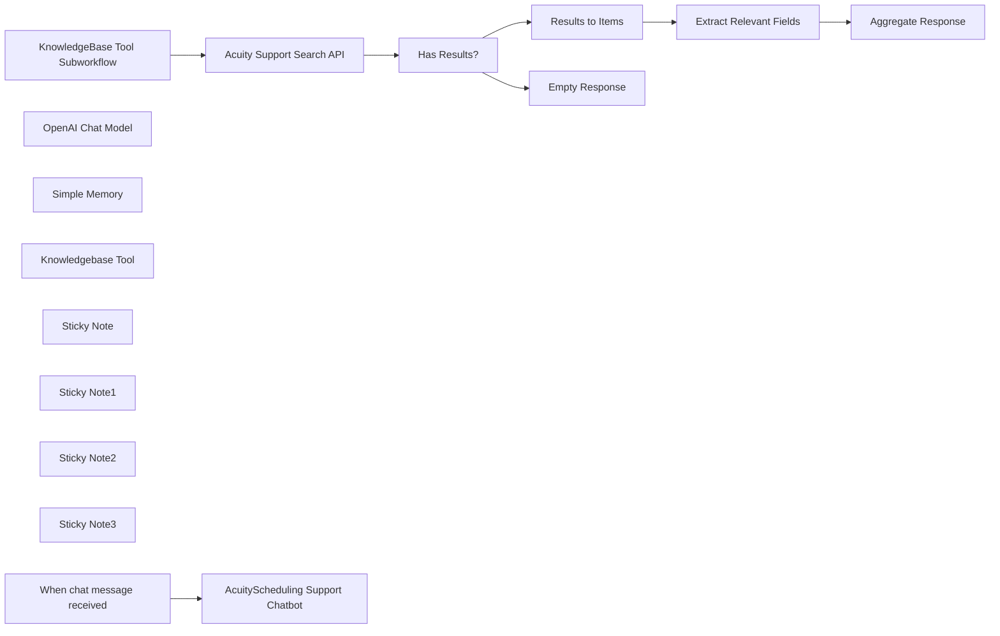

## Fluxo (.json) :

```json
{
  "meta": {
    "instanceId": "408f9fb9940c3cb18ffdef0e0150fe342d6e655c3a9fac21f0f644e8bedabcd9",
    "templateCredsSetupCompleted": true
  },
  "nodes": [
    {
      "id": "8f203423-b063-4918-a6ec-dad3ac7d1a20",
      "name": "When chat message received",
      "type": "@n8n/n8n-nodes-langchain.chatTrigger",
      "position": [
        860,
        -100
      ],
      "webhookId": "c82193c7-163c-4556-942f-81c80037e0ea",
      "parameters": {
        "options": {}
      },
      "typeVersion": 1.1
    },
    {
      "id": "d9f2e90f-128b-458b-b3cf-79db2ec08633",
      "name": "OpenAI Chat Model",
      "type": "@n8n/n8n-nodes-langchain.lmChatOpenAi",
      "position": [
        1000,
        100
      ],
      "parameters": {
        "model": {
          "__rl": true,
          "mode": "list",
          "value": "gpt-4o-mini"
        },
        "options": {}
      },
      "credentials": {
        "openAiApi": {
          "id": "8gccIjcuf3gvaoEr",
          "name": "OpenAi account"
        }
      },
      "typeVersion": 1.2
    },
    {
      "id": "4f752502-8589-4e31-bbe1-4b8395e7325a",
      "name": "Simple Memory",
      "type": "@n8n/n8n-nodes-langchain.memoryBufferWindow",
      "position": [
        1160,
        100
      ],
      "parameters": {},
      "typeVersion": 1.3
    },
    {
      "id": "61ca5a4b-3661-4330-ac4c-e09e75dd764c",
      "name": "Acuity Support Search API",
      "type": "n8n-nodes-base.httpRequest",
      "position": [
        1840,
        80
      ],
      "parameters": {
        "url": "https://2al21hjwoz-dsn.algolia.net/1/indexes/*/queries?x-algolia-agent=Algolia%20for%20JavaScript%20(3.35.1)%3B%20Browser%20(lite)%3B%20instantsearch.js%201.12.1%3B%20Zendesk%20Integration%20(2.32.0)%3B%20JS%20Helper%20(2.28.1)&x-algolia-application-id=2AL21HJWOZ&x-algolia-api-key=c3c07dd7fb575008575163c085a62b92",
        "method": "POST",
        "options": {},
        "jsonBody": "={{\n{\n  \"requests\":[\n    {\n      \"indexName\":\"Zendesk 4-25\",\n      \"params\": \"query=\" + $json.query + \"&hitsPerPage=5&page=0&facets=%5B%22locale.locale%22%2C%22label_names%22%2C%22category.title%22%5D&tagFilters=&facetFilters=%5B%22locale.locale%3Aen-us%22%5D\"\n    }\n  ]\n}\n}}",
        "sendBody": true,
        "sendHeaders": true,
        "specifyBody": "json",
        "headerParameters": {
          "parameters": [
            {
              "name": "Accept-Language",
              "value": "en"
            },
            {
              "name": "Cache-Control",
              "value": "no-cache"
            },
            {
              "name": "Connection",
              "value": "keep-alive"
            },
            {
              "name": "Origin",
              "value": "https://help.acuityscheduling.com"
            },
            {
              "name": "Referer",
              "value": "https://help.acuityscheduling.com/"
            },
            {
              "name": "User-Agent",
              "value": "Mozilla/5.0 (Macintosh; Intel Mac OS X 10_15_7) AppleWebKit/537.36 (KHTML, like Gecko) Chrome/134.0.0.0 Safari/537.36"
            },
            {
              "name": "accept",
              "value": "application/json"
            }
          ]
        }
      },
      "typeVersion": 4.2
    },
    {
      "id": "8ecd6287-982c-4754-9300-4c6d54202273",
      "name": "Extract Relevant Fields",
      "type": "n8n-nodes-base.set",
      "position": [
        2560,
        80
      ],
      "parameters": {
        "options": {},
        "assignments": {
          "assignments": [
            {
              "id": "a6973f14-e17d-46b0-9c5b-c6d9967dbf99",
              "name": "title",
              "type": "string",
              "value": "={{ $json.title }}"
            },
            {
              "id": "88092adb-7f63-4daa-8c7a-cbd85750e180",
              "name": "body",
              "type": "string",
              "value": "={{ $json.body_safe }}"
            },
            {
              "id": "12718897-a73d-4c3a-bcfb-b17c890458ec",
              "name": "url",
              "type": "string",
              "value": "=https://help.acuityscheduling.com/hc/en-us/articles/{{ $json.id }}"
            }
          ]
        }
      },
      "typeVersion": 3.4
    },
    {
      "id": "bf5855b2-8e73-4c29-b277-adee63e8bf59",
      "name": "Results to Items",
      "type": "n8n-nodes-base.splitOut",
      "position": [
        2360,
        80
      ],
      "parameters": {
        "options": {},
        "fieldToSplitOut": "results[0].hits"
      },
      "typeVersion": 1
    },
    {
      "id": "c9329816-bbe0-4de7-b6fb-fa87783f6a5c",
      "name": "Has Results?",
      "type": "n8n-nodes-base.if",
      "position": [
        2040,
        80
      ],
      "parameters": {
        "options": {},
        "conditions": {
          "options": {
            "version": 2,
            "leftValue": "",
            "caseSensitive": true,
            "typeValidation": "strict"
          },
          "combinator": "and",
          "conditions": [
            {
              "id": "f5d7e890-f00a-4252-8588-c6662e71790c",
              "operator": {
                "type": "array",
                "operation": "lengthGt",
                "rightType": "number"
              },
              "leftValue": "={{ $json.results[0]?.hits ?? [] }}",
              "rightValue": 0
            }
          ]
        }
      },
      "typeVersion": 2.2
    },
    {
      "id": "860a178a-d500-4291-acfc-9c9f4638d6c7",
      "name": "Empty Response",
      "type": "n8n-nodes-base.set",
      "position": [
        2360,
        260
      ],
      "parameters": {
        "options": {},
        "assignments": {
          "assignments": [
            {
              "id": "0ce36950-83d9-4964-8763-f329a4cda5a8",
              "name": "response",
              "type": "array",
              "value": "[]"
            }
          ]
        }
      },
      "typeVersion": 3.4
    },
    {
      "id": "c9f2a08b-88c2-4287-994c-f7af58e98301",
      "name": "Aggregate Response",
      "type": "n8n-nodes-base.aggregate",
      "position": [
        2760,
        80
      ],
      "parameters": {
        "options": {},
        "aggregate": "aggregateAllItemData",
        "destinationFieldName": "response"
      },
      "typeVersion": 1
    },
    {
      "id": "5f1f8874-7022-4ea1-b0a7-de42c4f800a1",
      "name": "Knowledgebase Tool",
      "type": "@n8n/n8n-nodes-langchain.toolWorkflow",
      "position": [
        1320,
        100
      ],
      "parameters": {
        "name": "acuity_support_search",
        "workflowId": {
          "__rl": true,
          "mode": "id",
          "value": "={{ $workflow.id }}"
        },
        "description": "Call this tool to query AcuityScheduling's Support Center Search API.",
        "workflowInputs": {
          "value": {
            "query": "={{ /*n8n-auto-generated-fromAI-override*/ $fromAI('query', ``, 'string') }}"
          },
          "schema": [
            {
              "id": "query",
              "type": "string",
              "display": true,
              "removed": false,
              "required": false,
              "displayName": "query",
              "defaultMatch": false,
              "canBeUsedToMatch": true
            }
          ],
          "mappingMode": "defineBelow",
          "matchingColumns": [],
          "attemptToConvertTypes": false,
          "convertFieldsToString": false
        }
      },
      "typeVersion": 2.1
    },
    {
      "id": "3913ddaa-852e-4463-a072-fe8be22bc184",
      "name": "Sticky Note",
      "type": "n8n-nodes-base.stickyNote",
      "position": [
        720,
        -300
      ],
      "parameters": {
        "color": 7,
        "width": 780,
        "height": 580,
        "content": "## 1. Simple Chatbot with Knowledgebase Tool\n[Learn more about AI agents](https://docs.n8n.io/integrations/builtin/cluster-nodes/root-nodes/n8n-nodes-langchain.agent)\n\nThe AI agent node is the simplest and recommended way to create user-friendly chatbots in n8n. Here, we'll define a support agent which can answer AcuityScheduling.com questions. To ensure the answers are accurate and up-to-date, we'll connect it to the support knowledgebase via a custom workflow tool."
      },
      "typeVersion": 1
    },
    {
      "id": "e24d75f9-6d3c-4bca-b67f-33737ee969ee",
      "name": "Sticky Note1",
      "type": "n8n-nodes-base.stickyNote",
      "position": [
        1540,
        -140
      ],
      "parameters": {
        "color": 7,
        "width": 700,
        "height": 440,
        "content": "## 2. Use your Existing Help Portal Search\n[Read more about the HTTP request tool](https://docs.n8n.io/integrations/builtin/core-nodes/n8n-nodes-base.httprequest)\n\nThe concept of RAG need to be synonymous with vector stores! In truth, many companies with a decent enough support website are able to leverage this existing knowledgebase for support agents. This saves time, money and effort and additional avoids maintenance of a vector store where syncs and updates are common."
      },
      "typeVersion": 1
    },
    {
      "id": "f5feebf1-fd6d-4558-a868-7ea4f852386c",
      "name": "Sticky Note2",
      "type": "n8n-nodes-base.stickyNote",
      "position": [
        2260,
        -140
      ],
      "parameters": {
        "color": 7,
        "width": 720,
        "height": 600,
        "content": "## 3. Clean up the Results to Optimise Tokens\n[Read more about the aggregate node](https://docs.n8n.io/integrations/builtin/core-nodes/n8n-nodes-base.aggregate)\n\nOf course, the results are intended for the website format but by using the custom workflow tool, we can edit it down to suit our chat scenario and save LLM costs (in terms of tokens) whilst we're at it. "
      },
      "typeVersion": 1
    },
    {
      "id": "8132de59-9b47-460a-9cb9-f2ec83123a3f",
      "name": "AcuityScheduling Support Chatbot",
      "type": "@n8n/n8n-nodes-langchain.agent",
      "position": [
        1060,
        -100
      ],
      "parameters": {
        "options": {
          "systemMessage": "You are a support assistant for the SaaS company, AcuityScheduling.com. Your task is to openly help the user with any questions regarding the AcuityScheduling service however, you are restricted to only this service. If the user asks questions unrelated to AcuityScheduling, you may ask them for clarification, explain you are not able to help them out of scope or redirect them to support@acuityScheduling.com. Be factual in your answer, tap into the resources or tools available and do not rely on your training data (which might be out-of-date). When returning a response to the user, you are encouraged to share the URL of the knowledgebase page where the user can explore the documentation for themselves."
        }
      },
      "typeVersion": 1.8
    },
    {
      "id": "564bde38-25ea-4969-aa3f-bff66ec2782f",
      "name": "Sticky Note3",
      "type": "n8n-nodes-base.stickyNote",
      "position": [
        260,
        -840
      ],
      "parameters": {
        "width": 440,
        "height": 1120,
        "content": "## Try it Out!\n### This n8n template demonstrates how you can leverage existing support site search to power your Support Chatbots and agents.\n\nBuilding a support chatbot need not be complicated! If building and indexing vector stores or duplicating data isn't necessarily your thing, an alternative implementation of the [RAG](https://www.databricks.com/glossary/retrieval-augmented-generation-rag) approach is to leverage existing knowledge-bases such as support portals.\n\n### How it works\n* A simple AI agent is connected with chat trigger to receive user queries.\n* The AI agent is instructed to fetch information from the knowledge-base via the attached custom workflow tool (aka \"knowledgebase tool\").\n* There is no step to replicate the entire support articles database into a vector store. You may choose not too because of time, cost and maintainence involved.\n* Instead, the tool leverages the existing support portal's search API to retrieve knowledge-base articles.\n* Finally, the search results are formatted before sending an aggregated response back to the agent.\n\n### How to use?\n* Customise the subworkflow to work with your own support portal API and format accordingly.\n* Try the following queries\n  * How do I connect my icloud to acuityScheduling?\n  * How do I download past invoices for my Acuity account?\n\n### Requirements\n* OpenAI for LLM.\n* If your organisation's APIs require authorisation, you may need to add custom credentials as necessary.\n\n### Customising this workflow\n* Add additional tools to reach other parts of your internal knowledgebase.\n* Not using OpenAI? Feel free to swap but ensure the LLM has tools/function calling support.\n\n\n### Need Help?\nJoin the [Discord](https://discord.com/invite/XPKeKXeB7d) or ask in the [Forum](https://community.n8n.io/)!\n\nHappy Hacking!"
      },
      "typeVersion": 1
    },
    {
      "id": "a918718f-915d-4d5c-a7c2-a015b8a84bbb",
      "name": "KnowledgeBase Tool Subworkflow",
      "type": "n8n-nodes-base.executeWorkflowTrigger",
      "position": [
        1620,
        80
      ],
      "parameters": {
        "workflowInputs": {
          "values": [
            {
              "name": "query"
            }
          ]
        }
      },
      "typeVersion": 1.1
    }
  ],
  "pinData": {},
  "connections": {
    "Has Results?": {
      "main": [
        [
          {
            "node": "Results to Items",
            "type": "main",
            "index": 0
          }
        ],
        [
          {
            "node": "Empty Response",
            "type": "main",
            "index": 0
          }
        ]
      ]
    },
    "Simple Memory": {
      "ai_memory": [
        [
          {
            "node": "AcuityScheduling Support Chatbot",
            "type": "ai_memory",
            "index": 0
          }
        ]
      ]
    },
    "Results to Items": {
      "main": [
        [
          {
            "node": "Extract Relevant Fields",
            "type": "main",
            "index": 0
          }
        ]
      ]
    },
    "OpenAI Chat Model": {
      "ai_languageModel": [
        [
          {
            "node": "AcuityScheduling Support Chatbot",
            "type": "ai_languageModel",
            "index": 0
          }
        ]
      ]
    },
    "Knowledgebase Tool": {
      "ai_tool": [
        [
          {
            "node": "AcuityScheduling Support Chatbot",
            "type": "ai_tool",
            "index": 0
          }
        ]
      ]
    },
    "Extract Relevant Fields": {
      "main": [
        [
          {
            "node": "Aggregate Response",
            "type": "main",
            "index": 0
          }
        ]
      ]
    },
    "Acuity Support Search API": {
      "main": [
        [
          {
            "node": "Has Results?",
            "type": "main",
            "index": 0
          }
        ]
      ]
    },
    "When chat message received": {
      "main": [
        [
          {
            "node": "AcuityScheduling Support Chatbot",
            "type": "main",
            "index": 0
          }
        ]
      ]
    },
    "KnowledgeBase Tool Subworkflow": {
      "main": [
        [
          {
            "node": "Acuity Support Search API",
            "type": "main",
            "index": 0
          }
        ]
      ]
    }
  }
}
```

<a id="template-603"></a>

## Template 603 - Análise de sentimento de feedback de clientes

- **Nome:** Análise de sentimento de feedback de clientes
- **Descrição:** Recebe feedback de clientes via formulário, classifica o sentimento do texto usando OpenAI e registra o resultado junto com os dados do formulário em uma planilha do Google Sheets.
- **Funcionalidade:** • Coleta de feedback por formulário: Gera um formulário web para que clientes enviem nome, categoria, contato e comentário.
• Classificação de sentimento: Envia o texto do feedback para o serviço de IA para identificar o sentimento (por exemplo: positivo, negativo, neutro).
• União dos dados: Combina a resposta do classificador de sentimento com os campos enviados pelo formulário.
• Registro em planilha: Adiciona uma nova linha na planilha do Google Sheets contendo timestamp, categoria, sentimento, nome, contato e feedback.
• Confirmação ao usuário: Mostra uma mensagem de envio confirmando que a resposta foi registrada.
- **Ferramentas:** • OpenAI: Serviço de inteligência artificial usado para classificar o sentimento do texto do feedback.
• Google Sheets: Planilha online utilizada para armazenar registros de feedback e resultados de sentimento.
• Formulário web (webhook): Interface de coleta de respostas dos clientes que dispara o fluxo quando o formulário é submetido.


## Fluxo visual

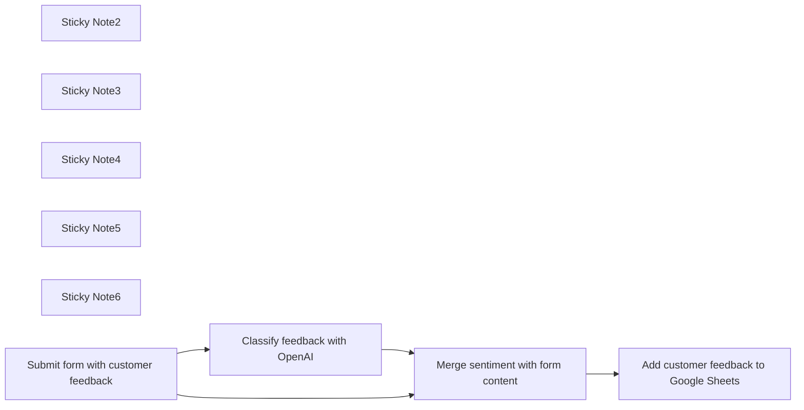

## Fluxo (.json) :

```json
{
  "meta": {
    "instanceId": "82a17fa4a0b8e81bf77e5ab999d980f392150f2a9541fde626dc5f74857b1f54"
  },
  "nodes": [
    {
      "id": "4ea39a4f-d8c1-438f-9738-bfbb906a3d7a",
      "name": "Sticky Note2",
      "type": "n8n-nodes-base.stickyNote",
      "position": [
        1200,
        1020
      ],
      "parameters": {
        "width": 253,
        "height": 342,
        "content": "## Send customer feedback to OpenAI for sentiment analysis"
      },
      "typeVersion": 1
    },
    {
      "id": "6962ea41-7d15-4932-919f-21ac94fa1269",
      "name": "Sticky Note3",
      "type": "n8n-nodes-base.stickyNote",
      "position": [
        1960,
        1180
      ],
      "parameters": {
        "width": 253,
        "height": 342,
        "content": "## Add new feedback to google sheets"
      },
      "typeVersion": 1
    },
    {
      "id": "4c8a8984-2d8e-4139-866b-6f3536aced07",
      "name": "Sticky Note4",
      "type": "n8n-nodes-base.stickyNote",
      "position": [
        800,
        1600
      ],
      "parameters": {
        "width": 1407,
        "height": 254,
        "content": "## Instructions\n1. Connect Google sheets\n2. Connect your OpenAi account (api key + org Id)\n3. Create a customer feedback form, use an existing one or use the one below as example. \nAll set!\n\n\n- Here is the example google sheet being used in this workflow: https://docs.google.com/spreadsheets/d/1omWdRbiT6z6GNZ6JClu9gEsRhPQ6J0EJ2yXyFH9Zng4/edit?usp=sharing. You can download it to your account."
      },
      "typeVersion": 1
    },
    {
      "id": "d43a9574-626d-4817-87ba-d99bdd6f41dc",
      "name": "Sticky Note5",
      "type": "n8n-nodes-base.stickyNote",
      "position": [
        800,
        1160
      ],
      "parameters": {
        "width": 253,
        "height": 342,
        "content": "## Feedback form is submitted"
      },
      "typeVersion": 1
    },
    {
      "id": "76dab2dc-935f-416e-91aa-5a1b7017ec1b",
      "name": "Sticky Note6",
      "type": "n8n-nodes-base.stickyNote",
      "position": [
        1600,
        1180
      ],
      "parameters": {
        "width": 253,
        "height": 342,
        "content": "## Merge form data and OpenAI result"
      },
      "typeVersion": 1
    },
    {
      "id": "9772eac1-8df2-4305-9b2c-265d3c5a9a4a",
      "name": "Add customer feedback to Google Sheets",
      "type": "n8n-nodes-base.googleSheets",
      "position": [
        2020,
        1320
      ],
      "parameters": {
        "columns": {
          "value": {
            "Category": "={{ $json['What is your feedback about?'] }}",
            "Sentiment": "={{ $json.text }}",
            "Timestamp": "={{ $json.submittedAt }}",
            "Entered by": "=Form",
            "Customer Name": "={{ $json.Name }}",
            "Customer contact": "={{ $json['How do we get in touch with you?'] }}",
            "Customer Feedback": "={{ $json['Your feedback'] }}"
          },
          "schema": [
            {
              "id": "Timestamp",
              "type": "string",
              "display": true,
              "required": false,
              "displayName": "Timestamp",
              "defaultMatch": false,
              "canBeUsedToMatch": true
            },
            {
              "id": "Category",
              "type": "string",
              "display": true,
              "required": false,
              "displayName": "Category",
              "defaultMatch": false,
              "canBeUsedToMatch": true
            },
            {
              "id": "Customer Feedback",
              "type": "string",
              "display": true,
              "required": false,
              "displayName": "Customer Feedback",
              "defaultMatch": false,
              "canBeUsedToMatch": true
            },
            {
              "id": "Customer Name",
              "type": "string",
              "display": true,
              "required": false,
              "displayName": "Customer Name",
              "defaultMatch": false,
              "canBeUsedToMatch": true
            },
            {
              "id": "Customer contact",
              "type": "string",
              "display": true,
              "required": false,
              "displayName": "Customer contact",
              "defaultMatch": false,
              "canBeUsedToMatch": true
            },
            {
              "id": "Entered by",
              "type": "string",
              "display": true,
              "required": false,
              "displayName": "Entered by",
              "defaultMatch": false,
              "canBeUsedToMatch": true
            },
            {
              "id": "Urgent?",
              "type": "string",
              "display": true,
              "required": false,
              "displayName": "Urgent?",
              "defaultMatch": false,
              "canBeUsedToMatch": true
            },
            {
              "id": "Sentiment",
              "type": "string",
              "display": true,
              "required": false,
              "displayName": "Sentiment",
              "defaultMatch": false,
              "canBeUsedToMatch": true
            }
          ],
          "mappingMode": "defineBelow",
          "matchingColumns": []
        },
        "options": {},
        "operation": "append",
        "sheetName": {
          "__rl": true,
          "mode": "list",
          "value": "gid=0",
          "cachedResultUrl": "https://docs.google.com/spreadsheets/d/1omWdRbiT6z6GNZ6JClu9gEsRhPQ6J0EJ2yXyFH9Zng4/edit#gid=0",
          "cachedResultName": "Sheet1"
        },
        "documentId": {
          "__rl": true,
          "mode": "list",
          "value": "1omWdRbiT6z6GNZ6JClu9gEsRhPQ6J0EJ2yXyFH9Zng4",
          "cachedResultUrl": "https://docs.google.com/spreadsheets/d/1omWdRbiT6z6GNZ6JClu9gEsRhPQ6J0EJ2yXyFH9Zng4/edit?usp=drivesdk",
          "cachedResultName": "CustomerFeedback"
        }
      },
      "credentials": {
        "googleSheetsOAuth2Api": {
          "id": "3",
          "name": "Google Sheets account"
        }
      },
      "typeVersion": 4.1
    },
    {
      "id": "12084971-c81b-4a0e-814e-120867562642",
      "name": "Merge sentiment with form content",
      "type": "n8n-nodes-base.merge",
      "position": [
        1680,
        1320
      ],
      "parameters": {
        "mode": "combine",
        "options": {},
        "combinationMode": "multiplex"
      },
      "typeVersion": 2.1
    },
    {
      "id": "235edf5b-7724-4712-8dc5-d8327a0620b8",
      "name": "Classify feedback with OpenAI",
      "type": "n8n-nodes-base.openAi",
      "position": [
        1280,
        1180
      ],
      "parameters": {
        "prompt": "=Classify the sentiment in the following customer feedback: {{ $json['Your feedback'] }}",
        "options": {}
      },
      "credentials": {
        "openAiApi": {
          "id": "s2iucY0IctjYNbrb",
          "name": "OpenAi account"
        }
      },
      "typeVersion": 1
    },
    {
      "id": "af4b22aa-0925-40b1-a9ac-298f9745a98e",
      "name": "Submit form with customer feedback",
      "type": "n8n-nodes-base.formTrigger",
      "position": [
        860,
        1340
      ],
      "webhookId": "e7bf682e-48e8-40de-9815-cd180cdd1480",
      "parameters": {
        "options": {
          "formSubmittedText": "Your response has been recorded"
        },
        "formTitle": "Customer Feedback",
        "formFields": {
          "values": [
            {
              "fieldLabel": "Name",
              "requiredField": true
            },
            {
              "fieldType": "dropdown",
              "fieldLabel": "What is your feedback about?",
              "fieldOptions": {
                "values": [
                  {
                    "option": "Product"
                  },
                  {
                    "option": "Service"
                  },
                  {
                    "option": "Other"
                  }
                ]
              },
              "requiredField": true
            },
            {
              "fieldType": "textarea",
              "fieldLabel": "Your feedback",
              "requiredField": true
            },
            {
              "fieldLabel": "How do we get in touch with you?"
            }
          ]
        },
        "formDescription": "Please give feedback about our company orproducts."
      },
      "typeVersion": 1
    }
  ],
  "connections": {
    "Classify feedback with OpenAI": {
      "main": [
        [
          {
            "node": "Merge sentiment with form content",
            "type": "main",
            "index": 0
          }
        ]
      ]
    },
    "Merge sentiment with form content": {
      "main": [
        [
          {
            "node": "Add customer feedback to Google Sheets",
            "type": "main",
            "index": 0
          }
        ]
      ]
    },
    "Submit form with customer feedback": {
      "main": [
        [
          {
            "node": "Classify feedback with OpenAI",
            "type": "main",
            "index": 0
          },
          {
            "node": "Merge sentiment with form content",
            "type": "main",
            "index": 1
          }
        ]
      ]
    }
  }
}
```

<a id="template-604"></a>

## Template 604 - Qualificação automática de leads com GPT-4

- **Nome:** Qualificação automática de leads com GPT-4
- **Descrição:** Automatiza a qualificação de novos leads recebidos via formulário/planilha, usando GPT-4 para avaliar e registrar uma classificação no documento.
- **Funcionalidade:** • Monitoramento de novas entradas: Detecta automaticamente novos registros adicionados à planilha.
• Preparação de dados do lead: Coleta e formata informações do formulário (nome, email, área, tamanho da equipe) para avaliação.
• Avaliação com modelo de linguagem: Envia instruções (mensagem do sistema) e dados do lead ao GPT-4 para decidir se o lead é qualificado.
• Extração de resposta estruturada: Converte a resposta JSON do GPT em campos utilizáveis pela automação.
• Combinação de dados: Junta o registro original com a avaliação do GPT para manter contexto.
• Atualização da planilha: Escreve a classificação/resultados do GPT de volta em uma coluna específica da planilha.
- **Ferramentas:** • Google Sheets: Armazenamento e atualização dos registros de leads, além de disparo com novas entradas.
• Google Forms: Fonte opcional de submissões que alimenta a planilha com novos leads.
• OpenAI (GPT-4): Modelo de linguagem usado para avaliar e classificar a qualidade dos leads.


## Fluxo visual

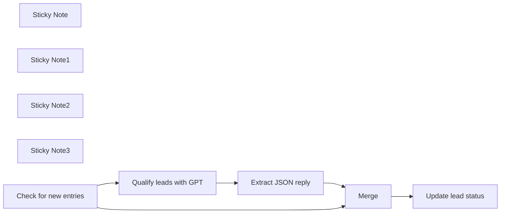

## Fluxo (.json) :

```json
{
  "id": "8FLJK1NsduFL0Y5P",
  "meta": {
    "instanceId": "fb924c73af8f703905bc09c9ee8076f48c17b596ed05b18c0ff86915ef8a7c4a"
  },
  "name": "Qualify new leads in Google Sheets via OpenAI's GPT-4",
  "tags": [
    {
      "id": "y9tvM3hISJKT2jeo",
      "name": "Ted's Tech Talks",
      "createdAt": "2023-08-15T22:12:34.260Z",
      "updatedAt": "2023-08-15T22:12:34.260Z"
    }
  ],
  "nodes": [
    {
      "id": "1f179325-0bec-4e5c-8ebd-0a2bb3ebefaa",
      "name": "Merge",
      "type": "n8n-nodes-base.merge",
      "position": [
        1440,
        340
      ],
      "parameters": {
        "mode": "combine",
        "options": {},
        "combinationMode": "mergeByPosition"
      },
      "typeVersion": 2.1
    },
    {
      "id": "7b548661-2b32-451f-ba52-91ca86728f1e",
      "name": "Sticky Note",
      "type": "n8n-nodes-base.stickyNote",
      "position": [
        358,
        136.3642172523962
      ],
      "parameters": {
        "width": 442,
        "height": 360.6357827476038,
        "content": "### 1. Create a Google Sheet document\n* This template uses Google Sheet document connected to Google Forms, but a standalone Sheet document will work too\n* Adapt initial trigger to your needs: check for new entries periodically or add a manual trigger\n\n[Link to the Google Sheet template](https://docs.google.com/spreadsheets/d/1jk8ZbfOMObvHGGImc0sBJTZB_hracO4jRqfbryMgzEs)"
      },
      "typeVersion": 1
    },
    {
      "id": "308b4dce-4656-47bd-b217-69565b1c34f6",
      "name": "Sticky Note1",
      "type": "n8n-nodes-base.stickyNote",
      "position": [
        820,
        420
      ],
      "parameters": {
        "width": 471,
        "height": 322,
        "content": "### 2. Provide lead qualification instructions\n* Create a __system message__ with overall instructions\n* Add a __user message__ with the JSON variables\n* Set node parses the resulting JSON object, but you can also request a plain string response in the system message"
      },
      "typeVersion": 1
    },
    {
      "id": "c00442ca-98cf-4296-b084-f0881ce4fd39",
      "name": "Sticky Note2",
      "type": "n8n-nodes-base.stickyNote",
      "position": [
        1320,
        222.18785942492013
      ],
      "parameters": {
        "width": 355,
        "height": 269.81214057507987,
        "content": "### 3. Combine the initial data with GPT response\n* This Merge node puts together original records from the google sheet and responses from the OpenAI"
      },
      "typeVersion": 1
    },
    {
      "id": "62643a4c-a69c-4351-9960-20413285ff33",
      "name": "Sticky Note3",
      "type": "n8n-nodes-base.stickyNote",
      "position": [
        1700,
        220
      ],
      "parameters": {
        "width": 398,
        "height": 265,
        "content": "### 4. Update the Google Sheet document\n* Provide __Column to Match On__ (usually a timestamp in case of Google Forms)\n* Enter the result from GPT into a separate column"
      },
      "typeVersion": 1
    },
    {
      "id": "4cd58340-81c4-46c7-b346-25a9b6ef2910",
      "name": "Update lead status",
      "type": "n8n-nodes-base.googleSheets",
      "position": [
        1860,
        340
      ],
      "parameters": {
        "columns": {
          "value": {
            "Rating": "={{ $json.reply.rating }}",
            "Timestamp": "={{ $json.Timestamp }}"
          },
          "schema": [
            {
              "id": "Timestamp",
              "type": "string",
              "display": true,
              "removed": false,
              "required": false,
              "displayName": "Timestamp",
              "defaultMatch": false,
              "canBeUsedToMatch": true
            },
            {
              "id": "Email Address",
              "type": "string",
              "display": true,
              "removed": true,
              "required": false,
              "displayName": "Email Address",
              "defaultMatch": false,
              "canBeUsedToMatch": true
            },
            {
              "id": "Your name",
              "type": "string",
              "display": true,
              "removed": true,
              "required": false,
              "displayName": "Your name",
              "defaultMatch": false,
              "canBeUsedToMatch": true
            },
            {
              "id": "Your business area",
              "type": "string",
              "display": true,
              "removed": true,
              "required": false,
              "displayName": "Your business area",
              "defaultMatch": false,
              "canBeUsedToMatch": true
            },
            {
              "id": "Your team size",
              "type": "string",
              "display": true,
              "removed": true,
              "required": false,
              "displayName": "Your team size",
              "defaultMatch": false,
              "canBeUsedToMatch": true
            },
            {
              "id": "Rating",
              "type": "string",
              "display": true,
              "required": false,
              "displayName": "Rating",
              "defaultMatch": false,
              "canBeUsedToMatch": true
            },
            {
              "id": "row_number",
              "type": "string",
              "display": true,
              "removed": true,
              "readOnly": true,
              "required": false,
              "displayName": "row_number",
              "defaultMatch": false,
              "canBeUsedToMatch": true
            }
          ],
          "mappingMode": "defineBelow",
          "matchingColumns": [
            "Timestamp"
          ]
        },
        "options": {},
        "operation": "update",
        "sheetName": {
          "__rl": true,
          "mode": "list",
          "value": 72739218,
          "cachedResultUrl": "https://docs.google.com/spreadsheets/d/1jk8ZbfOMObvHGGImc0sBJTZB_hracO4jRqfbryMgzEs/edit#gid=72739218",
          "cachedResultName": "Form Responses 1"
        },
        "documentId": {
          "__rl": true,
          "mode": "list",
          "value": "1jk8ZbfOMObvHGGImc0sBJTZB_hracO4jRqfbryMgzEs",
          "cachedResultUrl": "https://docs.google.com/spreadsheets/d/1jk8ZbfOMObvHGGImc0sBJTZB_hracO4jRqfbryMgzEs/edit?usp=drivesdk",
          "cachedResultName": "Join Community (Responses)"
        }
      },
      "credentials": {
        "googleSheetsOAuth2Api": {
          "id": "RtRiRezoxiWkzZQt",
          "name": "Ted's Tech Talks Google account"
        }
      },
      "typeVersion": 4.2
    },
    {
      "id": "fea0acee-13b6-441a-8cf9-c8fedbc4617d",
      "name": "Extract JSON reply",
      "type": "n8n-nodes-base.set",
      "position": [
        1120,
        580
      ],
      "parameters": {
        "fields": {
          "values": [
            {
              "name": "reply",
              "type": "objectValue",
              "objectValue": "={{ JSON.parse($json.message.content) }}"
            }
          ]
        },
        "include": "selected",
        "options": {}
      },
      "typeVersion": 3.2
    },
    {
      "id": "0a0608fe-894f-4eb5-b690-233c6dfc0428",
      "name": "Qualify leads with GPT",
      "type": "n8n-nodes-base.openAi",
      "position": [
        900,
        580
      ],
      "parameters": {
        "prompt": {
          "messages": [
            {
              "role": "system",
              "content": "Your task is to qualify incoming leads. Leads are form submissions to a closed community group. Use the following criteria for a quality lead:\n\n1. We are looking for decision makers who run companies or who have some teams. The bigger the team - the better. Basically, everyone with some level of responsibility should be accepted. This is the main criterion.\n2. Email from a non-standard domain. Ideally this should be a corporate domain, but this is a secondary criterion.\n\nPlease thing step by step whether a lead is quality or not?\n\nIf at least one of the criteria satisfy, reply with \"qualified\" in response. Otherwise reply \"not qualified\". Reply with a JSON of the following structure: {\"rating\":\"string\",\"explanation\":\"string\"}. Reply only with with the JSON and nothing more!"
            },
            {
              "content": "=Here's a lead info:\nName: {{ $json['Your name'] }}\nEmail: {{ $json['Email Address'] }}\nBusiness area: {{ $json['Your business area'] }}\nSize of the team: {{ $json['Your team size'] }}"
            }
          ]
        },
        "options": {
          "temperature": 0.3
        },
        "resource": "chat",
        "chatModel": "gpt-4-turbo-preview"
      },
      "credentials": {
        "openAiApi": {
          "id": "rveqdSfp7pCRON1T",
          "name": "Ted's Tech Talks OpenAi"
        }
      },
      "typeVersion": 1.1
    },
    {
      "id": "22fdec69-a4a9-430d-9950-79195799ae7a",
      "name": "Check for new entries",
      "type": "n8n-nodes-base.googleSheetsTrigger",
      "position": [
        520,
        340
      ],
      "parameters": {
        "event": "rowAdded",
        "options": {},
        "pollTimes": {
          "item": [
            {
              "mode": "everyMinute"
            }
          ]
        },
        "sheetName": {
          "__rl": true,
          "mode": "list",
          "value": 72739218,
          "cachedResultUrl": "https://docs.google.com/spreadsheets/d/1jk8ZbfOMObvHGGImc0sBJTZB_hracO4jRqfbryMgzEs/edit#gid=72739218",
          "cachedResultName": "Form Responses 1"
        },
        "documentId": {
          "__rl": true,
          "mode": "list",
          "value": "1jk8ZbfOMObvHGGImc0sBJTZB_hracO4jRqfbryMgzEs",
          "cachedResultUrl": "https://docs.google.com/spreadsheets/d/1jk8ZbfOMObvHGGImc0sBJTZB_hracO4jRqfbryMgzEs/edit?usp=drivesdk",
          "cachedResultName": "Join Community (Responses)"
        }
      },
      "credentials": {
        "googleSheetsTriggerOAuth2Api": {
          "id": "m33qCYf9eEvSgo0x",
          "name": "Ted's Tech Talks Google Sheets Trigger"
        }
      },
      "typeVersion": 1
    }
  ],
  "active": false,
  "pinData": {},
  "settings": {
    "executionOrder": "v1"
  },
  "versionId": "ffad0998-1a6b-469d-9297-6d7fd88387b9",
  "connections": {
    "Merge": {
      "main": [
        [
          {
            "node": "Update lead status",
            "type": "main",
            "index": 0
          }
        ]
      ]
    },
    "Extract JSON reply": {
      "main": [
        [
          {
            "node": "Merge",
            "type": "main",
            "index": 1
          }
        ]
      ]
    },
    "Check for new entries": {
      "main": [
        [
          {
            "node": "Merge",
            "type": "main",
            "index": 0
          },
          {
            "node": "Qualify leads with GPT",
            "type": "main",
            "index": 0
          }
        ]
      ]
    },
    "Qualify leads with GPT": {
      "main": [
        [
          {
            "node": "Extract JSON reply",
            "type": "main",
            "index": 0
          }
        ]
      ]
    }
  }
}
```

<a id="template-605"></a>

## Template 605 - Envio diário de digest de templates por categoria

- **Nome:** Envio diário de digest de templates por categoria
- **Descrição:** Envia diariamente um email personalizado para cada assinante com os templates mais recentes das categorias que ele segue, incluindo resumos gerados por IA.
- **Funcionalidade:** • Agendamento diário: Executa o fluxo automaticamente todos os dias em horário definido.
• Leitura de assinantes de planilha: Obtém nome, email e categorias de interesse a partir de um arquivo Excel.
• Cálculo de categorias únicas: Identifica categorias distintas entre todos os assinantes para otimizar buscas.
• Busca de templates por categoria: Consulta uma API pública para obter os templates mais recentes de cada categoria.
• Resumo por IA: Gera resumos curtos (1–2 frases) das descrições dos templates usando um modelo de linguagem.
• Filtragem por assinante: Seleciona apenas os templates relevantes às categorias de cada assinante.
• Remoção de duplicados e itens já enviados: Evita enviar o mesmo template mais de uma vez para o mesmo assinante.
• Geração de email HTML personalizado: Monta um conteúdo HTML com títulos, autores, datas e resumos para cada assinante.
• Envio de email: Dispara o digest individualmente para o email do assinante via serviço de e-mail.
- **Ferramentas:** • Microsoft Excel: Armazenamento e leitura da lista de assinantes (nome, email, categorias).
• API pública de busca de templates: Fonte para obter os templates mais recentes por categoria.
• OpenAI (modelo de linguagem): Geração automática de resumos curtos para descrições de templates.
• Microsoft Outlook / Microsoft 365: Serviço de envio de emails em formato HTML para os assinantes.

## Fluxo visual

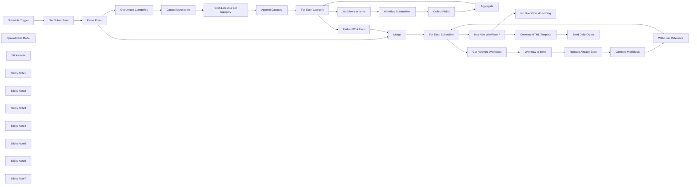

## Fluxo (.json) :

```json
{
  "meta": {
    "instanceId": "408f9fb9940c3cb18ffdef0e0150fe342d6e655c3a9fac21f0f644e8bedabcd9",
    "templateCredsSetupCompleted": true
  },
  "nodes": [
    {
      "id": "c3a9ba81-3a7e-4afe-be8b-cf482cbb88c2",
      "name": "Schedule Trigger",
      "type": "n8n-nodes-base.scheduleTrigger",
      "position": [
        -1040,
        -540
      ],
      "parameters": {
        "rule": {
          "interval": [
            {
              "triggerAtHour": 6
            }
          ]
        }
      },
      "typeVersion": 1.2
    },
    {
      "id": "f63d035c-5a7b-4cf4-8730-5fa7dff6f94b",
      "name": "Get Subscribers",
      "type": "n8n-nodes-base.microsoftExcel",
      "position": [
        -860,
        -540
      ],
      "parameters": {
        "options": {},
        "resource": "worksheet",
        "workbook": {
          "__rl": true,
          "mode": "id",
          "value": "="
        },
        "operation": "readRows",
        "worksheet": {
          "__rl": true,
          "mode": "id",
          "value": "="
        }
      },
      "credentials": {
        "microsoftExcelOAuth2Api": {
          "id": "56tIUYYVARBe9gfX",
          "name": "Microsoft Excel account"
        }
      },
      "typeVersion": 2.1
    },
    {
      "id": "e93aa8de-5c68-4a01-ae60-beb141e0a430",
      "name": "Get Unique Categories",
      "type": "n8n-nodes-base.set",
      "position": [
        -400,
        -160
      ],
      "parameters": {
        "options": {},
        "assignments": {
          "assignments": [
            {
              "id": "fe138128-50d5-469f-8c0b-0af8c873f198",
              "name": "categories",
              "type": "array",
              "value": "={{ $input.all().flatMap(item => item.json.categories).unique() }}"
            }
          ]
        }
      },
      "executeOnce": true,
      "typeVersion": 3.4
    },
    {
      "id": "a874ae4e-d67e-4019-9e5c-03ea677468ae",
      "name": "OpenAI Chat Model",
      "type": "@n8n/n8n-nodes-langchain.lmChatOpenAi",
      "position": [
        760,
        80
      ],
      "parameters": {
        "model": {
          "__rl": true,
          "mode": "list",
          "value": "gpt-4o-mini"
        },
        "options": {}
      },
      "credentials": {
        "openAiApi": {
          "id": "8gccIjcuf3gvaoEr",
          "name": "OpenAi account"
        }
      },
      "typeVersion": 1.2
    },
    {
      "id": "bc9c7578-3b6f-45fb-9f93-94637774d125",
      "name": "Aggregate",
      "type": "n8n-nodes-base.aggregate",
      "position": [
        1180,
        40
      ],
      "parameters": {
        "options": {},
        "aggregate": "aggregateAllItemData"
      },
      "typeVersion": 1
    },
    {
      "id": "ae83c9e2-a267-463c-a606-b4d101f93f92",
      "name": "Collect Fields",
      "type": "n8n-nodes-base.set",
      "position": [
        980,
        -60
      ],
      "parameters": {
        "options": {},
        "assignments": {
          "assignments": [
            {
              "id": "4a266505-4b88-41cf-bf22-f38c705c27e5",
              "name": "workflow_id",
              "type": "number",
              "value": "={{ $('Workflows to Items').item.json.workflow.id }}"
            },
            {
              "id": "df3348e2-b6ec-4c38-a146-c38be9b830bc",
              "name": "workflow_name",
              "type": "string",
              "value": "={{ $('Workflows to Items').item.json.workflow.name }}"
            },
            {
              "id": "b4646059-748f-407a-b829-d6605d5ab683",
              "name": "workflow_desc",
              "type": "string",
              "value": "={{ $json.response.text }}"
            },
            {
              "id": "eac0d9ab-9445-4bc2-9e64-160fe44b9ace",
              "name": "workflow_created_at",
              "type": "string",
              "value": "={{ $('Workflows to Items').item.json.workflow.createdAt }}"
            },
            {
              "id": "24a3c0cb-224c-4ce6-b59e-38b10ab2c02f",
              "name": "author_id",
              "type": "number",
              "value": "={{ $('Workflows to Items').item.json.workflow.user.id }}"
            },
            {
              "id": "a2b8a52f-be72-484c-aa86-582b73be1859",
              "name": "author_name",
              "type": "string",
              "value": "={{ $('Workflows to Items').item.json.workflow.user.name }}"
            },
            {
              "id": "ae735511-8c7c-4bef-b6ac-cfe3d4b87b4f",
              "name": "author_username",
              "type": "string",
              "value": "={{ $('Workflows to Items').item.json.workflow.user.username }}"
            },
            {
              "id": "2dc1f59f-a854-4322-85df-c5998f782dcd",
              "name": "category",
              "type": "string",
              "value": "={{ $('For Each Category').item.json.category }}"
            }
          ]
        }
      },
      "typeVersion": 3.4
    },
    {
      "id": "8ca1ea7e-9098-4e82-919b-ba98ae7d7574",
      "name": "Categories to Items",
      "type": "n8n-nodes-base.splitOut",
      "position": [
        -220,
        -160
      ],
      "parameters": {
        "options": {
          "destinationFieldName": "category"
        },
        "fieldToSplitOut": "categories"
      },
      "typeVersion": 1
    },
    {
      "id": "eb6d74b8-f1ed-4ab2-8c5f-7e6c6361b055",
      "name": "For Each Category",
      "type": "n8n-nodes-base.splitInBatches",
      "position": [
        320,
        -160
      ],
      "parameters": {
        "options": {}
      },
      "typeVersion": 3
    },
    {
      "id": "8640ffac-9df6-4154-bcd5-dfa90c3843d4",
      "name": "Workflows to Items",
      "type": "n8n-nodes-base.splitOut",
      "position": [
        500,
        -60
      ],
      "parameters": {
        "options": {
          "destinationFieldName": "workflow"
        },
        "fieldToSplitOut": "workflows"
      },
      "typeVersion": 1
    },
    {
      "id": "4456a43b-df26-4bb8-a62d-b9f05eff4479",
      "name": "Workflow Summarizer",
      "type": "@n8n/n8n-nodes-langchain.chainLlm",
      "position": [
        660,
        -60
      ],
      "parameters": {
        "text": "=## Description\n```\n{{ $json.workflow.description.replaceAll('#', '') }}\n```",
        "messages": {
          "messageValues": [
            {
              "message": "=You have received a description of a n8n template from the official template gallery. Your task is to summarize the description into one or two sentences. The summary should loosely follow the structure of:\n* identify the goal of the template\n* describe the method or approached implemented\n* highlight which important n8n nodes were used\n\neg. \"Obtain real-time crypto market insights using an AI-powered workflow with CoinMarketCap APIs through Telegram\""
            }
          ]
        },
        "promptType": "define"
      },
      "typeVersion": 1.5
    },
    {
      "id": "5f4a5921-c954-4523-8925-90401d8dbf22",
      "name": "Merge",
      "type": "n8n-nodes-base.merge",
      "position": [
        660,
        -460
      ],
      "parameters": {
        "mode": "chooseBranch"
      },
      "typeVersion": 3.1
    },
    {
      "id": "f95fb28c-875c-4105-aa83-9fea257ea440",
      "name": "Fetch Latest 10 per Category",
      "type": "n8n-nodes-base.httpRequest",
      "position": [
        -40,
        -160
      ],
      "parameters": {
        "url": "=https://n8n.io/api/product-api/workflows/search",
        "options": {},
        "sendQuery": true,
        "queryParameters": {
          "parameters": [
            {
              "name": "category",
              "value": "={{$json.category }}"
            },
            {
              "name": "rows",
              "value": "10"
            },
            {
              "name": "sort",
              "value": "createdAt:desc"
            },
            {
              "name": "page",
              "value": "1"
            }
          ]
        }
      },
      "typeVersion": 4.2
    },
    {
      "id": "4dda6cbc-e53f-452d-b257-df9ef18abd75",
      "name": "No Operation, do nothing",
      "type": "n8n-nodes-base.noOp",
      "position": [
        1560,
        -460
      ],
      "parameters": {},
      "typeVersion": 1
    },
    {
      "id": "881337d8-3ca8-43d2-931f-9cfec16cc367",
      "name": "Get Relevant Workflows",
      "type": "n8n-nodes-base.set",
      "position": [
        1380,
        -280
      ],
      "parameters": {
        "options": {},
        "assignments": {
          "assignments": [
            {
              "id": "fbd0ad94-e5aa-4082-81f5-d7b2e08dfbcf",
              "name": "workflows",
              "type": "array",
              "value": "={{\n$json.categories\n  .flatMap(cat =>\n    $('Flatten Workflows').first().json.workflows.filter(item => item.category === cat)\n  )\n}}"
            }
          ]
        }
      },
      "typeVersion": 3.4
    },
    {
      "id": "b3ad0e26-e495-4dae-bfdd-f65961178acc",
      "name": "Flatten Workflows",
      "type": "n8n-nodes-base.set",
      "position": [
        500,
        -280
      ],
      "parameters": {
        "options": {},
        "assignments": {
          "assignments": [
            {
              "id": "17a82dd9-3fcf-44d9-b5da-bf89a1f53d59",
              "name": "workflows",
              "type": "array",
              "value": "={{\n$input.all().flatMap(item => item.json.data)\n}}"
            }
          ]
        }
      },
      "executeOnce": true,
      "typeVersion": 3.4
    },
    {
      "id": "05f72731-f8b0-4d8f-ba78-66ef8fbaf059",
      "name": "Remove Already Seen",
      "type": "n8n-nodes-base.removeDuplicates",
      "position": [
        1740,
        -280
      ],
      "parameters": {
        "options": {},
        "operation": "removeItemsSeenInPreviousExecutions",
        "dedupeValue": "={{ $('For Each Subscriber').item.json.name.toSnakeCase() }}_{{ $json.workflow_id }}"
      },
      "typeVersion": 2
    },
    {
      "id": "3904d2a2-9a95-4e11-883e-b2e88c6a884f",
      "name": "Workflow to Items",
      "type": "n8n-nodes-base.splitOut",
      "position": [
        1560,
        -280
      ],
      "parameters": {
        "options": {},
        "fieldToSplitOut": "workflows"
      },
      "typeVersion": 1
    },
    {
      "id": "d416dee7-df0f-4579-a25f-6baed16453e8",
      "name": "Combine Workflows",
      "type": "n8n-nodes-base.aggregate",
      "position": [
        1920,
        -280
      ],
      "parameters": {
        "options": {},
        "aggregate": "aggregateAllItemData"
      },
      "typeVersion": 1
    },
    {
      "id": "3797dd21-3144-47e8-9359-841b97073001",
      "name": "Has New Workflows?",
      "type": "n8n-nodes-base.if",
      "position": [
        1380,
        -600
      ],
      "parameters": {
        "options": {},
        "conditions": {
          "options": {
            "version": 2,
            "leftValue": "",
            "caseSensitive": true,
            "typeValidation": "strict"
          },
          "combinator": "and",
          "conditions": [
            {
              "id": "08403b2a-4ae6-4cf5-aa88-cc49441e3c56",
              "operator": {
                "type": "array",
                "operation": "lengthGt",
                "rightType": "number"
              },
              "leftValue": "={{ $json.data }}",
              "rightValue": 0
            }
          ]
        }
      },
      "typeVersion": 2.2
    },
    {
      "id": "0cd6ce35-c083-4db6-bc87-9d21e70a3bab",
      "name": "With User Reference",
      "type": "n8n-nodes-base.set",
      "position": [
        2100,
        -280
      ],
      "parameters": {
        "options": {},
        "assignments": {
          "assignments": [
            {
              "id": "d69921eb-b518-4614-af63-e67a521ee373",
              "name": "name",
              "type": "string",
              "value": "={{ $('For Each Subscriber').item.json.name }}"
            },
            {
              "id": "01ee6e0a-9d03-42f6-ad46-68b9df861679",
              "name": "email",
              "type": "string",
              "value": "={{ $('For Each Subscriber').item.json.email }}"
            },
            {
              "id": "5263e512-1b24-43c8-9033-6547dab2811b",
              "name": "categories",
              "type": "array",
              "value": "={{ $('For Each Subscriber').item.json.categories }}"
            }
          ]
        },
        "includeOtherFields": true
      },
      "typeVersion": 3.4
    },
    {
      "id": "b3a616c7-615f-49ff-8e6f-530324a98be4",
      "name": "Generate HTML Template",
      "type": "n8n-nodes-base.html",
      "position": [
        1740,
        -720
      ],
      "parameters": {
        "html": "<h1>New Workflows for {{ $now.format('DD') }}</h1>\n{{\n$json.categories\n  .filter(cat =>\n    $json.data.filter(item => item.category === cat).length > 0\n  )\n  .map(category => `\n    <h2>${category.toSentenceCase()}</h2>\n    <ul>\n    ${$json.data\n      .filter(workflow => workflow.category === category)\n      .map(workflow => `\n      <li>\n        <a href=\"https://n8n.io/workflows/${workflow.workflow_id}\">\n          <h3>${workflow.workflow_name}</h3>\n        </a>\n        <p>\n          by\n          <a href=\"https://n8n.io/creators/${workflow.author_username}\">\n            ${workflow.author_name}\n          </a>\n          &middot;\n          created on ${DateTime.fromISO(workflow.workflow_created_at).toFormat('DD')}\n        </p>\n        <p>${workflow.workflow_desc}</p>\n      </li>\n    `).join('\\n')}\n    </ul>\n  `)\n  .join('\\n')\n}}"
      },
      "typeVersion": 1.2
    },
    {
      "id": "0c9865c7-9352-4fda-a943-34c8f524de6c",
      "name": "Parse Rows",
      "type": "n8n-nodes-base.set",
      "position": [
        -660,
        -540
      ],
      "parameters": {
        "options": {},
        "assignments": {
          "assignments": [
            {
              "id": "d89dfc07-3c1f-4fbc-9a52-3748797a4840",
              "name": "name",
              "type": "string",
              "value": "={{ $json.name }}"
            },
            {
              "id": "c622ceca-2e6d-4bab-bb08-235f704c7e2f",
              "name": "email",
              "type": "string",
              "value": "={{ $json.email }}"
            },
            {
              "id": "9fca8e33-330a-4e4d-b461-251cd7e5c620",
              "name": "categories",
              "type": "array",
              "value": "={{ $json.categories.split(',') }}"
            }
          ]
        }
      },
      "typeVersion": 3.4
    },
    {
      "id": "f5fbd7f2-65e5-4dd7-8e43-38a8a99e3321",
      "name": "Send Daily Digest",
      "type": "n8n-nodes-base.microsoftOutlook",
      "position": [
        1920,
        -720
      ],
      "webhookId": "8cd83f97-1e5f-4280-9a9d-26d1ee05c45e",
      "parameters": {
        "subject": "=New Workflows for {{ $now.format('DD') }}",
        "bodyContent": "={{\n$json.html\n  .replaceAll('\\n', '')\n  .replaceAll('  ', '')\n  .trim()\n}}",
        "toRecipients": "={{ $('Has New Workflows?').item.json.email }}",
        "additionalFields": {
          "from": "=no-reply <no-reply@example.com>",
          "replyTo": "=no-reply <no-reply@example.com>",
          "bodyContentType": "html"
        }
      },
      "credentials": {
        "microsoftOutlookOAuth2Api": {
          "id": "EWg6sbhPKcM5y3Mr",
          "name": "Microsoft Outlook account"
        }
      },
      "typeVersion": 2
    },
    {
      "id": "e81ba3a0-e3f6-4231-8870-8ef03edf41e1",
      "name": "Append Category",
      "type": "n8n-nodes-base.set",
      "position": [
        140,
        -160
      ],
      "parameters": {
        "options": {},
        "assignments": {
          "assignments": [
            {
              "id": "b965dee8-f3b5-419b-b39a-79bf2b7d04c1",
              "name": "category",
              "type": "string",
              "value": "={{ $('Categories to Items').item.json.category }}"
            }
          ]
        },
        "includeOtherFields": true
      },
      "typeVersion": 3.4
    },
    {
      "id": "e1c2c743-a560-47e8-b906-a2e8fd17622f",
      "name": "Sticky Note",
      "type": "n8n-nodes-base.stickyNote",
      "position": [
        -1060,
        -740
      ],
      "parameters": {
        "color": 7,
        "width": 440,
        "content": "## 1. Get Subscribers from Excel\n[Learn more about the Excel node](https://docs.n8n.io/integrations/builtin/app-nodes/n8n-nodes-base.microsoftexcel)\n\nExcel can be an easy way to store a simple list of subscribers who will receive our daily digest. We can also specify only the categories they are interested in."
      },
      "typeVersion": 1
    },
    {
      "id": "e10a23be-2af7-4b92-9b5f-df855e6ee349",
      "name": "Sticky Note1",
      "type": "n8n-nodes-base.stickyNote",
      "position": [
        -400,
        -420
      ],
      "parameters": {
        "color": 7,
        "width": 620,
        "height": 220,
        "content": "## 2. Fetch Latest Templates from n8n\n[Learn more about the HTTP Request node](https://docs.n8n.io/integrations/builtin/core-nodes/n8n-nodes-base.httprequest)\n\nUsing the HTTP request node, we can call the n8n.io template search API to the latest published templates. However, to save on resources, we only want to fetch from categories relevant to our subscribers. To do so:\n1) We only want to fetch latest templates from unique categories amongst all subscribers\n2) Do this fetching once to later reference for all subscribers"
      },
      "typeVersion": 1
    },
    {
      "id": "0ee0b2ca-0247-4471-a6f5-920fd8e67f96",
      "name": "Sticky Note2",
      "type": "n8n-nodes-base.stickyNote",
      "position": [
        500,
        260
      ],
      "parameters": {
        "color": 7,
        "width": 580,
        "height": 180,
        "content": "## 3. Generate AI Summary For Each Template\n[Read more about the Basic LLM node](https://docs.n8n.io/integrations/builtin/cluster-nodes/root-nodes/n8n-nodes-langchain.chainllm)\n\nWhen building our email digest, we'd rather have a shortened and summarized version of each template's description for easier scanning and reading. We can use AI to accomplish this and merge it with the template object."
      },
      "typeVersion": 1
    },
    {
      "id": "ab234694-2878-440b-aeb5-37573ebe517e",
      "name": "Sticky Note3",
      "type": "n8n-nodes-base.stickyNote",
      "position": [
        1680,
        -60
      ],
      "parameters": {
        "color": 7,
        "width": 580,
        "height": 200,
        "content": "## 4. Filter Relevant Templates for Subscriber\n[Read more about the Split Out node](https://docs.n8n.io/integrations/builtin/core-nodes/n8n-nodes-base.splitout)\n\nFor each subscriber, we want to filter out our freshly collected n8n.io templates by the categories relevant to the subscriber as defined in the Excel sheet. A \"Remove duplicates\" node can be used to keep track of duplicate templates - as templates can have more than one category and appear twice!"
      },
      "typeVersion": 1
    },
    {
      "id": "460a8b3d-c125-41c3-95c5-afdfe63c7561",
      "name": "Sticky Note4",
      "type": "n8n-nodes-base.stickyNote",
      "position": [
        1740,
        -960
      ],
      "parameters": {
        "color": 7,
        "width": 580,
        "height": 200,
        "content": "## 5. Generate Daily Digest and Send Via Outlook\n[Read more about the Outlook node](https://docs.n8n.io/integrations/builtin/app-nodes/n8n-nodes-base.microsoftoutlook)\n\nFinally, we can construct our digest's content using the HTML node and customise it by subscriber as necessary. The Outlook node is then used to send the digest to the subscriber."
      },
      "typeVersion": 1
    },
    {
      "id": "c79a2775-6276-41df-a9f0-64017e88a8c7",
      "name": "Sticky Note5",
      "type": "n8n-nodes-base.stickyNote",
      "position": [
        -500,
        0
      ],
      "parameters": {
        "color": 5,
        "width": 200,
        "height": 120,
        "content": "### Execute Once\nThis node has been set to execute once rather than for each subscriber."
      },
      "typeVersion": 1
    },
    {
      "id": "5290822e-b63b-4b73-8511-6a12e2387656",
      "name": "Sticky Note6",
      "type": "n8n-nodes-base.stickyNote",
      "position": [
        -940,
        -360
      ],
      "parameters": {
        "color": 5,
        "width": 280,
        "height": 120,
        "content": "### Columns\n- name *(text)*\n- email *(text)*\n- categories *(text, comma-delimited)*"
      },
      "typeVersion": 1
    },
    {
      "id": "56acbd11-7fa5-44b8-b031-fcdeb6e44839",
      "name": "For Each Subscriber",
      "type": "n8n-nodes-base.splitInBatches",
      "position": [
        1180,
        -460
      ],
      "parameters": {
        "options": {}
      },
      "typeVersion": 3
    },
    {
      "id": "6aef7efc-1bc7-4a1d-b0cb-459484b3d179",
      "name": "Sticky Note7",
      "type": "n8n-nodes-base.stickyNote",
      "position": [
        -1600,
        -1400
      ],
      "parameters": {
        "width": 500,
        "height": 1000,
        "content": "## Try It Out!\n### This n8n template builds a newsletter (\"daily digest\") delivery service which pulls and summarises the latest n8n.io template in select categories defined by subscribers.\n\nIt's scheduled to run once a day and sends the newsletter directly to subscriber via a nicely formatted email. If you've had trouble keeping up with the latest and greatest templates beign published daily, this workflow can save you a lot of time!\n\n### How it works\n* A scheduled trigger pulls a list of subscribers (email and category preferences) from an Excel workbook.\n* We work out unique categories amongst all subscribers and only fetch the latest n8n website templates from these categories to save on resources and optimise the number of API calls we make.\n* The fetched templates are summarised via AI to produce a short description which is more suitable for our email format.\n* For each subscriber, we filter and collect only the templates relevant to their category preferences (as defined in the Excel) and ensure that duplicate templates or those which have been \"seen before\" are omitted.\n* A HTML node is then used to generate the email newsletter. HTML emails are the perfect format since we can add links back to the template.\n* Finally, we use the Outlook node to send the email digest to the subscriber.\n\n### How to use\n* Populate your Excel sheet with 3 columns: name, email and categories. Categories is a comma-delimited list of categories which match the n8n template website. The available categories are AI, SecOps, Sales, IT Ops, Marketing, Engineering, DevOps, Building Blocks, Design, Finance, HR, Other, Product and Support.\n* To subscribe a new user, simply add their email to the Excel sheet with at least one category.\n* To unsubscribe a user, remove them from the sheet.\n* If you're not interested in paid templates, you may want to filter them out after fetching them.\n\n### Need Help?\nJoin the [Discord](https://discord.com/invite/XPKeKXeB7d) or ask in the [Forum](https://community.n8n.io/)!"
      },
      "typeVersion": 1
    }
  ],
  "pinData": {},
  "connections": {
    "Merge": {
      "main": [
        [
          {
            "node": "For Each Subscriber",
            "type": "main",
            "index": 0
          }
        ]
      ]
    },
    "Aggregate": {
      "main": [
        [
          {
            "node": "For Each Category",
            "type": "main",
            "index": 0
          }
        ]
      ]
    },
    "Parse Rows": {
      "main": [
        [
          {
            "node": "Get Unique Categories",
            "type": "main",
            "index": 0
          },
          {
            "node": "Merge",
            "type": "main",
            "index": 0
          }
        ]
      ]
    },
    "Collect Fields": {
      "main": [
        [
          {
            "node": "Aggregate",
            "type": "main",
            "index": 0
          }
        ]
      ]
    },
    "Append Category": {
      "main": [
        [
          {
            "node": "For Each Category",
            "type": "main",
            "index": 0
          }
        ]
      ]
    },
    "Get Subscribers": {
      "main": [
        [
          {
            "node": "Parse Rows",
            "type": "main",
            "index": 0
          }
        ]
      ]
    },
    "Schedule Trigger": {
      "main": [
        [
          {
            "node": "Get Subscribers",
            "type": "main",
            "index": 0
          }
        ]
      ]
    },
    "Combine Workflows": {
      "main": [
        [
          {
            "node": "With User Reference",
            "type": "main",
            "index": 0
          }
        ]
      ]
    },
    "Flatten Workflows": {
      "main": [
        [
          {
            "node": "Merge",
            "type": "main",
            "index": 1
          }
        ]
      ]
    },
    "For Each Category": {
      "main": [
        [
          {
            "node": "Flatten Workflows",
            "type": "main",
            "index": 0
          }
        ],
        [
          {
            "node": "Workflows to Items",
            "type": "main",
            "index": 0
          }
        ]
      ]
    },
    "OpenAI Chat Model": {
      "ai_languageModel": [
        [
          {
            "node": "Workflow Summarizer",
            "type": "ai_languageModel",
            "index": 0
          }
        ]
      ]
    },
    "Workflow to Items": {
      "main": [
        [
          {
            "node": "Remove Already Seen",
            "type": "main",
            "index": 0
          }
        ]
      ]
    },
    "Has New Workflows?": {
      "main": [
        [
          {
            "node": "Generate HTML Template",
            "type": "main",
            "index": 0
          }
        ],
        [
          {
            "node": "No Operation, do nothing",
            "type": "main",
            "index": 0
          }
        ]
      ]
    },
    "Workflows to Items": {
      "main": [
        [
          {
            "node": "Workflow Summarizer",
            "type": "main",
            "index": 0
          }
        ]
      ]
    },
    "Categories to Items": {
      "main": [
        [
          {
            "node": "Fetch Latest 10 per Category",
            "type": "main",
            "index": 0
          }
        ]
      ]
    },
    "For Each Subscriber": {
      "main": [
        [
          {
            "node": "Has New Workflows?",
            "type": "main",
            "index": 0
          }
        ],
        [
          {
            "node": "Get Relevant Workflows",
            "type": "main",
            "index": 0
          }
        ]
      ]
    },
    "Remove Already Seen": {
      "main": [
        [
          {
            "node": "Combine Workflows",
            "type": "main",
            "index": 0
          }
        ]
      ]
    },
    "With User Reference": {
      "main": [
        [
          {
            "node": "For Each Subscriber",
            "type": "main",
            "index": 0
          }
        ]
      ]
    },
    "Workflow Summarizer": {
      "main": [
        [
          {
            "node": "Collect Fields",
            "type": "main",
            "index": 0
          }
        ]
      ]
    },
    "Get Unique Categories": {
      "main": [
        [
          {
            "node": "Categories to Items",
            "type": "main",
            "index": 0
          }
        ]
      ]
    },
    "Generate HTML Template": {
      "main": [
        [
          {
            "node": "Send Daily Digest",
            "type": "main",
            "index": 0
          }
        ]
      ]
    },
    "Get Relevant Workflows": {
      "main": [
        [
          {
            "node": "Workflow to Items",
            "type": "main",
            "index": 0
          }
        ]
      ]
    },
    "Fetch Latest 10 per Category": {
      "main": [
        [
          {
            "node": "Append Category",
            "type": "main",
            "index": 0
          }
        ]
      ]
    }
  }
}
```

<a id="template-606"></a>

## Template 606 - Consulta automática de versículos GetBible

- **Nome:** Consulta automática de versículos GetBible
- **Descrição:** Fluxo que recebe referências bíblicas em JSON, normaliza-as e consulta a API GetBible retornando o resultado no formato padrão da API.
- **Funcionalidade:** • Recepção de input JSON: Aceita objeto JSON com referências, tradução e versão.
• Normalização de referências: Converte array de referências em uma única string separada por ponto e vírgula e aplica valor padrão se ausente.
• Construção dinâmica de URL: Monta a URL da API com base na versão, tradução e referências fornecidas.
• Consulta à API externa: Executa requisição HTTP para obter os versículos solicitados.
• Mapeamento da resposta: Encapsula a resposta da API no campo "result" para manter o formato esperado pelo consumidor.
- **Ferramentas:** • GetBible API: Serviço público de consulta de passagens bíblicas (query.getbible.net) que fornece traduções, capítulos e versículos no formato JSON.

## Fluxo visual

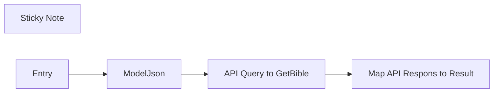

## Fluxo (.json) :

```json
{
  "id": "gqwYlZvL1dwy9W3T",
  "meta": {
    "templateCredsSetupCompleted": true
  },
  "name": "getBible Query v1.0",
  "tags": [],
  "nodes": [
    {
      "id": "37e21e75-6f18-45fc-9b74-860c1e095b83",
      "name": "Sticky Note",
      "type": "n8n-nodes-base.stickyNote",
      "position": [
        -880,
        -320
      ],
      "parameters": {
        "width": 780,
        "height": 1720,
        "content": "# GetBible Query Workflow Documentation\n\n## Overview\n\nThe **GetBibleQuery** workflow is a modular and self-standing workflow designed to retrieve scriptures based on provided references. It serves as an intermediary layer that takes in a structured JSON object, extracts the references, and returns the corresponding scriptures in the same format as if they were retrieved directly from the API.\n\nThis workflow is highly adaptable and can be integrated into various projects where scriptural references need to be dynamically fetched.\n\n## JSON Input Structure\n\nThe workflow expects a JSON object with the following parameters:\n\n - References should include the book name, chapter, and verse(s). \n - Multiple verses can be separated by commas (e.g., `John 3:16,18`).\n - Ranges can be specified using a dash (e.g., `John 3:16-18`).\n - The Bible [translation](https://api.getbible.net/v2/translations.json) to be used.\n - Specifies the API version (v2)\n\n### Example JSON Input:\n\n```json\n{\n  \"references\": [\n      \"1 John 3:16\",\n      \"Jn 3:16\",\n      \"James 3:16\",\n      \"Rom 3:16\"\n  ],\n  \"translation\": \"kjv\",\n  \"version\": \"v2\"\n}\n```\n\n### API Response Format\n\nThe response returned by this workflow follows the same API format as if the request were made directly to the source API. This ensures compatibility with projects that rely on standard API responses.\n\nExample JSON Response (in this workflow):\n```json\n{\n  \"result\": {\n    \"kjv_62_3\": {\n      \"translation\": \"King James Version\",\n      \"abbreviation\": \"kjv\",\n      \"lang\": \"en\",\n      \"language\": \"English\",\n      \"direction\": \"LTR\",\n      \"encoding\": \"UTF-8\",\n      \"book_nr\": 62,\n      \"book_name\": \"1 John\",\n      \"chapter\": 3,\n      \"name\": \"1 John 3\",\n      \"ref\": [\n        \"1 John 3:16\"\n      ],\n      \"verses\": [\n        {\n          \"chapter\": 3,\n          \"verse\": 16,\n          \"name\": \"1 John 3:16\",\n          \"text\": \"Hereby perceive we the love of God, because he laid down his life for us: and we ought to lay down our lives for the brethren.\"\n        }\n      ]\n    }\n  }\n}\n```\n\n## Integration and Usage\n\nThe GetBible Query workflow is designed for easy integration into any project that requires scripture retrieval. Simply pass the appropriate JSON object as input, and it will return the requested scripture passages.\n\n## Support\n\nFor any questions or additional assistance, please visit our [Support desk](https://git.vdm.dev/getBible/support) or [API documentation](https://getbible.net/docs)"
      },
      "typeVersion": 1
    },
    {
      "id": "8d5da846-fd1b-48f6-8199-2f9a3a4c99b5",
      "name": "Entry",
      "type": "n8n-nodes-base.executeWorkflowTrigger",
      "position": [
        0,
        0
      ],
      "parameters": {
        "inputSource": "jsonExample",
        "jsonExample": "{\n  \"references\": [\n      \"1 John 3:16\",\n      \"Jn 3:16\",\n      \"James 3:16\",\n      \"Rom 3:16\"\n  ],\n  \"translation\": \"kjv\",\n  \"version\": \"v2\"\n}"
      },
      "typeVersion": 1.1
    },
    {
      "id": "17444cd4-4ec3-4d8f-9f9d-29369632c420",
      "name": "ModelJson",
      "type": "n8n-nodes-base.code",
      "position": [
        220,
        0
      ],
      "parameters": {
        "jsCode": "// Loop over input items and process the 'references' field\nfor (let item of $input.all()) {\n  // Check if 'references' exists and is an array\n  if (Array.isArray(item.json.references)) {\n    item.json.references = item.json.references.join('; ');\n  } else {\n    // Handle cases where 'references' is missing or not an array\n    item.json.references = 'John 3:16';\n  }\n}\n\n// Return the modified items\nreturn $input.all();"
      },
      "executeOnce": true,
      "retryOnFail": false,
      "typeVersion": 2,
      "alwaysOutputData": true
    },
    {
      "id": "b392423f-22d7-4b3f-8e25-9c703c33c78d",
      "name": "API Query to GetBible",
      "type": "n8n-nodes-base.httpRequest",
      "position": [
        460,
        0
      ],
      "parameters": {
        "url": "=https://query.getbible.net/{{ $json.version || 'v2' }}/{{ $json.translation || 'kjv' }}/{{ $json.references }}",
        "options": {}
      },
      "executeOnce": false,
      "typeVersion": 4.2,
      "alwaysOutputData": false
    },
    {
      "id": "e55d8b82-a30a-4ed9-a28f-ae2d9808422c",
      "name": "Map API Respons to Result",
      "type": "n8n-nodes-base.set",
      "position": [
        680,
        0
      ],
      "parameters": {
        "options": {},
        "assignments": {
          "assignments": [
            {
              "id": "360a59c4-5e4c-43b8-8b0b-bb121054a709",
              "name": "result",
              "type": "object",
              "value": "={{ $json }}"
            }
          ]
        }
      },
      "typeVersion": 3.4
    }
  ],
  "pinData": {
    "Entry": [
      {
        "json": {
          "version": "v2",
          "references": [
            "1 John 3:16",
            "Jn 3:16",
            "James 3:16",
            "Rom 3:16"
          ],
          "translation": "kjv"
        }
      }
    ]
  },
  "settings": {
    "executionOrder": "v1"
  },
  "versionId": "c8a37d01-c65f-4975-878a-20ed73c42b6b",
  "staticData": null,
  "connections": {
    "Entry": {
      "main": [
        [
          {
            "node": "ModelJson",
            "type": "main",
            "index": 0
          }
        ]
      ]
    },
    "ModelJson": {
      "main": [
        [
          {
            "node": "API Query to GetBible",
            "type": "main",
            "index": 0
          }
        ]
      ]
    },
    "API Query to GetBible": {
      "main": [
        [
          {
            "node": "Map API Respons to Result",
            "type": "main",
            "index": 0
          }
        ]
      ]
    }
  },
  "triggerCount": 0
}
```

<a id="template-607"></a>

## Template 607 - Gerar calendário ICS a partir de Excel de datas letivas

- **Nome:** Gerar calendário ICS a partir de Excel de datas letivas
- **Descrição:** Baixa uma planilha de datas letivas, converte o conteúdo para um formato legível por IA, extrai eventos estruturados, gera um ficheiro ICS e envia-o por email.
- **Funcionalidade:** • Download do ficheiro Excel: Baixa a folha de cálculo com as datas dos termos a partir de um URL público.
• Conversão do Excel para Markdown: Transforma o conteúdo da(s) folha(s) em markdown para permitir a análise por IA.
• Extração estruturada de eventos com IA: Identifica eventos, número da semana, datas de início e títulos em formato estruturado.
• Normalização de datas: Converte/ajusta valores de data (incluindo números seriais) para datas ISO/UTC legíveis.
• Ordenação de eventos: Ordena os eventos por data de início para garantir sequência correta.
• Geração de ficheiro ICS: Constrói um calendário no formato ICS com os eventos extraídos.
• Criação de ficheiro binário .ics: Converte o conteúdo ICS em ficheiro binário pronto para partilha.
• Envio por email com anexo: Envia o ficheiro .ics para destinatários especificados por email.
- **Ferramentas:** • Cloudflare Markdown Conversion Service: serviço que converte ficheiros (como XLSX) em markdown para facilitar a extração por modelos de linguagem.
• Google Gemini (PaLM) API: modelo de linguagem usado para analisar o markdown e extrair informação estruturada sobre eventos.
• Gmail: serviço de email utilizado para enviar o ficheiro ICS como anexo.
• Site da University of Westminster: fonte pública do ficheiro XLSX com as datas letivas 2025/2026.

## Fluxo visual

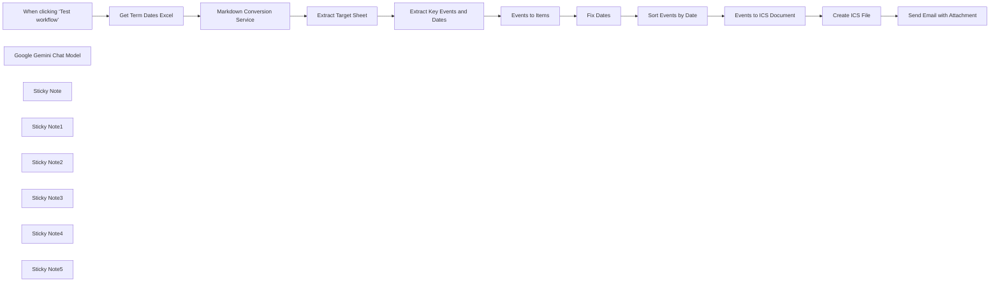

## Fluxo (.json) :

```json
{
  "meta": {
    "instanceId": "408f9fb9940c3cb18ffdef0e0150fe342d6e655c3a9fac21f0f644e8bedabcd9",
    "templateCredsSetupCompleted": true
  },
  "nodes": [
    {
      "id": "dbaac3bd-6049-4f2e-8782-98b1656d8331",
      "name": "When clicking ‘Test workflow’",
      "type": "n8n-nodes-base.manualTrigger",
      "position": [
        -500,
        -20
      ],
      "parameters": {},
      "typeVersion": 1
    },
    {
      "id": "6605c1b6-4723-4aeb-9ade-ac05350e7631",
      "name": "Get Term Dates Excel",
      "type": "n8n-nodes-base.httpRequest",
      "position": [
        -140,
        0
      ],
      "parameters": {
        "url": "https://www.westminster.ac.uk/sites/default/public-files/general-documents/undergraduate-term-dates-2025%E2%80%932026.xlsx",
        "options": {
          "response": {
            "response": {
              "responseFormat": "file"
            }
          }
        }
      },
      "typeVersion": 4.2
    },
    {
      "id": "ed83ae3c-ebf7-42b5-9317-4e1fbd88905c",
      "name": "Extract Key Events and Dates",
      "type": "@n8n/n8n-nodes-langchain.informationExtractor",
      "position": [
        640,
        -20
      ],
      "parameters": {
        "text": "={{ $json.target_sheet }}",
        "options": {
          "systemPromptTemplate": "Capture the values as seen. Do not convert dates."
        },
        "schemaType": "manual",
        "inputSchema": "{\n\t\"type\": \"array\",\n\t\"items\": {\n\t  \"type\": \"object\",\n      \"properties\": {\n        \"week_number\": { \"type\": \"number\" },\n        \"week_beginning\": { \"type\": \"string\" },\n        \"title\": { \"type\": \"string\" }\n      }\n\t}\n}"
      },
      "typeVersion": 1
    },
    {
      "id": "78af1a09-6aa7-48f9-af2a-539a739c6571",
      "name": "Extract Target Sheet",
      "type": "n8n-nodes-base.set",
      "position": [
        300,
        0
      ],
      "parameters": {
        "options": {},
        "assignments": {
          "assignments": [
            {
              "id": "0dd68450-2492-490a-ade1-62311eb541ef",
              "name": "target_sheet",
              "type": "string",
              "value": "={{ $json.result[0].data.split('##')[9] }}"
            }
          ]
        }
      },
      "typeVersion": 3.4
    },
    {
      "id": "4bec1392-c262-4256-8199-54c101f281c2",
      "name": "Fix Dates",
      "type": "n8n-nodes-base.set",
      "position": [
        1320,
        0
      ],
      "parameters": {
        "options": {},
        "assignments": {
          "assignments": [
            {
              "id": "c6f0fa0e-1cbf-4da9-8928-a11502da0991",
              "name": "week_beginning",
              "type": "string",
              "value": "={{\nnew Date(2025,8,15,0,0,0).toDateTime().toUTC()\n  .plus({ 'day': $json.week_beginning - 45915 })\n}}"
            }
          ]
        },
        "includeOtherFields": true
      },
      "typeVersion": 3.4
    },
    {
      "id": "0df44568-4bc6-46ed-9419-5462f528dbc3",
      "name": "Google Gemini Chat Model",
      "type": "@n8n/n8n-nodes-langchain.lmChatGoogleGemini",
      "position": [
        740,
        120
      ],
      "parameters": {
        "options": {},
        "modelName": "models/gemini-2.5-pro-preview-03-25"
      },
      "credentials": {
        "googlePalmApi": {
          "id": "dSxo6ns5wn658r8N",
          "name": "Google Gemini(PaLM) Api account"
        }
      },
      "typeVersion": 1
    },
    {
      "id": "13aa069f-dc32-4a57-9a57-29264a09c80d",
      "name": "Create ICS File",
      "type": "n8n-nodes-base.convertToFile",
      "position": [
        2100,
        -20
      ],
      "parameters": {
        "options": {
          "fileName": "={{ $('Get Term Dates Excel').first().binary.data.fileName }}.ics",
          "mimeType": "text/calendar"
        },
        "operation": "toBinary",
        "sourceProperty": "data"
      },
      "typeVersion": 1.1
    },
    {
      "id": "6cf27afd-8f16-40c7-bbc3-bba7fcf76097",
      "name": "Events to ICS Document",
      "type": "n8n-nodes-base.code",
      "position": [
        1720,
        0
      ],
      "parameters": {
        "language": "python",
        "pythonCode": "from datetime import datetime, timedelta\nimport base64\n\nasync def json_array_to_ics_pyodide(json_array, prodid=\"-//My Application//EN\"):\n    \"\"\"\n    Converts a JSON array of calendar events to ICS file content in a Pyodide environment.\n\n    Args:\n        json_array: A list of dictionaries, where each dictionary represents an event\n                    and contains keys like \"week_number\", \"week_beginning\", and \"title\".\n                    It's expected that \"week_beginning\" is an ISO 8601 formatted\n                    date string.\n        prodid: The product identifier string for the ICS file.\n\n    Returns:\n        A string containing the content of the ICS file.\n    \"\"\"\n    ical = [\"BEGIN:VCALENDAR\",\n            \"VERSION:2.0\",\n            f\"PRODID:{prodid}\"]\n\n    for event_data in json_array:\n        week_number = event_data.get(\"week_number\")\n        week_beginning_str = event_data.get(\"week_beginning\")\n        title = event_data.get(\"title\")\n\n        if week_beginning_str and title:\n            try:\n                # Parse the week_beginning string to a datetime object\n                week_beginning = datetime.fromisoformat(week_beginning_str.replace('Z', '+00:00'))\n\n                # Calculate the end of the week (assuming events last for the whole week)\n                week_ending = week_beginning + timedelta(days=7)\n\n                uid = f\"week-{week_number}-{week_beginning.strftime('%Y%m%d')}@my-application\"\n                dtstamp = datetime.utcnow().strftime('%Y%m%dT%H%M%SZ')\n                dtstart = week_beginning.strftime('%Y%m%d')\n                dtend = week_ending.strftime('%Y%m%d')\n                summary = title\n\n                ical.extend([\n                    \"BEGIN:VEVENT\",\n                    f\"UID:{uid}\",\n                    f\"DTSTAMP:{dtstamp}\",\n                    f\"DTSTART;VALUE=DATE:{dtstart}\",\n                    f\"DTEND;VALUE=DATE:{dtend}\",\n                    f\"SUMMARY:{summary}\",\n                    \"END:VEVENT\"\n                ])\n\n                # You can add more properties here if your JSON data contains them,\n                # for example:\n                # if \"description\" in event_data:\n                #     ical.append(f\"DESCRIPTION:{event_data['description']}\")\n                # if \"location\" in event_data:\n                #     ical.append(f\"LOCATION:{event_data['location']}\")\n\n            except ValueError as e:\n                print(f\"Error processing event with week_beginning '{week_beginning_str}': {e}\")\n                continue  # Skip to the next event if there's a parsing error\n\n    ical.append(\"END:VCALENDAR\")\n    return \"\\r\\n\".join(ical)\n\nics_content = await json_array_to_ics_pyodide([item.json for item in _input.all()])\nics_bytes = ics_content.encode('utf-8')\nbase64_bytes = base64.b64encode(ics_bytes)\nbase64_string = base64_bytes.decode('utf-8')\n\nreturn {\n  \"data\": base64_string\n}"
      },
      "typeVersion": 2
    },
    {
      "id": "e5c94c64-4262-4951-a772-75af431e578a",
      "name": "Sort Events by Date",
      "type": "n8n-nodes-base.sort",
      "position": [
        1520,
        0
      ],
      "parameters": {
        "options": {},
        "sortFieldsUi": {
          "sortField": [
            {
              "fieldName": "week_beginning"
            }
          ]
        }
      },
      "typeVersion": 1
    },
    {
      "id": "3bbe74bb-cd20-4116-9272-12be8ac54700",
      "name": "Sticky Note",
      "type": "n8n-nodes-base.stickyNote",
      "position": [
        -260,
        -240
      ],
      "parameters": {
        "color": 7,
        "width": 780,
        "height": 500,
        "content": "## 1. Parse Excel Files Using Cloudflare®️ Markdown Conversion\n[Learn more about Cloudflare's Markdown Conversion Service](https://developers.cloudflare.com/workers-ai/markdown-conversion/)\n\nToday's LLMs cannot parse Excel files directly so the best we can do is to convert the spreadsheet into a format that they can, namely markdown. To do this, we can use Cloudflare's brand new document conversion service which was designed specifically for this task. The result is the sheet is transcribed as a markdown table.\n\nThe **Markdown Conversion Service** is currently free to use at time of writing but requires a Cloudflare account."
      },
      "typeVersion": 1
    },
    {
      "id": "18fc9626-1c55-4893-8e72-06c48754ceb8",
      "name": "Markdown Conversion Service",
      "type": "n8n-nodes-base.httpRequest",
      "position": [
        80,
        0
      ],
      "parameters": {
        "url": "https://api.cloudflare.com/client/v4/accounts/{ACCOUNT_ID}/ai/tomarkdown",
        "method": "POST",
        "options": {},
        "sendBody": true,
        "contentType": "multipart-form-data",
        "authentication": "predefinedCredentialType",
        "bodyParameters": {
          "parameters": [
            {
              "name": "files",
              "parameterType": "formBinaryData",
              "inputDataFieldName": "data"
            }
          ]
        },
        "nodeCredentialType": "cloudflareApi"
      },
      "credentials": {
        "cloudflareApi": {
          "id": "qOynkQdBH48ofOSS",
          "name": "Cloudflare account"
        }
      },
      "typeVersion": 4.2
    },
    {
      "id": "5f71bc64-985c-43c4-bdfa-3cfda7e9c060",
      "name": "Sticky Note1",
      "type": "n8n-nodes-base.stickyNote",
      "position": [
        540,
        -240
      ],
      "parameters": {
        "color": 7,
        "width": 680,
        "height": 540,
        "content": "## 2. Extract Term Dates to Events Using AI\n[Learn more about the Information Extractor](https://docs.n8n.io/integrations/builtin/cluster-nodes/root-nodes/n8n-nodes-langchain.information-extractor)\n\nData entry is probably the number one reason as to why we need AI/LLMs. This time-consuming and menial task can be completed in seconds and with a high degree of accuracy. Here, we ask the AI to extract each event with the term dates to a list of events using structured output."
      },
      "typeVersion": 1
    },
    {
      "id": "e9083886-81e3-483e-b959-12ce9005d862",
      "name": "Sticky Note2",
      "type": "n8n-nodes-base.stickyNote",
      "position": [
        1240,
        -240
      ],
      "parameters": {
        "color": 7,
        "width": 660,
        "height": 480,
        "content": "## 3. Use Events to Create ICS Document\n[Learn more about the code node](https://docs.n8n.io/integrations/builtin/core-nodes/n8n-nodes-base.code/)\n\nNow we have our events, let's create a calendar to put them in. Using the code now, we can construct a simple ICS document - this is the format which can be imported into iCal, Google Calendar and Outlook. For tasks like these, the Code node is best suited to handle custom transformations."
      },
      "typeVersion": 1
    },
    {
      "id": "04a7c856-88b4-4daa-a56f-6e2741907e4c",
      "name": "Events to Items",
      "type": "n8n-nodes-base.splitOut",
      "position": [
        1000,
        -20
      ],
      "parameters": {
        "options": {},
        "fieldToSplitOut": "output"
      },
      "typeVersion": 1
    },
    {
      "id": "cab455c9-b15d-440d-9f30-7afe1af23ea8",
      "name": "Sticky Note3",
      "type": "n8n-nodes-base.stickyNote",
      "position": [
        1920,
        -240
      ],
      "parameters": {
        "color": 7,
        "width": 720,
        "height": 480,
        "content": "## 4. Create ICS Binary File for Import\n[Learn more about the Convert to File node](https://docs.n8n.io/integrations/builtin/core-nodes/n8n-nodes-base.converttofile)\n\nFinally with our ICS document ready, we can use the \"Convert to File\" node to build an ICS binary file which can be shared with team members, classmates or even instructors."
      },
      "typeVersion": 1
    },
    {
      "id": "c0861ef1-08f4-49e9-a700-a7224296cc72",
      "name": "Send Email with Attachment",
      "type": "n8n-nodes-base.gmail",
      "position": [
        2340,
        -20
      ],
      "webhookId": "835ef864-60c4-4b84-84ee-104ee10644eb",
      "parameters": {
        "sendTo": "jim@example.com",
        "message": "=Hey,\n\nPlease find attached calendar for Undergraduate terms dates 2025/2026.\n\nThanks",
        "options": {
          "attachmentsUi": {
            "attachmentsBinary": [
              {}
            ]
          }
        },
        "subject": "Undergraduate Terms Dates Calendar 2025/2026",
        "emailType": "text"
      },
      "credentials": {
        "gmailOAuth2": {
          "id": "Sf5Gfl9NiFTNXFWb",
          "name": "Gmail account"
        }
      },
      "typeVersion": 2.1
    },
    {
      "id": "85c4d928-83c7-445a-8e9b-d9daef05ae1d",
      "name": "Sticky Note4",
      "type": "n8n-nodes-base.stickyNote",
      "position": [
        -20,
        200
      ],
      "parameters": {
        "color": 5,
        "width": 280,
        "height": 80,
        "content": "### Cloudflare Account Required\nAdd your Cloudflare {ACCOUNT_ID} to the URL"
      },
      "typeVersion": 1
    },
    {
      "id": "6a2d8e78-0b15-498f-bc96-bbbac1da1f21",
      "name": "Sticky Note5",
      "type": "n8n-nodes-base.stickyNote",
      "position": [
        -1020,
        -880
      ],
      "parameters": {
        "width": 420,
        "height": 1380,
        "content": "## Try it out!\n### This n8n template imports an XLSX containing terms dates for a university, extracts the relevant events using AI and converts the events to an ICS file which can be imported into iCal, Google Calendar or Outlook.\n\nManually adding important term dates to your calendar by hand? Stop! Automate it with this simple AI/LLM-powered document understanding and extraction template. This cool use-case can be applied to many scenarios where Excel files are predominantly used.\n\n### How it works\n* The term dates excel file (xlsx) are imported into the workflow from the university's website using the http request node.\n* To parse the excel file, we use an external service - [Cloudflare's Markdown Conversion Service](https://developers.cloudflare.com/workers-ai/markdown-conversion/). This converts the excel's sheets into markdown tables which our LLM can read.\n* To extract the events and their dates from the markdown, we can use the Information Extractor node for structured output. LLMs are great for this use-case because they can understand the layout; one row may have many data points.\n* With our data, there are endless possibilities to use it! But for this demonstration, we'll generate an ICS file so that we can import the extracted events into our calendar. We use the Python code node to combine the events into the ICS spec and the \"Convert to File\" node to create the ICS binary.\n* Finally, let's distribute the ICS file by email to other students or instructors who  may also find this incredibly helpful for the upcoming semester!\n\n### How to use\n* Ensure you're downloading the correct excel file and amend the URL parameter of the \"Get Term Dates Excel\" as necessary.\n* Update the gmail node with your email or other emails as required. Alternatively, send the ICS file to Google Drive or a student portal.\n\n### Requirements\n* Cloudflare Account is required to use the Markdown Conversion Service.\n* Gemini for LLM document understanding and extraction.\n* Gmail for email sending.\n\n### Customising the workflow\n* This template should work for other Excel files which - for a university - there are many. Some will be more complicated than others so experiment with different parsers and extraction tools and strategies.\n\n### Need Help?\nJoin the [Discord](https://discord.com/invite/XPKeKXeB7d) or ask in the [Forum](https://community.n8n.io/)!\n\nHappy Hacking!"
      },
      "typeVersion": 1
    }
  ],
  "pinData": {},
  "connections": {
    "Fix Dates": {
      "main": [
        [
          {
            "node": "Sort Events by Date",
            "type": "main",
            "index": 0
          }
        ]
      ]
    },
    "Create ICS File": {
      "main": [
        [
          {
            "node": "Send Email with Attachment",
            "type": "main",
            "index": 0
          }
        ]
      ]
    },
    "Events to Items": {
      "main": [
        [
          {
            "node": "Fix Dates",
            "type": "main",
            "index": 0
          }
        ]
      ]
    },
    "Sort Events by Date": {
      "main": [
        [
          {
            "node": "Events to ICS Document",
            "type": "main",
            "index": 0
          }
        ]
      ]
    },
    "Extract Target Sheet": {
      "main": [
        [
          {
            "node": "Extract Key Events and Dates",
            "type": "main",
            "index": 0
          }
        ]
      ]
    },
    "Get Term Dates Excel": {
      "main": [
        [
          {
            "node": "Markdown Conversion Service",
            "type": "main",
            "index": 0
          }
        ]
      ]
    },
    "Events to ICS Document": {
      "main": [
        [
          {
            "node": "Create ICS File",
            "type": "main",
            "index": 0
          }
        ]
      ]
    },
    "Google Gemini Chat Model": {
      "ai_languageModel": [
        [
          {
            "node": "Extract Key Events and Dates",
            "type": "ai_languageModel",
            "index": 0
          }
        ]
      ]
    },
    "Markdown Conversion Service": {
      "main": [
        [
          {
            "node": "Extract Target Sheet",
            "type": "main",
            "index": 0
          }
        ]
      ]
    },
    "Extract Key Events and Dates": {
      "main": [
        [
          {
            "node": "Events to Items",
            "type": "main",
            "index": 0
          }
        ]
      ]
    },
    "When clicking ‘Test workflow’": {
      "main": [
        [
          {
            "node": "Get Term Dates Excel",
            "type": "main",
            "index": 0
          }
        ]
      ]
    }
  }
}
```

<a id="template-608"></a>

## Template 608 - Geração e envio de fatura em PDF

- **Nome:** Geração e envio de fatura em PDF
- **Descrição:** Gera um documento de fatura em PDF a partir de dados inseridos em um formulário e envia o arquivo por email.
- **Funcionalidade:** • Coleta de dados via formulário: Permite inserir informações da fatura (nome do comprador, endereço e itens com preços) através de um formulário.
• Montagem do payload para JSReport: Mapeia os campos do formulário e monta um corpo JSON compatível com o template 'invoice-main'.
• Geração de documento PDF: Chama a API do JSReport para renderizar o template com os dados fornecidos e retornar o PDF resultante.
• Autenticação na API: Realiza a chamada à API do serviço de relatórios utilizando autenticação (HTTP Basic) configurada.
• Envio de email com anexo: Anexa o PDF gerado e envia a fatura para o destinatário configurado usando conta de email autenticada.
• Suporte a itens dinâmicos na fatura: Permite incluir múltiplos itens com nomes e preços que são inseridos no documento.
- **Ferramentas:** • JSReport Online: Serviço de geração de relatórios que processa templates (ex.: invoice-main) e produz PDFs via API HTTP.
• Gmail: Serviço de email utilizado para enviar a fatura gerada, autenticado via OAuth2.

## Fluxo visual

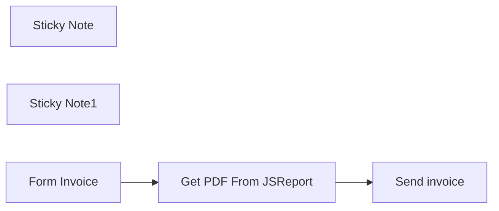

## Fluxo (.json) :

```json
{
  "id": "i8nBvPOtFYWk5eoq",
  "meta": {
    "instanceId": "c5a9958b493899f1235322c2c0e4f007083d1c79bb2c9043ae90b75371e276c7"
  },
  "name": "Get PDF with JSReport",
  "tags": [
    {
      "id": "2L2vOvQ2wUBVYeh1",
      "name": "Send",
      "createdAt": "2024-05-03T13:40:43.868Z",
      "updatedAt": "2024-05-03T13:40:43.868Z"
    },
    {
      "id": "SBlaOF5ezhukSiIT",
      "name": "JSReport",
      "createdAt": "2024-05-03T13:40:38.379Z",
      "updatedAt": "2024-05-03T13:40:38.379Z"
    },
    {
      "id": "vRTFSK4WW6nL2U7z",
      "name": "PDF",
      "createdAt": "2024-05-03T13:40:34.380Z",
      "updatedAt": "2024-05-03T13:40:34.380Z"
    }
  ],
  "nodes": [
    {
      "id": "9514b49d-80f3-41d2-bcbc-8fa08e27cb64",
      "name": "Get PDF From JSReport",
      "type": "n8n-nodes-base.httpRequest",
      "notes": "Generating the document in JSReport",
      "position": [
        1040,
        320
      ],
      "parameters": {
        "url": "https://xxx.jsreportonline.net/api/report",
        "method": "POST",
        "options": {},
        "jsonBody": "=   {\n      \"template\": { \"name\" : \"invoice-main\" },\n      \"data\" :{\n    \"number\": \"123\",\n    \"seller\": {\n        \"name\": \"Next Step Webs, Inc.\",\n        \"road\": \"12345 Sunny Road\",\n        \"country\": \"Sunnyville, TX 12345\"\n    },\n    \"buyer\": {\n        \"name\": \"{{ $json[\"buyer name\"] }}\",\n        \"road\": \"{{ $json[\"buyer road\"] }}\",\n        \"country\": \"{{ $json[\"buyer country\"] }}\"\n    },\n    \"items\": [{\n        \"name\": \"{{ $json[\"Item 1 Name\"] }}\",\n        \"price\": {{ $json[\"Item 1 Price\"] }}\n    }, {\n        \"name\": \"{{ $json[\"Item 2 Name\"] }}\",\n        \"price\": {{ $json[\"Item 2 Price\"] }}\n    }]\n}\n   }",
        "sendBody": true,
        "specifyBody": "json",
        "authentication": "genericCredentialType",
        "genericAuthType": "httpBasicAuth"
      },
      "credentials": {
        "httpBasicAuth": {
          "id": "oKwHNpbRnChEV8xq",
          "name": "Unnamed credential"
        }
      },
      "notesInFlow": true,
      "typeVersion": 4.2
    },
    {
      "id": "d33abb5b-50b0-44d9-8a92-e910bb180ea5",
      "name": "Sticky Note",
      "type": "n8n-nodes-base.stickyNote",
      "position": [
        460,
        240
      ],
      "parameters": {
        "height": 372,
        "content": "##  Streamlining Billing Processes: From Data Input to Document Generation\n\nThis process presents the possibility of using a form, such as the one provided by n8n, to enter billing information, then calling JSReport to generate documents such as PDFs, Word, Excel, etc., and finally sending the invoice by email.\n"
      },
      "typeVersion": 1
    },
    {
      "id": "85981fc7-ecb5-49f3-9395-9866ded70257",
      "name": "Sticky Note1",
      "type": "n8n-nodes-base.stickyNote",
      "position": [
        903,
        240
      ],
      "parameters": {
        "color": 4,
        "width": 363,
        "height": 568,
        "content": "## Information for calling JSReport\n\n\n\n\n\n\n\n\n\n\n\n\n\n\n### URL API : \nhttps://xxx.jsreportonline.net/api/report\n\n### Use :\nTo use JSReport, simply call the APIs with the base URL. You can create a free account here: https://jsreport.net/online.\n\nThe APIs are available here: https://jsreport.net/learn/api.\n\nIn this example, we're sending a sample body that you can find in your JSReport test space."
      },
      "typeVersion": 1
    },
    {
      "id": "94ae99b3-0ec9-4916-9bf4-19cfeb599966",
      "name": "Form Invoice",
      "type": "n8n-nodes-base.formTrigger",
      "notes": "Allows you to enter invoice information",
      "position": [
        740,
        320
      ],
      "webhookId": "1d0c5777-4033-4bf4-8d0e-8a2069d79c86",
      "parameters": {
        "path": "1d0c5777-4033-4bf4-8d0e-8a2069d79c86",
        "options": {},
        "formTitle": "Create Facture",
        "formFields": {
          "values": [
            {
              "fieldLabel": "buyer name",
              "requiredField": true
            },
            {
              "fieldLabel": "buyer road",
              "requiredField": true
            },
            {
              "fieldLabel": "buyer country",
              "requiredField": true
            },
            {
              "fieldLabel": "Item 1 Name"
            },
            {
              "fieldType": "number",
              "fieldLabel": "Item 1 Price"
            },
            {
              "fieldLabel": "Item 2 Name"
            },
            {
              "fieldLabel": "Item 2 Price"
            }
          ]
        },
        "formDescription": "Create a PDF invoice from an n8n and JSReport form"
      },
      "notesInFlow": true,
      "typeVersion": 2
    },
    {
      "id": "142c4a45-1228-4be5-8172-9834bb9ca491",
      "name": "Send invoice",
      "type": "n8n-nodes-base.gmail",
      "notes": "Using GMAIL to send the invoice",
      "position": [
        1340,
        320
      ],
      "parameters": {
        "sendTo": "contact@nonocode.fr",
        "message": "Good morning,  \n\nPlease find your invoice.  \n\nSincerely,",
        "options": {
          "attachmentsUi": {
            "attachmentsBinary": [
              {}
            ]
          }
        },
        "subject": "New Facture"
      },
      "credentials": {
        "gmailOAuth2": {
          "id": "N3pxr94UxrQSovu5",
          "name": "Gmail account"
        }
      },
      "notesInFlow": true,
      "typeVersion": 2.1
    }
  ],
  "active": true,
  "pinData": {},
  "settings": {
    "executionOrder": "v1"
  },
  "versionId": "8e1b0f98-68ec-4300-a948-52439d00db66",
  "connections": {
    "Form Invoice": {
      "main": [
        [
          {
            "node": "Get PDF From JSReport",
            "type": "main",
            "index": 0
          }
        ]
      ]
    },
    "Get PDF From JSReport": {
      "main": [
        [
          {
            "node": "Send invoice",
            "type": "main",
            "index": 0
          }
        ]
      ]
    }
  }
}
```

<a id="template-609"></a>

## Template 609 - Análise de vídeo com Gemini AI

- **Nome:** Análise de vídeo com Gemini AI
- **Descrição:** Analisa um vídeo a partir de uma URL usando a API Gemini para gerar uma descrição detalhada do conteúdo visual.
- **Funcionalidade:** • Download do vídeo: baixa o arquivo de vídeo a partir de uma URL pública e converte para formato binário para processamento.
• Upload para análise: envia o vídeo ao serviço de análise com cabeçalhos e metadados adequados.
• Processamento assíncrono: aguarda o término do processamento do arquivo no servidor antes de solicitar a análise.
• Análise multimodal com IA: solicita ao modelo generativo uma descrição detalhada do que acontece no vídeo (elementos visuais, ações, cores, branding, estilo e técnicas criativas).
• Extração do resultado: captura a resposta gerada pelo modelo e armazena a descrição em uma variável para uso posterior.
• Execução de teste e configuração: permite executar manualmente com uma URL de teste e usar uma chave de API configurável via variável de ambiente.
- **Ferramentas:** • Google Gemini (Generative Language API): serviço de IA multimodal responsável por processar o arquivo de vídeo e gerar a descrição textual detalhada.
• Serviço de hospedagem de vídeo / CDN: origem pública do arquivo de vídeo (URL) usada para o download inicial.

## Fluxo visual

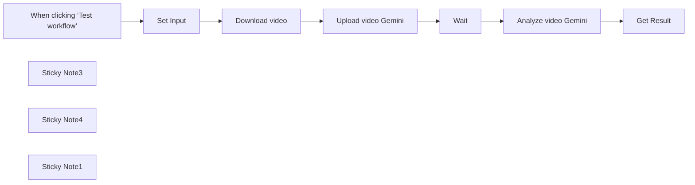

## Fluxo (.json) :

```json
{
  "id": "hKkZYhJqBNir8amQ",
  "meta": {
    "instanceId": "a943fc71a4dfb51cc3424882233bcd72e7a73857958af1cf464f7c21580c726e"
  },
  "name": "🎥 Gemini AI Video Analysis",
  "tags": [
    {
      "id": "bjzc8PEM2FgX8rUa",
      "name": "Marketing",
      "createdAt": "2025-04-18T13:34:48.192Z",
      "updatedAt": "2025-04-18T13:34:48.192Z"
    },
    {
      "id": "OiWw6VmsJz6ZBAzz",
      "name": "AI",
      "createdAt": "2025-04-25T09:59:58.961Z",
      "updatedAt": "2025-04-25T09:59:58.961Z"
    }
  ],
  "nodes": [
    {
      "id": "f5c9faf8-441a-49ef-a0de-0daa08c3bbfa",
      "name": "Wait",
      "type": "n8n-nodes-base.wait",
      "position": [
        400,
        160
      ],
      "webhookId": "7d0cd0c0-ce85-4372-b7a5-b0be061fc2b9",
      "parameters": {},
      "typeVersion": 1.1
    },
    {
      "id": "c0336074-a30f-4fc0-aa57-7142cea1a3da",
      "name": "Download video",
      "type": "n8n-nodes-base.httpRequest",
      "position": [
        -40,
        160
      ],
      "parameters": {
        "url": "={{ $json.video_url }}",
        "options": {}
      },
      "typeVersion": 4.2
    },
    {
      "id": "8b04c774-7a02-43ff-bac9-d19a427d514e",
      "name": "Upload video Gemini",
      "type": "n8n-nodes-base.httpRequest",
      "position": [
        180,
        160
      ],
      "parameters": {
        "url": "=https://generativelanguage.googleapis.com/upload/v1beta/files?key={{ $vars.GeminiKey }}",
        "method": "POST",
        "options": {},
        "sendBody": true,
        "contentType": "binaryData",
        "sendHeaders": true,
        "headerParameters": {
          "parameters": [
            {
              "name": "X-Goog-Upload-Command",
              "value": "start, upload, finalize"
            },
            {
              "name": "X-Goog-Upload-Header-Content-Length",
              "value": "={{ $binary.data.fileSize }}"
            },
            {
              "name": "X-Goog-Upload-Header-Content-Type",
              "value": "=video/{{ $binary.data.fileExtension }}"
            },
            {
              "name": "Content-Type",
              "value": "video/mp4"
            }
          ]
        },
        "inputDataFieldName": "=data"
      },
      "typeVersion": 4.2
    },
    {
      "id": "eacf4317-18bc-441a-a415-488b65bb9545",
      "name": "Analyze video Gemini",
      "type": "n8n-nodes-base.httpRequest",
      "position": [
        620,
        160
      ],
      "parameters": {
        "url": "=https://generativelanguage.googleapis.com/v1beta/models/gemini-2.0-flash-exp:generateContent?key={{ $vars.GeminiKey }}",
        "method": "POST",
        "options": {},
        "jsonBody": "={\n    \"contents\": [\n        {\n            \"role\": \"user\",\n            \"parts\": [\n                {\n                    \"fileData\": {\n                        \"fileUri\": \"{{ $json.file.uri }}\",\n                        \"mimeType\": \"{{ $json.file.mimeType }}\"\n                    }\n                },\n                {\n                    \"text\": \"Describe in detail what is visually happening in the video, including key elements, actions, colors, and branding. Note the style, tone, and any notable creative techniques being used.\"\n                }\n            ]\n        }\n    ],\n    \"generationConfig\": {\n        \"temperature\": 1.4,\n        \"topK\": 40,\n        \"topP\": 0.95,\n        \"maxOutputTokens\": 8192,\n        \"responseModalities\": [\"Text\"]\n    }\n}\n",
        "sendBody": true,
        "sendHeaders": true,
        "specifyBody": "json",
        "headerParameters": {
          "parameters": [
            {
              "name": "Content-Type",
              "value": "application/json"
            }
          ]
        }
      },
      "typeVersion": 4.2
    },
    {
      "id": "ff204f3f-947e-4b6a-a9a3-822d6d57064b",
      "name": "When clicking ‘Test workflow’",
      "type": "n8n-nodes-base.manualTrigger",
      "position": [
        -480,
        160
      ],
      "parameters": {},
      "typeVersion": 1
    },
    {
      "id": "d842a85d-121d-46ed-9df7-44d2c7849c03",
      "name": "Set Input",
      "type": "n8n-nodes-base.set",
      "position": [
        -260,
        160
      ],
      "parameters": {
        "options": {},
        "assignments": {
          "assignments": [
            {
              "id": "6e1728e0-4749-47b9-92ae-4d1c0b7008c8",
              "name": "video_url",
              "type": "string",
              "value": "https://video-gru2-1.xx.fbcdn.net/v/t42.1790-2/469342405_958689216107669_4819692307529683812_n.mp4?_nc_cat=109&ccb=1-7&_nc_sid=c53f8f&_nc_ohc=DMM4-vR_LwoQ7kNvwGFIAOW&_nc_oc=AdkqAUzPHupjN-yAD8AGHbbnsMLQptad7NFTL-fuRa3Kq12boE6Ar_elagnzmgR87uU&_nc_zt=28&_nc_ht=video-gru2-1.xx&_nc_gid=ikICtUIUUCoHz775L2uRBw&oh=00_AfHlScWo8zXllEsqzl3wabxNva8z_qiFuA2g-hWzvnlVdg&oe=681596F3"
            }
          ]
        }
      },
      "typeVersion": 3.4
    },
    {
      "id": "efb6ed9b-5f65-4bf3-8ea9-00430abdb247",
      "name": "Get Result",
      "type": "n8n-nodes-base.set",
      "position": [
        840,
        160
      ],
      "parameters": {
        "options": {},
        "assignments": {
          "assignments": [
            {
              "id": "1ea390b9-3371-4a3a-8741-bd6ec74dc64b",
              "name": "videoDescription",
              "type": "string",
              "value": "={{ $json.candidates[0].content.parts[0].text }}"
            }
          ]
        }
      },
      "typeVersion": 3.4
    },
    {
      "id": "fc917016-b2f3-4d69-8924-0aa16b4b43bc",
      "name": "Sticky Note3",
      "type": "n8n-nodes-base.stickyNote",
      "position": [
        -920,
        -380
      ],
      "parameters": {
        "color": 7,
        "width": 560,
        "height": 520,
        "content": "## Video Analysis with Gemini AI\n\nThis workflow demonstrates how to analyze video content using Google's Gemini 2.0 Flash API:\n1. Download a video from a URL\n2. Upload it to Gemini's servers\n3. Process the video with AI to generate a detailed description\n4. Extract the analysis results\n\nUse cases: Content moderation, video cataloging, accessibility features, etc.\n\nOUTPUT: The workflow produces a detailed text description of the video content in the \"MediaDescription\" variable.\nYou can use this data for content tagging, searchable descriptions, accessibility, moderation, or cataloging.\n\n⚙️ **Before using this workflow**, make sure to set the `GeminiKey` environment variable with your Gemini API key.  \nThis ensures your API key is securely managed and not hardcoded in the workflow.\n\n__SECURITY NOTE__: This workflow contains an API key in the workflow data.  \nFor production use, store your API keys in Credentials or use environment variables (like `GeminiKey`) instead of hardcoding them.\n"
      },
      "typeVersion": 1
    },
    {
      "id": "8854f039-f23f-4174-8821-7acfbc5ecfab",
      "name": "Sticky Note4",
      "type": "n8n-nodes-base.stickyNote",
      "position": [
        -320,
        20
      ],
      "parameters": {
        "color": 5,
        "width": 220,
        "height": 300,
        "content": "## Configuration\nDefine the video URL you want to analyze.\n"
      },
      "typeVersion": 1
    },
    {
      "id": "189ede99-f80f-4f41-8481-c9ba518fd0e7",
      "name": "Sticky Note1",
      "type": "n8n-nodes-base.stickyNote",
      "position": [
        -70,
        -140
      ],
      "parameters": {
        "color": 4,
        "width": 820,
        "height": 460,
        "content": "## Video Processing Pipeline\n\nThis section handles the complete video processing workflow:\n\n1. DOWNLOAD: First, we fetch the video from the provided URL, converting it to binary data that Gemini can process\n\n2. UPLOAD: Next, we send the binary video data to Gemini's servers where it's stored temporarily for AI processing\n\n3. ANALYZE: Finally, we request Gemini's AI to analyze the video content. You can customize the prompt in the \"Analyze video Gemini\" node to focus on specific aspects of the video content you're interested in\n\nThe Wait node ensures the video is fully processed before analysis begins.\n"
      },
      "typeVersion": 1
    }
  ],
  "active": false,
  "pinData": {
    "Upload video Gemini": [
      {
        "json": {
          "file": {
            "uri": "https://generativelanguage.googleapis.com/v1beta/files/7whopq8rwtt8",
            "name": "files/7whopq8rwtt8",
            "state": "PROCESSING",
            "source": "UPLOADED",
            "mimeType": "video/mp4",
            "sizeBytes": "933141",
            "createTime": "2025-04-28T18:12:40.864881Z",
            "sha256Hash": "MWQwYmQ2YWViYmRiNDNjZTYyY2I2ODhkOWRlNzdlMzkyZDJkMTU0NTM5NTE1OWM2MTJlMWRiNTNhNTIyZDVmZA==",
            "updateTime": "2025-04-28T18:12:40.864881Z",
            "expirationTime": "2025-04-30T18:12:40.834671218Z"
          }
        }
      }
    ],
    "Analyze video Gemini": [
      {
        "json": {
          "candidates": [
            {
              "content": {
                "role": "model",
                "parts": [
                  {
                    "text": "Okay, here's a detailed description of the video:\n\n**Overview**\nThe video is a promotional piece for Advanced Sim Racing, featuring a high-end BMW-branded racing simulator setup at a BMW dealership event. It also highlights the presence of a well-known personality: Georges St-Pierre (GSP). The video mixes detailed close-ups of the equipment, shots of people interacting with the simulator, and branding elements.\n\n**Detailed Description:**\n\n*   **0:00-0:01:** Opens with a dynamic shot of someone using the advanced racing simulator. We see triple monitors displaying a race, and the participant grips the steering wheel with intent. The seat is black, with \"OMP\" branded at the top, \"ADVANCED Sim Racing\" and a large BMW logo prominently displayed on its back.\n\n*   **0:01-0:03:** Tight focus on the steering wheel, emphasizing its sophisticated design and multiple buttons.  We see the brand name \"OMP\" on the wheel itself, while the backboard is adorned with the company’s slogan, “ADVANCED Sim Racing”.\n\n*   **0:03-0:07:** We shift to show the simulator being used at a BMW dealership.  A group of people gathers around with the hood open of a BMW car, seemingly intrigued and looking at the person experiencing the simulator.\n\n*   **0:07-0:11:** George St-Pierre appears among the crowd.\n\n*   **0:11-0:13:** Close-up of the SimuCube motor\n\n*   **0:13-0:15:** George St-Pierre gets onto the simulator while people assist him.\n\n*   **0:15-0:21:** Focus on the haptic feedback engine and the back of an employee’s t-shirt that says “ADVANCED Sim Racing DBOX SIMUCUBE”\n\n*   **0:22-0:24:** Small lego replica of the BMW 3 series next to one of the monitor’s along with the car’s front side view with distinct headlights.\n\n*   **0:24-0:25:** The outside of the event, labeled BMW Laval with the BMW logo, ice cream booth nearby.\n\n*   **0:25-0:27:** More participants getting on the simulator\n\n*   **0:27-0:29:** The ranking for different drivers\n\n*   **0:29-0:33:** View of the racing pedals and the race seat with the “OMP” brand.\n\n**Key Elements & Equipment**\n*   **Sim Racing Rig:** A highly advanced racing simulator is central to the video.  It is equipped with a racing seat, steering wheel, pedals, multiple monitors and a SimuCube haptic engine for feedback\n*   **BMW Branding:** The presence of the BMW logo and the incorporation of BMW vehicles underscore the affiliation.\n\n**Style & Tone:**\n*   **High-Tech:**  The video conveys a sense of sophisticated technology and realistic immersion in simulated racing.\n*   **Promotional/Enthusiastic:**  The music and the editing suggest excitement and interest in the product.\n*   **Stylish:** Use of slow-motion shots, close-ups and selective focus adds a modern, visually appealing look.\n\nI hope this helps!"
                  }
                ]
              },
              "avgLogprobs": -1.1206862455033986,
              "finishReason": "STOP"
            }
          ],
          "modelVersion": "gemini-2.0-flash-exp",
          "usageMetadata": {
            "totalTokenCount": 10149,
            "promptTokenCount": 9441,
            "promptTokensDetails": [
              {
                "modality": "TEXT",
                "tokenCount": 36
              },
              {
                "modality": "AUDIO",
                "tokenCount": 825
              },
              {
                "modality": "VIDEO",
                "tokenCount": 8580
              }
            ],
            "candidatesTokenCount": 708,
            "candidatesTokensDetails": [
              {
                "modality": "TEXT",
                "tokenCount": 708
              }
            ]
          }
        }
      }
    ]
  },
  "settings": {
    "executionOrder": "v1"
  },
  "versionId": "5f8d8d62-091e-4883-bbb0-8087ebe7b501",
  "connections": {
    "Wait": {
      "main": [
        [
          {
            "node": "Analyze video Gemini",
            "type": "main",
            "index": 0
          }
        ]
      ]
    },
    "Set Input": {
      "main": [
        [
          {
            "node": "Download video",
            "type": "main",
            "index": 0
          }
        ]
      ]
    },
    "Download video": {
      "main": [
        [
          {
            "node": "Upload video Gemini",
            "type": "main",
            "index": 0
          }
        ]
      ]
    },
    "Upload video Gemini": {
      "main": [
        [
          {
            "node": "Wait",
            "type": "main",
            "index": 0
          }
        ]
      ]
    },
    "Analyze video Gemini": {
      "main": [
        [
          {
            "node": "Get Result",
            "type": "main",
            "index": 0
          }
        ]
      ]
    },
    "When clicking ‘Test workflow’": {
      "main": [
        [
          {
            "node": "Set Input",
            "type": "main",
            "index": 0
          }
        ]
      ]
    }
  }
}
```

<a id="template-610"></a>

## Template 610 - Resumo histórico diário de manchetes do Hacker News

- **Nome:** Resumo histórico diário de manchetes do Hacker News
- **Descrição:** Coleta manchetes do front page do Hacker News para a mesma data em anos anteriores, gera um resumo categorizado com ajuda de um modelo de linguagem e publica o resultado em um canal do Telegram.
- **Funcionalidade:** • Agendamento diário: dispara o processo em um horário pré-definido para executar a rotina.
• Geração de lista de datas históricas: calcula as mesmas datas em anos anteriores (até 2007), com tratamento especial para a data inicial.
• Requisição de front pages por data: faz requisições à página de notícias para cada data gerada.
• Extração de manchetes e datas: parseia o HTML retornado e extrai títulos, URLs e a data associada.
• Consolidação em um único JSON: agrega todas as manchetes e metadados em um único objeto para processamento posterior.
• Resumo e categorização por IA: envia os dados consolidados a um modelo de linguagem para identificar as 10–15 manchetes mais relevantes, agrupá-las por temas e formatá-las em Markdown com links e prefixo do ano.
• Publicação no Telegram: envia o texto final formatado para um canal/bot do Telegram para distribuição.
- **Ferramentas:** • Hacker News (news.ycombinator.com): fonte das manchetes históricas e HTML a ser consultado.
• Google Gemini (PaLM): modelo de linguagem usado para analisar, categorizar e formatar as manchetes em Markdown.
• Telegram: plataforma de entrega para publicar o resumo formatado em um canal/bot.

## Fluxo visual

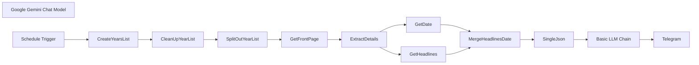

## Fluxo (.json) :

```json
{
  "nodes": [
    {
      "id": "6ea4e702-1af8-407b-b653-964a519db1c2",
      "name": "Basic LLM Chain",
      "type": "@n8n/n8n-nodes-langchain.chainLlm",
      "position": [
        1560,
        -360
      ],
      "parameters": {
        "text": "=You are a highly skilled news categorizer, specializing in indentifying interesting stuff from Hacker News front-page headlines.\n\nYou are provided with JSON data containing a list of dates and their corresponding top headlines from the Hacker News front page. Each headline will also include a URL linking to the original article or discussion. Importantly, the dates provided will be the SAME DAY across MULTIPLE YEARS (e.g., January 1st, 2023, January 1st, 2022, January 1st, 2021, etc.). You need to indentify key headlines and also analyze how the tech landscape has evolved over the years, as reflected in the headlines for this specific day.\n\nYour task is to indentify top 10-15 headlines from across the years from the given json data and return in Markdown formatted bullet points categorizing into themes and adding markdown hyperlinks to the source URL with Prefixing Year before the headline. Follow the Output Foramt Mentioned.\n\n**Input Format:**\n\n```json\n[\n {\n \"headlines\": [\n \"Headline 1 Title [URL1]\",\n \"Headline 2 Title [URL2]\",\n \"Headline 3 Title [URL3]\",\n ...\n ]\n \"date\": \"YYYY-MM-DD\",\n },\n {\n \"headlines\": [\n \"Headline 1 Title [URL1]\",\n \"Headline 2 Title [URL2]\",\n ...\n ]\n \"date\": \"YYYY-MM-DD\",\n },\n ...\n]\n```\n\n**Output Format In Markdown**\n\n```\n# HN Lookback <FullMonthName-DD> | <start YYYY> to <end YYYY> \n\n## [Theme 1]\n- YYYY [Headline 1](URL1)\n- YYYY [Headline 2](URL2)\n...\n\n## [Theme 2]\n- YYYY [Headline 1](URL1)\n- YYYY [Headline 2](URL2)\n...\n\n... \n\n## <this is optional>\n<if any interesing ternds emerge mention them in oneline>\n```\n\n**Here is the Json data for Hackernews Headlines across the years**\n\n```\n{{ JSON.stringify($json.data) }}\n```",
        "promptType": "define"
      },
      "typeVersion": 1.5
    },
    {
      "id": "b5a97c2a-0c3b-4ebe-aec5-7bca6b55ad4c",
      "name": "Google Gemini Chat Model",
      "type": "@n8n/n8n-nodes-langchain.lmChatGoogleGemini",
      "position": [
        1740,
        -200
      ],
      "parameters": {
        "options": {},
        "modelName": "models/gemini-1.5-pro"
      },
      "credentials": {
        "googlePalmApi": {
          "id": "Hx1fn2jrUvojSKye",
          "name": "Google Gemini(PaLM) Api account"
        }
      },
      "typeVersion": 1
    },
    {
      "id": "18cba750-aef5-451d-880f-2c12d8540d78",
      "name": "Schedule Trigger",
      "type": "n8n-nodes-base.scheduleTrigger",
      "position": [
        -380,
        -360
      ],
      "parameters": {
        "rule": {
          "interval": [
            {
              "triggerAtHour": 21
            }
          ]
        }
      },
      "typeVersion": 1.2
    },
    {
      "id": "341da616-8670-4cd9-b47a-ee25e2ae9862",
      "name": "CreateYearsList",
      "type": "n8n-nodes-base.code",
      "position": [
        -200,
        -360
      ],
      "parameters": {
        "jsCode": "for (const item of $input.all()) {\n const currentDateStr = item.json.timestamp.split('T')[0];\n const currentDate = new Date(currentDateStr);\n const currentYear = currentDate.getFullYear();\n const currentMonth = currentDate.getMonth(); // 0 for January, 1 for February, etc.\n const currentDay = currentDate.getDate();\n\n const datesToFetch = [];\n for (let year = currentYear; year >= 2007; year--) {\n let targetDate;\n if (year === 2007) {\n // Special handling for 2007 to start from Feb 19\n if (currentMonth > 1 || (currentMonth === 1 && currentDay >= 19))\n {\n targetDate = new Date(2007, 1, 19); // Feb 19, 2007\n } else {\n continue; // Skip 2007 if currentDate is before Feb 19\n }\n } else {\n targetDate = new Date(year, currentMonth, currentDay);\n }\n \n // Format the date as YYYY-MM-DD\n const formattedDate = targetDate.toISOString().split('T')[0];\n datesToFetch.push(formattedDate);\n }\n item.json.datesToFetch = datesToFetch;\n}\n\nreturn $input.all();"
      },
      "typeVersion": 2
    },
    {
      "id": "42e24547-be24-4f29-8ce8-c0df7d47a6ff",
      "name": "CleanUpYearList",
      "type": "n8n-nodes-base.set",
      "position": [
        0,
        -360
      ],
      "parameters": {
        "options": {},
        "assignments": {
          "assignments": [
            {
              "id": "b269dc0d-21e1-4124-8f3a-2c7bfa4add5c",
              "name": "datesToFetch",
              "type": "array",
              "value": "={{ $json.datesToFetch }}"
            }
          ]
        }
      },
      "typeVersion": 3.4
    },
    {
      "id": "6e51ad05-0f3d-4bfb-8c8d-5b71e7355344",
      "name": "SplitOutYearList",
      "type": "n8n-nodes-base.splitOut",
      "position": [
        200,
        -360
      ],
      "parameters": {
        "options": {},
        "fieldToSplitOut": "datesToFetch"
      },
      "typeVersion": 1
    },
    {
      "id": "6f827071-718f-4e27-9f7a-cc50296f7bc4",
      "name": "GetFrontPage",
      "type": "n8n-nodes-base.httpRequest",
      "position": [
        420,
        -360
      ],
      "parameters": {
        "url": "=https://news.ycombinator.com/front",
        "options": {
          "batching": {
            "batch": {
              "batchSize": 1,
              "batchInterval": 3000
            }
          }
        },
        "sendQuery": true,
        "queryParameters": {
          "parameters": [
            {
              "name": "day",
              "value": "={{ $json.datesToFetch }}"
            }
          ]
        }
      },
      "typeVersion": 4.2
    },
    {
      "id": "7287e6b1-337f-4634-ac23-5ceaa87b0db3",
      "name": "ExtractDetails",
      "type": "n8n-nodes-base.html",
      "position": [
        640,
        -360
      ],
      "parameters": {
        "options": {},
        "operation": "extractHtmlContent",
        "extractionValues": {
          "values": [
            {
              "key": "=headlines",
              "cssSelector": ".titleline",
              "returnArray": true,
              "skipSelectors": "span"
            },
            {
              "key": "date",
              "cssSelector": ".pagetop > font"
            }
          ]
        }
      },
      "typeVersion": 1.2
    },
    {
      "id": "fceff31e-4dcd-4199-89c5-8eb75cd479bf",
      "name": "GetHeadlines",
      "type": "n8n-nodes-base.set",
      "position": [
        920,
        -460
      ],
      "parameters": {
        "options": {},
        "assignments": {
          "assignments": [
            {
              "id": "e1ce33e9-e4f8-4215-bbdb-156a955a0a97",
              "name": "headlines",
              "type": "array",
              "value": "={{ $json.headlines }}"
            }
          ]
        }
      },
      "typeVersion": 3.4
    },
    {
      "id": "f7683614-7225-4f05-ba12-86b326fdb4a1",
      "name": "GetDate",
      "type": "n8n-nodes-base.set",
      "position": [
        920,
        -280
      ],
      "parameters": {
        "options": {},
        "assignments": {
          "assignments": [
            {
              "id": "fc1d15f6-a999-4d6b-a7bc-3ffa9427679e",
              "name": "date",
              "type": "string",
              "value": "={{ $json.date }}"
            }
          ]
        }
      },
      "typeVersion": 3.4
    },
    {
      "id": "7e09ce85-ece1-46a0-aa59-8e3da66413b2",
      "name": "MergeHeadlinesDate",
      "type": "n8n-nodes-base.merge",
      "position": [
        1180,
        -360
      ],
      "parameters": {
        "mode": "combine",
        "options": {},
        "combineBy": "combineByPosition"
      },
      "typeVersion": 3
    },
    {
      "id": "db3bf408-8179-4ca4-a5b4-8a390b68f994",
      "name": "SingleJson",
      "type": "n8n-nodes-base.aggregate",
      "position": [
        1380,
        -360
      ],
      "parameters": {
        "options": {},
        "aggregate": "aggregateAllItemData"
      },
      "typeVersion": 1
    },
    {
      "id": "2abbc0e9-ed1e-4ba0-9d2f-7c3cd314a0fe",
      "name": "Telegram",
      "type": "n8n-nodes-base.telegram",
      "position": [
        2020,
        -360
      ],
      "parameters": {
        "text": "={{ $json.text }}",
        "chatId": "@OnThisDayHN",
        "additionalFields": {
          "parse_mode": "Markdown",
          "appendAttribution": false
        }
      },
      "credentials": {
        "telegramApi": {
          "id": "6nIwfhIWcwJFTPTg",
          "name": "OnThisDayHNBot"
        }
      },
      "typeVersion": 1.2
    }
  ],
  "pinData": {},
  "connections": {
    "GetDate": {
      "main": [
        [
          {
            "node": "MergeHeadlinesDate",
            "type": "main",
            "index": 1
          }
        ]
      ]
    },
    "SingleJson": {
      "main": [
        [
          {
            "node": "Basic LLM Chain",
            "type": "main",
            "index": 0
          }
        ]
      ]
    },
    "GetFrontPage": {
      "main": [
        [
          {
            "node": "ExtractDetails",
            "type": "main",
            "index": 0
          }
        ]
      ]
    },
    "GetHeadlines": {
      "main": [
        [
          {
            "node": "MergeHeadlinesDate",
            "type": "main",
            "index": 0
          }
        ]
      ]
    },
    "ExtractDetails": {
      "main": [
        [
          {
            "node": "GetHeadlines",
            "type": "main",
            "index": 0
          },
          {
            "node": "GetDate",
            "type": "main",
            "index": 0
          }
        ]
      ]
    },
    "Basic LLM Chain": {
      "main": [
        [
          {
            "node": "Telegram",
            "type": "main",
            "index": 0
          }
        ]
      ]
    },
    "CleanUpYearList": {
      "main": [
        [
          {
            "node": "SplitOutYearList",
            "type": "main",
            "index": 0
          }
        ]
      ]
    },
    "CreateYearsList": {
      "main": [
        [
          {
            "node": "CleanUpYearList",
            "type": "main",
            "index": 0
          }
        ]
      ]
    },
    "Schedule Trigger": {
      "main": [
        [
          {
            "node": "CreateYearsList",
            "type": "main",
            "index": 0
          }
        ]
      ]
    },
    "SplitOutYearList": {
      "main": [
        [
          {
            "node": "GetFrontPage",
            "type": "main",
            "index": 0
          }
        ]
      ]
    },
    "MergeHeadlinesDate": {
      "main": [
        [
          {
            "node": "SingleJson",
            "type": "main",
            "index": 0
          }
        ]
      ]
    },
    "Google Gemini Chat Model": {
      "ai_languageModel": [
        [
          {
            "node": "Basic LLM Chain",
            "type": "ai_languageModel",
            "index": 0
          }
        ]
      ]
    }
  }
}
```

<a id="template-611"></a>

## Template 611 - Verificação de e-mail Icypeas (único)

- **Nome:** Verificação de e-mail Icypeas (único)
- **Descrição:** Fluxo que gera as credenciais necessárias e realiza uma verificação de e-mail única usando a API do Icypeas.
- **Funcionalidade:** • Execução manual: inicia o processo quando o usuário executa o fluxo manualmente.
• Geração de assinatura HMAC-SHA1: cria uma assinatura baseada no método, caminho e timestamp utilizando a API secret.
• Montagem de credenciais: prepara a combinação de API Key e assinatura para o cabeçalho de autorização e define o cabeçalho X-ROCK-TIMESTAMP.
• Envio de requisição POST: envia um POST ao endpoint de verificação de e-mail com o endereço de e-mail no corpo da requisição.
• Rastreio de resultado: permite consultar o resultado da verificação no painel do Icypeas.
- **Ferramentas:** • Icypeas: serviço de verificação de e-mails que fornece API para checagem individual de endereços e painel web para visualização dos resultados (https://app.icypeas.com).

## Fluxo visual

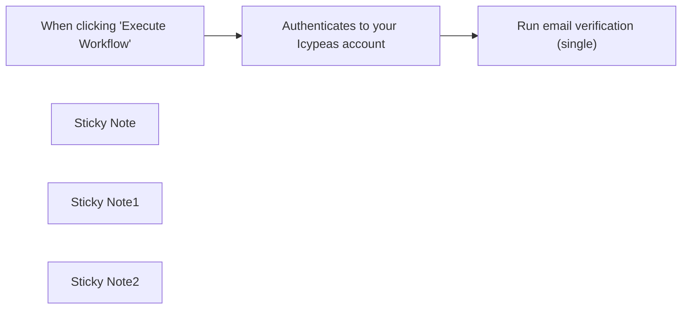

## Fluxo (.json) :

```json
{
  "id": "IwOOVikQC7cn9VTv",
  "meta": {
    "instanceId": "a897062ac3223eacd9c7736276b653c446bc776a63cde2a42a2949ad984f7092"
  },
  "name": "Email verification with Icypeas (single)",
  "tags": [],
  "nodes": [
    {
      "id": "83105cfd-9107-4dae-8282-07c6594ebbd2",
      "name": "When clicking \"Execute Workflow\"",
      "type": "n8n-nodes-base.manualTrigger",
      "position": [
        1460,
        460
      ],
      "parameters": {},
      "typeVersion": 1
    },
    {
      "id": "7146ee71-e4fc-4c1f-bdbd-af1466525fef",
      "name": "Run email verification (single)",
      "type": "n8n-nodes-base.httpRequest",
      "position": [
        2180,
        460
      ],
      "parameters": {
        "url": "={{ $json.api.url }}",
        "method": "POST",
        "options": {},
        "sendBody": true,
        "sendHeaders": true,
        "authentication": "genericCredentialType",
        "bodyParameters": {
          "parameters": [
            {
              "name": "email",
              "value": "=uyqsdqkudhfiqudhfiqduhfiqdhfqif@gmail.com"
            }
          ]
        },
        "genericAuthType": "httpHeaderAuth",
        "headerParameters": {
          "parameters": [
            {
              "name": "X-ROCK-TIMESTAMP",
              "value": "={{ $json.api.timestamp }}"
            }
          ]
        }
      },
      "credentials": {
        "httpHeaderAuth": {
          "id": "KGXtUrqC6lNLwW2w",
          "name": "Header Auth account"
        }
      },
      "typeVersion": 4.1
    },
    {
      "id": "1e004997-dfc6-45ad-9351-9a096cb4c991",
      "name": "Sticky Note",
      "type": "n8n-nodes-base.stickyNote",
      "position": [
        1280,
        200
      ],
      "parameters": {
        "height": 250.2614840989399,
        "content": "## Email verification with Icypeas (single)\n\nThis workflow demonstrates how to perform an email verification using Icypeas. Visit https://icypeas.com to create your account.\n\n\n"
      },
      "typeVersion": 1
    },
    {
      "id": "c56e06c9-971b-47ea-9c23-af639933479b",
      "name": "Sticky Note1",
      "type": "n8n-nodes-base.stickyNote",
      "position": [
        1607,
        276
      ],
      "parameters": {
        "width": 506,
        "height": 1030,
        "content": "## Authenticates to your Icypeas account\n\nThis code node utilizes your API key, API secret, and User ID to establish a connection with your Icypeas account.\n\n\n\n\n\n\n\n\n\n\n\n\n\n\n\n\n\nOpen this node and insert your API Key, API secret, and User ID within the quotation marks. You can locate these credentials on your Icypeas profile at https://app.icypeas.com/bo/profile. Here is the extract of what you have to change :\n\nconst API_KEY = \"**PUT_API_KEY_HERE**\";\nconst API_SECRET = \"**PUT_API_SECRET_HERE**\";\nconst USER_ID = \"**PUT_USER_ID_HERE**\";\n\nDo not change any other line of the code.\n\nIf you are a self-hosted user, follow these steps to activate the crypto module :\n\n1.Access your n8n instance:\nLog in to your n8n instance using your web browser by navigating to the URL of your instance, for example: http://your-n8n-instance.com.\n\n2.Go to Settings:\nIn the top-right corner, click on your username, then select \"Settings.\"\n\n3.Select General Settings:\nIn the left menu, click on \"General.\"\n\n4.Enable the Crypto module:\nScroll down to the \"Additional Node Packages\" section. You will see an option called \"crypto\" with a checkbox next to it. Check this box to enable the Crypto module.\n\n5.Save the changes:\nAt the bottom of the page, click \"Save\" to apply the changes.\n\nOnce you've followed these steps, the Crypto module should be activated for your self-hosted n8n instance. Make sure to save your changes and optionally restart your n8n instance for the changes to take effect.\n\n\n\n\n\n\n\n\n\n\n\n"
      },
      "typeVersion": 1
    },
    {
      "id": "0b0425b7-52e7-4d4c-8c7f-6fb4821b9ce1",
      "name": "Sticky Note2",
      "type": "n8n-nodes-base.stickyNote",
      "position": [
        2113,
        280
      ],
      "parameters": {
        "width": 492,
        "height": 748,
        "content": "## Performs an email verification on your Icypeas account\n\n\nThis node executes an HTTP request (POST) to verify the email you have provided in the body section, using Icypeas.\n\n\n\n\n\n\n\n\n\n\n\n\n\n### You need to create credentials in the HTTP Request node :\n\n➔ In the Credential for Header Auth, click on - Create new Credential -.\n➔ In the Name section, write “Authorization”\n➔ In the Value section, select expression (located just above the field on the right when you hover on top of it) and write {{ $json.api.key + ':' + $json.api.signature }} .\n➔ Then click on “Save” to save the changes.\n\n### To verify the email :\n\n➔ go to the Body Parameters section,\n➔ create a new parameter,\n➔ enter \"email\" in the Name field.\n➔ put the email you want to verify in the Value field.\n\nYou will find the result here : https://app.icypeas.com/bo/singlesearch?task=email-verification.\n"
      },
      "typeVersion": 1
    },
    {
      "id": "7784528c-863c-4940-9fe2-f257884a6a73",
      "name": "Authenticates to your Icypeas account",
      "type": "n8n-nodes-base.code",
      "position": [
        1800,
        460
      ],
      "parameters": {
        "jsCode": "const BASE_URL = \"https://app.icypeas.com\";\nconst PATH = \"/api/email-verification\";\nconst METHOD = \"POST\";\n\n// Change here\nconst API_KEY = \"PUT_API_KEY_HERE\";\nconst API_SECRET = \"PUT_API_SECRET_HERE\";\nconst USER_ID = \"PUT_USER_ID_HERE\";\n////////////////\n\nconst genSignature = (\n    path,\n    method,\n    secret,\n    timestamp = new Date().toISOString()\n) => {\n    const Crypto = require('crypto');\n    const payload = `${method}${path}${timestamp}`.toLowerCase();\n    const sign = Crypto.createHmac(\"sha1\", secret).update(payload).digest(\"hex\");\n\n    return sign;\n};\n\nconst fullPath = `${BASE_URL}${PATH}`;\n$input.first().json.api = {\n  timestamp: new Date().toISOString(),\n  secret: API_SECRET,\n  key: API_KEY,\n  userId: USER_ID,\n  url: fullPath,\n};\n$input.first().json.api.signature = genSignature(PATH, METHOD, API_SECRET, $input.first().json.api.timestamp);\nreturn $input.first();"
      },
      "typeVersion": 1
    }
  ],
  "active": false,
  "pinData": {},
  "settings": {
    "executionOrder": "v1"
  },
  "versionId": "39bdb71c-d7c4-4b1a-8e4f-938d30411190",
  "connections": {
    "When clicking \"Execute Workflow\"": {
      "main": [
        [
          {
            "node": "Authenticates to your Icypeas account",
            "type": "main",
            "index": 0
          }
        ]
      ]
    },
    "Authenticates to your Icypeas account": {
      "main": [
        [
          {
            "node": "Run email verification (single)",
            "type": "main",
            "index": 0
          }
        ]
      ]
    }
  }
}
```

<a id="template-612"></a>

## Template 612 - Converter pesquisa Perplexity em HTML responsivo

- **Nome:** Converter pesquisa Perplexity em HTML responsivo
- **Descrição:** Recebe um tópico via webhook, melhora o prompt, realiza pesquisa usando Perplexity, estrutura o resultado como artigo e entrega um HTML final estilizado e responsivo.
- **Funcionalidade:** • Recepção de tópico via HTTP: aceita um parâmetro de tópico através de requisição GET/POST.
• Aprimoramento do prompt: refina o texto do usuário para obter melhores resultados de pesquisa.
• Execução de pesquisa automática: consulta um serviço de pesquisa para obter conteúdo e citações relevantes.
• Extração e validação de JSON: transforma a resposta em objeto JSON estruturado contendo título, metadados, conteúdo e hashtags.
• Montagem do artigo: organiza título, metadata, texto principal, seções e citações em um formato consistente.
• Conversão para HTML responsivo: gera um documento HTML de linha única com estilo moderno usando classes Tailwind e regras de formatação específicas (listas, blockquotes, preservação de </br>, etc.).
• Distribuição e notificação: envia prévias do conteúdo para um chat via Telegram e responde ao solicitante com o HTML gerado.
• Tratamento de erros: detecta ausência de tópico e retorna resposta de erro apropriada.
- **Ferramentas:** • Perplexity API: serviço de pesquisa e geração de respostas com retorno de citações utilizado para pesquisa sobre o tópico.
• OpenAI API (gpt-4o-mini): modelo usado para melhorar prompts e converter/formatar o artigo em HTML.
• Telegram: canal de notificações para enviar prévias do conteúdo ao usuário ou grupo.
• Tailwind CSS (CDN): biblioteca de estilo usada no HTML gerado para garantir layout moderno e responsivo.

## Fluxo visual

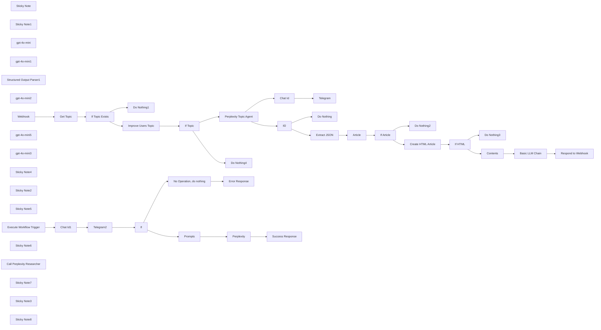

## Fluxo (.json) :

```json
{
  "id": "HnqGW0eq5asKfZxf",
  "meta": {
    "instanceId": "03907a25f048377a8789a4332f28148522ba31ee907fababf704f1d88130b1b6",
    "templateCredsSetupCompleted": true
  },
  "name": "🔍🛠️Perplexity Researcher to HTML Web Page",
  "tags": [],
  "nodes": [
    {
      "id": "ad5d96c6-941a-4ab3-b349-10bae99e5988",
      "name": "Sticky Note",
      "type": "n8n-nodes-base.stickyNote",
      "position": [
        320,
        1360
      ],
      "parameters": {
        "color": 3,
        "width": 625.851492623043,
        "height": 465.2493344282225,
        "content": "## Create Article from Perplexity Research"
      },
      "typeVersion": 1
    },
    {
      "id": "19b3ca66-5fd2-4d04-b25a-a17fb38642f8",
      "name": "Sticky Note1",
      "type": "n8n-nodes-base.stickyNote",
      "position": [
        1240,
        1360
      ],
      "parameters": {
        "color": 4,
        "width": 479.02028317328745,
        "height": 464.14912719677955,
        "content": "## Convert Article into HTML"
      },
      "typeVersion": 1
    },
    {
      "id": "7fad54e8-5a50-42da-b38d-08f6912615ab",
      "name": "gpt-4o-mini",
      "type": "@n8n/n8n-nodes-langchain.lmChatOpenAi",
      "position": [
        1380,
        1660
      ],
      "parameters": {
        "model": "gpt-4o-mini-2024-07-18",
        "options": {
          "responseFormat": "text"
        }
      },
      "credentials": {
        "openAiApi": {
          "id": "h597GY4ZJQD47RQd",
          "name": "OpenAi account"
        }
      },
      "typeVersion": 1
    },
    {
      "id": "5291869f-3ac6-4ce2-88f3-b572924b6082",
      "name": "gpt-4o-mini1",
      "type": "@n8n/n8n-nodes-langchain.lmChatOpenAi",
      "position": [
        1560,
        1040
      ],
      "parameters": {
        "options": {
          "topP": 1,
          "timeout": 60000,
          "maxTokens": -1,
          "maxRetries": 2,
          "temperature": 0,
          "responseFormat": "text",
          "presencePenalty": 0,
          "frequencyPenalty": 0
        }
      },
      "credentials": {
        "openAiApi": {
          "id": "h597GY4ZJQD47RQd",
          "name": "OpenAi account"
        }
      },
      "typeVersion": 1
    },
    {
      "id": "a232f6ca-ad4c-40fa-a641-f0dd83c8f18a",
      "name": "Structured Output Parser1",
      "type": "@n8n/n8n-nodes-langchain.outputParserStructured",
      "position": [
        640,
        1660
      ],
      "parameters": {
        "schemaType": "manual",
        "inputSchema": "{\n  \"type\": \"object\",\n  \"properties\": {\n    \"article\": {\n      \"type\": \"object\",\n      \"required\": [\"category\", \"title\", \"metadata\", \"content\", \"hashtags\"],\n      \"properties\": {\n        \"category\": {\n          \"type\": \"string\",\n          \"description\": \"Article category\"\n        },\n        \"title\": {\n          \"type\": \"string\",\n          \"description\": \"Article title\"\n        },\n        \"metadata\": {\n          \"type\": \"object\",\n          \"properties\": {\n            \"timePosted\": {\n              \"type\": \"string\",\n              \"description\": \"Time since article was posted\"\n            },\n            \"author\": {\n              \"type\": \"string\",\n              \"description\": \"Article author name\"\n            },\n            \"tag\": {\n              \"type\": \"string\",\n              \"description\": \"Article primary tag\"\n            }\n          },\n          \"required\": [\"timePosted\", \"author\", \"tag\"]\n        },\n        \"content\": {\n          \"type\": \"object\",\n          \"properties\": {\n            \"mainText\": {\n              \"type\": \"string\",\n              \"description\": \"Main article content\"\n            },\n            \"sections\": {\n              \"type\": \"array\",\n              \"items\": {\n                \"type\": \"object\",\n                \"properties\": {\n                  \"title\": {\n                    \"type\": \"string\",\n                    \"description\": \"Section title\"\n                  },\n                  \"text\": {\n                    \"type\": \"string\",\n                    \"description\": \"Section content\"\n                  },\n                  \"quote\": {\n                    \"type\": \"string\",\n                    \"description\": \"Blockquote text\"\n                  }\n                },\n                \"required\": [\"title\", \"text\", \"quote\"]\n              }\n            }\n          },\n          \"required\": [\"mainText\", \"sections\"]\n        },\n        \"hashtags\": {\n          \"type\": \"array\",\n          \"items\": {\n            \"type\": \"string\"\n          },\n          \"description\": \"Article hashtags\"\n        }\n      }\n    }\n  }\n}"
      },
      "typeVersion": 1.2
    },
    {
      "id": "e7d1adac-88aa-4f76-92bf-bbac3aa6386a",
      "name": "gpt-4o-mini2",
      "type": "@n8n/n8n-nodes-langchain.lmChatOpenAi",
      "position": [
        420,
        1660
      ],
      "parameters": {
        "options": {
          "topP": 1,
          "timeout": 60000,
          "maxTokens": -1,
          "maxRetries": 2,
          "temperature": 0,
          "responseFormat": "json_object",
          "presencePenalty": 0,
          "frequencyPenalty": 0
        }
      },
      "credentials": {
        "openAiApi": {
          "id": "h597GY4ZJQD47RQd",
          "name": "OpenAi account"
        }
      },
      "typeVersion": 1
    },
    {
      "id": "156e51db-03f7-4099-afe8-6f0361c5b497",
      "name": "Webhook",
      "type": "n8n-nodes-base.webhook",
      "position": [
        160,
        860
      ],
      "webhookId": "6a8e3ae7-02ae-4663-a27a-07df448550ab",
      "parameters": {
        "path": "pblog",
        "options": {},
        "responseMode": "responseNode"
      },
      "typeVersion": 2
    },
    {
      "id": "6dd3eba7-e779-4e4a-960e-c5a7b6b3a929",
      "name": "Respond to Webhook",
      "type": "n8n-nodes-base.respondToWebhook",
      "position": [
        2820,
        1480
      ],
      "parameters": {
        "options": {},
        "respondWith": "text",
        "responseBody": "={{ $json.text }}"
      },
      "typeVersion": 1.1
    },
    {
      "id": "27ee681e-4259-4323-b4fe-629f99cb33d0",
      "name": "Telegram",
      "type": "n8n-nodes-base.telegram",
      "position": [
        2320,
        880
      ],
      "parameters": {
        "text": "={{ $('Perplexity Topic Agent').item.json.output.slice(0, 300) }}",
        "chatId": "={{ $json.telegram_chat_id }}",
        "additionalFields": {
          "parse_mode": "HTML",
          "appendAttribution": false
        }
      },
      "credentials": {
        "telegramApi": {
          "id": "BIE64nzfpGeesXUn",
          "name": "Telegram account"
        }
      },
      "typeVersion": 1.2
    },
    {
      "id": "f437d40c-2bf6-43e2-b77b-e5c2cdc35055",
      "name": "gpt-4o-mini5",
      "type": "@n8n/n8n-nodes-langchain.lmChatOpenAi",
      "position": [
        2480,
        1660
      ],
      "parameters": {
        "options": {
          "topP": 1,
          "timeout": 60000,
          "maxTokens": -1,
          "maxRetries": 2,
          "temperature": 0,
          "responseFormat": "text",
          "presencePenalty": 0,
          "frequencyPenalty": 0
        }
      },
      "credentials": {
        "openAiApi": {
          "id": "h597GY4ZJQD47RQd",
          "name": "OpenAi account"
        }
      },
      "typeVersion": 1
    },
    {
      "id": "275bce4a-4252-41d4-bcba-174f0c51bf4a",
      "name": "Basic LLM Chain",
      "type": "@n8n/n8n-nodes-langchain.chainLlm",
      "position": [
        2340,
        1480
      ],
      "parameters": {
        "text": "=Create a modern, responsive single-line HTML document. Convert any markdown to Tailwind CSS classes. Replace markdown lists with proper HTML list elements. Remove all newline characters while preserving </br> tags in content. Enhance the layout with Tailwind CSS cards where appropriate. Use the following base structure, but improve the styling and responsiveness:\n\n<!DOCTYPE html>\n<html lang=\"en\">\n\n<head>\n    <meta charset=\"UTF-8\">\n    <meta name=\"viewport\" content=\"width=device-width, initial-scale=1.0\">\n    <title>Comprehensive Overview of DeepSeek V3</title>\n    <link href=\"https://cdn.jsdelivr.net/npm/tailwindcss@2.2.19/dist/tailwind.min.css\" rel=\"stylesheet\">\n</head>\n\n<body class=\"bg-gray-100 font-sans\">\n    <div class=\"relative p-4\">\n        <div class=\"max-w-3xl mx-auto text-sm\">\n            <div class=\"mt-3 bg-white rounded-lg shadow-lg flex flex-col justify-between leading-normal\">\n                <div class=\"p-6\">\n                    <h1 class=\"text-gray-900 font-bold text-4xl mb-4\">Comprehensive Overview of DeepSeek V3</h1>\n                    <div class=\"mb-4\">\n                        <p class=\"leading-8\"><strong>Time Posted:</strong> Just now</p>\n                        <p class=\"leading-8\"><strong>Author:</strong> AI Research Team</p>\n                        <p class=\"leading-8\"><strong>Tag:</strong> AI Models</p>\n                    </div>\n                    <p class=\"leading-8 my-4\"><strong>DeepSeek V3</strong> is a state-of-the-art AI model that leverages\n                        advanced architectures and techniques to deliver high performance across various applications.\n                        This overview covers its key concepts, practical applications, advantages, limitations, and best\n                        practices for implementation.</p>\n                    <section class=\"mb-6\">\n                        <h2 class=\"text-2xl font-bold my-3\">Key Concepts and Core Components</h2>\n                        <p class=\"leading-8 my-3\"><strong>1. Mixture-of-Experts (MoE) Architecture:</strong> DeepSeek V3\n                            employs a Mixture-of-Experts (MoE) architecture, which consists of multiple neural networks,\n                            each optimized for different tasks. This architecture allows for efficient processing by\n                            activating only a portion of the network for each task, reducing hardware costs.</p>\n                        <p class=\"leading-8 my-3\"><strong>2. Parameters:</strong> The model boasts a total of 671\n                            billion\n                            parameters, with 37 billion active parameters for each token during processing. The addition\n                            of\n                            the Multi-Token Prediction (MTP) module increases the total parameters to 685 billion,\n                            making it\n                            significantly larger than other models like Meta's Llama 3.1 (405B).</p>\n                        <p class=\"leading-8 my-3\"><strong>3. Multi-head Latent Attention (MLA):</strong> DeepSeek V3\n                            uses\n                            Multi-head Latent Attention (MLA) to extract key details from text multiple times, improving\n                            its\n                            accuracy.</p>\n                        <p class=\"leading-8 my-3\"><strong>4. Multi-Token Prediction (MTP):</strong> The model utilizes\n                            Multi-Token Prediction to generate several tokens at once, speeding up inference and\n                            enabling\n                            speculative decoding.</p>\n                        <blockquote\n                            class=\"italic leading-8 my-3 p-5 text-indigo-600 font-semibold bg-indigo-50 rounded-lg border-l-4 border-indigo-600\">\n                            DeepSeek V3 employs a Mixture-of-Experts architecture for efficient processing.</blockquote>\n                    </section>\n                    <section class=\"mb-6\">\n                        <h2 class=\"text-2xl font-bold my-3\">Practical Applications</h2>\n                        <ol class=\"list-decimal pl-5\">\n                            <li class=\"leading-8 my-3\"><strong>Translation, Coding, and Content Generation:</strong>\n                                DeepSeek V3 is designed for a wide range of tasks including translation, coding, content\n                                generation, and reasoning. It excels in English, Chinese, coding, and mathematics,\n                                rivaling leading commercial models like OpenAI's GPT-4.</li>\n                            <li class=\"leading-8 my-3\"><strong>Research and Development:</strong> The open-source nature\n                                of DeepSeek V3 fuels innovation, allowing researchers to experiment with and build upon\n                                its technology.</li>\n                            <li class=\"leading-8 my-3\"><strong>Commercial Applications:</strong> The licensing of\n                                DeepSeek V3 makes it permissible for commercial use, opening it up to numerous\n                                applications across different industries.</li>\n                            <li class=\"leading-8 my-3\"><strong>Democratization of AI:</strong> By making powerful AI\n                                accessible, DeepSeek V3 levels the playing field, allowing smaller organizations to\n                                compete with larger ones.</li>\n                        </ol>\n                        <blockquote\n                            class=\"italic leading-8 my-3 p-5 text-indigo-600 font-semibold bg-indigo-50 rounded-lg border-l-4 border-indigo-600\">\n                            DeepSeek V3 democratizes AI access for smaller organizations.</blockquote>\n                    </section>\n                    <section class=\"mb-6\">\n                        <h2 class=\"text-2xl font-bold my-3\">Advantages</h2>\n                        <ol class=\"list-decimal pl-5\">\n                            <li class=\"leading-8 my-3\"><strong>Speed and Efficiency:</strong> DeepSeek V3 processes\n                                information at a blistering 60 tokens per second, a threefold increase over its\n                                predecessor. It uses advanced inference capabilities, deploying 32 H800 GPUs for prefill\n                                and 320 H800 GPUs for decoding.</li>\n                            <li class=\"leading-8 my-3\"><strong>Cost-Effectiveness:</strong> The model was trained for a\n                                mere $5.5 million, a fraction of the estimated over $100 million invested by OpenAI in\n                                GPT-4. DeepSeek V3 offers significantly lower prices for its online services, with 1\n                                million tokens priced at just $1.1, currently offered at a promotional rate of $0.28.\n                            </li>\n                            <li class=\"leading-8 my-3\"><strong>Innovation in Inference:</strong> The model's advanced\n                                inference capabilities set the standard for future model deployment, making it a\n                                powerful tool in the digital realm.</li>\n                        </ol>\n                        <blockquote\n                            class=\"italic leading-8 my-3 p-5 text-indigo-600 font-semibold bg-indigo-50 rounded-lg border-l-4 border-indigo-600\">\n                            DeepSeek V3 processes information at 60 tokens per second.</blockquote>\n                    </section>\n                    <section class=\"mb-6\">\n                        <h2 class=\"text-2xl font-bold my-3\">Limitations</h2>\n                        <ol class=\"list-decimal pl-5\">\n                            <li class=\"leading-8 my-3\"><strong>Deployment Complexity:</strong> Deploying DeepSeek V3\n                                requires advanced hardware and a deployment strategy that separates the prefilling and\n                                decoding stages, which might be unachievable for small companies due to a lack of\n                                resources. The recommended deployment unit for DeepSeek V3 is relatively large, posing a\n                                burden for small-sized teams.</li>\n                            <li class=\"leading-8 my-3\"><strong>Potential for Further Enhancement:</strong> Although\n                                DeepSeek V3 has achieved an end-to-end generation speed of more than two times that of\n                                DeepSeek V2, there still remains potential for further enhancement with the development\n                                of more advanced hardware.</li>\n                        </ol>\n                        <blockquote\n                            class=\"italic leading-8 my-3 p-5 text-indigo-600 font-semibold bg-indigo-50 rounded-lg border-l-4 border-indigo-600\">\n                            Deployment of DeepSeek V3 may be complex for small companies.</blockquote>\n                    </section>\n                    <section class=\"mb-6\">\n                        <h2 class=\"text-2xl font-bold my-3\">Best Practices for Implementation</h2>\n                        <ol class=\"list-decimal pl-5\">\n                            <li class=\"leading-8 my-3\"><strong>Hardware Requirements:</strong> Ensure that the\n                                deployment environment has the necessary advanced hardware to handle the model's\n                                requirements, including multiple GPUs for prefill and decoding.</li>\n                            <li class=\"leading-8 my-3\"><strong>Deployment Strategy:</strong> Implement a deployment\n                                strategy that separates the prefilling and decoding stages to optimize performance and\n                                efficiency.</li>\n                            <li class=\"leading-8 my-3\"><strong>Monitoring and Optimization:</strong> Continuously\n                                monitor the model's performance and optimize it as needed to address any limitations and\n                                improve efficiency.</li>\n                            <li class=\"leading-8 my-3\"><strong>Community Engagement:</strong> Engage with the\n                                open-source community to leverage the collective knowledge and resources available,\n                                which can help in addressing any challenges and improving the model further.</li>\n                        </ol>\n                        <blockquote\n                            class=\"italic leading-8 my-3 p-5 text-indigo-600 font-semibold bg-indigo-50 rounded-lg border-l-4 border-indigo-600\">\n                            Engage with the open-source community for better implementation.</blockquote>\n                    </section>\n                    <p class=\"leading-8 my-6\"><strong>Hashtags:</strong> <span\n                            class=\"text-indigo-600\">#DeepSeekV3</span> <span class=\"text-indigo-600\">#AI</span> <span\n                            class=\"text-indigo-600\">#MachineLearning</span> <span\n                            class=\"text-indigo-600\">#OpenSource</span></p>\n                </div>\n            </div>\n        </div>\n    </div>\n</body>\n\n</html>\n\n-------\n\nRequirements:\n- Output must be a single line of HTML\n- Enhanced with modern Tailwind CSS styling\n- Proper HTML list structures\n- Responsive design\n- No newlines except </br> in content\n- No markdown formatting\n- Clean, readable layout\n- Properly formatted hashtags\n- No explanation or additional text in output\n- No code block markers or escape characters\n- Wnsure Metadata, Title and Content are included in HTML\n\nMetadata: {{ $('Article').item.json.article.metadata.toJsonString() }}\nTitle: {{ $json.title }}\nContent: {{ $json.html }}\n",
        "promptType": "define"
      },
      "typeVersion": 1.4
    },
    {
      "id": "cddd9324-8471-4dcb-a46b-836015db9833",
      "name": "Do Nothing1",
      "type": "n8n-nodes-base.noOp",
      "position": [
        560,
        1080
      ],
      "parameters": {},
      "typeVersion": 1
    },
    {
      "id": "432a0ae9-451a-4830-b065-8b0593de92ea",
      "name": "gpt-4o-mini3",
      "type": "@n8n/n8n-nodes-langchain.lmChatOpenAi",
      "position": [
        1020,
        1040
      ],
      "parameters": {
        "options": {
          "topP": 1,
          "timeout": 60000,
          "maxTokens": -1,
          "maxRetries": 2,
          "temperature": 0,
          "responseFormat": "text",
          "presencePenalty": 0,
          "frequencyPenalty": 0
        }
      },
      "credentials": {
        "openAiApi": {
          "id": "h597GY4ZJQD47RQd",
          "name": "OpenAi account"
        }
      },
      "typeVersion": 1
    },
    {
      "id": "55e00886-b6c1-4f7a-81ae-e8e0d4102cab",
      "name": "Sticky Note4",
      "type": "n8n-nodes-base.stickyNote",
      "position": [
        2200,
        1360
      ],
      "parameters": {
        "color": 6,
        "width": 531,
        "height": 465,
        "content": "## Create HTML Page with TailwindCSS Styling"
      },
      "typeVersion": 1
    },
    {
      "id": "1ed7f754-1279-4511-a085-6ed4e4c36de1",
      "name": "Sticky Note2",
      "type": "n8n-nodes-base.stickyNote",
      "position": [
        320,
        760
      ],
      "parameters": {
        "width": 450.54438902818094,
        "height": 489.5271576259337,
        "content": "## Parse Topic from Get Request"
      },
      "typeVersion": 1
    },
    {
      "id": "e9dcb568-7f8d-40c5-94cb-6f25386436cf",
      "name": "Sticky Note5",
      "type": "n8n-nodes-base.stickyNote",
      "position": [
        820,
        760
      ],
      "parameters": {
        "color": 5,
        "width": 380,
        "height": 488,
        "content": "## Improve the Users Topic"
      },
      "typeVersion": 1
    },
    {
      "id": "a7fdaddb-d6fc-4d45-85cc-a372cfb90327",
      "name": "If2",
      "type": "n8n-nodes-base.if",
      "position": [
        2120,
        1140
      ],
      "parameters": {
        "options": {},
        "conditions": {
          "options": {
            "version": 2,
            "leftValue": "",
            "caseSensitive": true,
            "typeValidation": "strict"
          },
          "combinator": "and",
          "conditions": [
            {
              "id": "8e35de0a-ac16-4555-94f4-24e97bdf4b33",
              "operator": {
                "type": "string",
                "operation": "notEmpty",
                "singleValue": true
              },
              "leftValue": "{{ $json.output }}",
              "rightValue": ""
            }
          ]
        }
      },
      "typeVersion": 2.2
    },
    {
      "id": "57d056b8-7e91-41e4-8b74-dce15847a09b",
      "name": "Prompts",
      "type": "n8n-nodes-base.set",
      "position": [
        1300,
        2080
      ],
      "parameters": {
        "options": {},
        "assignments": {
          "assignments": [
            {
              "id": "efbe7563-8502-407e-bfa0-a4a26d8cddd4",
              "name": "user",
              "type": "string",
              "value": "={{ $('Execute Workflow Trigger').item.json.topic }}"
            },
            {
              "id": "05e0b629-bb9f-4010-96a8-10872764705a",
              "name": "system",
              "type": "string",
              "value": "Assistant is a large language model.  Assistant is designed to be able to assist with a wide range of tasks, from answering simple questions to providing in-depth explanations and discussions on a wide range of topics. As a language model, Assistant is able to generate human-like text based on the input it receives, allowing it to engage in natural-sounding conversations and provide responses that are coherent and relevant to the topic at hand.  Assistant is constantly learning and improving, and its capabilities are constantly evolving. It is able to process and understand large amounts of text, and can use this knowledge to provide accurate and informative responses to a wide range of questions. Additionally, Assistant is able to generate its own text based on the input it receives, allowing it to engage in discussions and provide explanations and descriptions on a wide range of topics.  Overall, Assistant is a powerful system that can help with a wide range of tasks and provide valuable insights and information on a wide range of topics. Whether you need help with a specific question or just want to have a conversation about a particular topic, Assistant is here to assist.  "
            }
          ]
        }
      },
      "typeVersion": 3.4
    },
    {
      "id": "8209cece-fde4-485f-81a1-2d24a6eac474",
      "name": "Execute Workflow Trigger",
      "type": "n8n-nodes-base.executeWorkflowTrigger",
      "position": [
        420,
        2180
      ],
      "parameters": {},
      "typeVersion": 1
    },
    {
      "id": "445e4d15-c2b0-4152-a0f8-d6b93ad5bae6",
      "name": "Telegram2",
      "type": "n8n-nodes-base.telegram",
      "position": [
        860,
        2180
      ],
      "parameters": {
        "text": "=<i>{{ $('Execute Workflow Trigger').item.json.topic }}</i>",
        "chatId": "={{ $json.telegram_chat_id }}",
        "additionalFields": {
          "parse_mode": "HTML",
          "appendAttribution": false
        }
      },
      "credentials": {
        "telegramApi": {
          "id": "BIE64nzfpGeesXUn",
          "name": "Telegram account"
        }
      },
      "typeVersion": 1.2
    },
    {
      "id": "57a5b3ce-5490-4d50-91cc-c36e508eee4d",
      "name": "If",
      "type": "n8n-nodes-base.if",
      "position": [
        1080,
        2180
      ],
      "parameters": {
        "options": {},
        "conditions": {
          "options": {
            "version": 2,
            "leftValue": "",
            "caseSensitive": true,
            "typeValidation": "strict"
          },
          "combinator": "and",
          "conditions": [
            {
              "id": "7e2679dc-c898-415d-a693-c2c1e7259b6a",
              "operator": {
                "type": "string",
                "operation": "notContains"
              },
              "leftValue": "={{ $('Execute Workflow Trigger').item.json.topic }}",
              "rightValue": "undefined"
            }
          ]
        }
      },
      "typeVersion": 2.2
    },
    {
      "id": "fdf827dc-96b1-4ed3-895b-2a0f5f4c41a3",
      "name": "No Operation, do nothing",
      "type": "n8n-nodes-base.noOp",
      "position": [
        1300,
        2300
      ],
      "parameters": {},
      "typeVersion": 1
    },
    {
      "id": "944aa564-f449-47a6-9d9c-c20a48946ab6",
      "name": "Sticky Note6",
      "type": "n8n-nodes-base.stickyNote",
      "position": [
        320,
        1940
      ],
      "parameters": {
        "color": 5,
        "width": 1614,
        "height": 623,
        "content": "## 🛠️perplexity_research_tool\n\n"
      },
      "typeVersion": 1
    },
    {
      "id": "3806c079-8c08-48b7-a3ed-a26f6d86c67f",
      "name": "Perplexity Topic Agent",
      "type": "@n8n/n8n-nodes-langchain.agent",
      "position": [
        1580,
        860
      ],
      "parameters": {
        "text": "=Topic: {{ $json.text }}",
        "options": {
          "systemMessage": "Use the perplexity_research_tool to provide research on the users topic.\n\n"
        },
        "promptType": "define",
        "hasOutputParser": true
      },
      "typeVersion": 1.6
    },
    {
      "id": "cfc55dbb-78e6-47ef-bf55-810311bd37e8",
      "name": "Call Perplexity Researcher",
      "type": "@n8n/n8n-nodes-langchain.toolWorkflow",
      "position": [
        1780,
        1040
      ],
      "parameters": {
        "name": "perplexity_research_tool",
        "fields": {
          "values": [
            {
              "name": "topic",
              "stringValue": "= {{ $json.text }}"
            }
          ]
        },
        "workflowId": {
          "__rl": true,
          "mode": "id",
          "value": "HnqGW0eq5asKfZxf"
        },
        "description": "Call this tool to perform Perplexity research.",
        "jsonSchemaExample": "{\n  \"topic\": \"\"\n}"
      },
      "typeVersion": 1.2
    },
    {
      "id": "5ca35a40-506d-4768-a65c-a331718040bc",
      "name": "Do Nothing",
      "type": "n8n-nodes-base.noOp",
      "position": [
        2320,
        1140
      ],
      "parameters": {},
      "typeVersion": 1
    },
    {
      "id": "17028837-4706-43f3-8291-f150860caa4c",
      "name": "Do Nothing2",
      "type": "n8n-nodes-base.noOp",
      "position": [
        1020,
        1700
      ],
      "parameters": {},
      "typeVersion": 1
    },
    {
      "id": "adebf1ad-62d9-4b79-b9a1-4a9395067803",
      "name": "Do Nothing3",
      "type": "n8n-nodes-base.noOp",
      "position": [
        2000,
        1700
      ],
      "parameters": {},
      "typeVersion": 1
    },
    {
      "id": "fe19e472-3b2b-4c07-b957-fb2afc426998",
      "name": "Do Nothing4",
      "type": "n8n-nodes-base.noOp",
      "position": [
        1260,
        1080
      ],
      "parameters": {},
      "typeVersion": 1
    },
    {
      "id": "41e23462-a7fa-42a8-adbc-83a662f63f0c",
      "name": "Sticky Note7",
      "type": "n8n-nodes-base.stickyNote",
      "position": [
        1460,
        760
      ],
      "parameters": {
        "color": 3,
        "width": 480,
        "height": 488,
        "content": "## 🤖Perform Perplexity Research"
      },
      "typeVersion": 1
    },
    {
      "id": "dcc3bd83-1f8c-4000-a832-c2c6e7c157ba",
      "name": "Get Topic",
      "type": "n8n-nodes-base.set",
      "position": [
        380,
        860
      ],
      "parameters": {
        "options": {},
        "assignments": {
          "assignments": [
            {
              "id": "57f0eab2-ef1b-408c-82d5-a8c54c4084a6",
              "name": "topic",
              "type": "string",
              "value": "={{ $json.query.topic }}"
            }
          ]
        }
      },
      "typeVersion": 3.4
    },
    {
      "id": "5572e5b1-0b4c-4e6d-b413-5592aab59571",
      "name": "If Topic Exists",
      "type": "n8n-nodes-base.if",
      "position": [
        560,
        860
      ],
      "parameters": {
        "options": {},
        "conditions": {
          "options": {
            "version": 2,
            "leftValue": "",
            "caseSensitive": true,
            "typeValidation": "strict"
          },
          "combinator": "and",
          "conditions": [
            {
              "id": "2c565aa5-0d11-47fb-8621-6db592579fa8",
              "operator": {
                "type": "string",
                "operation": "notEmpty",
                "singleValue": true
              },
              "leftValue": "={{ $json.topic }}",
              "rightValue": ""
            }
          ]
        }
      },
      "typeVersion": 2.2
    },
    {
      "id": "509ee61f-defb-41e8-84cf-70ac5a7448d0",
      "name": "Improve Users Topic",
      "type": "@n8n/n8n-nodes-langchain.chainLlm",
      "position": [
        880,
        860
      ],
      "parameters": {
        "text": "=How would you improve the following prompt as of {{ $now }}, focusing on:\n\n1. Key Concepts & Definitions\n   - Main terminology and foundational concepts\n   - Technical background and context\n\n2. Core Components\n   - Essential elements and their relationships\n   - Critical processes and workflows\n\n3. Practical Applications\n   - Real-world use cases\n   - Implementation considerations\n\n4. Analysis & Insights\n   - Advantages and limitations\n   - Best practices and recommendations\n\nThe final output should be a maximum 2 sentence pure text prompt without any preamble or further explanation.  The final output will be providced to Perplexity as a research prompt.\n\nPrompt to analyze: {{ $json.topic }}",
        "promptType": "define"
      },
      "typeVersion": 1.4
    },
    {
      "id": "69ee4c6a-f6ef-47a2-bd5c-ccaf49ec7c94",
      "name": "If Topic",
      "type": "n8n-nodes-base.if",
      "position": [
        1260,
        860
      ],
      "parameters": {
        "options": {},
        "conditions": {
          "options": {
            "version": 2,
            "leftValue": "",
            "caseSensitive": true,
            "typeValidation": "strict"
          },
          "combinator": "and",
          "conditions": [
            {
              "id": "329653d4-330f-4b41-96e7-4652c1448902",
              "operator": {
                "type": "string",
                "operation": "notEmpty",
                "singleValue": true
              },
              "leftValue": "={{ $json.text }}",
              "rightValue": ""
            }
          ]
        }
      },
      "typeVersion": 2.2
    },
    {
      "id": "daa3027b-774d-44b1-b0a5-27008768c65d",
      "name": "Chat Id",
      "type": "n8n-nodes-base.set",
      "position": [
        2120,
        880
      ],
      "parameters": {
        "options": {},
        "assignments": {
          "assignments": [
            {
              "id": "0aa8fcc9-26f4-485c-8fc1-a5c13d0dd279",
              "name": "telegram_chat_id",
              "type": "number",
              "value": 1234567890
            }
          ]
        }
      },
      "typeVersion": 3.4
    },
    {
      "id": "97f32ad1-f91e-4ccc-8248-d10da823b26a",
      "name": "Article",
      "type": "n8n-nodes-base.set",
      "position": [
        780,
        1480
      ],
      "parameters": {
        "options": {},
        "assignments": {
          "assignments": [
            {
              "id": "0eb5952b-c133-4b63-8102-d4b8ec7b9b5a",
              "name": "article",
              "type": "object",
              "value": "={{ $json.output.article }}"
            }
          ]
        }
      },
      "typeVersion": 3.4
    },
    {
      "id": "e223dee3-c79f-421d-b2b8-2f3551a45f71",
      "name": "Extract JSON",
      "type": "@n8n/n8n-nodes-langchain.agent",
      "position": [
        440,
        1480
      ],
      "parameters": {
        "text": "=Extract a JSON object from this content: {{ $json.output }}",
        "options": {},
        "promptType": "define",
        "hasOutputParser": true
      },
      "retryOnFail": true,
      "typeVersion": 1.6
    },
    {
      "id": "de8aafb6-b05d-4278-8719-9b3c266fcf3a",
      "name": "If Article",
      "type": "n8n-nodes-base.if",
      "position": [
        1020,
        1480
      ],
      "parameters": {
        "options": {},
        "conditions": {
          "options": {
            "version": 2,
            "leftValue": "",
            "caseSensitive": true,
            "typeValidation": "strict"
          },
          "combinator": "and",
          "conditions": [
            {
              "id": "329653d4-330f-4b41-96e7-4652c1448902",
              "operator": {
                "type": "string",
                "operation": "notEmpty",
                "singleValue": true
              },
              "leftValue": "{{ $json.article }}",
              "rightValue": ""
            }
          ]
        }
      },
      "typeVersion": 2.2
    },
    {
      "id": "f9450b58-3b81-4b61-8cbf-2cdf5a2f56a0",
      "name": "Create HTML Article",
      "type": "@n8n/n8n-nodes-langchain.agent",
      "position": [
        1360,
        1480
      ],
      "parameters": {
        "text": "=Convert this verbatim into HTML: {{ $json.article.toJsonString() }}\n\n## Formatting Guidelines\n- HTML document must be single line document without tabs or line breaks\n- Use proper HTML tags throughout\n- Do not use these tags:  <html> <body> <style> <head>\n- Use <h1> tag for main title\n- Use <h2> tags for secondary titles\n- Structure with <p> tags for paragraphs\n- Include appropriate spacing\n- Use <blockquote> for direct quotes\n- Maintain consistent formatting\n- Write in clear, professional tone\n- Break up long paragraphs\n- Use engaging subheadings\n- Include transitional phrases\n\nThe final JSON response should contain only the title and content fields, with the content including all HTML formatting.\n{\n\t\"title\": \"the title\",\n\t\"content\": \"the HTML\"\n}",
        "agent": "conversationalAgent",
        "options": {},
        "promptType": "define"
      },
      "retryOnFail": true,
      "typeVersion": 1.6
    },
    {
      "id": "53cbaa6e-6508-48e3-9a5a-58f5bc111c2d",
      "name": "If HTML",
      "type": "n8n-nodes-base.if",
      "position": [
        1780,
        1480
      ],
      "parameters": {
        "options": {},
        "conditions": {
          "options": {
            "version": 2,
            "leftValue": "",
            "caseSensitive": true,
            "typeValidation": "strict"
          },
          "combinator": "and",
          "conditions": [
            {
              "id": "329653d4-330f-4b41-96e7-4652c1448902",
              "operator": {
                "type": "string",
                "operation": "notEmpty",
                "singleValue": true
              },
              "leftValue": "={{ $json.output.parseJson().title }}",
              "rightValue": ""
            },
            {
              "id": "0a05f73a-2901-4157-8194-cb81d259ce71",
              "operator": {
                "type": "string",
                "operation": "notEmpty",
                "singleValue": true
              },
              "leftValue": "={{ $json.output.parseJson().content }}",
              "rightValue": ""
            },
            {
              "id": "b61c1d25-a010-42d3-9f9d-fa927c483bae",
              "operator": {
                "name": "filter.operator.equals",
                "type": "string",
                "operation": "equals"
              },
              "leftValue": "",
              "rightValue": ""
            }
          ]
        }
      },
      "typeVersion": 2.2
    },
    {
      "id": "33e4e2cd-be0c-4fc9-b705-b0e8aac496f9",
      "name": "Contents",
      "type": "n8n-nodes-base.set",
      "position": [
        2000,
        1480
      ],
      "parameters": {
        "options": {},
        "assignments": {
          "assignments": [
            {
              "id": "af335333-acb8-4c9e-8184-d20cd03e08f6",
              "name": "title",
              "type": "string",
              "value": "={{ $json.output.parseJson().title }}"
            },
            {
              "id": "7fbd2264-c0e1-4bdc-b754-b0faa538879c",
              "name": "content",
              "type": "string",
              "value": "={{ $json.output.parseJson().content }}"
            }
          ]
        }
      },
      "typeVersion": 3.4
    },
    {
      "id": "8bf36853-8a04-4a0b-8715-e03a8fc8359d",
      "name": "Chat Id1",
      "type": "n8n-nodes-base.set",
      "position": [
        660,
        2180
      ],
      "parameters": {
        "options": {},
        "assignments": {
          "assignments": [
            {
              "id": "0aa8fcc9-26f4-485c-8fc1-a5c13d0dd279",
              "name": "telegram_chat_id",
              "type": "number",
              "value": 1234567890
            }
          ]
        }
      },
      "typeVersion": 3.4
    },
    {
      "id": "a3fe75d1-8db0-45cb-87f6-76fc27cb59f6",
      "name": "Sticky Note3",
      "type": "n8n-nodes-base.stickyNote",
      "position": [
        600,
        2080
      ],
      "parameters": {
        "width": 420,
        "height": 340,
        "content": "## Optional"
      },
      "typeVersion": 1
    },
    {
      "id": "22e9edbc-7aa6-4549-ae9f-2c31ad7d0542",
      "name": "Sticky Note8",
      "type": "n8n-nodes-base.stickyNote",
      "position": [
        2060,
        760
      ],
      "parameters": {
        "width": 420,
        "height": 340,
        "content": "## Optional"
      },
      "typeVersion": 1
    },
    {
      "id": "e62ff7d5-bd54-434c-b048-0dc7cd2c7f9b",
      "name": "Success Response",
      "type": "n8n-nodes-base.set",
      "position": [
        1700,
        2080
      ],
      "parameters": {
        "options": {},
        "assignments": {
          "assignments": [
            {
              "id": "eb89464a-5919-4962-880c-3f5903e267de",
              "name": "response",
              "type": "string",
              "value": "={{ $('Perplexity').item.json.choices[0].message.content }}"
            }
          ]
        },
        "includeOtherFields": true
      },
      "typeVersion": 3.4
    },
    {
      "id": "c6ba0613-47c6-442f-99e8-0eaec8cacc20",
      "name": "Error Response",
      "type": "n8n-nodes-base.set",
      "position": [
        1700,
        2300
      ],
      "parameters": {
        "options": {},
        "assignments": {
          "assignments": [
            {
              "id": "eb89464a-5919-4962-880c-3f5903e267de",
              "name": "response",
              "type": "string",
              "value": "=Error.  No topic provided."
            }
          ]
        },
        "includeOtherFields": true
      },
      "typeVersion": 3.4
    },
    {
      "id": "30d8065c-55d8-4099-abb2-ddb01635129d",
      "name": "Perplexity",
      "type": "n8n-nodes-base.httpRequest",
      "position": [
        1500,
        2080
      ],
      "parameters": {
        "url": "https://api.perplexity.ai/chat/completions",
        "method": "POST",
        "options": {},
        "jsonBody": "={\n  \"model\": \"llama-3.1-sonar-small-128k-online\",\n  \"messages\": [\n    {\n      \"role\": \"system\",\n      \"content\": \"{{ $json.system }}\"\n    },\n    {\n      \"role\": \"user\",\n      \"content\": \"{{ $json.user }}\"\n    }\n  ],\n  \"max_tokens\": \"4000\",\n  \"temperature\": 0.2,\n  \"top_p\": 0.9,\n  \"return_citations\": true,\n  \"search_domain_filter\": [\n    \"perplexity.ai\"\n  ],\n  \"return_images\": false,\n  \"return_related_questions\": false,\n  \"search_recency_filter\": \"month\",\n  \"top_k\": 0,\n  \"stream\": false,\n  \"presence_penalty\": 0,\n  \"frequency_penalty\": 1\n}",
        "sendBody": true,
        "specifyBody": "json",
        "authentication": "genericCredentialType",
        "genericAuthType": "httpHeaderAuth"
      },
      "credentials": {
        "httpCustomAuth": {
          "id": "vxjFugFpr4Od6gws",
          "name": "Confluence REST API"
        },
        "httpHeaderAuth": {
          "id": "wokWVLDQUDi0DC7I",
          "name": "Perplexity"
        }
      },
      "typeVersion": 4.2
    }
  ],
  "active": false,
  "pinData": {},
  "settings": {
    "executionOrder": "v1"
  },
  "versionId": "9ebf0569-4d9d-4783-b797-e5df2a8e8415",
  "connections": {
    "If": {
      "main": [
        [
          {
            "node": "Prompts",
            "type": "main",
            "index": 0
          }
        ],
        [
          {
            "node": "No Operation, do nothing",
            "type": "main",
            "index": 0
          }
        ]
      ]
    },
    "If2": {
      "main": [
        [
          {
            "node": "Extract JSON",
            "type": "main",
            "index": 0
          }
        ],
        [
          {
            "node": "Do Nothing",
            "type": "main",
            "index": 0
          }
        ]
      ]
    },
    "Article": {
      "main": [
        [
          {
            "node": "If Article",
            "type": "main",
            "index": 0
          }
        ]
      ]
    },
    "Chat Id": {
      "main": [
        [
          {
            "node": "Telegram",
            "type": "main",
            "index": 0
          }
        ]
      ]
    },
    "If HTML": {
      "main": [
        [
          {
            "node": "Contents",
            "type": "main",
            "index": 0
          }
        ],
        [
          {
            "node": "Do Nothing3",
            "type": "main",
            "index": 0
          }
        ]
      ]
    },
    "Prompts": {
      "main": [
        [
          {
            "node": "Perplexity",
            "type": "main",
            "index": 0
          }
        ]
      ]
    },
    "Webhook": {
      "main": [
        [
          {
            "node": "Get Topic",
            "type": "main",
            "index": 0
          }
        ]
      ]
    },
    "Chat Id1": {
      "main": [
        [
          {
            "node": "Telegram2",
            "type": "main",
            "index": 0
          }
        ]
      ]
    },
    "Contents": {
      "main": [
        [
          {
            "node": "Basic LLM Chain",
            "type": "main",
            "index": 0
          }
        ]
      ]
    },
    "If Topic": {
      "main": [
        [
          {
            "node": "Perplexity Topic Agent",
            "type": "main",
            "index": 0
          }
        ],
        [
          {
            "node": "Do Nothing4",
            "type": "main",
            "index": 0
          }
        ]
      ]
    },
    "Get Topic": {
      "main": [
        [
          {
            "node": "If Topic Exists",
            "type": "main",
            "index": 0
          }
        ]
      ]
    },
    "Telegram2": {
      "main": [
        [
          {
            "node": "If",
            "type": "main",
            "index": 0
          }
        ]
      ]
    },
    "If Article": {
      "main": [
        [
          {
            "node": "Create HTML Article",
            "type": "main",
            "index": 0
          }
        ],
        [
          {
            "node": "Do Nothing2",
            "type": "main",
            "index": 0
          }
        ]
      ]
    },
    "Perplexity": {
      "main": [
        [
          {
            "node": "Success Response",
            "type": "main",
            "index": 0
          }
        ]
      ]
    },
    "gpt-4o-mini": {
      "ai_languageModel": [
        [
          {
            "node": "Create HTML Article",
            "type": "ai_languageModel",
            "index": 0
          }
        ]
      ]
    },
    "Extract JSON": {
      "main": [
        [
          {
            "node": "Article",
            "type": "main",
            "index": 0
          }
        ]
      ]
    },
    "gpt-4o-mini1": {
      "ai_languageModel": [
        [
          {
            "node": "Perplexity Topic Agent",
            "type": "ai_languageModel",
            "index": 0
          }
        ]
      ]
    },
    "gpt-4o-mini2": {
      "ai_languageModel": [
        [
          {
            "node": "Extract JSON",
            "type": "ai_languageModel",
            "index": 0
          }
        ]
      ]
    },
    "gpt-4o-mini3": {
      "ai_languageModel": [
        [
          {
            "node": "Improve Users Topic",
            "type": "ai_languageModel",
            "index": 0
          }
        ]
      ]
    },
    "gpt-4o-mini5": {
      "ai_languageModel": [
        [
          {
            "node": "Basic LLM Chain",
            "type": "ai_languageModel",
            "index": 0
          }
        ]
      ]
    },
    "Basic LLM Chain": {
      "main": [
        [
          {
            "node": "Respond to Webhook",
            "type": "main",
            "index": 0
          }
        ]
      ]
    },
    "If Topic Exists": {
      "main": [
        [
          {
            "node": "Improve Users Topic",
            "type": "main",
            "index": 0
          }
        ],
        [
          {
            "node": "Do Nothing1",
            "type": "main",
            "index": 0
          }
        ]
      ]
    },
    "Create HTML Article": {
      "main": [
        [
          {
            "node": "If HTML",
            "type": "main",
            "index": 0
          }
        ]
      ]
    },
    "Improve Users Topic": {
      "main": [
        [
          {
            "node": "If Topic",
            "type": "main",
            "index": 0
          }
        ]
      ]
    },
    "Perplexity Topic Agent": {
      "main": [
        [
          {
            "node": "If2",
            "type": "main",
            "index": 0
          },
          {
            "node": "Chat Id",
            "type": "main",
            "index": 0
          }
        ]
      ]
    },
    "Execute Workflow Trigger": {
      "main": [
        [
          {
            "node": "Chat Id1",
            "type": "main",
            "index": 0
          }
        ]
      ]
    },
    "No Operation, do nothing": {
      "main": [
        [
          {
            "node": "Error Response",
            "type": "main",
            "index": 0
          }
        ]
      ]
    },
    "Structured Output Parser1": {
      "ai_outputParser": [
        [
          {
            "node": "Extract JSON",
            "type": "ai_outputParser",
            "index": 0
          }
        ]
      ]
    },
    "Call Perplexity Researcher": {
      "ai_tool": [
        [
          {
            "node": "Perplexity Topic Agent",
            "type": "ai_tool",
            "index": 0
          }
        ]
      ]
    }
  }
}
```

<a id="template-613"></a>

## Template 613 - Quick Start DeepSeek Chat e R1

- **Nome:** Quick Start DeepSeek Chat e R1
- **Descrição:** Fluxo que inicia por uma mensagem de chat e encaminha para um agente conversacional com memória, conectando a modelos DeepSeek remotos e locais para geração de respostas e raciocínio.
- **Funcionalidade:** • Gatilho por mensagem de chat: inicia o processo ao receber uma entrada de chat.
• Agente conversacional configurado: utiliza uma mensagem sistema para comportamento do assistente e processa diálogos de forma contextual.
• Memória de janela (contexto): mantém histórico recente da conversa para respostas mais coerentes.
• Integração com modelos remotos DeepSeek: envia requisições HTTP ao endpoint da API DeepSeek para modelos como deepseek-chat (V3) e deepseek-reasoner (R1).
• Integração com modelo local via Ollama: permite usar o modelo local deepseek-r1 para inferência offline.
• Exemplos de requisições HTTP: inclui chamadas com corpo JSON e corpo raw para /chat/completions, demonstrando formatos de uso e autenticação por cabeçalho.
• Tratamento de falhas e re-tentativa: configuração para tentar novamente ou continuar após erros em componentes críticos.
• Documentação embutida: blocos de notas com links e instruções rápidas sobre configuração e chaves de API.
- **Ferramentas:** • DeepSeek API: serviço de modelos de linguagem com compatibilidade OpenAI, incluindo deepseek-chat (V3) para chat e deepseek-reasoner (R1) para raciocínio avançado; acessível via https://api.deepseek.com.
• Plataforma de gerenciamento DeepSeek: interface para gerar e gerenciar chaves de API em https://platform.deepseek.com/api_keys.
• Ollama (runtime local): ambiente para executar modelos locais, usado aqui com o modelo deepseek-r1:14b para inferência sem depender da API.
• Requisições HTTP com autenticação por cabeçalho: mecanismo para enviar chamadas ao endpoint de chat, suportando corpos JSON ou raw e cabeçalhos de autenticação.

## Fluxo visual

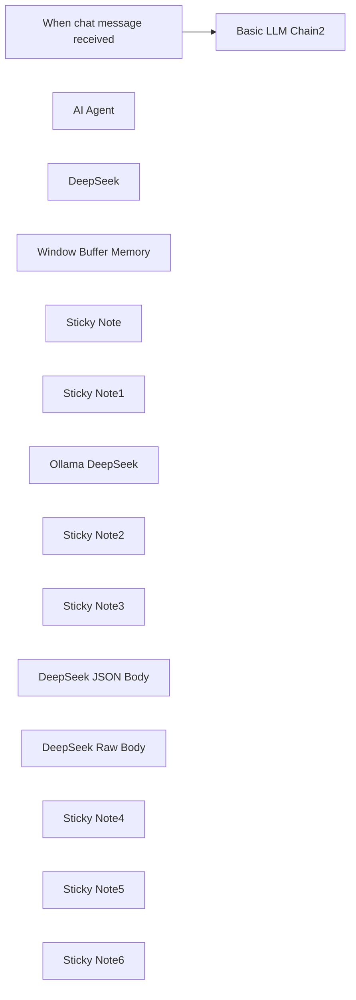

## Fluxo (.json) :

```json
{
  "id": "IyhH1KHtXidKNSIA",
  "meta": {
    "instanceId": "31e69f7f4a77bf465b805824e303232f0227212ae922d12133a0f96ffeab4fef"
  },
  "name": "🐋DeepSeek V3 Chat & R1 Reasoning Quick Start",
  "tags": [],
  "nodes": [
    {
      "id": "54c59cae-fbd0-4f0d-b633-6304e6c66d89",
      "name": "When chat message received",
      "type": "@n8n/n8n-nodes-langchain.chatTrigger",
      "position": [
        -840,
        -740
      ],
      "webhookId": "b740bd14-1b9e-4b1b-abd2-1ecf1184d53a",
      "parameters": {
        "options": {}
      },
      "typeVersion": 1.1
    },
    {
      "id": "ef85680e-569f-4e74-a1b4-aae9923a0dcb",
      "name": "AI Agent",
      "type": "@n8n/n8n-nodes-langchain.agent",
      "onError": "continueErrorOutput",
      "position": [
        -320,
        40
      ],
      "parameters": {
        "agent": "conversationalAgent",
        "options": {
          "systemMessage": "You are a helpful assistant."
        }
      },
      "retryOnFail": true,
      "typeVersion": 1.7,
      "alwaysOutputData": true
    },
    {
      "id": "07a8c74c-768e-4b38-854f-251f2fe5b7bf",
      "name": "DeepSeek",
      "type": "@n8n/n8n-nodes-langchain.lmChatOpenAi",
      "position": [
        -360,
        220
      ],
      "parameters": {
        "model": "=deepseek-reasoner",
        "options": {}
      },
      "credentials": {
        "openAiApi": {
          "id": "MSl7SdcvZe0SqCYI",
          "name": "deepseek"
        }
      },
      "typeVersion": 1.1
    },
    {
      "id": "a6d58a8c-2d16-4c91-adde-acac98868150",
      "name": "Window Buffer Memory",
      "type": "@n8n/n8n-nodes-langchain.memoryBufferWindow",
      "position": [
        -220,
        220
      ],
      "parameters": {},
      "typeVersion": 1.3
    },
    {
      "id": "401a5932-9f3e-4b17-a531-3a19a6a7788a",
      "name": "Basic LLM Chain2",
      "type": "@n8n/n8n-nodes-langchain.chainLlm",
      "position": [
        -320,
        -800
      ],
      "parameters": {
        "messages": {
          "messageValues": [
            {
              "message": "You are a helpful assistant."
            }
          ]
        }
      },
      "typeVersion": 1.5
    },
    {
      "id": "215dda87-faf7-4206-bbc3-b6a6b1eb98de",
      "name": "Sticky Note",
      "type": "n8n-nodes-base.stickyNote",
      "position": [
        -440,
        -460
      ],
      "parameters": {
        "color": 5,
        "width": 420,
        "height": 340,
        "content": "## DeepSeek using HTTP Request\n### DeepSeek Reasoner R1\nhttps://api-docs.deepseek.com/\nRaw Body"
      },
      "typeVersion": 1
    },
    {
      "id": "6457c0f7-ad02-4ad3-a4a0-9a7a6e8f0f7f",
      "name": "Sticky Note1",
      "type": "n8n-nodes-base.stickyNote",
      "position": [
        -440,
        -900
      ],
      "parameters": {
        "color": 4,
        "width": 580,
        "height": 400,
        "content": "## DeepSeek with Ollama Local Model"
      },
      "typeVersion": 1
    },
    {
      "id": "2ac8b41f-b27d-4074-abcc-430a8f5928e8",
      "name": "Ollama DeepSeek",
      "type": "@n8n/n8n-nodes-langchain.lmChatOllama",
      "position": [
        -320,
        -640
      ],
      "parameters": {
        "model": "deepseek-r1:14b",
        "options": {
          "format": "default",
          "numCtx": 16384,
          "temperature": 0.6
        }
      },
      "credentials": {
        "ollamaApi": {
          "id": "7aPaLgwpfdMWFYm9",
          "name": "Ollama account 127.0.0.1"
        }
      },
      "typeVersion": 1
    },
    {
      "id": "37a94fc0-eff3-4226-8633-fb170e5dcff2",
      "name": "Sticky Note2",
      "type": "n8n-nodes-base.stickyNote",
      "position": [
        -440,
        -80
      ],
      "parameters": {
        "color": 3,
        "width": 600,
        "height": 460,
        "content": "## DeepSeek Conversational Agent w/Memory\n"
      },
      "typeVersion": 1
    },
    {
      "id": "52b484bb-1693-4188-ba55-643c40f10dfc",
      "name": "Sticky Note3",
      "type": "n8n-nodes-base.stickyNote",
      "position": [
        20,
        -460
      ],
      "parameters": {
        "color": 6,
        "width": 420,
        "height": 340,
        "content": "## DeepSeek using HTTP Request\n### DeepSeek Chat V3\nhttps://api-docs.deepseek.com/\nJSON Body"
      },
      "typeVersion": 1
    },
    {
      "id": "ec46acef-60f6-4d34-b636-3654125f5897",
      "name": "DeepSeek JSON Body",
      "type": "n8n-nodes-base.httpRequest",
      "position": [
        160,
        -320
      ],
      "parameters": {
        "url": "https://api.deepseek.com/chat/completions",
        "method": "POST",
        "options": {},
        "jsonBody": "={\n \"model\": \"deepseek-chat\",\n \"messages\": [\n {\n \"role\": \"system\",\n \"content\": \"{{ $json.chatInput }}\"\n },\n {\n \"role\": \"user\",\n \"content\": \"Hello!\"\n }\n ],\n \"stream\": false\n}",
        "sendBody": true,
        "specifyBody": "json",
        "authentication": "genericCredentialType",
        "genericAuthType": "httpHeaderAuth"
      },
      "credentials": {
        "httpHeaderAuth": {
          "id": "9CsntxjSlce6yWbN",
          "name": "deepseek"
        }
      },
      "typeVersion": 4.2
    },
    {
      "id": "e5295120-57f9-4e02-8b73-f00e4d6baa48",
      "name": "DeepSeek Raw Body",
      "type": "n8n-nodes-base.httpRequest",
      "position": [
        -300,
        -320
      ],
      "parameters": {
        "url": "https://api.deepseek.com/chat/completions",
        "body": "={\n \"model\": \"deepseek-reasoner\",\n \"messages\": [\n {\"role\": \"user\", \"content\": \"{{ $json.chatInput.trim() }}\"}\n ],\n \"stream\": false\n }",
        "method": "POST",
        "options": {},
        "sendBody": true,
        "contentType": "raw",
        "authentication": "genericCredentialType",
        "rawContentType": "application/json",
        "genericAuthType": "httpHeaderAuth"
      },
      "credentials": {
        "httpHeaderAuth": {
          "id": "9CsntxjSlce6yWbN",
          "name": "deepseek"
        }
      },
      "typeVersion": 4.2
    },
    {
      "id": "571dc713-ce54-4330-8bdd-94e057ecd223",
      "name": "Sticky Note4",
      "type": "n8n-nodes-base.stickyNote",
      "position": [
        -1060,
        -460
      ],
      "parameters": {
        "color": 7,
        "width": 580,
        "height": 840,
        "content": "# Your First DeepSeek API Call\n\nThe DeepSeek API uses an API format compatible with OpenAI. By modifying the configuration, you can use the OpenAI SDK or softwares compatible with the OpenAI API to access the DeepSeek API.\n\nhttps://api-docs.deepseek.com/\n\n## Configuration Parameters\n\n| Parameter | Value |\n|-----------|--------|\n| base_url | https://api.deepseek.com |\n| api_key | https://platform.deepseek.com/api_keys |\n\n\n\n## Important Notes\n\n- To be compatible with OpenAI, you can also use `https://api.deepseek.com/v1` as the base_url. Note that the v1 here has NO relationship with the model's version.\n\n- The deepseek-chat model has been upgraded to DeepSeek-V3. The API remains unchanged. You can invoke DeepSeek-V3 by specifying `model='deepseek-chat'`.\n\n- deepseek-reasoner is the latest reasoning model, DeepSeek-R1, released by DeepSeek. You can invoke DeepSeek-R1 by specifying `model='deepseek-reasoner'`."
      },
      "typeVersion": 1
    },
    {
      "id": "f0ac3f32-218e-4488-b67f-7b7f7e8be130",
      "name": "Sticky Note5",
      "type": "n8n-nodes-base.stickyNote",
      "position": [
        -1060,
        -900
      ],
      "parameters": {
        "color": 2,
        "width": 580,
        "height": 400,
        "content": "## Four Examples for Connecting to DeepSeek\nhttps://api-docs.deepseek.com/\nhttps://platform.deepseek.com/api_keys"
      },
      "typeVersion": 1
    },
    {
      "id": "91642d68-ab5d-4f61-abaf-8cb7cb991c29",
      "name": "Sticky Note6",
      "type": "n8n-nodes-base.stickyNote",
      "position": [
        -180,
        -640
      ],
      "parameters": {
        "color": 7,
        "width": 300,
        "height": 120,
        "content": "### Ollama Local\nhttps://ollama.com/\nhttps://ollama.com/library/deepseek-r1"
      },
      "typeVersion": 1
    }
  ],
  "active": false,
  "pinData": {
    "When chat message received": [
      {
        "json": {
          "action": "sendMessage",
          "chatInput": "provide 10 sentences that end in the word apple.",
          "sessionId": "68cb82d504c14f5eb80bdf2478bd39bb"
        }
      }
    ]
  },
  "settings": {
    "executionOrder": "v1"
  },
  "versionId": "e354040e-7898-4ff9-91a2-b6d36030dac8",
  "connections": {
    "AI Agent": {
      "main": [
        []
      ]
    },
    "DeepSeek": {
      "ai_languageModel": [
        [
          {
            "node": "AI Agent",
            "type": "ai_languageModel",
            "index": 0
          }
        ]
      ]
    },
    "Ollama DeepSeek": {
      "ai_languageModel": [
        [
          {
            "node": "Basic LLM Chain2",
            "type": "ai_languageModel",
            "index": 0
          }
        ]
      ]
    },
    "Window Buffer Memory": {
      "ai_memory": [
        [
          {
            "node": "AI Agent",
            "type": "ai_memory",
            "index": 0
          }
        ]
      ]
    },
    "When chat message received": {
      "main": [
        [
          {
            "node": "Basic LLM Chain2",
            "type": "main",
            "index": 0
          }
        ]
      ]
    }
  }
}
```

<a id="template-614"></a>

## Template 614 - Conversão de PDF para texto

- **Nome:** Conversão de PDF para texto
- **Descrição:** Fluxo que gera PDFs a partir de HTML e extrai o conteúdo textual de PDFs, tanto de arquivos gerados internamente quanto de PDFs acessíveis por URL.
- **Funcionalidade:** • Disparo manual: Inicia o fluxo ao acionar o teste/manualmente.
• Geração de PDF a partir de HTML: Converte um trecho HTML (ex.: <h1>Hello World</h1>) em um arquivo PDF.
• Extração de texto de PDF gerado: Processa o PDF criado a partir do HTML e extrai seu conteúdo em texto.
• Extração de texto de PDF remoto: Recebe um URL de PDF (fornecido por um script) e converte o PDF remoto em texto.
• Suporte a entradas por script: Permite fornecer dinamicamente o caminho/URL do PDF via código para processamento.
- **Ferramentas:** • Conversor HTML para PDF: Gera arquivos PDF a partir de conteúdo HTML.
• Conversor/Extrator de PDF para texto: Analisa arquivos PDF e extrai o conteúdo textual.
• Fonte de PDF remoto (URL público): Arquivo PDF hospedado externamente usado como entrada para extração de texto.

## Fluxo visual

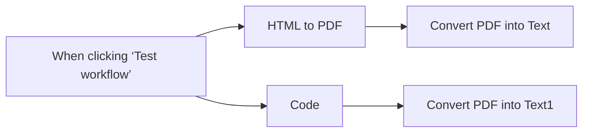

## Fluxo (.json) :

```json
{
  "id": "MIA4ozGH71fC3KCe",
  "meta": {
    "instanceId": "7599ed929ea25767a019b87ecbc83b90e16a268cb51892887b450656ac4518a2"
  },
  "name": "pdf to text",
  "tags": [],
  "nodes": [
    {
      "id": "d92f690d-c84d-451d-9ab8-da6f9356e0ca",
      "name": "Convert PDF into Text",
      "type": "@custom-js/n8n-nodes-pdf-toolkit.PdfToText",
      "position": [
        -120,
        100
      ],
      "parameters": {},
      "credentials": {
        "customJsApi": {
          "id": "h29wo2anYKdANAzm",
          "name": "CustomJS account"
        }
      },
      "typeVersion": 1
    },
    {
      "id": "420cfac7-a621-4bf3-bd34-3fee569321e4",
      "name": "HTML to PDF",
      "type": "@custom-js/n8n-nodes-pdf-toolkit.html2Pdf",
      "position": [
        -340,
        100
      ],
      "parameters": {
        "htmlInput": "<h1>Hello World</h1>"
      },
      "credentials": {
        "customJsApi": {
          "id": "h29wo2anYKdANAzm",
          "name": "CustomJS account"
        }
      },
      "typeVersion": 1
    },
    {
      "id": "83c05ec3-1225-41d0-b5b4-f9f6be7619ea",
      "name": "Convert PDF into Text1",
      "type": "@custom-js/n8n-nodes-pdf-toolkit.PdfToText",
      "position": [
        -120,
        300
      ],
      "parameters": {
        "resource": "url",
        "field_name": "={{ $json.path }}"
      },
      "credentials": {
        "customJsApi": {
          "id": "h29wo2anYKdANAzm",
          "name": "CustomJS account"
        }
      },
      "typeVersion": 1
    },
    {
      "id": "787e9369-abb5-483e-ba43-8837b5c586f9",
      "name": "Code",
      "type": "n8n-nodes-base.code",
      "position": [
        -340,
        300
      ],
      "parameters": {
        "jsCode": "return {\"json\": {\"path\": \"https://www.nlbk.niedersachsen.de/download/164891/Test-pdf_3.pdf.pdf\"}};"
      },
      "typeVersion": 2
    },
    {
      "id": "df553684-dfa8-4af4-a57b-ebbc9ef2a33f",
      "name": "When clicking ‘Test workflow’",
      "type": "n8n-nodes-base.manualTrigger",
      "position": [
        -560,
        200
      ],
      "parameters": {},
      "typeVersion": 1
    }
  ],
  "active": false,
  "pinData": {},
  "settings": {
    "executionOrder": "v1"
  },
  "versionId": "97b60904-2b34-4a77-b171-d02f87c17134",
  "connections": {
    "Code": {
      "main": [
        [
          {
            "node": "Convert PDF into Text1",
            "type": "main",
            "index": 0
          }
        ]
      ]
    },
    "HTML to PDF": {
      "main": [
        [
          {
            "node": "Convert PDF into Text",
            "type": "main",
            "index": 0
          }
        ]
      ]
    },
    "When clicking ‘Test workflow’": {
      "main": [
        [
          {
            "node": "HTML to PDF",
            "type": "main",
            "index": 0
          },
          {
            "node": "Code",
            "type": "main",
            "index": 0
          }
        ]
      ]
    }
  }
}
```

<a id="template-615"></a>

## Template 615 - Receber clima de qualquer cidade

- **Nome:** Receber clima de qualquer cidade
- **Descrição:** Este fluxo recebe uma solicitação externa com o nome de uma cidade e retorna informações meteorológicas atuais dessa cidade.
- **Funcionalidade:** • Recepção de solicitação via webhook: Aceita requisições externas contendo o parâmetro 'city'.
• Consulta de clima por cidade: Realiza busca das condições meteorológicas atuais com base no nome da cidade fornecida.
• Extração e formatação dos dados: Seleciona temperatura e descrição do tempo a partir da resposta e prepara a saída.
• Resposta ao solicitante: Retorna os dados processados como resposta à requisição recebida.
- **Ferramentas:** • OpenWeatherMap API: Serviço externo usado para obter dados meteorológicos atuais a partir do nome da cidade.

## Fluxo visual


## Fluxo (.json) :

```json
{
  "id": "158",
  "name": "Receive the weather information of any city",
  "nodes": [
    {
      "name": "Webhook",
      "type": "n8n-nodes-base.webhook",
      "position": [
        580,
        340
      ],
      "webhookId": "45690b6a-2b01-472d-8839-5e83a74858e5",
      "parameters": {
        "path": "45690b6a-2b01-472d-8839-5e83a74858e5",
        "options": {},
        "responseData": "allEntries",
        "responseMode": "lastNode"
      },
      "typeVersion": 1
    },
    {
      "name": "OpenWeatherMap",
      "type": "n8n-nodes-base.openWeatherMap",
      "position": [
        770,
        340
      ],
      "parameters": {
        "cityName": "={{$node[\"Webhook\"].json[\"query\"][\"city\"]}}"
      },
      "credentials": {
        "openWeatherMapApi": ""
      },
      "typeVersion": 1
    },
    {
      "name": "Set",
      "type": "n8n-nodes-base.set",
      "position": [
        970,
        340
      ],
      "parameters": {
        "values": {
          "string": [
            {
              "name": "temp",
              "value": "={{$node[\"OpenWeatherMap\"].json[\"main\"][\"temp\"]}}"
            },
            {
              "name": "description",
              "value": "={{$node[\"OpenWeatherMap\"].json[\"weather\"][0][\"description\"]}}"
            }
          ]
        },
        "options": {},
        "keepOnlySet": true
      },
      "typeVersion": 1
    }
  ],
  "active": false,
  "settings": {},
  "connections": {
    "Webhook": {
      "main": [
        [
          {
            "node": "OpenWeatherMap",
            "type": "main",
            "index": 0
          }
        ]
      ]
    },
    "OpenWeatherMap": {
      "main": [
        [
          {
            "node": "Set",
            "type": "main",
            "index": 0
          }
        ]
      ]
    }
  }
}
```

<a id="template-616"></a>

## Template 616 - Processamento de imagem IA via Telegram

- **Nome:** Processamento de imagem IA via Telegram
- **Descrição:** Fluxo que recebe mensagens via Telegram, usa IA para gerar uma imagem a partir do texto da mensagem e envia a imagem resultante de volta ao usuário.
- **Funcionalidade:** • Detecção de mensagens recebidas: Inicia a automação assim que o usuário envia uma mensagem para permitir interação em tempo real.
• Geração de imagem por IA: Cria uma imagem com base no texto fornecido pelo usuário.
• Consolidação de dados: Agrupa informações de saída, incluindo a imagem gerada, para processamento adicional.
• Envio da imagem de volta: Encaminha a imagem gerada ao usuário pelo Telegram, fechando o ciclo de comunicação.
- **Ferramentas:** • Telegram: Plataforma de mensagens usada para receber mensagens e enviar imagens geradas de volta.
• OpenAI: Serviço de IA utilizado para criar imagens com base no texto fornecido pelo usuário.

## Fluxo visual

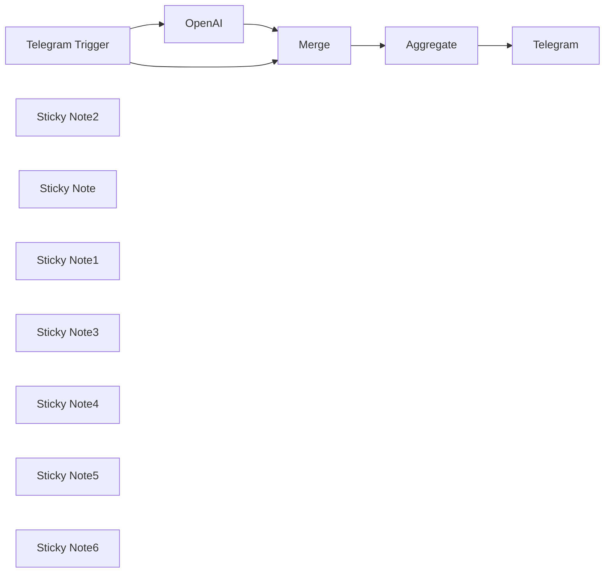

## Fluxo (.json) :

```json
{
  "meta": {
    "instanceId": "f691e434c527bcfc50a22f01094756f14427f055aa0b6917a75441617ecd7fb2"
  },
  "nodes": [
    {
      "id": "a998289c-65da-49ea-ba8a-4b277d9e16f3",
      "name": "Telegram Trigger",
      "type": "n8n-nodes-base.telegramTrigger",
      "position": [
        1060,
        640
      ],
      "webhookId": "2901cde3-b35a-4b0b-a1ba-17a7d9f80125",
      "parameters": {
        "updates": [
          "message",
          "*"
        ],
        "additionalFields": {}
      },
      "credentials": {
        "telegramApi": {
          "id": "pbbCqv0hRu9TDmWm",
          "name": "Telegram account"
        }
      },
      "typeVersion": 1.1
    },
    {
      "id": "7f50072a-5312-4a47-823e-0513cd9d383a",
      "name": "OpenAI",
      "type": "@n8n/n8n-nodes-langchain.openAi",
      "position": [
        1380,
        640
      ],
      "parameters": {
        "prompt": "={{ $json.message.text }}",
        "options": {},
        "resource": "image"
      },
      "credentials": {
        "openAiApi": {
          "id": "p4Qrsjiuev2epBzW",
          "name": "OpenAi account"
        }
      },
      "typeVersion": 1.3
    },
    {
      "id": "a59264d6-c199-4d7b-ade4-1e31f10eb632",
      "name": "Telegram",
      "type": "n8n-nodes-base.telegram",
      "position": [
        1580,
        1000
      ],
      "parameters": {
        "chatId": "={{ $json.data[1].message.from.id }}",
        "operation": "sendPhoto",
        "binaryData": true,
        "additionalFields": {}
      },
      "credentials": {
        "telegramApi": {
          "id": "pbbCqv0hRu9TDmWm",
          "name": "Telegram account"
        }
      },
      "typeVersion": 1.1
    },
    {
      "id": "e0719c38-75ae-4082-91ba-d68c7cd28339",
      "name": "Merge",
      "type": "n8n-nodes-base.merge",
      "position": [
        1060,
        1000
      ],
      "parameters": {},
      "typeVersion": 2.1
    },
    {
      "id": "bee14b74-248b-4e17-9221-378daff965aa",
      "name": "Aggregate",
      "type": "n8n-nodes-base.aggregate",
      "position": [
        1320,
        1000
      ],
      "parameters": {
        "options": {
          "includeBinaries": true
        },
        "aggregate": "aggregateAllItemData"
      },
      "typeVersion": 1
    },
    {
      "id": "50293949-3dc0-4b35-a040-a3ad1a9e80d0",
      "name": "Sticky Note2",
      "type": "n8n-nodes-base.stickyNote",
      "position": [
        -60,
        479.3775380651615
      ],
      "parameters": {
        "width": 1036.6634532467683,
        "height": 671.0981521245417,
        "content": "\n# N8N Workflow: AI-Enhanced Image Processing and Communication\n\n## Description:\nThis n8n workflow integrates artificial intelligence to optimize image processing tasks and streamline communication via Telegram. Each node in the workflow provides specific benefits that contribute to enhancing user engagement and facilitating efficient communication.\n\n## Title:\nAI-Enhanced Image Processing and Communication Workflow with n8n\n\n## Node Names and Benefits:\n\n\n3. Set up the necessary credentials for the Telegram account and OpenAI API.\n4. Configure each node in the workflow to maximize its benefits and optimize user engagement.\n5. Run the workflow to leverage AI-enhanced image processing and communication capabilities for enhanced user interactions.\n6. Monitor the workflow execution for any errors or issues that may arise during processing.\n7. Customize the workflow nodes, parameters, or AI models to align with specific business objectives and user engagement strategies.\n8. Embrace the power of AI-driven image processing and interactive communication on Telegram to elevate user engagement and satisfaction levels.\n\n## Elevate your user engagement strategies with AI-powered image processing and seamless communication on Telegram using n8n!\n"
      },
      "typeVersion": 1
    },
    {
      "id": "529fb39e-5140-41b2-8454-2a1c45d670d0",
      "name": "Sticky Note",
      "type": "n8n-nodes-base.stickyNote",
      "position": [
        1000,
        480
      ],
      "parameters": {
        "width": 276.16526553869744,
        "height": 296.62433647952383,
        "content": " **Telegram Trigger Node**:\n   - Benefit: Initiates the workflow based on incoming messages from users on Telegram, enabling real-time interaction and communication."
      },
      "typeVersion": 1
    },
    {
      "id": "339bc4ff-bca0-48ee-98ce-bbf7deb3f6fc",
      "name": "Sticky Note1",
      "type": "n8n-nodes-base.stickyNote",
      "position": [
        1320,
        480
      ],
      "parameters": {
        "width": 238.40710655577766,
        "height": 316.8446819098802,
        "content": " **OpenAI Node**:\n   - Benefit: Utilizes AI algorithms to analyze text content of messages, generating intelligent responses and enhancing the quality of communication."
      },
      "typeVersion": 1
    },
    {
      "id": "64216b05-5a6e-44f5-8cf1-86487368d892",
      "name": "Sticky Note3",
      "type": "n8n-nodes-base.stickyNote",
      "position": [
        1520,
        820
      ],
      "parameters": {
        "width": 229.95409290591755,
        "height": 332.7896020182219,
        "content": "**Telegram Node**:\n   - Benefit: Sends processed data, including images and responses, back to users on Telegram, ensuring seamless communication and user engagement."
      },
      "typeVersion": 1
    },
    {
      "id": "c15a57ee-f461-43d0-9232-b6d2728ee058",
      "name": "Sticky Note4",
      "type": "n8n-nodes-base.stickyNote",
      "position": [
        1260,
        820
      ],
      "parameters": {
        "height": 332.78960201822133,
        "content": "**Merge Node**:\n   - Benefit: Combines and organizes processed data for efficient handling and integration, optimizing the workflow's data management capabilities."
      },
      "typeVersion": 1
    },
    {
      "id": "f6f0aaac-426a-4923-9100-a52f53e78dec",
      "name": "Sticky Note5",
      "type": "n8n-nodes-base.stickyNote",
      "position": [
        1000,
        820
      ],
      "parameters": {
        "height": 326.33042266316727,
        "content": "**Aggregate Node**:\n   - Benefit: Aggregates all item data, including binaries if specified, for comprehensive reporting and analysis, aiding in decision-making and performance evaluation.\n"
      },
      "typeVersion": 1
    },
    {
      "id": "c36d8d68-0641-4e6d-92b1-82879d81e2c9",
      "name": "Sticky Note6",
      "type": "n8n-nodes-base.stickyNote",
      "position": [
        -80,
        460
      ],
      "parameters": {
        "color": 2,
        "width": 1837.5703604833238,
        "height": 706.8771853945606,
        "content": ""
      },
      "typeVersion": 1
    }
  ],
  "pinData": {},
  "connections": {
    "Merge": {
      "main": [
        [
          {
            "node": "Aggregate",
            "type": "main",
            "index": 0
          }
        ]
      ]
    },
    "OpenAI": {
      "main": [
        [
          {
            "node": "Merge",
            "type": "main",
            "index": 0
          }
        ]
      ]
    },
    "Aggregate": {
      "main": [
        [
          {
            "node": "Telegram",
            "type": "main",
            "index": 0
          }
        ]
      ]
    },
    "Telegram Trigger": {
      "main": [
        [
          {
            "node": "OpenAI",
            "type": "main",
            "index": 0
          },
          {
            "node": "Merge",
            "type": "main",
            "index": 1
          }
        ]
      ]
    }
  }
}
```

<a id="template-617"></a>

## Template 617 - MCP Server integrado ao Google Calendar

- **Nome:** MCP Server integrado ao Google Calendar
- **Descrição:** Fluxo que integra um endpoint MCP (SSE) com um agente de IA para gerenciar eventos no Google Calendar — buscar, criar, atualizar e deletar — a partir de mensagens de chat.
- **Funcionalidade:** • Receber eventos via MCP Server (SSE): expõe e utiliza um endpoint público para receber/emitir eventos em tempo real.
• Processamento por agente de IA: interpreta mensagens de chat e decide ações a executar no calendário.
• Memória de conversas: mantém histórico contextual para conversas contínuas e decisões mais precisas.
• Busca de eventos: recupera múltiplos eventos com filtros por intervalo e limite.
• Criação de eventos: cria novos eventos com título, descrição, data/hora de início e fim.
• Atualização de eventos: atualiza campos de eventos existentes usando o ID do evento.
• Exclusão de eventos: remove eventos por ID.
• Conexão entre agente e MCP: o agente usa o endpoint SSE do MCP para enviar e receber comandos/eventos.
• Configuração de credenciais: exige autenticação para acesso ao calendário e ao modelo de linguagem selecionado.
- **Ferramentas:** • Google Calendar: serviço de calendário usado para armazenar, recuperar, criar, atualizar e excluir eventos.
• Provedor de modelo de linguagem (ex.: OpenAI gpt-4o / gpt-4o-mini): processa entrada de linguagem natural, gera respostas e decide ações sobre o calendário.
• Endpoint SSE / MCP Server: canal de eventos em tempo real (Server-Sent Events) que conecta o agente de IA ao serviço que dispara os eventos.

## Fluxo visual

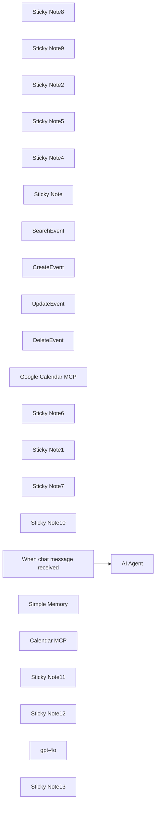

## Fluxo (.json) :

```json
{
  "id": "5opbTWPZRN05bYdz",
  "meta": {
    "instanceId": "2ca62dfdbee183085041310c6198e97a69dbf85e4843e42c21169e2f5e3db806",
    "templateCredsSetupCompleted": true
  },
  "name": "Build an MCP Server with Google Calendar",
  "tags": [],
  "nodes": [
    {
      "id": "4be79e3f-3e83-4432-b23f-4e4e9cac171b",
      "name": "Sticky Note8",
      "type": "n8n-nodes-base.stickyNote",
      "position": [
        -360,
        -800
      ],
      "parameters": {
        "color": 2,
        "width": 2720,
        "height": 140,
        "content": ""
      },
      "typeVersion": 1
    },
    {
      "id": "439a0233-c8ec-4ea5-8630-0f6e62c76bef",
      "name": "Sticky Note9",
      "type": "n8n-nodes-base.stickyNote",
      "position": [
        520,
        -780
      ],
      "parameters": {
        "color": 2,
        "width": 960,
        "height": 80,
        "content": "# Learn How to Build a MCP Server with Google Calendar"
      },
      "typeVersion": 1
    },
    {
      "id": "08996f0a-4a2d-438f-a8d7-aca78968d33f",
      "name": "Sticky Note2",
      "type": "n8n-nodes-base.stickyNote",
      "position": [
        -360,
        -600
      ],
      "parameters": {
        "color": 7,
        "width": 620,
        "height": 280,
        "content": "# Introduce\n\nThis tutorial focuses on guiding users through the process of deploying MCP service with Google Calendar. By following this step - by - step guide, you'll be able to leverage the powerful features of MCP Server with Google Calendar, such as creating, reading, updating, and deleting events."
      },
      "typeVersion": 1
    },
    {
      "id": "0f866ad6-d1af-4732-be64-8c97af7e55ac",
      "name": "Sticky Note5",
      "type": "n8n-nodes-base.stickyNote",
      "position": [
        -360,
        -240
      ],
      "parameters": {
        "color": 6,
        "width": 620,
        "height": 760,
        "content": "# Author\n\n### SunGuannan\nFreelance consultant from China, specializing in automations and data analysis. I work with select clients, addressing their toughest projects.\n\nFor business inquiries, email me at sguann2023@gmail.com.\n"
      },
      "typeVersion": 1
    },
    {
      "id": "4e2cdec7-8d04-40a7-9270-0f408ebf2efb",
      "name": "Sticky Note4",
      "type": "n8n-nodes-base.stickyNote",
      "position": [
        300,
        -600
      ],
      "parameters": {
        "color": 5,
        "width": 620,
        "content": "## Step1: Google Calendar tools require credentials\nIf you don't have your Google Credentials set up in n8n yet, watch [this](https://www.youtube.com/watch?v=3Ai1EPznlAc) video to learn how to do it.\n\nIf you are using n8n Cloud plans, it's very intuitive to setup and you may not even need the tutorial."
      },
      "typeVersion": 1
    },
    {
      "id": "0a3941f5-959f-499c-b5a6-b2b66b203b1e",
      "name": "Sticky Note",
      "type": "n8n-nodes-base.stickyNote",
      "position": [
        300,
        -420
      ],
      "parameters": {
        "color": 5,
        "width": 620,
        "height": 220,
        "content": "## Step 2: Create MCP Server Trigger and activate\nLog in to n8n and create a new workflow. On the new workflow page, click “Add First Step” to open a searchable menu of nodes and triggers. \n\nType “MCP Server Trigger” in the search bar and select it from the results to start your workflow. \n\nThis sets up how n8n receives events from the MCP Server, laying the groundwork for integrating Google Calendar into your automation. "
      },
      "typeVersion": 1
    },
    {
      "id": "42800020-7ed3-4419-9847-d2a751aa3071",
      "name": "SearchEvent",
      "type": "n8n-nodes-base.googleCalendarTool",
      "position": [
        400,
        260
      ],
      "parameters": {
        "limit": "={{ /*n8n-auto-generated-fromAI-override*/ $fromAI('Limit', ``, 'number') }}",
        "options": {},
        "timeMax": "={{ /*n8n-auto-generated-fromAI-override*/ $fromAI('Before', ``, 'string') }}",
        "timeMin": "={{ /*n8n-auto-generated-fromAI-override*/ $fromAI('After', ``, 'string') }}",
        "calendar": {
          "__rl": true,
          "mode": "list",
          "value": "sguann2023@gmail.com",
          "cachedResultName": "sguann2023@gmail.com"
        },
        "operation": "getAll"
      },
      "credentials": {
        "googleCalendarOAuth2Api": {
          "id": "Wi0S7gZu9R8zFjTC",
          "name": "Google Calendar account"
        }
      },
      "typeVersion": 1.3
    },
    {
      "id": "5d2bce57-f77d-4fd1-9342-d81107a6009d",
      "name": "CreateEvent",
      "type": "n8n-nodes-base.googleCalendarTool",
      "position": [
        520,
        260
      ],
      "parameters": {
        "end": "={{ /*n8n-auto-generated-fromAI-override*/ $fromAI('End', ``, 'string') }}",
        "start": "={{ /*n8n-auto-generated-fromAI-override*/ $fromAI('Start', ``, 'string') }}",
        "calendar": {
          "__rl": true,
          "mode": "list",
          "value": "sguann2023@gmail.com",
          "cachedResultName": "sguann2023@gmail.com"
        },
        "additionalFields": {
          "summary": "={{ $fromAI(\"event_title\", \"The event title\", \"string\") }}",
          "description": "={{ $fromAI(\"event_description\", \"The event description\", \"string\") }}"
        }
      },
      "credentials": {
        "googleCalendarOAuth2Api": {
          "id": "Wi0S7gZu9R8zFjTC",
          "name": "Google Calendar account"
        }
      },
      "typeVersion": 1.3
    },
    {
      "id": "dbebec9c-fecc-4154-ba77-cfbb519ba40a",
      "name": "UpdateEvent",
      "type": "n8n-nodes-base.googleCalendarTool",
      "position": [
        640,
        260
      ],
      "parameters": {
        "eventId": "={{ /*n8n-auto-generated-fromAI-override*/ $fromAI('Event_ID', ``, 'string') }}",
        "calendar": {
          "__rl": true,
          "mode": "list",
          "value": "sguann2023@gmail.com",
          "cachedResultName": "sguann2023@gmail.com"
        },
        "operation": "update",
        "updateFields": {
          "end": "={{ /*n8n-auto-generated-fromAI-override*/ $fromAI('End', ``, 'string') }}",
          "start": "={{ /*n8n-auto-generated-fromAI-override*/ $fromAI('Start', ``, 'string') }}",
          "summary": "={{ $fromAI(\"event_title\", \"The event title\", \"string\") }}",
          "description": "={{ $fromAI(\"event_description\", \"The event description\", \"string\") }}"
        }
      },
      "credentials": {
        "googleCalendarOAuth2Api": {
          "id": "Wi0S7gZu9R8zFjTC",
          "name": "Google Calendar account"
        }
      },
      "typeVersion": 1.3
    },
    {
      "id": "24ef1fd5-29dc-4208-a33b-5337307d01e0",
      "name": "DeleteEvent",
      "type": "n8n-nodes-base.googleCalendarTool",
      "position": [
        760,
        260
      ],
      "parameters": {
        "eventId": "={{ /*n8n-auto-generated-fromAI-override*/ $fromAI('Event_ID', ``, 'string') }}",
        "options": {},
        "calendar": {
          "__rl": true,
          "mode": "list",
          "value": "sguann2023@gmail.com",
          "cachedResultName": "sguann2023@gmail.com"
        },
        "operation": "delete"
      },
      "credentials": {
        "googleCalendarOAuth2Api": {
          "id": "Wi0S7gZu9R8zFjTC",
          "name": "Google Calendar account"
        }
      },
      "typeVersion": 1.3
    },
    {
      "id": "ec4aa55d-c6ee-4990-9c51-6ee1892600dd",
      "name": "Google Calendar MCP",
      "type": "@n8n/n8n-nodes-langchain.mcpTrigger",
      "position": [
        400,
        60
      ],
      "webhookId": "f9d9d5ea-6f83-42c8-ae50-ee6c71789bca",
      "parameters": {
        "path": "my-calendar"
      },
      "typeVersion": 1
    },
    {
      "id": "7e49bc5e-c3c1-47b3-8a0a-8f3b91ad954b",
      "name": "Sticky Note6",
      "type": "n8n-nodes-base.stickyNote",
      "position": [
        300,
        -180
      ],
      "parameters": {
        "color": 5,
        "width": 620,
        "height": 600,
        "content": "## Step 3: Incorporate Google Calendar Tools\nAfter creating the MCP Server Trigger, rename it to \"Google Calendar MCP \" for clarity. \n\nClick \"Tools\" and type \"Google Calendar\" in the search bar to find tools for various Google Calendar operations. \n\nYou can add multiple tools, each for a specific task. For example, \"Get Many\" retrieves multiple events, \"Create\" makes new ones, \"Update\" modifies existing events, and \"Delete\" removes them. Use these tools to build customized, efficient workflows for your Google Calendar data. "
      },
      "typeVersion": 1
    },
    {
      "id": "6a86eb61-0e1f-4de1-a77f-0470fe1cd3ec",
      "name": "Sticky Note1",
      "type": "n8n-nodes-base.stickyNote",
      "position": [
        300,
        440
      ],
      "parameters": {
        "color": 5,
        "width": 620,
        "height": 580,
        "content": "## Step 4: Copy Your MCP Server Trigger URL and Activate Your Workflow\nDouble - click on the \"Google Calendar MCP\" node. On the node detail page, you'll locate the production URL, which might look something like \"https://xxx/mcp/my - calendar/sse\". Make sure to copy this URL as it will be used later in your workflow setup.\n\nAfter obtaining the URL, save the workflow. Then, check the \"Inactive\" button to activate the trigger. \n\n\nOnce activated, your workflow will start listening for events from the MCP Server, enabling seamless integration with the Google Calendar service."
      },
      "typeVersion": 1
    },
    {
      "id": "aed25c42-78e1-4984-8831-768e2bbe6888",
      "name": "Sticky Note7",
      "type": "n8n-nodes-base.stickyNote",
      "position": [
        960,
        -600
      ],
      "parameters": {
        "color": 4,
        "width": 620,
        "height": 140,
        "content": "## Step 5: Create a New Workflow for AI Agent\nAt this stage, you're required to create a new workflow. Once the new workflow interface is open, click on the \"Add First Step\" option. In the list of available nodes and triggers that appears, search for and select the \"on Chat Message\" option to add it to your workflow. This sets the initial trigger for your AI-Agent-related workflow."
      },
      "typeVersion": 1
    },
    {
      "id": "214dbba6-dffe-4c43-8c14-77babd52107f",
      "name": "Sticky Note10",
      "type": "n8n-nodes-base.stickyNote",
      "position": [
        960,
        -440
      ],
      "parameters": {
        "color": 4,
        "width": 620,
        "height": 1060,
        "content": "## Step 6: Add AI Agent Node\nAfter successfully creating the Chat Messages Trigger, you can proceed to add an \"AI Agent\" node right after it. Double - click on this newly added \"AI Agent\" node to open its configuration panel.\n\nIn the configuration, you'll need to add a specific option. Under the System Message field, enter the following text: \"You are a helpful assistant. Current datetime is {{ $now.toString() }}\". This message provides the AI with the current date and time, which can be useful for context in various interactions.\n\nNext, select an appropriate Large Language Model (LLM) from the available options. This model will be responsible for handling the chat and delivering events.\n\nTo enable continuous and context - aware conversations, add memory to the Agent. This allows the AI Agent to remember previous interactions, providing a more seamless and engaging chat experience.\n\nFinally, search for and add the \"MCP Client\" tool. In the SSE Endpoint section of the \"MCP Client\" configuration, paste the URL that you copied in Step 4. This step connects the AI Agent workflow to the MCP Server, enabling data flow and interaction between the two. "
      },
      "typeVersion": 1
    },
    {
      "id": "7ba10d96-e1cc-456d-9174-c848524466dd",
      "name": "AI Agent",
      "type": "@n8n/n8n-nodes-langchain.agent",
      "position": [
        1220,
        20
      ],
      "parameters": {
        "options": {
          "systemMessage": "=You are a helpful assistant.\nCurrent datetime is {{ $now.toString() }}"
        }
      },
      "typeVersion": 1.8
    },
    {
      "id": "2d577167-74d2-4966-8c39-79477787ed68",
      "name": "When chat message received",
      "type": "@n8n/n8n-nodes-langchain.chatTrigger",
      "position": [
        1020,
        20
      ],
      "webhookId": "7b02318f-1c6b-4f2a-9a4f-b17fa69ea680",
      "parameters": {
        "options": {}
      },
      "typeVersion": 1.1
    },
    {
      "id": "0c5f70f5-5156-42f1-90ab-1f294f2fa2d9",
      "name": "Simple Memory",
      "type": "@n8n/n8n-nodes-langchain.memoryBufferWindow",
      "position": [
        1320,
        240
      ],
      "parameters": {},
      "typeVersion": 1.3
    },
    {
      "id": "cf747bc2-9c08-4f8f-9408-135e17ef0d3d",
      "name": "Calendar MCP",
      "type": "@n8n/n8n-nodes-langchain.mcpClientTool",
      "position": [
        1440,
        240
      ],
      "parameters": {
        "sseEndpoint": "https://xxx.app.n8n.cloud/mcp/my-calendar/sse"
      },
      "typeVersion": 1
    },
    {
      "id": "8891a5de-e35f-4367-bfb7-0e54ce4452be",
      "name": "Sticky Note11",
      "type": "n8n-nodes-base.stickyNote",
      "position": [
        1020,
        360
      ],
      "parameters": {
        "color": 7,
        "height": 240,
        "content": "## Why model 4o? 👆\nAfter testing 4o-mini it had some difficulties handling the calendar requests, while the 4o model handled it with ease.\n\nDepending on your prompt and tools, 4o-mini might be able to work well too, but it requires further testing."
      },
      "typeVersion": 1
    },
    {
      "id": "f5d9ddb5-5957-4d22-8d85-a1c08eb813d8",
      "name": "Sticky Note12",
      "type": "n8n-nodes-base.stickyNote",
      "position": [
        1620,
        -600
      ],
      "parameters": {
        "color": 6,
        "width": 740,
        "height": 520,
        "content": "# Let's Try!\n\n\n\n"
      },
      "typeVersion": 1
    },
    {
      "id": "31b467cd-1d70-4c05-ae14-9f9e455cd55c",
      "name": "gpt-4o",
      "type": "@n8n/n8n-nodes-langchain.lmChatOpenAi",
      "position": [
        1180,
        240
      ],
      "parameters": {
        "model": {
          "__rl": true,
          "mode": "list",
          "value": "gpt-4o-mini"
        },
        "options": {}
      },
      "credentials": {
        "openAiApi": {
          "id": "40ZaiQQN82bPTck0",
          "name": "OpenAi account"
        }
      },
      "typeVersion": 1.2
    },
    {
      "id": "007f0f3f-e7ca-4ea8-acba-cfde3bd8d1dd",
      "name": "Sticky Note13",
      "type": "n8n-nodes-base.stickyNote",
      "position": [
        1620,
        -40
      ],
      "parameters": {
        "color": 7,
        "width": 740,
        "height": 80,
        "content": "# Enjoy It! 😊 😊 😊 "
      },
      "typeVersion": 1
    }
  ],
  "active": false,
  "pinData": {},
  "settings": {
    "executionOrder": "v1"
  },
  "versionId": "c99542aa-af94-4e26-b255-473a26e0a962",
  "connections": {
    "gpt-4o": {
      "ai_languageModel": [
        [
          {
            "node": "AI Agent",
            "type": "ai_languageModel",
            "index": 0
          }
        ]
      ]
    },
    "CreateEvent": {
      "ai_tool": [
        [
          {
            "node": "Google Calendar MCP",
            "type": "ai_tool",
            "index": 0
          }
        ]
      ]
    },
    "DeleteEvent": {
      "ai_tool": [
        [
          {
            "node": "Google Calendar MCP",
            "type": "ai_tool",
            "index": 0
          }
        ]
      ]
    },
    "SearchEvent": {
      "ai_tool": [
        [
          {
            "node": "Google Calendar MCP",
            "type": "ai_tool",
            "index": 0
          }
        ]
      ]
    },
    "UpdateEvent": {
      "ai_tool": [
        [
          {
            "node": "Google Calendar MCP",
            "type": "ai_tool",
            "index": 0
          }
        ]
      ]
    },
    "Calendar MCP": {
      "ai_tool": [
        [
          {
            "node": "AI Agent",
            "type": "ai_tool",
            "index": 0
          }
        ]
      ]
    },
    "Simple Memory": {
      "ai_memory": [
        [
          {
            "node": "AI Agent",
            "type": "ai_memory",
            "index": 0
          }
        ]
      ]
    },
    "When chat message received": {
      "main": [
        [
          {
            "node": "AI Agent",
            "type": "main",
            "index": 0
          }
        ]
      ]
    }
  }
}
```

<a id="template-618"></a>

## Template 618 - Rastreamento autônomo de perfis sociais

- **Nome:** Rastreamento autônomo de perfis sociais
- **Descrição:** Fluxo que percorre websites fornecidos, extrai links e conteúdo, identifica perfis de redes sociais e grava os resultados em uma base de dados.
- **Funcionalidade:** • Leitura de empresas do banco de dados: Recupera nomes e websites a partir de uma tabela para processar cada domínio.
• Preparação de parâmetros: Mapeia e padroniza os campos necessários (nome e website) antes do rastreio.
• Agente de rastreamento baseado em IA: Utiliza um modelo de linguagem para orquestrar o processo de coleta e decisão sobre quais páginas visitar.
• Recuperação de conteúdo e links: Faz requisições HTTP às páginas, obtém HTML, extrai texto e links e converte conteúdo para formato legível (Markdown) quando necessário.
• Normalização e filtragem de URLs: Concatena caminhos relativos com domínio, valida URLs, remove entradas vazias e elimina duplicados.
• Agregação de resultados: Consolida as URLs extraídas em uma estrutura unificada por empresa (lista de perfis sociais).
• Mapeamento e inserção: Combina dados da empresa com os perfis encontrados e insere novas linhas na tabela de saída.
• Resiliência e recomendações: Conta com tentativas em caso de falha e sugere uso de proxy para melhorar a acurácia do rastreio.
- **Ferramentas:** • Supabase: Banco de dados usado para ler a lista de empresas de entrada e gravar os resultados extraídos.
• OpenAI (modelo GPT-4o): Modelo de linguagem usado como agente para comandar o rastreamento, interpretar conteúdo e estruturar a saída.
• Páginas web públicas (HTTP/HTTPS): Fontes públicas alvo do rastreio, onde o fluxo obtém HTML, texto e links para análise.

## Fluxo visual

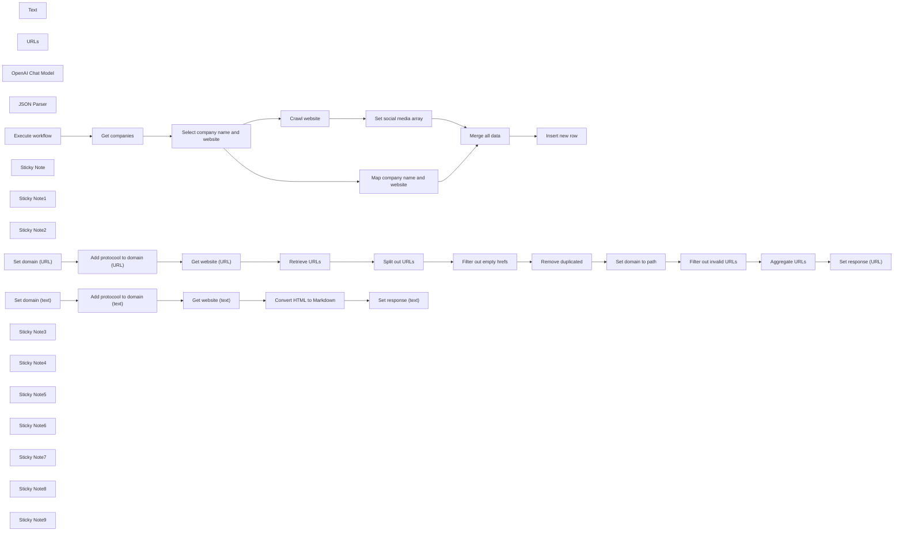

## Fluxo (.json) :

```json
{
  "nodes": [
    {
      "id": "6cdc45e5-1fa4-47fe-b80a-0e1560996936",
      "name": "Text",
      "type": "@n8n/n8n-nodes-langchain.toolWorkflow",
      "position": [
        1460,
        980
      ],
      "parameters": {
        "name": "text_retrieval_tool",
        "source": "parameter",
        "description": "Call this tool to return all text from the given website. Query should be full website URL.",
        "workflowJson": "{\n  \"nodes\": [\n    {\n      \"parameters\": {},\n      \"id\": \"05107436-c9cb-419b-ae8a-b74d309a130d\",\n      \"name\": \"Execute workflow\",\n      \"type\": \"n8n-nodes-base.manualTrigger\",\n      \"typeVersion\": 1,\n      \"position\": [\n        2220,\n        620\n      ]\n    },\n    {\n      \"parameters\": {\n        \"assignments\": {\n          \"assignments\": [\n            {\n              \"id\": \"253c2b17-c749-4f0a-93e8-5ff74f1ce49b\",\n              \"name\": \"domain\",\n              \"value\": \"={{ $json.query }}\",\n              \"type\": \"string\"\n            }\n          ]\n        },\n        \"options\": {}\n      },\n      \"id\": \"bb8be616-3227-4705-8520-1827069faacd\",\n      \"name\": \"Set domain\",\n      \"type\": \"n8n-nodes-base.set\",\n      \"typeVersion\": 3.3,\n      \"position\": [\n        2440,\n        620\n      ]\n    },\n    {\n      \"parameters\": {\n        \"assignments\": {\n          \"assignments\": [\n            {\n              \"id\": \"ed0f1505-82b6-4393-a0d8-088055137ec9\",\n              \"name\": \"domain\",\n              \"value\": \"={{ $json.domain.startsWith(\\\"http\\\") ? $json.domain : \\\"http://\\\" + $json.domain }}\",\n              \"type\": \"string\"\n            }\n          ]\n        },\n        \"options\": {}\n      },\n      \"id\": \"bdf29340-f135-489f-848e-1c7fa43a01df\",\n      \"name\": \"Add protocool to domain\",\n      \"type\": \"n8n-nodes-base.set\",\n      \"typeVersion\": 3.3,\n      \"position\": [\n        2640,\n        620\n      ]\n    },\n    {\n      \"parameters\": {\n        \"assignments\": {\n          \"assignments\": [\n            {\n              \"id\": \"2b1c7ff8-06a7-448b-99b7-5ede4b2e0bf0\",\n              \"name\": \"response\",\n              \"value\": \"={{ $json.data }}\",\n              \"type\": \"string\"\n            }\n          ]\n        },\n        \"options\": {}\n      },\n      \"id\": \"9f0aa264-08c1-459a-bb99-e28599fe8f76\",\n      \"name\": \"Set response\",\n      \"type\": \"n8n-nodes-base.set\",\n      \"typeVersion\": 3.3,\n      \"position\": [\n        3300,\n        620\n      ]\n    },\n    {\n      \"parameters\": {\n        \"url\": \"={{ $json.domain }}\",\n        \"options\": {}\n      },\n      \"id\": \"cec7c8e8-bf5e-43d5-aa41-876293dbec78\",\n      \"name\": \"Get website\",\n      \"type\": \"n8n-nodes-base.httpRequest\",\n      \"typeVersion\": 4.2,\n      \"position\": [\n        2860,\n        620\n      ]\n    },\n    {\n      \"parameters\": {\n        \"html\": \"={{ $json.data }}\",\n        \"options\": {\n          \"ignore\": \"a,img\"\n        }\n      },\n      \"id\": \"1af94fcb-bca3-45c4-9277-18878c75d417\",\n      \"name\": \"Convert HTML to Markdown\",\n      \"type\": \"n8n-nodes-base.markdown\",\n      \"typeVersion\": 1,\n      \"position\": [\n        3080,\n        620\n      ]\n    }\n  ],\n  \"connections\": {\n    \"Execute workflow\": {\n      \"main\": [\n        [\n          {\n            \"node\": \"Set domain\",\n            \"type\": \"main\",\n            \"index\": 0\n          }\n        ]\n      ]\n    },\n    \"Set domain\": {\n      \"main\": [\n        [\n          {\n            \"node\": \"Add protocool to domain\",\n            \"type\": \"main\",\n            \"index\": 0\n          }\n        ]\n      ]\n    },\n    \"Add protocool to domain\": {\n      \"main\": [\n        [\n          {\n            \"node\": \"Get website\",\n            \"type\": \"main\",\n            \"index\": 0\n          }\n        ]\n      ]\n    },\n    \"Get website\": {\n      \"main\": [\n        [\n          {\n            \"node\": \"Convert HTML to Markdown\",\n            \"type\": \"main\",\n            \"index\": 0\n          }\n        ]\n      ]\n    },\n    \"Convert HTML to Markdown\": {\n      \"main\": [\n        [\n          {\n            \"node\": \"Set response\",\n            \"type\": \"main\",\n            \"index\": 0\n          }\n        ]\n      ]\n    }\n  },\n  \"pinData\": {}\n}",
        "requestOptions": {}
      },
      "typeVersion": 1.1
    },
    {
      "id": "af8efccb-ba3c-44de-85f7-b932d7a2e3ca",
      "name": "URLs",
      "type": "@n8n/n8n-nodes-langchain.toolWorkflow",
      "position": [
        1640,
        980
      ],
      "parameters": {
        "name": "url_retrieval_tool",
        "source": "parameter",
        "description": "Call this tool to return all URLs from the given website. Query should be full website URL.",
        "workflowJson": "{\n  \"nodes\": [\n    {\n      \"parameters\": {},\n      \"id\": \"05107436-c9cb-419b-ae8a-b74d309a130d\",\n      \"name\": \"Execute workflow\",\n      \"type\": \"n8n-nodes-base.manualTrigger\",\n      \"typeVersion\": 1,\n      \"position\": [\n        2200,\n        740\n      ]\n    },\n    {\n      \"parameters\": {\n        \"operation\": \"extractHtmlContent\",\n        \"extractionValues\": {\n          \"values\": [\n            {\n              \"key\": \"output\",\n              \"cssSelector\": \"a\",\n              \"returnValue\": \"attribute\",\n              \"returnArray\": true\n            }\n          ]\n        },\n        \"options\": {}\n      },\n      \"id\": \"1972e13e-d923-45e8-9752-e4bf45faaccf\",\n      \"name\": \"Retrieve URLs\",\n      \"type\": \"n8n-nodes-base.html\",\n      \"typeVersion\": 1.2,\n      \"position\": [\n        3060,\n        740\n      ]\n    },\n    {\n      \"parameters\": {\n        \"fieldToSplitOut\": \"output\",\n        \"options\": {}\n      },\n      \"id\": \"19703fbc-05ff-4d80-ab53-85ba6d39fc3f\",\n      \"name\": \"Split out URLs\",\n      \"type\": \"n8n-nodes-base.splitOut\",\n      \"typeVersion\": 1,\n      \"position\": [\n        3280,\n        740\n      ]\n    },\n    {\n      \"parameters\": {\n        \"compare\": \"selectedFields\",\n        \"fieldsToCompare\": \"href\",\n        \"options\": {}\n      },\n      \"id\": \"5cc988e7-de9b-4177-b5e7-edb3842202c8\",\n      \"name\": \"Remove duplicated\",\n      \"type\": \"n8n-nodes-base.removeDuplicates\",\n      \"typeVersion\": 1,\n      \"position\": [\n        3720,\n        740\n      ]\n    },\n    {\n      \"parameters\": {\n        \"assignments\": {\n          \"assignments\": [\n            {\n              \"id\": \"04ced063-09f0-496c-9b28-b8095f9e2297\",\n              \"name\": \"href\",\n              \"value\": \"={{ $json.href.startsWith(\\\"/\\\") ? $('Add protocool to domain (URL)').item.json[\\\"domain\\\"] + $json.href : $json.href }}\",\n              \"type\": \"string\"\n            }\n          ]\n        },\n        \"includeOtherFields\": true,\n        \"include\": \"selected\",\n        \"includeFields\": \"title\",\n        \"options\": {}\n      },\n      \"id\": \"4715a25d-93a7-4056-8768-e3f886a1a0c9\",\n      \"name\": \"Set domain to path\",\n      \"type\": \"n8n-nodes-base.set\",\n      \"typeVersion\": 3.3,\n      \"position\": [\n        3940,\n        740\n      ]\n    },\n    {\n      \"parameters\": {\n        \"conditions\": {\n          \"options\": {\n            \"caseSensitive\": true,\n            \"leftValue\": \"\",\n            \"typeValidation\": \"strict\"\n          },\n          \"conditions\": [\n            {\n              \"id\": \"d01ea6a8-7e75-40d4-98f2-25d42b245f36\",\n              \"leftValue\": \"={{ $json.href.isUrl() }}\",\n              \"rightValue\": \"\",\n              \"operator\": {\n                \"type\": \"boolean\",\n                \"operation\": \"true\",\n                \"singleValue\": true\n              }\n            }\n          ],\n          \"combinator\": \"and\"\n        },\n        \"options\": {}\n      },\n      \"id\": \"353deefb-ae69-440c-95b6-fdadacf4bf91\",\n      \"name\": \"Filter out invalid URLs\",\n      \"type\": \"n8n-nodes-base.filter\",\n      \"typeVersion\": 2,\n      \"position\": [\n        4160,\n        740\n      ]\n    },\n    {\n      \"parameters\": {\n        \"aggregate\": \"aggregateAllItemData\",\n        \"include\": \"specifiedFields\",\n        \"fieldsToInclude\": \"title,href\",\n        \"options\": {}\n      },\n      \"id\": \"9f87be8c-72d7-4ab1-b297-dc7069b2dd11\",\n      \"name\": \"Aggregate URLs\",\n      \"type\": \"n8n-nodes-base.aggregate\",\n      \"typeVersion\": 1,\n      \"position\": [\n        4380,\n        740\n      ]\n    },\n    {\n      \"parameters\": {\n        \"conditions\": {\n          \"options\": {\n            \"caseSensitive\": true,\n            \"leftValue\": \"\",\n            \"typeValidation\": \"strict\"\n          },\n          \"conditions\": [\n            {\n              \"id\": \"5b9b7353-bd04-4af2-9480-8de135ff4223\",\n              \"leftValue\": \"={{ $json.href }}\",\n              \"rightValue\": \"\",\n              \"operator\": {\n                \"type\": \"string\",\n                \"operation\": \"exists\",\n                \"singleValue\": true\n              }\n            }\n          ],\n          \"combinator\": \"and\"\n        },\n        \"options\": {}\n      },\n      \"id\": \"35c8323a-5350-403a-9c2d-114b0527e395\",\n      \"name\": \"Filter out empty hrefs\",\n      \"type\": \"n8n-nodes-base.filter\",\n      \"typeVersion\": 2,\n      \"position\": [\n        3500,\n        740\n      ]\n    },\n    {\n      \"parameters\": {\n        \"assignments\": {\n          \"assignments\": [\n            {\n              \"id\": \"253c2b17-c749-4f0a-93e8-5ff74f1ce49b\",\n              \"name\": \"domain\",\n              \"value\": \"={{ $json.query }}\",\n              \"type\": \"string\"\n            }\n          ]\n        },\n        \"options\": {}\n      },\n      \"id\": \"d9f6a148-6c8c-4a58-89f5-4e9cfcd8d910\",\n      \"name\": \"Set domain (URL)\",\n      \"type\": \"n8n-nodes-base.set\",\n      \"typeVersion\": 3.3,\n      \"position\": [\n        2400,\n        740\n      ]\n    },\n    {\n      \"parameters\": {\n        \"assignments\": {\n          \"assignments\": [\n            {\n              \"id\": \"ed0f1505-82b6-4393-a0d8-088055137ec9\",\n              \"name\": \"domain\",\n              \"value\": \"={{ $json.domain.startsWith(\\\"http\\\") ? $json.domain : \\\"http://\\\" + $json.domain }}\",\n              \"type\": \"string\"\n            }\n          ]\n        },\n        \"options\": {}\n      },\n      \"id\": \"1f974444-da58-4a47-a9c3-ba3091fc1e96\",\n      \"name\": \"Add protocool to domain (URL)\",\n      \"type\": \"n8n-nodes-base.set\",\n      \"typeVersion\": 3.3,\n      \"position\": [\n        2620,\n        740\n      ]\n    },\n    {\n      \"parameters\": {\n        \"url\": \"={{ $json.domain }}\",\n        \"options\": {}\n      },\n      \"id\": \"31d7c7d4-8f61-402b-858d-63dd68ac69ee\",\n      \"name\": \"Get website (URL)\",\n      \"type\": \"n8n-nodes-base.httpRequest\",\n      \"typeVersion\": 4.2,\n      \"position\": [\n        2840,\n        740\n      ]\n    },\n    {\n      \"parameters\": {\n        \"assignments\": {\n          \"assignments\": [\n            {\n              \"id\": \"53c1c016-7983-4eba-a91d-da2a0523d805\",\n              \"name\": \"response\",\n              \"value\": \"={{ JSON.stringify($json.data) }}\",\n              \"type\": \"string\"\n            }\n          ]\n        },\n        \"options\": {}\n      },\n      \"id\": \"f4b6df77-96be-4b12-9a8b-ae9b7009f13d\",\n      \"name\": \"Set response (URL)\",\n      \"type\": \"n8n-nodes-base.set\",\n      \"typeVersion\": 3.3,\n      \"position\": [\n        4600,\n        740\n      ]\n    }\n  ],\n  \"connections\": {\n    \"Execute workflow\": {\n      \"main\": [\n        [\n          {\n            \"node\": \"Set domain (URL)\",\n            \"type\": \"main\",\n            \"index\": 0\n          }\n        ]\n      ]\n    },\n    \"Retrieve URLs\": {\n      \"main\": [\n        [\n          {\n            \"node\": \"Split out URLs\",\n            \"type\": \"main\",\n            \"index\": 0\n          }\n        ]\n      ]\n    },\n    \"Split out URLs\": {\n      \"main\": [\n        [\n          {\n            \"node\": \"Filter out empty hrefs\",\n            \"type\": \"main\",\n            \"index\": 0\n          }\n        ]\n      ]\n    },\n    \"Remove duplicated\": {\n      \"main\": [\n        [\n          {\n            \"node\": \"Set domain to path\",\n            \"type\": \"main\",\n            \"index\": 0\n          }\n        ]\n      ]\n    },\n    \"Set domain to path\": {\n      \"main\": [\n        [\n          {\n            \"node\": \"Filter out invalid URLs\",\n            \"type\": \"main\",\n            \"index\": 0\n          }\n        ]\n      ]\n    },\n    \"Filter out invalid URLs\": {\n      \"main\": [\n        [\n          {\n            \"node\": \"Aggregate URLs\",\n            \"type\": \"main\",\n            \"index\": 0\n          }\n        ]\n      ]\n    },\n    \"Aggregate URLs\": {\n      \"main\": [\n        [\n          {\n            \"node\": \"Set response (URL)\",\n            \"type\": \"main\",\n            \"index\": 0\n          }\n        ]\n      ]\n    },\n    \"Filter out empty hrefs\": {\n      \"main\": [\n        [\n          {\n            \"node\": \"Remove duplicated\",\n            \"type\": \"main\",\n            \"index\": 0\n          }\n        ]\n      ]\n    },\n    \"Set domain (URL)\": {\n      \"main\": [\n        [\n          {\n            \"node\": \"Add protocool to domain (URL)\",\n            \"type\": \"main\",\n            \"index\": 0\n          }\n        ]\n      ]\n    },\n    \"Add protocool to domain (URL)\": {\n      \"main\": [\n        [\n          {\n            \"node\": \"Get website (URL)\",\n            \"type\": \"main\",\n            \"index\": 0\n          }\n        ]\n      ]\n    },\n    \"Get website (URL)\": {\n      \"main\": [\n        [\n          {\n            \"node\": \"Retrieve URLs\",\n            \"type\": \"main\",\n            \"index\": 0\n          }\n        ]\n      ]\n    }\n  },\n  \"pinData\": {}\n}",
        "requestOptions": {}
      },
      "typeVersion": 1.1
    },
    {
      "id": "725dc9d9-dc10-4895-aedb-93ecd7494d76",
      "name": "OpenAI Chat Model",
      "type": "@n8n/n8n-nodes-langchain.lmChatOpenAi",
      "position": [
        1300,
        980
      ],
      "parameters": {
        "model": "gpt-4o",
        "options": {
          "temperature": 0,
          "responseFormat": "json_object"
        },
        "requestOptions": {}
      },
      "credentials": {
        "openAiApi": {
          "id": "Qp9mop4DylpfqiTH",
          "name": "OpenAI (avirago@avirago.pl)"
        }
      },
      "typeVersion": 1
    },
    {
      "id": "2b9aa18b-e72e-486a-b307-db50e408842b",
      "name": "JSON Parser",
      "type": "@n8n/n8n-nodes-langchain.outputParserStructured",
      "position": [
        1800,
        980
      ],
      "parameters": {
        "schemaType": "manual",
        "inputSchema": "{\n  \"type\": \"object\",\n  \"properties\": {\n    \"social_media\": {\n      \"type\": \"array\",\n      \"items\": {\n        \"type\": \"object\",\n        \"properties\": {\n          \"platform\": {\n            \"type\": \"string\",\n            \"description\": \"The name of the social media platform (e.g., LinkedIn, Instagram)\"\n          },\n          \"urls\": {\n            \"type\": \"array\",\n            \"items\": {\n              \"type\": \"string\",\n              \"format\": \"uri\",\n              \"description\": \"A URL for the social media platform\"\n            }\n          }\n        },\n        \"required\": [\"platform\", \"urls\"],\n        \"additionalProperties\": false\n      }\n    }\n  },\n  \"required\": [\"platforms\"],\n  \"additionalProperties\": false\n}\n",
        "requestOptions": {}
      },
      "typeVersion": 1.2
    },
    {
      "id": "87dcfe83-01f3-439c-8175-7da3d96391b4",
      "name": "Map company name and website",
      "type": "n8n-nodes-base.set",
      "position": [
        1400,
        300
      ],
      "parameters": {
        "options": {},
        "assignments": {
          "assignments": [
            {
              "id": "ae484e44-36bc-4d88-9772-545e579a261c",
              "name": "company_name",
              "type": "string",
              "value": "={{ $json.name }}"
            },
            {
              "id": "c426ab19-649c-4443-aabb-eb0826680452",
              "name": "company_website",
              "type": "string",
              "value": "={{ $json.website }}"
            }
          ]
        }
      },
      "typeVersion": 3.3
    },
    {
      "id": "a904bd16-b470-4c98-ac05-50bbc09bf24b",
      "name": "Execute workflow",
      "type": "n8n-nodes-base.manualTrigger",
      "position": [
        540,
        620
      ],
      "parameters": {},
      "typeVersion": 1
    },
    {
      "id": "a9801b62-a691-457c-a52f-ac0d68c8e8b3",
      "name": "Get companies",
      "type": "n8n-nodes-base.supabase",
      "position": [
        780,
        620
      ],
      "parameters": {
        "tableId": "companies_input",
        "operation": "getAll"
      },
      "credentials": {
        "supabaseApi": {
          "id": "TZeFGe5qO3z7X5Zk",
          "name": "Supabase (workfloows@gmail.com)"
        }
      },
      "typeVersion": 1
    },
    {
      "id": "40d8fe8a-2975-4ea5-b6ac-46e19d158eea",
      "name": "Select company name and website",
      "type": "n8n-nodes-base.set",
      "position": [
        1040,
        620
      ],
      "parameters": {
        "include": "selected",
        "options": {},
        "assignments": {
          "assignments": []
        },
        "includeFields": "name,website",
        "includeOtherFields": true
      },
      "typeVersion": 3.3
    },
    {
      "id": "20aa3aea-f1f6-435c-a511-d4e8db047c6d",
      "name": "Set social media array",
      "type": "n8n-nodes-base.set",
      "position": [
        1800,
        720
      ],
      "parameters": {
        "options": {},
        "assignments": {
          "assignments": [
            {
              "id": "a6e109b7-9333-44e8-aa13-590aeb91a56b",
              "name": "social_media",
              "type": "array",
              "value": "={{ $json.output.social_media }}"
            }
          ]
        }
      },
      "typeVersion": 3.3
    },
    {
      "id": "53f64ebf-8d9f-4718-9a33-aaae06e9cf9a",
      "name": "Merge all data",
      "type": "n8n-nodes-base.merge",
      "position": [
        2040,
        620
      ],
      "parameters": {
        "mode": "combine",
        "options": {},
        "combinationMode": "mergeByPosition"
      },
      "typeVersion": 2.1
    },
    {
      "id": "e38e590e-cc1c-485f-b6c4-e7631f1c8381",
      "name": "Insert new row",
      "type": "n8n-nodes-base.supabase",
      "position": [
        2260,
        620
      ],
      "parameters": {
        "tableId": "companies_output",
        "dataToSend": "autoMapInputData"
      },
      "credentials": {
        "supabaseApi": {
          "id": "TZeFGe5qO3z7X5Zk",
          "name": "Supabase (workfloows@gmail.com)"
        }
      },
      "typeVersion": 1
    },
    {
      "id": "aac08494-b324-4307-a5c5-5d5345cc9070",
      "name": "Convert HTML to Markdown",
      "type": "n8n-nodes-base.markdown",
      "position": [
        2100,
        1314
      ],
      "parameters": {
        "html": "={{ $json.data }}",
        "options": {
          "ignore": "a,img"
        }
      },
      "typeVersion": 1
    },
    {
      "id": "ca6733cb-973f-4e7b-9d52-48f1af2e08e3",
      "name": "Sticky Note",
      "type": "n8n-nodes-base.stickyNote",
      "position": [
        1420,
        940
      ],
      "parameters": {
        "color": 5,
        "width": 157.8125,
        "height": 166.55000000000004,
        "content": ""
      },
      "typeVersion": 1
    },
    {
      "id": "4acd71c9-9e31-43fc-bda6-66d6a057306b",
      "name": "Sticky Note1",
      "type": "n8n-nodes-base.stickyNote",
      "position": [
        1600,
        940
      ],
      "parameters": {
        "color": 4,
        "width": 157.8125,
        "height": 166.55000000000004,
        "content": ""
      },
      "typeVersion": 1
    },
    {
      "id": "359adcd6-6bb9-4d64-8dde-6a45b0439fd6",
      "name": "Sticky Note2",
      "type": "n8n-nodes-base.stickyNote",
      "position": [
        1420,
        1180
      ],
      "parameters": {
        "color": 5,
        "width": 1117.5005339977713,
        "height": 329.45390772033636,
        "content": "### Text scraper tool\nThis tool is designed to return all text from the given webpage.\n\n💡 **Consider adding proxy for better crawling accuracy.**\n"
      },
      "typeVersion": 1
    },
    {
      "id": "84133903-dcec-4c0c-8684-fdeb49f5702d",
      "name": "Retrieve URLs",
      "type": "n8n-nodes-base.html",
      "position": [
        2120,
        1700
      ],
      "parameters": {
        "options": {},
        "operation": "extractHtmlContent",
        "extractionValues": {
          "values": [
            {
              "key": "output",
              "cssSelector": "a",
              "returnArray": true,
              "returnValue": "attribute"
            }
          ]
        }
      },
      "typeVersion": 1.2
    },
    {
      "id": "2ebffed6-5517-47ff-9fcd-5ce503aa3b63",
      "name": "Split out URLs",
      "type": "n8n-nodes-base.splitOut",
      "position": [
        2340,
        1700
      ],
      "parameters": {
        "options": {},
        "fieldToSplitOut": "output"
      },
      "typeVersion": 1
    },
    {
      "id": "215da9b2-0c0d-4d0e-b5f9-9887be75b0c4",
      "name": "Remove duplicated",
      "type": "n8n-nodes-base.removeDuplicates",
      "position": [
        2780,
        1700
      ],
      "parameters": {
        "compare": "selectedFields",
        "options": {},
        "fieldsToCompare": "href"
      },
      "typeVersion": 1
    },
    {
      "id": "55825a1c-9351-413c-858a-c44cd3078f11",
      "name": "Set domain to path",
      "type": "n8n-nodes-base.set",
      "position": [
        3000,
        1700
      ],
      "parameters": {
        "include": "selected",
        "options": {},
        "assignments": {
          "assignments": [
            {
              "id": "04ced063-09f0-496c-9b28-b8095f9e2297",
              "name": "href",
              "type": "string",
              "value": "={{ $json.href.startsWith(\"/\") ? $('Add protocool to domain (URL)').item.json[\"domain\"] + $json.href : $json.href }}"
            }
          ]
        },
        "includeFields": "title",
        "includeOtherFields": true
      },
      "typeVersion": 3.3
    },
    {
      "id": "57858d59-2727-4291-9dc6-238101de25ea",
      "name": "Filter out invalid URLs",
      "type": "n8n-nodes-base.filter",
      "position": [
        3220,
        1700
      ],
      "parameters": {
        "options": {},
        "conditions": {
          "options": {
            "leftValue": "",
            "caseSensitive": true,
            "typeValidation": "strict"
          },
          "combinator": "and",
          "conditions": [
            {
              "id": "d01ea6a8-7e75-40d4-98f2-25d42b245f36",
              "operator": {
                "type": "boolean",
                "operation": "true",
                "singleValue": true
              },
              "leftValue": "={{ $json.href.isUrl() }}",
              "rightValue": ""
            }
          ]
        }
      },
      "typeVersion": 2
    },
    {
      "id": "0e487a35-8a6c-48f7-9048-fe66a5a346e8",
      "name": "Aggregate URLs",
      "type": "n8n-nodes-base.aggregate",
      "position": [
        3440,
        1700
      ],
      "parameters": {
        "include": "specifiedFields",
        "options": {},
        "aggregate": "aggregateAllItemData",
        "fieldsToInclude": "title,href"
      },
      "typeVersion": 1
    },
    {
      "id": "0062af28-8727-4ed4-b283-e250146c2085",
      "name": "Filter out empty hrefs",
      "type": "n8n-nodes-base.filter",
      "position": [
        2560,
        1700
      ],
      "parameters": {
        "options": {},
        "conditions": {
          "options": {
            "leftValue": "",
            "caseSensitive": true,
            "typeValidation": "strict"
          },
          "combinator": "and",
          "conditions": [
            {
              "id": "5b9b7353-bd04-4af2-9480-8de135ff4223",
              "operator": {
                "type": "string",
                "operation": "exists",
                "singleValue": true
              },
              "leftValue": "={{ $json.href }}",
              "rightValue": ""
            }
          ]
        }
      },
      "typeVersion": 2
    },
    {
      "id": "995e04f2-f5e3-48b8-879e-913f3a9fb657",
      "name": "Set domain (text)",
      "type": "n8n-nodes-base.set",
      "position": [
        1460,
        1314
      ],
      "parameters": {
        "options": {},
        "assignments": {
          "assignments": [
            {
              "id": "253c2b17-c749-4f0a-93e8-5ff74f1ce49b",
              "name": "domain",
              "type": "string",
              "value": "={{ $json.query }}"
            }
          ]
        }
      },
      "typeVersion": 3.3
    },
    {
      "id": "c88f1008-00f8-4285-b595-a936e1f925a5",
      "name": "Add protocool to domain (text)",
      "type": "n8n-nodes-base.set",
      "position": [
        1660,
        1314
      ],
      "parameters": {
        "options": {},
        "assignments": {
          "assignments": [
            {
              "id": "ed0f1505-82b6-4393-a0d8-088055137ec9",
              "name": "domain",
              "type": "string",
              "value": "={{ $json.domain.startsWith(\"http\") ? $json.domain : \"http://\" + $json.domain }}"
            }
          ]
        }
      },
      "typeVersion": 3.3
    },
    {
      "id": "3bc68a89-8bab-423a-b4bf-4739739aeb07",
      "name": "Get website (text)",
      "type": "n8n-nodes-base.httpRequest",
      "position": [
        1880,
        1314
      ],
      "parameters": {
        "url": "={{ $json.domain }}",
        "options": {}
      },
      "typeVersion": 4.2
    },
    {
      "id": "9d4782c3-872b-4e3c-9f8c-02cfea7a8ff2",
      "name": "Set response (text)",
      "type": "n8n-nodes-base.set",
      "position": [
        2320,
        1314
      ],
      "parameters": {
        "options": {},
        "assignments": {
          "assignments": [
            {
              "id": "2b1c7ff8-06a7-448b-99b7-5ede4b2e0bf0",
              "name": "response",
              "type": "string",
              "value": "={{ $json.data }}"
            }
          ]
        }
      },
      "typeVersion": 3.3
    },
    {
      "id": "2b6ffbd9-892d-4246-b47c-86ad51362ac9",
      "name": "Set domain (URL)",
      "type": "n8n-nodes-base.set",
      "position": [
        1460,
        1700
      ],
      "parameters": {
        "options": {},
        "assignments": {
          "assignments": [
            {
              "id": "253c2b17-c749-4f0a-93e8-5ff74f1ce49b",
              "name": "domain",
              "type": "string",
              "value": "={{ $json.query }}"
            }
          ]
        }
      },
      "typeVersion": 3.3
    },
    {
      "id": "2477677e-262e-45a3-99c3-06607b5ae270",
      "name": "Get website (URL)",
      "type": "n8n-nodes-base.httpRequest",
      "position": [
        1900,
        1700
      ],
      "parameters": {
        "url": "={{ $json.domain }}",
        "options": {}
      },
      "typeVersion": 4.2
    },
    {
      "id": "4f84eb31-7ad4-4b10-8043-b474fc7f367a",
      "name": "Set response (URL)",
      "type": "n8n-nodes-base.set",
      "position": [
        3660,
        1700
      ],
      "parameters": {
        "options": {},
        "assignments": {
          "assignments": [
            {
              "id": "53c1c016-7983-4eba-a91d-da2a0523d805",
              "name": "response",
              "type": "string",
              "value": "={{ JSON.stringify($json.data) }}"
            }
          ]
        }
      },
      "typeVersion": 3.3
    },
    {
      "id": "2d2288dd-2ab5-41a1-984c-ff7c5bbab8d1",
      "name": "Sticky Note3",
      "type": "n8n-nodes-base.stickyNote",
      "position": [
        1420,
        1560
      ],
      "parameters": {
        "color": 4,
        "width": 2467.2678721043376,
        "height": 328.79842054012374,
        "content": "### URL scraper tool\nThis tool is designed to return all links (URLs) from the given webpage.\n\n💡 **Consider adding proxy for better crawling accuracy.**"
      },
      "typeVersion": 1
    },
    {
      "id": "61c1b30f-38e5-44a5-a8be-edd4df1b13e5",
      "name": "Sticky Note4",
      "type": "n8n-nodes-base.stickyNote",
      "position": [
        720,
        400
      ],
      "parameters": {
        "width": 221.7729148148145,
        "height": 400.16865185185225,
        "content": "### Get companies from database\nRetrieve names and websites of companies from Supabase table to process crawling.\n\n💡 **You can replace Supabase with other database of your choice.**"
      },
      "typeVersion": 1
    },
    {
      "id": "b6c6643a-4450-4576-b9c3-e28bc9ebed5d",
      "name": "Sticky Note5",
      "type": "n8n-nodes-base.stickyNote",
      "position": [
        980,
        429.32034814814835
      ],
      "parameters": {
        "width": 221.7729148148145,
        "height": 370.14757037037066,
        "content": "### Set parameters for execution\nPass only `name` and `website` values from database. \n\n⚠️ **If you use other field namings, update this node.**"
      },
      "typeVersion": 1
    },
    {
      "id": "52196e71-c2c2-4ec9-91ab-f7ebc9874d6c",
      "name": "Sticky Note6",
      "type": "n8n-nodes-base.stickyNote",
      "position": [
        1360,
        536.6201859111013
      ],
      "parameters": {
        "width": 339.7128777777775,
        "height": 328.4957622370491,
        "content": "### Crawling agent (retrieve social media profile links)\nCrawl website to extract social media profile links and return them in unified JSON format.\n\n💡 **You can change type of retrieved data by editing prompt and parser schema.**"
      },
      "typeVersion": 1
    },
    {
      "id": "ea11931b-c1c7-43c4-a728-f10479863e38",
      "name": "Sticky Note7",
      "type": "n8n-nodes-base.stickyNote",
      "position": [
        2200,
        435.3819888888892
      ],
      "parameters": {
        "width": 221.7729148148145,
        "height": 364.786662962963,
        "content": "### Insert data to database\nAdd new rows in database table with extracted data.\n\n💡 **You can replace Supabase with other database of your choice.**"
      },
      "typeVersion": 1
    },
    {
      "id": "bc3d3337-a5b9-45ec-bb73-810cea9c0e73",
      "name": "Add protocool to domain (URL)",
      "type": "n8n-nodes-base.set",
      "position": [
        1680,
        1700
      ],
      "parameters": {
        "options": {},
        "assignments": {
          "assignments": [
            {
              "id": "ed0f1505-82b6-4393-a0d8-088055137ec9",
              "name": "domain",
              "type": "string",
              "value": "={{ $json.domain.startsWith(\"http\") ? $json.domain : \"http://\" + $json.domain }}"
            }
          ]
        }
      },
      "typeVersion": 3.3
    },
    {
      "id": "db91703c-0133-4030-a9b5-fc3ab4331784",
      "name": "Sticky Note8",
      "type": "n8n-nodes-base.stickyNote",
      "position": [
        0,
        660
      ],
      "parameters": {
        "color": 3,
        "width": 369.60264559047334,
        "height": 256.26672065702303,
        "content": "## ⚠️ Note\n\n1. Complete video guide for this workflow is available [on my YouTube](https://youtu.be/2W09puFZwtY). \n2. Remember to add your credentials and configure nodes.\n3. If you like this workflow, please subscribe to [my YouTube channel](https://www.youtube.com/@workfloows) and/or [my newsletter](https://workfloows.com/).\n\n**Thank you for your support!**"
      },
      "typeVersion": 1
    },
    {
      "id": "54530733-f8dc-44c7-a645-6f279e9a2c21",
      "name": "Sticky Note9",
      "type": "n8n-nodes-base.stickyNote",
      "position": [
        0,
        420
      ],
      "parameters": {
        "color": 7,
        "width": 369.93062670813185,
        "height": 212.09880341753203,
        "content": "## Autonomous AI crawler\nThis workflow autonomously navigates through given websites and retrieves social media profile links. \n\n💡 **You can modify this workflow to retrieve other type of data (e.g. contact details or company profile summary).**"
      },
      "typeVersion": 1
    },
    {
      "id": "b43aee3c-47b5-47fd-89c4-7d213b26b4ca",
      "name": "Crawl website",
      "type": "@n8n/n8n-nodes-langchain.agent",
      "position": [
        1400,
        720
      ],
      "parameters": {
        "text": "=Retrieve social media profile URLs from this website: {{ $json.website }}",
        "options": {
          "systemMessage": "You are an automated web crawler tasked with extracting social media URLs from a webpage provided by the user. You have access to a text retrieval tool to gather all text content from the page and a URL retrieval tool to identify and navigate through links on the page. Utilize the URLs retrieved to crawl additional pages. Your objective is to provide a unified JSON output containing the extracted data (links to all possible social media profiles from the website)."
        },
        "promptType": "define",
        "hasOutputParser": true
      },
      "retryOnFail": true,
      "typeVersion": 1.6
    }
  ],
  "pinData": {
    "Get companies": [
      {
        "id": 1,
        "name": "n8n",
        "website": "https://n8n.io"
      }
    ]
  },
  "connections": {
    "Text": {
      "ai_tool": [
        [
          {
            "node": "Crawl website",
            "type": "ai_tool",
            "index": 0
          }
        ]
      ]
    },
    "URLs": {
      "ai_tool": [
        [
          {
            "node": "Crawl website",
            "type": "ai_tool",
            "index": 0
          }
        ]
      ]
    },
    "JSON Parser": {
      "ai_outputParser": [
        [
          {
            "node": "Crawl website",
            "type": "ai_outputParser",
            "index": 0
          }
        ]
      ]
    },
    "Crawl website": {
      "main": [
        [
          {
            "node": "Set social media array",
            "type": "main",
            "index": 0
          }
        ]
      ]
    },
    "Get companies": {
      "main": [
        [
          {
            "node": "Select company name and website",
            "type": "main",
            "index": 0
          }
        ]
      ]
    },
    "Retrieve URLs": {
      "main": [
        [
          {
            "node": "Split out URLs",
            "type": "main",
            "index": 0
          }
        ]
      ]
    },
    "Aggregate URLs": {
      "main": [
        [
          {
            "node": "Set response (URL)",
            "type": "main",
            "index": 0
          }
        ]
      ]
    },
    "Merge all data": {
      "main": [
        [
          {
            "node": "Insert new row",
            "type": "main",
            "index": 0
          }
        ]
      ]
    },
    "Split out URLs": {
      "main": [
        [
          {
            "node": "Filter out empty hrefs",
            "type": "main",
            "index": 0
          }
        ]
      ]
    },
    "Execute workflow": {
      "main": [
        [
          {
            "node": "Get companies",
            "type": "main",
            "index": 0
          }
        ]
      ]
    },
    "Set domain (URL)": {
      "main": [
        [
          {
            "node": "Add protocool to domain (URL)",
            "type": "main",
            "index": 0
          }
        ]
      ]
    },
    "Get website (URL)": {
      "main": [
        [
          {
            "node": "Retrieve URLs",
            "type": "main",
            "index": 0
          }
        ]
      ]
    },
    "OpenAI Chat Model": {
      "ai_languageModel": [
        [
          {
            "node": "Crawl website",
            "type": "ai_languageModel",
            "index": 0
          }
        ]
      ]
    },
    "Remove duplicated": {
      "main": [
        [
          {
            "node": "Set domain to path",
            "type": "main",
            "index": 0
          }
        ]
      ]
    },
    "Set domain (text)": {
      "main": [
        [
          {
            "node": "Add protocool to domain (text)",
            "type": "main",
            "index": 0
          }
        ]
      ]
    },
    "Get website (text)": {
      "main": [
        [
          {
            "node": "Convert HTML to Markdown",
            "type": "main",
            "index": 0
          }
        ]
      ]
    },
    "Set domain to path": {
      "main": [
        [
          {
            "node": "Filter out invalid URLs",
            "type": "main",
            "index": 0
          }
        ]
      ]
    },
    "Filter out empty hrefs": {
      "main": [
        [
          {
            "node": "Remove duplicated",
            "type": "main",
            "index": 0
          }
        ]
      ]
    },
    "Set social media array": {
      "main": [
        [
          {
            "node": "Merge all data",
            "type": "main",
            "index": 1
          }
        ]
      ]
    },
    "Filter out invalid URLs": {
      "main": [
        [
          {
            "node": "Aggregate URLs",
            "type": "main",
            "index": 0
          }
        ]
      ]
    },
    "Convert HTML to Markdown": {
      "main": [
        [
          {
            "node": "Set response (text)",
            "type": "main",
            "index": 0
          }
        ]
      ]
    },
    "Map company name and website": {
      "main": [
        [
          {
            "node": "Merge all data",
            "type": "main",
            "index": 0
          }
        ]
      ]
    },
    "Add protocool to domain (URL)": {
      "main": [
        [
          {
            "node": "Get website (URL)",
            "type": "main",
            "index": 0
          }
        ]
      ]
    },
    "Add protocool to domain (text)": {
      "main": [
        [
          {
            "node": "Get website (text)",
            "type": "main",
            "index": 0
          }
        ]
      ]
    },
    "Select company name and website": {
      "main": [
        [
          {
            "node": "Crawl website",
            "type": "main",
            "index": 0
          },
          {
            "node": "Map company name and website",
            "type": "main",
            "index": 0
          }
        ]
      ]
    }
  }
}
```

<a id="template-619"></a>

## Template 619 - Raspagem e indexação de ensaios de Paul Graham

- **Nome:** Raspagem e indexação de ensaios de Paul Graham
- **Descrição:** Raspagem dos ensaios do site de Paul Graham, extração do texto, geração de embeddings e armazenamento em um banco vetorial para possibilitar perguntas e respostas via modelo de linguagem.
- **Funcionalidade:** • Disparo manual: Permite executar o fluxo sob demanda para iniciar a raspagem.
• Coleta de lista de ensaios: Obtém a página de índice de artigos e extrai os links dos ensaios.
• Limitação para testes: Restringe o processamento aos primeiros itens (ex.: primeiros 3) para execução mais rápida.
• Recuperação de conteúdo dos ensaios: Faz requisições às páginas individuais dos ensaios e captura o HTML.
• Extração de texto limpo: Remove elementos não textuais e extrai o corpo do texto dos ensaios.
• Segmentação de texto: Divide o conteúdo em pedaços (chunks) para melhor indexação e recuperação.
• Geração de embeddings: Cria vetores semânticos do texto para indexação.
• Inserção em banco vetorial: Limpa (opcional) e carrega as embeddings no collection especificada do banco vetorial.
• Cadeia de QA com recuperação: Permite receber mensagens de chat e, usando um recuperador vetorial, responde às perguntas com base nos documentos indexados.
- **Ferramentas:** • Site de Paul Graham (paulgraham.com): Fonte pública dos ensaios a serem raspados e indexados.
• Milvus: Banco de vetores para armazenar e recuperar embeddings dos textos.
• OpenAI (modelos de linguagem e embeddings): Gera respostas em linguagem natural e cria embeddings semânticos dos textos.

## Fluxo visual

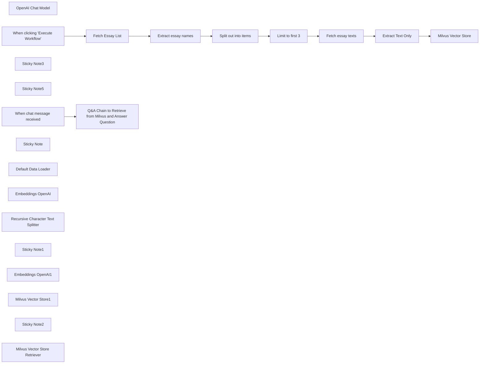

## Fluxo (.json) :

```json
{
  "meta": {
    "instanceId": "89c9c2dbc29ad74e9e02caaf3e27ce718c567278274962e355a9a9679d5f3af7"
  },
  "nodes": [
    {
      "id": "33e94ee1-4244-4075-bb4b-93a99a2cacd9",
      "name": "OpenAI Chat Model",
      "type": "@n8n/n8n-nodes-langchain.lmChatOpenAi",
      "position": [
        20,
        560
      ],
      "parameters": {
        "model": {
          "__rl": true,
          "mode": "list",
          "value": "gpt-4o-mini"
        },
        "options": {}
      },
      "typeVersion": 1.2
    },
    {
      "id": "dd97266d-a039-4d8f-bc7d-fb439ad5a6d7",
      "name": "When clicking \"Execute Workflow\"",
      "type": "n8n-nodes-base.manualTrigger",
      "position": [
        -180,
        0
      ],
      "parameters": {},
      "typeVersion": 1
    },
    {
      "id": "c4d4a979-3182-46c9-b145-fa4e6ba57011",
      "name": "Fetch Essay List",
      "type": "n8n-nodes-base.httpRequest",
      "position": [
        80,
        0
      ],
      "parameters": {
        "url": "http://www.paulgraham.com/articles.html",
        "options": {}
      },
      "typeVersion": 4.2
    },
    {
      "id": "2e2913f9-d01a-41e8-b1b8-9a981910db7b",
      "name": "Extract essay names",
      "type": "n8n-nodes-base.html",
      "position": [
        280,
        0
      ],
      "parameters": {
        "options": {},
        "operation": "extractHtmlContent",
        "extractionValues": {
          "values": [
            {
              "key": "essay",
              "attribute": "href",
              "cssSelector": "table table a",
              "returnArray": true,
              "returnValue": "attribute"
            }
          ]
        }
      },
      "typeVersion": 1.2
    },
    {
      "id": "c121dc65-37e3-49d4-b449-f28491e19a6f",
      "name": "Split out into items",
      "type": "n8n-nodes-base.splitOut",
      "position": [
        480,
        0
      ],
      "parameters": {
        "options": {},
        "fieldToSplitOut": "essay"
      },
      "typeVersion": 1
    },
    {
      "id": "5644c48d-62b6-4e2d-ad25-013b55f5ec71",
      "name": "Fetch essay texts",
      "type": "n8n-nodes-base.httpRequest",
      "position": [
        880,
        0
      ],
      "parameters": {
        "url": "=http://www.paulgraham.com/{{ $json.essay }}",
        "options": {}
      },
      "typeVersion": 4.2
    },
    {
      "id": "cd84596e-4046-4d33-9f43-cf464e5c5c01",
      "name": "Limit to first 3",
      "type": "n8n-nodes-base.limit",
      "position": [
        680,
        0
      ],
      "parameters": {
        "maxItems": 3
      },
      "typeVersion": 1
    },
    {
      "id": "318aeeed-fcce-4de2-aa04-92033ef01f28",
      "name": "Extract Text Only",
      "type": "n8n-nodes-base.html",
      "position": [
        1200,
        0
      ],
      "parameters": {
        "options": {},
        "operation": "extractHtmlContent",
        "extractionValues": {
          "values": [
            {
              "key": "data",
              "cssSelector": "body",
              "skipSelectors": "img,nav"
            }
          ]
        }
      },
      "typeVersion": 1.2
    },
    {
      "id": "0668851e-a31f-4e6e-8966-4544092e318e",
      "name": "Sticky Note3",
      "type": "n8n-nodes-base.stickyNote",
      "position": [
        0,
        -120
      ],
      "parameters": {
        "width": 1071.752021563343,
        "height": 285.66037735849045,
        "content": "## Scrape latest Paul Graham essays"
      },
      "typeVersion": 1
    },
    {
      "id": "cf9af24c-9e08-4f27-ad4e-509f72e54a9b",
      "name": "Sticky Note5",
      "type": "n8n-nodes-base.stickyNote",
      "position": [
        1120,
        -120
      ],
      "parameters": {
        "width": 625,
        "height": 607,
        "content": "## Load into Milvus vector store"
      },
      "typeVersion": 1
    },
    {
      "id": "95e9a59d-1832-4eb7-b58d-ba391c1acb1c",
      "name": "When chat message received",
      "type": "@n8n/n8n-nodes-langchain.chatTrigger",
      "position": [
        -200,
        380
      ],
      "webhookId": "cd2703a7-f912-46fe-8787-3fb83ea116ab",
      "parameters": {
        "options": {}
      },
      "typeVersion": 1.1
    },
    {
      "id": "0076ea3d-e667-4df2-83c3-9de0d3de0498",
      "name": "Sticky Note",
      "type": "n8n-nodes-base.stickyNote",
      "position": [
        -380,
        -160
      ],
      "parameters": {
        "width": 280,
        "height": 180,
        "content": "## Step 1\n1. Set up a Milvus server based on [this guide](https://milvus.io/docs/install_standalone-docker-compose.md). And then create a collection named `my_collection`.\n2. Click this workflow to load scrape and load Paul Graham essays to Milvus collection.\n"
      },
      "typeVersion": 1
    },
    {
      "id": "e90a069e-cfd8-49f1-8fe6-a334bb920027",
      "name": "Milvus Vector Store",
      "type": "@n8n/n8n-nodes-langchain.vectorStoreMilvus",
      "position": [
        1420,
        0
      ],
      "parameters": {
        "mode": "insert",
        "options": {
          "clearCollection": true
        },
        "milvusCollection": {
          "__rl": true,
          "mode": "list",
          "value": "my_collection",
          "cachedResultName": "my_collection"
        }
      },
      "typeVersion": 1.1
    },
    {
      "id": "d786c471-d564-4f25-beab-f1c7f4559f7a",
      "name": "Default Data Loader",
      "type": "@n8n/n8n-nodes-langchain.documentDefaultDataLoader",
      "position": [
        1460,
        220
      ],
      "parameters": {
        "options": {},
        "jsonData": "={{ $('Extract Text Only').item.json.data }}",
        "jsonMode": "expressionData"
      },
      "typeVersion": 1
    },
    {
      "id": "26730b7b-2bb9-46f8-83c3-3d4ffdfdef57",
      "name": "Embeddings OpenAI",
      "type": "@n8n/n8n-nodes-langchain.embeddingsOpenAi",
      "position": [
        1320,
        240
      ],
      "parameters": {
        "options": {}
      },
      "typeVersion": 1.2
    },
    {
      "id": "de836110-4073-44d5-bbf3-d57f57525f69",
      "name": "Recursive Character Text Splitter",
      "type": "@n8n/n8n-nodes-langchain.textSplitterRecursiveCharacterTextSplitter",
      "position": [
        1540,
        340
      ],
      "parameters": {
        "options": {},
        "chunkSize": 6000
      },
      "typeVersion": 1
    },
    {
      "id": "ddaa936e-416a-40e4-adf6-cf7ebfb8b094",
      "name": "Sticky Note1",
      "type": "n8n-nodes-base.stickyNote",
      "position": [
        -380,
        280
      ],
      "parameters": {
        "width": 280,
        "height": 120,
        "content": "## Step 2\nChat with this QA Chain with Milvus retriever\n"
      },
      "typeVersion": 1
    },
    {
      "id": "f5b7410f-37c7-40ff-b841-12ed04252317",
      "name": "Embeddings OpenAI1",
      "type": "@n8n/n8n-nodes-langchain.embeddingsOpenAi",
      "position": [
        80,
        860
      ],
      "parameters": {
        "options": {}
      },
      "typeVersion": 1.2
    },
    {
      "id": "7a5d1b3f-9b2c-4943-9b40-2a213e30159c",
      "name": "Milvus Vector Store1",
      "type": "@n8n/n8n-nodes-langchain.vectorStoreMilvus",
      "position": [
        120,
        720
      ],
      "parameters": {
        "milvusCollection": {
          "__rl": true,
          "mode": "list",
          "value": "my_collection",
          "cachedResultName": "my_collection"
        }
      },
      "typeVersion": 1.1
    },
    {
      "id": "2402387f-e147-4239-9128-34af296e0012",
      "name": "Sticky Note2",
      "type": "n8n-nodes-base.stickyNote",
      "position": [
        -20,
        360
      ],
      "parameters": {
        "color": 7,
        "width": 574,
        "height": 629,
        "content": ""
      },
      "typeVersion": 1
    },
    {
      "id": "3665ef25-e464-496a-84d6-980b96e78e9a",
      "name": "Q&A Chain to Retrieve from Milvus and Answer Question",
      "type": "@n8n/n8n-nodes-langchain.chainRetrievalQa",
      "position": [
        120,
        380
      ],
      "parameters": {
        "options": {}
      },
      "typeVersion": 1.5
    },
    {
      "id": "10bf4a2c-ee2b-4185-b1e5-29b8664078fb",
      "name": "Milvus Vector Store Retriever",
      "type": "@n8n/n8n-nodes-langchain.retrieverVectorStore",
      "position": [
        260,
        580
      ],
      "parameters": {},
      "typeVersion": 1
    }
  ],
  "pinData": {},
  "connections": {
    "Fetch Essay List": {
      "main": [
        [
          {
            "node": "Extract essay names",
            "type": "main",
            "index": 0
          }
        ]
      ]
    },
    "Limit to first 3": {
      "main": [
        [
          {
            "node": "Fetch essay texts",
            "type": "main",
            "index": 0
          }
        ]
      ]
    },
    "Embeddings OpenAI": {
      "ai_embedding": [
        [
          {
            "node": "Milvus Vector Store",
            "type": "ai_embedding",
            "index": 0
          }
        ]
      ]
    },
    "Extract Text Only": {
      "main": [
        [
          {
            "node": "Milvus Vector Store",
            "type": "main",
            "index": 0
          }
        ]
      ]
    },
    "Fetch essay texts": {
      "main": [
        [
          {
            "node": "Extract Text Only",
            "type": "main",
            "index": 0
          }
        ]
      ]
    },
    "OpenAI Chat Model": {
      "ai_languageModel": [
        [
          {
            "node": "Q&A Chain to Retrieve from Milvus and Answer Question",
            "type": "ai_languageModel",
            "index": 0
          }
        ]
      ]
    },
    "Embeddings OpenAI1": {
      "ai_embedding": [
        [
          {
            "node": "Milvus Vector Store1",
            "type": "ai_embedding",
            "index": 0
          }
        ]
      ]
    },
    "Default Data Loader": {
      "ai_document": [
        [
          {
            "node": "Milvus Vector Store",
            "type": "ai_document",
            "index": 0
          }
        ]
      ]
    },
    "Extract essay names": {
      "main": [
        [
          {
            "node": "Split out into items",
            "type": "main",
            "index": 0
          }
        ]
      ]
    },
    "Milvus Vector Store1": {
      "ai_vectorStore": [
        [
          {
            "node": "Milvus Vector Store Retriever",
            "type": "ai_vectorStore",
            "index": 0
          }
        ]
      ]
    },
    "Split out into items": {
      "main": [
        [
          {
            "node": "Limit to first 3",
            "type": "main",
            "index": 0
          }
        ]
      ]
    },
    "When chat message received": {
      "main": [
        [
          {
            "node": "Q&A Chain to Retrieve from Milvus and Answer Question",
            "type": "main",
            "index": 0
          }
        ]
      ]
    },
    "Milvus Vector Store Retriever": {
      "ai_retriever": [
        [
          {
            "node": "Q&A Chain to Retrieve from Milvus and Answer Question",
            "type": "ai_retriever",
            "index": 0
          }
        ]
      ]
    },
    "When clicking \"Execute Workflow\"": {
      "main": [
        [
          {
            "node": "Fetch Essay List",
            "type": "main",
            "index": 0
          }
        ]
      ]
    },
    "Recursive Character Text Splitter": {
      "ai_textSplitter": [
        [
          {
            "node": "Default Data Loader",
            "type": "ai_textSplitter",
            "index": 0
          }
        ]
      ]
    }
  }
}
```

<a id="template-620"></a>

## Template 620 - Captura e verificação de e-mails

- **Nome:** Captura e verificação de e-mails
- **Descrição:** Coleta endereços de e-mail via formulário, verifica se são válidos e adiciona contatos válidos a uma lista de e-mails.
- **Funcionalidade:** • Captura de e-mail via formulário: Recebe submissões de um formulário público com campo de e-mail obrigatório.
• Verificação da validade do e-mail: Consulta um serviço de verificação para determinar se o endereço é válido.
• Decisão automática com base na verificação: Se o e-mail for considerado válido, segue para cadastro; se não, o fluxo não realiza nenhuma ação adicional.
• Adição do contato a uma lista de envio: Insere o e-mail verificado em uma lista específica de contatos para envios futuros.
- **Ferramentas:** • Hunter.io: Serviço de verificação de e-mails para determinar se um endereço é válido.
• SendGrid: Plataforma de gestão de contatos e envio de e-mails usada para adicionar o contato a uma lista de assinatura.

## Fluxo visual

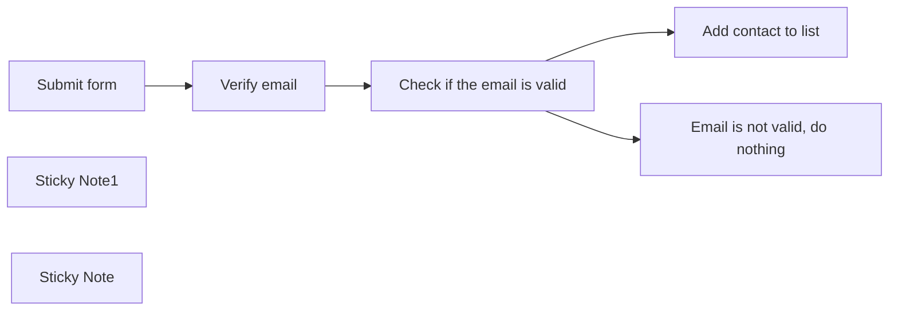

## Fluxo (.json) :

```json
{
  "id": "1blBTEfOEjamDB0N",
  "meta": {
    "instanceId": "558d88703fb65b2d0e44613bc35916258b0f0bf983c5d4730c00c424b77ca36a",
    "templateCredsSetupCompleted": true
  },
  "name": "Email form",
  "tags": [],
  "nodes": [
    {
      "id": "0994dde9-bad8-49b8-b164-1f191decf9ff",
      "name": "Email is not valid, do nothing",
      "type": "n8n-nodes-base.noOp",
      "position": [
        940,
        480
      ],
      "parameters": {},
      "typeVersion": 1
    },
    {
      "id": "b27e140e-7758-42d4-bf07-39b17f85fc82",
      "name": "Check if the email is valid",
      "type": "n8n-nodes-base.if",
      "position": [
        620,
        260
      ],
      "parameters": {
        "options": {},
        "conditions": {
          "options": {
            "version": 1,
            "leftValue": "",
            "caseSensitive": true,
            "typeValidation": "strict"
          },
          "combinator": "and",
          "conditions": [
            {
              "id": "54d84c8a-63ee-40ed-8fb2-301fff0194ba",
              "operator": {
                "name": "filter.operator.equals",
                "type": "string",
                "operation": "equals"
              },
              "leftValue": "={{ $json.status }}",
              "rightValue": "valid"
            }
          ]
        }
      },
      "typeVersion": 2
    },
    {
      "id": "a691af9a-f66f-4fd1-ab82-3d3450098d67",
      "name": "Verify email",
      "type": "n8n-nodes-base.hunter",
      "position": [
        360,
        260
      ],
      "parameters": {
        "email": "={{ $json.Email }}",
        "operation": "emailVerifier"
      },
      "credentials": {
        "hunterApi": {
          "id": "wC6eWJWcNeFHvBqV",
          "name": "Hunter account"
        }
      },
      "typeVersion": 1
    },
    {
      "id": "cfe4d91b-209c-49df-8483-141f5e27fba2",
      "name": "Submit form",
      "type": "n8n-nodes-base.formTrigger",
      "position": [
        80,
        260
      ],
      "webhookId": "80be3272-e1bc-47e4-8112-d39488e84f4b",
      "parameters": {
        "options": {},
        "formTitle": "Join my mailing list now",
        "formFields": {
          "values": [
            {
              "fieldLabel": "Email",
              "requiredField": true
            }
          ]
        },
        "formDescription": "10x your productivity with my A.I. tips. I'll cut the B.S. and give you the most practical tips for A.I. automation."
      },
      "typeVersion": 2.2
    },
    {
      "id": "30d816d9-7a91-47b2-8c06-da0b9114f375",
      "name": "Add contact to list",
      "type": "n8n-nodes-base.sendGrid",
      "position": [
        940,
        240
      ],
      "parameters": {
        "email": "={{ $json.Email }}",
        "resource": "contact",
        "additionalFields": {
          "listIdsUi": {
            "listIdValues": {
              "listIds": [
                "11a55438-d4a8-4740-b054-d273359b7dfe"
              ]
            }
          }
        }
      },
      "credentials": {
        "sendGridApi": {
          "id": "AFtBIAiI3x5QS0WL",
          "name": "SendGrid account"
        }
      },
      "typeVersion": 1
    },
    {
      "id": "e80255c8-25b2-48d5-8605-d7702cbf7bc7",
      "name": "Sticky Note1",
      "type": "n8n-nodes-base.stickyNote",
      "position": [
        60,
        -100
      ],
      "parameters": {
        "width": 505,
        "height": 180,
        "content": "## Automate Email List Building with n8n and Hunter io\n\n💡 Read the [case study here](https://rumjahn.com/create-email-capture-forms-for-free-using-n8n-and-sendgrid-and-easily-grow-your-subscriber-list/).\n\n📺 Watch the [youtube tutorial here](https://www.youtube.com/watch?v=NgvEHwu19Rs&t=2s)\n\n"
      },
      "typeVersion": 1
    },
    {
      "id": "f989d552-81b9-4ee7-aa28-a006b703280f",
      "name": "Sticky Note",
      "type": "n8n-nodes-base.stickyNote",
      "position": [
        300,
        100
      ],
      "parameters": {
        "color": 4,
        "height": 320,
        "content": "## Hunter io\n\nYou need to get a Hunter.io account and input the API key. There's 50 free credits per month."
      },
      "typeVersion": 1
    }
  ],
  "active": true,
  "pinData": {},
  "settings": {
    "executionOrder": "v1"
  },
  "versionId": "1df322f8-6d69-4ae7-b094-3f0dec019d3b",
  "connections": {
    "Submit form": {
      "main": [
        [
          {
            "node": "Verify email",
            "type": "main",
            "index": 0
          }
        ]
      ]
    },
    "Verify email": {
      "main": [
        [
          {
            "node": "Check if the email is valid",
            "type": "main",
            "index": 0
          }
        ]
      ]
    },
    "Check if the email is valid": {
      "main": [
        [
          {
            "node": "Add contact to list",
            "type": "main",
            "index": 0
          }
        ],
        [
          {
            "node": "Email is not valid, do nothing",
            "type": "main",
            "index": 0
          }
        ]
      ]
    }
  }
}
```

<a id="template-621"></a>

## Template 621 - Raspagem dos 20 artigos mais recentes do TechCrunch

- **Nome:** Raspagem dos 20 artigos mais recentes do TechCrunch
- **Descrição:** Coleta os 20 artigos mais recentes da seção "Latest" do TechCrunch, extraindo metadados e o conteúdo completo de cada post.
- **Funcionalidade:** • Início manual para teste: Permite executar o fluxo manualmente para iniciar a raspagem.
• Requisição da página "Latest": Faz requisição da página principal de artigos recentes do TechCrunch.
• Extração da lista de posts: Isola o bloco HTML que contém a lista de artigos.
• Separação dos posts individuais: Divide a lista em itens separados para processamento individual.
• Extração de metadados resumidos: Captura imagem, título, URL e data de cada post a partir da lista.
• Requisição da página de cada post: Acessa a página detalhada de cada artigo utilizando a URL extraída.
• Extração de conteúdo e metadados completos: Obtém título, conteúdo, thumbnail e data diretamente da página do artigo.
• Consolidação e salvamento dos campos: Organiza e salva os campos finais (url, created_at, image, title, content) para uso posterior.
- **Ferramentas:** • TechCrunch: Fonte dos artigos e páginas detalhadas a serem raspadas.
• HTTP/HTTPS: Protocolo utilizado para solicitar páginas e obter o conteúdo HTML.

## Fluxo visual

```mermaid
flowchart LR
    N1["When clicking ‘Test workflow’"]
    N2["Request Techcrunsh Latest Page"]
    N3["Parse a posts box"]
    N4["Parse all posts"]
    N5["split out the posts"]
    N6["Parse each post in detail"]
    N7["Request a post detail page"]
    N8["Parse a post's content and metadata"]
    N9["Save the values"]

    N4 --> N5
    N3 --> N4
    N5 --> N6
    N6 --> N7
    N7 --> N8
    N2 --> N3
    N1 --> N2
    N8 --> N9
```

## Fluxo (.json) :

```json
{
  "id": "MKGrRFnUuMZMAxNf",
  "meta": {
    "instanceId": "0b0f5302e78710cf1b1457ee15a129d8e5d83d4e366bd96d14cc37da6693e692"
  },
  "name": "Scrape Latest 20 TechCrunch Articles",
  "tags": [],
  "nodes": [
    {
      "id": "f757df19-a2b0-42c5-b75e-e4af51696059",
      "name": "When clicking ‘Test workflow’",
      "type": "n8n-nodes-base.manualTrigger",
      "position": [
        -400,
        160
      ],
      "parameters": {},
      "typeVersion": 1
    },
    {
      "id": "1311d3be-cf2e-42ca-ae69-8ebfeb71eefb",
      "name": "Request Techcrunsh Latest Page",
      "type": "n8n-nodes-base.httpRequest",
      "position": [
        -220,
        160
      ],
      "parameters": {
        "url": "=https://techcrunch.com/latest/0",
        "options": {}
      },
      "typeVersion": 4.2
    },
    {
      "id": "c7807fdf-3b0b-40f8-b912-214475501861",
      "name": "Parse a posts box",
      "type": "n8n-nodes-base.html",
      "position": [
        -40,
        160
      ],
      "parameters": {
        "options": {},
        "operation": "extractHtmlContent",
        "extractionValues": {
          "values": [
            {
              "key": "box",
              "cssSelector": "ul.wp-block-post-template",
              "returnValue": "html"
            }
          ]
        }
      },
      "typeVersion": 1.2
    },
    {
      "id": "4f6720e2-32ee-41dd-a369-a05bb06b4441",
      "name": "Parse all posts",
      "type": "n8n-nodes-base.html",
      "position": [
        120,
        160
      ],
      "parameters": {
        "options": {
          "trimValues": true
        },
        "operation": "extractHtmlContent",
        "dataPropertyName": "box",
        "extractionValues": {
          "values": [
            {
              "key": "posts",
              "cssSelector": "li.wp-block-post",
              "returnArray": true,
              "returnValue": "html"
            }
          ]
        }
      },
      "typeVersion": 1.2
    },
    {
      "id": "2d4f5589-1c27-4fa0-9c64-34d02fb091cf",
      "name": "split out the posts",
      "type": "n8n-nodes-base.splitOut",
      "position": [
        300,
        160
      ],
      "parameters": {
        "options": {},
        "fieldToSplitOut": "posts"
      },
      "typeVersion": 1
    },
    {
      "id": "bf35ac63-554a-4039-9636-78016110f615",
      "name": "Parse each post in detail",
      "type": "n8n-nodes-base.html",
      "position": [
        520,
        160
      ],
      "parameters": {
        "options": {
          "trimValues": true
        },
        "operation": "extractHtmlContent",
        "dataPropertyName": "posts",
        "extractionValues": {
          "values": [
            {
              "key": "image",
              "attribute": "src",
              "cssSelector": "img",
              "returnValue": "attribute"
            },
            {
              "key": "title",
              "cssSelector": "h3.loop-card__title"
            },
            {
              "key": "url",
              "attribute": "data-destinationlink",
              "cssSelector": "h3>a",
              "returnValue": "attribute"
            },
            {
              "key": "created_at",
              "attribute": "datetime",
              "cssSelector": "time",
              "returnValue": "attribute"
            }
          ]
        }
      },
      "typeVersion": 1.2
    },
    {
      "id": "2aedd43b-5c04-410e-be37-7e84b798e551",
      "name": "Request a post detail page",
      "type": "n8n-nodes-base.httpRequest",
      "position": [
        720,
        160
      ],
      "parameters": {
        "url": "={{ $json.url }}",
        "options": {}
      },
      "typeVersion": 4.2
    },
    {
      "id": "e0d9eb9c-096c-47de-b39a-d72083d403de",
      "name": "Parse a post's content and metadata",
      "type": "n8n-nodes-base.html",
      "position": [
        940,
        160
      ],
      "parameters": {
        "options": {
          "trimValues": true,
          "cleanUpText": true
        },
        "operation": "extractHtmlContent",
        "extractionValues": {
          "values": [
            {
              "key": "content",
              "cssSelector": "div.entry-content"
            },
            {
              "key": "title",
              "cssSelector": "h1.wp-block-post-title"
            },
            {
              "key": "thumbnail",
              "attribute": "src",
              "cssSelector": "img.attachment-post-thumbnail",
              "returnValue": "attribute"
            },
            {
              "key": "created_at",
              "attribute": "datetime",
              "cssSelector": "time",
              "returnValue": "attribute"
            }
          ]
        }
      },
      "executeOnce": false,
      "typeVersion": 1.2
    },
    {
      "id": "513c616e-9362-4246-a420-70c93863ad6e",
      "name": "Save the values",
      "type": "n8n-nodes-base.set",
      "position": [
        1120,
        160
      ],
      "parameters": {
        "options": {},
        "assignments": {
          "assignments": [
            {
              "id": "411666fc-c934-4cfe-93c8-dd2ba426fa46",
              "name": "url",
              "type": "string",
              "value": "={{ $('Parse each post in detail').item.json.url }}"
            },
            {
              "id": "251700fe-bfee-46a6-b157-c0d029edb594",
              "name": "created_at",
              "type": "string",
              "value": "={{ $('Parse each post in detail').item.json.created_at }}"
            },
            {
              "id": "296f4201-06a3-4d81-b85f-5d0b045e09bd",
              "name": "image",
              "type": "string",
              "value": "={{ $('Parse each post in detail').item.json.image }}"
            },
            {
              "id": "1af47c5f-1b6e-4894-b7c5-9a037a328a0d",
              "name": "content",
              "type": "string",
              "value": "={{ $json.content }}"
            },
            {
              "id": "5595be9f-7d2a-43c5-8b40-839f787e9ace",
              "name": "title",
              "type": "string",
              "value": "={{ $json.title }}"
            }
          ]
        }
      },
      "typeVersion": 3.4
    }
  ],
  "active": false,
  "pinData": {},
  "settings": {
    "executionOrder": "v1"
  },
  "versionId": "6f14b55f-11a9-46f6-ba96-4abdfd3fe2f8",
  "connections": {
    "Parse all posts": {
      "main": [
        [
          {
            "node": "split out the posts",
            "type": "main",
            "index": 0
          }
        ]
      ]
    },
    "Parse a posts box": {
      "main": [
        [
          {
            "node": "Parse all posts",
            "type": "main",
            "index": 0
          }
        ]
      ]
    },
    "split out the posts": {
      "main": [
        [
          {
            "node": "Parse each post in detail",
            "type": "main",
            "index": 0
          }
        ]
      ]
    },
    "Parse each post in detail": {
      "main": [
        [
          {
            "node": "Request a post detail page",
            "type": "main",
            "index": 0
          }
        ]
      ]
    },
    "Request a post detail page": {
      "main": [
        [
          {
            "node": "Parse a post's content and metadata",
            "type": "main",
            "index": 0
          }
        ]
      ]
    },
    "Request Techcrunsh Latest Page": {
      "main": [
        [
          {
            "node": "Parse a posts box",
            "type": "main",
            "index": 0
          }
        ]
      ]
    },
    "When clicking ‘Test workflow’": {
      "main": [
        [
          {
            "node": "Request Techcrunsh Latest Page",
            "type": "main",
            "index": 0
          }
        ]
      ]
    },
    "Parse a post's content and metadata": {
      "main": [
        [
          {
            "node": "Save the values",
            "type": "main",
            "index": 0
          }
        ]
      ]
    }
  }
}
```
