# PACK 1999 TEMPLATES PARTE 04 - Bloco 2

Templates neste bloco: 20

## Sumário

- [Template 622 - Salvar perfil Humantic AI de convidados Calendly no Notion](#template-622)
- [Template 623 - Servidor MCP para gerenciar e executar workflows](#template-623)
- [Template 624 - Verificação e atualização automática da imagem do n8n](#template-624)
- [Template 625 - Extração de domínio de e-mail](#template-625)
- [Template 626 - Agendamento de consultas do Dr. Hakim](#template-626)
- [Template 627 - Agente AI para geração e execução de comandos Proxmox](#template-627)
- [Template 628 - Sincronizar issues do Jira com Notion](#template-628)
- [Template 629 - Baixar imagem e extrair informações](#template-629)
- [Template 630 - Pesquisa automática de participantes de reunião](#template-630)
- [Template 631 - Alerta de mudanças em clientes (post/posição)](#template-631)
- [Template 632 - Notificações de respostas do lemlist com classificação automática](#template-632)
- [Template 633 - Gerar e salvar tweet com hashtag aleatória](#template-633)
- [Template 634 - Consulta de clima por cidade](#template-634)
- [Template 635 - Sincronização Google Sheets → Postgres com geração de SQL por LLM](#template-635)
- [Template 636 - Gerador de imagens por estilo a partir de referência](#template-636)
- [Template 637 - Análise de cabeçalhos de e-mail e reputação de IP](#template-637)
- [Template 638 - Envio simples de SMS internacional](#template-638)
- [Template 639 - Chatbot Telegram multimodal com IA](#template-639)
- [Template 640 - CallForge: AI Gong Sales Call Processor](#template-640)
- [Template 641 - Resposta automática a RFPs](#template-641)

---

<a id="template-622"></a>

## Template 622 - Salvar perfil Humantic AI de convidados Calendly no Notion

- **Nome:** Salvar perfil Humantic AI de convidados Calendly no Notion
- **Descrição:** Quando um convidado agenda via Calendly, o fluxo obtém o identificador do usuário, consulta o serviço de análise de personalidade e grava um registro com o resumo de personalidade no Notion.
- **Funcionalidade:** • Detecção de novo convidado: Inicia o processo ao receber o evento de convidado criado pelo sistema de agendamento.
• Extração de identificador do payload: Lê a resposta específica do convidado no payload para obter o identificador usado na análise.
• Consulta ao serviço de análise: Usa o identificador para buscar o perfil e análise de personalidade detalhada.
• Consulta detalhada do perfil: Realiza uma chamada adicional para obter os resultados completos do usuário a partir do serviço de análise.
• Criação/atualização de registro: Gera uma página no banco de dados com nome e blocos contendo resumo de personalidade e pontuações.
- **Ferramentas:** • Calendly: Plataforma de agendamento que dispara eventos quando um convidado é criado.
• Humantic AI: Serviço de análise de personalidade que retorna perfil, sumário e pontuações comportamentais.
• Notion: Espaço de trabalho onde são criadas páginas ou registros com o resumo e detalhes da personalidade.

## Fluxo visual

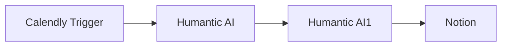

## Fluxo (.json) :

```json
{
  "nodes": [
    {
      "name": "Notion",
      "type": "n8n-nodes-base.notion",
      "position": [
        1050,
        300
      ],
      "parameters": {
        "blockUi": {
          "blockValues": [
            {
              "textContent": "=Name: {{$json[\"display_name\"]}}\nPersonality: {{$json[\"personality_analysis\"][\"summary\"][\"ocean\"][\"description\"].join(', ')}}, {{$json[\"personality_analysis\"][\"summary\"][\"disc\"][\"description\"].join(', ')}}\nOpenness: {{$json[\"personality_analysis\"][\"ocean_assessment\"][\"openness\"][\"level\"]}} {{$json[\"personality_analysis\"][\"ocean_assessment\"][\"openness\"][\"score\"]}}\nCalculativeness: {{$json[\"personality_analysis\"][\"disc_assessment\"][\"calculativeness\"][\"level\"]}} {{$json[\"personality_analysis\"][\"disc_assessment\"][\"calculativeness\"][\"score\"]}}"
            }
          ]
        },
        "resource": "databasePage",
        "databaseId": "",
        "propertiesUi": {
          "propertyValues": [
            {
              "key": "Name|title",
              "title": "={{$json[\"display_name\"]}}"
            }
          ]
        }
      },
      "credentials": {
        "notionApi": ""
      },
      "typeVersion": 1
    },
    {
      "name": "Humantic AI",
      "type": "n8n-nodes-base.humanticAi",
      "position": [
        650,
        300
      ],
      "parameters": {
        "userId": "={{$json[\"payload\"][\"questions_and_responses\"][\"1_response\"]}}"
      },
      "credentials": {
        "humanticAiApi": "humantic"
      },
      "typeVersion": 1
    },
    {
      "name": "Calendly Trigger",
      "type": "n8n-nodes-base.calendlyTrigger",
      "position": [
        450,
        300
      ],
      "webhookId": "6d38c1f6-42ee-4f44-b424-20943075087b",
      "parameters": {
        "events": [
          "invitee.created"
        ]
      },
      "credentials": {
        "calendlyApi": ""
      },
      "typeVersion": 1
    },
    {
      "name": "Humantic AI1",
      "type": "n8n-nodes-base.humanticAi",
      "position": [
        850,
        300
      ],
      "parameters": {
        "userId": "={{$json[\"results\"][\"userid\"]}}",
        "options": {},
        "operation": "get"
      },
      "credentials": {
        "humanticAiApi": ""
      },
      "typeVersion": 1
    }
  ],
  "connections": {
    "Humantic AI": {
      "main": [
        [
          {
            "node": "Humantic AI1",
            "type": "main",
            "index": 0
          }
        ]
      ]
    },
    "Humantic AI1": {
      "main": [
        [
          {
            "node": "Notion",
            "type": "main",
            "index": 0
          }
        ]
      ]
    },
    "Calendly Trigger": {
      "main": [
        [
          {
            "node": "Humantic AI",
            "type": "main",
            "index": 0
          }
        ]
      ]
    }
  }
}
```

<a id="template-623"></a>

## Template 623 - Servidor MCP para gerenciar e executar workflows

- **Nome:** Servidor MCP para gerenciar e executar workflows
- **Descrição:** Fluxo que atua como um servidor MCP, permitindo que um agente descubra, gerencie e execute workflows selecionados, mantendo um conjunto de workflows "disponíveis" em memória.
- **Funcionalidade:** • Expor ferramentas MCP ao agente: disponibiliza operações para listar, buscar, adicionar, remover e executar workflows.
• Buscar workflows filtrados: obtém workflows marcados para uso pelo agente.
• Simplificar metadados de workflows: extrai id, nome, descrição e esquema de parâmetros dos workflows para uso pelo agente.
• Gerir pool de workflows disponíveis: adiciona, remove e lista workflows mantidos em memória persistida.
• Validar disponibilidade antes de executar: impede execução de workflows que não estão na lista de disponíveis e retorna erro adequado.
• Executar workflows como subworkflows: chama workflows adicionados passando parâmetros via passthrough e agrega resultados.
• Manter memória de contexto para conversas: buffer de memória para suportar interações do agente.
• Comunicação com clientes MCP: expõe endpoints SSE/webhook para receber comandos de clientes de agente.
• Operações atômicas em memória: usa set/get/delete para controlar o estado do pool de workflows.
- **Ferramentas:** • Redis: armazenamento em memória para guardar e gerir a lista de workflows "disponíveis".
• OpenAI (modelo de linguagem): fornece capacidade de entendimento e tomada de decisão para o agente conversacional.
• Cliente MCP / Agent (ex.: Claude Desktop): conecta-se ao servidor via SSE/webhook para interagir e enviar solicitações ao agente.
• Plataforma de automação com API: fonte dos workflows (necessita credenciais/API key) para listar e inspecionar definições e metadados.

## Fluxo visual

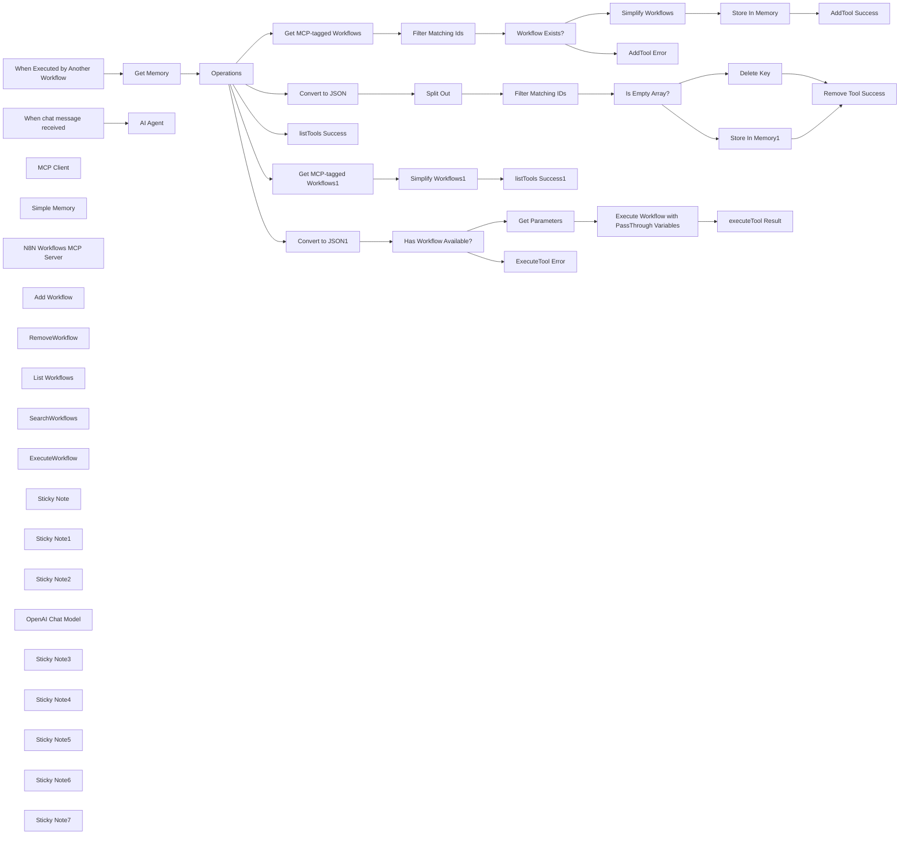

## Fluxo (.json) :

```json
{
  "meta": {
    "instanceId": "408f9fb9940c3cb18ffdef0e0150fe342d6e655c3a9fac21f0f644e8bedabcd9",
    "templateCredsSetupCompleted": true
  },
  "nodes": [
    {
      "id": "e3ed1048-bad0-4e91-bfb5-aef3e1883de4",
      "name": "Simplify Workflows",
      "type": "n8n-nodes-base.set",
      "position": [
        -1740,
        0
      ],
      "parameters": {
        "options": {},
        "assignments": {
          "assignments": [
            {
              "id": "821226b0-12ad-4d1d-81c3-dfa3c286cce4",
              "name": "id",
              "type": "string",
              "value": "={{ $json.id }}"
            },
            {
              "id": "629d95d6-2501-4ad4-a5ed-e557237e1cc2",
              "name": "name",
              "type": "string",
              "value": "={{ $json.name }}"
            },
            {
              "id": "30699f7c-98d3-44ee-9749-c5528579f7e6",
              "name": "description",
              "type": "string",
              "value": "={{\n$json.nodes\n  .filter(node => node.type === 'n8n-nodes-base.stickyNote')\n  .filter(node => node.parameters.content.toLowerCase().includes('try it out'))\n  .map(node => node.parameters.content.substr(0,255) + '...')\n  .join('\\n')\n}}"
            },
            {
              "id": "6199c275-1ced-4f72-ba59-cb068db54c1b",
              "name": "parameters",
              "type": "string",
              "value": "={{\n(function(node) {\n  if (!node) return {};\n  const inputs = node.parameters.workflowInputs.values;\n  return {\n    \"type\": \"object\",\n    \"required\": inputs.map(input => input.name),\n    \"properties\": inputs.reduce((acc, input) => ({\n      ...acc,\n      [input.name]: { type: input.type ?? 'string' }\n    }), {})\n  }\n})(\n$json.nodes\n  .filter(node => node.type === 'n8n-nodes-base.executeWorkflowTrigger')\n  .first()\n)\n.toJsonString()\n}}"
            }
          ]
        }
      },
      "executeOnce": false,
      "typeVersion": 3.4
    },
    {
      "id": "a935f5b6-3a35-49e7-870c-87e4daf0ad13",
      "name": "When Executed by Another Workflow",
      "type": "n8n-nodes-base.executeWorkflowTrigger",
      "position": [
        -3060,
        600
      ],
      "parameters": {
        "workflowInputs": {
          "values": [
            {
              "name": "operation"
            },
            {
              "name": "workflowIds"
            },
            {
              "name": "parameters",
              "type": "object"
            }
          ]
        }
      },
      "typeVersion": 1.1
    },
    {
      "id": "2ff5e521-5288-47a9-af49-55a1bbbfb4f4",
      "name": "Operations",
      "type": "n8n-nodes-base.switch",
      "position": [
        -2660,
        560
      ],
      "parameters": {
        "rules": {
          "values": [
            {
              "outputKey": "Add",
              "conditions": {
                "options": {
                  "version": 2,
                  "leftValue": "",
                  "caseSensitive": true,
                  "typeValidation": "strict"
                },
                "combinator": "and",
                "conditions": [
                  {
                    "id": "3254a8f9-5fd3-4089-be16-cc3fd20639b8",
                    "operator": {
                      "type": "string",
                      "operation": "equals"
                    },
                    "leftValue": "={{ $('When Executed by Another Workflow').first().json.operation }}",
                    "rightValue": "addWorkflow"
                  }
                ]
              },
              "renameOutput": true
            },
            {
              "outputKey": "remove",
              "conditions": {
                "options": {
                  "version": 2,
                  "leftValue": "",
                  "caseSensitive": true,
                  "typeValidation": "strict"
                },
                "combinator": "and",
                "conditions": [
                  {
                    "id": "a33dd02d-5192-48c9-b569-eafddabd2462",
                    "operator": {
                      "name": "filter.operator.equals",
                      "type": "string",
                      "operation": "equals"
                    },
                    "leftValue": "={{ $('When Executed by Another Workflow').first().json.operation }}",
                    "rightValue": "removeWorkflow"
                  }
                ]
              },
              "renameOutput": true
            },
            {
              "outputKey": "list",
              "conditions": {
                "options": {
                  "version": 2,
                  "leftValue": "",
                  "caseSensitive": true,
                  "typeValidation": "strict"
                },
                "combinator": "and",
                "conditions": [
                  {
                    "id": "2d68dc3f-a213-47f8-8453-1bceae404653",
                    "operator": {
                      "name": "filter.operator.equals",
                      "type": "string",
                      "operation": "equals"
                    },
                    "leftValue": "={{ $('When Executed by Another Workflow').first().json.operation }}",
                    "rightValue": "listWorkflows"
                  }
                ]
              },
              "renameOutput": true
            },
            {
              "outputKey": "search",
              "conditions": {
                "options": {
                  "version": 2,
                  "leftValue": "",
                  "caseSensitive": true,
                  "typeValidation": "strict"
                },
                "combinator": "and",
                "conditions": [
                  {
                    "id": "2146a87e-1a50-4caa-a2ee-f7f6fc2b19c9",
                    "operator": {
                      "name": "filter.operator.equals",
                      "type": "string",
                      "operation": "equals"
                    },
                    "leftValue": "={{ $('When Executed by Another Workflow').first().json.operation }}",
                    "rightValue": "searchWorkflows"
                  }
                ]
              },
              "renameOutput": true
            },
            {
              "outputKey": "execute",
              "conditions": {
                "options": {
                  "version": 2,
                  "leftValue": "",
                  "caseSensitive": true,
                  "typeValidation": "strict"
                },
                "combinator": "and",
                "conditions": [
                  {
                    "id": "98b25a51-2cb5-49af-9609-827245595dc9",
                    "operator": {
                      "name": "filter.operator.equals",
                      "type": "string",
                      "operation": "equals"
                    },
                    "leftValue": "={{ $('When Executed by Another Workflow').first().json.operation }}",
                    "rightValue": "executeWorkflow"
                  }
                ]
              },
              "renameOutput": true
            }
          ]
        },
        "options": {}
      },
      "typeVersion": 3.2
    },
    {
      "id": "5b78271a-6474-4d87-a344-72f7f63822dc",
      "name": "Get MCP-tagged Workflows",
      "type": "n8n-nodes-base.n8n",
      "position": [
        -2400,
        200
      ],
      "parameters": {
        "filters": {
          "tags": "mcp"
        },
        "requestOptions": {}
      },
      "credentials": {
        "n8nApi": {
          "id": "5vELmsVPmK4Bkqkg",
          "name": "n8n account"
        }
      },
      "typeVersion": 1
    },
    {
      "id": "1197d29e-b124-4576-846d-876ad16de6e9",
      "name": "Filter Matching Ids",
      "type": "n8n-nodes-base.filter",
      "position": [
        -2180,
        200
      ],
      "parameters": {
        "options": {},
        "conditions": {
          "options": {
            "version": 2,
            "leftValue": "",
            "caseSensitive": true,
            "typeValidation": "strict"
          },
          "combinator": "and",
          "conditions": [
            {
              "id": "90c97733-48de-4402-8388-5d49e3534388",
              "operator": {
                "type": "boolean",
                "operation": "true",
                "singleValue": true
              },
              "leftValue": "={{\n$json.id\n  ? $('When Executed by Another Workflow').first().json.workflowIds.split(',').includes($json.id)\n  : false\n}}",
              "rightValue": "={{ $json.id }}"
            }
          ]
        }
      },
      "executeOnce": false,
      "typeVersion": 2.2,
      "alwaysOutputData": true
    },
    {
      "id": "81623298-c3e7-4e20-86a9-d2587b302f28",
      "name": "Store In Memory",
      "type": "n8n-nodes-base.redis",
      "position": [
        -1520,
        0
      ],
      "parameters": {
        "key": "mcp_n8n_tools",
        "value": "={{\n($('Get Memory').item.json.data?.parseJson() ?? [])\n  .concat($input.all().map(item => item.json))\n  .toJsonString()\n}}",
        "operation": "set"
      },
      "credentials": {
        "redis": {
          "id": "zU4DA70qSDrZM1El",
          "name": "Redis account (localhost)"
        }
      },
      "executeOnce": true,
      "typeVersion": 1
    },
    {
      "id": "5ff0ea2f-a2ee-4cc3-bdf9-153ce5973770",
      "name": "AddTool Success",
      "type": "n8n-nodes-base.set",
      "position": [
        -1300,
        0
      ],
      "parameters": {
        "options": {},
        "assignments": {
          "assignments": [
            {
              "id": "d921063f-e8ed-44a8-95a0-4402ecde6c5d",
              "name": "=response",
              "type": "string",
              "value": "={{ $('Simplify Workflows').all().length }} tools were added successfully."
            }
          ]
        }
      },
      "executeOnce": true,
      "typeVersion": 3.4
    },
    {
      "id": "1d3169cc-15cd-4296-9e63-bb162322e5e2",
      "name": "AddTool Error",
      "type": "n8n-nodes-base.set",
      "position": [
        -1740,
        200
      ],
      "parameters": {
        "options": {},
        "assignments": {
          "assignments": [
            {
              "id": "8c4e0763-a4ff-4e8a-a992-13e4e12a5685",
              "name": "response",
              "type": "string",
              "value": "Expected Tools matching Ids given, but none found."
            }
          ]
        }
      },
      "executeOnce": true,
      "typeVersion": 3.4
    },
    {
      "id": "6149a950-c1ed-44b4-aee6-3daeabf8ba01",
      "name": "Get Memory",
      "type": "n8n-nodes-base.redis",
      "position": [
        -2860,
        600
      ],
      "parameters": {
        "key": "mcp_n8n_tools",
        "options": {},
        "operation": "get",
        "propertyName": "data"
      },
      "credentials": {
        "redis": {
          "id": "zU4DA70qSDrZM1El",
          "name": "Redis account (localhost)"
        }
      },
      "typeVersion": 1
    },
    {
      "id": "3c538002-45f7-4a2f-9ef4-5aede63235ab",
      "name": "Split Out",
      "type": "n8n-nodes-base.splitOut",
      "position": [
        -2180,
        400
      ],
      "parameters": {
        "options": {},
        "fieldToSplitOut": "data"
      },
      "typeVersion": 1
    },
    {
      "id": "d41e48e0-d610-4e18-9942-842419c99c83",
      "name": "Filter Matching IDs",
      "type": "n8n-nodes-base.filter",
      "position": [
        -1960,
        400
      ],
      "parameters": {
        "options": {},
        "conditions": {
          "options": {
            "version": 2,
            "leftValue": "",
            "caseSensitive": true,
            "typeValidation": "strict"
          },
          "combinator": "and",
          "conditions": [
            {
              "id": "d2c149fb-d115-449b-9b74-f3c2f8ff7950",
              "operator": {
                "type": "boolean",
                "operation": "false",
                "singleValue": true
              },
              "leftValue": "={{\n$json.id\n  ? $('Operations').first().json.workflowIds.split(',').includes($json.id)\n  : false\n}}",
              "rightValue": ""
            }
          ]
        }
      },
      "typeVersion": 2.2,
      "alwaysOutputData": true
    },
    {
      "id": "21d8cdda-bb47-42cd-a056-809a5556b438",
      "name": "Store In Memory1",
      "type": "n8n-nodes-base.redis",
      "position": [
        -1520,
        500
      ],
      "parameters": {
        "key": "mcp_n8n_tools",
        "value": "={{ $input.all().flatMap(item => item.json.data).compact() }}",
        "operation": "set"
      },
      "credentials": {
        "redis": {
          "id": "zU4DA70qSDrZM1El",
          "name": "Redis account (localhost)"
        }
      },
      "executeOnce": true,
      "typeVersion": 1
    },
    {
      "id": "5a391d0a-ba13-4d54-85fd-eb2f6a935614",
      "name": "Remove Tool Success",
      "type": "n8n-nodes-base.set",
      "position": [
        -1300,
        400
      ],
      "parameters": {
        "options": {},
        "assignments": {
          "assignments": [
            {
              "id": "1368947f-6625-4e2e-ae27-0fcad0a1d12a",
              "name": "response",
              "type": "string",
              "value": "={{ $('When Executed by Another Workflow').first().json.workflowIds.split(',').length }} tool(s) removed successfully."
            }
          ]
        }
      },
      "typeVersion": 3.4
    },
    {
      "id": "65dfecc4-43ba-4518-adbf-9676c5cb1377",
      "name": "Convert to JSON",
      "type": "n8n-nodes-base.set",
      "position": [
        -2400,
        400
      ],
      "parameters": {
        "options": {},
        "assignments": {
          "assignments": [
            {
              "id": "bce29a06-cff6-4409-96d2-04cc858a0e98",
              "name": "data",
              "type": "array",
              "value": "={{ $json.data.parseJson() }}"
            }
          ]
        }
      },
      "typeVersion": 3.4
    },
    {
      "id": "b8b64fc2-63cf-4b17-9b6d-9d94aec10065",
      "name": "listTools Success",
      "type": "n8n-nodes-base.set",
      "position": [
        -2400,
        600
      ],
      "parameters": {
        "options": {},
        "assignments": {
          "assignments": [
            {
              "id": "bce29a06-cff6-4409-96d2-04cc858a0e98",
              "name": "response",
              "type": "array",
              "value": "={{\n$json.data\n  ? $json.data.parseJson()\n  : []\n}}"
            }
          ]
        }
      },
      "typeVersion": 3.4
    },
    {
      "id": "d4fd9e74-f040-4b3c-8ce0-371315a0d130",
      "name": "Get MCP-tagged Workflows1",
      "type": "n8n-nodes-base.n8n",
      "position": [
        -2180,
        600
      ],
      "parameters": {
        "filters": {
          "tags": "mcp"
        },
        "requestOptions": {}
      },
      "credentials": {
        "n8nApi": {
          "id": "5vELmsVPmK4Bkqkg",
          "name": "n8n account"
        }
      },
      "typeVersion": 1
    },
    {
      "id": "d58922c4-b721-4228-83cb-0b1d9632bbc6",
      "name": "Simplify Workflows1",
      "type": "n8n-nodes-base.set",
      "position": [
        -1960,
        600
      ],
      "parameters": {
        "options": {},
        "assignments": {
          "assignments": [
            {
              "id": "821226b0-12ad-4d1d-81c3-dfa3c286cce4",
              "name": "id",
              "type": "string",
              "value": "={{ $json.id }}"
            },
            {
              "id": "629d95d6-2501-4ad4-a5ed-e557237e1cc2",
              "name": "name",
              "type": "string",
              "value": "={{ $json.name }}"
            },
            {
              "id": "30699f7c-98d3-44ee-9749-c5528579f7e6",
              "name": "description",
              "type": "string",
              "value": "={{\n$json.nodes\n  .filter(node => node.type === 'n8n-nodes-base.stickyNote')\n  .filter(node => node.parameters.content.toLowerCase().includes('try it out'))\n  .map(node => node.parameters.content.substr(0,255) + '...')\n  .join('\\n')\n}}"
            },
            {
              "id": "137221ef-f0a3-4441-bae7-d9d4a22e05b7",
              "name": "parameters",
              "type": "string",
              "value": "={{\n(function(node) {\n  if (!node) return {};\n  const inputs = node.parameters.workflowInputs.values;\n  return {\n    \"type\": \"object\",\n    \"required\": inputs.map(input => input.name),\n    \"properties\": inputs.reduce((acc, input) => ({\n      ...acc,\n      [input.name]: { type: input.type ?? 'string' }\n    }), {})\n  }\n})(\n$json.nodes\n  .filter(node => node.type === 'n8n-nodes-base.executeWorkflowTrigger')\n  .first()\n)\n.toJsonString()\n}}"
            }
          ]
        }
      },
      "executeOnce": false,
      "typeVersion": 3.4
    },
    {
      "id": "b44b1115-5153-4b98-979f-219a32b693de",
      "name": "listTools Success1",
      "type": "n8n-nodes-base.aggregate",
      "position": [
        -1740,
        600
      ],
      "parameters": {
        "options": {},
        "aggregate": "aggregateAllItemData",
        "destinationFieldName": "response"
      },
      "typeVersion": 1
    },
    {
      "id": "e9d9a33c-ebfa-4f74-a4da-fb6b6f6f6df5",
      "name": "Get Parameters",
      "type": "n8n-nodes-base.set",
      "position": [
        -1920,
        1020
      ],
      "parameters": {
        "mode": "raw",
        "options": {},
        "jsonOutput": "={{ $('When Executed by Another Workflow').first().json.parameters }}"
      },
      "typeVersion": 3.4
    },
    {
      "id": "c028324a-5c79-4ce9-afd6-097b6f75a74a",
      "name": "executeTool Result",
      "type": "n8n-nodes-base.aggregate",
      "position": [
        -1440,
        1020
      ],
      "parameters": {
        "options": {},
        "aggregate": "aggregateAllItemData",
        "destinationFieldName": "response"
      },
      "typeVersion": 1
    },
    {
      "id": "9eeac3cb-af7e-44c7-8891-6ff4367d0b54",
      "name": "AI Agent",
      "type": "@n8n/n8n-nodes-langchain.agent",
      "position": [
        -3600,
        1040
      ],
      "parameters": {
        "options": {
          "systemMessage": "=You are a helpful assistant who only uses workflows to answer questions and perform tasks.\n* When asked to complete a task, you will assume there is a workflow which you can use. Do not generate custom scripts or raw commands - use a workflow isntead.\n* Only use the available active workflows as listed using the \"listWorkflows\" tool.\n* Workflows returned by \"listWorkflows\" tool are active in the pool and do not need to be added again.\n* Always ask the user before adding workflows to the availble pool.\n* You do not need to confirm each step with the user when executing workflows.\n* When executing the workflow, the required parameters schema for it is listed in the workflow's profile. To get this profile, use the listWokflows tool.\n* If no available workflows are suitable and you are not able to complete the task, simply let the user know.\n* Do not search for workflows in the directory unless the user requests."
        }
      },
      "typeVersion": 1.8
    },
    {
      "id": "23601548-7863-403e-a671-267bf592b824",
      "name": "When chat message received",
      "type": "@n8n/n8n-nodes-langchain.chatTrigger",
      "position": [
        -3840,
        1040
      ],
      "webhookId": "86a50552-8058-4896-bd7e-ab95eba073ce",
      "parameters": {
        "options": {}
      },
      "typeVersion": 1.1
    },
    {
      "id": "54ed210d-e1b8-4bd7-85e4-88678111a45e",
      "name": "MCP Client",
      "type": "@n8n/n8n-nodes-langchain.mcpClientTool",
      "position": [
        -3360,
        1240
      ],
      "parameters": {
        "sseEndpoint": "=<Production URL of MCP Server>"
      },
      "typeVersion": 1
    },
    {
      "id": "c612da64-9cc1-4601-a987-cd2023fd1863",
      "name": "Simple Memory",
      "type": "@n8n/n8n-nodes-langchain.memoryBufferWindow",
      "position": [
        -3500,
        1240
      ],
      "parameters": {
        "contextWindowLength": 30
      },
      "typeVersion": 1.3
    },
    {
      "id": "77a9fd22-c31c-49e4-9d5f-af572b137925",
      "name": "Convert to JSON1",
      "type": "n8n-nodes-base.set",
      "position": [
        -2360,
        1120
      ],
      "parameters": {
        "options": {},
        "assignments": {
          "assignments": [
            {
              "id": "bce29a06-cff6-4409-96d2-04cc858a0e98",
              "name": "data",
              "type": "array",
              "value": "={{ $json.data.parseJson() }}"
            }
          ]
        }
      },
      "typeVersion": 3.4
    },
    {
      "id": "3377aa25-4190-4bdc-be20-b4e324212060",
      "name": "Has Workflow Available?",
      "type": "n8n-nodes-base.if",
      "position": [
        -2140,
        1120
      ],
      "parameters": {
        "options": {},
        "conditions": {
          "options": {
            "version": 2,
            "leftValue": "",
            "caseSensitive": true,
            "typeValidation": "strict"
          },
          "combinator": "and",
          "conditions": [
            {
              "id": "9c9df00b-b090-4773-8012-1824b4eeb13f",
              "operator": {
                "type": "object",
                "operation": "exists",
                "singleValue": true
              },
              "leftValue": "={{\n$json.data.find(d => d.id === $('When Executed by Another Workflow').item.json.workflowIds)\n}}",
              "rightValue": ""
            }
          ]
        }
      },
      "typeVersion": 2.2
    },
    {
      "id": "92b1bb21-d739-47f0-a278-92ffa5a10cbf",
      "name": "ExecuteTool Error",
      "type": "n8n-nodes-base.set",
      "position": [
        -1920,
        1220
      ],
      "parameters": {
        "options": {},
        "assignments": {
          "assignments": [
            {
              "id": "2fa3e311-e836-42f4-922a-fae19d8e0267",
              "name": "response",
              "type": "string",
              "value": "=Expected workflow to be available but not yet added. You can only use workflows which have been added to the available pool. Use the listWorkflows tool to see available workflows."
            }
          ]
        }
      },
      "typeVersion": 3.4
    },
    {
      "id": "529e35e0-cf11-405a-9011-e6f7f2122a4e",
      "name": "Workflow Exists?",
      "type": "n8n-nodes-base.if",
      "position": [
        -1960,
        200
      ],
      "parameters": {
        "options": {},
        "conditions": {
          "options": {
            "version": 2,
            "leftValue": "",
            "caseSensitive": true,
            "typeValidation": "strict"
          },
          "combinator": "and",
          "conditions": [
            {
              "id": "15aef770-639e-4df0-900f-29013ccd00c4",
              "operator": {
                "type": "object",
                "operation": "notEmpty",
                "singleValue": true
              },
              "leftValue": "={{ $json }}",
              "rightValue": ""
            }
          ]
        }
      },
      "typeVersion": 2.2
    },
    {
      "id": "ba278834-c774-4a3d-8ebc-f64ac77317c2",
      "name": "N8N Workflows MCP Server",
      "type": "@n8n/n8n-nodes-langchain.mcpTrigger",
      "position": [
        -3720,
        240
      ],
      "webhookId": "4625bcf4-0dd9-4562-a70f-6fee41f6f12d",
      "parameters": {
        "path": "4625bcf4-0dd9-4562-a70f-6fee41f6f12d"
      },
      "typeVersion": 1
    },
    {
      "id": "ed940612-4772-4377-afe2-5484a8978665",
      "name": "Add Workflow",
      "type": "@n8n/n8n-nodes-langchain.toolWorkflow",
      "position": [
        -3800,
        460
      ],
      "parameters": {
        "name": "addWorkflow",
        "workflowId": {
          "__rl": true,
          "mode": "id",
          "value": "={{ $workflow.id }}"
        },
        "description": "Adds one or more workflows by ID to the available pool of workflows for the agent. You can get a list of workflows by calling the listTool tool.",
        "workflowInputs": {
          "value": {
            "operation": "addWorkflow",
            "parameters": "null",
            "workflowIds": "={{ /*n8n-auto-generated-fromAI-override*/ $fromAI('workflowIds', ``, 'string') }}"
          },
          "schema": [
            {
              "id": "operation",
              "type": "string",
              "display": true,
              "required": false,
              "displayName": "operation",
              "defaultMatch": false,
              "canBeUsedToMatch": true
            },
            {
              "id": "workflowIds",
              "type": "string",
              "display": true,
              "required": false,
              "displayName": "workflowIds",
              "defaultMatch": false,
              "canBeUsedToMatch": true
            },
            {
              "id": "parameters",
              "type": "object",
              "display": true,
              "required": false,
              "displayName": "parameters",
              "defaultMatch": false,
              "canBeUsedToMatch": true
            }
          ],
          "mappingMode": "defineBelow",
          "matchingColumns": [],
          "attemptToConvertTypes": false,
          "convertFieldsToString": false
        }
      },
      "typeVersion": 2.1
    },
    {
      "id": "e7d5096c-3545-43fd-aa1f-495dc041ccce",
      "name": "RemoveWorkflow",
      "type": "@n8n/n8n-nodes-langchain.toolWorkflow",
      "position": [
        -3700,
        560
      ],
      "parameters": {
        "name": "removeWorkflow",
        "workflowId": {
          "__rl": true,
          "mode": "id",
          "value": "={{ $workflow.id }}"
        },
        "description": "Removes one or more workflows by ID from the available pool of workflows for the agent.",
        "workflowInputs": {
          "value": {
            "operation": "removeWorkflow",
            "parameters": "null",
            "workflowIds": "={{ /*n8n-auto-generated-fromAI-override*/ $fromAI('workflowIds', ``, 'string') }}"
          },
          "schema": [
            {
              "id": "operation",
              "type": "string",
              "display": true,
              "required": false,
              "displayName": "operation",
              "defaultMatch": false,
              "canBeUsedToMatch": true
            },
            {
              "id": "workflowIds",
              "type": "string",
              "display": true,
              "required": false,
              "displayName": "workflowIds",
              "defaultMatch": false,
              "canBeUsedToMatch": true
            },
            {
              "id": "parameters",
              "type": "object",
              "display": true,
              "required": false,
              "displayName": "parameters",
              "defaultMatch": false,
              "canBeUsedToMatch": true
            }
          ],
          "mappingMode": "defineBelow",
          "matchingColumns": [],
          "attemptToConvertTypes": false,
          "convertFieldsToString": false
        }
      },
      "typeVersion": 2.1
    },
    {
      "id": "c20b63dc-e768-4529-a08c-5370853fc4c9",
      "name": "List Workflows",
      "type": "@n8n/n8n-nodes-langchain.toolWorkflow",
      "position": [
        -3580,
        660
      ],
      "parameters": {
        "name": "listTool",
        "workflowId": {
          "__rl": true,
          "mode": "id",
          "value": "={{ $workflow.id }}"
        },
        "description": "Lists the available pool of workflows for the agent.",
        "workflowInputs": {
          "value": {
            "operation": "listWorkflows",
            "parameters": "null",
            "workflowIds": "null"
          },
          "schema": [
            {
              "id": "operation",
              "type": "string",
              "display": true,
              "required": false,
              "displayName": "operation",
              "defaultMatch": false,
              "canBeUsedToMatch": true
            },
            {
              "id": "workflowIds",
              "type": "string",
              "display": true,
              "required": false,
              "displayName": "workflowIds",
              "defaultMatch": false,
              "canBeUsedToMatch": true
            },
            {
              "id": "parameters",
              "type": "object",
              "display": true,
              "required": false,
              "displayName": "parameters",
              "defaultMatch": false,
              "canBeUsedToMatch": true
            }
          ],
          "mappingMode": "defineBelow",
          "matchingColumns": [],
          "attemptToConvertTypes": false,
          "convertFieldsToString": false
        }
      },
      "typeVersion": 2.1
    },
    {
      "id": "88fb8a1e-2f4c-4ff1-8be9-0f7afee2dd4d",
      "name": "SearchWorkflows",
      "type": "@n8n/n8n-nodes-langchain.toolWorkflow",
      "position": [
        -3460,
        560
      ],
      "parameters": {
        "name": "searchTool",
        "workflowId": {
          "__rl": true,
          "mode": "id",
          "value": "={{ $workflow.id }}"
        },
        "description": "Returns all workflows which can be added to the pool of available workflows for the agent.",
        "workflowInputs": {
          "value": {
            "operation": "searchWorkflows",
            "parameters": "null",
            "workflowIds": "null"
          },
          "schema": [
            {
              "id": "operation",
              "type": "string",
              "display": true,
              "required": false,
              "displayName": "operation",
              "defaultMatch": false,
              "canBeUsedToMatch": true
            },
            {
              "id": "workflowIds",
              "type": "string",
              "display": true,
              "required": false,
              "displayName": "workflowIds",
              "defaultMatch": false,
              "canBeUsedToMatch": true
            },
            {
              "id": "parameters",
              "type": "object",
              "display": true,
              "required": false,
              "displayName": "parameters",
              "defaultMatch": false,
              "canBeUsedToMatch": true
            }
          ],
          "mappingMode": "defineBelow",
          "matchingColumns": [],
          "attemptToConvertTypes": false,
          "convertFieldsToString": false
        }
      },
      "typeVersion": 2.1
    },
    {
      "id": "c643c007-de89-4d94-9739-aeb2032c792f",
      "name": "ExecuteWorkflow",
      "type": "@n8n/n8n-nodes-langchain.toolWorkflow",
      "position": [
        -3340,
        460
      ],
      "parameters": {
        "name": "executeTool",
        "workflowId": {
          "__rl": true,
          "mode": "id",
          "value": "={{ $workflow.id }}"
        },
        "description": "Executes a workflow which has been added to the pool of available workflows for the agent.",
        "workflowInputs": {
          "value": {
            "operation": "executeWorkflow",
            "parameters": "={{ /*n8n-auto-generated-fromAI-override*/ $fromAI('parameters', ``, 'string') }}",
            "workflowIds": "={{ /*n8n-auto-generated-fromAI-override*/ $fromAI('workflowIds', ``, 'string') }}"
          },
          "schema": [
            {
              "id": "operation",
              "type": "string",
              "display": true,
              "required": false,
              "displayName": "operation",
              "defaultMatch": false,
              "canBeUsedToMatch": true
            },
            {
              "id": "workflowIds",
              "type": "string",
              "display": true,
              "required": false,
              "displayName": "workflowIds",
              "defaultMatch": false,
              "canBeUsedToMatch": true
            },
            {
              "id": "parameters",
              "type": "object",
              "display": true,
              "required": false,
              "displayName": "parameters",
              "defaultMatch": false,
              "canBeUsedToMatch": true
            }
          ],
          "mappingMode": "defineBelow",
          "matchingColumns": [],
          "attemptToConvertTypes": false,
          "convertFieldsToString": false
        }
      },
      "typeVersion": 2.1
    },
    {
      "id": "4f1c1559-8d50-48b1-94f2-542e0bb4d494",
      "name": "Sticky Note",
      "type": "n8n-nodes-base.stickyNote",
      "position": [
        -3920,
        80
      ],
      "parameters": {
        "color": 7,
        "width": 720,
        "height": 740,
        "content": "## 1. Add MCP Server Trigger\n[Read more about the MCP server trigger](https://docs.n8n.io/integrations/builtin/core-nodes/n8n-nodes-langchain.mcptrigger/)"
      },
      "typeVersion": 1
    },
    {
      "id": "54d61491-04dc-4263-96e0-67827842ca07",
      "name": "Execute Workflow with PassThrough Variables",
      "type": "n8n-nodes-base.executeWorkflow",
      "position": [
        -1660,
        1020
      ],
      "parameters": {
        "options": {
          "waitForSubWorkflow": true
        },
        "workflowId": {
          "__rl": true,
          "mode": "id",
          "value": "={{ $('When Executed by Another Workflow').first().json.workflowIds }}"
        },
        "workflowInputs": {
          "value": {},
          "schema": [],
          "mappingMode": "defineBelow",
          "matchingColumns": [],
          "attemptToConvertTypes": false,
          "convertFieldsToString": true
        }
      },
      "executeOnce": false,
      "typeVersion": 1.2
    },
    {
      "id": "1042884f-a44c-4757-9ff9-3a5cc81058f2",
      "name": "Sticky Note1",
      "type": "n8n-nodes-base.stickyNote",
      "position": [
        -2600,
        -140
      ],
      "parameters": {
        "color": 7,
        "width": 740,
        "height": 300,
        "content": "## 2. Dynamically manage a list of \"Available\" Workflows\n[Learn more about the n8n node](https://docs.n8n.io/integrations/builtin/core-nodes/n8n-nodes-base.n8n)\n\nThe idea is to limit the number of workflows the agent has access to in order to ensure undesired workflows or duplication of similar workflows are avoided. Here, we do this by managing a virtual list of workflows in memory using Redis - under the hood, it's just an array to store Workflow details.\n\nGood to note, the intended workflows must have **Subworkflow triggers** and ideally, with input schema set as well. This template analyses each workflow's JSON and captures its input schema as part of the workflow's description. Doing so,  when it comes time to execute, the agent will know in what format to set the parameters when calling the subworkflow.\n"
      },
      "typeVersion": 1
    },
    {
      "id": "903ead44-3eab-4606-aa4e-e66378bb5f7e",
      "name": "Sticky Note2",
      "type": "n8n-nodes-base.stickyNote",
      "position": [
        -2420,
        820
      ],
      "parameters": {
        "color": 7,
        "width": 1160,
        "height": 600,
        "content": "## 3. Let the Agent execute any N8N Workflow\n[Learn more about the Execute Workflow node](https://docs.n8n.io/integrations/builtin/core-nodes/n8n-nodes-base.executeworkflow/)\n\nFinally once the agent has gathered the required workflows, it will start performing the requested task by executing one or more available workflows. The desired behaviour is that the agent will use \"listWorkflows\" to see which workflows are \"active\" and then plan out how to use them. Attempts to use a workflow before adding it to the available pool will result in an error response."
      },
      "typeVersion": 1
    },
    {
      "id": "194fbcbc-a7bb-41c8-9289-a214b1415386",
      "name": "OpenAI Chat Model",
      "type": "@n8n/n8n-nodes-langchain.lmChatOpenAi",
      "position": [
        -3660,
        1240
      ],
      "parameters": {
        "model": {
          "__rl": true,
          "mode": "list",
          "value": "gpt-4.1-mini",
          "cachedResultName": "gpt-4.1-mini"
        },
        "options": {}
      },
      "credentials": {
        "openAiApi": {
          "id": "8gccIjcuf3gvaoEr",
          "name": "OpenAi account"
        }
      },
      "typeVersion": 1.2
    },
    {
      "id": "aee33258-cf30-4cb4-ab58-7bef7ba27b65",
      "name": "Is Empty Array?",
      "type": "n8n-nodes-base.if",
      "position": [
        -1740,
        400
      ],
      "parameters": {
        "options": {},
        "conditions": {
          "options": {
            "version": 2,
            "leftValue": "",
            "caseSensitive": true,
            "typeValidation": "strict"
          },
          "combinator": "and",
          "conditions": [
            {
              "id": "2cd1b233-fb24-45d5-9efd-1db44b817809",
              "operator": {
                "type": "array",
                "operation": "empty",
                "singleValue": true
              },
              "leftValue": "={{ $input.all().flatMap(item => item.json.data).compact() }}",
              "rightValue": ""
            }
          ]
        }
      },
      "typeVersion": 2.2
    },
    {
      "id": "b367a25f-e679-4a71-910e-27f1aa686816",
      "name": "Delete Key",
      "type": "n8n-nodes-base.redis",
      "position": [
        -1520,
        300
      ],
      "parameters": {
        "key": "mcp_n8n_tools",
        "operation": "delete"
      },
      "credentials": {
        "redis": {
          "id": "zU4DA70qSDrZM1El",
          "name": "Redis account (localhost)"
        }
      },
      "executeOnce": true,
      "typeVersion": 1
    },
    {
      "id": "eec527e1-db4d-4294-a076-379ebd9640a9",
      "name": "Sticky Note3",
      "type": "n8n-nodes-base.stickyNote",
      "position": [
        -3920,
        860
      ],
      "parameters": {
        "color": 7,
        "width": 740,
        "height": 560,
        "content": "## 4. Connect any Agent with a MCP Client\nUse this agent to test your MCP server. Note, i"
      },
      "typeVersion": 1
    },
    {
      "id": "c9b51f36-f9bd-4a60-b195-8da229462331",
      "name": "Sticky Note4",
      "type": "n8n-nodes-base.stickyNote",
      "position": [
        -2880,
        820
      ],
      "parameters": {
        "color": 5,
        "width": 320,
        "height": 400,
        "content": "* **AddWorkflow**\n  This tool adds (or rather, appends) workflows to our \"available\" list.\n* **RemoveWorkflow**\n  This tool removes a workflow entry from our list.\n* **listWorkflows**\n  This tool displays the current state of the workflows list and the available workflows within it. Useful for checking which workflows have been added to the list.\n* **searchWorkflows**\n  For now, this tools just pulls the existing workflows from the n8n instance and returns it to the agent. Given more resources, you may want to swap this out for a indexed search instead (you'll need to build this yourself!)."
      },
      "typeVersion": 1
    },
    {
      "id": "91b2859a-7563-4ebd-ae61-c9a487e18d81",
      "name": "Sticky Note5",
      "type": "n8n-nodes-base.stickyNote",
      "position": [
        -4600,
        -180
      ],
      "parameters": {
        "width": 600,
        "height": 1440,
        "content": "## Try it out!\n### This n8n template shows you how to create an MCP server out of your existing n8n workflows. With this, any MCP client connected can get more done with powerful end-to-end workflows rather than just simple tools.\n\nDesigning agent tools for outcome rather than utility has been a long recommended practice of mine and it applies well when it comes to building MCP servers; In gist, it prefers agents to be making the least calls possible to complete a task.\n\nThis is why n8n can be a great fit for MCP servers! This template connects your agent/MCP client (like Claude Desktop) to your existing workflows by allowing the AI to discover, manage and run these workflows indirectly.\n\n### How it works\n* An MCP trigger is used and attaches 4 custom workflow tools to discover and manage existing workflows to use and 1 custom workflow tool to execute them.\n* We'll introduce an idea of \"available\" workflows which the agent is allowed to use. This will help limit and avoid some issues when trying to use every workflow such as clashes or non-production.\n* The n8n node is a core node which taps into your n8n instance API and is able to retrieve all workflows or filter by tag. For our example, we've tagged the workflows we want to use with \"mcp\" and these are exposed through the tool \"search workflows\".\n* Redis is used as our main memory for keeping track of which workflows are \"available\". The tools we have are \"add Workflow\", \"remove workflow\" and \"list workflows\". The agent should be able to manage this autonomously.\n* Our approach to allow the agent to execute workflows is to use the Subworkflow trigger. The tricky part is figuring out the input schema for each but was eventually solved by pulling this information out of the workflow's template JSON and adding it as part of the \"available\" workflow's description. To pass parameters through the Subworkflow trigger, we can do so via the passthrough method - which is that incoming data is used when parameters are not explicitly set within the node.\n* When running, the agent will not see the \"available\" workflows immediately but will need to discover them via \"list\" and \"search\". The human will need to make the agent aware that these workflows will be preferred when answering queries or completing tasks.\n\n### How to use\n* First, decide which workflows will be made visible to the MCP server. This example uses the tag of \"mcp\" but you can all workflows or filter in other ways.\n* Next, ensure these workflows have Subworkflow triggers with input schema set. This is how the MCP server will run them.\n* Set the MCP server to \"active\" which turns on production mode and makes available to production URL.\n* Use this production URL in your MCP client. For Claude Desktop, see the instructions here - https://docs.n8n.io/integrations/builtin/core-nodes/n8n-nodes-langchain.mcptrigger/#integrating-with-claude-desktop.\n* There is a small learning curve which will shape how you communicate with this MCP server so be patient and test. The MCP server will work better if there is a focused goal in mind ie. Research and report, rather than just a collection of unrelated tools.\n\n### Requirements\n* N8N API key to filter for selected workflows.\n* N8N workflows with Subworkflow triggers!\n* Redis for memory and tracking the \"available\" workflows.\n* MCP Client or Agent for usage such as Claude Desktop - https://claude.ai/download\n\n### Customising this workflow\n* If your targeted workflows do not use the subworkflow trigger, it is possible to amend the executeTool to use HTTP requests for webhooks.\n* Managing available workflows helps if you have many workflows where some may be too similar for the agent. If this isn't a problem for you however, feel free to remove the concept of \"available\" and let the agent discover and use all workflows!"
      },
      "typeVersion": 1
    },
    {
      "id": "ec3194d2-90c8-4019-a1b5-576c61e9a8b0",
      "name": "Sticky Note6",
      "type": "n8n-nodes-base.stickyNote",
      "position": [
        -2600,
        -280
      ],
      "parameters": {
        "color": 5,
        "width": 380,
        "height": 120,
        "content": "### How many existing workflows can I use?\nWell, as many as you want really! For this example, I've limited it for workflows which are tagged as \"mcp\" but you can remove this filter to allow all."
      },
      "typeVersion": 1
    },
    {
      "id": "5f587241-5604-4724-bc01-3c9bc3f7bdc2",
      "name": "Sticky Note7",
      "type": "n8n-nodes-base.stickyNote",
      "position": [
        -1720,
        1000
      ],
      "parameters": {
        "height": 440,
        "content": "\n\n\n\n\n\n\n\n\n\n\n\n\n\n\n### 🚨 Ensure this node does not set the input schema!\nFor passthrough parameters to work, this node should not make available input schema fields. ie. the input fields should not be visible.\n\nIf there are, the node needs to be reset!"
      },
      "typeVersion": 1
    }
  ],
  "pinData": {},
  "connections": {
    "Split Out": {
      "main": [
        [
          {
            "node": "Filter Matching IDs",
            "type": "main",
            "index": 0
          }
        ]
      ]
    },
    "Delete Key": {
      "main": [
        [
          {
            "node": "Remove Tool Success",
            "type": "main",
            "index": 0
          }
        ]
      ]
    },
    "Get Memory": {
      "main": [
        [
          {
            "node": "Operations",
            "type": "main",
            "index": 0
          }
        ]
      ]
    },
    "MCP Client": {
      "ai_tool": [
        [
          {
            "node": "AI Agent",
            "type": "ai_tool",
            "index": 0
          }
        ]
      ]
    },
    "Operations": {
      "main": [
        [
          {
            "node": "Get MCP-tagged Workflows",
            "type": "main",
            "index": 0
          }
        ],
        [
          {
            "node": "Convert to JSON",
            "type": "main",
            "index": 0
          }
        ],
        [
          {
            "node": "listTools Success",
            "type": "main",
            "index": 0
          }
        ],
        [
          {
            "node": "Get MCP-tagged Workflows1",
            "type": "main",
            "index": 0
          }
        ],
        [
          {
            "node": "Convert to JSON1",
            "type": "main",
            "index": 0
          }
        ]
      ]
    },
    "Add Workflow": {
      "ai_tool": [
        [
          {
            "node": "N8N Workflows MCP Server",
            "type": "ai_tool",
            "index": 0
          }
        ]
      ]
    },
    "Simple Memory": {
      "ai_memory": [
        [
          {
            "node": "AI Agent",
            "type": "ai_memory",
            "index": 0
          }
        ]
      ]
    },
    "Get Parameters": {
      "main": [
        [
          {
            "node": "Execute Workflow with PassThrough Variables",
            "type": "main",
            "index": 0
          }
        ]
      ]
    },
    "List Workflows": {
      "ai_tool": [
        [
          {
            "node": "N8N Workflows MCP Server",
            "type": "ai_tool",
            "index": 0
          }
        ]
      ]
    },
    "RemoveWorkflow": {
      "ai_tool": [
        [
          {
            "node": "N8N Workflows MCP Server",
            "type": "ai_tool",
            "index": 0
          }
        ]
      ]
    },
    "Convert to JSON": {
      "main": [
        [
          {
            "node": "Split Out",
            "type": "main",
            "index": 0
          }
        ]
      ]
    },
    "ExecuteWorkflow": {
      "ai_tool": [
        [
          {
            "node": "N8N Workflows MCP Server",
            "type": "ai_tool",
            "index": 0
          }
        ]
      ]
    },
    "Is Empty Array?": {
      "main": [
        [
          {
            "node": "Delete Key",
            "type": "main",
            "index": 0
          }
        ],
        [
          {
            "node": "Store In Memory1",
            "type": "main",
            "index": 0
          }
        ]
      ]
    },
    "SearchWorkflows": {
      "ai_tool": [
        [
          {
            "node": "N8N Workflows MCP Server",
            "type": "ai_tool",
            "index": 0
          }
        ]
      ]
    },
    "Store In Memory": {
      "main": [
        [
          {
            "node": "AddTool Success",
            "type": "main",
            "index": 0
          }
        ]
      ]
    },
    "Convert to JSON1": {
      "main": [
        [
          {
            "node": "Has Workflow Available?",
            "type": "main",
            "index": 0
          }
        ]
      ]
    },
    "Store In Memory1": {
      "main": [
        [
          {
            "node": "Remove Tool Success",
            "type": "main",
            "index": 0
          }
        ]
      ]
    },
    "Workflow Exists?": {
      "main": [
        [
          {
            "node": "Simplify Workflows",
            "type": "main",
            "index": 0
          }
        ],
        [
          {
            "node": "AddTool Error",
            "type": "main",
            "index": 0
          }
        ]
      ]
    },
    "OpenAI Chat Model": {
      "ai_languageModel": [
        [
          {
            "node": "AI Agent",
            "type": "ai_languageModel",
            "index": 0
          }
        ]
      ]
    },
    "Simplify Workflows": {
      "main": [
        [
          {
            "node": "Store In Memory",
            "type": "main",
            "index": 0
          }
        ]
      ]
    },
    "Filter Matching IDs": {
      "main": [
        [
          {
            "node": "Is Empty Array?",
            "type": "main",
            "index": 0
          }
        ]
      ]
    },
    "Filter Matching Ids": {
      "main": [
        [
          {
            "node": "Workflow Exists?",
            "type": "main",
            "index": 0
          }
        ]
      ]
    },
    "Simplify Workflows1": {
      "main": [
        [
          {
            "node": "listTools Success1",
            "type": "main",
            "index": 0
          }
        ]
      ]
    },
    "Has Workflow Available?": {
      "main": [
        [
          {
            "node": "Get Parameters",
            "type": "main",
            "index": 0
          }
        ],
        [
          {
            "node": "ExecuteTool Error",
            "type": "main",
            "index": 0
          }
        ]
      ]
    },
    "Get MCP-tagged Workflows": {
      "main": [
        [
          {
            "node": "Filter Matching Ids",
            "type": "main",
            "index": 0
          }
        ]
      ]
    },
    "Get MCP-tagged Workflows1": {
      "main": [
        [
          {
            "node": "Simplify Workflows1",
            "type": "main",
            "index": 0
          }
        ]
      ]
    },
    "When chat message received": {
      "main": [
        [
          {
            "node": "AI Agent",
            "type": "main",
            "index": 0
          }
        ]
      ]
    },
    "When Executed by Another Workflow": {
      "main": [
        [
          {
            "node": "Get Memory",
            "type": "main",
            "index": 0
          }
        ]
      ]
    },
    "Execute Workflow with PassThrough Variables": {
      "main": [
        [
          {
            "node": "executeTool Result",
            "type": "main",
            "index": 0
          }
        ]
      ]
    }
  }
}
```

<a id="template-624"></a>

## Template 624 - Verificação e atualização automática da imagem do n8n

- **Nome:** Verificação e atualização automática da imagem do n8n
- **Descrição:** Verifica periodicamente a versão da imagem em execução, consulta a versão mais recente no GitHub e, com aprovação, atualiza a imagem e reinicia os serviços, notificando via Telegram.
- **Funcionalidade:** • Agendamento e disparo manual: Permite checagens periódicas e execução sob demanda.
• Definição de variáveis padrão: Define diretório de trabalho, nome do container e ID do Telegram usados pelo fluxo.
• Verificação da versão instalada: Executa comando remoto para obter a versão da imagem atualmente em execução no servidor.
• Obtenção da versão mais recente: Consulta a API do GitHub para recuperar a release mais recente do repositório.
• Normalização de string de versão: Remove prefixos indesejados (ex.: "n8n@") do tag retornado.
• Comparação de versões: Compara a versão instalada com a versão disponível no GitHub.
• Notificação quando está atualizado: Envia mensagem informando que não há necessidade de atualização.
• Solicitação de aprovação para atualizar: Envia mensagem interativa pedindo permissão para iniciar o processo de atualização.
• Processo de atualização automatizado: Ao receber aprovação, puxa a nova imagem, executa docker compose pull e reinicia os serviços (docker compose up -d).
• Notificação pós-atualização: Informa via Telegram que a atualização foi iniciada/concluída.
- **Ferramentas:** • Docker: Usado para inspecionar containers, puxar imagens e executar containers.
• Docker Compose: Usado para puxar imagens definidas no arquivo compose e subir os serviços com as novas imagens.
• GitHub API: Fonte para obter informações da última release do repositório oficial.
• SSH: Para executar comandos remotamente no servidor onde os containers rodam.
• Telegram: Canal de notificação e interação para solicitar aprovação e enviar status.
• jq: Utilitário de linha de comando usado remotamente para extrair campos JSON (ex.: tag da imagem).

## Fluxo visual

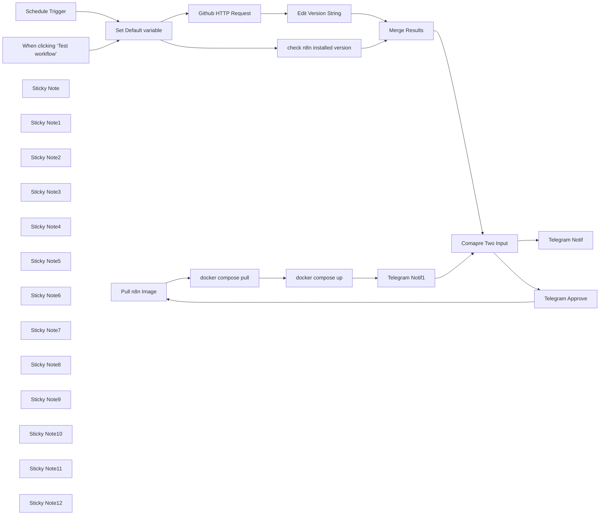

## Fluxo (.json) :

```json
{
  "id": "PVBUCGQUOiOrIfli",
  "meta": {
    "instanceId": "740d0a59ff901341d9247a8b17beaace585edc6342f8d716c9cf18ea3ac6313a",
    "templateCredsSetupCompleted": true
  },
  "name": "n8n update",
  "tags": [
    {
      "id": "AW45ve4sa5vbdnkZ",
      "name": "#n8n",
      "createdAt": "2025-03-30T00:22:43.140Z",
      "updatedAt": "2025-03-30T00:22:43.140Z"
    }
  ],
  "nodes": [
    {
      "id": "445aa127-ac55-4e01-ab07-90a45cf0fab1",
      "name": "Pull n8n Image",
      "type": "n8n-nodes-base.ssh",
      "position": [
        300,
        -240
      ],
      "parameters": {
        "cwd": "={{ $('Set Default variable').item.json['working-directory'] }}",
        "command": "sudo docker pull docker.n8n.io/n8nio/n8n"
      },
      "credentials": {
        "sshPassword": {
          "id": "tqNyOVbQTikb35Tk",
          "name": "SSH Password account"
        }
      },
      "typeVersion": 1
    },
    {
      "id": "e437f006-cdee-4ab3-bfaa-f323b072c380",
      "name": "docker compose pull",
      "type": "n8n-nodes-base.ssh",
      "position": [
        560,
        -240
      ],
      "parameters": {
        "cwd": "={{ $('Set Default variable').item.json['working-directory'] }}",
        "command": "sudo docker compose pull"
      },
      "credentials": {
        "sshPassword": {
          "id": "tqNyOVbQTikb35Tk",
          "name": "SSH Password account"
        }
      },
      "typeVersion": 1
    },
    {
      "id": "79e7a23e-1bd6-45c8-b9b0-ee959c11aa01",
      "name": "check n8n installed version",
      "type": "n8n-nodes-base.ssh",
      "position": [
        -1100,
        -660
      ],
      "parameters": {
        "cwd": "={{ $json['working-directory'] }}",
        "command": "=sudo docker inspect \"{{ $json['n8n-container-name'] }}\" | jq -r '.[0].Config.Labels[\"org.opencontainers.image.version\"]'"
      },
      "credentials": {
        "sshPassword": {
          "id": "tqNyOVbQTikb35Tk",
          "name": "SSH Password account"
        }
      },
      "executeOnce": false,
      "typeVersion": 1,
      "alwaysOutputData": false
    },
    {
      "id": "a84ab5f7-da59-4d7a-aeac-ec1651115924",
      "name": "When clicking ‘Test workflow’",
      "type": "n8n-nodes-base.manualTrigger",
      "position": [
        -1800,
        -200
      ],
      "parameters": {},
      "typeVersion": 1
    },
    {
      "id": "9306fb33-0780-49db-bf22-13e264f0c2bf",
      "name": "Schedule Trigger",
      "type": "n8n-nodes-base.scheduleTrigger",
      "position": [
        -1800,
        -460
      ],
      "parameters": {
        "rule": {
          "interval": [
            {
              "daysInterval": 3,
              "triggerAtHour": 13
            }
          ]
        }
      },
      "typeVersion": 1.2
    },
    {
      "id": "a47fe6aa-f12b-4974-ac55-214b2fd76eff",
      "name": "Sticky Note",
      "type": "n8n-nodes-base.stickyNote",
      "position": [
        -1540,
        -660
      ],
      "parameters": {
        "height": 500,
        "content": "## Default Variables  \nBefore starting, please set the following variables:  \n\n- **working-directory**: The directory where your `docker-compose.yml` file is located.  \n- **n8n-container-name**: The name of your n8n Docker container.  \n- **telegram-id**: Your Telegram chat ID. You can find it by messaging `@get_id_bot` on Telegram.  \n"
      },
      "typeVersion": 1
    },
    {
      "id": "bd9cba21-5ce6-4ce1-803b-ac77b9e58f45",
      "name": "Sticky Note1",
      "type": "n8n-nodes-base.stickyNote",
      "position": [
        -1300,
        -240
      ],
      "parameters": {
        "height": 300,
        "content": "\n\n\n\n\n\n\n\n\n\n\n\n\n\n\nGet information from the n8n GitHub repository to find the latest released version of n8n.  \n"
      },
      "typeVersion": 1
    },
    {
      "id": "4db11a08-3feb-4f91-9671-a675a2e7ae76",
      "name": "Sticky Note2",
      "type": "n8n-nodes-base.stickyNote",
      "position": [
        -1040,
        -240
      ],
      "parameters": {
        "height": 300,
        "content": "\n\n\n\n\n\n\n\n\n\n\n\nThis node removes \"n8n@\" from the version string.  \nFor example:  \n- Before: `n8n@1.84.3`  \n- After: `1.84.3`  \n\n"
      },
      "typeVersion": 1
    },
    {
      "id": "d479524f-143e-4894-909d-e9970590e0e2",
      "name": "Sticky Note3",
      "type": "n8n-nodes-base.stickyNote",
      "position": [
        -1160,
        -880
      ],
      "parameters": {
        "height": 400,
        "content": "## Check Installed Image Version  \nExecute a command on the server to determine which version of n8n is currently running.  \n"
      },
      "typeVersion": 1
    },
    {
      "id": "f896acec-2dc5-477b-88f2-9b8e36550006",
      "name": "Sticky Note4",
      "type": "n8n-nodes-base.stickyNote",
      "position": [
        -820,
        -880
      ],
      "parameters": {
        "width": 420,
        "height": 520,
        "content": "## SQL Query: Merging Inputs  \nThis query retrieves the `stdout` field from `input1` and `tag_name` from `input2`.  \nIt uses a `LEFT JOIN` to merge the data based on matching `id` fields.  \n\nQuery:  \n```sql\nSELECT input1.stdout AS stdout, \ninput2.tag_name AS tag_name\nFROM input1\nLEFT JOIN input2 ON input1.id = input2.id;\n"
      },
      "typeVersion": 1
    },
    {
      "id": "7913800b-b46f-40e2-851d-cc3cc2104843",
      "name": "Sticky Note5",
      "type": "n8n-nodes-base.stickyNote",
      "position": [
        -60,
        -1080
      ],
      "parameters": {
        "height": 380,
        "content": "## Telegram Notificaton [OPTIONAL]\nSend a Telegram message and inform that there is nothing to do and n8n is already on the latest version.\n\n\n\n\n\n\n\n\n"
      },
      "typeVersion": 1
    },
    {
      "id": "63ef2c3f-d0d2-438e-9427-90592397df22",
      "name": "Sticky Note6",
      "type": "n8n-nodes-base.stickyNote",
      "position": [
        -380,
        -680
      ],
      "parameters": {
        "height": 340,
        "content": "## Compare Versions  \nThis node compares two versions: one from Docker and another from the n8n GitHub repository.  \nIf a new version is available, it will be detected.  \n\n\n"
      },
      "typeVersion": 1
    },
    {
      "id": "77ebd46f-09af-4e68-a1a7-a6d97c3f9021",
      "name": "Sticky Note7",
      "type": "n8n-nodes-base.stickyNote",
      "position": [
        -40,
        -420
      ],
      "parameters": {
        "height": 340,
        "content": "## Telegram Approve\nSend a Telegram notification and inform that a new version is available. Ask if the user wants to update.\n\n\n\n\n\n\n\n\n\n\n\n"
      },
      "typeVersion": 1
    },
    {
      "id": "7365971c-1e77-4eae-a23f-9f7843b40889",
      "name": "Sticky Note8",
      "type": "n8n-nodes-base.stickyNote",
      "position": [
        220,
        -420
      ],
      "parameters": {
        "height": 340,
        "content": "## Pull Docker Image\nPull the latest n8n image. You can modify the command as needed.\n\n\n\n\n\n\n\n\n"
      },
      "typeVersion": 1
    },
    {
      "id": "1e7b547c-e9b1-4b91-8241-6cdd6a746100",
      "name": "Sticky Note9",
      "type": "n8n-nodes-base.stickyNote",
      "position": [
        500,
        -420
      ],
      "parameters": {
        "height": 340,
        "content": "## Docker Compose Pull\nRuns in the directory you defined in the Default variable.\n\n\n\n\n\n\n\n\n\n"
      },
      "typeVersion": 1
    },
    {
      "id": "f2817779-b2e9-4205-baf7-1f0481bae0e4",
      "name": "Sticky Note10",
      "type": "n8n-nodes-base.stickyNote",
      "position": [
        780,
        -420
      ],
      "parameters": {
        "height": 340,
        "content": "## Docker Compose Up \nIn this step, the container will be started with the new image.\n\n\n\n\n\n\n\n\n\n\n"
      },
      "typeVersion": 1
    },
    {
      "id": "4823d32f-9237-444f-812f-1bc494d0e087",
      "name": "Sticky Note11",
      "type": "n8n-nodes-base.stickyNote",
      "position": [
        1060,
        -420
      ],
      "parameters": {
        "height": 340,
        "content": "## Telegram Notificaton\nSend a Telegram notification and inform that n8n has been updated.\n\n\n\n\n\n\n\n\n"
      },
      "typeVersion": 1
    },
    {
      "id": "8bcf0308-7904-4635-8f0e-7335e360dabc",
      "name": "docker compose up",
      "type": "n8n-nodes-base.ssh",
      "position": [
        840,
        -240
      ],
      "parameters": {
        "cwd": "={{ $('Set Default variable').item.json['working-directory'] }}",
        "command": "sudo docker compose up -d"
      },
      "credentials": {
        "sshPassword": {
          "id": "tqNyOVbQTikb35Tk",
          "name": "SSH Password account"
        }
      },
      "typeVersion": 1
    },
    {
      "id": "add506c6-88b7-480c-be13-2de86f6094ca",
      "name": "Sticky Note12",
      "type": "n8n-nodes-base.stickyNote",
      "position": [
        -1840,
        -660
      ],
      "parameters": {
        "height": 340,
        "content": "## Schedule Trigger  \nYou can schedule this workflow, for example, every three days to check n8n images.\n\n\n\n\n\n"
      },
      "typeVersion": 1
    },
    {
      "id": "045ebd0a-9d54-4cae-8307-f23ed26103f9",
      "name": "Set Default variable",
      "type": "n8n-nodes-base.set",
      "position": [
        -1480,
        -320
      ],
      "parameters": {
        "options": {},
        "assignments": {
          "assignments": [
            {
              "id": "c06b2d24-1fd7-40f0-aee5-b5d6553e289e",
              "name": "working-directory",
              "type": "string",
              "value": ""
            },
            {
              "id": "451aad67-5190-4eab-a982-56092734bb07",
              "name": "n8n-container-name",
              "type": "string",
              "value": ""
            },
            {
              "id": "8a294900-f367-47a2-b260-344b133dc2ff",
              "name": "telegram-id",
              "type": "string",
              "value": "598677820"
            }
          ]
        }
      },
      "typeVersion": 3.4,
      "alwaysOutputData": true
    },
    {
      "id": "6bc2b28c-0f3c-44aa-a536-766f972f9e22",
      "name": "Github HTTP Request",
      "type": "n8n-nodes-base.httpRequest",
      "position": [
        -1240,
        -220
      ],
      "parameters": {
        "url": "https://api.github.com/repos/n8n-io/n8n/releases/latest",
        "options": {}
      },
      "typeVersion": 4.2,
      "alwaysOutputData": false
    },
    {
      "id": "8ba3f574-9f2b-48d2-95fc-b57d57ecf6c1",
      "name": "Merge Results",
      "type": "n8n-nodes-base.merge",
      "position": [
        -660,
        -560
      ],
      "parameters": {
        "mode": "combineBySql",
        "query": "SELECT input1.stdout, input2.tag_name \nFROM input1 \nLEFT JOIN input2 ON true;"
      },
      "typeVersion": 3.1
    },
    {
      "id": "c97723c3-1733-4481-add2-7ecae02ea144",
      "name": "Edit Version String",
      "type": "n8n-nodes-base.set",
      "position": [
        -960,
        -220
      ],
      "parameters": {
        "options": {},
        "assignments": {
          "assignments": [
            {
              "id": "f6e5cc51-aa49-46e5-aa4c-73baec811afa",
              "name": "tag_name",
              "type": "string",
              "value": "={{ $json[\"tag_name\"].replace(\"n8n@\", \"\") }}"
            }
          ]
        }
      },
      "typeVersion": 3.4
    },
    {
      "id": "22bec435-84ba-44bb-8127-c5b099fda7f2",
      "name": "Comapre Two Input",
      "type": "n8n-nodes-base.if",
      "position": [
        -320,
        -500
      ],
      "parameters": {
        "options": {},
        "conditions": {
          "options": {
            "version": 2,
            "leftValue": "",
            "caseSensitive": true,
            "typeValidation": "strict"
          },
          "combinator": "and",
          "conditions": [
            {
              "id": "e88d2c77-5ee1-4296-a612-d9b2290f6e03",
              "operator": {
                "type": "string",
                "operation": "equals"
              },
              "leftValue": "={{ $json.stdout }}",
              "rightValue": "={{ $json.tag_name }}"
            }
          ]
        },
        "looseTypeValidation": "="
      },
      "typeVersion": 2.2
    },
    {
      "id": "be9bdef5-88f4-4f12-8938-82f8206b8655",
      "name": "Telegram Notif",
      "type": "n8n-nodes-base.telegram",
      "position": [
        0,
        -860
      ],
      "webhookId": "38d19f3d-0ef4-40df-b831-701ea242bb8f",
      "parameters": {
        "text": "n8n is up to date.",
        "chatId": "={{ $('Set Default variable').item.json['telegram-id'] }}",
        "additionalFields": {}
      },
      "credentials": {
        "telegramApi": {
          "id": "Zx3ibmlSzRKZQsFa",
          "name": "Telegram account"
        }
      },
      "typeVersion": 1.2
    },
    {
      "id": "59ece477-dcf2-4898-a362-7fcd35a49315",
      "name": "Telegram Approve",
      "type": "n8n-nodes-base.telegram",
      "position": [
        20,
        -240
      ],
      "webhookId": "e816696f-cb7a-4036-92bf-eafb5f06778c",
      "parameters": {
        "chatId": "={{ $('Set Default variable').item.json['telegram-id'] }}",
        "message": "Hi, \na new n8n version is available. \nI'm ready to update. \nCan I start now?",
        "options": {},
        "operation": "sendAndWait"
      },
      "credentials": {
        "telegramApi": {
          "id": "Zx3ibmlSzRKZQsFa",
          "name": "Telegram account"
        }
      },
      "typeVersion": 1.2
    },
    {
      "id": "292efcfd-bbd7-4170-9e9f-020f10483c5e",
      "name": "Telegram Notif1",
      "type": "n8n-nodes-base.telegram",
      "position": [
        1120,
        -240
      ],
      "webhookId": "254019a6-a298-4a9e-b100-8b92f22469c3",
      "parameters": {
        "text": "We are updating n8n to the latest version.",
        "chatId": "={{ $('Set Default variable').item.json['telegram-id'] }}",
        "additionalFields": {}
      },
      "credentials": {
        "telegramApi": {
          "id": "Zx3ibmlSzRKZQsFa",
          "name": "Telegram account"
        }
      },
      "typeVersion": 1.2
    }
  ],
  "active": true,
  "pinData": {},
  "settings": {
    "timezone": "Asia/Tehran",
    "executionOrder": "v1"
  },
  "versionId": "e7c52f1d-e131-4911-bf04-5d3ebefc8271",
  "connections": {
    "Merge Results": {
      "main": [
        [
          {
            "node": "Comapre Two Input",
            "type": "main",
            "index": 0
          }
        ]
      ]
    },
    "Pull n8n Image": {
      "main": [
        [
          {
            "node": "docker compose pull",
            "type": "main",
            "index": 0
          }
        ]
      ]
    },
    "Telegram Notif1": {
      "main": [
        [
          {
            "node": "Comapre Two Input",
            "type": "main",
            "index": 0
          }
        ]
      ]
    },
    "Schedule Trigger": {
      "main": [
        [
          {
            "node": "Set Default variable",
            "type": "main",
            "index": 0
          }
        ]
      ]
    },
    "Telegram Approve": {
      "main": [
        [
          {
            "node": "Pull n8n Image",
            "type": "main",
            "index": 0
          }
        ]
      ]
    },
    "Comapre Two Input": {
      "main": [
        [
          {
            "node": "Telegram Notif",
            "type": "main",
            "index": 0
          }
        ],
        [
          {
            "node": "Telegram Approve",
            "type": "main",
            "index": 0
          }
        ]
      ]
    },
    "docker compose up": {
      "main": [
        [
          {
            "node": "Telegram Notif1",
            "type": "main",
            "index": 0
          }
        ]
      ]
    },
    "Edit Version String": {
      "main": [
        [
          {
            "node": "Merge Results",
            "type": "main",
            "index": 1
          }
        ]
      ]
    },
    "Github HTTP Request": {
      "main": [
        [
          {
            "node": "Edit Version String",
            "type": "main",
            "index": 0
          }
        ]
      ]
    },
    "docker compose pull": {
      "main": [
        [
          {
            "node": "docker compose up",
            "type": "main",
            "index": 0
          }
        ]
      ]
    },
    "Set Default variable": {
      "main": [
        [
          {
            "node": "check n8n installed version",
            "type": "main",
            "index": 0
          },
          {
            "node": "Github HTTP Request",
            "type": "main",
            "index": 0
          }
        ]
      ]
    },
    "check n8n installed version": {
      "main": [
        [
          {
            "node": "Merge Results",
            "type": "main",
            "index": 0
          }
        ]
      ]
    },
    "When clicking ‘Test workflow’": {
      "main": [
        [
          {
            "node": "Set Default variable",
            "type": "main",
            "index": 0
          }
        ]
      ]
    }
  }
}
```

<a id="template-625"></a>

## Template 625 - Extração de domínio de e-mail

- **Nome:** Extração de domínio de e-mail
- **Descrição:** Recebe um endereço de e-mail de entrada e extrai o nome do domínio que vem após o caractere '@'.
- **Funcionalidade:** • Gatilho manual: inicia o fluxo quando o usuário aciona a execução.
• Definição de e-mail de exemplo: cria um registro de entrada com o endereço de e-mail 'email@domain2.com' para teste.
• Extração do domínio: identifica o caractere '@' e extrai a parte que vem após ele como o domínio.
• Retorno do resultado: disponibiliza o domínio extraído no campo 'domain' do objeto de saída.
- **Ferramentas:** • Nenhuma ferramenta externa: o fluxo processa o e-mail internamente e não depende de integrações com serviços externos.

## Fluxo visual

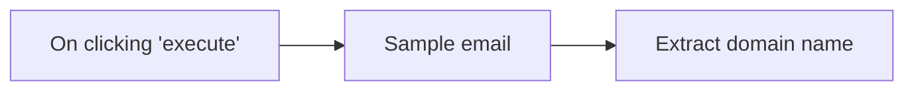

## Fluxo (.json) :

```json
{
  "nodes": [
    {
      "name": "On clicking 'execute'",
      "type": "n8n-nodes-base.manualTrigger",
      "position": [
        240,
        300
      ],
      "parameters": {},
      "typeVersion": 1
    },
    {
      "name": "Extract domain name",
      "type": "n8n-nodes-base.function",
      "position": [
        700,
        300
      ],
      "parameters": {
        "functionCode": "// Take email and extract the domain name \nvar email = ($json[\"email\"]);\nvar name   = email.substring(0, email.lastIndexOf(\"@\"));\nvar domain = email.substring(email.lastIndexOf(\"@\") +1);\n\n//To display the final domain name. (result)\n\nreturn [{\n  json: { domain }\n}]"
      },
      "typeVersion": 1
    },
    {
      "name": "Sample email",
      "type": "n8n-nodes-base.set",
      "position": [
        460,
        300
      ],
      "parameters": {
        "values": {
          "string": [
            {
              "name": "email",
              "value": "email@domain2.com"
            }
          ]
        },
        "options": {},
        "keepOnlySet": true
      },
      "typeVersion": 1
    }
  ],
  "connections": {
    "Sample email": {
      "main": [
        [
          {
            "node": "Extract domain name",
            "type": "main",
            "index": 0
          }
        ]
      ]
    },
    "On clicking 'execute'": {
      "main": [
        [
          {
            "node": "Sample email",
            "type": "main",
            "index": 0
          }
        ]
      ]
    }
  }
}
```

<a id="template-626"></a>

## Template 626 - Agendamento de consultas do Dr. Hakim

- **Nome:** Agendamento de consultas do Dr. Hakim
- **Descrição:** Fluxo que gerencia solicitações de agendamento via chat, verifica disponibilidade, solicita confirmação do paciente e registra o agendamento em calendário e planilha.
- **Funcionalidade:** • Recepção de mensagens de chat: Inicia o processo ao receber a solicitação do paciente.
• Assistente de IA conversacional: Conduz a coleta de informações obrigatórias (nome completo, telefone, data e hora desejada) e interage de forma profissional.
• Validação de horário e regras de escritório: Verifica se o pedido está dentro do horário de funcionamento e respeita duração da consulta (1h) e intervalo de 15 minutos.
• Checagem de disponibilidade: Consulta o calendário para confirmar se o horário solicitado está livre.
• Solicitação de confirmação: Não confirma o agendamento automaticamente — aguarda a confirmação do paciente antes de criar o evento.
• Criação de evento no calendário: Reserva o horário no calendário com título contendo nome do paciente e telefone após confirmação.
• Registro em planilha: Adiciona os dados do paciente e a data/hora na planilha após o agendamento.
• Memória por sessão: Mantém o contexto da conversa por sessão para acompanhar o processo de reserva.
- **Ferramentas:** • Serviço de chat/webhook: Canal pelo qual as mensagens dos pacientes chegam e disparam o fluxo.
• OpenAI (modelo de linguagem): Gera respostas conversacionais, coleta informações e aplica a lógica de agendamento.
• Google Calendar: Consulta disponibilidade e cria eventos de consulta no calendário do consultório.
• Google Sheets: Armazena os dados dos pacientes e os detalhes dos agendamentos.

## Fluxo visual

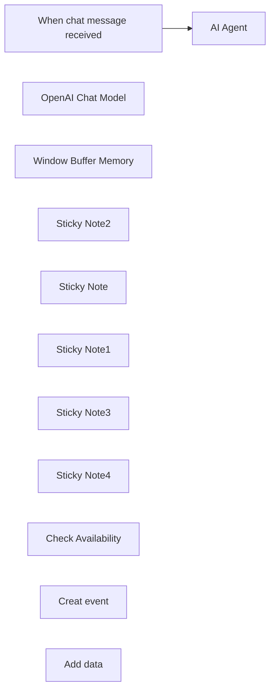

## Fluxo (.json) :

```json
{
  "id": "my335cY3wVwMqvqy",
  "meta": {
    "instanceId": "2ee8293be0fa6380527ab247a1eb95264d17c994507730562aa1c31ddb264f82",
    "templateCredsSetupCompleted": true
  },
  "name": "Reservation Medcin",
  "tags": [],
  "nodes": [
    {
      "id": "32fe7a8b-aa1a-4517-a167-41972f77d69b",
      "name": "When chat message received",
      "type": "@n8n/n8n-nodes-langchain.chatTrigger",
      "position": [
        -360,
        -40
      ],
      "webhookId": "8f427031-1110-4ea3-aef7-5d06ba7d5bce",
      "parameters": {
        "options": {}
      },
      "typeVersion": 1.1
    },
    {
      "id": "3510bb5a-3c8b-4978-a6c5-5c077be74f3f",
      "name": "AI Agent",
      "type": "@n8n/n8n-nodes-langchain.agent",
      "position": [
        -20,
        -60
      ],
      "parameters": {
        "options": {
          "systemMessage": "=🎯 Role of the Assistant\nYou are a virtual assistant specializing in appointment management for Dr. Hakim. Your goal is to schedule consultations accurately, ensuring real availability while providing a smooth experience for patients.\n\n🕒 Office Hours\nMonday - Friday: 9:00 AM - 8:00 PM\nSaturday: 9:00 AM - 1:00 PM\nSunday: ❌ Closed\nConsultation Duration: 1 hour\nBreak Between Patients: 15 minutes\n\n📅 Booking Process\n\n1️⃣ Request Patient Information (Mandatory):\nFull Name\nPhone Number\nDesired Date and Time\n2️⃣ Availability Check:\nIf the requested time is outside office hours → offer only available slots.\nIf the requested time is available, ask for confirmation and book it.\nIf the requested time is unavailable, apologize and suggest the actual available slots on the requested day (between 9:00 AM and 8:00 PM, respecting breaks).\n\n##Example:\nIf a patient requests an appointment at 10:00 AM, check Google Calendar to confirm availability between 9:00 AM and 8:00 PM, considering the consultation duration (1 hour) and the 15-minute breaks.\n\n🚨 Do not confirm the appointment immediately—you must receive the patient's confirmation first.\n\n3️⃣ Confirmation & Updates:\nConfirm availability with the patient before finalizing.\nUpdate Google Calendar & Google Sheets after every booking.\nGoogle Calendar Event Title: \"Patient Name - Phone Number\".\nFor modifications or cancellations, free the slot and update the schedule.\n\n##Tools:\nUse \"Cheek Avilability\" to check available slots.\nUse \"Creat event\" to book the appointment.\nUse \"Add Data\" to record patient information.\n\n💬 Communication\n✅ Respond clearly, professionally, and in a friendly manner.\n✅ Always confirm the final date and time with the patient.\n✅ Ensure Google Calendar and Google Sheets are updated after every booking.\n\n📅 Today's date: {{ $now }}."
        }
      },
      "typeVersion": 1.7
    },
    {
      "id": "fea932f2-c99e-4e1a-83bc-b06abf6cce41",
      "name": "OpenAI Chat Model",
      "type": "@n8n/n8n-nodes-langchain.lmChatOpenAi",
      "position": [
        -80,
        160
      ],
      "parameters": {
        "model": {
          "__rl": true,
          "mode": "list",
          "value": "gpt-4o-mini"
        },
        "options": {}
      },
      "credentials": {
        "openAiApi": {
          "id": "x0tQpNXNP6v5Ovtd",
          "name": "OpenAi account 2"
        }
      },
      "typeVersion": 1.2
    },
    {
      "id": "05bfbeb4-d2a4-4372-b763-6da636ed4393",
      "name": "Window Buffer Memory",
      "type": "@n8n/n8n-nodes-langchain.memoryBufferWindow",
      "position": [
        60,
        160
      ],
      "parameters": {
        "sessionKey": "={{ $('When chat message received').item.json.sessionId }}",
        "sessionIdType": "customKey"
      },
      "typeVersion": 1.3
    },
    {
      "id": "86899211-daf8-4fc6-a61a-98504b239d83",
      "name": "Sticky Note2",
      "type": "n8n-nodes-base.stickyNote",
      "position": [
        20,
        -220
      ],
      "parameters": {
        "color": 7,
        "width": 194,
        "height": 141,
        "content": "**AI Agent 👇**\nThe Prompt is already there, You just need to setup the prompt user message with your text message."
      },
      "typeVersion": 1
    },
    {
      "id": "947c5aa3-549e-49f1-b136-030cbd3ca6ff",
      "name": "Sticky Note",
      "type": "n8n-nodes-base.stickyNote",
      "position": [
        -120,
        300
      ],
      "parameters": {
        "color": 7,
        "width": 150,
        "height": 80,
        "content": "**Chat Model ☝️**\nAdd your Open Ai API Key "
      },
      "typeVersion": 1
    },
    {
      "id": "cac840df-644e-4092-b678-af2fdf3fc378",
      "name": "Sticky Note1",
      "type": "n8n-nodes-base.stickyNote",
      "position": [
        240,
        300
      ],
      "parameters": {
        "color": 7,
        "width": 190,
        "height": 80,
        "content": "**Gpoogle Calendar ☝️**\nConnect to Google Calendar"
      },
      "typeVersion": 1
    },
    {
      "id": "f474ee97-ba38-4100-bfc7-0d01d0a4c599",
      "name": "Sticky Note3",
      "type": "n8n-nodes-base.stickyNote",
      "position": [
        500,
        300
      ],
      "parameters": {
        "color": 7,
        "width": 190,
        "height": 80,
        "content": "**Google Sheets ☝️**\nConnect to Google Sheets"
      },
      "typeVersion": 1
    },
    {
      "id": "51fcd961-7b0b-4435-a315-17d4ddc1ed30",
      "name": "Sticky Note4",
      "type": "n8n-nodes-base.stickyNote",
      "position": [
        40,
        300
      ],
      "parameters": {
        "color": 7,
        "width": 150,
        "height": 80,
        "content": "**Memory ☝️**\nAdd the Session ID "
      },
      "typeVersion": 1
    },
    {
      "id": "398fdf7a-508d-4a0a-8c2c-1f0075b6ad56",
      "name": "Check Availability",
      "type": "n8n-nodes-base.googleCalendarTool",
      "position": [
        200,
        160
      ],
      "parameters": {
        "options": {},
        "timeMax": "={{ /*n8n-auto-generated-fromAI-override*/ $fromAI('End_Time', ``, 'string') }}",
        "timeMin": "={{ /*n8n-auto-generated-fromAI-override*/ $fromAI('Start_Time', ``, 'string') }}",
        "calendar": {
          "__rl": true,
          "mode": "list",
          "value": "3009ae2f09f9ecab6eaa1d36f0b38c099f0e370759cad1c51691f9dc0fbd64fd@group.calendar.google.com",
          "cachedResultName": "Prise de rendez vous pour les Medcins "
        },
        "resource": "calendar"
      },
      "credentials": {
        "googleCalendarOAuth2Api": {
          "id": "NtT31ekfbGzWyc9k",
          "name": "Google Calendar account"
        }
      },
      "typeVersion": 1.3
    },
    {
      "id": "43673597-ffb6-4d38-8fb0-975eb47976f6",
      "name": "Creat event",
      "type": "n8n-nodes-base.googleCalendarTool",
      "position": [
        360,
        160
      ],
      "parameters": {
        "end": "={{ /*n8n-auto-generated-fromAI-override*/ $fromAI('End', ``, 'string') }}",
        "start": "={{ /*n8n-auto-generated-fromAI-override*/ $fromAI('Start', ``, 'string') }}",
        "calendar": {
          "__rl": true,
          "mode": "list",
          "value": "3009ae2f09f9ecab6eaa1d36f0b38c099f0e370759cad1c51691f9dc0fbd64fd@group.calendar.google.com",
          "cachedResultName": "Prise de rendez vous pour les Medcins "
        },
        "additionalFields": {}
      },
      "credentials": {
        "googleCalendarOAuth2Api": {
          "id": "NtT31ekfbGzWyc9k",
          "name": "Google Calendar account"
        }
      },
      "typeVersion": 1.3
    },
    {
      "id": "650b5d36-7b52-4bb2-953a-d9ee278a35eb",
      "name": "Add data",
      "type": "n8n-nodes-base.googleSheetsTool",
      "position": [
        500,
        160
      ],
      "parameters": {
        "columns": {
          "value": {
            "Nom complet": "={{ /*n8n-auto-generated-fromAI-override*/ $fromAI('Nom_complet', ``, 'string') }}",
            "Date / heure ": "={{ /*n8n-auto-generated-fromAI-override*/ $fromAI('Date___heure_', ``, 'string') }}",
            "Numéro de telephone": "={{ /*n8n-auto-generated-fromAI-override*/ $fromAI('Num_ro_de_telephone', ``, 'string') }}"
          },
          "schema": [
            {
              "id": "Nom complet",
              "type": "string",
              "display": true,
              "required": false,
              "displayName": "Nom complet",
              "defaultMatch": false,
              "canBeUsedToMatch": true
            },
            {
              "id": "Numéro de telephone",
              "type": "string",
              "display": true,
              "required": false,
              "displayName": "Numéro de telephone",
              "defaultMatch": false,
              "canBeUsedToMatch": true
            },
            {
              "id": "Date / heure ",
              "type": "string",
              "display": true,
              "required": false,
              "displayName": "Date / heure ",
              "defaultMatch": false,
              "canBeUsedToMatch": true
            },
            {
              "id": "Confirmé",
              "type": "string",
              "display": true,
              "removed": true,
              "required": false,
              "displayName": "Confirmé",
              "defaultMatch": false,
              "canBeUsedToMatch": true
            }
          ],
          "mappingMode": "defineBelow",
          "matchingColumns": [],
          "attemptToConvertTypes": false,
          "convertFieldsToString": false
        },
        "options": {},
        "operation": "append",
        "sheetName": {
          "__rl": true,
          "mode": "list",
          "value": "gid=0",
          "cachedResultUrl": "https://docs.google.com/spreadsheets/d/1JAbg-TJZr7fqiRMAjQY6baDAkQoigzUd4YqbTPoQqWE/edit#gid=0",
          "cachedResultName": "Feuille 1"
        },
        "documentId": {
          "__rl": true,
          "mode": "list",
          "value": "1JAbg-TJZr7fqiRMAjQY6baDAkQoigzUd4YqbTPoQqWE",
          "cachedResultUrl": "https://docs.google.com/spreadsheets/d/1JAbg-TJZr7fqiRMAjQY6baDAkQoigzUd4YqbTPoQqWE/edit?usp=drivesdk",
          "cachedResultName": "RDV Medcin"
        }
      },
      "credentials": {
        "googleSheetsOAuth2Api": {
          "id": "Q4J5dsFmt1OSnjNV",
          "name": "Google Sheets account"
        }
      },
      "typeVersion": 4.5
    }
  ],
  "active": false,
  "pinData": {},
  "settings": {
    "executionOrder": "v1"
  },
  "versionId": "39048f71-6a4c-4181-947e-5e2545c4dc1e",
  "connections": {
    "AI Agent": {
      "main": [
        []
      ]
    },
    "Add data": {
      "ai_tool": [
        [
          {
            "node": "AI Agent",
            "type": "ai_tool",
            "index": 0
          }
        ]
      ]
    },
    "Creat event": {
      "ai_tool": [
        [
          {
            "node": "AI Agent",
            "type": "ai_tool",
            "index": 0
          }
        ]
      ]
    },
    "OpenAI Chat Model": {
      "ai_languageModel": [
        [
          {
            "node": "AI Agent",
            "type": "ai_languageModel",
            "index": 0
          }
        ]
      ]
    },
    "Check Availability": {
      "ai_tool": [
        [
          {
            "node": "AI Agent",
            "type": "ai_tool",
            "index": 0
          }
        ]
      ]
    },
    "Window Buffer Memory": {
      "ai_memory": [
        [
          {
            "node": "AI Agent",
            "type": "ai_memory",
            "index": 0
          }
        ]
      ]
    },
    "When chat message received": {
      "main": [
        [
          {
            "node": "AI Agent",
            "type": "main",
            "index": 0
          }
        ]
      ]
    }
  }
}
```

<a id="template-627"></a>

## Template 627 - Agente AI para geração e execução de comandos Proxmox

- **Nome:** Agente AI para geração e execução de comandos Proxmox
- **Descrição:** Fluxo que recebe solicitações (chat, Telegram, email ou webhook), usa um modelo de linguagem para gerar comandos estruturados da API Proxmox, valida parâmetros, executa chamadas na API e formata as respostas.
- **Funcionalidade:** • Recepção de solicitações: Aceita entradas via chat, Telegram, Gmail ou webhook.
• Interpretação de intenção: Usa um modelo de linguagem para entender pedidos relacionados ao Proxmox.
• Geração de comandos API estruturados: Produz JSON estrito contendo response_type, url e details para chamadas à API Proxmox.
• Validação de parâmetros: Detecta parâmetros obrigatórios faltantes e retorna mensagens de erro apropriadas.
• Comportamento padrão: Define node padrão (psb1) se não informado e determina vmid disponível consultando o cluster.
• Roteamento por método HTTP: Direciona requests gerados para endpoints GET, POST, PUT ou DELETE conforme o response_type.
• Execução de chamadas Proxmox: Realiza chamadas HTTP autenticadas contra a API Proxmox.
• Parsing e formatação de respostas: Normaliza respostas de tarefas, oculta dados sensíveis e converte timestamps para formato legível.
• Mesclagem de resultados: Combina resultados de múltiplas chamadas para fornecer um retorno consolidado.
- **Ferramentas:** • Proxmox API: API alvo para gerenciar VMs, consultas de cluster e operações (start/stop/clone/migrate/etc.).
• Proxmox Wiki: Fonte de documentação para regras e parâmetros da API Proxmox.
• Proxmox API Viewer (documentação): Referência detalhada dos endpoints e exemplos de uso.
• Google Gemini (PaLM): Modelo de linguagem usado para interpretar intenções do usuário e gerar comandos estruturados.
• Telegram: Canal de entrada opcional para receber comandos de usuários.
• Gmail: Canal de entrada opcional para receber comandos via email.
• Webhooks / HTTP endpoints: Recebem eventos externos e permitem integração com outras aplicações.

## Fluxo visual

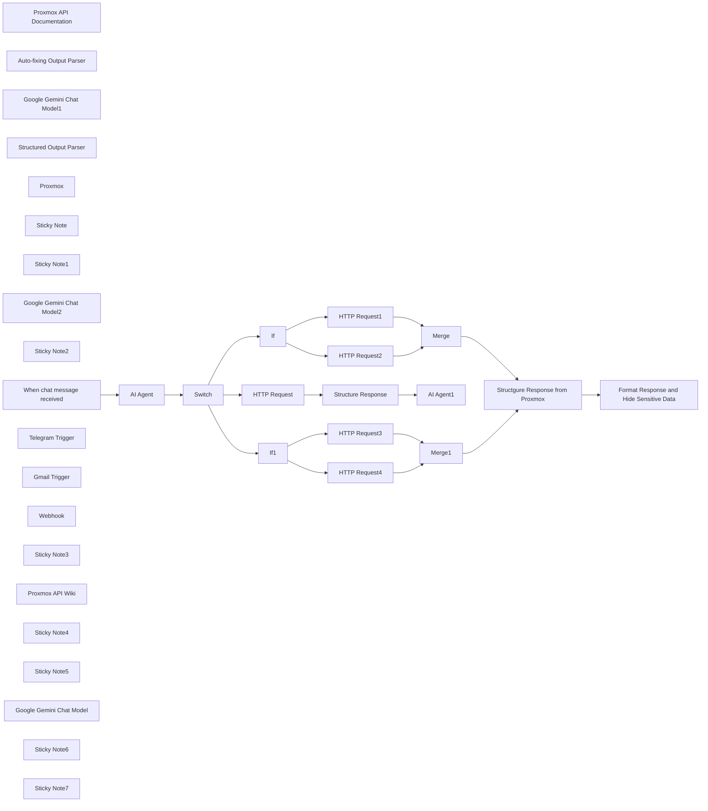

## Fluxo (.json) :

```json
{
  "meta": {
    "instanceId": "n8n.syncbricks.com"
  },
  "nodes": [
    {
      "id": "e6d85380-7cfa-4c6e-9b0f-d390ad0cbc67",
      "name": "HTTP Request1",
      "type": "n8n-nodes-base.httpRequest",
      "position": [
        1400,
        -180
      ],
      "parameters": {
        "url": "=https://proxmox.syncbricks.com/api2/json{{ $json.output.url }}",
        "method": "=POST",
        "options": {
          "allowUnauthorizedCerts": true
        },
        "jsonBody": "={{ $json.output.details }}",
        "sendBody": true,
        "specifyBody": "json",
        "authentication": "genericCredentialType",
        "genericAuthType": "httpHeaderAuth"
      },
      "credentials": {
        "httpHeaderAuth": {
          "id": "pJcVQegRQ5mpraoQ",
          "name": "Proxmox"
        }
      },
      "typeVersion": 4.2
    },
    {
      "id": "9b497de8-0f01-40b1-8f8e-28fad1f758c4",
      "name": "Proxmox API Documentation",
      "type": "@n8n/n8n-nodes-langchain.toolHttpRequest",
      "position": [
        -300,
        40
      ],
      "parameters": {
        "url": "https://pve.proxmox.com/pve-docs/api-viewer/index.html",
        "toolDescription": "This is Proxmox API Documentation ensure to read the details from here"
      },
      "typeVersion": 1.1
    },
    {
      "id": "e7ac54a9-37be-44b5-b58e-8b631892367e",
      "name": "Auto-fixing Output Parser",
      "type": "@n8n/n8n-nodes-langchain.outputParserAutofixing",
      "position": [
        40,
        60
      ],
      "parameters": {
        "options": {
          "prompt": "Instructions:\n--------------\n{instructions}\n--------------\nCompletion:\n--------------\n{completion}\n--------------\n\nAbove, the Completion did not satisfy the constraints given in the Instructions.\nError:\n--------------\n{error}\n--------------\n\nPlease try again. Please only respond with an answer that satisfies the constraints laid out in the Instructions:"
        }
      },
      "typeVersion": 1
    },
    {
      "id": "5d8c8c6d-d5de-4c87-9950-46f1f5757314",
      "name": "Google Gemini Chat Model1",
      "type": "@n8n/n8n-nodes-langchain.lmChatGoogleGemini",
      "position": [
        -40,
        360
      ],
      "parameters": {
        "options": {},
        "modelName": "models/gemini-2.0-flash-exp"
      },
      "credentials": {
        "googlePalmApi": {
          "id": "pKFvSpPWSRFpnBoB",
          "name": "Google Gemini(PaLM) Api account"
        }
      },
      "typeVersion": 1
    },
    {
      "id": "8565ac2f-0cdd-4e7f-a1e9-6f273869e068",
      "name": "Structured Output Parser",
      "type": "@n8n/n8n-nodes-langchain.outputParserStructured",
      "position": [
        180,
        360
      ],
      "parameters": {
        "jsonSchemaExample": "{\n \"response_type\": \"POST\",\n \"url\": \"/nodes/psb1/qemu\",\n \"details\": {\n \"vmid\": 105,\n \"cores\": 4,\n \"memory\": 8192,\n \"net0\": \"virtio,bridge=vmbr0\",\n \"disk0\": \"local:10,format=qcow2\",\n \"sockets\": 1,\n \"ostype\": \"l26\"\n },\n \"message\": \"The VM with ID 105 has been successfully configured to be created on node psb1.\"\n}"
      },
      "typeVersion": 1.2
    },
    {
      "id": "80b1ef4d-b4c7-40b4-969f-f53d0068cac7",
      "name": "Proxmox",
      "type": "@n8n/n8n-nodes-langchain.toolHttpRequest",
      "position": [
        -80,
        40
      ],
      "parameters": {
        "url": "https://10.11.12.101:8006/api2/json/cluster/status",
        "authentication": "genericCredentialType",
        "genericAuthType": "httpHeaderAuth",
        "toolDescription": "=This is Proxmox which will help you to get the details of existing Proxmox installations, ensure to append to existing url : https://10.11.12.101:8006/api2/ to get response from existing proxmox \n\nMy prommox nodes are named as psb1, psb2 and psb3\npsb1 : https://10.11.12.101:8006/api2/\npsb2 : https://10.11.12.102:8006/api2/\npsb3 : https://10.11.12.102:8006/api2/"
      },
      "credentials": {
        "httpHeaderAuth": {
          "id": "pJcVQegRQ5mpraoQ",
          "name": "Proxmox"
        }
      },
      "typeVersion": 1.1
    },
    {
      "id": "09444fa1-3b5e-4411-b70c-cf777db971bb",
      "name": "HTTP Request",
      "type": "n8n-nodes-base.httpRequest",
      "position": [
        1080,
        -320
      ],
      "parameters": {
        "url": "=https://10.11.12.101:8006/api2/json{{ $json.output.properties.url.pattern }}",
        "method": "=GET",
        "options": {
          "allowUnauthorizedCerts": true
        },
        "authentication": "genericCredentialType",
        "genericAuthType": "httpHeaderAuth"
      },
      "credentials": {
        "httpHeaderAuth": {
          "id": "pJcVQegRQ5mpraoQ",
          "name": "Proxmox"
        }
      },
      "typeVersion": 4.2
    },
    {
      "id": "d148b395-01e9-48a6-b98c-cb515fa3446d",
      "name": "Sticky Note",
      "type": "n8n-nodes-base.stickyNote",
      "position": [
        900,
        -660
      ],
      "parameters": {
        "width": 736.2768017274677,
        "height": 1221.0199187779397,
        "content": "## API Key for Proxmox\n** Create Credentails *** ensure to create credentials in Proxmox Data Center as API Key and then create credentails. \n** Add Credentials to n8n ** Click on Credentails, add new Credentails and Chose Header Auth\n** In Header Auth Below will be used \nName : Authorization\nValue : PVEAPIToken=<user>@<realm>!<token-id>=<token-value>\n\nSuppose my token id is n8n and key is 1234 so value will be as below\n\nValue : PVEAPIToken=root@pam!n8n=1234\n"
      },
      "typeVersion": 1
    },
    {
      "id": "d356bb83-c567-44b6-ba23-3e330abf835e",
      "name": "Sticky Note1",
      "type": "n8n-nodes-base.stickyNote",
      "position": [
        -1240,
        -120
      ],
      "parameters": {
        "color": 6,
        "width": 492.990678850593,
        "height": 702.0895748933872,
        "content": "## Trigger\nYou can use any trigger as input, a chat, telegram, email etc"
      },
      "typeVersion": 1
    },
    {
      "id": "d2829180-9c14-4437-9ae1-1bb822d8d925",
      "name": "Google Gemini Chat Model2",
      "type": "@n8n/n8n-nodes-langchain.lmChatGoogleGemini",
      "position": [
        1880,
        -320
      ],
      "parameters": {
        "options": {},
        "modelName": "models/gemini-2.0-flash-exp"
      },
      "credentials": {
        "googlePalmApi": {
          "id": "pKFvSpPWSRFpnBoB",
          "name": "Google Gemini(PaLM) Api account"
        }
      },
      "typeVersion": 1
    },
    {
      "id": "0e8a617b-8b95-4bed-8bff-876266fc4151",
      "name": "Sticky Note2",
      "type": "n8n-nodes-base.stickyNote",
      "position": [
        -440,
        -690
      ],
      "parameters": {
        "color": 5,
        "width": 789.7678716732242,
        "height": 1260.380358008782,
        "content": "## Porxmox Custom AI Agent \nIt uses the intelligence provided to it including the Proxmox API Wiki, Proxmox Cluster Linked and Proxmox API Documentation.\n\nThe AI Model connected with this is Gemini, you can connect any AI Model by Ollama, OpenAI, Claude etc.\n\nOutput Parser is used to ensure the fixed output structure that can be used for API URL"
      },
      "typeVersion": 1
    },
    {
      "id": "4cbf39ae-7b81-44b1-858c-10c21af9d558",
      "name": "When chat message received",
      "type": "@n8n/n8n-nodes-langchain.chatTrigger",
      "position": [
        -680,
        -300
      ],
      "webhookId": "63de8c82-04fc-4126-8bbf-b0eb62794d74",
      "parameters": {
        "options": {}
      },
      "typeVersion": 1.1
    },
    {
      "id": "f91a1d2d-ce33-4469-b4da-e9ef1dd070e0",
      "name": "Telegram Trigger",
      "type": "n8n-nodes-base.telegramTrigger",
      "position": [
        -1080,
        320
      ],
      "webhookId": "c86fa48b-ae66-46f2-b438-f156225a5c74",
      "parameters": {
        "updates": [
          "message"
        ],
        "additionalFields": {}
      },
      "credentials": {
        "telegramApi": {
          "id": "uwpC7pPg6WJYh8Ad",
          "name": "Telegram account"
        }
      },
      "typeVersion": 1.1
    },
    {
      "id": "aec3c1f4-058e-4321-99dd-772dcc04e206",
      "name": "Gmail Trigger",
      "type": "n8n-nodes-base.gmailTrigger",
      "position": [
        -1080,
        -20
      ],
      "parameters": {
        "filters": {},
        "pollTimes": {
          "item": [
            {
              "mode": "everyMinute"
            }
          ]
        }
      },
      "credentials": {
        "gmailOAuth2": {
          "id": "pccYQxL0liStKP66",
          "name": "Gmail account INFO"
        }
      },
      "typeVersion": 1.2
    },
    {
      "id": "1afea4f3-adea-42ac-bc48-fa863b26e5a0",
      "name": "Webhook",
      "type": "n8n-nodes-base.webhook",
      "position": [
        -1080,
        160
      ],
      "webhookId": "459d848d-72ed-490f-bc48-e5dc60242896",
      "parameters": {
        "path": "459d848d-72ed-490f-bc48-e5dc60242896",
        "options": {},
        "authentication": "headerAuth"
      },
      "credentials": {
        "httpHeaderAuth": {
          "id": "pJcVQegRQ5mpraoQ",
          "name": "Proxmox"
        }
      },
      "typeVersion": 2
    },
    {
      "id": "de4af096-7b23-41ba-b390-8c52f58b09c6",
      "name": "Sticky Note3",
      "type": "n8n-nodes-base.stickyNote",
      "position": [
        380,
        -680
      ],
      "parameters": {
        "color": 3,
        "width": 486.2369951168387,
        "height": 1245.2937736920358,
        "content": "## HTTP methods\nGET\tRetrieve resources\tFetch VM status, list nodes, get logs.\n\nPOST\tCreate or trigger actions\tStart/stop VMs, create backups.\n\nPUT\tUpdate/replace entire resource configuration\tModify VM configurations.\n\nDELETE\tDelete resources\tRemove VMs, delete users, remove files.\n\nOPTIONS\tFetch supported methods for an endpoint\tCheck available operations for an API.\n\nPATCH\tApply partial updates\tUpdate specific fields in VM settings."
      },
      "typeVersion": 1
    },
    {
      "id": "2c4ef73b-281f-4a24-81a2-cae72e446955",
      "name": "Proxmox API Wiki",
      "type": "@n8n/n8n-nodes-langchain.toolHttpRequest",
      "position": [
        -180,
        40
      ],
      "parameters": {
        "url": "https://pve.proxmox.com/wiki/Proxmox_VE_API",
        "toolDescription": "Get the proxmox API details from Proxmox Wiki"
      },
      "typeVersion": 1.1
    },
    {
      "id": "f11ac59e-6031-4435-a417-200cdd559bd2",
      "name": "Structure Response",
      "type": "n8n-nodes-base.code",
      "position": [
        1480,
        -520
      ],
      "parameters": {
        "jsCode": "// Access all items from the incoming node\nconst items = $input.all();\n\n// Combine all fields of each item into a single string\nconst combinedData = items.map(item => {\n const inputData = item.json; // Access the JSON data of the current item\n \n // Combine all fields into a single string\n const combinedField = Object.entries(inputData)\n .map(([key, value]) => {\n // Handle objects or arrays by converting them to JSON strings\n const formattedValue = typeof value === 'object' ? JSON.stringify(value) : value;\n return `${key}: ${formattedValue}`;\n })\n .join(' | '); // Combine key-value pairs as a single string with a delimiter\n\n // Return the new structure\n return {\n json: {\n combinedField // Only keep the combined field for table representation\n },\n };\n});\n\n// Output the combined data\nreturn combinedData;\n"
      },
      "typeVersion": 2
    },
    {
      "id": "7752281b-226b-4c19-bcd4-33804ea2abe7",
      "name": "Sticky Note4",
      "type": "n8n-nodes-base.stickyNote",
      "position": [
        1680,
        -660
      ],
      "parameters": {
        "color": 5,
        "width": 895.2529822972874,
        "height": 517.5348441931358,
        "content": "## Porxmox Custom AI Agent (Get)\nThis agent will convert the response from proxmox to meaningful explanation"
      },
      "typeVersion": 1
    },
    {
      "id": "fd65db23-0d36-42b1-a012-2ddcdd2ca914",
      "name": "Sticky Note5",
      "type": "n8n-nodes-base.stickyNote",
      "position": [
        1680,
        -122.8638048233953
      ],
      "parameters": {
        "color": 5,
        "width": 900.3261837471116,
        "height": 712.4591709572671,
        "content": "## Created or triggered an action on the server.\nResponse will come back here"
      },
      "typeVersion": 1
    },
    {
      "id": "60234199-d28c-4fb8-8ad7-1d24693599ed",
      "name": "Structgure Response from Proxmox",
      "type": "n8n-nodes-base.code",
      "position": [
        2120,
        140
      ],
      "parameters": {
        "jsCode": "// Access the 'data' field from the input\nlet rawData = $json[\"data\"];\n\n// Split the string by colon (:) to extract parts\nlet parts = rawData.split(\":\");\n\n// Create an object with the extracted parts\nreturn {\n upid: parts[0], // UPID\n node: parts[1], // Node (e.g., psb1)\n processID: parts[2], // Process ID\n taskID: parts[3], // Task ID\n timestamp: parts[4], // Timestamp\n operation: parts[5], // Operation (e.g., aptupdate)\n user: parts[7] // User (e.g., root@pam!n8n)\n};\n"
      },
      "typeVersion": 2
    },
    {
      "id": "57ab92f3-6f65-459d-8f41-8a391108457b",
      "name": "Format Response and Hide Sensitive Data",
      "type": "n8n-nodes-base.code",
      "position": [
        2380,
        140
      ],
      "parameters": {
        "jsCode": "// Extract required fields from the input\nlet node = $json[\"node\"] || \"unknown node\";\nlet operation = $json[\"operation\"] || \"unknown operation\";\nlet user = $json[\"user\"] || \"unknown user\";\nlet rawTimestamp = $json[\"timestamp\"] || \"unknown timestamp\";\n\n// Convert timestamp to a readable format\nlet readableTimestamp = \"Invalid timestamp\";\ntry {\n let timestamp = parseInt(rawTimestamp, 16) * 1000; // Convert hex to milliseconds\n readableTimestamp = new Date(timestamp).toLocaleString();\n} catch (error) {\n readableTimestamp = \"Unable to parse timestamp\";\n}\n\n// Construct the simple message\nlet message = `The operation '${operation}' was executed successfully on node '${node}' by user '${user}' at '${readableTimestamp}'.`;\n\nreturn {\n message: message\n};\n"
      },
      "typeVersion": 2
    },
    {
      "id": "aca671cb-4bb7-4f9e-847a-34d89151d2e2",
      "name": "If",
      "type": "n8n-nodes-base.if",
      "position": [
        1060,
        -80
      ],
      "parameters": {
        "options": {},
        "conditions": {
          "options": {
            "version": 2,
            "leftValue": "",
            "caseSensitive": true,
            "typeValidation": "loose"
          },
          "combinator": "or",
          "conditions": [
            {
              "id": "da8ce97e-70bf-42a4-981c-e2133bcee24a",
              "operator": {
                "type": "string",
                "operation": "notEmpty",
                "singleValue": true
              },
              "leftValue": "={{ $json.output.details }}",
              "rightValue": ""
            },
            {
              "id": "d7052c40-9a43-452e-901c-6c8fd0122e5f",
              "operator": {
                "type": "string",
                "operation": "exists",
                "singleValue": true
              },
              "leftValue": "={{ $json.output.details }}",
              "rightValue": ""
            }
          ]
        },
        "looseTypeValidation": true
      },
      "typeVersion": 2.2
    },
    {
      "id": "15562980-019c-4d91-8f80-f85420efc8b0",
      "name": "HTTP Request2",
      "type": "n8n-nodes-base.httpRequest",
      "position": [
        1400,
        20
      ],
      "parameters": {
        "url": "=https://10.11.12.101:8006/api2/json{{ $json.output.url }}",
        "method": "=POST",
        "options": {
          "allowUnauthorizedCerts": true
        },
        "authentication": "genericCredentialType",
        "genericAuthType": "httpHeaderAuth"
      },
      "credentials": {
        "httpHeaderAuth": {
          "id": "pJcVQegRQ5mpraoQ",
          "name": "Proxmox"
        }
      },
      "typeVersion": 4.2
    },
    {
      "id": "fd974862-4e06-4874-8477-c2c3b559669a",
      "name": "Merge",
      "type": "n8n-nodes-base.merge",
      "position": [
        1820,
        -20
      ],
      "parameters": {},
      "typeVersion": 3
    },
    {
      "id": "5c0d9814-3c9e-4ef4-8f12-9495785c1c06",
      "name": "HTTP Request3",
      "type": "n8n-nodes-base.httpRequest",
      "position": [
        1400,
        200
      ],
      "parameters": {
        "url": "=https://10.11.12.101:8006/api2/json{{ $json.output.url }}",
        "method": "DELETE",
        "options": {
          "allowUnauthorizedCerts": true
        },
        "authentication": "genericCredentialType",
        "genericAuthType": "httpHeaderAuth"
      },
      "credentials": {
        "httpHeaderAuth": {
          "id": "pJcVQegRQ5mpraoQ",
          "name": "Proxmox"
        }
      },
      "typeVersion": 4.2
    },
    {
      "id": "097c10ac-577e-44ce-8aa2-446137973b18",
      "name": "Google Gemini Chat Model",
      "type": "@n8n/n8n-nodes-langchain.lmChatGoogleGemini",
      "position": [
        -420,
        40
      ],
      "parameters": {
        "options": {},
        "modelName": "models/gemini-2.0-flash-exp"
      },
      "credentials": {
        "googlePalmApi": {
          "id": "pKFvSpPWSRFpnBoB",
          "name": "Google Gemini(PaLM) Api account"
        }
      },
      "typeVersion": 1
    },
    {
      "id": "b26ce08e-9eeb-4fbe-8283-7197d2595021",
      "name": "AI Agent1",
      "type": "@n8n/n8n-nodes-langchain.agent",
      "position": [
        1860,
        -520
      ],
      "parameters": {
        "text": "=You are a are a Proxmox Information Output Expert who will provide the summary of the information generated about proxmox. Here is the information about proxmox : from url{{ $('AI Agent').item.json.output.properties.url.pattern }} {{ $json.combinedField }}",
        "agent": "conversationalAgent",
        "options": {},
        "promptType": "define"
      },
      "typeVersion": 1.7
    },
    {
      "id": "942305fd-38b9-4636-8713-35a43fb5879f",
      "name": "If1",
      "type": "n8n-nodes-base.if",
      "position": [
        1080,
        120
      ],
      "parameters": {
        "options": {},
        "conditions": {
          "options": {
            "version": 2,
            "leftValue": "",
            "caseSensitive": true,
            "typeValidation": "loose"
          },
          "combinator": "or",
          "conditions": [
            {
              "id": "da8ce97e-70bf-42a4-981c-e2133bcee24a",
              "operator": {
                "type": "string",
                "operation": "empty",
                "singleValue": true
              },
              "leftValue": "={{ $json.output.details }}",
              "rightValue": ""
            },
            {
              "id": "d7052c40-9a43-452e-901c-6c8fd0122e5f",
              "operator": {
                "type": "string",
                "operation": "notExists",
                "singleValue": true
              },
              "leftValue": "={{ $json.output.details }}",
              "rightValue": ""
            }
          ]
        },
        "looseTypeValidation": true
      },
      "typeVersion": 2.2
    },
    {
      "id": "09bfbbf3-72aa-472f-8e91-2552798263a2",
      "name": "HTTP Request4",
      "type": "n8n-nodes-base.httpRequest",
      "position": [
        1400,
        380
      ],
      "parameters": {
        "url": "=https://10.11.12.101:8006/api2/json{{ $json.output.url }}",
        "method": "DELETE",
        "options": {
          "allowUnauthorizedCerts": true
        },
        "authentication": "genericCredentialType",
        "genericAuthType": "httpHeaderAuth"
      },
      "credentials": {
        "httpHeaderAuth": {
          "id": "pJcVQegRQ5mpraoQ",
          "name": "Proxmox"
        }
      },
      "typeVersion": 4.2
    },
    {
      "id": "18e68174-872a-4bd9-b54f-b7ab97db1b0b",
      "name": "Merge1",
      "type": "n8n-nodes-base.merge",
      "position": [
        1860,
        260
      ],
      "parameters": {},
      "typeVersion": 3
    },
    {
      "id": "1492e53e-66b5-485b-b7e5-a42b76ebccb6",
      "name": "AI Agent",
      "type": "@n8n/n8n-nodes-langchain.agent",
      "position": [
        -260,
        -300
      ],
      "parameters": {
        "text": "=You are a Proxmox AI Agent expert designed to generate API commands based on user input. \nThis is Proxmox which will help you to get the details of existing Proxmox installations, ensure to append to existing url : https://10.11.12.101:8006/api2/ to get response from existing proxmox \n\nMy prommox nodes are named as psb1, psb2 and psb3\npsb1 : https://10.11.12.101:8006/api2/\npsb2 : https://10.11.12.102:8006/api2/\npsb3 : https://10.11.12.102:8006/api2/\n\nYour objectives are:\n\n### **1. Understand User Intent**\n- Parse user requests related to Proxmox operations.\n- Accurately interpret intent to generate valid Proxmox API commands.\n\n### **2. Refer to tools**\n- **Proxmox API Documentation**\n= ** Proxmox API Wiki**\n- **Proxmox**\n- Ensure every generated command meets the API's specifications, including required fields.\n\n### **3. Structure Responses**\nEvery response must include:\n- `response_type`: The HTTP method (e.g., POST, GET, DELETE).\n- `url`: The API endpoint, complete with placeholders (e.g., `/nodes/{node}/qemu/{vmid}`).\n- `details`: The payload for the request. Exclude optional fields if not explicitly defined by the user to allow default handling by Proxmox.\n\n### **4. Validate Inputs**\n- **Mandatory Fields**:\n - Validate user input for required parameters.\n - If missing fields are detected, respond with:\n {\n \"message\": \"Missing required parameters: [list of missing parameters].\"\n }\n\n- **Optional Fields**:\n - Omit fields not provided by the user to leverage Proxmox's defaults.\n\n### **5. Default Behavior**\n- If the user omits the `node`, default to `psb1`.\n- Automatically generate the next available VM ID (`vmid`) by querying Proxmox for the highest existing ID.\n\n### **6. Rules for Outputs**\n- Always respond in strict JSON format:\n - Start with `{` and end with `}`.\n - Avoid additional information or comments.\n - Do not include sensitive data such as passwords, fingerprints, or keys.\n- If input is unrelated to Proxmox, respond with:\n\n {\n \"response_type\": \"Invalid\"\n }\n\n### **7. Examples**\n\n1. Create a VM\nInput: \"Create a VM with ID 201, 2 cores, 4GB RAM, and 32GB disk on node1 using virtio network and SCSI storage.\"\nOutput:\n{\n \"response_type\": \"POST\",\n \"url\": \"/nodes/node1/qemu\",\n \"details\": {\n \"vmid\": 201,\n \"cores\": 2,\n \"memory\": 1024,\n \"sockets\": 1\"\n }\n}\n\n2. Delete a VM\nInput: \"Delete VM 105 on psb1.\"\nOutput:\n{\n \"response_type\": \"DELETE\",\n \"url\": \"/nodes/psb1/qemu/105\"\n}\n\n3. Start a VM\nInput: \"Start VM 202 on psb1.\"\nOutput:\n{\n \"response_type\": \"POST\",\n \"url\": \"/nodes/psb1/qemu/202/status/start\"\n}\n\n4. Stop a VM\nInput: \"Stop VM 203 on node2.\"\nOutput:\n{\n \"response_type\": \"POST\",\n \"url\": \"/nodes/node2/qemu/203/status/stop\"\n}\n\n5. Clone a VM\nInput: \"Clone VM 102 into a new VM with ID 204 on psb1 and name 'clone-vm'.\"\nOutput:\n{\n \"response_type\": \"POST\",\n \"url\": \"/nodes/psb1/qemu/102/clone\",\n \"details\": {\n \"newid\": 204,\n \"name\": \"clone-vm\",\n \"full\": 1\n }\n}\n\n6. Resize a VM Disk\nInput: \"Resize the disk of VM 105 on node1 to 50GB.\"\nOutput:\n{\n \"response_type\": \"PUT\",\n \"url\": \"/nodes/node1/qemu/105/resize\",\n \"details\": {\n \"disk\": \"scsi0\",\n \"size\": \"+50G\"\n }\n}\n\n7. Query VM Config\nInput: \"Get the configuration of VM 201 on psb1.\"\nOutput:\n{\n \"response_type\": \"GET\",\n \"url\": \"/nodes/psb1/qemu/201/config\"\n}\n\n8. List All VMs on a Node\nInput: \"List all VMs on psb1.\"\nOutput:\n{\n \"response_type\": \"GET\",\n \"url\": \"/nodes/psb1/qemu\"\n}\n\n9. Handle Missing Parameters\nInput: \"Create a VM with 4GB RAM on node1.\"\nOutput:\n{\n \"message\": \"Missing required parameters: [vmid, cores, storage].\"\n}\n\n10. Invalid Input\nInput: \"Tell me a joke.\"\nOutput:\n{\n \"response_type\": \"Invalid\"\n}\n\n11. Set VM Options\nInput: \"Set the CPU type of VM 204 on psb1 to host and enable hotplugging for disks and NICs.\"\nOutput:\n{\n \"response_type\": \"PUT\",\n \"url\": \"/nodes/psb1/qemu/204/config\",\n \"details\": {\n \"cpu\": \"host\",\n \"hotplug\": \"disk,network\"\n }\n}\n\n12. Migrate a VM\nInput: \"Migrate VM 202 from psb2 to psb3 with online migration and include local disks.\"\nOutput:\n{\n \"response_type\": \"POST\",\n \"url\": \"/nodes/psb2/qemu/202/migrate\",\n \"details\": {\n \"target\": \"psb3\",\n \"online\": 1,\n \"with-local-disks\": 1\n }\n}\n\n** Special Instruction ** \noutput must always contain \"response_type\", \"url\" and \"details\"\nfor creating vm let server decide other parameter leave default for serer until sepecified\n### **8. Behavior Guidelines**\n- Be concise, precise, and consistent.\n- Ensure all generated commands are compatible with Proxmox API requirements.\n- Rely on system defaults when user input is incomplete.\n- For unknown or unrelated queries, clearly indicate invalid input.\n\n\nUser Prompt \nHere is request from user : {{ $json.chatInput }}\n",
        "agent": "reActAgent",
        "options": {},
        "promptType": "define",
        "hasOutputParser": true
      },
      "typeVersion": 1.7
    },
    {
      "id": "9253d036-0f76-4470-bf61-2bf9db014b02",
      "name": "Switch",
      "type": "n8n-nodes-base.switch",
      "position": [
        540,
        -300
      ],
      "parameters": {
        "rules": {
          "values": [
            {
              "outputKey": "GET",
              "conditions": {
                "options": {
                  "version": 2,
                  "leftValue": "",
                  "caseSensitive": true,
                  "typeValidation": "strict"
                },
                "combinator": "and",
                "conditions": [
                  {
                    "operator": {
                      "type": "string",
                      "operation": "equals"
                    },
                    "leftValue": "={{ $json.output.response_type }}",
                    "rightValue": "GET"
                  }
                ]
              },
              "renameOutput": true
            },
            {
              "outputKey": "POST",
              "conditions": {
                "options": {
                  "version": 2,
                  "leftValue": "",
                  "caseSensitive": true,
                  "typeValidation": "strict"
                },
                "combinator": "and",
                "conditions": [
                  {
                    "id": "e3edd683-b884-4c88-b1ea-d3640141b054",
                    "operator": {
                      "name": "filter.operator.equals",
                      "type": "string",
                      "operation": "equals"
                    },
                    "leftValue": "={{ $json.output.response_type }}",
                    "rightValue": "POST"
                  }
                ]
              },
              "renameOutput": true
            },
            {
              "outputKey": "Update",
              "conditions": {
                "options": {
                  "version": 2,
                  "leftValue": "",
                  "caseSensitive": true,
                  "typeValidation": "strict"
                },
                "combinator": "and",
                "conditions": [
                  {
                    "id": "a9c59c0d-001c-4d95-992e-bff2af54eb4a",
                    "operator": {
                      "name": "filter.operator.equals",
                      "type": "string",
                      "operation": "equals"
                    },
                    "leftValue": "={{ $json.output.response_type }}",
                    "rightValue": "PUT"
                  }
                ]
              },
              "renameOutput": true
            },
            {
              "outputKey": "OPTIONS",
              "conditions": {
                "options": {
                  "version": 2,
                  "leftValue": "",
                  "caseSensitive": true,
                  "typeValidation": "strict"
                },
                "combinator": "and",
                "conditions": [
                  {
                    "id": "70bf8cc2-0a43-431c-97c7-a8b4eadb5bd9",
                    "operator": {
                      "name": "filter.operator.equals",
                      "type": "string",
                      "operation": "equals"
                    },
                    "leftValue": "={{ $json.output.response_type }}",
                    "rightValue": "OPTIONS"
                  }
                ]
              },
              "renameOutput": true
            },
            {
              "outputKey": "DELETE",
              "conditions": {
                "options": {
                  "version": 2,
                  "leftValue": "",
                  "caseSensitive": true,
                  "typeValidation": "strict"
                },
                "combinator": "and",
                "conditions": [
                  {
                    "id": "0e43b05b-7f45-40a3-b8aa-180dd8155b08",
                    "operator": {
                      "name": "filter.operator.equals",
                      "type": "string",
                      "operation": "equals"
                    },
                    "leftValue": "={{ $json.output.response_type }}",
                    "rightValue": "DELETE"
                  }
                ]
              },
              "renameOutput": true
            },
            {
              "outputKey": "INVALID",
              "conditions": {
                "options": {
                  "version": 2,
                  "leftValue": "",
                  "caseSensitive": true,
                  "typeValidation": "strict"
                },
                "combinator": "and",
                "conditions": [
                  {
                    "id": "bd03a24c-a233-4302-a576-1bfe0060c367",
                    "operator": {
                      "name": "filter.operator.equals",
                      "type": "string",
                      "operation": "equals"
                    },
                    "leftValue": "={{ $json.output.response_type }}",
                    "rightValue": "Invalid"
                  }
                ]
              },
              "renameOutput": true
            }
          ]
        },
        "options": {}
      },
      "typeVersion": 3.2
    },
    {
      "id": "c410a832-dafc-479a-93d6-b96ae4f6d3fb",
      "name": "Sticky Note6",
      "type": "n8n-nodes-base.stickyNote",
      "position": [
        -720,
        -680
      ],
      "parameters": {
        "color": 7,
        "width": 261.5261328042567,
        "height": 1262.1316376259997,
        "content": "## Trigger\nYou can use any trigger as input, a chat, telegram, email etc\n\nYou can think of any input, even it could be from your cloud platform, your own Web Applicaiton, etc. \n\nPossibilities are limitless.\n\nChat is shown just as example."
      },
      "typeVersion": 1
    },
    {
      "id": "a4962963-ce33-4398-ad9d-75df3a85c64f",
      "name": "Sticky Note7",
      "type": "n8n-nodes-base.stickyNote",
      "position": [
        -1240,
        -680
      ],
      "parameters": {
        "color": 4,
        "width": 475.27306699862953,
        "height": 515.4734551650874,
        "content": "## Developed by Amjid Ali\n\nThank you for using this workflow template. It has taken me countless hours of hard work, research, and dedication to develop, and I sincerely hope it adds value to your work.\n\nIf you find this template helpful, I kindly ask you to consider supporting my efforts. Your support will help me continue improving and creating more valuable resources.\n\nYou can contribute via PayPal here:\n\nhttp://paypal.me/pmptraining\n\nAdditionally, when sharing this template, I would greatly appreciate it if you include my original information to ensure proper credit is given.\n\nThank you for your generosity and support!\nEmail : amjid@amjidali.com\nhttps://linkedin.com/in/amjidali\nhttps://syncbricks.com\nhttps://youtube.com/@syncbricks"
      },
      "typeVersion": 1
    }
  ],
  "pinData": {},
  "connections": {
    "If": {
      "main": [
        [
          {
            "node": "HTTP Request1",
            "type": "main",
            "index": 0
          }
        ],
        [
          {
            "node": "HTTP Request2",
            "type": "main",
            "index": 0
          }
        ]
      ]
    },
    "If1": {
      "main": [
        [
          {
            "node": "HTTP Request3",
            "type": "main",
            "index": 0
          }
        ],
        [
          {
            "node": "HTTP Request4",
            "type": "main",
            "index": 0
          }
        ]
      ]
    },
    "Merge": {
      "main": [
        [
          {
            "node": "Structgure Response from Proxmox",
            "type": "main",
            "index": 0
          }
        ]
      ]
    },
    "Merge1": {
      "main": [
        [
          {
            "node": "Structgure Response from Proxmox",
            "type": "main",
            "index": 0
          }
        ]
      ]
    },
    "Switch": {
      "main": [
        [
          {
            "node": "HTTP Request",
            "type": "main",
            "index": 0
          }
        ],
        [
          {
            "node": "If",
            "type": "main",
            "index": 0
          }
        ],
        null,
        null,
        [
          {
            "node": "If1",
            "type": "main",
            "index": 0
          }
        ]
      ]
    },
    "Proxmox": {
      "ai_tool": [
        [
          {
            "node": "AI Agent",
            "type": "ai_tool",
            "index": 0
          }
        ]
      ]
    },
    "AI Agent": {
      "main": [
        [
          {
            "node": "Switch",
            "type": "main",
            "index": 0
          }
        ]
      ]
    },
    "HTTP Request": {
      "main": [
        [
          {
            "node": "Structure Response",
            "type": "main",
            "index": 0
          }
        ]
      ]
    },
    "HTTP Request1": {
      "main": [
        [
          {
            "node": "Merge",
            "type": "main",
            "index": 0
          }
        ]
      ]
    },
    "HTTP Request2": {
      "main": [
        [
          {
            "node": "Merge",
            "type": "main",
            "index": 1
          }
        ]
      ]
    },
    "HTTP Request3": {
      "main": [
        [
          {
            "node": "Merge1",
            "type": "main",
            "index": 0
          }
        ]
      ]
    },
    "HTTP Request4": {
      "main": [
        [
          {
            "node": "Merge1",
            "type": "main",
            "index": 1
          }
        ]
      ]
    },
    "Proxmox API Wiki": {
      "ai_tool": [
        [
          {
            "node": "AI Agent",
            "type": "ai_tool",
            "index": 0
          }
        ]
      ]
    },
    "Structure Response": {
      "main": [
        [
          {
            "node": "AI Agent1",
            "type": "main",
            "index": 0
          }
        ]
      ]
    },
    "Google Gemini Chat Model": {
      "ai_languageModel": [
        [
          {
            "node": "AI Agent",
            "type": "ai_languageModel",
            "index": 0
          }
        ]
      ]
    },
    "Structured Output Parser": {
      "ai_outputParser": [
        [
          {
            "node": "Auto-fixing Output Parser",
            "type": "ai_outputParser",
            "index": 0
          }
        ]
      ]
    },
    "Auto-fixing Output Parser": {
      "ai_outputParser": [
        [
          {
            "node": "AI Agent",
            "type": "ai_outputParser",
            "index": 0
          }
        ]
      ]
    },
    "Google Gemini Chat Model1": {
      "ai_languageModel": [
        [
          {
            "node": "Auto-fixing Output Parser",
            "type": "ai_languageModel",
            "index": 0
          }
        ]
      ]
    },
    "Google Gemini Chat Model2": {
      "ai_languageModel": [
        [
          {
            "node": "AI Agent1",
            "type": "ai_languageModel",
            "index": 0
          }
        ]
      ]
    },
    "Proxmox API Documentation": {
      "ai_tool": [
        [
          {
            "node": "AI Agent",
            "type": "ai_tool",
            "index": 0
          }
        ]
      ]
    },
    "When chat message received": {
      "main": [
        [
          {
            "node": "AI Agent",
            "type": "main",
            "index": 0
          }
        ]
      ]
    },
    "Structgure Response from Proxmox": {
      "main": [
        [
          {
            "node": "Format Response and Hide Sensitive Data",
            "type": "main",
            "index": 0
          }
        ]
      ]
    }
  }
}
```

<a id="template-628"></a>

## Template 628 - Sincronizar issues do Jira com Notion

- **Nome:** Sincronizar issues do Jira com Notion
- **Descrição:** Sincroniza issues do Jira com uma base de dados no Notion, criando, atualizando ou arquivando páginas conforme os eventos das issues.
- **Funcionalidade:** • Detecção de eventos do Jira: escuta eventos de criação, atualização e exclusão de issues via webhook.
• Criação de página no Notion: para issues novas, cria uma página com título, chave, ID, link e status.
• Atualização de página existente: localiza a página correspondente pelo Issue ID e atualiza título e status quando a issue é atualizada.
• Arquivamento de página: ao receber evento de exclusão, encontra e arquiva a página relacionada no Notion.
• Mapeamento de status: converte o status da issue no Jira para os valores do campo select do Notion usando uma tabela de lookup.
• Busca por página com filtro personalizado: gera filtros para localizar páginas do Notion com base no Issue ID.
• Controle condicional do fluxo: direciona operações de criação, atualização ou exclusão com base no tipo de evento recebido.
- **Ferramentas:** • Jira: plataforma de rastreamento de issues e origem dos eventos (criação, atualização, exclusão).
• Notion: base de dados para armazenar e gerenciar páginas que representam as issues, incluindo propriedades como título, ID, link e status.


## Fluxo visual

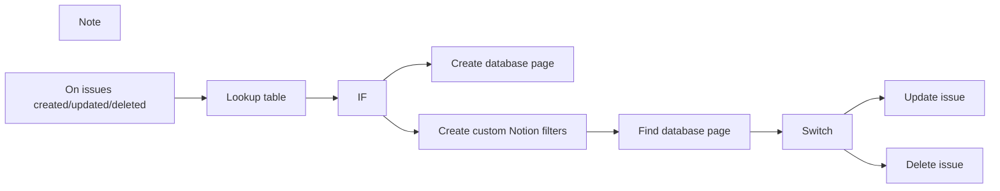

## Fluxo (.json) :

```json
{
  "id": "YCQFaJdmJc6Rx4o7",
  "meta": {
    "instanceId": "0c0787ab1a9ebbb0967650f7b4012417acdd61c2fa7c9e119981847e2fc8b09c"
  },
  "name": "Sync Jira issues with subsequent comments to Notion database",
  "tags": [
    {
      "id": "24",
      "name": "n8n team",
      "createdAt": "2023-02-28T11:17:04.513Z",
      "updatedAt": "2023-02-28T11:17:04.513Z"
    }
  ],
  "nodes": [
    {
      "id": "3f36dc12-5011-4786-aa21-f20ba72944df",
      "name": "Create database page",
      "type": "n8n-nodes-base.notion",
      "position": [
        460,
        460
      ],
      "parameters": {
        "title": "={{$node[\"On issues created/updated/deleted\"].json[\"issue\"][\"fields\"][\"summary\"]}}",
        "options": {},
        "resource": "databasePage",
        "databaseId": "e3503d88-accb-4ddb-aa45-f962cb03e729",
        "propertiesUi": {
          "propertyValues": [
            {
              "key": "Issue Key|rich_text",
              "textContent": "={{$node[\"On issues created/updated/deleted\"].json[\"issue\"][\"key\"]}}"
            },
            {
              "key": "Issue ID|number",
              "numberValue": "={{parseInt($node[\"On issues created/updated/deleted\"].json[\"issue\"][\"id\"])}}"
            },
            {
              "key": "Link|url",
              "urlValue": "=https://n8n-io.atlassian.net/browse/{{$node[\"On issues created/updated/deleted\"].json[\"issue\"][\"key\"]}}",
              "ignoreIfEmpty": true
            },
            {
              "key": "Status|select",
              "selectValue": "={{$node[\"Lookup table\"].json[\"Status ID\"]}}"
            }
          ]
        }
      },
      "credentials": {
        "notionApi": {
          "id": "XNjSmr171NUO17TK",
          "name": "REPLACE ME"
        }
      },
      "typeVersion": 2
    },
    {
      "id": "2d13b713-dd3d-48aa-a550-fe8db1e7aafd",
      "name": "Note",
      "type": "n8n-nodes-base.stickyNote",
      "position": [
        660,
        460
      ],
      "parameters": {
        "width": 232.65822784810126,
        "height": 137.9746835443038,
        "content": "### `IF` & `Switch` nodes\nThese conditional nodes (`IF` and `Switch`) determine which Notion [**CRUD**](https://www.sumologic.com/glossary/crud/) operations will be performed."
      },
      "typeVersion": 1
    },
    {
      "id": "374761f7-9299-41a3-8bb3-25434f4f9eaf",
      "name": "Find database page",
      "type": "n8n-nodes-base.notion",
      "position": [
        660,
        660
      ],
      "parameters": {
        "options": {},
        "resource": "databasePage",
        "operation": "getAll",
        "returnAll": true,
        "databaseId": "e3503d88-accb-4ddb-aa45-f962cb03e729",
        "filterJson": "={{$node[\"Create custom Notion filters\"].json[\"notionfilter\"]}}",
        "filterType": "json"
      },
      "credentials": {
        "notionApi": {
          "id": "XNjSmr171NUO17TK",
          "name": "REPLACE ME"
        }
      },
      "typeVersion": 2
    },
    {
      "id": "159db4ca-c8da-439a-aa44-63527c7b9dcd",
      "name": "Switch",
      "type": "n8n-nodes-base.switch",
      "position": [
        860,
        660
      ],
      "parameters": {
        "rules": {
          "rules": [
            {
              "value2": "jira:issue_updated"
            },
            {
              "output": 1,
              "value2": "jira:issue_deleted"
            }
          ]
        },
        "value1": "={{$node[\"On issues created/updated/deleted\"].json[\"webhookEvent\"]}}",
        "dataType": "string"
      },
      "typeVersion": 1
    },
    {
      "id": "080fb157-e160-4bf0-9348-05eabee60f9f",
      "name": "IF",
      "type": "n8n-nodes-base.if",
      "position": [
        240,
        560
      ],
      "parameters": {
        "conditions": {
          "string": [
            {
              "value1": "={{$node[\"On issues created/updated/deleted\"].json[\"webhookEvent\"]}}",
              "value2": "jira:issue_created"
            }
          ]
        }
      },
      "typeVersion": 1
    },
    {
      "id": "3ec2a130-251d-4d28-8dc3-ca31f528f90e",
      "name": "Delete issue",
      "type": "n8n-nodes-base.notion",
      "position": [
        1080,
        760
      ],
      "parameters": {
        "pageId": "={{ $node[\"Find database page\"].json[\"id\"] }}",
        "operation": "archive"
      },
      "credentials": {
        "notionApi": {
          "id": "XNjSmr171NUO17TK",
          "name": "REPLACE ME"
        }
      },
      "typeVersion": 2
    },
    {
      "id": "5a23919a-ee95-4935-b619-5eb0b486eef7",
      "name": "On issues created/updated/deleted",
      "type": "n8n-nodes-base.jiraTrigger",
      "position": [
        -160,
        560
      ],
      "webhookId": "042e0fd3-9776-4c23-9f0d-dc032ef22744",
      "parameters": {
        "events": [
          "jira:issue_created",
          "jira:issue_deleted",
          "jira:issue_updated"
        ],
        "additionalFields": {}
      },
      "credentials": {
        "jiraSoftwareCloudApi": {
          "id": "xZbqpSTMv8IjtS5Y",
          "name": "REPLACE ME"
        }
      },
      "typeVersion": 1
    },
    {
      "id": "6d3bbfce-cbfc-4590-827b-4ec1eb5c11b6",
      "name": "Lookup table",
      "type": "n8n-nodes-base.code",
      "position": [
        40,
        560
      ],
      "parameters": {
        "jsCode": "/* Lookup table for the statuses in Jira. You can find the status IDs by\n   following the instructions provided at this link:\n   https://community.atlassian.com/t5/Jira-Service-Management/How-do-I-get-a-list-of-statuses-that-show-the-associated-status/qaq-p/1803682\n*/\nvar lookup = {\n    \"To Do\": \"To do\",\n    \"In Progress\": \"In progress\",\n    \"Done\": \"Done\"\n};\n\n\n\nnew_items = [];\n\nfor (item of $items(\"On issues created/updated/deleted\")) {\n  console.log(item.json[\"Status\"]);\n  // instantiate a new variable for status\n  var issue_status = item.json[\"issue\"][\"fields\"][\"status\"][\"name\"];\n  // check if the status is in the lookup table\n  if (issue_status in lookup) {\n    // if it is, then add the status ID to the new_items array\n    new_items.push({\n      \"Status ID\": lookup[issue_status]\n    });\n  }\n}\n\nreturn new_items;"
      },
      "typeVersion": 2
    },
    {
      "id": "bdc966ce-16bf-47de-aba3-fcd0f912f95f",
      "name": "Create custom Notion filters",
      "type": "n8n-nodes-base.code",
      "position": [
        460,
        660
      ],
      "parameters": {
        "jsCode": "const new_items = [];\nfor (item of $items(\"On issues created/updated/deleted\")) {\n\n  // do not process this item if action is created\n  if (item.json[\"webhookEvent\"] == \"jira:issue_created\") {\n    continue;\n  }\n\n  // build the output template\n  var new_item = {\n    \"json\": {\n      \"notionfilter\": \"\"\n    }\n  };\n  new_item = JSON.stringify(new_item);\n  new_item = JSON.parse(new_item);\n  new_items.push(new_item);\n\n  // create Notion filter to find specific database page by issue ID\n  notionfilter = {\n    or: [],\n  }\n\n  const filter = {\n    property: 'Issue ID',\n    number: {\n      equals: parseInt(item.json[\"issue\"][\"id\"])\n    }\n  }\n  notionfilter[\"or\"].push(filter);\n\n  new_item.json.notionfilter = JSON.stringify(notionfilter); \n}\n\nreturn new_items;"
      },
      "typeVersion": 2
    },
    {
      "id": "f92157a9-1a63-4907-87c8-0b54c3b0ac8e",
      "name": "Update issue",
      "type": "n8n-nodes-base.notion",
      "position": [
        1080,
        560
      ],
      "parameters": {
        "pageId": "={{ $node[\"Find database page\"].json[\"id\"] }}",
        "options": {},
        "resource": "databasePage",
        "operation": "update",
        "propertiesUi": {
          "propertyValues": [
            {
              "key": "Title|title",
              "title": "={{$node[\"On issues created/updated/deleted\"].json[\"issue\"][\"fields\"][\"summary\"]}}"
            },
            {
              "key": "Status|select",
              "selectValue": "={{$node[\"Lookup table\"].json[\"Status ID\"]}}"
            }
          ]
        }
      },
      "credentials": {
        "notionApi": {
          "id": "XNjSmr171NUO17TK",
          "name": "REPLACE ME"
        }
      },
      "typeVersion": 2
    }
  ],
  "active": false,
  "pinData": {},
  "settings": {
    "executionOrder": "v1"
  },
  "versionId": "490138aa-d92d-439a-b7bb-d6d00a9fab86",
  "connections": {
    "IF": {
      "main": [
        [
          {
            "node": "Create database page",
            "type": "main",
            "index": 0
          }
        ],
        [
          {
            "node": "Create custom Notion filters",
            "type": "main",
            "index": 0
          }
        ]
      ]
    },
    "Switch": {
      "main": [
        [
          {
            "node": "Update issue",
            "type": "main",
            "index": 0
          }
        ],
        [
          {
            "node": "Delete issue",
            "type": "main",
            "index": 0
          }
        ]
      ]
    },
    "Lookup table": {
      "main": [
        [
          {
            "node": "IF",
            "type": "main",
            "index": 0
          }
        ]
      ]
    },
    "Find database page": {
      "main": [
        [
          {
            "node": "Switch",
            "type": "main",
            "index": 0
          }
        ]
      ]
    },
    "Create custom Notion filters": {
      "main": [
        [
          {
            "node": "Find database page",
            "type": "main",
            "index": 0
          }
        ]
      ]
    },
    "On issues created/updated/deleted": {
      "main": [
        [
          {
            "node": "Lookup table",
            "type": "main",
            "index": 0
          }
        ]
      ]
    }
  }
}
```

<a id="template-629"></a>

## Template 629 - Baixar imagem e extrair informações

- **Nome:** Baixar imagem e extrair informações
- **Descrição:** Fluxo que baixa uma imagem de um serviço público e extrai informações básicas sobre o arquivo de imagem.
- **Funcionalidade:** • Gatilho manual: Permite iniciar o fluxo ao clicar em executar.
• Download de imagem: Faz uma requisição HTTP para obter uma imagem a partir de uma URL pública.
• Extração de informações da imagem: Obtém metadados da imagem como formato, dimensões e tamanho do arquivo.
- **Ferramentas:** • picsum.photos: Serviço público que fornece imagens placeholder via URL, usado como fonte da imagem.


## Fluxo visual

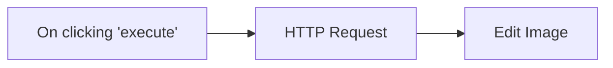

## Fluxo (.json) :

```json
{
  "nodes": [
    {
      "name": "On clicking 'execute'",
      "type": "n8n-nodes-base.manualTrigger",
      "position": [
        250,
        300
      ],
      "parameters": {},
      "typeVersion": 1
    },
    {
      "name": "Edit Image",
      "type": "n8n-nodes-base.editImage",
      "position": [
        650,
        300
      ],
      "parameters": {
        "operation": "information"
      },
      "typeVersion": 1
    },
    {
      "name": "HTTP Request",
      "type": "n8n-nodes-base.httpRequest",
      "position": [
        450,
        300
      ],
      "parameters": {
        "url": "https://picsum.photos/200/300",
        "options": {},
        "responseFormat": "file"
      },
      "typeVersion": 1
    }
  ],
  "connections": {
    "HTTP Request": {
      "main": [
        [
          {
            "node": "Edit Image",
            "type": "main",
            "index": 0
          }
        ]
      ]
    },
    "On clicking 'execute'": {
      "main": [
        [
          {
            "node": "HTTP Request",
            "type": "main",
            "index": 0
          }
        ]
      ]
    }
  }
}
```

<a id="template-630"></a>

## Template 630 - Pesquisa automática de participantes de reunião

- **Nome:** Pesquisa automática de participantes de reunião
- **Descrição:** Automatiza a pesquisa sobre os participantes de um evento de calendário, agrega informações sobre cada pessoa e suas empresas (quando aplicável) e envia um briefing por email.
- **Funcionalidade:** • Detecção de evento de calendário: Inicia o fluxo quando um novo evento é criado.
• Filtragem do próprio usuário: Remove o proprietário do calendário da lista de participantes para não pesquisar sobre si mesmo.
• Separação de participantes: Divide a lista de convidados para processar cada um individualmente.
• Verificação de email corporativo: Identifica se o email é de domínio corporativo ou um provedor pessoal usando correspondência por padrão.
• Pesquisa sobre a pessoa: Realiza uma pesquisa na web para reunir informações objetivas sobre o dono do email (o que faz, interesses, observações relevantes).
• Pesquisa sobre a empresa: Quando aplicável, consulta o site da empresa para extrair o que ela faz, problema que resolve e modelo de negócio.
• Agregação de resultados: Reúne todas as respostas geradas para cada participante em um conjunto único de dados.
• Geração de relatório em HTML: Converte o conteúdo em markdown para HTML formatado como briefing de reunião.
• Envio de relatório por email: Envia o briefing final para um destinatário configurável.
• Configuração de contexto e destinatário: Permite definir contexto pessoal para melhorar a acurácia das pesquisas e o email de destino para o envio do relatório.
- **Ferramentas:** • Google Calendar: Fonte de eventos que dispara a automação quando uma nova reunião é criada.
• OpenAI Responses API (com web search preview e modelo GPT-4o): Realiza pesquisas web e gera resumos objetivos sobre pessoas e empresas.
• Provedor de email (Gmail): Envia o briefing final em HTML para o destinatário configurado.


## Fluxo visual

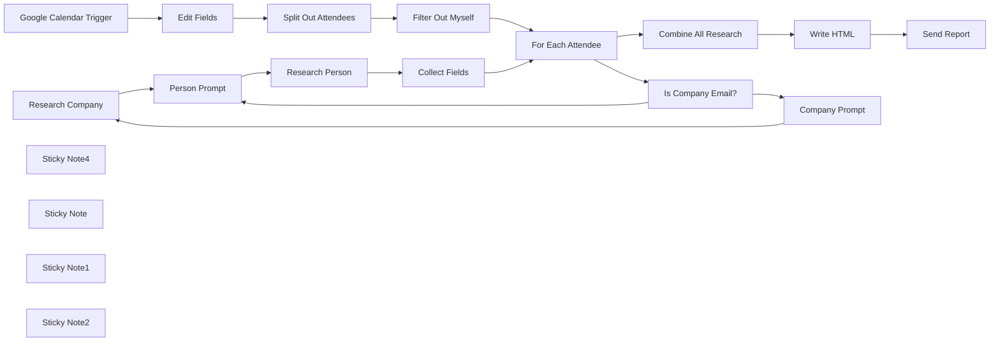

## Fluxo (.json) :

```json
{
  "meta": {
    "instanceId": "45e293393b5dd8437fb351e5b1ef5511ef67e6e0826a1c10b9b68be850b67593"
  },
  "nodes": [
    {
      "id": "7976731d-692d-45f8-b986-3f82d998dfa0",
      "name": "Research Company",
      "type": "n8n-nodes-base.httpRequest",
      "position": [
        600,
        780
      ],
      "parameters": {
        "url": "https://api.openai.com/v1/responses",
        "options": {},
        "requestMethod": "POST",
        "authentication": "headerAuth",
        "jsonParameters": true,
        "bodyParametersJson": "={{\n  JSON.stringify({\n    model: \"gpt-4o\",\n    tools: [{ type: \"web_search_preview\" }],\n    input: $json.prompt\n  })\n}}",
        "queryParametersJson": "{}",
        "headerParametersJson": "{}"
      },
      "credentials": {
        "httpHeaderAuth": {
          "id": "rhDo5pdVQQsBgcVZ",
          "name": "Header Auth account 2"
        }
      },
      "typeVersion": 1
    },
    {
      "id": "2f123bde-a5a0-4828-81e8-b875ac27d081",
      "name": "Research Person",
      "type": "n8n-nodes-base.httpRequest",
      "position": [
        940,
        960
      ],
      "parameters": {
        "url": "https://api.openai.com/v1/responses",
        "options": {},
        "requestMethod": "POST",
        "authentication": "headerAuth",
        "jsonParameters": true,
        "bodyParametersJson": "={{\n  JSON.stringify({\n    model: \"gpt-4o\",\n    tools: [{ type: \"web_search_preview\" }],\n    input: $json.prompt\n  })\n}}",
        "queryParametersJson": "{}",
        "headerParametersJson": "{}"
      },
      "credentials": {
        "httpHeaderAuth": {
          "id": "rhDo5pdVQQsBgcVZ",
          "name": "Header Auth account 2"
        }
      },
      "typeVersion": 1
    },
    {
      "id": "07131cea-4600-479f-9048-3e1ec26dac25",
      "name": "Google Calendar Trigger",
      "type": "n8n-nodes-base.googleCalendarTrigger",
      "position": [
        -1000,
        940
      ],
      "parameters": {
        "options": {},
        "pollTimes": {
          "item": [
            {
              "mode": "everyMinute"
            }
          ]
        },
        "triggerOn": "eventCreated",
        "calendarId": {
          "__rl": true,
          "mode": "list",
          "value": "youremail@example.com",
          "cachedResultName": "Your Name Here"
        }
      },
      "credentials": {
        "googleCalendarOAuth2Api": {
          "id": "gpYtW24uwPf0eJEq",
          "name": "Google Calendar account"
        }
      },
      "typeVersion": 1
    },
    {
      "id": "fece4fec-b5e5-43ee-8bb2-64093729137a",
      "name": "Filter Out Myself",
      "type": "n8n-nodes-base.filter",
      "position": [
        -320,
        940
      ],
      "parameters": {
        "options": {},
        "conditions": {
          "options": {
            "version": 2,
            "leftValue": "",
            "caseSensitive": true,
            "typeValidation": "strict"
          },
          "combinator": "and",
          "conditions": [
            {
              "id": "a45fab6b-2017-4740-a7a2-dfc90bc2eafb",
              "operator": {
                "type": "boolean",
                "operation": "false",
                "singleValue": true
              },
              "leftValue": "={{ $json.self }}",
              "rightValue": ""
            }
          ]
        }
      },
      "typeVersion": 2.2
    },
    {
      "id": "c25cf9a0-99b9-4e52-8852-0824ff53982c",
      "name": "Split Out Attendees",
      "type": "n8n-nodes-base.splitOut",
      "position": [
        -480,
        940
      ],
      "parameters": {
        "options": {},
        "fieldToSplitOut": "=attendees"
      },
      "typeVersion": 1
    },
    {
      "id": "e7709b40-db55-4b4f-8953-218b96d38d73",
      "name": "For Each Attendee",
      "type": "n8n-nodes-base.splitInBatches",
      "position": [
        -40,
        940
      ],
      "parameters": {
        "options": {}
      },
      "typeVersion": 3
    },
    {
      "id": "5db7b2b5-078e-4b3a-b8b6-d12903127a93",
      "name": "Is Company Email?",
      "type": "n8n-nodes-base.if",
      "position": [
        260,
        960
      ],
      "parameters": {
        "options": {},
        "conditions": {
          "options": {
            "version": 2,
            "leftValue": "",
            "caseSensitive": true,
            "typeValidation": "strict"
          },
          "combinator": "and",
          "conditions": [
            {
              "id": "2e0ad575-3652-4981-ad78-e76d95880448",
              "operator": {
                "type": "string",
                "operation": "notRegex"
              },
              "leftValue": "={{ $('For Each Attendee').item.json.email }}",
              "rightValue": "@(gmail\\.com|hotmail\\.com|yahoo\\.com|outlook\\.com|icloud\\.com|aol\\.com|live\\.com|msn\\.com|protonmail\\.com|me\\.com|mail\\.com|gmx\\.com|yandex\\.com)"
            }
          ]
        }
      },
      "typeVersion": 2.2
    },
    {
      "id": "14e226d4-7f42-4da3-b941-9c69facbbbf6",
      "name": "Combine All Research",
      "type": "n8n-nodes-base.aggregate",
      "position": [
        260,
        260
      ],
      "parameters": {
        "options": {},
        "aggregate": "aggregateAllItemData"
      },
      "typeVersion": 1
    },
    {
      "id": "599fb5b6-8426-4edf-bae8-34ad69aa68e9",
      "name": "Collect Fields",
      "type": "n8n-nodes-base.set",
      "position": [
        1100,
        960
      ],
      "parameters": {
        "options": {},
        "assignments": {
          "assignments": [
            {
              "id": "f4b7dbc5-8f43-4cb7-aa59-508822625152",
              "name": "person",
              "type": "string",
              "value": "={{ $json.output[1].content[0].text }}"
            },
            {
              "id": "28988743-7e98-41c3-a564-0e507f8a69af",
              "name": "company",
              "type": "string",
              "value": "={{ $('For Each Attendee').item.json.email.match(/@(gmail\\.com|hotmail\\.com|yahoo\\.com|outlook\\.com|icloud\\.com|aol\\.com|live\\.com|msn\\.com|protonmail\\.com|me\\.com|mail\\.com|gmx\\.com|yandex\\.com)/) ? 'No company information found.' : $('Research Company').item.json.output[1].content[0].text }}"
            },
            {
              "id": "ed7cc918-4b08-4de8-a21e-7410cfe6b6cb",
              "name": "email",
              "type": "string",
              "value": "={{ $('For Each Attendee').item.json.email }}"
            }
          ]
        }
      },
      "typeVersion": 3.4
    },
    {
      "id": "d226f2f5-9671-49b7-bd3d-eea8896aee87",
      "name": "Sticky Note4",
      "type": "n8n-nodes-base.stickyNote",
      "position": [
        -1040,
        620
      ],
      "parameters": {
        "color": 7,
        "width": 880,
        "height": 700,
        "content": "## 1. New Google Calendar Event Detected\n\nOur workflow is triggered when a new calendar event comes in. \n\nThe event gives us access to a list of attendees which we can loop over in the next step. We need to filter out ourselves if we are in the meeting too!"
      },
      "typeVersion": 1
    },
    {
      "id": "89881dac-69cb-42fd-995c-bc459eab28a5",
      "name": "Sticky Note",
      "type": "n8n-nodes-base.stickyNote",
      "position": [
        200,
        620
      ],
      "parameters": {
        "color": 7,
        "width": 1120,
        "height": 700,
        "content": "## 2. Research Attendee + Company\n\nAPI calls are made to the OpenAI Responses API using the new web search preview endpoint. This allows us to search the web for any mentions of each attendee. If the email address is a company email, we also make a search request to find out about the company. We use some context about ourself (in the \"Set Context\" node) so that the LLM can make an educated guess if there are many people with the same name."
      },
      "typeVersion": 1
    },
    {
      "id": "2a7f467e-cd0c-45f3-bbcd-9b37746b74ef",
      "name": "Sticky Note1",
      "type": "n8n-nodes-base.stickyNote",
      "position": [
        200,
        0
      ],
      "parameters": {
        "color": 7,
        "width": 1120,
        "height": 580,
        "content": "## 3. Generate + Send Report\n\nFinally, we combine all the data from the meeting attendees into a report. The report gets written in Markdown, converted into HTML, and the send via the Gmail API."
      },
      "typeVersion": 1
    },
    {
      "id": "d04cf49a-d1fa-4019-9a98-01ec64bd6a37",
      "name": "Write HTML",
      "type": "n8n-nodes-base.markdown",
      "position": [
        440,
        260
      ],
      "parameters": {
        "mode": "markdownToHtml",
        "options": {
          "tables": true
        },
        "markdown": "=### Meeting Briefing\n\n{{ \n\n$json.data.reduce((acc, entry, index) => acc + (`\n\n### Person ${index + 1} (${entry.email}):\n\n${entry.person}\n\n### Person ${index + 1} Company:\n\n${entry.company}\n\n---`)\n\n, '').trim().replace(/---$/, '')\n\n}}"
      },
      "typeVersion": 1
    },
    {
      "id": "ac2a56db-2d80-4412-8985-a29577db5bcb",
      "name": "Sticky Note2",
      "type": "n8n-nodes-base.stickyNote",
      "position": [
        -840,
        1100
      ],
      "parameters": {
        "width": 310,
        "height": 200,
        "content": "## Edit Here\nEdit a few variables here to get started:\n- **context**: Some information about you to help the web search return the right people. \n- **email**: The email that you want to send the report to."
      },
      "typeVersion": 1
    },
    {
      "id": "d32e4220-78fa-4581-abd3-ceff4e95641a",
      "name": "Edit Fields",
      "type": "n8n-nodes-base.set",
      "position": [
        -740,
        940
      ],
      "parameters": {
        "options": {},
        "assignments": {
          "assignments": [
            {
              "id": "ad442334-0219-4297-91c3-03575920d9b9",
              "name": "context",
              "type": "string",
              "value": "I am working in web development, based in Singapore/Australia, and I work with startups"
            },
            {
              "id": "46cff036-7624-4682-8a22-966a5c46c7b5",
              "name": "email",
              "type": "string",
              "value": "youremail@example.com"
            },
            {
              "id": "c9b83d56-8b24-4767-bc83-0eb0b5f62986",
              "name": "attendees",
              "type": "array",
              "value": "={{ $json.attendees }}"
            }
          ]
        }
      },
      "typeVersion": 3.4
    },
    {
      "id": "600667b6-aae3-4a9e-a71c-a0819921a823",
      "name": "Send Report",
      "type": "n8n-nodes-base.gmail",
      "position": [
        600,
        260
      ],
      "webhookId": "86c63a4a-64e7-41e5-b657-c80b59dce562",
      "parameters": {
        "sendTo": "={{ $('Edit Fields').item.json.email }}",
        "message": "={{ $json.data }}",
        "options": {
          "appendAttribution": false
        },
        "subject": "=Meeting Briefing: {{ $('Google Calendar Trigger').item.json.summary }} ({{ new Date($('Google Calendar Trigger').item.json.start.dateTime).format(\"dd/MM/yyyy\") }})"
      },
      "credentials": {
        "gmailOAuth2": {
          "id": "aXTuNMJaYuKFOKTa",
          "name": "Gmail account"
        }
      },
      "typeVersion": 2.1
    },
    {
      "id": "863c58b1-3b88-4b25-9191-31c77c2911cd",
      "name": "Person Prompt",
      "type": "n8n-nodes-base.set",
      "position": [
        780,
        960
      ],
      "parameters": {
        "options": {},
        "assignments": {
          "assignments": [
            {
              "id": "7096cd1e-179c-4230-b869-73f7cb1a9ff9",
              "name": "prompt",
              "type": "string",
              "value": "=I have a call scheduled with {{ $('For Each Attendee').item.json.email }} Please find out as much as you can about the owner of this email address. \n\n- What do they do? \n- What are their interests? \n- What might I not know about them?\n\n{{ $('For Each Attendee').item.json.email.match(/@(gmail\\.com|hotmail\\.com|yahoo\\.com|outlook\\.com|icloud\\.com|aol\\.com|live\\.com|msn\\.com|protonmail\\.com|me\\.com|mail\\.com|gmx\\.com|yandex\\.com)/) ? '' : `Make sure to crawl their company website (http:/$('For Each Attendee').item.json.email.split('@')[1]}) to see if there's anything there.` }} \n\nFor context: {{ $('Edit Fields').item.json.email }}. If there is any ambiguity, use this information to find the most likely person to be meeting with me.\n\nDon't tailor your answer to this context - stay objective about the person only. Make your answer less than 100 words."
            }
          ]
        }
      },
      "typeVersion": 3.4
    },
    {
      "id": "dbc54bdb-1b50-44ae-a3d2-b4ab33d1ecc3",
      "name": "Company Prompt",
      "type": "n8n-nodes-base.set",
      "position": [
        440,
        780
      ],
      "parameters": {
        "options": {},
        "assignments": {
          "assignments": [
            {
              "id": "9d1121f3-a5a6-4f73-8726-0a84cad94e77",
              "name": "prompt",
              "type": "string",
              "value": "=Check out the website http://{{ $('For Each Attendee').item.json.email.split(\"@\")[1] }}). \n\n- What does this company do? \n- What problem do they solve? \n- What is their business model? \n\nFor context about me: {{ $('Edit Fields').item.json.context }}.\n\nDon't mention anything about this context in your answer - stay objective about the company. Make your answer less than 100 words. \n\nIf you are unable to find a company at this URL, just write 'Company Not Found'."
            }
          ]
        }
      },
      "typeVersion": 3.4
    }
  ],
  "pinData": {},
  "connections": {
    "Write HTML": {
      "main": [
        [
          {
            "node": "Send Report",
            "type": "main",
            "index": 0
          }
        ]
      ]
    },
    "Edit Fields": {
      "main": [
        [
          {
            "node": "Split Out Attendees",
            "type": "main",
            "index": 0
          }
        ]
      ]
    },
    "Person Prompt": {
      "main": [
        [
          {
            "node": "Research Person",
            "type": "main",
            "index": 0
          }
        ]
      ]
    },
    "Collect Fields": {
      "main": [
        [
          {
            "node": "For Each Attendee",
            "type": "main",
            "index": 0
          }
        ]
      ]
    },
    "Company Prompt": {
      "main": [
        [
          {
            "node": "Research Company",
            "type": "main",
            "index": 0
          }
        ]
      ]
    },
    "Research Person": {
      "main": [
        [
          {
            "node": "Collect Fields",
            "type": "main",
            "index": 0
          }
        ]
      ]
    },
    "Research Company": {
      "main": [
        [
          {
            "node": "Person Prompt",
            "type": "main",
            "index": 0
          }
        ]
      ]
    },
    "Filter Out Myself": {
      "main": [
        [
          {
            "node": "For Each Attendee",
            "type": "main",
            "index": 0
          }
        ]
      ]
    },
    "For Each Attendee": {
      "main": [
        [
          {
            "node": "Combine All Research",
            "type": "main",
            "index": 0
          }
        ],
        [
          {
            "node": "Is Company Email?",
            "type": "main",
            "index": 0
          }
        ]
      ]
    },
    "Is Company Email?": {
      "main": [
        [
          {
            "node": "Company Prompt",
            "type": "main",
            "index": 0
          }
        ],
        [
          {
            "node": "Person Prompt",
            "type": "main",
            "index": 0
          }
        ]
      ]
    },
    "Split Out Attendees": {
      "main": [
        [
          {
            "node": "Filter Out Myself",
            "type": "main",
            "index": 0
          }
        ]
      ]
    },
    "Combine All Research": {
      "main": [
        [
          {
            "node": "Write HTML",
            "type": "main",
            "index": 0
          }
        ]
      ]
    },
    "Google Calendar Trigger": {
      "main": [
        [
          {
            "node": "Edit Fields",
            "type": "main",
            "index": 0
          }
        ]
      ]
    }
  }
}
```

<a id="template-631"></a>

## Template 631 - Alerta de mudanças em clientes (post/posição)

- **Nome:** Alerta de mudanças em clientes (post/posição)
- **Descrição:** Verifica clientes associados a um proprietário no HubSpot, busca informações no LinkedIn e notifica por email quando há alterações no último post ou na posição profissional.
- **Funcionalidade:** • Obter lista de proprietários do HubSpot: Chama a API para recuperar todos os owners e processá-los individualmente.
• Filtrar proprietário configurado: Seleciona o owner pelo email definido nas configurações para execução focalizada.
• Buscar clientes do proprietário com paginação: Pesquisa contactos associados ao owner e itera para obter todos (limite de 200 por página tratado automaticamente).
• Agrupar e consolidar resultados: Junta todas as páginas de contactos para processamento subsequente.
• Sincronizar com Google Sheets: Cria ou atualiza linhas na folha por email do cliente para manter um histórico e permitir comparações.
• Verificar URL do LinkedIn: Lê o campo linkedin_url na folha e, se ausente, tenta encontrar o perfil pesquisando por nome e empresa.
• Obter dados do LinkedIn (último post e posição): Usa APIs externas/sub-workflows para obter o último post e a posição profissional do perfil.
• Comparar com dados existentes no documento: Compara o último post e a posição obtidos com os valores guardados na folha para detectar mudanças.
• Atualizar folha e marcar alterações: Regista as mudanças (post e posição) e actualiza as colunas relevantes com data e dados novos.
• Gerar e enviar email de alerta: Consolida uma mensagem listando clientes com atualizações e envia por email ao proprietário configurado.
- **Ferramentas:** • HubSpot: API usada para obter a lista de proprietários e pesquisar contactos/contatos associados a um owner.
• Google Sheets: Folha de cálculo usada para armazenar, comparar e atualizar dados dos clientes (email, linkedin_url, último post, posição, data).
• LinkedIn via RapidAPI: Serviço externo usado para obter perfil, procurar por nome/empresa e extrair informações como URL de perfil, último post e posição.
• Gmail: Serviço de email usado para enviar as notificações consolidadas ao proprietário.


## Fluxo visual

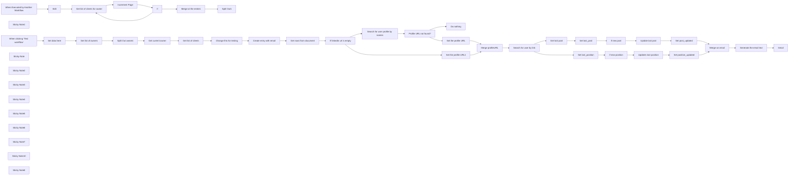

## Fluxo (.json) :

```json
{
  "nodes": [
    {
      "id": "2804a082-c17b-482f-828d-901dab7e7a11",
      "name": "When clicking ‘Test workflow’",
      "type": "n8n-nodes-base.manualTrigger",
      "position": [
        -160,
        40
      ],
      "parameters": {},
      "typeVersion": 1
    },
    {
      "id": "58d51340-5246-4089-ae63-f16ff4be184e",
      "name": "Get list of owners",
      "type": "n8n-nodes-base.httpRequest",
      "position": [
        280,
        40
      ],
      "parameters": {
        "url": "https://api.hubapi.com/crm/v3/owners",
        "options": {},
        "authentication": "predefinedCredentialType",
        "nodeCredentialType": "hubspotOAuth2Api"
      },
      "credentials": {
        "hubspotOAuth2Api": {
          "id": "qubiIFrowxvUdpu6",
          "name": "HubSpot account for node"
        }
      },
      "typeVersion": 4.2
    },
    {
      "id": "335ffd8c-68fa-4d55-85e9-462963a8a291",
      "name": "Get list of clients for owner",
      "type": "n8n-nodes-base.httpRequest",
      "position": [
        280,
        575
      ],
      "parameters": {
        "url": "https://api.hubapi.com/crm/v3/objects/contacts/search",
        "method": "POST",
        "options": {},
        "jsonBody": "={\n  \"filterGroups\": [\n    {\n      \"filters\": [\n        {\n          \"propertyName\": \"hubspot_owner_id\",\n          \"operator\": \"EQ\",\n          \"value\": \"{{ $('When Executed by Another Workflow').item.json.ownerId }}\"\n        }\n      ]\n    }\n  ],\n  \"properties\": [\"firstname\", \"lastname\", \"email\", \"linkedinURL\", \"company\"],\n\"limit\": 200,\n\"after\": {{ $node['Edit'].json[\"sofar\"] }}\n} ",
        "sendBody": true,
        "specifyBody": "json",
        "authentication": "predefinedCredentialType",
        "nodeCredentialType": "hubspotOAuth2Api"
      },
      "credentials": {
        "hubspotOAuth2Api": {
          "id": "qubiIFrowxvUdpu6",
          "name": "HubSpot account for node"
        }
      },
      "typeVersion": 4.2
    },
    {
      "id": "5d116139-1764-4d3a-8696-d280fb7e9d8f",
      "name": "Sticky Note1",
      "type": "n8n-nodes-base.stickyNote",
      "position": [
        -210,
        -260
      ],
      "parameters": {
        "color": 4,
        "width": 420,
        "height": 460,
        "content": "## Settings\n- Set in \"Set data here\" the email you are registered with in Hubspot as an Owner, and the link of a Google sheet copied [from this one](https://docs.google.com/spreadsheets/d/1y17jIU6JnNPcmazWf2GsmRpdjBBMnkN41tRJnAO5KrQ/edit?usp=sharing)\n"
      },
      "typeVersion": 1
    },
    {
      "id": "a8a15bd4-5a46-4f70-87bd-4db7170b4928",
      "name": "If",
      "type": "n8n-nodes-base.if",
      "position": [
        720,
        575
      ],
      "parameters": {
        "options": {},
        "conditions": {
          "options": {
            "version": 2,
            "leftValue": "",
            "caseSensitive": true,
            "typeValidation": "loose"
          },
          "combinator": "and",
          "conditions": [
            {
              "id": "d5df6d6c-ff5f-46ad-a8d4-38e326d7415e",
              "operator": {
                "type": "number",
                "operation": "gte"
              },
              "leftValue": "={{ $node['Edit'].json.sofar }}",
              "rightValue": "={{ $('Get list of clients for owner').item.json.total }}"
            }
          ]
        },
        "looseTypeValidation": true
      },
      "typeVersion": 2.2
    },
    {
      "id": "eda30bd9-95bb-43d4-8981-479036103dd1",
      "name": "Edit",
      "type": "n8n-nodes-base.set",
      "position": [
        60,
        575
      ],
      "parameters": {
        "options": {},
        "assignments": {
          "assignments": [
            {
              "id": "8a403dc5-2b05-430d-b1cc-39f70f5ac82d",
              "name": "sofar",
              "type": "number",
              "value": "=0"
            },
            {
              "id": "dca65b15-f545-42f1-90df-37efb03e267d",
              "name": "results",
              "type": "array",
              "value": "[]"
            }
          ]
        }
      },
      "typeVersion": 3.4
    },
    {
      "id": "4c6c8217-6610-413e-8b1c-185a96e44882",
      "name": "Increment Page",
      "type": "n8n-nodes-base.set",
      "position": [
        500,
        500
      ],
      "parameters": {
        "values": {
          "number": [
            {
              "name": "sofar",
              "value": "={{$node[\"Edit\"].json[\"sofar\"] = $node[\"Edit\"].json[\"sofar\"] + $('Get list of clients for owner').item.json.results.length}}"
            }
          ]
        },
        "options": {}
      },
      "executeOnce": true,
      "typeVersion": 1
    },
    {
      "id": "58f53fe6-36a4-4385-ba93-e15dd589c0a4",
      "name": "Split Out1",
      "type": "n8n-nodes-base.splitOut",
      "position": [
        1160,
        575
      ],
      "parameters": {
        "options": {},
        "fieldToSplitOut": "results"
      },
      "typeVersion": 1
    },
    {
      "id": "c92983ba-bef3-463a-a6de-8f205822f359",
      "name": "Merge al the entries",
      "type": "n8n-nodes-base.code",
      "position": [
        940,
        575
      ],
      "parameters": {
        "jsCode": "let results = [],\n  i = 0;\n\ndo {\n  try {\n    results = results.concat($(\"Get list of clients for owner\").all(0, i));\n  } catch (error) {\n    console.log(results)\n    return results;\n  }\n  i++;\n} while (true);"
      },
      "typeVersion": 2
    },
    {
      "id": "68c51fbd-3845-4eb2-9204-d78cc30413bf",
      "name": "If linkedin url is empty",
      "type": "n8n-nodes-base.if",
      "position": [
        1820,
        40
      ],
      "parameters": {
        "options": {},
        "conditions": {
          "options": {
            "version": 2,
            "leftValue": "",
            "caseSensitive": true,
            "typeValidation": "strict"
          },
          "combinator": "and",
          "conditions": [
            {
              "id": "84952199-2e1d-4ea8-bfb8-d4aa975d6df1",
              "operator": {
                "type": "string",
                "operation": "empty",
                "singleValue": true
              },
              "leftValue": "={{ $json.linkedin_url }}",
              "rightValue": ""
            }
          ]
        }
      },
      "typeVersion": 2.2
    },
    {
      "id": "18e4e4bd-4039-4770-a3d0-13edafe6103c",
      "name": "if new post",
      "type": "n8n-nodes-base.if",
      "position": [
        3580,
        40
      ],
      "parameters": {
        "options": {},
        "conditions": {
          "options": {
            "version": 2,
            "leftValue": "",
            "caseSensitive": true,
            "typeValidation": "strict"
          },
          "combinator": "and",
          "conditions": [
            {
              "id": "48d6777d-5431-4cb9-9716-5059277bac5e",
              "operator": {
                "type": "string",
                "operation": "notEquals"
              },
              "leftValue": "={{ $('Get rows from document').item.json['last post'] }}",
              "rightValue": "={{ $('Set last_post').item.json.last_post }}"
            }
          ]
        }
      },
      "typeVersion": 2.2
    },
    {
      "id": "a5623af7-6fba-43b0-be50-c9d3c52aba32",
      "name": "Get list of clients",
      "type": "n8n-nodes-base.executeWorkflow",
      "position": [
        940,
        40
      ],
      "parameters": {
        "mode": "each",
        "options": {},
        "workflowId": {
          "__rl": true,
          "mode": "id",
          "value": "={{ $workflow.id }}",
          "cachedResultName": "={{ $workflow.id }}"
        },
        "workflowInputs": {
          "value": {
            "ownerId": "={{ $json.id }}"
          },
          "schema": [
            {
              "id": "ownerId",
              "type": "string",
              "display": true,
              "removed": false,
              "required": false,
              "displayName": "ownerId",
              "defaultMatch": false,
              "canBeUsedToMatch": true
            }
          ],
          "mappingMode": "defineBelow",
          "matchingColumns": [
            "ownerId"
          ],
          "attemptToConvertTypes": false,
          "convertFieldsToString": true
        }
      },
      "typeVersion": 1.2
    },
    {
      "id": "9f771153-6b83-4ac0-b642-ee2d4b65a41c",
      "name": "When Executed by Another Workflow",
      "type": "n8n-nodes-base.executeWorkflowTrigger",
      "position": [
        -160,
        575
      ],
      "parameters": {
        "workflowInputs": {
          "values": [
            {
              "name": "ownerId"
            }
          ]
        }
      },
      "typeVersion": 1.1
    },
    {
      "id": "437dc3e5-0340-41ce-aea1-36749bd054ad",
      "name": "Get last post",
      "type": "n8n-nodes-base.executeWorkflow",
      "position": [
        3140,
        40
      ],
      "parameters": {
        "mode": "each",
        "options": {},
        "workflowId": {
          "__rl": true,
          "mode": "list",
          "value": "rnVcO8Bw0avTm4GB",
          "cachedResultName": "get personal posts for agent"
        },
        "workflowInputs": {
          "value": {
            "maxItems": 1,
            "username": "={{ $json.username }}",
            "responseType": "detail"
          },
          "schema": [
            {
              "id": "username",
              "type": "string",
              "display": true,
              "required": false,
              "displayName": "username",
              "defaultMatch": false,
              "canBeUsedToMatch": true
            },
            {
              "id": "responseType",
              "type": "string",
              "display": true,
              "required": false,
              "displayName": "responseType",
              "defaultMatch": false,
              "canBeUsedToMatch": true
            },
            {
              "id": "maxItems",
              "type": "number",
              "display": true,
              "required": false,
              "displayName": "maxItems",
              "defaultMatch": false,
              "canBeUsedToMatch": true
            },
            {
              "id": "posted_after",
              "display": true,
              "required": false,
              "displayName": "posted_after",
              "defaultMatch": false,
              "canBeUsedToMatch": true
            }
          ],
          "mappingMode": "defineBelow",
          "matchingColumns": [],
          "attemptToConvertTypes": false,
          "convertFieldsToString": true
        }
      },
      "typeVersion": 1.2
    },
    {
      "id": "a0dda2f2-cb89-4557-8cfc-5e3a01e34637",
      "name": "Gmail",
      "type": "n8n-nodes-base.gmail",
      "position": [
        4680,
        140
      ],
      "webhookId": "eea16996-1d02-4861-b83d-6145cee90ac6",
      "parameters": {
        "sendTo": "={{ $('Set data here').first().json.email }}",
        "message": "={{ $json.text }}",
        "options": {
          "appendAttribution": false
        },
        "subject": "Changes in your clients",
        "emailType": "text"
      },
      "credentials": {
        "gmailOAuth2": {
          "id": "DLjspol9TLgpGaXa",
          "name": "Gmail account 2"
        }
      },
      "typeVersion": 2.1
    },
    {
      "id": "99911831-e603-454c-b533-2e387f2008c4",
      "name": "Search for user by link",
      "type": "n8n-nodes-base.httpRequest",
      "notes": "Search by Name and company",
      "position": [
        2920,
        140
      ],
      "parameters": {
        "url": "https://linkedin-api8.p.rapidapi.com/get-profile-data-by-url",
        "options": {},
        "sendQuery": true,
        "sendHeaders": true,
        "authentication": "genericCredentialType",
        "genericAuthType": "httpHeaderAuth",
        "queryParameters": {
          "parameters": [
            {
              "name": "url",
              "value": "={{ $json.profileURL }}"
            }
          ]
        },
        "headerParameters": {
          "parameters": [
            {
              "name": "x-rapidapi-host",
              "value": "linkedin-api8.p.rapidapi.com"
            }
          ]
        }
      },
      "credentials": {
        "httpHeaderAuth": {
          "id": "nhoVFnkO31mejJrI",
          "name": "RapidAPI Key"
        }
      },
      "executeOnce": false,
      "notesInFlow": true,
      "typeVersion": 4.2,
      "alwaysOutputData": false
    },
    {
      "id": "903f6be4-b468-488c-aa41-50f60ee92bcb",
      "name": "Do nothing",
      "type": "n8n-nodes-base.noOp",
      "position": [
        2480,
        -160
      ],
      "parameters": {},
      "typeVersion": 1
    },
    {
      "id": "695202d6-60bd-4788-b029-0c03a9e3c89a",
      "name": "Merge profileURL",
      "type": "n8n-nodes-base.code",
      "position": [
        2700,
        140
      ],
      "parameters": {
        "mode": "runOnceForEachItem",
        "jsCode": "// Add a new field called 'myNewField' to the JSON of the item\n$input.item.json.profileURL = $json.profileURL;\n\nreturn $input.item;"
      },
      "typeVersion": 2
    },
    {
      "id": "ead5d235-7f73-41e4-86d3-48ad7d4cfa8d",
      "name": "Set last_post",
      "type": "n8n-nodes-base.set",
      "position": [
        3360,
        40
      ],
      "parameters": {
        "options": {},
        "assignments": {
          "assignments": [
            {
              "id": "93be271c-22c8-4afe-a928-e9d2593b025d",
              "name": "last_post",
              "type": "string",
              "value": "={{ $json.text[0] }}"
            }
          ]
        }
      },
      "typeVersion": 3.4
    },
    {
      "id": "a89746c8-5fb7-4c69-930f-d0f451bcef54",
      "name": "Set last_position",
      "type": "n8n-nodes-base.set",
      "position": [
        3360,
        240
      ],
      "parameters": {
        "options": {},
        "assignments": {
          "assignments": [
            {
              "id": "93be271c-22c8-4afe-a928-e9d2593b025d",
              "name": "last_position",
              "type": "string",
              "value": "={{ $json.position[0].title }}"
            }
          ]
        }
      },
      "typeVersion": 3.4
    },
    {
      "id": "467aa5a3-c9f5-407f-8571-e9ba333109e2",
      "name": "if new position",
      "type": "n8n-nodes-base.if",
      "position": [
        3580,
        240
      ],
      "parameters": {
        "options": {},
        "conditions": {
          "options": {
            "version": 2,
            "leftValue": "",
            "caseSensitive": true,
            "typeValidation": "strict"
          },
          "combinator": "and",
          "conditions": [
            {
              "id": "48d6777d-5431-4cb9-9716-5059277bac5e",
              "operator": {
                "type": "string",
                "operation": "notEquals"
              },
              "leftValue": "={{ $json.last_position }}",
              "rightValue": "={{ $('Get rows from document').item.json['current position'] }}"
            }
          ]
        }
      },
      "typeVersion": 2.2
    },
    {
      "id": "f6456ca1-bb31-4bf3-8175-7f8b5f4a65bb",
      "name": "Set data here",
      "type": "n8n-nodes-base.set",
      "position": [
        60,
        40
      ],
      "parameters": {
        "options": {},
        "assignments": {
          "assignments": [
            {
              "id": "a43825a4-f9cd-4b38-975c-b1de771cebea",
              "name": "sheetLink",
              "type": "string",
              "value": "https://docs.google.com/spreadsheets/d/1y17jIU6JnNPcmazWf2GsmRpdjBBMnkN41tRJnAO5KrQ/edit?gid=0#gid=0"
            },
            {
              "id": "ea837d0b-e8d6-4594-9861-550d30f05db0",
              "name": "email",
              "type": "string",
              "value": "zeerobug@gmail.com"
            }
          ]
        }
      },
      "typeVersion": 3.4
    },
    {
      "id": "f904c3fb-9320-4b5e-92af-c7cc697eb9dc",
      "name": "Sticky Note",
      "type": "n8n-nodes-base.stickyNote",
      "position": [
        220,
        -260
      ],
      "parameters": {
        "color": 4,
        "width": 230,
        "height": 460,
        "content": "## Hubspot API\nCalls a Hubpot API endpoint to get the list of Owners\nYou have to select \"Predefined credential  type\" and choose \"Hubspot Oauth2 API\". Then folow the instructions [here](https://docs.n8n.io/integrations/builtin/credentials/hubspot/?utm_source=n8n_app&utm_medium=credential_settings&utm_campaign=create_new_credentials_modal#required-scopes-for-hubspot-trigger-node)"
      },
      "typeVersion": 1
    },
    {
      "id": "5a499d0c-bbe5-4041-a082-6111658bf155",
      "name": "Change this for testing",
      "type": "n8n-nodes-base.filter",
      "position": [
        1160,
        40
      ],
      "parameters": {
        "options": {},
        "conditions": {
          "options": {
            "version": 2,
            "leftValue": "",
            "caseSensitive": true,
            "typeValidation": "strict"
          },
          "combinator": "or",
          "conditions": [
            {
              "id": "45031804-4846-4b03-8c8f-8f1a747986a4",
              "operator": {
                "type": "string",
                "operation": "equals"
              },
              "leftValue": "={{ $json.properties.email }}",
              "rightValue": "=nuno.domingues@toyotacaetano.pt"
            }
          ]
        }
      },
      "typeVersion": 2.2
    },
    {
      "id": "089690f8-ddf5-46e4-933c-152095ea02ac",
      "name": "Create entry with email",
      "type": "n8n-nodes-base.googleSheets",
      "position": [
        1380,
        40
      ],
      "parameters": {
        "columns": {
          "value": {
            "email": "={{ $json.properties.email }}"
          },
          "schema": [
            {
              "id": "email",
              "type": "string",
              "display": true,
              "removed": false,
              "required": false,
              "displayName": "email",
              "defaultMatch": false,
              "canBeUsedToMatch": true
            },
            {
              "id": "linkedin_url",
              "type": "string",
              "display": true,
              "removed": true,
              "required": false,
              "displayName": "linkedin_url",
              "defaultMatch": false,
              "canBeUsedToMatch": true
            },
            {
              "id": "last post",
              "type": "string",
              "display": true,
              "removed": true,
              "required": false,
              "displayName": "last post",
              "defaultMatch": false,
              "canBeUsedToMatch": true
            },
            {
              "id": "current position",
              "type": "string",
              "display": true,
              "removed": true,
              "required": false,
              "displayName": "current position",
              "defaultMatch": false,
              "canBeUsedToMatch": true
            },
            {
              "id": "date",
              "type": "string",
              "display": true,
              "removed": true,
              "required": false,
              "displayName": "date",
              "defaultMatch": false,
              "canBeUsedToMatch": true
            }
          ],
          "mappingMode": "defineBelow",
          "matchingColumns": [
            "email"
          ],
          "attemptToConvertTypes": false,
          "convertFieldsToString": false
        },
        "options": {},
        "operation": "appendOrUpdate",
        "sheetName": {
          "__rl": true,
          "mode": "url",
          "value": "={{ $('Set data here').first().json.sheetLink }}"
        },
        "documentId": {
          "__rl": true,
          "mode": "url",
          "value": "={{ $('Set data here').first().json.sheetLink }}"
        }
      },
      "credentials": {
        "googleSheetsOAuth2Api": {
          "id": "gdLmm513ROUyH6oU",
          "name": "Google Sheets account"
        }
      },
      "typeVersion": 4.5,
      "alwaysOutputData": true
    },
    {
      "id": "60617dc9-021b-41be-b7bf-0816bddba05e",
      "name": "Get rows from document",
      "type": "n8n-nodes-base.googleSheets",
      "position": [
        1600,
        40
      ],
      "parameters": {
        "options": {},
        "filtersUI": {
          "values": [
            {
              "lookupValue": "={{ $json.email }}",
              "lookupColumn": "email"
            }
          ]
        },
        "sheetName": {
          "__rl": true,
          "mode": "url",
          "value": "={{ $('Set data here').first().json.sheetLink }}"
        },
        "documentId": {
          "__rl": true,
          "mode": "url",
          "value": "={{ $('Set data here').first().json.sheetLink }}"
        }
      },
      "credentials": {
        "googleSheetsOAuth2Api": {
          "id": "gdLmm513ROUyH6oU",
          "name": "Google Sheets account"
        }
      },
      "typeVersion": 4.5,
      "alwaysOutputData": true
    },
    {
      "id": "21c2bbd5-75f1-4c80-a4ec-4c2870890fcf",
      "name": "Search for user profile by names",
      "type": "n8n-nodes-base.httpRequest",
      "notes": "Search by Name and company",
      "position": [
        2040,
        -60
      ],
      "parameters": {
        "url": "https://linkedin-api8.p.rapidapi.com/search-people",
        "options": {},
        "sendQuery": true,
        "sendHeaders": true,
        "authentication": "genericCredentialType",
        "genericAuthType": "httpHeaderAuth",
        "queryParameters": {
          "parameters": [
            {
              "name": "firstName",
              "value": "={{ $('Get list of clients').item.json.properties.firstname }}"
            },
            {
              "name": "lastName",
              "value": "={{ $('Get list of clients').item.json.properties.lastname }}"
            },
            {
              "name": "company",
              "value": "={{ $('Get list of clients').item.json.properties.company }}"
            }
          ]
        },
        "headerParameters": {
          "parameters": [
            {
              "name": "x-rapidapi-host",
              "value": "linkedin-api8.p.rapidapi.com"
            }
          ]
        }
      },
      "credentials": {
        "httpHeaderAuth": {
          "id": "nhoVFnkO31mejJrI",
          "name": "RapidAPI Key"
        }
      },
      "executeOnce": false,
      "notesInFlow": true,
      "typeVersion": 4.2,
      "alwaysOutputData": false
    },
    {
      "id": "1a6f6571-a89a-4e6e-82a5-c239661d6131",
      "name": "Profile URL not found?",
      "type": "n8n-nodes-base.if",
      "position": [
        2260,
        -60
      ],
      "parameters": {
        "options": {},
        "conditions": {
          "options": {
            "version": 2,
            "leftValue": "",
            "caseSensitive": true,
            "typeValidation": "strict"
          },
          "combinator": "and",
          "conditions": [
            {
              "id": "c561dcaf-e164-46e5-8f44-8ebcd2943c78",
              "operator": {
                "type": "string",
                "operation": "empty",
                "singleValue": true
              },
              "leftValue": "={{ $json.data.items[0].profileURL }}",
              "rightValue": ""
            }
          ]
        }
      },
      "typeVersion": 2.2
    },
    {
      "id": "2811ca64-1e43-4934-abc2-f1a746b2cf68",
      "name": "Set the profile URL",
      "type": "n8n-nodes-base.set",
      "position": [
        2480,
        40
      ],
      "parameters": {
        "options": {},
        "assignments": {
          "assignments": [
            {
              "id": "d6d3ebce-153c-44b0-a2f8-3c8ac41381cb",
              "name": "profileURL",
              "type": "string",
              "value": "={{ $json.data.items[0].profileURL }}"
            }
          ]
        }
      },
      "typeVersion": 3.4
    },
    {
      "id": "d79a3896-e5b3-4b63-ad04-848f34db8100",
      "name": "Set the profile URL1",
      "type": "n8n-nodes-base.set",
      "position": [
        2480,
        240
      ],
      "parameters": {
        "options": {},
        "assignments": {
          "assignments": [
            {
              "id": "d433d14f-b862-4f43-969e-5e911a138f8c",
              "name": "profileURL",
              "type": "string",
              "value": "={{ $('Get rows from document').item.json.linkedin_url }}"
            }
          ]
        }
      },
      "typeVersion": 3.4
    },
    {
      "id": "73683bde-7431-47e2-b70f-8e0dd2725c84",
      "name": "Update last post",
      "type": "n8n-nodes-base.googleSheets",
      "position": [
        3800,
        40
      ],
      "parameters": {
        "columns": {
          "value": {
            "date": "= {{new Date().format('dd-MM-yyyy')}}",
            "email": "={{ $('Change this for testing').item.json.properties.email }}",
            "last post": "={{ $('Set last_post').item.json.last_post }}",
            "linkedin_url": "={{ $('Merge profileURL').item.json.profileURL }}",
            "current position": "={{ $json.last_position }}"
          },
          "schema": [
            {
              "id": "email",
              "type": "string",
              "display": true,
              "removed": false,
              "required": false,
              "displayName": "email",
              "defaultMatch": false,
              "canBeUsedToMatch": true
            },
            {
              "id": "linkedin_url",
              "type": "string",
              "display": true,
              "required": false,
              "displayName": "linkedin_url",
              "defaultMatch": false,
              "canBeUsedToMatch": true
            },
            {
              "id": "last post",
              "type": "string",
              "display": true,
              "required": false,
              "displayName": "last post",
              "defaultMatch": false,
              "canBeUsedToMatch": true
            },
            {
              "id": "current position",
              "type": "string",
              "display": true,
              "removed": false,
              "required": false,
              "displayName": "current position",
              "defaultMatch": false,
              "canBeUsedToMatch": true
            },
            {
              "id": "date",
              "type": "string",
              "display": true,
              "required": false,
              "displayName": "date",
              "defaultMatch": false,
              "canBeUsedToMatch": true
            }
          ],
          "mappingMode": "defineBelow",
          "matchingColumns": [
            "email"
          ],
          "attemptToConvertTypes": false,
          "convertFieldsToString": false
        },
        "options": {},
        "operation": "appendOrUpdate",
        "sheetName": {
          "__rl": true,
          "mode": "url",
          "value": "={{ $('Set data here').first().json.sheetLink }}"
        },
        "documentId": {
          "__rl": true,
          "mode": "url",
          "value": "={{ $('Set data here').first().json.sheetLink }}"
        }
      },
      "credentials": {
        "googleSheetsOAuth2Api": {
          "id": "gdLmm513ROUyH6oU",
          "name": "Google Sheets account"
        }
      },
      "typeVersion": 4.5
    },
    {
      "id": "71f66801-3b12-4633-a95b-c4c8788117bd",
      "name": "Updates last position",
      "type": "n8n-nodes-base.googleSheets",
      "position": [
        3800,
        240
      ],
      "parameters": {
        "columns": {
          "value": {
            "date": "= {{new Date().format('dd-MM-yyyy')}}",
            "email": "={{ $('Change this for testing').item.json.properties.email }}",
            "linkedin_url": "={{ $('Merge profileURL').item.json.profileURL }}",
            "current position": "={{ $json.last_position }}"
          },
          "schema": [
            {
              "id": "email",
              "type": "string",
              "display": true,
              "removed": false,
              "required": false,
              "displayName": "email",
              "defaultMatch": false,
              "canBeUsedToMatch": true
            },
            {
              "id": "linkedin_url",
              "type": "string",
              "display": true,
              "required": false,
              "displayName": "linkedin_url",
              "defaultMatch": false,
              "canBeUsedToMatch": true
            },
            {
              "id": "last post",
              "type": "string",
              "display": true,
              "removed": true,
              "required": false,
              "displayName": "last post",
              "defaultMatch": false,
              "canBeUsedToMatch": true
            },
            {
              "id": "current position",
              "type": "string",
              "display": true,
              "removed": false,
              "required": false,
              "displayName": "current position",
              "defaultMatch": false,
              "canBeUsedToMatch": true
            },
            {
              "id": "date",
              "type": "string",
              "display": true,
              "required": false,
              "displayName": "date",
              "defaultMatch": false,
              "canBeUsedToMatch": true
            }
          ],
          "mappingMode": "defineBelow",
          "matchingColumns": [
            "email"
          ],
          "attemptToConvertTypes": false,
          "convertFieldsToString": false
        },
        "options": {},
        "operation": "appendOrUpdate",
        "sheetName": {
          "__rl": true,
          "mode": "url",
          "value": "={{ $('Set data here').first().json.sheetLink }}"
        },
        "documentId": {
          "__rl": true,
          "mode": "url",
          "value": "={{ $('Set data here').first().json.sheetLink }}"
        }
      },
      "credentials": {
        "googleSheetsOAuth2Api": {
          "id": "gdLmm513ROUyH6oU",
          "name": "Google Sheets account"
        }
      },
      "typeVersion": 4.5
    },
    {
      "id": "d67c1106-5d91-4d00-980b-1b3578a1c86f",
      "name": "Set post_updated",
      "type": "n8n-nodes-base.set",
      "position": [
        4020,
        40
      ],
      "parameters": {
        "options": {},
        "assignments": {
          "assignments": [
            {
              "id": "71118d71-0ea6-4b01-ac4d-a3ae1129b0e7",
              "name": "post_updated",
              "type": "boolean",
              "value": true
            },
            {
              "id": "f709a120-0db7-4b50-82e6-8f1f02352680",
              "name": "email",
              "type": "string",
              "value": "={{ $('Change this for testing').item.json.properties.email }}"
            }
          ]
        }
      },
      "typeVersion": 3.4
    },
    {
      "id": "ad574631-3799-4f02-96ff-8683dc944331",
      "name": "Set position_updated",
      "type": "n8n-nodes-base.set",
      "position": [
        4020,
        240
      ],
      "parameters": {
        "options": {},
        "assignments": {
          "assignments": [
            {
              "id": "71118d71-0ea6-4b01-ac4d-a3ae1129b0e7",
              "name": "position_updated",
              "type": "boolean",
              "value": true
            },
            {
              "id": "1f0e817d-2ad4-4330-b683-64e31cfa4741",
              "name": "email",
              "type": "string",
              "value": "={{ $('Change this for testing').item.json.properties.email }}"
            }
          ]
        }
      },
      "typeVersion": 3.4
    },
    {
      "id": "157a5e8f-7b42-4115-91a2-2f204cd6d9f6",
      "name": "Generate the email text",
      "type": "n8n-nodes-base.code",
      "position": [
        4460,
        140
      ],
      "parameters": {
        "jsCode": "// Loop over input items and add a new field called 'myNewField' to the JSON of each one\nlet client_post = []\nlet client_position = []\nfor (const item of $input.all()) {\n  if(item.json.position_updated) {\n    client_position.push(item.json.email)\n  }\n  if(item.json.post_updated) {\n    client_post.push(item.json.email)\n  }\n}\nlet text = ''\nif (client_post.length > 0) {\n  text = text + 'There has been a post update for the following clients:\\n'\n  text = text + client_post.join(\"\\n\") + \"\\n\";\n}\nif (client_position.length > 0) {\n  text = text + 'There has been a position update for the following clients:\\n'\n  text = text + client_position.join(\"\\n\") + \"\\n\";\n}\n\nreturn {text};"
      },
      "typeVersion": 2
    },
    {
      "id": "0735e123-47ed-4b3c-9aa8-cc7d2f982e4b",
      "name": "Merge on email",
      "type": "n8n-nodes-base.merge",
      "position": [
        4240,
        140
      ],
      "parameters": {
        "mode": "combine",
        "options": {},
        "joinMode": "keepEverything",
        "fieldsToMatchString": "email"
      },
      "typeVersion": 3.1
    },
    {
      "id": "88717813-9e07-4984-8e8b-7772f7c7a0e7",
      "name": "Split Out owners",
      "type": "n8n-nodes-base.splitOut",
      "position": [
        500,
        40
      ],
      "parameters": {
        "options": {},
        "fieldToSplitOut": "results"
      },
      "typeVersion": 1
    },
    {
      "id": "5799995c-659e-4732-a35b-893692d95509",
      "name": "Get current owner",
      "type": "n8n-nodes-base.filter",
      "position": [
        720,
        40
      ],
      "parameters": {
        "options": {},
        "conditions": {
          "options": {
            "version": 2,
            "leftValue": "",
            "caseSensitive": true,
            "typeValidation": "strict"
          },
          "combinator": "and",
          "conditions": [
            {
              "id": "7c6aec6e-66a9-4739-8a59-28f2ab1c4a26",
              "operator": {
                "type": "string",
                "operation": "equals"
              },
              "leftValue": "={{ $json.email }}",
              "rightValue": "={{ $('Set data here').first().json.email }}"
            }
          ]
        }
      },
      "typeVersion": 2.2
    },
    {
      "id": "637b821f-8051-4e91-a58e-85dc7e136467",
      "name": "Sticky Note2",
      "type": "n8n-nodes-base.stickyNote",
      "position": [
        880,
        -260
      ],
      "parameters": {
        "color": 4,
        "width": 230,
        "height": 460,
        "content": "## Calling a Sub-workflow\nFor lisibility only\n"
      },
      "typeVersion": 1
    },
    {
      "id": "3bda132e-73a3-4af0-bb43-ff52f31f5a90",
      "name": "Sticky Note3",
      "type": "n8n-nodes-base.stickyNote",
      "position": [
        1120,
        -260
      ],
      "parameters": {
        "color": 4,
        "width": 190,
        "height": 460,
        "content": "## For testing\nWe recommend to filter a small number of clients here\n"
      },
      "typeVersion": 1
    },
    {
      "id": "13fb80f1-d685-4998-a534-41a0f944b6e8",
      "name": "Sticky Note4",
      "type": "n8n-nodes-base.stickyNote",
      "position": [
        1320,
        -260
      ],
      "parameters": {
        "color": 4,
        "width": 430,
        "height": 460,
        "content": "## Preparing the Google sheet\n- Create an entry for each client with his email\n- Get rows for later comparison\n\n"
      },
      "typeVersion": 1
    },
    {
      "id": "54a51950-a284-435e-8a2b-bdc0ebace3c9",
      "name": "Sticky Note5",
      "type": "n8n-nodes-base.stickyNote",
      "position": [
        3080,
        -240
      ],
      "parameters": {
        "color": 4,
        "width": 1090,
        "height": 660,
        "content": "## Adding other tests\nHere you can set other tests like:\n- New comments in LinkedIn\n- Hubspot activities\n- Hubspot updates\netc.\n\n"
      },
      "typeVersion": 1
    },
    {
      "id": "4b197665-b31c-4fa2-8934-5b72468ca2e9",
      "name": "Sticky Note6",
      "type": "n8n-nodes-base.stickyNote",
      "position": [
        1960,
        -240
      ],
      "parameters": {
        "color": 4,
        "width": 1090,
        "height": 660,
        "content": "## Searching for the LinkedIn URL\n- Set here you rapid API key\n- If we find the URL, searches for more info about the client\n"
      },
      "typeVersion": 1
    },
    {
      "id": "665fb602-dc0a-432f-a087-ce6097f58937",
      "name": "Sticky Note7",
      "type": "n8n-nodes-base.stickyNote",
      "position": [
        4200,
        -240
      ],
      "parameters": {
        "color": 4,
        "width": 670,
        "height": 660,
        "content": "## Generating the alert email\n\n"
      },
      "typeVersion": 1
    },
    {
      "id": "d6789f6a-aa62-44fd-9314-fc0157b6dcd8",
      "name": "Sticky Note10",
      "type": "n8n-nodes-base.stickyNote",
      "position": [
        -220,
        400
      ],
      "parameters": {
        "color": 5,
        "width": 1570,
        "height": 460,
        "content": "## Get all clients for this owner\nAs we are limited to 200 clients by the Hubsot API, we have to loop to get all of them\n\n"
      },
      "typeVersion": 1
    },
    {
      "id": "d9a5cc09-7e4f-488a-a3dc-6a27361d9d0b",
      "name": "Sticky Note8",
      "type": "n8n-nodes-base.stickyNote",
      "position": [
        -200,
        -480
      ],
      "parameters": {
        "width": 640,
        "height": 200,
        "content": "## Contact me\n- If you need any modification to this workflow\n- if you need some help with this workflow\n- Or if you need any workflow in n8n, Make, or Langchain / Langgraph\n\nWrite to me: [thomas@pollup.net](mailto:thomas@pollup.net)"
      },
      "typeVersion": 1
    }
  ],
  "connections": {
    "If": {
      "main": [
        [
          {
            "node": "Merge al the entries",
            "type": "main",
            "index": 0
          }
        ],
        [
          {
            "node": "Get list of clients for owner",
            "type": "main",
            "index": 0
          }
        ]
      ]
    },
    "Edit": {
      "main": [
        [
          {
            "node": "Get list of clients for owner",
            "type": "main",
            "index": 0
          }
        ]
      ]
    },
    "Split Out1": {
      "main": [
        []
      ]
    },
    "if new post": {
      "main": [
        [
          {
            "node": "Update last post",
            "type": "main",
            "index": 0
          }
        ],
        []
      ]
    },
    "Get last post": {
      "main": [
        [
          {
            "node": "Set last_post",
            "type": "main",
            "index": 0
          }
        ]
      ]
    },
    "Set data here": {
      "main": [
        [
          {
            "node": "Get list of owners",
            "type": "main",
            "index": 0
          }
        ]
      ]
    },
    "Set last_post": {
      "main": [
        [
          {
            "node": "if new post",
            "type": "main",
            "index": 0
          }
        ]
      ]
    },
    "Increment Page": {
      "main": [
        [
          {
            "node": "If",
            "type": "main",
            "index": 0
          }
        ]
      ]
    },
    "Merge on email": {
      "main": [
        [
          {
            "node": "Generate the email text",
            "type": "main",
            "index": 0
          }
        ]
      ]
    },
    "if new position": {
      "main": [
        [
          {
            "node": "Updates last position",
            "type": "main",
            "index": 0
          }
        ]
      ]
    },
    "Merge profileURL": {
      "main": [
        [
          {
            "node": "Search for user by link",
            "type": "main",
            "index": 0
          }
        ]
      ]
    },
    "Set post_updated": {
      "main": [
        [
          {
            "node": "Merge on email",
            "type": "main",
            "index": 0
          }
        ]
      ]
    },
    "Split Out owners": {
      "main": [
        [
          {
            "node": "Get current owner",
            "type": "main",
            "index": 0
          }
        ]
      ]
    },
    "Update last post": {
      "main": [
        [
          {
            "node": "Set post_updated",
            "type": "main",
            "index": 0
          }
        ]
      ]
    },
    "Get current owner": {
      "main": [
        [
          {
            "node": "Get list of clients",
            "type": "main",
            "index": 0
          }
        ]
      ]
    },
    "Set last_position": {
      "main": [
        [
          {
            "node": "if new position",
            "type": "main",
            "index": 0
          }
        ]
      ]
    },
    "Get list of owners": {
      "main": [
        [
          {
            "node": "Split Out owners",
            "type": "main",
            "index": 0
          }
        ]
      ]
    },
    "Get list of clients": {
      "main": [
        [
          {
            "node": "Change this for testing",
            "type": "main",
            "index": 0
          }
        ]
      ]
    },
    "Set the profile URL": {
      "main": [
        [
          {
            "node": "Merge profileURL",
            "type": "main",
            "index": 0
          }
        ]
      ]
    },
    "Merge al the entries": {
      "main": [
        [
          {
            "node": "Split Out1",
            "type": "main",
            "index": 0
          }
        ]
      ]
    },
    "Set position_updated": {
      "main": [
        [
          {
            "node": "Merge on email",
            "type": "main",
            "index": 1
          }
        ]
      ]
    },
    "Set the profile URL1": {
      "main": [
        [
          {
            "node": "Merge profileURL",
            "type": "main",
            "index": 0
          }
        ]
      ]
    },
    "Updates last position": {
      "main": [
        [
          {
            "node": "Set position_updated",
            "type": "main",
            "index": 0
          }
        ]
      ]
    },
    "Get rows from document": {
      "main": [
        [
          {
            "node": "If linkedin url is empty",
            "type": "main",
            "index": 0
          }
        ]
      ]
    },
    "Profile URL not found?": {
      "main": [
        [
          {
            "node": "Do nothing",
            "type": "main",
            "index": 0
          }
        ],
        [
          {
            "node": "Set the profile URL",
            "type": "main",
            "index": 0
          }
        ]
      ]
    },
    "Change this for testing": {
      "main": [
        [
          {
            "node": "Create entry with email",
            "type": "main",
            "index": 0
          }
        ]
      ]
    },
    "Create entry with email": {
      "main": [
        [
          {
            "node": "Get rows from document",
            "type": "main",
            "index": 0
          }
        ]
      ]
    },
    "Generate the email text": {
      "main": [
        [
          {
            "node": "Gmail",
            "type": "main",
            "index": 0
          }
        ]
      ]
    },
    "Search for user by link": {
      "main": [
        [
          {
            "node": "Get last post",
            "type": "main",
            "index": 0
          },
          {
            "node": "Set last_position",
            "type": "main",
            "index": 0
          }
        ]
      ]
    },
    "If linkedin url is empty": {
      "main": [
        [
          {
            "node": "Search for user profile by names",
            "type": "main",
            "index": 0
          }
        ],
        [
          {
            "node": "Set the profile URL1",
            "type": "main",
            "index": 0
          }
        ]
      ]
    },
    "Get list of clients for owner": {
      "main": [
        [
          {
            "node": "Increment Page",
            "type": "main",
            "index": 0
          }
        ]
      ]
    },
    "Search for user profile by names": {
      "main": [
        [
          {
            "node": "Profile URL not found?",
            "type": "main",
            "index": 0
          }
        ]
      ]
    },
    "When Executed by Another Workflow": {
      "main": [
        [
          {
            "node": "Edit",
            "type": "main",
            "index": 0
          }
        ]
      ]
    },
    "When clicking ‘Test workflow’": {
      "main": [
        [
          {
            "node": "Set data here",
            "type": "main",
            "index": 0
          }
        ]
      ]
    }
  }
}
```

<a id="template-632"></a>

## Template 632 - Notificações de respostas do lemlist com classificação automática

- **Nome:** Notificações de respostas do lemlist com classificação automática
- **Descrição:** Ao receber uma nova resposta de campanha do lemlist, o fluxo limpa o texto, classifica o conteúdo com IA e envia uma notificação estruturada para um canal do Slack. Dependendo da categoria, também executa ações na conta do lemlist (ex.: unsubscribe ou marcar como interessado).
- **Funcionalidade:** • Detecção de novas respostas: Dispara quando um lead responde a uma campanha de email.
• Limpeza e formatação do texto: Converte o conteúdo do email para Markdown para exibição mais legível no Slack.
• Classificação por IA: Usa um modelo de linguagem para categorizar a resposta em uma das opções: Interested, Out of office, Unsubscribe, Not interested, Other.
• Parser de saída estruturada: Garante que a resposta da IA seja entregue em formato JSON previsível para posterior roteamento.
• Roteamento por categoria: Direciona o fluxo para ações diferentes conforme a categoria identificada (envio de alerta, unsubscribe, marcar como interessado).
• Notificação no Slack com detalhes: Envia uma mensagem com blocos contendo categoria, campanha (com link), email do remetente, email do lead, URL do LinkedIn e um pré-visualização da resposta.
• Desinscrição automática: Executa a operação de unsubscribe na conta da ferramenta quando o lead solicita não receber mais emails.
• Marcar lead como interessado: Chama a API para marcar leads interessados quando a categoria indicar interesse.
- **Ferramentas:** • lemlist: Plataforma de automação de outreach e gerenciamento de campanhas, usada para receber respostas de leads e executar ações como desinscrever ou marcar leads como interessados.
• OpenAI (modelo GPT-4o): Modelo de linguagem usado para classificar o conteúdo das respostas em categorias padronizadas.
• Slack: Canal de comunicação usado para enviar notificações formatadas com informações da resposta e links relevantes.


## Fluxo visual

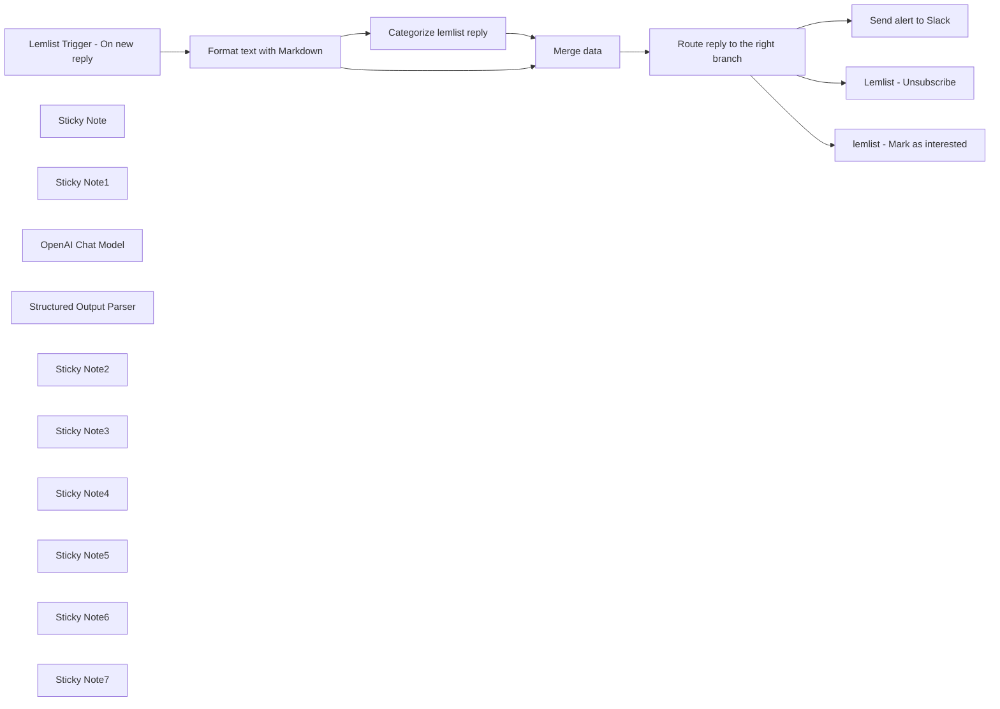

## Fluxo (.json) :

```json
{
  "meta": {
    "instanceId": "2b1cc1a8b0a2fb9caab11ab2d5eb3712f9973066051b2e898cf4041a1f2a7757",
    "templateCredsSetupCompleted": true
  },
  "nodes": [
    {
      "id": "7786165e-5e74-4614-b065-86db19482b72",
      "name": "Format text with Markdown",
      "type": "n8n-nodes-base.markdown",
      "position": [
        -1200,
        980
      ],
      "parameters": {
        "html": "={{ $json.text }}",
        "options": {},
        "destinationKey": "textClean"
      },
      "typeVersion": 1,
      "continueOnFail": true
    },
    {
      "id": "8f73d4d6-2473-4fdf-8797-c049d6df6967",
      "name": "Lemlist Trigger - On new reply",
      "type": "n8n-nodes-base.lemlistTrigger",
      "position": [
        -1600,
        980
      ],
      "webhookId": "039bb443-8d2a-4eb3-9c16-772943a46db7",
      "parameters": {
        "event": "emailsReplied",
        "options": {
          "isFirst": true
        }
      },
      "typeVersion": 1
    },
    {
      "id": "1f94d672-0a70-45ad-bf96-72c4aecabcd0",
      "name": "Sticky Note",
      "type": "n8n-nodes-base.stickyNote",
      "position": [
        -1700,
        680
      ],
      "parameters": {
        "width": 304.92548549441915,
        "height": 504.9663351162785,
        "content": "### Get your lemlist API key\n\n1. Go to your lemlist account or create one [HERE](https://app.lemlist.com/create-account)\n\n2. Go to Settings -> Integrations\n\n3. Generate your API Key and copy it\n\n4. On this node, click on create new credential and paste your API key"
      },
      "typeVersion": 1
    },
    {
      "id": "3032b04c-76a2-4f7c-a790-ede26b102254",
      "name": "Sticky Note1",
      "type": "n8n-nodes-base.stickyNote",
      "position": [
        -2040,
        680
      ],
      "parameters": {
        "width": 319.6621253622332,
        "height": 507.1074887209538,
        "content": "# Read me\n\nThis workflow send email replies of your lemlist campaigns to the Slack channel of your choice.\n\nThe OpenAI node will classify the reply status. \n\nThe Slack alert is structured in a way that make it easy to read for the user."
      },
      "typeVersion": 1
    },
    {
      "id": "df142fcb-f5ec-475d-8f90-c0bd064d390c",
      "name": "OpenAI Chat Model",
      "type": "@n8n/n8n-nodes-langchain.lmChatOpenAi",
      "position": [
        -760,
        1320
      ],
      "parameters": {
        "model": "gpt-4o",
        "options": {}
      },
      "typeVersion": 1
    },
    {
      "id": "1fa6d12c-2555-42c6-8f80-b24dc3608ed7",
      "name": "Structured Output Parser",
      "type": "@n8n/n8n-nodes-langchain.outputParserStructured",
      "position": [
        -600,
        1320
      ],
      "parameters": {
        "schemaType": "manual",
        "inputSchema": "{\n\t\"type\": \"object\",\n\t\"properties\": {\n\t\t\"category\": {\n\t\t\t\"type\": \"string\"\n        }\n\t}\n}"
      },
      "typeVersion": 1.2
    },
    {
      "id": "734013f9-d058-4f08-9026-a41cd5877a3b",
      "name": "Send alert to Slack",
      "type": "n8n-nodes-base.slack",
      "position": [
        320,
        700
      ],
      "parameters": {
        "text": "=",
        "select": "channel",
        "blocksUi": "={\n\t\"blocks\": [\n\t\t{\n\t\t\t\"type\": \"section\",\n\t\t\t\"text\": {\n\t\t\t\t\"type\": \"mrkdwn\",\n\t\t\t\t\"text\": \":raised_hands: New reply in lemlist!\\n\"\n\t\t\t}\n\t\t},\n\t\t{\n\t\t\t\"type\": \"section\",\n\t\t\t\"fields\": [\n\t\t\t\t{\n\t\t\t\t\t\"type\": \"mrkdwn\",\n\t\t\t\t\t\"text\": \"*Categorized as:*\\n{{ $json[\"output\"][\"category\"] }}\"\n\t\t\t\t},\n\t\t\t\t{\n\t\t\t\t\t\"type\": \"mrkdwn\",\n\t\t\t\t\t\"text\": \"*Campaign:*\\n<https://app.lemlist.com/teams/{{ $json[\"teamId\"] }}/reports/campaigns/{{ $json[\"campaignId\"] }}|{{ $json[\"campaignName\"] }}>\"\n\t\t\t\t},\n\t\t\t\t{\n\t\t\t\t\t\"type\": \"mrkdwn\",\n\t\t\t\t\t\"text\": \"*Sender Email:*\\n{{ $json[\"sendUserEmail\"] }}\"\n\t\t\t\t},\n\t\t\t\t{\n\t\t\t\t\t\"type\": \"mrkdwn\",\n\t\t\t\t\t\"text\": \"*Lead Email:*\\n{{ $json[\"leadEmail\"] }}\"\n\t\t\t\t},\n\t\t\t\t{\n\t\t\t\t\t\"type\": \"mrkdwn\",\n\t\t\t\t\t\"text\": \"*Linkedin URL:*\\n{{ $json[\"linkedinUrl\"] }}\"\n\t\t\t\t}\n\t\t\t]\n\t\t},\n\t\t{\n\t\t\t\"type\": \"section\",\n\t\t\t\"text\": {\n\t\t\t\t\"type\": \"mrkdwn\",\n\t\t\t\t\"text\": \"*Reply preview*:\\n{{ JSON.stringify($json[\"textClean\"]).replace(/^\"(.+(?=\"$))\"$/, '$1').substring(0, 100) }}\"\n\t\t\t}\n\t\t}\n\t]\n}",
        "channelId": {
          "__rl": true,
          "mode": "name",
          "value": "automated_outbound_replies"
        },
        "messageType": "block",
        "otherOptions": {
          "botProfile": {
            "imageValues": {
              "icon_emoji": ":fire:",
              "profilePhotoType": "emoji"
            }
          },
          "unfurl_links": false,
          "includeLinkToWorkflow": false
        }
      },
      "typeVersion": 2.1
    },
    {
      "id": "0558c166-16d7-4c26-a09c-fb46c2b6b687",
      "name": "Lemlist - Unsubscribe",
      "type": "n8n-nodes-base.lemlist",
      "position": [
        300,
        1000
      ],
      "parameters": {
        "email": "={{ $json[\"leadEmail\"] }}",
        "resource": "lead",
        "operation": "unsubscribe",
        "campaignId": "={{$json[\"campaignId\"]}}"
      },
      "typeVersion": 1
    },
    {
      "id": "79d17d20-a60a-4b5a-a83c-821cac265b17",
      "name": "lemlist - Mark as interested",
      "type": "n8n-nodes-base.httpRequest",
      "position": [
        300,
        1260
      ],
      "parameters": {
        "url": "=https://api.lemlist.com/api/campaigns/{{$json[\"campaignId\"]}}/leads/{{$json[\"leadEmail\"]}}/interested",
        "options": {},
        "requestMethod": "POST",
        "authentication": "predefinedCredentialType",
        "nodeCredentialType": "lemlistApi"
      },
      "typeVersion": 2
    },
    {
      "id": "04f74337-903c-481a-95ca-a1d4a5985b9e",
      "name": "Categorize lemlist reply",
      "type": "@n8n/n8n-nodes-langchain.chainLlm",
      "position": [
        -780,
        1120
      ],
      "parameters": {
        "text": "=Classify the [email_content] in one only of the following categories: \n\nCategories=[\"Interested\", \"Out of office\", \"Unsubscribe\", \"Not interested\", \"Other\"]  \n\n- Interested is when the reply is positive, and the person want more information or a meeting  \n\nDon't output quotes like in the next example: \nemail_content_example:Hey I would like to know more \ncategory:Interested\n\nemail_content:\"{{ $json.textClean }}\" \n\nOnly answer with JSON in the following format:\n{\"replyStatus\":category}\n\nJSON:",
        "promptType": "define",
        "hasOutputParser": true
      },
      "typeVersion": 1.4
    },
    {
      "id": "c1d66785-e096-4fd7-90de-51c7b9117413",
      "name": "Merge data",
      "type": "n8n-nodes-base.merge",
      "position": [
        -280,
        1000
      ],
      "parameters": {
        "mode": "combine",
        "options": {},
        "combinationMode": "mergeByPosition"
      },
      "typeVersion": 2.1
    },
    {
      "id": "bf21f5b9-6978-4657-a0a2-847265cff31e",
      "name": "Sticky Note2",
      "type": "n8n-nodes-base.stickyNote",
      "position": [
        260,
        520
      ],
      "parameters": {
        "width": 480.38008828116847,
        "height": 341.5885389153657,
        "content": "### Create a Slack notification for each new replies\n\n1. Connect your Slack account by clicking to add Credentials\n\n2. Write the name of the channel where you want to send the Slack alert"
      },
      "typeVersion": 1
    },
    {
      "id": "024b4399-8e20-4974-986d-6c1ee4103fa0",
      "name": "Route reply to the right branch",
      "type": "n8n-nodes-base.switch",
      "position": [
        -100,
        1000
      ],
      "parameters": {
        "rules": {
          "values": [
            {
              "outputKey": "Send all replies to Slack",
              "conditions": {
                "options": {
                  "leftValue": "",
                  "caseSensitive": true,
                  "typeValidation": "strict"
                },
                "combinator": "and",
                "conditions": [
                  {
                    "operator": {
                      "type": "string",
                      "operation": "exists",
                      "singleValue": true
                    },
                    "leftValue": "={{ $json.output.category }}",
                    "rightValue": ""
                  }
                ]
              },
              "renameOutput": true
            },
            {
              "outputKey": "Unsubscribe",
              "conditions": {
                "options": {
                  "leftValue": "",
                  "caseSensitive": true,
                  "typeValidation": "strict"
                },
                "combinator": "and",
                "conditions": [
                  {
                    "id": "9ad6f5cd-8c50-4710-8eaf-085e8f11f202",
                    "operator": {
                      "name": "filter.operator.equals",
                      "type": "string",
                      "operation": "equals"
                    },
                    "leftValue": "={{ $json.output.category }}",
                    "rightValue": "Unsubscribe"
                  }
                ]
              },
              "renameOutput": true
            },
            {
              "outputKey": "Interested",
              "conditions": {
                "options": {
                  "leftValue": "",
                  "caseSensitive": true,
                  "typeValidation": "strict"
                },
                "combinator": "and",
                "conditions": [
                  {
                    "id": "cb410bcc-a70c-4430-aec1-b71f3f615c4d",
                    "operator": {
                      "name": "filter.operator.equals",
                      "type": "string",
                      "operation": "equals"
                    },
                    "leftValue": "={{ $json.output.category }}",
                    "rightValue": "Interested"
                  }
                ]
              },
              "renameOutput": true
            }
          ]
        },
        "options": {
          "allMatchingOutputs": true
        }
      },
      "typeVersion": 3
    },
    {
      "id": "f9f23daa-f7a9-49f9-8ffb-16798656af73",
      "name": "Sticky Note3",
      "type": "n8n-nodes-base.stickyNote",
      "position": [
        260,
        900
      ],
      "parameters": {
        "width": 480.38008828116847,
        "height": 256.5682017131378,
        "content": "### Save time by automatically unsubscribing leads that don't want to receive emails from you"
      },
      "typeVersion": 1
    },
    {
      "id": "63c536bd-e624-4118-b0c8-38c07f2d1955",
      "name": "Sticky Note4",
      "type": "n8n-nodes-base.stickyNote",
      "position": [
        260,
        1200
      ],
      "parameters": {
        "width": 480.38008828116847,
        "height": 256.5682017131378,
        "content": "### Mark interested leads as interested in lemlist"
      },
      "typeVersion": 1
    },
    {
      "id": "8ed8b714-8196-4593-87b8-18c6a7318fbe",
      "name": "Sticky Note5",
      "type": "n8n-nodes-base.stickyNote",
      "position": [
        -880,
        875.46282303881
      ],
      "parameters": {
        "width": 480.38008828116847,
        "height": 608.2279357257166,
        "content": "### Categorize the reply with OpenAI"
      },
      "typeVersion": 1
    },
    {
      "id": "6b1846df-0214-4383-87cf-55232093ae2a",
      "name": "Sticky Note6",
      "type": "n8n-nodes-base.stickyNote",
      "position": [
        -1320,
        880
      ],
      "parameters": {
        "width": 336.62085535637357,
        "height": 311.3046602455328,
        "content": "### This node will clean the text and make sure it looks pretty on Slack"
      },
      "typeVersion": 1
    },
    {
      "id": "f7378ecd-e8d2-4204-a883-3161be601ffc",
      "name": "Sticky Note7",
      "type": "n8n-nodes-base.stickyNote",
      "position": [
        -220,
        880
      ],
      "parameters": {
        "width": 336.62085535637357,
        "height": 311.3046602455328,
        "content": "### Trigger a different scenario according to the category of the reply"
      },
      "typeVersion": 1
    }
  ],
  "pinData": {},
  "connections": {
    "Merge data": {
      "main": [
        [
          {
            "node": "Route reply to the right branch",
            "type": "main",
            "index": 0
          }
        ]
      ]
    },
    "OpenAI Chat Model": {
      "ai_languageModel": [
        [
          {
            "node": "Categorize lemlist reply",
            "type": "ai_languageModel",
            "index": 0
          }
        ]
      ]
    },
    "Categorize lemlist reply": {
      "main": [
        [
          {
            "node": "Merge data",
            "type": "main",
            "index": 1
          }
        ]
      ]
    },
    "Structured Output Parser": {
      "ai_outputParser": [
        [
          {
            "node": "Categorize lemlist reply",
            "type": "ai_outputParser",
            "index": 0
          }
        ]
      ]
    },
    "Format text with Markdown": {
      "main": [
        [
          {
            "node": "Merge data",
            "type": "main",
            "index": 0
          },
          {
            "node": "Categorize lemlist reply",
            "type": "main",
            "index": 0
          }
        ]
      ]
    },
    "Lemlist Trigger - On new reply": {
      "main": [
        [
          {
            "node": "Format text with Markdown",
            "type": "main",
            "index": 0
          }
        ]
      ]
    },
    "Route reply to the right branch": {
      "main": [
        [
          {
            "node": "Send alert to Slack",
            "type": "main",
            "index": 0
          }
        ],
        [
          {
            "node": "Lemlist - Unsubscribe",
            "type": "main",
            "index": 0
          }
        ],
        [
          {
            "node": "lemlist - Mark as interested",
            "type": "main",
            "index": 0
          }
        ]
      ]
    }
  }
}
```

<a id="template-633"></a>

## Template 633 - Gerar e salvar tweet com hashtag aleatória

- **Nome:** Gerar e salvar tweet com hashtag aleatória
- **Descrição:** Gera um tweet curto que inclui uma hashtag aleatória e armazena o resultado em uma base do Airtable.
- **Funcionalidade:** • Acionamento manual: Inicia o fluxo quando o usuário executa manualmente.
• Seleção aleatória de hashtag: Escolhe uma hashtag de uma lista pré-definida.
• Geração de texto com IA: Solicita à API de geração de texto que crie um tweet com menos de 100 caracteres incluindo a hashtag escolhida.
• Mapeamento de campos: Prepara os campos Hashtag e Content com os valores gerados.
• Armazenamento em banco externo: Anexa o registro gerado em uma tabela específica do Airtable.
- **Ferramentas:** • OpenAI API: Serviço de geração de texto usado para criar o conteúdo do tweet com base em um prompt.
• Airtable: Banco de dados em nuvem usado para armazenar os tweets gerados em uma tabela.


## Fluxo visual

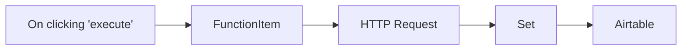

## Fluxo (.json) :

```json
{
  "nodes": [
    {
      "name": "On clicking 'execute'",
      "type": "n8n-nodes-base.manualTrigger",
      "position": [
        250,
        300
      ],
      "parameters": {},
      "typeVersion": 1
    },
    {
      "name": "FunctionItem",
      "type": "n8n-nodes-base.functionItem",
      "position": [
        450,
        300
      ],
      "parameters": {
        "functionCode": "// hashtag list\nconst Hashtags = [\n \"#techtwitter\",\n \"#n8n\"\n];\n\n// random output function\nconst randomHashtag = Hashtags[Math.floor(Math.random() * Hashtags.length)];\nitem.hashtag = randomHashtag;\nreturn item;"
      },
      "typeVersion": 1
    },
    {
      "name": "HTTP Request",
      "type": "n8n-nodes-base.httpRequest",
      "position": [
        650,
        300
      ],
      "parameters": {
        "url": "https://api.openai.com/v1/engines/text-davinci-001/completions",
        "options": {},
        "requestMethod": "POST",
        "authentication": "headerAuth",
        "jsonParameters": true,
        "bodyParametersJson": "={\n \"prompt\": \"Generate a tweet, with under 100 characters, about and including the hashtag {{$node[\"FunctionItem\"].json[\"hashtag\"]}}:\",\n \"temperature\": 0.7,\n \"max_tokens\": 64,\n \"top_p\": 1,\n \"frequency_penalty\": 0,\n \"presence_penalty\": 0\n}"
      },
      "credentials": {
        "httpHeaderAuth": ""
      },
      "typeVersion": 1
    },
    {
      "name": "Airtable",
      "type": "n8n-nodes-base.airtable",
      "position": [
        1050,
        300
      ],
      "parameters": {
        "table": "main",
        "options": {},
        "operation": "append",
        "application": "appOaG8kEA8FAABOr"
      },
      "credentials": {
        "airtableApi": ""
      },
      "typeVersion": 1
    },
    {
      "name": "Set",
      "type": "n8n-nodes-base.set",
      "position": [
        850,
        300
      ],
      "parameters": {
        "values": {
          "string": [
            {
              "name": "Hashtag",
              "value": "={{$node[\"FunctionItem\"].json[\"hashtag\"]}}"
            },
            {
              "name": "Content",
              "value": "={{$node[\"HTTP Request\"].json[\"choices\"][0][\"text\"]}}"
            }
          ]
        },
        "options": {},
        "keepOnlySet": true
      },
      "typeVersion": 1
    }
  ],
  "connections": {
    "Set": {
      "main": [
        [
          {
            "node": "Airtable",
            "type": "main",
            "index": 0
          }
        ]
      ]
    },
    "FunctionItem": {
      "main": [
        [
          {
            "node": "HTTP Request",
            "type": "main",
            "index": 0
          }
        ]
      ]
    },
    "HTTP Request": {
      "main": [
        [
          {
            "node": "Set",
            "type": "main",
            "index": 0
          }
        ]
      ]
    },
    "On clicking 'execute'": {
      "main": [
        [
          {
            "node": "FunctionItem",
            "type": "main",
            "index": 0
          }
        ]
      ]
    }
  }
}
```

<a id="template-634"></a>

## Template 634 - Consulta de clima por cidade

- **Nome:** Consulta de clima por cidade
- **Descrição:** Recebe uma requisição HTTP com o nome da cidade, consulta uma API de clima externa e retorna uma resposta textual com a temperatura atual e a sensação térmica.
- **Funcionalidade:** • Recepção de requisição HTTP: Aceita chamadas GET no endpoint configurado para iniciar o fluxo.
• Leitura de parâmetro de cidade: Extrai o parâmetro de consulta 'parameter' e utiliza um valor padrão ('berlin,de') caso não seja fornecido.
• Consulta de dados meteorológicos: Envia o nome da cidade para a API de clima e obtém dados atuais (temperatura e sensação térmica).
• Formatação de resposta: Monta uma mensagem legível que informa a temperatura, a sensação térmica e o nome da cidade.
• Retorno ao cliente: Envia a mensagem formatada como resposta ao solicitante do webhook.
- **Ferramentas:** • Endpoint HTTP (Webhook): Ponto de entrada que recebe requisições GET com o parâmetro de consulta contendo a cidade.
• OpenWeatherMap: API externa utilizada para obter os dados meteorológicos atuais (temperatura, sensação térmica e nome da localidade).


## Fluxo visual

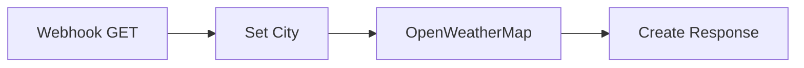

## Fluxo (.json) :

```json
{
  "nodes": [
    {
      "name": "OpenWeatherMap",
      "type": "n8n-nodes-base.openWeatherMap",
      "position": [
        900,
        300
      ],
      "parameters": {
        "cityName": "={{ $json[\"city\"] }}",
        "language": "en"
      },
      "credentials": {
        "openWeatherMapApi": ""
      },
      "typeVersion": 1
    },
    {
      "name": "Webhook GET",
      "type": "n8n-nodes-base.webhook",
      "position": [
        500,
        300
      ],
      "webhookId": "a31f0bbd-a583-470e-9a1e-29a9ce778122",
      "parameters": {
        "path": "weather",
        "options": {
          "responsePropertyName": "data"
        },
        "responseMode": "lastNode"
      },
      "typeVersion": 1
    },
    {
      "name": "Set City",
      "type": "n8n-nodes-base.set",
      "position": [
        700,
        300
      ],
      "parameters": {
        "values": {
          "string": [
            {
              "name": "city",
              "value": "={{ $json[\"query\"][\"parameter\"] || 'berlin,de' }}"
            }
          ]
        },
        "options": {}
      },
      "typeVersion": 1
    },
    {
      "name": "Create Response",
      "type": "n8n-nodes-base.set",
      "position": [
        1100,
        300
      ],
      "parameters": {
        "values": {
          "string": [
            {
              "name": "data",
              "value": "=It has {{$json[\"main\"][\"temp\"]}}\\xE2\\x84\\x83  and feels like {{$json[\"main\"][\"feels_like\"]}}\\xE2\\x84\\x83  in {{$json[\"name\"]}}"
            }
          ]
        },
        "options": {}
      },
      "typeVersion": 1
    }
  ],
  "connections": {
    "Set City": {
      "main": [
        [
          {
            "node": "OpenWeatherMap",
            "type": "main",
            "index": 0
          }
        ]
      ]
    },
    "Webhook GET": {
      "main": [
        [
          {
            "node": "Set City",
            "type": "main",
            "index": 0
          }
        ]
      ]
    },
    "OpenWeatherMap": {
      "main": [
        [
          {
            "node": "Create Response",
            "type": "main",
            "index": 0
          }
        ]
      ]
    }
  }
}
```

<a id="template-635"></a>

## Template 635 - Sincronização Google Sheets → Postgres com geração de SQL por LLM

- **Nome:** Sincronização Google Sheets → Postgres com geração de SQL por LLM
- **Descrição:** Fluxo que monitora uma planilha Google, infere esquema e tipos de dados, cria ou atualiza uma tabela no PostgreSQL e insere os dados normalizados; inclui um agente LLM para construir e executar consultas SQL sobre o banco.
- **Funcionalidade:** • Monitoramento de arquivo: Observa um arquivo específico no Google Drive e inicia o processo quando há alterações.
• Leitura da planilha: Lê os dados de uma aba definida na planilha Google Sheets.
• Verificação de existência da tabela: Confere se a tabela correspondente já existe no banco de dados antes de criar ou recriar.
• Inferência de esquema dinâmico: Analisa colunas e amostras de valores para detectar tipos especiais como moedas e datas e gerar nomes/definições de colunas consistentes.
• Criação e remoção de tabela: Gera dinamicamente a instrução CREATE TABLE (ou DROP + CREATE) incluindo chave primária UUID e tipos inferidos.
• Normalização de dados para inserção: Converte valores de moeda, porcentagem, datas e numéricos, trata valores vazios/nulos e formata timestamps em ISO.
• Geração de queries de inserção parametrizadas: Monta instruções INSERT com placeholders e parâmetros ordenados para execução segura.
• Execução dos comandos no banco: Insere os registros no PostgreSQL usando consultas parametrizadas.
• Agente de consulta com LLM: Usa um modelo de linguagem para analisar perguntas, chamar ferramenta de obtenção de esquema e executar queries, formatando respostas ao usuário.
• Geração legível do esquema: Compila a estrutura das tabelas e colunas em uma representação textual para uso pelo agente LLM.
• Separação de responsabilidades: Utiliza workflows/ferramentas dedicadas para executar queries e recuperar esquema, mantendo modularidade.
- **Ferramentas:** • Google Drive: Armazena e notifica alterações do arquivo de planilha monitorado.
• Google Sheets: Fonte dos dados tabulares lidos a partir da aba especificada.
• Google Gemini (PaLM): Modelo de linguagem utilizado para construir, validar e explicar consultas SQL conforme o pedido do usuário.
• PostgreSQL: Banco de dados onde são criadas as tabelas, verificada a existência e realizados os inserts e execuções de queries.


## Fluxo visual

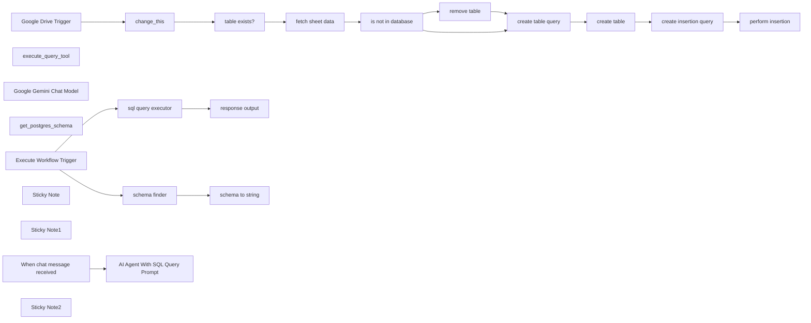

## Fluxo (.json) :

```json
{
  "id": "7gRbzEzCuOzQKn4M",
  "meta": {
    "instanceId": "edc0464b1050024ebda3e16fceea795e4fdf67b1f61187c4f2f3a72397278df0",
    "templateCredsSetupCompleted": true
  },
  "name": "SHEETS RAG",
  "tags": [],
  "nodes": [
    {
      "id": "a073154f-53ad-45e2-9937-d0a4196c7838",
      "name": "create table query",
      "type": "n8n-nodes-base.code",
      "position": [
        1280,
        2360
      ],
      "parameters": {
        "jsCode": "// Helper function to check if a string is in MM/DD/YYYY format\nfunction isDateString(value) {\n  const dateRegex = /^\\d{2}/\\d{2}/\\d{4}$/;\n  if (typeof value !== 'string') return false;\n  if (!dateRegex.test(value)) return false;\n  const [month, day, year] = value.split('/').map(Number);\n  const date = new Date(year, month - 1, day);\n  return !isNaN(date.getTime());\n}\n\nconst tableName = `ai_table_${$('change_this').first().json.sheet_name}`;\nconst rows = $('fetch sheet data').all();\nconst allColumns = new Set();\n\n// Collect column names dynamically\nrows.forEach(row => {\n  Object.keys(row.json).forEach(col => allColumns.add(col));\n});\n\n// Ensure \"ai_table_identifier\" is always the first column\nconst originalColumns = [\"ai_table_identifier\", ...Array.from(allColumns)];\n\n// Function to detect currency type (unchanged)\nfunction detectCurrency(values) {\n  const currencySymbols = {\n    '₹': 'INR', '$': 'USD', '€': 'EUR', '£': 'GBP', '¥': 'JPY',\n    '₩': 'KRW', '฿': 'THB', 'zł': 'PLN', 'kr': 'SEK', 'R$': 'BRL',\n    'C$': 'CAD', 'A$': 'AUD'\n  };\n\n  let detectedCurrency = null;\n  for (const value of values) {\n    if (typeof value === 'string' && value.trim() !== '') {\n      for (const [symbol, code] of Object.entries(currencySymbols)) {\n        if (value.trim().startsWith(symbol)) {\n          detectedCurrency = code;\n          break;\n        }\n      }\n    }\n  }\n  return detectedCurrency;\n}\n\n// Function to generate consistent column names\nfunction generateColumnName(originalName, typeInfo) {\n  if (typeInfo.isCurrency) {\n    return `${originalName}_${typeInfo.currencyCode.toLowerCase()}`;\n  }\n  return originalName;\n}\n\n// Infer column types and transform names\nconst columnMapping = {};\noriginalColumns.forEach(col => {\n  let typeInfo = { type: \"TEXT\" };\n\n  if (col !== \"ai_table_identifier\") {\n    const sampleValues = rows\n      .map(row => row.json[col])\n      .filter(value => value !== undefined && value !== null);\n\n    // Check for currency first\n    const currencyCode = detectCurrency(sampleValues);\n    if (currencyCode) {\n      typeInfo = { type: \"DECIMAL(15,2)\", isCurrency: true, currencyCode };\n    }\n    // If all sample values match MM/DD/YYYY, treat the column as a date\n    else if (sampleValues.length > 0 && sampleValues.every(val => isDateString(val))) {\n      typeInfo = { type: \"TIMESTAMP\" };\n    }\n  }\n\n  const newColumnName = generateColumnName(col, typeInfo);\n  columnMapping[col] = { newName: newColumnName, typeInfo };\n});\n\n// Final column names\nconst mappedColumns = originalColumns.map(col => columnMapping[col]?.newName || col);\n\n// Define SQL columns – note that for simplicity, this example still uses TEXT for non-special types,\n// but you can adjust it so that TIMESTAMP columns are created with a TIMESTAMP type.\nconst columnDefinitions = [`\"ai_table_identifier\" UUID PRIMARY KEY DEFAULT gen_random_uuid()`]\n  .concat(mappedColumns.slice(1).map(col => {\n    // If the column was inferred as TIMESTAMP, use that type in the CREATE TABLE statement.\n    const originalCol = Object.keys(columnMapping).find(key => columnMapping[key].newName === col);\n    const inferredType = columnMapping[originalCol]?.typeInfo?.type;\n    return `\"${col}\" ${inferredType === \"TIMESTAMP\" ? \"TIMESTAMP\" : \"TEXT\"}`;\n  }))\n  .join(\", \");\n\nconst createTableQuery = `CREATE TABLE IF NOT EXISTS ${tableName} (${columnDefinitions});`;\n\nreturn [{ \n  query: createTableQuery,\n  columnMapping: columnMapping \n}];\n"
      },
      "typeVersion": 2
    },
    {
      "id": "2beb72c4-dab4-4058-b587-545a8ce8b86d",
      "name": "create insertion query",
      "type": "n8n-nodes-base.code",
      "position": [
        1660,
        2360
      ],
      "parameters": {
        "jsCode": "const tableName = `ai_table_${$('change_this').first().json.sheet_name}`;\nconst rows = $('fetch sheet data').all();\nconst allColumns = new Set();\n\n// Get column mapping from previous node\nconst columnMapping = $('create table query').first().json.columnMapping || {};\n\n// Collect column names dynamically\nrows.forEach(row => {\n  Object.keys(row.json).forEach(col => allColumns.add(col));\n});\n\nconst originalColumns = Array.from(allColumns);\nconst mappedColumns = originalColumns.map(col => \n  columnMapping[col] ? columnMapping[col].newName : col\n);\n\n// Helper function to check if a string is a valid timestamp\nfunction isValidTimestamp(value) {\n  const date = new Date(value);\n  return !isNaN(date.getTime());\n}\n\n// Helper to detect currency symbol (unchanged)\nfunction getCurrencySymbol(value) {\n  if (typeof value !== 'string') return null;\n  \n  const currencySymbols = ['₹', '$', '€', '£', '¥', '₩', '฿', 'zł', 'kr', 'R$', 'C$', 'A$'];\n  for (const symbol of currencySymbols) {\n    if (value.trim().startsWith(symbol)) {\n      return symbol;\n    }\n  }\n  return null;\n}\n\n// Helper to normalize currency values (unchanged)\nfunction normalizeCurrencyValue(value, currencySymbol) {\n  if (typeof value !== 'string') return null;\n  if (!currencySymbol) return value;\n  \n  const numericPart = value.replace(currencySymbol, '').replace(/,/g, '');\n  return !isNaN(parseFloat(numericPart)) ? parseFloat(numericPart) : null;\n}\n\n// Helper to normalize percentage values (unchanged)\nfunction normalizePercentageValue(value) {\n  if (typeof value !== 'string') return value;\n  if (!value.trim().endsWith('%')) return value;\n  \n  const numericPart = value.replace('%', '');\n  return !isNaN(parseFloat(numericPart)) ? parseFloat(numericPart) / 100 : null;\n}\n\n// Function to parse MM/DD/YYYY strings into ISO format\nfunction parseDateString(value) {\n  const dateRegex = /^\\d{2}/\\d{2}/\\d{4}$/;\n  if (typeof value === 'string' && dateRegex.test(value)) {\n    const [month, day, year] = value.split('/').map(Number);\n    const date = new Date(year, month - 1, day);\n    return !isNaN(date.getTime()) ? date.toISOString() : null;\n  }\n  return value;\n}\n\n// Format rows properly based on column mappings and types\nconst formattedRows = rows.map(row => {\n  const formattedRow = {};\n\n  originalColumns.forEach((col, index) => {\n    const mappedCol = mappedColumns[index];\n    let value = row.json[col];\n    const typeInfo = columnMapping[col]?.typeInfo || { type: \"TEXT\" };\n\n    if (value === \"\" || value === null || value === undefined) {\n      value = null;\n    } \n    else if (typeInfo.isCurrency) {\n      const symbol = getCurrencySymbol(value);\n      if (symbol) {\n        value = normalizeCurrencyValue(value, symbol);\n      } else {\n        value = null;\n      }\n    }\n    else if (typeInfo.isPercentage) {\n      if (typeof value === 'string' && value.trim().endsWith('%')) {\n        value = normalizePercentageValue(value);\n      } else {\n        value = !isNaN(parseFloat(value)) ? parseFloat(value) / 100 : null;\n      }\n    }\n    else if (typeInfo.type === \"DECIMAL(15,2)\" || typeInfo.type === \"INTEGER\") {\n      if (typeof value === 'string') {\n        const cleanedValue = value.replace(/,/g, '');\n        value = !isNaN(parseFloat(cleanedValue)) ? parseFloat(cleanedValue) : null;\n      } else if (typeof value === 'number') {\n        value = parseFloat(value);\n      } else {\n        value = null;\n      }\n    } \n    else if (typeInfo.type === \"BOOLEAN\") {\n      if (typeof value === 'string') {\n        const lowercased = value.toString().toLowerCase();\n        value = lowercased === \"true\" ? true : \n                lowercased === \"false\" ? false : null;\n      } else {\n        value = Boolean(value);\n      }\n    } \n    else if (typeInfo.type === \"TIMESTAMP\") {\n      // Check if the value is in MM/DD/YYYY format and parse it accordingly.\n      if (/^\\d{2}/\\d{2}/\\d{4}$/.test(value)) {\n        value = parseDateString(value);\n      } else if (isValidTimestamp(value)) {\n        value = new Date(value).toISOString();\n      } else {\n        value = null;\n      }\n    }\n    else if (typeInfo.type === \"TEXT\") {\n      value = value !== null && value !== undefined ? String(value) : null;\n    }\n\n    formattedRow[mappedCol] = value;\n  });\n\n  return formattedRow;\n});\n\n// Generate SQL placeholders dynamically\nconst valuePlaceholders = formattedRows.map((_, rowIndex) =>\n  `(${mappedColumns.map((_, colIndex) => `$${rowIndex * mappedColumns.length + colIndex + 1}`).join(\", \")})`\n).join(\", \");\n\n// Build the insert query string\nconst insertQuery = `INSERT INTO ${tableName} (${mappedColumns.map(col => `\"${col}\"`).join(\", \")}) VALUES ${valuePlaceholders};`;\n\n// Flatten parameter values for PostgreSQL query\nconst parameters = formattedRows.flatMap(row => mappedColumns.map(col => row[col]));\n\nreturn [\n  {\n    query: insertQuery,\n    parameters: parameters\n  }\n];\n"
      },
      "typeVersion": 2
    },
    {
      "id": "ba19c350-ffb7-4fe1-9568-2a619c914434",
      "name": "Google Drive Trigger",
      "type": "n8n-nodes-base.googleDriveTrigger",
      "position": [
        600,
        2060
      ],
      "parameters": {
        "pollTimes": {
          "item": [
            {}
          ]
        },
        "triggerOn": "specificFile",
        "fileToWatch": {
          "__rl": true,
          "mode": "list",
          "value": "1yGx4ODHYYtPV1WZFAtPcyxGT2brcXM6pl0KJhIM1f_c",
          "cachedResultUrl": "https://docs.google.com/spreadsheets/d/1yGx4ODHYYtPV1WZFAtPcyxGT2brcXM6pl0KJhIM1f_c/edit?usp=drivesdk",
          "cachedResultName": "Spreadsheet"
        }
      },
      "credentials": {
        "googleDriveOAuth2Api": {
          "id": "zOt0lyWOZz1UlS67",
          "name": "Google Drive account"
        }
      },
      "typeVersion": 1
    },
    {
      "id": "dd2108fe-0cfe-453c-ac03-c0c5b10397e6",
      "name": "execute_query_tool",
      "type": "@n8n/n8n-nodes-langchain.toolWorkflow",
      "position": [
        1340,
        1720
      ],
      "parameters": {
        "name": "query_executer",
        "schemaType": "manual",
        "workflowId": {
          "__rl": true,
          "mode": "list",
          "value": "oPWJZynrMME45ks4",
          "cachedResultName": "query_executer"
        },
        "description": "Call this tool to execute a query. Remember that it should be in a postgreSQL query structure.",
        "inputSchema": "{\n\"type\": \"object\",\n\"properties\": {\n\t\"sql\": {\n\t\t\"type\": \"string\",\n\t\t\"description\": \"A SQL query based on the users question and database schema.\"\n\t\t}\n\t}\n}",
        "specifyInputSchema": true
      },
      "typeVersion": 1.2
    },
    {
      "id": "f2c110db-1097-4b96-830d-f028e08b6713",
      "name": "Google Gemini Chat Model",
      "type": "@n8n/n8n-nodes-langchain.lmChatGoogleGemini",
      "position": [
        880,
        1680
      ],
      "parameters": {
        "options": {},
        "modelName": "models/gemini-2.0-flash"
      },
      "credentials": {
        "googlePalmApi": {
          "id": "Kr5lNqvdmtB0Ybyo",
          "name": "Google Gemini(PaLM) Api account"
        }
      },
      "typeVersion": 1
    },
    {
      "id": "2460801c-5b64-41b3-93f7-4f2fbffabfd6",
      "name": "get_postgres_schema",
      "type": "@n8n/n8n-nodes-langchain.toolWorkflow",
      "position": [
        1160,
        1720
      ],
      "parameters": {
        "name": "get_postgres_schema",
        "workflowId": {
          "__rl": true,
          "mode": "list",
          "value": "iNLPk34SeRGHaeMD",
          "cachedResultName": "get database schema"
        },
        "description": "Call this tool to retrieve the schema of all the tables inside of the database. A string will be retrieved with the name of the table and its columns, each table is separated by \\n\\n.",
        "workflowInputs": {
          "value": {},
          "schema": [],
          "mappingMode": "defineBelow",
          "matchingColumns": [],
          "attemptToConvertTypes": false,
          "convertFieldsToString": false
        }
      },
      "typeVersion": 2
    },
    {
      "id": "4b43ff94-df0d-40f1-9f51-cf488e33ff68",
      "name": "change_this",
      "type": "n8n-nodes-base.set",
      "position": [
        800,
        2060
      ],
      "parameters": {
        "options": {},
        "assignments": {
          "assignments": [
            {
              "id": "908ed843-f848-4290-9cdb-f195d2189d7c",
              "name": "table_url",
              "type": "string",
              "value": "https://docs.google.com/spreadsheets/d/1yGx4ODHYYtPV1WZFAtPcyxGT2brcXM6pl0KJhIM1f_c/edit?gid=0#gid=0"
            },
            {
              "id": "50f8afaf-0a6c-43ee-9157-79408fe3617a",
              "name": "sheet_name",
              "type": "string",
              "value": "product_list"
            }
          ]
        }
      },
      "typeVersion": 3.4
    },
    {
      "id": "a27a47ff-9328-4eef-99e8-280452cff189",
      "name": "is not in database",
      "type": "n8n-nodes-base.if",
      "position": [
        1380,
        2060
      ],
      "parameters": {
        "options": {},
        "conditions": {
          "options": {
            "version": 2,
            "leftValue": "",
            "caseSensitive": true,
            "typeValidation": "strict"
          },
          "combinator": "and",
          "conditions": [
            {
              "id": "619ce84c-0a50-4f88-8e55-0ce529aea1fc",
              "operator": {
                "type": "boolean",
                "operation": "false",
                "singleValue": true
              },
              "leftValue": "={{ $('table exists?').item.json.exists }}",
              "rightValue": "true"
            }
          ]
        }
      },
      "typeVersion": 2.2
    },
    {
      "id": "8ad9bc36-08b1-408e-ba20-5618a801b4ed",
      "name": "table exists?",
      "type": "n8n-nodes-base.postgres",
      "position": [
        1000,
        2060
      ],
      "parameters": {
        "query": "SELECT EXISTS (\n    SELECT 1 \n    FROM information_schema.tables \n    WHERE table_name = 'ai_table_{{ $json.sheet_name }}'\n);\n",
        "options": {},
        "operation": "executeQuery"
      },
      "credentials": {
        "postgres": {
          "id": "KQiQIZTArTBSNJH7",
          "name": "Postgres account"
        }
      },
      "typeVersion": 2.5
    },
    {
      "id": "f66b7ca7-ecb7-47fc-9214-2d2b37b0fbe4",
      "name": "fetch sheet data",
      "type": "n8n-nodes-base.googleSheets",
      "position": [
        1180,
        2060
      ],
      "parameters": {
        "options": {},
        "sheetName": {
          "__rl": true,
          "mode": "name",
          "value": "={{ $('change_this').item.json.sheet_name }}"
        },
        "documentId": {
          "__rl": true,
          "mode": "url",
          "value": "={{ $('change_this').item.json.table_url }}"
        }
      },
      "credentials": {
        "googleSheetsOAuth2Api": {
          "id": "3au0rUsZErkG0zc2",
          "name": "Google Sheets account"
        }
      },
      "typeVersion": 4.5
    },
    {
      "id": "11ba5da0-e7c4-49ee-8d35-24c8d3b9fea9",
      "name": "remove table",
      "type": "n8n-nodes-base.postgres",
      "position": [
        980,
        2360
      ],
      "parameters": {
        "query": "DROP TABLE IF EXISTS ai_table_{{ $('change_this').item.json.sheet_name }} CASCADE;",
        "options": {},
        "operation": "executeQuery"
      },
      "credentials": {
        "postgres": {
          "id": "KQiQIZTArTBSNJH7",
          "name": "Postgres account"
        }
      },
      "typeVersion": 2.5
    },
    {
      "id": "3936ecb3-f084-4f86-bd5f-abab0957ebc0",
      "name": "create table",
      "type": "n8n-nodes-base.postgres",
      "position": [
        1460,
        2360
      ],
      "parameters": {
        "query": "{{ $json.query }}",
        "options": {},
        "operation": "executeQuery"
      },
      "credentials": {
        "postgres": {
          "id": "KQiQIZTArTBSNJH7",
          "name": "Postgres account"
        }
      },
      "typeVersion": 2.5
    },
    {
      "id": "8a3ea239-f3fa-4c72-af99-31f4bd992b58",
      "name": "perform insertion",
      "type": "n8n-nodes-base.postgres",
      "position": [
        1860,
        2360
      ],
      "parameters": {
        "query": "{{$json.query}}",
        "options": {
          "queryReplacement": "={{$json.parameters}}"
        },
        "operation": "executeQuery"
      },
      "credentials": {
        "postgres": {
          "id": "KQiQIZTArTBSNJH7",
          "name": "Postgres account"
        }
      },
      "typeVersion": 2.5
    },
    {
      "id": "21239928-b573-4753-a7ca-5a9c3aa8aa3e",
      "name": "Execute Workflow Trigger",
      "type": "n8n-nodes-base.executeWorkflowTrigger",
      "position": [
        1720,
        1720
      ],
      "parameters": {},
      "typeVersion": 1
    },
    {
      "id": "c94256a9-e44e-4800-82f8-90f85ba90bde",
      "name": "Sticky Note",
      "type": "n8n-nodes-base.stickyNote",
      "position": [
        1920,
        1460
      ],
      "parameters": {
        "color": 7,
        "width": 500,
        "height": 260,
        "content": "Place this in a separate workflow named:\n### query_executer"
      },
      "typeVersion": 1
    },
    {
      "id": "daec928e-58ee-43da-bd91-ba8bcd639a4a",
      "name": "Sticky Note1",
      "type": "n8n-nodes-base.stickyNote",
      "position": [
        1920,
        1840
      ],
      "parameters": {
        "color": 7,
        "width": 500,
        "height": 280,
        "content": "place this in a separate workflow named: \n### get database schema"
      },
      "typeVersion": 1
    },
    {
      "id": "8908e342-fcbe-4820-b623-cb95a55ea5db",
      "name": "When chat message received",
      "type": "@n8n/n8n-nodes-langchain.manualChatTrigger",
      "position": [
        640,
        1540
      ],
      "parameters": {},
      "typeVersion": 1.1
    },
    {
      "id": "d0ae90c2-169e-44d7-b3c2-4aff8e7d4be9",
      "name": "response output",
      "type": "n8n-nodes-base.set",
      "position": [
        2220,
        1540
      ],
      "parameters": {
        "options": {},
        "assignments": {
          "assignments": [
            {
              "id": "e2f94fb1-3deb-466a-a36c-e3476511d5f2",
              "name": "response",
              "type": "string",
              "value": "={{ $json }}"
            }
          ]
        }
      },
      "typeVersion": 3.4
    },
    {
      "id": "81c58d9b-ded4-4b74-8227-849e665cbdff",
      "name": "sql query executor",
      "type": "n8n-nodes-base.postgres",
      "position": [
        2000,
        1540
      ],
      "parameters": {
        "query": "{{ $json.query.sql }}",
        "options": {},
        "operation": "executeQuery"
      },
      "credentials": {
        "postgres": {
          "id": "KQiQIZTArTBSNJH7",
          "name": "Postgres account"
        }
      },
      "typeVersion": 2.5
    },
    {
      "id": "377d1727-4577-41bb-8656-38273fc4412b",
      "name": "schema finder",
      "type": "n8n-nodes-base.postgres",
      "position": [
        2000,
        1920
      ],
      "parameters": {
        "query": "SELECT \n    t.schemaname,\n    t.tablename,\n    c.column_name,\n    c.data_type\nFROM \n    pg_catalog.pg_tables t\nJOIN \n    information_schema.columns c\n    ON t.schemaname = c.table_schema\n    AND t.tablename = c.table_name\nWHERE \n    t.schemaname = 'public'\nORDER BY \n    t.tablename, c.ordinal_position;",
        "options": {},
        "operation": "executeQuery"
      },
      "credentials": {
        "postgres": {
          "id": "KQiQIZTArTBSNJH7",
          "name": "Postgres account"
        }
      },
      "typeVersion": 2.5
    },
    {
      "id": "89d3c59c-2b67-454d-a8f3-e90e75a28a8c",
      "name": "schema to string",
      "type": "n8n-nodes-base.code",
      "position": [
        2220,
        1920
      ],
      "parameters": {
        "jsCode": "function transformSchema(input) {\n    const tables = {};\n    \n    input.forEach(({ json }) => {\n        if (!json) return;\n        \n        const { tablename, schemaname, column_name, data_type } = json;\n        \n        if (!tables[tablename]) {\n            tables[tablename] = { schema: schemaname, columns: [] };\n        }\n        tables[tablename].columns.push(`${column_name} (${data_type})`);\n    });\n    \n    return Object.entries(tables)\n        .map(([tablename, { schema, columns }]) => `Table ${tablename} (Schema: ${schema}) has columns: ${columns.join(\", \")}`)\n        .join(\"\\n\\n\");\n}\n\n// Example usage\nconst input = $input.all();\n\nconst transformedSchema = transformSchema(input);\n\nreturn { data: transformedSchema };"
      },
      "typeVersion": 2
    },
    {
      "id": "42d1b316-60ca-49db-959b-581b162ca1f9",
      "name": "AI Agent With SQL Query Prompt",
      "type": "@n8n/n8n-nodes-langchain.agent",
      "position": [
        900,
        1540
      ],
      "parameters": {
        "options": {
          "maxIterations": 5,
          "systemMessage": "=## Role\nYou are a **Database Query Assistant** specializing in generating PostgreSQL queries based on natural language questions. You analyze database schemas, construct appropriate SQL queries, and provide clear explanations of results.\n\n## Tools\n1. `get_postgres_schema`: Retrieves the complete database schema (tables and columns)\n2. `execute_query_tool`: Executes SQL queries with the following input format:\n   ```json\n   {\n     \"sql\": \"Your SQL query here\"\n   }\n   ```\n\n## Process Flow\n\n### 1. Analyze the Question\n- Identify the **data entities** being requested (products, customers, orders, etc.)\n- Determine the **query type** (COUNT, AVG, SUM, SELECT, etc.)\n- Extract any **filters** or **conditions** mentioned\n\n### 2. Fetch and Analyze Schema\n- Call `get_postgres_schema` to retrieve database structure\n- Identify relevant tables and columns that match the entities in the question\n- Prioritize exact matches, then semantic matches\n\n### 3. Query Construction\n- Build case-insensitive queries using `LOWER(column) LIKE LOWER('%value%')`\n- Filter out NULL or empty values with appropriate WHERE clauses\n- Use joins when information spans multiple tables\n- Apply aggregations (COUNT, SUM, AVG) as needed\n\n### 4. Query Execution\n- Execute query using the `execute_query_tool` with proper formatting\n- If results require further processing, perform calculations as needed\n\n### 5. Result Presentation\n- Format results in a conversational, easy-to-understand manner\n- Explain how the data was retrieved and any calculations performed\n- When appropriate, suggest further questions the user might want to ask\n\n## Best Practices\n- Use parameterized queries to prevent SQL injection\n- Implement proper error handling\n- Respond with \"NOT_ENOUGH_INFO\" when the question lacks specificity\n- Always verify table/column existence before attempting queries\n- Use explicit JOINs instead of implicit joins\n- Limit large result sets when appropriate\n\n## Numeric Validation (IMPORTANT)\nWhen validating or filtering numeric values in string columns:\n1. **AVOID** complex regular expressions with `~` operator as they cause syntax errors\n2. Use these safer alternatives instead:\n   ```sql\n   -- Simple numeric check without regex\n   WHERE column_name IS NOT NULL AND trim(column_name) != '' AND column_name NOT LIKE '%[^0-9.]%'\n   \n   -- For type casting with validation\n   WHERE column_name IS NOT NULL AND trim(column_name) != '' AND column_name ~ '[0-9]'\n   \n   -- Safe numeric conversion\n   WHERE CASE WHEN column_name ~ '[0-9]' THEN TRUE ELSE FALSE END\n   ```\n3. For simple pattern matching, use LIKE instead of regex when possible\n4. When CAST is needed, always guard against invalid values:\n   ```sql\n   SELECT SUM(CASE WHEN column_name ~ '[0-9]' THEN CAST(column_name AS NUMERIC) ELSE 0 END) AS total\n   ```\n\n## Response Structure\n1. **Analysis**: Brief mention of how you understood the question\n2. **Query**: The SQL statement used (in code block format)\n3. **Results**: Clear presentation of the data found\n4. **Explanation**: Simple description of how the data was retrieved\n\n## Examples\n\n### Example 1: Basic Counting Query\n**Question**: \"How many products are in the inventory?\"\n\n**Process**:\n1. Analyze schema to find product/inventory tables\n2. Construct a COUNT query on the relevant table\n3. Execute the query\n4. Present the count with context\n\n**SQL**:\n```sql\nSELECT COUNT(*) AS product_count \nFROM products \nWHERE quantity IS NOT NULL;\n```\n\n**Response**:\n\"There are 1,250 products currently in the inventory. This count includes all items with a non-null quantity value in the products table.\"\n\n### Example 2: Filtered Aggregation Query\n**Question**: \"What is the average order value for premium customers?\"\n\n**Process**:\n1. Identify relevant tables (orders, customers)\n2. Determine join conditions\n3. Apply filters for \"premium\" customers\n4. Calculate average\n\n**SQL**:\n```sql\nSELECT AVG(o.total_amount) AS avg_order_value\nFROM orders o\nJOIN customers c ON o.customer_id = c.id\nWHERE LOWER(c.customer_type) = LOWER('premium')\nAND o.total_amount IS NOT NULL;\n```\n\n**Response**:\n\"Premium customers spend an average of $85.42 per order. This was calculated by averaging the total_amount from all orders placed by customers with a 'premium' customer type.\"\n\n### Example 3: Numeric Calculation from String Column\n**Question**: \"What is the total of all ratings?\"\n\n**Process**:\n1. Find the ratings table and column\n2. Use safe numeric validation\n3. Sum the values\n\n**SQL**:\n```sql\nSELECT SUM(CASE WHEN rating ~ '[0-9]' THEN CAST(rating AS NUMERIC) ELSE 0 END) AS total_rating\nFROM ratings\nWHERE rating IS NOT NULL AND trim(rating) != '';\n```\n\n**Response**:\n\"The sum of all ratings is 4,285. This calculation includes all valid numeric ratings from the ratings table.\"\n\n### Example 4: Date Range Aggregation for Revenue  \n**Question**: \"How much did I make last week?\"  \n\n**Process**:  \n1. Identify the sales table and relevant columns (e.g., `sale_date` for dates and `revenue_amount` for revenue).  \n2. Use PostgreSQL date functions (`date_trunc` and interval arithmetic) to calculate the date range for the previous week.  \n3. Sum the revenue within the computed date range.  \n\n**SQL**:  \n```sql\nSELECT SUM(revenue_amount) AS total_revenue\nFROM sales_data\nWHERE sale_date >= date_trunc('week', CURRENT_DATE) - INTERVAL '1 week'\n  AND sale_date < date_trunc('week', CURRENT_DATE);\n```  \n\n**Response**:  \n\"Last week's total revenue is calculated by summing the `revenue_amount` for records where the `sale_date` falls within the previous week. This query uses date functions to dynamically determine the correct date range.\"\n\nToday's date: {{ $now }}"
        }
      },
      "typeVersion": 1.7
    },
    {
      "id": "368d68d0-1fe0-4dbf-9b24-ac28fd6e74c3",
      "name": "Sticky Note2",
      "type": "n8n-nodes-base.stickyNote",
      "position": [
        560,
        1420
      ],
      "parameters": {
        "color": 6,
        "width": 960,
        "height": 460,
        "content": "## Use a powerful LLM to correctly build the SQL queries, which will be identified from the get schema tool and then executed by the execute query tool."
      },
      "typeVersion": 1
    }
  ],
  "active": false,
  "pinData": {},
  "settings": {
    "executionOrder": "v1"
  },
  "versionId": "d8045db4-2852-4bbe-9b97-0d3c0acb53f7",
  "connections": {
    "change_this": {
      "main": [
        [
          {
            "node": "table exists?",
            "type": "main",
            "index": 0
          }
        ]
      ]
    },
    "create table": {
      "main": [
        [
          {
            "node": "create insertion query",
            "type": "main",
            "index": 0
          }
        ]
      ]
    },
    "remove table": {
      "main": [
        [
          {
            "node": "create table query",
            "type": "main",
            "index": 0
          }
        ]
      ]
    },
    "schema finder": {
      "main": [
        [
          {
            "node": "schema to string",
            "type": "main",
            "index": 0
          }
        ]
      ]
    },
    "table exists?": {
      "main": [
        [
          {
            "node": "fetch sheet data",
            "type": "main",
            "index": 0
          }
        ]
      ]
    },
    "fetch sheet data": {
      "main": [
        [
          {
            "node": "is not in database",
            "type": "main",
            "index": 0
          }
        ]
      ]
    },
    "create table query": {
      "main": [
        [
          {
            "node": "create table",
            "type": "main",
            "index": 0
          }
        ]
      ]
    },
    "execute_query_tool": {
      "ai_tool": [
        [
          {
            "node": "AI Agent With SQL Query Prompt",
            "type": "ai_tool",
            "index": 0
          }
        ]
      ]
    },
    "is not in database": {
      "main": [
        [
          {
            "node": "create table query",
            "type": "main",
            "index": 0
          }
        ],
        [
          {
            "node": "remove table",
            "type": "main",
            "index": 0
          }
        ]
      ]
    },
    "sql query executor": {
      "main": [
        [
          {
            "node": "response output",
            "type": "main",
            "index": 0
          }
        ]
      ]
    },
    "get_postgres_schema": {
      "ai_tool": [
        [
          {
            "node": "AI Agent With SQL Query Prompt",
            "type": "ai_tool",
            "index": 0
          }
        ]
      ]
    },
    "Google Drive Trigger": {
      "main": [
        [
          {
            "node": "change_this",
            "type": "main",
            "index": 0
          }
        ]
      ]
    },
    "create insertion query": {
      "main": [
        [
          {
            "node": "perform insertion",
            "type": "main",
            "index": 0
          }
        ]
      ]
    },
    "Execute Workflow Trigger": {
      "main": [
        [
          {
            "node": "sql query executor",
            "type": "main",
            "index": 0
          },
          {
            "node": "schema finder",
            "type": "main",
            "index": 0
          }
        ]
      ]
    },
    "Google Gemini Chat Model": {
      "ai_languageModel": [
        [
          {
            "node": "AI Agent With SQL Query Prompt",
            "type": "ai_languageModel",
            "index": 0
          }
        ]
      ]
    },
    "When chat message received": {
      "main": [
        [
          {
            "node": "AI Agent With SQL Query Prompt",
            "type": "main",
            "index": 0
          }
        ]
      ]
    }
  }
}
```

<a id="template-636"></a>

## Template 636 - Gerador de imagens por estilo a partir de referência

- **Nome:** Gerador de imagens por estilo a partir de referência
- **Descrição:** Coleta uma imagem de referência e um prompt alvo, extrai a descrição do estilo visual da imagem e gera novas imagens no mesmo estilo, apresentando os resultados em uma página HTML e enviando por email se solicitado.
- **Funcionalidade:** • Coleta via formulário: captura URL da imagem de referência, prompt alvo, número de imagens (1–4) e email opcional.
• Validação do formulário: verifica se a URL da imagem é válida e solicita reenvio quando necessário.
• Download da imagem de referência: baixa a imagem fornecida para processamento.
• Análise multimodal da imagem: gera uma descrição detalhada do estilo visual da imagem sem mencionar nomes de personagens ou IPs.
• Montagem de prompt combinado: combina a descrição de estilo com o prompt do usuário para orientar a geração de imagem.
• Geração de imagens: solicita ao modelo generativo múltiplas amostras conforme definido pelo usuário.
• Conversão e upload: converte as imagens geradas para arquivos e faz upload para um CDN para hospedagem pública.
• Montagem de página HTML: cria uma página de galeria com as imagens geradas, a imagem de referência e a descrição do estilo.
• Entrega ao usuário: disponibiliza um arquivo HTML para download e envia o mesmo por email quando um endereço for fornecido.
- **Ferramentas:** • Google Gemini (PaLM) / Gemini 2.0: utilizado para entender e descrever o estilo visual da imagem de referência.
• Google Imagen 3.0: modelo generativo usado para criar novas imagens a partir do prompt combinado.
• Cloudinary: serviço de armazenamento/CDN para hospedar as imagens geradas.
• Gmail: serviço de envio de email para entregar os resultados ao usuário.


## Fluxo visual

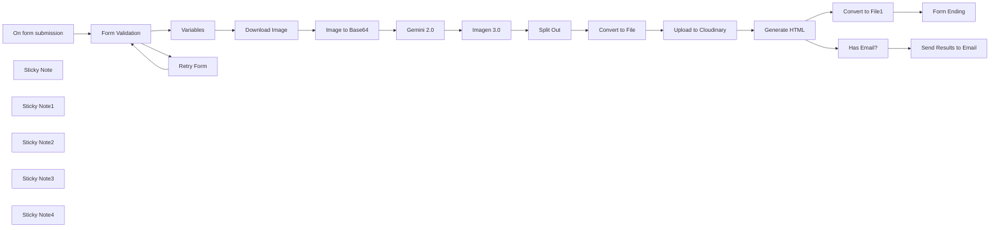

## Fluxo (.json) :

```json
{
  "meta": {
    "instanceId": "408f9fb9940c3cb18ffdef0e0150fe342d6e655c3a9fac21f0f644e8bedabcd9",
    "templateCredsSetupCompleted": true
  },
  "nodes": [
    {
      "id": "ed993205-977a-43cd-8d0b-4faef216d766",
      "name": "Split Out",
      "type": "n8n-nodes-base.splitOut",
      "position": [
        360,
        -120
      ],
      "parameters": {
        "options": {},
        "fieldToSplitOut": "predictions"
      },
      "typeVersion": 1
    },
    {
      "id": "67f2bb16-ee38-4bc8-9cc7-50a44614cc3b",
      "name": "Imagen 3.0",
      "type": "n8n-nodes-base.httpRequest",
      "position": [
        140,
        -120
      ],
      "parameters": {
        "url": "https://generativelanguage.googleapis.com/v1beta/models/imagen-3.0-generate-002:predict",
        "method": "POST",
        "options": {},
        "jsonBody": "={{\n{\n  \"instances\": [\n    {\n      \"prompt\": [\n        $json.candidates[0].content.parts[0].text,\n       `Generate the following image: ${$('Variables').first().json.targetPrompt}`\n      ].join(' ')\n    }\n  ],\n  \"parameters\": {\n    \"sampleCount\": $('Variables').first().json.numberSamples.toNumber()\n  }\n}\n}}",
        "sendBody": true,
        "specifyBody": "json",
        "authentication": "predefinedCredentialType",
        "nodeCredentialType": "googlePalmApi"
      },
      "credentials": {
        "googlePalmApi": {
          "id": "dSxo6ns5wn658r8N",
          "name": "Google Gemini(PaLM) Api account"
        }
      },
      "typeVersion": 4.2
    },
    {
      "id": "b1730c97-8c5c-48a5-90cf-7940f6c9e2d0",
      "name": "Variables",
      "type": "n8n-nodes-base.set",
      "position": [
        -940,
        -120
      ],
      "parameters": {
        "options": {},
        "assignments": {
          "assignments": [
            {
              "id": "7616f991-76d0-4dd0-9385-f08ed14e8dfa",
              "name": "sourceStyleUrl",
              "type": "string",
              "value": "={{ $json.SourceImage }}"
            },
            {
              "id": "126cb06e-4d69-4163-ba76-c694103bf5bb",
              "name": "targetPrompt",
              "type": "string",
              "value": "={{ $json.TargetPrompt }}"
            },
            {
              "id": "055d247b-586d-4bb8-a319-262c241df48c",
              "name": "numberSamples",
              "type": "string",
              "value": "={{\n(function(numSamples) {\n  if (!numSamples) return 1;\n  if (numSamples < 0) return 1;\n  if (numSamples > 4) return 4;\n  return numSamples;\n}($json['Number of Images']))\n}}"
            },
            {
              "id": "77a27e0e-24f4-4358-8cdc-84552be6c0b5",
              "name": "email",
              "type": "string",
              "value": "={{ $json['Your Email (Optional)'] }}"
            }
          ]
        }
      },
      "typeVersion": 3.4
    },
    {
      "id": "5c26062c-74cf-4140-8dcb-8688c8daec67",
      "name": "Download Image",
      "type": "n8n-nodes-base.httpRequest",
      "position": [
        -620,
        -120
      ],
      "parameters": {
        "url": "={{ $json.sourceStyleUrl }}",
        "options": {}
      },
      "typeVersion": 4.2
    },
    {
      "id": "20744adb-cdf5-4558-b6e6-4206d7c1f356",
      "name": "On form submission",
      "type": "n8n-nodes-base.formTrigger",
      "position": [
        -1400,
        -120
      ],
      "webhookId": "51f74db1-ffb4-491f-83b0-a44a7124be12",
      "parameters": {
        "options": {
          "path": "style-copy-with-imagen3",
          "ignoreBots": true,
          "buttonLabel": "Generate!",
          "appendAttribution": true
        },
        "formTitle": "Style Copy with Imagen 3.0",
        "formFields": {
          "values": [
            {
              "fieldLabel": "SourceImage",
              "placeholder": "The image URL to copy the style from",
              "requiredField": true
            },
            {
              "fieldLabel": "TargetPrompt",
              "placeholder": "The new image to generate",
              "requiredField": true
            },
            {
              "fieldType": "number",
              "fieldLabel": "Number of Images",
              "placeholder": "Default 1. Max. 4 images"
            },
            {
              "fieldType": "email",
              "fieldLabel": "Your Email (Optional)",
              "placeholder": "The results will be sent to this email"
            }
          ]
        },
        "responseMode": "lastNode",
        "formDescription": "Use this form to generate an image using another image as a style reference."
      },
      "typeVersion": 2.2
    },
    {
      "id": "917db247-1be3-4814-a96d-145957aa5db3",
      "name": "Form Validation",
      "type": "n8n-nodes-base.if",
      "position": [
        -1180,
        -120
      ],
      "parameters": {
        "options": {},
        "conditions": {
          "options": {
            "version": 2,
            "leftValue": "",
            "caseSensitive": true,
            "typeValidation": "strict"
          },
          "combinator": "and",
          "conditions": [
            {
              "id": "1b440b81-06c9-4133-bfd2-8ec07c7c3734",
              "operator": {
                "type": "boolean",
                "operation": "true",
                "singleValue": true
              },
              "leftValue": "={{ $json.SourceImage.isUrl() }}",
              "rightValue": ""
            }
          ]
        }
      },
      "typeVersion": 2.2
    },
    {
      "id": "65a8b617-318c-429a-b37e-45ead00dbb7e",
      "name": "Retry Form",
      "type": "n8n-nodes-base.form",
      "position": [
        -940,
        60
      ],
      "webhookId": "0b4c88ed-d28b-4df4-abe6-4579e17c672d",
      "parameters": {
        "options": {
          "formTitle": "Retry Submission",
          "buttonLabel": "Generate!",
          "formDescription": "Please enter a URL for the source image."
        },
        "formFields": {
          "values": [
            {
              "fieldLabel": "SourceImage",
              "placeholder": "The image URL to copy the style from",
              "requiredField": true
            },
            {
              "fieldLabel": "TargetPrompt",
              "placeholder": "The new image to generate",
              "requiredField": true
            },
            {
              "fieldType": "number",
              "fieldLabel": "Number of Images",
              "placeholder": "Max. 4 images"
            },
            {
              "fieldLabel": "Your Email (Optional)",
              "placeholder": "The results will be sent to this email"
            }
          ]
        },
        "limitWaitTime": true
      },
      "typeVersion": 1
    },
    {
      "id": "8a0e8dae-9f6f-488e-9977-fd89e885f30e",
      "name": "Upload to Cloudinary",
      "type": "n8n-nodes-base.httpRequest",
      "position": [
        880,
        -120
      ],
      "parameters": {
        "url": "https://api.cloudinary.com/v1_1/daglih2g8/image/upload",
        "method": "POST",
        "options": {},
        "sendBody": true,
        "sendQuery": true,
        "contentType": "multipart-form-data",
        "authentication": "genericCredentialType",
        "bodyParameters": {
          "parameters": [
            {
              "name": "file",
              "parameterType": "formBinaryData",
              "inputDataFieldName": "data"
            }
          ]
        },
        "genericAuthType": "httpQueryAuth",
        "queryParameters": {
          "parameters": [
            {
              "name": "upload_preset",
              "value": "n8n-workflows-preset"
            }
          ]
        }
      },
      "credentials": {
        "httpQueryAuth": {
          "id": "sT9jeKzZiLJ3bVPz",
          "name": "Cloudinary API"
        }
      },
      "typeVersion": 4.2
    },
    {
      "id": "525725ea-effe-410b-8f39-ad01ae755d1a",
      "name": "Sticky Note",
      "type": "n8n-nodes-base.stickyNote",
      "position": [
        -1480,
        -340
      ],
      "parameters": {
        "color": 7,
        "width": 760,
        "height": 640,
        "content": "## 1. Ask for Source Style and Target Image\n[Learn more about the Form Trigger](https://docs.n8n.io/integrations/builtin/core-nodes/n8n-nodes-base.formtrigger/)\n\nWe'll use a form interface for this template which allows the users to specify an image whose style we'll use as reference and a prompt to generate the target image. Form validation loop can be achieved by combining another form node with the IF node."
      },
      "typeVersion": 1
    },
    {
      "id": "ba9d4bdc-b695-4acf-9593-2ce979053744",
      "name": "Sticky Note1",
      "type": "n8n-nodes-base.stickyNote",
      "position": [
        -700,
        -340
      ],
      "parameters": {
        "color": 7,
        "width": 720,
        "height": 440,
        "content": "## 2. Visual Style Description using Gemini 2.0\n[Read more about Gemini Image Understanding](https://ai.google.dev/gemini-api/docs/image-understanding)\n\nThe trick to copying the style of an image is to get a multimodal LLM to describe it in detail. Using Gemini's image understanding capabilities, it can do a pretty good job to provide the comprehensive description we need."
      },
      "typeVersion": 1
    },
    {
      "id": "455f7956-6e39-4d84-af7e-d5908d4e5307",
      "name": "Sticky Note2",
      "type": "n8n-nodes-base.stickyNote",
      "position": [
        40,
        -340
      ],
      "parameters": {
        "color": 7,
        "width": 720,
        "height": 440,
        "content": "## 3. Image Generation using Imagen 3.0\n[Read more about Imagen Image Generation](https://ai.google.dev/gemini-api/docs/image-generation#imagen)\n\nTo generate the image, we'll be using Google's Imagen 3.0 model. We'll combine the visual style description generated in the previous Gemini model with the user's target image prompt and pass this to Imagen to do its magic! The result is something very close to style transfer which produces quite convincing and impressive results."
      },
      "typeVersion": 1
    },
    {
      "id": "0c1d5a7f-9102-4558-a830-ed558f72c086",
      "name": "Sticky Note3",
      "type": "n8n-nodes-base.stickyNote",
      "position": [
        780,
        -340
      ],
      "parameters": {
        "color": 7,
        "width": 980,
        "height": 600,
        "content": "## 4. Render Results to HTML Page\n[Learn more about the HTML node](https://docs.n8n.io/integrations/builtin/core-nodes/n8n-nodes-base.html)\n\nFinally for presentation, we'll render the generated images as a webpage for easier viewing using the HTML node. This page can then be sent to the user's email if provided and downloaded as a file once we land on the form ending node."
      },
      "typeVersion": 1
    },
    {
      "id": "ccc1ff65-0416-4dae-9557-ba2f98c5ac80",
      "name": "Convert to File1",
      "type": "n8n-nodes-base.convertToFile",
      "position": [
        1320,
        60
      ],
      "parameters": {
        "options": {
          "encoding": "utf8",
          "fileName": "={{ $('Variables').item.json.targetPrompt.toSnakeCase().urlEncode() }}.html"
        },
        "operation": "toText",
        "sourceProperty": "html"
      },
      "typeVersion": 1.1
    },
    {
      "id": "0252d373-3678-4851-819d-d36efb40dfb2",
      "name": "Generate HTML",
      "type": "n8n-nodes-base.html",
      "position": [
        1080,
        -120
      ],
      "parameters": {
        "html": "<h1>\n  {{ $('Variables').item.json.targetPrompt.toSentenceCase() }}\n</h1>\n<div class=\"gallery\">\n{{\n$input.all()\n  .chunk(2)\n  .map(row =>\n    `<div class=\"gallery-row\">\n      ${row.map(item =>\n        `<a href=\"${item.json.url}\" target=\"_blank\">\n          \n        </a>`).join('')}\n    </div>`\n  ).join('')\n}}\n</div>\n<div class=\"fineprint\">\n  Generated by Imagen 3.0 (imagen-3.0-generate-002) @ {{ $now.format('d MMM yyyy') }}.\n</div>\n<div class=\"fineprint\">\n  <h3>Style Prompt</h3>\n  <div style=\"display:flex;gap: 10px;\">\n    <div>\n      \n    </div>\n    <div>\n      {{ $('Gemini 2.0').first().json.candidates[0].content.parts[0].text }}\n    </div>\n  </div>\n</div>\n<style>\n  body { padding: 32px 64px; font-family: sans-serif; background-color: #fffaf2; }\n  h1 { max-width: 640px; }\n  .gallery { display: inline-block; padding: 5px; border: 1px solid #ccc; background-color: white; margin-bottom: 32px;}\n  .gallery-row { display: flex; }\n  .gallery-row img { padding: 5px; background-color: white }\n  .gallery-row img:hover { background-color: orange; } \n  .fineprint { font-size: 0.7rem; max-width: 480px; text-align: justify;}\n  .fineprint h3 { font-size: 0.8rem; }\n</style>"
      },
      "executeOnce": true,
      "typeVersion": 1.2
    },
    {
      "id": "b712bd74-8615-4080-aad2-dc0b0df0b07e",
      "name": "Convert to File",
      "type": "n8n-nodes-base.convertToFile",
      "position": [
        580,
        -120
      ],
      "parameters": {
        "options": {
          "fileName": "={{ $execution.id }}_{{ $itemIndex }}.{{ $json.mimeType.split('/')[1] }}",
          "mimeType": "={{ $json.mimeType }}"
        },
        "operation": "toBinary",
        "sourceProperty": "bytesBase64Encoded"
      },
      "typeVersion": 1.1
    },
    {
      "id": "ee3e168a-038c-4524-93fc-ced5d4956fa1",
      "name": "Form Ending",
      "type": "n8n-nodes-base.form",
      "position": [
        1540,
        60
      ],
      "webhookId": "c4bacbac-0347-4c35-9333-3704630b45ef",
      "parameters": {
        "options": {
          "formTitle": "Generation Complete"
        },
        "operation": "completion",
        "respondWith": "returnBinary",
        "completionTitle": "Image Generation Successful",
        "completionMessage": "Download has started.\nOpen the HTML file to view results."
      },
      "executeOnce": true,
      "typeVersion": 1
    },
    {
      "id": "c4b1648a-c7d9-46cd-af28-527f9b169ab6",
      "name": "Has Email?",
      "type": "n8n-nodes-base.if",
      "position": [
        1320,
        -120
      ],
      "parameters": {
        "options": {},
        "conditions": {
          "options": {
            "version": 2,
            "leftValue": "",
            "caseSensitive": true,
            "typeValidation": "strict"
          },
          "combinator": "and",
          "conditions": [
            {
              "id": "07d04523-f81a-4efa-b46a-cb640bcc608a",
              "operator": {
                "type": "string",
                "operation": "notEmpty",
                "singleValue": true
              },
              "leftValue": "={{ $('Variables').item.json.email }}",
              "rightValue": ""
            }
          ]
        }
      },
      "typeVersion": 2.2
    },
    {
      "id": "bc0a8188-27ff-4834-9c7a-8760531f4252",
      "name": "Send Results to Email",
      "type": "n8n-nodes-base.gmail",
      "position": [
        1540,
        -120
      ],
      "webhookId": "de5684ed-6aa4-4c29-aac3-62e21c54c6f0",
      "parameters": {
        "sendTo": "={{ $('Variables').first().json.email }}",
        "message": "={{ $json.html }}",
        "options": {},
        "subject": "=#{{$execution.id}} - Image Generated Successfully!"
      },
      "credentials": {
        "gmailOAuth2": {
          "id": "Sf5Gfl9NiFTNXFWb",
          "name": "Gmail account"
        }
      },
      "typeVersion": 2.1
    },
    {
      "id": "f18ab53b-d8e2-4625-a8f6-8b97959a15d1",
      "name": "Image to Base64",
      "type": "n8n-nodes-base.extractFromFile",
      "position": [
        -400,
        -120
      ],
      "parameters": {
        "options": {},
        "operation": "binaryToPropery"
      },
      "typeVersion": 1
    },
    {
      "id": "ac6c1353-035c-4045-aed9-46285b757b98",
      "name": "Gemini 2.0",
      "type": "n8n-nodes-base.httpRequest",
      "position": [
        -180,
        -120
      ],
      "parameters": {
        "url": "https://generativelanguage.googleapis.com/v1beta/models/gemini-2.0-flash:generateContent",
        "method": "POST",
        "options": {},
        "jsonBody": "={\n    \"contents\": [{\n      \"parts\": [\n        {\n          \"inline_data\": {\n            \"mime_type\":\"{{ $('Download Image').item.binary.data.mimeType }}\",\n            \"data\": \"{{ $json.data }}\"\n          }\n        },\n        {\"text\": \"Describe the visual style of this image. Do not include any character names or IP in the description. Include names of any famous artists associated with this style if known.\"}\n      ]\n    }]\n  }",
        "sendBody": true,
        "specifyBody": "json",
        "authentication": "predefinedCredentialType",
        "nodeCredentialType": "googlePalmApi"
      },
      "credentials": {
        "googlePalmApi": {
          "id": "dSxo6ns5wn658r8N",
          "name": "Google Gemini(PaLM) Api account"
        }
      },
      "typeVersion": 4.2
    },
    {
      "id": "fae8c5f0-9d6f-4e45-8f7a-82f361bf9b1b",
      "name": "Sticky Note4",
      "type": "n8n-nodes-base.stickyNote",
      "position": [
        -1920,
        -840
      ],
      "parameters": {
        "width": 400,
        "height": 1140,
        "content": "## Try It Out!\n### This n8n template allows you to use AI to generate logos or images which mimic visual styles of other logos or images. The model used to generate the images is Google's Imagen 3.0.\n\nWith this template, users will be able to automate design and marketing tasks such as creating variants of existing designs, remixing existing assets to validate different styles and explore a range of designs which would have been otherwise too expensive and time-consming previously.\n\n### How it works\n* A form trigger is used to capture the source image to reference styles from and a prompt for the target image to generate.\n* The source image is passed to Gemini 2.0 to be analysed and its visual style and tone extracted as a detailed description.\n* This visual style description is then combined with the user's initial target image prompt. This final prompt is given to Imagen 3.0 to generate the images.\n* A quick webpage is put together with the generated images to present back to the user.\n* If the user provided an email address, a copy of this HTML page will be sent.\n\n### How to use\n* Ensure the workflow is live to share the form publicly.\n* The source image must be accessible to your n8n instance - either a public image of the internet or within your network.\n\n### Requirements\n* Gemini for LLM and Imagen model.\n* Cloudinary for image CDN.\n* Gmail for email sending.\n\n### Customising this workflow\n* Feel free to swap any of these out for tools and services you prefer.\n* Want to fully automate? Switch the form trigger for a webhook trigger!\n\n\n### Need Help?\nJoin the [Discord](https://discord.com/invite/XPKeKXeB7d) or ask in the [Forum](https://community.n8n.io/)!\n\nHappy Hacking!"
      },
      "typeVersion": 1
    }
  ],
  "pinData": {},
  "connections": {
    "Split Out": {
      "main": [
        [
          {
            "node": "Convert to File",
            "type": "main",
            "index": 0
          }
        ]
      ]
    },
    "Variables": {
      "main": [
        [
          {
            "node": "Download Image",
            "type": "main",
            "index": 0
          }
        ]
      ]
    },
    "Gemini 2.0": {
      "main": [
        [
          {
            "node": "Imagen 3.0",
            "type": "main",
            "index": 0
          }
        ]
      ]
    },
    "Has Email?": {
      "main": [
        [
          {
            "node": "Send Results to Email",
            "type": "main",
            "index": 0
          }
        ]
      ]
    },
    "Imagen 3.0": {
      "main": [
        [
          {
            "node": "Split Out",
            "type": "main",
            "index": 0
          }
        ]
      ]
    },
    "Retry Form": {
      "main": [
        [
          {
            "node": "Form Validation",
            "type": "main",
            "index": 0
          }
        ]
      ]
    },
    "Generate HTML": {
      "main": [
        [
          {
            "node": "Convert to File1",
            "type": "main",
            "index": 0
          },
          {
            "node": "Has Email?",
            "type": "main",
            "index": 0
          }
        ]
      ]
    },
    "Download Image": {
      "main": [
        [
          {
            "node": "Image to Base64",
            "type": "main",
            "index": 0
          }
        ]
      ]
    },
    "Convert to File": {
      "main": [
        [
          {
            "node": "Upload to Cloudinary",
            "type": "main",
            "index": 0
          }
        ]
      ]
    },
    "Form Validation": {
      "main": [
        [
          {
            "node": "Variables",
            "type": "main",
            "index": 0
          }
        ],
        [
          {
            "node": "Retry Form",
            "type": "main",
            "index": 0
          }
        ]
      ]
    },
    "Image to Base64": {
      "main": [
        [
          {
            "node": "Gemini 2.0",
            "type": "main",
            "index": 0
          }
        ]
      ]
    },
    "Convert to File1": {
      "main": [
        [
          {
            "node": "Form Ending",
            "type": "main",
            "index": 0
          }
        ]
      ]
    },
    "On form submission": {
      "main": [
        [
          {
            "node": "Form Validation",
            "type": "main",
            "index": 0
          }
        ]
      ]
    },
    "Upload to Cloudinary": {
      "main": [
        [
          {
            "node": "Generate HTML",
            "type": "main",
            "index": 0
          }
        ]
      ]
    },
    "Send Results to Email": {
      "main": [
        []
      ]
    }
  }
}
```

<a id="template-637"></a>

## Template 637 - Análise de cabeçalhos de e-mail e reputação de IP

- **Nome:** Análise de cabeçalhos de e-mail e reputação de IP
- **Descrição:** Fluxo que analisa cabeçalhos de e-mail para identificar o IP de origem, verifica reputação e interpreta resultados de autenticação (SPF, DKIM, DMARC), retornando um resumo estruturado.
- **Funcionalidade:** • Recepção de e-mails ou payloads via webhook: Aceita entradas vindas de uma caixa do Outlook ou de chamadas HTTP externas.
• Extração de cabeçalhos: Normaliza e armazena o array de cabeçalhos para processamento subsequente.
• Isolamento de cabeçalhos 'Received': Filtra e seleciona o cabeçalho mais relevante para identificar o IP de origem.
• Extração de IP original: Extrai o endereço IP público do cabeçalho selecionado e remove endereços privados/internos.
• Verificação de IP e controle de fluxo: Verifica se foi encontrado um IP válido e decide se continua a análise ou interrompe.
• Consulta de reputação de IP: Consulta um serviço de reputação para obter score de fraude e atividade recente de spam.
• Consulta de geolocalização e organização do IP: Recupera país, cidade e organização associada ao IP.
• Detecção de cabeçalhos de autenticação: Verifica presença de Authentication-Results, Received-SPF, DKIM-Signature e dmarc.
• Interpretação de resultados de autenticação: Analisa strings de cabeçalhos para classificar SPF, DKIM e DMARC como pass/fail/neutral/error/unknown.
• Agregação e formatação de saída: Combina todos os dados (autenticações, IP, localização, reputação) em um JSON padronizado para resposta de webhook.
- **Ferramentas:** • Microsoft Outlook / Microsoft Graph API: Fonte de e-mails e para recuperar os internetMessageHeaders completos de mensagens recebidas.
• Endpoint de webhook HTTP: Permite receber payloads de terceiros contendo cabeçalhos de e-mail para análise em produção.
• IPQualityScore: Serviço de reputação de IP que fornece fraud_score e indicadores de atividade maliciosa/recente.
• ip-api.com: Serviço de geolocalização e informação de organização associado ao endereço IP.

## Fluxo visual

```mermaid
flowchart LR
    N1["Trigger on New Email"]
    N2["Retrieve Headers of Email"]
    N3["Extract Received Headers"]
    N4["Remove Extra Received Headers"]
    N5["Extract Original From IP"]
    N6["Query IP Quality Score API"]
    N7["Query IP API"]
    N8["Authentication-Results Header?"]
    N9["Extract Authentication-Results Header"]
    N10["Received-SPF Header?"]
    N11["DKIM-Signature Header?"]
    N12["Set SPF Value"]
    N13["Extract Received-SPF Header"]
    N14["DKIM Signature Found"]
    N15["DMARC Header?"]
    N16["No DMARC Header"]
    N17["Extract DMARC Header"]
    N18["Set DMARC Value"]
    N19["Original IP Found?"]
    N20["No DKIM Signature Found"]
    N21["Determine Auth Values"]
    N22["No SPF Found"]
    N23["Merge"]
    N24["Aggregate"]
    N25["No Operation, do nothing"]
    N26["Format Webhook Output"]
    N27["Format Individual Auth Outputs"]
    N28["Format Combined Auth Output"]
    N29["Respond to Webhook"]
    N30["Webhook1"]
    N31["Set Headers"]
    N32["Aggregate Received-SPF Headers"]
    N33["Set Headers Here"]
    N34["Set Webhook Headers Here"]
    N35["Sticky Note"]
    N36["Sticky Note1"]
    N37["Sticky Note2"]
    N38["Sticky Note3"]
    N39["Sticky Note4"]
    N40["Sticky Note5"]
    N41["Sticky Note6"]

    N23 --> N24
    N30 --> N34
    N24 --> N27
    N31 --> N3
    N22 --> N23
    N7 --> N8
    N15 --> N17
    N15 --> N16
    N12 --> N23
    N16 --> N23
    N18 --> N23
    N33 --> N31
    N19 --> N6
    N19 --> N25
    N14 --> N23
    N17 --> N18
    N10 --> N13
    N10 --> N22
    N1 --> N2
    N21 --> N28
    N26 --> N29
    N11 --> N14
    N11 --> N20
    N20 --> N23
    N5 --> N19
    N3 --> N4
    N25 --> N8
    N34 --> N31
    N2 --> N33
    N6 --> N7
    N13 --> N32
    N28 --> N26
    N4 --> N5
    N32 --> N12
    N8 --> N9
    N8 --> N10
    N8 --> N11
    N8 --> N15
    N27 --> N26
    N9 --> N21
```

## Fluxo (.json) :

```json
{
  "meta": {
    "instanceId": "03e9d14e9196363fe7191ce21dc0bb17387a6e755dcc9acc4f5904752919dca8"
  },
  "nodes": [
    {
      "id": "363be6de-5e8d-46b2-a31f-6f7bc204c986",
      "name": "Trigger on New Email",
      "type": "n8n-nodes-base.microsoftOutlookTrigger",
      "disabled": true,
      "position": [
        -760,
        1400
      ],
      "parameters": {
        "output": "raw",
        "filters": {
          "foldersToInclude": [
            "AQMkADM5MWVmZWEwLTQ4OTMtNGMyYy1iOWUxLTQ4N2M1YmU0ODJjNQAuAAADWJOZOf0oRkGpsGIMN2VBCwEAbttrza1gUEiEMFJJPqIeZQAAAgEMAAAA"
          ]
        },
        "options": {},
        "pollTimes": {
          "item": [
            {
              "mode": "everyMinute"
            }
          ]
        }
      },
      "credentials": {
        "microsoftOutlookOAuth2Api": {
          "id": "vTCK0oVQ0WjFrI5H",
          "name": "Outlook Credential"
        }
      },
      "typeVersion": 1
    },
    {
      "id": "0da8b1ab-6dbe-41b7-92f1-6e8637d082cb",
      "name": "Retrieve Headers of Email",
      "type": "n8n-nodes-base.httpRequest",
      "position": [
        -560,
        1400
      ],
      "parameters": {
        "url": "=https://graph.microsoft.com/v1.0/me/messages/{{ $json.id }}?$select=internetMessageHeaders",
        "options": {},
        "sendHeaders": true,
        "authentication": "predefinedCredentialType",
        "headerParameters": {
          "parameters": [
            {
              "name": "Accept",
              "value": "application/json"
            }
          ]
        },
        "nodeCredentialType": "microsoftOutlookOAuth2Api"
      },
      "credentials": {
        "microsoftOutlookOAuth2Api": {
          "id": "vTCK0oVQ0WjFrI5H",
          "name": "Outlook Credential"
        }
      },
      "typeVersion": 4.2
    },
    {
      "id": "2f28e47d-f010-4f0b-bbe4-074bbdf39a45",
      "name": "Extract Received Headers",
      "type": "n8n-nodes-base.code",
      "position": [
        80,
        1460
      ],
      "parameters": {
        "jsCode": "// Extract the headers array from the JSON\nconst headers = $('Set Headers').item.json.headers;\n\n// Filter headers where the name is \"Received\"\nconst receivedHeaders = headers.filter(header => header.name === \"Received\");\n\n// Return the filtered headers\nreturn receivedHeaders;\n"
      },
      "executeOnce": false,
      "typeVersion": 2
    },
    {
      "id": "530fd9c3-94c2-4d5e-a686-57738cc10ae6",
      "name": "Remove Extra Received Headers",
      "type": "n8n-nodes-base.limit",
      "position": [
        300,
        1460
      ],
      "parameters": {
        "keep": "lastItems"
      },
      "typeVersion": 1
    },
    {
      "id": "9942704e-e0ac-42e9-b714-b2bdb3117c02",
      "name": "Extract Original From IP",
      "type": "n8n-nodes-base.set",
      "position": [
        500,
        1460
      ],
      "parameters": {
        "options": {},
        "assignments": {
          "assignments": [
            {
              "id": "5f740d1f-de62-4fe0-aa20-625063344c07",
              "name": "extractedfromip",
              "type": "string",
              "value": "={{ $json.value.replace(/\\b(127\\.(?:\\d{1,3}\\.){2}\\d{1,3})|(10\\.(?:\\d{1,3}\\.){2}\\d{1,3})|(172\\.(?:1[6-9]|2[0-9]|3[0-1])\\.\\d{1,3}\\.\\d{1,3})|(192\\.168\\.\\d{1,3}\\.\\d{1,3})\\b/g, \"\").match(/(\\s*((([0-9A-Fa-f]{1,4}:){7}([0-9A-Fa-f]{1,4}|:))|(([0-9A-Fa-f]{1,4}:){6}(:[0-9A-Fa-f]{1,4}|((25[0-5]|2[0-4][0-9]|1[0-9][0-9]|[1-9]?[0-9])(\\.(25[0-5]|2[0-4][0-9]|1[0-9][0-9]|[1-9]?[0-9])){3})|:))|(([0-9A-Fa-f]{1,4}:){5}(((:[0-9A-Fa-f]{1,4}){1,2})|:((25[0-5]|2[0-4][0-9]|1[0-9][0-9]|[1-9]?[0-9])(\\.(25[0-5]|2[0-4][0-9]|1[0-9][0-9]|[1-9]?[0-9])){3})|:))|(([0-9A-Fa-f]{1,4}:){4}(((:[0-9A-Fa-f]{1,4}){1,3})|((:[0-9A-Fa-f]{1,4})?:((25[0-5]|2[0-4][0-9]|1[0-9][0-9]|[1-9]?[0-9])(\\.(25[0-5]|2[0-4][0-9]|1[0-9][0-9]|[1-9]?[0-9])){3}))|:))|(([0-9A-Fa-f]{1,4}:){3}(((:[0-9A-Fa-f]{1,4}){1,4})|((:[0-9A-Fa-f]{1,4}){0,2}:((25[0-5]|2[0-4][0-9]|1[0-9][0-9]|[1-9]?[0-9])(\\.(25[0-5]|2[0-4][0-9]|1[0-9][0-9]|[1-9]?[0-9])){3}))|:))|(([0-9A-Fa-f]{1,4}:){2}(((:[0-9A-Fa-f]{1,4}){1,5})|((:[0-9A-Fa-f]{1,4}){0,3}:((25[0-5]|2[0-4][0-9]|1[0-9][0-9]|[1-9]?[0-9])(\\.(25[0-5]|2[0-4][0-9]|1[0-9][0-9]|[1-9]?[0-9])){3}))|:))|(([0-9A-Fa-f]{1,4}:){1}(((:[0-9A-Fa-f]{1,4}){1,6})|((:[0-9A-Fa-f]{1,4}){0,4}:((25[0-5]|2[0-4][0-9]|1[0-9][0-9]|[1-9]?[0-9])(\\.(25[0-5]|2[0-4][0-9]|1[0-9][0-9]|[1-9]?[0-9])){3}))|:))|(:(((:[0-9A-Fa-f]{1,4}){1,7})|((:[0-9A-Fa-f]{1,4}){0,5}:((25[0-5]|2[0-4][0-9]|1[0-9][0-9]|[1-9]?[0-9])(\\.(25[0-5]|2[0-4][0-9]|1[0-9][0-9]|[1-9]?[0-9])){3}))|:)))(%.+)?\\s*)|(\\b(?:(?:25[0-5]|2[0-4][0-9]|[01]?[0-9][0-9]?)[.]){3}(?:25[0-5]|2[0-4][0-9]|[01]?[0-9][0-9]?)\\b)/)[0] }}"
            }
          ]
        }
      },
      "typeVersion": 3.4
    },
    {
      "id": "6093bcd2-1101-4685-8d2c-751dd451afc4",
      "name": "Query IP Quality Score API",
      "type": "n8n-nodes-base.httpRequest",
      "position": [
        980,
        1360
      ],
      "parameters": {
        "url": "=https://ipqualityscore.com/api/json/ip/Mlg6aZdzI1mVehUD3Z5Ak5Vl4yNN7P8v/{{ $('Extract Original From IP').item.json.extractedfromip }}?strictness=1&allow_public_access_points=true&lighter_penalties=true",
        "options": {}
      },
      "typeVersion": 4.2
    },
    {
      "id": "feb4203c-4f9b-456c-9640-82ce8f6f550f",
      "name": "Query IP API",
      "type": "n8n-nodes-base.httpRequest",
      "position": [
        1180,
        1360
      ],
      "parameters": {
        "url": "=http://ip-api.com/json/{{ $('Extract Original From IP').item.json.extractedfromip }}",
        "options": {}
      },
      "typeVersion": 4.2
    },
    {
      "id": "f628e421-4cb5-4612-83c2-bde0f4f57367",
      "name": "Authentication-Results Header?",
      "type": "n8n-nodes-base.if",
      "position": [
        1440,
        1600
      ],
      "parameters": {
        "options": {},
        "conditions": {
          "options": {
            "version": 2,
            "leftValue": "",
            "caseSensitive": true,
            "typeValidation": "strict"
          },
          "combinator": "and",
          "conditions": [
            {
              "id": "ead2b640-ad80-4189-a692-ae454723fd85",
              "operator": {
                "type": "boolean",
                "operation": "true",
                "singleValue": true
              },
              "leftValue": "={{ $('Set Headers').item.json.headers.some(header => header.name === \"Authentication-Results\") }}",
              "rightValue": "true"
            }
          ]
        }
      },
      "typeVersion": 2.2
    },
    {
      "id": "8616ecd3-1c71-49ff-a32c-4b09f3214edb",
      "name": "Extract Authentication-Results Header",
      "type": "n8n-nodes-base.code",
      "position": [
        1720,
        1360
      ],
      "parameters": {
        "jsCode": "// Extract the headers array from the JSON\nconst headers = $('Set Headers').item.json.headers;\n\n// Filter headers where the name is \"Received\"\nconst receivedHeaders = headers.filter(header => header.name === \"Authentication-Results\");\n\n// Return the filtered headers\nreturn receivedHeaders;\n"
      },
      "executeOnce": false,
      "typeVersion": 2
    },
    {
      "id": "7d3a37dc-6bbe-4c3b-9c2c-c9d2c1c24213",
      "name": "Received-SPF Header?",
      "type": "n8n-nodes-base.if",
      "position": [
        1700,
        2220
      ],
      "parameters": {
        "options": {},
        "conditions": {
          "options": {
            "version": 2,
            "leftValue": "",
            "caseSensitive": true,
            "typeValidation": "strict"
          },
          "combinator": "and",
          "conditions": [
            {
              "id": "a38ebc9b-f896-4432-81fb-4f3db98f3409",
              "operator": {
                "type": "boolean",
                "operation": "true",
                "singleValue": true
              },
              "leftValue": "={{ $('Set Headers').item.json.headers.some(header => header.name === \"Received-SPF\") }}",
              "rightValue": ""
            }
          ]
        }
      },
      "typeVersion": 2.2
    },
    {
      "id": "f1ca55fb-07d8-4825-8850-f5a3c58e358a",
      "name": "DKIM-Signature Header?",
      "type": "n8n-nodes-base.if",
      "position": [
        1700,
        2620
      ],
      "parameters": {
        "options": {},
        "conditions": {
          "options": {
            "version": 2,
            "leftValue": "",
            "caseSensitive": true,
            "typeValidation": "strict"
          },
          "combinator": "and",
          "conditions": [
            {
              "id": "a38ebc9b-f896-4432-81fb-4f3db98f3409",
              "operator": {
                "type": "boolean",
                "operation": "true",
                "singleValue": true
              },
              "leftValue": "={{ $('Set Headers').item.json.headers.some(header => header.name === \"DKIM-Signature\") }}",
              "rightValue": ""
            }
          ]
        }
      },
      "typeVersion": 2.2
    },
    {
      "id": "df19f38c-b263-4b97-bd22-adc8ff44f631",
      "name": "Set SPF Value",
      "type": "n8n-nodes-base.set",
      "position": [
        2480,
        2140
      ],
      "parameters": {
        "options": {},
        "assignments": {
          "assignments": [
            {
              "id": "179c48eb-97e5-48ab-82b8-ef4269f11366",
              "name": "spfvalue",
              "type": "string",
              "value": "={{ $json.data.last().value.toLowerCase().includes('fail') ? \"fail\" : $json.data.last().value.toLowerCase().includes('pass') ? \"pass\" : \"unknown\"}}"
            }
          ]
        }
      },
      "typeVersion": 3.4
    },
    {
      "id": "1613d276-3ec4-44b2-91ca-f76985e1b4c2",
      "name": "Extract Received-SPF Header",
      "type": "n8n-nodes-base.code",
      "position": [
        1940,
        2140
      ],
      "parameters": {
        "jsCode": "// Extract the headers array from the JSON\nconst headers = $('Set Headers').item.json.headers;\n\n// Filter headers where the name is \"Received\"\nconst receivedHeaders = headers.filter(header => header.name === \"Received-SPF\");\n\n// Return the filtered headers\nreturn receivedHeaders;\n"
      },
      "executeOnce": false,
      "typeVersion": 2
    },
    {
      "id": "47697f60-99e7-4c91-ab7c-7f966b1b5307",
      "name": "DKIM Signature Found",
      "type": "n8n-nodes-base.set",
      "position": [
        2480,
        2520
      ],
      "parameters": {
        "options": {},
        "assignments": {
          "assignments": [
            {
              "id": "ae3158bf-3d91-4a61-a58c-c151362e52d7",
              "name": "dkimvalue",
              "type": "string",
              "value": "=found"
            }
          ]
        }
      },
      "typeVersion": 3.4
    },
    {
      "id": "2383e7b4-fe13-4c36-80a3-67ba3f02ce1d",
      "name": "DMARC Header?",
      "type": "n8n-nodes-base.if",
      "position": [
        1700,
        3060
      ],
      "parameters": {
        "options": {},
        "conditions": {
          "options": {
            "version": 2,
            "leftValue": "",
            "caseSensitive": true,
            "typeValidation": "strict"
          },
          "combinator": "and",
          "conditions": [
            {
              "id": "a38ebc9b-f896-4432-81fb-4f3db98f3409",
              "operator": {
                "type": "boolean",
                "operation": "true",
                "singleValue": true
              },
              "leftValue": "={{ $('Set Headers').item.json.headers.some(header => header.name === \"dmarc\") }}",
              "rightValue": ""
            }
          ]
        }
      },
      "typeVersion": 2.2
    },
    {
      "id": "2c41e06d-0dc1-474e-a13f-302fc3e4d4ad",
      "name": "No DMARC Header",
      "type": "n8n-nodes-base.set",
      "position": [
        2480,
        3160
      ],
      "parameters": {
        "options": {},
        "assignments": {
          "assignments": [
            {
              "id": "ae3158bf-3d91-4a61-a58c-c151362e52d7",
              "name": "dmarcvalue",
              "type": "string",
              "value": "=not found"
            }
          ]
        }
      },
      "typeVersion": 3.4
    },
    {
      "id": "81bd5082-634b-4f0e-951f-1374573fc6c0",
      "name": "Extract DMARC Header",
      "type": "n8n-nodes-base.code",
      "position": [
        2120,
        2960
      ],
      "parameters": {
        "jsCode": "// Extract the headers array from the JSON\nconst headers = $('Set Headers').item.json.headers;\n\n// Filter headers where the name is \"Received\"\nconst receivedHeaders = headers.filter(header => header.name === \"dmarc\");\n\n// Return the filtered headers\nreturn receivedHeaders;\n"
      },
      "executeOnce": false,
      "typeVersion": 2
    },
    {
      "id": "55a5745c-2c73-492c-b63c-20936043b0b6",
      "name": "Set DMARC Value",
      "type": "n8n-nodes-base.set",
      "position": [
        2480,
        2960
      ],
      "parameters": {
        "options": {},
        "assignments": {
          "assignments": [
            {
              "id": "179c48eb-97e5-48ab-82b8-ef4269f11366",
              "name": "spfvalue",
              "type": "string",
              "value": "={{ $json.value.toLowerCase().includes('pass') ? \"pass\" : $json.value.toLowerCase().includes('fail') ? \"fail\" : \"unknown\"}}"
            }
          ]
        }
      },
      "typeVersion": 3.4
    },
    {
      "id": "48a5b283-7aa4-4e10-b784-fcce25465fc0",
      "name": "Original IP Found?",
      "type": "n8n-nodes-base.if",
      "position": [
        700,
        1460
      ],
      "parameters": {
        "options": {},
        "conditions": {
          "options": {
            "version": 2,
            "leftValue": "",
            "caseSensitive": true,
            "typeValidation": "strict"
          },
          "combinator": "and",
          "conditions": [
            {
              "id": "1c27e7ba-d243-4673-b1cc-608c35951168",
              "operator": {
                "type": "boolean",
                "operation": "notEmpty",
                "singleValue": true
              },
              "leftValue": "={{ $json.extractedfromip?.toBoolean() }}",
              "rightValue": ""
            }
          ]
        }
      },
      "typeVersion": 2.2
    },
    {
      "id": "75818bdc-3ffb-42a7-a0a3-93fc413b757f",
      "name": "No DKIM Signature Found",
      "type": "n8n-nodes-base.set",
      "position": [
        2480,
        2720
      ],
      "parameters": {
        "options": {},
        "assignments": {
          "assignments": [
            {
              "id": "ae3158bf-3d91-4a61-a58c-c151362e52d7",
              "name": "dkimvalue",
              "type": "string",
              "value": "not found"
            }
          ]
        }
      },
      "typeVersion": 3.4
    },
    {
      "id": "17bc160b-618f-4893-80c8-4e4c2638adc3",
      "name": "Determine Auth Values",
      "type": "n8n-nodes-base.set",
      "position": [
        2040,
        1360
      ],
      "parameters": {
        "options": {},
        "assignments": {
          "assignments": [
            {
              "id": "cd0b3f49-fe38-4686-a1f5-bc03a145adef",
              "name": "spfvalue",
              "type": "string",
              "value": "={{ $json.value.toLowerCase().includes('spf=pass') ? \"pass\" : $json.value.toLowerCase().includes('spf=fail') ? \"fail\" : $json.value.toLowerCase().includes('spf=neutral') ? \"neutral\" : \"unknown\" }}"
            },
            {
              "id": "6aa90f4d-773e-475f-8cbc-fe5c4fe93653",
              "name": "dkimvalue",
              "type": "string",
              "value": "={{ $json.value.toLowerCase().includes('dkim=pass') ? \"pass\" : $json.value.toLowerCase().includes('dkim=fail') ? \"fail\" : $json.value.toLowerCase().includes('dkim=temperror') ? \"error\" : \"unknown\" }}"
            },
            {
              "id": "d3b7b0c1-0680-4cb9-b376-d365e5602a29",
              "name": "dmarcvalue",
              "type": "string",
              "value": "={{ $json.value.toLowerCase().includes('dmarc=pass') ? \"pass\" : $json.value.toLowerCase().includes('dmarc=fail') ? \"fail\" : \"unknown\" }}"
            }
          ]
        }
      },
      "typeVersion": 3.4
    },
    {
      "id": "8ee70aff-0907-44f5-b675-1de26660c2e3",
      "name": "No SPF Found",
      "type": "n8n-nodes-base.set",
      "position": [
        2480,
        2320
      ],
      "parameters": {
        "options": {},
        "assignments": {
          "assignments": [
            {
              "id": "ae3158bf-3d91-4a61-a58c-c151362e52d7",
              "name": "spfvalue",
              "type": "string",
              "value": "not found"
            }
          ]
        }
      },
      "typeVersion": 3.4
    },
    {
      "id": "a658b7d1-ec0e-40c9-a6c6-1f81e776fcfb",
      "name": "Merge",
      "type": "n8n-nodes-base.merge",
      "position": [
        2840,
        1600
      ],
      "parameters": {
        "numberInputs": 3
      },
      "typeVersion": 3
    },
    {
      "id": "bb688aec-d7ae-4e5a-ac38-a8d9554966bd",
      "name": "Aggregate",
      "type": "n8n-nodes-base.aggregate",
      "position": [
        3000,
        1600
      ],
      "parameters": {
        "options": {},
        "aggregate": "aggregateAllItemData"
      },
      "typeVersion": 1
    },
    {
      "id": "e393c3b1-b756-44a8-ac3c-b2d9e15f4f47",
      "name": "No Operation, do nothing",
      "type": "n8n-nodes-base.noOp",
      "position": [
        980,
        1600
      ],
      "parameters": {},
      "typeVersion": 1
    },
    {
      "id": "d651412c-9e58-4ef6-a6eb-6556647a7223",
      "name": "Format Webhook Output",
      "type": "n8n-nodes-base.set",
      "position": [
        3400,
        1460
      ],
      "parameters": {
        "options": {},
        "assignments": {
          "assignments": []
        },
        "includeOtherFields": true
      },
      "typeVersion": 3.4
    },
    {
      "id": "03c70339-8e92-4d62-b346-7e669c83d338",
      "name": "Format Individual Auth Outputs",
      "type": "n8n-nodes-base.set",
      "position": [
        3180,
        1600
      ],
      "parameters": {
        "options": {},
        "assignments": {
          "assignments": [
            {
              "id": "1f466a9d-e8a1-4095-918c-89fd8e3dae57",
              "name": "spf",
              "type": "string",
              "value": "={{ $json.data[0].spfvalue }}"
            },
            {
              "id": "797b0e35-9a2e-4261-8741-a8d636e0d1ae",
              "name": "dkim",
              "type": "string",
              "value": "={{ $json.data[1].dkimvalue }}"
            },
            {
              "id": "8b6f9dda-081d-45b6-98a9-04a96642800b",
              "name": "dmarc",
              "type": "string",
              "value": "={{ $json.data[2].dmarcvalue }}"
            },
            {
              "id": "6d24a794-0d06-4f12-8bfb-cc3c71720a1b",
              "name": "initialIP",
              "type": "string",
              "value": "={{ $('Extract Original From IP').item.json.extractedfromip || 'Originating IP Not Found'}}"
            },
            {
              "id": "e9ec6f54-0ef7-451b-bbeb-8bb9291e4bcd",
              "name": "organization",
              "type": "string",
              "value": "={{ $('Query IP API').item.json.org || \"No Organization Found\" }}"
            },
            {
              "id": "719b8414-72e1-4916-855b-00abdfc8e776",
              "name": "country",
              "type": "string",
              "value": "={{ $('Query IP API').item.json.country || \"No Country Found\" }}"
            },
            {
              "id": "ab0dc08c-ba54-4e2c-b4df-9f23d36cb350",
              "name": "city",
              "type": "string",
              "value": "={{ $('Query IP API').item.json.city || \"No City Found\" }}"
            },
            {
              "id": "f8214eea-dfb6-4fe1-8e45-e0b8d3d44ee3",
              "name": "recentSpamActivity",
              "type": "string",
              "value": "={{ $('Query IP Quality Score API').item.json.fraud_score>=85 ? \"Identified spam in the last 48 hours\" : $('Query IP Quality Score API').item.json.fraud_score>=75 ? \"Identified spam in the last month\" : \"Not associated with recent spam\" }}"
            },
            {
              "id": "fe3488b2-ad00-45ad-b947-ca2dc4242363",
              "name": "ipSenderReputation",
              "type": "string",
              "value": "={{ $('Query IP Quality Score API').item.json.fraud_score>=85 ? \"Bad\" : $('Query IP Quality Score API').item.json.fraud_score>=75 ? \"Poor\" : $('Gmail - Query IP Quality Score API').item.json.fraud_score>=50 ? \"Suspicious\" : $('Query IP Quality Score API').item.json.fraud_score>=11 ? \"OK\" : $('Query IP Quality Score API').item.json.fraud_score<11 ? \"Good\" : \"Unknown\"}}"
            }
          ]
        }
      },
      "typeVersion": 3.4
    },
    {
      "id": "762153b7-0364-498f-9dba-547d676b9d74",
      "name": "Format Combined Auth Output",
      "type": "n8n-nodes-base.set",
      "position": [
        2400,
        1360
      ],
      "parameters": {
        "options": {},
        "assignments": {
          "assignments": [
            {
              "id": "1f466a9d-e8a1-4095-918c-89fd8e3dae57",
              "name": "spf",
              "type": "string",
              "value": "={{ $json.spfvalue }}"
            },
            {
              "id": "797b0e35-9a2e-4261-8741-a8d636e0d1ae",
              "name": "dkim",
              "type": "string",
              "value": "={{ $json.dkimvalue }}"
            },
            {
              "id": "8b6f9dda-081d-45b6-98a9-04a96642800b",
              "name": "dmarc",
              "type": "string",
              "value": "={{ $json.dmarcvalue }}"
            },
            {
              "id": "6d24a794-0d06-4f12-8bfb-cc3c71720a1b",
              "name": "initialIP",
              "type": "string",
              "value": "={{ $('Extract Original From IP').item.json.extractedfromip || 'Originating IP Not Found'}}"
            },
            {
              "id": "e9ec6f54-0ef7-451b-bbeb-8bb9291e4bcd",
              "name": "organization",
              "type": "string",
              "value": "={{ $('Query IP API').item.json.org || \"No Organization Found\" }}"
            },
            {
              "id": "719b8414-72e1-4916-855b-00abdfc8e776",
              "name": "country",
              "type": "string",
              "value": "={{ $('Query IP API').item.json.country || \"No Country Found\" }}"
            },
            {
              "id": "ab0dc08c-ba54-4e2c-b4df-9f23d36cb350",
              "name": "city",
              "type": "string",
              "value": "={{ $('Query IP API').item.json.city || \"No City Found\" }}"
            },
            {
              "id": "f8214eea-dfb6-4fe1-8e45-e0b8d3d44ee3",
              "name": "recentSpamActivity",
              "type": "string",
              "value": "={{ $('Query IP Quality Score API').item.json.fraud_score>=85 ? \"Identified spam in the last 48 hours\" : $('Query IP Quality Score API').item.json.fraud_score>=75 ? \"Identified spam in the last month\" : \"Not associated with recent spam\" }}"
            },
            {
              "id": "fe3488b2-ad00-45ad-b947-ca2dc4242363",
              "name": "ipSenderReputation",
              "type": "string",
              "value": "={{ $('Query IP Quality Score API').item.json.fraud_score>=85 ? \"Bad\" : $('Query IP Quality Score API').item.json.fraud_score>=75 ? \"Poor\" : $('Query IP Quality Score API').item.json.fraud_score>=50 ? \"Suspicious\" : $('Query IP Quality Score API').item.json.fraud_score>=11 ? \"OK\" : $('Query IP Quality Score API').item.json.fraud_score<11 ? \"Good\" : \"Unknown\"}}"
            }
          ]
        }
      },
      "typeVersion": 3.4
    },
    {
      "id": "391615b6-4996-4687-a07c-3f9af1246840",
      "name": "Respond to Webhook",
      "type": "n8n-nodes-base.respondToWebhook",
      "position": [
        3620,
        1460
      ],
      "parameters": {
        "options": {}
      },
      "typeVersion": 1.1
    },
    {
      "id": "ff28eb77-d095-440e-a95f-9f3727a3c219",
      "name": "Webhook1",
      "type": "n8n-nodes-base.webhook",
      "position": [
        -780,
        2140
      ],
      "webhookId": "da28e0c6-ebe2-43e7-92fe-dde3278746a9",
      "parameters": {
        "path": "da28e0c6-ebe2-43e7-92fe-dde3278746a8",
        "options": {},
        "httpMethod": "POST",
        "responseMode": "responseNode"
      },
      "typeVersion": 2
    },
    {
      "id": "80d4ce98-c26b-4f14-9058-6dda098f4f14",
      "name": "Set Headers",
      "type": "n8n-nodes-base.set",
      "position": [
        -100,
        1460
      ],
      "parameters": {
        "options": {},
        "includeOtherFields": true
      },
      "typeVersion": 3.4
    },
    {
      "id": "fddadcd8-ecaf-4fb3-bd38-12d6e48124be",
      "name": "Aggregate Received-SPF Headers",
      "type": "n8n-nodes-base.aggregate",
      "position": [
        2140,
        2140
      ],
      "parameters": {
        "options": {},
        "aggregate": "aggregateAllItemData"
      },
      "typeVersion": 1
    },
    {
      "id": "175f81f1-f5ff-4170-9496-7adae5351ff4",
      "name": "Set Headers Here",
      "type": "n8n-nodes-base.set",
      "position": [
        -360,
        1400
      ],
      "parameters": {
        "options": {},
        "assignments": {
          "assignments": [
            {
              "id": "5bf15ec1-a009-4473-a3da-fca15a6cd29a",
              "name": "headers",
              "type": "array",
              "value": "={{ $json.internetMessageHeaders }}"
            }
          ]
        }
      },
      "typeVersion": 3.4
    },
    {
      "id": "6aa1040e-1c57-4ef3-9a06-9e25ca66247f",
      "name": "Set Webhook Headers Here",
      "type": "n8n-nodes-base.set",
      "position": [
        -380,
        2140
      ],
      "parameters": {
        "options": {},
        "assignments": {
          "assignments": [
            {
              "id": "80d3bf91-ce79-44b7-b8d6-a612ef810891",
              "name": "headers",
              "type": "array",
              "value": "={{ $json.body.headers }}"
            }
          ]
        }
      },
      "typeVersion": 3.4
    },
    {
      "id": "6d177ff6-333f-40af-87ee-28f5808b90b6",
      "name": "Sticky Note",
      "type": "n8n-nodes-base.stickyNote",
      "position": [
        -840,
        849.3566000559811
      ],
      "parameters": {
        "color": 7,
        "width": 635.6437587743126,
        "height": 738.7992581051316,
        "content": "\n## **Testing Email Header Analysis Workflow**\n\nThis section of the workflow is designed for testing purposes to ensure that the setup functions correctly with your Outlook email client before deploying it as an API for third-party platforms. The process begins with the `Trigger on New Email` node, which monitors a specified folder in your Outlook mailbox and triggers the workflow whenever a new email arrives. Configured to poll every minute, it ensures timely detection and processing of incoming emails.\n\nOnce an email is detected, the `Retrieve Headers of Email` node uses the Microsoft Graph API to fetch the detailed headers of the new email. These headers contain critical metadata, such as routing information and authentication results, essential for the analysis of the email's origin and legitimacy.\n\nFinally, the `Set Headers Here` node extracts and organizes the email headers into a standardized format as an array called `headers`. This structured format prepares the email data for further processing in the subsequent sections of the workflow. By validating these steps, you can confirm the workflow is functioning correctly before integrating it into broader use cases."
      },
      "typeVersion": 1
    },
    {
      "id": "4347e3ac-6268-4f47-9ffa-d6cfdb9db6fe",
      "name": "Sticky Note1",
      "type": "n8n-nodes-base.stickyNote",
      "position": [
        -840,
        1597.2834217449708
      ],
      "parameters": {
        "color": 7,
        "width": 635.6437587743126,
        "height": 722.658386273084,
        "content": "\n## **Webhook Integration for Production**\n\nThis section transitions the workflow into production, enabling it to function as an API for analyzing email headers received from third-party platforms. To utilize this webhook functionality, it is essential to **activate the workflow**, as the webhook will only respond when the workflow is live.\n\nThe `Webhook1` node listens for incoming HTTP POST requests at the specified path. When the webhook is triggered, it receives and processes the payload containing email data, including headers sent by the third-party platform. This enables the workflow to operate dynamically with external systems.\n\nThe `Set Webhook Headers Here` node takes the received email data and extracts the `headers` array from the payload's body. This ensures the incoming data is formatted correctly and ready for further processing in subsequent steps of the workflow.\n\nBy activating the workflow and integrating it with external systems, users can automate the analysis of email headers seamlessly in a production environment."
      },
      "typeVersion": 1
    },
    {
      "id": "166afae1-13f7-4c61-b605-751e2692f272",
      "name": "Sticky Note2",
      "type": "n8n-nodes-base.stickyNote",
      "position": [
        -195.35026277953466,
        1001.1991904481583
      ],
      "parameters": {
        "color": 7,
        "width": 869.3564073187465,
        "height": 626.9566677129526,
        "content": "\n## **Extract and Process Email Headers**\n\nThis section processes the headers from incoming email data to extract critical information, particularly focusing on the originating IP address. The workflow begins with the `Set Headers` node, which takes the headers provided from the previous nodes and prepares them for analysis.\n\nThe `Extract Received Headers` node filters through the headers and isolates those labeled as \"Received.\" These headers document the servers through which the email has passed, providing a traceable path of its journey. Next, the `Remove Extra Received Headers` node narrows the focus to the most recent \"Received\" header, which typically contains the originating IP address of the email sender.\n\nUsing the `Extract Original From IP` node, the workflow applies a regular expression to extract the IP address from the retained header, removing any internal or private IP addresses that might be present. This ensures that only the relevant external IP address is identified."
      },
      "typeVersion": 1
    },
    {
      "id": "a676cc11-c48d-4160-a60f-5a2cce1ecc94",
      "name": "Sticky Note3",
      "type": "n8n-nodes-base.stickyNote",
      "position": [
        686.9090848322476,
        800.8639469405958
      ],
      "parameters": {
        "color": 7,
        "width": 922.1859426288208,
        "height": 965.2875565450952,
        "content": "\n## **Analyze IP Address and Check Authentication Results**\n\nThis section focuses on analyzing the originating IP address and verifying the presence of essential email authentication headers. The workflow begins with the `Original IP Found?` node, which evaluates whether the extracted IP address is valid and non-empty. If a valid IP address is found, the workflow proceeds; otherwise, it triggers the `No Operation, do nothing` node to halt further processing.\n\nThe `Query IP Quality Score API` node interacts with the IP Quality Score service, evaluating the IP’s reputation. This analysis identifies whether the IP is associated with spam, fraud, or other malicious activities. The results help determine the sender's trustworthiness.\n\nNext, the `Query IP API` node provides additional contextual information about the IP address, including geographical details (e.g., country, city) and the organization associated with the IP. This information enriches the analysis, offering insights into the sender’s origin.\n\nThe `Authentication-Results Header?` node checks for the presence of the \"Authentication-Results\" header in the email. This header indicates the results of SPF, DKIM, and DMARC checks performed by the receiving email server. If present, the workflow proceeds to analyze the header further in subsequent sections.\n\nBy validating the IP address and analyzing its reputation, this section ensures a comprehensive understanding of the email's legitimacy before moving forward in the workflow."
      },
      "typeVersion": 1
    },
    {
      "id": "999b7855-b515-45b7-a560-55882555a2c2",
      "name": "Sticky Note4",
      "type": "n8n-nodes-base.stickyNote",
      "position": [
        1622.1779104636253,
        911.7549500344078
      ],
      "parameters": {
        "color": 7,
        "width": 1016.1357697283069,
        "height": 619.3441192962306,
        "content": "\n## **Extract and Evaluate Authentication Results**\n\nIf the header is found, the workflow proceeds to the `Extract Authentication-Results Header` node, which isolates the relevant header and extracts its contents. This allows the workflow to parse the authentication results systematically.\n\nNext, the `Determine Auth Values` node processes the extracted data, determining the status of SPF, DKIM, and DMARC. It categorizes each result as `pass`, `fail`, `neutral`, `error`, or `unknown` based on the information present in the header. This step ensures a clear understanding of the email's adherence to authentication protocols.\n\nFinally, the `Format Combined Auth Output` node aggregates the authentication results with other relevant metadata, such as the originating IP, sender's organization, and geographical location, obtained from previous steps. Additionally, it evaluates the IP's reputation and recent spam activity using the data from the IP Quality Score API. This structured output provides a comprehensive overview of the email's security and legitimacy, making it ready for integration with external systems or reporting tools."
      },
      "typeVersion": 1
    },
    {
      "id": "f2fefb66-8325-4d00-932b-292b353f7b2f",
      "name": "Sticky Note5",
      "type": "n8n-nodes-base.stickyNote",
      "position": [
        2660,
        890.7472796133279
      ],
      "parameters": {
        "color": 7,
        "width": 1285.8545784346588,
        "height": 909.4741259295762,
        "content": "\n## **Combine Results and Respond to Webhook**\n\nThis final section consolidates the results from previous nodes and prepares the data for delivery via a webhook response. It ensures all authentication checks and metadata are aggregated into a cohesive output.\n\nThe process begins with the `Merge` node, which combines data streams from SPF, DKIM, and DMARC evaluations. The aggregated data is then processed by the `Aggregate` node, which organizes the results into a unified dataset.\n\nNext, the `Format Individual Auth Outputs` node formats the consolidated data into a structured JSON object. This output includes the SPF, DKIM, and DMARC results, as well as additional metadata such as the originating IP address, sender’s organization, geographical location, IP reputation, and recent spam activity. Each field is clearly labeled to ensure compatibility with external systems.\n\nThe formatted output is passed to the `Format Webhook Output` node, which finalizes the response structure for the webhook. The `Respond to Webhook` node then sends this structured response back to the calling system. This enables seamless integration with third-party platforms, allowing them to use the results for further analysis or automation.\n\nBy combining and formatting all authentication data, this section ensures that the workflow delivers clear, actionable insights to the consuming system, completing the email analysis pipeline."
      },
      "typeVersion": 1
    },
    {
      "id": "4c2592a3-3550-428c-9622-b1e95ad28d4f",
      "name": "Sticky Note6",
      "type": "n8n-nodes-base.stickyNote",
      "position": [
        1620,
        1540
      ],
      "parameters": {
        "color": 7,
        "width": 1016.1357697283069,
        "height": 1788.2607166792513,
        "content": "\n## **Evaluate SPF, DKIM, and DMARC Compliance**\n\nThis section focuses on detailed analysis and validation of SPF, DKIM, and DMARC headers. Each authentication mechanism is evaluated to determine its status, providing critical insights into the email’s legitimacy and adherence to security protocols.\n\nThe workflow begins with the `Received-SPF Header?` node, which checks if the \"Received-SPF\" header exists. If found, the workflow proceeds to the `Extract Received-SPF Header` node to isolate the SPF validation results. These results are aggregated and analyzed using the `Aggregate Received-SPF Headers` node, with the final outcome recorded by the `Set SPF Value` node. If no SPF header is found, the workflow instead records this absence using the `No SPF Found` node.\n\nThe `DKIM-Signature Header?` node performs a similar function for DKIM validation, checking for the presence of a DKIM signature. If the header is found, the `DKIM Signature Found` node confirms its presence, while the `No DKIM Signature Found` node handles its absence.\n\nThe `DMARC Header?` node checks for the presence of a DMARC header, indicating compliance with the domain’s published DMARC policy. If present, the workflow extracts and evaluates it via the `Extract DMARC Header` and `Set DMARC Value` nodes. If the header is missing, the `No DMARC Header` node records this information.\n\nBy systematically evaluating these headers, the workflow provides a comprehensive understanding of the email's authentication status. This granular analysis strengthens email security by detecting potential spoofing or misconfigurations in the sender’s authentication setup."
      },
      "typeVersion": 1
    }
  ],
  "pinData": {},
  "connections": {
    "Merge": {
      "main": [
        [
          {
            "node": "Aggregate",
            "type": "main",
            "index": 0
          }
        ]
      ]
    },
    "Webhook1": {
      "main": [
        [
          {
            "node": "Set Webhook Headers Here",
            "type": "main",
            "index": 0
          }
        ]
      ]
    },
    "Aggregate": {
      "main": [
        [
          {
            "node": "Format Individual Auth Outputs",
            "type": "main",
            "index": 0
          }
        ]
      ]
    },
    "Set Headers": {
      "main": [
        [
          {
            "node": "Extract Received Headers",
            "type": "main",
            "index": 0
          }
        ]
      ]
    },
    "No SPF Found": {
      "main": [
        [
          {
            "node": "Merge",
            "type": "main",
            "index": 0
          }
        ]
      ]
    },
    "Query IP API": {
      "main": [
        [
          {
            "node": "Authentication-Results Header?",
            "type": "main",
            "index": 0
          }
        ]
      ]
    },
    "DMARC Header?": {
      "main": [
        [
          {
            "node": "Extract DMARC Header",
            "type": "main",
            "index": 0
          }
        ],
        [
          {
            "node": "No DMARC Header",
            "type": "main",
            "index": 0
          }
        ]
      ]
    },
    "Set SPF Value": {
      "main": [
        [
          {
            "node": "Merge",
            "type": "main",
            "index": 0
          }
        ]
      ]
    },
    "No DMARC Header": {
      "main": [
        [
          {
            "node": "Merge",
            "type": "main",
            "index": 2
          }
        ]
      ]
    },
    "Set DMARC Value": {
      "main": [
        [
          {
            "node": "Merge",
            "type": "main",
            "index": 2
          }
        ]
      ]
    },
    "Set Headers Here": {
      "main": [
        [
          {
            "node": "Set Headers",
            "type": "main",
            "index": 0
          }
        ]
      ]
    },
    "Original IP Found?": {
      "main": [
        [
          {
            "node": "Query IP Quality Score API",
            "type": "main",
            "index": 0
          }
        ],
        [
          {
            "node": "No Operation, do nothing",
            "type": "main",
            "index": 0
          }
        ]
      ]
    },
    "DKIM Signature Found": {
      "main": [
        [
          {
            "node": "Merge",
            "type": "main",
            "index": 1
          }
        ]
      ]
    },
    "Extract DMARC Header": {
      "main": [
        [
          {
            "node": "Set DMARC Value",
            "type": "main",
            "index": 0
          }
        ]
      ]
    },
    "Received-SPF Header?": {
      "main": [
        [
          {
            "node": "Extract Received-SPF Header",
            "type": "main",
            "index": 0
          }
        ],
        [
          {
            "node": "No SPF Found",
            "type": "main",
            "index": 0
          }
        ]
      ]
    },
    "Trigger on New Email": {
      "main": [
        [
          {
            "node": "Retrieve Headers of Email",
            "type": "main",
            "index": 0
          }
        ]
      ]
    },
    "Determine Auth Values": {
      "main": [
        [
          {
            "node": "Format Combined Auth Output",
            "type": "main",
            "index": 0
          }
        ]
      ]
    },
    "Format Webhook Output": {
      "main": [
        [
          {
            "node": "Respond to Webhook",
            "type": "main",
            "index": 0
          }
        ]
      ]
    },
    "DKIM-Signature Header?": {
      "main": [
        [
          {
            "node": "DKIM Signature Found",
            "type": "main",
            "index": 0
          }
        ],
        [
          {
            "node": "No DKIM Signature Found",
            "type": "main",
            "index": 0
          }
        ]
      ]
    },
    "No DKIM Signature Found": {
      "main": [
        [
          {
            "node": "Merge",
            "type": "main",
            "index": 1
          }
        ]
      ]
    },
    "Extract Original From IP": {
      "main": [
        [
          {
            "node": "Original IP Found?",
            "type": "main",
            "index": 0
          }
        ]
      ]
    },
    "Extract Received Headers": {
      "main": [
        [
          {
            "node": "Remove Extra Received Headers",
            "type": "main",
            "index": 0
          }
        ]
      ]
    },
    "No Operation, do nothing": {
      "main": [
        [
          {
            "node": "Authentication-Results Header?",
            "type": "main",
            "index": 0
          }
        ]
      ]
    },
    "Set Webhook Headers Here": {
      "main": [
        [
          {
            "node": "Set Headers",
            "type": "main",
            "index": 0
          }
        ]
      ]
    },
    "Retrieve Headers of Email": {
      "main": [
        [
          {
            "node": "Set Headers Here",
            "type": "main",
            "index": 0
          }
        ]
      ]
    },
    "Query IP Quality Score API": {
      "main": [
        [
          {
            "node": "Query IP API",
            "type": "main",
            "index": 0
          }
        ]
      ]
    },
    "Extract Received-SPF Header": {
      "main": [
        [
          {
            "node": "Aggregate Received-SPF Headers",
            "type": "main",
            "index": 0
          }
        ]
      ]
    },
    "Format Combined Auth Output": {
      "main": [
        [
          {
            "node": "Format Webhook Output",
            "type": "main",
            "index": 0
          }
        ]
      ]
    },
    "Remove Extra Received Headers": {
      "main": [
        [
          {
            "node": "Extract Original From IP",
            "type": "main",
            "index": 0
          }
        ]
      ]
    },
    "Aggregate Received-SPF Headers": {
      "main": [
        [
          {
            "node": "Set SPF Value",
            "type": "main",
            "index": 0
          }
        ]
      ]
    },
    "Authentication-Results Header?": {
      "main": [
        [
          {
            "node": "Extract Authentication-Results Header",
            "type": "main",
            "index": 0
          }
        ],
        [
          {
            "node": "Received-SPF Header?",
            "type": "main",
            "index": 0
          },
          {
            "node": "DKIM-Signature Header?",
            "type": "main",
            "index": 0
          },
          {
            "node": "DMARC Header?",
            "type": "main",
            "index": 0
          }
        ]
      ]
    },
    "Format Individual Auth Outputs": {
      "main": [
        [
          {
            "node": "Format Webhook Output",
            "type": "main",
            "index": 0
          }
        ]
      ]
    },
    "Extract Authentication-Results Header": {
      "main": [
        [
          {
            "node": "Determine Auth Values",
            "type": "main",
            "index": 0
          }
        ]
      ]
    }
  }
}
```

<a id="template-638"></a>

## Template 638 - Envio simples de SMS internacional

- **Nome:** Envio simples de SMS internacional
- **Descrição:** Fluxo que envia uma mensagem SMS para um número com prefixo internacional utilizando a API da ClickSend e autenticação HTTP Basic.
- **Funcionalidade:** • Acionamento manual: Permite testar o envio iniciando a execução manualmente.
• Definição da mensagem e destinatário: Permite configurar o texto do SMS e o número de telefone com prefixo internacional.
• Envio via API HTTP: Envia o payload em JSON para o endpoint de SMS da ClickSend.
• Autenticação por HTTP Basic: Usa credenciais (usuário e API Key) para autenticar a requisição.
• Cabeçalho JSON: Configura o Content-Type para enviar o corpo no formato JSON.
- **Ferramentas:** • ClickSend API: Serviço de envio de SMS que recebe requisições HTTP autenticadas e realiza a entrega de mensagens para números internacionais.

## Fluxo visual

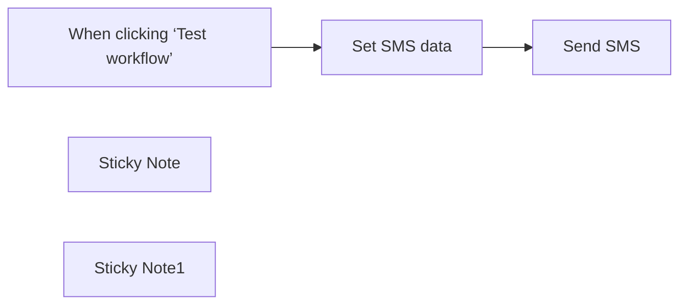

## Fluxo (.json) :

```json
{
  "id": "Qpxx8UnnACBONNJu",
  "meta": {
    "instanceId": "a4bfc93e975ca233ac45ed7c9227d84cf5a2329310525917adaf3312e10d5462",
    "templateCredsSetupCompleted": true
  },
  "name": "The Easiest Way to Send SMS Worldwide",
  "tags": [],
  "nodes": [
    {
      "id": "807bfde2-a20e-41ad-87c5-70bcd31e3dcc",
      "name": "When clicking ‘Test workflow’",
      "type": "n8n-nodes-base.manualTrigger",
      "position": [
        -300,
        -100
      ],
      "parameters": {},
      "typeVersion": 1
    },
    {
      "id": "369069a8-0b79-4e5a-9a89-4bccafdea247",
      "name": "Send SMS",
      "type": "n8n-nodes-base.httpRequest",
      "position": [
        140,
        -100
      ],
      "parameters": {
        "url": "https://rest.clicksend.com/v3/sms/send",
        "method": "POST",
        "options": {},
        "jsonBody": "={\n    \"messages\": [\n        {\n            \"source\": \"php\",\n            \"body\": \"{{ $json.sms }}\",\n            \"to\": \"{{ $json.to }}\"\n        }\n    ]\n}\n",
        "sendBody": true,
        "sendHeaders": true,
        "specifyBody": "json",
        "authentication": "genericCredentialType",
        "genericAuthType": "httpBasicAuth",
        "headerParameters": {
          "parameters": [
            {
              "name": "Content-Type",
              "value": " application/json"
            }
          ]
        }
      },
      "credentials": {
        "httpBasicAuth": {
          "id": "UwsDe2JxT39eWIvY",
          "name": "ClickSend API"
        },
        "httpHeaderAuth": {
          "id": "M8w41EP0NFUSBShY",
          "name": "ClickSend API"
        }
      },
      "typeVersion": 4.2
    },
    {
      "id": "41989686-d6ca-4bb9-bece-4ef8ed37f485",
      "name": "Set SMS data",
      "type": "n8n-nodes-base.set",
      "position": [
        -80,
        -100
      ],
      "parameters": {
        "options": {},
        "assignments": {
          "assignments": [
            {
              "id": "b4c4e62d-b09d-4f71-a48a-c1ea451aed6e",
              "name": "sms",
              "type": "string",
              "value": "Hi, this is my first message"
            },
            {
              "id": "371aff94-147e-4241-823a-a5f6e7f7e68e",
              "name": "to",
              "type": "string",
              "value": "+39xxxxxxxx"
            }
          ]
        }
      },
      "typeVersion": 3.4
    },
    {
      "id": "dd218cae-e928-4a63-953f-faae5ac794bf",
      "name": "Sticky Note",
      "type": "n8n-nodes-base.stickyNote",
      "position": [
        -300,
        -520
      ],
      "parameters": {
        "width": 400,
        "height": 180,
        "content": "## STEP 1\n[Register here to ClickSend](https://clicksend.com/?u=586989) and obtain your API Key and 2 € of free credits\n\nIn the node \"Send SMS\" create a \"Basic Auth\" with the username you registered and the API Key provided as your password"
      },
      "typeVersion": 1
    },
    {
      "id": "61665d97-5ccc-4206-8577-95acf3e4c0d4",
      "name": "Sticky Note1",
      "type": "n8n-nodes-base.stickyNote",
      "position": [
        -300,
        -300
      ],
      "parameters": {
        "width": 400,
        "content": "## STEP 2\n\nIn the node \"Set SMS data\" add the text and recipient of the message including the international prefix (eg. +39) and the phone number without spaces"
      },
      "typeVersion": 1
    }
  ],
  "active": false,
  "pinData": {},
  "settings": {
    "executionOrder": "v1"
  },
  "versionId": "840e10d6-a142-4897-9a10-9164a6b7e2c2",
  "connections": {
    "Set SMS data": {
      "main": [
        [
          {
            "node": "Send SMS",
            "type": "main",
            "index": 0
          }
        ]
      ]
    },
    "When clicking ‘Test workflow’": {
      "main": [
        [
          {
            "node": "Set SMS data",
            "type": "main",
            "index": 0
          }
        ]
      ]
    }
  }
}
```

<a id="template-639"></a>

## Template 639 - Chatbot Telegram multimodal com IA

- **Nome:** Chatbot Telegram multimodal com IA
- **Descrição:** Fluxo que recebe mensagens do Telegram (texto e voz), converte voz em texto quando necessário, consulta um modelo de IA para gerar respostas e devolve a resposta ao usuário em formato HTML.
- **Funcionalidade:** • Recepção de mensagens: Monitora e recebe atualizações de usuários no Telegram.
• Detecção do tipo de conteúdo: Identifica se a entrada é texto, mensagem de voz ou tipo não suportado.
• Ação de digitação: Envia indicação de 'digitando' ao usuário enquanto processa a mensagem.
• Download de áudio: Recupera o arquivo de voz enviado pelo usuário para processamento.
• Transcrição de áudio: Converte mensagens de voz em texto para entendimento pelo agente de IA.
• Preparação de mensagem: Combina conteúdo recebido e define propriedades como tipo de mensagem e origem (encaminhada ou não).
• Contexto de conversa: Mantém um histórico curto (janela) de mensagens para fornecer contexto ao agente de IA.
• Geração de resposta por IA: Envia a entrada e contexto para um modelo de linguagem para gerar a resposta em formato HTML compatível com Telegram.
• Envio da resposta final: Entrega a resposta gerada ao usuário, incluindo uma nota de agradecimento e indicação do tipo de mensagem recebida.
• Tratamento de erros e comandos não suportados: Informa o usuário quando um comando ou formato não é suportado e tenta corrigir/escapar caracteres HTML antes de reenviar quando há falha no envio.
- **Ferramentas:** • Telegram Bot API: Plataforma usada para receber mensagens dos usuários, enviar ações de digitação, baixar arquivos de voz e enviar respostas em formato HTML.
• OpenAI: Serviço de modelo de linguagem e de transcrição de áudio utilizado para gerar respostas (GPT-4o) e transcrever mensagens de voz para texto.

## Fluxo visual

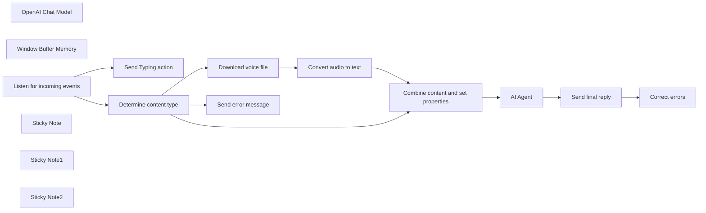

## Fluxo (.json) :

```json
{
  "id": "HJwTWtzlhK8Q5SOv",
  "meta": {
    "instanceId": "fb924c73af8f703905bc09c9ee8076f48c17b596ed05b18c0ff86915ef8a7c4a",
    "templateCredsSetupCompleted": true
  },
  "name": "Telegram AI multi-format chatbot",
  "tags": [],
  "nodes": [
    {
      "id": "65196267-0d57-4af4-9081-962701478146",
      "name": "OpenAI Chat Model",
      "type": "@n8n/n8n-nodes-langchain.lmChatOpenAi",
      "position": [
        660,
        640
      ],
      "parameters": {
        "model": "gpt-4o",
        "options": {
          "temperature": 0.7,
          "frequencyPenalty": 0.2
        }
      },
      "credentials": {
        "openAiApi": {
          "id": "rveqdSfp7pCRON1T",
          "name": "Ted's Tech Talks OpenAi"
        }
      },
      "typeVersion": 1
    },
    {
      "id": "fc446ef0-2f15-42e7-a993-7960d76d8876",
      "name": "Window Buffer Memory",
      "type": "@n8n/n8n-nodes-langchain.memoryBufferWindow",
      "position": [
        800,
        640
      ],
      "parameters": {
        "sessionKey": "=chat_with_{{ $('Listen for incoming events').first().json.message.chat.id }}",
        "contextWindowLength": 10
      },
      "typeVersion": 1
    },
    {
      "id": "51c3cddd-fc21-4fff-b615-ea7080c47947",
      "name": "Correct errors",
      "type": "n8n-nodes-base.telegram",
      "position": [
        1220,
        580
      ],
      "parameters": {
        "text": "={{ $('AI Agent').item.json.output.replace(/&/g, \"&amp;\").replace(/>/g, \"&gt;\").replace(/</g, \"&lt;\").replace(/\"/g, \"&quot;\") }}",
        "chatId": "={{ $('Listen for incoming events').first().json.message.from.id }}",
        "additionalFields": {
          "parse_mode": "HTML",
          "appendAttribution": false
        }
      },
      "credentials": {
        "telegramApi": {
          "id": "9dexJXnlVPA6wt8K",
          "name": "Chat & Sound"
        }
      },
      "typeVersion": 1.1
    },
    {
      "id": "d931b7e1-bc17-431e-ae67-967b6ef79236",
      "name": "Listen for incoming events",
      "type": "n8n-nodes-base.telegramTrigger",
      "position": [
        -440,
        480
      ],
      "webhookId": "322dce18-f93e-4f86-b9b1-3305519b7834",
      "parameters": {
        "updates": [
          "*"
        ],
        "additionalFields": {}
      },
      "credentials": {
        "telegramApi": {
          "id": "9dexJXnlVPA6wt8K",
          "name": "Chat & Sound"
        }
      },
      "typeVersion": 1
    },
    {
      "id": "b33335ff-5dea-4fff-8f63-fea2b11b8241",
      "name": "Download voice file",
      "type": "n8n-nodes-base.telegram",
      "position": [
        60,
        600
      ],
      "parameters": {
        "fileId": "={{$json.message.voice.file_id}}",
        "resource": "file"
      },
      "credentials": {
        "telegramApi": {
          "id": "9dexJXnlVPA6wt8K",
          "name": "Chat & Sound"
        }
      },
      "typeVersion": 1.2
    },
    {
      "id": "2954ced6-ab98-42e6-bf64-237146a433e0",
      "name": "Combine content and set properties",
      "type": "n8n-nodes-base.set",
      "position": [
        440,
        460
      ],
      "parameters": {
        "options": {},
        "assignments": {
          "assignments": [
            {
              "id": "bccbce0a-7786-49c9-979a-7a285cb69f78",
              "name": "CombinedMessage",
              "type": "string",
              "value": "={{ $json.message && $json.message.text ? $json.message.text : ($json.text ? $json.text : '') }}"
            },
            {
              "id": "5b1fc9f5-1408-4099-88cc-a23725c9eddb",
              "name": "Message Type ",
              "type": "string",
              "value": "={{ $json?.message?.text && !$json?.text ? \"text query\" : (!$json?.message?.text && $json?.text ? \"voice message\" : \"unknown type message\") }}"
            },
            {
              "id": "1e9a17fa-ec5d-49dc-9ff6-1f28b57fb02e",
              "name": "Source Type",
              "type": "string",
              "value": "={{ $('Listen for incoming events').item.json.message.forward_origin ? \" forwarded\" : \"\" }}"
            }
          ]
        }
      },
      "typeVersion": 3.4
    },
    {
      "id": "e18de374-941f-4c2e-ab6c-6c6f68f2ce12",
      "name": "Send final reply",
      "type": "n8n-nodes-base.telegram",
      "onError": "continueErrorOutput",
      "position": [
        1040,
        460
      ],
      "parameters": {
        "text": "={{ $json.output }} \n\nThank you for your{{ $('Combine content and set properties').item.json['Source Type'] }} {{ $('Combine content and set properties').item.json['Message Type '] }} 🤗",
        "chatId": "={{ $('Listen for incoming events').first().json.message.from.id }}",
        "additionalFields": {
          "parse_mode": "HTML",
          "appendAttribution": false
        }
      },
      "credentials": {
        "telegramApi": {
          "id": "9dexJXnlVPA6wt8K",
          "name": "Chat & Sound"
        }
      },
      "typeVersion": 1.1
    },
    {
      "id": "b47a9583-ce5c-464f-a9e6-153fb42e685f",
      "name": "Send error message",
      "type": "n8n-nodes-base.telegram",
      "position": [
        60,
        300
      ],
      "parameters": {
        "text": "=Sorry, {{ $('Listen for incoming events').first().json.message.from.first_name }}! This command is not supported yet. Please send text or voice messages.",
        "chatId": "={{ $('Listen for incoming events').first().json.message.from.id }}",
        "additionalFields": {
          "parse_mode": "Markdown",
          "appendAttribution": false
        }
      },
      "credentials": {
        "telegramApi": {
          "id": "9dexJXnlVPA6wt8K",
          "name": "Chat & Sound"
        }
      },
      "typeVersion": 1.2
    },
    {
      "id": "0196b49e-90a1-4f2f-8b94-492fced37dbf",
      "name": "Convert audio to text",
      "type": "@n8n/n8n-nodes-langchain.openAi",
      "position": [
        240,
        600
      ],
      "parameters": {
        "options": {
          "language": "",
          "temperature": 0.7
        },
        "resource": "audio",
        "operation": "transcribe"
      },
      "credentials": {
        "openAiApi": {
          "id": "rveqdSfp7pCRON1T",
          "name": "Ted's Tech Talks OpenAi"
        }
      },
      "typeVersion": 1.5
    },
    {
      "id": "66505b83-e0c3-4d9d-8e1a-9b54030e29e7",
      "name": "Sticky Note",
      "type": "n8n-nodes-base.stickyNote",
      "position": [
        -466.12784869794086,
        220
      ],
      "parameters": {
        "width": 1035.4478381373049,
        "height": 547.5630890194532,
        "content": "## Receive and pre-process messages \n"
      },
      "typeVersion": 1
    },
    {
      "id": "44087d3f-86c8-407c-8791-645d167165cb",
      "name": "Sticky Note1",
      "type": "n8n-nodes-base.stickyNote",
      "position": [
        620,
        220
      ],
      "parameters": {
        "color": 2,
        "width": 861.262180151035,
        "height": 550.5748478134515,
        "content": "## 1. Send incoming message to the AI Agent\n## 2. Deliver agent reply to the user \n"
      },
      "typeVersion": 1
    },
    {
      "id": "d7e58831-de97-483f-8b8a-583f85397245",
      "name": "Sticky Note2",
      "type": "n8n-nodes-base.stickyNote",
      "position": [
        20,
        553.0639243489702
      ],
      "parameters": {
        "color": 6,
        "width": 367.73614918993235,
        "height": 194.83713159725437,
        "content": "## Transcribe audio"
      },
      "typeVersion": 1
    },
    {
      "id": "89515d80-6efc-40a8-95ce-343d4ff4dbee",
      "name": "Send Typing action",
      "type": "n8n-nodes-base.telegram",
      "position": [
        -180,
        300
      ],
      "parameters": {
        "chatId": "={{ $('Listen for incoming events').first().json.message.from.id }}",
        "operation": "sendChatAction"
      },
      "credentials": {
        "telegramApi": {
          "id": "9dexJXnlVPA6wt8K",
          "name": "Chat & Sound"
        }
      },
      "typeVersion": 1.2
    },
    {
      "id": "c925d059-f843-473c-bfd4-3c563d80ca0f",
      "name": "AI Agent",
      "type": "@n8n/n8n-nodes-langchain.agent",
      "position": [
        680,
        460
      ],
      "parameters": {
        "text": "={{ $json.CombinedMessage }}",
        "options": {
          "humanMessage": "TOOLS\n------\nAssistant can ask the user to use tools to look up information that may be helpful in answering the users original question. The tools the human can use are:\n\n{tools}\n\n{format_instructions}\n\nUSER'S INPUT\n--------------------\nHere is the user's input (remember to respond with a markdown code snippet of a json blob with a single action, and NOTHING else):\n\n{{input}}",
          "systemMessage": "=You are a helpful AI assistant. You are chatting with the user named `{{ $('Determine content type').item.json.message.from.first_name }}`. You need to address the user by their name. Today is {{ DateTime.fromISO($now).toLocaleString(DateTime.DATETIME_FULL) }}\n\nIn your reply, always send a message in Telegram-supported HTML format. Here are the formatting instructions:\n1. The following tags are currently supported:\n<b>bold</b>, <strong>bold</strong>\n<i>italic</i>, <em>italic</em>\n<u>underline</u>, <ins>underline</ins>\n<s>strikethrough</s>, <strike>strikethrough</strike>, <del>strikethrough</del>\n<span class=\"tg-spoiler\">spoiler</span>, <tg-spoiler>spoiler</tg-spoiler>\n<b>bold <i>italic bold <s>italic bold strikethrough <span class=\"tg-spoiler\">italic bold strikethrough spoiler</span></s> <u>underline italic bold</u></i> bold</b>\n<a href=\"http://www.example.com/\">inline URL</a>\n<code>inline fixed-width code</code>\n<pre>pre-formatted fixed-width code block</pre>\n2. Any code that you send should be wrapped in these tags: <pre><code class=\"language-python\">pre-formatted fixed-width code block written in the Python programming language</code></pre>\nOther programming languages are supported as well.\n3. All <, > and & symbols that are not a part of a tag or an HTML entity must be replaced with the corresponding HTML entities (< with &lt;, > with &gt; and & with &amp;)\n4. If the user sends you a message starting with / sign, it means this is a Telegram bot command. For example, all users send /start command as their first message. Try to figure out what these commands mean and reply accodringly\n"
        }
      },
      "typeVersion": 1.1
    },
    {
      "id": "2c56536d-1a86-4a49-b495-3e877adb308a",
      "name": "Determine content type",
      "type": "n8n-nodes-base.switch",
      "position": [
        -180,
        480
      ],
      "parameters": {
        "rules": {
          "values": [
            {
              "outputKey": "Text",
              "conditions": {
                "options": {
                  "version": 2,
                  "leftValue": "",
                  "caseSensitive": true,
                  "typeValidation": "strict"
                },
                "combinator": "and",
                "conditions": [
                  {
                    "operator": {
                      "type": "string",
                      "operation": "notEmpty",
                      "singleValue": true
                    },
                    "leftValue": "={{ $json.message.text }}",
                    "rightValue": "/"
                  }
                ]
              },
              "renameOutput": true
            },
            {
              "outputKey": "Voice",
              "conditions": {
                "options": {
                  "version": 2,
                  "leftValue": "",
                  "caseSensitive": true,
                  "typeValidation": "strict"
                },
                "combinator": "and",
                "conditions": [
                  {
                    "id": "dd41bbf0-bee0-450b-9160-b769821a4abc",
                    "operator": {
                      "type": "object",
                      "operation": "exists",
                      "singleValue": true
                    },
                    "leftValue": "={{ $json.message.voice}}",
                    "rightValue": ""
                  }
                ]
              },
              "renameOutput": true
            }
          ]
        },
        "options": {
          "fallbackOutput": "extra"
        }
      },
      "typeVersion": 3.2
    }
  ],
  "active": false,
  "pinData": {},
  "settings": {
    "executionOrder": "v1"
  },
  "versionId": "15ae799b-6868-4519-b579-3f202e4de5b2",
  "connections": {
    "AI Agent": {
      "main": [
        [
          {
            "node": "Send final reply",
            "type": "main",
            "index": 0
          }
        ]
      ]
    },
    "Send final reply": {
      "main": [
        [],
        [
          {
            "node": "Correct errors",
            "type": "main",
            "index": 0
          }
        ]
      ]
    },
    "OpenAI Chat Model": {
      "ai_languageModel": [
        [
          {
            "node": "AI Agent",
            "type": "ai_languageModel",
            "index": 0
          }
        ]
      ]
    },
    "Download voice file": {
      "main": [
        [
          {
            "node": "Convert audio to text",
            "type": "main",
            "index": 0
          }
        ]
      ]
    },
    "Window Buffer Memory": {
      "ai_memory": [
        [
          {
            "node": "AI Agent",
            "type": "ai_memory",
            "index": 0
          }
        ]
      ]
    },
    "Convert audio to text": {
      "main": [
        [
          {
            "node": "Combine content and set properties",
            "type": "main",
            "index": 0
          }
        ]
      ]
    },
    "Determine content type": {
      "main": [
        [
          {
            "node": "Combine content and set properties",
            "type": "main",
            "index": 0
          }
        ],
        [
          {
            "node": "Download voice file",
            "type": "main",
            "index": 0
          }
        ],
        [
          {
            "node": "Send error message",
            "type": "main",
            "index": 0
          }
        ]
      ]
    },
    "Listen for incoming events": {
      "main": [
        [
          {
            "node": "Determine content type",
            "type": "main",
            "index": 0
          },
          {
            "node": "Send Typing action",
            "type": "main",
            "index": 0
          }
        ]
      ]
    },
    "Combine content and set properties": {
      "main": [
        [
          {
            "node": "AI Agent",
            "type": "main",
            "index": 0
          }
        ]
      ]
    }
  }
}
```

<a id="template-640"></a>

## Template 640 - CallForge: AI Gong Sales Call Processor

- **Nome:** CallForge: AI Gong Sales Call Processor
- **Descrição:** Fluxo que transforma transcrições de chamadas de Gong em insights estruturados para equipes de vendas, marketing e produto. Extrai use cases, objeções, sumário, pontos de dor, próximos passos, competidores e integrações, com armazenamento e distribuição de dados para CRM, Notion e canais de comunicação.
- **Funcionalidade:** • Padronização de Prompt e Preparação de Dados: recebe dados da chamada e cria um prompt único para uso pelos agentes de IA.
• Análise com Múltiplos Agentes: extrai Use Cases, Objections, CallSummary, CustomerPainPoints, NextSteps, Competitors, Integrations, Sentiment e IA/ML References.
• Estruturação de Saída: gera saídas em formato JSON com campos UseCases, Objection, CallSummary, CustomerPainPoints, NextSteps, Competitors, Integrations, Sentiment, CurrentSituation, Budget, Authority, Timeline, DecisionProcess.
• Roteamento e Armazenamento: envia outputs para fluxos por Sales, Marketing e Product e armazena resultados em Notion/CRM.
• Atualizações de Status e Notificações: atualiza status de processamento e gera um status de sucesso para auditoria.
• Gerenciamento de Falhas: permite reexecutar apenas as partes remanescentes do processamento em caso de falhas.
• Integrações com CRM e Plataformas de Colaboração: sincroniza dados com Salesforce, HubSpot, Notion e Slack para colaboração entre equipes.
- **Ferramentas:** • Gong: plataforma de transcrição de chamadas que fornece o transcript utilizado.
• Salesforce: CRM para sincronização de leads e automação de follow-ups.
• HubSpot: gestão de leads e automação de processos.
• Notion: armazenamento de dados processados e notas de equipe.
• Slack: canal de comunicação para notificações e colaboração de equipes.

## Fluxo visual

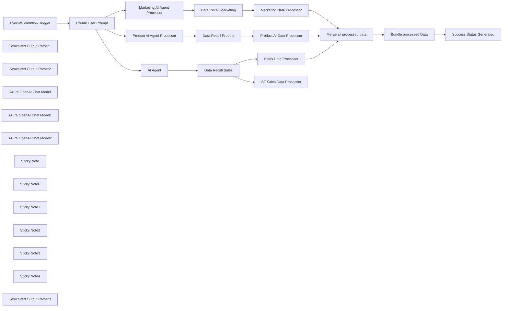

## Fluxo (.json) :

```json
{
  "meta": {
    "instanceId": "cb484ba7b742928a2048bf8829668bed5b5ad9787579adea888f05980292a4a7",
    "templateCredsSetupCompleted": true
  },
  "nodes": [
    {
      "id": "b092ac6b-f12a-4eaa-9424-5cbfc51acc7e",
      "name": "Execute Workflow Trigger",
      "type": "n8n-nodes-base.executeWorkflowTrigger",
      "position": [
        -700,
        -100
      ],
      "parameters": {},
      "typeVersion": 1
    },
    {
      "id": "6c0aba3a-4e0c-443f-a08b-d871daa36839",
      "name": "Structured Output Parser1",
      "type": "@n8n/n8n-nodes-langchain.outputParserStructured",
      "position": [
        -20,
        260
      ],
      "parameters": {
        "jsonSchemaExample": "{\n    \"MarketingInsights\": [\n        {\n            \"Tag\": \"Landing Page Opportunity\",\n            \"Summary\": \"The prospect mentioned needing more detailed information about how n8n ensures GDPR compliance, suggesting a landing page dedicated to security features.\"\n        },\n        {\n            \"Tag\": \"Workflow Template Request\",\n            \"Summary\": \"The prospect asked if there is a template for automating Slack notifications based on CRM updates, which would streamline their sales process.\"\n        },\n        {\n            \"Tag\": \"Brand Advocate Potential\",\n            \"Summary\": \"The prospect expressed excitement about n8n, saying, 'This is exactly what we've been looking for,' and mentioned they would be happy to share their experience if it works well.\"\n        }\n    ],\n    \"RecurringTopics\": [\n        {\n            \"Topic\": \"Data Security\",\n            \"Mentions\": 6,\n            \"Context\": \"The organization emphasized the importance of secure integrations to comply with GDPR and protect customer data in cloud-based workflows.\"\n        },\n        {\n            \"Topic\": \"Customer Support Automation\",\n            \"Mentions\": 4,\n            \"Context\": \"Discussions focused on automating ticket assignment and resolution workflows to improve response times and customer satisfaction.\"\n        },\n        {\n            \"Topic\": \"Slack Integration\",\n            \"Mentions\": 3,\n            \"Context\": \"The organization wanted to explore how n8n could automate notifications and task updates through Slack for better team collaboration.\"\n        }\n    ],\n    \"ActionableInsights\": [\n        {\n            \"RecommendationType\": \"Blog Post\",\n            \"Title\": \"Ensuring GDPR Compliance in Workflow Automation\",\n            \"Topic\": \"Data Security\",\n            \"Rationale\": \"Data security was the most frequently mentioned topic, with specific interest in GDPR compliance and secure integrations.\"\n        },\n        {\n            \"RecommendationType\": \"Tutorial\",\n            \"Title\": \"Automating Slack Notifications with n8n\",\n            \"Topic\": \"Slack Integration\",\n            \"Rationale\": \"The prospect requested guidance on setting up automated Slack notifications for team workflows, indicating strong demand for this feature.\"\n        },\n        {\n            \"RecommendationType\": \"Case Study\",\n            \"Title\": \"How Automated Customer Support Workflows Boosted Efficiency\",\n            \"Topic\": \"Customer Support Automation\",\n            \"Rationale\": \"Customer support automation was highlighted as a major challenge, suggesting value in showcasing real-world success stories.\"\n        }\n    ]\n}"
      },
      "typeVersion": 1.2
    },
    {
      "id": "e928f8b7-0775-43f6-815e-d872663818d5",
      "name": "Marketing AI Agent Processor",
      "type": "@n8n/n8n-nodes-langchain.agent",
      "position": [
        -200,
        40
      ],
      "parameters": {
        "text": "={{ $json.prompt.transcript }}",
        "options": {
          "systemMessage": "=You are an AI assistant specializing in analyzing sales call transcripts. Your task is to extract structured information about the call, including use cases, objections, summaries, and other relevant insights for the marketing team at n8n. Pay close attention to action-oriented language and specific requests made by the external participants.\n\n\n1. **Marketing Insights**: Summarize any marketing-related insights from the external speaker, organized by specific tags that correspond to different areas of marketing focus (e.g., website work, workflow templates, video content, community forum). Each piece of insight should include a Tag field with the specific marketing area and a Summary field that provides a brief description of the insight. Only use the below list of tags when creating insights and ensure the insight is specific to insights from the list below. For example do not give pricing insight for marketing insights. If no marketing insights that match the tags below are not found, output an empty array. Please do not output any tags that are not defined below in the numbered list. Include relevant quotes from the transcript to explain why the marketing tag is relevant in the summary output.\nTags:\n1. **Landing Page Opportunity**: Indicates a need for a new or improved landing page targeting a specific enterprise demographic. For example, if a prospect mentions needing more detailed information about security or scalability, this could prompt the creation of a dedicated landing page.\n2. **Workflow Template Request**: Indicates a specific workflow template that a prospect or customer would find helpful. This could be based on mentions of repetitive tasks or automation needs that aren't yet covered by your existing templates.\n3. **Video Tutorial Request**: Prospects asking for video tutorials or walkthroughs on how to set up specific workflows, integrations, or advanced features.\n4. **Feature Explanation**: Indicates a need for video or text based content explaining the benefits or setup of specific n8n features. For example, if a prospect doesn’t understand how the HTTP request node works, a video or blog post could be created to explain this.\n5. **Success Story Request**: Prospects interested in seeing content showcasing how other companies have successfully implemented n8n. Try to include details in the summary of what success looks like for the external speaker.\n6. **Customer Success Story**: Stories that the external speaker gave of success they have found using the n8n platform. In the summary include any direct quotes taken from the transcript about this story.\n7. **FAQ Gap**: Questions or concerns raised during calls that are not covered or easily found in the existing forum FAQ or website.\n8. **Event/Conference Mention**: Capture mentions of events, conferences, or industry meetups where n8n could have a presence. Try to get name, location, and date if possible from the transcript.\n9. **Brand Advocate Potential**: Identify prospects who sound excited or enthusiastic about using n8n and could become brand advocates. Use this to prioritize follow-ups for case studies, testimonials, or involvement in community events. It could also inform who to reach out to for co-marketing opportunities.\n9. **Documentation Gap**: Use this tag anytime an external speaker mentions a lack or frustration with the n8n documentation pages, and any suggestions to improve them. Include the suggestion in the summary if mentioned.\nA. Expected example Format: \"MarketingInsights\": [\n{\n\"Tag\": \"Landing Page Opportunity\",\n\"Summary\": \"The prospect mentioned wanting more information about data security, suggesting a need for a dedicated landing page on security features.\"\n},\n{\n\"Tag\": \"WorkFlow Template Request\",\n\"Summary\": \"The external speaker asked if there was a workflow template for automating CRM data entry.\"\n}\n]\nB. Expected Example Format for no insights: \"MarketingInsights\": []\n\n---\n\n### **2. Marketing Insights: Keyword and Topic Analysis**\n\nAnalyze the call transcript to identify recurring topics or phrases that were mentioned multiple times by the external speaker or other participants. This analysis will be used to match recurring topics with keyword volume data and adapt **n8n's** blog content accordingly.\n\n1. **Identify Recurring Topics or Phrases**:\n   - Extract key topics, phrases, or keywords mentioned more than once during the call.\n   - Focus on phrases related to:\n     - Pain points or challenges.\n     - Desired features or solutions.\n     - Industry-specific terminology.\n     - Automation goals or use case ideas.\n\n2. **Provide a Frequency Analysis**:\n   - Rank the identified topics or phrases by the number of times they were mentioned during the call.\n   - Group similar phrases under a unified topic if they are variations of the same concept (e.g., \"CRM integration\" and \"integrating with CRM\").\n\n3. **Include Context**:\n   - For each topic or phrase, summarize its context within the conversation. Example contexts could include:\n     - Pain points the topic addresses.\n     - Solutions or workflows discussed.\n     - Broader goals or industry-specific needs.\n\n4. **Output Format**:\n   - **Recurring Topics**:\n     ```json\n     {\n         \"RecurringTopics\": [\n             {\n                 \"Topic\": \"Data Security\",\n                 \"Mentions\": 5,\n                 \"Context\": \"Discussed in relation to GDPR compliance and secure integrations with cloud platforms.\"\n             },\n             {\n                 \"Topic\": \"Customer Support Automation\",\n                 \"Mentions\": 3,\n                 \"Context\": \"Focused on improving ticket resolution times through automated workflows.\"\n             },\n             {\n                 \"Topic\": \"CRM Integration\",\n                 \"Mentions\": 2,\n                 \"Context\": \"Talked about syncing Salesforce data with email campaigns.\"\n             }\n         ]\n     }\n     ```\n\nIf there are no recurring topics, use this output format: \n     ```json\n     {\n         \"RecurringTopics\": []\n     }\n     ```\n\n   - **Actionable Insights**:\n     ```json\n     {\n         \"ActionableInsights\": [\n             {\n                 \"RecommendationType\": \"Blog Post\",\n                 \"Title\": \"Top 5 Ways to Ensure Data Security in Workflow Automation\",\n                 \"Topic\": \"Data Security\",\n                 \"Rationale\": \"Data security was mentioned frequently in the context of compliance and cloud integrations, indicating high interest.\"\n             },\n             {\n                 \"RecommendationType\": \"Tutorial\",\n                 \"Title\": \"How to Automate Customer Support with n8n\",\n                 \"Topic\": \"Customer Support Automation\",\n                 \"Rationale\": \"Customer support automation was discussed as a key challenge, suggesting value in a step-by-step guide.\"\n             },\n             {\n                 \"RecommendationType\": \"Marketing Campaign\",\n                 \"Title\": \"CRM Integration as a Cornerstone for Workflow Automation\",\n                 \"Topic\": \"CRM Integration\",\n                 \"Rationale\": \"CRM integration was highlighted as a critical feature, making it a strong focus for targeted marketing campaigns.\"\n             }\n         ]\n     }\n     ```\n\nIf there are no actionable insights, use the following output format: \n\n     ```json\n     {\n         \"ActionableInsights\": []\n     }\n     ```\n\n---\n"
        },
        "promptType": "define",
        "hasOutputParser": true
      },
      "retryOnFail": true,
      "typeVersion": 1.7
    },
    {
      "id": "7db7a2d6-055f-47b2-aabc-1f1016e7d817",
      "name": "Structured Output Parser2",
      "type": "@n8n/n8n-nodes-langchain.outputParserStructured",
      "position": [
        0,
        860
      ],
      "parameters": {
        "jsonSchemaExample": "{\n    \"ProductFeedback\": [\n        {\n            \"Sentiment\": \"Positive\",\n            \"Feedback\": \"The external speaker mentioned that 'n8n's interface is very intuitive and user-friendly,' highlighting how quickly their team was able to set up workflows without prior experience.\"\n        },\n        {\n            \"Sentiment\": \"Negative\",\n            \"Feedback\": \"The external speaker expressed frustration about the lack of a native integration for their HR platform, saying, 'It adds complexity when we have to rely on HTTP requests instead of a dedicated node.'\"\n        }\n    ],\n    \"AI_ML_References\": {\n        \"Exist\": true,\n        \"Context\": \"The external speaker discussed using AI to prioritize and categorize support tickets based on urgency and customer sentiment, mentioning that n8n could potentially integrate with their existing AI model for automated ticket routing.\",\n        \"Details\": {\n            \"DevelopmentStatus\": \"Building\",\n            \"Department\": \"Support\",\n            \"RequiresAgents\": true,\n            \"RequiresRAG\": true,\n            \"RequiresChat\": \"Yes: External App (e.g. Slack)\"\n        }\n    }\n}\n"
      },
      "typeVersion": 1.2
    },
    {
      "id": "e97e1e48-52ba-4cbd-ac97-78ac756aa792",
      "name": "Product AI Agent Processor",
      "type": "@n8n/n8n-nodes-langchain.agent",
      "position": [
        -200,
        640
      ],
      "parameters": {
        "text": "={{ $json.prompt.transcript }}",
        "options": {
          "systemMessage": "=You are an AI assistant specializing in analyzing sales call transcripts. Your task is to extract structured information about the call, including use cases, objections, summaries, and other relevant insights for the product team at n8n. Pay close attention to action-oriented language and specific requests made by the external participants.\n\n**Product Feedback**: Summarize any feedback given about the n8n automation platform from the external speaker in a structured JSON format. Each piece of feedback should include a **Sentiment** field that can be either \"Positive\" or \"Negative\" and a **Feedback** field that summarizes the comment. **For Positive Feedback**: Look for praise about features or aspects such as ease of use, performance, scalability, support, or cost-effectiveness. Positive feedback may include phrases like \"we love,\" \"the best part,\" \"a game-changer,\" or \"it's very intuitive.\" Capture comments that highlight what the external speaker appreciates about n8n or how it solves a problem for them. **For Negative Feedback**: Focus on areas where the product is lacking, or specific requests for new features or improvements. Use cues such as phrases from the internal speaker like \"we don't offer that,\" \"we don't support that,\" or mentions of the product \"Roadmap.\" Also, note instances where the internal speaker invites the external attendee to explain a requirement, using phrases like \"we can bring this to our product team\" or \"if you can explain your requirement, I can bring this to our product department.\"\n    A.  Expected Format: \"ProductFeedback\": [ { \"Sentiment\": \"Positive\", \"Feedback\": \"Summary of the positive feedback provided by the external speaker\" }, { \"Sentiment\": \"Negative\", \"Feedback\": \"Summary of the negative feedback or unmet needs described by the external speaker\" } ]\n    B. Expected Format for no feedback: \"ProductFeedback\": []\n\n\n---\n\n**AI/ML References**\nIdentify any mentions of AI or machine learning in the conversation from the external speaker. Summarize the context in which these technologies are discussed and capture additional details about their development status, department, and specific requirements.\n\n1. **What to Extract**:\n   - **Mentions of AI/ML**: Determine whether AI or machine learning was mentioned in the conversation.\n   - **Context**: Summarize how the external speaker plans to use these technologies with n8n, focusing on their goals, challenges, or implementation strategies.\n   - **Additional Details**:\n     - **Development Status**: Is this an idea, currently being built, or already in production? (output only one of these options exactly as they are shown here: \"Idea\", \"Building\", \"In Production\")\n     - **Department**: Which department will use this AI/ML solution? (output only one of these options exactly as they are shown here: \"Support\", \"Marketing\", \"Security\", \"Sales\", \"BI\", \"Engineering\")\n     - **Requires Agents**: Does this AI/ML use case require agents for interaction or execution? (Options: true/false)\n     - **Requires RAG**: Does this use case require Retrieval-Augmented Generation (RAG) for AI? (Options: true/false)\n     - **Requires Chat**: Does this use case involve chat functionality? Specify the type. Output only one of these options exactly as they are shown here: \n- \"Yes: Custom Chat\"\n- \"Yes: External App (e.g. Slack)\"\n- \"Yes: n8n chat\"\n- \"No\", \"Yes\"\n\n2. **Output Format**:\n   \njson\n   {\n       \"AI_ML_References\": {\n           \"Exist\": true,\n           \"Context\": \"The external speaker mentioned using AI to automate data classification, stating that they would like to explore how n8n could support machine learning models for more accurate data tagging.\",\n           \"Details\": {\n               \"DevelopmentStatus\": \"Idea\",\n               \"Department\": \"Support\",\n               \"RequiresAgents\": true,\n               \"RequiresRAG\": false,\n               \"RequiresChat\": \"Yes: External App (e.g. Slack)\"\n           }\n       }\n   }\n\n\n3. **If No AI/ML Mentioned**:\n   \njson\n{\n    \"AI_ML_References\": {\n        \"Exist\": false,\n        \"Context\": \"null\",\n        \"Details\": {\n            \"DevelopmentStatus\": \"null\",\n            \"Department\": \"null\",\n            \"RequiresAgents\": false,\n            \"RequiresRAG\": false,\n            \"RequiresChat\": \"null\"\n        }\n    }\n}\n"
        },
        "promptType": "define",
        "hasOutputParser": true
      },
      "retryOnFail": true,
      "typeVersion": 1.7
    },
    {
      "id": "1d3c0b6c-0b1a-42d4-914f-0f3b08eb505a",
      "name": "Sales Data Processor",
      "type": "n8n-nodes-base.executeWorkflow",
      "position": [
        620,
        -660
      ],
      "parameters": {
        "options": {},
        "workflowId": {
          "__rl": true,
          "mode": "list",
          "value": "I6lNpYOK5i8SXhPU",
          "cachedResultName": "Sales AI Data Processor Demo"
        },
        "workflowInputs": {
          "value": {},
          "schema": [],
          "mappingMode": "defineBelow",
          "matchingColumns": [],
          "attemptToConvertTypes": false,
          "convertFieldsToString": true
        }
      },
      "typeVersion": 1.2
    },
    {
      "id": "778cfa90-4a19-424b-aeb2-71bc1cf61848",
      "name": "Marketing Data Processor",
      "type": "n8n-nodes-base.executeWorkflow",
      "position": [
        620,
        40
      ],
      "parameters": {
        "options": {},
        "workflowId": {
          "__rl": true,
          "mode": "list",
          "value": "enqv6mILqxzIW5TV",
          "cachedResultName": "Marketing AI Data Processor Demo"
        },
        "workflowInputs": {
          "value": {},
          "schema": [],
          "mappingMode": "defineBelow",
          "matchingColumns": [],
          "attemptToConvertTypes": false,
          "convertFieldsToString": true
        }
      },
      "typeVersion": 1.2
    },
    {
      "id": "22950eb8-5c89-4a17-91fc-f40e543c69b8",
      "name": "Product AI Data Processor",
      "type": "n8n-nodes-base.executeWorkflow",
      "position": [
        640,
        640
      ],
      "parameters": {
        "options": {},
        "workflowId": {
          "__rl": true,
          "mode": "list",
          "value": "sn0DvsN0Wqpkrxjv",
          "cachedResultName": "Product AI Data Processor Demo"
        },
        "workflowInputs": {
          "value": {},
          "schema": [],
          "mappingMode": "defineBelow",
          "matchingColumns": [],
          "attemptToConvertTypes": false,
          "convertFieldsToString": true
        }
      },
      "typeVersion": 1.2
    },
    {
      "id": "24989b3a-03bc-496b-9d0c-dd64a40816fd",
      "name": "Data Recall Sales",
      "type": "n8n-nodes-base.set",
      "position": [
        260,
        -620
      ],
      "parameters": {
        "options": {},
        "assignments": {
          "assignments": [
            {
              "id": "d8d3bef7-4e05-4dc0-8108-b2a7b5b7cb73",
              "name": "AIoutput",
              "type": "object",
              "value": "={{ $json.output }}"
            },
            {
              "id": "044e7d52-d025-45e6-af14-6cf255be1b2f",
              "name": "metaData",
              "type": "object",
              "value": "={{ $('Execute Workflow Trigger').item.json.metaData }}"
            },
            {
              "id": "be5c1891-77b6-4bfd-b4ab-11e2e54470f6",
              "name": "Attendees",
              "type": "object",
              "value": "={{ $('Execute Workflow Trigger').item.json.Attendees }}"
            },
            {
              "id": "f35dbafc-5090-4ac0-b291-a99ceeca80dd",
              "name": "PeopleDataLabs",
              "type": "object",
              "value": "={{ $('Execute Workflow Trigger').item.json.PeopleDataLabs }}"
            },
            {
              "id": "a17df98b-5227-48f5-9d8f-2fdd8073f7ac",
              "name": "sfOpp",
              "type": "array",
              "value": "={{ $('Execute Workflow Trigger').item.json.sfOpp }}"
            },
            {
              "id": "d041a535-c654-4f4a-b00a-c57f801da80e",
              "name": "pipedrive",
              "type": "array",
              "value": "={{ $('Execute Workflow Trigger').item.json.pipedrive }}"
            },
            {
              "id": "e9336d46-11fc-46b1-9e9f-1fa1432a38dc",
              "name": "notionData",
              "type": "array",
              "value": "={{ $('Execute Workflow Trigger').item.json.notionData }}"
            }
          ]
        }
      },
      "typeVersion": 3.4
    },
    {
      "id": "b710f198-ead4-46ae-8bbc-ac50d8533dbc",
      "name": "Data Recall Marketing",
      "type": "n8n-nodes-base.set",
      "position": [
        240,
        40
      ],
      "parameters": {
        "options": {},
        "assignments": {
          "assignments": [
            {
              "id": "d8d3bef7-4e05-4dc0-8108-b2a7b5b7cb73",
              "name": "AIoutput",
              "type": "object",
              "value": "={{ $json.output }}"
            },
            {
              "id": "044e7d52-d025-45e6-af14-6cf255be1b2f",
              "name": "metaData",
              "type": "object",
              "value": "={{ $('Execute Workflow Trigger').item.json.metaData }}"
            },
            {
              "id": "be5c1891-77b6-4bfd-b4ab-11e2e54470f6",
              "name": "Attendees",
              "type": "object",
              "value": "={{ $('Execute Workflow Trigger').item.json.Attendees }}"
            },
            {
              "id": "f35dbafc-5090-4ac0-b291-a99ceeca80dd",
              "name": "PeopleDataLabs",
              "type": "object",
              "value": "={{ $('Execute Workflow Trigger').item.json.PeopleDataLabs }}"
            },
            {
              "id": "a17df98b-5227-48f5-9d8f-2fdd8073f7ac",
              "name": "sfOpp",
              "type": "array",
              "value": "={{ $('Execute Workflow Trigger').item.json.sfOpp }}"
            },
            {
              "id": "d041a535-c654-4f4a-b00a-c57f801da80e",
              "name": "pipedrive",
              "type": "array",
              "value": "={{ $('Execute Workflow Trigger').item.json.pipedrive }}"
            },
            {
              "id": "e9336d46-11fc-46b1-9e9f-1fa1432a38dc",
              "name": "notionData",
              "type": "array",
              "value": "={{ $('Execute Workflow Trigger').item.json.notionData }}"
            }
          ]
        }
      },
      "typeVersion": 3.4
    },
    {
      "id": "ad407809-2281-4f54-a363-6a3b32392818",
      "name": "Data Recall Product",
      "type": "n8n-nodes-base.set",
      "position": [
        240,
        640
      ],
      "parameters": {
        "options": {},
        "assignments": {
          "assignments": [
            {
              "id": "d8d3bef7-4e05-4dc0-8108-b2a7b5b7cb73",
              "name": "AIoutput",
              "type": "object",
              "value": "={{ $json.output }}"
            },
            {
              "id": "044e7d52-d025-45e6-af14-6cf255be1b2f",
              "name": "metaData",
              "type": "object",
              "value": "={{ $('Execute Workflow Trigger').item.json.metaData }}"
            },
            {
              "id": "be5c1891-77b6-4bfd-b4ab-11e2e54470f6",
              "name": "Attendees",
              "type": "object",
              "value": "={{ $('Execute Workflow Trigger').item.json.Attendees }}"
            },
            {
              "id": "f35dbafc-5090-4ac0-b291-a99ceeca80dd",
              "name": "PeopleDataLabs",
              "type": "object",
              "value": "={{ $('Execute Workflow Trigger').item.json.PeopleDataLabs }}"
            },
            {
              "id": "a17df98b-5227-48f5-9d8f-2fdd8073f7ac",
              "name": "sfOpp",
              "type": "array",
              "value": "={{ $('Execute Workflow Trigger').item.json.sfOpp }}"
            },
            {
              "id": "d041a535-c654-4f4a-b00a-c57f801da80e",
              "name": "pipedrive",
              "type": "array",
              "value": "={{ $('Execute Workflow Trigger').item.json.pipedrive }}"
            },
            {
              "id": "e9336d46-11fc-46b1-9e9f-1fa1432a38dc",
              "name": "notionData",
              "type": "array",
              "value": "={{ $('Execute Workflow Trigger').item.json.notionData }}"
            }
          ]
        }
      },
      "typeVersion": 3.4
    },
    {
      "id": "9ee91a9b-0175-4a02-bc44-2e37302dc28c",
      "name": "SF Sales Data Processor",
      "type": "n8n-nodes-base.executeWorkflow",
      "disabled": true,
      "position": [
        620,
        -480
      ],
      "parameters": {
        "options": {},
        "workflowId": {
          "__rl": true,
          "mode": "id",
          "value": "22QS6tCywKY2LN2K"
        },
        "workflowInputs": {
          "value": {},
          "schema": [],
          "mappingMode": "defineBelow",
          "matchingColumns": [],
          "attemptToConvertTypes": false,
          "convertFieldsToString": true
        }
      },
      "typeVersion": 1.2
    },
    {
      "id": "7ee72c9f-19ab-4f9b-95ee-7292c8490464",
      "name": "Azure OpenAI Chat Model",
      "type": "@n8n/n8n-nodes-langchain.lmChatAzureOpenAi",
      "position": [
        -180,
        -380
      ],
      "parameters": {
        "model": "gpt-4o-mini",
        "options": {}
      },
      "credentials": {
        "azureOpenAiApi": {
          "id": "xACmWh9xl7axP5Rc",
          "name": "Self-hosted GPT4o-mini [PII Approved]"
        }
      },
      "typeVersion": 1
    },
    {
      "id": "31ac033f-ded5-459c-b427-a3cd39325439",
      "name": "Azure OpenAI Chat Model1",
      "type": "@n8n/n8n-nodes-langchain.lmChatAzureOpenAi",
      "position": [
        -200,
        260
      ],
      "parameters": {
        "model": "gpt-4o-mini",
        "options": {}
      },
      "credentials": {
        "azureOpenAiApi": {
          "id": "xACmWh9xl7axP5Rc",
          "name": "Self-hosted GPT4o-mini [PII Approved]"
        }
      },
      "typeVersion": 1
    },
    {
      "id": "bc64a18b-3d30-46ff-a983-683dfc481a9d",
      "name": "Azure OpenAI Chat Model2",
      "type": "@n8n/n8n-nodes-langchain.lmChatAzureOpenAi",
      "position": [
        -200,
        840
      ],
      "parameters": {
        "model": "gpt-4o-mini",
        "options": {}
      },
      "credentials": {
        "azureOpenAiApi": {
          "id": "xACmWh9xl7axP5Rc",
          "name": "Self-hosted GPT4o-mini [PII Approved]"
        }
      },
      "typeVersion": 1
    },
    {
      "id": "009c4b72-1cb6-4c27-8749-6a905f2d210e",
      "name": "Sticky Note",
      "type": "n8n-nodes-base.stickyNote",
      "position": [
        -760,
        -360
      ],
      "parameters": {
        "color": 7,
        "width": 480,
        "height": 600,
        "content": "## Receive Call Data and standardize User Prompt\nThis node gets the call data passed into it, and it creates a single user prompt that is passed into all 3 AI agents. This allows for standardizing things such as name misprononciation and integration data to be set in one node that can easily be updated and automatically be sent to the 3 AI agents. "
      },
      "typeVersion": 1
    },
    {
      "id": "bcb43542-eef3-46ee-8610-b2a9ddda382b",
      "name": "Sticky Note6",
      "type": "n8n-nodes-base.stickyNote",
      "position": [
        -1120,
        -580
      ],
      "parameters": {
        "color": 5,
        "width": 340,
        "height": 820,
        "content": "\n## CallForge - The AI Gong Sales Call Processor\nCallForge allows you to extract important information for different departments from your Sales Gong Calls. \n\n### AI Agent Processor\nThis is where the AI magic happens. In this workflow, we take the final transcript blog and pass it into the AI Prompt for analysis and data extraction. "
      },
      "typeVersion": 1
    },
    {
      "id": "aba37121-e48f-4e81-91af-78ee00f02276",
      "name": "Sticky Note1",
      "type": "n8n-nodes-base.stickyNote",
      "position": [
        -260,
        -780
      ],
      "parameters": {
        "color": 7,
        "width": 1160,
        "height": 580,
        "content": "## Process Sales Agent\nThe Sales agent structured output is passed to both the notion processor and the Salesforce processor, thereby feeding the data back to the main platform where the sales team works. "
      },
      "typeVersion": 1
    },
    {
      "id": "c2827dbe-229d-425a-b5fb-f47ceefc6f70",
      "name": "Sticky Note2",
      "type": "n8n-nodes-base.stickyNote",
      "position": [
        -260,
        -180
      ],
      "parameters": {
        "color": 7,
        "width": 1160,
        "height": 600,
        "content": "## Process Marketing Agent\nThe marketing agent outputs to a subworkflow that feeds to a notion database. "
      },
      "typeVersion": 1
    },
    {
      "id": "b8e816ca-1ac7-4445-8a84-9bc4f4f5e037",
      "name": "Sticky Note3",
      "type": "n8n-nodes-base.stickyNote",
      "position": [
        -260,
        440
      ],
      "parameters": {
        "color": 7,
        "width": 1160,
        "height": 600,
        "content": "## Process Product Agent\nThe product team also uses notion so the output is fed to a subworkflow that outputs to Notion as well. "
      },
      "typeVersion": 1
    },
    {
      "id": "859734c7-efc7-42d5-b597-aaea00beb71c",
      "name": "Sticky Note4",
      "type": "n8n-nodes-base.stickyNote",
      "position": [
        960,
        -200
      ],
      "parameters": {
        "color": 7,
        "width": 700,
        "height": 440,
        "content": "## Process Queue Logic\nIf the run fails for any reason, it can be rerun on only the remaining calls, allowing for greater resilisience in api calls. The main issue I ran into was Notion rate limiting."
      },
      "typeVersion": 1
    },
    {
      "id": "aa9c227b-74f8-4e30-a89c-2dfb505fbbb4",
      "name": "Create User Prompt",
      "type": "n8n-nodes-base.set",
      "position": [
        -480,
        -100
      ],
      "parameters": {
        "options": {},
        "assignments": {
          "assignments": [
            {
              "id": "d843f262-a7b9-44be-802e-56e5e2c7be3f",
              "name": "prompt.transcript",
              "type": "string",
              "value": "=Analyze the following call transcript for a sales call between an n8n sales representative (denoted as \"Internal\") and external attendees (denoted as \"External\" or \"Unknown\"). Provide the following details in a structured JSON format in English. Please note that the company n8n is sometimes incorrectly called NADN, NATN, NAN, NITEN, NNN, or Nathan in the transcript, so keep this in mind when reading the transcript. To help make the transcription more precise, see context details below:\n\nCall Context:\nCompany Domain: {{ $json.metaData.CompanyName }}\nCall Title: {{ $json.metaData.title }}\nCall Attendee Names:\nInternal: {{ $json.Attendees.internalNames }}\nExternal: {{ $json.Attendees.externalNames }}\n\nDue to potential errors in the the transcript, here is a list of our competitors to ensure accuracy. If a misspelled word is used in a competitor context similar sounding to one of these competitors, assume they are talking about this competitor: {{ $json.metaData.Competitors }}\n\nAnd here is a list of our current integrations as well to ensure transcript accuracy. If a misspelled word is used in an integration context similar sounding to one of these integrations, assume they are talking about this integration: {{ $json.metaData.Integrations }}\n\nCall Transcript:\n{{ $json.Conversation }}"
            }
          ]
        },
        "includeOtherFields": true
      },
      "typeVersion": 3.4
    },
    {
      "id": "978479c2-29c7-4a47-b9f2-5e1a181d25e8",
      "name": "Success Status Generated",
      "type": "n8n-nodes-base.set",
      "position": [
        1480,
        0
      ],
      "parameters": {
        "options": {},
        "assignments": {
          "assignments": [
            {
              "id": "f106901a-9970-475c-80d8-356fb71d2e18",
              "name": "status",
              "type": "string",
              "value": "=Successfully ran AI Process on Call for {{ $('Execute Workflow Trigger').item.json.metaData.title }} for Gong ID {{ $('Execute Workflow Trigger').item.json.metaData.GongCallID }}"
            }
          ]
        }
      },
      "typeVersion": 3.4
    },
    {
      "id": "0269ec40-4935-44d8-bab1-c76bf9cac82c",
      "name": "AI Agent",
      "type": "@n8n/n8n-nodes-langchain.agent",
      "position": [
        -180,
        -620
      ],
      "parameters": {
        "text": "=You have no tools, do not attempt to use an ai tool. {{ $json.prompt.transcript }}",
        "options": {
          "systemMessage": "You are an AI assistant specializing in analyzing sales call transcripts. Your task is to extract structured information about the call, including use cases, objections, summaries, and other relevant insights for the sales and marketing teams. Pay close attention to action-oriented language and specific requests made by the external participants. You have no tools, do not attempt to use an ai tool. \n\n---\n\n### **1. UseCases**\n**Prompt**:  \n**Objective**: Extract structured information about the use cases discussed during the call. Each use case should focus on a distinct goal, challenge, or project mentioned by the external speaker. Include a detailed summary, relevant department and industry tags, and the current status of implementation.\n\n---\n\n**Instructions**:\n\n1. **Identify Use Cases**:\n   - Look for distinct goals, challenges, or projects mentioned by the external or unknown speaker during the call.  \n   - Pay attention to action-oriented phrases, such as:  \n     - *“We need…”*  \n     - *“Our goal is…”*  \n     - *“We’re building…”*  \n     - *“We’re trying to…”*  \n     - *“We’d like to explore…”*\n\n2. **Summarize Each Use Case**: Summary\n   - Provide a concise paragraph in the style of a **white paper**, but do not mention Customer names or organization names, for the sake of privacy.  \n   - Structure the summary as follows:\n     - **Start with the problem or goal**: Briefly describe the challenge or objective. Avoid mentioning the company name and use generic industry references, e.g., *“An organization in the financial industry…”*.  \n     - **Describe the solution or Idea**: Explain how **n8n** or automation in general is used to solve the problem or achieve the goal, focusing on key capabilities and value.  \n     - **Conclude with the benefits**: Highlight tangible outcomes or improvements, using metrics or specific results when possible, as well as quotes from the call where possible.\n\n3. **Implementation Status**: ImplementationStatus\n   - Assign an **ImplementationStatus** tag to indicate the progress of the use case. Use only one of the following tags:\n     - **\"Idea\"**: The use case is in the conceptual phase.  \n     - **\"Building\"**: The use case is actively under development.  \n     - **\"Deployed\"**: The use case is fully implemented and live.  \n     - **\"Stalled\"**: The use case has been paused or is facing challenges.  \n     - **\"Evaluating\"**: The use case is being assessed for feasibility or ROI.  \n\n4. **Assign Department Tags**: DepartmentTags\n   - Select one or more departments that align with the use case. Only output a department tag from the following list based on the context of the use case and company info provided:  \n     - **Engineering**: Automating bug tracking, notifying CI/CD pipeline failures, syncing documentation.\n     - **Finance**: Automating invoice processing, syncing financial data with CRMs, generating financial reports.\n     - **HR**: Managing onboarding workflows, automating reminders for reviews, syncing hiring pipelines.\n     - **Other**: General automations like syncing data between tools, creating APIs, or one-off utilities.\n     - **Product**: Collecting user feedback, automating competitive analysis, updating feature request lists.\n     - **Support**: Automating ticket assignment, summarizing customer feedback, generating FAQs.\n     - **Marketing**: Automating lead capture, scheduling social media posts, tracking campaign metrics.\n     - **DevOps**: Automating infrastructure alerts, streamlining log aggregation, deploying changes.\n     - **IT Ops**: Managing user provisioning, automating network monitoring, syncing asset data.\n     - **Design**: Automating feedback collection, generating image thumbnails, syncing design assets.\n     - **SecOps**: Automating vulnerability scans, sending security alerts, tracking compliance tasks.\n     - **AI**: Integrating AI models, automating data preparation, building AI-powered chatbots.\n     - **Sales**: Automating lead qualification, scheduling follow-ups, generating proposals.\n     - **Building Blocks**: Fundamental workflows like data transformation, API integration, error handling.\n\n5. **Assign Industry Tags**: IndustryTags\n   - Choose one or more industries relevant to the use case.  Only output an industry tag from the following list based on the context of the use case and company info provided:  \n     - **Technology & Software Development**: Automating CI/CD pipelines, bug tracking, syncing tools.\n     - **E-commerce & Retail**: Automating order processing, inventory updates, abandoned cart recovery.\n     - **Financial Services & Banking**: Automating compliance workflows, fraud detection, financial reporting.\n     - **Healthcare**: Scheduling appointments, syncing medical records, automating billing workflows.\n     - **Education & E-learning**: Automating course enrollment, syncing student data, sending reminders.\n     - **Manufacturing**: Managing supply chain workflows, automating equipment monitoring, processing orders.\n     - **Real Estate**: Syncing property listings, automating lead follow-ups, generating trend reports.\n     - **Marketing & Advertising**: Campaign tracking, social media scheduling, lead generation.\n     - **Media & Entertainment**: Content publishing automation, royalty management, audience engagement.\n     - **Transportation & Logistics**: Automating shipment tracking, fleet management, route optimization.\n     - **Nonprofits & NGOs**: Automating donor communication, volunteer coordination, grant reporting.\n     - **Legal & Compliance**: Managing contracts, sending alerts for deadlines, automating legal research.\n     - **Travel & Hospitality**: Booking confirmations, guest communication, feedback management.\n     - **Telecommunications**: Customer onboarding, outage monitoring, automating ticket workflows.\n     - **Energy & Utilities**: Meter readings, billing automation, equipment monitoring.\n     - **Agriculture**: Automating crop monitoring, syncing weather data, managing supply chains.\n     - **Gaming**: Automating in-game event notifications, user onboarding, analytics tracking.\n     - **Aerospace & Defense**: Maintenance reporting, compliance checks, resource coordination.\n     - **Insurance**: Claims processing, policy management, risk assessment reporting.\n     - **Food & Beverage**: Order processing, inventory management, customer loyalty programs.\n     - **Government**: Service request handling, interdepartmental data sharing, citizen engagement.\n\n---\n\n### **Expected Output Format**:\n\n**If Use Cases are identified**:\n```json\n{\n  \"UseCases\": [\n    {\n      \"Summary\": \"A brief paragraph summarizing the specific use case.\",\n      \"DepartmentTags\": [\"RelevantDepartment1\", \"RelevantDepartment2\"],\n      \"IndustryTags\": [\"RelevantIndustry\"],\n      \"ImplementationStatus\": \"Idea\"\n    },\n    {\n      \"Summary\": \"A second distinct use case.\",\n      \"DepartmentTags\": [\"RelevantDepartment\"],\n      \"IndustryTags\": [\"RelevantIndustry\"],\n      \"ImplementationStatus\": \"Building\"\n    }\n  ]\n}\n```\n\n**If no Use Cases are identified**:\n```json\n{\n  \"UseCases\": []\n}\n```\n\n---\n\n### **2. Objection**\n**Prompt**:  \n**Objective**: Identify and categorize objections raised by the external or unknown speaker during the call. Summarize the nature of these objections and tag them based on specific categories to ensure clear insights for the sales and product teams.\n\n---\n\n**Instructions**:\n\n1. **Identify Objections**:\n   - Pay attention to language that conveys reluctance, concerns, or hesitations about using n8n.\n   - Common objection indicators include:\n     - **Pricing Concerns**: *“It’s too expensive,”* *“We don’t have the budget,”* *“Are there cheaper plans?”*\n     - **Feature or Fit Concerns**: *“We don’t need all these features,”* *“It’s not what we’re looking for,”* *“Does it integrate with our system?”*\n     - **Scalability or Complexity Concerns**: *“Will it scale with us?”* *“It’s too complicated to set up.”*\n     - **Other Concerns**: *“We’ll revisit this later,”* *“We need more time to evaluate.”*\n\n2. **Summarize the Objection**: Nature\n   - Provide a brief summary under **Nature** to describe the concern clearly. Include key quotes from the transcript for context, especially for critical objections like pricing or feature limitations.\n\n3. **Assign Objection Tags**: ObjectionTags\n   - Use one or more tags to categorize the objection. Only Choose the most relevant tags from the following list:\n     - **Pricing: Budget Constraints**: Limited funding or timing issues for unlocking the budget.  \n     - **Pricing: Perceived Fairness**: Concerns about high costs compared to other plans or competitors.  \n     - **Pricing: Value-Based Objections**: Questions about whether the price justifies the features or benefits.  \n     - **Pricing: Return on Investment**: Doubts about the ROI, including resources saved or value added.  \n     - **Pricing: Other Pricing Concerns**: Any pricing-related objections not covered above.  \n     - **Internal Competition**: Preference for non-enterprise n8n plans (e.g., *Cloud Plans*, *Starter*, *Pro*).  \n     - **External Competition**: Mentions of competing products or platforms as preferred alternatives.  \n     - **Feature Limitation**: Missing or inadequate features for the prospect’s needs.  \n     - **Scalability**: Concerns about n8n’s ability to handle growth or large-scale operations.  \n     - **Complexity**: Objections about the product being difficult to understand or use.  \n     - **Integration Issues**: Concerns about compatibility with existing systems or workflows.  \n     - **Not a Fit**: Statements suggesting misalignment with the prospect’s needs.  \n     - **Time Commitment**: Reluctance due to time, effort, or resources needed for implementation.  \n     - **Security**: Concerns about data protection, privacy, or security.  \n     - **Performance**: Objections about speed, reliability, or efficiency.  \n     - **Support**: Issues with availability or quality of support/documentation.  \n     - **None**: Use this tag if no objections are raised.\n\n4. **Handle No Objections**:\n   - If no objections are mentioned, set **ObjectionTags** to `[\"None\"]` and **Nature** to `\"null\"`.\n\n---\n\n### **Expected Output Format**:\n\n**If objections are identified**:\n```json\n{\n  \"Objection\": {\n    \"ObjectionTags\": [\"RelevantTag1\", \"RelevantTag2\"],\n    \"Nature\": \"Brief summary of the objection, including key quotes from the transcript.\"\n  }\n}\n```\n\n**If no objections are identified**:\n```json\n{\n  \"Objection\": {\n    \"ObjectionTags\": [\"None\"],\n    \"Nature\": \"null\"\n  }\n}\n```\n\n---\n\n### **3. CallSummary**\n**Prompt**:  \n\n**Objective**: Provide a concise, high-level summary of the call, highlighting key insights, discussion points, and expected next steps. The summary should be actionable and clear for the sales and marketing teams to understand the context and outcomes of the call with a maximum of 150 words.\n\n### **Expected Output Format**:\n\n**If insights and next steps are identified**:\n```json\n{\n  \"CallSummary\": \"Brief summary of the phone call limited to 150 words\",\n}\n```\n\n**Fallback if call to short to summarize**:\n```json\n{\n  \"CallSummary\": \"Unable to Summarize\",\n}\n```\n\n---\n\n### **4. CustomerPainPoints**\n**Prompt**:  \nIdentify any pain points mentioned by the external speaker. These may include concerns about wasted time, inefficiencies, or unmet goals. Look for feedback about their current setup, frustrations with other tools, or reasons why previous solutions did not work. Good indicators are phrases like \"struggle,\" \"difficulty,\" or \"challenge,\" as well as answers to strategic questions like \"what are you trying to achieve\" or \"what is driving your interest in n8n.\" Capture any feedback that highlights the external speaker's broader strategic goals or aspirations, especially if they mention objectives they haven't been able to accomplish.\n\n**Expected JSON Output Format**:\n```json\n{\n  \"CustomerPainPoints\": [\n    \"Pain point 1\",\n    \"Pain point 2\"\n  ]\n}\n```\n\n**Fallback** (If no pain points mentioned):  \n```json\n{\n  \"CustomerPainPoints\": []\n}\n```\n\n---\n\n### **5. NextSteps**\n**Prompt**:  \nList any next steps or agreements that the external or internal speaker has committed to for the next meeting or action items. Look for phrases like \"plan to,\" \"next meeting,\" or \"agreed to.\"\n\n**Expected JSON Output Format**:\n```json\n{\n  \"NextSteps\": [\n    \"Next step 1\",\n    \"Next step 2\"\n  ]\n}\n```\n\n**Fallback** (If no next steps):  \n```json\n{\n  \"NextSteps\": []\n}\n```\n\n---\n\n### **6. Competitors**\n**Prompt**:  \nList out any competitors the external speaker may be considering or has used instead of n8n. Do not output n8n. Separate these into two categories: **Used** and **Considering**. For each competitor, include the **Name**, a **Reason** summarizing why they are using or considering the competitor, a **Known** boolean field indicating if the competitor is part of a provided known list, and a **Pricing** field to capture any pricing details mentioned. **Details for Each Category**:\n\n- **Used**: List competitors that the external speaker has previously used. Include details about the purpose or reason for using these competitors, such as \"better integrations,\" \"better support,\" or \"specific features.\"\n- **Considering**: List competitors the external speaker is currently evaluating as alternatives to n8n. Include any details provided about why these competitors are being considered, such as \"scalability,\" \"cost-effectiveness,\" or \"existing familiarity.\"\n- **Known Competitor List**: Reference the following known list to ensure accuracy, especially when dealing with transcription issues or unusual company names: {{ $json.metaData.Competitors }} Only include a competitor if language is used to that suggests that they are comparing the competitor to n8n or language is used that suggests that it is a better match than n8n or being evaluated against n8n. \n- - If a competitor matches one from the known list, set **Known** to `true` and output the name exactly as it is in the list above. If it is not on the list, set **Known** to `false` and output the company name as output. If they do not mention the name of the competitor but allude to one, output the name \"Unknown\" as the name of the compeitor. \n- **Pricing**: Capture any pricing information mentioned about the competitor. This may include specific price points, subscription plans, or cost comparisons. If no pricing information is found, set **Pricing** to `null`.\n- **Sentiment**: Capture the sentiment of the external speaker towards the competitor using one of three options, \"n8n better\",\"n8n worse\", \"Unknown\". Include the reason for choosing sentiment in \"Reason\" with quotes from transcript or if not reasoning for choosing that sentiment. \"n8n better\" should be used where language is used to denote that they find n8n's features better than the competitor. \"n8n worse\" should be used where language is used to denote that they find the competitors features better equipped to handle their use case. Use \"Unknown\" if they do not have sentiment one way or another regarding the competitor.   \n\n**Expected JSON Output Format**:\n```json\n{\n  \"Competitors\": [\n    {\n      \"Tag\": \"Used or Considering\",\n      \"Name\": \"Competitor Name\",\n      \"Reason\": \"Reason for using or considering this competitor.\",\n      \"Known\": true,\n      \"Pricing\": \"Pricing details or null if not mentioned.\",\n      \"Sentiment\": \"n8n better, n8n worse, or Unknown\"\n    }\n  ]\n}\n```\n\n**Fallback** (If no competitors mentioned):  \n```json\n{\n  \"Competitors\": []\n}\n```\n\n---\n\n### **7. Integrations**\n**Prompt**:  \nList any software the external speaker mentions they either currently use or want to integrate with n8n, along with the context or reason for the integration if specified. Do not comma separate the integration names, and simplify just to the name of the integration. Focus on specific integrations named on the call and avoid general or vague terms. Reference the provided comma separated list of native nodes from our database to determine if the integration is natively supported. List of current Integrations: {{ $json.metaData.Integrations }}. Only include an integration if language is used to that suggests that they are trying to deploy or integrate with n8n or have in the past. Do not use general terms for integrations, please use company names. Include tags for the integration status and usage status. Transcription Analysis Tip: If the external speaker mentions they are currently using an integration through the HTTP request node but express a desire for a dedicated node, classify the IntegrationStatus as \"Not Integrated\" and the UsageStatus as \"Currently Using.\" This indicates that they are using a workaround and would prefer native support.\n\n- Explanation of Fields\n- - **IntegrationName**: The simplified name of the software mentioned. If the Integration is in the comma separated list above, use the exact name in the comma separated list as the IntegrationName.\n- - **SummaryOfUse**: A brief description of how the external speaker wants to use or integrate the software with n8n, including mention of using the **HTTP request node** if applicable.\n- - **IntegrationStatus**: Use \"Currently Integrated\" if the integration is natively supported by n8n by checking the comma separated List of current Integrations above, and \"Not Integrated\" if it is not in the list above. \n- - **UsageStatus**: Use \"Currently Using\" if the external speaker is actively using the integration (including via the HTTP request node), and \"Want to Use\" if they are only considering or planning to use it.\n\n**Expected JSON Output Format**:\n```json\n{\n  \"Integrations\": [\n    {\n      \"IntegrationName\": \"Integration Name\",\n      \"SummaryOfUse\": \"Brief description of the integration use case.\",\n      \"IntegrationStatus\": \"Currently Integrated or Not Integrated\",\n      \"UsageStatus\": \"Currently Using or Want to Use\"\n    }\n  ]\n}\n```\n\n**Fallback** (If no integrations mentioned):  \n```json\n{\n  \"Integrations\": []\n}\n```\n\n---\n\n### **8. Sentiment**\n**Prompt**:  \nDetermine the overall sentiment of the external speaker throughout the call. It should be categorized as one of \"Positive,\" \"Neutral,\" or \"Negative\" based on their feedback, objections, and tone. \n- **Positive**: The external speaker shows genuine interest in the n8n platform, discusses clear and actionable next steps, or uses enthusiastic language. Look for phrases that indicate excitement or satisfaction, such as \"this is great,\" \"we're looking forward to,\" or \"this could really help us.\" \n- **Neutral**: The external speaker neither expresses strong enthusiasm nor significant concerns. They may use language that indicates a wait-and-see approach, such as \"let's explore this further\" or \"we need more information.\" The call may end with some uncertainty, but without outright dismissal and with specific plans to meet again. \n- **Negative**: The external speaker expresses significant concerns or reluctance about using n8n. Indicators include phrases like \"not a fit,\" \"not a fit right now,\" or discussion about taking the information away and \"following up if we need more information in the future/down the line.\" Negative sentiment can also be inferred if the call ends without any clear next steps.\n\n**Expected JSON Output Format**:\n```json\n{\n  \"Sentiment\": \"Positive, Neutral, or Negative\"\n}\n```\n\n**Fallback**:  \n```json\n{\n  \"Sentiment\": \"Neutral\"\n}\n```\n\n---\n\n### **9. CurrentSituation**\n**Prompt**:  \nSummarize the external speaker's current situation and why they need automation. Focus on specific pain points, inefficiencies, or challenges they are trying to solve with automation. Look for statements that describe existing n8n workflows, tools, or bottlenecks.\n\n**Expected JSON Output Format**:\n```json\n{\n  \"CurrentSituation\": \"Reason why n8n automation is needed.\"\n}\n```\n\n**Fallback**:  \n```json\n{\n  \"CurrentSituation\": \"Unknown\"\n}\n```\n\n---\n\n### **10. Budget**\n**Prompt**:  \nIdentify the external speaker's budget for this opportunity, if mentioned. Include specific amounts, ranges, or qualitative statements about their willingness or ability to invest.\n\n**Expected JSON Output Format**:\n```json\n{\n  \"Budget\": \"Brief summary of budget including specific amounts, ranges, or qualitative statements about their willingness or ability to invest\"\n}\n```\n\n**Fallback**:  \n```json\n{\n  \"Budget\": \"Unknown\"\n}\n```\n\n---\n\n### **11. Authority**\n**Prompt**:  \nDetermine who the decision-making authority is for purchasing the solution. Look for titles, departments, or references to the individual(s) responsible for approving the purchase. \n\n**Expected JSON Output Format**:\n```json\n{\n  \"Authority\": \"Summary of the decision-making authority in charge of purchasing the n8n platform\"\n}\n```\n\n**Fallback**:  \n```json\n{\n  \"Authority\": \"Unknown\"\n}\n```\n\n---\n\n### **12. Timeline**\n**Prompt**:  \nIdentify the timeline for purchasing the solution. Include deadlines, dates, or key events that indicate the urgency or planned timeframe for the decision.\n\n**Expected JSON Output Format**:\n```json\n{\n  \"Timeline\": \"Brief summary of the timeline for purchasing the n8n platform\"\n}\n```\n\n**Fallback if unable to determine timeline**:  \n```json\n{\n  \"Timeline\": \"Unknown\"\n}\n```\n\n---\n\n### **13. DecisionProcess**\n**Prompt**:  \nSummarize the process the organization follows to make purchasing decisions. Look for references to steps such as internal evaluations, stakeholder approvals, or pilot testing.\n\n**Expected JSON Output Format**:\n```json\n{\n  \"DecisionProcess\": \"Summary of the Decisons Process to make the purchasing decison of the n8n platform\"\n}\n```\n\n**Fallback**:  \n```json\n{\n  \"DecisionProcess\": \"Unknown\"\n}\n```\n\n---"
        },
        "promptType": "define",
        "hasOutputParser": true
      },
      "typeVersion": 1.8
    },
    {
      "id": "2920d012-d5f1-4eb7-8f41-69ec07487f46",
      "name": "Structured Output Parser3",
      "type": "@n8n/n8n-nodes-langchain.outputParserStructured",
      "position": [
        20,
        -380
      ],
      "parameters": {
        "jsonSchemaExample": "{\n  \"UseCases\": [\n    {\n      \"Summary\": \"An organization in the healthcare industry wants to automate appointment scheduling to reduce no-shows and improve patient experience by integrating their EMR system with calendar services through n8n.\",\n      \"DepartmentTags\": [\"IT Ops\", \"Support\"],\n      \"IndustryTags\": [\"Healthcare\"],\n      \"ImplementationStatus\": \"Building\"\n    },\n    {\n      \"Summary\": \"A manufacturing company seeks to streamline supply chain operations by automating inventory monitoring and vendor notifications, reducing manual intervention and delays.\",\n      \"DepartmentTags\": [\"Finance\", \"Operations\"],\n      \"IndustryTags\": [\"Manufacturing\"],\n      \"ImplementationStatus\": \"Deployed\"\n    }\n  ],\n  \"Objection\": {\n    \"ObjectionTags\": [\"Pricing: Budget Constraints\", \"Feature Limitation\"],\n    \"Nature\": \"The prospect mentioned concerns about the pricing model for enterprise features and requested support for a specific CRM integration not currently available.\"\n  },\n  \"CallSummary\": \"The call focused on automation opportunities in supply chain management and healthcare scheduling. The external speaker raised concerns about pricing and feature limitations but expressed interest in a follow-up demo to explore solutions.\",\n  \"CustomerPainPoints\": [\n    \"High manual workload in managing appointments and inventory.\",\n    \"Lack of real-time notifications for supply chain operations.\"\n  ],\n  \"NextSteps\": [\n    \"Share a case study on supply chain automation.\",\n    \"Schedule a demo to showcase EMR integration capabilities.\"\n  ],\n  \"Competitors\": [\n    {\n      \"Tag\": \"Considering\",\n      \"Name\": \"Zapier\",\n      \"Reason\": \"Evaluating for ease of setup and low initial cost.\",\n      \"Known\": true,\n      \"Pricing\": \"Starter plan at $20/month.\",\n      \"Sentiment\": \"n8n better\"\n    },\n    {\n      \"Tag\": \"Used\",\n      \"Name\": \"Make\",\n      \"Reason\": \"Previously used for basic workflow automation but faced scalability issues.\",\n      \"Known\": true,\n      \"Pricing\": null,\n      \"Sentiment\": \"n8n better\"\n    }\n  ],\n  \"Integrations\": [\n    {\n      \"IntegrationName\": \"Salesforce\",\n      \"SummaryOfUse\": \"Used to sync lead data and automate follow-up email workflows.\",\n      \"IntegrationStatus\": \"Currently Integrated\",\n      \"UsageStatus\": \"Currently Using\"\n    },\n    {\n      \"IntegrationName\": \"HubSpot\",\n      \"SummaryOfUse\": \"Desired for lead management with a dedicated node, currently using HTTP request workaround.\",\n      \"IntegrationStatus\": \"Not Integrated\",\n      \"UsageStatus\": \"Currently Using\"\n    }\n  ],\n  \"Sentiment\": \"Positive\",\n  \"CurrentSituation\": \"The organization is exploring automation to reduce inefficiencies in manual workflows for patient scheduling and supply chain management.\",\n  \"Budget\": \"$15,000 - $20,000 annually.\",\n  \"Authority\": \"CTO and Head of Operations.\",\n  \"Timeline\": \"Decision expected by Q2 2025 to align with upcoming operational changes.\",\n  \"DecisionProcess\": \"Initial evaluation with pilot testing, followed by budget approval from finance and final sign-off by the CTO.\"\n}"
      },
      "typeVersion": 1.2
    },
    {
      "id": "0475da2d-2781-4c53-8dc8-c4a647295556",
      "name": "Merge all processed data",
      "type": "n8n-nodes-base.merge",
      "position": [
        1040,
        0
      ],
      "parameters": {
        "numberInputs": 3
      },
      "typeVersion": 3
    },
    {
      "id": "c4fa47e9-82c2-471f-8949-b0e64e35c589",
      "name": "Bundle processed Data",
      "type": "n8n-nodes-base.aggregate",
      "position": [
        1260,
        0
      ],
      "parameters": {
        "options": {},
        "aggregate": "aggregateAllItemData"
      },
      "typeVersion": 1
    }
  ],
  "pinData": {},
  "connections": {
    "AI Agent": {
      "main": [
        [
          {
            "node": "Data Recall Sales",
            "type": "main",
            "index": 0
          }
        ]
      ]
    },
    "Data Recall Sales": {
      "main": [
        [
          {
            "node": "Sales Data Processor",
            "type": "main",
            "index": 0
          },
          {
            "node": "SF Sales Data Processor",
            "type": "main",
            "index": 0
          }
        ]
      ]
    },
    "Create User Prompt": {
      "main": [
        [
          {
            "node": "Marketing AI Agent Processor",
            "type": "main",
            "index": 0
          },
          {
            "node": "Product AI Agent Processor",
            "type": "main",
            "index": 0
          },
          {
            "node": "AI Agent",
            "type": "main",
            "index": 0
          }
        ]
      ]
    },
    "Data Recall Product": {
      "main": [
        [
          {
            "node": "Product AI Data Processor",
            "type": "main",
            "index": 0
          }
        ]
      ]
    },
    "Sales Data Processor": {
      "main": [
        [
          {
            "node": "Merge all processed data",
            "type": "main",
            "index": 0
          }
        ]
      ]
    },
    "Bundle processed Data": {
      "main": [
        [
          {
            "node": "Success Status Generated",
            "type": "main",
            "index": 0
          }
        ]
      ]
    },
    "Data Recall Marketing": {
      "main": [
        [
          {
            "node": "Marketing Data Processor",
            "type": "main",
            "index": 0
          }
        ]
      ]
    },
    "Azure OpenAI Chat Model": {
      "ai_languageModel": [
        [
          {
            "node": "AI Agent",
            "type": "ai_languageModel",
            "index": 0
          }
        ]
      ]
    },
    "Azure OpenAI Chat Model1": {
      "ai_languageModel": [
        [
          {
            "node": "Marketing AI Agent Processor",
            "type": "ai_languageModel",
            "index": 0
          }
        ]
      ]
    },
    "Azure OpenAI Chat Model2": {
      "ai_languageModel": [
        [
          {
            "node": "Product AI Agent Processor",
            "type": "ai_languageModel",
            "index": 0
          }
        ]
      ]
    },
    "Execute Workflow Trigger": {
      "main": [
        [
          {
            "node": "Create User Prompt",
            "type": "main",
            "index": 0
          }
        ]
      ]
    },
    "Marketing Data Processor": {
      "main": [
        [
          {
            "node": "Merge all processed data",
            "type": "main",
            "index": 1
          }
        ]
      ]
    },
    "Merge all processed data": {
      "main": [
        [
          {
            "node": "Bundle processed Data",
            "type": "main",
            "index": 0
          }
        ]
      ]
    },
    "Product AI Data Processor": {
      "main": [
        [
          {
            "node": "Merge all processed data",
            "type": "main",
            "index": 2
          }
        ]
      ]
    },
    "Structured Output Parser1": {
      "ai_outputParser": [
        [
          {
            "node": "Marketing AI Agent Processor",
            "type": "ai_outputParser",
            "index": 0
          }
        ]
      ]
    },
    "Structured Output Parser2": {
      "ai_outputParser": [
        [
          {
            "node": "Product AI Agent Processor",
            "type": "ai_outputParser",
            "index": 0
          }
        ]
      ]
    },
    "Structured Output Parser3": {
      "ai_outputParser": [
        [
          {
            "node": "AI Agent",
            "type": "ai_outputParser",
            "index": 0
          }
        ]
      ]
    },
    "Product AI Agent Processor": {
      "main": [
        [
          {
            "node": "Data Recall Product",
            "type": "main",
            "index": 0
          }
        ]
      ]
    },
    "Marketing AI Agent Processor": {
      "main": [
        [
          {
            "node": "Data Recall Marketing",
            "type": "main",
            "index": 0
          }
        ]
      ]
    }
  }
}
```

<a id="template-641"></a>

## Template 641 - Resposta automática a RFPs

- **Nome:** Resposta automática a RFPs
- **Descrição:** Recebe um documento de RFP via API, extrai as questões com IA, gera respostas contextualizadas e compila um documento final, notificando o solicitante quando pronto.
- **Funcionalidade:** • Recepção de RFP via API: Aceita upload de documento e metadados do solicitante.
• Extração de texto do PDF: Lê o conteúdo do RFP para processamento posterior.
• Criação de documento de resposta: Gera um documento dedicado para armazenar respostas.
• Extração de perguntas por IA: Identifica e lista todas as perguntas dirigidas ao fornecedor no RFP.
• Geração de respostas contextualizadas: Para cada pergunta, utiliza um assistente treinado com documentos da empresa para produzir respostas coerentes.
• Registro de pares Pergunta & Resposta: Insere cada par no documento de resposta, numerando-os.
• Adição de metadados: Insere título, data, solicitante e link de execução no documento gerado.
• Notificações finais: Envia e-mail ao solicitante e mensagem em canal de chat quando o documento estiver pronto.
- **Ferramentas:** • Endpoint HTTP (Webhook): Ponto de entrada para envio do RFP e metadados.
• Ferramenta de extração de texto de PDF: Converte o PDF do RFP em texto legível pela IA.
• Assistente OpenAI (AI Assistant): Modelo usado para extrair questões e gerar respostas com base em documentos da empresa.
• Google Docs / Google Drive: Criação e atualização do documento de resposta e armazenamento de documentos de referência.
• Gmail: Envio de e-mail para notificar o solicitante com o link do documento.
• Slack: Envio de notificação para canal da equipe informando a conclusão.
• Cliente HTTP (ex.: Postman): Recomendado para enviar requisições de teste ao endpoint.

## Fluxo visual

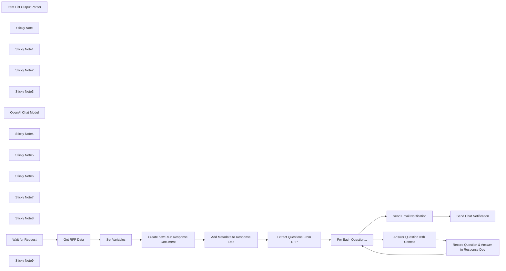

## Fluxo (.json) :

```json
{
  "meta": {
    "instanceId": "26ba763460b97c249b82942b23b6384876dfeb9327513332e743c5f6219c2b8e"
  },
  "nodes": [
    {
      "id": "51dbe3b4-42f6-43c9-85dc-42ae49be6ba9",
      "name": "Get RFP Data",
      "type": "n8n-nodes-base.extractFromFile",
      "position": [
        1003,
        278
      ],
      "parameters": {
        "options": {},
        "operation": "pdf"
      },
      "typeVersion": 1
    },
    {
      "id": "c42e6bfc-a426-4d12-bf95-f3fe6e944631",
      "name": "Item List Output Parser",
      "type": "@n8n/n8n-nodes-langchain.outputParserItemList",
      "position": [
        2140,
        540
      ],
      "parameters": {
        "options": {}
      },
      "typeVersion": 1
    },
    {
      "id": "1703e9c3-f49e-4272-ad11-0b9d4e9a76c6",
      "name": "For Each Question...",
      "type": "n8n-nodes-base.splitInBatches",
      "position": [
        2460,
        340
      ],
      "parameters": {
        "options": {}
      },
      "typeVersion": 3
    },
    {
      "id": "a54fa4ee-6f67-41a9-89fe-fd9f2bf094de",
      "name": "Sticky Note",
      "type": "n8n-nodes-base.stickyNote",
      "position": [
        760,
        60
      ],
      "parameters": {
        "color": 7,
        "width": 532.597092515486,
        "height": 508.1316876142587,
        "content": "## 1. API to Trigger Workflow\n[Read more about using Webhooks](https://docs.n8n.io/integrations/builtin/core-nodes/n8n-nodes-base.webhook/)\n\nThis workflow requires the user to submit the RFP document via an API request. It's a common pattern to use the webhook node for this purpose. Be sure to secure this webhook endpoint in production!"
      },
      "typeVersion": 1
    },
    {
      "id": "fdef005f-7838-4b8c-8af4-4b7c6f947ee2",
      "name": "Set Variables",
      "type": "n8n-nodes-base.set",
      "position": [
        1143,
        278
      ],
      "parameters": {
        "mode": "raw",
        "options": {},
        "jsonOutput": "={\n  \"doc_title\": \"{{ $('Wait for Request').item.json.body.title }}\",\n  \"doc_filename\": \"{{ $('Wait for Request').item.json.body.id }} | {{ $('Wait for Request').item.json.body.title }} | {{ $now.format('yyyyMMddhhmmss') }}| RFP Response\",\n  \"reply_to\": \"{{ $('Wait for Request').item.json.body.reply_to }}\"\n}\n"
      },
      "typeVersion": 3.3
    },
    {
      "id": "a64f6274-62fc-42fb-b7c7-5aa85746c621",
      "name": "Sticky Note1",
      "type": "n8n-nodes-base.stickyNote",
      "position": [
        1320,
        148.42417112849222
      ],
      "parameters": {
        "color": 7,
        "width": 493.289385759178,
        "height": 418.29352785836636,
        "content": "## 2. Create a new Doc to Capture Responses For RFP Questions\n[Read more about working with Google Docs](https://docs.n8n.io/integrations/builtin/app-nodes/n8n-nodes-base.googledocs/)\n\nFor each RFP we process, let's create its very own document to store the results. It will serve as a draft document for the RFP response."
      },
      "typeVersion": 1
    },
    {
      "id": "2b3df6af-c1ab-44a1-8907-425944294477",
      "name": "Create new RFP Response Document",
      "type": "n8n-nodes-base.googleDocs",
      "position": [
        1420,
        340
      ],
      "parameters": {
        "title": "={{ $json.doc_filename }}",
        "folderId": "=1y0I8MH32maIWCJh767mRE_NMHC6A3bUu"
      },
      "credentials": {
        "googleDocsOAuth2Api": {
          "id": "V0G0vi1DRj7Cqbp9",
          "name": "Google Docs account"
        }
      },
      "typeVersion": 2
    },
    {
      "id": "0bf30bef-2910-432b-b5eb-dee3fe39b797",
      "name": "Sticky Note2",
      "type": "n8n-nodes-base.stickyNote",
      "position": [
        1840,
        110.52747078833045
      ],
      "parameters": {
        "color": 7,
        "width": 500.1029039641811,
        "height": 599.9895116376663,
        "content": "## 3. Identifying Questions using AI\n[Read more about Question & Answer Chain](https://docs.n8n.io/integrations/builtin/cluster-nodes/root-nodes/n8n-nodes-langchain.chainretrievalqa/)\n\nUsing the power of LLMs, we're able to extract the RFP questionnaire regardless of original formatting or layout. This allows AutoRFP to handle a wide range of RFPs without requiring explicit extraction rules for edge cases.\n\nAdditionally, We'll use the Input List Output Parser to return a list of questions for further processing."
      },
      "typeVersion": 1
    },
    {
      "id": "1c064047-1f6a-47c8-bb49-85b4d6f8e854",
      "name": "Sticky Note3",
      "type": "n8n-nodes-base.stickyNote",
      "position": [
        2380,
        84.66944065837868
      ],
      "parameters": {
        "color": 7,
        "width": 746.3888903304862,
        "height": 600.3660610069576,
        "content": "## 4. Generating Question & Answer Pairs with AI\n[Read more about using OpenAI Assistants in n8n](https://docs.n8n.io/integrations/builtin/app-nodes/n8n-nodes-langchain.openai/)\n\nBy preparing an OpenAI Assistant with marketing material and sales documents about our company and business, we are able to use AI to answer RFP questions with the accurate and relevant context. Potentially allowing sales teams to increase the number of RFPs they can reply to.\n\nThis portion of the workflow loops through and answers each question individually for better answers. We can record the Question and Answer pairings to the RFP response document we created earlier."
      },
      "typeVersion": 1
    },
    {
      "id": "e663ba01-e9a6-4247-9d97-8f796d29d72a",
      "name": "OpenAI Chat Model",
      "type": "@n8n/n8n-nodes-langchain.lmChatOpenAi",
      "position": [
        1960,
        540
      ],
      "parameters": {
        "options": {}
      },
      "credentials": {
        "openAiApi": {
          "id": "8gccIjcuf3gvaoEr",
          "name": "OpenAi account"
        }
      },
      "typeVersion": 1
    },
    {
      "id": "ec0b439e-9fd8-4960-b8bb-04f4f7814a0a",
      "name": "Sticky Note4",
      "type": "n8n-nodes-base.stickyNote",
      "position": [
        300,
        60
      ],
      "parameters": {
        "width": 421.778219154496,
        "height": 515.8006969458895,
        "content": "## Try It Out!\n\n**This workflow does the following:**\n* Receives a RFP document via webhook\n* Creates a new RFP response document via Google Docs\n* Uses LLMs to extract the questions from the RFP document into a questions list\n* Loops through each question and uses an OpenAI Assistant to generate an answer. Saving each answer into the response document.\n* Once complete, sends a gmail and slack notification to the team.\n\n\n📃**Example Documents**\nTo run this workflow, you'll need to following 2 documents:\n* [RFP Document](https://drive.google.com/file/d/1G42h4Vz2lBuiNCnOiXF_-EBP1MaIEVq5/view?usp=sharing)\n* [Example Company Document](https://drive.google.com/file/d/16WywCYcxBgYHXB3TY3wXUTyfyG2n_BA0/view?usp=sharing)\n\n### Need Help?\nJoin the [Discord](https://discord.com/invite/XPKeKXeB7d) or ask in the [Forum](https://community.n8n.io/)!\n\nHappy Hacking!"
      },
      "typeVersion": 1
    },
    {
      "id": "244ff32d-9bc4-4a67-a6c2-4a7dc308058e",
      "name": "Sticky Note5",
      "type": "n8n-nodes-base.stickyNote",
      "position": [
        3160,
        80
      ],
      "parameters": {
        "color": 7,
        "width": 474.3513281516049,
        "height": 390.51033452105344,
        "content": "## 5. Send Notification Once Completed\n[Read more about using Slack](https://docs.n8n.io/integrations/builtin/app-nodes/n8n-nodes-base.slack)\n\n\nFinally, we can use a number of ways to notify the sales team when the process is complete. Here, we've opted to send the requesting user an email with a link to the RFP response document."
      },
      "typeVersion": 1
    },
    {
      "id": "94243b69-43b8-4731-9a6b-2934db832cc6",
      "name": "Send Chat Notification",
      "type": "n8n-nodes-base.slack",
      "position": [
        3440,
        280
      ],
      "parameters": {
        "text": "=RFP document \"{{ $('Set Variables').item.json.title }}\" completed!",
        "select": "channel",
        "channelId": {
          "__rl": true,
          "mode": "name",
          "value": "RFP-channel"
        },
        "otherOptions": {}
      },
      "credentials": {
        "slackApi": {
          "id": "VfK3js0YdqBdQLGP",
          "name": "Slack account"
        }
      },
      "typeVersion": 2.1
    },
    {
      "id": "391d7e07-2a6d-4c4d-bf42-9cc5466cc1b5",
      "name": "Send Email Notification",
      "type": "n8n-nodes-base.gmail",
      "position": [
        3240,
        280
      ],
      "parameters": {
        "sendTo": "={{ $('Set Variables').item.json.reply_to }}",
        "message": "=Your RFP document \"{{ $('Set Variables').item.json.title }}\" is now complete!",
        "options": {},
        "subject": "=RFP Questionnaire \"{{ $('Set Variables').item.json.title }}\" Completed!",
        "emailType": "text"
      },
      "credentials": {
        "gmailOAuth2": {
          "id": "Sf5Gfl9NiFTNXFWb",
          "name": "Gmail account"
        }
      },
      "typeVersion": 2.1
    },
    {
      "id": "34115f45-21ff-49a0-95f4-1fed53b53583",
      "name": "Add Metadata to Response Doc",
      "type": "n8n-nodes-base.googleDocs",
      "position": [
        1600,
        340
      ],
      "parameters": {
        "actionsUi": {
          "actionFields": [
            {
              "text": "=Title: {{ $('Set Variables').item.json.doc_title }}\nDate generated: {{ $now.format(\"yyyy-MM-dd @ hh:mm\") }}\nRequested by: {{ $('Set Variables').item.json.reply_to }}\nExecution Id: http://localhost:5678/workflow/{{ $workflow.id }}/executions/{{ $execution.id }}\n\n---\n\n",
              "action": "insert"
            }
          ]
        },
        "operation": "update",
        "documentURL": "={{ $json.id }}"
      },
      "credentials": {
        "googleDocsOAuth2Api": {
          "id": "V0G0vi1DRj7Cqbp9",
          "name": "Google Docs account"
        }
      },
      "typeVersion": 2
    },
    {
      "id": "f285d896-ba15-4f8a-b041-7cbcbe2e1050",
      "name": "Sticky Note6",
      "type": "n8n-nodes-base.stickyNote",
      "position": [
        783,
        238
      ],
      "parameters": {
        "width": 192.30781285767205,
        "height": 306.5264325350084,
        "content": "\n\n\n\n\n\n\n\n\n\n\n\n\n\n\n🚨**Required**\n* Use a tool such as Postman to send data to the webhook."
      },
      "typeVersion": 1
    },
    {
      "id": "b6e4e40e-b10b-48f2-bfe2-1ad38b1c6518",
      "name": "Record Question & Answer in Response Doc",
      "type": "n8n-nodes-base.googleDocs",
      "position": [
        2940,
        460
      ],
      "parameters": {
        "actionsUi": {
          "actionFields": [
            {
              "text": "={{ $runIndex+1 }}. {{ $json.content }}\n{{ $json.output }}\n\n",
              "action": "insert"
            }
          ]
        },
        "operation": "update",
        "documentURL": "={{ $('Create new RFP Response Document').item.json.id }}"
      },
      "credentials": {
        "googleDocsOAuth2Api": {
          "id": "V0G0vi1DRj7Cqbp9",
          "name": "Google Docs account"
        }
      },
      "typeVersion": 2
    },
    {
      "id": "ae8cc28f-4fd3-41d7-8a30-2675f58d1067",
      "name": "Sticky Note7",
      "type": "n8n-nodes-base.stickyNote",
      "position": [
        2600,
        440
      ],
      "parameters": {
        "width": 306.8994213707367,
        "height": 481.01365258903786,
        "content": "\n\n\n\n\n\n\n\n\n\n\n\n\n\n\n\n\n🚨**Required**\nYou'll need to create an OpenAI Assistant to use this workflow.\n* Sign up for [OpenAI Dashboard](https://platform.openai.com) if you haven't already.\n* Create an [OpenAI Assistant](https://platform.openai.com/playground/assistants)\n* Upload the [example company doc](https://drive.google.com/file/d/16WywCYcxBgYHXB3TY3wXUTyfyG2n_BA0/view?usp=sharing) to the assistant.\n\nThe assistant will use the company doc to answer the questions."
      },
      "typeVersion": 1
    },
    {
      "id": "81825554-5cbe-469b-8511-a92d5ea165cb",
      "name": "Sticky Note8",
      "type": "n8n-nodes-base.stickyNote",
      "position": [
        3200,
        460
      ],
      "parameters": {
        "width": 386.79263167741857,
        "height": 94.04968721739164,
        "content": "🚨**Required**\n* Update the email address to send to in Gmail Node.\n* Update the channel and message for Slack."
      },
      "typeVersion": 1
    },
    {
      "id": "25a57ca0-6789-499c-873b-07aba40530ed",
      "name": "Answer Question with Context",
      "type": "@n8n/n8n-nodes-langchain.openAi",
      "position": [
        2620,
        460
      ],
      "parameters": {
        "text": "={{ $json.response.text }}",
        "prompt": "define",
        "options": {},
        "resource": "assistant",
        "assistantId": {
          "__rl": true,
          "mode": "list",
          "value": "asst_QBI5lLKOsjktr3DRB4MwrgZd",
          "cachedResultName": "Nexus Digital Solutions Bot"
        }
      },
      "credentials": {
        "openAiApi": {
          "id": "8gccIjcuf3gvaoEr",
          "name": "OpenAi account"
        }
      },
      "typeVersion": 1.3
    },
    {
      "id": "1b4cc83b-a793-47c1-9dd6-0d7484db07b4",
      "name": "Wait for Request",
      "type": "n8n-nodes-base.webhook",
      "position": [
        823,
        278
      ],
      "webhookId": "35e874df-2904-494e-a9f5-5a3f20f517f8",
      "parameters": {
        "path": "35e874df-2904-494e-a9f5-5a3f20f517f8",
        "options": {},
        "httpMethod": "POST"
      },
      "typeVersion": 2
    },
    {
      "id": "2f97e3e6-c100-4045-bcb3-6fbd17cfb420",
      "name": "Extract Questions From RFP",
      "type": "@n8n/n8n-nodes-langchain.chainLlm",
      "position": [
        1960,
        380
      ],
      "parameters": {
        "text": "=You have been given a RFP document as part of a tender process of a buyer. Please extract all questions intended for the supplier. You must ensure the questions extracted are exactly has they are written in the RFP document.\n\n<RFP>{{ $('Get RFP Data').item.json.text }}<RFP>",
        "promptType": "define",
        "hasOutputParser": true
      },
      "typeVersion": 1.4
    },
    {
      "id": "4945b975-ac84-406e-8482-44cfa5679ef9",
      "name": "Sticky Note9",
      "type": "n8n-nodes-base.stickyNote",
      "position": [
        760,
        600
      ],
      "parameters": {
        "color": 5,
        "width": 529.9947173986736,
        "height": 157.64231937074243,
        "content": "### Example Webhook Request\ncurl --location 'https://<n8n_webhook_url>' \\\n--form 'id=\"RFP001\"' \\\n--form 'title=\"BlueChip Travel and StarBus Web Services\"' \\\n--form 'reply_to=\"jim@example.com\"' \\\n--form 'data=@\"k9pnbALxX/RFP Questionnaire.pdf\"'\n"
      },
      "typeVersion": 1
    }
  ],
  "pinData": {},
  "connections": {
    "Get RFP Data": {
      "main": [
        [
          {
            "node": "Set Variables",
            "type": "main",
            "index": 0
          }
        ]
      ]
    },
    "Set Variables": {
      "main": [
        [
          {
            "node": "Create new RFP Response Document",
            "type": "main",
            "index": 0
          }
        ]
      ]
    },
    "Wait for Request": {
      "main": [
        [
          {
            "node": "Get RFP Data",
            "type": "main",
            "index": 0
          }
        ]
      ]
    },
    "OpenAI Chat Model": {
      "ai_languageModel": [
        [
          {
            "node": "Extract Questions From RFP",
            "type": "ai_languageModel",
            "index": 0
          }
        ]
      ]
    },
    "For Each Question...": {
      "main": [
        [
          {
            "node": "Send Email Notification",
            "type": "main",
            "index": 0
          }
        ],
        [
          {
            "node": "Answer Question with Context",
            "type": "main",
            "index": 0
          }
        ]
      ]
    },
    "Item List Output Parser": {
      "ai_outputParser": [
        [
          {
            "node": "Extract Questions From RFP",
            "type": "ai_outputParser",
            "index": 0
          }
        ]
      ]
    },
    "Send Email Notification": {
      "main": [
        [
          {
            "node": "Send Chat Notification",
            "type": "main",
            "index": 0
          }
        ]
      ]
    },
    "Extract Questions From RFP": {
      "main": [
        [
          {
            "node": "For Each Question...",
            "type": "main",
            "index": 0
          }
        ]
      ]
    },
    "Add Metadata to Response Doc": {
      "main": [
        [
          {
            "node": "Extract Questions From RFP",
            "type": "main",
            "index": 0
          }
        ]
      ]
    },
    "Answer Question with Context": {
      "main": [
        [
          {
            "node": "Record Question & Answer in Response Doc",
            "type": "main",
            "index": 0
          }
        ]
      ]
    },
    "Create new RFP Response Document": {
      "main": [
        [
          {
            "node": "Add Metadata to Response Doc",
            "type": "main",
            "index": 0
          }
        ]
      ]
    },
    "Record Question & Answer in Response Doc": {
      "main": [
        [
          {
            "node": "For Each Question...",
            "type": "main",
            "index": 0
          }
        ]
      ]
    }
  }
}
```
