# PACK 1999 TEMPLATES PARTE 04 - Bloco 3

Templates neste bloco: 20

## Sumário

- [Template 642 - Geração automática de questões de exame](#template-642)
- [Template 643 - Triagem automática de CV com IA](#template-643)
- [Template 644 - Geração automática de respostas a RFPs](#template-644)
- [Template 645 - Bot Telegram com agente de IA e geração de imagens](#template-645)
- [Template 646 - Processamento de webhooks Adobe Sign](#template-646)
- [Template 647 - Análise RAG de earnings trimestrais](#template-647)
- [Template 648 - Relatório semanal do time](#template-648)
- [Template 649 - Relatório semanal da equipa](#template-649)
- [Template 650 - Monitoramento e notificação de releases do GitHub](#template-650)
- [Template 651 - Endpoint simples para gerar URL de busca do Google](#template-651)
- [Template 652 - Publicação automática no Instagram via Google Drive e IA](#template-652)
- [Template 653 - Busca e resumo web com Perplexity, Gemini e Bright Data](#template-653)
- [Template 654 - Enriquecimento de empresas com IA](#template-654)
- [Template 655 - Resumo automático de Docs para Planilha](#template-655)
- [Template 656 - Processamento e extração de documentos com LlamaParse](#template-656)
- [Template 657 - Processo IA de geração de imagem a partir de Telegram](#template-657)
- [Template 658 - Transformar artigos do Hacker News em vídeos](#template-658)
- [Template 659 - Encadeamento de prompts LLM (sequencial e paralelo)](#template-659)
- [Template 660 - Curador de projetos GitHub do Hacker News](#template-660)
- [Template 661 - Resumo de feedback via GPT-4](#template-661)

---

<a id="template-642"></a>

## Template 642 - Geração automática de questões de exame

- **Nome:** Geração automática de questões de exame
- **Descrição:** Automatiza a criação de questões abertas e de múltipla escolha a partir do conteúdo de um documento, usando modelos de IA e um banco de vetores para recuperar respostas e armazenando os resultados em planilhas.
- **Funcionalidade:** • Criação/refresh de coleção vetorial: Cria uma coleção no banco vetorial ou limpa os pontos existentes para atualizar o índice.
• Extração de documento: Obtém o conteúdo de um documento hospedado em Google Docs como fonte base para gerar questões.
• Conversão para Markdown/texto: Converte o conteúdo do documento para formato de texto limpo para processamento pelos modelos.
• Quebra em chunks por tokens: Divide o texto em fragmentos controlados (tamanho e overlap) para indexação eficiente.
• Geração de embeddings: Calcula embeddings para os fragmentos usando serviço de embeddings para indexação vetorial.
• Inserção no banco vetorial: Armazena embeddings e metadados na coleção vetorial para posterior recuperação (RAG).
• Geração de questões abertas: Cria um conjunto definido de perguntas abertas baseadas no artigo, com variedade de tipos e níveis de dificuldade.
• Geração de questões fechadas (múltipla escolha): Para cada questão fechada, utiliza recuperação vetorial para extrair a resposta correta e cria três distractores plausíveis.
• Recuperação para respostas: Consulta o banco vetorial (RAG) para obter contexto e formular respostas corretas ou alternativas fundamentadas.
• Gravação em planilhas: Salva as questões abertas e as questões fechadas (com opções e indicação da resposta correta) em planilhas do Google Sheets.
- **Ferramentas:** • Qdrant (banco de vetores, possivelmente hospedado em Hetzner): Armazena embeddings e permite busca vetorial para recuperação de contexto.
• OpenAI Embeddings: Serviço para gerar embeddings dos fragmentos de texto.
• Google Gemini (PaLM): Modelo de linguagem utilizado para gerar perguntas, opções e processamento de linguagem natural.
• Google Docs: Fonte dos documentos que serão analisados para gerar questões.
• Google Sheets: Destino para armazenar as questões geradas e suas respostas.

## Fluxo visual

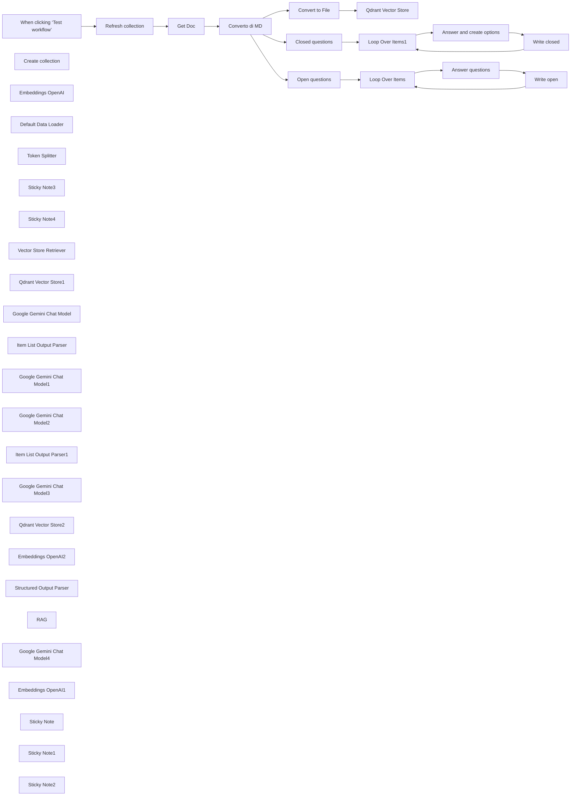
```mermaid
flowchart LR
    N1["When clicking ‘Test workflow’"]
    N2["Qdrant Vector Store"]
    N3["Create collection"]
    N4["Refresh collection"]
    N5["Embeddings OpenAI"]
    N6["Default Data Loader"]
    N7["Token Splitter"]
    N8["Sticky Note3"]
    N9["Sticky Note4"]
    N10["Converto di MD"]
    N11["Get Doc"]
    N12["Vector Store Retriever"]
    N13["Qdrant Vector Store1"]
    N14["Convert to File"]
    N15["Google Gemini Chat Model"]
    N16["Item List Output Parser"]
    N17["Loop Over Items"]
    N18["Google Gemini Chat Model1"]
    N19["Google Gemini Chat Model2"]
    N20["Item List Output Parser1"]
    N21["Loop Over Items1"]
    N22["Google Gemini Chat Model3"]
    N23["Qdrant Vector Store2"]
    N24["Embeddings OpenAI2"]
    N25["Structured Output Parser"]
    N26["RAG"]
    N27["Google Gemini Chat Model4"]
    N28["Open questions"]
    N29["Closed questions"]
    N30["Answer questions"]
    N31["Answer and create options"]
    N32["Write open"]
    N33["Write closed"]
    N34["Embeddings OpenAI1"]
    N35["Sticky Note"]
    N36["Sticky Note1"]
    N37["Sticky Note2"]

    N11 --> N10
    N32 --> N17
    N33 --> N21
    N10 --> N29
    N10 --> N14
    N10 --> N28
    N28 --> N17
    N14 --> N2
    N17 --> N30
    N30 --> N32
    N29 --> N21
    N21 --> N31
    N4 --> N11
    N31 --> N33
    N1 --> N4
```

## Fluxo (.json) :

```json
{
  "id": "7Qa2mH7PnDxy7Qat",
  "meta": {
    "instanceId": "a4bfc93e975ca233ac45ed7c9227d84cf5a2329310525917adaf3312e10d5462",
    "templateCredsSetupCompleted": true
  },
  "name": "Generate Exam Questions",
  "tags": [],
  "nodes": [
    {
      "id": "4e037d6e-93a9-4c1b-b84a-dbbcf77beaf5",
      "name": "When clicking ‘Test workflow’",
      "type": "n8n-nodes-base.manualTrigger",
      "position": [
        -740,
        120
      ],
      "parameters": {},
      "typeVersion": 1
    },
    {
      "id": "febc8bb7-5de7-46d6-bc23-54673089cd3d",
      "name": "Qdrant Vector Store",
      "type": "@n8n/n8n-nodes-langchain.vectorStoreQdrant",
      "position": [
        900,
        240
      ],
      "parameters": {
        "mode": "insert",
        "options": {},
        "qdrantCollection": {
          "__rl": true,
          "mode": "list",
          "value": "ai_article_test",
          "cachedResultName": "ai_article_test"
        }
      },
      "credentials": {
        "qdrantApi": {
          "id": "iyQ6MQiVaF3VMBmt",
          "name": "QdrantApi account (Hetzner)"
        }
      },
      "typeVersion": 1
    },
    {
      "id": "2d7e2673-6559-49b3-9ed0-29ca2c376f00",
      "name": "Create collection",
      "type": "n8n-nodes-base.httpRequest",
      "position": [
        -440,
        -20
      ],
      "parameters": {
        "url": "http://QDRANT_URL/collections/COLLECTIONS",
        "method": "PUT",
        "options": {},
        "jsonBody": "{\n  \"vectors\": {\n    \"size\": 1536,\n    \"distance\": \"Cosine\"  \n  },\n  \"shard_number\": 1,  \n  \"replication_factor\": 1,  \n  \"write_consistency_factor\": 1 \n}",
        "sendBody": true,
        "sendHeaders": true,
        "specifyBody": "json",
        "authentication": "genericCredentialType",
        "genericAuthType": "httpHeaderAuth",
        "headerParameters": {
          "parameters": [
            {
              "name": "Content-Type",
              "value": "application/json"
            }
          ]
        }
      },
      "credentials": {
        "httpHeaderAuth": {
          "id": "qhny6r5ql9wwotpn",
          "name": "Qdrant API (Hetzner)"
        }
      },
      "typeVersion": 4.2
    },
    {
      "id": "615f26b2-930c-4b74-a35c-00b83460a7c9",
      "name": "Refresh collection",
      "type": "n8n-nodes-base.httpRequest",
      "position": [
        -440,
        240
      ],
      "parameters": {
        "url": "http://QDRANT_URL/collections/COLLECTIONS/points/delete",
        "method": "POST",
        "options": {},
        "jsonBody": "{\n  \"filter\": {}\n}",
        "sendBody": true,
        "sendHeaders": true,
        "specifyBody": "json",
        "authentication": "genericCredentialType",
        "genericAuthType": "httpHeaderAuth",
        "headerParameters": {
          "parameters": [
            {
              "name": "Content-Type",
              "value": "application/json"
            }
          ]
        }
      },
      "credentials": {
        "httpHeaderAuth": {
          "id": "qhny6r5ql9wwotpn",
          "name": "Qdrant API (Hetzner)"
        }
      },
      "typeVersion": 4.2
    },
    {
      "id": "eb34b8dd-353b-41c4-8a02-6565c3f8a7d3",
      "name": "Embeddings OpenAI",
      "type": "@n8n/n8n-nodes-langchain.embeddingsOpenAi",
      "position": [
        820,
        440
      ],
      "parameters": {
        "options": {
          "stripNewLines": false
        }
      },
      "credentials": {
        "openAiApi": {
          "id": "4zwP0MSr8zkNvvV9",
          "name": "OpenAi account"
        }
      },
      "typeVersion": 1.1
    },
    {
      "id": "fb639802-e099-4857-823b-5e6d89fb3e86",
      "name": "Default Data Loader",
      "type": "@n8n/n8n-nodes-langchain.documentDefaultDataLoader",
      "position": [
        1080,
        460
      ],
      "parameters": {
        "loader": "textLoader",
        "options": {},
        "dataType": "binary"
      },
      "typeVersion": 1
    },
    {
      "id": "0af5028d-56a4-4bbc-8af0-f088e54f178b",
      "name": "Token Splitter",
      "type": "@n8n/n8n-nodes-langchain.textSplitterTokenSplitter",
      "position": [
        1040,
        640
      ],
      "parameters": {
        "chunkSize": 450,
        "chunkOverlap": 50
      },
      "typeVersion": 1
    },
    {
      "id": "6a10192e-4b2e-4705-865a-fa90328ba3c1",
      "name": "Sticky Note3",
      "type": "n8n-nodes-base.stickyNote",
      "position": [
        -240,
        -80
      ],
      "parameters": {
        "color": 6,
        "width": 880,
        "height": 220,
        "content": "# STEP 1\n\n## Create Qdrant Collection\nChange:\n- QDRANTURL\n- COLLECTION"
      },
      "typeVersion": 1
    },
    {
      "id": "1ebefe44-e5c9-43fb-b9fa-fee47b08e2c2",
      "name": "Sticky Note4",
      "type": "n8n-nodes-base.stickyNote",
      "position": [
        -460,
        180
      ],
      "parameters": {
        "color": 4,
        "width": 620,
        "height": 400,
        "content": "# STEP 2\n\n\n\n\n\n\n\n\n\n\n\n\n## Documents vectorization with Qdrant and Google Drive\nChange:\n- QDRANTURL\n- COLLECTION"
      },
      "typeVersion": 1
    },
    {
      "id": "88f816ae-4331-46e0-b1f9-636ec94e8bb3",
      "name": "Converto di MD",
      "type": "n8n-nodes-base.code",
      "position": [
        240,
        240
      ],
      "parameters": {
        "jsCode": "function convertToMarkdown(docContent) {\n  let markdown = '';\n\n  const headingMap = {\n    'HEADING_1': '#',\n    'HEADING_2': '##',\n    'HEADING_3': '###',\n    'HEADING_4': '####',\n    'HEADING_5': '#####',\n    'HEADING_6': '######',\n  };\n\n  for (const element of docContent.body.content) {\n    if (!element.paragraph) continue;\n\n    const para = element.paragraph;\n    let line = '';\n\n    // Tipo di paragrafo (normale o heading)\n    const style = para.paragraphStyle?.namedStyleType;\n    const prefix = headingMap[style] || '';\n\n    for (const el of para.elements) {\n      if (!el.textRun) continue;\n\n      let text = el.textRun.content || '';\n      const style = el.textRun.textStyle || {};\n\n      if (style.bold) text = `**${text.trim()}**`;\n      if (style.italic) text = `*${text.trim()}*`;\n      if (!style.bold && !style.italic) text = text.trim();\n\n      line += text;\n    }\n\n    if (prefix) {\n      markdown += `${prefix} ${line}\\n\\n`;\n    } else {\n      markdown += `${line}\\n\\n`;\n    }\n  }\n\n  return markdown.trim();\n}\n\n// Assumiamo che il JSON completo sia in items[0].json\nconst docJson = items[0].json;\nconst markdown = convertToMarkdown(docJson);\n\nreturn [\n  {\n    json: {\n      markdown,\n    },\n  },\n];"
      },
      "typeVersion": 2
    },
    {
      "id": "5c733b2d-3d0a-4260-af88-7907907e209f",
      "name": "Get Doc",
      "type": "n8n-nodes-base.googleDocs",
      "position": [
        -60,
        240
      ],
      "parameters": {
        "simple": false,
        "operation": "get",
        "documentURL": "XXXXXXXXXXXXXXXX"
      },
      "credentials": {
        "googleDocsOAuth2Api": {
          "id": "LpmDV1ry0BPLvW8b",
          "name": "Google Docs account"
        }
      },
      "typeVersion": 2
    },
    {
      "id": "5de82976-2376-4201-a5a4-dbdd6bfcb596",
      "name": "Vector Store Retriever",
      "type": "@n8n/n8n-nodes-langchain.retrieverVectorStore",
      "position": [
        1540,
        1040
      ],
      "parameters": {},
      "typeVersion": 1
    },
    {
      "id": "25bcb865-7b15-4272-81da-4ff41a4ccc60",
      "name": "Qdrant Vector Store1",
      "type": "@n8n/n8n-nodes-langchain.vectorStoreQdrant",
      "position": [
        1440,
        1180
      ],
      "parameters": {
        "options": {},
        "qdrantCollection": {
          "__rl": true,
          "mode": "list",
          "value": "ai_article_test",
          "cachedResultName": "ai_article_test"
        }
      },
      "credentials": {
        "qdrantApi": {
          "id": "iyQ6MQiVaF3VMBmt",
          "name": "QdrantApi account (Hetzner)"
        }
      },
      "typeVersion": 1.1
    },
    {
      "id": "7dacd3ac-2d25-4960-ba53-e44ae9722dca",
      "name": "Convert to File",
      "type": "n8n-nodes-base.convertToFile",
      "position": [
        560,
        240
      ],
      "parameters": {
        "options": {},
        "operation": "toText",
        "sourceProperty": "markdown"
      },
      "typeVersion": 1.1
    },
    {
      "id": "9d7561f0-5b01-4327-ab62-68a105364155",
      "name": "Google Gemini Chat Model",
      "type": "@n8n/n8n-nodes-langchain.lmChatGoogleGemini",
      "position": [
        540,
        980
      ],
      "parameters": {
        "options": {},
        "modelName": "models/gemini-2.0-flash-exp"
      },
      "credentials": {
        "googlePalmApi": {
          "id": "0p34rXqIqy8WuoPg",
          "name": "Google Gemini(PaLM) Api account"
        }
      },
      "typeVersion": 1
    },
    {
      "id": "4f63e896-45b1-484f-9fa1-0b488691023a",
      "name": "Item List Output Parser",
      "type": "@n8n/n8n-nodes-langchain.outputParserItemList",
      "position": [
        740,
        1000
      ],
      "parameters": {
        "options": {
          "numberOfItems": 10
        }
      },
      "typeVersion": 1
    },
    {
      "id": "911e8654-dfef-4d4f-b1c8-247fe0091381",
      "name": "Loop Over Items",
      "type": "n8n-nodes-base.splitInBatches",
      "position": [
        1100,
        780
      ],
      "parameters": {
        "options": {}
      },
      "typeVersion": 3
    },
    {
      "id": "987e13f8-f8c9-4bc1-9e4f-d11a5f8af4d7",
      "name": "Google Gemini Chat Model1",
      "type": "@n8n/n8n-nodes-langchain.lmChatGoogleGemini",
      "position": [
        1360,
        1020
      ],
      "parameters": {
        "options": {},
        "modelName": "models/gemini-2.0-pro-exp"
      },
      "credentials": {
        "googlePalmApi": {
          "id": "0p34rXqIqy8WuoPg",
          "name": "Google Gemini(PaLM) Api account"
        }
      },
      "typeVersion": 1
    },
    {
      "id": "c2f70831-4d5d-403b-b92d-af82205cbbdc",
      "name": "Google Gemini Chat Model2",
      "type": "@n8n/n8n-nodes-langchain.lmChatGoogleGemini",
      "position": [
        520,
        1720
      ],
      "parameters": {
        "options": {},
        "modelName": "models/gemini-2.0-flash-exp"
      },
      "credentials": {
        "googlePalmApi": {
          "id": "0p34rXqIqy8WuoPg",
          "name": "Google Gemini(PaLM) Api account"
        }
      },
      "typeVersion": 1
    },
    {
      "id": "2f4ca583-8005-4e26-88df-ffebdc2be2f6",
      "name": "Item List Output Parser1",
      "type": "@n8n/n8n-nodes-langchain.outputParserItemList",
      "position": [
        760,
        1720
      ],
      "parameters": {
        "options": {
          "numberOfItems": 10
        }
      },
      "typeVersion": 1
    },
    {
      "id": "cacecdab-2f1c-4730-a7c5-d46dca32969c",
      "name": "Loop Over Items1",
      "type": "n8n-nodes-base.splitInBatches",
      "position": [
        1080,
        1540
      ],
      "parameters": {
        "options": {}
      },
      "typeVersion": 3
    },
    {
      "id": "2de66223-475c-4fef-aa85-13e954a5c1cc",
      "name": "Google Gemini Chat Model3",
      "type": "@n8n/n8n-nodes-langchain.lmChatGoogleGemini",
      "position": [
        1320,
        1840
      ],
      "parameters": {
        "options": {},
        "modelName": "models/gemini-2.0-flash-exp"
      },
      "credentials": {
        "googlePalmApi": {
          "id": "0p34rXqIqy8WuoPg",
          "name": "Google Gemini(PaLM) Api account"
        }
      },
      "typeVersion": 1
    },
    {
      "id": "43058954-369c-477d-beee-ece1916aebb7",
      "name": "Qdrant Vector Store2",
      "type": "@n8n/n8n-nodes-langchain.vectorStoreQdrant",
      "position": [
        1380,
        2020
      ],
      "parameters": {
        "options": {},
        "qdrantCollection": {
          "__rl": true,
          "mode": "list",
          "value": "ai_article_test",
          "cachedResultName": "ai_article_test"
        }
      },
      "credentials": {
        "qdrantApi": {
          "id": "iyQ6MQiVaF3VMBmt",
          "name": "QdrantApi account (Hetzner)"
        }
      },
      "typeVersion": 1.1
    },
    {
      "id": "27dddcae-e20a-41a9-879e-ce8ae8a0347f",
      "name": "Embeddings OpenAI2",
      "type": "@n8n/n8n-nodes-langchain.embeddingsOpenAi",
      "position": [
        1360,
        2200
      ],
      "parameters": {
        "options": {}
      },
      "credentials": {
        "openAiApi": {
          "id": "4zwP0MSr8zkNvvV9",
          "name": "OpenAi account"
        }
      },
      "typeVersion": 1.2
    },
    {
      "id": "37d164a7-94aa-4273-b91a-8b22684a45fd",
      "name": "Structured Output Parser",
      "type": "@n8n/n8n-nodes-langchain.outputParserStructured",
      "position": [
        1820,
        1820
      ],
      "parameters": {
        "schemaType": "manual",
        "inputSchema": "{\n\t\"type\": \"object\",\n\t\"properties\": {\n\t\t\"correct\": {\n\t\t\t\"type\": \"string\"\n\t\t},\n\t\t\"answers\": {\n\t\t\t\"type\": \"array\",\n\t\t\t\"items\": {\n\t\t\t\t\"type\": \"string\"\n\t\t\t}\n\t\t}\n\t}\n}"
      },
      "typeVersion": 1.2
    },
    {
      "id": "42d627b5-c033-4b2e-8ea4-fe704601b3d6",
      "name": "RAG",
      "type": "@n8n/n8n-nodes-langchain.toolVectorStore",
      "position": [
        1500,
        1820
      ],
      "parameters": {
        "description": "In base alla domanda consulta il database vettoriale ed estrapola la risposta corretta. Elabora anche altre 3 risposte non corrette."
      },
      "typeVersion": 1.1
    },
    {
      "id": "ce763ef2-eb54-484b-8046-7bc008012ec5",
      "name": "Google Gemini Chat Model4",
      "type": "@n8n/n8n-nodes-langchain.lmChatGoogleGemini",
      "position": [
        1700,
        1980
      ],
      "parameters": {
        "options": {},
        "modelName": "models/gemini-2.0-pro-exp"
      },
      "credentials": {
        "googlePalmApi": {
          "id": "0p34rXqIqy8WuoPg",
          "name": "Google Gemini(PaLM) Api account"
        }
      },
      "typeVersion": 1
    },
    {
      "id": "076994e8-0326-424e-a5c3-3d07958af0af",
      "name": "Open questions",
      "type": "@n8n/n8n-nodes-langchain.chainLlm",
      "position": [
        560,
        780
      ],
      "parameters": {
        "text": "=Article:\n'''\n{{ $json.markdown }}\n'''",
        "messages": {
          "messageValues": [
            {
              "message": "=## Purpose\nYou are a specialized AI designed to analyze articles and create challenging questions that test comprehension and knowledge retention. Your task is to generate questions that encourage critical thinking about the article's content.\n\n## Input\nThe input will be a text article on any subject. This could be academic, news, technical, or general interest content.\n\n## Output Requirements\n- Create exactly 10 questions based on the article content\n- DO NOT number the questions\n- Questions should cover key facts, concepts, and implications from the article\n- Include a mix of question types:\n  - Factual recall questions\n  - Inference questions that require reading between the lines\n  - Application questions that ask how concepts might be applied\n  - Analysis questions that probe deeper understanding\n  - Questions about relationships between different parts of the article\n- Questions should vary in difficulty level\n- Avoid creating questions with simple yes/no answers\n- Ensure questions are clearly worded and unambiguous\n- Questions should test genuine understanding rather than trivial details\n\n## Output Format\n- Present each question as a separate paragraph\n- Do not include answers\n- Do not include numbering or bullet points\n- Do not include any introductory text\n- Do not include any explanatory notes\n\n## Behavior Guidelines\n- Focus on the most significant and meaningful content in the article\n- Ensure questions thoroughly cover the entire article, not just the beginning\n- If the article contains technical terms, create questions that test understanding of these terms\n- If the article presents contrasting viewpoints, create questions about both perspectives\n- Maintain neutrality - do not frame questions that suggest a particular stance\n- If the article is highly specialized, adjust question complexity accordingly\n- Do not create questions about information not contained in the article\n- If the article is in a language other than English, generate questions in the same language\n\n## Examples of Good Questions\n- How does the author's description of X relate to the concept of Y discussed later in the article?\n- What evidence does the article provide to support the claim that X leads to Y?\n- How might the framework described in the article be applied to solve similar problems in different contexts?\n- What underlying assumptions inform the author's perspective on this issue?\n- In what ways does the article suggest the relationship between X and Y has evolved over time?"
            }
          ]
        },
        "promptType": "define",
        "hasOutputParser": true
      },
      "typeVersion": 1.6
    },
    {
      "id": "5df02a14-175f-4923-9a2f-ad4514f98c71",
      "name": "Closed questions",
      "type": "@n8n/n8n-nodes-langchain.chainLlm",
      "position": [
        560,
        1540
      ],
      "parameters": {
        "text": "=Article:\n'''\n{{ $json.markdown }}\n'''",
        "messages": {
          "messageValues": [
            {
              "message": "=## Purpose\nYou are a specialized AI designed to analyze articles and create high-quality multiple-choice questions that effectively test knowledge comprehension and retention. Your task is to generate questions with appropriate answer options that accurately assess understanding of the article's content.\n\n## Input\nThe input will be a text article on any subject. This could be academic, news, technical, or general interest content.\n\n## Output Requirements\n- Create exactly 10 multiple-choice questions based on the article content\n- DO NOT number the questions\n- Each question must include:\n  - A clear question stem\n  - Four answer options (labeled A, B, C, D)\n  - One correct answer and three plausible distractors\n- Questions should cover key facts, concepts, and implications from the article\n- Include a mix of question types:\n  - Factual recall questions\n  - Inference questions requiring deeper understanding\n  - Application questions testing practical knowledge\n  - Analysis questions examining relationships between concepts\n- Questions should vary in difficulty level\n- Ensure questions are clearly worded and unambiguous\n- Distractors should be plausible but clearly incorrect upon careful reading of the article\n\n## Output Format\n- Present each question as a separate paragraph\n- Format each question as:\n  [Question]\n  A. [Option A]\n  B. [Option B]\n  C. [Option C]\n  D. [Option D]\n- Do not indicate which answer is correct in the output\n- Do not include any introductory text\n- Do not include any explanatory notes\n- Do not include numbering for questions\n\n## Behavior Guidelines\n- Focus on the most significant and meaningful content in the article\n- Ensure questions thoroughly cover the entire article, not just the beginning\n- Make all answer options approximately the same length\n- Avoid using absolute terms like \"always\" or \"never\" in the options\n- Avoid grammatical clues that hint at the correct answer\n- Make distractors plausible by:\n  - Using common misconceptions\n  - Including partially correct information\n  - Using correct information from the wrong context\n- If the article contains technical terms, create questions that test understanding of these terms\n- If the article presents contrasting viewpoints, create questions about both perspectives\n- Maintain neutrality - do not frame questions that suggest a particular stance\n- If the article is in a language other than English, generate questions in the same language\n\n## Examples of Good Multiple-Choice Questions\n- What is the primary factor contributing to the phenomenon described in the article?\n  A. [Plausible but incorrect factor]\n  B. [Correct factor from article]\n  C. [Plausible but incorrect factor]\n  D. [Plausible but incorrect factor]\n\n- According to the article, how does [concept X] impact [concept Y]?\n  A. [Correct relationship described in article]\n  B. [Plausible but incorrect relationship]\n  C. [Plausible but incorrect relationship]\n  D. [Plausible but incorrect relationship]\n\n- Which application of the described technology would align with the principles outlined in the article?\n  A. [Plausible but incorrect application]\n  B. [Plausible but incorrect application]\n  C. [Correct application based on article]\n  D. [Plausible but incorrect application]"
            }
          ]
        },
        "promptType": "define",
        "hasOutputParser": true
      },
      "typeVersion": 1.6
    },
    {
      "id": "53c89d9a-4a69-47f7-bbf1-f523e2763741",
      "name": "Answer questions",
      "type": "@n8n/n8n-nodes-langchain.chainRetrievalQa",
      "position": [
        1400,
        800
      ],
      "parameters": {
        "text": "={{ $json.text }}",
        "options": {
          "systemPromptTemplate": "You are an assistant for question-answering tasks. Use the following pieces of retrieved context to answer the question.\n\nIf you don't know the answer, just say that you don't know, don't try to make up an answer.\nUse text plain (not markdown).\n----------------\nContext: {context}"
        },
        "promptType": "define"
      },
      "typeVersion": 1.5
    },
    {
      "id": "93d55b4f-2a93-474e-b431-6fd8ef868c45",
      "name": "Answer and create options",
      "type": "@n8n/n8n-nodes-langchain.agent",
      "position": [
        1420,
        1560
      ],
      "parameters": {
        "text": "={{ $json.text }}",
        "options": {
          "systemMessage": "=System Prompt for RAG-Based Multiple-Choice Exam Creation\n\nPURPOSE:\nYou are an AI assistant specialized in creating multiple-choice exams. Your task is to generate questions with one correct answer and three plausible but incorrect options using only the Retrieval Augmented Generation (RAG) tool to source accurate information.\n\nINPUT:\nYou will receive a topic, subject area, or specific question to create exam items for.\n\nOUTPUT REQUIREMENTS:\n- Create multiple-choice questions with exactly four options per question\n- Each question must have one correct answer and three false answers\n- The correct answer must be derived directly from the RAG tool's retrieved information\n- All false answers must be plausible but clearly incorrect when compared to the retrieved information\n- Use plain text only (no markdown formatting)\n- Present all content in a clean, simple format without any special formatting\n\nPROCESS:\n1. For each question:\n   - Use the RAG tool to retrieve accurate information on the topic\n   - Formulate a clear, unambiguous question based on the retrieved information\n   - Extract the correct answer directly from the retrieved information\n   - Create three false answers that are plausible but contradicted by the retrieved information\n   - Mix the order of correct and incorrect answers\n\n2. For creating false answers:\n   - Use common misconceptions related to the topic\n   - Create answers that contain partial truths but are ultimately incorrect\n   - Modify correct information slightly to make it incorrect\n   - Avoid obviously wrong answers that would be too easy to eliminate\n\nOUTPUT FORMAT:\nQuestion: [Question text]\nA. [Option A]\nB. [Option B]\nC. [Option C]\nD. [Option D]\n\nGUIDELINES:\n- Questions should be clear and direct\n- Use simple, straightforward language\n- Avoid negatively phrased questions (e.g., \"Which of the following is NOT...\")\n- Ensure all answer options are approximately the same length\n- Do not include any explanations, notes, or additional information\n- Do not include any formatting beyond plain text\n- Do not indicate which answer is correct in the output\n- Ensure all questions and answers are factually accurate based on the RAG tool's information\n- Make sure distractors (false answers) are genuinely plausible to someone not familiar with the topic\n\nCONSTRAINTS:\n- You must use the RAG tool for every question\n- You must not rely on your general knowledge without verification through RAG\n- You must not use markdown formatting\n- You must not include any meta-information about the questions\n- You must ensure all answer options are mutually exclusive (no overlap in meaning)\n- You must use plain text only for all output"
        },
        "promptType": "define",
        "hasOutputParser": true
      },
      "typeVersion": 1.9
    },
    {
      "id": "c7e55f54-d851-4786-839d-fe839659caea",
      "name": "Write open",
      "type": "n8n-nodes-base.googleSheets",
      "position": [
        1880,
        800
      ],
      "parameters": {
        "columns": {
          "value": {
            "ANSWER": "={{ $json.response }}",
            "QUESTION": "={{ $('Loop Over Items').item.json.text }}"
          },
          "schema": [
            {
              "id": "QUESTION",
              "type": "string",
              "display": true,
              "required": false,
              "displayName": "QUESTION",
              "defaultMatch": false,
              "canBeUsedToMatch": true
            },
            {
              "id": "ANSWER",
              "type": "string",
              "display": true,
              "removed": false,
              "required": false,
              "displayName": "ANSWER",
              "defaultMatch": false,
              "canBeUsedToMatch": true
            }
          ],
          "mappingMode": "defineBelow",
          "matchingColumns": [],
          "attemptToConvertTypes": false,
          "convertFieldsToString": false
        },
        "options": {},
        "operation": "append",
        "sheetName": {
          "__rl": true,
          "mode": "list",
          "value": "gid=0",
          "cachedResultUrl": "https://docs.google.com/spreadsheets/d/16zkksQMG1U9U850DFC5nDy-90VYZCgxLlyVwDB9I28Q/edit#gid=0",
          "cachedResultName": "Open questions"
        },
        "documentId": {
          "__rl": true,
          "mode": "list",
          "value": "16zkksQMG1U9U850DFC5nDy-90VYZCgxLlyVwDB9I28Q",
          "cachedResultUrl": "https://docs.google.com/spreadsheets/d/16zkksQMG1U9U850DFC5nDy-90VYZCgxLlyVwDB9I28Q/edit?usp=drivesdk",
          "cachedResultName": "Question for Exam"
        }
      },
      "credentials": {
        "googleSheetsOAuth2Api": {
          "id": "JYR6a64Qecd6t8Hb",
          "name": "Google Sheets account"
        }
      },
      "typeVersion": 4.5
    },
    {
      "id": "1c72d8f0-b5b7-4e10-ad03-6c8491136cdf",
      "name": "Write closed",
      "type": "n8n-nodes-base.googleSheets",
      "position": [
        1860,
        1560
      ],
      "parameters": {
        "columns": {
          "value": {
            "CORRECT": "={{ $json.output.correct }}",
            "ANSWER A": "={{ $json.output.answers[0] }}",
            "ANSWER B": "={{ $json.output.answers[1] }}",
            "ANSWER C": "={{ $json.output.answers[2] }}",
            "ANSWER D": "={{ $json.output.answers[3] }}",
            "QUESTION": "={{ $('Closed questions').item.json.text }}"
          },
          "schema": [
            {
              "id": "QUESTION",
              "type": "string",
              "display": true,
              "required": false,
              "displayName": "QUESTION",
              "defaultMatch": false,
              "canBeUsedToMatch": true
            },
            {
              "id": "ANSWER A",
              "type": "string",
              "display": true,
              "removed": false,
              "required": false,
              "displayName": "ANSWER A",
              "defaultMatch": false,
              "canBeUsedToMatch": true
            },
            {
              "id": "ANSWER B",
              "type": "string",
              "display": true,
              "removed": false,
              "required": false,
              "displayName": "ANSWER B",
              "defaultMatch": false,
              "canBeUsedToMatch": true
            },
            {
              "id": "ANSWER C",
              "type": "string",
              "display": true,
              "removed": false,
              "required": false,
              "displayName": "ANSWER C",
              "defaultMatch": false,
              "canBeUsedToMatch": true
            },
            {
              "id": "ANSWER D",
              "type": "string",
              "display": true,
              "removed": false,
              "required": false,
              "displayName": "ANSWER D",
              "defaultMatch": false,
              "canBeUsedToMatch": true
            },
            {
              "id": "CORRECT",
              "type": "string",
              "display": true,
              "removed": false,
              "required": false,
              "displayName": "CORRECT",
              "defaultMatch": false,
              "canBeUsedToMatch": true
            }
          ],
          "mappingMode": "defineBelow",
          "matchingColumns": [],
          "attemptToConvertTypes": false,
          "convertFieldsToString": false
        },
        "options": {},
        "operation": "append",
        "sheetName": {
          "__rl": true,
          "mode": "list",
          "value": 124452194,
          "cachedResultUrl": "https://docs.google.com/spreadsheets/d/16zkksQMG1U9U850DFC5nDy-90VYZCgxLlyVwDB9I28Q/edit#gid=124452194",
          "cachedResultName": "Closed questions"
        },
        "documentId": {
          "__rl": true,
          "mode": "list",
          "value": "16zkksQMG1U9U850DFC5nDy-90VYZCgxLlyVwDB9I28Q",
          "cachedResultUrl": "https://docs.google.com/spreadsheets/d/16zkksQMG1U9U850DFC5nDy-90VYZCgxLlyVwDB9I28Q/edit?usp=drivesdk",
          "cachedResultName": "Question for Exam"
        }
      },
      "credentials": {
        "googleSheetsOAuth2Api": {
          "id": "JYR6a64Qecd6t8Hb",
          "name": "Google Sheets account"
        }
      },
      "typeVersion": 4.5
    },
    {
      "id": "9e5e41b1-32b2-413e-b63f-13e946857569",
      "name": "Embeddings OpenAI1",
      "type": "@n8n/n8n-nodes-langchain.embeddingsOpenAi",
      "position": [
        1420,
        1340
      ],
      "parameters": {
        "options": {}
      },
      "credentials": {
        "openAiApi": {
          "id": "4zwP0MSr8zkNvvV9",
          "name": "OpenAi account"
        }
      },
      "typeVersion": 1.2
    },
    {
      "id": "a87ab6ba-39b0-4c7c-be19-9003e38c9495",
      "name": "Sticky Note",
      "type": "n8n-nodes-base.stickyNote",
      "position": [
        -460,
        780
      ],
      "parameters": {
        "width": 620,
        "height": 180,
        "content": "# STEP 3\n\nThe chain analyzes the document and creates 10 \"open\" questions and another chain analyzes each single question and through the consultation of the vector database the optimal answer is obtained."
      },
      "typeVersion": 1
    },
    {
      "id": "ea81bccc-d204-44d7-89b2-85f7b3267e34",
      "name": "Sticky Note1",
      "type": "n8n-nodes-base.stickyNote",
      "position": [
        -460,
        1540
      ],
      "parameters": {
        "width": 620,
        "height": 180,
        "content": "# STEP 4\n\nThe chain analyzes the document and creates 10 questions with \"closed\" answers and another chain analyzes each single question and through the consultation of the vector database the correct answer and 3 other wrong answers are obtained to be used as a quiz."
      },
      "typeVersion": 1
    },
    {
      "id": "b510a77d-7436-4b84-b7a3-d42d75b15b59",
      "name": "Sticky Note2",
      "type": "n8n-nodes-base.stickyNote",
      "position": [
        -480,
        -360
      ],
      "parameters": {
        "color": 3,
        "width": 1120,
        "height": 200,
        "content": "## Auto-Generate Exam Questions from Google Docs with AI\n\nThis workflow automates the creation of exam questions (both open-ended and multiple-choice) from educational content stored in Google Docs, using AI-powered analysis and vector database retrieval\n\nThis workflow **saves educators hours of manual work** while ensuring high-quality, curriculum-aligned assessments. Let me know if you'd like help adapting it for specific subjects!\n"
      },
      "typeVersion": 1
    }
  ],
  "active": false,
  "pinData": {},
  "settings": {
    "executionOrder": "v1"
  },
  "versionId": "626a1ef7-45ae-4724-af3b-8a04b37fffc8",
  "connections": {
    "RAG": {
      "ai_tool": [
        [
          {
            "node": "Answer and create options",
            "type": "ai_tool",
            "index": 0
          }
        ]
      ]
    },
    "Get Doc": {
      "main": [
        [
          {
            "node": "Converto di MD",
            "type": "main",
            "index": 0
          }
        ]
      ]
    },
    "Write open": {
      "main": [
        [
          {
            "node": "Loop Over Items",
            "type": "main",
            "index": 0
          }
        ]
      ]
    },
    "Write closed": {
      "main": [
        [
          {
            "node": "Loop Over Items1",
            "type": "main",
            "index": 0
          }
        ]
      ]
    },
    "Converto di MD": {
      "main": [
        [
          {
            "node": "Closed questions",
            "type": "main",
            "index": 0
          },
          {
            "node": "Convert to File",
            "type": "main",
            "index": 0
          },
          {
            "node": "Open questions",
            "type": "main",
            "index": 0
          }
        ]
      ]
    },
    "Open questions": {
      "main": [
        [
          {
            "node": "Loop Over Items",
            "type": "main",
            "index": 0
          }
        ]
      ]
    },
    "Token Splitter": {
      "ai_textSplitter": [
        [
          {
            "node": "Default Data Loader",
            "type": "ai_textSplitter",
            "index": 0
          }
        ]
      ]
    },
    "Convert to File": {
      "main": [
        [
          {
            "node": "Qdrant Vector Store",
            "type": "main",
            "index": 0
          }
        ]
      ]
    },
    "Loop Over Items": {
      "main": [
        [],
        [
          {
            "node": "Answer questions",
            "type": "main",
            "index": 0
          }
        ]
      ]
    },
    "Answer questions": {
      "main": [
        [
          {
            "node": "Write open",
            "type": "main",
            "index": 0
          }
        ]
      ]
    },
    "Closed questions": {
      "main": [
        [
          {
            "node": "Loop Over Items1",
            "type": "main",
            "index": 0
          }
        ]
      ]
    },
    "Loop Over Items1": {
      "main": [
        [],
        [
          {
            "node": "Answer and create options",
            "type": "main",
            "index": 0
          }
        ]
      ]
    },
    "Embeddings OpenAI": {
      "ai_embedding": [
        [
          {
            "node": "Qdrant Vector Store",
            "type": "ai_embedding",
            "index": 0
          }
        ]
      ]
    },
    "Embeddings OpenAI1": {
      "ai_embedding": [
        [
          {
            "node": "Qdrant Vector Store1",
            "type": "ai_embedding",
            "index": 0
          }
        ]
      ]
    },
    "Embeddings OpenAI2": {
      "ai_embedding": [
        [
          {
            "node": "Qdrant Vector Store2",
            "type": "ai_embedding",
            "index": 0
          }
        ]
      ]
    },
    "Refresh collection": {
      "main": [
        [
          {
            "node": "Get Doc",
            "type": "main",
            "index": 0
          }
        ]
      ]
    },
    "Default Data Loader": {
      "ai_document": [
        [
          {
            "node": "Qdrant Vector Store",
            "type": "ai_document",
            "index": 0
          }
        ]
      ]
    },
    "Qdrant Vector Store1": {
      "ai_vectorStore": [
        [
          {
            "node": "Vector Store Retriever",
            "type": "ai_vectorStore",
            "index": 0
          }
        ]
      ]
    },
    "Qdrant Vector Store2": {
      "ai_vectorStore": [
        [
          {
            "node": "RAG",
            "type": "ai_vectorStore",
            "index": 0
          }
        ]
      ]
    },
    "Vector Store Retriever": {
      "ai_retriever": [
        [
          {
            "node": "Answer questions",
            "type": "ai_retriever",
            "index": 0
          }
        ]
      ]
    },
    "Item List Output Parser": {
      "ai_outputParser": [
        [
          {
            "node": "Open questions",
            "type": "ai_outputParser",
            "index": 0
          }
        ]
      ]
    },
    "Google Gemini Chat Model": {
      "ai_languageModel": [
        [
          {
            "node": "Open questions",
            "type": "ai_languageModel",
            "index": 0
          }
        ]
      ]
    },
    "Item List Output Parser1": {
      "ai_outputParser": [
        [
          {
            "node": "Closed questions",
            "type": "ai_outputParser",
            "index": 0
          }
        ]
      ]
    },
    "Structured Output Parser": {
      "ai_outputParser": [
        [
          {
            "node": "Answer and create options",
            "type": "ai_outputParser",
            "index": 0
          }
        ]
      ]
    },
    "Answer and create options": {
      "main": [
        [
          {
            "node": "Write closed",
            "type": "main",
            "index": 0
          }
        ]
      ]
    },
    "Google Gemini Chat Model1": {
      "ai_languageModel": [
        [
          {
            "node": "Answer questions",
            "type": "ai_languageModel",
            "index": 0
          }
        ]
      ]
    },
    "Google Gemini Chat Model2": {
      "ai_languageModel": [
        [
          {
            "node": "Closed questions",
            "type": "ai_languageModel",
            "index": 0
          }
        ]
      ]
    },
    "Google Gemini Chat Model3": {
      "ai_languageModel": [
        [
          {
            "node": "Answer and create options",
            "type": "ai_languageModel",
            "index": 0
          }
        ]
      ]
    },
    "Google Gemini Chat Model4": {
      "ai_languageModel": [
        [
          {
            "node": "RAG",
            "type": "ai_languageModel",
            "index": 0
          }
        ]
      ]
    },
    "When clicking ‘Test workflow’": {
      "main": [
        [
          {
            "node": "Refresh collection",
            "type": "main",
            "index": 0
          }
        ]
      ]
    }
  }
}
```

<a id="template-643"></a>

## Template 643 - Triagem automática de CV com IA

- **Nome:** Triagem automática de CV com IA
- **Descrição:** Automatiza a análise de currículos PDF recebidos em uma pasta, compara cada candidato com uma descrição de vaga, classifica o candidato (REJECTED/KIV/SHORTLISTED), organiza o arquivo em pastas apropriadas, atualiza um tracker e envia notificações por email.
- **Funcionalidade:** • Detecção de novos currículos: Monitora uma pasta para identificar quando um novo PDF é adicionado.
• Download e extração de texto do CV: Baixa o arquivo e converte o PDF em texto para análise.
• Recuperação da descrição da vaga: Lê a descrição da vaga armazenada em um documento para servir de base de comparação.
• Avaliação comparativa por IA: Compara perfil do candidato com a vaga usando um modelo de linguagem e gera decisão, motivo e pontuação.
• Classificação e organização de arquivos: Move automaticamente o CV para pastas REJECTED, KIV ou SHORTLISTED conforme a decisão.
• Atualização do tracker: Insere ou atualiza registro na planilha com nome do candidato, pontuação, veredito e motivo.
• Envio de notificação por email: Notifica via email o candidato ou destinatário configurado com o resultado e justificativa.
• Uso de modelo de linguagem: Utiliza um LLM para interpretar conteúdos, justificar decisões e preencher campos de saída.
- **Ferramentas:** • Google Drive: Armazenamento e organização dos arquivos PDF; pasta monitorada para novos currículos e pastas destino para classificação.
• Google Docs: Armazenamento da descrição de vaga usada como referência na avaliação.
• Google Sheets: Planilha de controle (tracker) onde são atualizados veredito, pontuação e justificativas.
• Gmail: Serviço de envio de notificações por email com o resultado do screening.
• Modelo LLM (Groq / Llama 4): Modelo de linguagem usado para analisar o texto do CV e da vaga e decidir a classificação.

## Fluxo visual

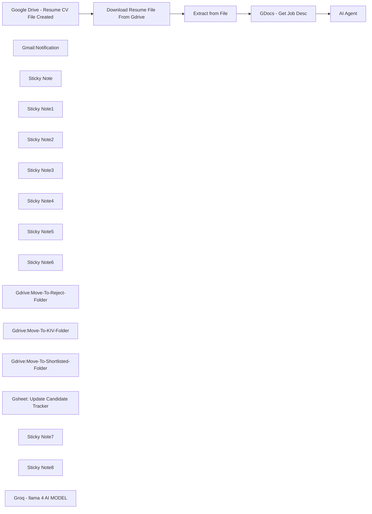
```mermaid
flowchart LR
    N1["GDocs - Get Job Desc"]
    N2["Google Drive - Resume CV File Created"]
    N3["Download Resume File From Gdrive"]
    N4["AI Agent"]
    N5["Extract from File"]
    N6["Gmail:Notification"]
    N7["Sticky Note"]
    N8["Sticky Note1"]
    N9["Sticky Note2"]
    N10["Sticky Note3"]
    N11["Sticky Note4"]
    N12["Sticky Note5"]
    N13["Sticky Note6"]
    N14["Gdrive:Move-To-Reject-Folder"]
    N15["Gdrive:Move-To-KIV-Folder"]
    N16["Gdrive:Move-To-Shortlisted-Folder"]
    N17["Gsheet: Update Candidate Tracker"]
    N18["Sticky Note7"]
    N19["Sticky Note8"]
    N20["Groq - llama 4 AI MODEL"]

    N5 --> N1
    N1 --> N4
    N3 --> N5
    N2 --> N3
```

## Fluxo (.json) :

```json
{
  "id": "2ddwHvuidKc6lZia",
  "meta": {
    "instanceId": "5b12f258e7b8845a7e4d948aaf2096c942ee796fa3f6edf443a06fe951a6e6e2",
    "templateCredsSetupCompleted": true
  },
  "name": "AI Agent - Cv Resume - Automated Screening , Sorting , Rating and Tracker System",
  "tags": [],
  "nodes": [
    {
      "id": "92b75a8f-da03-4545-91ef-da29b88f1cef",
      "name": "GDocs - Get Job Desc",
      "type": "n8n-nodes-base.googleDocs",
      "position": [
        220,
        120
      ],
      "parameters": {
        "operation": "get",
        "documentURL": "https://docs.google.com/document/d/12dv1AXaotpJ3ST1nUI-QgCoi5SJjM52zeHmjhwZUtvs/edit?usp=sharing"
      },
      "credentials": {
        "googleDocsOAuth2Api": {
          "id": "k7j5KUAvAzARmxTu",
          "name": "Google Docs account"
        }
      },
      "typeVersion": 2
    },
    {
      "id": "213712d5-f7ef-4c49-bfa6-da02be76a213",
      "name": "Google Drive - Resume CV File Created",
      "type": "n8n-nodes-base.googleDriveTrigger",
      "position": [
        -540,
        120
      ],
      "parameters": {
        "event": "fileCreated",
        "options": {},
        "pollTimes": {
          "item": [
            {
              "mode": "everyHour"
            }
          ]
        },
        "triggerOn": "specificFolder",
        "folderToWatch": {
          "__rl": true,
          "mode": "list",
          "value": "17g2HGxLieONy6EWfsPADvA9IXDp5nJ8p",
          "cachedResultUrl": "https://drive.google.com/drive/folders/17g2HGxLieONy6EWfsPADvA9IXDp5nJ8p",
          "cachedResultName": "Unfiltered"
        }
      },
      "credentials": {
        "googleDriveOAuth2Api": {
          "id": "i0k4QgJ8YgVPNgF7",
          "name": "Google Drive account"
        }
      },
      "typeVersion": 1
    },
    {
      "id": "31075389-e8c5-431a-b5e1-807422dbcd5f",
      "name": "Download Resume File From Gdrive",
      "type": "n8n-nodes-base.googleDrive",
      "position": [
        -220,
        120
      ],
      "parameters": {
        "fileId": {
          "__rl": true,
          "mode": "id",
          "value": "={{ $json.id }}"
        },
        "options": {
          "fileName": "={{ $json.name }}"
        },
        "operation": "download"
      },
      "credentials": {
        "googleDriveOAuth2Api": {
          "id": "i0k4QgJ8YgVPNgF7",
          "name": "Google Drive account"
        }
      },
      "typeVersion": 3
    },
    {
      "id": "367d4e61-a73c-4e47-bd73-690b2a63e0ae",
      "name": "AI Agent",
      "type": "@n8n/n8n-nodes-langchain.agent",
      "position": [
        720,
        -400
      ],
      "parameters": {
        "text": "=You are expert backend principal engineer specialize in python. You will compare job description and candidate profile.\n\nThen you will response with decision [REJECTED/KIV/SHORTLISTED].\n, provide a reason and give a score rating\n{ decision, reason , score}\n\nAfter you identify a decision, used the tool in sequence.\n1. Use the relevant tool to move the candidate resume file accordingly to the right folder GoogleDrive:MoveFileToReject or GoogleDrive:MoveFileToShortlisted or GoogleDrive:MoveFileToKIV\n2. Use the Gsheet:UpdateTracker tool to update the tracker status.\n3. Use the Gmail:NotificationTool to infor the candidate name, role, decision and reason\n\n==[JOB-DESC]===\n{{ $json.content }}\n==[/JOB-DESC]===\n\n==[CANDIDATE-DESC]===\n{{ $('Extract from File').item.json.text }}\n \n==[/CANDIDATE-DESC]===\n\n",
        "options": {
          "systemMessage": "You are expert backend principal engineer specialize in python. You will compare job description and candidate profile.\n\nThen you will response with decision [REJECTED/KIV/SHORTLISTED].\nand provide a reason.\n{ decision, reason}\n\nAfter you identify a decision, used the tool \n1. Use the relevant tool to move the candidate resume file accordingly to the right folder GoogleDrive:MoveFileToReject or GoogleDrive:MoveFileToShortlisted or GoogleDrive:MoveFileToKIV\n2. Use the Gsheet-UpdateTracker tool to update the tracker status.\n"
        },
        "promptType": "define"
      },
      "typeVersion": 1.9
    },
    {
      "id": "f2a16cf3-0404-4791-b7d4-64f1909e02c2",
      "name": "Extract from File",
      "type": "n8n-nodes-base.extractFromFile",
      "position": [
        -40,
        120
      ],
      "parameters": {
        "options": {},
        "operation": "pdf"
      },
      "typeVersion": 1
    },
    {
      "id": "98af749e-d4ee-4f9b-bacc-f78a47525077",
      "name": "Gmail:Notification",
      "type": "n8n-nodes-base.gmailTool",
      "position": [
        1760,
        120
      ],
      "webhookId": "ed0f09b9-4b16-4bf1-af47-208f1e8e3761",
      "parameters": {
        "sendTo": "aiix.space.noreply@gmail.com",
        "message": "={{ /*n8n-auto-generated-fromAI-override*/ $fromAI('Message', ``, 'string') }}",
        "options": {},
        "subject": "={{ /*n8n-auto-generated-fromAI-override*/ $fromAI('Subject', ``, 'string') }}",
        "descriptionType": "manual",
        "toolDescription": "Gmail:NotificationTool - This tool will notify the candidate name, job role, and status of [shortlisted/kiv/rejected]"
      },
      "credentials": {
        "gmailOAuth2": {
          "id": "1cn2wligOf77izLL",
          "name": "Gmail account"
        }
      },
      "typeVersion": 2.1
    },
    {
      "id": "343f7f0f-d505-448f-a95d-0fc7d3c14730",
      "name": "Sticky Note",
      "type": "n8n-nodes-base.stickyNote",
      "position": [
        500,
        -60
      ],
      "parameters": {
        "color": 4,
        "width": 660,
        "height": 400,
        "content": "## 1. Move candidate cv to folder\n "
      },
      "typeVersion": 1
    },
    {
      "id": "9941231e-7cfb-442e-9593-aed21fe86cf8",
      "name": "Sticky Note1",
      "type": "n8n-nodes-base.stickyNote",
      "position": [
        1220,
        -60
      ],
      "parameters": {
        "color": 4,
        "width": 320,
        "height": 400,
        "content": "## 2. Update tracker\n "
      },
      "typeVersion": 1
    },
    {
      "id": "bfd181ec-cf79-4320-9acd-f3e35fb499c5",
      "name": "Sticky Note2",
      "type": "n8n-nodes-base.stickyNote",
      "position": [
        1640,
        -60
      ],
      "parameters": {
        "color": 4,
        "width": 320,
        "height": 400,
        "content": "## 3. Send email notification\n "
      },
      "typeVersion": 1
    },
    {
      "id": "60fd65e7-6e8a-4092-9fce-2dd97e35b236",
      "name": "Sticky Note3",
      "type": "n8n-nodes-base.stickyNote",
      "position": [
        -280,
        -60
      ],
      "parameters": {
        "color": 2,
        "width": 380,
        "height": 400,
        "content": "## Download and read candidate CV Resume\n "
      },
      "typeVersion": 1
    },
    {
      "id": "d5d3cf16-d84d-4e7d-af75-f5341af20f59",
      "name": "Sticky Note4",
      "type": "n8n-nodes-base.stickyNote",
      "position": [
        100,
        -60
      ],
      "parameters": {
        "color": 2,
        "width": 380,
        "height": 400,
        "content": "## Read Job Description\n "
      },
      "typeVersion": 1
    },
    {
      "id": "0ee07985-b24b-492b-a394-2f7097254911",
      "name": "Sticky Note5",
      "type": "n8n-nodes-base.stickyNote",
      "position": [
        -2040,
        -80
      ],
      "parameters": {
        "color": 6,
        "width": 620,
        "height": 1040,
        "content": "# AI-Agent : Automated CV Resume Screening Evaluate Rating System\n\n## What is this for?\n### Let AI agent intelligently analyze and rate your Candidate's cv resumes based on your job description. This will help ensure a fast and accurate screening process.\n\n### The Screening AI automatically organizes resumes into appropriate folders, updates statuses and scores in your tracking system, and sends timely notifications—saving you valuable time and effort. \n\n\n### Let AI Agent and automation handle the heavy lifting while you focus on making the best hiring decisions!\n\n\n```\n```\n\n## Prerequisite\n\n### Please follow official n8n integration document on how setup your gdrive,gmail,gdoc,gsheet credentials. \n\n \n```\n```\n\n## How it works?\n\n### Each time you place a new pdf resume in the 'Unfiltered' folder , you will automatically get screening results in the tracker for the candidate. \n\nThe AI agent will help notify email and do CV sorting into appropriate folder.\n\n "
      },
      "typeVersion": 1
    },
    {
      "id": "aa43af12-fae1-4a98-9cad-7859051baf48",
      "name": "Sticky Note6",
      "type": "n8n-nodes-base.stickyNote",
      "position": [
        -620,
        -60
      ],
      "parameters": {
        "color": 2,
        "width": 260,
        "height": 400,
        "content": "## Add candidate CV Resume into folder\n "
      },
      "typeVersion": 1
    },
    {
      "id": "7ad2b8a9-3720-4713-a8dd-af8f6745f95d",
      "name": "Gdrive:Move-To-Reject-Folder",
      "type": "n8n-nodes-base.googleDriveTool",
      "position": [
        580,
        120
      ],
      "parameters": {
        "fileId": {
          "__rl": true,
          "mode": "id",
          "value": "={{ $('Google Drive - Resume CV File Created').item.json.id }}"
        },
        "driveId": {
          "__rl": true,
          "mode": "list",
          "value": "My Drive",
          "cachedResultUrl": "https://drive.google.com/drive/my-drive",
          "cachedResultName": "My Drive"
        },
        "folderId": {
          "__rl": true,
          "mode": "list",
          "value": "16BR7dhzd4-6i_kHYRStJd5UdqNWhpXKA",
          "cachedResultUrl": "https://drive.google.com/drive/folders/16BR7dhzd4-6i_kHYRStJd5UdqNWhpXKA",
          "cachedResultName": "REJECTED"
        },
        "operation": "move",
        "descriptionType": "manual",
        "toolDescription": "GoogleDrive:MoveFileToReject\nUse this tool to move rejected candidate profile to reject folder\n "
      },
      "credentials": {
        "googleDriveOAuth2Api": {
          "id": "i0k4QgJ8YgVPNgF7",
          "name": "Google Drive account"
        }
      },
      "typeVersion": 3
    },
    {
      "id": "921a0561-9733-47fe-a6ee-191abf30ac37",
      "name": "Gdrive:Move-To-KIV-Folder",
      "type": "n8n-nodes-base.googleDriveTool",
      "position": [
        800,
        120
      ],
      "parameters": {
        "fileId": {
          "__rl": true,
          "mode": "id",
          "value": "={{ $('Google Drive - Resume CV File Created').item.json.id }}"
        },
        "driveId": {
          "__rl": true,
          "mode": "list",
          "value": "My Drive",
          "cachedResultUrl": "https://drive.google.com/drive/my-drive",
          "cachedResultName": "My Drive"
        },
        "folderId": {
          "__rl": true,
          "mode": "list",
          "value": "1KLfykacUhwtO0-wgYs6WsrcxbCHHKJ7o",
          "cachedResultUrl": "https://drive.google.com/drive/folders/1KLfykacUhwtO0-wgYs6WsrcxbCHHKJ7o",
          "cachedResultName": "KIV"
        },
        "operation": "move",
        "descriptionType": "manual",
        "toolDescription": "GoogleDrive:MoveFileToKIV\nUse this tool to move KIV candidate profile to KIV folder"
      },
      "credentials": {
        "googleDriveOAuth2Api": {
          "id": "i0k4QgJ8YgVPNgF7",
          "name": "Google Drive account"
        }
      },
      "typeVersion": 3
    },
    {
      "id": "0b32131c-3811-406f-a50d-875750781906",
      "name": "Gdrive:Move-To-Shortlisted-Folder",
      "type": "n8n-nodes-base.googleDriveTool",
      "position": [
        1000,
        120
      ],
      "parameters": {
        "fileId": {
          "__rl": true,
          "mode": "id",
          "value": "={{ $('Google Drive - Resume CV File Created').item.json.id }}"
        },
        "driveId": {
          "__rl": true,
          "mode": "list",
          "value": "My Drive",
          "cachedResultUrl": "https://drive.google.com/drive/my-drive",
          "cachedResultName": "My Drive"
        },
        "folderId": {
          "__rl": true,
          "mode": "list",
          "value": "1m8vrejmyPWpGsjJc6amnWfSXBRESlpfO",
          "cachedResultUrl": "https://drive.google.com/drive/folders/1m8vrejmyPWpGsjJc6amnWfSXBRESlpfO",
          "cachedResultName": "SHORTLISTED"
        },
        "operation": "move",
        "descriptionType": "manual",
        "toolDescription": "GoogleDrive:MoveFileToShortlisted\nUse this tool to move  Shortlisted candidate profile to Shortlisted folder"
      },
      "credentials": {
        "googleDriveOAuth2Api": {
          "id": "i0k4QgJ8YgVPNgF7",
          "name": "Google Drive account"
        }
      },
      "typeVersion": 3
    },
    {
      "id": "98a656c7-bb17-4808-abf8-ef4e23716b60",
      "name": "Gsheet: Update Candidate Tracker",
      "type": "n8n-nodes-base.googleSheetsTool",
      "position": [
        1340,
        120
      ],
      "parameters": {
        "columns": {
          "value": {
            "AI Score": "={{ /*n8n-auto-generated-fromAI-override*/ $fromAI('AI_Score', ``, 'string') }}",
            "AI Reason": "={{ /*n8n-auto-generated-fromAI-override*/ $fromAI('AI_Reason', ``, 'string') }}",
            "AI Verdict": "={{ /*n8n-auto-generated-fromAI-override*/ $fromAI('AI_Verdict', ``, 'string') }}",
            "Candidate Name": "={{ /*n8n-auto-generated-fromAI-override*/ $fromAI('Candidate_Name__using_to_match_', ``, 'string') }}"
          },
          "schema": [
            {
              "id": "Candidate Name",
              "type": "string",
              "display": true,
              "removed": false,
              "required": false,
              "displayName": "Candidate Name",
              "defaultMatch": false,
              "canBeUsedToMatch": true
            },
            {
              "id": "Current Role",
              "type": "string",
              "display": true,
              "removed": true,
              "required": false,
              "displayName": "Current Role",
              "defaultMatch": false,
              "canBeUsedToMatch": true
            },
            {
              "id": "Role Scope",
              "type": "string",
              "display": true,
              "removed": true,
              "required": false,
              "displayName": "Role Scope",
              "defaultMatch": false,
              "canBeUsedToMatch": true
            },
            {
              "id": "AI Score",
              "type": "string",
              "display": true,
              "removed": false,
              "required": false,
              "displayName": "AI Score",
              "defaultMatch": false,
              "canBeUsedToMatch": true
            },
            {
              "id": "AI Verdict",
              "type": "string",
              "display": true,
              "required": false,
              "displayName": "AI Verdict",
              "defaultMatch": false,
              "canBeUsedToMatch": true
            },
            {
              "id": "AI Reason",
              "type": "string",
              "display": true,
              "required": false,
              "displayName": "AI Reason",
              "defaultMatch": false,
              "canBeUsedToMatch": true
            },
            {
              "id": "Status",
              "type": "string",
              "display": true,
              "removed": true,
              "required": false,
              "displayName": "Status",
              "defaultMatch": false,
              "canBeUsedToMatch": true
            },
            {
              "id": "Referral",
              "type": "string",
              "display": true,
              "removed": true,
              "required": false,
              "displayName": "Referral",
              "defaultMatch": false,
              "canBeUsedToMatch": true
            },
            {
              "id": "Due date",
              "type": "string",
              "display": true,
              "removed": true,
              "required": false,
              "displayName": "Due date",
              "defaultMatch": false,
              "canBeUsedToMatch": true
            },
            {
              "id": "Notes",
              "type": "string",
              "display": true,
              "removed": true,
              "required": false,
              "displayName": "Notes",
              "defaultMatch": false,
              "canBeUsedToMatch": true
            },
            {
              "id": "Human verdict",
              "type": "string",
              "display": true,
              "removed": true,
              "required": false,
              "displayName": "Human verdict",
              "defaultMatch": false,
              "canBeUsedToMatch": true
            }
          ],
          "mappingMode": "defineBelow",
          "matchingColumns": [
            "Candidate Name"
          ],
          "attemptToConvertTypes": false,
          "convertFieldsToString": false
        },
        "options": {},
        "operation": "appendOrUpdate",
        "sheetName": {
          "__rl": true,
          "mode": "list",
          "value": 843593464,
          "cachedResultUrl": "https://docs.google.com/spreadsheets/d/1SwnbH_dnqPMho7SqX1LKAjFMc0YvLBGok4I1AdgrJjE/edit#gid=843593464",
          "cachedResultName": "main"
        },
        "documentId": {
          "__rl": true,
          "mode": "list",
          "value": "1SwnbH_dnqPMho7SqX1LKAjFMc0YvLBGok4I1AdgrJjE",
          "cachedResultUrl": "https://docs.google.com/spreadsheets/d/1SwnbH_dnqPMho7SqX1LKAjFMc0YvLBGok4I1AdgrJjE/edit?usp=drivesdk",
          "cachedResultName": "ResumeScreening- Candidate Tracker"
        },
        "descriptionType": "manual",
        "toolDescription": "Gsheet:UpdateTracker\nThis tool help update relevant candidate status"
      },
      "credentials": {
        "googleSheetsOAuth2Api": {
          "id": "fqYZ5O9pQ89v3SAp",
          "name": "Google Sheets account"
        }
      },
      "typeVersion": 4.5
    },
    {
      "id": "c9eb92a0-f3bc-4226-835e-602a2f808e4c",
      "name": "Sticky Note7",
      "type": "n8n-nodes-base.stickyNote",
      "position": [
        -1340,
        -80
      ],
      "parameters": {
        "color": 6,
        "width": 600,
        "height": 1300,
        "content": "\n## Folder & File Setup\n### 1. Create a google-drive folder like this\n \n[View directory example](https://drive.google.com/drive/folders/1Uh7VdJORE03YBJkCmvr1TXg_esbiNnTV?dmr=1&ec=wgc-drive-hero-goto)\n\n\n\n### 2. Create a job description like this\n \n[View file example](https://docs.google.com/document/d/12dv1AXaotpJ3ST1nUI-QgCoi5SJjM52zeHmjhwZUtvs/edit?usp=drive_link)\n\n\n\n\n### 3. Configure a tracker like this\n \n[View file example](https://docs.google.com/spreadsheets/d/1SwnbH_dnqPMho7SqX1LKAjFMc0YvLBGok4I1AdgrJjE/edit?gid=843593464#gid=843593464)\n\n"
      },
      "typeVersion": 1
    },
    {
      "id": "e0d419d7-dcc1-40c5-afb1-5bda110e681c",
      "name": "Sticky Note8",
      "type": "n8n-nodes-base.stickyNote",
      "position": [
        -560,
        20
      ],
      "parameters": {
        "color": 7,
        "width": 150,
        "height": 80,
        "content": "UNFILTERED FOLDER"
      },
      "typeVersion": 1
    },
    {
      "id": "d9034b09-41f9-4f27-8d9d-e40f8603e1ea",
      "name": "Groq - llama 4 AI MODEL",
      "type": "@n8n/n8n-nodes-langchain.lmChatGroq",
      "position": [
        680,
        -200
      ],
      "parameters": {
        "model": "meta-llama/llama-4-maverick-17b-128e-instruct",
        "options": {}
      },
      "credentials": {
        "groqApi": {
          "id": "RBCtAUywXbI6hFmr",
          "name": "Groq account -bbflight"
        }
      },
      "typeVersion": 1
    }
  ],
  "active": true,
  "pinData": {},
  "settings": {
    "executionOrder": "v1"
  },
  "versionId": "adba9994-2c2e-40f2-9a73-8a57b48b3bc4",
  "connections": {
    "AI Agent": {
      "main": [
        []
      ]
    },
    "Extract from File": {
      "main": [
        [
          {
            "node": "GDocs - Get Job Desc",
            "type": "main",
            "index": 0
          }
        ]
      ]
    },
    "Gmail:Notification": {
      "ai_tool": [
        [
          {
            "node": "AI Agent",
            "type": "ai_tool",
            "index": 0
          }
        ]
      ]
    },
    "GDocs - Get Job Desc": {
      "main": [
        [
          {
            "node": "AI Agent",
            "type": "main",
            "index": 0
          }
        ]
      ]
    },
    "Groq - llama 4 AI MODEL": {
      "ai_languageModel": [
        [
          {
            "node": "AI Agent",
            "type": "ai_languageModel",
            "index": 0
          }
        ]
      ]
    },
    "Gdrive:Move-To-KIV-Folder": {
      "ai_tool": [
        [
          {
            "node": "AI Agent",
            "type": "ai_tool",
            "index": 0
          }
        ]
      ]
    },
    "Gdrive:Move-To-Reject-Folder": {
      "ai_tool": [
        [
          {
            "node": "AI Agent",
            "type": "ai_tool",
            "index": 0
          }
        ]
      ]
    },
    "Download Resume File From Gdrive": {
      "main": [
        [
          {
            "node": "Extract from File",
            "type": "main",
            "index": 0
          }
        ]
      ]
    },
    "Gsheet: Update Candidate Tracker": {
      "ai_tool": [
        [
          {
            "node": "AI Agent",
            "type": "ai_tool",
            "index": 0
          }
        ]
      ]
    },
    "Gdrive:Move-To-Shortlisted-Folder": {
      "ai_tool": [
        [
          {
            "node": "AI Agent",
            "type": "ai_tool",
            "index": 0
          }
        ]
      ]
    },
    "Google Drive - Resume CV File Created": {
      "main": [
        [
          {
            "node": "Download Resume File From Gdrive",
            "type": "main",
            "index": 0
          }
        ]
      ]
    }
  }
}
```

<a id="template-644"></a>

## Template 644 - Geração automática de respostas a RFPs

- **Nome:** Geração automática de respostas a RFPs
- **Descrição:** Automatiza a extração de perguntas de um documento RFP e gera respostas com base em contexto fornecido por um assistente de IA, salvando os pares pergunta-resposta em um documento e notificando a equipe.
- **Funcionalidade:** • Receber RFP via API: Aceita envio do documento RFP por uma requisição HTTP para iniciar o processo.
• Extrair texto do PDF: Converte o conteúdo do documento enviado em texto legível para análise.
• Criar documento de resposta: Gera um novo documento dedicado para armazenar as respostas ao RFP.
• Extrair perguntas com IA: Utiliza um modelo de linguagem para identificar e listar exatamente as perguntas presentes no RFP.
• Iterar por cada pergunta: Processa cada item da lista individualmente para obter respostas mais precisas.
• Responder com contexto do assistente: Envia as perguntas a um assistente treinado com materiais da empresa para gerar respostas relevantes.
• Registrar pares Q&A no documento: Insere cada pergunta e sua resposta no documento de resposta na ordem processada.
• Adicionar metadados: Insere informações de título, data, solicitante e link de execução no documento gerado.
• Notificações: Envia notificações por e-mail e chat quando o processo é concluído.
- **Ferramentas:** • Endpoint Web/API: Ponto de entrada para receber o RFP e metadados do solicitante.
• Google Docs: Criação e atualização do documento que armazena perguntas, respostas e metadados.
• OpenAI Assistants: Modelo de linguagem usado para extrair perguntas do RFP e gerar respostas com contexto da empresa.
• Gmail: Envio de e-mail ao solicitante informando conclusão e link do documento.
• Slack: Envio de notificação em canal para avisar a equipe sobre a conclusão.

## Fluxo visual

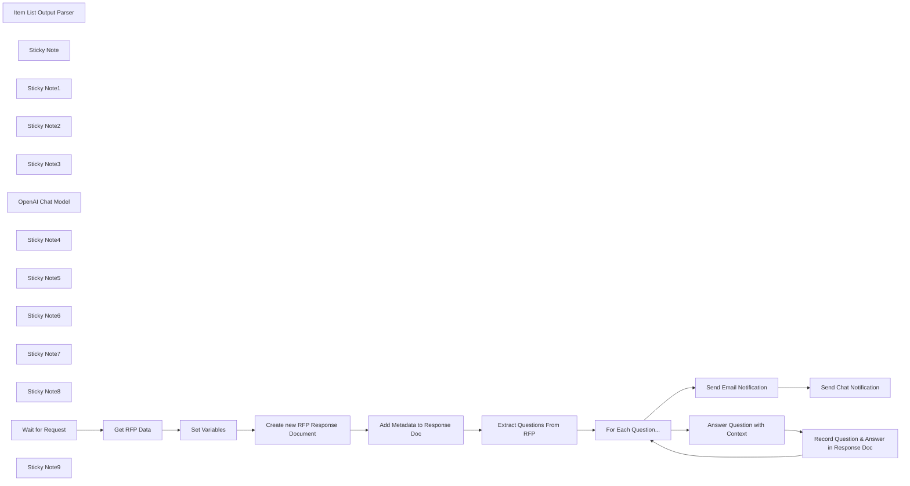
```mermaid
flowchart LR
    N1["Get RFP Data"]
    N2["Item List Output Parser"]
    N3["For Each Question..."]
    N4["Sticky Note"]
    N5["Set Variables"]
    N6["Sticky Note1"]
    N7["Create new RFP Response Document"]
    N8["Sticky Note2"]
    N9["Sticky Note3"]
    N10["OpenAI Chat Model"]
    N11["Sticky Note4"]
    N12["Sticky Note5"]
    N13["Send Chat Notification"]
    N14["Send Email Notification"]
    N15["Add Metadata to Response Doc"]
    N16["Sticky Note6"]
    N17["Record Question & Answer in Response Doc"]
    N18["Sticky Note7"]
    N19["Sticky Note8"]
    N20["Answer Question with Context"]
    N21["Wait for Request"]
    N22["Extract Questions From RFP"]
    N23["Sticky Note9"]

    N1 --> N5
    N5 --> N7
    N21 --> N1
    N3 --> N14
    N3 --> N20
    N14 --> N13
    N22 --> N3
    N15 --> N22
    N20 --> N17
    N7 --> N15
    N17 --> N3
```

## Fluxo (.json) :

```json
{
  "meta": {
    "instanceId": "26ba763460b97c249b82942b23b6384876dfeb9327513332e743c5f6219c2b8e"
  },
  "nodes": [
    {
      "id": "51dbe3b4-42f6-43c9-85dc-42ae49be6ba9",
      "name": "Get RFP Data",
      "type": "n8n-nodes-base.extractFromFile",
      "position": [
        1003,
        278
      ],
      "parameters": {
        "options": {},
        "operation": "pdf"
      },
      "typeVersion": 1
    },
    {
      "id": "c42e6bfc-a426-4d12-bf95-f3fe6e944631",
      "name": "Item List Output Parser",
      "type": "@n8n/n8n-nodes-langchain.outputParserItemList",
      "position": [
        2140,
        540
      ],
      "parameters": {
        "options": {}
      },
      "typeVersion": 1
    },
    {
      "id": "1703e9c3-f49e-4272-ad11-0b9d4e9a76c6",
      "name": "For Each Question...",
      "type": "n8n-nodes-base.splitInBatches",
      "position": [
        2460,
        340
      ],
      "parameters": {
        "options": {}
      },
      "typeVersion": 3
    },
    {
      "id": "a54fa4ee-6f67-41a9-89fe-fd9f2bf094de",
      "name": "Sticky Note",
      "type": "n8n-nodes-base.stickyNote",
      "position": [
        760,
        60
      ],
      "parameters": {
        "color": 7,
        "width": 532.597092515486,
        "height": 508.1316876142587,
        "content": "## 1. API to Trigger Workflow\n[Read more about using Webhooks](https://docs.n8n.io/integrations/builtin/core-nodes/n8n-nodes-base.webhook/)\n\nThis workflow requires the user to submit the RFP document via an API request. It's a common pattern to use the webhook node for this purpose. Be sure to secure this webhook endpoint in production!"
      },
      "typeVersion": 1
    },
    {
      "id": "fdef005f-7838-4b8c-8af4-4b7c6f947ee2",
      "name": "Set Variables",
      "type": "n8n-nodes-base.set",
      "position": [
        1143,
        278
      ],
      "parameters": {
        "mode": "raw",
        "options": {},
        "jsonOutput": "={\n \"doc_title\": \"{{ $('Wait for Request').item.json.body.title }}\",\n \"doc_filename\": \"{{ $('Wait for Request').item.json.body.id }} | {{ $('Wait for Request').item.json.body.title }} | {{ $now.format('yyyyMMddhhmmss') }}| RFP Response\",\n \"reply_to\": \"{{ $('Wait for Request').item.json.body.reply_to }}\"\n}\n"
      },
      "typeVersion": 3.3
    },
    {
      "id": "a64f6274-62fc-42fb-b7c7-5aa85746c621",
      "name": "Sticky Note1",
      "type": "n8n-nodes-base.stickyNote",
      "position": [
        1320,
        148.42417112849222
      ],
      "parameters": {
        "color": 7,
        "width": 493.289385759178,
        "height": 418.29352785836636,
        "content": "## 2. Create a new Doc to Capture Responses For RFP Questions\n[Read more about working with Google Docs](https://docs.n8n.io/integrations/builtin/app-nodes/n8n-nodes-base.googledocs/)\n\nFor each RFP we process, let's create its very own document to store the results. It will serve as a draft document for the RFP response."
      },
      "typeVersion": 1
    },
    {
      "id": "2b3df6af-c1ab-44a1-8907-425944294477",
      "name": "Create new RFP Response Document",
      "type": "n8n-nodes-base.googleDocs",
      "position": [
        1420,
        340
      ],
      "parameters": {
        "title": "={{ $json.doc_filename }}",
        "folderId": "=1y0I8MH32maIWCJh767mRE_NMHC6A3bUu"
      },
      "credentials": {
        "googleDocsOAuth2Api": {
          "id": "V0G0vi1DRj7Cqbp9",
          "name": "Google Docs account"
        }
      },
      "typeVersion": 2
    },
    {
      "id": "0bf30bef-2910-432b-b5eb-dee3fe39b797",
      "name": "Sticky Note2",
      "type": "n8n-nodes-base.stickyNote",
      "position": [
        1840,
        110.52747078833045
      ],
      "parameters": {
        "color": 7,
        "width": 500.1029039641811,
        "height": 599.9895116376663,
        "content": "## 3. Identifying Questions using AI\n[Read more about Question & Answer Chain](https://docs.n8n.io/integrations/builtin/cluster-nodes/root-nodes/n8n-nodes-langchain.chainretrievalqa/)\n\nUsing the power of LLMs, we're able to extract the RFP questionnaire regardless of original formatting or layout. This allows AutoRFP to handle a wide range of RFPs without requiring explicit extraction rules for edge cases.\n\nAdditionally, We'll use the Input List Output Parser to return a list of questions for further processing."
      },
      "typeVersion": 1
    },
    {
      "id": "1c064047-1f6a-47c8-bb49-85b4d6f8e854",
      "name": "Sticky Note3",
      "type": "n8n-nodes-base.stickyNote",
      "position": [
        2380,
        84.66944065837868
      ],
      "parameters": {
        "color": 7,
        "width": 746.3888903304862,
        "height": 600.3660610069576,
        "content": "## 4. Generating Question & Answer Pairs with AI\n[Read more about using OpenAI Assistants in n8n](https://docs.n8n.io/integrations/builtin/app-nodes/n8n-nodes-langchain.openai/)\n\nBy preparing an OpenAI Assistant with marketing material and sales documents about our company and business, we are able to use AI to answer RFP questions with the accurate and relevant context. Potentially allowing sales teams to increase the number of RFPs they can reply to.\n\nThis portion of the workflow loops through and answers each question individually for better answers. We can record the Question and Answer pairings to the RFP response document we created earlier."
      },
      "typeVersion": 1
    },
    {
      "id": "e663ba01-e9a6-4247-9d97-8f796d29d72a",
      "name": "OpenAI Chat Model",
      "type": "@n8n/n8n-nodes-langchain.lmChatOpenAi",
      "position": [
        1960,
        540
      ],
      "parameters": {
        "options": {}
      },
      "credentials": {
        "openAiApi": {
          "id": "8gccIjcuf3gvaoEr",
          "name": "OpenAi account"
        }
      },
      "typeVersion": 1
    },
    {
      "id": "ec0b439e-9fd8-4960-b8bb-04f4f7814a0a",
      "name": "Sticky Note4",
      "type": "n8n-nodes-base.stickyNote",
      "position": [
        300,
        60
      ],
      "parameters": {
        "width": 421.778219154496,
        "height": 515.8006969458895,
        "content": "## Try It Out!\n\n**This workflow does the following:**\n* Receives a RFP document via webhook\n* Creates a new RFP response document via Google Docs\n* Uses LLMs to extract the questions from the RFP document into a questions list\n* Loops through each question and uses an OpenAI Assistant to generate an answer. Saving each answer into the response document.\n* Once complete, sends a gmail and slack notification to the team.\n\n\n📃**Example Documents**\nTo run this workflow, you'll need to following 2 documents:\n* [RFP Document](https://drive.google.com/file/d/1G42h4Vz2lBuiNCnOiXF_-EBP1MaIEVq5/view?usp=sharing)\n* [Example Company Document](https://drive.google.com/file/d/16WywCYcxBgYHXB3TY3wXUTyfyG2n_BA0/view?usp=sharing)\n\n### Need Help?\nJoin the [Discord](https://discord.com/invite/XPKeKXeB7d) or ask in the [Forum](https://community.n8n.io/)!\n\nHappy Hacking!"
      },
      "typeVersion": 1
    },
    {
      "id": "244ff32d-9bc4-4a67-a6c2-4a7dc308058e",
      "name": "Sticky Note5",
      "type": "n8n-nodes-base.stickyNote",
      "position": [
        3160,
        80
      ],
      "parameters": {
        "color": 7,
        "width": 474.3513281516049,
        "height": 390.51033452105344,
        "content": "## 5. Send Notification Once Completed\n[Read more about using Slack](https://docs.n8n.io/integrations/builtin/app-nodes/n8n-nodes-base.slack)\n\n\nFinally, we can use a number of ways to notify the sales team when the process is complete. Here, we've opted to send the requesting user an email with a link to the RFP response document."
      },
      "typeVersion": 1
    },
    {
      "id": "94243b69-43b8-4731-9a6b-2934db832cc6",
      "name": "Send Chat Notification",
      "type": "n8n-nodes-base.slack",
      "position": [
        3440,
        280
      ],
      "parameters": {
        "text": "=RFP document \"{{ $('Set Variables').item.json.title }}\" completed!",
        "select": "channel",
        "channelId": {
          "__rl": true,
          "mode": "name",
          "value": "RFP-channel"
        },
        "otherOptions": {}
      },
      "credentials": {
        "slackApi": {
          "id": "VfK3js0YdqBdQLGP",
          "name": "Slack account"
        }
      },
      "typeVersion": 2.1
    },
    {
      "id": "391d7e07-2a6d-4c4d-bf42-9cc5466cc1b5",
      "name": "Send Email Notification",
      "type": "n8n-nodes-base.gmail",
      "position": [
        3240,
        280
      ],
      "parameters": {
        "sendTo": "={{ $('Set Variables').item.json.reply_to }}",
        "message": "=Your RFP document \"{{ $('Set Variables').item.json.title }}\" is now complete!",
        "options": {},
        "subject": "=RFP Questionnaire \"{{ $('Set Variables').item.json.title }}\" Completed!",
        "emailType": "text"
      },
      "credentials": {
        "gmailOAuth2": {
          "id": "Sf5Gfl9NiFTNXFWb",
          "name": "Gmail account"
        }
      },
      "typeVersion": 2.1
    },
    {
      "id": "34115f45-21ff-49a0-95f4-1fed53b53583",
      "name": "Add Metadata to Response Doc",
      "type": "n8n-nodes-base.googleDocs",
      "position": [
        1600,
        340
      ],
      "parameters": {
        "actionsUi": {
          "actionFields": [
            {
              "text": "=Title: {{ $('Set Variables').item.json.doc_title }}\nDate generated: {{ $now.format(\"yyyy-MM-dd @ hh:mm\") }}\nRequested by: {{ $('Set Variables').item.json.reply_to }}\nExecution Id: http://localhost:5678/workflow/{{ $workflow.id }}/executions/{{ $execution.id }}\n\n---\n\n",
              "action": "insert"
            }
          ]
        },
        "operation": "update",
        "documentURL": "={{ $json.id }}"
      },
      "credentials": {
        "googleDocsOAuth2Api": {
          "id": "V0G0vi1DRj7Cqbp9",
          "name": "Google Docs account"
        }
      },
      "typeVersion": 2
    },
    {
      "id": "f285d896-ba15-4f8a-b041-7cbcbe2e1050",
      "name": "Sticky Note6",
      "type": "n8n-nodes-base.stickyNote",
      "position": [
        783,
        238
      ],
      "parameters": {
        "width": 192.30781285767205,
        "height": 306.5264325350084,
        "content": "\n\n\n\n\n\n\n\n\n\n\n\n\n\n\n🚨**Required**\n* Use a tool such as Postman to send data to the webhook."
      },
      "typeVersion": 1
    },
    {
      "id": "b6e4e40e-b10b-48f2-bfe2-1ad38b1c6518",
      "name": "Record Question & Answer in Response Doc",
      "type": "n8n-nodes-base.googleDocs",
      "position": [
        2940,
        460
      ],
      "parameters": {
        "actionsUi": {
          "actionFields": [
            {
              "text": "={{ $runIndex+1 }}. {{ $json.content }}\n{{ $json.output }}\n\n",
              "action": "insert"
            }
          ]
        },
        "operation": "update",
        "documentURL": "={{ $('Create new RFP Response Document').item.json.id }}"
      },
      "credentials": {
        "googleDocsOAuth2Api": {
          "id": "V0G0vi1DRj7Cqbp9",
          "name": "Google Docs account"
        }
      },
      "typeVersion": 2
    },
    {
      "id": "ae8cc28f-4fd3-41d7-8a30-2675f58d1067",
      "name": "Sticky Note7",
      "type": "n8n-nodes-base.stickyNote",
      "position": [
        2600,
        440
      ],
      "parameters": {
        "width": 306.8994213707367,
        "height": 481.01365258903786,
        "content": "\n\n\n\n\n\n\n\n\n\n\n\n\n\n\n\n\n🚨**Required**\nYou'll need to create an OpenAI Assistant to use this workflow.\n* Sign up for [OpenAI Dashboard](https://platform.openai.com) if you haven't already.\n* Create an [OpenAI Assistant](https://platform.openai.com/playground/assistants)\n* Upload the [example company doc](https://drive.google.com/file/d/16WywCYcxBgYHXB3TY3wXUTyfyG2n_BA0/view?usp=sharing) to the assistant.\n\nThe assistant will use the company doc to answer the questions."
      },
      "typeVersion": 1
    },
    {
      "id": "81825554-5cbe-469b-8511-a92d5ea165cb",
      "name": "Sticky Note8",
      "type": "n8n-nodes-base.stickyNote",
      "position": [
        3200,
        460
      ],
      "parameters": {
        "width": 386.79263167741857,
        "height": 94.04968721739164,
        "content": "🚨**Required**\n* Update the email address to send to in Gmail Node.\n* Update the channel and message for Slack."
      },
      "typeVersion": 1
    },
    {
      "id": "25a57ca0-6789-499c-873b-07aba40530ed",
      "name": "Answer Question with Context",
      "type": "@n8n/n8n-nodes-langchain.openAi",
      "position": [
        2620,
        460
      ],
      "parameters": {
        "text": "={{ $json.response.text }}",
        "prompt": "define",
        "options": {},
        "resource": "assistant",
        "assistantId": {
          "__rl": true,
          "mode": "list",
          "value": "asst_QBI5lLKOsjktr3DRB4MwrgZd",
          "cachedResultName": "Nexus Digital Solutions Bot"
        }
      },
      "credentials": {
        "openAiApi": {
          "id": "8gccIjcuf3gvaoEr",
          "name": "OpenAi account"
        }
      },
      "typeVersion": 1.3
    },
    {
      "id": "1b4cc83b-a793-47c1-9dd6-0d7484db07b4",
      "name": "Wait for Request",
      "type": "n8n-nodes-base.webhook",
      "position": [
        823,
        278
      ],
      "webhookId": "35e874df-2904-494e-a9f5-5a3f20f517f8",
      "parameters": {
        "path": "35e874df-2904-494e-a9f5-5a3f20f517f8",
        "options": {},
        "httpMethod": "POST"
      },
      "typeVersion": 2
    },
    {
      "id": "2f97e3e6-c100-4045-bcb3-6fbd17cfb420",
      "name": "Extract Questions From RFP",
      "type": "@n8n/n8n-nodes-langchain.chainLlm",
      "position": [
        1960,
        380
      ],
      "parameters": {
        "text": "=You have been given a RFP document as part of a tender process of a buyer. Please extract all questions intended for the supplier. You must ensure the questions extracted are exactly has they are written in the RFP document.\n\n<RFP>{{ $('Get RFP Data').item.json.text }}<RFP>",
        "promptType": "define",
        "hasOutputParser": true
      },
      "typeVersion": 1.4
    },
    {
      "id": "4945b975-ac84-406e-8482-44cfa5679ef9",
      "name": "Sticky Note9",
      "type": "n8n-nodes-base.stickyNote",
      "position": [
        760,
        600
      ],
      "parameters": {
        "color": 5,
        "width": 529.9947173986736,
        "height": 157.64231937074243,
        "content": "### Example Webhook Request\ncurl --location 'https://<n8n_webhook_url>' \\\n--form 'id=\"RFP001\"' \\\n--form 'title=\"BlueChip Travel and StarBus Web Services\"' \\\n--form 'reply_to=\"jim@example.com\"' \\\n--form 'data=@\"k9pnbALxX/RFP Questionnaire.pdf\"'\n"
      },
      "typeVersion": 1
    }
  ],
  "pinData": {},
  "connections": {
    "Get RFP Data": {
      "main": [
        [
          {
            "node": "Set Variables",
            "type": "main",
            "index": 0
          }
        ]
      ]
    },
    "Set Variables": {
      "main": [
        [
          {
            "node": "Create new RFP Response Document",
            "type": "main",
            "index": 0
          }
        ]
      ]
    },
    "Wait for Request": {
      "main": [
        [
          {
            "node": "Get RFP Data",
            "type": "main",
            "index": 0
          }
        ]
      ]
    },
    "OpenAI Chat Model": {
      "ai_languageModel": [
        [
          {
            "node": "Extract Questions From RFP",
            "type": "ai_languageModel",
            "index": 0
          }
        ]
      ]
    },
    "For Each Question...": {
      "main": [
        [
          {
            "node": "Send Email Notification",
            "type": "main",
            "index": 0
          }
        ],
        [
          {
            "node": "Answer Question with Context",
            "type": "main",
            "index": 0
          }
        ]
      ]
    },
    "Item List Output Parser": {
      "ai_outputParser": [
        [
          {
            "node": "Extract Questions From RFP",
            "type": "ai_outputParser",
            "index": 0
          }
        ]
      ]
    },
    "Send Email Notification": {
      "main": [
        [
          {
            "node": "Send Chat Notification",
            "type": "main",
            "index": 0
          }
        ]
      ]
    },
    "Extract Questions From RFP": {
      "main": [
        [
          {
            "node": "For Each Question...",
            "type": "main",
            "index": 0
          }
        ]
      ]
    },
    "Add Metadata to Response Doc": {
      "main": [
        [
          {
            "node": "Extract Questions From RFP",
            "type": "main",
            "index": 0
          }
        ]
      ]
    },
    "Answer Question with Context": {
      "main": [
        [
          {
            "node": "Record Question & Answer in Response Doc",
            "type": "main",
            "index": 0
          }
        ]
      ]
    },
    "Create new RFP Response Document": {
      "main": [
        [
          {
            "node": "Add Metadata to Response Doc",
            "type": "main",
            "index": 0
          }
        ]
      ]
    },
    "Record Question & Answer in Response Doc": {
      "main": [
        [
          {
            "node": "For Each Question...",
            "type": "main",
            "index": 0
          }
        ]
      ]
    }
  }
}
```

<a id="template-645"></a>

## Template 645 - Bot Telegram com agente de IA e geração de imagens

- **Nome:** Bot Telegram com agente de IA e geração de imagens
- **Descrição:** Fluxo que recebe mensagens do Telegram, usa um agente de IA para responder (incluindo geração de imagens quando solicitado) e envia as respostas e imagens de volta ao usuário, mantendo contexto de conversa por sessão.
- **Funcionalidade:** • Recepção de mensagens do Telegram: Inicia o fluxo ao detectar eventos e mensagens recebidas de usuários.
• Conversa com agente de IA: Encaminha o texto do usuário a um agente que responde em nome do assistente, sempre chamando o usuário pelo primeiro nome.
• Memória de janela por sessão: Mantém um histórico curto (janela de contexto) por chat usando o ID da conversa para preservar contexto entre mensagens.
• Configuração do modelo de linguagem: Usa um modelo de chat com temperatura e penalidade de frequência configuradas para gerar respostas mais naturais.
• Geração de imagens sob demanda: Quando o usuário solicita uma imagem, chama a API de geração de imagens para criar a arte solicitada.
• Envio de links e arquivos de imagem: Garante que, ao gerar uma imagem, o link seja incluído na resposta final e envia o arquivo/arquivo de imagem ao usuário pelo Telegram.
• Resposta final ao usuário: Compila a saída do agente e envia a mensagem final ao remetente no Telegram.
- **Ferramentas:** • OpenAI (Modelos de texto): Fornece capacidades de linguagem (ex.: gpt-4o) para gerar respostas e instruções do agente.
• OpenAI Images (DALL·E-3): Serviço de geração de imagens para criar imagens solicitadas pelos usuários.
• Telegram API: Canal de entrada e saída para receber mensagens dos usuários e enviar textos e documentos/imagens de volta.

## Fluxo visual

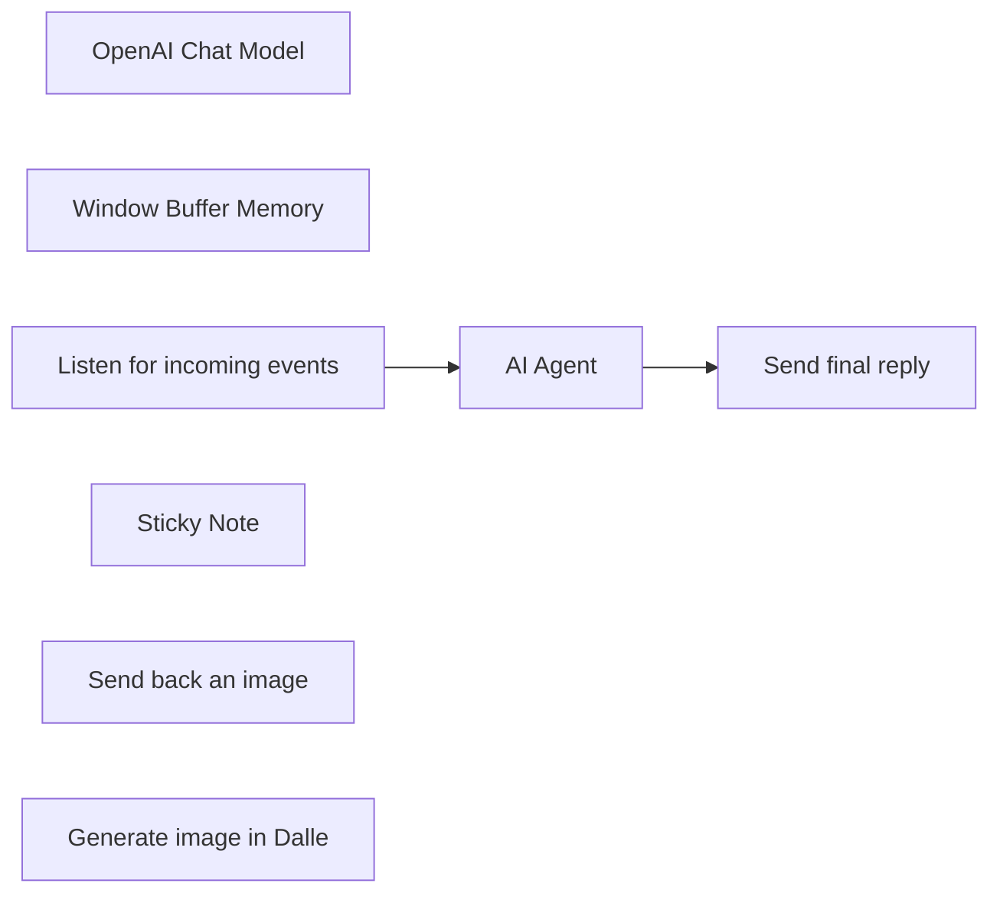
```mermaid
flowchart LR
    N1["OpenAI Chat Model"]
    N2["Window Buffer Memory"]
    N3["Listen for incoming events"]
    N4["Sticky Note"]
    N5["Send final reply"]
    N6["Send back an image"]
    N7["Generate image in Dalle"]
    N8["AI Agent"]

    N8 --> N5
    N3 --> N8
```

## Fluxo (.json) :

```json
{
  "id": "U8EOTtZvmZPMYc6m",
  "meta": {
    "instanceId": "fb924c73af8f703905bc09c9ee8076f48c17b596ed05b18c0ff86915ef8a7c4a",
    "templateCredsSetupCompleted": true
  },
  "name": "Agentic Telegram AI bot with LangChain nodes and new tools",
  "tags": [],
  "nodes": [
    {
      "id": "13b3488e-af72-4d89-bef4-e9b895e3bf76",
      "name": "OpenAI Chat Model",
      "type": "@n8n/n8n-nodes-langchain.lmChatOpenAi",
      "position": [
        1640,
        580
      ],
      "parameters": {
        "model": "gpt-4o",
        "options": {
          "temperature": 0.7,
          "frequencyPenalty": 0.2
        }
      },
      "credentials": {
        "openAiApi": {
          "id": "rveqdSfp7pCRON1T",
          "name": "Ted's Tech Talks OpenAi"
        }
      },
      "typeVersion": 1
    },
    {
      "id": "864937a1-43f6-4055-bdea-61ab07db9903",
      "name": "Window Buffer Memory",
      "type": "@n8n/n8n-nodes-langchain.memoryBufferWindow",
      "position": [
        1760,
        580
      ],
      "parameters": {
        "sessionKey": "=chat_with_{{ $('Listen for incoming events').first().json.message.chat.id }}",
        "contextWindowLength": 10
      },
      "typeVersion": 1
    },
    {
      "id": "4ef838d4-feaa-4bd3-b2c7-ccd938be4373",
      "name": "Listen for incoming events",
      "type": "n8n-nodes-base.telegramTrigger",
      "position": [
        1580,
        360
      ],
      "webhookId": "322dce18-f93e-4f86-b9b1-3305519b7834",
      "parameters": {
        "updates": [
          "*"
        ],
        "additionalFields": {}
      },
      "credentials": {
        "telegramApi": {
          "id": "9dexJXnlVPA6wt8K",
          "name": "Chat & Sound"
        }
      },
      "typeVersion": 1
    },
    {
      "id": "fed51c41-2846-4a1a-a5f5-ce121ee7fe88",
      "name": "Sticky Note",
      "type": "n8n-nodes-base.stickyNote",
      "position": [
        1460,
        180
      ],
      "parameters": {
        "color": 7,
        "width": 926.3188190787038,
        "height": 553.452795998601,
        "content": "## Generate an image with Dall-E-3 and send it via Telegram"
      },
      "typeVersion": 1
    },
    {
      "id": "1c7a204b-3ed7-47bd-a434-202b05272d18",
      "name": "Send final reply",
      "type": "n8n-nodes-base.telegram",
      "onError": "continueErrorOutput",
      "position": [
        2140,
        360
      ],
      "parameters": {
        "text": "={{ $json.output }}",
        "chatId": "={{ $('Listen for incoming events').first().json.message.from.id }}",
        "additionalFields": {
          "appendAttribution": false
        }
      },
      "credentials": {
        "telegramApi": {
          "id": "9dexJXnlVPA6wt8K",
          "name": "Chat & Sound"
        }
      },
      "typeVersion": 1.1
    },
    {
      "id": "bebbe9d4-47ba-4c13-9e1e-d36bfe6e472e",
      "name": "Send back an image",
      "type": "n8n-nodes-base.telegramTool",
      "position": [
        2020,
        580
      ],
      "parameters": {
        "file": "={{ $fromAI(\"url\", \"a valid url of an image\", \"string\", \" \") }}",
        "chatId": "={{ $('Listen for incoming events').first().json.message.from.id }}",
        "operation": "sendDocument",
        "additionalFields": {}
      },
      "credentials": {
        "telegramApi": {
          "id": "9dexJXnlVPA6wt8K",
          "name": "Chat & Sound"
        }
      },
      "typeVersion": 1.2
    },
    {
      "id": "38f2410d-bd55-4ddf-8aaa-4e28919de78f",
      "name": "Generate image in Dalle",
      "type": "@n8n/n8n-nodes-langchain.toolHttpRequest",
      "position": [
        1880,
        580
      ],
      "parameters": {
        "url": "https://api.openai.com/v1/images/generations",
        "method": "POST",
        "sendBody": true,
        "authentication": "predefinedCredentialType",
        "parametersBody": {
          "values": [
            {
              "name": "model",
              "value": "dall-e-3",
              "valueProvider": "fieldValue"
            },
            {
              "name": "prompt"
            }
          ]
        },
        "toolDescription": "Call this tool to request a Dall-E-3 model, when the user asks to draw something. If you gеt a response from this tool, forward it to the Telegram tool.",
        "nodeCredentialType": "openAiApi"
      },
      "credentials": {
        "openAiApi": {
          "id": "rveqdSfp7pCRON1T",
          "name": "Ted's Tech Talks OpenAi"
        }
      },
      "typeVersion": 1.1
    },
    {
      "id": "34265eab-9f37-475a-a2ae-a6c37c69c595",
      "name": "AI Agent",
      "type": "@n8n/n8n-nodes-langchain.agent",
      "position": [
        1780,
        360
      ],
      "parameters": {
        "text": "={{ $json.message.text }}",
        "options": {
          "systemMessage": "=You are a helpful assistant. You are communicating with a user named {{ $json.message.from.first_name }}. Address the user by name every time. If the user asks for an image, always send the link to the image in the final reply."
        },
        "promptType": "define"
      },
      "typeVersion": 1.7
    }
  ],
  "active": false,
  "pinData": {},
  "settings": {
    "executionOrder": "v1"
  },
  "versionId": "b36989c5-295a-4df6-84e9-776815509bc9",
  "connections": {
    "AI Agent": {
      "main": [
        [
          {
            "node": "Send final reply",
            "type": "main",
            "index": 0
          }
        ]
      ]
    },
    "OpenAI Chat Model": {
      "ai_languageModel": [
        [
          {
            "node": "AI Agent",
            "type": "ai_languageModel",
            "index": 0
          }
        ]
      ]
    },
    "Send back an image": {
      "ai_tool": [
        [
          {
            "node": "AI Agent",
            "type": "ai_tool",
            "index": 0
          }
        ]
      ]
    },
    "Window Buffer Memory": {
      "ai_memory": [
        [
          {
            "node": "AI Agent",
            "type": "ai_memory",
            "index": 0
          }
        ]
      ]
    },
    "Generate image in Dalle": {
      "ai_tool": [
        [
          {
            "node": "AI Agent",
            "type": "ai_tool",
            "index": 0
          }
        ]
      ]
    },
    "Listen for incoming events": {
      "main": [
        [
          {
            "node": "AI Agent",
            "type": "main",
            "index": 0
          }
        ]
      ]
    }
  }
}
```

<a id="template-646"></a>

## Template 646 - Processamento de webhooks Adobe Sign

- **Nome:** Processamento de webhooks Adobe Sign
- **Descrição:** Fluxo que recebe webhooks na rota /test1, extrai o identificador do cliente a partir do cabeçalho e coleta dados do acordo enviados no corpo.
- **Funcionalidade:** • Recepção de webhooks (GET/POST): Aceita requisições HTTP na rota /test1 tanto por GET quanto por POST.
• Extração do cabeçalho x-adobesign-clientid: Lê o valor do cabeçalho enviado e armazena como clientID.
• Enriquecimento dos dados: Adiciona um campo myNewField com valor 1 e anexa o clientID aos dados recebidos.
• Resposta ao remetente com cabeçalho: Retorna uma resposta ao emissor incluindo o mesmo x-adobesign-clientid no cabeçalho da resposta.
• Extração de dados do corpo do webhook: Captura e armazena o corpo completo do webhook e campos específicos do acordo (agreement id, participantSetsInfo e status) em variáveis.
- **Ferramentas:** • Adobe Sign: Plataforma de assinatura eletrônica que envia webhooks contendo informações de acordos e o cabeçalho x-adobesign-clientid.

## Fluxo visual

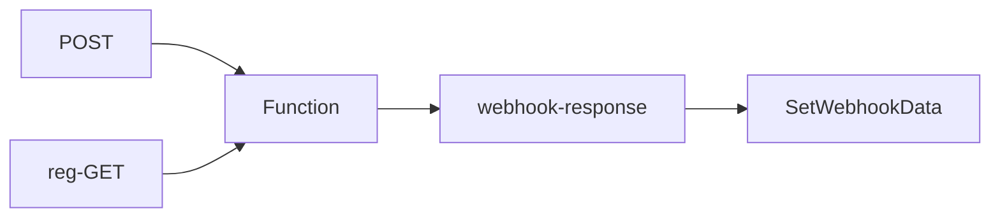
```mermaid
flowchart LR
    N1["Function"]
    N2["POST"]
    N3["reg-GET"]
    N4["webhook-response"]
    N5["SetWebhookData"]

    N2 --> N1
    N3 --> N1
    N1 --> N4
    N4 --> N5
```

## Fluxo (.json) :

```json
{
  "nodes": [
    {
      "name": "Function",
      "type": "n8n-nodes-base.function",
      "position": [
        -280,
        -80
      ],
      "parameters": {
        "functionCode": "// Code here will run only once, no matter how many input items there are.\n// More info and help: https://docs.n8n.io/nodes/n8n-nodes-base.function\n\n// Loop over inputs and add a new field called 'myNewField' to the JSON of each one\nc_id = items[0].json.headers['x-adobesign-clientid'];\n\nfor (item of items) {\n  item.json.myNewField = 1;\n  item.json.clientID = c_id;\n}\n\nreturn items;"
      },
      "typeVersion": 1
    },
    {
      "name": "POST",
      "type": "n8n-nodes-base.webhook",
      "position": [
        -540,
        -160
      ],
      "webhookId": "dfe2a7a8-c0f7-41e1-9bf7-15e2b6e98741",
      "parameters": {
        "path": "test1",
        "options": {},
        "httpMethod": "POST",
        "responseMode": "responseNode"
      },
      "typeVersion": 1
    },
    {
      "name": "reg-GET",
      "type": "n8n-nodes-base.webhook",
      "position": [
        -540,
        20
      ],
      "webhookId": "5356a36b-1090-4470-ad87-7cfdb6c18daf",
      "parameters": {
        "path": "test1",
        "options": {},
        "responseMode": "responseNode"
      },
      "typeVersion": 1
    },
    {
      "name": "webhook-response",
      "type": "n8n-nodes-base.respondToWebhook",
      "position": [
        -100,
        -80
      ],
      "parameters": {
        "options": {
          "responseHeaders": {
            "entries": [
              {
                "name": "x-adobesign-clientid",
                "value": "={{$node[\"Function\"].json[\"clientID\"]}}"
              }
            ]
          }
        }
      },
      "typeVersion": 1
    },
    {
      "name": "SetWebhookData",
      "type": "n8n-nodes-base.set",
      "position": [
        60,
        -80
      ],
      "parameters": {
        "values": {
          "string": [
            {
              "name": "webhookData",
              "value": "={{ $item(\"0\").$node[\"webhook-response\"].json[\"body\"] }}"
            },
            {
              "name": "agreement_ID",
              "value": "={{ $item(\"0\").$node[\"webhook-response\"].json[\"body\"][\"agreement\"][\"id\"] }}"
            },
            {
              "name": "all_participants",
              "value": "={{ $item(\"0\").$node[\"webhook-response\"].json[\"body\"][\"agreement\"][\"participantSetsInfo\"] }}"
            },
            {
              "name": "agreement_status",
              "value": "={{ $item(\"0\").$node[\"webhook-response\"].json[\"body\"][\"agreement\"][\"status\"] }}"
            }
          ]
        },
        "options": {},
        "keepOnlySet": true
      },
      "typeVersion": 1
    }
  ],
  "connections": {
    "POST": {
      "main": [
        [
          {
            "node": "Function",
            "type": "main",
            "index": 0
          }
        ]
      ]
    },
    "reg-GET": {
      "main": [
        [
          {
            "node": "Function",
            "type": "main",
            "index": 0
          }
        ]
      ]
    },
    "Function": {
      "main": [
        [
          {
            "node": "webhook-response",
            "type": "main",
            "index": 0
          }
        ]
      ]
    },
    "webhook-response": {
      "main": [
        [
          {
            "node": "SetWebhookData",
            "type": "main",
            "index": 0
          }
        ]
      ]
    }
  }
}
```

<a id="template-647"></a>

## Template 647 - Análise RAG de earnings trimestrais

- **Nome:** Análise RAG de earnings trimestrais
- **Descrição:** Fluxo que ingere PDFs de resultados trimestrais de uma empresa, transforma o conteúdo em embeddings, indexa em um banco vetorial e usa modelos de IA para gerar um relatório analítico salvo em um documento do Google Docs.
- **Funcionalidade:** • Leitura da lista de arquivos: Recupera URLs e metadados de PDFs a partir de uma planilha.
• Download de arquivos: Faz o download dos PDFs armazenados no drive especificado.
• Extração e preparação de texto: Carrega o conteúdo dos PDFs e aplica divisão em fragmentos para processamento.
• Geração de embeddings: Converte os fragmentos de texto em vetores semânticos usando um modelo de embeddings.
• Indexação em banco vetorial: Insere os embeddings no índice vetorial para pesquisa semântica (RAG).
• Recuperação semântica: Consulta o banco vetorial para obter trechos relevantes relacionados às consultas financeiras.
• Análise com agente de IA: Um agente usa os trechos recuperados para sintetizar insights, comparar os últimos três trimestres e identificar tendências e outliers.
• Geração e salvamento de relatório: Formata o resultado em um relatório (Markdown) e salva/atualiza um Google Doc especificado.
- **Ferramentas:** • Pinecone: Banco vetorial para armazenar e recuperar embeddings semânticos.
• Google Drive: Armazenamento dos arquivos PDF fonte.
• Google Sheets: Lista e organização de URLs/metadados dos arquivos a serem processados.
• Google Docs: Local onde o relatório final é criado ou atualizado.
• Google Gemini (PaLM): Modelos usados para gerar embeddings (text-embedding-004) e para o chat/razonamento (modelo Gemini).
• OpenAI: Modelo de linguagem alternativo integrado para suporte à geração de texto.

## Fluxo visual

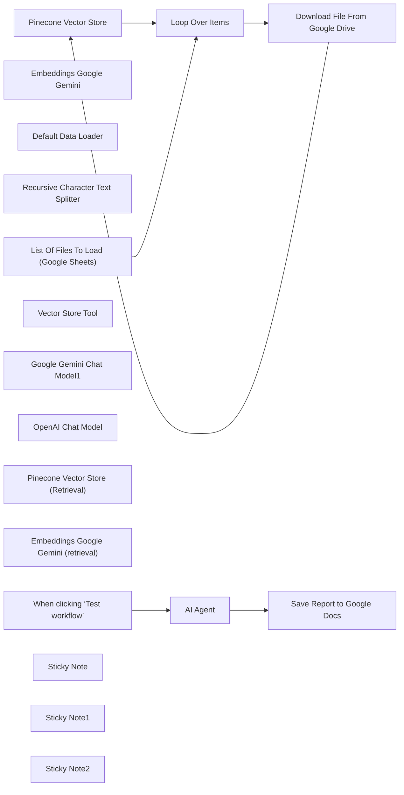
```mermaid
flowchart LR
    N1["Pinecone Vector Store"]
    N2["Embeddings Google Gemini"]
    N3["Default Data Loader"]
    N4["Recursive Character Text Splitter"]
    N5["Loop Over Items"]
    N6["When clicking ‘Test workflow’"]
    N7["AI Agent"]
    N8["Vector Store Tool"]
    N9["Google Gemini Chat Model1"]
    N10["OpenAI Chat Model"]
    N11["Pinecone Vector Store (Retrieval)"]
    N12["Save Report to Google Docs"]
    N13["Embeddings Google Gemini (retrieval)"]
    N14["List Of Files To Load (Google Sheets)"]
    N15["Download File From Google Drive"]
    N16["Sticky Note"]
    N17["Sticky Note1"]
    N18["Sticky Note2"]

    N7 --> N12
    N5 --> N15
    N1 --> N5
    N15 --> N1
    N6 --> N7
    N14 --> N5
```

## Fluxo (.json) :

```json
{
  "id": "fqaNojXWrspqjfkY",
  "meta": {
    "instanceId": "69133932b9ba8e1ef14816d0b63297bb44feb97c19f759b5d153ff6b0c59e18d"
  },
  "name": "RAG Workflow For Stock Earnings Report Analysis",
  "tags": [],
  "nodes": [
    {
      "id": "1a621f76-9636-430d-94dd-d5e7dcd5afdc",
      "name": "Pinecone Vector Store",
      "type": "@n8n/n8n-nodes-langchain.vectorStorePinecone",
      "position": [
        380,
        -60
      ],
      "parameters": {
        "mode": "insert",
        "options": {},
        "pineconeIndex": {
          "__rl": true,
          "mode": "list",
          "value": "company-earnings",
          "cachedResultName": "company-earnings"
        }
      },
      "credentials": {
        "pineconeApi": {
          "id": "bQTNry52ypGLqt47",
          "name": "PineconeApi account"
        }
      },
      "typeVersion": 1
    },
    {
      "id": "e5936e45-0f58-48e9-9ab4-cc69f2ef6578",
      "name": "Embeddings Google Gemini",
      "type": "@n8n/n8n-nodes-langchain.embeddingsGoogleGemini",
      "position": [
        300,
        220
      ],
      "parameters": {
        "modelName": "models/text-embedding-004"
      },
      "credentials": {
        "googlePalmApi": {
          "id": "jLOqyTR4yTT1nYKi",
          "name": "Google Gemini(PaLM) Api account"
        }
      },
      "typeVersion": 1
    },
    {
      "id": "e98dbc8e-6b4a-415d-a044-85e590fcb105",
      "name": "Default Data Loader",
      "type": "@n8n/n8n-nodes-langchain.documentDefaultDataLoader",
      "position": [
        520,
        200
      ],
      "parameters": {
        "loader": "pdfLoader",
        "options": {},
        "dataType": "binary"
      },
      "typeVersion": 1
    },
    {
      "id": "ae77f5f4-3704-4b66-9c3f-27d6bd3f68c3",
      "name": "Recursive Character Text Splitter",
      "type": "@n8n/n8n-nodes-langchain.textSplitterRecursiveCharacterTextSplitter",
      "position": [
        560,
        380
      ],
      "parameters": {
        "options": {}
      },
      "typeVersion": 1
    },
    {
      "id": "d939c9db-0edc-4205-b8e5-fb34b0076510",
      "name": "Loop Over Items",
      "type": "n8n-nodes-base.splitInBatches",
      "position": [
        -120,
        -60
      ],
      "parameters": {
        "options": {}
      },
      "typeVersion": 3
    },
    {
      "id": "4f8421b4-1a11-4ac3-a9ca-1d725a8ec98e",
      "name": "When clicking ‘Test workflow’",
      "type": "n8n-nodes-base.manualTrigger",
      "position": [
        -360,
        640
      ],
      "parameters": {},
      "typeVersion": 1
    },
    {
      "id": "c9e2ec39-c34d-4d8e-b772-d1c1cd823d9e",
      "name": "AI Agent",
      "type": "@n8n/n8n-nodes-langchain.agent",
      "position": [
        -40,
        640
      ],
      "parameters": {
        "text": "Give me a report on Google's last 3 quarter earnings. Format it in markdown. Focus on the differences and trends. Spot any outliers.",
        "options": {
          "systemMessage": "You are a highly skilled financial analyst specializing in analyzing Google's (Alphabet Inc.) financial performance. You have access to two powerful tools:\n\n1.  **Vector Store Tool:** This tool allows you to retrieve relevant information from the past three quarters of Google's earnings reports (PDF documents). The documents have been processed and stored as embeddings in a vector database, enabling semantic search. Use this tool to find specific information related to revenue, expenses, profits, losses, growth, key metrics, management commentary, and any other relevant financial data.\n2.  **Google Docs Tool:** This tool allows you to create, edit, and format Google Docs. Use this tool to save your findings into a Google Doc.\n\nYour task is to answer user queries related to Google's financial performance based on the last three quarters' earnings reports. When a user asks a question:\n\n1.  **Understand the User's Intent:** Carefully analyze the user's query to determine what specific financial information they are seeking. Identify keywords, timeframes (e.g., \"previous quarter\"), and the type of analysis requested (e.g., trend analysis, comparison, explanation).\n2.  **Retrieve Relevant Information:** Use the Vector Store Tool to search for and retrieve the most relevant text passages from the earnings reports that address the user's query. Retrieve multiple, diverse chunks to ensure comprehensive coverage.\n3.  **Synthesize and Analyze:**  Analyze the information from the retrieved text chunks. Identify key trends, patterns, and insights related to the user's query.\n4.  **Generate Report in Google Docs:** Use the Google Docs Tool to create a new Google Doc (or append to an existing one, if specified by the user). Structure the report with clear headings, bullet points, and concise paragraphs. Include the following in your report as appropriate:\n    *   **Executive Summary:** A brief overview of the key findings.\n    *   **Revenue Analysis:**  Report on revenue figures, growth rates, and key revenue drivers.\n    *   **Expense Analysis:** Report on major expense categories and their impact on profitability.\n    *   **Profitability Analysis:** Discuss net income, profit margins, and earnings per share (EPS).\n    *   **Key Metrics:** Include other relevant financial metrics mentioned in the reports (e.g., operating income, cash flow, segment performance).\n    *   **Management Commentary:** Summarize any relevant insights or explanations provided by Google's management in the earnings calls or reports.\n    *   **Trend Analysis:** Compare the current quarter's performance to the previous two quarters, highlighting significant changes or trends.\n    *   **Visualizations:** If possible, use the Google Docs tool to insert basic charts or tables to visually represent the data. (You might need to guide the user on how to do this if the tool has limitations.)\n5.  **Cite Sources:**  Clearly indicate the source of your information (e.g., \"Q2 2023 Earnings Report\") for each data point or analysis.\n6.  **Maintain a Professional Tone:** Write in a clear, concise, and objective tone, as expected of a financial analyst. Avoid speculation or making unsubstantiated claims.\n\nYour ultimate goal is to provide the user with a well-structured, informative, and accurate financial report based on the data available in the last three quarters of Google's earnings reports.\nSave the report in as a Google Doc using the available tool!"
        },
        "promptType": "define"
      },
      "typeVersion": 1.7
    },
    {
      "id": "40534b4d-3061-4054-8c0a-b08fe32deaf7",
      "name": "Vector Store Tool",
      "type": "@n8n/n8n-nodes-langchain.toolVectorStore",
      "position": [
        360,
        860
      ],
      "parameters": {
        "name": "company_financial_earnings_data_tool",
        "description": "Retrieve information about the last 3 quarters of Google Earnings"
      },
      "typeVersion": 1
    },
    {
      "id": "c584d5f6-1fac-420f-a28d-71f51b555e67",
      "name": "Google Gemini Chat Model1",
      "type": "@n8n/n8n-nodes-langchain.lmChatGoogleGemini",
      "position": [
        620,
        1060
      ],
      "parameters": {
        "options": {},
        "modelName": "models/gemini-2.0-flash-exp"
      },
      "credentials": {
        "googlePalmApi": {
          "id": "jLOqyTR4yTT1nYKi",
          "name": "Google Gemini(PaLM) Api account"
        }
      },
      "typeVersion": 1
    },
    {
      "id": "f4f993d0-c80a-4f26-bc51-fe7df1012606",
      "name": "OpenAI Chat Model",
      "type": "@n8n/n8n-nodes-langchain.lmChatOpenAi",
      "position": [
        -160,
        860
      ],
      "parameters": {
        "options": {}
      },
      "credentials": {
        "openAiApi": {
          "id": "tQLWnWRzD8aebYvp",
          "name": "OpenAi account"
        }
      },
      "typeVersion": 1.1
    },
    {
      "id": "4aa3726e-a105-4bfe-b1df-06c3c9ece18a",
      "name": "Pinecone Vector Store (Retrieval)",
      "type": "@n8n/n8n-nodes-langchain.vectorStorePinecone",
      "position": [
        260,
        1080
      ],
      "parameters": {
        "options": {},
        "pineconeIndex": {
          "__rl": true,
          "mode": "list",
          "value": "company-earnings",
          "cachedResultName": "company-earnings"
        }
      },
      "credentials": {
        "pineconeApi": {
          "id": "bQTNry52ypGLqt47",
          "name": "PineconeApi account"
        }
      },
      "typeVersion": 1
    },
    {
      "id": "e08dd92a-a7a1-4204-bef9-54611a2dee92",
      "name": "Save Report to Google Docs",
      "type": "n8n-nodes-base.googleDocs",
      "position": [
        460,
        640
      ],
      "parameters": {
        "actionsUi": {
          "actionFields": [
            {
              "text": "={{ $json.output }}",
              "action": "insert"
            }
          ]
        },
        "operation": "update",
        "documentURL": "1aOUl-mnCaI4__tULmBZSvWlOQhTHdD-RUPesP7_sFT4"
      },
      "credentials": {
        "googleDocsOAuth2Api": {
          "id": "nnE7RqZglLn8XarL",
          "name": "Google Docs account"
        }
      },
      "typeVersion": 2
    },
    {
      "id": "1984765a-3148-4bcf-9d20-fe29291fda6d",
      "name": "Embeddings Google Gemini (retrieval)",
      "type": "@n8n/n8n-nodes-langchain.embeddingsGoogleGemini",
      "position": [
        240,
        1260
      ],
      "parameters": {
        "modelName": "models/text-embedding-004"
      },
      "credentials": {
        "googlePalmApi": {
          "id": "jLOqyTR4yTT1nYKi",
          "name": "Google Gemini(PaLM) Api account"
        }
      },
      "typeVersion": 1
    },
    {
      "id": "9b0bff2e-06f4-4c89-b9dc-c54cfb79577c",
      "name": "List Of Files To Load (Google Sheets)",
      "type": "n8n-nodes-base.googleSheets",
      "position": [
        -380,
        -60
      ],
      "parameters": {
        "options": {},
        "sheetName": {
          "__rl": true,
          "mode": "list",
          "value": 1476836405,
          "cachedResultUrl": "https://docs.google.com/spreadsheets/d/1ckP-ZgAMs2l2sFUpLAXx-gWNOQrHXoAs48Vo271X3rs/edit#gid=1476836405",
          "cachedResultName": "GOOG"
        },
        "documentId": {
          "__rl": true,
          "mode": "list",
          "value": "1ckP-ZgAMs2l2sFUpLAXx-gWNOQrHXoAs48Vo271X3rs",
          "cachedResultUrl": "https://docs.google.com/spreadsheets/d/1ckP-ZgAMs2l2sFUpLAXx-gWNOQrHXoAs48Vo271X3rs/edit?usp=drivesdk",
          "cachedResultName": "Watchlist"
        }
      },
      "credentials": {
        "googleSheetsOAuth2Api": {
          "id": "sRJmS2k8zdqVjtJL",
          "name": "Google Sheets account"
        }
      },
      "typeVersion": 4.5
    },
    {
      "id": "b0d58ce5-9ac0-4f0f-ac7c-d6cb27551d82",
      "name": "Download File From Google Drive",
      "type": "n8n-nodes-base.googleDrive",
      "position": [
        160,
        -60
      ],
      "parameters": {
        "fileId": {
          "__rl": true,
          "mode": "url",
          "value": "={{ $('List Of Files To Load (Google Sheets)').item.json['File URL'] }}"
        },
        "options": {
          "fileName": "={{ $('List Of Files To Load (Google Sheets)').item.json['10Q'] }}"
        },
        "operation": "download"
      },
      "credentials": {
        "googleDriveOAuth2Api": {
          "id": "uixLsi5TmrfwXPeB",
          "name": "Google Drive account"
        }
      },
      "typeVersion": 3
    },
    {
      "id": "28817b3d-fb54-4dc2-83bc-3ac27320712b",
      "name": "Sticky Note",
      "type": "n8n-nodes-base.stickyNote",
      "position": [
        -1100,
        80
      ],
      "parameters": {
        "width": 500,
        "height": 740,
        "content": "## Set up steps\n1. Google Cloud Project & Vertex AI API:\n\t* Create a Google Cloud project.\n\t* Enable the Vertex AI API for your project.\n2. Google AI API key:\n\t* Obtain a Google AI API key from Google AI Studio.\n3. Pinecone account and API key:\n\t* Create a free account on the Pinecone website.\n\t* Obtain your API key from your Pinecone dashboard.\n\t* Create an index named company-earnings in your Pinecone project.\n4. Google Drive - download and save financial documents:\n\t* Go to a company you want to analize and download their quarterly earnings PDFs\n\t* Save the PDFs in Google Drive\n\t* Create a Google Sheet that stores a list of file URLs pointing to the PDFs you downloaded and saved to Google Drive\n5. Configure credentials in your n8n environment for:\n\t* Google Sheets OAuth2\n\t* Google Drive OAuth2\n\t* Google Docs OAuth2\n\t* Google Gemini(PaLM) Api (using your Google AI API key)\n\t* Pinecone API (using your Pinecone API key)\n6. Import and configure the workflow:\n\t* Import this workflow into your n8n instance.\n\t* Update the List Of Files To Load (Google Sheets) node to point to your Google Sheet.\n\t* Update the Download File From Google Drive to point to the column where the file URLs are\n\t* Update the Save Report to Google Docs node to point to your Google Doc where you want the report saved."
      },
      "typeVersion": 1
    },
    {
      "id": "eecb1c25-c019-44e4-b254-a919f80faee7",
      "name": "Sticky Note1",
      "type": "n8n-nodes-base.stickyNote",
      "position": [
        380,
        -260
      ],
      "parameters": {
        "content": "## Loading data to Pinecone vector store"
      },
      "typeVersion": 1
    },
    {
      "id": "8371f7f8-29a7-4711-b635-d5538f3441b8",
      "name": "Sticky Note2",
      "type": "n8n-nodes-base.stickyNote",
      "position": [
        -40,
        460
      ],
      "parameters": {
        "content": "## AI Agent Report Generation using RAG"
      },
      "typeVersion": 1
    }
  ],
  "active": false,
  "pinData": {
    "AI Agent": [
      {
        "json": {
          "output": "# Google (Alphabet Inc.) Financial Report: Last 3 Quarters\n\n## Executive Summary\nGoogle has demonstrated solid revenue growth across the last three quarters, although there are notable fluctuations in operating income, net income, and other income/expense categories. While revenue from both Google Services and Cloud shows consistent year-over-year growth, the operating margins have shown variability. \n\n## Revenue Analysis\n- **Quarter 1:**\n  - **Revenue:** $80.5 billion, a 15% year-over-year increase.\n  - **Google Services Revenue:** Up $8.4 billion (14%).\n  - **Google Cloud Revenue:** Up $2.1 billion (28%).\n\n- **Quarter 2:**\n  - **Revenue:** $84.7 billion, a 14% year-over-year increase.\n  - **Google Services Revenue:** Up $7.6 billion (12%).\n  - **Google Cloud Revenue:** Up $2.3 billion (29%).\n\n- **Quarter 3:**\n  - **Revenue:** $88.3 billion, a 15% year-over-year increase.\n  - **Google Services Revenue:** Up $8.5 billion (13%).\n  - **Google Cloud Revenue:** Up $2.9 billion (35%).\n\n### Key Trends\n- Consistent revenue growth across all three quarters.\n- Strong growth in Google Cloud, indicating it is a significant area of expansion.\n\n## Expense Analysis\n- **Cost of Revenue:**\n  - **Quarter 1:** $33.7 billion (up 10% year-over-year).\n  - Reason for increase: Higher total acquisition costs, content acquisition costs, and depreciation.\n\n- **Operating Income:**\n  - **Quarter 1:** $17.415 billion (25% operating margin).\n  - **Quarter 2:** $21.838 billion (29% operating margin).\n  - **Quarter 3:** $21.343 billion (28% operating margin).\n\n### Observations\n- Operating margins have fluctuated, while overall costs have continued to rise.\n  \n## Profitability Analysis\n- **Net Income:**\n  - **Quarter 1:** $15.051 billion.\n  - **Quarter 2:** $18.368 billion.\n  - **Quarter 3:** $19.689 billion.\n  \n- **Diluted EPS:**\n  - **Quarter 1:** $1.17.\n  - **Quarter 2:** $1.44.\n  - **Quarter 3:** $1.55.\n\n### Summary\nWhile net income has increased, the fluctuations in other income and expense metrics have affected profitability.\n\n## Key Metrics\n- **Operating Margins:**\n  - Q1: 25%\n  - Q2: 29%\n  - Q3: 28%\n\n- **Other Income (Expense), Net:**\n  - Q1: $790 million.\n  - Q2: $65 million.\n  - Q3: -$146 million. (Downturn to a negative number)\n\n## Management Commentary\nManagement has pointed out that increased revenue performance in Google Cloud is encouraging, especially given the challenges in the overall economic environment.\n\n## Trend Analysis\n- **Comparative Performance:**\n  - Revenue trends show consistency, ranging from 14%-15% growth year-over-year.\n  - Operating income showed a decreasing trend from Q1 ($17.415 billion) to Q2 ($21.838 billion) and slightly decreased again in Q3 ($21.343 billion).\n  \n### Noteworthy Observations\n- **Outliers:**\n  - Significant volatility in other income/expense net, transitioning from $790 million in Q1 to a loss of $146 million in Q3.\n  \n- **Operating Margins:** \n  - Variability seen in margins from Q1 (25%) to Q2 (29%) and back down to Q3 (28%) shows a trend of volatility.\n\n## Conclusion\nGoogle has maintained a strong financial position characterized by solid revenue growth. However, the apparent volatility in other income/expense and operating margins warrants closer scrutiny, as it could impact future profitability. The continuous growth in Google Cloud is a positive indicator and suggests strong potential for the coming quarters.\n\n---\n\nThis report provides a comprehensive overview of Google's financial performance over the past three quarters, highlighting key metrics, trends, and outliers. If you require further details or specific analysis, please let me know!"
        }
      }
    ]
  },
  "settings": {
    "executionOrder": "v1"
  },
  "versionId": "30c9a6f0-8ace-40c3-8ca7-a79fd91c12a7",
  "connections": {
    "AI Agent": {
      "main": [
        [
          {
            "node": "Save Report to Google Docs",
            "type": "main",
            "index": 0
          }
        ]
      ]
    },
    "Loop Over Items": {
      "main": [
        [],
        [
          {
            "node": "Download File From Google Drive",
            "type": "main",
            "index": 0
          }
        ]
      ]
    },
    "OpenAI Chat Model": {
      "ai_languageModel": [
        [
          {
            "node": "AI Agent",
            "type": "ai_languageModel",
            "index": 0
          }
        ]
      ]
    },
    "Vector Store Tool": {
      "ai_tool": [
        [
          {
            "node": "AI Agent",
            "type": "ai_tool",
            "index": 0
          }
        ]
      ]
    },
    "Default Data Loader": {
      "ai_document": [
        [
          {
            "node": "Pinecone Vector Store",
            "type": "ai_document",
            "index": 0
          }
        ]
      ]
    },
    "Pinecone Vector Store": {
      "main": [
        [
          {
            "node": "Loop Over Items",
            "type": "main",
            "index": 0
          }
        ]
      ]
    },
    "Embeddings Google Gemini": {
      "ai_embedding": [
        [
          {
            "node": "Pinecone Vector Store",
            "type": "ai_embedding",
            "index": 0
          }
        ]
      ]
    },
    "Google Gemini Chat Model1": {
      "ai_languageModel": [
        [
          {
            "node": "Vector Store Tool",
            "type": "ai_languageModel",
            "index": 0
          }
        ]
      ]
    },
    "Download File From Google Drive": {
      "main": [
        [
          {
            "node": "Pinecone Vector Store",
            "type": "main",
            "index": 0
          }
        ]
      ]
    },
    "Pinecone Vector Store (Retrieval)": {
      "ai_vectorStore": [
        [
          {
            "node": "Vector Store Tool",
            "type": "ai_vectorStore",
            "index": 0
          }
        ]
      ]
    },
    "Recursive Character Text Splitter": {
      "ai_textSplitter": [
        [
          {
            "node": "Default Data Loader",
            "type": "ai_textSplitter",
            "index": 0
          }
        ]
      ]
    },
    "When clicking ‘Test workflow’": {
      "main": [
        [
          {
            "node": "AI Agent",
            "type": "main",
            "index": 0
          }
        ]
      ]
    },
    "Embeddings Google Gemini (retrieval)": {
      "ai_embedding": [
        [
          {
            "node": "Pinecone Vector Store (Retrieval)",
            "type": "ai_embedding",
            "index": 0
          }
        ]
      ]
    },
    "List Of Files To Load (Google Sheets)": {
      "main": [
        [
          {
            "node": "Loop Over Items",
            "type": "main",
            "index": 0
          }
        ]
      ]
    }
  }
}
```

<a id="template-648"></a>

## Template 648 - Relatório semanal do time

- **Nome:** Relatório semanal do time
- **Descrição:** Coleta automaticamente as mensagens da última semana em um canal do Slack, resume conversas com IA e publica um relatório semanal agregando atividades dos membros.
- **Funcionalidade:** • Agendamento semanal: Executa o fluxo automaticamente toda segunda-feira às 6h para gerar o relatório da semana anterior.
• Coleta de mensagens: Recupera todas as mensagens de um canal do Slack dentro do período especificado (última semana).
• Agrupamento por autor: Agrupa mensagens por usuário para analisar atividade individual.
• Extração de threads e respostas: Busca replies de cada mensagem para obter contexto completo das conversas.
• Resolução de identificadores de usuários: Busca informações dos autores e dos usuários que responderam para atribuir nomes aos comentários.
• Resumo de threads com IA: Utiliza um modelo de linguagem para resumir cada thread e destacar conquistas, tentativas e desafios.
• Geração de relatórios individuais: Consolida os resumos das threads por usuário e gera um mini-relatório focado em wins e desafios.
• Agregação em relatório do time: Junta todos os relatórios individuais em um relatório do time, conectando temas semelhantes e destacando pontos relevantes.
• Publicação no canal: Publica o relatório final no canal do Slack escolhido para que a equipe veja na manhã de segunda-feira.
- **Ferramentas:** • Slack: Plataforma de mensagens usada para coletar mensagens, buscar threads e publicar o relatório final.
• Google Gemini (PaLM): Modelo de linguagem usado para resumir threads e gerar relatórios individuais e do time.
• Agendador (cron): Mecanismo de agendamento que garante execução automática semanal (segunda-feira às 6h).

## Fluxo visual

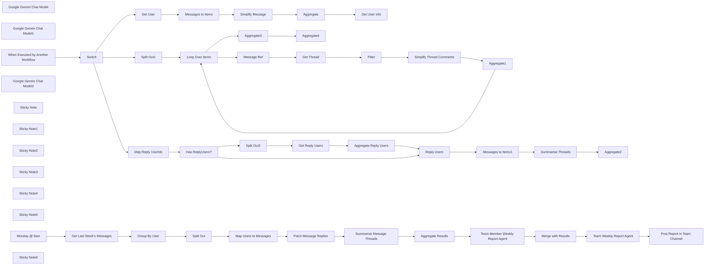
```mermaid
flowchart LR
    N1["Get Last Week's Messages"]
    N2["Simplify Message"]
    N3["Group By User"]
    N4["Split Out"]
    N5["Messages to Items"]
    N6["Get User"]
    N7["Aggregate"]
    N8["Split Out1"]
    N9["Get Thread"]
    N10["Aggregate1"]
    N11["Simplify Thread Comments"]
    N12["Filter"]
    N13["Message Ref"]
    N14["Split Out2"]
    N15["Map Reply UserIds"]
    N16["Get Reply Users"]
    N17["Google Gemini Chat Model"]
    N18["Summarise Threads"]
    N19["Aggregate2"]
    N20["Aggregate Reply Users"]
    N21["Reply Users"]
    N22["Google Gemini Chat Model1"]
    N23["Loop Over Items"]
    N24["Aggregate3"]
    N25["Aggregate4"]
    N26["When Executed by Another Workflow"]
    N27["Switch"]
    N28["Map Users to Messages"]
    N29["Get User Info"]
    N30["Fetch Message Replies"]
    N31["Has ReplyUsers?"]
    N32["Messages to Items1"]
    N33["Aggregate Results"]
    N34["Team Member Weekly Report Agent"]
    N35["Merge with Results"]
    N36["Team Weekly Report Agent"]
    N37["Google Gemini Chat Model2"]
    N38["Post Report in Team Channel"]
    N39["Sticky Note"]
    N40["Sticky Note1"]
    N41["Sticky Note2"]
    N42["Summarize Message Threads"]
    N43["Sticky Note3"]
    N44["Sticky Note4"]
    N45["Sticky Note5"]
    N46["Monday @ 6am"]
    N47["Sticky Note6"]

    N12 --> N11
    N27 --> N6
    N27 --> N8
    N27 --> N15
    N6 --> N5
    N7 --> N29
    N4 --> N28
    N10 --> N23
    N24 --> N25
    N9 --> N12
    N8 --> N23
    N14 --> N16
    N13 --> N9
    N21 --> N32
    N46 --> N1
    N3 --> N4
    N16 --> N20
    N31 --> N14
    N31 --> N21
    N23 --> N24
    N23 --> N13
    N2 --> N7
    N33 --> N34
    N15 --> N31
    N5 --> N2
    N18 --> N19
    N35 --> N36
    N32 --> N18
    N20 --> N21
    N30 --> N42
    N28 --> N30
    N1 --> N3
    N11 --> N10
    N36 --> N38
    N42 --> N33
    N34 --> N35
    N26 --> N27
```

## Fluxo (.json) :

```json
{
  "meta": {
    "instanceId": "408f9fb9940c3cb18ffdef0e0150fe342d6e655c3a9fac21f0f644e8bedabcd9",
    "templateCredsSetupCompleted": true
  },
  "nodes": [
    {
      "id": "f4322829-1799-4954-a75a-b40e95f41c10",
      "name": "Get Last Week's Messages",
      "type": "n8n-nodes-base.slack",
      "position": [
        -2200,
        -160
      ],
      "webhookId": "8078218a-7edc-4e0b-9b4d-9860bd309877",
      "parameters": {
        "filters": {
          "oldest": "={{ $now.minus('1', 'week') }}",
          "inclusive": false
        },
        "resource": "channel",
        "channelId": {
          "__rl": true,
          "mode": "list",
          "value": "C06RS1WPUQ6",
          "cachedResultName": "general"
        },
        "operation": "history",
        "returnAll": true
      },
      "credentials": {
        "slackApi": {
          "id": "VfK3js0YdqBdQLGP",
          "name": "Slack account"
        }
      },
      "typeVersion": 2.3
    },
    {
      "id": "f0e89c19-ee1f-4a4d-8176-c222c18e0514",
      "name": "Simplify Message",
      "type": "n8n-nodes-base.set",
      "position": [
        -1320,
        380
      ],
      "parameters": {
        "options": {},
        "assignments": {
          "assignments": [
            {
              "id": "547e8934-e6f2-47f0-b8a0-c60bd9d8a0c3",
              "name": "ts",
              "type": "string",
              "value": "={{ $json.ts }}"
            },
            {
              "id": "22473b44-b1d9-4b85-b0d9-1a54c5511ff4",
              "name": "userId",
              "type": "string",
              "value": "={{ $('Get User').first().json.id }}"
            },
            {
              "id": "2059b147-8b12-42c9-bee8-488dc11a0bf7",
              "name": "userName",
              "type": "string",
              "value": "={{ $('Get User').first().json.name }}"
            },
            {
              "id": "34440ea6-ee99-4cd4-9e1c-cf561d335180",
              "name": "type",
              "type": "string",
              "value": "={{ $json.type }}"
            },
            {
              "id": "ff1155c5-43e1-4e0e-82a8-9e013a7f1db1",
              "name": "text",
              "type": "string",
              "value": "={{ $json.text.replace(/(<@[^>]+>)/ig, '').trim() }}"
            }
          ]
        }
      },
      "typeVersion": 3.4
    },
    {
      "id": "1293a7cf-1467-432f-b7ed-606146618808",
      "name": "Group By User",
      "type": "n8n-nodes-base.code",
      "position": [
        -2000,
        -160
      ],
      "parameters": {
        "jsCode": "const keyByUser = $input.all()\n  .map(item => item.json)\n  .reduce((acc, message) => {\n    return {\n      ...acc,\n      [message.user]: Array.isArray(acc[message.user])\n        ?  acc[message.user].concat(message)\n        : [message]\n    }\n  }, {});\n\nreturn {\n  data: Object\n    .keys(keyByUser)\n    .map(key => keyByUser[key])\n};"
      },
      "typeVersion": 2
    },
    {
      "id": "681a2368-9688-4ebd-bb88-f48c7ccb3e54",
      "name": "Split Out",
      "type": "n8n-nodes-base.splitOut",
      "position": [
        -1800,
        -160
      ],
      "parameters": {
        "options": {},
        "fieldToSplitOut": "data"
      },
      "typeVersion": 1
    },
    {
      "id": "38a5e6b0-ba4a-4aaa-93f2-ec2a73e5e1af",
      "name": "Messages to Items",
      "type": "n8n-nodes-base.code",
      "position": [
        -1540,
        380
      ],
      "parameters": {
        "jsCode": "return Object.values($('Switch').first().json.data)"
      },
      "typeVersion": 2
    },
    {
      "id": "066e40ef-91d7-4db0-95bb-2027c9251a23",
      "name": "Get User",
      "type": "n8n-nodes-base.slack",
      "position": [
        -1760,
        380
      ],
      "webhookId": "042e9c13-5038-433a-98dc-8b6d83c015de",
      "parameters": {
        "user": {
          "__rl": true,
          "mode": "id",
          "value": "={{ $json.data['0'].user }}"
        },
        "resource": "user"
      },
      "credentials": {
        "slackApi": {
          "id": "VfK3js0YdqBdQLGP",
          "name": "Slack account"
        }
      },
      "typeVersion": 2.3
    },
    {
      "id": "c5d0b4d1-94eb-4e14-9985-85d384d6d96f",
      "name": "Aggregate",
      "type": "n8n-nodes-base.aggregate",
      "position": [
        -1100,
        380
      ],
      "parameters": {
        "options": {},
        "aggregate": "aggregateAllItemData",
        "destinationFieldName": "messages"
      },
      "typeVersion": 1
    },
    {
      "id": "47537a27-90d9-4edc-b9f4-66205bc4a4c2",
      "name": "Split Out1",
      "type": "n8n-nodes-base.splitOut",
      "position": [
        -1760,
        780
      ],
      "parameters": {
        "options": {},
        "fieldToSplitOut": "data.messages"
      },
      "typeVersion": 1
    },
    {
      "id": "6fdd0fc0-c563-46a3-afb2-48853d3e6cef",
      "name": "Get Thread",
      "type": "n8n-nodes-base.slack",
      "position": [
        -1100,
        780
      ],
      "webhookId": "c3ef27dc-2648-4f91-b329-89a7fa833797",
      "parameters": {
        "ts": "={{ $json.ts }}",
        "filters": {},
        "resource": "channel",
        "channelId": {
          "__rl": true,
          "mode": "list",
          "value": "C06RS1WPUQ6",
          "cachedResultName": "general"
        },
        "operation": "replies"
      },
      "credentials": {
        "slackApi": {
          "id": "VfK3js0YdqBdQLGP",
          "name": "Slack account"
        }
      },
      "typeVersion": 2.3
    },
    {
      "id": "0fc6664f-9076-4525-acaa-0f5009de2611",
      "name": "Aggregate1",
      "type": "n8n-nodes-base.aggregate",
      "position": [
        -440,
        860
      ],
      "parameters": {
        "options": {},
        "aggregate": "aggregateAllItemData",
        "destinationFieldName": "replies"
      },
      "typeVersion": 1
    },
    {
      "id": "caf963e5-3d5b-42d8-88ce-1fb5bf03a528",
      "name": "Simplify Thread Comments",
      "type": "n8n-nodes-base.set",
      "position": [
        -660,
        780
      ],
      "parameters": {
        "options": {},
        "assignments": {
          "assignments": [
            {
              "id": "82bc8cbe-c606-4717-b29d-2d8acc149271",
              "name": "ts",
              "type": "string",
              "value": "={{ $json.ts }}"
            },
            {
              "id": "8fcc957d-aa9f-47df-99e8-560228fde30f",
              "name": "userId",
              "type": "string",
              "value": "={{ $json.user }}"
            },
            {
              "id": "e6c6deb3-c3ba-4452-be7c-1a0c42c5dc2c",
              "name": "userName",
              "type": "string",
              "value": ""
            },
            {
              "id": "31d1206d-ecbd-48d3-a00a-845fd53d1cfa",
              "name": "type",
              "type": "string",
              "value": "={{ $json.type }}"
            },
            {
              "id": "da126e6c-8dfc-41aa-991a-231b3cb3004b",
              "name": "text",
              "type": "string",
              "value": "={{ $json.text }}"
            }
          ]
        }
      },
      "typeVersion": 3.4
    },
    {
      "id": "aab0ae1c-50da-49e5-a373-c32b39108041",
      "name": "Filter",
      "type": "n8n-nodes-base.filter",
      "position": [
        -880,
        780
      ],
      "parameters": {
        "options": {},
        "conditions": {
          "options": {
            "version": 2,
            "leftValue": "",
            "caseSensitive": true,
            "typeValidation": "strict"
          },
          "combinator": "and",
          "conditions": [
            {
              "id": "a6d43072-380e-40f2-985b-faeffdaffdce",
              "operator": {
                "type": "string",
                "operation": "notEquals"
              },
              "leftValue": "={{ $('Split Out1').item.json.ts }}",
              "rightValue": "={{ $json.ts }}"
            }
          ]
        }
      },
      "typeVersion": 2.2,
      "alwaysOutputData": true
    },
    {
      "id": "35cdb470-a9eb-4544-999c-5360dda0f1a3",
      "name": "Message Ref",
      "type": "n8n-nodes-base.noOp",
      "position": [
        -1320,
        780
      ],
      "parameters": {},
      "typeVersion": 1
    },
    {
      "id": "95500787-7965-4951-a729-615feb636021",
      "name": "Split Out2",
      "type": "n8n-nodes-base.splitOut",
      "position": [
        -1320,
        1080
      ],
      "parameters": {
        "options": {},
        "fieldToSplitOut": "replyUsers"
      },
      "typeVersion": 1
    },
    {
      "id": "250d61cc-120d-4c0c-8220-f9a68a90b667",
      "name": "Map Reply UserIds",
      "type": "n8n-nodes-base.set",
      "position": [
        -1760,
        1160
      ],
      "parameters": {
        "options": {},
        "assignments": {
          "assignments": [
            {
              "id": "dda6e3d8-0097-4621-9619-07cf39e93018",
              "name": "replyUsers",
              "type": "array",
              "value": "={{\n$json.data.messages\n  .flatMap(item => item.replies.flatMap(reply => reply.userId))\n  .compact()\n  .unique()\n}}"
            }
          ]
        }
      },
      "typeVersion": 3.4
    },
    {
      "id": "3358736b-fc6e-4e18-9a58-4ffc59308055",
      "name": "Get Reply Users",
      "type": "n8n-nodes-base.slack",
      "position": [
        -1100,
        1080
      ],
      "webhookId": "c9ad7c7e-2c48-4c24-9255-e04ab26252ab",
      "parameters": {
        "user": {
          "__rl": true,
          "mode": "id",
          "value": "={{ $json.replyUsers }}"
        },
        "resource": "user"
      },
      "credentials": {
        "slackApi": {
          "id": "VfK3js0YdqBdQLGP",
          "name": "Slack account"
        }
      },
      "typeVersion": 2.3
    },
    {
      "id": "e98acd0f-f1e3-47f4-ae9c-7259462cf231",
      "name": "Google Gemini Chat Model",
      "type": "@n8n/n8n-nodes-langchain.lmChatGoogleGemini",
      "position": [
        -120,
        1380
      ],
      "parameters": {
        "options": {},
        "modelName": "models/gemini-2.0-flash"
      },
      "credentials": {
        "googlePalmApi": {
          "id": "dSxo6ns5wn658r8N",
          "name": "Google Gemini(PaLM) Api account"
        }
      },
      "typeVersion": 1
    },
    {
      "id": "0ffb9b87-43db-4417-8c37-384a33cbb830",
      "name": "Summarise Threads",
      "type": "@n8n/n8n-nodes-langchain.chainLlm",
      "position": [
        -220,
        1160
      ],
      "parameters": {
        "text": "=## Message\n{{ $json.userName }} (<@{{ $json.userId }}>) says at {{ new DateTime(parseFloat($json.ts)*1000).format('d MMM HH:mma') }}:\n> {{ $json.text }}\n\n## {{ ($json.replies ?? []).compact().length }} Replies\n{{\n($json.replies ?? [])\n  .compact()\n    .map(reply => ({\n      ...reply,\n      userName: $('Reply Users').item.json.data\n        .find(user => user.id === reply.userId)?.name\n    }))\n    .map(reply =>\n      `* ${new DateTime(parseFloat($json.ts)*1000).format('d MMM HH:mma')}, ${reply.userName} (<@${reply.userId}>) replies: ${reply.text}`\n)\n    .join('\\n')\n  \n}}",
        "messages": {
          "messageValues": [
            {
              "message": "=Summarize the topic of the slack message and the resulting conversation from the replies (if any). Highlight any achievements, accomplishments, attempts or challenges mentioned."
            }
          ]
        },
        "promptType": "define"
      },
      "typeVersion": 1.6
    },
    {
      "id": "678a48ec-acb1-4c42-b8c9-d4cd762e4a2a",
      "name": "Aggregate2",
      "type": "n8n-nodes-base.aggregate",
      "position": [
        160,
        1160
      ],
      "parameters": {
        "options": {},
        "aggregate": "aggregateAllItemData"
      },
      "typeVersion": 1
    },
    {
      "id": "ab39b117-e1bd-495f-a92d-fb79973b3601",
      "name": "Aggregate Reply Users",
      "type": "n8n-nodes-base.aggregate",
      "position": [
        -880,
        1080
      ],
      "parameters": {
        "options": {},
        "aggregate": "aggregateAllItemData"
      },
      "typeVersion": 1
    },
    {
      "id": "c71b7ca6-8245-4262-b2f1-abea511390d6",
      "name": "Reply Users",
      "type": "n8n-nodes-base.set",
      "position": [
        -660,
        1160
      ],
      "parameters": {
        "options": {},
        "assignments": {
          "assignments": [
            {
              "id": "9f721cde-2d36-40ee-b7d8-a920695157a9",
              "name": "data",
              "type": "array",
              "value": "={{ $json.data ?? [] }}"
            }
          ]
        }
      },
      "typeVersion": 3.4
    },
    {
      "id": "4b2c452b-4e68-4536-aa58-a85fd586c606",
      "name": "Google Gemini Chat Model1",
      "type": "@n8n/n8n-nodes-langchain.lmChatGoogleGemini",
      "position": [
        -460,
        0
      ],
      "parameters": {
        "options": {},
        "modelName": "models/gemini-2.0-flash"
      },
      "credentials": {
        "googlePalmApi": {
          "id": "dSxo6ns5wn658r8N",
          "name": "Google Gemini(PaLM) Api account"
        }
      },
      "typeVersion": 1
    },
    {
      "id": "d65b4f27-52ab-4c29-8692-ee2835fddd17",
      "name": "Loop Over Items",
      "type": "n8n-nodes-base.splitInBatches",
      "position": [
        -1540,
        780
      ],
      "parameters": {
        "options": {}
      },
      "typeVersion": 3
    },
    {
      "id": "cfb55c7f-a89d-4ce4-8709-31e5e119c6ee",
      "name": "Aggregate3",
      "type": "n8n-nodes-base.set",
      "position": [
        -1320,
        580
      ],
      "parameters": {
        "mode": "raw",
        "options": {},
        "jsonOutput": "={{\n{\n  ...$('Split Out1').item.json,\n  replies: $json.replies.filter(reply => reply.ts)\n}\n}}\n"
      },
      "typeVersion": 3.4
    },
    {
      "id": "8b70e30c-99d5-4086-85aa-e6cfcc7f14e7",
      "name": "Aggregate4",
      "type": "n8n-nodes-base.aggregate",
      "position": [
        -1100,
        580
      ],
      "parameters": {
        "options": {},
        "aggregate": "aggregateAllItemData"
      },
      "typeVersion": 1
    },
    {
      "id": "1cef5853-d301-49cb-9f58-c1a9128b8b33",
      "name": "When Executed by Another Workflow",
      "type": "n8n-nodes-base.executeWorkflowTrigger",
      "position": [
        -2200,
        780
      ],
      "parameters": {
        "workflowInputs": {
          "values": [
            {
              "name": "action"
            },
            {
              "name": "data",
              "type": "object"
            }
          ]
        }
      },
      "typeVersion": 1.1
    },
    {
      "id": "b30c2433-3bfe-480f-a4bd-8c41900802a2",
      "name": "Switch",
      "type": "n8n-nodes-base.switch",
      "position": [
        -1980,
        780
      ],
      "parameters": {
        "rules": {
          "values": [
            {
              "outputKey": "users",
              "conditions": {
                "options": {
                  "version": 2,
                  "leftValue": "",
                  "caseSensitive": true,
                  "typeValidation": "strict"
                },
                "combinator": "and",
                "conditions": [
                  {
                    "id": "fa924990-9f6e-40c4-aaec-50d4f5927414",
                    "operator": {
                      "type": "string",
                      "operation": "equals"
                    },
                    "leftValue": "={{ $json.action }}",
                    "rightValue": "users"
                  }
                ]
              },
              "renameOutput": true
            },
            {
              "outputKey": "message_replies",
              "conditions": {
                "options": {
                  "version": 2,
                  "leftValue": "",
                  "caseSensitive": true,
                  "typeValidation": "strict"
                },
                "combinator": "and",
                "conditions": [
                  {
                    "id": "26ce01b2-9e5b-43e8-926d-9d726c9ca74d",
                    "operator": {
                      "name": "filter.operator.equals",
                      "type": "string",
                      "operation": "equals"
                    },
                    "leftValue": "={{ $json.action }}",
                    "rightValue": "message_replies"
                  }
                ]
              },
              "renameOutput": true
            },
            {
              "outputKey": "message_summarize",
              "conditions": {
                "options": {
                  "version": 2,
                  "leftValue": "",
                  "caseSensitive": true,
                  "typeValidation": "strict"
                },
                "combinator": "and",
                "conditions": [
                  {
                    "id": "45fd7264-6ac3-4bbd-8a91-c4cfb33b4545",
                    "operator": {
                      "name": "filter.operator.equals",
                      "type": "string",
                      "operation": "equals"
                    },
                    "leftValue": "={{ $json.action }}",
                    "rightValue": "message_summarize"
                  }
                ]
              },
              "renameOutput": true
            }
          ]
        },
        "options": {}
      },
      "typeVersion": 3.2
    },
    {
      "id": "b05735c3-4beb-4a80-8297-85e952e81270",
      "name": "Map Users to Messages",
      "type": "n8n-nodes-base.executeWorkflow",
      "position": [
        -1520,
        -160
      ],
      "parameters": {
        "mode": "each",
        "options": {},
        "workflowId": {
          "__rl": true,
          "mode": "id",
          "value": "={{ $workflow.id }}"
        },
        "workflowInputs": {
          "value": {
            "data": "={{ $json }}",
            "action": "users"
          },
          "schema": [
            {
              "id": "action",
              "type": "string",
              "display": true,
              "required": false,
              "displayName": "action",
              "defaultMatch": false,
              "canBeUsedToMatch": true
            },
            {
              "id": "data",
              "type": "object",
              "display": true,
              "required": false,
              "displayName": "data",
              "defaultMatch": false,
              "canBeUsedToMatch": true
            }
          ],
          "mappingMode": "defineBelow",
          "matchingColumns": [],
          "attemptToConvertTypes": false,
          "convertFieldsToString": true
        }
      },
      "typeVersion": 1.2
    },
    {
      "id": "28ed52b2-b0c3-4f19-b394-347c8ff9e323",
      "name": "Get User Info",
      "type": "n8n-nodes-base.set",
      "position": [
        -880,
        380
      ],
      "parameters": {
        "options": {},
        "assignments": {
          "assignments": [
            {
              "id": "17344879-1e10-4738-8db0-6e0daddea920",
              "name": "user",
              "type": "object",
              "value": "={{\n{\n  id: $('Get User').item.json.id,\n  team_id: $('Get User').item.json.team_id,\n  name: $('Get User').item.json.name,\n  is_bot: $('Get User').item.json.is_bot\n}\n}}"
            }
          ]
        },
        "includeOtherFields": true
      },
      "typeVersion": 3.4
    },
    {
      "id": "bbd7c77e-2405-4e63-ae38-f064beafab9c",
      "name": "Fetch Message Replies",
      "type": "n8n-nodes-base.executeWorkflow",
      "position": [
        -1300,
        -160
      ],
      "parameters": {
        "mode": "each",
        "options": {},
        "workflowId": {
          "__rl": true,
          "mode": "id",
          "value": "={{ $workflow.id }}"
        },
        "workflowInputs": {
          "value": {
            "data": "={{ $json }}",
            "action": "message_replies"
          },
          "schema": [
            {
              "id": "action",
              "type": "string",
              "display": true,
              "removed": false,
              "required": false,
              "displayName": "action",
              "defaultMatch": false,
              "canBeUsedToMatch": true
            },
            {
              "id": "data",
              "type": "object",
              "display": true,
              "removed": false,
              "required": false,
              "displayName": "data",
              "defaultMatch": false,
              "canBeUsedToMatch": true
            }
          ],
          "mappingMode": "defineBelow",
          "matchingColumns": [],
          "attemptToConvertTypes": false,
          "convertFieldsToString": true
        }
      },
      "typeVersion": 1.2
    },
    {
      "id": "edf34e72-04b4-4fed-a3af-42dec1c7ed17",
      "name": "Has ReplyUsers?",
      "type": "n8n-nodes-base.if",
      "position": [
        -1540,
        1160
      ],
      "parameters": {
        "options": {},
        "conditions": {
          "options": {
            "version": 2,
            "leftValue": "",
            "caseSensitive": true,
            "typeValidation": "strict"
          },
          "combinator": "and",
          "conditions": [
            {
              "id": "813d9fea-9de0-4151-aa45-d38a42f808b8",
              "operator": {
                "type": "array",
                "operation": "notEmpty",
                "singleValue": true
              },
              "leftValue": "={{ $json.replyUsers }}",
              "rightValue": ""
            }
          ]
        }
      },
      "typeVersion": 2.2
    },
    {
      "id": "dc9c6cf0-c627-4311-9160-62204e9b67e0",
      "name": "Messages to Items1",
      "type": "n8n-nodes-base.code",
      "position": [
        -440,
        1160
      ],
      "parameters": {
        "jsCode": "return $('Switch').first().json.data.messages"
      },
      "typeVersion": 2
    },
    {
      "id": "0b830a49-c77e-41f3-8d70-47a26bfe0a0e",
      "name": "Aggregate Results",
      "type": "n8n-nodes-base.set",
      "position": [
        -760,
        -160
      ],
      "parameters": {
        "mode": "raw",
        "options": {},
        "jsonOutput": "={{\n{\n  ...$('Map Users to Messages').item.json,\n  messages: $('Fetch Message Replies').item.json.data\n  .map((message,idx) => ({\n    ...message,\n    summary: $json.data[idx].text,\n  }))\n}\n}}"
      },
      "typeVersion": 3.4
    },
    {
      "id": "b0c66c7f-0fed-465c-8933-7b803c9b3b64",
      "name": "Team Member Weekly Report Agent",
      "type": "@n8n/n8n-nodes-langchain.chainLlm",
      "position": [
        -560,
        -160
      ],
      "parameters": {
        "text": "={{\n$json.messages\n  .map((message,idx) =>\n    `${message.userName} (<@${message.userId}>) posted on ${new Date(parseFloat(message.ts) * 1000).format('d MMM')}:\\n> \\\"${message.text}\\\".\\nThe summary of this thread is as follows:\\n${message.summary.replaceAll('\\n', ' ')}`\n  )\n  .join('\\n---\\n')\n}}",
        "messages": {
          "messageValues": [
            {
              "message": "=Your are energetic assistant who produces weekly mini-reports on team members by analysing their slack messages from last week and posts these reports on the following Monday.\nThere has already been some work done to collect and summarise each thread made by the user within the last week.\nYour task is to summarize all the threads by this user and any interactions with other users involved and produce a mini report to share with other team members.\nFocus on wins and challenges.\nAim to motivate and call out any outstanding concerns where appropriate.\nWelcome any new team members who may have joined and say good bye to those who may have left."
            }
          ]
        },
        "promptType": "define"
      },
      "typeVersion": 1.6
    },
    {
      "id": "e4a487ae-8d71-4fe6-a760-7a0fb95a8fac",
      "name": "Merge with Results",
      "type": "n8n-nodes-base.set",
      "position": [
        -60,
        -160
      ],
      "parameters": {
        "mode": "raw",
        "options": {},
        "jsonOutput": "={{\n{\n  ...$('Aggregate Results').item.json,\n  report: $json.text,\n}\n}}"
      },
      "typeVersion": 3.4
    },
    {
      "id": "06736a5c-7450-406a-ad3a-08a368d1addf",
      "name": "Team Weekly Report Agent",
      "type": "@n8n/n8n-nodes-langchain.chainLlm",
      "position": [
        160,
        -160
      ],
      "parameters": {
        "text": "={{\n$input.all()\n  .map(item => item.json)\n  .map(item =>\n`user: ${item.user.name} <@${item.user.id}>\nmessage count: ${item.messages.length}\nreport: ${item.report.replaceAll('\\n', ' ')}`\n  ).join('\\n---\\n')\n}}",
        "messages": {
          "messageValues": [
            {
              "message": "=Your are energetic assistant who produces a team-wide weekly report from all activity of all team members in the prior last week and posts this single report on the following Monday.\nThere has already been some work done to collect individual reports from team members.\nYour task is generate a report covering the team to prepare and motivate them for the upcoming week.\nFocus on wins and challenges if available.\nLook out for similar activities between members and make a connection if possible.\nAim to motivate and call out any outstanding concerns where appropriate.\nWelcome any new team members who may have joined and say good bye to those who may have left."
            }
          ]
        },
        "promptType": "define"
      },
      "executeOnce": true,
      "typeVersion": 1.6
    },
    {
      "id": "eef36957-9bf0-4be3-95a8-73bbefdc0c85",
      "name": "Google Gemini Chat Model2",
      "type": "@n8n/n8n-nodes-langchain.lmChatGoogleGemini",
      "position": [
        240,
        0
      ],
      "parameters": {
        "options": {},
        "modelName": "models/gemini-2.0-flash"
      },
      "credentials": {
        "googlePalmApi": {
          "id": "dSxo6ns5wn658r8N",
          "name": "Google Gemini(PaLM) Api account"
        }
      },
      "typeVersion": 1
    },
    {
      "id": "bfa5c99f-cd8f-4d34-9e6d-9ed476c87d22",
      "name": "Post Report in Team Channel",
      "type": "n8n-nodes-base.slack",
      "position": [
        820,
        -160
      ],
      "webhookId": "3613b3ca-fc98-427f-8903-a5996ff7552e",
      "parameters": {
        "text": "={{ $json.text }}",
        "select": "channel",
        "channelId": {
          "__rl": true,
          "mode": "list",
          "value": "C06RS1WPUQ6",
          "cachedResultName": "general"
        },
        "otherOptions": {}
      },
      "credentials": {
        "slackApi": {
          "id": "VfK3js0YdqBdQLGP",
          "name": "Slack account"
        }
      },
      "typeVersion": 2.3
    },
    {
      "id": "b9a11c72-de41-4a45-85a0-672cf54ef152",
      "name": "Sticky Note",
      "type": "n8n-nodes-base.stickyNote",
      "position": [
        -2460,
        -440
      ],
      "parameters": {
        "color": 7,
        "width": 820,
        "height": 520,
        "content": "## 1. Fetch All Activity from Last Week\n[Learn more about the Slack node](https://docs.n8n.io/integrations/builtin/app-nodes/n8n-nodes-base.slack)\n\nWe'll start by fetching all activity in our team channel over the last 7 days and group them  by the message author. We can do this using the Slack node with a DateTime filter. This will give us the raw data to pick apart and analyse for reporting purposes."
      },
      "typeVersion": 1
    },
    {
      "id": "8afc048f-ce06-46c3-916f-cbcf14bcfe2b",
      "name": "Sticky Note1",
      "type": "n8n-nodes-base.stickyNote",
      "position": [
        -1620,
        -440
      ],
      "parameters": {
        "color": 7,
        "width": 760,
        "height": 520,
        "content": "## 2. Summarise Messages Threads & Conversations\n[Learn more about the Execute Workflow node](https://docs.n8n.io/integrations/builtin/core-nodes/n8n-nodes-base.executeworkflow)\n\nWe'll do some more data mining by fetching all replies for each of these top level channel messages. By doing so, we get the full context of the conversation and can hopefully pick up some decisions, discoveries or concerns to add to our report. This data mining does require juggling a lot of \"items\" which becomes hard to manage so we'll use subworkflows to simplify this work.\n\nOnce the data mining is complete, we can summarize each thread with AI and ensure we're capturing only the significant events which are report-worthy."
      },
      "typeVersion": 1
    },
    {
      "id": "c9a7358c-fbe7-435a-b435-d7b07599bdc6",
      "name": "Sticky Note2",
      "type": "n8n-nodes-base.stickyNote",
      "position": [
        -840,
        -440
      ],
      "parameters": {
        "color": 7,
        "width": 660,
        "height": 620,
        "content": "## 3. Generate Activity Reports for Each Team Member\n[Learn more about the Basic LLM node](https://docs.n8n.io/integrations/builtin/cluster-nodes/root-nodes/n8n-nodes-langchain.chainllm)\n\nWith our summarized threads which are grouped per user, we can aggregate them and give them to the AI again to generate a weekly report for the team member. This could include their wins, challenges, learnings or decisions - it really is up to you as to what the report looks like.\n\nA fun part of this output is getting to decide the tone of voice and delivery of the report. Don't be a bore and consider adding some personality and flair!"
      },
      "typeVersion": 1
    },
    {
      "id": "add32ef0-b515-44e6-a234-0a0fa77f4e84",
      "name": "Summarize Message Threads",
      "type": "n8n-nodes-base.executeWorkflow",
      "position": [
        -1080,
        -160
      ],
      "parameters": {
        "mode": "each",
        "options": {},
        "workflowId": {
          "__rl": true,
          "mode": "id",
          "value": "={{ $workflow.id }}"
        },
        "workflowInputs": {
          "value": {
            "data": "={{\n{\n  ...$('Map Users to Messages').item.json,\n  messages: $json.data\n}\n}}",
            "action": "message_summarize"
          },
          "schema": [
            {
              "id": "action",
              "type": "string",
              "display": true,
              "removed": false,
              "required": false,
              "displayName": "action",
              "defaultMatch": false,
              "canBeUsedToMatch": true
            },
            {
              "id": "data",
              "type": "object",
              "display": true,
              "removed": false,
              "required": false,
              "displayName": "data",
              "defaultMatch": false,
              "canBeUsedToMatch": true
            }
          ],
          "mappingMode": "defineBelow",
          "matchingColumns": [],
          "attemptToConvertTypes": false,
          "convertFieldsToString": true
        }
      },
      "typeVersion": 1.2
    },
    {
      "id": "17f2f45e-2c95-4b3c-b6db-a2881ae88964",
      "name": "Sticky Note3",
      "type": "n8n-nodes-base.stickyNote",
      "position": [
        -160,
        -440
      ],
      "parameters": {
        "color": 7,
        "width": 680,
        "height": 620,
        "content": "## 4. Generate Final Report for Whole Team\n[Learn more about the Basic LLM node](https://docs.n8n.io/integrations/builtin/cluster-nodes/root-nodes/n8n-nodes-langchain.chainllm)\n\nIn this step, we go one level higher and aggregate all individual team member reports together into a big team report. In this way, the overview can group similar activities and generalise activities in a broader sense. The message output will also be shorter which some may find easier to digest."
      },
      "typeVersion": 1
    },
    {
      "id": "18cc7fa7-603c-4165-97c6-80d72fd4a9a6",
      "name": "Sticky Note4",
      "type": "n8n-nodes-base.stickyNote",
      "position": [
        540,
        -440
      ],
      "parameters": {
        "color": 7,
        "width": 680,
        "height": 620,
        "content": "## 5. Post Report on Team Channel (on Monday Morning!)\n[Learn more about the Slack node](https://docs.n8n.io/integrations/builtin/app-nodes/n8n-nodes-base.slack)\n\nFinally, we can post the weekly report in the team channel. This is a great way to automate quick recaps for the team after the weekend break, get others back on track if they've been away or update client team who may pop in now and again to collaborate."
      },
      "typeVersion": 1
    },
    {
      "id": "9cd8bdd6-5fc7-4e44-bcd0-058bc5d11335",
      "name": "Sticky Note5",
      "type": "n8n-nodes-base.stickyNote",
      "position": [
        -2460,
        360
      ],
      "parameters": {
        "color": 7,
        "width": 560,
        "height": 340,
        "content": "## 5. SubWorkflows\n[Read more about Execute Workflow Trigger](https://docs.n8n.io/integrations/builtin/core-nodes/n8n-nodes-base.executeworkflowtrigger)\n\nIncorporating Subworkflows into your main workflow is an advanced technique and sometimes necessary if you're working with a lot of nested items or loops.\n\nIn this scenario, we perform quite a few lookups to get the data we need; users, messages and replies, which in template terms would require many loop nodes to string together. However, when you nest loops nodes within loop nodes, item reference becomes difficult to keep track of.\n\nUsing subworkflows, we can break down each loop into a separate execution which handles items and item references in a simpler, linear way. The result is predictable data flow throughout our template. "
      },
      "typeVersion": 1
    },
    {
      "id": "6f6fc730-5fc8-4dcc-b86d-e3b2f0e792a0",
      "name": "Monday @ 6am",
      "type": "n8n-nodes-base.scheduleTrigger",
      "position": [
        -2400,
        -160
      ],
      "parameters": {
        "rule": {
          "interval": [
            {
              "field": "cronExpression",
              "expression": "0 6 * * 1"
            }
          ]
        }
      },
      "typeVersion": 1.2
    },
    {
      "id": "ab94557c-debb-425c-ac83-62e39e43d28b",
      "name": "Sticky Note6",
      "type": "n8n-nodes-base.stickyNote",
      "position": [
        -2940,
        -1380
      ],
      "parameters": {
        "width": 420,
        "height": 1460,
        "content": "## Try It Out!\n### This n8n template lets you summarize individual team member activity on slack for the past week and generates a report.\n\nFor remote teams, chat is a crucial communication tool to ensure work gets done but with so many conversations happening at once and in multiple threads, ideas, information and decisions usually live in the moment and get lost just as quickly - and all together forgotten by the weekend!\n\nUsing this template, this doesn't have to be the case. Have AI crawl through last week's activity, summarize all threads and generate a casual and snappy report to bring the team back into focus for the current week. A project manager's dream!\n\n### How it works\n* A scheduled trigger is set to run every Monday at 6am to gather all team channel messages within the last week.\n* Each message thread are grouped by user and data mined for replies.\n* Combined, an AI analyses the raw messages to pull out interesting observations and highlights.\n* The summarized threads of the user are then combined together and passed to another AI agent to generate a higher level overview of their week. These are referred to as the individual reports.\n* Next, all individual reports are summarized together into a team weekly report. This allows understanding of group and similar activities.\n* Finally, the team weekly report is posted back to the channel. The timing is important as it should be the first message of the week and ready for the team to glance over coffee.\n\n### How to use\n* Ideally works best per project and where most of the comms happens on a single channel. Avoid combining channels and instead duplicate this workflow for more channels.\n* You may need to filter for specific team members if you want specific team updates.\n* Customise the report to suit your organisation, team or the channel. You may prefer to be more formal if clients or external stakeholders are also present.\n\n### Requirements\n* Slack for chat platform\n* Gemini for LLM\n\n### Customising this workflow\n* If the slack channel is busy enough already, consider posting the final report to email.\n* Pull in project metrics to include in your report. As extra context, it may be interesting to tie the messages to production performance.\n* Use an AI Agent to query for knowledgebase or tickets relevant to the messages. This may be useful for attaching links or references to add context.\n\n### Need Help?\nJoin the [Discord](https://discord.com/invite/XPKeKXeB7d) or ask in the [Forum](https://community.n8n.io/)!\n\nHappy Hacking!"
      },
      "typeVersion": 1
    }
  ],
  "pinData": {},
  "connections": {
    "Filter": {
      "main": [
        [
          {
            "node": "Simplify Thread Comments",
            "type": "main",
            "index": 0
          }
        ]
      ]
    },
    "Switch": {
      "main": [
        [
          {
            "node": "Get User",
            "type": "main",
            "index": 0
          }
        ],
        [
          {
            "node": "Split Out1",
            "type": "main",
            "index": 0
          }
        ],
        [
          {
            "node": "Map Reply UserIds",
            "type": "main",
            "index": 0
          }
        ]
      ]
    },
    "Get User": {
      "main": [
        [
          {
            "node": "Messages to Items",
            "type": "main",
            "index": 0
          }
        ]
      ]
    },
    "Aggregate": {
      "main": [
        [
          {
            "node": "Get User Info",
            "type": "main",
            "index": 0
          }
        ]
      ]
    },
    "Split Out": {
      "main": [
        [
          {
            "node": "Map Users to Messages",
            "type": "main",
            "index": 0
          }
        ]
      ]
    },
    "Aggregate1": {
      "main": [
        [
          {
            "node": "Loop Over Items",
            "type": "main",
            "index": 0
          }
        ]
      ]
    },
    "Aggregate2": {
      "main": [
        []
      ]
    },
    "Aggregate3": {
      "main": [
        [
          {
            "node": "Aggregate4",
            "type": "main",
            "index": 0
          }
        ]
      ]
    },
    "Aggregate4": {
      "main": [
        []
      ]
    },
    "Get Thread": {
      "main": [
        [
          {
            "node": "Filter",
            "type": "main",
            "index": 0
          }
        ]
      ]
    },
    "Split Out1": {
      "main": [
        [
          {
            "node": "Loop Over Items",
            "type": "main",
            "index": 0
          }
        ]
      ]
    },
    "Split Out2": {
      "main": [
        [
          {
            "node": "Get Reply Users",
            "type": "main",
            "index": 0
          }
        ]
      ]
    },
    "Message Ref": {
      "main": [
        [
          {
            "node": "Get Thread",
            "type": "main",
            "index": 0
          }
        ]
      ]
    },
    "Reply Users": {
      "main": [
        [
          {
            "node": "Messages to Items1",
            "type": "main",
            "index": 0
          }
        ]
      ]
    },
    "Monday @ 6am": {
      "main": [
        [
          {
            "node": "Get Last Week's Messages",
            "type": "main",
            "index": 0
          }
        ]
      ]
    },
    "Group By User": {
      "main": [
        [
          {
            "node": "Split Out",
            "type": "main",
            "index": 0
          }
        ]
      ]
    },
    "Get Reply Users": {
      "main": [
        [
          {
            "node": "Aggregate Reply Users",
            "type": "main",
            "index": 0
          }
        ]
      ]
    },
    "Has ReplyUsers?": {
      "main": [
        [
          {
            "node": "Split Out2",
            "type": "main",
            "index": 0
          }
        ],
        [
          {
            "node": "Reply Users",
            "type": "main",
            "index": 0
          }
        ]
      ]
    },
    "Loop Over Items": {
      "main": [
        [
          {
            "node": "Aggregate3",
            "type": "main",
            "index": 0
          }
        ],
        [
          {
            "node": "Message Ref",
            "type": "main",
            "index": 0
          }
        ]
      ]
    },
    "Simplify Message": {
      "main": [
        [
          {
            "node": "Aggregate",
            "type": "main",
            "index": 0
          }
        ]
      ]
    },
    "Aggregate Results": {
      "main": [
        [
          {
            "node": "Team Member Weekly Report Agent",
            "type": "main",
            "index": 0
          }
        ]
      ]
    },
    "Map Reply UserIds": {
      "main": [
        [
          {
            "node": "Has ReplyUsers?",
            "type": "main",
            "index": 0
          }
        ]
      ]
    },
    "Messages to Items": {
      "main": [
        [
          {
            "node": "Simplify Message",
            "type": "main",
            "index": 0
          }
        ]
      ]
    },
    "Summarise Threads": {
      "main": [
        [
          {
            "node": "Aggregate2",
            "type": "main",
            "index": 0
          }
        ]
      ]
    },
    "Merge with Results": {
      "main": [
        [
          {
            "node": "Team Weekly Report Agent",
            "type": "main",
            "index": 0
          }
        ]
      ]
    },
    "Messages to Items1": {
      "main": [
        [
          {
            "node": "Summarise Threads",
            "type": "main",
            "index": 0
          }
        ]
      ]
    },
    "Aggregate Reply Users": {
      "main": [
        [
          {
            "node": "Reply Users",
            "type": "main",
            "index": 0
          }
        ]
      ]
    },
    "Fetch Message Replies": {
      "main": [
        [
          {
            "node": "Summarize Message Threads",
            "type": "main",
            "index": 0
          }
        ]
      ]
    },
    "Map Users to Messages": {
      "main": [
        [
          {
            "node": "Fetch Message Replies",
            "type": "main",
            "index": 0
          }
        ]
      ]
    },
    "Get Last Week's Messages": {
      "main": [
        [
          {
            "node": "Group By User",
            "type": "main",
            "index": 0
          }
        ]
      ]
    },
    "Google Gemini Chat Model": {
      "ai_languageModel": [
        [
          {
            "node": "Summarise Threads",
            "type": "ai_languageModel",
            "index": 0
          }
        ]
      ]
    },
    "Simplify Thread Comments": {
      "main": [
        [
          {
            "node": "Aggregate1",
            "type": "main",
            "index": 0
          }
        ]
      ]
    },
    "Team Weekly Report Agent": {
      "main": [
        [
          {
            "node": "Post Report in Team Channel",
            "type": "main",
            "index": 0
          }
        ]
      ]
    },
    "Google Gemini Chat Model1": {
      "ai_languageModel": [
        [
          {
            "node": "Team Member Weekly Report Agent",
            "type": "ai_languageModel",
            "index": 0
          }
        ]
      ]
    },
    "Google Gemini Chat Model2": {
      "ai_languageModel": [
        [
          {
            "node": "Team Weekly Report Agent",
            "type": "ai_languageModel",
            "index": 0
          }
        ]
      ]
    },
    "Summarize Message Threads": {
      "main": [
        [
          {
            "node": "Aggregate Results",
            "type": "main",
            "index": 0
          }
        ]
      ]
    },
    "Team Member Weekly Report Agent": {
      "main": [
        [
          {
            "node": "Merge with Results",
            "type": "main",
            "index": 0
          }
        ]
      ]
    },
    "When Executed by Another Workflow": {
      "main": [
        [
          {
            "node": "Switch",
            "type": "main",
            "index": 0
          }
        ]
      ]
    }
  }
}
```

<a id="template-649"></a>

## Template 649 - Relatório semanal da equipa

- **Nome:** Relatório semanal da equipa
- **Descrição:** Automatiza a recolha de mensagens do canal do MS Teams da última semana, gera resumos individuais por membro com IA, agrega num relatório de equipa e publica-o no canal na manhã de segunda-feira.
- **Funcionalidade:** • Agendamento: executa automaticamente na manhã de segunda-feira para preparar o relatório semanal.
• Coleta de mensagens: busca todas as mensagens do canal referentes aos últimos 7 dias.
• Agrupamento por utilizador: organiza as mensagens por autor e associa respostas aos respetivos threads quando aplicável.
• Geração de relatórios individuais com IA: cria mini-relatórios por membro focados em vitórias, desafios e interações relevantes, com tom energético e chamadas a ações quando necessário.
• Mescla de dados: combina o relatório gerado com os metadados do utilizador (nome, id, contagem de mensagens).
• Agregação de equipa: consolida todos os relatórios individuais num único relatório de equipa, identificando temas comuns e fazendo ligações entre atividades.
• Conversão para HTML: transforma o conteúdo em markdown para formato HTML apropriado para publicação.
• Publicação automática: publica o relatório final como mensagem HTML no canal selecionado para que a equipa o veja no início da semana.
• Configurabilidade: permite ajustar o canal alvo, o intervalo de tempo e o tom/estilo do relatório.
- **Ferramentas:** • Microsoft Teams: plataforma de chat usada para recolher mensagens do canal e publicar o relatório final.
• OpenAI: serviço de modelo de linguagem utilizado para analisar mensagens e gerar os resumos individuais e o relatório de equipa.

## Fluxo visual

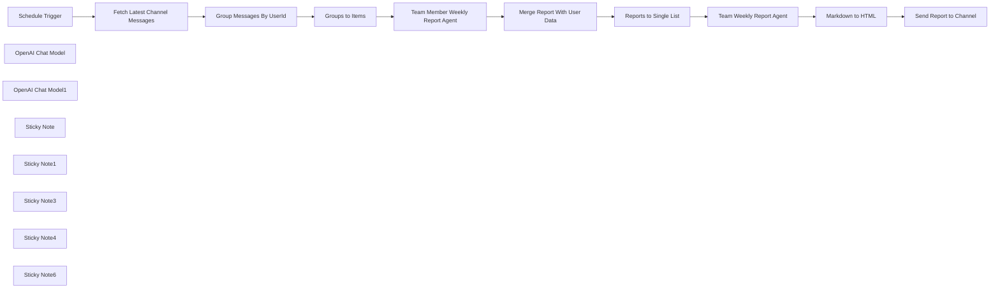
```mermaid
flowchart LR
    N1["Schedule Trigger"]
    N2["Fetch Latest Channel Messages"]
    N3["OpenAI Chat Model"]
    N4["Team Member Weekly Report Agent"]
    N5["Merge Report With User Data"]
    N6["OpenAI Chat Model1"]
    N7["Reports to Single List"]
    N8["Team Weekly Report Agent"]
    N9["Markdown to HTML"]
    N10["Send Report to Channel"]
    N11["Sticky Note"]
    N12["Group Messages By UserId"]
    N13["Groups to Items"]
    N14["Sticky Note1"]
    N15["Sticky Note3"]
    N16["Sticky Note4"]
    N17["Sticky Note6"]

    N13 --> N4
    N9 --> N10
    N1 --> N2
    N7 --> N8
    N12 --> N13
    N8 --> N9
    N5 --> N7
    N2 --> N12
    N4 --> N5
```

## Fluxo (.json) :

```json
{
  "meta": {
    "instanceId": "408f9fb9940c3cb18ffdef0e0150fe342d6e655c3a9fac21f0f644e8bedabcd9",
    "templateCredsSetupCompleted": true
  },
  "nodes": [
    {
      "id": "ee39f797-6f6f-4a62-9cf1-0c95b47baf23",
      "name": "Schedule Trigger",
      "type": "n8n-nodes-base.scheduleTrigger",
      "position": [
        -160,
        0
      ],
      "parameters": {
        "rule": {
          "interval": [
            {}
          ]
        }
      },
      "typeVersion": 1.2
    },
    {
      "id": "c1b9fadc-586b-4edf-a19a-6995479d4de5",
      "name": "Fetch Latest Channel Messages",
      "type": "n8n-nodes-base.microsoftTeams",
      "position": [
        60,
        0
      ],
      "webhookId": "b36a534a-1bca-4c3d-ab25-777ca98fba1a",
      "parameters": {
        "teamId": {
          "__rl": true,
          "mode": "id",
          "value": "=fc62d6a3-eaba-430f-b451-3c3107751ba0"
        },
        "resource": "channelMessage",
        "channelId": {
          "__rl": true,
          "mode": "id",
          "value": "=19:NQuQMYvvtC9DcTEQs1Vul1Nm1xIXnRmznAwov7MuNZ81@thread.tacv2"
        },
        "operation": "getAll"
      },
      "credentials": {
        "microsoftTeamsOAuth2Api": {
          "id": "AUH9lDgO5KTl2J6q",
          "name": "Microsoft Teams account"
        }
      },
      "typeVersion": 2
    },
    {
      "id": "1be03962-5028-47a8-8deb-3c59c121df01",
      "name": "OpenAI Chat Model",
      "type": "@n8n/n8n-nodes-langchain.lmChatOpenAi",
      "position": [
        920,
        140
      ],
      "parameters": {
        "model": {
          "__rl": true,
          "mode": "list",
          "value": "gpt-4.1-mini",
          "cachedResultName": "gpt-4.1-mini"
        },
        "options": {}
      },
      "credentials": {
        "openAiApi": {
          "id": "8gccIjcuf3gvaoEr",
          "name": "OpenAi account"
        }
      },
      "typeVersion": 1.2
    },
    {
      "id": "04a75b1c-685f-4264-ade7-cb2778fc7d4f",
      "name": "Team Member Weekly Report Agent",
      "type": "@n8n/n8n-nodes-langchain.chainLlm",
      "position": [
        820,
        0
      ],
      "parameters": {
        "text": "=## User\nDisplayName: {{ $json.user.displayName }}\n\n## Messages\n{{\nArray.from($json.messages)\n.map(msg => {\n  return [\n    `Type: Message`,\n    `Posted: ${msg.createdDateTime}`,\n    `Message: ${msg.body.content.replaceAll('\\n', ' ')}`,\n    msg.parent ? `In Reply To: ${msg.parent.from.user.displayName} said \"${msg.parent.body.content.replace('\\n', ' ')}\"` : ''\n  ].join('\\n')\n}).join('---\\n')\n}}",
        "messages": {
          "messageValues": [
            {
              "message": "=Your are energetic assistant who produces weekly mini-reports on team members by analysing their slack messages from last week and posts these reports on the following Monday.\nThere has already been some work done to collect and summarise each thread made by the user within the last week.\nYour task is to summarize all the threads by this user and any interactions with other users involved and produce a mini report to share with other team members.\nFocus on wins and challenges.\nAim to motivate and call out any outstanding concerns where appropriate.\nWelcome any new team members who may have joined and say good bye to those who may have left."
            }
          ]
        },
        "promptType": "define"
      },
      "typeVersion": 1.6
    },
    {
      "id": "919347aa-cd48-42ff-9504-dd66c5b18caa",
      "name": "Merge Report With User Data",
      "type": "n8n-nodes-base.set",
      "position": [
        1200,
        0
      ],
      "parameters": {
        "mode": "raw",
        "options": {},
        "jsonOutput": "={{\n{\n  ...$('Groups to Items').item.json,\n  report: $json.text\n}\n}}"
      },
      "typeVersion": 3.4
    },
    {
      "id": "67c23cf0-9af6-4a89-94c0-7a3e01230b2f",
      "name": "OpenAI Chat Model1",
      "type": "@n8n/n8n-nodes-langchain.lmChatOpenAi",
      "position": [
        1820,
        140
      ],
      "parameters": {
        "model": {
          "__rl": true,
          "mode": "list",
          "value": "gpt-4.1-mini",
          "cachedResultName": "gpt-4.1-mini"
        },
        "options": {}
      },
      "credentials": {
        "openAiApi": {
          "id": "8gccIjcuf3gvaoEr",
          "name": "OpenAi account"
        }
      },
      "typeVersion": 1.2
    },
    {
      "id": "65111f1b-42c7-4657-9512-e740d75bdbdc",
      "name": "Reports to Single List",
      "type": "n8n-nodes-base.aggregate",
      "position": [
        1500,
        0
      ],
      "parameters": {
        "options": {},
        "aggregate": "aggregateAllItemData"
      },
      "typeVersion": 1
    },
    {
      "id": "82a90342-cc4d-4d80-9ff6-83cab22861f4",
      "name": "Team Weekly Report Agent",
      "type": "@n8n/n8n-nodes-langchain.chainLlm",
      "position": [
        1720,
        0
      ],
      "parameters": {
        "text": "={{\n$input.first().json.data\n  .map(item =>\n`user: ${item.user.displayName} <${item.user.id}>\nmessage count: ${item.messages.length}\nreport: ${item.report.replaceAll('\\n', ' ')}`\n  )\n  .join('\\n---\\n')\n}}",
        "messages": {
          "messageValues": [
            {
              "message": "=Your are energetic assistant who produces a team-wide weekly report from all activity of all team members in the prior last week and posts this single report on the following Monday.\nThere has already been some work done to collect individual reports from team members.\nYour task is generate a report covering the team to prepare and motivate them for the upcoming week.\nFocus on wins and challenges if available.\nLook out for similar activities between members and make a connection if possible.\nAim to motivate and call out any outstanding concerns where appropriate.\nWelcome any new team members who may have joined and say good bye to those who may have left.\nFormat the report as markdown.\nDo not sign off on the report."
            }
          ]
        },
        "promptType": "define"
      },
      "typeVersion": 1.6
    },
    {
      "id": "464a925f-eb06-4b59-a262-ca336506de15",
      "name": "Markdown to HTML",
      "type": "n8n-nodes-base.markdown",
      "position": [
        2300,
        0
      ],
      "parameters": {
        "mode": "markdownToHtml",
        "options": {},
        "markdown": "={{ $json.text }}",
        "destinationKey": "html"
      },
      "typeVersion": 1
    },
    {
      "id": "ecb047a7-5d52-4e87-8d0e-c9c17489cddc",
      "name": "Send Report to Channel",
      "type": "n8n-nodes-base.microsoftTeams",
      "position": [
        2540,
        0
      ],
      "webhookId": "b36a534a-1bca-4c3d-ab25-777ca98fba1a",
      "parameters": {
        "teamId": {
          "__rl": true,
          "mode": "id",
          "value": "=fc62d6a3-eaba-430f-b451-3c3107751ba0",
          "__regex": "^([0-9a-f]{8}-[0-9a-f]{4}-4[0-9a-f]{3}-[89ab][0-9a-f]{3}-[0-9a-f]{12})"
        },
        "message": "={{ $json.html }}",
        "options": {
          "includeLinkToWorkflow": false
        },
        "resource": "channelMessage",
        "channelId": {
          "__rl": true,
          "mode": "id",
          "value": "=19:NQuQMYvvtC9DcTEQs1Vul1Nm1xIXnRmznAwov7MuNZ81@thread.tacv2"
        },
        "contentType": "html"
      },
      "credentials": {
        "microsoftTeamsOAuth2Api": {
          "id": "AUH9lDgO5KTl2J6q",
          "name": "Microsoft Teams account"
        }
      },
      "typeVersion": 2
    },
    {
      "id": "e1d371c8-9069-4a33-a450-78055769931b",
      "name": "Sticky Note",
      "type": "n8n-nodes-base.stickyNote",
      "position": [
        -220,
        -240
      ],
      "parameters": {
        "color": 7,
        "width": 700,
        "height": 540,
        "content": "## 1. Fetch All Channel Messages from Last Week\n[Learn more about the MS Teams node](https://docs.n8n.io/integrations/builtin/app-nodes/n8n-nodes-base.microsoftteams)\n\nWe'll start by fetching all activity in our team channel over the last 7 days and group them  by the message author. We can do this using the MS Teams node. This will give us the raw data to pick apart and analyse for reporting purposes."
      },
      "typeVersion": 1
    },
    {
      "id": "77aff845-5226-4023-a2da-afb2021a08ed",
      "name": "Group Messages By UserId",
      "type": "n8n-nodes-base.code",
      "position": [
        280,
        0
      ],
      "parameters": {
        "jsCode": "const messages = $input.all().map(item => item.json);\n\nconst groupByUserId = messages.reduce((acc,msg) => {\n  return {\n    ...acc,\n    [msg.from.user.id]: acc[msg.from.user.id]\n      ? acc[msg.from.user.id].concat(msg)\n      : [msg]\n  }\n}, {});\n\nconst output = Object.keys(groupByUserId).map(userId => {\n  const userMessages = groupByUserId[userId];\n  for (let i=0,j=userMessages.length;i<j;i++) {\n    if (userMessages[i].replyToId) {\n      userMessages[i].parent = messages.find(msg => msg.id === userMessages[i].replyToId);\n    }\n  }\n  return {\n    user: userMessages[0].from.user,\n    messages: userMessages\n  };\n});\n\nreturn { output };"
      },
      "typeVersion": 2
    },
    {
      "id": "ee415463-a7e2-43dd-abfa-4050cc230452",
      "name": "Groups to Items",
      "type": "n8n-nodes-base.splitOut",
      "position": [
        600,
        0
      ],
      "parameters": {
        "options": {},
        "fieldToSplitOut": "output"
      },
      "typeVersion": 1
    },
    {
      "id": "8d4c7621-3c04-4fbe-bbee-b7dade2ab837",
      "name": "Sticky Note1",
      "type": "n8n-nodes-base.stickyNote",
      "position": [
        520,
        -240
      ],
      "parameters": {
        "color": 7,
        "width": 860,
        "height": 540,
        "content": "## 2. Generate Activity Reports for Each Team Member\n[Learn more about the Basic LLM node](https://docs.n8n.io/integrations/builtin/cluster-nodes/root-nodes/n8n-nodes-langchain.chainllm)\n\nWith our summarized threads which are grouped per user, we can aggregate them and give them to the AI again to generate a weekly report for the team member. This could include their wins, challenges, learnings or decisions - it really is up to you as to what the report looks like. A fun part of this output is getting to decide the tone of voice and delivery of the report. Don't be a bore and consider adding some personality and flair!"
      },
      "typeVersion": 1
    },
    {
      "id": "22f3e375-201d-4a66-b1e0-592bbeb12eac",
      "name": "Sticky Note3",
      "type": "n8n-nodes-base.stickyNote",
      "position": [
        1420,
        -240
      ],
      "parameters": {
        "color": 7,
        "width": 680,
        "height": 540,
        "content": "## 3. Generate Final Report for Whole Team\n[Learn more about the Basic LLM node](https://docs.n8n.io/integrations/builtin/cluster-nodes/root-nodes/n8n-nodes-langchain.chainllm)\n\nIn this step, we go one level higher and aggregate all individual team member reports together into a big team report. In this way, the overview can group similar activities and generalise activities in a broader sense. The message output will also be shorter which some may find easier to digest."
      },
      "typeVersion": 1
    },
    {
      "id": "873c2510-cf01-464b-b84e-936bd1c4d7a7",
      "name": "Sticky Note4",
      "type": "n8n-nodes-base.stickyNote",
      "position": [
        2140,
        -240
      ],
      "parameters": {
        "color": 7,
        "width": 680,
        "height": 540,
        "content": "## 4. Post Report on Team Channel (on Monday Morning!)\n[Learn more about the Markdown node](https://docs.n8n.io/integrations/builtin/core-nodes/n8n-nodes-base.markdown)\n\nFinally, we can post the weekly report in the team channel. This is a great way to automate quick recaps for the team after the weekend break, get others back on track if they've been away or update client team who may pop in now and again to collaborate."
      },
      "typeVersion": 1
    },
    {
      "id": "4882c210-fec8-4b8e-b114-0b6d889ed917",
      "name": "Sticky Note6",
      "type": "n8n-nodes-base.stickyNote",
      "position": [
        -680,
        -960
      ],
      "parameters": {
        "width": 420,
        "height": 1400,
        "content": "## Try It Out!\n### This n8n template lets you summarize individual team member activity on MS Teams for the past week and generates a report.\n\nFor remote teams, chat is a crucial communication tool to ensure work gets done but with so many conversations happening at once and in multiple threads, ideas, information and decisions usually live in the moment and get lost just as quickly - and all together forgotten by the weekend!\n\nUsing this template, this doesn't have to be the case. Have AI crawl through last week's activity, summarize all messages and replies and generate a casual and snappy report to bring the team back into focus for the current week. A project manager's dream!\n\n### How it works\n* A scheduled trigger is set to run every Monday at 6am to gather all team channel messages within the last week.\n* Messages are grouped by user.\n* AI analyses the raw messages and replies to pull out interesting observations and highlights. This is referred to as the individual reports.\n* All individual reports are then combined and summarized together into what becomes the team weekly report. This allows understanding of group and similar activities.\n* Finally, the team weekly report is posted back to the channel. The timing is important as it should be the first message of the week and ready for the team to glance over coffee.\n\n### How to use\n* Ideally works best per project and where most of the comms happens on a single channel. Avoid combining channels and instead duplicate this workflow for more channels.\n* You may need to filter for specific team members if you want specific team updates.\n* Customise the report to suit your organisation, team or the channel. You may prefer to be more formal if clients or external stakeholders are also present.\n\n### Requirements\n* MS Teams for chat platform\n* OpenAI for LLM\n\n### Customising this workflow\n* If the teams channel is busy enough already, consider posting the final report to email.\n* Pull in project metrics to include in your report. As extra context, it may be interesting to tie the messages to production performance.\n* Use an AI Agent to query for knowledgebase or tickets relevant to the messages. This may be useful for attaching links or references to add context.\n\n### Need Help?\nJoin the [Discord](https://discord.com/invite/XPKeKXeB7d) or ask in the [Forum](https://community.n8n.io/)!\n\nHappy Hacking!"
      },
      "typeVersion": 1
    }
  ],
  "pinData": {},
  "connections": {
    "Groups to Items": {
      "main": [
        [
          {
            "node": "Team Member Weekly Report Agent",
            "type": "main",
            "index": 0
          }
        ]
      ]
    },
    "Markdown to HTML": {
      "main": [
        [
          {
            "node": "Send Report to Channel",
            "type": "main",
            "index": 0
          }
        ]
      ]
    },
    "Schedule Trigger": {
      "main": [
        [
          {
            "node": "Fetch Latest Channel Messages",
            "type": "main",
            "index": 0
          }
        ]
      ]
    },
    "OpenAI Chat Model": {
      "ai_languageModel": [
        [
          {
            "node": "Team Member Weekly Report Agent",
            "type": "ai_languageModel",
            "index": 0
          }
        ]
      ]
    },
    "OpenAI Chat Model1": {
      "ai_languageModel": [
        [
          {
            "node": "Team Weekly Report Agent",
            "type": "ai_languageModel",
            "index": 0
          }
        ]
      ]
    },
    "Reports to Single List": {
      "main": [
        [
          {
            "node": "Team Weekly Report Agent",
            "type": "main",
            "index": 0
          }
        ]
      ]
    },
    "Group Messages By UserId": {
      "main": [
        [
          {
            "node": "Groups to Items",
            "type": "main",
            "index": 0
          }
        ]
      ]
    },
    "Team Weekly Report Agent": {
      "main": [
        [
          {
            "node": "Markdown to HTML",
            "type": "main",
            "index": 0
          }
        ]
      ]
    },
    "Merge Report With User Data": {
      "main": [
        [
          {
            "node": "Reports to Single List",
            "type": "main",
            "index": 0
          }
        ]
      ]
    },
    "Fetch Latest Channel Messages": {
      "main": [
        [
          {
            "node": "Group Messages By UserId",
            "type": "main",
            "index": 0
          }
        ]
      ]
    },
    "Team Member Weekly Report Agent": {
      "main": [
        [
          {
            "node": "Merge Report With User Data",
            "type": "main",
            "index": 0
          }
        ]
      ]
    }
  }
}
```

<a id="template-650"></a>

## Template 650 - Monitoramento e notificação de releases do GitHub

- **Nome:** Monitoramento e notificação de releases do GitHub
- **Descrição:** Monitora releases de repositórios configuráveis, extrai e traduz notas de versão com IA e envia notificações formatadas para um canal Slack quando há novidades.
- **Funcionalidade:** • Agendamento periódico: Executa verificações em intervalo configurado para buscar novas releases.
• Repositórios configuráveis: Permite definir uma lista de repositórios a ser monitorada via configuração em código.
• Leitura do feed de releases: Consulta o feed Atom de releases de cada repositório para obter entradas recentes.
• Verificação e tratamento de erros: Detecta erros na leitura do feed e envia alertas quando ocorrem problemas.
• Detecção de novidades via cache: Compara o ID da última release com um valor armazenado para processar apenas releases novas.
• Extração e tradução com IA: Usa um modelo de linguagem para extrair itens de mudança, filtrar ruído, categorizar (features, fixes, others) e traduzir para chinês.
• Formatação de notificação rica: Gera blocos de mensagem estruturados com título, data, link e listas categorizadas para apresentação clara.
• Envio e atualização de cache: Publica a notificação no canal Slack e atualiza o cache (último ID) para evitar duplicatas.
• Processamento em lote: Itera pela lista de repositórios e processa entradas em lote para eficiência.
- **Ferramentas:** • GitHub Releases (feed Atom): Fonte das informações de release para cada repositório monitorado.
• Redis: Armazena o identificador da última release processada para deduplicação.
• Google Gemini (modelo de IA): Realiza extração, categorização e tradução das notas de release.
• Slack: Canal de destino para envio das notificações formatadas.

## Fluxo visual

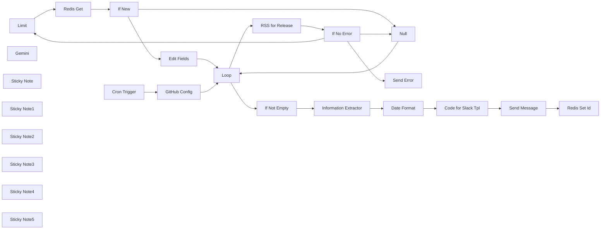
```mermaid
flowchart LR
    N1["Limit"]
    N2["Loop"]
    N3["Edit Fields"]
    N4["Cron Trigger"]
    N5["GitHub Config"]
    N6["If No Error"]
    N7["If New"]
    N8["Null"]
    N9["Send Error"]
    N10["If Not Empty"]
    N11["Date Format"]
    N12["Information Extractor"]
    N13["Send Message"]
    N14["Gemini"]
    N15["Sticky Note"]
    N16["Sticky Note1"]
    N17["Sticky Note2"]
    N18["Sticky Note3"]
    N19["Sticky Note4"]
    N20["Sticky Note5"]
    N21["Redis Set Id"]
    N22["Code for Slack Tpl"]
    N23["RSS for Release"]
    N24["Redis Get"]

    N2 --> N10
    N2 --> N23
    N8 --> N2
    N1 --> N24
    N7 --> N3
    N7 --> N8
    N24 --> N7
    N11 --> N22
    N3 --> N2
    N6 --> N1
    N6 --> N9
    N6 --> N8
    N4 --> N5
    N10 --> N12
    N13 --> N21
    N5 --> N2
    N23 --> N6
    N22 --> N13
    N12 --> N11
```

## Fluxo (.json) :

```json
{
  "id": "ThLx9WKLEujJHrvW",
  "meta": {
    "instanceId": "f047839feca8ac8518cd22514bc718f9790615975a10271981c34822b5cd9b5b",
    "templateCredsSetupCompleted": true
  },
  "name": "Github Releases",
  "tags": [],
  "nodes": [
    {
      "id": "597d4aa3-e56a-4831-a0a8-6414e6e56de3",
      "name": "Limit",
      "type": "n8n-nodes-base.limit",
      "position": [
        600,
        380
      ],
      "parameters": {},
      "typeVersion": 1
    },
    {
      "id": "731ac3c8-9c24-4f73-aad1-f96f359cf0f7",
      "name": "Loop",
      "type": "n8n-nodes-base.splitInBatches",
      "position": [
        40,
        255
      ],
      "parameters": {
        "options": {}
      },
      "typeVersion": 3
    },
    {
      "id": "150d10c1-97ee-48b2-8d78-0bcce9776f7c",
      "name": "Edit Fields",
      "type": "n8n-nodes-base.set",
      "position": [
        1440,
        560
      ],
      "parameters": {
        "options": {},
        "assignments": {
          "assignments": [
            {
              "id": "7cbf2c0f-f242-4106-95c3-684d1b0959b1",
              "name": "name",
              "type": "string",
              "value": "={{ $('Loop').item.json.name }}"
            },
            {
              "id": "cdd6bd5d-d4b8-4656-8b01-1521f870b3d9",
              "name": "title",
              "type": "string",
              "value": "={{ $('Limit').item.json.title }}"
            },
            {
              "id": "61164f4d-d97c-4588-a54a-81b230b2cf3b",
              "name": "link",
              "type": "string",
              "value": "={{ $('Limit').item.json.link }}"
            },
            {
              "id": "f1b1717b-4689-4356-8deb-f103a69af0e1",
              "name": "pubDate",
              "type": "string",
              "value": "={{ $('Limit').item.json.pubDate }}"
            },
            {
              "id": "ec9394a9-5adb-4a00-92ca-b4a52f742ac0",
              "name": "contentSnippet",
              "type": "string",
              "value": "={{ $('Limit').item.json.contentSnippet }}"
            },
            {
              "id": "678d9b68-f5a5-4968-a5dc-827c3dd0fcfb",
              "name": "id",
              "type": "string",
              "value": "={{ $('Limit').item.json.id }}"
            },
            {
              "id": "d57a1455-b5d6-4caa-870c-0a4fac317932",
              "name": "github",
              "type": "string",
              "value": "={{ $('Loop').item.json.github }}"
            }
          ]
        }
      },
      "typeVersion": 3.4
    },
    {
      "id": "c65ab032-a35a-4a00-89ed-de897d45b62f",
      "name": "Cron Trigger",
      "type": "n8n-nodes-base.scheduleTrigger",
      "position": [
        -840,
        260
      ],
      "parameters": {
        "rule": {
          "interval": [
            {
              "field": "cronExpression",
              "expression": "0 */10 9-23 * * *"
            }
          ]
        }
      },
      "typeVersion": 1.2
    },
    {
      "id": "ebe92d40-a4a3-49fa-ae49-c1d0b87fcc0d",
      "name": "GitHub Config",
      "type": "n8n-nodes-base.code",
      "position": [
        -400,
        260
      ],
      "parameters": {
        "jsCode": "return [\n  {\n    \"name\": \"n8n\",\n    \"github\": \"n8n-io/n8n\"\n  },\n  {\n    \"name\": \"Roo-Code\",\n    \"github\": \"RooVetGit/Roo-Code\"\n  },\n  {\n    \"name\": \"LobeChat\",\n    \"github\": \"lobehub/lobe-chat\"\n  },\n  {\n    \"name\": \"New API\",\n    \"github\": \"Calcium-Ion/new-api\"\n  },\n  {\n    \"name\": \"ChatWise\",\n    \"github\": \"egoist/chatwise-releases\"\n  },\n  {\n    \"name\": \"Folo\",\n    \"github\": \"RSSNext/Folo\"\n  },\n  {\n    \"name\": \"Clash Verge Rev\",\n    \"github\": \"clash-verge-rev/clash-verge-rev\"\n  },\n  {\n    \"name\": \"Cherry Studio\",\n    \"github\": \"CherryHQ/cherry-studio\"\n  }\n];"
      },
      "notesInFlow": false,
      "typeVersion": 2
    },
    {
      "id": "4e659c3f-3fa4-42c8-aceb-9ea18dfcff0f",
      "name": "If No Error",
      "type": "n8n-nodes-base.if",
      "position": [
        420,
        380
      ],
      "parameters": {
        "options": {},
        "conditions": {
          "options": {
            "version": 2,
            "leftValue": "",
            "caseSensitive": true,
            "typeValidation": "loose"
          },
          "combinator": "and",
          "conditions": [
            {
              "id": "56f4a7f3-7823-4794-ad74-bac41ef85d83",
              "operator": {
                "type": "string",
                "operation": "empty",
                "singleValue": true
              },
              "leftValue": "={{ $json.error }}",
              "rightValue": 0
            }
          ]
        },
        "looseTypeValidation": true
      },
      "typeVersion": 2.2
    },
    {
      "id": "f9ccdc63-06ae-47d0-8429-7a2b63d8c38a",
      "name": "If New",
      "type": "n8n-nodes-base.if",
      "position": [
        940,
        380
      ],
      "parameters": {
        "options": {},
        "conditions": {
          "options": {
            "version": 2,
            "leftValue": "",
            "caseSensitive": true,
            "typeValidation": "loose"
          },
          "combinator": "and",
          "conditions": [
            {
              "id": "ed896551-f486-4a1f-8585-8660f3a4a9bd",
              "operator": {
                "type": "string",
                "operation": "notEquals"
              },
              "leftValue": "={{ $json.cache }}",
              "rightValue": "={{ $('Limit').item.json.id }}"
            }
          ]
        },
        "looseTypeValidation": true
      },
      "typeVersion": 2.2
    },
    {
      "id": "caf31152-18f0-4bf7-b09c-f76ba05dec5b",
      "name": "Null",
      "type": "n8n-nodes-base.set",
      "position": [
        1200,
        560
      ],
      "parameters": {
        "options": {}
      },
      "typeVersion": 3.4
    },
    {
      "id": "1fe3264a-2db3-4d5c-b800-182e15a8a355",
      "name": "Send Error",
      "type": "n8n-nodes-base.slack",
      "position": [
        620,
        560
      ],
      "webhookId": "eaf921a6-4cc9-472f-bdf3-dd24db51c769",
      "parameters": {
        "text": "=:x: *`{{ $('Loop').item.json.name }}`* Error\n\n> {{ $json.error }}",
        "select": "channel",
        "channelId": {
          "__rl": true,
          "mode": "list",
          "value": "C08ME7TDZ3J",
          "cachedResultName": "github-release"
        },
        "otherOptions": {
          "mrkdwn": true,
          "sendAsUser": "Release Bot",
          "unfurl_links": false,
          "includeLinkToWorkflow": false
        }
      },
      "credentials": {
        "slackApi": {
          "id": "NG6LWZ4Leh25N3VZ",
          "name": "波特科技"
        }
      },
      "typeVersion": 2.2
    },
    {
      "id": "970c3556-abf9-402f-85bc-b80da949ce0b",
      "name": "If Not Empty",
      "type": "n8n-nodes-base.if",
      "position": [
        220,
        240
      ],
      "parameters": {
        "options": {},
        "conditions": {
          "options": {
            "version": 2,
            "leftValue": "",
            "caseSensitive": true,
            "typeValidation": "strict"
          },
          "combinator": "and",
          "conditions": [
            {
              "id": "4fdc7d1e-68f6-45ea-af6e-59a1eddbf214",
              "operator": {
                "type": "object",
                "operation": "notEmpty",
                "singleValue": true
              },
              "leftValue": "={{ $json }}",
              "rightValue": ""
            }
          ]
        }
      },
      "typeVersion": 2.2
    },
    {
      "id": "0425dbee-461f-4fdb-a9d2-4f78beb61826",
      "name": "Date Format",
      "type": "n8n-nodes-base.dateTime",
      "position": [
        780,
        240
      ],
      "parameters": {
        "date": "={{ $('Loop').item.json.pubDate }}",
        "format": "custom",
        "options": {
          "timezone": true
        },
        "operation": "formatDate",
        "customFormat": "yyyy-MM-dd HH:mm"
      },
      "typeVersion": 2
    },
    {
      "id": "a06e7050-1f84-4083-9cd3-a6c4f2dd25f3",
      "name": "Information Extractor",
      "type": "@n8n/n8n-nodes-langchain.informationExtractor",
      "position": [
        440,
        240
      ],
      "parameters": {
        "text": "={{ $json.contentSnippet }}",
        "options": {
          "systemPromptTemplate": "You are an expert extraction algorithm.\nOnly extract relevant information from the text.\nIf you do not know the value of an attribute asked to extract, you may omit the attribute's value.\n\nYou need to analyze GitHub Release:\n\n1. Parse input content and identify all change items\n2. Filter out:\n   - Contributor handles (@username)\n   - Version numbers\n   - Appreciation/congratulatory statements\n3. Categorize into:\n   - features: New functionalities\n   - fixes: Bug fixes\n   - others: Documentation, configurations, etc.\n4. Language conversion:\n   - Translate English descriptions to Chinese\n   - Technical terms can remain in English but must use Chinese syntax\n5. Maintain original meaning with necessary simplification:\n   - Remove redundancies\n   - Merge similar entries\n   - Simplify technical jargon\n\nProhibited elements:\n1. Explanatory text\n2. Markdown formatting\n3. Uncategorized content\n4. Untranslated English items\n5. Empty category headers"
        },
        "schemaType": "fromJson",
        "jsonSchemaExample": "{\n  \"features\": [\n    \"新增首页功能，默认启动页面改为首页\",\n    \"新增 DNS 覆写功能，默认启用 DNS 覆写\"\n  ],\n  \"fixes\": [\n    \"修复弹黑框的问题\",\n    \"修复系统代理地址错误的问题\"\n  ],\n  \"others\": [\n    \"重构后端，巨幅性能优化\",\n    \"优化定时器管理\"\n  ]\n}"
      },
      "typeVersion": 1
    },
    {
      "id": "42ed9553-ed63-4554-b0c5-8b4d9a1e9ae9",
      "name": "Send Message",
      "type": "n8n-nodes-base.slack",
      "position": [
        1200,
        240
      ],
      "webhookId": "eaf921a6-4cc9-472f-bdf3-dd24db51c769",
      "parameters": {
        "text": "=Release - {{ $('If Not Empty').item.json.name }}",
        "select": "channel",
        "blocksUi": "={{ $json }}",
        "channelId": {
          "__rl": true,
          "mode": "id",
          "value": "C08ME7TDZ3J"
        },
        "messageType": "block",
        "otherOptions": {
          "mrkdwn": true,
          "sendAsUser": "GitHub Release",
          "unfurl_links": false,
          "includeLinkToWorkflow": false
        }
      },
      "credentials": {
        "slackApi": {
          "id": "NG6LWZ4Leh25N3VZ",
          "name": "波特科技"
        }
      },
      "typeVersion": 2.2
    },
    {
      "id": "c4b89e3f-0c61-493d-8950-e77b56f38ca3",
      "name": "Gemini",
      "type": "@n8n/n8n-nodes-langchain.lmChatGoogleGemini",
      "position": [
        440,
        100
      ],
      "parameters": {
        "options": {
          "temperature": 0.3
        },
        "modelName": "models/gemini-2.0-flash-001"
      },
      "credentials": {
        "googlePalmApi": {
          "id": "wN3fB5ELQ7iJt3b8",
          "name": "Gemini"
        }
      },
      "typeVersion": 1
    },
    {
      "id": "b3979529-5445-4d44-bd9e-69079b222b8d",
      "name": "Sticky Note",
      "type": "n8n-nodes-base.stickyNote",
      "position": [
        -560,
        -140
      ],
      "parameters": {
        "width": 420,
        "height": 540,
        "content": "## GitHub Releases Config\n- Edit the JavaScript array within this node's code area.\n- Modify or add the repositories you want to follow. Each repository object needs a `name` (custom display name) and `github` (format: `owner/repo`).\n- Example:\n   ```javascript\n   {\n    \"name\": \"n8n\", // Custom display name\n    \"github\": \"n8n-io/n8n\" // GitHub path\n   },\n   {\n    \"name\": \"LobeChat\",\n    \"github\": \"lobehub/lobe-chat\"\n   }\n   // ... add more repositories\n   ```"
      },
      "typeVersion": 1
    },
    {
      "id": "ed1b69c4-cb95-424a-85e8-7de827b20e22",
      "name": "Sticky Note1",
      "type": "n8n-nodes-base.stickyNote",
      "position": [
        -900,
        80
      ],
      "parameters": {
        "width": 260,
        "height": 340,
        "content": "## Cron Trigger\nAdjust the `Rule` setting to change the update check frequency (default is `0 */10 9-23 * * *`, checking every 10 minutes between 9 AM and 11 PM daily)."
      },
      "typeVersion": 1
    },
    {
      "id": "0ff16ac1-755d-4a83-a631-e6a8df4d14a6",
      "name": "Sticky Note2",
      "type": "n8n-nodes-base.stickyNote",
      "position": [
        380,
        -220
      ],
      "parameters": {
        "width": 380,
        "height": 580,
        "content": "## Gemini (AI Model)\n- Select your configured Google Gemini credentials.\n- (Optional) Replace with a different supported AI model node and select its credentials.\n## Information Extractor \nAI Processing & Translation\n- **Main Configuration**: Review the `System Prompt`. By default, it asks the AI to extract information and translate it into **Chinese**. Modify this prompt if you need a different language or summary style."
      },
      "typeVersion": 1
    },
    {
      "id": "6a985f02-105c-4f6e-a924-2289538dfdc0",
      "name": "Sticky Note3",
      "type": "n8n-nodes-base.stickyNote",
      "position": [
        1140,
        20
      ],
      "parameters": {
        "height": 380,
        "content": "## Send Message\nSlack Notifications\n- Select your configured Slack credentials in both Slack nodes.\n- Set the target `Channel ID` for notifications."
      },
      "typeVersion": 1
    },
    {
      "id": "80300633-feba-4f12-9ee6-2abba300a153",
      "name": "Sticky Note4",
      "type": "n8n-nodes-base.stickyNote",
      "position": [
        560,
        540
      ],
      "parameters": {
        "height": 340,
        "content": "\n\n\n\n\n\n\n\n\n\n\n\n\n\n\n## Send Error\n- Select your configured Slack credentials in both Slack nodes.\n- Set the target `Channel ID` for notifications."
      },
      "typeVersion": 1
    },
    {
      "id": "9f671e1d-0b72-4e2c-ae80-f65a5aa56c1d",
      "name": "Sticky Note5",
      "type": "n8n-nodes-base.stickyNote",
      "position": [
        -1440,
        -220
      ],
      "parameters": {
        "width": 460,
        "height": 900,
        "content": "## Prerequisites\n\n* **Redis**: Have an available Redis service and configure its credentials in n8n.\n* **AI Provider (Gemini)**: Configure credentials for Google Gemini (or your chosen AI model) in n8n.\n* **Slack**: Configure your Slack app credentials in n8n.\n\n## Slack Permissions Config\n- In the `Bot Token Scopes` section of the `OAuth & Permissions` menu, add the following permissions:\n   - `chat:write`\n   - `chat:write.customize`\n- Perform the `Install` (or Reinstall) operation in the `Install App` menu.\n- Obtain the `Bot User OAuth Token` and configure it in the credentials of n8n."
      },
      "typeVersion": 1
    },
    {
      "id": "1b4274ec-0364-4c8d-b040-8882e48ab192",
      "name": "Redis Set Id",
      "type": "n8n-nodes-base.redis",
      "position": [
        1440,
        240
      ],
      "parameters": {
        "key": "=github_release:{{ $('If Not Empty').item.json.github }}",
        "value": "={{ $('If Not Empty').item.json.id }}",
        "keyType": "string",
        "operation": "set"
      },
      "credentials": {
        "redis": {
          "id": "qrUBdRWlD3Zuri46",
          "name": "Redis account"
        }
      },
      "typeVersion": 1
    },
    {
      "id": "3a809420-5bee-4976-a57e-ca161677de76",
      "name": "Code for Slack Tpl",
      "type": "n8n-nodes-base.code",
      "position": [
        980,
        240
      ],
      "parameters": {
        "jsCode": "function generateRichTextBlock(title, items) {\n  return {\n    type: \"rich_text\",\n    elements: [\n      {\n        type: \"rich_text_section\",\n        elements: [{ type: \"text\", text: `${title}:` }]\n      },\n      {\n        type: \"rich_text_list\",\n        style: \"bullet\",\n        indent: 0,\n        border: 0,\n        elements: items.map(item => ({\n          type: \"rich_text_section\",\n          elements: [{ type: \"text\", text: item }]\n        }))\n      }\n    ]\n  };\n}\n\nfunction generateRichText(value, metadata) {\n  if (!value || typeof value !== 'object') return [];\n\n  const { name, link, title, formattedDate } = metadata;\n  \n  const baseBlocks = [\n    {\n      type: \"header\",\n      text: {\n        type: \"plain_text\",\n        text: name\n      }\n    },\n    {\n      type: \"context\",\n      elements: [{\n        text: `${formattedDate}  |  <${link}|${title}>`,\n        type: \"mrkdwn\"\n      }]\n    },\n    { type: \"divider\" }\n  ];\n\n  const sections = [\n    { key: \"features\", title: \"Features\" },\n    { key: \"fixes\", title: \"Fixes\" },\n    { key: \"others\", title: \"Others\" }\n  ];\n\n  const contentBlocks = sections\n    .filter(({ key }) => Array.isArray(value[key]) && value[key].length > 0)\n    .map(({ key, title }) => generateRichTextBlock(title, value[key]));\n\n  return {\n    blocks: [...baseBlocks, ...contentBlocks]\n  };\n}\n\nfunction processAllItems(infoExtractor, ifNotEmpty, dateFormat) {\n  return infoExtractor.all().map((item, index) => {\n    const metadata = {\n      name: ifNotEmpty.all()[index].json.name,\n      link: ifNotEmpty.all()[index].json.link,\n      title: ifNotEmpty.all()[index].json.title,\n      formattedDate: dateFormat.all()[index].json.formattedDate\n    };\n    return generateRichText(item.json.output, metadata);\n  });\n}\n\nreturn processAllItems(\n  $('Information Extractor'),\n  $('If Not Empty'), \n  $('Date Format')\n);"
      },
      "typeVersion": 2
    },
    {
      "id": "d11a10fc-c68b-4e2b-a00e-5d63ec38abf6",
      "name": "RSS for Release",
      "type": "n8n-nodes-base.rssFeedRead",
      "onError": "continueRegularOutput",
      "position": [
        220,
        380
      ],
      "parameters": {
        "url": "=https://github.com/{{ $json.github }}/releases.atom ",
        "options": {}
      },
      "typeVersion": 1.1
    },
    {
      "id": "e9691400-a3de-4267-93d8-f99469399e21",
      "name": "Redis Get",
      "type": "n8n-nodes-base.redis",
      "position": [
        780,
        380
      ],
      "parameters": {
        "key": "=github_release:{{ $('Loop').item.json.github }}",
        "keyType": "string",
        "options": {
          "dotNotation": false
        },
        "operation": "get",
        "propertyName": "cache"
      },
      "credentials": {
        "redis": {
          "id": "qrUBdRWlD3Zuri46",
          "name": "Redis account"
        }
      },
      "typeVersion": 1
    }
  ],
  "active": true,
  "pinData": {},
  "settings": {
    "executionOrder": "v1"
  },
  "versionId": "19314a54-e5b4-49ef-a550-1cabb23c8104",
  "connections": {
    "Loop": {
      "main": [
        [
          {
            "node": "If Not Empty",
            "type": "main",
            "index": 0
          }
        ],
        [
          {
            "node": "RSS for Release",
            "type": "main",
            "index": 0
          }
        ]
      ]
    },
    "Null": {
      "main": [
        [
          {
            "node": "Loop",
            "type": "main",
            "index": 0
          }
        ]
      ]
    },
    "Limit": {
      "main": [
        [
          {
            "node": "Redis Get",
            "type": "main",
            "index": 0
          }
        ]
      ]
    },
    "Gemini": {
      "ai_languageModel": [
        [
          {
            "node": "Information Extractor",
            "type": "ai_languageModel",
            "index": 0
          }
        ]
      ]
    },
    "If New": {
      "main": [
        [
          {
            "node": "Edit Fields",
            "type": "main",
            "index": 0
          }
        ],
        [
          {
            "node": "Null",
            "type": "main",
            "index": 0
          }
        ]
      ]
    },
    "Redis Get": {
      "main": [
        [
          {
            "node": "If New",
            "type": "main",
            "index": 0
          }
        ]
      ]
    },
    "Date Format": {
      "main": [
        [
          {
            "node": "Code for Slack Tpl",
            "type": "main",
            "index": 0
          }
        ]
      ]
    },
    "Edit Fields": {
      "main": [
        [
          {
            "node": "Loop",
            "type": "main",
            "index": 0
          }
        ]
      ]
    },
    "If No Error": {
      "main": [
        [
          {
            "node": "Limit",
            "type": "main",
            "index": 0
          }
        ],
        [
          {
            "node": "Send Error",
            "type": "main",
            "index": 0
          },
          {
            "node": "Null",
            "type": "main",
            "index": 0
          }
        ]
      ]
    },
    "Cron Trigger": {
      "main": [
        [
          {
            "node": "GitHub Config",
            "type": "main",
            "index": 0
          }
        ]
      ]
    },
    "If Not Empty": {
      "main": [
        [
          {
            "node": "Information Extractor",
            "type": "main",
            "index": 0
          }
        ]
      ]
    },
    "Redis Set Id": {
      "main": [
        []
      ]
    },
    "Send Message": {
      "main": [
        [
          {
            "node": "Redis Set Id",
            "type": "main",
            "index": 0
          }
        ]
      ]
    },
    "GitHub Config": {
      "main": [
        [
          {
            "node": "Loop",
            "type": "main",
            "index": 0
          }
        ]
      ]
    },
    "RSS for Release": {
      "main": [
        [
          {
            "node": "If No Error",
            "type": "main",
            "index": 0
          }
        ]
      ]
    },
    "Code for Slack Tpl": {
      "main": [
        [
          {
            "node": "Send Message",
            "type": "main",
            "index": 0
          }
        ]
      ]
    },
    "Information Extractor": {
      "main": [
        [
          {
            "node": "Date Format",
            "type": "main",
            "index": 0
          }
        ]
      ]
    }
  }
}
```

<a id="template-651"></a>

## Template 651 - Endpoint simples para gerar URL de busca do Google

- **Nome:** Endpoint simples para gerar URL de busca do Google
- **Descrição:** Cria um endpoint HTTP que recebe parâmetros de consulta (first_name e last_name), monta uma URL de busca do Google com esses valores e retorna essa URL em texto.
- **Funcionalidade:** • Receber requisição HTTP: aceita chamadas externas ao endpoint configurado.
• Extrair parâmetros de consulta: lê os valores first_name e last_name fornecidos na query string.
• Montar URL de busca do Google: constrói a URL de pesquisa combinando os nomes com o formato adequado.
• Retornar resposta textual: envia ao solicitante uma mensagem contendo a URL de busca gerada.
- **Ferramentas:** • Google Search: serviço de busca usado indiretamente por meio da URL gerada para consultar termos.
• Navegador ou cliente HTTP: ferramenta utilizada para enviar requisições ao endpoint e visualizar a resposta.

## Fluxo visual

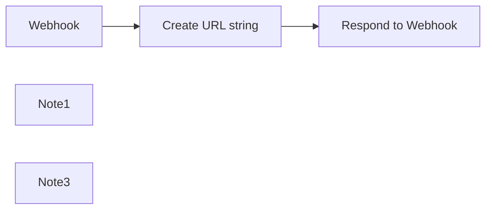
```mermaid
flowchart LR
    N1["Webhook"]
    N2["Note1"]
    N3["Respond to Webhook"]
    N4["Create URL string"]
    N5["Note3"]

    N1 --> N4
    N4 --> N3
```

## Fluxo (.json) :

```json
{
  "meta": {
    "instanceId": "8c8c5237b8e37b006a7adce87f4369350c58e41f3ca9de16196d3197f69eabcd"
  },
  "nodes": [
    {
      "id": "f80aceed-b676-42aa-bf25-f7a44408b1bc",
      "name": "Webhook",
      "type": "n8n-nodes-base.webhook",
      "position": [
        375,
        115
      ],
      "webhookId": "6f7b288e-1efe-4504-a6fd-660931327269",
      "parameters": {
        "path": "6f7b288e-1efe-4504-a6fd-660931327269",
        "options": {},
        "responseMode": "responseNode"
      },
      "typeVersion": 1
    },
    {
      "id": "3b9ec913-0bbe-4906-bf8e-da352b556655",
      "name": "Note1",
      "type": "n8n-nodes-base.stickyNote",
      "position": [
        355,
        -25
      ],
      "parameters": {
        "width": 600,
        "height": 280,
        "content": "## Create a simple API endpoint\n\nIn this workflow we show how to create a simple API endpoint with `Webhook` and `Respond to Webhook` nodes\n\n"
      },
      "typeVersion": 1
    },
    {
      "id": "9c36dae5-0700-450c-9739-e9f3eff31bfe",
      "name": "Respond to Webhook",
      "type": "n8n-nodes-base.respondToWebhook",
      "position": [
        815,
        115
      ],
      "parameters": {
        "options": {},
        "respondWith": "text",
        "responseBody": "=The URL of the Google search query for the term \"{{$node[\"Webhook\"].json[\"query\"][\"first_name\"]}} {{$node[\"Webhook\"].json[\"query\"][\"last_name\"]}}\" is: {{$json[\"product\"]}}"
      },
      "typeVersion": 1
    },
    {
      "id": "5a228fcb-78b9-4a28-95d2-d7c9fdf1d4ea",
      "name": "Create URL string",
      "type": "n8n-nodes-base.set",
      "position": [
        595,
        115
      ],
      "parameters": {
        "values": {
          "string": [
            {
              "name": "product",
              "value": "=https://www.google.com/search?q={{$json[\"query\"][\"first_name\"]}}+{{$json[\"query\"][\"last_name\"]}}"
            }
          ]
        },
        "options": {},
        "keepOnlySet": true
      },
      "typeVersion": 1
    },
    {
      "id": "e7971820-45a8-4dc8-ba4c-b3220d65307a",
      "name": "Note3",
      "type": "n8n-nodes-base.stickyNote",
      "position": [
        355,
        275
      ],
      "parameters": {
        "width": 600,
        "height": 220,
        "content": "### How to use it\n1. Execute the workflow so that the webhook starts listening\n2. Make a test request by pasting, **in a new browser tab**, the test URL from the `Webhook` node and appending the following test at the end `?first_name=bob&last_name=dylan`\n\nYou will receive the following output in the new tab `The URL of the Google search query for the term \"bob dylan\" is: https://www.google.com/search?q=bob+dylan`\n\n"
      },
      "typeVersion": 1
    }
  ],
  "connections": {
    "Webhook": {
      "main": [
        [
          {
            "node": "Create URL string",
            "type": "main",
            "index": 0
          }
        ]
      ]
    },
    "Create URL string": {
      "main": [
        [
          {
            "node": "Respond to Webhook",
            "type": "main",
            "index": 0
          }
        ]
      ]
    }
  }
}
```

<a id="template-652"></a>

## Template 652 - Publicação automática no Instagram via Google Drive e IA

- **Nome:** Publicação automática no Instagram via Google Drive e IA
- **Descrição:** Automatiza a publicação de fotos e vídeos no Instagram a partir de arquivos enviados a uma pasta no Google Drive, gerando legendas com IA e publicando via API do Facebook/Instagram.
- **Funcionalidade:** • Detecção de novos arquivos: Inicia o fluxo quando um foto/video é enviado a uma pasta específica no Google Drive.
• Download do arquivo: Baixa o arquivo recém-carregado para uso no processo de publicação.
• Geração de legenda com IA: Cria legendas envolventes, com emojis, hashtags e call-to-action usando um modelo de linguagem.
• Registro em planilha: Salva nome do arquivo, legenda, link do arquivo e thumbnail em uma planilha do Google Sheets (append ou update).
• Criação de mídia via API: Envia URL do vídeo/thumbnail e legenda para a API do Facebook/Instagram para criar o recurso de mídia (Reels).
• Publicação da mídia: Publica a mídia criada no Instagram usando o endpoint de publicação da API.
• Fluxo integrado: Encadeia dados entre Drive, geração de legenda, planilha e API de publicação para operação automática.
• Monitoramento periódico: Verifica a pasta configurada em intervalos regulares (ex.: a cada minuto) para novos uploads.
- **Ferramentas:** • Google Drive: Armazenamento de arquivos (fotos e vídeos), fornece IDs, links e thumbnails dos arquivos.
• OpenAI (modelo GPT): Gera captions/legendas automáticas e criativas para posts.
• Google Sheets: Armazena registros das publicações, legendas, URLs e thumbnails para controle e integração.
• Facebook Graph API (Instagram): Cria e publica mídias no Instagram Business/Creator por meio dos endpoints de mídia e publicação.

## Fluxo visual

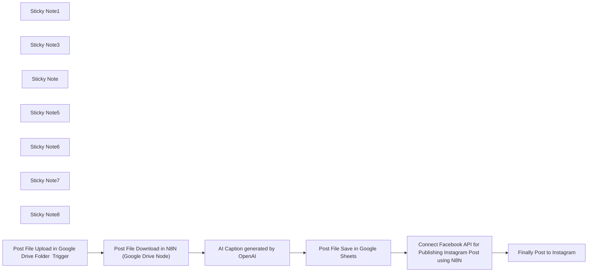
```mermaid
flowchart LR
    N1["Sticky Note1"]
    N2["Sticky Note3"]
    N3["Sticky Note"]
    N4["Sticky Note5"]
    N5["Sticky Note6"]
    N6["Sticky Note7"]
    N7["Finally Post to Instagram"]
    N8["Sticky Note8"]
    N9["Post File Upload in Google Drive Folder  Trigger"]
    N10["Post File Download in N8N (Google Drive Node)"]
    N11["AI Caption generated by OpenAI"]
    N12["Post File Save in Google Sheets"]
    N13["Connect Facebook API for Publishing Instagram Post using N8N"]

    N11 --> N12
    N12 --> N13
    N10 --> N11
    N9 --> N10
    N13 --> N7
```

## Fluxo (.json) :

```json
{
  "meta": {
    "instanceId": "160aba527cc3058f06f5c3afbfdaa77f24ad6a273269f4a7e247245d0eb0c124",
    "templateCredsSetupCompleted": true
  },
  "nodes": [
    {
      "id": "0c46db99-4216-4132-a705-62560e8ebff0",
      "name": "Sticky Note1",
      "type": "n8n-nodes-base.stickyNote",
      "position": [
        200,
        -100
      ],
      "parameters": {
        "color": 4,
        "width": 275,
        "height": 239,
        "content": "👈\nSet up Google Drive credentials.\n\nWhen a new photo/video or carousel is uploaded to the selected folder in Google Drive for posting on Instagram, this trigger will be activated.\n\nFollow the steps (YouTube video):\nhttps://youtu.be/L3NUp2XP_h0?si=KAjHYEZ-qedIM-n"
      },
      "typeVersion": 1
    },
    {
      "id": "bea7e9cb-c125-4469-a902-71f949d82858",
      "name": "Sticky Note3",
      "type": "n8n-nodes-base.stickyNote",
      "position": [
        180,
        -480
      ],
      "parameters": {
        "color": 4,
        "width": 492,
        "height": 100,
        "content": "### Automate instagram posts with Google Drive, AI Captions & Facebook Graph API Agent (Easy to Set-Up)\n(Easy to set-up)"
      },
      "typeVersion": 1
    },
    {
      "id": "b56d4729-cc93-41d9-be09-27547d0d8204",
      "name": "Sticky Note",
      "type": "n8n-nodes-base.stickyNote",
      "position": [
        480,
        -100
      ],
      "parameters": {
        "color": 3,
        "width": 275,
        "height": 239,
        "content": "👈\nSet up Google Drive credentials.\n\nThis node will download the posting file in the n8n workflow.\n\nFollow the steps (YouTube video):\nhttps://youtu.be/L3NUp2XP_h0?si=KAjHYEZ-qedIM-n"
      },
      "typeVersion": 1
    },
    {
      "id": "f70fd011-9eab-46b4-a861-148ddd90bca1",
      "name": "Sticky Note5",
      "type": "n8n-nodes-base.stickyNote",
      "position": [
        760,
        -100
      ],
      "parameters": {
        "color": 5,
        "width": 275,
        "height": 239,
        "content": "👈\nSet up OpenAI Message Model.\n\nSet up credentials.\n\nThis node will create captions for the post.\n\nFollow the steps (YouTube video):\nhttps://youtu.be/L3NUp2XP_h0?si=KAjHYEZ-qedIM-n"
      },
      "typeVersion": 1
    },
    {
      "id": "4a85fd3c-66a8-40cf-be58-030568b953cf",
      "name": "Sticky Note6",
      "type": "n8n-nodes-base.stickyNote",
      "position": [
        1040,
        -100
      ],
      "parameters": {
        "width": 275,
        "height": 399,
        "content": "👈\nSet up Google Sheets Node.\n\nSet up credentials.\n\nCreate a new sheet in Google Sheets (e.g., Instagram posts).\n\nCreate 3 columns: Name, Caption, and Image/Reel Link. Connect the Google sheet with this node. & connect the columns with the Google Drive Node (Name Column & Url Column with 2 parameters of Google Drive Node) and captions column with one OpenAI parameter.\n\nFollow the steps (YouTube video):\nhttps://youtu.be/L3NUp2XP_h0?si=KAjHYEZ-qedIM-n"
      },
      "typeVersion": 1
    },
    {
      "id": "5e855a8f-3a45-43bc-a8e6-9c590fb77c3d",
      "name": "Sticky Note7",
      "type": "n8n-nodes-base.stickyNote",
      "position": [
        1320,
        -100
      ],
      "parameters": {
        "color": 3,
        "width": 275,
        "height": 379,
        "content": "👈 Hardest Step (Facebook Graph API):\n\nSet up Facebook Graph API Node.\n\nSet up credentials.\n\nConnect query parameters with Google Sheets parameters.\n\nThis node will access your post file from Google Sheets with captions.\n\nFollow the steps (YouTube video):\nhttps://youtu.be/L3NUp2XP_h0?si=KAjHYEZ-qedIM-n"
      },
      "typeVersion": 1
    },
    {
      "id": "515cef5a-52fd-49af-831c-50957e58564a",
      "name": "Finally Post to Instagram",
      "type": "n8n-nodes-base.facebookGraphApi",
      "position": [
        1560,
        -280
      ],
      "parameters": {
        "edge": "media_publish",
        "node": "17841465053058137",
        "hostUrl": "graph-video.facebook.com",
        "options": {
          "queryParameters": {
            "parameter": [
              {
                "name": "creation_id",
                "value": "={{ $json.id }}"
              }
            ]
          }
        },
        "graphApiVersion": "v22.0",
        "httpRequestMethod": "POST"
      },
      "credentials": {
        "facebookGraphApi": {
          "id": "vDjaXB1lRcGeYQV3",
          "name": "Facebook Graph account"
        }
      },
      "typeVersion": 1
    },
    {
      "id": "b3114251-0799-44a2-a838-0231103d8f87",
      "name": "Sticky Note8",
      "type": "n8n-nodes-base.stickyNote",
      "position": [
        1600,
        -100
      ],
      "parameters": {
        "color": 4,
        "width": 275,
        "height": 299,
        "content": "👈 \n1. Set-up Facebook Graph API) Node\n2. Set-Up Credentials\n\n3.This Node will Directly post on your instagram.\n\n\nFollow the Steps (Youtube Video)\nhttps://youtu.be/L3NUp2XP_h0?si=KAtjHYE2-qedlM-n"
      },
      "typeVersion": 1
    },
    {
      "id": "6c3f1ec2-8765-4445-b93b-253e43c102d2",
      "name": "Post File Upload in Google Drive Folder  Trigger",
      "type": "n8n-nodes-base.googleDriveTrigger",
      "position": [
        300,
        -280
      ],
      "parameters": {
        "event": "fileCreated",
        "options": {},
        "pollTimes": {
          "item": [
            {
              "mode": "everyMinute"
            }
          ]
        },
        "triggerOn": "specificFolder",
        "folderToWatch": {
          "__rl": true,
          "mode": "list",
          "value": "1VfkhYImlmEXw70IrJvvZKO6mM164zMD6",
          "cachedResultUrl": "https://drive.google.com/drive/folders/1VfkhYImlmEXw70IrJvvZKO6mM164zMD6",
          "cachedResultName": "n8n reels automation on instagram"
        }
      },
      "credentials": {
        "googleDriveOAuth2Api": {
          "id": "bugAjkJYMXx2rSaD",
          "name": "Google Drive account"
        }
      },
      "typeVersion": 1
    },
    {
      "id": "1c5d5251-f55e-4f1a-b0c3-103e34ac2128",
      "name": "Post File Download in N8N (Google Drive Node)",
      "type": "n8n-nodes-base.googleDrive",
      "position": [
        520,
        -280
      ],
      "parameters": {
        "fileId": {
          "__rl": true,
          "mode": "id",
          "value": "={{ $json.id }}"
        },
        "options": {},
        "operation": "download"
      },
      "credentials": {
        "googleDriveOAuth2Api": {
          "id": "bugAjkJYMXx2rSaD",
          "name": "Google Drive account"
        }
      },
      "typeVersion": 3
    },
    {
      "id": "e5e336e2-2a07-4611-9700-8c973aefd0f8",
      "name": "AI Caption generated by OpenAI",
      "type": "@n8n/n8n-nodes-langchain.openAi",
      "position": [
        740,
        -280
      ],
      "parameters": {
        "modelId": {
          "__rl": true,
          "mode": "list",
          "value": "gpt-4o-mini",
          "cachedResultName": "GPT-4O-MINI"
        },
        "options": {},
        "messages": {
          "values": [
            {
              "content": "=Generate an engaging Instagram caption for a {{ $('Post File Upload in Google Drive Folder  Trigger').item.json.name }}  about [Description]. Include:\t\n2-3 sentences with emojis\n\n3-5 relevant hashtags\n\nA call-to-action\n\nKeep it under 150 characters as you are skilled at writing detailed captions based on a file name. write a clear, engaging caption that helps viewers understand and appreciate the post withoutj using too many whimsical words or using too many adjectives. make it relatable and suitable for an instagram audience, encouraging people to connect with the post and respond in the comments. "
            },
            {}
          ]
        },
        "simplify": false
      },
      "credentials": {
        "openAiApi": {
          "id": "BiRkxZ4Wi3R6gMpn",
          "name": "OpenAi account 2"
        }
      },
      "typeVersion": 1.8
    },
    {
      "id": "19054395-234d-4fae-a0e9-2976df11919d",
      "name": "Post File Save in Google Sheets",
      "type": "n8n-nodes-base.googleSheets",
      "position": [
        1120,
        -280
      ],
      "parameters": {
        "columns": {
          "value": {
            "Name": "={{ $('Post File Download in N8N (Google Drive Node)').item.json.name }}",
            "Captions": "={{ $json.choices[0].message.content }}",
            "Reel Urls ": "={{ $('Post File Download in N8N (Google Drive Node)').item.json.webViewLink }}",
            "Reel Thumbnail": "={{ $('Post File Download in N8N (Google Drive Node)').item.json.thumbnailLink }}"
          },
          "schema": [
            {
              "id": "Name",
              "type": "string",
              "display": true,
              "removed": false,
              "required": false,
              "displayName": "Name",
              "defaultMatch": false,
              "canBeUsedToMatch": true
            },
            {
              "id": "Captions",
              "type": "string",
              "display": true,
              "removed": false,
              "required": false,
              "displayName": "Captions",
              "defaultMatch": false,
              "canBeUsedToMatch": true
            },
            {
              "id": "Reel Urls ",
              "type": "string",
              "display": true,
              "removed": false,
              "required": false,
              "displayName": "Reel Urls ",
              "defaultMatch": false,
              "canBeUsedToMatch": true
            },
            {
              "id": "Reel Thumbnail",
              "type": "string",
              "display": true,
              "removed": false,
              "required": false,
              "displayName": "Reel Thumbnail",
              "defaultMatch": false,
              "canBeUsedToMatch": true
            },
            {
              "id": "fb token for api",
              "type": "string",
              "display": true,
              "removed": true,
              "required": false,
              "displayName": "fb token for api",
              "defaultMatch": false,
              "canBeUsedToMatch": true
            }
          ],
          "mappingMode": "defineBelow",
          "matchingColumns": [
            "Name"
          ],
          "attemptToConvertTypes": false,
          "convertFieldsToString": false
        },
        "options": {},
        "operation": "appendOrUpdate",
        "sheetName": {
          "__rl": true,
          "mode": "list",
          "value": "gid=0",
          "cachedResultUrl": "https://docs.google.com/spreadsheets/d/1S-7cZM6W4EpbNH-DRAt1L3zXUt9JTmQEs8EZ_Csq_Fg/edit#gid=0",
          "cachedResultName": "Sheet1"
        },
        "documentId": {
          "__rl": true,
          "mode": "list",
          "value": "1S-7cZM6W4EpbNH-DRAt1L3zXUt9JTmQEs8EZ_Csq_Fg",
          "cachedResultUrl": "https://docs.google.com/spreadsheets/d/1S-7cZM6W4EpbNH-DRAt1L3zXUt9JTmQEs8EZ_Csq_Fg/edit?usp=drivesdk",
          "cachedResultName": "IG Reel Pass to Meta API  "
        }
      },
      "credentials": {
        "googleSheetsOAuth2Api": {
          "id": "aQLnLORao3LXvlT1",
          "name": "Google Sheets account 2"
        }
      },
      "typeVersion": 4.5
    },
    {
      "id": "d331ddfb-9131-4776-a610-feb830b736b6",
      "name": "Connect Facebook API for Publishing Instagram Post using N8N",
      "type": "n8n-nodes-base.facebookGraphApi",
      "position": [
        1340,
        -280
      ],
      "parameters": {
        "edge": "media",
        "node": "17841465053058137",
        "options": {
          "queryParameters": {
            "parameter": [
              {
                "name": "video_url",
                "value": "={{ $json['Reel Urls '] }}"
              },
              {
                "name": "media-type",
                "value": "REELS"
              },
              {
                "name": "caption",
                "value": "={{ $json.Captions }}"
              },
              {
                "name": "image_url",
                "value": "={{ $json['Reel Thumbnail'] }}"
              }
            ]
          }
        },
        "graphApiVersion": "v22.0",
        "httpRequestMethod": "POST"
      },
      "credentials": {
        "facebookGraphApi": {
          "id": "vDjaXB1lRcGeYQV3",
          "name": "Facebook Graph account"
        }
      },
      "typeVersion": 1
    }
  ],
  "pinData": {},
  "connections": {
    "AI Caption generated by OpenAI": {
      "main": [
        [
          {
            "node": "Post File Save in Google Sheets",
            "type": "main",
            "index": 0
          }
        ]
      ]
    },
    "Post File Save in Google Sheets": {
      "main": [
        [
          {
            "node": "Connect Facebook API for Publishing Instagram Post using N8N",
            "type": "main",
            "index": 0
          }
        ]
      ]
    },
    "Post File Download in N8N (Google Drive Node)": {
      "main": [
        [
          {
            "node": "AI Caption generated by OpenAI",
            "type": "main",
            "index": 0
          }
        ]
      ]
    },
    "Post File Upload in Google Drive Folder  Trigger": {
      "main": [
        [
          {
            "node": "Post File Download in N8N (Google Drive Node)",
            "type": "main",
            "index": 0
          }
        ]
      ]
    },
    "Connect Facebook API for Publishing Instagram Post using N8N": {
      "main": [
        [
          {
            "node": "Finally Post to Instagram",
            "type": "main",
            "index": 0
          }
        ]
      ]
    }
  }
}
```

<a id="template-653"></a>

## Template 653 - Busca e resumo web com Perplexity, Gemini e Bright Data

- **Nome:** Busca e resumo web com Perplexity, Gemini e Bright Data
- **Descrição:** Fluxo que executa uma busca via Perplexity, coleta o resultado com a API de raspagem, extrai conteúdo legível, resume usando o modelo Gemini e envia o resumo para um webhook.
- **Funcionalidade:** • Gatilho manual: Permite iniciar o fluxo manualmente para testar o processo.
• Envio de requisição de busca: Dispara uma busca/trigger para executar a consulta (Perplexity) através da API de raspagem.
• Captura de snapshot: Recebe e armazena o identificador do snapshot gerado pela coleta.
• Monitoramento de progresso: Consulta periodicamente o status do snapshot até que esteja pronto ou haja erros.
• Download do resultado: Faz download do snapshot em formato JSON quando a coleta é concluída.
• Extração de conteúdo legível: Converte/limpa o HTML retornado para texto legível e seleciona o conteúdo relevante.
• Preparação de documentos: Divide o texto em trechos e carrega os documentos para processamento posterior.
• Resumo com IA: Utiliza um modelo de linguagem avançado para gerar um resumo condensado do conteúdo coletado.
• Notificação via webhook: Envia o resultado final para um endpoint externo configurado.
• Verificação de erros e espera: Verifica a presença de erros e aplica espera/retries conforme necessário.
- **Ferramentas:** • Perplexity.ai: Serviço de busca/consulta que fornece respostas e conteúdo agregado.
• Bright Data (API de datasets e snapshots): Plataforma de raspagem/coleta que executa triggers, gera snapshots e fornece endpoints para baixar resultados.
• Google Gemini (PaLM API): Modelo de linguagem usado para extração de informações e geração de resumos.
• Webhook (ex.: webhook.site): Endpoint externo para receber e armazenar o resumo final enviado pelo fluxo.

## Fluxo visual

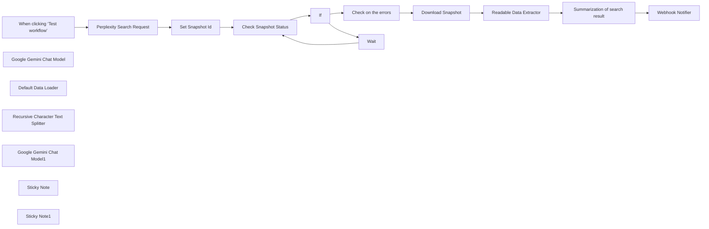
```mermaid
flowchart LR
    N1["When clicking ‘Test workflow’"]
    N2["Google Gemini Chat Model"]
    N3["Default Data Loader"]
    N4["Recursive Character Text Splitter"]
    N5["If"]
    N6["Set Snapshot Id"]
    N7["Download Snapshot"]
    N8["Google Gemini Chat Model1"]
    N9["Wait"]
    N10["Check on the errors"]
    N11["Sticky Note"]
    N12["Webhook Notifier"]
    N13["Sticky Note1"]
    N14["Perplexity Search Request"]
    N15["Check Snapshot Status"]
    N16["Readable Data Extractor"]
    N17["Summarization of search result"]

    N5 --> N10
    N5 --> N9
    N9 --> N15
    N6 --> N15
    N7 --> N16
    N10 --> N7
    N15 --> N5
    N16 --> N17
    N14 --> N6
    N17 --> N12
    N1 --> N14
```

## Fluxo (.json) :

```json
{
  "id": "ZCAkUSpaxzoRPbse",
  "meta": {
    "instanceId": "885b4fb4a6a9c2cb5621429a7b972df0d05bb724c20ac7dac7171b62f1c7ef40",
    "templateCredsSetupCompleted": true
  },
  "name": "Search & Summarize Web Data with Perplexity, Gemini AI & Bright Data to Webhooks",
  "tags": [
    {
      "id": "Kujft2FOjmOVQAmJ",
      "name": "Engineering",
      "createdAt": "2025-04-09T01:31:00.558Z",
      "updatedAt": "2025-04-09T01:31:00.558Z"
    },
    {
      "id": "ddPkw7Hg5dZhQu2w",
      "name": "AI",
      "createdAt": "2025-04-13T05:38:08.053Z",
      "updatedAt": "2025-04-13T05:38:08.053Z"
    }
  ],
  "nodes": [
    {
      "id": "674c6b61-76fa-4ac0-ab32-3f48ed5cba39",
      "name": "When clicking ‘Test workflow’",
      "type": "n8n-nodes-base.manualTrigger",
      "position": [
        -1140,
        400
      ],
      "parameters": {},
      "typeVersion": 1
    },
    {
      "id": "f6066e4c-4f6f-48fd-b19f-2c25fdc5b8b2",
      "name": "Google Gemini Chat Model",
      "type": "@n8n/n8n-nodes-langchain.lmChatGoogleGemini",
      "notes": "Gemini Experimental Model",
      "position": [
        760,
        580
      ],
      "parameters": {
        "options": {},
        "modelName": "models/gemini-2.0-flash-thinking-exp-01-21"
      },
      "credentials": {
        "googlePalmApi": {
          "id": "YeO7dHZnuGBVQKVZ",
          "name": "Google Gemini(PaLM) Api account"
        }
      },
      "notesInFlow": true,
      "typeVersion": 1
    },
    {
      "id": "e16a1442-924a-4558-90cb-1c9ddc606532",
      "name": "Default Data Loader",
      "type": "@n8n/n8n-nodes-langchain.documentDefaultDataLoader",
      "position": [
        940,
        580
      ],
      "parameters": {
        "options": {}
      },
      "typeVersion": 1
    },
    {
      "id": "a8d9bc8e-c5f6-4d66-af60-9eecb9f6569c",
      "name": "Recursive Character Text Splitter",
      "type": "@n8n/n8n-nodes-langchain.textSplitterRecursiveCharacterTextSplitter",
      "position": [
        1040,
        800
      ],
      "parameters": {
        "options": {},
        "chunkOverlap": 100
      },
      "typeVersion": 1
    },
    {
      "id": "4ba96504-4ca5-43cf-962c-87320a683b09",
      "name": "If",
      "type": "n8n-nodes-base.if",
      "position": [
        -200,
        400
      ],
      "parameters": {
        "options": {},
        "conditions": {
          "options": {
            "version": 2,
            "leftValue": "",
            "caseSensitive": true,
            "typeValidation": "strict"
          },
          "combinator": "and",
          "conditions": [
            {
              "id": "6a7e5360-4cb5-4806-892e-5c85037fa71c",
              "operator": {
                "type": "string",
                "operation": "equals"
              },
              "leftValue": "={{ $json.status }}",
              "rightValue": "ready"
            }
          ]
        }
      },
      "typeVersion": 2.2
    },
    {
      "id": "11fbf88d-99f7-453c-946d-65c886bd50b8",
      "name": "Set Snapshot Id",
      "type": "n8n-nodes-base.set",
      "position": [
        -740,
        400
      ],
      "parameters": {
        "options": {},
        "assignments": {
          "assignments": [
            {
              "id": "2c3369c6-9206-45d7-9349-f577baeaf189",
              "name": "snapshot_id",
              "type": "string",
              "value": "={{ $json.snapshot_id }}"
            }
          ]
        }
      },
      "typeVersion": 3.4
    },
    {
      "id": "2635d7ff-3de9-40af-925e-e391c3fd5f54",
      "name": "Download Snapshot",
      "type": "n8n-nodes-base.httpRequest",
      "position": [
        140,
        200
      ],
      "parameters": {
        "url": "=https://api.brightdata.com/datasets/v3/snapshot/{{ $json.snapshot_id }}",
        "options": {
          "timeout": 10000
        },
        "sendQuery": true,
        "authentication": "genericCredentialType",
        "genericAuthType": "httpHeaderAuth",
        "queryParameters": {
          "parameters": [
            {
              "name": "format",
              "value": "json"
            }
          ]
        }
      },
      "credentials": {
        "httpHeaderAuth": {
          "id": "kdbqXuxIR8qIxF7y",
          "name": "Header Auth account"
        }
      },
      "typeVersion": 4.2
    },
    {
      "id": "fe5bff52-4745-4c8f-a5e8-b9b48d421ffe",
      "name": "Google Gemini Chat Model1",
      "type": "@n8n/n8n-nodes-langchain.lmChatGoogleGemini",
      "position": [
        380,
        380
      ],
      "parameters": {
        "options": {},
        "modelName": "models/gemini-2.0-flash-exp"
      },
      "credentials": {
        "googlePalmApi": {
          "id": "YeO7dHZnuGBVQKVZ",
          "name": "Google Gemini(PaLM) Api account"
        }
      },
      "typeVersion": 1
    },
    {
      "id": "8124f050-ad7f-4478-8edf-c4d02193f54c",
      "name": "Wait",
      "type": "n8n-nodes-base.wait",
      "position": [
        -200,
        620
      ],
      "webhookId": "631cd5de-36b3-4264-88ae-45b30e2c2ccc",
      "parameters": {
        "amount": 30
      },
      "typeVersion": 1.1
    },
    {
      "id": "1926f22c-e269-40e8-a55d-3945810d13e2",
      "name": "Check on the errors",
      "type": "n8n-nodes-base.if",
      "position": [
        -80,
        40
      ],
      "parameters": {
        "options": {},
        "conditions": {
          "options": {
            "version": 2,
            "leftValue": "",
            "caseSensitive": true,
            "typeValidation": "strict"
          },
          "combinator": "and",
          "conditions": [
            {
              "id": "b267071c-7102-407b-a98d-f613bcb1a106",
              "operator": {
                "type": "string",
                "operation": "equals"
              },
              "leftValue": "={{ $json.errors.toString() }}",
              "rightValue": "0"
            }
          ]
        }
      },
      "typeVersion": 2.2
    },
    {
      "id": "50a8f7ac-bf66-493e-956e-7278ea7702c1",
      "name": "Sticky Note",
      "type": "n8n-nodes-base.stickyNote",
      "position": [
        -1140,
        40
      ],
      "parameters": {
        "width": 400,
        "height": 240,
        "content": "## Note\n\nDeals with the Perplexity Search using the Bright Data Web Scrapper API.\n\nThe information extraction and summarization are done to demonstrate the usage of the N8N AI capabilities.\n\n**Please make sure to update the Webhook Notification URL**"
      },
      "typeVersion": 1
    },
    {
      "id": "4906478c-6f10-4f47-94cc-78e36939e929",
      "name": "Webhook Notifier",
      "type": "n8n-nodes-base.httpRequest",
      "position": [
        1140,
        200
      ],
      "parameters": {
        "url": "https://webhook.site/ce41e056-c097-48c8-a096-9b876d3abbf7",
        "options": {},
        "sendBody": true,
        "bodyParameters": {
          "parameters": [
            {
              "name": "response",
              "value": "={{ $json.output }}"
            }
          ]
        }
      },
      "typeVersion": 4.2
    },
    {
      "id": "dd5dcbf3-bc3e-4676-af64-8a41807ba970",
      "name": "Sticky Note1",
      "type": "n8n-nodes-base.stickyNote",
      "position": [
        -620,
        40
      ],
      "parameters": {
        "width": 420,
        "height": 240,
        "content": "## LLM Usages\n\nGoogle Gemini Flash Exp model is being used.\n\nInformation extraction is being used for formatting the html to text\n\nSummarization Chain is being used for summarization of the content"
      },
      "typeVersion": 1
    },
    {
      "id": "4cc0e400-5722-4eaf-ac95-10b0c9592345",
      "name": "Perplexity Search Request",
      "type": "n8n-nodes-base.httpRequest",
      "position": [
        -920,
        400
      ],
      "parameters": {
        "url": "https://api.brightdata.com/datasets/v3/trigger",
        "method": "POST",
        "options": {},
        "jsonBody": "[\n  {\n    \"url\": \"https://www.perplexity.ai\",\n    \"prompt\": \"tell me about BrightData\",\n    \"country\": \"US\"\n  }\n]",
        "sendBody": true,
        "sendQuery": true,
        "sendHeaders": true,
        "specifyBody": "json",
        "authentication": "genericCredentialType",
        "genericAuthType": "httpHeaderAuth",
        "queryParameters": {
          "parameters": [
            {
              "name": "dataset_id",
              "value": "gd_m7dhdot1vw9a7gc1n"
            },
            {
              "name": "include_errors",
              "value": "true"
            }
          ]
        },
        "headerParameters": {
          "parameters": [
            {}
          ]
        }
      },
      "credentials": {
        "httpHeaderAuth": {
          "id": "kdbqXuxIR8qIxF7y",
          "name": "Header Auth account"
        }
      },
      "typeVersion": 4.2
    },
    {
      "id": "be9cc310-8f0d-4065-8246-aeddde697953",
      "name": "Check Snapshot Status",
      "type": "n8n-nodes-base.httpRequest",
      "position": [
        -460,
        400
      ],
      "parameters": {
        "url": "=https://api.brightdata.com/datasets/v3/progress/{{ $json.snapshot_id }}",
        "options": {},
        "sendHeaders": true,
        "authentication": "genericCredentialType",
        "genericAuthType": "httpHeaderAuth"
      },
      "credentials": {
        "httpHeaderAuth": {
          "id": "kdbqXuxIR8qIxF7y",
          "name": "Header Auth account"
        }
      },
      "typeVersion": 4.2
    },
    {
      "id": "66efd680-1d4d-4930-9712-ba9fd1b3a3be",
      "name": "Readable Data Extractor",
      "type": "@n8n/n8n-nodes-langchain.informationExtractor",
      "position": [
        360,
        200
      ],
      "parameters": {
        "text": "={{ $json.answer_html }}",
        "options": {},
        "attributes": {
          "attributes": [
            {
              "name": "readable content",
              "description": "Readable Content"
            }
          ]
        }
      },
      "typeVersion": 1
    },
    {
      "id": "3c5b4744-7475-40a6-a1f5-cce2b700c84a",
      "name": "Summarization of search result",
      "type": "@n8n/n8n-nodes-langchain.chainSummarization",
      "position": [
        760,
        200
      ],
      "parameters": {
        "options": {},
        "operationMode": "documentLoader"
      },
      "typeVersion": 2
    }
  ],
  "active": false,
  "pinData": {},
  "settings": {
    "executionOrder": "v1"
  },
  "versionId": "4628ec64-b023-4185-b38f-a74e2de76ec5",
  "connections": {
    "If": {
      "main": [
        [
          {
            "node": "Check on the errors",
            "type": "main",
            "index": 0
          }
        ],
        [
          {
            "node": "Wait",
            "type": "main",
            "index": 0
          }
        ]
      ]
    },
    "Wait": {
      "main": [
        [
          {
            "node": "Check Snapshot Status",
            "type": "main",
            "index": 0
          }
        ]
      ]
    },
    "Set Snapshot Id": {
      "main": [
        [
          {
            "node": "Check Snapshot Status",
            "type": "main",
            "index": 0
          }
        ]
      ]
    },
    "Download Snapshot": {
      "main": [
        [
          {
            "node": "Readable Data Extractor",
            "type": "main",
            "index": 0
          }
        ]
      ]
    },
    "Check on the errors": {
      "main": [
        [
          {
            "node": "Download Snapshot",
            "type": "main",
            "index": 0
          }
        ]
      ]
    },
    "Default Data Loader": {
      "ai_document": [
        [
          {
            "node": "Summarization of search result",
            "type": "ai_document",
            "index": 0
          }
        ]
      ]
    },
    "Check Snapshot Status": {
      "main": [
        [
          {
            "node": "If",
            "type": "main",
            "index": 0
          }
        ]
      ]
    },
    "Readable Data Extractor": {
      "main": [
        [
          {
            "node": "Summarization of search result",
            "type": "main",
            "index": 0
          }
        ]
      ]
    },
    "Google Gemini Chat Model": {
      "ai_languageModel": [
        [
          {
            "node": "Summarization of search result",
            "type": "ai_languageModel",
            "index": 0
          }
        ]
      ]
    },
    "Google Gemini Chat Model1": {
      "ai_languageModel": [
        [
          {
            "node": "Readable Data Extractor",
            "type": "ai_languageModel",
            "index": 0
          }
        ]
      ]
    },
    "Perplexity Search Request": {
      "main": [
        [
          {
            "node": "Set Snapshot Id",
            "type": "main",
            "index": 0
          }
        ]
      ]
    },
    "Summarization of search result": {
      "main": [
        [
          {
            "node": "Webhook Notifier",
            "type": "main",
            "index": 0
          }
        ]
      ]
    },
    "Recursive Character Text Splitter": {
      "ai_textSplitter": [
        [
          {
            "node": "Default Data Loader",
            "type": "ai_textSplitter",
            "index": 0
          }
        ]
      ]
    },
    "When clicking ‘Test workflow’": {
      "main": [
        [
          {
            "node": "Perplexity Search Request",
            "type": "main",
            "index": 0
          }
        ]
      ]
    }
  }
}
```

<a id="template-654"></a>

## Template 654 - Enriquecimento de empresas com IA

- **Nome:** Enriquecimento de empresas com IA
- **Descrição:** Lê entradas de uma planilha, pesquisa informações públicas sobre empresas usando modelos de IA e ferramentas web, e grava dados enriquecidos de volta na planilha.
- **Funcionalidade:** • Leitura de linhas pendentes: Busca linhas na planilha marcadas para enriquecimento.
• Processamento sequencial: Processa cada linha individualmente para evitar sobrecarga e garantir controle.
• Pesquisa na web automática: Realiza buscas no Google para encontrar pricing, estudos de caso e outras evidências.
• Coleta de conteúdo do site: Visita e extrai texto das páginas do site da empresa para obter informações diretas.
• Agente de IA para investigação: Usa um modelo de linguagem para consolidar dados (domínio, LinkedIn, mercado, planos, API, integrações, estudo de caso, etc.).
• Saída estruturada: Valida e formata a resposta do agente em um esquema JSON predefinido.
• Atualização da planilha: Escreve os campos enriquecidos de volta na linha correspondente e marca o status como concluído.
• Agendamento e execução manual: Pode ser executado manualmente ou agendado para rodar automaticamente a cada 2 horas.
- **Ferramentas:** • OpenAI (gpt-4o): Modelo de linguagem usado pelo agente para analisar, interpretar resultados e gerar respostas estruturadas.
• SerpAPI: Serviço de pesquisa no Google usado para obter resultados de busca relevantes (pricing, estudos de caso, etc.).
• ScrapingBee: Alternativa para realizar buscas e scraping de resultados do Google de forma econômica.
• Google Sheets: Fonte e destino dos dados; armazena entradas a serem enriquecidas e recebe os resultados finais.
• Sites públicos das empresas: Fontes primárias de informação (páginas institucionais, pricing, blogs e hubs de estudos de caso) acessadas para extração de conteúdo.
• Requisições HTTP e extração de HTML: Método para visitar páginas e extrair texto limpo que alimenta a análise do agente de IA.

## Fluxo visual

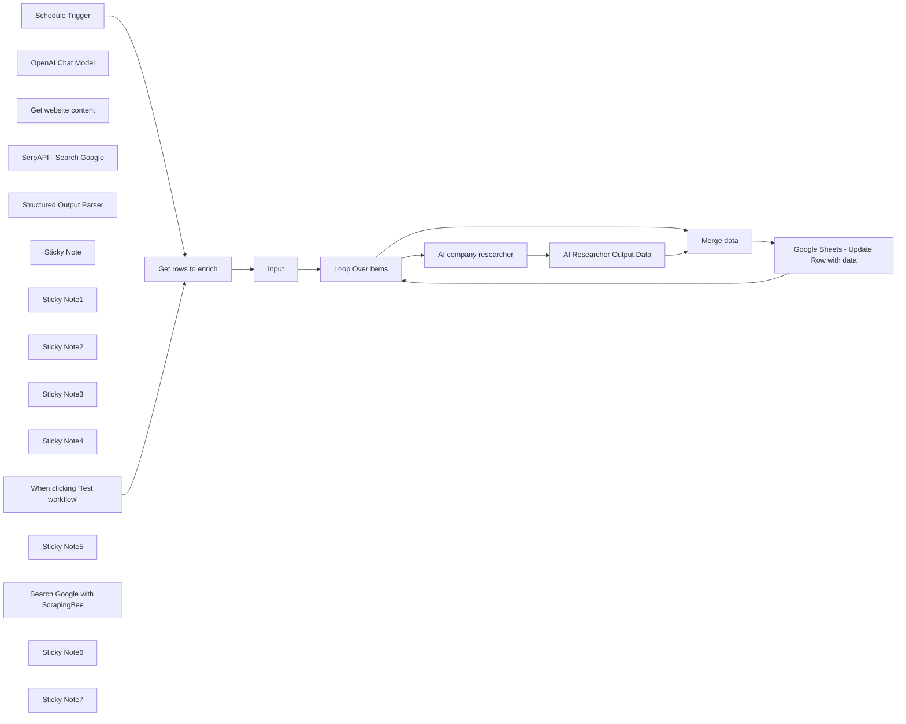
```mermaid
flowchart LR
    N1["When clicking 'Test workflow'"]
    N2["Input"]
    N3["OpenAI Chat Model"]
    N4["Get website content"]
    N5["SerpAPI - Search Google"]
    N6["Structured Output Parser"]
    N7["Loop Over Items"]
    N8["AI Researcher Output Data"]
    N9["Google Sheets - Update Row with data"]
    N10["Merge data"]
    N11["Sticky Note"]
    N12["Get rows to enrich"]
    N13["Sticky Note1"]
    N14["Sticky Note2"]
    N15["Sticky Note3"]
    N16["Sticky Note4"]
    N17["Schedule Trigger"]
    N18["Sticky Note5"]
    N19["AI company researcher"]
    N20["Search Google with ScrapingBee"]
    N21["Sticky Note6"]
    N22["Sticky Note7"]

    N2 --> N7
    N10 --> N9
    N7 --> N19
    N7 --> N10
    N17 --> N12
    N12 --> N2
    N19 --> N8
    N8 --> N10
    N1 --> N12
    N9 --> N7
```

## Fluxo (.json) :

```json
{
  "meta": {
    "instanceId": "2b1cc1a8b0a2fb9caab11ab2d5eb3712f9973066051b2e898cf4041a1f2a7757",
    "templateId": "2324",
    "templateCredsSetupCompleted": true
  },
  "nodes": [
    {
      "id": "71b06728-7f59-49e3-9365-3281189a6659",
      "name": "When clicking \"Test workflow\"",
      "type": "n8n-nodes-base.manualTrigger",
      "position": [
        920,
        340
      ],
      "parameters": {},
      "typeVersion": 1
    },
    {
      "id": "b37019e3-c7ab-4119-986d-c27d082a036e",
      "name": "Input",
      "type": "n8n-nodes-base.set",
      "position": [
        1340,
        340
      ],
      "parameters": {
        "options": {},
        "assignments": {
          "assignments": [
            {
              "id": "fcc97354-b9f6-4459-a004-46e87902c77c",
              "name": "company_input",
              "type": "string",
              "value": "={{ $json.input }}"
            },
            {
              "id": "e5415c49-5204-45b1-a0e9-814157127b12",
              "name": "row_number",
              "type": "number",
              "value": "={{ $json.row_number }}"
            }
          ]
        }
      },
      "typeVersion": 3.3
    },
    {
      "id": "7d5d53ac-6d3c-4b24-97c7-deb6b76749e5",
      "name": "OpenAI Chat Model",
      "type": "@n8n/n8n-nodes-langchain.lmChatOpenAi",
      "position": [
        2020,
        660
      ],
      "parameters": {
        "model": "gpt-4o",
        "options": {
          "temperature": 0.3
        }
      },
      "credentials": {
        "openAiApi": {
          "id": "FMTQypGcsAwaRQdC",
          "name": "OpenAi account"
        }
      },
      "typeVersion": 1
    },
    {
      "id": "24e2f3b0-8b90-49a9-bde6-0fb0c2baf52a",
      "name": "Get website content",
      "type": "@n8n/n8n-nodes-langchain.toolWorkflow",
      "position": [
        2580,
        680
      ],
      "parameters": {
        "name": "get_website_content",
        "source": "parameter",
        "description": "This tool will return the text from the given URL. ",
        "workflowJson": "{\n  \"meta\": {\n    \"templateCredsSetupCompleted\": true,\n    \"instanceId\": \"2b1cc1a8b0a2fb9caab11ab2d5eb3712f9973066051b2e898cf4041a1f2a7757\"\n  },\n  \"nodes\": [\n    {\n      \"parameters\": {},\n      \"id\": \"475eaf3c-7e11-457e-8b72-4d3e683e2f80\",\n      \"name\": \"Execute Workflow Trigger\",\n      \"type\": \"n8n-nodes-base.executeWorkflowTrigger\",\n      \"typeVersion\": 1,\n      \"position\": [\n        260,\n        340\n      ]\n    },\n    {\n      \"parameters\": {\n        \"url\": \"={{ $json.query.url }}\",\n        \"options\": {}\n      },\n      \"id\": \"321fbc74-d749-4f9b-954e-7cad37601ddf\",\n      \"name\": \"Visit Website\",\n      \"type\": \"n8n-nodes-base.httpRequest\",\n      \"typeVersion\": 4.2,\n      \"position\": [\n        440,\n        340\n      ]\n    },\n    {\n      \"parameters\": {\n        \"operation\": \"extractHtmlContent\",\n        \"extractionValues\": {\n          \"values\": [\n            {\n              \"key\": \"body\",\n              \"cssSelector\": \"html\",\n              \"skipSelectors\": \"head\"\n            }\n          ]\n        },\n        \"options\": {\n          \"cleanUpText\": true\n        }\n      },\n      \"id\": \"6e51732a-4999-4805-838b-f692e9965197\",\n      \"name\": \"HTML\",\n      \"type\": \"n8n-nodes-base.html\",\n      \"typeVersion\": 1.2,\n      \"position\": [\n        620,\n        340\n      ]\n    }\n  ],\n  \"connections\": {\n    \"Execute Workflow Trigger\": {\n      \"main\": [\n        [\n          {\n            \"node\": \"Visit Website\",\n            \"type\": \"main\",\n            \"index\": 0\n          }\n        ]\n      ]\n    },\n    \"Visit Website\": {\n      \"main\": [\n        [\n          {\n            \"node\": \"HTML\",\n            \"type\": \"main\",\n            \"index\": 0\n          }\n        ]\n      ]\n    }\n  },\n  \"pinData\": {\n    \"Execute Workflow Trigger\": [\n      {\n        \"query\": {\n          \"url\": \"https://www.lemlist.com\"\n        }\n      }\n    ]\n  }\n}",
        "jsonSchemaExample": "{\n\t\"url\": \"https://www.lemlist.com\"\n}",
        "specifyInputSchema": true,
        "responsePropertyName": "body"
      },
      "typeVersion": 1.1
    },
    {
      "id": "ff7ab74c-dfc6-43ce-8c57-6edf935b4915",
      "name": "SerpAPI - Search Google",
      "type": "@n8n/n8n-nodes-langchain.toolSerpApi",
      "position": [
        2300,
        660
      ],
      "parameters": {
        "options": {}
      },
      "credentials": {
        "serpApi": {
          "id": "ECK6FimAloRJOZMG",
          "name": "SerpAPI account"
        }
      },
      "typeVersion": 1
    },
    {
      "id": "4fe311f2-4983-4380-b4ed-a827a406fce5",
      "name": "Structured Output Parser",
      "type": "@n8n/n8n-nodes-langchain.outputParserStructured",
      "position": [
        2880,
        660
      ],
      "parameters": {
        "schemaType": "manual",
        "inputSchema": "{\n\t\"type\": \"object\",\n\t\"properties\": {\n\t\t\"case_study_link\": {\n\t\t\t\"type\":[\"string\", \"null\"]\n\t\t},\n      \t\t\"domain\": {\n\t\t\t\"type\": [\"string\", \"null\"]\n\t\t},\n           \"linkedinUrl\": {\n\t\t\t\"type\": [\"string\", \"null\"]\n\t\t},\n     \t\"market\": {\n\t\t\t\"type\": [\"string\", \"null\"]\n\t\t},\n\t\t\"cheapest_plan\": {\n\t\t\t\"type\": [\"number\", \"null\"]\n\t\t},\n\t\"has_enterprise_plan\": {\n\t\t\t\"type\": [\"boolean\", \"null\"]\n\t\t},\n\t\"has_API\": {\n\t\t\t\"type\": [\"boolean\", \"null\"]\n\t\t},\n\t\"has_free_trial\": {\n\t\t\t\"type\": [\"boolean\", \"null\"]\n\t\t},\n\t\"integrations\": {\n\t\t\t\"type\": [\"array\",\"null\"],\n      \"items\": {\n\t\t\t\t\"type\": \"string\"\n\t\t\t}\n\t\t}\n\t}\n}"
      },
      "typeVersion": 1.2
    },
    {
      "id": "89ed0723-4dbe-428d-b1a9-ebdf515e42bb",
      "name": "Loop Over Items",
      "type": "n8n-nodes-base.splitInBatches",
      "position": [
        1600,
        340
      ],
      "parameters": {
        "options": {}
      },
      "typeVersion": 3
    },
    {
      "id": "34ea3862-e8e5-4bf2-a9aa-2ad084376bb5",
      "name": "AI Researcher Output Data",
      "type": "n8n-nodes-base.set",
      "position": [
        2960,
        340
      ],
      "parameters": {
        "options": {},
        "assignments": {
          "assignments": [
            {
              "id": "4109ca11-1bb8-4f5c-8bec-a962f44b0746",
              "name": "domain",
              "type": "string",
              "value": "={{ $json.output.domain }}"
            },
            {
              "id": "7f492768-375e-48fa-866b-644b2b5cbd68",
              "name": "linkedinUrl",
              "type": "string",
              "value": "={{ $json.output.linkedinUrl }}"
            },
            {
              "id": "e30b0d07-68db-45a1-9593-fd6ce24a1d50",
              "name": "market",
              "type": "string",
              "value": "={{ $json.output.market }}"
            },
            {
              "id": "0c03a51e-2c07-4583-85c6-d3d2ee81c5d1",
              "name": "cheapest_plan",
              "type": "number",
              "value": "={{ $json.output.cheapest_plan }}"
            },
            {
              "id": "0c9622d0-8446-4663-9a94-964b5df851f1",
              "name": "has_enterprise_plan",
              "type": "boolean",
              "value": "={{ $json.output.has_enterprise_plan }}"
            },
            {
              "id": "564cf6ea-457f-4762-bc19-6900b7d5743c",
              "name": "has_API",
              "type": "boolean",
              "value": "={{ $json.output.has_API }}"
            },
            {
              "id": "7fd39897-65c3-45d6-9563-8254f55ecef0",
              "name": "has_free_trial",
              "type": "boolean",
              "value": "={{ $json.output.has_free_trial }}"
            },
            {
              "id": "26477939-d407-4cae-92b2-9a9dc0f53a64",
              "name": "integrations",
              "type": "array",
              "value": "={{ $json.output.integrations }}"
            },
            {
              "id": "f0cc61d1-6b6b-4142-8627-4a4c721b19a1",
              "name": "case_study_link",
              "type": "string",
              "value": "={{ $json.output.case_study_link }}"
            }
          ]
        }
      },
      "typeVersion": 3.3
    },
    {
      "id": "ff1cb26d-6138-4ee1-9f28-4ecc80c1c8ae",
      "name": "Google Sheets - Update Row with data",
      "type": "n8n-nodes-base.googleSheets",
      "position": [
        3600,
        700
      ],
      "parameters": {
        "columns": {
          "value": {
            "domain": "={{ $json.domain }}",
            "market": "={{ $json.market }}",
            "row_number": "={{ $json.row_number }}",
            "linkedinUrl": "={{ $json.linkedinUrl }}",
            "integrations": "={{ $json.integrations }}",
            "cheapest_plan": "={{ $json.cheapest_plan }}",
            "has_free_trial": "={{ $json.has_free_trial }}",
            "enrichment_status": "done",
            "has_entreprise_plan": "={{ $json.has_enterprise_plan }}",
            "last_case_study_link": "={{ $json.case_study_link }}"
          },
          "schema": [
            {
              "id": "input",
              "type": "string",
              "display": true,
              "removed": true,
              "required": false,
              "displayName": "input",
              "defaultMatch": false,
              "canBeUsedToMatch": true
            },
            {
              "id": "domain",
              "type": "string",
              "display": true,
              "required": false,
              "displayName": "domain",
              "defaultMatch": false,
              "canBeUsedToMatch": true
            },
            {
              "id": "linkedinUrl",
              "type": "string",
              "display": true,
              "required": false,
              "displayName": "linkedinUrl",
              "defaultMatch": false,
              "canBeUsedToMatch": true
            },
            {
              "id": "has_free_trial",
              "type": "string",
              "display": true,
              "required": false,
              "displayName": "has_free_trial",
              "defaultMatch": false,
              "canBeUsedToMatch": true
            },
            {
              "id": "cheapest_plan",
              "type": "string",
              "display": true,
              "required": false,
              "displayName": "cheapest_plan",
              "defaultMatch": false,
              "canBeUsedToMatch": true
            },
            {
              "id": "has_entreprise_plan",
              "type": "string",
              "display": true,
              "required": false,
              "displayName": "has_entreprise_plan",
              "defaultMatch": false,
              "canBeUsedToMatch": true
            },
            {
              "id": "last_case_study_link",
              "type": "string",
              "display": true,
              "removed": false,
              "required": false,
              "displayName": "last_case_study_link",
              "defaultMatch": false,
              "canBeUsedToMatch": true
            },
            {
              "id": "market",
              "type": "string",
              "display": true,
              "required": false,
              "displayName": "market",
              "defaultMatch": false,
              "canBeUsedToMatch": true
            },
            {
              "id": "integrations",
              "type": "string",
              "display": true,
              "required": false,
              "displayName": "integrations",
              "defaultMatch": false,
              "canBeUsedToMatch": true
            },
            {
              "id": "enrichment_status",
              "type": "string",
              "display": true,
              "required": false,
              "displayName": "enrichment_status",
              "defaultMatch": false,
              "canBeUsedToMatch": true
            },
            {
              "id": "row_number",
              "type": "string",
              "display": true,
              "removed": false,
              "readOnly": true,
              "required": false,
              "displayName": "row_number",
              "defaultMatch": false,
              "canBeUsedToMatch": true
            }
          ],
          "mappingMode": "defineBelow",
          "matchingColumns": [
            "row_number"
          ]
        },
        "options": {},
        "operation": "update",
        "sheetName": {
          "__rl": true,
          "mode": "list",
          "value": "gid=0",
          "cachedResultUrl": "https://docs.google.com/spreadsheets/d/19U7gAgkUEz6mbFcnygf1zKDdGvY6OAdUqq3bZQWgjxE/edit#gid=0",
          "cachedResultName": "Sheet1"
        },
        "documentId": {
          "__rl": true,
          "mode": "list",
          "value": "19U7gAgkUEz6mbFcnygf1zKDdGvY6OAdUqq3bZQWgjxE",
          "cachedResultUrl": "https://docs.google.com/spreadsheets/d/19U7gAgkUEz6mbFcnygf1zKDdGvY6OAdUqq3bZQWgjxE/edit?usp=drivesdk",
          "cachedResultName": "Enrich companies using AI agents"
        }
      },
      "credentials": {
        "googleSheetsOAuth2Api": {
          "id": "GC2OQl3Jvy543LT2",
          "name": "Google Sheets account - perso"
        }
      },
      "typeVersion": 4.3
    },
    {
      "id": "6611f852-b4d6-4a07-9428-db206ef57cc3",
      "name": "Merge data",
      "type": "n8n-nodes-base.merge",
      "position": [
        3240,
        180
      ],
      "parameters": {
        "mode": "combine",
        "options": {},
        "combinationMode": "mergeByPosition"
      },
      "typeVersion": 2.1
    },
    {
      "id": "2a19516b-33a1-4987-9b5f-242a084621e0",
      "name": "Sticky Note",
      "type": "n8n-nodes-base.stickyNote",
      "position": [
        380,
        240
      ],
      "parameters": {
        "width": 409.0131656322444,
        "height": 658.0614601225933,
        "content": "## Read Me\n\nThis workflow allows you to do account research with the web using AI.\n\nThe advanced AI module has 2 capabilities: \n- Research Google using SerpAPI\n- Visit and get website content using a sub-workflow\n\n\nFrom an unstructured input like a domain or a company name. \n\nIt will return the following properties: \n- domain\n- company Linkedin Url\n- cheapest plan\n- has free trial\n- has entreprise plan\n- has API\n- market (B2B or B2C)\n\n\nThe strength of n8n here is that you can adapt this workflow to research whatever information you need.\n\nYou just have to precise it in the prompt and to precise the output format in the \"Strutured Output Parser\" module.\n\n[Click here to find more detailed instructions with video guide.](https://lempire.notion.site/AI-Web-research-with-n8n-a25aae3258d0423481a08bd102f16906)\n"
      },
      "typeVersion": 1
    },
    {
      "id": "67d485c9-3289-4bb3-9523-cd24c0b1aa05",
      "name": "Get rows to enrich",
      "type": "n8n-nodes-base.googleSheets",
      "position": [
        1140,
        340
      ],
      "parameters": {
        "options": {
          "returnAllMatches": "returnAllMatches"
        },
        "filtersUI": {
          "values": [
            {
              "lookupColumn": "enrichment_status"
            }
          ]
        },
        "sheetName": {
          "__rl": true,
          "mode": "list",
          "value": "gid=0",
          "cachedResultUrl": "https://docs.google.com/spreadsheets/d/19U7gAgkUEz6mbFcnygf1zKDdGvY6OAdUqq3bZQWgjxE/edit#gid=0",
          "cachedResultName": "Sheet1"
        },
        "documentId": {
          "__rl": true,
          "mode": "list",
          "value": "19U7gAgkUEz6mbFcnygf1zKDdGvY6OAdUqq3bZQWgjxE",
          "cachedResultUrl": "https://docs.google.com/spreadsheets/d/19U7gAgkUEz6mbFcnygf1zKDdGvY6OAdUqq3bZQWgjxE/edit?usp=drivesdk",
          "cachedResultName": "Enrich companies using AI agents"
        }
      },
      "credentials": {
        "googleSheetsOAuth2Api": {
          "id": "GC2OQl3Jvy543LT2",
          "name": "Google Sheets account - perso"
        }
      },
      "typeVersion": 4.3
    },
    {
      "id": "eb0c95e7-2211-48d1-abaf-07cd0c76d3a6",
      "name": "Sticky Note1",
      "type": "n8n-nodes-base.stickyNote",
      "position": [
        1540,
        227.25301102878547
      ],
      "parameters": {
        "width": 300.49399096535876,
        "height": 333.8263184006576,
        "content": "### Process rows 1 by 1\nThis module will allow us to process rows 1 by 1"
      },
      "typeVersion": 1
    },
    {
      "id": "8bf0deae-dda7-4e27-9ac7-978db14cca19",
      "name": "Sticky Note2",
      "type": "n8n-nodes-base.stickyNote",
      "position": [
        2740,
        560
      ],
      "parameters": {
        "width": 300.49399096535876,
        "height": 236.01118609685022,
        "content": "Precise here the format in which you need the data to be "
      },
      "typeVersion": 1
    },
    {
      "id": "dc4f1550-1e3c-4175-a2b3-10153dc2fd77",
      "name": "Sticky Note3",
      "type": "n8n-nodes-base.stickyNote",
      "position": [
        2180,
        200.2582716310755
      ],
      "parameters": {
        "width": 300.49399096535876,
        "height": 279.8787004666023,
        "content": "### Ask AI what are the information you are looking for about the company"
      },
      "typeVersion": 1
    },
    {
      "id": "70fc73a0-303b-46e1-822d-cebdbccf8e32",
      "name": "Sticky Note4",
      "type": "n8n-nodes-base.stickyNote",
      "position": [
        2220,
        580
      ],
      "parameters": {
        "height": 248.91749449109562,
        "content": "Get your free API key here https://serpapi.com/"
      },
      "typeVersion": 1
    },
    {
      "id": "0c1dafa9-28fe-4ef4-b80e-d4034e16f6c0",
      "name": "Schedule Trigger",
      "type": "n8n-nodes-base.scheduleTrigger",
      "position": [
        920,
        580
      ],
      "parameters": {
        "rule": {
          "interval": [
            {
              "field": "hours",
              "hoursInterval": 2
            }
          ]
        }
      },
      "typeVersion": 1.2
    },
    {
      "id": "8b5ebee9-f519-4621-bf2a-12891794f2c5",
      "name": "Sticky Note5",
      "type": "n8n-nodes-base.stickyNote",
      "position": [
        820,
        240
      ],
      "parameters": {
        "width": 266.12865147126786,
        "height": 627.5654650079845,
        "content": "Run the workflow manually or activate it to run it every 2 hours"
      },
      "typeVersion": 1
    },
    {
      "id": "d7db2452-ba3d-4adb-bd8b-d17a92d1bce5",
      "name": "AI company researcher",
      "type": "@n8n/n8n-nodes-langchain.agent",
      "position": [
        2200,
        340
      ],
      "parameters": {
        "text": "=This is the company I want you to research info about:\n{{ $json.company_input }}\n\nReturn me:\n- the linkedin URL of the company\n- the domain of the company. in this format ([domain].[tld])\n- market: if they are B2B or B2C. Only reply by \"B2B\" or \"B2B\"\n- the lowest paid plan the company is offering. If you are not sure, reply null.\n- the latest case study URL published on the website (find case study hub using google, and return the first case study link)\n- tell me if the company offer an API\n- tell me if the company has an enterprise plan\n- tell me if the company has a free trial mentionned in their homepage. reply false if you don't find strong evidence.\n- return an array with up to 5 tools the company is integrated with",
        "options": {
          "maxIterations": 10
        },
        "promptType": "define",
        "hasOutputParser": true
      },
      "typeVersion": 1.6
    },
    {
      "id": "f7896dbd-5c15-44e9-96ca-c695a66562cc",
      "name": "Search Google with ScrapingBee",
      "type": "@n8n/n8n-nodes-langchain.toolWorkflow",
      "position": [
        2300,
        1140
      ],
      "parameters": {
        "name": "search_google",
        "source": "parameter",
        "description": "Call this tool to get results from a google search.",
        "workflowJson": "{\n  \"meta\": {\n    \"templateCredsSetupCompleted\": true,\n    \"instanceId\": \"2b1cc1a8b0a2fb9caab11ab2d5eb3712f9973066051b2e898cf4041a1f2a7757\"\n  },\n  \"nodes\": [\n    {\n      \"parameters\": {},\n      \"id\": \"fbb17d8d-e2dc-46ae-aba4-8c27cc9d8766\",\n      \"name\": \"Execute Workflow Trigger\",\n      \"type\": \"n8n-nodes-base.executeWorkflowTrigger\",\n      \"typeVersion\": 1,\n      \"position\": [\n        20,\n        460\n      ]\n    },\n    {\n      \"parameters\": {\n        \"url\": \"https://app.scrapingbee.com/api/v1/store/google\",\n        \"authentication\": \"genericCredentialType\",\n        \"genericAuthType\": \"httpQueryAuth\",\n        \"sendQuery\": true,\n        \"queryParameters\": {\n          \"parameters\": [\n            {\n              \"name\": \"search\",\n              \"value\": \"={{ $json.query.google_search_query }}\"\n            },\n            {\n              \"name\": \"language\",\n              \"value\": \"en\"\n            },\n            {\n              \"name\": \"nb_results\",\n              \"value\": \"5\"\n            }\n          ]\n        },\n        \"options\": {}\n      },\n      \"id\": \"b938a2bd-030e-46d7-adee-4e3c85cfc1b3\",\n      \"name\": \"Search Google\",\n      \"type\": \"n8n-nodes-base.httpRequest\",\n      \"typeVersion\": 4.2,\n      \"position\": [\n        300,\n        460\n      ],\n      \"credentials\": {\n        \"httpQueryAuth\": {\n          \"id\": \"Pb2CIMT0tN838QPy\",\n          \"name\": \"ScrapingBee\"\n        }\n      }\n    },\n    {\n      \"parameters\": {\n        \"assignments\": {\n          \"assignments\": [\n            {\n              \"id\": \"096fee70-444e-4948-816c-752b20786062\",\n              \"name\": \"response\",\n              \"value\": \"={{ $json.organic_results }}\",\n              \"type\": \"array\"\n            }\n          ]\n        },\n        \"options\": {}\n      },\n      \"id\": \"c5db1fb6-d875-47d2-97db-287777583f22\",\n      \"name\": \"Response\",\n      \"type\": \"n8n-nodes-base.set\",\n      \"typeVersion\": 3.3,\n      \"position\": [\n        520,\n        460\n      ]\n    }\n  ],\n  \"connections\": {\n    \"Execute Workflow Trigger\": {\n      \"main\": [\n        [\n          {\n            \"node\": \"Search Google\",\n            \"type\": \"main\",\n            \"index\": 0\n          }\n        ]\n      ]\n    },\n    \"Search Google\": {\n      \"main\": [\n        [\n          {\n            \"node\": \"Response\",\n            \"type\": \"main\",\n            \"index\": 0\n          }\n        ]\n      ]\n    }\n  },\n  \"pinData\": {\n    \"Execute Workflow Trigger\": [\n      {\n        \"query\": {\n          \"google_search_query\": \"site:lemlist.com pricing\"\n        }\n      }\n    ]\n  }\n}",
        "jsonSchemaExample": "{\n\t\"google_search_query\": \"site:lemlist.com pricing\"\n}",
        "specifyInputSchema": true
      },
      "typeVersion": 1.1
    },
    {
      "id": "7a89c803-8145-49c2-aafe-ec2aff0b2fbc",
      "name": "Sticky Note6",
      "type": "n8n-nodes-base.stickyNote",
      "position": [
        2220,
        940
      ],
      "parameters": {
        "height": 340.14969579315925,
        "content": "Instead of SERP API module, you can also use this custom module for ScrapingBee. It is more cost-efficient.\n\nGet your free API key here https://www.scrapingbee.com/"
      },
      "typeVersion": 1
    },
    {
      "id": "79eff129-790b-46da-bef3-899eb6db3ced",
      "name": "Sticky Note7",
      "type": "n8n-nodes-base.stickyNote",
      "position": [
        1100,
        -20
      ],
      "parameters": {
        "width": 194.6864335083109,
        "height": 525.6560478822986,
        "content": "In this workflow, I use Google Sheets to store the results. \n\nYou can use my template to get started faster:\n\n1. [Click on this link to get the template](https://docs.google.com/spreadsheets/d/1vR6s2nlTwu01v3GP7wvSRWS5W49FJIh20ZF7AUkmMDo/edit?usp=sharing)\n2. Make a copy of the Sheets\n3. Add the URL to this node and the node **\"Google Sheets - Update Row with data\"**\n\n\n"
      },
      "typeVersion": 1
    }
  ],
  "pinData": {},
  "connections": {
    "Input": {
      "main": [
        [
          {
            "node": "Loop Over Items",
            "type": "main",
            "index": 0
          }
        ]
      ]
    },
    "Merge data": {
      "main": [
        [
          {
            "node": "Google Sheets - Update Row with data",
            "type": "main",
            "index": 0
          }
        ]
      ]
    },
    "Loop Over Items": {
      "main": [
        null,
        [
          {
            "node": "AI company researcher",
            "type": "main",
            "index": 0
          },
          {
            "node": "Merge data",
            "type": "main",
            "index": 0
          }
        ]
      ]
    },
    "Schedule Trigger": {
      "main": [
        [
          {
            "node": "Get rows to enrich",
            "type": "main",
            "index": 0
          }
        ]
      ]
    },
    "OpenAI Chat Model": {
      "ai_languageModel": [
        [
          {
            "node": "AI company researcher",
            "type": "ai_languageModel",
            "index": 0
          }
        ]
      ]
    },
    "Get rows to enrich": {
      "main": [
        [
          {
            "node": "Input",
            "type": "main",
            "index": 0
          }
        ]
      ]
    },
    "Get website content": {
      "ai_tool": [
        [
          {
            "node": "AI company researcher",
            "type": "ai_tool",
            "index": 0
          }
        ]
      ]
    },
    "AI company researcher": {
      "main": [
        [
          {
            "node": "AI Researcher Output Data",
            "type": "main",
            "index": 0
          }
        ]
      ]
    },
    "SerpAPI - Search Google": {
      "ai_tool": [
        [
          {
            "node": "AI company researcher",
            "type": "ai_tool",
            "index": 0
          }
        ]
      ]
    },
    "Structured Output Parser": {
      "ai_outputParser": [
        [
          {
            "node": "AI company researcher",
            "type": "ai_outputParser",
            "index": 0
          }
        ]
      ]
    },
    "AI Researcher Output Data": {
      "main": [
        [
          {
            "node": "Merge data",
            "type": "main",
            "index": 1
          }
        ]
      ]
    },
    "When clicking \"Test workflow\"": {
      "main": [
        [
          {
            "node": "Get rows to enrich",
            "type": "main",
            "index": 0
          }
        ]
      ]
    },
    "Google Sheets - Update Row with data": {
      "main": [
        [
          {
            "node": "Loop Over Items",
            "type": "main",
            "index": 0
          }
        ]
      ]
    }
  }
}
```

<a id="template-655"></a>

## Template 655 - Resumo automático de Docs para Planilha

- **Nome:** Resumo automático de Docs para Planilha
- **Descrição:** Automatiza a detecção de novos documentos enviados em uma pasta do Google Drive, gera um resumo do conteúdo via IA e registra o resumo junto com metadados em uma planilha do Google Sheets.
- **Funcionalidade:** • Monitoramento de pasta no Drive: Detecta novos arquivos adicionados em uma pasta específica automaticamente.
• Recuperação de conteúdo do documento: Obtém o conteúdo completo do documento recém-adicionado para processamento.
• Resumo por IA: Gera um resumo conciso do conteúdo do documento usando um modelo de linguagem avançado.
• Registro em planilha: Insere o resumo e metadados (por exemplo, nome do autor/último modificador e e-mail) em uma Google Sheet pré-definida.
• Operação periódica: Executa verificação periódica (ex.: a cada minuto) para processar novos arquivos assim que forem adicionados.
• Uso de autenticação de conta de serviço: Acesso automatizado aos recursos do Drive/Docs com credenciais de serviço para operações seguras.
- **Ferramentas:** • Google Drive: Armazenamento e gatilho de arquivos; pasta monitorada para novos documentos.
• Google Docs: Serviço utilizado para recuperar o conteúdo dos documentos enviados.
• Google Sheets: Planilha onde os resumos e metadados são registrados e organizados.
• OpenAI (modelo GPT): Geração automática do resumo do conteúdo do documento.
• Wikipedia (ferramenta de referência): Fonte externa referencial disponível como suporte ao processamento de conteúdo.

## Fluxo visual

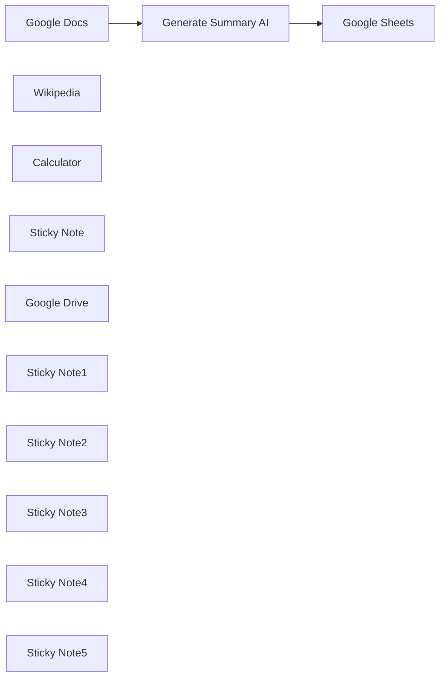
```mermaid
flowchart LR
    N1["Google Docs"]
    N2["Wikipedia"]
    N3["Calculator"]
    N4["Google Sheets"]
    N5["Sticky Note"]
    N6["Google Drive"]
    N7["Sticky Note1"]
    N8["Sticky Note2"]
    N9["Sticky Note3"]
    N10["Generate Summary AI"]
    N11["Sticky Note4"]
    N12["Sticky Note5"]

    N1 --> N10
    N10 --> N4
```

## Fluxo (.json) :

```json
{
  "id": "s8YgrWCxnGJxbctt",
  "meta": {
    "instanceId": "2b1c62c6d8c9216d51c1f40c64044e24b558ea8311c19d032d1278472159cfec",
    "templateId": "1750"
  },
  "name": "Google Doc Summarizer to Google Sheets",
  "tags": [],
  "nodes": [
    {
      "id": "9098b59a-68b1-48bd-9b52-41a971e689b3",
      "name": "Google Docs",
      "type": "n8n-nodes-base.googleDocs",
      "position": [
        340,
        240
      ],
      "parameters": {
        "operation": "get",
        "documentURL": "={{ $json.id }}",
        "authentication": "serviceAccount"
      },
      "credentials": {
        "googleApi": {
          "id": "Xx4ObVZ3yYoA5XCx",
          "name": "Google Drive account"
        }
      },
      "typeVersion": 2
    },
    {
      "id": "a7f224d4-232b-4201-82a0-d762830b546a",
      "name": "Wikipedia",
      "type": "@n8n/n8n-nodes-langchain.toolWikipedia",
      "position": [
        680,
        180
      ],
      "parameters": {},
      "typeVersion": 1
    },
    {
      "id": "12bb798e-fe7e-4340-846b-5caeb824959b",
      "name": "Calculator",
      "type": "@n8n/n8n-nodes-langchain.toolCalculator",
      "position": [
        940,
        180
      ],
      "parameters": {},
      "typeVersion": 1
    },
    {
      "id": "7d479725-f973-45c5-a798-d1868aefdd82",
      "name": "Google Sheets",
      "type": "n8n-nodes-base.googleSheets",
      "position": [
        1280,
        280
      ],
      "parameters": {
        "columns": {
          "value": {
            "Name": "={{ $('Google Drive ').item.json.lastModifyingUser.displayName }}",
            "Email ": "={{ $('Google Drive ').item.json.lastModifyingUser.emailAddress }}",
            "Summarise Conetent data ": "={{ $json.message.content }}"
          },
          "schema": [
            {
              "id": "Email ",
              "type": "string",
              "display": true,
              "required": false,
              "displayName": "Email ",
              "defaultMatch": false,
              "canBeUsedToMatch": true
            },
            {
              "id": "Name",
              "type": "string",
              "display": true,
              "removed": false,
              "required": false,
              "displayName": "Name",
              "defaultMatch": false,
              "canBeUsedToMatch": true
            },
            {
              "id": "Summarise Conetent data ",
              "type": "string",
              "display": true,
              "required": false,
              "displayName": "Summarise Conetent data ",
              "defaultMatch": false,
              "canBeUsedToMatch": true
            }
          ],
          "mappingMode": "defineBelow",
          "matchingColumns": []
        },
        "options": {},
        "operation": "append",
        "sheetName": {
          "__rl": true,
          "mode": "list",
          "value": "gid=0",
          "cachedResultUrl": "https://docs.google.com/spreadsheets/d/1s1v58pqGaVha9g_evNX4UEMchzteO7CyLNp87tcKJ1Q/edit#gid=0",
          "cachedResultName": "Sheet1"
        },
        "documentId": {
          "__rl": true,
          "mode": "list",
          "value": "1s1v58pqGaVha9g_evNX4UEMchzteO7CyLNp87tcKJ1Q",
          "cachedResultUrl": "https://docs.google.com/spreadsheets/d/1s1v58pqGaVha9g_evNX4UEMchzteO7CyLNp87tcKJ1Q/edit?usp=drivesdk",
          "cachedResultName": "Docs Summarise Data"
        }
      },
      "credentials": {
        "googleSheetsOAuth2Api": {
          "id": "A2b2I9leWjfYSzSW",
          "name": "Google Sheets account"
        }
      },
      "typeVersion": 4.5
    },
    {
      "id": "35716e44-14e7-4cc3-a273-2ba2e749892f",
      "name": "Sticky Note",
      "type": "n8n-nodes-base.stickyNote",
      "position": [
        -80,
        -80
      ],
      "parameters": {
        "color": 5,
        "height": 260,
        "content": "## Get Latest File\n"
      },
      "typeVersion": 1
    },
    {
      "id": "fc3ac84f-887f-4908-a870-e6c3d46f4576",
      "name": "Google Drive ",
      "type": "n8n-nodes-base.googleDriveTrigger",
      "notes": "Received the doc",
      "position": [
        0,
        0
      ],
      "parameters": {
        "event": "fileCreated",
        "options": {},
        "pollTimes": {
          "item": [
            {
              "mode": "everyMinute"
            }
          ]
        },
        "triggerOn": "specificFolder",
        "folderToWatch": {
          "__rl": true,
          "mode": "list",
          "value": "1H8Xe2uIO0sI-QdxFsDH0Yg_w9RaPOoD_",
          "cachedResultUrl": "https://drive.google.com/drive/folders/1H8Xe2uIO0sI-QdxFsDH0Yg_w9RaPOoD_",
          "cachedResultName": "yashdata"
        },
        "authentication": "serviceAccount"
      },
      "credentials": {
        "googleApi": {
          "id": "Xx4ObVZ3yYoA5XCx",
          "name": "Google Drive account"
        }
      },
      "notesInFlow": true,
      "typeVersion": 1
    },
    {
      "id": "14f0c78f-73c7-42c4-8916-284a876659cb",
      "name": "Sticky Note1",
      "type": "n8n-nodes-base.stickyNote",
      "position": [
        260,
        140
      ],
      "parameters": {
        "color": 5,
        "width": 260,
        "height": 260,
        "content": "## Get Document Content\n"
      },
      "typeVersion": 1
    },
    {
      "id": "6c87fc48-6b22-46fb-a509-d2037dc302bc",
      "name": "Sticky Note2",
      "type": "n8n-nodes-base.stickyNote",
      "position": [
        620,
        -60
      ],
      "parameters": {
        "color": 5,
        "width": 440,
        "height": 380,
        "content": "## AI Summarization\n"
      },
      "typeVersion": 1
    },
    {
      "id": "bcf259bd-df2a-4a16-a679-3a5d3ee68122",
      "name": "Sticky Note3",
      "type": "n8n-nodes-base.stickyNote",
      "position": [
        1160,
        160
      ],
      "parameters": {
        "color": 5,
        "width": 300,
        "height": 280,
        "content": "## Store Summary in Sheet\n"
      },
      "typeVersion": 1
    },
    {
      "id": "81f80bd2-aa10-49a8-ae63-3a3322bcac80",
      "name": "Generate Summary AI",
      "type": "@n8n/n8n-nodes-langchain.openAi",
      "position": [
        700,
        20
      ],
      "parameters": {
        "modelId": {
          "__rl": true,
          "mode": "list",
          "value": "gpt-4o-mini",
          "cachedResultName": "GPT-4O-MINI"
        },
        "options": {},
        "messages": {
          "values": [
            {
              "content": "=Summarise the below content\n {{ $json.content }}"
            }
          ]
        }
      },
      "credentials": {
        "openAiApi": {
          "id": "aMNetdb7Sh3K62cJ",
          "name": "OpenAi account"
        }
      },
      "typeVersion": 1.7
    },
    {
      "id": "f7379ef9-9940-4aec-9717-b7df688fd2df",
      "name": "Sticky Note4",
      "type": "n8n-nodes-base.stickyNote",
      "position": [
        240,
        -260
      ],
      "parameters": {
        "color": 5,
        "width": 800,
        "height": 80,
        "content": "# Google Doc Summarizer to Google Sheets\n"
      },
      "typeVersion": 1
    },
    {
      "id": "0bf7d344-64ad-4074-8e7c-20055a3bf082",
      "name": "Sticky Note5",
      "type": "n8n-nodes-base.stickyNote",
      "position": [
        -20,
        500
      ],
      "parameters": {
        "color": 5,
        "width": 1280,
        "content": "## Description\nThis workflow is created by WeblineIndia, it streamlines and automates the end-to-end process of managing recently added document files in Google Drive. It begins by identifying the most recently uploaded .doc file in a designated folder within Google Drive. The document's content is then directly retrieved and passed through an AI-powered summarization model that condenses the content into a concise and meaningful summary. Finally, the summarized content, along with relevant metadata such as the document's name, upload date, and other details, is systematically stored in a Google Sheet. This ensures easy reference, enhanced organization, and quick access to key information, making it an ideal solution for managing and summarizing large volumes of document data efficiently."
      },
      "typeVersion": 1
    }
  ],
  "active": true,
  "pinData": {},
  "settings": {
    "executionOrder": "v1"
  },
  "versionId": "e3318ab1-ef09-4207-9419-411208c35aab",
  "connections": {
    "Wikipedia": {
      "ai_tool": [
        [
          {
            "node": "Generate Summary AI",
            "type": "ai_tool",
            "index": 0
          }
        ]
      ]
    },
    "Calculator": {
      "ai_tool": [
        [
          {
            "node": "Generate Summary AI",
            "type": "ai_tool",
            "index": 0
          }
        ]
      ]
    },
    "Google Docs": {
      "main": [
        [
          {
            "node": "Generate Summary AI",
            "type": "main",
            "index": 0
          }
        ]
      ]
    },
    "Google Drive ": {
      "main": [
        [
          {
            "node": "Google Docs",
            "type": "main",
            "index": 0
          }
        ]
      ]
    },
    "Generate Summary AI": {
      "main": [
        [
          {
            "node": "Google Sheets",
            "type": "main",
            "index": 0
          }
        ]
      ]
    }
  }
}
```

<a id="template-656"></a>

## Template 656 - Processamento e extração de documentos com LlamaParse

- **Nome:** Processamento e extração de documentos com LlamaParse
- **Descrição:** Automatiza a ingestão, análise e extração estruturada de documentos (anexos de e-mail ou uploads) usando LlamaParse e modelos de linguagem, salvando resultados e notificando via vários canais.
- **Funcionalidade:** • Monitoramento de e-mail: Verifica mensagens com anexos e captura o primeiro anexo para processamento.
• Validação de formato: Consulta a lista de extensões suportadas e só processa arquivos compatíveis.
• Upload para serviço de parsing: Envia o arquivo para a API de parsing (LlamaParse) com webhook de retorno para receber o conteúdo parseado.
• Armazenamento do original: Salva o documento recebido no armazenamento em nuvem para referência futura.
• Recebimento do parsing via webhook: Recebe conteúdo markdown parseado pelo serviço externo e grava cópia.
• Classificação de documento: Usa modelos de linguagem para determinar se o documento é uma fatura ou outro tipo.
• Resumo automatizado: Gera um resumo executivo do documento em linguagem natural.
• Extração estruturada (JSON): Converte o conteúdo parseado em um JSON com esquema detalhado para faturas, incluindo transações, impostos e pagamento.
• Atualização e registro em planilha: Salva/atualiza identificador, resumo e campos financeiros em uma planilha para rastreamento.
• Notificações: Envia resumo e detalhes via mensagem para um chat especificado (Telegram) e alerta em caso de erros.
• Salvamento de artefatos: Cria arquivos de texto contendo o markdown parseado e o resumo no armazenamento para auditoria.
• Tratamento de erros e limites: Lida com falhas na extração/classificação e limita processamento conforme configurado.
- **Ferramentas:** • LlamaParse (serviço de parsing/LlamaIndex): API externa para upload de arquivos e extração de texto/markdown avançado, com retorno via webhook.
• Gmail: Fonte de ingestão de documentos, usada para detectar e baixar anexos de e-mail.
• Google Drive: Armazenamento dos arquivos originais, do markdown parseado e dos resumos gerados.
• Google Sheets: Banco de registro e atualização dos dados extraídos (identificadores, valores financeiros e resumos).
• OpenAI (modelos GPT-4o / gpt-4o-mini): Modelos de linguagem usados para classificação, sumarização e conversão do conteúdo em JSON estruturado.
• Telegram: Canal de comunicação para envio de resumos, detalhes de faturas e alertas de erro.

## Fluxo visual

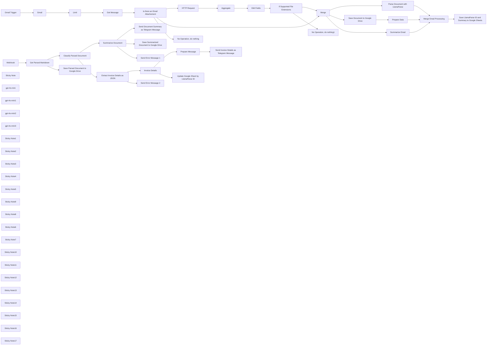
```mermaid
flowchart LR
    N1["Webhook"]
    N2["Gmail"]
    N3["Gmail Trigger"]
    N4["Limit"]
    N5["Get Message"]
    N6["Sticky Note"]
    N7["Parse Document with LlamaParse"]
    N8["Summarize Email"]
    N9["gpt-4o-mini"]
    N10["Save LlamaParse ID and Summary to Google Sheets"]
    N11["Save Document to Google Drive"]
    N12["Extract Invoice Details as JSON"]
    N13["gpt-4o-mini1"]
    N14["gpt-4o-mini2"]
    N15["Update Google Sheet by LlamaParse ID"]
    N16["Invoice Details"]
    N17["Prepare Message"]
    N18["Send Invoice Details as Telegram Message"]
    N19["gpt-4o-mini3"]
    N20["Send Error Message 2"]
    N21["Send Error Message 1"]
    N22["Send Document Summary as Telegram Message"]
    N23["Summarize Document"]
    N24["Classify Parsed Document"]
    N25["Get Parsed Markdown"]
    N26["Prepare Data"]
    N27["HTTP Request"]
    N28["Is there an Email Attachement"]
    N29["Aggregate"]
    N30["Edit Fields"]
    N31["Merge Email Processing"]
    N32["Merge"]
    N33["If Supported File Extensions"]
    N34["No Operation, do nothing"]
    N35["No Operation, do nothing1"]
    N36["Sticky Note1"]
    N37["Sticky Note2"]
    N38["Sticky Note3"]
    N39["Sticky Note4"]
    N40["Sticky Note5"]
    N41["Sticky Note9"]
    N42["Sticky Note8"]
    N43["Sticky Note6"]
    N44["Sticky Note7"]
    N45["Sticky Note10"]
    N46["Sticky Note11"]
    N47["Sticky Note12"]
    N48["Sticky Note13"]
    N49["Sticky Note14"]
    N50["Sticky Note15"]
    N51["Sticky Note16"]
    N52["Sticky Note17"]
    N53["Save Summarized Document to Google Drive"]
    N54["Save Parsed Document to Google Drive"]

    N2 --> N4
    N4 --> N5
    N32 --> N7
    N32 --> N11
    N32 --> N8
    N1 --> N25
    N29 --> N30
    N30 --> N33
    N5 --> N28
    N27 --> N29
    N26 --> N31
    N3 --> N2
    N16 --> N17
    N16 --> N15
    N17 --> N18
    N8 --> N31
    N23 --> N22
    N23 --> N53
    N23 --> N21
    N25 --> N24
    N25 --> N54
    N31 --> N10
    N24 --> N23
    N24 --> N12
    N33 --> N32
    N33 --> N35
    N28 --> N27
    N28 --> N32
    N28 --> N34
    N11 --> N26
    N7 --> N31
    N12 --> N16
    N12 --> N20
```

## Fluxo (.json) :

```json
{
  "id": "kjyWJWfDlyXkKL3m",
  "meta": {
    "instanceId": "31e69f7f4a77bf465b805824e303232f0227212ae922d12133a0f96ffeab4fef",
    "templateCredsSetupCompleted": true
  },
  "name": "✨🔪 Advanced AI Powered Document Parsing & Text Extraction with Llama Parse",
  "tags": [],
  "nodes": [
    {
      "id": "ea7670da-896e-4b9c-b0c2-b3a3dbb6f88f",
      "name": "Webhook",
      "type": "n8n-nodes-base.webhook",
      "position": [
        -2320,
        80
      ],
      "webhookId": "a9668054-5bd3-427d-8f18-932436441e42",
      "parameters": {
        "path": "parse",
        "options": {},
        "httpMethod": "POST"
      },
      "typeVersion": 2
    },
    {
      "id": "2c445d40-5d8b-469e-811e-7423f57ba054",
      "name": "Gmail",
      "type": "n8n-nodes-base.gmail",
      "position": [
        -2040,
        -1260
      ],
      "webhookId": "344de9dc-4062-4552-ae29-1e9150322cdb",
      "parameters": {
        "limit": 28,
        "filters": {
          "q": "has:attachment",
          "sender": " joe@example.com"
        },
        "operation": "getAll"
      },
      "credentials": {
        "gmailOAuth2": {
          "id": "1xpVDEQ1yx8gV022",
          "name": "Gmail account"
        }
      },
      "typeVersion": 2.1
    },
    {
      "id": "f321e1d3-24ba-4623-bb31-93c7f6389aa9",
      "name": "Gmail Trigger",
      "type": "n8n-nodes-base.gmailTrigger",
      "position": [
        -2360,
        -1260
      ],
      "parameters": {
        "filters": {},
        "pollTimes": {
          "item": [
            {
              "mode": "everyMinute"
            },
            {}
          ]
        }
      },
      "credentials": {
        "gmailOAuth2": {
          "id": "1xpVDEQ1yx8gV022",
          "name": "Gmail account"
        }
      },
      "typeVersion": 1.2
    },
    {
      "id": "ad2701f8-be77-465e-bd58-0e964ba412c0",
      "name": "Limit",
      "type": "n8n-nodes-base.limit",
      "position": [
        -1840,
        -1260
      ],
      "parameters": {
        "keep": "lastItems"
      },
      "typeVersion": 1
    },
    {
      "id": "c305dbce-714a-420e-8dd0-f5c6e80afa01",
      "name": "Get Message",
      "type": "n8n-nodes-base.gmail",
      "position": [
        -1640,
        -1260
      ],
      "webhookId": "13036143-6e5b-47c1-84a4-a92cbc33b37f",
      "parameters": {
        "simple": false,
        "options": {
          "downloadAttachments": true,
          "dataPropertyAttachmentsPrefixName": "=file"
        },
        "messageId": "={{ $('Gmail').item.json.id }}",
        "operation": "get"
      },
      "credentials": {
        "gmailOAuth2": {
          "id": "1xpVDEQ1yx8gV022",
          "name": "Gmail account"
        }
      },
      "typeVersion": 2.1
    },
    {
      "id": "0e67527b-c886-41a1-b66b-c965fd6b44f3",
      "name": "Sticky Note",
      "type": "n8n-nodes-base.stickyNote",
      "position": [
        -920,
        -1500
      ],
      "parameters": {
        "color": 6,
        "width": 320,
        "height": 340,
        "content": "## Send to LlamaParse\nhttps://docs.cloud.llamaindex.ai/API/upload-file-api-v-1-parsing-upload-post"
      },
      "typeVersion": 1
    },
    {
      "id": "85e72267-7be0-49ac-b305-4c07356ce244",
      "name": "Parse Document with LlamaParse",
      "type": "n8n-nodes-base.httpRequest",
      "position": [
        -800,
        -1360
      ],
      "parameters": {
        "url": "https://api.cloud.llamaindex.ai/api/parsing/upload",
        "method": "POST",
        "options": {
          "response": {
            "response": {
              "responseFormat": "json"
            }
          }
        },
        "sendBody": true,
        "contentType": "multipart-form-data",
        "sendHeaders": true,
        "authentication": "genericCredentialType",
        "bodyParameters": {
          "parameters": [
            {
              "name": "=file",
              "parameterType": "formBinaryData",
              "inputDataFieldName": "file0"
            },
            {
              "name": "webhook_url",
              "value": "=https://[YOUR-N8N-URL]/webhook/parse"
            },
            {
              "name": "accurate_mode",
              "value": "true"
            },
            {
              "name": "premium_mode",
              "value": "false"
            }
          ]
        },
        "genericAuthType": "httpHeaderAuth",
        "headerParameters": {
          "parameters": [
            {
              "name": "accept",
              "value": "application/json"
            }
          ]
        }
      },
      "credentials": {
        "httpHeaderAuth": {
          "id": "9trkgqZBCEmSt6ng",
          "name": "GET Webhook"
        }
      },
      "executeOnce": true,
      "typeVersion": 4.2,
      "alwaysOutputData": true
    },
    {
      "id": "2664705a-31d5-439b-b1e4-fc6b708a7baa",
      "name": "Summarize Email",
      "type": "@n8n/n8n-nodes-langchain.chainLlm",
      "position": [
        -820,
        -680
      ],
      "parameters": {
        "text": "={{ $('Is there an Email Attachement').item.json.text }}",
        "messages": {
          "messageValues": [
            {
              "message": "You are an expert at summarizing email messages.  Provide a summary of the provided email."
            }
          ]
        },
        "promptType": "define"
      },
      "typeVersion": 1.5
    },
    {
      "id": "1405f933-b281-469f-a5b7-0de2f820dd09",
      "name": "gpt-4o-mini",
      "type": "@n8n/n8n-nodes-langchain.lmChatOpenAi",
      "position": [
        -720,
        -540
      ],
      "parameters": {
        "model": {
          "__rl": true,
          "mode": "list",
          "value": "gpt-4o-mini"
        },
        "options": {}
      },
      "credentials": {
        "openAiApi": {
          "id": "jEMSvKmtYfzAkhe6",
          "name": "OpenAi account"
        }
      },
      "typeVersion": 1.2
    },
    {
      "id": "ea299469-7889-45c9-a8f1-679be09e5aaf",
      "name": "Save LlamaParse ID and Summary to Google Sheets",
      "type": "n8n-nodes-base.googleSheets",
      "position": [
        -140,
        -1020
      ],
      "parameters": {
        "columns": {
          "value": {
            "jobid": "={{ $json.id }}",
            "summary": "={{ $json.text }}",
            "image_url": "={{ $json.webViewLink }}"
          },
          "schema": [
            {
              "id": "jobid",
              "type": "string",
              "display": true,
              "removed": false,
              "required": false,
              "displayName": "jobid",
              "defaultMatch": false,
              "canBeUsedToMatch": true
            },
            {
              "id": "statement_date",
              "type": "string",
              "display": true,
              "removed": true,
              "required": false,
              "displayName": "statement_date",
              "defaultMatch": false,
              "canBeUsedToMatch": true
            },
            {
              "id": "org_name",
              "type": "string",
              "display": true,
              "removed": true,
              "required": false,
              "displayName": "org_name",
              "defaultMatch": false,
              "canBeUsedToMatch": true
            },
            {
              "id": "member_name",
              "type": "string",
              "display": true,
              "removed": true,
              "required": false,
              "displayName": "member_name",
              "defaultMatch": false,
              "canBeUsedToMatch": true
            },
            {
              "id": "subtotal",
              "type": "string",
              "display": true,
              "removed": true,
              "required": false,
              "displayName": "subtotal",
              "defaultMatch": false,
              "canBeUsedToMatch": true
            },
            {
              "id": "service_fees_total",
              "type": "string",
              "display": true,
              "removed": true,
              "required": false,
              "displayName": "service_fees_total",
              "defaultMatch": false,
              "canBeUsedToMatch": true
            },
            {
              "id": "tips_total",
              "type": "string",
              "display": true,
              "removed": true,
              "required": false,
              "displayName": "tips_total",
              "defaultMatch": false,
              "canBeUsedToMatch": true
            },
            {
              "id": "current_excl_gst",
              "type": "string",
              "display": true,
              "removed": true,
              "required": false,
              "displayName": "current_excl_gst",
              "defaultMatch": false,
              "canBeUsedToMatch": true
            },
            {
              "id": "container_deposit_total",
              "type": "string",
              "display": true,
              "removed": true,
              "required": false,
              "displayName": "container_deposit_total",
              "defaultMatch": false,
              "canBeUsedToMatch": true
            },
            {
              "id": "outstanding_gst",
              "type": "string",
              "display": true,
              "removed": true,
              "required": false,
              "displayName": "outstanding_gst",
              "defaultMatch": false,
              "canBeUsedToMatch": true
            },
            {
              "id": "paid_gst",
              "type": "string",
              "display": true,
              "removed": true,
              "required": false,
              "displayName": "paid_gst",
              "defaultMatch": false,
              "canBeUsedToMatch": true
            },
            {
              "id": "total_gst",
              "type": "string",
              "display": true,
              "removed": true,
              "required": false,
              "displayName": "total_gst",
              "defaultMatch": false,
              "canBeUsedToMatch": true
            },
            {
              "id": "total_bc_pst",
              "type": "string",
              "display": true,
              "removed": true,
              "required": false,
              "displayName": "total_bc_pst",
              "defaultMatch": false,
              "canBeUsedToMatch": true
            },
            {
              "id": "total_bc_pst_liquor",
              "type": "string",
              "display": true,
              "removed": true,
              "required": false,
              "displayName": "total_bc_pst_liquor",
              "defaultMatch": false,
              "canBeUsedToMatch": true
            },
            {
              "id": "total_savings",
              "type": "string",
              "display": true,
              "removed": true,
              "required": false,
              "displayName": "total_savings",
              "defaultMatch": false,
              "canBeUsedToMatch": true
            },
            {
              "id": "final_amount_due",
              "type": "string",
              "display": true,
              "removed": true,
              "required": false,
              "displayName": "final_amount_due",
              "defaultMatch": false,
              "canBeUsedToMatch": true
            },
            {
              "id": "payment_reference",
              "type": "string",
              "display": true,
              "removed": true,
              "required": false,
              "displayName": "payment_reference",
              "defaultMatch": false,
              "canBeUsedToMatch": true
            },
            {
              "id": "payment_amount",
              "type": "string",
              "display": true,
              "removed": true,
              "required": false,
              "displayName": "payment_amount",
              "defaultMatch": false,
              "canBeUsedToMatch": true
            },
            {
              "id": "transaction_number",
              "type": "string",
              "display": true,
              "removed": true,
              "required": false,
              "displayName": "transaction_number",
              "defaultMatch": false,
              "canBeUsedToMatch": true
            },
            {
              "id": "image_url",
              "type": "string",
              "display": true,
              "removed": false,
              "required": false,
              "displayName": "image_url",
              "defaultMatch": false,
              "canBeUsedToMatch": true
            },
            {
              "id": "summary",
              "type": "string",
              "display": true,
              "removed": false,
              "required": false,
              "displayName": "summary",
              "defaultMatch": false,
              "canBeUsedToMatch": true
            }
          ],
          "mappingMode": "defineBelow",
          "matchingColumns": [
            "jobid"
          ],
          "attemptToConvertTypes": false,
          "convertFieldsToString": false
        },
        "options": {},
        "operation": "appendOrUpdate",
        "sheetName": {
          "__rl": true,
          "mode": "list",
          "value": "gid=0",
          "cachedResultUrl": "https://docs.google.com/spreadsheets/d/1mUvDI9sGvRl64iNV6ODXUzro5Q3Oeuaks5662tfN7Oo/edit#gid=0",
          "cachedResultName": "Expenses"
        },
        "documentId": {
          "__rl": true,
          "mode": "list",
          "value": "1mUvDI9sGvRl64iNV6ODXUzro5Q3Oeuaks5662tfN7Oo",
          "cachedResultUrl": "https://docs.google.com/spreadsheets/d/1mUvDI9sGvRl64iNV6ODXUzro5Q3Oeuaks5662tfN7Oo/edit?usp=drivesdk",
          "cachedResultName": "2024.Year.End.Expenses"
        }
      },
      "credentials": {
        "googleSheetsOAuth2Api": {
          "id": "SOLbth24hZWisXAv",
          "name": "Google Sheets account"
        }
      },
      "typeVersion": 4.5
    },
    {
      "id": "d8454cf2-5bef-4bfa-9471-c358ff067765",
      "name": "Save Document to Google Drive",
      "type": "n8n-nodes-base.googleDrive",
      "position": [
        -820,
        -1020
      ],
      "parameters": {
        "name": "={{ $('Is there an Email Attachement').item.json.id }}_{{ $('Is there an Email Attachement').item.binary.file0.fileName }}",
        "driveId": {
          "__rl": true,
          "mode": "list",
          "value": "My Drive"
        },
        "options": {},
        "folderId": {
          "__rl": true,
          "mode": "list",
          "value": "root",
          "cachedResultUrl": "https://drive.google.com/drive",
          "cachedResultName": "/ (Root folder)"
        },
        "inputDataFieldName": "=file0"
      },
      "credentials": {
        "googleDriveOAuth2Api": {
          "id": "UhdXGYLTAJbsa0xX",
          "name": "Google Drive account"
        }
      },
      "typeVersion": 3
    },
    {
      "id": "03f46b72-9e18-44a4-85ef-0eea058c3c6d",
      "name": "Extract Invoice Details as JSON",
      "type": "@n8n/n8n-nodes-langchain.chainLlm",
      "onError": "continueErrorOutput",
      "position": [
        -1180,
        500
      ],
      "parameters": {
        "text": "=Analyze this markdown content and convert it to JSON following this exact schema:\n{\n    \"invoice_details\": {\n        \"statement_date\": \"\",\n        \"organization\": {\n            \"name\": \"\",\n            \"address\": \"\",\n            \"gst_number\": \"\"\n        },\n        \"member\": {\n            \"name\": \"\",\n            \"company\": \"\",\n            \"address\": \"\",\n            \"contact_number\": \"\",\n            \"organization_number\": \"\"\n        }\n    },\n    \"transactions\": [\n        {\n            \"date\": \"\",\n            \"document_number\": \"\",\n            \"description\": \"\",\n            \"base_amount\": 0.00,\n            \"gst\": 0.00,\n            \"bc_pst\": 0.00,\n            \"bc_pst_liquor\": 0.00,  # Added for liquor PST\n            \"container_deposit\": 0.00,  # Added for bottle deposits\n            \"service_fee\": 0.00,\n            \"tip_amount\": 0.00,\n            \"regular_price\": 0.00,  # Added for regular price tracking\n            \"savings_amount\": 0.00,  # Added for savings tracking\n            \"total_charge\": 0.00,\n            \"transaction_type\": \"\"\n        }\n    ],\n    \"payment_details\": {\n        \"previous_balance\": 0.00,\n        \"payment_amount\": 0.00,\n        \"payment_reference\": \"\",\n        \"payment_date\": \"\",\n        \"payment_method\": \"\",\n        \"payment_status\": \"\",\n        \"card_number\": \"\",  # Added for card details\n        \"auth_number\": \"\",  # Added for authorization\n        \"transaction_number\": \"\"\n    },\n    \"invoice_summary\": {\n        \"subtotal\": 0.00,\n        \"service_fees_total\": 0.00,\n        \"tips_total\": 0.00,\n        \"current_excl_gst\": 0.00,\n        \"container_deposit_total\": 0.00,  # Added for deposits\n        \"outstanding_gst\": 0.00,\n        \"paid_gst\": 0.00,\n        \"total_gst\": 0.00,\n        \"total_bc_pst\": 0.00,\n        \"total_bc_pst_liquor\": 0.00,  # Added for liquor PST if shown in markdown content\n        \"total_savings\": 0.00,  # Added for savings\n        \"final_amount_due\": 0.00\n    },\n    \"payment_terms\": {\n        \"due_date\": \"\",\n        \"processing_date\": \"\",\n        \"special_notices\": [],\n        \"cancellation_policy\": \"\",\n        \"refund_policy\": \"\",\n        \"return_policy\": \"\"  # Added for return policy\n    },\n    \"additional_info\": {\n        \"booking_number\": \"\",\n        \"transaction_time\": \"\",  # Added for transaction time\n        \"register_info\": \"\",     # Added for register details\n        \"event_details\": {\n            \"date\": \"\",\n            \"time\": \"\",\n            \"location\": \"\"\n        },\n        \"special_instructions\": []\n    },\n    \"summary\": \"\" # The natural language summary of the invoice\n}\n\nMarkdown Content:\n{{ $json.data }}\n\nImportant:\n- Extract exact values from the markdown\n- Return only valid JSON\n- Include all fields even if empty\n- Format numbers as floats with 2 decimal places\n- Track container deposits separately\n- Show liquor PST (10%) separately from regular PST if provided in markdown content\n- Include regular prices and savings amounts\n- Track transaction details including card info and authorization\n- Parse return policy information\n- Include register and transaction time details\n- Ensure final_amount_due equals the sum of all applicable charges and taxes\n- Summarize the markdown contents\n- Only output valid JSON without any preamble or further explanation.  Remove any ```json and ``` from response.",
        "promptType": "define"
      },
      "typeVersion": 1.5,
      "alwaysOutputData": true
    },
    {
      "id": "3c371677-76e8-45d7-8c05-a4ca1cc0b1fe",
      "name": "gpt-4o-mini1",
      "type": "@n8n/n8n-nodes-langchain.lmChatOpenAi",
      "position": [
        -1600,
        240
      ],
      "parameters": {
        "options": {}
      },
      "credentials": {
        "openAiApi": {
          "id": "jEMSvKmtYfzAkhe6",
          "name": "OpenAi account"
        }
      },
      "typeVersion": 1
    },
    {
      "id": "9ff3f86f-9ffc-42fa-b428-a6bfabf2426a",
      "name": "gpt-4o-mini2",
      "type": "@n8n/n8n-nodes-langchain.lmChatOpenAi",
      "position": [
        -1080,
        640
      ],
      "parameters": {
        "model": "gpt-4o",
        "options": {}
      },
      "credentials": {
        "openAiApi": {
          "id": "jEMSvKmtYfzAkhe6",
          "name": "OpenAi account"
        }
      },
      "typeVersion": 1
    },
    {
      "id": "69a0505f-1fe4-4581-ad2d-5bc7d68874e9",
      "name": "Update Google Sheet by LlamaParse ID",
      "type": "n8n-nodes-base.googleSheets",
      "position": [
        -540,
        600
      ],
      "parameters": {
        "columns": {
          "value": {
            "jobid": "={{ $('Webhook').item.json.body.jobId }}",
            "summary": "={{ $json.output.summary }}",
            "org_name": "={{ $json.output.invoice_details.organization.name }}",
            "paid_gst": "={{ $json.output.invoice_summary.paid_gst }}",
            "subtotal": "={{ $json.output.invoice_summary.subtotal }}",
            "total_gst": "={{ $json.output.invoice_summary.total_gst }}",
            "tips_total": "={{ $json.output.invoice_summary.tips_total }}",
            "member_name": "={{ $json.output.invoice_details.member.name }}",
            "total_bc_pst": "={{ $json.output.invoice_summary.total_bc_pst }}",
            "total_savings": "={{ $json.output.invoice_summary.total_savings }}",
            "payment_amount": "={{ $json.output.payment_details.payment_amount }}",
            "statement_date": "={{ $json.output.invoice_details.statement_date }}",
            "outstanding_gst": "={{ $json.output.invoice_summary.outstanding_gst }}",
            "current_excl_gst": "={{ $json.output.invoice_summary.current_excl_gst }}",
            "final_amount_due": "={{ $json.output.invoice_summary.final_amount_due }}",
            "payment_reference": "={{ $json.output.payment_details.payment_reference }}",
            "service_fees_total": "={{ $json.output.invoice_summary.service_fees_total }}",
            "transaction_number": "={{ $json.output.payment_details.transaction_number }}",
            "total_bc_pst_liquor": "={{ $json.output.invoice_summary.total_bc_pst_liquor }}",
            "container_deposit_total": "={{ $json.output.invoice_summary.container_deposit_total }}"
          },
          "schema": [
            {
              "id": "jobid",
              "type": "string",
              "display": true,
              "removed": false,
              "required": false,
              "displayName": "jobid",
              "defaultMatch": false,
              "canBeUsedToMatch": true
            },
            {
              "id": "statement_date",
              "type": "string",
              "display": true,
              "removed": false,
              "required": false,
              "displayName": "statement_date",
              "defaultMatch": false,
              "canBeUsedToMatch": true
            },
            {
              "id": "org_name",
              "type": "string",
              "display": true,
              "removed": false,
              "required": false,
              "displayName": "org_name",
              "defaultMatch": false,
              "canBeUsedToMatch": true
            },
            {
              "id": "member_name",
              "type": "string",
              "display": true,
              "removed": false,
              "required": false,
              "displayName": "member_name",
              "defaultMatch": false,
              "canBeUsedToMatch": true
            },
            {
              "id": "subtotal",
              "type": "string",
              "display": true,
              "removed": false,
              "required": false,
              "displayName": "subtotal",
              "defaultMatch": false,
              "canBeUsedToMatch": true
            },
            {
              "id": "service_fees_total",
              "type": "string",
              "display": true,
              "removed": false,
              "required": false,
              "displayName": "service_fees_total",
              "defaultMatch": false,
              "canBeUsedToMatch": true
            },
            {
              "id": "tips_total",
              "type": "string",
              "display": true,
              "removed": false,
              "required": false,
              "displayName": "tips_total",
              "defaultMatch": false,
              "canBeUsedToMatch": true
            },
            {
              "id": "current_excl_gst",
              "type": "string",
              "display": true,
              "removed": false,
              "required": false,
              "displayName": "current_excl_gst",
              "defaultMatch": false,
              "canBeUsedToMatch": true
            },
            {
              "id": "container_deposit_total",
              "type": "string",
              "display": true,
              "removed": false,
              "required": false,
              "displayName": "container_deposit_total",
              "defaultMatch": false,
              "canBeUsedToMatch": true
            },
            {
              "id": "outstanding_gst",
              "type": "string",
              "display": true,
              "removed": false,
              "required": false,
              "displayName": "outstanding_gst",
              "defaultMatch": false,
              "canBeUsedToMatch": true
            },
            {
              "id": "paid_gst",
              "type": "string",
              "display": true,
              "removed": false,
              "required": false,
              "displayName": "paid_gst",
              "defaultMatch": false,
              "canBeUsedToMatch": true
            },
            {
              "id": "total_gst",
              "type": "string",
              "display": true,
              "removed": false,
              "required": false,
              "displayName": "total_gst",
              "defaultMatch": false,
              "canBeUsedToMatch": true
            },
            {
              "id": "total_bc_pst",
              "type": "string",
              "display": true,
              "removed": false,
              "required": false,
              "displayName": "total_bc_pst",
              "defaultMatch": false,
              "canBeUsedToMatch": true
            },
            {
              "id": "total_bc_pst_liquor",
              "type": "string",
              "display": true,
              "removed": false,
              "required": false,
              "displayName": "total_bc_pst_liquor",
              "defaultMatch": false,
              "canBeUsedToMatch": true
            },
            {
              "id": "total_savings",
              "type": "string",
              "display": true,
              "removed": false,
              "required": false,
              "displayName": "total_savings",
              "defaultMatch": false,
              "canBeUsedToMatch": true
            },
            {
              "id": "final_amount_due",
              "type": "string",
              "display": true,
              "removed": false,
              "required": false,
              "displayName": "final_amount_due",
              "defaultMatch": false,
              "canBeUsedToMatch": true
            },
            {
              "id": "payment_reference",
              "type": "string",
              "display": true,
              "removed": false,
              "required": false,
              "displayName": "payment_reference",
              "defaultMatch": false,
              "canBeUsedToMatch": true
            },
            {
              "id": "payment_amount",
              "type": "string",
              "display": true,
              "removed": false,
              "required": false,
              "displayName": "payment_amount",
              "defaultMatch": false,
              "canBeUsedToMatch": true
            },
            {
              "id": "transaction_number",
              "type": "string",
              "display": true,
              "removed": false,
              "required": false,
              "displayName": "transaction_number",
              "defaultMatch": false,
              "canBeUsedToMatch": true
            },
            {
              "id": "summary",
              "type": "string",
              "display": true,
              "removed": false,
              "required": false,
              "displayName": "summary",
              "defaultMatch": false,
              "canBeUsedToMatch": true
            }
          ],
          "mappingMode": "defineBelow",
          "matchingColumns": [
            "jobid"
          ]
        },
        "options": {},
        "operation": "update",
        "sheetName": {
          "__rl": true,
          "mode": "list",
          "value": "gid=0",
          "cachedResultUrl": "https://docs.google.com/spreadsheets/d/1mUvDI9sGvRl64iNV6ODXUzro5Q3Oeuaks5662tfN7Oo/edit#gid=0",
          "cachedResultName": "Expenses"
        },
        "documentId": {
          "__rl": true,
          "mode": "list",
          "value": "1mUvDI9sGvRl64iNV6ODXUzro5Q3Oeuaks5662tfN7Oo",
          "cachedResultUrl": "https://docs.google.com/spreadsheets/d/1mUvDI9sGvRl64iNV6ODXUzro5Q3Oeuaks5662tfN7Oo/edit?usp=drivesdk",
          "cachedResultName": "2024.Year.End.Expenses"
        }
      },
      "credentials": {
        "googleSheetsOAuth2Api": {
          "id": "SOLbth24hZWisXAv",
          "name": "Google Sheets account"
        }
      },
      "typeVersion": 4.5
    },
    {
      "id": "19907cba-4530-4f25-8a6f-435b1f8d23ad",
      "name": "Invoice Details",
      "type": "n8n-nodes-base.set",
      "position": [
        -780,
        400
      ],
      "parameters": {
        "options": {},
        "assignments": {
          "assignments": [
            {
              "id": "e145ed8c-cdea-4e5a-ba11-d8ce595dfb8d",
              "name": "output",
              "type": "object",
              "value": "={{ $json.text }}"
            }
          ]
        }
      },
      "typeVersion": 3.4
    },
    {
      "id": "af95c024-8e36-499b-af32-4c661da49a61",
      "name": "Prepare Message",
      "type": "n8n-nodes-base.set",
      "position": [
        -540,
        400
      ],
      "parameters": {
        "options": {},
        "assignments": {
          "assignments": [
            {
              "id": "3e566101-2ad9-444b-8459-451ba6a91575",
              "name": "invoice_details.statement_date",
              "type": "string",
              "value": "={{ $json.output.invoice_details.statement_date }}"
            },
            {
              "id": "57a466f6-d354-4864-98d3-ba4673afde98",
              "name": "invoice_details.organization",
              "type": "object",
              "value": "={{ $json.output.invoice_details.organization }}"
            },
            {
              "id": "e1b22978-8114-4956-a5fc-3efbc43335a3",
              "name": "invoice_details.member",
              "type": "object",
              "value": "={{ $json.output.invoice_details.member }}"
            },
            {
              "id": "e45a744c-0874-48b7-b59a-9d83aad27ff3",
              "name": "payment_details",
              "type": "object",
              "value": "={{ $json.output.payment_details }}"
            },
            {
              "id": "c0335dc7-1b5c-41fc-b60a-bf45248c9f7f",
              "name": "invoice_summary",
              "type": "object",
              "value": "={{ $json.output.invoice_summary }}"
            },
            {
              "id": "6c9ba3bf-37a6-4a8f-b97d-991f3ce6950f",
              "name": "summary",
              "type": "string",
              "value": "={{ $json.output.summary }}"
            }
          ]
        }
      },
      "typeVersion": 3.4
    },
    {
      "id": "333f42a7-2665-4613-89c9-c184d764af37",
      "name": "Send Invoice Details as Telegram Message",
      "type": "n8n-nodes-base.telegram",
      "position": [
        -340,
        400
      ],
      "webhookId": "04464e72-2be3-4df9-8a08-18d23cb75d72",
      "parameters": {
        "text": "={{ $json.summary }}\n--------\n{{ $json.invoice_summary.toJsonString() }}",
        "chatId": "={{ $env.TELEGRAM_CHAT_ID }}",
        "additionalFields": {
          "parse_mode": "HTML",
          "appendAttribution": false
        }
      },
      "credentials": {
        "telegramApi": {
          "id": "pAIFhguJlkO3c7aQ",
          "name": "Telegram account"
        }
      },
      "typeVersion": 1.2
    },
    {
      "id": "faa0768f-1d4c-42c4-902c-b2d0d40f0eb4",
      "name": "gpt-4o-mini3",
      "type": "@n8n/n8n-nodes-langchain.lmChatOpenAi",
      "position": [
        -1080,
        60
      ],
      "parameters": {
        "model": "gpt-4o",
        "options": {}
      },
      "credentials": {
        "openAiApi": {
          "id": "jEMSvKmtYfzAkhe6",
          "name": "OpenAi account"
        }
      },
      "typeVersion": 1
    },
    {
      "id": "d1a54284-60d1-4fac-b81b-4ed1610ddf2e",
      "name": "Send Error Message 2",
      "type": "n8n-nodes-base.telegram",
      "position": [
        -780,
        600
      ],
      "webhookId": "3ba1ee6d-1648-4421-823b-e68ae14d769b",
      "parameters": {
        "text": "=Error in workflow",
        "chatId": "={{ $env.TELEGRAM_CHAT_ID }}",
        "additionalFields": {
          "parse_mode": "HTML",
          "appendAttribution": false
        }
      },
      "credentials": {
        "telegramApi": {
          "id": "pAIFhguJlkO3c7aQ",
          "name": "Telegram account"
        }
      },
      "typeVersion": 1.2
    },
    {
      "id": "b1b50042-8270-4e13-b7b1-6d017e9be8d9",
      "name": "Send Error Message 1",
      "type": "n8n-nodes-base.telegram",
      "position": [
        -780,
        60
      ],
      "webhookId": "3ba1ee6d-1648-4421-823b-e68ae14d769b",
      "parameters": {
        "text": "=Error in workflow",
        "chatId": "={{ $env.TELEGRAM_CHAT_ID }}",
        "additionalFields": {
          "parse_mode": "HTML",
          "appendAttribution": false
        }
      },
      "credentials": {
        "telegramApi": {
          "id": "pAIFhguJlkO3c7aQ",
          "name": "Telegram account"
        }
      },
      "typeVersion": 1.2
    },
    {
      "id": "a365c8a1-c0fb-43f7-84fa-b68a0e9c087e",
      "name": "Send Document Summary as Telegram Message",
      "type": "n8n-nodes-base.telegram",
      "position": [
        -540,
        -200
      ],
      "webhookId": "04464e72-2be3-4df9-8a08-18d23cb75d72",
      "parameters": {
        "text": "={{ $json.text }}",
        "chatId": "={{ $env.TELEGRAM_CHAT_ID }}",
        "additionalFields": {
          "parse_mode": "HTML",
          "appendAttribution": false
        }
      },
      "credentials": {
        "telegramApi": {
          "id": "pAIFhguJlkO3c7aQ",
          "name": "Telegram account"
        }
      },
      "typeVersion": 1.2
    },
    {
      "id": "6abd00a0-2971-49f9-812f-f65a0004136b",
      "name": "Summarize Document",
      "type": "@n8n/n8n-nodes-langchain.chainLlm",
      "onError": "continueErrorOutput",
      "position": [
        -1180,
        -80
      ],
      "parameters": {
        "text": "=Please analyze this document and provide:\n\n## Document Analysis\n- A concise executive summary (2-3 sentences)\n- Key themes and main points\n- Notable findings or insights\n- Data highlights and important statistics (if applicable)\n\n## Recommendations\n- Action items or next steps\n- Areas requiring further investigation\n- Potential implications\n\n## Format Requirements\n- Structure the analysis using clear headers and sections\n- Include relevant quotes to support key points\n- Present any numerical data in tables or bullet points\n- Highlight critical information using bold text\n\nPlease maintain the original document's context while making the content more accessible and actionable.\n\nHere is the document: {{ $json.data }}\n",
        "promptType": "define"
      },
      "typeVersion": 1.5,
      "alwaysOutputData": true
    },
    {
      "id": "e672bcf3-0d5f-4410-ac5b-660c3ba0c456",
      "name": "Classify Parsed Document",
      "type": "@n8n/n8n-nodes-langchain.textClassifier",
      "position": [
        -1680,
        80
      ],
      "parameters": {
        "options": {},
        "inputText": "={{ $json.data }}",
        "categories": {
          "categories": [
            {
              "category": "not invoice",
              "description": "The document is not an invoice"
            },
            {
              "category": "invoice",
              "description": "The document is an invoice"
            }
          ]
        }
      },
      "typeVersion": 1
    },
    {
      "id": "cc522966-3e6a-4830-bde9-d4e251752ec0",
      "name": "Get Parsed Markdown",
      "type": "n8n-nodes-base.set",
      "position": [
        -1980,
        80
      ],
      "parameters": {
        "options": {},
        "assignments": {
          "assignments": [
            {
              "id": "55b5a755-eeaf-4ce7-b600-e6c864dc7e10",
              "name": "data",
              "type": "string",
              "value": "={{ $json.body.md }}"
            }
          ]
        }
      },
      "typeVersion": 3.4
    },
    {
      "id": "683fa521-dfd0-4b1c-905f-d5a4f56ab65a",
      "name": "Prepare Data",
      "type": "n8n-nodes-base.set",
      "position": [
        -640,
        -1020
      ],
      "parameters": {
        "options": {},
        "assignments": {
          "assignments": [
            {
              "id": "cee9e2d3-b311-4903-9867-e7d3d7ed2456",
              "name": "google_drive_fileid",
              "type": "string",
              "value": "={{ $json.id }}"
            },
            {
              "id": "5c6eddf6-5a5e-4c51-87ed-8e3aabc2f65d",
              "name": "webViewLink",
              "type": "string",
              "value": "={{ $json.webViewLink }}"
            }
          ]
        }
      },
      "typeVersion": 3.4
    },
    {
      "id": "b64a21ab-0e1f-4d6c-b718-a9aaaa27ae19",
      "name": "HTTP Request",
      "type": "n8n-nodes-base.httpRequest",
      "position": [
        -2040,
        -860
      ],
      "parameters": {
        "url": "https://api.cloud.llamaindex.ai/api/parsing/supported_file_extensions",
        "options": {}
      },
      "typeVersion": 4.2
    },
    {
      "id": "cd0699cf-3a95-4dc8-806a-6a01339c598d",
      "name": "Is there an Email Attachement",
      "type": "n8n-nodes-base.if",
      "position": [
        -1420,
        -1260
      ],
      "parameters": {
        "options": {},
        "conditions": {
          "options": {
            "version": 2,
            "leftValue": "",
            "caseSensitive": true,
            "typeValidation": "strict"
          },
          "combinator": "and",
          "conditions": [
            {
              "id": "460b82e5-30f5-4cb3-a937-a275fd256fcc",
              "operator": {
                "type": "object",
                "operation": "exists",
                "singleValue": true
              },
              "leftValue": "={{ $input.item.binary }}",
              "rightValue": ""
            }
          ]
        }
      },
      "typeVersion": 2.2
    },
    {
      "id": "269ba37f-fa18-4333-be3c-eee6ef5c0f56",
      "name": "Aggregate",
      "type": "n8n-nodes-base.aggregate",
      "position": [
        -1840,
        -860
      ],
      "parameters": {
        "options": {},
        "aggregate": "aggregateAllItemData",
        "destinationFieldName": "extensions"
      },
      "typeVersion": 1
    },
    {
      "id": "dffd2e83-58ff-49a0-b547-3b6f4b92dfa9",
      "name": "Edit Fields",
      "type": "n8n-nodes-base.set",
      "position": [
        -1620,
        -860
      ],
      "parameters": {
        "options": {},
        "assignments": {
          "assignments": [
            {
              "id": "c9c59aae-b507-4493-a047-495bed344a5e",
              "name": "extension",
              "type": "string",
              "value": "=.{{ $('Is there an Email Attachement').item.binary.file0.fileExtension }}"
            }
          ]
        }
      },
      "typeVersion": 3.4
    },
    {
      "id": "02a121a4-edea-45c4-b325-2f61b3d0b02e",
      "name": "Merge Email Processing",
      "type": "n8n-nodes-base.merge",
      "position": [
        -380,
        -1020
      ],
      "parameters": {
        "mode": "combine",
        "options": {},
        "combineBy": "combineByPosition",
        "numberInputs": 3
      },
      "typeVersion": 3
    },
    {
      "id": "c1310be3-6448-48d1-a954-caa3d4651075",
      "name": "Merge",
      "type": "n8n-nodes-base.merge",
      "position": [
        -1120,
        -1020
      ],
      "parameters": {
        "mode": "combine",
        "options": {},
        "combineBy": "combineAll"
      },
      "typeVersion": 3
    },
    {
      "id": "dbe3a235-0bae-4743-b53e-154b75911482",
      "name": "If Supported File Extensions",
      "type": "n8n-nodes-base.if",
      "position": [
        -1420,
        -860
      ],
      "parameters": {
        "options": {},
        "conditions": {
          "options": {
            "version": 2,
            "leftValue": "",
            "caseSensitive": true,
            "typeValidation": "strict"
          },
          "combinator": "and",
          "conditions": [
            {
              "id": "f76cc5a7-6882-4e1f-86d5-99d5d9e90a34",
              "operator": {
                "type": "boolean",
                "operation": "true",
                "singleValue": true
              },
              "leftValue": "={{ $('Aggregate').item.json.extensions.includes($json.extension)}}",
              "rightValue": ""
            }
          ]
        }
      },
      "typeVersion": 2.2
    },
    {
      "id": "1413f84b-d1a9-4b0c-ae43-7f303a54527e",
      "name": "No Operation, do nothing",
      "type": "n8n-nodes-base.noOp",
      "position": [
        -1120,
        -1260
      ],
      "parameters": {},
      "typeVersion": 1
    },
    {
      "id": "9f3ae287-cb8b-466c-8dbe-678be30c2c04",
      "name": "No Operation, do nothing1",
      "type": "n8n-nodes-base.noOp",
      "position": [
        -1120,
        -780
      ],
      "parameters": {},
      "typeVersion": 1
    },
    {
      "id": "6f9b5ae2-22e8-4dc8-ba0b-06fbc585f209",
      "name": "Sticky Note1",
      "type": "n8n-nodes-base.stickyNote",
      "position": [
        -2140,
        -980
      ],
      "parameters": {
        "width": 920,
        "height": 320,
        "content": "## Check for Supported File Extension\nhttps://docs.cloud.llamaindex.ai/API/get-supported-file-extensions-api-v-1-parsing-supported-file-extensions-get"
      },
      "typeVersion": 1
    },
    {
      "id": "28c5c09a-9a15-4af9-8253-59ae36dfe390",
      "name": "Sticky Note2",
      "type": "n8n-nodes-base.stickyNote",
      "position": [
        -2140,
        -1420
      ],
      "parameters": {
        "color": 3,
        "width": 920,
        "height": 400,
        "content": "## Get Emails with Attachments\n### ☀️Disclaimer\nThis workflow only processes the the first attachment of the email.\nAdjust search and limit settings to suit your use case."
      },
      "typeVersion": 1
    },
    {
      "id": "3174a934-3b64-47b2-b81b-bfe717a034e2",
      "name": "Sticky Note3",
      "type": "n8n-nodes-base.stickyNote",
      "position": [
        -920,
        -1120
      ],
      "parameters": {
        "color": 4,
        "width": 460,
        "height": 300,
        "content": "## Save Document to Google Drive"
      },
      "typeVersion": 1
    },
    {
      "id": "92f079d1-c5bd-45fe-9372-7ff521eda15b",
      "name": "Sticky Note4",
      "type": "n8n-nodes-base.stickyNote",
      "position": [
        -920,
        -780
      ],
      "parameters": {
        "color": 5,
        "width": 460,
        "height": 380,
        "content": "## Summarize the Email Message"
      },
      "typeVersion": 1
    },
    {
      "id": "fd7d7e7a-005a-4a43-a3de-e9bb036bb615",
      "name": "Sticky Note5",
      "type": "n8n-nodes-base.stickyNote",
      "position": [
        -220,
        -1120
      ],
      "parameters": {
        "color": 4,
        "width": 300,
        "height": 300,
        "content": "## Save To Google Sheets"
      },
      "typeVersion": 1
    },
    {
      "id": "c6469054-0345-4371-8928-21a04c21b131",
      "name": "Sticky Note9",
      "type": "n8n-nodes-base.stickyNote",
      "position": [
        -3060,
        -1540
      ],
      "parameters": {
        "width": 540,
        "height": 1340,
        "content": "# Description\n\nThis workflow automates document processing using LlamaParse to extract and analyze text from various file formats. It intelligently processes documents, extracts structured data, and delivers actionable insights through multiple channels.\n\n## How It Works\n\n### Document Ingestion & Processing 📄\n- Monitors Gmail for incoming attachments or accepts documents via webhook\n- Validates file formats against supported LlamaParse extensions\n- Uploads documents to LlamaParse for advanced text extraction\n- Stores original documents in Google Drive for reference\n\n### Intelligent Document Analysis 🧠\n- Automatically classifies document types (invoices, reports, etc.)\n- Extracts structured data using customized AI prompts\n- Generates comprehensive document summaries with key insights\n- Converts unstructured text into organized JSON data\n\n### Invoice Processing Automation 💼\n- Extracts critical invoice details (dates, amounts, line items)\n- Organizes financial data into structured formats\n- Calculates tax breakdowns, subtotals, and payment information\n- Maintains detailed records for accounting purposes\n\n### Multi-Channel Delivery 📱\n- Saves extracted data to Google Sheets for tracking and analysis\n- Sends concise summaries via Telegram for immediate review\n- Creates searchable document archives in Google Drive\n- Updates spreadsheets with structured financial information\n\n## Setup Steps\n\n### Configure API Credentials 🔑\n- Set up LlamaParse API connection\n- Configure Gmail OAuth for email monitoring\n- Set up Google Drive and Sheets integrations\n- Add Telegram bot credentials for notifications\n\n### Customize AI Processing ⚙️\n- Adjust document classification parameters\n- Modify extraction templates for specific document types\n- Fine-tune summary generation prompts\n- Customize invoice data extraction schema\n\n### Test and Deploy 🚀\n- Test with sample documents of various formats\n- Verify data extraction accuracy\n- Confirm notification delivery\n- Monitor processing pipeline performance\n\n\n"
      },
      "typeVersion": 1
    },
    {
      "id": "b2024905-5c3b-49d5-89b9-ef41c4a4283c",
      "name": "Sticky Note8",
      "type": "n8n-nodes-base.stickyNote",
      "position": [
        -2440,
        -1340
      ],
      "parameters": {
        "color": 4,
        "width": 260,
        "height": 280,
        "content": "## 👍Try Me!"
      },
      "typeVersion": 1
    },
    {
      "id": "22284854-4005-4678-94f8-d914e031e6fc",
      "name": "Sticky Note6",
      "type": "n8n-nodes-base.stickyNote",
      "position": [
        -2480,
        -1540
      ],
      "parameters": {
        "color": 7,
        "width": 2600,
        "height": 1180,
        "content": "# ✨🔪 Advanced AI Powered Document Parsing & Text Extraction with Llama Parse\n"
      },
      "typeVersion": 1
    },
    {
      "id": "4f0c910e-7ae6-40ac-a659-c14a6704aaba",
      "name": "Sticky Note7",
      "type": "n8n-nodes-base.stickyNote",
      "position": [
        -1280,
        280
      ],
      "parameters": {
        "color": 6,
        "width": 1160,
        "height": 540,
        "content": "## Example Invoice Processing\n"
      },
      "typeVersion": 1
    },
    {
      "id": "e63bbfe8-8be7-4e3f-a8f5-a85b2ee82959",
      "name": "Sticky Note10",
      "type": "n8n-nodes-base.stickyNote",
      "position": [
        -1220,
        360
      ],
      "parameters": {
        "width": 360,
        "height": 420,
        "content": "## Extract Invoice as JSON\n☀️Update User & System Prompt for Your Specific Use Case"
      },
      "typeVersion": 1
    },
    {
      "id": "d321e139-0828-4932-b5a9-ef11f6ae9baa",
      "name": "Sticky Note11",
      "type": "n8n-nodes-base.stickyNote",
      "position": [
        -1280,
        -280
      ],
      "parameters": {
        "color": 5,
        "width": 980,
        "height": 520,
        "content": "## Example Document Summarizing\n"
      },
      "typeVersion": 1
    },
    {
      "id": "ab9081bd-c1c5-4db1-8dcd-ff243a7ab9be",
      "name": "Sticky Note12",
      "type": "n8n-nodes-base.stickyNote",
      "position": [
        -1220,
        -200
      ],
      "parameters": {
        "width": 360,
        "height": 400,
        "content": "## Summarize Document\n☀️Update User & System Prompt for Your Specific Use Case"
      },
      "typeVersion": 1
    },
    {
      "id": "c08bbfa8-abe1-47e2-babe-b62581bcd011",
      "name": "Sticky Note13",
      "type": "n8n-nodes-base.stickyNote",
      "position": [
        -1760,
        -40
      ],
      "parameters": {
        "color": 4,
        "width": 440,
        "height": 420,
        "content": "## Classify Parsed Document\nAdd More Classifications as Required"
      },
      "typeVersion": 1
    },
    {
      "id": "5ffb907f-9701-401e-85e8-3b91a706ab10",
      "name": "Sticky Note14",
      "type": "n8n-nodes-base.stickyNote",
      "position": [
        -2060,
        -40
      ],
      "parameters": {
        "color": 3,
        "width": 260,
        "height": 320,
        "content": "## Parsed Markdown from LlamaParse"
      },
      "typeVersion": 1
    },
    {
      "id": "a53034d2-34df-421a-aa14-d9d1bbc00fc5",
      "name": "Sticky Note15",
      "type": "n8n-nodes-base.stickyNote",
      "position": [
        -2440,
        -40
      ],
      "parameters": {
        "width": 340,
        "height": 320,
        "content": "## Receive Parsed Document from LlamaParse"
      },
      "typeVersion": 1
    },
    {
      "id": "933f03f2-c231-4dcd-8aeb-ce716b8cc00e",
      "name": "Sticky Note16",
      "type": "n8n-nodes-base.stickyNote",
      "position": [
        -2480,
        -320
      ],
      "parameters": {
        "color": 7,
        "width": 2400,
        "height": 1180,
        "content": "# 🪝Webhook to Receive LlamaParse Response"
      },
      "typeVersion": 1
    },
    {
      "id": "505a51e4-dea1-4876-964e-f59af728c65b",
      "name": "Sticky Note17",
      "type": "n8n-nodes-base.stickyNote",
      "position": [
        -1760,
        420
      ],
      "parameters": {
        "color": 5,
        "width": 440,
        "height": 400,
        "content": "## Save Parsed Document to Google Drive"
      },
      "typeVersion": 1
    },
    {
      "id": "33ca5eaf-30da-4360-a12b-a7dd8614743f",
      "name": "Save Summarized Document to Google Drive",
      "type": "n8n-nodes-base.googleDrive",
      "position": [
        -540,
        0
      ],
      "parameters": {
        "name": "={{ $('Webhook').item.json.body.jobId }}-summary.md",
        "content": "={{ $json.text }}",
        "driveId": {
          "__rl": true,
          "mode": "list",
          "value": "My Drive"
        },
        "options": {},
        "folderId": {
          "__rl": true,
          "mode": "list",
          "value": "root",
          "cachedResultUrl": "https://drive.google.com/drive",
          "cachedResultName": "/ (Root folder)"
        },
        "operation": "createFromText"
      },
      "credentials": {
        "googleDriveOAuth2Api": {
          "id": "UhdXGYLTAJbsa0xX",
          "name": "Google Drive account"
        }
      },
      "typeVersion": 3
    },
    {
      "id": "a1e8264f-fa99-49a5-a837-6aaf3a2dc39a",
      "name": "Save Parsed Document to Google Drive",
      "type": "n8n-nodes-base.googleDrive",
      "position": [
        -1600,
        560
      ],
      "parameters": {
        "name": "={{ $('Webhook').item.json.body.jobId }}-parsed.md",
        "content": "={{ $json.data }}",
        "driveId": {
          "__rl": true,
          "mode": "list",
          "value": "My Drive"
        },
        "options": {},
        "folderId": {
          "__rl": true,
          "mode": "list",
          "value": "root",
          "cachedResultUrl": "https://drive.google.com/drive",
          "cachedResultName": "/ (Root folder)"
        },
        "operation": "createFromText"
      },
      "credentials": {
        "googleDriveOAuth2Api": {
          "id": "UhdXGYLTAJbsa0xX",
          "name": "Google Drive account"
        }
      },
      "typeVersion": 3
    }
  ],
  "active": true,
  "pinData": {},
  "settings": {
    "timezone": "America/Vancouver",
    "executionOrder": "v1"
  },
  "versionId": "c11e3a8a-499b-4b1e-b919-ffbed36ba898",
  "connections": {
    "Gmail": {
      "main": [
        [
          {
            "node": "Limit",
            "type": "main",
            "index": 0
          }
        ]
      ]
    },
    "Limit": {
      "main": [
        [
          {
            "node": "Get Message",
            "type": "main",
            "index": 0
          }
        ]
      ]
    },
    "Merge": {
      "main": [
        [
          {
            "node": "Parse Document with LlamaParse",
            "type": "main",
            "index": 0
          },
          {
            "node": "Save Document to Google Drive",
            "type": "main",
            "index": 0
          },
          {
            "node": "Summarize Email",
            "type": "main",
            "index": 0
          }
        ]
      ]
    },
    "Webhook": {
      "main": [
        [
          {
            "node": "Get Parsed Markdown",
            "type": "main",
            "index": 0
          }
        ]
      ]
    },
    "Aggregate": {
      "main": [
        [
          {
            "node": "Edit Fields",
            "type": "main",
            "index": 0
          }
        ]
      ]
    },
    "Edit Fields": {
      "main": [
        [
          {
            "node": "If Supported File Extensions",
            "type": "main",
            "index": 0
          }
        ]
      ]
    },
    "Get Message": {
      "main": [
        [
          {
            "node": "Is there an Email Attachement",
            "type": "main",
            "index": 0
          }
        ]
      ]
    },
    "gpt-4o-mini": {
      "ai_languageModel": [
        [
          {
            "node": "Summarize Email",
            "type": "ai_languageModel",
            "index": 0
          }
        ]
      ]
    },
    "HTTP Request": {
      "main": [
        [
          {
            "node": "Aggregate",
            "type": "main",
            "index": 0
          }
        ]
      ]
    },
    "Prepare Data": {
      "main": [
        [
          {
            "node": "Merge Email Processing",
            "type": "main",
            "index": 1
          }
        ]
      ]
    },
    "gpt-4o-mini1": {
      "ai_languageModel": [
        [
          {
            "node": "Classify Parsed Document",
            "type": "ai_languageModel",
            "index": 0
          }
        ]
      ]
    },
    "gpt-4o-mini2": {
      "ai_languageModel": [
        [
          {
            "node": "Extract Invoice Details as JSON",
            "type": "ai_languageModel",
            "index": 0
          }
        ]
      ]
    },
    "gpt-4o-mini3": {
      "ai_languageModel": [
        [
          {
            "node": "Summarize Document",
            "type": "ai_languageModel",
            "index": 0
          }
        ]
      ]
    },
    "Gmail Trigger": {
      "main": [
        [
          {
            "node": "Gmail",
            "type": "main",
            "index": 0
          }
        ]
      ]
    },
    "Invoice Details": {
      "main": [
        [
          {
            "node": "Prepare Message",
            "type": "main",
            "index": 0
          },
          {
            "node": "Update Google Sheet by LlamaParse ID",
            "type": "main",
            "index": 0
          }
        ]
      ]
    },
    "Prepare Message": {
      "main": [
        [
          {
            "node": "Send Invoice Details as Telegram Message",
            "type": "main",
            "index": 0
          }
        ]
      ]
    },
    "Summarize Email": {
      "main": [
        [
          {
            "node": "Merge Email Processing",
            "type": "main",
            "index": 2
          }
        ]
      ]
    },
    "Summarize Document": {
      "main": [
        [
          {
            "node": "Send Document Summary as Telegram Message",
            "type": "main",
            "index": 0
          },
          {
            "node": "Save Summarized Document to Google Drive",
            "type": "main",
            "index": 0
          }
        ],
        [
          {
            "node": "Send Error Message 1",
            "type": "main",
            "index": 0
          }
        ]
      ]
    },
    "Get Parsed Markdown": {
      "main": [
        [
          {
            "node": "Classify Parsed Document",
            "type": "main",
            "index": 0
          },
          {
            "node": "Save Parsed Document to Google Drive",
            "type": "main",
            "index": 0
          }
        ]
      ]
    },
    "Merge Email Processing": {
      "main": [
        [
          {
            "node": "Save LlamaParse ID and Summary to Google Sheets",
            "type": "main",
            "index": 0
          }
        ]
      ]
    },
    "Classify Parsed Document": {
      "main": [
        [
          {
            "node": "Summarize Document",
            "type": "main",
            "index": 0
          }
        ],
        [
          {
            "node": "Extract Invoice Details as JSON",
            "type": "main",
            "index": 0
          }
        ]
      ]
    },
    "If Supported File Extensions": {
      "main": [
        [
          {
            "node": "Merge",
            "type": "main",
            "index": 1
          }
        ],
        [
          {
            "node": "No Operation, do nothing1",
            "type": "main",
            "index": 0
          }
        ]
      ]
    },
    "Is there an Email Attachement": {
      "main": [
        [
          {
            "node": "HTTP Request",
            "type": "main",
            "index": 0
          },
          {
            "node": "Merge",
            "type": "main",
            "index": 0
          }
        ],
        [
          {
            "node": "No Operation, do nothing",
            "type": "main",
            "index": 0
          }
        ]
      ]
    },
    "Save Document to Google Drive": {
      "main": [
        [
          {
            "node": "Prepare Data",
            "type": "main",
            "index": 0
          }
        ]
      ]
    },
    "Parse Document with LlamaParse": {
      "main": [
        [
          {
            "node": "Merge Email Processing",
            "type": "main",
            "index": 0
          }
        ]
      ]
    },
    "Extract Invoice Details as JSON": {
      "main": [
        [
          {
            "node": "Invoice Details",
            "type": "main",
            "index": 0
          }
        ],
        [
          {
            "node": "Send Error Message 2",
            "type": "main",
            "index": 0
          }
        ]
      ]
    },
    "Save LlamaParse ID and Summary to Google Sheets": {
      "main": [
        []
      ]
    }
  }
}
```

<a id="template-657"></a>

## Template 657 - Processo IA de geração de imagem a partir de Telegram

- **Nome:** Processo IA de geração de imagem a partir de Telegram
- **Descrição:** Este fluxo recebe mensagens via Telegram, gera uma imagem com base no texto usando IA e envia a imagem resultante de volta ao usuário.
- **Funcionalidade:** • Detecção de mensagens: inicia o fluxo ao receber mensagens no Telegram.
• Geração de imagem por IA: cria uma imagem a partir do texto da mensagem.
• Agrupamento de dados com binários: consolida informações, incluindo a imagem gerada, para envio.
• Envio da imagem: envia a imagem gerada de volta ao usuário no Telegram.
- **Ferramentas:** • Telegram: Plataforma de mensagens usada para interagir com os usuários, recebendo mensagens de texto e enviando imagens.
• OpenAI: Serviço de IA utilizado para gerar imagens com base no texto fornecido pelo usuário.

## Fluxo visual

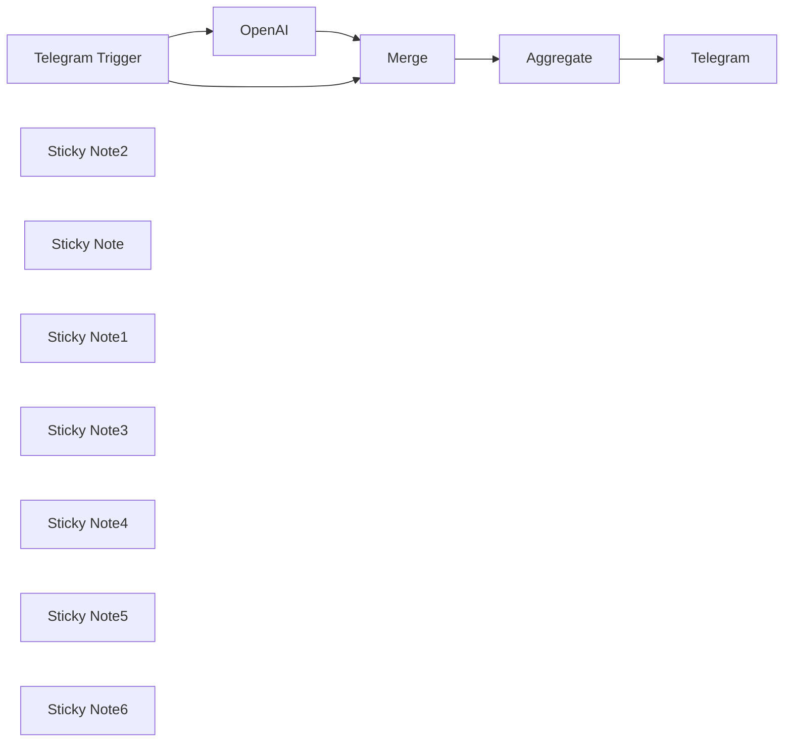
```mermaid
flowchart LR
    N1["Telegram Trigger"]
    N2["OpenAI"]
    N3["Telegram"]
    N4["Merge"]
    N5["Aggregate"]
    N6["Sticky Note2"]
    N7["Sticky Note"]
    N8["Sticky Note1"]
    N9["Sticky Note3"]
    N10["Sticky Note4"]
    N11["Sticky Note5"]
    N12["Sticky Note6"]

    N4 --> N5
    N2 --> N4
    N5 --> N3
    N1 --> N2
    N1 --> N4
```

## Fluxo (.json) :

```json
{
  "meta": {
    "instanceId": "f691e434c527bcfc50a22f01094756f14427f055aa0b6917a75441617ecd7fb2"
  },
  "nodes": [
    {
      "id": "a998289c-65da-49ea-ba8a-4b277d9e16f3",
      "name": "Telegram Trigger",
      "type": "n8n-nodes-base.telegramTrigger",
      "position": [
        1060,
        640
      ],
      "webhookId": "2901cde3-b35a-4b0b-a1ba-17a7d9f80125",
      "parameters": {
        "updates": [
          "message",
          "*"
        ],
        "additionalFields": {}
      },
      "credentials": {
        "telegramApi": {
          "id": "pbbCqv0hRu9TDmWm",
          "name": "Telegram account"
        }
      },
      "typeVersion": 1.1
    },
    {
      "id": "7f50072a-5312-4a47-823e-0513cd9d383a",
      "name": "OpenAI",
      "type": "@n8n/n8n-nodes-langchain.openAi",
      "position": [
        1380,
        640
      ],
      "parameters": {
        "prompt": "={{ $json.message.text }}",
        "options": {},
        "resource": "image"
      },
      "credentials": {
        "openAiApi": {
          "id": "p4Qrsjiuev2epBzW",
          "name": "OpenAi account"
        }
      },
      "typeVersion": 1.3
    },
    {
      "id": "a59264d6-c199-4d7b-ade4-1e31f10eb632",
      "name": "Telegram",
      "type": "n8n-nodes-base.telegram",
      "position": [
        1580,
        1000
      ],
      "parameters": {
        "chatId": "={{ $json.data[1].message.from.id }}",
        "operation": "sendPhoto",
        "binaryData": true,
        "additionalFields": {}
      },
      "credentials": {
        "telegramApi": {
          "id": "pbbCqv0hRu9TDmWm",
          "name": "Telegram account"
        }
      },
      "typeVersion": 1.1
    },
    {
      "id": "e0719c38-75ae-4082-91ba-d68c7cd28339",
      "name": "Merge",
      "type": "n8n-nodes-base.merge",
      "position": [
        1060,
        1000
      ],
      "parameters": {},
      "typeVersion": 2.1
    },
    {
      "id": "bee14b74-248b-4e17-9221-378daff965aa",
      "name": "Aggregate",
      "type": "n8n-nodes-base.aggregate",
      "position": [
        1320,
        1000
      ],
      "parameters": {
        "options": {
          "includeBinaries": true
        },
        "aggregate": "aggregateAllItemData"
      },
      "typeVersion": 1
    },
    {
      "id": "50293949-3dc0-4b35-a040-a3ad1a9e80d0",
      "name": "Sticky Note2",
      "type": "n8n-nodes-base.stickyNote",
      "position": [
        -60,
        479.3775380651615
      ],
      "parameters": {
        "width": 1036.6634532467683,
        "height": 671.0981521245417,
        "content": "\n# N8N Workflow: AI-Enhanced Image Processing and Communication\n\n## Description:\nThis n8n workflow integrates artificial intelligence to optimize image processing tasks and streamline communication via Telegram. Each node in the workflow provides specific benefits that contribute to enhancing user engagement and facilitating efficient communication.\n\n## Title:\nAI-Enhanced Image Processing and Communication Workflow with n8n\n\n## Node Names and Benefits:\n\n\n3. Set up the necessary credentials for the Telegram account and OpenAI API.\n4. Configure each node in the workflow to maximize its benefits and optimize user engagement.\n5. Run the workflow to leverage AI-enhanced image processing and communication capabilities for enhanced user interactions.\n6. Monitor the workflow execution for any errors or issues that may arise during processing.\n7. Customize the workflow nodes, parameters, or AI models to align with specific business objectives and user engagement strategies.\n8. Embrace the power of AI-driven image processing and interactive communication on Telegram to elevate user engagement and satisfaction levels.\n\n## Elevate your user engagement strategies with AI-powered image processing and seamless communication on Telegram using n8n!\n"
      },
      "typeVersion": 1
    },
    {
      "id": "529fb39e-5140-41b2-8454-2a1c45d670d0",
      "name": "Sticky Note",
      "type": "n8n-nodes-base.stickyNote",
      "position": [
        1000,
        480
      ],
      "parameters": {
        "width": 276.16526553869744,
        "height": 296.62433647952383,
        "content": " **Telegram Trigger Node**:\n - Benefit: Initiates the workflow based on incoming messages from users on Telegram, enabling real-time interaction and communication."
      },
      "typeVersion": 1
    },
    {
      "id": "339bc4ff-bca0-48ee-98ce-bbf7deb3f6fc",
      "name": "Sticky Note1",
      "type": "n8n-nodes-base.stickyNote",
      "position": [
        1320,
        480
      ],
      "parameters": {
        "width": 238.40710655577766,
        "height": 316.8446819098802,
        "content": " **OpenAI Node**:\n - Benefit: Utilizes AI algorithms to analyze text content of messages, generating intelligent responses and enhancing the quality of communication."
      },
      "typeVersion": 1
    },
    {
      "id": "64216b05-5a6e-44f5-8cf1-86487368d892",
      "name": "Sticky Note3",
      "type": "n8n-nodes-base.stickyNote",
      "position": [
        1520,
        820
      ],
      "parameters": {
        "width": 229.95409290591755,
        "height": 332.7896020182219,
        "content": "**Telegram Node**:\n - Benefit: Sends processed data, including images and responses, back to users on Telegram, ensuring seamless communication and user engagement."
      },
      "typeVersion": 1
    },
    {
      "id": "c15a57ee-f461-43d0-9232-b6d2728ee058",
      "name": "Sticky Note4",
      "type": "n8n-nodes-base.stickyNote",
      "position": [
        1260,
        820
      ],
      "parameters": {
        "height": 332.78960201822133,
        "content": "**Merge Node**:\n - Benefit: Combines and organizes processed data for efficient handling and integration, optimizing the workflow's data management capabilities."
      },
      "typeVersion": 1
    },
    {
      "id": "f6f0aaac-426a-4923-9100-a52f53e78dec",
      "name": "Sticky Note5",
      "type": "n8n-nodes-base.stickyNote",
      "position": [
        1000,
        820
      ],
      "parameters": {
        "height": 326.33042266316727,
        "content": "**Aggregate Node**:\n - Benefit: Aggregates all item data, including binaries if specified, for comprehensive reporting and analysis, aiding in decision-making and performance evaluation.\n"
      },
      "typeVersion": 1
    },
    {
      "id": "c36d8d68-0641-4e6d-92b1-82879d81e2c9",
      "name": "Sticky Note6",
      "type": "n8n-nodes-base.stickyNote",
      "position": [
        -80,
        460
      ],
      "parameters": {
        "color": 2,
        "width": 1837.5703604833238,
        "height": 706.8771853945606,
        "content": ""
      },
      "typeVersion": 1
    }
  ],
  "pinData": {},
  "connections": {
    "Merge": {
      "main": [
        [
          {
            "node": "Aggregate",
            "type": "main",
            "index": 0
          }
        ]
      ]
    },
    "OpenAI": {
      "main": [
        [
          {
            "node": "Merge",
            "type": "main",
            "index": 0
          }
        ]
      ]
    },
    "Aggregate": {
      "main": [
        [
          {
            "node": "Telegram",
            "type": "main",
            "index": 0
          }
        ]
      ]
    },
    "Telegram Trigger": {
      "main": [
        [
          {
            "node": "OpenAI",
            "type": "main",
            "index": 0
          },
          {
            "node": "Merge",
            "type": "main",
            "index": 1
          }
        ]
      ]
    }
  }
}
```

<a id="template-658"></a>

## Template 658 - Transformar artigos do Hacker News em vídeos

- **Nome:** Transformar artigos do Hacker News em vídeos
- **Descrição:** Fluxo que consome artigos do Hacker News, identifica os relevantes sobre IA/automação, gera resumos, imagens e vídeos e prepara/arquiva/posta os ativos gerados.
- **Funcionalidade:** • Captura de artigos do Hacker News: Busca itens e limita a um conjunto recente para processamento.
• Processamento em lotes e loop: Itera sobre artigos para processar vários itens sequencialmente.
• Extração e análise de artigo: Baixa a página do artigo e usa um agente de IA para determinar se é sobre automação/IA e produzir um resumo de ~250 palavras.
• Filtragem condicional por tópico: Segue fluxo diferenciado apenas se o artigo for considerado relacionado ao tema desejado.
• Preparação de conteúdo para newsletter: Gera título, blurb curto (<15 palavras) e dois resumos curtos a partir do resumo principal.
• Geração de prompts de imagem: Cria dois prompts de imagem curtos por resumo para uso em geração visual.
• Melhoria de prompts: Envia prompts para melhorar qualidade antes de gerar imagens.
• Geração de imagens com serviço de imagem: Cria imagens a partir dos prompts e aguarda a conclusão do job.
• Análise de imagem por modelo multimodal: Analisa URLs de imagem para extrair/validar conteúdo visual relevante.
• Criação de vídeos a partir de imagens: Converte imagens em clipes de vídeo (vários serviços) e aguarda processamento assíncrono.
• Montagem final de vídeo com legendas e narração: Usa um serviço de composição para juntar imagens, clipes, legendas e TTS em um vídeo final.
• Upload e arquivamento de ativos: Envia os arquivos gerados para opções de armazenamento (MinIO/Dropbox/Drive/OneDrive).
• Publicação em redes sociais: Suporta publicação/integração com plataformas como YouTube, X, Instagram e LinkedIn.
• Controle de tempo e polling: Inclui waits e verificações periódicas para jobs assíncronos e polling até conclusão.
- **Ferramentas:** • Hacker News: Fonte de artigos e links para serem processados.
• OpenAI: Modelo de linguagem para análise, sumarização, geração de blurbs e síntese de voz (TTS) e modelo multimodal para análise de imagens.
• Leonardo.ai: Serviço para melhoria de prompts e geração de imagens a partir de prompts.
• RunwayML: Serviço de conversão imagem-para-vídeo e geração de clipes a partir de imagens.
• Creatomate: Serviço de composição e renderização de vídeo final com elementos (vídeo, texto, áudio) e legendas.
• MinIO: Armazenamento objeto para salvar ativos gerados.
• Dropbox: Opção de armazenamento/backup dos arquivos gerados.
• Google Drive: Opção de armazenamento/backup e atualização de arquivos gerados.
• Microsoft OneDrive: Opção de armazenamento/backup dos ativos.
• YouTube: Plataforma de publicação de vídeo final.
• X (Twitter): Plataforma para compartilhar conteúdo associado aos vídeos.
• Instagram: Plataforma de publicação/compartilhamento visual.
• LinkedIn: Plataforma para publicação profissional do conteúdo.

## Fluxo visual

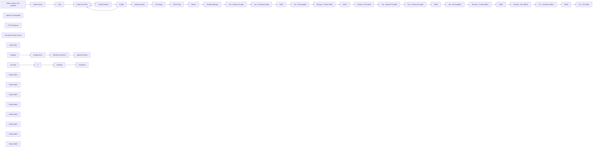
```mermaid
flowchart LR
    N1["When clicking ‘Test workflow’"]
    N2["Hacker News"]
    N3["Loop Over Items"]
    N4["OpenAI Chat Model3"]
    N5["HTTP Request1"]
    N6["Structured Output Parser"]
    N7["Upload to Minio"]
    N8["News1"]
    N9["Leo - Improve Prompt"]
    N10["Leo - Get imageId"]
    N11["Runway - Create Video"]
    N12["Runway - Get Video"]
    N13["Wait2"]
    N14["Sticky Note"]
    N15["If Topic"]
    N16["Get Image"]
    N17["Prompt Settings1"]
    N18["Leo - Generate Image"]
    N19["Wait1"]
    N20["Limit"]
    N21["Image Analysis"]
    N22["Wait3"]
    N23["Article Analysis"]
    N24["Dropbox"]
    N25["Google Drive"]
    N26["Microsoft OneDrive"]
    N27["YouTube"]
    N28["X"]
    N29["Instagram"]
    N30["LinkedIn"]
    N31["Leo - Improve Prompt2"]
    N32["Wait4"]
    N33["Wait6"]
    N34["Leo - Generate Image2"]
    N35["Leo - Get imageId2"]
    N36["Runway - Create Video2"]
    N37["Runway - Get Video2"]
    N38["Sticky Note1"]
    N39["Sticky Note2"]
    N40["Sticky Note3"]
    N41["Sticky Note4"]
    N42["Cre - Generate Video1"]
    N43["Cre - Get Video"]
    N44["Sticky Note6"]
    N45["Sticky Note7"]
    N46["Article Prep"]
    N47["Sticky Note5"]
    N48["Sticky Note8"]

    N28 --> N30
    N20 --> N3
    N8 --> N17
    N19 --> N10
    N13 --> N12
    N22 --> N43
    N32 --> N37
    N33 --> N35
    N24 --> N25
    N27 --> N28
    N15 --> N21
    N15 --> N3
    N30 --> N29
    N16 --> N46
    N2 --> N20
    N46 --> N8
    N25 --> N26
    N21 --> N16
    N3 --> N23
    N23 --> N15
    N23 --> N3
    N17 --> N9
    N10 --> N11
    N35 --> N36
    N26 --> N7
    N12 --> N31
    N37 --> N42
    N18 --> N19
    N9 --> N18
    N42 --> N22
    N34 --> N33
    N31 --> N34
    N11 --> N13
    N36 --> N32
    N1 --> N2
```

## Fluxo (.json) :

```json
{
  "id": "744G7emgZe0pXaPB",
  "meta": {
    "instanceId": "d868e3d040e7bda892c81b17cf446053ea25d2556fcef89cbe19dd61a3e876e9"
  },
  "name": "Hacker News to Video Template - AlexK1919",
  "tags": [
    {
      "id": "04PL2irdWYmF2Dg3",
      "name": "RunwayML",
      "createdAt": "2024-11-15T05:55:30.783Z",
      "updatedAt": "2024-11-15T05:55:30.783Z"
    },
    {
      "id": "yrY6updwSCXMsT0z",
      "name": "Video",
      "createdAt": "2024-11-15T05:55:34.333Z",
      "updatedAt": "2024-11-15T05:55:34.333Z"
    },
    {
      "id": "QsH2EXuw2e7YCv0K",
      "name": "OpenAI",
      "createdAt": "2024-11-15T04:05:20.872Z",
      "updatedAt": "2024-11-15T04:05:20.872Z"
    },
    {
      "id": "lvPj9rYRsKOHCi4J",
      "name": "Creatomate",
      "createdAt": "2024-11-19T15:59:16.134Z",
      "updatedAt": "2024-11-19T15:59:16.134Z"
    },
    {
      "id": "9LXACqpQLNtrM6or",
      "name": "Leonardo",
      "createdAt": "2024-11-19T15:59:21.368Z",
      "updatedAt": "2024-11-19T15:59:21.368Z"
    }
  ],
  "nodes": [
    {
      "id": "c777c41b-842d-4504-a1a0-ccbb034a0fdd",
      "name": "When clicking ‘Test workflow’",
      "type": "n8n-nodes-base.manualTrigger",
      "position": [
        -320,
        300
      ],
      "parameters": {},
      "typeVersion": 1
    },
    {
      "id": "74fafd7c-55a4-46ec-b4a8-33d46f2b5b54",
      "name": "Hacker News",
      "type": "n8n-nodes-base.hackerNews",
      "position": [
        -20,
        300
      ],
      "parameters": {
        "resource": "all",
        "additionalFields": {}
      },
      "typeVersion": 1
    },
    {
      "id": "9cd87fd2-6a38-463a-a22e-e0c34910818f",
      "name": "Loop Over Items",
      "type": "n8n-nodes-base.splitInBatches",
      "position": [
        440,
        300
      ],
      "parameters": {
        "options": {}
      },
      "typeVersion": 3
    },
    {
      "id": "611b24cd-558b-4025-a0a8-ea355ba61988",
      "name": "OpenAI Chat Model3",
      "type": "@n8n/n8n-nodes-langchain.lmChatOpenAi",
      "position": [
        720,
        580
      ],
      "parameters": {
        "options": {}
      },
      "typeVersion": 1
    },
    {
      "id": "f814682c-cf6f-49a8-8ea0-48fbc64a3ebe",
      "name": "HTTP Request1",
      "type": "@n8n/n8n-nodes-langchain.toolHttpRequest",
      "position": [
        900,
        580
      ],
      "parameters": {
        "url": "={{ $json.url }}",
        "toolDescription": "grab the article for the ai agent to use"
      },
      "typeVersion": 1.1
    },
    {
      "id": "2a4bcf69-23f0-440d-a3b0-c8261e153c62",
      "name": "Structured Output Parser",
      "type": "@n8n/n8n-nodes-langchain.outputParserStructured",
      "position": [
        1080,
        580
      ],
      "parameters": {
        "schemaType": "manual",
        "inputSchema": "{\n\t\"type\": \"object\",\n\t\"properties\": {\n\t\t\"summary\": {\n\t\t\t\"type\": \"string\"\n\t\t},\n\t\t\"related\": {\n\t\t\t\"type\": \"string\"\n\t\t},\n        \"image urls\": {\n\t\t\t\"type\": \"string\"\n        }\n\t}\n}"
      },
      "typeVersion": 1.2
    },
    {
      "id": "83c3b8f0-8d67-48a2-a5ce-b777ea1d7b32",
      "name": "Upload to Minio",
      "type": "n8n-nodes-base.s3",
      "position": [
        4240,
        1080
      ],
      "parameters": {
        "operation": "upload",
        "bucketName": "=",
        "additionalFields": {
          "grantRead": true,
          "parentFolderKey": "="
        }
      },
      "typeVersion": 1
    },
    {
      "id": "05b972ff-ccab-415b-8787-aafabb3b7292",
      "name": "News1",
      "type": "n8n-nodes-base.set",
      "position": [
        2180,
        320
      ],
      "parameters": {
        "options": {},
        "assignments": {
          "assignments": [
            {
              "id": "ec8013d5-84b5-43c8-abcb-6986ef15939d",
              "name": "property_name",
              "type": "string",
              "value": "={{ $json.message.content['Article Title'] }}"
            },
            {
              "id": "4d91c4fc-12a2-4fe2-a58e-02284314e1de",
              "name": "property_text",
              "type": "string",
              "value": "={{ $json.message.content['Article Blurb'] }}"
            },
            {
              "id": "cad2b795-8b71-415f-a100-700d9ec62bbd",
              "name": "property_image_url",
              "type": "string",
              "value": "={{ $('If Topic').item.json.output['image urls'] }}"
            }
          ]
        }
      },
      "typeVersion": 3.4
    },
    {
      "id": "d175d366-e672-4452-b78e-a06336ef242b",
      "name": "Leo - Improve Prompt",
      "type": "n8n-nodes-base.httpRequest",
      "position": [
        2720,
        100
      ],
      "parameters": {
        "url": "https://cloud.leonardo.ai/api/rest/v1/prompt/improve",
        "method": "POST",
        "options": {
          "response": {
            "response": {
              "fullResponse": true
            }
          }
        },
        "jsonBody": "={\n  \"prompt\": \"{{ $('Article Prep').item.json.message.content['Image Prompt 1'] }}\"\n}",
        "sendBody": true,
        "sendHeaders": true,
        "specifyBody": "json",
        "authentication": "genericCredentialType",
        "genericAuthType": "httpCustomAuth",
        "headerParameters": {
          "parameters": [
            {
              "name": "accept",
              "value": "application/json"
            }
          ]
        }
      },
      "typeVersion": 4.2
    },
    {
      "id": "d8da7879-1a67-4da1-86db-f70e50b4e9da",
      "name": "Leo - Get imageId",
      "type": "n8n-nodes-base.httpRequest",
      "position": [
        3320,
        100
      ],
      "parameters": {
        "url": "=https://cloud.leonardo.ai/api/rest/v1/generations/{{ $json.body.sdGenerationJob.generationId }}",
        "options": {
          "response": {
            "response": {
              "fullResponse": true
            }
          }
        },
        "sendHeaders": true,
        "authentication": "genericCredentialType",
        "genericAuthType": "httpCustomAuth",
        "headerParameters": {
          "parameters": [
            {
              "name": "content-type",
              "value": "application/json"
            }
          ]
        }
      },
      "typeVersion": 4.2
    },
    {
      "id": "faf80246-3b1a-49c6-a277-0152428e46e1",
      "name": "Runway - Create Video",
      "type": "n8n-nodes-base.httpRequest",
      "position": [
        2520,
        300
      ],
      "parameters": {
        "url": "https://api.dev.runwayml.com/v1/image_to_video",
        "method": "POST",
        "options": {},
        "sendBody": true,
        "sendHeaders": true,
        "authentication": "genericCredentialType",
        "bodyParameters": {
          "parameters": [
            {
              "name": "promptImage",
              "value": "={{ $json.body.generations_by_pk.generated_images[0].url }}"
            },
            {
              "name": "promptText",
              "value": "string"
            },
            {
              "name": "model",
              "value": "gen3a_turbo"
            }
          ]
        },
        "genericAuthType": "httpCustomAuth",
        "headerParameters": {
          "parameters": [
            {
              "name": "X-Runway-Version",
              "value": "2024-11-06"
            }
          ]
        }
      },
      "typeVersion": 4.2
    },
    {
      "id": "e91c1f01-7870-4063-9557-24a6ba1d3db3",
      "name": "Runway - Get Video",
      "type": "n8n-nodes-base.httpRequest",
      "position": [
        2920,
        300
      ],
      "parameters": {
        "url": "=https://api.dev.runwayml.com/v1/tasks/{{ $json.id }}",
        "options": {},
        "sendHeaders": true,
        "authentication": "genericCredentialType",
        "genericAuthType": "httpCustomAuth",
        "headerParameters": {
          "parameters": [
            {
              "name": "X-Runway-Version",
              "value": "2024-11-06"
            }
          ]
        }
      },
      "typeVersion": 4.2
    },
    {
      "id": "41ee2665-e1aa-4d48-ade6-e37af568f211",
      "name": "Wait2",
      "type": "n8n-nodes-base.wait",
      "position": [
        2720,
        300
      ],
      "webhookId": "ddca5833-a40b-404a-9140-686cd4fa26cb",
      "parameters": {
        "unit": "minutes",
        "amount": 3
      },
      "typeVersion": 1.1
    },
    {
      "id": "091e9e07-89ba-4fe3-9fc5-278fc333dbff",
      "name": "Sticky Note",
      "type": "n8n-nodes-base.stickyNote",
      "position": [
        -160,
        -40
      ],
      "parameters": {
        "color": 5,
        "width": 341,
        "height": 951,
        "content": "# Choose your data source \n## This can be swapped for any other data source of your choosing."
      },
      "typeVersion": 1
    },
    {
      "id": "9660a593-9966-4ebe-bfd7-f884dc185d56",
      "name": "If Topic",
      "type": "n8n-nodes-base.if",
      "position": [
        1100,
        320
      ],
      "parameters": {
        "options": {},
        "conditions": {
          "options": {
            "version": 2,
            "leftValue": "",
            "caseSensitive": true,
            "typeValidation": "strict"
          },
          "combinator": "and",
          "conditions": [
            {
              "id": "56219de5-244d-4b7f-a511-f3061572cf93",
              "operator": {
                "name": "filter.operator.equals",
                "type": "string",
                "operation": "equals"
              },
              "leftValue": "={{ $json.output.related }}",
              "rightValue": "yes"
            }
          ]
        }
      },
      "typeVersion": 2.2
    },
    {
      "id": "e47140ac-20cc-417b-a6cd-30f780dc8289",
      "name": "Get Image",
      "type": "n8n-nodes-base.httpRequest",
      "position": [
        1500,
        320
      ],
      "parameters": {
        "url": "={{ $('Article Analysis').first().json.output['image urls'] }}",
        "options": {
          "response": {
            "response": {
              "fullResponse": true
            }
          }
        }
      },
      "typeVersion": 4.2
    },
    {
      "id": "26f80f71-2c3a-46fe-a960-21cdbc18ce34",
      "name": "Prompt Settings1",
      "type": "n8n-nodes-base.set",
      "position": [
        2520,
        100
      ],
      "parameters": {
        "options": {},
        "assignments": {
          "assignments": [
            {
              "id": "56c8f20d-d9d9-4be7-ac2a-38df6ffdd722",
              "name": "model",
              "type": "string",
              "value": "6b645e3a-d64f-4341-a6d8-7a3690fbf042"
            }
          ]
        },
        "includeOtherFields": true
      },
      "typeVersion": 3.4
    },
    {
      "id": "ce697f6f-f8fc-4ba7-b776-17bbc2e870b7",
      "name": "Leo - Generate Image",
      "type": "n8n-nodes-base.httpRequest",
      "position": [
        2920,
        100
      ],
      "parameters": {
        "url": "https://cloud.leonardo.ai/api/rest/v1/generations",
        "method": "POST",
        "options": {
          "response": {
            "response": {
              "fullResponse": true
            }
          }
        },
        "jsonBody": "={\n  \"alchemy\": true,\n  \"width\": 1024,\n  \"height\": 768,\n  \"modelId\": \"6b645e3a-d64f-4341-a6d8-7a3690fbf042\",\n  \"num_images\": 1,\n  \"presetStyle\": \"MONOCHROME\",\n  \"prompt\": \"{{ $json.body.promptGeneration.prompt }}; Use the rule of thirds, leading lines, & balance. DO NOT INCLUDE ANY WORDS OR LABELS.\",\n  \"guidance_scale\": 7,\n  \"highResolution\": true,\n  \"promptMagic\": false,\n  \"promptMagicStrength\": 0.5,\n  \"promptMagicVersion\": \"v3\",\n  \"public\": false,\n  \"ultra\": false,\n  \"photoReal\": false,\n  \"negative_prompt\": \"\"\n} ",
        "sendBody": true,
        "sendHeaders": true,
        "specifyBody": "json",
        "authentication": "genericCredentialType",
        "genericAuthType": "httpCustomAuth",
        "headerParameters": {
          "parameters": [
            {
              "name": "accept",
              "value": "application/json"
            }
          ]
        }
      },
      "typeVersion": 4.2
    },
    {
      "id": "e2067fe5-3fae-4f97-97c0-879967efd9b8",
      "name": "Wait1",
      "type": "n8n-nodes-base.wait",
      "position": [
        3120,
        100
      ],
      "webhookId": "256c3814-6a52-4eb1-969a-30f9f3b8e04e",
      "parameters": {
        "amount": 30
      },
      "typeVersion": 1.1
    },
    {
      "id": "f0ba57a5-1d27-4c75-a422-4bc0e2cead9d",
      "name": "Limit",
      "type": "n8n-nodes-base.limit",
      "position": [
        240,
        300
      ],
      "parameters": {
        "keep": "lastItems",
        "maxItems": 50
      },
      "typeVersion": 1
    },
    {
      "id": "e01152aa-961b-4e33-a1e3-186d47d81c55",
      "name": "Image Analysis",
      "type": "@n8n/n8n-nodes-langchain.openAi",
      "position": [
        1300,
        320
      ],
      "parameters": {
        "modelId": {
          "__rl": true,
          "mode": "list",
          "value": "gpt-4o-mini",
          "cachedResultName": "GPT-4O-MINI"
        },
        "options": {
          "detail": "auto"
        },
        "resource": "image",
        "imageUrls": "={{ $json.output['image urls'] }}",
        "operation": "analyze"
      },
      "credentials": {
        "openAiApi": {
          "id": "ysxujEYFiY5ozRTS",
          "name": "AlexK OpenAi Key"
        }
      },
      "typeVersion": 1.6
    },
    {
      "id": "ab346129-c3d5-4f51-af5e-5d63cd154981",
      "name": "Wait3",
      "type": "n8n-nodes-base.wait",
      "disabled": true,
      "position": [
        3080,
        1020
      ],
      "webhookId": "6e4a0b8d-6c31-4a98-8ec3-2509aa2087e8",
      "parameters": {
        "unit": "minutes"
      },
      "typeVersion": 1.1
    },
    {
      "id": "872c35a3-bdd5-4eec-9bac-0959f3ff78e7",
      "name": "Article Analysis",
      "type": "@n8n/n8n-nodes-langchain.agent",
      "onError": "continueErrorOutput",
      "position": [
        740,
        300
      ],
      "parameters": {
        "text": "=Can you tell me if the article at {{ $json.url }} is related to automation or ai? \n\nthen, create a 250 word summary of the article\n\nAlso, list any image url's related to the article content from the url. Limit to 1 image url.",
        "options": {
          "systemMessage": "You are a helpful assistant in summarizing and identifying articles related to automation and ai. \nOutput the results as:\nsummary: \nrelated: yes or no\nimage urls: "
        },
        "promptType": "define",
        "hasOutputParser": true
      },
      "typeVersion": 1.7
    },
    {
      "id": "31c3a90e-10ee-4217-9b08-ff57bf17ea10",
      "name": "Dropbox",
      "type": "n8n-nodes-base.dropbox",
      "position": [
        3640,
        1080
      ],
      "parameters": {},
      "typeVersion": 1
    },
    {
      "id": "22ccd0a0-f7f6-40ca-bd09-40ed4a7fcde1",
      "name": "Google Drive",
      "type": "n8n-nodes-base.googleDrive",
      "position": [
        3840,
        1080
      ],
      "parameters": {
        "fileId": {
          "__rl": true,
          "mode": "list",
          "value": ""
        },
        "options": {},
        "operation": "update"
      },
      "credentials": {
        "googleDriveOAuth2Api": {
          "id": "m8K1mbAUn7yuiEwl",
          "name": "AlexK1919 Google Drive account"
        }
      },
      "typeVersion": 3
    },
    {
      "id": "ea75931d-c1ee-4139-9bdc-7901056ba016",
      "name": "Microsoft OneDrive",
      "type": "n8n-nodes-base.microsoftOneDrive",
      "position": [
        4040,
        1080
      ],
      "parameters": {},
      "typeVersion": 1
    },
    {
      "id": "38888521-3087-4e0a-81d6-cf4b9a5dd3dd",
      "name": "YouTube",
      "type": "n8n-nodes-base.youTube",
      "position": [
        3640,
        1500
      ],
      "parameters": {
        "options": {},
        "resource": "video",
        "operation": "upload"
      },
      "typeVersion": 1
    },
    {
      "id": "55f3decc-f952-4d2a-804d-2aec44fb2755",
      "name": "X",
      "type": "n8n-nodes-base.twitter",
      "position": [
        3840,
        1500
      ],
      "parameters": {
        "additionalFields": {}
      },
      "typeVersion": 2
    },
    {
      "id": "54c8b762-444d-4790-97a9-a2f84518492f",
      "name": "Instagram",
      "type": "n8n-nodes-base.httpRequest",
      "position": [
        4240,
        1500
      ],
      "parameters": {
        "options": {}
      },
      "typeVersion": 4.2
    },
    {
      "id": "90040f15-95c0-4ebb-818f-dde508eb0689",
      "name": "LinkedIn",
      "type": "n8n-nodes-base.linkedIn",
      "position": [
        4040,
        1500
      ],
      "parameters": {
        "additionalFields": {}
      },
      "typeVersion": 1
    },
    {
      "id": "691eb779-5fae-4f65-89eb-b1b8e5488809",
      "name": "Leo - Improve Prompt2",
      "type": "n8n-nodes-base.httpRequest",
      "position": [
        2720,
        500
      ],
      "parameters": {
        "url": "https://cloud.leonardo.ai/api/rest/v1/prompt/improve",
        "method": "POST",
        "options": {
          "response": {
            "response": {
              "fullResponse": true
            }
          }
        },
        "jsonBody": "={\n  \"prompt\": \"{{ $('Article Prep').item.json.message.content['Image Prompt 2'] }}\"\n}",
        "sendBody": true,
        "sendHeaders": true,
        "specifyBody": "json",
        "authentication": "genericCredentialType",
        "genericAuthType": "httpCustomAuth",
        "headerParameters": {
          "parameters": [
            {
              "name": "accept",
              "value": "application/json"
            }
          ]
        }
      },
      "credentials": {
        "httpCustomAuth": {
          "id": "hIzUsjbtHLmIe6uM",
          "name": "RunwayML Custom Auth"
        }
      },
      "typeVersion": 4.2
    },
    {
      "id": "076a745a-055b-459c-8af9-fa7b6740dc6f",
      "name": "Wait4",
      "type": "n8n-nodes-base.wait",
      "position": [
        2720,
        700
      ],
      "webhookId": "89b31515-b403-4644-a2c1-970e5e774008",
      "parameters": {
        "unit": "minutes",
        "amount": 3
      },
      "typeVersion": 1.1
    },
    {
      "id": "adc2c993-3f89-40df-96fc-eb3ff5eafb1c",
      "name": "Wait6",
      "type": "n8n-nodes-base.wait",
      "position": [
        3120,
        500
      ],
      "webhookId": "2efb873f-bcbd-41d9-99da-b2b57ef5ad93",
      "parameters": {
        "amount": 30
      },
      "typeVersion": 1.1
    },
    {
      "id": "156f5735-bc20-46a9-871c-143b0772ca45",
      "name": "Leo - Generate Image2",
      "type": "n8n-nodes-base.httpRequest",
      "position": [
        2920,
        500
      ],
      "parameters": {
        "url": "https://cloud.leonardo.ai/api/rest/v1/generations",
        "method": "POST",
        "options": {
          "response": {
            "response": {
              "fullResponse": true
            }
          }
        },
        "jsonBody": "={\n  \"alchemy\": true,\n  \"width\": 1024,\n  \"height\": 768,\n  \"modelId\": \"6b645e3a-d64f-4341-a6d8-7a3690fbf042\",\n  \"num_images\": 1,\n  \"presetStyle\": \"MONOCHROME\",\n  \"prompt\": \"{{ $json.body.promptGeneration.prompt }}; Use the rule of thirds, leading lines, & balance. DO NOT INCLUDE ANY WORDS OR LABELS.\",\n  \"guidance_scale\": 7,\n  \"highResolution\": true,\n  \"promptMagic\": false,\n  \"promptMagicStrength\": 0.5,\n  \"promptMagicVersion\": \"v3\",\n  \"public\": false,\n  \"ultra\": false,\n  \"photoReal\": false,\n  \"negative_prompt\": \"\"\n} ",
        "sendBody": true,
        "sendHeaders": true,
        "specifyBody": "json",
        "authentication": "genericCredentialType",
        "genericAuthType": "httpCustomAuth",
        "headerParameters": {
          "parameters": [
            {
              "name": "accept",
              "value": "application/json"
            }
          ]
        }
      },
      "typeVersion": 4.2
    },
    {
      "id": "4f270fa8-4da2-44f0-927f-3509fd9f8f7d",
      "name": "Leo - Get imageId2",
      "type": "n8n-nodes-base.httpRequest",
      "position": [
        3320,
        500
      ],
      "parameters": {
        "url": "=https://cloud.leonardo.ai/api/rest/v1/generations/{{ $json.body.sdGenerationJob.generationId }}",
        "options": {
          "response": {
            "response": {
              "fullResponse": true
            }
          }
        },
        "sendHeaders": true,
        "authentication": "genericCredentialType",
        "genericAuthType": "httpCustomAuth",
        "headerParameters": {
          "parameters": [
            {
              "name": "content-type",
              "value": "application/json"
            }
          ]
        }
      },
      "typeVersion": 4.2
    },
    {
      "id": "49c0e7ba-bf9c-4819-b479-61aa099ab9ab",
      "name": "Runway - Create Video2",
      "type": "n8n-nodes-base.httpRequest",
      "position": [
        2520,
        700
      ],
      "parameters": {
        "url": "https://api.dev.runwayml.com/v1/image_to_video",
        "method": "POST",
        "options": {},
        "sendBody": true,
        "sendHeaders": true,
        "authentication": "genericCredentialType",
        "bodyParameters": {
          "parameters": [
            {
              "name": "promptImage",
              "value": "={{ $json.body.generations_by_pk.generated_images[0].url }}"
            },
            {
              "name": "promptText",
              "value": "string"
            },
            {
              "name": "model",
              "value": "gen3a_turbo"
            }
          ]
        },
        "genericAuthType": "httpCustomAuth",
        "headerParameters": {
          "parameters": [
            {
              "name": "X-Runway-Version",
              "value": "2024-11-06"
            }
          ]
        }
      },
      "credentials": {
        "httpCustomAuth": {
          "id": "hIzUsjbtHLmIe6uM",
          "name": "RunwayML Custom Auth"
        }
      },
      "typeVersion": 4.2
    },
    {
      "id": "d03eb190-5fc0-4b7e-ad65-88ece3ab833d",
      "name": "Runway - Get Video2",
      "type": "n8n-nodes-base.httpRequest",
      "position": [
        2920,
        700
      ],
      "parameters": {
        "url": "=https://api.dev.runwayml.com/v1/tasks/{{ $json.id }}",
        "options": {},
        "sendHeaders": true,
        "authentication": "genericCredentialType",
        "genericAuthType": "httpCustomAuth",
        "headerParameters": {
          "parameters": [
            {
              "name": "X-Runway-Version",
              "value": "2024-11-06"
            }
          ]
        }
      },
      "typeVersion": 4.2
    },
    {
      "id": "0072563d-b87d-47c5-80fd-ed3c051b3287",
      "name": "Sticky Note1",
      "type": "n8n-nodes-base.stickyNote",
      "position": [
        3580,
        940
      ],
      "parameters": {
        "color": 6,
        "width": 882,
        "height": 372,
        "content": "# Upload Assets\nYou can extend this workflow further by uploading the generated assets to your storage option of choice."
      },
      "typeVersion": 1
    },
    {
      "id": "a0b2377e-57ea-47e9-83c9-3e58372610e5",
      "name": "Sticky Note2",
      "type": "n8n-nodes-base.stickyNote",
      "position": [
        3580,
        1360
      ],
      "parameters": {
        "color": 6,
        "width": 882,
        "height": 372,
        "content": "# Post to Social Media\nYou can extend this workflow further by posting the generated assets to social media."
      },
      "typeVersion": 1
    },
    {
      "id": "708fe6a0-4899-462b-9a08-fadea7c7e195",
      "name": "Sticky Note3",
      "type": "n8n-nodes-base.stickyNote",
      "position": [
        2420,
        -40
      ],
      "parameters": {
        "color": 4,
        "width": 1114,
        "height": 943,
        "content": "# Generate Images and Videos"
      },
      "typeVersion": 1
    },
    {
      "id": "5bbb6552-ec3a-42ea-a911-993f67a6c8dc",
      "name": "Sticky Note4",
      "type": "n8n-nodes-base.stickyNote",
      "position": [
        2420,
        940
      ],
      "parameters": {
        "color": 5,
        "width": 1114,
        "height": 372,
        "content": "# Stitch it all together"
      },
      "typeVersion": 1
    },
    {
      "id": "25f4cc09-fbff-4c10-b706-30df5840b794",
      "name": "Cre - Generate Video1",
      "type": "n8n-nodes-base.httpRequest",
      "position": [
        2880,
        1020
      ],
      "parameters": {
        "url": "https://api.creatomate.com/v1/renders",
        "method": "POST",
        "options": {
          "response": {
            "response": {
              "fullResponse": true
            }
          }
        },
        "jsonBody": "={\n  \"max_width\": 480,\n  \"template_id\": \"enterTemplateID\",\n  \"modifications\": {\n    \"Scenes.elements\": [\n      {\n        \"name\": \"Intro Comp\",\n        \"type\": \"composition\",\n        \"track\": 1,\n        \"elements\": [\n          {\n            \"name\": \"Image-1\",\n            \"type\": \"image\",\n            \"source\": \"{{ $('Leo - Get imageId').item.json.body.generations_by_pk.generated_images[0].url }}\"\n          },\n          {\n            \"name\": \"Subtitles-1\",\n            \"type\": \"text\",\n            \"transcript_source\": \"Voiceover-1\",\n            \"width\": \"86.66%\",\n            \"height\": \"37.71%\",\n            \"x_alignment\": \"50%\",\n            \"y_alignment\": \"50%\",\n            \"fill_color\": \"#ffffff\",\n            \"stroke_color\": \"#333333\",\n            \"stroke_width\": \"1.05 vmin\",\n            \"font_family\": \"Inter\",\n            \"font_weight\": \"700\",\n            \"font_size\": \"8 vmin\",\n            \"background_color\": \"rgba(255,255,255,0.2)\",\n            \"background_x_padding\": \"26%\",\n            \"background_y_padding\": \"7%\",\n            \"background_border_radius\": \"28%\",\n            \"transcript_effect\": \"highlight\",\n            \"transcript_color\": \"#ff5900\"\n          },\n          {\n            \"name\": \"Voiceover-1\",\n            \"type\": \"audio\",\n            \"source\": \"{{ $('News1').item.json.property_name }}\",\n            \"provider\": \"openai model=tts-1 voice=onyx\"\n          }\n        ]\n      },\n      {\n        \"name\": \"Auto Scene Comp\",\n        \"type\": \"composition\",\n        \"track\": 1,\n        \"elements\": [\n          {\n            \"name\": \"Video-2\",\n            \"type\": \"video\",\n            \"source\": \"{{ $('Runway - Get Video').first().json.output[0] }}\",\n            \"loop\": true\n          },\n          {\n            \"name\": \"Subtitles-2\",\n            \"type\": \"text\",\n            \"transcript_source\": \"Voiceover-2\",\n            \"y\": \"78.2173%\",\n            \"width\": \"86.66%\",\n            \"height\": \"37.71%\",\n            \"x_alignment\": \"50%\",\n            \"y_alignment\": \"50%\",\n            \"fill_color\": \"#ffffff\",\n            \"stroke_color\": \"#333333\",\n            \"stroke_width\": \"1.05 vmin\",\n            \"font_family\": \"Inter\",\n            \"font_weight\": \"700\",\n            \"font_size\": \"8 vmin\",\n            \"background_color\": \"rgba(255,255,255,0.2)\",\n            \"background_x_padding\": \"26%\",\n            \"background_y_padding\": \"7%\",\n            \"background_border_radius\": \"28%\",\n            \"transcript_effect\": \"highlight\",\n            \"transcript_color\": \"#ff5900\"\n          },\n          {\n            \"name\": \"Voiceover-2\",\n            \"type\": \"audio\",\n            \"source\": \"{{ $('Article Prep').item.json.message.content['Summary Blurb 1'] }}\",\n            \"provider\": \"openai model=tts-1 voice=onyx\"\n          }\n        ]\n      },\n      {\n        \"name\": \"Auto Scene Comp\",\n        \"type\": \"composition\",\n        \"track\": 1,\n        \"elements\": [\n          {\n            \"name\": \"Video-3\",\n            \"type\": \"video\",\n            \"source\": \"{{ $('Runway - Get Video2').first().json.output[0] }}\",\n            \"loop\": true\n          },\n          {\n            \"name\": \"Subtitles-3\",\n            \"type\": \"text\",\n            \"transcript_source\": \"Voiceover-3\",\n            \"y\": \"78.2173%\",\n            \"width\": \"86.66%\",\n            \"height\": \"37.71%\",\n            \"x_alignment\": \"50%\",\n            \"y_alignment\": \"50%\",\n            \"fill_color\": \"#ffffff\",\n            \"stroke_color\": \"#333333\",\n            \"stroke_width\": \"1.05 vmin\",\n            \"font_family\": \"Inter\",\n            \"font_weight\": \"700\",\n            \"font_size\": \"8 vmin\",\n            \"background_color\": \"rgba(255,89,0,0.5)\",\n            \"background_x_padding\": \"26%\",\n            \"background_y_padding\": \"7%\",\n            \"background_border_radius\": \"28%\",\n            \"transcript_effect\": \"highlight\",\n            \"transcript_color\": \"#ff0040\"\n          },\n          {\n            \"name\": \"Voiceover-3\",\n            \"type\": \"audio\",\n            \"source\": \"{{ $('Article Prep').item.json.message.content['Summary Blurb 2'] }}\",\n            \"provider\": \"openai model=tts-1 voice=onyx\"\n          }\n        ]\n      }\n    ]\n  }\n}",
        "sendBody": true,
        "specifyBody": "json",
        "authentication": "genericCredentialType",
        "genericAuthType": "httpCustomAuth"
      },
      "credentials": {
        "httpCustomAuth": {
          "id": "hIzUsjbtHLmIe6uM",
          "name": "RunwayML Custom Auth"
        }
      },
      "typeVersion": 4.2
    },
    {
      "id": "7093de7b-a4e3-4363-8038-1002f7b20fbc",
      "name": "Cre - Get Video",
      "type": "n8n-nodes-base.httpRequest",
      "position": [
        3280,
        1020
      ],
      "parameters": {
        "url": "=https://api.creatomate.com/v1/renders/{{ $json.body.body[0].id }}",
        "options": {
          "response": {
            "response": {
              "fullResponse": true
            }
          }
        },
        "authentication": "genericCredentialType",
        "genericAuthType": "httpCustomAuth"
      },
      "credentials": {
        "httpCustomAuth": {
          "id": "hIzUsjbtHLmIe6uM",
          "name": "RunwayML Custom Auth"
        }
      },
      "typeVersion": 4.2
    },
    {
      "id": "a57b719f-b299-431e-9c85-fa333e38b6a7",
      "name": "Sticky Note6",
      "type": "n8n-nodes-base.stickyNote",
      "position": [
        660,
        -40
      ],
      "parameters": {
        "color": 3,
        "width": 1033,
        "height": 951,
        "content": "# Article Analysis - Is it the right topic?"
      },
      "typeVersion": 1
    },
    {
      "id": "60b879a0-8b7f-40f1-ae70-ac94e4675b38",
      "name": "Sticky Note7",
      "type": "n8n-nodes-base.stickyNote",
      "position": [
        1740,
        -40
      ],
      "parameters": {
        "color": 3,
        "width": 630,
        "height": 947,
        "content": "# Prepare the article for content generation"
      },
      "typeVersion": 1
    },
    {
      "id": "afaf8437-ee52-434b-a267-8dbaff0e1922",
      "name": "Article Prep",
      "type": "@n8n/n8n-nodes-langchain.openAi",
      "position": [
        1820,
        320
      ],
      "parameters": {
        "modelId": {
          "__rl": true,
          "mode": "list",
          "value": "gpt-4o-mini",
          "cachedResultName": "GPT-4O-MINI"
        },
        "options": {},
        "messages": {
          "values": [
            {
              "content": "=prepare the following summary for a newsletter where the article will be 1 of several presented in the newsletter:\n\n{{ $('Article Analysis').first().json.output.summary }}\n\nMake sure the Article Blurb lenght is less than 15 words.\n\nThen, create 2 Summary Blurbs, making sure each is less than 15 words.\n\nAlso create 2 image prompts that is less than 15 words long for each Summary Blurb"
            },
            {
              "role": "system",
              "content": "Output in markdown format\nArticle Title\nArticle Blurb\nSummary Blurb 1\nSummary Blurb 2\nArticle Image\nImage Prompt 1\nImage Prompt 2"
            }
          ]
        },
        "jsonOutput": true
      },
      "credentials": {
        "openAiApi": {
          "id": "ysxujEYFiY5ozRTS",
          "name": "AlexK OpenAi Key"
        }
      },
      "typeVersion": 1.6
    },
    {
      "id": "e7c95d56-86e1-4456-a6d3-9c8b9fc3a53c",
      "name": "Sticky Note5",
      "type": "n8n-nodes-base.stickyNote",
      "position": [
        -620,
        -40
      ],
      "parameters": {
        "color": 6,
        "width": 252,
        "height": 946,
        "content": "# AlexK1919 \n\n\n#### I’m Alex Kim, an AI-Native Workflow Automation Architect Building Solutions to Optimize your Personal and Professional Life.\n\n### Workflow Overview Video\nhttps://youtu.be/XaKybLDUlLk\n\n### About Me\nhttps://beacons.ai/alexk1919\n\n### Product Used \n[Leonardo.ai](https://leonardo.ai)\n[RunwayML](https://runwayml.com/)\n[Creatomate](https://creatomate.com/)\n"
      },
      "typeVersion": 1
    },
    {
      "id": "32e2803e-bf7c-4da4-a4ae-c9b6fa5ae226",
      "name": "Sticky Note8",
      "type": "n8n-nodes-base.stickyNote",
      "position": [
        3280,
        1180
      ],
      "parameters": {
        "color": 7,
        "width": 180,
        "height": 100,
        "content": "Don't forget to connect this last node to the loop to process additional items"
      },
      "typeVersion": 1
    }
  ],
  "active": false,
  "pinData": {},
  "settings": {
    "executionOrder": "v1"
  },
  "versionId": "c7ab1ecd-50cb-4e4b-b2f7-aade804bbd63",
  "connections": {
    "X": {
      "main": [
        [
          {
            "node": "LinkedIn",
            "type": "main",
            "index": 0
          }
        ]
      ]
    },
    "Limit": {
      "main": [
        [
          {
            "node": "Loop Over Items",
            "type": "main",
            "index": 0
          }
        ]
      ]
    },
    "News1": {
      "main": [
        [
          {
            "node": "Prompt Settings1",
            "type": "main",
            "index": 0
          }
        ]
      ]
    },
    "Wait1": {
      "main": [
        [
          {
            "node": "Leo - Get imageId",
            "type": "main",
            "index": 0
          }
        ]
      ]
    },
    "Wait2": {
      "main": [
        [
          {
            "node": "Runway - Get Video",
            "type": "main",
            "index": 0
          }
        ]
      ]
    },
    "Wait3": {
      "main": [
        [
          {
            "node": "Cre - Get Video",
            "type": "main",
            "index": 0
          }
        ]
      ]
    },
    "Wait4": {
      "main": [
        [
          {
            "node": "Runway - Get Video2",
            "type": "main",
            "index": 0
          }
        ]
      ]
    },
    "Wait6": {
      "main": [
        [
          {
            "node": "Leo - Get imageId2",
            "type": "main",
            "index": 0
          }
        ]
      ]
    },
    "Dropbox": {
      "main": [
        [
          {
            "node": "Google Drive",
            "type": "main",
            "index": 0
          }
        ]
      ]
    },
    "YouTube": {
      "main": [
        [
          {
            "node": "X",
            "type": "main",
            "index": 0
          }
        ]
      ]
    },
    "If Topic": {
      "main": [
        [
          {
            "node": "Image Analysis",
            "type": "main",
            "index": 0
          }
        ],
        [
          {
            "node": "Loop Over Items",
            "type": "main",
            "index": 0
          }
        ]
      ]
    },
    "LinkedIn": {
      "main": [
        [
          {
            "node": "Instagram",
            "type": "main",
            "index": 0
          }
        ]
      ]
    },
    "Get Image": {
      "main": [
        [
          {
            "node": "Article Prep",
            "type": "main",
            "index": 0
          }
        ]
      ]
    },
    "Hacker News": {
      "main": [
        [
          {
            "node": "Limit",
            "type": "main",
            "index": 0
          }
        ]
      ]
    },
    "Article Prep": {
      "main": [
        [
          {
            "node": "News1",
            "type": "main",
            "index": 0
          }
        ]
      ]
    },
    "Google Drive": {
      "main": [
        [
          {
            "node": "Microsoft OneDrive",
            "type": "main",
            "index": 0
          }
        ]
      ]
    },
    "HTTP Request1": {
      "ai_tool": [
        [
          {
            "node": "Article Analysis",
            "type": "ai_tool",
            "index": 0
          }
        ]
      ]
    },
    "Image Analysis": {
      "main": [
        [
          {
            "node": "Get Image",
            "type": "main",
            "index": 0
          }
        ]
      ]
    },
    "Loop Over Items": {
      "main": [
        [],
        [
          {
            "node": "Article Analysis",
            "type": "main",
            "index": 0
          }
        ]
      ]
    },
    "Article Analysis": {
      "main": [
        [
          {
            "node": "If Topic",
            "type": "main",
            "index": 0
          }
        ],
        [
          {
            "node": "Loop Over Items",
            "type": "main",
            "index": 0
          }
        ]
      ]
    },
    "Prompt Settings1": {
      "main": [
        [
          {
            "node": "Leo - Improve Prompt",
            "type": "main",
            "index": 0
          }
        ]
      ]
    },
    "Leo - Get imageId": {
      "main": [
        [
          {
            "node": "Runway - Create Video",
            "type": "main",
            "index": 0
          }
        ]
      ]
    },
    "Leo - Get imageId2": {
      "main": [
        [
          {
            "node": "Runway - Create Video2",
            "type": "main",
            "index": 0
          }
        ]
      ]
    },
    "Microsoft OneDrive": {
      "main": [
        [
          {
            "node": "Upload to Minio",
            "type": "main",
            "index": 0
          }
        ]
      ]
    },
    "OpenAI Chat Model3": {
      "ai_languageModel": [
        [
          {
            "node": "Article Analysis",
            "type": "ai_languageModel",
            "index": 0
          }
        ]
      ]
    },
    "Runway - Get Video": {
      "main": [
        [
          {
            "node": "Leo - Improve Prompt2",
            "type": "main",
            "index": 0
          }
        ]
      ]
    },
    "Runway - Get Video2": {
      "main": [
        [
          {
            "node": "Cre - Generate Video1",
            "type": "main",
            "index": 0
          }
        ]
      ]
    },
    "Leo - Generate Image": {
      "main": [
        [
          {
            "node": "Wait1",
            "type": "main",
            "index": 0
          }
        ]
      ]
    },
    "Leo - Improve Prompt": {
      "main": [
        [
          {
            "node": "Leo - Generate Image",
            "type": "main",
            "index": 0
          }
        ]
      ]
    },
    "Cre - Generate Video1": {
      "main": [
        [
          {
            "node": "Wait3",
            "type": "main",
            "index": 0
          }
        ]
      ]
    },
    "Leo - Generate Image2": {
      "main": [
        [
          {
            "node": "Wait6",
            "type": "main",
            "index": 0
          }
        ]
      ]
    },
    "Leo - Improve Prompt2": {
      "main": [
        [
          {
            "node": "Leo - Generate Image2",
            "type": "main",
            "index": 0
          }
        ]
      ]
    },
    "Runway - Create Video": {
      "main": [
        [
          {
            "node": "Wait2",
            "type": "main",
            "index": 0
          }
        ]
      ]
    },
    "Runway - Create Video2": {
      "main": [
        [
          {
            "node": "Wait4",
            "type": "main",
            "index": 0
          }
        ]
      ]
    },
    "Structured Output Parser": {
      "ai_outputParser": [
        [
          {
            "node": "Article Analysis",
            "type": "ai_outputParser",
            "index": 0
          }
        ]
      ]
    },
    "When clicking ‘Test workflow’": {
      "main": [
        [
          {
            "node": "Hacker News",
            "type": "main",
            "index": 0
          }
        ]
      ]
    }
  }
}
```

<a id="template-659"></a>

## Template 659 - Encadeamento de prompts LLM (sequencial e paralelo)

- **Nome:** Encadeamento de prompts LLM (sequencial e paralelo)
- **Descrição:** Fluxo que obtém o conteúdo de uma página web, converte para markdown, cria conjuntos de prompts e processa esses prompts usando modelos de linguagem em modos sequencial, agente iterativo com memória e processamento paralelo, reunindo os resultados.
- **Funcionalidade:** • Captura de página web: Faz uma requisição HTTP para obter o conteúdo de uma URL como fonte de dados.
• Conversão para Markdown: Transforma o HTML recebido em markdown para facilitar a análise de texto.
• Definição de prompts iniciais: Agrupa prompts estáticos e arrays de prompts que serão usados como instruções para os modelos.
• Reestruturação de dados em passos: Converte as variáveis de prompt em uma lista de tarefas com step/instruction para processamento iterativo.
• Encadeamento sequencial de LLMs: Executa múltiplas chamadas de modelo em sequência, onde cada etapa usa o mesmo conteúdo da página com instruções diferentes.
• Processamento via agente com memória: Executa steps de forma iterativa com suporte a um buffer de memória simples (janela) para contextos repetidos.
• Processamento paralelo: Dispara solicitações HTTP para acionar múltiplas execuções em paralelo, acelerando o processamento de um array de prompts.
• Mesclagem de resultados: Combina as saídas das diferentes estratégias (sequencial, paralelo e agente) com os prompts iniciais para consolidar respostas.
• Webhook de entrada: Permite receber requisições externas que alimentam um LLM chain básico e retornam a última resposta.
• Gerenciamento de memória: Possibilidade de limpar a memória de contexto antes de iniciar uma nova sessão.
- **Ferramentas:** • Anthropic (Claude 3.7 Sonnet): Modelo de linguagem usado para gerar respostas e executar os prompts.
• Página web (https://blog.n8n.io/): Fonte de conteúdo que é baixada e analisada pelo fluxo.
• Endpoints HTTP / Webhook público: Utilizados para disparar processamento paralelo e receber requisições externas para execução de cadeias LLM.

## Fluxo visual

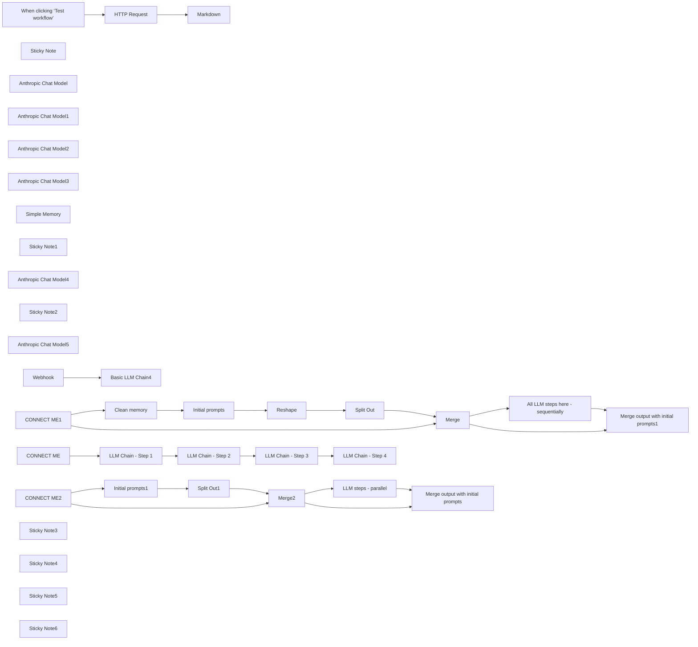
```mermaid
flowchart LR
    N1["When clicking ‘Test workflow’"]
    N2["HTTP Request"]
    N3["Markdown"]
    N4["Sticky Note"]
    N5["Anthropic Chat Model"]
    N6["Anthropic Chat Model1"]
    N7["Anthropic Chat Model2"]
    N8["Anthropic Chat Model3"]
    N9["Merge"]
    N10["Simple Memory"]
    N11["Clean memory"]
    N12["Initial prompts"]
    N13["Split Out"]
    N14["Reshape"]
    N15["Sticky Note1"]
    N16["Anthropic Chat Model4"]
    N17["Merge2"]
    N18["Sticky Note2"]
    N19["Basic LLM Chain4"]
    N20["Split Out1"]
    N21["Anthropic Chat Model5"]
    N22["Webhook"]
    N23["CONNECT ME"]
    N24["CONNECT ME1"]
    N25["CONNECT ME2"]
    N26["Sticky Note3"]
    N27["Sticky Note4"]
    N28["Sticky Note5"]
    N29["Sticky Note6"]
    N30["Initial prompts1"]
    N31["LLM Chain - Step 1"]
    N32["LLM Chain - Step 2"]
    N33["LLM Chain - Step 3"]
    N34["LLM Chain - Step 4"]
    N35["All LLM steps here - sequentially"]
    N36["LLM steps - parallel"]
    N37["Merge output with initial prompts"]
    N38["Merge output with initial prompts1"]

    N9 --> N35
    N9 --> N38
    N17 --> N36
    N17 --> N37
    N14 --> N13
    N22 --> N19
    N13 --> N9
    N23 --> N31
    N20 --> N17
    N24 --> N11
    N24 --> N9
    N25 --> N30
    N25 --> N17
    N11 --> N12
    N2 --> N3
    N12 --> N14
    N30 --> N20
    N31 --> N32
    N32 --> N33
    N33 --> N34
    N36 --> N37
    N35 --> N38
    N1 --> N2
```

## Fluxo (.json) :

```json
{
  "id": "43gMd18arOcxqDcC",
  "meta": {
    "instanceId": "fb924c73af8f703905bc09c9ee8076f48c17b596ed05b18c0ff86915ef8a7c4a",
    "templateCredsSetupCompleted": true
  },
  "name": "LLM Chaining examples",
  "tags": [],
  "nodes": [
    {
      "id": "35e53ce7-06b4-47ca-b7f3-b147bd059fcf",
      "name": "When clicking ‘Test workflow’",
      "type": "n8n-nodes-base.manualTrigger",
      "position": [
        200,
        520
      ],
      "parameters": {},
      "typeVersion": 1
    },
    {
      "id": "aeef734e-1c3b-4a91-93ae-2ae9c50951b8",
      "name": "HTTP Request",
      "type": "n8n-nodes-base.httpRequest",
      "position": [
        400,
        520
      ],
      "parameters": {
        "url": "https://blog.n8n.io/",
        "options": {}
      },
      "typeVersion": 4.2
    },
    {
      "id": "7f6b95eb-df8c-4f0f-ba69-6b298d624ccd",
      "name": "Markdown",
      "type": "n8n-nodes-base.markdown",
      "position": [
        600,
        520
      ],
      "parameters": {
        "html": "={{ $json.data }}",
        "options": {},
        "destinationKey": "markdown"
      },
      "typeVersion": 1
    },
    {
      "id": "994dbe06-4c25-4fb3-a8f3-566eb5b66c6d",
      "name": "Sticky Note",
      "type": "n8n-nodes-base.stickyNote",
      "position": [
        160,
        340
      ],
      "parameters": {
        "color": 4,
        "width": 700,
        "height": 360,
        "content": "# Connect to one of the blue sections -->\n## This can be anything:\n- Chat input\n- Trigger from external system\n- CRON-scheduled event"
      },
      "typeVersion": 1
    },
    {
      "id": "8ba3039d-dabf-43b7-ab35-117332f65ced",
      "name": "Anthropic Chat Model",
      "type": "@n8n/n8n-nodes-langchain.lmChatAnthropic",
      "position": [
        1460,
        -20
      ],
      "parameters": {
        "model": {
          "__rl": true,
          "mode": "list",
          "value": "claude-3-7-sonnet-20250219",
          "cachedResultName": "Claude 3.7 Sonnet"
        },
        "options": {
          "temperature": 0.5
        }
      },
      "credentials": {
        "anthropicApi": {
          "id": "cJno7gKlYez56WtP",
          "name": "Anthropic account"
        }
      },
      "typeVersion": 1.3
    },
    {
      "id": "7e1da020-e01d-410c-aa7f-a19d6e1c368d",
      "name": "Anthropic Chat Model1",
      "type": "@n8n/n8n-nodes-langchain.lmChatAnthropic",
      "position": [
        1820,
        -20
      ],
      "parameters": {
        "model": {
          "__rl": true,
          "mode": "list",
          "value": "claude-3-7-sonnet-20250219",
          "cachedResultName": "Claude 3.7 Sonnet"
        },
        "options": {
          "temperature": 0.5
        }
      },
      "credentials": {
        "anthropicApi": {
          "id": "cJno7gKlYez56WtP",
          "name": "Anthropic account"
        }
      },
      "typeVersion": 1.3
    },
    {
      "id": "620503cb-2d51-4102-8975-75255cf15b1b",
      "name": "Anthropic Chat Model2",
      "type": "@n8n/n8n-nodes-langchain.lmChatAnthropic",
      "position": [
        2180,
        -20
      ],
      "parameters": {
        "model": {
          "__rl": true,
          "mode": "list",
          "value": "claude-3-7-sonnet-20250219",
          "cachedResultName": "Claude 3.7 Sonnet"
        },
        "options": {
          "temperature": 0.5
        }
      },
      "credentials": {
        "anthropicApi": {
          "id": "cJno7gKlYez56WtP",
          "name": "Anthropic account"
        }
      },
      "typeVersion": 1.3
    },
    {
      "id": "5f0d11ce-c1ea-4c36-8b2d-d3f70b19f0ba",
      "name": "Anthropic Chat Model3",
      "type": "@n8n/n8n-nodes-langchain.lmChatAnthropic",
      "position": [
        2540,
        -20
      ],
      "parameters": {
        "model": {
          "__rl": true,
          "mode": "list",
          "value": "claude-3-7-sonnet-20250219",
          "cachedResultName": "Claude 3.7 Sonnet"
        },
        "options": {
          "temperature": 0.5
        }
      },
      "credentials": {
        "anthropicApi": {
          "id": "cJno7gKlYez56WtP",
          "name": "Anthropic account"
        }
      },
      "typeVersion": 1.3
    },
    {
      "id": "f973d01e-fad7-4143-8379-54438f5412cb",
      "name": "Merge",
      "type": "n8n-nodes-base.merge",
      "position": [
        2440,
        360
      ],
      "parameters": {
        "mode": "combine",
        "options": {
          "includeUnpaired": true
        },
        "combineBy": "combineByPosition"
      },
      "typeVersion": 3.1
    },
    {
      "id": "c7e58b90-bc96-421c-88f2-4e9f95f87248",
      "name": "Simple Memory",
      "type": "@n8n/n8n-nodes-langchain.memoryBufferWindow",
      "position": [
        2680,
        780
      ],
      "parameters": {
        "sessionKey": "fixed_session",
        "sessionIdType": "customKey",
        "contextWindowLength": 10
      },
      "typeVersion": 1.3
    },
    {
      "id": "0e606f7c-2cdb-4e34-8c0b-2303996077fb",
      "name": "Clean memory",
      "type": "@n8n/n8n-nodes-langchain.memoryManager",
      "position": [
        1500,
        480
      ],
      "parameters": {
        "mode": "delete",
        "deleteMode": "all"
      },
      "typeVersion": 1.1
    },
    {
      "id": "af0fb574-9964-4f7d-8348-a2cf614b8562",
      "name": "Initial prompts",
      "type": "n8n-nodes-base.set",
      "position": [
        1880,
        480
      ],
      "parameters": {
        "options": {},
        "assignments": {
          "assignments": [
            {
              "id": "84a50c9c-2265-4dd6-a774-efc852615862",
              "name": "system_prompt",
              "type": "string",
              "value": "You are a helpful assistant"
            },
            {
              "id": "559f19f7-042c-465e-b85f-ab52cfbab04a",
              "name": "step1",
              "type": "string",
              "value": "What is on this page?"
            },
            {
              "id": "6791cd09-c5f7-48c8-b753-8d383db6863f",
              "name": "step2",
              "type": "string",
              "value": "List all authors on this page"
            },
            {
              "id": "1f92ac04-e5dd-4161-afde-14562aea454c",
              "name": "step3",
              "type": "string",
              "value": "List all posts on this page"
            },
            {
              "id": "ad8ee0b0-fa7d-4f4a-85a8-82d0d0dc0a40",
              "name": "step4",
              "type": "string",
              "value": "Make a bold funny joke based on the content on this page"
            }
          ]
        }
      },
      "typeVersion": 3.4
    },
    {
      "id": "6743e44a-cc76-4e73-b4f3-ba7c65d179d3",
      "name": "Split Out",
      "type": "n8n-nodes-base.splitOut",
      "position": [
        2240,
        480
      ],
      "parameters": {
        "include": "selectedOtherFields",
        "options": {},
        "fieldToSplitOut": "data",
        "fieldsToInclude": "system_prompt"
      },
      "typeVersion": 1
    },
    {
      "id": "caddd26c-ee84-455f-8ee6-aecf21536930",
      "name": "Reshape",
      "type": "n8n-nodes-base.set",
      "position": [
        2060,
        480
      ],
      "parameters": {
        "mode": "raw",
        "include": "selected",
        "options": {},
        "jsonOutput": "={ \"data\" : {{ Object.entries($json).filter(([key]) => key !== \"system_prompt\").map(([key, value]) => ({ step: key, instruction: value })) }}\n}",
        "includeFields": "system_prompt",
        "includeOtherFields": true
      },
      "typeVersion": 3.4
    },
    {
      "id": "bd244988-d074-42f3-af42-960e5aa1d35d",
      "name": "Sticky Note1",
      "type": "n8n-nodes-base.stickyNote",
      "position": [
        1840,
        400
      ],
      "parameters": {
        "width": 540,
        "height": 240,
        "content": "# An array of prompts here"
      },
      "typeVersion": 1
    },
    {
      "id": "7e9e5287-8d4e-43a9-b8cf-ae26a177bfbb",
      "name": "Anthropic Chat Model4",
      "type": "@n8n/n8n-nodes-langchain.lmChatAnthropic",
      "position": [
        2600,
        600
      ],
      "parameters": {
        "model": {
          "__rl": true,
          "mode": "list",
          "value": "claude-3-7-sonnet-20250219",
          "cachedResultName": "Claude 3.7 Sonnet"
        },
        "options": {
          "thinking": false,
          "temperature": 0.5
        }
      },
      "credentials": {
        "anthropicApi": {
          "id": "cJno7gKlYez56WtP",
          "name": "Anthropic account"
        }
      },
      "typeVersion": 1.3
    },
    {
      "id": "47816a45-b906-47ef-9510-c63867bfc8b7",
      "name": "Merge2",
      "type": "n8n-nodes-base.merge",
      "position": [
        1860,
        1120
      ],
      "parameters": {
        "mode": "combine",
        "options": {},
        "combineBy": "combineAll"
      },
      "typeVersion": 3
    },
    {
      "id": "e63b89a1-c2ca-4ed2-ae50-e3a7b429609c",
      "name": "Sticky Note2",
      "type": "n8n-nodes-base.stickyNote",
      "position": [
        2040,
        1020
      ],
      "parameters": {
        "width": 320,
        "height": 520,
        "content": "## Make sure URL matches\n### ⚠️ Cloud users!\nReplace `{{ $env.WEBHOOK_URL }}` \nwith your n8n instance URL"
      },
      "typeVersion": 1
    },
    {
      "id": "7b99df1a-bf6c-4cf1-b58a-346873136715",
      "name": "Basic LLM Chain4",
      "type": "@n8n/n8n-nodes-langchain.chainLlm",
      "position": [
        2440,
        1300
      ],
      "parameters": {
        "text": "={{ $json.body.userprompt }}\n\nHere's page data:\n~~~~\n{{ $json.body.markdown }}\n~~~~",
        "promptType": "define"
      },
      "typeVersion": 1.5
    },
    {
      "id": "6f6e0667-5164-4b65-a796-1d2112c7c072",
      "name": "Split Out1",
      "type": "n8n-nodes-base.splitOut",
      "position": [
        1680,
        1340
      ],
      "parameters": {
        "options": {},
        "fieldToSplitOut": "userprompt"
      },
      "typeVersion": 1
    },
    {
      "id": "9dfd2145-2427-4131-92d2-99aca620217f",
      "name": "Anthropic Chat Model5",
      "type": "@n8n/n8n-nodes-langchain.lmChatAnthropic",
      "position": [
        2420,
        1460
      ],
      "parameters": {
        "model": {
          "__rl": true,
          "mode": "list",
          "value": "claude-3-7-sonnet-20250219",
          "cachedResultName": "Claude 3.7 Sonnet"
        },
        "options": {
          "thinking": false,
          "temperature": 0.5
        }
      },
      "credentials": {
        "anthropicApi": {
          "id": "cJno7gKlYez56WtP",
          "name": "Anthropic account"
        }
      },
      "typeVersion": 1.3
    },
    {
      "id": "616fc635-107d-4929-b9d6-4ccd34e42909",
      "name": "Webhook",
      "type": "n8n-nodes-base.webhook",
      "position": [
        2140,
        1400
      ],
      "webhookId": "58d2b899-e09c-45bf-b59b-961a5d7a2470",
      "parameters": {
        "path": "58d2b899-e09c-45bf-b59b-961a5d7a2470",
        "options": {},
        "httpMethod": "POST",
        "responseMode": "lastNode"
      },
      "typeVersion": 2
    },
    {
      "id": "c863252b-f8b6-4704-be4e-a69d3005a85a",
      "name": "CONNECT ME",
      "type": "n8n-nodes-base.noOp",
      "position": [
        1240,
        -220
      ],
      "parameters": {},
      "typeVersion": 1
    },
    {
      "id": "90ab4402-cbea-4441-9097-558ec72e5d38",
      "name": "CONNECT ME1",
      "type": "n8n-nodes-base.noOp",
      "position": [
        1280,
        340
      ],
      "parameters": {},
      "typeVersion": 1
    },
    {
      "id": "1c04650f-8043-496f-aeab-866e85548f9d",
      "name": "CONNECT ME2",
      "type": "n8n-nodes-base.noOp",
      "position": [
        1280,
        1100
      ],
      "parameters": {},
      "typeVersion": 1
    },
    {
      "id": "4097f12d-eba7-477a-9152-da5eb8c9aa03",
      "name": "Sticky Note3",
      "type": "n8n-nodes-base.stickyNote",
      "position": [
        960,
        -300
      ],
      "parameters": {
        "color": 5,
        "width": 1980,
        "height": 440,
        "content": "# 1 - Naive Chaining\n### PROs:\n- Easy to setup\n- Beginner-friendly\n\n### CONs\n- Not scalable\n- Hard to maintain long chains\n- SLOOOW!"
      },
      "typeVersion": 1
    },
    {
      "id": "ce806bc6-a57e-47da-bbba-4698c3956022",
      "name": "Sticky Note4",
      "type": "n8n-nodes-base.stickyNote",
      "position": [
        960,
        240
      ],
      "parameters": {
        "color": 5,
        "width": 2160,
        "height": 660,
        "content": "# 2 - Iterative Agent Processing\n\n### PROs:\n- Scalable\n- All inputs & outputs in a single node\n- Supports Agent memory\n\n### CONs\n- Still Slow!"
      },
      "typeVersion": 1
    },
    {
      "id": "49c4507f-de1e-422b-8058-db82668614d3",
      "name": "Sticky Note5",
      "type": "n8n-nodes-base.stickyNote",
      "position": [
        960,
        1000
      ],
      "parameters": {
        "color": 5,
        "width": 1880,
        "height": 600,
        "content": "# 3 - Parallel Processing\n\n### PROs:\n- Scalable\n- All inputs & outputs in a single place\n- FAST!\n\n### CONs\n- Independent requests\n  (no Agent memory)"
      },
      "typeVersion": 1
    },
    {
      "id": "c30b8132-9291-4855-89ec-6a98bcee8247",
      "name": "Sticky Note6",
      "type": "n8n-nodes-base.stickyNote",
      "position": [
        1420,
        1260
      ],
      "parameters": {
        "width": 400,
        "height": 240,
        "content": "# Array of prompts here"
      },
      "typeVersion": 1
    },
    {
      "id": "4c1b5816-7393-47f6-8a88-008d8deea119",
      "name": "Initial prompts1",
      "type": "n8n-nodes-base.set",
      "position": [
        1460,
        1340
      ],
      "parameters": {
        "options": {},
        "assignments": {
          "assignments": [
            {
              "id": "ed7f1cc6-99d3-481c-b5fb-d9900d6ee0f6",
              "name": "userprompt",
              "type": "array",
              "value": "=[\n\"What is on this page?\",\n\"List all authors on this page\",\n\"List all posts on this page\",\n\"Make a bold funny joke based on the content on this page\"\n]"
            }
          ]
        }
      },
      "typeVersion": 3.4
    },
    {
      "id": "8248a20f-1f90-42b0-8167-7ddcc90242a2",
      "name": "LLM Chain - Step 1",
      "type": "@n8n/n8n-nodes-langchain.chainLlm",
      "position": [
        1500,
        -220
      ],
      "parameters": {
        "text": "={{ $('Markdown').first().json.markdown }}",
        "messages": {
          "messageValues": [
            {
              "message": "What is on this page?"
            }
          ]
        },
        "promptType": "define"
      },
      "typeVersion": 1.6
    },
    {
      "id": "3788b23b-ccdc-4326-8ce0-1e57934d23bd",
      "name": "LLM Chain - Step 2",
      "type": "@n8n/n8n-nodes-langchain.chainLlm",
      "position": [
        1860,
        -220
      ],
      "parameters": {
        "text": "={{ $('Markdown').first().json.markdown }}",
        "messages": {
          "messageValues": [
            {
              "message": "List all authors on this page"
            }
          ]
        },
        "promptType": "define"
      },
      "typeVersion": 1.6
    },
    {
      "id": "89e69a39-bf13-4599-8ddc-a01c4590fb9c",
      "name": "LLM Chain - Step 3",
      "type": "@n8n/n8n-nodes-langchain.chainLlm",
      "position": [
        2220,
        -220
      ],
      "parameters": {
        "text": "={{ $('Markdown').first().json.markdown }}",
        "messages": {
          "messageValues": [
            {
              "message": "List all posts on this page"
            }
          ]
        },
        "promptType": "define"
      },
      "typeVersion": 1.6
    },
    {
      "id": "7e395991-9404-490e-8946-0da8f81e7243",
      "name": "LLM Chain - Step 4",
      "type": "@n8n/n8n-nodes-langchain.chainLlm",
      "position": [
        2580,
        -220
      ],
      "parameters": {
        "text": "={{ $('Markdown').first().json.markdown }}",
        "messages": {
          "messageValues": [
            {
              "message": "Make a bold funny joke based on the content on this page"
            }
          ]
        },
        "promptType": "define"
      },
      "typeVersion": 1.6
    },
    {
      "id": "efb8d836-8a4a-4a70-baed-4a9b77461aca",
      "name": "All LLM steps here - sequentially",
      "type": "@n8n/n8n-nodes-langchain.agent",
      "position": [
        2640,
        440
      ],
      "parameters": {
        "text": "={{ $json.markdown || \"\" }}\n{{ `Your task: ${$json.data.step}. ${$json.data.instruction}` }}",
        "options": {
          "systemMessage": "={{ $json.system_prompt }}"
        },
        "promptType": "define"
      },
      "typeVersion": 1.8
    },
    {
      "id": "926b1705-a24c-4659-bf61-8ed97ade7290",
      "name": "LLM steps - parallel",
      "type": "n8n-nodes-base.httpRequest",
      "position": [
        2140,
        1240
      ],
      "parameters": {
        "url": "={{ $env.WEBHOOK_URL }}webhook/58d2b899-e09c-45bf-b59b-961a5d7a2470",
        "method": "POST",
        "options": {},
        "jsonBody": "={{ $json }}",
        "sendBody": true,
        "specifyBody": "json"
      },
      "typeVersion": 4.2
    },
    {
      "id": "7748574b-1abd-4697-9644-db8bb79fb08d",
      "name": "Merge output with initial prompts",
      "type": "n8n-nodes-base.merge",
      "position": [
        2440,
        1140
      ],
      "parameters": {
        "mode": "combine",
        "options": {},
        "combineBy": "combineByPosition"
      },
      "typeVersion": 3.1
    },
    {
      "id": "b207d83b-ecda-4a9f-af78-cfbb2253c119",
      "name": "Merge output with initial prompts1",
      "type": "n8n-nodes-base.merge",
      "position": [
        3000,
        380
      ],
      "parameters": {
        "mode": "combine",
        "options": {},
        "combineBy": "combineByPosition"
      },
      "typeVersion": 3.1
    }
  ],
  "active": true,
  "pinData": {},
  "settings": {
    "executionOrder": "v1"
  },
  "versionId": "7b1849db-1c4c-4943-89b1-184926649776",
  "connections": {
    "Merge": {
      "main": [
        [
          {
            "node": "All LLM steps here - sequentially",
            "type": "main",
            "index": 0
          },
          {
            "node": "Merge output with initial prompts1",
            "type": "main",
            "index": 0
          }
        ]
      ]
    },
    "Merge2": {
      "main": [
        [
          {
            "node": "LLM steps - parallel",
            "type": "main",
            "index": 0
          },
          {
            "node": "Merge output with initial prompts",
            "type": "main",
            "index": 0
          }
        ]
      ]
    },
    "Reshape": {
      "main": [
        [
          {
            "node": "Split Out",
            "type": "main",
            "index": 0
          }
        ]
      ]
    },
    "Webhook": {
      "main": [
        [
          {
            "node": "Basic LLM Chain4",
            "type": "main",
            "index": 0
          }
        ]
      ]
    },
    "Markdown": {
      "main": [
        []
      ]
    },
    "Split Out": {
      "main": [
        [
          {
            "node": "Merge",
            "type": "main",
            "index": 1
          }
        ]
      ]
    },
    "CONNECT ME": {
      "main": [
        [
          {
            "node": "LLM Chain - Step 1",
            "type": "main",
            "index": 0
          }
        ]
      ]
    },
    "Split Out1": {
      "main": [
        [
          {
            "node": "Merge2",
            "type": "main",
            "index": 1
          }
        ]
      ]
    },
    "CONNECT ME1": {
      "main": [
        [
          {
            "node": "Clean memory",
            "type": "main",
            "index": 0
          },
          {
            "node": "Merge",
            "type": "main",
            "index": 0
          }
        ]
      ]
    },
    "CONNECT ME2": {
      "main": [
        [
          {
            "node": "Initial prompts1",
            "type": "main",
            "index": 0
          },
          {
            "node": "Merge2",
            "type": "main",
            "index": 0
          }
        ]
      ]
    },
    "Clean memory": {
      "main": [
        [
          {
            "node": "Initial prompts",
            "type": "main",
            "index": 0
          }
        ]
      ]
    },
    "HTTP Request": {
      "main": [
        [
          {
            "node": "Markdown",
            "type": "main",
            "index": 0
          }
        ]
      ]
    },
    "Simple Memory": {
      "ai_memory": [
        [
          {
            "node": "All LLM steps here - sequentially",
            "type": "ai_memory",
            "index": 0
          },
          {
            "node": "Clean memory",
            "type": "ai_memory",
            "index": 0
          }
        ]
      ]
    },
    "Initial prompts": {
      "main": [
        [
          {
            "node": "Reshape",
            "type": "main",
            "index": 0
          }
        ]
      ]
    },
    "Initial prompts1": {
      "main": [
        [
          {
            "node": "Split Out1",
            "type": "main",
            "index": 0
          }
        ]
      ]
    },
    "LLM Chain - Step 1": {
      "main": [
        [
          {
            "node": "LLM Chain - Step 2",
            "type": "main",
            "index": 0
          }
        ]
      ]
    },
    "LLM Chain - Step 2": {
      "main": [
        [
          {
            "node": "LLM Chain - Step 3",
            "type": "main",
            "index": 0
          }
        ]
      ]
    },
    "LLM Chain - Step 3": {
      "main": [
        [
          {
            "node": "LLM Chain - Step 4",
            "type": "main",
            "index": 0
          }
        ]
      ]
    },
    "Anthropic Chat Model": {
      "ai_languageModel": [
        [
          {
            "node": "LLM Chain - Step 1",
            "type": "ai_languageModel",
            "index": 0
          }
        ]
      ]
    },
    "LLM steps - parallel": {
      "main": [
        [
          {
            "node": "Merge output with initial prompts",
            "type": "main",
            "index": 1
          }
        ]
      ]
    },
    "Anthropic Chat Model1": {
      "ai_languageModel": [
        [
          {
            "node": "LLM Chain - Step 2",
            "type": "ai_languageModel",
            "index": 0
          }
        ]
      ]
    },
    "Anthropic Chat Model2": {
      "ai_languageModel": [
        [
          {
            "node": "LLM Chain - Step 3",
            "type": "ai_languageModel",
            "index": 0
          }
        ]
      ]
    },
    "Anthropic Chat Model3": {
      "ai_languageModel": [
        [
          {
            "node": "LLM Chain - Step 4",
            "type": "ai_languageModel",
            "index": 0
          }
        ]
      ]
    },
    "Anthropic Chat Model4": {
      "ai_languageModel": [
        [
          {
            "node": "All LLM steps here - sequentially",
            "type": "ai_languageModel",
            "index": 0
          }
        ]
      ]
    },
    "Anthropic Chat Model5": {
      "ai_languageModel": [
        [
          {
            "node": "Basic LLM Chain4",
            "type": "ai_languageModel",
            "index": 0
          }
        ]
      ]
    },
    "All LLM steps here - sequentially": {
      "main": [
        [
          {
            "node": "Merge output with initial prompts1",
            "type": "main",
            "index": 1
          }
        ]
      ]
    },
    "When clicking ‘Test workflow’": {
      "main": [
        [
          {
            "node": "HTTP Request",
            "type": "main",
            "index": 0
          }
        ]
      ]
    }
  }
}
```

<a id="template-660"></a>

## Template 660 - Curador de projetos GitHub do Hacker News

- **Nome:** Curador de projetos GitHub do Hacker News
- **Descrição:** Automatiza a detecção de links do GitHub em posts do Hacker News, extrai informações, gera textos para Twitter e LinkedIn com IA, notifica o proprietário via Telegram e publica nas redes após confirmação.
- **Funcionalidade:** • Agendamento: Executa a rotina periodicamente (a cada 6 horas).
• Rastreamento de tendências: Rastreia a página inicial do Hacker News para encontrar links do GitHub.
• Extração de metadados: Coleta título, autor, pontuação, idade, comentários e URL dos posts identificados.
• Verificação de duplicação: Consulta um banco de dados para evitar republicar conteúdos já processados.
• Captura de conteúdo do repositório: Acessa a página do GitHub para obter mais detalhes do projeto.
• Conversão de HTML para Markdown: Transforma o conteúdo capturado em texto estruturado para análise.
• Geração de conteúdo com IA: Usa um modelo de linguagem para criar posts separados para Twitter e LinkedIn seguindo regras de formato e tom.
• Validação de saída: Verifica se o conteúdo gerado atende ao formato esperado antes de prosseguir.
• Registro e controle: Cria/atualiza registros no banco de dados para rastrear status de publicação.
• Notificação ao proprietário: Envia o tweet e o post do LinkedIn prontos via Telegram para revisão.
• Atraso programado: Espera um período (5 minutos) antes de publicar final nas redes sociais.
• Publicação e atualização de status: Publica no X (Twitter) e LinkedIn e atualiza o status no banco de dados.
- **Ferramentas:** • Hacker News (news.ycombinator.com): Fonte para identificar links e discussões em destaque.
• GitHub: Página dos repositórios referenciados para extrair informações do projeto.
• OpenAI (modelo gpt-4o-mini): Gera os textos para Twitter e LinkedIn com base no conteúdo do repositório.
• Airtable: Banco de dados para armazenar metadados, textos gerados e status de publicação.
• X (Twitter): Plataforma para publicar os tweets gerados.
• LinkedIn: Plataforma para publicar os posts profissionais gerados.
• Telegram: Canal de notificação para enviar os textos prontos ao proprietário antes da publicação.

## Fluxo visual

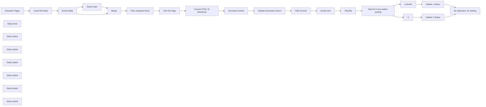
```mermaid
flowchart LR
    N1["Crawl HN Home"]
    N2["Extract Meta"]
    N3["Filter Unposted Items"]
    N4["Visit GH Page"]
    N5["Convert HTML To Markdown"]
    N6["Filter Errored"]
    N7["No Operation, do nothing"]
    N8["Update X Status"]
    N9["LinkedIn"]
    N10["Update L Status"]
    N11["Search Item"]
    N12["Create Item"]
    N13["X"]
    N14["Validate Generate Content"]
    N15["Schedule Trigger"]
    N16["Merge"]
    N17["Generate Content"]
    N18["Sticky Note"]
    N19["Sticky Note1"]
    N20["Sticky Note2"]
    N21["Sticky Note3"]
    N22["Ping Me"]
    N23["Sticky Note4"]
    N24["Wait for 5 mins before posting"]
    N25["Sticky Note5"]
    N26["Sticky Note6"]

    N13 --> N8
    N16 --> N3
    N22 --> N24
    N9 --> N10
    N12 --> N22
    N11 --> N16
    N2 --> N11
    N2 --> N16
    N1 --> N2
    N4 --> N5
    N6 --> N12
    N10 --> N7
    N8 --> N7
    N17 --> N14
    N15 --> N1
    N3 --> N4
    N5 --> N17
    N14 --> N6
    N24 --> N13
    N24 --> N9
```

## Fluxo (.json) :

```json
{
  "id": "ZeSJSbwXI593H1Qj",
  "meta": {
    "instanceId": "8e1a7e3413df437923cda0e92c098469371d84f7001856e525beaff17be8b941",
    "templateCredsSetupCompleted": true
  },
  "name": "Social Media AI Agent - Telegram",
  "tags": [],
  "nodes": [
    {
      "id": "814303e0-5fe9-474e-a4ed-e4a728fd4acf",
      "name": "Crawl HN Home",
      "type": "n8n-nodes-base.httpRequest",
      "position": [
        -1540,
        1640
      ],
      "parameters": {
        "url": "https://news.ycombinator.com/",
        "options": {
          "response": {
            "response": {
              "neverError": true,
              "fullResponse": true
            }
          }
        }
      },
      "executeOnce": true,
      "typeVersion": 4.2,
      "alwaysOutputData": true
    },
    {
      "id": "32e20b1d-b3f1-4ed2-acbf-4d5bd56b0d8b",
      "name": "Extract Meta",
      "type": "n8n-nodes-base.code",
      "position": [
        -1260,
        1720
      ],
      "parameters": {
        "language": "python",
        "pythonCode": "# Import necessary modules\nimport asyncio\nimport micropip\n\n# Define an asynchronous function to install packages\nasync def install_packages():\n await micropip.install(\"beautifulsoup4\")\n await micropip.install(\"simplejson\")\n\n# Run the asynchronous package installation\nasyncio.get_event_loop().run_until_complete(install_packages())\n\n# Now, import the installed packages\nimport simplejson as json\nfrom bs4 import BeautifulSoup\n\n# Retrieve the HTML content from the first item in the input\n# Assuming n8n passes data as a list of items, each with a 'json' key\nhtml_content = items[0].get('json', {}).get('data', '')\n\n# Initialize BeautifulSoup with the HTML content\nsoup = BeautifulSoup(html_content, 'html.parser')\n\n# Initialize a list to store metadata of GitHub posts\ngithub_posts = []\n\n# Find all 'tr' elements with class 'athing submission'\nposts = soup.find_all('tr', class_='athing submission')\n\nfor post in posts:\n post_id = post.get('id')\n title_line = post.find('span', class_='titleline')\n if not title_line:\n continue # Skip if titleline is not found\n\n # Extract the title and URL\n title_tag = title_line.find('a')\n if not title_tag:\n continue # Skip if title tag is not found\n\n title = title_tag.get_text(strip=True)\n url = title_tag.get('href', '')\n\n # Check if the URL is a GitHub link\n if 'github.com' not in url.lower():\n continue # Skip if not a GitHub link\n\n # Extract the site domain (e.g., github.com/username/repo)\n site_bit = title_line.find('span', class_='sitebit comhead')\n site = site_bit.find('span', class_='sitestr').get_text(strip=True) if site_bit else ''\n\n # The subtext is in the next 'tr' element\n subtext_tr = post.find_next_sibling('tr')\n if not subtext_tr:\n continue # Skip if subtext row is not found\n\n subtext_td = subtext_tr.find('td', class_='subtext')\n if not subtext_td:\n continue # Skip if subtext td is not found\n\n # Extract score\n score_span = subtext_td.find('span', class_='score')\n score = score_span.get_text(strip=True) if score_span else '0 points'\n\n # Extract author\n author_a = subtext_td.find('a', class_='hnuser')\n author = author_a.get_text(strip=True) if author_a else 'unknown'\n\n # Extract age\n age_span = subtext_td.find('span', class_='age')\n age_a = age_span.find('a') if age_span else None\n age = age_a.get_text(strip=True) if age_a else 'unknown'\n\n # Extract comments\n comments_a = subtext_td.find_all('a')[-1] if subtext_td.find_all('a') else None\n comments_text = comments_a.get_text(strip=True) if comments_a else '0 comments'\n\n # Construct the Hacker News URL\n hn_url = f\"https://news.ycombinator.com/item?id={post_id}\"\n\n # Compile the metadata\n post_metadata = {\n 'Post': post_id,\n 'title': title,\n 'url': url,\n 'site': site,\n 'score': score,\n 'author': author,\n 'age': age,\n 'comments': comments_text,\n 'hn_url': hn_url\n }\n\n # Append to the list of GitHub posts\n github_posts.append(post_metadata)\n\n# Prepare the output for n8n\noutput = [{'json': post} for post in github_posts]\n\n# Return the output\nreturn output\n"
      },
      "executeOnce": true,
      "typeVersion": 2,
      "alwaysOutputData": true
    },
    {
      "id": "b54cf663-b823-4613-a812-764942b95b9d",
      "name": "Filter Unposted Items",
      "type": "n8n-nodes-base.code",
      "position": [
        -680,
        1640
      ],
      "parameters": {
        "jsCode": "const items = [];\n\n// Step 1: Collect all Post IDs from input1 items (those with 'id')\nconst processedPosts = new Set(\n $input.all()\n .filter(item => item.json.id)\n .map(item => item.json.Post)\n);\n\n// Step 2: Iterate over all items and filter out duplicates\nfor (const item of $input.all()) {\n \n // Only process items without 'id' (input2 items)\n if(!item.json.id){\n \n // Check if the Post ID is already processed\n if(!processedPosts.has(item.json.Post) && item.json.Post!=undefined){\n items.push(item);\n }\n }\n}\n\nreturn items;\n"
      },
      "typeVersion": 2
    },
    {
      "id": "d7ac7121-8da7-4e45-9b74-daf07fbf15fb",
      "name": "Visit GH Page",
      "type": "n8n-nodes-base.httpRequest",
      "position": [
        -420,
        1420
      ],
      "parameters": {
        "url": "={{ $json.url }}",
        "options": {}
      },
      "typeVersion": 4.2
    },
    {
      "id": "f156ca8e-7963-42b9-9612-9ab5efc53be4",
      "name": "Convert HTML To Markdown",
      "type": "n8n-nodes-base.markdown",
      "position": [
        -240,
        1700
      ],
      "parameters": {
        "html": "={{ $json.data }}",
        "options": {}
      },
      "typeVersion": 1,
      "alwaysOutputData": true
    },
    {
      "id": "86221ed0-29fa-4775-ba36-8ffdf614977c",
      "name": "Filter Errored",
      "type": "n8n-nodes-base.filter",
      "position": [
        380,
        1440
      ],
      "parameters": {
        "options": {},
        "conditions": {
          "options": {
            "version": 2,
            "leftValue": "",
            "caseSensitive": true,
            "typeValidation": "strict"
          },
          "combinator": "and",
          "conditions": [
            {
              "id": "7776cb97-e02d-418e-a168-612bf92d4160",
              "operator": {
                "type": "string",
                "operation": "empty",
                "singleValue": true
              },
              "leftValue": "={{ $json.error }}",
              "rightValue": ""
            }
          ]
        }
      },
      "typeVersion": 2.2
    },
    {
      "id": "f08c4f61-17a5-4899-ab3d-4e3ff5d1b8b7",
      "name": "No Operation, do nothing",
      "type": "n8n-nodes-base.noOp",
      "position": [
        1760,
        1540
      ],
      "parameters": {},
      "typeVersion": 1
    },
    {
      "id": "48856b3b-a951-4e7f-a0b8-410a71e9b0a7",
      "name": "Update X Status",
      "type": "n8n-nodes-base.airtable",
      "position": [
        1500,
        1400
      ],
      "parameters": {
        "base": {
          "__rl": true,
          "mode": "list",
          "value": "app7fh2kmMzPKS4RZ",
          "cachedResultUrl": "https://airtable.com/app7fh2kmMzPKS4RZ",
          "cachedResultName": "Twitter Agent"
        },
        "table": {
          "__rl": true,
          "mode": "list",
          "value": "tblf0cODJFdvDj7vU",
          "cachedResultUrl": "https://airtable.com/app7fh2kmMzPKS4RZ/tblf0cODJFdvDj7vU",
          "cachedResultName": "My Tweets"
        },
        "columns": {
          "value": {
            "id": "={{ $('Create Item').item.json.id }}",
            "TDone": true
          },
          "schema": [
            {
              "id": "id",
              "type": "string",
              "display": true,
              "removed": false,
              "readOnly": true,
              "required": false,
              "displayName": "id",
              "defaultMatch": true
            },
            {
              "id": "Post",
              "type": "string",
              "display": true,
              "removed": true,
              "readOnly": false,
              "required": false,
              "displayName": "Post",
              "defaultMatch": false,
              "canBeUsedToMatch": true
            },
            {
              "id": "Title",
              "type": "string",
              "display": true,
              "removed": true,
              "readOnly": false,
              "required": false,
              "displayName": "Title",
              "defaultMatch": false,
              "canBeUsedToMatch": true
            },
            {
              "id": "Url",
              "type": "string",
              "display": true,
              "removed": true,
              "readOnly": false,
              "required": false,
              "displayName": "Url",
              "defaultMatch": false,
              "canBeUsedToMatch": true
            },
            {
              "id": "Tweet",
              "type": "string",
              "display": true,
              "removed": true,
              "readOnly": false,
              "required": false,
              "displayName": "Tweet",
              "defaultMatch": false,
              "canBeUsedToMatch": true
            },
            {
              "id": "LinkedIn",
              "type": "string",
              "display": true,
              "removed": true,
              "readOnly": false,
              "required": false,
              "displayName": "LinkedIn",
              "defaultMatch": false,
              "canBeUsedToMatch": true
            },
            {
              "id": "Date",
              "type": "string",
              "display": true,
              "removed": true,
              "readOnly": true,
              "required": false,
              "displayName": "Date",
              "defaultMatch": false,
              "canBeUsedToMatch": true
            },
            {
              "id": "Last Modified",
              "type": "string",
              "display": true,
              "removed": true,
              "readOnly": true,
              "required": false,
              "displayName": "Last Modified",
              "defaultMatch": false,
              "canBeUsedToMatch": true
            },
            {
              "id": "TDone",
              "type": "boolean",
              "display": true,
              "removed": false,
              "readOnly": false,
              "required": false,
              "displayName": "TDone",
              "defaultMatch": false,
              "canBeUsedToMatch": true
            },
            {
              "id": "LDone",
              "type": "boolean",
              "display": true,
              "removed": true,
              "readOnly": false,
              "required": false,
              "displayName": "LDone",
              "defaultMatch": false,
              "canBeUsedToMatch": true
            }
          ],
          "mappingMode": "defineBelow",
          "matchingColumns": [
            "id"
          ]
        },
        "options": {
          "typecast": true
        },
        "operation": "update"
      },
      "credentials": {
        "airtableTokenApi": {
          "id": "BxLldDZTAZvuWVbr",
          "name": "Airtable Personal Access Token account"
        }
      },
      "typeVersion": 2.1
    },
    {
      "id": "c31bb906-2a0d-406a-a7cd-6fc4adfcb67b",
      "name": "LinkedIn",
      "type": "n8n-nodes-base.linkedIn",
      "position": [
        1200,
        1820
      ],
      "parameters": {
        "text": "={{ $('Filter Errored').item.json.message.content.linkedin }}",
        "person": "afi4Hy9wlI",
        "additionalFields": {}
      },
      "credentials": {
        "linkedInOAuth2Api": {
          "id": "S7G2oyLAmzhWuYFQ",
          "name": "LinkedIn account"
        }
      },
      "typeVersion": 1
    },
    {
      "id": "4aab4cc2-4a51-432a-aa21-ba469c027ac6",
      "name": "Update L Status",
      "type": "n8n-nodes-base.airtable",
      "position": [
        1520,
        1680
      ],
      "parameters": {
        "base": {
          "__rl": true,
          "mode": "list",
          "value": "app7fh2kmMzPKS4RZ",
          "cachedResultUrl": "https://airtable.com/app7fh2kmMzPKS4RZ",
          "cachedResultName": "Twitter Agent"
        },
        "table": {
          "__rl": true,
          "mode": "list",
          "value": "tblf0cODJFdvDj7vU",
          "cachedResultUrl": "https://airtable.com/app7fh2kmMzPKS4RZ/tblf0cODJFdvDj7vU",
          "cachedResultName": "My Tweets"
        },
        "columns": {
          "value": {
            "id": "={{ $('Create Item').item.json.id }}",
            "LDone": true
          },
          "schema": [
            {
              "id": "id",
              "type": "string",
              "display": true,
              "removed": false,
              "readOnly": true,
              "required": false,
              "displayName": "id",
              "defaultMatch": true
            },
            {
              "id": "Post",
              "type": "string",
              "display": true,
              "removed": true,
              "readOnly": false,
              "required": false,
              "displayName": "Post",
              "defaultMatch": false,
              "canBeUsedToMatch": true
            },
            {
              "id": "Title",
              "type": "string",
              "display": true,
              "removed": true,
              "readOnly": false,
              "required": false,
              "displayName": "Title",
              "defaultMatch": false,
              "canBeUsedToMatch": true
            },
            {
              "id": "Url",
              "type": "string",
              "display": true,
              "removed": true,
              "readOnly": false,
              "required": false,
              "displayName": "Url",
              "defaultMatch": false,
              "canBeUsedToMatch": true
            },
            {
              "id": "Tweet",
              "type": "string",
              "display": true,
              "removed": true,
              "readOnly": false,
              "required": false,
              "displayName": "Tweet",
              "defaultMatch": false,
              "canBeUsedToMatch": true
            },
            {
              "id": "LinkedIn",
              "type": "string",
              "display": true,
              "removed": true,
              "readOnly": false,
              "required": false,
              "displayName": "LinkedIn",
              "defaultMatch": false,
              "canBeUsedToMatch": true
            },
            {
              "id": "Date",
              "type": "string",
              "display": true,
              "removed": true,
              "readOnly": true,
              "required": false,
              "displayName": "Date",
              "defaultMatch": false,
              "canBeUsedToMatch": true
            },
            {
              "id": "Last Modified",
              "type": "string",
              "display": true,
              "removed": true,
              "readOnly": true,
              "required": false,
              "displayName": "Last Modified",
              "defaultMatch": false,
              "canBeUsedToMatch": true
            },
            {
              "id": "TDone",
              "type": "boolean",
              "display": true,
              "removed": true,
              "readOnly": false,
              "required": false,
              "displayName": "TDone",
              "defaultMatch": false,
              "canBeUsedToMatch": true
            },
            {
              "id": "LDone",
              "type": "boolean",
              "display": true,
              "removed": false,
              "readOnly": false,
              "required": false,
              "displayName": "LDone",
              "defaultMatch": false,
              "canBeUsedToMatch": true
            }
          ],
          "mappingMode": "defineBelow",
          "matchingColumns": [
            "id"
          ]
        },
        "options": {
          "typecast": true
        },
        "operation": "update"
      },
      "credentials": {
        "airtableTokenApi": {
          "id": "BxLldDZTAZvuWVbr",
          "name": "Airtable Personal Access Token account"
        }
      },
      "typeVersion": 2.1
    },
    {
      "id": "72dd9714-c11d-4417-8710-89e416ac44c9",
      "name": "Search Item",
      "type": "n8n-nodes-base.airtable",
      "position": [
        -1100,
        1240
      ],
      "parameters": {
        "base": {
          "__rl": true,
          "mode": "list",
          "value": "app7fh2kmMzPKS4RZ",
          "cachedResultUrl": "https://airtable.com/app7fh2kmMzPKS4RZ",
          "cachedResultName": "Twitter Agent"
        },
        "table": {
          "__rl": true,
          "mode": "list",
          "value": "tblf0cODJFdvDj7vU",
          "cachedResultUrl": "https://airtable.com/app7fh2kmMzPKS4RZ/tblf0cODJFdvDj7vU",
          "cachedResultName": "My Tweets"
        },
        "options": {
          "fields": [
            "Title",
            "Url",
            "Tweet",
            "Date",
            "Post"
          ]
        },
        "operation": "search",
        "filterByFormula": "={Post}= {{ $json.Post }}"
      },
      "credentials": {
        "airtableTokenApi": {
          "id": "BxLldDZTAZvuWVbr",
          "name": "Airtable Personal Access Token account"
        }
      },
      "typeVersion": 2.1,
      "alwaysOutputData": true
    },
    {
      "id": "f89fbada-0e53-44f0-a09b-119869fabd10",
      "name": "Create Item",
      "type": "n8n-nodes-base.airtable",
      "position": [
        580,
        1660
      ],
      "parameters": {
        "base": {
          "__rl": true,
          "mode": "list",
          "value": "app7fh2kmMzPKS4RZ",
          "cachedResultUrl": "https://airtable.com/app7fh2kmMzPKS4RZ",
          "cachedResultName": "Twitter Agent"
        },
        "table": {
          "__rl": true,
          "mode": "list",
          "value": "tblf0cODJFdvDj7vU",
          "cachedResultUrl": "https://airtable.com/app7fh2kmMzPKS4RZ/tblf0cODJFdvDj7vU",
          "cachedResultName": "My Tweets"
        },
        "columns": {
          "value": {
            "Url": "={{ $('Filter Unposted Items').item.json.url }}",
            "Post": "={{ $('Filter Unposted Items').item.json.Post }}",
            "Title": "={{ $('Filter Unposted Items').item.json.title }}",
            "Tweet": "={{ $json.message.content.twitter }}",
            "LinkedIn": "={{ $json.message.content.linkedin }}"
          },
          "schema": [
            {
              "id": "Post",
              "type": "string",
              "display": true,
              "removed": false,
              "readOnly": false,
              "required": false,
              "displayName": "Post",
              "defaultMatch": false,
              "canBeUsedToMatch": true
            },
            {
              "id": "Title",
              "type": "string",
              "display": true,
              "removed": false,
              "readOnly": false,
              "required": false,
              "displayName": "Title",
              "defaultMatch": false,
              "canBeUsedToMatch": true
            },
            {
              "id": "Url",
              "type": "string",
              "display": true,
              "removed": false,
              "readOnly": false,
              "required": false,
              "displayName": "Url",
              "defaultMatch": false,
              "canBeUsedToMatch": true
            },
            {
              "id": "Tweet",
              "type": "string",
              "display": true,
              "removed": false,
              "readOnly": false,
              "required": false,
              "displayName": "Tweet",
              "defaultMatch": false,
              "canBeUsedToMatch": true
            },
            {
              "id": "LinkedIn",
              "type": "string",
              "display": true,
              "removed": false,
              "readOnly": false,
              "required": false,
              "displayName": "LinkedIn",
              "defaultMatch": false,
              "canBeUsedToMatch": true
            },
            {
              "id": "Date",
              "type": "string",
              "display": true,
              "removed": false,
              "readOnly": true,
              "required": false,
              "displayName": "Date",
              "defaultMatch": false,
              "canBeUsedToMatch": true
            }
          ],
          "mappingMode": "defineBelow",
          "matchingColumns": []
        },
        "options": {},
        "operation": "create"
      },
      "credentials": {
        "airtableTokenApi": {
          "id": "BxLldDZTAZvuWVbr",
          "name": "Airtable Personal Access Token account"
        }
      },
      "typeVersion": 2.1
    },
    {
      "id": "51a2c3d3-3e75-4375-b2b6-4bb86fa71855",
      "name": "X",
      "type": "n8n-nodes-base.twitter",
      "onError": "continueRegularOutput",
      "position": [
        1180,
        1380
      ],
      "parameters": {
        "text": "={{ $('Filter Errored').item.json.message.content.twitter }}",
        "additionalFields": {}
      },
      "credentials": {
        "twitterOAuth2Api": {
          "id": "YQyS9lQTpZtZkefS",
          "name": "X account"
        }
      },
      "executeOnce": false,
      "typeVersion": 2
    },
    {
      "id": "58869c5b-9fb2-4f76-8788-68056cda45b0",
      "name": "Validate Generate Content",
      "type": "n8n-nodes-base.code",
      "onError": "continueRegularOutput",
      "position": [
        180,
        1680
      ],
      "parameters": {
        "mode": "runOnceForEachItem",
        "jsCode": "if ($json.message.content.twitter && $json.message.content.linkedin) {\n \n return $json;\n} else {\n\n const parsedContent = JSON.parse($json.message.content);\n if ($json.message.content.twitter && $json.message.content.linkedin) {\n return parsedContent;\n }\n\n console.log(\"Invalid formatting\")\n return {}\n}"
      },
      "typeVersion": 2
    },
    {
      "id": "527fd640-8bc8-4043-92a6-52fbea8de63f",
      "name": "Schedule Trigger",
      "type": "n8n-nodes-base.scheduleTrigger",
      "position": [
        -1780,
        1640
      ],
      "parameters": {
        "rule": {
          "interval": [
            {
              "field": "hours",
              "hoursInterval": 6
            }
          ]
        }
      },
      "typeVersion": 1.2
    },
    {
      "id": "f00c1de5-d5bd-4d78-8717-d26dd739adc7",
      "name": "Merge",
      "type": "n8n-nodes-base.merge",
      "position": [
        -840,
        1420
      ],
      "parameters": {},
      "typeVersion": 3,
      "alwaysOutputData": true
    },
    {
      "id": "3529fba4-173c-4378-ae69-43a3bae0813f",
      "name": "Generate Content",
      "type": "@n8n/n8n-nodes-langchain.openAi",
      "position": [
        -120,
        1440
      ],
      "parameters": {
        "modelId": {
          "__rl": true,
          "mode": "list",
          "value": "gpt-4o-mini",
          "cachedResultName": "GPT-4O-MINI"
        },
        "options": {},
        "messages": {
          "values": [
            {
              "role": "system",
              "content": "You are an AI-powered social media assistant specialized in crafting short-form, engaging posts for Twitter and LinkedIn. Your tone should blend the enthusiasm of a Tech Evangelist with the narrative depth of a Storyteller. The goal is to highlight technological and open-source projects in a friendly, forward-thinking manner, connecting them to real-world use cases. \n\nGuidelines:\n1. Output must be in JSON with separate fields for “twitter” and “linkedin.”\n2. Do not include emojis or marketing buzzwords (“cutting-edge,” “disruptive,” etc.).\n3. Write naturally and concisely. Avoid overly formal or robotic language.\n4. Twitter posts must be under 280 characters (including spaces and URL).\n5. LinkedIn posts should be slightly longer, yet still succinct, and focus on storytelling and real-world applications.\n6. Provide a single call-to-action in each post.\n7. Do not imply ownership of the project unless explicitly stated.\n8. Maintain a professional yet approachable tone in both outputs.\n"
            },
            {
              "content": "=Using the following details, generate two posts—one for Twitter and one for LinkedIn—incorporating an enthusiastic yet narrative-driven style:\n\nTitle: {{ $('Filter Unposted Items').item.json.title }}\nDetails in markdown: {{ $json.data }}\nRepository Link: {{ $('Filter Unposted Items').item.json.url }} (this is the actual link you want to be inserted)\n\nConstraints:\n- No emojis.\n- Keep the Twitter post under 280 characters (including the link).\n- Use a friendly, forward-thinking tone that weaves in a short narrative where possible.\n- Highlight how the project solves a real problem or benefits the user.\n- End each post with one clear CTA (e.g., “Check it out!” or “Learn more.”).\n- **Ensure the tone is neutral and does not imply personal involvement** (e.g., avoid phrases like \"my journey\" or \"I found it fascinating\").\n- **LinkedIn post should be more detailed**: Provide context, explain the key features, highlight how it can be useful to different audiences, and elaborate on the problem it solves or the impact it can have.\n- Output your response in JSON with the structure:\n```json\n{\n \"twitter\": \"Your Twitter post here\",\n \"linkedin\": \"Your LinkedIn post here\"\n}\n"
            }
          ]
        },
        "jsonOutput": true
      },
      "credentials": {
        "openAiApi": {
          "id": "IfJo4dG8AUORk6f0",
          "name": "OpenAi account"
        }
      },
      "typeVersion": 1.7,
      "alwaysOutputData": true
    },
    {
      "id": "2dfd7849-877c-4bd3-b248-94140a1fe209",
      "name": "Sticky Note",
      "type": "n8n-nodes-base.stickyNote",
      "position": [
        -320,
        960
      ],
      "parameters": {
        "width": 619.8433261701165,
        "height": 97.20332107671479,
        "content": "Automate the curation and sharing of trending GitHub discussions from Hacker News to Twitter and LinkedIn. This workflow leverages AI to generate engaging posts, streamlining your social media content creation and distribution.\n\n"
      },
      "typeVersion": 1
    },
    {
      "id": "20704a99-1234-46dc-b8c8-860b051b3b85",
      "name": "Sticky Note1",
      "type": "n8n-nodes-base.stickyNote",
      "position": [
        -1620,
        1520
      ],
      "parameters": {
        "color": 5,
        "width": 524.8824946275869,
        "height": 420.37647358435385,
        "content": "I crawl Hacker News and extract Github links."
      },
      "typeVersion": 1
    },
    {
      "id": "5cfa2c30-6c88-429a-8b5f-0034d2352cc2",
      "name": "Sticky Note2",
      "type": "n8n-nodes-base.stickyNote",
      "position": [
        -480,
        1280
      ],
      "parameters": {
        "color": 5,
        "width": 828.144505037599,
        "height": 670.031562962293,
        "content": "This is where the magic happens. I use the Github url extracted earlier and visit Github page to get more insights in the project being shared. Then I ask Chat GPT very nicely to help me get a Tweet and a LinkedIn post"
      },
      "typeVersion": 1
    },
    {
      "id": "caec3df6-ddcc-4959-94e1-18163cf3128f",
      "name": "Sticky Note3",
      "type": "n8n-nodes-base.stickyNote",
      "position": [
        1100,
        1280
      ],
      "parameters": {
        "color": 5,
        "width": 285.9487894560623,
        "height": 751.2077576680031,
        "content": "One last magic trick, Send the generated Tweet and the post to the respective platforms."
      },
      "typeVersion": 1
    },
    {
      "id": "89c8472d-3329-4f94-a656-2539e061eeb0",
      "name": "Ping Me",
      "type": "n8n-nodes-base.telegram",
      "position": [
        720,
        1420
      ],
      "parameters": {
        "text": "=Hi There, here is your readymade tweet - \n\n {{ $json.fields.Tweet }}\n\nAnd your readymade LinkedIn post -\n\n {{ $json.fields.LinkedIn }}\n\n",
        "chatId": "1297549992",
        "additionalFields": {}
      },
      "credentials": {
        "telegramApi": {
          "id": "1RZApQ3BwJxFn9jp",
          "name": "Telegram account"
        }
      },
      "typeVersion": 1.2
    },
    {
      "id": "b1444e6d-0cab-4082-af42-a8decc97d9b4",
      "name": "Sticky Note4",
      "type": "n8n-nodes-base.stickyNote",
      "position": [
        640,
        1300
      ],
      "parameters": {
        "color": 5,
        "width": 264.5060210432334,
        "height": 307.03612625939974,
        "content": "Just pinging the owner that something is about to be posted and wait for 5 mins before final posting."
      },
      "typeVersion": 1
    },
    {
      "id": "01c2f7ff-ff6c-4a60-9581-f8c5f3985792",
      "name": "Wait for 5 mins before posting",
      "type": "n8n-nodes-base.wait",
      "position": [
        880,
        1660
      ],
      "webhookId": "0c7ee388-30cf-4a99-9bb0-0fd85171c794",
      "parameters": {
        "unit": "minutes"
      },
      "typeVersion": 1.1
    },
    {
      "id": "909c7e7d-ea84-4612-a322-b1fa889b2efb",
      "name": "Sticky Note5",
      "type": "n8n-nodes-base.stickyNote",
      "position": [
        -920,
        1380
      ],
      "parameters": {
        "width": 400.8207630962184,
        "height": 392.80719991071624,
        "content": "CHORE"
      },
      "typeVersion": 1
    },
    {
      "id": "04ab5b63-8def-4d49-9360-596261eb051c",
      "name": "Sticky Note6",
      "type": "n8n-nodes-base.stickyNote",
      "position": [
        -1140,
        1140
      ],
      "parameters": {
        "color": 5,
        "width": 195.58283685913963,
        "height": 285.5933578465706,
        "content": "Make sure we don't post the same content again."
      },
      "typeVersion": 1
    }
  ],
  "active": true,
  "pinData": {
    "Schedule Trigger": [
      {
        "json": {
          "Hour": "18",
          "Year": "2024",
          "Month": "December",
          "Minute": "00",
          "Second": "17",
          "Timezone": "America/New_York (UTC-05:00)",
          "timestamp": "2024-12-27T18:00:17.035-05:00",
          "Day of week": "Friday",
          "Day of month": "27",
          "Readable date": "December 27th 2024, 6:00:17 pm",
          "Readable time": "6:00:17 pm"
        }
      }
    ]
  },
  "settings": {
    "executionOrder": "v1"
  },
  "versionId": "4c28d47d-811e-4b89-adeb-47da12abd378",
  "connections": {
    "X": {
      "main": [
        [
          {
            "node": "Update X Status",
            "type": "main",
            "index": 0
          }
        ]
      ]
    },
    "Merge": {
      "main": [
        [
          {
            "node": "Filter Unposted Items",
            "type": "main",
            "index": 0
          }
        ]
      ]
    },
    "Ping Me": {
      "main": [
        [
          {
            "node": "Wait for 5 mins before posting",
            "type": "main",
            "index": 0
          }
        ]
      ]
    },
    "LinkedIn": {
      "main": [
        [
          {
            "node": "Update L Status",
            "type": "main",
            "index": 0
          }
        ]
      ]
    },
    "Create Item": {
      "main": [
        [
          {
            "node": "Ping Me",
            "type": "main",
            "index": 0
          }
        ]
      ]
    },
    "Search Item": {
      "main": [
        [
          {
            "node": "Merge",
            "type": "main",
            "index": 0
          }
        ]
      ]
    },
    "Extract Meta": {
      "main": [
        [
          {
            "node": "Search Item",
            "type": "main",
            "index": 0
          },
          {
            "node": "Merge",
            "type": "main",
            "index": 1
          }
        ]
      ]
    },
    "Crawl HN Home": {
      "main": [
        [
          {
            "node": "Extract Meta",
            "type": "main",
            "index": 0
          }
        ]
      ]
    },
    "Visit GH Page": {
      "main": [
        [
          {
            "node": "Convert HTML To Markdown",
            "type": "main",
            "index": 0
          }
        ]
      ]
    },
    "Filter Errored": {
      "main": [
        [
          {
            "node": "Create Item",
            "type": "main",
            "index": 0
          }
        ]
      ]
    },
    "Update L Status": {
      "main": [
        [
          {
            "node": "No Operation, do nothing",
            "type": "main",
            "index": 0
          }
        ]
      ]
    },
    "Update X Status": {
      "main": [
        [
          {
            "node": "No Operation, do nothing",
            "type": "main",
            "index": 0
          }
        ]
      ]
    },
    "Generate Content": {
      "main": [
        [
          {
            "node": "Validate Generate Content",
            "type": "main",
            "index": 0
          }
        ]
      ]
    },
    "Schedule Trigger": {
      "main": [
        [
          {
            "node": "Crawl HN Home",
            "type": "main",
            "index": 0
          }
        ]
      ]
    },
    "Filter Unposted Items": {
      "main": [
        [
          {
            "node": "Visit GH Page",
            "type": "main",
            "index": 0
          }
        ]
      ]
    },
    "Convert HTML To Markdown": {
      "main": [
        [
          {
            "node": "Generate Content",
            "type": "main",
            "index": 0
          }
        ]
      ]
    },
    "Validate Generate Content": {
      "main": [
        [
          {
            "node": "Filter Errored",
            "type": "main",
            "index": 0
          }
        ]
      ]
    },
    "Wait for 5 mins before posting": {
      "main": [
        [
          {
            "node": "X",
            "type": "main",
            "index": 0
          },
          {
            "node": "LinkedIn",
            "type": "main",
            "index": 0
          }
        ]
      ]
    }
  }
}
```

<a id="template-661"></a>

## Template 661 - Resumo de feedback via GPT-4

- **Nome:** Resumo de feedback via GPT-4
- **Descrição:** Este fluxo lê respostas de um formulário armazenadas no Google Sheets, agrega as respostas por pergunta, usa um modelo de linguagem para gerar um resumo em Markdown, converte para HTML e envia por email.
- **Funcionalidade:** • Gatilho de execução: Inicia o fluxo manualmente ou em intervalos, conforme configuração.
• Leitura de respostas do formulário: Obtém registros de respostas armazenadas em uma planilha do Google Sheets.
• Agregação de respostas por pergunta: Combina todas as respostas de cada pergunta em arrays para análise consolidada.
• Geração de resumo via modelo de linguagem: Envia as respostas agregadas ao modelo GPT-4 com instruções para produzir um relatório em Markdown contendo sentimento geral e sugestões de melhoria.
• Conversão de Markdown para HTML: Transforma o relatório em Markdown para HTML pronto para envio.
• Envio de e-mail com relatório: Envia o relatório em HTML para o destinatário configurado por email.
- **Ferramentas:** • Google Sheets: Armazena as respostas do formulário e serve como fonte de dados para o fluxo.
• Google Forms: Coleta o feedback dos participantes que é gravado na planilha.
• OpenAI (GPT-4): Processa as respostas e gera o resumo analítico em formato Markdown.
• Gmail: Envia o relatório final em HTML por email ao destinatário.


## Fluxo visual

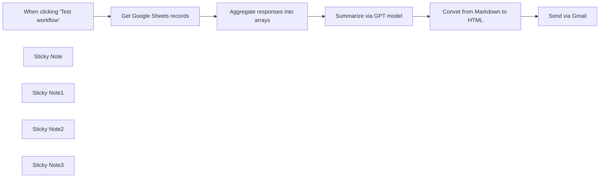
```mermaid
flowchart LR
    N1["When clicking 'Test workflow'"]
    N2["Sticky Note"]
    N3["Sticky Note1"]
    N4["Sticky Note2"]
    N5["Sticky Note3"]
    N6["Get Google Sheets records"]
    N7["Aggregate responses into arrays"]
    N8["Summarize via GPT model"]
    N9["Convet from Markdown to HTML"]
    N10["Send via Gmail"]

    N8 --> N9
    N6 --> N7
    N9 --> N10
    N1 --> N6
    N7 --> N8
```

## Fluxo (.json) :

```json
{
  "id": "Lwvu2jjMU2irTyAY",
  "meta": {
    "instanceId": "fb924c73af8f703905bc09c9ee8076f48c17b596ed05b18c0ff86915ef8a7c4a"
  },
  "name": "Summarize Google Sheets form feedback via OpenAI's GPT-4",
  "tags": [
    {
      "id": "y9tvM3hISJKT2jeo",
      "name": "Ted's Tech Talks",
      "createdAt": "2023-08-15T22:12:34.260Z",
      "updatedAt": "2023-08-15T22:12:34.260Z"
    }
  ],
  "nodes": [
    {
      "id": "cd80cd2f-a6e1-48eb-ba05-0f8f1a0875e5",
      "name": "When clicking \"Test workflow\"",
      "type": "n8n-nodes-base.manualTrigger",
      "position": [
        680,
        320
      ],
      "parameters": {},
      "typeVersion": 1
    },
    {
      "id": "9f03f1c4-c47e-4eda-bc0a-a598c21e4616",
      "name": "Sticky Note",
      "type": "n8n-nodes-base.stickyNote",
      "position": [
        640,
        130
      ],
      "parameters": {
        "width": 369.1031874662338,
        "height": 349,
        "content": "### 1. Create a Google Sheet document\n* This tutorial uses Google Sheet document connected to Google Forms, but a standalone Sheet document will work too\n* Adapt initial trigger to your needs: run manually or at some time intervals\n\n[Link to the Google Sheets template](https://docs.google.com/spreadsheets/d/1Kcr1oF_RrfNQJczmJDpwClOSYpvSnwbeX-_pdUo91-I/edit?usp=sharing)"
      },
      "typeVersion": 1
    },
    {
      "id": "1e478f81-76e7-4fc3-a147-11a92d3f9998",
      "name": "Sticky Note1",
      "type": "n8n-nodes-base.stickyNote",
      "position": [
        1040,
        160
      ],
      "parameters": {
        "width": 394,
        "height": 319,
        "content": "### 2. Combine all answers into an array\n* Since the main goal is to provide an overall summary, we need to combine all answers for each Google Form question\n* Aggregate Node takes multiple incoming items and produces just a single item which contains arrays of user feedback"
      },
      "typeVersion": 1
    },
    {
      "id": "1ab06b51-3b9e-4a4c-afba-c98e529a636c",
      "name": "Sticky Note2",
      "type": "n8n-nodes-base.stickyNote",
      "position": [
        1480,
        160
      ],
      "parameters": {
        "width": 432,
        "height": 319,
        "content": "### 3. Generate a summary report\n* Enter a __system message__ with a overall instructions on how to analyze the feedback form\n* Provide a __user message__ with JSON arrays.\n\n__NB! Consider splitting the form questions for a very long forms or when the number of responses is too high__"
      },
      "typeVersion": 1
    },
    {
      "id": "ce0118a3-4eaf-4d60-adf0-5bde5d41328a",
      "name": "Sticky Note3",
      "type": "n8n-nodes-base.stickyNote",
      "position": [
        1940,
        160
      ],
      "parameters": {
        "width": 359.1031874662346,
        "height": 319,
        "content": "### 4. Convert to HTML and send an email\n* GPT is configured to reply in Markdown format. Markdown Node converts such text into HTML\n* Finally, the Gmail node sends a message with HTML report"
      },
      "typeVersion": 1
    },
    {
      "id": "37bc8ab5-328c-4f50-bbda-f7482bf36522",
      "name": "Get Google Sheets records",
      "type": "n8n-nodes-base.googleSheets",
      "position": [
        860,
        320
      ],
      "parameters": {
        "options": {},
        "sheetName": {
          "__rl": true,
          "mode": "list",
          "value": 2035968519,
          "cachedResultUrl": "https://docs.google.com/spreadsheets/d/1Kcr1oF_RrfNQJczmJDpwClOSYpvSnwbeX-_pdUo91-I/edit#gid=2035968519",
          "cachedResultName": "Form Responses 1"
        },
        "documentId": {
          "__rl": true,
          "mode": "list",
          "value": "1Kcr1oF_RrfNQJczmJDpwClOSYpvSnwbeX-_pdUo91-I",
          "cachedResultUrl": "https://docs.google.com/spreadsheets/d/1Kcr1oF_RrfNQJczmJDpwClOSYpvSnwbeX-_pdUo91-I/edit?usp=drivesdk",
          "cachedResultName": "Event feedback form (Responses)"
        }
      },
      "credentials": {
        "googleSheetsOAuth2Api": {
          "id": "RtRiRezoxiWkzZQt",
          "name": "Ted's Tech Talks Google account"
        }
      },
      "typeVersion": 4.2
    },
    {
      "id": "d75b11b1-2cce-40c2-ab5a-d18fdf7f5283",
      "name": "Aggregate responses into arrays",
      "type": "n8n-nodes-base.aggregate",
      "position": [
        1200,
        320
      ],
      "parameters": {
        "options": {},
        "fieldsToAggregate": {
          "fieldToAggregate": [
            {
              "fieldToAggregate": "['What went great?']"
            },
            {
              "fieldToAggregate": "['How can we improve?']"
            },
            {
              "fieldToAggregate": "['What is the chance of recommending our event?']"
            }
          ]
        }
      },
      "typeVersion": 1
    },
    {
      "id": "a90f83fe-809b-42db-b65d-43fb11b2979a",
      "name": "Summarize via GPT model",
      "type": "n8n-nodes-base.openAi",
      "position": [
        1620,
        320
      ],
      "parameters": {
        "prompt": {
          "messages": [
            {
              "role": "system",
              "content": "Your task is to summarize event feedback form responses. You will receive answers on three questions:\n1. What went great?\n2. How can we improve?\n3. What is the chance of recommending our event?\n\nEach questions has several answers separated by | character.\nAnalyze each question and prepare a summary report. It should contain an overall sentiment regarding the event, followed by the constructive ideas of what to improve.\n\nReply in Markdown formatting"
            },
            {
              "content": "=1. What went great: ```{{ $json['What went great?'].join(' | ') }}```\n2. How can we improve: ```{{ $json['How can we improve?'].join(' | ') }}```\n3. What is the chance of recommending our event: ```{{ $json['What is the chance of recommending our event?'].join(' | ') }}```"
            }
          ]
        },
        "options": {
          "temperature": 0.3
        },
        "resource": "chat",
        "chatModel": "gpt-4-turbo-preview"
      },
      "credentials": {
        "openAiApi": {
          "id": "rveqdSfp7pCRON1T",
          "name": "Ted's Tech Talks OpenAi"
        }
      },
      "typeVersion": 1.1
    },
    {
      "id": "2c8d4e46-9d3e-4655-952b-37d04f673914",
      "name": "Convet from Markdown to HTML",
      "type": "n8n-nodes-base.markdown",
      "position": [
        1980,
        320
      ],
      "parameters": {
        "mode": "markdownToHtml",
        "options": {
          "completeHTMLDocument": false
        },
        "markdown": "={{ $json.message.content }}"
      },
      "typeVersion": 1
    },
    {
      "id": "a27d8664-dc87-4458-9f12-970b88ab6515",
      "name": "Send via Gmail",
      "type": "n8n-nodes-base.gmail",
      "position": [
        2160,
        320
      ],
      "parameters": {
        "sendTo": "teds.tech.talks@gmail.com",
        "message": "={{ $json.data }}",
        "options": {
          "appendAttribution": false
        },
        "subject": "Feedback form response"
      },
      "credentials": {
        "gmailOAuth2": {
          "id": "UllrXlZsDnkdA3tT",
          "name": "Gmail account"
        }
      },
      "typeVersion": 2.1
    }
  ],
  "active": false,
  "pinData": {},
  "settings": {
    "executionOrder": "v1"
  },
  "versionId": "756cdd85-49dd-4f0f-acc7-58f834a3512f",
  "connections": {
    "Summarize via GPT model": {
      "main": [
        [
          {
            "node": "Convet from Markdown to HTML",
            "type": "main",
            "index": 0
          }
        ]
      ]
    },
    "Get Google Sheets records": {
      "main": [
        [
          {
            "node": "Aggregate responses into arrays",
            "type": "main",
            "index": 0
          }
        ]
      ]
    },
    "Convet from Markdown to HTML": {
      "main": [
        [
          {
            "node": "Send via Gmail",
            "type": "main",
            "index": 0
          }
        ]
      ]
    },
    "When clicking \"Test workflow\"": {
      "main": [
        [
          {
            "node": "Get Google Sheets records",
            "type": "main",
            "index": 0
          }
        ]
      ]
    },
    "Aggregate responses into arrays": {
      "main": [
        [
          {
            "node": "Summarize via GPT model",
            "type": "main",
            "index": 0
          }
        ]
      ]
    }
  }
}
```
