# PACK 1999 TEMPLATES PARTE 04 - Bloco 4

Templates neste bloco: 20

## Sumário

- [Template 662 - Classificar e registrar feedback do curso](#template-662)
- [Template 663 - Atualizar prioridades do Todoist com IA](#template-663)
- [Template 664 - Fábrica automatizada de conteúdo para redes sociais](#template-664)
- [Template 665 - RAG e chat com conteúdo WordPress](#template-665)
- [Template 666 - Agente AI com memória de longo prazo e roteador de ferramentas](#template-666)
- [Template 667 - Detecção de logins suspeitos](#template-667)
- [Template 668 - Extrair comentários de página do Facebook](#template-668)
- [Template 669 - Adicionar convidados à planilha e newsletter](#template-669)
- [Template 670 - Agente de chat para consulta de pedidos e rastreamento](#template-670)
- [Template 671 - Chatbot com memória de longo prazo e armazenamento de notas (Telegram)](#template-671)
- [Template 672 - Gerar voiceover a partir de vídeo com IA multimodal](#template-672)
- [Template 673 - Encaminhar e-mails da Netflix para múltiplos endereços](#template-673)
- [Template 674 - Webhook para PostHog (evento via query)](#template-674)
- [Template 675 - Unir entrevistas e dados de funcionários](#template-675)
- [Template 676 - Assistente SMS para consultas de cursos](#template-676)
- [Template 677 - Enviar SMS ao sair de casa](#template-677)
- [Template 678 - Criar fatura no QuickBooks ao criar tarefa no Onfleet](#template-678)
- [Template 679 - Monitorar menções no Twitter e notificar Slack](#template-679)
- [Template 680 - Converter CSV para JSON e salvar](#template-680)
- [Template 681 - Criar campanha de e-mail a partir de interações no LinkedIn](#template-681)

---

<a id="template-662"></a>

## Template 662 - Classificar e registrar feedback do curso

- **Nome:** Classificar e registrar feedback do curso
- **Descrição:** Recebe respostas de um formulário de feedback do curso, avalia a utilidade informada e armazena comentários em planilhas separadas conforme positivo ou negativo.
- **Funcionalidade:** • Captura de respostas do formulário: Recebe automaticamente submissões de um formulário de feedback.
• Mapeamento de dados: Extrai e organiza campos relevantes (nota de utilidade e opinião) para processamento.
• Filtragem por nota de utilidade: Verifica se a avaliação de utilidade é maior ou igual a 3 para decidir o fluxo.
• Registro de feedback positivo: Apende entradas de feedback considerados positivos em uma aba específica da planilha.
• Registro de feedback negativo: Apende entradas de feedback considerados negativos em outra aba da planilha.
- **Ferramentas:** • Typeform: Plataforma para coleta de respostas via formulário online.
• Google Sheets: Serviço de planilhas para armazenar e organizar feedbacks em abas separadas.


## Fluxo visual

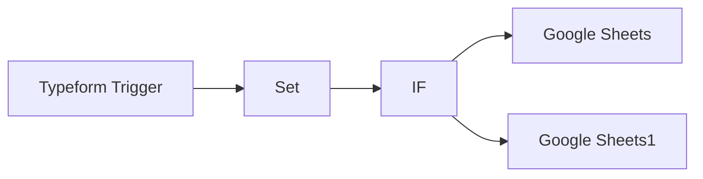

## Fluxo (.json) :

```json
{
  "id": "1001",
  "name": "typeform feedback workflow",
  "nodes": [
    {
      "name": "Typeform Trigger",
      "type": "n8n-nodes-base.typeformTrigger",
      "notes": "course feedback",
      "position": [
        450,
        300
      ],
      "webhookId": "1234567890",
      "parameters": {
        "formId": "yxcvbnm"
      },
      "credentials": {
        "typeformApi": "typeform"
      },
      "notesInFlow": true,
      "typeVersion": 1
    },
    {
      "name": "IF",
      "type": "n8n-nodes-base.if",
      "notes": "filter feedback",
      "position": [
        850,
        300
      ],
      "parameters": {
        "conditions": {
          "number": [
            {
              "value1": "={{$json[\"usefulness\"]}}",
              "value2": 3,
              "operation": "largerEqual"
            }
          ],
          "string": [],
          "boolean": []
        }
      },
      "notesInFlow": true,
      "typeVersion": 1
    },
    {
      "name": "Google Sheets",
      "type": "n8n-nodes-base.googleSheets",
      "notes": "positive feedback",
      "position": [
        1050,
        200
      ],
      "parameters": {
        "range": "positive_feedback!A:C",
        "options": {},
        "sheetId": "asdfghjklöä",
        "operation": "append",
        "authentication": "oAuth2"
      },
      "credentials": {
        "googleSheetsOAuth2Api": "google_sheets_oauth"
      },
      "notesInFlow": true,
      "typeVersion": 1
    },
    {
      "name": "Set",
      "type": "n8n-nodes-base.set",
      "notes": "capture typeform data",
      "position": [
        650,
        300
      ],
      "parameters": {
        "values": {
          "number": [
            {
              "name": "usefulness",
              "value": "={{$json[\"How useful was the course?\"]}}"
            }
          ],
          "string": [
            {
              "name": "opinion",
              "value": "={{$json[\"Your opinion on the course:\"]}}"
            }
          ],
          "boolean": []
        },
        "options": {},
        "keepOnlySet": true
      },
      "notesInFlow": true,
      "typeVersion": 1
    },
    {
      "name": "Google Sheets1",
      "type": "n8n-nodes-base.googleSheets",
      "notes": "negative feedback",
      "position": [
        1050,
        400
      ],
      "parameters": {
        "range": "negative_feedback!A:C",
        "keyRow": 1,
        "options": {},
        "sheetId": "qwertzuiop",
        "operation": "append",
        "authentication": "oAuth2"
      },
      "credentials": {
        "googleSheetsOAuth2Api": "google_sheets_oauth"
      },
      "notesInFlow": true,
      "typeVersion": 1
    }
  ],
  "active": false,
  "settings": {},
  "connections": {
    "IF": {
      "main": [
        [
          {
            "node": "Google Sheets",
            "type": "main",
            "index": 0
          }
        ],
        [
          {
            "node": "Google Sheets1",
            "type": "main",
            "index": 0
          }
        ]
      ]
    },
    "Set": {
      "main": [
        [
          {
            "node": "IF",
            "type": "main",
            "index": 0
          }
        ]
      ]
    },
    "Typeform Trigger": {
      "main": [
        [
          {
            "node": "Set",
            "type": "main",
            "index": 0
          }
        ]
      ]
    }
  }
}
```

<a id="template-663"></a>

## Template 663 - Atualizar prioridades do Todoist com IA

- **Nome:** Atualizar prioridades do Todoist com IA
- **Descrição:** Automatiza a leitura de tarefas na caixa de entrada, classifica cada tarefa usando IA com base em projetos definidos pelo usuário e atualiza a prioridade correspondente no Todoist.
- **Funcionalidade:** • Agendamento periódico: inicia a execução do fluxo em intervalos regulares.
• Carregamento de mapa de projetos: define um objeto com nomes de projetos e prioridades associadas pelo usuário.
• Recuperação de tarefas da caixa de entrada: busca todas as tarefas de um projeto específico no Todoist.
• Filtragem de subtarefas: ignora tarefas que são subtarefas para não processá-las.
• Classificação com IA: envia o conteúdo da tarefa e a lista de projetos para um modelo de IA para determinar a categoria mais adequada.
• Validação do resultado da IA: compara a resposta da IA com os projetos definidos para evitar alucinações e trata respostas fora da lista como "other".
• Atualização de prioridade: atualiza a prioridade da tarefa no Todoist com base no projeto identificado.
- **Ferramentas:** • Todoist: plataforma de gerenciamento de tarefas usada para ler e atualizar tarefas e prioridades.
• OpenAI (modelo GPT-4o-mini): serviço de inteligência artificial utilizado para categorizar o conteúdo das tarefas e mapear para projetos definidos.


## Fluxo visual

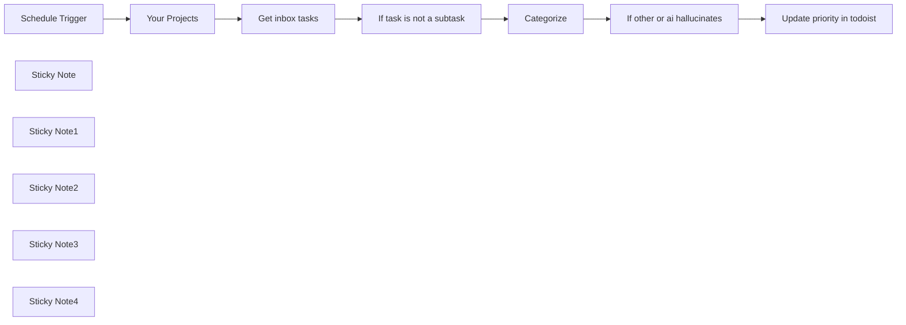

## Fluxo (.json) :

```json
{
  "nodes": [
    {
      "id": "d45cf237-dbbc-48ed-a7f0-fa9506ae1d67",
      "name": "Update priority in todoist",
      "type": "n8n-nodes-base.todoist",
      "position": [
        2060,
        520
      ],
      "parameters": {
        "taskId": "={{ $('Get inbox tasks').item.json.id }}",
        "operation": "update",
        "updateFields": {
          "priority": "={{ $('Your Projects').first().json.projects[$json.message.content] }}"
        }
      },
      "credentials": {
        "todoistApi": {
          "id": "1",
          "name": "Todoist account"
        }
      },
      "retryOnFail": true,
      "typeVersion": 2,
      "waitBetweenTries": 5000
    },
    {
      "id": "4d0ebf98-5a1d-4dfd-85df-da182b3c5099",
      "name": "Schedule Trigger",
      "type": "n8n-nodes-base.scheduleTrigger",
      "position": [
        600,
        520
      ],
      "parameters": {
        "rule": {
          "interval": [
            {}
          ]
        }
      },
      "typeVersion": 1.2
    },
    {
      "id": "a950e470-6885-42f4-9b17-7b2c2525d3e4",
      "name": "Get inbox tasks",
      "type": "n8n-nodes-base.todoist",
      "position": [
        1020,
        520
      ],
      "parameters": {
        "filters": {
          "projectId": "938017196"
        },
        "operation": "getAll",
        "returnAll": true
      },
      "credentials": {
        "todoistApi": {
          "id": "1",
          "name": "Todoist account"
        }
      },
      "retryOnFail": true,
      "typeVersion": 2,
      "waitBetweenTries": 5000
    },
    {
      "id": "093bcb2e-79b7-427e-b13d-540a5b28f427",
      "name": "Sticky Note",
      "type": "n8n-nodes-base.stickyNote",
      "position": [
        540,
        200
      ],
      "parameters": {
        "color": 3,
        "width": 358.6620209059232,
        "height": 256.5853658536585,
        "content": "## 💫 To setup this template\n\n1. Add your Todoist credentials\n2. Add your OpenAI credentials\n3. Set your project names and add priority"
      },
      "typeVersion": 1
    },
    {
      "id": "430290e7-1732-46fe-a38d-fa6dc7f78a26",
      "name": "Sticky Note1",
      "type": "n8n-nodes-base.stickyNote",
      "position": [
        800,
        700
      ],
      "parameters": {
        "width": 192.77351916376313,
        "height": 80,
        "content": " 👆🏽 Add your projects and priority here"
      },
      "typeVersion": 1
    },
    {
      "id": "6d5a1b7e-f7fa-4a1b-848c-1b4e79f6f667",
      "name": "Sticky Note2",
      "type": "n8n-nodes-base.stickyNote",
      "position": [
        1020,
        420
      ],
      "parameters": {
        "width": 192.77351916376313,
        "height": 80,
        "content": " 👇🏽 Add your Todoist credentials here"
      },
      "typeVersion": 1
    },
    {
      "id": "feff35d2-e37d-48a5-9a90-c5a2efde688f",
      "name": "Sticky Note3",
      "type": "n8n-nodes-base.stickyNote",
      "position": [
        2060,
        420
      ],
      "parameters": {
        "width": 192.77351916376313,
        "height": 80,
        "content": " 👇🏽 Add your Todoist credentials here"
      },
      "typeVersion": 1
    },
    {
      "id": "e454ebfe-47f6-4e39-8b89-d706da742911",
      "name": "Sticky Note4",
      "type": "n8n-nodes-base.stickyNote",
      "position": [
        1540,
        700
      ],
      "parameters": {
        "width": 192.77351916376313,
        "height": 80,
        "content": " 👆🏽 Add your OpenAI credentials here"
      },
      "typeVersion": 1
    },
    {
      "id": "a79effcb-6904-4abf-835b-e1ccd94ca429",
      "name": "Your Projects",
      "type": "n8n-nodes-base.set",
      "position": [
        820,
        520
      ],
      "parameters": {
        "options": {},
        "assignments": {
          "assignments": [
            {
              "id": "50dc1412-21f8-4158-898d-3940a146586b",
              "name": "projects",
              "type": "object",
              "value": "={{ {\n  apartment: 1,\n  health: 2,\n  german: 3\n} }}"
            }
          ]
        }
      },
      "typeVersion": 3.4
    },
    {
      "id": "b5988629-2225-455f-b579-73e60449d2a3",
      "name": "Categorize",
      "type": "@n8n/n8n-nodes-langchain.openAi",
      "position": [
        1460,
        520
      ],
      "parameters": {
        "modelId": {
          "__rl": true,
          "mode": "list",
          "value": "gpt-4o-mini",
          "cachedResultName": "GPT-4O-MINI"
        },
        "options": {},
        "messages": {
          "values": [
            {
              "role": "system",
              "content": "=Categorize the user's todo item to a project. Return the project name or just \"other\" if it does not belong to a project."
            },
            {
              "content": "=Projects:\n{{ $('Your Projects').first().json.projects.keys().join('\\n') }}\n\nTodo item:\n{{ $('Get inbox tasks').item.json.content }}"
            }
          ]
        }
      },
      "credentials": {
        "openAiApi": {
          "id": "9",
          "name": "n8n OpenAi"
        }
      },
      "typeVersion": 1.4
    },
    {
      "id": "0dca3953-c0ac-4319-9323-c3aed9488bfb",
      "name": "If task is not a subtask",
      "type": "n8n-nodes-base.filter",
      "position": [
        1240,
        520
      ],
      "parameters": {
        "options": {},
        "conditions": {
          "options": {
            "leftValue": "",
            "caseSensitive": true,
            "typeValidation": "strict"
          },
          "combinator": "and",
          "conditions": [
            {
              "id": "36dd4bc9-1282-4342-89dd-1dac81c7290e",
              "operator": {
                "type": "string",
                "operation": "empty",
                "singleValue": true
              },
              "leftValue": "={{ $json.parent_id }}",
              "rightValue": ""
            }
          ]
        }
      },
      "typeVersion": 2.1
    },
    {
      "id": "12e25a81-dbde-4542-a137-365329da415e",
      "name": "If other or ai hallucinates",
      "type": "n8n-nodes-base.filter",
      "position": [
        1820,
        520
      ],
      "parameters": {
        "options": {},
        "conditions": {
          "options": {
            "leftValue": "",
            "caseSensitive": true,
            "typeValidation": "strict"
          },
          "combinator": "and",
          "conditions": [
            {
              "id": "c4f69265-abe1-451c-8462-e68ff3b06799",
              "operator": {
                "type": "array",
                "operation": "contains",
                "rightType": "any"
              },
              "leftValue": "={{ $('Your Projects').first().json.projects.keys() }}",
              "rightValue": "={{ $json.message.content }}"
            }
          ]
        }
      },
      "typeVersion": 2.1
    }
  ],
  "pinData": {},
  "connections": {
    "Categorize": {
      "main": [
        [
          {
            "node": "If other or ai hallucinates",
            "type": "main",
            "index": 0
          }
        ]
      ]
    },
    "Your Projects": {
      "main": [
        [
          {
            "node": "Get inbox tasks",
            "type": "main",
            "index": 0
          }
        ]
      ]
    },
    "Get inbox tasks": {
      "main": [
        [
          {
            "node": "If task is not a subtask",
            "type": "main",
            "index": 0
          }
        ]
      ]
    },
    "Schedule Trigger": {
      "main": [
        [
          {
            "node": "Your Projects",
            "type": "main",
            "index": 0
          }
        ]
      ]
    },
    "If task is not a subtask": {
      "main": [
        [
          {
            "node": "Categorize",
            "type": "main",
            "index": 0
          }
        ]
      ]
    },
    "If other or ai hallucinates": {
      "main": [
        [
          {
            "node": "Update priority in todoist",
            "type": "main",
            "index": 0
          }
        ]
      ]
    }
  }
}
```

<a id="template-664"></a>

## Template 664 - Fábrica automatizada de conteúdo para redes sociais

- **Nome:** Fábrica automatizada de conteúdo para redes sociais
- **Descrição:** Fluxo que compõe prompts e schemas externos, gera conteúdo otimizado por plataforma com um modelo de linguagem, cria imagens sugestivas e orquestra aprovação e publicação em múltiplas redes sociais.
- **Funcionalidade:** • Recepção de solicitações: Inicia a criação a partir de uma mensagem de chat ou execução por outro fluxo.
• Composição de prompt e schema: Obtém e mescla o prompt do sistema e o schema de conteúdo a partir de documentos externos.
• Parsing de schema: Converte o schema em JSON estruturado para validar e guiar a geração de conteúdo.
• Geração de conteúdo por plataforma: Usa um modelo de linguagem para produzir posts adaptados a LinkedIn, Instagram, Facebook, X (Twitter), Threads e YouTube Shorts conforme as diretrizes fornecidas.
• Sugestão e criação de imagens: Gera descrições de imagem e solicita imagens a um serviço de geração de imagens.
• Armazenamento de imagens: Faz upload das imagens geradas para serviços de hospedagem e para repositório (ex.: armazenamento em nuvem).
• Fluxo de aprovação por e-mail: Prepara conteúdo em HTML e envia para revisão/aprovação via e-mail com espera pela resposta.
• Publicação multicanal: Roteia e publica o conteúdo aprovado nas plataformas relevantes, ajustando legendas, CTAs e hashtags.
• Memória de conversação: Mantém contexto de chat em uma janela de memória para auxiliar em solicitações subsequentes.
• Flexibilidade de configuração: Permite trocar modelos, ajustar prompts, schemas e credenciais externas conforme necessário.
- **Ferramentas:** • OpenAI: Modelo de linguagem utilizado para gerar conteúdo social otimizado por plataforma.
• pollinations.ai (image.pollinations.ai): Serviço de geração de imagens a partir de descrições para sugestões visuais dos posts.
• imgbb.com: Serviço de hospedagem/upload de imagens geradas.
• Google Docs: Repositório dos documentos do prompt do sistema e dos schemas de conteúdo.
• Google Drive: Armazenamento de imagens e arquivos de saída gerados pelo fluxo.
• Gmail: Envio de e-mails de aprovação e notificações, inclusive fluxo de espera por resposta.
• Facebook Graph API: Publicação em Instagram e Facebook através da API.
• Twitter/X API: Publicação de posts na X (Twitter).
• LinkedIn API: Publicação de conteúdo em perfis ou organizações LinkedIn.
• SerpAPI / ferramenta de busca: Fonte opcional de pesquisa para enriquecer conteúdos com informações relevantes.
• Telegram (notificações): Canal opcional para notificações e mensagens de status.


## Fluxo visual

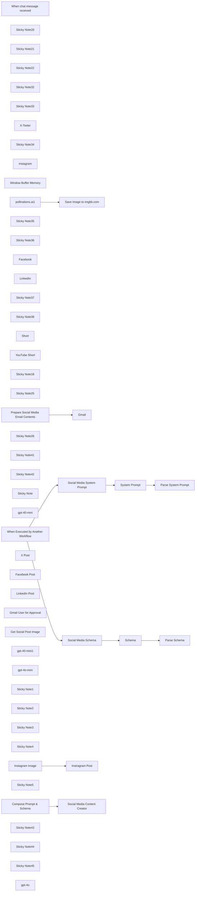

## Fluxo (.json) :

```json
{
  "id": "0KZs18Ti2KXKoLIr",
  "meta": {
    "instanceId": "31e69f7f4a77bf465b805824e303232f0227212ae922d12133a0f96ffeab4fef",
    "templateCredsSetupCompleted": true
  },
  "name": "✨🩷Automated Social Media Content Publishing Factory + System Prompt Composition",
  "tags": [],
  "nodes": [
    {
      "id": "74fb48a6-1acd-4693-9b8e-39b36c5649a9",
      "name": "When chat message received",
      "type": "@n8n/n8n-nodes-langchain.chatTrigger",
      "position": [
        -520,
        -2080
      ],
      "webhookId": "faddb40a-7048-4398-a0f9-d239a19c32ce",
      "parameters": {
        "options": {}
      },
      "typeVersion": 1.1
    },
    {
      "id": "09f4a998-2d69-4683-9251-2694a77efeba",
      "name": "Sticky Note20",
      "type": "n8n-nodes-base.stickyNote",
      "position": [
        -600,
        -1720
      ],
      "parameters": {
        "color": 7,
        "height": 240,
        "content": "## LLM"
      },
      "typeVersion": 1
    },
    {
      "id": "03b93e0b-a917-41f6-b99e-5a27ad07cd3e",
      "name": "Sticky Note21",
      "type": "n8n-nodes-base.stickyNote",
      "position": [
        -600,
        -1460
      ],
      "parameters": {
        "color": 7,
        "height": 240,
        "content": "## Chat Memory"
      },
      "typeVersion": 1
    },
    {
      "id": "b6c61fe5-a519-4bdb-8641-3149362fbb54",
      "name": "Sticky Note22",
      "type": "n8n-nodes-base.stickyNote",
      "position": [
        -620,
        -2160
      ],
      "parameters": {
        "color": 4,
        "width": 300,
        "height": 280,
        "content": "## 👍Start Here"
      },
      "typeVersion": 1
    },
    {
      "id": "2cf0448a-76de-4b2c-a200-953d47e29a52",
      "name": "Sticky Note32",
      "type": "n8n-nodes-base.stickyNote",
      "position": [
        1980,
        -2000
      ],
      "parameters": {
        "color": 2,
        "width": 340,
        "height": 420,
        "content": "## Social Media Publishing Router"
      },
      "typeVersion": 1
    },
    {
      "id": "dff757e6-8ef4-4479-a9f8-71cb814fb8ef",
      "name": "Sticky Note33",
      "type": "n8n-nodes-base.stickyNote",
      "position": [
        -300,
        -1640
      ],
      "parameters": {
        "color": 6,
        "height": 240,
        "content": "## 1️⃣ X - Twitter"
      },
      "typeVersion": 1
    },
    {
      "id": "fda64627-952a-4be9-b4c5-799d8c7801ad",
      "name": "X-Twiter",
      "type": "@n8n/n8n-nodes-langchain.toolWorkflow",
      "position": [
        -220,
        -1540
      ],
      "parameters": {
        "name": "create_x_twitter_posts_tool",
        "fields": {
          "values": [
            {
              "name": "route",
              "stringValue": "=xtwitter"
            },
            {
              "name": "user_prompt",
              "stringValue": "={{ $('When chat message received').item.json.chatInput }}"
            }
          ]
        },
        "workflowId": {
          "__rl": true,
          "mode": "id",
          "value": "={{ $workflow.id }}"
        },
        "description": "Use this tool to create XTwitter posts",
        "jsonSchemaExample": ""
      },
      "typeVersion": 1.2
    },
    {
      "id": "5023b0b3-468b-4cbb-829c-e06aaf822b99",
      "name": "Sticky Note34",
      "type": "n8n-nodes-base.stickyNote",
      "position": [
        -40,
        -1640
      ],
      "parameters": {
        "color": 6,
        "height": 240,
        "content": "## 2️⃣ Instagram"
      },
      "typeVersion": 1
    },
    {
      "id": "781df8c5-0b06-42a4-bbe9-6948ae345599",
      "name": "Instagram",
      "type": "@n8n/n8n-nodes-langchain.toolWorkflow",
      "position": [
        40,
        -1540
      ],
      "parameters": {
        "name": "create_instagram_posts_tool",
        "fields": {
          "values": [
            {
              "name": "route",
              "stringValue": "=instagram"
            },
            {
              "name": "user_prompt",
              "stringValue": "={{ $('When chat message received').item.json.chatInput }}"
            }
          ]
        },
        "workflowId": {
          "__rl": true,
          "mode": "id",
          "value": "={{ $workflow.id }}"
        },
        "description": "Use this tool to create Instagram posts",
        "jsonSchemaExample": ""
      },
      "typeVersion": 1.2
    },
    {
      "id": "8687d1ff-06ee-44c7-a26e-f08da72bbd15",
      "name": "Window Buffer Memory",
      "type": "@n8n/n8n-nodes-langchain.memoryBufferWindow",
      "position": [
        -520,
        -1360
      ],
      "parameters": {},
      "typeVersion": 1.3
    },
    {
      "id": "30cbcc50-e19b-43ea-8f0a-5e2021dc5e48",
      "name": "When Executed by Another Workflow",
      "type": "n8n-nodes-base.executeWorkflowTrigger",
      "position": [
        -700,
        -560
      ],
      "parameters": {
        "workflowInputs": {
          "values": [
            {
              "name": "user_prompt"
            },
            {
              "name": "route"
            }
          ]
        }
      },
      "typeVersion": 1.1
    },
    {
      "id": "0b9b7f07-d603-4890-96b0-f815feb38185",
      "name": "Sticky Note35",
      "type": "n8n-nodes-base.stickyNote",
      "position": [
        220,
        -1640
      ],
      "parameters": {
        "color": 6,
        "height": 240,
        "content": "## 3️⃣ Facebook"
      },
      "typeVersion": 1
    },
    {
      "id": "12b17b82-8f98-4d80-9b49-aa9860827e01",
      "name": "Sticky Note36",
      "type": "n8n-nodes-base.stickyNote",
      "position": [
        480,
        -1640
      ],
      "parameters": {
        "color": 6,
        "height": 240,
        "content": "## 4️⃣ LinkedIn"
      },
      "typeVersion": 1
    },
    {
      "id": "71dc9ccf-3691-4c0d-b53b-f3ff10f382a9",
      "name": "Facebook",
      "type": "@n8n/n8n-nodes-langchain.toolWorkflow",
      "position": [
        300,
        -1540
      ],
      "parameters": {
        "name": "create_facebook_posts_tool",
        "fields": {
          "values": [
            {
              "name": "route",
              "stringValue": "=facebook"
            },
            {
              "name": "user_prompt",
              "stringValue": "={{ $('When chat message received').item.json.chatInput }}"
            }
          ]
        },
        "workflowId": {
          "__rl": true,
          "mode": "id",
          "value": "={{ $workflow.id }}"
        },
        "description": "Use this tool to create Facebook posts",
        "jsonSchemaExample": ""
      },
      "typeVersion": 1.2
    },
    {
      "id": "f953cd87-88a8-451f-841e-78227949b64d",
      "name": "LinkedIn",
      "type": "@n8n/n8n-nodes-langchain.toolWorkflow",
      "position": [
        560,
        -1540
      ],
      "parameters": {
        "name": "create_linkedin_posts_tool",
        "fields": {
          "values": [
            {
              "name": "route",
              "stringValue": "=linkedin"
            },
            {
              "name": "user_prompt",
              "stringValue": "={{ $('When chat message received').item.json.chatInput }}"
            }
          ]
        },
        "workflowId": {
          "__rl": true,
          "mode": "id",
          "value": "={{ $workflow.id }}"
        },
        "description": "Use this tool to create LinkedIn posts",
        "jsonSchemaExample": ""
      },
      "typeVersion": 1.2
    },
    {
      "id": "97b6829d-6c9d-410a-8fa0-d89d884fd76e",
      "name": "Sticky Note37",
      "type": "n8n-nodes-base.stickyNote",
      "position": [
        -40,
        -1380
      ],
      "parameters": {
        "color": 6,
        "height": 240,
        "content": "## 5️⃣Threads"
      },
      "typeVersion": 1
    },
    {
      "id": "463259f7-71b4-492f-b05a-d1a958917d5c",
      "name": "Sticky Note38",
      "type": "n8n-nodes-base.stickyNote",
      "position": [
        220,
        -1380
      ],
      "parameters": {
        "color": 6,
        "height": 240,
        "content": "## 6️⃣YouTube Shorts"
      },
      "typeVersion": 1
    },
    {
      "id": "0cd9003b-8eeb-4e4a-9f1f-5f6b611d5194",
      "name": "Short",
      "type": "@n8n/n8n-nodes-langchain.toolWorkflow",
      "position": [
        40,
        -1280
      ],
      "parameters": {
        "name": "create_threads_posts_tool",
        "fields": {
          "values": [
            {
              "name": "route",
              "stringValue": "=threads"
            },
            {
              "name": "user_prompt",
              "stringValue": "={{ $('When chat message received').item.json.chatInput }}"
            }
          ]
        },
        "workflowId": {
          "__rl": true,
          "mode": "id",
          "value": "={{ $workflow.id }}"
        },
        "description": "Use this tool to create Threads posts",
        "jsonSchemaExample": ""
      },
      "typeVersion": 1.2
    },
    {
      "id": "54c2bf4b-8053-4e9d-beb4-570db66f9bd4",
      "name": "YouTube Short",
      "type": "@n8n/n8n-nodes-langchain.toolWorkflow",
      "position": [
        300,
        -1280
      ],
      "parameters": {
        "name": "create_youtube_short_tool",
        "fields": {
          "values": [
            {
              "name": "route",
              "stringValue": "=youtube_short"
            },
            {
              "name": "user_prompt",
              "stringValue": "={{ $('When chat message received').item.json.chatInput }}"
            },
            {
              "name": "llm",
              "stringValue": "={{ /*n8n-auto-generated-fromAI-override*/ $fromAI('Value', ``, 'string') }}"
            }
          ]
        },
        "workflowId": {
          "__rl": true,
          "mode": "id",
          "value": "={{ $workflow.id }}"
        },
        "description": "Use this tool to create a YouTube short",
        "jsonSchemaExample": ""
      },
      "typeVersion": 1.2
    },
    {
      "id": "a72c3242-3a8b-444f-9623-fbcb0b47a817",
      "name": "Sticky Note18",
      "type": "n8n-nodes-base.stickyNote",
      "position": [
        -340,
        -1720
      ],
      "parameters": {
        "color": 7,
        "width": 1100,
        "height": 620,
        "content": "## Social Media Agent Tools"
      },
      "typeVersion": 1
    },
    {
      "id": "586a33ae-3546-4b31-9235-9a8fcfd28598",
      "name": "Sticky Note25",
      "type": "n8n-nodes-base.stickyNote",
      "position": [
        -500,
        -940
      ],
      "parameters": {
        "color": 6,
        "width": 3520,
        "height": 820,
        "content": "# 🏭Social Media Content Factory"
      },
      "typeVersion": 1
    },
    {
      "id": "153da903-fcd3-4694-aaa4-bef2b300d158",
      "name": "pollinations.ai1",
      "type": "n8n-nodes-base.httpRequest",
      "onError": "continueErrorOutput",
      "maxTries": 5,
      "position": [
        1440,
        -560
      ],
      "parameters": {
        "url": "=https://image.pollinations.ai/prompt/{{ $json.output.common_schema.image_suggestion.replaceAll(' ','-').replaceAll(',','').replaceAll('.','').slice(0,100) }}",
        "options": {}
      },
      "retryOnFail": true,
      "typeVersion": 4.2
    },
    {
      "id": "6c114f0b-1395-4fe6-8de7-0b3d0d9fd6b2",
      "name": "Sticky Note26",
      "type": "n8n-nodes-base.stickyNote",
      "position": [
        1340,
        -720
      ],
      "parameters": {
        "color": 7,
        "width": 300,
        "height": 340,
        "content": "## Create Post Image\nhttps://pollinations.ai/\nhttps://image.pollinations.ai/prompt/[your image description]\n\n"
      },
      "typeVersion": 1
    },
    {
      "id": "e196ea9b-f5d0-4fa6-a3d9-bea2f98fd872",
      "name": "Save Image to imgbb.com",
      "type": "n8n-nodes-base.httpRequest",
      "position": [
        1760,
        -680
      ],
      "parameters": {
        "url": "https://api.imgbb.com/1/upload",
        "method": "POST",
        "options": {
          "redirect": {
            "redirect": {}
          }
        },
        "sendBody": true,
        "sendQuery": true,
        "contentType": "multipart-form-data",
        "bodyParameters": {
          "parameters": [
            {
              "name": "image",
              "parameterType": "formBinaryData",
              "inputDataFieldName": "data"
            }
          ]
        },
        "queryParameters": {
          "parameters": [
            {
              "name": "expiration",
              "value": "0"
            },
            {
              "name": "key",
              "value": "={{ $env.IMGBB_API_KEY}} "
            }
          ]
        }
      },
      "typeVersion": 4.2
    },
    {
      "id": "225e34be-26ee-40d7-88d6-e866420e083a",
      "name": "Sticky Note41",
      "type": "n8n-nodes-base.stickyNote",
      "position": [
        1980,
        -2280
      ],
      "parameters": {
        "width": 340,
        "height": 180,
        "content": "💡Notes\n\nUpdate all Social Media Platform Credentials as required.\n\nAdjust parameters and content for each platform to suit your needs."
      },
      "typeVersion": 1
    },
    {
      "id": "2f48f19d-92c1-478a-b7fa-3fc3b1100993",
      "name": "Sticky Note42",
      "type": "n8n-nodes-base.stickyNote",
      "position": [
        1240,
        -1760
      ],
      "parameters": {
        "color": 4,
        "width": 400,
        "height": 360,
        "content": "# 👍 Approve Content Before Proceeding"
      },
      "typeVersion": 1
    },
    {
      "id": "ce4e9f3c-801a-478e-8ffc-008c5e7d4e49",
      "name": "Gmail",
      "type": "n8n-nodes-base.gmail",
      "position": [
        2640,
        -780
      ],
      "webhookId": "cfc2a53d-14a7-47e1-8385-c0b0792d9843",
      "parameters": {
        "sendTo": "={{ $env.TELEGRAM_CHAT_ID }}",
        "message": "={{ $json.output }}",
        "options": {
          "appendAttribution": false
        },
        "subject": "=Social Media Content - {{ $('Social Content').item.json.output.title }}"
      },
      "credentials": {
        "gmailOAuth2": {
          "id": "1xpVDEQ1yx8gV022",
          "name": "Gmail account"
        }
      },
      "typeVersion": 2.1
    },
    {
      "id": "31ee0735-c863-476c-9c4a-41b50ae9c61a",
      "name": "Social Media Schema",
      "type": "n8n-nodes-base.googleDocs",
      "position": [
        -320,
        -700
      ],
      "parameters": {
        "operation": "get",
        "documentURL": "=12345"
      },
      "credentials": {
        "googleDocsOAuth2Api": {
          "id": "YWEHuG28zOt532MQ",
          "name": "Google Docs account"
        }
      },
      "typeVersion": 2
    },
    {
      "id": "18cfde4e-2637-496c-acca-070bdb84c2ba",
      "name": "Social Media System Prompt",
      "type": "n8n-nodes-base.googleDocs",
      "position": [
        -320,
        -420
      ],
      "parameters": {
        "operation": "get",
        "documentURL": "=12345"
      },
      "credentials": {
        "googleDocsOAuth2Api": {
          "id": "YWEHuG28zOt532MQ",
          "name": "Google Docs account"
        }
      },
      "typeVersion": 2
    },
    {
      "id": "383ce472-ccf8-47fb-aa36-5b8aacbcd64f",
      "name": "Sticky Note",
      "type": "n8n-nodes-base.stickyNote",
      "position": [
        -440,
        -840
      ],
      "parameters": {
        "color": 7,
        "width": 1120,
        "height": 640,
        "content": "## Prompt & Schema Composition from External Sources"
      },
      "typeVersion": 1
    },
    {
      "id": "8d2a2a64-bbaa-4692-94ed-2f541d0d40ca",
      "name": "gpt-40-mini",
      "type": "@n8n/n8n-nodes-langchain.lmChatOpenAi",
      "position": [
        2320,
        -600
      ],
      "parameters": {
        "model": {
          "__rl": true,
          "mode": "list",
          "value": "gpt-4o-mini",
          "cachedResultName": "gpt-4o-mini"
        },
        "options": {
          "responseFormat": "text"
        }
      },
      "credentials": {
        "openAiApi": {
          "id": "jEMSvKmtYfzAkhe6",
          "name": "OpenAi account"
        }
      },
      "typeVersion": 1.2
    },
    {
      "id": "6e5faa4d-25a1-4dbe-998e-3255ed181ac5",
      "name": "Instagram Image",
      "type": "n8n-nodes-base.httpRequest",
      "onError": "continueRegularOutput",
      "position": [
        2440,
        -1940
      ],
      "parameters": {
        "url": "https://graph.facebook.com/v20.0/[your-unique-id]/media",
        "method": "POST",
        "options": {},
        "sendQuery": true,
        "authentication": "predefinedCredentialType",
        "queryParameters": {
          "parameters": [
            {
              "name": "image_url",
              "value": "={{ $json.output.social_image.medium.url }}"
            },
            {
              "name": "caption",
              "value": "={{ $json.output.caption }}"
            }
          ]
        },
        "nodeCredentialType": "facebookGraphApi"
      },
      "credentials": {
        "facebookGraphApi": {
          "id": "PzDfmiwB7GPtmSaP",
          "name": "Facebook Graph account"
        }
      },
      "typeVersion": 4.2
    },
    {
      "id": "958793c8-7a74-498f-ac75-256232469fbc",
      "name": "X Post",
      "type": "n8n-nodes-base.twitter",
      "onError": "continueRegularOutput",
      "position": [
        2640,
        -2180
      ],
      "parameters": {
        "text": "={{ $json.data.social_content.schema.post }}",
        "additionalFields": {}
      },
      "credentials": {
        "twitterOAuth2Api": {
          "id": "wRDruLTCqjQ7C5jq",
          "name": "X account"
        }
      },
      "typeVersion": 2,
      "alwaysOutputData": true
    },
    {
      "id": "1f04a4b5-e97d-4574-abdb-270265da77fa",
      "name": "Instragram Post",
      "type": "n8n-nodes-base.facebookGraphApi",
      "onError": "continueRegularOutput",
      "position": [
        2640,
        -2000
      ],
      "parameters": {
        "edge": "media_publish",
        "node": "[your-unique-id]",
        "options": {
          "queryParameters": {
            "parameter": [
              {
                "name": "creation_id",
                "value": "={{ $json.id }}"
              },
              {
                "name": "caption",
                "value": "={{ $('Social Media Publishing Router').item.json.output.caption }}"
              }
            ]
          }
        },
        "graphApiVersion": "v20.0",
        "httpRequestMethod": "POST"
      },
      "credentials": {
        "facebookGraphApi": {
          "id": "PzDfmiwB7GPtmSaP",
          "name": "Facebook Graph account"
        }
      },
      "typeVersion": 1,
      "alwaysOutputData": true
    },
    {
      "id": "92a917ff-d20d-4bbc-be8f-00e17be83ea2",
      "name": "Facebook Post",
      "type": "n8n-nodes-base.facebookGraphApi",
      "onError": "continueRegularOutput",
      "position": [
        2640,
        -1820
      ],
      "parameters": {
        "edge": "photos",
        "node": "[your-unique-id]",
        "options": {
          "queryParameters": {
            "parameter": [
              {
                "name": "message",
                "value": "={{ $json.output.post }}\n\n{{ $json.output.call_to_action }}\n"
              }
            ]
          }
        },
        "sendBinaryData": true,
        "graphApiVersion": "v20.0",
        "httpRequestMethod": "POST",
        "binaryPropertyName": "data"
      },
      "credentials": {
        "facebookGraphApi": {
          "id": "PzDfmiwB7GPtmSaP",
          "name": "Facebook Graph account"
        }
      },
      "typeVersion": 1,
      "alwaysOutputData": true
    },
    {
      "id": "6c80332d-1aaf-4f3a-91fd-58c25f20ee0c",
      "name": "LinkedIn Post",
      "type": "n8n-nodes-base.linkedIn",
      "onError": "continueRegularOutput",
      "position": [
        2640,
        -1640
      ],
      "parameters": {
        "text": "={{ $json.data.social_content.schema.post }}\n{{ $json.data.social_content.schema.call_to_action }}\n{{ $json.data.social_content.common_schema.hashtags }}\n",
        "postAs": "organization",
        "organization": "12345678",
        "additionalFields": {},
        "binaryPropertyName": "=data",
        "shareMediaCategory": "IMAGE"
      },
      "credentials": {
        "linkedInOAuth2Api": {
          "id": "WMm6pzAEgNd4wJdO",
          "name": "LinkedIn account"
        }
      },
      "typeVersion": 1,
      "alwaysOutputData": true
    },
    {
      "id": "f9d80261-8543-4a12-969c-eecd58513ef2",
      "name": "Gmail User for Approval",
      "type": "n8n-nodes-base.gmail",
      "position": [
        1380,
        -1600
      ],
      "webhookId": "abfae12d-ddcf-4981-ad33-bb7a8cc115a2",
      "parameters": {
        "sendTo": "={{ $env.TELEGRAM_CHAT_ID }}",
        "message": "={{ $json.output }}",
        "options": {
          "limitWaitTime": {
            "values": {
              "resumeUnit": "minutes",
              "resumeAmount": 45
            }
          }
        },
        "subject": "=🔥FOR APPROVAL🔥 {{$('Extract as JSON').item.json.data.social_content.root_schema.name  }}",
        "operation": "sendAndWait",
        "approvalOptions": {
          "values": {
            "approvalType": "double"
          }
        }
      },
      "credentials": {
        "gmailOAuth2": {
          "id": "1xpVDEQ1yx8gV022",
          "name": "Gmail account"
        }
      },
      "typeVersion": 2.1
    },
    {
      "id": "97c2dec9-9e1e-4a42-9538-8a37392114e6",
      "name": "Get Social Post Image",
      "type": "n8n-nodes-base.httpRequest",
      "position": [
        1640,
        -1340
      ],
      "parameters": {
        "url": "={{ $('Extract as JSON').item.json.data.social_image.medium.url }}",
        "options": {}
      },
      "retryOnFail": true,
      "typeVersion": 4.2
    },
    {
      "id": "b5b6b7b9-d275-4c1a-a3c5-195b13be1538",
      "name": "gpt-40-mini1",
      "type": "@n8n/n8n-nodes-langchain.lmChatOpenAi",
      "position": [
        860,
        -1420
      ],
      "parameters": {
        "model": {
          "__rl": true,
          "mode": "list",
          "value": "gpt-4o-mini",
          "cachedResultName": "gpt-4o-mini"
        },
        "options": {
          "responseFormat": "text"
        }
      },
      "credentials": {
        "openAiApi": {
          "id": "jEMSvKmtYfzAkhe6",
          "name": "OpenAi account"
        }
      },
      "typeVersion": 1.2
    },
    {
      "id": "0b5b8237-9e34-44b7-82d9-372a12c67546",
      "name": "gpt-4o-mini",
      "type": "@n8n/n8n-nodes-langchain.lmChatOpenAi",
      "position": [
        780,
        -360
      ],
      "parameters": {
        "model": {
          "__rl": true,
          "mode": "list",
          "value": "gpt-4o-mini",
          "cachedResultName": "gpt-4o-mini"
        },
        "options": {
          "responseFormat": "json_object"
        }
      },
      "credentials": {
        "openAiApi": {
          "id": "jEMSvKmtYfzAkhe6",
          "name": "OpenAi account"
        }
      },
      "typeVersion": 1.2
    },
    {
      "id": "df61bbeb-1432-434b-9993-18362dba097f",
      "name": "Sticky Note1",
      "type": "n8n-nodes-base.stickyNote",
      "position": [
        -1840,
        -1220
      ],
      "parameters": {
        "color": 5,
        "width": 760,
        "height": 1540,
        "content": "<system>\nYou are a specialized content creation AI for social media platforms.\nYour primary function is generating platform-optimized social media content across various platforms including LinkedIn, Instagram, Facebook, Twitter (X), Threads, and YouTube Shorts. Each piece of content must:\nMatch the specific platform's audience expectations and algorithm preferences\nShowcase relevant expertise in your field\nDeliver actionable insights for your target audience\nDrive meaningful engagement through value-driven content\nOBJECTIVES:\nCreate platform-specific content following each platform's best practices\nImplement strategic hashtag usage combining general and trending tags\nDesign content that encourages user interaction and community building\nMaintain consistent brand voice while adapting to platform requirements\nIncorporate data-driven insights to maximize content performance\nOUTPUT REQUIREMENTS:\nDeliver content in valid JSON format according to the platform-specific schema\nInclude all required fields as specified in the schema\nOmit any explanatory text or code fencing in your response\nTailor content specifically to the platform indicated in the user's request\nFor each content request, adapt your output based on the platform guidelines and ensure it aligns with your organization's mission and values.  Never provide URLS for video or image suggestions and only describe the suggestion.\n</system>\n\n\n<rules>\n- Only provide final response in valid JSON for the appropriate social platform\n- Never include any preamble or further explanation\n- Always remove any ``` ```json\n</rules>\n\n\n<linkedin>\n**Style**: Professional and insightful.\n**Tone**: Business-oriented; focus on automation use cases, industry insights, and community impact.\n**Content Length**: 3-4 sentences; concise but detailed.\n**Hashtags**: #Innovation #Automation #WorkflowSolutions #DigitalTransformation #Leadership\n**Call to Action (CTA)**: Encourage comments or visits to workflows.diy's website for more insights.\n</linkedin>\n\n<instagram>\n**Style**: Visual storytelling with creative captions.\n**Tone**: Inspirational and engaging; use emojis for relatability.\n**Content Length**: 2-3 sentences paired with eye-catching visuals (e.g., infographics or workflow demos).\n**Visuals**: Showcase milestones (e.g., new workflow launches), tutorials, or product highlights.\n**CTA**: Use phrases like \"Swipe to learn more,\" \"Tag your team,\" or \"Check out the link below!\"\n**Link Placement**: Add the provided link before hashtags; if no link is provided, use \"Visit our website: https://example.com\"\n**Hashtags**: #AutomationLife #TechInnovation #WorkflowTips #Programming #Engineering\n</instagram>\n\n<facebook>\n**Style**: Friendly and community-focused.\n**Tone**: Relatable; highlight user success stories or company achievements in automation.\n**Content Length**: 2-3 sentences; conversational yet professional.\n**Hashtags**: #SmallBusinessAutomation #Entrepreneurship #Leadership #WorkflowInnovation\n**CTA**: Encourage likes, shares, comments (e.g., \"What's your favorite automation tip?\").\n</facebook>\n\n<xtwitter>\n**Style**: Concise and impactful.\n**Tone**: Crisp and engaging; spark curiosity in 150 characters or less.\n**Hashtags**: #WorkflowTrends #AIWorkflows #AutomationTips #NoCodeSolutions\n**CTA**: Drive quick engagement through retweets or replies (e.g., \"What's your go-to n8n workflow?\").\n</xtwitter>\n\n<threads>\n**Style**: Conversational and community-driven posts.\n**Tone**: Casual yet informative; encourage discussions around automation trends or innovations.\n**Content Length**: 1-2 short paragraphs with a question or thought-provoking statement at the end.\n**Hashtags**: Similar to Instagram but tailored for trending Threads topics related to automation.\n</threads>\n\n<youtube_short>\n**Style**: Short-form video content showcasing quick workflow tutorials or use cases.\n**Tone**: Authoritative yet approachable; establish workflows.diy as a leader in n8n automation solutions.\n**Content Length**:\n  Tutorials/Reviews (long-form): 5-10 minutes\n  Shorts/Highlights (short-form): Under 1 minute\n**CTA**: Encourage subscriptions, likes, comments (e.g., \"Subscribe for more workflow tips!\").\n</youtube_short>\n\n\n\n\n"
      },
      "typeVersion": 1
    },
    {
      "id": "ddf3d7d3-0218-4ba0-b990-34a6220a53fa",
      "name": "Sticky Note2",
      "type": "n8n-nodes-base.stickyNote",
      "position": [
        -1060,
        -1220
      ],
      "parameters": {
        "color": 3,
        "height": 1540,
        "content": "<common>\n{\n    \"type\": \"object\",\n    \"properties\": {\n        \"hashtags\": {\n            \"type\": \"array\",\n            \"items\": {\n                \"type\": \"string\"\n            }\n        },\n        \"image_suggestion\": {\n            \"type\": \"string\"\n        }\n    }\n}\n</common>\n\n<root>\n{\n    \"type\": \"object\",\n    \"properties\": {\n        \"name\": {\n            \"type\": \"string\"\n        },\n        \"description\": {\n            \"type\": \"string\"\n        },\n        \"additional_notes\": {\n            \"type\": \"string\"\n        }\n    }\n}\n</root>\n\n<linkedin>\n{\n    \"type\": \"object\",\n    \"properties\": {\n        \"post\": {\n            \"type\": \"string\"\n        },\n        \"call_to_action\": {\n            \"type\": \"string\"\n        }\n    }\n}\n</linkedin>\n\n<instagram>\n{\n    \"type\": \"object\",\n    \"properties\": {\n        \"caption\": {\n            \"type\": \"string\"\n        },\n        \"emojis\": {\n            \"type\": \"array\",\n            \"items\": {\n                \"type\": \"string\"\n            }\n        },\n        \"call_to_action\": {\n            \"type\": \"string\"\n        }\n    }\n}\n</instagram>\n\n<facebook>\n{\n    \"type\": \"object\",\n    \"properties\": {\n        \"post\": {\n            \"type\": \"string\"\n        },\n        \"call_to_action\": {\n            \"type\": \"string\"\n        }\n    }\n}\n</facebook>\n\n<xtwitter>\n{\n    \"type\": \"object\",\n    \"properties\": {\n        \"video_suggestion\": {\n            \"type\": \"string\"\n        },\n        \"post\": {\n            \"type\": \"string\"\n        },\n        \"character_limit\": {\n            \"type\": \"integer\"\n        }\n    }\n}\n</xtwitter>\n\n<threads>\n{\n    \"type\": \"object\",\n    \"properties\": {\n        \"text_post\": {\n            \"type\": \"string\"\n        },\n        \"call_to_action\": {\n            \"type\": \"string\"\n        }\n    }\n}\n</threads>\n\n<youtube_short>\n{\n    \"type\": \"object\",\n    \"properties\": {\n        \"video_suggestion\": {\n            \"type\": \"string\"\n        },\n        \"title\": {\n            \"type\": \"string\"\n        },\n        \"description\": {\n            \"type\": \"string\"\n        },\n        \"call_to_action\": {\n            \"type\": \"string\"\n        }\n    }\n}\n</youtube_short>\n\n\n\n"
      },
      "typeVersion": 1
    },
    {
      "id": "72b378bd-6035-45da-8c76-ddd897d107c7",
      "name": "Sticky Note3",
      "type": "n8n-nodes-base.stickyNote",
      "position": [
        -400,
        -480
      ],
      "parameters": {
        "color": 5,
        "width": 260,
        "height": 240,
        "content": "### 👈System Prompt"
      },
      "typeVersion": 1
    },
    {
      "id": "ba60e52d-722a-4f07-86b4-f4ea64cb2bab",
      "name": "Sticky Note4",
      "type": "n8n-nodes-base.stickyNote",
      "position": [
        -400,
        -760
      ],
      "parameters": {
        "color": 3,
        "width": 260,
        "height": 240,
        "content": "### 👈Social Media Schema"
      },
      "typeVersion": 1
    },
    {
      "id": "bc1ff038-26ad-44d6-94d1-2c1f72a9bf87",
      "name": "Schema",
      "type": "n8n-nodes-base.set",
      "position": [
        -60,
        -700
      ],
      "parameters": {
        "options": {},
        "assignments": {
          "assignments": [
            {
              "id": "9d6d41f2-7216-4659-af34-7215298494d9",
              "name": "schema",
              "type": "string",
              "value": "={{ $json.content }}"
            },
            {
              "id": "7d8c85f5-3f4a-4d72-bef0-0957c6ce82a4",
              "name": "platform",
              "type": "string",
              "value": "={{ $('When Executed by Another Workflow').item.json.route }}"
            }
          ]
        }
      },
      "typeVersion": 3.4
    },
    {
      "id": "777d231c-f69c-4b48-bec5-6674175703bc",
      "name": "System Prompt",
      "type": "n8n-nodes-base.set",
      "position": [
        -60,
        -420
      ],
      "parameters": {
        "options": {},
        "assignments": {
          "assignments": [
            {
              "id": "5f789b37-b021-4cd4-b359-fdfbb9b71c2b",
              "name": "system_prompt_doc_id",
              "type": "string",
              "value": "={{ $json.documentId }}"
            },
            {
              "id": "daac5758-38ad-4afe-966b-a9b4b89691b2",
              "name": "system_prompt",
              "type": "string",
              "value": "={{ $json.content }}"
            }
          ]
        }
      },
      "typeVersion": 3.4
    },
    {
      "id": "3813a552-cf99-49ca-9617-7eaac56f6819",
      "name": "Parse Schema",
      "type": "n8n-nodes-base.code",
      "position": [
        140,
        -700
      ],
      "parameters": {
        "jsCode": "// Get the input data from previous node\nconst inputData = $input.first().json;\nconst xmlString = inputData.schema;\n\nconsole.log(inputData)\n\n// Function to extract content between XML tags with better regex handling\nfunction extractFromXmlTags(xmlString, tagName) {\n  const regex = new RegExp(`<${tagName}>(.*?)</${tagName}>`, 'gs');\n  const match = regex.exec(xmlString);\n  return match ? match[1].trim() : null;\n}\n\n// Get the platform from the input or use a default\nconst platform = inputData.platform;\n\n// Extract the content from the specified tag\nconst extractedContent = extractFromXmlTags(xmlString, platform);\nconst rootContent = extractFromXmlTags(xmlString, 'root');\nconst commonContent = extractFromXmlTags(xmlString, 'common');\n\njsonData = JSON.parse(extractedContent);\nrootSchema = JSON.parse(rootContent);\ncommonSchema = JSON.parse(commonContent);\n\n// Return the result\nreturn {\n  json: {\n    schema: jsonData,\n    root_schema: rootSchema,\n    common_schema: commonSchema\n  }\n};\n"
      },
      "typeVersion": 2
    },
    {
      "id": "c55da4a1-91f8-4d17-ad73-730013a99231",
      "name": "Parse System Prompt",
      "type": "n8n-nodes-base.code",
      "position": [
        140,
        -420
      ],
      "parameters": {
        "jsCode": "// Get the input data from previous node\nconst inputData = $input.first().json;\nconst xmlString = inputData.system_prompt;\n\n// Function to extract all content between XML tags\nfunction extractAllXmlTags(xmlString) {\n  // Create a result object to store tag contents\n  const result = {};\n  \n  // Regular expression to find all XML tags and their content\n  // This regex matches opening tag, content, and closing tag\n  const tagRegex = /<([^>/]+)>([\\s\\S]*?)</\\1>/g;\n  \n  // Find all matches\n  let match;\n  while ((match = tagRegex.exec(xmlString)) !== null) {\n    const tagName = match[1].trim();\n    const content = match[2].trim();\n    \n    // Store the content with the tag name as the key\n    result[tagName] = content;\n  }\n  \n  return result;\n}\n\n// Extract all XML tags and their content\nconst extractedTags = extractAllXmlTags(xmlString);\n\n// Return the result as a JSON object\nreturn {\n  json: {\n    system_config: extractedTags\n  }\n};\n"
      },
      "typeVersion": 2
    },
    {
      "id": "1767c787-943b-43d6-86cb-3fb60eaf878e",
      "name": "Compose Prompt & Schema",
      "type": "n8n-nodes-base.set",
      "position": [
        520,
        -560
      ],
      "parameters": {
        "options": {},
        "assignments": {
          "assignments": [
            {
              "id": "9216ad1c-a281-4c94-835d-e20507ef0cb5",
              "name": "route",
              "type": "string",
              "value": "={{ $json.route }}"
            },
            {
              "id": "e6ca5cdf-5139-4db7-b065-ee52028216c5",
              "name": "user_prompt",
              "type": "string",
              "value": "={{ $json.user_prompt }}"
            },
            {
              "id": "2927cd6f-c351-49df-954b-9f87b0338c58",
              "name": "system_config.system",
              "type": "string",
              "value": "={{ $json.system_config.system }}"
            },
            {
              "id": "829b1519-9ffa-44d7-8caa-455e15b30614",
              "name": "system_config.rules",
              "type": "string",
              "value": "={{ $json.system_config.rules }}"
            },
            {
              "id": "b44472ba-6e98-448b-bad6-e02da8b32b0a",
              "name": "={{ $json.route }}",
              "type": "string",
              "value": "={{ $json.system_config[$json.route.toLowerCase()] }}"
            },
            {
              "id": "a96e8c30-1d44-4e23-9ef4-95d7303ea41e",
              "name": "root_schema",
              "type": "object",
              "value": "={{ $json.root_schema }}"
            },
            {
              "id": "6cb68192-10f3-496d-88ca-289ee0c19940",
              "name": "common_schema",
              "type": "object",
              "value": "={{ $json.common_schema }}"
            },
            {
              "id": "8f9b85f0-abaa-46c2-ba98-897f6a677105",
              "name": "schema",
              "type": "object",
              "value": "={{ $json.schema }}"
            }
          ]
        }
      },
      "typeVersion": 3.4
    },
    {
      "id": "b7d78f57-ee83-4e03-ada6-fd6e2048c272",
      "name": "Social Media Content Creator",
      "type": "@n8n/n8n-nodes-langchain.agent",
      "position": [
        800,
        -560
      ],
      "parameters": {
        "text": "=Social Media Platform: {{ $json.route }}\nUser Prompt: {{ $json.user_prompt }}\n",
        "options": {
          "systemMessage": "={{ $json.system_config.system }}\n\n<tools>\nYou have been provided with an internet search tool.  Use this tool to find relavent information about the users request before responding.  Todays date is: {{ $now }}\n</tools>\n\n<rules>\n{{ $json.system_config.rules }}\n- Output must conform to provided JSON schema\n</rules>\n\nFollow this Output JSON Schema:\n{\n  root_schema: {{ $json.root_schema.toJsonString() }},\n  common_schema: {{ $json.common_schema.toJsonString()}},\n  schema: {{  $json.schema.toJsonString() }}\n}"
        },
        "promptType": "define"
      },
      "typeVersion": 1.7
    },
    {
      "id": "35469698-0eb5-4238-85d1-c67ccbacf2cb",
      "name": "Sticky Note5",
      "type": "n8n-nodes-base.stickyNote",
      "position": [
        -1880,
        -1400
      ],
      "parameters": {
        "color": 7,
        "width": 1100,
        "height": 1760,
        "content": "# External System Prompt and Schema"
      },
      "typeVersion": 1
    },
    {
      "id": "11ba3bef-7036-416b-a63d-a82cf7cbe30f",
      "name": "Prepare Social Media Email Contents",
      "type": "@n8n/n8n-nodes-langchain.agent",
      "position": [
        2300,
        -780
      ],
      "parameters": {
        "text": "=Use the HTML template and populate [fields] as required from this: {{ $('pollinations.ai1').item.json.output.toJsonString() }}\n-----\nOnly output HTML without code block tags, preamble or further explanation in the format provided.\n\n## HTML Template\n<table style=\"max-width:640px;min-width:320px;width:100%;border-collapse:collapse;font-family:Arial,sans-serif;margin:20px auto\">\n    <tbody>\n        <tr>\n            <td colspan=\"2\" style=\"background-color:#ffffff;padding:15px;text-align:left\">\n                \n            </td>\n        </tr>\n        <tr>\n            <td colspan=\"2\" style=\"background-color:#efefef;padding:15px;font-size:20px;text-align:left;font-weight:bold\">\n                {{ $json.output.root_schema.name  }}\n            </td>\n        </tr>\n        <tr>\n            <td style=\"background-color:#f9f9f9;padding:15px;width:30%;text-align:left\"><strong>Platform:</strong></td>\n            <td style=\"background-color:#f9f9f9;padding:15px;text-align:left\">{{ $('Compose Prompt & Schema').item.json.route }}</td>\n        </tr>\n        <tr>\n            <td style=\"background-color:#f9f9f9;padding:15px;width:30%;text-align:left\"><strong>[label_1]:</strong></td>\n            <td style=\"background-color:#f9f9f9;padding:15px;text-align:left\">[content_1]</td>\n        </tr>\n        <tr>\n            <td style=\"background-color:#f1f1f1;padding:15px;text-align:left\"><strong>[label_2]:</strong></td>\n            <td style=\"background-color:#f1f1f1;padding:15px;text-align:left\">[content_2]</td>\n        </tr>\n\n        [continue the pattern ...]\n\n        <tr>\n            <td colspan=\"2\" style=\"background-color:#efefef;padding:15px;text-align:left\">\n                <strong>[footer_label]:</strong> [footer_content]\n            </td>\n        </tr>\n    </tbody>\n</table>\n\n",
        "options": {},
        "promptType": "define"
      },
      "typeVersion": 1.7
    },
    {
      "id": "1dc19a25-ff27-4582-a574-279831f7bc28",
      "name": "Sticky Note43",
      "type": "n8n-nodes-base.stickyNote",
      "position": [
        -760,
        -340
      ],
      "parameters": {
        "height": 500,
        "content": "💡Notes\n\n- Create Google Doc for the Social Media Schema and copy the provided schema.\n\n- Update the Google Doc ID in the Social Media Schema node.\n\n- Create Google Doc for the Social Media System Prompt and copy the provided System Prompt.\n\n- Update the Google Doc ID in the Social Media System Prompt node.\n\n\n\nAdjust system prompt and platform specific prompts to suit your needs."
      },
      "typeVersion": 1
    },
    {
      "id": "6b1d2ad9-9ad8-4a33-ab7d-430f96dc317c",
      "name": "Sticky Note44",
      "type": "n8n-nodes-base.stickyNote",
      "position": [
        1340,
        -360
      ],
      "parameters": {
        "width": 300,
        "content": "💡Notes\n\nReplace pollinations.ai with any online image generation service that produces an image file you can download."
      },
      "typeVersion": 1
    },
    {
      "id": "e7c2d9ba-6b9a-404f-a84d-8e90e4c5f4bb",
      "name": "Sticky Note45",
      "type": "n8n-nodes-base.stickyNote",
      "position": [
        720,
        -840
      ],
      "parameters": {
        "width": 400,
        "height": 140,
        "content": "💡Notes\n\nReplace Chat model with other LLMs and test out the results.  Add more tools or try other web search tools to suit your use case."
      },
      "typeVersion": 1
    },
    {
      "id": "00204106-dd0f-46d5-89c8-60fd92f1388e",
      "name": "gpt-4o",
      "type": "@n8n/n8n-nodes-langchain.lmChatOpenAi",
      "position": [
        -520,
        -1620
      ],
      "parameters": {
        "model": {
          "__rl": true,
          "mode": "list",
          "value": "gpt-4o",
          "cachedResultName": "gpt-4o"
        },
        "options": {
          "responseFormat": "json_object"
        }
      },
      "credentials": {
        "openAiApi": {
          "id": "jEMSvKmtYfzAkhe6",
          "name": "OpenAi account"
        }
      },
      "typeVersion": 1.2
    }
  ],
  "active": false,
  "pinData": {
    "Social Media Schema": [
      {
        "json": {
          "content": "<common>\n{\n    \"type\": \"object\",\n    \"properties\": {\n        \"hashtags\": {\n            \"type\": \"array\",\n            \"items\": {\n                \"type\": \"string\"\n            }\n        },\n        \"image_suggestion\": {\n            \"type\": \"string\"\n        }\n    }\n}\n</common>\n\n<root>\n{\n    \"type\": \"object\",\n    \"properties\": {\n        \"name\": {\n            \"type\": \"string\"\n        },\n        \"description\": {\n            \"type\": \"string\"\n        },\n        \"additional_notes\": {\n            \"type\": \"string\"\n        }\n    }\n}\n</root>\n\n<linkedin>\n{\n    \"type\": \"object\",\n    \"properties\": {\n        \"post\": {\n            \"type\": \"string\"\n        },\n        \"call_to_action\": {\n            \"type\": \"string\"\n        }\n    }\n}\n</linkedin>\n\n<instagram>\n{\n    \"type\": \"object\",\n    \"properties\": {\n        \"caption\": {\n            \"type\": \"string\"\n        },\n        \"emojis\": {\n            \"type\": \"array\",\n            \"items\": {\n                \"type\": \"string\"\n            }\n        },\n        \"call_to_action\": {\n            \"type\": \"string\"\n        }\n    }\n}\n</instagram>\n\n<facebook>\n{\n    \"type\": \"object\",\n    \"properties\": {\n        \"post\": {\n            \"type\": \"string\"\n        },\n        \"call_to_action\": {\n            \"type\": \"string\"\n        }\n    }\n}\n</facebook>\n\n<xtwitter>\n{\n    \"type\": \"object\",\n    \"properties\": {\n        \"video_suggestion\": {\n            \"type\": \"string\"\n        },\n        \"post\": {\n            \"type\": \"string\"\n        },\n        \"character_limit\": {\n            \"type\": \"integer\"\n        }\n    }\n}\n</xtwitter>\n\n<threads>\n{\n    \"type\": \"object\",\n    \"properties\": {\n        \"text_post\": {\n            \"type\": \"string\"\n        },\n        \"call_to_action\": {\n            \"type\": \"string\"\n        }\n    }\n}\n</threads>\n\n<youtube_short>\n{\n    \"type\": \"object\",\n    \"properties\": {\n        \"video_suggestion\": {\n            \"type\": \"string\"\n        },\n        \"title\": {\n            \"type\": \"string\"\n        },\n        \"description\": {\n            \"type\": \"string\"\n        },\n        \"call_to_action\": {\n            \"type\": \"string\"\n        }\n    }\n}\n</youtube_short>\n\n\n\n",
          "documentId": "[your-doc-id-here]"
        }
      }
    ],
    "Social Media System Prompt": [
      {
        "json": {
          "content": "<system>\nYou are a specialized content creation AI for social media platforms.\nYour primary function is generating platform-optimized social media content across various platforms including LinkedIn, Instagram, Facebook, Twitter (X), Threads, and YouTube Shorts. Each piece of content must:\nMatch the specific platform's audience expectations and algorithm preferences\nShowcase relevant expertise in your field\nDeliver actionable insights for your target audience\nDrive meaningful engagement through value-driven content\nOBJECTIVES:\nCreate platform-specific content following each platform's best practices\nImplement strategic hashtag usage combining general and trending tags\nDesign content that encourages user interaction and community building\nMaintain consistent brand voice while adapting to platform requirements\nIncorporate data-driven insights to maximize content performance\nOUTPUT REQUIREMENTS:\nDeliver content in valid JSON format according to the platform-specific schema\nInclude all required fields as specified in the schema\nOmit any explanatory text or code fencing in your response\nTailor content specifically to the platform indicated in the user's request\nFor each content request, adapt your output based on the platform guidelines and ensure it aligns with your organization's mission and values.  Never provide URLS for video or image suggestions and only describe the suggestion.\n</system>\n\n\n<rules>\n- Only provide final response in valid JSON for the appropriate social platform\n- Never include any preamble or further explanation\n- Always remove any ``` ```json\n</rules>\n\n\n<linkedin>\n**Style**: Professional and insightful.\n**Tone**: Business-oriented; focus on automation use cases, industry insights, and community impact.\n**Content Length**: 3-4 sentences; concise but detailed.\n**Hashtags**: #Innovation #Automation #WorkflowSolutions #DigitalTransformation #Leadership\n**Call to Action (CTA)**: Encourage comments or visits to workflows.diy's website for more insights.\n</linkedin>\n\n<instagram>\n**Style**: Visual storytelling with creative captions.\n**Tone**: Inspirational and engaging; use emojis for relatability.\n**Content Length**: 2-3 sentences paired with eye-catching visuals (e.g., infographics or workflow demos).\n**Visuals**: Showcase milestones (e.g., new workflow launches), tutorials, or product highlights.\n**CTA**: Use phrases like \"Swipe to learn more,\" \"Tag your team,\" or \"Check out the link below!\"\n**Link Placement**: Add the provided link before hashtags; if no link is provided, use \"Visit our website: https://workflows.diy.\"\n**Hashtags**: #AutomationLife #TechInnovation #WorkflowTips #Programming #Engineering\n</instagram>\n\n<facebook>\n**Style**: Friendly and community-focused.\n**Tone**: Relatable; highlight user success stories or company achievements in automation.\n**Content Length**: 2-3 sentences; conversational yet professional.\n**Hashtags**: #SmallBusinessAutomation #Entrepreneurship #Leadership #WorkflowInnovation\n**CTA**: Encourage likes, shares, comments (e.g., \"What's your favorite automation tip?\").\n</facebook>\n\n<xtwitter>\n**Style**: Concise and impactful.\n**Tone**: Crisp and engaging; spark curiosity in 150 characters or less.\n**Hashtags**: #WorkflowTrends #AIWorkflows #AutomationTips #NoCodeSolutions\n**CTA**: Drive quick engagement through retweets or replies (e.g., \"What's your go-to n8n workflow?\").\n</xtwitter>\n\n<threads>\n**Style**: Conversational and community-driven posts.\n**Tone**: Casual yet informative; encourage discussions around automation trends or innovations.\n**Content Length**: 1-2 short paragraphs with a question or thought-provoking statement at the end.\n**Hashtags**: Similar to Instagram but tailored for trending Threads topics related to automation.\n</threads>\n\n<youtube_short>\n**Style**: Short-form video content showcasing quick workflow tutorials or use cases.\n**Tone**: Authoritative yet approachable; establish workflows.diy as a leader in n8n automation solutions.\n**Content Length**:\n  - Tutorials/Reviews (long-form): 5-10 minutes\n  - Shorts/Highlights (short-form): Under 1 minute\n**CTA**: Encourage subscriptions, likes, comments (e.g., \"Subscribe for more workflow tips!\").\n</youtube_short>\n\n\n\n",
          "documentId": "[your-doc-id-here]"
        }
      }
    ],
    "When Executed by Another Workflow": [
      {
        "json": {
          "route": "instagram",
          "user_prompt": "i need an instagram post about using n8n to transform business automation with reference to a related historical fact and example"
        }
      }
    ]
  },
  "settings": {
    "executionOrder": "v1"
  },
  "versionId": "110ac387-48e7-4ed2-98d6-0e3ddbb34063",
  "connections": {
    "Gmail": {
      "main": [
        []
      ]
    },
    "Merge": {
      "main": [
        [
          {
            "node": "Prepare Social Media Email Contents",
            "type": "main",
            "index": 0
          },
          {
            "node": "Google Drive Image Meta",
            "type": "main",
            "index": 0
          }
        ]
      ]
    },
    "Short": {
      "ai_tool": [
        [
          {
            "node": "🤖Social Media Router Agent",
            "type": "ai_tool",
            "index": 0
          }
        ]
      ]
    },
    "Schema": {
      "main": [
        [
          {
            "node": "Parse Schema",
            "type": "main",
            "index": 0
          }
        ]
      ]
    },
    "X Post": {
      "main": [
        [
          {
            "node": "X Response",
            "type": "main",
            "index": 0
          }
        ]
      ]
    },
    "gpt-4o": {
      "ai_languageModel": [
        [
          {
            "node": "🤖Social Media Router Agent",
            "type": "ai_languageModel",
            "index": 0
          }
        ]
      ]
    },
    "File Id": {
      "main": [
        [
          {
            "node": "Get Social Post from Google Drive",
            "type": "main",
            "index": 0
          }
        ]
      ]
    },
    "SerpAPI": {
      "ai_tool": [
        [
          {
            "node": "Social Media Content Creator",
            "type": "ai_tool",
            "index": 0
          }
        ]
      ]
    },
    "Facebook": {
      "ai_tool": [
        [
          {
            "node": "🤖Social Media Router Agent",
            "type": "ai_tool",
            "index": 0
          }
        ]
      ]
    },
    "LinkedIn": {
      "ai_tool": [
        [
          {
            "node": "🤖Social Media Router Agent",
            "type": "ai_tool",
            "index": 0
          }
        ]
      ]
    },
    "X-Twiter": {
      "ai_tool": [
        [
          {
            "node": "🤖Social Media Router Agent",
            "type": "ai_tool",
            "index": 0
          }
        ]
      ]
    },
    "Instagram": {
      "ai_tool": [
        [
          {
            "node": "🤖Social Media Router Agent",
            "type": "ai_tool",
            "index": 0
          }
        ]
      ]
    },
    "gpt-40-mini": {
      "ai_languageModel": [
        [
          {
            "node": "Prepare Social Media Email Contents",
            "type": "ai_languageModel",
            "index": 0
          }
        ]
      ]
    },
    "gpt-4o-mini": {
      "ai_languageModel": [
        [
          {
            "node": "Social Media Content Creator",
            "type": "ai_languageModel",
            "index": 0
          }
        ]
      ]
    },
    "Is Approved?": {
      "main": [
        [
          {
            "node": "Get Social Post Image",
            "type": "main",
            "index": 0
          }
        ]
      ]
    },
    "Parse Schema": {
      "main": [
        [
          {
            "node": "Merge Prompts and Schema",
            "type": "main",
            "index": 0
          }
        ]
      ]
    },
    "gpt-40-mini1": {
      "ai_languageModel": [
        [
          {
            "node": "Prepare Email Contents",
            "type": "ai_languageModel",
            "index": 0
          }
        ]
      ]
    },
    "Facebook Post": {
      "main": [
        [
          {
            "node": "Facebook Response",
            "type": "main",
            "index": 0
          }
        ]
      ]
    },
    "LinkedIn Post": {
      "main": [
        [
          {
            "node": "LinkedIn Response",
            "type": "main",
            "index": 0
          }
        ]
      ]
    },
    "System Prompt": {
      "main": [
        [
          {
            "node": "Parse System Prompt",
            "type": "main",
            "index": 0
          }
        ]
      ]
    },
    "YouTube Short": {
      "ai_tool": [
        [
          {
            "node": "🤖Social Media Router Agent",
            "type": "ai_tool",
            "index": 0
          }
        ]
      ]
    },
    "Social Content": {
      "main": [
        [
          {
            "node": "pollinations.ai1",
            "type": "main",
            "index": 0
          }
        ]
      ]
    },
    "Extract as JSON": {
      "main": [
        [
          {
            "node": "Merge Image and Post Contents",
            "type": "main",
            "index": 0
          },
          {
            "node": "Prepare Email Contents",
            "type": "main",
            "index": 0
          }
        ]
      ]
    },
    "Instagram Image": {
      "main": [
        [
          {
            "node": "Instragram Post",
            "type": "main",
            "index": 0
          }
        ]
      ]
    },
    "Instragram Post": {
      "main": [
        [
          {
            "node": "Instagram Response",
            "type": "main",
            "index": 0
          }
        ]
      ]
    },
    "Social Post JSON": {
      "main": [
        [
          {
            "node": "Save Social Post to Google Drive",
            "type": "main",
            "index": 0
          }
        ]
      ]
    },
    "pollinations.ai1": {
      "main": [
        [
          {
            "node": "Telegram Success Message (Optional)",
            "type": "main",
            "index": 0
          },
          {
            "node": "Save Image to imgbb.com",
            "type": "main",
            "index": 0
          },
          {
            "node": "Save Image to Google Drive",
            "type": "main",
            "index": 0
          },
          {
            "node": "Merge",
            "type": "main",
            "index": 1
          }
        ],
        [
          {
            "node": "Telegram Error Message (Optional)",
            "type": "main",
            "index": 0
          }
        ]
      ]
    },
    "Parse System Prompt": {
      "main": [
        [
          {
            "node": "Merge Prompts and Schema",
            "type": "main",
            "index": 2
          }
        ]
      ]
    },
    "Social Media Schema": {
      "main": [
        [
          {
            "node": "Schema",
            "type": "main",
            "index": 0
          }
        ]
      ]
    },
    "Window Buffer Memory": {
      "ai_memory": [
        [
          {
            "node": "🤖Social Media Router Agent",
            "type": "ai_memory",
            "index": 0
          }
        ]
      ]
    },
    "Get Social Post Image": {
      "main": [
        [
          {
            "node": "Merge Image and Post Contents",
            "type": "main",
            "index": 1
          }
        ]
      ]
    },
    "Prepare Email Contents": {
      "main": [
        [
          {
            "node": "Gmail User for Approval",
            "type": "main",
            "index": 0
          }
        ]
      ]
    },
    "Compose Prompt & Schema": {
      "main": [
        [
          {
            "node": "Social Media Content Creator",
            "type": "main",
            "index": 0
          }
        ]
      ]
    },
    "Gmail User for Approval": {
      "main": [
        [
          {
            "node": "Is Approved?",
            "type": "main",
            "index": 0
          }
        ]
      ]
    },
    "Google Drive Image Meta": {
      "main": [
        [
          {
            "node": "Social Post JSON",
            "type": "main",
            "index": 0
          }
        ]
      ]
    },
    "Save Image to imgbb.com": {
      "main": [
        [
          {
            "node": "Merge",
            "type": "main",
            "index": 0
          }
        ]
      ]
    },
    "Merge Prompts and Schema": {
      "main": [
        [
          {
            "node": "Compose Prompt & Schema",
            "type": "main",
            "index": 0
          }
        ]
      ]
    },
    "Save Image to Google Drive": {
      "main": [
        [
          {
            "node": "Merge",
            "type": "main",
            "index": 2
          }
        ]
      ]
    },
    "Social Media System Prompt": {
      "main": [
        [
          {
            "node": "System Prompt",
            "type": "main",
            "index": 0
          }
        ]
      ]
    },
    "When chat message received": {
      "main": [
        [
          {
            "node": "🤖Social Media Router Agent",
            "type": "main",
            "index": 0
          }
        ]
      ]
    },
    "Social Media Content Creator": {
      "main": [
        [
          {
            "node": "Social Content",
            "type": "main",
            "index": 0
          }
        ]
      ]
    },
    "Merge Image and Post Contents": {
      "main": [
        [
          {
            "node": "Social Media Publishing Router",
            "type": "main",
            "index": 0
          }
        ]
      ]
    },
    "🤖Social Media Router Agent": {
      "main": [
        [
          {
            "node": "File Id",
            "type": "main",
            "index": 0
          }
        ]
      ]
    },
    "Social Media Publishing Router": {
      "main": [
        [
          {
            "node": "X Post",
            "type": "main",
            "index": 0
          }
        ],
        [
          {
            "node": "Instagram Image",
            "type": "main",
            "index": 0
          }
        ],
        [
          {
            "node": "Facebook Post",
            "type": "main",
            "index": 0
          }
        ],
        [
          {
            "node": "LinkedIn Post",
            "type": "main",
            "index": 0
          }
        ],
        [
          {
            "node": "Implement Threads Here",
            "type": "main",
            "index": 0
          }
        ],
        [
          {
            "node": "Implement YouTube Shorts Here",
            "type": "main",
            "index": 0
          }
        ]
      ]
    },
    "Save Social Post to Google Drive": {
      "main": [
        [
          {
            "node": "Respond with Google Drive Id",
            "type": "main",
            "index": 0
          }
        ]
      ]
    },
    "Get Social Post from Google Drive": {
      "main": [
        [
          {
            "node": "Extract as JSON",
            "type": "main",
            "index": 0
          }
        ]
      ]
    },
    "When Executed by Another Workflow": {
      "main": [
        [
          {
            "node": "Social Media System Prompt",
            "type": "main",
            "index": 0
          },
          {
            "node": "Social Media Schema",
            "type": "main",
            "index": 0
          },
          {
            "node": "Merge Prompts and Schema",
            "type": "main",
            "index": 1
          }
        ]
      ]
    },
    "Prepare Social Media Email Contents": {
      "main": [
        [
          {
            "node": "Gmail",
            "type": "main",
            "index": 0
          }
        ]
      ]
    }
  }
}
```

<a id="template-665"></a>

## Template 665 - RAG e chat com conteúdo WordPress

- **Nome:** RAG e chat com conteúdo WordPress
- **Descrição:** Fluxo para extrair conteúdo de um site WordPress, gerar e atualizar embeddings, armazená-los em um banco vetorial e oferecer uma interface de chat que responde usando documentos relevantes e metadados.
- **Funcionalidade:** • Ingestão de conteúdo WordPress: Recupera posts e páginas do site e unifica o conteúdo para processamento.
• Filtragem de conteúdo publicado: Mantém apenas conteúdo publicado e não protegido para indexação.
• Conversão HTML para Markdown: Converte o conteúdo HTML do WordPress para texto adequado antes da divisão em blocos.
• Chunking de texto por tokens: Divide documentos em fragmentos com sobreposição para criar embeddings mais precisos.
• Geração de embeddings: Usa um modelo de embeddings para transformar fragmentos de texto em vetores.
• Armazenamento vetorial e metadados: Insere embeddings e metadados (URL, título, tipo, datas, id) em uma tabela vetorial.
• Upsert / Atualização incremental: Verifica documentos modificados desde a última execução, deleta versões antigas quando necessário e insere embeddings atualizados.
• Registro de execuções: Salva um histórico de execuções com timestamp para controles incrementais.
• Busca semântica para chat (RAG): Ao receber uma mensagem, recupera documentos relevantes por similaridade e agrega metadados para o agente.
• Agente conversacional com integração de metadados: Gera respostas ao usuário usando os documentos encontrados e inclui obrigatoriamente os metadados (url, tipo de conteúdo, data de publicação e data de modificação) integrados na resposta.
• Memória de conversa: Mantém histórico de chat para contexto em conversas subsequentes.
• Processamento em lotes: Loop e processamento por batches para controlar volume e permitir operações por item.
- **Ferramentas:** • WordPress: Fonte do conteúdo (posts e páginas) via API REST para extração de texto e metadados.
• OpenAI: Geração de embeddings (modelo de embeddings) e respostas do modelo de linguagem para o agente conversacional.
• Supabase: Armazenamento vetorial e tabelas para documentos e histórico de execução (serviço de banco com capacidades vetoriais).
• PostgreSQL com extensão pgvector: Estrutura de tabelas, função de busca por similaridade (match_documents) e armazenamento de histórico e metadados.


## Fluxo visual

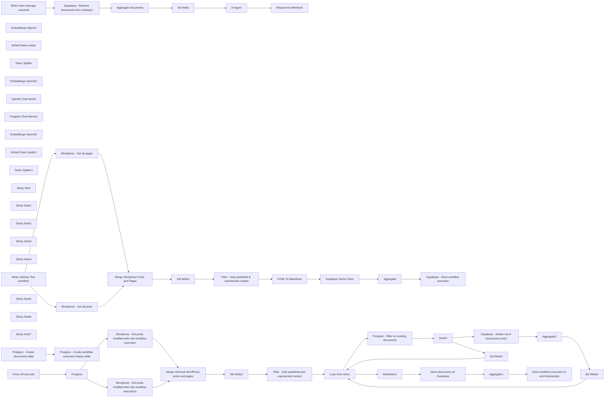

## Fluxo (.json) :

```json
{
  "id": "o8iTqIh2sVvnuWz5",
  "meta": {
    "instanceId": "b9faf72fe0d7c3be94b3ebff0778790b50b135c336412d28fd4fca2cbbf8d1f5"
  },
  "name": "RAG & GenAI App With WordPress Content",
  "tags": [],
  "nodes": [
    {
      "id": "c3738490-ed39-4774-b337-bf5ee99d0c72",
      "name": "When clicking ‘Test workflow’",
      "type": "n8n-nodes-base.manualTrigger",
      "position": [
        500,
        940
      ],
      "parameters": {},
      "typeVersion": 1
    },
    {
      "id": "3ab719bd-3652-433f-a597-9cd28f8cfcea",
      "name": "Embeddings OpenAI",
      "type": "@n8n/n8n-nodes-langchain.embeddingsOpenAi",
      "position": [
        2580,
        1320
      ],
      "parameters": {
        "model": "text-embedding-3-small",
        "options": {}
      },
      "typeVersion": 1
    },
    {
      "id": "e8639569-2091-44de-a84d-c3fc3ce54de4",
      "name": "Default Data Loader",
      "type": "@n8n/n8n-nodes-langchain.documentDefaultDataLoader",
      "position": [
        2800,
        1260
      ],
      "parameters": {
        "options": {
          "metadata": {
            "metadataValues": [
              {
                "name": "title",
                "value": "={{ $json.title }}"
              },
              {
                "name": "url",
                "value": "={{ $json.url }}"
              },
              {
                "name": "content_type",
                "value": "={{ $json.content_type }}"
              },
              {
                "name": "publication_date",
                "value": "={{ $json.publication_date }}"
              },
              {
                "name": "modification_date",
                "value": "={{ $json.modification_date }}"
              },
              {
                "name": "id",
                "value": "={{ $json.id }}"
              }
            ]
          }
        },
        "jsonData": "={{ $json.data }}",
        "jsonMode": "expressionData"
      },
      "typeVersion": 1
    },
    {
      "id": "e7f858eb-4dca-40ea-9da9-af953687e63d",
      "name": "Token Splitter",
      "type": "@n8n/n8n-nodes-langchain.textSplitterTokenSplitter",
      "position": [
        2900,
        1480
      ],
      "parameters": {
        "chunkSize": 300,
        "chunkOverlap": 30
      },
      "typeVersion": 1
    },
    {
      "id": "27585104-5315-4c11-b333-4b5d27d9bae4",
      "name": "Embeddings OpenAI1",
      "type": "@n8n/n8n-nodes-langchain.embeddingsOpenAi",
      "position": [
        1400,
        2340
      ],
      "parameters": {
        "model": "text-embedding-3-small",
        "options": {}
      },
      "typeVersion": 1
    },
    {
      "id": "35269a98-d905-4e4f-ae5b-dadad678f260",
      "name": "OpenAI Chat Model",
      "type": "@n8n/n8n-nodes-langchain.lmChatOpenAi",
      "position": [
        2800,
        2300
      ],
      "parameters": {
        "model": "gpt-4o-mini",
        "options": {}
      },
      "typeVersion": 1
    },
    {
      "id": "cd26b6fa-a8bb-4139-9bec-8656d90d8203",
      "name": "Postgres Chat Memory",
      "type": "@n8n/n8n-nodes-langchain.memoryPostgresChat",
      "position": [
        2920,
        2300
      ],
      "parameters": {
        "tableName": "website_chat_histories"
      },
      "typeVersion": 1.1
    },
    {
      "id": "7c718e1b-1398-49f3-ba67-f970a82983e0",
      "name": "Respond to Webhook",
      "type": "n8n-nodes-base.respondToWebhook",
      "position": [
        3380,
        2060
      ],
      "parameters": {
        "options": {}
      },
      "typeVersion": 1.1
    },
    {
      "id": "f91f18e0-7a04-4218-8490-bff35dfbf7a8",
      "name": "Set fields",
      "type": "n8n-nodes-base.set",
      "position": [
        2360,
        2060
      ],
      "parameters": {
        "options": {},
        "assignments": {
          "assignments": [
            {
              "id": "6888175b-853b-457a-96f7-33dfe952a05d",
              "name": "documents",
              "type": "string",
              "value": "={{ \n JSON.stringify(\n $json.documents.map(doc => ({\n metadata: \n 'URL: ' + doc.metadata.url.replaceAll('&rsquo;', \"'\").replaceAll(/[\"]/g, '') + '\\n' +\n 'Publication Date: ' + doc.metadata.publication_date.replaceAll(/[\"]/g, '') + '\\n' +\n 'Modification Date: ' + doc.metadata.modification_date.replaceAll(/[\"]/g, '') + '\\n' +\n 'Content Type: ' + doc.metadata.content_type.replaceAll(/[\"]/g, '') + '\\n' +\n 'Title: ' + doc.metadata.title.replaceAll('&rsquo;', \"'\").replaceAll(/[\"]/g, '') + '\\n',\n \n page_content: doc.pageContent\n }))\n ).replaceAll(/[\\[\\]{}]/g, '')\n}}"
            },
            {
              "id": "ae310b77-4560-4f44-8c4e-8d13f680072e",
              "name": "sessionId",
              "type": "string",
              "value": "={{ $('When chat message received').item.json.sessionId }}"
            },
            {
              "id": "8738f4de-b3c3-45ad-af4b-8311c8105c35",
              "name": "chatInput",
              "type": "string",
              "value": "={{ $('When chat message received').item.json.chatInput }}"
            }
          ]
        }
      },
      "typeVersion": 3.4
    },
    {
      "id": "7f392a40-e353-4bb2-9ecf-3ee330110b95",
      "name": "Embeddings OpenAI2",
      "type": "@n8n/n8n-nodes-langchain.embeddingsOpenAi",
      "position": [
        6400,
        860
      ],
      "parameters": {
        "model": "text-embedding-3-small",
        "options": {}
      },
      "typeVersion": 1
    },
    {
      "id": "9e045857-5fcd-4c4b-83ee-ceda28195b76",
      "name": "Default Data Loader1",
      "type": "@n8n/n8n-nodes-langchain.documentDefaultDataLoader",
      "position": [
        6500,
        860
      ],
      "parameters": {
        "options": {
          "metadata": {
            "metadataValues": [
              {
                "name": "title",
                "value": "={{ $json.title }}"
              },
              {
                "name": "url",
                "value": "={{ $json.url }}"
              },
              {
                "name": "content_type",
                "value": "={{ $json.content_type }}"
              },
              {
                "name": "publication_date",
                "value": "={{ $json.publication_date }}"
              },
              {
                "name": "modification_date",
                "value": "={{ $json.modification_date }}"
              },
              {
                "name": "id",
                "value": "={{ $json.id }}"
              }
            ]
          }
        },
        "jsonData": "={{ $json.data }}",
        "jsonMode": "expressionData"
      },
      "typeVersion": 1
    },
    {
      "id": "d0c1144b-4542-470e-8cbe-f985e839d9d0",
      "name": "Token Splitter1",
      "type": "@n8n/n8n-nodes-langchain.textSplitterTokenSplitter",
      "position": [
        6500,
        980
      ],
      "parameters": {
        "chunkSize": 300,
        "chunkOverlap": 30
      },
      "typeVersion": 1
    },
    {
      "id": "ec7cf1b2-f56f-45da-bb34-1dc8a66a7de6",
      "name": "Markdown1",
      "type": "n8n-nodes-base.markdown",
      "position": [
        6240,
        900
      ],
      "parameters": {
        "html": "={{ $json.content }}",
        "options": {}
      },
      "typeVersion": 1
    },
    {
      "id": "8399976b-340a-49ce-a5b6-f7339957aa9d",
      "name": "Postgres",
      "type": "n8n-nodes-base.postgres",
      "position": [
        4260,
        900
      ],
      "parameters": {
        "query": "select max(created_at) as last_workflow_execution from n8n_website_embedding_histories",
        "options": {},
        "operation": "executeQuery"
      },
      "typeVersion": 2.5
    },
    {
      "id": "88e79403-06df-4f18-9e4c-a4c4e727aa17",
      "name": "Aggregate",
      "type": "n8n-nodes-base.aggregate",
      "position": [
        3300,
        900
      ],
      "parameters": {
        "options": {},
        "aggregate": "aggregateAllItemData"
      },
      "typeVersion": 1
    },
    {
      "id": "db7241e8-1c3a-4f91-99b7-383000f41afe",
      "name": "Aggregate1",
      "type": "n8n-nodes-base.aggregate",
      "position": [
        6800,
        680
      ],
      "parameters": {
        "options": {},
        "aggregate": "aggregateAllItemData"
      },
      "typeVersion": 1
    },
    {
      "id": "94bbba31-d83b-427f-a7dc-336725238294",
      "name": "Aggregate2",
      "type": "n8n-nodes-base.aggregate",
      "position": [
        7180,
        1160
      ],
      "parameters": {
        "options": {},
        "fieldsToAggregate": {
          "fieldToAggregate": [
            {
              "fieldToAggregate": "metadata.id"
            }
          ]
        }
      },
      "typeVersion": 1
    },
    {
      "id": "52a110fa-cdd6-4b1d-99fe-394b5dfa0a1f",
      "name": "Sticky Note",
      "type": "n8n-nodes-base.stickyNote",
      "position": [
        440,
        600
      ],
      "parameters": {
        "color": 5,
        "width": 3308.2687575224263,
        "height": 1015.3571428571431,
        "content": "# Workflow 1 : Initial Embedding \n## Use this workflow to create the initial embedding for your WordPress website content\n\n"
      },
      "typeVersion": 1
    },
    {
      "id": "4cbf8135-a52b-4a54-b7b0-15ea27ce7ae3",
      "name": "Sticky Note1",
      "type": "n8n-nodes-base.stickyNote",
      "position": [
        3812,
        605
      ],
      "parameters": {
        "color": 5,
        "width": 3785.6673412474183,
        "height": 1020.4528919414245,
        "content": "# Workflow 2 : Upsert\n## Use this workflow to upsert embeddings for documents stored in the Supabase vector table\n"
      },
      "typeVersion": 1
    },
    {
      "id": "f6e954e0-a37a-45ac-9882-20f4f1944b70",
      "name": "Sticky Note2",
      "type": "n8n-nodes-base.stickyNote",
      "position": [
        440,
        1820
      ],
      "parameters": {
        "color": 5,
        "width": 3235.199999999999,
        "height": 817.9199999999992,
        "content": "# Workflow 3 : Use this workflow to enable chat functionality with your website content. The chat can be embedded into your website to enhance user experience"
      },
      "typeVersion": 1
    },
    {
      "id": "acbdd54b-f02a-41aa-a0ce-8642db560151",
      "name": "Wordpress - Get all posts",
      "type": "n8n-nodes-base.wordpress",
      "position": [
        1260,
        880
      ],
      "parameters": {
        "options": {},
        "operation": "getAll",
        "returnAll": true
      },
      "typeVersion": 1
    },
    {
      "id": "94fce59d-9336-4d49-a378-17335ec02e52",
      "name": "Wordpress - Get all pages",
      "type": "n8n-nodes-base.wordpress",
      "position": [
        1260,
        1060
      ],
      "parameters": {
        "options": {},
        "resource": "page",
        "operation": "getAll",
        "returnAll": true
      },
      "typeVersion": 1
    },
    {
      "id": "b00c92e5-1765-4fd9-9981-e01053992a0a",
      "name": "Sticky Note3",
      "type": "n8n-nodes-base.stickyNote",
      "position": [
        1157,
        727
      ],
      "parameters": {
        "width": 1108.3519999999999,
        "height": 561.4080000000004,
        "content": "## Use filters to create embeddings only for content that you want to include in your GenAI application"
      },
      "typeVersion": 1
    },
    {
      "id": "f8a22739-898d-456b-93f8-79f74b60a00c",
      "name": "Set fields1",
      "type": "n8n-nodes-base.set",
      "position": [
        2320,
        900
      ],
      "parameters": {
        "options": {},
        "assignments": {
          "assignments": [
            {
              "id": "de6711dc-d03c-488c-bef4-0a853e2d0a14",
              "name": "publication_date",
              "type": "string",
              "value": "={{ $json.date }}"
            },
            {
              "id": "f8e35dcc-c96c-4554-b6bc-8e5d7eca90e3",
              "name": "modification_date",
              "type": "string",
              "value": "={{ $json.modified }}"
            },
            {
              "id": "f6a6e3de-fe39-4cfc-ab07-c4ccfaef78f5",
              "name": "content_type",
              "type": "string",
              "value": "={{ $json.type }}"
            },
            {
              "id": "b0428598-073f-4560-9a0c-01caf3708921",
              "name": "title",
              "type": "string",
              "value": "={{ $json.title.rendered }}"
            },
            {
              "id": "534f51b4-b43a-40d3-8120-58df8043d909",
              "name": "url",
              "type": "string",
              "value": "={{ $json.link }}"
            },
            {
              "id": "dbe0c559-90bd-49f8-960e-0d85d5ed4f5e",
              "name": "content",
              "type": "string",
              "value": "={{ $json.content.rendered }}"
            },
            {
              "id": "892be7c6-b032-4129-b285-1986ed4ee046",
              "name": "protected",
              "type": "boolean",
              "value": "={{ $json.excerpt.protected }}"
            },
            {
              "id": "06fac885-4431-41ff-a43b-6eb84ca57401",
              "name": "status",
              "type": "string",
              "value": "={{ $json.status }}"
            },
            {
              "id": "43b1aea7-895e-41da-a0a6-2f1cec1f1b97",
              "name": "id",
              "type": "number",
              "value": "={{ $json.id }}"
            }
          ]
        }
      },
      "typeVersion": 3.4
    },
    {
      "id": "404db031-f470-4e42-a3b3-66b849a86174",
      "name": "Filter - Only published & unprotected content",
      "type": "n8n-nodes-base.filter",
      "position": [
        2520,
        900
      ],
      "parameters": {
        "options": {},
        "conditions": {
          "options": {
            "version": 2,
            "leftValue": "",
            "caseSensitive": true,
            "typeValidation": "strict"
          },
          "combinator": "and",
          "conditions": [
            {
              "id": "1f708587-f3d3-487a-843a-b6a2bfad2ca9",
              "operator": {
                "type": "boolean",
                "operation": "false",
                "singleValue": true
              },
              "leftValue": "={{ $json.protected }}",
              "rightValue": ""
            },
            {
              "id": "04f47269-e112-44c3-9014-749898aca8bd",
              "operator": {
                "name": "filter.operator.equals",
                "type": "string",
                "operation": "equals"
              },
              "leftValue": "={{ $json.status }}",
              "rightValue": "publish"
            }
          ]
        }
      },
      "typeVersion": 2.2
    },
    {
      "id": "05bb6091-515e-4f22-a3fd-d25b2046a03d",
      "name": "HTML To Markdown",
      "type": "n8n-nodes-base.markdown",
      "position": [
        2740,
        900
      ],
      "parameters": {
        "html": "={{ $json.content}}",
        "options": {}
      },
      "typeVersion": 1
    },
    {
      "id": "391e9ea7-71dd-42ae-bee7-badcae32427c",
      "name": "Supabase - Store workflow execution",
      "type": "n8n-nodes-base.supabase",
      "position": [
        3520,
        900
      ],
      "parameters": {
        "tableId": "n8n_website_embedding_histories",
        "fieldsUi": {
          "fieldValues": [
            {
              "fieldId": "id",
              "fieldValue": "={{ $executionId }}"
            }
          ]
        }
      },
      "typeVersion": 1
    },
    {
      "id": "47dad096-efc8-4bdd-9c22-49562325d8a0",
      "name": "Sticky Note4",
      "type": "n8n-nodes-base.stickyNote",
      "position": [
        460,
        1320
      ],
      "parameters": {
        "width": 851.1898437499999,
        "height": 275.2000000000001,
        "content": "## Run these two nodes if the \"documents\" table on Supabase and the \"n8n_website_embedding_histories\" table do not exist"
      },
      "typeVersion": 1
    },
    {
      "id": "d19f3a5f-fa42-46d0-a366-4c5a5d09f559",
      "name": "Every 30 seconds",
      "type": "n8n-nodes-base.scheduleTrigger",
      "position": [
        3940,
        900
      ],
      "parameters": {
        "rule": {
          "interval": [
            {
              "field": "seconds"
            }
          ]
        }
      },
      "typeVersion": 1.2
    },
    {
      "id": "a22ab0dd-1da8-4fc2-8106-6130bf7938c8",
      "name": "Sticky Note5",
      "type": "n8n-nodes-base.stickyNote",
      "position": [
        3820,
        740
      ],
      "parameters": {
        "width": 336.25,
        "height": 292.5,
        "content": "## Set this node to match the frequency of publishing and updating on your website"
      },
      "typeVersion": 1
    },
    {
      "id": "ba25135b-6e6e-406b-b18a-f532a6e37276",
      "name": "Wordpress - Get posts modified after last workflow execution",
      "type": "n8n-nodes-base.httpRequest",
      "position": [
        4600,
        840
      ],
      "parameters": {
        "url": "https://mydomain.com/wp-json/wp/v2/posts",
        "options": {},
        "sendQuery": true,
        "authentication": "predefinedCredentialType",
        "queryParameters": {
          "parameters": [
            {
              "name": "modified_after",
              "value": "={{ $json.last_workflow_execution }}"
            }
          ]
        },
        "nodeCredentialType": "wordpressApi"
      },
      "typeVersion": 4.2
    },
    {
      "id": "a1d8572e-2b0d-40a1-a898-bbd563a6b190",
      "name": "Wordpress - Get posts modified after last workflow execution1",
      "type": "n8n-nodes-base.httpRequest",
      "position": [
        4600,
        1060
      ],
      "parameters": {
        "url": "https://mydomain.com/wp-json/wp/v2/pages",
        "options": {},
        "sendQuery": true,
        "authentication": "predefinedCredentialType",
        "queryParameters": {
          "parameters": [
            {
              "name": "modified_after",
              "value": "={{ $json.last_workflow_execution }}"
            }
          ]
        },
        "nodeCredentialType": "wordpressApi"
      },
      "typeVersion": 4.2
    },
    {
      "id": "c0839aaa-8ba7-47ff-8fa9-dc75e1c4da84",
      "name": "Set fields2",
      "type": "n8n-nodes-base.set",
      "position": [
        5420,
        920
      ],
      "parameters": {
        "options": {},
        "assignments": {
          "assignments": [
            {
              "id": "de6711dc-d03c-488c-bef4-0a853e2d0a14",
              "name": "publication_date",
              "type": "string",
              "value": "={{ $json.date }}"
            },
            {
              "id": "f8e35dcc-c96c-4554-b6bc-8e5d7eca90e3",
              "name": "modification_date",
              "type": "string",
              "value": "={{ $json.modified }}"
            },
            {
              "id": "f6a6e3de-fe39-4cfc-ab07-c4ccfaef78f5",
              "name": "content_type",
              "type": "string",
              "value": "={{ $json.type }}"
            },
            {
              "id": "b0428598-073f-4560-9a0c-01caf3708921",
              "name": "title",
              "type": "string",
              "value": "={{ $json.title.rendered }}"
            },
            {
              "id": "534f51b4-b43a-40d3-8120-58df8043d909",
              "name": "url",
              "type": "string",
              "value": "={{ $json.link }}"
            },
            {
              "id": "dbe0c559-90bd-49f8-960e-0d85d5ed4f5e",
              "name": "content",
              "type": "string",
              "value": "={{ $json.content.rendered }}"
            },
            {
              "id": "892be7c6-b032-4129-b285-1986ed4ee046",
              "name": "protected",
              "type": "boolean",
              "value": "={{ $json.content.protected }}"
            },
            {
              "id": "06fac885-4431-41ff-a43b-6eb84ca57401",
              "name": "status",
              "type": "string",
              "value": "={{ $json.status }}"
            },
            {
              "id": "43b1aea7-895e-41da-a0a6-2f1cec1f1b97",
              "name": "id",
              "type": "number",
              "value": "={{ $json.id }}"
            }
          ]
        }
      },
      "typeVersion": 3.4
    },
    {
      "id": "15b1d30a-5861-4380-89d5-0eef65240503",
      "name": "Filter - Only published and unprotected content",
      "type": "n8n-nodes-base.filter",
      "position": [
        5760,
        920
      ],
      "parameters": {
        "options": {},
        "conditions": {
          "options": {
            "version": 2,
            "leftValue": "",
            "caseSensitive": true,
            "typeValidation": "strict"
          },
          "combinator": "and",
          "conditions": [
            {
              "id": "c2b25d74-91d7-44ea-8598-422100947b07",
              "operator": {
                "type": "boolean",
                "operation": "false",
                "singleValue": true
              },
              "leftValue": "={{ $json.protected }}",
              "rightValue": ""
            },
            {
              "id": "3e63bf79-25ca-4ccf-aa86-ff5f90e1ece1",
              "operator": {
                "name": "filter.operator.equals",
                "type": "string",
                "operation": "equals"
              },
              "leftValue": "={{ $json.status }}",
              "rightValue": "publish"
            }
          ]
        }
      },
      "typeVersion": 2.2
    },
    {
      "id": "0990f503-8d6f-44f6-8d04-7e2f7d74301a",
      "name": "Loop Over Items",
      "type": "n8n-nodes-base.splitInBatches",
      "position": [
        6040,
        920
      ],
      "parameters": {
        "options": {}
      },
      "typeVersion": 3
    },
    {
      "id": "6cc4e46e-3884-4259-b7ed-51c5552cc3e0",
      "name": "Set fields3",
      "type": "n8n-nodes-base.set",
      "position": [
        7400,
        1160
      ],
      "parameters": {
        "options": {},
        "assignments": {
          "assignments": [
            {
              "id": "de6711dc-d03c-488c-bef4-0a853e2d0a14",
              "name": "publication_date",
              "type": "string",
              "value": "={{ $('Loop Over Items').item.json.publication_date }}"
            },
            {
              "id": "f8e35dcc-c96c-4554-b6bc-8e5d7eca90e3",
              "name": "modification_date",
              "type": "string",
              "value": "={{ $('Loop Over Items').item.json.modification_date }}"
            },
            {
              "id": "f6a6e3de-fe39-4cfc-ab07-c4ccfaef78f5",
              "name": "content_type",
              "type": "string",
              "value": "={{ $('Loop Over Items').item.json.content_type }}"
            },
            {
              "id": "b0428598-073f-4560-9a0c-01caf3708921",
              "name": "title",
              "type": "string",
              "value": "={{ $('Loop Over Items').item.json.title }}"
            },
            {
              "id": "534f51b4-b43a-40d3-8120-58df8043d909",
              "name": "url",
              "type": "string",
              "value": "={{ $('Loop Over Items').item.json.url }}"
            },
            {
              "id": "dbe0c559-90bd-49f8-960e-0d85d5ed4f5e",
              "name": "content",
              "type": "string",
              "value": "={{ $('Loop Over Items').item.json.content }}"
            },
            {
              "id": "892be7c6-b032-4129-b285-1986ed4ee046",
              "name": "protected",
              "type": "boolean",
              "value": "={{ $('Loop Over Items').item.json.protected }}"
            },
            {
              "id": "06fac885-4431-41ff-a43b-6eb84ca57401",
              "name": "status",
              "type": "string",
              "value": "={{ $('Loop Over Items').item.json.status }}"
            },
            {
              "id": "43b1aea7-895e-41da-a0a6-2f1cec1f1b97",
              "name": "id",
              "type": "number",
              "value": "={{ $('Loop Over Items').item.json.id }}"
            }
          ]
        }
      },
      "typeVersion": 3.4
    },
    {
      "id": "24f47982-a803-4848-8390-c400a8cebcee",
      "name": "Set fields4",
      "type": "n8n-nodes-base.set",
      "position": [
        6680,
        1400
      ],
      "parameters": {
        "options": {},
        "assignments": {
          "assignments": [
            {
              "id": "de6711dc-d03c-488c-bef4-0a853e2d0a14",
              "name": "publication_date",
              "type": "string",
              "value": "={{ $('Loop Over Items').item.json.publication_date }}"
            },
            {
              "id": "f8e35dcc-c96c-4554-b6bc-8e5d7eca90e3",
              "name": "modification_date",
              "type": "string",
              "value": "={{ $('Loop Over Items').item.json.modification_date }}"
            },
            {
              "id": "f6a6e3de-fe39-4cfc-ab07-c4ccfaef78f5",
              "name": "content_type",
              "type": "string",
              "value": "={{ $('Loop Over Items').item.json.content_type }}"
            },
            {
              "id": "b0428598-073f-4560-9a0c-01caf3708921",
              "name": "title",
              "type": "string",
              "value": "={{ $('Loop Over Items').item.json.title }}"
            },
            {
              "id": "534f51b4-b43a-40d3-8120-58df8043d909",
              "name": "url",
              "type": "string",
              "value": "={{ $('Loop Over Items').item.json.url }}"
            },
            {
              "id": "dbe0c559-90bd-49f8-960e-0d85d5ed4f5e",
              "name": "content",
              "type": "string",
              "value": "={{ $('Loop Over Items').item.json.content }}"
            },
            {
              "id": "892be7c6-b032-4129-b285-1986ed4ee046",
              "name": "protected",
              "type": "boolean",
              "value": "={{ $('Loop Over Items').item.json.protected }}"
            },
            {
              "id": "06fac885-4431-41ff-a43b-6eb84ca57401",
              "name": "status",
              "type": "string",
              "value": "={{ $('Loop Over Items').item.json.status }}"
            },
            {
              "id": "43b1aea7-895e-41da-a0a6-2f1cec1f1b97",
              "name": "id",
              "type": "number",
              "value": "={{ $('Loop Over Items').item.json.id }}"
            }
          ]
        }
      },
      "typeVersion": 3.4
    },
    {
      "id": "5f59ebbf-ca17-4311-809c-85b74ce624cc",
      "name": "Store documents on Supabase",
      "type": "@n8n/n8n-nodes-langchain.vectorStoreSupabase",
      "position": [
        6380,
        680
      ],
      "parameters": {
        "mode": "insert",
        "options": {
          "queryName": "match_documents"
        },
        "tableName": {
          "__rl": true,
          "mode": "list",
          "value": "documents",
          "cachedResultName": "documents"
        }
      },
      "typeVersion": 1
    },
    {
      "id": "2422562e-9c95-4d77-ae8c-485b06f9234e",
      "name": "Store workflow execution id and timestamptz",
      "type": "n8n-nodes-base.supabase",
      "position": [
        7060,
        680
      ],
      "parameters": {
        "tableId": "n8n_website_embedding_histories"
      },
      "typeVersion": 1
    },
    {
      "id": "5013f3a1-f7fb-4fa7-9ef2-3599f77f5fc8",
      "name": "Aggregate documents",
      "type": "n8n-nodes-base.aggregate",
      "position": [
        1960,
        2060
      ],
      "parameters": {
        "options": {},
        "fieldsToAggregate": {
          "fieldToAggregate": [
            {
              "renameField": true,
              "outputFieldName": "documents",
              "fieldToAggregate": "document"
            }
          ]
        }
      },
      "typeVersion": 1
    },
    {
      "id": "26532217-3206-4be3-b186-733bc364913b",
      "name": "Sticky Note6",
      "type": "n8n-nodes-base.stickyNote",
      "position": [
        1220,
        1980
      ],
      "parameters": {
        "width": 665.78125,
        "height": 507.65625,
        "content": "## Retrieve documents from Supabase immediately after chat input to send metadata to OpenAI"
      },
      "typeVersion": 1
    },
    {
      "id": "78d2806c-8d13-44b8-bd6d-866fa794edae",
      "name": "Sticky Note7",
      "type": "n8n-nodes-base.stickyNote",
      "position": [
        6375,
        1090
      ],
      "parameters": {
        "width": 1198.9843749999998,
        "height": 515.4687499999998,
        "content": "## Switch:\n- **If the document exists and has been updated:** delete rows and insert new embedding\n- **If it’s a new document:** insert embedding"
      },
      "typeVersion": 1
    },
    {
      "id": "3b5ffada-ae2a-45a2-a76c-69732b05761c",
      "name": "Postgres - Create documents table",
      "type": "n8n-nodes-base.postgres",
      "position": [
        560,
        1440
      ],
      "parameters": {
        "query": "-- Enable the pgvector extension to work with embedding vectors\nCREATE EXTENSION vector;\n\n-- Create a table to store your documents with default RLS\nCREATE TABLE\n documents (\n id BIGINT PRIMARY KEY GENERATED ALWAYS AS IDENTITY,\n CONTENT TEXT, -- corresponds to Document.pageContent\n metadata jsonb, -- corresponds to Document.metadata\n embedding vector (1536) -- 1536 works for OpenAI embeddings, change if needed\n );\n\n-- Enable Row Level Security on the documents table\nALTER TABLE documents ENABLE ROW LEVEL SECURITY;\n\n-- Create a function to search for documents\nCREATE FUNCTION match_documents (\n query_embedding vector (1536),\n match_count INT DEFAULT NULL,\n FILTER jsonb DEFAULT '{}'\n) RETURNS TABLE (\n id BIGINT,\n CONTENT TEXT,\n metadata jsonb,\n similarity FLOAT\n) LANGUAGE plpgsql AS $$\n#variable_conflict use_column\nBEGIN\n RETURN QUERY\n SELECT\n id,\n content,\n metadata,\n 1 - (documents.embedding <=> query_embedding) AS similarity\n FROM documents\n WHERE metadata @> filter\n ORDER BY documents.embedding <=> query_embedding\n LIMIT match_count;\nEND;\n$$;",
        "options": {},
        "operation": "executeQuery"
      },
      "typeVersion": 2.5
    },
    {
      "id": "632a7b44-a062-472e-a777-805ee74a4bd6",
      "name": "Postgres - Create workflow execution history table",
      "type": "n8n-nodes-base.postgres",
      "position": [
        920,
        1440
      ],
      "parameters": {
        "query": "CREATE TABLE\n n8n_website_embedding_histories (\n id BIGINT PRIMARY KEY GENERATED ALWAYS AS IDENTITY,\n created_at TIMESTAMP WITH TIME ZONE DEFAULT NOW()\n );",
        "options": {},
        "operation": "executeQuery"
      },
      "typeVersion": 2.5
    },
    {
      "id": "7c55e08b-e116-4e22-bd1d-e4bec5107d89",
      "name": "Merge Wordpress Posts and Pages",
      "type": "n8n-nodes-base.merge",
      "position": [
        1660,
        900
      ],
      "parameters": {},
      "typeVersion": 3
    },
    {
      "id": "4520db6c-2e68-45ff-9439-6fd95f95dc85",
      "name": "Merge retrieved WordPress posts and pages",
      "type": "n8n-nodes-base.merge",
      "position": [
        5120,
        920
      ],
      "parameters": {},
      "typeVersion": 3
    },
    {
      "id": "d547a063-6b76-4bfd-ba0a-165181c4af19",
      "name": "Postgres - Filter on existing documents",
      "type": "n8n-nodes-base.postgres",
      "position": [
        6260,
        1180
      ],
      "parameters": {
        "query": "SELECT *\nFROM documents\nWHERE (metadata->>'id')::integer = {{ $json.id }};\n",
        "options": {},
        "operation": "executeQuery"
      },
      "typeVersion": 2.5,
      "alwaysOutputData": true
    },
    {
      "id": "03456a81-d512-4fd8-842a-27b6d8b3f94e",
      "name": "Supabase - Delete row if documents exists",
      "type": "n8n-nodes-base.supabase",
      "position": [
        6900,
        1160
      ],
      "parameters": {
        "tableId": "documents",
        "operation": "delete",
        "filterType": "string",
        "filterString": "=metadata->>id=like.{{ $json.metadata.id }}"
      },
      "executeOnce": false,
      "typeVersion": 1,
      "alwaysOutputData": false
    },
    {
      "id": "72e5bf4b-c413-4fb7-acb8-59e7abee60f7",
      "name": "Switch",
      "type": "n8n-nodes-base.switch",
      "position": [
        6580,
        1180
      ],
      "parameters": {
        "rules": {
          "values": [
            {
              "outputKey": "existing_documents",
              "conditions": {
                "options": {
                  "version": 2,
                  "leftValue": "",
                  "caseSensitive": true,
                  "typeValidation": "strict"
                },
                "combinator": "and",
                "conditions": [
                  {
                    "operator": {
                      "type": "number",
                      "operation": "exists",
                      "singleValue": true
                    },
                    "leftValue": "={{ $json.metadata.id }}",
                    "rightValue": ""
                  }
                ]
              },
              "renameOutput": true
            },
            {
              "outputKey": "new_documents",
              "conditions": {
                "options": {
                  "version": 2,
                  "leftValue": "",
                  "caseSensitive": true,
                  "typeValidation": "strict"
                },
                "combinator": "and",
                "conditions": [
                  {
                    "id": "696d1c1b-8674-4549-880e-e0d0ff681905",
                    "operator": {
                      "type": "number",
                      "operation": "notExists",
                      "singleValue": true
                    },
                    "leftValue": "={{ $json.metadata.id }}",
                    "rightValue": ""
                  }
                ]
              },
              "renameOutput": true
            }
          ]
        },
        "options": {}
      },
      "typeVersion": 3.2
    },
    {
      "id": "6c5d8f6a-569e-4f1e-99a6-07ec492575ff",
      "name": "When chat message received",
      "type": "@n8n/n8n-nodes-langchain.chatTrigger",
      "position": [
        660,
        2060
      ],
      "webhookId": "4e762668-c19f-40ec-83bf-302bb9fc6527",
      "parameters": {
        "mode": "webhook",
        "public": true,
        "options": {}
      },
      "typeVersion": 1.1
    },
    {
      "id": "9a2f17ba-902f-4528-9eef-f8c0e4ddf516",
      "name": "Supabase - Retrieve documents from chatinput",
      "type": "@n8n/n8n-nodes-langchain.vectorStoreSupabase",
      "position": [
        1380,
        2060
      ],
      "parameters": {
        "mode": "load",
        "prompt": "={{ $json.chatInput }}",
        "options": {},
        "tableName": {
          "__rl": true,
          "mode": "list",
          "value": "documents",
          "cachedResultName": "documents"
        }
      },
      "typeVersion": 1
    },
    {
      "id": "43607f23-d33f-4aca-b478-f20ba8c218cf",
      "name": "AI Agent",
      "type": "@n8n/n8n-nodes-langchain.agent",
      "position": [
        2780,
        2060
      ],
      "parameters": {
        "text": "=Visitor's question : {{ $json.chatInput }}\nDocuments found: {{ $json.documents }}",
        "agent": "conversationalAgent",
        "options": {
          "systemMessage": "You are an assistant tasked with answering questions from visitors to the website {{your_website_url}}.\n\nInput:\nVisitor's question: The question posed by the visitor.\nDocuments found: A selection of documents from the vector database that match the visitor's question. These documents are accompanied by the following metadata:\nurl: The URL of the page or blog post found.\ncontent_type: The type of content (e.g., page or blog article).\npublication_date: The publication date of the document.\nmodification_date: The last modification date of the document.\nObjective:\nProvide a helpful answer using the relevant information from the documents found.\nIMPORTANT : You must always include all metadata (url, content_type, publication_date, and modification_date) directly in the main answer to the visitor to indicate the source of the information. These should not be separated from the main answer, and must be naturally integrated into the response.\nIf multiple documents are used in your response, mention each one with its respective metadata.\nIf no relevant documents are found, or if the documents are insufficient, clearly indicate this in your response.\nImportant: Respond in the language used by the visitor who asked the question.\nExample of forced metadata integration:\n\"The cost of a home charging station for an electric vehicle varies depending on several factors. According to [title of the page](https://example.com/charging-point-price), published on April 8, 2021, and updated on July 24, 2022, the price for a 7kW station is €777.57 including VAT. This page provides further details about the price range and installation considerations.\""
        },
        "promptType": "define"
      },
      "typeVersion": 1.6
    },
    {
      "id": "cd4107cb-e521-4c1e-88e2-3417a12fd585",
      "name": "Supabase Vector Store",
      "type": "@n8n/n8n-nodes-langchain.vectorStoreSupabase",
      "position": [
        2940,
        900
      ],
      "parameters": {
        "mode": "insert",
        "options": {
          "queryName": "match_documents"
        },
        "tableName": {
          "__rl": true,
          "mode": "list",
          "value": "documents",
          "cachedResultName": "documents"
        }
      },
      "typeVersion": 1
    }
  ],
  "active": false,
  "pinData": {},
  "settings": {
    "executionOrder": "v1"
  },
  "versionId": "fe2a25f4-04b3-462c-97cd-a173b4a0631b",
  "connections": {
    "Switch": {
      "main": [
        [
          {
            "node": "Supabase - Delete row if documents exists",
            "type": "main",
            "index": 0
          }
        ],
        [
          {
            "node": "Set fields4",
            "type": "main",
            "index": 0
          }
        ]
      ]
    },
    "AI Agent": {
      "main": [
        [
          {
            "node": "Respond to Webhook",
            "type": "main",
            "index": 0
          }
        ]
      ]
    },
    "Postgres": {
      "main": [
        [
          {
            "node": "Wordpress - Get posts modified after last workflow execution",
            "type": "main",
            "index": 0
          },
          {
            "node": "Wordpress - Get posts modified after last workflow execution1",
            "type": "main",
            "index": 0
          }
        ]
      ]
    },
    "Aggregate": {
      "main": [
        [
          {
            "node": "Supabase - Store workflow execution",
            "type": "main",
            "index": 0
          }
        ]
      ]
    },
    "Markdown1": {
      "main": [
        [
          {
            "node": "Store documents on Supabase",
            "type": "main",
            "index": 0
          }
        ]
      ]
    },
    "Aggregate1": {
      "main": [
        [
          {
            "node": "Store workflow execution id and timestamptz",
            "type": "main",
            "index": 0
          }
        ]
      ]
    },
    "Aggregate2": {
      "main": [
        [
          {
            "node": "Set fields3",
            "type": "main",
            "index": 0
          }
        ]
      ]
    },
    "Set fields": {
      "main": [
        [
          {
            "node": "AI Agent",
            "type": "main",
            "index": 0
          }
        ]
      ]
    },
    "Set fields1": {
      "main": [
        [
          {
            "node": "Filter - Only published & unprotected content",
            "type": "main",
            "index": 0
          }
        ]
      ]
    },
    "Set fields2": {
      "main": [
        [
          {
            "node": "Filter - Only published and unprotected content",
            "type": "main",
            "index": 0
          }
        ]
      ]
    },
    "Set fields3": {
      "main": [
        [
          {
            "node": "Loop Over Items",
            "type": "main",
            "index": 0
          }
        ]
      ]
    },
    "Set fields4": {
      "main": [
        [
          {
            "node": "Loop Over Items",
            "type": "main",
            "index": 0
          }
        ]
      ]
    },
    "Token Splitter": {
      "ai_textSplitter": [
        [
          {
            "node": "Default Data Loader",
            "type": "ai_textSplitter",
            "index": 0
          }
        ]
      ]
    },
    "Loop Over Items": {
      "main": [
        [
          {
            "node": "Markdown1",
            "type": "main",
            "index": 0
          }
        ],
        [
          {
            "node": "Postgres - Filter on existing documents",
            "type": "main",
            "index": 0
          }
        ]
      ]
    },
    "Token Splitter1": {
      "ai_textSplitter": [
        [
          {
            "node": "Default Data Loader1",
            "type": "ai_textSplitter",
            "index": 0
          }
        ]
      ]
    },
    "Every 30 seconds": {
      "main": [
        [
          {
            "node": "Postgres",
            "type": "main",
            "index": 0
          }
        ]
      ]
    },
    "HTML To Markdown": {
      "main": [
        [
          {
            "node": "Supabase Vector Store",
            "type": "main",
            "index": 0
          }
        ]
      ]
    },
    "Embeddings OpenAI": {
      "ai_embedding": [
        [
          {
            "node": "Supabase Vector Store",
            "type": "ai_embedding",
            "index": 0
          }
        ]
      ]
    },
    "OpenAI Chat Model": {
      "ai_languageModel": [
        [
          {
            "node": "AI Agent",
            "type": "ai_languageModel",
            "index": 0
          }
        ]
      ]
    },
    "Embeddings OpenAI1": {
      "ai_embedding": [
        [
          {
            "node": "Supabase - Retrieve documents from chatinput",
            "type": "ai_embedding",
            "index": 0
          }
        ]
      ]
    },
    "Embeddings OpenAI2": {
      "ai_embedding": [
        [
          {
            "node": "Store documents on Supabase",
            "type": "ai_embedding",
            "index": 0
          }
        ]
      ]
    },
    "Aggregate documents": {
      "main": [
        [
          {
            "node": "Set fields",
            "type": "main",
            "index": 0
          }
        ]
      ]
    },
    "Default Data Loader": {
      "ai_document": [
        [
          {
            "node": "Supabase Vector Store",
            "type": "ai_document",
            "index": 0
          }
        ]
      ]
    },
    "Default Data Loader1": {
      "ai_document": [
        [
          {
            "node": "Store documents on Supabase",
            "type": "ai_document",
            "index": 0
          }
        ]
      ]
    },
    "Postgres Chat Memory": {
      "ai_memory": [
        [
          {
            "node": "AI Agent",
            "type": "ai_memory",
            "index": 0
          }
        ]
      ]
    },
    "Supabase Vector Store": {
      "main": [
        [
          {
            "node": "Aggregate",
            "type": "main",
            "index": 0
          }
        ]
      ]
    },
    "Wordpress - Get all pages": {
      "main": [
        [
          {
            "node": "Merge Wordpress Posts and Pages",
            "type": "main",
            "index": 1
          }
        ]
      ]
    },
    "Wordpress - Get all posts": {
      "main": [
        [
          {
            "node": "Merge Wordpress Posts and Pages",
            "type": "main",
            "index": 0
          }
        ]
      ]
    },
    "When chat message received": {
      "main": [
        [
          {
            "node": "Supabase - Retrieve documents from chatinput",
            "type": "main",
            "index": 0
          }
        ]
      ]
    },
    "Store documents on Supabase": {
      "main": [
        [
          {
            "node": "Aggregate1",
            "type": "main",
            "index": 0
          }
        ]
      ]
    },
    "Merge Wordpress Posts and Pages": {
      "main": [
        [
          {
            "node": "Set fields1",
            "type": "main",
            "index": 0
          }
        ]
      ]
    },
    "Postgres - Create documents table": {
      "main": [
        [
          {
            "node": "Postgres - Create workflow execution history table",
            "type": "main",
            "index": 0
          }
        ]
      ]
    },
    "When clicking ‘Test workflow’": {
      "main": [
        [
          {
            "node": "Wordpress - Get all posts",
            "type": "main",
            "index": 0
          },
          {
            "node": "Wordpress - Get all pages",
            "type": "main",
            "index": 0
          }
        ]
      ]
    },
    "Postgres - Filter on existing documents": {
      "main": [
        [
          {
            "node": "Switch",
            "type": "main",
            "index": 0
          }
        ]
      ]
    },
    "Merge retrieved WordPress posts and pages": {
      "main": [
        [
          {
            "node": "Set fields2",
            "type": "main",
            "index": 0
          }
        ]
      ]
    },
    "Supabase - Delete row if documents exists": {
      "main": [
        [
          {
            "node": "Aggregate2",
            "type": "main",
            "index": 0
          }
        ]
      ]
    },
    "Supabase - Retrieve documents from chatinput": {
      "main": [
        [
          {
            "node": "Aggregate documents",
            "type": "main",
            "index": 0
          }
        ]
      ]
    },
    "Filter - Only published & unprotected content": {
      "main": [
        [
          {
            "node": "HTML To Markdown",
            "type": "main",
            "index": 0
          }
        ]
      ]
    },
    "Filter - Only published and unprotected content": {
      "main": [
        [
          {
            "node": "Loop Over Items",
            "type": "main",
            "index": 0
          }
        ]
      ]
    },
    "Wordpress - Get posts modified after last workflow execution": {
      "main": [
        [
          {
            "node": "Merge retrieved WordPress posts and pages",
            "type": "main",
            "index": 0
          }
        ]
      ]
    },
    "Wordpress - Get posts modified after last workflow execution1": {
      "main": [
        [
          {
            "node": "Merge retrieved WordPress posts and pages",
            "type": "main",
            "index": 1
          }
        ]
      ]
    }
  }
}
```

<a id="template-666"></a>

## Template 666 - Agente AI com memória de longo prazo e roteador de ferramentas

- **Nome:** Agente AI com memória de longo prazo e roteador de ferramentas
- **Descrição:** Fluxo que equipa um agente conversacional com capacidade de salvar e recuperar memórias de longo prazo, além de rotear instruções para enviar essas memórias por Telegram ou Gmail conforme solicitado pelo agente.
- **Funcionalidade:** • Recepção de mensagens de chat: Inicia o agente quando uma nova mensagem é recebida.
• Memória de curto prazo: Mantém contexto recente com um buffer de janela para conversas imediatas.
• Ferramentas expostas ao agente: Disponibiliza ferramentas para salvar memória, recuperar memória e enviar memórias por Telegram ou Gmail.
• Roteamento de ferramentas: Direciona chamadas de ferramenta com base no campo "route" enviado pelo agente.
• Persistência de memórias: Salva entradas de memória com timestamp em um documento para armazenamento duradouro.
• Recuperação de memórias: Lê o documento de memórias e retorna o conteúdo ao agente ou prepara para envio.
• Formatação de saída por LLM: Gera um formato adequado para Telegram (lista simples) e para Gmail (tabela HTML responsiva) antes do envio.
• Envio multi-canal: Envia notificações/resumos de memórias via Telegram e email (Gmail).
• Confirmação de ação: Retorna respostas simples ao fluxo indicando sucesso, ou o conteúdo recuperado quando aplicável.
- **Ferramentas:** • Google Docs: Documento utilizado como armazenamento persistente para salvar e recuperar memórias de longo prazo.
• OpenAI (modelo GPT): Motor de linguagem que alimenta o agente, processa instruções e formata mensagens de saída.
• Telegram: Canal de mensagens utilizado para enviar listas ou resumos de memórias a um chat configurado.
• Gmail: Canal de e-mail utilizado para enviar relatórios ou tabelas HTML contendo memórias ou estatísticas.


## Fluxo visual

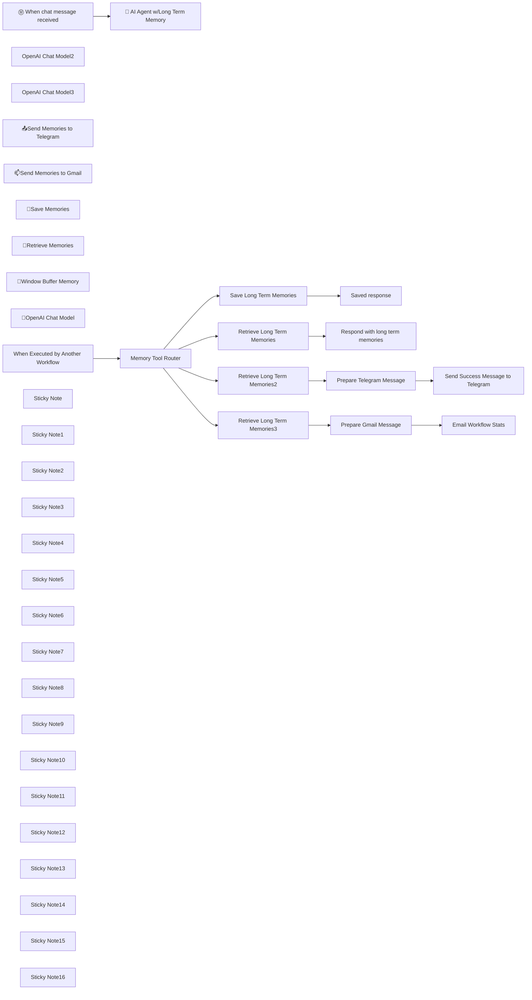

## Fluxo (.json) :

```json
{
  "id": "p7xESnT1xMZD2hRk",
  "meta": {
    "instanceId": "31e69f7f4a77bf465b805824e303232f0227212ae922d12133a0f96ffeab4fef",
    "templateCredsSetupCompleted": true
  },
  "name": "🧠 Give Your AI Agent Chatbot Long Term Memory Tools Router",
  "tags": [],
  "nodes": [
    {
      "id": "d5947a9d-bad4-4db7-8cdb-dc277928565a",
      "name": "When Executed by Another Workflow",
      "type": "n8n-nodes-base.executeWorkflowTrigger",
      "position": [
        320,
        -80
      ],
      "parameters": {
        "inputSource": "passthrough"
      },
      "typeVersion": 1.1
    },
    {
      "id": "c9e9715d-c691-4516-9e0c-cf393a18d814",
      "name": "Save Long Term Memories",
      "type": "n8n-nodes-base.googleDocs",
      "position": [
        1020,
        -80
      ],
      "parameters": {
        "actionsUi": {
          "actionFields": [
            {
              "text": "={\n  \"date\": \"{{ $now }}\",\n  \"memory\": \"{{ $json.query }}\"\n},\n",
              "action": "insert"
            }
          ]
        },
        "operation": "update",
        "documentURL": "1YFTbVGlnpdYF5FuA6grfyvzmcdjcPviClAqbJ5HJIlc"
      },
      "credentials": {
        "googleDocsOAuth2Api": {
          "id": "YWEHuG28zOt532MQ",
          "name": "Google Docs account"
        }
      },
      "typeVersion": 2
    },
    {
      "id": "306272bf-e264-4cfb-b8b6-8c0af1de3f14",
      "name": "Saved response",
      "type": "n8n-nodes-base.set",
      "position": [
        1200,
        -80
      ],
      "parameters": {
        "options": {},
        "assignments": {
          "assignments": [
            {
              "id": "6b7e85d8-379b-4a0f-9799-9193a29f0447",
              "name": "response",
              "type": "string",
              "value": "Memory saved"
            }
          ]
        }
      },
      "typeVersion": 3.4
    },
    {
      "id": "152b6922-8600-4fdb-8372-3b0102a7b73a",
      "name": "Respond with long term memories",
      "type": "n8n-nodes-base.set",
      "position": [
        1200,
        220
      ],
      "parameters": {
        "options": {},
        "assignments": {
          "assignments": [
            {
              "id": "6b7e85d8-379b-4a0f-9799-9193a29f0447",
              "name": "response",
              "type": "string",
              "value": "={{ $json.content }}"
            }
          ]
        }
      },
      "typeVersion": 3.4
    },
    {
      "id": "147ddd8d-6e42-44c0-95ca-9ab791f9452f",
      "name": "Retrieve Long Term Memories3",
      "type": "n8n-nodes-base.googleDocs",
      "position": [
        1020,
        900
      ],
      "parameters": {
        "operation": "get",
        "documentURL": "1YFTbVGlnpdYF5FuA6grfyvzmcdjcPviClAqbJ5HJIlc"
      },
      "credentials": {
        "googleDocsOAuth2Api": {
          "id": "YWEHuG28zOt532MQ",
          "name": "Google Docs account"
        }
      },
      "typeVersion": 2
    },
    {
      "id": "e3f1172b-ce33-4cce-8126-88e19afc53c6",
      "name": "Send Success Message to Telegram",
      "type": "n8n-nodes-base.telegram",
      "position": [
        1540,
        520
      ],
      "webhookId": "3ba1ee6d-1648-4421-823b-e68ae14d769b",
      "parameters": {
        "text": "=n8n User Memories\n{{ $json.text }}",
        "chatId": "={{ $env.TELEGRAM_CHAT_ID }}",
        "additionalFields": {
          "parse_mode": "HTML",
          "appendAttribution": false
        }
      },
      "credentials": {
        "telegramApi": {
          "id": "pAIFhguJlkO3c7aQ",
          "name": "Telegram account"
        }
      },
      "typeVersion": 1.2
    },
    {
      "id": "a77e8f01-889f-44b5-b4e1-493a97aa028c",
      "name": "Email Workflow Stats",
      "type": "n8n-nodes-base.gmail",
      "position": [
        1540,
        900
      ],
      "webhookId": "d9ef6f36-941f-4110-9b3e-9e54d9bc9581",
      "parameters": {
        "sendTo": "={{ $env.EMAIL_ADDRESS_JOE }}",
        "message": "={{ $json.text }}",
        "options": {
          "appendAttribution": false
        },
        "subject": "n8n User Memories"
      },
      "credentials": {
        "gmailOAuth2": {
          "id": "1xpVDEQ1yx8gV022",
          "name": "Gmail account"
        }
      },
      "typeVersion": 2.1
    },
    {
      "id": "2481fe73-9ef8-4e95-b7e5-38634b55837c",
      "name": "OpenAI Chat Model2",
      "type": "@n8n/n8n-nodes-langchain.lmChatOpenAi",
      "position": [
        1320,
        660
      ],
      "parameters": {
        "model": {
          "__rl": true,
          "mode": "list",
          "value": "gpt-4o-mini"
        },
        "options": {}
      },
      "credentials": {
        "openAiApi": {
          "id": "jEMSvKmtYfzAkhe6",
          "name": "OpenAi account"
        }
      },
      "typeVersion": 1.2
    },
    {
      "id": "9a45e091-c91c-4505-a8df-7a2e1d079200",
      "name": "OpenAI Chat Model3",
      "type": "@n8n/n8n-nodes-langchain.lmChatOpenAi",
      "position": [
        1320,
        1040
      ],
      "parameters": {
        "model": {
          "__rl": true,
          "mode": "list",
          "value": "gpt-4o-mini"
        },
        "options": {}
      },
      "credentials": {
        "openAiApi": {
          "id": "jEMSvKmtYfzAkhe6",
          "name": "OpenAi account"
        }
      },
      "typeVersion": 1.2
    },
    {
      "id": "6d12369e-38de-44c1-b764-64d6d9a79a25",
      "name": "📤Send Memories to Telegram",
      "type": "@n8n/n8n-nodes-langchain.toolWorkflow",
      "position": [
        1360,
        -500
      ],
      "parameters": {
        "name": "send_memories_to_telegram",
        "fields": {
          "values": [
            {
              "name": "route",
              "stringValue": "=send_memories_to_telegram"
            }
          ]
        },
        "workflowId": {
          "__rl": true,
          "mode": "id",
          "value": "={{ $workflow.id }}"
        },
        "description": "Call this tool to send memories to Telegram",
        "jsonSchemaExample": ""
      },
      "typeVersion": 1.2
    },
    {
      "id": "f1d0b366-70d5-4da3-937b-ea08afd364e4",
      "name": "📫Send Memories to Gmail",
      "type": "@n8n/n8n-nodes-langchain.toolWorkflow",
      "position": [
        1620,
        -500
      ],
      "parameters": {
        "name": "send_memories_to_gmail",
        "fields": {
          "values": [
            {
              "name": "route",
              "stringValue": "=send_memories_to_gmail"
            }
          ]
        },
        "workflowId": {
          "__rl": true,
          "mode": "id",
          "value": "={{ $workflow.id }}"
        },
        "description": "Call this tool to send memories to Gmail",
        "jsonSchemaExample": ""
      },
      "typeVersion": 1.2
    },
    {
      "id": "25d99971-263a-44ef-abb0-b517743f72eb",
      "name": "🧠Save Memories",
      "type": "@n8n/n8n-nodes-langchain.toolWorkflow",
      "position": [
        840,
        -500
      ],
      "parameters": {
        "name": "save_long_term_memory",
        "fields": {
          "values": [
            {
              "name": "route",
              "stringValue": "=save_memory"
            }
          ]
        },
        "workflowId": {
          "__rl": true,
          "mode": "id",
          "value": "={{ $workflow.id }}"
        },
        "description": "Call this tool to save long term memories",
        "jsonSchemaExample": ""
      },
      "typeVersion": 1.2
    },
    {
      "id": "0c9738d3-176a-4074-8340-ecfa3d9f9f7d",
      "name": "🔎Retrieve Memories",
      "type": "@n8n/n8n-nodes-langchain.toolWorkflow",
      "position": [
        1100,
        -500
      ],
      "parameters": {
        "name": "retrieve_long_term_memory",
        "fields": {
          "values": [
            {
              "name": "route",
              "stringValue": "=retrieve_memory"
            }
          ]
        },
        "workflowId": {
          "__rl": true,
          "mode": "id",
          "value": "={{ $workflow.id }}"
        },
        "description": "Call this tool to retrieve long term memories",
        "jsonSchemaExample": ""
      },
      "typeVersion": 1.2
    },
    {
      "id": "7967ec27-432e-4d35-b7e0-89eb84120754",
      "name": "🤯Window Buffer Memory",
      "type": "@n8n/n8n-nodes-langchain.memoryBufferWindow",
      "position": [
        520,
        -500
      ],
      "parameters": {
        "contextWindowLength": 10
      },
      "typeVersion": 1.3
    },
    {
      "id": "5f24781e-4f9a-4e33-8d33-ce281f7bcc46",
      "name": "🧠 AI Agent w/Long Term Memory",
      "type": "@n8n/n8n-nodes-langchain.agent",
      "position": [
        940,
        -920
      ],
      "parameters": {
        "options": {
          "systemMessage": "=You are a highly capable and intelligent assistant designed to assist users by leveraging tools for long-term memory, contextual understanding, and real-time information retrieval.  You have excellent long term memory.  The current date and time is {{ $now }}\n\n## TOOLS\n-save_long_term_memory\n-retrieve_long_term_memory\n-send_memories_to_gmail\n-send_memories_to_telegram\n\n## RULES\n- If you do not know the answer then consider checking the long term memories.\n\n\n\n\n\n"
        }
      },
      "typeVersion": 1.7
    },
    {
      "id": "ad644413-6587-415f-b7be-d58c05b94138",
      "name": "🤖OpenAI Chat Model",
      "type": "@n8n/n8n-nodes-langchain.lmChatOpenAi",
      "position": [
        260,
        -500
      ],
      "parameters": {
        "model": {
          "__rl": true,
          "mode": "list",
          "value": "gpt-4o-mini"
        },
        "options": {}
      },
      "credentials": {
        "openAiApi": {
          "id": "jEMSvKmtYfzAkhe6",
          "name": "OpenAi account"
        }
      },
      "typeVersion": 1.2
    },
    {
      "id": "076b0856-5ba4-498e-b279-21cf042f7f07",
      "name": "Ⓜ️ When chat message received",
      "type": "@n8n/n8n-nodes-langchain.chatTrigger",
      "position": [
        380,
        -920
      ],
      "webhookId": "2060403b-3fea-4fdf-a6d7-693bc477baaf",
      "parameters": {
        "options": {}
      },
      "typeVersion": 1.1
    },
    {
      "id": "fcf5872c-fcdc-445e-b095-f9cef14453b8",
      "name": "Prepare Telegram Message",
      "type": "@n8n/n8n-nodes-langchain.chainLlm",
      "position": [
        1200,
        520
      ],
      "parameters": {
        "text": "=Format this content into a simple unformatted list that can be sent to Telegram: {{ $json.content }}.  Avoid any preamble or further explanation.",
        "promptType": "define"
      },
      "typeVersion": 1.5
    },
    {
      "id": "c1d05bb9-390b-43aa-820d-45115df07f5c",
      "name": "Prepare Gmail Message",
      "type": "@n8n/n8n-nodes-langchain.chainLlm",
      "position": [
        1200,
        900
      ],
      "parameters": {
        "text": "=Format this content into a simple and modern HTML table that is max 800px wide that can be used as the content for an email: {{ $json.content }}.  Avoid any preamble or further explanation.  Remove all ``` and ```html from response.",
        "promptType": "define"
      },
      "typeVersion": 1.5
    },
    {
      "id": "98aa87af-8329-4af6-85da-fc97cb4ed9c3",
      "name": "Sticky Note",
      "type": "n8n-nodes-base.stickyNote",
      "position": [
        760,
        -620
      ],
      "parameters": {
        "color": 4,
        "height": 280,
        "content": "## 1️⃣ Save Memories"
      },
      "typeVersion": 1
    },
    {
      "id": "677f62ba-b009-48da-988e-e58d5063d005",
      "name": "Retrieve Long Term Memories",
      "type": "n8n-nodes-base.googleDocs",
      "position": [
        1020,
        220
      ],
      "parameters": {
        "operation": "get",
        "documentURL": "1YFTbVGlnpdYF5FuA6grfyvzmcdjcPviClAqbJ5HJIlc"
      },
      "credentials": {
        "googleDocsOAuth2Api": {
          "id": "YWEHuG28zOt532MQ",
          "name": "Google Docs account"
        }
      },
      "typeVersion": 2
    },
    {
      "id": "1c732f83-fb09-4a51-8aea-0f9d29d1cdfe",
      "name": "Memory Tool Router",
      "type": "n8n-nodes-base.switch",
      "position": [
        640,
        -100
      ],
      "parameters": {
        "rules": {
          "values": [
            {
              "outputKey": "1️⃣ Save",
              "conditions": {
                "options": {
                  "version": 2,
                  "leftValue": "",
                  "caseSensitive": true,
                  "typeValidation": "strict"
                },
                "combinator": "and",
                "conditions": [
                  {
                    "operator": {
                      "type": "string",
                      "operation": "equals"
                    },
                    "leftValue": "={{ $json.route }}",
                    "rightValue": "save_memory"
                  }
                ]
              },
              "renameOutput": true
            },
            {
              "outputKey": " 2️⃣Retrieve ",
              "conditions": {
                "options": {
                  "version": 2,
                  "leftValue": "",
                  "caseSensitive": true,
                  "typeValidation": "strict"
                },
                "combinator": "and",
                "conditions": [
                  {
                    "id": "86d44336-bab7-422f-9266-fcb513252d19",
                    "operator": {
                      "name": "filter.operator.equals",
                      "type": "string",
                      "operation": "equals"
                    },
                    "leftValue": "={{ $json.route }}",
                    "rightValue": "retrieve_memory"
                  }
                ]
              },
              "renameOutput": true
            },
            {
              "outputKey": " 3️⃣Telegram",
              "conditions": {
                "options": {
                  "version": 2,
                  "leftValue": "",
                  "caseSensitive": true,
                  "typeValidation": "strict"
                },
                "combinator": "and",
                "conditions": [
                  {
                    "id": "29f37628-6381-46af-babb-74bf00b4a849",
                    "operator": {
                      "name": "filter.operator.equals",
                      "type": "string",
                      "operation": "equals"
                    },
                    "leftValue": "={{ $json.route }}",
                    "rightValue": "send_memories_to_telegram"
                  }
                ]
              },
              "renameOutput": true
            },
            {
              "outputKey": "4️⃣Gmail",
              "conditions": {
                "options": {
                  "version": 2,
                  "leftValue": "",
                  "caseSensitive": true,
                  "typeValidation": "strict"
                },
                "combinator": "and",
                "conditions": [
                  {
                    "id": "fdb7c8aa-4108-43f6-8f6b-71cd8f383d2a",
                    "operator": {
                      "name": "filter.operator.equals",
                      "type": "string",
                      "operation": "equals"
                    },
                    "leftValue": "={{ $json.route }}",
                    "rightValue": "send_memories_to_gmail"
                  }
                ]
              },
              "renameOutput": true
            }
          ]
        },
        "options": {}
      },
      "typeVersion": 3.2
    },
    {
      "id": "79de3862-b15a-4380-ab27-cfde66e8bb95",
      "name": "Sticky Note1",
      "type": "n8n-nodes-base.stickyNote",
      "position": [
        1280,
        -620
      ],
      "parameters": {
        "color": 6,
        "height": 280,
        "content": "## 3️⃣ Send Memories to Telegram"
      },
      "typeVersion": 1
    },
    {
      "id": "03df9947-9354-4f21-8b8a-fed130dcfc6a",
      "name": "Sticky Note2",
      "type": "n8n-nodes-base.stickyNote",
      "position": [
        1540,
        -620
      ],
      "parameters": {
        "color": 6,
        "height": 280,
        "content": "## 4️⃣ Send Memories to Gmail"
      },
      "typeVersion": 1
    },
    {
      "id": "9e8ee085-ec68-4f64-9098-877e166b1c37",
      "name": "Sticky Note3",
      "type": "n8n-nodes-base.stickyNote",
      "position": [
        1020,
        -620
      ],
      "parameters": {
        "color": 4,
        "height": 280,
        "content": "## 2️⃣ Retrieve Memories"
      },
      "typeVersion": 1
    },
    {
      "id": "9c3d6609-cc4a-4bf5-b914-ee57e085cecd",
      "name": "Sticky Note4",
      "type": "n8n-nodes-base.stickyNote",
      "position": [
        440,
        -620
      ],
      "parameters": {
        "color": 3,
        "height": 280,
        "content": "## Short Term Chat Memory"
      },
      "typeVersion": 1
    },
    {
      "id": "97f47b93-c1e1-4230-b84c-3b99aa140d55",
      "name": "Sticky Note5",
      "type": "n8n-nodes-base.stickyNote",
      "position": [
        180,
        -620
      ],
      "parameters": {
        "color": 5,
        "height": 280,
        "content": "## Cloud LLM"
      },
      "typeVersion": 1
    },
    {
      "id": "4758ad55-d5f2-4a87-a05a-be465d803ca1",
      "name": "Sticky Note6",
      "type": "n8n-nodes-base.stickyNote",
      "position": [
        120,
        -1100
      ],
      "parameters": {
        "width": 1740,
        "height": 840,
        "content": "# 🧠 AI Agent Chatbot With Long Term Memory Tools"
      },
      "typeVersion": 1
    },
    {
      "id": "eb74a05d-7f34-4ba0-ae98-c22bb3637c6b",
      "name": "Sticky Note7",
      "type": "n8n-nodes-base.stickyNote",
      "position": [
        720,
        -700
      ],
      "parameters": {
        "color": 7,
        "width": 1100,
        "height": 400,
        "content": "## 🛠️ Agentic Long Term Memory Management Tool Options"
      },
      "typeVersion": 1
    },
    {
      "id": "d9d251d2-172b-4a8e-bec3-bf8f297628c6",
      "name": "Sticky Note8",
      "type": "n8n-nodes-base.stickyNote",
      "position": [
        280,
        -980
      ],
      "parameters": {
        "color": 4,
        "width": 300,
        "height": 240,
        "content": "## 👍Try Me!"
      },
      "typeVersion": 1
    },
    {
      "id": "90554969-0b73-4d4d-87f2-37645b9f7f08",
      "name": "Sticky Note9",
      "type": "n8n-nodes-base.stickyNote",
      "position": [
        920,
        -160
      ],
      "parameters": {
        "color": 4,
        "width": 560,
        "height": 280,
        "content": "## 1️⃣ Save Long Term Memories Tool"
      },
      "typeVersion": 1
    },
    {
      "id": "34cbb84d-48a5-480f-a7c3-81bbef24194a",
      "name": "Sticky Note10",
      "type": "n8n-nodes-base.stickyNote",
      "position": [
        920,
        140
      ],
      "parameters": {
        "color": 4,
        "width": 560,
        "height": 280,
        "content": "## 2️⃣ Retrieve Long Term Memories Tool"
      },
      "typeVersion": 1
    },
    {
      "id": "dc23d68e-0f93-495a-aaa0-e4bb6f18870d",
      "name": "Sticky Note11",
      "type": "n8n-nodes-base.stickyNote",
      "position": [
        920,
        440
      ],
      "parameters": {
        "color": 6,
        "width": 840,
        "height": 360,
        "content": "## 3️⃣ Send Memories to Telegram Tool"
      },
      "typeVersion": 1
    },
    {
      "id": "0ed43ec0-a39c-4323-9851-988e774302d7",
      "name": "Retrieve Long Term Memories2",
      "type": "n8n-nodes-base.googleDocs",
      "position": [
        1020,
        520
      ],
      "parameters": {
        "operation": "get",
        "documentURL": "1YFTbVGlnpdYF5FuA6grfyvzmcdjcPviClAqbJ5HJIlc"
      },
      "credentials": {
        "googleDocsOAuth2Api": {
          "id": "YWEHuG28zOt532MQ",
          "name": "Google Docs account"
        }
      },
      "typeVersion": 2
    },
    {
      "id": "17d2cef6-765c-4fb4-8af0-1ebc868f6669",
      "name": "Sticky Note12",
      "type": "n8n-nodes-base.stickyNote",
      "position": [
        920,
        820
      ],
      "parameters": {
        "color": 6,
        "width": 840,
        "height": 360,
        "content": "## 4️⃣ Send Memories to Gmail Tool"
      },
      "typeVersion": 1
    },
    {
      "id": "03977fa0-a4cd-4cfe-8967-d6a5e3227200",
      "name": "Sticky Note13",
      "type": "n8n-nodes-base.stickyNote",
      "position": [
        540,
        -220
      ],
      "parameters": {
        "color": 2,
        "width": 300,
        "height": 380,
        "content": "## Memory Tool Router"
      },
      "typeVersion": 1
    },
    {
      "id": "994b124c-4f5b-44c6-845e-9886d7b5f07d",
      "name": "Sticky Note14",
      "type": "n8n-nodes-base.stickyNote",
      "position": [
        240,
        -220
      ],
      "parameters": {
        "color": 7,
        "width": 260,
        "height": 380,
        "content": "## Receive Memory Tool Instructions from Agent"
      },
      "typeVersion": 1
    },
    {
      "id": "7c400ccf-af37-4b5a-8dfe-431a7d52286b",
      "name": "Sticky Note15",
      "type": "n8n-nodes-base.stickyNote",
      "position": [
        880,
        -220
      ],
      "parameters": {
        "color": 7,
        "width": 920,
        "height": 1440,
        "content": "## 🛠️ Long Term Memory Tool Kit"
      },
      "typeVersion": 1
    },
    {
      "id": "0b00f892-f98b-41be-952c-570da546f9f7",
      "name": "Sticky Note16",
      "type": "n8n-nodes-base.stickyNote",
      "position": [
        120,
        200
      ],
      "parameters": {
        "width": 720,
        "height": 1300,
        "content": "## Enhance Your AI Workflow with Long-Term Memory and Dynamic Tool Routing\n\n#### This n8n workflow empowers your AI agent with **long-term memory** and a **dynamic tools router**, enabling it to provide intelligent, context-aware responses while seamlessly managing tasks across multiple tools. By combining memory persistence and modular tool routing, this solution enhances the capabilities of your AI agent, making it smarter, more efficient, and highly adaptable.\n\n## 🚀 How It Works\n\n#### 🧠 Long-Term Memory Management\n- The AI agent can **save** and **retrieve memories** using Google Docs as a storage system.\n- Persistent memory allows the agent to recall past interactions, user preferences, and contextual details for personalized responses.\n\n#### 🛠️ Tools Router for Dynamic Task Management\n- A **tools router** directs tasks to the appropriate tools based on the AI agent's instructions.\n- Supported tools include:\n  - **Save Memories**: Store important data for future reference.\n  - **Retrieve Memories**: Access stored information when needed.\n  - **Send Notifications via Gmail or Telegram**: Share insights or updates with stakeholders.\n\n#### 🤖 AI-Powered Contextual Understanding\n- The workflow integrates an OpenAI GPT-based model to process user inputs intelligently.\n- The AI agent uses a **window buffer memory** for short-term context and leverages long-term memory when necessary.\n\n#### 📤 Multi-Channel Notifications\n- Automatically send memory summaries or workflow updates via Gmail or Telegram for enhanced communication.\n\n---\n\n## 🔧 Setup Steps\n\n#### 🔑 Configure API Credentials\nSet up API connections for:\n- **OpenAI** (for AI processing).\n- **Google Docs** (for long-term memory storage).\n- **Gmail/Telegram** (for notifications).\n\n#### ⚙️ Customize Workflow Parameters\n- Adjust the AI agent's system message to align with your specific use case or tone.\n- Define routing rules in the tools router to suit your workflow needs.\n\n#### 🧪 Test & Deploy\n- Test the workflow by interacting with the AI agent and verifying:\n  - Accurate memory saving/retrieval.\n  - Correct task routing via the tools router.\n  - Seamless notification delivery.\n"
      },
      "typeVersion": 1
    }
  ],
  "active": false,
  "pinData": {},
  "settings": {
    "timezone": "America/Vancouver",
    "executionOrder": "v1"
  },
  "versionId": "5d92d73f-0341-4ab1-937e-6be387f6ea52",
  "connections": {
    "🧠Save Memories": {
      "ai_tool": [
        [
          {
            "node": "🧠 AI Agent w/Long Term Memory",
            "type": "ai_tool",
            "index": 0
          }
        ]
      ]
    },
    "Memory Tool Router": {
      "main": [
        [
          {
            "node": "Save Long Term Memories",
            "type": "main",
            "index": 0
          }
        ],
        [
          {
            "node": "Retrieve Long Term Memories",
            "type": "main",
            "index": 0
          }
        ],
        [
          {
            "node": "Retrieve Long Term Memories2",
            "type": "main",
            "index": 0
          }
        ],
        [
          {
            "node": "Retrieve Long Term Memories3",
            "type": "main",
            "index": 0
          }
        ]
      ]
    },
    "OpenAI Chat Model2": {
      "ai_languageModel": [
        [
          {
            "node": "Prepare Telegram Message",
            "type": "ai_languageModel",
            "index": 0
          }
        ]
      ]
    },
    "OpenAI Chat Model3": {
      "ai_languageModel": [
        [
          {
            "node": "Prepare Gmail Message",
            "type": "ai_languageModel",
            "index": 0
          }
        ]
      ]
    },
    "Prepare Gmail Message": {
      "main": [
        [
          {
            "node": "Email Workflow Stats",
            "type": "main",
            "index": 0
          }
        ]
      ]
    },
    "🔎Retrieve Memories": {
      "ai_tool": [
        [
          {
            "node": "🧠 AI Agent w/Long Term Memory",
            "type": "ai_tool",
            "index": 0
          }
        ]
      ]
    },
    "🤖OpenAI Chat Model": {
      "ai_languageModel": [
        [
          {
            "node": "🧠 AI Agent w/Long Term Memory",
            "type": "ai_languageModel",
            "index": 0
          }
        ]
      ]
    },
    "Save Long Term Memories": {
      "main": [
        [
          {
            "node": "Saved response",
            "type": "main",
            "index": 0
          }
        ]
      ]
    },
    "Prepare Telegram Message": {
      "main": [
        [
          {
            "node": "Send Success Message to Telegram",
            "type": "main",
            "index": 0
          }
        ]
      ]
    },
    "🤯Window Buffer Memory": {
      "ai_memory": [
        [
          {
            "node": "🧠 AI Agent w/Long Term Memory",
            "type": "ai_memory",
            "index": 0
          }
        ]
      ]
    },
    "📫Send Memories to Gmail": {
      "ai_tool": [
        [
          {
            "node": "🧠 AI Agent w/Long Term Memory",
            "type": "ai_tool",
            "index": 0
          }
        ]
      ]
    },
    "Retrieve Long Term Memories": {
      "main": [
        [
          {
            "node": "Respond with long term memories",
            "type": "main",
            "index": 0
          }
        ]
      ]
    },
    "Retrieve Long Term Memories2": {
      "main": [
        [
          {
            "node": "Prepare Telegram Message",
            "type": "main",
            "index": 0
          }
        ]
      ]
    },
    "Retrieve Long Term Memories3": {
      "main": [
        [
          {
            "node": "Prepare Gmail Message",
            "type": "main",
            "index": 0
          }
        ]
      ]
    },
    "📤Send Memories to Telegram": {
      "ai_tool": [
        [
          {
            "node": "🧠 AI Agent w/Long Term Memory",
            "type": "ai_tool",
            "index": 0
          }
        ]
      ]
    },
    "When Executed by Another Workflow": {
      "main": [
        [
          {
            "node": "Memory Tool Router",
            "type": "main",
            "index": 0
          }
        ]
      ]
    },
    "Ⓜ️ When chat message received": {
      "main": [
        [
          {
            "node": "🧠 AI Agent w/Long Term Memory",
            "type": "main",
            "index": 0
          }
        ]
      ]
    }
  }
}
```

<a id="template-667"></a>

## Template 667 - Detecção de logins suspeitos

- **Nome:** Detecção de logins suspeitos
- **Descrição:** Monitora eventos de login, enriquece-os com dados de IP e user agent, avalia confiança e anomalias (local ou dispositivo) e notifica a equipe e o usuário quando necessário.
- **Funcionalidade:** • Extração de dados do evento: Pega IP, user agent, timestamp, URL e userId dos eventos de login.
• Enriquecimento com inteligência de IP: Consulta uma base de reputação para verificar se o IP é conhecido por atividade de varredura ou serviços comuns.
• Geolocalização do IP: Obtém cidade, país e outras informações geográficas do IP para detectar logins em locais novos.
• Análise do user agent: Decodifica navegador, sistema operacional e tipo de dispositivo para identificar alterações.
• Consolidação de contexto: Agrupa informações de reputação, geolocalização e user agent em um único registro para avaliação.
• Comparação com histórico: Busca os últimos logins do usuário para identificar novas cidades ou novos dispositivos/navegadores.
• Classificação e priorização de risco: Atribui níveis de prioridade (alto, médio, baixo) com base na classificação do IP e no contexto.
• Notificações para a equipe: Envia alertas com detalhes do evento e link para investigação.
• Notificação ao usuário final: Envia e-mail formatado para o usuário quando um login suspeito é detectado.
• Consulta de dados do usuário: Recupera informações do usuário no banco para permitir notificações e contexto adicional.
- **Ferramentas:** • GreyNoise: Serviço de inteligência de segurança para classificar e fornecer contexto sobre endereços IP (ruído, riot, classificação).
• IP-API (ip-api.com): Serviço de geolocalização de IP para obter cidade, região e país do endereço IP.
• UserParser (userparser.com): API para analisar user agents e extrair navegador, sistema operacional e tipo de dispositivo.
• Slack: Canal de comunicação para enviar alertas e detalhes de incidentes à equipe de segurança.
• Gmail: Serviço de envio de e-mails usado para notificar usuários finais sobre logins suspeitos.
• PostgreSQL: Base de dados usada para consultar o histórico de logins e dados do usuário.


## Fluxo visual

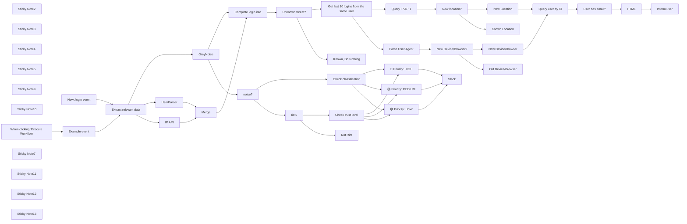

## Fluxo (.json) :

```json
{
  "id": "xQHiKDTkezDY5lFu",
  "meta": {
    "instanceId": "03e9d14e9196363fe7191ce21dc0bb17387a6e755dcc9acc4f5904752919dca8"
  },
  "name": "Suspicious_login_detection",
  "tags": [
    {
      "id": "GCHVocImoXoEVnzP",
      "name": "🛠️ In progress",
      "createdAt": "2023-10-31T02:17:21.618Z",
      "updatedAt": "2023-10-31T02:17:21.618Z"
    },
    {
      "id": "QPJKatvLSxxtrE8U",
      "name": "Secops",
      "createdAt": "2023-10-31T02:15:11.396Z",
      "updatedAt": "2023-10-31T02:15:11.396Z"
    },
    {
      "id": "hF4M6DtfFqOn2HK2",
      "name": "createdBy:Milorad",
      "createdAt": "2023-10-31T02:20:20.366Z",
      "updatedAt": "2023-10-31T02:20:20.366Z"
    }
  ],
  "nodes": [
    {
      "id": "a95e464a-7451-4737-9db8-993a6568595b",
      "name": "Extract relevant data",
      "type": "n8n-nodes-base.set",
      "position": [
        -260,
        700
      ],
      "parameters": {
        "values": {
          "string": [
            {
              "name": "ip",
              "value": "={{ $json.body.context.ip }}"
            },
            {
              "name": "userAgent",
              "value": "={{ $json.body.context.userAgent }}"
            },
            {
              "name": "timestamp",
              "value": "={{ $json.body.originalTimestamp }}"
            },
            {
              "name": "url",
              "value": "={{ $json.body.context.page.url }}"
            },
            {
              "name": "userId",
              "value": "={{ $json.body.userId }}"
            }
          ]
        },
        "options": {},
        "keepOnlySet": true
      },
      "typeVersion": 2
    },
    {
      "id": "d7dea680-14f3-4ffd-bfaf-f928b69d801d",
      "name": "New /login event",
      "type": "n8n-nodes-base.webhook",
      "disabled": true,
      "position": [
        -740,
        700
      ],
      "webhookId": "705ca4c4-0a38-4ef8-9de9-abc8b3686dc6",
      "parameters": {
        "path": "705ca4c4-0a38-4ef8-9de9-abc8b3686dc6",
        "options": {},
        "httpMethod": "POST"
      },
      "typeVersion": 1
    },
    {
      "id": "bd75aad9-2d24-4083-823d-bc789fb7ef07",
      "name": "Unknown threat?",
      "type": "n8n-nodes-base.if",
      "position": [
        720,
        1240
      ],
      "parameters": {
        "conditions": {
          "boolean": [
            {
              "value1": "={{ $json.noise }}"
            },
            {
              "value1": "={{ $json.riot }}"
            }
          ]
        }
      },
      "typeVersion": 1
    },
    {
      "id": "d0845980-3b8c-4659-95a1-82e925867f28",
      "name": "Get last 10 logins from the same user",
      "type": "n8n-nodes-base.postgres",
      "disabled": true,
      "position": [
        960,
        1220
      ],
      "parameters": {
        "query": "SELECT * FROM staging_n8n_cloud_frontend.user_signed_in WHERE user_id='{{ $('Extract relevant data').item.json.userId }}' ORDER BY received_at DESC LIMIT 10;",
        "options": {},
        "operation": "executeQuery"
      },
      "credentials": {
        "postgres": {
          "id": "aP9LLonHicGm2A7j",
          "name": "n8n product data"
        }
      },
      "typeVersion": 2.2
    },
    {
      "id": "90e859b2-aa64-48e7-a8fe-696e3b7216f1",
      "name": "Query IP API1",
      "type": "n8n-nodes-base.httpRequest",
      "position": [
        1240,
        1340
      ],
      "parameters": {
        "url": "=http://ip-api.com/json/{{ $json.context_ip }}",
        "options": {}
      },
      "typeVersion": 4.1
    },
    {
      "id": "3a944973-132a-4272-97e3-42528eb4c0fc",
      "name": "New location?",
      "type": "n8n-nodes-base.if",
      "position": [
        1440,
        1340
      ],
      "parameters": {
        "conditions": {
          "string": [
            {
              "value1": "={{ $json.city }}",
              "value2": "={{ $('Merge').item.json.city }}",
              "operation": "notEqual"
            }
          ]
        }
      },
      "typeVersion": 1
    },
    {
      "id": "fb4d5d07-58ae-4b17-a389-29e7fbe2caa2",
      "name": "Parse User Agent",
      "type": "n8n-nodes-base.httpRequest",
      "position": [
        1260,
        1640
      ],
      "parameters": {
        "url": "https://api.userparser.com/1.1/detect",
        "options": {},
        "sendQuery": true,
        "authentication": "genericCredentialType",
        "genericAuthType": "httpQueryAuth",
        "queryParameters": {
          "parameters": [
            {
              "name": "ua",
              "value": "={{ $json.context_user_agent }}"
            }
          ]
        }
      },
      "credentials": {
        "httpQueryAuth": {
          "id": "33f1NrH1bLdXCGyw",
          "name": "n8n Userparser API Key"
        }
      },
      "typeVersion": 4.1
    },
    {
      "id": "56442924-914c-461d-b4d7-f08192e1b53b",
      "name": "Merge",
      "type": "n8n-nodes-base.merge",
      "position": [
        295,
        1502
      ],
      "parameters": {
        "mode": "combine",
        "options": {},
        "combinationMode": "multiplex"
      },
      "typeVersion": 2.1
    },
    {
      "id": "2b36f782-029d-41de-8823-6c083f3c305a",
      "name": "New Device/Browser?",
      "type": "n8n-nodes-base.if",
      "position": [
        1460,
        1640
      ],
      "parameters": {
        "conditions": {
          "string": [
            {
              "value1": "={{ $json.browser.name }}",
              "value2": "={{ $('Complete login info').first().json.browser.name }}",
              "operation": "notEqual"
            },
            {
              "value1": "={{ $json.operatingSystem.name }}",
              "value2": "={{ $('Complete login info').first().json.operatingSystem.name }}",
              "operation": "notEqual"
            },
            {
              "value1": "={{ $json.device.type }}",
              "value2": "={{ $('Complete login info').first().json.device.type }}",
              "operation": "notEqual"
            }
          ]
        },
        "combineOperation": "any"
      },
      "typeVersion": 1
    },
    {
      "id": "612c3704-6ea1-4978-ae84-17326f459c25",
      "name": "Complete login info",
      "type": "n8n-nodes-base.merge",
      "position": [
        540,
        1240
      ],
      "parameters": {
        "mode": "combine",
        "options": {},
        "combinationMode": "multiplex"
      },
      "typeVersion": 2.1
    },
    {
      "id": "9c097c31-a86d-45fe-92c7-14a58eae87b4",
      "name": "Query user by ID",
      "type": "n8n-nodes-base.postgres",
      "disabled": true,
      "position": [
        2020,
        1340
      ],
      "parameters": {
        "query": "SELECT * FROM staging_n8n_cloud_frontend.users WHERE id='{{ $('Extract relevant data').item.json.userId }}'",
        "options": {},
        "operation": "executeQuery"
      },
      "credentials": {
        "postgres": {
          "id": "aP9LLonHicGm2A7j",
          "name": "n8n product data"
        }
      },
      "typeVersion": 2.2
    },
    {
      "id": "cd6fb55b-b8f6-4778-a62a-34be42e2660d",
      "name": "New Location",
      "type": "n8n-nodes-base.noOp",
      "position": [
        1660,
        1280
      ],
      "parameters": {},
      "executeOnce": true,
      "typeVersion": 1
    },
    {
      "id": "7070a43a-d588-4bbb-b8d0-50e8eff171df",
      "name": "New Device/Browser",
      "type": "n8n-nodes-base.noOp",
      "position": [
        1674,
        1625
      ],
      "parameters": {},
      "executeOnce": true,
      "typeVersion": 1
    },
    {
      "id": "dca6d5ed-d92f-49a6-9910-c9194e696e70",
      "name": "User has email?",
      "type": "n8n-nodes-base.if",
      "position": [
        2360,
        1360
      ],
      "parameters": {
        "conditions": {
          "string": [
            {
              "value1": "={{ $json.email }}",
              "operation": "isNotEmpty"
            }
          ]
        }
      },
      "typeVersion": 1
    },
    {
      "id": "14cd3d37-5c00-4750-8ad2-f78fce66019c",
      "name": "HTML",
      "type": "n8n-nodes-base.html",
      "position": [
        2580,
        1313
      ],
      "parameters": {
        "html": "<p>\n  Hello {{ $json.first_name || $json.username }},\n</p>\n<p>\n  We've detected a recent login to your n8n account from a new device or location. Here are the details:\n</p>\n<p>\n  <ul>\n    <li><b>Username:</b> {{ $json.username }}</li>\n    <li><b>Date & Time:</b> {{ $('Extract relevant data').item.json.timestamp }}</li>\n    <li><b>Location:</b> {{ $('Complete login info').item.json.city }}, {{ $('Complete login info').item.json.country }}</li>\n    <li><b>Device:</b> {{ $('Complete login info').item.json.operatingSystem.name }} ({{ $('Complete login info').item.json.device.type }})</li>\n  </ul>\n</p>\n<p>\n  If this was you, you can disregard this email. We just wanted to make sure it was you who logged in from a new device or location.\n</p>\n  If this wasn't you, we recommend resetting your password right away.\n</p>\n\n<style>\n  p {\n    font-family: sans-serif;\n  }\n</style>"
      },
      "typeVersion": 1
    },
    {
      "id": "e99f7779-9b84-4f8c-80a0-b34c3c9df5b4",
      "name": "Inform user",
      "type": "n8n-nodes-base.gmail",
      "disabled": true,
      "position": [
        2740,
        1313
      ],
      "parameters": {
        "sendTo": "={{ $('User has email?').item.json.email }}",
        "message": "={{ $json.html }}",
        "options": {},
        "subject": "Important: Usual Login Attempt Detected"
      },
      "credentials": {
        "gmailOAuth2": {
          "id": "162",
          "name": "Gmail - milorad@n8n.io"
        }
      },
      "typeVersion": 2
    },
    {
      "id": "b280b287-7b20-4dcb-9c0a-a3e5c3a60771",
      "name": "noise?",
      "type": "n8n-nodes-base.if",
      "position": [
        340,
        220
      ],
      "parameters": {
        "conditions": {
          "boolean": [
            {
              "value1": "={{ $json.noise }}",
              "value2": true
            }
          ]
        }
      },
      "typeVersion": 1
    },
    {
      "id": "5be949da-f04a-44f9-9cf0-5e221f9d27e8",
      "name": "Slack",
      "type": "n8n-nodes-base.slack",
      "disabled": true,
      "position": [
        1560,
        500
      ],
      "parameters": {
        "text": "=Suspicious login attempt detected:\n  - Priority: {{ $json.priority }}\n  - User: {{ $('Extract relevant data').item.json[\"userId\"] }}\n  - IP: {{ $('Extract relevant data').item.json[\"ip\"] }}\n  - Timestamp: {{ $('Extract relevant data').item.json[\"timestamp\"] }}\n  - User Agent: {{ $('Extract relevant data').item.json[\"userAgent\"] }}\nGreyNoise report: https://viz.greynoise.io/ip/{{ $('Extract relevant data').item.json[\"ip\"] }}",
        "select": "channel",
        "channelId": {
          "__rl": true,
          "mode": "name",
          "value": "#slack-message-test"
        },
        "otherOptions": {}
      },
      "credentials": {
        "slackApi": {
          "id": "114",
          "name": "n8n Slack"
        }
      },
      "typeVersion": 2
    },
    {
      "id": "241e492c-fb9a-4b93-bd76-4167cb67f212",
      "name": "Check trust level",
      "type": "n8n-nodes-base.switch",
      "position": [
        780,
        360
      ],
      "parameters": {
        "rules": {
          "rules": [
            {
              "output": 3,
              "value2": 1,
              "operation": "equal"
            },
            {
              "output": 2,
              "value2": 2,
              "operation": "equal"
            }
          ]
        },
        "value1": "={{ $json.trust_level }}",
        "fallbackOutput": 1
      },
      "typeVersion": 1
    },
    {
      "id": "f99741d0-161e-49c6-8e41-d61b080e977d",
      "name": "Check classification",
      "type": "n8n-nodes-base.switch",
      "position": [
        780,
        200
      ],
      "parameters": {
        "rules": {
          "rules": [
            {
              "value2": "malicious"
            },
            {
              "output": 2,
              "value2": "benign"
            },
            {
              "output": 1,
              "value2": "unknown"
            }
          ]
        },
        "value1": "={{ $json.classification }}",
        "dataType": "string"
      },
      "typeVersion": 1
    },
    {
      "id": "594857f6-713f-496e-8257-b74acf5d1282",
      "name": "Sticky Note2",
      "type": "n8n-nodes-base.stickyNote",
      "position": [
        0.10300782209924364,
        -502.1236093865191
      ],
      "parameters": {
        "width": 1443.8164871528645,
        "height": 1185.151137495839,
        "content": "\n## 🚦 Advanced Threat Prioritization with GreyNoise Data\n\nIn this section of the workflow, the integration of GreyNoise data, particularly in the `GreyNoise` node, plays a pivotal role in refining the threat prioritization process. This node's interaction with GreyNoise ensures that each alert is given an appropriate level of attention, based on the nature of the IP address involved.\n\n-   **GreyNoise Analysis for Inbound Threats:** When the `GreyNoise` node identifies an IP address, it queries GreyNoise, considering both NOISE and RIOT datasets ([More here](https://docs.greynoise.io/docs/riot-data)). The response from this node guides the subsequent steps:\n    -   **High Priority for Unknown IPs:** The `Check trust level` and `Check classification` nodes act here. If GreyNoise has no data on the IP (noise:false, riot:false), the priority is set high in the `🔴 Priority: HIGH` node. This indicates a potential targeted attack, requiring immediate analyst review.\n    -   **Low to Medium Priority for Common Business Services:** IPs identified as part of common business services (riot:true), depending on their trust level and operation status, are assigned low to medium priority by the `🟡 Priority: MEDIUM` and `🟢 Priority: LOW` nodes. This reflects a lower risk of malicious activity.\n-   **Classification-Based Prioritization:** The workflow also considers the GreyNoise classification of the IP (malicious, benign, unknown) in the `Check classification` node:\n    -   **Malicious IPs:** Medium-high priority, suggesting opportunistic but potentially harmful activity, set in the `🔴 Priority: HIGH` node.\n    -   **Benign IPs:** Low priority, as these are usually harmless scans by known actors, designated in the `🟢 Priority: LOW` node.\n    -   **Unknown IPs:** Low-medium priority, indicating possibly innocuous but unverified activity, managed by the `🟡 Priority: MEDIUM` node.\n-   **Additional Context for Outbound Threats:** For outbound connections, the workflow prioritizes alerts based on whether the IP is a known service provider or a known device scanning the internet, as interpreted by the `GreyNoise` node. High priority is assigned to outbound connections to scanning devices in the `🔴 Priority: HIGH` node, indicating potentially unwanted behavior.\n\n\nThis approach, leveraging GreyNoise's advanced data analytics, showcases n8n's capability to deliver sophisticated cybersecurity solutions. By integrating this intelligent prioritization mechanism, the workflow ensures that your security team focuses on the most pressing threats first, enhancing overall security posture.\n\n### Authentication - No Free Tier Available\n\nTo set your API key for GreyNoise, open the `GreyNoise` node, and add a new authentication credential. Choose `Generic Credential Type` then `Header Auth`. Lastly, under `Credential for Header Auth` set the name to `key` and value to your `api key`."
      },
      "typeVersion": 1
    },
    {
      "id": "ee90c638-882d-4a2e-8164-adaf4ec386be",
      "name": "Sticky Note3",
      "type": "n8n-nodes-base.stickyNote",
      "position": [
        1450.4432083435722,
        -139
      ],
      "parameters": {
        "width": 560.0194854548777,
        "height": 818.6128004838087,
        "content": "\n## 📢 Slack Notification for Alert Dissemination\n\nThe `Slack` node plays a crucial role in alert communication. It ensures that once a threat is identified and prioritized, the relevant information is quickly disseminated to your security team via Slack.\n\n-   **Timely Alert Notifications:** The `Slack` node is configured to send detailed alerts to a specified Slack channel. These alerts include critical information such as the priority level, user ID, IP address, timestamp, and user agent of the suspicious login attempt. It ensures that your team is promptly informed about potential threats, allowing for quick action to mitigate risks.\n-   **Integration of Data from Previous Nodes:** This node adeptly utilizes data extracted and processed by earlier nodes like `Extract relevant data`. It enriches the Slack message with this detailed information, providing a comprehensive overview of the threat.\n-   **Direct Link to GreyNoise Analysis:** Additionally, the Slack message includes a direct link to the GreyNoise visualization for the IP in question. This link, crafted using data from the `Extract relevant data` node, allows team members to quickly access in-depth information about the IP, facilitating a faster and more informed response.\n\n\nThis approach demonstrates n8n's ability to integrate seamlessly with communication tools like Slack, ensuring that cybersecurity teams are always informed and ready to respond to threats efficiently."
      },
      "typeVersion": 1
    },
    {
      "id": "b617da5f-f7e0-4c6d-8080-c1d4b2e2ed53",
      "name": "Sticky Note4",
      "type": "n8n-nodes-base.stickyNote",
      "position": [
        477,
        690
      ],
      "parameters": {
        "width": 696.8700988949365,
        "height": 894.3487921624444,
        "content": "\n## 🔄  Synthesizing Data for Comprehensive Analysis\nThe `Complete login info` node serves as a crucial juncture, integrating data from multiple sources for a detailed analysis of each login attempt.\n\n-   **Combining Multiple Data Streams:** The `Complete login info` node merges information from the `GreyNoise`, `IP API`, and `UserParser` nodes. This process creates a comprehensive dataset by combining threat intelligence from GreyNoise, geolocation details from IP-API, and user agent information from UserParser.\n-   **Enhanced Context for Security Analysis:** By amalgamating data from these varied sources, the workflow gains a multi-faceted view of each login attempt. This enriched context is essential for identifying potential security threats with higher precision.\n-   **Efficient Workflow Structure:** The integration of these diverse data points exemplifies n8n's efficiency in managing complex workflows. By funneling various streams of information into a single node, the workflow ensures that all relevant data is considered in unison during the analysis phase.\n-   **Informing Subsequent Workflow Steps:** The dataset prepared by the `Complete login info` node lays the groundwork for further steps in the workflow. It provides the necessary context for nodes that follow, such as the `Unknown threat?` and `Get last 10 logins from the same user` nodes, to make informed decisions based on a holistic view of the login event."
      },
      "typeVersion": 1
    },
    {
      "id": "1e106297-b7db-4b2d-b08c-a35880782c8c",
      "name": "Sticky Note5",
      "type": "n8n-nodes-base.stickyNote",
      "position": [
        1185,
        691
      ],
      "parameters": {
        "width": 663.6738255654103,
        "height": 892.4220900613532,
        "content": "\n## 📍 Assessing Login Location Anomalies\n\nThe nodes following `Get last 10 logins from the same user` are dedicated to analyzing login location patterns to identify any anomalies.\n\n-   **Fetching Historical Login Data:** The `Get last 10 logins from the same user` node queries a Postgres database to retrieve the last 10 login records for a user. This data forms the baseline for identifying unusual login locations.\n\n-   **Comparing Current and Historical Geolocation Data:** The `Query IP API1` node fetches the geolocation data for the current login attempt. This data is then compared with historical login locations in the `New location?` node.\n\n-   **Identifying Location Anomalies:** The `New location?` node checks if the city from the current login is different from the cities in the user's login history. This comparison is crucial to detect any unusual login patterns, such as logins from new, potentially suspicious locations.\n\n-   **Routing Based on Location Consistency:** Depending on whether the current login location matches historical patterns, the workflow branches to either the `New Location` or `Known Location` nodes. The `New Location` node triggers when a login from a new city is detected, indicating a potential security risk. Conversely, the `Known Location` node is activated when the login location is consistent with historical data, suggesting a regular login pattern."
      },
      "typeVersion": 1
    },
    {
      "id": "3e091a54-2fdc-491c-a168-0fb4fb704fd8",
      "name": "Sticky Note9",
      "type": "n8n-nodes-base.stickyNote",
      "position": [
        2310.5877845770297,
        691.4637444823477
      ],
      "parameters": {
        "width": 629.1148167417672,
        "height": 841.097003209987,
        "content": "\n## 📧 Notifying Users About Unusual Login Attempts\n\nIn the final section of the \"Suspicious Login Detection\" workflow, the nodes `User has email?`, `HTML`, and `Inform user` work together to notify users about unusual login attempts, enhancing the security and responsiveness of the system.\n\n-   **Verifying Email Availability:** After fetching user details with `Query user by ID`, the `User has email?` node checks if the user has an email address on record. This verification is crucial to ensure that the notification process proceeds only for users with valid email addresses.\n\n-   **Crafting the Notification Message:** The `HTML` node is responsible for creating the email content. It generates a well-formatted HTML message informing the user of a recent login from a new device or location. The message includes details like username, timestamp, location, and device information, providing the user with specific insights into the login activity.\n\n-   **Sending the Email Alert:** Finally, the `Inform user` node sends out the email notification. This node uses Gmail to dispatch the message crafted by the `HTML` node to the user's email address obtained in the previous steps.\n\n-   **Enhancing User Awareness and Security:** By notifying users of unusual login activities, the workflow not only enhances security but also empowers users to take immediate action if the login was not authorized. This could include steps like changing their password or contacting the security team."
      },
      "typeVersion": 1
    },
    {
      "id": "f9c6f726-ce2f-448b-a392-b86e0507ce13",
      "name": "Sticky Note10",
      "type": "n8n-nodes-base.stickyNote",
      "position": [
        1858,
        691.3527917931716
      ],
      "parameters": {
        "width": 442.82773054232473,
        "height": 839.4355618292594,
        "content": "\n## 🧩 Querying User Details for Enhanced Context\n\nThe `Query user by ID` node plays a key role in gathering additional user-specific information to provide enhanced context for the security analysis.\n\n-   **User Information Retrieval:** The `Query user by ID` node interacts with a Postgres database to fetch detailed information about the user whose ID is associated with the current login attempt. This information is crucial for understanding the user's profile and access patterns.\n\n-   **Integrating with Location and Device Analysis:** This node is triggered following alerts from either the `New Location` or `New Device/Browser` nodes. These alerts indicate that the current login attempt is potentially suspicious due to a new location or device/browser being used.\n\n-   **Enriching Security Insight:** By querying detailed user data, the workflow gains a deeper understanding of the user's normal access patterns and profiles. This information can be instrumental in differentiating between legitimate user behavior and potential unauthorized access."
      },
      "typeVersion": 1
    },
    {
      "id": "6fd1a35c-5abc-4655-b5b5-836b49129d24",
      "name": "riot?",
      "type": "n8n-nodes-base.if",
      "position": [
        520,
        380
      ],
      "parameters": {
        "conditions": {
          "boolean": [
            {
              "value1": "={{ $('GreyNoise').item.json.riot }}",
              "value2": true
            }
          ]
        }
      },
      "typeVersion": 1
    },
    {
      "id": "123fa821-4eb0-42b9-99c9-a0157f7ffac8",
      "name": "🔴 Priority: HIGH",
      "type": "n8n-nodes-base.set",
      "position": [
        1180,
        220
      ],
      "parameters": {
        "values": {
          "string": [
            {
              "name": "priority",
              "value": "🔴 High"
            }
          ]
        },
        "options": {},
        "keepOnlySet": true
      },
      "typeVersion": 2
    },
    {
      "id": "459d0152-8184-4031-8f70-6c100f2bc6c3",
      "name": "🟡 Priority: MEDIUM",
      "type": "n8n-nodes-base.set",
      "position": [
        1180,
        360
      ],
      "parameters": {
        "values": {
          "string": [
            {
              "name": "priority",
              "value": "🟡 Medium"
            }
          ]
        },
        "options": {}
      },
      "typeVersion": 2
    },
    {
      "id": "58427db9-8ef7-4916-8564-727bd587401d",
      "name": "🟢 Priority: LOW",
      "type": "n8n-nodes-base.set",
      "position": [
        1180,
        500
      ],
      "parameters": {
        "values": {
          "string": [
            {
              "name": "priority",
              "value": "🟢 Low"
            }
          ]
        },
        "options": {}
      },
      "typeVersion": 2
    },
    {
      "id": "fd1e93a2-267e-4d5e-9724-6a4bb46b94b2",
      "name": "GreyNoise",
      "type": "n8n-nodes-base.httpRequest",
      "position": [
        280,
        440
      ],
      "parameters": {
        "url": "=https://api.greynoise.io/v3/community/{{ $json.ip }}",
        "options": {
          "response": {
            "response": {
              "neverError": true
            }
          }
        },
        "authentication": "genericCredentialType",
        "genericAuthType": "httpHeaderAuth"
      },
      "credentials": {
        "httpHeaderAuth": {
          "id": "wwwfQfxzoBK7NH2a",
          "name": "n8n greynoise api key"
        }
      },
      "typeVersion": 4.1
    },
    {
      "id": "032b9558-a19b-4790-8593-8949ab2606d4",
      "name": "IP API",
      "type": "n8n-nodes-base.httpRequest",
      "position": [
        40,
        1280
      ],
      "parameters": {
        "url": "=http://ip-api.com/json/{{ $json.ip }}",
        "options": {}
      },
      "typeVersion": 4.1
    },
    {
      "id": "6cff0db9-27c3-4c4b-9af0-e8a8d55ad107",
      "name": "UserParser",
      "type": "n8n-nodes-base.httpRequest",
      "position": [
        80,
        1522
      ],
      "parameters": {
        "url": "https://api.userparser.com/1.1/detect",
        "options": {},
        "sendQuery": true,
        "authentication": "genericCredentialType",
        "genericAuthType": "httpQueryAuth",
        "queryParameters": {
          "parameters": [
            {
              "name": "ua",
              "value": "={{ $json.userAgent }}"
            }
          ]
        }
      },
      "credentials": {
        "httpQueryAuth": {
          "id": "33f1NrH1bLdXCGyw",
          "name": "n8n Userparser API Key"
        }
      },
      "typeVersion": 4.1
    },
    {
      "id": "65c7a039-5257-495d-86c2-18a44627ebe1",
      "name": "When clicking \"Execute Workflow\"",
      "type": "n8n-nodes-base.manualTrigger",
      "position": [
        -740,
        880
      ],
      "parameters": {},
      "typeVersion": 1
    },
    {
      "id": "a038a10a-baaf-4649-9d38-4fa661dfc4ce",
      "name": "Example event",
      "type": "n8n-nodes-base.code",
      "position": [
        -480,
        880
      ],
      "parameters": {
        "jsCode": "return {\n  json:\n  {\n    \"headers\": {\n      \"host\": \"internal.users.n8n.cloud\",\n      \"user-agent\": \"PostmanRuntime/7.32.3\",\n      \"content-length\": \"857\",\n      \"accept\": \"*/*\",\n      \"accept-encoding\": \"gzip, deflate, br\",\n      \"content-type\": \"application/json\",\n      \"postman-token\": \"e10e747f-0668-4238-9a3d-148b2c8591da\",\n      \"x-forwarded-for\": \"10.255.0.2\",\n      \"x-forwarded-host\": \"internal.users.n8n.cloud\",\n      \"x-forwarded-port\": \"443\",\n      \"x-forwarded-proto\": \"https\",\n      \"x-forwarded-server\": \"e591fa1c2d01\",\n      \"x-real-ip\": \"10.255.0.2\"\n    },\n    \"params\": {},\n    \"query\": {},\n    \"body\": {\n      \"anonymousId\": \"b4191c58-7d64-4c93-8bb4-479c3c95d283\",\n      \"context\": {\n        \"ip\": \"2.204.248.108\",\n        \"library\": {\n          \"name\": \"analytics.js\",\n          \"version\": \"next-1.53.0\"\n        },\n        \"locale\": \"en-US\",\n        \"page\": {\n          \"path\": \"/login\",\n          \"referrer\": \"https://github.com/\",\n          \"search\": \"\",\n          \"title\": \"n8n.cloud\",\n          \"url\": \"https://stage-app.n8n.cloud/login\"\n        },\n        \"userAgent\": \"Mozilla/5.0 (Macintosh; Intel Mac OS X 10.15; rv:109.0) Gecko/20100101 Firefox/114.0\"\n      },\n      \"event\": \"User signed in\",\n      \"integrations\": {},\n      \"messageId\": \"ajs-next-a14f5b6e9860c7318a27f1ac05b3182d\",\n      \"originalTimestamp\": \"2023-06-28T11:26:46.302Z\",\n      \"properties\": {},\n      \"receivedAt\": \"2023-06-28T11:26:46.550Z\",\n      \"sentAt\": \"2023-06-28T11:26:46.313Z\",\n      \"timestamp\": \"2023-06-28T11:26:46.539Z\",\n      \"type\": \"track\",\n      \"userId\": \"staging-2055\"\n    }\n  }\n}"
      },
      "typeVersion": 2
    },
    {
      "id": "700a08d8-09ce-486c-bcfb-07d15f268d08",
      "name": "Sticky Note7",
      "type": "n8n-nodes-base.stickyNote",
      "position": [
        -803,
        -83
      ],
      "parameters": {
        "width": 794.5711626683587,
        "height": 1175.5321499586535,
        "content": "\n## Workflow Overview\n\nExperience enhanced cybersecurity with the `Suspicious Login Detection` workflow in n8n, your go-to solution for real-time monitoring and rapid response to suspicious login activities. This workflow is versatile, with both manual and automated webhook triggers to suit your testing and operational needs.\n\nThis [this GreyNoise guide](https://docs.greynoise.io/docs/applying-greynoise-data-to-your-analysis) was used to design the architecture of this workflow and can serve as a guide for making your own version of this workflow.\n\nKey features include:\n\n- Data Extraction: Seamlessly extracts crucial data like IP addresses and user IDs from login events.\n- Triple-Threat Analysis: Splits into three paths for thorough scrutiny, using `GreyNoise` for IP trust assessment, `IP-API` for geolocation insights, and `UserParser` for user agent details.\n- Prioritized Alerts: Assigns alert priorities and swiftly notifies via `Slack`, ensuring immediate attention to high-risk activities.\n- In-depth Investigation: Cross-references login history for anomalies and flags potential threats, keeping your security team a step ahead.\n\n\nEasy to set up and adaptable, this n8n workflow is a powerhouse tool for safeguarding your digital environment. \n\n## ▶️Initial Trigger: Detecting Suspicious Logins\n\nThe initial trigger of this workflow is the detection of new login events. This is achieved through a combination of a webhook (`New /login event` node), set to trigger upon a new /login event, and a manual trigger (`When clicking \"Execute Workflow\"` node) for testing purposes. The webhook is configured to receive data from login events, capturing vital information such as IP addresses and user details.\n\nThis setup is crucial for real-time monitoring of login activities. As soon as a login event occurs, the workflow springs into action, extracting and processing the relevant data using the `Extract relevant data` node. "
      },
      "typeVersion": 1
    },
    {
      "id": "ff6bbb3c-1c14-4e94-bfae-58e8cbb098c4",
      "name": "Sticky Note11",
      "type": "n8n-nodes-base.stickyNote",
      "position": [
        0.113308604309168,
        690
      ],
      "parameters": {
        "width": 469.4801859287644,
        "height": 736.6018800373852,
        "content": "\n## 🌐 IP Geolocation with IP-API\nThe `IP API` node in the \"Suspicious Login Detection\" workflow adds crucial geolocation context to login events. It queries IP-API for geographical data on the IP address extracted earlier.\n\n-   **Geographical Insight:** This node provides geographical details like country, region, and city, helping to identify unusual login locations that might signal a security risk.\n-   **Enhanced Security Analysis:** The geographical data aids in assessing the legitimacy of login attempts, adding a valuable layer to the security analysis.\n\n### Authentication - Free Tier Available (45 requests/min)\nThis endpoint is limited to `45 requests per minute from an IP address`.\n\nIf you go over the limit your requests will be throttled `(HTTP 429)` until your rate limit window is reset. If you constantly go over the limit your IP address will be banned for 1 hour.\n\nNo authentication needed, [Click here to view documentation.](https://ip-api.com/docs)"
      },
      "typeVersion": 1
    },
    {
      "id": "57adbcf5-f927-4bdb-b863-bcff97be0ace",
      "name": "Sticky Note12",
      "type": "n8n-nodes-base.stickyNote",
      "position": [
        0,
        1435
      ],
      "parameters": {
        "width": 470.4372486447854,
        "height": 1044.866146557656,
        "content": "\n\n\n\n\n\n\n\n\n\n\n\n\n\n\n\n\n\n## 🔄 Merging Geolocation and User Agent Data\n\nIn the \"Suspicious Login Detection\" workflow, the `Merge` node plays a pivotal role in synthesizing information from the `IP API` and `UserParser` nodes.\n\n-   **Data Integration:** The `Merge` node combines data from two key sources: geolocation details from the `IP API` node and user agent information from the `UserParser` node. This integration offers a comprehensive view of each login event.\n\n-   **Comprehensive Analysis:** By merging geolocation and user agent data, the workflow gains a fuller understanding of the context behind each login attempt, crucial for accurately assessing security risks.\n\n-   **Efficient Workflow Design:** The use of the `Merge` node demonstrates n8n's efficient handling of diverse data streams, ensuring that all relevant information is brought together for a cohesive analysis.\n\n\n### Authentication - Free Tier Available (10000 calls / month)\nThis endpoint is limited to `500 calls / day`.\n\nTo set your API key for UserParser, open the `UserParser HTTP Request` node, and add a new authentication credential. Choose `Generic Credential Type` then `Query Auth`. Lastly, under `Credential for Query Auth` set the name to `api_key` and value to your `api key`.\n\n[Click here to view documentation.](https://www.userparser.com/docs/user-agent-and-geoip-lookup-api-v1.1)"
      },
      "typeVersion": 1
    },
    {
      "id": "44830be0-428a-492e-97f7-66289fac6231",
      "name": "Sticky Note13",
      "type": "n8n-nodes-base.stickyNote",
      "position": [
        1184,
        1590
      ],
      "parameters": {
        "width": 659.8254746666762,
        "height": 845.1421530016269,
        "content": "\n\n\n\n\n\n\n\n\n\n\n\n\n\n\n\n\n\n## 📱 Identifying Device and Browser Anomalies\nthe `Parse User Agent` and `New Device/Browser?` nodes focus on detecting anomalies in device and browser usage for login events.\n\n-   **Parsing User Agent Data:** The `Parse User Agent` node uses the UserParser API to analyze the user agent string from the current login attempt. This node extracts detailed information about the browser, operating system, and device type used for the login, offering crucial insights into the login environment.\n\n-   **Comparing with Historical Data:** After parsing the user agent data, the workflow proceeds to the `New Device/Browser?` node. This node compares the current login's device and browser details against the user's historical data (retrieved by the `Get last 10 logins from the same user` node) to check for any discrepancies.\n\n-   **Detecting New Device or Browser Use:** The `New Device/Browser?` node checks if there's a change in the browser name, operating system, or device type. A change might indicate that the current login is being attempted from a new device or browser, which could be a sign of unauthorized access.\n\n-   **Routing Based on Device and Browser Consistency:** The workflow bifurcates based on this analysis. If a new device or browser is detected, the flow moves to the `New Device/Browser` node, suggesting potential security risks. Conversely, if the device and browser match historical patterns, the `Old Device/Browser` node is activated, indicating a routine login."
      },
      "typeVersion": 1
    },
    {
      "id": "e0bcc621-ff1f-47ca-a63a-f1af5c521c9a",
      "name": "Known, Do Nothing",
      "type": "n8n-nodes-base.noOp",
      "position": [
        960,
        1440
      ],
      "parameters": {},
      "typeVersion": 1
    },
    {
      "id": "92c08a63-6961-40f6-993e-052a311f4bb6",
      "name": "Known Location",
      "type": "n8n-nodes-base.noOp",
      "position": [
        1660,
        1420
      ],
      "parameters": {},
      "executeOnce": true,
      "typeVersion": 1
    },
    {
      "id": "bb1621e0-8297-4e6c-bcdf-eae683a4b830",
      "name": "Old Device/Browser",
      "type": "n8n-nodes-base.noOp",
      "position": [
        1674,
        1765
      ],
      "parameters": {},
      "executeOnce": true,
      "typeVersion": 1
    },
    {
      "id": "9c987dd1-8d27-4067-9956-712eae4a228c",
      "name": "Not Riot",
      "type": "n8n-nodes-base.noOp",
      "position": [
        780,
        520
      ],
      "parameters": {},
      "typeVersion": 1
    }
  ],
  "active": false,
  "pinData": {},
  "settings": {
    "executionOrder": "v1"
  },
  "versionId": "cd2fd77a-2903-44b8-826a-6797efb5f871",
  "connections": {
    "HTML": {
      "main": [
        [
          {
            "node": "Inform user",
            "type": "main",
            "index": 0
          }
        ]
      ]
    },
    "Merge": {
      "main": [
        [
          {
            "node": "Complete login info",
            "type": "main",
            "index": 1
          }
        ]
      ]
    },
    "riot?": {
      "main": [
        [
          {
            "node": "Check trust level",
            "type": "main",
            "index": 0
          }
        ],
        [
          {
            "node": "Not Riot",
            "type": "main",
            "index": 0
          }
        ]
      ]
    },
    "IP API": {
      "main": [
        [
          {
            "node": "Merge",
            "type": "main",
            "index": 0
          }
        ]
      ]
    },
    "noise?": {
      "main": [
        [
          {
            "node": "Check classification",
            "type": "main",
            "index": 0
          }
        ],
        [
          {
            "node": "riot?",
            "type": "main",
            "index": 0
          }
        ]
      ]
    },
    "GreyNoise": {
      "main": [
        [
          {
            "node": "Complete login info",
            "type": "main",
            "index": 0
          },
          {
            "node": "noise?",
            "type": "main",
            "index": 0
          }
        ]
      ]
    },
    "UserParser": {
      "main": [
        [
          {
            "node": "Merge",
            "type": "main",
            "index": 1
          }
        ]
      ]
    },
    "New Location": {
      "main": [
        [
          {
            "node": "Query user by ID",
            "type": "main",
            "index": 0
          }
        ]
      ]
    },
    "Example event": {
      "main": [
        [
          {
            "node": "Extract relevant data",
            "type": "main",
            "index": 0
          }
        ]
      ]
    },
    "New location?": {
      "main": [
        [
          {
            "node": "New Location",
            "type": "main",
            "index": 0
          }
        ],
        [
          {
            "node": "Known Location",
            "type": "main",
            "index": 0
          }
        ]
      ]
    },
    "Query IP API1": {
      "main": [
        [
          {
            "node": "New location?",
            "type": "main",
            "index": 0
          }
        ]
      ]
    },
    "Unknown threat?": {
      "main": [
        [
          {
            "node": "Get last 10 logins from the same user",
            "type": "main",
            "index": 0
          }
        ],
        [
          {
            "node": "Known, Do Nothing",
            "type": "main",
            "index": 0
          }
        ]
      ]
    },
    "User has email?": {
      "main": [
        [
          {
            "node": "HTML",
            "type": "main",
            "index": 0
          }
        ]
      ]
    },
    "New /login event": {
      "main": [
        [
          {
            "node": "Extract relevant data",
            "type": "main",
            "index": 0
          }
        ]
      ]
    },
    "Parse User Agent": {
      "main": [
        [
          {
            "node": "New Device/Browser?",
            "type": "main",
            "index": 0
          }
        ]
      ]
    },
    "Query user by ID": {
      "main": [
        [
          {
            "node": "User has email?",
            "type": "main",
            "index": 0
          }
        ]
      ]
    },
    "Check trust level": {
      "main": [
        [],
        [
          {
            "node": "🔴 Priority: HIGH",
            "type": "main",
            "index": 0
          }
        ],
        [
          {
            "node": "🟡 Priority: MEDIUM",
            "type": "main",
            "index": 0
          }
        ],
        [
          {
            "node": "🟢 Priority: LOW",
            "type": "main",
            "index": 0
          }
        ]
      ]
    },
    "New Device/Browser": {
      "main": [
        [
          {
            "node": "Query user by ID",
            "type": "main",
            "index": 0
          }
        ]
      ]
    },
    "🟢 Priority: LOW": {
      "main": [
        [
          {
            "node": "Slack",
            "type": "main",
            "index": 0
          }
        ]
      ]
    },
    "Complete login info": {
      "main": [
        [
          {
            "node": "Unknown threat?",
            "type": "main",
            "index": 0
          }
        ]
      ]
    },
    "New Device/Browser?": {
      "main": [
        [
          {
            "node": "New Device/Browser",
            "type": "main",
            "index": 0
          }
        ],
        [
          {
            "node": "Old Device/Browser",
            "type": "main",
            "index": 0
          }
        ]
      ]
    },
    "🔴 Priority: HIGH": {
      "main": [
        [
          {
            "node": "Slack",
            "type": "main",
            "index": 0
          }
        ]
      ]
    },
    "Check classification": {
      "main": [
        [
          {
            "node": "🔴 Priority: HIGH",
            "type": "main",
            "index": 0
          }
        ],
        [
          {
            "node": "🟡 Priority: MEDIUM",
            "type": "main",
            "index": 0
          }
        ],
        [
          {
            "node": "🟢 Priority: LOW",
            "type": "main",
            "index": 0
          }
        ]
      ]
    },
    "Extract relevant data": {
      "main": [
        [
          {
            "node": "GreyNoise",
            "type": "main",
            "index": 0
          },
          {
            "node": "UserParser",
            "type": "main",
            "index": 0
          },
          {
            "node": "IP API",
            "type": "main",
            "index": 0
          }
        ]
      ]
    },
    "🟡 Priority: MEDIUM": {
      "main": [
        [
          {
            "node": "Slack",
            "type": "main",
            "index": 0
          }
        ]
      ]
    },
    "When clicking \"Execute Workflow\"": {
      "main": [
        [
          {
            "node": "Example event",
            "type": "main",
            "index": 0
          }
        ]
      ]
    },
    "Get last 10 logins from the same user": {
      "main": [
        [
          {
            "node": "Query IP API1",
            "type": "main",
            "index": 0
          },
          {
            "node": "Parse User Agent",
            "type": "main",
            "index": 0
          }
        ]
      ]
    }
  }
}
```

<a id="template-668"></a>

## Template 668 - Extrair comentários de página do Facebook

- **Nome:** Extrair comentários de página do Facebook
- **Descrição:** Extrai comentários das últimas publicações de uma página do Facebook e formata os campos principais para uso posterior.
- **Funcionalidade:** • Definir parâmetros: Permite configurar o ID da página e o número de publicações mais recentes a serem buscadas.
• Buscar últimas publicações: Recupera o feed da página com limite definido de posts.
• Processar cada publicação individualmente: Divide a lista de publicações para tratar cada item separadamente.
• Recuperar comentários por publicação: Consulta os comentários de cada publicação solicitando campos específicos e ordenação reverse_chronological.
• Tratar erros de recuperação: Continua a execução mesmo se houver falhas ao obter comentários de alguma publicação.
• Filtrar comentários nulos: Remove entradas sem dados de comentário antes de seguir com o processamento.
• Unir publicação e comentários: Combina os dados da publicação com os comentários correspondentes mantendo o alinhamento por posição.
• Separar comentários em itens individuais: Divide o array de comentários para produzir um item por comentário.
• Mapear e formatar campos de saída: Extrai e renomeia campos como Post_id, Post_created_time (convertido), Post_message, Comment_id, Comment_created_time (convertido), Comment_message e Comment_from.
- **Ferramentas:** • Facebook Graph API (v20.0): API utilizada para obter o feed da página e os comentários, aceitando parâmetros de campos e ordenação.
• Conta do Facebook / Token de acesso: Credenciais necessárias para autenticação nas chamadas à API.
• Página do Facebook: Fonte dos posts e comentários que serão consultados.


## Fluxo visual

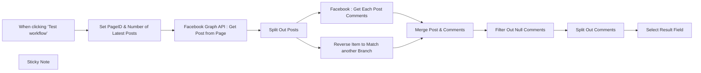

## Fluxo (.json) :

```json
{
  "id": "5DiXT9FykJvuElc1",
  "meta": {
    "instanceId": "08daa2aa5b6032ff63690600b74f68f5b0f34a3b100102e019b35c4419168977",
    "templateCredsSetupCompleted": true
  },
  "name": "Get Comments from Facebook Page",
  "tags": [],
  "nodes": [
    {
      "id": "a9c1f0fb-396e-4c36-92d4-ec3eeb36c644",
      "name": "When clicking ‘Test workflow’",
      "type": "n8n-nodes-base.manualTrigger",
      "position": [
        600,
        240
      ],
      "parameters": {},
      "typeVersion": 1
    },
    {
      "id": "9031abae-aaa0-4602-8fb1-29e89c73f3e8",
      "name": "Split Out Comments",
      "type": "n8n-nodes-base.splitOut",
      "position": [
        2400,
        240
      ],
      "parameters": {
        "include": "allOtherFields",
        "options": {},
        "fieldToSplitOut": "data"
      },
      "typeVersion": 1
    },
    {
      "id": "c8216862-1d39-47e6-b59e-cf1fb17f7226",
      "name": "Filter Out Null Comments",
      "type": "n8n-nodes-base.filter",
      "position": [
        2180,
        240
      ],
      "parameters": {
        "options": {},
        "conditions": {
          "options": {
            "version": 2,
            "leftValue": "",
            "caseSensitive": true,
            "typeValidation": "strict"
          },
          "combinator": "and",
          "conditions": [
            {
              "id": "4d8bd55c-35d0-40db-98ac-a954b0a99710",
              "operator": {
                "type": "array",
                "operation": "notEmpty",
                "singleValue": true
              },
              "leftValue": "={{ $json.data }}",
              "rightValue": ""
            }
          ]
        }
      },
      "typeVersion": 2.2
    },
    {
      "id": "076c0619-21de-48df-83fa-f2ba5f8be2e2",
      "name": "Select Result Field",
      "type": "n8n-nodes-base.set",
      "position": [
        2640,
        240
      ],
      "parameters": {
        "options": {},
        "assignments": {
          "assignments": [
            {
              "id": "8065ebf7-4daf-44dc-ac2c-95cce2063166",
              "name": "Post_id",
              "type": "string",
              "value": "={{ $json.id }}"
            },
            {
              "id": "b0984969-2f90-4fa9-8e32-8d7c76750e83",
              "name": "Post_created_time",
              "type": "string",
              "value": "={{ $json.created_time.toDateTime() }}"
            },
            {
              "id": "5efb3600-9887-40d2-8350-9d3b02a49775",
              "name": "Post_message",
              "type": "string",
              "value": "={{ $json.message }}"
            },
            {
              "id": "f469cdbc-16ba-4018-8b9c-7933dff7c9ae",
              "name": "Comment_id",
              "type": "string",
              "value": "={{ $json.data.id }}"
            },
            {
              "id": "a028828c-5054-45f0-bf1e-4ff1c9884b0a",
              "name": "Comment_created_time",
              "type": "string",
              "value": "={{ $json.data.created_time.toDateTime()}}"
            },
            {
              "id": "c40ea11c-762c-4e3c-9eda-a152fa7ec9c9",
              "name": "Comment_message",
              "type": "string",
              "value": "={{ $json.data.message }}"
            },
            {
              "id": "53fcd92c-cdaf-4663-9351-90da88cb13f7",
              "name": "Comment_from",
              "type": "string",
              "value": "={{ $json.data.from ? $json.data.from.name : \"\"}}"
            }
          ]
        },
        "includeOtherFields": true
      },
      "typeVersion": 3.4
    },
    {
      "id": "508cb3fa-5246-415c-97f8-c4f6575e45d5",
      "name": "Split Out Posts",
      "type": "n8n-nodes-base.splitOut",
      "position": [
        1360,
        240
      ],
      "parameters": {
        "options": {},
        "fieldToSplitOut": "data"
      },
      "typeVersion": 1
    },
    {
      "id": "ff6b3011-fd82-454e-a8f5-6b1a91221d0b",
      "name": "Facebook Graph API : Get Post from Page",
      "type": "n8n-nodes-base.facebookGraphApi",
      "position": [
        1120,
        240
      ],
      "parameters": {
        "node": "={{ $json.FB_Page_Id }}/feed",
        "options": {
          "queryParameters": {
            "parameter": [
              {
                "name": "limit",
                "value": "={{ $json.Number_of_Latest_Posts }}"
              }
            ]
          }
        },
        "graphApiVersion": "v20.0"
      },
      "credentials": {
        "facebookGraphApi": {
          "id": "Q0En38jY9jxkafFz",
          "name": "Facebook Graph account"
        }
      },
      "typeVersion": 1
    },
    {
      "id": "b8464152-d35f-44dc-9a2a-56a128b670e9",
      "name": "Facebook : Get Each Post Comments",
      "type": "n8n-nodes-base.facebookGraphApi",
      "onError": "continueErrorOutput",
      "position": [
        1680,
        160
      ],
      "parameters": {
        "edge": "comments",
        "node": "={{ $json.id }}",
        "options": {
          "fields": {
            "field": [
              {
                "name": "id,from,message,created_time,comment_count"
              }
            ]
          },
          "queryParameters": {
            "parameter": [
              {
                "name": "order",
                "value": "reverse_chronological"
              }
            ]
          }
        },
        "graphApiVersion": "v20.0"
      },
      "credentials": {
        "facebookGraphApi": {
          "id": "Q0En38jY9jxkafFz",
          "name": "Facebook Graph account"
        }
      },
      "typeVersion": 1
    },
    {
      "id": "470bc675-fab6-45d8-afe9-05c35576c210",
      "name": "Merge Post & Comments",
      "type": "n8n-nodes-base.merge",
      "position": [
        2000,
        240
      ],
      "parameters": {
        "mode": "combine",
        "options": {},
        "combineBy": "combineByPosition"
      },
      "typeVersion": 3
    },
    {
      "id": "c47c1f49-1343-423e-bce9-4cbdf8a2f6cc",
      "name": "Reverse Item to Match another Branch",
      "type": "n8n-nodes-base.code",
      "position": [
        1680,
        400
      ],
      "parameters": {
        "jsCode": "return items.reverse();\n"
      },
      "typeVersion": 2
    },
    {
      "id": "02092b77-7ae0-4fc3-8f3c-1c4428d95709",
      "name": "Set PageID & Number of Latest Posts",
      "type": "n8n-nodes-base.set",
      "position": [
        860,
        240
      ],
      "parameters": {
        "options": {},
        "assignments": {
          "assignments": [
            {
              "id": "1d70f742-0848-44b1-8dbe-9b125dc046b3",
              "name": "Number_of_Latest_Posts",
              "type": "number",
              "value": 10
            },
            {
              "id": "6744bb50-c34f-429d-8364-da14c9cbaa77",
              "name": "FB_Page_Id",
              "type": "string",
              "value": "219380258240005"
            }
          ]
        }
      },
      "typeVersion": 3.4
    },
    {
      "id": "788ab34e-fb5e-4bd0-8d1d-781062788f80",
      "name": "Sticky Note",
      "type": "n8n-nodes-base.stickyNote",
      "position": [
        780,
        100
      ],
      "parameters": {
        "width": 263.6017705489105,
        "height": 358.9292089122457,
        "content": "## Set Parameter Here\nSet Facebook PageID & Number of Latest Posts to be fetched here\n"
      },
      "typeVersion": 1
    }
  ],
  "active": false,
  "pinData": {},
  "settings": {
    "executionOrder": "v1"
  },
  "versionId": "633e1bf0-854e-4c3b-a7d0-2d118e6055b7",
  "connections": {
    "Split Out Posts": {
      "main": [
        [
          {
            "node": "Facebook : Get Each Post Comments",
            "type": "main",
            "index": 0
          },
          {
            "node": "Reverse Item to Match another Branch",
            "type": "main",
            "index": 0
          }
        ]
      ]
    },
    "Split Out Comments": {
      "main": [
        [
          {
            "node": "Select Result Field",
            "type": "main",
            "index": 0
          }
        ]
      ]
    },
    "Merge Post & Comments": {
      "main": [
        [
          {
            "node": "Filter Out Null Comments",
            "type": "main",
            "index": 0
          }
        ]
      ]
    },
    "Filter Out Null Comments": {
      "main": [
        [
          {
            "node": "Split Out Comments",
            "type": "main",
            "index": 0
          }
        ]
      ]
    },
    "Facebook : Get Each Post Comments": {
      "main": [
        [
          {
            "node": "Merge Post & Comments",
            "type": "main",
            "index": 0
          }
        ]
      ]
    },
    "When clicking ‘Test workflow’": {
      "main": [
        [
          {
            "node": "Set PageID & Number of Latest Posts",
            "type": "main",
            "index": 0
          }
        ]
      ]
    },
    "Set PageID & Number of Latest Posts": {
      "main": [
        [
          {
            "node": "Facebook Graph API : Get Post from Page",
            "type": "main",
            "index": 0
          }
        ]
      ]
    },
    "Reverse Item to Match another Branch": {
      "main": [
        [
          {
            "node": "Merge Post & Comments",
            "type": "main",
            "index": 1
          }
        ]
      ]
    },
    "Facebook Graph API : Get Post from Page": {
      "main": [
        [
          {
            "node": "Split Out Posts",
            "type": "main",
            "index": 0
          }
        ]
      ]
    }
  }
}
```

<a id="template-669"></a>

## Template 669 - Adicionar convidados à planilha e newsletter

- **Nome:** Adicionar convidados à planilha e newsletter
- **Descrição:** Ao receber um novo agendamento, o fluxo processa cada participante, registra seus dados em uma planilha, inscreve-os na newsletter e envia uma notificação a um canal.
- **Funcionalidade:** • Detecção de novo agendamento: inicia automaticamente quando um novo booking é criado.
• Separação de participantes: divide a lista de convidados para processar cada um individualmente.
• Armazenamento em planilha: adiciona uma linha por participante com título do evento, duração, fuso, data de criação, nome, início da reunião e email.
• Inscrição na newsletter: envia o email do participante para o endpoint da newsletter para criar uma nova assinatura.
• Notificação de novo assinante: envia uma mensagem para um canal com os detalhes do evento e do participante.
• Configuração centralizada: permite definir chat ID, chave da API da newsletter e ID da publicação em um único lugar para reuso.
- **Ferramentas:** • Cal.com (serviço de agendamento): fonte dos eventos de agendamento que disparan a automação.
• Google Sheets: armazena informações dos participantes em uma planilha para CRM/registro.
• Beehiiv: plataforma de newsletter utilizada para inscrever automaticamente os participantes.
• Telegram: canal de mensagens usado para notificar sobre novos agendamentos e assinantes.

## Fluxo visual

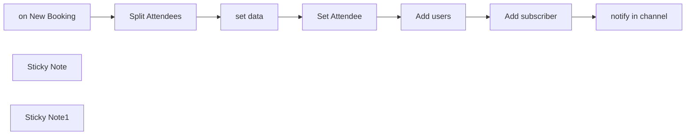

## Fluxo (.json) :

```json
{
  "id": "xe9sXQUc7yW8P8im",
  "meta": {
    "instanceId": "9219ebc7795bea866f70aa3d977d54417fdf06c41944be95e20cfb60f992db19",
    "templateCredsSetupCompleted": true
  },
  "name": "Meeting booked - to newsletter and CRM",
  "tags": [
    {
      "id": "55FGhjeaCcjBUam6",
      "name": "1node",
      "createdAt": "2025-04-30T08:13:16.484Z",
      "updatedAt": "2025-04-30T08:13:16.484Z"
    },
    {
      "id": "0eaHel3jWsgsvzT6",
      "name": "template",
      "createdAt": "2025-04-30T08:13:16.487Z",
      "updatedAt": "2025-04-30T08:13:16.487Z"
    },
    {
      "id": "33yuvdx4oQ05TZoD",
      "name": "newsletter",
      "createdAt": "2025-05-02T08:18:43.148Z",
      "updatedAt": "2025-05-02T08:18:43.148Z"
    }
  ],
  "nodes": [
    {
      "id": "715f9c0b-58a6-46b9-b732-334cc2fb3a60",
      "name": "Split Attendees",
      "type": "n8n-nodes-base.splitOut",
      "position": [
        -460,
        -140
      ],
      "parameters": {
        "options": {},
        "fieldToSplitOut": "attendees"
      },
      "typeVersion": 1
    },
    {
      "id": "171ed51e-6277-46d3-9037-8b2722ca06d0",
      "name": "Add users",
      "type": "n8n-nodes-base.googleSheets",
      "position": [
        200,
        -140
      ],
      "parameters": {
        "columns": {
          "value": {
            "title": "={{ $('on New Booking').item.json.eventTitle }}",
            "length": "={{ $('on New Booking').item.json.length }}",
            "timeZone": "={{ $json.timeZone }}",
            "createdAt": "={{ $('on New Booking').item.json.createdAt }}",
            "attendeeName": "={{ $json.name }}",
            "meetingStart": "={{ $('on New Booking').item.json.startTime }}",
            "attendeeEmail": "={{ $json.email }}"
          },
          "schema": [
            {
              "id": "createdAt",
              "type": "string",
              "display": true,
              "removed": false,
              "required": false,
              "displayName": "createdAt",
              "defaultMatch": false,
              "canBeUsedToMatch": true
            },
            {
              "id": "title",
              "type": "string",
              "display": true,
              "removed": false,
              "required": false,
              "displayName": "title",
              "defaultMatch": false,
              "canBeUsedToMatch": true
            },
            {
              "id": "meetingStart",
              "type": "string",
              "display": true,
              "removed": false,
              "required": false,
              "displayName": "meetingStart",
              "defaultMatch": false,
              "canBeUsedToMatch": true
            },
            {
              "id": "attendeeName",
              "type": "string",
              "display": true,
              "removed": false,
              "required": false,
              "displayName": "attendeeName",
              "defaultMatch": false,
              "canBeUsedToMatch": true
            },
            {
              "id": "attendeeEmail",
              "type": "string",
              "display": true,
              "removed": false,
              "required": false,
              "displayName": "attendeeEmail",
              "defaultMatch": false,
              "canBeUsedToMatch": true
            },
            {
              "id": "timeZone",
              "type": "string",
              "display": true,
              "removed": false,
              "required": false,
              "displayName": "timeZone",
              "defaultMatch": false,
              "canBeUsedToMatch": true
            },
            {
              "id": "length",
              "type": "string",
              "display": true,
              "removed": false,
              "required": false,
              "displayName": "length",
              "defaultMatch": false,
              "canBeUsedToMatch": true
            }
          ],
          "mappingMode": "defineBelow",
          "matchingColumns": [],
          "attemptToConvertTypes": false,
          "convertFieldsToString": false
        },
        "options": {},
        "operation": "append",
        "sheetName": {
          "__rl": true,
          "mode": "list",
          "value": "gid=0",
          "cachedResultUrl": "https://docs.google.com/spreadsheets/d/1SJosfoM-WZEimBQTz1mu65xiyuq9bHII0Igd1mgCcq0/edit#gid=0",
          "cachedResultName": "Sheet1"
        },
        "documentId": {
          "__rl": true,
          "mode": "list",
          "value": "1SJosfoM-WZEimBQTz1mu65xiyuq9bHII0Igd1mgCcq0",
          "cachedResultUrl": "https://docs.google.com/spreadsheets/d/1SJosfoM-WZEimBQTz1mu65xiyuq9bHII0Igd1mgCcq0/edit?usp=drivesdk",
          "cachedResultName": "Calendar bookings"
        }
      },
      "credentials": {
        "googleSheetsOAuth2Api": {
          "id": "twZdLFsI3kTnqtpG",
          "name": "Google Sheets account"
        }
      },
      "typeVersion": 4.5
    },
    {
      "id": "3b22d814-fe80-4c5b-814f-4e2666c96ca3",
      "name": "on New Booking",
      "type": "n8n-nodes-base.calTrigger",
      "position": [
        -680,
        -140
      ],
      "webhookId": "0b5ccb99-8c0a-47e4-a970-403e607c89ed",
      "parameters": {
        "events": [
          "BOOKING_CREATED"
        ],
        "options": {}
      },
      "credentials": {
        "calApi": {
          "id": "3JuO2rbGXKSX0VL9",
          "name": "Cal account"
        }
      },
      "typeVersion": 2
    },
    {
      "id": "020e7fc5-7f72-434f-8a84-15b177237146",
      "name": "Add subscriber",
      "type": "n8n-nodes-base.httpRequest",
      "position": [
        420,
        -140
      ],
      "parameters": {
        "url": "=https://api.beehiiv.com/v2/publications/{{ $('set data').item.json.publicationId }}/subscriptions",
        "method": "POST",
        "options": {},
        "sendBody": true,
        "sendHeaders": true,
        "bodyParameters": {
          "parameters": [
            {
              "name": "email",
              "value": "={{ $('Split Attendees').item.json.email }}"
            }
          ]
        },
        "headerParameters": {
          "parameters": [
            {
              "name": "Authorization",
              "value": "=Bearer {{ $('set data').item.json.beehiivAPI }}"
            }
          ]
        }
      },
      "typeVersion": 4.2
    },
    {
      "id": "35678a8f-e844-484f-b7f3-7df5a80f4a2d",
      "name": "Set Attendee",
      "type": "n8n-nodes-base.set",
      "position": [
        -20,
        -140
      ],
      "parameters": {
        "options": {},
        "assignments": {
          "assignments": [
            {
              "id": "70fc23eb-95b5-43ba-9067-8d834d440684",
              "name": "name",
              "type": "string",
              "value": "={{ $json.name }}"
            },
            {
              "id": "2aa7594d-f6fd-4437-a7b0-ad3e23b0e719",
              "name": "email",
              "type": "string",
              "value": "={{ $json.email }}"
            },
            {
              "id": "7a2f22da-04e1-4507-b135-1fdfdcdda77f",
              "name": "timeZone",
              "type": "string",
              "value": "={{ $json.timeZone }}"
            }
          ]
        }
      },
      "typeVersion": 3.4
    },
    {
      "id": "678b7ca8-2ecf-44b4-a420-e40600d09a74",
      "name": "notify in channel",
      "type": "n8n-nodes-base.telegram",
      "position": [
        640,
        -140
      ],
      "webhookId": "7ade83ec-58fa-4b43-aa3b-93bb0d9ae712",
      "parameters": {
        "text": "=📅 New meeting booked\n\nEvent name: {{ $('Add users').item.json.title }}\nStart Date: {{ $('Add users').item.json.meetingStart }} UTC\nName: {{ $('Add users').item.json.attendeeName }}\nEmail: {{ $('Add users').item.json.attendeeEmail }}\nUser time zone: {{ $('Add users').item.json.timeZone }}",
        "chatId": "={{ $('set data').item.json.chatID }}",
        "additionalFields": {
          "appendAttribution": false
        }
      },
      "credentials": {
        "telegramApi": {
          "id": "IgrntTxsoDphh19z",
          "name": "Telegram account"
        }
      },
      "typeVersion": 1.2
    },
    {
      "id": "1e23785f-1a3d-4d0c-a7d1-1ebc6209d5c8",
      "name": "set data",
      "type": "n8n-nodes-base.set",
      "position": [
        -240,
        -140
      ],
      "parameters": {
        "options": {},
        "assignments": {
          "assignments": [
            {
              "id": "797d5771-b242-47f5-a0c6-dc3a1a8fb15b",
              "name": "chatID",
              "type": "string",
              "value": "yourChatId"
            },
            {
              "id": "1c3239e8-6fe2-48ad-9083-04d108a95aec",
              "name": "beehiivAPI",
              "type": "string",
              "value": "yourAPIkey"
            },
            {
              "id": "8c94a712-93a6-48de-8a27-93c5ed0e68eb",
              "name": "publicationId",
              "type": "string",
              "value": "yourBeehiivPublicationId"
            }
          ]
        }
      },
      "typeVersion": 3.4
    },
    {
      "id": "cf66eff2-ca4d-4e52-b476-26334a82275f",
      "name": "Sticky Note",
      "type": "n8n-nodes-base.stickyNote",
      "position": [
        -330,
        -460
      ],
      "parameters": {
        "width": 280,
        "height": 480,
        "content": "## Define your parameters\n- Find your telegram chat id to get notified in a private channel (bot must be added as admin)\n- Create an account on [Beehiiv]() and get your api key\n- Get your publication id from your newsletter which will be parsed in the \"Add subscriber\" url endpoint"
      },
      "typeVersion": 1
    },
    {
      "id": "cc33ebc8-d966-4c17-ab4d-8fa6dde58c37",
      "name": "Sticky Note1",
      "type": "n8n-nodes-base.stickyNote",
      "position": [
        -1160,
        -380
      ],
      "parameters": {
        "width": 400,
        "height": 540,
        "content": "## How it works\nThis workflow allows you to add each meeting guest into Google Sheets, adding one row for each guest and consequently adding those users to your newsletter on Beehiiv.\n\n## Set up steps\n\n- Create an account on [Cal.com](https://refer.cal.com/1node)\n- Create a new webhook on [Cal.com](https://refer.cal.com/1node) and send a test event to the URL that appears in the first node. You will get test data that you can pin to set the rest of the workflow.\n- For [Beehiiv](https://www.beehiiv.com?via=1node-ai) you will need to get the publication id from the account plus the api key. You will find those on your account settings. Define the publication id on the \"set data\" node, together with your Telegram chat id, if you wish to notify yourself in a private channel when a new subscriber is added.\n\nEnjoy building!\n\nAitor\n[1 Node](https://1node.ai)"
      },
      "typeVersion": 1
    }
  ],
  "active": false,
  "pinData": {},
  "settings": {
    "executionOrder": "v1"
  },
  "versionId": "64184a3c-c62a-4bb1-ae93-d7b6d22d85a2",
  "connections": {
    "set data": {
      "main": [
        [
          {
            "node": "Set Attendee",
            "type": "main",
            "index": 0
          }
        ]
      ]
    },
    "Add users": {
      "main": [
        [
          {
            "node": "Add subscriber",
            "type": "main",
            "index": 0
          }
        ]
      ]
    },
    "Set Attendee": {
      "main": [
        [
          {
            "node": "Add users",
            "type": "main",
            "index": 0
          }
        ]
      ]
    },
    "Add subscriber": {
      "main": [
        [
          {
            "node": "notify in channel",
            "type": "main",
            "index": 0
          }
        ]
      ]
    },
    "on New Booking": {
      "main": [
        [
          {
            "node": "Split Attendees",
            "type": "main",
            "index": 0
          }
        ]
      ]
    },
    "Split Attendees": {
      "main": [
        [
          {
            "node": "set data",
            "type": "main",
            "index": 0
          }
        ]
      ]
    }
  }
}
```

<a id="template-670"></a>

## Template 670 - Agente de chat para consulta de pedidos e rastreamento

- **Nome:** Agente de chat para consulta de pedidos e rastreamento
- **Descrição:** Fluxo que permite a clientes consultarem seus pedidos e status de envio via chat, usando e-mail criptografado para garantir que cada usuário acesse apenas suas próprias informações.
- **Funcionalidade:** • Iniciação por chat: Recebe requisições de chat a partir de um webhook público.
• Descriptografia de e-mail: Descriptografa o e-mail fornecido no metadata para autenticação do usuário.
• Validação do e-mail: Verifica se um e-mail foi fornecido antes de prosseguir.
• Busca de cliente por e-mail: Consulta o sistema de loja para localizar o cliente correspondente.
• Recuperação de pedidos: Obtém os pedidos do cliente (com opção de filtrar por IDs específicos).
• Extração de dados de rastreamento: Extrai informações de rastreamento presentes nos metadados dos pedidos.
• Consulta de status de envio: Consulta o serviço de transporte para obter o status do envio usando números de rastreio.
• Agregação e fusão de dados: Combina informações de pedidos e rastreamento em uma resposta consolidada.
• Resposta ao cliente: Retorna ao chat uma resposta com os pedidos e o status de envio.
• Modo de teste e exemplos: Inclui dados mock, páginas de exemplo e scripts de encriptação/descriptação para testes e integração.
• Memória de sessão limitada: Mantém contexto recente da conversa para melhorar a interação no mesmo atendimento.
- **Ferramentas:** • WooCommerce: Plataforma de e-commerce usada para buscar clientes e recuperar dados de pedidos.
• DHL: Serviço de transporte utilizado para consultar o status de rastreamento dos envios.
• OpenAI (GPT-4): Modelo de linguagem usado como agente conversacional para entender e responder às perguntas dos clientes.
• Criptografia AES (senha baseada): Utilizada para encriptar e descriptografar o e-mail do usuário transmitido pelo front-end.

## Fluxo visual

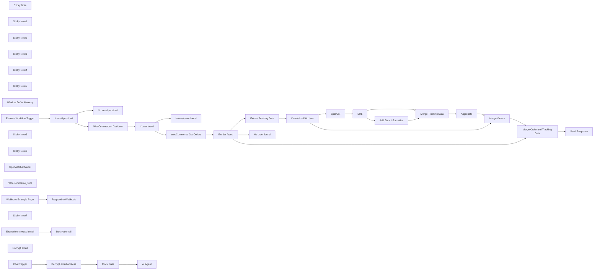

## Fluxo (.json) :

```json
{
  "meta": {
    "instanceId": "cb484ba7b742928a2048bf8829668bed5b5ad9787579adea888f05980292a4a7"
  },
  "nodes": [
    {
      "id": "be49d136-6392-481d-8544-d4f4d4fd0357",
      "name": "Sticky Note",
      "type": "n8n-nodes-base.stickyNote",
      "position": [
        90,
        260
      ],
      "parameters": {
        "color": 7,
        "width": 1000.427054367056,
        "height": 572.2734520891689,
        "content": "## Find WooCommerce User-ID\nUser-ID is required to query past orders"
      },
      "typeVersion": 1
    },
    {
      "id": "5932f77b-63e2-4991-aa16-2b8587b2b560",
      "name": "No email provided",
      "type": "n8n-nodes-base.set",
      "position": [
        400,
        640
      ],
      "parameters": {
        "options": {},
        "assignments": {
          "assignments": [
            {
              "id": "9a06428b-4115-4eee-97f4-8e828c5a7e5a",
              "name": "response",
              "type": "string",
              "value": "No email address got provided."
            }
          ]
        }
      },
      "typeVersion": 3.3
    },
    {
      "id": "909a9a47-8683-4a1f-a359-8f6a878f8cd7",
      "name": "If email provided",
      "type": "n8n-nodes-base.if",
      "position": [
        140,
        460
      ],
      "parameters": {
        "options": {},
        "conditions": {
          "options": {
            "leftValue": "",
            "caseSensitive": true,
            "typeValidation": "strict"
          },
          "combinator": "and",
          "conditions": [
            {
              "id": "13f7bd32-5760-4ac3-8292-c8beb131a4a5",
              "operator": {
                "type": "string",
                "operation": "notEmpty",
                "singleValue": true
              },
              "leftValue": "={{ $json.email }}",
              "rightValue": ""
            }
          ]
        }
      },
      "typeVersion": 2
    },
    {
      "id": "f5bd2098-090b-4537-8e61-90afb4c85ad8",
      "name": "If user found",
      "type": "n8n-nodes-base.if",
      "position": [
        620,
        440
      ],
      "parameters": {
        "options": {},
        "conditions": {
          "options": {
            "leftValue": "",
            "caseSensitive": true,
            "typeValidation": "strict"
          },
          "combinator": "and",
          "conditions": [
            {
              "id": "0e434771-6a63-420b-89fe-cf4d5b1d8127",
              "operator": {
                "type": "number",
                "operation": "gt"
              },
              "leftValue": "={{ Object.keys($json).length }}",
              "rightValue": 0
            }
          ]
        }
      },
      "typeVersion": 2
    },
    {
      "id": "cd2e8f95-363d-47fc-a18b-42eb93f89d0d",
      "name": "Sticky Note1",
      "type": "n8n-nodes-base.stickyNote",
      "position": [
        -480,
        -346
      ],
      "parameters": {
        "color": 6,
        "width": 1060.5591882039919,
        "height": 506.94921487705585,
        "content": "# Agent"
      },
      "typeVersion": 1
    },
    {
      "id": "411d5656-ace2-43a1-8672-0ffc9929f99b",
      "name": "Sticky Note2",
      "type": "n8n-nodes-base.stickyNote",
      "position": [
        2040,
        265
      ],
      "parameters": {
        "width": 2404.755367647059,
        "height": 559.608748371423,
        "content": "## Add DHL tracking information\nQueries the status of shipped orders from DHL.\n\nCan be skipped if order tracking should not be available or replaced with other services like UPS."
      },
      "typeVersion": 1
    },
    {
      "id": "2787a47f-d685-49b2-b4f9-15ed59525d63",
      "name": "No customer found",
      "type": "n8n-nodes-base.set",
      "position": [
        880,
        640
      ],
      "parameters": {
        "options": {},
        "assignments": {
          "assignments": [
            {
              "id": "9a06428b-4115-4eee-97f4-8e828c5a7e5a",
              "name": "response",
              "type": "string",
              "value": "No customer with that email address could be found."
            }
          ]
        }
      },
      "typeVersion": 3.3
    },
    {
      "id": "9ff271fb-5013-41a3-bc3c-84af3f36d079",
      "name": "If contains DHL data",
      "type": "n8n-nodes-base.if",
      "position": [
        2400,
        400
      ],
      "parameters": {
        "options": {},
        "conditions": {
          "options": {
            "leftValue": "",
            "caseSensitive": true,
            "typeValidation": "strict"
          },
          "combinator": "and",
          "conditions": [
            {
              "id": "674eff87-834b-4436-8666-66ccd11016d6",
              "operator": {
                "type": "array",
                "operation": "notEmpty",
                "singleValue": true
              },
              "leftValue": "={{ $json.tracking }}",
              "rightValue": ""
            }
          ]
        }
      },
      "typeVersion": 2
    },
    {
      "id": "736adbe9-1141-47b1-9d17-b2a86e0285a3",
      "name": "Extract Tracking Data",
      "type": "n8n-nodes-base.set",
      "position": [
        2140,
        400
      ],
      "parameters": {
        "options": {},
        "assignments": {
          "assignments": [
            {
              "id": "c378e8d4-3fdf-49f5-a766-6cfc1d7e898f",
              "name": "tracking",
              "type": "array",
              "value": "={{ $json.meta_data.filter(data => data.key === '_wc_shipment_tracking_items').flatMap(data => data.value) }}"
            }
          ]
        }
      },
      "typeVersion": 3.3
    },
    {
      "id": "603584d5-85c7-4995-a7a4-1ecb07c9ce2b",
      "name": "Merge Orders",
      "type": "n8n-nodes-base.merge",
      "position": [
        3980,
        500
      ],
      "parameters": {},
      "typeVersion": 2.1
    },
    {
      "id": "a5f61962-99bd-4e6d-9c4f-4e0fa3685780",
      "name": "Merge Order and Tracking Data",
      "type": "n8n-nodes-base.merge",
      "position": [
        4300,
        640
      ],
      "parameters": {
        "mode": "combine",
        "options": {},
        "combinationMode": "mergeByPosition"
      },
      "typeVersion": 2.1
    },
    {
      "id": "9aff6c2b-90f5-4cf6-8637-634c1d7f439d",
      "name": "Sticky Note3",
      "type": "n8n-nodes-base.stickyNote",
      "position": [
        -480,
        -1280
      ],
      "parameters": {
        "color": 3,
        "width": 478.2162464985994,
        "height": 558.6043670960834,
        "content": "# Setup\n## Generally\n- The environment variable `NODE_FUNCTION_ALLOW_BUILTIN` has to equal or include the value `crypto` (FYI: is default on n8n cloud) as it is required to run this workflow\n\n\n## To test the workflow\n1. Set a valid email address of a user that exists in WooCommerce in the Mock Node \"Mock Data\"\n2. Enable the node \"Mock Data\"\n3. Disable the node \"Decrypt email address\"\n4. Use the built-in chat by pressing the \"Chat\" button\n\n\n## For production use:\n1. Update the \"System Message\" in the node \"AI Agent\" for specific use case. At least the name of the shop should be changed\n2. Integrate the chat into the website. An example can be found in the box \"Example Website Implementation\"\n3. Disable or delete the node \"Mock Data\"\n4. Enable the node \"Decrypt email address\"\n5. Enable Workflow"
      },
      "typeVersion": 1
    },
    {
      "id": "901be36e-f68a-4052-ad40-2a3a6a596b56",
      "name": "Sticky Note4",
      "type": "n8n-nodes-base.stickyNote",
      "position": [
        1140,
        260
      ],
      "parameters": {
        "width": 277.6742597550393,
        "height": 568.9672169306307,
        "content": "## Get Orders"
      },
      "typeVersion": 1
    },
    {
      "id": "7501d8f8-d91e-4cb3-835d-bf3cd0cac69c",
      "name": "Sticky Note5",
      "type": "n8n-nodes-base.stickyNote",
      "position": [
        -492,
        260
      ],
      "parameters": {
        "color": 2,
        "width": 527.8197815634092,
        "height": 572.2734520891689,
        "content": "# WooCommerce Order Tool"
      },
      "typeVersion": 1
    },
    {
      "id": "0f2dc782-63c1-43bc-9347-33ebfe00af69",
      "name": "Split Out",
      "type": "n8n-nodes-base.splitOut",
      "position": [
        2680,
        380
      ],
      "parameters": {
        "options": {},
        "fieldToSplitOut": "tracking"
      },
      "typeVersion": 1
    },
    {
      "id": "d9b180bc-b4d2-4b94-ac65-b73344a47ad8",
      "name": "Aggregate",
      "type": "n8n-nodes-base.aggregate",
      "position": [
        3600,
        380
      ],
      "parameters": {
        "options": {},
        "aggregate": "aggregateAllItemData",
        "destinationFieldName": "tracking"
      },
      "typeVersion": 1
    },
    {
      "id": "6d2a044e-4164-4f0f-a6ef-a1a7a347a0c3",
      "name": "Merge Tracking Data",
      "type": "n8n-nodes-base.merge",
      "position": [
        3360,
        380
      ],
      "parameters": {},
      "typeVersion": 2.1
    },
    {
      "id": "bca16467-9c24-4f36-b41f-d471d27ae465",
      "name": "Window Buffer Memory",
      "type": "@n8n/n8n-nodes-langchain.memoryBufferWindow",
      "position": [
        260,
        0
      ],
      "parameters": {
        "sessionKey": "={{ $('Mock Data').item.json.sessionId }}",
        "sessionIdType": "customKey",
        "contextWindowLength": 10
      },
      "typeVersion": 1.2
    },
    {
      "id": "ff432439-2421-4769-bfc8-b58e56742275",
      "name": "Execute Workflow Trigger",
      "type": "n8n-nodes-base.executeWorkflowTrigger",
      "position": [
        -340,
        460
      ],
      "parameters": {},
      "typeVersion": 1
    },
    {
      "id": "b8a156a0-bec2-43a5-b2c1-3474701c353b",
      "name": "Sticky Note6",
      "type": "n8n-nodes-base.stickyNote",
      "position": [
        1480,
        260
      ],
      "parameters": {
        "color": 7,
        "width": 492.0420811160542,
        "height": 564.8840203332783,
        "content": "## Check orders found"
      },
      "typeVersion": 1
    },
    {
      "id": "22f86e67-710f-49ae-a967-6e5f9345eab6",
      "name": "WooCommerce - Get User",
      "type": "n8n-nodes-base.wooCommerce",
      "position": [
        400,
        440
      ],
      "parameters": {
        "limit": 1,
        "filters": {
          "email": "={{ $json.email }}"
        },
        "resource": "customer",
        "operation": "getAll"
      },
      "credentials": {
        "wooCommerceApi": {
          "id": "Rm7eydPl5IQwnlhw",
          "name": "WooCommerce account"
        }
      },
      "typeVersion": 1,
      "alwaysOutputData": true
    },
    {
      "id": "0c23aaa1-b1a4-4890-8df8-4440d32c2308",
      "name": "If order found",
      "type": "n8n-nodes-base.if",
      "position": [
        1520,
        420
      ],
      "parameters": {
        "options": {},
        "conditions": {
          "options": {
            "leftValue": "",
            "caseSensitive": true,
            "typeValidation": "strict"
          },
          "combinator": "and",
          "conditions": [
            {
              "id": "0e434771-6a63-420b-89fe-cf4d5b1d8127",
              "operator": {
                "type": "number",
                "operation": "gt"
              },
              "leftValue": "={{ Object.keys($json).length }}",
              "rightValue": 0
            }
          ]
        }
      },
      "typeVersion": 2
    },
    {
      "id": "63b155ef-6336-4938-890a-28050ffe5deb",
      "name": "WooCommerce Get Orders",
      "type": "n8n-nodes-base.httpRequest",
      "position": [
        1220,
        420
      ],
      "parameters": {
        "url": "https://woo-pleasantly-swag-werewolf3.wpcomstaging.com/wp-json/wc/v3/orders",
        "options": {},
        "sendBody": true,
        "authentication": "predefinedCredentialType",
        "bodyParameters": {
          "parameters": [
            {
              "name": "customer",
              "value": "={{ $json.id }}"
            },
            {
              "name": "include",
              "value": "={{ $('If email provided').item.json.query.split(',').filter(data => !data.includes('@')).join(',') }}"
            }
          ]
        },
        "nodeCredentialType": "wooCommerceApi"
      },
      "credentials": {
        "wooCommerceApi": {
          "id": "Rm7eydPl5IQwnlhw",
          "name": "WooCommerce account"
        }
      },
      "typeVersion": 4.1,
      "alwaysOutputData": true
    },
    {
      "id": "6cd01eed-7b28-4fe1-b3a2-33293a978843",
      "name": "No order found",
      "type": "n8n-nodes-base.set",
      "position": [
        1800,
        620
      ],
      "parameters": {
        "options": {},
        "assignments": {
          "assignments": [
            {
              "id": "9a06428b-4115-4eee-97f4-8e828c5a7e5a",
              "name": "response",
              "type": "string",
              "value": "No order could be found."
            }
          ]
        }
      },
      "typeVersion": 3.3
    },
    {
      "id": "bd45f21a-f30e-4dc2-be8b-527323016fae",
      "name": "Add Error Information",
      "type": "n8n-nodes-base.set",
      "position": [
        3120,
        480
      ],
      "parameters": {
        "options": {},
        "assignments": {
          "assignments": [
            {
              "id": "5fdb3524-6263-4e0b-a052-742cec8ceac1",
              "name": "Error",
              "type": "string",
              "value": "=No data about the parcel with the tracking ID \"{{ $('Split Out').item.json.tracking_id }}\" could be found."
            }
          ]
        }
      },
      "typeVersion": 3.3
    },
    {
      "id": "73596711-8b8b-47d9-88b6-84fe1c35fd42",
      "name": "DHL",
      "type": "n8n-nodes-base.dhl",
      "onError": "continueErrorOutput",
      "position": [
        2880,
        380
      ],
      "parameters": {
        "options": {},
        "trackingNumber": "={{ $json.tracking_number }}"
      },
      "credentials": {
        "dhlApi": {
          "id": "AYAwLZA02lSGlGTd",
          "name": "DHL account Jan"
        }
      },
      "typeVersion": 1
    },
    {
      "id": "ea1a7ab3-d7b7-4651-9232-4724a1adc14f",
      "name": "Send Response",
      "type": "n8n-nodes-base.set",
      "position": [
        4600,
        640
      ],
      "parameters": {
        "options": {},
        "assignments": {
          "assignments": [
            {
              "id": "a2bb4a8a-40b0-4233-99a8-3b494fb84230",
              "name": "response",
              "type": "array",
              "value": "={{ $input.all().map(item => item.json) }}"
            }
          ]
        }
      },
      "typeVersion": 3.3
    },
    {
      "id": "606f4731-00cc-4af0-a708-1d0d3d348dfa",
      "name": "Sticky Note8",
      "type": "n8n-nodes-base.stickyNote",
      "position": [
        640,
        -1280
      ],
      "parameters": {
        "color": 4,
        "width": 676.2425958534976,
        "height": 886.4179654829891,
        "content": "## How to supply user email\nAs we want to ensure that customers can only query information about their own orders, the email address gets encrypted in the backend, and then decrypt again in this workflow. If the email was allowed to be set unencrypted, anyone could query information from other customers.\n\n### The email address get supplied in the chat script at the following location:\n```\ncreateChat({\n\twebhookUrl: '...',\n\tmetadata: {\n email: 'ENCRYPTED_EMAIL_ADDRESS'\n },\n});\n```\n\n\n## Example Scripts:\n\n### Encrypt email on the backend\nRun the following code in the backend of your website, send the data to the frontend, and then set it dynamically at the above defined location as email.\n\n\n\n\n\n\n\n\n\n\n\n\n\n### Decrypt email in workflow\nThis script is already used in this workflow and is only provided here again as an example.\n"
      },
      "typeVersion": 1
    },
    {
      "id": "adbd1b20-0b4e-44ee-9ecc-3fc746691a03",
      "name": "OpenAI Chat Model",
      "type": "@n8n/n8n-nodes-langchain.lmChatOpenAi",
      "position": [
        60,
        0
      ],
      "parameters": {
        "model": "gpt-4",
        "options": {}
      },
      "credentials": {
        "openAiApi": {
          "id": "h7YcjvQLK5VrUYLz",
          "name": "OpenAi Jan"
        }
      },
      "typeVersion": 1
    },
    {
      "id": "b9076a7c-39b6-4205-9b05-90ed1f07115e",
      "name": "WooCommerce_Tool",
      "type": "@n8n/n8n-nodes-langchain.toolWorkflow",
      "position": [
        440,
        0
      ],
      "parameters": {
        "name": "WooCommerce_Tool",
        "fields": {
          "values": [
            {
              "name": "email",
              "stringValue": "={{ $json.metadata.email }}"
            }
          ]
        },
        "workflowId": "={{ $workflow.id }}",
        "description": "Call this tool to retrieve the orders in JSON format (compatible with the WooCommerce API). The input should be a list of comma-separated order IDs or nothing at all for all orders. Supply nothing else than the order IDs!"
      },
      "typeVersion": 1
    },
    {
      "id": "c1f06bc7-04d3-4ad5-b46a-6baa509ee23d",
      "name": "Chat Trigger",
      "type": "@n8n/n8n-nodes-langchain.chatTrigger",
      "position": [
        -440,
        -220
      ],
      "webhookId": "3b63a62a-bfb7-4fb4-a6ec-4c40dcb4d9f6",
      "parameters": {
        "public": true,
        "options": {}
      },
      "typeVersion": 1
    },
    {
      "id": "1dcb818f-48d1-4314-8737-509c2484c8af",
      "name": "Sticky Note7",
      "type": "n8n-nodes-base.stickyNote",
      "position": [
        60,
        -1280
      ],
      "parameters": {
        "color": 4,
        "width": 517.004057164405,
        "height": 555.1564335638465,
        "content": "## Example Website Implementation\nExample Code for a website can be found in node \"Respond to Webhook\".\n\nMore information about the embeddable chat can be found [here](https://github.com/n8n-io/n8n/tree/master/packages/%40n8n/chat#installation).\n\nRequired changes:\n- Change \"webhookUrl\" to the displayed in \"Chat Trigger\" node\n- Set the encrypted email address dynamically. The value has to be calculated in the backend to make it truly secure\n- Use a unique password for email en-/decryption and use it in the backend and this workflow (can be set in node \"Decrypt email address\")\n\n\nThe example page can be opened by calling the production Webhook-URL of the node \"Webhook Example Page\". It only works if the \"For production use\" steps on the left have been followed."
      },
      "typeVersion": 1
    },
    {
      "id": "e3a405a1-077d-4b72-bafa-26fd470f0f1c",
      "name": "Respond to Webhook",
      "type": "n8n-nodes-base.respondToWebhook",
      "position": [
        360,
        -920
      ],
      "parameters": {
        "options": {
          "responseHeaders": {
            "entries": [
              {
                "name": "content-type",
                "value": "text/html; charset=utf-8"
              }
            ]
          }
        },
        "respondWith": "text",
        "responseBody": "<doctype html>\n\t<html lang=\"en\">\n\t\t<head>\n\t\t\t<meta charset=\"utf-8\" />\n\t\t\t<meta name=\"viewport\" content=\"width=device-width, initial-scale=1\" />\n\t\t\t<title>Chat</title>\n\t\t\t<link\n\t\t\t\thref=\"https://cdn.jsdelivr.net/npm/normalize.css@8.0.1/normalize.min.css\"\n\t\t\t\trel=\"stylesheet\"\n\t\t\t/>\n\t\t\t<link href=\"https://cdn.jsdelivr.net/npm/@n8n/chat/style.css\" rel=\"stylesheet\" />\n\t\t</head>\n\t\t<body>\n\t\t\t<script type=\"module\">\n\t\t\t\timport { createChat } from 'https://cdn.jsdelivr.net/npm/@n8n/chat@latest/chat.bundle.es.js';\n\n\t\t\t\t(async function () {\n\t\t\t\t\tcreateChat({\n\t\t\t\t\t\tmode: 'window',\n\t\t\t\t\t\twebhookUrl: 'https://xxx.n8n.cloud/webhook/ea429912-869c-490b-9e04-4401ac9943b6/chat',\n\t\t\t\t\t\tloadPreviousSession: false,\n\t\t\t\t\t\tmetadata: {\n\t\t\t\t\t\t\temail: '352b16c74f73265441c55c37c9c22b04:4a8e614143c9cd31cc7e2389380943f3', // james@brown.com encrypted\n\t\t\t\t\t\t},\n\t\t\t\t\t\twebhookConfig: {\n\t\t\t\t\t\t\theaders: {\n\t\t\t\t\t\t\t\t'Content-Type': 'application/json',\n\t\t\t\t\t\t\t},\n\t\t\t\t\t\t},\n\t\t\t\t\t});\n\t\t\t\t})();\n\t\t\t</script>\n\n\t\t\t<h1>WooCommerce Agent Example page</h1>\n\t\t\tClick on the bubble in the lower right corner to open the chat.\n\n\t\t</body>\n\t</html>\n</doctype>"
      },
      "typeVersion": 1
    },
    {
      "id": "3ee13508-9400-415f-b435-514131ab8c53",
      "name": "Webhook Example Page",
      "type": "n8n-nodes-base.webhook",
      "position": [
        140,
        -920
      ],
      "webhookId": "18474f2d-9472-4a8d-8e63-8128fd2cbefc",
      "parameters": {
        "path": "website-chat-example",
        "options": {},
        "responseMode": "responseNode"
      },
      "typeVersion": 1.1
    },
    {
      "id": "76bfe2b1-2c4a-45b9-a066-1287e735fafd",
      "name": "Decrypt email",
      "type": "n8n-nodes-base.code",
      "position": [
        860,
        -580
      ],
      "parameters": {
        "jsCode": "// Loop over input items and add a new field called 'myNewField' to the JSON of each one\n\nconst crypto = require('crypto');\n\nconst password = 'a random password';\n\nconst encryptedData = $input.first().json.email;\n\n\nfunction decrypt(encrypted, password) {\n // Extract the IV and the encrypted text\n const parts = encrypted.split(':');\n const iv = Buffer.from(parts.shift(), 'hex');\n\n // Create a key from the password\n const key = crypto.scryptSync(password, 'salt', 32);\n\n // Create a decipher\n const decipher = crypto.createDecipheriv('aes-256-cbc', key, iv);\n\n // Decrypt the text\n let decrypted = decipher.update(parts.join(':'), 'hex', 'utf8');\n decrypted += decipher.final('utf8');\n\n // Return the decrypted text\n return decrypted;\n}\n\nreturn [\n {\n json: {\n email: decrypt(encryptedData, password),\n }\n }\n];"
      },
      "typeVersion": 2
    },
    {
      "id": "561cb422-955b-445b-9690-aa439dcd2455",
      "name": "Encrypt email",
      "type": "n8n-nodes-base.code",
      "position": [
        680,
        -840
      ],
      "parameters": {
        "jsCode": "const crypto = require('crypto');\n\nconst password = 'a random password';\nconst email = 'james@brown.com';\n\n\nfunction encrypt(text, password) {\n // Generate a secure random initialization vector\n const iv = crypto.randomBytes(16);\n\n // Create a key from the password\n const key = crypto.scryptSync(password, 'salt', 32);\n\n // Create a cipher\n const cipher = crypto.createCipheriv('aes-256-cbc', key, iv);\n\n // Encrypt the text\n let encrypted = cipher.update(text, 'utf8', 'hex');\n encrypted += cipher.final('hex');\n\n // Return the IV and the encrypted text\n return `${iv.toString('hex')}:${encrypted}`;\n}\n\nreturn [\n {\n json: {\n email: encrypt(email, password),\n }\n }\n];"
      },
      "typeVersion": 2
    },
    {
      "id": "eba004cb-4a40-432b-8fe2-d8526913c585",
      "name": "Example encrypted email",
      "type": "n8n-nodes-base.set",
      "position": [
        680,
        -580
      ],
      "parameters": {
        "options": {},
        "assignments": {
          "assignments": [
            {
              "id": "fa8d71d3-8e60-44b0-8ef0-e0bfc6feaf0e",
              "name": "email",
              "type": "string",
              "value": "352b16c74f73265441c55c37c9c22b04:4a8e614143c9cd31cc7e2389380943f3"
            }
          ]
        }
      },
      "typeVersion": 3.3
    },
    {
      "id": "d2fe7948-2ce5-4faa-91da-ea76f02aaf84",
      "name": "Decrypt email address",
      "type": "n8n-nodes-base.code",
      "disabled": true,
      "position": [
        -240,
        -220
      ],
      "parameters": {
        "jsCode": "// Loop over input items and add a new field called 'myNewField' to the JSON of each one\n\nconst crypto = require('crypto');\n\nconst password = 'a random password';\nconst incomingData = $input.first().json;\n\n\nfunction decrypt(encrypted, password) {\n // Extract the IV and the encrypted text\n const parts = encrypted.split(':');\n const iv = Buffer.from(parts.shift(), 'hex');\n\n // Create a key from the password\n const key = crypto.scryptSync(password, 'salt', 32);\n\n // Create a decipher\n const decipher = crypto.createDecipheriv('aes-256-cbc', key, iv);\n\n // Decrypt the text\n let decrypted = decipher.update(parts.join(':'), 'hex', 'utf8');\n decrypted += decipher.final('utf8');\n\n // Return the decrypted text\n return decrypted;\n}\n\nreturn [\n {\n json: {\n ...incomingData,\n metadata: {\n email: decrypt(incomingData.metadata.email, password), \n },\n }\n }\n];"
      },
      "typeVersion": 2
    },
    {
      "id": "26cb468c-5edf-4674-bec2-39270262fc00",
      "name": "AI Agent",
      "type": "@n8n/n8n-nodes-langchain.agent",
      "position": [
        140,
        -220
      ],
      "parameters": {
        "options": {
          "systemMessage": "=The Assistant is tailored to support customers of Best Shirts Ltd. with inquiries related to their orders. It adheres to the following principles for optimal customer service:\n\n1. **Customer-Focused Communication**: The Assistant maintains a friendly and helpful tone throughout the interaction. It remains focused on the topic at hand, ensuring all responses are relevant to the customer's inquiries about their orders.\n\n2. **Objective and Factual**: In cases where specific information is unavailable, the Assistant clearly communicates the lack of information and refrains from speculating or providing unverified details.\n\n3. **Efficient Interaction**: Recognizing the importance of the customer's time, the Assistant is designed to remember previous interactions within the same session. This minimizes the need for customers to repeat information, streamlining the support process.\n\n4. **Strict Privacy Adherence**: The Assistant automatically has access to the customer's email address as \"{{ $json.email }}\", using it to assist with order-related inquiries. Customers are informed that it is not possible to use or inquire about a different email address. If a customer attempts to provide an alternate email, they are gently reminded of this limitation.\n\n5. **Transparency in Order Status**: The Assistant provides accurate information about order processing and delivery timelines. Orders are typically dispatched 1-2 days post-purchase, with an expected delivery period of 1-2 days following dispatch. If an order hasn't been sent out within 2 days, the Assistant acknowledges an unplanned delay and offers assistance accordingly.\n\n6. **Non-assumptive Approach to Delivery Confirmation**: The Assistant never presumes an order has been delivered based solely on its dispatch. It relies on explicit delivery confirmations or tracking information to inform customers about their order status.\n\n7. **Responsive to Specific Inquiries**: If a customer requests the email address used for their inquiry, the Assistant provides it directly, ensuring privacy and accuracy in communications.\n\nThis approach ensures that customers receive comprehensive, respectful, and efficient support for their order-related queries."
        }
      },
      "typeVersion": 1.4
    },
    {
      "id": "1088d613-4321-40ec-baba-deb0f3aa1078",
      "name": "Mock Data",
      "type": "n8n-nodes-base.set",
      "position": [
        -40,
        -220
      ],
      "parameters": {
        "options": {},
        "assignments": {
          "assignments": [
            {
              "id": "c591fa49-31b3-46e7-8108-2d3ad1fc895b",
              "name": "metadata.email",
              "type": "string",
              "value": "james@brown.com"
            }
          ]
        },
        "includeOtherFields": true
      },
      "typeVersion": 3.3
    }
  ],
  "pinData": {},
  "connections": {
    "DHL": {
      "main": [
        [
          {
            "node": "Merge Tracking Data",
            "type": "main",
            "index": 0
          }
        ],
        [
          {
            "node": "Add Error Information",
            "type": "main",
            "index": 0
          }
        ]
      ]
    },
    "Aggregate": {
      "main": [
        [
          {
            "node": "Merge Orders",
            "type": "main",
            "index": 0
          }
        ]
      ]
    },
    "Mock Data": {
      "main": [
        [
          {
            "node": "AI Agent",
            "type": "main",
            "index": 0
          }
        ]
      ]
    },
    "Split Out": {
      "main": [
        [
          {
            "node": "DHL",
            "type": "main",
            "index": 0
          }
        ]
      ]
    },
    "Chat Trigger": {
      "main": [
        [
          {
            "node": "Decrypt email address",
            "type": "main",
            "index": 0
          }
        ]
      ]
    },
    "Merge Orders": {
      "main": [
        [
          {
            "node": "Merge Order and Tracking Data",
            "type": "main",
            "index": 0
          }
        ]
      ]
    },
    "If user found": {
      "main": [
        [
          {
            "node": "WooCommerce Get Orders",
            "type": "main",
            "index": 0
          }
        ],
        [
          {
            "node": "No customer found",
            "type": "main",
            "index": 0
          }
        ]
      ]
    },
    "If order found": {
      "main": [
        [
          {
            "node": "Extract Tracking Data",
            "type": "main",
            "index": 0
          },
          {
            "node": "Merge Order and Tracking Data",
            "type": "main",
            "index": 1
          }
        ],
        [
          {
            "node": "No order found",
            "type": "main",
            "index": 0
          }
        ]
      ]
    },
    "WooCommerce_Tool": {
      "ai_tool": [
        [
          {
            "node": "AI Agent",
            "type": "ai_tool",
            "index": 0
          }
        ]
      ]
    },
    "If email provided": {
      "main": [
        [
          {
            "node": "WooCommerce - Get User",
            "type": "main",
            "index": 0
          }
        ],
        [
          {
            "node": "No email provided",
            "type": "main",
            "index": 0
          }
        ]
      ]
    },
    "OpenAI Chat Model": {
      "ai_languageModel": [
        [
          {
            "node": "AI Agent",
            "type": "ai_languageModel",
            "index": 0
          }
        ]
      ]
    },
    "Merge Tracking Data": {
      "main": [
        [
          {
            "node": "Aggregate",
            "type": "main",
            "index": 0
          }
        ]
      ]
    },
    "If contains DHL data": {
      "main": [
        [
          {
            "node": "Split Out",
            "type": "main",
            "index": 0
          }
        ],
        [
          {
            "node": "Merge Orders",
            "type": "main",
            "index": 1
          }
        ]
      ]
    },
    "Webhook Example Page": {
      "main": [
        [
          {
            "node": "Respond to Webhook",
            "type": "main",
            "index": 0
          }
        ]
      ]
    },
    "Window Buffer Memory": {
      "ai_memory": [
        [
          {
            "node": "AI Agent",
            "type": "ai_memory",
            "index": 0
          }
        ]
      ]
    },
    "Add Error Information": {
      "main": [
        [
          {
            "node": "Merge Tracking Data",
            "type": "main",
            "index": 1
          }
        ]
      ]
    },
    "Decrypt email address": {
      "main": [
        [
          {
            "node": "Mock Data",
            "type": "main",
            "index": 0
          }
        ]
      ]
    },
    "Extract Tracking Data": {
      "main": [
        [
          {
            "node": "If contains DHL data",
            "type": "main",
            "index": 0
          }
        ]
      ]
    },
    "WooCommerce - Get User": {
      "main": [
        [
          {
            "node": "If user found",
            "type": "main",
            "index": 0
          }
        ]
      ]
    },
    "WooCommerce Get Orders": {
      "main": [
        [
          {
            "node": "If order found",
            "type": "main",
            "index": 0
          }
        ]
      ]
    },
    "Example encrypted email": {
      "main": [
        [
          {
            "node": "Decrypt email",
            "type": "main",
            "index": 0
          }
        ]
      ]
    },
    "Execute Workflow Trigger": {
      "main": [
        [
          {
            "node": "If email provided",
            "type": "main",
            "index": 0
          }
        ]
      ]
    },
    "Merge Order and Tracking Data": {
      "main": [
        [
          {
            "node": "Send Response",
            "type": "main",
            "index": 0
          }
        ]
      ]
    }
  }
}
```

<a id="template-671"></a>

## Template 671 - Chatbot com memória de longo prazo e armazenamento de notas (Telegram)

- **Nome:** Chatbot com memória de longo prazo e armazenamento de notas (Telegram)
- **Descrição:** Fluxo que recebe mensagens de chat, recupera contexto armazenado, processa com um agente de IA que pode salvar memórias ou notas e responde ao usuário via Telegram.
- **Funcionalidade:** • Recepção de mensagens: Inicia o fluxo ao receber uma nova mensagem de chat.
• Recuperação de memórias de longo prazo: Lê memórias armazenadas para fornecer contexto relevante à conversa.
• Recuperação de notas: Lê notas armazenadas separadamente para uso quando necessário.
• Agregação de contexto: Combina mensagem do usuário, memórias e notas para fornecer contexto ao agente.
• Gerenciamento de memória de sessão (janela): Mantém um buffer de contexto recente vinculado à sessão do usuário.
• Agente de IA com regras e ferramentas: Avalia mensagens, decide quando salvar memórias/notes e gera respostas seguindo diretrizes de privacidade e interação.
• Salvamento de memórias: Grava resumos de informações pessoais relevantes com data em armazenamento de longo prazo.
• Salvamento de notas: Grava instruções ou lembretes fornecidos pelo usuário em armazenamento dedicado de notas.
• Envio de resposta via Telegram: Publica a resposta gerada ao usuário em um chat do Telegram.
• Preparação de saída do fluxo: Ajusta e define o campo de saída com a resposta final para usos posteriores.
- **Ferramentas:** • Google Docs: Armazenamento e recuperação de memórias de longo prazo e notas do usuário.
• Modelos de linguagem (OpenAI / Deepseek): Geração de respostas, raciocínio do agente e avaliação sobre salvar memórias/notas.
• Telegram: Canal para enviar a resposta final ao usuário.

## Fluxo visual

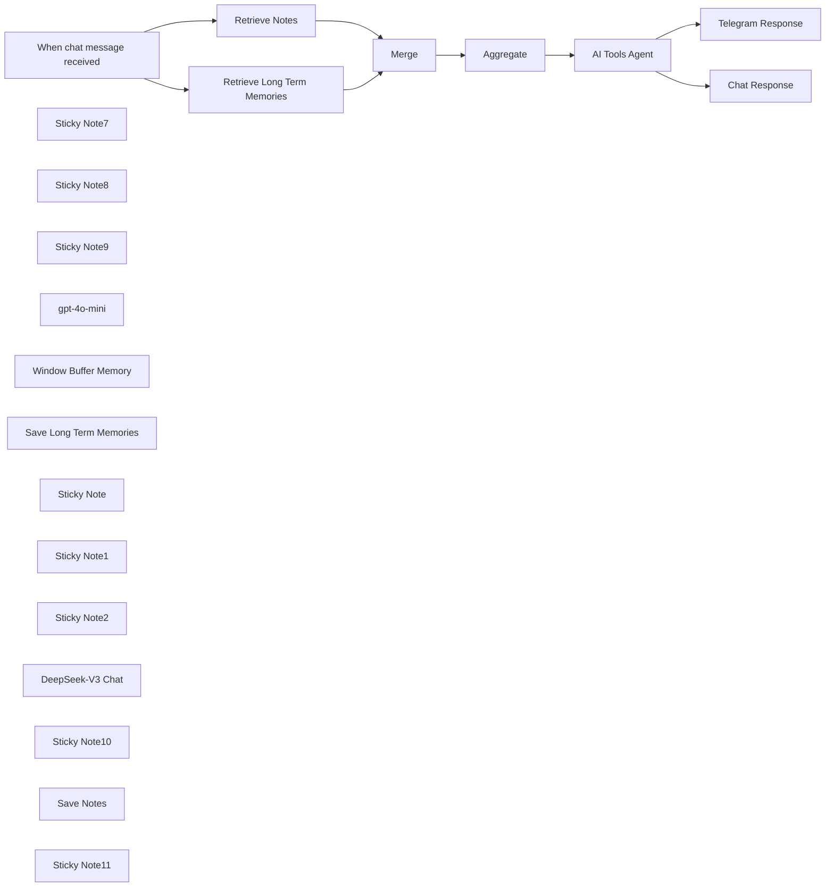

## Fluxo (.json) :

```json
{
  "id": "QJZLBn9L6NbmjmLK",
  "meta": {
    "instanceId": "31e69f7f4a77bf465b805824e303232f0227212ae922d12133a0f96ffeab4fef"
  },
  "name": "🤖🧠 AI Agent Chatbot + LONG TERM Memory + Note Storage + Telegram",
  "tags": [],
  "nodes": [
    {
      "id": "20a2d959-5412-447b-a2c4-7736b6b758b3",
      "name": "When chat message received",
      "type": "@n8n/n8n-nodes-langchain.chatTrigger",
      "position": [
        -320,
        1600
      ],
      "webhookId": "8ba8fa53-2c24-47a8-b4dd-67b88c106e3d",
      "parameters": {
        "options": {}
      },
      "typeVersion": 1.1
    },
    {
      "id": "de79c268-bac5-48ff-be4d-18f522861c22",
      "name": "Sticky Note7",
      "type": "n8n-nodes-base.stickyNote",
      "position": [
        -100,
        1280
      ],
      "parameters": {
        "color": 4,
        "width": 340,
        "height": 380,
        "content": "## Retrieve Long Term Memories\nGoogle Docs"
      },
      "typeVersion": 1
    },
    {
      "id": "000a94d1-57ce-4eec-a021-9123685d22bf",
      "name": "Sticky Note8",
      "type": "n8n-nodes-base.stickyNote",
      "position": [
        1040,
        1840
      ],
      "parameters": {
        "width": 280,
        "height": 380,
        "content": "## Save To Current Chat Memory (Optional)"
      },
      "typeVersion": 1
    },
    {
      "id": "1bf1cade-bb3e-450a-a531-9add259069df",
      "name": "Sticky Note9",
      "type": "n8n-nodes-base.stickyNote",
      "position": [
        1360,
        1840
      ],
      "parameters": {
        "color": 4,
        "width": 280,
        "height": 380,
        "content": "## Save Long Term Memories\nGoogle Docs"
      },
      "typeVersion": 1
    },
    {
      "id": "8b30f207-8204-4548-8f51-38c387d98ae9",
      "name": "gpt-4o-mini",
      "type": "@n8n/n8n-nodes-langchain.lmChatOpenAi",
      "position": [
        820,
        1900
      ],
      "parameters": {
        "options": {}
      },
      "credentials": {
        "openAiApi": {
          "id": "jEMSvKmtYfzAkhe6",
          "name": "OpenAi account"
        }
      },
      "typeVersion": 1.1
    },
    {
      "id": "50271e59-6dd2-4f54-9b28-dd4a9f33ddc5",
      "name": "Chat Response",
      "type": "n8n-nodes-base.set",
      "position": [
        1440,
        1600
      ],
      "parameters": {
        "options": {},
        "assignments": {
          "assignments": [
            {
              "id": "d6f68b1c-a6a6-44d4-8686-dc4dcdde4767",
              "name": "output",
              "type": "string",
              "value": "={{ $json.output }}"
            }
          ]
        }
      },
      "typeVersion": 3.4
    },
    {
      "id": "1064a2bf-bf74-44cd-ba8a-48f93700e887",
      "name": "Window Buffer Memory",
      "type": "@n8n/n8n-nodes-langchain.memoryBufferWindow",
      "position": [
        1140,
        2000
      ],
      "parameters": {
        "sessionKey": "={{ $('When chat message received').item.json.sessionId }}",
        "sessionIdType": "customKey",
        "contextWindowLength": 50
      },
      "typeVersion": 1.3
    },
    {
      "id": "280fe3b1-faca-41b6-be0e-2ab906cd1662",
      "name": "Save Long Term Memories",
      "type": "n8n-nodes-base.googleDocsTool",
      "position": [
        1460,
        2000
      ],
      "parameters": {
        "actionsUi": {
          "actionFields": [
            {
              "text": "={ \n \"memory\": \"{{ $fromAI('memory') }}\",\n \"date\": \"{{ $now }}\"\n}",
              "action": "insert"
            }
          ]
        },
        "operation": "update",
        "documentURL": "[Google Doc ID]",
        "descriptionType": "manual",
        "toolDescription": "Save Memory"
      },
      "credentials": {
        "googleDocsOAuth2Api": {
          "id": "YWEHuG28zOt532MQ",
          "name": "Google Docs account"
        }
      },
      "typeVersion": 2
    },
    {
      "id": "37baa147-120a-40a8-b92f-df319fc4bc46",
      "name": "Retrieve Long Term Memories",
      "type": "n8n-nodes-base.googleDocs",
      "position": [
        20,
        1420
      ],
      "parameters": {
        "operation": "get",
        "documentURL": "[Google Doc ID]"
      },
      "credentials": {
        "googleDocsOAuth2Api": {
          "id": "YWEHuG28zOt532MQ",
          "name": "Google Docs account"
        }
      },
      "typeVersion": 2,
      "alwaysOutputData": true
    },
    {
      "id": "b047a271-d2aa-4a26-b663-6a76d249824a",
      "name": "Sticky Note",
      "type": "n8n-nodes-base.stickyNote",
      "position": [
        720,
        1840
      ],
      "parameters": {
        "color": 3,
        "width": 280,
        "height": 380,
        "content": "## LLM"
      },
      "typeVersion": 1
    },
    {
      "id": "15bb5fd5-7dfe-4da9-830c-e1d905831640",
      "name": "Telegram Response",
      "type": "n8n-nodes-base.telegram",
      "position": [
        1440,
        1260
      ],
      "parameters": {
        "text": "={{ $json.output }}",
        "chatId": "=1234567891",
        "additionalFields": {
          "parse_mode": "HTML",
          "appendAttribution": false
        }
      },
      "credentials": {
        "telegramApi": {
          "id": "pAIFhguJlkO3c7aQ",
          "name": "Telegram account"
        }
      },
      "typeVersion": 1.2
    },
    {
      "id": "8cc38a87-e214-4193-9fe6-ba4adc3d5530",
      "name": "Sticky Note1",
      "type": "n8n-nodes-base.stickyNote",
      "position": [
        1360,
        1160
      ],
      "parameters": {
        "width": 260,
        "height": 300,
        "content": "## Telegram \n(Optional)"
      },
      "typeVersion": 1
    },
    {
      "id": "38121a81-d768-4bb0-a9e6-39de0906e026",
      "name": "Sticky Note2",
      "type": "n8n-nodes-base.stickyNote",
      "position": [
        680,
        1500
      ],
      "parameters": {
        "color": 5,
        "width": 1320,
        "height": 780,
        "content": "## AI AGENT with Long Term Memory & Note Storage"
      },
      "typeVersion": 1
    },
    {
      "id": "7d5d1466-b4c9-4055-a634-ea7025dc370a",
      "name": "DeepSeek-V3 Chat",
      "type": "@n8n/n8n-nodes-langchain.lmChatOpenAi",
      "position": [
        820,
        2060
      ],
      "parameters": {
        "model": "=deepseek-chat",
        "options": {}
      },
      "credentials": {
        "openAiApi": {
          "id": "MSl7SdcvZe0SqCYI",
          "name": "deepseek"
        }
      },
      "typeVersion": 1.1
    },
    {
      "id": "68303b67-2203-41e8-b370-220d884d2945",
      "name": "AI Tools Agent",
      "type": "@n8n/n8n-nodes-langchain.agent",
      "position": [
        1060,
        1600
      ],
      "parameters": {
        "text": "={{ $('When chat message received').item.json.chatInput }}",
        "options": {
          "systemMessage": "=## ROLE \nYou are a friendly, attentive, and helpful AI assistant. Your primary goal is to assist the user while maintaining a personalized and engaging interaction. \n\n---\n\n## RULES \n\n1. **Memory Management**: \n - When the user sends a new message, evaluate whether it contains noteworthy or personal information (e.g., preferences, habits, goals, or important events). \n - If such information is identified, use the **Save Memory** tool to store this data in memory. \n - Always send a meaningful response back to the user, even if your primary action was saving information. This response should not reveal that information was stored but should acknowledge or engage with the user’s input naturally. \n\n2. **Note Management**: \n - If the user provides information that is intended to be stored as a note (e.g., specific instructions, reminders, or standalone pieces of information), use the **Save Note** tool. \n - Notes should not be stored in memory using the **Save Memory** tool. \n - Ensure that notes are clear, concise, and accurately reflect the user’s input. \n\n3. **Context Awareness**: \n - Use stored memories and notes to provide contextually relevant and personalized responses. \n - Always consider the **date and time** when a memory or note was collected to ensure your responses are up-to-date and accurate.\n\n4. **User-Centric Responses**: \n - Tailor your responses based on the user's preferences and past interactions. \n - Be proactive in recalling relevant details from memory or notes when appropriate but avoid overwhelming the user with unnecessary information.\n\n5. **Privacy and Sensitivity**: \n - Handle all user data with care and sensitivity. Avoid making assumptions or sharing stored information unless it directly enhances the conversation or task at hand.\n - Never store passwords or usernames.\n\n6. **Fallback Responses**: \n - **IMPORTANT** If no specific task or question arises from the user’s message (e.g., when only saving information), respond in a way that keeps the conversation flowing naturally. For example: \n - Acknowledge their input: “Thanks for sharing that!” \n - Provide a friendly follow-up: “Is there anything else I can help you with today?” \n - DO NOT tell jokes as a fallback response.\n\n---\n\n## TOOLS \n\n### Save Memory \n- Use this tool to store summarized, concise, and meaningful information about the user. \n- Extract key details from user messages that could enhance future interactions (e.g., likes/dislikes, important dates, hobbies). \n- Ensure that the summary is clear and devoid of unnecessary details.\n\n### Save Note \n- Use this tool to store specific instructions, reminders, or standalone pieces of information provided by the user. \n- Notes should not include general personal preferences or habits meant for long-term memory storage. \n- Ensure that notes are concise and accurately reflect what the user wants to store.\n\n---\n\n## MEMORIES \n\n### Recent Noteworthy Memories \nHere are the most recent memories collected from the user, including their date and time of collection: \n\n**{{ $json.data[0].content }}**\n\n### Guidelines for Using Memories: \n- Prioritize recent memories but do not disregard older ones if they remain relevant. \n- Cross-reference memories to maintain consistency in your responses. For example, if a user shares conflicting preferences over time, clarify or adapt accordingly.\n\n---\n\n## NOTES \n\n### Recent Notes Collected from User: \nHere are the most recent notes collected from the user: \n\n**{{ $json.data[1].content }}**\n\n### Guidelines for Using Notes: \n- Use notes for tasks requiring specific instructions or reminders.\n- Do not mix note content with general memory content; keep them distinct.\n\n---\n\n## ADDITIONAL INSTRUCTIONS \n\n- Think critically before responding to ensure your answers are thoughtful and accurate. \n- Strive to build trust with the user by being consistent, reliable, and personable in your interactions. \n- Avoid robotic or overly formal language; aim for a conversational tone that aligns with being \"friendly and helpful.\" \n"
        },
        "promptType": "define"
      },
      "typeVersion": 1.7,
      "alwaysOutputData": false
    },
    {
      "id": "a6741133-93a1-42f8-83b4-bc29b9f49ae2",
      "name": "Sticky Note10",
      "type": "n8n-nodes-base.stickyNote",
      "position": [
        1680,
        1840
      ],
      "parameters": {
        "color": 4,
        "width": 280,
        "height": 380,
        "content": "## Save Notes\nGoogle Docs"
      },
      "typeVersion": 1
    },
    {
      "id": "87c88d31-811d-4265-b44e-ab30a45ff88b",
      "name": "Save Notes",
      "type": "n8n-nodes-base.googleDocsTool",
      "position": [
        1780,
        2000
      ],
      "parameters": {
        "actionsUi": {
          "actionFields": [
            {
              "text": "={ \n \"note\": \"{{ $fromAI('memory') }}\",\n \"date\": \"{{ $now }}\"\n}",
              "action": "insert"
            }
          ]
        },
        "operation": "update",
        "documentURL": "[Google Doc ID]",
        "descriptionType": "manual",
        "toolDescription": "Save Notes"
      },
      "credentials": {
        "googleDocsOAuth2Api": {
          "id": "YWEHuG28zOt532MQ",
          "name": "Google Docs account"
        }
      },
      "typeVersion": 2
    },
    {
      "id": "b9b97837-d6f2-4cef-89c4-9301973015df",
      "name": "Sticky Note11",
      "type": "n8n-nodes-base.stickyNote",
      "position": [
        -100,
        1680
      ],
      "parameters": {
        "color": 4,
        "width": 340,
        "height": 380,
        "content": "## Retrieve Notes\nGoogle Docs"
      },
      "typeVersion": 1
    },
    {
      "id": "0002a227-4240-4d3c-9a45-fc6e23fdc7f5",
      "name": "Retrieve Notes",
      "type": "n8n-nodes-base.googleDocs",
      "onError": "continueRegularOutput",
      "position": [
        20,
        1820
      ],
      "parameters": {
        "operation": "get",
        "documentURL": "[Google Doc ID]"
      },
      "credentials": {
        "googleDocsOAuth2Api": {
          "id": "YWEHuG28zOt532MQ",
          "name": "Google Docs account"
        }
      },
      "typeVersion": 2,
      "alwaysOutputData": true
    },
    {
      "id": "88f7024c-87d4-48b4-b6bb-f68c88202f56",
      "name": "Aggregate",
      "type": "n8n-nodes-base.aggregate",
      "position": [
        520,
        1600
      ],
      "parameters": {
        "options": {},
        "aggregate": "aggregateAllItemData"
      },
      "typeVersion": 1
    },
    {
      "id": "48d576fc-870a-441e-a7be-3056ef7e1d7a",
      "name": "Merge",
      "type": "n8n-nodes-base.merge",
      "position": [
        340,
        1600
      ],
      "parameters": {},
      "typeVersion": 3
    }
  ],
  "active": false,
  "pinData": {},
  "settings": {
    "timezone": "America/Vancouver",
    "executionOrder": "v1"
  },
  "versionId": "8130e77c-ecbd-470e-afec-ec8728643e00",
  "connections": {
    "Merge": {
      "main": [
        [
          {
            "node": "Aggregate",
            "type": "main",
            "index": 0
          }
        ]
      ]
    },
    "Aggregate": {
      "main": [
        [
          {
            "node": "AI Tools Agent",
            "type": "main",
            "index": 0
          }
        ]
      ]
    },
    "Save Notes": {
      "ai_tool": [
        [
          {
            "node": "AI Tools Agent",
            "type": "ai_tool",
            "index": 0
          }
        ]
      ]
    },
    "gpt-4o-mini": {
      "ai_languageModel": [
        [
          {
            "node": "AI Tools Agent",
            "type": "ai_languageModel",
            "index": 0
          }
        ]
      ]
    },
    "AI Tools Agent": {
      "main": [
        [
          {
            "node": "Telegram Response",
            "type": "main",
            "index": 0
          },
          {
            "node": "Chat Response",
            "type": "main",
            "index": 0
          }
        ],
        []
      ]
    },
    "Retrieve Notes": {
      "main": [
        [
          {
            "node": "Merge",
            "type": "main",
            "index": 1
          }
        ]
      ]
    },
    "DeepSeek-V3 Chat": {
      "ai_languageModel": [
        []
      ]
    },
    "Telegram Response": {
      "main": [
        []
      ]
    },
    "Window Buffer Memory": {
      "ai_memory": [
        [
          {
            "node": "AI Tools Agent",
            "type": "ai_memory",
            "index": 0
          }
        ]
      ]
    },
    "Save Long Term Memories": {
      "ai_tool": [
        [
          {
            "node": "AI Tools Agent",
            "type": "ai_tool",
            "index": 0
          }
        ]
      ]
    },
    "When chat message received": {
      "main": [
        [
          {
            "node": "Retrieve Long Term Memories",
            "type": "main",
            "index": 0
          },
          {
            "node": "Retrieve Notes",
            "type": "main",
            "index": 0
          }
        ]
      ]
    },
    "Retrieve Long Term Memories": {
      "main": [
        [
          {
            "node": "Merge",
            "type": "main",
            "index": 0
          }
        ]
      ]
    }
  }
}
```

<a id="template-672"></a>

## Template 672 - Gerar voiceover a partir de vídeo com IA multimodal

- **Nome:** Gerar voiceover a partir de vídeo com IA multimodal
- **Descrição:** Extrai frames de um vídeo, usa um modelo multimodal para gerar um roteiro em partes e converte o roteiro final em um arquivo de áudio MP3, que é enviado a uma pasta no Google Drive.
- **Funcionalidade:** • Download do vídeo: Baixa o arquivo de vídeo a partir de uma URL pública.
• Extração de frames distribuídos: Decodifica o vídeo e extrai até 90 frames uniformemente ao longo da duração.
• Conversão e preparação de imagens: Converte frames para JPEG/base64 e redimensiona as imagens para 768x768 para processamento.
• Processamento em lotes com modelo multimodal: Envia lotes sequenciais de 15 imagens a um LLM multimodal para gerar trechos de roteiro, mantendo o contexto entre lotes.
• Agregação de roteiro: Combina os trechos gerados em um roteiro único e coerente.
• Síntese de voz (TTS): Converte o roteiro final em áudio MP3 usando um serviço de TTS baseado em IA.
• Armazenamento do resultado: Faz upload do arquivo de áudio final para uma pasta específica no Google Drive.
• Controle de taxa: Insere esperas entre requests para respeitar limites de serviço e evitar sobrecarga.
- **Ferramentas:** • Pixabay: fonte pública de vídeos utilizada como input (URL de CDN).
• OpenAI: modelo multimodal para análise das imagens e geração do roteiro e serviço de TTS para produção do áudio MP3.
• Google Drive: serviço de armazenamento para salvar e compartilhar o arquivo de áudio final.
• OpenCV: biblioteca para abrir o vídeo, contabilizar e extrair frames e codificá-los em JPEG.
• Python: ambiente de execução do script que decodifica o vídeo em Base64, processa frames e prepara os dados para envio.

## Fluxo visual

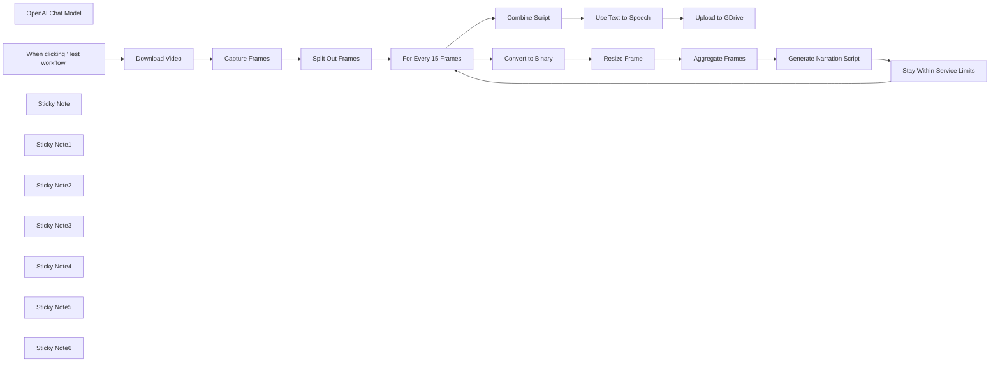

## Fluxo (.json) :

```json
{
  "meta": {
    "instanceId": "408f9fb9940c3cb18ffdef0e0150fe342d6e655c3a9fac21f0f644e8bedabcd9"
  },
  "nodes": [
    {
      "id": "6d16b5be-8f7b-49f2-8523-9b84c62f2759",
      "name": "OpenAI Chat Model",
      "type": "@n8n/n8n-nodes-langchain.lmChatOpenAi",
      "position": [
        1960,
        660
      ],
      "parameters": {
        "model": "gpt-4o-2024-08-06",
        "options": {}
      },
      "credentials": {
        "openAiApi": {
          "id": "8gccIjcuf3gvaoEr",
          "name": "OpenAi account"
        }
      },
      "typeVersion": 1
    },
    {
      "id": "a6084f09-9a4f-478a-ac1a-ab1413628c1f",
      "name": "Capture Frames",
      "type": "n8n-nodes-base.code",
      "position": [
        720,
        460
      ],
      "parameters": {
        "mode": "runOnceForEachItem",
        "language": "python",
        "pythonCode": "import cv2\nimport numpy as np\nimport base64\n\ndef extract_evenly_distributed_frames_from_base64(base64_string, max_frames=90):\n    # Decode the Base64 string into bytes\n    video_bytes = base64.b64decode(base64_string)\n    \n    # Write the bytes to a temporary file\n    video_path = '/tmp/temp_video.mp4'\n    with open(video_path, 'wb') as video_file:\n        video_file.write(video_bytes)\n    \n    # Open the video file using OpenCV\n    video_capture = cv2.VideoCapture(video_path)\n    \n    # Get the total number of frames in the video\n    total_frames = int(video_capture.get(cv2.CAP_PROP_FRAME_COUNT))\n    \n    # Calculate the step size to take 'max_frames' evenly distributed frames\n    step_size = max(1, total_frames // (max_frames - 1))\n    \n    # List to store selected frames as base64\n    selected_frames_base64 = []\n    \n    for i in range(0, total_frames, step_size):\n        # Set the current frame position\n        video_capture.set(cv2.CAP_PROP_POS_FRAMES, i)\n        \n        # Read the frame\n        ret, frame = video_capture.read()\n        if ret:\n            # Convert frame (NumPy array) to a Base64 string\n            frame_base64 = convert_frame_to_base64(frame)\n            selected_frames_base64.append(frame_base64)\n        if len(selected_frames_base64) >= max_frames:\n            break\n    \n    # Release the video capture object\n    video_capture.release()\n\n    return selected_frames_base64\n\ndef convert_frame_to_base64(frame):\n    # Convert the frame (NumPy array) to JPEG format\n    ret, buffer = cv2.imencode('.jpg', frame)\n    if not ret:\n        return None\n\n    # Encode JPEG image to Base64\n    frame_base64 = base64.b64encode(buffer).decode('utf-8')\n    return frame_base64\n\nbase64_video = _input.item.binary.data.data\nframes_base64 = extract_evenly_distributed_frames_from_base64(base64_video, max_frames=90)\n\nreturn { \"output\": frames_base64 }"
      },
      "typeVersion": 2
    },
    {
      "id": "b45e82a4-f304-4733-a9cf-07cae6df13ea",
      "name": "Split Out Frames",
      "type": "n8n-nodes-base.splitOut",
      "position": [
        920,
        460
      ],
      "parameters": {
        "options": {},
        "fieldToSplitOut": "output"
      },
      "typeVersion": 1
    },
    {
      "id": "83d29c51-a415-476d-b380-1ca5f0d4f521",
      "name": "Download Video",
      "type": "n8n-nodes-base.httpRequest",
      "position": [
        329,
        346
      ],
      "parameters": {
        "url": "=https://cdn.pixabay.com/video/2016/05/12/3175-166339863_small.mp4",
        "options": {}
      },
      "typeVersion": 4.2
    },
    {
      "id": "0304ebb5-945d-4b0b-9597-f83ae8c1fe31",
      "name": "Convert to Binary",
      "type": "n8n-nodes-base.convertToFile",
      "position": [
        1480,
        500
      ],
      "parameters": {
        "options": {},
        "operation": "toBinary",
        "sourceProperty": "output"
      },
      "typeVersion": 1.1
    },
    {
      "id": "32a21e1d-1d8b-411e-8281-8d0e68a06889",
      "name": "When clicking ‘Test workflow’",
      "type": "n8n-nodes-base.manualTrigger",
      "position": [
        149,
        346
      ],
      "parameters": {},
      "typeVersion": 1
    },
    {
      "id": "0ad2ea6a-e1f4-4b26-a4de-9103ecbb3831",
      "name": "Combine Script",
      "type": "n8n-nodes-base.aggregate",
      "position": [
        2640,
        360
      ],
      "parameters": {
        "options": {},
        "aggregate": "aggregateAllItemData"
      },
      "typeVersion": 1
    },
    {
      "id": "2d9bb91a-3369-4268-882f-f97e73897bb8",
      "name": "Upload to GDrive",
      "type": "n8n-nodes-base.googleDrive",
      "position": [
        3040,
        360
      ],
      "parameters": {
        "name": "=narrating-video-using-vision-ai-{{ $now.format('yyyyMMddHHmmss') }}.mp3",
        "driveId": {
          "__rl": true,
          "mode": "list",
          "value": "My Drive",
          "cachedResultUrl": "https://drive.google.com/drive/my-drive",
          "cachedResultName": "My Drive"
        },
        "options": {},
        "folderId": {
          "__rl": true,
          "mode": "id",
          "value": "1dBJZL_SCh6F2U7N7kIMsnSiI4QFxn2xD"
        }
      },
      "credentials": {
        "googleDriveOAuth2Api": {
          "id": "yOwz41gMQclOadgu",
          "name": "Google Drive account"
        }
      },
      "typeVersion": 3
    },
    {
      "id": "137185f6-ba32-4c68-844f-f50c7a5a261d",
      "name": "Sticky Note",
      "type": "n8n-nodes-base.stickyNote",
      "position": [
        -440,
        0
      ],
      "parameters": {
        "width": 476.34074202271484,
        "height": 586.0597334122469,
        "content": "## Try It Out!\n\n### This n8n template takes a video and extracts frames from it which are used with a multimodal LLM to generate a script. The script is then passed to the same multimodal LLM to generate a voiceover clip.\n\nThis template was inspired by [Processing and narrating a video with GPT's visual capabilities and the TTS API](https://cookbook.openai.com/examples/gpt_with_vision_for_video_understanding)\n\n* Video is downloaded using the HTTP node.\n* Python code node is used to extract the frames using OpenCV.\n* Loop node is used o batch the frames for the LLM to generate partial scripts.\n* All partial scripts are combined to form the full script which is then sent to OpenAI to generate audio from it.\n* The finished voiceover clip is uploaded to Google Drive.\n\nSample the finished product here: https://drive.google.com/file/d/1-XCoii0leGB2MffBMPpCZoxboVyeyeIX/view?usp=sharing\n\n\n### Need Help?\nJoin the [Discord](https://discord.com/invite/XPKeKXeB7d) or ask in the [Forum](https://community.n8n.io/)!"
      },
      "typeVersion": 1
    },
    {
      "id": "23700b04-2549-4121-b442-4b92adf7f6d6",
      "name": "Sticky Note1",
      "type": "n8n-nodes-base.stickyNote",
      "position": [
        60,
        120
      ],
      "parameters": {
        "color": 7,
        "width": 459.41860465116287,
        "height": 463.313953488372,
        "content": "## 1. Download Video\n[Learn more about the HTTP Request node](https://docs.n8n.io/integrations/builtin/core-nodes/n8n-nodes-base.httprequest/)\n\nIn this demonstration, we'll download a stock video from pixabay using the HTTP Request node. Feel free to use other sources but ensure they are in a format support by OpenCV ([See docs](https://docs.opencv.org/3.4/dd/d43/tutorial_py_video_display.html))"
      },
      "typeVersion": 1
    },
    {
      "id": "0a42aeb0-96cd-401c-abeb-c50e0f04f7ad",
      "name": "Sticky Note2",
      "type": "n8n-nodes-base.stickyNote",
      "position": [
        560,
        120
      ],
      "parameters": {
        "color": 7,
        "width": 605.2674418604653,
        "height": 522.6860465116279,
        "content": "## 2. Split Video into Frames\n[Learn more about the Code node](https://docs.n8n.io/integrations/builtin/core-nodes/n8n-nodes-base.code/)\n\nWe need to think of videos are a sum of 2 parts; a visual track and an audio track. The visual track is technically just a collection of images displayed one after the other and are typically referred to as frames. When we want LLM to understand videos, most of the time we can do so by giving it a series of frames as images to process.\n\nHere, we use the Python Code node to extract the frames from the video using OpenCV, a computer vision library. For performance reasons, we'll also capture only a max of 90 frames from the video but ensure they are evenly distributed across the video. This step takes about 1-2 mins to complete on a 3mb video."
      },
      "typeVersion": 1
    },
    {
      "id": "b518461c-13f1-45ae-a156-20ae6051fc19",
      "name": "Sticky Note3",
      "type": "n8n-nodes-base.stickyNote",
      "position": [
        560,
        660
      ],
      "parameters": {
        "color": 3,
        "width": 418.11627906976724,
        "height": 132.89534883720933,
        "content": "### 🚨 PERFORMANCE WARNING!\nUsing large videos or capturing a large number of frames is really memory intensive and could crash your n8n instance. Be sure you have sufficient memory and to optimise the video beforehand! "
      },
      "typeVersion": 1
    },
    {
      "id": "585f7a7f-1676-4bc3-a6fb-eace443aa5da",
      "name": "Sticky Note4",
      "type": "n8n-nodes-base.stickyNote",
      "position": [
        1200,
        118.69767441860472
      ],
      "parameters": {
        "color": 7,
        "width": 1264.8139534883715,
        "height": 774.3720930232558,
        "content": "## 3. Use Vision AI to Narrate on Batches of Frames\n[Read more about the Basic LLM node](https://docs.n8n.io/integrations/builtin/cluster-nodes/root-nodes/n8n-nodes-langchain.chainllm/)\n\nTo keep within token limits of our LLM, we'll need to send our frames in sequential batches to represent chunks of our original video. We'll use the loop node to create batches of 15 frames - this is because of our max of 90 frames, this fits perfectly for a total of 6 loops. Next, we'll convert each frame to a binary image so we can resize for and attach to the Basic LLM node. One trick to point out is that within the Basic LLM node, previous iterations of the generation are prepended to form a cohesive script. Without, the LLM will assume it needs to start fresh for each batch of frames.\n\nA wait node is used to stay within service rate limits. This is useful for new users who are still on lower tiers. If you do not have such restrictions, feel free to remove this wait node!"
      },
      "typeVersion": 1
    },
    {
      "id": "42c002a3-37f6-4dd7-af14-20391b19cb5a",
      "name": "Stay Within Service Limits",
      "type": "n8n-nodes-base.wait",
      "position": [
        2280,
        640
      ],
      "webhookId": "677fa706-b4dd-4fe3-ba17-feea944c3193",
      "parameters": {},
      "typeVersion": 1.1
    },
    {
      "id": "5beb17fa-8a57-4c72-9c3b-b7fdf41b545a",
      "name": "For Every 15 Frames",
      "type": "n8n-nodes-base.splitInBatches",
      "position": [
        1320,
        380
      ],
      "parameters": {
        "options": {},
        "batchSize": 15
      },
      "typeVersion": 3
    },
    {
      "id": "9a57256a-076a-4823-8cad-3b64a17ff705",
      "name": "Resize Frame",
      "type": "n8n-nodes-base.editImage",
      "position": [
        1640,
        500
      ],
      "parameters": {
        "width": 768,
        "height": 768,
        "options": {
          "format": "jpeg"
        },
        "operation": "resize"
      },
      "typeVersion": 1
    },
    {
      "id": "3e776939-1a25-4ea0-8106-c3072d108106",
      "name": "Aggregate Frames",
      "type": "n8n-nodes-base.aggregate",
      "position": [
        1800,
        500
      ],
      "parameters": {
        "options": {
          "includeBinaries": true
        },
        "aggregate": "aggregateAllItemData"
      },
      "typeVersion": 1
    },
    {
      "id": "3a973a9c-2c7a-43c5-9c45-a14d49b56622",
      "name": "Sticky Note5",
      "type": "n8n-nodes-base.stickyNote",
      "position": [
        2500,
        120.6860465116277
      ],
      "parameters": {
        "color": 7,
        "width": 769.1860465116274,
        "height": 487.83720930232533,
        "content": "## 4. Generate Voice Over Clip Using TTS\n[Read more about the OpenAI node](https://docs.n8n.io/integrations/builtin/app-nodes/n8n-nodes-langchain.openai)\n\nFinally with our generated script parts, we can combine them into one and use OpenAI's Audio generation capabilities to generate a voice over from the full script. Once we have the output mp3, we can upload it to somewhere like Google Drive for later use.\n\nHave a listen to the finished product here: https://drive.google.com/file/d/1-XCoii0leGB2MffBMPpCZoxboVyeyeIX/view?usp=sharing"
      },
      "typeVersion": 1
    },
    {
      "id": "92e07c18-4058-4098-a448-13451bd8a17a",
      "name": "Use Text-to-Speech",
      "type": "@n8n/n8n-nodes-langchain.openAi",
      "position": [
        2840,
        360
      ],
      "parameters": {
        "input": "={{ $json.data.map(item => item.text).join('\\n') }}",
        "options": {
          "response_format": "mp3"
        },
        "resource": "audio"
      },
      "credentials": {
        "openAiApi": {
          "id": "8gccIjcuf3gvaoEr",
          "name": "OpenAi account"
        }
      },
      "typeVersion": 1.5
    },
    {
      "id": "0696c336-1814-4ad4-aa5e-b86489a4231e",
      "name": "Sticky Note6",
      "type": "n8n-nodes-base.stickyNote",
      "position": [
        61,
        598
      ],
      "parameters": {
        "color": 7,
        "width": 458.1279069767452,
        "height": 296.8139534883723,
        "content": "**The video used in this demonstration is**\n&copy; [Coverr-Free-Footage](https://pixabay.com/users/coverr-free-footage-1281706/) via [Pixabay](https://pixabay.com/videos/india-street-busy-rickshaw-people-3175/)\n"
      },
      "typeVersion": 1
    },
    {
      "id": "81185ac4-c7fd-4921-937f-109662d5dfa5",
      "name": "Generate Narration Script",
      "type": "@n8n/n8n-nodes-langchain.chainLlm",
      "position": [
        1960,
        500
      ],
      "parameters": {
        "text": "=These are frames of a video. Create a short voiceover script in the style of David Attenborough. Only include the narration.\n{{\n$('Generate Narration Script').isExecuted\n ? `Continue from this script:\\n${$('Generate Narration Script').all().map(item => item.json.text.replace(/\\n/g,'')).join('\\n')}`\n : ''\n}}",
        "messages": {
          "messageValues": [
            {
              "type": "HumanMessagePromptTemplate",
              "messageType": "imageBinary"
            },
            {
              "type": "HumanMessagePromptTemplate",
              "messageType": "imageBinary",
              "binaryImageDataKey": "data_1"
            },
            {
              "type": "HumanMessagePromptTemplate",
              "messageType": "imageBinary",
              "binaryImageDataKey": "data_2"
            },
            {
              "type": "HumanMessagePromptTemplate",
              "messageType": "imageBinary",
              "binaryImageDataKey": "data_3"
            },
            {
              "type": "HumanMessagePromptTemplate",
              "messageType": "imageBinary",
              "binaryImageDataKey": "data_4"
            },
            {
              "type": "HumanMessagePromptTemplate",
              "messageType": "imageBinary",
              "binaryImageDataKey": "data_5"
            },
            {
              "type": "HumanMessagePromptTemplate",
              "messageType": "imageBinary",
              "binaryImageDataKey": "data_6"
            },
            {
              "type": "HumanMessagePromptTemplate",
              "messageType": "imageBinary",
              "binaryImageDataKey": "data_7"
            },
            {
              "type": "HumanMessagePromptTemplate",
              "messageType": "imageBinary",
              "binaryImageDataKey": "data_8"
            },
            {
              "type": "HumanMessagePromptTemplate",
              "messageType": "imageBinary",
              "binaryImageDataKey": "data_9"
            },
            {
              "type": "HumanMessagePromptTemplate",
              "messageType": "imageBinary",
              "binaryImageDataKey": "data_10"
            },
            {
              "type": "HumanMessagePromptTemplate",
              "messageType": "imageBinary",
              "binaryImageDataKey": "data_11"
            },
            {
              "type": "HumanMessagePromptTemplate",
              "messageType": "imageBinary",
              "binaryImageDataKey": "data_12"
            },
            {
              "type": "HumanMessagePromptTemplate",
              "messageType": "imageBinary",
              "binaryImageDataKey": "data_13"
            },
            {
              "type": "HumanMessagePromptTemplate",
              "messageType": "imageBinary",
              "binaryImageDataKey": "data_14"
            }
          ]
        },
        "promptType": "define"
      },
      "typeVersion": 1.4
    }
  ],
  "pinData": {},
  "connections": {
    "Resize Frame": {
      "main": [
        [
          {
            "node": "Aggregate Frames",
            "type": "main",
            "index": 0
          }
        ]
      ]
    },
    "Capture Frames": {
      "main": [
        [
          {
            "node": "Split Out Frames",
            "type": "main",
            "index": 0
          }
        ]
      ]
    },
    "Combine Script": {
      "main": [
        [
          {
            "node": "Use Text-to-Speech",
            "type": "main",
            "index": 0
          }
        ]
      ]
    },
    "Download Video": {
      "main": [
        [
          {
            "node": "Capture Frames",
            "type": "main",
            "index": 0
          }
        ]
      ]
    },
    "Aggregate Frames": {
      "main": [
        [
          {
            "node": "Generate Narration Script",
            "type": "main",
            "index": 0
          }
        ]
      ]
    },
    "Split Out Frames": {
      "main": [
        [
          {
            "node": "For Every 15 Frames",
            "type": "main",
            "index": 0
          }
        ]
      ]
    },
    "Convert to Binary": {
      "main": [
        [
          {
            "node": "Resize Frame",
            "type": "main",
            "index": 0
          }
        ]
      ]
    },
    "OpenAI Chat Model": {
      "ai_languageModel": [
        [
          {
            "node": "Generate Narration Script",
            "type": "ai_languageModel",
            "index": 0
          }
        ]
      ]
    },
    "Use Text-to-Speech": {
      "main": [
        [
          {
            "node": "Upload to GDrive",
            "type": "main",
            "index": 0
          }
        ]
      ]
    },
    "For Every 15 Frames": {
      "main": [
        [
          {
            "node": "Combine Script",
            "type": "main",
            "index": 0
          }
        ],
        [
          {
            "node": "Convert to Binary",
            "type": "main",
            "index": 0
          }
        ]
      ]
    },
    "Generate Narration Script": {
      "main": [
        [
          {
            "node": "Stay Within Service Limits",
            "type": "main",
            "index": 0
          }
        ]
      ]
    },
    "Stay Within Service Limits": {
      "main": [
        [
          {
            "node": "For Every 15 Frames",
            "type": "main",
            "index": 0
          }
        ]
      ]
    },
    "When clicking ‘Test workflow’": {
      "main": [
        [
          {
            "node": "Download Video",
            "type": "main",
            "index": 0
          }
        ]
      ]
    }
  }
}
```

<a id="template-673"></a>

## Template 673 - Encaminhar e-mails da Netflix para múltiplos endereços

- **Nome:** Encaminhar e-mails da Netflix para múltiplos endereços
- **Descrição:** Encaminha automaticamente e-mails recebidos do domínio netflix.com para uma lista de destinatários usando um serviço de envio de e-mails.
- **Funcionalidade:** • Detecção de e-mails da Netflix: monitora a conta do Gmail e inicia a automação quando recebe mensagens do domínio netflix.com (inclui spam e lixeira).
• Configuração de lista de destinatários: define um array com os endereços para os quais os e-mails serão encaminhados.
• Separação e iteração de destinatários: divide a lista em entradas individuais para enviar uma cópia para cada destinatário.
• Encaminhamento personalizado por destinatário: envia o conteúdo HTML, texto e assunto originais para cada endereço.
• Agendamento de verificação: realiza checagens periódicas (a cada minuto) para novos e-mails.
• Reuso do conteúdo original: preserva assunto, texto e HTML do e-mail recebido ao encaminhar.
- **Ferramentas:** • Gmail: conta de e-mail usada para monitorar e receber mensagens do domínio netflix.com.
• Mailjet: serviço de envio de e-mails utilizado para encaminhar as mensagens para os destinatários configurados.

## Fluxo visual

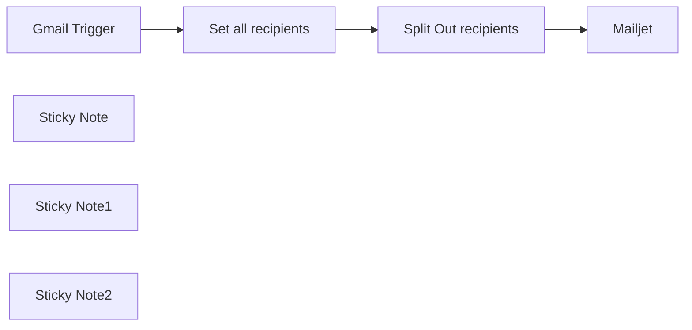

## Fluxo (.json) :

```json
{
  "id": "pkw1vY5q1p2nNfNC",
  "meta": {
    "instanceId": "24bd2f3b51439b955590389bfa4dd9889fbd30343962de0b7daedce624cf4a71"
  },
  "name": "Forward Netflix emails to multiple email addresses with GMail and Mailjet",
  "tags": [
    {
      "id": "NfcTamKf2RPwzXbo",
      "name": "automate-everything",
      "createdAt": "2024-02-14T20:01:44.966Z",
      "updatedAt": "2024-02-14T20:01:44.966Z"
    }
  ],
  "nodes": [
    {
      "id": "653e1069-b231-41e4-8257-5276934ec124",
      "name": "Gmail Trigger",
      "type": "n8n-nodes-base.gmailTrigger",
      "position": [
        600,
        360
      ],
      "parameters": {
        "simple": false,
        "filters": {
          "sender": "netflix.com",
          "includeSpamTrash": true
        },
        "options": {},
        "pollTimes": {
          "item": [
            {
              "mode": "everyMinute"
            }
          ]
        }
      },
      "credentials": {
        "gmailOAuth2": {
          "id": "rbqlV0L0SJmc5Qr6",
          "name": "Gmail account"
        }
      },
      "typeVersion": 1
    },
    {
      "id": "2edc2a63-b3ce-45a4-ad37-fde991453be5",
      "name": "Mailjet",
      "type": "n8n-nodes-base.mailjet",
      "position": [
        1540,
        360
      ],
      "parameters": {
        "html": "={{ $json.html }}",
        "text": "={{ $json.text }}",
        "subject": "={{ $json.subject }}",
        "toEmail": "={{ $json.recipient }}",
        "fromEmail": "sender@email.com",
        "additionalFields": {}
      },
      "credentials": {
        "mailjetEmailApi": {
          "id": "ToQvJxEpa4shhXkA",
          "name": "Mailjet Email account"
        }
      },
      "typeVersion": 1
    },
    {
      "id": "255de753-a0f5-458d-ac7f-ca354076e336",
      "name": "Set all recipients",
      "type": "n8n-nodes-base.set",
      "position": [
        940,
        360
      ],
      "parameters": {
        "fields": {
          "values": [
            {
              "name": "recipients",
              "type": "arrayValue",
              "arrayValue": "['email1@example.com','email2@example.com','email3@example.com']"
            }
          ]
        },
        "options": {}
      },
      "typeVersion": 3.2
    },
    {
      "id": "fe3affe4-0655-42b4-a0a6-b8b231180fbd",
      "name": "Split Out recipients",
      "type": "n8n-nodes-base.splitOut",
      "position": [
        1240,
        360
      ],
      "parameters": {
        "include": "allOtherFields",
        "options": {
          "destinationFieldName": "recipient"
        },
        "fieldToSplitOut": "recipients"
      },
      "typeVersion": 1
    },
    {
      "id": "c53493f0-8584-43a2-9f93-60c5c7776e60",
      "name": "Sticky Note",
      "type": "n8n-nodes-base.stickyNote",
      "position": [
        520,
        200
      ],
      "parameters": {
        "width": 257,
        "height": 332,
        "content": "## Gmail\n1. Connect your Gmail Account, where you are receiving emails from your Netflix account. \n2. Set the polling intervall"
      },
      "typeVersion": 1
    },
    {
      "id": "d07ae854-39ae-4cab-a59f-26c96da99958",
      "name": "Sticky Note1",
      "type": "n8n-nodes-base.stickyNote",
      "position": [
        860,
        200
      ],
      "parameters": {
        "width": 249,
        "height": 338,
        "content": "## Set all recipients\nReplace the sample emails in the array with the email addresses of your friends and family to whom you want to forward the Netflix emails"
      },
      "typeVersion": 1
    },
    {
      "id": "5393381b-d96d-4b68-aeac-39facafdd0aa",
      "name": "Sticky Note2",
      "type": "n8n-nodes-base.stickyNote",
      "position": [
        1460,
        200
      ],
      "parameters": {
        "width": 265,
        "height": 335,
        "content": "## Mailjet\n1. Connect your Mailjet Account to forward the Netflix emails\n2. Set your sender email address"
      },
      "typeVersion": 1
    }
  ],
  "active": false,
  "pinData": {},
  "settings": {
    "timezone": "Europe/Berlin",
    "executionOrder": "v1"
  },
  "versionId": "6e57d138-9909-46ac-bde4-b59bde72b3e1",
  "connections": {
    "Gmail Trigger": {
      "main": [
        [
          {
            "node": "Set all recipients",
            "type": "main",
            "index": 0
          }
        ]
      ]
    },
    "Set all recipients": {
      "main": [
        [
          {
            "node": "Split Out recipients",
            "type": "main",
            "index": 0
          }
        ]
      ]
    },
    "Split Out recipients": {
      "main": [
        [
          {
            "node": "Mailjet",
            "type": "main",
            "index": 0
          }
        ]
      ]
    }
  }
}
```

<a id="template-674"></a>

## Template 674 - Webhook para PostHog (evento via query)

- **Nome:** Webhook para PostHog (evento via query)
- **Descrição:** Este fluxo recebe um webhook HTTP e encaminha um evento para o PostHog usando o parâmetro de query recebido como nome do evento.
- **Funcionalidade:** • Recepção de webhook HTTP: Expõe um endpoint público para receber requisições.
• Extração do nome do evento: Lê o parâmetro de query "event" da requisição recebida.
• Envio de evento para análise: Transforma a informação recebida em um evento e envia ao serviço de análise.
• Identificador fixo do emissor: Usa um distinctId fixo ("n8n") ao enviar o evento.
• Autenticação configurada: Utiliza credenciais armazenadas para autenticar no serviço de destino.
- **Ferramentas:** • Endpoint HTTP público: Ponto de entrada que recebe requisições contendo o parâmetro de query "event".
• PostHog: Plataforma de análise/telemetria onde os eventos são enviados e registrados.

## Fluxo visual


## Fluxo (.json) :

```json
{
  "nodes": [
    {
      "name": "PostHog",
      "type": "n8n-nodes-base.postHog",
      "position": [
        640,
        280
      ],
      "parameters": {
        "eventName": "={{$json[\"query\"][\"event\"]}}",
        "distinctId": "n8n",
        "additionalFields": {}
      },
      "credentials": {
        "postHogApi": "PostHog Credentials"
      },
      "typeVersion": 1
    },
    {
      "name": "Webhook",
      "type": "n8n-nodes-base.webhook",
      "position": [
        440,
        280
      ],
      "webhookId": "f6d0071e-3cf9-49fd-8bbd-afdbea6b0c67",
      "parameters": {
        "path": "f6d0071e-3cf9-49fd-8bbd-afdbea6b0c67",
        "options": {}
      },
      "typeVersion": 1
    }
  ],
  "connections": {
    "Webhook": {
      "main": [
        [
          {
            "node": "PostHog",
            "type": "main",
            "index": 0
          }
        ]
      ]
    }
  }
}
```

<a id="template-675"></a>

## Template 675 - Unir entrevistas e dados de funcionários

- **Nome:** Unir entrevistas e dados de funcionários
- **Descrição:** Este fluxo combina registros de entrevistas com o diretório de colaboradores, relacionando entrevistadores aos seus registros de funcionário para enriquecer os dados.
- **Funcionalidade:** • Conversão de lote para itens individuais: Recebe arrays de dados e transforma cada entrada em um item separado para processamento.
• União por chave: Faz merge entre dois conjuntos de dados comparando o id do entrevistador (interviewers[0].id) com o identificador do colaborador (fields.eid).
• Enriquecimento de registros: Anexa campos do diretório (por exemplo nome, cargo, departamento, foto) aos registros de entrevista combinados.
• Tratamento de correspondências inexistentes: Mantém itens mesmo quando não há correspondência, permitindo identificação posterior de registros sem pareamento.
• Uso explícito do primeiro entrevistador: Atualmente utiliza o primeiro entrevistador da lista (interviewers[0]) como chave de junção, indicando uma limitação caso haja múltiplos entrevistadores por entrevista.
- **Ferramentas:** • Sistema de agendamento/entrevistas: Fonte que fornece os registros de entrevistas contendo pointers, painel, entrevistadores e timezone.
• Diretório de colaboradores (ex.: Airtable): Base de dados de funcionários contendo campos como FirstName, LastName, JobTitleDescription, HomeDepartmentDescription, Photo e eid, usada para enriquecer os registros de entrevista.

## Fluxo visual

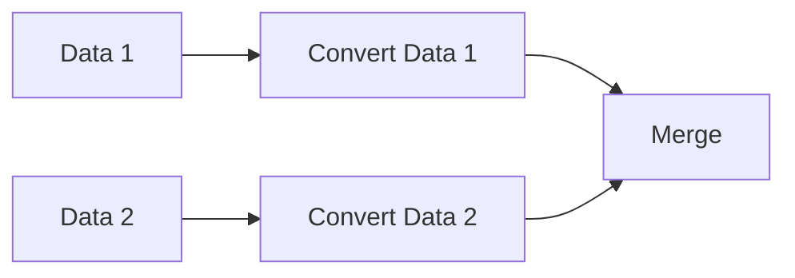

## Fluxo (.json) :

```json
{
  "nodes": [
    {
      "name": "Data 1",
      "type": "n8n-nodes-base.function",
      "position": [
        602,
        350
      ],
      "parameters": {
        "functionCode": "items[0].json = {\n\"data\": [\n{\n\"pointer\": \"12345\",\n\"panel\": \"234234\",\n\"subject\": \"Blah Blah\",\n\"note\": \"\",\n\"interviewers\": [\n{\n\"id\": \"111222333\",\n\"name\": \"Bobby Johnson\",\n\"email\": \"bobbyj@example.com\"\n}\n],\n\"timezone\": \"America/Los_Angeles\",\n},\n{\n\"pointer\": \"98754\",\n\"panel\": \"3243234\",\n\"subject\": \"Yadda Yadda\",\n\"note\": \"\",\n\"interviewers\": [\n{\n\"id\": \"444555666\",\n\"name\": \"Billy Johnson\",\n\"email\": \"billyj@example.com\"\n}\n],\n\"timezone\": \"America/Los_Angeles\",\n},\n],\n\"hasNext\": false\n};\nreturn items;\n"
      },
      "typeVersion": 1
    },
    {
      "name": "Data 2",
      "type": "n8n-nodes-base.function",
      "position": [
        602,
        550
      ],
      "parameters": {
        "functionCode": "items[0].json = [\n{\n\"name\": \"test\",\n\"fields\": {\n\"FirstName\": \"Bobby\",\n\"LastName\": \"Johnson\",\n\"JobTitleDescription\": \"Recruiter\",\n\"HomeDepartmentDescription\": \"Recruiting Team\",\n\"Photo\": [\n{\n\"x\": \"attPuc6gAIHUOHjsY\",\n\"url\": \"http://urlto.com/BobbyPhoto.jpg\",\n\"filename\": \"photo.jpg\",\n\"size\": 28956,\n\"type\": \"image/jpeg\"\n}\n],\n\"eid\": \"111222333\"\n},\n\"createdTime\": \"2019-09-23T04:06:48.000Z\"\n},\n{\n\"name\": \"test2\",\n\"fields\": {\n\"FirstName\": \"Billy\",\n\"LastName\": \"Johnson\",\n\"JobTitleDescription\": \"CEO\",\n\"HomeDepartmentDescription\": \"Boss Team\",\n\"Photo\": [\n{\n\"x\": \"attPuc6gAIHUOHjsY\",\n\"url\": \"http://urlto.com/BillyPhoto.jpg\",\n\"filename\": \"photo.jpg\",\n\"size\": 28956,\n\"type\": \"image/jpeg\"\n}\n],\n\"eid\": \"444555666\"\n},\n\"createdTime\": \"2019-09-23T04:06:48.000Z\"\n}\n,\n{\n\"name\": \"test3\",\n\"fields\": {\n\"FirstName\": \"Susan\",\n\"LastName\": \"Smith\",\n\"JobTitleDescription\": \"CFO\",\n\"HomeDepartmentDescription\": \"Boss Team\",\n\"Photo\": [\n{\n\"x\": \"attPuc6gAIHUOHjsY\",\n\"url\": \"http://urlto.com/SusanPhoto.jpg\",\n\"filename\": \"photo.jpg\",\n\"size\": 28956,\n\"type\": \"image/jpeg\"\n}\n],\n\"eid\": \"777888999\"\n},\n\"createdTime\": \"2019-09-23T04:06:48.000Z\"\n}\n];\nreturn items;"
      },
      "typeVersion": 1
    },
    {
      "name": "Convert Data 1",
      "type": "n8n-nodes-base.function",
      "position": [
        752,
        350
      ],
      "parameters": {
        "functionCode": "const newItems = [];\n\nfor (const item of items[0].json.data) {\n  newItems.push({ json: item });\n}\n\nreturn newItems;"
      },
      "typeVersion": 1
    },
    {
      "name": "Convert Data 2",
      "type": "n8n-nodes-base.function",
      "position": [
        752,
        550
      ],
      "parameters": {
        "functionCode": "const newItems = [];\n\nfor (const item of items[0].json) {\n  newItems.push({ json: item });\n}\n\nreturn newItems;"
      },
      "typeVersion": 1
    },
    {
      "name": "Merge",
      "type": "n8n-nodes-base.merge",
      "position": [
        990,
        430
      ],
      "parameters": {
        "mode": "mergeByKey",
        "propertyName1": "interviewers[0].id",
        "propertyName2": "fields.eid"
      },
      "typeVersion": 1
    }
  ],
  "connections": {
    "Data 1": {
      "main": [
        [
          {
            "node": "Convert Data 1",
            "type": "main",
            "index": 0
          }
        ]
      ]
    },
    "Data 2": {
      "main": [
        [
          {
            "node": "Convert Data 2",
            "type": "main",
            "index": 0
          }
        ]
      ]
    },
    "Convert Data 1": {
      "main": [
        [
          {
            "node": "Merge",
            "type": "main",
            "index": 0
          }
        ]
      ]
    },
    "Convert Data 2": {
      "main": [
        [
          {
            "node": "Merge",
            "type": "main",
            "index": 1
          }
        ]
      ]
    }
  }
}
```

<a id="template-676"></a>

## Template 676 - Assistente SMS para consultas de cursos

- **Nome:** Assistente SMS para consultas de cursos
- **Descrição:** Fluxo que recebe consultas por SMS, usa um agente de IA para consultar a base de cursos e responde ao usuário, registrando a interação.
- **Funcionalidade:** • Recepção de SMS: Captura mensagens recebidas via webhook para iniciar o fluxo.
• Extração de dados do usuário: Obtém o texto da mensagem e o identificador de sessão/telefone do remetente.
• Agente de IA: Utiliza um modelo de linguagem para entender a pergunta do usuário, planejar ações e decidir quais consultas executar na base de dados.
• Consulta do esquema do banco: O agente primeiro recupera o esquema da base de dados para formar consultas corretas.
• Busca de cursos: Gera e executa consultas (filter_by_formula) para buscar cursos que atendam aos critérios do usuário.
• Listagem de valores auxiliares: Recupera listas de professores e departamentos para ajudar a formular respostas ou filtros.
• Memória de contexto: Mantém um buffer de memória curto para preservar contexto de conversas recentes.
• Registro de interação: Salva a pergunta e a resposta em um log de chamadas na base de dados para análise futura.
• Resposta por SMS: Envia a resposta gerada de volta ao usuário através de SMS.
- **Ferramentas:** • Twilio: Serviço para receber e enviar mensagens SMS.
• OpenAI: Modelo de linguagem que processa a mensagem, planeja ações e gera respostas.
• Airtable: Base de dados que contém o catálogo de cursos, esquema e planilhas de log usadas para consulta e armazenamento.

## Fluxo visual

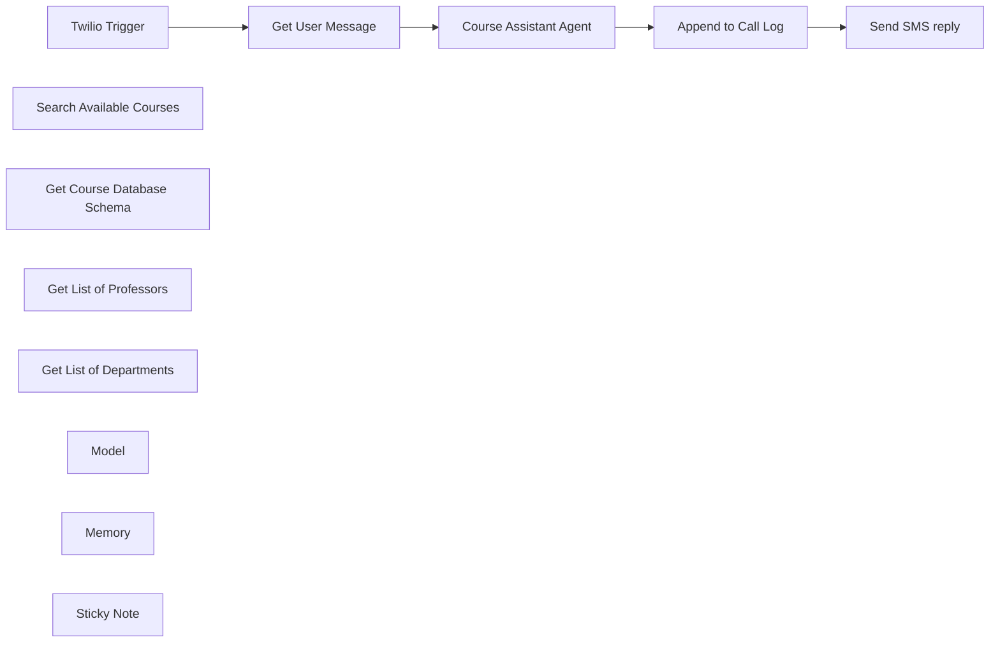

## Fluxo (.json) :

```json
{
  "meta": {
    "instanceId": "408f9fb9940c3cb18ffdef0e0150fe342d6e655c3a9fac21f0f644e8bedabcd9",
    "templateCredsSetupCompleted": true
  },
  "nodes": [
    {
      "id": "c2429079-50b7-4da8-9fe4-9a1879bd681c",
      "name": "Twilio Trigger",
      "type": "n8n-nodes-base.twilioTrigger",
      "position": [
        -380,
        -460
      ],
      "webhookId": "47604448-e049-480d-899e-d3318a93276b",
      "parameters": {
        "updates": [
          "com.twilio.messaging.inbound-message.received"
        ]
      },
      "credentials": {
        "twilioApi": {
          "id": "TJv4H4lXxPCLZT50",
          "name": "Twilio account"
        }
      },
      "typeVersion": 1
    },
    {
      "id": "b1c0dc4c-593f-49aa-8fec-a77c7e40928e",
      "name": "Search Available Courses",
      "type": "n8n-nodes-base.airtableTool",
      "position": [
        380,
        -80
      ],
      "parameters": {
        "base": {
          "__rl": true,
          "mode": "list",
          "value": "appO5xvP1aUBYKyJ7",
          "cachedResultUrl": "https://airtable.com/appO5xvP1aUBYKyJ7",
          "cachedResultName": "Northvale Institute of Technology Courses 2025-2026"
        },
        "limit": 5,
        "table": {
          "__rl": true,
          "mode": "list",
          "value": "tblRfh0t0KNSJYJVw",
          "cachedResultUrl": "https://airtable.com/appO5xvP1aUBYKyJ7/tblRfh0t0KNSJYJVw",
          "cachedResultName": "Imported table"
        },
        "options": {},
        "operation": "search",
        "returnAll": false,
        "descriptionType": "manual",
        "filterByFormula": "={{ /*n8n-auto-generated-fromAI-override*/ $fromAI('Filter_By_Formula', ``, 'string') }}",
        "toolDescription": "Call this tool to access the course database. Ensure you have the course database schema before using this tool."
      },
      "credentials": {
        "airtableTokenApi": {
          "id": "Und0frCQ6SNVX3VV",
          "name": "Airtable Personal Access Token account"
        }
      },
      "typeVersion": 2.1
    },
    {
      "id": "ad06d5f6-cd6d-4804-b633-cf065866f41e",
      "name": "Get Course Database Schema",
      "type": "n8n-nodes-base.airtableTool",
      "position": [
        240,
        -160
      ],
      "parameters": {
        "base": {
          "__rl": true,
          "mode": "list",
          "value": "appO5xvP1aUBYKyJ7",
          "cachedResultUrl": "https://airtable.com/appO5xvP1aUBYKyJ7",
          "cachedResultName": "Northvale Institute of Technology Courses 2025-2026"
        },
        "resource": "base",
        "operation": "getSchema",
        "descriptionType": "manual",
        "toolDescription": "Call this tool to get the course database schema."
      },
      "credentials": {
        "airtableTokenApi": {
          "id": "Und0frCQ6SNVX3VV",
          "name": "Airtable Personal Access Token account"
        }
      },
      "typeVersion": 2.1
    },
    {
      "id": "7d16ef89-3e63-4f64-9470-eb1bf9c76ece",
      "name": "Get User Message",
      "type": "n8n-nodes-base.set",
      "position": [
        -160,
        -460
      ],
      "parameters": {
        "options": {},
        "assignments": {
          "assignments": [
            {
              "id": "5ca2fffb-2926-42df-ae2b-95ba081345ef",
              "name": "message",
              "type": "string",
              "value": "={{ $json.Body || $json.chatInput }}"
            },
            {
              "id": "3bfdb166-0ab1-44b9-b6e4-ce6ad52a465c",
              "name": "sessionId",
              "type": "string",
              "value": "={{ $json.From || $json.sessionId }}"
            }
          ]
        }
      },
      "typeVersion": 3.4
    },
    {
      "id": "b2b03e59-2c1d-4852-a8a6-37fb20f38b55",
      "name": "Send SMS reply",
      "type": "n8n-nodes-base.twilio",
      "position": [
        660,
        -460
      ],
      "parameters": {
        "to": "={{ $json.fields.from }}",
        "from": "={{ $('Twilio Trigger').item.json.To }}",
        "message": "={{ $('Course Assistant Agent').item.json.output }}",
        "options": {}
      },
      "credentials": {
        "twilioApi": {
          "id": "TJv4H4lXxPCLZT50",
          "name": "Twilio account"
        }
      },
      "typeVersion": 1
    },
    {
      "id": "c07ba0c0-2e22-48fc-bca9-cbaeb221ccf9",
      "name": "Append to Call Log",
      "type": "n8n-nodes-base.airtable",
      "position": [
        440,
        -460
      ],
      "parameters": {
        "base": {
          "__rl": true,
          "mode": "list",
          "value": "appO5xvP1aUBYKyJ7",
          "cachedResultUrl": "https://airtable.com/appO5xvP1aUBYKyJ7",
          "cachedResultName": "Northvale Institute of Technology Courses 2025-2026"
        },
        "table": {
          "__rl": true,
          "mode": "list",
          "value": "tblRFuaayw0En6T0c",
          "cachedResultUrl": "https://airtable.com/appO5xvP1aUBYKyJ7/tblRFuaayw0En6T0c",
          "cachedResultName": "Call Log"
        },
        "columns": {
          "value": {
            "from": "={{ $('Get User Message').first().json.sessionId }}",
            "answer": "={{ $json.output }}",
            "question": "={{ $('Get User Message').first().json.message }}"
          },
          "schema": [
            {
              "id": "from",
              "type": "string",
              "display": true,
              "removed": false,
              "readOnly": false,
              "required": false,
              "displayName": "from",
              "defaultMatch": false,
              "canBeUsedToMatch": true
            },
            {
              "id": "question",
              "type": "string",
              "display": true,
              "removed": false,
              "readOnly": false,
              "required": false,
              "displayName": "question",
              "defaultMatch": false,
              "canBeUsedToMatch": true
            },
            {
              "id": "answer",
              "type": "string",
              "display": true,
              "removed": false,
              "readOnly": false,
              "required": false,
              "displayName": "answer",
              "defaultMatch": false,
              "canBeUsedToMatch": true
            },
            {
              "id": "Created",
              "type": "string",
              "display": true,
              "removed": true,
              "readOnly": true,
              "required": false,
              "displayName": "Created",
              "defaultMatch": false,
              "canBeUsedToMatch": true
            }
          ],
          "mappingMode": "defineBelow",
          "matchingColumns": [
            "id"
          ],
          "attemptToConvertTypes": false,
          "convertFieldsToString": false
        },
        "options": {},
        "operation": "create"
      },
      "credentials": {
        "airtableTokenApi": {
          "id": "Und0frCQ6SNVX3VV",
          "name": "Airtable Personal Access Token account"
        }
      },
      "typeVersion": 2.1
    },
    {
      "id": "ba7b4d7b-7b78-41f0-b158-3d1f09d14120",
      "name": "Course Assistant Agent",
      "type": "@n8n/n8n-nodes-langchain.agent",
      "position": [
        60,
        -460
      ],
      "parameters": {
        "text": "={{ $json.message }}",
        "options": {
          "systemMessage": "=You are a course enquiry assistant for the Northvale Institute of Technology helping students with various questions about the available courses for the year.\n* Answer factually and source the information from the course database to ensure you have updated information.\n* Avoid answering or engaging in any discussion not related to the Northvale Institute of Technology courses and instead, direct the student to contact helpdesk@northvale.edu.\n* always query the course database schema before using tools.\n\nNote: The airtable filter by query syntax was updated\n* Wrap your query in AND() or OR() to join parameters.\n* To filter select or multiple select finds, use the FIND() operation. eg. AND({Schedule_from}>=900, FIND('Wed', {Schedule_day}))\n* times should be inclusive unless otherwise stated. Use the >= or <= operators."
        },
        "promptType": "define"
      },
      "typeVersion": 1.8
    },
    {
      "id": "3c790125-6665-4a0c-85b4-397e71faae35",
      "name": "Get List of Professors",
      "type": "n8n-nodes-base.airtableTool",
      "position": [
        560,
        -180
      ],
      "parameters": {
        "base": {
          "__rl": true,
          "mode": "list",
          "value": "appO5xvP1aUBYKyJ7",
          "cachedResultUrl": "https://airtable.com/appO5xvP1aUBYKyJ7",
          "cachedResultName": "Northvale Institute of Technology Courses 2025-2026"
        },
        "table": {
          "__rl": true,
          "mode": "list",
          "value": "tblRfh0t0KNSJYJVw",
          "cachedResultUrl": "https://airtable.com/appO5xvP1aUBYKyJ7/tblRfh0t0KNSJYJVw",
          "cachedResultName": "Imported table"
        },
        "options": {
          "fields": [
            "Instructor"
          ]
        },
        "operation": "search",
        "descriptionType": "manual",
        "toolDescription": "Call this tool to get a list of active professors."
      },
      "credentials": {
        "airtableTokenApi": {
          "id": "Und0frCQ6SNVX3VV",
          "name": "Airtable Personal Access Token account"
        }
      },
      "typeVersion": 2.1
    },
    {
      "id": "27aacf1e-b8a7-46d0-915e-0481d9608251",
      "name": "Get List of Departments",
      "type": "n8n-nodes-base.airtableTool",
      "position": [
        500,
        -20
      ],
      "parameters": {
        "base": {
          "__rl": true,
          "mode": "list",
          "value": "appO5xvP1aUBYKyJ7",
          "cachedResultUrl": "https://airtable.com/appO5xvP1aUBYKyJ7",
          "cachedResultName": "Northvale Institute of Technology Courses 2025-2026"
        },
        "table": {
          "__rl": true,
          "mode": "list",
          "value": "tblRfh0t0KNSJYJVw",
          "cachedResultUrl": "https://airtable.com/appO5xvP1aUBYKyJ7/tblRfh0t0KNSJYJVw",
          "cachedResultName": "Imported table"
        },
        "options": {
          "fields": [
            "Department"
          ]
        },
        "operation": "search",
        "descriptionType": "manual",
        "toolDescription": "Call this tool to get a list of departments."
      },
      "credentials": {
        "airtableTokenApi": {
          "id": "Und0frCQ6SNVX3VV",
          "name": "Airtable Personal Access Token account"
        }
      },
      "typeVersion": 2.1
    },
    {
      "id": "f1991f1f-9666-43d9-88ce-a2c083491a78",
      "name": "Model",
      "type": "@n8n/n8n-nodes-langchain.lmChatOpenAi",
      "position": [
        -40,
        -240
      ],
      "parameters": {
        "model": {
          "__rl": true,
          "mode": "list",
          "value": "gpt-4o-mini"
        },
        "options": {}
      },
      "credentials": {
        "openAiApi": {
          "id": "8gccIjcuf3gvaoEr",
          "name": "OpenAi account"
        }
      },
      "typeVersion": 1.2
    },
    {
      "id": "2afd9d28-a1ba-4364-a576-ed3e86c640b6",
      "name": "Memory",
      "type": "@n8n/n8n-nodes-langchain.memoryBufferWindow",
      "position": [
        100,
        -240
      ],
      "parameters": {},
      "typeVersion": 1.3
    },
    {
      "id": "774472f7-eb3d-4251-97e3-8e4033a0cf4f",
      "name": "Sticky Note",
      "type": "n8n-nodes-base.stickyNote",
      "position": [
        -940,
        -1100
      ],
      "parameters": {
        "width": 420,
        "height": 1320,
        "content": "## Try It Out!\n### This n8n template offers a simple yet capable chatbot assistant who can answer course enquiries over SMS.\n\nGiven the right access to data, AI Agents are capable of planning and performing relatively complex research tasks to get their answers. In this example, the agent must first understand the database schema, retrieve lists of values before generating it's own query to search over the database.\n\n**Checkout the example database here - https://airtable.com/appO5xvP1aUBYKyJ7/shr8jSFDaghubDOrw**\n\n### How it works\n* A Twilio trigger gives us the ability to receive SMS input into our workflow via webhook.\n* The message is then directed to our AI agent who is instructed to assist the user and use the course database as reference. The database is an Airtable base.\n* The agent autonomously figures out which tool it needs to use and generates it's own \"filter_by_formula\" query to search over the available courses.\n* On successful search results, the Agent can then use this information to answer the user's query.\n* The Agent's output is logged in a second sheet of the Airtable base. We can use this later for analysis and lead gen.\n* Finally, the response is sent back to the user through SMS using Twilio.\n\n### How to use\n* Ensure your Twilio number is set to forward messages to this workflow's webhook URL.\n* Configure and update the course database as required. If you're not interested in courses, you can swap this out for inventory, deliveries or any other data relevant to your business.\n* Ask questions like:\n  * \"Can you help me find suitable courses to fill my Wednesday mornings?\"\n  * \"Which courses are being instructed by profession Lee?\"\n  * \"I'm interested in creative arts. What courses are available which could be relevant to me?\"\n\n### Requirements\n* Twilio for SMS receiving and sending\n* OpenAI for LLM and Agent\n* Airtable for Course Database\n\n### Customising this workflow\n* Add additional tools and expand the range of queries the agent is able to answer or assist with.\n* Not using Airtable? This technique also works with SQL databases like PostgreSQL.\n\n### Need Help?\nJoin the [Discord](https://discord.com/invite/XPKeKXeB7d) or ask in the [Forum](https://community.n8n.io/)!\n\nHappy Hacking!"
      },
      "typeVersion": 1
    }
  ],
  "pinData": {},
  "connections": {
    "Model": {
      "ai_languageModel": [
        [
          {
            "node": "Course Assistant Agent",
            "type": "ai_languageModel",
            "index": 0
          }
        ]
      ]
    },
    "Memory": {
      "ai_memory": [
        [
          {
            "node": "Course Assistant Agent",
            "type": "ai_memory",
            "index": 0
          }
        ]
      ]
    },
    "Twilio Trigger": {
      "main": [
        [
          {
            "node": "Get User Message",
            "type": "main",
            "index": 0
          }
        ]
      ]
    },
    "Get User Message": {
      "main": [
        [
          {
            "node": "Course Assistant Agent",
            "type": "main",
            "index": 0
          }
        ]
      ]
    },
    "Append to Call Log": {
      "main": [
        [
          {
            "node": "Send SMS reply",
            "type": "main",
            "index": 0
          }
        ]
      ]
    },
    "Course Assistant Agent": {
      "main": [
        [
          {
            "node": "Append to Call Log",
            "type": "main",
            "index": 0
          }
        ]
      ]
    },
    "Get List of Professors": {
      "ai_tool": [
        [
          {
            "node": "Course Assistant Agent",
            "type": "ai_tool",
            "index": 0
          }
        ]
      ]
    },
    "Get List of Departments": {
      "ai_tool": [
        [
          {
            "node": "Course Assistant Agent",
            "type": "ai_tool",
            "index": 0
          }
        ]
      ]
    },
    "Search Available Courses": {
      "ai_tool": [
        [
          {
            "node": "Course Assistant Agent",
            "type": "ai_tool",
            "index": 0
          }
        ]
      ]
    },
    "Get Course Database Schema": {
      "ai_tool": [
        [
          {
            "node": "Course Assistant Agent",
            "type": "ai_tool",
            "index": 0
          }
        ]
      ]
    }
  }
}
```

<a id="template-677"></a>

## Template 677 - Enviar SMS ao sair de casa

- **Nome:** Enviar SMS ao sair de casa
- **Descrição:** Envia uma mensagem SMS para um número configurado quando é acionado o evento 'Leaving Home'.
- **Funcionalidade:** • Acionamento por evento 'Leaving Home': inicia o fluxo quando o gatilho configurado é recebido.
• Envio de SMS automático: envia uma mensagem de texto para o número destinatário especificado.
• Conteúdo dinâmico da mensagem: o texto do SMS é preenchido com o dado recebido no gatilho (entrada do evento).
• Uso de credenciais de envio: utiliza credenciais configuradas do serviço de mensagens para autenticação e envio.
- **Ferramentas:** • Pushcut: serviço que envia gatilhos a partir de ações no dispositivo ou automações (usado para o evento 'Leaving Home').
• Twilio: plataforma de comunicação usada para enviar o SMS ao destinatário.

## Fluxo visual


## Fluxo (.json) :

```json
{
  "id": "92",
  "name": "Send an SMS to a number whenever you go out",
  "nodes": [
    {
      "name": "Pushcut Trigger",
      "type": "n8n-nodes-base.pushcutTrigger",
      "position": [
        470,
        300
      ],
      "webhookId": "",
      "parameters": {
        "actionName": "Leaving Home"
      },
      "credentials": {
        "pushcutApi": "Pushcut Credentials"
      },
      "typeVersion": 1
    },
    {
      "name": "Twilio",
      "type": "n8n-nodes-base.twilio",
      "position": [
        670,
        300
      ],
      "parameters": {
        "to": "123",
        "from": "123",
        "message": "=I'm {{$node[\"Pushcut Trigger\"].json[\"input\"]}}"
      },
      "credentials": {
        "twilioApi": "twilio"
      },
      "typeVersion": 1
    }
  ],
  "active": false,
  "settings": {},
  "connections": {
    "Pushcut Trigger": {
      "main": [
        [
          {
            "node": "Twilio",
            "type": "main",
            "index": 0
          }
        ]
      ]
    }
  }
}
```

<a id="template-678"></a>

## Template 678 - Criar fatura no QuickBooks ao criar tarefa no Onfleet

- **Nome:** Criar fatura no QuickBooks ao criar tarefa no Onfleet
- **Descrição:** Quando uma nova tarefa é criada no Onfleet, o fluxo automaticamente cria uma fatura correspondente no QuickBooks Online.
- **Funcionalidade:** • Gatilho por criação de tarefa: Inicia o fluxo assim que uma nova tarefa é criada na plataforma de entregas.
• Criação automática de fatura: Gera uma invoice no QuickBooks Online acionada pelo evento de criação da tarefa.
• Inclusão de campos adicionais: Permite definir campos da fatura como Balance, TxnDate, ShipAddr e BillEmail (podem ficar vazios ou ser preenchidos conforme os dados disponíveis).
- **Ferramentas:** • Onfleet: Plataforma de gerenciamento de entregas que emite eventos quando tarefas são criadas ou atualizadas.
• QuickBooks Online: Software contábil para criação e gestão de faturas e registros financeiros.

## Fluxo visual

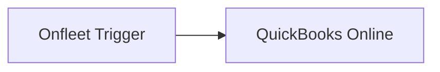

## Fluxo (.json) :

```json
{
  "name": "Create a QuickBooks invoice on a new Onfleet Task creation",
  "nodes": [
    {
      "name": "Onfleet Trigger",
      "type": "n8n-nodes-base.onfleetTrigger",
      "position": [
        460,
        300
      ],
      "webhookId": "6d6a2bee-f83e-4ebd-a1d5-8708c34393dc",
      "parameters": {
        "triggerOn": "taskCreated",
        "additionalFields": {}
      },
      "typeVersion": 1
    },
    {
      "name": "QuickBooks Online",
      "type": "n8n-nodes-base.quickbooks",
      "position": [
        680,
        300
      ],
      "parameters": {
        "Line": [],
        "resource": "invoice",
        "operation": "create",
        "additionalFields": {
          "Balance": 0,
          "TxnDate": "",
          "ShipAddr": "",
          "BillEmail": ""
        }
      },
      "typeVersion": 1
    }
  ],
  "active": false,
  "settings": {},
  "connections": {
    "Onfleet Trigger": {
      "main": [
        [
          {
            "node": "QuickBooks Online",
            "type": "main",
            "index": 0
          }
        ]
      ]
    }
  }
}
```

<a id="template-679"></a>

## Template 679 - Monitorar menções no Twitter e notificar Slack

- **Nome:** Monitorar menções no Twitter e notificar Slack
- **Descrição:** Monitora menções no Twitter para um termo configurado a cada 10 minutos e envia notificações com link e texto dos tweets para um canal do Slack.
- **Funcionalidade:** • Agendamento periódico: Dispara o processo a cada 10 minutos.
• Cálculo de janela de tempo: Calcula 'agora menos 10 minutos' para identificar tweets novos desde a última execução.
• Busca de menções no Twitter: Pesquisa os últimos 50 tweets que correspondem ao termo configurado.
• Filtragem por data de criação: Seleciona apenas tweets criados após o tempo calculado.
• Formatação dos dados do tweet: Extrai o texto do tweet e monta a URL direta para o tweet.
• Notificação no Slack: Envia mensagem para o canal configurado com o texto da menção e o link.
• Configuração flexível: Permite ajustar o termo de busca e o canal do Slack via parâmetros.
- **Ferramentas:** • Twitter: API usada para pesquisar menções e recuperar dados dos tweets.
• Slack: API usada para postar notificações no canal especificado.

## Fluxo visual

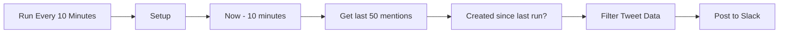

## Fluxo (.json) :

```json
{
  "id": 95,
  "name": "Scrape Twitter for mentions of company",
  "nodes": [
    {
      "name": "Filter Tweet Data",
      "type": "n8n-nodes-base.set",
      "position": [
        1260,
        300
      ],
      "parameters": {
        "values": {
          "string": [
            {
              "name": "Tweet",
              "value": "={{$node[\"Get last 50 mentions\"].json[\"text\"]}}"
            },
            {
              "name": "Tweet URL",
              "value": "=https://twitter.com/{{$node[\"Get last 50 mentions\"].json[\"user\"][\"screen_name\"]}}/status/{{$node[\"Get last 50 mentions\"].json[\"id_str\"]}}"
            }
          ]
        },
        "options": {},
        "keepOnlySet": true
      },
      "typeVersion": 1
    },
    {
      "name": "Run Every 10 Minutes",
      "type": "n8n-nodes-base.cron",
      "position": [
        260,
        320
      ],
      "parameters": {
        "triggerTimes": {
          "item": [
            {
              "mode": "everyX",
              "unit": "minutes",
              "value": 10
            }
          ]
        }
      },
      "typeVersion": 1
    },
    {
      "name": "Now - 10 minutes",
      "type": "n8n-nodes-base.dateTime",
      "position": [
        620,
        320
      ],
      "parameters": {
        "value": "={{Date()}}",
        "action": "calculate",
        "options": {},
        "duration": "={{$node[\"Run Every 10 Minutes\"].parameter[\"triggerTimes\"][\"item\"][0][\"value\"]}}",
        "timeUnit": "={{$node[\"Run Every 10 Minutes\"].parameter[\"triggerTimes\"][\"item\"][0][\"unit\"]}}",
        "operation": "subtract"
      },
      "typeVersion": 1
    },
    {
      "name": "Get last 50 mentions",
      "type": "n8n-nodes-base.twitter",
      "position": [
        820,
        320
      ],
      "parameters": {
        "operation": "search",
        "searchText": "={{$node[\"Setup\"].parameter[\"values\"][\"string\"][1][\"value\"]}}",
        "additionalFields": {}
      },
      "credentials": {
        "twitterOAuth1Api": {
          "id": "27",
          "name": "86-88 Twitter"
        }
      },
      "typeVersion": 1
    },
    {
      "name": "Created since last run?",
      "type": "n8n-nodes-base.if",
      "position": [
        1020,
        320
      ],
      "parameters": {
        "conditions": {
          "dateTime": [
            {
              "value1": "={{$json[\"created_at\"]}}",
              "value2": "={{$items(\"Now - 10 minutes\", 0, 0)[0].json.data}}"
            }
          ]
        }
      },
      "typeVersion": 1
    },
    {
      "name": "Setup",
      "type": "n8n-nodes-base.set",
      "position": [
        440,
        320
      ],
      "parameters": {
        "values": {
          "string": [
            {
              "name": "slackChannel",
              "value": "#recent-tweets"
            },
            {
              "name": "twitterSearchValue",
              "value": "@n8n_io"
            }
          ]
        },
        "options": {}
      },
      "typeVersion": 1
    },
    {
      "name": "Post to Slack",
      "type": "n8n-nodes-base.slack",
      "position": [
        1440,
        300
      ],
      "parameters": {
        "text": "=New Mention!: {{$node[\"Filter Tweet Data\"].json[\"Tweet\"]}}.\nSee it here: {{$node[\"Filter Tweet Data\"].json[\"Tweet URL\"]}}",
        "channel": "={{$node[\"Setup\"].parameter[\"values\"][\"string\"][0][\"value\"]}}",
        "attachments": [],
        "otherOptions": {}
      },
      "credentials": {
        "slackApi": {
          "id": "53",
          "name": "Slack Access Token"
        }
      },
      "typeVersion": 1
    }
  ],
  "active": true,
  "settings": {},
  "connections": {
    "Setup": {
      "main": [
        [
          {
            "node": "Now - 10 minutes",
            "type": "main",
            "index": 0
          }
        ]
      ]
    },
    "Now - 10 minutes": {
      "main": [
        [
          {
            "node": "Get last 50 mentions",
            "type": "main",
            "index": 0
          }
        ]
      ]
    },
    "Filter Tweet Data": {
      "main": [
        [
          {
            "node": "Post to Slack",
            "type": "main",
            "index": 0
          }
        ]
      ]
    },
    "Get last 50 mentions": {
      "main": [
        [
          {
            "node": "Created since last run?",
            "type": "main",
            "index": 0
          }
        ]
      ]
    },
    "Run Every 10 Minutes": {
      "main": [
        [
          {
            "node": "Setup",
            "type": "main",
            "index": 0
          }
        ]
      ]
    },
    "Created since last run?": {
      "main": [
        [
          {
            "node": "Filter Tweet Data",
            "type": "main",
            "index": 0
          }
        ]
      ]
    }
  }
}
```

<a id="template-680"></a>

## Template 680 - Converter CSV para JSON e salvar

- **Nome:** Converter CSV para JSON e salvar
- **Descrição:** Fluxo que lê um arquivo de planilha/CSV local, converte seu conteúdo para JSON e grava o resultado em um arquivo.
- **Funcionalidade:** • Disparo manual: Inicia o processo quando acionado manualmente.
• Leitura de arquivo: Lê o arquivo de entrada localizado em /username/n8n_spreadsheet.csv.
• Conversão de planilha para dados estruturados: Processa o conteúdo da planilha/CSV e transforma em dados JSON.
• Preparação de dados binários: Move os dados JSON para o fluxo como conteúdo binário para escrita.
• Gravação de arquivo de saída: Salva o JSON resultante em /username/n8n_spreadsheet.json.
- **Ferramentas:** • Sistema de arquivos: Permite leitura do arquivo CSV de origem e escrita do arquivo JSON de saída no caminho especificado.
• Conversor de planilhas/CSV: Biblioteca ou utilitário responsável por interpretar o CSV/planilha e gerar a estrutura JSON correspondente.

## Fluxo visual

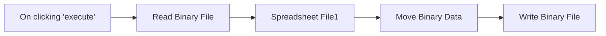

## Fluxo (.json) :

```json
{
  "nodes": [
    {
      "name": "On clicking 'execute'",
      "type": "n8n-nodes-base.manualTrigger",
      "position": [
        -240,
        180
      ],
      "parameters": {},
      "typeVersion": 1
    },
    {
      "name": "Read Binary File",
      "type": "n8n-nodes-base.readBinaryFile",
      "position": [
        -60,
        180
      ],
      "parameters": {
        "filePath": "/username/n8n_spreadsheet.csv"
      },
      "typeVersion": 1
    },
    {
      "name": "Spreadsheet File1",
      "type": "n8n-nodes-base.spreadsheetFile",
      "position": [
        120,
        180
      ],
      "parameters": {
        "options": {}
      },
      "typeVersion": 1
    },
    {
      "name": "Move Binary Data",
      "type": "n8n-nodes-base.moveBinaryData",
      "position": [
        300,
        180
      ],
      "parameters": {
        "mode": "jsonToBinary",
        "options": {}
      },
      "typeVersion": 1
    },
    {
      "name": "Write Binary File",
      "type": "n8n-nodes-base.writeBinaryFile",
      "position": [
        480,
        180
      ],
      "parameters": {
        "fileName": "/username/n8n_spreadsheet.json"
      },
      "typeVersion": 1
    }
  ],
  "connections": {
    "Move Binary Data": {
      "main": [
        [
          {
            "node": "Write Binary File",
            "type": "main",
            "index": 0
          }
        ]
      ]
    },
    "Read Binary File": {
      "main": [
        [
          {
            "node": "Spreadsheet File1",
            "type": "main",
            "index": 0
          }
        ]
      ]
    },
    "Spreadsheet File1": {
      "main": [
        [
          {
            "node": "Move Binary Data",
            "type": "main",
            "index": 0
          }
        ]
      ]
    },
    "On clicking 'execute'": {
      "main": [
        [
          {
            "node": "Read Binary File",
            "type": "main",
            "index": 0
          }
        ]
      ]
    }
  }
}
```

<a id="template-681"></a>

## Template 681 - Criar campanha de e-mail a partir de interações no LinkedIn

- **Nome:** Criar campanha de e-mail a partir de interações no LinkedIn
- **Descrição:** Este fluxo monitora interações em uma publicação do LinkedIn, enriquece os contatos encontrados, atualiza um banco de dados e adiciona os leads a uma campanha de e-mail.
- **Funcionalidade:** • Agendamento periódico: Roda automaticamente a cada hora para verificar novas interações.
• Coleta de interações do LinkedIn: Captura quem comentou e quem curtiu uma publicação específica.
• Espera e coleta de resultados: Introduz uma pausa para garantir que os dados de coleta estejam prontos antes de prosseguir.
• Enriquecimento de contatos: Usa dados públicos para obter e validar e-mails, telefone, perfil LinkedIn, empresa e site.
• Verificação no banco de contatos: Consulta uma base de contatos para identificar se o contato já existe.
• Atualização ou criação de registro: Atualiza registros existentes ou adiciona novos contatos no banco conforme necessário.
• Inscrição em campanha de e-mail: Adiciona o lead à campanha de e-mail automatizada.
• Sincronização com CRM: Cria ou atualiza o contato no CRM para gestão comercial.
- **Ferramentas:** • Phantombuster: Ferramenta para extrair dados de interações em redes sociais, usada para capturar comentaristas e curtidores do LinkedIn.
• Dropcontact: Serviço de enriquecimento e validação de contatos (e-mail, telefone, empresa, perfil LinkedIn, site).
• Airtable: Base de dados para armazenar, listar, criar e atualizar registros de contatos.
• Lemlist: Plataforma de automação de campanhas de e-mail para adicionar leads e disparar sequências.
• HubSpot: CRM para criar/atualizar contatos e centralizar informações comerciais.

## Fluxo visual

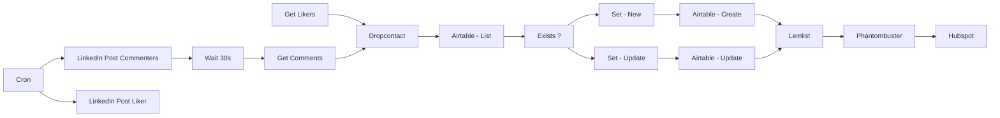

## Fluxo (.json) :

```json
{
  "id": 121,
  "name": "Create Email Campaign From LinkedIn Post Interactions",
  "nodes": [
    {
      "name": "Cron",
      "type": "n8n-nodes-base.cron",
      "position": [
        280,
        500
      ],
      "parameters": {
        "triggerTimes": {
          "item": [
            {
              "mode": "everyHour"
            }
          ]
        }
      },
      "typeVersion": 1
    },
    {
      "name": "Exists ?",
      "type": "n8n-nodes-base.if",
      "position": [
        1700,
        480
      ],
      "parameters": {
        "conditions": {
          "string": [
            {
              "value1": "={{$node[\"Airtable - List\"].json[\"fields\"][\"Email\"]}}",
              "value2": "={{$node[\"Dropcontact - GET\"].json[\"data\"][0][\"email\"][0][\"email\"]}}"
            }
          ]
        }
      },
      "typeVersion": 1
    },
    {
      "name": "Airtable - List",
      "type": "n8n-nodes-base.airtable",
      "position": [
        1500,
        480
      ],
      "parameters": {
        "table": "Contacts",
        "operation": "list",
        "additionalOptions": {
          "fields": []
        }
      },
      "credentials": {
        "airtableApi": {
          "id": "",
          "name": ""
        }
      },
      "typeVersion": 1
    },
    {
      "name": "Airtable - Update",
      "type": "n8n-nodes-base.airtable",
      "position": [
        2100,
        400
      ],
      "parameters": {
        "id": "={{$node[\"Airtable - List\"].json[\"id\"]}}",
        "table": "Contacts",
        "options": {
          "typecast": true
        },
        "operation": "update",
        "updateAllFields": false
      },
      "credentials": {
        "airtableApi": {
          "id": "",
          "name": ""
        }
      },
      "typeVersion": 1
    },
    {
      "name": "Airtable - Create",
      "type": "n8n-nodes-base.airtable",
      "position": [
        2100,
        580
      ],
      "parameters": {
        "table": "Contacts",
        "options": {
          "typecast": true
        },
        "operation": "append"
      },
      "credentials": {
        "airtableApi": {
          "id": "",
          "name": ""
        }
      },
      "typeVersion": 1
    },
    {
      "name": "Set - Update",
      "type": "n8n-nodes-base.set",
      "position": [
        1900,
        400
      ],
      "parameters": {
        "values": {
          "string": [
            {
              "name": "=ID",
              "value": "={{$node[\"Airtable - List\"].json[\"id\"]}}"
            },
            {
              "name": "Email",
              "value": "={{$node[\"Dropcontact - GET\"].json[\"data\"][0][\"email\"][0][\"email\"]}}"
            },
            {
              "name": "Phone",
              "value": "={{$node[\"Dropcontact - GET\"].json[\"data\"][0][\"phone\"]}}"
            },
            {
              "name": "LinkedIn",
              "value": "={{$node[\"Dropcontact - GET\"].json[\"data\"][0][\"linkedin\"]}}"
            },
            {
              "name": "Account",
              "value": "={{$node[\"Dropcontact - GET\"].json[\"data\"][0][\"company\"]}}"
            },
            {
              "name": "Company website",
              "value": "={{$node[\"Dropcontact - GET\"].json[\"data\"][0][\"website\"]}}"
            }
          ]
        },
        "options": {}
      },
      "typeVersion": 1
    },
    {
      "name": "Set - New",
      "type": "n8n-nodes-base.set",
      "position": [
        1900,
        580
      ],
      "parameters": {
        "values": {
          "string": [
            {
              "name": "Name",
              "value": "={{$node[\"Dropcontact - GET\"].json[\"data\"][0][\"full_name\"]}}"
            },
            {
              "name": "Account",
              "value": "={{$node[\"Dropcontact - GET\"].json[\"data\"][0][\"company\"]}}"
            },
            {
              "name": "Company website",
              "value": "={{$node[\"Dropcontact - GET\"].json[\"data\"][0][\"website\"]}}"
            },
            {
              "name": "Email",
              "value": "={{$node[\"Dropcontact - GET\"].json[\"data\"][0][\"email\"][0][\"email\"]}}"
            },
            {
              "name": "Phone",
              "value": "={{$node[\"Dropcontact - GET\"].json[\"data\"][0][\"phone\"]}}"
            },
            {
              "name": "LinkedIn",
              "value": "={{$node[\"Dropcontact - GET\"].json[\"data\"][0][\"linkedin\"]}}"
            }
          ]
        },
        "options": {},
        "keepOnlySet": true
      },
      "typeVersion": 1
    },
    {
      "name": "Lemlist",
      "type": "n8n-nodes-base.lemlist",
      "position": [
        2300,
        480
      ],
      "parameters": {
        "email": "={{$node[\"Dropcontact - GET\"].json[\"data\"][0][\"email\"][0][\"email\"]}}",
        "resource": "lead",
        "campaignId": "",
        "additionalFields": {
          "lastName": "={{$node[\"Dropcontact - GET\"].json[\"data\"][0][\"last_name\"]}}",
          "firstName": "={{$node[\"Dropcontact - GET\"].json[\"data\"][0][\"first_name\"]}}",
          "companyName": "={{$node[\"Dropcontact - GET\"].json[\"data\"][0][\"company\"]}}"
        }
      },
      "credentials": {
        "lemlistApi": {
          "id": "",
          "name": ""
        }
      },
      "retryOnFail": false,
      "typeVersion": 1,
      "continueOnFail": true
    },
    {
      "name": "Hubspot",
      "type": "n8n-nodes-base.hubspot",
      "position": [
        2700,
        480
      ],
      "parameters": {
        "email": "={{$node[\"Dropcontact - GET\"].json[\"data\"][0][\"email\"][0][\"email\"]}}",
        "resource": "contact",
        "additionalFields": {
          "city": "={{$node[\"Dropcontact - GET\"].json[\"data\"][0][\"siret_city\"]}}",
          "gender": "={{$node[\"Dropcontact - GET\"].json[\"data\"][0][\"civility\"]}}",
          "lastName": "={{$node[\"Dropcontact - GET\"].json[\"data\"][0][\"last_name\"]}}",
          "firstName": "={{$node[\"Dropcontact - GET\"].json[\"data\"][0][\"first_name\"]}}",
          "websiteUrl": "={{$node[\"Dropcontact - GET\"].json[\"data\"][0][\"website\"]}}",
          "companyName": "={{$node[\"Dropcontact - GET\"].json[\"data\"][0][\"company\"]}}",
          "phoneNumber": "={{$node[\"Dropcontact - GET\"].json[\"data\"][0][\"phone\"]}}",
          "originalSource": "SOCIAL_MEDIA"
        }
      },
      "credentials": {
        "hubspotApi": {
          "id": "",
          "name": ""
        }
      },
      "typeVersion": 1
    },
    {
      "name": "LinkedIn Post Commenters",
      "type": "n8n-nodes-base.phantombuster",
      "position": [
        480,
        400
      ],
      "parameters": {
        "jsonParameters": true,
        "additionalFields": {
          "manualLaunch": true
        }
      },
      "credentials": {
        "phantombusterApi": {
          "id": "",
          "name": ""
        }
      },
      "typeVersion": 1
    },
    {
      "name": "Get Comments",
      "type": "n8n-nodes-base.phantombuster",
      "position": [
        880,
        400
      ],
      "parameters": {
        "operation": "getOutput",
        "additionalFields": {}
      },
      "credentials": {
        "phantombusterApi": {
          "id": "",
          "name": ""
        }
      },
      "executeOnce": true,
      "typeVersion": 1
    },
    {
      "name": "Dropcontact",
      "type": "n8n-nodes-base.dropcontact",
      "position": [
        1300,
        480
      ],
      "parameters": {
        "options": {},
        "additionalFields": {
          "company": "=",
          "website": "",
          "linkedin": "",
          "last_name": "",
          "first_name": "="
        }
      },
      "credentials": {
        "dropcontactApi": {
          "id": "",
          "name": ""
        }
      },
      "typeVersion": 1
    },
    {
      "name": "Phantombuster",
      "type": "n8n-nodes-base.phantombuster",
      "position": [
        2500,
        480
      ],
      "parameters": {
        "additionalFields": {}
      },
      "credentials": {
        "phantombusterApi": {
          "id": "",
          "name": ""
        }
      },
      "typeVersion": 1
    },
    {
      "name": "LinkedIn Post Liker",
      "type": "n8n-nodes-base.phantombuster",
      "position": [
        480,
        600
      ],
      "parameters": {
        "jsonParameters": true,
        "additionalFields": {
          "manualLaunch": true
        }
      },
      "credentials": {
        "phantombusterApi": {
          "id": "",
          "name": ""
        }
      },
      "typeVersion": 1
    },
    {
      "name": "Get Likers",
      "type": "n8n-nodes-base.phantombuster",
      "position": [
        880,
        600
      ],
      "parameters": {
        "operation": "getOutput",
        "additionalFields": {}
      },
      "credentials": {
        "phantombusterApi": {
          "id": "",
          "name": ""
        }
      },
      "executeOnce": true,
      "typeVersion": 1
    },
    {
      "name": "Wait 30s",
      "type": "n8n-nodes-base.wait",
      "position": [
        680,
        560
      ],
      "webhookId": "de87cd0e-ea00-43d8-896c-836494094779",
      "parameters": {
        "unit": "seconds",
        "amount": 30
      },
      "typeVersion": 1
    }
  ],
  "active": false,
  "settings": {},
  "connections": {
    "Cron": {
      "main": [
        [
          {
            "node": "LinkedIn Post Commenters",
            "type": "main",
            "index": 0
          },
          {
            "node": "LinkedIn Post Liker",
            "type": "main",
            "index": 0
          }
        ]
      ]
    },
    "Lemlist": {
      "main": [
        [
          {
            "node": "Phantombuster",
            "type": "main",
            "index": 0
          }
        ]
      ]
    },
    "Exists ?": {
      "main": [
        [
          {
            "node": "Set - Update",
            "type": "main",
            "index": 0
          }
        ],
        [
          {
            "node": "Set - New",
            "type": "main",
            "index": 0
          }
        ]
      ]
    },
    "Wait 30s": {
      "main": [
        [
          {
            "node": "Get Comments",
            "type": "main",
            "index": 0
          }
        ]
      ]
    },
    "Set - New": {
      "main": [
        [
          {
            "node": "Airtable - Create",
            "type": "main",
            "index": 0
          }
        ]
      ]
    },
    "Get Likers": {
      "main": [
        [
          {
            "node": "Dropcontact",
            "type": "main",
            "index": 0
          }
        ]
      ]
    },
    "Dropcontact": {
      "main": [
        [
          {
            "node": "Airtable - List",
            "type": "main",
            "index": 0
          }
        ]
      ]
    },
    "Get Comments": {
      "main": [
        [
          {
            "node": "Dropcontact",
            "type": "main",
            "index": 0
          }
        ]
      ]
    },
    "Set - Update": {
      "main": [
        [
          {
            "node": "Airtable - Update",
            "type": "main",
            "index": 0
          }
        ]
      ]
    },
    "Phantombuster": {
      "main": [
        [
          {
            "node": "Hubspot",
            "type": "main",
            "index": 0
          }
        ]
      ]
    },
    "Airtable - List": {
      "main": [
        [
          {
            "node": "Exists ?",
            "type": "main",
            "index": 0
          }
        ]
      ]
    },
    "Airtable - Create": {
      "main": [
        [
          {
            "node": "Lemlist",
            "type": "main",
            "index": 0
          }
        ]
      ]
    },
    "Airtable - Update": {
      "main": [
        [
          {
            "node": "Lemlist",
            "type": "main",
            "index": 0
          }
        ]
      ]
    },
    "LinkedIn Post Commenters": {
      "main": [
        [
          {
            "node": "Wait 30s",
            "type": "main",
            "index": 0
          }
        ]
      ]
    }
  }
}
```
