# PACK 1999 TEMPLATES PARTE 04 - Bloco 5

Templates neste bloco: 20

## Sumário

- [Template 682 - Leitura de arquivo binário local](#template-682)
- [Template 683 - Newsletter mensal de eventos](#template-683)
- [Template 684 - Paginação e coleta de contatos HubSpot](#template-684)
- [Template 685 - Exportar Google Sheets para Dropbox (XLS) periódicamente](#template-685)
- [Template 686 - Enviar evento Track para Segment](#template-686)
- [Template 687 - Geração de artigos no tom da marca](#template-687)
- [Template 688 - Assistente jurídico para código tributário do Texas](#template-688)
- [Template 689 - Caption Creator para redes sociais](#template-689)
- [Template 690 - Criar empresa no Salesmate](#template-690)
- [Template 691 - Criação automática de legendas para Instagram](#template-691)
- [Template 692 - Enviar email ao ocorrer falha](#template-692)
- [Template 693 - Validador de fotos de passaporte por IA](#template-693)
- [Template 694 - Processamento de PDFs com Adobe PDF Services](#template-694)
- [Template 695 - Notificação por email de novo arquivo](#template-695)
- [Template 696 - Raspador autônomo de perfis sociais](#template-696)
- [Template 697 - Gerar e publicar relatório Qualys no Slack](#template-697)
- [Template 698 - Traduzir instruções de coquetel para italiano](#template-698)
- [Template 699 - Anexar dados JSON na planilha](#template-699)
- [Template 700 - Gerenciamento de caso na TheHive](#template-700)
- [Template 701 - Chatbot de políticas e benefícios com busca semântica e lookup de funcionários](#template-701)

---

<a id="template-682"></a>

## Template 682 - Leitura de arquivo binário local

- **Nome:** Leitura de arquivo binário local
- **Descrição:** Fluxo que, ao ser executado manualmente, lê um arquivo binário localizado em /data/picture.jpg e disponibiliza seu conteúdo para etapas posteriores.
- **Funcionalidade:** • Gatilho manual: inicia o fluxo quando o usuário executa manualmente.
• Leitura de arquivo binário local: acessa o caminho /data/picture.jpg e carrega o conteúdo binário para uso posterior.
- **Ferramentas:** • Nenhuma ferramenta externa: o fluxo opera localmente no servidor, lendo um arquivo do sistema de arquivos sem integrações externas.

## Fluxo visual


## Fluxo (.json) :

```json
{
  "nodes": [
    {
      "name": "On clicking 'execute'",
      "type": "n8n-nodes-base.manualTrigger",
      "position": [
        270,
        320
      ],
      "parameters": {},
      "typeVersion": 1
    },
    {
      "name": "Read Binary File",
      "type": "n8n-nodes-base.readBinaryFile",
      "position": [
        470,
        320
      ],
      "parameters": {
        "filePath": "/data/picture.jpg"
      },
      "typeVersion": 1
    }
  ],
  "connections": {
    "On clicking 'execute'": {
      "main": [
        [
          {
            "node": "Read Binary File",
            "type": "main",
            "index": 0
          }
        ]
      ]
    }
  }
}
```

<a id="template-683"></a>

## Template 683 - Newsletter mensal de eventos

- **Nome:** Newsletter mensal de eventos
- **Descrição:** Busca eventos de um local específico para o mês atual, monta um email em HTML com a lista de eventos e envia para destinatários configurados.
- **Funcionalidade:** • Agendamento mensal: inicia o processo automaticamente uma vez por mês.
• Configuração de local e e-mail(s): permite definir a URL do local e os destinatários antes da execução.
• Coleta paginada de eventos: navega pelas páginas de listagem do mês, com pausa entre requisições, até coletar todos os resultados.
• Extração de dados de cada evento: obtém data, artista principal, artista de suporte, local e link do evento a partir do HTML.
• Montagem de conteúdo HTML: gera um layout em tabela com data, artista, local e link para cada evento e calcula o total.
• Envio de newsletter: envia o conteúdo gerado por e-mail para os destinatários configurados.
• Mensagens de orientação: inclui lembretes para configurar o remetente (Gmail) e ativar a automação.
- **Ferramentas:** • Songkick (site de eventos): fonte pública das listagens de eventos (páginas /this-month) a serem raspadas.
• Gmail: serviço de envio de e-mail utilizado para entregar a newsletter aos destinatários.

## Fluxo visual

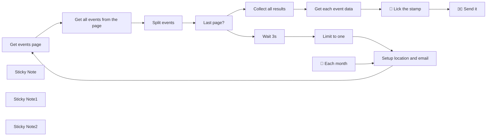

## Fluxo (.json) :

```json
{
  "meta": {
    "instanceId": "cb484ba7b742928a2048bf8829668bed5b5ad9787579adea888f05980292a4a7"
  },
  "nodes": [
    {
      "id": "fe775b06-0264-49ea-af29-16289fee1100",
      "name": "Get events page",
      "type": "n8n-nodes-base.httpRequest",
      "position": [
        -660,
        1160
      ],
      "parameters": {
        "url": "={{ $json.location }}/this-month?page={{ $runIndex+1}}",
        "options": {}
      },
      "typeVersion": 3
    },
    {
      "id": "c55554f4-f06c-4084-b9c2-454cf290682b",
      "name": "Last page?",
      "type": "n8n-nodes-base.if",
      "position": [
        0,
        1160
      ],
      "parameters": {
        "conditions": {
          "number": [
            {
              "value1": "={{ $items().length }}",
              "value2": "=50"
            }
          ]
        }
      },
      "typeVersion": 1
    },
    {
      "id": "3d750b8a-4288-45ac-af2d-24fc6b7126ec",
      "name": "Get all events from the page",
      "type": "n8n-nodes-base.htmlExtract",
      "position": [
        -440,
        1160
      ],
      "parameters": {
        "options": {
          "trimValues": true
        },
        "extractionValues": {
          "values": [
            {
              "key": "events",
              "cssSelector": "li.event-listings-element",
              "returnArray": true,
              "returnValue": "html"
            }
          ]
        }
      },
      "typeVersion": 1
    },
    {
      "id": "84b570d5-60ad-4cb1-9428-1cc3372954cb",
      "name": "Get each event data",
      "type": "n8n-nodes-base.htmlExtract",
      "position": [
        420,
        1140
      ],
      "parameters": {
        "options": {},
        "dataPropertyName": "events",
        "extractionValues": {
          "values": [
            {
              "key": "date",
              "attribute": "datetime",
              "cssSelector": "time",
              "returnArray": true,
              "returnValue": "attribute"
            },
            {
              "key": "artist",
              "cssSelector": "p.artists strong"
            },
            {
              "key": "support",
              "cssSelector": "p.artists span.support"
            },
            {
              "key": "location",
              "cssSelector": "p.location"
            },
            {
              "key": "eventLink",
              "attribute": "href",
              "cssSelector": "a.event-link",
              "returnValue": "attribute"
            }
          ]
        }
      },
      "typeVersion": 1
    },
    {
      "id": "783555d1-1c9c-4bda-8969-0ac46dced10e",
      "name": "Limit to one",
      "type": "n8n-nodes-base.itemLists",
      "position": [
        420,
        1300
      ],
      "parameters": {
        "operation": "limit"
      },
      "typeVersion": 1
    },
    {
      "id": "fdd1c66b-5e20-4c2d-8c01-38555621ec84",
      "name": "Wait 3s",
      "type": "n8n-nodes-base.wait",
      "position": [
        220,
        1300
      ],
      "webhookId": "617f8c35-66e5-4fca-b974-cf9fc4130d68",
      "parameters": {
        "unit": "seconds",
        "amount": 3
      },
      "typeVersion": 1
    },
    {
      "id": "49b5b5c7-9645-42cb-89ec-bb9972c8b379",
      "name": "Split events",
      "type": "n8n-nodes-base.itemLists",
      "position": [
        -220,
        1160
      ],
      "parameters": {
        "options": {},
        "fieldToSplitOut": "events"
      },
      "typeVersion": 1
    },
    {
      "id": "30b06dc8-d896-4684-9c79-3d845f1041ac",
      "name": "Collect all results",
      "type": "n8n-nodes-base.code",
      "position": [
        220,
        1140
      ],
      "parameters": {
        "jsCode": "let results = [],\n  i = 0;\n\ndo {\n  try {\n    results = results.concat($items('Split events', 0, i));\n  } catch (error) {\n    return results;\n  }\n  i++;\n} while(true);"
      },
      "typeVersion": 1
    },
    {
      "id": "ea9444ad-06a3-4567-9638-ce8ef8bfff23",
      "name": "🤖 Each month",
      "type": "n8n-nodes-base.scheduleTrigger",
      "position": [
        -1220,
        1160
      ],
      "parameters": {
        "rule": {
          "interval": [
            {
              "field": "months",
              "triggerAtHour": 20
            }
          ]
        }
      },
      "typeVersion": 1
    },
    {
      "id": "73f7295d-c0f7-42b6-8784-3198538e6e48",
      "name": "Setup location and email",
      "type": "n8n-nodes-base.set",
      "position": [
        -880,
        1160
      ],
      "parameters": {
        "values": {
          "string": [
            {
              "name": "location"
            },
            {
              "name": "email"
            }
          ]
        },
        "options": {},
        "keepOnlySet": true
      },
      "typeVersion": 1
    },
    {
      "id": "a3529743-a7fd-4056-80a9-63b0dac259d6",
      "name": "💄 Lick the stamp",
      "type": "n8n-nodes-base.code",
      "position": [
        620,
        1140
      ],
      "parameters": {
        "jsCode": "const monthNames = ['Jan', 'Feb', 'Mar', 'Apr', 'May', 'Jun', 'Jul', 'Aug', 'Sep', 'Oct', 'Nov', 'Dec' ];\n\nlet html = `<table style=\"width: 100%\">`;\nfor (const item of $input.all()) {\n  const eventDate = new Date(item.json.date[0]);\n  \n   html += `\n    <tr>\n      <td style=\"width: 60px; background-color: #2e2e32; font-family: sans-serif\">\n        <a href=\"https://www.songkick.com${item.json.eventLink}\" style=\"color: #dcdfe6; text-decoration: none\">\n          <p style=\"font-weight: bold; text-align: center; margin: 5px 0 0; padding: 0 0.5em\">${monthNames[eventDate.getMonth()]}</p>\n          <p style=\"font-weight: bold; font-size: 1.5em; text-align: center; margin: 0 0 2px\">${eventDate.getDate()}</p>\n        </a>\n      </td>\n      <td style=\"background-color: #f2f4f8; font-family: sans-serif; padding: 0.3em 0.5em\">\n        <a href=\"https://www.songkick.com${item.json.eventLink}\" style=\"color: #555555; text-decoration: none\">\n        <div>\n          <p style=\"font-size: 1.2em; margin: 0\"><b>${item.json.artist}</b>`\n\n  if (item.json.support) {\n    html = html + `<span style=\"color: #7d7d87; margin:0\"> + ${item.json.support}</span>`;\n  }\n  \n  html += `\n          </p><p style=\"color: #7d7d87; margin: 0\">${item.json.location.split(',')[0].replace(/(\\r\\n|\\n|\\r)/gm, \"\")}</p>\n        </div>\n        </a>\n      </td>\n  </tr>\n   `\n}\nhtml += '</table>';\n\nreturn { \n  \"html\": html,\n  \"total\": $input.all().length \n};\n//$input.all();"
      },
      "typeVersion": 1
    },
    {
      "id": "a8f0e1cf-e8b5-402f-9336-4c623980a315",
      "name": "✉️ Send it",
      "type": "n8n-nodes-base.gmail",
      "position": [
        820,
        1140
      ],
      "parameters": {
        "sendTo": "={{ $('Setup location and email').params[\"values\"][\"string\"][1][\"value\"] }}",
        "message": "={{ $json[\"html\"] }}",
        "options": {
          "senderName": "=Monthly event newsletter"
        },
        "subject": "=📫 This month: {{$json[\"total\"]}} events!"
      },
      "typeVersion": 2
    },
    {
      "id": "e23fd2fc-baf3-4494-ae4a-ddb51f45ff3c",
      "name": "Sticky Note",
      "type": "n8n-nodes-base.stickyNote",
      "position": [
        -940,
        1080
      ],
      "parameters": {
        "color": 7,
        "height": 230.21423635107112,
        "content": "### Setup your location link and receiver email(s) here"
      },
      "typeVersion": 1
    },
    {
      "id": "58300fe9-e3b3-452f-b13b-a9296cf05a71",
      "name": "Sticky Note1",
      "type": "n8n-nodes-base.stickyNote",
      "position": [
        800,
        1060
      ],
      "parameters": {
        "color": 3,
        "height": 230.21423635107112,
        "content": "###  Don't forget to connect a GMail account to this node!"
      },
      "typeVersion": 1
    },
    {
      "id": "663147c1-1af0-49f3-9671-3d1d66e7a6f0",
      "name": "Sticky Note2",
      "type": "n8n-nodes-base.stickyNote",
      "position": [
        460,
        720
      ],
      "parameters": {
        "color": 4,
        "content": "## Don't forget to activate the workflow here ☝️"
      },
      "typeVersion": 1
    }
  ],
  "pinData": {},
  "connections": {
    "Wait 3s": {
      "main": [
        [
          {
            "node": "Limit to one",
            "type": "main",
            "index": 0
          }
        ]
      ]
    },
    "Last page?": {
      "main": [
        [
          {
            "node": "Collect all results",
            "type": "main",
            "index": 0
          }
        ],
        [
          {
            "node": "Wait 3s",
            "type": "main",
            "index": 0
          }
        ]
      ]
    },
    "Limit to one": {
      "main": [
        [
          {
            "node": "Setup location and email",
            "type": "main",
            "index": 0
          }
        ]
      ]
    },
    "Split events": {
      "main": [
        [
          {
            "node": "Last page?",
            "type": "main",
            "index": 0
          }
        ]
      ]
    },
    "Get events page": {
      "main": [
        [
          {
            "node": "Get all events from the page",
            "type": "main",
            "index": 0
          }
        ]
      ]
    },
    "🤖 Each month": {
      "main": [
        [
          {
            "node": "Setup location and email",
            "type": "main",
            "index": 0
          }
        ]
      ]
    },
    "Collect all results": {
      "main": [
        [
          {
            "node": "Get each event data",
            "type": "main",
            "index": 0
          }
        ]
      ]
    },
    "Get each event data": {
      "main": [
        [
          {
            "node": "💄 Lick the stamp",
            "type": "main",
            "index": 0
          }
        ]
      ]
    },
    "💄 Lick the stamp": {
      "main": [
        [
          {
            "node": "✉️ Send it",
            "type": "main",
            "index": 0
          }
        ]
      ]
    },
    "Setup location and email": {
      "main": [
        [
          {
            "node": "Get events page",
            "type": "main",
            "index": 0
          }
        ]
      ]
    },
    "Get all events from the page": {
      "main": [
        [
          {
            "node": "Split events",
            "type": "main",
            "index": 0
          }
        ]
      ]
    }
  }
}
```

<a id="template-684"></a>

## Template 684 - Paginação e coleta de contatos HubSpot

- **Nome:** Paginação e coleta de contatos HubSpot
- **Descrição:** Fluxo que percorre paginadamente a API de contatos do HubSpot, coletando todas as páginas de resultados e combinando os dados em um único conjunto.
- **Funcionalidade:** • Disparo manual: inicia a execução ao acionar o gatilho manualmente.
• Construção dinâmica da URL: utiliza uma URL padrão ou a URL 'next' retornada pela resposta anterior para a próxima requisição.
• Requisições paginadas à API: chama o endpoint de contatos com parâmetros de consulta (hapikey e limit=100).
• Detecção de paginação: verifica se a resposta contém informações de paging para decidir continuar o loop.
• Atualização da próxima URL: extrai o link da próxima página e configura para a próxima chamada.
• Controle de taxa/espera: aguarda 5 segundos entre requisições para evitar sobrecarga ou limites de API.
• Agregação de resultados: coleta os arrays 'results' de cada página e combina em um único conjunto de dados quando a paginação termina.
- **Ferramentas:** • HubSpot CRM API: endpoint usado para recuperar contatos paginados (api.hubapi.com/crm/v3/objects/contacts).
• Autenticação por chave de API (hapikey): método de autenticação utilizado nas requisições HTTP.

## Fluxo visual

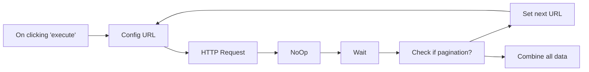

## Fluxo (.json) :

```json
{
  "nodes": [
    {
      "name": "On clicking 'execute'",
      "type": "n8n-nodes-base.manualTrigger",
      "position": [
        200,
        470
      ],
      "parameters": {},
      "typeVersion": 1
    },
    {
      "name": "HTTP Request",
      "type": "n8n-nodes-base.httpRequest",
      "position": [
        600,
        470
      ],
      "parameters": {
        "url": "={{$node[\"Config URL\"].json[\"next\"]}}",
        "options": {},
        "queryParametersUi": {
          "parameter": [
            {
              "name": "hapikey",
              "value": "<YOUR_API_KEY>"
            },
            {
              "name": "limit",
              "value": "100"
            }
          ]
        }
      },
      "typeVersion": 1
    },
    {
      "name": "NoOp",
      "type": "n8n-nodes-base.noOp",
      "position": [
        800,
        470
      ],
      "parameters": {},
      "typeVersion": 1
    },
    {
      "name": "Wait",
      "type": "n8n-nodes-base.function",
      "position": [
        1000,
        470
      ],
      "parameters": {
        "functionCode": "return new Promise((resolve, reject) => {\n      setTimeout(() => { resolve([{ json: {} }]) }, 5000);\n    })\n"
      },
      "typeVersion": 1
    },
    {
      "name": "Config URL",
      "type": "n8n-nodes-base.function",
      "position": [
        400,
        470
      ],
      "parameters": {
        "functionCode": "\nlet next = 'https://api.hubapi.com/crm/v3/objects/contacts'\n\nif (items[0].json.next) {\n  next = items[0].json.next\n}\n\nreturn [\n  {\n    json: {\n      next : next\n    }\n  }\n]"
      },
      "typeVersion": 1
    },
    {
      "name": "Check if pagination?",
      "type": "n8n-nodes-base.if",
      "position": [
        1250,
        470
      ],
      "parameters": {
        "conditions": {
          "string": [],
          "boolean": [
            {
              "value1": "={{$node[\"HTTP Request\"].json[\"paging\"] ? true : false}}",
              "value2": true
            }
          ]
        }
      },
      "typeVersion": 1
    },
    {
      "name": "Set next URL",
      "type": "n8n-nodes-base.set",
      "position": [
        890,
        210
      ],
      "parameters": {
        "values": {
          "string": [
            {
              "name": "next",
              "value": "={{$node[\"HTTP Request\"].json[\"paging\"][\"next\"][\"link\"]}}"
            }
          ]
        },
        "options": {},
        "keepOnlySet": true
      },
      "executeOnce": true,
      "typeVersion": 1
    },
    {
      "name": "Combine all data",
      "type": "n8n-nodes-base.function",
      "position": [
        1500,
        560
      ],
      "parameters": {
        "functionCode": "const allData = []\n\nlet counter = 0;\ndo {\n  try {\n    const items = $items(\"HTTP Request\", 0, counter).map(item => item.json.results);\n                    \n    const aja = items[0].map(item => {\n      return { json: item }\n    })    \n    \n    allData.push.apply(allData, aja);\n    //allData.push($items(\"Increment\", 0, counter));\n  } catch (error) {\n    return allData;  \n  }\n\n  counter++;\n} while(true);\n\n"
      },
      "typeVersion": 1
    }
  ],
  "connections": {
    "NoOp": {
      "main": [
        [
          {
            "node": "Wait",
            "type": "main",
            "index": 0
          }
        ]
      ]
    },
    "Wait": {
      "main": [
        [
          {
            "node": "Check if pagination?",
            "type": "main",
            "index": 0
          }
        ]
      ]
    },
    "Config URL": {
      "main": [
        [
          {
            "node": "HTTP Request",
            "type": "main",
            "index": 0
          }
        ]
      ]
    },
    "HTTP Request": {
      "main": [
        [
          {
            "node": "NoOp",
            "type": "main",
            "index": 0
          }
        ]
      ]
    },
    "Set next URL": {
      "main": [
        [
          {
            "node": "Config URL",
            "type": "main",
            "index": 0
          }
        ]
      ]
    },
    "Check if pagination?": {
      "main": [
        [
          {
            "node": "Set next URL",
            "type": "main",
            "index": 0
          }
        ],
        [
          {
            "node": "Combine all data",
            "type": "main",
            "index": 0
          }
        ]
      ]
    },
    "On clicking 'execute'": {
      "main": [
        [
          {
            "node": "Config URL",
            "type": "main",
            "index": 0
          }
        ]
      ]
    }
  }
}
```

<a id="template-685"></a>

## Template 685 - Exportar Google Sheets para Dropbox (XLS) periódicamente

- **Nome:** Exportar Google Sheets para Dropbox (XLS) periódicamente
- **Descrição:** Lê uma planilha específica, converte seu conteúdo em um arquivo XLS e envia o arquivo para um diretório no Dropbox em intervalos regulares.
- **Funcionalidade:** • Agendamento periódico: Inicia o processo automaticamente a cada 15 minutos.
• Leitura da planilha: Acessa uma planilha específica através do seu ID e recupera os dados.
• Conversão para arquivo XLS: Converte os dados da planilha para um arquivo no formato .xls.
• Envio para armazenamento em nuvem: Faz upload do arquivo gerado para um caminho definido no serviço de armazenamento.
• Manipulação de dados binários: Realiza a transferência do arquivo em formato binário para garantir integridade no upload.
- **Ferramentas:** • Google Sheets: Plataforma onde a planilha de origem está armazenada e cujos dados são lidos.
• Dropbox: Serviço de armazenamento em nuvem usado para receber e armazenar o arquivo XLS gerado.

## Fluxo visual

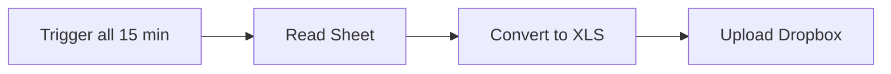

## Fluxo (.json) :

```json
{
  "nodes": [
    {
      "name": "Read Sheet",
      "type": "n8n-nodes-base.googleSheets",
      "position": [
        450,
        300
      ],
      "parameters": {
        "sheetId": "1GT2dc0dOkAC1apY0UlTKY9vitBl8PtKrILvFiAy5VBs"
      },
      "credentials": {
        "googleApi": ""
      },
      "typeVersion": 1
    },
    {
      "name": "Convert to XLS",
      "type": "n8n-nodes-base.spreadsheetFile",
      "position": [
        650,
        300
      ],
      "parameters": {
        "operation": "toFile"
      },
      "typeVersion": 1
    },
    {
      "name": "Upload Dropbox",
      "type": "n8n-nodes-base.dropbox",
      "position": [
        850,
        300
      ],
      "parameters": {
        "path": "/my-sheets/prices.xls",
        "binaryData": true
      },
      "credentials": {
        "dropboxApi": ""
      },
      "typeVersion": 1
    },
    {
      "name": "Trigger all 15 min",
      "type": "n8n-nodes-base.interval",
      "position": [
        250,
        300
      ],
      "parameters": {
        "unit": "minutes",
        "interval": 15
      },
      "typeVersion": 1
    }
  ],
  "connections": {
    "Read Sheet": {
      "main": [
        [
          {
            "node": "Convert to XLS",
            "type": "main",
            "index": 0
          }
        ]
      ]
    },
    "Convert to XLS": {
      "main": [
        [
          {
            "node": "Upload Dropbox",
            "type": "main",
            "index": 0
          }
        ]
      ]
    },
    "Trigger all 15 min": {
      "main": [
        [
          {
            "node": "Read Sheet",
            "type": "main",
            "index": 0
          }
        ]
      ]
    }
  }
}
```

<a id="template-686"></a>

## Template 686 - Enviar evento Track para Segment

- **Nome:** Enviar evento Track para Segment
- **Descrição:** Fluxo que envia um evento do tipo 'track' para o Segment quando acionado manualmente.
- **Funcionalidade:** • Acionamento manual: inicia o envio quando o fluxo é executado manualmente.
• Envio de evento 'track' para Segment: envia dados de evento ao recurso de rastreamento do Segment.
• Uso de credenciais do Segment: autentica a requisição usando credenciais configuradas.
• Configuração de dados do evento: permite definir o nome do evento e suas propriedades a serem enviadas.
- **Ferramentas:** • Segment: Plataforma de análise que recebe eventos de rastreamento (track) para monitoramento de ações de usuários.

## Fluxo visual


## Fluxo (.json) :

```json
{
  "id": "122",
  "name": "Track an event in Segment",
  "nodes": [
    {
      "name": "On clicking 'execute'",
      "type": "n8n-nodes-base.manualTrigger",
      "position": [
        250,
        300
      ],
      "parameters": {},
      "typeVersion": 1
    },
    {
      "name": "Segment",
      "type": "n8n-nodes-base.segment",
      "position": [
        450,
        300
      ],
      "parameters": {
        "event": "",
        "resource": "track"
      },
      "credentials": {
        "segmentApi": ""
      },
      "typeVersion": 1
    }
  ],
  "active": false,
  "settings": {},
  "connections": {
    "On clicking 'execute'": {
      "main": [
        [
          {
            "node": "Segment",
            "type": "main",
            "index": 0
          }
        ]
      ]
    }
  }
}
```

<a id="template-687"></a>

## Template 687 - Geração de artigos no tom da marca

- **Nome:** Geração de artigos no tom da marca
- **Descrição:** Analisa artigos publicados para extrair estrutura, estilo e características da voz da marca e, com essas diretrizes, gera rascunhos de novos artigos prontos para revisão e publicação.
- **Funcionalidade:** • Importar conteúdo do blog: Busca a página principal do blog e importa os artigos mais recentes.
• Extrair URLs de artigos: Identifica e separa os links dos artigos encontrados na página.
• Limitar e recuperar artigos: Seleciona um número definido de artigos (ex.: 5) e faz download de cada conteúdo.
• Extrair conteúdo dos artigos: Isola o corpo do artigo em HTML para processamento posterior.
• Converter HTML para Markdown: Transforma o conteúdo em Markdown para reduzir tokens e preservar estrutura de escrita.
• Agregar artigos: Combina os artigos processados em um único conjunto para análise em lote.
• Analisar estrutura e estilo: Usa modelos de linguagem para descrever a estrutura, layout e estilos comuns dos artigos agregados.
• Extrair características de voz: Identifica tom, escolhas linguísticas e traços de voz da marca, com descrições e exemplos.
• Combinar diretrizes e instrução: Junta a análise de estilo/voz com uma instrução do usuário para orientar a geração de conteúdo.
• Gerar artigo on‑brand: Produz título, resumo e corpo em Markdown adotando as características de voz selecionadas.
• Salvar como rascunho: Publica o resultado como rascunho em um site WordPress para revisão humana.
- **Ferramentas:** • blog.n8n.io: Fonte pública de artigos usados como material de treinamento e análise.
• OpenAI (API): Modelos de linguagem utilizados para analisar estrutura, extrair características de voz e gerar o conteúdo final.
• WordPress: Plataforma para salvar os artigos gerados como rascunhos para revisão e publicação posterior.

## Fluxo visual

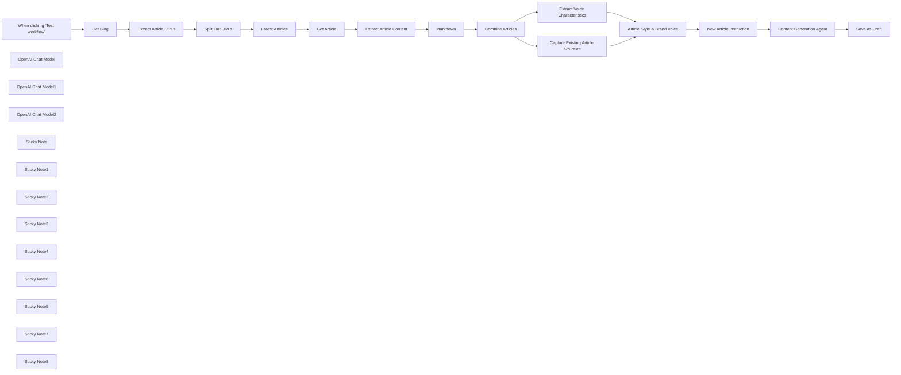

## Fluxo (.json) :

```json
{
  "nodes": [
    {
      "id": "d3159589-dbb7-4cca-91f5-09e8b2e4cba8",
      "name": "When clicking ‘Test workflow’",
      "type": "n8n-nodes-base.manualTrigger",
      "position": [
        240,
        500
      ],
      "parameters": {},
      "typeVersion": 1
    },
    {
      "id": "b4b42b3f-ef30-4fc8-829d-59f8974c4168",
      "name": "OpenAI Chat Model",
      "type": "@n8n/n8n-nodes-langchain.lmChatOpenAi",
      "position": [
        2180,
        700
      ],
      "parameters": {
        "options": {}
      },
      "credentials": {
        "openAiApi": {
          "id": "8gccIjcuf3gvaoEr",
          "name": "OpenAi account"
        }
      },
      "typeVersion": 1
    },
    {
      "id": "032c3012-ed8d-44eb-94f0-35790f4b616f",
      "name": "OpenAI Chat Model1",
      "type": "@n8n/n8n-nodes-langchain.lmChatOpenAi",
      "position": [
        2980,
        460
      ],
      "parameters": {
        "options": {}
      },
      "credentials": {
        "openAiApi": {
          "id": "8gccIjcuf3gvaoEr",
          "name": "OpenAi account"
        }
      },
      "typeVersion": 1
    },
    {
      "id": "bf922785-7e8f-4f93-bfff-813c16d93278",
      "name": "OpenAI Chat Model2",
      "type": "@n8n/n8n-nodes-langchain.lmChatOpenAi",
      "position": [
        2020,
        520
      ],
      "parameters": {
        "options": {}
      },
      "credentials": {
        "openAiApi": {
          "id": "8gccIjcuf3gvaoEr",
          "name": "OpenAi account"
        }
      },
      "typeVersion": 1
    },
    {
      "id": "d8d4b26f-270f-4b39-a4cd-a6e4361da591",
      "name": "Extract Voice Characteristics",
      "type": "@n8n/n8n-nodes-langchain.informationExtractor",
      "position": [
        2160,
        540
      ],
      "parameters": {
        "text": "=### Analyse the given content\n\n{{ $json.data.map(item => item.replace(/\\n/g, '')).join('\\n---\\n') }}",
        "options": {
          "systemPromptTemplate": "You help identify and define a company or individual's \"brand voice\". Using the given content belonging to the company or individual, extract all voice characteristics from it along with description and examples demonstrating it."
        },
        "schemaType": "manual",
        "inputSchema": "{\n\t\"type\": \"array\",\n \"items\": {\n \"type\": \"object\",\n \t\"properties\": {\n \"characteristic\": { \"type\": \"string\" },\n \"description\": { \"type\": \"string\" },\n \"examples\": { \"type\": \"array\", \"items\": { \"type\": \"string\" } }\n }\n\t}\n}"
      },
      "typeVersion": 1
    },
    {
      "id": "8cca272c-b912-40f1-ba08-aa7c5ff7599c",
      "name": "Get Blog",
      "type": "n8n-nodes-base.httpRequest",
      "position": [
        480,
        500
      ],
      "parameters": {
        "url": "https://blog.n8n.io",
        "options": {}
      },
      "typeVersion": 4.2
    },
    {
      "id": "aa1e2a02-2e2b-4e8d-aef8-f5f7a54d9562",
      "name": "Get Article",
      "type": "n8n-nodes-base.httpRequest",
      "position": [
        1120,
        500
      ],
      "parameters": {
        "url": "=https://blog.n8n.io{{ $json.article }}",
        "options": {}
      },
      "typeVersion": 4.2
    },
    {
      "id": "78ae3dfc-5afd-452f-a2b6-bdb9dbd728bd",
      "name": "Extract Article URLs",
      "type": "n8n-nodes-base.html",
      "position": [
        640,
        500
      ],
      "parameters": {
        "options": {},
        "operation": "extractHtmlContent",
        "extractionValues": {
          "values": [
            {
              "key": "article",
              "attribute": "href",
              "cssSelector": ".item.post a.global-link",
              "returnArray": true,
              "returnValue": "attribute"
            }
          ]
        }
      },
      "typeVersion": 1.2
    },
    {
      "id": "3b2b6fea-ed2f-43ba-b6d1-e0666b88c65b",
      "name": "Split Out URLs",
      "type": "n8n-nodes-base.splitOut",
      "position": [
        800,
        500
      ],
      "parameters": {
        "options": {},
        "fieldToSplitOut": "article"
      },
      "typeVersion": 1
    },
    {
      "id": "68bb20b1-2177-4c0f-9ada-d1de69bdc2a0",
      "name": "Latest Articles",
      "type": "n8n-nodes-base.limit",
      "position": [
        960,
        500
      ],
      "parameters": {
        "maxItems": 5
      },
      "typeVersion": 1
    },
    {
      "id": "f20d7393-24c9-4a51-872e-0dce391f661c",
      "name": "Extract Article Content",
      "type": "n8n-nodes-base.html",
      "position": [
        1280,
        500
      ],
      "parameters": {
        "options": {},
        "operation": "extractHtmlContent",
        "extractionValues": {
          "values": [
            {
              "key": "data",
              "cssSelector": ".post-section",
              "returnValue": "html"
            }
          ]
        }
      },
      "typeVersion": 1.2
    },
    {
      "id": "299a04be-fe9b-47d9-b2c6-e2e4628f77e0",
      "name": "Combine Articles",
      "type": "n8n-nodes-base.aggregate",
      "position": [
        1780,
        540
      ],
      "parameters": {
        "options": {
          "mergeLists": true
        },
        "fieldsToAggregate": {
          "fieldToAggregate": [
            {
              "fieldToAggregate": "data"
            }
          ]
        }
      },
      "typeVersion": 1
    },
    {
      "id": "8480ece7-0dc1-4682-ba9e-ded2c138d8b8",
      "name": "Article Style & Brand Voice",
      "type": "n8n-nodes-base.merge",
      "position": [
        2560,
        320
      ],
      "parameters": {
        "mode": "combine",
        "options": {},
        "combineBy": "combineByPosition"
      },
      "typeVersion": 3
    },
    {
      "id": "024efee2-5a2f-455c-a150-4b9bdce650b2",
      "name": "Save as Draft",
      "type": "n8n-nodes-base.wordpress",
      "position": [
        3460,
        320
      ],
      "parameters": {
        "title": "={{ $json.output.title }}",
        "additionalFields": {
          "slug": "={{ $json.output.title.toSnakeCase() }}",
          "format": "standard",
          "status": "draft",
          "content": "={{ $json.output.body }}"
        }
      },
      "credentials": {
        "wordpressApi": {
          "id": "YMW8mGrekjfxKJUe",
          "name": "Wordpress account"
        }
      },
      "typeVersion": 1
    },
    {
      "id": "71f4ab1e-ef61-48f3-92e8-70691f7d0750",
      "name": "Sticky Note",
      "type": "n8n-nodes-base.stickyNote",
      "position": [
        480,
        180
      ],
      "parameters": {
        "color": 7,
        "width": 606,
        "height": 264,
        "content": "## 1. Import Existing Content\n[Read more about the HTML node](https://docs.n8n.io/integrations/builtin/core-nodes/n8n-nodes-base.html/)\n\nFirst, we'll need to gather existing content for the brand voice we want to replicate. This content can be blogs, social media posts or internal documents - the idea is to use this content to \"train\" our AI to produce content from the provided examples. One call out is that the quality and consistency of the content is important to get the desired results.\n\nIn this demonstration, we'll grab the latest blog posts off a corporate blog to use as an example. Since, the blog articles are likely consistent because of the source and narrower focus of the medium, it'll serve well to showcase this workflow."
      },
      "typeVersion": 1
    },
    {
      "id": "3d3a55a5-4b4a-4ea2-a39c-82b366fb81e6",
      "name": "Sticky Note1",
      "type": "n8n-nodes-base.stickyNote",
      "position": [
        1440,
        240
      ],
      "parameters": {
        "color": 7,
        "width": 434,
        "height": 230,
        "content": "## 2. Convert HTML to Markdown\n[Learn more about the Markdown node](https://docs.n8n.io/integrations/builtin/core-nodes/n8n-nodes-base.markdown)\n\nMarkdown is a great way to optimise the article data we're sending to the LLM because it reduces the amount of tokens required but keeps all relevant writing structure information.\n\nAlso useful to get Markdown output as a response because typically it's the format authors will write in."
      },
      "typeVersion": 1
    },
    {
      "id": "08c0b683-ec06-47ce-871c-66265195ca29",
      "name": "Sticky Note2",
      "type": "n8n-nodes-base.stickyNote",
      "position": [
        1980,
        80
      ],
      "parameters": {
        "color": 7,
        "width": 446,
        "height": 233,
        "content": "## 3. Using AI to Analyse Article Structure and Writing Styles\n[Read more about the Basic LLM Chain node](https://docs.n8n.io/integrations/builtin/cluster-nodes/root-nodes/n8n-nodes-langchain.chainllm)\n\nOur approach is to first perform a high-level analysis of all available articles in order to replicate their content layout and writing styles. This will act as a guideline to help the AI to structure our future articles."
      },
      "typeVersion": 1
    },
    {
      "id": "515fe69f-061e-4dfc-94ed-4cf2fbe10b7b",
      "name": "Capture Existing Article Structure",
      "type": "@n8n/n8n-nodes-langchain.chainLlm",
      "position": [
        2020,
        380
      ],
      "parameters": {
        "text": "={{ $json.data.join('\\n---\\n') }}",
        "messages": {
          "messageValues": [
            {
              "message": "=Given the following one or more articles (which are separated by ---), describe how best one could replicate the common structure, layout, language and writing styles of all as aggregate."
            }
          ]
        },
        "promptType": "define"
      },
      "typeVersion": 1.4
    },
    {
      "id": "ba4e68fb-eccc-4efa-84be-c42a695dccdb",
      "name": "Markdown",
      "type": "n8n-nodes-base.markdown",
      "position": [
        1600,
        540
      ],
      "parameters": {
        "html": "={{ $json.data }}",
        "options": {}
      },
      "typeVersion": 1
    },
    {
      "id": "d459ff5b-0375-4458-a49f-59700bb57e12",
      "name": "Sticky Note3",
      "type": "n8n-nodes-base.stickyNote",
      "position": [
        2340,
        740
      ],
      "parameters": {
        "color": 7,
        "width": 446,
        "height": 253,
        "content": "## 4. Using AI to Extract Voice Characteristics and Traits\n[Read more about the Information Extractor node](https://docs.n8n.io/integrations/builtin/cluster-nodes/root-nodes/n8n-nodes-langchain.information-extractor/)\n\nSecond, we'll use AI to analysis the brand voice characteristics of the previous articles. This picks out the tone, style and choice of language used and identifies them into categories. These categories will be used as guidelines for the AI to keep the future article consistent in tone and voice. "
      },
      "typeVersion": 1
    },
    {
      "id": "71fe32a9-1b8a-446c-a4ff-fb98c6a68e1b",
      "name": "Sticky Note4",
      "type": "n8n-nodes-base.stickyNote",
      "position": [
        2720,
        0
      ],
      "parameters": {
        "color": 7,
        "width": 626,
        "height": 633,
        "content": "## 5. Automate On-Brand Articles Using AI\n[Read more about the Information Extractor node](https://docs.n8n.io/integrations/builtin/cluster-nodes/root-nodes/n8n-nodes-langchain.information-extractor)\n\nFinally with this approach, we can feed both content and voice guidelines into our final LLM - our content generation agent - to produce any number of on-brand articles, social media posts etc.\n\nWhen it comes to assessing the output, note the AI does a pretty good job at simulating format and reusing common phrases and wording for the target article. However, this could become repetitive very quickly! Whilst AI can help speed up the process, a human touch may still be required to add a some variety."
      },
      "typeVersion": 1
    },
    {
      "id": "4e6fbe4e-869e-4bef-99ba-7b18740caecf",
      "name": "Content Generation Agent",
      "type": "@n8n/n8n-nodes-langchain.informationExtractor",
      "position": [
        3000,
        320
      ],
      "parameters": {
        "text": "={{ $json.instruction }}",
        "options": {
          "systemPromptTemplate": "=You are a blog content writer who writes using the following article guidelines. Write a content piece as requested by the user. Output the body as Markdown. Do not include the date of the article because the publishing date is not determined yet.\n\n## Brand Article Style\n{{ $('Article Style & Brand Voice').item.json.text }}\n\n##n Brand Voice Characteristics\n\nHere are the brand voice characteristic and examples you must adopt in your piece. Pick only the characteristic which make sense for the user's request. Try to keep it as similar as possible but don't copy word for word.\n\n|characteristic|description|examples|\n|-|-|-|\n{{\n$('Article Style & Brand Voice').item.json.output.map(item => (\n`|${item.characteristic}|${item.description}|${item.examples.map(ex => `\"${ex}\"`).join(', ')}|`\n)).join('\\n')\n}}"
        },
        "attributes": {
          "attributes": [
            {
              "name": "title",
              "required": true,
              "description": "title of article"
            },
            {
              "name": "summary",
              "required": true,
              "description": "summary of article"
            },
            {
              "name": "body",
              "required": true,
              "description": "body of article"
            },
            {
              "name": "characteristics",
              "required": true,
              "description": "comma delimited string of characteristics chosen"
            }
          ]
        }
      },
      "typeVersion": 1
    },
    {
      "id": "022de44c-c06c-41ac-bd50-38173dae9b37",
      "name": "Sticky Note6",
      "type": "n8n-nodes-base.stickyNote",
      "position": [
        3460,
        480
      ],
      "parameters": {
        "color": 7,
        "width": 406,
        "height": 173,
        "content": "## 6. Save Draft to Wordpress\n[Learn more about the Wordpress node](https://docs.n8n.io/integrations/builtin/app-nodes/n8n-nodes-base.wordpress/)\n\nTo close out the template, we'll simple save our generated article as a draft which could allow human team members to review and validate the article before publishing."
      },
      "typeVersion": 1
    },
    {
      "id": "fe54c40e-6ddd-45d6-a938-f467e4af3f57",
      "name": "Sticky Note5",
      "type": "n8n-nodes-base.stickyNote",
      "position": [
        2900,
        660
      ],
      "parameters": {
        "color": 5,
        "width": 440,
        "height": 120,
        "content": "### Q. Do I need to analyse Brand Voice for every article?\nA. No! I would recommend storing the results of the AI's analysis and re-use for a list of planned articles rather than generate anew every time."
      },
      "typeVersion": 1
    },
    {
      "id": "1832131e-21e8-44fc-9370-907f7b5a6eda",
      "name": "Sticky Note7",
      "type": "n8n-nodes-base.stickyNote",
      "position": [
        1000,
        680
      ],
      "parameters": {
        "color": 5,
        "width": 380,
        "height": 120,
        "content": "### Q. Can I use other media than blog articles?\nA. Yes! This approach can use other source materials such as PDFs, as long as they can be produces in a text format to give to the LLM."
      },
      "typeVersion": 1
    },
    {
      "id": "8e8706a3-122d-436b-9206-de7a6b2f3c39",
      "name": "Sticky Note8",
      "type": "n8n-nodes-base.stickyNote",
      "position": [
        -220,
        -120
      ],
      "parameters": {
        "width": 400,
        "height": 800,
        "content": "## Try It Out!\n### This n8n template demonstrates how to use AI to generate new on-brand written content by analysing previously published content.\n\nWith such an approach, it's possible to generate a steady stream of blog article drafts quickly with high consistency with your brand and existing content.\n\n### How it works\n* In this demonstration, the n8n.io blog is used as the source of existing published content and 5 of the latest articles are imported via the HTTP node.\n* The HTML node is extract the article bodies which are then converted to markdown for our LLMs.\n* We use LLM nodes to (1) understand the article structure and writing style and (2) identify the brand voice characteristics used in the posts.\n* These are then used as guidelines in our final LLM node when generating new articles.\n* Finally, a draft is saved to Wordpress for human editors to review or use as starting point for their own articles.\n\n### How to use\n* Update Step 1 to fetch data from your desired blog or change to fetch existing content in a different way.\n* Update Step 5 to provide your new article instruction. For optimal output, theme topics relevant to your brand.\n\n\n### Need Help?\nJoin the [Discord](https://discord.com/invite/XPKeKXeB7d) or ask in the [Forum](https://community.n8n.io/)!\n\nHappy Hacking!"
      },
      "typeVersion": 1
    },
    {
      "id": "1510782d-0f88-40ca-99a8-44f984022c8e",
      "name": "New Article Instruction",
      "type": "n8n-nodes-base.set",
      "position": [
        2820,
        320
      ],
      "parameters": {
        "options": {},
        "assignments": {
          "assignments": [
            {
              "id": "2c7e2a28-30f9-4533-a394-a5e967ebf4ec",
              "name": "instruction",
              "type": "string",
              "value": "=Write a comprehensive guide on using AI for document classification and document extraction. Explain the benefits of using vision models over traditional OCR. Close out with a recommendation of using n8n as the preferred way to get started with this AI use-case."
            }
          ]
        }
      },
      "typeVersion": 3.4
    }
  ],
  "pinData": {},
  "connections": {
    "Get Blog": {
      "main": [
        [
          {
            "node": "Extract Article URLs",
            "type": "main",
            "index": 0
          }
        ]
      ]
    },
    "Markdown": {
      "main": [
        [
          {
            "node": "Combine Articles",
            "type": "main",
            "index": 0
          }
        ]
      ]
    },
    "Get Article": {
      "main": [
        [
          {
            "node": "Extract Article Content",
            "type": "main",
            "index": 0
          }
        ]
      ]
    },
    "Split Out URLs": {
      "main": [
        [
          {
            "node": "Latest Articles",
            "type": "main",
            "index": 0
          }
        ]
      ]
    },
    "Latest Articles": {
      "main": [
        [
          {
            "node": "Get Article",
            "type": "main",
            "index": 0
          }
        ]
      ]
    },
    "Combine Articles": {
      "main": [
        [
          {
            "node": "Capture Existing Article Structure",
            "type": "main",
            "index": 0
          },
          {
            "node": "Extract Voice Characteristics",
            "type": "main",
            "index": 0
          }
        ]
      ]
    },
    "OpenAI Chat Model": {
      "ai_languageModel": [
        [
          {
            "node": "Extract Voice Characteristics",
            "type": "ai_languageModel",
            "index": 0
          }
        ]
      ]
    },
    "OpenAI Chat Model1": {
      "ai_languageModel": [
        [
          {
            "node": "Content Generation Agent",
            "type": "ai_languageModel",
            "index": 0
          }
        ]
      ]
    },
    "OpenAI Chat Model2": {
      "ai_languageModel": [
        [
          {
            "node": "Capture Existing Article Structure",
            "type": "ai_languageModel",
            "index": 0
          }
        ]
      ]
    },
    "Extract Article URLs": {
      "main": [
        [
          {
            "node": "Split Out URLs",
            "type": "main",
            "index": 0
          }
        ]
      ]
    },
    "Extract Article Content": {
      "main": [
        [
          {
            "node": "Markdown",
            "type": "main",
            "index": 0
          }
        ]
      ]
    },
    "New Article Instruction": {
      "main": [
        [
          {
            "node": "Content Generation Agent",
            "type": "main",
            "index": 0
          }
        ]
      ]
    },
    "Content Generation Agent": {
      "main": [
        [
          {
            "node": "Save as Draft",
            "type": "main",
            "index": 0
          }
        ]
      ]
    },
    "Article Style & Brand Voice": {
      "main": [
        [
          {
            "node": "New Article Instruction",
            "type": "main",
            "index": 0
          }
        ]
      ]
    },
    "Extract Voice Characteristics": {
      "main": [
        [
          {
            "node": "Article Style & Brand Voice",
            "type": "main",
            "index": 1
          }
        ]
      ]
    },
    "When clicking ‘Test workflow’": {
      "main": [
        [
          {
            "node": "Get Blog",
            "type": "main",
            "index": 0
          }
        ]
      ]
    },
    "Capture Existing Article Structure": {
      "main": [
        [
          {
            "node": "Article Style & Brand Voice",
            "type": "main",
            "index": 0
          }
        ]
      ]
    }
  }
}
```

<a id="template-688"></a>

## Template 688 - Assistente jurídico para código tributário do Texas

- **Nome:** Assistente jurídico para código tributário do Texas
- **Descrição:** Fluxo que constrói um assistente conversacional especializado no código tributário do Texas, extraindo seções de PDFs, indexando-as em uma base vetorial e respondendo perguntas com referência a capítulo e seção.
- **Funcionalidade:** • Download de ZIP de PDFs: Baixa um arquivo compactado contendo PDFs do código tributário a partir de uma fonte pública.
• Extração e particionamento: Extrai texto dos PDFs e segmenta o conteúdo em capítulos e seções individuais.
• Limpeza e mapeamento de metadados: Identifica títulos, rótulos e associa metadados (capítulo, seção, ordem de conteúdo) a cada seção.
• Chunking de conteúdo: Divide textos longos em pedaços controlados para evitar sobrecarga em geração de embeddings e chamadas de API.
• Geração de embeddings: Converte trechos de texto em vetores usando um modelo de embeddings para posterior indexação e busca semântica.
• Armazenamento vetorial com metadata: Insere vetores no repositório vetorial mantendo metadados para permitir buscas filtradas por capítulo/ seção.
• Busca por similaridade e filtrada: Implementa duas estratégias — busca por embeddings para respostas relevantes e scroll/filtragem por metadados para retornar seções completas.
• Agente conversacional com ferramentas: Agente de IA que chama ferramentas para consultar a base vetorial e responde ao usuário incluindo onde (capítulo e seção) a informação foi encontrada.
• Memória de contexto: Mantém uma janela de memória para carregar contexto da conversa anterior e melhorar a qualidade das respostas.
- **Ferramentas:** • Mistral.ai: Serviço de geração de embeddings usado para transformar texto em vetores semânticos.
• Qdrant: Base de dados vetorial para armazenar, filtrar e pesquisar vetores com suporte a scroll e metadados.
• OpenAI: Modelo de chat usado como modelo de linguagem para o agente conversacional.
• Texas Statutes website: Fonte pública dos PDFs do código tributário (arquivos ZIP contendo PDFs).

## Fluxo visual

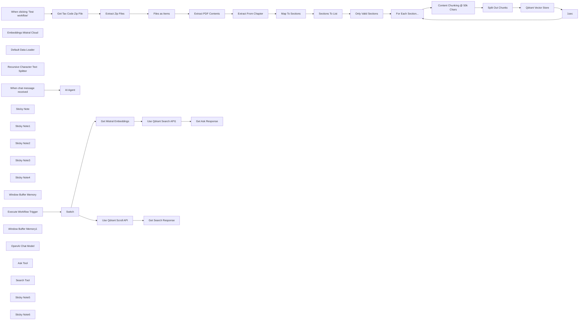

## Fluxo (.json) :

```json
{
  "meta": {
    "instanceId": "26ba763460b97c249b82942b23b6384876dfeb9327513332e743c5f6219c2b8e"
  },
  "nodes": [
    {
      "id": "1bb3c94e-326e-41ca-82e4-102a598dba39",
      "name": "When clicking ‘Test workflow’",
      "type": "n8n-nodes-base.manualTrigger",
      "position": [
        -320,
        300
      ],
      "parameters": {},
      "typeVersion": 1
    },
    {
      "id": "751b283b-ea88-4fcd-ace3-3c86631f8876",
      "name": "Embeddings Mistral Cloud",
      "type": "@n8n/n8n-nodes-langchain.embeddingsMistralCloud",
      "position": [
        1760,
        560
      ],
      "parameters": {
        "options": {}
      },
      "credentials": {
        "mistralCloudApi": {
          "id": "EIl2QxhXAS9Hkg37",
          "name": "Mistral Cloud account"
        }
      },
      "typeVersion": 1
    },
    {
      "id": "f0851949-1036-4040-84df-61295cc5db74",
      "name": "Default Data Loader",
      "type": "@n8n/n8n-nodes-langchain.documentDefaultDataLoader",
      "position": [
        1900,
        560
      ],
      "parameters": {
        "options": {
          "metadata": {
            "metadataValues": [
              {
                "name": "chapter",
                "value": "={{ $('For Each Section...').item.json.chapter }}"
              },
              {
                "name": "section",
                "value": "={{ $('For Each Section...').item.json.label }}"
              },
              {
                "name": "=title",
                "value": "={{ $('For Each Section...').item.json.title }}"
              },
              {
                "name": "content_order",
                "value": "={{ $itemIndex }}"
              }
            ]
          }
        },
        "jsonData": "={{ $json.content }}",
        "jsonMode": "expressionData"
      },
      "typeVersion": 1
    },
    {
      "id": "41d10b61-9fbe-446e-a65a-0db6e0116e5b",
      "name": "Recursive Character Text Splitter",
      "type": "@n8n/n8n-nodes-langchain.textSplitterRecursiveCharacterTextSplitter",
      "position": [
        1920,
        680
      ],
      "parameters": {
        "options": {},
        "chunkSize": 2000
      },
      "typeVersion": 1
    },
    {
      "id": "a1ecb096-4d31-4993-b801-ca3f09a9edc7",
      "name": "Get Tax Code Zip File",
      "type": "n8n-nodes-base.httpRequest",
      "position": [
        -20,
        340
      ],
      "parameters": {
        "url": "https://statutes.capitol.texas.gov/Docs/Zips/TX.pdf.zip",
        "options": {
          "response": {
            "response": {
              "responseFormat": "file"
            }
          }
        }
      },
      "typeVersion": 4.2
    },
    {
      "id": "cf983315-fe2a-43c1-8dc6-b17a217b845e",
      "name": "Extract Zip Files",
      "type": "n8n-nodes-base.compression",
      "position": [
        140,
        340
      ],
      "parameters": {},
      "typeVersion": 1.1
    },
    {
      "id": "8d02dd80-d14a-4e56-ab40-f2c4a445c57b",
      "name": "Files as Items",
      "type": "n8n-nodes-base.splitOut",
      "position": [
        300,
        340
      ],
      "parameters": {
        "include": "allOtherFields",
        "options": {},
        "fieldToSplitOut": "$binary"
      },
      "typeVersion": 1
    },
    {
      "id": "038060dc-e01d-40ae-878d-5043bc36ab91",
      "name": "Extract PDF Contents",
      "type": "n8n-nodes-base.extractFromFile",
      "position": [
        560,
        380
      ],
      "parameters": {
        "options": {},
        "operation": "pdf",
        "binaryPropertyName": "=file_{{ $itemIndex }}"
      },
      "typeVersion": 1
    },
    {
      "id": "4a85003b-b988-467b-b1cb-29206cbed879",
      "name": "Extract From Chapter",
      "type": "n8n-nodes-base.set",
      "position": [
        740,
        380
      ],
      "parameters": {
        "options": {},
        "assignments": {
          "assignments": [
            {
              "id": "d791928a-d775-48cc-9004-a92cbe2403d3",
              "name": "contents",
              "type": "array",
              "value": "={{\n  $json.text\n    .substring($json.text.search(/\\nSec\\.\\nA[0-9]{1,4}\\.[0-9]{1,5}\\.AA/), $json.text.length)\n    .split(/\\nSec\\.\\nA[0-9]{1,2}\\.[0-9]{1,2}\\.AA/g)\n    .filter(text => !text.isEmpty())\n    .map(text => {\n      const output = text.replaceAll('AA', ' ').replaceAll('\\nA', ' ');\n      const title = output.substring(0, output.indexOf('.'));\n      const content = output.substring(output.indexOf('.')+1, output.length).replaceAll('\\n', ' ').trim();\n      return { title, content };\n    })\n}}"
            },
            {
              "id": "bc06641f-0b75-4a35-8752-78803231d5d6",
              "name": "labels",
              "type": "array",
              "value": "={{\n  $json.text\n    .match(/\\nSec\\.\\nA[0-9]{1,4}\\.[0-9]{1,5}\\.AA/g)\n    .map(text => ({\n        label: text.replaceAll('AA', ' ')\n                  .replaceAll('\\nA', ' ')\n                  .replaceAll('\\n', '')\n                  .trim()\n    }))\n}}"
            }
          ]
        }
      },
      "typeVersion": 3.3
    },
    {
      "id": "ee338786-91df-4784-bd7e-f86c0e13ca26",
      "name": "Map To Sections",
      "type": "n8n-nodes-base.set",
      "position": [
        740,
        520
      ],
      "parameters": {
        "options": {},
        "assignments": {
          "assignments": [
            {
              "id": "60109e60-d760-45bb-be09-7cb2b5eb85bc",
              "name": "section",
              "type": "array",
              "value": "={{\n  $json.labels.map((label, idx) => ({\n    label: label.label.match(/\\d.+/)[0].replace(/\\.$/, ''),\n    title: $json.contents[idx].title,\n    content: $json.contents[idx].content,\n    chapter: $('Extract PDF Contents').first().json.info.Title,\n  }))\n}}"
            }
          ]
        }
      },
      "typeVersion": 3.3
    },
    {
      "id": "41c9899d-26d7-48af-9af2-8563ab0fb7e4",
      "name": "Execute Workflow Trigger",
      "type": "n8n-nodes-base.executeWorkflowTrigger",
      "position": [
        1313,
        1200
      ],
      "parameters": {},
      "typeVersion": 1
    },
    {
      "id": "3a93c19b-09d9-4e38-8b0c-2008fc03f7fc",
      "name": "Get Mistral Embeddings",
      "type": "n8n-nodes-base.httpRequest",
      "position": [
        1660,
        1060
      ],
      "parameters": {
        "url": "https://api.mistral.ai/v1/embeddings",
        "method": "POST",
        "options": {},
        "sendBody": true,
        "authentication": "predefinedCredentialType",
        "bodyParameters": {
          "parameters": [
            {
              "name": "model",
              "value": "mistral-embed"
            },
            {
              "name": "encoding_format",
              "value": "float"
            },
            {
              "name": "input",
              "value": "={{ $json.query }}"
            }
          ]
        },
        "nodeCredentialType": "mistralCloudApi"
      },
      "credentials": {
        "mistralCloudApi": {
          "id": "EIl2QxhXAS9Hkg37",
          "name": "Mistral Cloud account"
        }
      },
      "typeVersion": 4.2
    },
    {
      "id": "1adc12bd-ba61-4f1a-b1f9-3f19a542e294",
      "name": "Content Chunking @ 50k Chars",
      "type": "n8n-nodes-base.set",
      "position": [
        1580,
        400
      ],
      "parameters": {
        "options": {},
        "assignments": {
          "assignments": [
            {
              "id": "7753a4f4-3ec2-4c05-81df-3d5e8979a478",
              "name": "=content",
              "type": "array",
              "value": "={{ new Array(Math.round($json.content.length / Math.min($json.content.length, 30000))).fill('').map((_,idx) => $json.content.substring(idx * 30000, idx * 50000 + 30000)) }}"
            }
          ]
        }
      },
      "typeVersion": 3.3
    },
    {
      "id": "ff8adce2-8f73-4a8f-b512-5aa560ca0954",
      "name": "Split Out Chunks",
      "type": "n8n-nodes-base.splitOut",
      "position": [
        1580,
        580
      ],
      "parameters": {
        "options": {},
        "fieldToSplitOut": "content"
      },
      "typeVersion": 1
    },
    {
      "id": "5f08ce3c-240d-4c91-bb23-953866fd0361",
      "name": "For Each Section...",
      "type": "n8n-nodes-base.splitInBatches",
      "position": [
        1400,
        280
      ],
      "parameters": {
        "options": {},
        "batchSize": 5
      },
      "typeVersion": 3
    },
    {
      "id": "6346cf67-7d93-4315-bb0d-2e016c9853b9",
      "name": "Sections To List",
      "type": "n8n-nodes-base.splitOut",
      "position": [
        940,
        380
      ],
      "parameters": {
        "options": {},
        "fieldToSplitOut": "section"
      },
      "typeVersion": 1
    },
    {
      "id": "95e34952-03e2-40e3-a245-9da8c9e1f249",
      "name": "Only Valid Sections",
      "type": "n8n-nodes-base.filter",
      "position": [
        1100,
        380
      ],
      "parameters": {
        "options": {},
        "conditions": {
          "options": {
            "leftValue": "",
            "caseSensitive": true,
            "typeValidation": "strict"
          },
          "combinator": "or",
          "conditions": [
            {
              "id": "121e8f86-2ead-47e0-8e17-52d7c6ba8265",
              "operator": {
                "type": "string",
                "operation": "notEmpty",
                "singleValue": true
              },
              "leftValue": "={{ $json.content }}",
              "rightValue": ""
            }
          ]
        }
      },
      "typeVersion": 2
    },
    {
      "id": "dfe1818f-93b7-4116-8a6e-dcb2e6c23fcf",
      "name": "Use Qdrant Search API1",
      "type": "n8n-nodes-base.httpRequest",
      "position": [
        1860,
        1060
      ],
      "parameters": {
        "url": "=http://qdrant:6333/collections/texas_tax_codes/points/search",
        "method": "POST",
        "options": {},
        "sendBody": true,
        "authentication": "predefinedCredentialType",
        "bodyParameters": {
          "parameters": [
            {
              "name": "limit",
              "value": "={{ 4 }}"
            },
            {
              "name": "vector",
              "value": "={{ $json.data[0].embedding }}"
            },
            {
              "name": "with_payload",
              "value": "={{ true }}"
            }
          ]
        },
        "nodeCredentialType": "qdrantApi"
      },
      "credentials": {
        "qdrantApi": {
          "id": "NyinAS3Pgfik66w5",
          "name": "QdrantApi account"
        }
      },
      "typeVersion": 4.2
    },
    {
      "id": "588318e6-e188-4d99-9c11-39b2f3fb1c18",
      "name": "Use Qdrant Scroll API",
      "type": "n8n-nodes-base.httpRequest",
      "position": [
        1660,
        1320
      ],
      "parameters": {
        "url": "=http://qdrant:6333/collections/texas_tax_codes/points/scroll",
        "method": "POST",
        "options": {
          "pagination": {
            "pagination": {
              "parameters": {
                "parameters": [
                  {
                    "name": "next_page_offset",
                    "type": "body",
                    "value": "={{ $response.body.result.next_page_offset }}"
                  }
                ]
              },
              "completeExpression": "={{ $response.body.result.next_page_offset === null }}",
              "paginationCompleteWhen": "other"
            }
          }
        },
        "sendBody": true,
        "authentication": "predefinedCredentialType",
        "bodyParameters": {
          "parameters": [
            {
              "name": "limit",
              "value": "={{ 100 }}"
            },
            {
              "name": "with_payload",
              "value": "={{ true }}"
            },
            {
              "name": "filter",
              "value": "={{\n{\n  \"must\": [\n    ($json.query.section\n      ? { \"key\": \"metadata.section\", \"match\": { \"value\": $json.query.section } }\n      : { \"key\": \"metadata.chapter\", \"match\": { \"value\": $json.query.chapter } }\n    )\n  ]\n}\n}}"
            }
          ]
        },
        "nodeCredentialType": "qdrantApi"
      },
      "credentials": {
        "qdrantApi": {
          "id": "NyinAS3Pgfik66w5",
          "name": "QdrantApi account"
        }
      },
      "typeVersion": 4.2
    },
    {
      "id": "bbf01344-c60e-42b3-8d7d-2bb360876d79",
      "name": "Get Search Response",
      "type": "n8n-nodes-base.set",
      "position": [
        1860,
        1320
      ],
      "parameters": {
        "options": {},
        "assignments": {
          "assignments": [
            {
              "id": "08ad2d6e-4ed1-409e-b89c-1f0c7fdf1b64",
              "name": "response",
              "type": "string",
              "value": "=---\nchapter: {{ $json.result.points.first().payload.metadata.chapter }}\nsection: {{ $json.result.points.first().payload.metadata.section }}\ntitle: {{ $json.result.points.first().payload.metadata.title }}\n---\n{{ $json.result.points\n      .toSorted((a,b) => (a.payload.metadata.content_order || 0) - (b.payload.metadata.content_order || 0))\n      .map(point => point.payload.content).join('\\n') }}"
            }
          ]
        }
      },
      "typeVersion": 3.3
    },
    {
      "id": "3b23ff5e-158a-470f-a262-d001d52feeba",
      "name": "Sticky Note",
      "type": "n8n-nodes-base.stickyNote",
      "position": [
        -100,
        183.38345554113084
      ],
      "parameters": {
        "color": 7,
        "width": 571.4359274276384,
        "height": 352.65642339230595,
        "content": "## Step 1. Download the Tax Code PDF\n[Read more about handling Zip Files](https://docs.n8n.io/integrations/builtin/core-nodes/n8n-nodes-base.compression/)\n\nLet's begin by pulling a zip file containing all the tax codes as separate PDF files. We can unzip on the fly with n8n's compression node."
      },
      "typeVersion": 1
    },
    {
      "id": "02826887-eb26-48a0-928e-fe56ee008425",
      "name": "Sticky Note1",
      "type": "n8n-nodes-base.stickyNote",
      "position": [
        500,
        199.87747230655896
      ],
      "parameters": {
        "color": 7,
        "width": 777.897719182587,
        "height": 503.3459981018574,
        "content": "## Step 2. Extract and Partition Into Chapters & Sections\n[Learn more about reading PDF Files](https://docs.n8n.io/integrations/builtin/core-nodes/n8n-nodes-base.extractfromfile)\n\nRather than ingest the raw text of the PDF, we'll be a little more strategic and extract the tax code sections separately instead. Not only will this provide cleaner results, we'll also be able to fetch sections in isolation if required."
      },
      "typeVersion": 1
    },
    {
      "id": "31a34972-31ab-4b96-9d09-cd30a3b184cf",
      "name": "Sticky Note2",
      "type": "n8n-nodes-base.stickyNote",
      "position": [
        1300,
        108.82958126396
      ],
      "parameters": {
        "color": 7,
        "width": 1045.1698686248747,
        "height": 771.1260499456115,
        "content": "## Step 3. Save into Qdrant VectorStore\n[Read more about using the Qdrant Vectorstore](https://docs.n8n.io/integrations/builtin/cluster-nodes/root-nodes/n8n-nodes-langchain.vectorstoreqdrant)\n\nWe'll save our data into a Qdrant collection being mindful to use metadata to take full advantage of Qdrant's filtering capabilities later.\nThough not always required, since the tax code documents can be quite large we'll implement a loop here to throttle the number of tokens being processed as to not trip the Mistral.ai rate limits for embeddings."
      },
      "typeVersion": 1
    },
    {
      "id": "27039fa6-6388-45ee-a2d5-6bb68554944b",
      "name": "Qdrant Vector Store",
      "type": "@n8n/n8n-nodes-langchain.vectorStoreQdrant",
      "position": [
        1760,
        400
      ],
      "parameters": {
        "mode": "insert",
        "options": {},
        "qdrantCollection": {
          "__rl": true,
          "mode": "list",
          "value": "texas_tax_codes",
          "cachedResultName": "texas_tax_codes"
        }
      },
      "credentials": {
        "qdrantApi": {
          "id": "NyinAS3Pgfik66w5",
          "name": "QdrantApi account"
        }
      },
      "typeVersion": 1
    },
    {
      "id": "5ec16c20-eb1e-454a-8165-594d83dd8711",
      "name": "Sticky Note3",
      "type": "n8n-nodes-base.stickyNote",
      "position": [
        360,
        900
      ],
      "parameters": {
        "color": 7,
        "width": 858.1415560000298,
        "height": 513.2269439624808,
        "content": "## Step 4. Build a Tax Code Assistant ChatBot\n[Learn more about using AI Agents in n8n](https://docs.n8n.io/integrations/builtin/cluster-nodes/root-nodes/n8n-nodes-langchain.agent)\n\nFor our chatbot, we'll use an AI agent node because we want to achieve more than one functionality. The first will be querying to relevant texts to answer a user's question and secondly, a direct search feature to pull full section text when requested."
      },
      "typeVersion": 1
    },
    {
      "id": "d5145c6f-768b-42d8-a045-20e045f52b0b",
      "name": "Sticky Note4",
      "type": "n8n-nodes-base.stickyNote",
      "position": [
        1240,
        904.6076722083936
      ],
      "parameters": {
        "color": 7,
        "width": 1030.0926850706744,
        "height": 577.7854680142904,
        "content": "## Step 5. Use Qdrant API as Tools\n[Learn more about using AI Agents in n8n](https://docs.n8n.io/integrations/builtin/cluster-nodes/root-nodes/n8n-nodes-langchain.agent)\n\nOur Ask Tool will generate embeddings using Mistral.ai and query our Qdrant collection using the Qdrant Search API.\nOur Search Tool will use filter our Qdrant collection using the Qdrant Scroll API, matching on each doc's section metadata key."
      },
      "typeVersion": 1
    },
    {
      "id": "ccf50479-53d8-4edf-8f2b-73060a6a6e0f",
      "name": "AI Agent",
      "type": "@n8n/n8n-nodes-langchain.agent",
      "position": [
        700,
        1063
      ],
      "parameters": {
        "options": {
          "systemMessage": "You are a helpful assistant answering user questions on the tax code legistration for the state of Texas, united states of america.\n\nAlong with your response also note in which chapter and section number the information was found. "
        }
      },
      "typeVersion": 1.6
    },
    {
      "id": "d7e7fa9e-73ba-4df3-862e-25af63d9d9b4",
      "name": "Window Buffer Memory",
      "type": "@n8n/n8n-nodes-langchain.memoryBufferWindow",
      "position": [
        820,
        1223
      ],
      "parameters": {},
      "typeVersion": 1.2
    },
    {
      "id": "a79bdbcd-7157-470a-aadc-bd3f8a4c40d2",
      "name": "When chat message received",
      "type": "@n8n/n8n-nodes-langchain.chatTrigger",
      "position": [
        420,
        1063
      ],
      "webhookId": "db2b118d-942e-4be9-b154-7df887232f97",
      "parameters": {
        "public": true,
        "options": {
          "loadPreviousSession": "memory"
        },
        "initialMessages": ""
      },
      "typeVersion": 1
    },
    {
      "id": "6046f137-b508-484f-8577-ac51a35eee09",
      "name": "Window Buffer Memory1",
      "type": "@n8n/n8n-nodes-langchain.memoryBufferWindow",
      "position": [
        420,
        1223
      ],
      "parameters": {},
      "typeVersion": 1.2
    },
    {
      "id": "30f238f8-1987-4d6d-b06d-ac2106ea3734",
      "name": "OpenAI Chat Model",
      "type": "@n8n/n8n-nodes-langchain.lmChatOpenAi",
      "position": [
        700,
        1223
      ],
      "parameters": {
        "options": {}
      },
      "credentials": {
        "openAiApi": {
          "id": "8gccIjcuf3gvaoEr",
          "name": "OpenAi account"
        }
      },
      "typeVersion": 1
    },
    {
      "id": "8a8490f6-5957-495c-a7af-15cec669f39c",
      "name": "1sec",
      "type": "n8n-nodes-base.wait",
      "position": [
        2160,
        660
      ],
      "webhookId": "852317f0-aadf-4658-ae44-d05e5de29302",
      "parameters": {
        "amount": 1
      },
      "executeOnce": false,
      "typeVersion": 1.1
    },
    {
      "id": "142450f5-8ec1-4ae6-b25c-df3233394d4e",
      "name": "Ask Tool",
      "type": "@n8n/n8n-nodes-langchain.toolWorkflow",
      "position": [
        960,
        1223
      ],
      "parameters": {
        "name": "query_tax_code_knowledgebase",
        "fields": {
          "values": [
            {
              "name": "route",
              "stringValue": "ask_tool"
            }
          ]
        },
        "workflowId": "={{ $workflow.id }}",
        "description": "Call this tool to query the tax code database for information. Structure your query in the form of a question for best results."
      },
      "typeVersion": 1.1
    },
    {
      "id": "ee455a4e-c9a1-49b2-a036-d3f3d34099c6",
      "name": "Search Tool",
      "type": "@n8n/n8n-nodes-langchain.toolWorkflow",
      "position": [
        1060,
        1223
      ],
      "parameters": {
        "name": "get_tax_code_section",
        "fields": {
          "values": [
            {
              "name": "route",
              "stringValue": "search_tool"
            }
          ]
        },
        "workflowId": "={{ $workflow.id }}",
        "description": "Call this tool to search for specific sections of the tax code document. Pass in either a known section number/id to get the section's text or a known chapter name to return all sections for the chapter.",
        "jsonSchemaExample": "{\n\t\"chapter\": \"some_value\",\n    \"section\": \"Sec 1.01\"\n}",
        "specifyInputSchema": true
      },
      "typeVersion": 1.1
    },
    {
      "id": "f3240f8d-8869-4088-8e4f-d4e23a3c12a8",
      "name": "Switch",
      "type": "n8n-nodes-base.switch",
      "position": [
        1473,
        1200
      ],
      "parameters": {
        "rules": {
          "values": [
            {
              "outputKey": "ask_tool",
              "conditions": {
                "options": {
                  "leftValue": "",
                  "caseSensitive": true,
                  "typeValidation": "strict"
                },
                "combinator": "and",
                "conditions": [
                  {
                    "operator": {
                      "type": "string",
                      "operation": "equals"
                    },
                    "leftValue": "={{ $json.route }}",
                    "rightValue": "ask_tool"
                  }
                ]
              },
              "renameOutput": true
            },
            {
              "outputKey": "search_tool",
              "conditions": {
                "options": {
                  "leftValue": "",
                  "caseSensitive": true,
                  "typeValidation": "strict"
                },
                "combinator": "and",
                "conditions": [
                  {
                    "id": "909362ed-eb97-405c-9f2f-f404a3bfeaf3",
                    "operator": {
                      "name": "filter.operator.equals",
                      "type": "string",
                      "operation": "equals"
                    },
                    "leftValue": "={{ $json.route }}",
                    "rightValue": "search_tool"
                  }
                ]
              },
              "renameOutput": true
            }
          ]
        },
        "options": {}
      },
      "typeVersion": 3
    },
    {
      "id": "71441b5a-099b-49e0-a212-3087d958b38b",
      "name": "Get Ask Response",
      "type": "n8n-nodes-base.set",
      "position": [
        2060,
        1060
      ],
      "parameters": {
        "options": {},
        "assignments": {
          "assignments": [
            {
              "id": "eb5f2b3c-bb88-4cae-a960-164016c9a9e4",
              "name": "response",
              "type": "string",
              "value": "=|chapter|section|title|content|\n|-|-|-|-|\n{{\n  $json.result.map(row => [\n    '',\n    row.payload.metadata.chapter,\n    row.payload.metadata.section,\n    row.payload.metadata.title,\n    row.payload.content,\n    ''\n  ].join('|')).join('\\n')\n}}"
            }
          ]
        }
      },
      "typeVersion": 3.3
    },
    {
      "id": "54a744a3-95c9-4d9a-b1e7-e266a51f77ca",
      "name": "Sticky Note5",
      "type": "n8n-nodes-base.stickyNote",
      "position": [
        -520,
        -79.56762868134751
      ],
      "parameters": {
        "width": 383.14868794462586,
        "height": 563.604204119637,
        "content": "## Try Me Out!\n### This workflow builds an AI powered Legal assistant who answers questions about tax codes.\n* Download publically available tax code PDFs from the relevant government website.\n* Strategically exact tax code sections and store these in our Qdrant Vectorstore using Mistral.ai embeddings.\n* Use an AI Agent to answer user's tax questions by attaching tools which query our Qdrant vectorstore.\n\n### Need Help?\nJoin the [Discord](https://discord.com/invite/XPKeKXeB7d) or ask in the [Forum](https://community.n8n.io/)!\n\nHappy Hacking!"
      },
      "typeVersion": 1
    },
    {
      "id": "7f802f12-03e0-4b8e-a880-8c26242c1152",
      "name": "Sticky Note6",
      "type": "n8n-nodes-base.stickyNote",
      "position": [
        790.1971986436472,
        720
      ],
      "parameters": {
        "color": 5,
        "width": 489.3944544742706,
        "height": 131.61363932813174,
        "content": "### 🙋‍♀️What's the difference?\nWith raw PDF data, we may blur the boundaries between chapters and sections making later results hard to find, incoherent or misleading.\nDepending on your use-case, store your data in a way you intend to retrieve it!"
      },
      "typeVersion": 1
    }
  ],
  "pinData": {},
  "connections": {
    "1sec": {
      "main": [
        [
          {
            "node": "For Each Section...",
            "type": "main",
            "index": 0
          }
        ]
      ]
    },
    "Switch": {
      "main": [
        [
          {
            "node": "Get Mistral Embeddings",
            "type": "main",
            "index": 0
          }
        ],
        [
          {
            "node": "Use Qdrant Scroll API",
            "type": "main",
            "index": 0
          }
        ]
      ]
    },
    "Ask Tool": {
      "ai_tool": [
        [
          {
            "node": "AI Agent",
            "type": "ai_tool",
            "index": 0
          }
        ]
      ]
    },
    "Search Tool": {
      "ai_tool": [
        [
          {
            "node": "AI Agent",
            "type": "ai_tool",
            "index": 0
          }
        ]
      ]
    },
    "Files as Items": {
      "main": [
        [
          {
            "node": "Extract PDF Contents",
            "type": "main",
            "index": 0
          }
        ]
      ]
    },
    "Map To Sections": {
      "main": [
        [
          {
            "node": "Sections To List",
            "type": "main",
            "index": 0
          }
        ]
      ]
    },
    "Sections To List": {
      "main": [
        [
          {
            "node": "Only Valid Sections",
            "type": "main",
            "index": 0
          }
        ]
      ]
    },
    "Split Out Chunks": {
      "main": [
        [
          {
            "node": "Qdrant Vector Store",
            "type": "main",
            "index": 0
          }
        ]
      ]
    },
    "Extract Zip Files": {
      "main": [
        [
          {
            "node": "Files as Items",
            "type": "main",
            "index": 0
          }
        ]
      ]
    },
    "OpenAI Chat Model": {
      "ai_languageModel": [
        [
          {
            "node": "AI Agent",
            "type": "ai_languageModel",
            "index": 0
          }
        ]
      ]
    },
    "Default Data Loader": {
      "ai_document": [
        [
          {
            "node": "Qdrant Vector Store",
            "type": "ai_document",
            "index": 0
          }
        ]
      ]
    },
    "For Each Section...": {
      "main": [
        null,
        [
          {
            "node": "Content Chunking @ 50k Chars",
            "type": "main",
            "index": 0
          }
        ]
      ]
    },
    "Only Valid Sections": {
      "main": [
        [
          {
            "node": "For Each Section...",
            "type": "main",
            "index": 0
          }
        ]
      ]
    },
    "Qdrant Vector Store": {
      "main": [
        [
          {
            "node": "1sec",
            "type": "main",
            "index": 0
          }
        ]
      ]
    },
    "Extract From Chapter": {
      "main": [
        [
          {
            "node": "Map To Sections",
            "type": "main",
            "index": 0
          }
        ]
      ]
    },
    "Extract PDF Contents": {
      "main": [
        [
          {
            "node": "Extract From Chapter",
            "type": "main",
            "index": 0
          }
        ]
      ]
    },
    "Window Buffer Memory": {
      "ai_memory": [
        [
          {
            "node": "AI Agent",
            "type": "ai_memory",
            "index": 0
          }
        ]
      ]
    },
    "Get Tax Code Zip File": {
      "main": [
        [
          {
            "node": "Extract Zip Files",
            "type": "main",
            "index": 0
          }
        ]
      ]
    },
    "Use Qdrant Scroll API": {
      "main": [
        [
          {
            "node": "Get Search Response",
            "type": "main",
            "index": 0
          }
        ]
      ]
    },
    "Window Buffer Memory1": {
      "ai_memory": [
        [
          {
            "node": "When chat message received",
            "type": "ai_memory",
            "index": 0
          }
        ]
      ]
    },
    "Get Mistral Embeddings": {
      "main": [
        [
          {
            "node": "Use Qdrant Search API1",
            "type": "main",
            "index": 0
          }
        ]
      ]
    },
    "Use Qdrant Search API1": {
      "main": [
        [
          {
            "node": "Get Ask Response",
            "type": "main",
            "index": 0
          }
        ]
      ]
    },
    "Embeddings Mistral Cloud": {
      "ai_embedding": [
        [
          {
            "node": "Qdrant Vector Store",
            "type": "ai_embedding",
            "index": 0
          }
        ]
      ]
    },
    "Execute Workflow Trigger": {
      "main": [
        [
          {
            "node": "Switch",
            "type": "main",
            "index": 0
          }
        ]
      ]
    },
    "When chat message received": {
      "main": [
        [
          {
            "node": "AI Agent",
            "type": "main",
            "index": 0
          }
        ]
      ]
    },
    "Content Chunking @ 50k Chars": {
      "main": [
        [
          {
            "node": "Split Out Chunks",
            "type": "main",
            "index": 0
          }
        ]
      ]
    },
    "Recursive Character Text Splitter": {
      "ai_textSplitter": [
        [
          {
            "node": "Default Data Loader",
            "type": "ai_textSplitter",
            "index": 0
          }
        ]
      ]
    },
    "When clicking ‘Test workflow’": {
      "main": [
        [
          {
            "node": "Get Tax Code Zip File",
            "type": "main",
            "index": 0
          }
        ]
      ]
    }
  }
}
```

<a id="template-689"></a>

## Template 689 - Caption Creator para redes sociais

- **Nome:** Caption Creator para redes sociais
- **Descrição:** Este fluxo gera legendas criativas para posts de redes sociais a partir de um briefing, utiliza informações de público-alvo armazenadas em Airtable e grava o resultado no registro correspondente.
- **Funcionalidade:** • Recepção do Briefing: Analisa o briefing para entender o foco, tom e objetivo da legenda.
• Consulta de informações de público-alvo: Busca dados de público-alvo e estilo de comunicação para orientar a legenda.
• Geração da legenda: Cria uma legenda criativa, envolvente e com CTA, alinhada ao público.
• Validação e finalização: Verifica clareza, gramática e consistência com o tom.
• Integração com Airtable: Atualiza o registro com o texto da legenda e metadados relevantes.
• Memória de sessão: Mantém contexto da conversa para consistência entre etapas.
- **Ferramentas:** • Airtable: Base de dados utilizada para ler o Briefing, coletar dados de público-alvo e gravar o SoMe Text no registro correspondente.
• OpenAI (GPT-4o): Serviço de IA usado para gerar a legenda criativa com base no briefing e nas informações de público-alvo.

## Fluxo visual

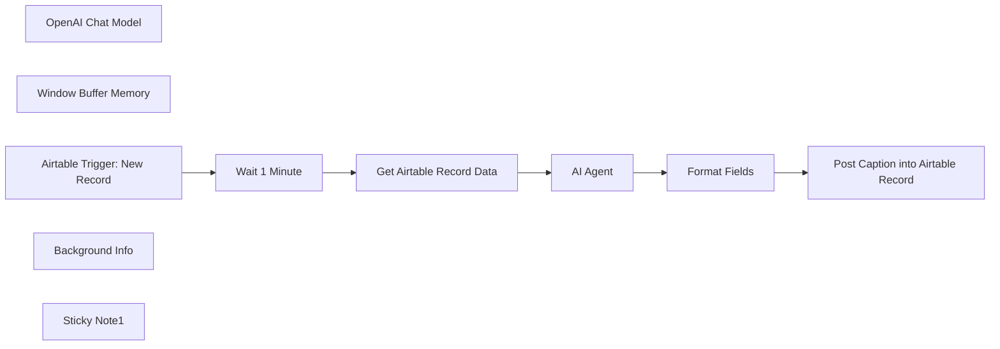

## Fluxo (.json) :

```json
{
  "id": "V8ypWn7oaOVS3zH0",
  "meta": {
    "instanceId": "1acdaec6c8e84424b4715cf41a9f7ec057947452db21cd2e22afbc454c8711cd",
    "templateCredsSetupCompleted": true
  },
  "name": "AI Social Media Caption Creator",
  "tags": [],
  "nodes": [
    {
      "id": "12d0470e-1030-47c4-8bd0-890d5b3a5976",
      "name": "AI Agent",
      "type": "@n8n/n8n-nodes-langchain.agent",
      "position": [
        120,
        -120
      ],
      "parameters": {
        "text": "={{ $json['Briefing'] }}",
        "options": {
          "systemMessage": "=<system_prompt> \nYOU ARE AN EXPERT CAPTION CREATOR AGENT FOR INSTAGRAM, DESIGNED FOR USE IN N8N WORKFLOWS. YOUR TASK IS TO CREATE A CREATIVE, TARGET AUDIENCE-ORIENTED, AND MEMORABLE CAPTION BASED ON THE BRIEFING: `{{ $json['Briefing'] }}`. YOU SHOULD RETRIEVE ADDITIONAL INFORMATION ABOUT THE TARGET AUDIENCE AND PREFERRED WORDING USING THE TOOL \"BACKGROUND INFO\" TO MAXIMIZE THE QUALITY AND RELEVANCE OF THE CAPTION. \n\n###INSTRUCTIONS### \n\n- YOU MUST: \n 1. READ AND UNDERSTAND THE BRIEFING CAREFULLY. \n 2. RETRIEVE ADDITIONAL DATA ABOUT THE TARGET AUDIENCE AND COMMUNICATION STYLE USING THE \"BACKGROUND INFO\" TOOL. \n 3. CREATE A CAPTION THAT IS CREATIVE, ENGAGING, AND TAILORED TO THE TARGET AUDIENCE. \n 4. ENSURE THAT THE CAPTION INCLUDES A CLEAR CALL-TO-ACTION (CTA) THAT ENCOURAGES USERS TO TAKE ACTION (E.G., LIKE, COMMENT, OR CLICK). \n 5. OUTPUT ONLY THE FINAL CAPTION WITHOUT ANY ACCOMPANYING EXPLANATIONS, FEEDBACK, OR COMMENTS. \n\n###CHAIN OF THOUGHTS### \n\n1. **UNDERSTANDING THE BRIEFING**: \n - THOROUGHLY READ THE BRIEFING PROVIDED UNDER `{{ $json['Briefing/Notizen'] }}`. \n - IDENTIFY THE MAIN FOCUS OF THE POST (E.G., PRODUCT PROMOTION, INSPIRATION, INFORMATION). \n - NOTE THE KEY THEMES, MOOD, AND DESIRED IMPACT. \n\n2. **TARGET AUDIENCE ANALYSIS**: \n - USE THE \"BACKGROUND INFO\" TOOL TO: \n - RETRIEVE THE TARGET AUDIENCE'S AGE, INTERESTS, AND NEEDS. \n - DEFINE THE APPROPRIATE TONE (FRIENDLY, PROFESSIONAL, INSPIRATIONAL, ETC.). \n\n3. **CREATIVE CAPTION DEVELOPMENT**: \n - DEVELOP AN OPENING SENTENCE THAT GRABS THE TARGET AUDIENCE'S ATTENTION. \n - WRITE A BODY THAT CONVEYS THE CORE MESSAGE OF THE POST AND RESONATES WITH THE TARGET AUDIENCE. \n - ADD AN INVITING CTA (E.G., \"What do you think? Share your thoughts in the comments!\" OR \"Click the link in our bio!\"). \n\n4. **FINALIZATION**: \n - CHECK THE CAPTION FOR CLARITY, CONSISTENCY, AND GRAMMAR. \n - ENSURE THAT IT ALIGNS WITH THE TARGET AUDIENCE AND THE IDENTIFIED TONE. \n - MAXIMIZE CREATIVITY AND ENTERTAINMENT VALUE WITHOUT LOSING THE ESSENTIAL MESSAGE. \n\n5. **OUTPUT**: \n - OUTPUT ONLY THE FINAL CAPTION WITHOUT ANY ACCOMPANYING COMMENTS, FEEDBACK, OR EXPLANATIONS. \n\n###WHAT NOT TO DO### \n\n- **DO NOT OUTPUT ANY ACCOMPANYING TEXTS, EXPLANATIONS, OR FEEDBACK** ABOUT THE CAPTION. \n- **DO NOT WORK WITHOUT PRIOR TARGET AUDIENCE ANALYSIS**. \n- **DO NOT USE CLICHÉ PHRASES** THAT HAVE NO RELEVANCE TO THE TARGET AUDIENCE. \n- **DO NOT ALLOW ANY SPELLING OR GRAMMATICAL ERRORS**. \n\n</system_prompt>\n"
        },
        "promptType": "define"
      },
      "typeVersion": 1.7
    },
    {
      "id": "3a6fcc4e-46ed-4f80-a9ce-f955e3d47222",
      "name": "OpenAI Chat Model",
      "type": "@n8n/n8n-nodes-langchain.lmChatOpenAi",
      "position": [
        80,
        100
      ],
      "parameters": {
        "model": "gpt-4o",
        "options": {}
      },
      "credentials": {
        "openAiApi": {
          "id": "EjchNb5GBqYh0Cqn",
          "name": "OpenAi account"
        }
      },
      "typeVersion": 1.1
    },
    {
      "id": "1a8b6f44-b9cf-4c80-ac5d-358d7cf61404",
      "name": "Window Buffer Memory",
      "type": "@n8n/n8n-nodes-langchain.memoryBufferWindow",
      "position": [
        220,
        100
      ],
      "parameters": {
        "sessionKey": "={{ $json.id }}",
        "sessionIdType": "customKey"
      },
      "typeVersion": 1.3
    },
    {
      "id": "a4972690-5fa5-48bd-b5fd-b1899076b6c0",
      "name": "Get Airtable Record Data",
      "type": "n8n-nodes-base.airtable",
      "position": [
        -40,
        -120
      ],
      "parameters": {
        "id": "={{ $json.id }}",
        "base": {
          "__rl": true,
          "mode": "list",
          "value": "appXvZviYORVbPEaS",
          "cachedResultUrl": "https://airtable.com/appXvZviYORVbPEaS",
          "cachedResultName": "Redaktionsplan 2025 - E&P Reisen"
        },
        "table": {
          "__rl": true,
          "mode": "list",
          "value": "tbllbO3DyTNie9Pga",
          "cachedResultUrl": "https://airtable.com/appLe3fQHeaRN7kWG/tbllbO3DyTNie9Pga",
          "cachedResultName": "Redaktionsplanung"
        },
        "options": {}
      },
      "credentials": {
        "airtableTokenApi": {
          "id": "pMphGrxsDsELetHZ",
          "name": "Airtable account"
        }
      },
      "typeVersion": 2.1
    },
    {
      "id": "27519b09-7ce7-4a8b-abe7-dc630eea24b0",
      "name": "Wait 1 Minute",
      "type": "n8n-nodes-base.wait",
      "position": [
        -200,
        -120
      ],
      "webhookId": "757986ac-2e3f-4a5b-993d-b53b8ae12258",
      "parameters": {
        "unit": "minutes",
        "amount": 1
      },
      "typeVersion": 1.1
    },
    {
      "id": "b9e7c19a-e468-4f83-b1a4-2013af36caa0",
      "name": "Format Fields",
      "type": "n8n-nodes-base.set",
      "position": [
        440,
        -120
      ],
      "parameters": {
        "options": {},
        "assignments": {
          "assignments": [
            {
              "id": "c7243724-463f-4732-8866-efdf19837f17",
              "name": "SoMe Text",
              "type": "string",
              "value": "={{ $json.output }}"
            }
          ]
        }
      },
      "typeVersion": 3.4
    },
    {
      "id": "5d4e6149-20a5-42bf-be6b-6ebaa31c517e",
      "name": "Post Caption into Airtable Record",
      "type": "n8n-nodes-base.airtable",
      "position": [
        600,
        -120
      ],
      "parameters": {
        "base": {
          "__rl": true,
          "mode": "list",
          "value": "appXvZviYORVbPEaS",
          "cachedResultUrl": "https://airtable.com/appXvZviYORVbPEaS",
          "cachedResultName": "Redaktionsplan 2025 - E&P Reisen"
        },
        "table": {
          "__rl": true,
          "mode": "list",
          "value": "tblxsKj5PtumCR9um",
          "cachedResultUrl": "https://airtable.com/appXvZviYORVbPEaS/tblxsKj5PtumCR9um",
          "cachedResultName": "Redaktionsplanung"
        },
        "columns": {
          "value": {
            "id": "={{ $('Get Airtable Record Data').item.json.id }}",
            "Posten": false,
            "SoMe_Text_KI": "={{ $json['SoMe Text'] }}",
            "Werbeanzeige": false
          },
          "schema": [
            {
              "id": "id",
              "type": "string",
              "display": true,
              "removed": false,
              "readOnly": true,
              "required": false,
              "displayName": "id",
              "defaultMatch": true
            },
            {
              "id": "Beitragsname",
              "type": "string",
              "display": true,
              "removed": false,
              "readOnly": false,
              "required": false,
              "displayName": "Beitragsname",
              "defaultMatch": false,
              "canBeUsedToMatch": true
            },
            {
              "id": "Marke",
              "type": "options",
              "display": true,
              "options": [
                {
                  "name": "E&P",
                  "value": "E&P"
                },
                {
                  "name": "SER",
                  "value": "SER"
                },
                {
                  "name": "SBW",
                  "value": "SBW"
                },
                {
                  "name": "SZO",
                  "value": "SZO"
                },
                {
                  "name": "UCH",
                  "value": "UCH"
                }
              ],
              "removed": false,
              "readOnly": false,
              "required": false,
              "displayName": "Marke",
              "defaultMatch": false,
              "canBeUsedToMatch": true
            },
            {
              "id": "Netzwerk",
              "type": "array",
              "display": true,
              "options": [
                {
                  "name": "Facebook",
                  "value": "Facebook"
                },
                {
                  "name": "Instagram",
                  "value": "Instagram"
                },
                {
                  "name": "Threads",
                  "value": "Threads"
                },
                {
                  "name": "TikTok",
                  "value": "TikTok"
                },
                {
                  "name": "YouTube Shorts",
                  "value": "YouTube Shorts"
                },
                {
                  "name": "MyBusiness",
                  "value": "MyBusiness"
                },
                {
                  "name": "Push",
                  "value": "Push"
                },
                {
                  "name": "WhatsApp",
                  "value": "WhatsApp"
                },
                {
                  "name": "LinkedIn",
                  "value": "LinkedIn"
                },
                {
                  "name": "CleverPush",
                  "value": "CleverPush"
                },
                {
                  "name": "SBW",
                  "value": "SBW"
                }
              ],
              "removed": false,
              "readOnly": false,
              "required": false,
              "displayName": "Netzwerk",
              "defaultMatch": false,
              "canBeUsedToMatch": true
            },
            {
              "id": "Status",
              "type": "options",
              "display": true,
              "options": [
                {
                  "name": "Brainstorming",
                  "value": "Brainstorming"
                },
                {
                  "name": "Bitte formulieren",
                  "value": "Bitte formulieren"
                },
                {
                  "name": "Bitte checken/freigeben",
                  "value": "Bitte checken/freigeben"
                },
                {
                  "name": "Bitte ändern",
                  "value": "Bitte ändern"
                },
                {
                  "name": "Warten auf externe Rückmeldung",
                  "value": "Warten auf externe Rückmeldung"
                },
                {
                  "name": "Freigabe erteilt/Bitte einplanen",
                  "value": "Freigabe erteilt/Bitte einplanen"
                },
                {
                  "name": "Geplant/Veröffentlicht",
                  "value": "Geplant/Veröffentlicht"
                }
              ],
              "removed": false,
              "readOnly": false,
              "required": false,
              "displayName": "Status",
              "defaultMatch": false,
              "canBeUsedToMatch": true
            },
            {
              "id": "Zuständigkeit",
              "type": "string",
              "display": true,
              "removed": false,
              "readOnly": false,
              "required": false,
              "displayName": "Zuständigkeit",
              "defaultMatch": false,
              "canBeUsedToMatch": true
            },
            {
              "id": "KW",
              "type": "options",
              "display": true,
              "options": [
                {
                  "name": "KW 1",
                  "value": "KW 1"
                },
                {
                  "name": "KW 2",
                  "value": "KW 2"
                },
                {
                  "name": "KW 3",
                  "value": "KW 3"
                },
                {
                  "name": "KW 4",
                  "value": "KW 4"
                },
                {
                  "name": "KW 5",
                  "value": "KW 5"
                },
                {
                  "name": "KW 6",
                  "value": "KW 6"
                },
                {
                  "name": "KW 7",
                  "value": "KW 7"
                },
                {
                  "name": "KW 8",
                  "value": "KW 8"
                },
                {
                  "name": "KW 9",
                  "value": "KW 9"
                },
                {
                  "name": "KW 10",
                  "value": "KW 10"
                },
                {
                  "name": "KW 11",
                  "value": "KW 11"
                },
                {
                  "name": "KW 12",
                  "value": "KW 12"
                },
                {
                  "name": "KW 13",
                  "value": "KW 13"
                },
                {
                  "name": "KW 14",
                  "value": "KW 14"
                },
                {
                  "name": "KW 15",
                  "value": "KW 15"
                },
                {
                  "name": "KW 16",
                  "value": "KW 16"
                },
                {
                  "name": "KW 17",
                  "value": "KW 17"
                },
                {
                  "name": "KW 18",
                  "value": "KW 18"
                },
                {
                  "name": "KW 19",
                  "value": "KW 19"
                },
                {
                  "name": "KW 20",
                  "value": "KW 20"
                },
                {
                  "name": "KW 21",
                  "value": "KW 21"
                },
                {
                  "name": "KW 22",
                  "value": "KW 22"
                },
                {
                  "name": "KW 23",
                  "value": "KW 23"
                },
                {
                  "name": "KW 24",
                  "value": "KW 24"
                },
                {
                  "name": "KW 25",
                  "value": "KW 25"
                },
                {
                  "name": "KW 26",
                  "value": "KW 26"
                },
                {
                  "name": "KW 27",
                  "value": "KW 27"
                },
                {
                  "name": "KW 28",
                  "value": "KW 28"
                },
                {
                  "name": "KW 29",
                  "value": "KW 29"
                },
                {
                  "name": "KW 30",
                  "value": "KW 30"
                },
                {
                  "name": "KW 31",
                  "value": "KW 31"
                },
                {
                  "name": "KW 32",
                  "value": "KW 32"
                },
                {
                  "name": "KW 33",
                  "value": "KW 33"
                },
                {
                  "name": "KW 34",
                  "value": "KW 34"
                },
                {
                  "name": "KW 35",
                  "value": "KW 35"
                },
                {
                  "name": "KW 36",
                  "value": "KW 36"
                },
                {
                  "name": "KW 37",
                  "value": "KW 37"
                },
                {
                  "name": "KW 38",
                  "value": "KW 38"
                },
                {
                  "name": "KW 39",
                  "value": "KW 39"
                },
                {
                  "name": "KW 40",
                  "value": "KW 40"
                },
                {
                  "name": "KW 41",
                  "value": "KW 41"
                },
                {
                  "name": "KW 42",
                  "value": "KW 42"
                },
                {
                  "name": "KW 43",
                  "value": "KW 43"
                },
                {
                  "name": "KW 44",
                  "value": "KW 44"
                },
                {
                  "name": "KW 45",
                  "value": "KW 45"
                },
                {
                  "name": "KW 46",
                  "value": "KW 46"
                },
                {
                  "name": "KW 47",
                  "value": "KW 47"
                },
                {
                  "name": "KW 48",
                  "value": "KW 48"
                },
                {
                  "name": "KW 49",
                  "value": "KW 49"
                },
                {
                  "name": "KW 50",
                  "value": "KW 50"
                },
                {
                  "name": "KW 51",
                  "value": "KW 51"
                },
                {
                  "name": "KW 52",
                  "value": "KW 52"
                },
                {
                  "name": "47",
                  "value": "47"
                }
              ],
              "removed": false,
              "readOnly": false,
              "required": false,
              "displayName": "KW",
              "defaultMatch": false,
              "canBeUsedToMatch": true
            },
            {
              "id": "Veröffentlichungsdatum SoMe",
              "type": "dateTime",
              "display": true,
              "removed": false,
              "readOnly": false,
              "required": false,
              "displayName": "Veröffentlichungsdatum SoMe",
              "defaultMatch": false,
              "canBeUsedToMatch": true
            },
            {
              "id": "Destination/Haus",
              "type": "array",
              "display": true,
              "options": [
                {
                  "name": "1: Allgemein",
                  "value": "1: Allgemein"
                },
                {
                  "name": "Ahrntal - Bruggerhof",
                  "value": "Ahrntal - Bruggerhof"
                },
                {
                  "name": "Ahrntal - Christiler",
                  "value": "Ahrntal - Christiler"
                },
                {
                  "name": "Ahrntal - Griesfeld",
                  "value": "Ahrntal - Griesfeld"
                },
                {
                  "name": "Davos - Allgemein",
                  "value": "Davos - Allgemein"
                },
                {
                  "name": "Davos - Schweizerhaus",
                  "value": "Davos - Schweizerhaus"
                },
                {
                  "name": "Davos - Schwendi",
                  "value": "Davos - Schwendi"
                },
                {
                  "name": "Davos - Waldschlössli",
                  "value": "Davos - Waldschlössli"
                },
                {
                  "name": "Kleinwalsertal - Heuberghaus",
                  "value": "Kleinwalsertal - Heuberghaus"
                },
                {
                  "name": "L2A - SZO",
                  "value": "L2A - SZO"
                },
                {
                  "name": "L2A - UCH",
                  "value": "L2A - UCH"
                },
                {
                  "name": "Lenzerheide - Jenatsch",
                  "value": "Lenzerheide - Jenatsch"
                },
                {
                  "name": "Montafon - Josefsheim",
                  "value": "Montafon - Josefsheim"
                },
                {
                  "name": "Montafon - Klein Tirol",
                  "value": "Montafon - Klein Tirol"
                },
                {
                  "name": "PdS - Jolimont",
                  "value": "PdS - Jolimont"
                },
                {
                  "name": "PdS - Victoria",
                  "value": "PdS - Victoria"
                },
                {
                  "name": "Saalbach - Allgemein",
                  "value": "Saalbach - Allgemein"
                },
                {
                  "name": "Saalbach - Steinachhof",
                  "value": "Saalbach - Steinachhof"
                },
                {
                  "name": "Schweiz - Allgemein",
                  "value": "Schweiz - Allgemein"
                },
                {
                  "name": "Stubaital - Ranalt",
                  "value": "Stubaital - Ranalt"
                },
                {
                  "name": "Team",
                  "value": "Team"
                },
                {
                  "name": "VT - SBW",
                  "value": "VT - SBW"
                },
                {
                  "name": "SurfZone",
                  "value": "SurfZone"
                },
                {
                  "name": "lenzerheide - allgemein",
                  "value": "lenzerheide - allgemein"
                },
                {
                  "name": "Family",
                  "value": "Family"
                },
                {
                  "name": "Jobs",
                  "value": "Jobs"
                },
                {
                  "name": "L2A",
                  "value": "L2A"
                },
                {
                  "name": "Davos - Spinabad",
                  "value": "Davos - Spinabad"
                }
              ],
              "removed": false,
              "readOnly": false,
              "required": false,
              "displayName": "Destination/Haus",
              "defaultMatch": false,
              "canBeUsedToMatch": true
            },
            {
              "id": "Content Art",
              "type": "options",
              "display": true,
              "options": [
                {
                  "name": "Bild(er)",
                  "value": "Bild(er)"
                },
                {
                  "name": "Video",
                  "value": "Video"
                },
                {
                  "name": "Carousel",
                  "value": "Carousel"
                },
                {
                  "name": "Story",
                  "value": "Story"
                },
                {
                  "name": "Reel",
                  "value": "Reel"
                },
                {
                  "name": "Link",
                  "value": "Link"
                },
                {
                  "name": "Bilderalbum",
                  "value": "Bilderalbum"
                },
                {
                  "name": "Text",
                  "value": "Text"
                },
                {
                  "name": "Push",
                  "value": "Push"
                }
              ],
              "removed": false,
              "readOnly": false,
              "required": false,
              "displayName": "Content Art",
              "defaultMatch": false,
              "canBeUsedToMatch": true
            },
            {
              "id": "Briefing/Notizen",
              "type": "string",
              "display": true,
              "removed": false,
              "readOnly": false,
              "required": false,
              "displayName": "Briefing/Notizen",
              "defaultMatch": false,
              "canBeUsedToMatch": true
            },
            {
              "id": "Linkmanager-Link",
              "type": "string",
              "display": true,
              "removed": false,
              "readOnly": false,
              "required": false,
              "displayName": "Linkmanager-Link",
              "defaultMatch": false,
              "canBeUsedToMatch": true
            },
            {
              "id": "Short Link",
              "type": "string",
              "display": true,
              "removed": false,
              "readOnly": false,
              "required": false,
              "displayName": "Short Link",
              "defaultMatch": false,
              "canBeUsedToMatch": true
            },
            {
              "id": "Story",
              "type": "string",
              "display": true,
              "removed": false,
              "readOnly": false,
              "required": false,
              "displayName": "Story",
              "defaultMatch": false,
              "canBeUsedToMatch": true
            },
            {
              "id": "MyBusiness Link",
              "type": "string",
              "display": true,
              "removed": false,
              "readOnly": false,
              "required": false,
              "displayName": "MyBusiness Link",
              "defaultMatch": false,
              "canBeUsedToMatch": true
            },
            {
              "id": "SoMe Text",
              "type": "string",
              "display": true,
              "removed": false,
              "readOnly": false,
              "required": false,
              "displayName": "SoMe Text",
              "defaultMatch": false,
              "canBeUsedToMatch": true
            },
            {
              "id": "Anzahl Hashtags",
              "type": "string",
              "display": true,
              "removed": true,
              "readOnly": true,
              "required": false,
              "displayName": "Anzahl Hashtags",
              "defaultMatch": false,
              "canBeUsedToMatch": true
            },
            {
              "id": "Anzahl Zeichen",
              "type": "string",
              "display": true,
              "removed": true,
              "readOnly": true,
              "required": false,
              "displayName": "Anzahl Zeichen",
              "defaultMatch": false,
              "canBeUsedToMatch": true
            },
            {
              "id": "SoMe Media",
              "type": "array",
              "display": true,
              "removed": false,
              "readOnly": false,
              "required": false,
              "displayName": "SoMe Media",
              "defaultMatch": false,
              "canBeUsedToMatch": true
            },
            {
              "id": "Link zum Canva Layout",
              "type": "string",
              "display": true,
              "removed": false,
              "readOnly": false,
              "required": false,
              "displayName": "Link zum Canva Layout",
              "defaultMatch": false,
              "canBeUsedToMatch": true
            },
            {
              "id": "Storylink Canva",
              "type": "string",
              "display": true,
              "removed": false,
              "readOnly": false,
              "required": false,
              "displayName": "Storylink Canva",
              "defaultMatch": false,
              "canBeUsedToMatch": true
            },
            {
              "id": "MyBusiness Layout",
              "type": "string",
              "display": true,
              "removed": false,
              "readOnly": false,
              "required": false,
              "displayName": "MyBusiness Layout",
              "defaultMatch": false,
              "canBeUsedToMatch": true
            },
            {
              "id": "Posten",
              "type": "boolean",
              "display": true,
              "removed": false,
              "readOnly": false,
              "required": false,
              "displayName": "Posten",
              "defaultMatch": false,
              "canBeUsedToMatch": true
            },
            {
              "id": "created_at",
              "type": "string",
              "display": true,
              "removed": true,
              "readOnly": true,
              "required": false,
              "displayName": "created_at",
              "defaultMatch": false,
              "canBeUsedToMatch": true
            },
            {
              "id": "SoMe_Text_KI",
              "type": "string",
              "display": true,
              "removed": false,
              "readOnly": false,
              "required": false,
              "displayName": "SoMe_Text_KI",
              "defaultMatch": false,
              "canBeUsedToMatch": true
            },
            {
              "id": "Werbeanzeige",
              "type": "boolean",
              "display": true,
              "removed": false,
              "readOnly": false,
              "required": false,
              "displayName": "Werbeanzeige",
              "defaultMatch": false,
              "canBeUsedToMatch": true
            }
          ],
          "mappingMode": "defineBelow",
          "matchingColumns": [
            "id",
            "SoMe_Text_KI"
          ],
          "attemptToConvertTypes": false,
          "convertFieldsToString": false
        },
        "options": {},
        "operation": "update"
      },
      "credentials": {
        "airtableTokenApi": {
          "id": "pMphGrxsDsELetHZ",
          "name": "Airtable account"
        }
      },
      "typeVersion": 2.1
    },
    {
      "id": "ddc9159e-0da7-4844-84c5-eca981b9d52f",
      "name": "Airtable Trigger: New Record",
      "type": "n8n-nodes-base.airtableTrigger",
      "position": [
        -360,
        -120
      ],
      "parameters": {
        "baseId": {
          "__rl": true,
          "mode": "id",
          "value": "appXvZviYORVbPEaS"
        },
        "tableId": {
          "__rl": true,
          "mode": "id",
          "value": "tblxsKj5PtumCR9um"
        },
        "pollTimes": {
          "item": [
            {
              "mode": "everyMinute"
            }
          ]
        },
        "triggerField": "created_at",
        "authentication": "airtableTokenApi",
        "additionalFields": {}
      },
      "credentials": {
        "airtableTokenApi": {
          "id": "pMphGrxsDsELetHZ",
          "name": "Airtable account"
        }
      },
      "typeVersion": 1
    },
    {
      "id": "a71626b0-43ba-430b-bd2f-8cc121676e46",
      "name": "Background Info",
      "type": "n8n-nodes-base.airtableTool",
      "position": [
        360,
        100
      ],
      "parameters": {
        "id": "reckd97lgylz93Ht5",
        "base": {
          "__rl": true,
          "mode": "list",
          "value": "appXvZviYORVbPEaS",
          "cachedResultUrl": "https://airtable.com/appXvZviYORVbPEaS",
          "cachedResultName": "Redaktionsplan 2025 - E&P Reisen"
        },
        "table": {
          "__rl": true,
          "mode": "list",
          "value": "tblMmE9cjgNZCoIO1",
          "cachedResultUrl": "https://airtable.com/appLe3fQHeaRN7kWG/tblMmE9cjgNZCoIO1",
          "cachedResultName": "Good to know"
        },
        "options": {},
        "descriptionType": "manual",
        "toolDescription": "Read data from Airtable"
      },
      "credentials": {
        "airtableTokenApi": {
          "id": "pMphGrxsDsELetHZ",
          "name": "Airtable account"
        }
      },
      "typeVersion": 2.1
    },
    {
      "id": "9c422e74-155c-4714-87aa-16b31bd73e5b",
      "name": "Sticky Note1",
      "type": "n8n-nodes-base.stickyNote",
      "position": [
        -680,
        80
      ],
      "parameters": {
        "width": 660,
        "height": 680,
        "content": "# Welcome to my AI Social Media Caption Creator Workflow!\n\nThis workflow automatically creates a social media post caption in an editorial plan in Airtable. It also uses background information on the target group, tonality, etc. stored in Airtable.\n\n## This workflow has the following sequence:\n\n1. Airtable trigger (scan for new records every minute)\n2. Wait 1 Minute so the Airtable record creator has time to write the Briefing field\n3. retrieval of Airtable record data\n4. AI Agent to write a caption for a social media post. The agent is instructed to use background information stored in Airtable (such as target group, tonality, etc.) to create the post.\n5. Format the output and assign it to the correct field in Airtable.\n6. Post the caption into Airtable record.\n\n## The following accesses are required for the workflow:\n- Airtable Database: [Documentation](https://docs.n8n.io/integrations/builtin/credentials/airtable)\n- AI API access (e.g. via OpenAI, Anthropic, Google or Ollama)\n\n### Example of an editorial plan in Airtable: https://airtable.com/appIXeIkDPjQefHXN/shrwcY45g48RpcvvC\nFor this workflow you need the Airtable fields \"created_at\", \"Briefing\" and \"SoMe_Text_AI\"\n\nYou can contact me via LinkedIn, if you have any questions: https://www.linkedin.com/in/friedemann-schuetz"
      },
      "typeVersion": 1
    }
  ],
  "active": false,
  "pinData": {},
  "settings": {
    "executionOrder": "v1"
  },
  "versionId": "50376a31-f279-4f5d-9204-82cacb596751",
  "connections": {
    "AI Agent": {
      "main": [
        [
          {
            "node": "Format Fields",
            "type": "main",
            "index": 0
          }
        ]
      ]
    },
    "Format Fields": {
      "main": [
        [
          {
            "node": "Post Caption into Airtable Record",
            "type": "main",
            "index": 0
          }
        ]
      ]
    },
    "Wait 1 Minute": {
      "main": [
        [
          {
            "node": "Get Airtable Record Data",
            "type": "main",
            "index": 0
          }
        ]
      ]
    },
    "Background Info": {
      "ai_tool": [
        [
          {
            "node": "AI Agent",
            "type": "ai_tool",
            "index": 0
          }
        ]
      ]
    },
    "OpenAI Chat Model": {
      "ai_languageModel": [
        [
          {
            "node": "AI Agent",
            "type": "ai_languageModel",
            "index": 0
          }
        ]
      ]
    },
    "Window Buffer Memory": {
      "ai_memory": [
        [
          {
            "node": "AI Agent",
            "type": "ai_memory",
            "index": 0
          }
        ]
      ]
    },
    "Get Airtable Record Data": {
      "main": [
        [
          {
            "node": "AI Agent",
            "type": "main",
            "index": 0
          }
        ]
      ]
    },
    "Airtable Trigger: New Record": {
      "main": [
        [
          {
            "node": "Wait 1 Minute",
            "type": "main",
            "index": 0
          }
        ]
      ]
    }
  }
}
```

<a id="template-690"></a>

## Template 690 - Criar empresa no Salesmate

- **Nome:** Criar empresa no Salesmate
- **Descrição:** Cria um registro de empresa no Salesmate quando o fluxo é executado manualmente.
- **Funcionalidade:** • Disparo manual: inicia o fluxo quando o usuário clica em executar.
• Criação de empresa no Salesmate: envia dados como nome, proprietário e campos adicionais para criar um novo registro de empresa.
• Uso de credenciais da API: utiliza credenciais configuradas para autenticar e autorizar a operação de criação.
- **Ferramentas:** • Salesmate: Plataforma CRM para gerenciar contatos, empresas e oportunidades; utilizada aqui para criar registros de empresa via API.


## Fluxo visual


## Fluxo (.json) :

```json
{
  "id": "128",
  "name": "Create a company in Salesmate",
  "nodes": [
    {
      "name": "On clicking 'execute'",
      "type": "n8n-nodes-base.manualTrigger",
      "position": [
        250,
        300
      ],
      "parameters": {},
      "typeVersion": 1
    },
    {
      "name": "Salesmate",
      "type": "n8n-nodes-base.salesmate",
      "position": [
        450,
        300
      ],
      "parameters": {
        "name": "",
        "owner": "",
        "resource": "company",
        "additionalFields": {}
      },
      "credentials": {
        "salesmateApi": ""
      },
      "typeVersion": 1
    }
  ],
  "active": false,
  "settings": {},
  "connections": {
    "On clicking 'execute'": {
      "main": [
        [
          {
            "node": "Salesmate",
            "type": "main",
            "index": 0
          }
        ]
      ]
    }
  }
}
```

<a id="template-691"></a>

## Template 691 - Criação automática de legendas para Instagram

- **Nome:** Criação automática de legendas para Instagram
- **Descrição:** Este fluxo gera legendas criativas para Instagram a partir de um briefing, utilizando informações de público-alvo armazenadas e registra o resultado no Airtable.
- **Funcionalidade:** • Detecção de novo registro no planejamento editorial: inicia a automação ao criar um novo registro e aguarda o Briefing ficar preenchido (1 minuto).
• Recuperação de dados do registro: lê o Briefing e outras informações do registro para orientar a criação.
• Geração de legenda com IA: produz uma legenda criativa e envolvente, ajustada ao público-alvo e com CTA.
• Integração de informações de background: utiliza dados de background armazenados (público-alvo, tom, etc.) para orientar a linguagem.
• Formatação e atualização no registro: formata a legenda e atualiza o campo SoMe Text no registro no Airtable.
• Registro de contexto: mantém histórico de conversação para consistência entre chamadas de IA durante o fluxo.
- **Ferramentas:** • Airtable: base de dados utilizada para gerenciar o planejamento editorial, receber o Briefing e armazenar a legenda.
• OpenAI (modelo de linguagem): fornece a geração de legendas criativas com base no Briefing e no background.

## Fluxo visual


## Fluxo (.json) :

```json
{
  "id": "V8ypWn7oaOVS3zH0",
  "meta": {
    "instanceId": "1acdaec6c8e84424b4715cf41a9f7ec057947452db21cd2e22afbc454c8711cd",
    "templateCredsSetupCompleted": true
  },
  "name": "AI Social Media Caption Creator",
  "tags": [],
  "nodes": [
    {
      "id": "12d0470e-1030-47c4-8bd0-890d5b3a5976",
      "name": "AI Agent",
      "type": "@n8n/n8n-nodes-langchain.agent",
      "position": [
        120,
        -120
      ],
      "parameters": {
        "text": "={{ $json['Briefing'] }}",
        "options": {
          "systemMessage": "=<system_prompt>  \nYOU ARE AN EXPERT CAPTION CREATOR AGENT FOR INSTAGRAM, DESIGNED FOR USE IN N8N WORKFLOWS. YOUR TASK IS TO CREATE A CREATIVE, TARGET AUDIENCE-ORIENTED, AND MEMORABLE CAPTION BASED ON THE BRIEFING: `{{ $json['Briefing'] }}`. YOU SHOULD RETRIEVE ADDITIONAL INFORMATION ABOUT THE TARGET AUDIENCE AND PREFERRED WORDING USING THE TOOL \"BACKGROUND INFO\" TO MAXIMIZE THE QUALITY AND RELEVANCE OF THE CAPTION.  \n\n###INSTRUCTIONS###  \n\n- YOU MUST:  \n  1. READ AND UNDERSTAND THE BRIEFING CAREFULLY.  \n  2. RETRIEVE ADDITIONAL DATA ABOUT THE TARGET AUDIENCE AND COMMUNICATION STYLE USING THE \"BACKGROUND INFO\" TOOL.  \n  3. CREATE A CAPTION THAT IS CREATIVE, ENGAGING, AND TAILORED TO THE TARGET AUDIENCE.  \n  4. ENSURE THAT THE CAPTION INCLUDES A CLEAR CALL-TO-ACTION (CTA) THAT ENCOURAGES USERS TO TAKE ACTION (E.G., LIKE, COMMENT, OR CLICK).  \n  5. OUTPUT ONLY THE FINAL CAPTION WITHOUT ANY ACCOMPANYING EXPLANATIONS, FEEDBACK, OR COMMENTS.  \n\n###CHAIN OF THOUGHTS###  \n\n1. **UNDERSTANDING THE BRIEFING**:  \n   - THOROUGHLY READ THE BRIEFING PROVIDED UNDER `{{ $json['Briefing/Notizen'] }}`.  \n   - IDENTIFY THE MAIN FOCUS OF THE POST (E.G., PRODUCT PROMOTION, INSPIRATION, INFORMATION). \n   - NOTE THE KEY THEMES, MOOD, AND DESIRED IMPACT.  \n\n2. **TARGET AUDIENCE ANALYSIS**:  \n   - USE THE \"BACKGROUND INFO\" TOOL TO:  \n     - RETRIEVE THE TARGET AUDIENCE'S AGE, INTERESTS, AND NEEDS.  \n     - DEFINE THE APPROPRIATE TONE (FRIENDLY, PROFESSIONAL, INSPIRATIONAL, ETC.).  \n\n3. **CREATIVE CAPTION DEVELOPMENT**:  \n   - DEVELOP AN OPENING SENTENCE THAT GRABS THE TARGET AUDIENCE'S ATTENTION.  \n   - WRITE A BODY THAT CONVEYS THE CORE MESSAGE OF THE POST AND RESONATES WITH THE TARGET AUDIENCE.  \n   - ADD AN INVITING CTA (E.G., \"What do you think? Share your thoughts in the comments!\" OR \"Click the link in our bio!\").  \n\n4. **FINALIZATION**:  \n   - CHECK THE CAPTION FOR CLARITY, CONSISTENCY, AND GRAMMAR.  \n   - ENSURE THAT IT ALIGNS WITH THE TARGET AUDIENCE AND THE IDENTIFIED TONE.  \n   - MAXIMIZE CREATIVITY AND ENTERTAINMENT VALUE WITHOUT LOSING THE ESSENTIAL MESSAGE.  \n\n5. **OUTPUT**:  \n   - OUTPUT ONLY THE FINAL CAPTION WITHOUT ANY ACCOMPANYING COMMENTS, FEEDBACK, OR EXPLANATIONS.  \n\n###WHAT NOT TO DO###  \n\n- **DO NOT OUTPUT ANY ACCOMPANYING TEXTS, EXPLANATIONS, OR FEEDBACK** ABOUT THE CAPTION.  \n- **DO NOT WORK WITHOUT PRIOR TARGET AUDIENCE ANALYSIS**.  \n- **DO NOT USE CLICHÉ PHRASES** THAT HAVE NO RELEVANCE TO THE TARGET AUDIENCE.  \n- **DO NOT ALLOW ANY SPELLING OR GRAMMATICAL ERRORS**.  \n\n</system_prompt>\n"
        },
        "promptType": "define"
      },
      "typeVersion": 1.7
    },
    {
      "id": "3a6fcc4e-46ed-4f80-a9ce-f955e3d47222",
      "name": "OpenAI Chat Model",
      "type": "@n8n/n8n-nodes-langchain.lmChatOpenAi",
      "position": [
        80,
        100
      ],
      "parameters": {
        "model": "gpt-4o",
        "options": {}
      },
      "credentials": {
        "openAiApi": {
          "id": "EjchNb5GBqYh0Cqn",
          "name": "OpenAi account"
        }
      },
      "typeVersion": 1.1
    },
    {
      "id": "1a8b6f44-b9cf-4c80-ac5d-358d7cf61404",
      "name": "Window Buffer Memory",
      "type": "@n8n/n8n-nodes-langchain.memoryBufferWindow",
      "position": [
        220,
        100
      ],
      "parameters": {
        "sessionKey": "={{ $json.id }}",
        "sessionIdType": "customKey"
      },
      "typeVersion": 1.3
    },
    {
      "id": "a4972690-5fa5-48bd-b5fd-b1899076b6c0",
      "name": "Get Airtable Record Data",
      "type": "n8n-nodes-base.airtable",
      "position": [
        -40,
        -120
      ],
      "parameters": {
        "id": "={{ $json.id }}",
        "base": {
          "__rl": true,
          "mode": "list",
          "value": "appXvZviYORVbPEaS",
          "cachedResultUrl": "https://airtable.com/appXvZviYORVbPEaS",
          "cachedResultName": "Redaktionsplan 2025 - E&P Reisen"
        },
        "table": {
          "__rl": true,
          "mode": "list",
          "value": "tbllbO3DyTNie9Pga",
          "cachedResultUrl": "https://airtable.com/appLe3fQHeaRN7kWG/tbllbO3DyTNie9Pga",
          "cachedResultName": "Redaktionsplanung"
        },
        "options": {}
      },
      "credentials": {
        "airtableTokenApi": {
          "id": "pMphGrxsDsELetHZ",
          "name": "Airtable account"
        }
      },
      "typeVersion": 2.1
    },
    {
      "id": "27519b09-7ce7-4a8b-abe7-dc630eea24b0",
      "name": "Wait 1 Minute",
      "type": "n8n-nodes-base.wait",
      "position": [
        -200,
        -120
      ],
      "webhookId": "757986ac-2e3f-4a5b-993d-b53b8ae12258",
      "parameters": {
        "unit": "minutes",
        "amount": 1
      },
      "typeVersion": 1.1
    },
    {
      "id": "b9e7c19a-e468-4f83-b1a4-2013af36caa0",
      "name": "Format Fields",
      "type": "n8n-nodes-base.set",
      "position": [
        440,
        -120
      ],
      "parameters": {
        "options": {},
        "assignments": {
          "assignments": [
            {
              "id": "c7243724-463f-4732-8866-efdf19837f17",
              "name": "SoMe Text",
              "type": "string",
              "value": "={{ $json.output }}"
            }
          ]
        }
      },
      "typeVersion": 3.4
    },
    {
      "id": "5d4e6149-20a5-42bf-be6b-6ebaa31c517e",
      "name": "Post Caption into Airtable Record",
      "type": "n8n-nodes-base.airtable",
      "position": [
        600,
        -120
      ],
      "parameters": {
        "base": {
          "__rl": true,
          "mode": "list",
          "value": "appXvZviYORVbPEaS",
          "cachedResultUrl": "https://airtable.com/appXvZviYORVbPEaS",
          "cachedResultName": "Redaktionsplan 2025 - E&P Reisen"
        },
        "table": {
          "__rl": true,
          "mode": "list",
          "value": "tblxsKj5PtumCR9um",
          "cachedResultUrl": "https://airtable.com/appXvZviYORVbPEaS/tblxsKj5PtumCR9um",
          "cachedResultName": "Redaktionsplanung"
        },
        "columns": {
          "value": {
            "id": "={{ $('Get Airtable Record Data').item.json.id }}",
            "Posten": false,
            "SoMe_Text_KI": "={{ $json['SoMe Text'] }}",
            "Werbeanzeige": false
          },
          "schema": [
            {
              "id": "id",
              "type": "string",
              "display": true,
              "removed": false,
              "readOnly": true,
              "required": false,
              "displayName": "id",
              "defaultMatch": true
            },
            {
              "id": "Beitragsname",
              "type": "string",
              "display": true,
              "removed": false,
              "readOnly": false,
              "required": false,
              "displayName": "Beitragsname",
              "defaultMatch": false,
              "canBeUsedToMatch": true
            },
            {
              "id": "Marke",
              "type": "options",
              "display": true,
              "options": [
                {
                  "name": "E&P",
                  "value": "E&P"
                },
                {
                  "name": "SER",
                  "value": "SER"
                },
                {
                  "name": "SBW",
                  "value": "SBW"
                },
                {
                  "name": "SZO",
                  "value": "SZO"
                },
                {
                  "name": "UCH",
                  "value": "UCH"
                }
              ],
              "removed": false,
              "readOnly": false,
              "required": false,
              "displayName": "Marke",
              "defaultMatch": false,
              "canBeUsedToMatch": true
            },
            {
              "id": "Netzwerk",
              "type": "array",
              "display": true,
              "options": [
                {
                  "name": "Facebook",
                  "value": "Facebook"
                },
                {
                  "name": "Instagram",
                  "value": "Instagram"
                },
                {
                  "name": "Threads",
                  "value": "Threads"
                },
                {
                  "name": "TikTok",
                  "value": "TikTok"
                },
                {
                  "name": "YouTube Shorts",
                  "value": "YouTube Shorts"
                },
                {
                  "name": "MyBusiness",
                  "value": "MyBusiness"
                },
                {
                  "name": "Push",
                  "value": "Push"
                },
                {
                  "name": "WhatsApp",
                  "value": "WhatsApp"
                },
                {
                  "name": "LinkedIn",
                  "value": "LinkedIn"
                },
                {
                  "name": "CleverPush",
                  "value": "CleverPush"
                },
                {
                  "name": "SBW",
                  "value": "SBW"
                }
              ],
              "removed": false,
              "readOnly": false,
              "required": false,
              "displayName": "Netzwerk",
              "defaultMatch": false,
              "canBeUsedToMatch": true
            },
            {
              "id": "Status",
              "type": "options",
              "display": true,
              "options": [
                {
                  "name": "Brainstorming",
                  "value": "Brainstorming"
                },
                {
                  "name": "Bitte formulieren",
                  "value": "Bitte formulieren"
                },
                {
                  "name": "Bitte checken/freigeben",
                  "value": "Bitte checken/freigeben"
                },
                {
                  "name": "Bitte ändern",
                  "value": "Bitte ändern"
                },
                {
                  "name": "Warten auf externe Rückmeldung",
                  "value": "Warten auf externe Rückmeldung"
                },
                {
                  "name": "Freigabe erteilt/Bitte einplanen",
                  "value": "Freigabe erteilt/Bitte einplanen"
                },
                {
                  "name": "Geplant/Veröffentlicht",
                  "value": "Geplant/Veröffentlicht"
                }
              ],
              "removed": false,
              "readOnly": false,
              "required": false,
              "displayName": "Status",
              "defaultMatch": false,
              "canBeUsedToMatch": true
            },
            {
              "id": "Zuständigkeit",
              "type": "string",
              "display": true,
              "removed": false,
              "readOnly": false,
              "required": false,
              "displayName": "Zuständigkeit",
              "defaultMatch": false,
              "canBeUsedToMatch": true
            },
            {
              "id": "KW",
              "type": "options",
              "display": true,
              "options": [
                {
                  "name": "KW 1",
                  "value": "KW 1"
                },
                {
                  "name": "KW 2",
                  "value": "KW 2"
                },
                {
                  "name": "KW 3",
                  "value": "KW 3"
                },
                {
                  "name": "KW 4",
                  "value": "KW 4"
                },
                {
                  "name": "KW 5",
                  "value": "KW 5"
                },
                {
                  "name": "KW 6",
                  "value": "KW 6"
                },
                {
                  "name": "KW 7",
                  "value": "KW 7"
                },
                {
                  "name": "KW 8",
                  "value": "KW 8"
                },
                {
                  "name": "KW 9",
                  "value": "KW 9"
                },
                {
                  "name": "KW 10",
                  "value": "KW 10"
                },
                {
                  "name": "KW 11",
                  "value": "KW 11"
                },
                {
                  "name": "KW 12",
                  "value": "KW 12"
                },
                {
                  "name": "KW 13",
                  "value": "KW 13"
                },
                {
                  "name": "KW 14",
                  "value": "KW 14"
                },
                {
                  "name": "KW 15",
                  "value": "KW 15"
                },
                {
                  "name": "KW 16",
                  "value": "KW 16"
                },
                {
                  "name": "KW 17",
                  "value": "KW 17"
                },
                {
                  "name": "KW 18",
                  "value": "KW 18"
                },
                {
                  "name": "KW 19",
                  "value": "KW 19"
                },
                {
                  "name": "KW 20",
                  "value": "KW 20"
                },
                {
                  "name": "KW 21",
                  "value": "KW 21"
                },
                {
                  "name": "KW 22",
                  "value": "KW 22"
                },
                {
                  "name": "KW 23",
                  "value": "KW 23"
                },
                {
                  "name": "KW 24",
                  "value": "KW 24"
                },
                {
                  "name": "KW 25",
                  "value": "KW 25"
                },
                {
                  "name": "KW 26",
                  "value": "KW 26"
                },
                {
                  "name": "KW 27",
                  "value": "KW 27"
                },
                {
                  "name": "KW 28",
                  "value": "KW 28"
                },
                {
                  "name": "KW 29",
                  "value": "KW 29"
                },
                {
                  "name": "KW 30",
                  "value": "KW 30"
                },
                {
                  "name": "KW 31",
                  "value": "KW 31"
                },
                {
                  "name": "KW 32",
                  "value": "KW 32"
                },
                {
                  "name": "KW 33",
                  "value": "KW 33"
                },
                {
                  "name": "KW 34",
                  "value": "KW 34"
                },
                {
                  "name": "KW 35",
                  "value": "KW 35"
                },
                {
                  "name": "KW 36",
                  "value": "KW 36"
                },
                {
                  "name": "KW 37",
                  "value": "KW 37"
                },
                {
                  "name": "KW 38",
                  "value": "KW 38"
                },
                {
                  "name": "KW 39",
                  "value": "KW 39"
                },
                {
                  "name": "KW 40",
                  "value": "KW 40"
                },
                {
                  "name": "KW 41",
                  "value": "KW 41"
                },
                {
                  "name": "KW 42",
                  "value": "KW 42"
                },
                {
                  "name": "KW 43",
                  "value": "KW 43"
                },
                {
                  "name": "KW 44",
                  "value": "KW 44"
                },
                {
                  "name": "KW 45",
                  "value": "KW 45"
                },
                {
                  "name": "KW 46",
                  "value": "KW 46"
                },
                {
                  "name": "KW 47",
                  "value": "KW 47"
                },
                {
                  "name": "KW 48",
                  "value": "KW 48"
                },
                {
                  "name": "KW 49",
                  "value": "KW 49"
                },
                {
                  "name": "KW 50",
                  "value": "KW 50"
                },
                {
                  "name": "KW 51",
                  "value": "KW 51"
                },
                {
                  "name": "KW 52",
                  "value": "KW 52"
                },
                {
                  "name": "47",
                  "value": "47"
                }
              ],
              "removed": false,
              "readOnly": false,
              "required": false,
              "displayName": "KW",
              "defaultMatch": false,
              "canBeUsedToMatch": true
            },
            {
              "id": "Veröffentlichungsdatum SoMe",
              "type": "dateTime",
              "display": true,
              "removed": false,
              "readOnly": false,
              "required": false,
              "displayName": "Veröffentlichungsdatum SoMe",
              "defaultMatch": false,
              "canBeUsedToMatch": true
            },
            {
              "id": "Destination/Haus",
              "type": "array",
              "display": true,
              "options": [
                {
                  "name": "1: Allgemein",
                  "value": "1: Allgemein"
                },
                {
                  "name": "Ahrntal - Bruggerhof",
                  "value": "Ahrntal - Bruggerhof"
                },
                {
                  "name": "Ahrntal - Christiler",
                  "value": "Ahrntal - Christiler"
                },
                {
                  "name": "Ahrntal - Griesfeld",
                  "value": "Ahrntal - Griesfeld"
                },
                {
                  "name": "Davos - Allgemein",
                  "value": "Davos - Allgemein"
                },
                {
                  "name": "Davos - Schweizerhaus",
                  "value": "Davos - Schweizerhaus"
                },
                {
                  "name": "Davos - Schwendi",
                  "value": "Davos - Schwendi"
                },
                {
                  "name": "Davos - Waldschlössli",
                  "value": "Davos - Waldschlössli"
                },
                {
                  "name": "Kleinwalsertal - Heuberghaus",
                  "value": "Kleinwalsertal - Heuberghaus"
                },
                {
                  "name": "L2A - SZO",
                  "value": "L2A - SZO"
                },
                {
                  "name": "L2A - UCH",
                  "value": "L2A - UCH"
                },
                {
                  "name": "Lenzerheide - Jenatsch",
                  "value": "Lenzerheide - Jenatsch"
                },
                {
                  "name": "Montafon - Josefsheim",
                  "value": "Montafon - Josefsheim"
                },
                {
                  "name": "Montafon - Klein Tirol",
                  "value": "Montafon - Klein Tirol"
                },
                {
                  "name": "PdS - Jolimont",
                  "value": "PdS - Jolimont"
                },
                {
                  "name": "PdS - Victoria",
                  "value": "PdS - Victoria"
                },
                {
                  "name": "Saalbach - Allgemein",
                  "value": "Saalbach - Allgemein"
                },
                {
                  "name": "Saalbach - Steinachhof",
                  "value": "Saalbach - Steinachhof"
                },
                {
                  "name": "Schweiz - Allgemein",
                  "value": "Schweiz - Allgemein"
                },
                {
                  "name": "Stubaital - Ranalt",
                  "value": "Stubaital - Ranalt"
                },
                {
                  "name": "Team",
                  "value": "Team"
                },
                {
                  "name": "VT - SBW",
                  "value": "VT - SBW"
                },
                {
                  "name": "SurfZone",
                  "value": "SurfZone"
                },
                {
                  "name": "lenzerheide - allgemein",
                  "value": "lenzerheide - allgemein"
                },
                {
                  "name": "Family",
                  "value": "Family"
                },
                {
                  "name": "Jobs",
                  "value": "Jobs"
                },
                {
                  "name": "L2A",
                  "value": "L2A"
                },
                {
                  "name": "Davos - Spinabad",
                  "value": "Davos - Spinabad"
                }
              ],
              "removed": false,
              "readOnly": false,
              "required": false,
              "displayName": "Destination/Haus",
              "defaultMatch": false,
              "canBeUsedToMatch": true
            },
            {
              "id": "Content Art",
              "type": "options",
              "display": true,
              "options": [
                {
                  "name": "Bild(er)",
                  "value": "Bild(er)"
                },
                {
                  "name": "Video",
                  "value": "Video"
                },
                {
                  "name": "Carousel",
                  "value": "Carousel"
                },
                {
                  "name": "Story",
                  "value": "Story"
                },
                {
                  "name": "Reel",
                  "value": "Reel"
                },
                {
                  "name": "Link",
                  "value": "Link"
                },
                {
                  "name": "Bilderalbum",
                  "value": "Bilderalbum"
                },
                {
                  "name": "Text",
                  "value": "Text"
                },
                {
                  "name": "Push",
                  "value": "Push"
                }
              ],
              "removed": false,
              "readOnly": false,
              "required": false,
              "displayName": "Content Art",
              "defaultMatch": false,
              "canBeUsedToMatch": true
            },
            {
              "id": "Briefing/Notizen",
              "type": "string",
              "display": true,
              "removed": false,
              "readOnly": false,
              "required": false,
              "displayName": "Briefing/Notizen",
              "defaultMatch": false,
              "canBeUsedToMatch": true
            },
            {
              "id": "Linkmanager-Link",
              "type": "string",
              "display": true,
              "removed": false,
              "readOnly": false,
              "required": false,
              "displayName": "Linkmanager-Link",
              "defaultMatch": false,
              "canBeUsedToMatch": true
            },
            {
              "id": "Short Link",
              "type": "string",
              "display": true,
              "removed": false,
              "readOnly": false,
              "required": false,
              "displayName": "Short Link",
              "defaultMatch": false,
              "canBeUsedToMatch": true
            },
            {
              "id": "Story",
              "type": "string",
              "display": true,
              "removed": false,
              "readOnly": false,
              "required": false,
              "displayName": "Story",
              "defaultMatch": false,
              "canBeUsedToMatch": true
            },
            {
              "id": "MyBusiness Link",
              "type": "string",
              "display": true,
              "removed": false,
              "readOnly": false,
              "required": false,
              "displayName": "MyBusiness Link",
              "defaultMatch": false,
              "canBeUsedToMatch": true
            },
            {
              "id": "SoMe Text",
              "type": "string",
              "display": true,
              "removed": false,
              "readOnly": false,
              "required": false,
              "displayName": "SoMe Text",
              "defaultMatch": false,
              "canBeUsedToMatch": true
            },
            {
              "id": "Anzahl Hashtags",
              "type": "string",
              "display": true,
              "removed": true,
              "readOnly": true,
              "required": false,
              "displayName": "Anzahl Hashtags",
              "defaultMatch": false,
              "canBeUsedToMatch": true
            },
            {
              "id": "Anzahl Zeichen",
              "type": "string",
              "display": true,
              "removed": true,
              "readOnly": true,
              "required": false,
              "displayName": "Anzahl Zeichen",
              "defaultMatch": false,
              "canBeUsedToMatch": true
            },
            {
              "id": "SoMe Media",
              "type": "array",
              "display": true,
              "removed": false,
              "readOnly": false,
              "required": false,
              "displayName": "SoMe Media",
              "defaultMatch": false,
              "canBeUsedToMatch": true
            },
            {
              "id": "Link zum Canva Layout",
              "type": "string",
              "display": true,
              "removed": false,
              "readOnly": false,
              "required": false,
              "displayName": "Link zum Canva Layout",
              "defaultMatch": false,
              "canBeUsedToMatch": true
            },
            {
              "id": "Storylink Canva",
              "type": "string",
              "display": true,
              "removed": false,
              "readOnly": false,
              "required": false,
              "displayName": "Storylink Canva",
              "defaultMatch": false,
              "canBeUsedToMatch": true
            },
            {
              "id": "MyBusiness Layout",
              "type": "string",
              "display": true,
              "removed": false,
              "readOnly": false,
              "required": false,
              "displayName": "MyBusiness Layout",
              "defaultMatch": false,
              "canBeUsedToMatch": true
            },
            {
              "id": "Posten",
              "type": "boolean",
              "display": true,
              "removed": false,
              "readOnly": false,
              "required": false,
              "displayName": "Posten",
              "defaultMatch": false,
              "canBeUsedToMatch": true
            },
            {
              "id": "created_at",
              "type": "string",
              "display": true,
              "removed": true,
              "readOnly": true,
              "required": false,
              "displayName": "created_at",
              "defaultMatch": false,
              "canBeUsedToMatch": true
            },
            {
              "id": "SoMe_Text_KI",
              "type": "string",
              "display": true,
              "removed": false,
              "readOnly": false,
              "required": false,
              "displayName": "SoMe_Text_KI",
              "defaultMatch": false,
              "canBeUsedToMatch": true
            },
            {
              "id": "Werbeanzeige",
              "type": "boolean",
              "display": true,
              "removed": false,
              "readOnly": false,
              "required": false,
              "displayName": "Werbeanzeige",
              "defaultMatch": false,
              "canBeUsedToMatch": true
            }
          ],
          "mappingMode": "defineBelow",
          "matchingColumns": [
            "id",
            "SoMe_Text_KI"
          ],
          "attemptToConvertTypes": false,
          "convertFieldsToString": false
        },
        "options": {},
        "operation": "update"
      },
      "credentials": {
        "airtableTokenApi": {
          "id": "pMphGrxsDsELetHZ",
          "name": "Airtable account"
        }
      },
      "typeVersion": 2.1
    },
    {
      "id": "ddc9159e-0da7-4844-84c5-eca981b9d52f",
      "name": "Airtable Trigger: New Record",
      "type": "n8n-nodes-base.airtableTrigger",
      "position": [
        -360,
        -120
      ],
      "parameters": {
        "baseId": {
          "__rl": true,
          "mode": "id",
          "value": "appXvZviYORVbPEaS"
        },
        "tableId": {
          "__rl": true,
          "mode": "id",
          "value": "tblxsKj5PtumCR9um"
        },
        "pollTimes": {
          "item": [
            {
              "mode": "everyMinute"
            }
          ]
        },
        "triggerField": "created_at",
        "authentication": "airtableTokenApi",
        "additionalFields": {}
      },
      "credentials": {
        "airtableTokenApi": {
          "id": "pMphGrxsDsELetHZ",
          "name": "Airtable account"
        }
      },
      "typeVersion": 1
    },
    {
      "id": "a71626b0-43ba-430b-bd2f-8cc121676e46",
      "name": "Background Info",
      "type": "n8n-nodes-base.airtableTool",
      "position": [
        360,
        100
      ],
      "parameters": {
        "id": "reckd97lgylz93Ht5",
        "base": {
          "__rl": true,
          "mode": "list",
          "value": "appXvZviYORVbPEaS",
          "cachedResultUrl": "https://airtable.com/appXvZviYORVbPEaS",
          "cachedResultName": "Redaktionsplan 2025 - E&P Reisen"
        },
        "table": {
          "__rl": true,
          "mode": "list",
          "value": "tblMmE9cjgNZCoIO1",
          "cachedResultUrl": "https://airtable.com/appLe3fQHeaRN7kWG/tblMmE9cjgNZCoIO1",
          "cachedResultName": "Good to know"
        },
        "options": {},
        "descriptionType": "manual",
        "toolDescription": "Read data from Airtable"
      },
      "credentials": {
        "airtableTokenApi": {
          "id": "pMphGrxsDsELetHZ",
          "name": "Airtable account"
        }
      },
      "typeVersion": 2.1
    },
    {
      "id": "9c422e74-155c-4714-87aa-16b31bd73e5b",
      "name": "Sticky Note1",
      "type": "n8n-nodes-base.stickyNote",
      "position": [
        -680,
        80
      ],
      "parameters": {
        "width": 660,
        "height": 680,
        "content": "# Welcome to my AI Social Media Caption Creator Workflow!\n\nThis workflow automatically creates a social media post caption in an editorial plan in Airtable. It also uses background information on the target group, tonality, etc. stored in Airtable.\n\n## This workflow has the following sequence:\n\n1. Airtable trigger (scan for new records every minute)\n2. Wait 1 Minute so the Airtable record creator has time to write the Briefing field\n3. retrieval of Airtable record data\n4. AI Agent to write a caption for a social media post. The agent is instructed to use background information stored in Airtable (such as target group, tonality, etc.) to create the post.\n5. Format the output and assign it to the correct field in Airtable.\n6. Post the caption into Airtable record.\n\n## The following accesses are required for the workflow:\n- Airtable Database: [Documentation](https://docs.n8n.io/integrations/builtin/credentials/airtable)\n- AI API access (e.g. via OpenAI, Anthropic, Google or Ollama)\n\n### Example of an editorial plan in Airtable: https://airtable.com/appIXeIkDPjQefHXN/shrwcY45g48RpcvvC\nFor this workflow you need the Airtable fields \"created_at\", \"Briefing\" and \"SoMe_Text_AI\"\n\nYou can contact me via LinkedIn, if you have any questions: https://www.linkedin.com/in/friedemann-schuetz"
      },
      "typeVersion": 1
    }
  ],
  "active": false,
  "pinData": {},
  "settings": {
    "executionOrder": "v1"
  },
  "versionId": "50376a31-f279-4f5d-9204-82cacb596751",
  "connections": {
    "AI Agent": {
      "main": [
        [
          {
            "node": "Format Fields",
            "type": "main",
            "index": 0
          }
        ]
      ]
    },
    "Format Fields": {
      "main": [
        [
          {
            "node": "Post Caption into Airtable Record",
            "type": "main",
            "index": 0
          }
        ]
      ]
    },
    "Wait 1 Minute": {
      "main": [
        [
          {
            "node": "Get Airtable Record Data",
            "type": "main",
            "index": 0
          }
        ]
      ]
    },
    "Background Info": {
      "ai_tool": [
        [
          {
            "node": "AI Agent",
            "type": "ai_tool",
            "index": 0
          }
        ]
      ]
    },
    "OpenAI Chat Model": {
      "ai_languageModel": [
        [
          {
            "node": "AI Agent",
            "type": "ai_languageModel",
            "index": 0
          }
        ]
      ]
    },
    "Window Buffer Memory": {
      "ai_memory": [
        [
          {
            "node": "AI Agent",
            "type": "ai_memory",
            "index": 0
          }
        ]
      ]
    },
    "Get Airtable Record Data": {
      "main": [
        [
          {
            "node": "AI Agent",
            "type": "main",
            "index": 0
          }
        ]
      ]
    },
    "Airtable Trigger: New Record": {
      "main": [
        [
          {
            "node": "Wait 1 Minute",
            "type": "main",
            "index": 0
          }
        ]
      ]
    }
  }
}
```

<a id="template-692"></a>

## Template 692 - Enviar email ao ocorrer falha

- **Nome:** Enviar email ao ocorrer falha
- **Descrição:** Dispara quando uma execução de fluxo falha e envia um email com detalhes do erro para destinatários configurados.
- **Funcionalidade:** • Detecção de erro: Aciona o fluxo quando ocorre uma falha durante a execução.
• Composição de mensagem: Monta um corpo de email que inclui o nome do fluxo, mensagem de erro, último nó executado, URL da execução e stacktrace.
• Envio de notificação: Envia o email para destinatários pré-definidos usando credenciais configuradas.
• Contexto detalhado: Fornece informações suficientes para investigação imediata do problema (mensagem de erro e stacktrace).
- **Ferramentas:** • Gmail: Serviço de envio de email utilizado para entregar as notificações, autenticado via OAuth2.


## Fluxo visual


## Fluxo (.json) :

```json
{
  "nodes": [
    {
      "name": "Error Trigger",
      "type": "n8n-nodes-base.errorTrigger",
      "position": [
        450,
        300
      ],
      "parameters": {},
      "typeVersion": 1
    },
    {
      "name": "Gmail",
      "type": "n8n-nodes-base.gmail",
      "position": [
        650,
        300
      ],
      "parameters": {
        "toList": [
          "recipient@email.com"
        ],
        "message": "=Workflow: {{$json[\"workflow\"][\"name\"]}}\nError: {{$json[\"execution\"][\"error\"][\"message\"]}}\nLast node executed: {{$json[\"execution\"][\"lastNodeExecuted\"]}}\nExecution URL: {{$json[\"execution\"][\"url\"]}}\nStacktrace:\n{{$json[\"execution\"][\"error\"][\"stack\"]}}",
        "subject": "=n8n Workflow Failure:  {{$json[\"workflow\"][\"name\"]}}",
        "resource": "message",
        "additionalFields": {}
      },
      "credentials": {
        "gmailOAuth2": "TBD"
      },
      "typeVersion": 1
    }
  ],
  "connections": {
    "Error Trigger": {
      "main": [
        [
          {
            "node": "Gmail",
            "type": "main",
            "index": 0
          }
        ]
      ]
    }
  }
}
```

<a id="template-693"></a>

## Template 693 - Validador de fotos de passaporte por IA

- **Nome:** Validador de fotos de passaporte por IA
- **Descrição:** Importa fotos a partir de URLs, redimensiona para análise e utiliza um modelo de visão por IA para verificar se cada imagem atende às regras de foto de passaporte do governo do Reino Unido, retornando um resultado estruturado.
- **Funcionalidade:** • Importação de fotos a partir de URLs do Google Drive: Recebe uma lista de imagens para validação.
• Processamento por item (iteração): Divide a lista em itens individuais para processar cada foto separadamente.
• Download das imagens: Faz o download de cada imagem para análise.
• Redimensionamento para análise por IA: Ajusta as imagens até 1024x1024 (somente se maiores) para otimizar a entrada do modelo.
• Avaliação com modelo de visão usando diretrizes do governo do Reino Unido: Envia a imagem juntamente com as regras oficiais para avaliar conformidade.
• Saída estruturada com motivo e descrição: Gera um objeto contendo se a foto é válida, descrição visual e uma lista de razões quando inválida.
• Processamento em lote: Suporta validação sequencial de múltiplas fotos fornecidas na lista.
- **Ferramentas:** • Google Drive: Armazenamento e fornecimento dos arquivos de imagem através de URLs.
• Google Gemini (PaLM): Modelo de linguagem/visão usado para analisar as imagens e aplicar as regras de validação.
• gov.uk (Photos for passports): Fonte das diretrizes oficiais utilizadas como referência para avaliação das fotos.


## Fluxo visual

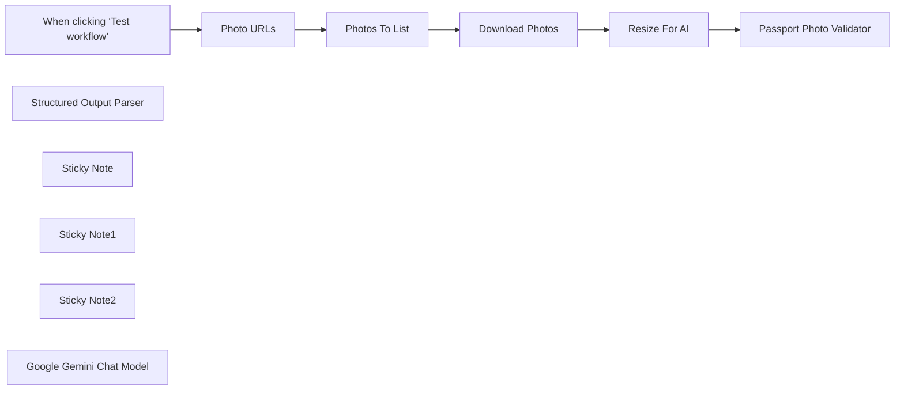

## Fluxo (.json) :

```json
{
  "meta": {
    "instanceId": "408f9fb9940c3cb18ffdef0e0150fe342d6e655c3a9fac21f0f644e8bedabcd9"
  },
  "nodes": [
    {
      "id": "6c78b4c7-993b-410d-93e7-e11b3052e53b",
      "name": "When clicking ‘Test workflow’",
      "type": "n8n-nodes-base.manualTrigger",
      "position": [
        0,
        420
      ],
      "parameters": {},
      "typeVersion": 1
    },
    {
      "id": "c2ab6497-6d6d-483b-bd43-494ae95394c0",
      "name": "Structured Output Parser",
      "type": "@n8n/n8n-nodes-langchain.outputParserStructured",
      "position": [
        1440,
        600
      ],
      "parameters": {
        "schemaType": "manual",
        "inputSchema": "{\n\t\"type\": \"object\",\n\t\"properties\": {\n\t\t\"is_valid\": { \"type\": \"boolean\" },\n \"photo_description\": {\n \"type\": \"string\",\n \"description\": \"describe the appearance of the person(s), object(s) if any and the background in the image. Mention any colours of each if possible.\"\n },\n\t\t\"reasons\": {\n \"type\": \"array\",\n \"items\": { \"type\": \"string\" }\n }\n\t}\n}"
      },
      "typeVersion": 1.2
    },
    {
      "id": "b23f5298-17c7-49ac-a8ca-78e006b2d294",
      "name": "Photo URLs",
      "type": "n8n-nodes-base.set",
      "position": [
        360,
        380
      ],
      "parameters": {
        "options": {},
        "assignments": {
          "assignments": [
            {
              "id": "6baa3e08-8957-454e-8ee9-d5414a0ff990",
              "name": "data",
              "type": "array",
              "value": "={{\n[\n{\n \"name\": \"portrait_1\",\n \"url\": \"https://drive.google.com/file/d/1zs963iFkO-3g2rKak8Hcy555h55D8gjF/view?usp=sharing\"\n},\n{\n \"name\": \"portrait_2\",\n \"url\": \"https://drive.google.com/file/d/19FyDcs68dZauQSEf6SEulJMag51SPsFy/view?usp=sharing\"\n},\n{\n \"name\": \"portrait_3\",\n \"url\": \"https://drive.google.com/file/d/1gbXjfNYE7Tvuw_riFmHMKoqPPu696VfW/view?usp=sharing\",\n\n},\n{\n \"name\": \"portrait_4\",\n \"url\": \"https://drive.google.com/file/d/1s19hYdxgfMkrnU25l6YIDq-myQr1tQMa/view?usp=sharing\"\n},\n{\n \"name\": \"portrait_5\",\n \"url\": \"https://drive.google.com/file/d/193FqIXJWAKj6O2SmOj3cLBfypHBkgdI5/view?usp=sharing\"\n}\n]\n}}"
            }
          ]
        }
      },
      "typeVersion": 3.4
    },
    {
      "id": "8d445f73-dff7-485b-87e2-5b64da09cbf0",
      "name": "Photos To List",
      "type": "n8n-nodes-base.splitOut",
      "position": [
        520,
        380
      ],
      "parameters": {
        "options": {},
        "fieldToSplitOut": "data"
      },
      "typeVersion": 1
    },
    {
      "id": "7fb3b829-88a7-42ec-abfd-3ddaa042c916",
      "name": "Download Photos",
      "type": "n8n-nodes-base.googleDrive",
      "position": [
        680,
        380
      ],
      "parameters": {
        "fileId": {
          "__rl": true,
          "mode": "url",
          "value": "={{ $json.url }}"
        },
        "options": {},
        "operation": "download"
      },
      "credentials": {
        "googleDriveOAuth2Api": {
          "id": "yOwz41gMQclOadgu",
          "name": "Google Drive account"
        }
      },
      "typeVersion": 3
    },
    {
      "id": "b8644f6d-691f-49bc-b0fe-33a68c59638d",
      "name": "Resize For AI",
      "type": "n8n-nodes-base.editImage",
      "position": [
        1060,
        440
      ],
      "parameters": {
        "width": 1024,
        "height": 1024,
        "options": {},
        "operation": "resize",
        "resizeOption": "onlyIfLarger"
      },
      "typeVersion": 1
    },
    {
      "id": "ecb266f2-0d2d-4cbe-a641-26735f0bdf18",
      "name": "Sticky Note",
      "type": "n8n-nodes-base.stickyNote",
      "position": [
        280,
        180
      ],
      "parameters": {
        "color": 7,
        "width": 594,
        "height": 438,
        "content": "## 1. Import Photos To Validate\n[Read more about using Google Drive](https://docs.n8n.io/integrations/builtin/app-nodes/n8n-nodes-base.googledrive)\n\nIn this demonstration, we'll import 5 different portraits to test our AI vision model. For convenience, we'll use Google Drive but feel free to swap this out for other sources such as other storage or by using webhooks."
      },
      "typeVersion": 1
    },
    {
      "id": "a1034923-0905-4cdd-a6bf-21d28aa3dd71",
      "name": "Sticky Note1",
      "type": "n8n-nodes-base.stickyNote",
      "position": [
        900,
        180
      ],
      "parameters": {
        "color": 7,
        "width": 774,
        "height": 589.25,
        "content": "## 2. Verify Passport Photo Validity Using AI Vision Model\n[Learn more about Basic LLM Chain](https://docs.n8n.io/integrations/builtin/cluster-nodes/root-nodes/n8n-nodes-langchain.chainllm)\n\nVerifying if a photo is suitable for a passport photo is a great use-case for AI vision and to automate the process is an equally great use-case for using n8n. Here's we've pasted in the UK governments guidelines copied from gov.uk and have asked the AI to validate the incoming photos following those rules. A structured output parser is used to simplify the AI response which can be used to update a database or backend of your choosing."
      },
      "typeVersion": 1
    },
    {
      "id": "af231ee5-adff-4d27-ba5f-8c04ddd4892d",
      "name": "Sticky Note2",
      "type": "n8n-nodes-base.stickyNote",
      "position": [
        -140,
        0
      ],
      "parameters": {
        "width": 386,
        "height": 610.0104651162792,
        "content": "## Try It Out!\n\n### This workflow takes a portrait and verifies if it makes for a valid passport photo. It achieves this by using an AI vision model following the UK government guidance.\n\nOpenAI's vision model was found to perform well for understanding photographs and so is recommended for this type of workflow. However, any capable vision model should work.\n\n### Need Help?\nJoin the [Discord](https://discord.com/invite/XPKeKXeB7d) or ask in the [Forum](https://community.n8n.io/)!"
      },
      "typeVersion": 1
    },
    {
      "id": "e07e1655-2683-4e21-b2b7-e0c0bfb569c0",
      "name": "Passport Photo Validator",
      "type": "@n8n/n8n-nodes-langchain.chainLlm",
      "position": [
        1240,
        440
      ],
      "parameters": {
        "text": "Assess if the image is a valid according to the passport photo criteria as set by the UK Government.",
        "messages": {
          "messageValues": [
            {
              "message": "=You help verify passport photo validity.\n\n## Rules for digital photos\nhttps://www.gov.uk/photos-for-passports\n\n### The quality of your digital photo\nYour photo must be:\n* clear and in focus\n* in colour\n* unaltered by computer software\n* at least 600 pixels wide and 750 pixels tall\n* at least 50KB and no more than 10MB\n\n### What your digital photo must show\nThe digital photo must:\n* contain no other objects or people\n* be taken against a plain white or light-coloured background\n* be in clear contrast to the background\n* not have ‘red eye’\n* If you’re using a photo taken on your own device, include your head, shoulders and upper body. Do not crop your photo - it will be done for you.\n\nIn your photo you must:\n* be facing forwards and looking straight at the camera\n* have a plain expression and your mouth closed\n* have your eyes open and visible\n* not have hair in front of your eyes\n* not have a head covering (unless it’s for religious or medical reasons)\n* not have anything covering your face\n* not have any shadows on your face or behind you - shadows on light background are okay\n* Do not wear glasses in your photo unless you have to do so. If you must wear glasses, they cannot be sunglasses or tinted glasses, and you must make sure your eyes are not covered by the frames or any glare, reflection or shadow.\n\n### Photos of babies and children\n* Children must be on their own in the picture. Babies must not be holding toys or using dummies.\n* Children under 6 do not have to be looking directly at the camera or have a plain expression.\n* Children under one do not have to have their eyes open. You can support their head with your hand, but your hand must not be visible in the photo.\n* Children under one should lie on a plain light-coloured sheet. Take the photo from above.\n\n"
            },
            {
              "type": "HumanMessagePromptTemplate",
              "messageType": "imageBinary"
            }
          ]
        },
        "promptType": "define",
        "hasOutputParser": true
      },
      "typeVersion": 1.4
    },
    {
      "id": "0a36ba22-90b2-4abf-943b-c1cc8e7317d5",
      "name": "Google Gemini Chat Model",
      "type": "@n8n/n8n-nodes-langchain.lmChatGoogleGemini",
      "position": [
        1240,
        600
      ],
      "parameters": {
        "options": {},
        "modelName": "models/gemini-1.5-pro-latest"
      },
      "credentials": {
        "googlePalmApi": {
          "id": "dSxo6ns5wn658r8N",
          "name": "Google Gemini(PaLM) Api account"
        }
      },
      "typeVersion": 1
    }
  ],
  "pinData": {},
  "connections": {
    "Photo URLs": {
      "main": [
        [
          {
            "node": "Photos To List",
            "type": "main",
            "index": 0
          }
        ]
      ]
    },
    "Resize For AI": {
      "main": [
        [
          {
            "node": "Passport Photo Validator",
            "type": "main",
            "index": 0
          }
        ]
      ]
    },
    "Photos To List": {
      "main": [
        [
          {
            "node": "Download Photos",
            "type": "main",
            "index": 0
          }
        ]
      ]
    },
    "Download Photos": {
      "main": [
        [
          {
            "node": "Resize For AI",
            "type": "main",
            "index": 0
          }
        ]
      ]
    },
    "Google Gemini Chat Model": {
      "ai_languageModel": [
        [
          {
            "node": "Passport Photo Validator",
            "type": "ai_languageModel",
            "index": 0
          }
        ]
      ]
    },
    "Structured Output Parser": {
      "ai_outputParser": [
        [
          {
            "node": "Passport Photo Validator",
            "type": "ai_outputParser",
            "index": 0
          }
        ]
      ]
    },
    "When clicking ‘Test workflow’": {
      "main": [
        [
          {
            "node": "Photo URLs",
            "type": "main",
            "index": 0
          }
        ]
      ]
    }
  }
}
```

<a id="template-694"></a>

## Template 694 - Processamento de PDFs com Adobe PDF Services

- **Nome:** Processamento de PDFs com Adobe PDF Services
- **Descrição:** Fluxo que autentica, envia PDFs para a Adobe, solicita operações (por exemplo extração ou divisão), aguarda o processamento e obtém o resultado final.
- **Funcionalidade:** • Autenticação com Adobe: obtém token usando credenciais em formato form-urlencoded.
• Upload de asset: cria um asset na Adobe e envia o arquivo PDF para processamento.
• Suporte a payloads dinâmicos: recebe um campo 'endpoint' e um 'json_payload' para executar diferentes operações (extractpdf, splitpdf, etc.).
• Integração com armazenamento externo: carrega arquivo de teste a partir do Dropbox.
• Envio da operação de processamento: combina assetID com o payload e chama o endpoint de operação apropriado.
• Polling/espera e tentativas de download: espera por alguns segundos e tenta baixar o resultado até a operação ser concluída.
• Tratamento de status: detecta estados como 'in progress' e 'failed' e age conforme o resultado.
• Encaminhamento de resposta: retorna a resposta final ao fluxo originador ou consumidor.
• Uso de credenciais separadas: diferencia credencial para obter token e credencial baseada em cabeçalho para chamadas subsequentes.
- **Ferramentas:** • Adobe PDF Services API: serviço para autenticação, upload de assets e execução de operações em PDFs (extração, divisão, geração de renditions, etc.).
• Dropbox: provê o PDF de teste via download a partir de armazenamento em nuvem.

## Fluxo visual

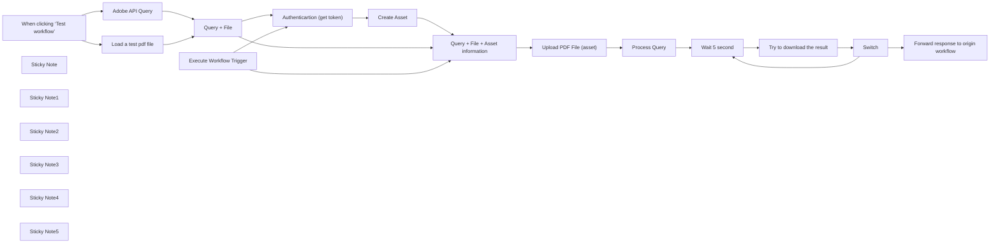

## Fluxo (.json) :

```json
{
  "meta": {
    "instanceId": "cd478e616d2616186f4f92b70cfe0c2ed95b5b209f749f2b873b38bdc56c47c9"
  },
  "nodes": [
    {
      "id": "f4b1bdd8-654d-4643-a004-ff1b2f32b5ae",
      "name": "When clicking ‘Test workflow’",
      "type": "n8n-nodes-base.manualTrigger",
      "position": [
        580,
        1100
      ],
      "parameters": {},
      "typeVersion": 1
    },
    {
      "id": "d6b1c410-81c3-486d-bdcb-86a4c6f7bf9e",
      "name": "Create Asset",
      "type": "n8n-nodes-base.httpRequest",
      "position": [
        1940,
        580
      ],
      "parameters": {
        "url": "https://pdf-services.adobe.io/assets",
        "method": "POST",
        "options": {
          "redirect": {
            "redirect": {}
          }
        },
        "sendBody": true,
        "sendHeaders": true,
        "authentication": "genericCredentialType",
        "bodyParameters": {
          "parameters": [
            {
              "name": "mediaType",
              "value": "application/pdf"
            }
          ]
        },
        "genericAuthType": "httpHeaderAuth",
        "headerParameters": {
          "parameters": [
            {
              "name": "Authorization",
              "value": "=Bearer {{ $json.access_token }}"
            }
          ]
        }
      },
      "credentials": {
        "httpHeaderAuth": {
          "id": "PU8GmSwXswwM1Fzq",
          "name": "Adobe API calls"
        }
      },
      "typeVersion": 4.1
    },
    {
      "id": "9e900a45-d792-4dc5-938c-0d5cdfd2e647",
      "name": "Execute Workflow Trigger",
      "type": "n8n-nodes-base.executeWorkflowTrigger",
      "position": [
        1140,
        440
      ],
      "parameters": {},
      "typeVersion": 1
    },
    {
      "id": "859f369d-f36f-4c3f-a50d-a17214fef2a3",
      "name": "Sticky Note",
      "type": "n8n-nodes-base.stickyNote",
      "position": [
        20,
        140
      ],
      "parameters": {
        "color": 5,
        "width": 667.6107231291055,
        "height": 715.2927406867177,
        "content": "# Adobe API Wrapper\n\nSee Adobe documentation:\n- https://developer.adobe.com/document-services/docs/overview/pdf-services-api/howtos/\n- https://developer.adobe.com/document-services/docs/overview/pdf-extract-api/gettingstarted/\n\nIn short, this workflow does the following steps :\n\n- Authentication\n- Upload an asset (pdf) to adobe\n- Wait for the asset to be processed by Adobe\n- Download the result\n\n## Credential\n\nCredentials are not \"predefined\" and you'll have to create 2 custom credentials, detailed in the workflow.\n\n## Result\n\nThe result will depend on the transformation requested. It could be 1 of various files (json, zip...) accessible via download URL returned by the workflow.\n\nWorkflow can be tested with a PDF filed fetched with Dorpbox for example or any storage provider. "
      },
      "typeVersion": 1
    },
    {
      "id": "450199c5-e588-486d-81cf-eb69cf729ab1",
      "name": "Sticky Note1",
      "type": "n8n-nodes-base.stickyNote",
      "position": [
        560,
        900
      ],
      "parameters": {
        "width": 857.2064431277577,
        "height": 463.937514110429,
        "content": "## Testing for development"
      },
      "typeVersion": 1
    },
    {
      "id": "311a75d6-4fbe-4d8f-89b3-d4b0ee21f7ae",
      "name": "Adobe API Query",
      "type": "n8n-nodes-base.set",
      "position": [
        900,
        1000
      ],
      "parameters": {
        "options": {},
        "assignments": {
          "assignments": [
            {
              "id": "62bb6466-acf4-41e5-9444-c9ef608a6822",
              "name": "endpoint",
              "type": "string",
              "value": "extractpdf"
            },
            {
              "id": "0352f585-1434-4ab7-a704-a1e187fffa96",
              "name": "json_payload",
              "type": "object",
              "value": "={{ \n{\n      \"renditionsToExtract\": [\n        \"tables\"\n       ],\n      \"elementsToExtract\": [\n        \"text\",\n        \"tables\"\n     ]\n   }\n}}"
            }
          ]
        }
      },
      "typeVersion": 3.4
    },
    {
      "id": "abf20778-db50-4787-a5f4-7af5d5c76efe",
      "name": "Load a test pdf file",
      "type": "n8n-nodes-base.dropbox",
      "position": [
        900,
        1180
      ],
      "parameters": {
        "path": "/valerian/w/prod/_freelance/ADEZIF/AI/Source data/Brochures pour GPT/Brochure 3M/3M_doc_emballage VERSION FINALE.pdf",
        "operation": "download",
        "authentication": "oAuth2"
      },
      "credentials": {
        "dropboxOAuth2Api": {
          "id": "9",
          "name": "Dropbox account"
        }
      },
      "typeVersion": 1
    },
    {
      "id": "8bb2ae0c-df61-4110-af44-b1040b4340a2",
      "name": "Query + File",
      "type": "n8n-nodes-base.merge",
      "position": [
        1180,
        1080
      ],
      "parameters": {
        "mode": "combine",
        "options": {},
        "combinationMode": "mergeByPosition"
      },
      "typeVersion": 2.1
    },
    {
      "id": "92afa6d6-daf8-4358-8c95-36473b810dc2",
      "name": "Query + File + Asset information",
      "type": "n8n-nodes-base.merge",
      "position": [
        2180,
        580
      ],
      "parameters": {
        "mode": "combine",
        "options": {},
        "combinationMode": "mergeByPosition"
      },
      "typeVersion": 2.1
    },
    {
      "id": "5d88b8e4-0b0a-463a-88db-c45d5e87e823",
      "name": "Process Query",
      "type": "n8n-nodes-base.httpRequest",
      "position": [
        2640,
        580
      ],
      "parameters": {
        "url": "=https://pdf-services.adobe.io/operation/{{ $('Query + File + Asset information').item.json.endpoint }}",
        "method": "POST",
        "options": {
          "redirect": {
            "redirect": {}
          },
          "response": {
            "response": {
              "fullResponse": true
            }
          }
        },
        "jsonBody": "={{ \n{\n...{ \"assetID\":$('Query + File + Asset information').first().json.assetID },\n...$('Query + File + Asset information').first().json.json_payload\n}\n}}",
        "sendBody": true,
        "sendHeaders": true,
        "specifyBody": "json",
        "authentication": "genericCredentialType",
        "genericAuthType": "httpHeaderAuth",
        "headerParameters": {
          "parameters": [
            {
              "name": "Authorization",
              "value": "=Bearer {{ $('Authenticartion (get token)').first().json[\"access_token\"] }}"
            }
          ]
        }
      },
      "credentials": {
        "httpHeaderAuth": {
          "id": "PU8GmSwXswwM1Fzq",
          "name": "Adobe API calls"
        }
      },
      "typeVersion": 4.1
    },
    {
      "id": "47278b2f-dd04-4609-90ab-52f34b9a0e72",
      "name": "Wait 5 second",
      "type": "n8n-nodes-base.wait",
      "position": [
        2860,
        580
      ],
      "webhookId": "ed00a9a8-d599-4a98-86f8-a15176352c0a",
      "parameters": {
        "unit": "seconds",
        "amount": 5
      },
      "typeVersion": 1
    },
    {
      "id": "691b52ae-132a-4105-b1e4-bb7d55d0e347",
      "name": "Try to download the result",
      "type": "n8n-nodes-base.httpRequest",
      "position": [
        3080,
        580
      ],
      "parameters": {
        "url": "={{ $('Process Query').item.json[\"headers\"][\"location\"] }}",
        "options": {},
        "sendHeaders": true,
        "authentication": "genericCredentialType",
        "genericAuthType": "httpHeaderAuth",
        "headerParameters": {
          "parameters": [
            {
              "name": "Authorization",
              "value": "=Bearer {{ $('Authenticartion (get token)').first().json[\"access_token\"] }}"
            }
          ]
        }
      },
      "credentials": {
        "httpHeaderAuth": {
          "id": "PU8GmSwXswwM1Fzq",
          "name": "Adobe API calls"
        }
      },
      "typeVersion": 4.1
    },
    {
      "id": "277dea14-de8d-4719-aff1-f4008d6d5c67",
      "name": "Switch",
      "type": "n8n-nodes-base.switch",
      "position": [
        3260,
        580
      ],
      "parameters": {
        "rules": {
          "values": [
            {
              "outputKey": "in progress",
              "conditions": {
                "options": {
                  "leftValue": "",
                  "caseSensitive": true,
                  "typeValidation": "strict"
                },
                "combinator": "and",
                "conditions": [
                  {
                    "operator": {
                      "type": "string",
                      "operation": "equals"
                    },
                    "leftValue": "={{ $json.status }}",
                    "rightValue": "in progress"
                  }
                ]
              },
              "renameOutput": true
            },
            {
              "outputKey": "failed",
              "conditions": {
                "options": {
                  "leftValue": "",
                  "caseSensitive": true,
                  "typeValidation": "strict"
                },
                "combinator": "and",
                "conditions": [
                  {
                    "id": "6d6917f6-abb9-4175-a070-a2f500d9f34f",
                    "operator": {
                      "name": "filter.operator.equals",
                      "type": "string",
                      "operation": "equals"
                    },
                    "leftValue": "={{ $json.status }}",
                    "rightValue": "failed"
                  }
                ]
              },
              "renameOutput": true
            }
          ]
        },
        "options": {
          "fallbackOutput": "extra"
        }
      },
      "typeVersion": 3
    },
    {
      "id": "8f6f8273-43ed-4a44-bb27-6ce137000472",
      "name": "Forward response to origin workflow",
      "type": "n8n-nodes-base.set",
      "position": [
        3820,
        600
      ],
      "parameters": {
        "options": {},
        "assignments": {
          "assignments": []
        },
        "includeOtherFields": true
      },
      "typeVersion": 3.4
    },
    {
      "id": "00e2d7e3-94cd-49e5-a975-2fdc1a7a95fd",
      "name": "Sticky Note2",
      "type": "n8n-nodes-base.stickyNote",
      "position": [
        2780,
        480
      ],
      "parameters": {
        "width": 741.3069226712129,
        "height": 336.57433650102917,
        "content": "## Wait for file do be processed"
      },
      "typeVersion": 1
    },
    {
      "id": "3667b1ba-b9a6-4e1a-94b1-61b37f1e7adc",
      "name": "Sticky Note3",
      "type": "n8n-nodes-base.stickyNote",
      "position": [
        1324.6733934850213,
        147.59707015795897
      ],
      "parameters": {
        "color": 5,
        "width": 402.63171535688423,
        "height": 700.9473619571734,
        "content": "### 1- Credential for token request\n\nCreate a \"Custom Auth\" credential like this :\n\n```\n{\n  \"headers\": {\n    \"Content-Type\":\"application/x-www-form-urlencoded\"\n  }, \n  \"body\" : {\n      \"client_id\": \"****\", \n      \"client_secret\":\"****\"\n  }\n}\n```"
      },
      "typeVersion": 1
    },
    {
      "id": "718bb738-8ce4-4b38-94e4-6ccac1adf9ec",
      "name": "Sticky Note4",
      "type": "n8n-nodes-base.stickyNote",
      "position": [
        1800,
        152.6219700851708
      ],
      "parameters": {
        "color": 5,
        "width": 1752.5923360342827,
        "height": 692.0175575715904,
        "content": "### 2- Credential for all other Queries\n\nCreate a \"Header Auth\" credential like this : \n\n```\nX-API-Key: **** (same value as client_id)\n```"
      },
      "typeVersion": 1
    },
    {
      "id": "d6bc8011-699d-4388-82f5-e5f90ba8672a",
      "name": "Sticky Note5",
      "type": "n8n-nodes-base.stickyNote",
      "position": [
        740,
        140
      ],
      "parameters": {
        "color": 5,
        "width": 529.7500231395039,
        "height": 718.8735380890446,
        "content": "## Workflow Input\n\n- endpoint: splitpdf, extractpdf, ...\n- json_payload : all endpoint payload except assetID which is handled in current workflow\n- **PDF Data as n8n Binary**\n\n\n### Example for **split** : \n\n```\n{\n   \"endpoint\": \"splitpdf\",\n   \"json_payload\": {\n      \"splitoption\": \n         { \"pageRanges\": [{\"start\": 1,\"end\": 2}]}\n       }\n    }\n}\n```\n\n### Example for **extractpdf**\n\n```\n{\n   \"endpoint\": \"splitpdf\",\n   \"json_payload\": {\n      \"renditionsToExtract\": [\n        \"tables\"\n       ],\n      \"elementsToExtract\": [\n        \"text\",\n        \"tables\"\n     ]\n   }\n}\n```"
      },
      "typeVersion": 1
    },
    {
      "id": "2bbf6d9d-8399-49ba-94ea-b90795ef44ba",
      "name": "Authenticartion (get token)",
      "type": "n8n-nodes-base.httpRequest",
      "position": [
        1500,
        580
      ],
      "parameters": {
        "url": "https://pdf-services.adobe.io/token",
        "method": "POST",
        "options": {},
        "sendBody": true,
        "contentType": "form-urlencoded",
        "authentication": "genericCredentialType",
        "bodyParameters": {
          "parameters": [
            {}
          ]
        },
        "genericAuthType": "httpCustomAuth"
      },
      "credentials": {
        "httpCustomAuth": {
          "id": "djeOoXpBafK4aiGX",
          "name": "Adobe API"
        }
      },
      "typeVersion": 4.1
    },
    {
      "id": "be4e87e8-6e56-408f-b932-320023382f98",
      "name": "Upload PDF File (asset)",
      "type": "n8n-nodes-base.httpRequest",
      "position": [
        2440,
        580
      ],
      "parameters": {
        "url": "={{ $json.uploadUri }}",
        "method": "PUT",
        "options": {
          "redirect": {
            "redirect": {}
          }
        },
        "sendBody": true,
        "sendQuery": true,
        "contentType": "binaryData",
        "queryParameters": {
          "parameters": [
            {}
          ]
        },
        "inputDataFieldName": "data"
      },
      "typeVersion": 4.1
    }
  ],
  "pinData": {},
  "connections": {
    "Switch": {
      "main": [
        [
          {
            "node": "Wait 5 second",
            "type": "main",
            "index": 0
          }
        ],
        [
          {
            "node": "Forward response to origin workflow",
            "type": "main",
            "index": 0
          }
        ],
        [
          {
            "node": "Forward response to origin workflow",
            "type": "main",
            "index": 0
          }
        ]
      ]
    },
    "Create Asset": {
      "main": [
        [
          {
            "node": "Query + File + Asset information",
            "type": "main",
            "index": 1
          }
        ]
      ]
    },
    "Query + File": {
      "main": [
        [
          {
            "node": "Authenticartion (get token)",
            "type": "main",
            "index": 0
          },
          {
            "node": "Query + File + Asset information",
            "type": "main",
            "index": 0
          }
        ]
      ]
    },
    "Process Query": {
      "main": [
        [
          {
            "node": "Wait 5 second",
            "type": "main",
            "index": 0
          }
        ]
      ]
    },
    "Wait 5 second": {
      "main": [
        [
          {
            "node": "Try to download the result",
            "type": "main",
            "index": 0
          }
        ]
      ]
    },
    "Adobe API Query": {
      "main": [
        [
          {
            "node": "Query + File",
            "type": "main",
            "index": 0
          }
        ]
      ]
    },
    "Load a test pdf file": {
      "main": [
        [
          {
            "node": "Query + File",
            "type": "main",
            "index": 1
          }
        ]
      ]
    },
    "Upload PDF File (asset)": {
      "main": [
        [
          {
            "node": "Process Query",
            "type": "main",
            "index": 0
          }
        ]
      ]
    },
    "Execute Workflow Trigger": {
      "main": [
        [
          {
            "node": "Authenticartion (get token)",
            "type": "main",
            "index": 0
          },
          {
            "node": "Query + File + Asset information",
            "type": "main",
            "index": 0
          }
        ]
      ]
    },
    "Try to download the result": {
      "main": [
        [
          {
            "node": "Switch",
            "type": "main",
            "index": 0
          }
        ]
      ]
    },
    "Authenticartion (get token)": {
      "main": [
        [
          {
            "node": "Create Asset",
            "type": "main",
            "index": 0
          }
        ]
      ]
    },
    "Query + File + Asset information": {
      "main": [
        [
          {
            "node": "Upload PDF File (asset)",
            "type": "main",
            "index": 0
          }
        ]
      ]
    },
    "When clicking ‘Test workflow’": {
      "main": [
        [
          {
            "node": "Load a test pdf file",
            "type": "main",
            "index": 0
          },
          {
            "node": "Adobe API Query",
            "type": "main",
            "index": 0
          }
        ]
      ]
    }
  }
}
```

<a id="template-695"></a>

## Template 695 - Notificação por email de novo arquivo

- **Nome:** Notificação por email de novo arquivo
- **Descrição:** Envia um email de notificação quando um novo arquivo é criado em uma pasta específica do Google Drive.
- **Funcionalidade:** • Monitoramento de pasta específica: Observa uma pasta do Google Drive definida por ID para novos arquivos.
• Detecção de criação de arquivos: Dispara a automação quando um arquivo é criado na pasta monitorada.
• Envio de email de notificação: Envia um email com assunto configurado e corpo que inclui o nome do arquivo criado.
• Destinatário e remetente configuráveis: Usa credenciais de servidor SMTP para enviar o email ao destinatário definido.
- **Ferramentas:** • Google Drive: Serviço de armazenamento em nuvem onde a pasta é monitorada para novos arquivos.
• Servidor SMTP/Email: Serviço utilizado para enviar os emails de notificação para os destinatários configurados.

## Fluxo visual


## Fluxo (.json) :

```json
{
  "nodes": [
    {
      "name": "Google Drive Trigger",
      "type": "n8n-nodes-base.googleDriveTrigger",
      "position": [
        250,
        150
      ],
      "parameters": {
        "event": "fileCreated",
        "options": {},
        "triggerOn": "specificFolder",
        "folderToWatch": "1HwOAKkkgveLji8vVpW9Xrg1EsBskwMNb"
      },
      "credentials": {
        "googleDriveOAuth2Api": {
          "id": "28",
          "name": "Google Drive account"
        }
      },
      "typeVersion": 1
    },
    {
      "name": "Send Email",
      "type": "n8n-nodes-base.emailSend",
      "position": [
        450,
        150
      ],
      "parameters": {
        "text": "=A file in your Google Drive file folder has been created: {{$json[\"name\"]}}",
        "options": {},
        "subject": "File Update",
        "toEmail": "mutedjam@n8n.io",
        "fromEmail": "mutedjam@n8n.io"
      },
      "credentials": {
        "smtp": {
          "id": "14",
          "name": "SMTP account"
        }
      },
      "typeVersion": 1
    }
  ],
  "connections": {
    "Google Drive Trigger": {
      "main": [
        [
          {
            "node": "Send Email",
            "type": "main",
            "index": 0
          }
        ]
      ]
    }
  }
}
```

<a id="template-696"></a>

## Template 696 - Raspador autônomo de perfis sociais

- **Nome:** Raspador autônomo de perfis sociais
- **Descrição:** Automatiza a navegação e extração de links de perfis de redes sociais a partir de websites informados, agregando e salvando os resultados em um banco de dados.
- **Funcionalidade:** • Obtenção de empresas do banco de dados: Recupera nomes e websites para processar automaticamente.
• Normalização de domínio: Ajusta e padroniza URLs adicionando protocolo quando necessário.
• Agente AI de rastreamento: Usa um agente baseado em modelo de linguagem para coordenar a coleta de texto e links do site.
• Extração de texto e links: Coleta o conteúdo textual da página e lista de URLs presentes para análise adicional.
• Navegação e descoberta adicional: Utiliza URLs encontradas para explorar páginas adicionais do domínio em busca de perfis sociais.
• Filtragem e validação: Remove links vazios e inválidos e deduplica URLs antes da agregação.
• Conversão de HTML para texto legível: Converte conteúdo HTML em markdown/texto para facilitar extração de informações.
• Agregação e inserção: Consolida os resultados em formato unificado e insere novas linhas no banco de dados de saída.
• Tolerância a falhas e repetição: Possui tentativas de reexecução em caso de falhas durante o processo de rastreamento.
- **Ferramentas:** • OpenAI (modelo GPT-4o): Motor de linguagem usado como agente para orientar o rastreamento e interpretar resultados.
• Supabase: Banco de dados usado para obter entradas (empresas) e gravar os resultados extraídos.
• HTTP/HTML retrieval e parsing: Recuperação de páginas web e extração de links e conteúdo textual das páginas.
• Serviço de proxy (opcional): Melhora a precisão e robustez do crawling ao acessar sites que limitam requisições diretas.


## Fluxo visual

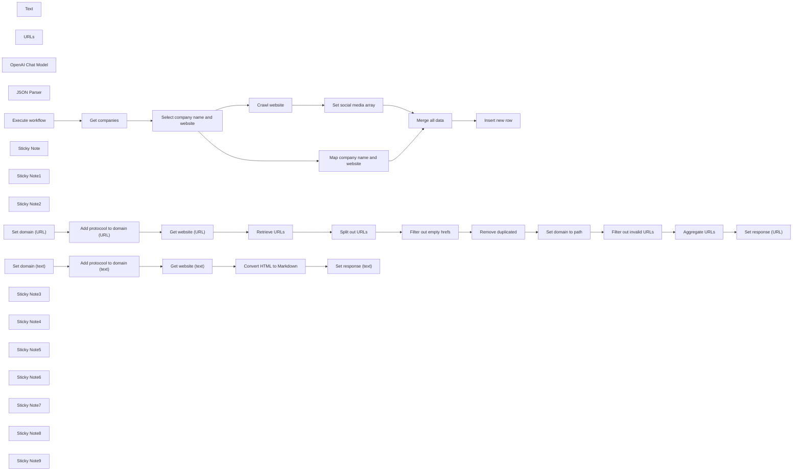

## Fluxo (.json) :

```json
{
  "nodes": [
    {
      "id": "6cdc45e5-1fa4-47fe-b80a-0e1560996936",
      "name": "Text",
      "type": "@n8n/n8n-nodes-langchain.toolWorkflow",
      "position": [
        1460,
        980
      ],
      "parameters": {
        "name": "text_retrieval_tool",
        "source": "parameter",
        "description": "Call this tool to return all text from the given website. Query should be full website URL.",
        "workflowJson": "{\n \"nodes\": [\n {\n \"parameters\": {},\n \"id\": \"05107436-c9cb-419b-ae8a-b74d309a130d\",\n \"name\": \"Execute workflow\",\n \"type\": \"n8n-nodes-base.manualTrigger\",\n \"typeVersion\": 1,\n \"position\": [\n 2220,\n 620\n ]\n },\n {\n \"parameters\": {\n \"assignments\": {\n \"assignments\": [\n {\n \"id\": \"253c2b17-c749-4f0a-93e8-5ff74f1ce49b\",\n \"name\": \"domain\",\n \"value\": \"={{ $json.query }}\",\n \"type\": \"string\"\n }\n ]\n },\n \"options\": {}\n },\n \"id\": \"bb8be616-3227-4705-8520-1827069faacd\",\n \"name\": \"Set domain\",\n \"type\": \"n8n-nodes-base.set\",\n \"typeVersion\": 3.3,\n \"position\": [\n 2440,\n 620\n ]\n },\n {\n \"parameters\": {\n \"assignments\": {\n \"assignments\": [\n {\n \"id\": \"ed0f1505-82b6-4393-a0d8-088055137ec9\",\n \"name\": \"domain\",\n \"value\": \"={{ $json.domain.startsWith(\\\"http\\\") ? $json.domain : \\\"http://\\\" + $json.domain }}\",\n \"type\": \"string\"\n }\n ]\n },\n \"options\": {}\n },\n \"id\": \"bdf29340-f135-489f-848e-1c7fa43a01df\",\n \"name\": \"Add protocool to domain\",\n \"type\": \"n8n-nodes-base.set\",\n \"typeVersion\": 3.3,\n \"position\": [\n 2640,\n 620\n ]\n },\n {\n \"parameters\": {\n \"assignments\": {\n \"assignments\": [\n {\n \"id\": \"2b1c7ff8-06a7-448b-99b7-5ede4b2e0bf0\",\n \"name\": \"response\",\n \"value\": \"={{ $json.data }}\",\n \"type\": \"string\"\n }\n ]\n },\n \"options\": {}\n },\n \"id\": \"9f0aa264-08c1-459a-bb99-e28599fe8f76\",\n \"name\": \"Set response\",\n \"type\": \"n8n-nodes-base.set\",\n \"typeVersion\": 3.3,\n \"position\": [\n 3300,\n 620\n ]\n },\n {\n \"parameters\": {\n \"url\": \"={{ $json.domain }}\",\n \"options\": {}\n },\n \"id\": \"cec7c8e8-bf5e-43d5-aa41-876293dbec78\",\n \"name\": \"Get website\",\n \"type\": \"n8n-nodes-base.httpRequest\",\n \"typeVersion\": 4.2,\n \"position\": [\n 2860,\n 620\n ]\n },\n {\n \"parameters\": {\n \"html\": \"={{ $json.data }}\",\n \"options\": {\n \"ignore\": \"a,img\"\n }\n },\n \"id\": \"1af94fcb-bca3-45c4-9277-18878c75d417\",\n \"name\": \"Convert HTML to Markdown\",\n \"type\": \"n8n-nodes-base.markdown\",\n \"typeVersion\": 1,\n \"position\": [\n 3080,\n 620\n ]\n }\n ],\n \"connections\": {\n \"Execute workflow\": {\n \"main\": [\n [\n {\n \"node\": \"Set domain\",\n \"type\": \"main\",\n \"index\": 0\n }\n ]\n ]\n },\n \"Set domain\": {\n \"main\": [\n [\n {\n \"node\": \"Add protocool to domain\",\n \"type\": \"main\",\n \"index\": 0\n }\n ]\n ]\n },\n \"Add protocool to domain\": {\n \"main\": [\n [\n {\n \"node\": \"Get website\",\n \"type\": \"main\",\n \"index\": 0\n }\n ]\n ]\n },\n \"Get website\": {\n \"main\": [\n [\n {\n \"node\": \"Convert HTML to Markdown\",\n \"type\": \"main\",\n \"index\": 0\n }\n ]\n ]\n },\n \"Convert HTML to Markdown\": {\n \"main\": [\n [\n {\n \"node\": \"Set response\",\n \"type\": \"main\",\n \"index\": 0\n }\n ]\n ]\n }\n },\n \"pinData\": {}\n}",
        "requestOptions": {}
      },
      "typeVersion": 1.1
    },
    {
      "id": "af8efccb-ba3c-44de-85f7-b932d7a2e3ca",
      "name": "URLs",
      "type": "@n8n/n8n-nodes-langchain.toolWorkflow",
      "position": [
        1640,
        980
      ],
      "parameters": {
        "name": "url_retrieval_tool",
        "source": "parameter",
        "description": "Call this tool to return all URLs from the given website. Query should be full website URL.",
        "workflowJson": "{\n \"nodes\": [\n {\n \"parameters\": {},\n \"id\": \"05107436-c9cb-419b-ae8a-b74d309a130d\",\n \"name\": \"Execute workflow\",\n \"type\": \"n8n-nodes-base.manualTrigger\",\n \"typeVersion\": 1,\n \"position\": [\n 2200,\n 740\n ]\n },\n {\n \"parameters\": {\n \"operation\": \"extractHtmlContent\",\n \"extractionValues\": {\n \"values\": [\n {\n \"key\": \"output\",\n \"cssSelector\": \"a\",\n \"returnValue\": \"attribute\",\n \"returnArray\": true\n }\n ]\n },\n \"options\": {}\n },\n \"id\": \"1972e13e-d923-45e8-9752-e4bf45faaccf\",\n \"name\": \"Retrieve URLs\",\n \"type\": \"n8n-nodes-base.html\",\n \"typeVersion\": 1.2,\n \"position\": [\n 3060,\n 740\n ]\n },\n {\n \"parameters\": {\n \"fieldToSplitOut\": \"output\",\n \"options\": {}\n },\n \"id\": \"19703fbc-05ff-4d80-ab53-85ba6d39fc3f\",\n \"name\": \"Split out URLs\",\n \"type\": \"n8n-nodes-base.splitOut\",\n \"typeVersion\": 1,\n \"position\": [\n 3280,\n 740\n ]\n },\n {\n \"parameters\": {\n \"compare\": \"selectedFields\",\n \"fieldsToCompare\": \"href\",\n \"options\": {}\n },\n \"id\": \"5cc988e7-de9b-4177-b5e7-edb3842202c8\",\n \"name\": \"Remove duplicated\",\n \"type\": \"n8n-nodes-base.removeDuplicates\",\n \"typeVersion\": 1,\n \"position\": [\n 3720,\n 740\n ]\n },\n {\n \"parameters\": {\n \"assignments\": {\n \"assignments\": [\n {\n \"id\": \"04ced063-09f0-496c-9b28-b8095f9e2297\",\n \"name\": \"href\",\n \"value\": \"={{ $json.href.startsWith(\\\"/\\\") ? $('Add protocool to domain (URL)').item.json[\\\"domain\\\"] + $json.href : $json.href }}\",\n \"type\": \"string\"\n }\n ]\n },\n \"includeOtherFields\": true,\n \"include\": \"selected\",\n \"includeFields\": \"title\",\n \"options\": {}\n },\n \"id\": \"4715a25d-93a7-4056-8768-e3f886a1a0c9\",\n \"name\": \"Set domain to path\",\n \"type\": \"n8n-nodes-base.set\",\n \"typeVersion\": 3.3,\n \"position\": [\n 3940,\n 740\n ]\n },\n {\n \"parameters\": {\n \"conditions\": {\n \"options\": {\n \"caseSensitive\": true,\n \"leftValue\": \"\",\n \"typeValidation\": \"strict\"\n },\n \"conditions\": [\n {\n \"id\": \"d01ea6a8-7e75-40d4-98f2-25d42b245f36\",\n \"leftValue\": \"={{ $json.href.isUrl() }}\",\n \"rightValue\": \"\",\n \"operator\": {\n \"type\": \"boolean\",\n \"operation\": \"true\",\n \"singleValue\": true\n }\n }\n ],\n \"combinator\": \"and\"\n },\n \"options\": {}\n },\n \"id\": \"353deefb-ae69-440c-95b6-fdadacf4bf91\",\n \"name\": \"Filter out invalid URLs\",\n \"type\": \"n8n-nodes-base.filter\",\n \"typeVersion\": 2,\n \"position\": [\n 4160,\n 740\n ]\n },\n {\n \"parameters\": {\n \"aggregate\": \"aggregateAllItemData\",\n \"include\": \"specifiedFields\",\n \"fieldsToInclude\": \"title,href\",\n \"options\": {}\n },\n \"id\": \"9f87be8c-72d7-4ab1-b297-dc7069b2dd11\",\n \"name\": \"Aggregate URLs\",\n \"type\": \"n8n-nodes-base.aggregate\",\n \"typeVersion\": 1,\n \"position\": [\n 4380,\n 740\n ]\n },\n {\n \"parameters\": {\n \"conditions\": {\n \"options\": {\n \"caseSensitive\": true,\n \"leftValue\": \"\",\n \"typeValidation\": \"strict\"\n },\n \"conditions\": [\n {\n \"id\": \"5b9b7353-bd04-4af2-9480-8de135ff4223\",\n \"leftValue\": \"={{ $json.href }}\",\n \"rightValue\": \"\",\n \"operator\": {\n \"type\": \"string\",\n \"operation\": \"exists\",\n \"singleValue\": true\n }\n }\n ],\n \"combinator\": \"and\"\n },\n \"options\": {}\n },\n \"id\": \"35c8323a-5350-403a-9c2d-114b0527e395\",\n \"name\": \"Filter out empty hrefs\",\n \"type\": \"n8n-nodes-base.filter\",\n \"typeVersion\": 2,\n \"position\": [\n 3500,\n 740\n ]\n },\n {\n \"parameters\": {\n \"assignments\": {\n \"assignments\": [\n {\n \"id\": \"253c2b17-c749-4f0a-93e8-5ff74f1ce49b\",\n \"name\": \"domain\",\n \"value\": \"={{ $json.query }}\",\n \"type\": \"string\"\n }\n ]\n },\n \"options\": {}\n },\n \"id\": \"d9f6a148-6c8c-4a58-89f5-4e9cfcd8d910\",\n \"name\": \"Set domain (URL)\",\n \"type\": \"n8n-nodes-base.set\",\n \"typeVersion\": 3.3,\n \"position\": [\n 2400,\n 740\n ]\n },\n {\n \"parameters\": {\n \"assignments\": {\n \"assignments\": [\n {\n \"id\": \"ed0f1505-82b6-4393-a0d8-088055137ec9\",\n \"name\": \"domain\",\n \"value\": \"={{ $json.domain.startsWith(\\\"http\\\") ? $json.domain : \\\"http://\\\" + $json.domain }}\",\n \"type\": \"string\"\n }\n ]\n },\n \"options\": {}\n },\n \"id\": \"1f974444-da58-4a47-a9c3-ba3091fc1e96\",\n \"name\": \"Add protocool to domain (URL)\",\n \"type\": \"n8n-nodes-base.set\",\n \"typeVersion\": 3.3,\n \"position\": [\n 2620,\n 740\n ]\n },\n {\n \"parameters\": {\n \"url\": \"={{ $json.domain }}\",\n \"options\": {}\n },\n \"id\": \"31d7c7d4-8f61-402b-858d-63dd68ac69ee\",\n \"name\": \"Get website (URL)\",\n \"type\": \"n8n-nodes-base.httpRequest\",\n \"typeVersion\": 4.2,\n \"position\": [\n 2840,\n 740\n ]\n },\n {\n \"parameters\": {\n \"assignments\": {\n \"assignments\": [\n {\n \"id\": \"53c1c016-7983-4eba-a91d-da2a0523d805\",\n \"name\": \"response\",\n \"value\": \"={{ JSON.stringify($json.data) }}\",\n \"type\": \"string\"\n }\n ]\n },\n \"options\": {}\n },\n \"id\": \"f4b6df77-96be-4b12-9a8b-ae9b7009f13d\",\n \"name\": \"Set response (URL)\",\n \"type\": \"n8n-nodes-base.set\",\n \"typeVersion\": 3.3,\n \"position\": [\n 4600,\n 740\n ]\n }\n ],\n \"connections\": {\n \"Execute workflow\": {\n \"main\": [\n [\n {\n \"node\": \"Set domain (URL)\",\n \"type\": \"main\",\n \"index\": 0\n }\n ]\n ]\n },\n \"Retrieve URLs\": {\n \"main\": [\n [\n {\n \"node\": \"Split out URLs\",\n \"type\": \"main\",\n \"index\": 0\n }\n ]\n ]\n },\n \"Split out URLs\": {\n \"main\": [\n [\n {\n \"node\": \"Filter out empty hrefs\",\n \"type\": \"main\",\n \"index\": 0\n }\n ]\n ]\n },\n \"Remove duplicated\": {\n \"main\": [\n [\n {\n \"node\": \"Set domain to path\",\n \"type\": \"main\",\n \"index\": 0\n }\n ]\n ]\n },\n \"Set domain to path\": {\n \"main\": [\n [\n {\n \"node\": \"Filter out invalid URLs\",\n \"type\": \"main\",\n \"index\": 0\n }\n ]\n ]\n },\n \"Filter out invalid URLs\": {\n \"main\": [\n [\n {\n \"node\": \"Aggregate URLs\",\n \"type\": \"main\",\n \"index\": 0\n }\n ]\n ]\n },\n \"Aggregate URLs\": {\n \"main\": [\n [\n {\n \"node\": \"Set response (URL)\",\n \"type\": \"main\",\n \"index\": 0\n }\n ]\n ]\n },\n \"Filter out empty hrefs\": {\n \"main\": [\n [\n {\n \"node\": \"Remove duplicated\",\n \"type\": \"main\",\n \"index\": 0\n }\n ]\n ]\n },\n \"Set domain (URL)\": {\n \"main\": [\n [\n {\n \"node\": \"Add protocool to domain (URL)\",\n \"type\": \"main\",\n \"index\": 0\n }\n ]\n ]\n },\n \"Add protocool to domain (URL)\": {\n \"main\": [\n [\n {\n \"node\": \"Get website (URL)\",\n \"type\": \"main\",\n \"index\": 0\n }\n ]\n ]\n },\n \"Get website (URL)\": {\n \"main\": [\n [\n {\n \"node\": \"Retrieve URLs\",\n \"type\": \"main\",\n \"index\": 0\n }\n ]\n ]\n }\n },\n \"pinData\": {}\n}",
        "requestOptions": {}
      },
      "typeVersion": 1.1
    },
    {
      "id": "725dc9d9-dc10-4895-aedb-93ecd7494d76",
      "name": "OpenAI Chat Model",
      "type": "@n8n/n8n-nodes-langchain.lmChatOpenAi",
      "position": [
        1300,
        980
      ],
      "parameters": {
        "model": "gpt-4o",
        "options": {
          "temperature": 0,
          "responseFormat": "json_object"
        },
        "requestOptions": {}
      },
      "credentials": {
        "openAiApi": {
          "id": "Qp9mop4DylpfqiTH",
          "name": "OpenAI (avirago@avirago.pl)"
        }
      },
      "typeVersion": 1
    },
    {
      "id": "2b9aa18b-e72e-486a-b307-db50e408842b",
      "name": "JSON Parser",
      "type": "@n8n/n8n-nodes-langchain.outputParserStructured",
      "position": [
        1800,
        980
      ],
      "parameters": {
        "schemaType": "manual",
        "inputSchema": "{\n \"type\": \"object\",\n \"properties\": {\n \"social_media\": {\n \"type\": \"array\",\n \"items\": {\n \"type\": \"object\",\n \"properties\": {\n \"platform\": {\n \"type\": \"string\",\n \"description\": \"The name of the social media platform (e.g., LinkedIn, Instagram)\"\n },\n \"urls\": {\n \"type\": \"array\",\n \"items\": {\n \"type\": \"string\",\n \"format\": \"uri\",\n \"description\": \"A URL for the social media platform\"\n }\n }\n },\n \"required\": [\"platform\", \"urls\"],\n \"additionalProperties\": false\n }\n }\n },\n \"required\": [\"platforms\"],\n \"additionalProperties\": false\n}\n",
        "requestOptions": {}
      },
      "typeVersion": 1.2
    },
    {
      "id": "87dcfe83-01f3-439c-8175-7da3d96391b4",
      "name": "Map company name and website",
      "type": "n8n-nodes-base.set",
      "position": [
        1400,
        300
      ],
      "parameters": {
        "options": {},
        "assignments": {
          "assignments": [
            {
              "id": "ae484e44-36bc-4d88-9772-545e579a261c",
              "name": "company_name",
              "type": "string",
              "value": "={{ $json.name }}"
            },
            {
              "id": "c426ab19-649c-4443-aabb-eb0826680452",
              "name": "company_website",
              "type": "string",
              "value": "={{ $json.website }}"
            }
          ]
        }
      },
      "typeVersion": 3.3
    },
    {
      "id": "a904bd16-b470-4c98-ac05-50bbc09bf24b",
      "name": "Execute workflow",
      "type": "n8n-nodes-base.manualTrigger",
      "position": [
        540,
        620
      ],
      "parameters": {},
      "typeVersion": 1
    },
    {
      "id": "a9801b62-a691-457c-a52f-ac0d68c8e8b3",
      "name": "Get companies",
      "type": "n8n-nodes-base.supabase",
      "position": [
        780,
        620
      ],
      "parameters": {
        "tableId": "companies_input",
        "operation": "getAll"
      },
      "credentials": {
        "supabaseApi": {
          "id": "TZeFGe5qO3z7X5Zk",
          "name": "Supabase (workfloows@gmail.com)"
        }
      },
      "typeVersion": 1
    },
    {
      "id": "40d8fe8a-2975-4ea5-b6ac-46e19d158eea",
      "name": "Select company name and website",
      "type": "n8n-nodes-base.set",
      "position": [
        1040,
        620
      ],
      "parameters": {
        "include": "selected",
        "options": {},
        "assignments": {
          "assignments": []
        },
        "includeFields": "name,website",
        "includeOtherFields": true
      },
      "typeVersion": 3.3
    },
    {
      "id": "20aa3aea-f1f6-435c-a511-d4e8db047c6d",
      "name": "Set social media array",
      "type": "n8n-nodes-base.set",
      "position": [
        1800,
        720
      ],
      "parameters": {
        "options": {},
        "assignments": {
          "assignments": [
            {
              "id": "a6e109b7-9333-44e8-aa13-590aeb91a56b",
              "name": "social_media",
              "type": "array",
              "value": "={{ $json.output.social_media }}"
            }
          ]
        }
      },
      "typeVersion": 3.3
    },
    {
      "id": "53f64ebf-8d9f-4718-9a33-aaae06e9cf9a",
      "name": "Merge all data",
      "type": "n8n-nodes-base.merge",
      "position": [
        2040,
        620
      ],
      "parameters": {
        "mode": "combine",
        "options": {},
        "combinationMode": "mergeByPosition"
      },
      "typeVersion": 2.1
    },
    {
      "id": "e38e590e-cc1c-485f-b6c4-e7631f1c8381",
      "name": "Insert new row",
      "type": "n8n-nodes-base.supabase",
      "position": [
        2260,
        620
      ],
      "parameters": {
        "tableId": "companies_output",
        "dataToSend": "autoMapInputData"
      },
      "credentials": {
        "supabaseApi": {
          "id": "TZeFGe5qO3z7X5Zk",
          "name": "Supabase (workfloows@gmail.com)"
        }
      },
      "typeVersion": 1
    },
    {
      "id": "aac08494-b324-4307-a5c5-5d5345cc9070",
      "name": "Convert HTML to Markdown",
      "type": "n8n-nodes-base.markdown",
      "position": [
        2100,
        1314
      ],
      "parameters": {
        "html": "={{ $json.data }}",
        "options": {
          "ignore": "a,img"
        }
      },
      "typeVersion": 1
    },
    {
      "id": "ca6733cb-973f-4e7b-9d52-48f1af2e08e3",
      "name": "Sticky Note",
      "type": "n8n-nodes-base.stickyNote",
      "position": [
        1420,
        940
      ],
      "parameters": {
        "color": 5,
        "width": 157.8125,
        "height": 166.55000000000004,
        "content": ""
      },
      "typeVersion": 1
    },
    {
      "id": "4acd71c9-9e31-43fc-bda6-66d6a057306b",
      "name": "Sticky Note1",
      "type": "n8n-nodes-base.stickyNote",
      "position": [
        1600,
        940
      ],
      "parameters": {
        "color": 4,
        "width": 157.8125,
        "height": 166.55000000000004,
        "content": ""
      },
      "typeVersion": 1
    },
    {
      "id": "359adcd6-6bb9-4d64-8dde-6a45b0439fd6",
      "name": "Sticky Note2",
      "type": "n8n-nodes-base.stickyNote",
      "position": [
        1420,
        1180
      ],
      "parameters": {
        "color": 5,
        "width": 1117.5005339977713,
        "height": 329.45390772033636,
        "content": "### Text scraper tool\nThis tool is designed to return all text from the given webpage.\n\n💡 **Consider adding proxy for better crawling accuracy.**\n"
      },
      "typeVersion": 1
    },
    {
      "id": "84133903-dcec-4c0c-8684-fdeb49f5702d",
      "name": "Retrieve URLs",
      "type": "n8n-nodes-base.html",
      "position": [
        2120,
        1700
      ],
      "parameters": {
        "options": {},
        "operation": "extractHtmlContent",
        "extractionValues": {
          "values": [
            {
              "key": "output",
              "cssSelector": "a",
              "returnArray": true,
              "returnValue": "attribute"
            }
          ]
        }
      },
      "typeVersion": 1.2
    },
    {
      "id": "2ebffed6-5517-47ff-9fcd-5ce503aa3b63",
      "name": "Split out URLs",
      "type": "n8n-nodes-base.splitOut",
      "position": [
        2340,
        1700
      ],
      "parameters": {
        "options": {},
        "fieldToSplitOut": "output"
      },
      "typeVersion": 1
    },
    {
      "id": "215da9b2-0c0d-4d0e-b5f9-9887be75b0c4",
      "name": "Remove duplicated",
      "type": "n8n-nodes-base.removeDuplicates",
      "position": [
        2780,
        1700
      ],
      "parameters": {
        "compare": "selectedFields",
        "options": {},
        "fieldsToCompare": "href"
      },
      "typeVersion": 1
    },
    {
      "id": "55825a1c-9351-413c-858a-c44cd3078f11",
      "name": "Set domain to path",
      "type": "n8n-nodes-base.set",
      "position": [
        3000,
        1700
      ],
      "parameters": {
        "include": "selected",
        "options": {},
        "assignments": {
          "assignments": [
            {
              "id": "04ced063-09f0-496c-9b28-b8095f9e2297",
              "name": "href",
              "type": "string",
              "value": "={{ $json.href.startsWith(\"/\") ? $('Add protocool to domain (URL)').item.json[\"domain\"] + $json.href : $json.href }}"
            }
          ]
        },
        "includeFields": "title",
        "includeOtherFields": true
      },
      "typeVersion": 3.3
    },
    {
      "id": "57858d59-2727-4291-9dc6-238101de25ea",
      "name": "Filter out invalid URLs",
      "type": "n8n-nodes-base.filter",
      "position": [
        3220,
        1700
      ],
      "parameters": {
        "options": {},
        "conditions": {
          "options": {
            "leftValue": "",
            "caseSensitive": true,
            "typeValidation": "strict"
          },
          "combinator": "and",
          "conditions": [
            {
              "id": "d01ea6a8-7e75-40d4-98f2-25d42b245f36",
              "operator": {
                "type": "boolean",
                "operation": "true",
                "singleValue": true
              },
              "leftValue": "={{ $json.href.isUrl() }}",
              "rightValue": ""
            }
          ]
        }
      },
      "typeVersion": 2
    },
    {
      "id": "0e487a35-8a6c-48f7-9048-fe66a5a346e8",
      "name": "Aggregate URLs",
      "type": "n8n-nodes-base.aggregate",
      "position": [
        3440,
        1700
      ],
      "parameters": {
        "include": "specifiedFields",
        "options": {},
        "aggregate": "aggregateAllItemData",
        "fieldsToInclude": "title,href"
      },
      "typeVersion": 1
    },
    {
      "id": "0062af28-8727-4ed4-b283-e250146c2085",
      "name": "Filter out empty hrefs",
      "type": "n8n-nodes-base.filter",
      "position": [
        2560,
        1700
      ],
      "parameters": {
        "options": {},
        "conditions": {
          "options": {
            "leftValue": "",
            "caseSensitive": true,
            "typeValidation": "strict"
          },
          "combinator": "and",
          "conditions": [
            {
              "id": "5b9b7353-bd04-4af2-9480-8de135ff4223",
              "operator": {
                "type": "string",
                "operation": "exists",
                "singleValue": true
              },
              "leftValue": "={{ $json.href }}",
              "rightValue": ""
            }
          ]
        }
      },
      "typeVersion": 2
    },
    {
      "id": "995e04f2-f5e3-48b8-879e-913f3a9fb657",
      "name": "Set domain (text)",
      "type": "n8n-nodes-base.set",
      "position": [
        1460,
        1314
      ],
      "parameters": {
        "options": {},
        "assignments": {
          "assignments": [
            {
              "id": "253c2b17-c749-4f0a-93e8-5ff74f1ce49b",
              "name": "domain",
              "type": "string",
              "value": "={{ $json.query }}"
            }
          ]
        }
      },
      "typeVersion": 3.3
    },
    {
      "id": "c88f1008-00f8-4285-b595-a936e1f925a5",
      "name": "Add protocool to domain (text)",
      "type": "n8n-nodes-base.set",
      "position": [
        1660,
        1314
      ],
      "parameters": {
        "options": {},
        "assignments": {
          "assignments": [
            {
              "id": "ed0f1505-82b6-4393-a0d8-088055137ec9",
              "name": "domain",
              "type": "string",
              "value": "={{ $json.domain.startsWith(\"http\") ? $json.domain : \"http://\" + $json.domain }}"
            }
          ]
        }
      },
      "typeVersion": 3.3
    },
    {
      "id": "3bc68a89-8bab-423a-b4bf-4739739aeb07",
      "name": "Get website (text)",
      "type": "n8n-nodes-base.httpRequest",
      "position": [
        1880,
        1314
      ],
      "parameters": {
        "url": "={{ $json.domain }}",
        "options": {}
      },
      "typeVersion": 4.2
    },
    {
      "id": "9d4782c3-872b-4e3c-9f8c-02cfea7a8ff2",
      "name": "Set response (text)",
      "type": "n8n-nodes-base.set",
      "position": [
        2320,
        1314
      ],
      "parameters": {
        "options": {},
        "assignments": {
          "assignments": [
            {
              "id": "2b1c7ff8-06a7-448b-99b7-5ede4b2e0bf0",
              "name": "response",
              "type": "string",
              "value": "={{ $json.data }}"
            }
          ]
        }
      },
      "typeVersion": 3.3
    },
    {
      "id": "2b6ffbd9-892d-4246-b47c-86ad51362ac9",
      "name": "Set domain (URL)",
      "type": "n8n-nodes-base.set",
      "position": [
        1460,
        1700
      ],
      "parameters": {
        "options": {},
        "assignments": {
          "assignments": [
            {
              "id": "253c2b17-c749-4f0a-93e8-5ff74f1ce49b",
              "name": "domain",
              "type": "string",
              "value": "={{ $json.query }}"
            }
          ]
        }
      },
      "typeVersion": 3.3
    },
    {
      "id": "2477677e-262e-45a3-99c3-06607b5ae270",
      "name": "Get website (URL)",
      "type": "n8n-nodes-base.httpRequest",
      "position": [
        1900,
        1700
      ],
      "parameters": {
        "url": "={{ $json.domain }}",
        "options": {}
      },
      "typeVersion": 4.2
    },
    {
      "id": "4f84eb31-7ad4-4b10-8043-b474fc7f367a",
      "name": "Set response (URL)",
      "type": "n8n-nodes-base.set",
      "position": [
        3660,
        1700
      ],
      "parameters": {
        "options": {},
        "assignments": {
          "assignments": [
            {
              "id": "53c1c016-7983-4eba-a91d-da2a0523d805",
              "name": "response",
              "type": "string",
              "value": "={{ JSON.stringify($json.data) }}"
            }
          ]
        }
      },
      "typeVersion": 3.3
    },
    {
      "id": "2d2288dd-2ab5-41a1-984c-ff7c5bbab8d1",
      "name": "Sticky Note3",
      "type": "n8n-nodes-base.stickyNote",
      "position": [
        1420,
        1560
      ],
      "parameters": {
        "color": 4,
        "width": 2467.2678721043376,
        "height": 328.79842054012374,
        "content": "### URL scraper tool\nThis tool is designed to return all links (URLs) from the given webpage.\n\n💡 **Consider adding proxy for better crawling accuracy.**"
      },
      "typeVersion": 1
    },
    {
      "id": "61c1b30f-38e5-44a5-a8be-edd4df1b13e5",
      "name": "Sticky Note4",
      "type": "n8n-nodes-base.stickyNote",
      "position": [
        720,
        400
      ],
      "parameters": {
        "width": 221.7729148148145,
        "height": 400.16865185185225,
        "content": "### Get companies from database\nRetrieve names and websites of companies from Supabase table to process crawling.\n\n💡 **You can replace Supabase with other database of your choice.**"
      },
      "typeVersion": 1
    },
    {
      "id": "b6c6643a-4450-4576-b9c3-e28bc9ebed5d",
      "name": "Sticky Note5",
      "type": "n8n-nodes-base.stickyNote",
      "position": [
        980,
        429.32034814814835
      ],
      "parameters": {
        "width": 221.7729148148145,
        "height": 370.14757037037066,
        "content": "### Set parameters for execution\nPass only `name` and `website` values from database. \n\n⚠️ **If you use other field namings, update this node.**"
      },
      "typeVersion": 1
    },
    {
      "id": "52196e71-c2c2-4ec9-91ab-f7ebc9874d6c",
      "name": "Sticky Note6",
      "type": "n8n-nodes-base.stickyNote",
      "position": [
        1360,
        536.6201859111013
      ],
      "parameters": {
        "width": 339.7128777777775,
        "height": 328.4957622370491,
        "content": "### Crawling agent (retrieve social media profile links)\nCrawl website to extract social media profile links and return them in unified JSON format.\n\n💡 **You can change type of retrieved data by editing prompt and parser schema.**"
      },
      "typeVersion": 1
    },
    {
      "id": "ea11931b-c1c7-43c4-a728-f10479863e38",
      "name": "Sticky Note7",
      "type": "n8n-nodes-base.stickyNote",
      "position": [
        2200,
        435.3819888888892
      ],
      "parameters": {
        "width": 221.7729148148145,
        "height": 364.786662962963,
        "content": "### Insert data to database\nAdd new rows in database table with extracted data.\n\n💡 **You can replace Supabase with other database of your choice.**"
      },
      "typeVersion": 1
    },
    {
      "id": "bc3d3337-a5b9-45ec-bb73-810cea9c0e73",
      "name": "Add protocool to domain (URL)",
      "type": "n8n-nodes-base.set",
      "position": [
        1680,
        1700
      ],
      "parameters": {
        "options": {},
        "assignments": {
          "assignments": [
            {
              "id": "ed0f1505-82b6-4393-a0d8-088055137ec9",
              "name": "domain",
              "type": "string",
              "value": "={{ $json.domain.startsWith(\"http\") ? $json.domain : \"http://\" + $json.domain }}"
            }
          ]
        }
      },
      "typeVersion": 3.3
    },
    {
      "id": "db91703c-0133-4030-a9b5-fc3ab4331784",
      "name": "Sticky Note8",
      "type": "n8n-nodes-base.stickyNote",
      "position": [
        0,
        660
      ],
      "parameters": {
        "color": 3,
        "width": 369.60264559047334,
        "height": 256.26672065702303,
        "content": "## ⚠️ Note\n\n1. Complete video guide for this workflow is available [on my YouTube](https://youtu.be/2W09puFZwtY). \n2. Remember to add your credentials and configure nodes.\n3. If you like this workflow, please subscribe to [my YouTube channel](https://www.youtube.com/@workfloows) and/or [my newsletter](https://workfloows.com/).\n\n**Thank you for your support!**"
      },
      "typeVersion": 1
    },
    {
      "id": "54530733-f8dc-44c7-a645-6f279e9a2c21",
      "name": "Sticky Note9",
      "type": "n8n-nodes-base.stickyNote",
      "position": [
        0,
        420
      ],
      "parameters": {
        "color": 7,
        "width": 369.93062670813185,
        "height": 212.09880341753203,
        "content": "## Autonomous AI crawler\nThis workflow autonomously navigates through given websites and retrieves social media profile links. \n\n💡 **You can modify this workflow to retrieve other type of data (e.g. contact details or company profile summary).**"
      },
      "typeVersion": 1
    },
    {
      "id": "b43aee3c-47b5-47fd-89c4-7d213b26b4ca",
      "name": "Crawl website",
      "type": "@n8n/n8n-nodes-langchain.agent",
      "position": [
        1400,
        720
      ],
      "parameters": {
        "text": "=Retrieve social media profile URLs from this website: {{ $json.website }}",
        "options": {
          "systemMessage": "You are an automated web crawler tasked with extracting social media URLs from a webpage provided by the user. You have access to a text retrieval tool to gather all text content from the page and a URL retrieval tool to identify and navigate through links on the page. Utilize the URLs retrieved to crawl additional pages. Your objective is to provide a unified JSON output containing the extracted data (links to all possible social media profiles from the website)."
        },
        "promptType": "define",
        "hasOutputParser": true
      },
      "retryOnFail": true,
      "typeVersion": 1.6
    }
  ],
  "pinData": {
    "Get companies": [
      {
        "id": 1,
        "name": "n8n",
        "website": "https://n8n.io"
      }
    ]
  },
  "connections": {
    "Text": {
      "ai_tool": [
        [
          {
            "node": "Crawl website",
            "type": "ai_tool",
            "index": 0
          }
        ]
      ]
    },
    "URLs": {
      "ai_tool": [
        [
          {
            "node": "Crawl website",
            "type": "ai_tool",
            "index": 0
          }
        ]
      ]
    },
    "JSON Parser": {
      "ai_outputParser": [
        [
          {
            "node": "Crawl website",
            "type": "ai_outputParser",
            "index": 0
          }
        ]
      ]
    },
    "Crawl website": {
      "main": [
        [
          {
            "node": "Set social media array",
            "type": "main",
            "index": 0
          }
        ]
      ]
    },
    "Get companies": {
      "main": [
        [
          {
            "node": "Select company name and website",
            "type": "main",
            "index": 0
          }
        ]
      ]
    },
    "Retrieve URLs": {
      "main": [
        [
          {
            "node": "Split out URLs",
            "type": "main",
            "index": 0
          }
        ]
      ]
    },
    "Aggregate URLs": {
      "main": [
        [
          {
            "node": "Set response (URL)",
            "type": "main",
            "index": 0
          }
        ]
      ]
    },
    "Merge all data": {
      "main": [
        [
          {
            "node": "Insert new row",
            "type": "main",
            "index": 0
          }
        ]
      ]
    },
    "Split out URLs": {
      "main": [
        [
          {
            "node": "Filter out empty hrefs",
            "type": "main",
            "index": 0
          }
        ]
      ]
    },
    "Execute workflow": {
      "main": [
        [
          {
            "node": "Get companies",
            "type": "main",
            "index": 0
          }
        ]
      ]
    },
    "Set domain (URL)": {
      "main": [
        [
          {
            "node": "Add protocool to domain (URL)",
            "type": "main",
            "index": 0
          }
        ]
      ]
    },
    "Get website (URL)": {
      "main": [
        [
          {
            "node": "Retrieve URLs",
            "type": "main",
            "index": 0
          }
        ]
      ]
    },
    "OpenAI Chat Model": {
      "ai_languageModel": [
        [
          {
            "node": "Crawl website",
            "type": "ai_languageModel",
            "index": 0
          }
        ]
      ]
    },
    "Remove duplicated": {
      "main": [
        [
          {
            "node": "Set domain to path",
            "type": "main",
            "index": 0
          }
        ]
      ]
    },
    "Set domain (text)": {
      "main": [
        [
          {
            "node": "Add protocool to domain (text)",
            "type": "main",
            "index": 0
          }
        ]
      ]
    },
    "Get website (text)": {
      "main": [
        [
          {
            "node": "Convert HTML to Markdown",
            "type": "main",
            "index": 0
          }
        ]
      ]
    },
    "Set domain to path": {
      "main": [
        [
          {
            "node": "Filter out invalid URLs",
            "type": "main",
            "index": 0
          }
        ]
      ]
    },
    "Filter out empty hrefs": {
      "main": [
        [
          {
            "node": "Remove duplicated",
            "type": "main",
            "index": 0
          }
        ]
      ]
    },
    "Set social media array": {
      "main": [
        [
          {
            "node": "Merge all data",
            "type": "main",
            "index": 1
          }
        ]
      ]
    },
    "Filter out invalid URLs": {
      "main": [
        [
          {
            "node": "Aggregate URLs",
            "type": "main",
            "index": 0
          }
        ]
      ]
    },
    "Convert HTML to Markdown": {
      "main": [
        [
          {
            "node": "Set response (text)",
            "type": "main",
            "index": 0
          }
        ]
      ]
    },
    "Map company name and website": {
      "main": [
        [
          {
            "node": "Merge all data",
            "type": "main",
            "index": 0
          }
        ]
      ]
    },
    "Add protocool to domain (URL)": {
      "main": [
        [
          {
            "node": "Get website (URL)",
            "type": "main",
            "index": 0
          }
        ]
      ]
    },
    "Add protocool to domain (text)": {
      "main": [
        [
          {
            "node": "Get website (text)",
            "type": "main",
            "index": 0
          }
        ]
      ]
    },
    "Select company name and website": {
      "main": [
        [
          {
            "node": "Crawl website",
            "type": "main",
            "index": 0
          },
          {
            "node": "Map company name and website",
            "type": "main",
            "index": 0
          }
        ]
      ]
    }
  }
}
```

<a id="template-697"></a>

## Template 697 - Gerar e publicar relatório Qualys no Slack

- **Nome:** Gerar e publicar relatório Qualys no Slack
- **Descrição:** Automatiza a geração de relatórios na API Qualys a partir de parâmetros fornecidos, monitora a conclusão do relatório e publica o arquivo final em um canal Slack.
- **Funcionalidade:** • Gatilho por input do usuário: Inicia o fluxo quando um usuário submete dados via modal (parâmetros do relatório).
• Definição de variáveis globais: Armazena valores comuns como base_url, título do relatório, formato e nome do template.
• Recuperação de templates de relatório: Consulta a API para obter a lista de templates disponíveis.
• Conversão de respostas XML para JSON: Converte respostas XML da API para JSON para facilitar extração de dados.
• Lançamento de relatório: Solicita à API a geração de um relatório usando template, formato e título fornecidos.
• Monitoramento em loop com espera: Verifica periodicamente (a cada minuto) o status do relatório até estar concluído.
• Download do relatório concluído: Busca o arquivo gerado quando o relatório atinge o estado "Finished".
• Publicação no Slack com metadados: Envia o arquivo e informações (ID, horário, formato, tamanho, expiração) para um canal Slack.
- **Ferramentas:** • Qualys API: Fornece endpoints para listar templates, iniciar geração de relatórios, checar status e buscar o arquivo final.
• Slack: Interface para disparar o fluxo via modal e para receber o relatório final como arquivo em um canal.

## Fluxo visual

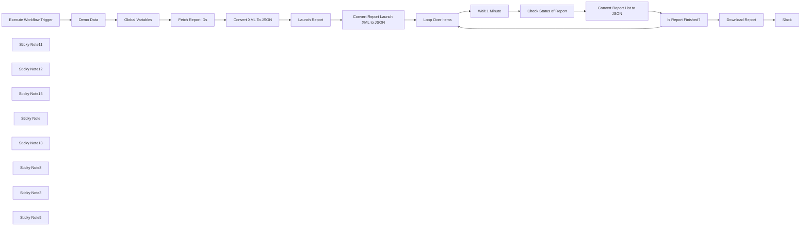

## Fluxo (.json) :

```json
{
  "meta": {
    "instanceId": "03e9d14e9196363fe7191ce21dc0bb17387a6e755dcc9acc4f5904752919dca8"
  },
  "nodes": [
    {
      "id": "1de0b08b-585a-43a9-bf32-34cdd763fbb0",
      "name": "Global Variables",
      "type": "n8n-nodes-base.set",
      "position": [
        1180,
        500
      ],
      "parameters": {
        "options": {},
        "assignments": {
          "assignments": [
            {
              "id": "6a8a0cbf-bf3e-4702-956e-a35966d8b9c5",
              "name": "base_url",
              "type": "string",
              "value": "https://qualysapi.qg3.apps.qualys.com"
            }
          ]
        },
        "includeOtherFields": true
      },
      "typeVersion": 3.3
    },
    {
      "id": "cc10e116-1a16-4bd9-bdbb-27baa680dc91",
      "name": "Fetch Report IDs",
      "type": "n8n-nodes-base.httpRequest",
      "position": [
        1400,
        500
      ],
      "parameters": {
        "": "",
        "url": "={{ $json.base_url }}/msp/report_template_list.php",
        "method": "GET",
        "options": {},
        "sendBody": false,
        "sendQuery": false,
        "curlImport": "",
        "infoMessage": "",
        "sendHeaders": false,
        "authentication": "predefinedCredentialType",
        "httpVariantWarning": "",
        "nodeCredentialType": "qualysApi",
        "provideSslCertificates": false
      },
      "credentials": {
        "qualysApi": {
          "id": "KdkmNjVYkDUzHAvw",
          "name": "Qualys account"
        }
      },
      "typeVersion": 4.2,
      "extendsCredential": "qualysApi"
    },
    {
      "id": "69e097c2-ba05-4964-af82-ce07fb2a6535",
      "name": "Convert XML To JSON",
      "type": "n8n-nodes-base.xml",
      "position": [
        1580,
        500
      ],
      "parameters": {
        "options": {}
      },
      "typeVersion": 1
    },
    {
      "id": "d2a2001a-4df8-4482-9ecf-62a7aed90a9c",
      "name": "Launch Report",
      "type": "n8n-nodes-base.httpRequest",
      "position": [
        1760,
        500
      ],
      "parameters": {
        "": "",
        "url": "={{ $('Global Variables').item.json[\"base_url\"] }}/api/2.0/fo/report/",
        "method": "POST",
        "options": {},
        "sendBody": true,
        "sendQuery": true,
        "curlImport": "",
        "contentType": "multipart-form-data",
        "infoMessage": "",
        "sendHeaders": true,
        "specifyQuery": "keypair",
        "authentication": "predefinedCredentialType",
        "bodyParameters": {
          "parameters": [
            {
              "name": "template_id",
              "value": "={{ $jmespath($json[\"REPORT_TEMPLATE_LIST\"][\"REPORT_TEMPLATE\"], \"[?TITLE == '\"+$('Global Variables').item.json.template_name+\"'].ID\") | [0] }}",
              "parameterType": "formData"
            },
            {
              "name": "=output_format",
              "value": "={{ $('Global Variables').item.json.output_format }}",
              "parameterType": "formData"
            },
            {
              "name": "report_title",
              "value": "={{ $('Global Variables').item.json.report_title }}",
              "parameterType": "formData"
            }
          ]
        },
        "specifyHeaders": "keypair",
        "queryParameters": {
          "parameters": [
            {
              "name": "action",
              "value": "launch"
            }
          ]
        },
        "headerParameters": {
          "parameters": [
            {
              "name": "X-Requested-With",
              "value": "n8n"
            }
          ]
        },
        "httpVariantWarning": "",
        "nodeCredentialType": "qualysApi",
        "provideSslCertificates": false
      },
      "credentials": {
        "qualysApi": {
          "id": "KdkmNjVYkDUzHAvw",
          "name": "Qualys account"
        }
      },
      "typeVersion": 4.2,
      "extendsCredential": "qualysApi"
    },
    {
      "id": "3f525e48-2866-42ba-a09d-05b8f5aa092d",
      "name": "Loop Over Items",
      "type": "n8n-nodes-base.splitInBatches",
      "position": [
        2200,
        480
      ],
      "parameters": {
        "options": {
          "reset": true
        }
      },
      "typeVersion": 3
    },
    {
      "id": "e202aab9-f9fe-4f6e-ac50-4d4b3b30c1f4",
      "name": "Wait 1 Minute",
      "type": "n8n-nodes-base.wait",
      "position": [
        2400,
        500
      ],
      "webhookId": "b99241f2-8b9b-4699-a006-9a3e8457c42c",
      "parameters": {
        "unit": "minutes",
        "amount": 1
      },
      "typeVersion": 1.1
    },
    {
      "id": "eb8db4f0-eacb-4d3d-ae8c-77c096bbb289",
      "name": "Check Status of Report",
      "type": "n8n-nodes-base.httpRequest",
      "position": [
        2560,
        500
      ],
      "parameters": {
        "": "",
        "url": "={{ $('Global Variables').item.json.base_url }}/api/2.0/fo/report",
        "method": "GET",
        "options": {},
        "sendBody": false,
        "sendQuery": true,
        "curlImport": "",
        "infoMessage": "",
        "sendHeaders": false,
        "specifyQuery": "keypair",
        "authentication": "predefinedCredentialType",
        "queryParameters": {
          "parameters": [
            {
              "name": "action",
              "value": "list"
            },
            {
              "name": "id",
              "value": "={{ $('Convert Report Launch XML to JSON').item.json[\"SIMPLE_RETURN\"][\"RESPONSE\"][\"ITEM_LIST\"][\"ITEM\"][\"VALUE\"] }}"
            }
          ]
        },
        "httpVariantWarning": "",
        "nodeCredentialType": "qualysApi",
        "provideSslCertificates": false
      },
      "credentials": {
        "qualysApi": {
          "id": "KdkmNjVYkDUzHAvw",
          "name": "Qualys account"
        }
      },
      "typeVersion": 4.2,
      "extendsCredential": "qualysApi"
    },
    {
      "id": "7cfcaa0c-7b0e-4704-8268-d5869677a58e",
      "name": "Is Report Finished?",
      "type": "n8n-nodes-base.if",
      "position": [
        2900,
        500
      ],
      "parameters": {
        "options": {},
        "conditions": {
          "options": {
            "leftValue": "",
            "caseSensitive": true,
            "typeValidation": "strict"
          },
          "combinator": "and",
          "conditions": [
            {
              "id": "97935da6-84fa-4756-83e1-4fbf5861baec",
              "operator": {
                "name": "filter.operator.equals",
                "type": "string",
                "operation": "equals"
              },
              "leftValue": "={{ $json.REPORT_LIST_OUTPUT.RESPONSE.REPORT_LIST.REPORT.STATUS.STATE }}",
              "rightValue": "Finished"
            }
          ]
        }
      },
      "typeVersion": 2
    },
    {
      "id": "b1a1f2bf-ddb1-4343-be2e-929128ed502c",
      "name": "Download Report",
      "type": "n8n-nodes-base.httpRequest",
      "position": [
        3080,
        500
      ],
      "parameters": {
        "": "",
        "url": "={{ $('Global Variables').item.json.base_url }}/api/2.0/fo/report/",
        "method": "GET",
        "options": {},
        "sendBody": false,
        "sendQuery": true,
        "curlImport": "",
        "infoMessage": "",
        "sendHeaders": false,
        "specifyQuery": "keypair",
        "authentication": "predefinedCredentialType",
        "queryParameters": {
          "parameters": [
            {
              "name": "action",
              "value": "fetch"
            },
            {
              "name": "id",
              "value": "={{ $('Convert Report Launch XML to JSON').item.json.SIMPLE_RETURN.RESPONSE.ITEM_LIST.ITEM.VALUE }}"
            }
          ]
        },
        "httpVariantWarning": "",
        "nodeCredentialType": "qualysApi",
        "provideSslCertificates": false
      },
      "credentials": {
        "qualysApi": {
          "id": "KdkmNjVYkDUzHAvw",
          "name": "Qualys account"
        }
      },
      "typeVersion": 4.2,
      "extendsCredential": "qualysApi"
    },
    {
      "id": "aa1bb6b0-12db-4624-a682-d719e7463bdb",
      "name": "Slack",
      "type": "n8n-nodes-base.slack",
      "position": [
        3400,
        540
      ],
      "parameters": {
        "options": {
          "channelId": "=C05LAN72WJK",
          "initialComment": "=📊 *Test Report* (Scan) by `aztec3am1` is ready!\n\n- *ID:* {{ $('Download Report').item.json[\"REPORT_LIST_OUTPUT\"][\"RESPONSE\"][\"REPORT_LIST\"][\"REPORT\"][\"ID\"] }}\n- *Launch Time:* {{ $('Download Report').item.json[\"REPORT_LIST_OUTPUT\"][\"RESPONSE\"][\"REPORT_LIST\"][\"REPORT\"][\"LAUNCH_DATETIME\"] }}\n- *Output Format:* {{ $('Download Report').item.json[\"REPORT_LIST_OUTPUT\"][\"RESPONSE\"][\"REPORT_LIST\"][\"REPORT\"][\"OUTPUT_FORMAT\"] }}\n- *Size:* {{ $('Download Report').item.binary.data.fileSize }}\n- *Status:* ✅ Finished\n- *Expiration Time:* {{ $('Download Report').item.json[\"REPORT_LIST_OUTPUT\"][\"RESPONSE\"][\"REPORT_LIST\"][\"REPORT\"][\"EXPIRATION_DATETIME\"] }}\n"
        },
        "resource": "file"
      },
      "credentials": {
        "slackApi": {
          "id": "hOkN2lZmH8XimxKh",
          "name": "TheHive Slack App"
        }
      },
      "typeVersion": 2.2
    },
    {
      "id": "3ab2cc79-9634-4a8a-ac72-c8e32370572a",
      "name": "Convert Report Launch XML to JSON",
      "type": "n8n-nodes-base.xml",
      "position": [
        1980,
        500
      ],
      "parameters": {
        "options": {}
      },
      "typeVersion": 1
    },
    {
      "id": "c24e8997-8594-4abc-8313-0198abfc7f5d",
      "name": "Convert Report List to JSON",
      "type": "n8n-nodes-base.xml",
      "position": [
        2740,
        500
      ],
      "parameters": {
        "options": {}
      },
      "typeVersion": 1
    },
    {
      "id": "33fa7420-b65f-4af1-8dad-19840b43e8cc",
      "name": "Execute Workflow Trigger",
      "type": "n8n-nodes-base.executeWorkflowTrigger",
      "position": [
        860,
        500
      ],
      "parameters": {},
      "typeVersion": 1
    },
    {
      "id": "2c8b286a-0e00-49e1-81c2-e94ef5b7725e",
      "name": "Sticky Note11",
      "type": "n8n-nodes-base.stickyNote",
      "position": [
        820.9673276258711,
        38.56257011400896
      ],
      "parameters": {
        "color": 7,
        "width": 489.3146851921929,
        "height": 655.6477214487218,
        "content": "\n## Triggered from Slack Parent Workflow\n\nThis section is triggered by the parent n8n workflow, `Qualys Slack Shortcut Bot`. It is triggered when a user fills out the slack modal popup with data and hits the submit button. \n\nThese modals can be customized to perform various actions and are designed to be mobile-friendly, ensuring flexibility and ease of use. "
      },
      "typeVersion": 1
    },
    {
      "id": "96cd5a16-f12d-4373-be7b-9ebe1549ccb8",
      "name": "Sticky Note12",
      "type": "n8n-nodes-base.stickyNote",
      "position": [
        1320,
        40
      ],
      "parameters": {
        "color": 7,
        "width": 816.4288734746297,
        "height": 662.0100319801938,
        "content": "\n## Report ID are retrieved and the Scan report is requested from Qualys\nIn this section, the process begins with the \"Fetch Report IDs\" node, which performs an HTTP GET request to retrieve a list of available report templates. \n\nThis request utilizes predefined API credentials and the output, in XML format, is then converted to JSON by the \"Convert XML to JSON\" node for easier manipulation. Following this, the \"Launch Report\" node sends an HTTP POST request to Qualys to initiate the generation of a report based on parameters like the template ID, output format, and report title, which are dynamically sourced from global variables. \n\nThis node also includes additional configurations such as query parameters and headers to tailor the request. Finally, the \"Convert Report Launch XML to JSON\" node processes the XML response from the report launch, converting it into JSON format. This sequence ensures a streamlined and automated handling of report generation tasks within Qualys, facilitating efficient data processing and integration within the workflow."
      },
      "typeVersion": 1
    },
    {
      "id": "ec51d524-4cef-4d78-a5d0-38dbe6c53825",
      "name": "Sticky Note15",
      "type": "n8n-nodes-base.stickyNote",
      "position": [
        2140,
        33.01345938069812
      ],
      "parameters": {
        "color": 7,
        "width": 391.7799748314626,
        "height": 664.948136798539,
        "content": "\n\n## n8n Loop Node\n\nThis node queries the report status at regular intervals (every minute) until the report is marked as finished. Once the report is complete, the loop ends, and the results are posted to Slack as a PDF attachment, ensuring the team is promptly informed. \n\nFor a SOC, continuous monitoring ensures timely updates, while automation of the waiting period frees up analysts' time for other tasks. Prompt notifications to Slack enable quick action on the completed reports, enhancing overall efficiency."
      },
      "typeVersion": 1
    },
    {
      "id": "894b9ea3-ab3b-4459-8576-49fd107d4c7f",
      "name": "Sticky Note",
      "type": "n8n-nodes-base.stickyNote",
      "position": [
        2540,
        36.092592419318635
      ],
      "parameters": {
        "color": 7,
        "width": 670.8185951020379,
        "height": 655.5577875573053,
        "content": "\n## Check Status of Report in Qualys API\n\nThis node checks the status of the report in the Qualys API. After parsing the XML response to ensure the report is complete, it submits the report details to Slack. \n\nThis step is crucial for maintaining an automated and efficient workflow. For SOCs, automated monitoring reduces the need for manual checking, ensuring that only completed reports are processed further, which maintains data integrity. \n\nAdditionally, integrating with Slack streamlines operations by seamlessly communicating report statuses."
      },
      "typeVersion": 1
    },
    {
      "id": "24a96b8a-1ed9-42ee-802b-952000f3cfab",
      "name": "Sticky Note13",
      "type": "n8n-nodes-base.stickyNote",
      "position": [
        3220,
        40
      ],
      "parameters": {
        "color": 7,
        "width": 473.6487484083029,
        "height": 650.1491670103001,
        "content": "\n## Upload Report to Slack\n\nThis node automates the process of uploading the generated report to a designated Slack channel. \n\nBy ensuring that the report, whether in PDF or HTML format, is easily accessible to the team, it streamlines communication and enhances collaboration. \n\nFor a Security Operations Center (SOC), this feature significantly improves accessibility, as team members can quickly access the latest reports directly from Slack. \n\nIt also enhances collaboration by sharing reports in a common communication platform and provides real-time updates, allowing for timely review and action."
      },
      "typeVersion": 1
    },
    {
      "id": "c179e45b-37a8-423f-a542-74e6166b09f0",
      "name": "Sticky Note8",
      "type": "n8n-nodes-base.stickyNote",
      "position": [
        160,
        80
      ],
      "parameters": {
        "width": 646.7396383244529,
        "height": 1327.6335333503064,
        "content": "\n# Create Qualys Scan Slack Report Subworkflow\n\n## Introducing the Qualys Create Report Workflow—a robust solution designed to automate the generation and retrieval of security reports from the Qualys API.\n\nThis workflow is a sub workflow of the `Qualys Slack Shortcut Bot` workflow. It is triggered when someone fills out the modal popup in slack generated by the `Qualys Slack Shortcut Bot`.\n\nWhen deploying this workflow, use the Demo Data node to simulate the data that is input via the Execute Workflow Trigger. That data flows into the Global Variables Node which is then referenced by the rest of the workflow. \n\nIt includes nodes to Fetch the Report IDs and then Launch a report, and then check the report status periodically and download the completed report, which is then posted to Slack for easy access. \n\nFor Security Operations Centers (SOCs), this workflow provides significant benefits by automating tedious tasks, ensuring timely updates, and facilitating efficient data handling.\n\n**How It Works:**\n\n- **Fetch Report Templates:** The \"Fetch Report IDs\" node retrieves a list of available report templates from Qualys. This automated retrieval saves time and ensures that the latest templates are used, enhancing the accuracy and relevance of reports.\n  \n- **Convert XML to JSON:** The response is converted to JSON format for easier manipulation. This step simplifies data handling, making it easier for SOC analysts to work with the data and integrate it into other tools or processes.\n  \n- **Launch Report:** A POST request is sent to Qualys to initiate report generation using specified parameters like template ID and report title. Automating this step ensures consistency and reduces the chance of human error, improving the reliability of the reports generated.\n  \n- **Loop and Check Status:** The workflow loops every minute to check if the report generation is complete. Continuous monitoring automates the waiting process, freeing up SOC analysts to focus on higher-priority tasks while ensuring they are promptly notified when reports are ready.\n  \n- **Download Report:** Once the report is ready, it is downloaded from Qualys. Automated downloading ensures that the latest data is always available without manual intervention, improving efficiency.\n  \n- **Post to Slack:** The final report is posted to a designated Slack channel for quick access. This integration with Slack ensures that the team can promptly access and review the reports, facilitating swift action and decision-making.\n\n\n**Get Started:**\n\n- Ensure your [Slack](https://docs.n8n.io/integrations/builtin/app-nodes/n8n-nodes-base.slack/?utm_source=n8n_app&utm_medium=node_settings_modal-credential_link&utm_campaign=n8n-nodes-base.slack) and [Qualys](https://docs.n8n.io/integrations/builtin/core-nodes/n8n-nodes-base.httprequest/?utm_source=n8n_app&utm_medium=node_settings_modal-credential_link&utm_campaign=n8n-creds-base.qualysApi) integrations are properly set up.\n- Customize the workflow to fit your specific reporting needs.\n\n\n**Need Help?**\n\n- Join the discussion on our Forum or check out resources on Discord!\n\n\nDeploy this workflow to streamline your security report generation process, improve response times, and enhance the efficiency of your security operations."
      },
      "typeVersion": 1
    },
    {
      "id": "32479679-791d-4c1d-b0c8-9102c3b879a5",
      "name": "Sticky Note3",
      "type": "n8n-nodes-base.stickyNote",
      "position": [
        1420,
        700
      ],
      "parameters": {
        "color": 5,
        "width": 532.5097590794944,
        "height": 726.1144174692245,
        "content": "\n### 🔄This workflow is triggered by this slack modal. The Report Template Dropdown is powered by another Sub Workflow"
      },
      "typeVersion": 1
    },
    {
      "id": "0340d311-8b41-4c3e-a023-9ea50301247c",
      "name": "Demo Data",
      "type": "n8n-nodes-base.set",
      "position": [
        1020,
        500
      ],
      "parameters": {
        "options": {},
        "assignments": {
          "assignments": [
            {
              "id": "47cd1502-3039-4661-a6b1-e20a74056550",
              "name": "report_title",
              "type": "string",
              "value": "Test Report"
            },
            {
              "id": "9a15f4db-f006-4ad8-a2c0-4002dd3e2655",
              "name": "output_format",
              "type": "string",
              "value": "pdf"
            },
            {
              "id": "13978e05-7e7f-42e9-8645-d28803db8cc9",
              "name": "template_name",
              "type": "string",
              "value": "Technical Report"
            }
          ]
        }
      },
      "typeVersion": 3.3
    },
    {
      "id": "f007312a-ea15-4188-8461-2f69550d9214",
      "name": "Sticky Note5",
      "type": "n8n-nodes-base.stickyNote",
      "position": [
        820,
        700
      ],
      "parameters": {
        "color": 5,
        "width": 596.6847639718076,
        "height": 438.8903816479826,
        "content": "\n### 🤖 Triggering this workflow is as easy as typing a backslash in Slack and filling out the modal on the right"
      },
      "typeVersion": 1
    }
  ],
  "pinData": {},
  "connections": {
    "Demo Data": {
      "main": [
        [
          {
            "node": "Global Variables",
            "type": "main",
            "index": 0
          }
        ]
      ]
    },
    "Launch Report": {
      "main": [
        [
          {
            "node": "Convert Report Launch XML to JSON",
            "type": "main",
            "index": 0
          }
        ]
      ]
    },
    "Wait 1 Minute": {
      "main": [
        [
          {
            "node": "Check Status of Report",
            "type": "main",
            "index": 0
          }
        ]
      ]
    },
    "Download Report": {
      "main": [
        [
          {
            "node": "Slack",
            "type": "main",
            "index": 0
          }
        ]
      ]
    },
    "Loop Over Items": {
      "main": [
        null,
        [
          {
            "node": "Wait 1 Minute",
            "type": "main",
            "index": 0
          }
        ]
      ]
    },
    "Fetch Report IDs": {
      "main": [
        [
          {
            "node": "Convert XML To JSON",
            "type": "main",
            "index": 0
          }
        ]
      ]
    },
    "Global Variables": {
      "main": [
        [
          {
            "node": "Fetch Report IDs",
            "type": "main",
            "index": 0
          }
        ]
      ]
    },
    "Convert XML To JSON": {
      "main": [
        [
          {
            "node": "Launch Report",
            "type": "main",
            "index": 0
          }
        ]
      ]
    },
    "Is Report Finished?": {
      "main": [
        [
          {
            "node": "Download Report",
            "type": "main",
            "index": 0
          }
        ],
        [
          {
            "node": "Loop Over Items",
            "type": "main",
            "index": 0
          }
        ]
      ]
    },
    "Check Status of Report": {
      "main": [
        [
          {
            "node": "Convert Report List to JSON",
            "type": "main",
            "index": 0
          }
        ]
      ]
    },
    "Execute Workflow Trigger": {
      "main": [
        [
          {
            "node": "Demo Data",
            "type": "main",
            "index": 0
          }
        ]
      ]
    },
    "Convert Report List to JSON": {
      "main": [
        [
          {
            "node": "Is Report Finished?",
            "type": "main",
            "index": 0
          }
        ]
      ]
    },
    "Convert Report Launch XML to JSON": {
      "main": [
        [
          {
            "node": "Loop Over Items",
            "type": "main",
            "index": 0
          }
        ]
      ]
    }
  }
}
```

<a id="template-698"></a>

## Template 698 - Traduzir instruções de coquetel para italiano

- **Nome:** Traduzir instruções de coquetel para italiano
- **Descrição:** Ao ser executado manualmente, o fluxo obtém uma receita de coquetel aleatória e traduz as instruções para italiano.
- **Funcionalidade:** • Início manual: inicia o fluxo ao clicar em executar.
• Busca de receita aleatória: realiza uma chamada à API pública para obter uma receita de coquetel aleatória.
• Extração de instruções: captura o campo de instruções da primeira bebida retornada pela API.
• Tradução do texto: envia as instruções para um serviço de tradução e recebe o texto em italiano (it_IT).
- **Ferramentas:** • TheCocktailDB: API pública que fornece dados de receitas de coquetéis, incluindo nome, ingredientes e instruções.
• LingvaNex: serviço de tradução que converte o texto recebido para o idioma solicitado (neste fluxo, it_IT). Requer credenciais de API.

## Fluxo visual


## Fluxo (.json) :

```json
{
  "id": "145",
  "name": "Translate cocktail instructions using LingvaNex",
  "nodes": [
    {
      "name": "On clicking 'execute'",
      "type": "n8n-nodes-base.manualTrigger",
      "position": [
        250,
        300
      ],
      "parameters": {},
      "typeVersion": 1
    },
    {
      "name": "LingvaNex",
      "type": "n8n-nodes-base.lingvaNex",
      "position": [
        650,
        300
      ],
      "parameters": {
        "text": "={{$node[\"HTTP Request\"].json[\"drinks\"][0][\"strInstructions\"]}}",
        "options": {},
        "translateTo": "it_IT"
      },
      "credentials": {
        "lingvaNexApi": "LingvaNex"
      },
      "typeVersion": 1
    },
    {
      "name": "HTTP Request",
      "type": "n8n-nodes-base.httpRequest",
      "position": [
        450,
        300
      ],
      "parameters": {
        "url": "https://www.thecocktaildb.com/api/json/v1/1/random.php",
        "options": {}
      },
      "typeVersion": 1
    }
  ],
  "active": false,
  "settings": {},
  "connections": {
    "HTTP Request": {
      "main": [
        [
          {
            "node": "LingvaNex",
            "type": "main",
            "index": 0
          }
        ]
      ]
    },
    "On clicking 'execute'": {
      "main": [
        [
          {
            "node": "HTTP Request",
            "type": "main",
            "index": 0
          }
        ]
      ]
    }
  }
}
```

<a id="template-699"></a>

## Template 699 - Anexar dados JSON na planilha

- **Nome:** Anexar dados JSON na planilha
- **Descrição:** Lê um arquivo JSON do sistema de arquivos local e anexa seus dados a uma planilha do Google Sheets no intervalo especificado.
- **Funcionalidade:** • Leitura de arquivo JSON: Lê um arquivo JSON do sistema de arquivos local a partir do caminho especificado (/username/users_spreadsheet.json).
• Preparação de dados binários: Move e prepara os dados binários lidos para o formato esperado pela operação de inserção.
• Inserção na planilha: Anexa os dados à planilha do Google Sheets no intervalo A:C, utilizando a primeira linha como referência de chaves.
- **Ferramentas:** • Google Sheets: Planilha online usada para armazenar os dados anexados; a operação utiliza autenticação OAuth2.
• Sistema de arquivos local: Fonte do arquivo JSON lido pelo fluxo.

## Fluxo visual

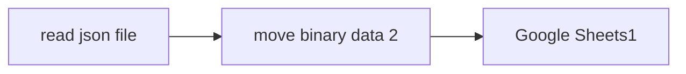

## Fluxo (.json) :

```json
{
  "nodes": [
    {
      "name": "Google Sheets1",
      "type": "n8n-nodes-base.googleSheets",
      "notes": "Append data to sheet",
      "position": [
        980,
        -120
      ],
      "parameters": {
        "range": "A:C",
        "options": {
          "usePathForKeyRow": true
        },
        "sheetId": "qwertz",
        "operation": "append",
        "authentication": "oAuth2"
      },
      "credentials": {
        "googleSheetsOAuth2Api": {
          "id": "2",
          "name": "google_sheets_oauth"
        }
      },
      "notesInFlow": true,
      "typeVersion": 1
    },
    {
      "name": "read json file",
      "type": "n8n-nodes-base.readBinaryFile",
      "position": [
        620,
        -120
      ],
      "parameters": {
        "filePath": "/username/users_spreadsheet.json"
      },
      "typeVersion": 1
    },
    {
      "name": "move binary data 2",
      "type": "n8n-nodes-base.moveBinaryData",
      "position": [
        800,
        -120
      ],
      "parameters": {
        "options": {}
      },
      "typeVersion": 1
    }
  ],
  "connections": {
    "read json file": {
      "main": [
        [
          {
            "node": "move binary data 2",
            "type": "main",
            "index": 0
          }
        ]
      ]
    },
    "move binary data 2": {
      "main": [
        [
          {
            "node": "Google Sheets1",
            "type": "main",
            "index": 0
          }
        ]
      ]
    }
  }
}
```

<a id="template-700"></a>

## Template 700 - Gerenciamento de caso na TheHive

- **Nome:** Gerenciamento de caso na TheHive
- **Descrição:** Cria um caso na TheHive, atualiza sua severidade e recupera os detalhes do caso.
- **Funcionalidade:** • Gatilho manual: Inicia a execução do fluxo quando acionado manualmente.
• Criação de caso: Cria um novo caso na TheHive com título, descrição, tags, proprietário, severidade e data de início.
• Atualização de caso: Atualiza campos do caso (por exemplo, severidade) usando o ID gerado.
• Recuperação de caso: Recupera os detalhes completos do caso recém-atualizado usando o ID.
- **Ferramentas:** • TheHive: Plataforma de gestão de incidentes e casos, utilizada para criar, atualizar e recuperar casos via API.

## Fluxo visual

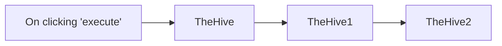

## Fluxo (.json) :

```json
{
  "id": "159",
  "name": "Create, update and get a case in TheHive",
  "nodes": [
    {
      "name": "On clicking 'execute'",
      "type": "n8n-nodes-base.manualTrigger",
      "position": [
        270,
        340
      ],
      "parameters": {},
      "typeVersion": 1
    },
    {
      "name": "TheHive",
      "type": "n8n-nodes-base.theHive",
      "position": [
        470,
        340
      ],
      "parameters": {
        "tags": "n8n, theHive",
        "owner": "Harshil",
        "title": "n8n",
        "options": {},
        "resource": "case",
        "severity": 1,
        "operation": "create",
        "startDate": "2020-12-03T10:08:14.000Z",
        "description": "Creating a case from n8n"
      },
      "credentials": {
        "theHiveApi": "hive"
      },
      "typeVersion": 1
    },
    {
      "name": "TheHive1",
      "type": "n8n-nodes-base.theHive",
      "position": [
        670,
        340
      ],
      "parameters": {
        "id": "={{$node[\"TheHive\"].json[\"id\"]}}",
        "resource": "case",
        "operation": "update",
        "updateFields": {
          "severity": 3
        }
      },
      "credentials": {
        "theHiveApi": "hive"
      },
      "typeVersion": 1
    },
    {
      "name": "TheHive2",
      "type": "n8n-nodes-base.theHive",
      "position": [
        870,
        340
      ],
      "parameters": {
        "id": "={{$node[\"TheHive\"].json[\"id\"]}}",
        "resource": "case",
        "operation": "get"
      },
      "credentials": {
        "theHiveApi": "hive"
      },
      "typeVersion": 1
    }
  ],
  "active": false,
  "settings": {},
  "connections": {
    "TheHive": {
      "main": [
        [
          {
            "node": "TheHive1",
            "type": "main",
            "index": 0
          }
        ]
      ]
    },
    "TheHive1": {
      "main": [
        [
          {
            "node": "TheHive2",
            "type": "main",
            "index": 0
          }
        ]
      ]
    },
    "On clicking 'execute'": {
      "main": [
        [
          {
            "node": "TheHive",
            "type": "main",
            "index": 0
          }
        ]
      ]
    }
  }
}
```

<a id="template-701"></a>

## Template 701 - Chatbot de políticas e benefícios com busca semântica e lookup de funcionários

- **Nome:** Chatbot de políticas e benefícios com busca semântica e lookup de funcionários
- **Descrição:** Fluxo que indexa documentos corporativos e responde perguntas de funcionários sobre políticas, benefícios e contatos, usando recuperação semântica e integração com o sistema de RH para obter detalhes de pessoas.
- **Funcionalidade:** • Carregamento de arquivos da empresa: busca e baixa arquivos armazenados no BambooHR, filtrando por categoria e formato (por exemplo, PDFs).
• Processamento e indexação de documentos: divide textos em trechos, gera embeddings e insere em um banco vetorial para permitir buscas semânticas.
• Recuperação semântica de conteúdo: consulta o índice de documentos para responder dúvidas sobre manual da empresa, 401k, políticas de despesas e benefícios.
• Assistente de chat com contexto: mantém histórico de conversa para oferecer respostas mais coerentes e contextualizadas.
• Classificação de consulta: identifica se a consulta refere-se a uma pessoa ou a um departamento e direciona o fluxo apropriado.
• Lookup de funcionários: consulta o sistema de RH para obter detalhes de um funcionário ou para localizar o responsável mais sênior de um departamento.
• Lógica de escalonamento de contatos: tenta primeiro identificar contatos nos documentos; se faltarem dados, recupera detalhes via lookup; se não houver contato, procura o líder do departamento ou supervisor do solicitante.
• Formatação e validação de respostas: padroniza nomes e dados antes de retorná-los ao usuário, com rotinas de verificação e correção automatizada.
• Endpoint de chat: expõe um webhook para iniciar conversas e acionar o agente de atendimento.
- **Ferramentas:** • BambooHR: sistema de RH usado para armazenar e fornecer arquivos da empresa e dados de funcionários (download de PDFs e listagem de empregados).
• Supabase: banco de dados e armazenamento vetorial usado para guardar embeddings e executar buscas semânticas nos documentos indexados.
• OpenAI: provedora de modelos de linguagem e embeddings usados para classificar consultas, gerar respostas, extrair informações e criar vetores para indexação.

## Fluxo visual

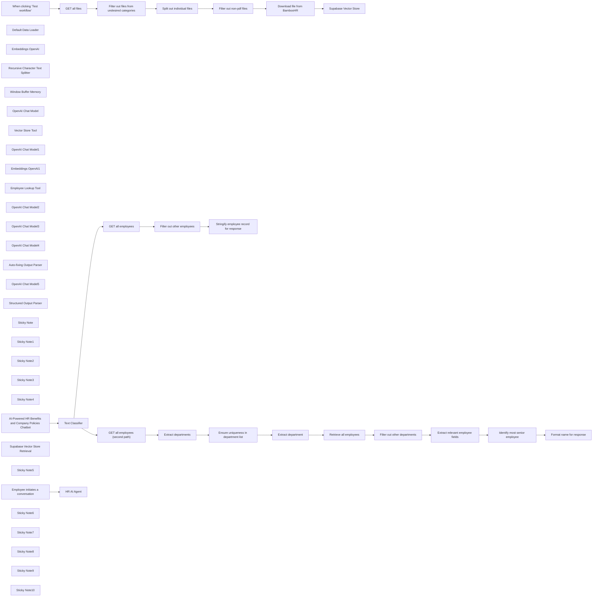

## Fluxo (.json) :

```json
{
  "id": "dYjQS1bJmVSAxNnj",
  "meta": {
    "instanceId": "a9f3b18652ddc96459b459de4fa8fa33252fb820a9e5a1593074f3580352864a",
    "templateCredsSetupCompleted": true
  },
  "name": "BambooHR AI-Powered Company Policies and Benefits Chatbot",
  "tags": [],
  "nodes": [
    {
      "id": "832e4a1d-320f-4793-be3c-8829776a3ce6",
      "name": "When clicking ‘Test workflow’",
      "type": "n8n-nodes-base.manualTrigger",
      "position": [
        760,
        560
      ],
      "parameters": {},
      "typeVersion": 1
    },
    {
      "id": "63be0638-d7df-4af8-ba56-555593a6de0c",
      "name": "Default Data Loader",
      "type": "@n8n/n8n-nodes-langchain.documentDefaultDataLoader",
      "position": [
        2080,
        740
      ],
      "parameters": {
        "options": {},
        "dataType": "binary"
      },
      "typeVersion": 1
    },
    {
      "id": "ffe33bb2-efd0-4b6e-a146-aaded7c28304",
      "name": "Embeddings OpenAI",
      "type": "@n8n/n8n-nodes-langchain.embeddingsOpenAi",
      "position": [
        1860,
        740
      ],
      "parameters": {
        "options": {}
      },
      "credentials": {
        "openAiApi": {
          "id": "XXXXXX",
          "name": "OpenAi account"
        }
      },
      "typeVersion": 1.1
    },
    {
      "id": "32de5318-ea5d-4951-b81c-3c96167bc320",
      "name": "Recursive Character Text Splitter",
      "type": "@n8n/n8n-nodes-langchain.textSplitterRecursiveCharacterTextSplitter",
      "position": [
        2060,
        880
      ],
      "parameters": {
        "options": {},
        "chunkOverlap": 100
      },
      "typeVersion": 1
    },
    {
      "id": "6306d263-16c1-4a68-9318-c58fea1e3e62",
      "name": "Window Buffer Memory",
      "type": "@n8n/n8n-nodes-langchain.memoryBufferWindow",
      "position": [
        1000,
        1340
      ],
      "parameters": {},
      "typeVersion": 1.2
    },
    {
      "id": "364cf0ce-524c-4b61-89f3-40b2801bc7e3",
      "name": "OpenAI Chat Model",
      "type": "@n8n/n8n-nodes-langchain.lmChatOpenAi",
      "position": [
        840,
        1340
      ],
      "parameters": {
        "options": {}
      },
      "credentials": {
        "openAiApi": {
          "id": "XXXXXX",
          "name": "OpenAi account"
        }
      },
      "typeVersion": 1
    },
    {
      "id": "901163a1-1e66-42ee-bfd0-9ed815a7c83d",
      "name": "Vector Store Tool",
      "type": "@n8n/n8n-nodes-langchain.toolVectorStore",
      "position": [
        1120,
        1380
      ],
      "parameters": {
        "name": "company_files",
        "topK": 5,
        "description": "Retrieves information from the company handbook, 401k policies, benefits overview, and expense policies available to all employees."
      },
      "typeVersion": 1
    },
    {
      "id": "b87fa113-6a32-48fc-8e06-049345c66f38",
      "name": "OpenAI Chat Model1",
      "type": "@n8n/n8n-nodes-langchain.lmChatOpenAi",
      "position": [
        1220,
        1600
      ],
      "parameters": {
        "options": {}
      },
      "credentials": {
        "openAiApi": {
          "id": "XXXXXX",
          "name": "OpenAi account"
        }
      },
      "typeVersion": 1
    },
    {
      "id": "9dc1a896-c8a5-4d22-b029-14eae0717bd8",
      "name": "Embeddings OpenAI1",
      "type": "@n8n/n8n-nodes-langchain.embeddingsOpenAi",
      "position": [
        940,
        1700
      ],
      "parameters": {
        "options": {}
      },
      "credentials": {
        "openAiApi": {
          "id": "XXXXXX",
          "name": "OpenAi account"
        }
      },
      "typeVersion": 1.1
    },
    {
      "id": "20cda474-ef6f-48af-b299-04f1fe980d3d",
      "name": "Employee Lookup Tool",
      "type": "@n8n/n8n-nodes-langchain.toolWorkflow",
      "position": [
        1440,
        1360
      ],
      "parameters": {
        "name": "employee_lookup_tool",
        "workflowId": {
          "__rl": true,
          "mode": "id",
          "value": "={{ $workflow.id }}"
        },
        "description": "Call this tool with the full name of an employee to retrieve their details from our HRIS, including their job title, department, and supervisor. If an employee name is not provided, you may call this tool with a department name to retrieve the most senior person in that department. This tool requires an exact match on employee names but can infer the senior-most person for a department query.",
        "jsonSchemaExample": "{\n\t\"name\": \"The name of an employee or department\"\n}",
        "specifyInputSchema": true
      },
      "typeVersion": 1.2
    },
    {
      "id": "55718295-459b-4a4b-8c57-fd6b31e3d963",
      "name": "OpenAI Chat Model2",
      "type": "@n8n/n8n-nodes-langchain.lmChatOpenAi",
      "position": [
        1960,
        1500
      ],
      "parameters": {
        "options": {}
      },
      "credentials": {
        "openAiApi": {
          "id": "XXXXXX",
          "name": "OpenAi account"
        }
      },
      "typeVersion": 1
    },
    {
      "id": "e574d63d-7e38-4d90-9533-64a4ddbe2e36",
      "name": "OpenAI Chat Model3",
      "type": "@n8n/n8n-nodes-langchain.lmChatOpenAi",
      "position": [
        2980,
        1600
      ],
      "parameters": {
        "options": {}
      },
      "credentials": {
        "openAiApi": {
          "id": "XXXXXX",
          "name": "OpenAi account"
        }
      },
      "typeVersion": 1
    },
    {
      "id": "04d53430-b8d9-43ff-b2c4-ef0da2d799c0",
      "name": "OpenAI Chat Model4",
      "type": "@n8n/n8n-nodes-langchain.lmChatOpenAi",
      "position": [
        3700,
        1620
      ],
      "parameters": {
        "options": {}
      },
      "credentials": {
        "openAiApi": {
          "id": "XXXXXX",
          "name": "OpenAi account"
        }
      },
      "typeVersion": 1
    },
    {
      "id": "9759fe08-3c81-4472-8d62-2c5d26156984",
      "name": "Auto-fixing Output Parser",
      "type": "@n8n/n8n-nodes-langchain.outputParserAutofixing",
      "position": [
        3880,
        1600
      ],
      "parameters": {},
      "typeVersion": 1
    },
    {
      "id": "d8830fd8-f238-4e5d-8c5f-bf83c9450dbe",
      "name": "OpenAI Chat Model5",
      "type": "@n8n/n8n-nodes-langchain.lmChatOpenAi",
      "position": [
        3780,
        1700
      ],
      "parameters": {
        "options": {}
      },
      "credentials": {
        "openAiApi": {
          "id": "XXXXXX",
          "name": "OpenAi account"
        }
      },
      "typeVersion": 1
    },
    {
      "id": "da580308-e4ed-400b-99e2-31baf27b039d",
      "name": "Structured Output Parser",
      "type": "@n8n/n8n-nodes-langchain.outputParserStructured",
      "position": [
        4080,
        1700
      ],
      "parameters": {
        "jsonSchemaExample": "{\n\t\"name\": \"The name of an employee\"\n}"
      },
      "typeVersion": 1.2
    },
    {
      "id": "e81dbe81-5f6b-4b2c-a4bc-afa0136e33ac",
      "name": "Sticky Note",
      "type": "n8n-nodes-base.stickyNote",
      "position": [
        680,
        460
      ],
      "parameters": {
        "color": 7,
        "width": 1695.17727595829,
        "height": 582.7965199011514,
        "content": "## STEP #1: Retrieve company policies and load them into a vector store"
      },
      "typeVersion": 1
    },
    {
      "id": "629872ed-2f99-424d-96da-feee6df96d3d",
      "name": "Sticky Note1",
      "type": "n8n-nodes-base.stickyNote",
      "position": [
        680,
        1080
      ],
      "parameters": {
        "color": 4,
        "width": 873.5637402697844,
        "height": 780.6181567295652,
        "content": "## BambooHR AI-Powered HR Benefits and Company Policies Chatbot"
      },
      "typeVersion": 1
    },
    {
      "id": "8888281b-5701-4c62-b76b-a0b6a80d8463",
      "name": "Sticky Note2",
      "type": "n8n-nodes-base.stickyNote",
      "position": [
        1580,
        1075.4375994898523
      ],
      "parameters": {
        "color": 7,
        "width": 2783.3549952823255,
        "height": 781.525845027296,
        "content": "## (Optional) STEP #2: Set up employee lookup tool"
      },
      "typeVersion": 1
    },
    {
      "id": "17044553-d081-4c17-8108-d0327709f352",
      "name": "GET all files",
      "type": "n8n-nodes-base.bambooHr",
      "position": [
        960,
        560
      ],
      "parameters": {
        "resource": "file",
        "operation": "getAll",
        "returnAll": true,
        "simplifyOutput": false
      },
      "credentials": {
        "bambooHrApi": {
          "id": "XXXXXX",
          "name": "BambooHR account"
        }
      },
      "typeVersion": 1
    },
    {
      "id": "939881b1-eb18-4ab7-ac4a-9edcc218356f",
      "name": "Sticky Note3",
      "type": "n8n-nodes-base.stickyNote",
      "position": [
        920,
        720
      ],
      "parameters": {
        "color": 5,
        "width": 177.89252000024067,
        "height": 99.24268260893132,
        "content": "Toggle **off** the _simplify_ option to ensure categories are retrieved as well"
      },
      "typeVersion": 1
    },
    {
      "id": "0907a1d3-97e2-4219-bfbc-524186f6d889",
      "name": "Filter out files from undesired categories",
      "type": "n8n-nodes-base.filter",
      "position": [
        1160,
        560
      ],
      "parameters": {
        "options": {},
        "conditions": {
          "options": {
            "version": 2,
            "leftValue": "",
            "caseSensitive": true,
            "typeValidation": "strict"
          },
          "combinator": "and",
          "conditions": [
            {
              "id": "b85b86cd-0b54-4348-a538-8ff4ae625b9a",
              "operator": {
                "name": "filter.operator.equals",
                "type": "string",
                "operation": "equals"
              },
              "leftValue": "={{ $json.name }}",
              "rightValue": "=Company Files"
            }
          ]
        }
      },
      "typeVersion": 2.2
    },
    {
      "id": "43069219-7cd9-4515-846d-ed6a0f9bbb61",
      "name": "Split out individual files",
      "type": "n8n-nodes-base.splitOut",
      "position": [
        1360,
        560
      ],
      "parameters": {
        "options": {},
        "fieldToSplitOut": "files"
      },
      "typeVersion": 1
    },
    {
      "id": "8412af5f-f07f-4a98-a174-e363ba04f902",
      "name": "Filter out non-pdf files",
      "type": "n8n-nodes-base.filter",
      "position": [
        1560,
        560
      ],
      "parameters": {
        "options": {},
        "conditions": {
          "options": {
            "version": 2,
            "leftValue": "",
            "caseSensitive": true,
            "typeValidation": "strict"
          },
          "combinator": "and",
          "conditions": [
            {
              "id": "73cc2cb9-04fa-43e7-a459-de0bf26ffb18",
              "operator": {
                "type": "boolean",
                "operation": "true",
                "singleValue": true
              },
              "leftValue": "={{ $json.originalFileName.endsWith(\".pdf\") }}",
              "rightValue": ""
            }
          ]
        }
      },
      "typeVersion": 2.2
    },
    {
      "id": "7e007a29-c902-41d3-ab22-f6a93bc43f7d",
      "name": "Download file from BambooHR",
      "type": "n8n-nodes-base.bambooHr",
      "position": [
        1760,
        560
      ],
      "parameters": {
        "fileId": "={{ $json.id }}",
        "resource": "file",
        "operation": "download"
      },
      "credentials": {
        "bambooHrApi": {
          "id": "XXXXXX",
          "name": "BambooHR account"
        }
      },
      "typeVersion": 1
    },
    {
      "id": "cec7ce3a-77df-4400-8683-fb5cf87004b6",
      "name": "Supabase Vector Store",
      "type": "@n8n/n8n-nodes-langchain.vectorStoreSupabase",
      "position": [
        1960,
        560
      ],
      "parameters": {
        "mode": "insert",
        "options": {
          "queryName": "match_files"
        },
        "tableName": {
          "__rl": true,
          "mode": "list",
          "value": "company_files",
          "cachedResultName": "company_files"
        }
      },
      "credentials": {
        "supabaseApi": {
          "id": "XXXXXX",
          "name": "Supabase account"
        }
      },
      "typeVersion": 1
    },
    {
      "id": "5e070dc3-5f6d-44bb-a655-b769aac14890",
      "name": "Sticky Note4",
      "type": "n8n-nodes-base.stickyNote",
      "position": [
        1600,
        1140
      ],
      "parameters": {
        "color": 5,
        "width": 530.9221622705562,
        "height": 91.00370621080086,
        "content": "This employee lookup tool gives the AI Benefits and Company Policies chatbot additional superpowers by allowing it to **search for an individual or a department to retrieve contact information from BambooHR**."
      },
      "typeVersion": 1
    },
    {
      "id": "8f3cd44e-d1e5-4806-9d89-78c8728ea0e4",
      "name": "Employee initiates a conversation",
      "type": "@n8n/n8n-nodes-langchain.chatTrigger",
      "position": [
        760,
        1140
      ],
      "webhookId": "27ec9df7-5007-4642-81c7-7fcf7e834c43",
      "parameters": {
        "options": {}
      },
      "typeVersion": 1.1
    },
    {
      "id": "3d56dc6a-13e2-404b-ad38-6370b9610f61",
      "name": "Supabase Vector Store Retrieval",
      "type": "@n8n/n8n-nodes-langchain.vectorStoreSupabase",
      "position": [
        940,
        1540
      ],
      "parameters": {
        "options": {
          "queryName": "match_files"
        },
        "tableName": {
          "__rl": true,
          "mode": "list",
          "value": "company_files",
          "cachedResultName": "company_files"
        }
      },
      "credentials": {
        "supabaseApi": {
          "id": "XXXXXX",
          "name": "Supabase account"
        }
      },
      "typeVersion": 1
    },
    {
      "id": "1e6f5d4a-5897-42b7-bfcf-e69b7880b6c4",
      "name": "Sticky Note5",
      "type": "n8n-nodes-base.stickyNote",
      "position": [
        680,
        1880
      ],
      "parameters": {
        "width": 865.771928038017,
        "height": 281.07009330339326,
        "content": "### AI Chatbot Operating Guidelines \n- When an employee asks for a contact person, first attempt to find the relevant contact in company_files. \n- If a contact person is found but their details (e.g., email or phone number) are missing, use the `employee_lookup_tool` to retrieve their contact details. \n- If no contact person is found: \n 1. Use the `employee_lookup_tool` with \"HR\" (or another relevant department) to retrieve the most senior person in that department. \n 2. If no senior contact is found, ask the employee for their name. \n 3. Use the `employee_lookup_tool` to retrieve their supervisor’s name. \n 4. Use the `employee_lookup_tool` to retrieve their supervisor’s details. \n 5. Provide the supervisor's contact information and recommend them as the best next point of contact. "
      },
      "typeVersion": 1
    },
    {
      "id": "ba8c82cb-4972-46cc-8594-dfe71149a41c",
      "name": "AI-Powered HR Benefits and Company Policies Chatbot",
      "type": "n8n-nodes-base.executeWorkflowTrigger",
      "position": [
        1640,
        1340
      ],
      "parameters": {},
      "typeVersion": 1
    },
    {
      "id": "aaf611fd-1779-4826-8f9c-4e9a7a538af0",
      "name": "Text Classifier",
      "type": "@n8n/n8n-nodes-langchain.textClassifier",
      "position": [
        1840,
        1340
      ],
      "parameters": {
        "options": {},
        "inputText": "={{ $json.query.name }}",
        "categories": {
          "categories": [
            {
              "category": "person",
              "description": "This is the name of a person."
            },
            {
              "category": "department",
              "description": "This is the name of a department within the company."
            }
          ]
        }
      },
      "typeVersion": 1
    },
    {
      "id": "4a1e0d47-87f8-4301-9aee-2227003a40e6",
      "name": "GET all employees",
      "type": "n8n-nodes-base.bambooHr",
      "position": [
        2260,
        1240
      ],
      "parameters": {
        "operation": "getAll",
        "returnAll": true
      },
      "credentials": {
        "bambooHrApi": {
          "id": "XXXXXX",
          "name": "BambooHR account"
        }
      },
      "typeVersion": 1
    },
    {
      "id": "93e1017a-07c6-4b97-be90-659a91fdc065",
      "name": "Filter out other employees",
      "type": "n8n-nodes-base.filter",
      "position": [
        2460,
        1240
      ],
      "parameters": {
        "options": {},
        "conditions": {
          "options": {
            "version": 2,
            "leftValue": "",
            "caseSensitive": true,
            "typeValidation": "strict"
          },
          "combinator": "and",
          "conditions": [
            {
              "id": "e80c892e-21dc-4d6e-8ef6-c2ffaea6d43e",
              "operator": {
                "name": "filter.operator.equals",
                "type": "string",
                "operation": "equals"
              },
              "leftValue": "={{ $json.displayName }}",
              "rightValue": "={{ $('AI-Powered HR Benefits and Company Policies Chatbot').item.json.query.name }}"
            }
          ]
        }
      },
      "typeVersion": 2.2
    },
    {
      "id": "c45eec9a-05ca-4b35-b595-42f2251a01ec",
      "name": "Stringify employee record for response",
      "type": "n8n-nodes-base.set",
      "position": [
        2660,
        1240
      ],
      "parameters": {
        "options": {},
        "assignments": {
          "assignments": [
            {
              "id": "73ae7ef0-339a-4e32-bbc9-c40cefd37757",
              "name": "response",
              "type": "string",
              "value": "={{ $json.toJsonString() }}"
            }
          ]
        }
      },
      "typeVersion": 3.4
    },
    {
      "id": "aa30062a-2476-4fc2-8380-6d2106885ae2",
      "name": "GET all employees (second path)",
      "type": "n8n-nodes-base.bambooHr",
      "position": [
        2260,
        1440
      ],
      "parameters": {
        "operation": "getAll",
        "returnAll": true
      },
      "credentials": {
        "bambooHrApi": {
          "id": "XXXXXX",
          "name": "BambooHR account"
        }
      },
      "typeVersion": 1
    },
    {
      "id": "f44cb9ab-00aa-4ebc-bb1a-6ba1da2e2aaa",
      "name": "Extract departments",
      "type": "n8n-nodes-base.aggregate",
      "position": [
        2460,
        1440
      ],
      "parameters": {
        "options": {},
        "fieldsToAggregate": {
          "fieldToAggregate": [
            {
              "renameField": true,
              "outputFieldName": "departments",
              "fieldToAggregate": "department"
            }
          ]
        }
      },
      "typeVersion": 1
    },
    {
      "id": "855a6968-d919-4071-96d8-04cbc4b6ec39",
      "name": "Ensure uniqueness in department list",
      "type": "n8n-nodes-base.set",
      "position": [
        2660,
        1440
      ],
      "parameters": {
        "options": {},
        "assignments": {
          "assignments": [
            {
              "id": "34f456ff-d2c5-431f-ade3-ace48abd0c6a",
              "name": "departments",
              "type": "array",
              "value": "={{ $json.departments.unique() }}"
            },
            {
              "id": "cf31288a-65fc-45c6-8b6f-6680020dce09",
              "name": "query",
              "type": "string",
              "value": "={{ $('Text Classifier').item.json.query.name }}"
            }
          ]
        }
      },
      "typeVersion": 3.4
    },
    {
      "id": "0dca5763-33c6-4444-b4e0-f26127bb91d5",
      "name": "Extract department",
      "type": "@n8n/n8n-nodes-langchain.informationExtractor",
      "position": [
        2860,
        1440
      ],
      "parameters": {
        "text": "={{ $json.query }}",
        "options": {},
        "attributes": {
          "attributes": [
            {
              "name": "department",
              "description": "=The department from the following list that would be most applicable:\n{{ $json.departments }}"
            }
          ]
        }
      },
      "typeVersion": 1
    },
    {
      "id": "833b43e8-7ed5-4431-b362-b5d11bb9f787",
      "name": "Retrieve all employees",
      "type": "n8n-nodes-base.bambooHr",
      "position": [
        3220,
        1440
      ],
      "parameters": {
        "operation": "getAll",
        "returnAll": true
      },
      "credentials": {
        "bambooHrApi": {
          "id": "XXXXXX",
          "name": "BambooHR account"
        }
      },
      "typeVersion": 1
    },
    {
      "id": "adcaafb5-700f-4e93-a7f4-c393967fb4f0",
      "name": "Filter out other departments",
      "type": "n8n-nodes-base.filter",
      "position": [
        3420,
        1440
      ],
      "parameters": {
        "options": {},
        "conditions": {
          "options": {
            "version": 2,
            "leftValue": "",
            "caseSensitive": true,
            "typeValidation": "strict"
          },
          "combinator": "and",
          "conditions": [
            {
              "id": "a88bf53c-ecfd-49a7-8180-1e8b8eaeb6fd",
              "operator": {
                "name": "filter.operator.equals",
                "type": "string",
                "operation": "equals"
              },
              "leftValue": "={{ $json.department }}",
              "rightValue": "={{ $('Extract department').item.json.output.department }}"
            }
          ]
        }
      },
      "typeVersion": 2.2
    },
    {
      "id": "fe928eb9-2b70-4ab9-a5a6-a4c141467ad7",
      "name": "Extract relevant employee fields",
      "type": "n8n-nodes-base.aggregate",
      "position": [
        3620,
        1440
      ],
      "parameters": {
        "include": "specifiedFields",
        "options": {},
        "aggregate": "aggregateAllItemData",
        "fieldsToInclude": "id, displayName, jobTitle, workEmail",
        "destinationFieldName": "department_employees"
      },
      "typeVersion": 1
    },
    {
      "id": "0632ae1b-280e-486e-9cdd-c6c9fd2a1b6e",
      "name": "Identify most senior employee",
      "type": "@n8n/n8n-nodes-langchain.chainLlm",
      "position": [
        3800,
        1440
      ],
      "parameters": {
        "text": "=Who is the most senior employee from this list:\n{{ $json.department_employees.toJsonString() }}",
        "promptType": "define",
        "hasOutputParser": true
      },
      "typeVersion": 1.4
    },
    {
      "id": "0e6c8d0a-d84f-468b-993b-c5a14d7d458f",
      "name": "Format name for response",
      "type": "n8n-nodes-base.set",
      "position": [
        4160,
        1440
      ],
      "parameters": {
        "options": {},
        "assignments": {
          "assignments": [
            {
              "id": "2b4412bf-142b-4ba0-a6b2-654e97c263e5",
              "name": "response",
              "type": "string",
              "value": "={{ $json.output.name }}"
            }
          ]
        }
      },
      "typeVersion": 3.4
    },
    {
      "id": "e865d8bf-ab6d-4d23-9d7c-a76f96ba75a1",
      "name": "HR AI Agent",
      "type": "@n8n/n8n-nodes-langchain.agent",
      "position": [
        1040,
        1140
      ],
      "parameters": {
        "options": {
          "systemMessage": "You are a helpful HR assistant accessible by employees at our company.\n\nObjective: \nAssist employees with questions regarding company policies, documents, and escalation procedures.\n\nTools: \n1. A vector store database (company_files) containing the company handbook, 401k policy, expense policy, and employee benefits. \n2. An employee lookup tool (employee_lookup_tool) that retrieves details about an employee when provided with their name. It can also retrieve the most senior person in a department if given a department name. \n\nGuidelines: \n- When an employee asks for a contact person, first attempt to find the relevant contact in company_files. \n- If a contact person is found but their details (e.g., email or phone number) are missing, use the `employee_lookup_tool` to retrieve their contact details. \n- If no contact person is found: \n 1. Use the `employee_lookup_tool` with \"HR\" (or another relevant department) to retrieve the most senior person in that department. \n 2. If no senior contact is found, ask the employee for their name. \n 3. Use the `employee_lookup_tool` to retrieve their supervisor’s name. \n 4. Use the `employee_lookup_tool` to retrieve their supervisor’s details. \n 5. Provide the supervisor's contact information and recommend them as the best next point of contact. \n"
        }
      },
      "typeVersion": 1.7
    },
    {
      "id": "3aa42dcf-a411-4bd8-87b3-9ab9d0043303",
      "name": "Sticky Note6",
      "type": "n8n-nodes-base.stickyNote",
      "position": [
        1600,
        1660
      ],
      "parameters": {
        "color": 3,
        "width": 340.93489445096634,
        "height": 180.79319430657273,
        "content": "### GetAll employees from BambooHR\nBambooHR does not offer search by {field} functionality for its `/employees` endpoint, so filtering must be done after data retrieval. This can be inefficient for very large organizations where there may be multiple employees with the same name or simply a large number of employees."
      },
      "typeVersion": 1
    },
    {
      "id": "3b3b400c-9c7e-4fd0-91f3-1c6bcf05617f",
      "name": "Sticky Note7",
      "type": "n8n-nodes-base.stickyNote",
      "position": [
        2240,
        1140
      ],
      "parameters": {
        "color": 5,
        "width": 542.9452105095002,
        "height": 89.69037140899545,
        "content": "### GET singular employee by name path\nThis path may be used multiple times by the HR AI Agent to look up the employee's details, and then to look up their supervisor's details."
      },
      "typeVersion": 1
    },
    {
      "id": "6ad78a36-e68d-4b0d-b532-ca67bcd0738d",
      "name": "Sticky Note8",
      "type": "n8n-nodes-base.stickyNote",
      "position": [
        2240,
        1620
      ],
      "parameters": {
        "color": 5,
        "width": 542.9452105095002,
        "height": 121.0648445295759,
        "content": "### GET senior leader of department path\nThis path would normally only be used when no other contacts can be identified from the company_files. The employee can retrieve the contact details for the most senior leader of a department should they request it."
      },
      "typeVersion": 1
    },
    {
      "id": "25d1e603-cce0-4cd1-9293-810880c65584",
      "name": "Sticky Note9",
      "type": "n8n-nodes-base.stickyNote",
      "position": [
        4020,
        1320
      ],
      "parameters": {
        "color": 5,
        "width": 300.8019702746294,
        "height": 97.8161667645835,
        "content": "### Final node returns employee name\nThe AI Agent can then call the employee lookup path to retrieve details, if requested."
      },
      "typeVersion": 1
    },
    {
      "id": "e7076eaa-a67e-4b02-9aec-553c405f3bb9",
      "name": "Sticky Note10",
      "type": "n8n-nodes-base.stickyNote",
      "position": [
        700,
        940
      ],
      "parameters": {
        "color": 4,
        "width": 244.3952545193282,
        "height": 87.34661077350344,
        "content": "## About the maker\n**[Find Ludwig Gerdes on LinkedIn](https://www.linkedin.com/in/ludwiggerdes)**"
      },
      "typeVersion": 1
    }
  ],
  "active": false,
  "pinData": {
    "AI-Powered HR Benefits and Company Policies Chatbot": [
      {
        "json": {
          "query": {
            "name": "HR"
          }
        }
      }
    ]
  },
  "settings": {
    "executionOrder": "v1"
  },
  "versionId": "b4306b84-994f-4cd0-b40c-33a234f75ef9",
  "connections": {
    "GET all files": {
      "main": [
        [
          {
            "node": "Filter out files from undesired categories",
            "type": "main",
            "index": 0
          }
        ]
      ]
    },
    "Text Classifier": {
      "main": [
        [
          {
            "node": "GET all employees",
            "type": "main",
            "index": 0
          }
        ],
        [
          {
            "node": "GET all employees (second path)",
            "type": "main",
            "index": 0
          }
        ]
      ]
    },
    "Embeddings OpenAI": {
      "ai_embedding": [
        [
          {
            "node": "Supabase Vector Store",
            "type": "ai_embedding",
            "index": 0
          }
        ]
      ]
    },
    "GET all employees": {
      "main": [
        [
          {
            "node": "Filter out other employees",
            "type": "main",
            "index": 0
          }
        ]
      ]
    },
    "OpenAI Chat Model": {
      "ai_languageModel": [
        [
          {
            "node": "HR AI Agent",
            "type": "ai_languageModel",
            "index": 0
          }
        ]
      ]
    },
    "Vector Store Tool": {
      "ai_tool": [
        [
          {
            "node": "HR AI Agent",
            "type": "ai_tool",
            "index": 0
          }
        ]
      ]
    },
    "Embeddings OpenAI1": {
      "ai_embedding": [
        [
          {
            "node": "Supabase Vector Store Retrieval",
            "type": "ai_embedding",
            "index": 0
          }
        ]
      ]
    },
    "Extract department": {
      "main": [
        [
          {
            "node": "Retrieve all employees",
            "type": "main",
            "index": 0
          }
        ]
      ]
    },
    "OpenAI Chat Model1": {
      "ai_languageModel": [
        [
          {
            "node": "Vector Store Tool",
            "type": "ai_languageModel",
            "index": 0
          }
        ]
      ]
    },
    "OpenAI Chat Model2": {
      "ai_languageModel": [
        [
          {
            "node": "Text Classifier",
            "type": "ai_languageModel",
            "index": 0
          }
        ]
      ]
    },
    "OpenAI Chat Model3": {
      "ai_languageModel": [
        [
          {
            "node": "Extract department",
            "type": "ai_languageModel",
            "index": 0
          }
        ]
      ]
    },
    "OpenAI Chat Model4": {
      "ai_languageModel": [
        [
          {
            "node": "Identify most senior employee",
            "type": "ai_languageModel",
            "index": 0
          }
        ]
      ]
    },
    "OpenAI Chat Model5": {
      "ai_languageModel": [
        [
          {
            "node": "Auto-fixing Output Parser",
            "type": "ai_languageModel",
            "index": 0
          }
        ]
      ]
    },
    "Default Data Loader": {
      "ai_document": [
        [
          {
            "node": "Supabase Vector Store",
            "type": "ai_document",
            "index": 0
          }
        ]
      ]
    },
    "Extract departments": {
      "main": [
        [
          {
            "node": "Ensure uniqueness in department list",
            "type": "main",
            "index": 0
          }
        ]
      ]
    },
    "Employee Lookup Tool": {
      "ai_tool": [
        [
          {
            "node": "HR AI Agent",
            "type": "ai_tool",
            "index": 0
          }
        ]
      ]
    },
    "Window Buffer Memory": {
      "ai_memory": [
        [
          {
            "node": "HR AI Agent",
            "type": "ai_memory",
            "index": 0
          }
        ]
      ]
    },
    "Retrieve all employees": {
      "main": [
        [
          {
            "node": "Filter out other departments",
            "type": "main",
            "index": 0
          }
        ]
      ]
    },
    "Filter out non-pdf files": {
      "main": [
        [
          {
            "node": "Download file from BambooHR",
            "type": "main",
            "index": 0
          }
        ]
      ]
    },
    "Structured Output Parser": {
      "ai_outputParser": [
        [
          {
            "node": "Auto-fixing Output Parser",
            "type": "ai_outputParser",
            "index": 0
          }
        ]
      ]
    },
    "Auto-fixing Output Parser": {
      "ai_outputParser": [
        [
          {
            "node": "Identify most senior employee",
            "type": "ai_outputParser",
            "index": 0
          }
        ]
      ]
    },
    "Filter out other employees": {
      "main": [
        [
          {
            "node": "Stringify employee record for response",
            "type": "main",
            "index": 0
          }
        ]
      ]
    },
    "Split out individual files": {
      "main": [
        [
          {
            "node": "Filter out non-pdf files",
            "type": "main",
            "index": 0
          }
        ]
      ]
    },
    "Download file from BambooHR": {
      "main": [
        [
          {
            "node": "Supabase Vector Store",
            "type": "main",
            "index": 0
          }
        ]
      ]
    },
    "Filter out other departments": {
      "main": [
        [
          {
            "node": "Extract relevant employee fields",
            "type": "main",
            "index": 0
          }
        ]
      ]
    },
    "Identify most senior employee": {
      "main": [
        [
          {
            "node": "Format name for response",
            "type": "main",
            "index": 0
          }
        ]
      ]
    },
    "GET all employees (second path)": {
      "main": [
        [
          {
            "node": "Extract departments",
            "type": "main",
            "index": 0
          }
        ]
      ]
    },
    "Supabase Vector Store Retrieval": {
      "ai_vectorStore": [
        [
          {
            "node": "Vector Store Tool",
            "type": "ai_vectorStore",
            "index": 0
          }
        ]
      ]
    },
    "Extract relevant employee fields": {
      "main": [
        [
          {
            "node": "Identify most senior employee",
            "type": "main",
            "index": 0
          }
        ]
      ]
    },
    "Employee initiates a conversation": {
      "main": [
        [
          {
            "node": "HR AI Agent",
            "type": "main",
            "index": 0
          }
        ]
      ]
    },
    "Recursive Character Text Splitter": {
      "ai_textSplitter": [
        [
          {
            "node": "Default Data Loader",
            "type": "ai_textSplitter",
            "index": 0
          }
        ]
      ]
    },
    "When clicking ‘Test workflow’": {
      "main": [
        [
          {
            "node": "GET all files",
            "type": "main",
            "index": 0
          }
        ]
      ]
    },
    "Ensure uniqueness in department list": {
      "main": [
        [
          {
            "node": "Extract department",
            "type": "main",
            "index": 0
          }
        ]
      ]
    },
    "Filter out files from undesired categories": {
      "main": [
        [
          {
            "node": "Split out individual files",
            "type": "main",
            "index": 0
          }
        ]
      ]
    },
    "AI-Powered HR Benefits and Company Policies Chatbot": {
      "main": [
        [
          {
            "node": "Text Classifier",
            "type": "main",
            "index": 0
          }
        ]
      ]
    }
  }
}
```
