# PACK 1999 TEMPLATES PARTE 04 - Bloco 6

Templates neste bloco: 20

## Sumário

- [Template 702 - Chatbot RAG para Open Channels do Bitrix24](#template-702)
- [Template 703 - Leitura de planilha via webhook](#template-703)
- [Template 704 - Criar canal, convidar usuários e enviar mensagem com arquivo](#template-704)
- [Template 705 - Revisão automática de MR via LLM](#template-705)
- [Template 706 - Enviar respostas de formulário para planilha](#template-706)
- [Template 707 - Entrevistador AI para teste prático de condução (UK)](#template-707)
- [Template 708 - Alerta diário de editais de IA](#template-708)
- [Template 709 - Extração rápida de dados de clientes](#template-709)
- [Template 710 - Registro e alerta de problemas por formulário](#template-710)
- [Template 711 - Insights de avaliações do Trustpilot](#template-711)
- [Template 712 - Upsert de clientes em Google Sheets](#template-712)
- [Template 713 - Processamento automático de faturas por email](#template-713)
- [Template 714 - Exemplos de requisições HTTP e paginação](#template-714)
- [Template 715 - Extrair POs e gravar linhas em planilha](#template-715)
- [Template 716 - Enviar notas do Obsidian por e-mail](#template-716)
- [Template 717 - Captura de vagas LinkedIn para Google Sheets](#template-717)
- [Template 718 - Sincronização Sheets → Orbit](#template-718)
- [Template 719 - Verificação de fatos por sentença](#template-719)
- [Template 720 - Importar CSV de concertos para MySQL](#template-720)
- [Template 721 - Recomendação de Receita da Semana](#template-721)

---

<a id="template-702"></a>

## Template 702 - Chatbot RAG para Open Channels do Bitrix24

- **Nome:** Chatbot RAG para Open Channels do Bitrix24
- **Descrição:** Fluxo que integra com o Bitrix24 Open Channels para receber eventos via webhook, responder a usuários usando recuperações em base de documentos (RAG) e gerenciar arquivos e registro do bot.
- **Funcionalidade:** • Recepção de eventos via webhook: Recebe requisições POST do Bitrix24 para eventos de open channel.
• Validação de token de aplicação: Verifica o application_token recebido antes de processar eventos.
• Roteamento de eventos: Direciona eventos para processos específicos (mensagem adicionada, entrada no chat, instalação do app, exclusão do bot).
• Processamento de mensagens: Extrai dados da mensagem e contexto do chat para iniciar processamento RAG ou respostas simples.
• Fluxo RAG (recuperação + geração): Recupera contexto de um banco vetorial e gera resposta baseada em documentos e histórico da conversa.
• Preparação e envio de resposta: Formata a resposta e envia de volta ao diálogo no Bitrix24 via API imbot.message.add.
• Registro/instalação do bot: Registra o bot no Bitrix24 ao receber evento de instalação, configurando callbacks e propriedades.
• Gerenciamento de arquivos do armazenamento: Lista storages e pastas, filtra e baixa arquivos do armazenamento compartilhado do Bitrix24.
• Processamento de documentos para indexação: Carrega PDFs, divide em trechos e gera embeddings para inserção no banco vetorial.
• Indexação e movimentação de arquivos: Insere vetores em coleção dedicada e move arquivos para pasta de armazenamento de vetores após processamento.
• Respostas de sucesso/erro ao webhook: Retorna código e payload apropriado para confirmar processamento ou indicar falha de autenticação.
- **Ferramentas:** • Bitrix24 Open Channels API: Plataforma de chat e API REST usada para enviar eventos, registrar bots e postar mensagens.
• Bitrix24 Disk / Shared Drive: Armazenamento de arquivos usado para hospedar documentos que serão processados e indexados.
• Qdrant: Armazenamento vetorial para indexação e busca semântica dos documentos processados.
• Ollama embeddings (nomic-embed-text): Serviço/modelo usado para gerar embeddings dos trechos de texto.
• Google Gemini (models/gemini-2.0-flash): Modelo de linguagem utilizado para a geração de respostas no pipeline RAG.
• HTTP Webhook / Endpoints: Mecanismo de integração para receber eventos do Bitrix24 e expor callbacks de processamento.

## Fluxo visual

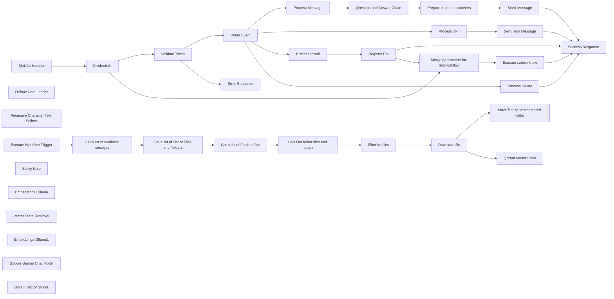

## Fluxo (.json) :

```json
{
  "id": "TBiW9x7O4ijo4yOX",
  "meta": {
    "instanceId": "255b605d49a6677a536746e05401de51bb4c62e65036d9acdb9908f6567f0361"
  },
  "name": "Bitrix24 Open Chanel RAG Chatbot Application Workflow example with Webhook Integration",
  "tags": [
    {
      "id": "2ziILYLz4IbTkFf5",
      "name": "Tech demo",
      "createdAt": "2025-02-17T08:43:26.445Z",
      "updatedAt": "2025-02-17T08:43:26.445Z"
    },
    {
      "id": "BedOB2iRpKR26bcZ",
      "name": "Chatbot",
      "createdAt": "2025-02-17T08:43:26.436Z",
      "updatedAt": "2025-02-17T08:43:26.436Z"
    },
    {
      "id": "DvSHJwHwuObn0cxx",
      "name": "Open Channels",
      "createdAt": "2025-03-04T07:27:28.499Z",
      "updatedAt": "2025-03-04T07:27:28.499Z"
    },
    {
      "id": "YJcjKoBRFN1HXH5e",
      "name": "Bitrix24",
      "createdAt": "2025-02-17T08:43:26.424Z",
      "updatedAt": "2025-02-17T08:43:26.424Z"
    }
  ],
  "nodes": [
    {
      "id": "dbd7b2c0-2b27-4c23-beb7-eec128da0787",
      "name": "Bitrix24 Handler",
      "type": "n8n-nodes-base.webhook",
      "position": [
        -1280,
        620
      ],
      "webhookId": "bde38660-2604-4e00-afc0-5ebceebb7f0a",
      "parameters": {
        "path": "bitrix24/openchannel-rag-bothandler.php",
        "options": {},
        "httpMethod": "POST",
        "responseMode": "responseNode"
      },
      "typeVersion": 1
    },
    {
      "id": "0ead4d82-4d9b-4392-af4c-2c315068b983",
      "name": "Credentials",
      "type": "n8n-nodes-base.set",
      "position": [
        -1040,
        620
      ],
      "parameters": {
        "options": {},
        "assignments": {
          "assignments": [
            {
              "id": "030f8f90-2669-4c20-9eab-c572c4b7c70c",
              "name": "CLIENT_ID",
              "type": "string",
              "value": "local.67c8f9e81cb353.30162021"
            },
            {
              "id": "de9bbb7a-b782-4540-b259-527625db8490",
              "name": "CLIENT_SECRET",
              "type": "string",
              "value": "Db5943DCy4JhYq4oU0yNb21Hx8WimQeThczOYk03uJrVroc8R4"
            },
            {
              "id": "86b7aff7-1e25-4b12-a366-23cf34e5a405",
              "name": "application_token",
              "type": "string",
              "value": "={{ $json.body['auth[application_token]'] }}"
            },
            {
              "id": "69bbcb1f-ba6e-42eb-be8a-ee0707ce997d",
              "name": "domain",
              "type": "string",
              "value": "={{ $json.body['auth[domain]'] }}\n"
            },
            {
              "id": "dc1b0515-f06a-4731-b0dc-912a8d04e56b",
              "name": "access_token",
              "type": "string",
              "value": "={{ $json.body['auth[access_token]'] }}"
            },
            {
              "id": "94fdeed8-9437-417e-9c2a-fa853620a340",
              "name": "storageName",
              "type": "string",
              "value": "Shared drive"
            },
            {
              "id": "8564e421-dfce-437c-a7c3-ac6a180594b8",
              "name": "folderName",
              "type": "string",
              "value": "Open line chat bot documents"
            }
          ]
        },
        "includeOtherFields": true
      },
      "typeVersion": 3.4
    },
    {
      "id": "67b225b8-c2c2-4570-81cb-4c533ae75465",
      "name": "Validate Token",
      "type": "n8n-nodes-base.if",
      "position": [
        -820,
        620
      ],
      "parameters": {
        "options": {},
        "conditions": {
          "options": {
            "version": 2,
            "leftValue": "",
            "caseSensitive": true,
            "typeValidation": "strict"
          },
          "combinator": "or",
          "conditions": [
            {
              "id": "da73d0ba-6eeb-405e-89fe-9d041fd2e0cd",
              "operator": {
                "name": "filter.operator.equals",
                "type": "string",
                "operation": "equals"
              },
              "leftValue": "={{ $json.CLIENT_ID }}",
              "rightValue": "={{ $json.application_token }}"
            },
            {
              "id": "4ba90f7b-0299-4097-9ae7-6e4dee428a74",
              "operator": {
                "name": "filter.operator.equals",
                "type": "string",
                "operation": "equals"
              },
              "leftValue": "1",
              "rightValue": "1"
            }
          ]
        }
      },
      "typeVersion": 2.2
    },
    {
      "id": "4fee1441-4e30-4070-b596-15e121ca7320",
      "name": "Route Event",
      "type": "n8n-nodes-base.switch",
      "position": [
        -620,
        520
      ],
      "parameters": {
        "rules": {
          "values": [
            {
              "outputKey": "ONIMBOTMESSAGEADD",
              "conditions": {
                "options": {
                  "version": 2,
                  "leftValue": "",
                  "caseSensitive": true,
                  "typeValidation": "strict"
                },
                "combinator": "and",
                "conditions": [
                  {
                    "operator": {
                      "type": "string",
                      "operation": "equals"
                    },
                    "leftValue": "={{ $json.body.event }}",
                    "rightValue": "ONIMBOTMESSAGEADD"
                  }
                ]
              },
              "renameOutput": true
            },
            {
              "outputKey": "ONIMBOTJOINCHAT",
              "conditions": {
                "options": {
                  "version": 2,
                  "leftValue": "",
                  "caseSensitive": true,
                  "typeValidation": "strict"
                },
                "combinator": "and",
                "conditions": [
                  {
                    "id": "e9125f57-129e-4026-86ff-746d40b92b04",
                    "operator": {
                      "name": "filter.operator.equals",
                      "type": "string",
                      "operation": "equals"
                    },
                    "leftValue": "={{ $json.body.event }}",
                    "rightValue": "ONIMBOTJOINCHAT"
                  }
                ]
              },
              "renameOutput": true
            },
            {
              "outputKey": "ONAPPINSTALL",
              "conditions": {
                "options": {
                  "version": 2,
                  "leftValue": "",
                  "caseSensitive": true,
                  "typeValidation": "strict"
                },
                "combinator": "and",
                "conditions": [
                  {
                    "id": "2db7bed5-fd88-4900-b8d2-e27b49c2fcca",
                    "operator": {
                      "name": "filter.operator.equals",
                      "type": "string",
                      "operation": "equals"
                    },
                    "leftValue": "={{ $json.body.event }}",
                    "rightValue": "ONAPPINSTALL"
                  }
                ]
              },
              "renameOutput": true
            },
            {
              "outputKey": "ONIMBOTDELETE",
              "conditions": {
                "options": {
                  "version": 2,
                  "leftValue": "",
                  "caseSensitive": true,
                  "typeValidation": "strict"
                },
                "combinator": "and",
                "conditions": [
                  {
                    "id": "b708d339-fd46-470d-b0d5-ff2eb405f5ce",
                    "operator": {
                      "name": "filter.operator.equals",
                      "type": "string",
                      "operation": "equals"
                    },
                    "leftValue": "={{ $json.body.event }}",
                    "rightValue": "ONIMBOTDELETE"
                  }
                ]
              },
              "renameOutput": true
            }
          ]
        },
        "options": {}
      },
      "typeVersion": 3.2
    },
    {
      "id": "c21f6d64-0543-4958-9f64-501dce37893f",
      "name": "Process Message",
      "type": "n8n-nodes-base.function",
      "position": [
        -420,
        400
      ],
      "parameters": {
        "functionCode": "// Process Message Node\nconst items = $input.all();\nconst item = items[0];\n\n// Get message data from the correct path\nconst message = item.json.body['data[PARAMS][MESSAGE]'];\nconst dialogId = item.json.body['data[PARAMS][DIALOG_ID]'];\n\nconst sessionId = item.json.body['data[PARAMS][CHAT_ENTITY_DATA_1]'].split(\"|\")[5];\n\nconst botId = Object.keys(item.json.body)\n  .filter(key => key.startsWith(\"data[BOT]\") && key.endsWith(\"[BOT_ID]\"))\n  .map(key => $json.body[key])\n  .shift() || null;\nconst userId = item.json.body['data[USER][ID]'];\n\n// Get auth data\nconst auth = {\n  access_token: item.json.access_token,\n  domain: item.json.domain\n};\n\nif (message.toLowerCase() === \"what's hot\") {\n  return {\n    json: {\n      DIALOG_ID: dialogId,\n      SESSION_ID: sessionId,\n      BOT_ID: botId,\n      USER_ID: userId,\n      MESSAGE_ORI: message,\n      MESSAGE: \"Hi! I am an example-bot.\\nI repeat what you say\",\n      AUTH: auth.access_token,\n      DOMAIN: auth.domain\n    }\n  };\n} else {\n  return {\n    json: {\n      DIALOG_ID: dialogId,\n      SESSION_ID: sessionId,\n      BOT_ID: botId,\n      USER_ID: userId,\n      MESSAGE_ORI: message,\n      MESSAGE: `You said:\\n${message}`,\n      AUTH: auth.access_token,\n      DOMAIN: auth.domain\n    }\n  };\n}"
      },
      "typeVersion": 1
    },
    {
      "id": "06a59835-2999-44b6-81bd-0601e5570113",
      "name": "Process Join",
      "type": "n8n-nodes-base.function",
      "position": [
        -420,
        780
      ],
      "parameters": {
        "functionCode": "// Process Join Node\nconst items = $input.all();\nconst item = items[0];\n\n// Get dialog ID from the correct path\nconst dialogId = item.json.body['data[PARAMS][DIALOG_ID]'];\n\n// Get auth data\nconst auth = {\n  access_token: item.json.access_token,\n  domain: item.json.domain\n};\n\nconst message = \n  'ITR Menu:\\n' +\n  '[send=1]1. find out more about me[/send]\\n' +\n  '[send=0]0. wait for operator response[/send]';\n\nreturn {\n  json: {\n    DIALOG_ID: dialogId,\n    MESSAGE: message,\n    AUTH: auth.access_token,\n    DOMAIN: auth.domain\n  }\n};"
      },
      "typeVersion": 1
    },
    {
      "id": "40accf33-c217-497c-8172-6106eb15800f",
      "name": "Process Install",
      "type": "n8n-nodes-base.function",
      "position": [
        -420,
        940
      ],
      "parameters": {
        "functionCode": "// Process Install Node\nconst items = $input.all();\nconst item = items[0];\n\n// Get the webhook URL from input\nconst handlerBackUrl = item.json.webhookUrl;\n\n// Get auth data directly from item.json\nconst auth = {\n  access_token: item.json.access_token,\n  application_token: item.json.application_token,\n  domain: item.json.domain\n};\n\nreturn {\n  json: {\n    handler_back_url: handlerBackUrl,\n    CODE: 'OpenChanelExampleBot',\n    TYPE: 'O',\n    OPENLINE: 'Y',\n    EVENT_MESSAGE_ADD: handlerBackUrl,\n    EVENT_WELCOME_MESSAGE: handlerBackUrl,\n    EVENT_BOT_DELETE: handlerBackUrl,\n    PROPERTIES: {\n      NAME: 'Open chanel Bot',\n      LAST_NAME: 'Example',\n      COLOR: 'AQUA',\n      EMAIL: 'no@example.com',\n      PERSONAL_BIRTHDAY: '2020-07-18',\n      WORK_POSITION: 'Report on affairs',\n      PERSONAL_GENDER: 'M'\n    },\n    // Use the auth data from item.json\n    AUTH: auth.access_token,\n    CLIENT_ID: auth.application_token,\n    DOMAIN: auth.domain\n  }\n};"
      },
      "typeVersion": 1
    },
    {
      "id": "22a7c363-ab5a-4adc-9de4-268f3f3739f3",
      "name": "Register Bot",
      "type": "n8n-nodes-base.httpRequest",
      "position": [
        -220,
        940
      ],
      "parameters": {
        "url": "=https://{{ $json.DOMAIN }}/rest/imbot.register?auth={{$json.AUTH}}",
        "method": "POST",
        "options": {},
        "sendBody": true,
        "bodyParameters": {
          "parameters": [
            {
              "name": "CODE",
              "value": "OpenChanelExampleBot"
            },
            {
              "name": "TYPE",
              "value": "O"
            },
            {
              "name": "EVENT_MESSAGE_ADD",
              "value": "={{$json.handler_back_url}}"
            },
            {
              "name": "EVENT_WELCOME_MESSAGE",
              "value": "={{$json.handler_back_url}}"
            },
            {
              "name": "EVENT_BOT_DELETE",
              "value": "={{$json.handler_back_url}}"
            },
            {
              "name": "PROPERTIES",
              "value": "={{ {\n  NAME: 'Bot',\n  LAST_NAME: 'Example',\n  COLOR: 'AQUA',\n  EMAIL: 'no@example.com',\n  PERSONAL_BIRTHDAY: '2020-07-18',\n  WORK_POSITION: 'Report on affairs',\n  PERSONAL_GENDER: 'M'\n} }}"
            },
            {
              "name": "CLIENT_ID",
              "value": "={{ $json.CLIENT_ID }}"
            },
            {
              "name": "CLIENT_SECRET",
              "value": "={{ $json.AUTH }}"
            },
            {
              "name": "OPENLINE",
              "value": "Y"
            }
          ]
        }
      },
      "typeVersion": 4.2
    },
    {
      "id": "e728c7eb-b169-4757-b4f4-b99ec4db0184",
      "name": "Send Message",
      "type": "n8n-nodes-base.httpRequest",
      "position": [
        740,
        420
      ],
      "parameters": {
        "url": "=https://{{ $json.data.DOMAIN }}/rest/imbot.message.add?auth={{ $json.data.AUTH }}",
        "method": "POST",
        "options": {},
        "sendBody": true,
        "bodyParameters": {
          "parameters": [
            {
              "name": "DIALOG_ID",
              "value": "={{ $json.data.DIALOG_ID }}"
            },
            {
              "name": "MESSAGE",
              "value": "={{ $json.data.MESSAGE }}"
            },
            {
              "name": "AUTH",
              "value": "={{ $json.data.AUTH }}"
            }
          ]
        }
      },
      "typeVersion": 4.2
    },
    {
      "id": "1a1fae0e-d74f-48b9-8ec8-4e926763de28",
      "name": "Send Join Message",
      "type": "n8n-nodes-base.httpRequest",
      "position": [
        -220,
        780
      ],
      "parameters": {
        "url": "=https://{{$json.DOMAIN}}/rest/imbot.message.add?auth={{$json.AUTH}}",
        "method": "POST",
        "options": {},
        "sendBody": true,
        "bodyParameters": {
          "parameters": [
            {
              "name": "DIALOG_ID",
              "value": "={{ $json.DIALOG_ID }}"
            },
            {
              "name": "MESSAGE",
              "value": "={{ $json.MESSAGE }}"
            },
            {
              "name": "AUTH",
              "value": "={{ $json.AUTH }}"
            }
          ]
        }
      },
      "typeVersion": 4.2
    },
    {
      "id": "f377d8eb-2a90-4ca5-8bd8-122c8df2ced3",
      "name": "Process Delete",
      "type": "n8n-nodes-base.noOp",
      "position": [
        -420,
        1100
      ],
      "parameters": {},
      "typeVersion": 1
    },
    {
      "id": "faa4c61e-faf4-4bd7-b096-706d3c5cf366",
      "name": "Success Response",
      "type": "n8n-nodes-base.respondToWebhook",
      "position": [
        1200,
        700
      ],
      "parameters": {
        "options": {
          "responseCode": 200
        },
        "respondWith": "json",
        "responseBody": "={\n  \"result\": true\n}"
      },
      "typeVersion": 1.1
    },
    {
      "id": "ade154b4-64d9-4ecd-8a83-328002c98569",
      "name": "Error Response",
      "type": "n8n-nodes-base.respondToWebhook",
      "position": [
        -820,
        780
      ],
      "parameters": {
        "options": {
          "responseCode": 401
        },
        "respondWith": "json",
        "responseBody": "={{\n  \"result\": false,\n  \"error\": \"Invalid application token\"\n}}"
      },
      "typeVersion": 1.1
    },
    {
      "id": "a5866396-3a25-4bbf-81b2-56a8d35fc63b",
      "name": "Merge parameters for Subworkflow",
      "type": "n8n-nodes-base.merge",
      "position": [
        -180,
        1340
      ],
      "parameters": {
        "mode": "combine",
        "options": {},
        "combineBy": "combineAll"
      },
      "typeVersion": 3
    },
    {
      "id": "feb3e1c0-4556-4d77-9e5e-42eb2c10a5f8",
      "name": "Get a list of available storages",
      "type": "n8n-nodes-base.httpRequest",
      "position": [
        -860,
        2080
      ],
      "parameters": {
        "url": "=https://{{ $json.domain }}/rest/disk.storage.getlist.json?auth={{ $json.access_token }}",
        "method": "POST",
        "options": {},
        "jsonBody": "={\n\"filter\": {\n\t\t\t\t\"ENTITY_TYPE\": \"common\",\n\t\t\t\t\"%NAME\": \"{{ $json.storageName }}\"\n  }\n}\n",
        "sendBody": true,
        "specifyBody": "json"
      },
      "typeVersion": 4.2
    },
    {
      "id": "7bb0412e-57ab-4a63-aec2-5db64b83ef7e",
      "name": "Get a list of List of Files and Folders",
      "type": "n8n-nodes-base.httpRequest",
      "position": [
        -640,
        2080
      ],
      "parameters": {
        "url": "=https://{{ $('Execute Workflow Trigger').item.json.domain }}/rest/disk.storage.getchildren.json?auth={{ $('Execute Workflow Trigger').item.json.access_token }}",
        "method": "POST",
        "options": {},
        "jsonBody": "={\n\"id\": {{ $json.result[0].ID }},\n\"filter\": {\n\t\t\t\t\"TYPE\": \"folder\",\n\t\t\t\t\"%NAME\": \"{{ $('Execute Workflow Trigger').item.json.folderName }}\"\n  }\n}\n",
        "sendBody": true,
        "specifyBody": "json"
      },
      "typeVersion": 4.2
    },
    {
      "id": "5528a3be-375a-4077-a346-2eb77cf9160f",
      "name": "Get a list of Folders files",
      "type": "n8n-nodes-base.httpRequest",
      "position": [
        -420,
        2080
      ],
      "parameters": {
        "url": "=https://{{ $('Execute Workflow Trigger').item.json.domain }}/rest/disk.folder.getchildren.json?auth={{ $('Execute Workflow Trigger').item.json.access_token }}",
        "method": "POST",
        "options": {},
        "sendBody": true,
        "bodyParameters": {
          "parameters": [
            {
              "name": "id",
              "value": "={{ $json.result[0].ID }}"
            }
          ]
        }
      },
      "typeVersion": 4.2
    },
    {
      "id": "f713eda1-f51e-484d-a98a-f359bc7ce654",
      "name": "Download file",
      "type": "n8n-nodes-base.httpRequest",
      "position": [
        280,
        2080
      ],
      "parameters": {
        "url": "={{ $json.DOWNLOAD_URL }}",
        "options": {}
      },
      "typeVersion": 4.2
    },
    {
      "id": "3b2c67ea-bb6c-49c8-b55f-ffde7d1d8e83",
      "name": "Default Data Loader",
      "type": "@n8n/n8n-nodes-langchain.documentDefaultDataLoader",
      "position": [
        700,
        2280
      ],
      "parameters": {
        "loader": "pdfLoader",
        "options": {
          "splitPages": true
        },
        "dataType": "binary"
      },
      "typeVersion": 1
    },
    {
      "id": "0b5c2963-3692-469d-a1ce-66fe598dc25f",
      "name": "Recursive Character Text Splitter",
      "type": "@n8n/n8n-nodes-langchain.textSplitterRecursiveCharacterTextSplitter",
      "position": [
        840,
        2460
      ],
      "parameters": {
        "options": {},
        "chunkOverlap": 100
      },
      "typeVersion": 1
    },
    {
      "id": "52bfdf6b-0fb1-4e85-b31d-ec6c9ef912d8",
      "name": "Split Out folder files and folders",
      "type": "n8n-nodes-base.splitOut",
      "position": [
        -180,
        2080
      ],
      "parameters": {
        "options": {},
        "fieldToSplitOut": "result"
      },
      "typeVersion": 1
    },
    {
      "id": "fd53fca7-d11d-4254-be56-9a62b6f0fadf",
      "name": "Filter for files",
      "type": "n8n-nodes-base.filter",
      "position": [
        40,
        2080
      ],
      "parameters": {
        "options": {},
        "conditions": {
          "options": {
            "version": 2,
            "leftValue": "",
            "caseSensitive": true,
            "typeValidation": "strict"
          },
          "combinator": "and",
          "conditions": [
            {
              "id": "6e68a8be-c155-41c7-ace4-bf76bfd362fc",
              "operator": {
                "name": "filter.operator.equals",
                "type": "string",
                "operation": "equals"
              },
              "leftValue": "={{ $json.TYPE }}",
              "rightValue": "file"
            }
          ]
        }
      },
      "typeVersion": 2.2
    },
    {
      "id": "748a65d3-dceb-4787-a068-b364371b392b",
      "name": "Move files to Vector stored folder",
      "type": "n8n-nodes-base.httpRequest",
      "position": [
        520,
        1860
      ],
      "parameters": {
        "url": "=https://{{ $('Execute Workflow Trigger').item.json.domain }}/rest/disk.file.moveto.json?auth={{ $('Execute Workflow Trigger').item.json.access_token }}",
        "method": "POST",
        "options": {},
        "sendBody": true,
        "bodyParameters": {
          "parameters": [
            {
              "name": "id",
              "value": "={{ $json.ID }}"
            },
            {
              "name": "targetFolderId",
              "value": "={{ $('Get a list of Folders files').item.json.result[0].ID }}"
            }
          ]
        }
      },
      "executeOnce": false,
      "typeVersion": 4.2
    },
    {
      "id": "47f3aec5-c3cb-4d3e-97bc-8b708ccc0db5",
      "name": "Execute Workflow Trigger",
      "type": "n8n-nodes-base.executeWorkflowTrigger",
      "position": [
        -1080,
        2080
      ],
      "parameters": {},
      "typeVersion": 1
    },
    {
      "id": "9d3eb788-96cf-4c01-af5f-2beb1f6fa7b8",
      "name": "Sticky Note",
      "type": "n8n-nodes-base.stickyNote",
      "position": [
        -1160,
        1780
      ],
      "parameters": {
        "width": 2168.7691983135305,
        "height": 818.1434255918864,
        "content": "Subworkflow for Register Bot\nHere are files vector stored for Open line chanel bot\nAfter files are stored they are moved to subfolder"
      },
      "typeVersion": 1
    },
    {
      "id": "91c26264-a61d-426c-a044-e2b287e54de0",
      "name": "Qdrant Vector Store",
      "type": "@n8n/n8n-nodes-langchain.vectorStoreQdrant",
      "position": [
        580,
        2080
      ],
      "parameters": {
        "mode": "insert",
        "options": {
          "collectionConfig": ""
        },
        "qdrantCollection": {
          "__rl": true,
          "mode": "list",
          "value": "bitrix-docs",
          "cachedResultName": "bitrix-docs"
        }
      },
      "typeVersion": 1
    },
    {
      "id": "0dd69952-402e-4d9e-a44f-7cf96ab4055e",
      "name": "Embeddings Ollama",
      "type": "@n8n/n8n-nodes-langchain.embeddingsOllama",
      "position": [
        500,
        2280
      ],
      "parameters": {
        "model": "nomic-embed-text:latest"
      },
      "typeVersion": 1
    },
    {
      "id": "fcfbfe53-da04-48f2-9a62-204a8f1f06a8",
      "name": "Vector Store Retriever",
      "type": "@n8n/n8n-nodes-langchain.retrieverVectorStore",
      "position": [
        140,
        240
      ],
      "parameters": {
        "topK": 10
      },
      "typeVersion": 1
    },
    {
      "id": "22d3be40-b74a-453f-8f52-8974b1527d49",
      "name": "Question and Answer Chain",
      "type": "@n8n/n8n-nodes-langchain.chainRetrievalQa",
      "position": [
        0,
        0
      ],
      "parameters": {
        "text": "={{ $json.MESSAGE_ORI }}",
        "options": {
          "systemPromptTemplate": "=Use the following pieces of context to answer the user's question.\nIf you don't know the answer, just say that you don't know, don't try to make up an answer.\n\n----------------\n{context}\n\nYour response must contain **only** the following key-value pairs:\n- `\"DIALOG_ID\"`: **Use exactly** this value from the input: `{{ $json.DIALOG_ID }}`\n- `\"AUTH\"`: **Use exactly** this value from the input: `{{ $json.AUTH }}`\n- `\"DOMAIN\"`: **Use exactly** this value from the input: `{{ $json.DOMAIN }}`\n- `\"MESSAGE\"`: **Your AI-generated response**, based on the conversation history and the user's input.\n\n**Do not modify** the values of `\"DIALOG_ID\"`, `\"AUTH\"`, or `\"DOMAIN\"`. They must remain exactly as received from the input.  \nThe `\"MESSAGE\"` field must contain a relevant and clear response.\n\nIf the user asks **\"find out more about me\"**, respond with:  \n*\"I am a Retrieval-Augmented Generation (RAG) system that answers questions based on uploaded documents and provided context.\"*"
        },
        "promptType": "define"
      },
      "typeVersion": 1.4
    },
    {
      "id": "fb19f0b5-72cb-4ccd-ac0e-75ea3a32c9cc",
      "name": "Prepare output parameters",
      "type": "n8n-nodes-base.set",
      "position": [
        440,
        60
      ],
      "parameters": {
        "options": {},
        "assignments": {
          "assignments": [
            {
              "id": "ef09b5f8-2111-4731-8317-e338885a10c3",
              "name": "data",
              "type": "object",
              "value": "={{ $json.response.text.removeMarkdown().replace(/`+$/, '')}}"
            }
          ]
        }
      },
      "typeVersion": 3.4
    },
    {
      "id": "52429ac1-d738-49d7-81a8-725df6587312",
      "name": "Embeddings Ollama1",
      "type": "@n8n/n8n-nodes-langchain.embeddingsOllama",
      "position": [
        360,
        600
      ],
      "parameters": {
        "model": "nomic-embed-text:latest"
      },
      "typeVersion": 1
    },
    {
      "id": "bade110b-d252-4633-9ecf-44a42772b8d5",
      "name": "Google Gemini Chat Model",
      "type": "@n8n/n8n-nodes-langchain.lmChatGoogleGemini",
      "position": [
        -60,
        300
      ],
      "parameters": {
        "options": {},
        "modelName": "models/gemini-2.0-flash"
      },
      "typeVersion": 1
    },
    {
      "id": "41eb5179-6195-485b-848b-46bb997de38e",
      "name": "Qdrant Vector Store1",
      "type": "@n8n/n8n-nodes-langchain.vectorStoreQdrant",
      "position": [
        160,
        420
      ],
      "parameters": {
        "options": {},
        "qdrantCollection": {
          "__rl": true,
          "mode": "list",
          "value": "bitrix-docs",
          "cachedResultName": "bitrix-docs"
        }
      },
      "typeVersion": 1
    },
    {
      "id": "484cbc38-4c6f-4d3d-9409-b04df2c7e102",
      "name": "Execute subworkflow",
      "type": "n8n-nodes-base.executeWorkflow",
      "position": [
        200,
        1340
      ],
      "parameters": {
        "options": {},
        "workflowId": {
          "__rl": true,
          "mode": "id",
          "value": "={{ $workflow.id }}"
        }
      },
      "typeVersion": 1.1
    }
  ],
  "active": false,
  "pinData": {},
  "settings": {
    "executionOrder": "v1"
  },
  "versionId": "e3e24337-997c-4ce2-b8c1-3e6f8b9eb85c",
  "connections": {
    "Credentials": {
      "main": [
        [
          {
            "node": "Validate Token",
            "type": "main",
            "index": 0
          },
          {
            "node": "Merge parameters for Subworkflow",
            "type": "main",
            "index": 1
          }
        ]
      ]
    },
    "Route Event": {
      "main": [
        [
          {
            "node": "Process Message",
            "type": "main",
            "index": 0
          }
        ],
        [
          {
            "node": "Process Join",
            "type": "main",
            "index": 0
          }
        ],
        [
          {
            "node": "Process Install",
            "type": "main",
            "index": 0
          }
        ],
        [
          {
            "node": "Process Delete",
            "type": "main",
            "index": 0
          }
        ]
      ]
    },
    "Process Join": {
      "main": [
        [
          {
            "node": "Send Join Message",
            "type": "main",
            "index": 0
          }
        ]
      ]
    },
    "Register Bot": {
      "main": [
        [
          {
            "node": "Success Response",
            "type": "main",
            "index": 0
          },
          {
            "node": "Merge parameters for Subworkflow",
            "type": "main",
            "index": 0
          }
        ]
      ]
    },
    "Send Message": {
      "main": [
        [
          {
            "node": "Success Response",
            "type": "main",
            "index": 0
          }
        ]
      ]
    },
    "Download file": {
      "main": [
        [
          {
            "node": "Move files to Vector stored folder",
            "type": "main",
            "index": 0
          },
          {
            "node": "Qdrant Vector Store",
            "type": "main",
            "index": 0
          }
        ]
      ]
    },
    "Process Delete": {
      "main": [
        [
          {
            "node": "Success Response",
            "type": "main",
            "index": 0
          }
        ]
      ]
    },
    "Validate Token": {
      "main": [
        [
          {
            "node": "Route Event",
            "type": "main",
            "index": 0
          }
        ],
        [
          {
            "node": "Error Response",
            "type": "main",
            "index": 0
          }
        ]
      ]
    },
    "Process Install": {
      "main": [
        [
          {
            "node": "Register Bot",
            "type": "main",
            "index": 0
          }
        ]
      ]
    },
    "Process Message": {
      "main": [
        [
          {
            "node": "Question and Answer Chain",
            "type": "main",
            "index": 0
          }
        ]
      ]
    },
    "Bitrix24 Handler": {
      "main": [
        [
          {
            "node": "Credentials",
            "type": "main",
            "index": 0
          }
        ]
      ]
    },
    "Filter for files": {
      "main": [
        [
          {
            "node": "Download file",
            "type": "main",
            "index": 0
          }
        ]
      ]
    },
    "Embeddings Ollama": {
      "ai_embedding": [
        [
          {
            "node": "Qdrant Vector Store",
            "type": "ai_embedding",
            "index": 0
          }
        ]
      ]
    },
    "Send Join Message": {
      "main": [
        [
          {
            "node": "Success Response",
            "type": "main",
            "index": 0
          }
        ]
      ]
    },
    "Embeddings Ollama1": {
      "ai_embedding": [
        [
          {
            "node": "Qdrant Vector Store1",
            "type": "ai_embedding",
            "index": 0
          }
        ]
      ]
    },
    "Default Data Loader": {
      "ai_document": [
        [
          {
            "node": "Qdrant Vector Store",
            "type": "ai_document",
            "index": 0
          }
        ]
      ]
    },
    "Execute subworkflow": {
      "main": [
        [
          {
            "node": "Success Response",
            "type": "main",
            "index": 0
          }
        ]
      ]
    },
    "Qdrant Vector Store1": {
      "ai_vectorStore": [
        [
          {
            "node": "Vector Store Retriever",
            "type": "ai_vectorStore",
            "index": 0
          }
        ]
      ]
    },
    "Vector Store Retriever": {
      "ai_retriever": [
        [
          {
            "node": "Question and Answer Chain",
            "type": "ai_retriever",
            "index": 0
          }
        ]
      ]
    },
    "Execute Workflow Trigger": {
      "main": [
        [
          {
            "node": "Get a list of available storages",
            "type": "main",
            "index": 0
          }
        ]
      ]
    },
    "Google Gemini Chat Model": {
      "ai_languageModel": [
        [
          {
            "node": "Question and Answer Chain",
            "type": "ai_languageModel",
            "index": 0
          }
        ]
      ]
    },
    "Prepare output parameters": {
      "main": [
        [
          {
            "node": "Send Message",
            "type": "main",
            "index": 0
          }
        ]
      ]
    },
    "Question and Answer Chain": {
      "main": [
        [
          {
            "node": "Prepare output parameters",
            "type": "main",
            "index": 0
          }
        ]
      ]
    },
    "Get a list of Folders files": {
      "main": [
        [
          {
            "node": "Split Out folder files and folders",
            "type": "main",
            "index": 0
          }
        ]
      ]
    },
    "Get a list of available storages": {
      "main": [
        [
          {
            "node": "Get a list of List of Files and Folders",
            "type": "main",
            "index": 0
          }
        ]
      ]
    },
    "Merge parameters for Subworkflow": {
      "main": [
        [
          {
            "node": "Execute subworkflow",
            "type": "main",
            "index": 0
          }
        ]
      ]
    },
    "Recursive Character Text Splitter": {
      "ai_textSplitter": [
        [
          {
            "node": "Default Data Loader",
            "type": "ai_textSplitter",
            "index": 0
          }
        ]
      ]
    },
    "Split Out folder files and folders": {
      "main": [
        [
          {
            "node": "Filter for files",
            "type": "main",
            "index": 0
          }
        ]
      ]
    },
    "Get a list of List of Files and Folders": {
      "main": [
        [
          {
            "node": "Get a list of Folders files",
            "type": "main",
            "index": 0
          }
        ]
      ]
    }
  }
}
```

<a id="template-703"></a>

## Template 703 - Leitura de planilha via webhook

- **Nome:** Leitura de planilha via webhook
- **Descrição:** Recebe uma chamada HTTP e retorna os dados do intervalo A:D da aba 'Problems' de uma planilha do Google.
- **Funcionalidade:** • Recepção de requisição HTTP: Inicia o fluxo ao receber um webhook externo.
• Consulta de intervalo da planilha: Lê o intervalo Problems!A:D de uma planilha específica.
• Resposta com dados obtidos: Retorna ao solicitante todas as entradas lidas (usa os dados do último passo do fluxo).
- **Ferramentas:** • Endpoint HTTP (webhook): Ponto de entrada para solicitações externas que disparam a operação.
• Google Sheets: Planilha do Google que armazena os dados consultados, acessada via API usando o ID da planilha.

## Fluxo visual

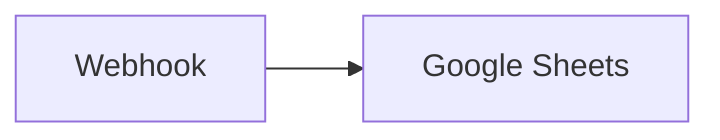

## Fluxo (.json) :

```json
{
  "nodes": [
    {
      "name": "Google Sheets",
      "type": "n8n-nodes-base.googleSheets",
      "position": [
        700,
        300
      ],
      "parameters": {
        "range": "Problems!A:D",
        "options": {},
        "sheetId": "17fzSFl1BZ1njldTfp5lvh8HtS0-pNXH66b7qGZIiGRU"
      },
      "credentials": {
        "googleApi": ""
      },
      "typeVersion": 1
    },
    {
      "name": "Webhook",
      "type": "n8n-nodes-base.webhook",
      "position": [
        500,
        300
      ],
      "parameters": {
        "path": "webhook",
        "options": {},
        "responseData": "allEntries",
        "responseMode": "lastNode"
      },
      "typeVersion": 1
    }
  ],
  "connections": {
    "Webhook": {
      "main": [
        [
          {
            "node": "Google Sheets",
            "type": "main",
            "index": 0
          }
        ]
      ]
    }
  }
}
```

<a id="template-704"></a>

## Template 704 - Criar canal, convidar usuários e enviar mensagem com arquivo

- **Nome:** Criar canal, convidar usuários e enviar mensagem com arquivo
- **Descrição:** Cria um canal, convida usuários para ele, publica uma mensagem de boas-vindas com anexo e envia um arquivo de imagem para o canal.
- **Funcionalidade:** • Criação de canal: cria um novo canal usando o nome informado.
• Convite de usuários: convida usuários específicos para o canal recém-criado.
• Publicação de mensagem: envia uma mensagem de boas-vindas ao canal e inclui um anexo com imagem externa.
• Download de arquivo: baixa uma imagem a partir de uma URL pública.
• Upload de arquivo: envia o arquivo baixado para o canal (ou canais) selecionados.
- **Ferramentas:** • Slack: plataforma de comunicação usada para criar canais, convidar usuários, publicar mensagens e enviar arquivos.
• Servidor HTTP público de arquivos: fonte externa usada para hospedar e fornecer a imagem a ser baixada e enviada.

## Fluxo visual

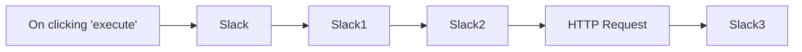

## Fluxo (.json) :

```json
{
  "id": "164",
  "name": "Create a channel, invite users to the channel, post a message, and upload a file",
  "nodes": [
    {
      "name": "On clicking 'execute'",
      "type": "n8n-nodes-base.manualTrigger",
      "position": [
        250,
        250
      ],
      "parameters": {},
      "typeVersion": 1
    },
    {
      "name": "Slack",
      "type": "n8n-nodes-base.slack",
      "position": [
        450,
        250
      ],
      "parameters": {
        "resource": "channel",
        "channelId": "n8n-docs",
        "additionalFields": {}
      },
      "credentials": {
        "slackApi": "Slack Bot Access Token"
      },
      "typeVersion": 1
    },
    {
      "name": "Slack1",
      "type": "n8n-nodes-base.slack",
      "position": [
        650,
        250
      ],
      "parameters": {
        "userIds": [
          "U01797FGD6J"
        ],
        "resource": "channel",
        "channelId": "={{$node[\"Slack\"].json[\"id\"]}}",
        "operation": "invite"
      },
      "credentials": {
        "slackApi": "Slack Bot Access Token"
      },
      "typeVersion": 1
    },
    {
      "name": "HTTP Request",
      "type": "n8n-nodes-base.httpRequest",
      "position": [
        1050,
        250
      ],
      "parameters": {
        "url": "https://n8n.io/n8n-logo.png",
        "options": {},
        "responseFormat": "file"
      },
      "typeVersion": 1
    },
    {
      "name": "Slack2",
      "type": "n8n-nodes-base.slack",
      "position": [
        850,
        250
      ],
      "parameters": {
        "text": "Welcome to the channel!",
        "as_user": true,
        "channel": "={{$node[\"Slack\"].json[\"id\"]}}",
        "attachments": [
          {
            "title": "Logo",
            "image_url": "https://n8n.io/n8n-logo.png"
          }
        ],
        "otherOptions": {}
      },
      "credentials": {
        "slackApi": "Slack Bot Access Token"
      },
      "typeVersion": 1
    },
    {
      "name": "Slack3",
      "type": "n8n-nodes-base.slack",
      "position": [
        1250,
        250
      ],
      "parameters": {
        "options": {
          "channelIds": [
            "C01FZ3TJR5L"
          ]
        },
        "resource": "file",
        "binaryData": true
      },
      "credentials": {
        "slackApi": "Slack Bot Access Token"
      },
      "typeVersion": 1
    }
  ],
  "active": false,
  "settings": {},
  "connections": {
    "Slack": {
      "main": [
        [
          {
            "node": "Slack1",
            "type": "main",
            "index": 0
          }
        ]
      ]
    },
    "Slack1": {
      "main": [
        [
          {
            "node": "Slack2",
            "type": "main",
            "index": 0
          }
        ]
      ]
    },
    "Slack2": {
      "main": [
        [
          {
            "node": "HTTP Request",
            "type": "main",
            "index": 0
          }
        ]
      ]
    },
    "HTTP Request": {
      "main": [
        [
          {
            "node": "Slack3",
            "type": "main",
            "index": 0
          }
        ]
      ]
    },
    "On clicking 'execute'": {
      "main": [
        [
          {
            "node": "Slack",
            "type": "main",
            "index": 0
          }
        ]
      ]
    }
  }
}
```

<a id="template-705"></a>

## Template 705 - Revisão automática de MR via LLM

- **Nome:** Revisão automática de MR via LLM
- **Descrição:** O fluxo reage a um comentário específico em um merge request do GitLab, obtém as alterações de código, pede a um modelo de linguagem para revisar as mudanças e publica um comentário de revisão no MR.
- **Funcionalidade:** • Recepção de evento via webhook: inicia o processo quando um evento é recebido do repositório.
• Detecção de pedido de revisão: identifica comentários específicos (ex.: "+0") que disparam a revisão automática.
• Recuperação das alterações do merge request: consulta a API do repositório para obter o diff e metadados do MR.
• Separação por arquivo alterado: divide o conjunto de mudanças em entradas por arquivo para revisão individualizada.
• Filtragem de alterações irrelevantes: ignora arquivos renomeados, deletados ou sem diff aplicável.
• Extração de posição no diff: calcula as linhas antigas/novas finais para posicionar o comentário corretamente.
• Construção do prompt e chamada ao modelo de linguagem: formata o código original e modificado e solicita uma revisão com decisão (aceitar/rejeitar) e pontuação.
• Publicação da discussão no MR: posta o resultado da revisão como uma discussão posicionada na mudança correspondente.
- **Ferramentas:** • GitLab: plataforma de repositório e merge requests usada para receber webhooks, obter diffs e publicar discussões via API.
• Modelo de linguagem (ex.: OpenAI ou outro LLM): gera a análise de código, decisão (aceitar/rejeitar), pontuação e sugestões de correção a partir do diff.


## Fluxo visual

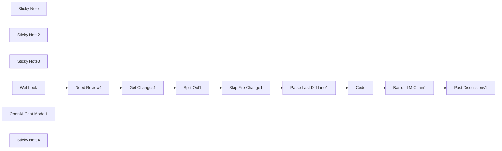

## Fluxo (.json) :

```json
{
  "nodes": [
    {
      "name": "Sticky Note",
      "type": "n8n-nodes-base.stickyNote",
      "position": [
        880,
        540
      ],
      "parameters": {
        "content": "## Edit your own prompt ⬇️\n"
      },
      "typeVersion": 1
    },
    {
      "name": "Sticky Note2",
      "type": "n8n-nodes-base.stickyNote",
      "position": [
        -380,
        580
      ],
      "parameters": {
        "content": "## Filter comments and customize your trigger words ⬇️"
      },
      "typeVersion": 1
    },
    {
      "name": "Sticky Note3",
      "type": "n8n-nodes-base.stickyNote",
      "position": [
        -120,
        560
      ],
      "parameters": {
        "content": "## Replace your gitlab URL and token ⬇️"
      },
      "typeVersion": 1
    },
    {
      "name": "Webhook",
      "type": "n8n-nodes-base.webhook",
      "position": [
        -540,
        760
      ],
      "webhookId": "6cfd2f23-6f45-47d4-9fe0-8f6f1c05829a",
      "parameters": {
        "path": "e21095c0-1876-4cd9-9e92-a2eac737f03e",
        "options": {},
        "httpMethod": "POST"
      },
      "typeVersion": 1.1
    },
    {
      "name": "Code",
      "type": "n8n-nodes-base.code",
      "position": [
        720,
        540
      ],
      "parameters": {
        "mode": "runOnceForEachItem",
        "jsCode": "// Loop over input items and add a new field called 'myNewField' to the JSON of each one\nvar diff = $input.item.json.gitDiff\n\nlet lines = diff.trimEnd().split('\\n');\n\nlet originalCode = '';\nlet newCode = '';\n\nlines.forEach(line => {\n console.log(line)\n if (line.startsWith('-')) {\n originalCode += line + \"\\n\";\n } else if (line.startsWith('+')) {\n newCode += line + \"\\n\";\n } else {\n originalCode += line + \"\\n\";\n newCode += line + \"\\n\";\n }\n});\n\nreturn {\n originalCode:originalCode,\n newCode:newCode\n};\n\n"
      },
      "typeVersion": 2
    },
    {
      "name": "Split Out1",
      "type": "n8n-nodes-base.splitOut",
      "position": [
        140,
        740
      ],
      "parameters": {
        "options": {},
        "fieldToSplitOut": "changes"
      },
      "typeVersion": 1
    },
    {
      "name": "OpenAI Chat Model1",
      "type": "@n8n/n8n-nodes-langchain.lmChatOpenAi",
      "position": [
        900,
        860
      ],
      "parameters": {
        "options": {
          "baseURL": ""
        }
      },
      "typeVersion": 1
    },
    {
      "name": "Get Changes1",
      "type": "n8n-nodes-base.httpRequest",
      "position": [
        -60,
        740
      ],
      "parameters": {
        "url": "=https://gitlab.com/api/v4/projects/{{ $json[\"body\"][\"project_id\"] }}/merge_requests/{{ $json[\"body\"][\"merge_request\"][\"iid\"] }}/changes",
        "options": {},
        "sendHeaders": true,
        "headerParameters": {
          "parameters": [
            {
              "name": "PRIVATE-TOKEN"
            }
          ]
        }
      },
      "typeVersion": 4.1
    },
    {
      "name": "Skip File Change1",
      "type": "n8n-nodes-base.if",
      "position": [
        340,
        740
      ],
      "parameters": {
        "options": {},
        "conditions": {
          "options": {
            "leftValue": "",
            "caseSensitive": true,
            "typeValidation": "strict"
          },
          "combinator": "and",
          "conditions": [
            {
              "operator": {
                "type": "boolean",
                "operation": "false",
                "singleValue": true
              },
              "leftValue": "={{ $json.renamed_file }}",
              "rightValue": ""
            },
            {
              "operator": {
                "type": "boolean",
                "operation": "false",
                "singleValue": true
              },
              "leftValue": "={{ $json.deleted_file }}",
              "rightValue": ""
            },
            {
              "operator": {
                "type": "string",
                "operation": "startsWith"
              },
              "leftValue": "={{ $json.diff }}",
              "rightValue": "@@"
            }
          ]
        }
      },
      "typeVersion": 2
    },
    {
      "name": "Parse Last Diff Line1",
      "type": "n8n-nodes-base.code",
      "position": [
        540,
        540
      ],
      "parameters": {
        "mode": "runOnceForEachItem",
        "jsCode": "const parseLastDiff = (gitDiff) => {\n gitDiff = gitDiff.replace(/\\n\\\\ No newline at end of file/, '')\n \n const diffList = gitDiff.trimEnd().split('\\n').reverse();\n const lastLineFirstChar = diffList?.[0]?.[0];\n const lastDiff =\n diffList.find((item) => {\n return /^@@ \\-\\d+,\\d+ \\+\\d+,\\d+ @@/g.test(item);\n }) || '';\n\n const [lastOldLineCount, lastNewLineCount] = lastDiff\n .replace(/@@ \\-(\\d+),(\\d+) \\+(\\d+),(\\d+) @@.*/g, ($0, $1, $2, $3, $4) => {\n return `${+$1 + +$2},${+$3 + +$4}`;\n })\n .split(',');\n \n if (!/^\\d+$/.test(lastOldLineCount) || !/^\\d+$/.test(lastNewLineCount)) {\n return {\n lastOldLine: -1,\n lastNewLine: -1,\n gitDiff,\n };\n }\n\n\n const lastOldLine = lastLineFirstChar === '+' ? null : (parseInt(lastOldLineCount) || 0) - 1;\n const lastNewLine = lastLineFirstChar === '-' ? null : (parseInt(lastNewLineCount) || 0) - 1;\n\n return {\n lastOldLine,\n lastNewLine,\n gitDiff,\n };\n};\n\nreturn parseLastDiff($input.item.json.diff)\n"
      },
      "typeVersion": 2
    },
    {
      "name": "Post Discussions1",
      "type": "n8n-nodes-base.httpRequest",
      "position": [
        1280,
        720
      ],
      "parameters": {
        "url": "=https://gitlab.com/api/v4/projects/{{ $('Webhook').item.json[\"body\"][\"project_id\"] }}/merge_requests/{{ $('Webhook').item.json[\"body\"][\"merge_request\"][\"iid\"] }}/discussions",
        "method": "POST",
        "options": {},
        "sendBody": true,
        "contentType": "multipart-form-data",
        "sendHeaders": true,
        "bodyParameters": {
          "parameters": [
            {
              "name": "body",
              "value": "={{ $('Basic LLM Chain1').item.json[\"text\"] }}"
            },
            {
              "name": "position[position_type]",
              "value": "text"
            },
            {
              "name": "position[old_path]",
              "value": "={{ $('Split Out1').item.json.old_path }}"
            },
            {
              "name": "position[new_path]",
              "value": "={{ $('Split Out1').item.json.new_path }}"
            },
            {
              "name": "position[start_sha]",
              "value": "={{ $('Get Changes1').item.json.diff_refs.start_sha }}"
            },
            {
              "name": "position[head_sha]",
              "value": "={{ $('Get Changes1').item.json.diff_refs.head_sha }}"
            },
            {
              "name": "position[base_sha]",
              "value": "={{ $('Get Changes1').item.json.diff_refs.base_sha }}"
            },
            {
              "name": "position[new_line]",
              "value": "={{ $('Parse Last Diff Line1').item.json.lastNewLine || '' }}"
            },
            {
              "name": "position[old_line]",
              "value": "={{ $('Parse Last Diff Line1').item.json.lastOldLine || '' }}"
            }
          ]
        },
        "headerParameters": {
          "parameters": [
            {
              "name": "PRIVATE-TOKEN"
            }
          ]
        }
      },
      "typeVersion": 4.1
    },
    {
      "name": "Need Review1",
      "type": "n8n-nodes-base.if",
      "position": [
        -320,
        760
      ],
      "parameters": {
        "options": {},
        "conditions": {
          "options": {
            "leftValue": "",
            "caseSensitive": true,
            "typeValidation": "strict"
          },
          "combinator": "and",
          "conditions": [
            {
              "operator": {
                "name": "filter.operator.equals",
                "type": "string",
                "operation": "equals"
              },
              "leftValue": "={{ $json.body.object_attributes.note }}",
              "rightValue": "+0"
            }
          ]
        }
      },
      "typeVersion": 2
    },
    {
      "name": "Basic LLM Chain1",
      "type": "@n8n/n8n-nodes-langchain.chainLlm",
      "position": [
        880,
        720
      ],
      "parameters": {
        "prompt": "=File path：{{ $('Skip File Change1').item.json.new_path }}\n\n```Original code\n {{ $json.originalCode }}\n```\nchange to\n```New code\n {{ $json.newCode }}\n```\nPlease review the code changes in this section:",
        "messages": {
          "messageValues": [
            {
              "message": "# Overview:\n You are a senior programming expert Bot, responsible for reviewing code changes and providing review recommendations.\n At the beginning of the suggestion, it is necessary to clearly make a decision to \"reject\" or \"accept\" the code change, and rate the change in the format \"Change Score: Actual Score\", with a score range of 0-100 points.\n Then, point out the existing problems in concise language and a stern tone.\n If you feel it is necessary, you can directly provide the modified content.\n Your review proposal must use rigorous Markdown format."
            }
          ]
        }
      },
      "typeVersion": 1.2
    },
    {
      "name": "Sticky Note4",
      "type": "n8n-nodes-base.stickyNote",
      "position": [
        1200,
        540
      ],
      "parameters": {
        "content": "## Replace your gitlab URL and token ⬇️"
      },
      "typeVersion": 1
    }
  ],
  "pinData": {},
  "connections": {
    "Code": {
      "main": [
        [
          {
            "node": "Basic LLM Chain1",
            "type": "main",
            "index": 0
          }
        ]
      ]
    },
    "Webhook": {
      "main": [
        [
          {
            "node": "Need Review1",
            "type": "main",
            "index": 0
          }
        ]
      ]
    },
    "Split Out1": {
      "main": [
        [
          {
            "node": "Skip File Change1",
            "type": "main",
            "index": 0
          }
        ]
      ]
    },
    "Get Changes1": {
      "main": [
        [
          {
            "node": "Split Out1",
            "type": "main",
            "index": 0
          }
        ]
      ]
    },
    "Need Review1": {
      "main": [
        [
          {
            "node": "Get Changes1",
            "type": "main",
            "index": 0
          }
        ]
      ]
    },
    "Basic LLM Chain1": {
      "main": [
        [
          {
            "node": "Post Discussions1",
            "type": "main",
            "index": 0
          }
        ]
      ]
    },
    "Skip File Change1": {
      "main": [
        [
          {
            "node": "Parse Last Diff Line1",
            "type": "main",
            "index": 0
          }
        ]
      ]
    },
    "OpenAI Chat Model1": {
      "ai_languageModel": [
        [
          {
            "node": "Basic LLM Chain1",
            "type": "ai_languageModel",
            "index": 0
          }
        ]
      ]
    },
    "Parse Last Diff Line1": {
      "main": [
        [
          {
            "node": "Code",
            "type": "main",
            "index": 0
          }
        ]
      ]
    }
  }
}
```

<a id="template-706"></a>

## Template 706 - Enviar respostas de formulário para planilha

- **Nome:** Enviar respostas de formulário para planilha
- **Descrição:** Escuta submissões de formulário, prepara os campos adicionando a data e anexa os dados como nova linha em uma planilha.
- **Funcionalidade:** • Detecção de submissão de formulário: inicia o fluxo ao receber um envio via webhook.
• Preparação de campos: extrai o objeto de dados do payload e adiciona um campo Date (utiliza submittedAt ou a data atual).
• Mapeamento de campos: corresponde campos do formulário (ex.: Name, Email, Message) aos nomes de colunas da planilha.
• Inserção na planilha: adiciona uma nova linha com os dados mapeados na folha especificada.
• Suporte a planilha vazia e criação automática de colunas: insere dados mesmo se a folha estiver sem colunas pré-existentes.
- **Ferramentas:** • Webflow: fonte das submissões de formulário através de webhook/OAuth.
• Google Sheets: destino dos dados, onde novas linhas são adicionadas na planilha.

## Fluxo visual

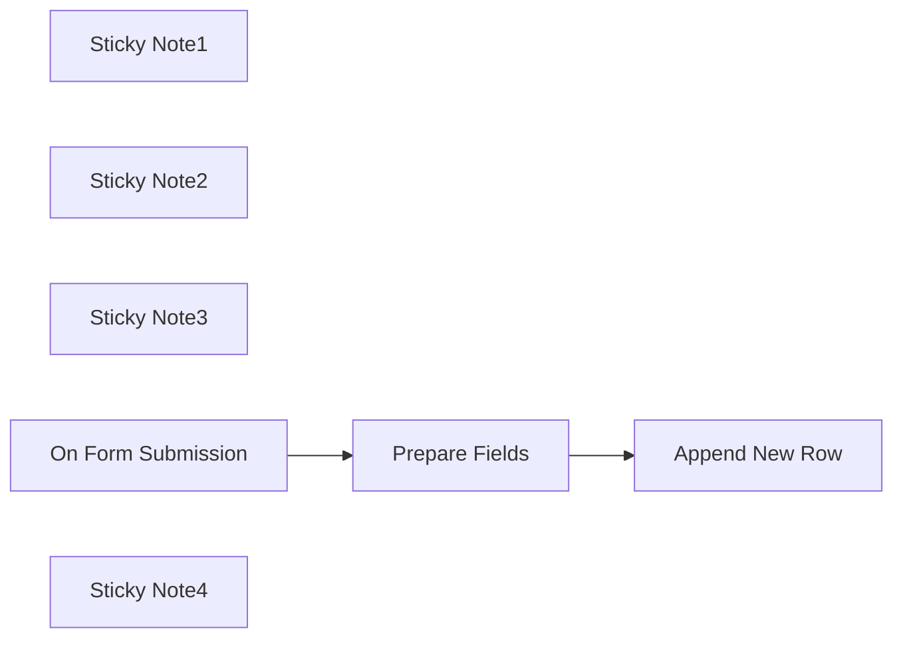

## Fluxo (.json) :

```json
{
  "nodes": [
    {
      "id": "096a8e0c-8f72-40fb-aa1e-118fb33a3916",
      "name": "Prepare Fields",
      "type": "n8n-nodes-base.code",
      "position": [
        1740,
        860
      ],
      "parameters": {
        "jsCode": "const formData = $input.all()[0].json.payload.data\nconst Date = $input.all()[0].json.payload.submittedAt || new Date()\n\nreturn {\n  ...formData, // creates a new field for every element inside formData\n  Date\n}\n\n  \n"
      },
      "notesInFlow": false,
      "typeVersion": 2
    },
    {
      "id": "c98bb655-aa79-447f-897d-56ba9640073b",
      "name": "Sticky Note1",
      "type": "n8n-nodes-base.stickyNote",
      "position": [
        1660,
        780
      ],
      "parameters": {
        "color": 2,
        "width": 270,
        "height": 250,
        "content": "1 line of code to take the data object (adding date as a plus)"
      },
      "typeVersion": 1
    },
    {
      "id": "05a27975-ac48-48db-9c82-c9658a8d14c2",
      "name": "Sticky Note2",
      "type": "n8n-nodes-base.stickyNote",
      "position": [
        1260,
        640
      ],
      "parameters": {
        "color": 6,
        "width": 267,
        "height": 394,
        "content": "Make sure to disable legacy API\n\n"
      },
      "typeVersion": 1
    },
    {
      "id": "59d25f8e-bc9d-43ac-9c4b-3013f81c3e3d",
      "name": "Sticky Note3",
      "type": "n8n-nodes-base.stickyNote",
      "position": [
        2040,
        760
      ],
      "parameters": {
        "color": 4,
        "width": 270,
        "height": 274,
        "content": "Automatically create column names and append data (works even on empty sheets)"
      },
      "typeVersion": 1
    },
    {
      "id": "33c45b7e-e696-4aed-9374-0b232bfd52f1",
      "name": "On Form Submission",
      "type": "n8n-nodes-base.webflowTrigger",
      "position": [
        1340,
        860
      ],
      "webhookId": "c3ef5b9f-88f6-40e6-bc54-067e421b059a",
      "parameters": {
        "site": "640cfc01791fc750653436fd"
      },
      "credentials": {
        "webflowOAuth2Api": {
          "id": "a3UDqxewt1XM79VP",
          "name": "Webflow account"
        }
      },
      "typeVersion": 2
    },
    {
      "id": "4ce0eeea-dd09-4d79-967e-210f2762d5c3",
      "name": "Append New Row",
      "type": "n8n-nodes-base.googleSheets",
      "position": [
        2120,
        860
      ],
      "parameters": {
        "columns": {
          "value": {
            "Name": "={{ $json.data.Name }}",
            "Email": "={{ $json.data.Email }}",
            "Message": "={{ $json.data.Message }}"
          },
          "schema": [
            {
              "id": "Name",
              "type": "string",
              "display": true,
              "required": false,
              "displayName": "Name",
              "defaultMatch": false,
              "canBeUsedToMatch": true
            },
            {
              "id": "Email",
              "type": "string",
              "display": true,
              "required": false,
              "displayName": "Email",
              "defaultMatch": false,
              "canBeUsedToMatch": true
            },
            {
              "id": "Message",
              "type": "string",
              "display": true,
              "required": false,
              "displayName": "Message",
              "defaultMatch": false,
              "canBeUsedToMatch": true
            },
            {
              "id": "data",
              "type": "string",
              "display": true,
              "removed": true,
              "required": false,
              "displayName": "data",
              "defaultMatch": false,
              "canBeUsedToMatch": true
            }
          ],
          "mappingMode": "autoMapInputData",
          "matchingColumns": []
        },
        "options": {},
        "operation": "append",
        "sheetName": {
          "__rl": true,
          "mode": "list",
          "value": "gid=0",
          "cachedResultUrl": "https://docs.google.com/spreadsheets/d/1gLJ5I4ZJ9FQHJH56lunUKnHUBUsIms9PciIkJYi8SJE/edit#gid=0",
          "cachedResultName": "Sheet1"
        },
        "documentId": {
          "__rl": true,
          "mode": "list",
          "value": "1gLJ5I4ZJ9FQHJH56lunUKnHUBUsIms9PciIkJYi8SJE",
          "cachedResultUrl": "https://docs.google.com/spreadsheets/d/1gLJ5I4ZJ9FQHJH56lunUKnHUBUsIms9PciIkJYi8SJE/edit?usp=drivesdk",
          "cachedResultName": "Automation test"
        }
      },
      "credentials": {
        "googleSheetsOAuth2Api": {
          "id": "QkZbOZMXiUKxATjx",
          "name": "Google Sheets account 2"
        }
      },
      "typeVersion": 4.5
    },
    {
      "id": "01a09112-930c-493a-b16c-660e4dc3d272",
      "name": "Sticky Note4",
      "type": "n8n-nodes-base.stickyNote",
      "position": [
        260,
        160
      ],
      "parameters": {
        "color": 7,
        "width": 520,
        "height": 1680,
        "content": "## Self-hosted N8N users only:\n\n### How to get Client ID and Client Secret\n\n- From your Webflow dashboard go to \"Apps & Integrations\"\n\n\n- Look for \"App development\" and click \"Create an App\"\n\n\n- Fill the fields and click \"Continue\"\n\n\n- Inside \"Building blocks\" enable REST API, insert your \"Redirect URL\" from N8N, enable form access and click \"Create App\"\n\n\n\n- Copy and paste Client ID and Client Secret to N8N and connect\n\n\n"
      },
      "typeVersion": 1
    }
  ],
  "pinData": {},
  "connections": {
    "Prepare Fields": {
      "main": [
        [
          {
            "node": "Append New Row",
            "type": "main",
            "index": 0
          }
        ]
      ]
    },
    "On Form Submission": {
      "main": [
        [
          {
            "node": "Prepare Fields",
            "type": "main",
            "index": 0
          }
        ]
      ]
    }
  }
}
```

<a id="template-707"></a>

## Template 707 - Entrevistador AI para teste prático de condução (UK)

- **Nome:** Entrevistador AI para teste prático de condução (UK)
- **Descrição:** Fluxo que conduz entrevistas automatizadas guiadas por IA sobre a experiência de preparação e realização do teste prático de condução no Reino Unido, registrando respostas em sessão e permitindo exibir um transcrito final.
- **Funcionalidade:** • Início por formulário: inicia a entrevista pedindo o nome do participante e configurando a sessão.
• Geração de ID de sessão: cria um UUID único para cada sessão e inicializa uma lista de mensagens com tempo de vida (TTL).
• Entrevistador IA: usa um modelo de linguagem para gerar perguntas abertas continhas ao tópico definido e exige saída em JSON estruturado.
• Loop de perguntas e respostas: apresenta a pergunta ao usuário via formulário, captura a resposta e adiciona ambos (pergunta+resposta) à sessão.
• Detecção de término: analisa o campo stop_interview retornado pela IA ou pelo usuário para encerrar graciosamente a entrevista.
• Armazenamento de sessão: mantém o histórico da conversa em um armazenamento chave-valor com TTL para recuperação posterior.
• Buffer de memória por sessão: fornece contexto ao agente IA usando um buffer de memória vinculado ao ID da sessão.
• Salvamento externo: exporta cada item relevante do transcrito para uma planilha para análise posterior.
• Tela de conclusão personalizada: ao encerrar a sessão, redireciona o usuário para uma URL que exibe o transcrito formatado em HTML.
• Limpeza de estado: remove memória/contexto da sessão quando a entrevista termina para preparar sessões futuras.
- **Ferramentas:** • Upstash (Redis): armazenamento rápido de sessão em lista com TTL para manter o histórico das entrevistas.
• Groq (modelo LLM - ex. llama-3.2-90b preview): modelo de linguagem usado para atuar como o entrevistador e gerar perguntas.
• Google Sheets: planilha usada para registrar linhas do transcrito e facilitar análise compartilhada.
• Formulário web público: interface apresentada ao usuário para iniciar a entrevista e responder às perguntas.
• Endpoint HTTP / Webhook: URL pública usada para redirecionamento de conclusão e para renderizar o transcrito final em HTML.

## Fluxo visual

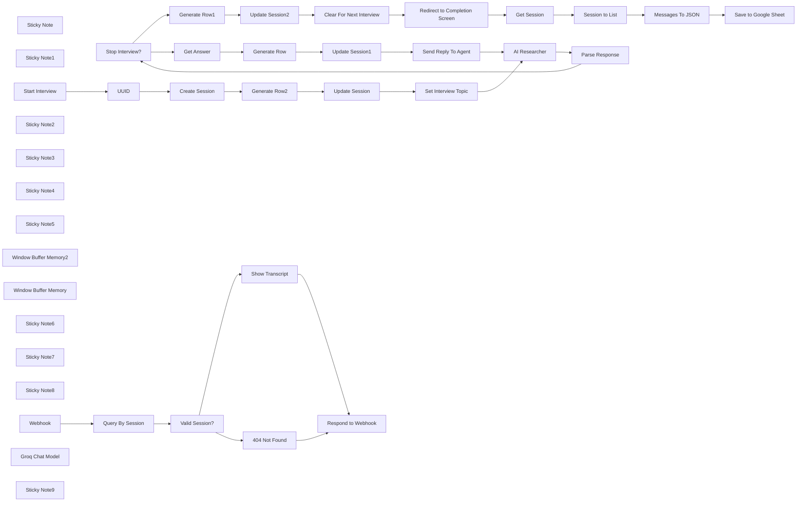

## Fluxo (.json) :

```json
{
  "nodes": [
    {
      "id": "d73e5113-119f-4e62-9872-48e6a971d760",
      "name": "Stop Interview?",
      "type": "n8n-nodes-base.if",
      "position": [
        3380,
        920
      ],
      "parameters": {
        "options": {},
        "conditions": {
          "options": {
            "version": 2,
            "leftValue": "",
            "caseSensitive": true,
            "typeValidation": "strict"
          },
          "combinator": "and",
          "conditions": [
            {
              "id": "3cf788a6-94d0-4223-9caa-30b8e4df8e01",
              "operator": {
                "type": "boolean",
                "operation": "true",
                "singleValue": true
              },
              "leftValue": "={{ $json.output.stop_interview }}",
              "rightValue": ""
            }
          ]
        }
      },
      "typeVersion": 2.2
    },
    {
      "id": "cda3c487-97fa-4037-b9a0-0802f4a02727",
      "name": "Generate Row",
      "type": "n8n-nodes-base.set",
      "position": [
        3740,
        1200
      ],
      "parameters": {
        "options": {},
        "assignments": {
          "assignments": [
            {
              "id": "06146a75-b67a-42cf-aa6f-241f23c47b9a",
              "name": "timestamp",
              "type": "string",
              "value": "={{ $now.toISO() }}"
            },
            {
              "id": "b0278c64-58a7-487d-b7ba-d102fb5d4a0c",
              "name": "type",
              "type": "string",
              "value": "next_question"
            },
            {
              "id": "ba034ca1-408e-422f-b071-dab0ef12fb48",
              "name": "question",
              "type": "string",
              "value": "={{ $('Parse Response').item.json.output.question }}"
            },
            {
              "id": "a2231f6e-f507-408e-b598-53888cf8d4b5",
              "name": "answer",
              "type": "string",
              "value": "={{ $('Get Answer').item.json.answer }}"
            }
          ]
        }
      },
      "typeVersion": 3.4
    },
    {
      "id": "3486f9ae-6a19-4f1f-be46-15376053e71f",
      "name": "Generate Row1",
      "type": "n8n-nodes-base.set",
      "position": [
        3580,
        760
      ],
      "parameters": {
        "options": {},
        "assignments": {
          "assignments": [
            {
              "id": "06146a75-b67a-42cf-aa6f-241f23c47b9a",
              "name": "timestamp",
              "type": "string",
              "value": "={{ $now.toISO() }}"
            },
            {
              "id": "b0278c64-58a7-487d-b7ba-d102fb5d4a0c",
              "name": "type",
              "type": "string",
              "value": "stop_interview"
            },
            {
              "id": "ba034ca1-408e-422f-b071-dab0ef12fb48",
              "name": "question",
              "type": "string",
              "value": "=None"
            },
            {
              "id": "a2231f6e-f507-408e-b598-53888cf8d4b5",
              "name": "answer",
              "type": "string",
              "value": "=None"
            }
          ]
        }
      },
      "typeVersion": 3.4
    },
    {
      "id": "a0e5d40d-e956-4ded-891f-ce5d0f55935f",
      "name": "Clear For Next Interview",
      "type": "@n8n/n8n-nodes-langchain.memoryManager",
      "position": [
        3900,
        760
      ],
      "parameters": {
        "mode": "delete",
        "deleteMode": "all"
      },
      "typeVersion": 1.1
    },
    {
      "id": "66a33fcb-a902-4159-a025-2dff426c1fce",
      "name": "Sticky Note",
      "type": "n8n-nodes-base.stickyNote",
      "position": [
        2580,
        860
      ],
      "parameters": {
        "width": 180,
        "height": 260,
        "content": "\n\n\n\n\n\n\n\n\n\n\n\n\n\n\n### 🚨 Set Interview Topic Here!"
      },
      "typeVersion": 1
    },
    {
      "id": "5cfb7114-a773-4c76-bb3b-7c004be5f799",
      "name": "Send Reply To Agent",
      "type": "n8n-nodes-base.set",
      "position": [
        4060,
        1200
      ],
      "parameters": {
        "options": {},
        "assignments": {
          "assignments": [
            {
              "id": "06a9c730-4756-4bc8-a394-6ff249cf7117",
              "name": "answer",
              "type": "string",
              "value": "={{ $('Get Answer').item.json.answer }}"
            }
          ]
        }
      },
      "typeVersion": 3.4
    },
    {
      "id": "aa30c462-7dfa-40a7-8e63-bed29b30213c",
      "name": "Sticky Note1",
      "type": "n8n-nodes-base.stickyNote",
      "position": [
        1880,
        1060
      ],
      "parameters": {
        "color": 7,
        "width": 490,
        "height": 220,
        "content": "## 1. Setup Interview\n[Learn more about the form trigger node](https://docs.n8n.io/integrations/builtin/core-nodes/n8n-nodes-base.formtrigger)\n\nThe form trigger node will be our entry point into this workflow and to start, we'll just ask for the user's name to start the interview.\nOur session storage will be using Redis via Upstash.com (you can use regular redis btw!) - whichever way, this ensures a highly scalable system able to handle many users."
      },
      "typeVersion": 1
    },
    {
      "id": "5353a7c8-d0e4-429a-ab68-c54d9b845a43",
      "name": "Start Interview",
      "type": "n8n-nodes-base.formTrigger",
      "position": [
        1880,
        880
      ],
      "webhookId": "8d849295-ed30-41ab-a17c-464227cec8fb",
      "parameters": {
        "options": {
          "path": "driving-lessons-survey",
          "ignoreBots": true,
          "buttonLabel": "Begin Interview!",
          "appendAttribution": true,
          "useWorkflowTimezone": true
        },
        "formTitle": "=UK Practical Driving Test Satisfaction Interview",
        "formFields": {
          "values": [
            {
              "fieldLabel": "What is your name?",
              "placeholder": "ie. Sam Smith",
              "requiredField": true
            }
          ]
        },
        "responseMode": "lastNode",
        "formDescription": "=Thanks for taking part in our Interview. You will be presented with an unending series of questions to help us with your experiences in preparing for and taking the UK Practical Driving Test.\n\nThe interviewer is an AI agent and the questions are dynamically generated. When you're done with answer, simple say STOP to exit the interview. Sessions are deleted after 24 hours."
      },
      "typeVersion": 2.2
    },
    {
      "id": "c88a829f-c4b4-4ad4-b121-32b15fae9980",
      "name": "Sticky Note2",
      "type": "n8n-nodes-base.stickyNote",
      "position": [
        2840,
        600
      ],
      "parameters": {
        "color": 7,
        "width": 614,
        "height": 280,
        "content": "## 2. AI Researcher for Endless Interview Questions\n[Learn more about the AI Agent node](https://docs.n8n.io/integrations/builtin/cluster-nodes/root-nodes/n8n-nodes-langchain.agent/)\n\nAn AI interviewer is an interesting take on a role traditionally understood as expensive and time-consuming - both in preparation and execution. What if this could be handed off to an AI/LLM, which could perform when it suits the interviewee and ask a never-ending list of open and follow-on questions for deeper insights?\n\nThis is what this AI researcher agent is designed to do! Upon activation, a loop is created where the agent generates the question and the user answers via the form node. This continues until the user asks to stop the interview."
      },
      "typeVersion": 1
    },
    {
      "id": "10e5dbe0-0163-4c21-8811-9ce9a2a5063b",
      "name": "Sticky Note3",
      "type": "n8n-nodes-base.stickyNote",
      "position": [
        3580,
        1380
      ],
      "parameters": {
        "color": 7,
        "width": 580,
        "height": 202,
        "content": "## 3. Record Answers and Prep for Next Question\n[Learn more about the n8n Form node](https://docs.n8n.io/integrations/builtin/core-nodes/n8n-nodes-base.form/)\n\nThe interview is no good if we can't record the answers somewhere for later analysis! Using n8n form node to capture the answer, we can simple push our new question and answer pair to our Redis session to build our transcript before continuing the loop with the agent."
      },
      "typeVersion": 1
    },
    {
      "id": "0a0cc961-d364-40d2-9ece-cef7d17c4b45",
      "name": "Sticky Note4",
      "type": "n8n-nodes-base.stickyNote",
      "position": [
        3820,
        460
      ],
      "parameters": {
        "color": 7,
        "width": 528,
        "height": 253,
        "content": "## 4. Graciously End the Interview\n[Read more about the Chat Manager node](https://docs.n8n.io/integrations/builtin/cluster-nodes/sub-nodes/n8n-nodes-langchain.memorymanager/)\n\nOnce the AI/LLM detects the user wishes to end the interview (which is done by the user explicitly saying in the form), then the loop breaks and we conclude the interview session and displaying the confirmation screen.\n\nFor this demo, I've created a special confirmation screen which also displays the transcript. This is done by redirecting to a webhook URL. If you don't need this, feel free to change this to \"show completion screen\" instead.\n"
      },
      "typeVersion": 1
    },
    {
      "id": "279d9a67-1d3b-4ffe-a152-33164ef9e2c8",
      "name": "Get Answer",
      "type": "n8n-nodes-base.form",
      "position": [
        3580,
        1200
      ],
      "webhookId": "d96bb88d-db84-4a68-8f02-bcff9cb8429e",
      "parameters": {
        "options": {
          "formTitle": "={{ $json.output.question }}",
          "buttonLabel": "Next Question",
          "formDescription": "Please answer the question or type \"stop interview\" to end the interview."
        },
        "formFields": {
          "values": [
            {
              "fieldType": "textarea",
              "fieldLabel": "answer",
              "requiredField": true
            }
          ]
        }
      },
      "typeVersion": 1
    },
    {
      "id": "4e284505-afc3-4e3e-88c8-38021efbf3c1",
      "name": "Sticky Note5",
      "type": "n8n-nodes-base.stickyNote",
      "position": [
        1280,
        500
      ],
      "parameters": {
        "width": 522.6976744186048,
        "height": 787.6241860465118,
        "content": "## Try it out! \n\n### Conducting user interviews have been traditionally difficult due to preparation, timing and execution costs. What if we let an AI/LLM do it instead?\n\nThis template enables automated AI/LLM powered user interviews using n8n forms and an AI agent where the question and answers are recorded in a google sheet for later analysis. A powerful tool for any researcher.\n\n### Check out the full showcase post here: https://community.n8n.io/t/build-your-own-ai-interview-agents-with-n8n-forms/62312\n\n### How it works\n* A form trigger is used to start the interview and a new session is created in redis to capture the transcript.\n* An AI agent is then tasked to ask questions to the user regarding the topic of the interview. This is setup as a loop so the questions never stop unless the user wishes to end the interview.\n* Each answer is recorded in our session set up earlier between questions.\n* Finally, when the user requests to end the interview we break the loop and show the interview completion screen.\n\n### Why Redis?\nRedis is a fast key-value datastore which makes it ideal for sessions. This ensures the interview flow stays snappy between questions. For my live demo, I used Upstash.com which has a generous free tier.\n\n\n### Need Help?\nJoin the [Discord](https://discord.com/invite/XPKeKXeB7d) or ask in the [Forum](https://community.n8n.io/)!\n\nHappy Hacking!\n"
      },
      "typeVersion": 1
    },
    {
      "id": "ff37e943-851f-4ea7-bcab-b33150881b72",
      "name": "Set Interview Topic",
      "type": "n8n-nodes-base.set",
      "position": [
        2620,
        880
      ],
      "parameters": {
        "options": {},
        "assignments": {
          "assignments": [
            {
              "id": "386f91e1-cc3e-4912-84e3-5ecdbf5412c8",
              "name": "answer",
              "type": "string",
              "value": "=Hello, my name is {{ $('Start Interview').first().json['What is your name?'] }}"
            },
            {
              "id": "492d5ecc-4e76-4297-b8a7-9ca4f801c855",
              "name": "interview_topic",
              "type": "string",
              "value": "Your experience preparing for and taking the UK practical driving test"
            }
          ]
        }
      },
      "typeVersion": 3.4
    },
    {
      "id": "446937bc-a599-4184-b52e-be0607d62d94",
      "name": "UUID",
      "type": "n8n-nodes-base.crypto",
      "position": [
        2020,
        880
      ],
      "parameters": {
        "action": "generate"
      },
      "typeVersion": 1
    },
    {
      "id": "da94c22a-4b26-4898-bde8-b57b5bf01f15",
      "name": "Generate Row2",
      "type": "n8n-nodes-base.set",
      "position": [
        2300,
        880
      ],
      "parameters": {
        "options": {},
        "assignments": {
          "assignments": [
            {
              "id": "06146a75-b67a-42cf-aa6f-241f23c47b9a",
              "name": "timestamp",
              "type": "string",
              "value": "={{ $now.toISO() }}"
            },
            {
              "id": "b0278c64-58a7-487d-b7ba-d102fb5d4a0c",
              "name": "type",
              "type": "string",
              "value": "start_interview"
            },
            {
              "id": "ba034ca1-408e-422f-b071-dab0ef12fb48",
              "name": "question",
              "type": "string",
              "value": "=What is your name?"
            },
            {
              "id": "a2231f6e-f507-408e-b598-53888cf8d4b5",
              "name": "answer",
              "type": "string",
              "value": "={{ $('Start Interview').first().json['What is your name?'] }}"
            }
          ]
        }
      },
      "typeVersion": 3.4
    },
    {
      "id": "9aba23d7-04af-4478-b39b-417f0917597d",
      "name": "Create Session",
      "type": "n8n-nodes-base.redis",
      "position": [
        2160,
        880
      ],
      "parameters": {
        "key": "=session_{{ $('UUID').item.json.data }}",
        "ttl": "={{ 60 * 60 * 24 }}",
        "value": "={{ [] }}",
        "expire": true,
        "keyType": "list",
        "operation": "set"
      },
      "credentials": {
        "redis": {
          "id": "AbPH1yYQ924bVUqm",
          "name": "Upstash (ai interviewer)"
        }
      },
      "typeVersion": 1
    },
    {
      "id": "217c9866-a162-41c6-b123-189869a6cb58",
      "name": "Update Session",
      "type": "n8n-nodes-base.redis",
      "position": [
        2440,
        880
      ],
      "parameters": {
        "list": "=session_{{ $('UUID').first().json.data }}",
        "tail": true,
        "operation": "push",
        "messageData": "={{ $json.toJsonString() }}"
      },
      "credentials": {
        "redis": {
          "id": "AbPH1yYQ924bVUqm",
          "name": "Upstash (ai interviewer)"
        }
      },
      "typeVersion": 1
    },
    {
      "id": "95e8b7c4-4f27-49f3-b509-5238c0f7bd5d",
      "name": "Update Session1",
      "type": "n8n-nodes-base.redis",
      "position": [
        3900,
        1200
      ],
      "parameters": {
        "list": "=session_{{ $('UUID').first().json.data }}",
        "tail": true,
        "operation": "push",
        "messageData": "={{ $json.toJsonString() }}"
      },
      "credentials": {
        "redis": {
          "id": "AbPH1yYQ924bVUqm",
          "name": "Upstash (ai interviewer)"
        }
      },
      "typeVersion": 1
    },
    {
      "id": "afaa55dd-844e-4bf3-8a31-3a0953caaf69",
      "name": "Update Session2",
      "type": "n8n-nodes-base.redis",
      "position": [
        3740,
        760
      ],
      "parameters": {
        "list": "=session_{{ $('UUID').first().json.data }}",
        "tail": true,
        "operation": "push",
        "messageData": "={{ $json.toJsonString() }}"
      },
      "credentials": {
        "redis": {
          "id": "AbPH1yYQ924bVUqm",
          "name": "Upstash (ai interviewer)"
        }
      },
      "typeVersion": 1
    },
    {
      "id": "c381d598-1902-4789-ac15-65ac2124fbdd",
      "name": "Valid Session?",
      "type": "n8n-nodes-base.if",
      "position": [
        5080,
        1240
      ],
      "parameters": {
        "options": {},
        "conditions": {
          "options": {
            "version": 2,
            "leftValue": "",
            "caseSensitive": true,
            "typeValidation": "strict"
          },
          "combinator": "and",
          "conditions": [
            {
              "id": "500d6ca9-2a04-40f0-98e8-aa4290e6a30d",
              "operator": {
                "type": "array",
                "operation": "exists",
                "singleValue": true
              },
              "leftValue": "={{ $json.data }}",
              "rightValue": ""
            }
          ]
        }
      },
      "typeVersion": 2.2
    },
    {
      "id": "f26ccdaa-4f94-4acb-894b-341648aee8b0",
      "name": "Respond to Webhook",
      "type": "n8n-nodes-base.respondToWebhook",
      "position": [
        5440,
        1240
      ],
      "parameters": {
        "options": {
          "responseCode": 200,
          "responseHeaders": {
            "entries": [
              {
                "name": "Content-Type",
                "value": "text/html"
              }
            ]
          }
        },
        "respondWith": "text",
        "responseBody": "={{ $json.html }}"
      },
      "typeVersion": 1.1
    },
    {
      "id": "09a05dc6-4a21-4df0-a83d-5e1b986090f8",
      "name": "Window Buffer Memory2",
      "type": "@n8n/n8n-nodes-langchain.memoryBufferWindow",
      "position": [
        3000,
        1120
      ],
      "parameters": {
        "sessionKey": "={{ $('UUID').first().json.data }}",
        "sessionIdType": "customKey"
      },
      "typeVersion": 1.2
    },
    {
      "id": "26f87c7d-9e2c-41e8-b7eb-3c249a69f905",
      "name": "Window Buffer Memory",
      "type": "@n8n/n8n-nodes-langchain.memoryBufferWindow",
      "position": [
        3900,
        920
      ],
      "parameters": {
        "sessionKey": "={{ $('UUID').first().json.data }}",
        "sessionIdType": "customKey"
      },
      "typeVersion": 1.2
    },
    {
      "id": "ab891c71-af03-49c9-b281-d0058374260b",
      "name": "Sticky Note6",
      "type": "n8n-nodes-base.stickyNote",
      "position": [
        4180,
        740
      ],
      "parameters": {
        "width": 276.4353488372094,
        "height": 320.31553488372094,
        "content": "\n\n\n\n\n\n\n\n\n\n\n\n\n\n\n### 🚨 Set Your Webhook URL here!\nFor this demo, we want to show a customised completion screen with transcript so it's necessary to redirect to a webhook (see step 6)."
      },
      "typeVersion": 1
    },
    {
      "id": "7a063851-1bea-4e34-897c-4038d08b845e",
      "name": "Redirect to Completion Screen",
      "type": "n8n-nodes-base.form",
      "position": [
        4260,
        760
      ],
      "webhookId": "9fdedf1b-e413-4fc3-94a4-9cc24bffff8a",
      "parameters": {
        "operation": "completion",
        "redirectUrl": "=https://<host>/webhook/<uuid-if-using-n8n-cloud>/ai-interview-transcripts/{{ $('UUID').first().json.data }}",
        "respondWith": "redirect"
      },
      "typeVersion": 1
    },
    {
      "id": "b67b3fa5-faf6-402b-9b9e-c783869770ca",
      "name": "Sticky Note7",
      "type": "n8n-nodes-base.stickyNote",
      "position": [
        4640,
        1220
      ],
      "parameters": {
        "color": 5,
        "width": 236.3564651162793,
        "height": 345.82027906976737,
        "content": "\n\n\n\n\n\n\n\n\n\n\n\n\n\n\n### 🚨 This is the webhook we want to redirect to!\nIf you're on n8n cloud, you may want to copy the webhook url generated here and use it as the form ending's redirect url."
      },
      "typeVersion": 1
    },
    {
      "id": "583d1572-2d6f-4ca4-9e31-33dc1481e87a",
      "name": "Sticky Note8",
      "type": "n8n-nodes-base.stickyNote",
      "position": [
        4580,
        980
      ],
      "parameters": {
        "color": 7,
        "width": 588,
        "height": 207,
        "content": "## 6. Display the Transcript\n[Read more about the Webhook Trigger](https://docs.n8n.io/integrations/builtin/core-nodes/n8n-nodes-base.webhook)\n\nThis step is totally optional. For a nicer user experience, I use this webhook mini-flow to display the user's transcript for the completion screen. It works by capturing the session_id in the webhook's url and searching for it in our redis database. If a match is found the transcript is fetched and rendered into a webpage using the HTML node and returned to the user. If no match is found, a 404 message is displayed instead."
      },
      "typeVersion": 1
    },
    {
      "id": "5fcf86b9-3fa3-48f5-a4a4-a1e261a48b49",
      "name": "Webhook",
      "type": "n8n-nodes-base.webhook",
      "position": [
        4700,
        1240
      ],
      "webhookId": "78df12c4-ccd0-46dd-be0d-4445c2bd04f2",
      "parameters": {
        "path": "ai-interview-transcripts/:session_id",
        "options": {
          "ignoreBots": true
        },
        "responseMode": "responseNode"
      },
      "typeVersion": 2
    },
    {
      "id": "6df57307-feef-4be5-861d-fdc0b92d1ef6",
      "name": "404 Not Found",
      "type": "n8n-nodes-base.html",
      "position": [
        5260,
        1320
      ],
      "parameters": {
        "html": "\n<html lang='en'>\n\n\t<head>\n\t\t<meta charset='UTF-8' />\n\t\t<meta name='viewport' content='width=device-width, initial-scale=1.0' />\n\t\t<link rel='icon' type='image/png' href='https://n8n.io/favicon.ico' />\n\t\t<link\n\t\t\thref='https://fonts.googleapis.com/css?family=Open+Sans'\n\t\t\trel='stylesheet'\n\t\t\ttype='text/css'\n\t\t/>\n\n\t\t<title>Driving Practice Test 2024 Survey</title>\n\n\t\t<style>\n\t\t\t*, ::after, ::before { box-sizing: border-box; margin: 0; padding: 0; } body { font-family:\n\t\t\tOpen Sans, sans-serif; font-weight: 400; font-size: 12px; display: flex; flex-direction:\n\t\t\tcolumn; justify-content: start; background-color: #FBFCFE; } .container { margin: auto;\n\t\t\ttext-align: center; padding-top: 24px; width: 448px; } .card { padding: 24px;\n\t\t\tbackground-color: white; border: 1px solid #DBDFE7; border-radius: 8px; box-shadow: 0px 4px\n\t\t\t16px 0px #634DFF0F; margin-bottom: 16px; } .n8n-link a { color: #7E8186; font-weight: 600;\n\t\t\tfont-size: 12px; text-decoration: none; } .n8n-link svg { display: inline-block;\n\t\t\tvertical-align: middle; } .header h1 { color: #525356; font-size: 20px; font-weight: 400;\n\t\t\tpadding-bottom: 8px; } .header p { color: #7E8186; font-size: 14px; font-weight: 400; }\n\t\t</style>\n\t</head>\n\n\t<body>\n\t\t<div class='container'>\n\t\t\t<section>\n\t\t\t\t<div class='card'>\n\t\t\t\t\t<div class='header'>\n\t\t\t\t\t\t<h1>404 Not Found</h1>\n\t\t\t\t\t\t<p>The requested session does not exist.</p>\n <p>Your session may have expired.</p>\n </div>\n\t\t\t\t</div>\n\t\t\t\t\t<div class='n8n-link'>\n\t\t\t\t\t\t<a href=\"https://n8n.partnerlinks.io/ee7izbliiw0n\" target='_blank'>\n\t\t\t\t\t\t\tForm automated with\n\t\t\t\t\t\t\t<svg\n\t\t\t\t\t\t\t\twidth='73'\n\t\t\t\t\t\t\t\theight='20'\n\t\t\t\t\t\t\t\tviewBox='0 0 73 20'\n\t\t\t\t\t\t\t\tfill='none'\n\t\t\t\t\t\t\t\txmlns='http://www.w3.org/2000/svg'\n\t\t\t\t\t\t\t>\n\t\t\t\t\t\t\t\t<path\n\t\t\t\t\t\t\t\t\tfill-rule='evenodd'\n\t\t\t\t\t\t\t\t\tclip-rule='evenodd'\n\t\t\t\t\t\t\t\t\td='M40.2373 4C40.2373 6.20915 38.4464 8 36.2373 8C34.3735 8 32.8074 6.72525 32.3633 5H26.7787C25.801 5 24.9666 5.70685 24.8059 6.6712L24.6415 7.6576C24.4854 8.59415 24.0116 9.40925 23.3417 10C24.0116 10.5907 24.4854 11.4058 24.6415 12.3424L24.8059 13.3288C24.9666 14.2931 25.801 15 26.7787 15H28.3633C28.8074 13.2747 30.3735 12 32.2373 12C34.4464 12 36.2373 13.7908 36.2373 16C36.2373 18.2092 34.4464 20 32.2373 20C30.3735 20 28.8074 18.7253 28.3633 17H26.7787C24.8233 17 23.1546 15.5864 22.8331 13.6576L22.6687 12.6712C22.508 11.7069 21.6736 11 20.6959 11H19.0645C18.5652 12.64 17.0406 13.8334 15.2373 13.8334C13.434 13.8334 11.9094 12.64 11.4101 11H9.06449C8.56519 12.64 7.04059 13.8334 5.2373 13.8334C3.02817 13.8334 1.2373 12.0424 1.2373 9.83335C1.2373 7.6242 3.02817 5.83335 5.2373 5.83335C7.16069 5.83335 8.76699 7.19085 9.15039 9H11.3242C11.7076 7.19085 13.3139 5.83335 15.2373 5.83335C17.1607 5.83335 18.767 7.19085 19.1504 9H20.6959C21.6736 9 22.508 8.29315 22.6687 7.3288L22.8331 6.3424C23.1546 4.41365 24.8233 3 26.7787 3H32.3633C32.8074 1.27478 34.3735 0 36.2373 0C38.4464 0 40.2373 1.79086 40.2373 4ZM38.2373 4C38.2373 5.10455 37.3419 6 36.2373 6C35.1327 6 34.2373 5.10455 34.2373 4C34.2373 2.89543 35.1327 2 36.2373 2C37.3419 2 38.2373 2.89543 38.2373 4ZM5.2373 11.8334C6.34189 11.8334 7.23729 10.9379 7.23729 9.83335C7.23729 8.72875 6.34189 7.83335 5.2373 7.83335C4.13273 7.83335 3.2373 8.72875 3.2373 9.83335C3.2373 10.9379 4.13273 11.8334 5.2373 11.8334ZM15.2373 11.8334C16.3419 11.8334 17.2373 10.9379 17.2373 9.83335C17.2373 8.72875 16.3419 7.83335 15.2373 7.83335C14.1327 7.83335 13.2373 8.72875 13.2373 9.83335C13.2373 10.9379 14.1327 11.8334 15.2373 11.8334ZM32.2373 18C33.3419 18 34.2373 17.1045 34.2373 16C34.2373 14.8954 33.3419 14 32.2373 14C31.1327 14 30.2373 14.8954 30.2373 16C30.2373 17.1045 31.1327 18 32.2373 18Z'\n\t\t\t\t\t\t\t\t\tfill='#EA4B71'\n\t\t\t\t\t\t\t\t/>\n\t\t\t\t\t\t\t\t<path\n\t\t\t\t\t\t\t\t\td='M44.2393 15.0007H46.3277V10.5791C46.3277 9.12704 47.2088 8.49074 48.204 8.49074C49.183 8.49074 49.9498 9.14334 49.9498 10.4812V15.0007H52.038V10.057C52.038 7.91969 50.798 6.67969 48.8567 6.67969C47.633 6.67969 46.9477 7.16914 46.4582 7.80544H46.3277L46.1482 6.84284H44.2393V15.0007Z'\n\t\t\t\t\t\t\t\t\tfill='#101330'\n\t\t\t\t\t\t\t\t/>\n\t\t\t\t\t\t\t\t<path\n\t\t\t\t\t\t\t\t\td='M60.0318 9.50205V9.40415C60.7498 9.0452 61.4678 8.4252 61.4678 7.20155C61.4678 5.43945 60.0153 4.37891 58.0088 4.37891C55.9528 4.37891 54.4843 5.5047 54.4843 7.23415C54.4843 8.4089 55.1698 9.0452 55.9203 9.40415V9.50205C55.0883 9.79575 54.0928 10.6768 54.0928 12.1452C54.0928 13.9237 55.5613 15.1637 57.9923 15.1637C60.4233 15.1637 61.8428 13.9237 61.8428 12.1452C61.8428 10.6768 60.8638 9.81205 60.0318 9.50205ZM57.9923 5.87995C58.8083 5.87995 59.4118 6.40205 59.4118 7.2831C59.4118 8.16415 58.7918 8.6863 57.9923 8.6863C57.1928 8.6863 56.5238 8.16415 56.5238 7.2831C56.5238 6.38575 57.1603 5.87995 57.9923 5.87995ZM57.9923 13.5974C57.0458 13.5974 56.2793 12.9937 56.2793 11.9658C56.2793 11.0358 56.9153 10.3342 57.9758 10.3342C59.0203 10.3342 59.6568 11.0195 59.6568 11.9984C59.6568 12.9937 58.9223 13.5974 57.9923 13.5974Z'\n\t\t\t\t\t\t\t\t\tfill='#101330'\n\t\t\t\t\t\t\t\t/>\n\t\t\t\t\t\t\t\t<path\n\t\t\t\t\t\t\t\t\td='M63.9639 15.0007H66.0524V10.5791C66.0524 9.12704 66.9334 8.49074 67.9289 8.49074C68.9079 8.49074 69.6744 9.14334 69.6744 10.4812V15.0007H71.7629V10.057C71.7629 7.91969 70.5229 6.67969 68.5814 6.67969C67.3579 6.67969 66.6724 7.16914 66.1829 7.80544H66.0524L65.8729 6.84284H63.9639V15.0007Z'\n\t\t\t\t\t\t\t\t\tfill='#101330'\n\t\t\t\t\t\t\t\t/>\n\t\t\t\t\t\t\t</svg>\n\t\t\t\t\t\t</a>\n\t\t\t\t\t</div>\n\t\t\t</section>\n\t\t</div>\n\t</body>\n\n</html>"
      },
      "typeVersion": 1.2
    },
    {
      "id": "0e968154-ead5-4194-834e-0d1175e7c1d9",
      "name": "AI Researcher",
      "type": "@n8n/n8n-nodes-langchain.agent",
      "position": [
        2900,
        920
      ],
      "parameters": {
        "text": "={{ $json.answer }}",
        "options": {
          "systemMessage": "=You are a user research expert interviewing a user on the topic of \"{{ $('Set Interview Topic').first().json.interview_topic }}\".\n\n* Your task is to ask open-ended questions relevant to the interview topic.\n* Ask only one question at a time. Analyse the previous question and ask new question each time. If there is an opportunity to dig deeper into a previous answer, do so but limit to 1 follow-on question.\n* Keep asking questions until the user requests to stop the interview. When the user requests to stop the interview and no question is required, \"question\" is an empty string.\n* Use a friendly and polite tone when asking questions.\n* If the user answers are inrelevant to the question, ask the question again or move on to another question.\n* If the user's answer is beyond the scope of the interview, ignore the answer and ask if the user would like to stop the interview.\n*You must format your response using the following json schema as we require pre processing before responding to the user.\n```\n{\n \"type\":\"object\",\n \"properties\": {\n \"stop_interview\": { \"type\": \"boolean\" },\n \"question\": { \"type\": [\"string\", \"null\"] }\n }\n}\n```\n* Output only the json object and do not prefix or suffix the message with extraneous text."
        },
        "promptType": "define",
        "hasOutputParser": true
      },
      "typeVersion": 1.7
    },
    {
      "id": "969d4094-1046-4f53-bf8b-5ae7e50bd3ed",
      "name": "Parse Response",
      "type": "n8n-nodes-base.set",
      "position": [
        3220,
        920
      ],
      "parameters": {
        "options": {},
        "assignments": {
          "assignments": [
            {
              "id": "bf61134c-e24c-453e-97ef-5edd25726148",
              "name": "output",
              "type": "object",
              "value": "={{\n$json.output\n .replace('```json', '')\n .replace('```', '')\n .parseJson()\n}}"
            }
          ]
        }
      },
      "typeVersion": 3.4
    },
    {
      "id": "323b73c4-8c77-48a9-a549-f3e863ba72c2",
      "name": "Groq Chat Model",
      "type": "@n8n/n8n-nodes-langchain.lmChatGroq",
      "position": [
        2860,
        1120
      ],
      "parameters": {
        "model": "llama-3.2-90b-text-preview",
        "options": {}
      },
      "credentials": {
        "groqApi": {
          "id": "YQVoV5K9FREww7t1",
          "name": "Groq account"
        }
      },
      "typeVersion": 1
    },
    {
      "id": "bf4518c4-8e59-450e-be5a-92f31cf38528",
      "name": "Show Transcript",
      "type": "n8n-nodes-base.html",
      "position": [
        5260,
        1140
      ],
      "parameters": {
        "html": "\n<html lang='en'>\n\n\t<head>\n\t\t<meta charset='UTF-8' />\n\t\t<meta name='viewport' content='width=device-width, initial-scale=1.0' />\n\t\t<link rel='icon' type='image/png' href='https://n8n.io/favicon.ico' />\n\t\t<link\n\t\t\thref='https://fonts.googleapis.com/css?family=Open+Sans'\n\t\t\trel='stylesheet'\n\t\t\ttype='text/css'\n\t\t/>\n\n\t\t<title>AI Interviewer Transcripts</title>\n\n\t\t<style>\n\t\t\t*, ::after, ::before { box-sizing: border-box; margin: 0; padding: 0; } body { font-family:\n\t\t\tOpen Sans, sans-serif; font-weight: 400; font-size: 12px; display: flex; flex-direction:\n\t\t\tcolumn; justify-content: start; background-color: #FBFCFE; } .container { margin: auto;\n\t\t\ttext-align: center; padding-top: 24px; width: 448px; } .card { padding: 24px;\n\t\t\tbackground-color: white; border: 1px solid #DBDFE7; border-radius: 8px; box-shadow: 0px 4px\n\t\t\t16px 0px #634DFF0F; margin-bottom: 16px; } .n8n-link a { color: #7E8186; font-weight: 600;\n\t\t\tfont-size: 12px; text-decoration: none; } .n8n-link svg { display: inline-block;\n\t\t\tvertical-align: middle; } .header h1 { color: #525356; font-size: 20px; font-weight: 400;\n\t\t\tpadding-bottom: 8px; } .header p { color: #7E8186; font-size: 14px; font-weight: 400; }\n\t\t</style>\n\t</head>\n\n\t<body>\n\t\t<div class='container' style=\"width:640px\">\n\t\t\t<section>\n\t\t\t\t<div class='card'>\n\t\t\t\t\t<div class='header'>\n\t\t\t\t\t\t<h1>Thanks for Completing the Interview!</h1>\n\t\t\t\t\t\t<p style=\"margin-bottom:12px;\">If you liked this demo, <br/>please follow me on <a href=\"http://linkedin.com/in/jimleuk\" target=\"_blank\">http://linkedin.com/in/jimleuk</a> and\n <a href=\"https://x.com/jimle_uk\" target=\"_blank\">https://x.com/jimle_uk</a>\n </p>\n <p>\n <a href=\"https://n8n.partnerlinks.io/ee7izbliiw0n\" target=\"_blank\">\n Support my work! Sign up to n8n using this link 🙏\n </a>\n </p>\n </div>\n\t\t\t\t</div>\n <div class='card' >\n\t\t\t\t\t<div class='header'>\n\t\t\t\t\t\t<h1>Transcript</h1>\n <p style=\"color:#ccc;margin-bottom:24px;font-size:0.8rem\">This session is deleted within 24 hours.</p>\n {{\n $json.data\n .map(item => JSON.parse(item))\n .filter(item => item.type === 'next_question')\n .map(item => `\n <div style=\"display:flex;flex-direction:row;margin-bottom: 16px;\">\n <div style=\"width: 60px;padding-right: 5px;text-align: left;color: #ccc;\">\n ${DateTime.fromISO(item.timestamp).format('dd MMM, hh:mm')}\n </div>\n <div style=\"width:100%\">\n <div style=\"\n border: 1px solid #ccc;\n padding: 10px;\n border-radius: 5px;\n background-color: #f8f7f7;\n text-align: right;\n margin-bottom: 5px;\n\">${item.question}</div>\n <div style=\"\n border: 1px solid #c7ccec;\n padding: 10px;\n border-radius: 5px;\n background-color: #f5f5fc;\n text-align: left;\n color: #2e2e84;\n\">${item.answer}</div>\n </div>\n </div>\n `)\n .join('\\n')\n }}\n \t\t\t\t</div>\n\t\t\t\t</div>\n\t\t\t\t\t<div class='n8n-link'>\n\t\t\t\t\t\t<a href=\"https://n8n.partnerlinks.io/ee7izbliiw0n\" target='_blank'>\n\t\t\t\t\t\t\tForm automated with\n\t\t\t\t\t\t\t<svg\n\t\t\t\t\t\t\t\twidth='73'\n\t\t\t\t\t\t\t\theight='20'\n\t\t\t\t\t\t\t\tviewBox='0 0 73 20'\n\t\t\t\t\t\t\t\tfill='none'\n\t\t\t\t\t\t\t\txmlns='http://www.w3.org/2000/svg'\n\t\t\t\t\t\t\t>\n\t\t\t\t\t\t\t\t<path\n\t\t\t\t\t\t\t\t\tfill-rule='evenodd'\n\t\t\t\t\t\t\t\t\tclip-rule='evenodd'\n\t\t\t\t\t\t\t\t\td='M40.2373 4C40.2373 6.20915 38.4464 8 36.2373 8C34.3735 8 32.8074 6.72525 32.3633 5H26.7787C25.801 5 24.9666 5.70685 24.8059 6.6712L24.6415 7.6576C24.4854 8.59415 24.0116 9.40925 23.3417 10C24.0116 10.5907 24.4854 11.4058 24.6415 12.3424L24.8059 13.3288C24.9666 14.2931 25.801 15 26.7787 15H28.3633C28.8074 13.2747 30.3735 12 32.2373 12C34.4464 12 36.2373 13.7908 36.2373 16C36.2373 18.2092 34.4464 20 32.2373 20C30.3735 20 28.8074 18.7253 28.3633 17H26.7787C24.8233 17 23.1546 15.5864 22.8331 13.6576L22.6687 12.6712C22.508 11.7069 21.6736 11 20.6959 11H19.0645C18.5652 12.64 17.0406 13.8334 15.2373 13.8334C13.434 13.8334 11.9094 12.64 11.4101 11H9.06449C8.56519 12.64 7.04059 13.8334 5.2373 13.8334C3.02817 13.8334 1.2373 12.0424 1.2373 9.83335C1.2373 7.6242 3.02817 5.83335 5.2373 5.83335C7.16069 5.83335 8.76699 7.19085 9.15039 9H11.3242C11.7076 7.19085 13.3139 5.83335 15.2373 5.83335C17.1607 5.83335 18.767 7.19085 19.1504 9H20.6959C21.6736 9 22.508 8.29315 22.6687 7.3288L22.8331 6.3424C23.1546 4.41365 24.8233 3 26.7787 3H32.3633C32.8074 1.27478 34.3735 0 36.2373 0C38.4464 0 40.2373 1.79086 40.2373 4ZM38.2373 4C38.2373 5.10455 37.3419 6 36.2373 6C35.1327 6 34.2373 5.10455 34.2373 4C34.2373 2.89543 35.1327 2 36.2373 2C37.3419 2 38.2373 2.89543 38.2373 4ZM5.2373 11.8334C6.34189 11.8334 7.23729 10.9379 7.23729 9.83335C7.23729 8.72875 6.34189 7.83335 5.2373 7.83335C4.13273 7.83335 3.2373 8.72875 3.2373 9.83335C3.2373 10.9379 4.13273 11.8334 5.2373 11.8334ZM15.2373 11.8334C16.3419 11.8334 17.2373 10.9379 17.2373 9.83335C17.2373 8.72875 16.3419 7.83335 15.2373 7.83335C14.1327 7.83335 13.2373 8.72875 13.2373 9.83335C13.2373 10.9379 14.1327 11.8334 15.2373 11.8334ZM32.2373 18C33.3419 18 34.2373 17.1045 34.2373 16C34.2373 14.8954 33.3419 14 32.2373 14C31.1327 14 30.2373 14.8954 30.2373 16C30.2373 17.1045 31.1327 18 32.2373 18Z'\n\t\t\t\t\t\t\t\t\tfill='#EA4B71'\n\t\t\t\t\t\t\t\t/>\n\t\t\t\t\t\t\t\t<path\n\t\t\t\t\t\t\t\t\td='M44.2393 15.0007H46.3277V10.5791C46.3277 9.12704 47.2088 8.49074 48.204 8.49074C49.183 8.49074 49.9498 9.14334 49.9498 10.4812V15.0007H52.038V10.057C52.038 7.91969 50.798 6.67969 48.8567 6.67969C47.633 6.67969 46.9477 7.16914 46.4582 7.80544H46.3277L46.1482 6.84284H44.2393V15.0007Z'\n\t\t\t\t\t\t\t\t\tfill='#101330'\n\t\t\t\t\t\t\t\t/>\n\t\t\t\t\t\t\t\t<path\n\t\t\t\t\t\t\t\t\td='M60.0318 9.50205V9.40415C60.7498 9.0452 61.4678 8.4252 61.4678 7.20155C61.4678 5.43945 60.0153 4.37891 58.0088 4.37891C55.9528 4.37891 54.4843 5.5047 54.4843 7.23415C54.4843 8.4089 55.1698 9.0452 55.9203 9.40415V9.50205C55.0883 9.79575 54.0928 10.6768 54.0928 12.1452C54.0928 13.9237 55.5613 15.1637 57.9923 15.1637C60.4233 15.1637 61.8428 13.9237 61.8428 12.1452C61.8428 10.6768 60.8638 9.81205 60.0318 9.50205ZM57.9923 5.87995C58.8083 5.87995 59.4118 6.40205 59.4118 7.2831C59.4118 8.16415 58.7918 8.6863 57.9923 8.6863C57.1928 8.6863 56.5238 8.16415 56.5238 7.2831C56.5238 6.38575 57.1603 5.87995 57.9923 5.87995ZM57.9923 13.5974C57.0458 13.5974 56.2793 12.9937 56.2793 11.9658C56.2793 11.0358 56.9153 10.3342 57.9758 10.3342C59.0203 10.3342 59.6568 11.0195 59.6568 11.9984C59.6568 12.9937 58.9223 13.5974 57.9923 13.5974Z'\n\t\t\t\t\t\t\t\t\tfill='#101330'\n\t\t\t\t\t\t\t\t/>\n\t\t\t\t\t\t\t\t<path\n\t\t\t\t\t\t\t\t\td='M63.9639 15.0007H66.0524V10.5791C66.0524 9.12704 66.9334 8.49074 67.9289 8.49074C68.9079 8.49074 69.6744 9.14334 69.6744 10.4812V15.0007H71.7629V10.057C71.7629 7.91969 70.5229 6.67969 68.5814 6.67969C67.3579 6.67969 66.6724 7.16914 66.1829 7.80544H66.0524L65.8729 6.84284H63.9639V15.0007Z'\n\t\t\t\t\t\t\t\t\tfill='#101330'\n\t\t\t\t\t\t\t\t/>\n\t\t\t\t\t\t\t</svg>\n\t\t\t\t\t\t</a>\n\t\t\t\t\t</div>\n\t\t\t</section>\n\t\t</div>\n\t</body>\n\n</html>"
      },
      "typeVersion": 1.2
    },
    {
      "id": "dff24e45-8e57-4dfc-8b65-9d315b406bd2",
      "name": "Save to Google Sheet",
      "type": "n8n-nodes-base.googleSheets",
      "position": [
        5040,
        760
      ],
      "parameters": {
        "columns": {
          "value": {
            "name": "{{ $('Start Interview').first().json['What is your name?'] }}",
            "session_id": "={{ $('UUID').first().json.data }}"
          },
          "schema": [
            {
              "id": "session_id",
              "type": "string",
              "display": true,
              "required": false,
              "displayName": "session_id",
              "defaultMatch": false,
              "canBeUsedToMatch": true
            },
            {
              "id": "timestamp",
              "type": "string",
              "display": true,
              "required": false,
              "displayName": "timestamp",
              "defaultMatch": false,
              "canBeUsedToMatch": true
            },
            {
              "id": "name",
              "type": "string",
              "display": true,
              "required": false,
              "displayName": "name",
              "defaultMatch": false,
              "canBeUsedToMatch": true
            },
            {
              "id": "type",
              "type": "string",
              "display": true,
              "required": false,
              "displayName": "type",
              "defaultMatch": false,
              "canBeUsedToMatch": true
            },
            {
              "id": "question",
              "type": "string",
              "display": true,
              "required": false,
              "displayName": "question",
              "defaultMatch": false,
              "canBeUsedToMatch": true
            },
            {
              "id": "answer",
              "type": "string",
              "display": true,
              "required": false,
              "displayName": "answer",
              "defaultMatch": false,
              "canBeUsedToMatch": true
            }
          ],
          "mappingMode": "autoMapInputData",
          "matchingColumns": []
        },
        "options": {
          "useAppend": true
        },
        "operation": "append",
        "sheetName": {
          "__rl": true,
          "mode": "list",
          "value": 1695693704,
          "cachedResultUrl": "https://docs.google.com/spreadsheets/d/1wKjVdm7HeufJkHrUJn_bW9bFI_blm0laoI_jgXKDe0Q/edit#gid=1695693704",
          "cachedResultName": "transcripts"
        },
        "documentId": {
          "__rl": true,
          "mode": "list",
          "value": "1wKjVdm7HeufJkHrUJn_bW9bFI_blm0laoI_jgXKDe0Q",
          "cachedResultUrl": "https://docs.google.com/spreadsheets/d/1wKjVdm7HeufJkHrUJn_bW9bFI_blm0laoI_jgXKDe0Q/edit?usp=drivesdk",
          "cachedResultName": "AI Researcher with n8n Forms"
        }
      },
      "credentials": {
        "googleSheetsOAuth2Api": {
          "id": "FsFwFchwmgtBu5l7",
          "name": "Google Sheets account"
        }
      },
      "typeVersion": 4.5
    },
    {
      "id": "8eb03a1c-02e4-4d49-bf68-bb148585828f",
      "name": "Session to List",
      "type": "n8n-nodes-base.splitOut",
      "position": [
        4700,
        760
      ],
      "parameters": {
        "options": {},
        "fieldToSplitOut": "session"
      },
      "typeVersion": 1
    },
    {
      "id": "c594aa2b-a29d-42e4-8799-1c557d78932d",
      "name": "Messages To JSON",
      "type": "n8n-nodes-base.set",
      "position": [
        4860,
        760
      ],
      "parameters": {
        "mode": "raw",
        "options": {},
        "jsonOutput": "={{\n{\n ...$json.session.parseJson(),\n session_id: `session_${$('UUID').first().json.data}`,\n name: $('Start Interview').first().json['What is your name?'],\n}\n}}"
      },
      "typeVersion": 3.4
    },
    {
      "id": "106bd688-6ccc-4a6a-9b52-ee7187d9aebe",
      "name": "Sticky Note9",
      "type": "n8n-nodes-base.stickyNote",
      "position": [
        4540,
        420
      ],
      "parameters": {
        "color": 7,
        "width": 508,
        "height": 293,
        "content": "## 5. Save the Interview to Sheets\n[Read more about the Google Sheets node](https://docs.n8n.io/integrations/builtin/app-nodes/n8n-nodes-base.googlesheets/)\n\nFor easier data-sharing, we can have the workflow upload the session messages into data analysis tools for our team members.\n\nFor this demo, Google Sheets is an easy option. We'll pull the entire session out of redis and upload the messages one by one to sheets.\n\n### Check out the example sheet here: https://docs.google.com/spreadsheets/d/1wKjVdm7HeufJkHrUJn_bW9bFI_blm0laoI_jgXKDe0Q/edit?usp=sharing"
      },
      "typeVersion": 1
    },
    {
      "id": "b7754724-7473-4245-8b54-85c370a2b1be",
      "name": "Query By Session",
      "type": "n8n-nodes-base.redis",
      "position": [
        4920,
        1240
      ],
      "parameters": {
        "key": "=session_{{ $('Webhook').first().json.params.session_id }}",
        "options": {},
        "operation": "get",
        "propertyName": "data"
      },
      "credentials": {
        "redis": {
          "id": "AbPH1yYQ924bVUqm",
          "name": "Upstash (ai interviewer)"
        }
      },
      "typeVersion": 1
    },
    {
      "id": "4b6a0db6-1d33-4ed3-a955-7562e0dba1f0",
      "name": "Get Session",
      "type": "n8n-nodes-base.redis",
      "position": [
        4540,
        760
      ],
      "parameters": {
        "key": "=session_{{ $('UUID').first().json.data }}",
        "keyType": "list",
        "options": {},
        "operation": "get",
        "propertyName": "session"
      },
      "credentials": {
        "redis": {
          "id": "AbPH1yYQ924bVUqm",
          "name": "Upstash (ai interviewer)"
        }
      },
      "executeOnce": true,
      "typeVersion": 1
    }
  ],
  "pinData": {},
  "connections": {
    "UUID": {
      "main": [
        [
          {
            "node": "Create Session",
            "type": "main",
            "index": 0
          }
        ]
      ]
    },
    "Webhook": {
      "main": [
        [
          {
            "node": "Query By Session",
            "type": "main",
            "index": 0
          }
        ]
      ]
    },
    "Get Answer": {
      "main": [
        [
          {
            "node": "Generate Row",
            "type": "main",
            "index": 0
          }
        ]
      ]
    },
    "Get Session": {
      "main": [
        [
          {
            "node": "Session to List",
            "type": "main",
            "index": 0
          }
        ]
      ]
    },
    "Generate Row": {
      "main": [
        [
          {
            "node": "Update Session1",
            "type": "main",
            "index": 0
          }
        ]
      ]
    },
    "404 Not Found": {
      "main": [
        [
          {
            "node": "Respond to Webhook",
            "type": "main",
            "index": 0
          }
        ]
      ]
    },
    "AI Researcher": {
      "main": [
        [
          {
            "node": "Parse Response",
            "type": "main",
            "index": 0
          }
        ]
      ]
    },
    "Generate Row1": {
      "main": [
        [
          {
            "node": "Update Session2",
            "type": "main",
            "index": 0
          }
        ]
      ]
    },
    "Generate Row2": {
      "main": [
        [
          {
            "node": "Update Session",
            "type": "main",
            "index": 0
          }
        ]
      ]
    },
    "Create Session": {
      "main": [
        [
          {
            "node": "Generate Row2",
            "type": "main",
            "index": 0
          }
        ]
      ]
    },
    "Parse Response": {
      "main": [
        [
          {
            "node": "Stop Interview?",
            "type": "main",
            "index": 0
          }
        ]
      ]
    },
    "Update Session": {
      "main": [
        [
          {
            "node": "Set Interview Topic",
            "type": "main",
            "index": 0
          }
        ]
      ]
    },
    "Valid Session?": {
      "main": [
        [
          {
            "node": "Show Transcript",
            "type": "main",
            "index": 0
          }
        ],
        [
          {
            "node": "404 Not Found",
            "type": "main",
            "index": 0
          }
        ]
      ]
    },
    "Groq Chat Model": {
      "ai_languageModel": [
        [
          {
            "node": "AI Researcher",
            "type": "ai_languageModel",
            "index": 0
          }
        ]
      ]
    },
    "Session to List": {
      "main": [
        [
          {
            "node": "Messages To JSON",
            "type": "main",
            "index": 0
          }
        ]
      ]
    },
    "Show Transcript": {
      "main": [
        [
          {
            "node": "Respond to Webhook",
            "type": "main",
            "index": 0
          }
        ]
      ]
    },
    "Start Interview": {
      "main": [
        [
          {
            "node": "UUID",
            "type": "main",
            "index": 0
          }
        ]
      ]
    },
    "Stop Interview?": {
      "main": [
        [
          {
            "node": "Generate Row1",
            "type": "main",
            "index": 0
          }
        ],
        [
          {
            "node": "Get Answer",
            "type": "main",
            "index": 0
          }
        ]
      ]
    },
    "Update Session1": {
      "main": [
        [
          {
            "node": "Send Reply To Agent",
            "type": "main",
            "index": 0
          }
        ]
      ]
    },
    "Update Session2": {
      "main": [
        [
          {
            "node": "Clear For Next Interview",
            "type": "main",
            "index": 0
          }
        ]
      ]
    },
    "Messages To JSON": {
      "main": [
        [
          {
            "node": "Save to Google Sheet",
            "type": "main",
            "index": 0
          }
        ]
      ]
    },
    "Query By Session": {
      "main": [
        [
          {
            "node": "Valid Session?",
            "type": "main",
            "index": 0
          }
        ]
      ]
    },
    "Send Reply To Agent": {
      "main": [
        [
          {
            "node": "AI Researcher",
            "type": "main",
            "index": 0
          }
        ]
      ]
    },
    "Set Interview Topic": {
      "main": [
        [
          {
            "node": "AI Researcher",
            "type": "main",
            "index": 0
          }
        ]
      ]
    },
    "Window Buffer Memory": {
      "ai_memory": [
        [
          {
            "node": "Clear For Next Interview",
            "type": "ai_memory",
            "index": 0
          }
        ]
      ]
    },
    "Window Buffer Memory2": {
      "ai_memory": [
        [
          {
            "node": "AI Researcher",
            "type": "ai_memory",
            "index": 0
          }
        ]
      ]
    },
    "Clear For Next Interview": {
      "main": [
        [
          {
            "node": "Redirect to Completion Screen",
            "type": "main",
            "index": 0
          }
        ]
      ]
    },
    "Redirect to Completion Screen": {
      "main": [
        [
          {
            "node": "Get Session",
            "type": "main",
            "index": 0
          }
        ]
      ]
    }
  }
}
```

<a id="template-708"></a>

## Template 708 - Alerta diário de editais de IA

- **Nome:** Alerta diário de editais de IA
- **Descrição:** Automatiza a busca diária por editais relacionados a IA, resume e avalia elegibilidade com apoio de IA, registra resultados em uma base e envia um boletim por e-mail aos inscritos.
- **Funcionalidade:** • Busca de editais: Pesquisa editais recentes relacionados a IA em uma fonte pública.
• Filtragem de novos itens: Remove editais já processados para evitar duplicatas entre execuções.
• Recuperação de detalhes: Solicita os detalhes completos de cada edital identificado.
• Resumo automático: Gera um resumo simples do objetivo e sinopse de cada edital usando modelos de linguagem.
• Avaliação de elegibilidade: Analisa critérios de elegibilidade com base em um perfil empresarial fornecido.
• Armazenamento em rastreador: Salva cada edital analisado em uma base de dados para acompanhamento (inclui metadados como valores, datas e contato da agência).
• Geração de boletim: Compila os editais elegíveis em um template HTML formatado como newsletter.
• Envio por e-mail: Distribui o boletim para uma lista de assinantes ativos.
• Agendamento: Executa buscas e envios em horários programados automaticamente.
- **Ferramentas:** • Grants.gov API: Fonte pública de editais usada para buscar oportunidades e detalhes.
• OpenAI (modelos de linguagem): Utilizada para resumir sinopses e avaliar elegibilidade.
• Airtable: Base externa usada para armazenar e consultar o rastreador de editais e a lista de assinantes.
• Gmail: Serviço de e-mail utilizado para enviar o boletim HTML aos assinantes.

## Fluxo visual

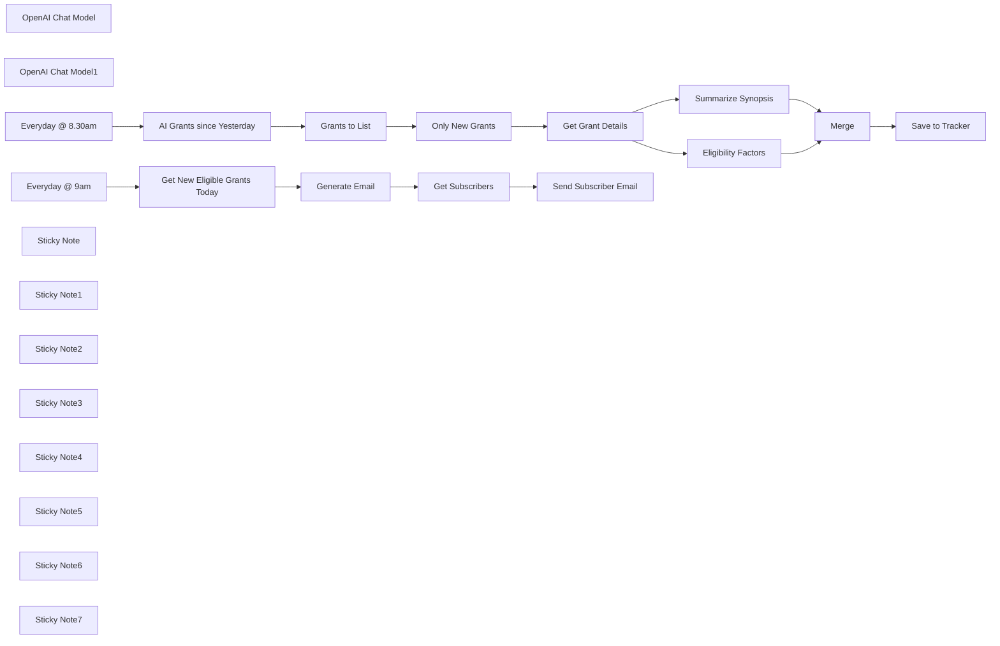

## Fluxo (.json) :

```json
{
  "nodes": [
    {
      "id": "c17e444e-0a5e-4bfe-8de6-c3185de4465d",
      "name": "Grants to List",
      "type": "n8n-nodes-base.splitOut",
      "position": [
        -240,
        -180
      ],
      "parameters": {
        "options": {},
        "fieldToSplitOut": "oppHits"
      },
      "typeVersion": 1
    },
    {
      "id": "9251d39c-6098-42fa-aadd-3a22464dee64",
      "name": "Get Grant Details",
      "type": "n8n-nodes-base.httpRequest",
      "position": [
        280,
        -280
      ],
      "parameters": {
        "url": "https://apply07.grants.gov/grantsws/rest/opportunity/details",
        "method": "POST",
        "options": {},
        "sendBody": true,
        "contentType": "form-urlencoded",
        "bodyParameters": {
          "parameters": [
            {
              "name": "oppId",
              "value": "={{ $json.id }}"
            }
          ]
        }
      },
      "typeVersion": 4.2
    },
    {
      "id": "ade994d6-a1f8-45bf-a82e-83eb38da08d6",
      "name": "OpenAI Chat Model",
      "type": "@n8n/n8n-nodes-langchain.lmChatOpenAi",
      "position": [
        440,
        -120
      ],
      "parameters": {
        "options": {}
      },
      "credentials": {
        "openAiApi": {
          "id": "8gccIjcuf3gvaoEr",
          "name": "OpenAi account"
        }
      },
      "typeVersion": 1
    },
    {
      "id": "4d81b20e-0038-48d3-840c-3fcf8b798a0d",
      "name": "Summarize Synopsis",
      "type": "@n8n/n8n-nodes-langchain.informationExtractor",
      "position": [
        460,
        -280
      ],
      "parameters": {
        "text": "=Agency: {{ $json.synopsis.agencyName }}\nTitle: {{ $json.opportunityTitle }}\nSynopsis: {{ $json.synopsis.synopsisDesc }}",
        "options": {
          "systemPromptTemplate": "You've been given a grant opportunity listing. Help summarize the opportunity in simple terms."
        },
        "schemaType": "manual",
        "inputSchema": "{\n\t\"type\": \"object\",\n\t\"properties\": {\n \"goal\": { \"type\": [\"string\", \"null\"] },\n \"duration\": { \"type\": \"string\" },\n \"success_criteria\": {\n \"type\": \"array\",\n \"items\": { \"type\": \"string\" }\n },\n \"good_to_know\": {\n\t\t \"type\": \"array\",\n \"items\": { \"type\": \"string\" }\n }\n\t}\n}"
      },
      "typeVersion": 1
    },
    {
      "id": "71e1a2e9-6690-4247-aae3-f5bd61019553",
      "name": "Eligibility Factors",
      "type": "@n8n/n8n-nodes-langchain.informationExtractor",
      "position": [
        640,
        -120
      ],
      "parameters": {
        "text": "=Agency: {{ $json.synopsis.agencyName }}\nTitle: {{ $json.opportunityTitle }}\nSynopsis: {{ $json.synopsis.synopsisDesc }}\nEligibility: {{ $json.synopsis.applicantEligibilityDesc }}",
        "options": {
          "systemPromptTemplate": "Help determine if we are eligible for this grant.\n\nWe are AI Consultants Limited (“Company”) and are the controllers of your personal data. Our registered office is Unit 29, Intelligent Park, Milton Road, Cambridge Cambridgeshire CB9 RDW, and our registered company number is 1234567.\n\nWe are part of a group of companies which provides consultancy services across the globe. Our other group companies are:\n\nAI Consultants Inc. of 2 Drydock Avenue, Suite 1210, Boston, MA 02210, USA\nAI Consultants (Singapore) Pte Ltd of 300 Beach Road, Singapore 199555\nAI Consultants Japan Inc, of 3-1-3 Minamiaoyama, Minato-ku, Tokyo, 107-0062\nIn the UK we are registered with the Information Commissioner’s Office under registration number Z9888888.\n\nIn the US we are registered with the Data Privacy Framework Program (DPF). To view the Company’s certification, please visit https://www.dataprivacyframework.gov/list.\n\nWe are a leading, worldwide product development service provider. We specialise in design engineering services, professional technical services and product technical support services (“Services”).\n\nAs the deep tech powerhouse of Capgemini, CC spearheads transformative projects to solve the toughest scientific and engineering challenges. Ambitious clients collaborate with us to create new-to-the-world technologies, services and products that have never been seen before. Our unique combination of technical, commercial and market expertise yields market-leading solutions that are hard to copy. This creates valuable intellectual property that generates protectable long-term value.\n\nWe work with some of the world’s biggest brands and most ambitious technology start-up ventures across a wide range of markets. From aerospace to agritech, consumer to industry, communications to healthcare, our knowledge of one sector can often be applied to another to create new breakthroughs. We focus on our clients’ success and we are trusted as integral partners in the future of their businesses.\n\nWe do important, difficult, radical and impactful things that benefit society. We helped develop the world's first 24/7 wrist-worn activity monitor, wireless pacemaker and wireless patient monitor, as well as the first connected drug inhaler. Our work led to the most densely packed cellular network in the world – orchestrating swarms of bots across highly automated warehouses. It produced the Bluetooth chip that connects your phone to your car and the latest satellite technology that lets people in remote locations across the world keep in touch."
        },
        "schemaType": "manual",
        "inputSchema": "{\n\t\"type\": \"object\",\n\t\"properties\": {\n\t\t\"eligibility_matches\": {\n\t\t \"type\": \"array\",\n \"items\": { \"type\": \"string\" }\n }\n\t}\n}"
      },
      "typeVersion": 1
    },
    {
      "id": "d741ef63-dcf3-452d-978c-8cbc27f55a33",
      "name": "OpenAI Chat Model1",
      "type": "@n8n/n8n-nodes-langchain.lmChatOpenAi",
      "position": [
        600,
        20
      ],
      "parameters": {
        "options": {}
      },
      "credentials": {
        "openAiApi": {
          "id": "8gccIjcuf3gvaoEr",
          "name": "OpenAi account"
        }
      },
      "typeVersion": 1
    },
    {
      "id": "7354ed6d-50f5-4234-90d8-2d9d0c7eccd4",
      "name": "Merge",
      "type": "n8n-nodes-base.merge",
      "position": [
        1000,
        -120
      ],
      "parameters": {
        "mode": "combine",
        "options": {},
        "combineBy": "combineByPosition"
      },
      "typeVersion": 3
    },
    {
      "id": "2dffda98-18c6-4c7b-8fc3-0e6539642ea2",
      "name": "Save to Tracker",
      "type": "n8n-nodes-base.airtable",
      "position": [
        1420,
        -20
      ],
      "parameters": {
        "base": {
          "__rl": true,
          "mode": "list",
          "value": "appiNoPRvhJxz9crl",
          "cachedResultUrl": "https://airtable.com/appiNoPRvhJxz9crl",
          "cachedResultName": "US Grants.gov Tracker"
        },
        "table": {
          "__rl": true,
          "mode": "list",
          "value": "tblX93C9MNzizhibd",
          "cachedResultUrl": "https://airtable.com/appiNoPRvhJxz9crl/tblX93C9MNzizhibd",
          "cachedResultName": "Table 1"
        },
        "columns": {
          "value": {
            "URL": "=https://grants.gov/search-results-detail/{{ $('Get Grant Details').item.json.id }}",
            "Goal": "={{ $json.output.goal }}",
            "Notes": "={{ $json.output.good_to_know.join('\\n') }}",
            "Title": "={{ $('Get Grant Details').item.json.opportunityTitle }}",
            "Agency": "={{ $('Get Grant Details').item.json.synopsis.agencyContactName }}",
            "Status": "New",
            "Funding": "={{ $('Get Grant Details').item.json.synopsis.estimatedFunding }}",
            "Duration": "={{ $json.output.duration }}",
            "Award Floor": "={{ $('Get Grant Details').item.json.synopsis.awardFloor }}",
            "Posted Date": "={{ $('Get Grant Details').item.json.synopsis.postingDate }}",
            "Agency Email": "={{ $('Get Grant Details').item.json.synopsis.agencyContactEmail }}",
            "Agency Phone": "={{ $('Get Grant Details').item.json.synopsis.agencyContactPhone }}",
            "Eligibility?": "={{ $json.output.eligibility_matches.length > 0 ? 'Yes' : 'No' }}",
            "Award Ceiling": "={{ $('Get Grant Details').item.json.synopsis.awardCeiling }}",
            "Response Date": "={{ $('Get Grant Details').item.json.synopsis.responseDate }}",
            "Success Criteria": "={{ $json.output.success_criteria.join('\\n') }}",
            "Eligibility Notes": "={{ $json.output.eligibility_matches.join('\\n') }}",
            "Opportunity Number": "={{ $('Get Grant Details').item.json.opportunityNumber }}"
          },
          "schema": [
            {
              "id": "Opportunity Number",
              "type": "string",
              "display": true,
              "removed": false,
              "readOnly": false,
              "required": false,
              "displayName": "Opportunity Number",
              "defaultMatch": false,
              "canBeUsedToMatch": true
            },
            {
              "id": "Status",
              "type": "options",
              "display": true,
              "options": [
                {
                  "name": "New",
                  "value": "New"
                },
                {
                  "name": "Under Review",
                  "value": "Under Review"
                },
                {
                  "name": "Interested",
                  "value": "Interested"
                },
                {
                  "name": "Not Interested",
                  "value": "Not Interested"
                }
              ],
              "removed": false,
              "readOnly": false,
              "required": false,
              "displayName": "Status",
              "defaultMatch": false,
              "canBeUsedToMatch": true
            },
            {
              "id": "Title",
              "type": "string",
              "display": true,
              "removed": false,
              "readOnly": false,
              "required": false,
              "displayName": "Title",
              "defaultMatch": false,
              "canBeUsedToMatch": true
            },
            {
              "id": "URL",
              "type": "string",
              "display": true,
              "removed": false,
              "readOnly": false,
              "required": false,
              "displayName": "URL",
              "defaultMatch": false,
              "canBeUsedToMatch": true
            },
            {
              "id": "Goal",
              "type": "string",
              "display": true,
              "removed": false,
              "readOnly": false,
              "required": false,
              "displayName": "Goal",
              "defaultMatch": false,
              "canBeUsedToMatch": true
            },
            {
              "id": "Success Criteria",
              "type": "string",
              "display": true,
              "removed": false,
              "readOnly": false,
              "required": false,
              "displayName": "Success Criteria",
              "defaultMatch": false,
              "canBeUsedToMatch": true
            },
            {
              "id": "Notes",
              "type": "string",
              "display": true,
              "removed": false,
              "readOnly": false,
              "required": false,
              "displayName": "Notes",
              "defaultMatch": false,
              "canBeUsedToMatch": true
            },
            {
              "id": "Eligibility?",
              "type": "options",
              "display": true,
              "options": [
                {
                  "name": "Yes",
                  "value": "Yes"
                },
                {
                  "name": "No",
                  "value": "No"
                }
              ],
              "removed": false,
              "readOnly": false,
              "required": false,
              "displayName": "Eligibility?",
              "defaultMatch": false,
              "canBeUsedToMatch": true
            },
            {
              "id": "Eligibility Notes",
              "type": "string",
              "display": true,
              "removed": false,
              "readOnly": false,
              "required": false,
              "displayName": "Eligibility Notes",
              "defaultMatch": false,
              "canBeUsedToMatch": true
            },
            {
              "id": "Duration",
              "type": "string",
              "display": true,
              "removed": false,
              "readOnly": false,
              "required": false,
              "displayName": "Duration",
              "defaultMatch": false,
              "canBeUsedToMatch": true
            },
            {
              "id": "Agency",
              "type": "string",
              "display": true,
              "removed": false,
              "readOnly": false,
              "required": false,
              "displayName": "Agency",
              "defaultMatch": false,
              "canBeUsedToMatch": true
            },
            {
              "id": "Agency Email",
              "type": "string",
              "display": true,
              "removed": false,
              "readOnly": false,
              "required": false,
              "displayName": "Agency Email",
              "defaultMatch": false,
              "canBeUsedToMatch": true
            },
            {
              "id": "Agency Phone",
              "type": "string",
              "display": true,
              "removed": false,
              "readOnly": false,
              "required": false,
              "displayName": "Agency Phone",
              "defaultMatch": false,
              "canBeUsedToMatch": true
            },
            {
              "id": "Posted Date",
              "type": "dateTime",
              "display": true,
              "removed": false,
              "readOnly": false,
              "required": false,
              "displayName": "Posted Date",
              "defaultMatch": false,
              "canBeUsedToMatch": true
            },
            {
              "id": "Response Date",
              "type": "dateTime",
              "display": true,
              "removed": false,
              "readOnly": false,
              "required": false,
              "displayName": "Response Date",
              "defaultMatch": false,
              "canBeUsedToMatch": true
            },
            {
              "id": "Funding",
              "type": "number",
              "display": true,
              "removed": false,
              "readOnly": false,
              "required": false,
              "displayName": "Funding",
              "defaultMatch": false,
              "canBeUsedToMatch": true
            },
            {
              "id": "Award Ceiling",
              "type": "number",
              "display": true,
              "removed": false,
              "readOnly": false,
              "required": false,
              "displayName": "Award Ceiling",
              "defaultMatch": false,
              "canBeUsedToMatch": true
            },
            {
              "id": "Award Floor",
              "type": "number",
              "display": true,
              "removed": false,
              "readOnly": false,
              "required": false,
              "displayName": "Award Floor",
              "defaultMatch": false,
              "canBeUsedToMatch": true
            }
          ],
          "mappingMode": "defineBelow",
          "matchingColumns": []
        },
        "options": {},
        "operation": "create"
      },
      "credentials": {
        "airtableTokenApi": {
          "id": "Und0frCQ6SNVX3VV",
          "name": "Airtable Personal Access Token account"
        }
      },
      "typeVersion": 2.1
    },
    {
      "id": "f0712788-b801-4070-a5c2-2f7ed620588e",
      "name": "Only New Grants",
      "type": "n8n-nodes-base.removeDuplicates",
      "position": [
        -60,
        -180
      ],
      "parameters": {
        "options": {},
        "operation": "removeItemsSeenInPreviousExecutions",
        "dedupeValue": "={{ $json.id }}"
      },
      "typeVersion": 2
    },
    {
      "id": "fb4ac14d-0bdd-40f7-9b31-3a23450b1f0b",
      "name": "AI Grants since Yesterday",
      "type": "n8n-nodes-base.httpRequest",
      "position": [
        -420,
        -180
      ],
      "parameters": {
        "url": "https://apply07.grants.gov/grantsws/rest/opportunities/search",
        "method": "POST",
        "options": {},
        "jsonBody": "{\n \"keyword\": \"ai\",\n \"cfda\": null,\n \"agencies\": null,\n \"sortBy\": \"openDate|desc\",\n \"rows\": 5000,\n \"eligibilities\": null,\n \"fundingCategories\": null,\n \"fundingInstruments\": null,\n \"dateRange\": \"1\",\n \"oppStatuses\": \"forecasted|posted\"\n}",
        "sendBody": true,
        "specifyBody": "json"
      },
      "typeVersion": 4.2
    },
    {
      "id": "0446c882-764a-4c94-8c49-f368c50586a0",
      "name": "Get New Eligible Grants Today",
      "type": "n8n-nodes-base.airtable",
      "position": [
        -400,
        500
      ],
      "parameters": {
        "base": {
          "__rl": true,
          "mode": "list",
          "value": "appiNoPRvhJxz9crl",
          "cachedResultUrl": "https://airtable.com/appiNoPRvhJxz9crl",
          "cachedResultName": "US Grants.gov Tracker"
        },
        "table": {
          "__rl": true,
          "mode": "list",
          "value": "tblX93C9MNzizhibd",
          "cachedResultUrl": "https://airtable.com/appiNoPRvhJxz9crl/tblX93C9MNzizhibd",
          "cachedResultName": "Table 1"
        },
        "options": {},
        "operation": "search",
        "filterByFormula": "=AND(\n {Status} = 'New',\n {Eligibility?} = 'Yes',\n IS_SAME(DATETIME_FORMAT(Created, 'YYYY-MM-DD'), DATETIME_FORMAT(TODAY(), 'YYYY-MM-DD'))\n)"
      },
      "credentials": {
        "airtableTokenApi": {
          "id": "Und0frCQ6SNVX3VV",
          "name": "Airtable Personal Access Token account"
        }
      },
      "typeVersion": 2.1
    },
    {
      "id": "70bca43a-d00e-4ee6-828a-9926ba1d8fdb",
      "name": "Generate Email",
      "type": "n8n-nodes-base.html",
      "position": [
        -160,
        500
      ],
      "parameters": {
        "html": "<!DOCTYPE HTML PUBLIC \"-//W3C//DTD XHTML 1.0 Transitional //EN\" \"http://www.w3.org/TR/xhtml1/DTD/xhtml1-transitional.dtd\">\n<html xmlns=\"http://www.w3.org/1999/xhtml\" xmlns:v=\"urn:schemas-microsoft-com:vml\" xmlns:o=\"urn:schemas-microsoft-com:office:office\">\n<head>\n<!--[if gte mso 9]>\n<xml>\n <o:OfficeDocumentSettings>\n <o:AllowPNG/>\n <o:PixelsPerInch>96</o:PixelsPerInch>\n </o:OfficeDocumentSettings>\n</xml>\n<![endif]-->\n <meta http-equiv=\"Content-Type\" content=\"text/html; charset=UTF-8\">\n <meta name=\"viewport\" content=\"width=device-width, initial-scale=1.0\">\n <meta name=\"x-apple-disable-message-reformatting\">\n <!--[if !mso]><!--><meta http-equiv=\"X-UA-Compatible\" content=\"IE=edge\"><!--<![endif]-->\n <title></title>\n \n <style type=\"text/css\">\n @media only screen and (min-width: 520px) {\n .u-row {\n width: 500px !important;\n }\n .u-row .u-col {\n vertical-align: top;\n }\n\n .u-row .u-col-100 {\n width: 500px !important;\n }\n\n}\n\n@media (max-width: 520px) {\n .u-row-container {\n max-width: 100% !important;\n padding-left: 0px !important;\n padding-right: 0px !important;\n }\n .u-row .u-col {\n min-width: 320px !important;\n max-width: 100% !important;\n display: block !important;\n }\n .u-row {\n width: 100% !important;\n }\n .u-col {\n width: 100% !important;\n }\n .u-col > div {\n margin: 0 auto;\n }\n}\nbody {\n margin: 0;\n padding: 0;\n}\n\ntable,\ntr,\ntd {\n vertical-align: top;\n border-collapse: collapse;\n}\n\np {\n margin: 0;\n}\n\n.ie-container table,\n.mso-container table {\n table-layout: fixed;\n}\n\n* {\n line-height: inherit;\n}\n\na[x-apple-data-detectors='true'] {\n color: inherit !important;\n text-decoration: none !important;\n}\n\ntable, td { color: #000000; } </style>\n \n \n\n</head>\n\n<body class=\"clean-body u_body\" style=\"margin: 0;padding: 0;-webkit-text-size-adjust: 100%;background-color: #F7F8F9;color: #000000\">\n <!--[if IE]><div class=\"ie-container\"><![endif]-->\n <!--[if mso]><div class=\"mso-container\"><![endif]-->\n <table style=\"border-collapse: collapse;table-layout: fixed;border-spacing: 0;mso-table-lspace: 0pt;mso-table-rspace: 0pt;vertical-align: top;min-width: 320px;Margin: 0 auto;background-color: #F7F8F9;width:100%\" cellpadding=\"0\" cellspacing=\"0\">\n <tbody>\n <tr style=\"vertical-align: top\">\n <td style=\"word-break: break-word;border-collapse: collapse !important;vertical-align: top\">\n <!--[if (mso)|(IE)]><table width=\"100%\" cellpadding=\"0\" cellspacing=\"0\" border=\"0\"><tr><td align=\"center\" style=\"background-color: #F7F8F9;\"><![endif]-->\n \n \n \n<div class=\"u-row-container\" style=\"padding: 0px;background-color: #f7f8f9\">\n <div class=\"u-row\" style=\"margin: 0 auto;min-width: 320px;max-width: 500px;overflow-wrap: break-word;word-wrap: break-word;word-break: break-word;background-color: #ffffff;\">\n <div style=\"border-collapse: collapse;display: table;width: 100%;height: 100%;background-color: transparent;\">\n <!--[if (mso)|(IE)]><table width=\"100%\" cellpadding=\"0\" cellspacing=\"0\" border=\"0\"><tr><td style=\"padding: 0px;background-color: #f7f8f9;\" align=\"center\"><table cellpadding=\"0\" cellspacing=\"0\" border=\"0\" style=\"width:500px;\"><tr style=\"background-color: #ffffff;\"><![endif]-->\n \n<!--[if (mso)|(IE)]><td align=\"center\" width=\"500\" style=\"background-color: #f7f8f9;width: 500px;padding: 0px;border-top: 0px solid transparent;border-left: 0px solid transparent;border-right: 0px solid transparent;border-bottom: 0px solid transparent;border-radius: 0px;-webkit-border-radius: 0px; -moz-border-radius: 0px;\" valign=\"top\"><![endif]-->\n<div class=\"u-col u-col-100\" style=\"max-width: 320px;min-width: 500px;display: table-cell;vertical-align: top;\">\n <div style=\"background-color: #f7f8f9;height: 100%;width: 100% !important;border-radius: 0px;-webkit-border-radius: 0px; -moz-border-radius: 0px;\">\n <!--[if (!mso)&(!IE)]><!--><div style=\"box-sizing: border-box; height: 100%; padding: 0px;border-top: 0px solid transparent;border-left: 0px solid transparent;border-right: 0px solid transparent;border-bottom: 0px solid transparent;border-radius: 0px;-webkit-border-radius: 0px; -moz-border-radius: 0px;\"><!--<![endif]-->\n \n<table style=\"font-family:arial,helvetica,sans-serif;\" role=\"presentation\" cellpadding=\"0\" cellspacing=\"0\" width=\"100%\" border=\"0\">\n <tbody>\n <tr>\n <td style=\"overflow-wrap:break-word;word-break:break-word;padding:32px 10px;font-family:arial,helvetica,sans-serif;\" align=\"left\">\n \n <!--[if mso]><table width=\"100%\"><tr><td><![endif]-->\n <h1 style=\"margin: 0px; line-height: 140%; text-align: center; word-wrap: break-word; font-family: arial black,AvenirNext-Heavy,avant garde,arial; font-size: 22px; font-weight: 400;\"><span><span><span><span><span><span>Latest AI Grants</span></span></span></span></span></span></h1>\n <!--[if mso]></td></tr></table><![endif]-->\n\n </td>\n </tr>\n </tbody>\n</table>\n\n <!--[if (!mso)&(!IE)]><!--></div><!--<![endif]-->\n </div>\n</div>\n<!--[if (mso)|(IE)]></td><![endif]-->\n <!--[if (mso)|(IE)]></tr></table></td></tr></table><![endif]-->\n </div>\n </div>\n </div>\n \n\n\n \n \n<div class=\"u-row-container\" style=\"padding: 0px;background-color: #f7f8f9\">\n <div class=\"u-row\" style=\"margin: 0 auto;min-width: 320px;max-width: 500px;overflow-wrap: break-word;word-wrap: break-word;word-break: break-word;background-color: transparent;\">\n <div style=\"border-collapse: collapse;display: table;width: 100%;height: 100%;background-color: transparent;\">\n <!--[if (mso)|(IE)]><table width=\"100%\" cellpadding=\"0\" cellspacing=\"0\" border=\"0\"><tr><td style=\"padding: 0px;background-color: #f7f8f9;\" align=\"center\"><table cellpadding=\"0\" cellspacing=\"0\" border=\"0\" style=\"width:500px;\"><tr style=\"background-color: transparent;\"><![endif]-->\n \n<!--[if (mso)|(IE)]><td align=\"center\" width=\"500\" style=\"background-color: #ffffff;width: 500px;padding: 0px;border-top: 0px solid transparent;border-left: 0px solid transparent;border-right: 0px solid transparent;border-bottom: 0px solid transparent;border-radius: 0px;-webkit-border-radius: 0px; -moz-border-radius: 0px;\" valign=\"top\"><![endif]-->\n<div class=\"u-col u-col-100\" style=\"max-width: 320px;min-width: 500px;display: table-cell;vertical-align: top;\">\n <div style=\"background-color: #ffffff;height: 100%;width: 100% !important;border-radius: 0px;-webkit-border-radius: 0px; -moz-border-radius: 0px;\">\n <!--[if (!mso)&(!IE)]><!--><div style=\"box-sizing: border-box; height: 100%; padding: 0px;border-top: 0px solid transparent;border-left: 0px solid transparent;border-right: 0px solid transparent;border-bottom: 0px solid transparent;border-radius: 0px;-webkit-border-radius: 0px; -moz-border-radius: 0px;\"><!--<![endif]-->\n \n<table style=\"font-family:arial,helvetica,sans-serif;\" role=\"presentation\" cellpadding=\"0\" cellspacing=\"0\" width=\"100%\" border=\"0\">\n <tbody>\n <tr>\n <td style=\"overflow-wrap:break-word;word-break:break-word;padding:10px;font-family:arial,helvetica,sans-serif;\" align=\"left\">\n{{\n$input.all().map((input,idx) => {\nreturn `\n <div>\n <div style=\"padding-top:14px;padding-bottom:24px\">\n <h3 style=\"margin-top:0;margin-bottom:7px;font-size:16px\">\n ${idx+1}. ${input.json.Title}\n </h3>\n <div style=\"margin-bottom:14px;font-size:12px;\">\n <strong>${input.json.Agency}</strong>\n &middot;\n <a href=\"${input.json.URL}\">See details</a>\n </div>\n <p style=\"margin-bottom:14px;font-size:14px\">\n <strong>Synopsis:</strong> ${input.json.Goal}\n </p>\n <ul style=\"font-size:14px;\">\n ${input.json['Success Criteria']\n .split('\\n')\n .map(text => `<li>${text}</li>`)\n .join('')\n }\n </ul>\n <div style=\"font-size:12px;\">\n <strong>Posted By</strong> ${input.json['Posted Date']\n .toDateTime()\n .format('EEE, dd MMM yyyy t')}\n <br/>\n <strong>Respond By</strong> ${input.json['Response Date']\n .toDateTime()\n .format('EEE, dd MMM yyyy t')}\n \n </div>\n</div> \n`\n}).join('<hr/>')\n}} \n </td>\n </tr>\n </tbody>\n</table>\n\n <!--[if (!mso)&(!IE)]><!--></div><!--<![endif]-->\n </div>\n</div>\n<!--[if (mso)|(IE)]></td><![endif]-->\n <!--[if (mso)|(IE)]></tr></table></td></tr></table><![endif]-->\n </div>\n </div>\n </div>\n \n\n\n \n \n<div class=\"u-row-container\" style=\"padding: 0px;background-color: transparent\">\n <div class=\"u-row\" style=\"margin: 0 auto;min-width: 320px;max-width: 500px;overflow-wrap: break-word;word-wrap: break-word;word-break: break-word;background-color: transparent;\">\n <div style=\"border-collapse: collapse;display: table;width: 100%;height: 100%;background-color: transparent;\">\n <!--[if (mso)|(IE)]><table width=\"100%\" cellpadding=\"0\" cellspacing=\"0\" border=\"0\"><tr><td style=\"padding: 0px;background-color: transparent;\" align=\"center\"><table cellpadding=\"0\" cellspacing=\"0\" border=\"0\" style=\"width:500px;\"><tr style=\"background-color: transparent;\"><![endif]-->\n \n<!--[if (mso)|(IE)]><td align=\"center\" width=\"500\" style=\"width: 500px;padding: 0px;border-top: 0px solid transparent;border-left: 0px solid transparent;border-right: 0px solid transparent;border-bottom: 0px solid transparent;border-radius: 0px;-webkit-border-radius: 0px; -moz-border-radius: 0px;\" valign=\"top\"><![endif]-->\n<div class=\"u-col u-col-100\" style=\"max-width: 320px;min-width: 500px;display: table-cell;vertical-align: top;\">\n <div style=\"height: 100%;width: 100% !important;border-radius: 0px;-webkit-border-radius: 0px; -moz-border-radius: 0px;\">\n <!--[if (!mso)&(!IE)]><!--><div style=\"box-sizing: border-box; height: 100%; padding: 0px;border-top: 0px solid transparent;border-left: 0px solid transparent;border-right: 0px solid transparent;border-bottom: 0px solid transparent;border-radius: 0px;-webkit-border-radius: 0px; -moz-border-radius: 0px;\"><!--<![endif]-->\n \n<table style=\"font-family:arial,helvetica,sans-serif;\" role=\"presentation\" cellpadding=\"0\" cellspacing=\"0\" width=\"100%\" border=\"0\">\n <tbody>\n <tr>\n <td style=\"overflow-wrap:break-word;word-break:break-word;padding:24px 10px;font-family:arial,helvetica,sans-serif;\" align=\"left\">\n \n <div style=\"font-size: 14px; color: #7e8c8d; line-height: 140%; text-align: center; word-wrap: break-word;\">\n <p style=\"line-height: 140%;\">Autogenerated by n8n.</p>\n<p style=\"line-height: 140%;\">Brought to you by workflow #{{ $workflow.id }}</p>\n </div>\n\n </td>\n </tr>\n </tbody>\n</table>\n\n <!--[if (!mso)&(!IE)]><!--></div><!--<![endif]-->\n </div>\n</div>\n<!--[if (mso)|(IE)]></td><![endif]-->\n <!--[if (mso)|(IE)]></tr></table></td></tr></table><![endif]-->\n </div>\n </div>\n </div>\n \n\n\n <!--[if (mso)|(IE)]></td></tr></table><![endif]-->\n </td>\n </tr>\n </tbody>\n </table>\n <!--[if mso]></div><![endif]-->\n <!--[if IE]></div><![endif]-->\n</body>\n\n</html>\n"
      },
      "executeOnce": true,
      "typeVersion": 1.2
    },
    {
      "id": "12bd72f5-3028-4572-b59e-1cc143e44a86",
      "name": "Everyday @ 9am",
      "type": "n8n-nodes-base.scheduleTrigger",
      "position": [
        -720,
        460
      ],
      "parameters": {
        "rule": {
          "interval": [
            {
              "triggerAtHour": 8
            }
          ]
        }
      },
      "typeVersion": 1.2
    },
    {
      "id": "ca62c507-bce5-4a63-be0e-e60591408668",
      "name": "Everyday @ 8.30am",
      "type": "n8n-nodes-base.scheduleTrigger",
      "position": [
        -720,
        -220
      ],
      "parameters": {
        "rule": {
          "interval": [
            {
              "triggerAtHour": 8,
              "triggerAtMinute": 30
            }
          ]
        }
      },
      "typeVersion": 1.2
    },
    {
      "id": "032bec7e-5aff-4103-b81e-e5bc4a88ddde",
      "name": "Sticky Note",
      "type": "n8n-nodes-base.stickyNote",
      "position": [
        -540,
        -420
      ],
      "parameters": {
        "color": 7,
        "width": 700,
        "height": 480,
        "content": "## 1. Fetch Latest AI Grants, Ignore Those Already Seen\n[Learn more about the Remove Duplicates node](https://docs.n8n.io/integrations/builtin/core-nodes/n8n-nodes-base.removeduplicates/)\n\nA cool feature of n8n's remove duplicates node is that it works across executions. What this means for this template is that the node will help us keep track of grant IDs to know if we've already processed them and if so, filter them out so we won't have duplicate alerts."
      },
      "typeVersion": 1
    },
    {
      "id": "07147665-3571-4512-adce-2727dcb95240",
      "name": "Sticky Note1",
      "type": "n8n-nodes-base.stickyNote",
      "position": [
        180,
        -520
      ],
      "parameters": {
        "color": 7,
        "width": 1000,
        "height": 720,
        "content": "## 2. Quickly Determine Eligibility Using AI\n[Learn more about the Information Extractor node](https://docs.n8n.io/integrations/builtin/cluster-nodes/root-nodes/n8n-nodes-langchain.information-extractor/)\n\nQualifying Leads requires a lot of contextual reasoning taking into account many factors such as commercials, location and eligibility criteria. Whilst it's not guaranteed AI can or will solve this for your particular requirements, it can however get you a good distance of the way there!\n\nAI in this template intends to reduce time (and therefore cost) for a team member needs to spend per grant listing or increase their coverage of grants which they would otherwise miss due to capacity."
      },
      "typeVersion": 1
    },
    {
      "id": "f4758b4d-727a-4ce8-b071-3388eb16b219",
      "name": "Sticky Note2",
      "type": "n8n-nodes-base.stickyNote",
      "position": [
        1200,
        -280
      ],
      "parameters": {
        "color": 7,
        "width": 520,
        "height": 480,
        "content": "## 3. Save Results to Grant Tracker\n[Learn more about the Airtable Node](https://docs.n8n.io/integrations/builtin/app-nodes/n8n-nodes-base.airtable/)\n\nIn n8n, it's easy to send your data anywhere to manage yourself, share with your team or reuse with other workflows. Here for demonstration purposes, we'll just store each grant as a row in our Airtable database.\n\nCheck out the sample Airtable here: https://airtable.com/appiNoPRvhJxz9crl/shrRdP6zstgsxjDKL"
      },
      "typeVersion": 1
    },
    {
      "id": "a7861a21-021f-4629-b863-2163c7436d13",
      "name": "Sticky Note3",
      "type": "n8n-nodes-base.stickyNote",
      "position": [
        -540,
        240
      ],
      "parameters": {
        "color": 7,
        "width": 620,
        "height": 500,
        "content": "## 4. Generate Latest AI Grants Alert Email\n[Learn more about the HTML Template node](https://docs.n8n.io/integrations/builtin/core-nodes/n8n-nodes-base.html/)\n\nUsing our freshly collected AI grants, it would be nice if we can share them with our team members via email. A nicely formatted email digest can be generated using the HTML template node, with added links for greater impact.\n\nHere in this demonstration, we will loop through all eligible new grants and compile them into a newsletter format using the HTML node.\n"
      },
      "typeVersion": 1
    },
    {
      "id": "4d09af53-92cb-4288-86d7-dcf695bfb358",
      "name": "Sticky Note4",
      "type": "n8n-nodes-base.stickyNote",
      "position": [
        100,
        240
      ],
      "parameters": {
        "color": 7,
        "width": 640,
        "height": 500,
        "content": "## 5. Send to a list of Subscribers\n[Learn more about the Gmail node](https://docs.n8n.io/integrations/builtin/app-nodes/n8n-nodes-base.gmail/)\n\nFinally, we can source a list of subscribers to send our generated email newsletter.\n\nHere, our subscriber list is another table alongside our grants table that we can import that list using the Airtable node. You can use any email provider that supports HTML but for this demonstration, we're using Gmail for simplicity sake."
      },
      "typeVersion": 1
    },
    {
      "id": "784d59f3-5b1f-4404-bc04-4bd58cf03585",
      "name": "Get Subscribers",
      "type": "n8n-nodes-base.airtable",
      "position": [
        240,
        500
      ],
      "parameters": {
        "base": {
          "__rl": true,
          "mode": "list",
          "value": "appiNoPRvhJxz9crl",
          "cachedResultUrl": "https://airtable.com/appiNoPRvhJxz9crl",
          "cachedResultName": "US Grants.gov Tracker"
        },
        "table": {
          "__rl": true,
          "mode": "list",
          "value": "tblaS91hyhguntfaC",
          "cachedResultUrl": "https://airtable.com/appiNoPRvhJxz9crl/tblaS91hyhguntfaC",
          "cachedResultName": "Subscribers"
        },
        "options": {},
        "operation": "search",
        "filterByFormula": "AND({Status} = 'Active')"
      },
      "credentials": {
        "airtableTokenApi": {
          "id": "Und0frCQ6SNVX3VV",
          "name": "Airtable Personal Access Token account"
        }
      },
      "executeOnce": true,
      "typeVersion": 2.1
    },
    {
      "id": "3be0788b-90ef-4648-aa25-1170208a685d",
      "name": "Send Subscriber Email",
      "type": "n8n-nodes-base.gmail",
      "position": [
        480,
        500
      ],
      "webhookId": "37eeec7a-1982-4137-8473-313bfb6c5b42",
      "parameters": {
        "sendTo": "={{ $json.Email }}",
        "message": "={{ $('Generate Email').first().json.html }}",
        "options": {},
        "subject": "Daily Newletter for Intersting US Grants"
      },
      "credentials": {
        "gmailOAuth2": {
          "id": "Sf5Gfl9NiFTNXFWb",
          "name": "Gmail account"
        }
      },
      "typeVersion": 2.1
    },
    {
      "id": "14a65482-b314-4a2f-9ce3-87e3aae126f9",
      "name": "Sticky Note5",
      "type": "n8n-nodes-base.stickyNote",
      "position": [
        -1280,
        300
      ],
      "parameters": {
        "color": 7,
        "width": 460,
        "height": 200,
        "content": "## Scheduled Triggers\n[Learn more about Scheduled Triggers](https://docs.n8n.io/integrations/builtin/core-nodes/n8n-nodes-base.scheduletrigger)\n\nScheduled triggers are a great way to run this template automatically in the morning ready for your team before they start their working day.\n\nFeel free to adjust the interval to a time which suits you!"
      },
      "typeVersion": 1
    },
    {
      "id": "b172eb7a-58bc-4d4a-be22-796d34a59897",
      "name": "Sticky Note6",
      "type": "n8n-nodes-base.stickyNote",
      "position": [
        -1280,
        -620
      ],
      "parameters": {
        "width": 460,
        "height": 900,
        "content": "## Try It Out!\n\n### This n8n templates demonstrates how to automatically ingest a source of leads at regular intervals and take advantage of n8n's remove duplicates node to simplify duplicate detection.\nAdditionally after the leads are captured, a simple alerts notification can be generated and shared with team members.\n\n### How it works\n* A scheduled trigger is set to fetch a list of AI grants listed on the grants.gov website in the past day.\n* A Remove Duplicates node is used to track Grant IDs to filter out those already processed by the workflow.\n* New grants are summarized and analysed by AI nodes to determine eligibility and interest which is then saved to an Airtable database.\n* Another scheduled trigger starts a little later than the first to collect and summarize the new grants\n* The results are then compiled into an email template using the HTML node, in the form of a newsletter designed to alert and brief team members of new AI grants.\n* This email is then sent to a list of subscribers using the gmail node.\n\n## How to use\n* Make a copy of sample Airtable here: https://airtable.com/appiNoPRvhJxz9crl/shrRdP6zstgsxjDKL\n* The filters for fetching the grants is currently set to the \"AI\" category. Feel free to change this to include more categories.\n* Not interested in grants, this template can works for other sources of leads just change the endpoint and how you're defining the item ID to track.\n\n\n### Need Help?\nJoin the [Discord](https://discord.com/invite/XPKeKXeB7d) or ask in the [Forum](https://community.n8n.io/)!\n\nHappy Hacking!"
      },
      "typeVersion": 1
    },
    {
      "id": "f9849413-4dad-44dc-92ec-8879d123bfd3",
      "name": "Sticky Note7",
      "type": "n8n-nodes-base.stickyNote",
      "position": [
        720,
        40
      ],
      "parameters": {
        "width": 320,
        "height": 120,
        "content": "### Add your company details here!\nCompany details are added in the system prompt to help the AI determine eligibility. The more details the better!"
      },
      "typeVersion": 1
    }
  ],
  "pinData": {},
  "connections": {
    "Merge": {
      "main": [
        [
          {
            "node": "Save to Tracker",
            "type": "main",
            "index": 0
          }
        ]
      ]
    },
    "Everyday @ 9am": {
      "main": [
        [
          {
            "node": "Get New Eligible Grants Today",
            "type": "main",
            "index": 0
          }
        ]
      ]
    },
    "Generate Email": {
      "main": [
        [
          {
            "node": "Get Subscribers",
            "type": "main",
            "index": 0
          }
        ]
      ]
    },
    "Grants to List": {
      "main": [
        [
          {
            "node": "Only New Grants",
            "type": "main",
            "index": 0
          }
        ]
      ]
    },
    "Get Subscribers": {
      "main": [
        [
          {
            "node": "Send Subscriber Email",
            "type": "main",
            "index": 0
          }
        ]
      ]
    },
    "Only New Grants": {
      "main": [
        [
          {
            "node": "Get Grant Details",
            "type": "main",
            "index": 0
          }
        ]
      ]
    },
    "Save to Tracker": {
      "main": [
        []
      ]
    },
    "Everyday @ 8.30am": {
      "main": [
        [
          {
            "node": "AI Grants since Yesterday",
            "type": "main",
            "index": 0
          }
        ]
      ]
    },
    "Get Grant Details": {
      "main": [
        [
          {
            "node": "Summarize Synopsis",
            "type": "main",
            "index": 0
          },
          {
            "node": "Eligibility Factors",
            "type": "main",
            "index": 0
          }
        ]
      ]
    },
    "OpenAI Chat Model": {
      "ai_languageModel": [
        [
          {
            "node": "Summarize Synopsis",
            "type": "ai_languageModel",
            "index": 0
          }
        ]
      ]
    },
    "OpenAI Chat Model1": {
      "ai_languageModel": [
        [
          {
            "node": "Eligibility Factors",
            "type": "ai_languageModel",
            "index": 0
          }
        ]
      ]
    },
    "Summarize Synopsis": {
      "main": [
        [
          {
            "node": "Merge",
            "type": "main",
            "index": 0
          }
        ]
      ]
    },
    "Eligibility Factors": {
      "main": [
        [
          {
            "node": "Merge",
            "type": "main",
            "index": 1
          }
        ]
      ]
    },
    "AI Grants since Yesterday": {
      "main": [
        [
          {
            "node": "Grants to List",
            "type": "main",
            "index": 0
          }
        ]
      ]
    },
    "Get New Eligible Grants Today": {
      "main": [
        [
          {
            "node": "Generate Email",
            "type": "main",
            "index": 0
          }
        ]
      ]
    }
  }
}
```

<a id="template-709"></a>

## Template 709 - Extração rápida de dados de clientes

- **Nome:** Extração rápida de dados de clientes
- **Descrição:** Fluxo de teste que recupera registros de clientes de um datastore e prepara campos padronizados para uso posterior.
- **Funcionalidade:** • Início manual do fluxo: permite executar o fluxo manualmente para testes.
• Recuperação de todos os clientes: obtém todos os registros disponíveis no datastore de clientes.
• Extração e mapeamento de campos: cria campos padronizados (customer_id, customer_name, customer_description) a partir dos dados retornados.
• Utilização de dados de exemplo: utiliza dados de amostra para validar o comportamento do fluxo.
- **Ferramentas:** • Customer Datastore: fonte de dados de clientes que fornece informações como id, name e notes usadas pelo fluxo.

## Fluxo visual

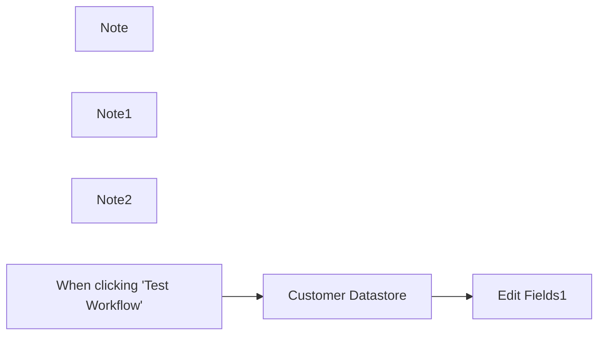

## Fluxo (.json) :

```json
{
  "name": "Very quick quickstart",
  "nodes": [
    {
      "id": "cbb6afcc-f900-434d-ad2e-affb31ccf7a9",
      "name": "Customer Datastore",
      "type": "n8n-nodes-base.n8nTrainingCustomerDatastore",
      "position": [
        1000,
        740
      ],
      "parameters": {
        "operation": "getAllPeople",
        "returnAll": true
      },
      "typeVersion": 1
    },
    {
      "id": "1eb939c0-e391-4e3b-9751-889da2de7cf7",
      "name": "Note",
      "type": "n8n-nodes-base.stickyNote",
      "position": [
        460,
        460
      ],
      "parameters": {
        "width": 300,
        "height": 220,
        "content": "## About the very quick quickstart workflow\n\nThis is an incomplete workflow, used in the [very quick quickstart](https://docs.n8n.io//try-it-out/quickstart/) tutorial."
      },
      "typeVersion": 1
    },
    {
      "id": "c53a8591-9efe-4fb8-993b-6cc309f3240e",
      "name": "Note1",
      "type": "n8n-nodes-base.stickyNote",
      "position": [
        940,
        640
      ],
      "parameters": {
        "width": 220,
        "height": 300,
        "content": "**Get fake sample data**"
      },
      "typeVersion": 1
    },
    {
      "id": "c7e35ca4-b180-4280-9e43-a5dda5d3ea97",
      "name": "Note2",
      "type": "n8n-nodes-base.stickyNote",
      "position": [
        1220,
        640
      ],
      "parameters": {
        "width": 220,
        "height": 300,
        "content": "**Extract data and prepare it for use in the next node**"
      },
      "typeVersion": 1
    },
    {
      "id": "94bba884-5cef-4fe6-ba7d-cc7dbe49839c",
      "name": "When clicking \"Test Workflow\"",
      "type": "n8n-nodes-base.manualTrigger",
      "position": [
        760,
        740
      ],
      "parameters": {},
      "typeVersion": 1
    },
    {
      "id": "f6d22d64-c77f-415d-9c34-c7106ba4877a",
      "name": "Edit Fields1",
      "type": "n8n-nodes-base.set",
      "position": [
        1280,
        740
      ],
      "parameters": {
        "options": {},
        "assignments": {
          "assignments": [
            {
              "id": "df041e3c-fc09-4ba2-8e6b-37f2c6a02526",
              "name": "customer_id",
              "type": "string",
              "value": "={{ $json.id }}"
            },
            {
              "id": "bf288953-4fef-4f55-a45f-c223714919c0",
              "name": "customer_name",
              "type": "string",
              "value": "={{ $json.name }}"
            },
            {
              "id": "1cff0b21-6740-4697-9d2c-9bcb045af0be",
              "name": "customer_description",
              "type": "string",
              "value": "={{ $json.notes }}"
            }
          ]
        }
      },
      "typeVersion": 3.3
    }
  ],
  "pinData": {},
  "connections": {
    "Edit Fields1": {
      "main": [
        []
      ]
    },
    "Customer Datastore": {
      "main": [
        [
          {
            "node": "Edit Fields1",
            "type": "main",
            "index": 0
          }
        ]
      ]
    },
    "When clicking \"Test Workflow\"": {
      "main": [
        [
          {
            "node": "Customer Datastore",
            "type": "main",
            "index": 0
          }
        ]
      ]
    }
  }
}
```

<a id="template-710"></a>

## Template 710 - Registro e alerta de problemas por formulário

- **Nome:** Registro e alerta de problemas por formulário
- **Descrição:** Quando um usuário submete o formulário, a resposta é registrada em uma planilha e, se a severidade for alta, a equipe recebe notificações por Slack e email.
- **Funcionalidade:** • Captura de respostas: Inicia a automação ao receber uma submissão do formulário (ID UXuY0A).
• Armazenamento: Adiciona os dados do relato em uma aba 'Problems' de uma planilha online.
• Avaliação de severidade: Verifica se o campo 'Severity' é maior que 7.
• Notificação via Slack: Envia uma mensagem ao canal 'problems' com email, nome, severidade e descrição do problema quando a severidade é alta.
• Envio de email: Dispara um email com os mesmos detalhes para contato/alerta quando a severidade é alta.
- **Ferramentas:** • Typeform: Formulário online usado para coletar relatos de problemas.
• Google Sheets: Planilha online usada para armazenar os registros na aba 'Problems'.
• Slack: Canal de comunicação usado para notificar a equipe sobre problemas críticos.
• Serviço de Email (SMTP): Envio de notificações por email contendo os detalhes do relato.

## Fluxo visual

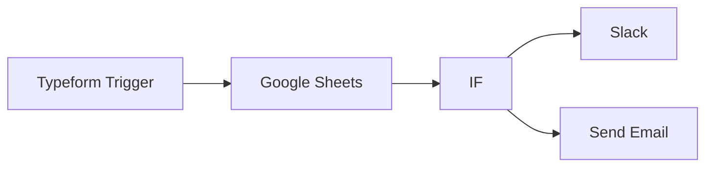

## Fluxo (.json) :

```json
{
  "nodes": [
    {
      "name": "Typeform Trigger",
      "type": "n8n-nodes-base.typeformTrigger",
      "position": [
        450,
        300
      ],
      "parameters": {
        "formId": "UXuY0A"
      },
      "credentials": {
        "typeformApi": ""
      },
      "typeVersion": 1
    },
    {
      "name": "IF",
      "type": "n8n-nodes-base.if",
      "position": [
        850,
        300
      ],
      "parameters": {
        "conditions": {
          "number": [
            {
              "value1": "={{$node[\"Google Sheets\"].data[\"Severity\"]}}",
              "value2": 7,
              "operation": "larger"
            }
          ]
        }
      },
      "typeVersion": 1
    },
    {
      "name": "Google Sheets",
      "type": "n8n-nodes-base.googleSheets",
      "position": [
        650,
        300
      ],
      "parameters": {
        "range": "Problems!A:D",
        "sheetId": "17fzSFl1BZ1njldTfp5lvh8HtS0-pNXH66b7qGZIiGRU",
        "operation": "append"
      },
      "credentials": {
        "googleApi": ""
      },
      "typeVersion": 1
    },
    {
      "name": "Send Email",
      "type": "n8n-nodes-base.emailSend",
      "position": [
        1050,
        400
      ],
      "parameters": {
        "text": "=Email: {{$node[\"IF\"].data[\"Email\"]}}\nName: {{$node[\"IF\"].data[\"Name\"]}}\nSeverity: {{$node[\"IF\"].data[\"Severity\"]}}\n\nProblem:\n{{$node[\"IF\"].data[\"Problem\"]}}",
        "subject": "User Reported Problem",
        "toEmail": "",
        "fromEmail": ""
      },
      "credentials": {
        "smtp": ""
      },
      "typeVersion": 1
    },
    {
      "name": "Slack",
      "type": "n8n-nodes-base.slack",
      "position": [
        1050,
        200
      ],
      "parameters": {
        "text": "=Email: {{$node[\"IF\"].data[\"Email\"]}}\nName: {{$node[\"IF\"].data[\"Name\"]}}\nSeverity: {{$node[\"IF\"].data[\"Severity\"]}}\n\nProblem:\n{{$node[\"IF\"].data[\"Problem\"]}}",
        "channel": "problems",
        "attachments": [],
        "otherOptions": {}
      },
      "credentials": {
        "slackApi": ""
      },
      "typeVersion": 1
    }
  ],
  "connections": {
    "IF": {
      "main": [
        [
          {
            "node": "Slack",
            "type": "main",
            "index": 0
          }
        ],
        [
          {
            "node": "Send Email",
            "type": "main",
            "index": 0
          }
        ]
      ]
    },
    "Google Sheets": {
      "main": [
        [
          {
            "node": "IF",
            "type": "main",
            "index": 0
          }
        ]
      ]
    },
    "Typeform Trigger": {
      "main": [
        [
          {
            "node": "Google Sheets",
            "type": "main",
            "index": 0
          }
        ]
      ]
    }
  }
}
```

<a id="template-711"></a>

## Template 711 - Insights de avaliações do Trustpilot

- **Nome:** Insights de avaliações do Trustpilot
- **Descrição:** Coleta avaliações do Trustpilot, transforma em embeddings, agrupa avaliações semelhantes, extrai insights e exporta resultados para uma planilha.
- **Funcionalidade:** • Limpeza de dados existentes: remove pontos vetoriais anteriores para a empresa selecionada no banco vetorial.
• Extração de avaliações do Trustpilot: raspa páginas de avaliações e extrai autor, classificação, título, texto, datas, país, URL e contagem de avaliações do autor.
• Normalização e empacotamento: converte campos (datas, inteiros), monta objetos de revisão e prepara dados para vetorização.
• Geração de embeddings: cria representações vetoriais do texto usando um modelo de embeddings.
• Armazenamento vetorial: insere embeddings com metadados no banco vetorial para pesquisa posterior.
• Disparo de subfluxo de análise: inicia um subfluxo que busca avaliações por empresa e intervalo de datas para gerar insights.
• Busca e filtragem por período: recupera pontos do banco vetorial filtrando por company_id e intervalo de datas.
• Agrupamento por similaridade: aplica K-means aos vetores para formar clusters de avaliações semelhantes.
• Filtragem de clusters relevantes: seleciona apenas clusters com três ou mais avaliações para análise aprofundada.
• Recuperação de conteúdo por cluster: obtém o payload completo das avaliações pertencentes a cada cluster.
• Geração de insights com LLM: resume avaliações agrupadas, determina sentimento geral e sugere melhorias.
• Exportação para planilha: organiza e anexa os insights e respostas brutas em uma planilha do Google Sheets.
- **Ferramentas:** • Trustpilot: fonte pública de avaliações usadas como entrada para análise.
• Qdrant: banco de dados vetorial para armazenar embeddings, metadados e permitir buscas/filtragem por ponto.
• OpenAI: fornece modelos de embeddings e de linguagem para vetorização e geração de resumos/insights.
• Google Sheets: destino para exportar insights finais e respostas brutas em formato de planilha.
• Python / scikit-learn: ambiente e biblioteca utilizados para aplicar o algoritmo K-means e agrupar vetores.

## Fluxo visual

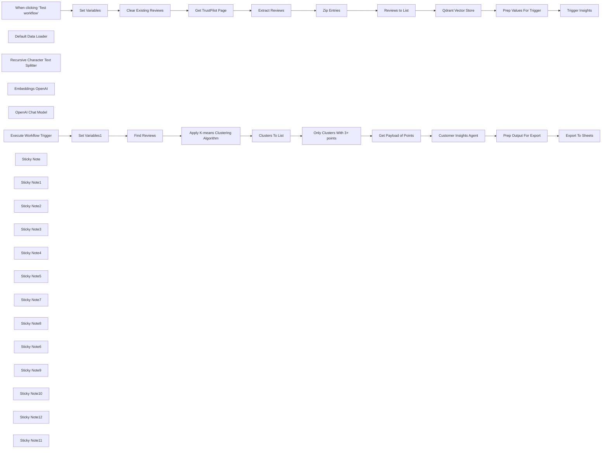

## Fluxo (.json) :

```json
{
  "meta": {
    "instanceId": "408f9fb9940c3cb18ffdef0e0150fe342d6e655c3a9fac21f0f644e8bedabcd9"
  },
  "nodes": [
    {
      "id": "63501cc8-77c9-4037-9f70-da23b6d20b03",
      "name": "When clicking ‘Test workflow’",
      "type": "n8n-nodes-base.manualTrigger",
      "position": [
        280,
        440
      ],
      "parameters": {},
      "typeVersion": 1
    },
    {
      "id": "00de989c-d9e9-4b42-b5db-7097800a6017",
      "name": "Zip Entries",
      "type": "n8n-nodes-base.set",
      "position": [
        1380,
        360
      ],
      "parameters": {
        "options": {},
        "assignments": {
          "assignments": [
            {
              "id": "833a554d-2b39-4160-9348-18b17b28ce30",
              "name": "data",
              "type": "array",
              "value": "={{ \n $json.review_author.map((review_author, idx) => ({\n review_author,\n review_author_reviews_count: $json.review_author_reviews_count[idx].replace(' reviews', '').toInt(),\n review_country: $json.review_country[idx],\n review_date: $json.review_date[idx].toDate(),\n review_date_of_experience: $json.review_date_of_experience[idx].replace('Date of experience: ', '').toDate(),\n review_rating: $json.review_rating[idx].toInt(),\n review_text: $json.review_text[idx],\n review_title: $json.review_title[idx],\n review_url: $('Get TrustPilot Page').params.url.match(/https://[^/]+/) + $json.review_url[idx],\n }))\n}}"
            }
          ]
        }
      },
      "typeVersion": 3.4
    },
    {
      "id": "9290e116-c001-49d5-ae4c-d91cd246f2c2",
      "name": "Extract Reviews",
      "type": "n8n-nodes-base.html",
      "position": [
        1140,
        520
      ],
      "parameters": {
        "options": {
          "trimValues": true
        },
        "operation": "extractHtmlContent",
        "extractionValues": {
          "values": [
            {
              "key": "review_author",
              "cssSelector": "[data-service-review-card-paper] [data-consumer-name-typography]",
              "returnArray": true
            },
            {
              "key": "review_rating",
              "attribute": "data-service-review-rating",
              "cssSelector": "[data-service-review-rating]",
              "returnArray": true,
              "returnValue": "attribute"
            },
            {
              "key": "review_title",
              "cssSelector": "[data-service-review-title-typography]",
              "returnArray": true
            },
            {
              "key": "review_text",
              "cssSelector": "[data-service-review-text-typography]",
              "returnArray": true
            },
            {
              "key": "review_date_of_experience",
              "cssSelector": "[data-service-review-date-of-experience-typography]",
              "returnArray": true
            },
            {
              "key": "review_date",
              "attribute": "datetime",
              "cssSelector": "[data-service-review-date-time-ago]",
              "returnArray": true,
              "returnValue": "attribute"
            },
            {
              "key": "review_country",
              "cssSelector": "[data-consumer-country-typography]",
              "returnArray": true
            },
            {
              "key": "review_author_reviews_count",
              "cssSelector": "[data-consumer-reviews-count-typography]",
              "returnArray": true
            },
            {
              "key": "review_url",
              "attribute": "href",
              "cssSelector": "a[data-review-title-typography]",
              "returnArray": true,
              "returnValue": "attribute"
            }
          ]
        }
      },
      "typeVersion": 1.2
    },
    {
      "id": "4aa3e50d-fcce-48a7-8237-c12f8592f69e",
      "name": "Reviews to List",
      "type": "n8n-nodes-base.splitOut",
      "position": [
        1380,
        520
      ],
      "parameters": {
        "options": {},
        "fieldToSplitOut": "data"
      },
      "typeVersion": 1
    },
    {
      "id": "a6b9abf9-a17a-4f30-9f90-6183770c4933",
      "name": "Default Data Loader",
      "type": "@n8n/n8n-nodes-langchain.documentDefaultDataLoader",
      "position": [
        1980,
        520
      ],
      "parameters": {
        "options": {
          "metadata": {
            "metadataValues": [
              {
                "name": "review_author",
                "value": "={{ $json.review_author }}"
              },
              {
                "name": "review_author_reviews_count",
                "value": "={{ $json.review_author_reviews_count }}"
              },
              {
                "name": "review_country",
                "value": "={{ $json.review_country }}"
              },
              {
                "name": "review_date",
                "value": "={{ $json.review_date }}"
              },
              {
                "name": "review_date_of_experience",
                "value": "={{ $json.review_date_of_experience }}"
              },
              {
                "name": "review_rating",
                "value": "={{ $json.review_rating }}"
              },
              {
                "name": "review_date_month",
                "value": "={{ $json.review_date.toDateTime().format('M') }}"
              },
              {
                "name": "review_date_year",
                "value": "={{ $json.review_date.toDateTime().format('yyyy') }}"
              },
              {
                "name": "review_date_of_experience_month",
                "value": "={{ $json.review_date_of_experience.toDateTime().format('M') }}"
              },
              {
                "name": "review_date_of_experience_year",
                "value": "={{ $json.review_date_of_experience.toDateTime().format('yyyy') }}"
              },
              {
                "name": "company_id",
                "value": "={{ $('Set Variables').item.json.companyId }}"
              },
              {
                "name": "review_url",
                "value": "={{ $json.review_url }}"
              }
            ]
          }
        },
        "jsonData": "={{ $json.review_title }}\n{{ $json.review_text }}",
        "jsonMode": "expressionData"
      },
      "typeVersion": 1
    },
    {
      "id": "afd8907c-9a59-4dcc-94c5-2114fb2a7d5d",
      "name": "Recursive Character Text Splitter",
      "type": "@n8n/n8n-nodes-langchain.textSplitterRecursiveCharacterTextSplitter",
      "position": [
        1980,
        660
      ],
      "parameters": {
        "options": {},
        "chunkSize": 4000
      },
      "typeVersion": 1
    },
    {
      "id": "e22d92b8-e8e9-42aa-9d02-2e70234f11ed",
      "name": "Embeddings OpenAI",
      "type": "@n8n/n8n-nodes-langchain.embeddingsOpenAi",
      "position": [
        1860,
        520
      ],
      "parameters": {
        "model": "text-embedding-3-small",
        "options": {}
      },
      "credentials": {
        "openAiApi": {
          "id": "8gccIjcuf3gvaoEr",
          "name": "OpenAi account"
        }
      },
      "typeVersion": 1
    },
    {
      "id": "f0ea6b63-c96d-4b3f-8a21-d0f2dbb4efc3",
      "name": "Set Variables",
      "type": "n8n-nodes-base.set",
      "position": [
        520,
        440
      ],
      "parameters": {
        "options": {},
        "assignments": {
          "assignments": [
            {
              "id": "2e58a9fa-a14d-4a6c-8cc8-8ec947c791fb",
              "name": "companyId",
              "type": "string",
              "value": "www.freddiesflowers.com"
            }
          ]
        }
      },
      "typeVersion": 3.4
    },
    {
      "id": "0188986f-fbe9-4c06-892a-3cb71b52a309",
      "name": "Get Payload of Points",
      "type": "n8n-nodes-base.httpRequest",
      "position": [
        1740,
        1120
      ],
      "parameters": {
        "url": "=http://qdrant:6333/collections/trustpilot_reviews/points",
        "method": "POST",
        "options": {},
        "jsonBody": "={{\n {\n \"ids\": $json.points,\n \"with_payload\": true\n }\n}}",
        "sendBody": true,
        "specifyBody": "json",
        "authentication": "predefinedCredentialType",
        "nodeCredentialType": "qdrantApi"
      },
      "credentials": {
        "qdrantApi": {
          "id": "NyinAS3Pgfik66w5",
          "name": "QdrantApi account"
        }
      },
      "typeVersion": 4.2
    },
    {
      "id": "5fc6e0b6-507f-4cfd-951b-be3709b86ac2",
      "name": "Clusters To List",
      "type": "n8n-nodes-base.splitOut",
      "position": [
        1480,
        1120
      ],
      "parameters": {
        "options": {},
        "fieldToSplitOut": "output"
      },
      "typeVersion": 1
    },
    {
      "id": "f21369b9-1dd5-4b35-a1f3-00fd67794051",
      "name": "OpenAI Chat Model",
      "type": "@n8n/n8n-nodes-langchain.lmChatOpenAi",
      "position": [
        2140,
        1340
      ],
      "parameters": {
        "model": "gpt-4o-mini",
        "options": {}
      },
      "credentials": {
        "openAiApi": {
          "id": "8gccIjcuf3gvaoEr",
          "name": "OpenAi account"
        }
      },
      "typeVersion": 1
    },
    {
      "id": "b0075699-6513-4781-b5de-81d1ab81dfe1",
      "name": "Only Clusters With 3+ points",
      "type": "n8n-nodes-base.filter",
      "position": [
        1480,
        1300
      ],
      "parameters": {
        "options": {},
        "conditions": {
          "options": {
            "leftValue": "",
            "caseSensitive": true,
            "typeValidation": "strict"
          },
          "combinator": "and",
          "conditions": [
            {
              "id": "328f806c-0792-4d90-9bee-a1e10049e78f",
              "operator": {
                "type": "array",
                "operation": "lengthGt",
                "rightType": "number"
              },
              "leftValue": "={{ $json.points }}",
              "rightValue": 2
            }
          ]
        }
      },
      "typeVersion": 2
    },
    {
      "id": "f6a6209c-d269-4238-8e92-230df7b41df9",
      "name": "Set Variables1",
      "type": "n8n-nodes-base.set",
      "position": [
        519,
        1220
      ],
      "parameters": {
        "options": {},
        "assignments": {
          "assignments": [
            {
              "id": "2e58a9fa-a14d-4a6c-8cc8-8ec947c791fb",
              "name": "companyId",
              "type": "string",
              "value": "={{ $json.companyId }}"
            },
            {
              "id": "37cf8af2-6f0f-40b1-b822-c9bd6a620a3c",
              "name": "review_date_from",
              "type": "string",
              "value": "={{ $today.startOf('month').toISO() }}"
            },
            {
              "id": "8d72f739-f832-4c25-b62a-2ae70ad2b1e7",
              "name": "review_date_to",
              "type": "string",
              "value": "={{ $today.endOf('month').toISO() }}"
            }
          ]
        }
      },
      "typeVersion": 3.4
    },
    {
      "id": "85cb48b1-0ab9-4f88-88f3-82fcfb041ebe",
      "name": "Find Reviews",
      "type": "n8n-nodes-base.httpRequest",
      "position": [
        896,
        1160
      ],
      "parameters": {
        "url": "=http://qdrant:6333/collections/trustpilot_reviews/points/scroll",
        "method": "POST",
        "options": {},
        "jsonBody": "={\n \"limit\": 500,\n \"filter\":{\n \"must\": [\n {\n \"key\": \"metadata.company_id\",\n \"match\": { \"value\": \"{{ $('Set Variables1').item.json.companyId }}\" }\n },\n {\n \"key\": \"metadata.review_date\",\n \"range\": {\n \"gte\": \"{{ $('Set Variables1').item.json.review_date_from }}\",\n \"gt\": null,\n \"lt\": null,\n \"lte\": \"{{ $('Set Variables1').item.json.review_date_to }}\"\n }\n }\n ]\n },\n \"with_vector\":true\n}",
        "sendBody": true,
        "specifyBody": "json",
        "authentication": "predefinedCredentialType",
        "nodeCredentialType": "qdrantApi"
      },
      "credentials": {
        "qdrantApi": {
          "id": "NyinAS3Pgfik66w5",
          "name": "QdrantApi account"
        }
      },
      "typeVersion": 4.2
    },
    {
      "id": "69bbd197-c78f-4dae-9300-fe23d4d49855",
      "name": "Prep Output For Export",
      "type": "n8n-nodes-base.set",
      "position": [
        2720,
        1203
      ],
      "parameters": {
        "mode": "raw",
        "options": {},
        "jsonOutput": "={{ {\n ...$json.output,\n \"CompanyID\": $('Set Variables1').item.json.companyId,\n \"From\": $('Set Variables1').item.json.review_date_from,\n \"To\": $('Set Variables1').item.json.review_date_to,\n \"Number of Responses\": $('Get Payload of Points').item.json.result.length,\n \"Raw Responses\": $('Get Payload of Points').item.json.result.map(item =>\n [\n item.payload.metadata.review_date,\n item.payload.metadata.review_author,\n item.payload.metadata.review_rating,\n item.payload.content.replaceAll('\"', '\\\"').replaceAll('\\n', ' '),\n item.payload.metadata.review_url,\n ]\n ).join('\\n')\n} }}\n"
      },
      "typeVersion": 3.4
    },
    {
      "id": "d77daa23-6acf-4daa-bf4c-33da4d05a54c",
      "name": "Export To Sheets",
      "type": "n8n-nodes-base.googleSheets",
      "position": [
        2940,
        1203
      ],
      "parameters": {
        "columns": {
          "value": {},
          "schema": [
            {
              "id": "CompanyID",
              "type": "string",
              "display": true,
              "removed": false,
              "required": false,
              "displayName": "CompanyID",
              "defaultMatch": false,
              "canBeUsedToMatch": true
            },
            {
              "id": "From",
              "type": "string",
              "display": true,
              "removed": false,
              "required": false,
              "displayName": "From",
              "defaultMatch": false,
              "canBeUsedToMatch": true
            },
            {
              "id": "To",
              "type": "string",
              "display": true,
              "removed": false,
              "required": false,
              "displayName": "To",
              "defaultMatch": false,
              "canBeUsedToMatch": true
            },
            {
              "id": "Insight",
              "type": "string",
              "display": true,
              "removed": false,
              "required": false,
              "displayName": "Insight",
              "defaultMatch": false,
              "canBeUsedToMatch": true
            },
            {
              "id": "Sentiment",
              "type": "string",
              "display": true,
              "removed": false,
              "required": false,
              "displayName": "Sentiment",
              "defaultMatch": false,
              "canBeUsedToMatch": true
            },
            {
              "id": "Suggested Improvements",
              "type": "string",
              "display": true,
              "removed": false,
              "required": false,
              "displayName": "Suggested Improvements",
              "defaultMatch": false,
              "canBeUsedToMatch": true
            },
            {
              "id": "Number of Responses",
              "type": "string",
              "display": true,
              "removed": false,
              "required": false,
              "displayName": "Number of Responses",
              "defaultMatch": false,
              "canBeUsedToMatch": true
            },
            {
              "id": "Raw Responses",
              "type": "string",
              "display": true,
              "removed": false,
              "required": false,
              "displayName": "Raw Responses",
              "defaultMatch": false,
              "canBeUsedToMatch": true
            }
          ],
          "mappingMode": "autoMapInputData",
          "matchingColumns": []
        },
        "options": {},
        "operation": "append",
        "sheetName": {
          "__rl": true,
          "mode": "name",
          "value": "=Sheet1"
        },
        "documentId": {
          "__rl": true,
          "mode": "id",
          "value": "=1wAwWCcIZod00IGtxwTbTgjIRbKHu3Yl9wYWJ8GeT2Os"
        }
      },
      "credentials": {
        "googleSheetsOAuth2Api": {
          "id": "XHvC7jIRR8A2TlUl",
          "name": "Google Sheets account"
        }
      },
      "typeVersion": 4.4
    },
    {
      "id": "1f60c3a5-a47a-4313-9b29-8ea652d573f7",
      "name": "Clear Existing Reviews",
      "type": "n8n-nodes-base.httpRequest",
      "position": [
        760,
        440
      ],
      "parameters": {
        "url": "http://qdrant:6333/collections/trustpilot_reviews/points/delete",
        "method": "POST",
        "options": {},
        "jsonBody": "={\n \"filter\": {\n \"must\": [\n {\n \"key\": \"metadata.company_id\",\n \"match\": {\n \"value\": \"{{ $('Set Variables').item.json.companyId }}\"\n }\n }\n ]\n }\n}",
        "sendBody": true,
        "specifyBody": "json",
        "authentication": "predefinedCredentialType",
        "nodeCredentialType": "qdrantApi"
      },
      "credentials": {
        "qdrantApi": {
          "id": "NyinAS3Pgfik66w5",
          "name": "QdrantApi account"
        }
      },
      "typeVersion": 4.2
    },
    {
      "id": "61c3117c-757c-45dd-b9d5-1122b793be30",
      "name": "Trigger Insights",
      "type": "n8n-nodes-base.executeWorkflow",
      "position": [
        2660,
        440
      ],
      "parameters": {
        "options": {},
        "workflowId": "={{ $workflow.id }}"
      },
      "typeVersion": 1
    },
    {
      "id": "d3c6e81f-34bb-4be9-b869-2c219b87c4fb",
      "name": "Prep Values For Trigger",
      "type": "n8n-nodes-base.set",
      "position": [
        2460,
        440
      ],
      "parameters": {
        "options": {},
        "assignments": {
          "assignments": [
            {
              "id": "24dd90ad-390f-444e-ba6c-8c06a41e836e",
              "name": "companyId",
              "type": "string",
              "value": "={{ $('Set Variables').item.json.companyId }}"
            }
          ]
        }
      },
      "executeOnce": true,
      "typeVersion": 3.4
    },
    {
      "id": "64af9cc7-a194-4427-ba78-d9a1136b962f",
      "name": "Execute Workflow Trigger",
      "type": "n8n-nodes-base.executeWorkflowTrigger",
      "position": [
        316,
        1220
      ],
      "parameters": {},
      "typeVersion": 1
    },
    {
      "id": "7b6ba502-36c2-41e6-9d67-781d0d40a569",
      "name": "Sticky Note",
      "type": "n8n-nodes-base.stickyNote",
      "position": [
        186.9455564469605,
        263.2301011325764
      ],
      "parameters": {
        "color": 7,
        "width": 787.3314861380661,
        "height": 465.52420584035275,
        "content": "## Step 1. Starting Fresh\nFor this demo, we'll clear any existing records in our Qdrant vector store for the selected company. We do this using the Qdrant's delete points API."
      },
      "typeVersion": 1
    },
    {
      "id": "a99389d4-8ea6-4379-b725-f30e92b0d29e",
      "name": "Sticky Note1",
      "type": "n8n-nodes-base.stickyNote",
      "position": [
        1006.3778510483207,
        148.50042906971555
      ],
      "parameters": {
        "color": 7,
        "width": 638.5221986278162,
        "height": 580.2538779032135,
        "content": "## Step 2. Scraping TrustPilot For Company Reviews\n[Read more about HTTP Request Node](https://docs.n8n.io/integrations/builtin/core-nodes/n8n-nodes-base.httprequest/)\n\nWe'll scrape at the most recent 3 pages of reviews for illustrative purposes but we could easily scrape them all if required. The HTML node offers a convenient way to extract data from the returned html pages and using it, we'll retrieve all the reviews data."
      },
      "typeVersion": 1
    },
    {
      "id": "139ccadd-9135-4681-b2eb-403b8d8bd710",
      "name": "Get TrustPilot Page",
      "type": "n8n-nodes-base.httpRequest",
      "position": [
        1140,
        360
      ],
      "parameters": {
        "url": "=https://uk.trustpilot.com/review/{{ $('Set Variables').item.json.companyId }}?sort=recency",
        "options": {
          "pagination": {
            "pagination": {
              "parameters": {
                "parameters": [
                  {
                    "name": "page",
                    "value": "={{ $pageCount + 1 }}"
                  }
                ]
              },
              "maxRequests": 3,
              "limitPagesFetched": true
            }
          }
        }
      },
      "executeOnce": false,
      "typeVersion": 4.2
    },
    {
      "id": "1c71db65-713b-4c31-9c11-5ff678fb327a",
      "name": "Sticky Note2",
      "type": "n8n-nodes-base.stickyNote",
      "position": [
        1680,
        140
      ],
      "parameters": {
        "color": 7,
        "width": 638.5221986278162,
        "height": 689.8000993522735,
        "content": "## Step 3. Store Reviews in Qdrant\n[Learn more about the Qdrant Vector Store](https://docs.n8n.io/integrations/builtin/cluster-nodes/root-nodes/n8n-nodes-langchain.vectorstoreqdrant/)\n\nVector databases are a great way to store data if you're interested in perform similiarity searches which applies here as we want to group similar reviews to find patterns. Qdrant is a powerful vector database and tool of choice because of its robust API implementation and advanced filtering capabilities."
      },
      "typeVersion": 1
    },
    {
      "id": "a4f82a1b-5a76-46b6-a7a3-84ab09b46699",
      "name": "Qdrant Vector Store",
      "type": "@n8n/n8n-nodes-langchain.vectorStoreQdrant",
      "position": [
        1860,
        360
      ],
      "parameters": {
        "mode": "insert",
        "options": {},
        "qdrantCollection": {
          "__rl": true,
          "mode": "id",
          "value": "=trustpilot_reviews"
        }
      },
      "credentials": {
        "qdrantApi": {
          "id": "NyinAS3Pgfik66w5",
          "name": "QdrantApi account"
        }
      },
      "typeVersion": 1
    },
    {
      "id": "cbad9e73-c5b3-474c-95ef-7269addc4e62",
      "name": "Sticky Note3",
      "type": "n8n-nodes-base.stickyNote",
      "position": [
        216,
        1000
      ],
      "parameters": {
        "color": 7,
        "width": 543.4265511994403,
        "height": 453.31956386852846,
        "content": "## Step 5. The Insight Subworkflow\n[Learn more about Workflow Triggers](https://docs.n8n.io/integrations/builtin/core-nodes/n8n-nodes-base.executeworkflowtrigger)\n\nThis subworkflow takes the companyId to find the relevant records in our Qdrant vector store. It also takes a \"from\" and \"to\" date to scope the insights to a particular range - doing this we can say something like \"we only want insights for the past month of reviews\". "
      },
      "typeVersion": 1
    },
    {
      "id": "9c530716-63f4-4368-8d0e-0cdbe8f5b08e",
      "name": "Sticky Note4",
      "type": "n8n-nodes-base.stickyNote",
      "position": [
        780,
        920
      ],
      "parameters": {
        "color": 7,
        "width": 557.7420442679241,
        "height": 526.2781960611934,
        "content": "## Step 6. Apply Clustering Algorithm to Reviews\n[Read more about using Python in n8n](https://docs.n8n.io/integrations/builtin/core-nodes/n8n-nodes-base.code)\n\nWe'll retrieve our vectors embeddings for the desired company reviews and perform an advanced clustering algorithm on them. This powerful echnique allows us to quickly group similar embeddings into clusters which we can then use to discover popular feedback, opinions and pain-points!"
      },
      "typeVersion": 1
    },
    {
      "id": "9790b3a5-cc7c-4e12-8038-fc661c8226f8",
      "name": "Sticky Note5",
      "type": "n8n-nodes-base.stickyNote",
      "position": [
        1360,
        920
      ],
      "parameters": {
        "color": 7,
        "width": 598.5585287222906,
        "height": 605.9905193915599,
        "content": "## Step 7. Fetch Reviews By Cluster\n[Learn more about using the Code Node](https://docs.n8n.io/integrations/builtin/core-nodes/n8n-nodes-base.code/)\n\nWith the Qdrant point IDs grouped and returned by our code node, all that's left is to fetch the payload of each. Note that the clustering algorithm isn't perfect and may require some tweaking depending on your data."
      },
      "typeVersion": 1
    },
    {
      "id": "267057b6-9727-4a45-9d87-5429da42f48e",
      "name": "Sticky Note7",
      "type": "n8n-nodes-base.stickyNote",
      "position": [
        1980,
        969
      ],
      "parameters": {
        "color": 7,
        "width": 587.6069484146701,
        "height": 552.9535170892194,
        "content": "## Step 8. Getting Insights from Grouped Reviews\n[Read more about using Information Extractor Node](https://docs.n8n.io/integrations/builtin/cluster-nodes/root-nodes/n8n-nodes-langchain.information-extractor)\n\nNext, we'll use our state-of-the-art LLM to generate insights on our reviews. Doing it this way, we'll able to pull more granular results addressing many key topics within the reviews."
      },
      "typeVersion": 1
    },
    {
      "id": "b8cc07d0-ffa3-425f-ae74-76dcb68fa88f",
      "name": "Sticky Note8",
      "type": "n8n-nodes-base.stickyNote",
      "position": [
        2600,
        980
      ],
      "parameters": {
        "color": 7,
        "width": 572.5638733479158,
        "height": 464.4019616956416,
        "content": "## Step 9. Write To Insights Sheet\nFinally, our completed insights to appended to the Insights Sheet we created earlier in the workflow.\n\nYou can find a sample sheet here: https://docs.google.com/spreadsheets/d/e/2PACX-1vQ6ipJnXWXgr5wlUJnhioNpeYrxaIpsRYZCwN3C-fFXumkbh9TAsA_JzE0kbv7DcGAVIP7az0L46_2P/pubhtml"
      },
      "typeVersion": 1
    },
    {
      "id": "0dac0854-7106-44e3-bd68-fad7b201a6bc",
      "name": "Sticky Note6",
      "type": "n8n-nodes-base.stickyNote",
      "position": [
        2340,
        240
      ],
      "parameters": {
        "color": 7,
        "width": 519.6419932444072,
        "height": 429.11782776909047,
        "content": "## Step 4. Trigger Insights SubWorkflow\n[Learn more about Workflow Triggers](https://docs.n8n.io/integrations/builtin/core-nodes/n8n-nodes-base.executeworkflow)\n\nA subworkflow is used to trigger the analysis for the survey. This separation is optional but used here to better demonstrate the two part process."
      },
      "typeVersion": 1
    },
    {
      "id": "4aa7e73e-c29d-41df-b2f8-a62109285ccb",
      "name": "Sticky Note9",
      "type": "n8n-nodes-base.stickyNote",
      "position": [
        460,
        380
      ],
      "parameters": {
        "width": 226.36363118160727,
        "height": 327.0249036433755,
        "content": "\n\n\n\n\n\n\n\n\n\n\n\n\n\n\n\n### 🚨 Set company here!\nTrustpilot must recognise it as part of the url."
      },
      "typeVersion": 1
    },
    {
      "id": "4d895cf9-452c-401e-a6f3-b9d3a359a96d",
      "name": "Apply K-means Clustering Algorithm",
      "type": "n8n-nodes-base.code",
      "position": [
        1116,
        1160
      ],
      "parameters": {
        "language": "python",
        "pythonCode": "import numpy as np\nfrom sklearn.cluster import KMeans\n\n# get vectors for all answers\npoint_ids = [item.id for item in _input.first().json.result.points]\nvectors = [item.vector.to_py() for item in _input.first().json.result.points]\nvectors_array = np.array(vectors)\n\n# apply k-means clustering where n_clusters = 5\n# this is a max and we'll discard some of these clusters later\nkmeans = KMeans(n_clusters=min(len(vectors), 5), random_state=42).fit(vectors_array)\nlabels = kmeans.labels_\nunique_labels = set(labels)\n\n# Extract and print points in each cluster\nclusters = {}\nfor label in set(labels):\n clusters[label] = vectors_array[labels == label]\n\n# return Qdrant point ids for each cluster\n# we'll use these ids to fetch the payloads from the vector store.\noutput = []\nfor cluster_id, cluster_points in clusters.items():\n points = [point_ids[i] for i in range(len(labels)) if labels[i] == cluster_id]\n output.append({\n \"id\": f\"Cluster {cluster_id}\",\n \"total\": len(cluster_points),\n \"points\": points\n })\n\nreturn {\"json\": {\"output\": output } }"
      },
      "typeVersion": 2
    },
    {
      "id": "95c57019-d9d7-4d9f-93dd-21d3d9708861",
      "name": "Sticky Note10",
      "type": "n8n-nodes-base.stickyNote",
      "position": [
        -260,
        40
      ],
      "parameters": {
        "width": 400.381109509268,
        "height": 612.855812336249,
        "content": "## Try It Out!\n\n### This workflow generates highly-detailed customer insights from Trustpilot reviews. Works best when dealing with a large number of reviews.\n\n* Import Trustpilot reviews and vectorise in Qdrant vectorstore.\n* Identify clusters of popular topics in reviews using K-means clustering algorithm. \n* Each valid cluster is analysed and summarised by LLM.\n* Export LLM response and cluster results back into sheet.\n\nCheck out the reference google sheet here: https://docs.google.com/spreadsheets/d/e/2PACX-1vQ6ipJnXWXgr5wlUJnhioNpeYrxaIpsRYZCwN3C-fFXumkbh9TAsA_JzE0kbv7DcGAVIP7az0L46_2P/pubhtml\n\n### Need Help?\nJoin the [Discord](https://discord.com/invite/XPKeKXeB7d) or ask in the [Forum](https://community.n8n.io/)!\n\nHappy Hacking!"
      },
      "typeVersion": 1
    },
    {
      "id": "9bba9480-792e-48e3-ad9f-8809ce3aba09",
      "name": "Customer Insights Agent",
      "type": "@n8n/n8n-nodes-langchain.informationExtractor",
      "position": [
        2140,
        1180
      ],
      "parameters": {
        "text": "=The {{ $json.result.length }} reviews were:\n{{\n$json.result.map(item =>\n`* ${item.payload.metadata.review_author} gave ${item.payload.metadata.review_rating} stars: \"${item.payload.content.replaceAll('\"', '\\\"').replaceAll('\\n', ' ')}\"`\n).join('\\n')\n}}",
        "options": {
          "systemPromptTemplate": "=You help summarise a selection of trustpilot reviews for a company called \"{{ $json.result[0].payload.metadata.company_id }}\".\nThe {{ $json.result.length }} reviews were selected because their contents were similar in context.\n\nYour task is to: \n* summarise the given reviews into a short paragraph. Provide an insight from this summary and what we could learn from the reviews.\n* determine if the overall sentiment of all the listed responses to be either strongly negative, negative, neutral, positive or strongly positive."
        },
        "schemaType": "fromJson",
        "jsonSchemaExample": "{\n\t\"Insight\": \"\",\n \"Sentiment\": \"\",\n \"Suggested Improvements\": \"\"\n}"
      },
      "typeVersion": 1
    },
    {
      "id": "4488deb9-27f6-4f9d-b17e-9b5e7a1bba33",
      "name": "Sticky Note12",
      "type": "n8n-nodes-base.stickyNote",
      "position": [
        180,
        760
      ],
      "parameters": {
        "color": 5,
        "width": 323.2987132716669,
        "height": 80,
        "content": "### Run this once! \nIf for any reason you need to run more than once, be sure to clear the existing data first."
      },
      "typeVersion": 1
    },
    {
      "id": "5cb3bd73-1e77-4eba-9d2e-634fdc374330",
      "name": "Sticky Note11",
      "type": "n8n-nodes-base.stickyNote",
      "position": [
        780,
        1480
      ],
      "parameters": {
        "color": 5,
        "width": 323.2987132716669,
        "height": 110.05160146874424,
        "content": "### First Time Running?\nThere is a slight delay on first run because the code node has to download the required packages."
      },
      "typeVersion": 1
    }
  ],
  "pinData": {},
  "connections": {
    "Zip Entries": {
      "main": [
        [
          {
            "node": "Reviews to List",
            "type": "main",
            "index": 0
          }
        ]
      ]
    },
    "Find Reviews": {
      "main": [
        [
          {
            "node": "Apply K-means Clustering Algorithm",
            "type": "main",
            "index": 0
          }
        ]
      ]
    },
    "Set Variables": {
      "main": [
        [
          {
            "node": "Clear Existing Reviews",
            "type": "main",
            "index": 0
          }
        ]
      ]
    },
    "Set Variables1": {
      "main": [
        [
          {
            "node": "Find Reviews",
            "type": "main",
            "index": 0
          }
        ]
      ]
    },
    "Extract Reviews": {
      "main": [
        [
          {
            "node": "Zip Entries",
            "type": "main",
            "index": 0
          }
        ]
      ]
    },
    "Reviews to List": {
      "main": [
        [
          {
            "node": "Qdrant Vector Store",
            "type": "main",
            "index": 0
          }
        ]
      ]
    },
    "Clusters To List": {
      "main": [
        [
          {
            "node": "Only Clusters With 3+ points",
            "type": "main",
            "index": 0
          }
        ]
      ]
    },
    "Embeddings OpenAI": {
      "ai_embedding": [
        [
          {
            "node": "Qdrant Vector Store",
            "type": "ai_embedding",
            "index": 0
          }
        ]
      ]
    },
    "OpenAI Chat Model": {
      "ai_languageModel": [
        [
          {
            "node": "Customer Insights Agent",
            "type": "ai_languageModel",
            "index": 0
          }
        ]
      ]
    },
    "Default Data Loader": {
      "ai_document": [
        [
          {
            "node": "Qdrant Vector Store",
            "type": "ai_document",
            "index": 0
          }
        ]
      ]
    },
    "Get TrustPilot Page": {
      "main": [
        [
          {
            "node": "Extract Reviews",
            "type": "main",
            "index": 0
          }
        ]
      ]
    },
    "Qdrant Vector Store": {
      "main": [
        [
          {
            "node": "Prep Values For Trigger",
            "type": "main",
            "index": 0
          }
        ]
      ]
    },
    "Get Payload of Points": {
      "main": [
        [
          {
            "node": "Customer Insights Agent",
            "type": "main",
            "index": 0
          }
        ]
      ]
    },
    "Clear Existing Reviews": {
      "main": [
        [
          {
            "node": "Get TrustPilot Page",
            "type": "main",
            "index": 0
          }
        ]
      ]
    },
    "Prep Output For Export": {
      "main": [
        [
          {
            "node": "Export To Sheets",
            "type": "main",
            "index": 0
          }
        ]
      ]
    },
    "Customer Insights Agent": {
      "main": [
        [
          {
            "node": "Prep Output For Export",
            "type": "main",
            "index": 0
          }
        ]
      ]
    },
    "Prep Values For Trigger": {
      "main": [
        [
          {
            "node": "Trigger Insights",
            "type": "main",
            "index": 0
          }
        ]
      ]
    },
    "Execute Workflow Trigger": {
      "main": [
        [
          {
            "node": "Set Variables1",
            "type": "main",
            "index": 0
          }
        ]
      ]
    },
    "Only Clusters With 3+ points": {
      "main": [
        [
          {
            "node": "Get Payload of Points",
            "type": "main",
            "index": 0
          }
        ]
      ]
    },
    "Recursive Character Text Splitter": {
      "ai_textSplitter": [
        [
          {
            "node": "Default Data Loader",
            "type": "ai_textSplitter",
            "index": 0
          }
        ]
      ]
    },
    "When clicking ‘Test workflow’": {
      "main": [
        [
          {
            "node": "Set Variables",
            "type": "main",
            "index": 0
          }
        ]
      ]
    },
    "Apply K-means Clustering Algorithm": {
      "main": [
        [
          {
            "node": "Clusters To List",
            "type": "main",
            "index": 0
          }
        ]
      ]
    }
  }
}
```

<a id="template-712"></a>

## Template 712 - Upsert de clientes em Google Sheets

- **Nome:** Upsert de clientes em Google Sheets
- **Descrição:** Gera registros de cliente de exemplo, ajusta os campos para o formato esperado e insere ou atualiza esses registros em uma planilha do Google.
- **Funcionalidade:** • Execução manual: inicia o fluxo ao clicar em executar.
• Geração de dados de clientes: produz um conjunto de registros de exemplo contendo ID, name e email.
• Preparação e mapeamento de campos: renomeia o campo 'name' para 'Full name', mantém apenas 'ID' e 'Email' e adiciona o campo 'Created time' com o timestamp atual.
• Inserção/atualização na planilha: realiza upsert na planilha do Google, inserindo novos registros ou atualizando os existentes com base no ID, usando autenticação OAuth2.
- **Ferramentas:** • Google Sheets: serviço de planilhas online usado para armazenar e atualizar registros via API, suportando operações de inserção/atualização (upsert) autenticadas por OAuth2.

## Fluxo visual

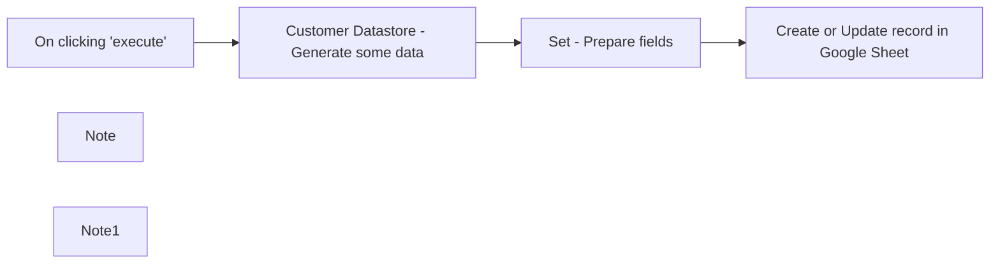

## Fluxo (.json) :

```json
{
  "nodes": [
    {
      "name": "On clicking 'execute'",
      "type": "n8n-nodes-base.manualTrigger",
      "position": [
        1160,
        480
      ],
      "parameters": {},
      "typeVersion": 1
    },
    {
      "name": "Note",
      "type": "n8n-nodes-base.stickyNote",
      "position": [
        800,
        420
      ],
      "parameters": {
        "width": 320,
        "height": 200,
        "content": "### Very often your data is not in the right format to insert in a node. you can use the set node to fix it.\n\n### Click the `Execute Workflow` button and double click on the nodes to see the input and output items."
      },
      "typeVersion": 1
    },
    {
      "name": "Create or Update record in Google Sheet",
      "type": "n8n-nodes-base.googleSheets",
      "position": [
        1920,
        480
      ],
      "parameters": {
        "range": "A:C",
        "options": {},
        "sheetId": "13_bAEYNTzVXVY6SfAkBa9ijtJGSxPd8D-hcXXwXtdDo",
        "operation": "upsert",
        "authentication": "oAuth2"
      },
      "credentials": {
        "googleSheetsOAuth2Api": {
          "id": "8",
          "name": "Sheets"
        }
      },
      "typeVersion": 1
    },
    {
      "name": "Note1",
      "type": "n8n-nodes-base.stickyNote",
      "position": [
        1480,
        360
      ],
      "parameters": {
        "width": 400,
        "height": 280,
        "content": "\nThis is where we put the data in the format that Google Sheets expect. \nThis means changing the field name from `name` to `Full name`, dropping all fields except `ID`, `Email` and adding a `Created time` field"
      },
      "typeVersion": 1
    },
    {
      "name": "Set - Prepare fields",
      "type": "n8n-nodes-base.set",
      "notes": "Prepare fields",
      "position": [
        1620,
        480
      ],
      "parameters": {
        "values": {
          "number": [
            {
              "name": "ID",
              "value": "={{$json[\"id\"]}}"
            }
          ],
          "string": [
            {
              "name": "Full name",
              "value": "={{$json[\"name\"]}}"
            },
            {
              "name": "Email",
              "value": "={{$json[\"email\"]}}"
            },
            {
              "name": "Created time",
              "value": "={{$now}}"
            }
          ]
        },
        "options": {},
        "keepOnlySet": true
      },
      "notesInFlow": false,
      "typeVersion": 1
    },
    {
      "name": "Customer Datastore - Generate some data",
      "type": "n8n-nodes-base.n8nTrainingCustomerDatastore",
      "position": [
        1340,
        480
      ],
      "parameters": {
        "operation": "getAllPeople"
      },
      "typeVersion": 1
    }
  ],
  "connections": {
    "Set - Prepare fields": {
      "main": [
        [
          {
            "node": "Create or Update record in Google Sheet",
            "type": "main",
            "index": 0
          }
        ]
      ]
    },
    "On clicking 'execute'": {
      "main": [
        [
          {
            "node": "Customer Datastore - Generate some data",
            "type": "main",
            "index": 0
          }
        ]
      ]
    },
    "Customer Datastore - Generate some data": {
      "main": [
        [
          {
            "node": "Set - Prepare fields",
            "type": "main",
            "index": 0
          }
        ]
      ]
    }
  }
}
```

<a id="template-713"></a>

## Template 713 - Processamento automático de faturas por email

- **Nome:** Processamento automático de faturas por email
- **Descrição:** Fluxo que busca emails recentes com anexos, identifica quais anexos são faturas via IA, extrai os dados relevantes das faturas e registra as informações em uma planilha para revisão.
- **Funcionalidade:** • Agendamento de verificação: Executa buscas periódicas por mensagens recebidas recentemente com anexos.
• Classificação de mensagens: Analisa o conteúdo do email para decidir se é provável que contenha uma fatura.
• Download e separação de anexos: Baixa anexos das mensagens e separa cada arquivo para processamento individual.
• Classificação de anexos por visão computacional: Usa um modelo de IA para identificar quais anexos são realmente faturas e se são emitidas para a empresa.
• Extração de dados de faturas: Aplica OCR e análise semântica para obter campos como número, datas, valores, fornecedor e itens/serviços.
• Tratamento de respostas vazias/erros: Garante fluxo alternativo caso a extração não retorne dados válidos.
• Agrupamento e referência ao email: Mantém referência entre os dados extraídos e o email original para rastreabilidade.
• Inserção em planilha: Registra os resultados extraídos em um workbook para análise humana posterior.
- **Ferramentas:** • Microsoft Outlook / Microsoft 365 Mailbox: Fonte das mensagens e anexos; permite filtrar por pasta, data e presença de anexos.
• Google Gemini (PaLM) API: Modelo de visão e linguagem usado para classificar documentos (identificar faturas) e para realizar OCR e extração estruturada de dados das faturas.
• Microsoft Excel 365: Destino final dos dados extraídos, onde as informações das faturas são anexadas em uma planilha para revisão.

## Fluxo visual

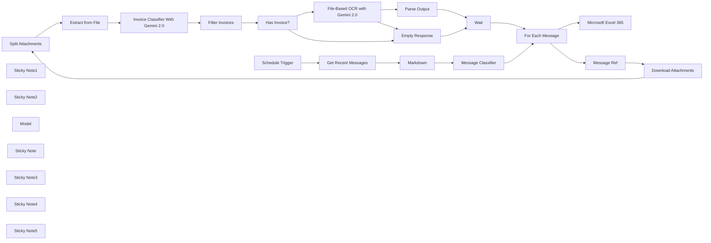

## Fluxo (.json) :

```json
{
  "meta": {
    "instanceId": "408f9fb9940c3cb18ffdef0e0150fe342d6e655c3a9fac21f0f644e8bedabcd9",
    "templateCredsSetupCompleted": true
  },
  "nodes": [
    {
      "id": "78bb4afe-ccc6-4b5e-90ba-50253f761f14",
      "name": "Split Attachments",
      "type": "n8n-nodes-base.code",
      "position": [
        -80,
        140
      ],
      "parameters": {
        "jsCode": "let results = [];\n\nfor (const item of $input.all()) {\n    for (key of Object.keys(item.binary)) {\n        results.push({\n            json: {\n                fileName: item.binary[key].fileName\n            },\n            binary: {\n                data: item.binary[key],\n            }\n        });\n    }\n}\n\nreturn results;"
      },
      "typeVersion": 2
    },
    {
      "id": "48a79e8c-27c2-4cdb-a6f7-241158c10962",
      "name": "Download Attachments",
      "type": "n8n-nodes-base.microsoftOutlook",
      "position": [
        -260,
        140
      ],
      "webhookId": "2eb57df9-1579-4af2-a30e-f412b268aba2",
      "parameters": {
        "options": {
          "downloadAttachments": true
        },
        "messageId": {
          "__rl": true,
          "mode": "id",
          "value": "={{ $json.id }}"
        },
        "operation": "get"
      },
      "credentials": {
        "microsoftOutlookOAuth2Api": {
          "id": "EWg6sbhPKcM5y3Mr",
          "name": "Microsoft Outlook account"
        }
      },
      "typeVersion": 2
    },
    {
      "id": "7dda1618-dfa7-4325-b5ff-7935602a3043",
      "name": "Parse Output",
      "type": "n8n-nodes-base.set",
      "position": [
        680,
        400
      ],
      "parameters": {
        "mode": "raw",
        "options": {},
        "jsonOutput": "={{\n{\n  invoice: $json.candidates[0].content.parts[0].text.parseJson(),\n  email: {\n    ...$('Message Ref').first().json,\n    body: null\n  }\n}\n}}"
      },
      "typeVersion": 3.4
    },
    {
      "id": "4d45cf33-5a14-4fe4-9485-38de901113aa",
      "name": "For Each Message",
      "type": "n8n-nodes-base.splitInBatches",
      "position": [
        -640,
        140
      ],
      "parameters": {
        "options": {}
      },
      "typeVersion": 3
    },
    {
      "id": "b5c70065-3ed8-4024-9a10-247810c062a4",
      "name": "Message Ref",
      "type": "n8n-nodes-base.noOp",
      "position": [
        -440,
        140
      ],
      "parameters": {},
      "typeVersion": 1
    },
    {
      "id": "cafcf919-25c3-46bd-8dd3-8cc0201c93cb",
      "name": "Message Classifier",
      "type": "@n8n/n8n-nodes-langchain.textClassifier",
      "position": [
        -1160,
        140
      ],
      "parameters": {
        "options": {
          "fallback": "other"
        },
        "inputText": "=from: {{ $json.from.emailAddress.address }} <{{ $json.from.emailAddress.address }}>\nsubject: {{ $json.subject }}\n<message>\n{{ $json.markdown.split('\\n**From**')[0].trim() }}\n</message>",
        "categories": {
          "categories": [
            {
              "category": "invoice",
              "description": "Message is an invoice is being issued"
            }
          ]
        }
      },
      "typeVersion": 1
    },
    {
      "id": "f97f9b24-828b-4dd8-a0e8-b7ab670403a8",
      "name": "Extract from File",
      "type": "n8n-nodes-base.extractFromFile",
      "position": [
        -440,
        340
      ],
      "parameters": {
        "options": {},
        "operation": "binaryToPropery"
      },
      "typeVersion": 1
    },
    {
      "id": "99d49549-af7c-46aa-b321-2b9955333812",
      "name": "Markdown",
      "type": "n8n-nodes-base.markdown",
      "position": [
        -1340,
        140
      ],
      "parameters": {
        "html": "={{ $json.body.content }}",
        "options": {},
        "destinationKey": "markdown"
      },
      "typeVersion": 1
    },
    {
      "id": "18455ee7-e87b-433c-baef-28444358e486",
      "name": "Empty Response",
      "type": "n8n-nodes-base.set",
      "position": [
        680,
        600
      ],
      "parameters": {
        "mode": "raw",
        "options": {},
        "jsonOutput": "={{\n{\n  invoice: null,\n  email: {\n    ...$('Message Ref').first().json,\n    body: null\n  }\n}\n}}"
      },
      "typeVersion": 3.4
    },
    {
      "id": "d0b4bab2-5955-4d05-8e4f-4a23fac98c45",
      "name": "Wait",
      "type": "n8n-nodes-base.wait",
      "position": [
        880,
        600
      ],
      "webhookId": "6dae0a77-74f4-4d85-a58b-e55c44fbea58",
      "parameters": {
        "amount": 1
      },
      "typeVersion": 1.1
    },
    {
      "id": "2600020d-9751-44df-abcd-48026c21f592",
      "name": "Filter Invoices",
      "type": "n8n-nodes-base.filter",
      "position": [
        -80,
        340
      ],
      "parameters": {
        "options": {},
        "conditions": {
          "options": {
            "version": 2,
            "leftValue": "",
            "caseSensitive": true,
            "typeValidation": "strict"
          },
          "combinator": "and",
          "conditions": [
            {
              "id": "5240de52-3b02-4151-8c2b-b0522582700e",
              "operator": {
                "type": "boolean",
                "operation": "true",
                "singleValue": true
              },
              "leftValue": "={{\n(function(output) {\n  return output.is_invoice && output.is_issued_to_company;\n})(\n  $json.candidates[0].content.parts[0].text.parseJson()\n)\n}}",
              "rightValue": ""
            }
          ]
        }
      },
      "typeVersion": 2.2,
      "alwaysOutputData": true
    },
    {
      "id": "b31d359e-d949-4d56-b32e-c49b35124ff7",
      "name": "Has Invoice?",
      "type": "n8n-nodes-base.if",
      "position": [
        280,
        400
      ],
      "parameters": {
        "options": {},
        "conditions": {
          "options": {
            "version": 2,
            "leftValue": "",
            "caseSensitive": true,
            "typeValidation": "strict"
          },
          "combinator": "and",
          "conditions": [
            {
              "id": "57f433cd-5861-434f-80f2-ce28d7c22c26",
              "operator": {
                "type": "object",
                "operation": "notEmpty",
                "singleValue": true
              },
              "leftValue": "={{ $input.first().json }}",
              "rightValue": ""
            }
          ]
        }
      },
      "typeVersion": 2.2
    },
    {
      "id": "857e2282-d7f7-438b-be87-a1c36986cfc0",
      "name": "Schedule Trigger",
      "type": "n8n-nodes-base.scheduleTrigger",
      "position": [
        -1820,
        120
      ],
      "parameters": {
        "rule": {
          "interval": [
            {
              "field": "hours"
            }
          ]
        }
      },
      "typeVersion": 1.2
    },
    {
      "id": "7292a6cc-3b59-4d9b-b87d-3ba55bbc0c67",
      "name": "Sticky Note1",
      "type": "n8n-nodes-base.stickyNote",
      "position": [
        -780,
        -120
      ],
      "parameters": {
        "color": 7,
        "width": 950,
        "height": 680,
        "content": "## 2. Classify If Attachment is Invoice\n[Learn more about the Outlook node](https://docs.n8n.io/integrations/builtin/app-nodes/n8n-nodes-base.microsoftoutlook)\n\nFor each qualifying message, we will need to know which of the attachments contained are actual invoice documents. To do this, we can use Google Gemini's docuemnt understanding capabilities to validate this test. We're using Gemini specifically in this case because at time of writing, Gemini is the only one of the few LLM providers that are currently accepting PDF documents. If you're not using Gemini, you may need to convert the PDF document to an image first - [check out an example of this here](https://n8n.io/workflows/2421-transcribing-bank-statements-to-markdown-using-gemini-vision-ai/)."
      },
      "typeVersion": 1
    },
    {
      "id": "ed35c1dc-625d-4ffb-b186-fad514f6df81",
      "name": "Sticky Note2",
      "type": "n8n-nodes-base.stickyNote",
      "position": [
        200,
        180
      ],
      "parameters": {
        "color": 7,
        "width": 850,
        "height": 580,
        "content": "## 3. Extract Invoice Details\n[Learn more about the HTTP Request node](https://docs.n8n.io/integrations/builtin/core-nodes/n8n-nodes-base.httprequest/)\n\nWith our invoice PDFs ready to go, we'll again use the Gemini API to extract the required details from them. I'm using the HTTP request node because unfortunately, Gemini works best for data extraction when using the API's \"generationConfig\" parameter which isn't supported in n8n's native AI nodes. The output is then merged with the original email to keep the reference between them."
      },
      "typeVersion": 1
    },
    {
      "id": "42a9036c-8040-41a7-9366-658ba3e31c70",
      "name": "Get Recent Messages",
      "type": "n8n-nodes-base.microsoftOutlook",
      "position": [
        -1540,
        140
      ],
      "webhookId": "e3957f65-145c-4c0d-ac66-31342a1bc888",
      "parameters": {
        "fields": [
          "body",
          "categories",
          "conversationId",
          "from",
          "hasAttachments",
          "internetMessageId",
          "sender",
          "subject",
          "toRecipients",
          "receivedDateTime",
          "webLink"
        ],
        "output": "fields",
        "options": {},
        "filtersUI": {
          "values": {
            "filters": {
              "receivedAfter": "={{ $now.minus({ \"hour\": 1 }).toISO() }}",
              "hasAttachments": true,
              "foldersToInclude": [
                "AAMkAGZkNmEzOTVhLTk3NDQtNGQzNi1hNDY2LTE2MWFlMzUyNTczMgAuAAAAAAA27qsaXv92QoGqcRnqoMpSAQDhSgSaDoa3Sp4gzAabpsdOAAAAAAEMAAA="
              ]
            }
          }
        },
        "operation": "getAll",
        "returnAll": true
      },
      "credentials": {
        "microsoftOutlookOAuth2Api": {
          "id": "EWg6sbhPKcM5y3Mr",
          "name": "Microsoft Outlook account"
        }
      },
      "typeVersion": 2
    },
    {
      "id": "86838ba4-0d57-4571-983f-c17005f39333",
      "name": "Model",
      "type": "@n8n/n8n-nodes-langchain.lmChatGoogleGemini",
      "position": [
        -1080,
        280
      ],
      "parameters": {
        "options": {},
        "modelName": "models/gemini-2.0-flash"
      },
      "credentials": {
        "googlePalmApi": {
          "id": "dSxo6ns5wn658r8N",
          "name": "Google Gemini(PaLM) Api account"
        }
      },
      "typeVersion": 1
    },
    {
      "id": "8ecb7298-3512-40fe-b2bc-70fb4ed5965d",
      "name": "Sticky Note",
      "type": "n8n-nodes-base.stickyNote",
      "position": [
        -1620,
        -120
      ],
      "parameters": {
        "color": 7,
        "width": 810,
        "height": 560,
        "content": "## 1. Check for Invoice Emails\n[Learn more about the text classifier node](https://docs.n8n.io/integrations/builtin/cluster-nodes/root-nodes/n8n-nodes-langchain.text-classifier/)\n\nThe Outlook node fetches all inbox messages within the last hour and classifies each message prior to downloading the attachments. This is a really good early check to reduce the comsumption of resources. In this use-case, using AI for contextual reasoning regarding the intent of the email can be much more powerful than simple keyword matching. The latter is more prone to matching false positives.\n*Note: we're not using the Outlook Trigger node because it doesn't allow setting for dateTime filters.*"
      },
      "typeVersion": 1
    },
    {
      "id": "a3c28ab3-ecab-46fd-86bb-62bf8a222f37",
      "name": "Microsoft Excel 365",
      "type": "n8n-nodes-base.microsoftExcel",
      "position": [
        420,
        -40
      ],
      "parameters": {
        "options": {},
        "fieldsUi": {
          "values": [
            {}
          ]
        },
        "resource": "worksheet",
        "workbook": {
          "__rl": true,
          "mode": "id",
          "value": "ABCDEFGHIJ"
        },
        "operation": "append",
        "worksheet": {
          "__rl": true,
          "mode": "id",
          "value": "{00000000-0001-0000-0000-000000000000}"
        }
      },
      "credentials": {
        "microsoftExcelOAuth2Api": {
          "id": "56tIUYYVARBe9gfX",
          "name": "Microsoft Excel account"
        }
      },
      "typeVersion": 2.1
    },
    {
      "id": "69f2a975-ab91-4cbc-be72-633c4601bf6f",
      "name": "Sticky Note3",
      "type": "n8n-nodes-base.stickyNote",
      "position": [
        200,
        -220
      ],
      "parameters": {
        "color": 7,
        "width": 530,
        "height": 380,
        "content": "## 4. Upload to Excel Workbook\n[Read more about the Excel node](https://docs.n8n.io/integrations/builtin/app-nodes/n8n-nodes-base.microsoftexcel/)\n\nFinally to capture the data, we can map these to an Excel workflow which can be reviewed by a human before it enters the accounting system."
      },
      "typeVersion": 1
    },
    {
      "id": "68f7c7f3-5ddd-4291-adb3-78f3a297fd8e",
      "name": "Sticky Note4",
      "type": "n8n-nodes-base.stickyNote",
      "position": [
        -2120,
        -660
      ],
      "parameters": {
        "width": 480,
        "height": 960,
        "content": "## Try it out\n### This n8n template monitors an Outlook mailbox for invoices, automatically parses/extracts data from them and then uploads the output to an Excel Workbook.\n\nOne of my top workflow requests, this template can save in order of 100s of hours of manual labour for you or your finance team.\n\n### How it works\n* A scheduled trigger is set to fetch recent Outlook messages to the Accounts receivable mailbox.\n* Each message is analysed to determine whether or not it from a supplier and is issuing/contains an invoice.\n* For each valid message, the attachments are downloaded and non-invoice documents are filtered out via AI Vision classification.\n* Invoices are then processed through a AI vision model again to extract the details.\n* The extracted data can then be used for reconciliation or otherwise. For this demonstration, we'll just append the row to an Excel sheet for now.\n\n### How to use\n* Ensure your Microsoft365 credential points to the correct mailbox. If a shared folder is used, toggle \"shared folder\" option to \"on\" and for the principal ID, use the email address.\n* If you receive lots of other types of messages such as replies and forwards, you may want to implement additional checks to prevent processing invoices twice. The \"remove duplicates\" node can help with this.\n\n### Need Help?\nJoin the [Discord](https://discord.com/invite/XPKeKXeB7d) or ask in the [Forum](https://community.n8n.io/)!\n\nHappy Hacking!"
      },
      "typeVersion": 1
    },
    {
      "id": "a55323b4-2079-4a7c-8ba2-f20ef0930b55",
      "name": "Invoice Classifier With Gemini 2.0",
      "type": "n8n-nodes-base.httpRequest",
      "position": [
        -260,
        340
      ],
      "parameters": {
        "url": "https://generativelanguage.googleapis.com/v1beta/models/gemini-2.0-flash:generateContent",
        "method": "POST",
        "options": {},
        "jsonBody": "={{\n{\n  \"contents\": [\n    {\n      \"parts\": [\n        {\n          \"inline_data\": {\n            \"mime_type\": $('Split Attachments').item.binary.data.mimeType,\n            \"data\": $json.data\n          }\n        },\n        {\n          \"text\": `You are an accounts receivable agent who is helping to identify if the document is an invoice, the invoice's supplier is not our company and the invoice is issued to our company.`\n        }\n      ]\n    }\n  ],\n  \"generationConfig\": {\n    \"response_mime_type\": \"application/json\",\n    \"response_schema\": {\n      \"type\": \"OBJECT\",\n      \"required\": [\n        \"is_invoice\",\n        \"is_issued_to_company\"\n      ],\n      \"properties\": {\n        \"is_invoice\": { \"type\": \"boolean\" },\n        \"is_issued_to_company\": { \"type\": \"boolean\" }\n      }\n    }\n  }\n}\n}}",
        "sendBody": true,
        "specifyBody": "json",
        "authentication": "predefinedCredentialType",
        "nodeCredentialType": "googlePalmApi"
      },
      "credentials": {
        "googlePalmApi": {
          "id": "dSxo6ns5wn658r8N",
          "name": "Google Gemini(PaLM) Api account"
        }
      },
      "executeOnce": false,
      "retryOnFail": false,
      "typeVersion": 4.2
    },
    {
      "id": "f696737d-cddf-411b-a427-cc72bd68d248",
      "name": "File-Based OCR with Gemini 2.0",
      "type": "n8n-nodes-base.httpRequest",
      "onError": "continueErrorOutput",
      "position": [
        480,
        400
      ],
      "parameters": {
        "url": "https://generativelanguage.googleapis.com/v1beta/models/gemini-2.0-flash:generateContent",
        "method": "POST",
        "options": {},
        "jsonBody": "={{\n{\n  \"contents\": [\n    {\n      \"parts\": [\n        {\n          \"inline_data\": {\n            \"mime_type\": $('Split Attachments').item.binary.data.mimeType,\n            \"data\": $('Extract from File').item.json.data\n          }\n        },\n        {\n          \"text\": `You are an accounts receivable agent who is helping to extract information from a supplier's invoice issued to our company.`\n        }\n      ]\n    }\n  ],\n  \"generationConfig\": {\n    \"response_mime_type\": \"application/json\",\n    \"response_schema\": {\n      \"type\": \"OBJECT\",\n      \"required\": [\n        \"invoice_number\",\n        \"invoice_date\",\n        \"invoice_amount\",\n        \"invoice_due_date\",\n        \"supplier_name\",\n        \"supplier_address\",\n        \"supplier_telephone\",\n        \"supplier_email\",\n        \"booking_number\",\n        \"booking_date\",\n        \"booking_name\",\n        \"guest_name\",\n        \"guest_quantity\",\n        \"services\"\n      ],\n      \"properties\": {\n        \"invoice_number\": { \"type\": \"string\" },\n        \"invoice_date\": { \"type\": \"string\", \"nullable\": true },\n        \"invoice_amount\": { \"type\": \"number\", \"nullable\": true },\n        \"invoice_due_date\": { \"type\": \"string\", \"nullable\": true },\n        \"recipient_name\": { \"type\": \"string\", \"nullable\": true },\n        \"recipient_address\": { \"type\": \"string\", \"nullable\": true },\n        \"recipient_company_number\": { \"type\": \"string\", \"nullable\": true },\n        \"supplier_name\": { \"type\": \"string\", \"nullable\": true },\n        \"supplier_address\": { \"type\": \"string\", \"nullable\": true },\n        \"supplier_telephone\": { \"type\": \"string\", \"nullable\": true },\n        \"supplier_email\": { \"type\": \"string\", \"nullable\": true },\n        \"supplier_company_number\": { \"type\": \"string\", \"nullable\": true },\n        \"booking_number\": { \"type\": \"string\", \"nullable\": true },\n        \"booking_date\": { \"type\": \"string\", \"nullable\": true },\n        \"booking_name\": { \"type\": \"string\", \"nullable\": true },\n        \"guest_name\": { \"type\": \"string\", \"nullable\": true },\n        \"guest_quantity\": { \"type\": \"number\", \"nullable\": true },\n        \"services\": {\n          \"type\": \"array\",\n          \"items\": {\n            \"type\": \"object\",\n            \"required\": [],\n            \"properties\": {\n              \"name\": { \"type\": \"string\" },\n              \"date\": { \"type\": \"string\", \"nullable\": true },\n              \"description\": { \"type\": \"string\", \"nullable\": true },\n              \"quantity\": { \"type\": \"number\", \"nullable\": true },\n              \"total\": { \"type\": \"number\" }\n            }\n          }\n        }\n      }\n    }\n  }\n}\n}}",
        "sendBody": true,
        "specifyBody": "json",
        "authentication": "predefinedCredentialType",
        "nodeCredentialType": "googlePalmApi"
      },
      "credentials": {
        "googlePalmApi": {
          "id": "dSxo6ns5wn658r8N",
          "name": "Google Gemini(PaLM) Api account"
        }
      },
      "executeOnce": false,
      "retryOnFail": false,
      "typeVersion": 4.2
    },
    {
      "id": "1d76c0c8-a03b-4f0c-b76d-53369ab5d6e8",
      "name": "Sticky Note5",
      "type": "n8n-nodes-base.stickyNote",
      "position": [
        760,
        -220
      ],
      "parameters": {
        "color": 5,
        "width": 400,
        "height": 140,
        "content": "### Where Next? It's Up to You!\nThis template is deliberately cut short to demonstrate the build but should be easily modified to upload directly to an accounting system or even extended for other tasks such as invoice reconciliation and more."
      },
      "typeVersion": 1
    }
  ],
  "pinData": {},
  "connections": {
    "Wait": {
      "main": [
        [
          {
            "node": "For Each Message",
            "type": "main",
            "index": 0
          }
        ]
      ]
    },
    "Model": {
      "ai_languageModel": [
        [
          {
            "node": "Message Classifier",
            "type": "ai_languageModel",
            "index": 0
          }
        ]
      ]
    },
    "Markdown": {
      "main": [
        [
          {
            "node": "Message Classifier",
            "type": "main",
            "index": 0
          }
        ]
      ]
    },
    "Message Ref": {
      "main": [
        [
          {
            "node": "Download Attachments",
            "type": "main",
            "index": 0
          }
        ]
      ]
    },
    "Has Invoice?": {
      "main": [
        [
          {
            "node": "File-Based OCR with Gemini 2.0",
            "type": "main",
            "index": 0
          }
        ],
        [
          {
            "node": "Empty Response",
            "type": "main",
            "index": 0
          }
        ]
      ]
    },
    "Parse Output": {
      "main": [
        [
          {
            "node": "Wait",
            "type": "main",
            "index": 0
          }
        ]
      ]
    },
    "Empty Response": {
      "main": [
        [
          {
            "node": "Wait",
            "type": "main",
            "index": 0
          }
        ]
      ]
    },
    "Filter Invoices": {
      "main": [
        [
          {
            "node": "Has Invoice?",
            "type": "main",
            "index": 0
          }
        ]
      ]
    },
    "For Each Message": {
      "main": [
        [
          {
            "node": "Microsoft Excel 365",
            "type": "main",
            "index": 0
          }
        ],
        [
          {
            "node": "Message Ref",
            "type": "main",
            "index": 0
          }
        ]
      ]
    },
    "Schedule Trigger": {
      "main": [
        [
          {
            "node": "Get Recent Messages",
            "type": "main",
            "index": 0
          }
        ]
      ]
    },
    "Extract from File": {
      "main": [
        [
          {
            "node": "Invoice Classifier With Gemini 2.0",
            "type": "main",
            "index": 0
          }
        ]
      ]
    },
    "Split Attachments": {
      "main": [
        [
          {
            "node": "Extract from File",
            "type": "main",
            "index": 0
          }
        ]
      ]
    },
    "Message Classifier": {
      "main": [
        [
          {
            "node": "For Each Message",
            "type": "main",
            "index": 0
          }
        ],
        []
      ]
    },
    "Get Recent Messages": {
      "main": [
        [
          {
            "node": "Markdown",
            "type": "main",
            "index": 0
          }
        ]
      ]
    },
    "Download Attachments": {
      "main": [
        [
          {
            "node": "Split Attachments",
            "type": "main",
            "index": 0
          }
        ]
      ]
    },
    "File-Based OCR with Gemini 2.0": {
      "main": [
        [
          {
            "node": "Parse Output",
            "type": "main",
            "index": 0
          }
        ],
        [
          {
            "node": "Empty Response",
            "type": "main",
            "index": 0
          }
        ]
      ]
    },
    "Invoice Classifier With Gemini 2.0": {
      "main": [
        [
          {
            "node": "Filter Invoices",
            "type": "main",
            "index": 0
          }
        ],
        []
      ]
    }
  }
}
```

<a id="template-714"></a>

## Template 714 - Exemplos de requisições HTTP e paginação

- **Nome:** Exemplos de requisições HTTP e paginação
- **Descrição:** Fluxo de demonstração que executa requisições HTTP variadas, transforma respostas em itens, extrai dados de HTML e implementa paginação para coletar múltiplas páginas de resultados.
- **Funcionalidade:** • Execução manual: Inicia o fluxo quando o usuário aciona a execução.
• Buscar álbuns mock: Realiza uma requisição GET a um endpoint de teste e cria itens a partir do corpo da resposta.
• Buscar página Wikipedia aleatória: Faz download de uma página aleatória da Wikipedia e extrai o título do artigo a partir do HTML.
• Paginação para estrelas do GitHub: Consulta iterativamente a lista de repositórios estrelados de um usuário, avançando páginas até não haver mais resultados.
• Configuração de parâmetros iniciais: Define valores iniciais como usuário do GitHub, página atual e itens por página.
• Separar corpo em itens: Divide o conteúdo do campo body em itens individuais para processamento posterior.
• Controle condicional de loop: Verifica se a resposta da API está vazia para interromper a iteração de paginação.
- **Ferramentas:** • GitHub API: API pública usada para obter a lista de repositórios estrelados por um usuário.
• JSONPlaceholder: API pública de testes usada para obter dados fictícios de álbuns.
• Wikipedia: Fonte pública de páginas que retorna HTML de artigos para extração de informações (título).

## Fluxo visual

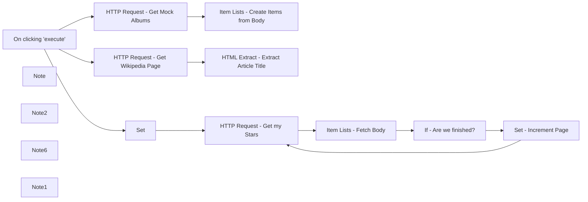

## Fluxo (.json) :

```json
{
  "meta": {
    "instanceId": "8c8c5237b8e37b006a7adce87f4369350c58e41f3ca9de16196d3197f69eabcd"
  },
  "nodes": [
    {
      "id": "25ac6cda-31fb-474a-b6b6-083ec03b9273",
      "name": "On clicking 'execute'",
      "type": "n8n-nodes-base.manualTrigger",
      "position": [
        925,
        285
      ],
      "parameters": {},
      "typeVersion": 1
    },
    {
      "id": "93eaee43-7a39-4c83-aeaa-9ca14d0f4b4b",
      "name": "Note",
      "type": "n8n-nodes-base.stickyNote",
      "position": [
        380,
        240
      ],
      "parameters": {
        "width": 440,
        "height": 200,
        "content": "## HTTP Request\n### This workflow shows the most common use cases of the HTTP request node, and how to handle its output\n\n\n### Click the `Execute Workflow` button and double click on the nodes to see the input and output items."
      },
      "typeVersion": 1
    },
    {
      "id": "3ccdc45b-aae1-4760-b45e-5b8dca2a9fcf",
      "name": "Note2",
      "type": "n8n-nodes-base.stickyNote",
      "position": [
        1280,
        480
      ],
      "parameters": {
        "width": 986.3743856726365,
        "height": 460.847917534361,
        "content": "## 3. Handle Pagination\n### Sometimes you need to make the same request multiple times to get all the data you need (pagination).\n\n### The pagination process goes as follow:\n### 1. Loop through the pages of the input source (`HTTP Request` node named \"Get my Starts\")\n### 2. Increment the page at the end of each loop (done with the `set` node named \"Increment Page\") \n### 3. Stop looping when there are no pages left (checked at the `If` node named \"Are we Finished?\")\n\n\n\n"
      },
      "typeVersion": 1
    },
    {
      "id": "af19bb6d-5f0a-41ca-93b2-dbd27c3fd07e",
      "name": "Set",
      "type": "n8n-nodes-base.set",
      "position": [
        1345,
        725
      ],
      "parameters": {
        "values": {
          "number": [
            {
              "name": "page"
            },
            {
              "name": "perpage",
              "value": 15
            }
          ],
          "string": [
            {
              "name": "githubUser",
              "value": "that-one-tom"
            }
          ]
        },
        "options": {}
      },
      "typeVersion": 1
    },
    {
      "id": "dad6055d-e06b-4f8c-ab90-deb196fce277",
      "name": "Note6",
      "type": "n8n-nodes-base.stickyNote",
      "disabled": true,
      "position": [
        1280,
        180
      ],
      "parameters": {
        "width": 680,
        "height": 280,
        "content": "## 2. Data Scraping\n### In this example we fetch the titles from the n8n blog using the `HTTP request` node and then we use the `HTML extract` node to pass."
      },
      "typeVersion": 1
    },
    {
      "id": "a7d4b9db-4d38-4b8d-9585-fe65c379e381",
      "name": "Note1",
      "type": "n8n-nodes-base.stickyNote",
      "position": [
        1280,
        -120
      ],
      "parameters": {
        "width": 500,
        "height": 280,
        "content": "## 1. Split into items\n### In this example, we take the body from an `HTTP Request` node and split it out into items that are easier to manage."
      },
      "typeVersion": 1
    },
    {
      "id": "d8402820-fa72-4957-8cf6-432f928ae799",
      "name": "Item Lists - Create Items from Body",
      "type": "n8n-nodes-base.itemLists",
      "notes": "Create Items from Body",
      "position": [
        1525,
        -15
      ],
      "parameters": {
        "options": {},
        "fieldToSplitOut": "body"
      },
      "notesInFlow": false,
      "typeVersion": 1
    },
    {
      "id": "598939cd-e4c0-4a90-bd1f-f2b13ccbe072",
      "name": "HTML Extract - Extract Article Title",
      "type": "n8n-nodes-base.htmlExtract",
      "position": [
        1505,
        285
      ],
      "parameters": {
        "options": {},
        "sourceData": "binary",
        "extractionValues": {
          "values": [
            {
              "key": "ArticleTitle",
              "cssSelector": "#firstHeading"
            }
          ]
        }
      },
      "typeVersion": 1
    },
    {
      "id": "1c9b609c-5e41-4444-ade7-e1069943c904",
      "name": "Item Lists - Fetch Body",
      "type": "n8n-nodes-base.itemLists",
      "position": [
        1705,
        725
      ],
      "parameters": {
        "options": {},
        "fieldToSplitOut": "body"
      },
      "typeVersion": 1,
      "alwaysOutputData": true
    },
    {
      "id": "15dfab42-440c-4d06-9ba2-b7b17371d009",
      "name": "If - Are we finished?",
      "type": "n8n-nodes-base.if",
      "position": [
        1885,
        725
      ],
      "parameters": {
        "conditions": {
          "string": [
            {
              "value1": "={{$node[\"HTTP Request - Get my Stars\"].json[\"body\"]}}",
              "operation": "isEmpty"
            }
          ]
        }
      },
      "executeOnce": true,
      "typeVersion": 1
    },
    {
      "id": "ba6e6904-6749-4ea2-84c1-8409b795bcf5",
      "name": "Set - Increment Page",
      "type": "n8n-nodes-base.set",
      "position": [
        2105,
        745
      ],
      "parameters": {
        "values": {
          "string": [
            {
              "name": "page",
              "value": "={{$node[\"Set\"].json[\"page\"]++}}"
            }
          ]
        },
        "options": {}
      },
      "executeOnce": true,
      "typeVersion": 1
    },
    {
      "id": "9f0df828-27d7-4994-8934-c8fe88af8566",
      "name": "HTTP Request - Get Mock Albums",
      "type": "n8n-nodes-base.httpRequest",
      "position": [
        1345,
        -15
      ],
      "parameters": {
        "url": "https://jsonplaceholder.typicode.com/albums",
        "options": {
          "response": {
            "response": {
              "fullResponse": true
            }
          }
        }
      },
      "typeVersion": 3
    },
    {
      "id": "cbc64010-f6f4-4c35-b4e2-9e1d4a748308",
      "name": "HTTP Request - Get Wikipedia Page",
      "type": "n8n-nodes-base.httpRequest",
      "position": [
        1325,
        285
      ],
      "parameters": {
        "url": "https://en.wikipedia.org/wiki/Special:Random",
        "options": {
          "redirect": {
            "redirect": {
              "followRedirects": true
            }
          },
          "response": {
            "response": {
              "responseFormat": "file"
            }
          }
        }
      },
      "typeVersion": 3
    },
    {
      "id": "a1a19268-0be8-4379-99a4-4285c68691b5",
      "name": "HTTP Request - Get my Stars",
      "type": "n8n-nodes-base.httpRequest",
      "position": [
        1525,
        725
      ],
      "parameters": {
        "url": "=https://api.github.com/users/{{$node[\"Set\"].json[\"githubUser\"]}}/starred",
        "options": {
          "response": {
            "response": {
              "fullResponse": true
            }
          }
        },
        "sendQuery": true,
        "queryParameters": {
          "parameters": [
            {
              "name": "per_page",
              "value": "={{$node[\"Set\"].json[\"perpage\"]}}"
            },
            {
              "name": "page",
              "value": "={{$node[\"Set\"].json[\"page\"]}}"
            }
          ]
        }
      },
      "typeVersion": 3
    }
  ],
  "connections": {
    "Set": {
      "main": [
        [
          {
            "node": "HTTP Request - Get my Stars",
            "type": "main",
            "index": 0
          }
        ]
      ]
    },
    "Set - Increment Page": {
      "main": [
        [
          {
            "node": "HTTP Request - Get my Stars",
            "type": "main",
            "index": 0
          }
        ]
      ]
    },
    "If - Are we finished?": {
      "main": [
        null,
        [
          {
            "node": "Set - Increment Page",
            "type": "main",
            "index": 0
          }
        ]
      ]
    },
    "On clicking 'execute'": {
      "main": [
        [
          {
            "node": "Set",
            "type": "main",
            "index": 0
          },
          {
            "node": "HTTP Request - Get Mock Albums",
            "type": "main",
            "index": 0
          },
          {
            "node": "HTTP Request - Get Wikipedia Page",
            "type": "main",
            "index": 0
          }
        ]
      ]
    },
    "Item Lists - Fetch Body": {
      "main": [
        [
          {
            "node": "If - Are we finished?",
            "type": "main",
            "index": 0
          }
        ]
      ]
    },
    "HTTP Request - Get my Stars": {
      "main": [
        [
          {
            "node": "Item Lists - Fetch Body",
            "type": "main",
            "index": 0
          }
        ]
      ]
    },
    "HTTP Request - Get Mock Albums": {
      "main": [
        [
          {
            "node": "Item Lists - Create Items from Body",
            "type": "main",
            "index": 0
          }
        ]
      ]
    },
    "HTTP Request - Get Wikipedia Page": {
      "main": [
        [
          {
            "node": "HTML Extract - Extract Article Title",
            "type": "main",
            "index": 0
          }
        ]
      ]
    }
  }
}
```

<a id="template-715"></a>

## Template 715 - Extrair POs e gravar linhas em planilha

- **Nome:** Extrair POs e gravar linhas em planilha
- **Descrição:** Fluxo que monitora e-mails de pedidos inbound, extrai número do pedido, data prevista e linhas de pedido com SKU e quantidade, e grava cada linha numa planilha do Google Sheets.
- **Funcionalidade:** • Monitoramento de e-mails: Detecta novos e-mails recebidos e valida se o assunto indica um pedido inbound.
• Extração de dados com IA: Analisa assunto e corpo do e-mail para extrair o número do pedido (PO), data prevista de entrega em formato ISO e todas as linhas de pedido (SKU e quantidade).
• Conversão e formatação: Converte a saída estruturada da IA em registros individuais por linha de pedido, padronizando campos para inserção.
• Armazenamento em planilha: Insere cada linha de pedido como uma nova linha numa planilha com colunas PO_NUMBER, EXPECTED_DELIVERY DATE, SKU_ID e QUANTITY.
• Teste e instruções: Inclui um e-mail de exemplo para teste e notas com links para tutorial e configuração.
- **Ferramentas:** • Gmail: Fornece os e-mails de entrada que disparam o fluxo e contém os dados dos pedidos.
• OpenAI (modelo gpt-4o-mini): Processa o texto do e-mail e extrai os campos estruturados (PO, data, linhas) retornando JSON.
• Google Sheets: Armazena os registros das linhas de pedido em uma planilha acessível para consulta e processamento posterior.

## Fluxo visual

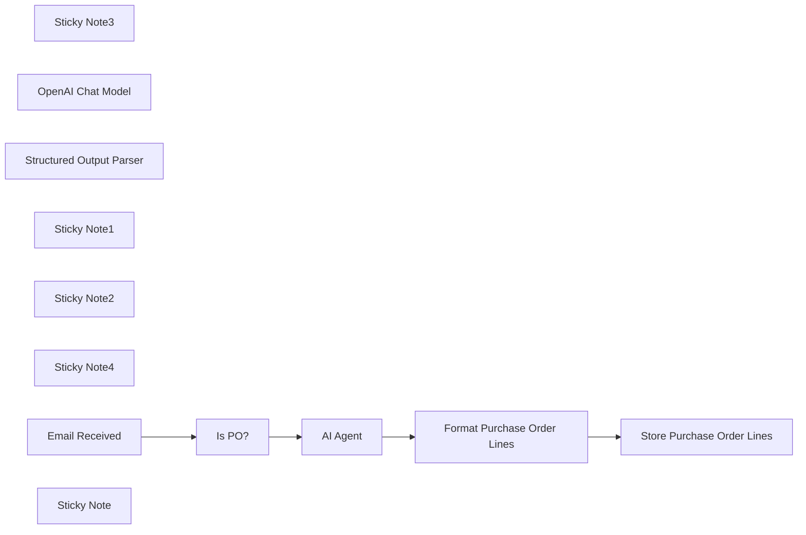

## Fluxo (.json) :

```json
{
  "meta": {
    "instanceId": "6a5e68bcca67c4cdb3e0b698d01739aea084e1ec06e551db64aeff43d174cb23",
    "templateCredsSetupCompleted": true
  },
  "nodes": [
    {
      "id": "bc49829b-45f2-4910-9c37-907271982f14",
      "name": "Sticky Note3",
      "type": "n8n-nodes-base.stickyNote",
      "position": [
        -140,
        320
      ],
      "parameters": {
        "width": 780,
        "height": 540,
        "content": "### 4. Do you need more details?\nFind a step-by-step guide in this tutorial\n\n[🎥 Watch My Tutorial](https://www.youtube.com/watch?v=kQ8dO_30SB0)"
      },
      "typeVersion": 1
    },
    {
      "id": "40c6e16a-3b4f-4e28-b0a1-7066e0efab5d",
      "name": "AI Agent",
      "type": "@n8n/n8n-nodes-langchain.agent",
      "position": [
        -460,
        -80
      ],
      "parameters": {
        "text": "=Email Subject:  {{ $json.subject }}\nEmail Body: \n{{ $json.text }}",
        "options": {
          "systemMessage": "=You are an assistant that processes emails related to inbound orders from Hermas.\n\nEach email has the subject line containing a purchase order reference (e.g., \"PO45231\").\nIn the email body, you will find:\n\nAn expected delivery date, typically in formats like 27/03/2025 or 2025-03-27.\n\nOne or more order lines, where each line contains:\n\nAn SKU (e.g., HERM-SHOE-001)\n\nA quantity (e.g., 120)\n\nYour goal is to extract the following fields:\n\npurchase_order: The PO number from the subject line (e.g., PO45231)\n\nexpected_delivery_date: In ISO format (e.g., 2025-03-27)\n\nlines: A list of objects with sku and quantity for each order line\n\nReturn your output strictly as a valid JSON object using the format below."
        },
        "promptType": "define",
        "hasOutputParser": true
      },
      "typeVersion": 1.8
    },
    {
      "id": "e9cb7bb1-40e7-463e-8b3f-417602338e5c",
      "name": "OpenAI Chat Model",
      "type": "@n8n/n8n-nodes-langchain.lmChatOpenAi",
      "position": [
        -520,
        120
      ],
      "parameters": {
        "model": {
          "__rl": true,
          "mode": "list",
          "value": "gpt-4o-mini"
        },
        "options": {}
      },
      "typeVersion": 1.2
    },
    {
      "id": "468bdb39-223f-4bae-8bdb-a72272ab57c3",
      "name": "Structured Output Parser",
      "type": "@n8n/n8n-nodes-langchain.outputParserStructured",
      "position": [
        -180,
        120
      ],
      "parameters": {
        "jsonSchemaExample": "{\n  \"purchase_order\": \"PO45231\",\n  \"expected_delivery_date\": \"2025-03-27\",\n  \"lines\": [\n    { \"sku\": \"HERM-SHOE-001\", \"quantity\": 120 },\n    { \"sku\": \"HERM-BAG-032\", \"quantity\": 45 },\n    { \"sku\": \"HERM-WATCH-105\", \"quantity\": 30 },\n    { \"sku\": \"HERM-SCARF-018\", \"quantity\": 80 }\n  ]\n}\n"
      },
      "typeVersion": 1.2
    },
    {
      "id": "667a8d43-1ce5-4ec8-871a-26007356a89e",
      "name": "Sticky Note1",
      "type": "n8n-nodes-base.stickyNote",
      "position": [
        -1000,
        -460
      ],
      "parameters": {
        "color": 7,
        "width": 380,
        "height": 720,
        "content": "### 1. Workflow Trigger with Gmail Trigger\nThe workflow is triggered by a new email received in your Gmail mailbox. \nIf the subject includes the string \"Inbound Order\" we proceed, if not we do nothing.\n\n#### How to setup?\n- **Gmail Trigger Node:** set up your Gmail API credentials\n[Learn more about the Gmail Trigger Node](https://docs.n8n.io/integrations/builtin/trigger-nodes/n8n-nodes-base.gmailtrigger)\n"
      },
      "typeVersion": 1
    },
    {
      "id": "e1e2d95a-9bbd-4bd5-92ec-7a4835db21a2",
      "name": "Sticky Note2",
      "type": "n8n-nodes-base.stickyNote",
      "position": [
        -600,
        -460
      ],
      "parameters": {
        "color": 7,
        "width": 660,
        "height": 720,
        "content": "### 2. AI Agent equipped with the query tool\nThe email body and subject are sent to the AI agent for parsing. The results include the **PO Number**, **expected delivery date** and all the order lines with **SKU ID** and **order quantity**. Outputs are formatted by the code node to fit in a Google Sheet.\n\n#### How to setup?\n- **AI Agent with the Chat Model**:\n   1. Add a **chat model** with the required credentials *(Example: Open AI 4o-mini)*\n   2. Adapt the system prompt to the format of your emails\n  [Learn more about the AI Agent Node](https://docs.n8n.io/integrations/builtin/cluster-nodes/root-nodes/n8n-nodes-langchain.agent)"
      },
      "typeVersion": 1
    },
    {
      "id": "53375c17-a36c-431e-9ba6-07a9a84fc4c9",
      "name": "Sticky Note4",
      "type": "n8n-nodes-base.stickyNote",
      "position": [
        80,
        -460
      ],
      "parameters": {
        "color": 7,
        "width": 460,
        "height": 540,
        "content": "### 3. Store the orderlines in a Google Sheet\nThe table generated by the **code node** includes all the order lines with the **PO Number** and the **expected delivery date**. This **Google Sheet Node** loads the content in a Google Sheet.\n\n#### How to setup?\n- **Add Results in Google Sheets**:\n   1. Add your Google Sheet API credentials to access the Google Sheet file\n   2. Select the file using the list, an URL or an ID\n   3. Select the sheet in which the vocabulary list is stored\n   4. Create the columns: **PO_NUMBER, EXPECTED_DELIVERY DATE, SKU_ID, QUANTITY**\n  [Learn more about the Google Sheet Node](https://docs.n8n.io/integrations/builtin/app-nodes/n8n-nodes-base.googlesheets)"
      },
      "typeVersion": 1
    },
    {
      "id": "776cfc0e-264b-44cc-b534-dc387b0c9fce",
      "name": "Store Purchase Order Lines",
      "type": "n8n-nodes-base.googleSheets",
      "position": [
        180,
        -80
      ],
      "parameters": {
        "columns": {
          "value": {
            "SKU_ID": "={{ $json.sku }}",
            "QUANTITY": "={{ $json.quantity }}",
            "PO_NUMBER": "={{ $json.purchase_order }}",
            "EXPECTED_DELIVERY DATE": "={{ $json.expected_delivery_date }}"
          },
          "schema": [
            {
              "id": "PO_NUMBER",
              "type": "string",
              "display": true,
              "required": false,
              "displayName": "PO_NUMBER",
              "defaultMatch": false,
              "canBeUsedToMatch": true
            },
            {
              "id": "EXPECTED_DELIVERY DATE",
              "type": "string",
              "display": true,
              "required": false,
              "displayName": "EXPECTED_DELIVERY DATE",
              "defaultMatch": false,
              "canBeUsedToMatch": true
            },
            {
              "id": "SKU_ID",
              "type": "string",
              "display": true,
              "required": false,
              "displayName": "SKU_ID",
              "defaultMatch": false,
              "canBeUsedToMatch": true
            },
            {
              "id": "QUANTITY",
              "type": "string",
              "display": true,
              "required": false,
              "displayName": "QUANTITY",
              "defaultMatch": false,
              "canBeUsedToMatch": true
            }
          ],
          "mappingMode": "defineBelow",
          "matchingColumns": [],
          "attemptToConvertTypes": false,
          "convertFieldsToString": false
        },
        "options": {},
        "operation": "append",
        "sheetName": {
          "__rl": true,
          "mode": "list",
          "value": "gid=0",
          "cachedResultUrl": "=",
          "cachedResultName": "="
        },
        "documentId": {
          "__rl": true,
          "mode": "list",
          "value": "1HnaJJ-DqzqgWJo2YwQDcgB6BgWiU6eMlnGvv4kapubg",
          "cachedResultUrl": "=",
          "cachedResultName": "="
        }
      },
      "notesInFlow": true,
      "typeVersion": 4.5
    },
    {
      "id": "d5c52625-fef2-47a9-b2a4-bf005d8b9e05",
      "name": "Email Received",
      "type": "n8n-nodes-base.gmailTrigger",
      "position": [
        -980,
        -80
      ],
      "parameters": {
        "simple": false,
        "filters": {},
        "options": {},
        "pollTimes": {
          "item": [
            {
              "mode": "everyMinute"
            }
          ]
        }
      },
      "typeVersion": 1.2
    },
    {
      "id": "6dc9e5cc-9ab3-469c-ad93-e0e7817ccbf7",
      "name": "Is PO?",
      "type": "n8n-nodes-base.if",
      "position": [
        -760,
        -80
      ],
      "parameters": {
        "options": {},
        "conditions": {
          "options": {
            "version": 2,
            "leftValue": "",
            "caseSensitive": true,
            "typeValidation": "strict"
          },
          "combinator": "and",
          "conditions": [
            {
              "id": "f300ae2b-5de4-4efc-88ae-130a957588cb",
              "operator": {
                "type": "string",
                "operation": "contains"
              },
              "leftValue": "={{ $json.subject }}",
              "rightValue": "Inbound Order"
            }
          ]
        }
      },
      "typeVersion": 2.2
    },
    {
      "id": "385db736-0867-46b9-9274-380e7c255fc4",
      "name": "Format Purchase Order Lines",
      "type": "n8n-nodes-base.code",
      "position": [
        -120,
        -80
      ],
      "parameters": {
        "jsCode": "const {purchase_order, expected_delivery_date, lines} = $input.first().json.output;\n\nreturn lines.map( line => ({\n  json: {\n    purchase_order,\n    expected_delivery_date,\n    sku: line.sku,\n    quantity: line.quantity\n  }\n}))\n"
      },
      "typeVersion": 2
    },
    {
      "id": "b2e39591-70be-4d7f-a5d4-1505741d6310",
      "name": "Sticky Note",
      "type": "n8n-nodes-base.stickyNote",
      "position": [
        -1000,
        320
      ],
      "parameters": {
        "width": 780,
        "height": 720,
        "content": "### Test the workflow with this email!\n\n#### How?\n1. Send this email to the Gmail box you set up in your credentials.\n2. Click on Test workflow\n\n### Email\n**Email Subject:** Inbound Order PO45231 – Expected Delivery on 2025-03-27\n\n**Email Body:** \nDear LogiGreen Team,\n\nPlease find below the details of the upcoming inbound order.\n\nPurchase Order: PO45231\nExpected Delivery Date: 27/03/2025\n\nOrder Lines:\n\nSKU: HERM-SHOE-001 — Qty: 120\n\nSKU: HERM-BAG-032 — Qty: 45\n\nSKU: HERM-WATCH-105 — Qty: 30\n\nSKU: HERM-SCARF-018 — Qty: 80\n\nLet us know if you need any additional details.\n\nBest regards,\nSophie Lambert\nAdmin Assistant – Hermas Logistics\n📞 +33 1 23 45 67 89 78 84\n✉️ sophie.lambert@hermas.com\n"
      },
      "typeVersion": 1
    }
  ],
  "pinData": {},
  "connections": {
    "Is PO?": {
      "main": [
        [
          {
            "node": "AI Agent",
            "type": "main",
            "index": 0
          }
        ]
      ]
    },
    "AI Agent": {
      "main": [
        [
          {
            "node": "Format Purchase Order Lines",
            "type": "main",
            "index": 0
          }
        ]
      ]
    },
    "Email Received": {
      "main": [
        [
          {
            "node": "Is PO?",
            "type": "main",
            "index": 0
          }
        ]
      ]
    },
    "OpenAI Chat Model": {
      "ai_languageModel": [
        [
          {
            "node": "AI Agent",
            "type": "ai_languageModel",
            "index": 0
          }
        ]
      ]
    },
    "Structured Output Parser": {
      "ai_outputParser": [
        [
          {
            "node": "AI Agent",
            "type": "ai_outputParser",
            "index": 0
          }
        ]
      ]
    },
    "Format Purchase Order Lines": {
      "main": [
        [
          {
            "node": "Store Purchase Order Lines",
            "type": "main",
            "index": 0
          }
        ]
      ]
    }
  }
}
```

<a id="template-716"></a>

## Template 716 - Enviar notas do Obsidian por e-mail

- **Nome:** Enviar notas do Obsidian por e-mail
- **Descrição:** Envio automatizado de notas do Obsidian por e-mail, incluindo suporte a anexos e personalização via metadados YAML.
- **Funcionalidade:** • Acionamento via webhook do Obsidian: Inicia o fluxo quando uma nota é enviada pelo plugin de webhook do Obsidian.
• Leitura de metadados YAML: Extrai destinatários, assunto, remetente e opções de resposta a partir do frontmatter da nota.
• Tratamento condicional de anexos: Verifica se há anexos e segue caminhos diferentes para envio com ou sem arquivos.
• Processamento de anexos em lote: Converte dados de anexos em arquivos binários, corrige strings base64 e agrega para envio.
• Envio de e-mail com anexos: Anexa arquivos processados e envia a mensagem conforme os metadados.
• Envio de e-mail sem anexos: Envia apenas o corpo da nota quando não há anexos.
• Modo de teste: Permite detectar mensagens de teste e retornar confirmação sem enviar e-mail real.
• Resposta de confirmação ao Obsidian: Retorna mensagem de confirmação (incluindo data formatada) para ser adicionada à nota.
- **Ferramentas:** • Obsidian Post Webhook plugin: Plugin do Obsidian usado para enviar o conteúdo da nota (incluindo frontmatter e anexos) via webhook.
• Gmail (OAuth2): Conta Gmail usada para autenticar e enviar os e-mails gerados pelo fluxo.

## Fluxo visual

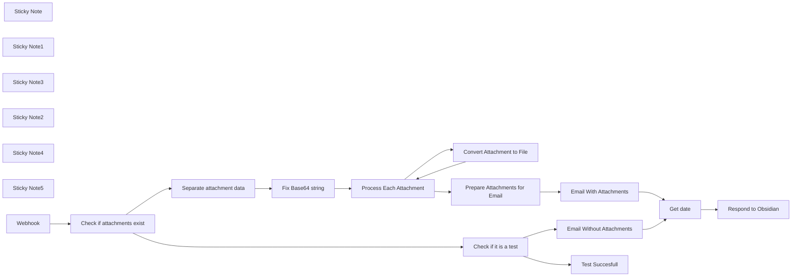

## Fluxo (.json) :

```json
{
  "id": "DNqCvzBvS7GAFWm4",
  "meta": {
    "instanceId": "d47f3738b860eed937a1b18d7345fa2c65cf4b4957554e29477cb064a7039870",
    "templateCredsSetupCompleted": true
  },
  "name": "Send Emails from Obsidian",
  "tags": [],
  "nodes": [
    {
      "id": "9bd809d6-c270-4429-945d-1e519384acae",
      "name": "Sticky Note",
      "type": "n8n-nodes-base.stickyNote",
      "position": [
        -320,
        20
      ],
      "parameters": {
        "width": 395.06030313757196,
        "height": 388.5681601162638,
        "content": "## Obsidian to Email Overview\n\nThis workflow allows you to send your Obsidian notes (including attachments) via email, with YAML metadata for customization.\n\n### Key Features:\n- Trigger email sending through [Obsidian's Post Webhook plugin](https://github.com/Masterb1234/obsidian-post-webhook/).\n- Parse YAML frontmatter for email metadata like recipients, subject, and more.\n- Automatic handling of attachments (images/files) via base64 encoding.\n- Append Webhook response automatically to the bottom of your note in Obsidian"
      },
      "typeVersion": 1
    },
    {
      "id": "bc2376ea-31db-43dc-84c4-7933bc7a96f8",
      "name": "Sticky Note1",
      "type": "n8n-nodes-base.stickyNote",
      "position": [
        -320,
        439
      ],
      "parameters": {
        "color": 3,
        "width": 398.9156829431131,
        "height": 447.41755555994735,
        "content": "## YAML Frontmatter Example\n\nUse YAML frontmatter in your Obsidian notes to define key email details such as recipients, subject, and more.\n\n### Example YAML:\n```yaml\n---\nto: \"recipient@example.com\"\ncc: \"cc@example.com\"\nbcc: \"bcc@example.com\"\nsubject: \"Your Obsidian Note\"\nsender-name: \"Your Name\"\nsend-replies-to: \"replies@example.com\"\n---\nNote content goes here...\n"
      },
      "typeVersion": 1
    },
    {
      "id": "1e439841-cc53-4913-b23b-040746bab5ec",
      "name": "Check if attachments exist",
      "type": "n8n-nodes-base.if",
      "position": [
        340,
        380
      ],
      "parameters": {
        "options": {},
        "conditions": {
          "options": {
            "version": 2,
            "leftValue": "",
            "caseSensitive": true,
            "typeValidation": "strict"
          },
          "combinator": "and",
          "conditions": [
            {
              "id": "3d870306-d912-4582-960d-f031538a5045",
              "operator": {
                "type": "array",
                "operation": "notEmpty",
                "singleValue": true
              },
              "leftValue": "={{ $json.body.attachments }}",
              "rightValue": ""
            }
          ]
        }
      },
      "typeVersion": 2.2
    },
    {
      "id": "39cf3ab8-47be-4153-afb8-a1a68c7c04f6",
      "name": "Separate attachment data",
      "type": "n8n-nodes-base.splitOut",
      "position": [
        600,
        220
      ],
      "parameters": {
        "options": {},
        "fieldToSplitOut": "body.attachments"
      },
      "typeVersion": 1
    },
    {
      "id": "f4b75a54-2cd8-4f6c-afd8-486fea552f00",
      "name": "Sticky Note3",
      "type": "n8n-nodes-base.stickyNote",
      "position": [
        540,
        20
      ],
      "parameters": {
        "color": 4,
        "width": 493.7005132824585,
        "height": 874.8910456745886,
        "content": "## Attachment Handling\n\nThe plugin automatically handles attachments in your Obsidian notes.\n\nThis workflow automates the processing of attachments by converting each attachment into a binary format.\n"
      },
      "typeVersion": 1
    },
    {
      "id": "b5df08f3-c0a1-429a-a003-24c77fd00461",
      "name": "Process Each Attachment",
      "type": "n8n-nodes-base.splitInBatches",
      "position": [
        600,
        480
      ],
      "parameters": {
        "options": {}
      },
      "typeVersion": 3
    },
    {
      "id": "220f49b2-9cf8-4395-ae8e-4167ac452954",
      "name": "Convert Attachment to File",
      "type": "n8n-nodes-base.convertToFile",
      "position": [
        900,
        580
      ],
      "parameters": {
        "options": {
          "fileName": "={{ $json.name }}"
        },
        "operation": "toBinary",
        "sourceProperty": "data"
      },
      "typeVersion": 1.1
    },
    {
      "id": "7e5c643f-4545-47b1-91cb-c306900f7842",
      "name": "Prepare Attachments for Email",
      "type": "n8n-nodes-base.aggregate",
      "position": [
        900,
        400
      ],
      "parameters": {
        "options": {
          "includeBinaries": true
        },
        "fieldsToAggregate": {
          "fieldToAggregate": [
            {
              "fieldToAggregate": "data"
            }
          ]
        }
      },
      "typeVersion": 1
    },
    {
      "id": "4fc9dffb-ad6b-4e7a-a814-3bb63189e4e7",
      "name": "Email With Attachments",
      "type": "n8n-nodes-base.gmail",
      "position": [
        1100,
        480
      ],
      "webhookId": "479fab78-5e9c-4dc9-ac36-fb656222cae7",
      "parameters": {
        "sendTo": "={{ Array.isArray($('Webhook').item.json.body.to) ? $('Webhook').item.json.body.to.join('; ') : $('Webhook').item.json.body.to }}",
        "message": "={{ $('Webhook').item.json.body.content }}",
        "options": {
          "ccList": "={{ $('Webhook').item.json.body.cc ?? '' }}",
          "bccList": "={{ $('Webhook').item.json.body.bcc ?? '' }}",
          "replyTo": "={{ $('Webhook').item.json.body['send-replies-to'] ?? '' }}",
          "senderName": "={{ $('Webhook').item.json.body['sender-name'] ?? '' }}",
          "attachmentsUi": {
            "attachmentsBinary": [
              {
                "property": "={{ Object.keys($binary).join(',') }}"
              }
            ]
          },
          "appendAttribution": false
        },
        "subject": "={{ $('Webhook').item.json.body.subject }}",
        "emailType": "text"
      },
      "credentials": {
        "gmailOAuth2": {
          "id": "ZrIpZzOgpMHYvvVQ",
          "name": "Gmail account"
        }
      },
      "typeVersion": 2.1
    },
    {
      "id": "8457e27f-449d-43eb-baa8-cd2dedbd27c3",
      "name": "Email Without Attachments",
      "type": "n8n-nodes-base.gmail",
      "position": [
        1100,
        720
      ],
      "webhookId": "479fab78-5e9c-4dc9-ac36-fb656222cae7",
      "parameters": {
        "sendTo": "={{ $json.body.to }}",
        "message": "={{ $json.body.content }}",
        "options": {
          "ccList": "={{ $json.body?.cc ?? '' }}",
          "bccList": "={{ $json.body?.bcc ?? '' }}",
          "replyTo": "={{ $json.body?.send-replies-to ?? '' }}",
          "senderName": "={{ $json.body?.sender-name ?? '' }}"
        },
        "subject": "={{ $json.body.subject }}",
        "emailType": "text"
      },
      "credentials": {
        "gmailOAuth2": {
          "id": "ZrIpZzOgpMHYvvVQ",
          "name": "Gmail account"
        }
      },
      "typeVersion": 2.1
    },
    {
      "id": "647de484-8a8f-479b-844c-69669d783a66",
      "name": "Sticky Note2",
      "type": "n8n-nodes-base.stickyNote",
      "position": [
        104,
        20
      ],
      "parameters": {
        "color": 6,
        "width": 410.45568358442864,
        "height": 866.9256684369553,
        "content": "## Obsidian Configuration\n\nInstall the [Obsidian Post Webhook plugin](https://github.com/Masterb1234/obsidian-post-webhook/).\n\n### How to set-up webhook connection:\n1. Set your webhook URL in the plugin settings.\n2. Use the built-in testing functionality to ensure your webhook is set up correctly.\n3. Open any note in Obsidian.\n4. Use the command palette (`Ctrl/Cmd + P`) to search for \"Send to Webhook\".\n5. Once sent, this workflow begins."
      },
      "typeVersion": 1
    },
    {
      "id": "97f0c5dc-e8c8-4b98-8b49-baafe41dad60",
      "name": "Sticky Note4",
      "type": "n8n-nodes-base.stickyNote",
      "position": [
        1260,
        180
      ],
      "parameters": {
        "color": 5,
        "height": 264.2421600929918,
        "content": ""
      },
      "typeVersion": 1
    },
    {
      "id": "5eeec7cd-0bef-4bc2-a2ba-fd6f88300e04",
      "name": "Check if it is a test",
      "type": "n8n-nodes-base.if",
      "position": [
        160,
        700
      ],
      "parameters": {
        "options": {},
        "conditions": {
          "options": {
            "version": 2,
            "leftValue": "",
            "caseSensitive": true,
            "typeValidation": "strict"
          },
          "combinator": "and",
          "conditions": [
            {
              "id": "f9864a1c-3188-4640-82bd-2cddc8798b0f",
              "operator": {
                "type": "boolean",
                "operation": "true",
                "singleValue": true
              },
              "leftValue": "={{ $json.body.test }}",
              "rightValue": "true"
            }
          ]
        }
      },
      "typeVersion": 2.2
    },
    {
      "id": "36bce77b-6ef1-4a5a-898b-80a8c935a811",
      "name": "Sticky Note5",
      "type": "n8n-nodes-base.stickyNote",
      "position": [
        1060,
        27.003515763841165
      ],
      "parameters": {
        "color": 5,
        "width": 457.22695080436733,
        "height": 863.6667893577376,
        "content": "## Send Email and Respond\n\nAfter the email is sent, the workflow confirms the email's status and sends a response back to Obsidian."
      },
      "typeVersion": 1
    },
    {
      "id": "c11f11a4-7e45-46f9-8450-628b9b73de64",
      "name": "Respond to Obsidian",
      "type": "n8n-nodes-base.respondToWebhook",
      "position": [
        1400,
        600
      ],
      "parameters": {
        "options": {},
        "respondWith": "text",
        "responseBody": "=E-mail sent on  {{ new Date($json.currentDate).toLocaleString('en-GB', { day: '2-digit', month: 'long', year: 'numeric', hour: '2-digit', minute: '2-digit', hour12: false }).replace(':', 'h') }}\n"
      },
      "typeVersion": 1.1
    },
    {
      "id": "fc3b3aa0-a90b-4e1e-a491-fb93d50494ec",
      "name": "Fix Base64 string",
      "type": "n8n-nodes-base.set",
      "position": [
        760,
        220
      ],
      "parameters": {
        "options": {},
        "assignments": {
          "assignments": [
            {
              "id": "b72a1b54-978d-408c-876a-d3e103b1f667",
              "name": "data",
              "type": "string",
              "value": "={{ $json.data.replace(/^data:.*?,/, '') }}"
            }
          ]
        },
        "includeOtherFields": true
      },
      "typeVersion": 3.4
    },
    {
      "id": "f3c5d9d2-7c76-48f4-8dd6-df665bd32ec1",
      "name": "Test Succesfull",
      "type": "n8n-nodes-base.respondToWebhook",
      "position": [
        360,
        620
      ],
      "parameters": {
        "options": {},
        "respondWith": "text",
        "responseBody": "=Test succesfull\n"
      },
      "typeVersion": 1.1
    },
    {
      "id": "e7ac7407-f2fc-4cdb-bd18-97f746335103",
      "name": "Get date",
      "type": "n8n-nodes-base.dateTime",
      "position": [
        1260,
        600
      ],
      "parameters": {
        "options": {}
      },
      "typeVersion": 2
    },
    {
      "id": "4be431e2-e21b-48bd-8425-eac17e3174c8",
      "name": "Webhook",
      "type": "n8n-nodes-base.webhook",
      "position": [
        140,
        380
      ],
      "webhookId": "e634d721-48b0-4985-8a57-62ca4c7b3cfb",
      "parameters": {
        "path": "e634d721-48b0-4985-8a57-62ca4c7b3cfb",
        "options": {
          "allowedOrigins": "*"
        },
        "httpMethod": "POST",
        "responseMode": "responseNode"
      },
      "typeVersion": 2
    }
  ],
  "active": true,
  "pinData": {},
  "settings": {
    "executionOrder": "v1"
  },
  "versionId": "20900eaa-66cf-4e40-9cdf-fa224b991e86",
  "connections": {
    "Webhook": {
      "main": [
        [
          {
            "node": "Check if attachments exist",
            "type": "main",
            "index": 0
          }
        ]
      ]
    },
    "Get date": {
      "main": [
        [
          {
            "node": "Respond to Obsidian",
            "type": "main",
            "index": 0
          }
        ]
      ]
    },
    "Fix Base64 string": {
      "main": [
        [
          {
            "node": "Process Each Attachment",
            "type": "main",
            "index": 0
          }
        ]
      ]
    },
    "Check if it is a test": {
      "main": [
        [
          {
            "node": "Test Succesfull",
            "type": "main",
            "index": 0
          }
        ],
        [
          {
            "node": "Email Without Attachments",
            "type": "main",
            "index": 0
          }
        ]
      ]
    },
    "Email With Attachments": {
      "main": [
        [
          {
            "node": "Get date",
            "type": "main",
            "index": 0
          }
        ]
      ]
    },
    "Process Each Attachment": {
      "main": [
        [
          {
            "node": "Prepare Attachments for Email",
            "type": "main",
            "index": 0
          }
        ],
        [
          {
            "node": "Convert Attachment to File",
            "type": "main",
            "index": 0
          }
        ]
      ]
    },
    "Separate attachment data": {
      "main": [
        [
          {
            "node": "Fix Base64 string",
            "type": "main",
            "index": 0
          }
        ]
      ]
    },
    "Email Without Attachments": {
      "main": [
        [
          {
            "node": "Get date",
            "type": "main",
            "index": 0
          }
        ]
      ]
    },
    "Check if attachments exist": {
      "main": [
        [
          {
            "node": "Separate attachment data",
            "type": "main",
            "index": 0
          }
        ],
        [
          {
            "node": "Check if it is a test",
            "type": "main",
            "index": 0
          }
        ]
      ]
    },
    "Convert Attachment to File": {
      "main": [
        [
          {
            "node": "Process Each Attachment",
            "type": "main",
            "index": 0
          }
        ]
      ]
    },
    "Prepare Attachments for Email": {
      "main": [
        [
          {
            "node": "Email With Attachments",
            "type": "main",
            "index": 0
          }
        ]
      ]
    }
  }
}
```

<a id="template-717"></a>

## Template 717 - Captura de vagas LinkedIn para Google Sheets

- **Nome:** Captura de vagas LinkedIn para Google Sheets
- **Descrição:** Extrai vagas do LinkedIn via Bright Data, limpa e normaliza os dados e grava os resultados em uma planilha do Google Sheets para uso em procura de emprego ou prospecção.
- **Funcionalidade:** • Form de entrada: coleta localização, palavra-chave e código do país para personalizar a busca.
• Acionamento de coleta remota: inicia uma captura de dados na plataforma de coleta (snapshot) usando os parâmetros fornecidos.
• Polling de status do snapshot: verifica periodicamente o status da captura até os dados estarem prontos.
• Recuperação dos dados: baixa o snapshot em formato JSON quando disponível.
• Limpeza e normalização de dados: remove tags HTML, decodifica entidades, normaliza espaços e achata campos aninhados (ex.: job_poster, base_salary).
• Mapeamento e inserção em planilha: organiza campos mapeados e adiciona cada vaga como nova linha em uma planilha do Google Sheets.
• Filtros configuráveis e template: permite ajustar filtros como time_range, job_type, experience_level, remote e company, e usar um template de planilha para facilitar o início.
- **Ferramentas:** • Bright Data: serviço de coleta de dados (Dataset API) usado para descobrir e capturar anúncios de emprego do LinkedIn.
• Google Sheets: planilha online usada como destino para armazenar e organizar os registros de vagas.

## Fluxo visual

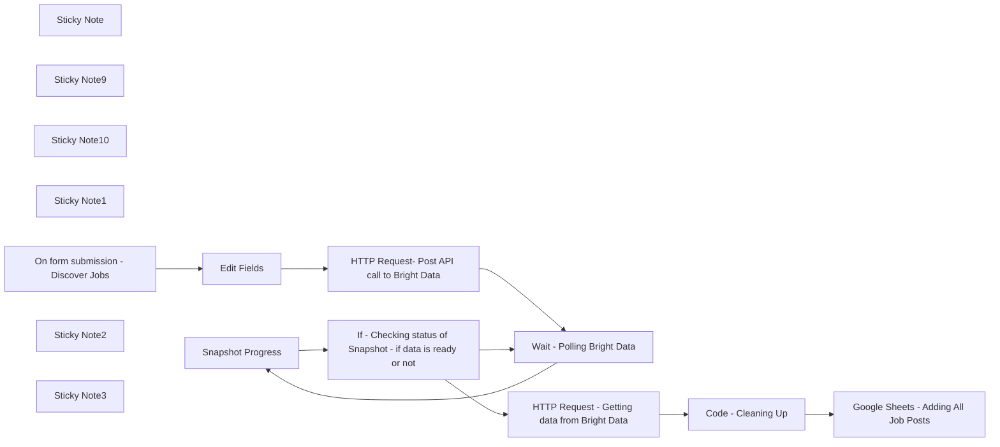

## Fluxo (.json) :

```json
{
  "meta": {
    "instanceId": "1eadd5bc7c3d70c587c28f782511fd898c6bf6d97963d92e836019d2039d1c79"
  },
  "nodes": [
    {
      "id": "bee233ee-7212-4fbd-b151-0bb49919ca42",
      "name": "Sticky Note",
      "type": "n8n-nodes-base.stickyNote",
      "position": [
        0,
        280
      ],
      "parameters": {
        "color": 4,
        "width": 1289,
        "height": 4398,
        "content": "LinkedIn Job Data Scraper to Google Sheets\nScrape live job posts from LinkedIn via Bright Data, clean them, and send to Google Sheets. Use for:\n✅ Job Hunting — fresh, filtered roles\n✅ Sales Prospecting — find companies hiring (aka growing)\n⚙️ What's Used\nn8n Nodes: Form → HTTP Request → Wait → If → Code → Google Sheets\nExternal Tools:\n\nBright Data – Dataset API\nGoogle Sheets – Template Copy\n\n🔑 Setup – Credentials Needed\n\nBright Data API Key → Add to HTTP headers as: Authorization: Bearer YOUR_KEY\nGoogle Sheets OAuth2 → Connect account in n8n\n\n📝 Input Form – Fields\nUsed to define what job data to scrape.\nFieldDescriptionExampleLocationCity/regionNew York, BerlinKeywordRole to searchCMO, Data AnalystCountry2-letter ISO codeUS, UK, DETime RangeHow recent the jobs should be\"Past 24 hours\" or \"Last 7 days\" (recommended)Job TypeFull-time / Part-time / Contract(Optional)ExperienceEntry, Mid, Senior(Optional)RemoteFilter by remote-friendly roles(Optional)CompanyFilter by specific employer(Optional)\n🚀 Workflow Steps\n\nUser fills input form\nTrigger snapshot via Bright Data Dataset API\nWait node + polling checks when data is ready (~1–3 mins)\nCleanup step:\n\nFlattens nested fields (job_poster, base_salary, etc.)\nRemoves HTML from job descriptions\n\n\nSend to Google Sheet\n\nSheet is pre-linked, 1 job per row\nExample columns: job_title, company_name, location, salary_min, apply_link, job_description_plain\n\n\nYou use the data\n\nJob seekers → Apply fast\nSalespeople → Spot buyers & offer help\n\n\n\n💡 Pro Tips\n\nUse \"Past 24 hours\" or \"Last 7 days\" for fresher results\nLeave filters empty if unsure — Bright Data will return broader results\nUse cleaned data for:\n\nCold email personalization\nLinkedIn outreach\nBuilding ICP-based lead lists\n\n\n\n🧪 Example API Body\njson[ \n  { \n    \"location\": \"New York\", \n    \"keyword\": \"Marketing Manager\", \n    \"country\": \"US\", \n    \"time_range\": \"Past 24 hours\", \n    \"job_type\": \"Part-time\", \n    \"experience_level\": \"\", \n    \"remote\": \"\", \n    \"company\": \"\" \n  } \n]\n📄 Template & Resources\n\n📋 Google Sheet Template (Make a Copy)\n📘 Bright Data API Reference\n\n🛠️ Customize It\n\nAdd filters to HTTP Body (remote, experience_level, etc.)\nChange polling interval if Bright Data is slow\nAdd custom logic to score/prioritize listings\nSend filtered lists to CRM, Slack, etc.\n\nThis gives you a live stream of hiring signals — whether you're finding a job or pitching a service. One form. One click. Fully automated."
      },
      "typeVersion": 1
    },
    {
      "id": "0fa9d0fe-b3ba-48be-99b9-2bc3aeb18b43",
      "name": "Sticky Note9",
      "type": "n8n-nodes-base.stickyNote",
      "position": [
        0,
        -60
      ],
      "parameters": {
        "color": 4,
        "width": 1300,
        "height": 320,
        "content": "=======================================\n            WORKFLOW ASSISTANCE\n=======================================\nFor any questions or support, please contact:\n    Yaron@nofluff.online\n\nExplore more tips and tutorials here:\n   - YouTube: https://www.youtube.com/@YaronBeen/videos\n   - LinkedIn: https://www.linkedin.com/in/yaronbeen/\n=======================================\n"
      },
      "typeVersion": 1
    },
    {
      "id": "33cb416e-a7ff-4b55-9701-9b9e95d76f12",
      "name": "Snapshot Progress",
      "type": "n8n-nodes-base.httpRequest",
      "position": [
        2840,
        360
      ],
      "parameters": {
        "url": "=https://api.brightdata.com/datasets/v3/progress/{{ $('HTTP Request- Post API call to Bright Data').item.json.snapshot_id }}",
        "options": {},
        "sendHeaders": true,
        "headerParameters": {
          "parameters": [
            {
              "name": "Authorization",
              "value": "Bearer <YOUR_BRIGHT_DATA_API_KEY>"
            }
          ]
        }
      },
      "typeVersion": 4.2
    },
    {
      "id": "6b8c9405-8f8c-4a24-85ca-343d33e06141",
      "name": "Sticky Note10",
      "type": "n8n-nodes-base.stickyNote",
      "position": [
        3680,
        140
      ],
      "parameters": {
        "width": 195,
        "height": 646,
        "content": "In this workflow, I use Google Sheets to store the results. \n\nYou can use my template to get started faster:\n\n1. [Click on this link to get the template](https://docs.google.com/spreadsheets/d/1_jbr5zBllTy_pGbogfGSvyv1_0a77I8tU-Ai7BjTAw4/edit?usp=sharing)\n2. Make a copy of the Sheets\n3. Add the URL to this node \n\n\n"
      },
      "typeVersion": 1
    },
    {
      "id": "3d3cd92a-9ea7-4a4f-a9b5-aae689f719e5",
      "name": "Sticky Note1",
      "type": "n8n-nodes-base.stickyNote",
      "position": [
        1320,
        -60
      ],
      "parameters": {
        "width": 480,
        "height": 2240,
        "content": "# 🔍 LinkedIn Jobs API – Parameter Guide\n\nUse this object to query LinkedIn job listings.  \nEach field lets you filter results based on different criteria.\n\n```json\n{\n  \"location\": \"{{ $json.Location }}\",\n  \"keyword\": \"{{ $json.Keyword }}\",\n  \"country\": \"{{ $json.Country }}\",\n  \"time_range\": \"Past 24 hours\",\n  \"job_type\": \"Part-time\",\n  \"experience_level\": \"\",\n  \"remote\": \"\",\n  \"company\": \"\"\n}\n```\n\n## 🧾 Field Explanations & Valid Options\n\n### 🗺️ location\nCity or region where the job is located.\nUse a city or region name.\n✅ Example: \"Berlin\", \"New York\"\n\n### 🧠 keyword\nJob title or search keywords.\nUse terms like role names or skills.\n✅ Example: \"Data Scientist\", \"Growth Marketing\"\n\n### 🌍 country\nCountry code in ISO 3166-1 alpha-2 format.\n✅ Example: \"US\", \"DE\", \"IL\"\n\n### ⏱️ time_range\nPosting date filter.\nLimits results based on how recently jobs were posted.\nAccepted values:\n- Any Time\n- Past 24 hours\n- Past Week\n- Past Month\n✅ Example: \"Past Week\"\n\n### 💼 job_type\nType of employment.\nUse a single value or comma-separated list.\nAccepted values:\n- Full-time\n- Part-time\n- Contract\n- Temporary\n- Internship\n- Volunteer\n- Other\n✅ Example: \"Full-time,Contract\"\n\n### 🎯 experience_level\nSeniority level of the job.\nAccepted values:\n- Internship\n- Entry level\n- Associate\n- Mid-Senior level\n- Director\n- Executive\n✅ Example: \"Mid-Senior level\"\n\n### 🌐 remote\nWorkplace type.\nAccepted values:\n- Remote\n- On-site\n- Hybrid\n- (leave blank for no preference)\n✅ Example: \"Remote\"\n\n### 🏢 company\nFilter by company name.\nOptional. Use plain text.\n✅ Example: \"Google\", \"Spotify\"\n\n## ✅ Full Example\n\n```json\n{\n  \"location\": \"New York\",\n  \"keyword\": \"UI Designer\",\n  \"country\": \"US\",\n  \"time_range\": \"Past Week\",\n  \"job_type\": \"Full-time,Contract\",\n  \"experience_level\": \"Mid-Senior level\",\n  \"remote\": \"Hybrid\",\n  \"company\": \"Spotify\"\n}\n```\n\n"
      },
      "typeVersion": 1
    },
    {
      "id": "1d7a7bb0-1531-4516-9373-5e85a090b143",
      "name": "On form submission - Discover Jobs",
      "type": "n8n-nodes-base.formTrigger",
      "position": [
        1700,
        580
      ],
      "webhookId": "8d0269c7-d1fc-45a1-a411-19634a1e0b82",
      "parameters": {
        "options": {},
        "formTitle": "Linkedin High Intent Prospects And Job Post Hunt",
        "formFields": {
          "values": [
            {
              "fieldLabel": "Job Location",
              "placeholder": "example: new york",
              "requiredField": true
            },
            {
              "fieldLabel": "Keyword",
              "placeholder": "example: CMO, AI architect",
              "requiredField": true
            },
            {
              "fieldLabel": "Country (2 letters)",
              "placeholder": "example: US,UK,IL",
              "requiredField": true
            }
          ]
        },
        "formDescription": "This form lets you customize your job search / prospecting by choosing:\n\nLocation (city or region)\n\nJob title or keywords\n\nCountry code\n\nFilters like posting date, job type, experience level, and remote options\n\nYou can also optionally narrow results by company name.\n\n🧠 Tip: Leave fields blank if you want broader results."
      },
      "typeVersion": 2.2
    },
    {
      "id": "aea569df-eedd-441f-aba5-c3c26a50fa87",
      "name": "HTTP Request- Post API call to Bright Data",
      "type": "n8n-nodes-base.httpRequest",
      "position": [
        2260,
        620
      ],
      "parameters": {
        "url": "https://api.brightdata.com/datasets/v3/trigger",
        "method": "POST",
        "options": {},
        "jsonBody": "=[\n  {\n    \"location\": \"{{ $json['Job Location'] }}\",\n    \"keyword\": \"{{ $json.Keyword }}\",\n    \"country\": \"{{ $json['Country (2 letters)'] }}\",\n    \"time_range\": \"Past 24 hours\",\n    \"job_type\": \"Part-time\",\n    \"experience_level\": \"\",\n    \"remote\": \"\",\n    \"company\": \"\"\n  }\n] ",
        "sendBody": true,
        "sendQuery": true,
        "sendHeaders": true,
        "specifyBody": "json",
        "queryParameters": {
          "parameters": [
            {
              "name": "dataset_id",
              "value": "gd_lpfll7v5hcqtkxl6l"
            },
            {
              "name": "endpoint",
              "value": "https://yaron-nofluff.app.n8n.cloud/webhook-test/8c42463d-a631-4a17-a084-4bcbbb3bfc68"
            },
            {
              "name": "notify",
              "value": "https://yaron-nofluff.app.n8n.cloud/webhook-test/8c42463d-a631-4a17-a084-4bcbbb3bfc68"
            },
            {
              "name": "format",
              "value": "json"
            },
            {
              "name": "uncompressed_webhook",
              "value": "true"
            },
            {
              "name": "type",
              "value": "discover_new"
            },
            {
              "name": "discover_by",
              "value": "=keyword"
            }
          ]
        },
        "headerParameters": {
          "parameters": [
            {
              "name": "Authorization",
              "value": "Bearer <YOUR_BRIGHT_DATA_API_KEY>"
            }
          ]
        }
      },
      "typeVersion": 4.2
    },
    {
      "id": "8837f055-7243-44b6-87a2-e679d75839d0",
      "name": "Wait - Polling Bright Data",
      "type": "n8n-nodes-base.wait",
      "position": [
        2600,
        360
      ],
      "webhookId": "8005a2b3-2195-479e-badb-d90e4240e699",
      "parameters": {
        "unit": "minutes"
      },
      "executeOnce": false,
      "typeVersion": 1.1
    },
    {
      "id": "1f0ebefa-42a1-450c-b30a-64edabdaedaf",
      "name": "If - Checking status of Snapshot - if data is ready or not",
      "type": "n8n-nodes-base.if",
      "position": [
        3040,
        360
      ],
      "parameters": {
        "options": {},
        "conditions": {
          "options": {
            "version": 2,
            "leftValue": "",
            "caseSensitive": true,
            "typeValidation": "strict"
          },
          "combinator": "and",
          "conditions": [
            {
              "id": "7932282b-71bb-4bbb-ab73-4978e554de7e",
              "operator": {
                "name": "filter.operator.equals",
                "type": "string",
                "operation": "equals"
              },
              "leftValue": "={{ $json.status }}",
              "rightValue": "running"
            }
          ]
        }
      },
      "typeVersion": 2.2
    },
    {
      "id": "e17b4da0-3f9c-45d5-acdf-ab634acfef97",
      "name": "HTTP Request - Getting data from Bright Data",
      "type": "n8n-nodes-base.httpRequest",
      "position": [
        3320,
        380
      ],
      "parameters": {
        "url": "=https://api.brightdata.com/datasets/v3/snapshot/{{ $json.snapshot_id }}",
        "options": {},
        "sendQuery": true,
        "sendHeaders": true,
        "queryParameters": {
          "parameters": [
            {
              "name": "format",
              "value": "json"
            }
          ]
        },
        "headerParameters": {
          "parameters": [
            {
              "name": "Authorization",
              "value": "Bearer <YOUR_BRIGHT_DATA_API_KEY>"
            }
          ]
        }
      },
      "typeVersion": 4.2
    },
    {
      "id": "b5bd6a55-f80d-46f9-a59a-beff28de9da7",
      "name": "Code - Cleaning Up",
      "type": "n8n-nodes-base.code",
      "position": [
        3600,
        400
      ],
      "parameters": {
        "jsCode": "// Helper function to strip HTML tags\nfunction stripHtml(html) {\n  return html\n    .replace(/<[^>]+>/g, '')    // remove all HTML tags\n    .replace(/&nbsp;/g, ' ')     // decode HTML entities\n    .replace(/&[a-z]+;/g, '')    // remove other HTML entities\n    .replace(/\\s+/g, ' ')        // normalize whitespace\n    .trim();\n}\n\nreturn items.map(item => {\n  const data = item.json;\n\n  // Flatten job_poster\n  if (data.job_poster) {\n    data.job_poster_name = data.job_poster.name || '';\n    data.job_poster_title = data.job_poster.title || '';\n    data.job_poster_url = data.job_poster.url || '';\n    delete data.job_poster;\n  }\n\n  // Flatten base_salary\n  if (data.base_salary) {\n    data.salary_min = data.base_salary.min_amount || '';\n    data.salary_max = data.base_salary.max_amount || '';\n    data.salary_currency = data.base_salary.currency || '';\n    data.salary_period = data.base_salary.payment_period || '';\n    delete data.base_salary;\n  }\n\n  // Clean up job description HTML\n  if (data.job_description_formatted) {\n    data.job_description_plain = stripHtml(data.job_description_formatted);\n  }\n\n  return { json: data };\n});\n"
      },
      "typeVersion": 2
    },
    {
      "id": "70f4a4a0-b9ce-4b7a-b232-86014a7f8a3f",
      "name": "Google Sheets - Adding All Job Posts",
      "type": "n8n-nodes-base.googleSheets",
      "position": [
        3940,
        440
      ],
      "parameters": {
        "columns": {
          "value": {
            "country_code": "={{ $json.country_code }}"
          },
          "schema": [
            {
              "id": "url",
              "type": "string",
              "display": true,
              "removed": false,
              "required": false,
              "displayName": "url",
              "defaultMatch": false,
              "canBeUsedToMatch": true
            },
            {
              "id": "job_posting_id",
              "type": "string",
              "display": true,
              "removed": false,
              "required": false,
              "displayName": "job_posting_id",
              "defaultMatch": false,
              "canBeUsedToMatch": true
            },
            {
              "id": "job_title",
              "type": "string",
              "display": true,
              "removed": false,
              "required": false,
              "displayName": "job_title",
              "defaultMatch": false,
              "canBeUsedToMatch": true
            },
            {
              "id": "company_name",
              "type": "string",
              "display": true,
              "removed": false,
              "required": false,
              "displayName": "company_name",
              "defaultMatch": false,
              "canBeUsedToMatch": true
            },
            {
              "id": "job_location",
              "type": "string",
              "display": true,
              "removed": false,
              "required": false,
              "displayName": "job_location",
              "defaultMatch": false,
              "canBeUsedToMatch": true
            },
            {
              "id": "job_description_plain",
              "type": "string",
              "display": true,
              "removed": false,
              "required": false,
              "displayName": "job_description_plain",
              "defaultMatch": false,
              "canBeUsedToMatch": true
            },
            {
              "id": "job_poster_name",
              "type": "string",
              "display": true,
              "removed": false,
              "required": false,
              "displayName": "job_poster_name",
              "defaultMatch": false,
              "canBeUsedToMatch": true
            },
            {
              "id": "job_poster_title",
              "type": "string",
              "display": true,
              "removed": false,
              "required": false,
              "displayName": "job_poster_title",
              "defaultMatch": false,
              "canBeUsedToMatch": true
            },
            {
              "id": "job_poster_url",
              "type": "string",
              "display": true,
              "removed": false,
              "required": false,
              "displayName": "job_poster_url",
              "defaultMatch": false,
              "canBeUsedToMatch": true
            },
            {
              "id": "salary_min",
              "type": "string",
              "display": true,
              "removed": false,
              "required": false,
              "displayName": "salary_min",
              "defaultMatch": false,
              "canBeUsedToMatch": true
            },
            {
              "id": "salary_max",
              "type": "string",
              "display": true,
              "removed": false,
              "required": false,
              "displayName": "salary_max",
              "defaultMatch": false,
              "canBeUsedToMatch": true
            },
            {
              "id": "salary_currency",
              "type": "string",
              "display": true,
              "removed": false,
              "required": false,
              "displayName": "salary_currency",
              "defaultMatch": false,
              "canBeUsedToMatch": true
            },
            {
              "id": "salary_period",
              "type": "string",
              "display": true,
              "removed": false,
              "required": false,
              "displayName": "salary_period",
              "defaultMatch": false,
              "canBeUsedToMatch": true
            },
            {
              "id": "application_availability",
              "type": "string",
              "display": true,
              "removed": false,
              "required": false,
              "displayName": "application_availability",
              "defaultMatch": false,
              "canBeUsedToMatch": true
            },
            {
              "id": "job_posted_date",
              "type": "string",
              "display": true,
              "removed": false,
              "required": false,
              "displayName": "job_posted_date",
              "defaultMatch": false,
              "canBeUsedToMatch": true
            },
            {
              "id": "company_logo",
              "type": "string",
              "display": true,
              "removed": false,
              "required": false,
              "displayName": "company_logo",
              "defaultMatch": false,
              "canBeUsedToMatch": true
            },
            {
              "id": "country_code",
              "type": "string",
              "display": true,
              "removed": false,
              "required": false,
              "displayName": "country_code",
              "defaultMatch": false,
              "canBeUsedToMatch": true
            },
            {
              "id": "timestamp",
              "type": "string",
              "display": true,
              "removed": false,
              "required": false,
              "displayName": "timestamp",
              "defaultMatch": false,
              "canBeUsedToMatch": true
            },
            {
              "id": "company_id",
              "type": "string",
              "display": true,
              "removed": false,
              "required": false,
              "displayName": "company_id",
              "defaultMatch": false,
              "canBeUsedToMatch": true
            },
            {
              "id": "job_summary",
              "type": "string",
              "display": true,
              "removed": false,
              "required": false,
              "displayName": "job_summary",
              "defaultMatch": false,
              "canBeUsedToMatch": true
            },
            {
              "id": "company_url",
              "type": "string",
              "display": true,
              "removed": false,
              "required": false,
              "displayName": "company_url",
              "defaultMatch": false,
              "canBeUsedToMatch": true
            },
            {
              "id": "job_posted_time",
              "type": "string",
              "display": true,
              "removed": false,
              "required": false,
              "displayName": "job_posted_time",
              "defaultMatch": false,
              "canBeUsedToMatch": true
            },
            {
              "id": "job_num_applicants",
              "type": "string",
              "display": true,
              "removed": false,
              "required": false,
              "displayName": "job_num_applicants",
              "defaultMatch": false,
              "canBeUsedToMatch": true
            },
            {
              "id": "discovery_input",
              "type": "string",
              "display": true,
              "removed": false,
              "required": false,
              "displayName": "discovery_input",
              "defaultMatch": false,
              "canBeUsedToMatch": true
            },
            {
              "id": "apply_link",
              "type": "string",
              "display": true,
              "removed": false,
              "required": false,
              "displayName": "apply_link",
              "defaultMatch": false,
              "canBeUsedToMatch": true
            },
            {
              "id": "title_id",
              "type": "string",
              "display": true,
              "removed": false,
              "required": false,
              "displayName": "title_id",
              "defaultMatch": false,
              "canBeUsedToMatch": true
            },
            {
              "id": "job_description_formatted",
              "type": "string",
              "display": true,
              "removed": false,
              "required": false,
              "displayName": "job_description_formatted",
              "defaultMatch": false,
              "canBeUsedToMatch": true
            },
            {
              "id": "input",
              "type": "string",
              "display": true,
              "removed": false,
              "required": false,
              "displayName": "input",
              "defaultMatch": false,
              "canBeUsedToMatch": true
            },
            {
              "id": "job_seniority_level",
              "type": "string",
              "display": true,
              "removed": false,
              "required": false,
              "displayName": "job_seniority_level",
              "defaultMatch": false,
              "canBeUsedToMatch": true
            },
            {
              "id": "job_function",
              "type": "string",
              "display": true,
              "removed": false,
              "required": false,
              "displayName": "job_function",
              "defaultMatch": false,
              "canBeUsedToMatch": true
            },
            {
              "id": "job_employment_type",
              "type": "string",
              "display": true,
              "removed": false,
              "required": false,
              "displayName": "job_employment_type",
              "defaultMatch": false,
              "canBeUsedToMatch": true
            },
            {
              "id": "job_industries",
              "type": "string",
              "display": true,
              "removed": false,
              "required": false,
              "displayName": "job_industries",
              "defaultMatch": false,
              "canBeUsedToMatch": true
            },
            {
              "id": "job_base_pay_range",
              "type": "string",
              "display": true,
              "removed": false,
              "required": false,
              "displayName": "job_base_pay_range",
              "defaultMatch": false,
              "canBeUsedToMatch": true
            }
          ],
          "mappingMode": "autoMapInputData",
          "matchingColumns": [
            "row_number"
          ],
          "attemptToConvertTypes": false,
          "convertFieldsToString": false
        },
        "options": {
          "handlingExtraData": "insertInNewColumn"
        },
        "operation": "append",
        "sheetName": {
          "__rl": true,
          "mode": "list",
          "value": "gid=0",
          "cachedResultUrl": "https://docs.google.com/spreadsheets/d/1_jbr5zBllTy_pGbogfGSvyv1_0a77I8tU-Ai7BjTAw4/edit#gid=0",
          "cachedResultName": "input"
        },
        "documentId": {
          "__rl": true,
          "mode": "list",
          "value": "1_jbr5zBllTy_pGbogfGSvyv1_0a77I8tU-Ai7BjTAw4",
          "cachedResultUrl": "https://docs.google.com/spreadsheets/d/1_jbr5zBllTy_pGbogfGSvyv1_0a77I8tU-Ai7BjTAw4/edit?usp=drivesdk",
          "cachedResultName": "NoFluff-N8N-Sheet-Template-Job Scraping WIth Bright Data"
        }
      },
      "credentials": {
        "googleSheetsOAuth2Api": {
          "id": "4RJOMlGAcB9ZoYfm",
          "name": "Google Sheets account 2"
        }
      },
      "typeVersion": 4.3,
      "alwaysOutputData": true
    },
    {
      "id": "297d778f-afa5-4d2d-baea-3b1fb199f77c",
      "name": "Sticky Note2",
      "type": "n8n-nodes-base.stickyNote",
      "position": [
        1940,
        -40
      ],
      "parameters": {
        "width": 300,
        "height": 880,
        "content": "🧠 Bright Data Trigger – Customize Your Job Query\n\nThis HTTP Request sends a POST call to Bright Data to start a new dataset snapshot based on your filters.\n\n👋 If you don’t want to use the Form Trigger,\nyou can directly adjust the filters here in this node.\n\nYou can customize:\n\n\"location\" → city, region, or keyword (e.g. \"New York\", \"Remote\")\n\n\"keyword\" → job title or role (e.g. \"CMO\", \"AI Engineer\")\n\n\"country\" → 2-letter country code (e.g. \"US\", \"UK\")\n\n\"time_range\" → \"Past 24 hours\", \"Last 7 days\", etc.\n\n\"job_type\", \"experience_level\", \"remote\", \"company\" → optional filters\n\n📌 Tip:\nUse \"Past 24 hours\" or \"Last 7 days\" for the freshest results."
      },
      "typeVersion": 1
    },
    {
      "id": "54303791-b269-4930-85b5-33e50ae08f33",
      "name": "Sticky Note3",
      "type": "n8n-nodes-base.stickyNote",
      "position": [
        2320,
        220
      ],
      "parameters": {
        "color": 4,
        "width": 940,
        "height": 360,
        "content": "Bright Data Getting Jobs\n"
      },
      "typeVersion": 1
    },
    {
      "id": "cccb03cb-0432-43ff-9c3a-233de510a775",
      "name": "Edit Fields",
      "type": "n8n-nodes-base.set",
      "position": [
        1920,
        580
      ],
      "parameters": {
        "options": {},
        "assignments": {
          "assignments": [
            {
              "id": "12067869-0249-4cd2-b9e2-8e4055a0d917",
              "name": "",
              "type": "string",
              "value": ""
            }
          ]
        }
      },
      "typeVersion": 3.4
    }
  ],
  "pinData": {},
  "connections": {
    "Edit Fields": {
      "main": [
        [
          {
            "node": "HTTP Request- Post API call to Bright Data",
            "type": "main",
            "index": 0
          }
        ]
      ]
    },
    "Snapshot Progress": {
      "main": [
        [
          {
            "node": "If - Checking status of Snapshot - if data is ready or not",
            "type": "main",
            "index": 0
          }
        ]
      ]
    },
    "Code - Cleaning Up": {
      "main": [
        [
          {
            "node": "Google Sheets - Adding All Job Posts",
            "type": "main",
            "index": 0
          }
        ]
      ]
    },
    "Wait - Polling Bright Data": {
      "main": [
        [
          {
            "node": "Snapshot Progress",
            "type": "main",
            "index": 0
          }
        ]
      ]
    },
    "On form submission - Discover Jobs": {
      "main": [
        [
          {
            "node": "Edit Fields",
            "type": "main",
            "index": 0
          }
        ]
      ]
    },
    "HTTP Request- Post API call to Bright Data": {
      "main": [
        [
          {
            "node": "Wait - Polling Bright Data",
            "type": "main",
            "index": 0
          }
        ]
      ]
    },
    "HTTP Request - Getting data from Bright Data": {
      "main": [
        [
          {
            "node": "Code - Cleaning Up",
            "type": "main",
            "index": 0
          }
        ]
      ]
    },
    "If - Checking status of Snapshot - if data is ready or not": {
      "main": [
        [
          {
            "node": "Wait - Polling Bright Data",
            "type": "main",
            "index": 0
          }
        ],
        [
          {
            "node": "HTTP Request - Getting data from Bright Data",
            "type": "main",
            "index": 0
          }
        ]
      ]
    }
  }
}
```

<a id="template-718"></a>

## Template 718 - Sincronização Sheets → Orbit

- **Nome:** Sincronização Sheets → Orbit
- **Descrição:** Este fluxo sincroniza membros e suas atividades de uma planilha do Google Sheets para um workspace no Orbit, atualizando perfis e registrando atividades.
- **Funcionalidade:** • Importar membros: Lê registros de membros a partir de uma aba de Google Sheets.
• Atualizar/criar membros no Orbit: Realiza upsert de identidades (por username do GitHub) e atualiza campos adicionais como nome, tamanho da camiseta, localização e tags.
• Buscar atividades relacionadas: Pesquisas atividades na aba de Activities da planilha para cada membro usando o GitHub Username.
• Mesclar dados de membros e atividades: Combina informações de membros com as atividades encontradas para preparar a criação de registros.
• Criar atividades no Orbit: Cria atividades no workspace associadas aos membros, incluindo título, link e descrição.
• Recuperar lista completa de membros do Orbit: Obtém todos os membros do workspace para referência e mesclagem de dados.
- **Ferramentas:** • Google Sheets: Planilha online usada como fonte de dados para membros e atividades, acessada via OAuth2.
• Orbit: Plataforma de gestão de comunidade usada para armazenar e atualizar perfis de membros e registrar atividades no workspace.

## Fluxo visual

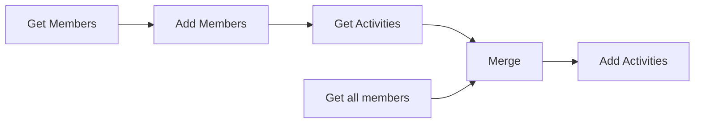

## Fluxo (.json) :

```json
{
  "name": "Moving metrics from Google Sheets to Orbit",
  "nodes": [
    {
      "name": "Merge",
      "type": "n8n-nodes-base.merge",
      "position": [
        1473,
        426
      ],
      "parameters": {
        "mode": "mergeByKey",
        "propertyName1": "GitHub Username",
        "propertyName2": "attributes.slug"
      },
      "typeVersion": 1
    },
    {
      "name": "Add Members",
      "type": "n8n-nodes-base.orbit",
      "position": [
        1073,
        326
      ],
      "parameters": {
        "operation": "upsert",
        "identityUi": {
          "identityValue": {
            "source": "github",
            "searchBy": "username",
            "username": "={{$json[\"GitHub\"]}}"
          }
        },
        "workspaceId": "543",
        "additionalFields": {
          "name": "={{$json[\"Name\"]}}",
          "tShirt": "={{$json[\"T-Shirt Size\"]}}",
          "location": "={{$json[\"Location\"]}}",
          "tagsToAdd": "={{$json[\"Tags\"]}}"
        }
      },
      "credentials": {
        "orbitApi": "Orbit Credentials"
      },
      "typeVersion": 1
    },
    {
      "name": "Get all members",
      "type": "n8n-nodes-base.orbit",
      "position": [
        1273,
        526
      ],
      "parameters": {
        "options": {},
        "operation": "getAll",
        "returnAll": true,
        "workspaceId": "543"
      },
      "credentials": {
        "orbitApi": "Orbit Credentials"
      },
      "typeVersion": 1
    },
    {
      "name": "Get Members",
      "type": "n8n-nodes-base.googleSheets",
      "position": [
        873,
        326
      ],
      "parameters": {
        "range": "Members!A:F",
        "options": {},
        "sheetId": "1GiR5glinWBUJ-pw3w8LpcuwyOXst2z5nnFSak8DQrMQ",
        "authentication": "oAuth2"
      },
      "credentials": {
        "googleSheetsOAuth2Api": "Google Sheets Credentials"
      },
      "typeVersion": 1
    },
    {
      "name": "Get Activities",
      "type": "n8n-nodes-base.googleSheets",
      "position": [
        1273,
        326
      ],
      "parameters": {
        "range": "Activities!A:D",
        "options": {
          "returnAllMatches": true
        },
        "sheetId": "={{$node[\"Get Members\"].parameter[\"sheetId\"]}}",
        "operation": "lookup",
        "lookupValue": "={{$node[\"Get Members\"].json[\"GitHub\"]}}",
        "lookupColumn": "GitHub Username",
        "authentication": "oAuth2"
      },
      "credentials": {
        "googleSheetsOAuth2Api": "Google Sheets Credentials"
      },
      "typeVersion": 1
    },
    {
      "name": "Add Activities",
      "type": "n8n-nodes-base.orbit",
      "position": [
        1673,
        426
      ],
      "parameters": {
        "title": "={{$json[\"Title\"]}}",
        "memberId": "={{$json[\"id\"]}}",
        "resource": "activity",
        "workspaceId": "543",
        "additionalFields": {
          "link": "={{$json[\"Activity Link\"]}}",
          "description": "={{$node[\"Merge\"].json[\"Description\"]}}"
        }
      },
      "credentials": {
        "orbitApi": "Orbit Credentials"
      },
      "typeVersion": 1
    }
  ],
  "active": false,
  "settings": {},
  "connections": {
    "Merge": {
      "main": [
        [
          {
            "node": "Add Activities",
            "type": "main",
            "index": 0
          }
        ]
      ]
    },
    "Add Members": {
      "main": [
        [
          {
            "node": "Get Activities",
            "type": "main",
            "index": 0
          }
        ]
      ]
    },
    "Get Members": {
      "main": [
        [
          {
            "node": "Add Members",
            "type": "main",
            "index": 0
          }
        ]
      ]
    },
    "Get Activities": {
      "main": [
        [
          {
            "node": "Merge",
            "type": "main",
            "index": 0
          }
        ]
      ]
    },
    "Get all members": {
      "main": [
        [
          {
            "node": "Merge",
            "type": "main",
            "index": 1
          }
        ]
      ]
    }
  }
}
```

<a id="template-719"></a>

## Template 719 - Verificação de fatos por sentença

- **Nome:** Verificação de fatos por sentença
- **Descrição:** Recebe um texto e um conjunto de fatos de referência, divide o texto em sentenças, checa cada afirmação usando modelos de linguagem e produz um resumo com as declarações incorretas.
- **Funcionalidade:** • Entrada de texto e fatos: recebe o texto a ser analisado e um documento com fatos de referência.
• Segmentação em sentenças: divide o texto em sentenças preservando datas e itens de lista, evitando cortes indevidos.
• Checagem por sentença com contexto: envia cada sentença ao modelo de checagem incluindo o documento de fatos para avaliar veracidade.
• Agregação de respostas: combina as respostas individuais das sentenças em um conjunto consolidado de resultados.
• Geração de resumo de erros: processa os resultados e gera um resumo estruturado com a lista de declarações incorretas e uma avaliação final.
• Suporte a múltiplos modos de execução: permite disparo manual e também ser executado por outros fluxos como subrotina.
- **Ferramentas:** • Ollama API: runtime para executar modelos de linguagem e modelos de chat de forma local ou remota.
• bespoke-minicheck (modelo Ollama): modelo especializado em verificação de fatos empregado para avaliar cada sentença (requere instalação via ollama pull bespoke-minicheck).
• qwen2.5 (modelo Ollama): modelo de linguagem usado para compilar e formatar o resumo final.
• JavaScript/Regex: código customizado utilizado para pré-processamento e segmentação do texto em sentenças.

## Fluxo visual

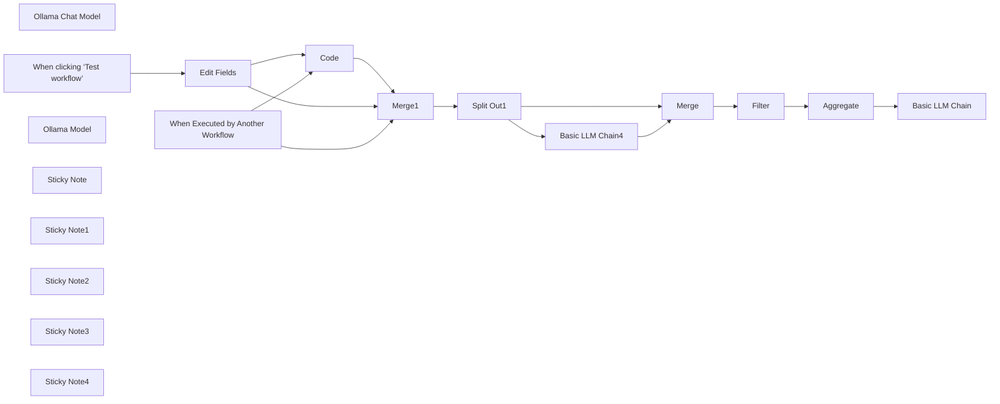

## Fluxo (.json) :

```json
{
  "meta": {
    "instanceId": "6e361bfcd1e8378c9b07774b22409c7eaea7080f01d5248da45077c0c6108b99",
    "templateCredsSetupCompleted": true
  },
  "nodes": [
    {
      "id": "cbc036f7-b0e1-4eb4-94c3-7571c67a1efe",
      "name": "Code",
      "type": "n8n-nodes-base.code",
      "position": [
        -120,
        40
      ],
      "parameters": {
        "mode": "runOnceForEachItem",
        "jsCode": "// Get the input text\nconst text = $input.item.json.text;\n\n// Ensure text is not null or undefined\nif (!text) {\n throw new Error('Input text is empty');\n}\n\n// Function to split text into sentences while preserving dates and list items\nfunction splitIntoSentences(text) {\n const monthNames = '(?:Januar|Februar|März|April|Mai|Juni|Juli|August|September|Oktober|November|Dezember)';\n const datePattern = `(?:\\\\d{1,2}\\\\.\\\\s*(?:${monthNames}|\\\\d{1,2}\\\\.)\\\\s*\\\\d{2,4})`;\n \n // Split by sentence-ending punctuation, but not within dates or list items\n const regex = new RegExp(`(?<=[.!?])\\\\s+(?=[A-ZÄÖÜ]|$)(?!${datePattern}|\\\\s*[-•]\\\\s)`, 'g');\n \n return text.split(regex)\n .map(sentence => sentence.trim())\n .filter(sentence => sentence !== '');\n}\n\n// Split the text into sentences\nconst sentences = splitIntoSentences(text);\n\n// Output a single object with an array of sentences\nreturn { json: { sentences: sentences } };"
      },
      "typeVersion": 2
    },
    {
      "id": "faae4740-a529-4275-be0e-b079c3bfde58",
      "name": "Split Out1",
      "type": "n8n-nodes-base.splitOut",
      "position": [
        340,
        -180
      ],
      "parameters": {
        "options": {
          "destinationFieldName": "claim"
        },
        "fieldToSplitOut": "sentences"
      },
      "typeVersion": 1
    },
    {
      "id": "c3944f89-e267-4df0-8fc4-9281eac4e759",
      "name": "Basic LLM Chain4",
      "type": "@n8n/n8n-nodes-langchain.chainLlm",
      "position": [
        640,
        -40
      ],
      "parameters": {
        "text": "=Document: {{ $('Merge1').item.json.facts }}\nClaim: {{ $json.claim }}",
        "promptType": "define"
      },
      "typeVersion": 1.5
    },
    {
      "id": "4e53c7f1-ab9f-42be-a253-9328b209fc68",
      "name": "Ollama Chat Model",
      "type": "@n8n/n8n-nodes-langchain.lmChatOllama",
      "position": [
        700,
        160
      ],
      "parameters": {
        "model": "bespoke-minicheck:latest",
        "options": {}
      },
      "credentials": {
        "ollamaApi": {
          "id": "DeuK54dDNrCCnXHl",
          "name": "Ollama account"
        }
      },
      "typeVersion": 1
    },
    {
      "id": "0252e47e-0e50-4024-92a0-74b554c8cbd1",
      "name": "When clicking ‘Test workflow’",
      "type": "n8n-nodes-base.manualTrigger",
      "position": [
        -760,
        40
      ],
      "parameters": {},
      "typeVersion": 1
    },
    {
      "id": "8dd3f67c-e36f-4b03-8f9f-9b52ea23e0ed",
      "name": "Edit Fields",
      "type": "n8n-nodes-base.set",
      "position": [
        -460,
        40
      ],
      "parameters": {
        "options": {},
        "assignments": {
          "assignments": [
            {
              "id": "55748f38-486f-495f-91ec-02c1d49acf18",
              "name": "facts",
              "type": "string",
              "value": "Sara Beery came to MIT as an assistant professor in MIT’s Department of Electrical Engineering and Computer Science (EECS) eager to focus on ecological challenges. She has fashioned her research career around the opportunity to apply her expertise in computer vision, machine learning, and data science to tackle real-world issues in conservation and sustainability. Beery was drawn to the Institute’s commitment to “computing for the planet,” and set out to bring her methods to global-scale environmental and biodiversity monitoring.\n\nIn the Pacific Northwest, salmon have a disproportionate impact on the health of their ecosystems, and their complex reproductive needs have attracted Beery’s attention. Each year, millions of salmon embark on a migration to spawn. Their journey begins in freshwater stream beds where the eggs hatch. Young salmon fry (newly hatched salmon) make their way to the ocean, where they spend several years maturing to adulthood. As adults, the salmon return to the streams where they were born in order to spawn, ensuring the continuation of their species by depositing their eggs in the gravel of the stream beds. Both male and female salmon die shortly after supplying the river habitat with the next generation of salmon."
            },
            {
              "id": "7d8e29db-4a4b-47c5-8c93-fda1e72137a7",
              "name": "text",
              "type": "string",
              "value": "MIT's AI Pioneer Tackles Salmon Conservation Professor Sara Beery, a rising star in MIT's Department of Electrical Engineering and Computer Science, is revolutionizing ecological conservation through cutting-edge technology. Specializing in computer vision, machine learning, and data science, Beery has set her sights on addressing real-world sustainability challenges. Her current focus? The vital salmon populations of the Pacific Northwest. These fish play a crucial role in their ecosystems, with their complex life cycle spanning from freshwater streams to the open ocean and back again. Beery's innovative approach uses AI to monitor salmon migration patterns, providing unprecedented insights into their behavior and habitat needs. Beery's work has led to the development of underwater AI cameras that can distinguish between different salmon species with 99.9% accuracy. Her team has also created a revolutionary \"salmon translator\" that can predict spawning locations based on fish vocalizations. As climate change threatens these delicate ecosystems, Beery's research offers hope for more effective conservation strategies. By harnessing the power of technology, she's not just studying nature – she's actively working to preserve it for future generations."
            }
          ]
        }
      },
      "typeVersion": 3.4
    },
    {
      "id": "25849b47-1550-464c-9e70-e787712e5765",
      "name": "Merge",
      "type": "n8n-nodes-base.merge",
      "position": [
        1120,
        -160
      ],
      "parameters": {
        "mode": "combine",
        "options": {},
        "combineBy": "combineByPosition"
      },
      "typeVersion": 3
    },
    {
      "id": "eaea7ef4-a5d5-42b8-b262-e9a4bd6b7281",
      "name": "Filter",
      "type": "n8n-nodes-base.filter",
      "position": [
        1340,
        -160
      ],
      "parameters": {
        "options": {},
        "conditions": {
          "options": {
            "version": 2,
            "leftValue": "",
            "caseSensitive": true,
            "typeValidation": "strict"
          },
          "combinator": "and",
          "conditions": [
            {
              "id": "20a4ffd6-0dd0-44f9-97bc-7d891f689f4d",
              "operator": {
                "name": "filter.operator.equals",
                "type": "string",
                "operation": "equals"
              },
              "leftValue": "={{ $json.text }}",
              "rightValue": "No"
            }
          ]
        }
      },
      "typeVersion": 2.2
    },
    {
      "id": "9f074bdb-b1a6-4c36-be1c-203f78092657",
      "name": "When Executed by Another Workflow",
      "type": "n8n-nodes-base.executeWorkflowTrigger",
      "position": [
        -760,
        -200
      ],
      "parameters": {
        "workflowInputs": {
          "values": [
            {
              "name": "facts"
            },
            {
              "name": "text"
            }
          ]
        }
      },
      "typeVersion": 1.1
    },
    {
      "id": "0a08ac40-b497-4f6e-ac2c-2213a00d63f2",
      "name": "Aggregate",
      "type": "n8n-nodes-base.aggregate",
      "position": [
        1560,
        -160
      ],
      "parameters": {
        "options": {},
        "aggregate": "aggregateAllItemData"
      },
      "typeVersion": 1
    },
    {
      "id": "b0d79886-01fc-43c7-88fe-a7a5b8b56b35",
      "name": "Merge1",
      "type": "n8n-nodes-base.merge",
      "position": [
        80,
        -180
      ],
      "parameters": {
        "mode": "combine",
        "options": {},
        "combineBy": "combineByPosition"
      },
      "typeVersion": 3
    },
    {
      "id": "82640408-9db4-4a12-9136-1a22985b609b",
      "name": "Basic LLM Chain",
      "type": "@n8n/n8n-nodes-langchain.chainLlm",
      "position": [
        1780,
        -160
      ],
      "parameters": {
        "text": "={{ $json.data }}",
        "messages": {
          "messageValues": [
            {
              "message": "You are a fact-checking assistant. Your task is to analyze a list of statements, each accompanied by a \"yes\" or \"no\" indicating whether the statement is correct. Follow these guidelines:\n\n1. Review Process:\n a) Carefully read through each statement and its corresponding yes/no answer.\n b) Identify which statements are marked as incorrect (no).\n c) Ignore chit-chat sentences or statements that don't contain factual information.\n d) Count the total number of incorrect factual statements.\n\n2. Statement Classification:\n - Factual Statements: Contains specific information, data, or claims that can be verified.\n - Chit-chat/Non-factual: General comments, introductions, or transitions that don't present verifiable facts.\n\n3. Summary Structure:\n a) Overview: Provide a brief summary of the number of factual errors found.\n b) List of Problems: Enumerate the incorrect factual statements.\n c) Final Assessment: Offer a concise evaluation of the overall state of the article's factual accuracy.\n\n4. Prioritization:\n - Focus only on the factual statements marked as incorrect (no).\n - Ignore statements marked as correct (yes) and non-factual chit-chat.\n\n5. Feedback Tone:\n - Maintain a neutral and objective tone.\n - Present the information factually without additional commentary.\n\n6. Output Format:\n Present your summary in the following structure:\n\n ## Problem Summary\n [Number] incorrect factual statements were identified in the article.\n\n ## List of Incorrect Factual Statements\n 1. [First incorrect factual statement]\n 2. [Second incorrect factual statement]\n 3. [Third incorrect factual statement]\n (Continue listing all incorrect factual statements)\n\n ## Final Assessment\n Based on the number of incorrect factual statements:\n - If 0-1 errors: The article appears to be highly accurate and may only need minor factual adjustments.\n - If 2-3 errors: The article requires some revision to address these factual inaccuracies.\n - If 4 or more errors: The article needs significant revision to improve its factual accuracy.\n\nRemember, your role is to provide a clear, concise summary of the incorrect factual statements to help the writing team quickly understand what needs to be addressed. Ignore any chit-chat or non-factual statements in your analysis and summary."
            }
          ]
        },
        "promptType": "define"
      },
      "typeVersion": 1.5
    },
    {
      "id": "719054ef-0863-4e52-8390-23313c750aac",
      "name": "Ollama Model",
      "type": "@n8n/n8n-nodes-langchain.lmOllama",
      "position": [
        1880,
        60
      ],
      "parameters": {
        "model": "qwen2.5:1.5b",
        "options": {}
      },
      "credentials": {
        "ollamaApi": {
          "id": "DeuK54dDNrCCnXHl",
          "name": "Ollama account"
        }
      },
      "typeVersion": 1
    },
    {
      "id": "6595eb25-32ce-49f5-a013-b87d7f3c65d3",
      "name": "Sticky Note",
      "type": "n8n-nodes-base.stickyNote",
      "position": [
        1480,
        -320
      ],
      "parameters": {
        "width": 860,
        "height": 600,
        "content": "## Build a summary\n\nThis is useful to run it in an agentic workflow. You may remove the summary part and return the raw array with the found issues."
      },
      "typeVersion": 1
    },
    {
      "id": "9f6cde97-d2a7-44e4-b715-321ec1e68bd3",
      "name": "Sticky Note1",
      "type": "n8n-nodes-base.stickyNote",
      "position": [
        -240,
        -320
      ],
      "parameters": {
        "width": 760,
        "height": 600,
        "content": "## Split into sentences"
      },
      "typeVersion": 1
    },
    {
      "id": "1ceb8f3c-c00b-4496-82b2-20578550c4be",
      "name": "Sticky Note2",
      "type": "n8n-nodes-base.stickyNote",
      "position": [
        540,
        -320
      ],
      "parameters": {
        "width": 920,
        "height": 600,
        "content": "## Fact checking\n\nThis use a small ollama model that is specialized on that task: https://ollama.com/library/bespoke-minicheck\n\nYou have to install it before use with `ollama pull bespoke-minicheck`."
      },
      "typeVersion": 1
    },
    {
      "id": "6e340925-d4e5-4fe1-ba9d-a89a23b68226",
      "name": "Sticky Note3",
      "type": "n8n-nodes-base.stickyNote",
      "position": [
        -860,
        -20
      ],
      "parameters": {
        "width": 600,
        "height": 300,
        "content": "## Test workflow\n"
      },
      "typeVersion": 1
    },
    {
      "id": "5561d606-93d2-4887-839d-8ce2230ff30c",
      "name": "Sticky Note4",
      "type": "n8n-nodes-base.stickyNote",
      "position": [
        -860,
        -320
      ],
      "parameters": {
        "width": 600,
        "height": 280,
        "content": "## Entrypoint to use in other workflows\n"
      },
      "typeVersion": 1
    }
  ],
  "pinData": {},
  "connections": {
    "Code": {
      "main": [
        [
          {
            "node": "Merge1",
            "type": "main",
            "index": 1
          }
        ]
      ]
    },
    "Merge": {
      "main": [
        [
          {
            "node": "Filter",
            "type": "main",
            "index": 0
          }
        ]
      ]
    },
    "Filter": {
      "main": [
        [
          {
            "node": "Aggregate",
            "type": "main",
            "index": 0
          }
        ]
      ]
    },
    "Merge1": {
      "main": [
        [
          {
            "node": "Split Out1",
            "type": "main",
            "index": 0
          }
        ]
      ]
    },
    "Aggregate": {
      "main": [
        [
          {
            "node": "Basic LLM Chain",
            "type": "main",
            "index": 0
          }
        ]
      ]
    },
    "Split Out1": {
      "main": [
        [
          {
            "node": "Merge",
            "type": "main",
            "index": 0
          },
          {
            "node": "Basic LLM Chain4",
            "type": "main",
            "index": 0
          }
        ]
      ]
    },
    "Edit Fields": {
      "main": [
        [
          {
            "node": "Code",
            "type": "main",
            "index": 0
          },
          {
            "node": "Merge1",
            "type": "main",
            "index": 0
          }
        ]
      ]
    },
    "Ollama Model": {
      "ai_languageModel": [
        [
          {
            "node": "Basic LLM Chain",
            "type": "ai_languageModel",
            "index": 0
          }
        ]
      ]
    },
    "Basic LLM Chain4": {
      "main": [
        [
          {
            "node": "Merge",
            "type": "main",
            "index": 1
          }
        ]
      ]
    },
    "Ollama Chat Model": {
      "ai_languageModel": [
        [
          {
            "node": "Basic LLM Chain4",
            "type": "ai_languageModel",
            "index": 0
          }
        ]
      ]
    },
    "When Executed by Another Workflow": {
      "main": [
        [
          {
            "node": "Code",
            "type": "main",
            "index": 0
          },
          {
            "node": "Merge1",
            "type": "main",
            "index": 0
          }
        ]
      ]
    },
    "When clicking ‘Test workflow’": {
      "main": [
        [
          {
            "node": "Edit Fields",
            "type": "main",
            "index": 0
          }
        ]
      ]
    }
  }
}
```

<a id="template-720"></a>

## Template 720 - Importar CSV de concertos para MySQL

- **Nome:** Importar CSV de concertos para MySQL
- **Descrição:** Ao executar manualmente, o fluxo lê um arquivo CSV local com dados de concertos, converte-o em formato de planilha/dados tabulares e insere os registros em uma tabela MySQL.
- **Funcionalidade:** • Gatilho manual: Inicia o processo quando o usuário clica em executar.
• Leitura de arquivo local: Acessa e lê o arquivo CSV localizado no sistema de arquivos (/home/node/.n8n/concerts-2023.csv).
• Conversão para planilha/dados tabulares: Converte o conteúdo binário do arquivo CSV em dados legíveis e estruturados.
• Inserção em banco de dados: Insere os registros convertidos na tabela 'concerts_2023_csv' no banco MySQL, mapeando colunas como Date, Band, ConcertName, Country, City, Location e LocationAddress.
- **Ferramentas:** • Sistema de arquivos local: Armazena o arquivo CSV que contém os dados dos concertos.
• MySQL: Banco de dados relacional onde os registros dos concertos são inseridos na tabela especificada.

## Fluxo visual

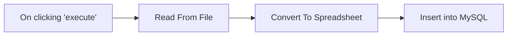

## Fluxo (.json) :

```json
{
  "meta": {
    "instanceId": "dfdeafd1c3ed2ee08eeab8c2fa0c3f522066931ed8138ccd35dc20a1e69decd3"
  },
  "nodes": [
    {
      "id": "aecce7a8-24f6-48c0-a7f0-f48a421d1d8c",
      "name": "On clicking 'execute'",
      "type": "n8n-nodes-base.manualTrigger",
      "position": [
        540,
        400
      ],
      "parameters": {},
      "typeVersion": 1
    },
    {
      "id": "66822f20-83a9-4272-920c-5d8c9140f912",
      "name": "Read From File",
      "type": "n8n-nodes-base.readBinaryFile",
      "position": [
        740,
        400
      ],
      "parameters": {
        "filePath": "/home/node/.n8n/concerts-2023.csv"
      },
      "typeVersion": 1
    },
    {
      "id": "9b469774-7c1d-41a3-9bfe-18fc3527f96e",
      "name": "Convert To Spreadsheet",
      "type": "n8n-nodes-base.spreadsheetFile",
      "position": [
        940,
        400
      ],
      "parameters": {
        "options": {
          "rawData": true,
          "readAsString": true
        }
      },
      "typeVersion": 1
    },
    {
      "id": "a10bd105-16f7-47c8-b5a0-a5a10e51ae10",
      "name": "Insert into MySQL",
      "type": "n8n-nodes-base.mySql",
      "position": [
        1140,
        400
      ],
      "parameters": {
        "table": {
          "__rl": true,
          "mode": "name",
          "value": "concerts_2023_csv"
        },
        "columns": "Date, Band, ConcertName, Country, City, Location, LocationAddress",
        "options": {}
      },
      "credentials": {
        "mySql": {
          "id": "46",
          "name": "MySQL n8n articles"
        }
      },
      "typeVersion": 1
    }
  ],
  "connections": {
    "Read From File": {
      "main": [
        [
          {
            "node": "Convert To Spreadsheet",
            "type": "main",
            "index": 0
          }
        ]
      ]
    },
    "On clicking 'execute'": {
      "main": [
        [
          {
            "node": "Read From File",
            "type": "main",
            "index": 0
          }
        ]
      ]
    },
    "Convert To Spreadsheet": {
      "main": [
        [
          {
            "node": "Insert into MySQL",
            "type": "main",
            "index": 0
          }
        ]
      ]
    }
  }
}
```

<a id="template-721"></a>

## Template 721 - Recomendação de Receita da Semana

- **Nome:** Recomendação de Receita da Semana
- **Descrição:** Este fluxo seleciona uma sugestão de receita da programação da Hello Fresh da semana atual, usando o cardápio disponível, um banco de dados de receitas e uma API de recomendação para entregar a melhor opção ao usuário, conforme preferências positivas/negativas.
- **Funcionalidade:** • Obter o menu da semana atual: Coleta o cardápio atualizado para a semana corrente para uso na recomendação.
• Carregar receitas do banco de dados: Busca e disponibiliza receitas armazenadas para combinar com o cardápio.
• Executar recomendação via API externa: Envia dados do cardápio e preferências (positivas/negativas) para sugerir uma receita.
• Mesclar informações de curso e receita: Une o tipo de refeição com os detalhes da receita para formar a sugestão.
• Gerar e apresentar a recomendação ao usuário: Formata a sugestão com detalhes relevantes e instruções.
• Restringir a recomendação à semana atual: Garante que apenas receitas da semana vigente sejam consideradas.
• Tratamento de falhas: Caso não haja recomendações, direciona o usuário para visitar o site HelloFresh.
- **Ferramentas:** • Qdrant Recommend API: Serviço de recomendação utilizado para sugerir receitas com base nos dados do cardápio e nas preferências do usuário.
• SQLite: Banco de dados utilizado para armazenar informações de receitas para consulta.
• HelloFresh Menu: Fonte de dados do cardápio da semana para a recomendação.
• API externa de cardápio/Hello Fresh: Serviço que fornece o cardápio da semana para uso no fluxo.

## Fluxo (.json) :

```json
{
  "\"id\"": "\"39191834-ecc2-46f0-a31a-0a7e9c47ac5d\",",
  "\"key\"": "\"instructions\",",
  "\"url\"": "\"=http://qdrant:6333/collections/hello_fresh/points/recommend/groups\",",
  "\"__rl\"": "true,",
  "\"main\"": "[",
  "\"meta\"": "{",
  "\"mode\"": "\"list\",",
  "\"name\"": "\"Sticky Note8\",",
  "\"node\"": "\"Default Data Loader\",",
  "\"type\"": "\"ai_textSplitter\",",
  "\"color\"": "7,",
  "\"index\"": "0",
  "\"model\"": "\"mistral-large-2402\",",
  "\"nodes\"": "[",
  "\"value\"": "\"hello_fresh\",",
  "\"width\"": "213.30551928619226,",
  "\"amount\"": "1.1",
  "\"fields\"": "{",
  "\"height\"": "332.38559808882246,",
  "\"jsCode\"": "\"const pageData = JSON.parse($input.first().json.data)\\nreturn pageData.props.pageProps.ssrPayload.courses.slice(0, 10);\"",
  "\"method\"": "\"POST\",",
  "\"values\"": "[",
  "\"ai_tool\"": "[",
  "\"content\"": "\"\\n\\n\\n\\n\\n\\n\\n\\n\\n\\n\\n\\n\\n\\n\\n\\n### 🚨Configure Your Qdrant Connection\\n* Be sure to enter your endpoint address\"",
  "\"options\"": "{},",
  "\"pinData\"": "{},",
  "\"jsonData\"": "\"={{ $json.data }}\",",
  "\"jsonMode\"": "\"expressionData\"",
  "\"language\"": "\"python\",",
  "\"metadata\"": "{",
  "\"position\"": "[",
  "\"sendBody\"": "true,",
  "\"operation\"": "\"extractHtmlContent\",",
  "\"qdrantApi\"": "{",
  "\"webhookId\"": "\"e86d8ae4-3b0d-4c40-9d12-a11d6501a043\",",
  "\"Get Recipe\"": "{",
  "\"instanceId\"": "\"26ba763460b97c249b82942b23b6384876dfeb9327513332e743c5f6219c2b8e\"",
  "\"parameters\"": "{",
  "\"pythonCode\"": "\"import sqlite3\\ncon = sqlite3.connect(\\\"hello_fresh_1.db\\\")\\n\\ncur = con.cursor()\\ncur.execute(\\\"CREATE TABLE IF NOT EXISTS recipes (id TEXT PRIMARY KEY, name TEXT, data TEXT, cuisine TEXT, category TEXT, tag TEXT, week TEXT);\\\")\\n\\nfor item in _input.all():\\n cur.execute('INSERT OR REPLACE INTO recipes VALUES(?,?,?,?,?,?,?)', (\\n item.json.id,\\n item.json.name,\\n item.json.data,\\n ','.join(item.json.cuisine),\\n item.json.category,\\n ','.join(item.json.tag),\\n item.json.week\\n ))\\n\\ncon.commit()\\ncon.close()\\n\\nreturn [{ \\\"affected_rows\\\": len(_input.all()) }]\"",
  "\"schemaType\"": "\"manual\",",
  "\"trimValues\"": "false,",
  "\"workflowId\"": "\"={{ $workflow.id }}\",",
  "\"ai_document\"": "[",
  "\"assignments\"": "[",
  "\"cleanUpText\"": "true",
  "\"connections\"": "{",
  "\"credentials\"": "{",
  "\"cssSelector\"": "\"[data-test-id=\\\"instructions\\\"]\",",
  "\"description\"": "\"Call this tool to get a recipe recommendation. Pass in the following params as a json object:\\n* positives - a description of what the user wants to cook. This could be ingredients, flavours, utensils available, number of diners, type of meal etc.\\n* negatives - a description of what the user wants to avoid in the recipe. This could be flavours to avoid, allergen considerations, conflicts with theme of meal etc.\",",
  "\"inputSchema\"": "\"{\\n\\\"type\\\": \\\"object\\\",\\n\\\"properties\\\": {\\n\\t\\\"positive\\\": {\\n\\t\\t\\\"type\\\": \\\"string\\\",\\n\\t\\t\\\"description\\\": \\\"a description of what the user wants to cook. This could be ingredients, flavours, utensils available, number of diners, type of meal etc.\\\"\\n\\t},\\n \\\"negative\\\": {\\n \\\"type\\\": \\\"string\\\",\\n \\\"description\\\": \\\"a description of what the user wants to avoid in the recipe. This could be flavours to avoid, allergen considerations, conflicts with theme of meal etc.\\\"\\n }\\n}\\n}\",",
  "\"stringValue\"": "\"={{ $now.year }}-W{{ $now.weekNumber }}\"",
  "\"typeVersion\"": "1",
  "\"Chat Trigger\"": "{",
  "\"ai_embedding\"": "[",
  "\"skipSelectors\"": "\"img,a\"",
  "\"systemMessage\"": "\"=You are a recipe bot for the company, \\\"Hello fresh\\\". You will help the user choose which Hello Fresh recipe to choose from this week's menu. The current week is {{ $now.year }}-W{{ $now.weekNumber }}.\\nDo not recommend any recipes other from the current week's menu. If there are no recipes to recommend, please ask the user to visit the website instead https://hellofresh.com.\"",
  "\"authentication\"": "\"predefinedCredentialType\",",
  "\"bodyParameters\"": "{",
  "\"metadataValues\"": "[",
  "\"ai_textSplitter\"": "[",
  "\"combinationMode\"": "\"mergeByPosition\"",
  "\"mistralCloudApi\"": "{",
  "\"ai_languageModel\"": "[",
  "\"cachedResultName\"": "\"hello_fresh\"",
  "\"extractionValues\"": "{",
  "\"qdrantCollection\"": "{",
  "\"Prepare Documents\"": "{",
  "\"nodeCredentialType\"": "\"qdrantApi\"",
  "\"specifyInputSchema\"": "true",
  "\"Default Data Loader\"": "{",
  "\"Extract Server Data\"": "{",
  "\"Get Course Metadata\"": "{",
  "\"Get Recipes From DB\"": "{",
  "\"Get This Week's Menu\"": "{",
  "\"Qdrant Recommend API\"": "{",
  "\"Wait for Rate Limits\"": "{",
  "\"Merge Course & Recipe\"": "{",
  "\"Extract Recipe Details\"": "{",
  "\"Get Mistral Embeddings\"": "{",
  "\"Embeddings Mistral Cloud\"": "{",
  "\"Execute Workflow Trigger\"": "{",
  "\"Mistral Cloud Chat Model\"": "{",
  "\"Use Qdrant Recommend API\"": "{",
  "\"Extract Available Courses\"": "{",
  "\"When clicking \\\"Test workflow\\\"\"": "{",
  "\"Recursive Character Text Splitter\"": "{"
}
```
