# PACK 1999 TEMPLATES PARTE 04 - Bloco 7

Templates neste bloco: 20

## Sumário

- [Template 722 - Exportar tabela SQL para CSV](#template-722)
- [Template 723 - Detecção de texto em imagem com OCR e registro](#template-723)
- [Template 724 - Publicar vídeo do Drive em Instagram, TikTok e YouTube](#template-724)
- [Template 725 - Rastreador de despesas via chat para Google Sheets](#template-725)
- [Template 726 - Atendimento e vendas para capas Apple](#template-726)
- [Template 727 - Gatilho de agendamento Acuity](#template-727)
- [Template 728 - Cadeia LLM customizada e agente com pesquisa Wikipedia](#template-728)
- [Template 729 - Geração automática de certificados via formulário](#template-729)
- [Template 730 - Nova lista criada no Affinity](#template-730)
- [Template 731 - Roteamento de chat para calendário e tarefas](#template-731)
- [Template 732 - Monitoramento de mudanças em página web](#template-732)
- [Template 733 - Indexação por objetos para busca de imagens](#template-733)
- [Template 734 - Monitor de procedimentos sustentáveis da UE](#template-734)
- [Template 735 - Agente IA para Airtable e análise de dados](#template-735)
- [Template 736 - Geração automática de flashcards em mandarim](#template-736)
- [Template 737 - Integração JotForm → KlickTipp com transformação de dados e tagging](#template-737)
- [Template 738 - Box: monitoramento de MOVED/DOWNLOADED em item específico](#template-738)
- [Template 739 - Extrator de logo-sheets para Airtable](#template-739)
- [Template 740 - Integração Typeform → KlickTipp com gestão de tags](#template-740)
- [Template 741 - Tutor de Chinês com Telegram e Sheets](#template-741)

---

<a id="template-722"></a>

## Template 722 - Exportar tabela SQL para CSV

- **Nome:** Exportar tabela SQL para CSV
- **Descrição:** Exporta o conteúdo de uma tabela SQL para um arquivo CSV, criando um ficheiro nomeado com o nome da tabela.
- **Funcionalidade:** • Início manual: permite executar o fluxo manualmente quando desejado.
• Definição do nome da tabela: especifica qual tabela SQL será consultada (ex.: SalesLT.ProductCategory).
• Execução da consulta SQL: obtém todos os registos da tabela especificada através de uma consulta SELECT.
• Geração de ficheiro CSV: converte os dados retornados pela consulta para um ficheiro CSV e grava com um nome baseado na tabela.
• Preparado para ações adicionais: o ficheiro gerado pode ser enviado por e-mail, enviado para armazenamento ou disponibilizado para download conectando etapas adicionais.
- **Ferramentas:** • Microsoft SQL: base de dados relacional utilizada como fonte dos dados.
• Armazenamento de ficheiros / sistema de ficheiros: local ou serviço onde o CSV é gravado e a partir do qual pode ser partilhado ou transferido.

## Fluxo visual

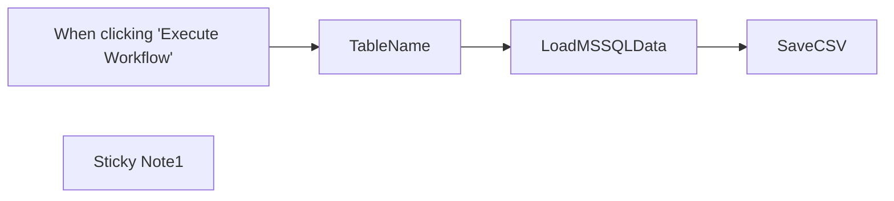

## Fluxo (.json) :

```json
{
  "meta": {
    "instanceId": "dfdeafd1c3ed2ee08eeab8c2fa0c3f522066931ed8138ccd35dc20a1e69decd3"
  },
  "nodes": [
    {
      "id": "4e670880-61cf-4870-8d29-525f4e677162",
      "name": "When clicking \"Execute Workflow\"",
      "type": "n8n-nodes-base.manualTrigger",
      "position": [
        -40,
        600
      ],
      "parameters": {},
      "typeVersion": 1
    },
    {
      "id": "cd21e063-59fe-42a5-87c7-b4d63df2e2b7",
      "name": "Sticky Note1",
      "type": "n8n-nodes-base.stickyNote",
      "position": [
        500,
        480
      ],
      "parameters": {
        "width": 682,
        "height": 280,
        "content": "## Save SQL table as a CSV file\n### You can send it via e-mail, upload to the file storage or download on your computer.\n### Just connect one or two extra n8n Nodes here!"
      },
      "typeVersion": 1
    },
    {
      "id": "f960451e-d04e-4023-aed2-e039898b7cab",
      "name": "TableName",
      "type": "n8n-nodes-base.set",
      "position": [
        160,
        600
      ],
      "parameters": {
        "values": {
          "string": [
            {
              "name": "TableName",
              "value": "SalesLT.ProductCategory"
            }
          ]
        },
        "options": {}
      },
      "typeVersion": 1
    },
    {
      "id": "e2b4f557-663e-4b1c-b90e-9fde44dcd63a",
      "name": "LoadMSSQLData",
      "type": "n8n-nodes-base.microsoftSql",
      "position": [
        340,
        600
      ],
      "parameters": {
        "query": "=SELECT * FROM {{ $json[\"TableName\"] }}",
        "operation": "executeQuery"
      },
      "credentials": {
        "microsoftSql": {
          "id": "69",
          "name": "Microsoft SQL account"
        }
      },
      "typeVersion": 1
    },
    {
      "id": "cec2452f-e3e9-47ad-bcc6-4d411b1cd532",
      "name": "SaveCSV",
      "type": "n8n-nodes-base.spreadsheetFile",
      "position": [
        760,
        600
      ],
      "parameters": {
        "options": {
          "fileName": "={{ $('TableName').first().json.TableName }}.{{ $parameter[\"fileFormat\"] }}"
        },
        "operation": "toFile",
        "fileFormat": "csv"
      },
      "typeVersion": 1
    }
  ],
  "connections": {
    "TableName": {
      "main": [
        [
          {
            "node": "LoadMSSQLData",
            "type": "main",
            "index": 0
          }
        ]
      ]
    },
    "LoadMSSQLData": {
      "main": [
        [
          {
            "node": "SaveCSV",
            "type": "main",
            "index": 0
          }
        ]
      ]
    },
    "When clicking \"Execute Workflow\"": {
      "main": [
        [
          {
            "node": "TableName",
            "type": "main",
            "index": 0
          }
        ]
      ]
    }
  }
}
```

<a id="template-723"></a>

## Template 723 - Detecção de texto em imagem com OCR e registro

- **Nome:** Detecção de texto em imagem com OCR e registro
- **Descrição:** Este fluxo obtém uma imagem a partir de uma URL, aplica OCR para extrair textos, consolida o texto detectado e registra informações da imagem (nome, link e texto) em uma planilha.
- **Funcionalidade:** • Obter imagem de uma URL: faz o download da imagem para processamento.
• Detectar texto na imagem: utiliza OCR para extrair textos visíveis.
• Consolidar textos detectados: cria uma string com as detecções relevantes.
• Padronizar o texto: transforma o texto extraído em minúsculas para consistência.
• Registrar resultados: salva o nome da imagem, o link e o texto detectado em uma planilha.
- **Ferramentas:** • AWS Rekognition: Serviço de detecção de texto em imagens usado para extrair o conteúdo textual.
• Google Sheets: Planilha onde os dados extraídos são registrados.

## Fluxo visual

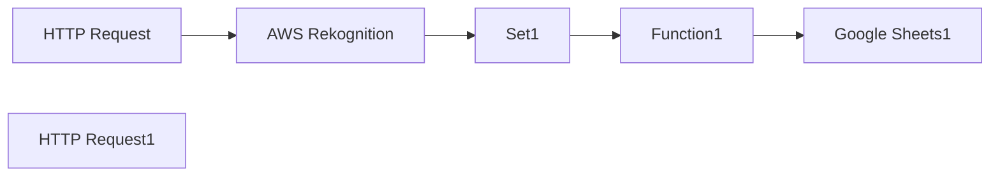

## Fluxo (.json) :

```json
{
  "nodes": [
    {
      "name": "AWS Rekognition",
      "type": "n8n-nodes-base.awsRekognition",
      "position": [
        680,
        700
      ],
      "parameters": {
        "type": "detectText",
        "binaryData": true,
        "additionalFields": {}
      },
      "credentials": {
        "aws": {
          "id": "9",
          "name": "aws"
        }
      },
      "typeVersion": 1
    },
    {
      "name": "HTTP Request",
      "type": "n8n-nodes-base.httpRequest",
      "position": [
        500,
        700
      ],
      "parameters": {
        "url": "https://www.nicepng.com/png/detail/54-542069_motivational-quotes-png.png",
        "options": {},
        "responseFormat": "file",
        "queryParametersUi": {
          "parameter": []
        },
        "headerParametersUi": {
          "parameter": []
        }
      },
      "typeVersion": 1
    },
    {
      "name": "HTTP Request1",
      "type": "n8n-nodes-base.httpRequest",
      "disabled": true,
      "position": [
        500,
        860
      ],
      "parameters": {
        "url": "https://www.googleapis.com/customsearch/v1?key=[YOUR_KEY]&cx=[YOUR_CX]&q=office&searchType=image",
        "options": {},
        "queryParametersUi": {
          "parameter": []
        },
        "headerParametersUi": {
          "parameter": []
        }
      },
      "typeVersion": 1
    },
    {
      "name": "Set1",
      "type": "n8n-nodes-base.set",
      "position": [
        860,
        700
      ],
      "parameters": {
        "values": {
          "number": [],
          "string": [
            {
              "name": "img_name",
              "value": "={{$node[\"HTTP Request\"].binary.data.fileName}}"
            },
            {
              "name": "img_link",
              "value": "={{$node[\"HTTP Request\"].parameter[\"url\"]}}"
            },
            {
              "name": "img_txt",
              "value": "={{$json[\"TextDetections\"][1][\"DetectedText\"]}} {{$json[\"TextDetections\"][2][\"DetectedText\"]}}{{$json[\"TextDetections\"][3][\"DetectedText\"]}} {{$json[\"TextDetections\"][4][\"DetectedText\"]}} {{$json[\"TextDetections\"][5][\"DetectedText\"]}}"
            }
          ]
        },
        "options": {},
        "keepOnlySet": true
      },
      "typeVersion": 1
    },
    {
      "name": "Function1",
      "type": "n8n-nodes-base.function",
      "position": [
        1040,
        700
      ],
      "parameters": {
        "functionCode": "for (item of items) {\n  item.json.lowerText = $node[\"Set1\"].json[\"img_txt\"].toLowerCase();\n}\nconsole.log('Done!');\n\nreturn items;"
      },
      "typeVersion": 1
    },
    {
      "name": "Google Sheets1",
      "type": "n8n-nodes-base.googleSheets",
      "position": [
        1220,
        700
      ],
      "parameters": {
        "options": {},
        "sheetId": "qwertz",
        "operation": "append",
        "authentication": "oAuth2"
      },
      "credentials": {
        "googleSheetsOAuth2Api": {
          "id": "2",
          "name": "google_sheets_oauth"
        }
      },
      "typeVersion": 1
    }
  ],
  "connections": {
    "Set1": {
      "main": [
        [
          {
            "node": "Function1",
            "type": "main",
            "index": 0
          }
        ]
      ]
    },
    "Function1": {
      "main": [
        [
          {
            "node": "Google Sheets1",
            "type": "main",
            "index": 0
          }
        ]
      ]
    },
    "HTTP Request": {
      "main": [
        [
          {
            "node": "AWS Rekognition",
            "type": "main",
            "index": 0
          }
        ]
      ]
    },
    "AWS Rekognition": {
      "main": [
        [
          {
            "node": "Set1",
            "type": "main",
            "index": 0
          }
        ]
      ]
    }
  }
}
```

<a id="template-724"></a>

## Template 724 - Publicar vídeo do Drive em Instagram, TikTok e YouTube

- **Nome:** Publicar vídeo do Drive em Instagram, TikTok e YouTube
- **Descrição:** Detecta novos vídeos em uma pasta do Google Drive, extrai o áudio para gerar uma descrição com OpenAI e publica o vídeo em Instagram, TikTok e YouTube, com notificações de erro via Telegram.
- **Funcionalidade:** • Monitoramento de pasta no Google Drive: Observa uma pasta específica e aciona a automação quando um novo arquivo é criado.
• Download automático do arquivo: Faz o download do vídeo recém-detectado para processamento.
• Armazenamento temporário local do arquivo: Grava o arquivo em disco para uso posterior como dado binário.
• Extração e transcrição de áudio: Extrai o áudio do vídeo e gera a transcrição para uso na criação de descrições.
• Geração de descrição/título otimizado: Utiliza um modelo de linguagem para produzir uma descrição atraente baseada na transcrição do áudio.
• Upload para múltiplas plataformas via API: Envia o vídeo e a descrição para TikTok, Instagram e YouTube usando a API do serviço de publicação.
• Tratamento de erros e notificações: Filtra erros específicos e envia alertas por Telegram em caso de falhas relevantes.
- **Ferramentas:** • Google Drive: Fonte e armazenamento dos vídeos que acionam a automação.
• OpenAI: Serviço utilizado para transcrever o áudio e gerar descrições/títulos otimizados.
• upload-post.com: Plataforma/API usada para publicar os vídeos nas plataformas (envio multipart com token de API).
• Telegram: Canal para enviar notificações de erro e alertas operacionais.
• Sistema de arquivos local: Armazena temporariamente o arquivo de vídeo como binário para envio às APIs.


## Fluxo visual

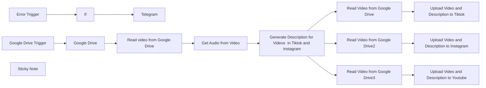

## Fluxo (.json) :

```json
{
  "id": "9nBQ1BfwxLhuzTcK",
  "meta": {
    "instanceId": "3378b0d68c3b7ebfc71b79896d94e1a044dec38e99a1160aed4e9c323910fbe2"
  },
  "name": "google drive to instagram, tiktok and youtube",
  "tags": [],
  "nodes": [
    {
      "id": "b6c1d2f5-a8de-42dc-a164-3b1e80b2f19d",
      "name": "Google Drive Trigger",
      "type": "n8n-nodes-base.googleDriveTrigger",
      "position": [
        220,
        320
      ],
      "parameters": {
        "event": "fileCreated",
        "options": {},
        "pollTimes": {
          "item": [
            {
              "mode": "everyMinute"
            }
          ]
        },
        "triggerOn": "specificFolder",
        "folderToWatch": {
          "__rl": true,
          "mode": "list",
          "value": "18m0i341QLQuyWuHv_FBdz8-r-QDtofYm",
          "cachedResultUrl": "https://drive.google.com/drive/folders/18m0i341QLQuyWuHv_FBdz8-r-QDtofYm",
          "cachedResultName": "Influencersde"
        }
      },
      "credentials": {
        "googleDriveOAuth2Api": {
          "id": "2TbhWtnbRfSloGxX",
          "name": "Google Drive account"
        }
      },
      "typeVersion": 1
    },
    {
      "id": "1dda484a-f6f5-4677-85a3-09b2a47e69c4",
      "name": "Google Drive",
      "type": "n8n-nodes-base.googleDrive",
      "position": [
        400,
        320
      ],
      "parameters": {
        "fileId": {
          "__rl": true,
          "mode": "",
          "value": "={{ $json.id || $json.data[0].id }}"
        },
        "options": {},
        "operation": "download",
        "authentication": "oAuth2"
      },
      "credentials": {
        "googleDriveOAuth2Api": {
          "id": "2TbhWtnbRfSloGxX",
          "name": "Google Drive account"
        }
      },
      "retryOnFail": true,
      "typeVersion": 1,
      "waitBetweenTries": 5000
    },
    {
      "id": "f9388923-b20e-40f0-ba10-fd00b463b1a7",
      "name": "Error Trigger",
      "type": "n8n-nodes-base.errorTrigger",
      "position": [
        620,
        660
      ],
      "parameters": {},
      "typeVersion": 1
    },
    {
      "id": "eda45ad6-d976-4665-9b6d-dae4c3212191",
      "name": "Telegram",
      "type": "n8n-nodes-base.telegram",
      "position": [
        960,
        640
      ],
      "webhookId": "f6729386-9905-45f1-800f-4fe01a06ac9c",
      "parameters": {
        "text": "=🔔 ERROR SUBIENDO VIDEOS",
        "additionalFields": {
          "appendAttribution": false
        }
      },
      "retryOnFail": true,
      "typeVersion": 1.2,
      "waitBetweenTries": 5000
    },
    {
      "id": "7b1d6015-49b8-423c-be64-e905ff791574",
      "name": "If",
      "type": "n8n-nodes-base.if",
      "position": [
        760,
        660
      ],
      "parameters": {
        "options": {},
        "conditions": {
          "options": {
            "version": 1,
            "leftValue": "",
            "caseSensitive": true,
            "typeValidation": "strict"
          },
          "combinator": "and",
          "conditions": [
            {
              "id": "9fadb3fd-2547-42bd-8f40-f410a97dcf57",
              "operator": {
                "type": "string",
                "operation": "notContains"
              },
              "leftValue": "={{ $json.trigger.error.message }}",
              "rightValue": "The DNS server returned an error, perhaps the server is offline"
            }
          ]
        }
      },
      "typeVersion": 2.1
    },
    {
      "id": "6e9882aa-b11f-4c1a-8600-eedda9d92046",
      "name": "Sticky Note",
      "type": "n8n-nodes-base.stickyNote",
      "position": [
        -220,
        0
      ],
      "parameters": {
        "width": 860,
        "height": 260,
        "content": "## Description\nThis automation allows you to upload a video to a configured Google Drive folder, and it will automatically create descriptions and upload it to Instagram and TikTok.\n\n## How to Use\n1. Generate an API token at upload-post.com and add to Upload to Tiktok and Upload to Instagram nodes\n2. Configure your Google Drive folder\n3. Customize the OpenAI prompt for your specific use case\n4. Optional: Configure Telegram for error notifications\n\n## Requirements\n- upload-post.com account\n- Google Drive account\n- OpenAI API key\n"
      },
      "typeVersion": 1
    },
    {
      "id": "b3eed1dc-8273-4593-ab07-8860fffa0907",
      "name": "Get Audio from Video",
      "type": "@n8n/n8n-nodes-langchain.openAi",
      "notes": "Extract the audio from video for generate the description",
      "position": [
        860,
        320
      ],
      "parameters": {
        "options": {},
        "resource": "audio",
        "operation": "transcribe"
      },
      "credentials": {
        "openAiApi": {
          "id": "XJdxgMSXFgwReSsh",
          "name": "n8n key"
        }
      },
      "notesInFlow": true,
      "retryOnFail": true,
      "typeVersion": 1,
      "waitBetweenTries": 5000
    },
    {
      "id": "b057fea0-087e-4c7f-b5ac-6d16ca658437",
      "name": "Read video from Google Drive",
      "type": "n8n-nodes-base.writeBinaryFile",
      "position": [
        580,
        320
      ],
      "parameters": {
        "options": {},
        "fileName": "={{ $json.originalFilename.replaceAll(\" \", \"_\") }}"
      },
      "typeVersion": 1
    },
    {
      "id": "f9296b8f-b631-4df4-b8b5-aa7139dd65cd",
      "name": "Generate Description for Videos  in Tiktok and Instagram",
      "type": "@n8n/n8n-nodes-langchain.openAi",
      "notes": "Request to OpenAi for generate description with the audio extracted from the video",
      "position": [
        1060,
        320
      ],
      "parameters": {
        "modelId": {
          "__rl": true,
          "mode": "list",
          "value": "gpt-4o",
          "cachedResultName": "GPT-4O"
        },
        "options": {},
        "messages": {
          "values": [
            {
              "role": "system",
              "content": "You are an expert assistant in creating engaging social media video titles."
            },
            {
              "content": "=I'm going to upload a video to social media. Here are some examples of descriptions that have worked well on Instagram:\n\nFollow and save for later. Discover InfluencersDe, the AI tool that automates TikTok creation and publishing to drive traffic to your website. Perfect for entrepreneurs and brands.\n#digitalmarketing #ugc #tiktok #ai #influencersde #contentcreation\n\nDiscover the video marketing revolution with InfluencersDe!\n.\n.\n.\n#socialmedia #videomarketing #ai #tiktok #influencersde #growthhacking\n\nDon't miss InfluencersDe, the tool that transforms your marketing strategy with just one click!\n.\n.\n.\n#ugc #ai #tiktok #digitalmarketing #influencersde #branding\n\nCan you create another title for the Instagram post based on this recognized audio from the video?\n\nAudio: {{ $('Get Audio from Video').item.json.text }}\n\nIMPORTANT: Reply only with the description, don't add anything else."
            }
          ]
        }
      },
      "credentials": {
        "openAiApi": {
          "id": "XJdxgMSXFgwReSsh",
          "name": "n8n key"
        }
      },
      "notesInFlow": true,
      "retryOnFail": true,
      "typeVersion": 1.4,
      "waitBetweenTries": 5000
    },
    {
      "id": "e80758fd-5532-48b0-b663-085629137fc0",
      "name": "Read Video from Google Drive",
      "type": "n8n-nodes-base.readBinaryFile",
      "position": [
        1620,
        100
      ],
      "parameters": {
        "filePath": "={{ $('Read video from Google Drive').item.json.originalFilename.replaceAll(\" \", \"_\") }}",
        "dataPropertyName": "datavideo"
      },
      "typeVersion": 1
    },
    {
      "id": "8f13c601-4282-4a44-8e8a-dc88e4165ee4",
      "name": "Read Video from Google Drive2",
      "type": "n8n-nodes-base.readBinaryFile",
      "position": [
        1620,
        400
      ],
      "parameters": {
        "filePath": "={{ $('Read video from Google Drive').item.json.originalFilename.replaceAll(\" \", \"_\") }}",
        "dataPropertyName": "datavideo"
      },
      "typeVersion": 1
    },
    {
      "id": "1b46976e-be37-49bd-b77b-e48d8e619954",
      "name": "Upload Video and Description to Tiktok",
      "type": "n8n-nodes-base.httpRequest",
      "notes": "Generate in upload-post.com the token and add to the credentials in the header-> Authorization: Apikey (token here)",
      "position": [
        1880,
        100
      ],
      "parameters": {
        "url": "https://api.upload-post.com/api/upload",
        "method": "POST",
        "options": {},
        "sendBody": true,
        "contentType": "multipart-form-data",
        "authentication": "genericCredentialType",
        "bodyParameters": {
          "parameters": [
            {
              "name": "title",
              "value": "={{ $('Generate Description for Videos  in Tiktok and Instagram').item.json.message.content.replaceAll(\"\\\"\", \"\") }}"
            },
            {
              "name": "platform[]",
              "value": "tiktok"
            },
            {
              "name": "video",
              "parameterType": "formBinaryData",
              "inputDataFieldName": "datavideo"
            },
            {
              "name": "user",
              "value": "Add user generated in upload-post"
            }
          ]
        },
        "genericAuthType": "httpHeaderAuth"
      },
      "credentials": {
        "httpHeaderAuth": {
          "id": "WNjAx7UqrEZ1JDrR",
          "name": "VituManco"
        }
      },
      "notesInFlow": true,
      "typeVersion": 4.2
    },
    {
      "id": "0404a57f-2c1a-4ccd-90df-893dd01acaa0",
      "name": "Upload Video and Description to Instagram",
      "type": "n8n-nodes-base.httpRequest",
      "notes": "Generate in upload-post.com the token and add to the credentials in the header-> Authorization: Apikey (token here)",
      "position": [
        1880,
        400
      ],
      "parameters": {
        "url": "https://api.upload-post.com/api/upload",
        "method": "POST",
        "options": {},
        "sendBody": true,
        "contentType": "multipart-form-data",
        "authentication": "genericCredentialType",
        "bodyParameters": {
          "parameters": [
            {
              "name": "title",
              "value": "={{ $('Generate Description for Videos  in Tiktok and Instagram').item.json.message.content.replaceAll(\"\\\"\", \"\") }}"
            },
            {
              "name": "platform[]",
              "value": "instagram"
            },
            {
              "name": "video",
              "parameterType": "formBinaryData",
              "inputDataFieldName": "datavideo"
            },
            {
              "name": "user",
              "value": "Add user generated in upload-post"
            }
          ]
        },
        "genericAuthType": "httpHeaderAuth"
      },
      "credentials": {
        "httpHeaderAuth": {
          "id": "47dO31ED0WIaJkR6",
          "name": "Header Auth account"
        }
      },
      "notesInFlow": true,
      "typeVersion": 4.2
    },
    {
      "id": "358da7b7-2d0a-475b-a10d-ffc499b5e99d",
      "name": "Read Video from Google Drive3",
      "type": "n8n-nodes-base.readBinaryFile",
      "position": [
        1620,
        660
      ],
      "parameters": {
        "filePath": "={{ $('Read video from Google Drive').item.json.originalFilename.replaceAll(\" \", \"_\") }}",
        "dataPropertyName": "datavideo"
      },
      "typeVersion": 1
    },
    {
      "id": "0e46ee9b-e466-4a5d-8916-3836eed4fc2d",
      "name": "Upload Video and Description to Youtube",
      "type": "n8n-nodes-base.httpRequest",
      "notes": "Generate in upload-post.com the token and add to the credentials in the header-> Authorization: Apikey (token here)",
      "position": [
        1880,
        660
      ],
      "parameters": {
        "url": "https://api.upload-post.com/api/upload",
        "method": "POST",
        "options": {},
        "sendBody": true,
        "contentType": "multipart-form-data",
        "authentication": "genericCredentialType",
        "bodyParameters": {
          "parameters": [
            {
              "name": "title",
              "value": "={{ $('Generate Description for Videos  in Tiktok and Instagram').item.json.message.content.replaceAll(\"\\\"\", \"\").substring(0, 70) }}\n"
            },
            {
              "name": "platform[]",
              "value": "youtube"
            },
            {
              "name": "video",
              "parameterType": "formBinaryData",
              "inputDataFieldName": "datavideo"
            },
            {
              "name": "user",
              "value": "test2"
            }
          ]
        },
        "genericAuthType": "httpHeaderAuth"
      },
      "credentials": {
        "httpHeaderAuth": {
          "id": "47dO31ED0WIaJkR6",
          "name": "Header Auth account"
        }
      },
      "notesInFlow": true,
      "typeVersion": 4.2
    }
  ],
  "active": false,
  "pinData": {},
  "settings": {
    "executionOrder": "v1"
  },
  "versionId": "13975e04-a6c4-42d0-887c-e6c4ff219f42",
  "connections": {
    "If": {
      "main": [
        [
          {
            "node": "Telegram",
            "type": "main",
            "index": 0
          }
        ]
      ]
    },
    "Google Drive": {
      "main": [
        [
          {
            "node": "Read video from Google Drive",
            "type": "main",
            "index": 0
          }
        ]
      ]
    },
    "Error Trigger": {
      "main": [
        [
          {
            "node": "If",
            "type": "main",
            "index": 0
          }
        ]
      ]
    },
    "Get Audio from Video": {
      "main": [
        [
          {
            "node": "Generate Description for Videos  in Tiktok and Instagram",
            "type": "main",
            "index": 0
          }
        ]
      ]
    },
    "Google Drive Trigger": {
      "main": [
        [
          {
            "node": "Google Drive",
            "type": "main",
            "index": 0
          }
        ]
      ]
    },
    "Read Video from Google Drive": {
      "main": [
        [
          {
            "node": "Upload Video and Description to Tiktok",
            "type": "main",
            "index": 0
          }
        ]
      ]
    },
    "Read video from Google Drive": {
      "main": [
        [
          {
            "node": "Get Audio from Video",
            "type": "main",
            "index": 0
          }
        ]
      ]
    },
    "Read Video from Google Drive2": {
      "main": [
        [
          {
            "node": "Upload Video and Description to Instagram",
            "type": "main",
            "index": 0
          }
        ]
      ]
    },
    "Read Video from Google Drive3": {
      "main": [
        [
          {
            "node": "Upload Video and Description to Youtube",
            "type": "main",
            "index": 0
          }
        ]
      ]
    },
    "Generate Description for Videos  in Tiktok and Instagram": {
      "main": [
        [
          {
            "node": "Read Video from Google Drive",
            "type": "main",
            "index": 0
          },
          {
            "node": "Read Video from Google Drive2",
            "type": "main",
            "index": 0
          },
          {
            "node": "Read Video from Google Drive3",
            "type": "main",
            "index": 0
          }
        ]
      ]
    }
  }
}
```

<a id="template-725"></a>

## Template 725 - Rastreador de despesas via chat para Google Sheets

- **Nome:** Rastreador de despesas via chat para Google Sheets
- **Descrição:** Recebe mensagens de chat com despesas, converte o texto em JSON estruturado e adiciona uma nova linha em uma planilha do Google, retornando uma confirmação ao usuário.
- **Funcionalidade:** • Recepção de mensagens de chat: ativa o fluxo ao receber mensagens via webhook/chat.
• Agente com modelo de linguagem: interpreta a mensagem do usuário e decide usar a ferramenta de salvamento.
• Extração de dados em JSON: converte texto livre em campos estruturados (cost, descr, date).
• Chamada de sub-rotina para salvar: invoca um sub-fluxo/ferramenta que processa e envia os dados para armazenamento.
• Salvamento na planilha: adiciona uma nova linha com msg, cost, date e descr na planilha especificada.
• Resposta de confirmação: retorna ao usuário a mensagem de confirmação no formato "Your expense saved, here is the output of save sub-workflow:[data]".
• Memória de contexto: mantém um buffer de memória da conversa para fornecer contexto entre interações.
- **Ferramentas:** • OpenAI: modelo de linguagem usado para interpretar e extrair informações estruturadas a partir do texto do usuário.
• Google Sheets: planilha onde as despesas são registradas como novas linhas.
• Interface de chat/webhook: ponto de entrada para receber mensagens dos usuários e enviar respostas.


## Fluxo visual

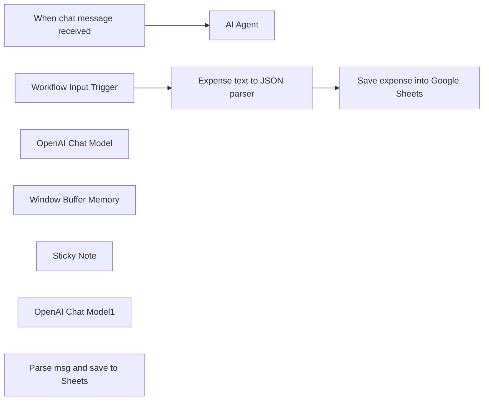

## Fluxo (.json) :

```json
{
  "id": "aLTkMiEDYXbMK4fT",
  "meta": {
    "instanceId": "5b860a91d7844b5237bb51cc58691ca8c3dc5b576f42d4d6bbedfb8d43d58ece",
    "templateCredsSetupCompleted": true
  },
  "name": "AI agent: expense tracker in Google Sheets and n8n chat",
  "tags": [],
  "nodes": [
    {
      "id": "9260b53e-6848-4f34-9643-311c58c807f6",
      "name": "AI Agent",
      "type": "@n8n/n8n-nodes-langchain.agent",
      "position": [
        360,
        40
      ],
      "parameters": {
        "options": {
          "maxIterations": 3,
          "systemMessage": "You are a helpful accountant. Use save to db tool to save expense message to DB. respond with \"Your expense saved, here is the output of save sub-workflow:[data]\""
        }
      },
      "typeVersion": 1.7
    },
    {
      "id": "0d7a686c-42c2-4223-9f78-b454788fb6da",
      "name": "When chat message received",
      "type": "@n8n/n8n-nodes-langchain.chatTrigger",
      "position": [
        0,
        40
      ],
      "webhookId": "6a34ec84-459d-4cc4-83b6-06ae4c99dc8f",
      "parameters": {
        "options": {}
      },
      "typeVersion": 1.1
    },
    {
      "id": "f1f27aaf-cf13-40d9-b8f9-800a862f8bf0",
      "name": "Workflow Input Trigger",
      "type": "n8n-nodes-base.executeWorkflowTrigger",
      "position": [
        180,
        600
      ],
      "parameters": {
        "workflowInputs": {
          "values": [
            {
              "name": "input1"
            }
          ]
        }
      },
      "typeVersion": 1.1
    },
    {
      "id": "a1530601-1a91-45be-adef-2e0608bfe773",
      "name": "OpenAI Chat Model",
      "type": "@n8n/n8n-nodes-langchain.lmChatOpenAi",
      "position": [
        340,
        300
      ],
      "parameters": {
        "options": {}
      },
      "credentials": {
        "openAiApi": {
          "id": "vHFEeel4RHFsjcMI",
          "name": "OpenAi account"
        }
      },
      "typeVersion": 1.1
    },
    {
      "id": "c6f9782e-6b9b-421e-8b10-9ef04cbbee8c",
      "name": "Window Buffer Memory",
      "type": "@n8n/n8n-nodes-langchain.memoryBufferWindow",
      "position": [
        500,
        300
      ],
      "parameters": {},
      "typeVersion": 1.3
    },
    {
      "id": "bbe1116a-1c66-496e-a9bf-747457e47bb0",
      "name": "Sticky Note",
      "type": "n8n-nodes-base.stickyNote",
      "position": [
        -760,
        200
      ],
      "parameters": {
        "width": 720,
        "height": 500,
        "content": "## Save your expenses via chat message. \n\nLLM will parse your message to structured JSON and save as a new row into Google Sheet.\n\n## Installation\n### 1. Set up Google Sheets:\nClone this Sheet:\nhttps://docs.google.com/spreadsheets/d/1D0r3tun7LF7Ypb21CmbTKEtn76WE-kaHvBCM5NdgiPU/edit?gid=0#gid=0\n\n(File -> Make a copy)\n\nChoose this sheet into \"Save expense into Google Sheets\" node.\n\n\n### 2. Fix sub-workflow dropdown: \nopen \"Parse msg and save to Sheets\" node (which is an n8n sub-workflow executor tool) and choose the SAME workflow in the dropdown. it will allow n8n to call \"Workflow Input Trigger\" properly when needed.\n\n\n### 3. Activate the workflow to make chat work properly.\nSent message to chat, something like \"car wash; 59.3 usd; 25 jan 2024\"\n\nyou should get a response:\nYour expense saved, here is the output of save sub-workflow:{\"cost\":59.3,\"descr\":\"car wash\",\"date\":\"2024-01-25\",\"msg\":\"car wash; 59.3 usd; 25 jan 2024\"}\n\nand new row in Google sheets should be inserted!"
      },
      "typeVersion": 1
    },
    {
      "id": "61a489f7-5b95-438a-81f0-1e3e8c445622",
      "name": "OpenAI Chat Model1",
      "type": "@n8n/n8n-nodes-langchain.lmChatOpenAi",
      "position": [
        400,
        900
      ],
      "parameters": {
        "options": {}
      },
      "credentials": {
        "openAiApi": {
          "id": "vHFEeel4RHFsjcMI",
          "name": "OpenAi account"
        }
      },
      "typeVersion": 1.1
    },
    {
      "id": "57908f61-ed9b-41a9-aba6-031bfc65bd31",
      "name": "Expense text to JSON parser",
      "type": "@n8n/n8n-nodes-langchain.informationExtractor",
      "position": [
        400,
        600
      ],
      "parameters": {
        "text": "=convert expense to JSON: \n\n{{ $json.input1 }}",
        "options": {},
        "attributes": {
          "attributes": [
            {
              "name": "cost",
              "type": "number",
              "required": true,
              "description": "expense cost"
            },
            {
              "name": "descr",
              "required": true,
              "description": "description of expense"
            },
            {
              "name": "date",
              "type": "date",
              "description": "date in UTC format. "
            }
          ]
        }
      },
      "typeVersion": 1
    },
    {
      "id": "23f123eb-c4d9-4e6c-a521-311498d40d61",
      "name": "Save expense into Google Sheets",
      "type": "n8n-nodes-base.googleSheets",
      "position": [
        760,
        600
      ],
      "parameters": {
        "columns": {
          "value": {
            "msg": "={{ $('Workflow Input Trigger').item.json.input1 }}",
            "cost": "={{ $json.output.cost }}",
            "date": "={{ $json.output.date ? $json.output.date : $now }}",
            "descr": "={{ $json.output.descr }}"
          },
          "schema": [
            {
              "id": "date",
              "type": "string",
              "display": true,
              "removed": false,
              "required": false,
              "displayName": "date",
              "defaultMatch": false,
              "canBeUsedToMatch": true
            },
            {
              "id": "cost",
              "type": "string",
              "display": true,
              "removed": false,
              "required": false,
              "displayName": "cost",
              "defaultMatch": false,
              "canBeUsedToMatch": true
            },
            {
              "id": "descr",
              "type": "string",
              "display": true,
              "removed": false,
              "required": false,
              "displayName": "descr",
              "defaultMatch": false,
              "canBeUsedToMatch": true
            },
            {
              "id": "msg",
              "type": "string",
              "display": true,
              "removed": false,
              "required": false,
              "displayName": "msg",
              "defaultMatch": false,
              "canBeUsedToMatch": true
            }
          ],
          "mappingMode": "defineBelow",
          "matchingColumns": [],
          "attemptToConvertTypes": false,
          "convertFieldsToString": false
        },
        "options": {
          "useAppend": true
        },
        "operation": "append",
        "sheetName": {
          "__rl": true,
          "mode": "list",
          "value": "gid=0",
          "cachedResultUrl": "https://docs.google.com/spreadsheets/d/1_BMLmh5MtmQarWuZIJANQZSkjaQ2Rc3YYLhwyz1Sec0/edit#gid=0",
          "cachedResultName": "Sheet1"
        },
        "documentId": {
          "__rl": true,
          "mode": "list",
          "value": "1_BMLmh5MtmQarWuZIJANQZSkjaQ2Rc3YYLhwyz1Sec0",
          "cachedResultUrl": "https://docs.google.com/spreadsheets/d/1_BMLmh5MtmQarWuZIJANQZSkjaQ2Rc3YYLhwyz1Sec0/edit?usp=drivesdk",
          "cachedResultName": "ai-expense"
        }
      },
      "credentials": {
        "googleSheetsOAuth2Api": {
          "id": "vowsrhMIxy2PRDbH",
          "name": "Google Sheets account"
        }
      },
      "typeVersion": 4.5
    },
    {
      "id": "83770030-eab1-499a-b743-fe639e34fbb2",
      "name": "Parse msg and save to Sheets",
      "type": "@n8n/n8n-nodes-langchain.toolWorkflow",
      "notes": "Make sure that this SAME workflow is chosen in the Workflow dropdown!",
      "position": [
        660,
        300
      ],
      "parameters": {
        "name": "save_expense_in_db",
        "workflowId": {
          "__rl": true,
          "mode": "list",
          "value": "aLTkMiEDYXbMK4fT",
          "cachedResultName": "sub-workflow1"
        },
        "description": "Call this tool to save expense in db.",
        "workflowInputs": {
          "value": {
            "input1": "={{ $json.chatInput }}"
          },
          "schema": [
            {
              "id": "input1",
              "type": "string",
              "display": true,
              "removed": false,
              "required": false,
              "displayName": "input1",
              "defaultMatch": false,
              "canBeUsedToMatch": true
            }
          ],
          "mappingMode": "defineBelow",
          "matchingColumns": [],
          "attemptToConvertTypes": false,
          "convertFieldsToString": false
        }
      },
      "notesInFlow": true,
      "typeVersion": 2
    }
  ],
  "active": true,
  "pinData": {},
  "settings": {
    "executionOrder": "v1"
  },
  "versionId": "9ab1bbef-ffe8-462c-a201-920c6d250ade",
  "connections": {
    "OpenAI Chat Model": {
      "ai_languageModel": [
        [
          {
            "node": "AI Agent",
            "type": "ai_languageModel",
            "index": 0
          }
        ]
      ]
    },
    "OpenAI Chat Model1": {
      "ai_languageModel": [
        [
          {
            "node": "Expense text to JSON parser",
            "type": "ai_languageModel",
            "index": 0
          }
        ]
      ]
    },
    "Window Buffer Memory": {
      "ai_memory": [
        [
          {
            "node": "AI Agent",
            "type": "ai_memory",
            "index": 0
          }
        ]
      ]
    },
    "Workflow Input Trigger": {
      "main": [
        [
          {
            "node": "Expense text to JSON parser",
            "type": "main",
            "index": 0
          }
        ]
      ]
    },
    "When chat message received": {
      "main": [
        [
          {
            "node": "AI Agent",
            "type": "main",
            "index": 0
          }
        ]
      ]
    },
    "Expense text to JSON parser": {
      "main": [
        [
          {
            "node": "Save expense into Google Sheets",
            "type": "main",
            "index": 0
          }
        ]
      ]
    },
    "Parse msg and save to Sheets": {
      "ai_tool": [
        [
          {
            "node": "AI Agent",
            "type": "ai_tool",
            "index": 0
          }
        ]
      ]
    }
  }
}
```

<a id="template-726"></a>

## Template 726 - Atendimento e vendas para capas Apple

- **Nome:** Atendimento e vendas para capas Apple
- **Descrição:** Fluxo de chat que atende clientes, consulta estoque, registra pedidos e atualiza inventário para uma loja de capas de celular.
- **Funcionalidade:** • Detecção de mensagens de chat: inicia o atendimento ao receber uma mensagem do cliente via webhook.
• Memória de contexto: mantém o histórico recente para conversas contínuas.
• Agente orientado por regras: executa lógica definida (quando checar estoque, pedir dados, criar pedido e atualizar estoque) e limita chamadas a uma ferramenta por turno.
• Consulta de estoque por modelo: busca opções na planilha com quantidade disponível, vendidos e imagem quando disponível.
• Exibição de imagens de produto: incorpora image_url junto ao texto quando presente.
• Resolução de ambiguidades: detecta nomes de produto duplicados e pede ao cliente que escolha entre opções numeradas.
• Coleta e validação de dados do cliente: solicita nome, telefone, endereço e quantidade antes de confirmar o pedido; verifica disponibilidade.
• Registro de pedido: grava os dados do pedido em uma planilha dedicada.
• Atualização de inventário: calcula nova quantidade disponível e vendidos, e atualiza a planilha com timestamp.
• Regras de segurança para IDs: só usa case_id retornados pela consulta de estoque; não inventa ou altera IDs.
• Mensagens padronizadas e idioma: sempre inicia respostas com "Welcome to My Apple Case." e responde em inglês ou Roman-Nepali conforme o cliente.
- **Ferramentas:** • OpenAI (GPT-4.1): motor de geração de linguagem usado pelo agente para interpretar solicitações e decidir ações.
• Google Sheets: armazenamento de inventário, registro de pedidos e atualização de quantidades.
• Webhook/Interface de chat: ponto de entrada das mensagens dos clientes para iniciar o fluxo de atendimento.


## Fluxo visual

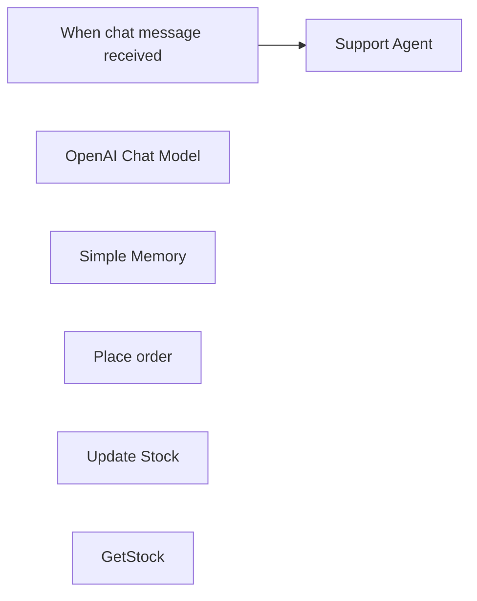

## Fluxo (.json) :

```json
{
  "id": "7Pw91QNT4UGeNmL5",
  "meta": {
    "instanceId": "95959af22bc98ea4ce12f3aa06514276ddf020a37e9465025051938d10308902",
    "templateCredsSetupCompleted": true
  },
  "name": "Customer and Sales Support",
  "tags": [],
  "nodes": [
    {
      "id": "99d711a1-2341-493b-ba56-e40e76e07d97",
      "name": "When chat message received",
      "type": "@n8n/n8n-nodes-langchain.chatTrigger",
      "position": [
        -360,
        -120
      ],
      "webhookId": "1de1a4dd-cea5-4c95-b489-6004601ff727",
      "parameters": {
        "public": true,
        "options": {
          "responseMode": "lastNode",
          "loadPreviousSession": "memory"
        },
        "initialMessages": "Hi! I’m Babish from Apple Case. How can I help?”"
      },
      "typeVersion": 1.1
    },
    {
      "id": "ab809cbb-0456-4a6f-b078-8a6f7bdbd4d0",
      "name": "OpenAI Chat Model",
      "type": "@n8n/n8n-nodes-langchain.lmChatOpenAi",
      "position": [
        60,
        260
      ],
      "parameters": {
        "model": {
          "__rl": true,
          "mode": "list",
          "value": "gpt-4.1",
          "cachedResultName": "gpt-4.1"
        },
        "options": {
          "maxTokens": 1024,
          "temperature": 0.3
        }
      },
      "credentials": {
        "openAiApi": {
          "id": "zqONgMf7CM0LERga",
          "name": "OpenAi DPL 2"
        }
      },
      "typeVersion": 1.2
    },
    {
      "id": "e74bc18b-3058-4658-83fd-85f9a45d3537",
      "name": "Simple Memory",
      "type": "@n8n/n8n-nodes-langchain.memoryBufferWindow",
      "position": [
        -220,
        240
      ],
      "parameters": {},
      "typeVersion": 1.3
    },
    {
      "id": "008d806b-e56d-4c37-b64d-2eb6792eefb5",
      "name": "Place order",
      "type": "n8n-nodes-base.googleSheetsTool",
      "position": [
        540,
        240
      ],
      "parameters": {
        "columns": {
          "value": {
            "Address": "={{ /*n8n-auto-generated-fromAI-override*/ $fromAI('Address', ``, 'string') }}",
            "Case ID": "={{ /*n8n-auto-generated-fromAI-override*/ $fromAI('Case_ID', ``, 'string') }}",
            "Quantity": "={{ /*n8n-auto-generated-fromAI-override*/ $fromAI('Quantity', ``, 'string') }}",
            "Case Name": "={{ /*n8n-auto-generated-fromAI-override*/ $fromAI('Case_Name', ``, 'string') }}",
            "Timestamp": "={{ /*n8n-auto-generated-fromAI-override*/ $fromAI('Timestamp', ``, 'string') }}",
            "Phone Model": "={{ /*n8n-auto-generated-fromAI-override*/ $fromAI('Phone_Model', ``, 'string') }}",
            "Phone Number": "={{ /*n8n-auto-generated-fromAI-override*/ $fromAI('Phone_Number', ``, 'string') }}",
            "Customer Name": "={{ /*n8n-auto-generated-fromAI-override*/ $fromAI('Customer_Name', ``, 'string') }}"
          },
          "schema": [
            {
              "id": "Timestamp",
              "type": "string",
              "display": true,
              "removed": false,
              "required": false,
              "displayName": "Timestamp",
              "defaultMatch": false,
              "canBeUsedToMatch": true
            },
            {
              "id": "Case ID",
              "type": "string",
              "display": true,
              "required": false,
              "displayName": "Case ID",
              "defaultMatch": false,
              "canBeUsedToMatch": true
            },
            {
              "id": "Case Name",
              "type": "string",
              "display": true,
              "required": false,
              "displayName": "Case Name",
              "defaultMatch": false,
              "canBeUsedToMatch": true
            },
            {
              "id": "Phone Model",
              "type": "string",
              "display": true,
              "required": false,
              "displayName": "Phone Model",
              "defaultMatch": false,
              "canBeUsedToMatch": true
            },
            {
              "id": "Customer Name",
              "type": "string",
              "display": true,
              "removed": false,
              "required": false,
              "displayName": "Customer Name",
              "defaultMatch": false,
              "canBeUsedToMatch": true
            },
            {
              "id": "Phone Number",
              "type": "string",
              "display": true,
              "required": false,
              "displayName": "Phone Number",
              "defaultMatch": false,
              "canBeUsedToMatch": true
            },
            {
              "id": "Address",
              "type": "string",
              "display": true,
              "removed": false,
              "required": false,
              "displayName": "Address",
              "defaultMatch": false,
              "canBeUsedToMatch": true
            },
            {
              "id": "Quantity",
              "type": "string",
              "display": true,
              "removed": false,
              "required": false,
              "displayName": "Quantity",
              "defaultMatch": false,
              "canBeUsedToMatch": true
            }
          ],
          "mappingMode": "defineBelow",
          "matchingColumns": [],
          "attemptToConvertTypes": false,
          "convertFieldsToString": false
        },
        "options": {},
        "operation": "append",
        "sheetName": {
          "__rl": true,
          "mode": "list",
          "value": 622166849,
          "cachedResultUrl": "https://docs.google.com/spreadsheets/d/1btXGPudVDrG64coe5mIlw0Nd8r6YzOnNQ3wp7OVUffc/edit#gid=622166849",
          "cachedResultName": "Order placed"
        },
        "documentId": {
          "__rl": true,
          "mode": "list",
          "value": "1btXGPudVDrG64coe5mIlw0Nd8r6YzOnNQ3wp7OVUffc",
          "cachedResultUrl": "https://docs.google.com/spreadsheets/d/1btXGPudVDrG64coe5mIlw0Nd8r6YzOnNQ3wp7OVUffc/edit?usp=drivesdk",
          "cachedResultName": "Apple Case Stock"
        }
      },
      "credentials": {
        "googleSheetsOAuth2Api": {
          "id": "r16nFPNT77oA4BPq",
          "name": "Google Sheets account"
        }
      },
      "typeVersion": 4.5
    },
    {
      "id": "9f1d892a-ad76-47ce-815f-1a7cc7a46cf8",
      "name": "Update Stock",
      "type": "n8n-nodes-base.googleSheetsTool",
      "position": [
        660,
        240
      ],
      "parameters": {
        "columns": {
          "value": {
            "Sold": "={{ /*n8n-auto-generated-fromAI-override*/ $fromAI('Sold', ``, 'string') }}",
            "Case ID": "={{ /*n8n-auto-generated-fromAI-override*/ $fromAI('Case_ID__using_to_match_', ``, 'string') }}",
            "Updated ISO": "={{ $now.toISO() }}",
            "Quantity Available": "={{ /*n8n-auto-generated-fromAI-override*/ $fromAI('Quantity_Available', ``, 'string') }}"
          },
          "schema": [
            {
              "id": "Case ID",
              "type": "string",
              "display": true,
              "removed": false,
              "required": false,
              "displayName": "Case ID",
              "defaultMatch": false,
              "canBeUsedToMatch": true
            },
            {
              "id": "Phone Model",
              "type": "string",
              "display": true,
              "removed": true,
              "required": false,
              "displayName": "Phone Model",
              "defaultMatch": false,
              "canBeUsedToMatch": true
            },
            {
              "id": "Case Name",
              "type": "string",
              "display": true,
              "removed": true,
              "required": false,
              "displayName": "Case Name",
              "defaultMatch": false,
              "canBeUsedToMatch": true
            },
            {
              "id": "Case Type",
              "type": "string",
              "display": true,
              "removed": true,
              "required": false,
              "displayName": "Case Type",
              "defaultMatch": false,
              "canBeUsedToMatch": true
            },
            {
              "id": "Quantity Available",
              "type": "string",
              "display": true,
              "removed": false,
              "required": false,
              "displayName": "Quantity Available",
              "defaultMatch": false,
              "canBeUsedToMatch": true
            },
            {
              "id": "Initial Inventory,",
              "type": "string",
              "display": true,
              "removed": true,
              "required": false,
              "displayName": "Initial Inventory,",
              "defaultMatch": false,
              "canBeUsedToMatch": true
            },
            {
              "id": "Sold",
              "type": "string",
              "display": true,
              "removed": false,
              "required": false,
              "displayName": "Sold",
              "defaultMatch": false,
              "canBeUsedToMatch": true
            },
            {
              "id": "Updated ISO",
              "type": "string",
              "display": true,
              "removed": false,
              "required": false,
              "displayName": "Updated ISO",
              "defaultMatch": false,
              "canBeUsedToMatch": true
            },
            {
              "id": "row_number",
              "type": "string",
              "display": true,
              "removed": true,
              "readOnly": true,
              "required": false,
              "displayName": "row_number",
              "defaultMatch": false,
              "canBeUsedToMatch": true
            }
          ],
          "mappingMode": "defineBelow",
          "matchingColumns": [
            "Case ID"
          ],
          "attemptToConvertTypes": false,
          "convertFieldsToString": false
        },
        "options": {},
        "operation": "update",
        "sheetName": {
          "__rl": true,
          "mode": "list",
          "value": 2019723207,
          "cachedResultUrl": "https://docs.google.com/spreadsheets/d/1btXGPudVDrG64coe5mIlw0Nd8r6YzOnNQ3wp7OVUffc/edit#gid=2019723207",
          "cachedResultName": "Inventory"
        },
        "documentId": {
          "__rl": true,
          "mode": "list",
          "value": "1btXGPudVDrG64coe5mIlw0Nd8r6YzOnNQ3wp7OVUffc",
          "cachedResultUrl": "https://docs.google.com/spreadsheets/d/1btXGPudVDrG64coe5mIlw0Nd8r6YzOnNQ3wp7OVUffc/edit?usp=drivesdk",
          "cachedResultName": "Apple Case Stock"
        }
      },
      "credentials": {
        "googleSheetsOAuth2Api": {
          "id": "r16nFPNT77oA4BPq",
          "name": "Google Sheets account"
        }
      },
      "typeVersion": 4.5
    },
    {
      "id": "7f0e6e31-6bdb-4901-9c07-4fb6fa4734f0",
      "name": "Support Agent",
      "type": "@n8n/n8n-nodes-langchain.agent",
      "position": [
        120,
        -120
      ],
      "parameters": {
        "options": {
          "systemMessage": "=SYSTEM\nYou are the customer-support agent for “My Apple Case”.\n\nTOOLS\n• GetStock      { \"phone_model\": string }\n  • Returns: [{ \"case_id\": int, \"case_name\": string,\n                \"quantity_available\": int, \"sold\": int,\n                \"image_url\": string, ... }]\n• PlaceOrder    { \"case_id\": int,\n                  \"case_name\": string,\n                  \"phone_model\": string,\n                  \"customer_name\": string,\n                  \"phone_number\": string,\n                  \"address\": string,\n                  \"quantity\": int }\n• UpdateStock   { \"case_id\": int,\n                  \"quantity_sold\": int,\n                  \"quantity_available\": int,\n                  \"sold\": int }\n•  The \"case_id\" you send to PlaceOrder or UpdateStock must be the one that\n   appears **in the same row as the chosen case_name** from the latest\n   GetStock response. Do not invent or modify it.\nRULES\n1. Begin every user-visible reply with:  **Welcome to My Apple Case.**\n2. Speak English or Roman-Nepali, matching the customer.\n3. ONE tool call per turn. \n4. If GetStock returns an **image_url**, embed it after the text line using\n   Markdown:  \n   ``\n5. Legal case_ids set\n   • The only valid case_id values are the ones you just received from\n     GetStock in this conversation turn.\n6. Guard clause\n   • If you do not have a valid case_id for the customer’s chosen case,\n     ask follow-up questions or run GetStock again.  DO NOT guess.\n7.Picking the correct case_id\n   a. After GetStock returns, keep its rows in memory.\n   b. When the customer names a case_name you just showed, locate the row\n      whose case_name matches **exactly** (case-insensitive) and copy that\n      row’s case_id.\n   c. If more than one row shares the same case_name, ask which “Option #”\n      or show a numbered list so they can pick.  Never guess.\n\nWORKFLOW\na. If you don’t yet know stock data, call **GetStock** with the phone model.  \nb. From GetStock output read:\n      qa = quantity_available\n      sold = sold\n      img  = image_url  \n  • Show the case_id, case_name, qa and (if img exists) the image. \nc. If qa < requested quantity → apologize, no PlaceOrder. \nd. Determine the correct case_id:\n     • EXACT match: one row → use that row’s case_id.\n     • Multiple matches: show a numbered list and ask the customer to\n       choose (e.g. “Type 1 or 2”).  Run no tools until they choose.\n   Then call PlaceOrder using that exact case_id.\ne. Else collect missing customer fields → call **PlaceOrder**.  \nf. After PlaceOrder succeeds, compute:\n      qa_new   = qa   - quantity\n      sold_new = sold + quantity\n   then call **UpdateStock** with:\n      { \"case_id\": ..., \"quantity_sold\": quantity,\n        \"quantity_available\": qa_new, \"sold\": sold_new }\ng. After UpdateStock returns, thank the customer and show qa_new.\n\nEXAMPLES\n### Check stock with image\nUser: iPhone 12 ko cover cha?  \nAssistant → tool:  \n{ \"tool\": \"GetStock\", \"args\": { \"phone_model\": \"iPhone 12\" } }\n\n(GetStock output example)  \n[\n  {\n    \"case_id\": 312,\n    \"case_name\": \"Clear MagSafe Case\",\n    \"quantity_available\": 25,\n    \"sold\": 75,\n    \"image_url\": \"https://example.com/clear-case.png\"\n  }\n]\n\n### Two rows same name\n(GetStock output)\n1. case_id 101  \"Leather Flip\"  qty 3\n2. case_id 202  \"Leather Flip\"  qty 10\n\nUser: I want the Leather Flip case.\nAssistant: Welcome to My Apple Case. I have two “Leather Flip” options:\n(1) case_id 101 – 3 in stock\n(2) case_id 202 – 10 in stock\nWhich one would you like? Please reply 1 or 2.\n\nMy Apple Case ma swagatam. **Clear MagSafe Case** – 25 stock cha.  \n\n",
          "returnIntermediateSteps": true
        }
      },
      "retryOnFail": true,
      "typeVersion": 1.8
    },
    {
      "id": "03153a59-4971-49db-86c2-5fd245b36d28",
      "name": "GetStock",
      "type": "n8n-nodes-base.googleSheetsTool",
      "position": [
        400,
        240
      ],
      "parameters": {
        "options": {},
        "filtersUI": {
          "values": [
            {
              "lookupValue": "={{ /*n8n-auto-generated-fromAI-override*/ $fromAI('Value', ``, 'string') }}",
              "lookupColumn": "Phone Model"
            }
          ]
        },
        "sheetName": {
          "__rl": true,
          "mode": "list",
          "value": 2019723207,
          "cachedResultUrl": "https://docs.google.com/spreadsheets/d/1btXGPudVDrG64coe5mIlw0Nd8r6YzOnNQ3wp7OVUffc/edit#gid=2019723207",
          "cachedResultName": "Inventory"
        },
        "documentId": {
          "__rl": true,
          "mode": "list",
          "value": "1btXGPudVDrG64coe5mIlw0Nd8r6YzOnNQ3wp7OVUffc",
          "cachedResultUrl": "https://docs.google.com/spreadsheets/d/1btXGPudVDrG64coe5mIlw0Nd8r6YzOnNQ3wp7OVUffc/edit?usp=drivesdk",
          "cachedResultName": "Apple Case Stock"
        },
        "combineFilters": "OR"
      },
      "credentials": {
        "googleSheetsOAuth2Api": {
          "id": "r16nFPNT77oA4BPq",
          "name": "Google Sheets account"
        }
      },
      "typeVersion": 4.5
    }
  ],
  "active": false,
  "pinData": {},
  "settings": {
    "executionOrder": "v1"
  },
  "versionId": "6f49665c-583f-456e-9ea9-bb95b172cac1",
  "connections": {
    "GetStock": {
      "ai_tool": [
        [
          {
            "node": "Support Agent",
            "type": "ai_tool",
            "index": 0
          }
        ]
      ]
    },
    "Place order": {
      "ai_tool": [
        [
          {
            "node": "Support Agent",
            "type": "ai_tool",
            "index": 0
          }
        ]
      ]
    },
    "Update Stock": {
      "ai_tool": [
        [
          {
            "node": "Support Agent",
            "type": "ai_tool",
            "index": 0
          }
        ]
      ]
    },
    "Simple Memory": {
      "ai_memory": [
        [
          {
            "node": "Support Agent",
            "type": "ai_memory",
            "index": 0
          },
          {
            "node": "When chat message received",
            "type": "ai_memory",
            "index": 0
          }
        ]
      ]
    },
    "Support Agent": {
      "main": [
        []
      ]
    },
    "OpenAI Chat Model": {
      "ai_languageModel": [
        [
          {
            "node": "Support Agent",
            "type": "ai_languageModel",
            "index": 0
          }
        ]
      ]
    },
    "When chat message received": {
      "main": [
        [
          {
            "node": "Support Agent",
            "type": "main",
            "index": 0
          }
        ]
      ]
    }
  }
}
```

<a id="template-727"></a>

## Template 727 - Gatilho de agendamento Acuity

- **Nome:** Gatilho de agendamento Acuity
- **Descrição:** Fluxo que inicia quando um agendamento é criado no Acuity Scheduling, servindo como ponto de partida para integrações subsequentes e encaminhando os dados do agendamento.
- **Funcionalidade:** • Detecção de agendamento: Dispara o fluxo quando uma nova appointment é criada no Acuity Scheduling.
• Captura de dados do agendamento: Reúne informações do agendamento para uso em etapas seguintes.
• Encadeamento para ações futuras: Propaga os dados para passos seguintes no fluxo, facilitando integrações adicionais.
- **Ferramentas:** • Acuity Scheduling: Plataforma de agendamento que dispara o fluxo quando um appointment é criado.


## Fluxo visual

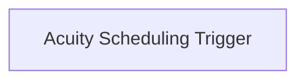

## Fluxo (.json) :

```json
{
  "nodes": [
    {
      "name": "Acuity Scheduling Trigger",
      "type": "n8n-nodes-base.acuitySchedulingTrigger",
      "position": [
        880,
        400
      ],
      "webhookId": "b326732d-9473-469f-a421-dd823d26b945",
      "parameters": {
        "event": "appointment.scheduled"
      },
      "credentials": {
        "acuitySchedulingApi": "acuity_creds"
      },
      "typeVersion": 1
    }
  ],
  "connections": {}
}
```

<a id="template-728"></a>

## Template 728 - Cadeia LLM customizada e agente com pesquisa Wikipedia

- **Nome:** Cadeia LLM customizada e agente com pesquisa Wikipedia
- **Descrição:** Fluxo que executa duas rotas ao ser disparado manualmente: uma envia um prompt para uma cadeia LLM customizada e outra aciona um agente que pode usar uma ferramenta de pesquisa na Wikipedia para responder perguntas.
- **Funcionalidade:** • Disparo manual: Inicia o fluxo ao clicar em executar.
• Definição de prompts de entrada: Dois nós de configuração atribuem prompts diferentes (ex.: "Tell me a joke" e "What year was Einstein born?").
• Cadeia LLM customizada: Constrói um PromptTemplate a partir do input e encadeia com um modelo de linguagem para gerar saída.
• Agente com ferramentas: Executa um agente que utiliza um modelo de chat e pode invocar ferramentas externas para pesquisa.
• Ferramenta Wikipedia personalizada: Integra uma ferramenta personalizada que consulta a Wikipedia e retorna resultados relevantes para o agente.
- **Ferramentas:** • OpenAI: Modelo de linguagem (gpt-4o-mini) usado para geração de texto e respostas do agente.
• Wikipedia: Fonte de pesquisa usada pela ferramenta personalizada para recuperar informações e fornecer evidências ao agente.


## Fluxo visual

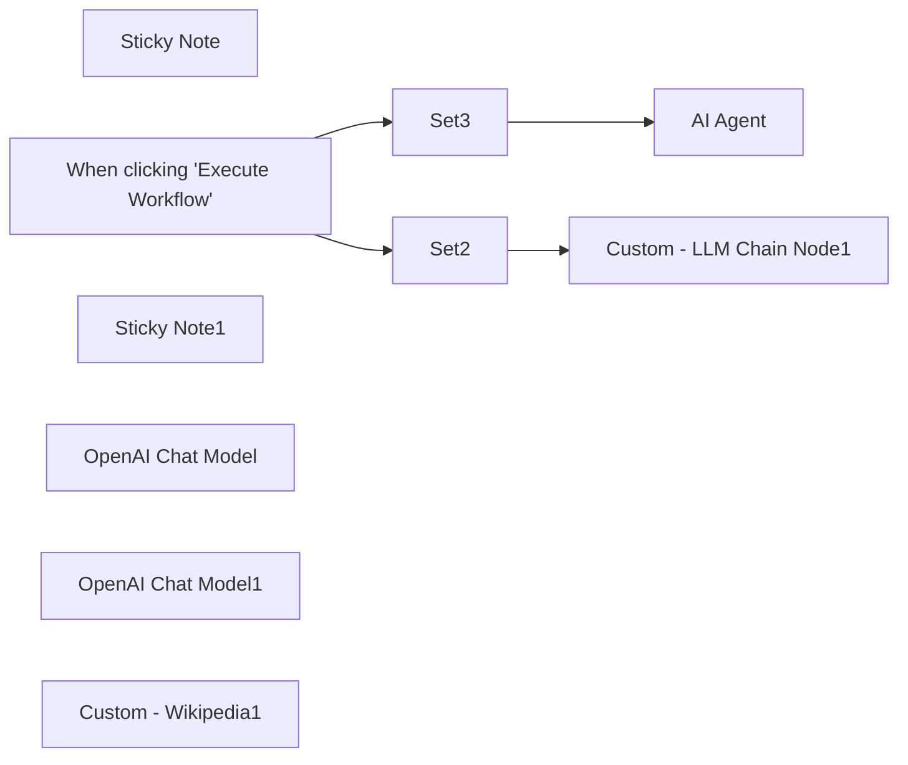

## Fluxo (.json) :

```json
{
  "meta": {
    "instanceId": "408f9fb9940c3cb18ffdef0e0150fe342d6e655c3a9fac21f0f644e8bedabcd9",
    "templateCredsSetupCompleted": true
  },
  "nodes": [
    {
      "id": "5a421900-20d7-4d64-a064-3211c3338676",
      "name": "Sticky Note",
      "type": "n8n-nodes-base.stickyNote",
      "position": [
        -520,
        -820
      ],
      "parameters": {
        "width": 432,
        "height": 397,
        "content": "## Self-coded LLM Chain Node"
      },
      "typeVersion": 1
    },
    {
      "id": "93e3641b-d365-456d-b939-11fd92da8155",
      "name": "When clicking \"Execute Workflow\"",
      "type": "n8n-nodes-base.manualTrigger",
      "position": [
        -1060,
        -740
      ],
      "parameters": {},
      "typeVersion": 1
    },
    {
      "id": "235e436f-353f-4bb4-a619-35ebb17011d0",
      "name": "Sticky Note1",
      "type": "n8n-nodes-base.stickyNote",
      "position": [
        -300,
        -100
      ],
      "parameters": {
        "width": 320.2172923777021,
        "height": 231,
        "content": "## Self-coded Tool Node"
      },
      "typeVersion": 1
    },
    {
      "id": "4265a9d3-7c7e-4511-9a41-fa5a940f8869",
      "name": "Set2",
      "type": "n8n-nodes-base.set",
      "position": [
        -820,
        -740
      ],
      "parameters": {
        "options": {},
        "assignments": {
          "assignments": [
            {
              "id": "6c3d9c41-58b0-4d0d-8892-0b1a96428da3",
              "name": "chatInput",
              "type": "string",
              "value": "Tell me a joke"
            }
          ]
        }
      },
      "typeVersion": 3.4
    },
    {
      "id": "b78b6d50-53be-43a1-889c-773726443bfb",
      "name": "Custom - LLM Chain Node1",
      "type": "@n8n/n8n-nodes-langchain.code",
      "position": [
        -440,
        -740
      ],
      "parameters": {
        "code": {
          "execute": {
            "code": "const { PromptTemplate } = require('@langchain/core/prompts');\n\nconst query = $input.item.json.chatInput;\nconst prompt = PromptTemplate.fromTemplate(query);\nconst llm = await this.getInputConnectionData('ai_languageModel', 0);\nlet chain = prompt.pipe(llm);\nconst output = await chain.invoke();\nreturn [ {json: { output } } ];"
          }
        },
        "inputs": {
          "input": [
            {
              "type": "main",
              "required": true,
              "maxConnections": 1
            },
            {
              "type": "ai_languageModel",
              "required": true,
              "maxConnections": 1
            }
          ]
        },
        "outputs": {
          "output": [
            {
              "type": "main"
            }
          ]
        }
      },
      "typeVersion": 1
    },
    {
      "id": "cc27654f-92bd-48f5-80d9-1d4f9c83ecb5",
      "name": "OpenAI Chat Model",
      "type": "@n8n/n8n-nodes-langchain.lmChatOpenAi",
      "position": [
        -420,
        -580
      ],
      "parameters": {
        "model": {
          "__rl": true,
          "mode": "list",
          "value": "gpt-4o-mini"
        },
        "options": {}
      },
      "credentials": {
        "openAiApi": {
          "id": "8gccIjcuf3gvaoEr",
          "name": "OpenAi account"
        }
      },
      "typeVersion": 1.2
    },
    {
      "id": "e64b5510-efd9-4a8b-aa3c-4312219cb2f0",
      "name": "Set3",
      "type": "n8n-nodes-base.set",
      "position": [
        -820,
        -440
      ],
      "parameters": {
        "options": {},
        "assignments": {
          "assignments": [
            {
              "id": "6c3d9c41-58b0-4d0d-8892-0b1a96428da3",
              "name": "chatInput",
              "type": "string",
              "value": "What year was Einstein born?"
            }
          ]
        }
      },
      "typeVersion": 3.4
    },
    {
      "id": "77f8bff3-8868-43ca-8739-7cc16d15dd80",
      "name": "AI Agent",
      "type": "@n8n/n8n-nodes-langchain.agent",
      "position": [
        -440,
        -340
      ],
      "parameters": {
        "options": {}
      },
      "typeVersion": 1.8
    },
    {
      "id": "d6e943df-ee88-4d0b-bca4-68b9f249dd00",
      "name": "OpenAI Chat Model1",
      "type": "@n8n/n8n-nodes-langchain.lmChatOpenAi",
      "position": [
        -460,
        -120
      ],
      "parameters": {
        "model": {
          "__rl": true,
          "mode": "list",
          "value": "gpt-4o-mini"
        },
        "options": {}
      },
      "credentials": {
        "openAiApi": {
          "id": "8gccIjcuf3gvaoEr",
          "name": "OpenAi account"
        }
      },
      "typeVersion": 1.2
    },
    {
      "id": "a4b19037-399a-4d0b-abe0-378d8d81c536",
      "name": "Custom - Wikipedia1",
      "type": "@n8n/n8n-nodes-langchain.toolCode",
      "position": [
        -180,
        -20
      ],
      "parameters": {
        "name": "wikipedia_tool",
        "jsCode": "console.log('Custom Wikipedia Node runs');\nconst { WikipediaQueryRun } = require(\"@n8n/n8n-nodes-langchain/node_modules/@langchain/community/tools/wikipedia_query_run.cjs\");\n\nconst tool = new WikipediaQueryRun({\n  topKResults: 3,\n  maxDocContentLength: 4000,\n});\n\nreturn await tool.invoke(query);",
        "description": "Call this tool to research a topic on wikipedia."
      },
      "typeVersion": 1.1
    }
  ],
  "pinData": {},
  "connections": {
    "Set2": {
      "main": [
        [
          {
            "node": "Custom - LLM Chain Node1",
            "type": "main",
            "index": 0
          }
        ]
      ]
    },
    "Set3": {
      "main": [
        [
          {
            "node": "AI Agent",
            "type": "main",
            "index": 0
          }
        ]
      ]
    },
    "OpenAI Chat Model": {
      "ai_languageModel": [
        [
          {
            "node": "Custom - LLM Chain Node1",
            "type": "ai_languageModel",
            "index": 0
          }
        ]
      ]
    },
    "OpenAI Chat Model1": {
      "ai_languageModel": [
        [
          {
            "node": "AI Agent",
            "type": "ai_languageModel",
            "index": 0
          }
        ]
      ]
    },
    "Custom - Wikipedia1": {
      "ai_tool": [
        [
          {
            "node": "AI Agent",
            "type": "ai_tool",
            "index": 0
          }
        ]
      ]
    },
    "When clicking \"Execute Workflow\"": {
      "main": [
        [
          {
            "node": "Set3",
            "type": "main",
            "index": 0
          },
          {
            "node": "Set2",
            "type": "main",
            "index": 0
          }
        ]
      ]
    }
  }
}
```

<a id="template-729"></a>

## Template 729 - Geração automática de certificados via formulário

- **Nome:** Geração automática de certificados via formulário
- **Descrição:** Automatiza a emissão de certificados em PDF para respondentes que atingem a nota mínima em um formulário, enviando-os por e‑mail.
- **Funcionalidade:** • Monitoramento de respostas: Detecta novas submissões de formulário através da planilha de respostas.
• Extração de dados essenciais: Captura nome, e‑mail e pontuação do respondente.
• Verificação de nota: Compara a pontuação do respondente com o critério de aprovação.
• Geração de certificado personalizado: Cria uma cópia de um template de certificado e substitui o placeholder pelo nome do respondente.
• Conversão para PDF: Converte a apresentação personalizada em PDF para distribuição.
• Envio por e‑mail: Anexa o certificado em PDF e envia ao endereço do respondente quando aprovado.
• Tratamento de não aprovados: Não gera nem envia certificado se a pontuação for inferior ao mínimo definido.
- **Ferramentas:** • Google Forms: Coleta respostas dos participantes através de um formulário online.
• Google Sheets: Armazena as respostas do formulário e serve como gatilho para a automação.
• Google Drive: Guarda o template do certificado e as cópias geradas.
• Google Slides: Serve como modelo editável do certificado, permitindo a substituição de textos.
• Gmail: Envia o certificado em anexo para o e‑mail do respondente.


## Fluxo visual

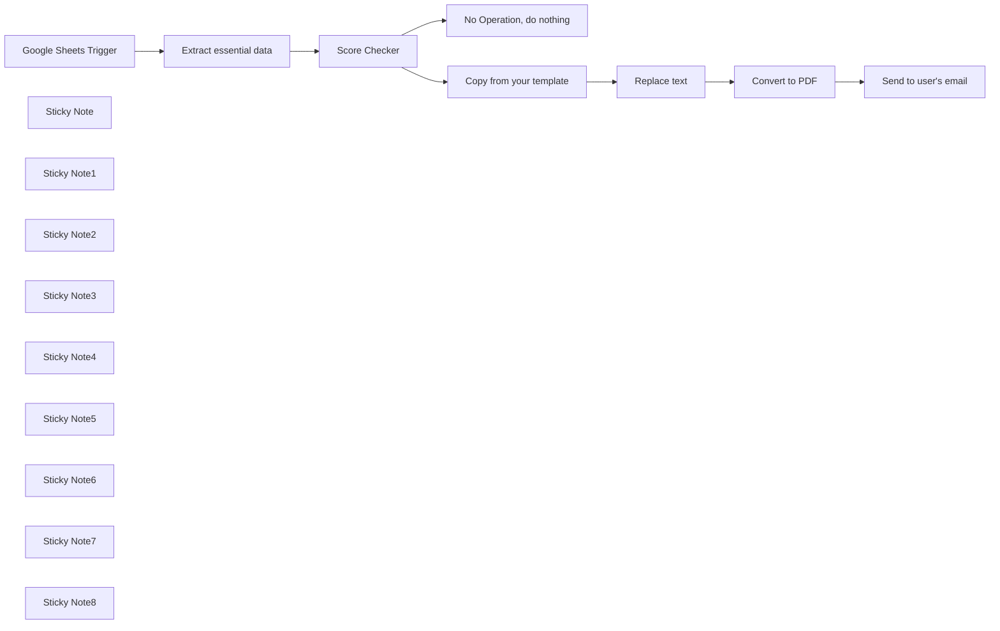

## Fluxo (.json) :

```json
{
  "id": "2qIFnWXdHJJs4oBk",
  "meta": {
    "instanceId": "6c586999cefcd4ec9b2ab69e3f6b7974d96831b39a984af15104588e20b2737a",
    "templateCredsSetupCompleted": true
  },
  "name": "DSP Certificate w/ Google Forms",
  "tags": [],
  "nodes": [
    {
      "id": "1f3a1bb2-1e5b-4696-aafc-5b3267d76cbf",
      "name": "Google Sheets Trigger",
      "type": "n8n-nodes-base.googleSheetsTrigger",
      "position": [
        -100,
        -20
      ],
      "parameters": {
        "event": "rowAdded",
        "options": {},
        "pollTimes": {
          "item": [
            {
              "mode": "everyMinute"
            }
          ]
        },
        "sheetName": {
          "__rl": true,
          "mode": "list",
          "value": 1715309269,
          "cachedResultUrl": "https://docs.google.com/spreadsheets/d/1WqhSc4sx6GMupZgFo7xKoegXVo3fJVhqrovCQPa1esM/edit#gid=1715309269",
          "cachedResultName": "Form Responses 1"
        },
        "documentId": {
          "__rl": true,
          "mode": "id",
          "value": "1WqhSc4sx6GMupZgFo7xKoegXVo3fJVhqrovCQPa1esM"
        }
      },
      "credentials": {
        "googleSheetsTriggerOAuth2Api": {
          "id": "LPj2gg4OdDdyokS7",
          "name": "Google Sheets (jkp@kajonkietsuksa.ac.th)"
        }
      },
      "typeVersion": 1
    },
    {
      "id": "385f6b0f-2db0-4a44-816c-c6f6c8ccb493",
      "name": "No Operation, do nothing",
      "type": "n8n-nodes-base.noOp",
      "position": [
        620,
        180
      ],
      "parameters": {},
      "typeVersion": 1
    },
    {
      "id": "58a77733-99f1-4884-b955-0a6f6c983cfc",
      "name": "Sticky Note",
      "type": "n8n-nodes-base.stickyNote",
      "position": [
        -240,
        -340
      ],
      "parameters": {
        "width": 300,
        "height": 180,
        "content": "### 1) Start here\n* Create a Google Form and then enable quiz mode.\n* Publish it, submit 1 text data.\n* In response section, you'll see \"Link to Google Sheet\" option.\n* Press, and it will create a new sheet."
      },
      "typeVersion": 1
    },
    {
      "id": "aeef0ccc-3031-40d0-a627-5f21ade148b1",
      "name": "Sticky Note1",
      "type": "n8n-nodes-base.stickyNote",
      "position": [
        320,
        -140
      ],
      "parameters": {
        "width": 180,
        "content": "### 4) Passing Score\n* Adjust your passing score here"
      },
      "typeVersion": 1
    },
    {
      "id": "c21dbdb5-ed87-4aac-bbc7-338aaed830ba",
      "name": "Sticky Note2",
      "type": "n8n-nodes-base.stickyNote",
      "position": [
        -240,
        -100
      ],
      "parameters": {
        "height": 180,
        "content": "### 2) Trigger Node\n* Replace your Google Sheet id's in this node."
      },
      "typeVersion": 1
    },
    {
      "id": "d2b15c40-d38a-4bec-97c8-d4b35e3a69fa",
      "name": "Sticky Note3",
      "type": "n8n-nodes-base.stickyNote",
      "position": [
        40,
        -100
      ],
      "parameters": {
        "width": 260,
        "height": 180,
        "content": "### 3) Extract Node\n* Select the data we want to use to proceed.\n* For this case, i'll select only Name, Email, Score (Because this is only what we need)"
      },
      "typeVersion": 1
    },
    {
      "id": "79957ca7-ac5f-4f5b-b921-ddec3cb9f88b",
      "name": "Extract essential data",
      "type": "n8n-nodes-base.set",
      "position": [
        120,
        60
      ],
      "parameters": {
        "options": {},
        "assignments": {
          "assignments": [
            {
              "id": "7cdc9108-ab77-4904-a74b-29677b06cc81",
              "name": "respondentName",
              "type": "string",
              "value": "={{ $json['ชื่อ (เป็นภาษาอังกฤษ)'] }}"
            },
            {
              "id": "1800b27a-6cbc-4b82-a17a-87d7d1e7a66e",
              "name": "respondentEmail",
              "type": "string",
              "value": "={{ $json['Email Address'] }}"
            },
            {
              "id": "36cb99ca-7c98-41b5-a2a4-a03ac8d83189",
              "name": "respondentScore",
              "type": "number",
              "value": "={{ $json.Score }}"
            }
          ]
        }
      },
      "typeVersion": 3.4
    },
    {
      "id": "912838e0-6b35-47a1-8935-dc90b4c59ecb",
      "name": "Score Checker",
      "type": "n8n-nodes-base.if",
      "position": [
        360,
        -20
      ],
      "parameters": {
        "options": {},
        "conditions": {
          "options": {
            "version": 2,
            "leftValue": "",
            "caseSensitive": true,
            "typeValidation": "strict"
          },
          "combinator": "and",
          "conditions": [
            {
              "id": "286a95ee-1edc-4310-af22-d161e1f04a27",
              "operator": {
                "type": "number",
                "operation": "gt"
              },
              "leftValue": "={{ $json.respondentScore }}",
              "rightValue": 3
            }
          ]
        }
      },
      "typeVersion": 2.2
    },
    {
      "id": "9c9e308f-ce90-425d-aafc-08711cbf95df",
      "name": "Sticky Note4",
      "type": "n8n-nodes-base.stickyNote",
      "position": [
        600,
        120
      ],
      "parameters": {
        "width": 260,
        "content": "### 4.1) Score < passing criteria"
      },
      "typeVersion": 1
    },
    {
      "id": "f794c7a3-47af-4166-9504-8265837f61e6",
      "name": "Sticky Note5",
      "type": "n8n-nodes-base.stickyNote",
      "position": [
        520,
        -340
      ],
      "parameters": {
        "width": 260,
        "height": 200,
        "content": "### 4.2) Score > passing criteria\n* Create new Google Slide \n* Decorate it as you desired (This will be certificate's template)\n* Use [ name ] to be a placeholder for user's name\n* Replace it with your Google Slide's id"
      },
      "typeVersion": 1
    },
    {
      "id": "9a2954e3-59fd-4472-931f-9eeb362e627b",
      "name": "Sticky Note6",
      "type": "n8n-nodes-base.stickyNote",
      "position": [
        820,
        -400
      ],
      "parameters": {
        "width": 260,
        "content": "### 5) Replace text\n* This node will replace [ name ] with user's input name.\n"
      },
      "typeVersion": 1
    },
    {
      "id": "baa88ba8-c1c6-40d7-b4c0-1e70397d7e68",
      "name": "Sticky Note7",
      "type": "n8n-nodes-base.stickyNote",
      "position": [
        940,
        -80
      ],
      "parameters": {
        "width": 260,
        "content": "### 6) To PDF\n* Change file name as you desire."
      },
      "typeVersion": 1
    },
    {
      "id": "0d4b0fad-046b-4810-9d21-2c30135df6b0",
      "name": "Copy from your template",
      "type": "n8n-nodes-base.googleDrive",
      "position": [
        620,
        -160
      ],
      "parameters": {
        "name": "={{ $json.respondentName }}'s Certificate",
        "fileId": {
          "__rl": true,
          "mode": "id",
          "value": "1J8PxjjspVs7075EfIX6pnNU-TmqtzVV9ymeHoKpbwP0"
        },
        "driveId": {
          "__rl": true,
          "mode": "list",
          "value": "My Drive"
        },
        "options": {},
        "folderId": {
          "__rl": true,
          "mode": "list",
          "value": "1xMJU-6eiXL53NDgjic2SXecTo6GeUJ-o",
          "cachedResultUrl": "https://drive.google.com/drive/folders/1xMJU-6eiXL53NDgjic2SXecTo6GeUJ-o",
          "cachedResultName": "KS Google Form -> Certificate System"
        },
        "operation": "copy",
        "sameFolder": false
      },
      "credentials": {
        "googleDriveOAuth2Api": {
          "id": "2k4spLmVESgxckkx",
          "name": "jkp@kajonkietsuksa.ac.th"
        }
      },
      "typeVersion": 3
    },
    {
      "id": "30407819-7998-4ba1-b2a0-bde7ba91747c",
      "name": "Replace text",
      "type": "n8n-nodes-base.googleSlides",
      "position": [
        880,
        -300
      ],
      "parameters": {
        "textUi": {
          "textValues": [
            {
              "text": "[ NAME ]",
              "replaceText": "={{ $('Score Checker').item.json.respondentName }}",
              "pageObjectIds": [
                "p"
              ]
            }
          ]
        },
        "options": {},
        "operation": "replaceText",
        "presentationId": "={{ $json.id }}"
      },
      "credentials": {
        "googleSlidesOAuth2Api": {
          "id": "1oyCPsdPLod92Wlp",
          "name": "Google Slides account"
        }
      },
      "typeVersion": 2
    },
    {
      "id": "62f1ab2e-0471-480b-9a90-587a9ffb18d6",
      "name": "Convert to PDF",
      "type": "n8n-nodes-base.googleDrive",
      "position": [
        960,
        0
      ],
      "parameters": {
        "fileId": {
          "__rl": true,
          "mode": "id",
          "value": "={{ $json.presentationId }}"
        },
        "options": {
          "fileName": "={{ $('Score Checker').item.json.respondentName }}'s Certificate",
          "googleFileConversion": {
            "conversion": {
              "slidesToFormat": "application/pdf"
            }
          }
        },
        "operation": "download"
      },
      "credentials": {
        "googleDriveOAuth2Api": {
          "id": "2k4spLmVESgxckkx",
          "name": "jkp@kajonkietsuksa.ac.th"
        }
      },
      "typeVersion": 3,
      "alwaysOutputData": false
    },
    {
      "id": "08516c84-5257-4875-8c2f-9b6a4428bfad",
      "name": "Send to user's email",
      "type": "n8n-nodes-base.gmail",
      "position": [
        1360,
        0
      ],
      "webhookId": "f204ef80-937c-4f7b-8eb5-0699eb13c16a",
      "parameters": {
        "sendTo": "={{ $('Score Checker').item.json.respondentEmail }}",
        "message": "=Congratulations on passing the quiz! Attached is your certificate.",
        "options": {
          "attachmentsUi": {
            "attachmentsBinary": [
              {}
            ]
          },
          "appendAttribution": false
        },
        "subject": "Here's your certificate!!"
      },
      "credentials": {
        "gmailOAuth2": {
          "id": "qogKxJFIxmrd6rcB",
          "name": "Gmail account (jkp@kajonkietsuksa.ac.th)"
        }
      },
      "typeVersion": 2.1
    },
    {
      "id": "ae4cd0de-e06d-4200-af17-f6e9953ccba7",
      "name": "Sticky Note8",
      "type": "n8n-nodes-base.stickyNote",
      "position": [
        1260,
        -100
      ],
      "parameters": {
        "width": 260,
        "content": "### 7) Send email\n* Send to user's email\n* Customize your message here.\n"
      },
      "typeVersion": 1
    }
  ],
  "active": true,
  "pinData": {},
  "settings": {
    "executionOrder": "v1"
  },
  "versionId": "54bf009a-3f95-446d-95a6-825496592a6f",
  "connections": {
    "Replace text": {
      "main": [
        [
          {
            "node": "Convert to PDF",
            "type": "main",
            "index": 0
          }
        ]
      ]
    },
    "Score Checker": {
      "main": [
        [
          {
            "node": "Copy from your template",
            "type": "main",
            "index": 0
          }
        ],
        [
          {
            "node": "No Operation, do nothing",
            "type": "main",
            "index": 0
          }
        ]
      ]
    },
    "Convert to PDF": {
      "main": [
        [
          {
            "node": "Send to user's email",
            "type": "main",
            "index": 0
          }
        ]
      ]
    },
    "Google Sheets Trigger": {
      "main": [
        [
          {
            "node": "Extract essential data",
            "type": "main",
            "index": 0
          }
        ]
      ]
    },
    "Extract essential data": {
      "main": [
        [
          {
            "node": "Score Checker",
            "type": "main",
            "index": 0
          }
        ]
      ]
    },
    "Copy from your template": {
      "main": [
        [
          {
            "node": "Replace text",
            "type": "main",
            "index": 0
          }
        ]
      ]
    }
  }
}
```

<a id="template-730"></a>

## Template 730 - Nova lista criada no Affinity

- **Nome:** Nova lista criada no Affinity
- **Descrição:** Este fluxo é um gatilho que dispara quando uma nova lista é criada no Affinity, permitindo ações subsequentes com base nesse evento.
- **Funcionalidade:** • Detecção de criação de lista: O fluxo é acionado quando ocorre o evento list.created no Affinity.
• Gatilho via webhook: Usa um webhook para receber atualizações em tempo real sobre a criação de listas.
• Autenticação com API externa: Conecta-se ao serviço com credenciais de API para acesso seguro.
• Preparação para ações adicionais: Pronto para encaminhar dados da nova lista para outros passos ou serviços.
- **Ferramentas:** • Affinity: Plataforma de gestão de listas que envia eventos quando novas listas são criadas, permitindo acionar fluxos automaticamente.


## Fluxo visual

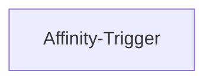

## Fluxo (.json) :

```json
{
  "id": "63",
  "name": "Receive updates when a new list is created in Affinity",
  "nodes": [
    {
      "name": "Affinity-Trigger",
      "type": "n8n-nodes-base.affinityTrigger",
      "position": [
        690,
        260
      ],
      "webhookId": "e9d2b8f0-9fa9-43c2-b45d-dc96c869bd20",
      "parameters": {
        "events": [
          "list.created"
        ]
      },
      "credentials": {
        "affinityApi": "affinity"
      },
      "typeVersion": 1
    }
  ],
  "active": false,
  "settings": {},
  "connections": {}
}
```

<a id="template-731"></a>

## Template 731 - Roteamento de chat para calendário e tarefas

- **Nome:** Roteamento de chat para calendário e tarefas
- **Descrição:** Recebe mensagens de chat via webhook, decide qual sub-agente é responsável (calendário ou tarefas), encaminha a solicitação ao serviço apropriado, mantém contexto de sessão e retorna a resposta ao remetente.
- **Funcionalidade:** • Recepção de mensagens via webhook: Recebe requisições HTTP com a mensagem do usuário e extrai sessionId e texto da conversa.
• Roteamento por agente principal: Um agente central analisa apenas qual ferramenta/sub-agente deve receber o pedido e encaminha sem modificar o conteúdo.
• Memória por sessão (window buffer): Mantém um histórico de contexto curto por sessionId para decisões de roteamento e continuidade de diálogo.
• Sub-agente de calendário: Verifica disponibilidade usando consultas de disponibilidade, propõe alternativas em caso de conflito e, após aprovação, cria eventos no calendário com duração padrão quando não informada.
• Sub-agente de tarefas (Notion): Coleta título, descrição e prioridade, solicita informações faltantes, apresenta um rascunho para aprovação e, após confirmação, cria a tarefa no banco do Notion.
• Chamadas HTTP autenticadas a APIs externas: Executa requisições estruturadas (por exemplo criação de eventos ou páginas) usando credenciais configuradas.
• Formatação de saída e filtragem para fala: Prepara a resposta final, remove pré-visualizações indesejadas em campos de fala e envia a resposta ao originador do webhook.
- **Ferramentas:** • OpenAI (GPT-4o): Modelo de linguagem usado pelos agentes para interpretar solicitações de roteamento, gerar rascunhos e conduzir diálogos de coleta de informações.
• Google Calendar API: Serviço usado para consultar disponibilidade (freeBusy) e criar eventos no calendário do usuário.
• Notion API: Serviço usado para criar páginas/tarefas em um banco de dados do Notion com título, descrição e prioridade.
• Vagent.io: Plataforma de integração/orquestração mencionada como ponto de conexão do agente principal para encaminhamento de chat.

## Fluxo visual

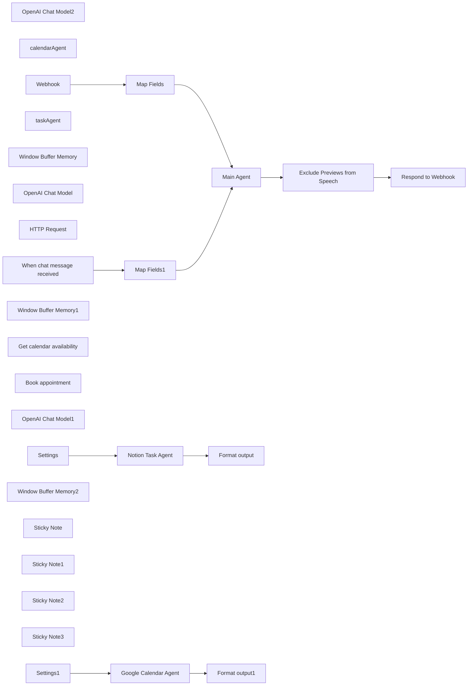

## Fluxo (.json) :

```json
{
  "meta": {
    "instanceId": "84ba6d895254e080ac2b4916d987aa66b000f88d4d919a6b9c76848f9b8a7616",
    "templateId": "2446"
  },
  "nodes": [
    {
      "id": "af0765f4-75b5-445c-80d7-51b0aa180fe5",
      "name": "OpenAI Chat Model2",
      "type": "@n8n/n8n-nodes-langchain.lmChatOpenAi",
      "position": [
        820,
        620
      ],
      "parameters": {
        "model": "gpt-4o",
        "options": {
          "temperature": 0,
          "responseFormat": "text"
        }
      },
      "typeVersion": 1
    },
    {
      "id": "497c534e-e117-4592-b76f-bef424a7fd5a",
      "name": "Respond to Webhook",
      "type": "n8n-nodes-base.respondToWebhook",
      "position": [
        1500,
        400
      ],
      "parameters": {
        "options": {}
      },
      "typeVersion": 1.1
    },
    {
      "id": "5b358850-cbc3-4a8c-b2b8-12e3b7aa1e44",
      "name": "calendarAgent",
      "type": "@n8n/n8n-nodes-langchain.toolWorkflow",
      "position": [
        1060,
        620
      ],
      "parameters": {
        "name": "calendarAgent",
        "fields": {
          "values": [
            {
              "name": "sessionId",
              "stringValue": "={{ $json.sessionId }}"
            },
            {
              "name": "prompt",
              "stringValue": "={{ $json.chatInput }}"
            }
          ]
        },
        "workflowId": {
          "__rl": true,
          "mode": "list",
          "value": "yPCMz4zxB291oM31",
          "cachedResultName": "Google Calendar Agent"
        },
        "description": "Call this workflow to do handle every request regarding calendar management.",
        "responsePropertyName": "output"
      },
      "typeVersion": 1.2
    },
    {
      "id": "8bcc4b27-59b9-4ce3-8525-34221c10f11a",
      "name": "When chat message received",
      "type": "@n8n/n8n-nodes-langchain.chatTrigger",
      "position": [
        460,
        480
      ],
      "webhookId": "96e410fe-ef91-4767-aa9a-bf95ba50f972",
      "parameters": {
        "public": true,
        "options": {}
      },
      "typeVersion": 1.1
    },
    {
      "id": "0aa8e0ff-7ed3-4fef-9b7c-f2caa8f85612",
      "name": "taskAgent",
      "type": "@n8n/n8n-nodes-langchain.toolWorkflow",
      "position": [
        1180,
        620
      ],
      "parameters": {
        "name": "taskAgent",
        "fields": {
          "values": [
            {
              "name": "sessionId",
              "stringValue": "={{ $json.sessionId }}"
            },
            {
              "name": "prompt",
              "stringValue": "={{ $json.chatInput }}"
            }
          ]
        },
        "workflowId": {
          "__rl": true,
          "mode": "list",
          "value": "ICTXOidW1oyJDYP7",
          "cachedResultName": "Notion Task Agent"
        },
        "description": "Call this workflow to do handle every request regarding task management.",
        "responsePropertyName": "output"
      },
      "typeVersion": 1.2
    },
    {
      "id": "b46f4ed0-6de6-44ab-8b91-521b011d7869",
      "name": "Window Buffer Memory",
      "type": "@n8n/n8n-nodes-langchain.memoryBufferWindow",
      "position": [
        940,
        620
      ],
      "parameters": {
        "sessionKey": "={{ $json.sessionId }}",
        "sessionIdType": "customKey",
        "contextWindowLength": 15
      },
      "typeVersion": 1.2
    },
    {
      "id": "e778c2bf-1681-418d-a434-d1a0cdeaa5d7",
      "name": "Map Fields",
      "type": "n8n-nodes-base.set",
      "position": [
        680,
        320
      ],
      "parameters": {
        "options": {},
        "assignments": {
          "assignments": [
            {
              "id": "f8c5a03f-ea21-4877-a71b-32e8b4dd30fb",
              "name": "chatInput",
              "type": "string",
              "value": "={{ $json.body.prompt }}"
            },
            {
              "id": "3d4fecc4-78a5-47ba-a239-5fdc9b224d82",
              "name": "sessionId",
              "type": "string",
              "value": "={{ $json.body.sessionID }}"
            }
          ]
        }
      },
      "typeVersion": 3.4
    },
    {
      "id": "c54d0fab-b25c-48fc-b027-dcdf78dd2b09",
      "name": "Map Fields1",
      "type": "n8n-nodes-base.set",
      "position": [
        680,
        480
      ],
      "parameters": {
        "options": {},
        "assignments": {
          "assignments": [
            {
              "id": "36f24729-17ae-4d69-961f-424a1797b42c",
              "name": "chatInput",
              "type": "string",
              "value": "={{ $json.chatInput }}"
            },
            {
              "id": "05ea359a-d82e-4917-9245-38016314ad10",
              "name": "sessionId",
              "type": "string",
              "value": "={{ $json.sessionId }}"
            }
          ]
        }
      },
      "typeVersion": 3.4
    },
    {
      "id": "cefe6cc8-4a87-47c8-a518-c0bf06f96a2a",
      "name": "Exclude Previews from Speech",
      "type": "n8n-nodes-base.set",
      "position": [
        1280,
        400
      ],
      "parameters": {
        "options": {},
        "assignments": {
          "assignments": [
            {
              "id": "424b3c35-fd3d-4021-86e7-0d90529550b0",
              "name": "response.text",
              "type": "string",
              "value": "={{ $json.output }}"
            },
            {
              "id": "0cbe6fd9-3464-4bd1-b9c0-365548dc232a",
              "name": "response.speech",
              "type": "string",
              "value": "={{ $if($json.output.search(/>\\s/) > -1, $json.output.substring(0, $json.output.search(/>\\s/)), $json.output) }}"
            }
          ]
        }
      },
      "typeVersion": 3.4
    },
    {
      "id": "815eb1a4-ef2d-430d-8884-217164214440",
      "name": "Main Agent",
      "type": "@n8n/n8n-nodes-langchain.agent",
      "position": [
        900,
        400
      ],
      "parameters": {
        "text": "={{ $json.chatInput }}",
        "options": {
          "systemMessage": "=# Role:\nYou are a helpful assistant. Your sole responsibility is to determine which tool to forward the original chat input to. Do not process, modify, or interpret the input or output in any way. Only route it to the correct tool.\n\n# Behavior:\nBe clear, very concise, and accurate in tool routing. Do not modify, interpret, or analyze the incoming input or the tool's response. If the request is ambiguous, ask for clarification regarding tool selection only.\n\n# Command:\nRoute all incoming requests to the available tools if they match their description.\nCheck the memory to route ongoing conversations correctly — only choose another tool if a new task has been requested or the context clearly has been switched. If the context has changed (e.g. you were asked to create a task before, but now the user asks to create an event), forget everything before the context switch.\n\nOnly call one tool at a time.\n\nDo not modify or alter the input before sending it to the tool or the output after receiving it from the tool. Simply pass through both input and output as they are.\n\n# Format:\nPass every response of each tool in raw format to the output. Do not modify, interpret, or add any information at all."
        },
        "promptType": "define"
      },
      "typeVersion": 1.6
    },
    {
      "id": "07b6d7e2-ab73-4f23-8dca-7c8b0309574c",
      "name": "OpenAI Chat Model",
      "type": "@n8n/n8n-nodes-langchain.lmChatOpenAi",
      "position": [
        1520,
        1100
      ],
      "parameters": {
        "model": "gpt-4o",
        "options": {
          "temperature": 0
        }
      },
      "typeVersion": 1
    },
    {
      "id": "882a93d8-886e-465d-9c81-cc8069abd281",
      "name": "HTTP Request",
      "type": "@n8n/n8n-nodes-langchain.toolHttpRequest",
      "position": [
        1760,
        1100
      ],
      "parameters": {
        "url": "https://api.notion.com/v1/pages",
        "method": "POST",
        "jsonBody": "={\n  \"parent\": {\n    \"database_id\": \"{{ $json.databaseID }}\"\n  },\n  \"properties\": {\n    \"Name\": {\n      \"title\": [\n        {\n          \"text\": {\n            \"content\": \"{title}\"\n          }\n        }\n      ]\n    },\n    \"Priority\": {\n      \"select\": {\n        \"name\": \"{priority}\"\n      }\n    }\n  },\n  \"children\": [\n    {\n      \"object\": \"block\",\n      \"type\": \"paragraph\",\n      \"paragraph\": {\n        \"rich_text\": [\n          {\n            \"type\": \"text\",\n            \"text\": {\n              \"content\": \"{description}\"\n            }\n          }\n        ]\n      }\n    }\n  ]\n}",
        "sendBody": true,
        "specifyBody": "json",
        "authentication": "predefinedCredentialType",
        "toolDescription": "Create a Task in Notion using a title, description and priority.",
        "nodeCredentialType": "notionApi",
        "placeholderDefinitions": {
          "values": [
            {
              "name": "title",
              "type": "string",
              "description": "The name / title of the task."
            },
            {
              "name": "description",
              "type": "string",
              "description": "The description of the task."
            },
            {
              "name": "priority",
              "type": "string",
              "description": "The priority of the task. One of these values: \"do first\", \"important\", \"urgent\""
            }
          ]
        }
      },
      "typeVersion": 1.1
    },
    {
      "id": "e19aad2c-132e-454f-a091-334f128b0636",
      "name": "Settings",
      "type": "n8n-nodes-base.set",
      "position": [
        1320,
        880
      ],
      "parameters": {
        "options": {},
        "assignments": {
          "assignments": [
            {
              "id": "3f65df4c-fae1-4da3-acfd-acf352a3f8d2",
              "name": "sessionId",
              "type": "string",
              "value": "={{ $json.sessionId }}"
            },
            {
              "id": "9745bdbd-fd97-46db-a742-6540f86dd43c",
              "name": "chatInput",
              "type": "string",
              "value": "={{ $json.prompt }}"
            },
            {
              "id": "5e757768-d780-4b11-a6e0-593b08f32cc3",
              "name": "databaseID",
              "type": "string",
              "value": "92da2aa018ed4095afc0f1a0670f36e9"
            }
          ]
        }
      },
      "typeVersion": 3.4
    },
    {
      "id": "0fe6aa57-7a64-40f4-af2d-30f4286b8aee",
      "name": "Format output",
      "type": "n8n-nodes-base.set",
      "position": [
        1920,
        880
      ],
      "parameters": {
        "options": {},
        "assignments": {
          "assignments": [
            {
              "id": "934c387a-71a5-4549-a68a-312708368117",
              "name": "output",
              "type": "string",
              "value": "=Please respond this to the user without modifications:\n\n{{ $json.output }}"
            }
          ]
        }
      },
      "typeVersion": 3.4
    },
    {
      "id": "b2170997-5ebb-4261-92ce-70b33d68931f",
      "name": "Notion Task Agent",
      "type": "@n8n/n8n-nodes-langchain.agent",
      "position": [
        1540,
        880
      ],
      "parameters": {
        "options": {
          "systemMessage": "=# Role:\nYou are a helpful assistant. Your job is to create Tasks in Notion.\n\n# Behavior:\nBe clear, very concise, efficient, and accurate in responses. If the request is ambiguous, ask for clarification.\n\n# Command:\nYou create tasks in Notion. Each task consists of the mandatory fields title, description and priority. Priority is an enum value consisting of 'do first', 'important' and 'urgent'.\n\n# Ask questions:\nIf required information is missing, ask the user about the missing information and only the missing ones. Ask priority as last.\n\nIf the user only describes the task within a few words, use that as the title. In that case, ask the user, if he wants to add a more detailed description. If he responds with \"No\", leave the description empty when creating the task.\nOn the other hand if the user describes the task more detailed from the beginning, use that as the description and create a short meaningful title for that. \n\nIf you have all the required information, ask for approval, before creating the task. In that case, always return a draft, containing the title, description and priority.\n\n# Format:\nThe output of the draft for approval should always be in markdown and in this format (placeholders in angle brackets):\n\nHere is the drafted task. Shall I create it?\n\n> **<title>**  \n> *<priority>*  \n>  \n> <description (optional)>\n\n# Responses:\nAfter successfully created event, only respond with \"Okay, done.\""
        }
      },
      "typeVersion": 1.6
    },
    {
      "id": "a83fdec9-8c0e-45d0-8439-41c23440a21e",
      "name": "Window Buffer Memory1",
      "type": "@n8n/n8n-nodes-langchain.memoryBufferWindow",
      "position": [
        1640,
        1100
      ],
      "parameters": {
        "sessionKey": "={{ $json.sessionId }}-{{ $workflow.id }}",
        "sessionIdType": "customKey",
        "contextWindowLength": 15
      },
      "typeVersion": 1.2
    },
    {
      "id": "80ae1a6f-5811-407a-a287-5150b8ecba22",
      "name": "Get calendar availability",
      "type": "@n8n/n8n-nodes-langchain.toolHttpRequest",
      "position": [
        820,
        1100
      ],
      "parameters": {
        "url": "https://www.googleapis.com/calendar/v3/freeBusy",
        "method": "POST",
        "jsonBody": "={\n  \"timeMin\": \"{timeMin}\",\n  \"timeMax\": \"{timeMax}\",\n  \"timeZone\": \"{{ $json.timeZone }}\",\n  \"groupExpansionMax\": 20,\n  \"calendarExpansionMax\": 10,\n  \"items\": [\n    {\n      \"id\": \"{{ $json.calendarID }}\"\n    }\n  ]\n}",
        "sendBody": true,
        "specifyBody": "json",
        "authentication": "predefinedCredentialType",
        "toolDescription": "Call this tool to get the calendar availability for a particular period on the calendar. The tool may refer to availability as \"Free\" or \"Busy\". \n\nUse {timeMin} and {timeMax} to specify the window for the availability query. For example, to get availability for 25 July, 2024 the {timeMin} would be 2024-07-25T00:00:00+02:00 and {timeMax} would be 2024-07-26T00:00:00+02:00.\n\nIf the tool returns an empty response, it means that something went wrong. It does not mean that there is no availability.",
        "nodeCredentialType": "googleCalendarOAuth2Api"
      },
      "typeVersion": 1
    },
    {
      "id": "1d44a1eb-1b14-4ce8-b874-673db7be482c",
      "name": "Book appointment",
      "type": "@n8n/n8n-nodes-langchain.toolHttpRequest",
      "position": [
        940,
        1100
      ],
      "parameters": {
        "url": "=https://www.googleapis.com/calendar/v3/calendars/{{ $json.calendarID }}/events",
        "method": "POST",
        "jsonBody": "={\n  \"summary\": \"{eventName}\",\n  \"start\": {\n    \"dateTime\": \"{startTime}\",\n    \"timeZone\": \"Europe/Berlin\"\n  },\n  \"end\": {\n    \"dateTime\": \"{endTime}\",\n    \"timeZone\": \"Europe/Berlin\"\n  }\n}",
        "sendBody": true,
        "specifyBody": "json",
        "authentication": "predefinedCredentialType",
        "toolDescription": "Call this tool to create an event in the calendar.",
        "nodeCredentialType": "googleCalendarOAuth2Api",
        "placeholderDefinitions": {
          "values": [
            {
              "name": "eventName",
              "description": "A short but precise title for the event."
            },
            {
              "name": "startTime",
              "description": "The start time of the event in Europe/Berlin timezone. For example, 2024-07-24T10:00:00+02:00"
            },
            {
              "name": "endTime",
              "description": "The end time of the event in Europe/Berlin timezone. It should always be 30 minutes after the startTime. "
            }
          ]
        }
      },
      "typeVersion": 1
    },
    {
      "id": "d814abe2-fe6f-43ba-99b7-8380ed78dd26",
      "name": "Google Calendar Agent",
      "type": "@n8n/n8n-nodes-langchain.agent",
      "position": [
        660,
        880
      ],
      "parameters": {
        "options": {
          "systemMessage": "=# Role:\nYou are a helpful assistant. Your job is to schedule Google Calendar Events.\n\n# Behavior:\nBe clear, very concise, efficient, and accurate in responses. If the request is ambiguous, ask for clarification.\n\n# Command:\nYou create Google Calendar events. Each event requires a title, date and time. The default duration - if not provided by the user - is 1 hour.\n\nBefore creating even showing a draft of the event, use the provided tool to check for the availibilty in the calendar. If there are any conflicts, tell the user about the timespans which are blocked, propose another time slot close by and ask the user if he would like to change the time to that.\n\n# Ask questions:\nIf required information is missing, ask the user about the missing information and only the missing ones.\n\nIf you have all the required information, ask for approval, before creating the event. In that case, always return a draft, containing the title, date and time.\n\n# Format:\nThe output of the draft for approval should always be in markdown and in this format (placeholders in angle brackets):\n\nHere is the event. Shall I create it?\n\n> **<title>**  \n> <date e.g., September 15, 2024>  \n> <time e.g., 10am-12pm>\n\n# Responses:\nAfter successfully created event, only respond with \"You are all set.\"\n\n# Additional Guidelines:\nToday’s date is {{ $now.setZone($json.timeZone).format('dd LLL yyyy') }}.\n"
        }
      },
      "typeVersion": 1.6
    },
    {
      "id": "9c4738b9-c7bc-4e90-9dc3-7f99822a19ca",
      "name": "OpenAI Chat Model1",
      "type": "@n8n/n8n-nodes-langchain.lmChatOpenAi",
      "position": [
        580,
        1100
      ],
      "parameters": {
        "options": {
          "temperature": 0
        }
      },
      "typeVersion": 1
    },
    {
      "id": "40b9b4e0-0e84-43fa-a4bc-a5eb99988cbd",
      "name": "Settings1",
      "type": "n8n-nodes-base.set",
      "position": [
        440,
        880
      ],
      "parameters": {
        "options": {},
        "assignments": {
          "assignments": [
            {
              "id": "3f65df4c-fae1-4da3-acfd-acf352a3f8d2",
              "name": "sessionId",
              "type": "string",
              "value": "={{ $json.sessionId }}"
            },
            {
              "id": "9745bdbd-fd97-46db-a742-6540f86dd43c",
              "name": "chatInput",
              "type": "string",
              "value": "={{ $json.prompt }}"
            },
            {
              "id": "5e757768-d780-4b11-a6e0-593b08f32cc3",
              "name": "calendarID",
              "type": "string",
              "value": "primary"
            },
            {
              "id": "4085421e-7f2c-429c-a85f-c6170a655823",
              "name": "timeZone",
              "type": "string",
              "value": "Europe/Berlin"
            }
          ]
        }
      },
      "typeVersion": 3.4
    },
    {
      "id": "4bafef7b-3474-42c0-9f21-5c0c02cd9e73",
      "name": "Format output1",
      "type": "n8n-nodes-base.set",
      "position": [
        1040,
        880
      ],
      "parameters": {
        "options": {},
        "assignments": {
          "assignments": [
            {
              "id": "934c387a-71a5-4549-a68a-312708368117",
              "name": "output",
              "type": "string",
              "value": "=Please respond this to the user without modifications:\n\n{{ $json.output }}"
            }
          ]
        }
      },
      "typeVersion": 3.4
    },
    {
      "id": "6ebcf3cd-8ff2-4605-b4b6-69155918b290",
      "name": "Window Buffer Memory2",
      "type": "@n8n/n8n-nodes-langchain.memoryBufferWindow",
      "position": [
        700,
        1100
      ],
      "parameters": {
        "sessionKey": "={{ $json.sessionId }}-{{ $workflow.id }}",
        "sessionIdType": "customKey",
        "contextWindowLength": 15
      },
      "typeVersion": 1.2
    },
    {
      "id": "1269083c-aac7-4a4f-9b3b-bb82a670ff94",
      "name": "Sticky Note",
      "type": "n8n-nodes-base.stickyNote",
      "position": [
        380,
        800
      ],
      "parameters": {
        "width": 857.6171119733089,
        "height": 469.7141529250314,
        "content": "## Sub-Agent for scheduling calendar events"
      },
      "typeVersion": 1
    },
    {
      "id": "48df65e9-4628-4b5d-bbad-a8a68289d8b8",
      "name": "Sticky Note1",
      "type": "n8n-nodes-base.stickyNote",
      "position": [
        1260,
        800
      ],
      "parameters": {
        "width": 859.4283058500632,
        "height": 469.7141529250314,
        "content": "## Sub-Agent for crating notion tasks\n"
      },
      "typeVersion": 1
    },
    {
      "id": "48f050ec-3bda-4105-a859-e8f2039abe8e",
      "name": "Sticky Note2",
      "type": "n8n-nodes-base.stickyNote",
      "position": [
        380,
        240
      ],
      "parameters": {
        "width": 1323.0939382992326,
        "height": 537.6599060701709,
        "content": "## Main Agent which is connected to Vagent.io"
      },
      "typeVersion": 1
    },
    {
      "id": "c768a760-9511-4543-b3ea-f1d83c263098",
      "name": "Sticky Note3",
      "type": "n8n-nodes-base.stickyNote",
      "position": [
        1720,
        240
      ],
      "parameters": {
        "color": 5,
        "width": 398.5850611544016,
        "height": 537.9088390659099,
        "content": "## Setup\n\n### Create workflows\n- Create a separate workflow for each Sub-Agent and move over the nodes from here\n- In each of those workflows add an **Execute Workflow Trigger** node and connect it to the beginning of the copied nodes\n\n### Configure main workflow\n- Select the corresponding credentials\n- Update the Webhook URL and create a Header Auth (Key: Authorization)\n- Update the tools \"claendarAgent\" and \"task Agent\" by choosing the corresponding sub-workflows you just created in the \"Workflow\" dropdown menu\n- Activate the workflow\n\n### Configure sub-workflows\n- Select the corresponding credentials\n- Update the \"Settings\" node (do not touch the first two values), e.g. set your Notion DB ID"
      },
      "typeVersion": 1
    },
    {
      "id": "42abacd3-02ba-466e-a8d4-f1c2f5c96c00",
      "name": "Webhook",
      "type": "n8n-nodes-base.webhook",
      "position": [
        460,
        320
      ],
      "webhookId": "46116445-3b13-48c0-9a38-cd034bee92ac",
      "parameters": {
        "path": "46116445-3b13-48c0-9a38-cd034bee92ac",
        "options": {},
        "httpMethod": "POST",
        "responseMode": "responseNode",
        "authentication": "headerAuth"
      },
      "typeVersion": 2
    }
  ],
  "pinData": {},
  "connections": {
    "Webhook": {
      "main": [
        [
          {
            "node": "Map Fields",
            "type": "main",
            "index": 0
          }
        ]
      ]
    },
    "Settings": {
      "main": [
        [
          {
            "node": "Notion Task Agent",
            "type": "main",
            "index": 0
          }
        ]
      ]
    },
    "Settings1": {
      "main": [
        [
          {
            "node": "Google Calendar Agent",
            "type": "main",
            "index": 0
          }
        ]
      ]
    },
    "taskAgent": {
      "ai_tool": [
        [
          {
            "node": "Main Agent",
            "type": "ai_tool",
            "index": 0
          }
        ]
      ]
    },
    "Main Agent": {
      "main": [
        [
          {
            "node": "Exclude Previews from Speech",
            "type": "main",
            "index": 0
          }
        ]
      ]
    },
    "Map Fields": {
      "main": [
        [
          {
            "node": "Main Agent",
            "type": "main",
            "index": 0
          }
        ]
      ]
    },
    "Map Fields1": {
      "main": [
        [
          {
            "node": "Main Agent",
            "type": "main",
            "index": 0
          }
        ]
      ]
    },
    "HTTP Request": {
      "ai_tool": [
        [
          {
            "node": "Notion Task Agent",
            "type": "ai_tool",
            "index": 0
          }
        ]
      ]
    },
    "calendarAgent": {
      "ai_tool": [
        [
          {
            "node": "Main Agent",
            "type": "ai_tool",
            "index": 0
          }
        ]
      ]
    },
    "Book appointment": {
      "ai_tool": [
        [
          {
            "node": "Google Calendar Agent",
            "type": "ai_tool",
            "index": 0
          }
        ]
      ]
    },
    "Notion Task Agent": {
      "main": [
        [
          {
            "node": "Format output",
            "type": "main",
            "index": 0
          }
        ]
      ]
    },
    "OpenAI Chat Model": {
      "ai_languageModel": [
        [
          {
            "node": "Notion Task Agent",
            "type": "ai_languageModel",
            "index": 0
          }
        ]
      ]
    },
    "OpenAI Chat Model1": {
      "ai_languageModel": [
        [
          {
            "node": "Google Calendar Agent",
            "type": "ai_languageModel",
            "index": 0
          }
        ]
      ]
    },
    "OpenAI Chat Model2": {
      "ai_languageModel": [
        [
          {
            "node": "Main Agent",
            "type": "ai_languageModel",
            "index": 0
          }
        ]
      ]
    },
    "Window Buffer Memory": {
      "ai_memory": [
        [
          {
            "node": "Main Agent",
            "type": "ai_memory",
            "index": 0
          }
        ]
      ]
    },
    "Google Calendar Agent": {
      "main": [
        [
          {
            "node": "Format output1",
            "type": "main",
            "index": 0
          }
        ]
      ]
    },
    "Window Buffer Memory1": {
      "ai_memory": [
        [
          {
            "node": "Notion Task Agent",
            "type": "ai_memory",
            "index": 0
          }
        ]
      ]
    },
    "Window Buffer Memory2": {
      "ai_memory": [
        [
          {
            "node": "Google Calendar Agent",
            "type": "ai_memory",
            "index": 0
          }
        ]
      ]
    },
    "Get calendar availability": {
      "ai_tool": [
        [
          {
            "node": "Google Calendar Agent",
            "type": "ai_tool",
            "index": 0
          }
        ]
      ]
    },
    "When chat message received": {
      "main": [
        [
          {
            "node": "Map Fields1",
            "type": "main",
            "index": 0
          }
        ]
      ]
    },
    "Exclude Previews from Speech": {
      "main": [
        [
          {
            "node": "Respond to Webhook",
            "type": "main",
            "index": 0
          }
        ]
      ]
    }
  }
}
```

<a id="template-732"></a>

## Template 732 - Monitoramento de mudanças em página web

- **Nome:** Monitoramento de mudanças em página web
- **Descrição:** Monitora o conteúdo de uma página pública e notifica apenas quando uma alteração é detectada, salvando um snapshot e registrando o evento.
- **Funcionalidade:** • Agendamento periódico: executa o fluxo em intervalos regulares para verificar a página alvo.
• Captura da página web: realiza requisição HTTP à URL configurada usando cabeçalhos apropriados.
• Extração de conteúdo por seletor: isola a parte da página que deve ser monitorada usando um seletor CSS configurável.
• Conversão/limpeza do conteúdo: formata o conteúdo extraído para uma versão estável antes de gerar o hash.
• Geração de hash: calcula um hash do conteúdo para detectar mudanças de forma eficiente.
• Filtragem de hashes repetidos: ignora execuções quando o hash já foi visto anteriormente, evitando notificações duplicadas.
• Salvamento de snapshot: cria um arquivo de texto com o conteúdo atual e o armazena em um repositório para histórico.
• Registro em planilha: anota detalhes da mudança (hash, link do snapshot, data e URL) em uma planilha para auditoria.
• Notificação por e-mail: envia um e-mail com informações sobre a mudança somente quando um novo hash é detectado.
- **Ferramentas:** • Conta de e-mail (Gmail): serviço usado para enviar notificações por e-mail quando uma mudança é detectada.
• Armazenamento em nuvem (Google Drive): guarda snapshots do conteúdo da página para referência futura.
• Planilha online (Google Sheets): registra um histórico das mudanças com detalhes como hash, data e link do snapshot.
• Página web alvo: site público cuja seção específica é monitorada para detectar alterações.

## Fluxo visual

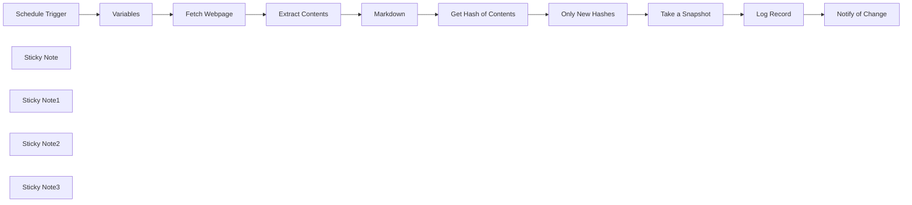

## Fluxo (.json) :

```json
{
  "meta": {
    "instanceId": "408f9fb9940c3cb18ffdef0e0150fe342d6e655c3a9fac21f0f644e8bedabcd9",
    "templateCredsSetupCompleted": true
  },
  "nodes": [
    {
      "id": "1083afcb-1257-45a3-b331-d93fb8769548",
      "name": "Schedule Trigger",
      "type": "n8n-nodes-base.scheduleTrigger",
      "position": [
        -840,
        0
      ],
      "parameters": {
        "rule": {
          "interval": [
            {}
          ]
        }
      },
      "typeVersion": 1.2
    },
    {
      "id": "c3ec0759-a3d1-4866-978a-bfe4f49ee81d",
      "name": "Get Hash of Contents",
      "type": "n8n-nodes-base.crypto",
      "position": [
        380,
        0
      ],
      "parameters": {
        "value": "={{ $json.data }}",
        "dataPropertyName": "hash"
      },
      "typeVersion": 1
    },
    {
      "id": "4ad92ad3-6f99-43a5-9a61-374adb3b28f7",
      "name": "Notify of Change",
      "type": "n8n-nodes-base.gmail",
      "position": [
        1220,
        0
      ],
      "webhookId": "cc4cbee1-ad57-48fb-810a-b21880357ab0",
      "parameters": {
        "sendTo": "jim@example.com",
        "message": "=site: {{ $('Variables').first().json.url }}\ndate: {{ $now.toISO() }}\nhash: {{ $json.hash }}\ncontents: {{ $json.gdrive }}",
        "options": {},
        "subject": "=Change detected for {{ $('Variables').first().json.url }}",
        "emailType": "text"
      },
      "credentials": {
        "gmailOAuth2": {
          "id": "Sf5Gfl9NiFTNXFWb",
          "name": "Gmail account"
        }
      },
      "typeVersion": 2.1
    },
    {
      "id": "9385242a-86b1-4624-ada9-949851b68054",
      "name": "Markdown",
      "type": "n8n-nodes-base.markdown",
      "position": [
        200,
        0
      ],
      "parameters": {
        "html": "={{ $json.content.trim() }}",
        "options": {}
      },
      "typeVersion": 1
    },
    {
      "id": "663b6ba2-cbf9-44ea-a062-f88ccb0640c1",
      "name": "Variables",
      "type": "n8n-nodes-base.set",
      "position": [
        -460,
        0
      ],
      "parameters": {
        "options": {},
        "assignments": {
          "assignments": [
            {
              "id": "fa706ed3-7425-4f0e-9590-d9478b4e6692",
              "name": "url",
              "type": "string",
              "value": "https://x.com/en/tos"
            }
          ]
        }
      },
      "typeVersion": 3.4
    },
    {
      "id": "2ef69fff-4d7a-439a-b317-ea5fa3ce7869",
      "name": "Only New Hashes",
      "type": "n8n-nodes-base.removeDuplicates",
      "position": [
        560,
        0
      ],
      "parameters": {
        "options": {
          "historySize": 1
        },
        "operation": "removeItemsSeenInPreviousExecutions",
        "dedupeValue": "={{ $json.hash }}"
      },
      "typeVersion": 2
    },
    {
      "id": "93e13d80-a26f-408f-be4e-b582ab9fd9bd",
      "name": "Log Record",
      "type": "n8n-nodes-base.googleSheets",
      "position": [
        1040,
        0
      ],
      "parameters": {
        "columns": {
          "value": {
            "hash": "={{ $('Get Hash of Contents').first().json.hash }}",
            "gdrive": "=https://drive.google.com/file/d/{{ $json.id }}/view?usp=sharing",
            "website": "={{ $('Variables').first().json.url }}",
            "date of change": "={{ $now.toISO() }}"
          },
          "schema": [
            {
              "id": "website",
              "type": "string",
              "display": true,
              "required": false,
              "displayName": "website",
              "defaultMatch": false,
              "canBeUsedToMatch": true
            },
            {
              "id": "hash",
              "type": "string",
              "display": true,
              "required": false,
              "displayName": "hash",
              "defaultMatch": false,
              "canBeUsedToMatch": true
            },
            {
              "id": "date of change",
              "type": "string",
              "display": true,
              "required": false,
              "displayName": "date of change",
              "defaultMatch": false,
              "canBeUsedToMatch": true
            },
            {
              "id": "gdrive",
              "type": "string",
              "display": true,
              "removed": false,
              "required": false,
              "displayName": "gdrive",
              "defaultMatch": false,
              "canBeUsedToMatch": true
            }
          ],
          "mappingMode": "defineBelow",
          "matchingColumns": [],
          "attemptToConvertTypes": false,
          "convertFieldsToString": false
        },
        "options": {},
        "operation": "append",
        "sheetName": {
          "__rl": true,
          "mode": "list",
          "value": "gid=0",
          "cachedResultUrl": "https://docs.google.com/spreadsheets/d/1K13OBMicH-ebhvJRYo4sHiOuHd1KIX2jiFxBLWy2UOk/edit#gid=0",
          "cachedResultName": "Sheet1"
        },
        "documentId": {
          "__rl": true,
          "mode": "list",
          "value": "1K13OBMicH-ebhvJRYo4sHiOuHd1KIX2jiFxBLWy2UOk",
          "cachedResultUrl": "https://docs.google.com/spreadsheets/d/1K13OBMicH-ebhvJRYo4sHiOuHd1KIX2jiFxBLWy2UOk/edit?usp=drivesdk",
          "cachedResultName": "86. Webpage Changes Tracker"
        }
      },
      "credentials": {
        "googleSheetsOAuth2Api": {
          "id": "XHvC7jIRR8A2TlUl",
          "name": "Google Sheets account"
        }
      },
      "typeVersion": 4.5
    },
    {
      "id": "dea15963-61de-4371-b716-7683e0e703a9",
      "name": "Sticky Note",
      "type": "n8n-nodes-base.stickyNote",
      "position": [
        -540,
        -160
      ],
      "parameters": {
        "color": 7,
        "width": 620,
        "height": 380,
        "content": "## 1. Fetch a Webpage Contents\n[Read more about the HTTP request node](https://docs.n8n.io/integrations/builtin/core-nodes/n8n-nodes-base.httprequest)"
      },
      "typeVersion": 1
    },
    {
      "id": "bcb1c0b1-fc77-4417-a9c0-6299ce8ca33e",
      "name": "Sticky Note1",
      "type": "n8n-nodes-base.stickyNote",
      "position": [
        100,
        -160
      ],
      "parameters": {
        "color": 7,
        "width": 640,
        "height": 400,
        "content": "## 2. Use Hashing to Detect Changes\n[Learn more about the cryptography node](https://docs.n8n.io/integrations/builtin/core-nodes/n8n-nodes-base.crypto/)"
      },
      "typeVersion": 1
    },
    {
      "id": "eda51de6-80a2-42b1-83ba-66c551911c45",
      "name": "Fetch Webpage",
      "type": "n8n-nodes-base.httpRequest",
      "position": [
        -280,
        0
      ],
      "parameters": {
        "url": "={{ $json.url }}",
        "options": {},
        "sendHeaders": true,
        "headerParameters": {
          "parameters": [
            {
              "name": "User-Agent",
              "value": "Mozilla/5.0 (Macintosh; Intel Mac OS X 10_15_7) AppleWebKit/537.36 (KHTML, like Gecko) Chrome/134.0.0.0 Safari/537.36"
            }
          ]
        }
      },
      "typeVersion": 4.2
    },
    {
      "id": "8aa998f1-1558-4b54-a95a-7be9360a819a",
      "name": "Extract Contents",
      "type": "n8n-nodes-base.html",
      "position": [
        -100,
        0
      ],
      "parameters": {
        "options": {},
        "operation": "extractHtmlContent",
        "extractionValues": {
          "values": [
            {
              "key": "content",
              "cssSelector": ".ct07",
              "returnValue": "html"
            }
          ]
        }
      },
      "typeVersion": 1.2
    },
    {
      "id": "ecb60054-563c-4c0b-949c-abdcd3896f6b",
      "name": "Sticky Note2",
      "type": "n8n-nodes-base.stickyNote",
      "position": [
        760,
        -160
      ],
      "parameters": {
        "color": 7,
        "width": 660,
        "height": 400,
        "content": "## 3. Notify when Changes Occur\n[Read more about the Gmail node](https://docs.n8n.io/integrations/builtin/app-nodes/n8n-nodes-base.gmail)\n"
      },
      "typeVersion": 1
    },
    {
      "id": "30774606-5e63-4d73-9894-ba14d5b1fc46",
      "name": "Take a Snapshot",
      "type": "n8n-nodes-base.googleDrive",
      "position": [
        860,
        0
      ],
      "parameters": {
        "name": "={{\n$('Variables').item.json.url\n  .extractDomain()\n  .replace('.','_')\n  + $json.hash\n  + '.md'\n}}",
        "content": "={{ $json.data }}",
        "driveId": {
          "__rl": true,
          "mode": "list",
          "value": "My Drive"
        },
        "options": {},
        "folderId": {
          "__rl": true,
          "mode": "list",
          "value": "1BbP5HRnjNkCvcDRFFg1bm0sNYBGZM6AU",
          "cachedResultUrl": "https://drive.google.com/drive/folders/1BbP5HRnjNkCvcDRFFg1bm0sNYBGZM6AU",
          "cachedResultName": "86. Monitor Webpage Changes"
        },
        "operation": "createFromText"
      },
      "credentials": {
        "googleDriveOAuth2Api": {
          "id": "yOwz41gMQclOadgu",
          "name": "Google Drive account"
        }
      },
      "typeVersion": 3
    },
    {
      "id": "9ae563ea-49a3-4dcc-9190-8746650018aa",
      "name": "Sticky Note3",
      "type": "n8n-nodes-base.stickyNote",
      "position": [
        -1040,
        -760
      ],
      "parameters": {
        "width": 440,
        "height": 980,
        "content": "## Try it out\n### This n8n template can monitor and detect changes to a webpage's contents and notify you only when a change occurs.\n\nGreat to keep an eye on and track publicly available documents such as  company TOS, government policy or competitor pages.\n\n### How it works\n* A scheduled trigger is used so we can run everyday to automate this process.\n* A website page is then fetched with the HTTP request node and the contents we want to track are extracted using the HTML node.\n* To detect changes, we generate a hash on the contents with the cryptography node and compare it with previously seen hashes using the \"remove duplicates\" node. If the hash was seen before, the workflow stops here.\n* Finally, when new changes are detected a copy of the contents are uploaded to Google Drive and a logged into a Google sheet. A notification email can also be sent if action is required.\n\n### How to use\n* Update the URL you want to track in the node named \"variables\" and ensure the HTML node has updated selectors to get the content you want.\n* Ensure the timezone is set correctly when using the Scheduled Trigger node.\n\n### Need Help?\nJoin the [Discord](https://discord.com/invite/XPKeKXeB7d) or ask in the [Forum](https://community.n8n.io/)!"
      },
      "typeVersion": 1
    }
  ],
  "pinData": {},
  "connections": {
    "Markdown": {
      "main": [
        [
          {
            "node": "Get Hash of Contents",
            "type": "main",
            "index": 0
          }
        ]
      ]
    },
    "Variables": {
      "main": [
        [
          {
            "node": "Fetch Webpage",
            "type": "main",
            "index": 0
          }
        ]
      ]
    },
    "Log Record": {
      "main": [
        [
          {
            "node": "Notify of Change",
            "type": "main",
            "index": 0
          }
        ]
      ]
    },
    "Fetch Webpage": {
      "main": [
        [
          {
            "node": "Extract Contents",
            "type": "main",
            "index": 0
          }
        ]
      ]
    },
    "Only New Hashes": {
      "main": [
        [
          {
            "node": "Take a Snapshot",
            "type": "main",
            "index": 0
          }
        ]
      ]
    },
    "Take a Snapshot": {
      "main": [
        [
          {
            "node": "Log Record",
            "type": "main",
            "index": 0
          }
        ]
      ]
    },
    "Extract Contents": {
      "main": [
        [
          {
            "node": "Markdown",
            "type": "main",
            "index": 0
          }
        ]
      ]
    },
    "Schedule Trigger": {
      "main": [
        [
          {
            "node": "Variables",
            "type": "main",
            "index": 0
          }
        ]
      ]
    },
    "Get Hash of Contents": {
      "main": [
        [
          {
            "node": "Only New Hashes",
            "type": "main",
            "index": 0
          }
        ]
      ]
    }
  }
}
```

<a id="template-733"></a>

## Template 733 - Indexação por objetos para busca de imagens

- **Nome:** Indexação por objetos para busca de imagens
- **Descrição:** Baixa uma imagem, detecta objetos nela, recorta os objetos identificados e indexa as imagens recortadas com metadados para habilitar busca por imagem.
- **Funcionalidade:** • Definição de variáveis: configura conta, modelo, URL da imagem de origem e índice de destino.
• Download da imagem de origem: obtém a imagem a ser processada a partir de uma URL.
• Detecção de objetos com modelo de visão: envia a imagem a um modelo (detr-resnet-50) para identificar objetos e suas caixas delimitadoras.
• Filtragem por confiança: seleciona apenas as detecções com score maior ou igual a 0.9.
• Recorte dos objetos: corta cada objeto da imagem original usando as coordenadas das caixas delimitadoras.
• Upload das imagens recortadas: envia os recortes para um serviço de hospedagem de imagens e obtém URLs otimizadas.
• Indexação em base de busca: cria documentos no índice contendo URL da imagem recortada, URL da imagem fonte, rótulo do objeto e metadados para permitir pesquisa por objetos.
- **Ferramentas:** • Cloudflare Workers AI: serviço de inferência que executa o modelo detr-resnet-50 para detecção de objetos em imagens.
• Cloudinary: plataforma de hospedagem e otimização de imagens usada para armazenar os recortes gerados.
• Elasticsearch: sistema de busca e indexação usado para armazenar metadados e URLs, permitindo consultas por objeto.
• Pexels: fonte pública de imagens (exemplo de URL de imagem utilizada como entrada).

## Fluxo visual

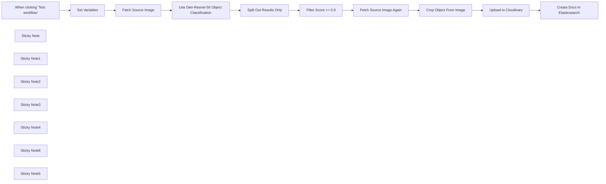

## Fluxo (.json) :

```json
{
  "meta": {
    "instanceId": "26ba763460b97c249b82942b23b6384876dfeb9327513332e743c5f6219c2b8e"
  },
  "nodes": [
    {
      "id": "6359f725-1ede-4b05-bc19-05a7e85c0865",
      "name": "When clicking \"Test workflow\"",
      "type": "n8n-nodes-base.manualTrigger",
      "position": [
        680,
        292
      ],
      "parameters": {},
      "typeVersion": 1
    },
    {
      "id": "9e1e61c7-f5fd-4e8a-99a6-ccc5a24f5528",
      "name": "Fetch Source Image",
      "type": "n8n-nodes-base.httpRequest",
      "position": [
        1000,
        292
      ],
      "parameters": {
        "url": "={{ $json.source_image }}",
        "options": {}
      },
      "typeVersion": 4.2
    },
    {
      "id": "9b1b94cf-3a7d-4c43-ab6c-8df9824b5667",
      "name": "Split Out Results Only",
      "type": "n8n-nodes-base.splitOut",
      "position": [
        1428,
        323
      ],
      "parameters": {
        "options": {},
        "fieldToSplitOut": "result"
      },
      "typeVersion": 1
    },
    {
      "id": "fcbaf6c3-2aee-4ea1-9c5e-2833dd7a9f50",
      "name": "Filter Score >= 0.9",
      "type": "n8n-nodes-base.filter",
      "position": [
        1608,
        323
      ],
      "parameters": {
        "options": {},
        "conditions": {
          "options": {
            "leftValue": "",
            "caseSensitive": true,
            "typeValidation": "strict"
          },
          "combinator": "and",
          "conditions": [
            {
              "id": "367d83ef-8ecf-41fe-858c-9bfd78b0ae9f",
              "operator": {
                "type": "number",
                "operation": "gte"
              },
              "leftValue": "={{ $json.score }}",
              "rightValue": 0.9
            }
          ]
        }
      },
      "typeVersion": 2
    },
    {
      "id": "954ce7b0-ef82-4203-8706-17cfa5e5e3ff",
      "name": "Crop Object From Image",
      "type": "n8n-nodes-base.editImage",
      "position": [
        2080,
        432
      ],
      "parameters": {
        "width": "={{ $json.box.xmax - $json.box.xmin }}",
        "height": "={{ $json.box.ymax - $json.box.ymin }}",
        "options": {
          "format": "jpeg",
          "fileName": "={{ $binary.data.fileName.split('.')[0].urlEncode()+'-'+$json.label.urlEncode() + '-' + $itemIndex }}.jpg"
        },
        "operation": "crop",
        "positionX": "={{ $json.box.xmin }}",
        "positionY": "={{ $json.box.ymin }}"
      },
      "typeVersion": 1
    },
    {
      "id": "40027456-4bf9-4eea-8d71-aa28e69b29e5",
      "name": "Set Variables",
      "type": "n8n-nodes-base.set",
      "position": [
        840,
        292
      ],
      "parameters": {
        "options": {},
        "assignments": {
          "assignments": [
            {
              "id": "9e95d951-8530-4a80-bd00-6bb55623a71f",
              "name": "CLOUDFLARE_ACCOUNT_ID",
              "type": "string",
              "value": ""
            },
            {
              "id": "66807a90-63a1-4d4e-886e-e8abf3019a34",
              "name": "model",
              "type": "string",
              "value": "@cf/facebook/detr-resnet-50"
            },
            {
              "id": "a13ccde6-e6e3-46f4-afa3-2134af7bc765",
              "name": "source_image",
              "type": "string",
              "value": "https://images.pexels.com/photos/2293367/pexels-photo-2293367.jpeg?auto=compress&cs=tinysrgb&w=600"
            },
            {
              "id": "0734fc55-b414-47f7-8b3e-5c880243f3ed",
              "name": "elasticsearch_index",
              "type": "string",
              "value": "n8n-image-search"
            }
          ]
        }
      },
      "typeVersion": 3.3
    },
    {
      "id": "c3d8c5e3-546e-472c-9e6e-091cf5cee3c3",
      "name": "Use Detr-Resnet-50 Object Classification",
      "type": "n8n-nodes-base.httpRequest",
      "position": [
        1248,
        324
      ],
      "parameters": {
        "url": "=https://api.cloudflare.com/client/v4/accounts/{{ $('Set Variables').item.json.CLOUDFLARE_ACCOUNT_ID }}/ai/run/{{ $('Set Variables').item.json.model }}",
        "method": "POST",
        "options": {},
        "sendBody": true,
        "contentType": "binaryData",
        "authentication": "predefinedCredentialType",
        "inputDataFieldName": "data",
        "nodeCredentialType": "cloudflareApi"
      },
      "credentials": {
        "cloudflareApi": {
          "id": "qOynkQdBH48ofOSS",
          "name": "Cloudflare account"
        }
      },
      "typeVersion": 4.2
    },
    {
      "id": "3c7aa2fc-9ca1-41ba-a10d-aa5930d45f18",
      "name": "Upload to Cloudinary",
      "type": "n8n-nodes-base.httpRequest",
      "position": [
        2380,
        380
      ],
      "parameters": {
        "url": "https://api.cloudinary.com/v1_1/daglih2g8/image/upload",
        "method": "POST",
        "options": {},
        "sendBody": true,
        "sendQuery": true,
        "contentType": "multipart-form-data",
        "authentication": "genericCredentialType",
        "bodyParameters": {
          "parameters": [
            {
              "name": "file",
              "parameterType": "formBinaryData",
              "inputDataFieldName": "data"
            }
          ]
        },
        "genericAuthType": "httpQueryAuth",
        "queryParameters": {
          "parameters": [
            {
              "name": "upload_preset",
              "value": "n8n-workflows-preset"
            }
          ]
        }
      },
      "credentials": {
        "httpQueryAuth": {
          "id": "sT9jeKzZiLJ3bVPz",
          "name": "Cloudinary API"
        }
      },
      "typeVersion": 4.2
    },
    {
      "id": "3c4e1f04-a0ba-4cce-b82a-aa3eadc4e7e1",
      "name": "Create Docs In Elasticsearch",
      "type": "n8n-nodes-base.elasticsearch",
      "position": [
        2580,
        380
      ],
      "parameters": {
        "indexId": "={{ $('Set Variables').item.json.elasticsearch_index }}",
        "options": {},
        "fieldsUi": {
          "fieldValues": [
            {
              "fieldId": "image_url",
              "fieldValue": "={{ $json.secure_url.replace('upload','upload/f_auto,q_auto') }}"
            },
            {
              "fieldId": "source_image_url",
              "fieldValue": "={{ $('Set Variables').item.json.source_image }}"
            },
            {
              "fieldId": "label",
              "fieldValue": "={{ $('Crop Object From Image').item.json.label }}"
            },
            {
              "fieldId": "metadata",
              "fieldValue": "={{ JSON.stringify(Object.assign($('Crop Object From Image').item.json, { filename: $json.original_filename })) }}"
            }
          ]
        },
        "operation": "create",
        "additionalFields": {}
      },
      "credentials": {
        "elasticsearchApi": {
          "id": "dRuuhAgS7AF0mw0S",
          "name": "Elasticsearch account"
        }
      },
      "typeVersion": 1
    },
    {
      "id": "292c9821-c123-44fa-9ba1-c37bf84079bc",
      "name": "Sticky Note",
      "type": "n8n-nodes-base.stickyNote",
      "position": [
        620,
        120
      ],
      "parameters": {
        "color": 7,
        "width": 541.1455500767354,
        "height": 381.6388867600897,
        "content": "## 1. Get Source Image\n[Read more about setting variables for your workflow](https://docs.n8n.io/integrations/builtin/core-nodes/n8n-nodes-base.set)\n\nFor this demo, we'll manually define an image to process. In production however, this image can come from a variety of sources such as drives, webhooks and more."
      },
      "typeVersion": 1
    },
    {
      "id": "863271dc-fb9d-4211-972d-6b57336073b4",
      "name": "Sticky Note1",
      "type": "n8n-nodes-base.stickyNote",
      "position": [
        1180,
        80
      ],
      "parameters": {
        "color": 7,
        "width": 579.7748008857744,
        "height": 437.4680103498263,
        "content": "## 2. Use Detr-Resnet-50 Object Classification\n[Learn more about Cloudflare Workers AI](https://developers.cloudflare.com/workers-ai/)\n\nNot all AI workflows need an LLM! As in this example, we're using a non-LLM vision model to parse the source image and return what objects are contained within. The image search feature we're building will be based on the objects in the image making for a much more granular search via object association.\n\nWe'll use the Cloudflare Workers AI service which conveniently provides this model via API use."
      },
      "typeVersion": 1
    },
    {
      "id": "b73b45da-0436-4099-b538-c6b3b84822f2",
      "name": "Sticky Note2",
      "type": "n8n-nodes-base.stickyNote",
      "position": [
        1800,
        260
      ],
      "parameters": {
        "color": 7,
        "width": 466.35460775498495,
        "height": 371.9272151757119,
        "content": "## 3. Crop Objects Out of Source Image\n[Read more about Editing Images in n8n](https://docs.n8n.io/integrations/builtin/core-nodes/n8n-nodes-base.editimage)\n\nWith our objects identified by their bounding boxes, we can \"cut\" them out of the source image as separate images."
      },
      "typeVersion": 1
    },
    {
      "id": "465bd842-8a35-49d8-a9ff-c30d164620db",
      "name": "Sticky Note3",
      "type": "n8n-nodes-base.stickyNote",
      "position": [
        2300,
        180
      ],
      "parameters": {
        "color": 7,
        "width": 478.20345439832454,
        "height": 386.06196032653685,
        "content": "## 4. Index Object Images In ElasticSearch\n[Read more about using ElasticSearch](https://docs.n8n.io/integrations/builtin/app-nodes/n8n-nodes-base.elasticsearch)\n\nBy storing the newly created object images externally and indexing them in Elasticsearch, we now have a foundation for our Image Search service which queries by object association."
      },
      "typeVersion": 1
    },
    {
      "id": "6a04b4b5-7830-410d-9b5b-79acb0b1c78b",
      "name": "Sticky Note4",
      "type": "n8n-nodes-base.stickyNote",
      "position": [
        1800,
        -220
      ],
      "parameters": {
        "color": 7,
        "width": 328.419768654291,
        "height": 462.65463700396174,
        "content": "Fig 1. Result of Classification\n"
      },
      "typeVersion": 1
    },
    {
      "id": "8f607951-ba41-4362-8323-e8b4b96ad122",
      "name": "Fetch Source Image Again",
      "type": "n8n-nodes-base.httpRequest",
      "position": [
        1880,
        432
      ],
      "parameters": {
        "url": "={{ $('Set Variables').item.json.source_image }}",
        "options": {}
      },
      "typeVersion": 4.2
    },
    {
      "id": "6933f67d-276b-4908-8602-654aa352a68b",
      "name": "Sticky Note8",
      "type": "n8n-nodes-base.stickyNote",
      "position": [
        220,
        120
      ],
      "parameters": {
        "width": 359.6648027457353,
        "height": 352.41026669883723,
        "content": "## Try It Out!\n### This workflow does the following:\n* Downloads an image\n* Uses an object classification AI model to identify objects in the image.\n* Crops the objects out from the original image into new image files.\n* Indexes the image's object in an Elasticsearch Database to enable image search.\n\n### Need Help?\nJoin the [Discord](https://discord.com/invite/XPKeKXeB7d) or ask in the [Forum](https://community.n8n.io/)!\n\nHappy Hacking!"
      },
      "typeVersion": 1
    },
    {
      "id": "35615ed5-43e8-43f0-95fe-1f95a1177d69",
      "name": "Sticky Note5",
      "type": "n8n-nodes-base.stickyNote",
      "position": [
        800,
        280
      ],
      "parameters": {
        "width": 172.9365918827757,
        "height": 291.6881468483679,
        "content": "\n\n\n\n\n\n\n\n\n\n\n\n\n\n\n\n🚨**Required**\n* Set your variables here first!"
      },
      "typeVersion": 1
    }
  ],
  "pinData": {},
  "connections": {
    "Set Variables": {
      "main": [
        [
          {
            "node": "Fetch Source Image",
            "type": "main",
            "index": 0
          }
        ]
      ]
    },
    "Fetch Source Image": {
      "main": [
        [
          {
            "node": "Use Detr-Resnet-50 Object Classification",
            "type": "main",
            "index": 0
          }
        ]
      ]
    },
    "Filter Score >= 0.9": {
      "main": [
        [
          {
            "node": "Fetch Source Image Again",
            "type": "main",
            "index": 0
          }
        ]
      ]
    },
    "Upload to Cloudinary": {
      "main": [
        [
          {
            "node": "Create Docs In Elasticsearch",
            "type": "main",
            "index": 0
          }
        ]
      ]
    },
    "Crop Object From Image": {
      "main": [
        [
          {
            "node": "Upload to Cloudinary",
            "type": "main",
            "index": 0
          }
        ]
      ]
    },
    "Split Out Results Only": {
      "main": [
        [
          {
            "node": "Filter Score >= 0.9",
            "type": "main",
            "index": 0
          }
        ]
      ]
    },
    "Fetch Source Image Again": {
      "main": [
        [
          {
            "node": "Crop Object From Image",
            "type": "main",
            "index": 0
          }
        ]
      ]
    },
    "When clicking \"Test workflow\"": {
      "main": [
        [
          {
            "node": "Set Variables",
            "type": "main",
            "index": 0
          }
        ]
      ]
    },
    "Use Detr-Resnet-50 Object Classification": {
      "main": [
        [
          {
            "node": "Split Out Results Only",
            "type": "main",
            "index": 0
          }
        ]
      ]
    }
  }
}
```

<a id="template-734"></a>

## Template 734 - Monitor de procedimentos sustentáveis da UE

- **Nome:** Monitor de procedimentos sustentáveis da UE
- **Descrição:** Rastreia as propostas legislativas publicadas num dia específico, classifica automaticamente as que são relacionadas com sustentabilidade e grava os resultados numa planilha, além de criar tarefas para estudo dessas propostas.
- **Funcionalidade:** • Captura da página OEIL: Faz uma requisição HTTP para obter o HTML dos procedimentos de um dia específico.
• Extração de blocos HTML: Isola blocos de documentos na página para processamento individual.
• Parse de campos do documento: Extrai número de referência, comissão, relator, título/descrição, link para PDF e data de cada procedimento.
• Normalização de links: Ajusta os links extraídos para formar URLs completas para os PDFs.
• Loop por itens: Processa cada procedimento individualmente para classificação.
• Classificação por LLM: Envia título e comissão a um grande modelo de linguagem para determinar se o assunto é relacionado com sustentabilidade (resposta "yes" ou "no").
• Combinação de dados e resultado: Junta a resposta do classificador com os dados originais do procedimento.
• Filtragem de procedimentos: Mantém apenas os procedimentos classificados como relacionados com sustentabilidade.
• Registro em planilha: Adiciona os procedimentos filtrados a uma Google Sheet com campos chave (referência, comissão, relator, título, PDF, data).
• Criação de tarefas: Para cada procedimento relevante, cria uma tarefa agendada (ex.: estudo) numa lista de tarefas do usuário.
- **Ferramentas:** • Europarl OEIL (site oficial): Fonte pública de informação sobre procedimentos legislativos do Parlamento Europeu.
• Modelo de linguagem (ex.: OpenAI/GPT): Serviço de IA usado para classificar se um procedimento está relacionado com sustentabilidade.
• Google Sheets: Armazena os procedimentos identificados como relacionados com sustentabilidade.
• Google Tasks: Gera tarefas para estudo dos procedimentos selecionados.

## Fluxo visual

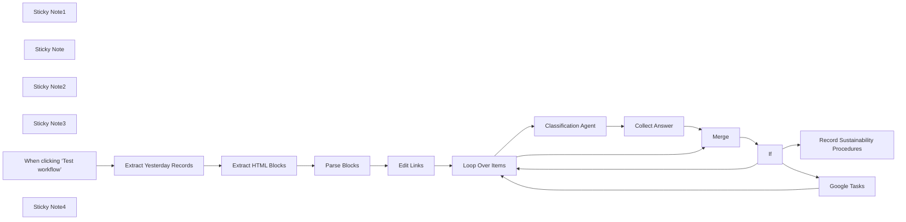

## Fluxo (.json) :

```json
{
  "meta": {
    "instanceId": "="
  },
  "nodes": [
    {
      "id": "4dfef9cb-d66a-4818-b5b2-6be81f0bd7c3",
      "name": "Loop Over Items",
      "type": "n8n-nodes-base.splitInBatches",
      "position": [
        1160,
        500
      ],
      "parameters": {
        "options": {}
      },
      "typeVersion": 3
    },
    {
      "id": "3fd73086-62cc-49c4-9c56-b2467a27601c",
      "name": "Merge",
      "type": "n8n-nodes-base.merge",
      "position": [
        1980,
        360
      ],
      "parameters": {
        "mode": "combineBySql"
      },
      "notesInFlow": true,
      "typeVersion": 3
    },
    {
      "id": "a894cc7b-7e2c-40af-bbdd-de03c9fdf71c",
      "name": "If",
      "type": "n8n-nodes-base.if",
      "position": [
        2200,
        440
      ],
      "parameters": {
        "options": {},
        "conditions": {
          "options": {
            "version": 2,
            "leftValue": "",
            "caseSensitive": true,
            "typeValidation": "strict"
          },
          "combinator": "and",
          "conditions": [
            {
              "id": "e3956615-6ad2-4df7-a15f-63f1f21d10fe",
              "operator": {
                "name": "filter.operator.equals",
                "type": "string",
                "operation": "equals"
              },
              "leftValue": "={{ $json.sustainability }}",
              "rightValue": "yes"
            }
          ]
        }
      },
      "typeVersion": 2.2
    },
    {
      "id": "b1b1616c-68f7-4911-b58d-8792ac4e822c",
      "name": "Extract Yesterday Records",
      "type": "n8n-nodes-base.httpRequest",
      "position": [
        280,
        500
      ],
      "parameters": {
        "url": "=https://oeil.secure.europarl.europa.eu/oeil/en/search?sessionDay.allDays=false&sessionDay.day={{$now.minus(18,'days').format('yyyyMMdd')}}&sessionDay.type=ALL",
        "options": {}
      },
      "notesInFlow": true,
      "typeVersion": 4.2
    },
    {
      "id": "707ae04c-51d3-4547-9868-1c603d359cc0",
      "name": "Sticky Note1",
      "type": "n8n-nodes-base.stickyNote",
      "position": [
        0,
        0
      ],
      "parameters": {
        "color": 7,
        "width": 1080,
        "height": 660,
        "content": "### 1. First Block: scrape the page to extract all the legislative procedures scheduled for debate yesterday\nThis workflow sends an HTTP request to collect the HTML of the page by block. For each block we extract the information of the procedures: **Reference Number**. **Committee**, **Rapporteur**, **Title/Description**, **PDF Link**.\n\n#### How to setup?\n*Nothing to do*\n"
      },
      "typeVersion": 1
    },
    {
      "id": "721a14b6-c860-431e-8475-b877d5a83768",
      "name": "Extract HTML Blocks",
      "type": "n8n-nodes-base.html",
      "position": [
        500,
        500
      ],
      "parameters": {
        "options": {},
        "operation": "extractHtmlContent",
        "extractionValues": {
          "values": [
            {
              "key": "Blocks",
              "cssSelector": ".erpl_document-wrapper",
              "returnArray": true,
              "returnValue": "html"
            }
          ]
        }
      },
      "notesInFlow": true,
      "typeVersion": 1.2
    },
    {
      "id": "fe609066-0f08-40b7-b8a8-13acd8338468",
      "name": "Parse Blocks",
      "type": "n8n-nodes-base.html",
      "position": [
        720,
        500
      ],
      "parameters": {
        "options": {},
        "operation": "extractHtmlContent",
        "dataPropertyName": "Blocks",
        "extractionValues": {
          "values": [
            {
              "key": "Reference Number",
              "cssSelector": "h3 span.t-item"
            },
            {
              "key": "Committee",
              "cssSelector": "span.erpl_badge-committee"
            },
            {
              "key": "Rapporteur",
              "cssSelector": "span.erpl_document-subtitle-author"
            },
            {
              "key": "Title/Description",
              "cssSelector": "div.erpl_document-body p"
            },
            {
              "key": "PDF Link\t",
              "attribute": "href",
              "cssSelector": "a.erpl_document-subtitle-pdf",
              "returnValue": "attribute"
            },
            {
              "key": "Date",
              "cssSelector": "div.mt-1 p"
            }
          ]
        }
      },
      "notesInFlow": true,
      "typeVersion": 1.2
    },
    {
      "id": "75770b01-0c98-4077-97d7-3bbc82166372",
      "name": "Sticky Note",
      "type": "n8n-nodes-base.stickyNote",
      "position": [
        1100,
        0
      ],
      "parameters": {
        "color": 7,
        "width": 1020,
        "height": 660,
        "content": "### 2. Use a LLM to keep only the procedures related to sustainability\nWe loop though all items parsed and we provide the description and the committee to a LLM (Open AI). The LLM will use these information to assess if the procedure is related to **sustainability** or not.\n\n#### How to setup?\n\n- **Open AI Node**:\n   1. Add the required credentials Open AI credentials and select the model *(Example: Open AI 4o-mini)*\n   2. Adapt the system prompt with the topic you want to filter out or keep.\n  [Learn more about the AI Agent Node](https://docs.n8n.io/integrations/builtin/cluster-nodes/root-nodes/n8n-nodes-langchain.agent)\n"
      },
      "typeVersion": 1
    },
    {
      "id": "bfdc9844-7d9c-4582-83bb-9e945276864e",
      "name": "Sticky Note2",
      "type": "n8n-nodes-base.stickyNote",
      "position": [
        2140,
        20
      ],
      "parameters": {
        "color": 7,
        "width": 500,
        "height": 660,
        "content": "### 3. Topics related to sustainability are stored in a Google Sheet\nThe output of the LLM is combined with the other fields. A IF node filters out all the procedure not related to sustainability. The remaining items are loaded in a Google Sheet.\n\n#### How to setup?\n\n- **Record outputs in the Google Sheet Node**:\n   1. Add your Google Sheet API credentials to access the Google Sheet file\n   2. Select the file using the list, an URL or an ID\n   3. Select the sheet in which you want to record your working sessions\n   4. Map the fields: **Reference Number**. **Committee**, **Rapporteur**, **Title/Description**, **PDF Link**\n  [Learn more about the Google Sheet Node](https://docs.n8n.io/integrations/builtin/app-nodes/n8n-nodes-base.googlesheets)\n"
      },
      "typeVersion": 1
    },
    {
      "id": "38a6d477-0a95-4177-a5d4-10f4c97bcf0c",
      "name": "Google Tasks",
      "type": "n8n-nodes-base.googleTasks",
      "position": [
        2400,
        940
      ],
      "parameters": {
        "task": "MTIxODU0NDk4MzM3NzAxMTQ0NzY6MDow",
        "title": "=Study {{ $json['Reference Number'] }} - EU Legislation",
        "additionalFields": {
          "notes": "=Title: {{ $json['Title/Description'] }}\nReference Number: {{ $json['Reference Number'] }}\nCommittee: {{ $json.Committee }}\nRapporteur: {{ $json.Rapporteur }}\nPDF Link: {{ $json['PDF Link\t'] }}\nDate: {{ $json.Date }}",
          "status": "needsAction"
        }
      },
      "typeVersion": 1
    },
    {
      "id": "9d27672c-2434-46d3-ae52-e0ba07b3a181",
      "name": "Sticky Note3",
      "type": "n8n-nodes-base.stickyNote",
      "position": [
        2140,
        700
      ],
      "parameters": {
        "color": 7,
        "width": 500,
        "height": 440,
        "content": "### 4. Create Sustainability Study Task\nCreate a Google Task for each EU legislative file related to sustainability, scheduled for tomorrow at 09:00 AM.\n#### How to setup?\n\n- **Add a task in Google Task**:\n   1. Add your Google Task API credentials to access your task list\n   2. Change the Task List name\n  [Learn more about the Google Task Node](https://docs.n8n.io/integrations/builtin/app-nodes/n8n-nodes-base.googletasks)\n"
      },
      "typeVersion": 1
    },
    {
      "id": "8196fd1c-3223-402b-935b-a6a135795999",
      "name": "When clicking ‘Test workflow’",
      "type": "n8n-nodes-base.manualTrigger",
      "position": [
        60,
        500
      ],
      "parameters": {},
      "typeVersion": 1
    },
    {
      "id": "ff6f948b-9db4-479d-afab-3db6176abad6",
      "name": "Classification Agent",
      "type": "@n8n/n8n-nodes-langchain.openAi",
      "position": [
        1380,
        280
      ],
      "parameters": {
        "modelId": {
          "__rl": true,
          "mode": "list",
          "value": "gpt-4-turbo",
          "cachedResultName": "GPT-4-TURBO"
        },
        "options": {},
        "messages": {
          "values": [
            {
              "content": "=Is the following legislative document related to sustainability? Answer \"yes\" or \"no\".\n\nTitle: {{ $json['Title/Description'] }}\nCommittee: {{ $json[\"Committee\"] }}\n\nBe strict: Only answer \"yes\" if the topic directly impacts environmental or climate sustainability, circular economy, resource conservation, or pollution reduction.\n"
            },
            {
              "role": "system",
              "content": "Sample output:\n{\"answer\": \"yes\"}\n"
            }
          ]
        },
        "jsonOutput": true
      },
      "typeVersion": 1.8
    },
    {
      "id": "01379394-a5e9-4673-bc0e-225e2d3f5214",
      "name": "Collect Answer",
      "type": "n8n-nodes-base.set",
      "position": [
        1760,
        280
      ],
      "parameters": {
        "options": {},
        "assignments": {
          "assignments": [
            {
              "id": "19b1ea4c-3c78-4473-9f16-17d37b273735",
              "name": "sustainability",
              "type": "string",
              "value": "={{ $json.message.content.answer }}"
            }
          ]
        }
      },
      "notesInFlow": true,
      "typeVersion": 3.4
    },
    {
      "id": "8f96dfd0-0a38-435c-83a0-7649b350f813",
      "name": "Record Sustainability Procedures",
      "type": "n8n-nodes-base.googleSheets",
      "position": [
        2420,
        380
      ],
      "parameters": {
        "columns": {
          "value": {
            "Date": "={{ $json.Date }}",
            "PDF Link": "={{ $json['PDF Link\t'] }}",
            "Committee": "={{ $json.Committee }}",
            "Rapporteur": "={{ $json.Rapporteur }}",
            "Reference Number": "={{ $json['Reference Number'] }}",
            "Title/Description": "={{ $json['Title/Description'] }}"
          },
          "schema": [
            {
              "id": "Reference Number",
              "type": "string",
              "display": true,
              "required": false,
              "displayName": "Reference Number",
              "defaultMatch": false,
              "canBeUsedToMatch": true
            },
            {
              "id": "Committee",
              "type": "string",
              "display": true,
              "required": false,
              "displayName": "Committee",
              "defaultMatch": false,
              "canBeUsedToMatch": true
            },
            {
              "id": "Rapporteur",
              "type": "string",
              "display": true,
              "required": false,
              "displayName": "Rapporteur",
              "defaultMatch": false,
              "canBeUsedToMatch": true
            },
            {
              "id": "Title/Description",
              "type": "string",
              "display": true,
              "required": false,
              "displayName": "Title/Description",
              "defaultMatch": false,
              "canBeUsedToMatch": true
            },
            {
              "id": "PDF Link",
              "type": "string",
              "display": true,
              "required": false,
              "displayName": "PDF Link",
              "defaultMatch": false,
              "canBeUsedToMatch": true
            },
            {
              "id": "Date",
              "type": "string",
              "display": true,
              "required": false,
              "displayName": "Date",
              "defaultMatch": false,
              "canBeUsedToMatch": true
            }
          ],
          "mappingMode": "defineBelow",
          "matchingColumns": [],
          "attemptToConvertTypes": false,
          "convertFieldsToString": false
        },
        "options": {},
        "operation": "append",
        "sheetName": {
          "__rl": true,
          "mode": "list",
          "value": "gid=0",
          "cachedResultUrl": "=",
          "cachedResultName": "EU Legislative Procedure"
        },
        "documentId": {
          "__rl": true,
          "mode": "list",
          "value": "=",
          "cachedResultUrl": "=",
          "cachedResultName": "Sustainability Content"
        }
      },
      "credentials": {
        "googleSheetsOAuth2Api": {
          "id": "rnPYZIig8l6seOd5",
          "name": "Google Sheets Temporary"
        }
      },
      "notesInFlow": true,
      "typeVersion": 4.5
    },
    {
      "id": "c2cf974e-f182-48f8-9d26-8aea4dbdf486",
      "name": "Edit Links",
      "type": "n8n-nodes-base.set",
      "position": [
        940,
        500
      ],
      "parameters": {
        "options": {},
        "assignments": {
          "assignments": [
            {
              "id": "7a802593-2b9b-42fe-bd0c-66e11510834a",
              "name": "PDF Link\t",
              "type": "string",
              "value": "=https://oeil.secure.europarl.europa.eu{{ $json['PDF Link\t'] }}"
            }
          ]
        },
        "includeOtherFields": true
      },
      "notesInFlow": true,
      "typeVersion": 3.4
    },
    {
      "id": "bdc398f0-a882-4fbe-ac37-7ca7e15a1081",
      "name": "Sticky Note4",
      "type": "n8n-nodes-base.stickyNote",
      "position": [
        2660,
        20
      ],
      "parameters": {
        "width": 460,
        "height": 340,
        "content": "\n[🎥 Check My Tutorial](https://www.youtube.com/watch?v=f_nyArpH6kk)"
      },
      "typeVersion": 1
    }
  ],
  "pinData": {},
  "connections": {
    "If": {
      "main": [
        [
          {
            "node": "Record Sustainability Procedures",
            "type": "main",
            "index": 0
          },
          {
            "node": "Google Tasks",
            "type": "main",
            "index": 0
          }
        ],
        [
          {
            "node": "Loop Over Items",
            "type": "main",
            "index": 0
          }
        ]
      ]
    },
    "Merge": {
      "main": [
        [
          {
            "node": "If",
            "type": "main",
            "index": 0
          }
        ]
      ]
    },
    "Edit Links": {
      "main": [
        [
          {
            "node": "Loop Over Items",
            "type": "main",
            "index": 0
          }
        ]
      ]
    },
    "Google Tasks": {
      "main": [
        [
          {
            "node": "Loop Over Items",
            "type": "main",
            "index": 0
          }
        ]
      ]
    },
    "Parse Blocks": {
      "main": [
        [
          {
            "node": "Edit Links",
            "type": "main",
            "index": 0
          }
        ]
      ]
    },
    "Collect Answer": {
      "main": [
        [
          {
            "node": "Merge",
            "type": "main",
            "index": 1
          }
        ]
      ]
    },
    "Loop Over Items": {
      "main": [
        [],
        [
          {
            "node": "Classification Agent",
            "type": "main",
            "index": 0
          },
          {
            "node": "Merge",
            "type": "main",
            "index": 0
          }
        ]
      ]
    },
    "Extract HTML Blocks": {
      "main": [
        [
          {
            "node": "Parse Blocks",
            "type": "main",
            "index": 0
          }
        ]
      ]
    },
    "Classification Agent": {
      "main": [
        [
          {
            "node": "Collect Answer",
            "type": "main",
            "index": 0
          }
        ]
      ]
    },
    "Extract Yesterday Records": {
      "main": [
        [
          {
            "node": "Extract HTML Blocks",
            "type": "main",
            "index": 0
          }
        ]
      ]
    },
    "When clicking ‘Test workflow’": {
      "main": [
        [
          {
            "node": "Extract Yesterday Records",
            "type": "main",
            "index": 0
          }
        ]
      ]
    }
  }
}
```

<a id="template-735"></a>

## Template 735 - Agente IA para Airtable e análise de dados

- **Nome:** Agente IA para Airtable e análise de dados
- **Descrição:** Este fluxo permite conversar com os dados armazenados no Airtable através de um agente de IA que pode pesquisar registros, consultar esquemas, gerar filtros, executar cálculos e criar visualizações, mantendo contexto da conversa.
- **Funcionalidade:** • Detecção e iniciação de conversa com o usuário quando há mensagem de chat.
• Descoberta da estrutura de bases e tabelas (listar bases e obter schema).
• Geração automática de filtros de busca com IA para consultas Airtable.
• Busca de registros com filtros, limites, seleção de campos e ordenação.
• Processamento de dados com código para operações matemáticas, agregações e geração de gráficos/imagens.
• Geração de mapas com marcadores a partir de dados geográficos.
• Armazenamento de memória de sessão para manter contexto entre interações.
• Gerenciamento de conversa via threads (criação de thread, envio de mensagens e obtenção de respostas).
• Agregação de dados de registros retornados para insights.
• Orquestração de fluxo com condições, mesclando resultados e roteando para ações apropriadas.
• Retorno de resultados com links/URLs (imagens, mapas ou arquivos gerados).
- **Ferramentas:** • Airtable: Base de dados baseada na nuvem usada para armazenar e consultar registros em bases e tabelas específicas.
• Mapbox: Serviço de mapas usado para gerar imagens estáticas com marcadores a partir de coordenadas.
• OpenAI: Serviço de IA usado para entender e gerar filtros e gerenciar conversas.
• tmpfiles.org: Serviço de upload de arquivos para gerar links compartilháveis.

## Fluxo visual

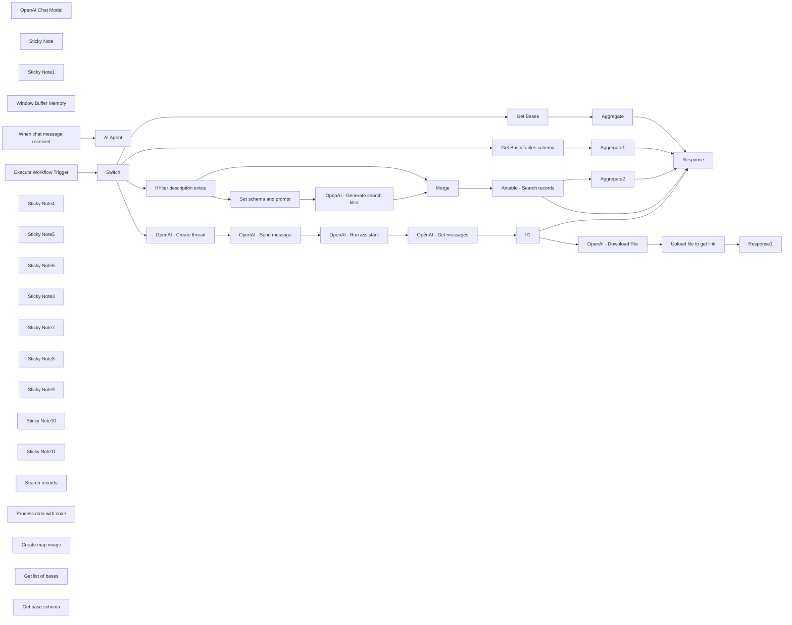

## Fluxo (.json) :

```json
{
  "nodes": [
    {
      "id": "799d2e0c-29b9-494c-b11a-d79c7ed4a06d",
      "name": "OpenAI Chat Model",
      "type": "@n8n/n8n-nodes-langchain.lmChatOpenAi",
      "position": [
        920,
        480
      ],
      "parameters": {
        "options": {}
      },
      "credentials": {
        "openAiApi": {
          "id": "zJhr5piyEwVnWtaI",
          "name": "OpenAi club"
        }
      },
      "typeVersion": 1
    },
    {
      "id": "6254ef4e-9699-404e-96a4-569326cce48d",
      "name": "AI Agent",
      "type": "@n8n/n8n-nodes-langchain.agent",
      "position": [
        1160,
        200
      ],
      "parameters": {
        "text": "={{ $('When chat message received').item.json.chatInput }}",
        "agent": "openAiFunctionsAgent",
        "options": {
          "maxIterations": 10,
          "systemMessage": "You are Airtable assistant. \nYou need to process user's requests and run relevant tools for that. \n\nPlan and execute in right order runs of tools to get data for user's request.\n\nFeel free to ask questions before do actions - especially if you noticed some inconcistency in user requests that might be error/misspelling. \n\nIMPORTANT Always check right table and base ids before doing queries.\n\nIMPORTANT Use Code function to do aggregation functions that requires math like - count, sum, average and etc.  Aggegation function could be recognized by words like \"how many\",\"count\",\"what number\" and etc.\nUse Code function to generate graph and images.\n\nIMPORTANT If search with filter failed - try to fetch records without filter\n\nIMPORTANT Ask yourself before answering - am I did everything is possible? Is the answer is right? Is the answer related to user request?\n\nIMPORTANT Always return in response name of Base and Table where records from. "
        },
        "promptType": "define"
      },
      "typeVersion": 1.6
    },
    {
      "id": "227a5427-c270-47dc-bc08-4bb321314926",
      "name": "Sticky Note",
      "type": "n8n-nodes-base.stickyNote",
      "position": [
        1740,
        620
      ],
      "parameters": {
        "height": 80,
        "content": "### Replace Mapbox public key - <your_public_key> in code"
      },
      "typeVersion": 1
    },
    {
      "id": "667751f4-9815-45b7-8dd2-9a0821a7a5a7",
      "name": "Sticky Note1",
      "type": "n8n-nodes-base.stickyNote",
      "position": [
        840,
        640
      ],
      "parameters": {
        "height": 80,
        "content": "### Replace OpenAI connection"
      },
      "typeVersion": 1
    },
    {
      "id": "a9cdec25-4167-44a9-9d3c-fb04aac7bb32",
      "name": "Window Buffer Memory",
      "type": "@n8n/n8n-nodes-langchain.memoryBufferWindow",
      "position": [
        1080,
        480
      ],
      "parameters": {
        "sessionKey": "={{ $('When chat message received').item.json.sessionId }}",
        "sessionIdType": "customKey"
      },
      "typeVersion": 1.3
    },
    {
      "id": "dfab4eb2-ba30-4756-8a52-5d73de9fba53",
      "name": "When chat message received",
      "type": "@n8n/n8n-nodes-langchain.chatTrigger",
      "position": [
        940,
        200
      ],
      "webhookId": "abf9ab75-eaca-4b91-b3ba-c0f83d3daba4",
      "parameters": {
        "options": {}
      },
      "typeVersion": 1.1
    },
    {
      "id": "259e3d13-ca92-4756-af69-34065dbe08f3",
      "name": "Execute Workflow Trigger",
      "type": "n8n-nodes-base.executeWorkflowTrigger",
      "position": [
        760,
        1340
      ],
      "parameters": {},
      "typeVersion": 1
    },
    {
      "id": "5b80c2c8-7649-40f2-b9be-d090d8bd5ae9",
      "name": "Response",
      "type": "n8n-nodes-base.set",
      "position": [
        2740,
        1360
      ],
      "parameters": {
        "options": {},
        "assignments": {
          "assignments": [
            {
              "id": "cfdbe2f5-921e-496d-87bd-9c57fdc22a7a",
              "name": "response",
              "type": "object",
              "value": "={{$json}}"
            }
          ]
        }
      },
      "typeVersion": 3.4
    },
    {
      "id": "761f5593-f85c-44cd-abbd-aeac78bc31f8",
      "name": "Switch",
      "type": "n8n-nodes-base.switch",
      "position": [
        980,
        1320
      ],
      "parameters": {
        "rules": {
          "values": [
            {
              "outputKey": "get_bases",
              "conditions": {
                "options": {
                  "version": 2,
                  "leftValue": "",
                  "caseSensitive": true,
                  "typeValidation": "strict"
                },
                "combinator": "and",
                "conditions": [
                  {
                    "operator": {
                      "type": "string",
                      "operation": "equals"
                    },
                    "leftValue": "={{ $('Execute Workflow Trigger').item.json.command }}",
                    "rightValue": "get_bases"
                  }
                ]
              },
              "renameOutput": true
            },
            {
              "outputKey": "get_base_tables_schema",
              "conditions": {
                "options": {
                  "version": 2,
                  "leftValue": "",
                  "caseSensitive": true,
                  "typeValidation": "strict"
                },
                "combinator": "and",
                "conditions": [
                  {
                    "id": "26a3ffe8-c8a6-4564-8d18-5494a8059372",
                    "operator": {
                      "name": "filter.operator.equals",
                      "type": "string",
                      "operation": "equals"
                    },
                    "leftValue": "={{ $('Execute Workflow Trigger').item.json.command }}",
                    "rightValue": "get_base_tables_schema"
                  }
                ]
              },
              "renameOutput": true
            },
            {
              "outputKey": "search",
              "conditions": {
                "options": {
                  "version": 2,
                  "leftValue": "",
                  "caseSensitive": true,
                  "typeValidation": "strict"
                },
                "combinator": "and",
                "conditions": [
                  {
                    "id": "0f51cc26-2e42-42e1-a5c2-cb1d2e384962",
                    "operator": {
                      "name": "filter.operator.equals",
                      "type": "string",
                      "operation": "equals"
                    },
                    "leftValue": "={{ $('Execute Workflow Trigger').item.json.command }}",
                    "rightValue": "search"
                  }
                ]
              },
              "renameOutput": true
            },
            {
              "outputKey": "code",
              "conditions": {
                "options": {
                  "version": 2,
                  "leftValue": "",
                  "caseSensitive": true,
                  "typeValidation": "strict"
                },
                "combinator": "and",
                "conditions": [
                  {
                    "id": "51031140-5ceb-48aa-9f33-d314131a9653",
                    "operator": {
                      "name": "filter.operator.equals",
                      "type": "string",
                      "operation": "equals"
                    },
                    "leftValue": "={{ $('Execute Workflow Trigger').item.json.command }}",
                    "rightValue": "code"
                  }
                ]
              },
              "renameOutput": true
            }
          ]
        },
        "options": {}
      },
      "typeVersion": 3.2
    },
    {
      "id": "d6252c5b-a820-4ded-b59b-ab2fb2e277c3",
      "name": "Aggregate",
      "type": "n8n-nodes-base.aggregate",
      "position": [
        1780,
        980
      ],
      "parameters": {
        "options": {},
        "aggregate": "aggregateAllItemData"
      },
      "typeVersion": 1
    },
    {
      "id": "1442ca2e-1793-4029-b398-61d6e6f1c346",
      "name": "Aggregate1",
      "type": "n8n-nodes-base.aggregate",
      "position": [
        1780,
        1140
      ],
      "parameters": {
        "options": {},
        "aggregate": "aggregateAllItemData"
      },
      "typeVersion": 1
    },
    {
      "id": "a81b4dcc-c999-43be-a0ea-e37f3c7c9f9d",
      "name": "Merge",
      "type": "n8n-nodes-base.merge",
      "position": [
        1960,
        1360
      ],
      "parameters": {},
      "typeVersion": 3
    },
    {
      "id": "8029213c-fd8a-4673-a2a0-11b90fd23971",
      "name": "Aggregate2",
      "type": "n8n-nodes-base.aggregate",
      "position": [
        2260,
        1360
      ],
      "parameters": {
        "options": {
          "mergeLists": true
        },
        "fieldsToAggregate": {
          "fieldToAggregate": [
            {
              "fieldToAggregate": "records"
            }
          ]
        }
      },
      "typeVersion": 1
    },
    {
      "id": "f5f99038-9d19-49ed-9f50-3cd0270bf9ce",
      "name": "If1",
      "type": "n8n-nodes-base.if",
      "position": [
        2120,
        1720
      ],
      "parameters": {
        "options": {},
        "conditions": {
          "options": {
            "version": 2,
            "leftValue": "",
            "caseSensitive": true,
            "typeValidation": "strict"
          },
          "combinator": "and",
          "conditions": [
            {
              "id": "fcb24127-53f9-4498-b0fd-463bd4966ac9",
              "operator": {
                "type": "string",
                "operation": "notExists",
                "singleValue": true
              },
              "leftValue": "={{ $json.data[0].attachments[0].file_id }}",
              "rightValue": ""
            },
            {
              "id": "016ecba7-f6af-4881-a7d6-780dcb43223c",
              "operator": {
                "type": "string",
                "operation": "notExists",
                "singleValue": true
              },
              "leftValue": "={{ $json.data[0].content.find(x=>x.type==\"image_file\").image_file.file_id }}",
              "rightValue": ""
            }
          ]
        }
      },
      "typeVersion": 2.2
    },
    {
      "id": "abc7ddae-9ca9-4cf6-89a4-a63da8c1e036",
      "name": "Response1",
      "type": "n8n-nodes-base.set",
      "position": [
        2760,
        1720
      ],
      "parameters": {
        "options": {},
        "assignments": {
          "assignments": [
            {
              "id": "cfdbe2f5-921e-496d-87bd-9c57fdc22a7a",
              "name": "response",
              "type": "string",
              "value": "={{ $json.data.url.replace('org/','org/dl/') }}"
            }
          ]
        },
        "includeOtherFields": true
      },
      "typeVersion": 3.4
    },
    {
      "id": "6f40d50f-70e8-4b64-aa42-ae9262fb8381",
      "name": "Sticky Note4",
      "type": "n8n-nodes-base.stickyNote",
      "position": [
        2080,
        1520
      ],
      "parameters": {
        "width": 160,
        "height": 80,
        "content": "### Replace Airtable connection"
      },
      "typeVersion": 1
    },
    {
      "id": "de99a161-5ab3-4b54-bdf7-340d74aa5a93",
      "name": "Sticky Note5",
      "type": "n8n-nodes-base.stickyNote",
      "position": [
        1740,
        1600
      ],
      "parameters": {
        "width": 160,
        "height": 80,
        "content": "### Replace OpenAI connection"
      },
      "typeVersion": 1
    },
    {
      "id": "c1e030fd-4449-43ca-a4e7-a863f9487614",
      "name": "Sticky Note6",
      "type": "n8n-nodes-base.stickyNote",
      "position": [
        1540,
        860
      ],
      "parameters": {
        "width": 160,
        "height": 80,
        "content": "### Replace Airtable connection"
      },
      "typeVersion": 1
    },
    {
      "id": "4375d3a4-0b3b-4de6-9db7-42af4148af2b",
      "name": "Sticky Note3",
      "type": "n8n-nodes-base.stickyNote",
      "position": [
        1360,
        1900
      ],
      "parameters": {
        "width": 1180,
        "height": 80,
        "content": "### Replace OpenAI connection"
      },
      "typeVersion": 1
    },
    {
      "id": "138f813c-d0b0-4a2b-8833-69f1decc9253",
      "name": "Sticky Note7",
      "type": "n8n-nodes-base.stickyNote",
      "position": [
        700,
        0
      ],
      "parameters": {
        "color": 6,
        "width": 1320,
        "height": 780,
        "content": "### Workflow 1"
      },
      "typeVersion": 1
    },
    {
      "id": "ca87c7b7-ab34-4ff9-8d74-cef90e6f1e5e",
      "name": "Sticky Note8",
      "type": "n8n-nodes-base.stickyNote",
      "position": [
        700,
        840
      ],
      "parameters": {
        "color": 6,
        "width": 2240,
        "height": 1180,
        "content": "### Workflow 2"
      },
      "typeVersion": 1
    },
    {
      "id": "a5cdf41a-f2ca-4203-94ce-45795395ea92",
      "name": "Sticky Note9",
      "type": "n8n-nodes-base.stickyNote",
      "position": [
        300,
        680
      ],
      "parameters": {
        "color": 7,
        "width": 330.5152611046425,
        "height": 239.5888196628349,
        "content": "### ... or watch set up video [20 min]\n[](https://youtu.be/SotqsAZEhdc)\n"
      },
      "typeVersion": 1
    },
    {
      "id": "697889c4-15e7-4099-89b8-f4e2e3a3abac",
      "name": "Sticky Note10",
      "type": "n8n-nodes-base.stickyNote",
      "position": [
        0,
        0
      ],
      "parameters": {
        "color": 7,
        "width": 636,
        "height": 657,
        "content": "\n## AI Agent to chat with Airtable and analyze data\n**Made by [Mark Shcherbakov](https://www.linkedin.com/in/marklowcoding/) from community [5minAI](https://www.skool.com/5minai)**\n\nEngaging with data stored in Airtable often requires manual navigation and time-consuming searches. This workflow allows users to interact conversationally with their datasets, retrieving essential information quickly while minimizing the need for complex queries.\n\nThis workflow enables an AI agent to facilitate chat interactions over Airtable data. The agent can:\n- Retrieve order records, product details, and other relevant data.\n- Execute mathematical functions to analyze data such as calculating averages and totals.\n- Optionally generate maps for geographic data visualization.\n\n1. **Dynamic Data Retrieval**: The agent uses user prompts to dynamically query the dataset.\n2. **Memory Management**: It retains context during conversations, allowing users to engage in a more natural dialogue.\n3. **Search and Filter Capabilities**: Users can perform tailored searches with specific parameters or filters to refine their results."
      },
      "typeVersion": 1
    },
    {
      "id": "a9f7c4fd-c07a-4c7c-875d-74b27e3f1fbf",
      "name": "Sticky Note11",
      "type": "n8n-nodes-base.stickyNote",
      "position": [
        0,
        680
      ],
      "parameters": {
        "color": 7,
        "width": 280,
        "height": 346,
        "content": "### Set up steps\n\n1. **Separate workflows**:\n\t- Create additional workflow and move there Workflow 2.\n\n2. **Replace credentials**:\n\t- Replace connections and credentials in all nodes.\n\n3. **Start chat**:\n\t- Ask questions and don't forget to mention required base name."
      },
      "typeVersion": 1
    },
    {
      "id": "0c86638f-7220-415d-a920-13761da925a6",
      "name": "Search records",
      "type": "@n8n/n8n-nodes-langchain.toolWorkflow",
      "position": [
        1500,
        480
      ],
      "parameters": {
        "name": "search",
        "fields": {
          "values": [
            {
              "name": "command",
              "stringValue": "search"
            }
          ]
        },
        "schemaType": "manual",
        "workflowId": {
          "__rl": true,
          "mode": "list",
          "value": "zVd0G4m33K6KrBvV",
          "cachedResultName": "Airtable Agent Tools"
        },
        "description": "Search records in specific base and table.\n\n- Use Filter (optional) rules for filtering - describe what logic you want to see in filter including field names. \nIMPORTANT - specify all related fields with types for Filter query with right names based on schema. Tool doesn't know schema and type of fields.\n\n- Use Limit (optional) to get more/less records - default = All records. IMPORTANT use default value only when user ask to get all records for analysis.\n\n- Always try to limit list of fields based on user request or in case of number of fields > 30. IMPORTANT Use fields names only.\n \n- Sort by one/multiple fields if needed - order in array is order of level for sorting.\n\nInput example:\nbase_id - appHwXgLVrBujox4J\ntable_id - tblrGzFneREP5Dktl\nlimit - 100\nsort (optional) - [{\"field\":\"Name\",\"direction\":\"asc\"}]\nfilter_desc (optional) - field Name (string) should be equal/contains Mark\nfields (optional) - [\"Name\",\"Email\"]\n\nOutput example:\nRecord 1 - value 1, value 2",
        "inputSchema": "{\n  \"type\": \"object\",\n  \"properties\": {\n    \"base_id\": {\n      \"type\": \"string\",\n      \"description\": \"ID of the base to search in\"\n    },\n    \"table_id\": {\n      \"type\": \"string\",\n      \"description\": \"ID of the table to search in\"\n    },\n    \"limit\": {\n      \"type\": \"number\",\n      \"description\": \"Number of records to retrieve (default is all records)\"\n    },\n    \"filter_desc\": {\n      \"type\": \"string\",\n      \"description\": \"Text description of the filter logic\"\n    },\n    \"sort\": {\n      \"type\": \"array\",\n      \"items\": {\n        \"type\": \"object\",\n        \"properties\": {\n          \"field\": { \"type\": \"string\" },\n          \"direction\": { \"type\": \"string\", \"enum\": [\"asc\", \"desc\"] }\n        },\n        \"required\": [\"field\", \"direction\"]\n      },\n      \"description\": \"Array of sorting rules for the query\"\n    },\n    \"fields\": {\n      \"type\": \"array\",\n      \"items\": { \"type\": \"string\" },\n      \"description\": \"List of fields to retrieve\"\n    }\n  },\n  \"required\": [\"base_id\", \"table_id\"]\n}",
        "specifyInputSchema": true
      },
      "typeVersion": 1.2
    },
    {
      "id": "7ba1d6ac-f1a2-4b8d-a9a5-ce92eaa4e7fa",
      "name": "Process data with code",
      "type": "@n8n/n8n-nodes-langchain.toolWorkflow",
      "position": [
        1640,
        480
      ],
      "parameters": {
        "name": "code",
        "fields": {
          "values": [
            {
              "name": "command",
              "stringValue": "code"
            }
          ]
        },
        "schemaType": "manual",
        "workflowId": {
          "__rl": true,
          "mode": "list",
          "value": "zVd0G4m33K6KrBvV",
          "cachedResultName": "Airtable Agent Tools"
        },
        "description": "Process data with code. Use for math functions and image (graphs) generation. \nIMPORTANT Provide raw data only, don't preprocess or use math functions by yourself\n\nInput example:\nrequest - Count average\ndata - 1,2,3\n\nOutput example:\nAverage is 2\nImage file",
        "inputSchema": "{\n  \"type\": \"object\",\n  \"properties\": {\n    \"request\": {\n      \"type\": \"string\",\n      \"description\": \"Description of the operation to perform.\"\n    },\n    \"data\": {\n      \"type\": \"string\",\n      \"description\": \"Stringified data - JSON, strings, arrays and etc.\"\n    }\n  },\n  \"required\": [\"request\", \"data\"]\n}",
        "specifyInputSchema": true
      },
      "typeVersion": 1.2
    },
    {
      "id": "3754175c-6f74-4750-b2e7-00e2bd3caf6d",
      "name": "Create map image",
      "type": "@n8n/n8n-nodes-langchain.toolCode",
      "position": [
        1800,
        480
      ],
      "parameters": {
        "name": "create_map",
        "jsCode": "// Example: convert the incoming query to uppercase and return it\n\nreturn `https://api.mapbox.com/styles/v1/mapbox/streets-v12/static/${query.markers}/-96.9749,41.8219,3.31,0/800x500?before_layer=admin-0-boundary&access_token=<your_public_key>`;",
        "schemaType": "manual",
        "description": "Create link with image for map graph.\nUse addresses' longitude and latitude to create input data.\n\nInput Example:\npin-s+555555(-74.006,40.7128),pin-s+555555(-118.2437,34.0522)\n\nOutput Example:\nImage link.",
        "inputSchema": "{\n\"type\": \"object\",\n\"properties\": {\n\t\"markers\": {\n\t\t\"type\": \"string\",\n\t\t\"description\": \"List of markers with longitude and latitude data separated by comma. Keep the same color 555555|Example: pin-s+555555(-74.006,40.7128),pin-s+555555(-118.2437,34.0522)\"\n\t\t}\n\t}\n}",
        "specifyInputSchema": true
      },
      "typeVersion": 1.1
    },
    {
      "id": "135078ea-6a3f-4aee-9f60-c6d5832e446e",
      "name": "Get list of bases",
      "type": "@n8n/n8n-nodes-langchain.toolWorkflow",
      "position": [
        1220,
        480
      ],
      "parameters": {
        "name": "get_bases",
        "fields": {
          "values": [
            {
              "name": "command",
              "stringValue": "get_bases"
            }
          ]
        },
        "workflowId": {
          "__rl": true,
          "mode": "list",
          "value": "zVd0G4m33K6KrBvV",
          "cachedResultName": "Airtable Agent Tools"
        },
        "description": "Fetches the list of available bases.\n\nOutput:\n- List of bases with their IDs and names."
      },
      "typeVersion": 1.2
    },
    {
      "id": "cd4781d0-f873-4aea-951c-6809358c1db6",
      "name": "Get base schema",
      "type": "@n8n/n8n-nodes-langchain.toolWorkflow",
      "position": [
        1360,
        480
      ],
      "parameters": {
        "name": "get_base_tables_schema",
        "fields": {
          "values": [
            {
              "name": "command",
              "stringValue": "get_base_tables_schema"
            }
          ]
        },
        "schemaType": "manual",
        "workflowId": {
          "__rl": true,
          "mode": "list",
          "value": "zVd0G4m33K6KrBvV",
          "cachedResultName": "Airtable Agent Tools"
        },
        "description": "Fetches the schema of tables in a specific base by id.\n\nInput:\nbase_id: appHwXgLVrBujox4J\n\nOutput:\ntable 1: field 1 - type string, fields 2 - type number",
        "inputSchema": "{\n  \"type\": \"object\",\n  \"properties\": {\n    \"base_id\": {\n      \"type\": \"string\",\n      \"description\": \"ID of the base to retrieve the schema for. Format - appHwXgLVrBujox4J\"\n    }\n  },\n  \"required\": [\"base_id\"]\n}",
        "specifyInputSchema": true
      },
      "typeVersion": 1.2
    },
    {
      "id": "45c8b2eb-f43a-48b1-a270-9caeda9da0b0",
      "name": "Get Bases",
      "type": "n8n-nodes-base.airtable",
      "position": [
        1580,
        980
      ],
      "parameters": {
        "options": {},
        "resource": "base"
      },
      "credentials": {
        "airtableTokenApi": {
          "id": "xZwG0YpqsxpWrzVM",
          "name": "Mark Airtable account"
        }
      },
      "typeVersion": 2.1
    },
    {
      "id": "bb8036bc-1c23-461b-bd03-2461e31c6cb6",
      "name": "Get Base/Tables schema",
      "type": "n8n-nodes-base.airtable",
      "position": [
        1580,
        1140
      ],
      "parameters": {
        "base": {
          "__rl": true,
          "mode": "id",
          "value": "={{ $('Execute Workflow Trigger').item.json.query.base_id }}"
        },
        "resource": "base",
        "operation": "getSchema"
      },
      "credentials": {
        "airtableTokenApi": {
          "id": "xZwG0YpqsxpWrzVM",
          "name": "Mark Airtable account"
        }
      },
      "typeVersion": 2.1
    },
    {
      "id": "dab309d9-3629-44ba-9f0a-ede55f96488f",
      "name": "If filter description exists",
      "type": "n8n-nodes-base.if",
      "position": [
        1340,
        1360
      ],
      "parameters": {
        "options": {},
        "conditions": {
          "options": {
            "version": 2,
            "leftValue": "",
            "caseSensitive": true,
            "typeValidation": "strict"
          },
          "combinator": "and",
          "conditions": [
            {
              "id": "fcb24127-53f9-4498-b0fd-463bd4966ac9",
              "operator": {
                "type": "string",
                "operation": "notExists",
                "singleValue": true
              },
              "leftValue": "={{ $('Execute Workflow Trigger').item.json.query.filter_desc }}",
              "rightValue": ""
            }
          ]
        }
      },
      "typeVersion": 2.2
    },
    {
      "id": "4cc416aa-50bd-4b60-ae51-887c4ee97c88",
      "name": "Airtable - Search records",
      "type": "n8n-nodes-base.httpRequest",
      "onError": "continueErrorOutput",
      "position": [
        2100,
        1360
      ],
      "parameters": {
        "url": "=https://api.airtable.com/v0/{{ $('Execute Workflow Trigger').item.json.query.base_id }}/{{ $('Execute Workflow Trigger').item.json.query.table_id }}/listRecords",
        "method": "POST",
        "options": {
          "pagination": {
            "pagination": {
              "parameters": {
                "parameters": [
                  {
                    "name": "offset",
                    "type": "body",
                    "value": "={{ $response.body.offset}}"
                  }
                ]
              },
              "completeExpression": "={{ $response.body.offset==undefined}}",
              "paginationCompleteWhen": "other"
            }
          }
        },
        "jsonBody": "={{ \n  Object.fromEntries(\n    Object.entries({\n      sort: $('Execute Workflow Trigger').item.json.query.sort,\n limit: $('Execute Workflow Trigger').item.json.query.limit,\nfields: $('Execute Workflow Trigger').item.json.query.fields,\nfilterByFormula:  $('Merge').item.json.choices == undefined ? undefined : JSON.parse($json.choices[0].message.content).filter\n    }).filter(([key, value]) => value !== undefined)\n  )\n}}",
        "sendBody": true,
        "specifyBody": "json",
        "authentication": "predefinedCredentialType",
        "nodeCredentialType": "airtableTokenApi"
      },
      "credentials": {
        "httpQueryAuth": {
          "id": "1DXeuNaLSixqGPaU",
          "name": "Query Auth account Youtube"
        },
        "airtableTokenApi": {
          "id": "xZwG0YpqsxpWrzVM",
          "name": "Mark Airtable account"
        }
      },
      "typeVersion": 4.2
    },
    {
      "id": "9dc71d31-8499-4b69-b87c-898217447d50",
      "name": "OpenAI - Generate search filter",
      "type": "n8n-nodes-base.httpRequest",
      "position": [
        1760,
        1420
      ],
      "parameters": {
        "url": "=https://api.openai.com/v1/chat/completions",
        "method": "POST",
        "options": {},
        "jsonBody": "={\n    \"model\": \"gpt-4o-mini\",\n    \"messages\": [\n      {\n        \"role\": \"system\",\n        \"content\": {{ JSON.stringify($('Set schema and prompt').item.json.prompt) }}\n      },\n      {\n        \"role\": \"user\",\n        \"content\": \"{{ $('Execute Workflow Trigger').item.json.query.filter_desc }}\"\n      }],\n  \"response_format\":{ \"type\": \"json_schema\", \"json_schema\":  {{ $('Set schema and prompt').item.json.schema }}\n\n }\n  }",
        "sendBody": true,
        "specifyBody": "json",
        "authentication": "predefinedCredentialType",
        "nodeCredentialType": "openAiApi"
      },
      "credentials": {
        "openAiApi": {
          "id": "zJhr5piyEwVnWtaI",
          "name": "OpenAi club"
        }
      },
      "typeVersion": 4.2
    },
    {
      "id": "16e4ea97-ea73-45a0-aa88-0f9a2969a6a3",
      "name": "Set schema and prompt",
      "type": "n8n-nodes-base.set",
      "position": [
        1560,
        1420
      ],
      "parameters": {
        "options": {},
        "assignments": {
          "assignments": [
            {
              "id": "dc09a5b4-ff6a-4cee-b87e-35de7336ac05",
              "name": "prompt",
              "type": "string",
              "value": "=Analyse user request for Airtable filtration. User filter rules to build right formula. Think smart about filter (e.g. instead of search where Name equal to value - search where name contains lowercase value)\nIMPORTANT Check examples and best practices before building formula. \n\nIMPORTANT best practices:\n\nSEARCH(LOWER('example'), LOWER({Field})) ensures both the search term and field are compared in lowercase for consistent case-insensitive matching\n\nIMPORTANT Examples:\n\n- AND(SEARCH('urgent', {Notes}), {Priority} > 3) fetch records where “Notes” contain “urgent” and “Priority” is greater than 3\n- AND({Status} = 'Pending', IS_BEFORE({Due Date}, TODAY())) fetch records where “Status” is “Pending” and “Due Date” is before today\n- OR(SEARCH('error', {Logs}), SEARCH('warning', {Logs})) fetch records where “Logs” contain “error” or “warning”\n- AND(LEN({Description}) > 10, {Price} > 50) fetch records where “Description” is longer than 10 characters and “Price” is greater than 50\n- RECORD_ID() = 'rec12345' fetch a specific record by its ID\n- SEARCH('rec67890', ARRAYJOIN({Linked Records}, ',')) fetch records linked to a specific record ID rec67890\n- AND(SEARCH('rec12345', ARRAYJOIN({Linked Records}, ',')), {Status} = 'Active') fetch records where “Linked Records” contain rec12345 and “Status” is “Active”\n\nFormula rules:\nOperators - =,!=,>,<,>=,<= \n- AND(condition1, condition2, ...) logical AND\n- OR(condition1, condition2, ...) logical OR\n- NOT(condition) logical NOT\n- SEARCH('substring', {Field}) finds position of substring, case-insensitive\n- FIND('substring', {Field}) finds position of substring, case-sensitive\n- IS_BEFORE({Date}, 'YYYY-MM-DD') checks if date is before\n- IS_AFTER({Date}, 'YYYY-MM-DD') checks if date is after\n- IS_SAME({Date1}, {Date2}, 'unit') checks if dates are the same by unit\n- RECORD_ID() = 'recXXXXXX' filters by record ID\n- {Field} = '' field is blank\n- {Field} != '' field is not blank\n- ARRAYJOIN({Linked Field}, ',') joins linked records into a string\n- LOWER({Field}) converts to lowercase for case-insensitive comparison\n- UPPER({Field}) converts to uppercase for case-insensitive comparison\n- VALUE({Text}) converts text to number for numeric comparisons\n- LEN({Field}) gets text length\n- ROUND(number, precision) rounds number\n- TODAY() current date\n- NOW() current timestamp\n- IF(condition, true_value, false_value) conditional logic\n- DATETIME_FORMAT({Date}, 'format') formats date as text\n- DATETIME_DIFF(date1, date2, 'unit') difference between dates\n- DATEADD({Date}, number, 'unit') adds time to date\n- LEFT({Text}, number) extracts leftmost characters\n- RIGHT({Text}, number) extracts rightmost characters\n- AND({Field1} = 'Value1', {Field2} > 50) multiple conditions\n- SEARCH('Value', {Field}) substring match\n- ROUND({Field1} / {Field2}, 2) numeric calculation\n- AND(IS_BEFORE({Date}, TODAY()), {Status} = 'Active') filter by date and status\n- ISERROR(expression) checks if an expression has an error\n- ABS(number) absolute value\n- MIN(value1, value2) minimum value\n- MAX(value1, value2) maximum value\n\n"
            },
            {
              "id": "4e0f9af6-517f-42af-9ced-df0e8a7118b0",
              "name": "schema",
              "type": "string",
              "value": "={\n  \"name\": \"filter\",\n  \"schema\": {\n    \"type\": \"object\",\n    \"properties\": {\n      \"filter\": {\n        \"type\": \"string\"\n      }\n    },\n    \"required\": [\n      \"filter\"\n    ],\n    \"additionalProperties\": false\n  },\n  \"strict\": true\n}"
            }
          ]
        }
      },
      "typeVersion": 3.4
    },
    {
      "id": "6e670074-8508-4282-9c40-600cc445b10f",
      "name": "Upload file to get link",
      "type": "n8n-nodes-base.httpRequest",
      "onError": "continueRegularOutput",
      "position": [
        2580,
        1720
      ],
      "parameters": {
        "url": "=https://tmpfiles.org/api/v1/upload",
        "method": "POST",
        "options": {},
        "sendBody": true,
        "contentType": "multipart-form-data",
        "bodyParameters": {
          "parameters": [
            {
              "name": "file",
              "parameterType": "formBinaryData",
              "inputDataFieldName": "data"
            }
          ]
        }
      },
      "typeVersion": 4.2
    },
    {
      "id": "b7569d19-3a10-41e5-932b-4be04260a58e",
      "name": "OpenAI - Download File",
      "type": "n8n-nodes-base.httpRequest",
      "position": [
        2360,
        1720
      ],
      "parameters": {
        "url": "=https://api.openai.com/v1/files/{{ $json.data[0].attachments[0]?.file_id ?? $json.data[0].content.find(x=>x.type==\"image_file\")?.image_file.file_id }}/content",
        "options": {},
        "sendHeaders": true,
        "authentication": "predefinedCredentialType",
        "headerParameters": {
          "parameters": [
            {
              "name": "OpenAI-Beta",
              "value": "assistants=v2"
            }
          ]
        },
        "nodeCredentialType": "openAiApi"
      },
      "credentials": {
        "openAiApi": {
          "id": "vBLHyjEnMK9EaWwQ",
          "name": "Mark OpenAi "
        }
      },
      "typeVersion": 4.2
    },
    {
      "id": "bf378b21-07fb-4f9e-bfc5-9623ebcb8236",
      "name": "OpenAI - Get messages",
      "type": "n8n-nodes-base.httpRequest",
      "position": [
        1960,
        1720
      ],
      "parameters": {
        "url": "=https://api.openai.com/v1/threads/{{ $('OpenAI - Create thread').item.json.id }}/messages",
        "options": {},
        "sendHeaders": true,
        "authentication": "predefinedCredentialType",
        "headerParameters": {
          "parameters": [
            {
              "name": "OpenAI-Beta",
              "value": "assistants=v2"
            }
          ]
        },
        "nodeCredentialType": "openAiApi"
      },
      "credentials": {
        "openAiApi": {
          "id": "zJhr5piyEwVnWtaI",
          "name": "OpenAi club"
        }
      },
      "typeVersion": 4.2
    },
    {
      "id": "9874eec1-61e2-45fe-8c57-556957a15473",
      "name": "OpenAI - Run assistant",
      "type": "n8n-nodes-base.httpRequest",
      "position": [
        1760,
        1720
      ],
      "parameters": {
        "url": "=https://api.openai.com/v1/threads/{{ $('OpenAI - Create thread').item.json.id }}/runs",
        "method": "POST",
        "options": {},
        "sendBody": true,
        "sendHeaders": true,
        "authentication": "predefinedCredentialType",
        "bodyParameters": {
          "parameters": [
            {
              "name": "assistant_id",
              "value": "asst_PGUuvzEGJWOE8p8vwV56INLO"
            },
            {
              "name": "stream",
              "value": "={{true}}"
            },
            {
              "name": "tool_choice",
              "value": "={{ {\"type\": \"code_interpreter\"} }}"
            },
            {
              "name": "tools",
              "value": "={{ [{\"type\": \"code_interpreter\"}] }}"
            }
          ]
        },
        "headerParameters": {
          "parameters": [
            {
              "name": "OpenAI-Beta",
              "value": "assistants=v2"
            }
          ]
        },
        "nodeCredentialType": "openAiApi"
      },
      "credentials": {
        "openAiApi": {
          "id": "fLfRtaXbR0EVD0pl",
          "name": "OpenAi account"
        }
      },
      "typeVersion": 4.2
    },
    {
      "id": "e5339ad2-36c7-40c5-846b-2bd242f41ea5",
      "name": "OpenAI - Send message",
      "type": "n8n-nodes-base.httpRequest",
      "position": [
        1560,
        1720
      ],
      "parameters": {
        "url": "=https://api.openai.com/v1/threads/{{ $('OpenAI - Create thread').item.json.id }}/messages ",
        "method": "POST",
        "options": {},
        "sendBody": true,
        "sendHeaders": true,
        "authentication": "predefinedCredentialType",
        "bodyParameters": {
          "parameters": [
            {
              "name": "role",
              "value": "user"
            },
            {
              "name": "content",
              "value": "=Request:\n{{ $('Execute Workflow Trigger').item.json.query.request }}\n\nData:\n{{ $('Execute Workflow Trigger').item.json.query.data }}"
            }
          ]
        },
        "headerParameters": {
          "parameters": [
            {
              "name": "OpenAI-Beta",
              "value": "assistants=v2"
            }
          ]
        },
        "nodeCredentialType": "openAiApi"
      },
      "credentials": {
        "openAiApi": {
          "id": "fLfRtaXbR0EVD0pl",
          "name": "OpenAi account"
        }
      },
      "typeVersion": 4.2
    },
    {
      "id": "5b822c15-af63-43f6-ac30-61a34dcd91ee",
      "name": "OpenAI - Create thread",
      "type": "n8n-nodes-base.httpRequest",
      "position": [
        1360,
        1720
      ],
      "parameters": {
        "url": "https://api.openai.com/v1/threads",
        "method": "POST",
        "options": {},
        "sendHeaders": true,
        "authentication": "predefinedCredentialType",
        "headerParameters": {
          "parameters": [
            {
              "name": "OpenAI-Beta",
              "value": "assistants=v2"
            }
          ]
        },
        "nodeCredentialType": "openAiApi"
      },
      "credentials": {
        "openAiApi": {
          "id": "vBLHyjEnMK9EaWwQ",
          "name": "Mark OpenAi "
        }
      },
      "typeVersion": 4.2
    }
  ],
  "pinData": {},
  "connections": {
    "If1": {
      "main": [
        [
          {
            "node": "Response",
            "type": "main",
            "index": 0
          }
        ],
        [
          {
            "node": "OpenAI - Download File",
            "type": "main",
            "index": 0
          }
        ]
      ]
    },
    "Merge": {
      "main": [
        [
          {
            "node": "Airtable - Search records",
            "type": "main",
            "index": 0
          }
        ]
      ]
    },
    "Switch": {
      "main": [
        [
          {
            "node": "Get Bases",
            "type": "main",
            "index": 0
          }
        ],
        [
          {
            "node": "Get Base/Tables schema",
            "type": "main",
            "index": 0
          }
        ],
        [
          {
            "node": "If filter description exists",
            "type": "main",
            "index": 0
          }
        ],
        [
          {
            "node": "OpenAI - Create thread",
            "type": "main",
            "index": 0
          }
        ]
      ]
    },
    "Aggregate": {
      "main": [
        [
          {
            "node": "Response",
            "type": "main",
            "index": 0
          }
        ]
      ]
    },
    "Get Bases": {
      "main": [
        [
          {
            "node": "Aggregate",
            "type": "main",
            "index": 0
          }
        ]
      ]
    },
    "Aggregate1": {
      "main": [
        [
          {
            "node": "Response",
            "type": "main",
            "index": 0
          }
        ]
      ]
    },
    "Aggregate2": {
      "main": [
        [
          {
            "node": "Response",
            "type": "main",
            "index": 0
          }
        ]
      ]
    },
    "Search records": {
      "ai_tool": [
        [
          {
            "node": "AI Agent",
            "type": "ai_tool",
            "index": 0
          }
        ]
      ]
    },
    "Get base schema": {
      "ai_tool": [
        [
          {
            "node": "AI Agent",
            "type": "ai_tool",
            "index": 0
          }
        ]
      ]
    },
    "Create map image": {
      "ai_tool": [
        [
          {
            "node": "AI Agent",
            "type": "ai_tool",
            "index": 0
          }
        ]
      ]
    },
    "Get list of bases": {
      "ai_tool": [
        [
          {
            "node": "AI Agent",
            "type": "ai_tool",
            "index": 0
          }
        ]
      ]
    },
    "OpenAI Chat Model": {
      "ai_languageModel": [
        [
          {
            "node": "AI Agent",
            "type": "ai_languageModel",
            "index": 0
          }
        ]
      ]
    },
    "Window Buffer Memory": {
      "ai_memory": [
        [
          {
            "node": "AI Agent",
            "type": "ai_memory",
            "index": 0
          }
        ]
      ]
    },
    "OpenAI - Get messages": {
      "main": [
        [
          {
            "node": "If1",
            "type": "main",
            "index": 0
          }
        ]
      ]
    },
    "OpenAI - Send message": {
      "main": [
        [
          {
            "node": "OpenAI - Run assistant",
            "type": "main",
            "index": 0
          }
        ]
      ]
    },
    "Set schema and prompt": {
      "main": [
        [
          {
            "node": "OpenAI - Generate search filter",
            "type": "main",
            "index": 0
          }
        ]
      ]
    },
    "Get Base/Tables schema": {
      "main": [
        [
          {
            "node": "Aggregate1",
            "type": "main",
            "index": 0
          }
        ]
      ]
    },
    "OpenAI - Create thread": {
      "main": [
        [
          {
            "node": "OpenAI - Send message",
            "type": "main",
            "index": 0
          }
        ]
      ]
    },
    "OpenAI - Download File": {
      "main": [
        [
          {
            "node": "Upload file to get link",
            "type": "main",
            "index": 0
          }
        ]
      ]
    },
    "OpenAI - Run assistant": {
      "main": [
        [
          {
            "node": "OpenAI - Get messages",
            "type": "main",
            "index": 0
          }
        ]
      ]
    },
    "Process data with code": {
      "ai_tool": [
        [
          {
            "node": "AI Agent",
            "type": "ai_tool",
            "index": 0
          }
        ]
      ]
    },
    "Upload file to get link": {
      "main": [
        [
          {
            "node": "Response1",
            "type": "main",
            "index": 0
          }
        ]
      ]
    },
    "Execute Workflow Trigger": {
      "main": [
        [
          {
            "node": "Switch",
            "type": "main",
            "index": 0
          }
        ]
      ]
    },
    "Airtable - Search records": {
      "main": [
        [
          {
            "node": "Aggregate2",
            "type": "main",
            "index": 0
          }
        ],
        [
          {
            "node": "Response",
            "type": "main",
            "index": 0
          }
        ]
      ]
    },
    "When chat message received": {
      "main": [
        [
          {
            "node": "AI Agent",
            "type": "main",
            "index": 0
          }
        ]
      ]
    },
    "If filter description exists": {
      "main": [
        [
          {
            "node": "Merge",
            "type": "main",
            "index": 0
          }
        ],
        [
          {
            "node": "Set schema and prompt",
            "type": "main",
            "index": 0
          }
        ]
      ]
    },
    "OpenAI - Generate search filter": {
      "main": [
        [
          {
            "node": "Merge",
            "type": "main",
            "index": 1
          }
        ]
      ]
    }
  }
}
```

<a id="template-736"></a>

## Template 736 - Geração automática de flashcards em mandarim

- **Nome:** Geração automática de flashcards em mandarim
- **Descrição:** Ao detectar uma nova palavra adicionada em uma planilha, o fluxo traduz o termo para chinês, extrai o pinyin e cria uma frase exemplo com um modelo de linguagem, busca uma imagem ilustrativa e atualiza a mesma linha com todos os dados e o link da imagem.
- **Funcionalidade:** • Gatilho por nova linha na planilha: inicia quando o usuário adiciona uma palavra na coluna definida.
• Validação de entrada: verifica se o campo inicial não está vazio e aborta se estiver.
• Tradução automática: traduz o texto inserido para chinês simplificado.
• Extração de pinyin e geração de exemplo: utiliza um modelo de linguagem para retornar o pinyin e uma frase curta em chinês em formato JSON estruturado.
• Busca de imagem ilustrativa: pesquisa uma imagem correspondente ao termo na base de imagens gratuita.
• Download e armazenamento de imagem: baixa a imagem encontrada e envia para um armazenamento em nuvem com nome baseado na palavra.
• Combinação e atualização dos resultados: reúne texto original, tradução, pinyin, frase exemplo e informação da imagem e atualiza a linha correspondente na planilha.
- **Ferramentas:** • Google Sheets: armazena o vocabulário, aciona o fluxo ao inserir novas linhas e recebe as atualizações finais.
• Google Translate: realiza a tradução do termo para chinês simplificado.
• Modelo de linguagem (ex.: OpenAI GPT): extrai o pinyin e gera uma frase exemplo em chinês em formato JSON.
• Pexels API: fornece imagens ilustrativas gratuitas para os termos pesquisados.
• Google Drive: armazena as imagens baixadas e fornece links para inclusão na planilha.

## Fluxo visual

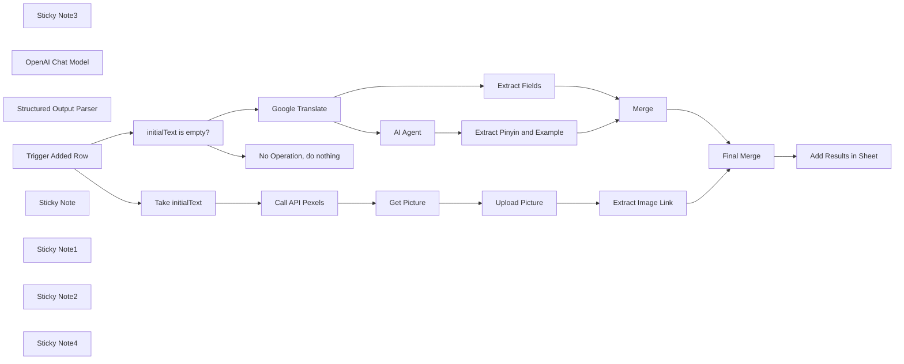

## Fluxo (.json) :

```json
{
  "meta": {
    "instanceId": "6a5e68bcca67c4cdb3e0b698d01739aea084e1ec06e551db64aeff43d174cb23",
    "templateCredsSetupCompleted": true
  },
  "nodes": [
    {
      "id": "bc49829b-45f2-4910-9c37-907271982f14",
      "name": "Sticky Note3",
      "type": "n8n-nodes-base.stickyNote",
      "position": [
        -2240,
        -840
      ],
      "parameters": {
        "width": 780,
        "height": 540,
        "content": "### 5. Do you need more details?\nFind a step-by-step guide in this tutorial\n\n[🎥 Watch My Tutorial](https://youtu.be/2mRZJATUTDw)"
      },
      "typeVersion": 1
    },
    {
      "id": "f0defc20-f099-4c7c-83a7-bb687b86a6b7",
      "name": "Google Translate",
      "type": "n8n-nodes-base.googleTranslate",
      "notes": "Translation -> 中文",
      "position": [
        -3500,
        -420
      ],
      "parameters": {
        "text": "={{ $json.initialText }}",
        "translateTo": "zh-CN"
      },
      "notesInFlow": true,
      "typeVersion": 2
    },
    {
      "id": "588d011c-d7e0-4b31-87be-d0c7ff6bf4b7",
      "name": "AI Agent",
      "type": "@n8n/n8n-nodes-langchain.agent",
      "notes": "Pinyin + Example",
      "position": [
        -3080,
        -380
      ],
      "parameters": {
        "text": "={{ $json.translatedText }}",
        "options": {
          "systemMessage": "# Role\nYou are a helpful translation agent that will help users to extract the pinyin from Chinese characters to create flashcard for language learning.\n\n# Context\nYou will receive a word or sentence in simplified Chinese characters; you are expected to extract the pinyin and generate a simple sentence in Chinese to illustrate the sense of the word. \n\n# Tasks\n1. Generate the pinyin of the characters presented\n2. Propose a short sentence in mandarin to illustrate the definition of the word.\n\n# Notes\n- Generate the output in JSON format following the example below:\n{\"pinyin\": \"Cāngkù\",\n\"sentence\": \"卡车抵达仓库。\"}\n\n- Be very diligent in thinking about the task being asked from you.\n- Generate concise sentences as they need to fit in flash cards.\n"
        },
        "promptType": "define",
        "hasOutputParser": true
      },
      "notesInFlow": true,
      "typeVersion": 1.7
    },
    {
      "id": "cc04e0be-0eea-4d92-a85f-10bd75c03081",
      "name": "OpenAI Chat Model",
      "type": "@n8n/n8n-nodes-langchain.lmChatOpenAi",
      "position": [
        -3080,
        -200
      ],
      "parameters": {
        "model": {
          "__rl": true,
          "mode": "list",
          "value": "gpt-4o-mini"
        },
        "options": {}
      },
      "typeVersion": 1.2
    },
    {
      "id": "d98262f4-9066-420b-a440-fdbc83ca0ef0",
      "name": "Structured Output Parser",
      "type": "@n8n/n8n-nodes-langchain.outputParserStructured",
      "position": [
        -2900,
        -200
      ],
      "parameters": {
        "jsonSchemaExample": "{\n  \"pinyin\": \"Cāngkù\",\n  \"sentence\": \"货物存放在仓库里。\"\n}"
      },
      "typeVersion": 1.2
    },
    {
      "id": "e4ed388f-7520-4df2-8e37-d2b85b1ce532",
      "name": "Merge",
      "type": "n8n-nodes-base.merge",
      "position": [
        -2580,
        -400
      ],
      "parameters": {
        "mode": "combineBySql"
      },
      "typeVersion": 3
    },
    {
      "id": "c1431b36-77ee-4b50-a4e1-05489e998894",
      "name": "Trigger Added Row",
      "type": "n8n-nodes-base.googleSheetsTrigger",
      "notes": "Write a word in a new row",
      "position": [
        -3920,
        -420
      ],
      "parameters": {
        "event": "rowAdded",
        "options": {
          "valueRender": "UNFORMATTED_VALUE",
          "dateTimeRenderOption": "SERIAL_NUMBER"
        },
        "pollTimes": {
          "item": [
            {
              "mode": "everyMinute"
            }
          ]
        },
        "sheetName": {
          "__rl": true,
          "mode": "list",
          "value": 1051887098,
          "cachedResultUrl": "",
          "cachedResultName": ""
        },
        "documentId": {
          "__rl": true,
          "mode": "list",
          "value": "<YOUR_GOOGLE_SHEET_ID>",
          "cachedResultUrl": "",
          "cachedResultName": ""
        }
      },
      "notesInFlow": true,
      "typeVersion": 1
    },
    {
      "id": "4bafdddc-3c7f-40d4-ab17-75c6728bd5a3",
      "name": "No Operation, do nothing",
      "type": "n8n-nodes-base.noOp",
      "notes": "If cell empty, do nothing",
      "position": [
        -3500,
        -260
      ],
      "parameters": {},
      "notesInFlow": true,
      "typeVersion": 1
    },
    {
      "id": "adabd9e0-13de-409b-a3ce-3c76c9624fc0",
      "name": "Upload Picture",
      "type": "n8n-nodes-base.googleDrive",
      "position": [
        -2740,
        460
      ],
      "parameters": {
        "name": "={{ $('Trigger Added Row').item.json.initialText }}.jpeg",
        "driveId": {
          "__rl": true,
          "mode": "list",
          "value": "My Drive",
          "cachedResultUrl": "https://drive.google.com/drive/my-drive",
          "cachedResultName": "My Drive"
        },
        "options": {},
        "folderId": {
          "__rl": true,
          "mode": "url",
          "value": ""
        }
      },
      "typeVersion": 3
    },
    {
      "id": "9cfa6722-ff5e-4ee2-a4ca-2b4175767c84",
      "name": "Get Picture",
      "type": "n8n-nodes-base.httpRequest",
      "position": [
        -2900,
        460
      ],
      "parameters": {
        "url": "={{ $json.photos[0].src.medium }}",
        "options": {}
      },
      "typeVersion": 4.2
    },
    {
      "id": "4bfa5fc7-dd76-4611-916e-5b33a0a9acdb",
      "name": "Call API Pexels",
      "type": "n8n-nodes-base.httpRequest",
      "position": [
        -3080,
        460
      ],
      "parameters": {
        "url": "https://api.pexels.com/v1/search",
        "options": {},
        "sendQuery": true,
        "sendHeaders": true,
        "queryParameters": {
          "parameters": [
            {
              "name": "query",
              "value": "={{ $('Trigger Added Row').item.json.initialText }}"
            }
          ]
        },
        "headerParameters": {
          "parameters": [
            {
              "name": "Authorization",
              "value": "<PEXELS_API_KEY>"
            }
          ]
        }
      },
      "typeVersion": 4.2
    },
    {
      "id": "01c5dc70-3cf5-483e-bad7-4814ca7b1f97",
      "name": "Take initialText",
      "type": "n8n-nodes-base.set",
      "position": [
        -3240,
        460
      ],
      "parameters": {
        "options": {},
        "assignments": {
          "assignments": [
            {
              "id": "80661db0-175f-4346-a95b-5d1e73f82fb8",
              "name": "entry",
              "type": "string",
              "value": "={{ $json.initialText }}"
            }
          ]
        }
      },
      "typeVersion": 3.4
    },
    {
      "id": "7630fc44-3a0c-442b-9c3b-17bd831cdb50",
      "name": "Extract Image Link",
      "type": "n8n-nodes-base.set",
      "position": [
        -2580,
        460
      ],
      "parameters": {
        "options": {},
        "assignments": {
          "assignments": [
            {
              "id": "019a529f-9447-4d49-9a91-04666d2c8fb6",
              "name": "image_link",
              "type": "string",
              "value": "={{ $json.webContentLink }}"
            }
          ]
        }
      },
      "typeVersion": 3.4
    },
    {
      "id": "69645673-87c7-48cc-982f-b4e747fdf1ec",
      "name": "Final Merge",
      "type": "n8n-nodes-base.merge",
      "position": [
        -2100,
        20
      ],
      "parameters": {
        "mode": "combine",
        "options": {},
        "combineBy": "combineByPosition"
      },
      "typeVersion": 3
    },
    {
      "id": "1ee7aca7-5b9d-424f-b49f-2ee9ca7fafdc",
      "name": "Extract Pinyin and Example",
      "type": "n8n-nodes-base.set",
      "position": [
        -2780,
        -380
      ],
      "parameters": {
        "options": {},
        "assignments": {
          "assignments": [
            {
              "id": "c67839b8-abd5-47c9-b1e2-db599fbb5e9e",
              "name": "phonetic",
              "type": "string",
              "value": "={{ $json.output.pinyin }}"
            },
            {
              "id": "3983d009-85c4-46fd-8651-90462249f164",
              "name": "example",
              "type": "string",
              "value": "={{ $json.output.sentence }}"
            }
          ]
        }
      },
      "typeVersion": 3.4
    },
    {
      "id": "baee6926-5031-43fa-94b8-8c7d36a9a6f0",
      "name": "Extract Fields",
      "type": "n8n-nodes-base.set",
      "notes": "Initial text and its translation",
      "position": [
        -3000,
        -540
      ],
      "parameters": {
        "options": {},
        "assignments": {
          "assignments": [
            {
              "id": "6d08361f-bb45-40a0-9934-f1e7bf90a171",
              "name": "initialText",
              "type": "string",
              "value": "={{ $('Trigger Added Row').item.json.initialText }}"
            },
            {
              "id": "0a64ccc0-5a8b-4925-9111-6b7e8c0f9368",
              "name": "translatedText",
              "type": "string",
              "value": "={{ $json.translatedText }}"
            },
            {
              "id": "84a2cfbd-a6da-4a94-a26c-153cbf73fefb",
              "name": "image_name",
              "type": "string",
              "value": "={{ $('Trigger Added Row').item.json.initialText }}.jpeg"
            }
          ]
        }
      },
      "notesInFlow": true,
      "typeVersion": 3.4
    },
    {
      "id": "1f86fb6b-3ec7-4ea3-9748-a69db5d0c9f2",
      "name": "initialText is empty?",
      "type": "n8n-nodes-base.if",
      "notes": "Verify is the word is not empty",
      "position": [
        -3700,
        -420
      ],
      "parameters": {
        "options": {},
        "conditions": {
          "options": {
            "version": 2,
            "leftValue": "",
            "caseSensitive": true,
            "typeValidation": "strict"
          },
          "combinator": "and",
          "conditions": [
            {
              "id": "266614ab-f9e3-486d-929f-ce14ce67e5ff",
              "operator": {
                "type": "string",
                "operation": "notEmpty",
                "singleValue": true
              },
              "leftValue": "={{ $json.initialText }}",
              "rightValue": ""
            }
          ]
        }
      },
      "notesInFlow": true,
      "typeVersion": 2.2
    },
    {
      "id": "5c1afb76-3b5a-4c35-80b9-4a05f2d2aa2d",
      "name": "Sticky Note",
      "type": "n8n-nodes-base.stickyNote",
      "position": [
        -3280,
        140
      ],
      "parameters": {
        "color": 7,
        "width": 820,
        "height": 480,
        "content": "## 3. Retrieve Images from Pexels Free Database\nExtract from Google sheet the word you want to translate to download an illustrating image from the free database of pexels.com\n\n### How to set up?\n- **HTTP Request Node (Call API Pexels)**: add in the header field 'Authorization' the API key provided by Pexels. *(Register here for the free API key: https://www.pexels.com/onboarding/)*\n[Learn more about the HTTP Request Node](https://docs.n8n.io/integrations/builtin/core-nodes/n8n-nodes-base.httprequest/)\n- **Upload the picture to Google Drive**:\n   1. Add your Google Drive API credentials to access the folder for images\n   2. Select your parent drive using the list, an URL or ID\n   3. Select the folder in which you want to save the pictures using the list, an URL or ID\n  [Learn more about the Google Drive Upload Node](https://docs.n8n.io/integrations/builtin/app-nodes/n8n-nodes-base.googledrive)\n\n"
      },
      "typeVersion": 1
    },
    {
      "id": "ebacc192-9dba-4cab-ae0f-d5a2e885c208",
      "name": "Sticky Note1",
      "type": "n8n-nodes-base.stickyNote",
      "position": [
        -3960,
        -780
      ],
      "parameters": {
        "color": 7,
        "width": 600,
        "height": 680,
        "content": "## 1. Google Sheet Trigger & Translation using API\nTrigger the workflow when the user adds a word in English in a new row of the column initialText.\n\n### How to set up?\n- **Trigger on Row Added of Google Sheet**:\n   1. Add your Google Sheet API credentials to access the Google Sheet file\n   2. Select the file using the list, an URL or an ID\n   3. Select the sheet in which the vocabulary list is stored\n  [Learn more about the Google Sheet on Row Added Trigger](https://docs.n8n.io/integrations/builtin/trigger-nodes/n8n-nodes-base.googlesheetstrigger/)\n- **Google Translate API**:\n   1. Add your Google Translate API credentials\n   2. Select the target language *(Exemple: ZH-CN for Mainland China Mandarin)*\n  [Learn more about the Google Translate API Node](https://docs.n8n.io/integrations/builtin/trigger-nodes/n8n-nodes-base.googlesheetstrigger/)\n\n"
      },
      "typeVersion": 1
    },
    {
      "id": "5bdeb1de-d535-484d-83d6-12d72d8e5ba7",
      "name": "Sticky Note2",
      "type": "n8n-nodes-base.stickyNote",
      "position": [
        -3220,
        -800
      ],
      "parameters": {
        "color": 7,
        "width": 760,
        "height": 740,
        "content": "## 2. Simple AI agent to get the phonetic transcription and generate an sentence example\nThe agent will take the translated word as an input and will output the phonetic transcription and the sentence.\n\n### How to set up?\n- **AI Agent with the Chat Model**:\n   1. Add a chat model with the required credentials *(Example: Open AI 4o-mini)*\n   2. Adapt the system prompt with the target translation language and the format of the sentence\n  [Learn more about the AI Agent Node](https://docs.n8n.io/integrations/builtin/cluster-nodes/root-nodes/n8n-nodes-langchain.agent)\n\n"
      },
      "typeVersion": 1
    },
    {
      "id": "4f3f2a71-f137-4e91-8b1e-8a7342bac293",
      "name": "Add Results in Sheet",
      "type": "n8n-nodes-base.googleSheets",
      "notes": "initialtext, translation, sentence",
      "position": [
        -1940,
        20
      ],
      "parameters": {
        "columns": {
          "value": {
            "phonetic": "={{ $json.phonetic }}",
            "sentence": "={{ $json.example }}",
            "image_link": "={{ $json.image_name }}",
            "image_name": "={{ $json.image_link }}",
            "initialText": "={{ $json.initialText }}",
            "translatedText": "={{ $json.translatedText }}"
          },
          "schema": [
            {
              "id": "initialText",
              "type": "string",
              "display": true,
              "removed": false,
              "required": false,
              "displayName": "initialText",
              "defaultMatch": false,
              "canBeUsedToMatch": true
            },
            {
              "id": "translatedText",
              "type": "string",
              "display": true,
              "required": false,
              "displayName": "translatedText",
              "defaultMatch": false,
              "canBeUsedToMatch": true
            },
            {
              "id": "phonetic",
              "type": "string",
              "display": true,
              "required": false,
              "displayName": "phonetic",
              "defaultMatch": false,
              "canBeUsedToMatch": true
            },
            {
              "id": "sentence",
              "type": "string",
              "display": true,
              "required": false,
              "displayName": "sentence",
              "defaultMatch": false,
              "canBeUsedToMatch": true
            },
            {
              "id": "image_name",
              "type": "string",
              "display": true,
              "required": false,
              "displayName": "image_name",
              "defaultMatch": false,
              "canBeUsedToMatch": true
            },
            {
              "id": "image_link",
              "type": "string",
              "display": true,
              "required": false,
              "displayName": "image_link",
              "defaultMatch": false,
              "canBeUsedToMatch": true
            },
            {
              "id": "row_number",
              "type": "string",
              "display": true,
              "removed": true,
              "readOnly": true,
              "required": false,
              "displayName": "row_number",
              "defaultMatch": false,
              "canBeUsedToMatch": true
            }
          ],
          "mappingMode": "defineBelow",
          "matchingColumns": [
            "initialText"
          ],
          "attemptToConvertTypes": false,
          "convertFieldsToString": false
        },
        "options": {},
        "operation": "update",
        "sheetName": {
          "__rl": true,
          "mode": "list",
          "value": "<YOUR_GOOGLE_SHEET_TAB_ID>",
          "cachedResultUrl": "",
          "cachedResultName": ""
        },
        "documentId": {
          "__rl": true,
          "mode": "list",
          "value": "<YOUR_GOOGLE_SHEET_ID>",
          "cachedResultUrl": "",
          "cachedResultName": ""
        }
      },
      "notesInFlow": true,
      "typeVersion": 4.5
    },
    {
      "id": "42a20d7e-03bf-4f4e-877b-04ff185cbf1c",
      "name": "Sticky Note4",
      "type": "n8n-nodes-base.stickyNote",
      "position": [
        -2220,
        -280
      ],
      "parameters": {
        "color": 7,
        "width": 580,
        "height": 460,
        "content": "## 4. Combine Results to Update the Google Sheet\nCombine initial text, translation, example sentence and image link to fill the new row.\n\n### How to set up?\n- **Add Results in Google Sheet**:\n   1. Add your Google Sheet API credentials to access the Google Sheet file\n   2. Select the file using the list, an URL or an ID\n   3. Select the sheet in which the vocabulary list is stored\n  [Learn more about the Google Sheet Node](https://docs.n8n.io/integrations/builtin/app-nodes/n8n-nodes-base.googlesheets)\n\n"
      },
      "typeVersion": 1
    }
  ],
  "pinData": {},
  "connections": {
    "Merge": {
      "main": [
        [
          {
            "node": "Final Merge",
            "type": "main",
            "index": 0
          }
        ]
      ]
    },
    "AI Agent": {
      "main": [
        [
          {
            "node": "Extract Pinyin and Example",
            "type": "main",
            "index": 0
          }
        ]
      ]
    },
    "Final Merge": {
      "main": [
        [
          {
            "node": "Add Results in Sheet",
            "type": "main",
            "index": 0
          }
        ]
      ]
    },
    "Get Picture": {
      "main": [
        [
          {
            "node": "Upload Picture",
            "type": "main",
            "index": 0
          }
        ]
      ]
    },
    "Extract Fields": {
      "main": [
        [
          {
            "node": "Merge",
            "type": "main",
            "index": 0
          }
        ]
      ]
    },
    "Upload Picture": {
      "main": [
        [
          {
            "node": "Extract Image Link",
            "type": "main",
            "index": 0
          }
        ]
      ]
    },
    "Call API Pexels": {
      "main": [
        [
          {
            "node": "Get Picture",
            "type": "main",
            "index": 0
          }
        ]
      ]
    },
    "Google Translate": {
      "main": [
        [
          {
            "node": "Extract Fields",
            "type": "main",
            "index": 0
          },
          {
            "node": "AI Agent",
            "type": "main",
            "index": 0
          }
        ]
      ]
    },
    "Take initialText": {
      "main": [
        [
          {
            "node": "Call API Pexels",
            "type": "main",
            "index": 0
          }
        ]
      ]
    },
    "OpenAI Chat Model": {
      "ai_languageModel": [
        [
          {
            "node": "AI Agent",
            "type": "ai_languageModel",
            "index": 0
          }
        ]
      ]
    },
    "Trigger Added Row": {
      "main": [
        [
          {
            "node": "initialText is empty?",
            "type": "main",
            "index": 0
          },
          {
            "node": "Take initialText",
            "type": "main",
            "index": 0
          }
        ]
      ]
    },
    "Extract Image Link": {
      "main": [
        [
          {
            "node": "Final Merge",
            "type": "main",
            "index": 1
          }
        ]
      ]
    },
    "initialText is empty?": {
      "main": [
        [
          {
            "node": "Google Translate",
            "type": "main",
            "index": 0
          }
        ],
        [
          {
            "node": "No Operation, do nothing",
            "type": "main",
            "index": 0
          }
        ]
      ]
    },
    "Structured Output Parser": {
      "ai_outputParser": [
        [
          {
            "node": "AI Agent",
            "type": "ai_outputParser",
            "index": 0
          }
        ]
      ]
    },
    "Extract Pinyin and Example": {
      "main": [
        [
          {
            "node": "Merge",
            "type": "main",
            "index": 1
          }
        ]
      ]
    }
  }
}
```

<a id="template-737"></a>

## Template 737 - Integração JotForm → KlickTipp com transformação de dados e tagging

- **Nome:** Integração JotForm → KlickTipp com transformação de dados e tagging
- **Descrição:** Este fluxo recebe inscrições de webinar via JotForm, transforma e valida dados, e registra/atualiza contatos no KlickTipp, incluindo criação e atribuição de tags dinâmicas para segmentação.
- **Funcionalidade:** • Disparo da inscrição do webinar: O fluxo é iniciado quando uma nova submissão é recebida via JotForm.
• Transformação e validação de dados: Converte telefone para formato numérico com código internacional, transforma a data/hora do webinar em timestamp UNIX, valida URLs de LinkedIn e formata o start date/time, além de padronizar informações adicionais como idade, experiência e mensagens.
• Mapeamento para KlickTipp: Preenche email e campos personalizados com os dados do formulário para o cadastro do contato.
• Gerenciamento de tags dinâmicas: Define uma lista de tags com base no webinar escolhido, data e lembretes, para aplicação posterior.
• Verificação/Criação de tags: Verifica se as tags existem localmente e cria novas no KlickTipp quando necessário, consolidando IDs.
• Associação de tags ao contato: Aplica as tags existentes ou criadas ao contato cadastrado no KlickTipp.
- **Ferramentas:** • JotForm: Serviço de formulários utilizado para coletar inscrições e disparar o fluxo.
• KlickTipp: Plataforma de automação de marketing usada para gerenciar contatos, criar/associar tags e gerenciar a comunicação.

## Fluxo visual

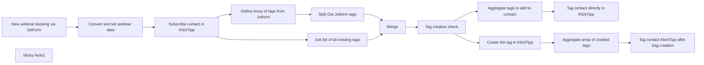

## Fluxo (.json) :

```json
{
  "meta": {
    "instanceId": "95b3ab5a70ab1c8c1906357a367f1b236ef12a1409406fd992f60255f0f95f85"
  },
  "nodes": [
    {
      "id": "f13c4b60-5b5f-474b-b79b-45c4fb9cc067",
      "name": "Subscribe contact in KlickTipp",
      "type": "n8n-nodes-klicktipp.klicktipp",
      "notes": "Adds the contact to KlickTipp using the transformed webinar registration data.",
      "position": [
        -800,
        600
      ],
      "parameters": {
        "email": "={{ $('New webinar booking via JotForm').item.json.Email }}",
        "fields": {
          "dataFields": [
            {
              "fieldId": "fieldFirstName",
              "fieldValue": "={{ $('New webinar booking via JotForm').item.json.Name.first }}"
            },
            {
              "fieldId": "fieldLastName",
              "fieldValue": "={{ $('New webinar booking via JotForm').item.json.Name.last }}"
            },
            {
              "fieldId": "fieldBirthday",
              "fieldValue": "={{ $json.birthday }}"
            },
            {
              "fieldId": "field214129",
              "fieldValue": "={{ $json.linkdein_url }}"
            },
            {
              "fieldId": "field214128",
              "fieldValue": "={{ $json.work_experience_in_years }}"
            },
            {
              "fieldId": "field214132",
              "fieldValue": "={{ $json['webinar_start_date&time'] }}"
            },
            {
              "fieldId": "field214125",
              "fieldValue": "={{ $('New webinar booking via JotForm').item.json['Bitte lassen Sie uns wissen, wenn Sie vor dem Webinar Fragen/Hinweise an unsere Referenten haben.'] }}"
            },
            {
              "fieldId": "field214431",
              "fieldValue": "={{ $('New webinar booking via JotForm').item.json['Webinar Auswahl:'] }}"
            },
            {
              "fieldId": "field214432",
              "fieldValue": "={{ $('New webinar booking via JotForm').item.json['In welchem Intervall möchtest Du erinnert werden?'] }}"
            }
          ]
        },
        "listId": "358895",
        "resource": "subscriber",
        "operation": "subscribe",
        "smsNumber": "={{ $json.mobile_number }}"
      },
      "credentials": {
        "klickTippApi": {
          "id": "K9JyBdCM4SZc1cXl",
          "name": "DEMO KlickTipp account"
        }
      },
      "notesInFlow": true,
      "typeVersion": 2
    },
    {
      "id": "7aa2b991-782d-4171-ac30-131c2062e17c",
      "name": "Convert and set webinar data",
      "type": "n8n-nodes-base.set",
      "notes": "This node formats the data received from the Jotform submission, ensuring it is correctly formatted for further processing at the KlickTipp API endpoint.",
      "position": [
        -1020,
        600
      ],
      "parameters": {
        "options": {},
        "assignments": {
          "assignments": [
            {
              "id": "f1263cb6-654a-4d07-9073-c015b720e6b7",
              "name": "mobile_number",
              "type": "string",
              "value": "={{ \n// Converts a phone number to numeric-only format with international code prefixed by \"00\"\n$json.Mobilrufnummer.full\n    .replace(/^\\+/, '00')   // Replace leading \"+\" with \"00\"\n    .replace(/[^0-9]/g, '') // Remove non-numeric characters\n}}"
            },
            {
              "id": "b09cc146-e614-478a-8f33-324d813e0120",
              "name": "birthday",
              "type": "string",
              "value": "={{ \n// Converts a date to a UNIX timestamp (in seconds)\nMath.floor(\n    new Date(\n      $json.Geburtstag.year + '-' + \n      $json.Geburtstag.month + '-' + \n      $json.Geburtstag.day + 'T00:00:00'\n    ).getTime() / 1000\n  )\n}}"
            },
            {
              "id": "cecd4621-b31b-43d0-9076-08f0bde83f5b",
              "name": "linkdein_url",
              "type": "string",
              "value": "={{ \n// Validates if the URL matches the correct format; returns it if valid, else a default fallback URL\n/^https?://[^\\s$.?#].[^\\s]*$/.test($json['LinkedIn Profil Link/URL (ACHTUNG keine Formatprüfung bei Eingabe)']) \n    ? $json['LinkedIn Profil Link/URL (ACHTUNG keine Formatprüfung bei Eingabe)'] \n    : 'https://www.URLnichtImPassendenFormat.de' \n}}"
            },
            {
              "id": "1c455eb9-0750-4d69-9dab-390847a3d582",
              "name": "work_experience_in_years",
              "type": "string",
              "value": "={{\n// Multiplies the decimalnumber value by 100\n$json['Berufserfahrung in Jahren'] * 100 }}"
            },
            {
              "id": "f8e5ecc7-1549-409f-a6d5-e5beb773baef",
              "name": "webinar_start_date&time",
              "type": "string",
              "value": "={{ \n  (() => {\n    // Input format example: '2025-01-31 13:00'\n    const rawDate = $json['Termin Auswahl:']; \n\n    // Ensure the raw date is provided and in the expected format\n    if (!rawDate || typeof rawDate !== 'string') return ''; // Return empty string if invalid\n\n    // Split the date and time into components\n    const [datePart, timePart] = rawDate.split(' '); // Example: ['2025-01-31', '13:00']\n    if (!datePart || !timePart) return ''; // Return empty string if date or time is missing\n\n    // Validate the date format (YYYY-MM-DD)\n    const [year, month, day] = datePart.split('-'); // Split year, month, day\n    if (!year || !month || !day || year.length !== 4 || month.length !== 2 || day.length !== 2) return ''; // Validate format\n\n    // Combine into ISO 8601 format (YYYY-MM-DDTHH:mm) with Germany's local timezone offset\n    const isoDateTime = `${year}-${month}-${day}T${timePart}:00+01:00`;\n\n    // Create a Date object in Germany's timezone\n    const localDate = new Date(isoDateTime);\n\n    // Convert the local time to a UTC UNIX timestamp in seconds\n    return Math.floor(localDate.getTime() / 1000); \n  })()\n}}"
            }
          ]
        }
      },
      "notesInFlow": true,
      "typeVersion": 3.4
    },
    {
      "id": "2dade6bf-6b65-45db-9a33-9faca1860924",
      "name": "New webinar booking via JotForm",
      "type": "n8n-nodes-base.jotFormTrigger",
      "notes": "Triggers the workflow when a new form submission is received on JotForm.",
      "position": [
        -1260,
        600
      ],
      "webhookId": "a8dd1d6b-dc1c-4293-84dd-59ee063c1fbd",
      "parameters": {
        "form": "250054687472360"
      },
      "credentials": {
        "jotFormApi": {
          "id": "71GlBAECuZVP7vMO",
          "name": "Ricardo's JotForm account"
        }
      },
      "notesInFlow": true,
      "typeVersion": 1
    },
    {
      "id": "d796b45c-64c8-4d6b-b267-9b828ef24345",
      "name": "Sticky Note1",
      "type": "n8n-nodes-base.stickyNote",
      "position": [
        -660,
        940
      ],
      "parameters": {
        "width": 839.0148942368631,
        "height": 1288.9426551387483,
        "content": "### Introduction\nThis workflow streamlines the process of handling webinar registrations submitted via JotForm. It ensures the data is correctly formatted and seamlessly integrates with KlickTipp. Input data is validated and transformed to meet KlickTipp’s API requirements, including formatting phone numbers, converting dates, and validating URLs.\n\n### Benefits\n- **Efficient lead generation**: Contacts from forms are automatically imported into KlickTipp and can be used immediately, saving time and increasing the conversion rate.\n- **Automated processes**: Experts can start workflows directly, such as welcome emails or course admissions, reducing administrative effort.\n- **Error-free data management**: The template ensures precise data mapping, avoids manual corrections, and reinforces a professional appearance.\n\n### Key Feature\n- **JotForm Trigger**: Captures new form submissions, including participant details and webinar preferences.\n- **Data Processing**: Standardizes and validates input fields:\n  - Converts phone numbers to numeric-only format with international prefixes.\n  - Transforms dates into UNIX timestamps.\n  - Validates LinkedIn URLs and applies fallback URLs if validation fails.\n  - Scales numerical fields, such as work experience, for specific use cases.\n- **Subscriber Management in KlickTipp**: Adds or updates participants as subscribers in KlickTipp. Includes custom field mappings and tags, such as:\n  - Personal information: Name, email, phone number.\n  - Webinar details: Chosen webinar, start date/time.\n  - Preferences: Reminder intervals, questions for presenters.\n  - Contact segmentation: Creates new tags based on form submission if necessary and adds these dynamic tags as well as fixed tags to contacts.\n\n- **Error Handling**: Validates critical fields like phone numbers, URLs, and dates to prevent incorrect data submissions.\n\n#### Setup Instructions\n1. Set up the JotForm and KlickTipp nodes in your n8n instance.\n2. Authenticate your JotForm and KlickTipp accounts.\n3. Create the necessary custom fields to match the data structure\n4. Verify and customize field assignments in the workflow to align with your specific form and subscriber list setup.\n\n\n### Testing and Deployment:\n1. Test the workflow by filling the form on JotForm.\n2. Verify data updates in KlickTipp.\n\n- **Customization**: Update field mappings within the KlickTipp nodes to align with your account setup. This ensures accurate data syncing."
      },
      "typeVersion": 1
    },
    {
      "id": "81832238-a21c-4d2f-b8f2-6a0050370884",
      "name": "Define Array of tags from Jotform",
      "type": "n8n-nodes-base.set",
      "notes": "This node defines tags based on the form submission, such as the webinar selection, date, and reminder interval, and saves them as an array for further processing.",
      "position": [
        -500,
        500
      ],
      "parameters": {
        "options": {},
        "assignments": {
          "assignments": [
            {
              "id": "814576c1-ba16-4546-9815-2b7dec324f94",
              "name": "tags",
              "type": "array",
              "value": "={{ [\n//Every line represents one of the dynamic values that are received from the form submission in order to create an array/list of tags. If you want to add another variable, keep in mind to add a comma at the end of the last line and only then to add your parameter at the end of this list.\n  $('New webinar booking via JotForm').item.json['Webinar Auswahl:'], \n  $('New webinar booking via JotForm').item.json['Termin Auswahl:'], \n  $('New webinar booking via JotForm').item.json['In welchem Intervall möchtest Du erinnert werden?']\n] }}"
            }
          ]
        }
      },
      "notesInFlow": true,
      "typeVersion": 3.4
    },
    {
      "id": "99beae4f-ab6e-4975-a6b8-baade0279f24",
      "name": "Split Out Jotform tags",
      "type": "n8n-nodes-base.splitOut",
      "notes": "In this node we split the created array again into items so we can merge them with the existing tags we request from KlickTipp.",
      "position": [
        -320,
        500
      ],
      "parameters": {
        "options": {},
        "fieldToSplitOut": "tags"
      },
      "notesInFlow": true,
      "typeVersion": 1
    },
    {
      "id": "283d964b-3a37-4ac9-9562-26af43ef32d5",
      "name": "Tag contact directly in KlickTipp",
      "type": "n8n-nodes-klicktipp.klicktipp",
      "notes": "Applies existing tags to a subscriber in KlickTipp. This enables the use of specific signatures, sign out automations as well as the automation of emails and campaigns or other automations.",
      "position": [
        840,
        500
      ],
      "parameters": {
        "email": "={{ $('New webinar booking via JotForm').item.json.Email }}",
        "tagId": "={{$json.tag_ids}}",
        "resource": "contact-tagging"
      },
      "credentials": {
        "klickTippApi": {
          "id": "K9JyBdCM4SZc1cXl",
          "name": "DEMO KlickTipp account"
        }
      },
      "notesInFlow": true,
      "typeVersion": 2
    },
    {
      "id": "412ea807-11bb-47a1-ae60-168396bbfb3a",
      "name": "Tag creation check",
      "type": "n8n-nodes-base.if",
      "notes": "This node checks the result of the tag comparison and branches the workflow accordingly in order to directly tag the contact or to create the tag first and to then follow through with the tagging.",
      "position": [
        140,
        580
      ],
      "parameters": {
        "options": {},
        "conditions": {
          "options": {
            "version": 2,
            "leftValue": "",
            "caseSensitive": true,
            "typeValidation": "strict"
          },
          "combinator": "and",
          "conditions": [
            {
              "id": "d9567816-9236-434d-b46e-e47f4d36f289",
              "operator": {
                "type": "boolean",
                "operation": "true",
                "singleValue": true
              },
              "leftValue": "={{ $json.exist }}",
              "rightValue": ""
            }
          ]
        }
      },
      "notesInFlow": true,
      "typeVersion": 2.2
    },
    {
      "id": "50478814-aab3-4ec8-94e4-59ff8e30e632",
      "name": "Aggregate tags to add to contact",
      "type": "n8n-nodes-base.aggregate",
      "notes": "This node aggregates all IDs of the existing tags to a list.",
      "position": [
        640,
        500
      ],
      "parameters": {
        "options": {},
        "fieldsToAggregate": {
          "fieldToAggregate": [
            {
              "renameField": true,
              "outputFieldName": "tag_ids",
              "fieldToAggregate": "tag_id"
            }
          ]
        }
      },
      "notesInFlow": true,
      "typeVersion": 1
    },
    {
      "id": "feeb10fa-3eff-4c60-8d2c-77d0da3becf8",
      "name": "Create the tag in KlickTipp",
      "type": "n8n-nodes-klicktipp.klicktipp",
      "notes": "Creates a new tag in KlickTipp if it does not already exist.",
      "position": [
        440,
        700
      ],
      "parameters": {
        "name": "={{ $json.name }}",
        "operation": "create"
      },
      "credentials": {
        "klickTippApi": {
          "id": "K9JyBdCM4SZc1cXl",
          "name": "DEMO KlickTipp account"
        }
      },
      "notesInFlow": true,
      "typeVersion": 2
    },
    {
      "id": "bf19001c-5369-4d40-ba94-f9d919222455",
      "name": "Aggregate array of created tags",
      "type": "n8n-nodes-base.aggregate",
      "notes": "This node aggregates all IDs of the newly created tags to a list.",
      "position": [
        640,
        700
      ],
      "parameters": {
        "options": {},
        "fieldsToAggregate": {
          "fieldToAggregate": [
            {
              "renameField": true,
              "outputFieldName": "tag_ids",
              "fieldToAggregate": "id"
            }
          ]
        }
      },
      "notesInFlow": true,
      "typeVersion": 1
    },
    {
      "id": "eb4c28a3-30d2-42fb-986c-14b31497611c",
      "name": "Tag contact KlickTipp after trag creation",
      "type": "n8n-nodes-klicktipp.klicktipp",
      "notes": "Associates a specific tag with a subscriber in KlickTipp using their email address. This enables the use of specific signatures, signout automations as well as the automation of emails and campaigns or other automations.",
      "position": [
        840,
        700
      ],
      "parameters": {
        "email": "={{ $('New webinar booking via JotForm').item.json.Email }}",
        "tagId": "={{$json.tag_ids}}",
        "resource": "contact-tagging"
      },
      "credentials": {
        "klickTippApi": {
          "id": "K9JyBdCM4SZc1cXl",
          "name": "DEMO KlickTipp account"
        }
      },
      "notesInFlow": true,
      "typeVersion": 2
    },
    {
      "id": "5df24c47-f8d9-4f34-8257-00f06ede36ad",
      "name": "Get list of all existing tags",
      "type": "n8n-nodes-klicktipp.klicktipp",
      "notes": "This node fetches all tags that already exist in KlickTipp.",
      "position": [
        -500,
        700
      ],
      "parameters": {},
      "credentials": {
        "klickTippApi": {
          "id": "K9JyBdCM4SZc1cXl",
          "name": "DEMO KlickTipp account"
        }
      },
      "notesInFlow": true,
      "typeVersion": 2
    },
    {
      "id": "7c2b8718-6f79-4a6a-afb4-3c429882fd98",
      "name": "Merge",
      "type": "n8n-nodes-base.merge",
      "notes": "This node merges the tags which are fetched via the form with the existing tags we requested in order to identify if new tags need to be created.",
      "position": [
        -80,
        580
      ],
      "parameters": {
        "mode": "combineBySql",
        "query": "SELECT \n    input1.tags AS name,  -- Extracts the tag name from input1\n    IF(input2.value IS NOT NULL, true, false) AS exist, -- Checks if the tag exists in input2 (returns true if found, false otherwise)\n    input2.id AS tag_id  -- Retrieves the ID of the tag from input2 if it exists, otherwise returns NULL\nFROM \n    input1\nLEFT JOIN \n    input2 \nON \n    input1.tags = input2.value  -- Matches tags from input1 with values in input2"
      },
      "notesInFlow": true,
      "typeVersion": 3
    }
  ],
  "pinData": {},
  "connections": {
    "Merge": {
      "main": [
        [
          {
            "node": "Tag creation check",
            "type": "main",
            "index": 0
          }
        ]
      ]
    },
    "Tag creation check": {
      "main": [
        [
          {
            "node": "Aggregate tags to add to contact",
            "type": "main",
            "index": 0
          }
        ],
        [
          {
            "node": "Create the tag in KlickTipp",
            "type": "main",
            "index": 0
          }
        ]
      ]
    },
    "Split Out Jotform tags": {
      "main": [
        [
          {
            "node": "Merge",
            "type": "main",
            "index": 0
          }
        ]
      ]
    },
    "Create the tag in KlickTipp": {
      "main": [
        [
          {
            "node": "Aggregate array of created tags",
            "type": "main",
            "index": 0
          }
        ]
      ]
    },
    "Convert and set webinar data": {
      "main": [
        [
          {
            "node": "Subscribe contact in KlickTipp",
            "type": "main",
            "index": 0
          }
        ]
      ]
    },
    "Get list of all existing tags": {
      "main": [
        [
          {
            "node": "Merge",
            "type": "main",
            "index": 1
          }
        ]
      ]
    },
    "Subscribe contact in KlickTipp": {
      "main": [
        [
          {
            "node": "Get list of all existing tags",
            "type": "main",
            "index": 0
          },
          {
            "node": "Define Array of tags from Jotform",
            "type": "main",
            "index": 0
          }
        ]
      ]
    },
    "Aggregate array of created tags": {
      "main": [
        [
          {
            "node": "Tag contact KlickTipp after trag creation",
            "type": "main",
            "index": 0
          }
        ]
      ]
    },
    "New webinar booking via JotForm": {
      "main": [
        [
          {
            "node": "Convert and set webinar data",
            "type": "main",
            "index": 0
          }
        ]
      ]
    },
    "Aggregate tags to add to contact": {
      "main": [
        [
          {
            "node": "Tag contact directly in KlickTipp",
            "type": "main",
            "index": 0
          }
        ]
      ]
    },
    "Define Array of tags from Jotform": {
      "main": [
        [
          {
            "node": "Split Out Jotform tags",
            "type": "main",
            "index": 0
          }
        ]
      ]
    }
  }
}
```

<a id="template-738"></a>

## Template 738 - Box: monitoramento de MOVED/DOWNLOADED em item específico

- **Nome:** Box: monitoramento de MOVED/DOWNLOADED em item específico
- **Descrição:** Este fluxo monitora eventos do Box para um item específico (ID 118847708963). O fluxo é acionado quando o item é movido ou baixado.
- **Funcionalidade:** • Detecção de eventos: inicia a automação ao ocorrer FOLDER.MOVED ou FOLDER.DOWNLOADED para o item especificado.
• Foco no item: observa o ID 118847708963 para acionar as ações pretendidas.
• Autenticação segura: utiliza credenciais OAuth2 para acessar o Box.
- **Ferramentas:** • Box: serviço de armazenamento em nuvem que envia eventos de pastas e arquivos.


## Fluxo visual

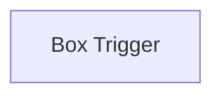

## Fluxo (.json) :

```json
{
  "nodes": [
    {
      "name": "Box Trigger",
      "type": "n8n-nodes-base.boxTrigger",
      "position": [
        1027,
        368
      ],
      "webhookId": "0e56bb0c-8e81-42de-a902-c0ab31834bd8",
      "parameters": {
        "events": [
          "FOLDER.MOVED",
          "FOLDER.DOWNLOADED"
        ],
        "targetId": "118847708963",
        "targetType": "file"
      },
      "credentials": {
        "boxOAuth2Api": "box_creds"
      },
      "typeVersion": 1
    }
  ],
  "connections": {}
}
```

<a id="template-739"></a>

## Template 739 - Extrator de logo-sheets para Airtable

- **Nome:** Extrator de logo-sheets para Airtable
- **Descrição:** Recebe uma imagem com múltiplos logos, usa um agente de IA para extrair nomes, atributos e relações de similaridade e salva essas informações de forma estruturada em uma base Airtable.
- **Funcionalidade:** • Coleta via formulário web: Permite upload de imagem do logo-sheet e um prompt opcional pelo usuário.
• Extração por agente de IA: Analisa a imagem e extrai uma lista estruturada de produtos/ferramentas com atributos e similares.
• Parser estruturado: Converte a saída do agente em JSON com campos padronizados (nome, atributos, similares).
• Criação e deduplicação de atributos: Verifica se cada atributo existe e os cria caso não existam, mapeando seus IDs.
• Criação e atualização de ferramentas: Gera identificadores únicos (hash) para cada nome, cria ou atualiza registros de ferramentas com links para atributos e similares.
• Mapear similares: Resolve nomes similares para registros existentes e vincula-os como concorrentes/relacionados.
• Lógica de merge e atualização: Combina dados novos com dados existentes para salvar apenas atributos e similares adicionais quando necessário.
• Flexibilidade de reexecução: Pode ser executado várias vezes para refinar ou completar extrações sem duplicar dados existentes.
- **Ferramentas:** • Formulário web: ponto de entrada para upload da imagem e entrada de prompt opcional pelo usuário.
• OpenAI (modelo gpt-4o / capacidades de visão): usado pelo agente para interpretar a imagem e gerar a extração de nomes, atributos e relações.
• LangChain (agente): orquestra a extração e o fluxo de prompts/respostas com capacidades de processamento de imagens e texto.
• Airtable (API): armazena e organiza atributos e ferramentas, fazendo upserts e relacionamentos entre registros.
• Função de hash (MD5): gera identificadores únicos de nomes para deduplicação e matching.

## Fluxo visual

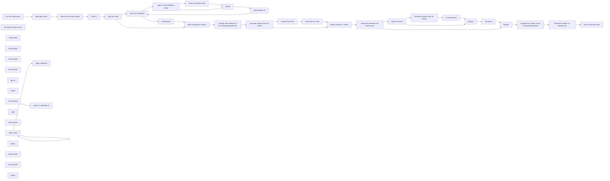

## Fluxo (.json) :

```json
{
  "id": "dDAqkobn2pqgdl2N",
  "meta": {
    "instanceId": "9e331a89ae45a204c6dee51c77131d32a8c962ec20ccf002135ea60bd285dba9"
  },
  "name": "AI Logo Sheet Extractor to Airtable",
  "tags": [],
  "nodes": [
    {
      "id": "f7ecadb8-dc5d-4e8c-96b8-52c1dbad49b6",
      "name": "On form submission",
      "type": "n8n-nodes-base.formTrigger",
      "position": [
        -660,
        -220
      ],
      "webhookId": "43837a27-f752-40a8-852a-d5d63d647bfd",
      "parameters": {
        "options": {
          "path": "logo-sheet-feeder"
        },
        "formTitle": "AI Logo Sheet Feeder",
        "formFields": {
          "values": [
            {
              "fieldType": "file",
              "fieldLabel": "The Logo-Sheet as Image",
              "requiredField": true
            },
            {
              "fieldLabel": "Addional Prompt (e.g.: What the meaning of the graphic?) *optional but helps from time to time.",
              "placeholder": "It's a graph chart comparing AI Tools"
            }
          ]
        },
        "formDescription": "Provide a Image with multiple Logos comparing or bringing multiple Tools into Context with one another."
      },
      "typeVersion": 2.2
    },
    {
      "id": "b1530578-bde9-4ee3-9cdb-545a621cdb84",
      "name": "Retrieve and Parser Agent",
      "type": "@n8n/n8n-nodes-langchain.agent",
      "position": [
        -180,
        -220
      ],
      "parameters": {
        "options": {
          "systemMessage": "Your task is to retrieve Information from the given Input. Extract Categories and Attributes of all given and shown Tools, Softwares or Products you've got by the user.\n\nProvide the Output Array of Tools with the following Structure as JSON:\n\n[{\n\"name\": \"Name of the Tool, Software, etc.\",\n\"attributes\": [\"Some category or attribute\", \"something else you can see from the context or image\"],\n\"similar\": [\"similar tool, product, etc. from shown context\", \"another similar software, product, tool from context\"]\n},{\n\"name\": \"Name of anotherTool, Software, etc.\",\n\"attributes\": [\"Some category, subcategory or general attribute\", \"something else you can see from the context or image\"],\n\"similar\": [\"similar tool, product, etc. from shown context\", \"another similar software, product, tool from context\"]\n}]\n\nList these structure for all the Products you see!\n\nHere a description of the JSON fields:\n\"name\": Just the Name of the Software.\n\"attribute\": Turn any information from the context or image into multiple useful Attributes for this tool. Could be a category, could be a feature, etc. Try to split this information in multiple specific Attributes or Categories.\n\"similar\": if multiple tools are shown that could compare to this one (like on the same level or in the same category), list those here\n\nTake a deep breath and think step by step.\nTry to extract every mentioned tool. There are for sure multiple listed.",
          "passthroughBinaryImages": true
        },
        "hasOutputParser": true
      },
      "typeVersion": 1.7
    },
    {
      "id": "51642a02-51a4-4894-adf0-f364736dabc1",
      "name": "JSON it",
      "type": "n8n-nodes-base.set",
      "position": [
        220,
        -220
      ],
      "parameters": {
        "mode": "raw",
        "options": {},
        "jsonOutput": "={{ $json.output }}"
      },
      "typeVersion": 3.4
    },
    {
      "id": "ec0f0575-eb33-48a9-b3fe-c4f5b71ff548",
      "name": "Structured Output Parser",
      "type": "@n8n/n8n-nodes-langchain.outputParserStructured",
      "position": [
        40,
        20
      ],
      "parameters": {
        "jsonSchemaExample": "{\n\t\"tools\": [{\n\"name\": \"Name of the Tool, Software, etc.\",\n\"attributes\": [\"Some category or attribute\", \"something else you can see from the context or image\"],\n\"similar\": [\"similar tool, product, etc. from shown context\", \"another similar software, product, tool from context\"]\n},{\n\"name\": \"Name of anotherTool, Software, etc.\",\n\"attributes\": [\"Some category, subcategory or general attribute\", \"something else you can see from the context or image\"],\n\"similar\": [\"similar tool, product, etc. from shown context\", \"another similar software, product, tool from context\"]\n}]}"
      },
      "typeVersion": 1.2
    },
    {
      "id": "6d78005e-7277-40a9-9f10-e3d8e475cbaf",
      "name": "Check if Attribute exists",
      "type": "n8n-nodes-base.airtable",
      "position": [
        1380,
        0
      ],
      "parameters": {
        "base": {
          "__rl": true,
          "mode": "list",
          "value": "appq0gcmxHAZQhswW",
          "cachedResultUrl": "https://airtable.com/appq0gcmxHAZQhswW",
          "cachedResultName": "AI Tools"
        },
        "table": {
          "__rl": true,
          "mode": "list",
          "value": "tblX2rj8yNAZZRhwt",
          "cachedResultUrl": "https://airtable.com/appq0gcmxHAZQhswW/tblX2rj8yNAZZRhwt",
          "cachedResultName": "Attributes"
        },
        "columns": {
          "value": {
            "Name": "={{$json.attributes}}"
          },
          "schema": [
            {
              "id": "id",
              "type": "string",
              "display": true,
              "removed": true,
              "readOnly": true,
              "required": false,
              "displayName": "id",
              "defaultMatch": true
            },
            {
              "id": "Name",
              "type": "string",
              "display": true,
              "removed": false,
              "readOnly": false,
              "required": false,
              "displayName": "Name",
              "defaultMatch": false,
              "canBeUsedToMatch": true
            },
            {
              "id": "Tools",
              "type": "array",
              "display": true,
              "removed": true,
              "readOnly": false,
              "required": false,
              "displayName": "Tools",
              "defaultMatch": false,
              "canBeUsedToMatch": true
            }
          ],
          "mappingMode": "defineBelow",
          "matchingColumns": [
            "Name"
          ]
        },
        "options": {},
        "operation": "upsert"
      },
      "credentials": {
        "airtableTokenApi": {
          "id": "jMqH6HkKUYTgyHVm",
          "name": "Airtable Personal Access Token account"
        }
      },
      "typeVersion": 2.1
    },
    {
      "id": "1c468a4b-4563-4f78-ba1b-138b18ac4821",
      "name": "Merge",
      "type": "n8n-nodes-base.merge",
      "position": [
        1620,
        80
      ],
      "parameters": {
        "mode": "combine",
        "options": {},
        "combineBy": "combineByPosition"
      },
      "typeVersion": 3
    },
    {
      "id": "4f597962-48e5-4367-a329-bc07d42ff86d",
      "name": "Map Attribute ID",
      "type": "n8n-nodes-base.set",
      "position": [
        1840,
        80
      ],
      "parameters": {
        "options": {},
        "assignments": {
          "assignments": [
            {
              "id": "675510b1-97e7-4a71-9c9e-d3ee792d9919",
              "name": "id",
              "type": "string",
              "value": "={{ $json.id }}"
            },
            {
              "id": "87cc9086-effd-4f4e-84c1-9adec5774e94",
              "name": "attribute",
              "type": "string",
              "value": "={{ $json.attributes }}"
            }
          ]
        }
      },
      "typeVersion": 3.4
    },
    {
      "id": "11679757-360c-468f-b624-a9f6853e29f4",
      "name": "Loop Over Attributes",
      "type": "n8n-nodes-base.splitInBatches",
      "position": [
        720,
        -40
      ],
      "parameters": {
        "options": {}
      },
      "typeVersion": 3
    },
    {
      "id": "835a09ae-2e51-488c-b0b3-d895696a135e",
      "name": "All Attributes",
      "type": "n8n-nodes-base.set",
      "position": [
        940,
        -60
      ],
      "parameters": {
        "mode": "raw",
        "options": {},
        "jsonOutput": "={{ $json }}"
      },
      "typeVersion": 3.4
    },
    {
      "id": "b8ca6d98-ab37-4393-8a2c-561912aeff2b",
      "name": "Wait for Attribute Creation",
      "type": "n8n-nodes-base.merge",
      "position": [
        1120,
        -200
      ],
      "parameters": {
        "mode": "chooseBranch"
      },
      "typeVersion": 3
    },
    {
      "id": "9eaf87d4-910b-4a6e-9cdf-ee51ff4180cc",
      "name": "Change each Attribute to the corresponding RecID",
      "type": "n8n-nodes-base.code",
      "position": [
        1340,
        -200
      ],
      "parameters": {
        "jsCode": "let knownAttributesOutput = $('All Attributes').all();\nlet knownAttributes = new Map();\nknownAttributesOutput.forEach((nodeOutput)=>{\nknownAttributes.set(nodeOutput.json.attribute.toString().trim(), nodeOutput.json.id);\n});\n\n\nfor (const item of $input.all()) {\n item.json.attributes.forEach((attribute, index)=>{\n item.json.attributes[index] = knownAttributes.get(attribute.toString().trim());\n });\n}\n\nreturn $input.all();"
      },
      "typeVersion": 2
    },
    {
      "id": "ecfedff4-f6f9-429e-8514-cf8208e70048",
      "name": "Sticky Note",
      "type": "n8n-nodes-base.stickyNote",
      "position": [
        600,
        -280
      ],
      "parameters": {
        "color": 5,
        "width": 1460,
        "height": 600,
        "content": "## Attribute Creation and Mapping those created or existing Ids "
      },
      "typeVersion": 1
    },
    {
      "id": "ad2fafed-0a42-4615-a882-01306af7caf5",
      "name": "Sticky Note1",
      "type": "n8n-nodes-base.stickyNote",
      "position": [
        -260,
        -360
      ],
      "parameters": {
        "color": 6,
        "width": 420,
        "height": 540,
        "content": "## Eat the provided Images, Extract the Information out of them as \"Tool -> Attributes\" list."
      },
      "typeVersion": 1
    },
    {
      "id": "5eb89e50-7a2f-415c-82f2-99eb8a7ff82f",
      "name": "Split Out Tools",
      "type": "n8n-nodes-base.splitOut",
      "position": [
        440,
        -220
      ],
      "parameters": {
        "options": {},
        "fieldToSplitOut": "tools"
      },
      "typeVersion": 1
    },
    {
      "id": "680dfb4b-dde4-4d8f-852d-c3eba82e6607",
      "name": "Split Out each Attribute String",
      "type": "n8n-nodes-base.splitOut",
      "position": [
        1140,
        100
      ],
      "parameters": {
        "options": {},
        "fieldToSplitOut": "attributes"
      },
      "typeVersion": 1
    },
    {
      "id": "a33465e9-d469-498f-9178-7c30e15d2782",
      "name": "Sticky Note2",
      "type": "n8n-nodes-base.stickyNote",
      "position": [
        2120,
        -280
      ],
      "parameters": {
        "color": 4,
        "width": 880,
        "height": 600,
        "content": "## Create the Tools (if not exists)"
      },
      "typeVersion": 1
    },
    {
      "id": "5b5ab9f2-d4ac-437f-ab0a-b113a8af34ab",
      "name": "Generate Unique Hash for Name",
      "type": "n8n-nodes-base.crypto",
      "position": [
        2180,
        -200
      ],
      "parameters": {
        "value": "={{ $json.name.toLowerCase().trim() }}",
        "dataPropertyName": "hash"
      },
      "typeVersion": 1
    },
    {
      "id": "ea8f7e6f-9004-4271-80d3-333701cce488",
      "name": "Create if not Exist",
      "type": "n8n-nodes-base.airtable",
      "position": [
        2400,
        -100
      ],
      "parameters": {
        "base": {
          "__rl": true,
          "mode": "list",
          "value": "appq0gcmxHAZQhswW",
          "cachedResultUrl": "https://airtable.com/appq0gcmxHAZQhswW",
          "cachedResultName": "AI Tools"
        },
        "table": {
          "__rl": true,
          "mode": "list",
          "value": "tblrikRHbX1N6P2JI",
          "cachedResultUrl": "https://airtable.com/appq0gcmxHAZQhswW/tblrikRHbX1N6P2JI",
          "cachedResultName": "Tools"
        },
        "columns": {
          "value": {
            "Hash": "={{$json.hash}}",
            "Name": "={{$json.name}}"
          },
          "schema": [
            {
              "id": "id",
              "type": "string",
              "display": true,
              "removed": true,
              "readOnly": true,
              "required": false,
              "displayName": "id",
              "defaultMatch": true
            },
            {
              "id": "Name",
              "type": "string",
              "display": true,
              "removed": false,
              "readOnly": false,
              "required": false,
              "displayName": "Name",
              "defaultMatch": false,
              "canBeUsedToMatch": true
            },
            {
              "id": "Description",
              "type": "string",
              "display": true,
              "removed": true,
              "readOnly": false,
              "required": false,
              "displayName": "Description",
              "defaultMatch": false,
              "canBeUsedToMatch": true
            },
            {
              "id": "Website",
              "type": "string",
              "display": true,
              "removed": true,
              "readOnly": false,
              "required": false,
              "displayName": "Website",
              "defaultMatch": false,
              "canBeUsedToMatch": true
            },
            {
              "id": "Category",
              "type": "array",
              "display": true,
              "options": [],
              "removed": true,
              "readOnly": false,
              "required": false,
              "displayName": "Category",
              "defaultMatch": false,
              "canBeUsedToMatch": true
            },
            {
              "id": "Attributes",
              "type": "array",
              "display": true,
              "removed": true,
              "readOnly": false,
              "required": false,
              "displayName": "Attributes",
              "defaultMatch": false,
              "canBeUsedToMatch": true
            },
            {
              "id": "Hash",
              "type": "string",
              "display": true,
              "removed": false,
              "readOnly": false,
              "required": false,
              "displayName": "Hash",
              "defaultMatch": false,
              "canBeUsedToMatch": true
            }
          ],
          "mappingMode": "defineBelow",
          "matchingColumns": [
            "Hash"
          ]
        },
        "options": {},
        "operation": "upsert"
      },
      "credentials": {
        "airtableTokenApi": {
          "id": "jMqH6HkKUYTgyHVm",
          "name": "Airtable Personal Access Token account"
        }
      },
      "typeVersion": 2.1
    },
    {
      "id": "85ac3cbb-4103-4184-b686-9e5b8d48f421",
      "name": "Merge Old Data + RecID",
      "type": "n8n-nodes-base.merge",
      "position": [
        2820,
        -180
      ],
      "parameters": {
        "mode": "combine",
        "options": {},
        "fieldsToMatchString": "hash"
      },
      "typeVersion": 3
    },
    {
      "id": "29d6369f-f233-46f8-8bee-aa3be854bb0c",
      "name": "Only what we need",
      "type": "n8n-nodes-base.set",
      "position": [
        2600,
        -100
      ],
      "parameters": {
        "options": {},
        "assignments": {
          "assignments": [
            {
              "id": "0ff954ec-1d71-429b-b2e8-dca17ff0478d",
              "name": "hash",
              "type": "string",
              "value": "={{ $json.fields.Hash }}"
            },
            {
              "id": "a7f4c2e7-fa63-45d7-ad22-ce8c3aaae4d6",
              "name": "id",
              "type": "string",
              "value": "={{ $json.id }}"
            },
            {
              "id": "081a7613-7c06-4578-8aa4-25d21952b727",
              "name": "existingAttributes",
              "type": "array",
              "value": "={{ $json.fields.Attributes ? $json.fields.Attributes : [] }}"
            },
            {
              "id": "e3ace89b-d818-4448-8328-b36cdf08da2a",
              "name": "existingSimilars",
              "type": "array",
              "value": "={{ $json.fields.Similar ? $json.fields.Similar : [] }}"
            }
          ]
        }
      },
      "typeVersion": 3.4
    },
    {
      "id": "bdf9c435-3994-4c25-9520-8dfa76e625eb",
      "name": "Determine Attributes we should save",
      "type": "n8n-nodes-base.code",
      "position": [
        3040,
        -180
      ],
      "parameters": {
        "mode": "runOnceForEachItem",
        "jsCode": "let savingAttributes = $input.item.json.existingAttributes ? $input.item.json.existingAttributes : [];\n$input.item.json.attributes.forEach((attrId)=>{\nif($input.item.json.existingAttributes.indexOf(attrId) == -1) savingAttributes.push(attrId);\n});\n\n$input.item.json.savingAttributes = savingAttributes;\n\nreturn $input.item;"
      },
      "typeVersion": 2
    },
    {
      "id": "88e9f499-87d3-46e2-b3ea-1833c14aaa1b",
      "name": "Split Out similar",
      "type": "n8n-nodes-base.splitOut",
      "position": [
        3300,
        20
      ],
      "parameters": {
        "options": {},
        "fieldToSplitOut": "similar"
      },
      "typeVersion": 1
    },
    {
      "id": "733a8d0c-c6ea-4386-9fd1-075980289e9c",
      "name": "Merge1",
      "type": "n8n-nodes-base.merge",
      "position": [
        3960,
        0
      ],
      "parameters": {
        "mode": "combine",
        "options": {},
        "combineBy": "combineByPosition"
      },
      "typeVersion": 3
    },
    {
      "id": "dabb7e11-b4de-44d9-a80f-3302f49194fb",
      "name": "Generate Unique Hash for Similar",
      "type": "n8n-nodes-base.crypto",
      "position": [
        3520,
        -100
      ],
      "parameters": {
        "value": "={{ $json.similar.toLowerCase().trim() }}",
        "dataPropertyName": "hash"
      },
      "typeVersion": 1
    },
    {
      "id": "a1bbda24-f75c-4316-b2bd-645827d7af1f",
      "name": "It Should exists",
      "type": "n8n-nodes-base.airtable",
      "position": [
        3740,
        -100
      ],
      "parameters": {
        "base": {
          "__rl": true,
          "mode": "list",
          "value": "appq0gcmxHAZQhswW",
          "cachedResultUrl": "https://airtable.com/appq0gcmxHAZQhswW",
          "cachedResultName": "AI Tools"
        },
        "table": {
          "__rl": true,
          "mode": "list",
          "value": "tblrikRHbX1N6P2JI",
          "cachedResultUrl": "https://airtable.com/appq0gcmxHAZQhswW/tblrikRHbX1N6P2JI",
          "cachedResultName": "Tools"
        },
        "columns": {
          "value": {
            "Hash": "={{$json.hash}}",
            "Name": "={{$json.similar}}"
          },
          "schema": [
            {
              "id": "id",
              "type": "string",
              "display": true,
              "removed": true,
              "readOnly": true,
              "required": false,
              "displayName": "id",
              "defaultMatch": true
            },
            {
              "id": "Name",
              "type": "string",
              "display": true,
              "removed": false,
              "readOnly": false,
              "required": false,
              "displayName": "Name",
              "defaultMatch": false,
              "canBeUsedToMatch": true
            },
            {
              "id": "Description",
              "type": "string",
              "display": true,
              "removed": true,
              "readOnly": false,
              "required": false,
              "displayName": "Description",
              "defaultMatch": false,
              "canBeUsedToMatch": true
            },
            {
              "id": "Website",
              "type": "string",
              "display": true,
              "removed": true,
              "readOnly": false,
              "required": false,
              "displayName": "Website",
              "defaultMatch": false,
              "canBeUsedToMatch": true
            },
            {
              "id": "Category",
              "type": "array",
              "display": true,
              "options": [],
              "removed": true,
              "readOnly": false,
              "required": false,
              "displayName": "Category",
              "defaultMatch": false,
              "canBeUsedToMatch": true
            },
            {
              "id": "Attributes",
              "type": "array",
              "display": true,
              "removed": true,
              "readOnly": false,
              "required": false,
              "displayName": "Attributes",
              "defaultMatch": false,
              "canBeUsedToMatch": true
            },
            {
              "id": "Hash",
              "type": "string",
              "display": true,
              "removed": false,
              "readOnly": false,
              "required": false,
              "displayName": "Hash",
              "defaultMatch": false,
              "canBeUsedToMatch": true
            }
          ],
          "mappingMode": "defineBelow",
          "matchingColumns": [
            "Hash"
          ]
        },
        "options": {},
        "operation": "upsert"
      },
      "credentials": {
        "airtableTokenApi": {
          "id": "jMqH6HkKUYTgyHVm",
          "name": "Airtable Personal Access Token account"
        }
      },
      "typeVersion": 2.1
    },
    {
      "id": "9853b85d-fcb9-4183-8fe4-6e32d318ab01",
      "name": "All Similar",
      "type": "n8n-nodes-base.set",
      "position": [
        4180,
        0
      ],
      "parameters": {
        "options": {},
        "assignments": {
          "assignments": [
            {
              "id": "675510b1-97e7-4a71-9c9e-d3ee792d9919",
              "name": "id",
              "type": "string",
              "value": "={{ $json.id }}"
            },
            {
              "id": "87cc9086-effd-4f4e-84c1-9adec5774e94",
              "name": "similar",
              "type": "string",
              "value": "={{ $json.similar }}"
            }
          ]
        }
      },
      "typeVersion": 3.4
    },
    {
      "id": "0e98acd2-4aa5-4df0-b36b-6ac1a8a2263b",
      "name": "Merge2",
      "type": "n8n-nodes-base.merge",
      "position": [
        4400,
        -160
      ],
      "parameters": {
        "mode": "chooseBranch"
      },
      "typeVersion": 3
    },
    {
      "id": "ed94900a-78cd-4f61-a705-30f7cb8eb9b8",
      "name": "Sticky Note3",
      "type": "n8n-nodes-base.stickyNote",
      "position": [
        3200,
        -280
      ],
      "parameters": {
        "color": 2,
        "width": 1600,
        "height": 600,
        "content": "## Map Competitors"
      },
      "typeVersion": 1
    },
    {
      "id": "74f0f703-ce73-457c-9137-88d613d2e480",
      "name": "Change each Smiliar to the corresponding RecID",
      "type": "n8n-nodes-base.code",
      "position": [
        4600,
        -160
      ],
      "parameters": {
        "jsCode": "let knownSimilarsOutput = $('All Similar').all();\nlet knownSimilars = new Map();\nknownSimilarsOutput.forEach((nodeOutput)=>{\n knownSimilars.set(nodeOutput.json.similar.toString().trim(), nodeOutput.json.id);\n});\n\nfor (const item of $input.all()) {\n item.json.similar.forEach((similar, index)=>{\n item.json.similar[index] = knownSimilars.get(similar.toString().trim());\n });\n}\n\nreturn $input.all();"
      },
      "typeVersion": 2
    },
    {
      "id": "c9187902-f67f-4639-906b-d6b14ace6a0e",
      "name": "Determine Similar we should save",
      "type": "n8n-nodes-base.code",
      "position": [
        4880,
        -160
      ],
      "parameters": {
        "mode": "runOnceForEachItem",
        "jsCode": "let savingSimilar = $input.item.json.existingSimilars ? $input.item.json.existingSimilars : [];\n$input.item.json.similar.forEach((simId)=>{\nif($input.item.json.existingSimilars.indexOf(simId) == -1) savingSimilar.push(simId);\n});\n\n$input.item.json.savingSimilars = savingSimilar;\n\nreturn $input.item;"
      },
      "typeVersion": 2
    },
    {
      "id": "e925a388-05e2-49e4-92ad-984517f44057",
      "name": "Save all this juicy data",
      "type": "n8n-nodes-base.airtable",
      "position": [
        5120,
        -160
      ],
      "parameters": {
        "base": {
          "__rl": true,
          "mode": "list",
          "value": "appq0gcmxHAZQhswW",
          "cachedResultUrl": "https://airtable.com/appq0gcmxHAZQhswW",
          "cachedResultName": "AI Tools"
        },
        "table": {
          "__rl": true,
          "mode": "list",
          "value": "tblrikRHbX1N6P2JI",
          "cachedResultUrl": "https://airtable.com/appq0gcmxHAZQhswW/tblrikRHbX1N6P2JI",
          "cachedResultName": "Tools"
        },
        "columns": {
          "value": {
            "Hash": "={{$json.hash}}",
            "Name": "={{$json.name}}",
            "Similar": "={{ $json.savingSimilars }}",
            "Attributes": "={{ $json.savingAttributes }}"
          },
          "schema": [
            {
              "id": "id",
              "type": "string",
              "display": true,
              "removed": true,
              "readOnly": true,
              "required": false,
              "displayName": "id",
              "defaultMatch": true
            },
            {
              "id": "Name",
              "type": "string",
              "display": true,
              "removed": false,
              "readOnly": false,
              "required": false,
              "displayName": "Name",
              "defaultMatch": false,
              "canBeUsedToMatch": true
            },
            {
              "id": "Description",
              "type": "string",
              "display": true,
              "removed": true,
              "readOnly": false,
              "required": false,
              "displayName": "Description",
              "defaultMatch": false,
              "canBeUsedToMatch": true
            },
            {
              "id": "Website",
              "type": "string",
              "display": true,
              "removed": true,
              "readOnly": false,
              "required": false,
              "displayName": "Website",
              "defaultMatch": false,
              "canBeUsedToMatch": true
            },
            {
              "id": "Category",
              "type": "array",
              "display": true,
              "options": [],
              "removed": true,
              "readOnly": false,
              "required": false,
              "displayName": "Category",
              "defaultMatch": false,
              "canBeUsedToMatch": true
            },
            {
              "id": "Attributes",
              "type": "array",
              "display": true,
              "removed": false,
              "readOnly": false,
              "required": false,
              "displayName": "Attributes",
              "defaultMatch": false,
              "canBeUsedToMatch": true
            },
            {
              "id": "Hash",
              "type": "string",
              "display": true,
              "removed": false,
              "readOnly": false,
              "required": false,
              "displayName": "Hash",
              "defaultMatch": false,
              "canBeUsedToMatch": true
            },
            {
              "id": "Similar",
              "type": "array",
              "display": true,
              "removed": false,
              "readOnly": false,
              "required": false,
              "displayName": "Similar",
              "defaultMatch": false,
              "canBeUsedToMatch": true
            }
          ],
          "mappingMode": "defineBelow",
          "matchingColumns": [
            "Hash"
          ]
        },
        "options": {},
        "operation": "upsert"
      },
      "credentials": {
        "airtableTokenApi": {
          "id": "jMqH6HkKUYTgyHVm",
          "name": "Airtable Personal Access Token account"
        }
      },
      "typeVersion": 2.1
    },
    {
      "id": "d2532094-9c71-4fc0-8195-fb2e29169086",
      "name": "Map Agent Input",
      "type": "n8n-nodes-base.set",
      "position": [
        -440,
        -220
      ],
      "parameters": {
        "options": {},
        "assignments": {
          "assignments": [
            {
              "id": "ace29464-a2a1-44a1-87f9-255fbde042cf",
              "name": "chatInput",
              "type": "string",
              "value": "={{$json.Prompt}}"
            }
          ]
        },
        "includeOtherFields": true
      },
      "typeVersion": 3.4
    },
    {
      "id": "8fa7273b-ebc8-40e4-9f11-e4b26784f60d",
      "name": "gpt-4o",
      "type": "@n8n/n8n-nodes-langchain.lmChatOpenAi",
      "position": [
        -200,
        20
      ],
      "parameters": {
        "model": "gpt-4o",
        "options": {}
      },
      "credentials": {
        "openAiApi": {
          "id": "25",
          "name": "Key 3 vom 15. Jan. 2023\t"
        }
      },
      "typeVersion": 1
    },
    {
      "id": "fb282ffe-4871-4560-97ce-43cc381db874",
      "name": "Note3",
      "type": "n8n-nodes-base.stickyNote",
      "position": [
        -1440,
        -580
      ],
      "parameters": {
        "width": 668,
        "height": 786,
        "content": "## Instructions\n\nThis automation enables you to just upload any Image (via Form) of a Logo Sheet, containing multiple Images of Products, most likely and bringing them in some context to one another. \n\nAfter submitting an AI-Agent eats **that Logo Sheet**, turning it into an List of \"Productname\" and \"Attributes\", also checks if Tools are kind of similar to another, given the Context of the Image.\n\nWe utilize AI Vision capabilities for that. **NOTE:** It might not be able to extract all informations. For a \"upload and forget it\" Workflow it works for me. You can even run it multiple times, to be sure. \n\nBut if you need to make sure it extracts **everything** you might need to think about an Multi-Agent Setup with Validation-Agent Steps.\n\nOnce the Agent finishes the extraction, it will traditionally and deterministicly add those Attributes to Airtable (**Creates** those, if not already existing.) and also **Upserts** the Tool Informations.\n\nIt uses MD5 **Hashes** for turning Product Names into.. something fancy really, you could also use it without that, but I wanted to have something that looks atleast like an ID. \n\n### Setup\n\n1. Set Up the Airtable like shown below.\n2. Update and set Credentials for all Airtable Nodes.\n3. Check or Adjust the Prompt of the Agent matching your use-case.\n4. Activate the Workflow. \n5. Open the Form (default: https://your-n8n.io/form/logo-sheet-feeder)\n6. Enjoy growing your Airtable.\n\n \nEnjoy the workflow! ❤️ \n[let the workf low](https://let-the-work-flow.com) — Workflow Automation & Development"
      },
      "typeVersion": 1
    },
    {
      "id": "9ea45b9b-ac2a-4498-b96f-5f5de50acade",
      "name": "Table: Tools",
      "type": "n8n-nodes-base.noOp",
      "position": [
        -1340,
        340
      ],
      "parameters": {},
      "typeVersion": 1
    },
    {
      "id": "6dfbc02e-36b3-4640-b9f2-940c7cd6f86e",
      "name": "Table: Attributes",
      "type": "n8n-nodes-base.noOp",
      "position": [
        -1000,
        340
      ],
      "parameters": {},
      "typeVersion": 1
    },
    {
      "id": "d8ffeff8-8df7-4fc0-9f18-49a44d10eb7d",
      "name": "Note",
      "type": "n8n-nodes-base.stickyNote",
      "position": [
        -1440,
        240
      ],
      "parameters": {
        "color": 7,
        "width": 668,
        "height": 786,
        "content": "## Airtable Structure\n"
      },
      "typeVersion": 1
    },
    {
      "id": "7023be89-ee1d-41e6-bcf5-ee28f1284e07",
      "name": "Sticky Note4",
      "type": "n8n-nodes-base.stickyNote",
      "position": [
        -1420,
        580
      ],
      "parameters": {
        "color": 5,
        "width": 300,
        "height": 320,
        "content": "### Tools Table Fields\n\n**Required:**\nName (singleLineText) \nAttributes (multipleRecordLinks=Link to Attributes Table) \nHash (singleLineText) \nSimilar (multipleRecordLinks=Link to the Same Table:\"Tools\") \n\n_Description (multilineText)_ \n_Website (url)_\n_Category (multipleSelects)_"
      },
      "typeVersion": 1
    },
    {
      "id": "0c999f6f-11fb-472a-aa10-0915fbcd1254",
      "name": "make it a readable list",
      "type": "n8n-nodes-base.html",
      "disabled": true,
      "position": [
        -420,
        800
      ],
      "parameters": {
        "html": ""
      },
      "typeVersion": 1.2
    },
    {
      "id": "ae351db3-5c47-4e53-bf9e-e34434ad9522",
      "name": "Get Schema",
      "type": "n8n-nodes-base.airtable",
      "disabled": true,
      "position": [
        -640,
        800
      ],
      "parameters": {
        "base": {
          "__rl": true,
          "mode": "list",
          "value": "appq0gcmxHAZQhswW",
          "cachedResultUrl": "https://airtable.com/appq0gcmxHAZQhswW",
          "cachedResultName": "AI Tools"
        },
        "resource": "base",
        "operation": "getSchema"
      },
      "credentials": {
        "airtableTokenApi": {
          "id": "jMqH6HkKUYTgyHVm",
          "name": "Airtable Personal Access Token account"
        }
      },
      "typeVersion": 2.1
    },
    {
      "id": "9da286e2-2a06-4d2a-bd5b-b6c828683ff2",
      "name": "Note1",
      "type": "n8n-nodes-base.stickyNote",
      "position": [
        -720,
        660
      ],
      "parameters": {
        "color": 7,
        "width": 488,
        "height": 366,
        "content": "## Helper for Documentation (ignore or enjoy it)\n"
      },
      "typeVersion": 1
    },
    {
      "id": "901a0c48-82a9-4fd3-a007-8f4b257348d3",
      "name": "Sticky Note5",
      "type": "n8n-nodes-base.stickyNote",
      "position": [
        -1080,
        580
      ],
      "parameters": {
        "color": 5,
        "width": 280,
        "height": 320,
        "content": "### Attributes Table Fields\n\n**Required:**\nName (singleLineText)\nTools (multipleRecordLinks=Link to Tools Table) "
      },
      "typeVersion": 1
    },
    {
      "id": "966243fa-a1a3-4201-9df7-6a01aa762ae8",
      "name": "Sticky Note6",
      "type": "n8n-nodes-base.stickyNote",
      "position": [
        -160,
        -460
      ],
      "parameters": {
        "color": 3,
        "width": 220,
        "height": 80,
        "content": "### Might want to Adjust Prompt to your \"Use-Case\" 🤖"
      },
      "typeVersion": 1
    },
    {
      "id": "1a4e5b87-68a6-499e-9374-e067fae12c84",
      "name": "Note4",
      "type": "n8n-nodes-base.stickyNote",
      "position": [
        -2440,
        -580
      ],
      "parameters": {
        "color": 7,
        "width": 968,
        "height": 646,
        "content": "## Example Logo Sheet\n### For these kind of sheets the Prompt is designed per default\n\n "
      },
      "typeVersion": 1
    }
  ],
  "active": true,
  "pinData": {
    "Retrieve and Parser Agent": [
      {
        "json": {
          "output": {
            "tools": [
              {
                "name": "airOps",
                "similar": [
                  "Cognition",
                  "Gradial"
                ],
                "attributes": [
                  "Agentic Application",
                  "AI infrastructure"
                ]
              },
              {
                "name": "Cognition",
                "similar": [
                  "airOps",
                  "Gradial"
                ],
                "attributes": [
                  "Agentic Application",
                  "AI infrastructure"
                ]
              },
              {
                "name": "Gradial",
                "similar": [
                  "Cognition",
                  "airOps"
                ],
                "attributes": [
                  "Agentic Application",
                  "AI infrastructure"
                ]
              },
              {
                "name": "Cognosys",
                "similar": [
                  "FIXIE",
                  "continuia"
                ],
                "attributes": [
                  "Agentic Application",
                  "AI infrastructure"
                ]
              },
              {
                "name": "FIXIE",
                "similar": [
                  "Cognosys",
                  "continuia"
                ],
                "attributes": [
                  "Agentic Application",
                  "AI infrastructure"
                ]
              },
              {
                "name": "continuia",
                "similar": [
                  "Cognosys",
                  "FIXIE"
                ],
                "attributes": [
                  "Agentic Application",
                  "AI infrastructure"
                ]
              },
              {
                "name": "Agentlabs",
                "similar": [
                  "OpenAI",
                  "LangChain"
                ],
                "attributes": [
                  "Presentation Tool",
                  "Utilizes OpenAI and LangChain"
                ]
              },
              {
                "name": "TINY FISH",
                "similar": [
                  "Superagent",
                  "basepilot"
                ],
                "attributes": [
                  "UI Automation",
                  "Agent as a Service"
                ]
              },
              {
                "name": "Superagent",
                "similar": [
                  "TINY FISH",
                  "basepilot"
                ],
                "attributes": [
                  "UI Automation",
                  "Agent as a Service"
                ]
              },
              {
                "name": "basepilot",
                "similar": [
                  "TINY FISH",
                  "Superagent"
                ],
                "attributes": [
                  "UI Automation",
                  "Agent as a Service"
                ]
              },
              {
                "name": "Browserbase",
                "similar": [
                  "browsersless",
                  "APIFY"
                ],
                "attributes": [
                  "Browser Infrastructure",
                  "Web services"
                ]
              },
              {
                "name": "browsersless",
                "similar": [
                  "Browserbase",
                  "APIFY"
                ],
                "attributes": [
                  "Browser Infrastructure",
                  "Web services"
                ]
              },
              {
                "name": "APIFY",
                "similar": [
                  "Browserbase",
                  "browsersless"
                ],
                "attributes": [
                  "Browser Infrastructure",
                  "Web services"
                ]
              },
              {
                "name": "Cloudflare",
                "similar": [
                  "bright data",
                  "platform.sh"
                ],
                "attributes": [
                  "Browser Infrastructure",
                  "Web services"
                ]
              },
              {
                "name": "bright data",
                "similar": [
                  "Cloudflare",
                  "platform.sh"
                ],
                "attributes": [
                  "Browser Infrastructure",
                  "Web services"
                ]
              },
              {
                "name": "platform.sh",
                "similar": [
                  "Cloudflare",
                  "bright data"
                ],
                "attributes": [
                  "Browser Infrastructure",
                  "Web services"
                ]
              },
              {
                "name": "ingest",
                "similar": [
                  "hatchet",
                  "Trigger.dev"
                ],
                "attributes": [
                  "Persistence Tool",
                  "Data management"
                ]
              },
              {
                "name": "hatchet",
                "similar": [
                  "ingest",
                  "Trigger.dev"
                ],
                "attributes": [
                  "Persistence Tool",
                  "Data management"
                ]
              },
              {
                "name": "Trigger.dev",
                "similar": [
                  "ingest",
                  "hatchet"
                ],
                "attributes": [
                  "Persistence Tool",
                  "Data management"
                ]
              },
              {
                "name": "DSPy",
                "similar": [
                  "AutoGen",
                  "Scma4.ai"
                ],
                "attributes": [
                  "Orchestration Tool",
                  "AI Workflow Management"
                ]
              },
              {
                "name": "AutoGen",
                "similar": [
                  "DSPy",
                  "Scma4.ai"
                ],
                "attributes": [
                  "Orchestration Tool",
                  "AI Workflow Management"
                ]
              },
              {
                "name": "Scma4.ai",
                "similar": [
                  "DSPy",
                  "AutoGen"
                ],
                "attributes": [
                  "Orchestration Tool",
                  "AI Workflow Management"
                ]
              },
              {
                "name": "WhyHowAI",
                "similar": [
                  "Graphlit",
                  "LangMem"
                ],
                "attributes": [
                  "Personalization Tool",
                  "Memory management"
                ]
              },
              {
                "name": "Graphlit",
                "similar": [
                  "WhyHowAI",
                  "LangMem"
                ],
                "attributes": [
                  "Personalization Tool",
                  "Memory management"
                ]
              },
              {
                "name": "LangMem",
                "similar": [
                  "WhyHowAI",
                  "Graphlit"
                ],
                "attributes": [
                  "Personalization Tool",
                  "Memory management"
                ]
              },
              {
                "name": "Pinecone",
                "similar": [
                  "Chroma",
                  "Weaviate"
                ],
                "attributes": [
                  "Storage Tool",
                  "Memory management"
                ]
              },
              {
                "name": "Chroma",
                "similar": [
                  "Pinecone",
                  "Weaviate"
                ],
                "attributes": [
                  "Storage Tool",
                  "Memory management"
                ]
              },
              {
                "name": "Weaviate",
                "similar": [
                  "Pinecone",
                  "Chroma"
                ],
                "attributes": [
                  "Storage Tool",
                  "Memory management"
                ]
              },
              {
                "name": "MongoDB",
                "similar": [
                  "WhiteLodge",
                  "Chroma"
                ],
                "attributes": [
                  "Context Management",
                  "Data storage"
                ]
              },
              {
                "name": "LangServe",
                "similar": [
                  "E2B",
                  "Ollama"
                ],
                "attributes": [
                  "Agent Hosting",
                  "Deployment platform"
                ]
              },
              {
                "name": "E2B",
                "similar": [
                  "LangServe",
                  "Ollama"
                ],
                "attributes": [
                  "Agent Hosting",
                  "Deployment platform"
                ]
              },
              {
                "name": "Ollama",
                "similar": [
                  "LangServe",
                  "E2B"
                ],
                "attributes": [
                  "Agent Hosting",
                  "Deployment platform"
                ]
              },
              {
                "name": "LangGraph",
                "similar": [
                  "Semantic Kernel",
                  "LlamaIndex"
                ],
                "attributes": [
                  "Framework Tool",
                  "Graph Management"
                ]
              },
              {
                "name": "LlamaIndex",
                "similar": [
                  "LangGraph",
                  "Semantic Kernel"
                ],
                "attributes": [
                  "Framework Tool",
                  "Graph Management"
                ]
              },
              {
                "name": "Semantic Kernel",
                "similar": [
                  "LangGraph",
                  "LlamaIndex"
                ],
                "attributes": [
                  "Framework Tool",
                  "Graph Management"
                ]
              },
              {
                "name": "agentops",
                "similar": [
                  "context",
                  "LangSmith"
                ],
                "attributes": [
                  "Agent Evaluation Tool",
                  "Performance Assessment"
                ]
              },
              {
                "name": "context",
                "similar": [
                  "agentops",
                  "LangSmith"
                ],
                "attributes": [
                  "Agent Evaluation Tool",
                  "Performance Assessment"
                ]
              },
              {
                "name": "LangSmith",
                "similar": [
                  "agentops",
                  "context"
                ],
                "attributes": [
                  "Agent Evaluation Tool",
                  "Performance Assessment"
                ]
              },
              {
                "name": "WHYLabs",
                "similar": [
                  "griptape",
                  "braintrust"
                ],
                "attributes": [
                  "Developer Tools",
                  "Data Management"
                ]
              },
              {
                "name": "griptape",
                "similar": [
                  "WHYLabs",
                  "braintrust"
                ],
                "attributes": [
                  "Developer Tools",
                  "Data Management"
                ]
              },
              {
                "name": "braintrust",
                "similar": [
                  "WHYLabs",
                  "griptape"
                ],
                "attributes": [
                  "Developer Tools",
                  "Data Management"
                ]
              }
            ]
          }
        }
      }
    ]
  },
  "settings": {
    "executionOrder": "v1"
  },
  "versionId": "cd74efad-4f0c-45ea-bc7e-3f7c5554c204",
  "connections": {
    "Merge": {
      "main": [
        [
          {
            "node": "Map Attribute ID",
            "type": "main",
            "index": 0
          }
        ]
      ]
    },
    "Merge1": {
      "main": [
        [
          {
            "node": "All Similar",
            "type": "main",
            "index": 0
          }
        ]
      ]
    },
    "Merge2": {
      "main": [
        [
          {
            "node": "Change each Smiliar to the corresponding RecID",
            "type": "main",
            "index": 0
          }
        ]
      ]
    },
    "gpt-4o": {
      "ai_languageModel": [
        [
          {
            "node": "Retrieve and Parser Agent",
            "type": "ai_languageModel",
            "index": 0
          }
        ]
      ]
    },
    "JSON it": {
      "main": [
        [
          {
            "node": "Split Out Tools",
            "type": "main",
            "index": 0
          }
        ]
      ]
    },
    "Get Schema": {
      "main": [
        [
          {
            "node": "make it a readable list",
            "type": "main",
            "index": 0
          }
        ]
      ]
    },
    "All Similar": {
      "main": [
        [
          {
            "node": "Merge2",
            "type": "main",
            "index": 1
          }
        ]
      ]
    },
    "Table: Tools": {
      "main": [
        [
          {
            "node": "Table: Tools",
            "type": "main",
            "index": 0
          },
          {
            "node": "Table: Attributes",
            "type": "main",
            "index": 0
          }
        ]
      ]
    },
    "All Attributes": {
      "main": [
        [
          {
            "node": "Wait for Attribute Creation",
            "type": "main",
            "index": 1
          }
        ]
      ]
    },
    "Map Agent Input": {
      "main": [
        [
          {
            "node": "Retrieve and Parser Agent",
            "type": "main",
            "index": 0
          }
        ]
      ]
    },
    "Split Out Tools": {
      "main": [
        [
          {
            "node": "Loop Over Attributes",
            "type": "main",
            "index": 0
          },
          {
            "node": "Wait for Attribute Creation",
            "type": "main",
            "index": 0
          }
        ]
      ]
    },
    "It Should exists": {
      "main": [
        [
          {
            "node": "Merge1",
            "type": "main",
            "index": 0
          }
        ]
      ]
    },
    "Map Attribute ID": {
      "main": [
        [
          {
            "node": "Loop Over Attributes",
            "type": "main",
            "index": 0
          }
        ]
      ]
    },
    "Only what we need": {
      "main": [
        [
          {
            "node": "Merge Old Data + RecID",
            "type": "main",
            "index": 1
          }
        ]
      ]
    },
    "Split Out similar": {
      "main": [
        [
          {
            "node": "Generate Unique Hash for Similar",
            "type": "main",
            "index": 0
          },
          {
            "node": "Merge1",
            "type": "main",
            "index": 1
          }
        ]
      ]
    },
    "Table: Attributes": {
      "main": [
        []
      ]
    },
    "On form submission": {
      "main": [
        [
          {
            "node": "Map Agent Input",
            "type": "main",
            "index": 0
          }
        ]
      ]
    },
    "Create if not Exist": {
      "main": [
        [
          {
            "node": "Only what we need",
            "type": "main",
            "index": 0
          }
        ]
      ]
    },
    "Loop Over Attributes": {
      "main": [
        [
          {
            "node": "All Attributes",
            "type": "main",
            "index": 0
          }
        ],
        [
          {
            "node": "Split Out each Attribute String",
            "type": "main",
            "index": 0
          }
        ]
      ]
    },
    "Merge Old Data + RecID": {
      "main": [
        [
          {
            "node": "Determine Attributes we should save",
            "type": "main",
            "index": 0
          }
        ]
      ]
    },
    "Structured Output Parser": {
      "ai_outputParser": [
        [
          {
            "node": "Retrieve and Parser Agent",
            "type": "ai_outputParser",
            "index": 0
          }
        ]
      ]
    },
    "Check if Attribute exists": {
      "main": [
        [
          {
            "node": "Merge",
            "type": "main",
            "index": 0
          }
        ]
      ]
    },
    "Retrieve and Parser Agent": {
      "main": [
        [
          {
            "node": "JSON it",
            "type": "main",
            "index": 0
          }
        ]
      ]
    },
    "Wait for Attribute Creation": {
      "main": [
        [
          {
            "node": "Change each Attribute to the corresponding RecID",
            "type": "main",
            "index": 0
          }
        ]
      ]
    },
    "Generate Unique Hash for Name": {
      "main": [
        [
          {
            "node": "Create if not Exist",
            "type": "main",
            "index": 0
          },
          {
            "node": "Merge Old Data + RecID",
            "type": "main",
            "index": 0
          }
        ]
      ]
    },
    "Split Out each Attribute String": {
      "main": [
        [
          {
            "node": "Check if Attribute exists",
            "type": "main",
            "index": 0
          },
          {
            "node": "Merge",
            "type": "main",
            "index": 1
          }
        ]
      ]
    },
    "Determine Similar we should save": {
      "main": [
        [
          {
            "node": "Save all this juicy data",
            "type": "main",
            "index": 0
          }
        ]
      ]
    },
    "Generate Unique Hash for Similar": {
      "main": [
        [
          {
            "node": "It Should exists",
            "type": "main",
            "index": 0
          }
        ]
      ]
    },
    "Determine Attributes we should save": {
      "main": [
        [
          {
            "node": "Split Out similar",
            "type": "main",
            "index": 0
          },
          {
            "node": "Merge2",
            "type": "main",
            "index": 0
          }
        ]
      ]
    },
    "Change each Smiliar to the corresponding RecID": {
      "main": [
        [
          {
            "node": "Determine Similar we should save",
            "type": "main",
            "index": 0
          }
        ]
      ]
    },
    "Change each Attribute to the corresponding RecID": {
      "main": [
        [
          {
            "node": "Generate Unique Hash for Name",
            "type": "main",
            "index": 0
          }
        ]
      ]
    }
  }
}
```

<a id="template-740"></a>

## Template 740 - Integração Typeform → KlickTipp com gestão de tags

- **Nome:** Integração Typeform → KlickTipp com gestão de tags
- **Descrição:** Fluxo que captura respostas de um quiz no Typeform, transforma os dados, inscreve contatos no KlickTipp e gerencia tags, incluindo criação de novas tags quando necessário.
- **Funcionalidade:** • Detecção de novas submissões no Typeform: inicia a automação ao receber uma nova resposta de quiz.
• Transformação dos dados do formulário: formata telefone para código internacional numérico, converte aniversário para timestamp UNIX e normaliza respostas de perguntas.
• Inscrição/Atualização de contato em KlickTipp: registra o assinante com os campos personalizados mapeados a partir do formulário.
• Gerenciamento de tags: busca tags existentes, compara com as tags derivadas do formulário e crea novas tags se não existirem, reunindo seus IDs.
• Atribuição de tags ao contato: aplica as tags existentes ou criadas ao contato no KlickTipp.
• Preparação e separação de tags para processamento: define um array de tags a partir das respostas e as divide para merge com as existentes.
• Fluxo de decisão para criação de novas tags: se uma tag não existir, é criada antes de ser associada ao contato.
- **Ferramentas:** • Typeform: plataforma de formulários para capturar respostas de quizzes e formulários.
• KlickTipp: plataforma de gestão de contatos e automação de marketing para inscrever contatos, criar tags e gerenciar assinaturas.

## Fluxo visual

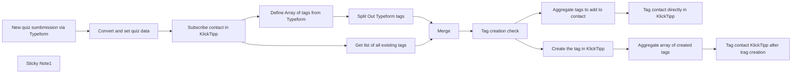

## Fluxo (.json) :

```json
{
  "meta": {
    "instanceId": "95b3ab5a70ab1c8c1906357a367f1b236ef12a1409406fd992f60255f0f95f85"
  },
  "nodes": [
    {
      "id": "8f3fd206-b47f-4eae-a968-dc44ac0e6976",
      "name": "Convert and set quiz data",
      "type": "n8n-nodes-base.set",
      "notes": "This node formats the data received from the Jotform submission, ensuring it is correctly formatted for further processing at the KlickTipp API endpoint.",
      "position": [
        -1160,
        680
      ],
      "parameters": {
        "options": {},
        "assignments": {
          "assignments": [
            {
              "id": "f1263cb6-654a-4d07-9073-c015b720e6b7",
              "name": "mobile_number",
              "type": "string",
              "value": "={{ \n// Converts a phone number to numeric-only format with international code prefixed by \"00\"\n$json.Mobilrufnummer \n    ? $json.Mobilrufnummer\n        .replace(/^\\+/, '00')   // Replace leading \"+\" with \"00\"\n        .replace(/[^0-9]/g, '') // Remove non-numeric characters\n    : ''\n}}"
            },
            {
              "id": "b09cc146-e614-478a-8f33-324d813e0120",
              "name": "birthday",
              "type": "string",
              "value": "={{ \n// Converts a date to a UNIX timestamp (in seconds)\nMath.floor(\n    new Date($json.Geburtstag + 'T00:00:00').getTime() / 1000\n)\n}}"
            },
            {
              "id": "1c455eb9-0750-4d69-9dab-390847a3d582",
              "name": "question1_klicktipp_use",
              "type": "string",
              "value": "={{ \n// Joins the values from the array into a comma-separated string\n$json['Wofür wird KlickTipp genutzt?'] \n    ? $json['Wofür wird KlickTipp genutzt?'].join(', ') \n    : '' \n}}"
            },
            {
              "id": "e375b10b-b05f-413e-93ed-b835e009dd91",
              "name": "question3_amount_cht_members",
              "type": "string",
              "value": "={{\n// Multiplies the decimalnumber value by 100\n$json['Wie viele Mitarbeiter hat das KlickTipp Customer Happiness Team?'] * 100 }}"
            }
          ]
        }
      },
      "notesInFlow": true,
      "typeVersion": 3.4
    },
    {
      "id": "c807913b-dd90-49a2-b4ad-9f56a261fa04",
      "name": "Subscribe contact in KlickTipp",
      "type": "n8n-nodes-klicktipp.klicktipp",
      "notes": "Adds the contact to KlickTipp using the transformed quiz data.",
      "position": [
        -940,
        680
      ],
      "parameters": {
        "email": "={{ $('New quiz sumbmission via Typeform').item.json['E-Mail Adresse'] }}",
        "fields": {
          "dataFields": [
            {
              "fieldId": "fieldFirstName",
              "fieldValue": "={{ $('New quiz sumbmission via Typeform').item.json.Vorname }}"
            },
            {
              "fieldId": "fieldLastName",
              "fieldValue": "={{ $('New quiz sumbmission via Typeform').item.json.Nachname }}"
            },
            {
              "fieldId": "fieldBirthday",
              "fieldValue": "={{ $json.birthday }}"
            },
            {
              "fieldId": "field214474",
              "fieldValue": "={{ $('New quiz sumbmission via Typeform').item.json['LinkedIn URL'] }}"
            },
            {
              "fieldId": "field214475",
              "fieldValue": "={{ $json.question1_klicktipp_use }}"
            },
            {
              "fieldId": "field214476",
              "fieldValue": "={{ $('New quiz sumbmission via Typeform').item.json['Wo ist der Firmensitz der Klick-Tipp Limited?'] }}"
            },
            {
              "fieldId": "field214477",
              "fieldValue": "={{ $json.question3_amount_cht_members }}"
            }
          ]
        },
        "listId": "358895",
        "resource": "subscriber",
        "operation": "subscribe",
        "smsNumber": "={{ $json.mobile_number }}"
      },
      "credentials": {
        "klickTippApi": {
          "id": "K9JyBdCM4SZc1cXl",
          "name": "DEMO KlickTipp account"
        }
      },
      "notesInFlow": true,
      "typeVersion": 2
    },
    {
      "id": "55656b0f-6fb4-435c-82be-750b557384b4",
      "name": "New quiz sumbmission via Typeform",
      "type": "n8n-nodes-base.typeformTrigger",
      "notes": "Triggers the workflow when a new quiz submission is received on Type Form.",
      "position": [
        -1380,
        680
      ],
      "webhookId": "37b98062-04ab-49be-b0f7-0fee3841bbd6",
      "parameters": {
        "formId": "nRFO0o92"
      },
      "credentials": {
        "typeformApi": {
          "id": "1AUCqB2W8UDCVKhX",
          "name": "Ricardo's Typeform account"
        }
      },
      "notesInFlow": true,
      "typeVersion": 1.1
    },
    {
      "id": "92cf733f-f655-4302-b092-94d33399c8bd",
      "name": "Sticky Note1",
      "type": "n8n-nodes-base.stickyNote",
      "position": [
        -700,
        900
      ],
      "parameters": {
        "width": 860.4918918918919,
        "height": 1166.607676825762,
        "content": "### Introduction\nThis workflow facilitates seamless integration between Typeform and KlickTipp, automating the process of handling quiz responses. By transforming raw quiz data into a format compatible with KlickTipp’s API, it eliminates manual data entry and ensures accurate, consistent information. \n\n### Benefits\n- **Efficient lead generation**: Contacts from forms are automatically imported into KlickTipp and can be used immediately, saving time and increasing the conversion rate.\n- **Automated processes**: Experts can start workflows directly, such as welcome emails or course admissions, reducing administrative effort.\n- **Error-free data management**: The template ensures precise data mapping, avoids manual corrections, and reinforces a professional appearance.\n\n### Key Features\n- **Typeform Trigger**: Captures new quiz submissions, including user details and quiz responses.\n- **Data Processing and Transformation**:\n  - Formats phone numbers to numeric-only format with international prefixes.\n  - Converts dates (e.g., birthdays) to UNIX timestamps.\n  - Maps multiple-choice quiz answers to string values for API compatibility.\n  - Scales numeric quiz responses for tailored use cases.\n- **Subscriber Management in KlickTipp**: Adds or updates participants as subscribers in KlickTipp. Includes custom field mappings and tags, such as:\n  - Personal details (e.g., name, email, phone number, birthday).\n  - Quiz responses (e.g., intended usage of KlickTipp, company location, and team size).\n  - Contact segmentation: Creates new tags based on form submission if necessary and adds these dynamic tags as well as fixed tags to contacts.\n- **Error Handling**: Handles empty or malformed data gracefully, ensuring clean submissions to KlickTipp.\n\n### Setup Instructions\n1. Set up the Typeform and KlickTipp nodes in your n8n instance.\n2. Connect your Typeform webhook to capture quiz responses and authenticate your KlickTipp account.\n3. Create the necessary custom fields to match the data structure:\n4. Verify and customize field mappings in the workflow to align with your specific form and subscriber list setup.\n\n\n\n### Testing and Deployment\n1. Test the workflow by submitting a quiz through Typeform.\n2. Verify that the data is correctly processed and updated in KlickTipp.\n\n- **Customization**: Update field mappings within the KlickTipp nodes to ensure alignment with your specific account setup.  "
      },
      "typeVersion": 1
    },
    {
      "id": "81efd56c-43e7-4598-a9ab-e7578406b227",
      "name": "Get list of all existing tags",
      "type": "n8n-nodes-klicktipp.klicktipp",
      "notes": "This node fetches all tags that already exist in KlickTipp.",
      "position": [
        -500,
        700
      ],
      "parameters": {},
      "credentials": {
        "klickTippApi": {
          "id": "K9JyBdCM4SZc1cXl",
          "name": "DEMO KlickTipp account"
        }
      },
      "notesInFlow": true,
      "typeVersion": 2
    },
    {
      "id": "4e2de2e8-e0df-476a-aa2e-ff4b00ce7037",
      "name": "Merge",
      "type": "n8n-nodes-base.merge",
      "notes": "This node merges the tags which are fetched via the form with the existing tags we requested in order to identify if new tags need to be created.",
      "position": [
        -80,
        580
      ],
      "parameters": {
        "mode": "combineBySql",
        "query": "SELECT \n    input1.tags AS name,  -- Extracts the tag name from input1\n    IF(input2.value IS NOT NULL, true, false) AS exist, -- Checks if the tag exists in input2 (returns true if found, false otherwise)\n    input2.id AS tag_id  -- Retrieves the ID of the tag from input2 if it exists, otherwise returns NULL\nFROM \n    input1\nLEFT JOIN \n    input2 \nON \n    input1.tags = input2.value  -- Matches tags from input1 with values in input2"
      },
      "notesInFlow": true,
      "typeVersion": 3
    },
    {
      "id": "fd4b0ed3-08cb-4e6b-8538-1fe7a391bd25",
      "name": "Define Array of tags from Typeform",
      "type": "n8n-nodes-base.set",
      "notes": "This node defines tags based on the form submission, such as the webinar selection, date, and reminder interval, and saves them as an array for further processing.",
      "position": [
        -500,
        500
      ],
      "parameters": {
        "options": {},
        "assignments": {
          "assignments": [
            {
              "id": "814576c1-ba16-4546-9815-2b7dec324f94",
              "name": "tags",
              "type": "array",
              "value": "={{ \n  Array.from([\n    // Every line represents one of the dynamic values that are received from the form submission.\n    // These values are extracted from Typeform responses.\n    $('New quiz sumbmission via Typeform').item.json['Wofür wird KlickTipp genutzt?'],\n    $('New quiz sumbmission via Typeform').item.json['Wo ist der Firmensitz der Klick-Tipp Limited?'],\n    $('New quiz sumbmission via Typeform').item.json['Wie viele Mitarbeiter hat das KlickTipp Customer Happiness Team?']\n  ].flat()) // .flat() ensures that any nested arrays are merged into a single-level array.\n}}"
            }
          ]
        }
      },
      "notesInFlow": true,
      "typeVersion": 3.4
    },
    {
      "id": "feab2eb3-28b8-4aa5-87b4-999c144fbdeb",
      "name": "Split Out Typeform tags",
      "type": "n8n-nodes-base.splitOut",
      "notes": "In this node we split the created array again into items so we can merge them with the existing tags we request from KlickTipp.",
      "position": [
        -320,
        500
      ],
      "parameters": {
        "options": {},
        "fieldToSplitOut": "tags"
      },
      "notesInFlow": true,
      "typeVersion": 1
    },
    {
      "id": "0073c5fb-3eb1-4eab-b572-dce0161afaf1",
      "name": "Tag creation check",
      "type": "n8n-nodes-base.if",
      "notes": "This node checks the result of the tag comparison and branches the workflow accordingly in order to directly tag the contact or to create the tag first and to then follow through with the tagging.",
      "position": [
        140,
        580
      ],
      "parameters": {
        "options": {},
        "conditions": {
          "options": {
            "version": 2,
            "leftValue": "",
            "caseSensitive": true,
            "typeValidation": "strict"
          },
          "combinator": "and",
          "conditions": [
            {
              "id": "d9567816-9236-434d-b46e-e47f4d36f289",
              "operator": {
                "type": "boolean",
                "operation": "true",
                "singleValue": true
              },
              "leftValue": "={{ $json.exist }}",
              "rightValue": ""
            }
          ]
        }
      },
      "notesInFlow": true,
      "typeVersion": 2.2
    },
    {
      "id": "2d6bb138-7b5e-4e51-b18a-cfbec85396d2",
      "name": "Create the tag in KlickTipp",
      "type": "n8n-nodes-klicktipp.klicktipp",
      "notes": "Creates a new tag in KlickTipp if it does not already exist.",
      "position": [
        440,
        660
      ],
      "parameters": {
        "name": "={{ $json.name }}",
        "operation": "create"
      },
      "credentials": {
        "klickTippApi": {
          "id": "K9JyBdCM4SZc1cXl",
          "name": "DEMO KlickTipp account"
        }
      },
      "notesInFlow": true,
      "typeVersion": 2
    },
    {
      "id": "9045b890-07c3-4432-a900-6296e49904d3",
      "name": "Aggregate tags to add to contact",
      "type": "n8n-nodes-base.aggregate",
      "notes": "This node aggregates all IDs of the existing tags to a list.",
      "position": [
        460,
        460
      ],
      "parameters": {
        "options": {},
        "fieldsToAggregate": {
          "fieldToAggregate": [
            {
              "renameField": true,
              "outputFieldName": "tag_ids",
              "fieldToAggregate": "tag_id"
            }
          ]
        }
      },
      "notesInFlow": true,
      "typeVersion": 1
    },
    {
      "id": "e9217f44-f004-4460-87ad-fc0fbd63624c",
      "name": "Tag contact directly in KlickTipp",
      "type": "n8n-nodes-klicktipp.klicktipp",
      "notes": "Applies existing tags to a subscriber in KlickTipp. This enables the use of specific signatures, sign out automations as well as the automation of emails and campaigns or other automations.",
      "position": [
        720,
        460
      ],
      "parameters": {
        "email": "={{ $('New quiz sumbmission via Typeform').item.json['E-Mail Adresse'] }}",
        "tagId": "={{$json.tag_ids}}",
        "resource": "contact-tagging"
      },
      "credentials": {
        "klickTippApi": {
          "id": "K9JyBdCM4SZc1cXl",
          "name": "DEMO KlickTipp account"
        }
      },
      "notesInFlow": true,
      "typeVersion": 2
    },
    {
      "id": "031ffca6-c94d-484f-b798-1beeb62a6ea5",
      "name": "Aggregate array of created tags",
      "type": "n8n-nodes-base.aggregate",
      "notes": "This node aggregates all IDs of the newly created tags to a list.",
      "position": [
        640,
        660
      ],
      "parameters": {
        "options": {},
        "fieldsToAggregate": {
          "fieldToAggregate": [
            {
              "renameField": true,
              "outputFieldName": "tag_ids",
              "fieldToAggregate": "id"
            }
          ]
        }
      },
      "notesInFlow": true,
      "typeVersion": 1
    },
    {
      "id": "bedf795b-0dbf-4d57-b0db-7d3bfaaffbaf",
      "name": "Tag contact KlickTipp after trag creation",
      "type": "n8n-nodes-klicktipp.klicktipp",
      "notes": "Associates a specific tag with a subscriber in KlickTipp using their email address. This enables the use of specific signatures, signout automations as well as the automation of emails and campaigns or other automations.",
      "position": [
        840,
        660
      ],
      "parameters": {
        "email": "={{ $('New quiz sumbmission via Typeform').item.json['E-Mail Adresse'] }}",
        "tagId": "={{$json.tag_ids}}",
        "resource": "contact-tagging"
      },
      "credentials": {
        "klickTippApi": {
          "id": "K9JyBdCM4SZc1cXl",
          "name": "DEMO KlickTipp account"
        }
      },
      "notesInFlow": true,
      "typeVersion": 2
    }
  ],
  "pinData": {},
  "connections": {
    "Merge": {
      "main": [
        [
          {
            "node": "Tag creation check",
            "type": "main",
            "index": 0
          }
        ]
      ]
    },
    "Tag creation check": {
      "main": [
        [
          {
            "node": "Aggregate tags to add to contact",
            "type": "main",
            "index": 0
          }
        ],
        [
          {
            "node": "Create the tag in KlickTipp",
            "type": "main",
            "index": 0
          }
        ]
      ]
    },
    "Split Out Typeform tags": {
      "main": [
        [
          {
            "node": "Merge",
            "type": "main",
            "index": 0
          }
        ]
      ]
    },
    "Convert and set quiz data": {
      "main": [
        [
          {
            "node": "Subscribe contact in KlickTipp",
            "type": "main",
            "index": 0
          }
        ]
      ]
    },
    "Create the tag in KlickTipp": {
      "main": [
        [
          {
            "node": "Aggregate array of created tags",
            "type": "main",
            "index": 0
          }
        ]
      ]
    },
    "Get list of all existing tags": {
      "main": [
        [
          {
            "node": "Merge",
            "type": "main",
            "index": 1
          }
        ]
      ]
    },
    "Subscribe contact in KlickTipp": {
      "main": [
        [
          {
            "node": "Define Array of tags from Typeform",
            "type": "main",
            "index": 0
          },
          {
            "node": "Get list of all existing tags",
            "type": "main",
            "index": 0
          }
        ]
      ]
    },
    "Aggregate array of created tags": {
      "main": [
        [
          {
            "node": "Tag contact KlickTipp after trag creation",
            "type": "main",
            "index": 0
          }
        ]
      ]
    },
    "Aggregate tags to add to contact": {
      "main": [
        [
          {
            "node": "Tag contact directly in KlickTipp",
            "type": "main",
            "index": 0
          }
        ]
      ]
    },
    "New quiz sumbmission via Typeform": {
      "main": [
        [
          {
            "node": "Convert and set quiz data",
            "type": "main",
            "index": 0
          }
        ]
      ]
    },
    "Define Array of tags from Typeform": {
      "main": [
        [
          {
            "node": "Split Out Typeform tags",
            "type": "main",
            "index": 0
          }
        ]
      ]
    }
  }
}
```

<a id="template-741"></a>

## Template 741 - Tutor de Chinês com Telegram e Sheets

- **Nome:** Tutor de Chinês com Telegram e Sheets
- **Descrição:** Este fluxo integra Telegram, Google Sheets e um modelo de linguagem para criar perguntas de múltipla escolha (MCQ) para praticar vocabulário em chinês, mantendo a conversa por chat e fornecendo feedback contínuo.
- **Funcionalidade:** • Detecção e interação por Telegram: recebe mensagens do usuário e envia respostas.
• Recuperação de vocabulário: extrai palavras da planilha Google Sheets para usar nas perguntas.
• Agrupamento de vocabulário: consolida vocabulário inicial e de destino em listas para o processo de geração.
• Geração de MCQs com IA: cria perguntas de tradução com quatro opções, uma correta e três incorretas, sem marcar a resposta correta no enunciado.
• Avaliação de respostas: verifica a resposta do usuário e fornece feedback claro com a explicação.
• Customização por chat: mantém histórico de conversa por chat para personalizar a interação.
• Continuidade de prática: após cada feedback, gera automaticamente uma nova pergunta para continuar a prática.
- **Ferramentas:** • Telegram: plataforma de mensagens usada para interagir com o usuário.
• Google Sheets: armazena o vocabulário utilizado pelo tutor.
• Modelo de linguagem (OpenAI): gera perguntas MCQ e avalia respostas.


## Fluxo visual

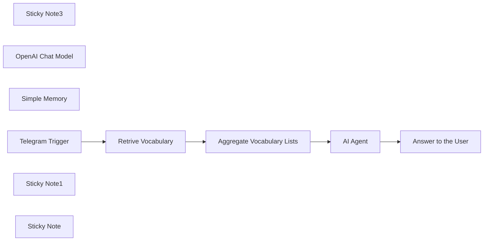

## Fluxo (.json) :

```json
{
  "meta": {
    "instanceId": "6a5e68bcca67c4cdb3e0b698d01739aea084e1ec06e551db64aeff43d174cb23",
    "templateCredsSetupCompleted": true
  },
  "nodes": [
    {
      "id": "bc49829b-45f2-4910-9c37-907271982f14",
      "name": "Sticky Note3",
      "type": "n8n-nodes-base.stickyNote",
      "position": [
        -1500,
        -520
      ],
      "parameters": {
        "width": 780,
        "height": 540,
        "content": "### 3. Do you need more details?\nFind a step-by-step guide in this tutorial\n\n[🎥 Watch My Tutorial](https://youtu.be/MQV8wDSug7M)"
      },
      "typeVersion": 1
    },
    {
      "id": "80af5237-9046-4b40-ac7c-167d8e0a490f",
      "name": "AI Agent",
      "type": "@n8n/n8n-nodes-langchain.agent",
      "notes": "Pinyin + Example",
      "position": [
        -2140,
        -140
      ],
      "parameters": {
        "text": "={{ $('Telegram Trigger').item.json.message.text }}",
        "options": {
          "systemMessage": "=# Context\nYou are an AI-powered language tutor designed to help {{ $('Telegram Trigger').item.json.message.chat.first_name }} practice Chinese vocabulary efficiently. \n\n# Role\nYour primary role is to generate interactive Multiple-Choice Questions (MCQs) and evaluate the user's responses.\n\n# Types of Exercises\n- MCQ: Provide an English word and four Chinese answer choices, one correct and three incorrect.\n\n# Rules for MCQ Generation\n1. Select a random **Chinese word** from this list {{ $json.targetLanguage }}\n2. Randomly select **three incorrect Chinese options** from the list or outside the list.\n3. **Do NOT mark the correct answer with ✅** in the question.\n4. Present the question in the following format:\nExample Question Format:\nWhat is the correct translation for \"Warehouse\"?\nA) 运输\nB) 仓库 \nC) 合同\nD) 投标\n5. Ask the user to respond with **A, B, C, or D**.\n\n# Evaluating User Responses:\n1. **Wait for the user's answer. Do NOT assume correctness before checking.**\n2. If the user selects the correct answer:\n- Respond positively: \"Great job! ✅ [Correct Answer] [Correct Answer's Pinyin] means [English Meaning].\"\n3. If the user selects the wrong answer:\n- Provide corrective feedback: \"Oops! ❌ The correct answer was [Correct Answer] ([English Meaning]).\"\n4. If the user provides an **invalid response** (e.g., \"Hello\"), ask them to respond with **A, B, C, or D**.\n\n# Post-Evaluation:\n- After giving feedback, always generate another question. Do not ask the user if he wants another question\n\n# Behavior & Tone\n- Be engaging and encouraging.\n- Ensure clarity in feedback.\n- Guide the user patiently if they provide invalid inputs."
        },
        "promptType": "define",
        "hasOutputParser": true
      },
      "notesInFlow": true,
      "typeVersion": 1.7
    },
    {
      "id": "8b35027e-ec5b-4c3e-9a5b-2780b6c40223",
      "name": "OpenAI Chat Model",
      "type": "@n8n/n8n-nodes-langchain.lmChatOpenAi",
      "position": [
        -2180,
        100
      ],
      "parameters": {
        "model": {
          "__rl": true,
          "mode": "list",
          "value": "gpt-4o-mini"
        },
        "options": {}
      },
      "typeVersion": 1.2
    },
    {
      "id": "688d6882-4930-407d-bf58-5f6add8eb159",
      "name": "Simple Memory",
      "type": "@n8n/n8n-nodes-langchain.memoryBufferWindow",
      "position": [
        -2000,
        140
      ],
      "parameters": {
        "sessionKey": "={{ $('Telegram Trigger').item.json.message.chat.id }}",
        "sessionIdType": "customKey"
      },
      "typeVersion": 1.3
    },
    {
      "id": "33f4a062-73f9-4a99-abca-1184ef2c2a41",
      "name": "Telegram Trigger",
      "type": "n8n-nodes-base.telegramTrigger",
      "position": [
        -2960,
        -140
      ],
      "webhookId": "88179da7-9927-4bdc-8bd7-78022810b48e",
      "parameters": {
        "updates": [
          "message"
        ],
        "additionalFields": {}
      },
      "notesInFlow": true,
      "typeVersion": 1.1
    },
    {
      "id": "af385807-d024-477e-9a42-c195043e95da",
      "name": "Retrive Vocabulary",
      "type": "n8n-nodes-base.googleSheets",
      "position": [
        -2700,
        -140
      ],
      "parameters": {
        "options": {},
        "sheetName": {
          "__rl": true,
          "mode": "list",
          "value": 0,
          "cachedResultUrl": "=",
          "cachedResultName": "="
        },
        "documentId": {
          "__rl": true,
          "mode": "list",
          "value": "=",
          "cachedResultUrl": "=",
          "cachedResultName": "="
        }
      },
      "notesInFlow": true,
      "typeVersion": 4.5
    },
    {
      "id": "3ab67ca5-9839-4fa6-bfc1-4dbbaf5593fc",
      "name": "Sticky Note1",
      "type": "n8n-nodes-base.stickyNote",
      "position": [
        -3000,
        -520
      ],
      "parameters": {
        "color": 7,
        "width": 680,
        "height": 540,
        "content": "### 1. Workflow Trigger with Telegram Message\n1. The workflow is triggered by a user message. \n2. The second node retrieves the vocabulary list from a Google Sheet.\n3. The third node combines all the words in Chinese and English in two distinctive lists.\n\n#### How to setup?\n- **Telegram Node:** set up your telegram bot credentials\n[Learn more about the Telegram Trigger Node](https://docs.n8n.io/integrations/builtin/trigger-nodes/n8n-nodes-base.telegramtrigger/)\n- **Retrieve Vocabulary from a Google Sheet Node**:\n   1. Add your Google Sheet API credentials to access the Google Sheet file\n   2. Select the file using the list, an URL or an ID\n   3. Select the sheet in which you have stored your vocabulary list\n  [Learn more about the Google Sheet Node](https://docs.n8n.io/integrations/builtin/app-nodes/n8n-nodes-base.googlesheets)\n"
      },
      "typeVersion": 1
    },
    {
      "id": "740a2d04-46fe-41f1-b887-f88f3e23c50d",
      "name": "Sticky Note",
      "type": "n8n-nodes-base.stickyNote",
      "position": [
        -2300,
        -520
      ],
      "parameters": {
        "color": 7,
        "width": 760,
        "height": 780,
        "content": "### 2. Conversational AI Agent\nThe AI agent will take as inputs the two vocabulary lists and user's message to asks questions and process answers. Conversations are recorded by chat id; each user has its own conversation with the bot.\n\n#### How to setup?\n- **Telegram Nodes:** set up your telegram bot credentials\n[Learn more about the Telegram Trigger Node](https://docs.n8n.io/integrations/builtin/trigger-nodes/n8n-nodes-base.telegramtrigger/)\n- **AI Agent with the Chat Model**:\n   1. Add a chat model with the required credentials *(Example: Open AI 4o-mini)*\n   2. Adapt the system prompt with the **target learning language** and the format of the question you want to have.\n"
      },
      "typeVersion": 1
    },
    {
      "id": "e92a55dc-6d9d-4008-bb40-72a7f2dd470c",
      "name": "Aggregate Vocabulary Lists",
      "type": "n8n-nodes-base.aggregate",
      "position": [
        -2460,
        -140
      ],
      "parameters": {
        "options": {},
        "fieldsToAggregate": {
          "fieldToAggregate": [
            {
              "renameField": true,
              "outputFieldName": "initialLanguage",
              "fieldToAggregate": "initialText"
            },
            {
              "renameField": true,
              "outputFieldName": "targetLanguage",
              "fieldToAggregate": "translatedText"
            }
          ]
        }
      },
      "typeVersion": 1
    },
    {
      "id": "18b29677-cfc0-4817-9321-35090a3fda2e",
      "name": "Answer to the User",
      "type": "n8n-nodes-base.telegram",
      "position": [
        -1740,
        -140
      ],
      "webhookId": "=",
      "parameters": {
        "text": "={{ $json.output }}",
        "chatId": "={{ $('Telegram Trigger').item.json.message.chat.id }}",
        "additionalFields": {
          "appendAttribution": false
        }
      },
      "notesInFlow": true,
      "typeVersion": 1.2
    }
  ],
  "pinData": {},
  "connections": {
    "AI Agent": {
      "main": [
        [
          {
            "node": "Answer to the User",
            "type": "main",
            "index": 0
          }
        ]
      ]
    },
    "Simple Memory": {
      "ai_memory": [
        [
          {
            "node": "AI Agent",
            "type": "ai_memory",
            "index": 0
          }
        ]
      ]
    },
    "Telegram Trigger": {
      "main": [
        [
          {
            "node": "Retrive Vocabulary",
            "type": "main",
            "index": 0
          }
        ]
      ]
    },
    "OpenAI Chat Model": {
      "ai_languageModel": [
        [
          {
            "node": "AI Agent",
            "type": "ai_languageModel",
            "index": 0
          }
        ]
      ]
    },
    "Retrive Vocabulary": {
      "main": [
        [
          {
            "node": "Aggregate Vocabulary Lists",
            "type": "main",
            "index": 0
          }
        ]
      ]
    },
    "Aggregate Vocabulary Lists": {
      "main": [
        [
          {
            "node": "AI Agent",
            "type": "main",
            "index": 0
          }
        ]
      ]
    }
  }
}
```
