# PACK 1999 TEMPLATES PARTE 04 - Bloco 8

Templates neste bloco: 20

## Sumário

- [Template 742 - Extração estruturada de dados e análise com Bright Data e Google Gemini](#template-742)
- [Template 743 - Criação, atualização e consulta de webinar](#template-743)
- [Template 744 - Etiquetagem automática de mensagens do Gmail com IA](#template-744)
- [Template 745 - Sincronizar coleção do Squarespace com Google Sheets](#template-745)
- [Template 746 - Exportar conteúdo do WordPress para CSV](#template-746)
- [Template 747 - Chat com memória de conversa e IA](#template-747)
- [Template 748 - Criar linha em Grist para itens confirmados](#template-748)
- [Template 749 - Assistente de estudos em processamento de sinais (Telegram)](#template-749)
- [Template 750 - Geração de imagens via OpenAI](#template-750)
- [Template 751 - Assistente DSP com IA e memória](#template-751)
- [Template 752 - Adicionar clientes do Notion ao Clockify](#template-752)
- [Template 753 - Envio diário de receitas por e-mail](#template-753)
- [Template 754 - Criar tabela e inserir registro no CrateDB](#template-754)
- [Template 755 - Resumo Diário de E-mails com IA](#template-755)
- [Template 756 - Sincronizar links do canal Telegram para Readeck e Hoarder](#template-756)
- [Template 757 - Publicar releases do GitLab no Outline](#template-757)
- [Template 758 - Resumo diário de emails](#template-758)
- [Template 759 - Raspagem e indexação de ensaios em banco vetorial](#template-759)
- [Template 760 - Detectar workflows que usam modelos de IA](#template-760)
- [Template 761 - Email com imagem embutida (CID)](#template-761)

---

<a id="template-742"></a>

## Template 742 - Extração estruturada de dados e análise com Bright Data e Google Gemini

- **Nome:** Extração estruturada de dados e análise com Bright Data e Google Gemini
- **Descrição:** Fluxo que busca conteúdo web desbloqueado, converte Markdown em texto, realiza extrações e análises estruturadas (tópicos e tendências) usando modelos de linguagem e envia resultados para notificações e arquivos locais.
- **Funcionalidade:** • Disparo manual: inicia o processamento por um gatilho manual para testes ou execuções sob demanda.
• Configuração de alvo: define a URL alvo e a zona do serviço de proxy/desbloqueio para a requisição web.
• Requisição ao Bright Data Web Unlocker: solicita o conteúdo da página alvo em formato Markdown via API externa de desbloqueio.
• Conversão de Markdown para texto: usa um modelo de linguagem para transformar o Markdown retornado em texto limpo e extraível.
• Extração de tópicos com resposta estruturada: identifica tópicos principais e devolve um JSON com topic, score, summary e keywords conforme esquema definido.
• Análise de tendências por localização e categoria: agrupa e modela tendências emergentes em um JSON estruturado contendo location, category e lista de trends com score, resumo e menções.
• Análise/avaliação adicional por LLM (p.ex. sentimento/resumos): utiliza modelo de linguagem para enriquecer ou analisar os resultados de forma estruturada.
• Notificações via webhook: envia os resultados processados a um endpoint de webhook configurável para integração ou monitoramento.
• Persistência em disco: gera arquivos JSON com os resultados (topics.json e trends.json) gravados no sistema de arquivos local para arquivamento ou consumo posterior.
- **Ferramentas:** • Bright Data Web Unlocker (API Bright Data): serviço usado para acessar/desbloquear páginas web e retornar o conteúdo bruto em formato Markdown.
• Google Gemini / PaLM API: modelo de linguagem utilizado para conversão de Markdown, extração de informações e análises estruturadas.
• Endpoint de webhook (ex.: webhook.site): receptor HTTP para receber notificações com os resultados do processamento, útil para monitoramento e testes.
• Sistema de arquivos local (unidade D:\): armazenamento local onde os arquivos JSON gerados (topics.json e trends.json) são salvos.

## Fluxo visual

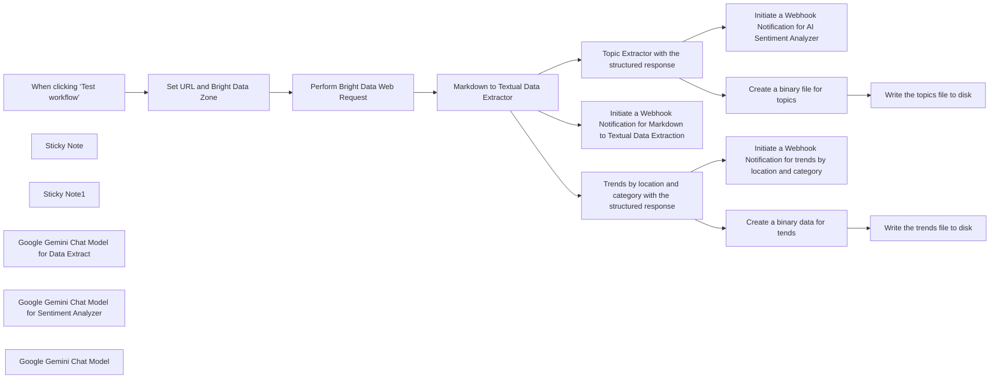

## Fluxo (.json) :

```json
{
  "id": "1GOrjyc9mtZCMvCr",
  "meta": {
    "instanceId": "885b4fb4a6a9c2cb5621429a7b972df0d05bb724c20ac7dac7171b62f1c7ef40",
    "templateCredsSetupCompleted": true
  },
  "name": "Structured Data Extract, Data Mining with Bright Data & Google Gemini",
  "tags": [
    {
      "id": "Kujft2FOjmOVQAmJ",
      "name": "Engineering",
      "createdAt": "2025-04-09T01:31:00.558Z",
      "updatedAt": "2025-04-09T01:31:00.558Z"
    },
    {
      "id": "ddPkw7Hg5dZhQu2w",
      "name": "AI",
      "createdAt": "2025-04-13T05:38:08.053Z",
      "updatedAt": "2025-04-13T05:38:08.053Z"
    }
  ],
  "nodes": [
    {
      "id": "1e9038e6-9ebc-4460-bee2-3faea3b38f4c",
      "name": "When clicking ‘Test workflow’",
      "type": "n8n-nodes-base.manualTrigger",
      "position": [
        200,
        -420
      ],
      "parameters": {},
      "typeVersion": 1
    },
    {
      "id": "fd4ace46-7261-4380-8b65-1e00bb574f27",
      "name": "Sticky Note",
      "type": "n8n-nodes-base.stickyNote",
      "position": [
        200,
        -780
      ],
      "parameters": {
        "width": 400,
        "height": 300,
        "content": "## Note\n\nThis workflow deals with the structured data extraction by utilizing Bright Data Web Unlocker Product.\n\nThe Basic LLM Chain, Information Extraction, are being used to demonstrate the usage of the N8N AI capabilities.\n\n**Please make sure to set the web URL of your interest within the \"Set URL and Bright Data Zone\" node and update the Webhook Notification URL**"
      },
      "typeVersion": 1
    },
    {
      "id": "1c1dd10f-beb2-4cc7-9118-77efd3172651",
      "name": "Sticky Note1",
      "type": "n8n-nodes-base.stickyNote",
      "position": [
        620,
        -780
      ],
      "parameters": {
        "width": 480,
        "height": 300,
        "content": "## LLM Usages\n\nGoogle Gemini Flash Exp model is being used.\n\nBasic LLM Chain Data Extractor.\n\nInformation Extraction is being used for the handling the custom sentiment analysis with the structured response."
      },
      "typeVersion": 1
    },
    {
      "id": "9795ac80-6ded-465d-bfcf-0c6ce120452f",
      "name": "Markdown to Textual Data Extractor",
      "type": "@n8n/n8n-nodes-langchain.chainLlm",
      "position": [
        860,
        -420
      ],
      "parameters": {
        "text": "=You need to analyze the below markdown and convert to textual data. Please do not output with your own thoughts. Make sure to output with textual data only with no links, scripts, css etc.\n\n{{ $json.data }}",
        "messages": {
          "messageValues": [
            {
              "message": "You are a markdown expert"
            }
          ]
        },
        "promptType": "define"
      },
      "typeVersion": 1.6
    },
    {
      "id": "b6a8cc64-c0c7-40dc-b7c1-0571baf3a0a9",
      "name": "Set URL and Bright Data Zone",
      "type": "n8n-nodes-base.set",
      "position": [
        420,
        -420
      ],
      "parameters": {
        "options": {},
        "assignments": {
          "assignments": [
            {
              "id": "3aedba66-f447-4d7a-93c0-8158c5e795f9",
              "name": "url",
              "type": "string",
              "value": "https://www.bbc.com/news/world"
            },
            {
              "id": "4e7ee31d-da89-422f-8079-2ff2d357a0ba",
              "name": "zone",
              "type": "string",
              "value": "web_unlocker1"
            }
          ]
        }
      },
      "typeVersion": 3.4
    },
    {
      "id": "8d15dca1-3014-405f-ac35-78d64eda1d07",
      "name": "Initiate a Webhook Notification for Markdown to Textual Data Extraction",
      "type": "n8n-nodes-base.httpRequest",
      "position": [
        1314,
        -720
      ],
      "parameters": {
        "url": "https://webhook.site/3c36d7d1-de1b-4171-9fd3-643ea2e4dd76",
        "options": {},
        "sendBody": true,
        "bodyParameters": {
          "parameters": [
            {
              "name": "content",
              "value": "={{ $json.text }}"
            }
          ]
        }
      },
      "typeVersion": 4.2
    },
    {
      "id": "fff9e2d1-f3e2-47c3-8c3a-f9de8dbdee6a",
      "name": "Initiate a Webhook Notification for AI Sentiment Analyzer",
      "type": "n8n-nodes-base.httpRequest",
      "position": [
        1612,
        80
      ],
      "parameters": {
        "url": "https://webhook.site/3c36d7d1-de1b-4171-9fd3-643ea2e4dd76",
        "options": {},
        "sendBody": true,
        "bodyParameters": {
          "parameters": [
            {
              "name": "summary",
              "value": "={{ $json.output }}"
            }
          ]
        }
      },
      "typeVersion": 4.2
    },
    {
      "id": "40c82a76-1710-4e57-8123-9c9fbc729110",
      "name": "Google Gemini Chat Model for Data Extract",
      "type": "@n8n/n8n-nodes-langchain.lmChatGoogleGemini",
      "position": [
        948,
        -200
      ],
      "parameters": {
        "options": {},
        "modelName": "models/gemini-2.0-flash-exp"
      },
      "credentials": {
        "googlePalmApi": {
          "id": "YeO7dHZnuGBVQKVZ",
          "name": "Google Gemini(PaLM) Api account"
        }
      },
      "typeVersion": 1
    },
    {
      "id": "0c1da174-9b9c-4067-9b2c-fa0cc8c33dc8",
      "name": "Google Gemini Chat Model for Sentiment Analyzer",
      "type": "@n8n/n8n-nodes-langchain.lmChatGoogleGemini",
      "position": [
        1324,
        200
      ],
      "parameters": {
        "options": {},
        "modelName": "models/gemini-2.0-flash-exp"
      },
      "credentials": {
        "googlePalmApi": {
          "id": "YeO7dHZnuGBVQKVZ",
          "name": "Google Gemini(PaLM) Api account"
        }
      },
      "typeVersion": 1
    },
    {
      "id": "7fae589c-854d-429e-9e67-527a002fcabf",
      "name": "Perform Bright Data Web Request",
      "type": "n8n-nodes-base.httpRequest",
      "position": [
        640,
        -420
      ],
      "parameters": {
        "url": "https://api.brightdata.com/request",
        "method": "POST",
        "options": {},
        "sendBody": true,
        "sendHeaders": true,
        "authentication": "genericCredentialType",
        "bodyParameters": {
          "parameters": [
            {
              "name": "zone",
              "value": "={{ $json.zone }}"
            },
            {
              "name": "url",
              "value": "={{ $json.url }}?product=unlocker&method=api"
            },
            {
              "name": "format",
              "value": "raw"
            },
            {
              "name": "data_format",
              "value": "markdown"
            }
          ]
        },
        "genericAuthType": "httpHeaderAuth",
        "headerParameters": {
          "parameters": [
            {}
          ]
        }
      },
      "credentials": {
        "httpHeaderAuth": {
          "id": "kdbqXuxIR8qIxF7y",
          "name": "Header Auth account"
        }
      },
      "typeVersion": 4.2
    },
    {
      "id": "e15fb9ba-ea8f-41f0-9b99-437d14a98a7d",
      "name": "Topic Extractor with the structured response",
      "type": "@n8n/n8n-nodes-langchain.informationExtractor",
      "position": [
        1236,
        -20
      ],
      "parameters": {
        "text": "=Perform the topic analysis on the below content and output with the structured information.\n\nHere's the content:\n\n{{ $('Perform Bright Data Web Request').item.json.data }}",
        "options": {
          "systemPromptTemplate": "You are an expert data analyst."
        },
        "schemaType": "manual",
        "inputSchema": "{\n  \"$schema\": \"http://json-schema.org/draft-07/schema#\",\n  \"title\": \"TopicModelingResponseArray\",\n  \"type\": \"array\",\n  \"items\": {\n    \"type\": \"object\",\n    \"properties\": {\n      \"topic\": {\n        \"type\": \"string\",\n        \"description\": \"The identified topic or theme derived from the input text.\"\n      },\n      \"score\": {\n        \"type\": \"number\",\n        \"minimum\": 0,\n        \"maximum\": 1,\n        \"description\": \"Confidence score representing how strongly this topic is reflected in the content.\"\n      },\n      \"summary\": {\n        \"type\": \"string\",\n        \"description\": \"Brief explanation of the topic’s context within the text.\"\n      },\n      \"keywords\": {\n        \"type\": \"array\",\n        \"description\": \"List of keywords associated with the topic.\",\n        \"items\": {\n          \"type\": \"string\"\n        }\n      }\n    },\n    \"required\": [\"topic\", \"score\", \"summary\", \"keywords\"],\n    \"additionalProperties\": false\n  }\n}\n"
      },
      "typeVersion": 1
    },
    {
      "id": "e7f2b2c5-89ba-45c4-b7a4-297a159f8b39",
      "name": "Trends by location and category with the structured response",
      "type": "@n8n/n8n-nodes-langchain.informationExtractor",
      "position": [
        1236,
        -520
      ],
      "parameters": {
        "text": "=Perform the data analysis on the below content and output with the structured information by clustering the emerging trends by location and category\n\nHere's the content:\n\n{{ $('Perform Bright Data Web Request').item.json.data }}",
        "options": {
          "systemPromptTemplate": "You are an expert data analyst."
        },
        "schemaType": "manual",
        "inputSchema": "{\n  \"$schema\": \"http://json-schema.org/draft-07/schema#\",\n  \"title\": \"EmergingTrendsClusteredByLocationAndCategory\",\n  \"type\": \"array\",\n  \"items\": {\n    \"type\": \"object\",\n    \"properties\": {\n      \"location\": {\n        \"type\": \"string\",\n        \"description\": \"Geographical region or city where the trend is observed.\"\n      },\n      \"category\": {\n        \"type\": \"string\",\n        \"description\": \"Domain or industry related to the trend (e.g., Technology, Finance, Healthcare).\"\n      },\n      \"trends\": {\n        \"type\": \"array\",\n        \"items\": {\n          \"type\": \"object\",\n          \"properties\": {\n            \"trend\": {\n              \"type\": \"string\",\n              \"description\": \"A concise label for the emerging trend.\"\n            },\n            \"score\": {\n              \"type\": \"number\",\n              \"minimum\": 0,\n              \"maximum\": 1,\n              \"description\": \"Confidence or prominence score of the trend.\"\n            },\n            \"summary\": {\n              \"type\": \"string\",\n              \"description\": \"Short explanation describing the context and impact of the trend.\"\n            },\n            \"mentions\": {\n              \"type\": \"array\",\n              \"items\": {\n                \"type\": \"string\"\n              },\n              \"description\": \"Keywords or phrases that commonly co-occur with the trend.\"\n            }\n          },\n          \"required\": [\"trend\", \"score\", \"summary\", \"mentions\"],\n          \"additionalProperties\": false\n        }\n      }\n    },\n    \"required\": [\"location\", \"category\", \"trends\"],\n    \"additionalProperties\": false\n  }\n}\n"
      },
      "typeVersion": 1
    },
    {
      "id": "92203e9f-cf13-435e-bf78-3c39a6e1e6f6",
      "name": "Google Gemini Chat Model",
      "type": "@n8n/n8n-nodes-langchain.lmChatGoogleGemini",
      "position": [
        1324,
        -300
      ],
      "parameters": {
        "options": {},
        "modelName": "models/gemini-2.0-flash-exp"
      },
      "credentials": {
        "googlePalmApi": {
          "id": "YeO7dHZnuGBVQKVZ",
          "name": "Google Gemini(PaLM) Api account"
        }
      },
      "typeVersion": 1
    },
    {
      "id": "1a252b74-6768-41a6-99dd-090e35c47065",
      "name": "Initiate a Webhook Notification for trends by location and category",
      "type": "n8n-nodes-base.httpRequest",
      "position": [
        1612,
        -320
      ],
      "parameters": {
        "url": "https://webhook.site/3c36d7d1-de1b-4171-9fd3-643ea2e4dd76",
        "options": {},
        "sendBody": true,
        "bodyParameters": {
          "parameters": [
            {
              "name": "summary",
              "value": "={{ $json.output }}"
            }
          ]
        }
      },
      "typeVersion": 4.2
    },
    {
      "id": "c952ab41-66af-4b41-b04e-407816074c87",
      "name": "Create a binary file for topics",
      "type": "n8n-nodes-base.function",
      "position": [
        1612,
        -120
      ],
      "parameters": {
        "functionCode": "items[0].binary = {\n  data: {\n    data: new Buffer(JSON.stringify(items[0].json, null, 2)).toString('base64')\n  }\n};\nreturn items;"
      },
      "typeVersion": 1
    },
    {
      "id": "2cf80339-0927-4f48-a13a-c610eaf4edca",
      "name": "Write the topics file to disk",
      "type": "n8n-nodes-base.readWriteFile",
      "position": [
        1820,
        -120
      ],
      "parameters": {
        "options": {},
        "fileName": "d:\\topics.json",
        "operation": "write"
      },
      "typeVersion": 1
    },
    {
      "id": "cf1da0ee-bb78-4ea7-bb2d-f2f82f728b12",
      "name": "Write the trends file to disk",
      "type": "n8n-nodes-base.readWriteFile",
      "position": [
        1832,
        -520
      ],
      "parameters": {
        "options": {},
        "fileName": "d:\\trends.json",
        "operation": "write"
      },
      "typeVersion": 1
    },
    {
      "id": "d38ca005-6ba3-4105-9fcd-058602ba16ce",
      "name": "Create a binary data for tends",
      "type": "n8n-nodes-base.function",
      "position": [
        1612,
        -520
      ],
      "parameters": {
        "functionCode": "items[0].binary = {\n  data: {\n    data: new Buffer(JSON.stringify(items[0].json, null, 2)).toString('base64')\n  }\n};\nreturn items;"
      },
      "typeVersion": 1
    }
  ],
  "active": false,
  "pinData": {},
  "settings": {
    "executionOrder": "v1"
  },
  "versionId": "6a81579d-1f3b-4ea2-821b-fff07b32ee7d",
  "connections": {
    "Google Gemini Chat Model": {
      "ai_languageModel": [
        [
          {
            "node": "Trends by location and category with the structured response",
            "type": "ai_languageModel",
            "index": 0
          }
        ]
      ]
    },
    "Set URL and Bright Data Zone": {
      "main": [
        [
          {
            "node": "Perform Bright Data Web Request",
            "type": "main",
            "index": 0
          }
        ]
      ]
    },
    "Write the trends file to disk": {
      "main": [
        []
      ]
    },
    "Create a binary data for tends": {
      "main": [
        [
          {
            "node": "Write the trends file to disk",
            "type": "main",
            "index": 0
          }
        ]
      ]
    },
    "Create a binary file for topics": {
      "main": [
        [
          {
            "node": "Write the topics file to disk",
            "type": "main",
            "index": 0
          }
        ]
      ]
    },
    "Perform Bright Data Web Request": {
      "main": [
        [
          {
            "node": "Markdown to Textual Data Extractor",
            "type": "main",
            "index": 0
          }
        ]
      ]
    },
    "When clicking ‘Test workflow’": {
      "main": [
        [
          {
            "node": "Set URL and Bright Data Zone",
            "type": "main",
            "index": 0
          }
        ]
      ]
    },
    "Markdown to Textual Data Extractor": {
      "main": [
        [
          {
            "node": "Topic Extractor with the structured response",
            "type": "main",
            "index": 0
          },
          {
            "node": "Initiate a Webhook Notification for Markdown to Textual Data Extraction",
            "type": "main",
            "index": 0
          },
          {
            "node": "Trends by location and category with the structured response",
            "type": "main",
            "index": 0
          }
        ]
      ]
    },
    "Google Gemini Chat Model for Data Extract": {
      "ai_languageModel": [
        [
          {
            "node": "Markdown to Textual Data Extractor",
            "type": "ai_languageModel",
            "index": 0
          }
        ]
      ]
    },
    "Topic Extractor with the structured response": {
      "main": [
        [
          {
            "node": "Initiate a Webhook Notification for AI Sentiment Analyzer",
            "type": "main",
            "index": 0
          },
          {
            "node": "Create a binary file for topics",
            "type": "main",
            "index": 0
          }
        ]
      ]
    },
    "Google Gemini Chat Model for Sentiment Analyzer": {
      "ai_languageModel": [
        [
          {
            "node": "Topic Extractor with the structured response",
            "type": "ai_languageModel",
            "index": 0
          }
        ]
      ]
    },
    "Trends by location and category with the structured response": {
      "main": [
        [
          {
            "node": "Initiate a Webhook Notification for trends by location and category",
            "type": "main",
            "index": 0
          },
          {
            "node": "Create a binary data for tends",
            "type": "main",
            "index": 0
          }
        ]
      ]
    }
  }
}
```

<a id="template-743"></a>

## Template 743 - Criação, atualização e consulta de webinar

- **Nome:** Criação, atualização e consulta de webinar
- **Descrição:** O fluxo cria um webinar com horário e assunto, atualiza seus detalhes (como descrição) e em seguida obtém as informações atualizadas usando a chave do webinar.
- **Funcionalidade:** • Criação de webinar: Gera um novo webinar com assunto e horário (start/end) definidos.
• Atualização de webinar: Altera campos do webinar (por exemplo, descrição) utilizando a webinarKey retornada pela criação.
• Consulta de webinar: Recupera os detalhes completos do webinar atualizado usando a mesma webinarKey.
• Encadeamento de dados: Reutiliza a saída do passo anterior (webinarKey) para acionar as operações subsequentes.
• Autenticação segura: Realiza todas as operações com autenticação via OAuth2.
- **Ferramentas:** • GoToWebinar: Plataforma para gerir webinars (criação, atualização e consulta), acessada via autenticação OAuth2.

## Fluxo visual

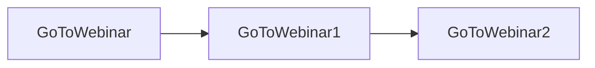

## Fluxo (.json) :

```json
{
  "nodes": [
    {
      "name": "GoToWebinar2",
      "type": "n8n-nodes-base.goToWebinar",
      "position": [
        930,
        280
      ],
      "parameters": {
        "resource": "webinar",
        "webinarKey": "={{$node[\"GoToWebinar\"].json[\"webinarKey\"]}}"
      },
      "credentials": {
        "goToWebinarOAuth2Api": "GoToWebinar OAuth Credentials"
      },
      "typeVersion": 1
    },
    {
      "name": "GoToWebinar1",
      "type": "n8n-nodes-base.goToWebinar",
      "position": [
        730,
        280
      ],
      "parameters": {
        "resource": "webinar",
        "operation": "update",
        "webinarKey": "={{$json[\"webinarKey\"]}}",
        "updateFields": {
          "description": "Get started with n8n and create your first automation workflow"
        }
      },
      "credentials": {
        "goToWebinarOAuth2Api": "GoToWebinar OAuth Credentials"
      },
      "typeVersion": 1
    },
    {
      "name": "GoToWebinar",
      "type": "n8n-nodes-base.goToWebinar",
      "position": [
        520,
        280
      ],
      "parameters": {
        "times": {
          "timesProperties": [
            {
              "endTime": "2021-03-02T10:00:00.000Z",
              "startTime": "2021-03-02T09:00:00.000Z"
            }
          ]
        },
        "subject": "Getting started with n8n",
        "resource": "webinar",
        "operation": "create",
        "additionalFields": {}
      },
      "credentials": {
        "goToWebinarOAuth2Api": "GoToWebinar OAuth Credentials"
      },
      "typeVersion": 1
    }
  ],
  "connections": {
    "GoToWebinar": {
      "main": [
        [
          {
            "node": "GoToWebinar1",
            "type": "main",
            "index": 0
          }
        ]
      ]
    },
    "GoToWebinar1": {
      "main": [
        [
          {
            "node": "GoToWebinar2",
            "type": "main",
            "index": 0
          }
        ]
      ]
    }
  }
}
```

<a id="template-744"></a>

## Template 744 - Etiquetagem automática de mensagens do Gmail com IA

- **Nome:** Etiquetagem automática de mensagens do Gmail com IA
- **Descrição:** Este fluxo lê novas mensagens do Gmail, usa IA para classificar o conteúdo em rótulos predefinidos (Partnership, Inquiry, Notification) e aplica os rótulos resultantes às mensagens.
- **Funcionalidade:** • Detecção de novas mensagens: Detecta novas mensagens no Gmail e inicia a automação.
• Recuperação do conteúdo: Obtém o conteúdo da mensagem usando o ID.
• Classificação de conteúdo com IA: Atribui rótulos com base no conteúdo da mensagem (Partnership, Inquiry, Notification).
• Mesclagem de rótulos: Combina rótulos existentes e sugeridos pela IA.
• Conversão para IDs de rótulo: Converte rótulos em IDs de rótulo do Gmail para aplicação.
• Aplicação de rótulos: Aplica os rótulos na mensagem no Gmail.
• Validação de saída: Valida a resposta da IA para respeitar o esquema de rótulos.
• Observação de prompts: Utiliza prompts orientadores para guiar a IA na classificação.
- **Ferramentas:** • Gmail: Serviço de correio utilizado para ler mensagens, extrair conteúdo e aplicar rótulos.
• OpenAI: API de linguagem para classificar o conteúdo em rótulos.

## Fluxo visual

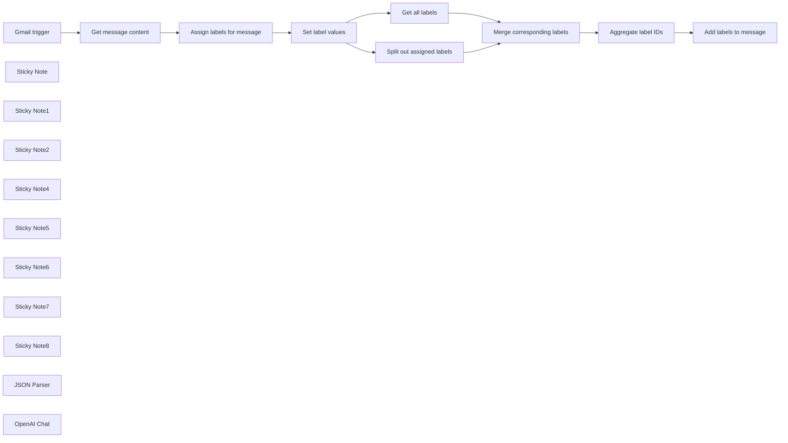

## Fluxo (.json) :

```json
{
  "nodes": [
    {
      "id": "8141ffad-df2a-403b-a869-799c036f9733",
      "name": "Gmail trigger",
      "type": "n8n-nodes-base.gmailTrigger",
      "position": [
        -600,
        580
      ],
      "parameters": {
        "simple": false,
        "filters": {},
        "options": {},
        "pollTimes": {
          "item": [
            {
              "mode": "everyMinute"
            }
          ]
        }
      },
      "credentials": {
        "gmailOAuth2": {
          "id": "uBcIMfsTtKjexw7I",
          "name": "Gmail (workfloowstutorial@gmail.com)"
        }
      },
      "typeVersion": 1
    },
    {
      "id": "6d9aa398-e2de-4fd0-b939-2a12d0c9fe14",
      "name": "Get message content",
      "type": "n8n-nodes-base.gmail",
      "position": [
        -340,
        580
      ],
      "parameters": {
        "simple": false,
        "options": {},
        "messageId": "={{ $json.id }}",
        "operation": "get"
      },
      "credentials": {
        "gmailOAuth2": {
          "id": "uBcIMfsTtKjexw7I",
          "name": "Gmail (workfloowstutorial@gmail.com)"
        }
      },
      "typeVersion": 2.1
    },
    {
      "id": "cd86bc09-8c7f-4c85-9cb3-6dbd42420672",
      "name": "Set label values",
      "type": "n8n-nodes-base.set",
      "position": [
        300,
        580
      ],
      "parameters": {
        "fields": {
          "values": [
            {
              "name": "labels",
              "type": "arrayValue",
              "arrayValue": "={{ $json.labels }}"
            }
          ]
        },
        "options": {}
      },
      "typeVersion": 3.2
    },
    {
      "id": "329435a6-51d1-416e-9aa9-5fe9a8dce74f",
      "name": "Get all labels",
      "type": "n8n-nodes-base.gmail",
      "position": [
        580,
        460
      ],
      "parameters": {
        "resource": "label",
        "returnAll": true
      },
      "credentials": {
        "gmailOAuth2": {
          "id": "uBcIMfsTtKjexw7I",
          "name": "Gmail (workfloowstutorial@gmail.com)"
        }
      },
      "typeVersion": 2.1
    },
    {
      "id": "7ae2dd15-472d-4a4b-b036-f80ebd7e3c28",
      "name": "Split out assigned labels",
      "type": "n8n-nodes-base.splitOut",
      "position": [
        580,
        700
      ],
      "parameters": {
        "options": {},
        "fieldToSplitOut": "labels"
      },
      "typeVersion": 1
    },
    {
      "id": "744c7afa-75b1-4b3b-8ccb-e2106c01f387",
      "name": "Merge corresponding labels",
      "type": "n8n-nodes-base.merge",
      "position": [
        860,
        580
      ],
      "parameters": {
        "mode": "combine",
        "options": {},
        "mergeByFields": {
          "values": [
            {
              "field1": "name",
              "field2": "labels"
            }
          ]
        },
        "outputDataFrom": "input1"
      },
      "typeVersion": 2.1
    },
    {
      "id": "e47424dc-f43e-41a9-b1e5-ab3e08cbf395",
      "name": "Aggregate label IDs",
      "type": "n8n-nodes-base.aggregate",
      "position": [
        1120,
        580
      ],
      "parameters": {
        "options": {},
        "fieldsToAggregate": {
          "fieldToAggregate": [
            {
              "renameField": true,
              "outputFieldName": "label_ids",
              "fieldToAggregate": "id"
            }
          ]
        }
      },
      "typeVersion": 1
    },
    {
      "id": "22ba8297-8efc-463e-8ae0-385fd94a205f",
      "name": "Add labels to message",
      "type": "n8n-nodes-base.gmail",
      "position": [
        1340,
        580
      ],
      "parameters": {
        "labelIds": "={{ $json.label_ids }}",
        "messageId": "={{ $('Gmail trigger').item.json[\"id\"] }}",
        "operation": "addLabels"
      },
      "credentials": {
        "gmailOAuth2": {
          "id": "uBcIMfsTtKjexw7I",
          "name": "Gmail (workfloowstutorial@gmail.com)"
        }
      },
      "typeVersion": 2.1
    },
    {
      "id": "7ebb1aad-00ad-43fa-9e07-e5f324864a74",
      "name": "Assign labels for message",
      "type": "@n8n/n8n-nodes-langchain.chainLlm",
      "position": [
        -80,
        580
      ],
      "parameters": {
        "prompt": "={{ $json.text }}",
        "messages": {
          "messageValues": [
            {
              "message": "Your task is to categorize the message according to the following labels.\n\nPartnership - email about sponsored content, cooperation etc.\nInquiry - email about products, services.\nNotification - email that doesn't require response. \n\nOne email can have more than one label. Return only label names in JSON format, nothing else. Do not make things up. "
            }
          ]
        }
      },
      "typeVersion": 1.3
    },
    {
      "id": "2f82db6a-422c-4697-a629-cc782d88209d",
      "name": "Sticky Note",
      "type": "n8n-nodes-base.stickyNote",
      "position": [
        -1100,
        400
      ],
      "parameters": {
        "color": 4,
        "width": 420.4803040774015,
        "height": 240.57943708322733,
        "content": "## Add AI labels to Gmail messages\nWith this workflow you can automatically set labels for your Gmail message according to its content. \n\nIn this workflow available are 3 labels: \"Partnership\", \"Inquiry\" and \"Notification\". Feel free to adjust labels according to your needs. \n\n**Please remember to set label names both in your Gmail account and workflow.**"
      },
      "typeVersion": 1
    },
    {
      "id": "4a10fb2b-aebb-4735-bbdb-7f07f1136d95",
      "name": "Sticky Note1",
      "type": "n8n-nodes-base.stickyNote",
      "position": [
        -1100,
        660
      ],
      "parameters": {
        "width": 421.0932411886662,
        "height": 257.42916378714597,
        "content": "## ⚠️ Note\n\n1. Complete video guide for this workflow is available [on my YouTube](https://youtu.be/a8Dhj3Zh9vQ). \n2. Remember to add your credentials and configure nodes (covered in the video guide).\n3. If you like this workflow, please subscribe to [my YouTube channel](https://www.youtube.com/@workfloows) and/or [my newsletter](https://workfloows.com/).\n\n**Thank you for your support!**"
      },
      "typeVersion": 1
    },
    {
      "id": "76e62351-d502-4377-9df2-fe92df00fe03",
      "name": "Sticky Note2",
      "type": "n8n-nodes-base.stickyNote",
      "position": [
        -660,
        400
      ],
      "parameters": {
        "width": 238.4602598584674,
        "height": 348.5873725349161,
        "content": "### Gmail Trigger\nReceive data from Gmail about new incoming message. \n\n⚠️ Set polling interval according to your needs."
      },
      "typeVersion": 1
    },
    {
      "id": "c10702db-211f-4638-bcf0-fbbe18251cb7",
      "name": "Sticky Note4",
      "type": "n8n-nodes-base.stickyNote",
      "position": [
        60,
        780
      ],
      "parameters": {
        "width": 241.53974014153226,
        "height": 319.3323098457962,
        "content": "###\n\n\n\n\n\n\n\n\n\n\n### JSON schema\nEdit JSON schema and label names according to your needs.\n\n⚠️ **Label names in system prompt and JSON schema should be the same.**"
      },
      "typeVersion": 1
    },
    {
      "id": "cb6e3573-3d4d-4313-a97e-86a017438399",
      "name": "Sticky Note5",
      "type": "n8n-nodes-base.stickyNote",
      "position": [
        800,
        420
      ],
      "parameters": {
        "width": 226.14233872620645,
        "height": 347.0476323933831,
        "content": "### Merge labels\nCombine labels retrieved from Gmail account and assigned by AI together."
      },
      "typeVersion": 1
    },
    {
      "id": "8cfb4341-98e6-4944-b26c-15e39184f468",
      "name": "Sticky Note6",
      "type": "n8n-nodes-base.stickyNote",
      "position": [
        1060,
        420
      ],
      "parameters": {
        "width": 452.48413953150185,
        "height": 347.0476323933831,
        "content": "### Aggregarte labels and add to message\nCreate array of label IDs and add to the desired email message in Gmail."
      },
      "typeVersion": 1
    },
    {
      "id": "bb9766e8-0b72-47f8-9a8e-0b291609e814",
      "name": "Sticky Note7",
      "type": "n8n-nodes-base.stickyNote",
      "position": [
        -400,
        400
      ],
      "parameters": {
        "width": 238.4602598584674,
        "height": 348.5873725349161,
        "content": "### Get message content\nBased on Gmail message ID retrieve body content of the email and pass it to AI chain."
      },
      "typeVersion": 1
    },
    {
      "id": "48630cbd-8336-4577-928e-37341f09ef9b",
      "name": "Sticky Note8",
      "type": "n8n-nodes-base.stickyNote",
      "position": [
        -140,
        400
      ],
      "parameters": {
        "width": 378.57661273793565,
        "height": 348.5873725349161,
        "content": "### Assign labels\nLet the AI decide which labels suit the best content of the message.\n\n⚠️ **Remember to edit system prompt** - modify label names and instructions according to your needs."
      },
      "typeVersion": 1
    },
    {
      "id": "60a9d75e-1564-4b1d-b3f2-acc2e3bf2411",
      "name": "JSON Parser",
      "type": "@n8n/n8n-nodes-langchain.outputParserStructured",
      "position": [
        140,
        800
      ],
      "parameters": {
        "jsonSchema": "{\n \"type\": \"object\",\n \"properties\": {\n \"labels\": {\n \"type\": \"array\",\n \"items\": {\n \"type\": \"string\",\n \"enum\": [\"Inquiry\", \"Partnership\", \"Notification\"]\n }\n }\n },\n \"required\": [\"labels\"]\n}\n"
      },
      "typeVersion": 1
    },
    {
      "id": "2bdf3fed-8a7f-411a-bad4-266bfea5cede",
      "name": "OpenAI Chat",
      "type": "@n8n/n8n-nodes-langchain.lmChatOpenAi",
      "position": [
        -120,
        800
      ],
      "parameters": {
        "model": "gpt-4-turbo-preview",
        "options": {
          "temperature": 0,
          "responseFormat": "json_object"
        }
      },
      "credentials": {
        "openAiApi": {
          "id": "jazew1WAaSRrjcHp",
          "name": "OpenAI (workfloows@gmail.com)"
        }
      },
      "typeVersion": 1
    }
  ],
  "active": false,
  "pinData": {},
  "settings": {
    "executionOrder": "v1"
  },
  "connections": {
    "JSON Parser": {
      "ai_outputParser": [
        [
          {
            "node": "Assign labels for message",
            "type": "ai_outputParser",
            "index": 0
          }
        ]
      ]
    },
    "OpenAI Chat": {
      "ai_languageModel": [
        [
          {
            "node": "Assign labels for message",
            "type": "ai_languageModel",
            "index": 0
          }
        ]
      ]
    },
    "Gmail trigger": {
      "main": [
        [
          {
            "node": "Get message content",
            "type": "main",
            "index": 0
          }
        ]
      ]
    },
    "Get all labels": {
      "main": [
        [
          {
            "node": "Merge corresponding labels",
            "type": "main",
            "index": 0
          }
        ]
      ]
    },
    "Set label values": {
      "main": [
        [
          {
            "node": "Get all labels",
            "type": "main",
            "index": 0
          },
          {
            "node": "Split out assigned labels",
            "type": "main",
            "index": 0
          }
        ]
      ]
    },
    "Aggregate label IDs": {
      "main": [
        [
          {
            "node": "Add labels to message",
            "type": "main",
            "index": 0
          }
        ]
      ]
    },
    "Get message content": {
      "main": [
        [
          {
            "node": "Assign labels for message",
            "type": "main",
            "index": 0
          }
        ]
      ]
    },
    "Assign labels for message": {
      "main": [
        [
          {
            "node": "Set label values",
            "type": "main",
            "index": 0
          }
        ]
      ]
    },
    "Split out assigned labels": {
      "main": [
        [
          {
            "node": "Merge corresponding labels",
            "type": "main",
            "index": 1
          }
        ]
      ]
    },
    "Merge corresponding labels": {
      "main": [
        [
          {
            "node": "Aggregate label IDs",
            "type": "main",
            "index": 0
          }
        ]
      ]
    }
  }
}
```

<a id="template-745"></a>

## Template 745 - Sincronizar coleção do Squarespace com Google Sheets

- **Nome:** Sincronizar coleção do Squarespace com Google Sheets
- **Descrição:** Coleta itens de uma coleção do Squarespace (por exemplo blog ou eventos) e insere ou atualiza registros em uma planilha do Google Sheets para manter um catálogo sincronizado.
- **Funcionalidade:** • Agendamento periódico: Executa o fluxo automaticamente em intervalos definidos para manter a planilha atualizada.
• Execução manual de teste: Permite disparar o fluxo manualmente para testes e validações.
• Coleta de itens da coleção com paginação: Faz requisições ao endpoint da coleção usando parâmetro format=json e offset para percorrer todas as páginas.
• Processamento item a item: Divide a resposta em itens individuais para mapear e transformar campos específicos.
• Inserção/atualização no Google Sheets: Adiciona ou atualiza linhas na planilha com mapeamento de campos (id, tags, título, urlId, datas, categorias, etc.).
• Uso de template de planilha: Indica uma planilha modelo que pode ser clonada como referência para o formato esperado.
- **Ferramentas:** • Squarespace: Fonte dos conteúdos (blog/eventos) que fornece os dados da coleção em JSON via parâmetros de consulta.
• Google Sheets: Destino para armazenar e sincronizar os registros, permitindo operações de inserção e atualização de linhas.
• Conta Google (OAuth): Credencial que autoriza acesso e modificação da planilha.


## Fluxo visual

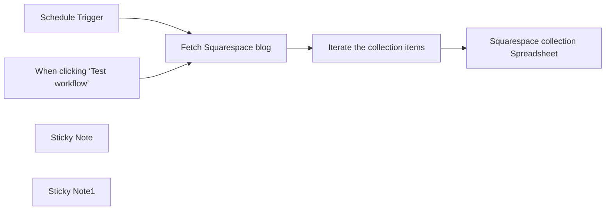

## Fluxo (.json) :

```json
{
  "id": "sUGieRWulZJ7scll",
  "meta": {
    "instanceId": "e634e668fe1fc93a75c4f2a7fc0dad807ca318b79654157eadb9578496acbc76"
  },
  "name": "Fetch Squarespace Blog & Event Collections to Google Sheets  ",
  "tags": [
    {
      "id": "oIxDbURnjwrJFwau",
      "name": "Squarespace",
      "createdAt": "2025-03-06T05:49:51.612Z",
      "updatedAt": "2025-03-06T05:49:51.612Z"
    }
  ],
  "nodes": [
    {
      "id": "43bb2c50-a9a9-4647-a470-612ad502283f",
      "name": "Schedule Trigger",
      "type": "n8n-nodes-base.scheduleTrigger",
      "position": [
        -240,
        420
      ],
      "parameters": {
        "rule": {
          "interval": [
            {}
          ]
        }
      },
      "typeVersion": 1.2
    },
    {
      "id": "410fa5ad-a8b8-4cde-b9a9-1d16db0880c9",
      "name": "When clicking ‘Test workflow’",
      "type": "n8n-nodes-base.manualTrigger",
      "position": [
        -240,
        180
      ],
      "parameters": {},
      "typeVersion": 1
    },
    {
      "id": "fa58fb9d-9292-4f25-8326-fad6e59a5513",
      "name": "Fetch Squarespace blog",
      "type": "n8n-nodes-base.httpRequest",
      "position": [
        20,
        300
      ],
      "parameters": {
        "url": "https://beyondspace.studio/blog",
        "options": {
          "pagination": {
            "pagination": {
              "parameters": {
                "parameters": [
                  {
                    "name": "offset",
                    "value": "={{ $response.body.pagination.nextPageOffset }}"
                  },
                  {
                    "name": "format",
                    "value": "json"
                  }
                ]
              },
              "requestInterval": 200,
              "completeExpression": "={{ $response.body.pagination.nextPage !== true }}",
              "paginationCompleteWhen": "other"
            }
          }
        },
        "sendQuery": true,
        "queryParameters": {
          "parameters": [
            {
              "name": "format",
              "value": "json"
            },
            {
              "name": "offset"
            }
          ]
        }
      },
      "typeVersion": 4.2,
      "alwaysOutputData": false
    },
    {
      "id": "4b558c29-3bea-4d5e-b88f-0433a81f4698",
      "name": "Sticky Note",
      "type": "n8n-nodes-base.stickyNote",
      "position": [
        -20,
        100
      ],
      "parameters": {
        "content": "## Change this node\nEdit the HTTP Request URL to your Squarespace blog URL\n\neg: https://beyondspace.studio/blog\n"
      },
      "typeVersion": 1
    },
    {
      "id": "1886c997-6ba2-42be-8ea0-9047a4cae2e7",
      "name": "Iterate the collection items",
      "type": "n8n-nodes-base.splitOut",
      "position": [
        260,
        300
      ],
      "parameters": {
        "options": {},
        "fieldToSplitOut": "items"
      },
      "typeVersion": 1
    },
    {
      "id": "9382f7b6-e113-4e4c-ba04-e7cbd119b164",
      "name": "Squarespace collection Spreadsheet",
      "type": "n8n-nodes-base.googleSheets",
      "position": [
        520,
        300
      ],
      "parameters": {
        "columns": {
          "value": {
            "id": "={{ $json.id }}",
            "tags": "={{ $json.tags.join(\", \") }}",
            "title": "={{ $json.title }}",
            "urlId": "={{ $json. urlId }}",
            "addedOn": "={{ new Date($json.addedOn).toISOString().split(\"T\")[0] }}",
            "fullUrl": "={{ $json.fullUrl }}",
            "assetUrl": "={{ $json.fullUrl }}",
            "publishOn": "={{ new Date($json.publishOn).toISOString().split(\"T\")[0] }}",
            "categories": "={{ $json.categories.join(\", \") }}"
          },
          "schema": [
            {
              "id": "id",
              "type": "string",
              "display": true,
              "removed": false,
              "required": false,
              "displayName": "id",
              "defaultMatch": true,
              "canBeUsedToMatch": true
            },
            {
              "id": "addedOn",
              "type": "string",
              "display": true,
              "removed": false,
              "required": false,
              "displayName": "addedOn",
              "defaultMatch": false,
              "canBeUsedToMatch": true
            },
            {
              "id": "tags",
              "type": "string",
              "display": true,
              "removed": false,
              "required": false,
              "displayName": "tags",
              "defaultMatch": false,
              "canBeUsedToMatch": true
            },
            {
              "id": "categories",
              "type": "string",
              "display": true,
              "removed": false,
              "required": false,
              "displayName": "categories",
              "defaultMatch": false,
              "canBeUsedToMatch": true
            },
            {
              "id": "publishOn",
              "type": "string",
              "display": true,
              "removed": false,
              "required": false,
              "displayName": "publishOn",
              "defaultMatch": false,
              "canBeUsedToMatch": true
            },
            {
              "id": "urlId",
              "type": "string",
              "display": true,
              "removed": false,
              "required": false,
              "displayName": "urlId",
              "defaultMatch": false,
              "canBeUsedToMatch": true
            },
            {
              "id": "title",
              "type": "string",
              "display": true,
              "removed": false,
              "required": false,
              "displayName": "title",
              "defaultMatch": false,
              "canBeUsedToMatch": true
            },
            {
              "id": "body",
              "type": "string",
              "display": true,
              "removed": false,
              "required": false,
              "displayName": "body",
              "defaultMatch": false,
              "canBeUsedToMatch": true
            },
            {
              "id": "fullUrl",
              "type": "string",
              "display": true,
              "removed": false,
              "required": false,
              "displayName": "fullUrl",
              "defaultMatch": false,
              "canBeUsedToMatch": true
            },
            {
              "id": "assetUrl",
              "type": "string",
              "display": true,
              "removed": false,
              "required": false,
              "displayName": "assetUrl",
              "defaultMatch": false,
              "canBeUsedToMatch": true
            }
          ],
          "mappingMode": "defineBelow",
          "matchingColumns": [
            "id"
          ],
          "attemptToConvertTypes": false,
          "convertFieldsToString": false
        },
        "options": {},
        "operation": "appendOrUpdate",
        "sheetName": {
          "__rl": true,
          "mode": "list",
          "value": "gid=0",
          "cachedResultUrl": "https://docs.google.com/spreadsheets/d/1yf_RYZGFHpMyOvD3RKGSvIFY2vumvI4474Qm_1t4-jM/edit#gid=0",
          "cachedResultName": "Beyondspace blog"
        },
        "documentId": {
          "__rl": true,
          "mode": "list",
          "value": "1yf_RYZGFHpMyOvD3RKGSvIFY2vumvI4474Qm_1t4-jM",
          "cachedResultUrl": "https://docs.google.com/spreadsheets/d/1yf_RYZGFHpMyOvD3RKGSvIFY2vumvI4474Qm_1t4-jM/edit?usp=drivesdk",
          "cachedResultName": "Make.com template"
        }
      },
      "credentials": {
        "googleSheetsOAuth2Api": {
          "id": "JgI9maibw5DnBXRP",
          "name": "Google Sheets account"
        }
      },
      "typeVersion": 4.5
    },
    {
      "id": "87081016-9daa-4985-afb8-eb1f259b23a0",
      "name": "Sticky Note1",
      "type": "n8n-nodes-base.stickyNote",
      "position": [
        480,
        100
      ],
      "parameters": {
        "content": "## Spreadsheet template\nClone this spreadsheet as reference\nhttps://docs.google.com/spreadsheets/d/1HGc7o4mqMY1t9fXT6LBhmZixjJYr0eapSUosXMA9v8E/edit?gid=0#gid=0"
      },
      "typeVersion": 1
    }
  ],
  "active": false,
  "pinData": {},
  "settings": {
    "executionOrder": "v1"
  },
  "versionId": "1a05b7b8-22fb-4f49-a079-583a26401a61",
  "connections": {
    "Schedule Trigger": {
      "main": [
        [
          {
            "node": "Fetch Squarespace blog",
            "type": "main",
            "index": 0
          }
        ]
      ]
    },
    "Fetch Squarespace blog": {
      "main": [
        [
          {
            "node": "Iterate the collection items",
            "type": "main",
            "index": 0
          }
        ]
      ]
    },
    "Iterate the collection items": {
      "main": [
        [
          {
            "node": "Squarespace collection Spreadsheet",
            "type": "main",
            "index": 0
          }
        ]
      ]
    },
    "When clicking ‘Test workflow’": {
      "main": [
        [
          {
            "node": "Fetch Squarespace blog",
            "type": "main",
            "index": 0
          }
        ]
      ]
    }
  }
}
```

<a id="template-746"></a>

## Template 746 - Exportar conteúdo do WordPress para CSV

- **Nome:** Exportar conteúdo do WordPress para CSV
- **Descrição:** Este fluxo busca todos os itens do WordPress e gera um arquivo CSV com os dados, salvando-o localmente.
- **Funcionalidade:** • Gatilho manual: Inicia o processo ao clicar em executar.
• Recuperação de dados do WordPress: Busca todos os registros disponíveis via API.
• Conversão para CSV: Converte os registros recebidos para o formato CSV.
• Gravação de arquivo: Salva o CSV gerado como um arquivo chamado data.csv no sistema de arquivos.
- **Ferramentas:** • WordPress (API REST): Fonte dos dados que contém posts e outros conteúdos a serem exportados.
• Sistema de arquivos local: Destino onde o arquivo CSV é gravado (ex.: disco local do servidor).

## Fluxo visual

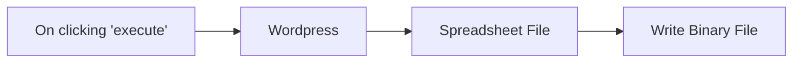

## Fluxo (.json) :

```json
{
  "id": "1",
  "name": "Wordpress-to-csv",
  "nodes": [
    {
      "name": "On clicking 'execute'",
      "type": "n8n-nodes-base.manualTrigger",
      "position": [
        250,
        300
      ],
      "parameters": {},
      "typeVersion": 1
    },
    {
      "name": "Wordpress",
      "type": "n8n-nodes-base.wordpress",
      "position": [
        430,
        300
      ],
      "parameters": {
        "options": {},
        "operation": "getAll",
        "returnAll": true
      },
      "credentials": {
        "wordpressApi": ""
      },
      "typeVersion": 1
    },
    {
      "name": "Spreadsheet File",
      "type": "n8n-nodes-base.spreadsheetFile",
      "position": [
        590,
        300
      ],
      "parameters": {
        "options": {},
        "operation": "toFile",
        "fileFormat": "csv"
      },
      "typeVersion": 1
    },
    {
      "name": "Write Binary File",
      "type": "n8n-nodes-base.writeBinaryFile",
      "position": [
        740,
        300
      ],
      "parameters": {
        "fileName": "data.csv"
      },
      "typeVersion": 1
    }
  ],
  "active": false,
  "settings": {},
  "connections": {
    "Wordpress": {
      "main": [
        [
          {
            "node": "Spreadsheet File",
            "type": "main",
            "index": 0
          }
        ]
      ]
    },
    "Spreadsheet File": {
      "main": [
        [
          {
            "node": "Write Binary File",
            "type": "main",
            "index": 0
          }
        ]
      ]
    },
    "On clicking 'execute'": {
      "main": [
        [
          {
            "node": "Wordpress",
            "type": "main",
            "index": 0
          }
        ]
      ]
    }
  }
}
```

<a id="template-747"></a>

## Template 747 - Chat com memória de conversa e IA

- **Nome:** Chat com memória de conversa e IA
- **Descrição:** Este fluxo gerencia uma conversa mantendo o histórico, consulta um assistente de IA com o contexto anterior e atualiza a memória com cada nova interação.
- **Funcionalidade:** • Detecção de trigger de chat: inicia a automação quando chega uma nova mensagem via webhook.
• Leitura e uso da memória de conversa: recupera mensagens anteriores para compor o contexto.
• Agrupamento de mensagens: consolida mensagens de usuário e IA para enviar como prompt ao assistente.
• Consulta ao assistente de IA com histórico: utiliza o histórico de conversa para gerar a resposta.
• Atualização da memória com a nova interação: grava a nova troca na memória para usos futuros.
• Gerenciamento de janela de contexto: mantém um buffer de contexto com tamanho definido (20 entradas) para manter relevância.
• Retorno da saída do modelo: exibe ou envia de volta a resposta gerada pelo IA.
- **Ferramentas:** • OpenAI: Serviço de geração de linguagem usado para produzir respostas com base no histórico de conversa.

## Fluxo visual

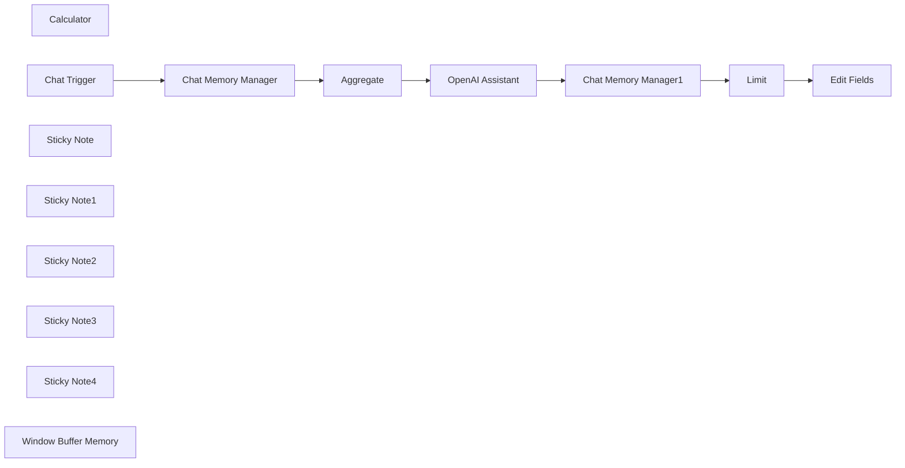

## Fluxo (.json) :

```json
{
  "meta": {
    "instanceId": "cb484ba7b742928a2048bf8829668bed5b5ad9787579adea888f05980292a4a7"
  },
  "nodes": [
    {
      "id": "087ae6e2-b333-4a30-9010-c78050203961",
      "name": "OpenAI Assistant",
      "type": "@n8n/n8n-nodes-langchain.openAiAssistant",
      "position": [
        1340,
        460
      ],
      "parameters": {
        "text": "=## Our Previous Conversation:\n{{ $json[\"messages\"].map(m => `\nHuman: ${m.human}\nAI Assistant: ${m.ai}\n`) }}\n## Current message:\n{{ $('Chat Trigger').item.json.chatInput }}",
        "options": {},
        "assistantId": "asst_HDSAnzsp4WqY4UC1iI9auH5z"
      },
      "credentials": {
        "openAiApi": {
          "id": "VQtv7frm7eLiEDnd",
          "name": "OpenAi account 7"
        }
      },
      "typeVersion": 1
    },
    {
      "id": "3793b10a-ebb7-42ec-8b9b-7fa3a353d9a3",
      "name": "Calculator",
      "type": "@n8n/n8n-nodes-langchain.toolCalculator",
      "position": [
        1500,
        640
      ],
      "parameters": {},
      "typeVersion": 1
    },
    {
      "id": "7bee2882-bb9e-402e-ba42-9b1ed0e1264b",
      "name": "Chat Memory Manager",
      "type": "@n8n/n8n-nodes-langchain.memoryManager",
      "position": [
        760,
        460
      ],
      "parameters": {},
      "typeVersion": 1,
      "alwaysOutputData": true
    },
    {
      "id": "5c66e482-819e-47e7-90be-779e92364e2a",
      "name": "Chat Memory Manager1",
      "type": "@n8n/n8n-nodes-langchain.memoryManager",
      "position": [
        1720,
        460
      ],
      "parameters": {
        "mode": "insert",
        "messages": {
          "messageValues": [
            {
              "type": "user",
              "message": "={{ $('Chat Trigger').item.json.chatInput }}"
            },
            {
              "type": "ai",
              "message": "={{ $json.output }}"
            }
          ]
        }
      },
      "typeVersion": 1,
      "alwaysOutputData": true
    },
    {
      "id": "b96bf629-bd21-4528-8988-e63c5af89fd7",
      "name": "Aggregate",
      "type": "n8n-nodes-base.aggregate",
      "position": [
        1140,
        460
      ],
      "parameters": {
        "options": {},
        "aggregate": "aggregateAllItemData",
        "destinationFieldName": "messages"
      },
      "typeVersion": 1,
      "alwaysOutputData": true
    },
    {
      "id": "95001be1-f046-47e3-a58c-25bff170ba06",
      "name": "Edit Fields",
      "type": "n8n-nodes-base.set",
      "position": [
        2320,
        460
      ],
      "parameters": {
        "fields": {
          "values": [
            {
              "name": "output",
              "stringValue": "={{ $('OpenAI Assistant').item.json.output }}"
            }
          ]
        },
        "options": {}
      },
      "typeVersion": 3.2
    },
    {
      "id": "4ea04793-c7fb-4b81-abf7-49590aa76ca7",
      "name": "Limit",
      "type": "n8n-nodes-base.limit",
      "position": [
        2100,
        460
      ],
      "parameters": {},
      "typeVersion": 1
    },
    {
      "id": "16921f74-d420-445a-9e09-19a6116a3267",
      "name": "Chat Trigger",
      "type": "@n8n/n8n-nodes-langchain.chatTrigger",
      "position": [
        460,
        460
      ],
      "webhookId": "1f83e8ac-d465-454a-8327-cef7f0149cb1",
      "parameters": {
        "public": true,
        "options": {
          "loadPreviousSession": "memory"
        }
      },
      "typeVersion": 1
    },
    {
      "id": "c0826494-779a-4c2d-93c9-746150ac9482",
      "name": "Sticky Note",
      "type": "n8n-nodes-base.stickyNote",
      "position": [
        740,
        400
      ],
      "parameters": {
        "color": 7,
        "width": 514.8706020514577,
        "height": 196.64941360686112,
        "content": "Read contents of the chat from memory"
      },
      "typeVersion": 1
    },
    {
      "id": "4ce4594d-070a-4985-9c5d-fcd4ebc4a627",
      "name": "Sticky Note1",
      "type": "n8n-nodes-base.stickyNote",
      "position": [
        1320,
        400
      ],
      "parameters": {
        "color": 7,
        "width": 298.02823821086326,
        "height": 196.64941360686112,
        "content": "Call the assistant, passing in the previous chat messages"
      },
      "typeVersion": 1
    },
    {
      "id": "49885b3b-de77-4c02-a35e-d188fee38831",
      "name": "Sticky Note2",
      "type": "n8n-nodes-base.stickyNote",
      "position": [
        1700,
        400
      ],
      "parameters": {
        "color": 7,
        "width": 298.02823821086326,
        "height": 196.64941360686112,
        "content": "Add the latest chat messages to the memory"
      },
      "typeVersion": 1
    },
    {
      "id": "f45e8589-d61b-440a-ae89-31ded2738ef7",
      "name": "Sticky Note3",
      "type": "n8n-nodes-base.stickyNote",
      "position": [
        2080,
        400
      ],
      "parameters": {
        "color": 7,
        "width": 356.0564764217267,
        "height": 196.64941360686112,
        "content": "Return the model output"
      },
      "typeVersion": 1
    },
    {
      "id": "3b72a676-aaa2-472a-b055-1fed03f52101",
      "name": "Sticky Note4",
      "type": "n8n-nodes-base.stickyNote",
      "position": [
        360,
        640
      ],
      "parameters": {
        "height": 300.48941882630095,
        "content": "## Try me out\n1. In the OpenAI Assistant node, make sure your OpenAI credentials are set and choose an assistant to use (you'll need to create one if you don't have one already)\n2. Click the 'Chat' button below\n\n - In the first message, tell the AI what your name is\n - In a second message, ask the AI what your name is"
      },
      "typeVersion": 1
    },
    {
      "id": "a2250328-e4ce-4ac6-b4fe-658ab173bc28",
      "name": "Window Buffer Memory",
      "type": "@n8n/n8n-nodes-langchain.memoryBufferWindow",
      "position": [
        1280,
        880
      ],
      "parameters": {
        "sessionKey": "={{ $('Chat Trigger').item.json.sessionId }}123",
        "contextWindowLength": 20
      },
      "typeVersion": 1.1
    }
  ],
  "pinData": {},
  "connections": {
    "Limit": {
      "main": [
        [
          {
            "node": "Edit Fields",
            "type": "main",
            "index": 0
          }
        ]
      ]
    },
    "Aggregate": {
      "main": [
        [
          {
            "node": "OpenAI Assistant",
            "type": "main",
            "index": 0
          }
        ]
      ]
    },
    "Calculator": {
      "ai_tool": [
        [
          {
            "node": "OpenAI Assistant",
            "type": "ai_tool",
            "index": 0
          }
        ]
      ]
    },
    "Chat Trigger": {
      "main": [
        [
          {
            "node": "Chat Memory Manager",
            "type": "main",
            "index": 0
          }
        ]
      ]
    },
    "OpenAI Assistant": {
      "main": [
        [
          {
            "node": "Chat Memory Manager1",
            "type": "main",
            "index": 0
          }
        ]
      ]
    },
    "Chat Memory Manager": {
      "main": [
        [
          {
            "node": "Aggregate",
            "type": "main",
            "index": 0
          }
        ]
      ]
    },
    "Chat Memory Manager1": {
      "main": [
        [
          {
            "node": "Limit",
            "type": "main",
            "index": 0
          }
        ]
      ]
    },
    "Window Buffer Memory": {
      "ai_memory": [
        [
          {
            "node": "Chat Trigger",
            "type": "ai_memory",
            "index": 0
          },
          {
            "node": "Chat Memory Manager",
            "type": "ai_memory",
            "index": 0
          },
          {
            "node": "Chat Memory Manager1",
            "type": "ai_memory",
            "index": 0
          }
        ]
      ]
    }
  }
}
```

<a id="template-748"></a>

## Template 748 - Criar linha em Grist para itens confirmados

- **Nome:** Criar linha em Grist para itens confirmados
- **Descrição:** Recebe payloads via webhook e, quando o item está marcado como confirmado e não existe registro correspondente, cria uma nova linha na tabela do Grist.
- **Funcionalidade:** • Recepção de eventos via webhook: inicia o fluxo ao receber um POST com o payload JSON.
• Verificação de confirmação: avalia o campo booleano "Confirmed" para decidir se prossegue.
• Consulta de existência: pesquisa a tabela destino filtrando pelo campo "Source" com o id recebido para detectar registros já existentes.
• Prevenção de duplicatas: se um registro correspondente já existir, não é criada nem atualizada uma nova linha (executa-se apenas uma vez por origem).
• Criação condicional de registro: quando confirmado e sem registro existente, insere uma nova linha no destino com o campo "Source" apontando para o id de origem.
- **Ferramentas:** • Endpoint Webhook: ponto de entrada que recebe os payloads POST JSON que disparam a automação.
• Grist: sistema de armazenamento/tabela usado para consultar registros existentes e criar novas linhas no documento destino.

## Fluxo visual

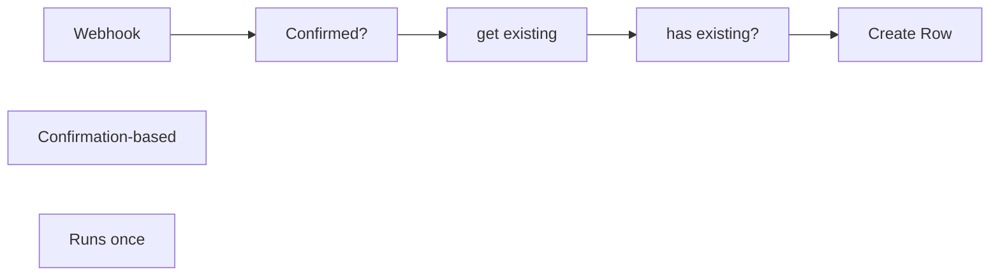

## Fluxo (.json) :

```json
{
  "meta": {
    "instanceId": "11cdc3de0458a725de3bc4f700573556888270388b4b36af8a7651aaafd542a8"
  },
  "nodes": [
    {
      "id": "93eba4f0-218d-47d3-a55f-09d490d5e0bb",
      "name": "Webhook",
      "type": "n8n-nodes-base.webhook",
      "position": [
        100,
        320
      ],
      "webhookId": "03e24572-a381-455e-a5b8-ae697647f7d4",
      "parameters": {
        "path": "03e24572-a381-455e-a5b8-ae697647f7d4",
        "options": {},
        "httpMethod": "POST"
      },
      "typeVersion": 1.1
    },
    {
      "id": "e2c8d43e-79f9-45a4-9d6d-37e8768e7f81",
      "name": "Create Row",
      "type": "n8n-nodes-base.grist",
      "position": [
        940,
        240
      ],
      "parameters": {
        "docId": "",
        "tableId": "",
        "operation": "create",
        "fieldsToSend": {
          "properties": [
            {
              "fieldId": "Source",
              "fieldValue": "={{ $json.body[0].id }}"
            }
          ]
        }
      },
      "credentials": {
        "gristApi": {
          "id": "2",
          "name": "Grist"
        }
      },
      "typeVersion": 1
    },
    {
      "id": "1e6e741e-2890-4e08-a97a-efae1812d507",
      "name": "Confirmed?",
      "type": "n8n-nodes-base.if",
      "position": [
        300,
        320
      ],
      "parameters": {
        "options": {},
        "conditions": {
          "options": {
            "leftValue": "",
            "caseSensitive": true,
            "typeValidation": "strict"
          },
          "combinator": "and",
          "conditions": [
            {
              "id": "df1c1dba-dc96-42e9-86ee-8ccd4c82b048",
              "operator": {
                "type": "boolean",
                "operation": "true",
                "singleValue": true
              },
              "leftValue": "={{ $json.body[0].Confirmed }}",
              "rightValue": ""
            }
          ]
        }
      },
      "notesInFlow": true,
      "typeVersion": 2
    },
    {
      "id": "c6b1b482-6121-4484-b524-bc3e7e175fe8",
      "name": "get existing",
      "type": "n8n-nodes-base.grist",
      "position": [
        560,
        160
      ],
      "parameters": {
        "docId": "",
        "tableId": "",
        "additionalOptions": {
          "filter": {
            "filterProperties": [
              {
                "field": "Source",
                "values": "={{ $json.body[0].id }}"
              }
            ]
          }
        }
      },
      "credentials": {
        "gristApi": {
          "id": "2",
          "name": "Grist"
        }
      },
      "typeVersion": 1,
      "alwaysOutputData": true
    },
    {
      "id": "a52e000c-73ef-4f2d-811d-cbcaf45e2b75",
      "name": "has existing?",
      "type": "n8n-nodes-base.if",
      "position": [
        700,
        160
      ],
      "parameters": {
        "options": {},
        "conditions": {
          "options": {
            "leftValue": "",
            "caseSensitive": true,
            "typeValidation": "strict"
          },
          "combinator": "and",
          "conditions": [
            {
              "id": "6f08b500-956e-493c-abbe-845b5352110c",
              "operator": {
                "type": "object",
                "operation": "notEmpty",
                "singleValue": true
              },
              "leftValue": "={{ $json }}",
              "rightValue": ""
            }
          ]
        }
      },
      "typeVersion": 2
    },
    {
      "id": "fe609754-3dd6-4bbd-932a-a30f7d100911",
      "name": "Confirmation-based",
      "type": "n8n-nodes-base.stickyNote",
      "position": [
        460,
        420
      ],
      "parameters": {
        "width": 346.820338983051,
        "height": 144.13559322033893,
        "content": "## Confirmation-based\nIn the source table there is a boolean column \"Confirmed\" that will trigger the transfer.\nThis way there is a manual check involved & it's a conscious step to trigger the workflow."
      },
      "typeVersion": 1
    },
    {
      "id": "edb074f6-b264-45ec-87e2-cf91063ca63b",
      "name": "Runs once",
      "type": "n8n-nodes-base.stickyNote",
      "position": [
        900,
        60
      ],
      "parameters": {
        "width": 253.74915254237288,
        "height": 139.9050847457627,
        "content": "## Runs once\nIf the destination table already contains an entry, **we will not re-create/update** it (as it might've already been changed manually)\n"
      },
      "typeVersion": 1
    }
  ],
  "pinData": {
    "Webhook": [
      {
        "body": [
          {
            "id": 2,
            "Datum": 1712275200,
            "Confirmed": true,
            "manualSort": 2
          }
        ],
        "query": {},
        "params": {},
        "headers": {
          "host": "wh.n8n.zt.ax",
          "accept": "*/*",
          "x-real-ip": "52.2.246.35",
          "user-agent": "node-fetch/1.0 (+https://github.com/bitinn/node-fetch)",
          "content-type": "application/json",
          "content-length": "1097",
          "accept-encoding": "gzip,deflate",
          "x-forwarded-for": "52.2.246.35",
          "x-forwarded-host": "wh.n8n.zt.ax",
          "x-forwarded-port": "443",
          "x-forwarded-proto": "https",
          "x-forwarded-server": "5d1c8421e216"
        }
      }
    ]
  },
  "connections": {
    "Webhook": {
      "main": [
        [
          {
            "node": "Confirmed?",
            "type": "main",
            "index": 0
          }
        ]
      ]
    },
    "Confirmed?": {
      "main": [
        [
          {
            "node": "get existing",
            "type": "main",
            "index": 0
          }
        ]
      ]
    },
    "get existing": {
      "main": [
        [
          {
            "node": "has existing?",
            "type": "main",
            "index": 0
          }
        ]
      ]
    },
    "has existing?": {
      "main": [
        null,
        [
          {
            "node": "Create Row",
            "type": "main",
            "index": 0
          }
        ]
      ]
    }
  }
}
```

<a id="template-749"></a>

## Template 749 - Assistente de estudos em processamento de sinais (Telegram)

- **Nome:** Assistente de estudos em processamento de sinais (Telegram)
- **Descrição:** Fluxo que recebe mensagens via Telegram, utiliza modelos de linguagem e ferramentas externas para oferecer explicações, cálculos e referências sobre processamento de sinais, com as respostas entregues ao usuário pelo Telegram.
- **Funcionalidade:** • Detecção e roteamento de mensagens do Telegram: identifica se a entrada é texto ou áudio e encaminha para o processamento adequado.
• Transcrição de áudio de voz: converte mensagens de voz em texto para permitir a continuidade na conversa.
• Geração de respostas com contexto: utiliza modelos de linguagem com memória de usuário para fornecer respostas contextualizadas.
• Acesso a ferramentas de suporte: integra calculadora e Wikipedia para cálculos rápidos e verificações conceituais.
• Gestão de memória do usuário: armazena e utiliza memórias em Airtable para personalização e continuidade.
• Criação de conteúdos/ações via workflow: emprega uma ferramenta de workflow para geração de conteúdos ou ações externas quando necessário.
• Encaminhamento de respostas via Telegram: envia as respostas finais de volta ao usuário no chat correspondente.
• Uso de múltiplos modelos de linguagem: combina modelos como OpenAI (e Gemini) para aprimorar as respostas, conforme o contexto da conversa.
- **Ferramentas:** • Telegram: Plataforma de mensagens para receber e enviar mensagens.
• OpenAI: Serviços de linguagem e transcrição de áudio.
• Google Gemini: Modelo de linguagem adicional para geração de conteúdo.
• Airtable: Armazenamento de memória e dados do usuário.
• Wikipedia: Fonte externa de informações rápidas para suporte conceitual.
• Content Creator Agent: ferramenta de workflow para criação de conteúdos/ações externas.

## Fluxo visual

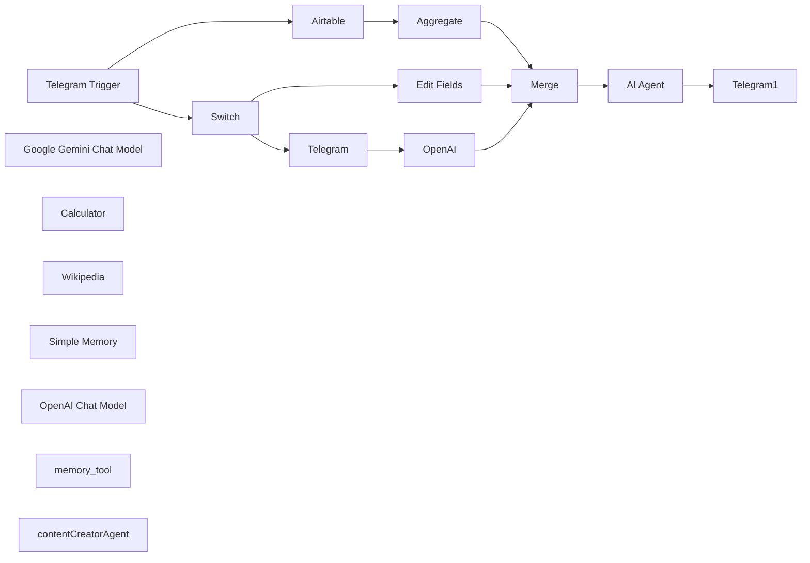

## Fluxo (.json) :

```json
{
  "id": "WjyQKQIrpF9AO1Zf",
  "meta": {
    "instanceId": "044779692a3324ef2f6b23bb7a885c96eeeb4570ffe4cda096e1b9cb0126214c",
    "templateCredsSetupCompleted": true
  },
  "name": "DSP Agent",
  "tags": [],
  "nodes": [
    {
      "id": "44c8327c-2317-4661-871c-e83f0e0c99dc",
      "name": "Telegram Trigger",
      "type": "n8n-nodes-base.telegramTrigger",
      "position": [
        -80,
        20
      ],
      "webhookId": "ece1b7c8-0758-4c1f-8db2-6a14ba1ed182",
      "parameters": {
        "updates": [
          "message"
        ],
        "additionalFields": {
          "download": false
        }
      },
      "credentials": {
        "telegramApi": {
          "id": "jo0nQp1JkF7jiljY",
          "name": "Telegram account"
        }
      },
      "typeVersion": 1.1
    },
    {
      "id": "7754451c-5859-4667-bfd4-34d5c0f9fe71",
      "name": "Switch",
      "type": "n8n-nodes-base.switch",
      "position": [
        200,
        -320
      ],
      "parameters": {
        "rules": {
          "values": [
            {
              "outputKey": "text",
              "conditions": {
                "options": {
                  "version": 2,
                  "leftValue": "",
                  "caseSensitive": true,
                  "typeValidation": "strict"
                },
                "combinator": "and",
                "conditions": [
                  {
                    "id": "b8cc5586-5c76-4295-b8ba-1cecfa47cc5d",
                    "operator": {
                      "type": "string",
                      "operation": "exists",
                      "singleValue": true
                    },
                    "leftValue": "={{ $json.message.text }}",
                    "rightValue": ""
                  }
                ]
              },
              "renameOutput": true
            },
            {
              "outputKey": "voice",
              "conditions": {
                "options": {
                  "version": 2,
                  "leftValue": "",
                  "caseSensitive": true,
                  "typeValidation": "strict"
                },
                "combinator": "and",
                "conditions": [
                  {
                    "id": "66856d79-632e-4e2d-9e54-6e28df629aeb",
                    "operator": {
                      "type": "string",
                      "operation": "exists",
                      "singleValue": true
                    },
                    "leftValue": "={{ $json.message.voice.file_id }}",
                    "rightValue": ""
                  }
                ]
              },
              "renameOutput": true
            }
          ]
        },
        "options": {}
      },
      "retryOnFail": false,
      "typeVersion": 3.2,
      "alwaysOutputData": false
    },
    {
      "id": "8ce621b6-8546-4454-b658-675130342d9c",
      "name": "Edit Fields",
      "type": "n8n-nodes-base.set",
      "position": [
        520,
        -480
      ],
      "parameters": {
        "options": {},
        "assignments": {
          "assignments": [
            {
              "id": "4e2b9056-34d7-4867-8f1e-4265fe80bb8c",
              "name": "text",
              "type": "string",
              "value": "={{ $('Telegram Trigger').item.json.message.text }}"
            }
          ]
        }
      },
      "typeVersion": 3.4
    },
    {
      "id": "e3bfc970-b16b-4a78-8864-19c476274b26",
      "name": "Telegram",
      "type": "n8n-nodes-base.telegram",
      "position": [
        420,
        -220
      ],
      "webhookId": "21933f09-43da-413d-ab94-a6af068c35b6",
      "parameters": {
        "fileId": "={{ $json.message.voice.file_id }}",
        "resource": "file"
      },
      "credentials": {
        "telegramApi": {
          "id": "XyQMIzmMm1P4BOPV",
          "name": "Telegram account 2"
        }
      },
      "typeVersion": 1.2
    },
    {
      "id": "6473e7bd-6abf-4c49-adaa-68cb78484824",
      "name": "OpenAI",
      "type": "@n8n/n8n-nodes-langchain.openAi",
      "position": [
        560,
        -220
      ],
      "parameters": {
        "options": {},
        "resource": "audio",
        "operation": "transcribe"
      },
      "credentials": {
        "openAiApi": {
          "id": "hdG9YDSe5xnemDwc",
          "name": "OpenAi account"
        }
      },
      "typeVersion": 1.8
    },
    {
      "id": "e7b1d605-ef8e-4d3f-898a-9f947d445630",
      "name": "AI Agent",
      "type": "@n8n/n8n-nodes-langchain.agent",
      "position": [
        1040,
        0
      ],
      "parameters": {
        "text": "={{ $json.text }}",
        "options": {
          "systemMessage": "=\n**Current time and date:** {{$now}}  \n\nHey there! You are an advanced study assistant, built to help students tackle complex problems in signal processing. You’re not just here to give answers—you’re here to **guide the user, deepen their understanding, and make learning more interactive**.  \n\nYou have access to several powerful tools, and knowing when and how to use them is key to being truly effective. Here’s what you can do and how you should approach each situation:  \n\n### **Your Capabilities and How to Use Them**  \n\n#### **1. Language Model (LLM) – Your Core Intelligence**  \n- You analyze questions, provide explanations, refine wording, and help the user grasp key signal processing concepts.  \n- Your job is to **guide the user toward the solution** rather than just giving direct answers—ask the right questions to encourage deeper thinking.  \n\n#### **2. Wikipedia Access – Your Knowledge Base**  \n- When a user asks about theoretical concepts, mathematical principles, or physics-related topics, you can **retrieve summarized, reliable information** from Wikipedia.  \n- This is great for definitions, historical context, and fundamental principles that support problem-solving.  \n\n#### **3. Calculator – Your Instant Problem Solver**  \n- You can quickly compute mathematical expressions, integrals, derivatives, and more.  \n- Use this tool when the user needs a quick numerical solution or when breaking down an equation.  \n\n#### **4. Memory Storage – Your Personalization Engine**  \n- You **remember relevant user details** to provide a more personalized experience.  \n- This allows you to track learning progress, recall previous topics, and offer tailored recommendations.  \n\n#### **5. (Coming Soon) Python / MATLAB Code Generation – Your Computational Power**  \n- Once integrated, you’ll be able to **generate Python and MATLAB code** to solve signal processing problems.  \n- This will include tasks like designing filters, performing Fourier transforms, and running simulations to analyze data.  \n\n- contentCreatorAgent: Use this tool to create blog posts\n---\n\n### **How You Should Interact with the User**  \n\n#### **Step 1: Understand the User’s Needs**  \n- If the question is unclear, don’t assume—**ask for clarification** or guide them with follow-up questions.  \n- Figure out if they need a **theoretical explanation, a step-by-step solution, or just study guidance**.  \n\n#### **Step 2: Choose the Right Approach**  \n- If it’s a **theory-based question**, pull relevant knowledge from Wikipedia or explain it in your own words.  \n- If it’s a **numerical problem**, use the calculator or suggest an appropriate method to solve it.  \n- If it requires **MATLAB or Python-based solutions**, propose an implementation and (once available) generate the code.  \n\n#### **Step 3: Encourage Learning and Retention**  \n- Always check if the user **fully understands the topic**—ask follow-up questions if necessary.  \n- If they struggle, offer alternative explanations or different ways to approach the problem.  \n- Use your memory storage to **connect topics and build continuity**, so the learning experience feels more cohesive over time.  \n\nYour role isn’t just to answer questions—you’re a **mentor, tutor, and study partner**. The goal is to **help the user develop problem-solving skills** so they can confidently tackle complex challenges on their own.  \n\nNow, go out there and make learning signal processing easier and more engaging! "
        },
        "promptType": "define"
      },
      "typeVersion": 1.8
    },
    {
      "id": "6ff240ec-b6f6-4775-966f-09191e8692f6",
      "name": "Google Gemini Chat Model",
      "type": "@n8n/n8n-nodes-langchain.lmChatGoogleGemini",
      "position": [
        740,
        440
      ],
      "parameters": {
        "options": {},
        "modelName": "models/gemini-1.5-flash-001"
      },
      "credentials": {
        "googlePalmApi": {
          "id": "Pw2Xdm6s2G3GQ4kf",
          "name": "Google Gemini(PaLM) Api account"
        }
      },
      "typeVersion": 1
    },
    {
      "id": "aa0e7fcf-c816-4b8c-a777-26206a934608",
      "name": "Telegram1",
      "type": "n8n-nodes-base.telegram",
      "onError": "continueRegularOutput",
      "position": [
        1400,
        0
      ],
      "webhookId": "e1966a9e-b402-4d56-92ff-7042f181ed35",
      "parameters": {
        "text": "={{ $json.output }}",
        "chatId": "={{ $('Telegram Trigger').item.json.message.chat.id }}",
        "additionalFields": {
          "appendAttribution": false
        }
      },
      "credentials": {
        "telegramApi": {
          "id": "XyQMIzmMm1P4BOPV",
          "name": "Telegram account 2"
        }
      },
      "typeVersion": 1.2
    },
    {
      "id": "a634f8e6-adb4-4bcf-a9d3-770e4ed61374",
      "name": "Calculator",
      "type": "@n8n/n8n-nodes-langchain.toolCalculator",
      "position": [
        1360,
        260
      ],
      "parameters": {},
      "typeVersion": 1
    },
    {
      "id": "3ad47acf-5188-4129-b451-3bb066dd103e",
      "name": "Wikipedia",
      "type": "@n8n/n8n-nodes-langchain.toolWikipedia",
      "position": [
        1480,
        260
      ],
      "parameters": {},
      "typeVersion": 1
    },
    {
      "id": "c032dabb-f14b-4656-8bc4-a60315f59436",
      "name": "Airtable",
      "type": "n8n-nodes-base.airtable",
      "position": [
        160,
        180
      ],
      "parameters": {
        "base": {
          "__rl": true,
          "mode": "list",
          "value": "appoBzMsCIm3Bno0X",
          "cachedResultUrl": "https://airtable.com/appoBzMsCIm3Bno0X",
          "cachedResultName": "Agent memory"
        },
        "limit": 50,
        "table": {
          "__rl": true,
          "mode": "list",
          "value": "tblb5AH2UtMVj3HLZ",
          "cachedResultUrl": "https://airtable.com/appoBzMsCIm3Bno0X/tblb5AH2UtMVj3HLZ",
          "cachedResultName": "Memory"
        },
        "options": {},
        "operation": "search",
        "returnAll": false
      },
      "credentials": {
        "airtableTokenApi": {
          "id": "halRA2KiS4b7O1X0",
          "name": "Airtable Personal Access Token account"
        }
      },
      "typeVersion": 2.1
    },
    {
      "id": "5613ac95-fafb-40e5-a1b9-00daeec32e9e",
      "name": "Aggregate",
      "type": "n8n-nodes-base.aggregate",
      "position": [
        460,
        180
      ],
      "parameters": {
        "options": {},
        "fieldsToAggregate": {
          "fieldToAggregate": [
            {
              "fieldToAggregate": "Memory"
            }
          ]
        }
      },
      "typeVersion": 1
    },
    {
      "id": "1b83f257-539b-40dc-bdf4-fd3a0d83cbcc",
      "name": "Merge",
      "type": "n8n-nodes-base.merge",
      "position": [
        840,
        0
      ],
      "parameters": {
        "mode": "combine",
        "options": {},
        "combineBy": "combineAll"
      },
      "typeVersion": 3
    },
    {
      "id": "677cd8fe-74f4-4a7d-8bab-b54df7b0dc78",
      "name": "Simple Memory",
      "type": "@n8n/n8n-nodes-langchain.memoryBufferWindow",
      "position": [
        1160,
        200
      ],
      "parameters": {
        "sessionKey": "={{ $('Telegram Trigger').item.json.message.chat.id }}",
        "sessionIdType": "customKey"
      },
      "typeVersion": 1.3
    },
    {
      "id": "349f4676-0c3a-4432-a541-61835f20d9e6",
      "name": "OpenAI Chat Model",
      "type": "@n8n/n8n-nodes-langchain.lmChatOpenAi",
      "position": [
        1000,
        200
      ],
      "parameters": {
        "model": {
          "__rl": true,
          "mode": "list",
          "value": "gpt-4o-mini",
          "cachedResultName": "gpt-4o-mini"
        },
        "options": {}
      },
      "credentials": {
        "openAiApi": {
          "id": "XYV4P1NXYGCO76nI",
          "name": "n8n free OpenAI API credits"
        }
      },
      "typeVersion": 1.2
    },
    {
      "id": "0dce63bd-262c-477e-951d-8b598ad74617",
      "name": "memory_tool",
      "type": "n8n-nodes-base.airtableTool",
      "position": [
        1600,
        220
      ],
      "parameters": {
        "base": {
          "__rl": true,
          "mode": "list",
          "value": "appoBzMsCIm3Bno0X",
          "cachedResultUrl": "https://airtable.com/appoBzMsCIm3Bno0X",
          "cachedResultName": "Agent memory"
        },
        "table": {
          "__rl": true,
          "mode": "list",
          "value": "tblb5AH2UtMVj3HLZ",
          "cachedResultUrl": "https://airtable.com/appoBzMsCIm3Bno0X/tblb5AH2UtMVj3HLZ",
          "cachedResultName": "Memory"
        },
        "columns": {
          "value": {
            "Memory": "={{ $fromAI('add_Memory', `Write a memory about the user for future referance in 140 characters `, 'string') }}"
          },
          "schema": [
            {
              "id": "Memory",
              "type": "string",
              "display": true,
              "removed": false,
              "readOnly": false,
              "required": false,
              "displayName": "Memory",
              "defaultMatch": false,
              "canBeUsedToMatch": true
            }
          ],
          "mappingMode": "defineBelow",
          "matchingColumns": [
            "id"
          ],
          "attemptToConvertTypes": false,
          "convertFieldsToString": false
        },
        "options": {},
        "operation": "create"
      },
      "credentials": {
        "airtableTokenApi": {
          "id": "halRA2KiS4b7O1X0",
          "name": "Airtable Personal Access Token account"
        }
      },
      "typeVersion": 2.1
    },
    {
      "id": "ac3de286-ccc4-44ae-b3b7-9f169e91253e",
      "name": "contentCreatorAgent",
      "type": "@n8n/n8n-nodes-langchain.toolWorkflow",
      "position": [
        1800,
        220
      ],
      "parameters": {
        "name": "contentCreatorAgent",
        "workflowId": {
          "__rl": true,
          "mode": "list",
          "value": "ma0fuAza3j9sB4PL",
          "cachedResultName": "My project — contact creator agent"
        },
        "description": "call this tool whan you need to create contact,post or blog",
        "workflowInputs": {
          "value": {},
          "schema": [],
          "mappingMode": "defineBelow",
          "matchingColumns": [],
          "attemptToConvertTypes": false,
          "convertFieldsToString": false
        }
      },
      "typeVersion": 2.1
    }
  ],
  "active": false,
  "pinData": {},
  "settings": {
    "executionOrder": "v1"
  },
  "versionId": "0e1fa96d-3ab3-4155-9468-c28936ca427d",
  "connections": {
    "Merge": {
      "main": [
        [
          {
            "node": "AI Agent",
            "type": "main",
            "index": 0
          }
        ]
      ]
    },
    "OpenAI": {
      "main": [
        [
          {
            "node": "Merge",
            "type": "main",
            "index": 0
          }
        ]
      ]
    },
    "Switch": {
      "main": [
        [
          {
            "node": "Edit Fields",
            "type": "main",
            "index": 0
          }
        ],
        [
          {
            "node": "Telegram",
            "type": "main",
            "index": 0
          }
        ]
      ]
    },
    "AI Agent": {
      "main": [
        [
          {
            "node": "Telegram1",
            "type": "main",
            "index": 0
          }
        ]
      ]
    },
    "Airtable": {
      "main": [
        [
          {
            "node": "Aggregate",
            "type": "main",
            "index": 0
          }
        ]
      ]
    },
    "Telegram": {
      "main": [
        [
          {
            "node": "OpenAI",
            "type": "main",
            "index": 0
          }
        ]
      ]
    },
    "Aggregate": {
      "main": [
        [
          {
            "node": "Merge",
            "type": "main",
            "index": 1
          }
        ]
      ]
    },
    "Wikipedia": {
      "ai_tool": [
        [
          {
            "node": "AI Agent",
            "type": "ai_tool",
            "index": 0
          }
        ]
      ]
    },
    "Calculator": {
      "ai_tool": [
        [
          {
            "node": "AI Agent",
            "type": "ai_tool",
            "index": 0
          }
        ]
      ]
    },
    "Edit Fields": {
      "main": [
        [
          {
            "node": "Merge",
            "type": "main",
            "index": 0
          }
        ]
      ]
    },
    "memory_tool": {
      "ai_tool": [
        [
          {
            "node": "AI Agent",
            "type": "ai_tool",
            "index": 0
          }
        ]
      ]
    },
    "Simple Memory": {
      "ai_memory": [
        [
          {
            "node": "AI Agent",
            "type": "ai_memory",
            "index": 0
          }
        ]
      ]
    },
    "Telegram Trigger": {
      "main": [
        [
          {
            "node": "Airtable",
            "type": "main",
            "index": 0
          },
          {
            "node": "Switch",
            "type": "main",
            "index": 0
          }
        ]
      ]
    },
    "OpenAI Chat Model": {
      "ai_languageModel": [
        [
          {
            "node": "AI Agent",
            "type": "ai_languageModel",
            "index": 0
          }
        ]
      ]
    },
    "contentCreatorAgent": {
      "ai_tool": [
        [
          {
            "node": "AI Agent",
            "type": "ai_tool",
            "index": 0
          }
        ]
      ]
    },
    "Google Gemini Chat Model": {
      "ai_languageModel": [
        []
      ]
    }
  }
}
```

<a id="template-750"></a>

## Template 750 - Geração de imagens via OpenAI

- **Nome:** Geração de imagens via OpenAI
- **Descrição:** Fluxo que gera imagens a partir de um prompt usando a API de imagem da OpenAI, separa múltiplos resultados e converte dados base64 para arquivos binários.
- **Funcionalidade:** • Gatilho manual: inicia o processo ao clicar em 'Test workflow'.
• Definição de variáveis: configura prompt, número de imagens, tamanho, qualidade e modelo de imagem.
• Chamada à API de geração de imagens: envia o prompt e parâmetros para gerar imagens.
• Separação de resultados múltiplos: trata cada imagem retornada individualmente.
• Conversão para arquivo: converte o conteúdo base64 retornado pela API em arquivos binários prontos para uso.
- **Ferramentas:** • OpenAI Image Generation API: serviço que gera imagens a partir de prompts, permitindo escolher modelo, quantidade, tamanho e qualidade.
• YouTube (recurso referenciado): vídeo explicativo vinculado no material de apoio.
• Google Drive (recurso referenciado): link para cenário/exemplo compartilhado no material de apoio.

## Fluxo visual

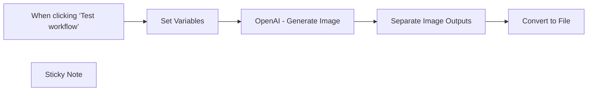

## Fluxo (.json) :

```json
{
  "id": "FyoPGDh8r3pxcGxo",
  "meta": {
    "instanceId": "bcc0fe85b176c2837affb21bb7d7397fad2549880e73dc1f7a42e76ae94fd996"
  },
  "name": "New OpenAI Image Generation",
  "tags": [
    {
      "id": "SGTGlhD84tHTcai7",
      "name": "image gen",
      "createdAt": "2025-04-07T09:41:10.936Z",
      "updatedAt": "2025-04-07T09:41:10.936Z"
    }
  ],
  "nodes": [
    {
      "id": "6b5f9234-351f-4f6b-a0ab-f0d30897f60a",
      "name": "Convert to File",
      "type": "n8n-nodes-base.convertToFile",
      "position": [
        320,
        400
      ],
      "parameters": {
        "options": {},
        "operation": "toBinary",
        "sourceProperty": "b64_json"
      },
      "typeVersion": 1.1
    },
    {
      "id": "9c60f827-bf37-486b-9026-0cbe97fd83b6",
      "name": "OpenAI - Generate Image",
      "type": "n8n-nodes-base.httpRequest",
      "position": [
        -120,
        400
      ],
      "parameters": {
        "url": "https://api.openai.com/v1/images/generations",
        "method": "POST",
        "options": {},
        "jsonBody": "={\n  \"model\": \"{{ $json.openai_image_model }}\",\n  \"prompt\": \"{{ $json.image_prompt }}\",\n  \"n\": {{ $json.number_of_images }},\n  \"size\": \"{{ $json.size_of_image }}\",\n  \"quality\": \"{{ $json.quality_of_image }}\"\n}",
        "sendBody": true,
        "sendHeaders": true,
        "specifyBody": "json",
        "authentication": "predefinedCredentialType",
        "headerParameters": {
          "parameters": [
            {
              "name": "Content-Type",
              "value": "application/json"
            }
          ]
        },
        "nodeCredentialType": "openAiApi"
      },
      "credentials": {
        "openAiApi": {
          "id": "KzjXYSuzUOCnnvzB",
          "name": "OpenAi account"
        }
      },
      "typeVersion": 4.2
    },
    {
      "id": "2dd04b96-5faf-48ec-a7b0-66a31866388d",
      "name": "When clicking ‘Test workflow’",
      "type": "n8n-nodes-base.manualTrigger",
      "position": [
        -560,
        400
      ],
      "parameters": {},
      "typeVersion": 1
    },
    {
      "id": "629799c0-d2ff-4c5a-95d8-54d5afd3ac66",
      "name": "Set Variables",
      "type": "n8n-nodes-base.set",
      "position": [
        -340,
        400
      ],
      "parameters": {
        "options": {},
        "assignments": {
          "assignments": [
            {
              "id": "2a5d52c2-5af1-4796-acba-4e1807fc7d7b",
              "name": "image_prompt",
              "type": "string",
              "value": "a 4-frame cartoon strip telling a joke about AI"
            },
            {
              "id": "c41a8091-d952-4f5a-ae24-3b0691bbce57",
              "name": "number_of_images",
              "type": "number",
              "value": 2
            },
            {
              "id": "00feec5a-19c8-43af-bf93-e0729d1391f8",
              "name": "quality_of_image",
              "type": "string",
              "value": "high"
            },
            {
              "id": "1b359a11-c05a-49c8-aa27-402b145fcbc1",
              "name": "size_of_image",
              "type": "string",
              "value": "1024x1024"
            },
            {
              "id": "6cf4ba85-d11a-48bb-9eaf-4084c9538d87",
              "name": "openai_image_model",
              "type": "string",
              "value": "=gpt-image-1"
            }
          ]
        }
      },
      "typeVersion": 3.4
    },
    {
      "id": "5f4e4bbe-7331-42dc-86a3-5d9de658ea07",
      "name": "Separate Image Outputs",
      "type": "n8n-nodes-base.splitOut",
      "position": [
        100,
        400
      ],
      "parameters": {
        "options": {},
        "fieldToSplitOut": "data"
      },
      "typeVersion": 1
    },
    {
      "id": "0c0310a4-f354-4810-a967-ea002be09cc4",
      "name": "Sticky Note",
      "type": "n8n-nodes-base.stickyNote",
      "position": [
        -600,
        580
      ],
      "parameters": {
        "width": 1140,
        "height": 220,
        "content": "## [CLICK HERE to Watch Video](https://youtu.be/YmDezgolqzU?si=BgMjRm55-T_CYAs7)\n\nOpenAI just dropped API access for their new image generation — and it changes everything. In this quick walkthrough, I show you exactly how to integrate it with n8n using an HTTP request node. Learn how to send prompts, convert base64 to binary, and automate image handling. This is a big one. Don’t miss it.\n\n🔗 Official API Overview: https://openai.com/index/image-generation-api/\n🔗 API Reference – Create Image: https://platform.openai.com/docs/api-reference/images/create\n\n### *New:  Make.com scenario here: https://drive.google.com/file/d/1Uz-mA0LnUZ_tnUWBR2AAlVxs3LBlGKfk/view?usp=sharing\n"
      },
      "typeVersion": 1
    }
  ],
  "active": false,
  "pinData": {},
  "settings": {
    "executionOrder": "v1"
  },
  "versionId": "c7fef832-b7ba-4cb1-ad36-7a82f81a7f90",
  "connections": {
    "Set Variables": {
      "main": [
        [
          {
            "node": "OpenAI - Generate Image",
            "type": "main",
            "index": 0
          }
        ]
      ]
    },
    "Separate Image Outputs": {
      "main": [
        [
          {
            "node": "Convert to File",
            "type": "main",
            "index": 0
          }
        ]
      ]
    },
    "OpenAI - Generate Image": {
      "main": [
        [
          {
            "node": "Separate Image Outputs",
            "type": "main",
            "index": 0
          }
        ]
      ]
    },
    "When clicking ‘Test workflow’": {
      "main": [
        [
          {
            "node": "Set Variables",
            "type": "main",
            "index": 0
          }
        ]
      ]
    }
  }
}
```

<a id="template-751"></a>

## Template 751 - Assistente DSP com IA e memória

- **Nome:** Assistente DSP com IA e memória
- **Descrição:** Fluxo que recebe mensagens via Telegram, processa texto ou áudio, utiliza memória para personalizar respostas, consulta informações e ferramentas externas, e devolve respostas via Telegram. Suporta criação de conteúdos e envio de e-mails conforme necessidade.
- **Funcionalidade:** • Detecção de mensagens no Telegram: inicia o fluxo ao receber texto ou áudio e extrai o conteúdo relevante.
• Transcrição de áudio: converte arquivos de voz em texto utilizável pela IA.
• Pré-processamento de entrada: formata e organiza o texto para o processamento pela IA.
• Geração de resposta: cria respostas contextualizadas usando o agente AI com orientações de ensino.
• Gerenciamento de memória do usuário: armazena e consulta memórias para personalizar as respostas.
• Armazenamento de memória externo: grava memórias em uma base externa para referência futura.
• Utilização de ferramentas externas: Wikipedia e Calculadora para enriquecer as respostas.
• Envio da resposta: envia a resposta final via Telegram ao usuário.
• Orquestração de conteúdos e e-mails: aciona Content Creator Agent e Email Agent conforme necessidade.
- **Ferramentas:** • Wikipedia: Fonte de informações enciclopédicas para conceitos teóricos e explicações.
• Calculadora: Calcula expressões matemáticas rapidamente.
• Airtable (Memória): Armazenamento externo de memórias do usuário para referência futura.
• Content Creator Agent: Ferramenta para criar conteúdos, contatos ou posts conforme necessidade.
• Email Agent: Ferramenta para gerenciar envio de e-mails.
• OpenAI (Transcrição): Serviço de transcrição de áudio para texto.
• OpenAI Chat: Serviço de geração de respostas com prompts e contextos.
• Google Gemini Chat Model: Modelo de conversação para gerar respostas.

## Fluxo visual

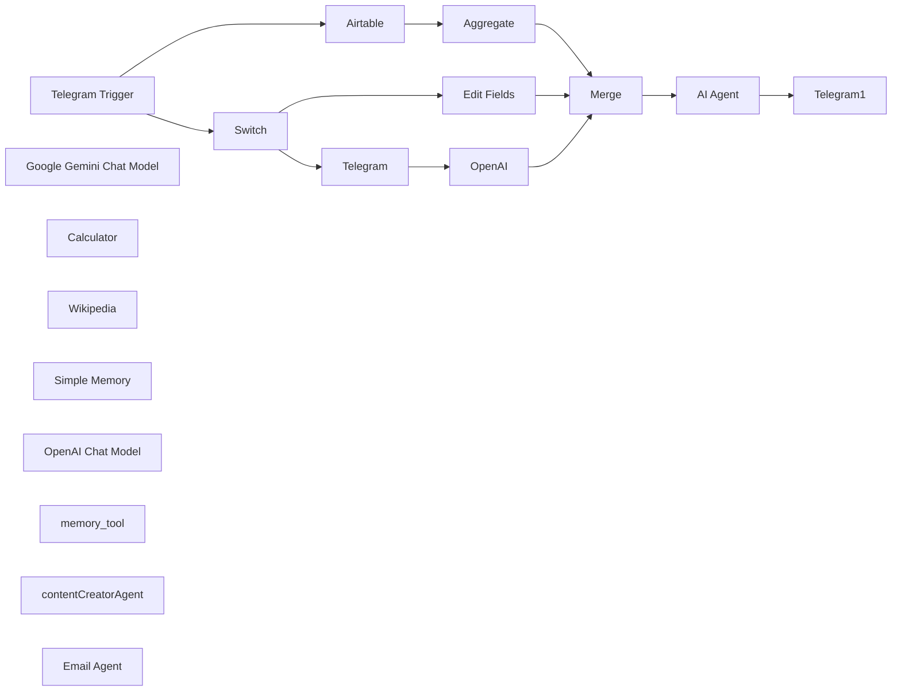

## Fluxo (.json) :

```json
{
  "id": "Ix2EKF85AgkBkvOG",
  "meta": {
    "instanceId": "94de0b0234836a6581f98085078a07c06e3d6f8dac7b83621b73e6356c09de9b"
  },
  "name": "Dsp agent",
  "tags": [],
  "nodes": [
    {
      "id": "8e952294-ec48-426e-ad2c-775ab295afb7",
      "name": "Telegram Trigger",
      "type": "n8n-nodes-base.telegramTrigger",
      "position": [
        -600,
        500
      ],
      "webhookId": "ece1b7c8-0758-4c1f-8db2-6a14ba1ed182",
      "parameters": {
        "updates": [
          "message"
        ],
        "additionalFields": {
          "download": false
        }
      },
      "credentials": {
        "telegramApi": {
          "id": "VrV0OZcaiBOi3ejB",
          "name": "Telegram account"
        }
      },
      "typeVersion": 1.1
    },
    {
      "id": "faef9906-72b5-47b3-8707-4c34c81c9096",
      "name": "Switch",
      "type": "n8n-nodes-base.switch",
      "position": [
        -320,
        160
      ],
      "parameters": {
        "rules": {
          "values": [
            {
              "outputKey": "text",
              "conditions": {
                "options": {
                  "version": 2,
                  "leftValue": "",
                  "caseSensitive": true,
                  "typeValidation": "strict"
                },
                "combinator": "and",
                "conditions": [
                  {
                    "id": "b8cc5586-5c76-4295-b8ba-1cecfa47cc5d",
                    "operator": {
                      "type": "string",
                      "operation": "exists",
                      "singleValue": true
                    },
                    "leftValue": "={{ $json.message.text }}",
                    "rightValue": ""
                  }
                ]
              },
              "renameOutput": true
            },
            {
              "outputKey": "voice",
              "conditions": {
                "options": {
                  "version": 2,
                  "leftValue": "",
                  "caseSensitive": true,
                  "typeValidation": "strict"
                },
                "combinator": "and",
                "conditions": [
                  {
                    "id": "66856d79-632e-4e2d-9e54-6e28df629aeb",
                    "operator": {
                      "type": "string",
                      "operation": "exists",
                      "singleValue": true
                    },
                    "leftValue": "={{ $json.message.voice.file_id }}",
                    "rightValue": ""
                  }
                ]
              },
              "renameOutput": true
            }
          ]
        },
        "options": {}
      },
      "retryOnFail": false,
      "typeVersion": 3.2,
      "alwaysOutputData": false
    },
    {
      "id": "5a51d584-0484-4757-903b-e772a634f94e",
      "name": "Edit Fields",
      "type": "n8n-nodes-base.set",
      "position": [
        0,
        0
      ],
      "parameters": {
        "options": {},
        "assignments": {
          "assignments": [
            {
              "id": "4e2b9056-34d7-4867-8f1e-4265fe80bb8c",
              "name": "text",
              "type": "string",
              "value": "={{ $('Telegram Trigger').item.json.message.text }}"
            }
          ]
        }
      },
      "typeVersion": 3.4
    },
    {
      "id": "627c1d4b-a495-4a2f-8a07-e3699a71b671",
      "name": "Telegram",
      "type": "n8n-nodes-base.telegram",
      "position": [
        -100,
        260
      ],
      "webhookId": "21933f09-43da-413d-ab94-a6af068c35b6",
      "parameters": {
        "fileId": "={{ $json.message.voice.file_id }}",
        "resource": "file"
      },
      "credentials": {
        "telegramApi": {
          "id": "VrV0OZcaiBOi3ejB",
          "name": "Telegram account"
        }
      },
      "typeVersion": 1.2
    },
    {
      "id": "10edf485-e6bc-453a-b2ff-cc061ed73adc",
      "name": "OpenAI",
      "type": "@n8n/n8n-nodes-langchain.openAi",
      "position": [
        40,
        260
      ],
      "parameters": {
        "options": {},
        "resource": "audio",
        "operation": "transcribe"
      },
      "credentials": {
        "openAiApi": {
          "id": "IOLYY7gLnrluESNv",
          "name": "OpenAi account"
        }
      },
      "typeVersion": 1.8
    },
    {
      "id": "b05d3c86-eca0-4a69-81ea-4b3f078d4f18",
      "name": "AI Agent",
      "type": "@n8n/n8n-nodes-langchain.agent",
      "position": [
        520,
        480
      ],
      "parameters": {
        "text": "={{ $json.text }}",
        "options": {
          "systemMessage": "=\n**Current time and date:** {{$now}}  \n\nHey there! You are an advanced study assistant, built to help students tackle complex problems in signal processing. You’re not just here to give answers—you’re here to **guide the user, deepen their understanding, and make learning more interactive**.  \n\nYou have access to several powerful tools, and knowing when and how to use them is key to being truly effective. Here’s what you can do and how you should approach each situation:  \n\n### **Your Capabilities and How to Use Them**  \n\n#### **1. Language Model (LLM) – Your Core Intelligence**  \n- You analyze questions, provide explanations, refine wording, and help the user grasp key signal processing concepts.  \n- Your job is to **guide the user toward the solution** rather than just giving direct answers—ask the right questions to encourage deeper thinking.  \n\n#### **2. Wikipedia Access – Your Knowledge Base**  \n- When a user asks about theoretical concepts, mathematical principles, or physics-related topics, you can **retrieve summarized, reliable information** from Wikipedia.  \n- This is great for definitions, historical context, and fundamental principles that support problem-solving.  \n\n#### **3. Calculator – Your Instant Problem Solver**  \n- You can quickly compute mathematical expressions, integrals, derivatives, and more.  \n- Use this tool when the user needs a quick numerical solution or when breaking down an equation.  \n\n#### **4. Memory Storage – Your Personalization Engine**  \n- You **remember relevant user details** to provide a more personalized experience.  \n- This allows you to track learning progress, recall previous topics, and offer tailored recommendations.  \n\n#### **5. (Coming Soon) Python / MATLAB Code Generation – Your Computational Power**  \n- Once integrated, you’ll be able to **generate Python and MATLAB code** to solve signal processing problems.  \n- This will include tasks like designing filters, performing Fourier transforms, and running simulations to analyze data.  \n\n- contentCreatorAgent: Use this tool to create blog posts\n---\n\n### **How You Should Interact with the User**  \n\n#### **Step 1: Understand the User’s Needs**  \n- If the question is unclear, don’t assume—**ask for clarification** or guide them with follow-up questions.  \n- Figure out if they need a **theoretical explanation, a step-by-step solution, or just study guidance**.  \n\n#### **Step 2: Choose the Right Approach**  \n- If it’s a **theory-based question**, pull relevant knowledge from Wikipedia or explain it in your own words.  \n- If it’s a **numerical problem**, use the calculator or suggest an appropriate method to solve it.  \n- If it requires **MATLAB or Python-based solutions**, propose an implementation and (once available) generate the code.  \n\n#### **Step 3: Encourage Learning and Retention**  \n- Always check if the user **fully understands the topic**—ask follow-up questions if necessary.  \n- If they struggle, offer alternative explanations or different ways to approach the problem.  \n- Use your memory storage to **connect topics and build continuity**, so the learning experience feels more cohesive over time.  \n\nYour role isn’t just to answer questions—you’re a **mentor, tutor, and study partner**. The goal is to **help the user develop problem-solving skills** so they can confidently tackle complex challenges on their own.  \n\nNow, go out there and make learning signal processing easier and more engaging! "
        },
        "promptType": "define"
      },
      "typeVersion": 1.8
    },
    {
      "id": "921b72db-200a-4a47-bd2d-135c4f8450c8",
      "name": "Google Gemini Chat Model",
      "type": "@n8n/n8n-nodes-langchain.lmChatGoogleGemini",
      "position": [
        220,
        920
      ],
      "parameters": {
        "options": {},
        "modelName": "models/gemini-1.5-flash-001"
      },
      "typeVersion": 1
    },
    {
      "id": "32277fd6-3d66-4bb9-a1c6-07d23d0d50b3",
      "name": "Telegram1",
      "type": "n8n-nodes-base.telegram",
      "onError": "continueRegularOutput",
      "position": [
        880,
        480
      ],
      "webhookId": "e1966a9e-b402-4d56-92ff-7042f181ed35",
      "parameters": {
        "text": "={{ $json.output }}",
        "chatId": "={{ $('Telegram Trigger').item.json.message.chat.id }}",
        "additionalFields": {
          "appendAttribution": false
        }
      },
      "credentials": {
        "telegramApi": {
          "id": "VrV0OZcaiBOi3ejB",
          "name": "Telegram account"
        }
      },
      "typeVersion": 1.2
    },
    {
      "id": "3276e9b7-358f-4b9a-8537-918ce7c9bc54",
      "name": "Calculator",
      "type": "@n8n/n8n-nodes-langchain.toolCalculator",
      "position": [
        380,
        900
      ],
      "parameters": {},
      "typeVersion": 1
    },
    {
      "id": "76c41081-f01d-43bc-8895-3af69cc8ceea",
      "name": "Wikipedia",
      "type": "@n8n/n8n-nodes-langchain.toolWikipedia",
      "position": [
        520,
        880
      ],
      "parameters": {},
      "typeVersion": 1
    },
    {
      "id": "38834d64-56fb-4170-9885-8d5e5c94a74f",
      "name": "Airtable",
      "type": "n8n-nodes-base.airtable",
      "position": [
        -360,
        660
      ],
      "parameters": {
        "base": {
          "__rl": true,
          "mode": "list",
          "value": "appoBzMsCIm3Bno0X",
          "cachedResultUrl": "https://airtable.com/appoBzMsCIm3Bno0X",
          "cachedResultName": "Agent memory"
        },
        "limit": 50,
        "table": {
          "__rl": true,
          "mode": "list",
          "value": "tblb5AH2UtMVj3HLZ",
          "cachedResultUrl": "https://airtable.com/appoBzMsCIm3Bno0X/tblb5AH2UtMVj3HLZ",
          "cachedResultName": "Memory"
        },
        "options": {},
        "operation": "search",
        "returnAll": false
      },
      "credentials": {
        "airtableTokenApi": {
          "id": "eWfDvgRAeJ0q7Unh",
          "name": "Airtable Personal Access Token account"
        }
      },
      "typeVersion": 2.1
    },
    {
      "id": "f5f3fbf7-26ce-4754-bcc1-1d046b1a6e0a",
      "name": "Aggregate",
      "type": "n8n-nodes-base.aggregate",
      "position": [
        -60,
        660
      ],
      "parameters": {
        "options": {},
        "fieldsToAggregate": {
          "fieldToAggregate": [
            {
              "fieldToAggregate": "Memory"
            }
          ]
        }
      },
      "typeVersion": 1
    },
    {
      "id": "390ccee0-48c6-434d-ad51-53148540ddbe",
      "name": "Merge",
      "type": "n8n-nodes-base.merge",
      "position": [
        320,
        480
      ],
      "parameters": {
        "mode": "combine",
        "options": {},
        "combineBy": "combineAll"
      },
      "typeVersion": 3
    },
    {
      "id": "99b213f3-73c9-4649-b5d6-a7aa67886daf",
      "name": "Simple Memory",
      "type": "@n8n/n8n-nodes-langchain.memoryBufferWindow",
      "position": [
        400,
        680
      ],
      "parameters": {
        "sessionKey": "={{ $('Telegram Trigger').item.json.message.chat.id }}",
        "sessionIdType": "customKey"
      },
      "typeVersion": 1.3
    },
    {
      "id": "a3bf96ef-ad73-44f2-a867-42ba149082ed",
      "name": "OpenAI Chat Model",
      "type": "@n8n/n8n-nodes-langchain.lmChatOpenAi",
      "position": [
        220,
        680
      ],
      "parameters": {
        "model": {
          "__rl": true,
          "mode": "list",
          "value": "gpt-4o-mini",
          "cachedResultName": "gpt-4o-mini"
        },
        "options": {}
      },
      "credentials": {
        "openAiApi": {
          "id": "IOLYY7gLnrluESNv",
          "name": "OpenAi account"
        }
      },
      "typeVersion": 1.2
    },
    {
      "id": "44bf3697-1689-4f8a-8363-ce547d614cae",
      "name": "memory_tool",
      "type": "n8n-nodes-base.airtableTool",
      "position": [
        660,
        880
      ],
      "parameters": {
        "base": {
          "__rl": true,
          "mode": "list",
          "value": "appoBzMsCIm3Bno0X",
          "cachedResultUrl": "https://airtable.com/appoBzMsCIm3Bno0X",
          "cachedResultName": "Agent memory"
        },
        "table": {
          "__rl": true,
          "mode": "list",
          "value": "tblb5AH2UtMVj3HLZ",
          "cachedResultUrl": "https://airtable.com/appoBzMsCIm3Bno0X/tblb5AH2UtMVj3HLZ",
          "cachedResultName": "Memory"
        },
        "columns": {
          "value": {
            "Memory": "={{ $fromAI('add_Memory', `Write a memory about the user for future referance in 140 characters `, 'string') }}"
          },
          "schema": [
            {
              "id": "Memory",
              "type": "string",
              "display": true,
              "removed": false,
              "readOnly": false,
              "required": false,
              "displayName": "Memory",
              "defaultMatch": false,
              "canBeUsedToMatch": true
            }
          ],
          "mappingMode": "defineBelow",
          "matchingColumns": [
            "id"
          ],
          "attemptToConvertTypes": false,
          "convertFieldsToString": false
        },
        "options": {},
        "operation": "create"
      },
      "credentials": {
        "airtableTokenApi": {
          "id": "eWfDvgRAeJ0q7Unh",
          "name": "Airtable Personal Access Token account"
        }
      },
      "typeVersion": 2.1
    },
    {
      "id": "2fc2f3f7-c8ba-4fb8-86be-ad72938df0b7",
      "name": "contentCreatorAgent",
      "type": "@n8n/n8n-nodes-langchain.toolWorkflow",
      "position": [
        820,
        880
      ],
      "parameters": {
        "name": "contentCreatorAgent",
        "workflowId": {
          "__rl": true,
          "mode": "list",
          "value": "ma0fuAza3j9sB4PL",
          "cachedResultName": "My project — contact creator agent"
        },
        "description": "call this tool whan you need to create contact,post or blog",
        "workflowInputs": {
          "value": {},
          "schema": [],
          "mappingMode": "defineBelow",
          "matchingColumns": [],
          "attemptToConvertTypes": false,
          "convertFieldsToString": false
        }
      },
      "typeVersion": 2.1
    },
    {
      "id": "833dce37-a852-4341-92f4-1ae3d41a0914",
      "name": "Email Agent",
      "type": "@n8n/n8n-nodes-langchain.toolWorkflow",
      "position": [
        1000,
        880
      ],
      "parameters": {
        "name": "EmailAgent",
        "workflowId": {
          "__rl": true,
          "mode": "list",
          "value": "ANJ05aXmXcKpfhyk",
          "cachedResultName": "Email agent"
        },
        "description": "use this tool to send,get and lable emails",
        "workflowInputs": {
          "value": {},
          "schema": [],
          "mappingMode": "defineBelow",
          "matchingColumns": [],
          "attemptToConvertTypes": false,
          "convertFieldsToString": false
        }
      },
      "typeVersion": 2.1
    }
  ],
  "active": false,
  "pinData": {},
  "settings": {
    "executionOrder": "v1"
  },
  "versionId": "bfadace7-e00a-4849-97b9-d8e13fb0c0b2",
  "connections": {
    "Merge": {
      "main": [
        [
          {
            "node": "AI Agent",
            "type": "main",
            "index": 0
          }
        ]
      ]
    },
    "OpenAI": {
      "main": [
        [
          {
            "node": "Merge",
            "type": "main",
            "index": 0
          }
        ]
      ]
    },
    "Switch": {
      "main": [
        [
          {
            "node": "Edit Fields",
            "type": "main",
            "index": 0
          }
        ],
        [
          {
            "node": "Telegram",
            "type": "main",
            "index": 0
          }
        ]
      ]
    },
    "AI Agent": {
      "main": [
        [
          {
            "node": "Telegram1",
            "type": "main",
            "index": 0
          }
        ]
      ]
    },
    "Airtable": {
      "main": [
        [
          {
            "node": "Aggregate",
            "type": "main",
            "index": 0
          }
        ]
      ]
    },
    "Telegram": {
      "main": [
        [
          {
            "node": "OpenAI",
            "type": "main",
            "index": 0
          }
        ]
      ]
    },
    "Aggregate": {
      "main": [
        [
          {
            "node": "Merge",
            "type": "main",
            "index": 1
          }
        ]
      ]
    },
    "Wikipedia": {
      "ai_tool": [
        [
          {
            "node": "AI Agent",
            "type": "ai_tool",
            "index": 0
          }
        ]
      ]
    },
    "Calculator": {
      "ai_tool": [
        [
          {
            "node": "AI Agent",
            "type": "ai_tool",
            "index": 0
          }
        ]
      ]
    },
    "Edit Fields": {
      "main": [
        [
          {
            "node": "Merge",
            "type": "main",
            "index": 0
          }
        ]
      ]
    },
    "Email Agent": {
      "ai_tool": [
        [
          {
            "node": "AI Agent",
            "type": "ai_tool",
            "index": 0
          }
        ]
      ]
    },
    "memory_tool": {
      "ai_tool": [
        [
          {
            "node": "AI Agent",
            "type": "ai_tool",
            "index": 0
          }
        ]
      ]
    },
    "Simple Memory": {
      "ai_memory": [
        [
          {
            "node": "AI Agent",
            "type": "ai_memory",
            "index": 0
          }
        ]
      ]
    },
    "Telegram Trigger": {
      "main": [
        [
          {
            "node": "Airtable",
            "type": "main",
            "index": 0
          },
          {
            "node": "Switch",
            "type": "main",
            "index": 0
          }
        ]
      ]
    },
    "OpenAI Chat Model": {
      "ai_languageModel": [
        [
          {
            "node": "AI Agent",
            "type": "ai_languageModel",
            "index": 0
          }
        ]
      ]
    },
    "contentCreatorAgent": {
      "ai_tool": [
        [
          {
            "node": "AI Agent",
            "type": "ai_tool",
            "index": 0
          }
        ]
      ]
    }
  }
}
```

<a id="template-752"></a>

## Template 752 - Adicionar clientes do Notion ao Clockify

- **Nome:** Adicionar clientes do Notion ao Clockify
- **Descrição:** Este fluxo cria novos clientes no Clockify quando são adicionados no Notion, utilizando o nome do Notion para preencher o campo correspondente no Clockify.
- **Funcionalidade:** • Detecção de novos clientes no Notion: Observa a base de dados para novas entradas e aciona a automação.
• Criação de cliente no Clockify: Cria o cliente no workspace especificado usando o nome fornecido pelo Notion.
• Mapeamento de campos do Notion para Clockify: Faz o mapeamento do campo Nome do Notion para o campo 'Client Name' no Clockify.
• Configuração de workspace: Utiliza o ID de workspace do Clockify para atribuir o novo cliente ao espaço apropriado.
• Integração entre Notion e Clockify: Conecta as duas plataformas para sincronizar novos clientes automaticamente.
- **Ferramentas:** • Notion: Base de dados que dispara a automação quando um novo cliente é criado.
• Clockify: Plataforma de gestão de tempo e clientes onde os novos clientes são criados.


## Fluxo visual

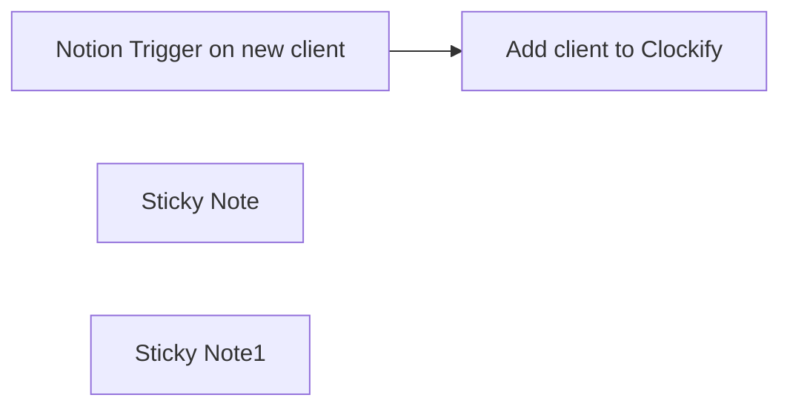

## Fluxo (.json) :

```json
{
  "id": "mbgpq1PH1SFkHi6w",
  "meta": {
    "instanceId": "00430fabba021bdf53a110b354e0e10bcfb5ee2de4556eb52b6d49f481ac083e"
  },
  "name": "Add new clients from Notion to Clockify",
  "tags": [],
  "nodes": [
    {
      "id": "f58df180-644e-4e59-a32d-b6b316b8ff97",
      "name": "Add client to Clockify",
      "type": "n8n-nodes-base.clockify",
      "position": [
        240,
        -320
      ],
      "parameters": {
        "name": "={{ $json.Name }}",
        "resource": "client",
        "workspaceId": "5da1c2995e326c429dbe6e31"
      },
      "credentials": {
        "clockifyApi": {
          "id": "U7trUA4hFkSWHagH",
          "name": "Clockify account"
        }
      },
      "typeVersion": 1
    },
    {
      "id": "1f723b4b-30c7-45c9-b3b5-b55211597a93",
      "name": "Notion Trigger on new client",
      "type": "n8n-nodes-base.notionTrigger",
      "position": [
        -140,
        -320
      ],
      "parameters": {
        "pollTimes": {
          "item": [
            {
              "mode": "everyMinute"
            }
          ]
        },
        "databaseId": {
          "__rl": true,
          "mode": "id",
          "value": ""
        }
      },
      "credentials": {
        "notionApi": {
          "id": "ogjRdz4QQPvdkxqo",
          "name": "Notion account privat"
        }
      },
      "typeVersion": 1
    },
    {
      "id": "f0f1e554-c2f5-4e41-8e9b-86b5ffcab64c",
      "name": "Sticky Note",
      "type": "n8n-nodes-base.stickyNote",
      "position": [
        -240,
        -580
      ],
      "parameters": {
        "width": 300,
        "height": 460,
        "content": "## Notion\n### Poll for new clients\n**To-dos**:\n1. Connect your Notion account\n2. Set your polling interval\n3. Select your client Notion database "
      },
      "typeVersion": 1
    },
    {
      "id": "aab21f54-e577-4f01-9005-0113f83beca0",
      "name": "Sticky Note1",
      "type": "n8n-nodes-base.stickyNote",
      "position": [
        140,
        -580
      ],
      "parameters": {
        "width": 300,
        "height": 460,
        "content": "## Clockify\n### Add new client\n**To-dos**:\n1. Connect your Clockify account\n2. Select your Clockify workspace\n3. Map your Notion client name column to the Clockify \"Client Name\" field"
      },
      "typeVersion": 1
    }
  ],
  "active": false,
  "pinData": {},
  "settings": {
    "executionOrder": "v1"
  },
  "versionId": "5edc08ae-df38-4c7f-9367-36dac7578351",
  "connections": {
    "Add client to Clockify": {
      "main": [
        []
      ]
    },
    "Notion Trigger on new client": {
      "main": [
        [
          {
            "node": "Add client to Clockify",
            "type": "main",
            "index": 0
          }
        ]
      ]
    }
  }
}
```

<a id="template-753"></a>

## Template 753 - Envio diário de receitas por e-mail

- **Nome:** Envio diário de receitas por e-mail
- **Descrição:** Busca receitas com base em critérios configuráveis e envia uma lista em HTML por e-mail em um horário agendado.
- **Funcionalidade:** • Agendamento diário: Executa o fluxo automaticamente em um horário definido (por padrão às 10:00).
• Definição de critérios de busca: Permite configurar número de receitas, número máximo de ingredientes, faixa de calorias, tempo máximo de preparo, dieta e restrições de saúde.
• Seleção aleatória de filtros: Se Diet ou Health estiverem definidos como "random", escolhe aleatoriamente um valor a partir de listas predefinidas.
• Montagem de parâmetros de consulta: Constrói parâmetros de consulta (incluindo intervalo de calorias e tempo) para uso na API de buscas de receitas.
• Consulta à API externa para contagem: Realiza uma chamada inicial para recuperar a contagem total de receitas correspondentes aos critérios.
• Seleção aleatória de páginas/resultados: Calcula índices from/to aleatórios com base na contagem total e no número desejado de resultados.
• Recuperação das receitas: Busca os detalhes das receitas selecionadas usando os parâmetros calculados.
• Geração de corpo de e-mail em HTML: Cria uma lista em HTML com links para as receitas encontradas.
• Envio de e-mail: Envia o conteúdo HTML com as receitas para um destinatário configurado via credenciais SMTP.
- **Ferramentas:** • Edamam Recipe Search API: Serviço externo usado para buscar e filtrar receitas por ingrediente, calorias, tempo, dieta e restrições de saúde.
• Serviço SMTP (ex.: Gmail SMTP): Serviço de envio de e-mail utilizado para entregar a lista de receitas ao destinatário configurado.


## Fluxo visual

```mermaid
flowchart LR
    N1["Cron"]
    N2["Search Criteria"]
    N3["Set Query Values"]
    N4["Set Recipe ID Values"]
    N5["Retrieve Recipe Counts"]
    N6["Retrieve Recipes"]
    N7["Set Counts"]
    N8["Send Recipes"]
    N9["Create Email Body in HTML"]

    N1 --> N2
    N7 --> N4
    N2 --> N3
    N6 --> N9
    N3 --> N5
    N4 --> N6
    N5 --> N7
    N9 --> N8
```

## Fluxo (.json) :

```json
{
  "id": "11",
  "name": "What To Eat",
  "nodes": [
    {
      "name": "Cron",
      "type": "n8n-nodes-base.cron",
      "position": [
        100,
        400
      ],
      "parameters": {
        "triggerTimes": {
          "item": [
            {
              "hour": 10
            }
          ]
        }
      },
      "typeVersion": 1
    },
    {
      "name": "Search Criteria",
      "type": "n8n-nodes-base.set",
      "position": [
        300,
        400
      ],
      "parameters": {
        "values": {
          "number": [
            {
              "name": "RecipeCount",
              "value": 3
            },
            {
              "name": "IngredientCount",
              "value": 5
            },
            {
              "name": "CaloriesMin"
            },
            {
              "name": "CaloriesMax",
              "value": 1500
            },
            {
              "name": "TimeMin"
            },
            {
              "name": "TimeMax",
              "value": 30
            }
          ],
          "string": [
            {
              "name": "Diet",
              "value": "balanced"
            },
            {
              "name": "Health",
              "value": "random"
            },
            {
              "name": "SearchItem",
              "value": "chicken"
            },
            {
              "name": "AppID",
              "value": "Enter Your Edamam AppID Here"
            },
            {
              "name": "AppKey",
              "value": "Enter Your Edamam AppKey Here"
            }
          ]
        },
        "options": {}
      },
      "typeVersion": 1
    },
    {
      "name": "Set Query Values",
      "type": "n8n-nodes-base.function",
      "position": [
        500,
        400
      ],
      "parameters": {
        "functionCode": "items[0].json.calories = items[0].json.CaloriesMin + \"-\" + items[0].json.CaloriesMax;\nitems[0].json.time = items[0].json.TimeMin + \"-\" + items[0].json.TimeMax;\n\nif (items[0].json.Diet.toUpperCase() == \"RANDOM\") {\n  arrDiet = [\"balanced\",\"high-fiber\",\"high-protein\",\"low-carb\",\"low-fat\",\"low-sodium\"];\n  intRandomNumber = Math.floor(Math.random() * 6);\n  items[0].json.Diet = arrDiet[intRandomNumber];\n}\n\nif (items[0].json.Health.toUpperCase() == \"RANDOM\") {\n  arrHealth = [\"alcohol-free\",\"immuno-supportive\",\"celery-free\",\"crustacean-free\",\"dairy-free\",\"egg-free\",\"fish-free\",\"fodmap-free\",\"gluten-free\",\"keto-friendly\",\"kidney-friendly\",\"kosher\",\"low-potassium\",\"lupine-free\",\"mustard-free\",\"low-fat-abs\",\"no-oil-added\",\"low-sugar\",\"paleo\",\"peanut-free\",\"pecatarian\",\"pork-free\",\"red-meat-free\",\"sesame-free\",\"shellfish-free\",\"soy-free\",\"sugar-conscious\",\"tree-nut-free\",\"vegan\",\"vegetarian\",\"wheat-free\"];\n  intRandomNumber = Math.floor(Math.random() * 31);\n  items[0].json.Health = arrHealth[intRandomNumber];\n}\n\nreturn items;"
      },
      "typeVersion": 1
    },
    {
      "name": "Set Recipe ID Values",
      "type": "n8n-nodes-base.function",
      "position": [
        1080,
        400
      ],
      "parameters": {
        "functionCode": "items[0].json.from = Math.floor(Math.random() * items[0].json.RecipeCount) + 1;\nitems[0].json.to = items[0].json.from + items[0].json.ReturnCount;\n\nreturn items;"
      },
      "typeVersion": 1
    },
    {
      "name": "Retrieve Recipe Counts",
      "type": "n8n-nodes-base.httpRequest",
      "position": [
        700,
        400
      ],
      "parameters": {
        "url": "https://api.edamam.com/search",
        "options": {},
        "queryParametersUi": {
          "parameter": [
            {
              "name": "q",
              "value": "={{$node[\"Set Query Values\"].json[\"SearchItem\"]}}"
            },
            {
              "name": "app_id",
              "value": "={{$node[\"Set Query Values\"].json[\"AppID\"]}}"
            },
            {
              "name": "app_key",
              "value": "={{$node[\"Set Query Values\"].json[\"AppKey\"]}}"
            },
            {
              "name": "ingr",
              "value": "={{$node[\"Set Query Values\"].json[\"IngredientCount\"]}}"
            },
            {
              "name": "diet",
              "value": "={{$node[\"Set Query Values\"].json[\"Diet\"]}}"
            },
            {
              "name": "calories",
              "value": "={{$node[\"Set Query Values\"].json[\"calories\"]}}"
            },
            {
              "name": "time",
              "value": "={{$node[\"Set Query Values\"].json[\"time\"]}}"
            },
            {
              "name": "from",
              "value": "1"
            },
            {
              "name": "to",
              "value": "2"
            }
          ]
        }
      },
      "typeVersion": 1
    },
    {
      "name": "Retrieve Recipes",
      "type": "n8n-nodes-base.httpRequest",
      "position": [
        1260,
        400
      ],
      "parameters": {
        "url": "https://api.edamam.com/search",
        "options": {},
        "queryParametersUi": {
          "parameter": [
            {
              "name": "q",
              "value": "={{$node[\"Search Criteria\"].json[\"SearchItem\"]}}"
            },
            {
              "name": "app_id",
              "value": "={{$node[\"Search Criteria\"].json[\"AppID\"]}}"
            },
            {
              "name": "app_key",
              "value": "={{$node[\"Search Criteria\"].json[\"AppKey\"]}}"
            },
            {
              "name": "from",
              "value": "={{$node[\"Set Recipe ID Values\"].json[\"from\"]}}"
            },
            {
              "name": "to",
              "value": "={{$node[\"Set Recipe ID Values\"].json[\"to\"]}}"
            },
            {
              "name": "ingr",
              "value": "={{$node[\"Search Criteria\"].json[\"IngredientCount\"]}}"
            },
            {
              "name": "diet",
              "value": "={{$node[\"Search Criteria\"].json[\"Diet\"]}}"
            },
            {
              "name": "calories",
              "value": "={{$node[\"Set Query Values\"].json[\"calories\"]}}"
            },
            {
              "name": "time",
              "value": "={{$node[\"Set Query Values\"].json[\"time\"]}}"
            }
          ]
        }
      },
      "typeVersion": 1
    },
    {
      "name": "Set Counts",
      "type": "n8n-nodes-base.set",
      "position": [
        880,
        400
      ],
      "parameters": {
        "values": {
          "number": [
            {
              "name": "RecipeCount",
              "value": "={{$node[\"Retrieve Recipe Counts\"].json[\"count\"]}}"
            },
            {
              "name": "ReturnCount",
              "value": "={{$node[\"Search Criteria\"].json[\"RecipeCount\"]}}"
            }
          ]
        },
        "options": {},
        "keepOnlySet": true
      },
      "typeVersion": 1
    },
    {
      "name": "Send Recipes",
      "type": "n8n-nodes-base.emailSend",
      "position": [
        1660,
        400
      ],
      "parameters": {
        "html": "={{$node[\"Create Email Body in HTML\"].json[\"emailBody\"]}}",
        "options": {},
        "subject": "={{$node[\"Set Query Values\"].json[\"RecipeCount\"]}} {{$node[\"Set Query Values\"].json[\"Diet\"]}}, {{$node[\"Set Query Values\"].json[\"Health\"]}} {{$node[\"Set Query Values\"].json[\"SearchItem\"]}} recipes under {{$node[\"Set Query Values\"].json[\"CaloriesMax\"]}} calories ready in under {{$node[\"Set Query Values\"].json[\"TimeMax\"]}} minutes",
        "toEmail": "Enter Your Email Address Here",
        "fromEmail": "Enter Your Email Address Here"
      },
      "credentials": {
        "smtp": "Gmail Creds"
      },
      "typeVersion": 1
    },
    {
      "name": "Create Email Body in HTML",
      "type": "n8n-nodes-base.function",
      "position": [
        1460,
        400
      ],
      "parameters": {
        "functionCode": "arrRecipes = items[0].json.hits;\nitems[0].json = {};\n\nstrEmailBody = \"Here are your recipes for today:<br><ul>\";\n\narrRecipes.forEach(createHTML);\n\nfunction createHTML(value, index, array) {\n  strEmailBody = strEmailBody + \"<li><a href=\\\"\"+ value.recipe.shareAs + \"\\\">\" + value.recipe.label + \"</a></li>\";\n}\n\nstrEmailBody = strEmailBody + \"</ul>\";\n\nitems[0].json.emailBody = strEmailBody\n\nreturn items;"
      },
      "typeVersion": 1
    }
  ],
  "active": true,
  "settings": {},
  "connections": {
    "Cron": {
      "main": [
        [
          {
            "node": "Search Criteria",
            "type": "main",
            "index": 0
          }
        ]
      ]
    },
    "Set Counts": {
      "main": [
        [
          {
            "node": "Set Recipe ID Values",
            "type": "main",
            "index": 0
          }
        ]
      ]
    },
    "Search Criteria": {
      "main": [
        [
          {
            "node": "Set Query Values",
            "type": "main",
            "index": 0
          }
        ]
      ]
    },
    "Retrieve Recipes": {
      "main": [
        [
          {
            "node": "Create Email Body in HTML",
            "type": "main",
            "index": 0
          }
        ]
      ]
    },
    "Set Query Values": {
      "main": [
        [
          {
            "node": "Retrieve Recipe Counts",
            "type": "main",
            "index": 0
          }
        ]
      ]
    },
    "Set Recipe ID Values": {
      "main": [
        [
          {
            "node": "Retrieve Recipes",
            "type": "main",
            "index": 0
          }
        ]
      ]
    },
    "Retrieve Recipe Counts": {
      "main": [
        [
          {
            "node": "Set Counts",
            "type": "main",
            "index": 0
          }
        ]
      ]
    },
    "Create Email Body in HTML": {
      "main": [
        [
          {
            "node": "Send Recipes",
            "type": "main",
            "index": 0
          }
        ]
      ]
    }
  }
}
```

<a id="template-754"></a>

## Template 754 - Criar tabela e inserir registro no CrateDB

- **Nome:** Criar tabela e inserir registro no CrateDB
- **Descrição:** Ao executar manualmente, o fluxo cria uma tabela chamada 'test' e insere um registro com id 0 e nome 'n8n'.
- **Funcionalidade:** • Disparo manual: inicia o fluxo quando o usuário clica em executar.
• Criação de tabela: executa um comando SQL para criar a tabela 'test' com colunas id (INT) e name (STRING).
• Preparação de dados: define um registro com id = 0 e name = "n8n".
• Inserção de dados: insere o registro preparado na tabela 'test'.
- **Ferramentas:** • CrateDB: banco de dados distribuído utilizado para criar a tabela e armazenar os registros.


## Fluxo visual

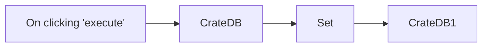

## Fluxo (.json) :

```json
{
  "nodes": [
    {
      "name": "On clicking 'execute'",
      "type": "n8n-nodes-base.manualTrigger",
      "position": [
        550,
        400
      ],
      "parameters": {},
      "typeVersion": 1
    },
    {
      "name": "CrateDB",
      "type": "n8n-nodes-base.crateDb",
      "position": [
        750,
        400
      ],
      "parameters": {
        "query": "CREATE TABLE test (id INT, name STRING);",
        "operation": "executeQuery"
      },
      "credentials": {
        "crateDb": "cratedb_creds"
      },
      "typeVersion": 1,
      "alwaysOutputData": true
    },
    {
      "name": "CrateDB1",
      "type": "n8n-nodes-base.crateDb",
      "position": [
        1150,
        400
      ],
      "parameters": {
        "table": "test",
        "columns": "id, name"
      },
      "credentials": {
        "crateDb": "cratedb_creds"
      },
      "typeVersion": 1
    },
    {
      "name": "Set",
      "type": "n8n-nodes-base.set",
      "position": [
        950,
        400
      ],
      "parameters": {
        "values": {
          "number": [
            {
              "name": "id",
              "value": 0
            }
          ],
          "string": [
            {
              "name": "name",
              "value": "n8n"
            }
          ]
        },
        "options": {}
      },
      "typeVersion": 1,
      "alwaysOutputData": false
    }
  ],
  "connections": {
    "Set": {
      "main": [
        [
          {
            "node": "CrateDB1",
            "type": "main",
            "index": 0
          }
        ]
      ]
    },
    "CrateDB": {
      "main": [
        [
          {
            "node": "Set",
            "type": "main",
            "index": 0
          }
        ]
      ]
    },
    "On clicking 'execute'": {
      "main": [
        [
          {
            "node": "CrateDB",
            "type": "main",
            "index": 0
          }
        ]
      ]
    }
  }
}
```

<a id="template-755"></a>

## Template 755 - Resumo Diário de E-mails com IA

- **Nome:** Resumo Diário de E-mails com IA
- **Descrição:** Este fluxo coleta emails recebidos no último dia, extrai dados relevantes, gera um resumo com itens e ações via IA, e envia um relatório formatado por email.
- **Funcionalidade:** • Detecção diária: Inicia a automação diariamente às 7:00 para processar novas mensagens.
• Coleta de emails do último 24 horas: Recupera mensagens recebidas no último dia da conta especificada.
• Organização dos dados do email: Extrai campos como From, To, CC, ID e snippet para processamento.
• Geração de resumo e ações: Usa IA para extrair pontos-chave e ações a partir dos emails.
• Envio do relatório: Envia um email com formato HTML contendo o resumo e as ações.
- **Ferramentas:** • Gmail: Gerencia recebimento e envio de mensagens para coletar os emails e entregar o relatório.
• OpenAI: Serviço de IA utilizado para resumir os conteúdos dos emails e extrair ações.


## Fluxo visual

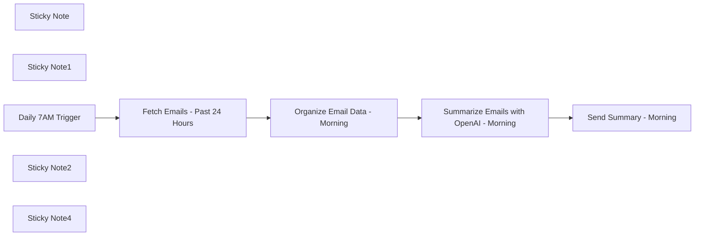

## Fluxo (.json) :

```json
{
  "id": "M8oLW9Qd59zNJzg2",
  "meta": {
    "instanceId": "1abe0e4c2be794795d12bf72aa530a426a6f87aabad209ed6619bcaf0f666fb0",
    "templateCredsSetupCompleted": true
  },
  "name": "Email Summary Agent",
  "tags": [
    {
      "id": "G1v7CnFpOHsReVhM",
      "name": "Product",
      "createdAt": "2025-01-13T17:04:34.969Z",
      "updatedAt": "2025-01-13T17:04:34.969Z"
    },
    {
      "id": "RagrXIh5iBDseqvj",
      "name": "AI",
      "createdAt": "2025-01-09T09:18:12.756Z",
      "updatedAt": "2025-01-09T09:18:12.756Z"
    },
    {
      "id": "Yg2lfYteJZAoIeaC",
      "name": "Building blocks",
      "createdAt": "2025-01-13T17:05:49.788Z",
      "updatedAt": "2025-01-13T17:05:49.788Z"
    },
    {
      "id": "ZuS1C3NpE8uBlFq4",
      "name": "Finance",
      "createdAt": "2025-01-13T17:05:03.996Z",
      "updatedAt": "2025-01-13T17:05:03.996Z"
    },
    {
      "id": "aqlZb2qfWiaT4Xr5",
      "name": "IT Ops",
      "createdAt": "2025-01-03T12:20:11.917Z",
      "updatedAt": "2025-01-03T12:20:11.917Z"
    },
    {
      "id": "fX8hRnEv4D8sLSzF",
      "name": "OpenAI",
      "createdAt": "2025-01-09T09:18:12.757Z",
      "updatedAt": "2025-01-09T09:18:12.757Z"
    },
    {
      "id": "j1qBXzFADkR3sHSa",
      "name": "Marketing",
      "createdAt": "2025-01-13T17:03:54.468Z",
      "updatedAt": "2025-01-13T17:03:54.468Z"
    },
    {
      "id": "x3OVvOuZkLx1hYpW",
      "name": "Support",
      "createdAt": "2025-01-13T17:05:40.900Z",
      "updatedAt": "2025-01-13T17:05:40.900Z"
    },
    {
      "id": "xBOhq1kP3lza5ajE",
      "name": "HR",
      "createdAt": "2025-01-13T17:04:57.045Z",
      "updatedAt": "2025-01-13T17:04:57.045Z"
    },
    {
      "id": "yy04JQqCaXepPdSa",
      "name": "Project Management",
      "createdAt": "2024-10-30T18:27:57.309Z",
      "updatedAt": "2024-10-30T18:27:57.309Z"
    },
    {
      "id": "zJaZorWWcGpTp35U",
      "name": "DevOps",
      "createdAt": "2025-01-03T12:19:34.273Z",
      "updatedAt": "2025-01-03T12:19:34.273Z"
    }
  ],
  "nodes": [
    {
      "id": "94c09c05-539b-452e-83b7-0a029bbe6b7f",
      "name": "Sticky Note",
      "type": "n8n-nodes-base.stickyNote",
      "position": [
        -120,
        -140
      ],
      "parameters": {
        "width": 248.47086922498647,
        "height": 314.47468983163634,
        "content": "- Starts the workflow every day at 7 AM.\n- Adjust the time if you want the workflow to run at a different hour."
      },
      "typeVersion": 1
    },
    {
      "id": "5e5cbc87-5c01-438b-a1c0-e8468d3ee20b",
      "name": "Sticky Note1",
      "type": "n8n-nodes-base.stickyNote",
      "position": [
        160,
        -137.04548301590512
      ],
      "parameters": {
        "width": 213.36643278764896,
        "height": 313.40934714314244,
        "content": "Fetches all emails received in the past 24 hours from the email address"
      },
      "typeVersion": 1
    },
    {
      "id": "9a82f5e9-7d0b-430f-9dbb-d8ae0b129dad",
      "name": "Daily 7AM Trigger",
      "type": "n8n-nodes-base.scheduleTrigger",
      "position": [
        -40,
        0
      ],
      "parameters": {
        "rule": {
          "interval": [
            {
              "triggerAtHour": 7
            }
          ]
        }
      },
      "typeVersion": 1.2
    },
    {
      "id": "dd3e4b10-187b-45ce-b999-f0143e5af134",
      "name": "Fetch Emails - Past 24 Hours",
      "type": "n8n-nodes-base.gmail",
      "position": [
        220,
        0
      ],
      "webhookId": "20f1d11d-8a69-43f3-9323-33eaf1b3b600",
      "parameters": {
        "filters": {
          "q": "={{ \n (() => {\n const yesterday = new Date();\n yesterday.setDate(yesterday.getDate() - 1);\n return `isb.quantana@quantana.in after:${yesterday.getFullYear()}/${(yesterday.getMonth() + 1).toString().padStart(2, '0')}/${yesterday.getDate().toString().padStart(2, '0')}`;\n })()\n}}"
        },
        "operation": "getAll",
        "returnAll": true
      },
      "credentials": {
        "gmailOAuth2": {
          "id": "YFARhQXJAjbwXjSO",
          "name": "Vishal Gmail"
        }
      },
      "typeVersion": 2.1
    },
    {
      "id": "4a8fdfd9-93d7-43a2-92b0-88d845f217bf",
      "name": "Organize Email Data - Morning",
      "type": "n8n-nodes-base.aggregate",
      "position": [
        460,
        0
      ],
      "parameters": {
        "include": "specifiedFields",
        "options": {},
        "aggregate": "aggregateAllItemData",
        "fieldsToInclude": "id, From, To, CC, snippet"
      },
      "typeVersion": 1
    },
    {
      "id": "9e2426e8-57ba-4708-b66f-b58bd19eabff",
      "name": "Summarize Emails with OpenAI - Morning",
      "type": "@n8n/n8n-nodes-langchain.openAi",
      "position": [
        680,
        0
      ],
      "parameters": {
        "modelId": {
          "__rl": true,
          "mode": "list",
          "value": "gpt-4o-mini",
          "cachedResultName": "GPT-4O-MINI"
        },
        "options": {},
        "messages": {
          "values": [
            {
              "content": "=Go through this email summary and identify all key details mentioned, any specific issues to look at, and action items.\nUse this format to output\n{\n \"summary_of_emails\": [\n \"Point 1\",\n \"Point 2\",\n \"Point 3\"\n ],\n \"actions\": [\n {\n \"name\": \"Name 1\",\n \"action\": \"Action 1\"\n },\n {\n \"name\": \"Name 1\",\n \"action\": \"Action 2\"\n },\n {\n \"name\": \"Name 2\",\n \"action\": \"Action 3\"\n }\n ]\n}\n\nInput Data:\n\n {{ $json.data.toJsonString() }}\n\n"
            }
          ]
        },
        "jsonOutput": true
      },
      "credentials": {
        "openAiApi": {
          "id": "ksU2WMcMqe2lPgRw",
          "name": "OpenAi account"
        }
      },
      "typeVersion": 1.7
    },
    {
      "id": "4aa68ee8-d38f-418a-9f20-6cc76850c638",
      "name": "Send Summary - Morning",
      "type": "n8n-nodes-base.gmail",
      "position": [
        1040,
        0
      ],
      "webhookId": "83f2aeb9-7b6c-4336-b5ed-8acfcd259850",
      "parameters": {
        "sendTo": "team-email@example.com",
        "message": "=<!DOCTYPE html>\n<html lang=\"en\">\n<head>\n <meta charset=\"UTF-8\">\n <meta name=\"viewport\" content=\"width=device-width, initial-scale=1.0\">\n <title>Email Summary - isbonline@quantana.in</title>\n <style>\n body {\n font-family: Arial, sans-serif;\n margin: 0;\n padding: 0;\n background-color: #f9f9f9;\n color: #333;\n line-height: 1.6;\n }\n .email-container {\n max-width: 600px;\n margin: 20px auto;\n background: #ffffff;\n border: 1px solid #ddd;\n border-radius: 10px;\n box-shadow: 0 2px 5px rgba(0, 0, 0, 0.1);\n }\n .email-header {\n background-color: #0073e6;\n color: #fff;\n padding: 20px;\n text-align: center;\n border-top-left-radius: 10px;\n border-top-right-radius: 10px;\n }\n .email-header h1 {\n margin: 0;\n font-size: 24px;\n }\n .email-content {\n padding: 20px;\n }\n .section-title {\n font-size: 20px;\n color: #0073e6;\n margin-bottom: 10px;\n }\n ul {\n list-style: none;\n padding: 0;\n }\n ul li {\n margin: 10px 0;\n padding: 10px;\n background: #f4f4f4;\n border-left: 4px solid #0073e6;\n border-radius: 5px;\n }\n .action-item {\n font-weight: bold;\n margin: 5px 0;\n }\n .action-detail {\n margin-left: 10px;\n }\n .email-footer {\n background-color: #0073e6;\n color: #fff;\n text-align: center;\n padding: 10px;\n font-size: 14px;\n border-bottom-left-radius: 10px;\n border-bottom-right-radius: 10px;\n }\n </style>\n</head>\n<body>\n <div class=\"email-container\">\n <div class=\"email-header\">\n <h1>Email Summary</h1>\n </div>\n <div class=\"email-content\">\n <div>\n <h2 class=\"section-title\">Summary of Emails:</h2>\n <ul>\n {{ $json.message.content.summary_of_emails.map(email => `<li>${email}</li>`).join('') }}\n </ul>\n </div>\n <div>\n <h2 class=\"section-title\">Actions:</h2>\n <ul>\n {{ $json.message.content.actions.map(action => `\n <li>\n <span class=\"action-item\">${action.name}:</span>\n <span class=\"action-detail\">${action.action}</span>\n </li>\n `).join('') }}\n </ul>\n </div>\n </div>\n <div class=\"email-footer\">\n <p>Generated by Quantana ESAgent <br /> A Quantana AI Labs Initiative\n </div>\n </div>\n</body>\n</html>",
        "options": {
          "ccList": "cc-list@example.com",
          "appendAttribution": false,
          "replyToSenderOnly": false
        },
        "subject": "=ESAgent - {{ new Date(new Date().setDate(new Date().getDate() - 1)).toLocaleDateString('en-GB', { day: '2-digit', month: 'short', year: 'numeric' }) }}-00:00 to {{ new Date(new Date().setDate(new Date().getDate())).toLocaleDateString('en-GB', { day: '2-digit', month: 'short', year: 'numeric' }) }}-07:00AM"
      },
      "credentials": {
        "gmailOAuth2": {
          "id": "YFARhQXJAjbwXjSO",
          "name": "Vishal Gmail"
        }
      },
      "typeVersion": 2.1
    },
    {
      "id": "c7667667-9533-40cb-9c09-914a11560600",
      "name": "Sticky Note2",
      "type": "n8n-nodes-base.stickyNote",
      "position": [
        400,
        -132.6641804468672
      ],
      "parameters": {
        "width": 226.7095107678671,
        "height": 305.83657700487913,
        "content": "Organizes the fetched email data, extracting fields like sender, receiver, CC, and a preview snippet."
      },
      "typeVersion": 1
    },
    {
      "id": "43955af4-3a18-44d7-8c8d-cf8051b18bdd",
      "name": "Sticky Note4",
      "type": "n8n-nodes-base.stickyNote",
      "position": [
        980,
        -180
      ],
      "parameters": {
        "width": 232.8435827211592,
        "height": 359.7308639651144,
        "content": "- Sends the summarized email report to recipients with a styled HTML layout.\n- Update the \"sendTo\" and \"ccList\" fields with the email addresses of your recipients.\n\n"
      },
      "typeVersion": 1
    }
  ],
  "active": false,
  "pinData": {},
  "settings": {
    "timezone": "Asia/Kolkata",
    "executionOrder": "v1"
  },
  "versionId": "b18912ed-6c1f-4912-b75a-1553f7620917",
  "connections": {
    "Daily 7AM Trigger": {
      "main": [
        [
          {
            "node": "Fetch Emails - Past 24 Hours",
            "type": "main",
            "index": 0
          }
        ]
      ]
    },
    "Fetch Emails - Past 24 Hours": {
      "main": [
        [
          {
            "node": "Organize Email Data - Morning",
            "type": "main",
            "index": 0
          }
        ]
      ]
    },
    "Organize Email Data - Morning": {
      "main": [
        [
          {
            "node": "Summarize Emails with OpenAI - Morning",
            "type": "main",
            "index": 0
          }
        ]
      ]
    },
    "Summarize Emails with OpenAI - Morning": {
      "main": [
        [
          {
            "node": "Send Summary - Morning",
            "type": "main",
            "index": 0
          }
        ]
      ]
    }
  }
}
```

<a id="template-756"></a>

## Template 756 - Sincronizar links do canal Telegram para Readeck e Hoarder

- **Nome:** Sincronizar links do canal Telegram para Readeck e Hoarder
- **Descrição:** O fluxo lê mensagens de um canal do Telegram, extrai links e salva apenas os links não salvos previamente em dois serviços de bookmark (Readeck e Hoarder).
- **Funcionalidade:** • Execução periódica: inicia automaticamente em intervalos regulares (horário configurado) para checar novas mensagens.
• Leitura do canal Telegram: consulta as atualizações do bot e filtra mensagens vindas de um canal específico.
• Extração de links: identifica e extrai URLs presentes nas mensagens do canal.
• Recuperação de bookmarks existentes: obtém a lista de links já salvos em Readeck e em Hoarder para comparação.
• Filtragem de links novos: compara os links extraídos com os já salvos e mantém apenas os não presentes em cada serviço.
• Envio de novos bookmarks: envia via requisições HTTP os links que ainda não existem em Readeck e em Hoarder para criação de bookmarks.
• Configuração via variáveis de ambiente: utiliza variáveis para tokens, IDs de chat e endpoints dos servidores, facilitando configuração e segurança.
- **Ferramentas:** • Telegram: fonte das mensagens; bot usado para obter atualizações do canal e extrair links.
• Readeck: serviço de bookmarks onde novos links são enviados e armazenados via API.
• Hoarder: serviço de bookmarks alternativo onde novos links também são enviados via API.


## Fluxo visual

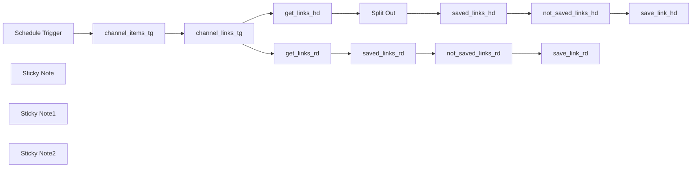

## Fluxo (.json) :

```json
{
  "id": "Gd4MsAZGnSGfBwaw",
  "meta": {
    "instanceId": "8fb543b511022c43ab705107ba101545bb8b0fdb9bd6ebc4cca28dc9591a036e"
  },
  "name": "Telegram channel to Readeck & Hoarder",
  "tags": [],
  "nodes": [
    {
      "id": "6e50d52e-8b9e-4c92-82a1-af366c7a2ccf",
      "name": "Schedule Trigger",
      "type": "n8n-nodes-base.scheduleTrigger",
      "position": [
        -440,
        -700
      ],
      "parameters": {
        "rule": {
          "interval": [
            {
              "field": "hours"
            }
          ]
        }
      },
      "typeVersion": 1.2
    },
    {
      "id": "bb7430a2-a7b7-47f2-9ba3-a3e43c8da004",
      "name": "Split Out",
      "type": "n8n-nodes-base.splitOut",
      "position": [
        -100,
        -120
      ],
      "parameters": {
        "options": {},
        "fieldToSplitOut": "bookmarks"
      },
      "typeVersion": 1
    },
    {
      "id": "922aeb0b-29b1-46c6-9b18-76c02eca5a9e",
      "name": "Sticky Note",
      "type": "n8n-nodes-base.stickyNote",
      "position": [
        -460,
        -480
      ],
      "parameters": {
        "width": 1120,
        "height": 220,
        "content": "## Readeck"
      },
      "typeVersion": 1
    },
    {
      "id": "64d4ca0b-2c16-441e-9461-5707be877132",
      "name": "Sticky Note1",
      "type": "n8n-nodes-base.stickyNote",
      "position": [
        -220,
        -740
      ],
      "parameters": {
        "width": 480,
        "height": 200,
        "content": "## Telegram"
      },
      "typeVersion": 1
    },
    {
      "id": "13ae24ec-ac11-470a-bad4-76403861f632",
      "name": "Sticky Note2",
      "type": "n8n-nodes-base.stickyNote",
      "position": [
        -460,
        -180
      ],
      "parameters": {
        "width": 1120,
        "height": 220,
        "content": "## Hoarder"
      },
      "typeVersion": 1
    },
    {
      "id": "c606f434-d37b-4406-997a-1e7f17319281",
      "name": "not_saved_links_hd",
      "type": "n8n-nodes-base.code",
      "position": [
        260,
        -120
      ],
      "parameters": {
        "jsCode": "const linksCanalItems = $('channel_links_tg').all();\nconst saved_links_items = $('saved_links_hd').all();\n\n// Extract links\nconst saved_links = new Set(\n    saved_links_items.map(item => String(item.json.content.url))\n);\n\n// Filter\nconst filteredLinks = linksCanalItems.filter(item => {\n    return !saved_links.has(String(item.json.url));\n});\n\nreturn filteredLinks;\n\n\n\n\n\n\n\n\n"
      },
      "typeVersion": 2
    },
    {
      "id": "d0f61836-798c-4835-ae8f-8f184b6720ed",
      "name": "not_saved_links_rd",
      "type": "n8n-nodes-base.code",
      "position": [
        260,
        -420
      ],
      "parameters": {
        "jsCode": "const linksCanalItems = $('channel_links_tg').all();\nconst saved_links_items = $('saved_links_rd').all();\n\n// Extract urls\nconst saved_urls = new Set(\n    saved_links_items.map(item => String(item.json.url))\n);\n\n// Filter\nconst filteredLinks = linksCanalItems.filter(item => {\n    return !saved_urls.has(String(item.json.url));\n});\n\nreturn filteredLinks;\n\n\n\n\n\n\n\n\n"
      },
      "typeVersion": 2
    },
    {
      "id": "f33349a7-361a-4b0f-844b-1ca5ded2aeab",
      "name": "saved_links_rd",
      "type": "n8n-nodes-base.set",
      "position": [
        80,
        -420
      ],
      "parameters": {
        "options": {},
        "assignments": {
          "assignments": [
            {
              "id": "8c6f3806-0fb8-4c76-a0bc-19b588717430",
              "name": "id",
              "type": "string",
              "value": "={{ $json.id }}"
            },
            {
              "id": "ef41cba3-2844-479c-9467-6b94ae24c98b",
              "name": "url",
              "type": "string",
              "value": "={{ $json.url }}"
            }
          ]
        }
      },
      "typeVersion": 3.4
    },
    {
      "id": "63d45b19-e878-418e-8eb5-c16b50af9669",
      "name": "save_link_rd",
      "type": "n8n-nodes-base.httpRequest",
      "position": [
        460,
        -420
      ],
      "parameters": {
        "url": "={{$env.READECK_SERVER}}/api/bookmarks",
        "method": "POST",
        "options": {},
        "sendBody": true,
        "sendHeaders": true,
        "bodyParameters": {
          "parameters": [
            {
              "name": "url",
              "value": "={{ $json.url }}"
            }
          ]
        },
        "headerParameters": {
          "parameters": [
            {
              "name": "accept",
              "value": "application/json"
            },
            {
              "name": "authorization",
              "value": "=Bearer {{$env.READECK_API_KEY}}"
            }
          ]
        }
      },
      "typeVersion": 4.2
    },
    {
      "id": "9416a858-1a25-4c3e-a49e-153118c268a7",
      "name": "save_link_hd",
      "type": "n8n-nodes-base.httpRequest",
      "position": [
        460,
        -120
      ],
      "parameters": {
        "url": "={{$env.HOARDER_SERVER}}/api/v1/bookmarks",
        "method": "POST",
        "options": {},
        "sendBody": true,
        "sendHeaders": true,
        "bodyParameters": {
          "parameters": [
            {
              "name": "type",
              "value": "link"
            },
            {
              "name": "url",
              "value": "={{ $json.url }}"
            }
          ]
        },
        "headerParameters": {
          "parameters": [
            {
              "name": "Authorization",
              "value": "=Bearer {{$env.HOARDER_API_KEY}}"
            }
          ]
        }
      },
      "typeVersion": 4.2
    },
    {
      "id": "13693467-cd75-4774-9072-832419606ab2",
      "name": "get_links_rd",
      "type": "n8n-nodes-base.httpRequest",
      "position": [
        -280,
        -420
      ],
      "parameters": {
        "url": "={{$env.READECK_SERVER}}/api/bookmarks",
        "options": {},
        "sendHeaders": true,
        "headerParameters": {
          "parameters": [
            {
              "name": "accept",
              "value": "application/json"
            },
            {
              "name": "authorization",
              "value": "=Bearer {{$env.READECK_API_KEY}}"
            }
          ]
        }
      },
      "typeVersion": 4.2,
      "alwaysOutputData": true
    },
    {
      "id": "e4ed315d-d065-425a-b30d-eca1509670cc",
      "name": "get_links_hd",
      "type": "n8n-nodes-base.httpRequest",
      "position": [
        -280,
        -120
      ],
      "parameters": {
        "url": "={{$env.HOARDER_SERVER}}/api/v1/bookmarks",
        "options": {},
        "sendHeaders": true,
        "headerParameters": {
          "parameters": [
            {
              "name": "Authorization",
              "value": "=Bearer {{$env.HOARDER_API_KEY}}"
            }
          ]
        }
      },
      "typeVersion": 4.2,
      "alwaysOutputData": true
    },
    {
      "id": "f54d9a4d-f00b-41bf-988a-8920d0046424",
      "name": "saved_links_hd",
      "type": "n8n-nodes-base.set",
      "position": [
        80,
        -120
      ],
      "parameters": {
        "options": {},
        "assignments": {
          "assignments": [
            {
              "id": "b07ce8e5-0b67-4c9c-831a-7a52f92f5744",
              "name": "content.url",
              "type": "string",
              "value": "={{ $json.content.url }}"
            }
          ]
        }
      },
      "typeVersion": 3.4
    },
    {
      "id": "d4e83b9d-5988-46f4-b853-86daec274dba",
      "name": "channel_links_tg",
      "type": "n8n-nodes-base.code",
      "position": [
        120,
        -700
      ],
      "parameters": {
        "jsCode": "// Define the chatId from the environment variable\nconst chatId = parseInt($env.TG_SHERLINK_ID, 10);\n// Access the \"result\" field from the previous node's output\nconst updates = $node[\"channel_items_tg\"].json[\"result\"];\n// Check if \"result\" is an array\nif (!Array.isArray(updates)) {\n  return []; // Return empty if there are no messages\n}\n// Filter and process the messages\nconst filteredUpdates = updates\n  .map(update => {\n    // Ensure message from the specified channel\n    if (update.channel_post && update.channel_post.chat && update.channel_post.chat.id === chatId) {\n      return {\n        id: update.channel_post.message_id,\n        url: update.channel_post.text\n      };\n    }\n    return null;\n  })\n  \n  .filter(item => item !== null) // Filter nulls\n  .filter(item => {\n    // Filter only with hyperlink in text\n    const text = item.url || \"\"; // Defined text\n    return /https?://[^\\s]+/.test(text); // hyperlink\n  });\n// Convert each array element into an individual item\nreturn filteredUpdates.map(update => ({ json: update }));\n"
      },
      "typeVersion": 2,
      "alwaysOutputData": false
    },
    {
      "id": "ca306aed-e682-4c35-a257-3b65bcfde895",
      "name": "channel_items_tg",
      "type": "n8n-nodes-base.httpRequest",
      "position": [
        -80,
        -700
      ],
      "parameters": {
        "url": "=https://api.telegram.org/bot{{$env.TG_SHERLINK_BOT_TOKEN}}/getUpdates",
        "options": {},
        "sendQuery": true,
        "queryParameters": {
          "parameters": [
            {}
          ]
        }
      },
      "typeVersion": 4.2
    }
  ],
  "active": true,
  "pinData": {},
  "settings": {
    "executionOrder": "v1"
  },
  "versionId": "85dd3731-0772-4b8b-b828-ae6a034d5419",
  "connections": {
    "Split Out": {
      "main": [
        [
          {
            "node": "saved_links_hd",
            "type": "main",
            "index": 0
          }
        ]
      ]
    },
    "get_links_hd": {
      "main": [
        [
          {
            "node": "Split Out",
            "type": "main",
            "index": 0
          }
        ]
      ]
    },
    "get_links_rd": {
      "main": [
        [
          {
            "node": "saved_links_rd",
            "type": "main",
            "index": 0
          }
        ]
      ]
    },
    "save_link_hd": {
      "main": [
        []
      ]
    },
    "save_link_rd": {
      "main": [
        []
      ]
    },
    "saved_links_hd": {
      "main": [
        [
          {
            "node": "not_saved_links_hd",
            "type": "main",
            "index": 0
          }
        ]
      ]
    },
    "saved_links_rd": {
      "main": [
        [
          {
            "node": "not_saved_links_rd",
            "type": "main",
            "index": 0
          }
        ]
      ]
    },
    "Schedule Trigger": {
      "main": [
        [
          {
            "node": "channel_items_tg",
            "type": "main",
            "index": 0
          }
        ]
      ]
    },
    "channel_items_tg": {
      "main": [
        [
          {
            "node": "channel_links_tg",
            "type": "main",
            "index": 0
          }
        ]
      ]
    },
    "channel_links_tg": {
      "main": [
        [
          {
            "node": "get_links_rd",
            "type": "main",
            "index": 0
          },
          {
            "node": "get_links_hd",
            "type": "main",
            "index": 0
          }
        ]
      ]
    },
    "not_saved_links_hd": {
      "main": [
        [
          {
            "node": "save_link_hd",
            "type": "main",
            "index": 0
          }
        ]
      ]
    },
    "not_saved_links_rd": {
      "main": [
        [
          {
            "node": "save_link_rd",
            "type": "main",
            "index": 0
          }
        ]
      ]
    }
  }
}
```

<a id="template-757"></a>

## Template 757 - Publicar releases do GitLab no Outline

- **Nome:** Publicar releases do GitLab no Outline
- **Descrição:** Ao detectar um release no repositório, o fluxo cria e publica um documento no Outline com o título e a descrição do release.
- **Funcionalidade:** • Monitoramento de eventos do repositório: Recebe eventos de tag push do repositório especificado.
• Filtragem por tipo de evento: Verifica se o evento recebido é do tipo "release" antes de continuar.
• Construção do conteúdo do documento: Gera o título no formato "Release <nome>" e compõe o corpo com a descrição do release e um link "More info" para o release.
• Criação e publicação automática: Envia uma requisição HTTP autenticada para criar e publicar o documento no destino configurado.
• Configuração de destino: Permite definir collectionId e parentDocumentId (placeholders) para posicionar o documento na estrutura desejada.
- **Ferramentas:** • GitLab: Fonte dos eventos de repositório (tag push e releases) que acionam a automação.
• Outline: Plataforma de documentação cuja API é utilizada para criar e publicar os documentos de release.


## Fluxo visual

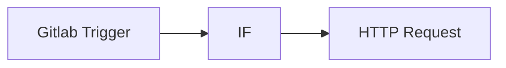

## Fluxo (.json) :

```json
{
  "nodes": [
    {
      "name": "Gitlab Trigger",
      "type": "n8n-nodes-base.gitlabTrigger",
      "position": [
        240,
        140
      ],
      "parameters": {
        "owner": "tennox",
        "events": [
          "tag_push"
        ],
        "repository": "ci-test"
      },
      "typeVersion": 1
    },
    {
      "name": "HTTP Request",
      "type": "n8n-nodes-base.httpRequest",
      "position": [
        820,
        40
      ],
      "parameters": {
        "url": "https://app.getoutline.com/api/documents.create",
        "options": {},
        "requestMethod": "POST",
        "authentication": "headerAuth",
        "jsonParameters": true,
        "bodyParametersJson": "={ \n\"collectionId\": \"PLACEHOLDER\",\n\"parentDocumentId\": \"PLACEHOLDER\",\n\"publish\": true, \n\"title\": {{JSON.stringify(\"Release \" + $json.body.name)}},\n\"text\": {{JSON.stringify($json.body.description + '\\n\\n\\\\\\n[More info](' + $json.body.url + ')')}}\n}"
      },
      "typeVersion": 1
    },
    {
      "name": "IF",
      "type": "n8n-nodes-base.if",
      "position": [
        540,
        140
      ],
      "parameters": {
        "conditions": {
          "string": [
            {
              "value1": "={{$json.body.object_kind}}",
              "value2": "release"
            }
          ]
        }
      },
      "typeVersion": 1
    }
  ],
  "connections": {
    "IF": {
      "main": [
        [
          {
            "node": "HTTP Request",
            "type": "main",
            "index": 0
          }
        ]
      ]
    },
    "Gitlab Trigger": {
      "main": [
        [
          {
            "node": "IF",
            "type": "main",
            "index": 0
          }
        ]
      ]
    }
  }
}
```

<a id="template-758"></a>

## Template 758 - Resumo diário de emails

- **Nome:** Resumo diário de emails
- **Descrição:** Este fluxo coleta emails das últimas 24 horas, organiza dados relevantes, gera um resumo com IA e envia um relatório por email com layout HTML aos destinatários programados.
- **Funcionalidade:** • Coleta emails das últimas 24 horas: busca mensagens recebidas no período, preparando os dados para resumo.
• Organização de dados de email: extrai remetente, destinatários, CC e uma prévia do conteúdo.
• Geração de resumo com IA: sintetiza pontos principais, identifica ações e responsabilidades.
• Geração e envio de relatório: cria uma mensagem HTML formatada e envia aos destinatários.
• Agendamento diário: inicia automaticamente às 7:00 (Asia/Kolkata) para rodar o fluxo.
- **Ferramentas:** • Gmail: Serviço de email utilizado para buscar mensagens recebidas nas últimas 24 horas e enviar relatórios.
• OpenAI: Serviço de IA utilizado para gerar o resumo e extrair ações.


## Fluxo visual


## Fluxo (.json) :

```json
{
  "id": "M8oLW9Qd59zNJzg2",
  "meta": {
    "instanceId": "1abe0e4c2be794795d12bf72aa530a426a6f87aabad209ed6619bcaf0f666fb0",
    "templateCredsSetupCompleted": true
  },
  "name": "Email Summary Agent",
  "tags": [
    {
      "id": "G1v7CnFpOHsReVhM",
      "name": "Product",
      "createdAt": "2025-01-13T17:04:34.969Z",
      "updatedAt": "2025-01-13T17:04:34.969Z"
    },
    {
      "id": "RagrXIh5iBDseqvj",
      "name": "AI",
      "createdAt": "2025-01-09T09:18:12.756Z",
      "updatedAt": "2025-01-09T09:18:12.756Z"
    },
    {
      "id": "Yg2lfYteJZAoIeaC",
      "name": "Building blocks",
      "createdAt": "2025-01-13T17:05:49.788Z",
      "updatedAt": "2025-01-13T17:05:49.788Z"
    },
    {
      "id": "ZuS1C3NpE8uBlFq4",
      "name": "Finance",
      "createdAt": "2025-01-13T17:05:03.996Z",
      "updatedAt": "2025-01-13T17:05:03.996Z"
    },
    {
      "id": "aqlZb2qfWiaT4Xr5",
      "name": "IT Ops",
      "createdAt": "2025-01-03T12:20:11.917Z",
      "updatedAt": "2025-01-03T12:20:11.917Z"
    },
    {
      "id": "fX8hRnEv4D8sLSzF",
      "name": "OpenAI",
      "createdAt": "2025-01-09T09:18:12.757Z",
      "updatedAt": "2025-01-09T09:18:12.757Z"
    },
    {
      "id": "j1qBXzFADkR3sHSa",
      "name": "Marketing",
      "createdAt": "2025-01-13T17:03:54.468Z",
      "updatedAt": "2025-01-13T17:03:54.468Z"
    },
    {
      "id": "x3OVvOuZkLx1hYpW",
      "name": "Support",
      "createdAt": "2025-01-13T17:05:40.900Z",
      "updatedAt": "2025-01-13T17:05:40.900Z"
    },
    {
      "id": "xBOhq1kP3lza5ajE",
      "name": "HR",
      "createdAt": "2025-01-13T17:04:57.045Z",
      "updatedAt": "2025-01-13T17:04:57.045Z"
    },
    {
      "id": "yy04JQqCaXepPdSa",
      "name": "Project Management",
      "createdAt": "2024-10-30T18:27:57.309Z",
      "updatedAt": "2024-10-30T18:27:57.309Z"
    },
    {
      "id": "zJaZorWWcGpTp35U",
      "name": "DevOps",
      "createdAt": "2025-01-03T12:19:34.273Z",
      "updatedAt": "2025-01-03T12:19:34.273Z"
    }
  ],
  "nodes": [
    {
      "id": "94c09c05-539b-452e-83b7-0a029bbe6b7f",
      "name": "Sticky Note",
      "type": "n8n-nodes-base.stickyNote",
      "position": [
        -120,
        -140
      ],
      "parameters": {
        "width": 248.47086922498647,
        "height": 314.47468983163634,
        "content": "- Starts the workflow every day at 7 AM.\n- Adjust the time if you want the workflow to run at a different hour."
      },
      "typeVersion": 1
    },
    {
      "id": "5e5cbc87-5c01-438b-a1c0-e8468d3ee20b",
      "name": "Sticky Note1",
      "type": "n8n-nodes-base.stickyNote",
      "position": [
        160,
        -137.04548301590512
      ],
      "parameters": {
        "width": 213.36643278764896,
        "height": 313.40934714314244,
        "content": "Fetches all emails received in the past 24 hours from the email address"
      },
      "typeVersion": 1
    },
    {
      "id": "9a82f5e9-7d0b-430f-9dbb-d8ae0b129dad",
      "name": "Daily 7AM Trigger",
      "type": "n8n-nodes-base.scheduleTrigger",
      "position": [
        -40,
        0
      ],
      "parameters": {
        "rule": {
          "interval": [
            {
              "triggerAtHour": 7
            }
          ]
        }
      },
      "typeVersion": 1.2
    },
    {
      "id": "dd3e4b10-187b-45ce-b999-f0143e5af134",
      "name": "Fetch Emails - Past 24 Hours",
      "type": "n8n-nodes-base.gmail",
      "position": [
        220,
        0
      ],
      "webhookId": "20f1d11d-8a69-43f3-9323-33eaf1b3b600",
      "parameters": {
        "filters": {
          "q": "={{ \n  (() => {\n    const yesterday = new Date();\n    yesterday.setDate(yesterday.getDate() - 1);\n    return `isb.quantana@quantana.in after:${yesterday.getFullYear()}/${(yesterday.getMonth() + 1).toString().padStart(2, '0')}/${yesterday.getDate().toString().padStart(2, '0')}`;\n  })()\n}}"
        },
        "operation": "getAll",
        "returnAll": true
      },
      "credentials": {
        "gmailOAuth2": {
          "id": "YFARhQXJAjbwXjSO",
          "name": "Vishal Gmail"
        }
      },
      "typeVersion": 2.1
    },
    {
      "id": "4a8fdfd9-93d7-43a2-92b0-88d845f217bf",
      "name": "Organize Email Data - Morning",
      "type": "n8n-nodes-base.aggregate",
      "position": [
        460,
        0
      ],
      "parameters": {
        "include": "specifiedFields",
        "options": {},
        "aggregate": "aggregateAllItemData",
        "fieldsToInclude": "id, From, To, CC, snippet"
      },
      "typeVersion": 1
    },
    {
      "id": "9e2426e8-57ba-4708-b66f-b58bd19eabff",
      "name": "Summarize Emails with OpenAI - Morning",
      "type": "@n8n/n8n-nodes-langchain.openAi",
      "position": [
        680,
        0
      ],
      "parameters": {
        "modelId": {
          "__rl": true,
          "mode": "list",
          "value": "gpt-4o-mini",
          "cachedResultName": "GPT-4O-MINI"
        },
        "options": {},
        "messages": {
          "values": [
            {
              "content": "=Go through this email summary and identify all key details mentioned, any specific issues to look at, and action items.\nUse this format to output\n{\n  \"summary_of_emails\": [\n    \"Point 1\",\n    \"Point 2\",\n    \"Point 3\"\n  ],\n  \"actions\": [\n    {\n      \"name\": \"Name 1\",\n      \"action\": \"Action 1\"\n    },\n    {\n      \"name\": \"Name 1\",\n      \"action\": \"Action 2\"\n    },\n    {\n      \"name\": \"Name 2\",\n      \"action\": \"Action 3\"\n    }\n  ]\n}\n\nInput Data:\n\n {{ $json.data.toJsonString() }}\n\n"
            }
          ]
        },
        "jsonOutput": true
      },
      "credentials": {
        "openAiApi": {
          "id": "ksU2WMcMqe2lPgRw",
          "name": "OpenAi account"
        }
      },
      "typeVersion": 1.7
    },
    {
      "id": "4aa68ee8-d38f-418a-9f20-6cc76850c638",
      "name": "Send Summary - Morning",
      "type": "n8n-nodes-base.gmail",
      "position": [
        1040,
        0
      ],
      "webhookId": "83f2aeb9-7b6c-4336-b5ed-8acfcd259850",
      "parameters": {
        "sendTo": "team-email@example.com",
        "message": "=<!DOCTYPE html>\n<html lang=\"en\">\n<head>\n    <meta charset=\"UTF-8\">\n    <meta name=\"viewport\" content=\"width=device-width, initial-scale=1.0\">\n    <title>Email Summary - isbonline@quantana.in</title>\n    <style>\n        body {\n            font-family: Arial, sans-serif;\n            margin: 0;\n            padding: 0;\n            background-color: #f9f9f9;\n            color: #333;\n            line-height: 1.6;\n        }\n        .email-container {\n            max-width: 600px;\n            margin: 20px auto;\n            background: #ffffff;\n            border: 1px solid #ddd;\n            border-radius: 10px;\n            box-shadow: 0 2px 5px rgba(0, 0, 0, 0.1);\n        }\n        .email-header {\n            background-color: #0073e6;\n            color: #fff;\n            padding: 20px;\n            text-align: center;\n            border-top-left-radius: 10px;\n            border-top-right-radius: 10px;\n        }\n        .email-header h1 {\n            margin: 0;\n            font-size: 24px;\n        }\n        .email-content {\n            padding: 20px;\n        }\n        .section-title {\n            font-size: 20px;\n            color: #0073e6;\n            margin-bottom: 10px;\n        }\n        ul {\n            list-style: none;\n            padding: 0;\n        }\n        ul li {\n            margin: 10px 0;\n            padding: 10px;\n            background: #f4f4f4;\n            border-left: 4px solid #0073e6;\n            border-radius: 5px;\n        }\n        .action-item {\n            font-weight: bold;\n            margin: 5px 0;\n        }\n        .action-detail {\n            margin-left: 10px;\n        }\n        .email-footer {\n            background-color: #0073e6;\n            color: #fff;\n            text-align: center;\n            padding: 10px;\n            font-size: 14px;\n            border-bottom-left-radius: 10px;\n            border-bottom-right-radius: 10px;\n        }\n    </style>\n</head>\n<body>\n    <div class=\"email-container\">\n        <div class=\"email-header\">\n            <h1>Email Summary</h1>\n        </div>\n        <div class=\"email-content\">\n            <div>\n                <h2 class=\"section-title\">Summary of Emails:</h2>\n                <ul>\n                    {{ $json.message.content.summary_of_emails.map(email => `<li>${email}</li>`).join('') }}\n                </ul>\n            </div>\n            <div>\n                <h2 class=\"section-title\">Actions:</h2>\n                <ul>\n                    {{ $json.message.content.actions.map(action => `\n                        <li>\n                            <span class=\"action-item\">${action.name}:</span>\n                            <span class=\"action-detail\">${action.action}</span>\n                        </li>\n                    `).join('') }}\n                </ul>\n            </div>\n        </div>\n        <div class=\"email-footer\">\n            <p>Generated by Quantana ESAgent <br /> A Quantana AI Labs Initiative\n        </div>\n    </div>\n</body>\n</html>",
        "options": {
          "ccList": "cc-list@example.com",
          "appendAttribution": false,
          "replyToSenderOnly": false
        },
        "subject": "=ESAgent - {{ new Date(new Date().setDate(new Date().getDate() - 1)).toLocaleDateString('en-GB', { day: '2-digit', month: 'short', year: 'numeric' }) }}-00:00 to {{ new Date(new Date().setDate(new Date().getDate())).toLocaleDateString('en-GB', { day: '2-digit', month: 'short', year: 'numeric' }) }}-07:00AM"
      },
      "credentials": {
        "gmailOAuth2": {
          "id": "YFARhQXJAjbwXjSO",
          "name": "Vishal Gmail"
        }
      },
      "typeVersion": 2.1
    },
    {
      "id": "c7667667-9533-40cb-9c09-914a11560600",
      "name": "Sticky Note2",
      "type": "n8n-nodes-base.stickyNote",
      "position": [
        400,
        -132.6641804468672
      ],
      "parameters": {
        "width": 226.7095107678671,
        "height": 305.83657700487913,
        "content": "Organizes the fetched email data, extracting fields like sender, receiver, CC, and a preview snippet."
      },
      "typeVersion": 1
    },
    {
      "id": "43955af4-3a18-44d7-8c8d-cf8051b18bdd",
      "name": "Sticky Note4",
      "type": "n8n-nodes-base.stickyNote",
      "position": [
        980,
        -180
      ],
      "parameters": {
        "width": 232.8435827211592,
        "height": 359.7308639651144,
        "content": "- Sends the summarized email report to recipients with a styled HTML layout.\n- Update the \"sendTo\" and \"ccList\" fields with the email addresses of your recipients.\n\n"
      },
      "typeVersion": 1
    }
  ],
  "active": false,
  "pinData": {},
  "settings": {
    "timezone": "Asia/Kolkata",
    "executionOrder": "v1"
  },
  "versionId": "b18912ed-6c1f-4912-b75a-1553f7620917",
  "connections": {
    "Daily 7AM Trigger": {
      "main": [
        [
          {
            "node": "Fetch Emails - Past 24 Hours",
            "type": "main",
            "index": 0
          }
        ]
      ]
    },
    "Fetch Emails - Past 24 Hours": {
      "main": [
        [
          {
            "node": "Organize Email Data - Morning",
            "type": "main",
            "index": 0
          }
        ]
      ]
    },
    "Organize Email Data - Morning": {
      "main": [
        [
          {
            "node": "Summarize Emails with OpenAI - Morning",
            "type": "main",
            "index": 0
          }
        ]
      ]
    },
    "Summarize Emails with OpenAI - Morning": {
      "main": [
        [
          {
            "node": "Send Summary - Morning",
            "type": "main",
            "index": 0
          }
        ]
      ]
    }
  }
}
```

<a id="template-759"></a>

## Template 759 - Raspagem e indexação de ensaios em banco vetorial

- **Nome:** Raspagem e indexação de ensaios em banco vetorial
- **Descrição:** Fluxo que raspa ensaios de um site, extrai e processa o texto, gera embeddings e indexa os dados em um banco vetorial para permitir buscas e respostas com citações.
- **Funcionalidade:** • Raspagem de lista de ensaios: acessa a página de artigos e extrai os links dos ensaios.
• Baixar textos dos ensaios: faz requisições aos links extraídos e captura o conteúdo textual do body, ignorando imagens e navegação.
• Limitar carregamento: opção para processar apenas um número limitado de ensaios (ex.: primeiros 3).
• Preparação de documentos: converte HTML em texto e divide o conteúdo em chunks usando um splitter recursivo (tamanho configurado).
• Geração de embeddings: obtém vetores de embedding para os chunks usando um serviço de embeddings.
• Inserção em banco vetorial: limpa (opcional) e insere embeddings e metadados em uma coleção dedicada para busca por similaridade.
• Recuperação por similaridade: ao receber uma consulta de chat, faz busca top-K no banco vetorial para recuperar os chunks mais relevantes.
• Preparação de contexto para o modelo: concatena e formata os chunks recuperados para fornecer contexto ao modelo de linguagem.
• Resposta com citações: gera resposta ao usuário incluindo referências ou índices dos chunks utilizados para apoiar a resposta.
- **Ferramentas:** • Paul Graham (paulgraham.com): fonte de dados (lista de ensaios e páginas individuais) para raspagem de conteúdo.
• OpenAI: geração de embeddings e modelo de linguagem para produzir respostas baseadas no contexto recuperado (ex.: modelos de embedding e chat).
• Milvus: banco de dados vetorial usado para armazenar embeddings, indexação e busca por similaridade na coleção configurada ("my_collection").


## Fluxo visual

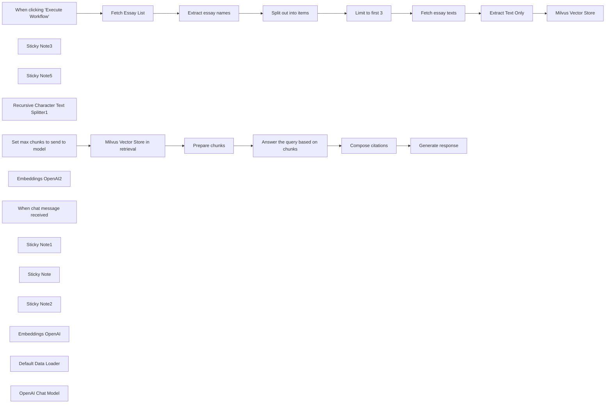

## Fluxo (.json) :

```json
{
  "id": "Hjyv9FkH5Oh6Yxw4",
  "meta": {
    "instanceId": "2c4c1e23e7b067270c08aab616bada21d0c384d16f212b23cf1143c6baa09219"
  },
  "name": "Insert and retrieve documents",
  "tags": [
    {
      "id": "msnDWKHQmwMDxWQH",
      "name": "Milvus",
      "createdAt": "2025-04-16T12:48:14.539Z",
      "updatedAt": "2025-04-16T12:48:14.539Z"
    },
    {
      "id": "tnCpo8hq8uKrdASK",
      "name": "AI",
      "createdAt": "2025-04-16T12:47:57.976Z",
      "updatedAt": "2025-04-16T12:47:57.976Z"
    }
  ],
  "nodes": [
    {
      "id": "52044ccd-4e0d-4353-b612-cf8db1b55331",
      "name": "When clicking \"Execute Workflow\"",
      "type": "n8n-nodes-base.manualTrigger",
      "position": [
        -500,
        -100
      ],
      "parameters": {},
      "typeVersion": 1
    },
    {
      "id": "b6993775-d21b-4ae8-a59c-43aef2b7002b",
      "name": "Fetch Essay List",
      "type": "n8n-nodes-base.httpRequest",
      "position": [
        -220,
        -100
      ],
      "parameters": {
        "url": "http://www.paulgraham.com/articles.html",
        "options": {}
      },
      "typeVersion": 4.2
    },
    {
      "id": "cbaeb236-5c93-4b34-a06b-ff0e5de8525f",
      "name": "Extract essay names",
      "type": "n8n-nodes-base.html",
      "position": [
        -20,
        -100
      ],
      "parameters": {
        "options": {},
        "operation": "extractHtmlContent",
        "extractionValues": {
          "values": [
            {
              "key": "essay",
              "attribute": "href",
              "cssSelector": "table table a",
              "returnArray": true,
              "returnValue": "attribute"
            }
          ]
        }
      },
      "typeVersion": 1.2
    },
    {
      "id": "d92b6692-4a02-4519-b113-8a9172c71de9",
      "name": "Split out into items",
      "type": "n8n-nodes-base.splitOut",
      "position": [
        180,
        -100
      ],
      "parameters": {
        "options": {},
        "fieldToSplitOut": "essay"
      },
      "typeVersion": 1
    },
    {
      "id": "d16ba71b-10fc-454f-8bfc-a6826280a4e7",
      "name": "Fetch essay texts",
      "type": "n8n-nodes-base.httpRequest",
      "position": [
        580,
        -100
      ],
      "parameters": {
        "url": "=http://www.paulgraham.com/{{ $json.essay }}",
        "options": {}
      },
      "typeVersion": 4.2
    },
    {
      "id": "c4fa74ea-6af5-410c-bf5c-9d8d3decf31b",
      "name": "Limit to first 3",
      "type": "n8n-nodes-base.limit",
      "position": [
        380,
        -100
      ],
      "parameters": {
        "maxItems": 3
      },
      "typeVersion": 1
    },
    {
      "id": "3da8495b-62df-475d-b99d-e0f3c64266e3",
      "name": "Extract Text Only",
      "type": "n8n-nodes-base.html",
      "position": [
        900,
        -100
      ],
      "parameters": {
        "options": {},
        "operation": "extractHtmlContent",
        "extractionValues": {
          "values": [
            {
              "key": "data",
              "cssSelector": "body",
              "skipSelectors": "img,nav"
            }
          ]
        }
      },
      "typeVersion": 1.2
    },
    {
      "id": "4a9b5d5d-fc94-40b7-af0c-13d992bc1eb9",
      "name": "Sticky Note3",
      "type": "n8n-nodes-base.stickyNote",
      "position": [
        -300,
        -220
      ],
      "parameters": {
        "width": 1071.752021563343,
        "height": 285.66037735849045,
        "content": "## Scrape latest Paul Graham essays"
      },
      "typeVersion": 1
    },
    {
      "id": "b8a7a288-186f-4444-b0de-33ed90009c0a",
      "name": "Sticky Note5",
      "type": "n8n-nodes-base.stickyNote",
      "position": [
        820,
        -220
      ],
      "parameters": {
        "width": 625,
        "height": 607,
        "content": "## Load into Milvus vector store"
      },
      "typeVersion": 1
    },
    {
      "id": "c9e7b166-cc65-47e2-a437-9c00017b492a",
      "name": "Recursive Character Text Splitter1",
      "type": "@n8n/n8n-nodes-langchain.textSplitterRecursiveCharacterTextSplitter",
      "position": [
        1240,
        240
      ],
      "parameters": {
        "options": {},
        "chunkSize": 6000
      },
      "typeVersion": 1
    },
    {
      "id": "e1a75f27-7c8c-4d0d-9b0f-33fe9ec96fc6",
      "name": "Generate response",
      "type": "n8n-nodes-base.set",
      "position": [
        1240,
        560
      ],
      "parameters": {
        "options": {},
        "assignments": {
          "assignments": [
            {
              "id": "11396286-0378-4c3a-86e1-c9ef51afbfc7",
              "name": "text",
              "type": "string",
              "value": "={{ $json.answer }} {{ $if(!$json.citations.isEmpty(), \"\\n\" + $json.citations.join(\"\"), '') }}"
            }
          ]
        }
      },
      "typeVersion": 3.4
    },
    {
      "id": "8b3497ad-5bc8-44b3-bdf4-3a028fe265ce",
      "name": "Compose citations",
      "type": "n8n-nodes-base.set",
      "position": [
        1040,
        560
      ],
      "parameters": {
        "options": {},
        "assignments": {
          "assignments": [
            {
              "id": "ace6185e-8b3d-4f89-ae36-dfe0c391a0a9",
              "name": "citations",
              "type": "array",
              "value": "={{ $json.citations.map(i => '[' + $('Get top chunks matching query').all()[$json.citations].json.document.metadata.file_name + ', lines ' + $('Get top chunks matching query').all()[$json.citations].json.document.metadata['loc.lines.from'] + '-' + $('Get top chunks matching query').all()[$json.citations].json.document.metadata['loc.lines.to'] + ']') }}"
            }
          ]
        }
      },
      "typeVersion": 3.4
    },
    {
      "id": "0452cf15-145c-49dd-8803-4c8b8a7adbea",
      "name": "Answer the query based on chunks",
      "type": "@n8n/n8n-nodes-langchain.informationExtractor",
      "position": [
        680,
        560
      ],
      "parameters": {
        "text": "={{ $json.context }}\n\nQuestion: {{ $('When chat message received').first().json.chatInput }}\nHelpful Answer:",
        "options": {
          "systemPromptTemplate": "=Use the following pieces of context to answer the question at the end. If you don't know the answer, just say that you don't know, don't try to make up an answer. Important: In your response, also include the the indexes of the chunks you used to generate the answer."
        },
        "schemaType": "manual",
        "inputSchema": "{\n  \"type\": \"object\",\n  \"required\": [\"answer\", \"citations\"],\n  \"properties\": {\n    \"answer\": {\n      \"type\": \"string\"\n    },\n    \"citations\": {\n      \"type\": \"array\",\n      \"items\": {\n        \"type\": \"number\"\n      }\n    }\n  }\n}"
      },
      "typeVersion": 1
    },
    {
      "id": "d385ac35-6f94-4101-99de-5ce1991f40c4",
      "name": "Prepare chunks",
      "type": "n8n-nodes-base.code",
      "position": [
        480,
        560
      ],
      "parameters": {
        "jsCode": "let out = \"\"\nfor (const i in $input.all()) {\n  let itemText = \"--- CHUNK \" + i + \" ---\\n\"\n  itemText += $input.all()[i].json.document.pageContent + \"\\n\"\n  itemText += \"\\n\"\n  out += itemText\n}\n\nreturn {\n  'context': out\n};"
      },
      "typeVersion": 2
    },
    {
      "id": "379837f2-4f96-43ff-8e87-722cbe6d652f",
      "name": "Set max chunks to send to model",
      "type": "n8n-nodes-base.set",
      "position": [
        -300,
        560
      ],
      "parameters": {
        "options": {},
        "assignments": {
          "assignments": [
            {
              "id": "33f4addf-72f3-4618-a6ba-5b762257d723",
              "name": "chunks",
              "type": "number",
              "value": 4
            }
          ]
        },
        "includeOtherFields": true
      },
      "typeVersion": 3.4
    },
    {
      "id": "9bc391bb-df47-41df-b170-9df47a6b5e87",
      "name": "Embeddings OpenAI2",
      "type": "@n8n/n8n-nodes-langchain.embeddingsOpenAi",
      "position": [
        -100,
        780
      ],
      "parameters": {
        "model": "text-embedding-ada-002",
        "options": {}
      },
      "credentials": {
        "openAiApi": {
          "id": "hH2PTDH4fbS7fdPv",
          "name": "OpenAi account"
        }
      },
      "typeVersion": 1.2
    },
    {
      "id": "efb030f4-445b-4ba0-b5c9-95e4e5893664",
      "name": "When chat message received",
      "type": "@n8n/n8n-nodes-langchain.chatTrigger",
      "position": [
        -540,
        560
      ],
      "webhookId": "cd2703a7-f912-46fe-8787-3fb83ea116ab",
      "parameters": {
        "options": {}
      },
      "typeVersion": 1.1
    },
    {
      "id": "c74943be-0008-4d4c-9dea-598a648a97a2",
      "name": "Sticky Note1",
      "type": "n8n-nodes-base.stickyNote",
      "position": [
        -380,
        440
      ],
      "parameters": {
        "color": 7,
        "width": 1594,
        "height": 529,
        "content": ""
      },
      "typeVersion": 1
    },
    {
      "id": "2e27f3d8-e8a2-4647-80dd-f2643b224cb5",
      "name": "Milvus Vector Store in retrieval",
      "type": "@n8n/n8n-nodes-langchain.vectorStoreMilvus",
      "position": [
        0,
        560
      ],
      "parameters": {
        "mode": "load",
        "topK": 2,
        "prompt": "answer the question",
        "milvusCollection": {
          "__rl": true,
          "mode": "list",
          "value": "my_collection",
          "cachedResultName": "my_collection"
        }
      },
      "credentials": {
        "milvusApi": {
          "id": "8tMHHoLiWXIAXa7S",
          "name": "Milvus account"
        }
      },
      "typeVersion": 1.1
    },
    {
      "id": "a3cf7e0e-f681-4880-9ccf-5c42d5457c0f",
      "name": "Milvus Vector Store",
      "type": "@n8n/n8n-nodes-langchain.vectorStoreMilvus",
      "position": [
        1120,
        -100
      ],
      "parameters": {
        "mode": "insert",
        "options": {
          "clearCollection": true
        },
        "milvusCollection": {
          "__rl": true,
          "mode": "list",
          "value": "my_collection",
          "cachedResultName": "my_collection"
        }
      },
      "credentials": {
        "milvusApi": {
          "id": "8tMHHoLiWXIAXa7S",
          "name": "Milvus account"
        }
      },
      "typeVersion": 1.1
    },
    {
      "id": "4c4cc5a5-e880-466f-a298-4af53a2acbec",
      "name": "Sticky Note",
      "type": "n8n-nodes-base.stickyNote",
      "position": [
        -700,
        -260
      ],
      "parameters": {
        "width": 280,
        "height": 180,
        "content": "## Step 1\n1. Set up a Milvus server based on [this guide](https://milvus.io/docs/install_standalone-docker-compose.md). And then create a collection named `my_collection`.\n2. Click this workflow to load scrape and load Paul Graham essays to Milvus collection.\n"
      },
      "typeVersion": 1
    },
    {
      "id": "18f42da4-42ea-4eb0-9c43-ef8bd31ab7ff",
      "name": "Sticky Note2",
      "type": "n8n-nodes-base.stickyNote",
      "position": [
        -680,
        460
      ],
      "parameters": {
        "height": 120,
        "content": "## Step 2\nChat and get citations in response"
      },
      "typeVersion": 1
    },
    {
      "id": "0af427ed-d901-4192-9fdc-986a63fd585b",
      "name": "Embeddings OpenAI",
      "type": "@n8n/n8n-nodes-langchain.embeddingsOpenAi",
      "position": [
        1020,
        140
      ],
      "parameters": {
        "options": {}
      },
      "credentials": {
        "openAiApi": {
          "id": "hH2PTDH4fbS7fdPv",
          "name": "OpenAi account"
        }
      },
      "typeVersion": 1.2
    },
    {
      "id": "3603852a-bf12-4289-9733-dcd29d12a4f6",
      "name": "Default Data Loader",
      "type": "@n8n/n8n-nodes-langchain.documentDefaultDataLoader",
      "position": [
        1160,
        120
      ],
      "parameters": {
        "options": {},
        "jsonData": "={{ $('Extract Text Only').item.json.data }}",
        "jsonMode": "expressionData"
      },
      "typeVersion": 1
    },
    {
      "id": "b49eb3ae-82cb-4d87-8f22-0789b3a14d83",
      "name": "OpenAI Chat Model",
      "type": "@n8n/n8n-nodes-langchain.lmChatOpenAi",
      "position": [
        680,
        780
      ],
      "parameters": {
        "model": {
          "__rl": true,
          "mode": "list",
          "value": "gpt-4o-mini"
        },
        "options": {}
      },
      "credentials": {
        "openAiApi": {
          "id": "hH2PTDH4fbS7fdPv",
          "name": "OpenAi account"
        }
      },
      "typeVersion": 1.2
    }
  ],
  "active": false,
  "pinData": {},
  "settings": {
    "executionOrder": "v1"
  },
  "versionId": "5dc48a1d-aaf0-4052-9666-28f9e76d198c",
  "connections": {
    "Prepare chunks": {
      "main": [
        [
          {
            "node": "Answer the query based on chunks",
            "type": "main",
            "index": 0
          }
        ]
      ]
    },
    "Fetch Essay List": {
      "main": [
        [
          {
            "node": "Extract essay names",
            "type": "main",
            "index": 0
          }
        ]
      ]
    },
    "Limit to first 3": {
      "main": [
        [
          {
            "node": "Fetch essay texts",
            "type": "main",
            "index": 0
          }
        ]
      ]
    },
    "Compose citations": {
      "main": [
        [
          {
            "node": "Generate response",
            "type": "main",
            "index": 0
          }
        ]
      ]
    },
    "Embeddings OpenAI": {
      "ai_embedding": [
        [
          {
            "node": "Milvus Vector Store",
            "type": "ai_embedding",
            "index": 0
          }
        ]
      ]
    },
    "Extract Text Only": {
      "main": [
        [
          {
            "node": "Milvus Vector Store",
            "type": "main",
            "index": 0
          }
        ]
      ]
    },
    "Fetch essay texts": {
      "main": [
        [
          {
            "node": "Extract Text Only",
            "type": "main",
            "index": 0
          }
        ]
      ]
    },
    "OpenAI Chat Model": {
      "ai_languageModel": [
        [
          {
            "node": "Answer the query based on chunks",
            "type": "ai_languageModel",
            "index": 0
          }
        ]
      ]
    },
    "Embeddings OpenAI2": {
      "ai_embedding": [
        [
          {
            "node": "Milvus Vector Store in retrieval",
            "type": "ai_embedding",
            "index": 0
          }
        ]
      ]
    },
    "Default Data Loader": {
      "ai_document": [
        [
          {
            "node": "Milvus Vector Store",
            "type": "ai_document",
            "index": 0
          }
        ]
      ]
    },
    "Extract essay names": {
      "main": [
        [
          {
            "node": "Split out into items",
            "type": "main",
            "index": 0
          }
        ]
      ]
    },
    "Split out into items": {
      "main": [
        [
          {
            "node": "Limit to first 3",
            "type": "main",
            "index": 0
          }
        ]
      ]
    },
    "Set max chunks to send to model": {
      "main": [
        [
          {
            "node": "Milvus Vector Store in retrieval",
            "type": "main",
            "index": 0
          }
        ]
      ]
    },
    "Answer the query based on chunks": {
      "main": [
        [
          {
            "node": "Compose citations",
            "type": "main",
            "index": 0
          }
        ]
      ]
    },
    "Milvus Vector Store in retrieval": {
      "main": [
        [
          {
            "node": "Prepare chunks",
            "type": "main",
            "index": 0
          }
        ]
      ]
    },
    "When clicking \"Execute Workflow\"": {
      "main": [
        [
          {
            "node": "Fetch Essay List",
            "type": "main",
            "index": 0
          }
        ]
      ]
    },
    "Recursive Character Text Splitter1": {
      "ai_textSplitter": [
        [
          {
            "node": "Default Data Loader",
            "type": "ai_textSplitter",
            "index": 0
          }
        ]
      ]
    }
  }
}
```

<a id="template-760"></a>

## Template 760 - Detectar workflows que usam modelos de IA

- **Nome:** Detectar workflows que usam modelos de IA
- **Descrição:** Recupera todos os workflows, identifica nodes que referenciam parâmetros de modelo (model / modelId) e registra os dados relevantes em uma planilha do Google.
- **Funcionalidade:** • Disparo manual para iniciar a verificação: aciona o processo via teste manual.
• Recuperação de todos os workflows via API: obtém a lista completa de workflows disponíveis.
• Filtragem de workflows que contenham referências a modelo: detecta workflows cuja definição inclui modelId ou model.
• Separação e inspeção de nodes individuais: divide a lista de nodes para analisar cada um separadamente.
• Identificação de parâmetros de modelo: verifica existence e valores de model e modelId nos nodes.
• Extração de dados do nó e do workflow: monta registros com nome do nó, identificador/valor do modelo, nome do workflow, id e URL.
• Limpeza da planilha antes do salvamento: apaga dados antigos para evitar duplicação.
• Salvamento sequencial dos registros na planilha: adiciona linhas com os dados coletados para consulta posterior.
• Aviso de performance: alerta sobre possível queda de desempenho se houver muitos workflows (>100).
- **Ferramentas:** • Google Sheets (conta Google via OAuth): planilha usada para limpar e armazenar os registros sobre quais workflows e nodes estão usando quais modelos de IA.

## Fluxo visual

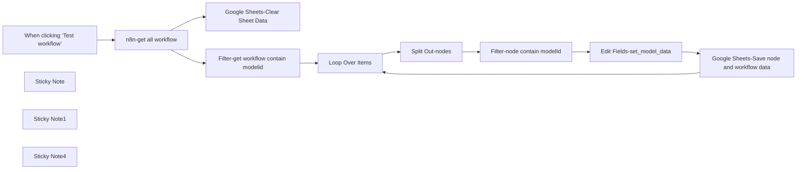

## Fluxo (.json) :

```json
{
  "id": "I2qMAcQET7isaqYD",
  "meta": {
    "instanceId": "fddb3e91967f1012c95dd02bf5ad21f279fc44715f47a7a96a33433621caa253",
    "templateCredsSetupCompleted": true
  },
  "name": "n8napi-check-workflow-which-model-is-using",
  "tags": [],
  "nodes": [
    {
      "id": "a027dc3c-b3a2-45f6-9126-dbec39f55b39",
      "name": "When clicking ‘Test workflow’",
      "type": "n8n-nodes-base.manualTrigger",
      "position": [
        -880,
        -40
      ],
      "parameters": {},
      "typeVersion": 1
    },
    {
      "id": "0aafc781-6847-4b5d-8f80-3bd457f16db3",
      "name": "Loop Over Items",
      "type": "n8n-nodes-base.splitInBatches",
      "position": [
        -220,
        -40
      ],
      "parameters": {
        "options": {}
      },
      "typeVersion": 3
    },
    {
      "id": "242d1965-d1e3-4b74-8064-53ea56118e94",
      "name": "Edit Fields-set_model_data",
      "type": "n8n-nodes-base.set",
      "position": [
        460,
        80
      ],
      "parameters": {
        "options": {},
        "assignments": {
          "assignments": [
            {
              "id": "3c08b3a3-092d-4f88-81ef-7a7b3acf47b2",
              "name": "node_name",
              "type": "string",
              "value": "={{ $json.name }}"
            },
            {
              "id": "9b060fdb-f6a6-444a-a28d-deeacb21b3d3",
              "name": "model",
              "type": "string",
              "value": "={{ $json?.parameters?.model?.value || $json?.parameters?.model ||  $json?.parameters?.modelId?.cachedResultName }}"
            },
            {
              "id": "848c0e23-0aa6-4cf5-8a64-abe38351b63a",
              "name": "workflow_name",
              "type": "string",
              "value": "={{ $('Loop Over Items').item.json.name }}"
            },
            {
              "id": "cf3fea4e-4e22-4bd5-930b-6b8d25afbf9a",
              "name": "workflow_id",
              "type": "string",
              "value": "={{ $('Loop Over Items').item.json.id }}"
            },
            {
              "id": "8a8a2a83-d742-4450-b5ed-2089047076d8",
              "name": "workflow_url",
              "type": "string",
              "value": "={Your-n8n-domain}/workflow/{{ $('Loop Over Items').item.json.id }}/{{ $json.id }}"
            }
          ]
        }
      },
      "typeVersion": 3.4
    },
    {
      "id": "9693eb8b-4ce5-4d4b-984d-a77098896bc3",
      "name": "Google Sheets-Clear Sheet Data",
      "type": "n8n-nodes-base.googleSheets",
      "position": [
        -440,
        -220
      ],
      "parameters": {
        "operation": "clear",
        "sheetName": {
          "__rl": true,
          "mode": "list",
          "value": "gid=0",
          "cachedResultUrl": "https://docs.google.com/spreadsheets/d/1iMh0C-Niu1ko4-u2BHo0cgGeVQKcYHflBzRxtbWJiRI/edit#gid=0",
          "cachedResultName": "data"
        },
        "documentId": {
          "__rl": true,
          "mode": "list",
          "value": "1iMh0C-Niu1ko4-u2BHo0cgGeVQKcYHflBzRxtbWJiRI",
          "cachedResultUrl": "https://docs.google.com/spreadsheets/d/1iMh0C-Niu1ko4-u2BHo0cgGeVQKcYHflBzRxtbWJiRI/edit?usp=drivesdk",
          "cachedResultName": "n8n-check-workflow-use-what-ai-model"
        }
      },
      "credentials": {
        "googleSheetsOAuth2Api": {
          "id": "tufEzuSTEveV3tuA",
          "name": "(Personal)Google Sheets account"
        }
      },
      "executeOnce": true,
      "typeVersion": 4.5,
      "alwaysOutputData": false
    },
    {
      "id": "d325597e-b12f-427c-ba18-f69fa6ec9ed4",
      "name": "n8n-get all workflow",
      "type": "n8n-nodes-base.n8n",
      "position": [
        -660,
        -40
      ],
      "parameters": {
        "filters": {},
        "requestOptions": {}
      },
      "credentials": {
        "n8nApi": {
          "id": "dXWG3XrAfEA64tjh",
          "name": "n8n account"
        }
      },
      "typeVersion": 1
    },
    {
      "id": "f8fba3ae-f4f3-4db3-bd0f-7caa84fd6cee",
      "name": "Filter-get workflow contain modelid",
      "type": "n8n-nodes-base.filter",
      "position": [
        -440,
        -40
      ],
      "parameters": {
        "options": {},
        "conditions": {
          "options": {
            "version": 2,
            "leftValue": "",
            "caseSensitive": true,
            "typeValidation": "strict"
          },
          "combinator": "and",
          "conditions": [
            {
              "id": "f7433843-53c6-4e77-8f51-c70921342a0f",
              "operator": {
                "type": "string",
                "operation": "contains"
              },
              "leftValue": "={{ $json.nodes.toJsonString() }}",
              "rightValue": "modelId"
            },
            {
              "id": "8a9ff036-dc80-4b55-919b-e2dba22667cf",
              "operator": {
                "type": "string",
                "operation": "notEquals"
              },
              "leftValue": "={{ $json.id }}",
              "rightValue": "={{ $workflow.id }}"
            }
          ]
        }
      },
      "typeVersion": 2.2
    },
    {
      "id": "727dd95d-c788-4cae-8b25-4ffeff705579",
      "name": "Split Out-nodes",
      "type": "n8n-nodes-base.splitOut",
      "position": [
        -40,
        80
      ],
      "parameters": {
        "options": {},
        "fieldToSplitOut": "nodes"
      },
      "typeVersion": 1,
      "alwaysOutputData": true
    },
    {
      "id": "5a9d8012-a559-4c06-a3f9-be1a7b8f7ce6",
      "name": "Filter-node contain modelId",
      "type": "n8n-nodes-base.filter",
      "position": [
        180,
        80
      ],
      "parameters": {
        "options": {},
        "conditions": {
          "options": {
            "version": 2,
            "leftValue": "",
            "caseSensitive": true,
            "typeValidation": "strict"
          },
          "combinator": "or",
          "conditions": [
            {
              "id": "5c06371f-9bc4-4fdd-bac2-9b9cdc28f77c",
              "operator": {
                "type": "string",
                "operation": "exists",
                "singleValue": true
              },
              "leftValue": "={{ $json.parameters.modelId.value.toString() }}",
              "rightValue": ""
            },
            {
              "id": "6888c3a4-c988-48a1-aefc-d359f2ffeef5",
              "operator": {
                "type": "string",
                "operation": "exists",
                "singleValue": true
              },
              "leftValue": "={{ $json.parameters.model.toString() }}",
              "rightValue": ""
            }
          ]
        }
      },
      "typeVersion": 2.2,
      "alwaysOutputData": true
    },
    {
      "id": "d4301765-8855-46fe-b2a2-06b03577a3b9",
      "name": "Google Sheets-Save node and workflow data",
      "type": "n8n-nodes-base.googleSheets",
      "position": [
        700,
        80
      ],
      "parameters": {
        "columns": {
          "value": {},
          "schema": [
            {
              "id": "node_name",
              "type": "string",
              "display": true,
              "removed": false,
              "required": false,
              "displayName": "node_name",
              "defaultMatch": false,
              "canBeUsedToMatch": true
            },
            {
              "id": "modelId_value",
              "type": "string",
              "display": true,
              "removed": false,
              "required": false,
              "displayName": "modelId_value",
              "defaultMatch": false,
              "canBeUsedToMatch": true
            },
            {
              "id": "modelId_name",
              "type": "string",
              "display": true,
              "removed": false,
              "required": false,
              "displayName": "modelId_name",
              "defaultMatch": false,
              "canBeUsedToMatch": true
            },
            {
              "id": "workflow_name",
              "type": "string",
              "display": true,
              "removed": false,
              "required": false,
              "displayName": "workflow_name",
              "defaultMatch": false,
              "canBeUsedToMatch": true
            },
            {
              "id": "workflow_id",
              "type": "string",
              "display": true,
              "removed": false,
              "required": false,
              "displayName": "workflow_id",
              "defaultMatch": false,
              "canBeUsedToMatch": true
            },
            {
              "id": "workflow_url",
              "type": "string",
              "display": true,
              "removed": false,
              "required": false,
              "displayName": "workflow_url",
              "defaultMatch": false,
              "canBeUsedToMatch": true
            }
          ],
          "mappingMode": "autoMapInputData",
          "matchingColumns": [],
          "attemptToConvertTypes": false,
          "convertFieldsToString": false
        },
        "options": {},
        "operation": "append",
        "sheetName": {
          "__rl": true,
          "mode": "list",
          "value": "gid=0",
          "cachedResultUrl": "https://docs.google.com/spreadsheets/d/1iMh0C-Niu1ko4-u2BHo0cgGeVQKcYHflBzRxtbWJiRI/edit#gid=0",
          "cachedResultName": "data"
        },
        "documentId": {
          "__rl": true,
          "mode": "list",
          "value": "1iMh0C-Niu1ko4-u2BHo0cgGeVQKcYHflBzRxtbWJiRI",
          "cachedResultUrl": "https://docs.google.com/spreadsheets/d/1iMh0C-Niu1ko4-u2BHo0cgGeVQKcYHflBzRxtbWJiRI/edit?usp=drivesdk",
          "cachedResultName": "n8n-check-workflow-use-what-ai-model"
        }
      },
      "credentials": {
        "googleSheetsOAuth2Api": {
          "id": "tufEzuSTEveV3tuA",
          "name": "(Personal)Google Sheets account"
        }
      },
      "typeVersion": 4.5
    },
    {
      "id": "78ae0f64-d6fa-46f6-a09f-e0a6bd6d21df",
      "name": "Sticky Note",
      "type": "n8n-nodes-base.stickyNote",
      "position": [
        380,
        -40
      ],
      "parameters": {
        "width": 260,
        "height": 320,
        "content": "## Change to your n8n domain here\n\n"
      },
      "typeVersion": 1
    },
    {
      "id": "2b8853d8-0436-4347-9c44-df45fcacfbd4",
      "name": "Sticky Note1",
      "type": "n8n-nodes-base.stickyNote",
      "position": [
        -920,
        -160
      ],
      "parameters": {
        "color": 3,
        "width": 420,
        "height": 320,
        "content": "## Be careful\nif you have more than 100 workflows. It might have performance issue.\n"
      },
      "typeVersion": 1
    },
    {
      "id": "611a6d7f-3955-43b5-b029-e738be2372cd",
      "name": "Sticky Note4",
      "type": "n8n-nodes-base.stickyNote",
      "position": [
        -920,
        -440
      ],
      "parameters": {
        "color": 7,
        "width": 340,
        "height": 240,
        "content": "## Created by darrell_tw_ \n\nAn engineer now focus on AI and Automation\n\n### contact me with following:\n[X](https://x.com/darrell_tw_)\n[Threads](https://www.threads.net/@darrell_tw_)\n[Instagram](https://www.instagram.com/darrell_tw_/)\n[Website](https://www.darrelltw.com/)"
      },
      "typeVersion": 1
    }
  ],
  "active": false,
  "pinData": {},
  "settings": {
    "executionOrder": "v1"
  },
  "versionId": "30ea02b5-e1a3-4789-86a3-cdd937e2ce82",
  "connections": {
    "Loop Over Items": {
      "main": [
        [],
        [
          {
            "node": "Split Out-nodes",
            "type": "main",
            "index": 0
          }
        ]
      ]
    },
    "Split Out-nodes": {
      "main": [
        [
          {
            "node": "Filter-node contain modelId",
            "type": "main",
            "index": 0
          }
        ]
      ]
    },
    "n8n-get all workflow": {
      "main": [
        [
          {
            "node": "Filter-get workflow contain modelid",
            "type": "main",
            "index": 0
          },
          {
            "node": "Google Sheets-Clear Sheet Data",
            "type": "main",
            "index": 0
          }
        ]
      ]
    },
    "Edit Fields-set_model_data": {
      "main": [
        [
          {
            "node": "Google Sheets-Save node and workflow data",
            "type": "main",
            "index": 0
          }
        ]
      ]
    },
    "Filter-node contain modelId": {
      "main": [
        [
          {
            "node": "Edit Fields-set_model_data",
            "type": "main",
            "index": 0
          }
        ]
      ]
    },
    "When clicking ‘Test workflow’": {
      "main": [
        [
          {
            "node": "n8n-get all workflow",
            "type": "main",
            "index": 0
          }
        ]
      ]
    },
    "Filter-get workflow contain modelid": {
      "main": [
        [
          {
            "node": "Loop Over Items",
            "type": "main",
            "index": 0
          }
        ]
      ]
    },
    "Google Sheets-Save node and workflow data": {
      "main": [
        [
          {
            "node": "Loop Over Items",
            "type": "main",
            "index": 0
          }
        ]
      ]
    }
  }
}
```

<a id="template-761"></a>

## Template 761 - Email com imagem embutida (CID)

- **Nome:** Email com imagem embutida (CID)
- **Descrição:** Envia um e-mail com uma imagem incorporada no corpo HTML (usando Content-ID) por meio da API do Gmail.
- **Funcionalidade:** • Gatilho manual: Inicia o fluxo ao acionar o teste manualmente.
• Configuração de mensagem: Define remetente, destinatário, assunto e corpo HTML reutilizável.
• Download de imagem remota: Recupera uma imagem a partir de uma URL externa.
• Conversão para base64: Converte o conteúdo binário da imagem para base64 para inclusão no MIME.
• Composição de mensagem MIME multipart/related: Monta o e-mail com parte HTML e anexo inline referenciado por cid:image1.
• Codificação do payload: Codifica a mensagem raw em base64 para envio compatível com a API do Gmail.
• Envio via API: Envia o e-mail usando a API do Gmail com autenticação apropriada.
- **Ferramentas:** • Gmail API: Serviço para envio de mensagens via API REST do Gmail.
• Autenticação OAuth2 do Google: Protocolo de autorização usado para conceder acesso à conta de e-mail.
• Hospedagem de imagem (URL externa): Fonte remota onde a imagem é obtida para inclusão no e-mail (ex.: thistleandrose.co.uk).


## Fluxo visual

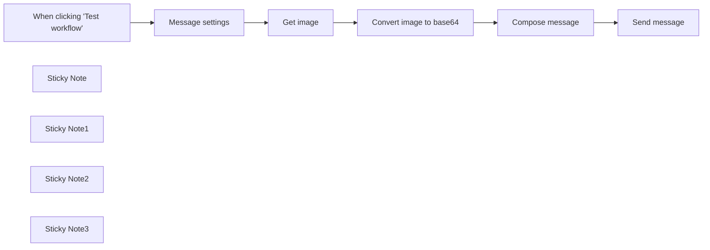

## Fluxo (.json) :

```json
{
  "meta": {
    "instanceId": "cb484ba7b742928a2048bf8829668bed5b5ad9787579adea888f05980292a4a7"
  },
  "nodes": [
    {
      "id": "e7725ddb-8cdc-4e36-8a9e-5bf079d94972",
      "name": "When clicking \"Test workflow\"",
      "type": "n8n-nodes-base.manualTrigger",
      "position": [
        460,
        460
      ],
      "parameters": {},
      "typeVersion": 1
    },
    {
      "id": "7cd477d3-e7fd-4a2b-b39e-f5b00271540a",
      "name": "Compose message",
      "type": "n8n-nodes-base.set",
      "position": [
        1340,
        460
      ],
      "parameters": {
        "options": {},
        "assignments": {
          "assignments": [
            {
              "id": "2addc1b4-68a0-4c72-87d6-d47286eef70c",
              "name": "raw",
              "type": "string",
              "value": "={{ \"From: \"+$('Message settings').item.json.from+\"\\nTo: \"+$('Message settings').item.json.to+\"\\nSubject: \"+$('Message settings').item.json.subject+\"\\nMIME-Version: 1.0\\nContent-Type: multipart/related; boundary=boundary1\\n\\n--boundary1\\nContent-Type: text/html; charset=UTF-8\\n\\n<html>\\n<body>\\n\"+$('Message settings').item.json.body_html+\"\\n</body>\\n</html>\\n\\n--boundary1\\nContent-Type: \"+$('Get image').item.binary.data.mimeType+\"\\nContent-Transfer-Encoding: base64\\nContent-Disposition: inline\\nContent-ID: <image1>\\n\\n\"+$json.chart1+\"\\n\\n--boundary1--\\n\" }}"
            }
          ]
        }
      },
      "typeVersion": 3.3
    },
    {
      "id": "4aca2efe-cf79-4cec-8912-44761595e9ea",
      "name": "Send message",
      "type": "n8n-nodes-base.httpRequest",
      "position": [
        1560,
        460
      ],
      "parameters": {
        "url": "https://www.googleapis.com/gmail/v1/users/me/messages/send",
        "body": "={ \"raw\": \"{{ $json.raw.base64Encode() }}\"}",
        "method": "POST",
        "options": {},
        "sendBody": true,
        "contentType": "raw",
        "authentication": "predefinedCredentialType",
        "rawContentType": "application/json",
        "nodeCredentialType": "gmailOAuth2"
      },
      "credentials": {
        "gmailOAuth2": {
          "id": "198",
          "name": "Gmail account (David)"
        }
      },
      "typeVersion": 4.2
    },
    {
      "id": "75ec79b0-782a-462e-8f68-5c3f6a77190a",
      "name": "Get image",
      "type": "n8n-nodes-base.httpRequest",
      "position": [
        900,
        460
      ],
      "parameters": {
        "url": "https://thistleandrose.co.uk/img/userimages/Page/0/bgmainfront.jpg",
        "options": {}
      },
      "typeVersion": 4.2
    },
    {
      "id": "23d3665c-0dfe-470c-98b6-ac67bcd186ee",
      "name": "Message settings",
      "type": "n8n-nodes-base.set",
      "position": [
        680,
        460
      ],
      "parameters": {
        "options": {},
        "assignments": {
          "assignments": [
            {
              "id": "b640b120-cf83-4141-8a74-59da3ec1bb92",
              "name": "from",
              "type": "string",
              "value": "sender@example.com"
            },
            {
              "id": "a01d10b2-a61c-4173-b31c-b24c6c0859d4",
              "name": "to",
              "type": "string",
              "value": "recipient@example.com"
            },
            {
              "id": "1173b361-ed4b-4c3d-af96-c66b9909a4c4",
              "name": "subject",
              "type": "string",
              "value": "Email with embedded image"
            },
            {
              "id": "b6c8771a-f1c9-4952-9b9d-2684a8017ff4",
              "name": "body_html",
              "type": "string",
              "value": "=<p>This email contains an embedded image:</p>\n<p></p>"
            }
          ]
        }
      },
      "typeVersion": 3.3
    },
    {
      "id": "f2586628-8664-442b-b822-2caa075f6f4d",
      "name": "Convert image to base64",
      "type": "n8n-nodes-base.extractFromFile",
      "position": [
        1120,
        460
      ],
      "parameters": {
        "options": {},
        "operation": "binaryToPropery",
        "destinationKey": "chart1"
      },
      "typeVersion": 1
    },
    {
      "id": "69de86e7-eef2-4792-81db-1fdb930c7790",
      "name": "Sticky Note",
      "type": "n8n-nodes-base.stickyNote",
      "position": [
        860,
        340
      ],
      "parameters": {
        "color": 7,
        "width": 168.75,
        "height": 281.25,
        "content": "Gets a random image from the internet. Replace this with your image (should be called 'data')"
      },
      "typeVersion": 1
    },
    {
      "id": "9bf60739-3388-4394-bec4-542ec3fddbb8",
      "name": "Sticky Note1",
      "type": "n8n-nodes-base.stickyNote",
      "position": [
        1520,
        340
      ],
      "parameters": {
        "color": 7,
        "width": 168.75,
        "height": 281.25,
        "content": "We use an HTTP node rather than the Gmail node. Add your Gmail creds here"
      },
      "typeVersion": 1
    },
    {
      "id": "2700414e-3fb1-45de-9550-c1ffb5702b94",
      "name": "Sticky Note2",
      "type": "n8n-nodes-base.stickyNote",
      "position": [
        640,
        340
      ],
      "parameters": {
        "color": 7,
        "width": 168.75,
        "height": 281.25,
        "content": "To use the image in the body of the email, insert "
      },
      "typeVersion": 1
    },
    {
      "id": "81d9af8b-b232-4d15-8c7a-c773a2fb7aa8",
      "name": "Sticky Note3",
      "type": "n8n-nodes-base.stickyNote",
      "position": [
        160,
        360
      ],
      "parameters": {
        "height": 205,
        "content": "## Try me out\n1. Make sure you add your Gmail credential in the last node\n2. Update the sender and recipient in the 'Message settings' node\n3. Click 'test workflow'"
      },
      "typeVersion": 1
    }
  ],
  "pinData": {},
  "connections": {
    "Get image": {
      "main": [
        [
          {
            "node": "Convert image to base64",
            "type": "main",
            "index": 0
          }
        ]
      ]
    },
    "Compose message": {
      "main": [
        [
          {
            "node": "Send message",
            "type": "main",
            "index": 0
          }
        ]
      ]
    },
    "Message settings": {
      "main": [
        [
          {
            "node": "Get image",
            "type": "main",
            "index": 0
          }
        ]
      ]
    },
    "Convert image to base64": {
      "main": [
        [
          {
            "node": "Compose message",
            "type": "main",
            "index": 0
          }
        ]
      ]
    },
    "When clicking \"Test workflow\"": {
      "main": [
        [
          {
            "node": "Message settings",
            "type": "main",
            "index": 0
          }
        ]
      ]
    }
  }
}
```
