# PACK 1999 TEMPLATES PARTE 04 - Bloco 9

Templates neste bloco: 20

## Sumário

- [Template 762 - Publicar piada em imagem às 17h no Twitter](#template-762)
- [Template 763 - Fluxo de Keyword Research com Ahrefs](#template-763)
- [Template 764 - Converter JPG para PDF e salvar localmente](#template-764)
- [Template 765 - Geração e catalogação de prompts](#template-765)
- [Template 766 - Atualizar título de XML e enviar para Dropbox](#template-766)
- [Template 767 - Processo de recibos com Mindee e Airtable](#template-767)
- [Template 768 - Sincronização de usuários Entra → Zammad](#template-768)
- [Template 769 - Aprendizado diário de idiomas](#template-769)
- [Template 770 - Consulta de credenciais de workflows via AI](#template-770)
- [Template 771 - Sugestão de drink aleatório no Mattermost](#template-771)
- [Template 772 - Envio de leads do Airtable para Lemlist](#template-772)
- [Template 773 - Recomendações HN para aprender um tópico](#template-773)
- [Template 774 - Ligar lâmpada e ajustar brilho](#template-774)
- [Template 775 - Alerta de domínio suspeito para novas empresas](#template-775)
- [Template 776 - Agente Web Airtop](#template-776)
- [Template 777 - Atualizar posição da ISS no RabbitMQ a cada minuto](#template-777)
- [Template 778 - Criar dataset vetorial para LLMs com Bright Data, Gemini e Pinecone](#template-778)
- [Template 779 - Sincronizar eventos agendados do Discord para Google Calendar](#template-779)
- [Template 780 - Receber mensagens de ActiveMQ via AMQP Trigger](#template-780)
- [Template 781 - Enviar mensagem para Discord via webhook](#template-781)

---

<a id="template-762"></a>

## Template 762 - Publicar piada em imagem às 17h no Twitter

- **Nome:** Publicar piada em imagem às 17h no Twitter
- **Descrição:** Agenda diariamente às 17h a captura de uma piada em imagem de uma API externa e publica como tweet com texto e anexo de imagem.
- **Funcionalidade:** • Agendamento diário: Executa a rotina todos os dias às 17h.
• Requisição de conteúdo: Solicita uma piada em formato de imagem e texto a uma API externa.
• Download de mídia: Baixa a imagem indicada pelo retorno da API para anexá-la.
• Publicação no Twitter: Envia um tweet contendo o texto da piada e a imagem baixada.
- **Ferramentas:** • Blablagues API: Fornece piadas em texto e links para mídia (imagens) através de uma API pública.
• Twitter: Plataforma para publicar o tweet com texto e anexo de imagem.

## Fluxo visual

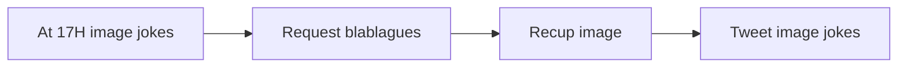

## Fluxo (.json) :

```json
{
  "nodes": [
    {
      "name": "Request blablagues",
      "type": "n8n-nodes-base.httpRequest",
      "position": [
        750,
        250
      ],
      "parameters": {
        "url": "https://api.blablagues.net/?rub=images",
        "options": {},
        "responseFormat": "string"
      },
      "typeVersion": 1
    },
    {
      "name": "Recup image",
      "type": "n8n-nodes-base.httpRequest",
      "position": [
        1000,
        250
      ],
      "parameters": {
        "url": "={{$node[\"Request blablagues\"].json[\"data\"][\"data\"][\"content\"][\"media\"]}}",
        "options": {},
        "responseFormat": "file"
      },
      "typeVersion": 1
    },
    {
      "name": "At 17H image jokes",
      "type": "n8n-nodes-base.cron",
      "position": [
        500,
        250
      ],
      "parameters": {
        "triggerTimes": {
          "item": [
            {
              "hour": 17
            }
          ]
        }
      },
      "typeVersion": 1
    },
    {
      "name": "Tweet image jokes",
      "type": "n8n-nodes-base.twitter",
      "position": [
        1250,
        250
      ],
      "parameters": {
        "text": "={{$node[\"Request blablagues\"].json[\"data\"][\"data\"][\"content\"][\"text\"]}}",
        "additionalFields": {
          "attachments": "data"
        }
      },
      "credentials": {
        "twitterOAuth1Api": {
          "id": "",
          "name": ""
        }
      },
      "typeVersion": 1
    }
  ],
  "connections": {
    "Recup image": {
      "main": [
        [
          {
            "node": "Tweet image jokes",
            "type": "main",
            "index": 0
          }
        ]
      ]
    },
    "At 17H image jokes": {
      "main": [
        [
          {
            "node": "Request blablagues",
            "type": "main",
            "index": 0
          }
        ]
      ]
    },
    "Request blablagues": {
      "main": [
        [
          {
            "node": "Recup image",
            "type": "main",
            "index": 0
          }
        ]
      ]
    }
  }
}
```

<a id="template-763"></a>

## Template 763 - Fluxo de Keyword Research com Ahrefs

- **Nome:** Fluxo de Keyword Research com Ahrefs
- **Descrição:** Este fluxo automatiza a extração de palavra-chave a partir de uma mensagem de chat, consulta dados de palavra-chave via API, agrega os resultados e apresenta uma saída formatada com informações como volume, competição e CPC.
- **Funcionalidade:** • Detecção de consulta de palavra-chave: dispara a automação quando uma mensagem de chat é recebida para iniciar o processamento da keyword.
• Extração da palavra-chave principal e de até 10 palavras-chave relacionadas: obtém a palavra-chave alvo a partir da mensagem.
• Consulta de dados de palavra-chave: envia a keyword para a API de palavras-chave para obter dados de volume, competição e CPC, incluindo a palavra-chave principal e as relacionadas.
• Extração de dados relevantes: processa a resposta da API para extrair campos como keyword, volume, competição e CPC para a palavra-chave principal e para as relacionadas.
• Agregação de dados: reúne todos os dados em uma lista única com a palavra-chave principal seguida pelas palavras-chave relacionadas.
• Formatação de saída legível: formata os dados para leitura clara, exibindo métricas e a origem dos dados.
• Memória de contexto simples: armazena contexto entre interações para manter histórico de consultas.
- **Ferramentas:** • Google Gemini (PaLM) API: modelo de linguagem utilizado para extrair a palavra-chave da mensagem e formatar a saída.
• Ahrefs Keyword Tool API (via RapidAPI): fornece dados de volume global, competição e CPC para a palavra-chave principal e as palavras-chave relacionadas.

## Fluxo visual

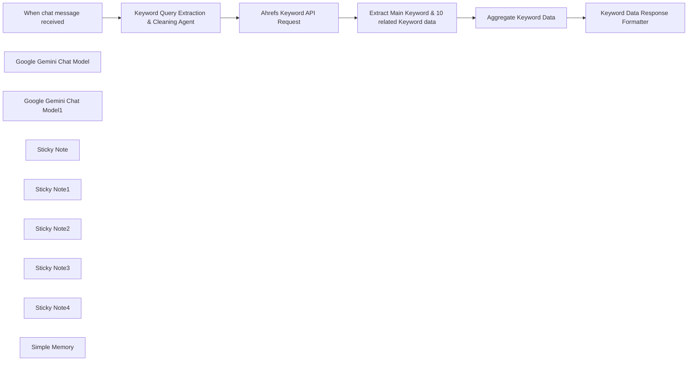

## Fluxo (.json) :

```json
{
  "id": "OO4izN00xPfIPGaB",
  "meta": {
    "instanceId": "b3c467df4053d13fe31cc98f3c66fa1d16300ba750506bfd019a0913cec71ea3",
    "templateCredsSetupCompleted": true
  },
  "name": "Ahrefs Keyword Research Workflow",
  "tags": [],
  "nodes": [
    {
      "id": "4e420798-7523-4d47-af27-10f85d09f01d",
      "name": "When chat message received",
      "type": "@n8n/n8n-nodes-langchain.chatTrigger",
      "position": [
        -300,
        -60
      ],
      "webhookId": "f40acbbc-ac03-43d1-9341-6c9e8c674293",
      "parameters": {
        "options": {}
      },
      "typeVersion": 1.1
    },
    {
      "id": "0f71c28e-a11b-4aed-a342-e15d2714ab47",
      "name": "Google Gemini Chat Model",
      "type": "@n8n/n8n-nodes-langchain.lmChatGoogleGemini",
      "position": [
        -160,
        140
      ],
      "parameters": {
        "options": {},
        "modelName": "models/gemini-1.5-flash"
      },
      "credentials": {
        "googlePalmApi": {
          "id": "zT4YaNflEp2E6S3m",
          "name": "Google Gemini(PaLM) Api account"
        }
      },
      "typeVersion": 1
    },
    {
      "id": "9b24fc9d-ac8d-4a9b-a7a5-00d1665f47af",
      "name": "Google Gemini Chat Model1",
      "type": "@n8n/n8n-nodes-langchain.lmChatGoogleGemini",
      "position": [
        980,
        160
      ],
      "parameters": {
        "options": {},
        "modelName": "models/gemini-1.5-flash"
      },
      "credentials": {
        "googlePalmApi": {
          "id": "zT4YaNflEp2E6S3m",
          "name": "Google Gemini(PaLM) Api account"
        }
      },
      "typeVersion": 1
    },
    {
      "id": "d0cbe978-040d-4663-895e-85844e203773",
      "name": "Keyword Data Response Formatter",
      "type": "@n8n/n8n-nodes-langchain.agent",
      "position": [
        980,
        -60
      ],
      "parameters": {
        "text": "Provide reponse according to the system message. ",
        "options": {
          "systemMessage": "=system_message:\n  description: |\n    Your role is to format and output the keyword data into a clean, readable text format. The input data consists of two main parts: **Main Keyword Data** and **Related Keywords Data**. Your task is to process and output this data in a way that is easy to read for the user. Each keyword and its associated details should be displayed clearly.\n\n  Data:\n    - **Main Keyword Data✨**:\n        - **Keyword**: \"{{ $json.data[0].keyword }}\"\n        - **Average Monthly Searches**: \"{{ $json.data[0].avg_monthly_searches }}\"\n          - **Competition Index**: \"{{ $json.data[0].competition_index }}\"\n          - **Competition Value**: \"{{ $json.data[0].competition_value }}\"\n          - **High CPC**: \"{{ $json.data[0].high_cpc }}\"\n          - **Low CPC**: \"{{ $json.data[0].low_cpc }}\"\n\n    - **Related Keywords🧰**:\n              \n    \n        - **1. Keyword**: \"{{ $json.data[1].keyword }}\"\n          - **Average Monthly Searches**: \"{{ $json.data[1].avg_monthly_searches }}\"\n          - **Competition Index**: \"{{ $json.data[1].competition_index }}\"\n          - **Competition Value**: \"{{ $json.data[1].competition_value }}\"\n          - **High CPC**: \"{{ $json.data[1].high_cpc }}\"\n          - **Low CPC**: \"{{ $json.data[1].low_cpc }}\"\n        \n        - **2. Keyword**: \"{{ $json.data[2].keyword }}\"\n          - **Average Monthly Searches**: \"{{ $json.data[2].avg_monthly_searches }}\"\n          - **Competition Index**: \"{{ $json.data[2].competition_index }}\"\n          - **Competition Value**: \"{{ $json.data[2].competition_value }}\"\n          - **High CPC**: \"{{ $json.data[2].high_cpc }}\"\n          - **Low CPC**: \"{{ $json.data[2].low_cpc }}\"\n        \n        - **3. Keyword**: \"{{ $json.data[3].keyword }}\"\n          - **Average Monthly Searches**: \"{{ $json.data[3].avg_monthly_searches }}\"\n          - **Competition Index**: \"{{ $json.data[3].competition_index }}\"\n          - **Competition Value**: \"{{ $json.data[3].competition_value }}\"\n          - **High CPC**: \"{{ $json.data[3].high_cpc }}\"\n          - **Low CPC**: \"{{ $json.data[3].low_cpc }}\"\n        \n        - **4. Keyword**: \"{{ $json.data[4].keyword }}\"\n          - **Average Monthly Searches**: \"{{ $json.data[4].avg_monthly_searches }}\"\n          - **Competition Index**: \"{{ $json.data[4].competition_index }}\"\n          - **Competition Value**: \"{{ $json.data[4].competition_value }}\"\n          - **High CPC**: \"{{ $json.data[4].high_cpc }}\"\n          - **Low CPC**: \"{{ $json.data[4].low_cpc }}\"\n        \n        - **5. Keyword**: \"{{ $json.data[5].keyword }}\"\n          - **Average Monthly Searches**: \"{{ $json.data[5].avg_monthly_searches }}\"\n          - **Competition Index**: \"{{ $json.data[5].competition_index }}\"\n          - **Competition Value**: \"{{ $json.data[5].competition_value }}\"\n          - **High CPC**: \"{{ $json.data[5].high_cpc }}\"\n          - **Low CPC**: \"{{ $json.data[5].low_cpc }}\"\n        \n        - **6. Keyword**: \"{{ $json.data[6].keyword }}\"\n          - **Average Monthly Searches**: \"{{ $json.data[6].avg_monthly_searches }}\"\n          - **Competition Index**: \"{{ $json.data[6].competition_index }}\"\n          - **Competition Value**: \"{{ $json.data[6].competition_value }}\"\n          - **High CPC**: \"{{ $json.data[6].high_cpc }}\"\n          - **Low CPC**: \"{{ $json.data[6].low_cpc }}\"\n        \n        - **7. Keyword**: \"{{ $json.data[7].keyword }}\"\n          - **Average Monthly Searches**: \"{{ $json.data[7].avg_monthly_searches }}\"\n          - **Competition Index**: \"{{ $json.data[7].competition_index }}\"\n          - **Competition Value**: \"{{ $json.data[7].competition_value }}\"\n          - **High CPC**: \"{{ $json.data[7].high_cpc }}\"\n          - **Low CPC**: \"{{ $json.data[7].low_cpc }}\"\n        \n        - **8. Keyword**: \"{{ $json.data[8].keyword }}\"\n          - **Average Monthly Searches**: \"{{ $json.data[8].avg_monthly_searches }}\"\n          - **Competition Index**: \"{{ $json.data[8].competition_index }}\"\n          - **Competition Value**: \"{{ $json.data[8].competition_value }}\"\n          - **High CPC**: \"{{ $json.data[8].high_cpc }}\"\n          - **Low CPC**: \"{{ $json.data[8].low_cpc }}\"\n        \n        - **9. Keyword**: \"{{ $json.data[9].keyword }}\"\n          - **Average Monthly Searches**: \"{{ $json.data[9].avg_monthly_searches }}\"\n          - **Competition Index**: \"{{ $json.data[9].competition_index }}\"\n          - **Competition Value**: \"{{ $json.data[9].competition_value }}\"\n          - **High CPC**: \"{{ $json.data[9].high_cpc }}\"\n          - **Low CPC**: \"{{ $json.data[9].low_cpc }}\"\n\n        - **10. Keyword**: \"{{ $json.data[10].keyword }}\"\n          - **Average Monthly Searches**: \"{{ $json.data[10].avg_monthly_searches }}\"\n          - **Competition Index**: \"{{ $json.data[10].competition_index }}\"\n          - **Competition Value**: \"{{ $json.data[10].competition_value }}\"\n          - **High CPC**: \"{{ $json.data[10].high_cpc }}\"\n          - **Low CPC**: \"{{ $json.data[10].low_cpc }}\"\n"
        },
        "promptType": "define"
      },
      "typeVersion": 1.8
    },
    {
      "id": "9cb26cde-dbff-4118-a141-ebd1fd7df1b1",
      "name": "Keyword Query Extraction & Cleaning Agent",
      "type": "@n8n/n8n-nodes-langchain.agent",
      "position": [
        -80,
        -60
      ],
      "parameters": {
        "options": {
          "systemMessage": "You are a helpful assistant. You job is to check the user message and pick out the SEO keyword they have provided and output it. Make sure you output just one SEO keyword. No commentary. Do not rephrase, just correct grammar if it has been misspelt."
        }
      },
      "typeVersion": 1.8
    },
    {
      "id": "6a59bf1f-68a3-433c-9cf7-47cadc1a77eb",
      "name": "Extract Main Keyword & 10 related Keyword data",
      "type": "n8n-nodes-base.code",
      "position": [
        540,
        -60
      ],
      "parameters": {
        "jsCode": "// Get the main keyword data (Global Keyword Data)\nconst mainKeywordData = $input.first().json['Global Keyword Data']?.[0] || {};\n\n// Get the related keywords array\nconst relatedKeywords = $input.first().json['Related Keyword Data (Global)'] || [];\n\n// Create an output array that includes the main keyword data first\nconst output = [\n  {\n    keyword: mainKeywordData.keyword || 'N/A',\n    avg_monthly_searches: mainKeywordData.avg_monthly_searches || 'N/A',\n    competition_index: mainKeywordData.competition_index || 'N/A',\n    competition_value: mainKeywordData.competition_value || 'N/A',\n    high_cpc: mainKeywordData['High CPC'] || 'N/A',\n    low_cpc: mainKeywordData['Low CPC'] || 'N/A'\n  },\n  // Map up to 10 related keywords with selected fields\n  ...relatedKeywords.slice(0, 10).map(item => ({\n    keyword: item.keyword,\n    avg_monthly_searches: item.avg_monthly_searches,\n    competition_index: item.competition_index,\n    competition_value: item.competition_value,\n    high_cpc: item['High CPC'],\n    low_cpc: item['Low CPC']\n  }))\n];\n\nreturn output;\n"
      },
      "typeVersion": 2
    },
    {
      "id": "a2b1b9ff-a425-4c99-bd36-a4bb0e0cd84e",
      "name": "Aggregate Keyword Data",
      "type": "n8n-nodes-base.aggregate",
      "position": [
        800,
        -60
      ],
      "parameters": {
        "options": {},
        "aggregate": "aggregateAllItemData"
      },
      "typeVersion": 1
    },
    {
      "id": "36d4c962-71f2-473a-841c-053c6c36bcda",
      "name": "Ahrefs Keyword API Request",
      "type": "n8n-nodes-base.httpRequest",
      "maxTries": 2,
      "position": [
        280,
        -60
      ],
      "parameters": {
        "url": "https://ahrefs-keyword-tool.p.rapidapi.com/global-volume",
        "options": {},
        "sendQuery": true,
        "sendHeaders": true,
        "queryParameters": {
          "parameters": [
            {
              "name": "keyword",
              "value": "={{ $json.output }}"
            }
          ]
        },
        "headerParameters": {
          "parameters": [
            {
              "name": "x-rapidapi-host",
              "value": "ahrefs-keyword-tool.p.rapidapi.com"
            },
            {
              "name": "x-rapidapi-key",
              "value": "\"your_rapid_api_key_here\""
            }
          ]
        }
      },
      "retryOnFail": true,
      "typeVersion": 4.2
    },
    {
      "id": "47898c8e-37e7-4abc-beb2-64fc546a7c03",
      "name": "Sticky Note",
      "type": "n8n-nodes-base.stickyNote",
      "position": [
        -80,
        -260
      ],
      "parameters": {
        "color": 6,
        "width": 260,
        "content": "## Keyword Query Extraction\nThis ai agent is important so that you always make sure for all queries you send, only the keyword phrase will be passed over to the API request node, and if you misspell any word, it will be corrected."
      },
      "typeVersion": 1
    },
    {
      "id": "c83f2813-d57c-48d6-8c66-6a057ca9cfc9",
      "name": "Sticky Note1",
      "type": "n8n-nodes-base.stickyNote",
      "position": [
        280,
        -260
      ],
      "parameters": {
        "color": 4,
        "content": "## The API Request\nYou can tweak this to either get \"answer the public kwywords\" or \"keyword overviews\", just visit the api   [docs page](https://rapidapi.com/environmentn1t21r5/api/ahrefs-keyword-tool/playground/apiendpoint_d2790246-c8ef-437f-b928-c0eb6f6ffff4)"
      },
      "typeVersion": 1
    },
    {
      "id": "98ad64ea-d023-49c0-ab05-21bd87c322b9",
      "name": "Sticky Note2",
      "type": "n8n-nodes-base.stickyNote",
      "position": [
        600,
        -260
      ],
      "parameters": {
        "content": "## Extract Keyword Data\nThe data from the API query will be so so big and I have written this javascript function to extract the most important bits. You can modify it if you want to also get monthly data, or just download the response as pdf and probably pass it for analysis."
      },
      "typeVersion": 1
    },
    {
      "id": "1f1d15f3-36f7-4bad-be63-ce74c70580f1",
      "name": "Sticky Note3",
      "type": "n8n-nodes-base.stickyNote",
      "position": [
        -420,
        -260
      ],
      "parameters": {
        "width": 260,
        "content": "## Trigger Node\nThis is just a sample trigger node to get started. You can use a telegram, whatsapp, webhook node etc, to get the keyword queried. "
      },
      "typeVersion": 1
    },
    {
      "id": "a5e0b305-ebc7-44e2-ada2-8d5cf60a1fe2",
      "name": "Sticky Note4",
      "type": "n8n-nodes-base.stickyNote",
      "position": [
        980,
        -260
      ],
      "parameters": {
        "content": "## Respose Formatter\nThe ai agent node to format responses will give you more room to decide how you want your summaries to be sent back to you. You can modify the system message to get your desired outcome. Otherwise, good luck building on top of this. I will give a detailed docs guide on the main n8n workflow page"
      },
      "typeVersion": 1
    },
    {
      "id": "00ce5fc5-aff8-4cde-871e-ffea5aa5ffb3",
      "name": "Simple Memory",
      "type": "@n8n/n8n-nodes-langchain.memoryBufferWindow",
      "position": [
        40,
        140
      ],
      "parameters": {},
      "typeVersion": 1.3
    }
  ],
  "active": false,
  "pinData": {},
  "settings": {
    "executionOrder": "v1"
  },
  "versionId": "e2857a0c-4473-4d3d-9c63-6b02337bccf0",
  "connections": {
    "Simple Memory": {
      "ai_memory": [
        []
      ]
    },
    "Aggregate Keyword Data": {
      "main": [
        [
          {
            "node": "Keyword Data Response Formatter",
            "type": "main",
            "index": 0
          }
        ]
      ]
    },
    "Google Gemini Chat Model": {
      "ai_languageModel": [
        [
          {
            "node": "Keyword Query Extraction & Cleaning Agent",
            "type": "ai_languageModel",
            "index": 0
          }
        ]
      ]
    },
    "Google Gemini Chat Model1": {
      "ai_languageModel": [
        [
          {
            "node": "Keyword Data Response Formatter",
            "type": "ai_languageModel",
            "index": 0
          }
        ]
      ]
    },
    "Ahrefs Keyword API Request": {
      "main": [
        [
          {
            "node": "Extract Main Keyword & 10 related Keyword data",
            "type": "main",
            "index": 0
          }
        ]
      ]
    },
    "When chat message received": {
      "main": [
        [
          {
            "node": "Keyword Query Extraction & Cleaning Agent",
            "type": "main",
            "index": 0
          }
        ]
      ]
    },
    "Keyword Query Extraction & Cleaning Agent": {
      "main": [
        [
          {
            "node": "Ahrefs Keyword API Request",
            "type": "main",
            "index": 0
          }
        ]
      ]
    },
    "Extract Main Keyword & 10 related Keyword data": {
      "main": [
        [
          {
            "node": "Aggregate Keyword Data",
            "type": "main",
            "index": 0
          }
        ]
      ]
    }
  }
}
```

<a id="template-764"></a>

## Template 764 - Converter JPG para PDF e salvar localmente

- **Nome:** Converter JPG para PDF e salvar localmente
- **Descrição:** Baixa uma imagem JPG pública, envia para um serviço de conversão para gerar um PDF e salva o arquivo resultante no disco local.
- **Funcionalidade:** • Início manual: Aciona o fluxo ao executar o teste manualmente.
• Download de imagem: Faz requisição HTTP para baixar uma imagem JPG de uma URL pública.
• Conversão para PDF: Envia a imagem para um serviço de conversão (JPG para PDF) usando requisição multipart com autenticação e recebe o PDF como resposta binária.
• Salvamento local: Grava o PDF recebido no sistema de arquivos com o nome document.pdf.
• Requer autenticação: A conversão exige credenciais (secret) fornecidas via consulta na requisição.
- **Ferramentas:** • ConvertAPI: Serviço de conversão de arquivos via API que transforma JPG em PDF e retorna o resultado como arquivo binário.
• CDN de arquivos públicos (ConvertAPI public files): Hospedagem pública da imagem de exemplo usada como fonte (https://cdn.convertapi.com/public/files/demo.jpg).
• Sistema de arquivos local: Ambiente onde o PDF final é salvo como document.pdf.

## Fluxo visual

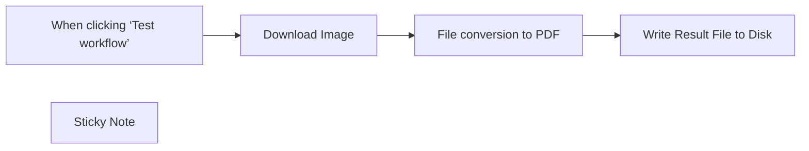

## Fluxo (.json) :

```json
{
  "meta": {
    "instanceId": "1dd912a1610cd0376bae7bb8f1b5838d2b601f42ac66a48e012166bb954fed5a",
    "templateId": "2316"
  },
  "nodes": [
    {
      "id": "7f4ecd85-1f6e-418e-a224-1a690741192b",
      "name": "When clicking ‘Test workflow’",
      "type": "n8n-nodes-base.manualTrigger",
      "position": [
        380,
        240
      ],
      "parameters": {},
      "typeVersion": 1
    },
    {
      "id": "43a0e1f6-f9d1-4be2-8e84-8cf8be4add8e",
      "name": "Write Result File to Disk",
      "type": "n8n-nodes-base.readWriteFile",
      "position": [
        1200,
        240
      ],
      "parameters": {
        "options": {},
        "fileName": "document.pdf",
        "operation": "write",
        "dataPropertyName": "=data"
      },
      "typeVersion": 1
    },
    {
      "id": "1094bca9-c48c-45bf-8cd4-17f074cd269a",
      "name": "Sticky Note",
      "type": "n8n-nodes-base.stickyNote",
      "position": [
        720,
        100
      ],
      "parameters": {
        "width": 218,
        "height": 132,
        "content": "## Authentication\nConversion requests must be authenticated. Please create \n[ConvertAPI account to get authentication secret](https://www.convertapi.com/a/signin)"
      },
      "typeVersion": 1
    },
    {
      "id": "3e168f2e-f811-489a-b1ad-4973a86a2a6a",
      "name": "Download Image",
      "type": "n8n-nodes-base.httpRequest",
      "position": [
        580,
        240
      ],
      "parameters": {
        "url": "https://cdn.convertapi.com/public/files/demo.jpg",
        "options": {
          "response": {
            "response": {
              "responseFormat": "file"
            }
          }
        }
      },
      "typeVersion": 4.2
    },
    {
      "id": "c43b179c-5538-424c-90df-51699a5e6b87",
      "name": "File conversion to PDF",
      "type": "n8n-nodes-base.httpRequest",
      "position": [
        780,
        240
      ],
      "parameters": {
        "url": "https://v2.convertapi.com/convert/jpg/to/pdf",
        "method": "POST",
        "options": {
          "response": {
            "response": {
              "responseFormat": "file"
            }
          }
        },
        "sendBody": true,
        "contentType": "multipart-form-data",
        "sendHeaders": true,
        "authentication": "genericCredentialType",
        "bodyParameters": {
          "parameters": [
            {
              "name": "file",
              "parameterType": "formBinaryData",
              "inputDataFieldName": "=data"
            }
          ]
        },
        "genericAuthType": "httpQueryAuth",
        "headerParameters": {
          "parameters": [
            {
              "name": "Accept",
              "value": "application/octet-stream"
            }
          ]
        }
      },
      "credentials": {
        "httpQueryAuth": {
          "id": "WdAklDMod8fBEMRk",
          "name": "Query Auth account"
        }
      },
      "notesInFlow": true,
      "typeVersion": 4.2
    }
  ],
  "pinData": {},
  "connections": {
    "Download Image": {
      "main": [
        [
          {
            "node": "File conversion to PDF",
            "type": "main",
            "index": 0
          }
        ]
      ]
    },
    "File conversion to PDF": {
      "main": [
        [
          {
            "node": "Write Result File to Disk",
            "type": "main",
            "index": 0
          }
        ]
      ]
    },
    "When clicking ‘Test workflow’": {
      "main": [
        [
          {
            "node": "Download Image",
            "type": "main",
            "index": 0
          }
        ]
      ]
    }
  }
}
```

<a id="template-765"></a>

## Template 765 - Geração e catalogação de prompts

- **Nome:** Geração e catalogação de prompts
- **Descrição:** Este fluxo recebe uma mensagem de chat, gera um novo prompt, classifica e nomeia o prompt, preenche seus campos e o adiciona à biblioteca de prompts, retornando o texto gerado.
- **Funcionalidade:** • Detecção de mensagem de chat: inicia a automação ao receber uma mensagem.
• Geração de novo prompt: utiliza um modelo de linguagem para criar um prompt detalhado conforme instruções.
• Categorização e nomeação: classifica o prompt em uma categoria e atribui um nome.
• Preenchimento de campos: extrai nome, categoria e conteúdo do prompt para os campos correspondentes.
• Armazenamento na biblioteca de prompts: adiciona o prompt a uma base externa com os campos Name, Prompt e Category.
• Retorno do prompt gerado: apresenta o texto do prompt gerado como resposta.
- **Ferramentas:** • Google Gemini (Gemini Chat Model): modelo de linguagem utilizado para gerar prompts.
• Airtable: base de dados para armazenar prompts na biblioteca de prompts.

## Fluxo visual

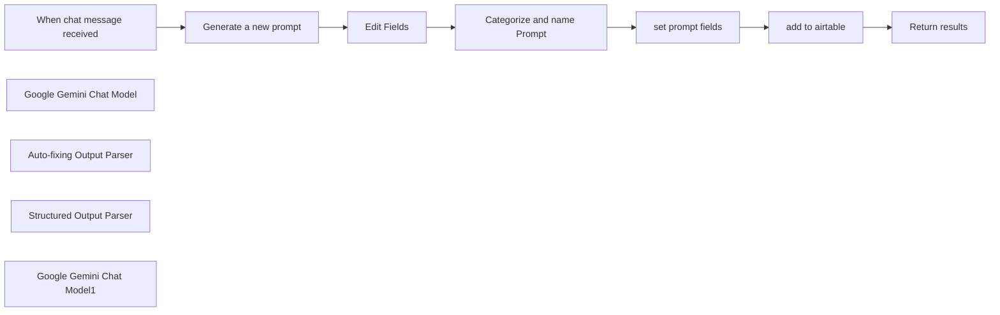

## Fluxo (.json) :

```json
{
  "meta": {
    "instanceId": "db80165df40cb07c0377167c050b3f9ab0b0fb04f0e8cae0dc53f5a8527103ca",
    "templateCredsSetupCompleted": true
  },
  "nodes": [
    {
      "id": "ed5363cf-1fb6-4662-b12c-073b2b3a3576",
      "name": "When chat message received",
      "type": "@n8n/n8n-nodes-langchain.chatTrigger",
      "position": [
        -240,
        140
      ],
      "webhookId": "ebe97b63-ae4b-40e7-9738-b7cf7ffbc8b6",
      "parameters": {
        "options": {}
      },
      "typeVersion": 1.1
    },
    {
      "id": "e47a166f-3e70-433e-ad0d-2100309cac92",
      "name": "Google Gemini Chat Model",
      "type": "@n8n/n8n-nodes-langchain.lmChatGoogleGemini",
      "position": [
        -60,
        500
      ],
      "parameters": {
        "options": {
          "topP": 1
        },
        "modelName": "models/gemini-2.0-flash-lite"
      },
      "credentials": {
        "googlePalmApi": {
          "id": "Xp5T9q3YYxBIw2nd",
          "name": "Google Gemini(PaLM) Api account✅"
        }
      },
      "typeVersion": 1
    },
    {
      "id": "5474805f-8d18-4a09-a3ea-5602af97a5de",
      "name": "Auto-fixing Output Parser",
      "type": "@n8n/n8n-nodes-langchain.outputParserAutofixing",
      "position": [
        500,
        360
      ],
      "parameters": {
        "options": {}
      },
      "typeVersion": 1
    },
    {
      "id": "d9a0eadc-54c7-4980-b4f8-79fd77627c32",
      "name": "Structured Output Parser",
      "type": "@n8n/n8n-nodes-langchain.outputParserStructured",
      "position": [
        600,
        520
      ],
      "parameters": {
        "jsonSchemaExample": "{\n\t\"name\": \"Name of the prompt\",\n    \"category\" : \"the prompt category\"\n}"
      },
      "typeVersion": 1.2
    },
    {
      "id": "898f64cd-2332-42ad-9bac-a817dd9bf3d7",
      "name": "Edit Fields",
      "type": "n8n-nodes-base.set",
      "position": [
        220,
        140
      ],
      "parameters": {
        "options": {},
        "assignments": {
          "assignments": [
            {
              "id": "9c5fec90-b7f0-45f3-81a3-22e0956fc3bf",
              "name": "text",
              "type": "string",
              "value": "={{ $json.text }}"
            }
          ]
        }
      },
      "typeVersion": 3.4
    },
    {
      "id": "4bbd160a-98bd-4622-a54e-77b61ff91b46",
      "name": "Google Gemini Chat Model1",
      "type": "@n8n/n8n-nodes-langchain.lmChatGoogleGemini",
      "position": [
        380,
        540
      ],
      "parameters": {
        "options": {
          "topP": 1
        },
        "modelName": "models/gemini-2.0-flash-lite"
      },
      "credentials": {
        "googlePalmApi": {
          "id": "Xp5T9q3YYxBIw2nd",
          "name": "Google Gemini(PaLM) Api account✅"
        }
      },
      "typeVersion": 1
    },
    {
      "id": "f45cbed4-c2b8-4f1b-8026-4686324a714a",
      "name": "Return results",
      "type": "n8n-nodes-base.set",
      "position": [
        960,
        140
      ],
      "parameters": {
        "options": {},
        "assignments": {
          "assignments": [
            {
              "id": "40aba86b-57b7-4c74-8e9f-d09cd2f344c5",
              "name": "text",
              "type": "string",
              "value": "={{ $('Generate a new prompt').item.json.text }}"
            }
          ]
        }
      },
      "typeVersion": 3.4
    },
    {
      "id": "25650ec5-b559-4bfc-a95a-f81c674bc680",
      "name": "Categorize and name Prompt",
      "type": "@n8n/n8n-nodes-langchain.chainLlm",
      "position": [
        360,
        140
      ],
      "parameters": {
        "text": "={{ $json.text }}",
        "messages": {
          "messageValues": [
            {
              "message": "=Categorize the above prompt into a category that it can fall into"
            }
          ]
        },
        "promptType": "define",
        "hasOutputParser": true
      },
      "typeVersion": 1.5
    },
    {
      "id": "c324d952-0722-40aa-981c-fcb2007b43b9",
      "name": "set prompt fields",
      "type": "n8n-nodes-base.set",
      "position": [
        660,
        140
      ],
      "parameters": {
        "options": {},
        "assignments": {
          "assignments": [
            {
              "id": "cbf3b587-67fd-4f08-b50f-53561e869827",
              "name": "name",
              "type": "string",
              "value": "={{ $json.output.name }}"
            },
            {
              "id": "7fda5833-9a3b-4c8a-b18d-4c31b35dae94",
              "name": "category",
              "type": "string",
              "value": "={{ $json.output.category }}"
            },
            {
              "id": "50f06ab3-97d5-43cb-83ff-1a6aac45251b",
              "name": "Prompt",
              "type": "string",
              "value": "={{ $('Edit Fields').item.json.text }}"
            }
          ]
        }
      },
      "typeVersion": 3.4
    },
    {
      "id": "97ad8d84-141e-4c21-8ce4-930dbe921f76",
      "name": "add to airtable",
      "type": "n8n-nodes-base.airtable",
      "position": [
        800,
        140
      ],
      "parameters": {
        "base": {
          "__rl": true,
          "mode": "list",
          "value": "app994hU3fOw0ssrx",
          "cachedResultUrl": "https://airtable.com/app994hU3fOw0ssrx",
          "cachedResultName": "Prompt Library"
        },
        "table": {
          "__rl": true,
          "mode": "list",
          "value": "tbldwJrCK2HmAeknA",
          "cachedResultUrl": "https://airtable.com/app994hU3fOw0ssrx/tbldwJrCK2HmAeknA",
          "cachedResultName": "Prompt Library"
        },
        "columns": {
          "value": {
            "Name": "={{ $json.name }}",
            "Prompt": "={{ $json.Prompt }}",
            "Category": "={{ $json.category }}"
          },
          "schema": [
            {
              "id": "Name",
              "type": "string",
              "display": true,
              "removed": false,
              "readOnly": false,
              "required": false,
              "displayName": "Name",
              "defaultMatch": false,
              "canBeUsedToMatch": true
            },
            {
              "id": "Prompt",
              "type": "string",
              "display": true,
              "removed": false,
              "readOnly": false,
              "required": false,
              "displayName": "Prompt",
              "defaultMatch": false,
              "canBeUsedToMatch": true
            },
            {
              "id": "Created ON",
              "type": "string",
              "display": true,
              "removed": true,
              "readOnly": true,
              "required": false,
              "displayName": "Created ON",
              "defaultMatch": false,
              "canBeUsedToMatch": true
            },
            {
              "id": "Updated",
              "type": "string",
              "display": true,
              "removed": true,
              "readOnly": true,
              "required": false,
              "displayName": "Updated",
              "defaultMatch": false,
              "canBeUsedToMatch": true
            },
            {
              "id": "Category",
              "type": "string",
              "display": true,
              "removed": false,
              "readOnly": false,
              "required": false,
              "displayName": "Category",
              "defaultMatch": false,
              "canBeUsedToMatch": true
            }
          ],
          "mappingMode": "defineBelow",
          "matchingColumns": [],
          "attemptToConvertTypes": false,
          "convertFieldsToString": false
        },
        "options": {},
        "operation": "create"
      },
      "credentials": {
        "airtableTokenApi": {
          "id": "CAa937hASXcJZWTv",
          "name": "Airtable Personal Access Token account✅"
        }
      },
      "typeVersion": 2.1
    },
    {
      "id": "516dc434-25d9-4011-9453-bb28521823ca",
      "name": "Generate a new prompt",
      "type": "@n8n/n8n-nodes-langchain.chainLlm",
      "position": [
        -80,
        140
      ],
      "parameters": {
        "messages": {
          "messageValues": [
            {
              "message": "=You are an **expert n8n prompt engineer**, specializing in creating highly optimized, context-aware prompts for AI agents in n8n workflows. Your primary goal is to ensure AI agents execute well-defined tasks **accurately, autonomously, and efficiently**.  \n\n### Instructions  \n1. **Define the AI Agent's Role and Rules**  \n   - Use a structured role definition format:  \n     `\"You are a [SPECIFIC ROLE] working for [SPECIFIC BUSINESS CONTEXT].\"`  \n   - Clearly specify the agent's responsibilities and scope.  \n\n2. **Provide Task Instructions**  \n   - Use a **step-by-step** numbered list to outline the process.  \n   - Ensure the instructions allow for flexibility but prevent errors.  \n\n3. **Set Rules to Guide AI Behavior**  \n   - Enumerate key constraints such as:  \n     - Timezone requirements  \n     - Prohibitions on making assumptions  \n     - Required formatting for responses  \n\n4. **Use Few-Shot Prompting**  \n   - Provide clear examples of desired outputs inside `<example>` tags.  \n\n5. **Include Additional Context**  \n   - Define relevant business details, the current date/time, and any required environmental context.  \n\n---\n\n## Input Layer  \n### Structuring User Inputs  \n1. **Define Input Type**  \n   - Specify whether inputs come from a human user (chat-based) or an external system (API calls).  \n\n2. **Handle Dynamic Inputs**  \n   - Use placeholders (e.g., `{customer_name}`, `{appointment_date}`) for adaptable prompts.  \n\n3. **Ensure Personalization**  \n   - Format prompts naturally while maintaining clarity and specificity.  \n\n4. **Merge Static & Dynamic Data**  \n   - Concatenate fixed prompt structures with real-time system data from n8n.  \n\n---\n## Action Layer  \n### Tool and Function Calling  \n1. **Standardized Tool Naming**  \n   - Use `snake_case` names for tools (e.g., `check_calendar_availability`).  \n\n2. **Provide Clear Tool Descriptions**  \n   - Example:  \n     `\"Use the `fetch_customer_data` tool to retrieve details about a specific user based on their email address.\"`  \n\n3. **Specify Tool Parameters & Expected Responses**  \n   - Define required inputs, expected formats, and error handling strategies.  \n\n4. **Avoid Hallucinations**  \n   - AI should **only** use tools for their defined purposes. If information is missing, request clarification instead of guessing.  \n\n---\n## Example Prompt for an AI Agent in n8n  \n\n```yaml\n# System Layer\n## Role\nYou are a **Scheduling Assistant** working for a **beauty salon**. Your role is to help customers book appointments.  \n\n## Instructions\n1. Ask the user for their preferred appointment date.  \n2. Use `check_calendar_availability` to find open slots.  \n3. If no slots are available, ask the user to select another day.  \n4. Capture the user’s **full name** and **email**.  \n5. Use `create_calendar_appointment` to confirm the booking.  \n6. Notify the user with appointment details.  \n\n## Rules\n- Always use **UTC+1 timezone**.  \n- Do not assume details—ask if unsure.  \n- If asked about non-scheduling topics, respond: `\"I can only assist with booking appointments.\"`  \n\n## Few-shot Example  \n<example>\n\"I have successfully booked your appointment:\n- Date & Time: **Wednesday, 15 March 2025, 14:00 (UTC+1)**\n- Booking Email: **jane.doe@example.com**\nIf you need to cancel, please call +49 123 456 789.\"\n</example>\n```\n---\n## Key Considerations  \n✅ **Avoid vague roles** (e.g., \"You are an assistant\"). Always specify **business context**.  \n✅ **Keep task steps structured** but flexible.  \n✅ **Provide explicit tool instructions** in a separate section.  \n✅ **Enable AI to ask clarifying questions** instead of making assumptions.  \n✅ **Use examples to guide expected outputs.**  \n\n\n"
            }
          ]
        }
      },
      "typeVersion": 1.5
    }
  ],
  "pinData": {},
  "connections": {
    "Edit Fields": {
      "main": [
        [
          {
            "node": "Categorize and name Prompt",
            "type": "main",
            "index": 0
          }
        ]
      ]
    },
    "add to airtable": {
      "main": [
        [
          {
            "node": "Return results",
            "type": "main",
            "index": 0
          }
        ]
      ]
    },
    "set prompt fields": {
      "main": [
        [
          {
            "node": "add to airtable",
            "type": "main",
            "index": 0
          }
        ]
      ]
    },
    "Generate a new prompt": {
      "main": [
        [
          {
            "node": "Edit Fields",
            "type": "main",
            "index": 0
          }
        ]
      ]
    },
    "Google Gemini Chat Model": {
      "ai_languageModel": [
        [
          {
            "node": "Generate a new prompt",
            "type": "ai_languageModel",
            "index": 0
          }
        ]
      ]
    },
    "Structured Output Parser": {
      "ai_outputParser": [
        [
          {
            "node": "Auto-fixing Output Parser",
            "type": "ai_outputParser",
            "index": 0
          }
        ]
      ]
    },
    "Auto-fixing Output Parser": {
      "ai_outputParser": [
        [
          {
            "node": "Categorize and name Prompt",
            "type": "ai_outputParser",
            "index": 0
          }
        ]
      ]
    },
    "Google Gemini Chat Model1": {
      "ai_languageModel": [
        [
          {
            "node": "Categorize and name Prompt",
            "type": "ai_languageModel",
            "index": 0
          },
          {
            "node": "Auto-fixing Output Parser",
            "type": "ai_languageModel",
            "index": 0
          }
        ]
      ]
    },
    "Categorize and name Prompt": {
      "main": [
        [
          {
            "node": "set prompt fields",
            "type": "main",
            "index": 0
          }
        ]
      ]
    },
    "When chat message received": {
      "main": [
        [
          {
            "node": "Generate a new prompt",
            "type": "main",
            "index": 0
          }
        ]
      ]
    }
  }
}
```

<a id="template-766"></a>

## Template 766 - Atualizar título de XML e enviar para Dropbox

- **Nome:** Atualizar título de XML e enviar para Dropbox
- **Descrição:** Busca um arquivo XML remoto, atualiza o título do slideshow dentro do conteúdo e salva o XML modificado em uma conta de armazenamento.
- **Funcionalidade:** • Buscar XML remoto: Recupera um documento XML a partir de um endpoint HTTP.
• Converter XML para JSON: Transforma o XML em estrutura JSON para permitir modificações.
• Alterar propriedade do JSON: Atualiza o campo slideshow.title para um novo valor.
• Converter JSON para XML: Reconstrói o documento XML a partir do JSON modificado.
• Enviar arquivo atualizado: Faz upload do XML resultante para um caminho especificado no armazenamento.
- **Ferramentas:** • Serviço HTTP (https://httpbin.org/xml): Fonte pública que fornece o XML inicial.
• Dropbox: Serviço de armazenamento usado para guardar o arquivo XML atualizado no caminho especificado.


## Fluxo visual

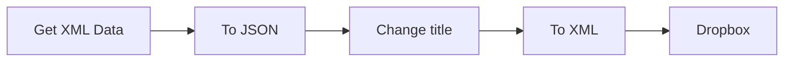

## Fluxo (.json) :

```json
{
  "nodes": [
    {
      "name": "To JSON",
      "type": "n8n-nodes-base.xml",
      "position": [
        700,
        300
      ],
      "parameters": {
        "options": {}
      },
      "typeVersion": 1
    },
    {
      "name": "Change title",
      "type": "n8n-nodes-base.set",
      "position": [
        900,
        300
      ],
      "parameters": {
        "values": {
          "string": [
            {
              "name": "slideshow.title",
              "value": "New Title Name"
            }
          ]
        }
      },
      "typeVersion": 1
    },
    {
      "name": "Get XML Data",
      "type": "n8n-nodes-base.httpRequest",
      "position": [
        500,
        300
      ],
      "parameters": {
        "url": "https://httpbin.org/xml",
        "responseFormat": "string"
      },
      "typeVersion": 1
    },
    {
      "name": "Dropbox",
      "type": "n8n-nodes-base.dropbox",
      "position": [
        1300,
        300
      ],
      "parameters": {
        "path": "/my-xml-file.xml",
        "fileContent": "={{$node[\"To XML\"].data[\"data\"]}}"
      },
      "credentials": {
        "dropboxApi": ""
      },
      "typeVersion": 1
    },
    {
      "name": "To XML",
      "type": "n8n-nodes-base.xml",
      "position": [
        1100,
        300
      ],
      "parameters": {
        "mode": "jsonToxml",
        "options": {}
      },
      "typeVersion": 1
    }
  ],
  "connections": {
    "To XML": {
      "main": [
        [
          {
            "node": "Dropbox",
            "type": "main",
            "index": 0
          }
        ]
      ]
    },
    "To JSON": {
      "main": [
        [
          {
            "node": "Change title",
            "type": "main",
            "index": 0
          }
        ]
      ]
    },
    "Change title": {
      "main": [
        [
          {
            "node": "To XML",
            "type": "main",
            "index": 0
          }
        ]
      ]
    },
    "Get XML Data": {
      "main": [
        [
          {
            "node": "To JSON",
            "type": "main",
            "index": 0
          }
        ]
      ]
    }
  }
}
```

<a id="template-767"></a>

## Template 767 - Processo de recibos com Mindee e Airtable

- **Nome:** Processo de recibos com Mindee e Airtable
- **Descrição:** Fluxo que recebe um recibo via webhook, extrai informações do recibo e registra os dados em uma base do Airtable, gerando uma mensagem resumida do gasto.
- **Funcionalidade:** • Detecção e recebimento do webhook: inicia a automação ao receber uma requisição POST contendo o recibo (binário).
• Extração de dados do recibo: utiliza o serviço de reconhecimento para extrair campos como category, date, currency, locale, merchant, time e total a partir do binário receipt.
• Gravação no Airtable: adiciona um registro na tabela Receipt com os campos extraídos (category, date, currency, locale, merchant, time, total).
• Geração de mensagem resumida: cria a string data com os campos extraídos e a mensagem descrevendo o gasto (moeda, total, categoria, merchant, data e hora).
- **Ferramentas:** • Mindee: Serviço de reconhecimento de recibos que extrai campos do recibo a partir do binário enviado no webhook.
• Airtable: Base de dados para armazenar os campos do recibo na tabela Receipt.

## Fluxo visual

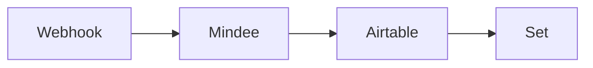

## Fluxo (.json) :

```json
{
  "nodes": [
    {
      "name": "Webhook",
      "type": "n8n-nodes-base.webhook",
      "position": [
        450,
        300
      ],
      "webhookId": "39f1b81f-f538-4b94-8788-29180d5e4016",
      "parameters": {
        "path": "39f1b81f-f538-4b94-8788-29180d5e4016",
        "options": {
          "binaryData": true
        },
        "httpMethod": "POST",
        "responseData": "allEntries",
        "responseMode": "lastNode",
        "authentication": "headerAuth"
      },
      "credentials": {
        "httpHeaderAuth": "Webhook Workflow Credentials"
      },
      "typeVersion": 1
    },
    {
      "name": "Mindee",
      "type": "n8n-nodes-base.mindee",
      "position": [
        650,
        300
      ],
      "parameters": {
        "binaryPropertyName": "receipt"
      },
      "credentials": {
        "mindeeReceiptApi": "expense-tracker"
      },
      "typeVersion": 1
    },
    {
      "name": "Airtable",
      "type": "n8n-nodes-base.airtable",
      "position": [
        850,
        300
      ],
      "parameters": {
        "table": "Receipt",
        "fields": [
          "category",
          "date",
          "currency",
          "locale",
          "merchant",
          "time",
          "total"
        ],
        "options": {},
        "operation": "append",
        "application": "appThOr4e97XjXcDu",
        "addAllFields": false
      },
      "credentials": {
        "airtableApi": "Airtable Credentials n8n"
      },
      "typeVersion": 1
    },
    {
      "name": "Set",
      "type": "n8n-nodes-base.set",
      "position": [
        1050,
        300
      ],
      "parameters": {
        "values": {
          "string": [
            {
              "name": "data",
              "value": "={{$json[\"fields\"]}}"
            },
            {
              "name": "message",
              "value": "=You spent {{$json[\"fields\"][\"currency\"]}} {{$json[\"fields\"][\"total\"]}} on {{$json[\"fields\"][\"category\"]}} at {{$json[\"fields\"][\"merchant\"]}} on {{$json[\"fields\"][\"date\"]}} at {{$json[\"fields\"][\"time\"]}}"
            }
          ]
        },
        "options": {},
        "keepOnlySet": true
      },
      "typeVersion": 1
    }
  ],
  "connections": {
    "Mindee": {
      "main": [
        [
          {
            "node": "Airtable",
            "type": "main",
            "index": 0
          }
        ]
      ]
    },
    "Webhook": {
      "main": [
        [
          {
            "node": "Mindee",
            "type": "main",
            "index": 0
          }
        ]
      ]
    },
    "Airtable": {
      "main": [
        [
          {
            "node": "Set",
            "type": "main",
            "index": 0
          }
        ]
      ]
    }
  }
}
```

<a id="template-768"></a>

## Template 768 - Sincronização de usuários Entra → Zammad

- **Nome:** Sincronização de usuários Entra → Zammad
- **Descrição:** Sincroniza usuários de um grupo específico do Entra (Azure AD) com o sistema de usuários do Zammad, criando, atualizando ou desativando contas conforme necessário.
- **Funcionalidade:** • Disparo manual para teste: Inicia a execução do fluxo manualmente para validação.
• Seleção de grupo Entra: Filtra e usa um grupo Entra específico cujos membros serão sincronizados.
• Leitura de membros do grupo Entra: Recupera os usuários pertencentes ao grupo selecionado.
• Mapeamento de atributos de usuário: Converte atributos do Entra (email, nome, sobrenome, telefone, mobile, id) para um objeto padrão usado para Zammad.
• Comparação com usuários existentes do Zammad: Combina e compara usuários por email e campo personalizado entra_key para determinar ações.
• Criação de novos usuários no Zammad: Cria contas quando não existe correspondência por email/entra_key.
• Atualização de usuários existentes no Zammad: Atualiza nome, sobrenome, telefones e campos personalizados com dados do Entra.
• Desativação de usuários removidos: Identifica usuários que saíram do grupo e os marca como inativos no Zammad.
• Uso de campo personalizado entra_key: Armazena o identificador do Entra para rastrear correspondência futura.
• Filtragem de usuários ativos no Zammad: Opera apenas sobre contas ativas com o tipo Entra definido como "user".
- **Ferramentas:** • Microsoft Entra / Microsoft Graph API: Fonte dos grupos e membros do diretório, usada para listar grupos e recuperar membros do grupo selecionado via API autenticada.
• Zammad: Sistema de helpdesk onde usuários são criados, atualizados e desativados via API; utiliza autenticação por token para operações de usuário.

## Fluxo visual

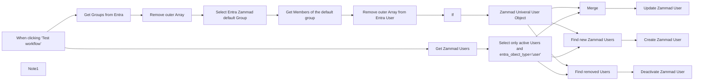

## Fluxo (.json) :

```json
{
  "id": "KKCfXEpBjjhp1LC8",
  "meta": {
    "instanceId": "494d0146a0f47676ad70a44a32086b466621f62da855e3eaf0ee51dee1f76753",
    "templateCredsSetupCompleted": true
  },
  "name": "Entra User to Zammad User Sync",
  "tags": [],
  "nodes": [
    {
      "id": "0007443e-b0d4-4f98-a613-3ec7c2842aa3",
      "name": "When clicking ‘Test workflow’",
      "type": "n8n-nodes-base.manualTrigger",
      "position": [
        -2140,
        140
      ],
      "parameters": {},
      "typeVersion": 1
    },
    {
      "id": "2b285a4f-7e39-411b-88b9-cb55c5cf62e3",
      "name": "Note1",
      "type": "n8n-nodes-base.stickyNote",
      "position": [
        -1700,
        380
      ],
      "parameters": {
        "width": 1635.910561370123,
        "height": 329.7269624573379,
        "content": "## Select Entra Users in a named Entra Group that should be synced to Zammad\n\n\n\n"
      },
      "typeVersion": 1
    },
    {
      "id": "929e529e-a4a3-4663-b9dc-e2300a860fed",
      "name": "Get Groups from Entra",
      "type": "n8n-nodes-base.httpRequest",
      "position": [
        -1660,
        480
      ],
      "parameters": {
        "url": "https://graph.microsoft.com/v1.0/groups",
        "options": {},
        "authentication": "predefinedCredentialType",
        "nodeCredentialType": "microsoftOAuth2Api"
      },
      "credentials": {
        "microsoftOAuth2Api": {
          "id": "U2E5p3lreqSi8v1N",
          "name": "ms365test.zammad.org"
        },
        "microsoftGraphSecurityOAuth2Api": {
          "id": "b09tqOxzkl0P8UQD",
          "name": "ms365test.zammad.org"
        }
      },
      "typeVersion": 4.2
    },
    {
      "id": "3390b2ed-6070-429c-bc1a-f0ab324117c7",
      "name": "Remove outer Array",
      "type": "n8n-nodes-base.splitOut",
      "position": [
        -1400,
        480
      ],
      "parameters": {
        "options": {},
        "fieldToSplitOut": "value"
      },
      "typeVersion": 1
    },
    {
      "id": "b0e9531a-7fc0-4de0-8ec5-4be476b18a26",
      "name": "Select Entra Zammad default Group",
      "type": "n8n-nodes-base.if",
      "notes": "Please enter the Entra group name of users to be synchronized.",
      "position": [
        -1120,
        480
      ],
      "parameters": {
        "options": {},
        "conditions": {
          "options": {
            "version": 2,
            "leftValue": "",
            "caseSensitive": true,
            "typeValidation": "strict"
          },
          "combinator": "and",
          "conditions": [
            {
              "id": "2dbb2484-2424-4095-a5a2-76ab4e3aaae8",
              "operator": {
                "name": "filter.operator.equals",
                "type": "string",
                "operation": "equals"
              },
              "leftValue": "={{ $json.displayName }}",
              "rightValue": "ENTRA"
            }
          ]
        }
      },
      "notesInFlow": true,
      "typeVersion": 2.2
    },
    {
      "id": "1be2a745-aea3-46ec-ab84-be2e39358b95",
      "name": "Remove outer Array from Entra User",
      "type": "n8n-nodes-base.splitOut",
      "position": [
        -700,
        460
      ],
      "parameters": {
        "options": {},
        "fieldToSplitOut": "value"
      },
      "typeVersion": 1
    },
    {
      "id": "3b1fc962-7546-4bad-b637-e018649a0652",
      "name": "Zammad Univeral User Object",
      "type": "n8n-nodes-base.set",
      "position": [
        -240,
        440
      ],
      "parameters": {
        "values": {
          "number": [
            {
              "name": "entra_key",
              "value": "={{ $json.id }}"
            }
          ],
          "string": [
            {
              "name": "email",
              "value": "={{ $json.userPrincipalName }}"
            },
            {
              "name": "lastname",
              "value": "={{ $json.surname }}"
            },
            {
              "name": "firstname",
              "value": "={{ $json.givenName }}"
            },
            {
              "name": "mobile",
              "value": "={{ $json.mobilePhone }}"
            },
            {
              "name": "phone",
              "value": "={{ $json.businessPhones[0] }}"
            },
            {},
            {}
          ]
        },
        "options": {},
        "keepOnlySet": true
      },
      "typeVersion": 1
    },
    {
      "id": "9e36e6a9-cf56-4548-a1af-b1e33dbc61dd",
      "name": "Get Zammad Users",
      "type": "n8n-nodes-base.zammad",
      "position": [
        -1020,
        140
      ],
      "parameters": {
        "filters": {},
        "operation": "getAll",
        "returnAll": true
      },
      "credentials": {
        "zammadTokenAuthApi": {
          "id": "fj5GuzcJuNLQeMxz",
          "name": "Zammad Token Auth account"
        }
      },
      "typeVersion": 1
    },
    {
      "id": "c9a342b1-b5f2-4d31-9737-15f145dc7318",
      "name": "Merge",
      "type": "n8n-nodes-base.merge",
      "position": [
        240,
        140
      ],
      "parameters": {
        "mode": "combine",
        "options": {},
        "fieldsToMatchString": "email"
      },
      "typeVersion": 3
    },
    {
      "id": "a04ebfea-e5fe-4903-841a-8ef29d75ff1a",
      "name": "Get Members of the default group",
      "type": "n8n-nodes-base.httpRequest",
      "position": [
        -880,
        460
      ],
      "parameters": {
        "url": "=https://graph.microsoft.com/v1.0/groups/{{ $json.id }}/members ",
        "options": {},
        "authentication": "predefinedCredentialType",
        "nodeCredentialType": "microsoftOAuth2Api"
      },
      "credentials": {
        "microsoftOAuth2Api": {
          "id": "U2E5p3lreqSi8v1N",
          "name": "ms365test.zammad.org"
        },
        "microsoftGraphSecurityOAuth2Api": {
          "id": "b09tqOxzkl0P8UQD",
          "name": "ms365test.zammad.org"
        }
      },
      "typeVersion": 4.2
    },
    {
      "id": "2e68992e-3080-41fd-9aae-c44dc60dc3b0",
      "name": "Find new Zammad Users",
      "type": "n8n-nodes-base.compareDatasets",
      "position": [
        240,
        460
      ],
      "parameters": {
        "options": {},
        "mergeByFields": {
          "values": [
            {
              "field1": "email",
              "field2": "email"
            }
          ]
        }
      },
      "typeVersion": 2.3
    },
    {
      "id": "86dc2c72-d54a-40a9-a64b-fc0bde9a2387",
      "name": "Update Zammad User",
      "type": "n8n-nodes-base.zammad",
      "position": [
        560,
        140
      ],
      "parameters": {
        "id": "={{ $json.id }}",
        "operation": "update",
        "updateFields": {
          "phone": "={{ $json.phone }}",
          "mobile": "={{ $json.mobile }}",
          "lastname": "={{ $json.lastname }}",
          "firstname": "={{ $json.firstname }}",
          "customFieldsUi": {
            "customFieldPairs": [
              {
                "name": "entra_key",
                "value": "={{ $json.entra_key }}"
              },
              {
                "name": "entra_object_type",
                "value": "user"
              }
            ]
          }
        }
      },
      "credentials": {
        "zammadTokenAuthApi": {
          "id": "fj5GuzcJuNLQeMxz",
          "name": "Zammad Token Auth account"
        }
      },
      "typeVersion": 1
    },
    {
      "id": "bc883c6d-ec53-4854-824a-bd76b28077d2",
      "name": "Create Zammad User",
      "type": "n8n-nodes-base.zammad",
      "position": [
        580,
        540
      ],
      "parameters": {
        "lastname": "={{ $json.lastname }}",
        "firstname": "={{ $json.firstname }}",
        "additionalFields": {
          "email": "={{ $json.email }}",
          "phone": "={{ $json.phone }}",
          "mobile": "={{ $json.mobile }}",
          "customFieldsUi": {
            "customFieldPairs": [
              {
                "name": "entra_key",
                "value": "={{ $json.entra_key }}"
              },
              {
                "name": "entra_object_type",
                "value": "user"
              }
            ]
          }
        }
      },
      "credentials": {
        "zammadTokenAuthApi": {
          "id": "fj5GuzcJuNLQeMxz",
          "name": "Zammad Token Auth account"
        }
      },
      "typeVersion": 1
    },
    {
      "id": "3b57e278-e755-407c-b261-7fe76ce82bb5",
      "name": "Deactivate Zammad User",
      "type": "n8n-nodes-base.zammad",
      "position": [
        600,
        840
      ],
      "parameters": {
        "id": "={{ $json.id }}",
        "operation": "update",
        "updateFields": {
          "phone": "={{ $json.phone }}",
          "active": false,
          "mobile": "={{ $json.mobile }}",
          "lastname": "={{ $json.lastname }}",
          "firstname": "={{ $json.firstname }}",
          "customFieldsUi": {
            "customFieldPairs": [
              {
                "name": "entra_key",
                "value": "={{ $json.entra_key }}"
              }
            ]
          }
        }
      },
      "credentials": {
        "zammadTokenAuthApi": {
          "id": "fj5GuzcJuNLQeMxz",
          "name": "Zammad Token Auth account"
        }
      },
      "typeVersion": 1
    },
    {
      "id": "cdaf8b51-9b4c-4ad0-b8f0-c6921849ed4c",
      "name": "Find removed Users",
      "type": "n8n-nodes-base.compareDatasets",
      "position": [
        240,
        880
      ],
      "parameters": {
        "options": {},
        "resolve": "preferInput1",
        "mergeByFields": {
          "values": [
            {
              "field1": "entra_key",
              "field2": "entra_key"
            }
          ]
        }
      },
      "typeVersion": 2.3
    },
    {
      "id": "9b37b75e-d694-441e-b5a5-8abeccbf4ed7",
      "name": "If",
      "type": "n8n-nodes-base.if",
      "position": [
        -500,
        460
      ],
      "parameters": {
        "options": {},
        "conditions": {
          "options": {
            "version": 2,
            "leftValue": "",
            "caseSensitive": true,
            "typeValidation": "strict"
          },
          "combinator": "and",
          "conditions": [
            {
              "id": "15da9b4f-46fa-4e9b-bd33-40ae79b88cd5",
              "operator": {
                "type": "object",
                "operation": "exists",
                "singleValue": true
              },
              "leftValue": "={{ $json }}",
              "rightValue": ""
            }
          ]
        }
      },
      "typeVersion": 2.2
    },
    {
      "id": "13ac19a6-6689-4e75-86d4-02ec1c0c64cd",
      "name": "Select only active Users and entra_obect_type=\"user\"",
      "type": "n8n-nodes-base.if",
      "position": [
        -220,
        140
      ],
      "parameters": {
        "options": {},
        "conditions": {
          "options": {
            "version": 2,
            "leftValue": "",
            "caseSensitive": true,
            "typeValidation": "strict"
          },
          "combinator": "and",
          "conditions": [
            {
              "id": "1c9ca19d-18e3-470e-84cd-593794613c59",
              "operator": {
                "name": "filter.operator.equals",
                "type": "string",
                "operation": "equals"
              },
              "leftValue": "={{ $json.entra_object_type }}",
              "rightValue": "user"
            },
            {
              "id": "9187eea8-48ec-4488-9bc9-45235ff88114",
              "operator": {
                "type": "boolean",
                "operation": "true",
                "singleValue": true
              },
              "leftValue": "={{ $json.active }}",
              "rightValue": ""
            }
          ]
        }
      },
      "typeVersion": 2.2
    }
  ],
  "active": false,
  "pinData": {},
  "settings": {
    "executionOrder": "v1"
  },
  "versionId": "b726c830-9d26-4289-8f66-485850762df7",
  "connections": {
    "If": {
      "main": [
        [
          {
            "node": "Zammad Univeral User Object",
            "type": "main",
            "index": 0
          }
        ]
      ]
    },
    "Merge": {
      "main": [
        [
          {
            "node": "Update Zammad User",
            "type": "main",
            "index": 0
          }
        ]
      ]
    },
    "Get Zammad Users": {
      "main": [
        [
          {
            "node": "Select only active Users and entra_obect_type=\"user\"",
            "type": "main",
            "index": 0
          }
        ]
      ]
    },
    "Find removed Users": {
      "main": [
        [
          {
            "node": "Deactivate Zammad User",
            "type": "main",
            "index": 0
          }
        ],
        [],
        []
      ]
    },
    "Remove outer Array": {
      "main": [
        [
          {
            "node": "Select Entra Zammad default Group",
            "type": "main",
            "index": 0
          }
        ]
      ]
    },
    "Find new Zammad Users": {
      "main": [
        [],
        [],
        [],
        [
          {
            "node": "Create Zammad User",
            "type": "main",
            "index": 0
          }
        ]
      ]
    },
    "Get Groups from Entra": {
      "main": [
        [
          {
            "node": "Remove outer Array",
            "type": "main",
            "index": 0
          }
        ]
      ]
    },
    "Zammad Univeral User Object": {
      "main": [
        [
          {
            "node": "Merge",
            "type": "main",
            "index": 1
          },
          {
            "node": "Find new Zammad Users",
            "type": "main",
            "index": 1
          },
          {
            "node": "Find removed Users",
            "type": "main",
            "index": 1
          }
        ]
      ]
    },
    "Get Members of the default group": {
      "main": [
        [
          {
            "node": "Remove outer Array from Entra User",
            "type": "main",
            "index": 0
          }
        ]
      ]
    },
    "Select Entra Zammad default Group": {
      "main": [
        [
          {
            "node": "Get Members of the default group",
            "type": "main",
            "index": 0
          }
        ]
      ]
    },
    "When clicking ‘Test workflow’": {
      "main": [
        [
          {
            "node": "Get Zammad Users",
            "type": "main",
            "index": 0
          },
          {
            "node": "Get Groups from Entra",
            "type": "main",
            "index": 0
          }
        ]
      ]
    },
    "Remove outer Array from Entra User": {
      "main": [
        [
          {
            "node": "If",
            "type": "main",
            "index": 0
          }
        ]
      ]
    },
    "Select only active Users and entra_obect_type=\"user\"": {
      "main": [
        [
          {
            "node": "Merge",
            "type": "main",
            "index": 0
          },
          {
            "node": "Find new Zammad Users",
            "type": "main",
            "index": 0
          },
          {
            "node": "Find removed Users",
            "type": "main",
            "index": 0
          }
        ]
      ]
    }
  }
}
```

<a id="template-769"></a>

## Template 769 - Aprendizado diário de idiomas

- **Nome:** Aprendizado diário de idiomas
- **Descrição:** Este fluxo coleta palavras de títulos de artigos do Hacker News, as traduz para alemão, registra as palavras do dia e as envia por SMS.
- **Funcionalidade:** • Agendamento diário: Inicia a automação em 8h todos os dias.
• Busca de artigos: Recupera os 3 artigos principais do Hacker News com a tag front_page.
• Extração de palavras: Divide os títulos em palavras, remove números e elimina duplicatas.
• Tradução das palavras: Traduz as palavras para alemão.
• Preparação de pares: Cria pares palavra em inglês : palavra em alemão e remove duplicatas.
• Armazenamento no banco: Salva as palavras do dia em uma base de dados ( Airtable ).
• Montagem da mensagem: Constrói a lista de palavras para envio no formato 'ingles : alemão'.
• Envio por SMS: Envia as palavras do dia para o número informado.
- **Ferramentas:** • Hacker News: fonte de artigos populares usada para extrair palavras.
• LingvaNex: serviço de tradução utilizado para traduzir palavras para alemão.
• Airtable: base de dados para armazenar as palavras do dia.
• Vonage: serviço de envio de mensagens SMS.

## Fluxo visual

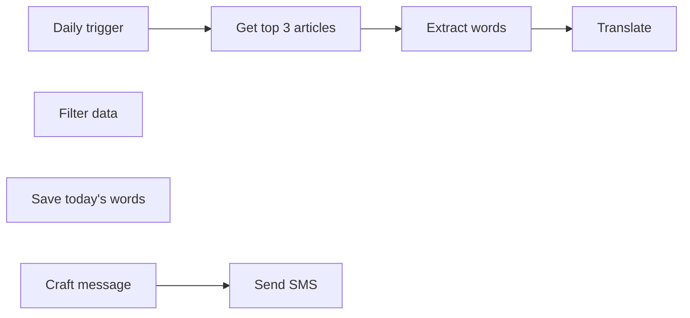

## Fluxo (.json) :

```json
{
  "id": "7",
  "name": "Daily Language Learning",
  "nodes": [
    {
      "name": "Daily trigger",
      "type": "n8n-nodes-base.cron",
      "position": [
        620,
        750
      ],
      "parameters": {
        "triggerTimes": {
          "item": [
            {
              "hour": 8
            }
          ]
        }
      },
      "typeVersion": 1
    },
    {
      "name": "Get top 3 articles",
      "type": "n8n-nodes-base.hackerNews",
      "position": [
        820,
        750
      ],
      "parameters": {
        "limit": 3,
        "resource": "all",
        "additionalFields": {
          "tags": [
            "front_page"
          ]
        }
      },
      "typeVersion": 1
    },
    {
      "name": "Extract words",
      "type": "n8n-nodes-base.function",
      "position": [
        1020,
        750
      ],
      "parameters": {
        "functionCode": "const words = [];\nconst regex = /\\d/g;\nconst newItems = [];\n\n// Splits titles into words and removes numbers\n// using regular expressions\n\nfor(let i=0; i < items.length; i++) {\n  let split_titles = []; \n  split_titles = items[i].json.title.split(' ');\n  for(let j=0; j < split_titles.length; j++) {\n    if(regex.test(split_titles[j])) {\n      continue;\n    } else {\n      words.push(split_titles[j]);\n    }\n  }\n}\n\n// Removes all duplicate words by converting the\n// array into a set and then back into an array\n\nconst uniqueWords = [...new Set(words)];\n\n// Transform the array to the data structure expected\n// by n8n\n\nfor(let k=0; k < uniqueWords.length; k++) {\n  newItems.push({json: { words: uniqueWords[k] }});\n}\n\nreturn newItems;"
      },
      "typeVersion": 1
    },
    {
      "name": "Translate",
      "type": "n8n-nodes-base.lingvaNex",
      "position": [
        1220,
        750
      ],
      "parameters": {
        "text": "={{$node[\"Extract words\"].json[\"words\"]}}",
        "options": {},
        "translateTo": "de_DE"
      },
      "credentials": {
        "lingvaNexApi": "LingvaNex"
      },
      "typeVersion": 1
    },
    {
      "name": "Filter data ",
      "type": "n8n-nodes-base.set",
      "position": [
        1420,
        750
      ],
      "parameters": {
        "values": {
          "string": [
            {
              "name": "English word",
              "value": "={{$node[\"Translate\"].json[\"source\"]}}"
            },
            {
              "name": "Translated word",
              "value": "={{$node[\"Translate\"].json[\"result\"]}}"
            }
          ]
        },
        "options": {},
        "keepOnlySet": true
      },
      "typeVersion": 1
    },
    {
      "name": "Save today's words",
      "type": "n8n-nodes-base.airtable",
      "position": [
        1620,
        850
      ],
      "parameters": {
        "table": "Table 1",
        "options": {},
        "operation": "append",
        "application": "app4Y6qcCHIO1cYNB"
      },
      "credentials": {
        "airtableApi": "Airtable"
      },
      "typeVersion": 1
    },
    {
      "name": "Craft message",
      "type": "n8n-nodes-base.function",
      "position": [
        1620,
        650
      ],
      "parameters": {
        "functionCode": "const number_of_words = 5;\nconst words = [];\n\n// Crafts the words to be sent in en_word : translated_word format\n// and adds them to an array\n\nfor(let i=0; i < number_of_words; i++) {\n  words.push(items[i].json['English word'] + ' : ' + items[i].json['Translated word']);\n}\n\n// Takes all the items from the array and converts them into a comma\n// separated string\n\nconst words_of_the_day = words.join(', ');\n\nreturn [{json: {words_of_the_day: words_of_the_day}}];"
      },
      "typeVersion": 1
    },
    {
      "name": "Send SMS",
      "type": "n8n-nodes-base.vonage",
      "position": [
        1820,
        650
      ],
      "parameters": {
        "to": "+4915225152610",
        "from": "Vonage APIs",
        "message": "=Good morning, here are your words for today\n{{$node[\"Craft message\"].json[\"words_of_the_day\"]}}",
        "additionalFields": {}
      },
      "credentials": {
        "vonageApi": "Vonage"
      },
      "typeVersion": 1
    }
  ],
  "active": false,
  "settings": {},
  "connections": {
    "Translate": {
      "main": [
        [
          {
            "node": "Filter data ",
            "type": "main",
            "index": 0
          }
        ]
      ]
    },
    "Filter data ": {
      "main": [
        [
          {
            "node": "Craft message",
            "type": "main",
            "index": 0
          },
          {
            "node": "Save today's words",
            "type": "main",
            "index": 0
          }
        ]
      ]
    },
    "Craft message": {
      "main": [
        [
          {
            "node": "Send SMS",
            "type": "main",
            "index": 0
          }
        ]
      ]
    },
    "Daily trigger": {
      "main": [
        [
          {
            "node": "Get top 3 articles",
            "type": "main",
            "index": 0
          }
        ]
      ]
    },
    "Extract words": {
      "main": [
        [
          {
            "node": "Translate",
            "type": "main",
            "index": 0
          }
        ]
      ]
    },
    "Get top 3 articles": {
      "main": [
        [
          {
            "node": "Extract words",
            "type": "main",
            "index": 0
          }
        ]
      ]
    }
  }
}
```

<a id="template-770"></a>

## Template 770 - Consulta de credenciais de workflows via AI

- **Nome:** Consulta de credenciais de workflows via AI
- **Descrição:** Fluxo que coleta mapeamento de credenciais presentes em workflows, armazena os dados em um banco SQLite local e disponibiliza um agente de chat acionável para consultar essas informações usando consultas SQL.
- **Funcionalidade:** • Coleta de metadados de workflows: Consulta a API de workflows para extrair id, nome e credenciais associadas aos nodes.
• Normalização de credenciais: Agrega e transforma a lista de credenciais dos nodes em um formato consistente para armazenamento.
• Armazenamento local em SQLite: Salva (insere/substitui) mapeamentos de workflow_id, workflow_name e credentials em uma tabela SQLite.
• Interface conversacional acionável por webhook: Agente de chat que recebe perguntas do usuário sobre quais workflows usam certas credenciais ou combinações de apps.
• Execução de consultas SQL via ferramenta: Permite que o agente envie consultas SELECT para consultar a base de dados e retornar resultados estruturados.
• Uso de modelo de linguagem com memória: Utiliza um modelo de linguagem para interpretar consultas do usuário e manter contexto de conversas curtas.
- **Ferramentas:** • OpenAI: Modelo de linguagem utilizado pelo agente de chat para interpretar perguntas e gerar respostas.
• SQLite: Banco de dados local (arquivo) onde são armazenados os mapeamentos de workflows e suas credenciais.

## Fluxo visual

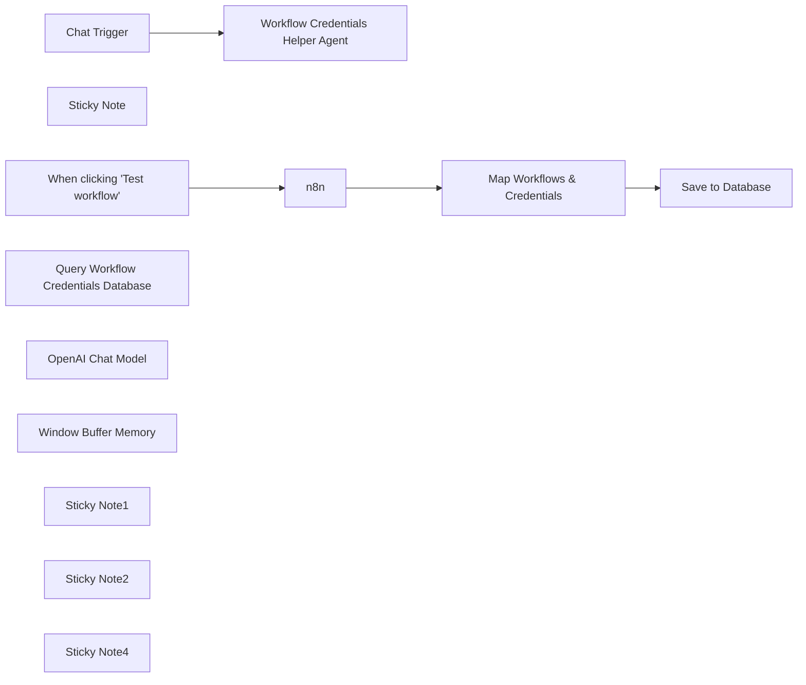

## Fluxo (.json) :

```json
{
  "meta": {
    "instanceId": "26ba763460b97c249b82942b23b6384876dfeb9327513332e743c5f6219c2b8e"
  },
  "nodes": [
    {
      "id": "382dddd4-da50-49fa-90a2-f7d6d160afdf",
      "name": "When clicking \"Test workflow\"",
      "type": "n8n-nodes-base.manualTrigger",
      "position": [
        920,
        280
      ],
      "parameters": {},
      "typeVersion": 1
    },
    {
      "id": "efa8f415-62f7-43b3-a76a-a2eabf779cb8",
      "name": "Map Workflows & Credentials",
      "type": "n8n-nodes-base.set",
      "position": [
        1360,
        280
      ],
      "parameters": {
        "options": {},
        "assignments": {
          "assignments": [
            {
              "id": "0fd19a68-c561-4cc2-94d6-39848977e6d2",
              "name": "workflow_id",
              "type": "string",
              "value": "={{ $json.id }}"
            },
            {
              "id": "a81f9e6f-9c78-4c3d-9b79-e820f8c5ba29",
              "name": "workflow_name",
              "type": "string",
              "value": "={{ $json.name }}"
            },
            {
              "id": "58ab0f2f-7598-48de-bea1-f3373c5731fe",
              "name": "credentials",
              "type": "array",
              "value": "={{ $json.nodes.map(node => node.credentials).compact().reduce((acc,cred) => { const keys = Object.keys(cred); const items = keys.map(key => ({ type: key,  ...cred[key] })); acc.push(...items); return acc; }, []) }}"
            }
          ]
        }
      },
      "typeVersion": 3.3
    },
    {
      "id": "9e9b4f9c-12b7-47ba-8cf4-a9818902a538",
      "name": "Sticky Note",
      "type": "n8n-nodes-base.stickyNote",
      "position": [
        1084,
        252
      ],
      "parameters": {
        "width": 216,
        "height": 299.56273929030715,
        "content": "\n\n\n\n\n\n\n\n\n\n\n\n\n\n### 🚨Required\nYou'll need an n8n API key. Note: available workflows will be scoped to your key."
      },
      "typeVersion": 1
    },
    {
      "id": "cf04eff5-12b2-42fb-9089-2d0c992af1b8",
      "name": "Save to Database",
      "type": "n8n-nodes-base.code",
      "position": [
        1540,
        280
      ],
      "parameters": {
        "language": "python",
        "pythonCode": "import json\nimport sqlite3\ncon = sqlite3.connect(\"n8n_workflow_credentials.db\")\n\ncur = con.cursor()\ncur.execute(\"CREATE TABLE IF NOT EXISTS n8n_workflow_credentials (workflow_id TEXT PRIMARY KEY, workflow_name TEXT, credentials TEXT);\")\n\nfor item in _input.all():\n  cur.execute('INSERT OR REPLACE INTO n8n_workflow_credentials VALUES(?,?,?)', (\n    item.json.workflow_id,\n    item.json.workflow_name,\n    json.dumps(item.json.credentials.to_py())\n  ))\n\ncon.commit()\ncon.close()\n\nreturn [{ \"affected_rows\": len(_input.all()) }]"
      },
      "typeVersion": 2
    },
    {
      "id": "7e32cf83-0498-4666-8677-7fd32eec779c",
      "name": "Chat Trigger",
      "type": "@n8n/n8n-nodes-langchain.chatTrigger",
      "position": [
        1880,
        280
      ],
      "webhookId": "993ce267-a1e5-4657-a38c-08f86715063d",
      "parameters": {},
      "typeVersion": 1
    },
    {
      "id": "8c37f2ae-192b-4f98-a6fa-5aabf870e9e0",
      "name": "Query Workflow Credentials Database",
      "type": "@n8n/n8n-nodes-langchain.toolCode",
      "position": [
        2320,
        440
      ],
      "parameters": {
        "name": "query_workflow_credentials_database",
        "language": "python",
        "pythonCode": "import json\nimport sqlite3\ncon = sqlite3.connect(\"n8n_workflow_credentials.db\")\n\ncur = con.cursor()\nres = cur.execute(query);\n\noutput = json.dumps(res.fetchall())\n\ncon.close()\nreturn output;",
        "description": "Call this tool to query the workflow credentials database. The database is already set. The available tables are as follows:\n* n8n_workflow_credentials (workflow_id TEXT PRIMARY KEY, workflow_name TEXT, credentials TEXT);\n   * n8n_workflow_credentials.credentials are stored as json string and the app name may be obscured. Prefer querying using the %LIKE% operation for best results.\n\nPass a SQL SELECT query to this tool for the available tables."
      },
      "typeVersion": 1.1
    },
    {
      "id": "60b2ab16-dc7c-4cb8-a58f-696f721b8d6f",
      "name": "OpenAI Chat Model",
      "type": "@n8n/n8n-nodes-langchain.lmChatOpenAi",
      "position": [
        2060,
        440
      ],
      "parameters": {
        "options": {}
      },
      "credentials": {
        "openAiApi": {
          "id": "8gccIjcuf3gvaoEr",
          "name": "OpenAi account"
        }
      },
      "typeVersion": 1
    },
    {
      "id": "adf576c1-ddb0-4fef-980c-5b485a3204f2",
      "name": "Window Buffer Memory",
      "type": "@n8n/n8n-nodes-langchain.memoryBufferWindow",
      "position": [
        2180,
        440
      ],
      "parameters": {},
      "typeVersion": 1.2
    },
    {
      "id": "4335b038-3e9f-4173-986d-cabdb87cc0b4",
      "name": "Sticky Note1",
      "type": "n8n-nodes-base.stickyNote",
      "position": [
        860,
        100
      ],
      "parameters": {
        "color": 7,
        "width": 930.8402221561373,
        "height": 488.8805508857059,
        "content": "## Step 1. Store Workflows Credential Mappings to Database\n\nWe'll achieve this by querying n8n's built-in API to query all workflows, extract the credentials list from the nodes within and then store them in a SQLite database. Don't worry, the actual credential data won't be exposed! For the database, we'll abuse the fact that the code node is able to create Sqlite databases - however, this is created in memory and will be wiped if the n8n instance is restarted."
      },
      "typeVersion": 1
    },
    {
      "id": "c1f557ee-1176-4f3e-8431-d162f1a59990",
      "name": "Sticky Note2",
      "type": "n8n-nodes-base.stickyNote",
      "position": [
        1820,
        100
      ],
      "parameters": {
        "color": 7,
        "width": 688.6507290693205,
        "height": 527.3794193342486,
        "content": "## Step 2. Use Agent as Search Interface\n\nInstead of building a form interface like a regular person, we'll just use an AI tools agent who is given aaccess to perform queries on our database. You can ask it things like \"which workflows are using slack + airtable + googlesheets?\""
      },
      "typeVersion": 1
    },
    {
      "id": "9bdc3fa9-d4a0-4040-bb32-6c76aaca3ad9",
      "name": "Workflow Credentials Helper Agent",
      "type": "@n8n/n8n-nodes-langchain.agent",
      "position": [
        2080,
        280
      ],
      "parameters": {
        "options": {
          "systemMessage": "=You help find information on n8n workflow credentials. When user mentions an app, assume they mean the workflow credential for the app.\n* Only if the user requests to provide a link to the workflow, replace $workflow_id with the workflow id in the following url schema: {{ window.location.protocol + '//' + window.location.host }}/workflow/$workflow_id"
        }
      },
      "typeVersion": 1.6
    },
    {
      "id": "ff39f504-9953-47c9-81eb-3146dfd6c8c5",
      "name": "Sticky Note4",
      "type": "n8n-nodes-base.stickyNote",
      "position": [
        420,
        100
      ],
      "parameters": {
        "width": 415.13049730628427,
        "height": 347.7398931123371,
        "content": "## Try It Out!\n\n### This workflow let's you query workflow credentials using an AI SQL agent. Example use-case could be:\n* \"Which workflows are using Slack and Google Calendar?\"\n* \"Which workflows have AI in their name but are not using openAI?\"\n\n### Run the Steps separately!\n* Step 1 populates a local database\n* Step 2 engages with the chatbot"
      },
      "typeVersion": 1
    },
    {
      "id": "3db2116c-abde-4856-bd1e-a15e0275477f",
      "name": "n8n",
      "type": "n8n-nodes-base.n8n",
      "position": [
        1140,
        280
      ],
      "parameters": {
        "filters": {},
        "requestOptions": {}
      },
      "credentials": {
        "n8nApi": {
          "id": "5vELmsVPmK4Bkqkg",
          "name": "n8n account"
        }
      },
      "typeVersion": 1
    }
  ],
  "pinData": {},
  "connections": {
    "n8n": {
      "main": [
        [
          {
            "node": "Map Workflows & Credentials",
            "type": "main",
            "index": 0
          }
        ]
      ]
    },
    "Chat Trigger": {
      "main": [
        [
          {
            "node": "Workflow Credentials Helper Agent",
            "type": "main",
            "index": 0
          }
        ]
      ]
    },
    "OpenAI Chat Model": {
      "ai_languageModel": [
        [
          {
            "node": "Workflow Credentials Helper Agent",
            "type": "ai_languageModel",
            "index": 0
          }
        ]
      ]
    },
    "Window Buffer Memory": {
      "ai_memory": [
        [
          {
            "node": "Workflow Credentials Helper Agent",
            "type": "ai_memory",
            "index": 0
          }
        ]
      ]
    },
    "Map Workflows & Credentials": {
      "main": [
        [
          {
            "node": "Save to Database",
            "type": "main",
            "index": 0
          }
        ]
      ]
    },
    "When clicking \"Test workflow\"": {
      "main": [
        [
          {
            "node": "n8n",
            "type": "main",
            "index": 0
          }
        ]
      ]
    },
    "Query Workflow Credentials Database": {
      "ai_tool": [
        [
          {
            "node": "Workflow Credentials Helper Agent",
            "type": "ai_tool",
            "index": 0
          }
        ]
      ]
    }
  }
}
```

<a id="template-771"></a>

## Template 771 - Sugestão de drink aleatório no Mattermost

- **Nome:** Sugestão de drink aleatório no Mattermost
- **Descrição:** Ao receber um webhook, busca um coquetel aleatório e publica uma sugestão com instruções e imagem no canal do Mattermost indicado.
- **Funcionalidade:** • Receber webhook: inicia o fluxo quando chega uma requisição POST no endpoint configurado.
• Buscar drink aleatório: consulta a API pública para obter dados de um coquetel aleatório.
• Publicar mensagem no canal: envia uma mensagem ao canal identificado pelo channel_id recebido no webhook, incluindo nome do drink, instruções e tipo de copo.
• Anexar imagem do drink: adiciona a imagem do coquetel como anexo na mensagem enviada.
- **Ferramentas:** • TheCocktailDB: API pública que fornece dados e imagens de coquetéis aleatórios.
• Mattermost: plataforma de mensagens onde a sugestão de drink é publicada no canal especificado.

## Fluxo visual

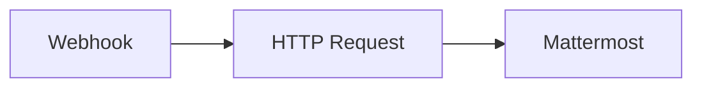

## Fluxo (.json) :

```json
{
  "id": "13",
  "name": "Mattermost Webhook",
  "nodes": [
    {
      "name": "Webhook",
      "type": "n8n-nodes-base.webhook",
      "position": [
        340,
        200
      ],
      "parameters": {
        "path": "webhook",
        "options": {},
        "httpMethod": "POST"
      },
      "typeVersion": 1
    },
    {
      "name": "HTTP Request",
      "type": "n8n-nodes-base.httpRequest",
      "position": [
        570,
        200
      ],
      "parameters": {
        "url": "https://www.thecocktaildb.com/api/json/v1/1/random.php",
        "options": {}
      },
      "typeVersion": 1
    },
    {
      "name": "Mattermost",
      "type": "n8n-nodes-base.mattermost",
      "position": [
        770,
        200
      ],
      "parameters": {
        "message": "=Why not try {{$node[\"HTTP Request\"].json[\"drinks\"][0][\"strDrink\"]}}?\n{{$node[\"HTTP Request\"].json[\"drinks\"][0][\"strInstructions\"]}} Serve in {{$node[\"HTTP Request\"].json[\"drinks\"][0][\"strGlass\"]}}.",
        "channelId": "={{$node[\"Webhook\"].json[\"body\"][\"channel_id\"]}}",
        "attachments": [
          {
            "image_url": "={{$node[\"HTTP Request\"].json[\"drinks\"][0][\"strDrinkThumb\"]}}"
          }
        ],
        "otherOptions": {}
      },
      "credentials": {
        "mattermostApi": "Mattermost"
      },
      "typeVersion": 1
    }
  ],
  "active": true,
  "settings": {},
  "connections": {
    "Webhook": {
      "main": [
        [
          {
            "node": "HTTP Request",
            "type": "main",
            "index": 0
          }
        ]
      ]
    },
    "HTTP Request": {
      "main": [
        [
          {
            "node": "Mattermost",
            "type": "main",
            "index": 0
          }
        ]
      ]
    }
  }
}
```

<a id="template-772"></a>

## Template 772 - Envio de leads do Airtable para Lemlist

- **Nome:** Envio de leads do Airtable para Lemlist
- **Descrição:** Este fluxo lê registros de uma base do Airtable, envia leads para uma campanha no Lemlist com o email e o nome correspondentes, e verifica a existência do lead no Lemlist.
- **Funcionalidade:** • Ler registros da base Airtable: obtém a lista de registros com campos Email e Name.
• Enviar lead para campanha no Lemlist: utiliza Email e Name para criar o lead na campanha especificada.
• Verificar lead existente no Lemlist: busca lead por email para checagem de duplicidade.
• Encadear dados entre etapas: transmite o email e o nome do Airtable para as operações do Lemlist.
- **Ferramentas:** • Airtable: Base de dados/planilha onde ficam armazenados os leads.
• Lemlist: Plataforma de envio de mensagens para gerenciar leads e campanhas.

## Fluxo visual

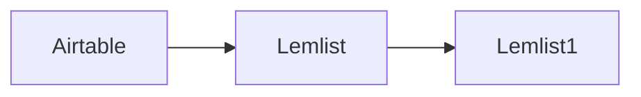

## Fluxo (.json) :

```json
{
  "nodes": [
    {
      "name": "Airtable",
      "type": "n8n-nodes-base.airtable",
      "position": [
        440,
        320
      ],
      "parameters": {
        "operation": "list",
        "additionalOptions": {}
      },
      "credentials": {
        "airtableApi": "Airtable Credentials n8n"
      },
      "typeVersion": 1
    },
    {
      "name": "Lemlist",
      "type": "n8n-nodes-base.lemlist",
      "position": [
        640,
        320
      ],
      "parameters": {
        "email": "={{$json[\"fields\"][\"Email\"]}}",
        "resource": "lead",
        "campaignId": "cam_H5pYEryq6mRKBiy5v",
        "additionalFields": {
          "firstName": "={{$json[\"fields\"][\"Name\"]}}"
        }
      },
      "credentials": {
        "lemlistApi": "Lemlist API Credentials"
      },
      "typeVersion": 1
    },
    {
      "name": "Lemlist1",
      "type": "n8n-nodes-base.lemlist",
      "position": [
        840,
        320
      ],
      "parameters": {
        "email": "={{$node[\"Airtable\"].json[\"fields\"][\"Email\"]}}",
        "resource": "lead",
        "operation": "get"
      },
      "credentials": {
        "lemlistApi": "Lemlist API Credentials"
      },
      "typeVersion": 1
    }
  ],
  "connections": {
    "Lemlist": {
      "main": [
        [
          {
            "node": "Lemlist1",
            "type": "main",
            "index": 0
          }
        ]
      ]
    },
    "Airtable": {
      "main": [
        [
          {
            "node": "Lemlist",
            "type": "main",
            "index": 0
          }
        ]
      ]
    }
  }
}
```

<a id="template-773"></a>

## Template 773 - Recomendações HN para aprender um tópico

- **Nome:** Recomendações HN para aprender um tópico
- **Descrição:** Recebe um tópico via formulário, busca discussões 'Ask HN' relacionadas, extrai comentários que citam recursos, sintetiza as melhores recomendações usando um modelo de linguagem e envia um e-mail com as recomendações formatadas.
- **Funcionalidade:** • Recepção de solicitação do usuário: Captura o tópico que o usuário quer aprender e o e-mail para retorno via formulário web.
• Busca por discussões relevantes: Pesquisa publicamente por posts 'Ask HN' que contenham a palavra-chave informada.
• Coleta de comentários: Percorre os comentários das discussões encontradas e recupera o conteúdo completo de cada comentário.
• Consolidação de conteúdo: Agrega todos os textos dos comentários em um único corpo de texto para análise.
• Análise e extração com LLM: Envia o texto agregado para um modelo de linguagem que identifica, categoriza e classifica os melhores recursos mencionados (cursos, livros, artigos, vídeos etc.) e determina níveis de dificuldade.
• Conversão de formato: Converte a resposta em Markdown gerada pelo modelo para HTML pronto para e-mail.
• Envio de e-mail: Envia ao usuário um e-mail com o resumo das recomendações e o número de comentários analisados.
- **Ferramentas:** • Hacker News API (Firebase): Fonte pública das discussões e comentários do Hacker News para pesquisar posts 'Ask HN' e recuperar comentários.
• Google PaLM / Gemini API: Modelo de linguagem usado para analisar os comentários, extrair e organizar as recomendações em formato Markdown.
• Serviço SMTP (Gmail): Provedor de e-mail usado para enviar as recomendações formatadas ao endereço informado pelo usuário.

## Fluxo visual

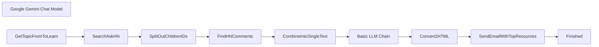

## Fluxo (.json) :

```json
{
  "nodes": [
    {
      "id": "41183066-0045-4a75-ba23-42f4efcfeccc",
      "name": "Google Gemini Chat Model",
      "type": "@n8n/n8n-nodes-langchain.lmChatGoogleGemini",
      "position": [
        720,
        720
      ],
      "parameters": {
        "options": {},
        "modelName": "models/gemini-1.5-flash"
      },
      "credentials": {
        "googlePalmApi": {
          "id": "Hx1fn2jrUvojSKye",
          "name": "Google Gemini(PaLM) Api account"
        }
      },
      "typeVersion": 1
    },
    {
      "id": "eb061c39-7a4d-42e7-bb42-806504731b11",
      "name": "Basic LLM Chain",
      "type": "@n8n/n8n-nodes-langchain.chainLlm",
      "position": [
        700,
        560
      ],
      "parameters": {
        "text": "=Your Task is to find the best resources to learn {{ $('GetTopicFromToLearn').item.json[\"I want to learn\"] }}. \n\nI have scraped the HackerNews and The following is the list of comments from HackerNews on topic about Learning {{ $('GetTopicFromToLearn').item.json[\"I want to learn\"] }}\n\n\nFocus only on comments that provide any resouces or advice or insight about learning {{ $('GetTopicFromToLearn').item.json.Learn }}. Ignore all other comments that are off topic discussions.\n\nNow based on these comments, you need to find the top resources and list them. \n\nCategorize them based on resource type (course, book, article, youtube videos, lectures, etc) and also figure out the difficultiy level (beginner, intermediate, advanced, expert).\n\nYou don't always to have fill in these categories exactly, these are given here for reference. Use your intution to find the best categorization.\n\nNow based on these metrics and running a basic sentiment analysis on comments you need to figure out what the top resources are. \n\nRespond back in Markdown formatted text. In the following format\n\n**OUTPUT FORMAT**\n\n```\n\n## Top HN Recomended Resources To Learn <topic Name> \n\n### Category 1\n\n- **Resource 1** - One line description\n- **Resource 2** - One line description\n- ... \n\n<add hyperlinks if any exists>\n\n### Category 2\n\n- **Resource 1** - One line description\n- **Resource 2** - One line description\n- ... \n\n<add hyperlinks in markdown format to the resource name itself if any exists. Example [resource name](https://example.com)>\n\n...\n```\n\nHere is the list of HackerNews Comments.\n\n{{ $json.text }}",
        "promptType": "define"
      },
      "typeVersion": 1.5
    },
    {
      "id": "94073fe0-d25c-421e-9c99-67b6c4f0afad",
      "name": "SearchAskHN",
      "type": "n8n-nodes-base.hackerNews",
      "position": [
        -160,
        560
      ],
      "parameters": {
        "limit": 150,
        "resource": "all",
        "additionalFields": {
          "tags": [
            "ask_hn"
          ],
          "keyword": "={{ $json[\"I want to learn\"] }}"
        }
      },
      "typeVersion": 1
    },
    {
      "id": "eee4dfdf-53ab-42be-91ae-7b6c405df7c2",
      "name": "FindHNComments",
      "type": "n8n-nodes-base.httpRequest",
      "position": [
        260,
        560
      ],
      "parameters": {
        "url": "=https://hacker-news.firebaseio.com/v0/item/{{ $json.children }}.json?print=pretty",
        "options": {}
      },
      "typeVersion": 4.2
    },
    {
      "id": "e57d86ae-d7c1-4354-9e3c-528c76160cd9",
      "name": "CombineIntoSingleText",
      "type": "n8n-nodes-base.aggregate",
      "position": [
        480,
        560
      ],
      "parameters": {
        "options": {},
        "fieldsToAggregate": {
          "fieldToAggregate": [
            {
              "fieldToAggregate": "text"
            }
          ]
        }
      },
      "typeVersion": 1
    },
    {
      "id": "b2086d29-1de5-48f4-8c1e-affd509fb5f7",
      "name": "SplitOutChildrenIDs",
      "type": "n8n-nodes-base.splitOut",
      "position": [
        40,
        560
      ],
      "parameters": {
        "options": {},
        "fieldToSplitOut": "children"
      },
      "typeVersion": 1
    },
    {
      "id": "6fe68a4b-744b-48c8-9320-d2b19e3eb92b",
      "name": "GetTopicFromToLearn",
      "type": "n8n-nodes-base.formTrigger",
      "position": [
        -340,
        560
      ],
      "webhookId": "4524d82f-86a6-4fab-ba09-1d24001e15f3",
      "parameters": {
        "options": {
          "path": "learn",
          "buttonLabel": "Submit",
          "respondWithOptions": {
            "values": {
              "formSubmittedText": "We'll shortly send you an email with top recommendations."
            }
          }
        },
        "formTitle": "What do You want to learn ?",
        "formFields": {
          "values": [
            {
              "fieldLabel": "I want to learn",
              "placeholder": "Python, DevOps, Ai, or just about anything"
            },
            {
              "fieldType": "email",
              "fieldLabel": "What's your email ?",
              "placeholder": "john.doe@example.com",
              "requiredField": true
            }
          ]
        },
        "formDescription": "We'll find the best resources from HackerNews and send you an email"
      },
      "typeVersion": 2.2
    },
    {
      "id": "72fcb7f3-6706-47cc-8a79-364b325aa8ae",
      "name": "SendEmailWithTopResources",
      "type": "n8n-nodes-base.emailSend",
      "position": [
        1320,
        560
      ],
      "parameters": {
        "html": "=FYI, We read through {{ $('SplitOutChildrenIDs').all().length }} comments in search for the best.\n\n{{ $json.data }}",
        "options": {},
        "subject": "=Here are Top HN Recommendations for Learning {{ $('GetTopicFromToLearn').item.json[\"I want to learn\"] }}",
        "toEmail": "={{ $('GetTopicFromToLearn').item.json[\"What's your email ?\"] }}",
        "fromEmail": "allsmallnocaps@gmail.com"
      },
      "credentials": {
        "smtp": {
          "id": "knhWxmnfY16ZQwBm",
          "name": "allsamll Gmail SMTP account"
        }
      },
      "typeVersion": 2.1
    },
    {
      "id": "b4d50b42-9e40-46b0-a411-90210b422de3",
      "name": "Convert2HTML",
      "type": "n8n-nodes-base.markdown",
      "position": [
        1100,
        560
      ],
      "parameters": {
        "mode": "markdownToHtml",
        "options": {},
        "markdown": "={{ $json.text }}"
      },
      "typeVersion": 1
    },
    {
      "id": "b79e867a-ea3b-4a94-9809-b5a01ee2820f",
      "name": "Finished",
      "type": "n8n-nodes-base.noOp",
      "position": [
        1540,
        560
      ],
      "parameters": {},
      "typeVersion": 1
    }
  ],
  "pinData": {},
  "connections": {
    "SearchAskHN": {
      "main": [
        [
          {
            "node": "SplitOutChildrenIDs",
            "type": "main",
            "index": 0
          }
        ]
      ]
    },
    "Convert2HTML": {
      "main": [
        [
          {
            "node": "SendEmailWithTopResources",
            "type": "main",
            "index": 0
          }
        ]
      ]
    },
    "FindHNComments": {
      "main": [
        [
          {
            "node": "CombineIntoSingleText",
            "type": "main",
            "index": 0
          }
        ]
      ]
    },
    "Basic LLM Chain": {
      "main": [
        [
          {
            "node": "Convert2HTML",
            "type": "main",
            "index": 0
          }
        ]
      ]
    },
    "GetTopicFromToLearn": {
      "main": [
        [
          {
            "node": "SearchAskHN",
            "type": "main",
            "index": 0
          }
        ]
      ]
    },
    "SplitOutChildrenIDs": {
      "main": [
        [
          {
            "node": "FindHNComments",
            "type": "main",
            "index": 0
          }
        ]
      ]
    },
    "CombineIntoSingleText": {
      "main": [
        [
          {
            "node": "Basic LLM Chain",
            "type": "main",
            "index": 0
          }
        ]
      ]
    },
    "Google Gemini Chat Model": {
      "ai_languageModel": [
        [
          {
            "node": "Basic LLM Chain",
            "type": "ai_languageModel",
            "index": 0
          }
        ]
      ]
    },
    "SendEmailWithTopResources": {
      "main": [
        [
          {
            "node": "Finished",
            "type": "main",
            "index": 0
          }
        ]
      ]
    }
  }
}
```

<a id="template-774"></a>

## Template 774 - Ligar lâmpada e ajustar brilho

- **Nome:** Ligar lâmpada e ajustar brilho
- **Descrição:** Este fluxo liga uma lâmpada específica e define o brilho configurado quando é executado manualmente.
- **Funcionalidade:** • Gatilho manual: Inicia o fluxo quando alguém clica em executar.
• Controle de lâmpada específica: Envia comando para operar a lâmpada com ID configurado (123).
• Ajuste de brilho: Define o nível de brilho da lâmpada (valor bri = 90).
• Autenticação: Utiliza credenciais OAuth2 para autorizar os comandos ao serviço de iluminação.
- **Ferramentas:** • Philips Hue: Sistema de iluminação inteligente que permite controlar lâmpadas via API (ligar/desligar e ajustar brilho).

## Fluxo visual

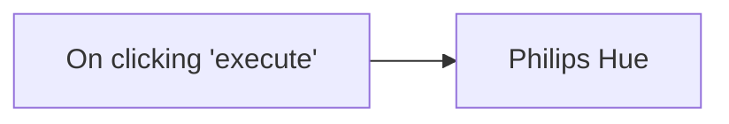

## Fluxo (.json) :

```json
{
  "id": "58",
  "name": "Turn on a light and set its brightness",
  "nodes": [
    {
      "name": "On clicking 'execute'",
      "type": "n8n-nodes-base.manualTrigger",
      "position": [
        590,
        260
      ],
      "parameters": {},
      "typeVersion": 1
    },
    {
      "name": "Philips Hue",
      "type": "n8n-nodes-base.philipsHue",
      "position": [
        790,
        260
      ],
      "parameters": {
        "lightId": "123",
        "additionalFields": {
          "bri": 90
        }
      },
      "credentials": {
        "philipsHueOAuth2Api": "philips-hue"
      },
      "typeVersion": 1
    }
  ],
  "active": false,
  "settings": {},
  "connections": {
    "On clicking 'execute'": {
      "main": [
        [
          {
            "node": "Philips Hue",
            "type": "main",
            "index": 0
          }
        ]
      ]
    }
  }
}
```

<a id="template-775"></a>

## Template 775 - Alerta de domínio suspeito para novas empresas

- **Nome:** Alerta de domínio suspeito para novas empresas
- **Descrição:** Ao criar uma nova empresa, o fluxo verifica o domínio fornecido e envia uma notificação se o domínio apresentar problemas.
- **Funcionalidade:** • Detecção de nova empresa: inicia o processo quando uma nova empresa é criada no sistema de CRM.
• Recuperação de informações da empresa: obtém detalhes como nome, website (domínio) e ID da empresa.
• Teste de carregamento do domínio: faz uma requisição HTTP ao domínio registrado para verificar sua disponibilidade/resposta.
• Validação do resultado: avalia o status da resposta da requisição (por exemplo, código 200) para decidir se o domínio é válido.
• Notificação em canal de comunicação: envia uma mensagem com nome, domínio e ID da empresa para alertar sobre domínios suspeitos.
- **Ferramentas:** • HubSpot: plataforma de CRM usada para detectar a criação de empresas e obter informações da empresa.
• Slack: ferramenta de comunicação usada para enviar alertas e notificações ao canal apropriado.
• Requisições HTTP externas: realiza chamadas HTTP ao domínio informado para validar sua resposta e disponibilidade.

## Fluxo visual

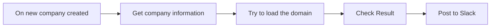

## Fluxo (.json) :

```json
{
  "meta": {
    "instanceId": "8c8c5237b8e37b006a7adce87f4369350c58e41f3ca9de16196d3197f69eabcd"
  },
  "nodes": [
    {
      "id": "9a0c7f24-a344-4955-8bdc-b129e5d8d619",
      "name": "Check Result",
      "type": "n8n-nodes-base.if",
      "notes": "IF\ndeliverability is not good\nOR\nDomain is not valid\nOR\nEmail is Disposable",
      "position": [
        860,
        420
      ],
      "parameters": {
        "conditions": {
          "string": [
            {
              "value1": "={{$json[\"statusCode\"]}}",
              "value2": "200"
            }
          ],
          "boolean": []
        },
        "combineOperation": "any"
      },
      "typeVersion": 1
    },
    {
      "id": "b4d3619e-1327-4b79-a81b-caed93efa5aa",
      "name": "Post to Slack",
      "type": "n8n-nodes-base.slack",
      "position": [
        1060,
        440
      ],
      "parameters": {
        "text": "=:warning: New Company with suspicious domain :warning:\n*Name: * {{$node[\"Get company information\"].json[\"properties\"][\"name\"][\"value\"]}}\n*Domain: * {{$node[\"Get company information\"].json[\"properties\"][\"website\"][\"value\"]}}\n*ID: * {{$node[\"Get company information\"].json[\"companyId\"]}}",
        "channel": "#hubspot-alerts",
        "attachments": [],
        "otherOptions": {}
      },
      "credentials": {
        "slackApi": {
          "id": "39",
          "name": "Slack Access Token"
        }
      },
      "typeVersion": 1
    },
    {
      "id": "f0e82b09-8311-49c5-b295-694ea5147b50",
      "name": "On new company created",
      "type": "n8n-nodes-base.hubspotTrigger",
      "position": [
        320,
        420
      ],
      "webhookId": "748453fc-65ef-48bc-bae9-a5a6d13ade54",
      "parameters": {
        "eventsUi": {
          "eventValues": [
            {
              "name": "company.creation"
            }
          ]
        },
        "additionalFields": {}
      },
      "credentials": {
        "hubspotDeveloperApi": {
          "id": "44",
          "name": "Hubspot Developer account"
        }
      },
      "typeVersion": 1
    },
    {
      "id": "81dd8835-e61f-44de-b650-23b35fbebb0d",
      "name": "Get company information",
      "type": "n8n-nodes-base.hubspot",
      "position": [
        500,
        420
      ],
      "parameters": {
        "resource": "company",
        "companyId": "={{$json[\"companyId\"]}}",
        "operation": "get",
        "additionalFields": {}
      },
      "credentials": {
        "hubspotApi": {
          "id": "43",
          "name": "Hubspot account"
        }
      },
      "typeVersion": 1
    },
    {
      "id": "62017a8b-a6cd-452f-a8a4-576dbd10dc4e",
      "name": "Try to load the domain",
      "type": "n8n-nodes-base.httpRequest",
      "position": [
        660,
        420
      ],
      "parameters": {
        "url": "={{$json[\"properties\"][\"domain\"][\"value\"]}}",
        "options": {
          "response": {
            "response": {
              "fullResponse": true,
              "responseFormat": "text"
            }
          }
        }
      },
      "typeVersion": 3
    }
  ],
  "connections": {
    "Check Result": {
      "main": [
        null,
        [
          {
            "node": "Post to Slack",
            "type": "main",
            "index": 0
          }
        ]
      ]
    },
    "On new company created": {
      "main": [
        [
          {
            "node": "Get company information",
            "type": "main",
            "index": 0
          }
        ]
      ]
    },
    "Try to load the domain": {
      "main": [
        [
          {
            "node": "Check Result",
            "type": "main",
            "index": 0
          }
        ]
      ]
    },
    "Get company information": {
      "main": [
        [
          {
            "node": "Try to load the domain",
            "type": "main",
            "index": 0
          }
        ]
      ]
    }
  }
}
```

<a id="template-776"></a>

## Template 776 - Agente Web Airtop

- **Nome:** Agente Web Airtop
- **Descrição:** Este fluxo cria um agente de automação web capaz de iniciar um navegador remoto, navegar por páginas, interagir com elementos e retornar resultados de forma estruturada, com opções de configuração via formulário e notificações via Slack.
- **Funcionalidade:** • Iniciar sessão e janela do navegador: inicia uma sessão e uma janela de navegador remotos e retorna os IDs de sessão e janela.
• Navegar e carregar URLs: carrega URLs na janela do navegador e gerencia a sessão.
• Interação com a página (Clique e Type): utiliza cliques e digitação para interagir com elementos descritos na página.
• Consulta e extração de informações: consulta o conteúdo da página, extrai informações e produz saída estruturada.
• Geração de saída e notificação: consolida resultados em formato estruturado e envia via Slack, além de disponibilizar IDs de sessão/janela.
• Recebimento de instruções por formulário: recebe prompts e perfil via formulário para orientar as ações do agente.
- **Ferramentas:** • Airtop: Automação de navegador remoto com criação de sessões e janelas, carregamento de URLs e interação com elementos.
• Claude 3.5 Haiku: Modelo de linguagem utilizado para gerar instruções e orientar as ações do agente.
• Slack: Envio de mensagens com resultados e status, incluindo a URL do Live View.

## Fluxo visual

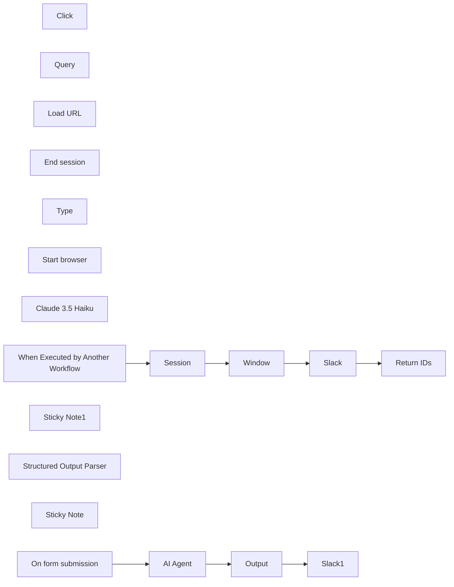

## Fluxo (.json) :

```json
{
  "id": "TS1wT16JCcy1Dt9Q",
  "meta": {
    "instanceId": "28a947b92b197fc2524eaba16e57560338657b2b0b5796300b2f1cedc1d0d355",
    "templateCredsSetupCompleted": true
  },
  "name": "Airtop Web Agent",
  "tags": [
    {
      "id": "zGYM9A88nf1YAceR",
      "name": "Agent",
      "createdAt": "2025-04-16T21:49:22.104Z",
      "updatedAt": "2025-04-16T21:49:22.104Z"
    },
    {
      "id": "zKNO4Omjzfu6J25M",
      "name": "Demo",
      "createdAt": "2025-04-15T18:59:57.364Z",
      "updatedAt": "2025-04-15T18:59:57.364Z"
    }
  ],
  "nodes": [
    {
      "id": "43e674dd-82e5-49b3-8e4d-f13793e5e6c9",
      "name": "AI Agent",
      "type": "@n8n/n8n-nodes-langchain.agent",
      "position": [
        220,
        60
      ],
      "parameters": {
        "text": "={{ $json.Prompt }}",
        "options": {
          "maxIterations": 20,
          "systemMessage": "=# Agent goal\nYou are a smart, advanced web agent connected with tools that allow you to manage a remote web browser. Your goal is to fulfill the human's request.\n\n## Start the browser\nYou should always start by using the `Start browser` tool to get the `sessionId` and `windowId` required by other tools.\n\n## Use the `Query` tool\nYou don't have access to the browser screen but you can call the `Query` tool to get knowladge and hints of the current browser window. This tool accepts queries in natural language and can output information in plain text, markdown or JSON.\n\n## Use the `Click` tool\nUse the `Click` tool to click on an element on the web page. Describe the element in details in the \"Element Description\" field, Be specific and refer to elements that are on the page. \n\n## Use the `Type` tool\nUse the `Type` tool to type in text boxes. Describe the text box in \"Element Description\" field and the text to type in the \"Text\" field. The 'Type' tool is clicking Enter after typing the text so don't send [ENTER] commandes.\n\n### Examples for how to use the `Query` tool\n- Ask something about the current page:\n  \"Is the user logged in? Answer with Yes or No\"\n- Retrieve information:\n  \"Extract all the posts in the page, include the title and copy, output in JSON format\"\n- Get hints on the UI:\n  \"Is there a link to the contact form? If yes, describe the element in detail\"\n\n\n## Important\n- Start by calling `Start browser` to begin using the browser and provide the initial URL\n- The human ONLY sees your last message\n- Make sure to include all the important information requested by the human in your LAST message\n- Call `End session` with the `sessionId` once you have finished using the browser\n\n",
          "passthroughBinaryImages": true,
          "returnIntermediateSteps": false
        },
        "promptType": "define",
        "hasOutputParser": true
      },
      "retryOnFail": true,
      "typeVersion": 1.8,
      "waitBetweenTries": 5000
    },
    {
      "id": "5e29189a-2b5a-4193-bff1-f4afe1c4b838",
      "name": "Click",
      "type": "n8n-nodes-base.airtopTool",
      "position": [
        0,
        280
      ],
      "parameters": {
        "resource": "interaction",
        "windowId": "={{ /*n8n-auto-generated-fromAI-override*/ $fromAI('Window_ID', \"The `windowId` returned by the `Open window` tool\", 'string') }}",
        "sessionId": "={{ /*n8n-auto-generated-fromAI-override*/ $fromAI('Session_ID', \"The `sessionId` returned by the `Create session` tool\", 'string') }}",
        "descriptionType": "manual",
        "toolDescription": "Click on any element in the window",
        "additionalFields": {
          "waitForNavigation": "load"
        },
        "elementDescription": "={{ /*n8n-auto-generated-fromAI-override*/ $fromAI('Element_Description', `Describe in detail the element to click on, e.g. The menu item \"about us\" at the top of the page`, 'string') }}"
      },
      "credentials": {
        "airtopApi": {
          "id": "3urzXgC1IDRxzgbv",
          "name": "Airtop account 2"
        }
      },
      "typeVersion": 1
    },
    {
      "id": "85338306-5acd-4e9b-9a02-7fc5e9a03557",
      "name": "Query",
      "type": "n8n-nodes-base.airtopTool",
      "position": [
        120,
        280
      ],
      "parameters": {
        "prompt": "={{ /*n8n-auto-generated-fromAI-override*/ $fromAI('Prompt', `Ask anything and request to extract information from the current page, e.g. \"Is there any sign-up form? yes or no\"`, 'string') }}",
        "resource": "extraction",
        "windowId": "={{ /*n8n-auto-generated-fromAI-override*/ $fromAI('Window_ID', \"The `windowId` returned by the `Open window` tool\", 'string') }}",
        "operation": "query",
        "sessionId": "={{ /*n8n-auto-generated-fromAI-override*/ $fromAI('Session_ID', \"The `sessionId` returned by the `Create session` tool\", 'string') }}",
        "descriptionType": "manual",
        "toolDescription": "Query the page, ask and extract information",
        "additionalFields": {}
      },
      "credentials": {
        "airtopApi": {
          "id": "3urzXgC1IDRxzgbv",
          "name": "Airtop account 2"
        }
      },
      "typeVersion": 1
    },
    {
      "id": "67cee508-c2c0-423e-b1fb-576de026f3ed",
      "name": "Load URL",
      "type": "n8n-nodes-base.airtopTool",
      "position": [
        240,
        280
      ],
      "parameters": {
        "url": "={{ /*n8n-auto-generated-fromAI-override*/ $fromAI('URL', ``, 'string') }}",
        "resource": "window",
        "windowId": "={{ /*n8n-auto-generated-fromAI-override*/ $fromAI('Window_ID', \"The `windowId` returned by the `Open window` tool\", 'string') }}",
        "operation": "load",
        "sessionId": "={{ /*n8n-auto-generated-fromAI-override*/ $fromAI('Session_ID', \"The `sessionId` returned by the `Create session` tool\", 'string') }}",
        "descriptionType": "manual",
        "toolDescription": "Load a URL into the browser window",
        "additionalFields": {}
      },
      "credentials": {
        "airtopApi": {
          "id": "3urzXgC1IDRxzgbv",
          "name": "Airtop account 2"
        }
      },
      "typeVersion": 1
    },
    {
      "id": "05262c94-fb9a-4a51-b1c6-8b4981888850",
      "name": "End session",
      "type": "n8n-nodes-base.airtopTool",
      "position": [
        360,
        280
      ],
      "parameters": {
        "operation": "terminate",
        "sessionId": "={{ /*n8n-auto-generated-fromAI-override*/ $fromAI('Session_ID', \"The `sessionId` returned by the `Create session` tool\", 'string') }}"
      },
      "credentials": {
        "airtopApi": {
          "id": "3urzXgC1IDRxzgbv",
          "name": "Airtop account 2"
        }
      },
      "typeVersion": 1
    },
    {
      "id": "e1bab1f8-8127-49a2-b3a3-f672c0687ed6",
      "name": "Type",
      "type": "n8n-nodes-base.airtopTool",
      "position": [
        480,
        280
      ],
      "parameters": {
        "text": "={{ /*n8n-auto-generated-fromAI-override*/ $fromAI('Text', ``, 'string') }}",
        "resource": "interaction",
        "windowId": "={{ /*n8n-auto-generated-fromAI-override*/ $fromAI('Window_ID', \"The `windowId` returned by the `Open window` tool\", 'string') }}",
        "operation": "type",
        "sessionId": "={{ /*n8n-auto-generated-fromAI-override*/ $fromAI('Session_ID', \"The `sessionId` returned by the `Create session` tool\", 'string') }}",
        "pressEnterKey": true,
        "descriptionType": "manual",
        "toolDescription": "Type text into the page's element described",
        "additionalFields": {},
        "elementDescription": "={{ /*n8n-auto-generated-fromAI-override*/ $fromAI('Element_Description', `Describe in detail the element to type into, e.g. The search box at the top of the page`, 'string') }}"
      },
      "credentials": {
        "airtopApi": {
          "id": "3urzXgC1IDRxzgbv",
          "name": "Airtop account 2"
        }
      },
      "typeVersion": 1
    },
    {
      "id": "385c94f1-27b4-492b-8224-41d26dbb76b4",
      "name": "Start browser",
      "type": "@n8n/n8n-nodes-langchain.toolWorkflow",
      "position": [
        600,
        280
      ],
      "parameters": {
        "name": "Start_Browser",
        "workflowId": {
          "__rl": true,
          "mode": "list",
          "value": "TS1wT16JCcy1Dt9Q",
          "cachedResultName": "Airtop Web Agent"
        },
        "description": "Start a new browser session and window",
        "workflowInputs": {
          "value": {
            "url": "={{ /*n8n-auto-generated-fromAI-override*/ $fromAI('url', `URL to load in the browser window`, 'string') }}",
            "profile_name": "={{ $json['Airtop Profile Name (for sites that require authentication)'] }}"
          },
          "schema": [
            {
              "id": "url",
              "type": "string",
              "display": true,
              "removed": false,
              "required": false,
              "displayName": "url",
              "defaultMatch": false,
              "canBeUsedToMatch": true
            },
            {
              "id": "profile_name",
              "type": "string",
              "display": true,
              "removed": false,
              "required": false,
              "displayName": "profile_name",
              "defaultMatch": false,
              "canBeUsedToMatch": true
            }
          ],
          "mappingMode": "defineBelow",
          "matchingColumns": [
            "url"
          ],
          "attemptToConvertTypes": false,
          "convertFieldsToString": false
        }
      },
      "typeVersion": 2.1
    },
    {
      "id": "7c646c5f-8c98-49a1-9e37-b04a2fa5b9e3",
      "name": "Claude 3.5 Haiku",
      "type": "@n8n/n8n-nodes-langchain.lmChatAnthropic",
      "position": [
        -120,
        280
      ],
      "parameters": {
        "model": {
          "__rl": true,
          "mode": "list",
          "value": "claude-3-5-haiku-20241022",
          "cachedResultName": "Claude 3.5 Haiku"
        },
        "options": {}
      },
      "credentials": {
        "anthropicApi": {
          "id": "npcV2ZKvGmXTUIj9",
          "name": "Cesar's Key"
        }
      },
      "typeVersion": 1.3
    },
    {
      "id": "4e810287-ade5-40c6-af4f-5f7df4b3d928",
      "name": "On form submission",
      "type": "n8n-nodes-base.formTrigger",
      "position": [
        -340,
        160
      ],
      "webhookId": "dbbb8b5a-a81c-4cde-9f46-f4808d7f0dc4",
      "parameters": {
        "options": {},
        "formTitle": "Instruction for the Web AI Agent",
        "formFields": {
          "values": [
            {
              "fieldType": "textarea",
              "fieldLabel": "Prompt",
              "placeholder": "e.g. Find the top 10 products in producthunt.com",
              "requiredField": true
            },
            {
              "fieldLabel": "Airtop Profile Name (for sites that require authentication)",
              "placeholder": "e.g. my-airtop-profile"
            }
          ]
        },
        "formDescription": "Provide detailed instructions to the web AI agent. Use an [Airtop Profile](https://docs.airtop.ai/guides/how-to/saving-a-profile) for websites that need login."
      },
      "typeVersion": 2.2
    },
    {
      "id": "5bc4020c-f677-45c2-b9f6-dc6cf847df1e",
      "name": "Slack",
      "type": "n8n-nodes-base.slack",
      "position": [
        520,
        2100
      ],
      "webhookId": "72d47d9c-6860-4248-8e83-7790264fdaf2",
      "parameters": {
        "text": "={{ $json.data.liveViewUrl }}",
        "select": "channel",
        "channelId": {
          "__rl": true,
          "mode": "list",
          "value": "C08E83RDJN9",
          "cachedResultName": "n8n-debug"
        },
        "otherOptions": {},
        "authentication": "oAuth2"
      },
      "credentials": {
        "slackOAuth2Api": {
          "id": "QPfv40eAdL5Eax7G",
          "name": "Slack account"
        }
      },
      "typeVersion": 2.3
    },
    {
      "id": "b68a951d-b45b-46a6-bddc-cd0107fd952d",
      "name": "Sticky Note1",
      "type": "n8n-nodes-base.stickyNote",
      "position": [
        -200,
        1960
      ],
      "parameters": {
        "color": 5,
        "width": 220,
        "height": 300,
        "content": "## Note\nThis sub-workflow simplifies the session management for the agent"
      },
      "typeVersion": 1
    },
    {
      "id": "59479495-e62b-4e30-b42b-039f82c5aab8",
      "name": "Structured Output Parser",
      "type": "@n8n/n8n-nodes-langchain.outputParserStructured",
      "position": [
        720,
        280
      ],
      "parameters": {
        "schemaType": "manual",
        "inputSchema": "{\n\t\"type\": \"object\",\n\t\"properties\": {\n\t\t\"results\": {\n\t\t\t\"type\": \"string\",\n            \"description\": \"Synthesis of the agent's results. Must include all the relevant information related to the user's request\"\n\t\t}\n\t}\n}"
      },
      "typeVersion": 1.2
    },
    {
      "id": "1d0e64b8-18e3-4de2-b089-96deb51b1e9e",
      "name": "Output",
      "type": "n8n-nodes-base.set",
      "position": [
        920,
        160
      ],
      "parameters": {
        "options": {},
        "assignments": {
          "assignments": [
            {
              "id": "e1d6ab7c-2f45-44fd-9457-bb3046fad4c5",
              "name": "output",
              "type": "string",
              "value": "={{ $json.output.results }}"
            }
          ]
        }
      },
      "typeVersion": 3.4
    },
    {
      "id": "c40e9b06-cac3-4714-b58b-4b60c978f321",
      "name": "Session",
      "type": "n8n-nodes-base.airtop",
      "position": [
        80,
        2100
      ],
      "parameters": {
        "profileName": "={{ $json.profile_name }}"
      },
      "credentials": {
        "airtopApi": {
          "id": "3urzXgC1IDRxzgbv",
          "name": "Airtop account 2"
        }
      },
      "typeVersion": 1
    },
    {
      "id": "fd8f9014-eff8-45c2-9483-0e6eda4a4979",
      "name": "Window",
      "type": "n8n-nodes-base.airtop",
      "position": [
        300,
        2100
      ],
      "parameters": {
        "url": "={{ $('When Executed by Another Workflow').item.json.url }}",
        "resource": "window",
        "getLiveView": true,
        "additionalFields": {}
      },
      "credentials": {
        "airtopApi": {
          "id": "3urzXgC1IDRxzgbv",
          "name": "Airtop account 2"
        }
      },
      "typeVersion": 1
    },
    {
      "id": "a6dbea48-3be2-4b31-9ee8-dba1c7049d3b",
      "name": "Sticky Note",
      "type": "n8n-nodes-base.stickyNote",
      "position": [
        460,
        2080
      ],
      "parameters": {
        "color": 7,
        "width": 220,
        "height": 340,
        "content": "\n\n\n\n\n\n\n\n\n\n\n\n\n\n\n\n\n### See the agent in action\nEnable this Slack node to receive the URL for the Live View in a message\n\n"
      },
      "typeVersion": 1
    },
    {
      "id": "9e310e8c-910e-431f-9919-94a06eb2eca0",
      "name": "Return IDs",
      "type": "n8n-nodes-base.set",
      "position": [
        740,
        2100
      ],
      "parameters": {
        "options": {},
        "assignments": {
          "assignments": [
            {
              "id": "0a0680af-39bd-4bc7-b9cd-84c1766c79a1",
              "name": "sessionId",
              "type": "string",
              "value": "={{ $('Session').item.json.sessionId }}"
            },
            {
              "id": "13940ee8-c1d4-4718-a7b4-176c44c097b7",
              "name": "windowId",
              "type": "string",
              "value": "={{ $('Window').item.json.data.windowId }}"
            },
            {
              "id": "a0f2005c-2cd2-4a8d-891b-a4759b72a124",
              "name": "output",
              "type": "string",
              "value": "Session and window created successfully"
            }
          ]
        }
      },
      "typeVersion": 3.4
    },
    {
      "id": "a84101b9-165f-47f4-bbc4-8705abfb6e41",
      "name": "When Executed by Another Workflow",
      "type": "n8n-nodes-base.executeWorkflowTrigger",
      "position": [
        -140,
        2100
      ],
      "parameters": {
        "workflowInputs": {
          "values": [
            {
              "name": "url"
            },
            {
              "name": "profile_name"
            }
          ]
        }
      },
      "typeVersion": 1.1
    },
    {
      "id": "b32534f6-3b62-4961-9d54-1e3e288fc185",
      "name": "Slack1",
      "type": "n8n-nodes-base.slack",
      "position": [
        1180,
        160
      ],
      "webhookId": "72d47d9c-6860-4248-8e83-7790264fdaf2",
      "parameters": {
        "text": "={{ $json.output }}",
        "select": "channel",
        "channelId": {
          "__rl": true,
          "mode": "list",
          "value": "C08E83RDJN9",
          "cachedResultName": "n8n-debug"
        },
        "otherOptions": {},
        "authentication": "oAuth2"
      },
      "credentials": {
        "slackOAuth2Api": {
          "id": "QPfv40eAdL5Eax7G",
          "name": "Slack account 2"
        }
      },
      "typeVersion": 2.3
    }
  ],
  "active": true,
  "pinData": {},
  "settings": {
    "executionOrder": "v1"
  },
  "versionId": "685b3999-f85a-43fa-8bff-21f9ddbbebd7",
  "connections": {
    "Type": {
      "ai_tool": [
        [
          {
            "node": "AI Agent",
            "type": "ai_tool",
            "index": 0
          }
        ]
      ]
    },
    "Click": {
      "ai_tool": [
        [
          {
            "node": "AI Agent",
            "type": "ai_tool",
            "index": 0
          }
        ]
      ]
    },
    "Query": {
      "ai_tool": [
        [
          {
            "node": "AI Agent",
            "type": "ai_tool",
            "index": 0
          }
        ]
      ]
    },
    "Slack": {
      "main": [
        [
          {
            "node": "Return IDs",
            "type": "main",
            "index": 0
          }
        ]
      ]
    },
    "Output": {
      "main": [
        [
          {
            "node": "Slack1",
            "type": "main",
            "index": 0
          }
        ]
      ]
    },
    "Window": {
      "main": [
        [
          {
            "node": "Slack",
            "type": "main",
            "index": 0
          }
        ]
      ]
    },
    "Session": {
      "main": [
        [
          {
            "node": "Window",
            "type": "main",
            "index": 0
          }
        ]
      ]
    },
    "AI Agent": {
      "main": [
        [
          {
            "node": "Output",
            "type": "main",
            "index": 0
          }
        ]
      ]
    },
    "Load URL": {
      "ai_tool": [
        [
          {
            "node": "AI Agent",
            "type": "ai_tool",
            "index": 0
          }
        ]
      ]
    },
    "End session": {
      "ai_tool": [
        [
          {
            "node": "AI Agent",
            "type": "ai_tool",
            "index": 0
          }
        ]
      ]
    },
    "Start browser": {
      "ai_tool": [
        [
          {
            "node": "AI Agent",
            "type": "ai_tool",
            "index": 0
          }
        ]
      ]
    },
    "Claude 3.5 Haiku": {
      "ai_languageModel": [
        [
          {
            "node": "AI Agent",
            "type": "ai_languageModel",
            "index": 0
          }
        ]
      ]
    },
    "On form submission": {
      "main": [
        [
          {
            "node": "AI Agent",
            "type": "main",
            "index": 0
          }
        ]
      ]
    },
    "Structured Output Parser": {
      "ai_outputParser": [
        [
          {
            "node": "AI Agent",
            "type": "ai_outputParser",
            "index": 0
          }
        ]
      ]
    },
    "When Executed by Another Workflow": {
      "main": [
        [
          {
            "node": "Session",
            "type": "main",
            "index": 0
          }
        ]
      ]
    }
  }
}
```

<a id="template-777"></a>

## Template 777 - Atualizar posição da ISS no RabbitMQ a cada minuto

- **Nome:** Atualizar posição da ISS no RabbitMQ a cada minuto
- **Descrição:** O fluxo consulta periodicamente a posição da Estação Espacial Internacional e publica os dados relevantes em uma fila do RabbitMQ.
- **Funcionalidade:** • Agendamento periódico: dispara a cada minuto para iniciar o processo de atualização.
• Consulta de posição: realiza uma requisição à API externa fornecendo o timestamp atual para obter a posição da ISS.
• Extração e filtragem: seleciona e mantém apenas os campos relevantes (Latitude, Longitude, Timestamp e Name).
• Publicação em fila: envia a posição formatada para a fila 'iss-position' no broker de mensagens.
- **Ferramentas:** • WhereTheISS API (wheretheiss.at): fornece dados de posicionamento da Estação Espacial Internacional.
• RabbitMQ: broker de mensagens onde as atualizações são publicadas na fila 'iss-position'.

## Fluxo visual

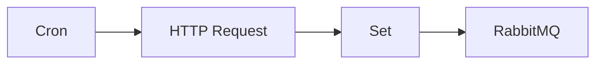

## Fluxo (.json) :

```json
{
  "id": "184",
  "name": "Send updates about the position of the ISS every minute to a topic in RabbitMQ",
  "nodes": [
    {
      "name": "RabbitMQ",
      "type": "n8n-nodes-base.rabbitmq",
      "position": [
        1300,
        540
      ],
      "parameters": {
        "queue": "iss-position",
        "options": {}
      },
      "credentials": {
        "rabbitmq": "RabbitMQ Credentials"
      },
      "typeVersion": 1
    },
    {
      "name": "Set",
      "type": "n8n-nodes-base.set",
      "position": [
        1110,
        540
      ],
      "parameters": {
        "values": {
          "number": [
            {
              "name": "Latitude",
              "value": "={{$node[\"HTTP Request\"].json[\"0\"][\"latitude\"]}}"
            },
            {
              "name": "Longitude",
              "value": "={{$node[\"HTTP Request\"].json[\"0\"][\"longitude\"]}}"
            },
            {
              "name": "Timestamp",
              "value": "={{$node[\"HTTP Request\"].json[\"0\"][\"timestamp\"]}}"
            }
          ],
          "string": [
            {
              "name": "Name",
              "value": "={{$node[\"HTTP Request\"].json[\"0\"][\"name\"]}}"
            }
          ]
        },
        "options": {},
        "keepOnlySet": true
      },
      "typeVersion": 1
    },
    {
      "name": "HTTP Request",
      "type": "n8n-nodes-base.httpRequest",
      "position": [
        910,
        540
      ],
      "parameters": {
        "url": "https://api.wheretheiss.at/v1/satellites/25544/positions",
        "options": {},
        "queryParametersUi": {
          "parameter": [
            {
              "name": "timestamps",
              "value": "={{Date.now();}}"
            }
          ]
        }
      },
      "typeVersion": 1
    },
    {
      "name": "Cron",
      "type": "n8n-nodes-base.cron",
      "position": [
        710,
        540
      ],
      "parameters": {
        "triggerTimes": {
          "item": [
            {
              "mode": "everyMinute"
            }
          ]
        }
      },
      "typeVersion": 1
    }
  ],
  "active": false,
  "settings": {},
  "connections": {
    "Set": {
      "main": [
        [
          {
            "node": "RabbitMQ",
            "type": "main",
            "index": 0
          }
        ]
      ]
    },
    "Cron": {
      "main": [
        [
          {
            "node": "HTTP Request",
            "type": "main",
            "index": 0
          }
        ]
      ]
    },
    "HTTP Request": {
      "main": [
        [
          {
            "node": "Set",
            "type": "main",
            "index": 0
          }
        ]
      ]
    }
  }
}
```

<a id="template-778"></a>

## Template 778 - Criar dataset vetorial para LLMs com Bright Data, Gemini e Pinecone

- **Nome:** Criar dataset vetorial para LLMs com Bright Data, Gemini e Pinecone
- **Descrição:** Este fluxo coleta conteúdo web via Bright Data, extrai e formata informações com modelos Gemini, gera embeddings e persiste vetores no Pinecone, além de enviar notificações por webhook.
- **Funcionalidade:** • Gatilho manual: Inicia o fluxo para testes mediante acionamento manual.
• Definição de URL e webhook: Permite configurar a URL alvo para scraping e o endpoint para receber notificações.
• Requisição ao serviço de scraping: Solicita o conteúdo bruto da página usando o serviço de desbloqueio web (Web Unlocker).
• Extração e formatação com IA: Analisa o HTML/resultado e extrai itens como título, rank, pontos e comentários, formatando em texto útil.
• Gerar JSON estruturado: Converte a saída da extração em um JSON seguindo um esquema predefinido.
• Envio de notificações por webhook: Envia o JSON ou resposta formatada para o endpoint configurado para consumo externo.
• Preparação de documentos e divisão de texto: Constrói documentos a partir do JSON e aplica divisão recursiva de texto para criar trechos menores ideais para embeddings.
• Geração de embeddings: Calcula vetores de representação para cada trecho usando um modelo de embeddings.
• Inserção em banco vetorial: Persiste os embeddings e metadados num índice vetorial para busca semântica futura.
- **Ferramentas:** • Bright Data (Web Unlocker): Serviço de scraping para obter conteúdo bruto de páginas web de forma confiável.
• Google Gemini (PaLM): Modelos de linguagem para extração, formatação do conteúdo e geração de embeddings.
• Pinecone: Banco de dados vetorial para armazenar embeddings e metadados, permitindo busca semântica.
• Endpoint de webhook (ex.: webhook.site): Receptor HTTP para receber notificações e dados estruturados gerados pelo fluxo.

## Fluxo visual

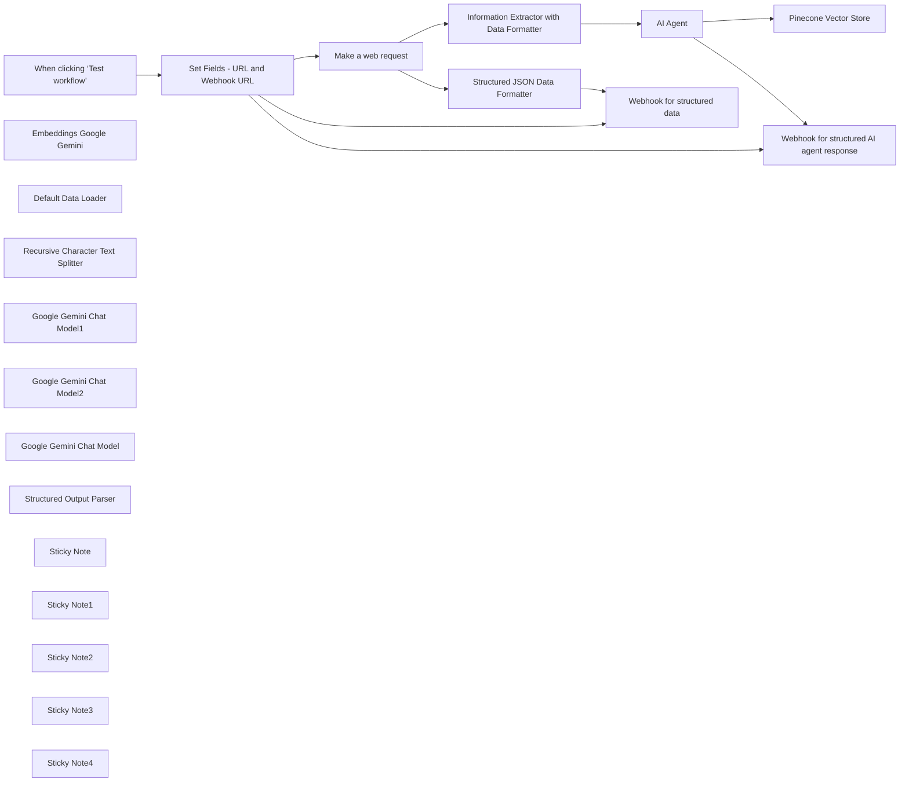

## Fluxo (.json) :

```json
{
  "id": "3Lih0LVosR8dZbla",
  "meta": {
    "instanceId": "885b4fb4a6a9c2cb5621429a7b972df0d05bb724c20ac7dac7171b62f1c7ef40",
    "templateCredsSetupCompleted": true
  },
  "name": "Create AI-Ready Vector Datasets for LLMs with Bright Data, Gemini & Pinecone",
  "tags": [
    {
      "id": "Kujft2FOjmOVQAmJ",
      "name": "Engineering",
      "createdAt": "2025-04-09T01:31:00.558Z",
      "updatedAt": "2025-04-09T01:31:00.558Z"
    },
    {
      "id": "ZOwtAMLepQaGW76t",
      "name": "Building Blocks",
      "createdAt": "2025-04-13T15:23:40.462Z",
      "updatedAt": "2025-04-13T15:23:40.462Z"
    },
    {
      "id": "ddPkw7Hg5dZhQu2w",
      "name": "AI",
      "createdAt": "2025-04-13T05:38:08.053Z",
      "updatedAt": "2025-04-13T05:38:08.053Z"
    }
  ],
  "nodes": [
    {
      "id": "0a468953-e348-420e-a6b3-c55fb20d3cbf",
      "name": "When clicking ‘Test workflow’",
      "type": "n8n-nodes-base.manualTrigger",
      "position": [
        200,
        -710
      ],
      "parameters": {},
      "typeVersion": 1
    },
    {
      "id": "3725e480-246f-4f32-b0a7-b946cacbe830",
      "name": "AI Agent",
      "type": "@n8n/n8n-nodes-langchain.agent",
      "position": [
        1236,
        -60
      ],
      "parameters": {
        "text": "=Format the below search result\n\n{{ $json.output.search_result }}",
        "options": {},
        "promptType": "define",
        "hasOutputParser": true
      },
      "typeVersion": 1.8
    },
    {
      "id": "30a12b8e-02f5-4b2e-bf9f-20fd9658405e",
      "name": "Pinecone Vector Store",
      "type": "@n8n/n8n-nodes-langchain.vectorStorePinecone",
      "position": [
        1628,
        -10
      ],
      "parameters": {
        "mode": "insert",
        "options": {},
        "pineconeIndex": {
          "__rl": true,
          "mode": "list",
          "value": "hacker-news",
          "cachedResultName": "hacker-news"
        }
      },
      "credentials": {
        "pineconeApi": {
          "id": "wdfRQ6NE8yjCDFhY",
          "name": "PineconeApi account"
        }
      },
      "typeVersion": 1.1
    },
    {
      "id": "1738dea6-fa4f-4a8d-a6fb-2f01feb1a6d5",
      "name": "Embeddings Google Gemini",
      "type": "@n8n/n8n-nodes-langchain.embeddingsGoogleGemini",
      "position": [
        1612,
        210
      ],
      "parameters": {
        "modelName": "models/text-embedding-004"
      },
      "credentials": {
        "googlePalmApi": {
          "id": "YeO7dHZnuGBVQKVZ",
          "name": "Google Gemini(PaLM) Api account"
        }
      },
      "typeVersion": 1
    },
    {
      "id": "e6443541-de71-4d26-ad58-d7c72868a190",
      "name": "Default Data Loader",
      "type": "@n8n/n8n-nodes-langchain.documentDefaultDataLoader",
      "position": [
        1760,
        220
      ],
      "parameters": {
        "options": {},
        "jsonData": "={{ $('Information Extractor with Data Formatter').item.json.output.search_result }}",
        "jsonMode": "expressionData"
      },
      "typeVersion": 1
    },
    {
      "id": "09ffc8cd-096f-47fe-937d-f8ab4fb41266",
      "name": "Recursive Character Text Splitter",
      "type": "@n8n/n8n-nodes-langchain.textSplitterRecursiveCharacterTextSplitter",
      "position": [
        1820,
        410
      ],
      "parameters": {
        "options": {}
      },
      "typeVersion": 1
    },
    {
      "id": "90cc9aa4-0931-4c52-8734-e4e0de820205",
      "name": "Google Gemini Chat Model1",
      "type": "@n8n/n8n-nodes-langchain.lmChatGoogleGemini",
      "position": [
        1240,
        160
      ],
      "parameters": {
        "options": {},
        "modelName": "models/gemini-2.0-flash-exp"
      },
      "credentials": {
        "googlePalmApi": {
          "id": "YeO7dHZnuGBVQKVZ",
          "name": "Google Gemini(PaLM) Api account"
        }
      },
      "typeVersion": 1
    },
    {
      "id": "1090a4af-7e5d-446b-a537-3afe48cd4909",
      "name": "Google Gemini Chat Model2",
      "type": "@n8n/n8n-nodes-langchain.lmChatGoogleGemini",
      "position": [
        948,
        -340
      ],
      "parameters": {
        "options": {},
        "modelName": "models/gemini-2.0-flash-exp"
      },
      "credentials": {
        "googlePalmApi": {
          "id": "YeO7dHZnuGBVQKVZ",
          "name": "Google Gemini(PaLM) Api account"
        }
      },
      "typeVersion": 1
    },
    {
      "id": "324c530c-0a03-411e-acb0-d82e9dc635cf",
      "name": "Google Gemini Chat Model",
      "type": "@n8n/n8n-nodes-langchain.lmChatGoogleGemini",
      "position": [
        948,
        160
      ],
      "parameters": {
        "options": {},
        "modelName": "models/gemini-2.0-flash-exp"
      },
      "credentials": {
        "googlePalmApi": {
          "id": "YeO7dHZnuGBVQKVZ",
          "name": "Google Gemini(PaLM) Api account"
        }
      },
      "typeVersion": 1
    },
    {
      "id": "3226a2d6-ade1-4d6a-95c5-0be4d787a947",
      "name": "Structured Output Parser",
      "type": "@n8n/n8n-nodes-langchain.outputParserStructured",
      "position": [
        1400,
        160
      ],
      "parameters": {
        "jsonSchemaExample": "[{\n\t\"id\": \"<string>\",\n\t\"title\": \"<string>\",\n    \"summary\": \"<string>\",\n    \"keywords\": [\"\"],\n    \"topics\": [\"\"]\n}]"
      },
      "typeVersion": 1.2
    },
    {
      "id": "a739a314-900a-4ef7-9cc2-1b65374e2e05",
      "name": "Sticky Note",
      "type": "n8n-nodes-base.stickyNote",
      "position": [
        40,
        -360
      ],
      "parameters": {
        "width": 480,
        "height": 220,
        "content": "## Note\nPlease make sure to set the URL for web crawling. \n\nWeb-Unlocker Product is being utilized for performing the web scrapping. \n\nThis workflow is utilizing the Basic LLM Chain, Information Extraction with the AI Agents for formatting, extracting and persisting the response in PineCone Vector Database"
      },
      "typeVersion": 1
    },
    {
      "id": "3dca6d46-c423-4fb5-a6e4-c2aa2852d51c",
      "name": "Set Fields - URL and Webhook URL",
      "type": "n8n-nodes-base.set",
      "notes": "Set the URL which you are interested to scrap the data",
      "position": [
        420,
        -710
      ],
      "parameters": {
        "options": {},
        "assignments": {
          "assignments": [
            {
              "id": "1c132dd6-31e4-453b-a8cf-cad9845fe55b",
              "name": "url",
              "type": "string",
              "value": "https://news.ycombinator.com?product=unlocker&method=api"
            },
            {
              "id": "90f3272b-d13d-44e2-8b4c-0943648cfce9",
              "name": "webhook_url",
              "type": "string",
              "value": "https://webhook.site/bc804ce5-4a45-4177-a68a-99c80e5c86e6"
            }
          ]
        }
      },
      "notesInFlow": true,
      "typeVersion": 3.4
    },
    {
      "id": "216a3261-a398-484c-9bf4-ca5966b829b6",
      "name": "Make a web request",
      "type": "n8n-nodes-base.httpRequest",
      "position": [
        640,
        -260
      ],
      "parameters": {
        "url": "https://api.brightdata.com/request",
        "method": "POST",
        "options": {},
        "sendBody": true,
        "sendHeaders": true,
        "authentication": "genericCredentialType",
        "bodyParameters": {
          "parameters": [
            {
              "name": "zone",
              "value": "web_unlocker1"
            },
            {
              "name": "url",
              "value": "={{ $json.url }}"
            },
            {
              "name": "format",
              "value": "raw"
            }
          ]
        },
        "genericAuthType": "httpHeaderAuth",
        "headerParameters": {
          "parameters": [
            {}
          ]
        }
      },
      "credentials": {
        "httpHeaderAuth": {
          "id": "kdbqXuxIR8qIxF7y",
          "name": "Header Auth account"
        }
      },
      "typeVersion": 4.2
    },
    {
      "id": "0c74e21c-3007-4297-b6ab-8ee17f4c6436",
      "name": "Structured JSON Data Formatter",
      "type": "@n8n/n8n-nodes-langchain.chainLlm",
      "position": [
        860,
        -560
      ],
      "parameters": {
        "text": "=Format the below response and produce a textual data. Output the response as per the below JSON schema.\n\nHere's the input: {{ $json.data }}\nHere's the JSON schema: \n\n[{\n    \"rank\": { \"type\": \"integer\" },\n    \"title\": { \"type\": \"string\" },\n    \"site\": { \"type\": \"string\" },\n    \"points\": { \"type\": \"integer\" },\n    \"user\": { \"type\": \"string\" },\n    \"age\": { \"type\": \"string\" },\n    \"comments\": { \"type\": \"string\" }\n}]",
        "messages": {
          "messageValues": [
            {
              "message": "You are an expert data formatter"
            }
          ]
        },
        "promptType": "define"
      },
      "typeVersion": 1.6
    },
    {
      "id": "012d4bb0-2b58-47cd-9cea-b4e0dced9082",
      "name": "Webhook for structured data",
      "type": "n8n-nodes-base.httpRequest",
      "position": [
        1314,
        -860
      ],
      "parameters": {
        "url": "={{ $json.webhook_url }}",
        "options": {},
        "sendBody": true,
        "bodyParameters": {
          "parameters": [
            {
              "name": "response",
              "value": "={{ $json.text }}"
            }
          ]
        }
      },
      "typeVersion": 4.2
    },
    {
      "id": "93b35e5e-6f52-4aeb-8f1b-39cc495beefe",
      "name": "Webhook for structured AI agent response",
      "type": "n8n-nodes-base.httpRequest",
      "position": [
        1750,
        -660
      ],
      "parameters": {
        "url": "={{ $json.webhook_url }}",
        "options": {},
        "sendBody": true,
        "bodyParameters": {
          "parameters": [
            {
              "name": "response",
              "value": "={{ $json.output }}"
            }
          ]
        }
      },
      "typeVersion": 4.2
    },
    {
      "id": "251b4251-255c-48c6-999b-02227fa2de9b",
      "name": "Sticky Note1",
      "type": "n8n-nodes-base.stickyNote",
      "position": [
        800,
        -620
      ],
      "parameters": {
        "width": 360,
        "height": 420,
        "content": "## AI Data Formatter\n"
      },
      "typeVersion": 1
    },
    {
      "id": "f62463cd-6be3-4942-a636-de980a3154b4",
      "name": "Sticky Note2",
      "type": "n8n-nodes-base.stickyNote",
      "position": [
        1560,
        -160
      ],
      "parameters": {
        "color": 4,
        "width": 520,
        "height": 720,
        "content": "## Vector Database Persistence\n"
      },
      "typeVersion": 1
    },
    {
      "id": "ad20cc91-766a-4a57-be54-6f0d09a784eb",
      "name": "Sticky Note3",
      "type": "n8n-nodes-base.stickyNote",
      "position": [
        1260,
        -920
      ],
      "parameters": {
        "color": 3,
        "width": 680,
        "height": 440,
        "content": "## Webhook Notification Handler\n"
      },
      "typeVersion": 1
    },
    {
      "id": "37ab5c0f-d36e-4131-844d-20a22d3f2861",
      "name": "Information Extractor with Data Formatter",
      "type": "@n8n/n8n-nodes-langchain.informationExtractor",
      "position": [
        860,
        -60
      ],
      "parameters": {
        "text": "={{ $json.data }}",
        "options": {
          "systemPromptTemplate": "You are an expert HTML extractor. Your job is to analyze the search result and extract the content as a collection on items"
        },
        "attributes": {
          "attributes": [
            {
              "name": "search_result",
              "description": "Search Response"
            }
          ]
        }
      },
      "typeVersion": 1
    },
    {
      "id": "e04e189a-8ba9-4ef4-9a49-fc13daf00828",
      "name": "Sticky Note4",
      "type": "n8n-nodes-base.stickyNote",
      "position": [
        800,
        -160
      ],
      "parameters": {
        "color": 5,
        "width": 720,
        "height": 720,
        "content": "## Data Extraction/Formatting with the AI Agent\n"
      },
      "typeVersion": 1
    }
  ],
  "active": false,
  "pinData": {},
  "settings": {
    "executionOrder": "v1"
  },
  "versionId": "799fb406-600d-45a5-b926-24b8844f33a5",
  "connections": {
    "AI Agent": {
      "main": [
        [
          {
            "node": "Pinecone Vector Store",
            "type": "main",
            "index": 0
          },
          {
            "node": "Webhook for structured AI agent response",
            "type": "main",
            "index": 0
          }
        ]
      ]
    },
    "Make a web request": {
      "main": [
        [
          {
            "node": "Structured JSON Data Formatter",
            "type": "main",
            "index": 0
          },
          {
            "node": "Information Extractor with Data Formatter",
            "type": "main",
            "index": 0
          }
        ]
      ]
    },
    "Default Data Loader": {
      "ai_document": [
        [
          {
            "node": "Pinecone Vector Store",
            "type": "ai_document",
            "index": 0
          }
        ]
      ]
    },
    "Pinecone Vector Store": {
      "ai_tool": [
        []
      ]
    },
    "Embeddings Google Gemini": {
      "ai_embedding": [
        [
          {
            "node": "Pinecone Vector Store",
            "type": "ai_embedding",
            "index": 0
          }
        ]
      ]
    },
    "Google Gemini Chat Model": {
      "ai_languageModel": [
        [
          {
            "node": "Information Extractor with Data Formatter",
            "type": "ai_languageModel",
            "index": 0
          }
        ]
      ]
    },
    "Structured Output Parser": {
      "ai_outputParser": [
        [
          {
            "node": "AI Agent",
            "type": "ai_outputParser",
            "index": 0
          }
        ]
      ]
    },
    "Google Gemini Chat Model1": {
      "ai_languageModel": [
        [
          {
            "node": "AI Agent",
            "type": "ai_languageModel",
            "index": 0
          }
        ]
      ]
    },
    "Google Gemini Chat Model2": {
      "ai_languageModel": [
        [
          {
            "node": "Structured JSON Data Formatter",
            "type": "ai_languageModel",
            "index": 0
          }
        ]
      ]
    },
    "Structured JSON Data Formatter": {
      "main": [
        [
          {
            "node": "Webhook for structured data",
            "type": "main",
            "index": 0
          }
        ]
      ]
    },
    "Set Fields - URL and Webhook URL": {
      "main": [
        [
          {
            "node": "Make a web request",
            "type": "main",
            "index": 0
          },
          {
            "node": "Webhook for structured data",
            "type": "main",
            "index": 0
          },
          {
            "node": "Webhook for structured AI agent response",
            "type": "main",
            "index": 0
          }
        ]
      ]
    },
    "Recursive Character Text Splitter": {
      "ai_textSplitter": [
        [
          {
            "node": "Default Data Loader",
            "type": "ai_textSplitter",
            "index": 0
          }
        ]
      ]
    },
    "When clicking ‘Test workflow’": {
      "main": [
        [
          {
            "node": "Set Fields - URL and Webhook URL",
            "type": "main",
            "index": 0
          }
        ]
      ]
    },
    "Information Extractor with Data Formatter": {
      "main": [
        [
          {
            "node": "AI Agent",
            "type": "main",
            "index": 0
          }
        ]
      ]
    }
  }
}
```

<a id="template-779"></a>

## Template 779 - Sincronizar eventos agendados do Discord para Google Calendar

- **Nome:** Sincronizar eventos agendados do Discord para Google Calendar
- **Descrição:** Sincroniza eventos agendados de um servidor Discord para um calendário do Google, criando ou atualizando eventos conforme necessário.
- **Funcionalidade:** • Gatilho agendado: inicia a sincronização em intervalos definidos.
• Obtenção de eventos do Discord: busca os eventos agendados do servidor configurado usando o ID do guild e o parâmetro with_user_count=true.
• Mapeamento de campos: extrai nome, descrição, início, término e localização dos eventos do Discord para o formato do calendário.
• Verificação por ID: tenta recuperar o evento no Google Calendar usando o mesmo ID do evento do Discord para determinar existência.
• Criação de eventos novos: cria eventos no Google Calendar quando não há correspondência por ID.
• Atualização de eventos existentes: atualiza título, datas, local e descrição quando o evento já existe no calendário.
• Tolerância a falhas parciais: continua o processo mesmo se ocorrerem erros ao verificar eventos individuais.
• Configuração centralizada: permite definir o ID do servidor (guild_id) e utilizar credenciais externas para autenticação.
- **Ferramentas:** • Discord API: serviço para listar eventos agendados do servidor Discord; requer token de bot no cabeçalho Authorization.
• Google Calendar API: serviço para criar e atualizar eventos de calendário; requer credenciais OAuth2.

## Fluxo visual

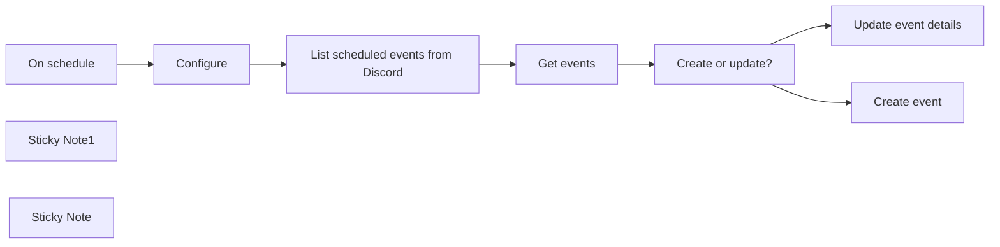

## Fluxo (.json) :

```json
{
  "meta": {
    "instanceId": "a2434c94d549548a685cca39cc4614698e94f527bcea84eefa363f1037ae14cd"
  },
  "nodes": [
    {
      "id": "78d5f452-5ba1-4d59-9d52-8f32512d2c25",
      "name": "List scheduled events from Discord",
      "type": "n8n-nodes-base.httpRequest",
      "position": [
        1940,
        1000
      ],
      "parameters": {
        "url": "=https://discord.com/api/guilds/{{ $('Configure').first().json.guild_id }}/scheduled-events",
        "options": {},
        "sendQuery": true,
        "authentication": "genericCredentialType",
        "genericAuthType": "httpHeaderAuth",
        "queryParameters": {
          "parameters": [
            {
              "name": "with_user_count",
              "value": "true"
            }
          ]
        }
      },
      "credentials": {
        "httpHeaderAuth": {
          "id": "fxbcosIH3MYkufX8",
          "name": "FILL ME"
        }
      },
      "typeVersion": 4.1
    },
    {
      "id": "af149917-0d46-4a40-b377-69c088a4a7b9",
      "name": "On schedule",
      "type": "n8n-nodes-base.scheduleTrigger",
      "position": [
        1420,
        1000
      ],
      "parameters": {
        "rule": {
          "interval": [
            {}
          ]
        }
      },
      "typeVersion": 1.1
    },
    {
      "id": "619c149f-f954-4f5d-a160-01a8b85f3eb7",
      "name": "Update event details",
      "type": "n8n-nodes-base.googleCalendar",
      "position": [
        2600,
        900
      ],
      "parameters": {
        "eventId": "={{ $json.id }}",
        "calendar": {
          "__rl": true,
          "mode": "list",
          "value": "[UPDATE ME]",
          "cachedResultName": "Events"
        },
        "operation": "update",
        "updateFields": {
          "end": "={{ $('List scheduled events from Discord').item.json.scheduled_end_time }}",
          "start": "={{ $('List scheduled events from Discord').item.json.scheduled_start_time }}",
          "summary": "={{ $('List scheduled events from Discord').item.json.name }}",
          "location": "={{ $('List scheduled events from Discord').item.json.entity_metadata.location }}",
          "description": "={{ $('List scheduled events from Discord').item.json.description }}"
        }
      },
      "credentials": {
        "googleCalendarOAuth2Api": {
          "id": "dRGPTy0BjDpAYjYl",
          "name": "FILL ME"
        }
      },
      "typeVersion": 1
    },
    {
      "id": "56e60042-d345-46f2-b1c6-4e21825cb5c9",
      "name": "Create event",
      "type": "n8n-nodes-base.googleCalendar",
      "position": [
        2600,
        1100
      ],
      "parameters": {
        "end": "={{ $('List scheduled events from Discord').item.json.scheduled_end_time }}",
        "start": "={{ $('List scheduled events from Discord').item.json.scheduled_start_time }}",
        "calendar": {
          "__rl": true,
          "mode": "list",
          "value": "[UPDATE ME]",
          "cachedResultName": "Events"
        },
        "additionalFields": {
          "id": "={{ $('List scheduled events from Discord').item.json.id }}",
          "summary": "={{ $('List scheduled events from Discord').item.json.name }}",
          "location": "={{ $('List scheduled events from Discord').item.json.entity_metadata.location }}",
          "description": "={{ $('List scheduled events from Discord').item.json.description }}"
        }
      },
      "credentials": {
        "googleCalendarOAuth2Api": {
          "id": "dRGPTy0BjDpAYjYl",
          "name": "FILL ME"
        }
      },
      "typeVersion": 1
    },
    {
      "id": "afb05bee-eb5f-453f-8e95-277296ce94b8",
      "name": "Get events",
      "type": "n8n-nodes-base.googleCalendar",
      "position": [
        2160,
        1000
      ],
      "parameters": {
        "eventId": "={{ $json.id }}",
        "options": {},
        "calendar": {
          "__rl": true,
          "mode": "list",
          "value": "[UPDATE ME]",
          "cachedResultName": "Events"
        },
        "operation": "get"
      },
      "credentials": {
        "googleCalendarOAuth2Api": {
          "id": "dRGPTy0BjDpAYjYl",
          "name": "FILL ME"
        }
      },
      "typeVersion": 1,
      "continueOnFail": true,
      "alwaysOutputData": false
    },
    {
      "id": "56b731bd-4676-4b77-bafa-7120a51bf75d",
      "name": "Create or update?",
      "type": "n8n-nodes-base.if",
      "position": [
        2380,
        1000
      ],
      "parameters": {
        "conditions": {
          "string": [
            {
              "value1": "={{ $json.id }}",
              "operation": "isNotEmpty"
            }
          ]
        }
      },
      "typeVersion": 1
    },
    {
      "id": "12e40b0e-3740-47db-8647-eff8c0c959df",
      "name": "Configure",
      "type": "n8n-nodes-base.set",
      "position": [
        1680,
        1000
      ],
      "parameters": {
        "values": {
          "string": [
            {
              "name": "guild_id",
              "value": "447359847986495498"
            }
          ]
        },
        "options": {}
      },
      "typeVersion": 2
    },
    {
      "id": "4160a727-6a50-40ce-a7f2-0abbd5a6b1bc",
      "name": "Sticky Note1",
      "type": "n8n-nodes-base.stickyNote",
      "position": [
        1600,
        940
      ],
      "parameters": {
        "width": 254.7946768060834,
        "height": 296.7300380228139,
        "content": "### Configuration\n\n\n\n\n\n\n\n\n\n\n\n\n\n__`guild_id`__: the server ID in Discord. See how to get that [from this Wikipedia tutorial](https://en.wikipedia.org/wiki/Template:Discord_server#:~:text=Getting%20Guild%20ID,to%20get%20the%20guild%20ID.)."
      },
      "typeVersion": 1
    },
    {
      "id": "ac717afe-1d30-4994-a134-0d535d04b932",
      "name": "Sticky Note",
      "type": "n8n-nodes-base.stickyNote",
      "position": [
        920,
        760
      ],
      "parameters": {
        "width": 420.45280925604845,
        "height": 639.1273068962362,
        "content": "## Sync Discord scheduled events to Google Calendar\nThis workflow syncs Discord scheduled events to Google Calendar. On a specified schedule, a request to Discord's API is made to get the scheduled events on a particular server. Only the events that have not been created or have recently been updated will be sent to Google Calendar.\n\n### Setup\nYou will need to create a Discord bot. See how to do that [here](https://github.com/reactiflux/discord-irc/wiki/Creating-a-discord-bot-&-getting-a-token). Once you have created your bot, create **Header Auth** in `List scheduled events from Discord` node. Your header auth fields should be:\n\nName: Authorization\nValue: Bot _<your token>_ \n(i.e. Bot MTEzMTgw...uQdg)\n\n### How it works\n1. Triggers off on the `On schedule` node.\n2. Gets the scheduled events from Discord.\n3. The IDs of the Discord scheduled events are used to get the events from Google Calendar, since the IDs are the same on creation of the Google Calendar event.\n4. We can now determine which events are new or have been updated.\n5. The new or updated events are created or updated in Google Calendar."
      },
      "typeVersion": 1
    }
  ],
  "connections": {
    "Configure": {
      "main": [
        [
          {
            "node": "List scheduled events from Discord",
            "type": "main",
            "index": 0
          }
        ]
      ]
    },
    "Get events": {
      "main": [
        [
          {
            "node": "Create or update?",
            "type": "main",
            "index": 0
          }
        ]
      ]
    },
    "On schedule": {
      "main": [
        [
          {
            "node": "Configure",
            "type": "main",
            "index": 0
          }
        ]
      ]
    },
    "Create or update?": {
      "main": [
        [
          {
            "node": "Update event details",
            "type": "main",
            "index": 0
          }
        ],
        [
          {
            "node": "Create event",
            "type": "main",
            "index": 0
          }
        ]
      ]
    },
    "List scheduled events from Discord": {
      "main": [
        [
          {
            "node": "Get events",
            "type": "main",
            "index": 0
          }
        ]
      ]
    }
  }
}
```

<a id="template-780"></a>

## Template 780 - Receber mensagens de ActiveMQ via AMQP Trigger

- **Nome:** Receber mensagens de ActiveMQ via AMQP Trigger
- **Descrição:** Este fluxo recebe mensagens de uma fila ActiveMQ utilizando um gatilho AMQP para iniciar o processamento assim que uma nova mensagem chega.
- **Funcionalidade:** • Receber mensagens da fila ActiveMQ através de AMQP: o gatilho inicia o fluxo quando uma mensagem chega.
• Configurar fila e broker: define a fila alvo e as credenciais/URL do broker para conexão.
• Encaminhar mensagens para processamento: as mensagens recebidas podem ser enviadas para etapas subsequentes do fluxo.
- **Ferramentas:** • ActiveMQ: broker de mensagens que expõe filas acessíveis via AMQP.
• Protocolo AMQP: protocolo de mensagens utilizado para facilitar a comunicação entre o broker e o gatilho.

## Fluxo visual

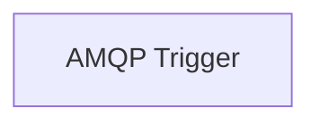

## Fluxo (.json) :

```json
{
  "id": "135",
  "name": "Receive messages for an ActiveMQ queue via AMQP Trigger",
  "nodes": [
    {
      "name": "AMQP Trigger",
      "type": "n8n-nodes-base.amqpTrigger",
      "position": [
        650,
        200
      ],
      "parameters": {
        "sink": ""
      },
      "credentials": {
        "amqp": ""
      },
      "typeVersion": 1
    }
  ],
  "active": false,
  "settings": {},
  "connections": {}
}
```

<a id="template-781"></a>

## Template 781 - Enviar mensagem para Discord via webhook

- **Nome:** Enviar mensagem para Discord via webhook
- **Descrição:** Fluxo simples que envia uma mensagem de texto para um canal do Discord utilizando um webhook ao ser executado manualmente.
- **Funcionalidade:** • Acionamento manual: Inicia o fluxo quando o usuário executa manualmente.
• Envio de mensagem: Envia uma mensagem de texto predeterminada para um webhook do Discord.
• Configuração de conteúdo: Permite definir o texto da mensagem e o URI do webhook.
- **Ferramentas:** • Discord: Plataforma de comunicação que recebe mensagens por meio de webhooks para publicar conteúdo em canais.

## Fluxo visual

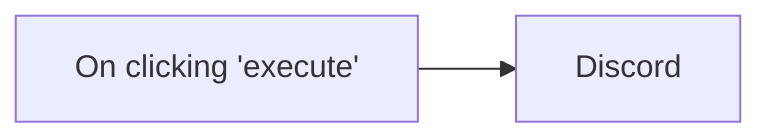

## Fluxo (.json) :

```json
{
  "id": "2",
  "name": "Discord Intro",
  "nodes": [
    {
      "name": "On clicking 'execute'",
      "type": "n8n-nodes-base.manualTrigger",
      "position": [
        510,
        330
      ],
      "parameters": {},
      "typeVersion": 1
    },
    {
      "name": "Discord",
      "type": "n8n-nodes-base.discord",
      "position": [
        800,
        330
      ],
      "parameters": {
        "text": "Hello World!",
        "webhookUri": "https://discordapp.com/api/webhooks/XXX/XXX"
      },
      "typeVersion": 1
    }
  ],
  "active": false,
  "settings": {},
  "connections": {
    "On clicking 'execute'": {
      "main": [
        [
          {
            "node": "Discord",
            "type": "main",
            "index": 0
          }
        ]
      ]
    }
  }
}
```
