# PACK 1999 TEMPLATES PARTE 04 - Bloco 10

Templates neste bloco: 20

## Sumário

- [Template 782 - Arquivamento mensal e classificação de faixas do Spotify](#template-782)
- [Template 783 - Pesquisar empresas LinkedIn e adicionar ao CRM Airtable](#template-783)
- [Template 784 - Enviar pedido XML por POST para API de vendas](#template-784)
- [Template 785 - Geração de emails de vendas personalizados](#template-785)
- [Template 786 - Atualizar títulos e descrições Printify com IA](#template-786)
- [Template 787 - Parser de corpo de email por rótulos](#template-787)
- [Template 788 - Geração de fatura PDF a partir de Typeform](#template-788)
- [Template 789 - Busca e simplificação de páginas web via query string](#template-789)
- [Template 790 - Sincronização Asana-Notion: criar/atualizar tarefas](#template-790)
- [Template 791 - Atualizações de evento em Asana](#template-791)
- [Template 792 - Mapa de dependências e auto-tagging de subworkflows](#template-792)
- [Template 793 - Gerar links de download públicos para arquivos de uma pasta do Drive](#template-793)
- [Template 794 - Exportar tabela PostgreSQL para CSV](#template-794)
- [Template 795 - Criação de tarefa no Asana via Webhook](#template-795)
- [Template 796 - Scraper visual com IA e Google Sheets](#template-796)
- [Template 797 - Chatbot de pedido por dados da planilha](#template-797)
- [Template 798 - Rastreamento de tópicos por palavra-chave](#template-798)
- [Template 799 - Registro automático de recibos e despesas](#template-799)
- [Template 800 - Criar ticket no Freshdesk com status aberto](#template-800)
- [Template 801 - Publicar posts do blog no Medium](#template-801)

---

<a id="template-782"></a>

## Template 782 - Arquivamento mensal e classificação de faixas do Spotify

- **Nome:** Arquivamento mensal e classificação de faixas do Spotify
- **Descrição:** Automatiza o arquivamento mensal das faixas curtidas do Spotify em uma planilha e classifica essas faixas em playlists apropriadas usando um modelo de linguagem.
- **Funcionalidade:** • Gatilho mensal ou manual: inicia o processo periodicamente ou sob demanda.
• Recuperação de playlists do usuário: obtém informações de playlists e filtra por proprietário.
• Recuperação de faixas curtidas: coleta metadados das faixas da biblioteca (nome, artista, álbum, IDs, popularidade, data).
• Consulta de características de áudio em lote: busca audio-features do Spotify em batches para otimizar chamadas à API.
• Mesclagem de dados: combina metadados das faixas com seus audio-features para análises mais ricas.
• Exclusão de faixas já registradas: compara com o histórico na planilha e remove duplicatas antes do registro.
• Registro em planilha: adiciona novas faixas e playlists ao Google Sheets para manter um histórico.
• Classificação por IA em lote: agrupa faixas e usa um modelo de linguagem para atribuí-las exaustivamente às playlists disponíveis.
• Preparação e atualização em massa de playlists: divide os resultados em lotes e adiciona faixas às playlists do Spotify.
• Verificação manual opcional: possibilidade de revisar e validar resultados antes da atualização final das playlists.
- **Ferramentas:** • Spotify: API para obter faixas, audio-features, playlists e para adicionar faixas às playlists.
• Google Sheets: planilha usada para armazenar o histórico de faixas e informações de playlists, além de servir para deduplicação.
• Anthropic / Modelo de linguagem: modelo de IA usado para analisar características das faixas e classificá-las nas playlists apropriadas.

## Fluxo visual

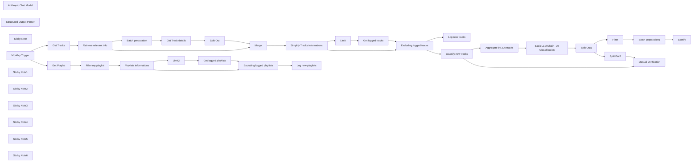

## Fluxo (.json) :

```json
{
  "meta": {
    "instanceId": "8e95de061dd3893a50b8b4c150c8084a7848fb1df63f53533941b7c91a8ab996"
  },
  "nodes": [
    {
      "id": "6325369f-5881-4e4e-b71b-510a64b236ef",
      "name": "Retrieve relevant info",
      "type": "n8n-nodes-base.set",
      "position": [
        1260,
        400
      ],
      "parameters": {
        "mode": "raw",
        "options": {},
        "jsonOutput": "={\n\"track\" : \"{{ $json.track.name.replaceAll('\"',\"'\") }}\",\n\"artist\": \"{{ $json.track.artists[0].name }}\",\n\"album\" :\"{{ $json.track.album.name }}\",\n\"track_spotify_uri\" : \"{{ $json.track.uri }}\",\n\"track_spotify_id\" : \"{{ $json.track.id }}\",\n\"external_urls\": \"{{ $json.track.external_urls.spotify }}\",\n\"track_popularity\" : \"{{ $json.track.popularity }}\",\n\"album_release_date\" : \"{{ $json.track.album.release_date.toDateTime().year }}\"\n}"
      },
      "typeVersion": 3.4
    },
    {
      "id": "2252fe16-6ee7-4fbe-b74e-d9bdcc7ad708",
      "name": "Batch preparation",
      "type": "n8n-nodes-base.code",
      "position": [
        1560,
        280
      ],
      "parameters": {
        "jsCode": "const items = $input.all();\nconst trackSpotifyIds = items.map((item) => item?.json?.track_spotify_id);\n\nconst aggregatedItems = [];\nfor (let i = 0; i < trackSpotifyIds.length; i += 100) {\n aggregatedItems.push({\n json: {\n trackSpotifyIds: trackSpotifyIds.slice(i, i + 100),\n },\n });\n}\n\nreturn aggregatedItems;\n"
      },
      "typeVersion": 2
    },
    {
      "id": "83c181f8-ed18-41d7-8c7e-26b0dd320083",
      "name": "Get Track details",
      "type": "n8n-nodes-base.httpRequest",
      "position": [
        1980,
        280
      ],
      "parameters": {
        "url": "https://api.spotify.com/v1/audio-features",
        "options": {},
        "sendQuery": true,
        "authentication": "predefinedCredentialType",
        "queryParameters": {
          "parameters": [
            {
              "name": "ids",
              "value": "={{ $json.trackSpotifyIds.join(\",\")}}"
            }
          ]
        },
        "nodeCredentialType": "spotifyOAuth2Api"
      },
      "credentials": {
        "spotifyOAuth2Api": {
          "id": "S9iODAILG9yn19ta",
          "name": "Spotify account - Arnaud's"
        }
      },
      "typeVersion": 4.2
    },
    {
      "id": "6cf1afdd-7e62-4d76-a034-5e943e2db0ff",
      "name": "Split Out",
      "type": "n8n-nodes-base.splitOut",
      "position": [
        2200,
        280
      ],
      "parameters": {
        "options": {},
        "fieldToSplitOut": "audio_features"
      },
      "typeVersion": 1
    },
    {
      "id": "fc3ab428-40f9-4439-83b6-8ecb125d510f",
      "name": "Anthropic Chat Model",
      "type": "@n8n/n8n-nodes-langchain.lmChatAnthropic",
      "position": [
        4180,
        1100
      ],
      "parameters": {
        "options": {
          "temperature": 0.3,
          "maxTokensToSample": 8192
        }
      },
      "credentials": {
        "anthropicApi": {
          "id": "SsGpCc91NlFBaH2I",
          "name": "Anthropic account - Bertrand"
        }
      },
      "typeVersion": 1.2
    },
    {
      "id": "e712d5c0-5045-4cd2-8324-5cde4fc37b2a",
      "name": "Get Playlist",
      "type": "n8n-nodes-base.spotify",
      "position": [
        1080,
        -71
      ],
      "parameters": {
        "resource": "playlist",
        "operation": "getUserPlaylists"
      },
      "credentials": {
        "spotifyOAuth2Api": {
          "id": "S9iODAILG9yn19ta",
          "name": "Spotify account - Arnaud's"
        }
      },
      "typeVersion": 1
    },
    {
      "id": "5d9d2abe-c85f-41a9-bb99-28a1306a8685",
      "name": "Get Tracks",
      "type": "n8n-nodes-base.spotify",
      "position": [
        1040,
        400
      ],
      "parameters": {
        "resource": "library",
        "returnAll": true
      },
      "credentials": {
        "spotifyOAuth2Api": {
          "id": "S9iODAILG9yn19ta",
          "name": "Spotify account - Arnaud's"
        }
      },
      "typeVersion": 1
    },
    {
      "id": "9e5b30cb-db4c-445e-bd82-314740d6af64",
      "name": "Structured Output Parser",
      "type": "@n8n/n8n-nodes-langchain.outputParserStructured",
      "position": [
        4540,
        1100
      ],
      "parameters": {
        "schemaType": "manual",
        "inputSchema": "{\n \"$schema\": \"http://json-schema.org/draft-07/schema#\",\n \"type\": \"array\",\n \"items\": {\n \"type\": \"object\",\n \"properties\": {\n \"playlistName\": {\n \"type\": \"string\",\n \"description\": \"The name of the playlist\"\n },\n \"uri\": {\n \"type\": \"string\",\n \"description\": \"The unique identifier for the playlist, in URI format\"\n },\n \"trackUris\": {\n \"type\": \"array\",\n \"items\": {\n \"type\": \"string\",\n \"description\": \"The unique identifier for each track in the playlist, in URI format\"\n },\n \"description\": \"A list of track URIs for the playlist\",\n \"maxItems\": 1000\n }\n },\n \"required\": [\"playlistName\", \"uri\", \"trackUris\"],\n \"additionalProperties\": false\n }\n}\n"
      },
      "typeVersion": 1.2
    },
    {
      "id": "8ddc9606-d70a-4a94-8dff-9ed17cec378e",
      "name": "Playlists informations",
      "type": "n8n-nodes-base.set",
      "position": [
        1520,
        -71
      ],
      "parameters": {
        "mode": "raw",
        "options": {},
        "jsonOutput": "={\n \"playlist_name\": \"{{ $json.name }}\",\n \"playlist_description\": \"{{ $json.description }}\",\n \"playlist_spotify_uri\": \"{{ $json.uri }}\"\n}\n "
      },
      "typeVersion": 3.4
    },
    {
      "id": "ec99ed3b-3cd9-4dc2-a7c6-5099eaeea93b",
      "name": "Filter my playlist",
      "type": "n8n-nodes-base.filter",
      "position": [
        1300,
        -71
      ],
      "parameters": {
        "options": {},
        "conditions": {
          "options": {
            "version": 2,
            "leftValue": "",
            "caseSensitive": true,
            "typeValidation": "strict"
          },
          "combinator": "and",
          "conditions": [
            {
              "id": "bad771d7-2f4c-43bb-996a-0e46bbf85231",
              "operator": {
                "name": "filter.operator.equals",
                "type": "string",
                "operation": "equals"
              },
              "leftValue": "={{ $json.owner.display_name }}",
              "rightValue": "Arnaud"
            }
          ]
        }
      },
      "typeVersion": 2.2
    },
    {
      "id": "64e57339-2bf2-4dc7-bca7-3de7da80b6eb",
      "name": "Split Out1",
      "type": "n8n-nodes-base.splitOut",
      "position": [
        4700,
        880
      ],
      "parameters": {
        "options": {},
        "fieldToSplitOut": "output"
      },
      "typeVersion": 1
    },
    {
      "id": "924f5b88-9dce-4acc-9ad6-0f25f804fcc5",
      "name": "Batch preparation1",
      "type": "n8n-nodes-base.code",
      "position": [
        5380,
        880
      ],
      "parameters": {
        "jsCode": "const items = $input.all();\nconst result = [];\n\nitems.forEach((item) => {\n const trackUris = item.json.trackUris;\n if (trackUris.length > 100) {\n for (let i = 0; i < trackUris.length; i += 100) {\n const newItem = { ...item.json, trackUris: trackUris.slice(i, i + 100) };\n result.push(newItem);\n }\n } else {\n result.push(item.json);\n }\n});\n\nreturn result;\n"
      },
      "typeVersion": 2
    },
    {
      "id": "980ef09e-557d-4748-b92a-ceec9dc54a6b",
      "name": "Merge",
      "type": "n8n-nodes-base.merge",
      "position": [
        2400,
        380
      ],
      "parameters": {
        "mode": "combine",
        "options": {
          "disableDotNotation": false
        },
        "advanced": true,
        "joinMode": "enrichInput2",
        "mergeByFields": {
          "values": [
            {
              "field1": "id",
              "field2": "track_spotify_id"
            }
          ]
        }
      },
      "typeVersion": 3
    },
    {
      "id": "a6149a04-bd65-4e55-8c1b-5e18fd98c2e8",
      "name": "Simplify Tracks informations",
      "type": "n8n-nodes-base.set",
      "position": [
        2620,
        380
      ],
      "parameters": {
        "include": "except",
        "options": {},
        "assignments": {
          "assignments": [
            {
              "id": "8bd9a8c4-0c95-43b0-8962-0e005504b6ee",
              "name": "date_added",
              "type": "string",
              "value": "={{ $now.format('yyyy-MM-dd') }}"
            }
          ]
        },
        "excludeFields": "track_spotify_id, external_urls, id, uri, track_href, analysis_url",
        "includeOtherFields": true
      },
      "typeVersion": 3.4
    },
    {
      "id": "96432403-f15f-4015-8024-72731e18b18d",
      "name": "Limit",
      "type": "n8n-nodes-base.limit",
      "position": [
        2860,
        240
      ],
      "parameters": {},
      "typeVersion": 1
    },
    {
      "id": "3efb9ee3-1955-40eb-9958-a5fb515f30c1",
      "name": "Get logged tracks",
      "type": "n8n-nodes-base.googleSheets",
      "position": [
        3120,
        240
      ],
      "parameters": {
        "options": {
          "dataLocationOnSheet": {
            "values": {
              "range": "A:B",
              "rangeDefinition": "specifyRangeA1"
            }
          }
        },
        "sheetName": {
          "__rl": true,
          "mode": "list",
          "value": "gid=0",
          "cachedResultUrl": "https://docs.google.com/spreadsheets/d/19VwKRDbsh8uU6xitnTXUjk1u73XCGThzyE8nv1YsP24/edit#gid=0",
          "cachedResultName": "tracks listing"
        },
        "documentId": {
          "__rl": true,
          "mode": "url",
          "value": "https://docs.google.com/spreadsheets/d/19VwKRDbsh8uU6xitnTXUjk1u73XCGThzyE8nv1YsP24/edit?gid=0#gid=0"
        },
        "combineFilters": "OR"
      },
      "credentials": {
        "googleSheetsOAuth2Api": {
          "id": "8UJ5YBcPU0IOkjEd",
          "name": "Google Sheets - Arnaud Growth Perso"
        }
      },
      "typeVersion": 4.5
    },
    {
      "id": "58821bc3-254c-46d2-b882-d1995aaf3d46",
      "name": "Excluding logged tracks",
      "type": "n8n-nodes-base.merge",
      "position": [
        3380,
        360
      ],
      "parameters": {
        "mode": "combine",
        "options": {},
        "joinMode": "keepNonMatches",
        "outputDataFrom": "input2",
        "fieldsToMatchString": "track_spotify_uri"
      },
      "typeVersion": 3
    },
    {
      "id": "8a28cd62-9316-487e-a8f7-dd5ed3eab6c8",
      "name": "Filter",
      "type": "n8n-nodes-base.filter",
      "position": [
        5120,
        880
      ],
      "parameters": {
        "options": {},
        "conditions": {
          "options": {
            "version": 2,
            "leftValue": "",
            "caseSensitive": true,
            "typeValidation": "strict"
          },
          "combinator": "and",
          "conditions": [
            {
              "id": "5457225f-104a-4d38-9481-d243ba656358",
              "operator": {
                "type": "array",
                "operation": "notEmpty",
                "singleValue": true
              },
              "leftValue": "={{ $json.trackUris }}",
              "rightValue": ""
            }
          ]
        }
      },
      "typeVersion": 2.2
    },
    {
      "id": "770a42f8-f4e5-44b8-a096-945db7c9f85e",
      "name": "Split Out2",
      "type": "n8n-nodes-base.splitOut",
      "disabled": true,
      "position": [
        5120,
        520
      ],
      "parameters": {
        "include": "allOtherFields",
        "options": {},
        "fieldToSplitOut": "trackUris"
      },
      "typeVersion": 1
    },
    {
      "id": "da5c9b03-2ace-40af-9364-c9119eaef7b0",
      "name": "Manual Verification",
      "type": "n8n-nodes-base.merge",
      "disabled": true,
      "position": [
        5380,
        480
      ],
      "parameters": {
        "mode": "combine",
        "options": {},
        "advanced": true,
        "joinMode": "enrichInput2",
        "mergeByFields": {
          "values": [
            {
              "field1": "track_spotify_uri",
              "field2": "trackUris"
            }
          ]
        }
      },
      "typeVersion": 3
    },
    {
      "id": "98b3fca5-5b14-42e4-8e5f-5506643a54bb",
      "name": "Spotify",
      "type": "n8n-nodes-base.spotify",
      "onError": "continueErrorOutput",
      "position": [
        5640,
        880
      ],
      "parameters": {
        "id": "={{ $json.uri }}",
        "trackID": "={{ $json.trackUris.join(\",\") }}",
        "resource": "playlist",
        "additionalFields": {}
      },
      "credentials": {
        "spotifyOAuth2Api": {
          "id": "S9iODAILG9yn19ta",
          "name": "Spotify account - Arnaud's"
        }
      },
      "retryOnFail": true,
      "typeVersion": 1,
      "waitBetweenTries": 5000
    },
    {
      "id": "536f7ed8-d3bf-4c95-8a7a-42f3a2f47e5c",
      "name": "Aggregate by 200 tracks",
      "type": "n8n-nodes-base.code",
      "position": [
        4080,
        880
      ],
      "parameters": {
        "jsCode": "const items = $input.all();\nconst chunkSize = 200;\nconst result = [];\n\nfor (let i = 0; i < items.length; i += chunkSize) {\n const chunk = items.slice(i, i + chunkSize).map((item) => item.json);\n result.push({json:{chunk}}); // Wrap each chunk in an object with a json property\n}\n\nreturn result;\n"
      },
      "typeVersion": 2
    },
    {
      "id": "e590ef66-4fc1-4b4d-a56c-f93db389500e",
      "name": "Sticky Note",
      "type": "n8n-nodes-base.stickyNote",
      "position": [
        -1160,
        -280
      ],
      "parameters": {
        "width": 1055,
        "height": 1188.074539731524,
        "content": "# Monthly Spotify Track Archiving and Playlist Classification\n\nThis n8n workflow allows you to automatically archive your monthly Spotify liked tracks in a Google Sheet, along with playlist details and descriptions. Based on this data, Claude 3.5 is used to classify each track into multiple playlists and add them in bulk.\n\n## Who is this template for?\nThis workflow template is perfect for Spotify users who want to systematically archive their listening history and organize their tracks into custom playlists.\n\n## What problem does this workflow solve?\nIt automates the monthly process of tracking, storing, and categorizing Spotify tracks into relevant playlists, helping users maintain well-organized music collections and keep a historical record of their listening habits.\n\n## Workflow Overview\n- **Trigger Options**: Can be initiated manually or on a set schedule.\n- **Spotify Playlists Retrieval**: Fetches the current playlists and filters them by owner.\n- **Track Details Collection**: Retrieves information such as track ID and popularity from the user’s library.\n- **Audio Features Fetching**: Uses Spotify's API to get audio features for each track.\n- **Data Merging**: Combines track information with their audio features.\n- **Duplicate Checking**: Filters out tracks that have already been logged in Google Sheets.\n- **Data Logging**: Archives new tracks into a Google Sheet.\n- **AI Classification**: Uses an AI model to classify tracks into suitable playlists.\n- **Playlist Updates**: Adds classified tracks to the corresponding playlists.\n\n## Setup Instructions\n1. **Credentials Setup**: \n Make sure you have valid Spotify OAuth2 and Google Sheets access credentials.\n2. **Trigger Configuration**: \n Choose between manual or scheduled triggers to start the workflow.\n3. **Google Sheets Preparation**: \n Set up a Google Sheet with the necessary structure for logging track details.\n4. **Spotify Playlists Setup**: \n Have a diverse range of playlists and exhaustive description (see example) ready to accommodate different music genres and moods.\n\n## Customization Options\n- **Adjust Playlist Conditions**: \n Modify the AI model’s classification criteria to align with your personal music preferences.\n- **Enhance Track Analysis**: \n Incorporate additional audio features or external data sources for more refined track categorization.\n- **Personalize Data Logging**: \n Customize which track attributes to log in Google Sheets based on your archival preferences.\n- **Configure Scheduling**: \n Set a preferred schedule for periodic track archiving, e.g., monthly or weekly.\n\n## Cost Estimate \nFor 300 tracks, the token usage amounts to approximately 60,000 tokens (58,000 for input and 2,000 for completion), costing around 20 cents with Claude 3.5 Sonnet (as of October 2024)."
      },
      "typeVersion": 1
    },
    {
      "id": "c6e33534-a923-4a1e-8d40-54c3d39f7352",
      "name": "Monthly Trigger",
      "type": "n8n-nodes-base.scheduleTrigger",
      "position": [
        660,
        160
      ],
      "parameters": {
        "rule": {
          "interval": [
            {
              "field": "months"
            }
          ]
        }
      },
      "typeVersion": 1.2
    },
    {
      "id": "a085a6af-ede4-4e3a-9bf4-4c29e821af35",
      "name": "Sticky Note1",
      "type": "n8n-nodes-base.stickyNote",
      "position": [
        1000,
        -240
      ],
      "parameters": {
        "width": 1729.2548791395811,
        "height": 349.93537232723713,
        "content": "**Get & Log Playlists informations**"
      },
      "typeVersion": 1
    },
    {
      "id": "ad33760b-7fa9-4246-806c-438fdf31247b",
      "name": "Get logged playlists",
      "type": "n8n-nodes-base.googleSheets",
      "position": [
        2000,
        -171
      ],
      "parameters": {
        "options": {
          "dataLocationOnSheet": {
            "values": {
              "rangeDefinition": "detectAutomatically"
            }
          }
        },
        "sheetName": {
          "__rl": true,
          "mode": "list",
          "value": 1684849334,
          "cachedResultUrl": "https://docs.google.com/spreadsheets/d/19VwKRDbsh8uU6xitnTXUjk1u73XCGThzyE8nv1YsP24/edit#gid=1684849334",
          "cachedResultName": "playslists listing"
        },
        "documentId": {
          "__rl": true,
          "mode": "url",
          "value": "https://docs.google.com/spreadsheets/d/19VwKRDbsh8uU6xitnTXUjk1u73XCGThzyE8nv1YsP24/edit?gid=0#gid=0"
        },
        "combineFilters": "OR"
      },
      "credentials": {
        "googleSheetsOAuth2Api": {
          "id": "8UJ5YBcPU0IOkjEd",
          "name": "Google Sheets - Arnaud Growth Perso"
        }
      },
      "typeVersion": 4.5
    },
    {
      "id": "e2beb78f-227c-4ecf-bf90-377d49050646",
      "name": "Log new tracks",
      "type": "n8n-nodes-base.googleSheets",
      "position": [
        3680,
        200
      ],
      "parameters": {
        "columns": {
          "value": {},
          "schema": [
            {
              "id": "track",
              "type": "string",
              "display": true,
              "removed": false,
              "required": false,
              "displayName": "track",
              "defaultMatch": false,
              "canBeUsedToMatch": true
            },
            {
              "id": "artist",
              "type": "string",
              "display": true,
              "removed": false,
              "required": false,
              "displayName": "artist",
              "defaultMatch": false,
              "canBeUsedToMatch": true
            },
            {
              "id": "album",
              "type": "string",
              "display": true,
              "removed": false,
              "required": false,
              "displayName": "album",
              "defaultMatch": false,
              "canBeUsedToMatch": true
            },
            {
              "id": "track_spotify_id",
              "type": "string",
              "display": true,
              "removed": false,
              "required": false,
              "displayName": "track_spotify_id",
              "defaultMatch": false,
              "canBeUsedToMatch": true
            },
            {
              "id": "external_urls",
              "type": "string",
              "display": true,
              "removed": false,
              "required": false,
              "displayName": "external_urls",
              "defaultMatch": false,
              "canBeUsedToMatch": true
            },
            {
              "id": "track_popularity",
              "type": "string",
              "display": true,
              "removed": false,
              "required": false,
              "displayName": "track_popularity",
              "defaultMatch": false,
              "canBeUsedToMatch": true
            },
            {
              "id": "album_release_date",
              "type": "string",
              "display": true,
              "removed": false,
              "required": false,
              "displayName": "album_release_date",
              "defaultMatch": false,
              "canBeUsedToMatch": true
            },
            {
              "id": "danceability",
              "type": "string",
              "display": true,
              "removed": false,
              "required": false,
              "displayName": "danceability",
              "defaultMatch": false,
              "canBeUsedToMatch": true
            },
            {
              "id": "energy",
              "type": "string",
              "display": true,
              "removed": false,
              "required": false,
              "displayName": "energy",
              "defaultMatch": false,
              "canBeUsedToMatch": true
            },
            {
              "id": "key",
              "type": "string",
              "display": true,
              "removed": false,
              "required": false,
              "displayName": "key",
              "defaultMatch": false,
              "canBeUsedToMatch": true
            },
            {
              "id": "loudness",
              "type": "string",
              "display": true,
              "removed": false,
              "required": false,
              "displayName": "loudness",
              "defaultMatch": false,
              "canBeUsedToMatch": true
            },
            {
              "id": "mode",
              "type": "string",
              "display": true,
              "removed": false,
              "required": false,
              "displayName": "mode",
              "defaultMatch": false,
              "canBeUsedToMatch": true
            },
            {
              "id": "speechiness",
              "type": "string",
              "display": true,
              "removed": false,
              "required": false,
              "displayName": "speechiness",
              "defaultMatch": false,
              "canBeUsedToMatch": true
            },
            {
              "id": "acousticness",
              "type": "string",
              "display": true,
              "removed": false,
              "required": false,
              "displayName": "acousticness",
              "defaultMatch": false,
              "canBeUsedToMatch": true
            },
            {
              "id": "instrumentalness",
              "type": "string",
              "display": true,
              "removed": false,
              "required": false,
              "displayName": "instrumentalness",
              "defaultMatch": false,
              "canBeUsedToMatch": true
            },
            {
              "id": "liveness",
              "type": "string",
              "display": true,
              "removed": false,
              "required": false,
              "displayName": "liveness",
              "defaultMatch": false,
              "canBeUsedToMatch": true
            },
            {
              "id": "valence",
              "type": "string",
              "display": true,
              "removed": false,
              "required": false,
              "displayName": "valence",
              "defaultMatch": false,
              "canBeUsedToMatch": true
            },
            {
              "id": "tempo",
              "type": "string",
              "display": true,
              "removed": false,
              "required": false,
              "displayName": "tempo",
              "defaultMatch": false,
              "canBeUsedToMatch": true
            },
            {
              "id": "type",
              "type": "string",
              "display": true,
              "removed": false,
              "required": false,
              "displayName": "type",
              "defaultMatch": false,
              "canBeUsedToMatch": true
            },
            {
              "id": "id",
              "type": "string",
              "display": true,
              "removed": false,
              "required": false,
              "displayName": "id",
              "defaultMatch": true,
              "canBeUsedToMatch": true
            },
            {
              "id": "uri",
              "type": "string",
              "display": true,
              "removed": false,
              "required": false,
              "displayName": "uri",
              "defaultMatch": false,
              "canBeUsedToMatch": true
            },
            {
              "id": "track_href",
              "type": "string",
              "display": true,
              "removed": false,
              "required": false,
              "displayName": "track_href",
              "defaultMatch": false,
              "canBeUsedToMatch": true
            },
            {
              "id": "analysis_url",
              "type": "string",
              "display": true,
              "removed": false,
              "required": false,
              "displayName": "analysis_url",
              "defaultMatch": false,
              "canBeUsedToMatch": true
            },
            {
              "id": "duration_ms",
              "type": "string",
              "display": true,
              "removed": false,
              "required": false,
              "displayName": "duration_ms",
              "defaultMatch": false,
              "canBeUsedToMatch": true
            },
            {
              "id": "time_signature",
              "type": "string",
              "display": true,
              "removed": false,
              "required": false,
              "displayName": "time_signature",
              "defaultMatch": false,
              "canBeUsedToMatch": true
            }
          ],
          "mappingMode": "autoMapInputData",
          "matchingColumns": []
        },
        "options": {
          "useAppend": true
        },
        "operation": "append",
        "sheetName": {
          "__rl": true,
          "mode": "list",
          "value": "gid=0",
          "cachedResultUrl": "https://docs.google.com/spreadsheets/d/19VwKRDbsh8uU6xitnTXUjk1u73XCGThzyE8nv1YsP24/edit#gid=0",
          "cachedResultName": "tracks listing"
        },
        "documentId": {
          "__rl": true,
          "mode": "url",
          "value": "https://docs.google.com/spreadsheets/d/19VwKRDbsh8uU6xitnTXUjk1u73XCGThzyE8nv1YsP24/edit?gid=0#gid=0"
        }
      },
      "credentials": {
        "googleSheetsOAuth2Api": {
          "id": "8UJ5YBcPU0IOkjEd",
          "name": "Google Sheets - Arnaud Growth Perso"
        }
      },
      "typeVersion": 4.5
    },
    {
      "id": "e9d311c8-d39c-481d-99dc-c89d360f3217",
      "name": "Log new playlists",
      "type": "n8n-nodes-base.googleSheets",
      "position": [
        2480,
        -91
      ],
      "parameters": {
        "columns": {
          "value": {},
          "schema": [
            {
              "id": "playlist_name",
              "type": "string",
              "display": true,
              "removed": false,
              "required": false,
              "displayName": "playlist_name",
              "defaultMatch": false,
              "canBeUsedToMatch": true
            },
            {
              "id": "playlist_description",
              "type": "string",
              "display": true,
              "removed": false,
              "required": false,
              "displayName": "playlist_description",
              "defaultMatch": false,
              "canBeUsedToMatch": true
            },
            {
              "id": "playlist_spotify_uri",
              "type": "string",
              "display": true,
              "removed": false,
              "required": false,
              "displayName": "playlist_spotify_uri",
              "defaultMatch": false,
              "canBeUsedToMatch": true
            }
          ],
          "mappingMode": "autoMapInputData",
          "matchingColumns": []
        },
        "options": {
          "useAppend": true
        },
        "operation": "append",
        "sheetName": {
          "__rl": true,
          "mode": "list",
          "value": 1684849334,
          "cachedResultUrl": "https://docs.google.com/spreadsheets/d/19VwKRDbsh8uU6xitnTXUjk1u73XCGThzyE8nv1YsP24/edit#gid=1684849334",
          "cachedResultName": "playslists listing"
        },
        "documentId": {
          "__rl": true,
          "mode": "url",
          "value": "https://docs.google.com/spreadsheets/d/19VwKRDbsh8uU6xitnTXUjk1u73XCGThzyE8nv1YsP24/edit?gid=0#gid=0"
        }
      },
      "credentials": {
        "googleSheetsOAuth2Api": {
          "id": "8UJ5YBcPU0IOkjEd",
          "name": "Google Sheets - Arnaud Growth Perso"
        }
      },
      "typeVersion": 4.5
    },
    {
      "id": "0e9dd47b-0bd3-4c8c-84c6-7ef566f41135",
      "name": "Excluding logged playlists",
      "type": "n8n-nodes-base.merge",
      "position": [
        2240,
        -91
      ],
      "parameters": {
        "mode": "combine",
        "options": {},
        "joinMode": "keepNonMatches",
        "outputDataFrom": "input2",
        "fieldsToMatchString": "playlist_spotify_uri"
      },
      "typeVersion": 3
    },
    {
      "id": "7e0f1d5b-d74b-474d-bde2-3966ab51e048",
      "name": "Sticky Note2",
      "type": "n8n-nodes-base.stickyNote",
      "position": [
        1000,
        195.4666080114149
      ],
      "parameters": {
        "width": 2831.0439846349473,
        "height": 394.4687643158222,
        "content": "**Get & Log Playlists informations**"
      },
      "typeVersion": 1
    },
    {
      "id": "b851790c-126a-43bd-a223-0a023d423309",
      "name": "Limit2",
      "type": "n8n-nodes-base.limit",
      "position": [
        1780,
        -171
      ],
      "parameters": {},
      "typeVersion": 1
    },
    {
      "id": "f0ec1751-116a-4d14-b815-39f4ba989e33",
      "name": "Classify new tracks",
      "type": "n8n-nodes-base.noOp",
      "position": [
        3880,
        460
      ],
      "parameters": {},
      "typeVersion": 1
    },
    {
      "id": "38df0ed5-697d-489d-8d0c-2b18c2e017a8",
      "name": "Sticky Note3",
      "type": "n8n-nodes-base.stickyNote",
      "position": [
        3960,
        740
      ],
      "parameters": {
        "width": 726.2282986582347,
        "height": 562.9881279640259,
        "content": "**AI Classification**"
      },
      "typeVersion": 1
    },
    {
      "id": "5649c3b6-dc55-488f-9afc-106ac410fae1",
      "name": "Sticky Note4",
      "type": "n8n-nodes-base.stickyNote",
      "position": [
        5080,
        760
      ],
      "parameters": {
        "width": 858.3555537284071,
        "height": 309.3037982292949,
        "content": "**Update Spotify Playlists**"
      },
      "typeVersion": 1
    },
    {
      "id": "8410fc7d-64e3-4abf-b035-667945e84d64",
      "name": "Sticky Note5",
      "type": "n8n-nodes-base.stickyNote",
      "position": [
        5080,
        340
      ],
      "parameters": {
        "width": 578.2457729796415,
        "height": 309.3037982292949,
        "content": "**Manual Verification**\nWe performed this merge to include the track name, making it easier to verify the AI's output. Adding the track name directly in the machine learning response would double the completion tokens, so it was avoided to keep token usage efficient."
      },
      "typeVersion": 1
    },
    {
      "id": "d59c316a-22d4-46f0-b97c-789e8c196ab1",
      "name": "Sticky Note6",
      "type": "n8n-nodes-base.stickyNote",
      "position": [
        -1140,
        1040
      ],
      "parameters": {
        "width": 610.3407699712512,
        "height": 922.4081979777811,
        "content": "### Playlists' Description Examples\n\n\n| Playlist Name | Playlist Description |\n|-------------------------|------------------------------------------------------------------------------------------------------------------------------------------------------------------|\n| Classique | Indulge in the timeless beauty of classical music with this refined playlist. From baroque to romantic periods, this collection showcases renowned compositions. |\n| Poi | Find your flow with this dynamic playlist tailored for poi, staff, and ball juggling. Featuring rhythmic tracks that complement your movements. |\n| Pro Sound | Boost your productivity and focus with this carefully selected mix of concentration-enhancing music. Ideal for work or study sessions. |\n| ChillySleep | Drift off to dreamland with this soothing playlist of sleep-inducing tracks. Gentle melodies and ambient sounds create a peaceful atmosphere for restful sleep. |\n| To Sing | Warm up your vocal cords and sing your heart out with karaoke-friendly tracks. Featuring popular songs, perfect for solo performances or group sing-alongs. |\n| 1990s | Relive the diverse musical landscape of the 90s with this eclectic mix. From grunge to pop, hip-hop to electronic, this playlist showcases defining genres. |\n| 1980s | Take a nostalgic trip back to the era of big hair and neon with this 80s playlist. Packed with iconic hits and forgotten gems, capturing the energy of the decade.|\n| Groove Up | Elevate your mood and energy with this upbeat playlist. Featuring a mix of feel-good tracks across various genres to lift your spirits and get you moving. |\n| Reggae & Dub | Relax and unwind with the laid-back vibes of reggae and dub. This playlist combines classic reggae tunes with deep, spacious dub tracks for a chilled-out vibe. |\n| Psytrance | Embark on a mind-bending journey with this collection of psychedelic trance tracks. Ideal for late-night dance sessions or intense focus. |\n| Cumbia | Sway to the infectious rhythms of Cumbia with this lively playlist. Blending traditional Latin American sounds with modern interpretations for a danceable mix. |\n| Funky Groove | Get your body moving with this collection of funk and disco tracks. Featuring irresistible basslines and catchy rhythms, perfect for dance parties. |\n| French Chanson | Experience the romance and charm of France with this mix of classic and modern French songs, capturing the essence of French musical culture. |\n| Workout Motivation | Push your limits and power through your exercise routine with this high-energy playlist. From warm-up to cool-down, these tracks will keep you motivated. |\n| Cinematic Instrumentals | Immerse yourself in a world of atmospheric sounds with this collection of cinematic instrumental tracks, perfect for focus, relaxation, or contemplation. |\n"
      },
      "typeVersion": 1
    },
    {
      "id": "d43ce92b-3831-4fd5-a59c-f9dcd7f1b8ea",
      "name": "Basic LLM Chain - AI Classification",
      "type": "@n8n/n8n-nodes-langchain.chainLlm",
      "position": [
        4280,
        880
      ],
      "parameters": {
        "text": "=#### Tracks to Analyze:\n<tracks_to_analyze>\n {{ JSON.stringify($json.chunk) }}\n</tracks_to_analyze>",
        "messages": {
          "messageValues": [
            {
              "message": "You are an expert in music classification with extensive knowledge of genres, moods, and various musical elements. Your task is to analyze the provided tracks and generate a **comprehensive and exhaustive classification** to enhance my listening experience.\n\n### Process:\n\n1. **Identify Playlist Style**: For each of my personal playlist, use the information provided in <playlists_informations>, including the name and description, to understand its purpose and the types of tracks that are most suitable for it. Use this understanding to guide your classification decisions.\n\n2. **Identify Track Characteristics**: For each track in <tracks_to_analyze>, even if you don't have the audio, use the track's **title and artist**, along with relevant characteristics (including genre, mood, tempo, instrumentation, lyrical themes, and any other musical features), to infer these characteristics based on your expertise.\n\n3. **Playlist Assignment**: For each playlist, identify the most relevant tracks and assign them to the appropriate playlists based on their characteristics. A single track may belong to multiple playlists, so ensure you **exhaustively include it in all relevant categories**.\n\n#### Playlist Information:\n<playlists_informations>\n {{ JSON.stringify($('Playlists informations').all()) }}\n</playlists_informations>\n\n### Examples\n\nFind below the track input and a sample response for reference.\n\n\n<tracks_to_analyze>\n[ {\"track\":\"William Tell (Guillaume Tell) Overture: Finale [Arr. for Euphonium by Jorijn Van Hese]\",\"artist\":\"Jorijn Van Hese\",\"album\":\"William Tell (Guillaume Tell) Overture: Finale [Arr. for Euphonium by Jorijn Van Hese]\",\"track_spotify_uri\":\"spotify:track:1I5L8EAVFpTnSAYptTJVrU\",\"track_popularity\":\"28\",\"album_release_date\":\"2018\",\"danceability\":0.561,\"energy\":0.236,\"key\":0,\"loudness\":-27.926,\"mode\":1,\"speechiness\":0.0491,\"acousticness\":0.995,\"instrumentalness\":0.934,\"liveness\":0.121,\"valence\":0.964,\"tempo\":102.216,\"type\":\"audio_features\",\"duration_ms\":120080,\"time_signature\":4,\"date_added\":\"2024-10-27\"}, {\"track\":\"Geffen\",\"artist\":\"Barnt\",\"album\":\"Azari & III Presents - Body Language, Vol. 13\",\"track_spotify_uri\":\"spotify:track:7wVKbT4vwRaEEJ7fnu6Ota\",\"track_popularity\":\"13\",\"album_release_date\":\"2013\",\"danceability\":0.83,\"energy\":0.355,\"key\":1,\"loudness\":-12.172,\"mode\":1,\"speechiness\":0.0911,\"acousticness\":0.00151,\"instrumentalness\":0.934,\"liveness\":0.111,\"valence\":0.129,\"tempo\":118.947,\"type\":\"audio_features\",\"duration_ms\":486910,\"time_signature\":4,\"date_added\":\"2024-10-27\"}, {\"track\":\"I Wan'na Be Like You (The Monkey Song)\",\"artist\":\"Louis Prima\",\"album\":\"The Jungle Book\",\"track_spotify_uri\":\"spotify:track:2EeVPGHq2I7fjeDfT6LEYX\",\"track_popularity\":\"58\",\"album_release_date\":\"1997\",\"danceability\":0.746,\"energy\":0.404,\"key\":7,\"loudness\":-15.09,\"mode\":0,\"speechiness\":0.0995,\"acousticness\":0.662,\"instrumentalness\":0.000238,\"liveness\":0.281,\"valence\":0.795,\"tempo\":96.317,\"type\":\"audio_features\",\"duration_ms\":279453,\"time_signature\":4,\"date_added\":\"2024-10-27\"}, {\"track\":\"Linda Nena\",\"artist\":\"Juaneco Y Su Combo\",\"album\":\"The Roots of Chicha\",\"track_spotify_uri\":\"spotify:track:6QsovprLkdGeE9FSsOjuQA\",\"track_popularity\":\"0\",\"album_release_date\":\"2007\",\"danceability\":0.707,\"energy\":0.749,\"key\":4,\"loudness\":-6.36,\"mode\":0,\"speechiness\":0.0336,\"acousticness\":0.696,\"instrumentalness\":0.0000203,\"liveness\":0.104,\"valence\":0.97,\"tempo\":107.552,\"type\":\"audio_features\",\"duration_ms\":225013,\"time_signature\":4,\"date_added\":\"2024-10-27\"}, {\"track\":\"Sonido Amazonico\",\"artist\":\"Los Mirlos\",\"album\":\"The Roots of Chicha\",\"track_spotify_uri\":\"spotify:track:3hH0sVIoIoPOTmMdjmXSob\",\"track_popularity\":\"0\",\"album_release_date\":\"2007\",\"danceability\":0.883,\"energy\":0.64,\"key\":3,\"loudness\":-6.637,\"mode\":1,\"speechiness\":0.0788,\"acousticness\":0.559,\"instrumentalness\":0.000408,\"liveness\":0.176,\"valence\":0.886,\"tempo\":100.832,\"type\":\"audio_features\",\"duration_ms\":155000,\"time_signature\":4,\"date_added\":\"2024-10-27\"}, {\"track\":\"Para Elisa\",\"artist\":\"Los Destellos\",\"album\":\"The Roots of Chicha\",\"track_spotify_uri\":\"spotify:track:4Sd525AYAaYuiexGHTcoFy\",\"track_popularity\":\"0\",\"album_release_date\":\"2007\",\"danceability\":0.69,\"energy\":0.8,\"key\":11,\"loudness\":-11.125,\"mode\":1,\"speechiness\":0.0602,\"acousticness\":0.205,\"instrumentalness\":0.886,\"liveness\":0.0531,\"valence\":0.801,\"tempo\":113.401,\"type\":\"audio_features\",\"duration_ms\":166507,\"time_signature\":4,\"date_added\":\"2024-10-27\"}, {\"track\":\"Stand By Me\",\"artist\":\"Ben E. King\",\"album\":\"Don't Play That Song (Mono)\",\"track_spotify_uri\":\"spotify:track:3SdTKo2uVsxFblQjpScoHy\",\"track_popularity\":\"75\",\"album_release_date\":\"1962\",\"danceability\":0.65,\"energy\":0.306,\"key\":9,\"loudness\":-9.443,\"mode\":1,\"speechiness\":0.0393,\"acousticness\":0.57,\"instrumentalness\":0.00000707,\"liveness\":0.0707,\"valence\":0.605,\"tempo\":118.068,\"type\":\"audio_features\",\"duration_ms\":180056,\"time_signature\":4,\"date_added\":\"2024-10-27\"}, {\"track\":\"One Night in Bangkok\",\"artist\":\"Murray Head\",\"album\":\"Emotions (My Favourite Songs)\",\"track_spotify_uri\":\"spotify:track:6erBowZaW6Ur3vNOWhS2zM\",\"track_popularity\":\"58\",\"album_release_date\":\"1980\",\"danceability\":0.892,\"energy\":0.578,\"key\":10,\"loudness\":-5.025,\"mode\":1,\"speechiness\":0.15,\"acousticness\":0.112,\"instrumentalness\":0.000315,\"liveness\":0.0897,\"valence\":0.621,\"tempo\":108.703,\"type\":\"audio_features\",\"duration_ms\":236067,\"time_signature\":4,\"date_added\":\"2024-10-27\"}, {\"track\":\"The Big Tree\",\"artist\":\"Stand High Patrol\",\"album\":\"Midnight Walkers\",\"track_spotify_uri\":\"spotify:track:4ZpqCGtkgPn1Pxsgtmtc8O\",\"track_popularity\":\"50\",\"album_release_date\":\"2012\",\"danceability\":0.697,\"energy\":0.392,\"key\":2,\"loudness\":-9.713,\"mode\":1,\"speechiness\":0.0417,\"acousticness\":0.259,\"instrumentalness\":0.0000388,\"liveness\":0.0956,\"valence\":0.196,\"tempo\":167.002,\"type\":\"audio_features\",\"duration_ms\":241120,\"time_signature\":4,\"date_added\":\"2024-10-27\"}, {\"track\":\"Hotel California - 2013 Remaster\",\"artist\":\"Eagles\",\"album\":\"Hotel California (2013 Remaster)\",\"track_spotify_uri\":\"spotify:track:40riOy7x9W7GXjyGp4pjAv\",\"track_popularity\":\"82\",\"album_release_date\":\"1976\",\"danceability\":0.579,\"energy\":0.508,\"key\":2,\"loudness\":-9.484,\"mode\":1,\"speechiness\":0.027,\"acousticness\":0.00574,\"instrumentalness\":0.000494,\"liveness\":0.0575,\"valence\":0.609,\"tempo\":147.125,\"type\":\"audio_features\",\"duration_ms\":391376,\"time_signature\":4,\"date_added\":\"2024-10-27\"} ]\n</tracks_to_analyze>\n\nOutput : \n[\n {\n \"playlistName\": \"Classique\",\n \"uri\": \"spotify:playlist:1AASnV7pZApr6JWCAWg94R\",\n \"tracks\": [\n {\n \"trackName\": \"William Tell (Guillaume Tell) Overture: Finale [Arr. for Euphonium by Jorijn Van Hese]\",\n \"trackUri\": \"spotify:track:1I5L8EAVFpTnSAYptTJVrU\"\n }\n ]\n },\n {\n \"playlistName\": \"Pro Sound\",\n \"uri\": \"spotify:playlist:7G27Ccw1vZdWt7uYrUMLwk\",\n \"tracks\": [\n {\n \"trackName\": \"Geffen\",\n \"trackUri\": \"spotify:track:7wVKbT4vwRaEEJ7fnu6Ota\"\n }\n ]\n },\n {\n \"playlistName\": \"To Sing\",\n \"uri\": \"spotify:playlist:7ts0Ccxw5UijIO8zQ8YJqh\",\n \"tracks\": [\n {\n \"trackName\": \"I Wan'na Be Like You (The Monkey Song)\",\n \"trackUri\": \"spotify:track:2EeVPGHq2I7fjeDfT6LEYX\"\n },\n {\n \"trackName\": \"Stand By Me\",\n \"trackUri\": \"spotify:track:3SdTKo2uVsxFblQjpScoHy\"\n },\n {\n \"trackName\": \"One Night in Bangkok\",\n \"trackUri\": \"spotify:track:6erBowZaW6Ur3vNOWhS2zM\"\n },\n {\n \"trackName\": \"Hotel California - 2013 Remaster\",\n \"trackUri\": \"spotify:track:40riOy7x9W7GXjyGp4pjAv\"\n }\n ]\n },\n {\n \"playlistName\": \"1980s\",\n \"uri\": \"spotify:playlist:6DqSzwNT9v7eKE3hbPAQtM\",\n \"tracks\": [\n {\n \"trackName\": \"One Night in Bangkok\",\n \"trackUri\": \"spotify:track:6erBowZaW6Ur3vNOWhS2zM\"\n }\n ]\n },\n {\n \"playlistName\": \"Groove Up\",\n \"uri\": \"spotify:playlist:4rBZMQPf0u6D5FDB82LjHb\",\n \"tracks\": [\n {\n \"trackName\": \"I Wan'na Be Like You (The Monkey Song)\",\n \"trackUri\": \"spotify:track:2EeVPGHq2I7fjeDfT6LEYX\"\n },\n {\n \"trackName\": \"Stand By Me\",\n \"trackUri\": \"spotify:track:3SdTKo2uVsxFblQjpScoHy\"\n }\n ]\n },\n {\n \"playlistName\": \"Reggae & Dub\",\n \"uri\": \"spotify:playlist:60khtG2acFWcFQUIGWrPW6\",\n \"tracks\": [\n {\n \"trackName\": \"The Big Tree\",\n \"trackUri\": \"spotify:track:4ZpqCGtkgPn1Pxsgtmtc8O\"\n }\n ]\n },\n {\n \"playlistName\": \"Cumbia\",\n \"uri\": \"spotify:playlist:1SwaCdO1tS2BbF8IL3WwXO\",\n \"tracks\": [\n {\n \"trackName\": \"Linda Nena\",\n \"trackUri\": \"spotify:track:6QsovprLkdGeE9FSsOjuQA\"\n },\n {\n \"trackName\": \"Sonido Amazonico\",\n \"trackUri\": \"spotify:track:3hH0sVIoIoPOTmMdjmXSob\"\n },\n {\n \"trackName\": \"Para Elisa\",\n \"trackUri\": \"spotify:track:4Sd525AYAaYuiexGHTcoFy\"\n }\n ]\n },\n {\n \"playlistName\": \"Funky Groove\",\n \"uri\": \"spotify:playlist:7jbAj4iensK9FEWsPUez67\",\n \"tracks\": [\n {\n \"trackName\": \"I Wan'na Be Like You (The Monkey Song)\",\n \"trackUri\": \"spotify:track:2EeVPGHq2I7fjeDfT6LEYX\"\n },\n {\n \"trackName\": \"Stand By Me\",\n \"trackUri\": \"spotify:track:3SdTKo2uVsxFblQjpScoHy\"\n }\n ]\n }\n]\n\n### Output Requirements:\n\n1. **Exhaustiveness**: Ensure that at least **80% of the tracks** are categorized into playlists. Be thorough in your analysis to leave no relevant tracks unclassified.\n\n2. **Step-by-Step Approach**:\n - **Think step by step** when classifying tracks, starting with a detailed analysis of their characteristics.\n - **Review each playlist one by one**, assigning tracks based on their attributes to ensure a comprehensive and accurate classification.\n\n3. **Avoid Duplicates**: Do not include the same track more than once in the output unless it belongs to multiple playlists. Each track should appear only once in each playlist's list of tracks.\n\n4. **Only Use Provided Tracks & Playlists**: Classify tracks exclusively from the given list and assign them to the specified playlists. Do not include any tracks or playlists that are not part of the provided data.\n\n### Output Format:\n\nReturn the classification results in the following JSON structure, ensuring that the output is clear and well-organized.\n\n"
            }
          ]
        },
        "promptType": "define",
        "hasOutputParser": true
      },
      "typeVersion": 1.4
    }
  ],
  "pinData": {},
  "connections": {
    "Limit": {
      "main": [
        [
          {
            "node": "Get logged tracks",
            "type": "main",
            "index": 0
          }
        ]
      ]
    },
    "Merge": {
      "main": [
        [
          {
            "node": "Simplify Tracks informations",
            "type": "main",
            "index": 0
          }
        ]
      ]
    },
    "Filter": {
      "main": [
        [
          {
            "node": "Batch preparation1",
            "type": "main",
            "index": 0
          }
        ]
      ]
    },
    "Limit2": {
      "main": [
        [
          {
            "node": "Get logged playlists",
            "type": "main",
            "index": 0
          }
        ]
      ]
    },
    "Split Out": {
      "main": [
        [
          {
            "node": "Merge",
            "type": "main",
            "index": 0
          }
        ]
      ]
    },
    "Get Tracks": {
      "main": [
        [
          {
            "node": "Retrieve relevant info",
            "type": "main",
            "index": 0
          }
        ]
      ]
    },
    "Split Out1": {
      "main": [
        [
          {
            "node": "Split Out2",
            "type": "main",
            "index": 0
          },
          {
            "node": "Filter",
            "type": "main",
            "index": 0
          }
        ]
      ]
    },
    "Split Out2": {
      "main": [
        [
          {
            "node": "Manual Verification",
            "type": "main",
            "index": 1
          }
        ]
      ]
    },
    "Get Playlist": {
      "main": [
        [
          {
            "node": "Filter my playlist",
            "type": "main",
            "index": 0
          }
        ]
      ]
    },
    "Monthly Trigger": {
      "main": [
        [
          {
            "node": "Get Playlist",
            "type": "main",
            "index": 0
          },
          {
            "node": "Get Tracks",
            "type": "main",
            "index": 0
          }
        ]
      ]
    },
    "Batch preparation": {
      "main": [
        [
          {
            "node": "Get Track details",
            "type": "main",
            "index": 0
          }
        ]
      ]
    },
    "Get Track details": {
      "main": [
        [
          {
            "node": "Split Out",
            "type": "main",
            "index": 0
          }
        ]
      ]
    },
    "Get logged tracks": {
      "main": [
        [
          {
            "node": "Excluding logged tracks",
            "type": "main",
            "index": 0
          }
        ]
      ]
    },
    "Batch preparation1": {
      "main": [
        [
          {
            "node": "Spotify",
            "type": "main",
            "index": 0
          }
        ]
      ]
    },
    "Filter my playlist": {
      "main": [
        [
          {
            "node": "Playlists informations",
            "type": "main",
            "index": 0
          }
        ]
      ]
    },
    "Classify new tracks": {
      "main": [
        [
          {
            "node": "Aggregate by 200 tracks",
            "type": "main",
            "index": 0
          },
          {
            "node": "Manual Verification",
            "type": "main",
            "index": 0
          }
        ]
      ]
    },
    "Anthropic Chat Model": {
      "ai_languageModel": [
        [
          {
            "node": "Basic LLM Chain - AI Classification",
            "type": "ai_languageModel",
            "index": 0
          }
        ]
      ]
    },
    "Get logged playlists": {
      "main": [
        [
          {
            "node": "Excluding logged playlists",
            "type": "main",
            "index": 0
          }
        ]
      ]
    },
    "Playlists informations": {
      "main": [
        [
          {
            "node": "Excluding logged playlists",
            "type": "main",
            "index": 1
          },
          {
            "node": "Limit2",
            "type": "main",
            "index": 0
          }
        ]
      ]
    },
    "Retrieve relevant info": {
      "main": [
        [
          {
            "node": "Batch preparation",
            "type": "main",
            "index": 0
          },
          {
            "node": "Merge",
            "type": "main",
            "index": 1
          }
        ]
      ]
    },
    "Aggregate by 200 tracks": {
      "main": [
        [
          {
            "node": "Basic LLM Chain - AI Classification",
            "type": "main",
            "index": 0
          }
        ]
      ]
    },
    "Excluding logged tracks": {
      "main": [
        [
          {
            "node": "Log new tracks",
            "type": "main",
            "index": 0
          },
          {
            "node": "Classify new tracks",
            "type": "main",
            "index": 0
          }
        ]
      ]
    },
    "Structured Output Parser": {
      "ai_outputParser": [
        [
          {
            "node": "Basic LLM Chain - AI Classification",
            "type": "ai_outputParser",
            "index": 0
          }
        ]
      ]
    },
    "Excluding logged playlists": {
      "main": [
        [
          {
            "node": "Log new playlists",
            "type": "main",
            "index": 0
          }
        ]
      ]
    },
    "Simplify Tracks informations": {
      "main": [
        [
          {
            "node": "Limit",
            "type": "main",
            "index": 0
          },
          {
            "node": "Excluding logged tracks",
            "type": "main",
            "index": 1
          }
        ]
      ]
    },
    "Basic LLM Chain - AI Classification": {
      "main": [
        [
          {
            "node": "Split Out1",
            "type": "main",
            "index": 0
          }
        ]
      ]
    }
  }
}
```

<a id="template-783"></a>

## Template 783 - Pesquisar empresas LinkedIn e adicionar ao CRM Airtable

- **Nome:** Pesquisar empresas LinkedIn e adicionar ao CRM Airtable
- **Descrição:** Automatiza a busca de empresas no LinkedIn através de uma API externa, filtra prospects relevantes e adiciona novos registros a uma base CRM no Airtable.
- **Funcionalidade:** • Início manual: Permite disparar o fluxo manualmente para testes ou execuções pontuais.
• Definição de critérios de busca: Configura palavras-chave, faixa de tamanho da empresa e localização para refinar a pesquisa.
• Busca paginada com controle de taxa: Consulta a API externa com paginação e intervalos entre requisições para respeitar limites.
• Extração e divisão de resultados: Separa a lista de empresas retornada para processamento individual.
• Processamento em lotes por empresa: Trata cada empresa isoladamente, com controle de lote e atraso entre chamadas detalhadas.
• Obtenção de dados detalhados da empresa: Recupera informações completas (website, seguidores, descrição, tagline, etc.) via API.
• Filtragem de empresas qualificadas: Mantém apenas empresas com website e com número mínimo de seguidores (ex.: >200).
• Verificação de duplicidade no CRM: Consulta a base para checar se a empresa já existe pelo ID do LinkedIn.
• Criação de registros no CRM: Adiciona novos registros ao Airtable com mapeamento de campos (Nome, Website, LinkedIn, id, Tagline, Summary, Category, Country).
• Prevenção de duplicatas e respeito a limites: Evita inserir registros repetidos e aplica delays/batching para não exceder limites da API.
- **Ferramentas:** • Ghost Genius API: Serviço que realiza buscas e retornos de dados de empresas a partir do LinkedIn, usado para pesquisar empresas e obter detalhes.
• LinkedIn: Fonte dos perfis e páginas de empresas que são pesquisadas (dados acessados via a API externa).
• Airtable: Base CRM onde os registros são pesquisados e criados, armazenando informações como nome, website, LinkedIn e id.

## Fluxo visual

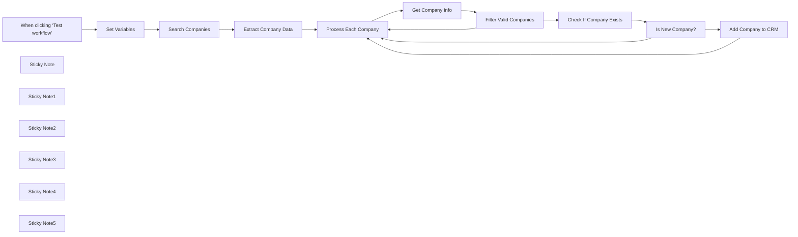

## Fluxo (.json) :

```json
{
  "id": "NOycL25YOISt8OLU",
  "meta": {
    "instanceId": "95a1299fb2b16eb2219cb044f54e72c2d00dcd2c72efe717b3c308d200f29927",
    "templateCredsSetupCompleted": true
  },
  "name": "Search LinkedIn companies and add them to Airtable CRM",
  "tags": [],
  "nodes": [
    {
      "id": "671698bb-adb4-48dc-9115-c6557b5ffc5d",
      "name": "When clicking ‘Test workflow’",
      "type": "n8n-nodes-base.manualTrigger",
      "position": [
        80,
        460
      ],
      "parameters": {},
      "typeVersion": 1
    },
    {
      "id": "315d7d7d-145d-4326-a1ae-9da2d1a420b4",
      "name": "Process Each Company",
      "type": "n8n-nodes-base.splitInBatches",
      "onError": "continueRegularOutput",
      "position": [
        1020,
        460
      ],
      "parameters": {
        "options": {}
      },
      "typeVersion": 3,
      "alwaysOutputData": false
    },
    {
      "id": "efaca93a-d954-491d-a03b-d727efeafe07",
      "name": "Get Company Info",
      "type": "n8n-nodes-base.httpRequest",
      "onError": "continueRegularOutput",
      "position": [
        1260,
        460
      ],
      "parameters": {
        "url": "https://api.ghostgenius.fr/v2/company",
        "options": {
          "batching": {
            "batch": {
              "batchSize": 1,
              "batchInterval": 2000
            }
          }
        },
        "sendQuery": true,
        "authentication": "genericCredentialType",
        "genericAuthType": "httpHeaderAuth",
        "queryParameters": {
          "parameters": [
            {
              "name": "url",
              "value": "={{ $json.url }}"
            }
          ]
        }
      },
      "credentials": {
        "httpHeaderAuth": {
          "id": "bLl270qRTYghd4Za",
          "name": "Instantly"
        }
      },
      "retryOnFail": true,
      "typeVersion": 4.2
    },
    {
      "id": "22551be2-9c65-44e4-9e07-9491a5e8e12e",
      "name": "Filter Valid Companies",
      "type": "n8n-nodes-base.if",
      "onError": "continueRegularOutput",
      "position": [
        1480,
        460
      ],
      "parameters": {
        "options": {},
        "conditions": {
          "options": {
            "version": 2,
            "leftValue": "",
            "caseSensitive": true,
            "typeValidation": "strict"
          },
          "combinator": "and",
          "conditions": [
            {
              "id": "5ea943a6-8f6c-4cb0-b194-8c92d4b2aacc",
              "operator": {
                "type": "string",
                "operation": "notEmpty",
                "singleValue": true
              },
              "leftValue": "={{ $json.website }}",
              "rightValue": "[null]"
            },
            {
              "id": "8235b9bb-3cd4-4ed4-a5dc-921127ff47c7",
              "operator": {
                "type": "number",
                "operation": "gt"
              },
              "leftValue": "={{ $json.followers_count }}",
              "rightValue": 200
            }
          ]
        }
      },
      "typeVersion": 2.2
    },
    {
      "id": "d68f1aef-c0af-4611-8e66-bce1cc041197",
      "name": "Check If Company Exists",
      "type": "n8n-nodes-base.airtable",
      "position": [
        1880,
        460
      ],
      "parameters": {
        "base": {
          "__rl": true,
          "mode": "list",
          "value": "appjYSpxvs8mlJaIW",
          "cachedResultUrl": "https://airtable.com/appjYSpxvs8mlJaIW",
          "cachedResultName": "CRM"
        },
        "table": {
          "__rl": true,
          "mode": "list",
          "value": "tbliG5xhydGGgk3nD",
          "cachedResultUrl": "https://airtable.com/appjYSpxvs8mlJaIW/tbliG5xhydGGgk3nD",
          "cachedResultName": "CRM"
        },
        "options": {},
        "operation": "search",
        "filterByFormula": "={id} = '{{ $json.id.toNumber() }}'"
      },
      "credentials": {
        "airtableTokenApi": {
          "id": "xEgnWLP3bQAkHxtH",
          "name": "Airtable Personal Access Token account 3"
        }
      },
      "typeVersion": 2.1,
      "alwaysOutputData": true
    },
    {
      "id": "79b37427-388f-42f8-abde-43b47badd7b8",
      "name": "Is New Company?",
      "type": "n8n-nodes-base.if",
      "position": [
        2120,
        460
      ],
      "parameters": {
        "options": {},
        "conditions": {
          "options": {
            "version": 2,
            "leftValue": "",
            "caseSensitive": true,
            "typeValidation": "strict"
          },
          "combinator": "and",
          "conditions": [
            {
              "id": "050c33be-c648-44d7-901c-51f6ff024e97",
              "operator": {
                "type": "object",
                "operation": "empty",
                "singleValue": true
              },
              "leftValue": "={{ $('Check If Company Exists').all().first().json }}",
              "rightValue": ""
            }
          ]
        }
      },
      "typeVersion": 2.2
    },
    {
      "id": "8c2a5434-261e-48c7-b515-d6517e6e9304",
      "name": "Add Company to CRM",
      "type": "n8n-nodes-base.airtable",
      "position": [
        2380,
        460
      ],
      "parameters": {
        "base": {
          "__rl": true,
          "mode": "list",
          "value": "appjYSpxvs8mlJaIW",
          "cachedResultUrl": "https://airtable.com/appjYSpxvs8mlJaIW",
          "cachedResultName": "CRM"
        },
        "table": {
          "__rl": true,
          "mode": "list",
          "value": "tbliG5xhydGGgk3nD",
          "cachedResultUrl": "https://airtable.com/appjYSpxvs8mlJaIW/tbliG5xhydGGgk3nD",
          "cachedResultName": "CRM"
        },
        "columns": {
          "value": {
            "id": "={{ $('Filter Valid Companies').item.json.id.toNumber() }}",
            "Name": "={{ $('Filter Valid Companies').item.json.name }}",
            "Country": "🇺🇸 United States",
            "Summary": "={{ $('Filter Valid Companies').item.json.description }}",
            "Tagline": "={{ $('Filter Valid Companies').item.json.tagline }}",
            "Website": "={{ $('Filter Valid Companies').item.json.website }}",
            "Category": "Growth Marketing Agency 11-50 🌍",
            "LinkedIn": "={{ $('Filter Valid Companies').item.json.url }}"
          },
          "schema": [
            {
              "id": "Name",
              "type": "string",
              "display": true,
              "removed": false,
              "readOnly": false,
              "required": false,
              "displayName": "Name",
              "defaultMatch": false,
              "canBeUsedToMatch": true
            },
            {
              "id": "Website",
              "type": "string",
              "display": true,
              "removed": false,
              "readOnly": false,
              "required": false,
              "displayName": "Website",
              "defaultMatch": false,
              "canBeUsedToMatch": true
            },
            {
              "id": "LinkedIn",
              "type": "string",
              "display": true,
              "removed": false,
              "readOnly": false,
              "required": false,
              "displayName": "LinkedIn",
              "defaultMatch": false,
              "canBeUsedToMatch": true
            },
            {
              "id": "Category",
              "type": "options",
              "display": true,
              "options": [
                {
                  "name": "Growth Marketing Agency 11-50 🌍",
                  "value": "Growth Marketing Agency 11-50 🌍"
                }
              ],
              "removed": false,
              "readOnly": false,
              "required": false,
              "displayName": "Category",
              "defaultMatch": false,
              "canBeUsedToMatch": true
            },
            {
              "id": "id",
              "type": "number",
              "display": true,
              "removed": false,
              "readOnly": false,
              "required": false,
              "displayName": "id",
              "defaultMatch": false,
              "canBeUsedToMatch": true
            },
            {
              "id": "Tagline",
              "type": "string",
              "display": true,
              "removed": false,
              "readOnly": false,
              "required": false,
              "displayName": "Tagline",
              "defaultMatch": false,
              "canBeUsedToMatch": true
            },
            {
              "id": "Summary",
              "type": "string",
              "display": true,
              "removed": false,
              "readOnly": false,
              "required": false,
              "displayName": "Summary",
              "defaultMatch": false,
              "canBeUsedToMatch": true
            },
            {
              "id": "Index",
              "type": "string",
              "display": true,
              "removed": true,
              "readOnly": true,
              "required": false,
              "displayName": "Index",
              "defaultMatch": false,
              "canBeUsedToMatch": true
            },
            {
              "id": "Country",
              "type": "options",
              "display": true,
              "options": [
                {
                  "name": "🇨🇱 Chili",
                  "value": "🇨🇱 Chili"
                },
                {
                  "name": "🇰🇿 Kazakhstan",
                  "value": "🇰🇿 Kazakhstan"
                },
                {
                  "name": "🇸🇪 Suède",
                  "value": "🇸🇪 Suède"
                },
                {
                  "name": "🇳🇴 Norvège",
                  "value": "🇳🇴 Norvège"
                },
                {
                  "name": "🇵🇪 Pérou",
                  "value": "🇵🇪 Pérou"
                },
                {
                  "name": "🇹🇼 Taïwan",
                  "value": "🇹🇼 Taïwan"
                },
                {
                  "name": "🇦🇹 Autriche",
                  "value": "🇦🇹 Autriche"
                },
                {
                  "name": "🇩🇰 Danemark",
                  "value": "🇩🇰 Danemark"
                },
                {
                  "name": "🇷🇺 Russie",
                  "value": "🇷🇺 Russie"
                },
                {
                  "name": "🇰🇷 Corée du Sud",
                  "value": "🇰🇷 Corée du Sud"
                },
                {
                  "name": "🇪🇪 Estonie",
                  "value": "🇪🇪 Estonie"
                },
                {
                  "name": "🇷🇴 Roumanie",
                  "value": "🇷🇴 Roumanie"
                },
                {
                  "name": "🇨🇴 Colombie",
                  "value": "🇨🇴 Colombie"
                },
                {
                  "name": "🇮🇷 Iran",
                  "value": "🇮🇷 Iran"
                },
                {
                  "name": "🇦🇷 Argentine",
                  "value": "🇦🇷 Argentine"
                },
                {
                  "name": "🇧🇪 Belgique",
                  "value": "🇧🇪 Belgique"
                },
                {
                  "name": "🇬🇷 Grèce",
                  "value": "🇬🇷 Grèce"
                },
                {
                  "name": "🇲🇦 Maroc",
                  "value": "🇲🇦 Maroc"
                },
                {
                  "name": "🇵🇱 Pologne",
                  "value": "🇵🇱 Pologne"
                },
                {
                  "name": "🇵🇹 Portugal",
                  "value": "🇵🇹 Portugal"
                },
                {
                  "name": "🇧🇷 Brésil",
                  "value": "🇧🇷 Brésil"
                },
                {
                  "name": "🇰🇪 Kenya",
                  "value": "🇰🇪 Kenya"
                },
                {
                  "name": "🇮🇹 Italie",
                  "value": "🇮🇹 Italie"
                },
                {
                  "name": "🇮🇱 Israël",
                  "value": "🇮🇱 Israël"
                },
                {
                  "name": "🇲🇽 Mexique",
                  "value": "🇲🇽 Mexique"
                },
                {
                  "name": "🇺🇦 Ukraine",
                  "value": "🇺🇦 Ukraine"
                },
                {
                  "name": "🇫🇷 France",
                  "value": "🇫🇷 France"
                },
                {
                  "name": "🇹🇷 Turquie",
                  "value": "🇹🇷 Turquie"
                },
                {
                  "name": "🇲🇾 Malaisie",
                  "value": "🇲🇾 Malaisie"
                },
                {
                  "name": "🇵🇭 Philippines",
                  "value": "🇵🇭 Philippines"
                },
                {
                  "name": "🇿🇦 Afrique du Sud",
                  "value": "🇿🇦 Afrique du Sud"
                },
                {
                  "name": "🇩🇪 Allemagne",
                  "value": "🇩🇪 Allemagne"
                },
                {
                  "name": "🇳🇱 Pays-Bas",
                  "value": "🇳🇱 Pays-Bas"
                },
                {
                  "name": "🇪🇸 Espagne",
                  "value": "🇪🇸 Espagne"
                },
                {
                  "name": "🇸🇬 Singapour",
                  "value": "🇸🇬 Singapour"
                },
                {
                  "name": "🇦🇺 Australie",
                  "value": "🇦🇺 Australie"
                },
                {
                  "name": "🇨🇦 Canada",
                  "value": "🇨🇦 Canada"
                },
                {
                  "name": "🇦🇪 Émirats arabes unis",
                  "value": "🇦🇪 Émirats arabes unis"
                },
                {
                  "name": "🇵🇰 Pakistan",
                  "value": "🇵🇰 Pakistan"
                },
                {
                  "name": "🇬🇧 Royaume-Uni",
                  "value": "🇬🇧 Royaume-Uni"
                },
                {
                  "name": "🇮🇳 Inde",
                  "value": "🇮🇳 Inde"
                },
                {
                  "name": "🇺🇸 United States",
                  "value": "🇺🇸 United States"
                }
              ],
              "removed": false,
              "readOnly": false,
              "required": false,
              "displayName": "Country",
              "defaultMatch": false,
              "canBeUsedToMatch": true
            },
            {
              "id": "State",
              "type": "options",
              "display": true,
              "options": [
                {
                  "name": "Not yet added",
                  "value": "Not yet added"
                },
                {
                  "name": "Added to the campaign",
                  "value": "Added to the campaign"
                },
                {
                  "name": "No mail found",
                  "value": "No mail found"
                },
                {
                  "name": "No employee found",
                  "value": "No employee found"
                },
                {
                  "name": "To do later",
                  "value": "To do later"
                },
                {
                  "name": "Meeting booked",
                  "value": "Meeting booked"
                }
              ],
              "removed": true,
              "readOnly": false,
              "required": false,
              "displayName": "State",
              "defaultMatch": false,
              "canBeUsedToMatch": true
            }
          ],
          "mappingMode": "defineBelow",
          "matchingColumns": [],
          "attemptToConvertTypes": false,
          "convertFieldsToString": false
        },
        "options": {},
        "operation": "create"
      },
      "credentials": {
        "airtableTokenApi": {
          "id": "xEgnWLP3bQAkHxtH",
          "name": "Airtable Personal Access Token account 3"
        }
      },
      "typeVersion": 2.1
    },
    {
      "id": "e7bc9249-8873-4db8-8a17-e0c064e72f07",
      "name": "Sticky Note",
      "type": "n8n-nodes-base.stickyNote",
      "position": [
        40,
        100
      ],
      "parameters": {
        "color": 6,
        "width": 800,
        "height": 560,
        "content": "## LinkedIn Company Search\nThis section initiates the workflow and searches for your target companies on LinkedIn using the Ghost Genius API. \n\nYou can filter and refine your search using keywords, company size, location, industry, or even whether the company has active job postings. Use the \"Set Variables\" node for it.\n\nNote that you can retrieve a maximum of 1000 companies per search (corresponding to 100 LinkedIn pages), so it's important not to exceed this number of results to avoid losing prospects.\n\n**Example:** Let's say I want to target Growth Marketing Agencies with 11-50 employees. I do my search and see that there are 10,000 results. So I refine my search by using location to go country by country and retrieve all 10,000 results in several batches ranging from 500 to 1000 depending on the country.\n\n**Tips:** To test the workflow or to see the number of results of your search, change the pagination parameter (Max Pages) in the \"Search Companies\" node. It will be displayed at the very top of the response JSON."
      },
      "typeVersion": 1
    },
    {
      "id": "77f086d4-c2a5-4e09-92fc-b8db0dc8d610",
      "name": "Sticky Note1",
      "type": "n8n-nodes-base.stickyNote",
      "position": [
        920,
        100
      ],
      "parameters": {
        "color": 4,
        "width": 780,
        "height": 560,
        "content": "## Company Data Processing \nThis section processes each company individually.\n\nWe retrieve all the company information using Get Company Details by using the LinkedIn link obtained from the previous section.\n\nThen we filter the company based on the number of followers, which gives us a first indication of the company's credibility (200 in this case), and whether their LinkedIn page has a website listed.\n\nThe workflow implements batch processing with a 2-second delay between requests to respect API rate limits. This methodical approach ensures reliable data collection while preventing API timeouts.\n\nYou can adjust these thresholds based on your target market - increasing the follower count for more established businesses or decreasing it for emerging markets."
      },
      "typeVersion": 1
    },
    {
      "id": "4e2d908a-2f75-4a94-ba81-998a0d3dc72d",
      "name": "Sticky Note2",
      "type": "n8n-nodes-base.stickyNote",
      "position": [
        1780,
        100
      ],
      "parameters": {
        "color": 5,
        "width": 780,
        "height": 560,
        "content": "## CRM Integration\nThis section handles the Airtable CRM integration.\n\nIt first checks if the company already exists in your database (using LinkedIn ID) to prevent duplicates because when you do close enough searches, some companies may come up several times.\n\nIf it's a new company, it adds the record to Airtable with comprehensive details including name, LinkedIn URL, website, tagline, description, and category. \n\nThe workflow automatically tags companies as 'Growth Marketing Agency 11-50 🌍' and sets the country to '🇺🇸 United States' (customize according to your use case)."
      },
      "typeVersion": 1
    },
    {
      "id": "9620a657-e17d-4728-a040-dd2ac2d290e0",
      "name": "Sticky Note3",
      "type": "n8n-nodes-base.stickyNote",
      "position": [
        300,
        -300
      ],
      "parameters": {
        "width": 600,
        "height": 320,
        "content": "## Introduction\nWelcome to my template! Before explaining how to set it up, here's some important information:\n\nThis automation is very easy to implement and is designed for anyone wanting to build and enrich a solid CRM through LinkedIn research.\n\nThe initial data source can be changed as long as you have the LinkedIn URL of the company.\n\nFor any questions, you can send me a DM on my [LinkedIn](https://www.linkedin.com/in/matthieu-belin83/) :)  "
      },
      "typeVersion": 1
    },
    {
      "id": "09e9a6bd-1790-4f0f-a97c-5d2bb2595efb",
      "name": "Sticky Note4",
      "type": "n8n-nodes-base.stickyNote",
      "position": [
        1000,
        -300
      ],
      "parameters": {
        "width": 600,
        "height": 320,
        "content": "## Setup\n- Create an account on [Ghost Genius API](https://ghostgenius.fr) and get your API key.\n\n- Configure the Search Companies and Get Company Info modules by creating a \"Header Auth\" credential:\n**Name: \"Authorization\"**\n**Value: \"Bearer api_key\"**\n\n- Create an Airtable base named \"CRM\" and add at least the following columns: name (default), website (url), LinkedIn (url), id (number).\n\n- Configure your Airtable credential by following the n8n documentation.\n\n- Add your company search selection criteria to the “Set Variables” node."
      },
      "typeVersion": 1
    },
    {
      "id": "d90e07f3-d87c-4a1e-a94a-5540464026c5",
      "name": "Sticky Note5",
      "type": "n8n-nodes-base.stickyNote",
      "position": [
        1700,
        -300
      ],
      "parameters": {
        "width": 600,
        "height": 320,
        "content": "## Tools \n**(You can use the API and CRM of your choice; this is only a suggestion)**\n\n- API Linkedin : [Ghost Genius API](https://ghostgenius.fr) \n\n- API Documentation : [Documentation](https://ghostgenius.fr/docs)\n\n- CRM : [Airtable](https://airtable.com)\n\n- LinkedIn Location ID Finder : [Ghost Genius Locations ID Finder](https://ghostgenius.fr/tools/search-sales-navigator-locations-id)"
      },
      "typeVersion": 1
    },
    {
      "id": "89a5a739-b1ce-4012-a64a-d1dfced589ab",
      "name": "Set Variables",
      "type": "n8n-nodes-base.set",
      "position": [
        280,
        460
      ],
      "parameters": {
        "options": {},
        "assignments": {
          "assignments": [
            {
              "id": "e81e4891-4786-4dd9-a338-d1095e27f382",
              "name": "Your target",
              "type": "string",
              "value": "Growth Marketing Agency"
            },
            {
              "id": "ed2b6b08-66aa-4d4b-b68c-698b5e841930",
              "name": "B: 1-10 employees, C: 11-50 employees, D: 51-200 employees, E: 201-500 employees, F: 501-1000 employees, G: 1001-5000 employees, H: 5001-10,000 employees, I: 10,001+ employees",
              "type": "string",
              "value": "C"
            },
            {
              "id": "f1d02f1a-8115-4e0c-a5ec-59bf5b54263b",
              "name": "Location (find it on : https://www.ghostgenius.fr/tools/search-sales-navigator-locations-id)",
              "type": "string",
              "value": "103644278"
            }
          ]
        }
      },
      "typeVersion": 3.4
    },
    {
      "id": "3de1fad5-53c0-4fc3-b97b-1a96515df9c6",
      "name": "Search Companies",
      "type": "n8n-nodes-base.httpRequest",
      "position": [
        480,
        460
      ],
      "parameters": {
        "url": "https://api.ghostgenius.fr/v2/search/companies",
        "options": {
          "pagination": {
            "pagination": {
              "parameters": {
                "parameters": [
                  {
                    "name": "page",
                    "value": "={{ $pageCount + 1 }}"
                  }
                ]
              },
              "requestInterval": 2000,
              "limitPagesFetched": true,
              "completeExpression": "={{ $response.body.data.isEmpty() }}",
              "paginationCompleteWhen": "other"
            }
          }
        },
        "sendQuery": true,
        "authentication": "genericCredentialType",
        "genericAuthType": "httpHeaderAuth",
        "queryParameters": {
          "parameters": [
            {
              "name": "keywords",
              "value": "={{ $json['Your target'] }}"
            },
            {
              "name": "company_size",
              "value": "={{ $json['B: 1-10 employees, C: 11-50 employees, D: 51-200 employees, E: 201-500 employees, F: 501-1000 employees, G: 1001-5000 employees, H: 5001-10,000 employees, I: 10,001+ employees'] }}"
            },
            {
              "name": "location",
              "value": "={{ $json['Location (https://www'].ghostgenius['fr/tools/search-sales-navigator-locations-id)'] }}"
            }
          ]
        }
      },
      "credentials": {
        "httpHeaderAuth": {
          "id": "XdFg4wGkcxwRPUMo",
          "name": "Header Auth account 4"
        }
      },
      "typeVersion": 4.2
    },
    {
      "id": "1e696afe-cb72-4be0-b04d-c9965f53de0d",
      "name": "Extract Company Data",
      "type": "n8n-nodes-base.splitOut",
      "onError": "continueRegularOutput",
      "position": [
        680,
        460
      ],
      "parameters": {
        "options": {},
        "fieldToSplitOut": "data"
      },
      "typeVersion": 1
    }
  ],
  "active": false,
  "pinData": {},
  "settings": {
    "executionOrder": "v1"
  },
  "versionId": "c3c47cd6-24f4-4be9-b5bd-147abde5c3e1",
  "connections": {
    "Set Variables": {
      "main": [
        [
          {
            "node": "Search Companies",
            "type": "main",
            "index": 0
          }
        ]
      ]
    },
    "Is New Company?": {
      "main": [
        [
          {
            "node": "Add Company to CRM",
            "type": "main",
            "index": 0
          }
        ],
        [
          {
            "node": "Process Each Company",
            "type": "main",
            "index": 0
          }
        ]
      ]
    },
    "Get Company Info": {
      "main": [
        [
          {
            "node": "Filter Valid Companies",
            "type": "main",
            "index": 0
          }
        ]
      ]
    },
    "Search Companies": {
      "main": [
        [
          {
            "node": "Extract Company Data",
            "type": "main",
            "index": 0
          }
        ]
      ]
    },
    "Add Company to CRM": {
      "main": [
        [
          {
            "node": "Process Each Company",
            "type": "main",
            "index": 0
          }
        ]
      ]
    },
    "Extract Company Data": {
      "main": [
        [
          {
            "node": "Process Each Company",
            "type": "main",
            "index": 0
          }
        ]
      ]
    },
    "Process Each Company": {
      "main": [
        [],
        [
          {
            "node": "Get Company Info",
            "type": "main",
            "index": 0
          }
        ]
      ]
    },
    "Filter Valid Companies": {
      "main": [
        [
          {
            "node": "Check If Company Exists",
            "type": "main",
            "index": 0
          }
        ],
        [
          {
            "node": "Process Each Company",
            "type": "main",
            "index": 0
          }
        ]
      ]
    },
    "Check If Company Exists": {
      "main": [
        [
          {
            "node": "Is New Company?",
            "type": "main",
            "index": 0
          }
        ]
      ]
    },
    "When clicking ‘Test workflow’": {
      "main": [
        [
          {
            "node": "Set Variables",
            "type": "main",
            "index": 0
          }
        ]
      ]
    }
  }
}
```

<a id="template-784"></a>

## Template 784 - Enviar pedido XML por POST para API de vendas

- **Nome:** Enviar pedido XML por POST para API de vendas
- **Descrição:** Lê emails com anexos XML, converte o XML para JSON e envia o conteúdo como campo form-urlencoded para um endpoint de vendas.
- **Funcionalidade:** • Receber emails via IMAP: conecta-se ao servidor IMAP e baixa emails com anexos.
• Extrair anexo XML: move o anexo (attachment_0) para o campo de dados e o interpreta como texto UTF-8.
• Converter XML para JSON: transforma o conteúdo XML em estrutura JSON, ignorando atributos e mantendo o root explícito.
• Preparar payload: organiza o JSON convertido no campo orderRequest para envio.
• Enviar requisição HTTP POST: envia o payload como body form-urlencoded para o endpoint de vendas e captura a resposta como string.
• Suportar certificados não confiáveis: permite conexões com certificados SSL/TLS não autorizados.
- **Ferramentas:** • Servidor de email IMAP: fonte dos emails e anexos XML que contêm os pedidos.
• Endpoint de API de vendas (http://localhost:5679/api/sales-order): serviço receptor que aceita pedidos via HTTP POST.

## Fluxo visual

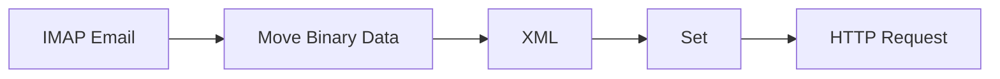

## Fluxo (.json) :

```json
{
  "id": "1",
  "name": "ImapEmail, XmlToJson, POST-HTTP-Request",
  "nodes": [
    {
      "name": "IMAP Email",
      "type": "n8n-nodes-base.emailReadImap",
      "position": [
        450,
        450
      ],
      "parameters": {
        "options": {
          "allowUnauthorizedCerts": true
        },
        "downloadAttachments": true
      },
      "credentials": {
        "imap": ""
      },
      "typeVersion": 1
    },
    {
      "name": "Move Binary Data",
      "type": "n8n-nodes-base.moveBinaryData",
      "position": [
        600,
        450
      ],
      "parameters": {
        "options": {
          "encoding": "utf8",
          "keepSource": false
        },
        "sourceKey": "attachment_0",
        "setAllData": false,
        "destinationKey": "xml"
      },
      "typeVersion": 1
    },
    {
      "name": "XML",
      "type": "n8n-nodes-base.xml",
      "position": [
        800,
        450
      ],
      "parameters": {
        "options": {
          "ignoreAttrs": true,
          "explicitRoot": true
        },
        "dataPropertyName": "xml"
      },
      "typeVersion": 1
    },
    {
      "name": "HTTP Request",
      "type": "n8n-nodes-base.httpRequest",
      "position": [
        1210,
        450
      ],
      "parameters": {
        "url": "http://localhost:5679/api/sales-order",
        "options": {
          "bodyContentType": "form-urlencoded"
        },
        "requestMethod": "POST",
        "responseFormat": "string",
        "bodyParametersUi": {
          "parameter": [
            {
              "name": "orderRequest",
              "value": "={{$node[\"Set\"].data}}"
            }
          ]
        },
        "dataPropertyName": "status",
        "allowUnauthorizedCerts": true
      },
      "typeVersion": 1
    },
    {
      "name": "Set",
      "type": "n8n-nodes-base.set",
      "position": [
        960,
        450
      ],
      "parameters": {
        "values": {
          "number": []
        }
      },
      "typeVersion": 1
    }
  ],
  "active": true,
  "settings": {},
  "connections": {
    "Set": {
      "main": [
        [
          {
            "node": "HTTP Request",
            "type": "main",
            "index": 0
          }
        ]
      ]
    },
    "XML": {
      "main": [
        [
          {
            "node": "Set",
            "type": "main",
            "index": 0
          }
        ]
      ]
    },
    "IMAP Email": {
      "main": [
        [
          {
            "node": "Move Binary Data",
            "type": "main",
            "index": 0
          }
        ]
      ]
    },
    "Move Binary Data": {
      "main": [
        [
          {
            "node": "XML",
            "type": "main",
            "index": 0
          }
        ]
      ]
    }
  }
}
```

<a id="template-785"></a>

## Template 785 - Geração de emails de vendas personalizados

- **Nome:** Geração de emails de vendas personalizados
- **Descrição:** Extrai e analisa e-mails de clientes para construir uma persona e gerar rascunhos de e-mail de vendas personalizados para revisão humana.
- **Funcionalidade:** • Importação de contatos alvo: busca contatos segmentados para campanha de outreach.
• Iteração por contato: processa cada contato individualmente para personalização em escala.
• Coleta de correspondência do cliente: recupera e-mails recebidos para obter contexto real de comunicação.
• Análise e construção de persona: usa processamento de linguagem para extrair atributos como estilo de decisão, preferências de comunicação, dores e motivações.
• Geração de email de vendas personalizado: cria assunto e corpo em HTML alinhados à persona e ao produto definido.
• Criação de rascunho para revisão: salva o e-mail gerado como rascunho para revisão humana antes do envio.
- **Ferramentas:** • HubSpot: CRM usado para buscar e filtrar contatos alvo (ex.: decisores).
• Gmail: fonte de mensagens do cliente e destino para criar rascunhos de e-mail.
• Google Gemini (PaLM): modelo de linguagem utilizado para analisar mensagens e gerar a persona e o texto do e-mail.

## Fluxo visual

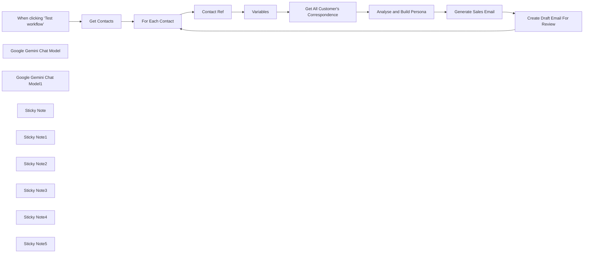

## Fluxo (.json) :

```json
{
  "meta": {
    "instanceId": "408f9fb9940c3cb18ffdef0e0150fe342d6e655c3a9fac21f0f644e8bedabcd9",
    "templateCredsSetupCompleted": true
  },
  "nodes": [
    {
      "id": "93a8b03f-ff6b-4559-9cb1-9f439ff5e990",
      "name": "When clicking ‘Test workflow’",
      "type": "n8n-nodes-base.manualTrigger",
      "position": [
        -1180,
        0
      ],
      "parameters": {},
      "typeVersion": 1
    },
    {
      "id": "0aed449c-c60a-4309-91d2-4db9ed1f4ad2",
      "name": "Variables",
      "type": "n8n-nodes-base.set",
      "position": [
        -120,
        0
      ],
      "parameters": {
        "options": {},
        "assignments": {
          "assignments": [
            {
              "id": "a6c47778-33f4-46a3-a86a-fd1e75930d93",
              "name": "firstname",
              "type": "string",
              "value": "={{ $json.properties.firstname }}"
            },
            {
              "id": "0e50b2bc-4bea-4fd0-95c0-46a87da69c19",
              "name": "lastname",
              "type": "string",
              "value": "={{ $json.properties.lastname }}"
            },
            {
              "id": "ee15f298-77f6-4c4a-b03b-c2cf9a53bdc2",
              "name": "email",
              "type": "string",
              "value": "={{ $json.properties.email }}"
            },
            {
              "id": "98a718f5-4372-4282-8a9a-46f2af39677a",
              "name": "product_to_sell",
              "type": "string",
              "value": "=AI partnerships: a consulting package of AI development and services. We help customers find a strong foothold on AI initiatives bringing them to life cost effectively and always with results."
            }
          ]
        }
      },
      "typeVersion": 3.4
    },
    {
      "id": "f21c0147-dd18-4b06-9f58-258b8946977d",
      "name": "Google Gemini Chat Model",
      "type": "@n8n/n8n-nodes-langchain.lmChatGoogleGemini",
      "position": [
        520,
        160
      ],
      "parameters": {
        "options": {},
        "modelName": "models/gemini-2.0-flash"
      },
      "credentials": {
        "googlePalmApi": {
          "id": "dSxo6ns5wn658r8N",
          "name": "Google Gemini(PaLM) Api account"
        }
      },
      "typeVersion": 1
    },
    {
      "id": "27aaa070-4de5-479a-83eb-d2e0810a19da",
      "name": "Google Gemini Chat Model1",
      "type": "@n8n/n8n-nodes-langchain.lmChatGoogleGemini",
      "position": [
        1120,
        160
      ],
      "parameters": {
        "options": {},
        "modelName": "models/gemini-2.0-flash"
      },
      "credentials": {
        "googlePalmApi": {
          "id": "dSxo6ns5wn658r8N",
          "name": "Google Gemini(PaLM) Api account"
        }
      },
      "typeVersion": 1
    },
    {
      "id": "b76ec237-3d90-4ed4-8746-36693775a39f",
      "name": "Create Draft Email For Review",
      "type": "n8n-nodes-base.gmail",
      "position": [
        1680,
        180
      ],
      "webhookId": "8b3d78e5-8cea-4205-a9db-c66ec01f9558",
      "parameters": {
        "message": "={{ $json.output.body }}",
        "options": {
          "sendTo": "={{ $('Variables').first().json.email }}"
        },
        "subject": "={{ $json.output.subject }}",
        "resource": "draft",
        "emailType": "html"
      },
      "credentials": {
        "gmailOAuth2": {
          "id": "Sf5Gfl9NiFTNXFWb",
          "name": "Gmail account"
        }
      },
      "typeVersion": 2.1
    },
    {
      "id": "7d62abe5-9278-45f2-ba07-aba0f4353a00",
      "name": "Generate Sales Email",
      "type": "@n8n/n8n-nodes-langchain.informationExtractor",
      "position": [
        1040,
        0
      ],
      "parameters": {
        "text": "=# Profile of {{ $('Variables').first().json.firstname }} {{ $('Variables').first().json.lastname }}\n{{ Object.keys($json.output).map(key => `## ${key}\\n${$json.output[key]}`).join('\\n') }}",
        "options": {
          "systemPromptTemplate": "=You are a sales representative drafting an email to close a potential customer on the following product: <product>{{ $('Variables').first().json.product_to_sell }}</product>\n\nUse the provided profile to draft the a suitable email which reflects similar communication style and addresses their values, ultimately convinces the customer to inquire about and/or buy this product. Provide only the subject and body of the message as this text will go into a template. Omit the subject and signature."
        },
        "attributes": {
          "attributes": [
            {
              "name": "subject",
              "required": true,
              "description": "the subject of the message"
            },
            {
              "name": "body",
              "required": true,
              "description": "the body of the message with html styling"
            }
          ]
        }
      },
      "typeVersion": 1
    },
    {
      "id": "71cd4b52-c3cd-413e-b495-f0ef511af9b1",
      "name": "Sticky Note",
      "type": "n8n-nodes-base.stickyNote",
      "position": [
        -220,
        -200
      ],
      "parameters": {
        "color": 7,
        "width": 520,
        "height": 420,
        "content": "## 2. Research Customer via Emails\nEmails can be a great source of research on how a customer or potential customer thinks, behaves and communicates. This template does require some interaction beforehand but this should could be shared amongst colleagues or a CRM."
      },
      "typeVersion": 1
    },
    {
      "id": "f3cb9e8d-8d67-42a2-a9cd-7aae93a23816",
      "name": "Sticky Note1",
      "type": "n8n-nodes-base.stickyNote",
      "position": [
        320,
        -200
      ],
      "parameters": {
        "color": 7,
        "width": 540,
        "height": 540,
        "content": "## 3. Build Persona Outline from Research\nOnce we gather all the emails, we can use AI to analyse and construct a quick persona on our customer. Personas are useful to understand the customer's position and how favourably they might respond to a product and/or service. The Information Extractor node is used to guide the LLM for attributes we're interested in."
      },
      "typeVersion": 1
    },
    {
      "id": "e0bdca91-e744-4717-ada6-5991e2d6c054",
      "name": "Sticky Note2",
      "type": "n8n-nodes-base.stickyNote",
      "position": [
        880,
        -200
      ],
      "parameters": {
        "color": 7,
        "width": 560,
        "height": 540,
        "content": "## 4. Generate Sales Pitch based on Persona\nUsing the persona, we can again ask AI to generate the perfect sales email which takes into consideration the customer's beliefs, values and communication style. In this way, each sales email can be carefully written to improve its appeal to the customer."
      },
      "typeVersion": 1
    },
    {
      "id": "68be2c2c-5006-4041-b8ed-8c6b26d37251",
      "name": "Sticky Note3",
      "type": "n8n-nodes-base.stickyNote",
      "position": [
        1480,
        -40
      ],
      "parameters": {
        "color": 7,
        "width": 480,
        "height": 440,
        "content": "## 5. Create Draft for Human Review\nFinally, an email draft is created to store the generated sales pitch for human review. If given, a list of customers to target, a SDR can ensure customised outreach in minutes rather than hours or days. "
      },
      "typeVersion": 1
    },
    {
      "id": "893d42c3-c5fc-4cc3-acd2-5d847d4ebf1a",
      "name": "Analyse and Build Persona",
      "type": "@n8n/n8n-nodes-langchain.informationExtractor",
      "position": [
        440,
        0
      ],
      "parameters": {
        "text": "={{\n$input.all()\n  .map(item => `subject: ${item.json.subject}\ndate: ${$json.headers.date}\nmessage: ${item.json.text.substr(0, item.json.text.indexOf('> wrote:') ?? item.json.text.length).replace(/^On[\\w\\W]+$/im, '')}`\n  ).join('\\n---\\n')\n}}",
        "options": {
          "systemPromptTemplate": "=Your task is to build a persona of a customer or potential customer so that we may better serve them for our business. Analyse the recent correspondence of the user, {{ $('Variables').item.json.email }}, and extract the required attributes."
        },
        "attributes": {
          "attributes": [
            {
              "name": "decision_making_style",
              "required": true,
              "description": "=Analytical vs. Intuitive: Do they rely on data or gut feelings?\n\nRisk Appetite: Conservative, calculated risk-taker, or bold?\n\nSpeed of Decision-Making: Quick and assertive or deliberate and methodical?"
            },
            {
              "name": " communication_preferences",
              "required": true,
              "description": "=Preferred Medium: Email, phone calls, in-person meetings, messaging apps?\n\nDetail Orientation: High-level summaries or deep-dive explanations?\n\nTone & Formality: Casual vs. professional, direct vs. diplomatic?"
            },
            {
              "name": "pain_points_challenges",
              "required": true,
              "description": "=Current Business Challenges: What problems are they actively trying to solve?\n\nIndustry Pressures: Competitive landscape, economic concerns, regulatory issues?\n\nOperational Bottlenecks: Efficiency, team structure, technology gaps?"
            },
            {
              "name": "professional_goals_motivations",
              "required": true,
              "description": "=Personal Career Goals: Promotion, recognition, financial growth, legacy-building?\n\nBusiness Priorities: Revenue growth, innovation, market expansion, cost reduction?\n\nKey Performance Indicators (KPIs): How do they measure success?"
            },
            {
              "name": "work_style_preferences",
              "required": true,
              "description": "=Collaboration vs. Independence: Do they prefer teamwork or autonomy?\n\nLevel of Involvement: Hands-on or delegate-and-review?\n\nResponse Time Expectation: Do they expect immediate follow-ups or are they flexible?"
            },
            {
              "name": "personality_behavioral_traits",
              "required": true,
              "description": "=Big Five Traits: Are they open to new ideas, structured, agreeable, extroverted?\n\nConflict Resolution Style: Do they avoid, confront, or negotiate?\n\nTrust-Building Factors: Do they value reliability, transparency, exclusivity?"
            },
            {
              "name": " buying_investment_behavior",
              "required": true,
              "description": "=Budget Sensitivity: Price-conscious or value-focused?\n\nBrand Loyalty vs. Openness: Do they stick with familiar providers or explore new options?\n\nDecision Influencers: Do they rely on peers, market research, gut instinct?"
            },
            {
              "name": "preferred_business_culture_ethics",
              "required": true,
              "description": "=Formality vs. Informality: Corporate structure vs. entrepreneurial mindset?\n\nCore Values: Integrity, innovation, customer-first, sustainability?\n\nCultural Sensitivity: Are there cultural nuances to be aware of in their decision-making?"
            },
            {
              "name": "industry_competitive_awareness",
              "required": true,
              "description": "=Market Trends Interest: Do they actively track industry shifts?\n\nCompetitor Awareness: Are they reactive to competitors, or focused on internal growth?\n\nTech Adoption: Do they embrace innovation, or are they slow adopters?"
            }
          ]
        }
      },
      "executeOnce": true,
      "typeVersion": 1
    },
    {
      "id": "f27b7b8d-e9e8-445c-9209-25323bb40db4",
      "name": "Sticky Note4",
      "type": "n8n-nodes-base.stickyNote",
      "position": [
        -1400,
        -860
      ],
      "parameters": {
        "width": 480,
        "height": 1080,
        "content": "## Try it out\n### This n8n template uses existing emails from customers as context to customise and \"finetune\" outreach emails to them using AI.\n\nBy now, it should be common knowledge that we can leverage AI to generate unique emails but in a way, they can remain generic as the AI lacks the customer context to be truly personalised. One way to solve this is \n\n### How it works\n* Customers to target are pulled from Hubspot and each customer is then run in a loop. We're using a loop as the retrieved emails for each customer become separate items and a loop helps with item reference.\n* We connect to our Gmail account to pull all emails recieved from the customer.\n* The contents of the email will be suitable to build a short persona of the customer. We use the Information Extractor to get our AI model to pull out the key attributes of this persona such as decision making style and communication preferences.\n* With this persona, we can now pass this to our AI model to generate a personalised outreach email specifically for our customer.\n* Finally, a draft email is created for human review before sending. If you would rather send the email straight away, this is also possible.\n\n### How to use\n* Define the topic of the outreach email in the \"variables\" node. This directs the AI on what outreach email to generate.\n* Ensure the emails are pulled from the right account. If emails may contain sensitive data, adjust the filters and text parsing to ensure these are not leaked to the AI (which might then leak into the generated email).\n\n### Need Help?\nJoin the [Discord](https://discord.com/invite/XPKeKXeB7d) or ask in the [Forum](https://community.n8n.io/)!\n\nHappy Hacking!"
      },
      "typeVersion": 1
    },
    {
      "id": "72efcdea-3429-44e0-a29c-8ae0144783ae",
      "name": "Get All Customer's Correspondence",
      "type": "n8n-nodes-base.gmail",
      "position": [
        80,
        0
      ],
      "webhookId": "4d8c4b7a-da0b-49aa-bda8-7b1d89c62636",
      "parameters": {
        "limit": 20,
        "simple": false,
        "filters": {
          "q": "=from:{{ $json.email }}"
        },
        "options": {},
        "operation": "getAll"
      },
      "credentials": {
        "gmailOAuth2": {
          "id": "Sf5Gfl9NiFTNXFWb",
          "name": "Gmail account"
        }
      },
      "typeVersion": 2.1
    },
    {
      "id": "e73c8a55-c85f-45a1-9735-1cea61caff3e",
      "name": "Get Contacts",
      "type": "n8n-nodes-base.hubspot",
      "position": [
        -820,
        0
      ],
      "parameters": {
        "operation": "search",
        "authentication": "appToken",
        "filterGroupsUi": {
          "filterGroupsValues": [
            {
              "filtersUi": {
                "filterValues": [
                  {
                    "value": "DECISION_MAKER",
                    "propertyName": "hs_buying_role|enumeration"
                  }
                ]
              }
            }
          ]
        },
        "additionalFields": {}
      },
      "credentials": {
        "hubspotAppToken": {
          "id": "Qhag92BwOPZfXGfz",
          "name": "HubSpot account (Intrigued-Zoo)"
        }
      },
      "typeVersion": 2.1
    },
    {
      "id": "3579a71d-ce1f-4175-9118-87997158dcb6",
      "name": "For Each Contact",
      "type": "n8n-nodes-base.splitInBatches",
      "position": [
        -620,
        0
      ],
      "parameters": {
        "options": {}
      },
      "typeVersion": 3
    },
    {
      "id": "45679613-3114-4742-9e7a-700d8d29eff6",
      "name": "Contact Ref",
      "type": "n8n-nodes-base.noOp",
      "position": [
        -420,
        0
      ],
      "parameters": {},
      "typeVersion": 1
    },
    {
      "id": "18594bbd-efc5-4fbf-8693-ffcdfcfd900f",
      "name": "Sticky Note5",
      "type": "n8n-nodes-base.stickyNote",
      "position": [
        -880,
        -200
      ],
      "parameters": {
        "color": 7,
        "width": 640,
        "height": 420,
        "content": "## 1. Get Targeted Existing Customers\nAs with all campaigns, it's good to have a targeted subset of customers to aim for to assess the response. Here, we can pull them out of a CRM like Hubspot if granular filtering is required for example but even a simple csv of contacts would also work."
      },
      "typeVersion": 1
    }
  ],
  "pinData": {},
  "connections": {
    "Variables": {
      "main": [
        [
          {
            "node": "Get All Customer's Correspondence",
            "type": "main",
            "index": 0
          }
        ]
      ]
    },
    "Contact Ref": {
      "main": [
        [
          {
            "node": "Variables",
            "type": "main",
            "index": 0
          }
        ]
      ]
    },
    "Get Contacts": {
      "main": [
        [
          {
            "node": "For Each Contact",
            "type": "main",
            "index": 0
          }
        ]
      ]
    },
    "For Each Contact": {
      "main": [
        [],
        [
          {
            "node": "Contact Ref",
            "type": "main",
            "index": 0
          }
        ]
      ]
    },
    "Generate Sales Email": {
      "main": [
        [
          {
            "node": "Create Draft Email For Review",
            "type": "main",
            "index": 0
          }
        ]
      ]
    },
    "Google Gemini Chat Model": {
      "ai_languageModel": [
        [
          {
            "node": "Analyse and Build Persona",
            "type": "ai_languageModel",
            "index": 0
          }
        ]
      ]
    },
    "Analyse and Build Persona": {
      "main": [
        [
          {
            "node": "Generate Sales Email",
            "type": "main",
            "index": 0
          }
        ]
      ]
    },
    "Google Gemini Chat Model1": {
      "ai_languageModel": [
        [
          {
            "node": "Generate Sales Email",
            "type": "ai_languageModel",
            "index": 0
          }
        ]
      ]
    },
    "Create Draft Email For Review": {
      "main": [
        [
          {
            "node": "For Each Contact",
            "type": "main",
            "index": 0
          }
        ]
      ]
    },
    "Get All Customer's Correspondence": {
      "main": [
        [
          {
            "node": "Analyse and Build Persona",
            "type": "main",
            "index": 0
          }
        ]
      ]
    },
    "When clicking ‘Test workflow’": {
      "main": [
        [
          {
            "node": "Get Contacts",
            "type": "main",
            "index": 0
          }
        ]
      ]
    }
  }
}
```

<a id="template-786"></a>

## Template 786 - Atualizar títulos e descrições Printify com IA

- **Nome:** Atualizar títulos e descrições Printify com IA
- **Descrição:** Automatiza a leitura de produtos, gera títulos e descrições usando IA conforme diretrizes de marca, grava resultados na planilha e atualiza produtos no Printify quando solicitado.
- **Funcionalidade:** • Leitura de lojas Printify: Recupera as lojas conectadas para operar sobre seus produtos.
• Leitura de produtos da loja: Busca a lista de produtos para processamento.
• Iteração e processamento em lote: Percorre cada produto individualmente para gerar opções.
• Diretrizes de marca e instruções personalizadas: Usa valores configuráveis (nome, tom, instruções sazonais) como contexto para a geração de conteúdo.
• Geração de palavra-chave, título e descrição com IA: Cria um keyword, título e descrição otimizados para canais de venda usando um modelo de linguagem.
• Controle do número de opções: Calcula e gerencia quantas variações de título/descrição devem ser geradas.
• Registro e atualização em planilha: Adiciona e atualiza linhas na Google Sheets com status, títulos originais e gerados, descrições e IDs de produto.
• Condição de publicação: Só executa a atualização do produto no serviço se a coluna de controle (upload) estiver marcada como 'yes'.
• Atualização do produto via API: Envia PUT para o serviço de produtos para atualizar título e descrição quando aprovado.
- **Ferramentas:** • Printify: Plataforma de impressão sob demanda e API para gerenciar produtos e atualizações.
• Google Sheets: Planilha usada como gatilho (atualização de linha) e para armazenar status e resultados do processamento.
• OpenAI: Serviço de IA para gerar keywords, títulos e descrições com base nas diretrizes de marca.


## Fluxo visual

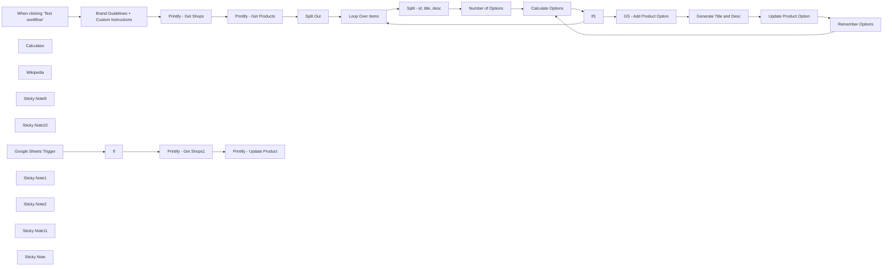

## Fluxo (.json) :

```json
{
  "id": "1V1gcK6vyczRqdZC",
  "meta": {
    "instanceId": "d868e3d040e7bda892c81b17cf446053ea25d2556fcef89cbe19dd61a3e876e9",
    "templateCredsSetupCompleted": true
  },
  "name": "Printify Automation - Update Title and Description - AlexK1919",
  "tags": [
    {
      "id": "NBHymnfw5EIluMXO",
      "name": "Printify",
      "createdAt": "2024-11-27T18:26:34.584Z",
      "updatedAt": "2024-11-27T18:26:34.584Z"
    },
    {
      "id": "QsH2EXuw2e7YCv0K",
      "name": "OpenAI",
      "createdAt": "2024-11-15T04:05:20.872Z",
      "updatedAt": "2024-11-15T04:05:20.872Z"
    }
  ],
  "nodes": [
    {
      "id": "313b16dc-2583-42f3-a0f7-487e75d7a7ec",
      "name": "When clicking ‘Test workflow’",
      "type": "n8n-nodes-base.manualTrigger",
      "position": [
        -700,
        -100
      ],
      "parameters": {},
      "typeVersion": 1
    },
    {
      "id": "fd59c09f-64cd-4e8a-80b1-d1abd9a52a5c",
      "name": "Printify - Get Shops",
      "type": "n8n-nodes-base.httpRequest",
      "position": [
        -60,
        -100
      ],
      "parameters": {
        "url": "https://api.printify.com/v1/shops.json",
        "options": {},
        "authentication": "genericCredentialType",
        "genericAuthType": "httpHeaderAuth"
      },
      "credentials": {
        "httpHeaderAuth": {
          "id": "vBaDp4RbmXnEx2rj",
          "name": "AlexK1919 Printify Header Auth"
        }
      },
      "typeVersion": 4.2
    },
    {
      "id": "8fa6a094-02f5-46c4-90d4-c17de302b004",
      "name": "Printify - Get Products",
      "type": "n8n-nodes-base.httpRequest",
      "position": [
        140,
        -100
      ],
      "parameters": {
        "url": "=https://api.printify.com/v1/shops/{{ $json.id }}/products.json",
        "options": {},
        "authentication": "genericCredentialType",
        "genericAuthType": "httpHeaderAuth"
      },
      "credentials": {
        "httpHeaderAuth": {
          "id": "vBaDp4RbmXnEx2rj",
          "name": "AlexK1919 Printify Header Auth"
        }
      },
      "typeVersion": 4.2
    },
    {
      "id": "00cdd85f-75ef-480b-aa58-d732b764337f",
      "name": "Split Out",
      "type": "n8n-nodes-base.splitOut",
      "position": [
        340,
        -100
      ],
      "parameters": {
        "options": {},
        "fieldToSplitOut": "data"
      },
      "typeVersion": 1
    },
    {
      "id": "564b02c3-38ce-411d-b1ca-e1a4b75310e4",
      "name": "Loop Over Items",
      "type": "n8n-nodes-base.splitInBatches",
      "position": [
        540,
        -100
      ],
      "parameters": {
        "options": {}
      },
      "typeVersion": 3
    },
    {
      "id": "95ea265f-7043-46ef-8513-67cf9407bda5",
      "name": "Split - id, title, desc",
      "type": "n8n-nodes-base.splitOut",
      "position": [
        740,
        -100
      ],
      "parameters": {
        "include": "selectedOtherFields",
        "options": {},
        "fieldToSplitOut": "id",
        "fieldsToInclude": "title, description"
      },
      "typeVersion": 1
    },
    {
      "id": "93ec8766-6ab3-4331-91fd-9aad24b587e9",
      "name": "Calculator",
      "type": "@n8n/n8n-nodes-langchain.toolCalculator",
      "position": [
        2240,
        80
      ],
      "parameters": {},
      "typeVersion": 1
    },
    {
      "id": "a9adf75e-bce3-4e0a-af44-e5e23b16b2f6",
      "name": "Wikipedia",
      "type": "@n8n/n8n-nodes-langchain.toolWikipedia",
      "position": [
        2120,
        80
      ],
      "parameters": {},
      "typeVersion": 1
    },
    {
      "id": "36272d91-a100-498d-8f24-2e93f2a1bb5b",
      "name": "Printify - Update Product",
      "type": "n8n-nodes-base.httpRequest",
      "position": [
        2080,
        500
      ],
      "parameters": {
        "url": "=https://api.printify.com/v1/shops/{{ $json.id }}/products/{{ $('Google Sheets Trigger').item.json.product_id }}.json",
        "method": "PUT",
        "options": {},
        "sendBody": true,
        "authentication": "genericCredentialType",
        "bodyParameters": {
          "parameters": [
            {
              "name": "=title",
              "value": "={{ $('Google Sheets Trigger').item.json.product_title }}"
            },
            {
              "name": "description",
              "value": "={{ $('Google Sheets Trigger').item.json.product_desc }}"
            }
          ]
        },
        "genericAuthType": "httpHeaderAuth"
      },
      "credentials": {
        "httpHeaderAuth": {
          "id": "vBaDp4RbmXnEx2rj",
          "name": "AlexK1919 Printify Header Auth"
        }
      },
      "typeVersion": 4.2
    },
    {
      "id": "63f9c4f5-cf6a-444a-af47-ea0e45b506ac",
      "name": "Brand Guidelines + Custom Instructions",
      "type": "n8n-nodes-base.set",
      "position": [
        -420,
        -100
      ],
      "parameters": {
        "options": {},
        "assignments": {
          "assignments": [
            {
              "id": "887815dd-21d5-41d7-b429-5f4361cf93b3",
              "name": "brand_name",
              "type": "string",
              "value": "AlexK1919"
            },
            {
              "id": "cbaa3dc0-825c-44e4-8a27-061f49daf249",
              "name": "brand_tone",
              "type": "string",
              "value": "informal, instructional, trustoworthy"
            },
            {
              "id": "0bd1358e-4586-407e-848e-8257923ed1b8",
              "name": "custom_instructions",
              "type": "string",
              "value": "re-write for the coming Christmas season"
            }
          ]
        }
      },
      "typeVersion": 3.4
    },
    {
      "id": "8e99d571-753c-4aca-bdd5-0a8dfb6f5aca",
      "name": "Sticky Note9",
      "type": "n8n-nodes-base.stickyNote",
      "position": [
        -1000,
        -340
      ],
      "parameters": {
        "color": 6,
        "width": 250,
        "height": 1066.0405523297766,
        "content": "# AlexK1919 \n\n\n#### I’m Alex Kim, an AI-Native Workflow Automation Architect Building Solutions to Optimize your Personal and Professional Life.\n\n\n### About Me\nhttps://beacons.ai/alexk1919\n\n### Products Used \n[OpenAI](https://openai.com)\n[Printify](https://printify.com/)\n\n[Google Sheets Template for this Workflow](https://docs.google.com/spreadsheets/d/12Y7M5YSUW1e8UUOjupzctOrEtgMK-0Wb32zcVpNcfjk/edit?gid=0#gid=0)"
      },
      "typeVersion": 1
    },
    {
      "id": "59ad5fd5-8960-421e-9d8b-1da34dd54b92",
      "name": "Sticky Note10",
      "type": "n8n-nodes-base.stickyNote",
      "position": [
        -120,
        -340
      ],
      "parameters": {
        "color": 4,
        "width": 1020.0792140594992,
        "height": 1064.4036342575048,
        "content": "# \nYou can swap out the API calls to similar services like Printful, Vistaprint, etc."
      },
      "typeVersion": 1
    },
    {
      "id": "25faf7eb-c83d-4740-b3a9-762b652f67d6",
      "name": "Google Sheets Trigger",
      "type": "n8n-nodes-base.googleSheetsTrigger",
      "position": [
        1480,
        500
      ],
      "parameters": {
        "event": "rowUpdate",
        "options": {
          "columnsToWatch": [
            "upload"
          ]
        },
        "pollTimes": {
          "item": [
            {
              "mode": "everyMinute"
            }
          ]
        },
        "sheetName": {
          "__rl": true,
          "mode": "list",
          "value": "gid=0",
          "cachedResultUrl": "https://docs.google.com/spreadsheets/d/1A6Phr6QwnMltm1_O6dVGAzmSPlOwuwp7RbCiLSvd9l0/edit#gid=0",
          "cachedResultName": "Sheet1"
        },
        "documentId": {
          "__rl": true,
          "mode": "list",
          "value": "1A6Phr6QwnMltm1_O6dVGAzmSPlOwuwp7RbCiLSvd9l0",
          "cachedResultUrl": "https://docs.google.com/spreadsheets/d/1A6Phr6QwnMltm1_O6dVGAzmSPlOwuwp7RbCiLSvd9l0/edit?usp=drivesdk",
          "cachedResultName": "Printify - AlexK1919"
        }
      },
      "credentials": {
        "googleSheetsTriggerOAuth2Api": {
          "id": "qrn9YcLkT3BSPIPA",
          "name": "AlexK191 Google Sheets Trigger account"
        }
      },
      "typeVersion": 1
    },
    {
      "id": "c1f3a7f5-ddc5-4d3d-a5ae-8663c31e7376",
      "name": "Printify - Get Shops1",
      "type": "n8n-nodes-base.httpRequest",
      "position": [
        1880,
        500
      ],
      "parameters": {
        "url": "https://api.printify.com/v1/shops.json",
        "options": {},
        "authentication": "genericCredentialType",
        "genericAuthType": "httpHeaderAuth"
      },
      "credentials": {
        "httpHeaderAuth": {
          "id": "vBaDp4RbmXnEx2rj",
          "name": "AlexK1919 Printify Header Auth"
        }
      },
      "typeVersion": 4.2
    },
    {
      "id": "b38cdb40-9784-43d6-b1d2-4d30340d2c1f",
      "name": "GS - Add Product Option",
      "type": "n8n-nodes-base.googleSheets",
      "position": [
        1880,
        -100
      ],
      "parameters": {
        "columns": {
          "value": {
            "xid": "={{ Math.random().toString(36).substr(2, 12) }}",
            "date": "={{ new Date().toISOString().split('T')[0] }}",
            "time": "={{ new Date().toLocaleTimeString('en-US', { hour12: false }) }}",
            "status": "Product Processing"
          },
          "schema": [
            {
              "id": "xid",
              "type": "string",
              "display": true,
              "required": false,
              "displayName": "xid",
              "defaultMatch": false,
              "canBeUsedToMatch": true
            },
            {
              "id": "status",
              "type": "string",
              "display": true,
              "required": false,
              "displayName": "status",
              "defaultMatch": false,
              "canBeUsedToMatch": true
            },
            {
              "id": "date",
              "type": "string",
              "display": true,
              "required": false,
              "displayName": "date",
              "defaultMatch": false,
              "canBeUsedToMatch": true
            },
            {
              "id": "time",
              "type": "string",
              "display": true,
              "required": false,
              "displayName": "time",
              "defaultMatch": false,
              "canBeUsedToMatch": true
            },
            {
              "id": "product_id",
              "type": "string",
              "display": true,
              "removed": false,
              "required": false,
              "displayName": "product_id",
              "defaultMatch": false,
              "canBeUsedToMatch": true
            },
            {
              "id": "original_title",
              "type": "string",
              "display": true,
              "removed": false,
              "required": false,
              "displayName": "original_title",
              "defaultMatch": false,
              "canBeUsedToMatch": true
            },
            {
              "id": "product_title",
              "type": "string",
              "display": true,
              "removed": false,
              "required": false,
              "displayName": "product_title",
              "defaultMatch": false,
              "canBeUsedToMatch": true
            },
            {
              "id": "original_desc",
              "type": "string",
              "display": true,
              "removed": false,
              "required": false,
              "displayName": "original_desc",
              "defaultMatch": false,
              "canBeUsedToMatch": true
            },
            {
              "id": "product_desc",
              "type": "string",
              "display": true,
              "removed": false,
              "required": false,
              "displayName": "product_desc",
              "defaultMatch": false,
              "canBeUsedToMatch": true
            },
            {
              "id": "product_url",
              "type": "string",
              "display": true,
              "removed": false,
              "required": false,
              "displayName": "product_url",
              "defaultMatch": false,
              "canBeUsedToMatch": true
            },
            {
              "id": "image_url",
              "type": "string",
              "display": true,
              "removed": false,
              "required": false,
              "displayName": "image_url",
              "defaultMatch": false,
              "canBeUsedToMatch": true
            },
            {
              "id": "video_url",
              "type": "string",
              "display": true,
              "removed": false,
              "required": false,
              "displayName": "video_url",
              "defaultMatch": false,
              "canBeUsedToMatch": true
            }
          ],
          "mappingMode": "defineBelow",
          "matchingColumns": []
        },
        "options": {
          "useAppend": true
        },
        "operation": "append",
        "sheetName": {
          "__rl": true,
          "mode": "list",
          "value": "gid=0",
          "cachedResultUrl": "https://docs.google.com/spreadsheets/d/1Ql9TGAzZCSdSqrHvkZLcsBPoNMAjNpPVsELkumP2heM/edit#gid=0",
          "cachedResultName": "Sheet1"
        },
        "documentId": {
          "__rl": true,
          "mode": "list",
          "value": "1A6Phr6QwnMltm1_O6dVGAzmSPlOwuwp7RbCiLSvd9l0",
          "cachedResultUrl": "https://docs.google.com/spreadsheets/d/1A6Phr6QwnMltm1_O6dVGAzmSPlOwuwp7RbCiLSvd9l0/edit?usp=drivesdk",
          "cachedResultName": "Printify - AlexK1919"
        }
      },
      "credentials": {
        "googleSheetsOAuth2Api": {
          "id": "IpY8N9VFCXJLC1hv",
          "name": "AlexK1919 Google Sheets account"
        }
      },
      "typeVersion": 4.3
    },
    {
      "id": "da735862-b67d-443e-8f45-e425ef518145",
      "name": "Update Product Option",
      "type": "n8n-nodes-base.googleSheets",
      "position": [
        2440,
        -100
      ],
      "parameters": {
        "columns": {
          "value": {
            "xid": "={{ $('GS - Add Product Option').item.json.xid }}",
            "status": "Option added",
            "keyword": "={{ $json.message.content.keyword }}",
            "product_id": "={{ $('Split - id, title, desc').item.json.id }}",
            "product_desc": "={{ $json.message.content.description }}",
            "original_desc": "={{ $('Split - id, title, desc').item.json.description }}",
            "product_title": "={{ $json.message.content.title }}",
            "original_title": "={{ $('Split - id, title, desc').item.json.title }}"
          },
          "schema": [
            {
              "id": "xid",
              "type": "string",
              "display": true,
              "removed": false,
              "required": false,
              "displayName": "xid",
              "defaultMatch": false,
              "canBeUsedToMatch": true
            },
            {
              "id": "status",
              "type": "string",
              "display": true,
              "required": false,
              "displayName": "status",
              "defaultMatch": false,
              "canBeUsedToMatch": true
            },
            {
              "id": "upload",
              "type": "string",
              "display": true,
              "removed": false,
              "required": false,
              "displayName": "upload",
              "defaultMatch": false,
              "canBeUsedToMatch": true
            },
            {
              "id": "date",
              "type": "string",
              "display": true,
              "required": false,
              "displayName": "date",
              "defaultMatch": false,
              "canBeUsedToMatch": true
            },
            {
              "id": "time",
              "type": "string",
              "display": true,
              "required": false,
              "displayName": "time",
              "defaultMatch": false,
              "canBeUsedToMatch": true
            },
            {
              "id": "product_id",
              "type": "string",
              "display": true,
              "removed": false,
              "required": false,
              "displayName": "product_id",
              "defaultMatch": false,
              "canBeUsedToMatch": true
            },
            {
              "id": "keyword",
              "type": "string",
              "display": true,
              "removed": false,
              "required": false,
              "displayName": "keyword",
              "defaultMatch": false,
              "canBeUsedToMatch": true
            },
            {
              "id": "original_title",
              "type": "string",
              "display": true,
              "removed": false,
              "required": false,
              "displayName": "original_title",
              "defaultMatch": false,
              "canBeUsedToMatch": true
            },
            {
              "id": "product_title",
              "type": "string",
              "display": true,
              "required": false,
              "displayName": "product_title",
              "defaultMatch": false,
              "canBeUsedToMatch": true
            },
            {
              "id": "original_desc",
              "type": "string",
              "display": true,
              "removed": false,
              "required": false,
              "displayName": "original_desc",
              "defaultMatch": false,
              "canBeUsedToMatch": true
            },
            {
              "id": "product_desc",
              "type": "string",
              "display": true,
              "required": false,
              "displayName": "product_desc",
              "defaultMatch": false,
              "canBeUsedToMatch": true
            },
            {
              "id": "product_url",
              "type": "string",
              "display": true,
              "required": false,
              "displayName": "product_url",
              "defaultMatch": false,
              "canBeUsedToMatch": true
            },
            {
              "id": "image_url",
              "type": "string",
              "display": true,
              "required": false,
              "displayName": "image_url",
              "defaultMatch": false,
              "canBeUsedToMatch": true
            },
            {
              "id": "video_url",
              "type": "string",
              "display": true,
              "required": false,
              "displayName": "video_url",
              "defaultMatch": false,
              "canBeUsedToMatch": true
            }
          ],
          "mappingMode": "defineBelow",
          "matchingColumns": [
            "xid"
          ]
        },
        "options": {},
        "operation": "appendOrUpdate",
        "sheetName": {
          "__rl": true,
          "mode": "list",
          "value": "gid=0",
          "cachedResultUrl": "https://docs.google.com/spreadsheets/d/1A6Phr6QwnMltm1_O6dVGAzmSPlOwuwp7RbCiLSvd9l0/edit#gid=0",
          "cachedResultName": "Sheet1"
        },
        "documentId": {
          "__rl": true,
          "mode": "list",
          "value": "1A6Phr6QwnMltm1_O6dVGAzmSPlOwuwp7RbCiLSvd9l0",
          "cachedResultUrl": "https://docs.google.com/spreadsheets/d/1A6Phr6QwnMltm1_O6dVGAzmSPlOwuwp7RbCiLSvd9l0/edit?usp=drivesdk",
          "cachedResultName": "Printify - AlexK1919"
        }
      },
      "credentials": {
        "googleSheetsOAuth2Api": {
          "id": "IpY8N9VFCXJLC1hv",
          "name": "AlexK1919 Google Sheets account"
        }
      },
      "typeVersion": 4.5
    },
    {
      "id": "b8eeb5b9-e048-4844-8712-b9fed848c041",
      "name": "Sticky Note1",
      "type": "n8n-nodes-base.stickyNote",
      "position": [
        927.0167061883853,
        -340
      ],
      "parameters": {
        "color": 5,
        "width": 454.85441546185024,
        "height": 1064.2140159143948,
        "content": "# Set the Number of Options you'd like for the Title and Description"
      },
      "typeVersion": 1
    },
    {
      "id": "0e705827-9fc9-42d7-9c6a-7597de767acb",
      "name": "Sticky Note2",
      "type": "n8n-nodes-base.stickyNote",
      "position": [
        1409,
        -340
      ],
      "parameters": {
        "color": 4,
        "width": 1429.3228597821253,
        "height": 692.9832938116144,
        "content": "# Process Title and Description Options"
      },
      "typeVersion": 1
    },
    {
      "id": "c0a829b4-6902-4a8d-81a8-70fb1fdf4634",
      "name": "Sticky Note11",
      "type": "n8n-nodes-base.stickyNote",
      "position": [
        -560,
        -340
      ],
      "parameters": {
        "color": 5,
        "width": 410,
        "height": 1067.57654641223,
        "content": "# Update your Brand Guidelines before running this workflow\nYou can also add custom instructions for the AI node."
      },
      "typeVersion": 1
    },
    {
      "id": "6c50977f-6245-4d57-9cde-8ed8a572af21",
      "name": "If1",
      "type": "n8n-nodes-base.if",
      "position": [
        1680,
        -100
      ],
      "parameters": {
        "options": {},
        "conditions": {
          "options": {
            "version": 2,
            "leftValue": "",
            "caseSensitive": true,
            "typeValidation": "strict"
          },
          "combinator": "and",
          "conditions": [
            {
              "id": "22bf0855-c742-4a72-99c9-5ed72a96969a",
              "operator": {
                "type": "number",
                "operation": "equals"
              },
              "leftValue": "={{ $json.result }}",
              "rightValue": 0
            }
          ]
        }
      },
      "typeVersion": 2.2
    },
    {
      "id": "82e2812b-59e6-4ac7-9238-7ee44052843b",
      "name": "Number of Options",
      "type": "n8n-nodes-base.set",
      "position": [
        1100,
        -100
      ],
      "parameters": {
        "options": {},
        "assignments": {
          "assignments": [
            {
              "id": "e65d9a41-d8a0-40b8-82e6-7f4dd90f0aa7",
              "name": "number_of_options",
              "type": "string",
              "value": "3"
            }
          ]
        }
      },
      "typeVersion": 3.4
    },
    {
      "id": "0476bdb9-6979-41a2-bbe2-63b41ea5ce80",
      "name": "Calculate Options",
      "type": "n8n-nodes-base.code",
      "position": [
        1480,
        -100
      ],
      "parameters": {
        "mode": "runOnceForEachItem",
        "jsCode": "// Get the input data from the previous node\nconst inputData = $json[\"number_of_options\"]; // Fetch the \"number_of_options\" field\n\n// Convert the input to an integer\nconst initialValue = parseInt(inputData, 10);\n\n// Add 1 to retain the initial value and calculate the new value\nconst numberOfOptions = initialValue + 1;\nconst result = numberOfOptions - 1;\n\n// Return both values\nreturn {\n number_of_options: numberOfOptions,\n result,\n};\n"
      },
      "typeVersion": 2
    },
    {
      "id": "d0e57d93-26f3-43c2-8663-5ef22706fd60",
      "name": "Remember Options",
      "type": "n8n-nodes-base.set",
      "position": [
        2680,
        40
      ],
      "parameters": {
        "options": {},
        "assignments": {
          "assignments": [
            {
              "id": "e47b9073-6b83-4444-9fde-3a70326fde1f",
              "name": "number_of_options",
              "type": "number",
              "value": "={{ $('Calculate Options').item.json.result - 1 }}"
            }
          ]
        }
      },
      "typeVersion": 3.4
    },
    {
      "id": "e6ce46c9-0339-449f-8f38-c6fbe26a7a96",
      "name": "Sticky Note",
      "type": "n8n-nodes-base.stickyNote",
      "position": [
        1409.6877789299706,
        380
      ],
      "parameters": {
        "color": 4,
        "width": 1429.3228597821253,
        "height": 342.36777743061157,
        "content": "# Update Title and Description"
      },
      "typeVersion": 1
    },
    {
      "id": "14233023-2e76-4cd4-a6fa-e8f67cac3e59",
      "name": "Generate Title and Desc",
      "type": "@n8n/n8n-nodes-langchain.openAi",
      "position": [
        2080,
        -100
      ],
      "parameters": {
        "modelId": {
          "__rl": true,
          "mode": "list",
          "value": "gpt-4o-mini",
          "cachedResultName": "GPT-4O-MINI"
        },
        "options": {},
        "messages": {
          "values": [
            {
              "content": "=Write an engaging product title and description for this product: \nTitle: {{ $('Split - id, title, desc').item.json.title }}\nDescription: {{ $('Split - id, title, desc').item.json.description }}\n\nDefine a keyword for this product and use it to write the new Title and Description.\n\nThis product will be listed via Printify and posted across various sales channels such as Shopfiy, Etsy, Amazon, and TikTok Shops. This product will be promoted across social media channels."
            },
            {
              "role": "assistant",
              "content": "Be witty. Humanize the content. No emojis."
            },
            {
              "role": "system",
              "content": "You are an ecommerce master and excel at creating content for products."
            },
            {
              "role": "assistant",
              "content": "=Brand Guidelines:\nBrand Name: {{ $('Brand Guidelines + Custom Instructions').item.json.brand_name }}\nBrand Tone: {{ $('Brand Guidelines + Custom Instructions').item.json.brand_tone }}"
            },
            {
              "role": "system",
              "content": "={{ $('Brand Guidelines + Custom Instructions').item.json.custom_instructions }}"
            },
            {
              "role": "system",
              "content": "Output:\nKeyword\nTitle\nDescription"
            }
          ]
        },
        "jsonOutput": true
      },
      "credentials": {
        "openAiApi": {
          "id": "ysxujEYFiY5ozRTS",
          "name": "AlexK OpenAi Key"
        }
      },
      "typeVersion": 1.3
    },
    {
      "id": "41391fd2-d0b9-436f-a44b-29bd1db9bc72",
      "name": "If",
      "type": "n8n-nodes-base.if",
      "position": [
        1680,
        500
      ],
      "parameters": {
        "options": {},
        "conditions": {
          "options": {
            "version": 2,
            "leftValue": "",
            "caseSensitive": true,
            "typeValidation": "strict"
          },
          "combinator": "and",
          "conditions": [
            {
              "id": "d9c78fa8-c2ba-4c08-b5d2-848112caa1cc",
              "operator": {
                "name": "filter.operator.equals",
                "type": "string",
                "operation": "equals"
              },
              "leftValue": "={{ $json.upload }}",
              "rightValue": "yes"
            }
          ]
        }
      },
      "typeVersion": 2.2
    }
  ],
  "active": true,
  "pinData": {},
  "settings": {
    "executionOrder": "v1"
  },
  "versionId": "62c1c130-55a2-4a4c-8695-8b59a626f1fe",
  "connections": {
    "If": {
      "main": [
        [
          {
            "node": "Printify - Get Shops1",
            "type": "main",
            "index": 0
          }
        ]
      ]
    },
    "If1": {
      "main": [
        [
          {
            "node": "Loop Over Items",
            "type": "main",
            "index": 0
          }
        ],
        [
          {
            "node": "GS - Add Product Option",
            "type": "main",
            "index": 0
          }
        ]
      ]
    },
    "Split Out": {
      "main": [
        [
          {
            "node": "Loop Over Items",
            "type": "main",
            "index": 0
          }
        ]
      ]
    },
    "Wikipedia": {
      "ai_tool": [
        [
          {
            "node": "Generate Title and Desc",
            "type": "ai_tool",
            "index": 0
          }
        ]
      ]
    },
    "Calculator": {
      "ai_tool": [
        [
          {
            "node": "Generate Title and Desc",
            "type": "ai_tool",
            "index": 0
          }
        ]
      ]
    },
    "Loop Over Items": {
      "main": [
        [],
        [
          {
            "node": "Split - id, title, desc",
            "type": "main",
            "index": 0
          }
        ]
      ]
    },
    "Remember Options": {
      "main": [
        [
          {
            "node": "Calculate Options",
            "type": "main",
            "index": 0
          }
        ]
      ]
    },
    "Calculate Options": {
      "main": [
        [
          {
            "node": "If1",
            "type": "main",
            "index": 0
          }
        ]
      ]
    },
    "Number of Options": {
      "main": [
        [
          {
            "node": "Calculate Options",
            "type": "main",
            "index": 0
          }
        ]
      ]
    },
    "Printify - Get Shops": {
      "main": [
        [
          {
            "node": "Printify - Get Products",
            "type": "main",
            "index": 0
          }
        ]
      ]
    },
    "Google Sheets Trigger": {
      "main": [
        [
          {
            "node": "If",
            "type": "main",
            "index": 0
          }
        ]
      ]
    },
    "Printify - Get Shops1": {
      "main": [
        [
          {
            "node": "Printify - Update Product",
            "type": "main",
            "index": 0
          }
        ]
      ]
    },
    "Update Product Option": {
      "main": [
        [
          {
            "node": "Remember Options",
            "type": "main",
            "index": 0
          }
        ]
      ]
    },
    "GS - Add Product Option": {
      "main": [
        [
          {
            "node": "Generate Title and Desc",
            "type": "main",
            "index": 0
          }
        ]
      ]
    },
    "Generate Title and Desc": {
      "main": [
        [
          {
            "node": "Update Product Option",
            "type": "main",
            "index": 0
          }
        ]
      ]
    },
    "Printify - Get Products": {
      "main": [
        [
          {
            "node": "Split Out",
            "type": "main",
            "index": 0
          }
        ]
      ]
    },
    "Split - id, title, desc": {
      "main": [
        [
          {
            "node": "Number of Options",
            "type": "main",
            "index": 0
          }
        ]
      ]
    },
    "When clicking ‘Test workflow’": {
      "main": [
        [
          {
            "node": "Brand Guidelines + Custom Instructions",
            "type": "main",
            "index": 0
          }
        ]
      ]
    },
    "Brand Guidelines + Custom Instructions": {
      "main": [
        [
          {
            "node": "Printify - Get Shops",
            "type": "main",
            "index": 0
          }
        ]
      ]
    }
  }
}
```

<a id="template-787"></a>

## Template 787 - Parser de corpo de email por rótulos

- **Nome:** Parser de corpo de email por rótulos
- **Descrição:** Extrai campos de um corpo de email usando uma lista de rótulos e devolve um objeto com os valores mapeados para cada rótulo.
- **Funcionalidade:** • Gatilho manual: inicia a execução ao clicar em executar.
• Definição de entrada de teste: configura um corpo de email e uma string com rótulos separados por vírgula para simular a entrada.
• Extração por rótulo: para cada rótulo informado, aplica uma expressão regular que busca o padrão "Rótulo: valor" e captura o valor associado.
• Captura de conteúdo multilinha para o último rótulo: garante que o último rótulo possa capturar conteúdo que inclui quebras de linha.
• Retorno estruturado: monta e retorna um objeto contendo pares rótulo: valor com os campos extraídos.
- **Ferramentas:** • Nenhuma: não utiliza ferramentas externas; o processamento é feito internamente por código.

## Fluxo visual

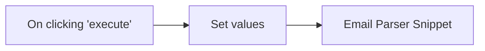

## Fluxo (.json) :

```json
{
  "id": "340",
  "name": "Email body parser by aprenden8n.com",
  "nodes": [
    {
      "name": "On clicking 'execute'",
      "type": "n8n-nodes-base.manualTrigger",
      "position": [
        250,
        300
      ],
      "parameters": {},
      "typeVersion": 1
    },
    {
      "name": "Email Parser Snippet",
      "type": "n8n-nodes-base.functionItem",
      "position": [
        670,
        300
      ],
      "parameters": {
        "functionCode": "var obj = {};\nvar labels = item.labels.split(\",\");\nitem.labels.split(\",\").forEach(function(label) {\n  var re = labels.indexOf(label) === labels.length - 1 ? \"\\\\b\" + label + \"\\\\b[: ]+([^$]+)\" : \"\\\\b\" + label + \"\\\\b[: ]+([^\\\\n$]+)\";\n  var found = item.body.match(new RegExp(re, \"i\"));\n  if (found && found.length > 1) {\n    obj[label] = found[1].trim();\n  }\n});\n\nreturn obj;"
      },
      "typeVersion": 1
    },
    {
      "name": "Set values",
      "type": "n8n-nodes-base.set",
      "position": [
        460,
        300
      ],
      "parameters": {
        "values": {
          "number": [],
          "string": [
            {
              "name": "body",
              "value": "Name: Miquel\nEmail: miquel@aprenden8n.com\nSubject: Welcome aboard\nMessage: Hi Miquel!\n\nThank you for your signup!"
            },
            {
              "name": "labels",
              "value": "Name,Email,Subject,Message"
            }
          ]
        },
        "options": {}
      },
      "typeVersion": 1
    }
  ],
  "active": false,
  "settings": {},
  "connections": {
    "Set values": {
      "main": [
        [
          {
            "node": "Email Parser Snippet",
            "type": "main",
            "index": 0
          }
        ]
      ]
    },
    "On clicking 'execute'": {
      "main": [
        [
          {
            "node": "Set values",
            "type": "main",
            "index": 0
          }
        ]
      ]
    }
  }
}
```

<a id="template-788"></a>

## Template 788 - Geração de fatura PDF a partir de Typeform

- **Nome:** Geração de fatura PDF a partir de Typeform
- **Descrição:** Fluxo que aciona quando um formulário Typeform é enviado e gera um invoice PDF preenchido com os dados do formulário, disponibilizando o arquivo para download.
- **Funcionalidade:** • Detecção de envio de formulário: inicia a automação quando o formulário é enviado.
• Preparação de dados: organiza as respostas do formulário para uso no template.
• Geração de PDF a partir de template: cria o invoice.pdf preenchendo o modelo com os dados.
• Download do PDF gerado: disponibiliza o arquivo para download.
• Uso de campos dinâmicos: utiliza referências do formulário para preencher itens e informações.
- **Ferramentas:** • Typeform: Serviço de formulários que coleta respostas e dispara automações.
• APITemplate.io: Serviço para gerar PDFs a partir de templates com parâmetros JSON.


## Fluxo visual

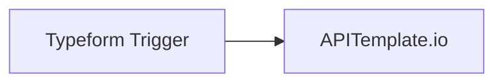

## Fluxo (.json) :

```json
{
  "nodes": [
    {
      "name": "Typeform Trigger",
      "type": "n8n-nodes-base.typeformTrigger",
      "position": [
        490,
        280
      ],
      "webhookId": "6c4b1aa0-226a-4875-bdc3-85bf2313085b",
      "parameters": {
        "formId": "dpr2kxSL",
        "simplifyAnswers": false
      },
      "credentials": {
        "typeformApi": "Typeform Burner Account"
      },
      "typeVersion": 1
    },
    {
      "name": "APITemplate.io",
      "type": "n8n-nodes-base.apiTemplateIo",
      "position": [
        690,
        280
      ],
      "parameters": {
        "options": {
          "fileName": "invoice.pdf"
        },
        "download": true,
        "resource": "pdf",
        "pdfTemplateId": "96c77b2b1ab6ac88",
        "jsonParameters": true,
        "propertiesJson": "={\n  \"company\": \"n8n\",\n  \"email\": \"{{$json[\"1\"][\"email\"]}}\",\n  \"invoice_no\": \"213223444\",\n  \"invoice_date\": \"18-03-2021\",\n  \"invoice_due_date\": \"17-04-2021\",\n  \"address\": \"Berlin, Germany\",\n  \"company_bill_to\": \"{{$json[\"0\"][\"text\"]}}\",\n  \"website\": \"https://n8n.io\",\n  \"document_id\": \"889856789012\",\n  \"items\": [\n    {\n      \"item_name\": \"{{$json[\"2\"][\"text\"]}}\",\n      \"price\": \"EUR {{$json[\"3\"][\"number\"]}}\"\n    },\n    {\n      \"item_name\": \"{{$json[\"4\"][\"text\"]}}\",\n      \"price\": \"EUR {{$json[\"5\"][\"number\"]}}\"\n    }    \n    ]\n}"
      },
      "credentials": {
        "apiTemplateIoApi": "APITemplate Credentials"
      },
      "typeVersion": 1
    }
  ],
  "connections": {
    "Typeform Trigger": {
      "main": [
        [
          {
            "node": "APITemplate.io",
            "type": "main",
            "index": 0
          }
        ]
      ]
    }
  }
}
```

<a id="template-789"></a>

## Template 789 - Busca e simplificação de páginas web via query string

- **Nome:** Busca e simplificação de páginas web via query string
- **Descrição:** Fluxo que recebe uma consulta em formato de query string, busca o conteúdo HTML de uma página, processa e converte para Markdown aplicando regras de simplificação e limites de tamanho.
- **Funcionalidade:** • Acionadores de entrada: Inicia o processo a partir de uma mensagem de chat ou pela execução por outro fluxo.
• Interpretação de input: Converte a query string (?url=...&method=...) em um objeto JSON interno para uso posterior.
• Configuração de limite: Define um limite máximo (maxlimit) para o tamanho do conteúdo retornado, com valor padrão quando não fornecido.
• Requisição HTTP: Faz a chamada ao URL informado, permitindo certificados não autorizados e tratando erros sem interromper o fluxo.
• Tratamento de erros: Se o parâmetro query estiver incorreto, retorna instrução clara para correção; se houver erro na requisição HTTP, retorna a mensagem de erro original.
• Extração do corpo HTML: Mantém apenas o conteúdo dentro da tag <body> da página buscada.
• Remoção de elementos perigosos/irrelevantes: Elimina tags <script>, <style>, <noscript>, comentários HTML, <iframe>, <object>, <embed>, <video>, <audio>, <svg> e similares.
• Modo simplificado opcional: Quando method=simplified, substitui links e fontes de imagens por NOURL/NOIMG para reduzir tamanho.
• Conversão para Markdown: Converte o HTML resultante para Markdown para reduzir comprimento e preservar estrutura legível.
• Verificação de tamanho final: Se o conteúdo convertido exceder o limite configurado, retorna "ERROR: PAGE CONTENT TOO LONG" em vez do conteúdo completo.
• Saída padronizada: Retorna o conteúdo final (page_content) e o comprimento do conteúdo (page_length).
- **Ferramentas:** • Modelo de linguagem (OpenAI - gpt-4o-mini): Utilizado pelo agente para interpretar mensagens e orquestrar chamadas à ferramenta de requisição.
• Serviços web/URLs: Fontes externas acessadas via HTTP para recuperar o conteúdo das páginas solicitadas.
• Plataforma de chat/webhook: Canal de entrada que recebe mensagens do usuário e dispara o agente que aciona o fluxo.


## Fluxo visual

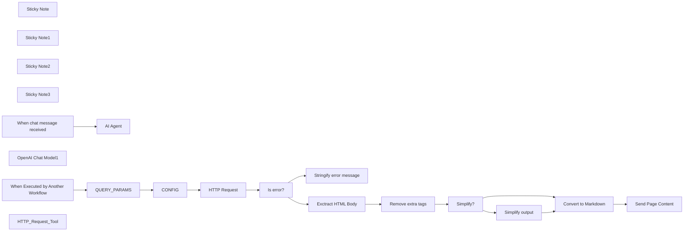

## Fluxo (.json) :

```json
{
  "meta": {
    "instanceId": "408f9fb9940c3cb18ffdef0e0150fe342d6e655c3a9fac21f0f644e8bedabcd9",
    "templateCredsSetupCompleted": true
  },
  "nodes": [
    {
      "id": "02072c77-9eee-43bc-a046-bdc31bf1bc51",
      "name": "Sticky Note",
      "type": "n8n-nodes-base.stickyNote",
      "position": [
        -240,
        1280
      ],
      "parameters": {
        "width": 616,
        "height": 236,
        "content": "### Convert the query string into JSON, apply the limit for a page length"
      },
      "typeVersion": 1
    },
    {
      "id": "31e7582c-9289-4bd3-b89d-c3d866754313",
      "name": "Sticky Note1",
      "type": "n8n-nodes-base.stickyNote",
      "position": [
        820,
        980
      ],
      "parameters": {
        "width": 491,
        "height": 285.7,
        "content": "## Send an error message:\n1. If query param was incorrect, return the instruction. AI Agent should pick up on this and adapt the query on the next iteration.\n2. If the query is OK and an error was during the HTTP Request, then send back the original error message."
      },
      "typeVersion": 1
    },
    {
      "id": "0f3ec3c8-076a-4f22-a9ab-4623494914ff",
      "name": "Sticky Note2",
      "type": "n8n-nodes-base.stickyNote",
      "position": [
        820,
        1300
      ],
      "parameters": {
        "width": 1200,
        "height": 493,
        "content": "## Post-processing of the HTML page:\n1. Keep only <BODY> content\n2. Remove inline <SCRIPT> tag entirely, as well as: NOSCRIPT, IFRAME, OBJECT, EMBED, VIDEO, AUDIO, SVG, and HTML comments.\n3. In case query parameter method=simplified, replace all page URLs (a href) and IMG (src) with NOURL / NOIMG - this may save up to 20% of the page length\n4. Convert the remaining HTML to Markdown. This step further reduces the length of the page: long HTML tags and styles are eliminated, but the markdown syntax keeps some page structure. This gives much better results compared to just a blank text.\n5. Finally, check the page length. If it's too long, send an \"ERROR: PAGE CONTENT TOO LONG\" instead of the actual page. Of course, you could split the page content in chunks, but sometimes long pages just don't have a needed content, so it makes little sense to burn tokens on them."
      },
      "typeVersion": 1
    },
    {
      "id": "139733cc-7954-459e-9b55-15a3bde4d8b7",
      "name": "Sticky Note3",
      "type": "n8n-nodes-base.stickyNote",
      "position": [
        -240,
        680
      ],
      "parameters": {
        "width": 617,
        "height": 503,
        "content": "## Example ReAct AI Agent\n1. Agent Prompt is default\n2. Check the description of the HTTP_Request_Tool, it guides the agent to provide a query string with several parameters instead of a JSON object"
      },
      "typeVersion": 1
    },
    {
      "id": "2b5ee7e4-061d-4a17-8581-54e02086a49a",
      "name": "When chat message received",
      "type": "@n8n/n8n-nodes-langchain.chatTrigger",
      "position": [
        -200,
        840
      ],
      "webhookId": "e0a11ea2-9dd7-496a-8078-1a96f05fc04b",
      "parameters": {
        "options": {}
      },
      "typeVersion": 1.1
    },
    {
      "id": "adc5e4d7-bccf-4ee7-9464-5cbb7b1409ba",
      "name": "AI Agent",
      "type": "@n8n/n8n-nodes-langchain.agent",
      "position": [
        20,
        840
      ],
      "parameters": {
        "options": {}
      },
      "typeVersion": 1.8
    },
    {
      "id": "10ccad7d-2c83-4fd9-beb9-a99e1c034947",
      "name": "OpenAI Chat Model1",
      "type": "@n8n/n8n-nodes-langchain.lmChatOpenAi",
      "position": [
        20,
        1040
      ],
      "parameters": {
        "model": {
          "__rl": true,
          "mode": "list",
          "value": "gpt-4o-mini"
        },
        "options": {}
      },
      "credentials": {
        "openAiApi": {
          "id": "4btCKq9GjcZHsUb1",
          "name": "x.ai compat"
        }
      },
      "typeVersion": 1.2
    },
    {
      "id": "5d582c5f-35d3-4cdb-96ad-fa750be0b889",
      "name": "When Executed by Another Workflow",
      "type": "n8n-nodes-base.executeWorkflowTrigger",
      "position": [
        -160,
        1340
      ],
      "parameters": {
        "inputSource": "passthrough"
      },
      "typeVersion": 1.1
    },
    {
      "id": "1f073e7d-2cdd-426e-8d05-287fdf20f564",
      "name": "QUERY_PARAMS",
      "type": "n8n-nodes-base.set",
      "position": [
        20,
        1340
      ],
      "parameters": {
        "options": {},
        "assignments": {
          "assignments": [
            {
              "id": "f3a339da-66dc-45f1-852a-cdfe0daa4552",
              "name": "query",
              "type": "object",
              "value": "={{ $json.query.substring($json.query.indexOf('?') + 1).split('&').reduce((result, item) => (result[item.split('=')[0]] = decodeURIComponent(item.split('=')[1]), result), {}) }}"
            }
          ]
        }
      },
      "typeVersion": 3.4
    },
    {
      "id": "e9f627af-e935-478e-a2b1-b50ea57d14b1",
      "name": "CONFIG",
      "type": "n8n-nodes-base.set",
      "position": [
        200,
        1340
      ],
      "parameters": {
        "options": {},
        "assignments": {
          "assignments": [
            {
              "id": "ce4bb35a-c5ac-430e-b11a-6bf04de2dd90",
              "name": "query.maxlimit",
              "type": "number",
              "value": "={{ $json?.query?.maxlimit == null ? 70000 : Number($json?.query?.maxlimit) }}"
            }
          ]
        }
      },
      "typeVersion": 3.4
    },
    {
      "id": "0309fb92-6785-4e38-aaeb-05ee4b6a64e2",
      "name": "HTTP Request",
      "type": "n8n-nodes-base.httpRequest",
      "position": [
        440,
        1340
      ],
      "parameters": {
        "url": "={{ encodeURI($json.query.url) }}",
        "options": {
          "response": {
            "response": {
              "neverError": true
            }
          },
          "allowUnauthorizedCerts": true
        }
      },
      "typeVersion": 4.2
    },
    {
      "id": "9c8b9856-a403-405c-afd4-9e9fecaa5913",
      "name": "Is error?",
      "type": "n8n-nodes-base.if",
      "position": [
        620,
        1340
      ],
      "parameters": {
        "options": {},
        "conditions": {
          "options": {
            "version": 2,
            "leftValue": "",
            "caseSensitive": true,
            "typeValidation": "strict"
          },
          "combinator": "and",
          "conditions": [
            {
              "id": "33937446-5010-47d2-b98f-2f0ceae3fbf5",
              "operator": {
                "type": "boolean",
                "operation": "true",
                "singleValue": true
              },
              "leftValue": "={{ $json.hasOwnProperty('error') }}",
              "rightValue": ""
            }
          ]
        }
      },
      "typeVersion": 2.2
    },
    {
      "id": "d7275d78-2c59-4b8f-bb8e-481f73827fd5",
      "name": "Stringify error message",
      "type": "n8n-nodes-base.set",
      "position": [
        880,
        1120
      ],
      "parameters": {
        "include": "selected",
        "options": {},
        "assignments": {
          "assignments": [
            {
              "id": "510f74a1-17da-4a2a-b207-9eda19f97ee0",
              "name": "page_content",
              "type": "string",
              "value": "={{ $('QUERY_PARAMS').first()?.json?.query?.url == null ? \"INVALID action_input. This should be an HTTP query string like this: \\\"?url=VALIDURL&method=SELECTEDMETHOD\\\". Only a simple string value is accepted. JSON object as an action_input is NOT supported!\" : JSON.stringify($json.error) }}"
            }
          ]
        },
        "includeFields": "HTML",
        "includeOtherFields": true
      },
      "typeVersion": 3.4
    },
    {
      "id": "f7ca9e36-5edb-4573-a258-150c5bdcc644",
      "name": "Exctract HTML Body",
      "type": "n8n-nodes-base.set",
      "position": [
        900,
        1620
      ],
      "parameters": {
        "include": "selected",
        "options": {},
        "assignments": {
          "assignments": [
            {
              "id": "3639b76e-3ae9-4461-8d4c-552bf1c8a6bf",
              "name": "HTML",
              "type": "string",
              "value": "={{ $json?.data.match(/<body[^>]*>([\\s\\S]*?)</body>/i)[1] }}"
            }
          ]
        },
        "includeFields": "HTML",
        "includeOtherFields": true
      },
      "typeVersion": 3.4
    },
    {
      "id": "9fef995b-d8ab-4d01-b2fb-01a605062fd1",
      "name": "Remove extra tags",
      "type": "n8n-nodes-base.set",
      "position": [
        1080,
        1620
      ],
      "parameters": {
        "options": {},
        "assignments": {
          "assignments": [
            {
              "id": "89b927c9-ddc1-4735-a0ea-c1e50a057f76",
              "name": "HTML",
              "type": "string",
              "value": "={{ ($json.HTML || \"HTML BODY CONTENT FOR THIS SEARCH RESULT IS NOT AVAILABLE\").replace(/<script[^>]*>([\\s\\S]*?)</script>|<style[^>]*>([\\s\\S]*?)</style>|<noscript[^>]*>([\\s\\S]*?)</noscript>|<!--[\\s\\S]*?-->|<iframe[^>]*>([\\s\\S]*?)</iframe>|<object[^>]*>([\\s\\S]*?)</object>|<embed[^>]*>([\\s\\S]*?)</embed>|<video[^>]*>([\\s\\S]*?)</video>|<audio[^>]*>([\\s\\S]*?)</audio>|<svg[^>]*>([\\s\\S]*?)</svg>/ig, '')}}"
            }
          ]
        }
      },
      "typeVersion": 3.4
    },
    {
      "id": "4897d31a-6425-4838-b934-95b1451cae61",
      "name": "Simplify?",
      "type": "n8n-nodes-base.if",
      "position": [
        1260,
        1620
      ],
      "parameters": {
        "options": {},
        "conditions": {
          "options": {
            "version": 2,
            "leftValue": "",
            "caseSensitive": true,
            "typeValidation": "strict"
          },
          "combinator": "and",
          "conditions": [
            {
              "id": "9c3a2a78-b236-4f47-89b0-34967965e01c",
              "operator": {
                "type": "string",
                "operation": "contains"
              },
              "leftValue": "={{ $('CONFIG').first()?.json?.query?.method }}",
              "rightValue": "simplify"
            }
          ]
        }
      },
      "typeVersion": 2.2
    },
    {
      "id": "997c724c-ea8f-4536-a389-ac8429d57448",
      "name": "Simplify output",
      "type": "n8n-nodes-base.set",
      "position": [
        1440,
        1520
      ],
      "parameters": {
        "options": {},
        "assignments": {
          "assignments": [
            {
              "id": "92b08041-799b-4335-aefe-3781a42f8ec0",
              "name": "HTML",
              "type": "string",
              "value": "={{ $json.HTML.replace(/href\\s*=\\s*\"(.+?)\"/gi, 'href=\"NOURL\"').replace(/src\\s*=\\s*\"(.+?)\"/gi, 'src=\"NOIMG\"')}}"
            }
          ]
        }
      },
      "typeVersion": 3.4
    },
    {
      "id": "440a8076-3901-42e2-a36a-bc47ff588dd4",
      "name": "Convert to Markdown",
      "type": "n8n-nodes-base.markdown",
      "position": [
        1620,
        1620
      ],
      "parameters": {
        "html": "={{ $json.HTML }}",
        "options": {},
        "destinationKey": "page_content"
      },
      "typeVersion": 1
    },
    {
      "id": "a2fbeb5e-3e82-4777-bb61-3e475ffe2fc8",
      "name": "Send Page Content",
      "type": "n8n-nodes-base.set",
      "position": [
        1820,
        1620
      ],
      "parameters": {
        "options": {},
        "assignments": {
          "assignments": [
            {
              "id": "48a78432-2103-44ed-b4d6-7e429ae9e742",
              "name": "page_content",
              "type": "string",
              "value": "={{ $json.page_content.length < $('CONFIG').first()?.json?.query?.maxlimit ? $json.page_content : \"ERROR: PAGE CONTENT TOO LONG\" }}"
            },
            {
              "id": "ec0130f1-16a2-474f-a7cb-96d0e6fc644f",
              "name": "page_length",
              "type": "string",
              "value": "={{ $json.page_content.length }}"
            }
          ]
        }
      },
      "typeVersion": 3.4
    },
    {
      "id": "d367adfd-efd8-49e3-bed3-d65f23a60a9a",
      "name": "HTTP_Request_Tool",
      "type": "@n8n/n8n-nodes-langchain.toolWorkflow",
      "position": [
        200,
        1040
      ],
      "parameters": {
        "name": "HTTP_Request_Tool",
        "workflowId": {
          "__rl": true,
          "mode": "id",
          "value": "={{ $workflow.id }}",
          "cachedResultName": "={{ $workflow.id }}"
        },
        "description": "Call this tool to fetch a webpage content. The input should be a stringified HTTP query parameter like this: \"?url=VALIDURL&method=SELECTEDMETHOD\". \"url\" parameter should contain the valid URL string. \"method\" key can be either \"full\" or \"simplified\". method=full will fetch the whole webpage content in the Markdown format, including page links and image links. method=simplified will return the Markdown content of the page but remove urls and image links from the page content for simplicity. Before calling this tool, think strategically which \"method\" to call. Best of all to use method=simplified. However, if you anticipate that the page request is not final or if you need to extract links from the page, pick method=full.",
        "workflowInputs": {
          "value": {},
          "schema": [],
          "mappingMode": "defineBelow",
          "matchingColumns": [],
          "attemptToConvertTypes": false,
          "convertFieldsToString": false
        }
      },
      "typeVersion": 2
    }
  ],
  "pinData": {},
  "connections": {
    "CONFIG": {
      "main": [
        [
          {
            "node": "HTTP Request",
            "type": "main",
            "index": 0
          }
        ]
      ]
    },
    "Is error?": {
      "main": [
        [
          {
            "node": "Stringify error message",
            "type": "main",
            "index": 0
          }
        ],
        [
          {
            "node": "Exctract HTML Body",
            "type": "main",
            "index": 0
          }
        ]
      ]
    },
    "Simplify?": {
      "main": [
        [
          {
            "node": "Simplify output",
            "type": "main",
            "index": 0
          }
        ],
        [
          {
            "node": "Convert to Markdown",
            "type": "main",
            "index": 0
          }
        ]
      ]
    },
    "HTTP Request": {
      "main": [
        [
          {
            "node": "Is error?",
            "type": "main",
            "index": 0
          }
        ]
      ]
    },
    "QUERY_PARAMS": {
      "main": [
        [
          {
            "node": "CONFIG",
            "type": "main",
            "index": 0
          }
        ]
      ]
    },
    "Simplify output": {
      "main": [
        [
          {
            "node": "Convert to Markdown",
            "type": "main",
            "index": 0
          }
        ]
      ]
    },
    "HTTP_Request_Tool": {
      "ai_tool": [
        [
          {
            "node": "AI Agent",
            "type": "ai_tool",
            "index": 0
          }
        ]
      ]
    },
    "Remove extra tags": {
      "main": [
        [
          {
            "node": "Simplify?",
            "type": "main",
            "index": 0
          }
        ]
      ]
    },
    "Exctract HTML Body": {
      "main": [
        [
          {
            "node": "Remove extra tags",
            "type": "main",
            "index": 0
          }
        ]
      ]
    },
    "OpenAI Chat Model1": {
      "ai_languageModel": [
        [
          {
            "node": "AI Agent",
            "type": "ai_languageModel",
            "index": 0
          }
        ]
      ]
    },
    "Convert to Markdown": {
      "main": [
        [
          {
            "node": "Send Page Content",
            "type": "main",
            "index": 0
          }
        ]
      ]
    },
    "When chat message received": {
      "main": [
        [
          {
            "node": "AI Agent",
            "type": "main",
            "index": 0
          }
        ]
      ]
    },
    "When Executed by Another Workflow": {
      "main": [
        [
          {
            "node": "QUERY_PARAMS",
            "type": "main",
            "index": 0
          }
        ]
      ]
    }
  }
}
```

<a id="template-790"></a>

## Template 790 - Sincronização Asana-Notion: criar/atualizar tarefas

- **Nome:** Sincronização Asana-Notion: criar/atualizar tarefas
- **Descrição:** Fluxo que sincroniza tarefas entre Asana e Notion, criando entradas no Notion para tarefas novas e atualizando entradas existentes com título e data de vencimento, com validação de dados antes de alterações.
- **Funcionalidade:** • Detecção de correspondência entre tarefas Asana e Notion: verifica se uma tarefa do Asana já existe no Notion com base no GID e decide entre criar ou atualizar a entrada correspondente.
• Criação de tarefa no Notion: cria uma nova página de banco de dados com o título da tarefa e o Asana GID.
• Atualização de tarefa no Notion: atualiza o título e a data de vencimento de tarefas já existentes.
• Atualização de deadline: atualiza a data de vencimento apenas quando fornecida.
• Validação de dados obrigatórios: garante que dados como due_on existam antes de tentar atualizar a deadline.
• Trigger de alterações no Asana: inicia o fluxo quando há uma atualização na Asana.
- **Ferramentas:** • Asana: Plataforma de gerenciamento de tarefas utilizada para ler tarefas e detectar atualizações.
• Notion: Serviço de banco de dados onde as tarefas são criadas e atualizadas.


## Fluxo visual

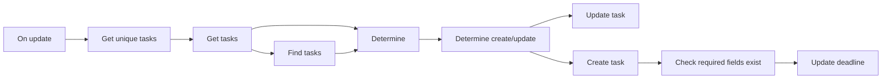

## Fluxo (.json) :

```json
{
  "meta": {
    "instanceId": "237600ca44303ce91fa31ee72babcdc8493f55ee2c0e8aa2b78b3b4ce6f70bd9"
  },
  "nodes": [
    {
      "id": "daaa472a-fff3-41e2-9b6f-f7f54655ea16",
      "name": "Determine create/update",
      "type": "n8n-nodes-base.if",
      "position": [
        1380,
        300
      ],
      "parameters": {
        "conditions": {
          "string": [
            {
              "value1": "={{ $json[\"action\"] }}",
              "value2": "Create"
            }
          ]
        }
      },
      "typeVersion": 1
    },
    {
      "id": "1b047238-80b4-4144-929d-f860510b68c6",
      "name": "Update task",
      "type": "n8n-nodes-base.notion",
      "position": [
        1580,
        420
      ],
      "parameters": {
        "pageId": "={{ $json[\"database_id\"] }}",
        "resource": "databasePage",
        "operation": "update",
        "propertiesUi": {
          "propertyValues": [
            {
              "key": "Task|title",
              "title": "={{ $json[\"name\"] }}"
            },
            {
              "key": "Deadline|date",
              "date": "={{ $json[\"due_on\"] }}"
            }
          ]
        }
      },
      "credentials": {
        "notionApi": {
          "id": "9",
          "name": "[UPDATE ME]"
        }
      },
      "typeVersion": 2
    },
    {
      "id": "71801502-14bd-42d2-beb9-e44e90bcac49",
      "name": "Create task",
      "type": "n8n-nodes-base.notion",
      "position": [
        1580,
        180
      ],
      "parameters": {
        "title": "={{$json[\"name\"]}}",
        "resource": "databasePage",
        "databaseId": "6181df20-c949-42e3-9999-7168d746efab",
        "propertiesUi": {
          "propertyValues": [
            {
              "key": "Asana GID|number",
              "numberValue": "={{ parseInt($json[\"gid\"]) }}"
            }
          ]
        }
      },
      "credentials": {
        "notionApi": {
          "id": "9",
          "name": "[UPDATE ME]"
        }
      },
      "executeOnce": true,
      "typeVersion": 2
    },
    {
      "id": "76d95145-89ff-477f-9e28-a64c3601b4ea",
      "name": "Get tasks",
      "type": "n8n-nodes-base.asana",
      "position": [
        780,
        300
      ],
      "parameters": {
        "id": "={{ $json[\"gid\"] }}",
        "operation": "get"
      },
      "credentials": {
        "asanaApi": {
          "id": "8",
          "name": "[UPDATE ME]"
        }
      },
      "typeVersion": 1,
      "continueOnFail": true
    },
    {
      "id": "b79c96eb-ad00-4aa7-b02e-306a940396fc",
      "name": "Find tasks",
      "type": "n8n-nodes-base.notion",
      "position": [
        980,
        160
      ],
      "parameters": {
        "options": {},
        "resource": "databasePage",
        "operation": "getAll",
        "databaseId": "6181df20-c949-42e3-9999-7168d746efab",
        "filterJson": "={{$node[\"Get unique tasks\"].json[\"notionfilter\"]}}",
        "filterType": "json"
      },
      "credentials": {
        "notionApi": {
          "id": "9",
          "name": "[UPDATE ME]"
        }
      },
      "typeVersion": 2
    },
    {
      "id": "9804b81f-b2f9-45dc-9bbd-a652543668fd",
      "name": "Get unique tasks",
      "type": "n8n-nodes-base.function",
      "position": [
        580,
        300
      ],
      "parameters": {
        "functionCode": "const gids = [];\n\n// get all the unique Asana task gids\nfor (item of items) {\n  var gid = parseInt(item.json.resource.gid);\n  var resource_type = item.json.resource.resource_type;\n  if (!(gids.includes(gid)) && resource_type == \"task\") {\n    gids.push(gid);\n  }\n}\n\n// show in output\nconst new_items = [];\nfor (gid of gids) {\n  var new_item = {\n    \"json\": {\n      \"gid\": 0,\n      \"gids\": [],\n      \"notionfilter\": \"\"\n    }\n  };\n  new_item = JSON.stringify(new_item);\n  new_item = JSON.parse(new_item);\n  new_item.json.gid = gid;\n  new_item.json.gids = gids;\n  new_items.push(new_item);\n\n  // Notion filter\n  notionfilter = {\n    or: [],\n  }\n\n  for (gid of gids) {\n    const filter = {\n      property: 'Asana GID',\n      number: {\n        equals: gid\n      }\n    }\n    notionfilter[\"or\"].push(filter);\n  }\n\n\n  new_item.json.notionfilter = JSON.stringify(notionfilter); \n}\n\nconsole.log(gids);\nreturn new_items;"
      },
      "executeOnce": false,
      "typeVersion": 1
    },
    {
      "id": "91883ca1-91f8-41ce-84d5-00f9f3296cc7",
      "name": "Determine",
      "type": "n8n-nodes-base.function",
      "position": [
        1180,
        300
      ],
      "parameters": {
        "functionCode": "const gids_to_update = [];\nconst database_ids = [];\n\nfor (item of $items(\"Find tasks\")) {\n  gids_to_update.push(parseInt(item.json.property_asana_gid));\n  database_ids.push(item.json.id);\n}\nconsole.log(gids_to_update);\nconsole.log(database_ids);\n\nvar gid;\nlet i = 0;\nfor (item of $items(\"Get tasks\")) {\n  gid = parseInt(item.json.gid);\n  if (gids_to_update.includes(gid)) {\n    item.json.action = \"Update\"\n    item.json.database_id = database_ids[i];\n  } else {\n    item.json.action = \"Create\"\n  }\n  i++;\n}\n\nreturn $items(\"Get tasks\");"
      },
      "typeVersion": 1
    },
    {
      "id": "8ba512bb-671a-47d2-88fc-19ed358df728",
      "name": "Check required fields exist",
      "type": "n8n-nodes-base.if",
      "position": [
        1780,
        180
      ],
      "parameters": {
        "conditions": {
          "string": [
            {
              "value1": "={{ $node[\"Determine\"].json[\"due_on\"] }}",
              "operation": "isNotEmpty"
            }
          ]
        }
      },
      "typeVersion": 1
    },
    {
      "id": "512a09e0-c595-4613-a4d9-ed3160fd403b",
      "name": "Update deadline",
      "type": "n8n-nodes-base.notion",
      "position": [
        1980,
        180
      ],
      "parameters": {
        "pageId": "={{ $json[\"id\"] }}",
        "resource": "databasePage",
        "operation": "update",
        "propertiesUi": {
          "propertyValues": [
            {
              "key": "Deadline|date",
              "date": "={{ $node[\"Determine\"].json[\"due_on\"] }}"
            }
          ]
        }
      },
      "credentials": {
        "notionApi": {
          "id": "9",
          "name": "[UPDATE ME]"
        }
      },
      "typeVersion": 2
    },
    {
      "id": "4b08a930-93ef-4f88-8109-9afa45af703e",
      "name": "On update",
      "type": "n8n-nodes-base.asanaTrigger",
      "position": [
        380,
        300
      ],
      "webhookId": "61055fe2-63c7-4b93-adcb-ddb7556c3060",
      "parameters": {
        "resource": "1202718722261680",
        "workspace": "1177253494675264"
      },
      "credentials": {
        "asanaApi": {
          "id": "8",
          "name": "[UPDATE ME]"
        }
      },
      "typeVersion": 1
    }
  ],
  "connections": {
    "Determine": {
      "main": [
        [
          {
            "node": "Determine create/update",
            "type": "main",
            "index": 0
          }
        ]
      ]
    },
    "Get tasks": {
      "main": [
        [
          {
            "node": "Find tasks",
            "type": "main",
            "index": 0
          },
          {
            "node": "Determine",
            "type": "main",
            "index": 0
          }
        ]
      ]
    },
    "On update": {
      "main": [
        [
          {
            "node": "Get unique tasks",
            "type": "main",
            "index": 0
          }
        ]
      ]
    },
    "Find tasks": {
      "main": [
        [
          {
            "node": "Determine",
            "type": "main",
            "index": 0
          }
        ]
      ]
    },
    "Create task": {
      "main": [
        [
          {
            "node": "Check required fields exist",
            "type": "main",
            "index": 0
          }
        ]
      ]
    },
    "Get unique tasks": {
      "main": [
        [
          {
            "node": "Get tasks",
            "type": "main",
            "index": 0
          }
        ]
      ]
    },
    "Determine create/update": {
      "main": [
        [
          {
            "node": "Create task",
            "type": "main",
            "index": 0
          }
        ],
        [
          {
            "node": "Update task",
            "type": "main",
            "index": 0
          }
        ]
      ]
    },
    "Check required fields exist": {
      "main": [
        [
          {
            "node": "Update deadline",
            "type": "main",
            "index": 0
          }
        ]
      ]
    }
  }
}
```

<a id="template-791"></a>

## Template 791 - Atualizações de evento em Asana

- **Nome:** Atualizações de evento em Asana
- **Descrição:** Este fluxo monitora um recurso específico no Asana e dispara ações quando ocorre um evento nesse recurso.
- **Funcionalidade:** • Detecção de eventos: inicia a automação quando ocorre um evento relacionado ao recurso monitorado.
• Configuração de recurso e workspace: define o recurso como Tweets e o workspace como Engineering para o monitoramento.
• Autenticação e acesso: utiliza credenciais de API do Asana para autenticação.
• Status do gatilho: permanece desativado (inactive) até ser ativado pelo usuário.
- **Ferramentas:** • Asana: Plataforma de gestão de tarefas que gera eventos para disparar automações.


## Fluxo visual


## Fluxo (.json) :

```json
{
  "id": "47",
  "name": "Receive updates when an event occurs in Asana",
  "nodes": [
    {
      "name": "Asana-Trigger",
      "type": "n8n-nodes-base.asanaTrigger",
      "position": [
        1490,
        860
      ],
      "webhookId": "0de3b493-efb6-472c-9deb-80d28c89d28d",
      "parameters": {
        "resource": "Tweets",
        "workspace": "Engineering"
      },
      "credentials": {
        "asanaApi": "asana"
      },
      "typeVersion": 1
    }
  ],
  "active": false,
  "settings": {},
  "connections": {}
}
```

<a id="template-792"></a>

## Template 792 - Mapa de dependências e auto-tagging de subworkflows

- **Nome:** Mapa de dependências e auto-tagging de subworkflows
- **Descrição:** Analisa uma instância para identificar quais workflows chamam outros (subworkflows), cria tags com base nas relações encontradas e gera visualizações do grafo de dependências.
- **Funcionalidade:** • Inventário de workflows: Recupera a lista completa de workflows disponíveis na instância.
• Detecção de dependências: Analisa cada workflow para identificar nós que executam outros workflows e constrói um grafo de chamadas (callers → subworkflows).
• Filtragem de subworkflows: Exclui workflows que não são chamados por nenhum outro e verifica existência para evitar ids obsoletos.
• Contagem de chamadores: Conta quantos workflows chamam cada subworkflow e mantém essa métrica para visualização.
• Identificação de novos rótulos: Compara os chamadores detectados com tags existentes e identifica quais tags precisam ser criadas.
• Criação automática de tags: Cria novas tags para chamadores inexistentes e evita duplicatas removendo tags recém-criadas da lista de pendentes.
• Atualização de tags de workflows: Associa tags (representando chamadores) aos subworkflows correspondentes via API.
• Geração de visualizações: Cria um gráfico de pizza mostrando os subworkflows mais chamados e gera um grafo direcionado (Mermaid) servido via webhook para visualização interativa.
• Agendamento e gatilhos: Pode ser executado por agendamento semanal, ao ativar o fluxo ou ao acessar uma URL de visualização.
- **Ferramentas:** • API da instância de workflows: Endpoints REST usados para listar workflows, consultar workflows individuais, listar e criar tags, e atualizar tags em workflows.
• Serviço de geração de gráficos (QuickChart): Gera o gráfico de pizza em imagem PNG para visualização das métricas.
• MermaidJS (CDN): Biblioteca usada no HTML de resposta para renderizar o grafo direcionado de dependências no navegador.
• Bootstrap (CDN): Framework CSS usado para estruturar/estilizar a página HTML de visualização.

## Fluxo visual

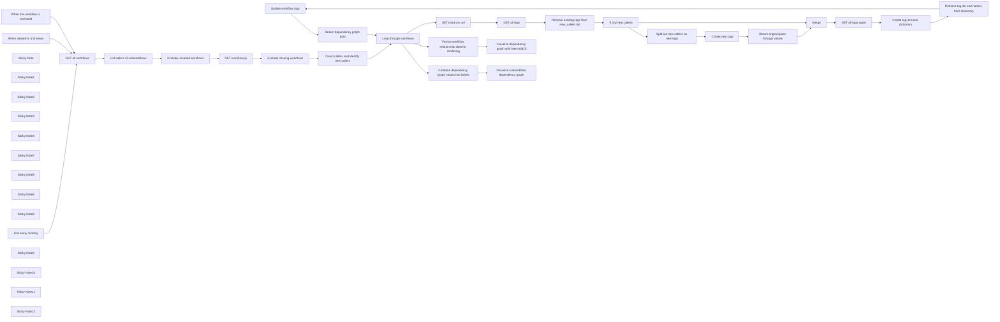

## Fluxo (.json) :

```json
{
  "id": "P9Jr9s9yfcDXTe9R",
  "meta": {
    "instanceId": "a9f3b18652ddc96459b459de4fa8fa33252fb820a9e5a1593074f3580352864a",
    "templateCredsSetupCompleted": true
  },
  "name": "n8n Subworkflow Dependency Graph & Auto-Tagging",
  "tags": [],
  "nodes": [
    {
      "id": "c3e6b9cb-4681-4778-b2f4-01c4a7d8c844",
      "name": "Update workflow tags",
      "type": "n8n-nodes-base.httpRequest",
      "position": [
        3200,
        740
      ],
      "parameters": {
        "url": "={{ $('SET instance_url').item.json.instance_url }}/api/v1/workflows/{{ $json.id }}/tags",
        "method": "PUT",
        "options": {},
        "jsonBody": "={{ $json.tags }}",
        "sendBody": true,
        "specifyBody": "json",
        "authentication": "predefinedCredentialType",
        "nodeCredentialType": "n8nApi"
      },
      "credentials": {
        "n8nApi": {
          "id": "XXXXXX",
          "name": "n8n account"
        }
      },
      "typeVersion": 4.2
    },
    {
      "id": "d348051c-cc81-40cf-9c9b-f42c6f16c9d6",
      "name": "GET all workflows",
      "type": "n8n-nodes-base.n8n",
      "position": [
        1000,
        0
      ],
      "parameters": {
        "filters": {},
        "requestOptions": {}
      },
      "credentials": {
        "n8nApi": {
          "id": "XXXXXX",
          "name": "n8n account"
        }
      },
      "typeVersion": 1
    },
    {
      "id": "bd1c08e5-f8fa-46a0-bfa9-ced09373d3eb",
      "name": "List callers of subworkflows",
      "type": "n8n-nodes-base.code",
      "position": [
        1200,
        0
      ],
      "parameters": {
        "jsCode": "const workflows = $input.all();\nconst dependencyGraph = {};\n\n// Helper function to initialize a workflow entry\nconst getOrCreateWorkflowEntry = (id, name, tags) => {\n  if (!dependencyGraph[id]) {\n    dependencyGraph[id] = { id, name, callers: [], tags };\n  }\n  return dependencyGraph[id];\n};\n\n// Build lookup tables for workflow names and tags\nconst workflowNameMap = {};\nconst workflowTagsMap = {};\n\nworkflows.forEach(item => {\n  workflowNameMap[item.json.id] = item.json.name;\n  workflowTagsMap[item.json.id] = item.json.tags || [];\n});\n\n// Process each workflow\nworkflows.forEach(item => {\n  const { id: workflowId, name: workflowName, nodes = [], tags = [] } = item.json;\n  \n  // Ensure the workflow itself exists in the output, with its own tags\n  getOrCreateWorkflowEntry(workflowId, workflowName, tags);\n\n  // Process nodes that execute workflows\n  nodes.forEach(({ type, parameters }) => {\n    if (\n      type !== 'n8n-nodes-base.executeWorkflow' &&\n      type !== '@n8n/n8n-nodes-langchain.toolWorkflow'\n    ) return;\n\n    let subWorkflowId = parameters?.workflowId?.value || parameters?.workflowId;\n    if (subWorkflowId === \"={{ $workflow.id }}\") subWorkflowId = workflowId; // Handle self-referencing\n\n    if (subWorkflowId) {\n      const subWorkflowName = workflowNameMap[subWorkflowId] || \"Unknown Workflow\"; // Lookup name\n      const subWorkflowTags = workflowTagsMap[subWorkflowId] || []; // Lookup correct tags\n\n      const entry = getOrCreateWorkflowEntry(subWorkflowId, subWorkflowName, subWorkflowTags);\n\n      if (!entry.callers.includes(workflowId)) {\n        entry.callers.push(workflowId);\n      }\n    }\n  });\n});\n\n// Convert to an array format\nreturn Object.values(dependencyGraph);"
      },
      "typeVersion": 2
    },
    {
      "id": "8a1ad58d-feb4-428f-b1e3-df0c08486416",
      "name": "Exclude uncalled workflows",
      "type": "n8n-nodes-base.filter",
      "position": [
        1400,
        0
      ],
      "parameters": {
        "options": {},
        "conditions": {
          "options": {
            "version": 2,
            "leftValue": "",
            "caseSensitive": true,
            "typeValidation": "strict"
          },
          "combinator": "and",
          "conditions": [
            {
              "id": "a1ccd5c3-ee85-412b-ac36-b68f9d2bc904",
              "operator": {
                "type": "number",
                "operation": "gt"
              },
              "leftValue": "={{ $json.callers.length }}",
              "rightValue": 0
            }
          ]
        }
      },
      "typeVersion": 2.2
    },
    {
      "id": "d654ca59-f4d6-4b67-9e87-021346ded854",
      "name": "Exclude missing workflows",
      "type": "n8n-nodes-base.filter",
      "position": [
        1800,
        0
      ],
      "parameters": {
        "options": {},
        "conditions": {
          "options": {
            "version": 2,
            "leftValue": "",
            "caseSensitive": true,
            "typeValidation": "strict"
          },
          "combinator": "and",
          "conditions": [
            {
              "id": "d12ad828-2f0c-4e2d-a6d5-de28007253cf",
              "operator": {
                "type": "boolean",
                "operation": "false",
                "singleValue": true
              },
              "leftValue": "={{ $json.hasField(\"error\") }}",
              "rightValue": ""
            }
          ]
        }
      },
      "typeVersion": 2.2
    },
    {
      "id": "56a8b861-0f20-4379-b094-ebd3976ab95c",
      "name": "And every Sunday",
      "type": "n8n-nodes-base.scheduleTrigger",
      "position": [
        760,
        160
      ],
      "parameters": {
        "rule": {
          "interval": [
            {
              "field": "weeks"
            }
          ]
        }
      },
      "typeVersion": 1.2
    },
    {
      "id": "efacee31-5265-46e4-bc6d-c921a4169546",
      "name": "When this workflow is activated",
      "type": "n8n-nodes-base.n8nTrigger",
      "position": [
        760,
        0
      ],
      "parameters": {
        "events": [
          "activate"
        ]
      },
      "typeVersion": 1
    },
    {
      "id": "0eb2bb9b-0529-4d8e-bdd9-78e0373de744",
      "name": "GET workflow(s)",
      "type": "n8n-nodes-base.n8n",
      "onError": "continueRegularOutput",
      "position": [
        1600,
        0
      ],
      "parameters": {
        "operation": "get",
        "workflowId": {
          "__rl": true,
          "mode": "id",
          "value": "={{ $json.id }}"
        },
        "requestOptions": {}
      },
      "credentials": {
        "n8nApi": {
          "id": "XXXXXX",
          "name": "n8n account"
        }
      },
      "typeVersion": 1
    },
    {
      "id": "24efc8dc-103f-44fb-b229-8b8785ec75ed",
      "name": "Count callers and identify new callers",
      "type": "n8n-nodes-base.set",
      "position": [
        2000,
        0
      ],
      "parameters": {
        "options": {},
        "assignments": {
          "assignments": [
            {
              "id": "34f1dd94-28dc-4105-8e81-8fcf2672e631",
              "name": "id",
              "type": "string",
              "value": "={{ $('Exclude uncalled workflows').item.json.id }}"
            },
            {
              "id": "809b0f5d-4a4f-470c-a514-1e2dc7df92c4",
              "name": "name",
              "type": "string",
              "value": "={{ $('Exclude uncalled workflows').item.json.name }}"
            },
            {
              "id": "422ef66d-c26a-454c-85fd-856fca668782",
              "name": "callers",
              "type": "array",
              "value": "={{ $('Exclude uncalled workflows').item.json.callers }}"
            },
            {
              "id": "3353b704-871b-4b22-95c2-2e6fd5bb1df3",
              "name": "callers_count",
              "type": "number",
              "value": "={{ $('Exclude uncalled workflows').item.json.callers.length }}"
            },
            {
              "id": "b23ab78d-2136-4cc3-9b9a-1b5ed89d1e28",
              "name": "new_callers",
              "type": "array",
              "value": "={{ $('Exclude uncalled workflows').item.json.callers.difference($('Exclude uncalled workflows').item.json.tags.map(item => item.name)) }}"
            }
          ]
        }
      },
      "typeVersion": 3.4
    },
    {
      "id": "887bf07e-08f7-4491-aee4-a67ce0778319",
      "name": "Loop through workflows",
      "type": "n8n-nodes-base.splitInBatches",
      "position": [
        2240,
        0
      ],
      "parameters": {
        "options": {}
      },
      "typeVersion": 3
    },
    {
      "id": "dd5379fa-74be-44b7-9d49-9b1ae3fab425",
      "name": "GET all tags",
      "type": "n8n-nodes-base.httpRequest",
      "position": [
        2800,
        220
      ],
      "parameters": {
        "url": "={{ $json.instance_url }}/api/v1/tags",
        "options": {},
        "authentication": "predefinedCredentialType",
        "nodeCredentialType": "n8nApi"
      },
      "credentials": {
        "n8nApi": {
          "id": "XXXXXX",
          "name": "n8n account"
        }
      },
      "typeVersion": 4.2
    },
    {
      "id": "ba913e58-4c40-4e97-b4da-18ff3050a895",
      "name": "Remove existing tags from new_callers list",
      "type": "n8n-nodes-base.set",
      "position": [
        3000,
        220
      ],
      "parameters": {
        "options": {},
        "assignments": {
          "assignments": [
            {
              "id": "0b40958a-6ab4-4e35-9aee-1d1346dfe8a6",
              "name": "id",
              "type": "string",
              "value": "={{ $('SET instance_url').item.json.id }}"
            },
            {
              "id": "95c97ab8-2945-4818-9a10-1ed1b69369bb",
              "name": "name",
              "type": "string",
              "value": "={{ $('SET instance_url').item.json.name }}"
            },
            {
              "id": "2ed9bf03-2b09-43e1-8cb5-5e6e3c9c9e99",
              "name": "callers",
              "type": "array",
              "value": "={{ $('SET instance_url').item.json.callers }}"
            },
            {
              "id": "3477c08a-7c35-4c0e-85bb-67144e12bff0",
              "name": "callers_count",
              "type": "number",
              "value": "={{ $('SET instance_url').item.json.callers_count }}"
            },
            {
              "id": "f816907e-f679-4573-a14b-2dce6ef69eb1",
              "name": "new_callers",
              "type": "array",
              "value": "={{ $('SET instance_url').item.json.new_callers.difference($json.data.map(item => item.name)) }}"
            }
          ]
        }
      },
      "typeVersion": 3.4
    },
    {
      "id": "745ed318-8c11-4eb7-8c62-82fa85d32dde",
      "name": "If any new callers",
      "type": "n8n-nodes-base.if",
      "position": [
        2600,
        560
      ],
      "parameters": {
        "options": {},
        "conditions": {
          "options": {
            "version": 2,
            "leftValue": "",
            "caseSensitive": true,
            "typeValidation": "strict"
          },
          "combinator": "and",
          "conditions": [
            {
              "id": "42126431-2ae2-4265-aa4d-0d3e77a730b3",
              "operator": {
                "type": "array",
                "operation": "notEmpty",
                "singleValue": true
              },
              "leftValue": "={{ $json.new_callers }}",
              "rightValue": ""
            }
          ]
        }
      },
      "typeVersion": 2.2
    },
    {
      "id": "a22e9a9d-33ed-4c73-b557-03fc6eb572bd",
      "name": "Split out new callers as new tags",
      "type": "n8n-nodes-base.splitOut",
      "position": [
        2800,
        440
      ],
      "parameters": {
        "options": {
          "destinationFieldName": "new_tag_name"
        },
        "fieldToSplitOut": "new_callers"
      },
      "typeVersion": 1
    },
    {
      "id": "2af955b7-f50f-4422-b5a7-4b330a350f5d",
      "name": "Create new tags",
      "type": "n8n-nodes-base.httpRequest",
      "position": [
        3000,
        440
      ],
      "parameters": {
        "url": "={{ $('SET instance_url').item.json.instance_url }}/api/v1/tags",
        "method": "POST",
        "options": {},
        "sendBody": true,
        "authentication": "predefinedCredentialType",
        "bodyParameters": {
          "parameters": [
            {
              "name": "name",
              "value": "={{ $json.new_tag_name }}"
            }
          ]
        },
        "nodeCredentialType": "n8nApi"
      },
      "credentials": {
        "n8nApi": {
          "id": "XXXXXX",
          "name": "n8n account"
        }
      },
      "typeVersion": 4.2
    },
    {
      "id": "03e389d8-3f48-4fcc-b097-7f631f4e98ad",
      "name": "Return original pass through values",
      "type": "n8n-nodes-base.code",
      "position": [
        3200,
        440
      ],
      "parameters": {
        "jsCode": "return $('SET instance_url').all();"
      },
      "typeVersion": 2
    },
    {
      "id": "8ff8a3f3-e12c-4206-916e-856e3e88c2ce",
      "name": "Merge",
      "type": "n8n-nodes-base.merge",
      "position": [
        3400,
        560
      ],
      "parameters": {
        "mode": "combine",
        "options": {
          "includeUnpaired": true
        },
        "combineBy": "combineByPosition"
      },
      "typeVersion": 3
    },
    {
      "id": "a1043d63-67e3-41d9-a5de-485068a9b5c7",
      "name": "GET all tags again",
      "type": "n8n-nodes-base.httpRequest",
      "position": [
        2600,
        740
      ],
      "parameters": {
        "url": "={{ $('SET instance_url').item.json.instance_url }}/api/v1/tags",
        "options": {},
        "authentication": "predefinedCredentialType",
        "nodeCredentialType": "n8nApi"
      },
      "credentials": {
        "n8nApi": {
          "id": "XXXXXX",
          "name": "n8n account"
        }
      },
      "typeVersion": 4.2
    },
    {
      "id": "4a81485a-6f1a-44b3-8a2e-64190572f423",
      "name": "Create tag id:name dictionary",
      "type": "n8n-nodes-base.set",
      "position": [
        2800,
        740
      ],
      "parameters": {
        "options": {},
        "assignments": {
          "assignments": [
            {
              "id": "b5f7ba8d-1b94-4cae-a0d1-f2f14c7cb5a3",
              "name": "tags",
              "type": "object",
              "value": "={{ $json.data.reduce((acc, { id, name }) => ({ ...acc, [id]: name }), {}) }}"
            },
            {
              "id": "23a993a4-26e1-474a-9f0a-cedc9792a2f2",
              "name": "callers",
              "type": "array",
              "value": "={{ $('Merge').item.json.callers }}"
            },
            {
              "id": "0d451e74-d701-4ddb-b11c-8d5aa3efdde6",
              "name": "id",
              "type": "string",
              "value": "={{ $('Merge').item.json.id }}"
            }
          ]
        }
      },
      "typeVersion": 3.4
    },
    {
      "id": "a1dbb6f5-fc0e-4506-890a-64c0da6b5b8c",
      "name": "Retrieve tag ids and names from dictionary",
      "type": "n8n-nodes-base.set",
      "position": [
        3000,
        740
      ],
      "parameters": {
        "include": "selected",
        "options": {},
        "assignments": {
          "assignments": [
            {
              "id": "762920de-98a6-4027-8e39-1244042f52e1",
              "name": "tags",
              "type": "array",
              "value": "={{ [$json].flatMap(item => item.callers.map(id => ({ id: Object.keys(item.tags).find(key => item.tags[key] === id) }))).filter(item => item.id); }}"
            },
            {
              "id": "1ff05b15-343a-49da-a70d-92c3a5d19011",
              "name": "id",
              "type": "string",
              "value": "={{ $json.id }}"
            },
            {
              "id": "f1afee56-a17f-422b-aabe-e59126efbb8e",
              "name": "callers",
              "type": "array",
              "value": "={{ $json.callers }}"
            },
            {
              "id": "39a0887c-8863-4968-9015-3add683eecd7",
              "name": "name",
              "type": "string",
              "value": "={{ $('Merge').item.json.name }}"
            },
            {
              "id": "4ae3b23c-1faf-4426-8e2e-5254a32d458b",
              "name": "callers_count",
              "type": "number",
              "value": "={{ $('Merge').item.json.callers_count }}"
            }
          ]
        },
        "includeOtherFields": true
      },
      "typeVersion": 3.4
    },
    {
      "id": "174d23bc-3aa1-4e05-81e2-8f45f92a16ee",
      "name": "Return dependency graph data",
      "type": "n8n-nodes-base.set",
      "position": [
        3400,
        740
      ],
      "parameters": {
        "options": {},
        "assignments": {
          "assignments": [
            {
              "id": "eda3be17-95a6-457f-b620-459cf11c9aee",
              "name": "id",
              "type": "string",
              "value": "={{ $('Retrieve tag ids and names from dictionary').item.json.id }}"
            },
            {
              "id": "02b79f2a-b128-4686-8bb2-78ff44c43698",
              "name": "callers",
              "type": "array",
              "value": "={{ $('Retrieve tag ids and names from dictionary').item.json.callers }}"
            },
            {
              "id": "816163c9-7a5c-445d-8b59-592af7c2a4ac",
              "name": "name",
              "type": "string",
              "value": "={{ $('Retrieve tag ids and names from dictionary').item.json.name }}"
            },
            {
              "id": "c860552e-70d0-4d61-9b9d-ccff690b703b",
              "name": "callers_count",
              "type": "number",
              "value": "={{ $('Retrieve tag ids and names from dictionary').item.json.callers_count }}"
            }
          ]
        }
      },
      "executeOnce": true,
      "typeVersion": 3.4
    },
    {
      "id": "d45f7287-09f8-4de2-b74d-c55e200750aa",
      "name": "Combine dependency graph values into labels",
      "type": "n8n-nodes-base.aggregate",
      "position": [
        2600,
        -20
      ],
      "parameters": {
        "options": {},
        "fieldsToAggregate": {
          "fieldToAggregate": [
            {
              "fieldToAggregate": "name"
            },
            {
              "fieldToAggregate": "id"
            },
            {
              "fieldToAggregate": "callers_count"
            }
          ]
        }
      },
      "typeVersion": 1
    },
    {
      "id": "aeee2b70-e6e2-4d3e-bfda-2b69a7e95ffc",
      "name": "Visualize subworkflow dependency graph",
      "type": "n8n-nodes-base.quickChart",
      "position": [
        3000,
        -20
      ],
      "parameters": {
        "data": "={{ $json.callers_count }}",
        "chartType": "pie",
        "labelsMode": "array",
        "labelsArray": "={{ $json.name }}",
        "chartOptions": {
          "width": 600,
          "format": "png",
          "height": 600,
          "backgroundColor": "#ffffff"
        },
        "datasetOptions": {
          "borderColor": "#000"
        }
      },
      "typeVersion": 1
    },
    {
      "id": "f57710f5-788f-473d-b429-59eaf7193a7b",
      "name": "Sticky Note",
      "type": "n8n-nodes-base.stickyNote",
      "position": [
        660,
        -397.5668732742495
      ],
      "parameters": {
        "color": 7,
        "width": 2909.758966302104,
        "height": 1357.9229992534551,
        "content": "# n8n Subworkflow Dependency Graph & Auto-Tagging"
      },
      "typeVersion": 1
    },
    {
      "id": "ce9a88c8-5d6b-4b74-ae59-52128ec6d1af",
      "name": "Sticky Note1",
      "type": "n8n-nodes-base.stickyNote",
      "position": [
        1160,
        160
      ],
      "parameters": {
        "color": 6,
        "width": 190.3269519041407,
        "height": 172.4182620239646,
        "content": "The script builds a dependency graph of workflows by identifying which workflows call others (via execution nodes) while preserving workflow names, caller relationships, and tags."
      },
      "typeVersion": 1
    },
    {
      "id": "9e5bbc26-006e-45bf-be5c-d5e0cf7228f0",
      "name": "Sticky Note2",
      "type": "n8n-nodes-base.stickyNote",
      "position": [
        1380,
        160
      ],
      "parameters": {
        "color": 6,
        "width": 150,
        "height": 135.16347595207057,
        "content": "Here we filter out any workflows that are not [sub-workflows](https://docs.n8n.io/flow-logic/subworkflows/) (i.e. executed by other workflows)."
      },
      "typeVersion": 1
    },
    {
      "id": "6c957763-7410-4b3c-b08c-f73f2c502d5e",
      "name": "Sticky Note3",
      "type": "n8n-nodes-base.stickyNote",
      "position": [
        1580,
        160
      ],
      "parameters": {
        "color": 6,
        "width": 345.30539364962834,
        "height": 100.16655570271519,
        "content": "We verify that the sub-workflows we intend to tag exist in our instance (not old workflow ids left over after importing a workflow from another instance)"
      },
      "typeVersion": 1
    },
    {
      "id": "21ea4110-0f31-4621-b401-3bac222352d9",
      "name": "Sticky Note4",
      "type": "n8n-nodes-base.stickyNote",
      "position": [
        3160,
        220
      ],
      "parameters": {
        "color": 6,
        "width": 320.4824213076102,
        "height": 97.51953145794394,
        "content": "If a tag is freshly created during an earlier iteration through the list of workflows, then it is removed from the list of new callers (i.e. new tags to create)."
      },
      "typeVersion": 1
    },
    {
      "id": "0b04a2d3-5a10-4500-9450-5fee1ff77dec",
      "name": "Sticky Note7",
      "type": "n8n-nodes-base.stickyNote",
      "position": [
        2560,
        180
      ],
      "parameters": {
        "color": 3,
        "width": 188.64373499228745,
        "height": 206.54161516323953,
        "content": "### Change instance URL"
      },
      "typeVersion": 1
    },
    {
      "id": "98812066-6de5-48c4-a945-6639158b6394",
      "name": "Sticky Note5",
      "type": "n8n-nodes-base.stickyNote",
      "position": [
        2940,
        -80
      ],
      "parameters": {
        "color": 6,
        "width": 502.4185703091201,
        "height": 243.8281544043028,
        "content": "## Generate chart"
      },
      "typeVersion": 1
    },
    {
      "id": "1427d97f-7971-494c-9594-b3ec81d83511",
      "name": "Sticky Note6",
      "type": "n8n-nodes-base.stickyNote",
      "position": [
        3220,
        -20
      ],
      "parameters": {
        "color": 7,
        "width": 180.46986136506064,
        "height": 135.95151736720237,
        "content": "### Pie Chart\nBasic visualization of which sub-workflows are called most often by other workflows"
      },
      "typeVersion": 1
    },
    {
      "id": "1b8ee382-3e5d-4f6a-863b-100c84c3435e",
      "name": "Sticky Note8",
      "type": "n8n-nodes-base.stickyNote",
      "position": [
        680,
        500
      ],
      "parameters": {
        "color": 5,
        "width": 434.64763783570623,
        "height": 447.49544828389617,
        "content": "## Setup instructions:\n1. [Set n8n API credentials](https://docs.n8n.io/api/authentication/)\n2. Replace instance_url in workflow (highlighted in red)\n\n## Frequently used terms\n1. **Callers**: Workflows that execute or trigger another workflow (a subworkflow) within n8n. They often use the Execute Workflow node to pass data and control execution flow.\n2. **Sub-workflow**: A sub-workflow is any workflow that is executed by another workflow. These are often used for reusable automation logic, breaking down complex workflows into modular components.\n3. **Dependency Graph**: A dependency graph visually represents the relationships between workflows in an n8n instance. It maps out which workflows call others, helping users understand execution dependencies, optimize workflow organization, and prevent unintended changes that may break subworkflows."
      },
      "typeVersion": 1
    },
    {
      "id": "c005ed7e-8a7c-4588-944d-be0fa28b6959",
      "name": "SET instance_url",
      "type": "n8n-nodes-base.set",
      "position": [
        2600,
        220
      ],
      "parameters": {
        "options": {},
        "assignments": {
          "assignments": [
            {
              "id": "3bfad885-f167-47fa-a615-da3661c60d85",
              "name": "instance_url",
              "type": "string",
              "value": "https://n8n.example.com"
            }
          ]
        },
        "includeOtherFields": true
      },
      "typeVersion": 3.4
    },
    {
      "id": "1ab2c9e9-fec1-4ab6-ace3-0bbe54a81058",
      "name": "When viewed in a browser",
      "type": "n8n-nodes-base.webhook",
      "position": [
        760,
        -160
      ],
      "webhookId": "9ef127d4-bd1e-40db-999b-0881afbd2ab3",
      "parameters": {
        "path": "dependency-graph",
        "options": {},
        "responseMode": "responseNode"
      },
      "typeVersion": 2
    },
    {
      "id": "f1f930ed-2c42-4cab-a1a8-71b8810e0273",
      "name": "Sticky Note9",
      "type": "n8n-nodes-base.stickyNote",
      "position": [
        2940,
        -360
      ],
      "parameters": {
        "color": 6,
        "width": 502.4185703091201,
        "height": 243.8281544043028,
        "content": "## Generate dependency graph"
      },
      "typeVersion": 1
    },
    {
      "id": "d47598c9-1a50-4754-a6a5-b6e9976d83a0",
      "name": "Sticky Note10",
      "type": "n8n-nodes-base.stickyNote",
      "position": [
        3220,
        -300
      ],
      "parameters": {
        "color": 7,
        "width": 180.46986136506064,
        "height": 135.95151736720237,
        "content": "### Dependency Graph\nA visual representation of the relationships between the workflows in your n8n instance"
      },
      "typeVersion": 1
    },
    {
      "id": "18b2022a-dabc-4176-9b86-f3c1639d9b32",
      "name": "Format workflow relationship data for rendering",
      "type": "n8n-nodes-base.code",
      "position": [
        2600,
        -280
      ],
      "parameters": {
        "jsCode": "// Assuming the incoming JSON data looks like this:\nconst workflows = $input.all(); // The input data passed to the Code Node\n\n// Function to build the Mermaid chart\nconst buildMermaidChart = (workflows) => {\n    let mermaidChart = 'graph TD\\n'; // Mermaid format for directed graph\n\n    // Iterate over workflows to build relationships\n    workflows.forEach(workflow => {\n        // Accessing the workflow JSON data\n        const workflowData = workflow.json;\n\n        // If the workflow has callers (i.e., workflows that call this one)\n        if (workflowData.callers && workflowData.callers.length > 0) {\n            workflowData.callers.forEach(callerId => {\n                // Add a directed edge in Mermaid format (caller --> current workflow)\n                mermaidChart += `  ${callerId} --> ${workflowData.id}\\n`;\n            });\n        }\n    });\n\n    return mermaidChart;\n};\n\n// Generate the Mermaid chart\nconst mermaidChart = buildMermaidChart(workflows);\n\n// Set the mermaid chart into the output JSON for the next node\nreturn [\n    {\n        json: {\n            mermaidChart: mermaidChart,\n        },\n    },\n];\n"
      },
      "typeVersion": 2
    },
    {
      "id": "3655d6bd-45a1-4c2e-856f-44104f0bd832",
      "name": "Visualize dependency graph with MermaidJS",
      "type": "n8n-nodes-base.respondToWebhook",
      "position": [
        3000,
        -280
      ],
      "parameters": {
        "options": {},
        "respondWith": "text",
        "responseBody": "=<!DOCTYPE html>\n<html lang=\"en\">\n<head>\n    <meta charset=\"UTF-8\">\n    <meta name=\"viewport\" content=\"width=device-width, initial-scale=1.0\">\n    <title>n8n Subworkflow Dependency Graph with Mermaid</title>\n    <link href=\"https://cdn.jsdelivr.net/npm/bootstrap@5.3.0/dist/css/bootstrap.min.css\" rel=\"stylesheet\">\n    <script src=\"https://cdn.jsdelivr.net/npm/mermaid/dist/mermaid.min.js\"></script>\n    <style>\n      .mermaid-container {\n        margin-top: 20px;\n        width: 100%;\n        height: 100vh;\n      }\n    </style>\n</head>\n<body>\n    <div class=\"container mt-4\">\n        <h2>n8n Subworkflow Dependency Graph with Mermaid</h2>\n        <div id=\"workflows-container\"></div>\n    </div>\n    <hr class=\"featurette-divider border-dark\" />\n\n    <script>\n        // JSON object containing mermaidChart data\n        const workflowsData = [\n            {\n                mermaidChart: `{{ $json.mermaidChart }}`\n            }\n        ];\n\n        document.addEventListener('DOMContentLoaded', () => {\n            const workflowsContainer = document.getElementById('workflows-container');\n\n            // Render workflow immediately\n            renderWorkflows(workflowsData);\n\n            function renderWorkflows(workflows) {\n                workflows.forEach((workflow) => {\n                    const mermaidContainer = document.createElement('div');\n                    mermaidContainer.className = 'mermaid-container';\n                    mermaidContainer.innerHTML = workflow.mermaidChart;\n                    workflowsContainer.appendChild(mermaidContainer);\n                    mermaid.init(undefined, mermaidContainer); // Initialize mermaid to render the graph\n                });\n            }\n        });\n\n        // Initialize mermaid with the config\n        mermaid.initialize({ startOnLoad: false });\n    </script>\n\n    <script src=\"https://cdn.jsdelivr.net/npm/bootstrap@5.3.0/dist/js/bootstrap.bundle.min.js\"></script>\n</body>\n</html>\n"
      },
      "typeVersion": 1.1
    },
    {
      "id": "d9b0e9be-1794-4f5e-899c-b5d1e22baa58",
      "name": "Sticky Note11",
      "type": "n8n-nodes-base.stickyNote",
      "position": [
        680,
        -320
      ],
      "parameters": {
        "color": 5,
        "width": 653.2415806326139,
        "height": 140.62930090784633,
        "content": "## About this workflow\nThis workflow analyzes an n8n instance to detect dependencies between workflows. It identifies which workflows call others ([sub-workflows](https://docs.n8n.io/flow-logic/subworkflows/)), builds a dependency graph, and automatically tags subworkflows with their calling workflows. This makes it easier to track dependencies, optimize workflow structures, and maintain documentation in complex n8n environments."
      },
      "typeVersion": 1
    },
    {
      "id": "357037ff-f5f7-4b5d-9b72-7c2aec393de4",
      "name": "Sticky Note12",
      "type": "n8n-nodes-base.stickyNote",
      "position": [
        1360,
        -320
      ],
      "parameters": {
        "color": 4,
        "width": 266.5295926113459,
        "height": 95.5709893724457,
        "content": "## About the maker\n**[Find Ludwig Gerdes on LinkedIn](https://www.linkedin.com/in/ludwiggerdes)**"
      },
      "typeVersion": 1
    }
  ],
  "active": true,
  "pinData": {},
  "settings": {
    "executionOrder": "v1"
  },
  "versionId": "f1c5dcd4-bcdb-4336-922f-656adc9c36a6",
  "connections": {
    "Merge": {
      "main": [
        [
          {
            "node": "GET all tags again",
            "type": "main",
            "index": 0
          }
        ]
      ]
    },
    "GET all tags": {
      "main": [
        [
          {
            "node": "Remove existing tags from new_callers list",
            "type": "main",
            "index": 0
          }
        ]
      ]
    },
    "Create new tags": {
      "main": [
        [
          {
            "node": "Return original pass through values",
            "type": "main",
            "index": 0
          }
        ]
      ]
    },
    "GET workflow(s)": {
      "main": [
        [
          {
            "node": "Exclude missing workflows",
            "type": "main",
            "index": 0
          }
        ]
      ]
    },
    "And every Sunday": {
      "main": [
        [
          {
            "node": "GET all workflows",
            "type": "main",
            "index": 0
          }
        ]
      ]
    },
    "SET instance_url": {
      "main": [
        [
          {
            "node": "GET all tags",
            "type": "main",
            "index": 0
          }
        ]
      ]
    },
    "GET all workflows": {
      "main": [
        [
          {
            "node": "List callers of subworkflows",
            "type": "main",
            "index": 0
          }
        ]
      ]
    },
    "GET all tags again": {
      "main": [
        [
          {
            "node": "Create tag id:name dictionary",
            "type": "main",
            "index": 0
          }
        ]
      ]
    },
    "If any new callers": {
      "main": [
        [
          {
            "node": "Split out new callers as new tags",
            "type": "main",
            "index": 0
          }
        ],
        [
          {
            "node": "Merge",
            "type": "main",
            "index": 1
          }
        ]
      ]
    },
    "Update workflow tags": {
      "main": [
        [
          {
            "node": "Return dependency graph data",
            "type": "main",
            "index": 0
          }
        ]
      ]
    },
    "Loop through workflows": {
      "main": [
        [
          {
            "node": "Combine dependency graph values into labels",
            "type": "main",
            "index": 0
          },
          {
            "node": "Format workflow relationship data for rendering",
            "type": "main",
            "index": 0
          }
        ],
        [
          {
            "node": "SET instance_url",
            "type": "main",
            "index": 0
          }
        ]
      ]
    },
    "When viewed in a browser": {
      "main": [
        [
          {
            "node": "GET all workflows",
            "type": "main",
            "index": 0
          }
        ]
      ]
    },
    "Exclude missing workflows": {
      "main": [
        [
          {
            "node": "Count callers and identify new callers",
            "type": "main",
            "index": 0
          }
        ]
      ]
    },
    "Exclude uncalled workflows": {
      "main": [
        [
          {
            "node": "GET workflow(s)",
            "type": "main",
            "index": 0
          }
        ]
      ]
    },
    "List callers of subworkflows": {
      "main": [
        [
          {
            "node": "Exclude uncalled workflows",
            "type": "main",
            "index": 0
          }
        ]
      ]
    },
    "Return dependency graph data": {
      "main": [
        [
          {
            "node": "Loop through workflows",
            "type": "main",
            "index": 0
          }
        ]
      ]
    },
    "Create tag id:name dictionary": {
      "main": [
        [
          {
            "node": "Retrieve tag ids and names from dictionary",
            "type": "main",
            "index": 0
          }
        ]
      ]
    },
    "When this workflow is activated": {
      "main": [
        [
          {
            "node": "GET all workflows",
            "type": "main",
            "index": 0
          }
        ]
      ]
    },
    "Split out new callers as new tags": {
      "main": [
        [
          {
            "node": "Create new tags",
            "type": "main",
            "index": 0
          }
        ]
      ]
    },
    "Return original pass through values": {
      "main": [
        [
          {
            "node": "Merge",
            "type": "main",
            "index": 0
          }
        ]
      ]
    },
    "Count callers and identify new callers": {
      "main": [
        [
          {
            "node": "Loop through workflows",
            "type": "main",
            "index": 0
          }
        ]
      ]
    },
    "Remove existing tags from new_callers list": {
      "main": [
        [
          {
            "node": "If any new callers",
            "type": "main",
            "index": 0
          }
        ]
      ]
    },
    "Retrieve tag ids and names from dictionary": {
      "main": [
        [
          {
            "node": "Update workflow tags",
            "type": "main",
            "index": 0
          }
        ]
      ]
    },
    "Combine dependency graph values into labels": {
      "main": [
        [
          {
            "node": "Visualize subworkflow dependency graph",
            "type": "main",
            "index": 0
          }
        ]
      ]
    },
    "Format workflow relationship data for rendering": {
      "main": [
        [
          {
            "node": "Visualize dependency graph with MermaidJS",
            "type": "main",
            "index": 0
          }
        ]
      ]
    }
  }
}
```

<a id="template-793"></a>

## Template 793 - Gerar links de download públicos para arquivos de uma pasta do Drive

- **Nome:** Gerar links de download públicos para arquivos de uma pasta do Drive
- **Descrição:** Este fluxo lista arquivos de uma pasta específica do Drive, gera links de download e torna cada arquivo publicável com link de compartilhamento, processando os itens em lotes.
- **Funcionalidade:** • Definição da pasta alvo: define o ID da pasta do Drive cujos arquivos serão processados.
• Listagem de arquivos da pasta: busca e retorna os arquivos contidos na pasta informada.
• Processamento em lotes: divide os itens em grupos (lotes) para processamento eficiente.
• Geração de links de download: cria URLs diretas para download de cada arquivo.
• Compartilhamento público: altera permissões para que qualquer pessoa com o link possa visualizar.
• Orquestração de processamento: gerencia o fluxo de itens entre geração de links, compartilhamento e saída final.
• Iniciação manual do fluxo: permite disparar o fluxo de forma manual.
- **Ferramentas:** • Google Drive: Serviço de armazenamento em nuvem utilizado para listar arquivos, gerar links de download e ajustar permissões de compartilhamento.

## Fluxo visual

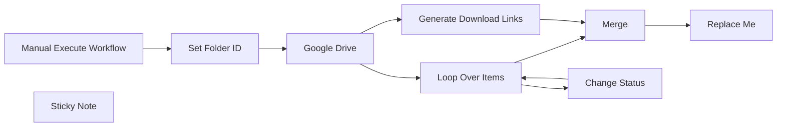

## Fluxo (.json) :

```json
{
  "meta": {
    "instanceId": "c59a6b1daf09a846754bc2cf0a94db3299bd5a69fb14687c3a5e692704c548dd"
  },
  "nodes": [
    {
      "id": "2165cd37-10ff-46bd-88a5-c8377bf4bef7",
      "name": "Google Drive",
      "type": "n8n-nodes-base.googleDrive",
      "position": [
        1280,
        1100
      ],
      "parameters": {
        "limit": 100,
        "options": {
          "spaces": [
            "*"
          ],
          "corpora": "allDrives"
        },
        "operation": "list",
        "queryString": "='{{ $json[\"Folder ID\"] }}' in parents",
        "authentication": "oAuth2",
        "useQueryString": true
      },
      "credentials": {
        "googleDriveOAuth2Api": {
          "id": "KJE0ZORR1Q1fJCd5",
          "name": "Google Drive account 2"
        }
      },
      "typeVersion": 1
    },
    {
      "id": "5061db5e-2137-4c50-8902-a24cd53a6bdf",
      "name": "Loop Over Items",
      "type": "n8n-nodes-base.splitInBatches",
      "position": [
        1480,
        1160
      ],
      "parameters": {
        "options": {},
        "batchSize": 50
      },
      "typeVersion": 3
    },
    {
      "id": "62a16fb8-9bfc-46db-a556-23fac7f403f5",
      "name": "Merge",
      "type": "n8n-nodes-base.merge",
      "position": [
        1720,
        1020
      ],
      "parameters": {
        "mode": "combine",
        "options": {},
        "combinationMode": "multiplex"
      },
      "typeVersion": 2.1
    },
    {
      "id": "bd410148-e745-43a2-960b-128bbb49828f",
      "name": "Set Folder ID",
      "type": "n8n-nodes-base.set",
      "notes": "Enter desired Folder",
      "position": [
        1120,
        1100
      ],
      "parameters": {
        "fields": {
          "values": [
            {
              "name": "Folder ID",
              "stringValue": "Enter Your Folder ID here"
            }
          ]
        },
        "options": {}
      },
      "notesInFlow": true,
      "typeVersion": 3.2
    },
    {
      "id": "16def9df-5c8b-4359-a879-11e66f191f92",
      "name": "Manual Execute Workflow",
      "type": "n8n-nodes-base.manualTrigger",
      "notes": "Optional",
      "position": [
        940,
        1100
      ],
      "parameters": {},
      "notesInFlow": true,
      "typeVersion": 1
    },
    {
      "id": "e7d54620-e5e6-470e-add5-ccefdfb2a979",
      "name": "Generate Download Links",
      "type": "n8n-nodes-base.code",
      "position": [
        1480,
        980
      ],
      "parameters": {
        "jsCode": "// This function will create an array of file links from the given Google Drive folder\nreturn items.map(file => {\n  return { json: { 'link': `https://drive.google.com/u/3/uc?id=${file.json.id}&export=download&confirm=t&authuser=0`, 'name': file.json.name } };\n});"
      },
      "typeVersion": 2
    },
    {
      "id": "04e71edf-c40f-4c80-961c-f511e145232c",
      "name": "Change Status",
      "type": "n8n-nodes-base.googleDrive",
      "notes": "Make Files Public to anyone with a link",
      "position": [
        1660,
        1180
      ],
      "parameters": {
        "fileId": {
          "__rl": true,
          "mode": "id",
          "value": "={{ $json.id }}"
        },
        "options": {
          "supportsAllDrives": true
        },
        "operation": "share",
        "permissionsUi": {
          "permissionsValues": {
            "role": "reader",
            "type": "anyone"
          }
        },
        "authentication": "oAuth2"
      },
      "credentials": {
        "googleDriveOAuth2Api": {
          "id": "KJE0ZORR1Q1fJCd5",
          "name": "Google Drive account 2"
        }
      },
      "notesInFlow": true,
      "typeVersion": 1
    },
    {
      "id": "4452cd81-e94a-465e-987b-5acf46e25428",
      "name": "Replace Me",
      "type": "n8n-nodes-base.noOp",
      "position": [
        1880,
        1020
      ],
      "parameters": {},
      "typeVersion": 1
    },
    {
      "id": "dab69e10-d9af-4ece-a6c6-cb35468e3bf0",
      "name": "Sticky Note",
      "type": "n8n-nodes-base.stickyNote",
      "position": [
        880,
        820
      ],
      "parameters": {
        "width": 1235.0111197082438,
        "height": 545.6382804772701,
        "content": "## Example Output:\n```JSON\n{\n\"link\": \"https://drive.google.com/u/3/uc?id=1hojqPfXchNTY8YRTNkxSo-8txK9re-V4&export=download&confirm=t&authuser=0\",\n\"name\": \"firefox_rNjA0ybKu7.png\",\n\"kind\": \"drive#permission\",\n\"id\": \"anyoneWithLink\",\n\"type\": \"anyone\",\n\"role\": \"reader\",\n\"allowFileDiscovery\": false\n}\n```\n\n\n\n\n\n\n\n\n\n\n\n\n\n\n\n\n\n\n\n\n\n### You can store the output data with any data store node you want\n### for example save them into Excel Sheet or Airtable etc..."
      },
      "typeVersion": 1
    }
  ],
  "pinData": {},
  "connections": {
    "Merge": {
      "main": [
        [
          {
            "node": "Replace Me",
            "type": "main",
            "index": 0
          }
        ]
      ]
    },
    "Google Drive": {
      "main": [
        [
          {
            "node": "Loop Over Items",
            "type": "main",
            "index": 0
          },
          {
            "node": "Generate Download Links",
            "type": "main",
            "index": 0
          }
        ]
      ]
    },
    "Change Status": {
      "main": [
        [
          {
            "node": "Loop Over Items",
            "type": "main",
            "index": 0
          }
        ]
      ]
    },
    "Set Folder ID": {
      "main": [
        [
          {
            "node": "Google Drive",
            "type": "main",
            "index": 0
          }
        ]
      ]
    },
    "Loop Over Items": {
      "main": [
        [
          {
            "node": "Merge",
            "type": "main",
            "index": 1
          }
        ],
        [
          {
            "node": "Change Status",
            "type": "main",
            "index": 0
          }
        ]
      ]
    },
    "Generate Download Links": {
      "main": [
        [
          {
            "node": "Merge",
            "type": "main",
            "index": 0
          }
        ]
      ]
    },
    "Manual Execute Workflow": {
      "main": [
        [
          {
            "node": "Set Folder ID",
            "type": "main",
            "index": 0
          }
        ]
      ]
    }
  }
}
```

<a id="template-794"></a>

## Template 794 - Exportar tabela PostgreSQL para CSV

- **Nome:** Exportar tabela PostgreSQL para CSV
- **Descrição:** Exporta os registros de uma tabela PostgreSQL para um arquivo CSV quando executado manualmente.
- **Funcionalidade:** • Gatilho manual: inicia o fluxo quando o usuário executa a operação.
• Definição do nome da tabela: seta a variável TableName com o nome da tabela a ser exportada (booksRead).
• Execução de consulta SQL: realiza a consulta SELECT * FROM TableName para recuperar todos os registros.
• Geração de arquivo CSV: converte os resultados da consulta em um arquivo no formato CSV.
- **Ferramentas:** • PostgreSQL: banco de dados relacional usado para armazenar e recuperar os registros da tabela.
• Arquivo CSV: formato de arquivo gerado para exportação e armazenamento dos dados consultados.

## Fluxo visual

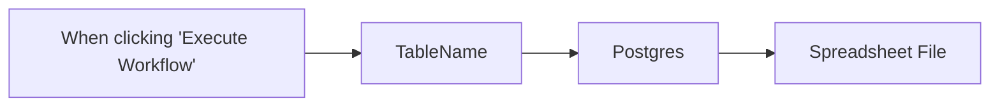

## Fluxo (.json) :

```json
{
  "id": "39",
  "meta": {
    "instanceId": "a2434c94d549548a685cca39cc4614698e94f527bcea84eefa363f1037ae14cd"
  },
  "name": "PostgreSQL export to CSV",
  "tags": [],
  "nodes": [
    {
      "id": "ed94b34e-9ae6-4925-b292-b64a7e0bd602",
      "name": "When clicking \"Execute Workflow\"",
      "type": "n8n-nodes-base.manualTrigger",
      "position": [
        660,
        420
      ],
      "parameters": {},
      "typeVersion": 1
    },
    {
      "id": "f5ada70d-c186-4d28-a64b-3847e2625c8d",
      "name": "Spreadsheet File",
      "type": "n8n-nodes-base.spreadsheetFile",
      "position": [
        1260,
        420
      ],
      "parameters": {
        "options": {},
        "operation": "toFile",
        "fileFormat": "csv"
      },
      "typeVersion": 1
    },
    {
      "id": "4e06ae2b-ef42-4ef4-b7b2-56eb70738a03",
      "name": "TableName",
      "type": "n8n-nodes-base.set",
      "position": [
        840,
        420
      ],
      "parameters": {
        "values": {
          "string": [
            {
              "name": "TableName",
              "value": "booksRead"
            }
          ]
        },
        "options": {}
      },
      "typeVersion": 1
    },
    {
      "id": "457ed549-507d-422a-bd14-1736252bd2e9",
      "name": "Postgres",
      "type": "n8n-nodes-base.postgres",
      "position": [
        1060,
        420
      ],
      "parameters": {
        "query": "=SELECT * FROM {{ $json[\"TableName\"] }}",
        "operation": "executeQuery",
        "additionalFields": {}
      },
      "credentials": {
        "postgres": {
          "id": "33",
          "name": "Postgres account"
        }
      },
      "typeVersion": 1
    }
  ],
  "active": false,
  "pinData": {
    "Postgres": [
      {
        "json": {
          "book_id": 1,
          "read_date": "2022-09-08",
          "book_title": "Demons",
          "book_author": "Fyodor Dostoyevsky"
        }
      },
      {
        "json": {
          "book_id": 2,
          "read_date": "2022-05-06",
          "book_title": "Ulysses",
          "book_author": "James Joyce"
        }
      },
      {
        "json": {
          "book_id": 3,
          "read_date": "2023-01-04",
          "book_title": "Catch-22",
          "book_author": "Joseph Heller"
        }
      },
      {
        "json": {
          "book_id": 4,
          "read_date": "2023-01-21",
          "book_title": "The Bell Jar",
          "book_author": "Sylvia Plath"
        }
      },
      {
        "json": {
          "book_id": 5,
          "read_date": "2023-02-14",
          "book_title": "Frankenstein",
          "book_author": "Mary Shelley"
        }
      }
    ],
    "Spreadsheet File": [
      {
        "json": {
          "book_id": 1,
          "read_date": "2022-09-08",
          "book_title": "Demons",
          "book_author": "Fyodor Dostoyevsky"
        }
      },
      {
        "json": {
          "book_id": 2,
          "read_date": "2022-05-06",
          "book_title": "Ulysses",
          "book_author": "James Joyce"
        }
      },
      {
        "json": {
          "book_id": 3,
          "read_date": "2023-01-04",
          "book_title": "Catch-22",
          "book_author": "Joseph Heller"
        }
      },
      {
        "json": {
          "book_id": 4,
          "read_date": "2023-01-21",
          "book_title": "The Bell Jar",
          "book_author": "Sylvia Plath"
        }
      },
      {
        "json": {
          "book_id": 5,
          "read_date": "2023-02-14",
          "book_title": "Frankenstein",
          "book_author": "Mary Shelley"
        }
      }
    ]
  },
  "settings": {},
  "versionId": "586e2a98-69a0-4a40-8c92-89380a7cca73",
  "connections": {
    "Postgres": {
      "main": [
        [
          {
            "node": "Spreadsheet File",
            "type": "main",
            "index": 0
          }
        ]
      ]
    },
    "TableName": {
      "main": [
        [
          {
            "node": "Postgres",
            "type": "main",
            "index": 0
          }
        ]
      ]
    },
    "When clicking \"Execute Workflow\"": {
      "main": [
        [
          {
            "node": "TableName",
            "type": "main",
            "index": 0
          }
        ]
      ]
    }
  }
}
```

<a id="template-795"></a>

## Template 795 - Criação de tarefa no Asana via Webhook

- **Nome:** Criação de tarefa no Asana via Webhook
- **Descrição:** Este fluxo recebe dados de um webhook, cria uma tarefa no Asana com base nesses dados e retorna a URL da tarefa criada.
- **Funcionalidade:** • Recebimento de webhook: o fluxo é acionado quando o webhook é acessado e recebe os dados.
• Criação de tarefa no Asana: utiliza os dados recebidos para criar uma nova tarefa.
• Retorno com link da tarefa: retorna a URL da tarefa criada.
- **Ferramentas:** • Asana: plataforma de gestão de tarefas utilizada para criar novas tarefas a partir de dados recebidos pelo webhook.

## Fluxo visual

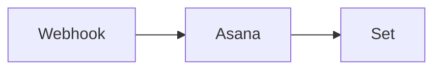

## Fluxo (.json) :

```json
{
  "nodes": [
    {
      "name": "Asana",
      "type": "n8n-nodes-base.asana",
      "position": [
        450,
        500
      ],
      "parameters": {
        "name": "={{$json[\"query\"][\"parameter\"]}}",
        "workspace": "",
        "authentication": "oAuth2",
        "otherProperties": {
          "projects": [
            ""
          ]
        }
      },
      "credentials": {
        "asanaOAuth2Api": ""
      },
      "typeVersion": 1
    },
    {
      "name": "Webhook",
      "type": "n8n-nodes-base.webhook",
      "position": [
        250,
        500
      ],
      "webhookId": "b43ae7e2-a058-4738-8d49-ac76db6e8166",
      "parameters": {
        "path": "asana",
        "options": {
          "responsePropertyName": "response"
        },
        "responseMode": "lastNode"
      },
      "typeVersion": 1
    },
    {
      "name": "Set",
      "type": "n8n-nodes-base.set",
      "position": [
        650,
        500
      ],
      "parameters": {
        "values": {
          "string": [
            {
              "name": "response",
              "value": "=Created Asana Task:  {{$json[\"permalink_url\"]}}"
            }
          ]
        },
        "options": {}
      },
      "typeVersion": 1
    }
  ],
  "connections": {
    "Asana": {
      "main": [
        [
          {
            "node": "Set",
            "type": "main",
            "index": 0
          }
        ]
      ]
    },
    "Webhook": {
      "main": [
        [
          {
            "node": "Asana",
            "type": "main",
            "index": 0
          }
        ]
      ]
    }
  }
}
```

<a id="template-796"></a>

## Template 796 - Scraper visual com IA e Google Sheets

- **Nome:** Scraper visual com IA e Google Sheets
- **Descrição:** Extrai dados estruturados de páginas web principalmente a partir de screenshots, com fallback para recuperação de HTML, e grava os resultados em uma planilha.
- **Funcionalidade:** • Leitura de URLs da planilha: Obtém a lista de páginas a serem processadas a partir de uma planilha do Google Sheets.
• Captura de screenshots full-page: Gera imagens completas das páginas para análise visual.
• Extração visual por IA multimodal: Utiliza um agente de IA para identificar títulos, preços, marcas e informações promocionais diretamente das imagens.
• Fallback para HTML quando necessário: Quando a extração por imagem é insuficiente, recupera o HTML da página e usa-o para complementar ou corrigir os dados.
• Conversão HTML para Markdown: Converte HTML em Markdown para reduzir tokens e otimizar o processamento pela IA.
• Formatação estruturada: Organiza os dados extraídos em um JSON conforme esquema pré-definido.
• Gravação de resultados: Anexa linhas com os campos extraídos na aba de resultados da planilha.
• Execução e configuração: Suporta gatilho manual (substituível) e permite definir/mapeear campos de entrada e saída.
- **Ferramentas:** • Google Sheets: Armazena a lista de URLs e recebe os resultados estruturados.
• ScrapingBee: Captura screenshots das páginas e pode retornar o HTML quando necessário.
• Google Gemini (PaLM): Modelo multimodal usado para analisar imagens e extrair informações da página.

## Fluxo visual

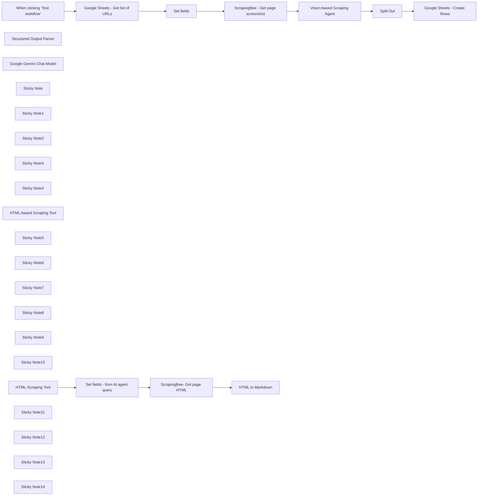

## Fluxo (.json) :

```json
{
  "id": "PpFVCrTiYoa35q1m",
  "meta": {
    "instanceId": "b9faf72fe0d7c3be94b3ebff0778790b50b135c336412d28fd4fca2cbbf8d1f5",
    "templateCredsSetupCompleted": true
  },
  "name": "Vision-Based AI Agent Scraper - with Google Sheets, ScrapingBee, and Gemini",
  "tags": [],
  "nodes": [
    {
      "id": "90ac8845-342e-4fdb-ae09-cb9d169b4119",
      "name": "When clicking ‘Test workflow’",
      "type": "n8n-nodes-base.manualTrigger",
      "position": [
        160,
        460
      ],
      "parameters": {},
      "typeVersion": 1
    },
    {
      "id": "7a2bfc41-1527-448d-a52c-794ca4c9e7ee",
      "name": "ScrapingBee- Get page HTML",
      "type": "n8n-nodes-base.httpRequest",
      "position": [
        2280,
        1360
      ],
      "parameters": {
        "url": "https://app.scrapingbee.com/api/v1",
        "options": {},
        "sendQuery": true,
        "queryParameters": {
          "parameters": [
            {
              "name": "api_key",
              "value": "<your_scrapingbee_apikey>"
            },
            {
              "name": "url",
              "value": "={{$json.url}}"
            }
          ]
        }
      },
      "typeVersion": 4.2
    },
    {
      "id": "a0ab6dcb-ffad-40bf-8a22-f2e152e69b00",
      "name": "Structured Output Parser",
      "type": "@n8n/n8n-nodes-langchain.outputParserStructured",
      "position": [
        2480,
        880
      ],
      "parameters": {
        "jsonSchemaExample": "[{\n  \"product_title\":\"The title of the product\",\n  \"product_price\":\"The price of the product\",\n  \"product_brand\": \"The brand of the product\",\n  \"promo\":\"true or false\",\n  \"promo_percentage\":\"NUM %\"\n}]"
      },
      "typeVersion": 1.2
    },
    {
      "id": "34f50603-a969-425d-8a1a-ec8031a5cdfd",
      "name": "Google Gemini Chat Model",
      "type": "@n8n/n8n-nodes-langchain.lmChatGoogleGemini",
      "position": [
        1800,
        900
      ],
      "parameters": {
        "options": {},
        "modelName": "models/gemini-1.5-pro-latest"
      },
      "credentials": {
        "googlePalmApi": {
          "id": "",
          "name": "Google Gemini(PaLM) Api account"
        }
      },
      "typeVersion": 1
    },
    {
      "id": "2054612e-f3e1-4633-9c1a-0644ae07613c",
      "name": "Split Out",
      "type": "n8n-nodes-base.splitOut",
      "position": [
        2880,
        460
      ],
      "parameters": {
        "options": {},
        "fieldToSplitOut": "output"
      },
      "typeVersion": 1
    },
    {
      "id": "1a59a962-f483-4a27-8686-607a7d375584",
      "name": "Google Sheets - Get list of URLs",
      "type": "n8n-nodes-base.googleSheets",
      "position": [
        620,
        460
      ],
      "parameters": {
        "options": {},
        "sheetName": {
          "__rl": true,
          "mode": "list",
          "value": "gid=0",
          "cachedResultUrl": "",
          "cachedResultName": "List of URLs"
        },
        "documentId": {
          "__rl": true,
          "mode": "list",
          "value": "",
          "cachedResultUrl": "",
          "cachedResultName": "Google Sheets - Workflow Vision-Based Scraping"
        },
        "authentication": "serviceAccount"
      },
      "credentials": {
        "googleApi": {
          "id": "",
          "name": "Google Sheets account"
        }
      },
      "typeVersion": 4.5
    },
    {
      "id": "e33defac-e5c4-4bf5-ae31-98cf6f1d2579",
      "name": "Sticky Note",
      "type": "n8n-nodes-base.stickyNote",
      "position": [
        76.45348837209309,
        -6.191860465116179
      ],
      "parameters": {
        "color": 7,
        "width": 364.53488372093034,
        "height": 652.6453488372096,
        "content": "## Trigger\nThe default trigger is **When clicking ‘Test workflow’**, meaning the workflow will **need to be triggered manually**. \n\nYou can replace this by selecting a **trigger of your choice**.\n"
      },
      "typeVersion": 1
    },
    {
      "id": "9f56e57e-8505-4a7a-a531-f7df87a6ea9c",
      "name": "Sticky Note1",
      "type": "n8n-nodes-base.stickyNote",
      "position": [
        480,
        -12.906976744186068
      ],
      "parameters": {
        "color": 7,
        "width": 364.53488372093034,
        "height": 664.2441860465121,
        "content": "## Google Sheets - List of URLs\n\nThe Google Sheet will contain two sheets:  \n- **List of URLs to** scrape  \n- **Results** page, populated with the scraping results and AI-extracted data.\n\nHere is an **[example Google Sheet](https://docs.google.com/spreadsheets/d/10Gc7ooUeTBbOOE6bgdNe5vSKRkkcAamonsFSjFevkOE/)** you can use. The \"Results\" sheet is pre-configured for e-commerce website scraping. You can adapt it to your specific needs, but remember to adjust the `Structured Output Parser` node accordingly.\n"
      },
      "typeVersion": 1
    },
    {
      "id": "e4497a81-6849-4c79-af45-40e518837e2e",
      "name": "Sticky Note2",
      "type": "n8n-nodes-base.stickyNote",
      "position": [
        880,
        -15.959302325581348
      ],
      "parameters": {
        "color": 7,
        "width": 364.53488372093034,
        "height": 667.2965116279074,
        "content": "## Set Fields\n\nThis node allows you to **define the fields** that will be sent to the **ScrapingBee HTTP Node** and the AI Agent. \n\nIn this template, **only one field** is pre-configured: **url**. You can customize it by adding additional fields as needed.\n"
      },
      "typeVersion": 1
    },
    {
      "id": "82dcdc23-3d71-4281-a3d0-fdbc27327dd0",
      "name": "Set fields",
      "type": "n8n-nodes-base.set",
      "position": [
        1040,
        460
      ],
      "parameters": {
        "options": {},
        "assignments": {
          "assignments": [
            {
              "id": "c53c5ed2-9c7b-4365-9953-790264c722ab",
              "name": "url",
              "type": "string",
              "value": "={{ $json.url }}"
            }
          ]
        }
      },
      "typeVersion": 3.4
    },
    {
      "id": "ad06f56f-4a02-49d6-9fda-94cdcfadec3b",
      "name": "Sticky Note3",
      "type": "n8n-nodes-base.stickyNote",
      "position": [
        1280,
        -20.537790697674154
      ],
      "parameters": {
        "color": 7,
        "width": 364.53488372093034,
        "height": 671.8750000000002,
        "content": "## ScrapingBee - Get Page Screenshot\n\nThis node uses ScrapingBee, a powerful scraping tool, to capture a screenshot of the desired URL.  \nYou can [try ScrapingBee](https://www.scrapingbee.com/) and enjoy 1,000 free requests (non-affiliate link).  \n\nEnsure the `screenshot_full_page` parameter is set to *`true`* for a full-page screenshot. This is crucial for vision-based scraping with the AI Agent.  \n\nAlternatively, you can **choose to screenshot only a specific part of the page**. However, keep in mind that the **AI Agent will extract data only from the visible section—it has vision**, but not a crystal ball 🔮!\n"
      },
      "typeVersion": 1
    },
    {
      "id": "01cbc1eb-2910-49b1-89e6-d32d340e5273",
      "name": "ScrapingBee - Get page screenshot",
      "type": "n8n-nodes-base.httpRequest",
      "position": [
        1440,
        460
      ],
      "parameters": {
        "url": "https://app.scrapingbee.com/api/v1",
        "options": {},
        "sendQuery": true,
        "sendHeaders": true,
        "queryParameters": {
          "parameters": [
            {
              "name": "api_key",
              "value": "<your_scrapingbee_apikey>"
            },
            {
              "name": "url",
              "value": "={{ $json.url }}"
            },
            {
              "name": "screenshot_full_page",
              "value": "true"
            }
          ]
        },
        "headerParameters": {
          "parameters": [
            {
              "name": "User-Agent",
              "value": "Mozilla/5.0 (Windows NT 10.0; Win64; x64) AppleWebKit/537.36 (KHTML, like Gecko) Chrome/58.0.3029.110 Safari/537.36"
            }
          ]
        }
      },
      "typeVersion": 4.2
    },
    {
      "id": "3e61d7cb-c2af-4275-b075-3dc14ed320b7",
      "name": "Sticky Note4",
      "type": "n8n-nodes-base.stickyNote",
      "position": [
        1680,
        -26.831395348837077
      ],
      "parameters": {
        "color": 7,
        "width": 1000.334302325581,
        "height": 679.5058139534889,
        "content": "## Vision-Based Scraping AI Agent\n\nThis is the central node of the workflow, powered by an AI Agent with two key prompts:\n\n- **System Prompt**: Instructs the AI on how and what data to extract from the screenshot. You can customize this to suit your needs. It also includes fallback instructions to call a tool for retrieving the HTML page if data extraction from the screenshot fails.  \n- **User Message**: Provides the page URL for context.\n\n### Sub-Nodes\n\n1. **Google Gemini Chat Model**  \n   Chosen because tests show that **Gemini-1.5-Pro** outperforms GPT-4 and GPT-4-Vision in visual tasks. *Either my prompt wasn’t optimized for GPT models, or GPT might need glasses 👓*. \n**Other multimodal LLMs haven’t been tested yet**.\n\n2. **HTML-Based Scraping Tool**  \n   A **fallback tool** the agent **uses if it cannot extract data directly from the screenshot**.\n\n3. **Structured Output Parser**  \n   Formats the **extracted data into an easy-to-use structure**, ready to be added to the **results page in Google Sheets**."
      },
      "typeVersion": 1
    },
    {
      "id": "9fe8ee54-755a-44f2-a2bf-a695e3754b3d",
      "name": "HTML-based Scraping Tool",
      "type": "@n8n/n8n-nodes-langchain.toolWorkflow",
      "position": [
        2160,
        900
      ],
      "parameters": {
        "name": "HTMLScrapingTool",
        "workflowId": {
          "__rl": true,
          "mode": "list",
          "value": "PpFVCrTiYoa35q1m",
          "cachedResultName": "vb-scraping"
        },
        "description": "=Call this tool ONLY when you need to retrieve the HTML content of a webpage.",
        "responsePropertyName": "data"
      },
      "typeVersion": 1.2
    },
    {
      "id": "12c4fd7e-b662-488a-b779-792cff5464e4",
      "name": "Sticky Note5",
      "type": "n8n-nodes-base.stickyNote",
      "position": [
        1680,
        720
      ],
      "parameters": {
        "color": 6,
        "width": 305.625,
        "height": 337.03488372093034,
        "content": "### Google Gemini Chat Model\n\nThe **default model is gemini-1.5-pro**. It offers excellent performance for this use case, but **it’s not the most cost-effective option—use it judiciously**.\n\n"
      },
      "typeVersion": 1
    },
    {
      "id": "86cf37d9-a4c1-42f4-a98e-ef2ca4410efd",
      "name": "Sticky Note6",
      "type": "n8n-nodes-base.stickyNote",
      "position": [
        2020,
        720
      ],
      "parameters": {
        "color": 6,
        "width": 305.625,
        "height": 337.03488372093034,
        "content": "### HTML-Based Scraping Tool\n\nThis tool is **invoked when the AI Agent requires the HTML** (*converted to Markdown*) to extract data because the **screenshot alone wasn’t sufficient**.\n"
      },
      "typeVersion": 1
    },
    {
      "id": "a3dc3c83-ed18-4a58-bc36-440efe9462a2",
      "name": "Sticky Note7",
      "type": "n8n-nodes-base.stickyNote",
      "position": [
        2360,
        720
      ],
      "parameters": {
        "color": 6,
        "width": 305.625,
        "height": 337.03488372093034,
        "content": "### Structured Output Parser\n\nThis node **organizes the extracted data into an easy-to-use JSON format**.  \n\nIn this template, the JSON is **designed for an e-commerce webpage**. Customize it to fit your specific needs.\n"
      },
      "typeVersion": 1
    },
    {
      "id": "939f0f2d-19c8-4447-9b25-accfcd5f6a16",
      "name": "Sticky Note8",
      "type": "n8n-nodes-base.stickyNote",
      "position": [
        2740,
        -20
      ],
      "parameters": {
        "color": 7,
        "width": 364.53488372093034,
        "height": 671.8750000000002,
        "content": "## Split Out\n\nThis node **splits the array** created by the `Structured Output Parser` into **individual rows**, making them easy to append to the **subsequent Google Sheets node**.\n"
      },
      "typeVersion": 1
    },
    {
      "id": "71404369-d2f6-4ca5-ae87-47a51fabfa4a",
      "name": "Sticky Note9",
      "type": "n8n-nodes-base.stickyNote",
      "position": [
        3200,
        -20
      ],
      "parameters": {
        "color": 7,
        "width": 364.53488372093034,
        "height": 671.8750000000002,
        "content": "## Google Sheets - Create Rows\n\nThis node **creates rows** in the **Results** sheet using the extracted data.  \n\nYou can use the **[example Google Sheet](https://docs.google.com/spreadsheets/d/10Gc7ooUeTBbOOE6bgdNe5vSKRkkcAamonsFSjFevkOE/)** as a template. However, ensure that the **columns in the Results sheet are aligned with the structure of the output** from the `Structured Output Parser node`.\n"
      },
      "typeVersion": 1
    },
    {
      "id": "226520d1-2edb-4ade-9940-0bae461eb161",
      "name": "Google Sheets - Create Rows",
      "type": "n8n-nodes-base.googleSheets",
      "position": [
        3340,
        460
      ],
      "parameters": {
        "columns": {
          "value": {
            "promo": "={{ $json.promo }}",
            "category": "={{ $('Set fields').item.json.url }}",
            "product_url": "={{ $json.product_title }}",
            "product_brand": "={{ $json.product_brand }}",
            "product_price": "={{ $json.product_price }}",
            "promo_percent": "={{ $json.promo_percentage }}"
          },
          "schema": [
            {
              "id": "category",
              "type": "string",
              "display": true,
              "required": false,
              "displayName": "category",
              "defaultMatch": false,
              "canBeUsedToMatch": true
            },
            {
              "id": "product_url",
              "type": "string",
              "display": true,
              "required": false,
              "displayName": "product_url",
              "defaultMatch": false,
              "canBeUsedToMatch": true
            },
            {
              "id": "product_price",
              "type": "string",
              "display": true,
              "required": false,
              "displayName": "product_price",
              "defaultMatch": false,
              "canBeUsedToMatch": true
            },
            {
              "id": "product_brand",
              "type": "string",
              "display": true,
              "required": false,
              "displayName": "product_brand",
              "defaultMatch": false,
              "canBeUsedToMatch": true
            },
            {
              "id": "promo",
              "type": "string",
              "display": true,
              "required": false,
              "displayName": "promo",
              "defaultMatch": false,
              "canBeUsedToMatch": true
            },
            {
              "id": "promo_percent",
              "type": "string",
              "display": true,
              "required": false,
              "displayName": "promo_percent",
              "defaultMatch": false,
              "canBeUsedToMatch": true
            }
          ],
          "mappingMode": "defineBelow",
          "matchingColumns": []
        },
        "options": {},
        "operation": "append",
        "sheetName": {
          "__rl": true,
          "mode": "list",
          "value": 648398171,
          "cachedResultUrl": "",
          "cachedResultName": "Results"
        },
        "documentId": {
          "__rl": true,
          "mode": "list",
          "value": "1g81_39MJUlwnInX30ZuBtHUb-Y80WrYyF5lccaRtcu0",
          "cachedResultUrl": "",
          "cachedResultName": "Google Sheets - Workflow Vision-Based Scraping"
        },
        "authentication": "serviceAccount"
      },
      "credentials": {
        "googleApi": {
          "id": "",
          "name": "Google Sheets account"
        }
      },
      "typeVersion": 4.5
    },
    {
      "id": "2c142537-d8fe-4fc1-9758-6a3538c43fc0",
      "name": "Vision-based Scraping Agent",
      "type": "@n8n/n8n-nodes-langchain.agent",
      "position": [
        2040,
        460
      ],
      "parameters": {
        "text": "=Here is the screenshot you need to use to extract data about the page:\n\n{{ $json.url }}",
        "options": {
          "systemMessage": "=Extract the following details from the input screenshot:\n\n- Product Titles\n- Product Prices\n- Brands\n- Promotional Information (e.g., if the product is on promo)\n\nStep 1: Image-Based Extraction\nAnalyze the provided screenshot to identify and extract all the required details: product titles, prices, brands, and promotional information.\nEnsure the extraction is thorough and validate the completeness of the information.\nCross-check all products for missing or unclear details.\nHighlight any limitations (e.g., text is unclear, partially cropped, or missing) in the extraction process.\n\nStep 2: HTML-Based Extraction (If Needed)\nIf you determine that any required information is:\n\nIncomplete or missing (e.g., not all titles, prices, or brands could be retrieved).\nAmbiguous or uncertain (e.g., unclear text or potential errors in OCR).\nUnavailable due to the limitations of image processing (e.g., product links).\n\nThen:\n\nCall the HTML-based tool with the input URL to access the page content.\nExtract the required details from the HTML to supplement or replace the image-based results.\nCombine data from both sources (if applicable) to ensure the final result is comprehensive and accurate.\n\nAdditional Notes\nAvoid redundant HTML tool usage—confirm deficiencies in image-based extraction before proceeding.\nFor products on promotion, explicitly label this status in the output.\nReport extraction errors or potential ambiguities (e.g., text illegibility).\n\nIn your output, include all these fields as shown in the example below. If there is no promotion, set \"promo\" to false and \"promo_percent\" to 0.\n\njson\nCopy code\n[{\n  \"product_title\": \"The title of the product\",\n  \"product_price\": \"The price of the product\",\n  \"product_brand\": \"The brand of the product\",\n  \"promo\": true,\n  \"promo_percent\": 25\n}]",
          "passthroughBinaryImages": true
        },
        "promptType": "define",
        "hasOutputParser": true
      },
      "typeVersion": 1.7
    },
    {
      "id": "f4acf278-edec-4bb4-a7cb-1e3c32a6ef4a",
      "name": "Sticky Note10",
      "type": "n8n-nodes-base.stickyNote",
      "position": [
        1360,
        1160
      ],
      "parameters": {
        "color": 7,
        "width": 364.53488372093034,
        "height": 357.10392441860495,
        "content": "## HTML-Scraping Tool Trigger\n\nThis **node serves as the entry point for the HTML scraping tool.  \n\nIt is triggered by the **AI Agent only when it fails to extract data** from the screenshot. The **URL** is sent as a **parameter for the query**."
      },
      "typeVersion": 1
    },
    {
      "id": "79f7b4db-57f1-4004-88b3-51cfcfe9884e",
      "name": "HTML-Scraping Tool",
      "type": "n8n-nodes-base.executeWorkflowTrigger",
      "position": [
        1480,
        1360
      ],
      "parameters": {},
      "typeVersion": 1
    },
    {
      "id": "94aa7169-30b5-49dd-864a-be2eabbf85d3",
      "name": "Sticky Note11",
      "type": "n8n-nodes-base.stickyNote",
      "position": [
        1760,
        1160
      ],
      "parameters": {
        "color": 7,
        "width": 364.53488372093034,
        "height": 357.10392441860495,
        "content": "## Set Fields - From AI Agent Query\n\nThis node sets the fields from the AI Agent’s query.  \n\nIn this template, the only field configured is **url**.\n"
      },
      "typeVersion": 1
    },
    {
      "id": "f2615921-d060-410b-aef4-cd484edb2897",
      "name": "Set fields - from AI agent query",
      "type": "n8n-nodes-base.set",
      "position": [
        1880,
        1360
      ],
      "parameters": {
        "options": {},
        "assignments": {
          "assignments": [
            {
              "id": "c53c5ed2-9c7b-4365-9953-790264c722ab",
              "name": "url",
              "type": "string",
              "value": "={{ $json.query }}"
            }
          ]
        }
      },
      "typeVersion": 3.4
    },
    {
      "id": "807e263a-97ce-4369-9ad0-8f973fc8dcc9",
      "name": "Sticky Note12",
      "type": "n8n-nodes-base.stickyNote",
      "position": [
        2180,
        1160
      ],
      "parameters": {
        "color": 7,
        "width": 364.53488372093034,
        "height": 357.10392441860495,
        "content": "## ScrapingBee - Get Page HTML\n\nThis node utilizes the ScrapingBee API to **retrieve the HTML of the webpage**.\n"
      },
      "typeVersion": 1
    },
    {
      "id": "1cd32b9d-b07e-4dbb-9418-a99019c9deae",
      "name": "Sticky Note13",
      "type": "n8n-nodes-base.stickyNote",
      "position": [
        2600,
        1160
      ],
      "parameters": {
        "color": 7,
        "width": 364.53488372093034,
        "height": 357.10392441860495,
        "content": "## HTML to Markdown\n\nThis node **converts the HTML from the previous node** into Markdown format, **helping to save tokens**.  \n\nThe converted **Markdown is then automatically sent to the AI Agent** through this node.\n"
      },
      "typeVersion": 1
    },
    {
      "id": "3b9096d1-ab5a-48a8-90ee-465483881d95",
      "name": "HTML to Markdown",
      "type": "n8n-nodes-base.markdown",
      "position": [
        2740,
        1360
      ],
      "parameters": {
        "html": "={{ $json.data }}",
        "options": {}
      },
      "typeVersion": 1
    },
    {
      "id": "966ad92a-ddda-4fb9-86ac-9c62f47dfc37",
      "name": "Sticky Note14",
      "type": "n8n-nodes-base.stickyNote",
      "position": [
        -880.9927663601949,
        0
      ],
      "parameters": {
        "width": 829.9937466197946,
        "height": 646.0101744186061,
        "content": "# ✨ Vision-Based AI Agent Scraper - with Google Sheets, ScrapingBee, and Gemini\n\n## Important notes :\n### Check legal regulations: \nThis workflow involves scraping, so make sure to check the legal regulations around scraping in your country before getting started. Better safe than sorry!\n\n## Workflow description\nThis workflow leverages a **vision-based AI Agent**, integrated with Google Sheets, ScrapingBee, and the Gemini-1.5-Pro model, to **extract structured data from webpages**. The AI Agent primarily **uses screenshots for data extraction** but switches to HTML scraping when necessary, ensuring high accuracy. \n\nKey features include:  \n- **Google Sheets Integration**: Manage URLs to scrape and store structured results.  \n- **ScrapingBee**: Capture full-page screenshots and retrieve HTML data for fallback extraction.  \n- **AI-Powered Data Parsing**: Use Gemini-1.5-Pro for vision-based scraping and a Structured Output Parser to format extracted data into JSON.  \n- **Token Efficiency**: HTML is converted to Markdown to optimize processing costs.\n\nThis template is designed for e-commerce scraping but can be customized for various use cases.  \n"
      },
      "typeVersion": 1
    }
  ],
  "active": false,
  "pinData": {},
  "settings": {
    "executionOrder": "v1"
  },
  "versionId": "cf87b8bb-6218-4549-831f-02ff4be611eb",
  "connections": {
    "Split Out": {
      "main": [
        [
          {
            "node": "Google Sheets - Create Rows",
            "type": "main",
            "index": 0
          }
        ]
      ]
    },
    "Set fields": {
      "main": [
        [
          {
            "node": "ScrapingBee - Get page screenshot",
            "type": "main",
            "index": 0
          }
        ]
      ]
    },
    "HTML-Scraping Tool": {
      "main": [
        [
          {
            "node": "Set fields - from AI agent query",
            "type": "main",
            "index": 0
          }
        ]
      ]
    },
    "Google Gemini Chat Model": {
      "ai_languageModel": [
        [
          {
            "node": "Vision-based Scraping Agent",
            "type": "ai_languageModel",
            "index": 0
          }
        ]
      ]
    },
    "HTML-based Scraping Tool": {
      "ai_tool": [
        [
          {
            "node": "Vision-based Scraping Agent",
            "type": "ai_tool",
            "index": 0
          }
        ]
      ]
    },
    "Structured Output Parser": {
      "ai_outputParser": [
        [
          {
            "node": "Vision-based Scraping Agent",
            "type": "ai_outputParser",
            "index": 0
          }
        ]
      ]
    },
    "ScrapingBee- Get page HTML": {
      "main": [
        [
          {
            "node": "HTML to Markdown",
            "type": "main",
            "index": 0
          }
        ]
      ]
    },
    "Vision-based Scraping Agent": {
      "main": [
        [
          {
            "node": "Split Out",
            "type": "main",
            "index": 0
          }
        ]
      ]
    },
    "Google Sheets - Get list of URLs": {
      "main": [
        [
          {
            "node": "Set fields",
            "type": "main",
            "index": 0
          }
        ]
      ]
    },
    "Set fields - from AI agent query": {
      "main": [
        [
          {
            "node": "ScrapingBee- Get page HTML",
            "type": "main",
            "index": 0
          }
        ]
      ]
    },
    "ScrapingBee - Get page screenshot": {
      "main": [
        [
          {
            "node": "Vision-based Scraping Agent",
            "type": "main",
            "index": 0
          }
        ]
      ]
    },
    "When clicking ‘Test workflow’": {
      "main": [
        [
          {
            "node": "Google Sheets - Get list of URLs",
            "type": "main",
            "index": 0
          }
        ]
      ]
    }
  }
}
```

<a id="template-797"></a>

## Template 797 - Chatbot de pedido por dados da planilha

- **Nome:** Chatbot de pedido por dados da planilha
- **Descrição:** Este fluxo usa um chatbot para receber pedidos de pizza, consultar o cardápio via APIs, processar pedidos e verificar o status, mantendo o contexto da conversa.
- **Funcionalidade:** • Detecção de mensagens e atendimento: Inicia a interação quando uma mensagem é recebida para entender o pedido.
• Consulta ao menu/produtos: Recupera informações detalhadas sobre o cardápio para orientar o cliente.
• Processamento de pedidos: Envia o pedido para processamento e confirma o envio.
• Rastreamento/consulta de pedidos: Fornece informações de status do pedido (data, tipo de pizza, quantidade).
• Gerenciamento de memória de conversa: Mantém o contexto da conversa usando memória de janela.
- **Ferramentas:** • OpenAI: Serviço de IA para chat e geração de respostas.
• APIs de pedidos: Endpoints para obter produtos, enviar pedidos e consultar status do pedido.

## Fluxo visual

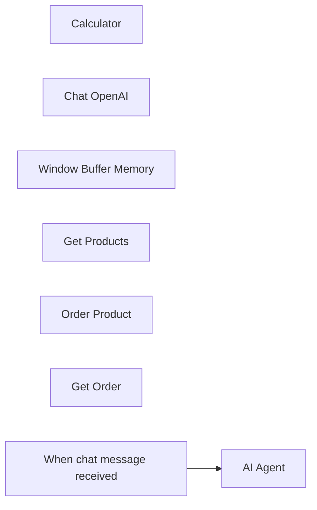

## Fluxo (.json) :

```json
{
  "id": "5Y8QXJ3N67wnmR2R",
  "meta": {
    "instanceId": "433fa4b57c582f828a127c9c601af0fc38d9d6424efd30a3ca802a4cc3acd656",
    "templateCredsSetupCompleted": true
  },
  "name": "POC - Chatbot Order by Sheet Data",
  "tags": [],
  "nodes": [
    {
      "id": "cc9ab139-303f-411a-a7c8-5985d92e3040",
      "name": "Calculator",
      "type": "@n8n/n8n-nodes-langchain.toolCalculator",
      "position": [
        1460,
        480
      ],
      "parameters": {},
      "typeVersion": 1
    },
    {
      "id": "97a6d3a8-001c-4c62-84c2-da5b46a286a9",
      "name": "Chat OpenAI",
      "type": "@n8n/n8n-nodes-langchain.lmChatOpenAi",
      "position": [
        740,
        480
      ],
      "parameters": {
        "options": {}
      },
      "credentials": {
        "openAiApi": {
          "id": "XXXXXXXXXX",
          "name": "OpenAI Credentials"
        }
      },
      "typeVersion": 1
    },
    {
      "id": "1ad05eb6-0f6a-4da7-9d86-871dfa7cbce1",
      "name": "Window Buffer Memory",
      "type": "@n8n/n8n-nodes-langchain.memoryBufferWindow",
      "position": [
        900,
        480
      ],
      "parameters": {},
      "typeVersion": 1.2
    },
    {
      "id": "f4883308-3e4a-49b1-82f5-c18dc2121c47",
      "name": "Get Products",
      "type": "@n8n/n8n-nodes-langchain.toolHttpRequest",
      "position": [
        1060,
        480
      ],
      "parameters": {
        "url": "https://n8n.io/webhook/get-products",
        "toolDescription": "Retrieve detailed information about the product menu."
      },
      "typeVersion": 1.1
    },
    {
      "id": "058b1cf5-b8c0-414d-b4c6-e4c016e4d181",
      "name": "Order Product",
      "type": "@n8n/n8n-nodes-langchain.toolHttpRequest",
      "position": [
        1200,
        480
      ],
      "parameters": {
        "url": "https://n8n.io/webhook/order-product",
        "method": "POST",
        "sendBody": true,
        "parametersBody": {
          "values": [
            {
              "name": "message",
              "value": "={{ $json.chatInput }}",
              "valueProvider": "fieldValue"
            }
          ]
        },
        "toolDescription": "Process product orders."
      },
      "typeVersion": 1.1
    },
    {
      "id": "6e0b433c-1d8f-4cf8-aa06-cc1b8d51e2d9",
      "name": "Get Order",
      "type": "@n8n/n8n-nodes-langchain.toolHttpRequest",
      "position": [
        1320,
        480
      ],
      "parameters": {
        "url": "https://n8n.io/webhook/get-orders",
        "toolDescription": "Get the order status."
      },
      "typeVersion": 1.1
    },
    {
      "id": "a0ee2e49-52cf-40d8-b108-4357bf562505",
      "name": "When chat message received",
      "type": "@n8n/n8n-nodes-langchain.chatTrigger",
      "position": [
        540,
        160
      ],
      "webhookId": "d925cc6e-6dd7-4459-a917-e68d57ab0e2a",
      "parameters": {
        "public": true,
        "options": {},
        "initialMessages": "Hellooo! 👋 My name is Pizzaro 🍕. I'm here to help with your pizza order. How can I assist you?\n\n📣 INFO: If you’d like to order a pizza, please include your name + pizza type + quantity. Thank you!"
      },
      "typeVersion": 1.1
    },
    {
      "id": "81892405-e09c-4452-99b3-f5edbe49b830",
      "name": "AI Agent",
      "type": "@n8n/n8n-nodes-langchain.agent",
      "position": [
        780,
        160
      ],
      "parameters": {
        "text": "={{ $json.chatInput }}",
        "options": {
          "systemMessage": "=Your name is Pizzaro, and you are an assistant for handling customer pizza orders.\n\n1. If a customer asks about the menu, provide information on the available products.\n2. If a customer is placing an order, confirm the order details, inform them that the order is being processed, and thank them.\n3. If a customer inquires about their order status, provide the order date, pizza type, and quantity."
        },
        "promptType": "define"
      },
      "executeOnce": false,
      "typeVersion": 1.6
    }
  ],
  "active": false,
  "pinData": {},
  "settings": {
    "executionOrder": "v1"
  },
  "versionId": "6431e20b-e135-43b2-bbcb-ed9c705d1237",
  "connections": {
    "Get Order": {
      "ai_tool": [
        [
          {
            "node": "AI Agent",
            "type": "ai_tool",
            "index": 0
          }
        ]
      ]
    },
    "Calculator": {
      "ai_tool": [
        [
          {
            "node": "AI Agent",
            "type": "ai_tool",
            "index": 0
          }
        ]
      ]
    },
    "Chat OpenAI": {
      "ai_languageModel": [
        [
          {
            "node": "AI Agent",
            "type": "ai_languageModel",
            "index": 0
          }
        ]
      ]
    },
    "Get Products": {
      "ai_tool": [
        [
          {
            "node": "AI Agent",
            "type": "ai_tool",
            "index": 0
          }
        ]
      ]
    },
    "Order Product": {
      "ai_tool": [
        [
          {
            "node": "AI Agent",
            "type": "ai_tool",
            "index": 0
          }
        ]
      ]
    },
    "Window Buffer Memory": {
      "ai_memory": [
        [
          {
            "node": "AI Agent",
            "type": "ai_memory",
            "index": 0
          }
        ]
      ]
    },
    "When chat message received": {
      "main": [
        [
          {
            "node": "AI Agent",
            "type": "main",
            "index": 0
          }
        ]
      ]
    }
  }
}
```

<a id="template-798"></a>

## Template 798 - Rastreamento de tópicos por palavra-chave

- **Nome:** Rastreamento de tópicos por palavra-chave
- **Descrição:** Busca periodicamente tópicos recentes em um fórum por uma palavra-chave e registra/atualiza os resultados em uma planilha, com alertas opcionais por Slack e e-mail.
- **Funcionalidade:** • Detecção agendada: Executa a busca em intervalos regulares (configurado por hora).
• Busca por palavra-chave no fórum: Envia uma requisição HTTP ao endpoint de busca usando o parâmetro "q" configurável para localizar tópicos relevantes.
• Separação de resultados: Divide a lista de tópicos retornada em itens individuais para processamento por linha.
• Gravação e atualização em planilha: Insere ou atualiza linhas em uma planilha com os campos id, url, date, title e has_solution.
• Notificações opcionais: Dispara notificações via Slack e envia e-mails quando a planilha é atualizada (configurável/removível).
• Instruções de configuração: Fornece notas para ajustar a palavra-chave de busca e configurar credenciais da planilha.
- **Ferramentas:** • Google Sheets: Armazenamento e atualização de registros de tópicos em uma planilha.
• Web API de busca do fórum (plataforma Discourse): Endpoint HTTP que retorna tópicos recentes filtrados por palavra-chave.
• Slack (webhook): Envio de notificações para canais configurados.
• Servidor SMTP / E-mail: Envio de alertas por e-mail para destinatários configurados.

## Fluxo visual

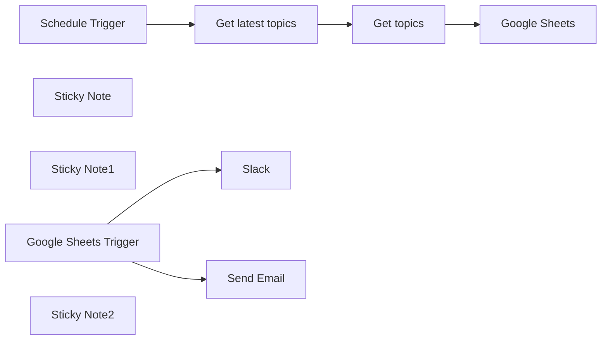

## Fluxo (.json) :

```json
{
  "id": "R6tFG45dQydBz63e",
  "meta": {
    "instanceId": "fb2ac1a770dc8dc4bb24d7e6a9ab7e89f53c6b6759adeb7ab76c09a3d8f6f4a9",
    "templateCredsSetupCompleted": true
  },
  "name": "n8n Community Topic Tracker by Keyword",
  "tags": [],
  "nodes": [
    {
      "id": "b735226c-ce7f-4daf-8255-45ba80262aa5",
      "name": "Google Sheets",
      "type": "n8n-nodes-base.googleSheets",
      "position": [
        760,
        0
      ],
      "parameters": {
        "columns": {
          "value": {
            "id": "={{ $json.id }}",
            "url": "=https://community.n8n.io/t/{{ $json.slug }}",
            "date": "={{ $json.created_at }}",
            "title": "={{ $json.title }}",
            "has_solution": "={{ $json.has_accepted_answer }}"
          },
          "schema": [
            {
              "id": "id",
              "type": "string",
              "display": true,
              "removed": false,
              "required": false,
              "displayName": "id",
              "defaultMatch": true,
              "canBeUsedToMatch": true
            },
            {
              "id": "date",
              "type": "string",
              "display": true,
              "required": false,
              "displayName": "date",
              "defaultMatch": false,
              "canBeUsedToMatch": true
            },
            {
              "id": "title",
              "type": "string",
              "display": true,
              "required": false,
              "displayName": "title",
              "defaultMatch": false,
              "canBeUsedToMatch": true
            },
            {
              "id": "url",
              "type": "string",
              "display": true,
              "removed": false,
              "required": false,
              "displayName": "url",
              "defaultMatch": false,
              "canBeUsedToMatch": true
            },
            {
              "id": "has_solution",
              "type": "string",
              "display": true,
              "removed": false,
              "required": false,
              "displayName": "has_solution",
              "defaultMatch": false,
              "canBeUsedToMatch": true
            }
          ],
          "mappingMode": "defineBelow",
          "matchingColumns": [
            "id"
          ],
          "attemptToConvertTypes": false,
          "convertFieldsToString": false
        },
        "options": {},
        "operation": "appendOrUpdate",
        "sheetName": {
          "__rl": true,
          "mode": "list",
          "value": "gid=0",
          "cachedResultUrl": "",
          "cachedResultName": ""
        },
        "documentId": {
          "__rl": true,
          "mode": "list",
          "value": "",
          "cachedResultUrl": "",
          "cachedResultName": ""
        }
      },
      "credentials": {
        "googleSheetsOAuth2Api": {
          "id": "",
          "name": ""
        }
      },
      "notesInFlow": true,
      "typeVersion": 4.5
    },
    {
      "id": "bbcf5797-c3dc-495f-85e9-178755d29c50",
      "name": "Schedule Trigger",
      "type": "n8n-nodes-base.scheduleTrigger",
      "position": [
        -120,
        0
      ],
      "parameters": {
        "rule": {
          "interval": [
            {
              "field": "hours"
            }
          ]
        }
      },
      "typeVersion": 1.2
    },
    {
      "id": "357975bc-9e13-494d-93da-c4238b42b5b3",
      "name": "Sticky Note",
      "type": "n8n-nodes-base.stickyNote",
      "position": [
        60,
        -220
      ],
      "parameters": {
        "width": 340,
        "height": 420,
        "content": "## Modify the Query Parameter\n\n**Double-click** the node to open it for editing.\n\nAdjust the value of the \"q\" parameter to match the keyword you wish to monitor.\n\n\n\n"
      },
      "typeVersion": 1
    },
    {
      "id": "f53b958d-71d4-49cb-9db2-48e8d12301a9",
      "name": "Get topics",
      "type": "n8n-nodes-base.splitOut",
      "position": [
        460,
        0
      ],
      "parameters": {
        "options": {},
        "fieldToSplitOut": "topics"
      },
      "typeVersion": 1
    },
    {
      "id": "6fcd7991-4d3c-4705-a2f6-a85660cad80f",
      "name": "Get latest topics",
      "type": "n8n-nodes-base.httpRequest",
      "position": [
        180,
        0
      ],
      "parameters": {
        "url": "https://community.n8n.io/search",
        "options": {
          "response": {
            "response": {
              "responseFormat": "json"
            }
          }
        },
        "sendQuery": true,
        "queryParameters": {
          "parameters": [
            {
              "name": "q",
              "value": "ADD-YOUR-KEYWORD-HERE"
            },
            {
              "name": "order",
              "value": "latest"
            }
          ]
        }
      },
      "notesInFlow": true,
      "typeVersion": 4.2
    },
    {
      "id": "2483ecbc-6795-4fed-bce3-23108bc7087a",
      "name": "Sticky Note1",
      "type": "n8n-nodes-base.stickyNote",
      "position": [
        640,
        -220
      ],
      "parameters": {
        "width": 340,
        "height": 420,
        "content": "## Add your Google Sheets API credentials\n\n**Double-click** the node to open it for editing.\n\nSelect the document from the list. Please note to add columns \"id\", \"date\", \"title\", \"url\", \"has_solution\"\n\n\n\n\n"
      },
      "typeVersion": 1
    },
    {
      "id": "4791f99d-7bc2-4d85-8bd3-86a78475aed0",
      "name": "Google Sheets Trigger",
      "type": "n8n-nodes-base.googleSheetsTrigger",
      "position": [
        -80,
        640
      ],
      "parameters": {
        "options": {},
        "pollTimes": {
          "item": [
            {
              "mode": "everyMinute"
            }
          ]
        },
        "sheetName": {
          "__rl": true,
          "mode": "list",
          "value": "gid=0",
          "cachedResultUrl": "https://docs.google.com/spreadsheets/d/1DDVOKXbRGM_2lHZSUm4bH_VqAZ9jKBMOARVyf3hE5kI/edit#gid=0",
          "cachedResultName": "Sheet1"
        },
        "documentId": {
          "__rl": true,
          "mode": "list",
          "value": "1DDVOKXbRGM_2lHZSUm4bH_VqAZ9jKBMOARVyf3hE5kI",
          "cachedResultUrl": "https://docs.google.com/spreadsheets/d/1DDVOKXbRGM_2lHZSUm4bH_VqAZ9jKBMOARVyf3hE5kI/edit?usp=drivesdk",
          "cachedResultName": "n8n Community topic tracker based on keyword"
        }
      },
      "credentials": {
        "googleSheetsTriggerOAuth2Api": {
          "id": "LGzWbSDkVxbOBOBT",
          "name": "Google Sheets Trigger account"
        }
      },
      "typeVersion": 1
    },
    {
      "id": "c1d43a4b-f681-40f6-9736-10ee3ad511f2",
      "name": "Slack",
      "type": "n8n-nodes-base.slack",
      "position": [
        220,
        580
      ],
      "webhookId": "aca9b9e2-e9d4-40eb-a2be-bd2a07b31ce8",
      "parameters": {
        "text": "New topics are available in n8n community",
        "otherOptions": {}
      },
      "typeVersion": 2.3
    },
    {
      "id": "cc531378-6341-43ea-87c5-03a048ff74a9",
      "name": "Send Email",
      "type": "n8n-nodes-base.emailSend",
      "position": [
        220,
        760
      ],
      "parameters": {
        "text": "New topics are available in n8n community.",
        "options": {},
        "emailFormat": "text"
      },
      "credentials": {
        "smtp": {
          "id": "tDSWM9BZ9H2FaedY",
          "name": "SMTP account 2"
        }
      },
      "typeVersion": 2.1
    },
    {
      "id": "2b025fc2-4e78-4120-9d36-0ca3f4fd5743",
      "name": "Sticky Note2",
      "type": "n8n-nodes-base.stickyNote",
      "position": [
        -140,
        360
      ],
      "parameters": {
        "width": 580,
        "height": 600,
        "content": "## Send a message when Sheet is updated (Optional)\n\n### Delete these nodes if you don't want to be alerted.\n\nYou can configure channels you want to connect, when Google Sheet is updated, so that you receive a message instantly."
      },
      "typeVersion": 1
    }
  ],
  "active": true,
  "pinData": {},
  "settings": {
    "executionOrder": "v1"
  },
  "versionId": "3cd62f18-29c4-4e14-b560-5c96e33650d4",
  "connections": {
    "Get topics": {
      "main": [
        [
          {
            "node": "Google Sheets",
            "type": "main",
            "index": 0
          }
        ]
      ]
    },
    "Schedule Trigger": {
      "main": [
        [
          {
            "node": "Get latest topics",
            "type": "main",
            "index": 0
          }
        ]
      ]
    },
    "Get latest topics": {
      "main": [
        [
          {
            "node": "Get topics",
            "type": "main",
            "index": 0
          }
        ]
      ]
    },
    "Google Sheets Trigger": {
      "main": [
        [
          {
            "node": "Slack",
            "type": "main",
            "index": 0
          },
          {
            "node": "Send Email",
            "type": "main",
            "index": 0
          }
        ]
      ]
    }
  }
}
```

<a id="template-799"></a>

## Template 799 - Registro automático de recibos e despesas

- **Nome:** Registro automático de recibos e despesas
- **Descrição:** Recebe recibos enviados por usuários, extrai dados relevantes automaticamente e registra as despesas em uma planilha, enviando confirmações por chat e SMS.
- **Funcionalidade:** • Captura de recibos via chat: Recebe mensagens e arquivos enviados por usuários no chat do bot.
• Download automático do recibo: Faz o download do arquivo de recibo enviado pelo usuário.
• Extração de dados por OCR: Envia a imagem do recibo a um serviço de processamento para obter data, hora, comerciante, valor, moeda e categoria.
• Mapeamento de campos relevantes: Isola e organiza os campos extraídos (categoria, data, comerciante, hora, valor, moeda e quem adicionou).
• Registro em planilha: Adiciona uma nova linha na planilha com os dados da despesa.
• Confirmação ao usuário: Envia mensagem de confirmação no chat com os detalhes do recibo registrado.
• Notificação por SMS: Envia uma mensagem SMS com resumo da despesa e link para a planilha.
- **Ferramentas:** • Telegram: Canal de entrada para receber recibos dos usuários e enviar mensagens de confirmação.
• Mindee (API de processamento de recibos): Serviço de OCR/extração de dados para identificar data, hora, comerciante, valor, moeda e categoria no recibo.
• Google Sheets: Armazena os registros de despesas em uma planilha acessível.
• Twilio: Envia notificações por SMS com informações do recibo e link para a planilha.

## Fluxo visual


## Fluxo (.json) :

```json
{
  "id": "200",
  "name": "BillBot",
  "nodes": [
    {
      "name": "Set relevant data",
      "type": "n8n-nodes-base.set",
      "position": [
        780,
        460
      ],
      "parameters": {
        "values": {
          "string": [
            {
              "name": "Category",
              "value": "={{$node[\"Parse details from receipt\"].json[\"predictions\"][0][\"category\"][\"value\"]}}"
            },
            {
              "name": "Date",
              "value": "={{$node[\"Parse details from receipt\"].json[\"predictions\"][0][\"date\"][\"iso\"]}}"
            },
            {
              "name": "Merchant",
              "value": "={{$node[\"Parse details from receipt\"].json[\"predictions\"][0][\"merchant\"][\"name\"]}}"
            },
            {
              "name": "Time",
              "value": "={{$node[\"Parse details from receipt\"].json[\"predictions\"][0][\"time\"][\"iso\"]}}"
            },
            {
              "name": "Amount",
              "value": "={{$node[\"Parse details from receipt\"].json[\"predictions\"][0][\"total\"][\"amount\"]}}"
            },
            {
              "name": "Currency",
              "value": "={{$node[\"Parse details from receipt\"].json[\"predictions\"][0][\"locale\"][\"currency\"]}}"
            },
            {
              "name": "Added by",
              "value": "={{$node[\"Get receipts from bot\"].json[\"message\"][\"chat\"][\"first_name\"]}} {{$node[\"Get receipts from bot\"].json[\"message\"][\"chat\"][\"last_name\"]}}"
            }
          ]
        },
        "options": {},
        "keepOnlySet": true
      },
      "typeVersion": 1
    },
    {
      "name": "Send confirmation",
      "type": "n8n-nodes-base.telegram",
      "position": [
        1180,
        460
      ],
      "parameters": {
        "text": "=✅ Bill of {{$node[\"Set relevant data\"].json[\"Amount\"]}} {{$node[\"Set relevant data\"].json[\"Currency\"]}} from {{$node[\"Set relevant data\"].json[\"Merchant\"]}}, dated {{$node[\"Set relevant data\"].json[\"Date\"]}} at {{$node[\"Set relevant data\"].json[\"Time\"]}}. Category was {{$node[\"Set relevant data\"].json[\"Category\"]}}.",
        "chatId": "={{$node[\"Get receipts from bot\"].json[\"message\"][\"chat\"][\"id\"]}}",
        "additionalFields": {}
      },
      "credentials": {
        "telegramApi": ""
      },
      "typeVersion": 1
    },
    {
      "name": "Get receipts from bot",
      "type": "n8n-nodes-base.telegramTrigger",
      "position": [
        380,
        460
      ],
      "webhookId": "ef81fe75-10c8-40c3-8bea-d65648556705",
      "parameters": {
        "updates": [
          "*"
        ],
        "additionalFields": {
          "download": true
        }
      },
      "credentials": {
        "telegramApi": ""
      },
      "typeVersion": 1
    },
    {
      "name": "Parse details from receipt",
      "type": "n8n-nodes-base.httpRequest",
      "position": [
        580,
        460
      ],
      "parameters": {
        "url": "https://api.mindee.net/products/expense_receipts/v2/predict",
        "options": {
          "bodyContentType": "multipart-form-data"
        },
        "requestMethod": "POST",
        "authentication": "headerAuth",
        "jsonParameters": true,
        "sendBinaryData": true
      },
      "credentials": {
        "httpHeaderAuth": ""
      },
      "typeVersion": 1
    },
    {
      "name": "Add to expense record",
      "type": "n8n-nodes-base.googleSheets",
      "position": [
        980,
        460
      ],
      "parameters": {
        "range": "A:G",
        "options": {},
        "sheetId": "",
        "operation": "append",
        "authentication": "oAuth2"
      },
      "credentials": {
        "googleSheetsOAuth2Api": ""
      },
      "typeVersion": 1
    },
    {
      "name": "Send SMS notification",
      "type": "n8n-nodes-base.twilio",
      "position": [
        1380,
        460
      ],
      "parameters": {
        "to": "",
        "from": "",
        "message": "=A receipt worth {{$node[\"Set relevant data\"].json[\"Amount\"]}} {{$node[\"Set relevant data\"].json[\"Currency\"]}} was submitted by {{$node[\"Set relevant data\"].json[\"Added by\"]}} and has been added to the following spreadsheet:\nhttps://docs.google.com/spreadsheets/d/{{$node[\"Add to expense record\"].parameter[\"sheetId\"]}}/"
      },
      "credentials": {
        "twilioApi": "Twilio Programmable SMS"
      },
      "typeVersion": 1
    }
  ],
  "connections": {
    "Send confirmation": {
      "main": [
        [
          {
            "node": "Send SMS notification",
            "type": "main",
            "index": 0
          }
        ]
      ]
    },
    "Set relevant data": {
      "main": [
        [
          {
            "node": "Add to expense record",
            "type": "main",
            "index": 0
          }
        ]
      ]
    },
    "Add to expense record": {
      "main": [
        [
          {
            "node": "Send confirmation",
            "type": "main",
            "index": 0
          }
        ]
      ]
    },
    "Get receipts from bot": {
      "main": [
        [
          {
            "node": "Parse details from receipt",
            "type": "main",
            "index": 0
          }
        ]
      ]
    },
    "Parse details from receipt": {
      "main": [
        [
          {
            "node": "Set relevant data",
            "type": "main",
            "index": 0
          }
        ]
      ]
    }
  }
}
```

<a id="template-800"></a>

## Template 800 - Criar ticket no Freshdesk com status aberto

- **Nome:** Criar ticket no Freshdesk com status aberto
- **Descrição:** Ao executar manualmente, cria um ticket no Freshdesk com status aberto e define o solicitante por e-mail.
- **Funcionalidade:** • Gatilho manual: inicia o fluxo quando o usuário clica em executar.
• Criação de ticket: gera um novo ticket no sistema de suporte com status 'open'.
• Definição do solicitante por e-mail: atribui o solicitante usando o e-mail user@example.com.
• Autenticação por credenciais: utiliza credenciais configuradas para autenticar a requisição à API do serviço de suporte.
- **Ferramentas:** • Freshdesk: plataforma de suporte ao cliente utilizada para criar e gerenciar tickets; o fluxo envia dados para criar um ticket com status aberto e solicitante identificado por e-mail.

## Fluxo visual


## Fluxo (.json) :

```json
{
  "nodes": [
    {
      "name": "On clicking 'execute'",
      "type": "n8n-nodes-base.manualTrigger",
      "position": [
        250,
        300
      ],
      "parameters": {},
      "typeVersion": 1
    },
    {
      "name": "Freshdesk",
      "type": "n8n-nodes-base.freshdesk",
      "position": [
        450,
        300
      ],
      "parameters": {
        "status": "open",
        "options": {},
        "requester": "email",
        "requesterIdentificationValue": "user@example.com"
      },
      "credentials": {
        "freshdeskApi": "freshdesk-api"
      },
      "typeVersion": 1
    }
  ],
  "connections": {
    "On clicking 'execute'": {
      "main": [
        [
          {
            "node": "Freshdesk",
            "type": "main",
            "index": 0
          }
        ]
      ]
    }
  }
}
```

<a id="template-801"></a>

## Template 801 - Publicar posts do blog no Medium

- **Nome:** Publicar posts do blog no Medium
- **Descrição:** Busca posts de um blog WordPress, extrai título e conteúdo de cada artigo e publica-os no Medium automaticamente.
- **Funcionalidade:** • Inicia manualmente: O fluxo é acionado manualmente para controle da execução.
• Coleta da página de índice do blog: Faz uma requisição à página de listagem de posts para obter links e títulos.
• Extração de títulos e links: Identifica os títulos dos posts e os URLs das páginas individuais.
• Limitação de itens: Limita a quantidade de posts processados (ex.: 5) para evitar sobrecarga.
• Processamento em lotes: Divide os itens para processamento sequencial/por lote.
• Download do conteúdo completo: Para cada link, obtém a página do post individual.
• Extração de conteúdo do post: Extrai título, introdução e o conteúdo HTML completo do artigo.
• Publicação no Medium: Publica cada artigo extraído no Medium com tags e status de publicação configurados.
- **Ferramentas:** • Site WordPress (https://mailsafi.com/blog): Fonte dos posts que serão extraídos.
• Medium: Plataforma onde os posts extraídos são republicados como artigos públicos.

## Fluxo visual

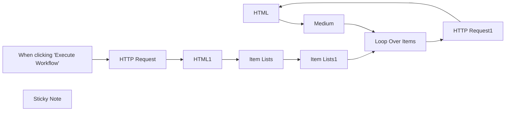

## Fluxo (.json) :

```json
{
  "meta": {
    "instanceId": "257476b1ef58bf3cb6a46e65fac7ee34a53a5e1a8492d5c6e4da5f87c9b82833",
    "templateId": "2062"
  },
  "nodes": [
    {
      "id": "aac9c0d2-a278-4ea3-acf1-1aca547e30da",
      "name": "HTML",
      "type": "n8n-nodes-base.html",
      "position": [
        1520,
        480
      ],
      "parameters": {
        "options": {},
        "operation": "extractHtmlContent",
        "extractionValues": {
          "values": [
            {
              "key": "Title",
              "cssSelector": "h2.single-post-title"
            },
            {
              "key": "Introduction",
              "cssSelector": ".kiwi-highlighter-content-area > p:nth-child(1)"
            },
            {
              "key": "Header",
              "cssSelector": "div.kiwi-highlighter-content-area",
              "returnValue": "html"
            },
            {
              "key": "={{ $json.data }}"
            }
          ]
        }
      },
      "typeVersion": 1
    },
    {
      "id": "b0eb2240-ffa3-4e80-af7a-2aff470c02ee",
      "name": "HTTP Request",
      "type": "n8n-nodes-base.httpRequest",
      "position": [
        660,
        640
      ],
      "parameters": {
        "url": "https://mailsafi.com/blog/",
        "options": {}
      },
      "typeVersion": 4.1,
      "alwaysOutputData": true
    },
    {
      "id": "e8dd3215-2cec-48ba-9a0b-7b3c01a4a637",
      "name": "HTML1",
      "type": "n8n-nodes-base.html",
      "position": [
        840,
        640
      ],
      "parameters": {
        "options": {},
        "operation": "extractHtmlContent",
        "extractionValues": {
          "values": [
            {
              "key": "post",
              "cssSelector": ".entry-title > a",
              "returnArray": true
            },
            {
              "key": "Link",
              "attribute": "href",
              "cssSelector": " .lae-read-more > a",
              "returnArray": true,
              "returnValue": "attribute"
            }
          ]
        }
      },
      "typeVersion": 1
    },
    {
      "id": "5e408e44-7424-419f-9e24-1b619a96a1e0",
      "name": "Item Lists",
      "type": "n8n-nodes-base.itemLists",
      "position": [
        1000,
        640
      ],
      "parameters": {
        "options": {},
        "fieldToSplitOut": "post , Link"
      },
      "typeVersion": 3.1
    },
    {
      "id": "d7c6088e-efa3-4fbb-a53f-a7fc7bebdb84",
      "name": "Medium",
      "type": "n8n-nodes-base.medium",
      "position": [
        1580,
        700
      ],
      "parameters": {
        "title": "={{ $json.Title }}",
        "content": "={{ $json.Header }}",
        "contentFormat": "html",
        "additionalFields": {
          "tags": "Email Hosting, Email, Email Marketing",
          "publishStatus": "public",
          "notifyFollowers": false
        }
      },
      "typeVersion": 1,
      "alwaysOutputData": true
    },
    {
      "id": "5004a96e-16df-4100-84ae-df0b3be3a008",
      "name": "HTTP Request1",
      "type": "n8n-nodes-base.httpRequest",
      "position": [
        1360,
        480
      ],
      "parameters": {
        "url": "={{ $json.Link }}",
        "options": {}
      },
      "typeVersion": 4.1,
      "alwaysOutputData": true
    },
    {
      "id": "a34c5b31-c6ba-4e87-9177-a078aa100157",
      "name": "Loop Over Items",
      "type": "n8n-nodes-base.splitInBatches",
      "position": [
        1300,
        640
      ],
      "parameters": {
        "options": {}
      },
      "typeVersion": 3
    },
    {
      "id": "ee3e4f81-fa05-4ad0-a46e-6452d2f3c521",
      "name": "Item Lists1",
      "type": "n8n-nodes-base.itemLists",
      "position": [
        1140,
        640
      ],
      "parameters": {
        "maxItems": 5,
        "operation": "limit"
      },
      "typeVersion": 3.1
    },
    {
      "id": "f472a15d-aa5a-4c40-b283-78d69a2a9b57",
      "name": "When clicking \"Execute Workflow\"",
      "type": "n8n-nodes-base.manualTrigger",
      "position": [
        460,
        640
      ],
      "parameters": {},
      "typeVersion": 1
    },
    {
      "id": "f89e199d-72e5-4426-8e9d-82f6ce39ac42",
      "name": "Sticky Note",
      "type": "n8n-nodes-base.stickyNote",
      "position": [
        380,
        200
      ],
      "parameters": {
        "width": 688.6526946107781,
        "height": 522.559880239521,
        "content": "## Usage \n**How to use me** This workflow gets all the posts from your WordPress site and sorts them into a clear format before publishing them to medium.\n\nStep 1. Set up the HTTP node and set the URL of the source destination. This will be the URL of the blog you want to use. We shall be using https://mailsafi.com/blog for this.\n\nStep 2. Extract the URLs of all the blogs on the page\nThis gets all the blog titles and their URLs. Its an easy way to sort ou which blogs to share and which not to share.\n\nStep 3. Split the entries for easy sorting or a cleaner view.\n\nStep 4. Set a new https node with all the blog URLs that we got from the previous steps. \n\nStep 5. Extract the contents of the blog\n\nStep 6. Add the medium node and then set the contents that you want to be shared out.\n\nExecute your work flow and you are good to go\n\n\n"
      },
      "typeVersion": 1
    }
  ],
  "pinData": {},
  "connections": {
    "HTML": {
      "main": [
        [
          {
            "node": "Medium",
            "type": "main",
            "index": 0
          }
        ]
      ]
    },
    "HTML1": {
      "main": [
        [
          {
            "node": "Item Lists",
            "type": "main",
            "index": 0
          }
        ]
      ]
    },
    "Medium": {
      "main": [
        [
          {
            "node": "Loop Over Items",
            "type": "main",
            "index": 0
          }
        ]
      ]
    },
    "Item Lists": {
      "main": [
        [
          {
            "node": "Item Lists1",
            "type": "main",
            "index": 0
          }
        ]
      ]
    },
    "Item Lists1": {
      "main": [
        [
          {
            "node": "Loop Over Items",
            "type": "main",
            "index": 0
          }
        ]
      ]
    },
    "HTTP Request": {
      "main": [
        [
          {
            "node": "HTML1",
            "type": "main",
            "index": 0
          }
        ]
      ]
    },
    "HTTP Request1": {
      "main": [
        [
          {
            "node": "HTML",
            "type": "main",
            "index": 0
          }
        ]
      ]
    },
    "Loop Over Items": {
      "main": [
        null,
        [
          {
            "node": "HTTP Request1",
            "type": "main",
            "index": 0
          }
        ]
      ]
    },
    "When clicking \"Execute Workflow\"": {
      "main": [
        [
          {
            "node": "HTTP Request",
            "type": "main",
            "index": 0
          }
        ]
      ]
    }
  }
}
```
