# PACK 1999 TEMPLATES PARTE 05 - Bloco 1

Templates neste bloco: 20

## Sumário

- [Template 802 - Consulta SELECT em PostgreSQL por disparo manual](#template-802)
- [Template 803 - Remoção de PII de arquivos CSV no Google Drive](#template-803)
- [Template 804 - Envio manual de e-mail via AWS SES](#template-804)
- [Template 805 - Automação de tarefa recorrente (Airtable)](#template-805)
- [Template 806 - Raspar e resumir ensaios de Paul Graham](#template-806)
- [Template 807 - Envio de SMS via MSG91](#template-807)
- [Template 808 - Agente de IA com ferramenta de sugestão de atividades](#template-808)
- [Template 809 - Busca todas as notícias do Hacker News](#template-809)
- [Template 810 - Agente IA com ferramenta personalizada](#template-810)
- [Template 811 - Disparar build no Travis CI](#template-811)
- [Template 812 - Raspagem de livros e envio de CSV por e-mail](#template-812)
- [Template 813 - Relatar bugs do Slack para Linear](#template-813)
- [Template 814 - Validação de endereço postal de contatos](#template-814)
- [Template 815 - Recuperar contatos do Keap](#template-815)
- [Template 816 - Processamento de novos leads e notificação por email](#template-816)
- [Template 817 - Buscar quadro do Monday.com](#template-817)
- [Template 818 - Validação de endereço postal (Groundhogg)](#template-818)
- [Template 819 - Análise de Competidores via Avaliações de Clientes](#template-819)
- [Template 820 - Listar todas as caixas de correio do Help Scout](#template-820)
- [Template 821 - Recuperar todas as linhas do Excel](#template-821)

---

<a id="template-802"></a>

## Template 802 - Consulta SELECT em PostgreSQL por disparo manual

- **Nome:** Consulta SELECT em PostgreSQL por disparo manual
- **Descrição:** Ao ser acionado manualmente, o fluxo executa uma consulta SELECT na tabela 'sometable' de um banco PostgreSQL e retorna os resultados.
- **Funcionalidade:** • Disparo manual: Inicia o processo quando o usuário clica em executar.
• Execução de consulta SQL: Envia a instrução SELECT * from sometable; ao banco de dados.
• Recuperação de dados: Recebe e disponibiliza os registros retornados pela consulta para uso posterior.
- **Ferramentas:** • PostgreSQL: Banco de dados relacional onde a tabela 'sometable' está hospedada e do qual os dados são consultados.

## Fluxo visual


## Fluxo (.json) :

```json
{
  "nodes": [
    {
      "name": "On clicking 'execute'",
      "type": "n8n-nodes-base.manualTrigger",
      "position": [
        250,
        300
      ],
      "parameters": {},
      "typeVersion": 1
    },
    {
      "name": "Postgres",
      "type": "n8n-nodes-base.postgres",
      "position": [
        450,
        300
      ],
      "parameters": {
        "query": "SELECT * from sometable;",
        "operation": "executeQuery"
      },
      "credentials": {
        "postgres": "postgres-creds"
      },
      "typeVersion": 1
    }
  ],
  "connections": {
    "On clicking 'execute'": {
      "main": [
        [
          {
            "node": "Postgres",
            "type": "main",
            "index": 0
          }
        ]
      ]
    }
  }
}
```

<a id="template-803"></a>

## Template 803 - Remoção de PII de arquivos CSV no Google Drive

- **Nome:** Remoção de PII de arquivos CSV no Google Drive
- **Descrição:** Monitora uma pasta do Google Drive por novos arquivos CSV, identifica colunas que contenham informações pessoalmente identificáveis (PII) usando OpenAI, remove essas colunas e faz o upload do arquivo sanitizado de volta para o Drive.
- **Funcionalidade:** • Monitoramento de pasta: Observa uma pasta específica no Google Drive em busca de novos arquivos.
• Download do arquivo: Baixa o arquivo detectado para processamento local.
• Extração e leitura do conteúdo: Lê o conteúdo do arquivo e obtém cabeçalhos e linhas de exemplo.
• Identificação de colunas PII com IA: Envia os cabeçalhos e exemplos para análise e identificação das colunas que contêm PII.
• Remoção de colunas PII: Remove as colunas identificadas como PII dos dados.
• Geração de novo arquivo CSV: Reconstroi um CSV sem as colunas PII e cria um nome de arquivo atualizado.
• Upload do arquivo sanitizado: Envia o arquivo resultante para uma pasta específica no Google Drive.
- **Ferramentas:** • Google Drive: Armazenamento e gerenciamento de arquivos, usado para monitorar pastas, baixar o arquivo original e fazer upload do arquivo sanitizado.
• OpenAI: Serviço de IA usado para analisar os cabeçalhos e exemplos de linha e identificar quais colunas contêm PII.

## Fluxo visual

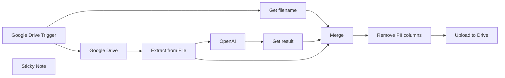

## Fluxo (.json) :

```json
{
  "meta": {
    "instanceId": "2f9460831fcdb0e9a4494f0630367cfe2968282072e2d27c6ee6ab0a4c165a36"
  },
  "nodes": [
    {
      "id": "ff4e8706-09a0-4bf1-86c1-dfb65f55ccb3",
      "name": "Google Drive Trigger",
      "type": "n8n-nodes-base.googleDriveTrigger",
      "position": [
        20,
        -140
      ],
      "parameters": {
        "event": "fileCreated",
        "options": {},
        "pollTimes": {
          "item": [
            {
              "mode": "everyMinute"
            }
          ]
        },
        "triggerOn": "specificFolder",
        "folderToWatch": {
          "__rl": true,
          "mode": "list",
          "value": "1-hRMnBRYgY6iVJ_youKMyPz83k9GAVYu",
          "cachedResultUrl": "https://drive.google.com/drive/folders/1-hRMnBRYgY6iVJ_youKMyPz83k9GAVYu",
          "cachedResultName": "nnnnnnnnnnn8n"
        }
      },
      "credentials": {
        "googleDriveOAuth2Api": {
          "id": "PlyNQuMqlwn9SuLb",
          "name": "Google Drive account"
        }
      },
      "typeVersion": 1
    },
    {
      "id": "340fb03b-3b8a-4eb4-ad4c-b0ba12b72b19",
      "name": "Google Drive",
      "type": "n8n-nodes-base.googleDrive",
      "position": [
        260,
        -140
      ],
      "parameters": {
        "fileId": {
          "__rl": true,
          "mode": "id",
          "value": "={{ $json.id }}"
        },
        "options": {
          "binaryPropertyName": "data"
        },
        "operation": "download"
      },
      "credentials": {
        "googleDriveOAuth2Api": {
          "id": "PlyNQuMqlwn9SuLb",
          "name": "Google Drive account"
        }
      },
      "typeVersion": 3
    },
    {
      "id": "4a5d037f-0103-4645-87d0-785dfdfb80d1",
      "name": "Extract from File",
      "type": "n8n-nodes-base.extractFromFile",
      "position": [
        260,
        60
      ],
      "parameters": {
        "options": {}
      },
      "typeVersion": 1,
      "alwaysOutputData": false
    },
    {
      "id": "36c7e83d-f22f-4a71-b5a2-64ed3e4ce24b",
      "name": "OpenAI",
      "type": "@n8n/n8n-nodes-langchain.openAi",
      "position": [
        -120,
        260
      ],
      "parameters": {
        "modelId": {
          "__rl": true,
          "mode": "list",
          "value": "gpt-4o-mini",
          "cachedResultName": "GPT-4O-MINI"
        },
        "options": {},
        "messages": {
          "values": [
            {
              "role": "system",
              "content": "Analyze the provided tabular data and identify the columns that contain personally identifiable information (PII). Return only the column names that contain PII, separated by commas. Key name: 'content'. Do not include any additional text or explanation."
            },
            {
              "content": "=Here is some tabular data with column headers and two example rows.\n\nHeaders: {{Object.keys($json)}}\n\nExample Row 1: {{Object.values($json)}}\n\n"
            }
          ]
        },
        "jsonOutput": true
      },
      "credentials": {
        "openAiApi": {
          "id": "Mld1OIvnEVogxjDH",
          "name": "OpenAi account"
        }
      },
      "executeOnce": true,
      "typeVersion": 1.7
    },
    {
      "id": "771c6535-47d4-4c70-b487-bd5ac602e29c",
      "name": "Merge",
      "type": "n8n-nodes-base.merge",
      "position": [
        440,
        260
      ],
      "parameters": {
        "numberInputs": 3
      },
      "typeVersion": 3
    },
    {
      "id": "1fc467fd-379d-4841-978b-89c1453b61d8",
      "name": "Upload to Drive",
      "type": "n8n-nodes-base.googleDrive",
      "position": [
        740,
        260
      ],
      "parameters": {
        "name": "={{ $json.fileName }}",
        "content": "={{ $json.content }}",
        "driveId": {
          "__rl": true,
          "mode": "list",
          "value": "My Drive"
        },
        "options": {},
        "folderId": {
          "__rl": true,
          "mode": "list",
          "value": "1F30Qu3csrmMhtcu_prMipeiGm-64VEdd",
          "cachedResultUrl": "https://drive.google.com/drive/folders/1F30Qu3csrmMhtcu_prMipeiGm-64VEdd",
          "cachedResultName": "processed"
        },
        "operation": "createFromText"
      },
      "credentials": {
        "googleDriveOAuth2Api": {
          "id": "PlyNQuMqlwn9SuLb",
          "name": "Google Drive account"
        }
      },
      "typeVersion": 3
    },
    {
      "id": "92715586-e630-4584-83a3-1af42d7cb50e",
      "name": "Get filename",
      "type": "n8n-nodes-base.splitOut",
      "position": [
        20,
        60
      ],
      "parameters": {
        "options": {
          "destinationFieldName": "originalFilename"
        },
        "fieldToSplitOut": "name"
      },
      "executeOnce": true,
      "typeVersion": 1
    },
    {
      "id": "2c4b3242-34db-4948-b835-cd2340ad7b19",
      "name": "Get result",
      "type": "n8n-nodes-base.splitOut",
      "position": [
        200,
        260
      ],
      "parameters": {
        "options": {
          "destinationFieldName": "data"
        },
        "fieldToSplitOut": "message.content.content"
      },
      "typeVersion": 1
    },
    {
      "id": "4207dc71-5b0e-4780-9f23-00f5a7fc3862",
      "name": "Remove PII columns",
      "type": "n8n-nodes-base.code",
      "position": [
        580,
        260
      ],
      "parameters": {
        "jsCode": "// Input: All items from the previous node\nconst input = $input.all();\n\n// Step 1: Extract the PII column names from the first item\nconst firstItem = input[0];\nif (!firstItem.json.data || !firstItem.json.data) {\n throw new Error(\"PII column names are missing in the input data.\");\n}\nconst piiColumns = firstItem.json.data.split(',').map(col => col.trim());\n//console.log(\"PII Columns to Remove:\", piiColumns);\n\n// Step 2: Remove the first two items and process the remaining rows\nlet rows = input.slice(2).map(item => item.json); // Exclude the first item\n//console.log(\"Rows to convert (before skipping last):\", rows);\n\n\n// Ensure there are rows to process\nif (rows.length === 0) {\n throw new Error(\"No rows to convert to CSV.\");\n}\n\n// Step 3: Remove PII columns from each row\nconst sanitizedRows = rows.map(row => {\n const sanitizedRow = { ...row }; // Copy the row\n piiColumns.forEach(column => delete sanitizedRow[column]); // Remove PII columns\n return sanitizedRow;\n});\n//console.log(\"Sanitized Rows:\", sanitizedRows);\n\n// Step 4: Extract headers from sanitized rows\nconst headers = Object.keys(sanitizedRows[0]); // Extract updated headers\n//console.log(\"CSV Headers:\", headers);\n\n// Step 5: Convert rows to CSV format\nconst csvRows = [\n headers.join(','), // Add header row\n ...sanitizedRows.map(row => \n headers.map(header => String(row[header] || '').replace(/,/g, '')).join(',') // Match headers with rows\n )\n];\n\n// Join all rows with a newline character\nconst csvContent = csvRows.join('\\n');\n//console.log(\"CSV Content:\", csvContent);\n\nconst originalFileName = input[1].json.originalFilename;\n\n// Step 7: Generate a new filename\nconst fileExtension = originalFileName.split('.').pop();\nconst baseName = originalFileName.replace(`.${fileExtension}`, '');\nconst newFileName = `${baseName}_PII_removed.${fileExtension}`;\n//console.log(\"New Filename:\", newFileName);\n\n// Step 8: Return the CSV content and filename as JSON\nreturn [\n {\n json: {\n fileName: newFileName, // New file name\n content: csvContent // CSV content as plain text\n }\n }\n];\n"
      },
      "typeVersion": 2
    },
    {
      "id": "e9f25ee7-cd00-4496-9062-5d57cab5788d",
      "name": "Sticky Note",
      "type": "n8n-nodes-base.stickyNote",
      "position": [
        -300,
        -220
      ],
      "parameters": {
        "height": 260,
        "content": "## Remove PII from CSV Files\nThis workflow monitors a Google Drive folder for new CSV files, identifies and removes PII columns using OpenAI, and uploads the sanitized file back to the drive. It requires Google Drive and OpenAI integrations with API access enabled."
      },
      "typeVersion": 1
    }
  ],
  "pinData": {},
  "connections": {
    "Merge": {
      "main": [
        [
          {
            "node": "Remove PII columns",
            "type": "main",
            "index": 0
          }
        ]
      ]
    },
    "OpenAI": {
      "main": [
        [
          {
            "node": "Get result",
            "type": "main",
            "index": 0
          }
        ]
      ]
    },
    "Get result": {
      "main": [
        [
          {
            "node": "Merge",
            "type": "main",
            "index": 0
          }
        ]
      ]
    },
    "Get filename": {
      "main": [
        [
          {
            "node": "Merge",
            "type": "main",
            "index": 1
          }
        ]
      ]
    },
    "Google Drive": {
      "main": [
        [
          {
            "node": "Extract from File",
            "type": "main",
            "index": 0
          }
        ]
      ]
    },
    "Upload to Drive": {
      "main": [
        []
      ]
    },
    "Extract from File": {
      "main": [
        [
          {
            "node": "OpenAI",
            "type": "main",
            "index": 0
          },
          {
            "node": "Merge",
            "type": "main",
            "index": 2
          }
        ]
      ]
    },
    "Remove PII columns": {
      "main": [
        [
          {
            "node": "Upload to Drive",
            "type": "main",
            "index": 0
          }
        ]
      ]
    },
    "Google Drive Trigger": {
      "main": [
        [
          {
            "node": "Get filename",
            "type": "main",
            "index": 0
          },
          {
            "node": "Google Drive",
            "type": "main",
            "index": 0
          }
        ]
      ]
    }
  }
}
```

<a id="template-804"></a>

## Template 804 - Envio manual de e-mail via AWS SES

- **Nome:** Envio manual de e-mail via AWS SES
- **Descrição:** Envia um e-mail para destinatários pré-definidos usando o serviço de e-mail da AWS quando o fluxo é executado manualmente.
- **Funcionalidade:** • Acionamento manual: Inicia o fluxo quando o usuário clica em executar.
• Composição de e-mail: Define assunto, corpo da mensagem e endereço do remetente.
• Envio para múltiplos destinatários: Envia a mesma mensagem para vários endereços configurados.
• Autenticação via credenciais AWS: Utiliza credenciais para autenticar o envio pelo serviço de e-mail da AWS.
- **Ferramentas:** • AWS SES: Serviço de envio de e-mails da Amazon usado para entregar as mensagens.

## Fluxo visual

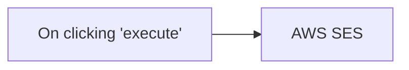

## Fluxo (.json) :

```json
{
  "nodes": [
    {
      "name": "On clicking 'execute'",
      "type": "n8n-nodes-base.manualTrigger",
      "position": [
        250,
        300
      ],
      "parameters": {},
      "typeVersion": 1
    },
    {
      "name": "AWS SES",
      "type": "n8n-nodes-base.awsSes",
      "position": [
        450,
        300
      ],
      "parameters": {
        "body": "This is a sample message body in an email\n",
        "subject": "n8n Rocks",
        "fromEmail": "n8n@n8n.io",
        "toAddresses": [
          "user@example.com",
          "user2@example.com"
        ],
        "additionalFields": {}
      },
      "credentials": {
        "aws": "aws"
      },
      "typeVersion": 1
    }
  ],
  "connections": {
    "On clicking 'execute'": {
      "main": [
        [
          {
            "node": "AWS SES",
            "type": "main",
            "index": 0
          }
        ]
      ]
    }
  }
}
```

<a id="template-805"></a>

## Template 805 - Automação de tarefa recorrente (Airtable)

- **Nome:** Automação de tarefa recorrente (Airtable)
- **Descrição:** Fluxo que cria uma tarefa a partir de um modelo, calcula datas-chave (Kickoff, Soft e Hard Due Dates), atualiza o registro de automação e notifica o responsável.
- **Funcionalidade:** • Detecção de evento: inicia a automação quando a entrada é criada/atualizada na view 'First Task - Create Task'.
• Obsção de dados relacionados: busca Template, Assignee, Client e os IDs de base/tabela necessários.
• Cálculo de datas: Kickoff Date, Soft Due Date, Hard Due Date, Today e Next Task Creation Date são calculadas com base nas entradas.
• Criação de tarefa: cria uma nova tarefa na tabela Task preenchendo campos como Status, Task Name, Description, Kickoff Date, Soft Due Date, Hard Due Date, Assignee, Template e Client.
• Atualização do registro de automação: atualiza o registro com First Task Created, Last Task Created e Next Task Creation Date.
• Notificação do responsável (opcional): envia uma mensagem ao responsável designado sobre a tarefa criada.
- **Ferramentas:** • Airtable: Plataforma de base de dados que armazena bases, tabelas de tarefas, templates, clientes e equipes.
• Slack: Plataforma de comunicação para notificar o responsável pela tarefa.

## Fluxo visual

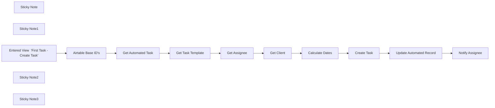

## Fluxo (.json) :

```json
{
  "meta": {
    "instanceId": "257476b1ef58bf3cb6a46e65fac7ee34a53a5e1a8492d5c6e4da5f87c9b82833",
    "templateId": "2070"
  },
  "nodes": [
    {
      "id": "99daceb3-fb96-4324-ac87-4ffef333dc81",
      "name": "Get Automated Task",
      "type": "n8n-nodes-base.airtable",
      "position": [
        1040,
        660
      ],
      "parameters": {
        "id": "={{ $('Entered View  \"First Task - Create Task\"').item.json[\"id\"] }}",
        "base": {
          "__rl": true,
          "mode": "id",
          "value": "={{ $item(\"0\").$node[\"Airtable Base ID's\"].json[\"base_id\"] }}"
        },
        "table": {
          "__rl": true,
          "mode": "id",
          "value": "={{ $item(\"0\").$node[\"Airtable Base ID's\"].json[\"table_automate_id\"] }}"
        },
        "options": {},
        "operation": "get"
      },
      "typeVersion": 2
    },
    {
      "id": "4a29d735-5039-4935-9803-66df6a67e590",
      "name": "Create Task",
      "type": "n8n-nodes-base.httpRequest",
      "position": [
        2140,
        660
      ],
      "parameters": {
        "url": "=https://api.airtable.com/v0/{{ $item(\"0\").$node[\"Airtable Base ID's\"].json[\"base_id\"] }}/{{ $item(\"0\").$node[\"Airtable Base ID's\"].json[\"table_task_id\"] }}",
        "method": "POST",
        "options": {},
        "jsonBody": "={\n    \"records\": [\n        {\n            \"fields\": {\n                \"Status\": \"Todo\",\n                \"Task Name\": \"{{ $item(\"0\").$node[\"Get Task Template\"].json[\"Template Name\"] }}\",\n                \"Task Description\": \"{{ $('Get Task Template').item.json[\"Description\"].replace(/\\r?\\n/g, \"\\\\n\") }}\",\n                \"Kickoff Date\": \"{{ $('Calculate Dates').item.json[\"Kickoff Date\"] }}\",\n                \"Soft Due Date\": \"{{ $('Calculate Dates').item.json[\"Soft Due Date\"] }}\",\n                \"Hard Due Date\": \"{{ $('Calculate Dates').item.json[\"Hard Due Date\"] }}\",\n                \"Assignee\": [\n                    \"{{ $('Get Assignee').item.json[\"id\"] }}\"\n                ],\n                \"Template\": [\n                    \"{{ $('Get Task Template').item.json[\"id\"] }}\"\n                ],\n                \"Client\": [\n                    \"{{ $('Get Client').item.json[\"id\"] }}\"\n                ]\n            }\n        }\n    ]\n}",
        "sendBody": true,
        "sendHeaders": true,
        "specifyBody": "json",
        "authentication": "predefinedCredentialType",
        "headerParameters": {
          "parameters": [
            {
              "name": "Content-Type",
              "value": "application/json"
            }
          ]
        },
        "nodeCredentialType": "airtableTokenApi"
      },
      "typeVersion": 4.1
    },
    {
      "id": "4d5e25f4-395f-4c47-8181-7dc7191b3b88",
      "name": "Get Task Template",
      "type": "n8n-nodes-base.airtable",
      "position": [
        1240,
        660
      ],
      "parameters": {
        "id": "={{ $item(\"0\").$node[\"Get Automated Task\"].json[\"Template\"][\"0\"] }}",
        "base": {
          "__rl": true,
          "mode": "id",
          "value": "={{ $item(\"0\").$node[\"Airtable Base ID's\"].json[\"base_id\"] }}"
        },
        "table": {
          "__rl": true,
          "mode": "id",
          "value": "={{ $item(\"0\").$node[\"Airtable Base ID's\"].json[\"table_template_id\"] }}"
        },
        "options": {},
        "operation": "get"
      },
      "typeVersion": 2
    },
    {
      "id": "fe7a3c49-738b-46d2-9276-2398dff3a449",
      "name": "Get Assignee",
      "type": "n8n-nodes-base.airtable",
      "position": [
        1460,
        660
      ],
      "parameters": {
        "id": "={{ $item(\"0\").$node[\"Get Automated Task\"].json[\"Assigned Team Member\"][\"0\"] }}",
        "base": {
          "__rl": true,
          "mode": "id",
          "value": "={{ $item(\"0\").$node[\"Airtable Base ID's\"].json[\"base_id\"] }}"
        },
        "table": {
          "__rl": true,
          "mode": "id",
          "value": "={{ $item(\"0\").$node[\"Airtable Base ID's\"].json[\"table_team_id\"] }}"
        },
        "options": {},
        "operation": "get"
      },
      "typeVersion": 2
    },
    {
      "id": "2b2e96a9-dd25-4d5f-a4db-aafd29fff907",
      "name": "Get Client",
      "type": "n8n-nodes-base.airtable",
      "position": [
        1660,
        660
      ],
      "parameters": {
        "id": "={{ $item(\"0\").$node[\"Get Automated Task\"].json[\"Client\"][\"0\"] }}",
        "base": {
          "__rl": true,
          "mode": "id",
          "value": "={{ $item(\"0\").$node[\"Airtable Base ID's\"].json[\"base_id\"] }}"
        },
        "table": {
          "__rl": true,
          "mode": "id",
          "value": "={{ $item(\"0\").$node[\"Airtable Base ID's\"].json[\"table_clients_id\"] }}"
        },
        "options": {},
        "operation": "get"
      },
      "typeVersion": 2
    },
    {
      "id": "504b3d7a-339c-42b7-b2ef-4a180ccc0f78",
      "name": "Calculate Dates",
      "type": "n8n-nodes-base.code",
      "position": [
        1880,
        660
      ],
      "parameters": {
        "jsCode": "// Retrieve values from the previous node\nconst firstTaskCreated = $item(\"0\").$node[\"Get Automated Task\"].json[\"First Task Created\"];\nconst startDate = $item(\"0\").$node[\"Get Automated Task\"].json[\"Start Date\"];\nconst lastTaskCreated = $item(\"0\").$node[\"Get Automated Task\"].json[\"Last Task Created\"];\nconst timeValue = $item(\"0\").$node[\"Get Automated Task\"].json[\"Time Value\"];\nconst daysForSoftDueDate = $item(\"0\").$node[\"Get Automated Task\"].json[\"Days for Soft Due Date\"];\n\n// Helper function to add days to a date\nfunction addDays(date, days) {\n  let result = new Date(date);\n  result.setDate(result.getDate() + days);\n  return result;\n}\n\n// Helper function to format date in MM/DD/YYYY\nfunction formatDate(date) {\n  return (date.getMonth() + 1) + '/' + date.getDate() + '/' + date.getFullYear();\n}\n\n// Calculate Kickoff Date\nlet kickoffDate;\nif (firstTaskCreated === \"false\") {\n  kickoffDate = new Date(startDate);\n} else {\n  kickoffDate = addDays(new Date(lastTaskCreated), timeValue);\n}\n\n// Calculate Soft Due Date\nconst softDueDate = addDays(kickoffDate, timeValue - daysForSoftDueDate);\n\n// Calculate Hard Due Date\nconst hardDueDate = addDays(kickoffDate, timeValue);\n\n// Get today's date\nconst today = new Date();\n\n// Calculate Next Task Creation Date (Hard Due Date minus 1 day)\nconst nextTaskCreationDate = addDays(hardDueDate, -1);\n\n// Prepare the output\nreturn [{\n  json: {\n    \"Kickoff Date\": formatDate(kickoffDate),\n    \"Soft Due Date\": formatDate(softDueDate),\n    \"Hard Due Date\": formatDate(hardDueDate),\n    \"Today\": formatDate(today),\n    \"Next Task Creation Date\": formatDate(nextTaskCreationDate)\n  }\n}];\n"
      },
      "typeVersion": 2
    },
    {
      "id": "ba33b165-57cf-4e9a-8f86-52b248333a04",
      "name": "Update Automated Record",
      "type": "n8n-nodes-base.httpRequest",
      "position": [
        2420,
        660
      ],
      "parameters": {
        "url": "=https://api.airtable.com/v0/{{ $item(\"0\").$node[\"Airtable Base ID's\"].json[\"base_id\"] }}/{{ $item(\"0\").$node[\"Airtable Base ID's\"].json[\"table_automate_id\"] }}",
        "method": "PATCH",
        "options": {},
        "jsonBody": "={\n    \"records\": [\n        {\n            \"id\": \"{{ $item(\"0\").$node[\"Get Automated Task\"].json[\"id\"] }}\",\n            \"fields\": {\n                \"First Task Created\": \"true\",\n                \"Last Task Created\": \"{{ $('Calculate Dates').item.json[\"Today\"] }}\",\n                \"Next Task Creation Date\": \"{{ $('Calculate Dates').item.json[\"Next Task Creation Date\"] }}\"\n            }\n        }\n    ]\n}",
        "sendBody": true,
        "sendHeaders": true,
        "specifyBody": "json",
        "authentication": "predefinedCredentialType",
        "headerParameters": {
          "parameters": [
            {
              "name": "Content-Type",
              "value": "application/json"
            }
          ]
        },
        "nodeCredentialType": "airtableTokenApi"
      },
      "typeVersion": 4.1
    },
    {
      "id": "c2893a32-1b48-4974-8216-7fee6e6dd576",
      "name": "Notify Assignee",
      "type": "n8n-nodes-base.slack",
      "disabled": true,
      "position": [
        2680,
        660
      ],
      "parameters": {
        "select": "channel",
        "channelId": {
          "__rl": true,
          "mode": "list",
          "value": ""
        },
        "otherOptions": {}
      },
      "typeVersion": 2.1
    },
    {
      "id": "734d5319-2f55-4f21-b4d3-dae9e9adbf19",
      "name": "Sticky Note",
      "type": "n8n-nodes-base.stickyNote",
      "position": [
        380,
        240
      ],
      "parameters": {
        "width": 577.8258549588782,
        "height": 149.31896574204097,
        "content": "## Resources\nThe Airtable template can be found here - https://www.airtable.com/universe/expDZ9rbZ9ZwZuTmX/recurring-tasks-automation"
      },
      "typeVersion": 1
    },
    {
      "id": "fed9b237-3ff4-4c70-8e55-081b02f36d61",
      "name": "Sticky Note1",
      "type": "n8n-nodes-base.stickyNote",
      "position": [
        1860,
        520
      ],
      "parameters": {
        "width": 519.2937872252622,
        "height": 478.35585536865557,
        "content": "### These nodes should be adapted to your custom Airtable Base. These nodes and the field names correspond to the template fields, but will not work if your tables field names, field type are different"
      },
      "typeVersion": 1
    },
    {
      "id": "038f9b3d-60ca-4196-8a48-009d8a696a33",
      "name": "Entered View  \"First Task - Create Task\"",
      "type": "n8n-nodes-base.airtableTrigger",
      "position": [
        500,
        660
      ],
      "parameters": {
        "baseId": {
          "__rl": true,
          "mode": "id",
          "value": "appPL3AkBc0iw5Z3x"
        },
        "tableId": {
          "__rl": true,
          "mode": "id",
          "value": "tblp4KpAUGY9RqbMj"
        },
        "pollTimes": {
          "item": [
            {
              "mode": "everyMinute"
            }
          ]
        },
        "triggerField": "updated_at",
        "authentication": "airtableTokenApi",
        "additionalFields": {
          "viewId": "viwsays8X5yn5Xl7g"
        }
      },
      "typeVersion": 1
    },
    {
      "id": "140e4d5d-7d2a-4e3a-bf3b-de993c8a65a1",
      "name": "Sticky Note2",
      "type": "n8n-nodes-base.stickyNote",
      "position": [
        960,
        240
      ],
      "parameters": {
        "width": 408.1448240473296,
        "height": 146.75862096834132,
        "content": "## Walkthrough and Overview\n\n### https://www.youtube.com/watch?v=if3wr0tY-gk"
      },
      "typeVersion": 1
    },
    {
      "id": "263c7619-763d-476f-8fe4-d79edfa874bc",
      "name": "Sticky Note3",
      "type": "n8n-nodes-base.stickyNote",
      "position": [
        0,
        520
      ],
      "parameters": {
        "width": 400.220686283071,
        "height": 575.7793015940845,
        "content": "## Setup Checklist\n\n1. Go to the Airtable Template and copy the latest version of the base\n2. Go to the `Automate` table and open the view `First Task - Create Task`. From here, copy the BaseId, TableId and ViewId into the trigger. Make that the field \"updated_at\" is visible in the \"First Task - Create Task\" View\n3. Input your Airtable Id's in the second node \"Airtable Base ID's\"\n\n### The setup is now complete, now for testing:\n\n1. Go to the Airtable Interface Page called \"Automate a Template ⚙️\" and create an entry utilizing the dummy data.\n2. **Important** If you want to test the automation live, the Start Date should be set to TODAY. Please ensure your n8n automation is live."
      },
      "typeVersion": 1
    },
    {
      "id": "709f91d9-6028-41c3-91a1-2335b31e94b2",
      "name": "Airtable Base ID's",
      "type": "n8n-nodes-base.set",
      "position": [
        720,
        660
      ],
      "parameters": {
        "fields": {
          "values": [
            {
              "name": "base_id",
              "stringValue": "appVtUCDmP7LnG8bV"
            },
            {
              "name": "table_task_id",
              "stringValue": "tblbkEKwqEAuY6kBW"
            },
            {
              "name": "table_template_id",
              "stringValue": "tbl7f8iV3qLUvirPX"
            },
            {
              "name": "table_clients_id",
              "stringValue": "tbljzJBlyrHwzEXXK"
            },
            {
              "name": "table_team_id",
              "stringValue": "tblKlBfYzCWVzY0Mh"
            },
            {
              "name": "table_automate_id",
              "stringValue": "tblvMBrTFj5CI1kUH"
            }
          ]
        },
        "include": "none",
        "options": {}
      },
      "typeVersion": 3.2
    }
  ],
  "pinData": {},
  "connections": {
    "Get Client": {
      "main": [
        [
          {
            "node": "Calculate Dates",
            "type": "main",
            "index": 0
          }
        ]
      ]
    },
    "Create Task": {
      "main": [
        [
          {
            "node": "Update Automated Record",
            "type": "main",
            "index": 0
          }
        ]
      ]
    },
    "Get Assignee": {
      "main": [
        [
          {
            "node": "Get Client",
            "type": "main",
            "index": 0
          }
        ]
      ]
    },
    "Calculate Dates": {
      "main": [
        [
          {
            "node": "Create Task",
            "type": "main",
            "index": 0
          }
        ]
      ]
    },
    "Get Task Template": {
      "main": [
        [
          {
            "node": "Get Assignee",
            "type": "main",
            "index": 0
          }
        ]
      ]
    },
    "Airtable Base ID's": {
      "main": [
        [
          {
            "node": "Get Automated Task",
            "type": "main",
            "index": 0
          }
        ]
      ]
    },
    "Get Automated Task": {
      "main": [
        [
          {
            "node": "Get Task Template",
            "type": "main",
            "index": 0
          }
        ]
      ]
    },
    "Update Automated Record": {
      "main": [
        [
          {
            "node": "Notify Assignee",
            "type": "main",
            "index": 0
          }
        ]
      ]
    },
    "Entered View  \"First Task - Create Task\"": {
      "main": [
        [
          {
            "node": "Airtable Base ID's",
            "type": "main",
            "index": 0
          }
        ]
      ]
    }
  }
}
```

<a id="template-806"></a>

## Template 806 - Raspar e resumir ensaios de Paul Graham

- **Nome:** Raspar e resumir ensaios de Paul Graham
- **Descrição:** Raspagem dos ensaios mais recentes do site de Paul Graham e geração de resumos automáticos usando um modelo de linguagem.
- **Funcionalidade:** • Início manual: O fluxo é disparado manualmente pelo usuário.
• Coleta da lista de ensaios: Acessa a página de artigos para obter links dos ensaios.
• Extração de links e divisão em itens: Extrai os URLs dos ensaios e separa cada link em itens individuais.
• Limitação de processamento: Restringe a execução aos 3 primeiros ensaios.
• Recuperação do conteúdo: Faz requisições HTTP para buscar o texto completo de cada ensaio.
• Extração de título: Captura o título de cada página HTML.
• Preparação dos dados: Formata título, resumo e URL para cada ensaio antes da sumarização.
• Segmentação de texto: Divide o texto em pedaços adequados para processamento.
• Sumarização com modelo de linguagem: Envia os documentos ao modelo para gerar resumos condensados.
• Consolidação dos resultados: Mescla títulos e resumos em uma saída única e limpa.
- **Ferramentas:** • paulgraham.com: Fonte pública de ensaios e páginas HTML que são raspadas para obter links e conteúdo.
• OpenAI (GPT-4o-mini): Serviço de modelo de linguagem utilizado para gerar os resumos dos ensaios.
• LangChain: Biblioteca para carregar, dividir e orquestrar o processamento dos documentos antes da sumarização.

## Fluxo visual

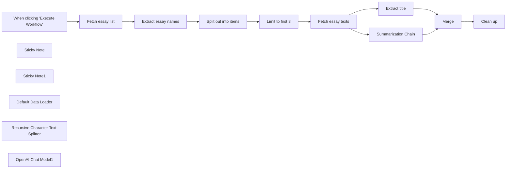

## Fluxo (.json) :

```json
{
  "meta": {
    "instanceId": "408f9fb9940c3cb18ffdef0e0150fe342d6e655c3a9fac21f0f644e8bedabcd9"
  },
  "nodes": [
    {
      "id": "67850bd7-f9f4-4d5b-8c9e-bd1451247ba6",
      "name": "When clicking \"Execute Workflow\"",
      "type": "n8n-nodes-base.manualTrigger",
      "position": [
        -740,
        1000
      ],
      "parameters": {},
      "typeVersion": 1
    },
    {
      "id": "0d9133f9-b6d3-4101-95c6-3cd24cdb70c3",
      "name": "Fetch essay list",
      "type": "n8n-nodes-base.httpRequest",
      "position": [
        -520,
        1000
      ],
      "parameters": {
        "url": "http://www.paulgraham.com/articles.html",
        "options": {}
      },
      "typeVersion": 4.1
    },
    {
      "id": "ee634297-a456-4f70-a995-55b02950571e",
      "name": "Extract essay names",
      "type": "n8n-nodes-base.html",
      "position": [
        -300,
        1000
      ],
      "parameters": {
        "options": {},
        "operation": "extractHtmlContent",
        "dataPropertyName": "=data",
        "extractionValues": {
          "values": [
            {
              "key": "essay",
              "attribute": "href",
              "cssSelector": "table table a",
              "returnArray": true,
              "returnValue": "attribute"
            }
          ]
        }
      },
      "typeVersion": 1
    },
    {
      "id": "83d75693-dbb8-44c4-8533-da06f611c59c",
      "name": "Fetch essay texts",
      "type": "n8n-nodes-base.httpRequest",
      "position": [
        360,
        1000
      ],
      "parameters": {
        "url": "=http://www.paulgraham.com/{{ $json.essay }}",
        "options": {}
      },
      "typeVersion": 4.1
    },
    {
      "id": "151022b5-8570-4176-bf3f-137f27ac7036",
      "name": "Extract title",
      "type": "n8n-nodes-base.html",
      "position": [
        700,
        700
      ],
      "parameters": {
        "options": {},
        "operation": "extractHtmlContent",
        "extractionValues": {
          "values": [
            {
              "key": "title",
              "cssSelector": "title"
            }
          ]
        }
      },
      "typeVersion": 1
    },
    {
      "id": "07bcf095-3c4d-4a72-9bcb-341411750ff5",
      "name": "Clean up",
      "type": "n8n-nodes-base.set",
      "position": [
        1360,
        980
      ],
      "parameters": {
        "fields": {
          "values": [
            {
              "name": "title",
              "stringValue": "={{ $json.title }}"
            },
            {
              "name": "summary",
              "stringValue": "={{ $json.response.text }}"
            },
            {
              "name": "url",
              "stringValue": "=http://www.paulgraham.com/{{ $('Limit to first 3').item.json.essay }}"
            }
          ]
        },
        "include": "none",
        "options": {}
      },
      "typeVersion": 3
    },
    {
      "id": "11285de0-3c5d-4296-a322-9b7585af9acc",
      "name": "Sticky Note",
      "type": "n8n-nodes-base.stickyNote",
      "position": [
        -580,
        920
      ],
      "parameters": {
        "width": 1071.752021563343,
        "height": 285.66037735849045,
        "content": "## Scrape latest Paul Graham essays"
      },
      "typeVersion": 1
    },
    {
      "id": "c32f905d-dd7a-4b68-bbe0-dd8115ee0944",
      "name": "Sticky Note1",
      "type": "n8n-nodes-base.stickyNote",
      "position": [
        620,
        920
      ],
      "parameters": {
        "width": 465.3908355795153,
        "height": 606.7924528301882,
        "content": "## Summarize them with GPT"
      },
      "typeVersion": 1
    },
    {
      "id": "29d264f4-df6d-4a41-ab38-58e1b1becc9a",
      "name": "Split out into items",
      "type": "n8n-nodes-base.splitOut",
      "position": [
        -80,
        1000
      ],
      "parameters": {
        "options": {},
        "fieldToSplitOut": "essay"
      },
      "typeVersion": 1
    },
    {
      "id": "ccfa3a1d-f170-44b4-a1f2-3573c88cae98",
      "name": "Limit to first 3",
      "type": "n8n-nodes-base.limit",
      "position": [
        140,
        1000
      ],
      "parameters": {
        "maxItems": 3
      },
      "typeVersion": 1
    },
    {
      "id": "c3d05068-9d1a-4ef5-8249-e7384dc617ee",
      "name": "Default Data Loader",
      "type": "@n8n/n8n-nodes-langchain.documentDefaultDataLoader",
      "position": [
        820,
        1200
      ],
      "parameters": {
        "options": {}
      },
      "typeVersion": 1
    },
    {
      "id": "db75adad-cb16-4e72-b16e-34684a733b05",
      "name": "Recursive Character Text Splitter",
      "type": "@n8n/n8n-nodes-langchain.textSplitterRecursiveCharacterTextSplitter",
      "position": [
        820,
        1340
      ],
      "parameters": {
        "options": {}
      },
      "typeVersion": 1
    },
    {
      "id": "022cc091-9b4c-45c2-bc8e-4037ec2d0d60",
      "name": "OpenAI Chat Model1",
      "type": "@n8n/n8n-nodes-langchain.lmChatOpenAi",
      "position": [
        680,
        1200
      ],
      "parameters": {
        "model": "gpt-4o-mini",
        "options": {}
      },
      "credentials": {
        "openAiApi": {
          "id": "8gccIjcuf3gvaoEr",
          "name": "OpenAi account"
        }
      },
      "typeVersion": 1
    },
    {
      "id": "cda47bb7-36c5-4d15-a1ef-0c66b1194825",
      "name": "Merge",
      "type": "n8n-nodes-base.merge",
      "position": [
        1160,
        980
      ],
      "parameters": {
        "mode": "combine",
        "options": {},
        "combineBy": "combineByPosition"
      },
      "typeVersion": 3
    },
    {
      "id": "28144e4c-e425-428d-b3d1-f563bfd4e5b3",
      "name": "Summarization Chain",
      "type": "@n8n/n8n-nodes-langchain.chainSummarization",
      "position": [
        720,
        1000
      ],
      "parameters": {
        "options": {},
        "operationMode": "documentLoader"
      },
      "typeVersion": 2
    }
  ],
  "pinData": {},
  "connections": {
    "Merge": {
      "main": [
        [
          {
            "node": "Clean up",
            "type": "main",
            "index": 0
          }
        ]
      ]
    },
    "Extract title": {
      "main": [
        [
          {
            "node": "Merge",
            "type": "main",
            "index": 0
          }
        ]
      ]
    },
    "Fetch essay list": {
      "main": [
        [
          {
            "node": "Extract essay names",
            "type": "main",
            "index": 0
          }
        ]
      ]
    },
    "Limit to first 3": {
      "main": [
        [
          {
            "node": "Fetch essay texts",
            "type": "main",
            "index": 0
          }
        ]
      ]
    },
    "Fetch essay texts": {
      "main": [
        [
          {
            "node": "Extract title",
            "type": "main",
            "index": 0
          },
          {
            "node": "Summarization Chain",
            "type": "main",
            "index": 0
          }
        ]
      ]
    },
    "OpenAI Chat Model1": {
      "ai_languageModel": [
        [
          {
            "node": "Summarization Chain",
            "type": "ai_languageModel",
            "index": 0
          }
        ]
      ]
    },
    "Default Data Loader": {
      "ai_document": [
        [
          {
            "node": "Summarization Chain",
            "type": "ai_document",
            "index": 0
          }
        ]
      ]
    },
    "Extract essay names": {
      "main": [
        [
          {
            "node": "Split out into items",
            "type": "main",
            "index": 0
          }
        ]
      ]
    },
    "Summarization Chain": {
      "main": [
        [
          {
            "node": "Merge",
            "type": "main",
            "index": 1
          }
        ]
      ]
    },
    "Split out into items": {
      "main": [
        [
          {
            "node": "Limit to first 3",
            "type": "main",
            "index": 0
          }
        ]
      ]
    },
    "When clicking \"Execute Workflow\"": {
      "main": [
        [
          {
            "node": "Fetch essay list",
            "type": "main",
            "index": 0
          }
        ]
      ]
    },
    "Recursive Character Text Splitter": {
      "ai_textSplitter": [
        [
          {
            "node": "Default Data Loader",
            "type": "ai_textSplitter",
            "index": 0
          }
        ]
      ]
    }
  }
}
```

<a id="template-807"></a>

## Template 807 - Envio de SMS via MSG91

- **Nome:** Envio de SMS via MSG91
- **Descrição:** Este fluxo envia uma mensagem SMS usando o serviço MSG91 quando é acionado manualmente.
- **Funcionalidade:** • Acionamento manual: Inicia o fluxo ao clicar para executar.
• Envio de SMS: Envia uma mensagem para um destinatário especificado usando o serviço de SMS.
• Configuração de remetente, destinatário e mensagem: Permite definir o número de origem, destino e o texto do SMS.
• Autenticação via credenciais: Utiliza credenciais para autenticar a requisição ao serviço de envio de mensagens.
- **Ferramentas:** • MSG91: Plataforma de envio de SMS via API, usada para transmitir mensagens de texto a destinatários.

## Fluxo visual

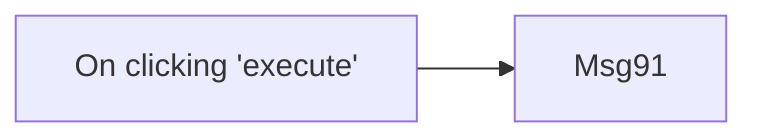

## Fluxo (.json) :

```json
{
  "name": "Send an SMS using MSG91",
  "nodes": [
    {
      "name": "On clicking 'execute'",
      "type": "n8n-nodes-base.manualTrigger",
      "position": [
        250,
        300
      ],
      "parameters": {},
      "typeVersion": 1
    },
    {
      "name": "Msg91",
      "type": "n8n-nodes-base.msg91",
      "position": [
        450,
        300
      ],
      "parameters": {
        "to": "",
        "from": "",
        "message": ""
      },
      "credentials": {
        "msg91Api": ""
      },
      "typeVersion": 1
    }
  ],
  "active": false,
  "settings": {},
  "connections": {
    "On clicking 'execute'": {
      "main": [
        [
          {
            "node": "Msg91",
            "type": "main",
            "index": 0
          }
        ]
      ]
    }
  }
}
```

<a id="template-808"></a>

## Template 808 - Agente de IA com ferramenta de sugestão de atividades

- **Nome:** Agente de IA com ferramenta de sugestão de atividades
- **Descrição:** Fluxo que recebe mensagens de chat, usa um modelo de linguagem para interagir e, quando apropriado, chama uma ferramenta personalizada que busca e retorna sugestões de atividades.
- **Funcionalidade:** • Recebimento de mensagens de chat: inicia o fluxo a partir da entrada do usuário.
• Uso de modelo de linguagem: interpreta a mensagem do usuário e decide ações ou respostas.
• Memória simples: mantém contexto recente para conversas contínuas.
• Ferramenta personalizada para atividades: permite ao agente delegar a geração de sugestões a um sub-processo específico.
• Extração de parâmetros: identifica tipo de atividade e número de participantes a partir da mensagem do usuário.
• Consulta a API externa de atividades: realiza uma chamada à API pública para obter ideias filtradas por tipo e participantes.
• Agregação e formatação da resposta: combina os resultados e prepara uma resposta textual para o usuário.
- **Ferramentas:** • OpenAI: modelo de linguagem utilizado para compreensão da conversa e tomada de decisões.
• Bored API: serviço público que fornece sugestões de atividades filtráveis por tipo e número de participantes.

## Fluxo visual

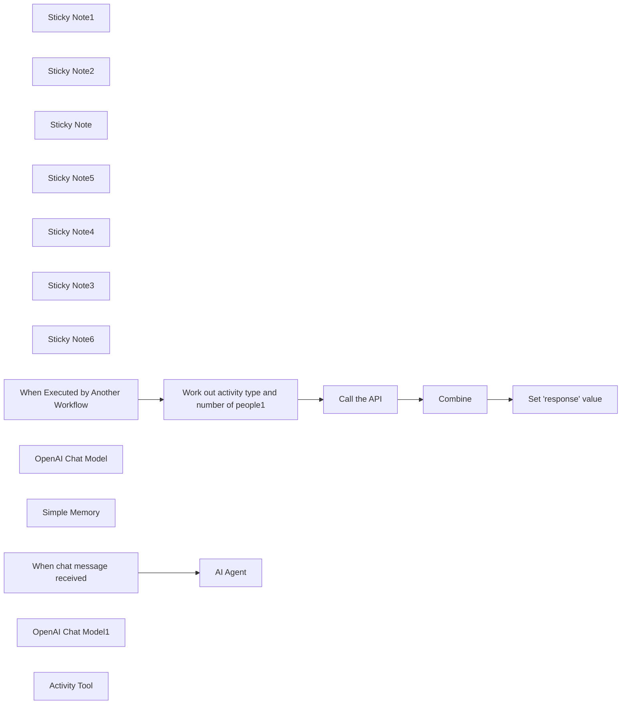

## Fluxo (.json) :

```json
{
  "meta": {
    "instanceId": "408f9fb9940c3cb18ffdef0e0150fe342d6e655c3a9fac21f0f644e8bedabcd9",
    "templateCredsSetupCompleted": true
  },
  "nodes": [
    {
      "id": "12061ba0-24f8-4853-9898-c8710b118959",
      "name": "Sticky Note1",
      "type": "n8n-nodes-base.stickyNote",
      "position": [
        0,
        500
      ],
      "parameters": {
        "color": 7,
        "width": 1260,
        "height": 635,
        "content": "### Sub-workflow: Custom tool\nThe agent above can call this workflow. It calls an example API called \"Bored API\" and returns a string with an activity idea."
      },
      "typeVersion": 1
    },
    {
      "id": "4a2101f4-de86-4b2c-9fbc-5a75e73e3a26",
      "name": "Sticky Note2",
      "type": "n8n-nodes-base.stickyNote",
      "position": [
        0,
        0
      ],
      "parameters": {
        "color": 7,
        "width": 927.5,
        "height": 486.5625,
        "content": "### Main workflow: AI agent using custom tool"
      },
      "typeVersion": 1
    },
    {
      "id": "102ec972-1784-4b89-be6f-1d4bd8f85cf1",
      "name": "Sticky Note",
      "type": "n8n-nodes-base.stickyNote",
      "position": [
        660,
        240
      ],
      "parameters": {
        "color": 5,
        "width": 177,
        "height": 199,
        "content": "**This tool calls the sub-workflow below**"
      },
      "typeVersion": 1
    },
    {
      "id": "707d76f1-0b45-4347-b16a-3b66906711bc",
      "name": "Sticky Note5",
      "type": "n8n-nodes-base.stickyNote",
      "position": [
        300,
        240
      ],
      "parameters": {
        "color": 2,
        "width": 170,
        "height": 191,
        "content": "**Set your credentials**"
      },
      "typeVersion": 1
    },
    {
      "id": "d2a9637b-d988-4978-a112-4b96f279f0c0",
      "name": "Sticky Note4",
      "type": "n8n-nodes-base.stickyNote",
      "position": [
        280,
        840
      ],
      "parameters": {
        "color": 2,
        "width": 170,
        "height": 190,
        "content": "**Set your credentials**"
      },
      "typeVersion": 1
    },
    {
      "id": "02f5308b-61db-467d-84f4-8b2ae8655dfd",
      "name": "Sticky Note3",
      "type": "n8n-nodes-base.stickyNote",
      "position": [
        -160,
        80
      ],
      "parameters": {
        "color": 4,
        "width": 185.9375,
        "height": 214.8397420554627,
        "content": "## Try it out\n\nSelect **Chat** at the bottom and enter:\n\n_Hi! Please suggest something to do. I feel like learning something new._"
      },
      "typeVersion": 1
    },
    {
      "id": "c012dfad-0ed8-4072-9c57-24f48aadd620",
      "name": "Sticky Note6",
      "type": "n8n-nodes-base.stickyNote",
      "position": [
        960,
        920
      ],
      "parameters": {
        "width": 280,
        "height": 145,
        "content": "## Next steps\n\nLearn more about [Advanced AI in n8n](https://docs.n8n.io/advanced-ai/)"
      },
      "typeVersion": 1
    },
    {
      "id": "39e0c9eb-5736-46a0-b4ce-64425f56ba8c",
      "name": "When chat message received",
      "type": "@n8n/n8n-nodes-langchain.chatTrigger",
      "position": [
        160,
        80
      ],
      "webhookId": "34e91943-c4e0-4a87-8a0f-68cbd2bca3fb",
      "parameters": {
        "options": {}
      },
      "typeVersion": 1.1
    },
    {
      "id": "38dad34c-116b-4673-b338-6fbf1d019bab",
      "name": "OpenAI Chat Model",
      "type": "@n8n/n8n-nodes-langchain.lmChatOpenAi",
      "position": [
        340,
        300
      ],
      "parameters": {
        "model": {
          "__rl": true,
          "mode": "list",
          "value": "gpt-4o-mini"
        },
        "options": {}
      },
      "credentials": {
        "openAiApi": {
          "id": "8gccIjcuf3gvaoEr",
          "name": "OpenAi account"
        }
      },
      "typeVersion": 1.2
    },
    {
      "id": "78af18c4-3541-4ff2-8526-fb186614051b",
      "name": "Simple Memory",
      "type": "@n8n/n8n-nodes-langchain.memoryBufferWindow",
      "position": [
        520,
        300
      ],
      "parameters": {},
      "typeVersion": 1.3
    },
    {
      "id": "45f17ad3-f7da-4d98-a597-f66c2efdbbea",
      "name": "When Executed by Another Workflow",
      "type": "n8n-nodes-base.executeWorkflowTrigger",
      "position": [
        120,
        660
      ],
      "parameters": {
        "workflowInputs": {
          "values": [
            {
              "name": "chatInput"
            }
          ]
        }
      },
      "typeVersion": 1.1
    },
    {
      "id": "135ac846-fcc7-4754-8127-6a810b76594a",
      "name": "OpenAI Chat Model1",
      "type": "@n8n/n8n-nodes-langchain.lmChatOpenAi",
      "position": [
        320,
        900
      ],
      "parameters": {
        "model": {
          "__rl": true,
          "mode": "list",
          "value": "gpt-4o-mini"
        },
        "options": {}
      },
      "credentials": {
        "openAiApi": {
          "id": "8gccIjcuf3gvaoEr",
          "name": "OpenAi account"
        }
      },
      "typeVersion": 1.2
    },
    {
      "id": "8e9d8b39-a7a4-44fb-8ac4-0555e632f0df",
      "name": "Work out activity type and number of people1",
      "type": "@n8n/n8n-nodes-langchain.informationExtractor",
      "position": [
        340,
        660
      ],
      "parameters": {
        "text": "={{ $('When Executed by Another Workflow').item.json.chatInput }}",
        "options": {},
        "schemaType": "manual",
        "inputSchema": "{\n  \"type\": \"object\",\n  \"required\": [\"type\",\"participants\"],\n  \"properties\": {\n    \"type\": {\n      \"type\": \"object\",\n      \"properties\": {\n        \"data\": {\n          \"enum\": [\"education\", \"recreational\",\"social\",\"diy\",\"charity\",\"cooking\",\"relaxation\",\"music\",\"busywork\"]\n        }\n      }\n    },\n    \"participants\": {\n      \"type\": \"number\"\n    }\n  }\n}"
      },
      "typeVersion": 1
    },
    {
      "id": "312f12d9-db30-48b0-aca3-a6c3a0250b2d",
      "name": "Call the API",
      "type": "n8n-nodes-base.httpRequest",
      "position": [
        700,
        660
      ],
      "parameters": {
        "url": "https://bored-api.appbrewery.com/filter",
        "options": {},
        "sendQuery": true,
        "queryParameters": {
          "parameters": [
            {
              "name": "type",
              "value": "={{ $json.output.type.data }}"
            },
            {
              "name": "participicants",
              "value": "={{ $json.output.participants }}"
            }
          ]
        }
      },
      "typeVersion": 4.2
    },
    {
      "id": "0e97b6c1-3291-44a2-bf35-39335b9b90a1",
      "name": "Activity Tool",
      "type": "@n8n/n8n-nodes-langchain.toolWorkflow",
      "position": [
        700,
        300
      ],
      "parameters": {
        "name": "activity_tool",
        "workflowId": {
          "__rl": true,
          "mode": "id",
          "value": "={{ $workflow.id }}"
        },
        "description": "Suggest an activity for a person to do. Use this tool if someone is bored, or asking for ideas of things to do.",
        "workflowInputs": {
          "value": {
            "chatInput": "={{ /*n8n-auto-generated-fromAI-override*/ $fromAI('chatInput', ``, 'string') }}"
          },
          "schema": [
            {
              "id": "chatInput",
              "type": "string",
              "display": true,
              "removed": false,
              "required": false,
              "displayName": "chatInput",
              "defaultMatch": false,
              "canBeUsedToMatch": true
            }
          ],
          "mappingMode": "defineBelow",
          "matchingColumns": [],
          "attemptToConvertTypes": false,
          "convertFieldsToString": false
        }
      },
      "typeVersion": 2
    },
    {
      "id": "256b8adc-ef71-40da-a40c-10a1045c9d7d",
      "name": "Set 'response' value",
      "type": "n8n-nodes-base.set",
      "position": [
        1060,
        660
      ],
      "parameters": {
        "options": {},
        "assignments": {
          "assignments": [
            {
              "id": "c78b10cd-7d6d-4512-ad0b-6f6ec3c706b2",
              "name": "response",
              "type": "string",
              "value": "={{ $json.data }}"
            }
          ]
        }
      },
      "typeVersion": 3.4
    },
    {
      "id": "ede9e3c2-c3ce-44bd-92be-51eb90d086dc",
      "name": "Combine",
      "type": "n8n-nodes-base.aggregate",
      "position": [
        880,
        660
      ],
      "parameters": {
        "include": "specifiedFields",
        "options": {},
        "aggregate": "aggregateAllItemData",
        "fieldsToInclude": "activity"
      },
      "typeVersion": 1
    },
    {
      "id": "b4b49c7f-5491-416c-98d1-518372329c77",
      "name": "AI Agent",
      "type": "@n8n/n8n-nodes-langchain.agent",
      "position": [
        420,
        80
      ],
      "parameters": {
        "options": {}
      },
      "typeVersion": 1.8
    }
  ],
  "pinData": {},
  "connections": {
    "Combine": {
      "main": [
        [
          {
            "node": "Set 'response' value",
            "type": "main",
            "index": 0
          }
        ]
      ]
    },
    "Call the API": {
      "main": [
        [
          {
            "node": "Combine",
            "type": "main",
            "index": 0
          }
        ]
      ]
    },
    "Activity Tool": {
      "ai_tool": [
        [
          {
            "node": "AI Agent",
            "type": "ai_tool",
            "index": 0
          }
        ]
      ]
    },
    "Simple Memory": {
      "ai_memory": [
        [
          {
            "node": "AI Agent",
            "type": "ai_memory",
            "index": 0
          }
        ]
      ]
    },
    "OpenAI Chat Model": {
      "ai_languageModel": [
        [
          {
            "node": "AI Agent",
            "type": "ai_languageModel",
            "index": 0
          }
        ]
      ]
    },
    "OpenAI Chat Model1": {
      "ai_languageModel": [
        [
          {
            "node": "Work out activity type and number of people1",
            "type": "ai_languageModel",
            "index": 0
          }
        ]
      ]
    },
    "When chat message received": {
      "main": [
        [
          {
            "node": "AI Agent",
            "type": "main",
            "index": 0
          }
        ]
      ]
    },
    "When Executed by Another Workflow": {
      "main": [
        [
          {
            "node": "Work out activity type and number of people1",
            "type": "main",
            "index": 0
          }
        ]
      ]
    },
    "Work out activity type and number of people1": {
      "main": [
        [
          {
            "node": "Call the API",
            "type": "main",
            "index": 0
          }
        ]
      ]
    }
  }
}
```

<a id="template-809"></a>

## Template 809 - Busca todas as notícias do Hacker News

- **Nome:** Busca todas as notícias do Hacker News
- **Descrição:** Ao ser executado manualmente, este fluxo recupera todas as entradas disponíveis do Hacker News.
- **Funcionalidade:** • Disparo manual: inicia o fluxo quando o usuário clica em executar.
• Recuperação de notícias: consulta o serviço Hacker News usando o recurso 'all' para obter todas as entradas.
• Fornecimento de resultados: retorna a lista de itens obtidos para uso em etapas seguintes.
- **Ferramentas:** • Hacker News: plataforma para obter notícias públicas e posts sobre tecnologia e programação.

## Fluxo visual


## Fluxo (.json) :

```json
{
  "nodes": [
    {
      "name": "On clicking 'execute'",
      "type": "n8n-nodes-base.manualTrigger",
      "position": [
        250,
        300
      ],
      "parameters": {},
      "typeVersion": 1
    },
    {
      "name": "Hacker News",
      "type": "n8n-nodes-base.hackerNews",
      "position": [
        450,
        300
      ],
      "parameters": {
        "resource": "all",
        "additionalFields": {}
      },
      "typeVersion": 1
    }
  ],
  "connections": {
    "On clicking 'execute'": {
      "main": [
        [
          {
            "node": "Hacker News",
            "type": "main",
            "index": 0
          }
        ]
      ]
    }
  }
}
```

<a id="template-810"></a>

## Template 810 - Agente IA com ferramenta personalizada

- **Nome:** Agente IA com ferramenta personalizada
- **Descrição:** Este fluxo coordena um agente de IA que utiliza ferramentas personalizadas para consultar dados de uma planilha Google Sheets, obtendo nomes de colunas, valores de colunas e informações de clientes, com memória de conversa e gatilho de chat.
- **Funcionalidade:** • Detecção/entrada de chat: inicia a conversa quando o usuário envia uma mensagem via gatilho de chat.
• Processamento com modelo de linguagem: o agente analisa a pergunta e decide qual ferramenta chamar.
• Memória de conversa: mantém contexto da conversa para respostas consistentes.
• Consulta de metadados da planilha: obter lista de nomes de colunas disponíveis.
• Consulta de dados por coluna: retornar valores de uma coluna específica para todos os clientes.
• Consulta de dados de um cliente: retornar todas as informações de um cliente com base no identificador/row.
• Roteamento de operações: encaminha resultados para saída conforme a operação (nomes de colunas, valores de coluna ou linhas).
• Integração com fluxo sub-workflow: chama um sub-fluxo para realizar operações com a planilha e retornar resultados.
- **Ferramentas:** • Google Sheets: Serviço de planilha que fornece dados de clientes através da API do Google Sheets, com URL de planilha configurável.
• OpenAI: Modelo de linguagem da OpenAI utilizado para interpretar perguntas, planejar ações e gerar respostas.

## Fluxo visual

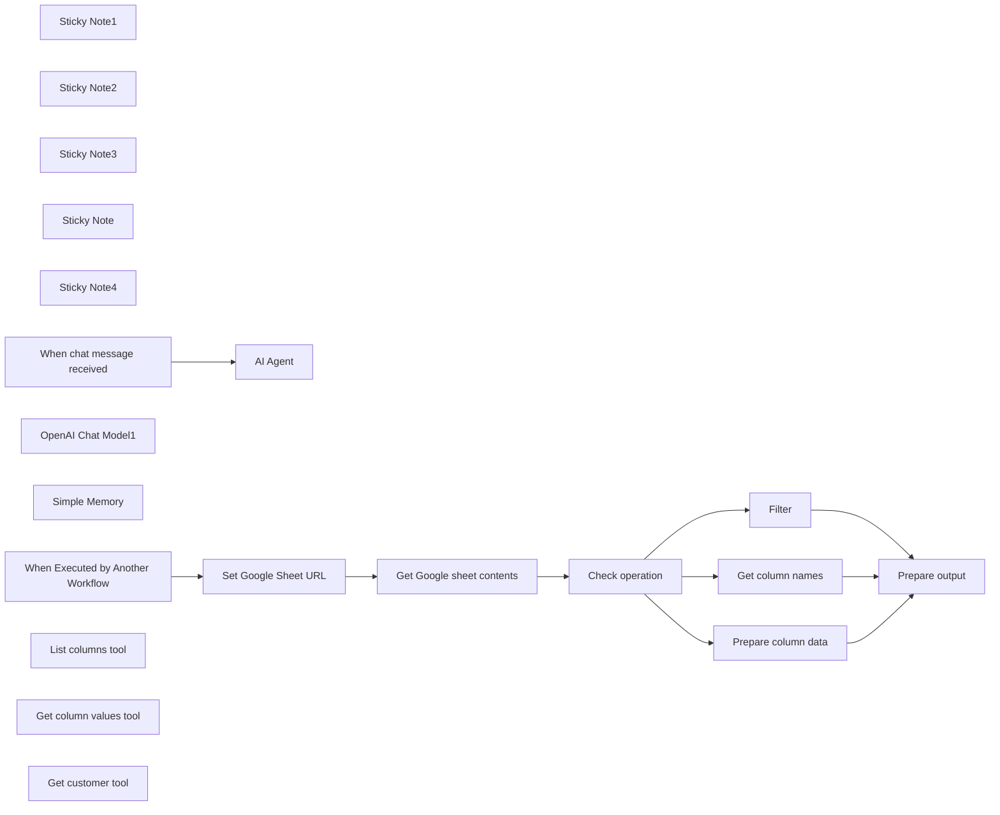

## Fluxo (.json) :

```json
{
  "meta": {
    "instanceId": "408f9fb9940c3cb18ffdef0e0150fe342d6e655c3a9fac21f0f644e8bedabcd9",
    "templateCredsSetupCompleted": true
  },
  "nodes": [
    {
      "id": "f3f7546a-8bb3-484c-b0a1-750a8d7d3a74",
      "name": "Sticky Note1",
      "type": "n8n-nodes-base.stickyNote",
      "position": [
        0,
        520
      ],
      "parameters": {
        "color": 7,
        "width": 1549,
        "height": 612,
        "content": "### Sub-workflow: Custom tool\nThis can be called by the agent above. It returns three different types of data from the Google Sheet, which can be used together for more complex queries without returning the whole sheet (which might be too big for GPT to handle)"
      },
      "typeVersion": 1
    },
    {
      "id": "a5afaa40-0b68-4d7c-8f78-5cb176fde81d",
      "name": "Sticky Note2",
      "type": "n8n-nodes-base.stickyNote",
      "position": [
        0,
        -40
      ],
      "parameters": {
        "color": 7,
        "width": 1068,
        "height": 547,
        "content": "### Main workflow: AI agent using custom tool"
      },
      "typeVersion": 1
    },
    {
      "id": "2dc0ce2f-a09c-4804-9962-f542ec78eb87",
      "name": "Sticky Note3",
      "type": "n8n-nodes-base.stickyNote",
      "position": [
        -160,
        40
      ],
      "parameters": {
        "width": 185.9375,
        "height": 183.85014518022527,
        "content": "## Try me out\n\nClick the 'Chat' button at the bottom and enter:\n\n_Which is our biggest customer?_"
      },
      "typeVersion": 1
    },
    {
      "id": "8fc97d52-1c18-47ed-ba6f-4c7c9ce8b7d4",
      "name": "Sticky Note",
      "type": "n8n-nodes-base.stickyNote",
      "position": [
        480,
        240
      ],
      "parameters": {
        "color": 7,
        "width": 572,
        "height": 219,
        "content": "These tools all call the sub-workflow below"
      },
      "typeVersion": 1
    },
    {
      "id": "60cafb69-818f-49fe-b75e-e770304a6aa9",
      "name": "Sticky Note4",
      "type": "n8n-nodes-base.stickyNote",
      "position": [
        260,
        740
      ],
      "parameters": {
        "width": 179.99762227826224,
        "height": 226.64416053838073,
        "content": "Change the URL of the Google Sheet here"
      },
      "typeVersion": 1
    },
    {
      "id": "cd8d92fa-f7ef-47d8-a1a7-5b5aa6faaa96",
      "name": "When chat message received",
      "type": "@n8n/n8n-nodes-langchain.chatTrigger",
      "position": [
        120,
        40
      ],
      "webhookId": "7668b567-b983-479f-a3e0-ad945707ae6b",
      "parameters": {
        "options": {}
      },
      "typeVersion": 1.1
    },
    {
      "id": "72ac3bdb-56dc-4634-a0ab-0b1c82e2b23d",
      "name": "OpenAI Chat Model1",
      "type": "@n8n/n8n-nodes-langchain.lmChatOpenAi",
      "position": [
        160,
        320
      ],
      "parameters": {
        "model": {
          "__rl": true,
          "mode": "list",
          "value": "gpt-4o-mini"
        },
        "options": {}
      },
      "credentials": {
        "openAiApi": {
          "id": "8gccIjcuf3gvaoEr",
          "name": "OpenAi account"
        }
      },
      "typeVersion": 1.2
    },
    {
      "id": "37e5bca6-4274-4714-a9e7-a8e4b7d732e5",
      "name": "Simple Memory",
      "type": "@n8n/n8n-nodes-langchain.memoryBufferWindow",
      "position": [
        340,
        320
      ],
      "parameters": {},
      "typeVersion": 1.3
    },
    {
      "id": "81bf7de8-c4c6-49ce-a2cf-4afca5dce7e2",
      "name": "When Executed by Another Workflow",
      "type": "n8n-nodes-base.executeWorkflowTrigger",
      "position": [
        80,
        800
      ],
      "parameters": {
        "workflowInputs": {
          "values": [
            {
              "name": "operation"
            },
            {
              "name": "query"
            }
          ]
        }
      },
      "typeVersion": 1.1
    },
    {
      "id": "24e5a49d-8f1f-4569-8072-c35f059ebd46",
      "name": "AI Agent",
      "type": "@n8n/n8n-nodes-langchain.agent",
      "position": [
        480,
        40
      ],
      "parameters": {
        "options": {}
      },
      "typeVersion": 1.8
    },
    {
      "id": "8cc35cb9-3371-4034-86b6-3d125d70d81b",
      "name": "List columns tool",
      "type": "@n8n/n8n-nodes-langchain.toolWorkflow",
      "position": [
        540,
        320
      ],
      "parameters": {
        "name": "list_columns",
        "workflowId": {
          "__rl": true,
          "mode": "id",
          "value": "={{ $workflow.id }}"
        },
        "description": "List all column names in customer data\n\nCall this tool to find out what data is available for each customer. It should be called first at the beginning to understand which columns are available for querying.",
        "workflowInputs": {
          "value": {
            "query": "none",
            "operation": "column_names"
          },
          "schema": [
            {
              "id": "query",
              "type": "string",
              "display": true,
              "removed": false,
              "required": false,
              "displayName": "query",
              "defaultMatch": false,
              "canBeUsedToMatch": true
            },
            {
              "id": "operation",
              "type": "string",
              "display": true,
              "removed": false,
              "required": false,
              "displayName": "operation",
              "defaultMatch": false,
              "canBeUsedToMatch": true
            }
          ],
          "mappingMode": "defineBelow",
          "matchingColumns": [],
          "attemptToConvertTypes": false,
          "convertFieldsToString": false
        }
      },
      "typeVersion": 2
    },
    {
      "id": "acf19978-dd84-4cfb-8034-eb9f14dd9c86",
      "name": "Get column values tool",
      "type": "@n8n/n8n-nodes-langchain.toolWorkflow",
      "position": [
        720,
        320
      ],
      "parameters": {
        "name": "column_values",
        "workflowId": {
          "__rl": true,
          "mode": "id",
          "value": "={{ $workflow.id }}"
        },
        "description": "Get the specified column value for all customers\n\nUse this tool to find out which customers have a certain value for a given column. Returns an array of JSON objects, one per customer. Each JSON object includes the column being requested plus the row_number column. Input should be a single string representing the name of the column to fetch.\n",
        "workflowInputs": {
          "value": {
            "query": "none",
            "operation": "column_values"
          },
          "schema": [
            {
              "id": "operation",
              "type": "string",
              "display": true,
              "removed": false,
              "required": false,
              "displayName": "operation",
              "defaultMatch": false,
              "canBeUsedToMatch": true
            },
            {
              "id": "query",
              "type": "string",
              "display": true,
              "removed": false,
              "required": false,
              "displayName": "query",
              "defaultMatch": false,
              "canBeUsedToMatch": true
            }
          ],
          "mappingMode": "defineBelow",
          "matchingColumns": [
            "operation"
          ],
          "attemptToConvertTypes": false,
          "convertFieldsToString": false
        }
      },
      "typeVersion": 2
    },
    {
      "id": "acd8dad6-2ce5-4a53-9909-da7bc03cf0e2",
      "name": "Get customer tool",
      "type": "@n8n/n8n-nodes-langchain.toolWorkflow",
      "position": [
        900,
        320
      ],
      "parameters": {
        "name": "get_customer",
        "workflowId": {
          "__rl": true,
          "mode": "id",
          "value": "={{ $workflow.id }}",
          "cachedResultName": "={{ $workflow.id }}"
        },
        "description": "Get all columns for a given customer\n\nThe input should be a stringified row number of the customer to fetch; only single string inputs are allowed. Returns a JSON object with all the column names and their values.",
        "workflowInputs": {
          "value": {
            "query": "={{ /*n8n-auto-generated-fromAI-override*/ $fromAI('query', ``, 'string') }}",
            "operation": "row"
          },
          "schema": [
            {
              "id": "operation",
              "type": "string",
              "display": true,
              "removed": false,
              "required": false,
              "displayName": "operation",
              "defaultMatch": false,
              "canBeUsedToMatch": true
            },
            {
              "id": "query",
              "type": "string",
              "display": true,
              "removed": false,
              "required": false,
              "displayName": "query",
              "defaultMatch": false,
              "canBeUsedToMatch": true
            }
          ],
          "mappingMode": "defineBelow",
          "matchingColumns": [
            "operation"
          ],
          "attemptToConvertTypes": false,
          "convertFieldsToString": false
        }
      },
      "typeVersion": 2
    },
    {
      "id": "43988dff-2270-4d09-a091-8b719c281faf",
      "name": "Set Google Sheet URL",
      "type": "n8n-nodes-base.set",
      "position": [
        300,
        800
      ],
      "parameters": {
        "options": {},
        "assignments": {
          "assignments": [
            {
              "id": "a96650f2-3a0c-45cb-afdd-ef7ca90b21cc",
              "name": "sheetUrl",
              "type": "string",
              "value": "https://docs.google.com/spreadsheets/d/1GjFBV8HpraNWG_JyuaQAgTb3zUGguh0S_25nO0CMd8A/edit#gid=736425281"
            }
          ]
        }
      },
      "typeVersion": 3.4
    },
    {
      "id": "536225e9-e33c-4819-a2dc-994d8f7c3f30",
      "name": "Get Google sheet contents",
      "type": "n8n-nodes-base.googleSheets",
      "position": [
        520,
        800
      ],
      "parameters": {
        "options": {},
        "sheetName": {
          "__rl": true,
          "mode": "name",
          "value": "customer_data"
        },
        "documentId": {
          "__rl": true,
          "mode": "url",
          "value": "={{ $json.sheetUrl }}"
        }
      },
      "credentials": {
        "googleSheetsOAuth2Api": {
          "id": "XHvC7jIRR8A2TlUl",
          "name": "Google Sheets account"
        }
      },
      "typeVersion": 4.5
    },
    {
      "id": "a5668364-8824-44cc-8a0f-516906d8f821",
      "name": "Check operation",
      "type": "n8n-nodes-base.switch",
      "position": [
        740,
        800
      ],
      "parameters": {
        "rules": {
          "values": [
            {
              "outputKey": "Column Names",
              "conditions": {
                "options": {
                  "version": 2,
                  "leftValue": "",
                  "caseSensitive": true,
                  "typeValidation": "strict"
                },
                "combinator": "and",
                "conditions": [
                  {
                    "id": "db07e0a3-0a1d-44bd-84a7-59a9442e63a6",
                    "operator": {
                      "type": "string",
                      "operation": "equals"
                    },
                    "leftValue": "={{ $('When Executed by Another Workflow').item.json.operation }}",
                    "rightValue": "column_names"
                  }
                ]
              },
              "renameOutput": true
            },
            {
              "outputKey": "Column Values",
              "conditions": {
                "options": {
                  "version": 2,
                  "leftValue": "",
                  "caseSensitive": true,
                  "typeValidation": "strict"
                },
                "combinator": "and",
                "conditions": [
                  {
                    "id": "96c82351-de4a-4299-903d-8b9b3a3bb931",
                    "operator": {
                      "name": "filter.operator.equals",
                      "type": "string",
                      "operation": "equals"
                    },
                    "leftValue": "={{ $('When Executed by Another Workflow').item.json.operation }}",
                    "rightValue": "column_values"
                  }
                ]
              },
              "renameOutput": true
            },
            {
              "outputKey": "Rows",
              "conditions": {
                "options": {
                  "version": 2,
                  "leftValue": "",
                  "caseSensitive": true,
                  "typeValidation": "strict"
                },
                "combinator": "and",
                "conditions": [
                  {
                    "id": "fbc2afd0-361f-4181-94e3-4addc65a9086",
                    "operator": {
                      "name": "filter.operator.equals",
                      "type": "string",
                      "operation": "equals"
                    },
                    "leftValue": "={{ $('When Executed by Another Workflow').item.json.operation }}",
                    "rightValue": "row"
                  }
                ]
              },
              "renameOutput": true
            }
          ]
        },
        "options": {}
      },
      "typeVersion": 3.2
    },
    {
      "id": "46c3a8c4-ffaf-4373-b421-4d7ee65567b2",
      "name": "Get column names",
      "type": "n8n-nodes-base.set",
      "position": [
        1040,
        620
      ],
      "parameters": {
        "options": {},
        "assignments": {
          "assignments": [
            {
              "id": "36a7be13-e792-4c0a-9997-f61fe2a7b225",
              "name": "response",
              "type": "array",
              "value": "={{ Object.keys($json) }}"
            }
          ]
        }
      },
      "typeVersion": 3.4
    },
    {
      "id": "190c48e8-4d4b-4e95-a694-49ab76b730da",
      "name": "Prepare column data",
      "type": "n8n-nodes-base.set",
      "position": [
        1040,
        800
      ],
      "parameters": {
        "options": {},
        "assignments": {
          "assignments": [
            {
              "id": "bcb75b32-3253-4a31-9771-4faaf12cc2ed",
              "name": "row_number",
              "type": "number",
              "value": "={{ $json.row_number }}"
            }
          ]
        }
      },
      "typeVersion": 3.4
    },
    {
      "id": "9c65e5e6-a3ac-4ed7-8546-b7f2b09b4f96",
      "name": "Filter",
      "type": "n8n-nodes-base.filter",
      "position": [
        1040,
        980
      ],
      "parameters": {
        "options": {},
        "conditions": {
          "options": {
            "version": 2,
            "leftValue": "",
            "caseSensitive": true,
            "typeValidation": "strict"
          },
          "combinator": "and",
          "conditions": [
            {
              "id": "dbe89d36-e411-4765-8d4e-91a6425350ac",
              "operator": {
                "name": "filter.operator.equals",
                "type": "string",
                "operation": "equals"
              },
              "leftValue": "={{ $json.row_number.toString() }}",
              "rightValue": "={{ $('When Executed by Another Workflow').item.json.query }}"
            }
          ]
        }
      },
      "typeVersion": 2.2
    },
    {
      "id": "39265f3e-a2ea-4174-952a-3665747ff856",
      "name": "Prepare output",
      "type": "n8n-nodes-base.code",
      "position": [
        1340,
        800
      ],
      "parameters": {
        "jsCode": "return {\n  'response': JSON.stringify($input.all().map(x => x.json))\n}"
      },
      "executeOnce": true,
      "typeVersion": 2
    }
  ],
  "pinData": {},
  "connections": {
    "Filter": {
      "main": [
        [
          {
            "node": "Prepare output",
            "type": "main",
            "index": 0
          }
        ]
      ]
    },
    "Simple Memory": {
      "ai_memory": [
        [
          {
            "node": "AI Agent",
            "type": "ai_memory",
            "index": 0
          }
        ]
      ]
    },
    "Check operation": {
      "main": [
        [
          {
            "node": "Get column names",
            "type": "main",
            "index": 0
          }
        ],
        [
          {
            "node": "Prepare column data",
            "type": "main",
            "index": 0
          }
        ],
        [
          {
            "node": "Filter",
            "type": "main",
            "index": 0
          }
        ]
      ]
    },
    "Get column names": {
      "main": [
        [
          {
            "node": "Prepare output",
            "type": "main",
            "index": 0
          }
        ]
      ]
    },
    "Get customer tool": {
      "ai_tool": [
        [
          {
            "node": "AI Agent",
            "type": "ai_tool",
            "index": 0
          }
        ]
      ]
    },
    "List columns tool": {
      "ai_tool": [
        [
          {
            "node": "AI Agent",
            "type": "ai_tool",
            "index": 0
          }
        ]
      ]
    },
    "OpenAI Chat Model1": {
      "ai_languageModel": [
        [
          {
            "node": "AI Agent",
            "type": "ai_languageModel",
            "index": 0
          }
        ]
      ]
    },
    "Prepare column data": {
      "main": [
        [
          {
            "node": "Prepare output",
            "type": "main",
            "index": 0
          }
        ]
      ]
    },
    "Set Google Sheet URL": {
      "main": [
        [
          {
            "node": "Get Google sheet contents",
            "type": "main",
            "index": 0
          }
        ]
      ]
    },
    "Get column values tool": {
      "ai_tool": [
        [
          {
            "node": "AI Agent",
            "type": "ai_tool",
            "index": 0
          }
        ]
      ]
    },
    "Get Google sheet contents": {
      "main": [
        [
          {
            "node": "Check operation",
            "type": "main",
            "index": 0
          }
        ]
      ]
    },
    "When chat message received": {
      "main": [
        [
          {
            "node": "AI Agent",
            "type": "main",
            "index": 0
          }
        ]
      ]
    },
    "When Executed by Another Workflow": {
      "main": [
        [
          {
            "node": "Set Google Sheet URL",
            "type": "main",
            "index": 0
          }
        ]
      ]
    }
  }
}
```

<a id="template-811"></a>

## Template 811 - Disparar build no Travis CI

- **Nome:** Disparar build no Travis CI
- **Descrição:** Fluxo iniciado manualmente que aciona um build no Travis CI para um repositório e branch configuráveis.
- **Funcionalidade:** • Gatilho manual: permite iniciar o fluxo ao clicar em executar.
• Disparo de build no Travis CI: realiza a operação de trigger para iniciar uma build.
• Configuração de repositório e branch: possibilita especificar o slug (repositório) e a branch alvo.
• Autenticação via API: utiliza credenciais da API do Travis CI para autenticar a solicitação.
- **Ferramentas:** • Travis CI: serviço de integração contínua que executa builds e testes acionados via API.

## Fluxo visual

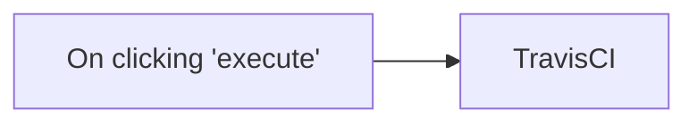

## Fluxo (.json) :

```json
{
  "id": "52",
  "name": "Trigger a build using the TravisCI node",
  "nodes": [
    {
      "name": "On clicking 'execute'",
      "type": "n8n-nodes-base.manualTrigger",
      "position": [
        510,
        350
      ],
      "parameters": {},
      "typeVersion": 1
    },
    {
      "name": "TravisCI",
      "type": "n8n-nodes-base.travisCi",
      "position": [
        710,
        350
      ],
      "parameters": {
        "slug": "",
        "branch": "",
        "operation": "trigger",
        "additionalFields": {}
      },
      "credentials": {
        "travisCiApi": "travisCI"
      },
      "typeVersion": 1
    }
  ],
  "active": false,
  "settings": {},
  "connections": {
    "TravisCI": {
      "main": [
        []
      ]
    },
    "On clicking 'execute'": {
      "main": [
        [
          {
            "node": "TravisCI",
            "type": "main",
            "index": 0
          }
        ]
      ]
    }
  }
}
```

<a id="template-812"></a>

## Template 812 - Raspagem de livros e envio de CSV por e-mail

- **Nome:** Raspagem de livros e envio de CSV por e-mail
- **Descrição:** Raspa informações de livros a partir de uma URL adicionada em uma planilha, extrai título e preço, ordena os resultados, converte para CSV e envia o arquivo por e-mail.
- **Funcionalidade:** • Monitoramento de planilha: Observa uma planilha para novas linhas contendo URLs de páginas a serem raspadas.
• Requisição ao serviço de scraping: Envia a URL para um serviço externo que retorna o HTML limpo da página.
• Extração de blocos de livro: Isola os elementos HTML que representam cada livro usando seletores CSS.
• Processamento individual de itens: Separa a lista de blocos em itens individuais para extração detalhada.
• Extração de dados por item: Extrai título (atributo title do link) e preço (conteúdo do seletor de preço) de cada livro.
• Ordenação por preço: Ordena os livros pelo campo de preço em ordem decrescente.
• Conversão para CSV: Transforma os dados estruturados em um arquivo CSV pronto para download e envio.
• Envio por e-mail com anexo: Envia o CSV gerado como anexo para um destinatário configurado por e-mail.
- **Ferramentas:** • Google Sheets: Fonte das URLs que disparam a automação (planilha que contém as páginas a serem raspadas).
• Dumpling AI: Serviço externo utilizado para raspar a página e retornar o HTML limpo.
• Gmail: Serviço de e-mail usado para enviar o arquivo CSV gerado como anexo.

## Fluxo visual

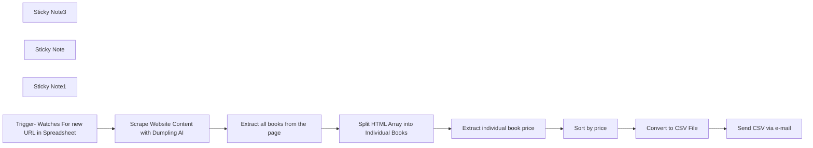

## Fluxo (.json) :

```json
{
  "id": "DswhuYzoemjA6iNN",
  "meta": {
    "instanceId": "a1ae5c8dc6c65e674f9c3947d083abcc749ef2546dff9f4ff01de4d6a36ebfe6",
    "templateCredsSetupCompleted": true
  },
  "name": "Scrape Books from URL with Dumpling AI, Clean HTML, Save to Sheets, Email as CSV",
  "tags": [
    {
      "id": "TlcNkmb96fUfZ2eA",
      "name": "Tutorials",
      "createdAt": "2025-04-15T17:02:00.249Z",
      "updatedAt": "2025-04-15T17:02:00.249Z"
    }
  ],
  "nodes": [
    {
      "id": "2e4f64a5-353c-4dd3-9822-62df795d4940",
      "name": "Convert to CSV File",
      "type": "n8n-nodes-base.convertToFile",
      "position": [
        1640,
        340
      ],
      "parameters": {
        "options": {}
      },
      "typeVersion": 1.1
    },
    {
      "id": "472442d3-a691-4310-93f8-019579d0c473",
      "name": "Extract all books from the page",
      "type": "n8n-nodes-base.html",
      "position": [
        760,
        340
      ],
      "parameters": {
        "options": {},
        "operation": "extractHtmlContent",
        "dataPropertyName": "content",
        "extractionValues": {
          "values": [
            {
              "key": "books",
              "cssSelector": ".row > li",
              "returnArray": true,
              "returnValue": "html"
            }
          ]
        }
      },
      "typeVersion": 1.2
    },
    {
      "id": "92765257-d64d-47c9-bd57-50914342138b",
      "name": "Sort by price",
      "type": "n8n-nodes-base.sort",
      "position": [
        1420,
        340
      ],
      "parameters": {
        "options": {},
        "sortFieldsUi": {
          "sortField": [
            {
              "order": "descending",
              "fieldName": "price"
            }
          ]
        }
      },
      "typeVersion": 1
    },
    {
      "id": "efc2f33f-1bef-4906-b3b7-b02868080a54",
      "name": "Extract individual book price",
      "type": "n8n-nodes-base.html",
      "position": [
        1200,
        340
      ],
      "parameters": {
        "options": {},
        "operation": "extractHtmlContent",
        "dataPropertyName": "books",
        "extractionValues": {
          "values": [
            {
              "key": "title",
              "attribute": "title",
              "cssSelector": "h3 > a",
              "returnValue": "attribute"
            },
            {
              "key": "price",
              "cssSelector": ".price_color"
            }
          ]
        }
      },
      "typeVersion": 1.2
    },
    {
      "id": "74c7c3af-d63c-4b6c-95a0-15f45b19134b",
      "name": "Send CSV via e-mail",
      "type": "n8n-nodes-base.gmail",
      "position": [
        1860,
        340
      ],
      "webhookId": "40f2d609-52ed-40bf-b190-1f1cebbe3fb7",
      "parameters": {
        "sendTo": "",
        "message": "Hey, here's the scraped data from the online bookstore!",
        "options": {
          "attachmentsUi": {
            "attachmentsBinary": [
              {}
            ]
          }
        },
        "subject": "bookstore csv",
        "emailType": "text"
      },
      "credentials": {
        "gmailOAuth2": {
          "id": "j70r3RTMED1pgN3R",
          "name": "Gmail account 2"
        }
      },
      "typeVersion": 2.1
    },
    {
      "id": "95c7998b-ece0-4dea-b99e-97ac22fb8a59",
      "name": "Sticky Note3",
      "type": "n8n-nodes-base.stickyNote",
      "position": [
        140,
        -260
      ],
      "parameters": {
        "width": 619,
        "height": 297,
        "content": "### Scrape Books from URL with Dumpling AI, Clean HTML, Save to Sheets, Email as CSV\n\n📌 This workflow scrapes book data from a website, turns it into a CSV, saves it, and sends it by email.\n\n🔧 It starts from a Google Sheets trigger, fetches the page using DumplingAI, extracts books, sorts by price, and emails the CSV.\n\n✅ Make sure APIs for Gmail, Sheets & Drive are enabled in Google Cloud. Update the URL in the \"Fetch website content\" node.\n"
      },
      "typeVersion": 1
    },
    {
      "id": "f599028a-49a9-4b85-b484-5abf1229e373",
      "name": "Sticky Note",
      "type": "n8n-nodes-base.stickyNote",
      "position": [
        140,
        60
      ],
      "parameters": {
        "color": 4,
        "width": 900,
        "height": 300,
        "content": "### 🔁 Trigger to Raw Book HTML\n\n1. **Google Sheets Trigger**  \n   Watches a sheet for new row entries. Once a new URL is added, the workflow starts.\n\n2. **Fetch Website Content (Dumpling AI)**  \n   Makes an HTTP POST request to Dumpling AI to scrape and return the full HTML of the target URL.\n\n3. **Extract All Books**  \n   Uses CSS selectors to isolate the list items (`li.row > li`) containing book entries.\n\n4. **Split Out Node**  \n   Breaks the array of book HTML blocks into individual items, so each book can be processed separately in the next steps.\n"
      },
      "typeVersion": 1
    },
    {
      "id": "bc6ab72c-de03-4e79-9da0-ca12ddf31811",
      "name": "Sticky Note1",
      "type": "n8n-nodes-base.stickyNote",
      "position": [
        1140,
        60
      ],
      "parameters": {
        "color": 6,
        "width": 840,
        "height": 300,
        "content": "### 📦 Parse, Sort, Export & Email\n\n5. **Extract Individual Book Data**  \n   From each book, extract the title (`<h3>a` title attribute) and price (`.price_color` content).\n\n6. **Sort by Price**  \n   Organizes the extracted data in descending order using the price field.\n\n7. **Convert to CSV File**  \n   Transforms the sorted JSON data into a downloadable CSV file format.\n\n8. **Send CSV via Gmail**  \n   Automatically sends an email with the CSV file attached to the predefined address.\n"
      },
      "typeVersion": 1
    },
    {
      "id": "a1246b4e-212f-4bd3-970b-b0ff8db2f834",
      "name": "Trigger- Watches For new URL in Spreadsheet",
      "type": "n8n-nodes-base.googleSheetsTrigger",
      "position": [
        320,
        340
      ],
      "parameters": {
        "event": "rowAdded",
        "options": {},
        "pollTimes": {
          "item": [
            {
              "mode": "everyMinute"
            }
          ]
        },
        "sheetName": {
          "__rl": true,
          "mode": "list",
          "value": "",
          "cachedResultUrl": "https://docs.google.com/spreadsheets/d/1pb4WLqv2EruLM1z9-utehcINolSj0vlUqZionyLoRUs/edit#gid=0",
          "cachedResultName": "Sheet1"
        },
        "documentId": {
          "__rl": true,
          "mode": "list",
          "value": "",
          "cachedResultUrl": "https://docs.google.com/spreadsheets/d/1pb4WLqv2EruLM1z9-utehcINolSj0vlUqZionyLoRUs/edit?usp=drivesdk",
          "cachedResultName": "URLs"
        }
      },
      "credentials": {
        "googleSheetsTriggerOAuth2Api": {
          "id": "qDzHSzTkclwDHpSR",
          "name": "Google Sheets Trigger account"
        }
      },
      "typeVersion": 1
    },
    {
      "id": "b19aa287-3be4-4e16-908d-b0cb484519e3",
      "name": "Scrape Website Content with Dumpling AI",
      "type": "n8n-nodes-base.httpRequest",
      "position": [
        540,
        340
      ],
      "parameters": {
        "url": "https://app.dumplingai.com/api/v1/scrape",
        "method": "POST",
        "options": {
          "allowUnauthorizedCerts": true
        },
        "jsonBody": "={\n  \"url\": \"{{ $('Trigger- Watches For new URL in Spreadsheet')}}\", \n  \"format\": \"html\",\n  \"cleaned\": \"True\"\n  }",
        "sendBody": true,
        "sendHeaders": true,
        "specifyBody": "json",
        "authentication": "genericCredentialType",
        "genericAuthType": "httpHeaderAuth",
        "headerParameters": {
          "parameters": [
            {
              "name": "Content-Type",
              "value": "application/json"
            }
          ]
        }
      },
      "credentials": {
        "httpBasicAuth": {
          "id": "mznexGH3YDtrUTAk",
          "name": "Unnamed credential"
        },
        "httpHeaderAuth": {
          "id": "xamyMqCpAech5BeT",
          "name": "Header Auth account"
        }
      },
      "typeVersion": 4.1
    },
    {
      "id": "02cbc6f9-bdcb-45fc-9973-ded42346ffbc",
      "name": "Split HTML Array into Individual Books",
      "type": "n8n-nodes-base.splitOut",
      "position": [
        980,
        340
      ],
      "parameters": {
        "options": {},
        "fieldToSplitOut": "books"
      },
      "typeVersion": 1
    }
  ],
  "active": false,
  "pinData": {},
  "settings": {
    "executionOrder": "v1"
  },
  "versionId": "264412ff-9d74-443c-a2ff-69be1e042a82",
  "connections": {
    "Sort by price": {
      "main": [
        [
          {
            "node": "Convert to CSV File",
            "type": "main",
            "index": 0
          }
        ]
      ]
    },
    "Convert to CSV File": {
      "main": [
        [
          {
            "node": "Send CSV via e-mail",
            "type": "main",
            "index": 0
          }
        ]
      ]
    },
    "Extract individual book price": {
      "main": [
        [
          {
            "node": "Sort by price",
            "type": "main",
            "index": 0
          }
        ]
      ]
    },
    "Extract all books from the page": {
      "main": [
        [
          {
            "node": "Split HTML Array into Individual Books",
            "type": "main",
            "index": 0
          }
        ]
      ]
    },
    "Split HTML Array into Individual Books": {
      "main": [
        [
          {
            "node": "Extract individual book price",
            "type": "main",
            "index": 0
          }
        ]
      ]
    },
    "Scrape Website Content with Dumpling AI": {
      "main": [
        [
          {
            "node": "Extract all books from the page",
            "type": "main",
            "index": 0
          }
        ]
      ]
    },
    "Trigger- Watches For new URL in Spreadsheet": {
      "main": [
        [
          {
            "node": "Scrape Website Content with Dumpling AI",
            "type": "main",
            "index": 0
          }
        ]
      ]
    }
  }
}
```

<a id="template-813"></a>

## Template 813 - Relatar bugs do Slack para Linear

- **Nome:** Relatar bugs do Slack para Linear
- **Descrição:** Recebe um comando slash do Slack, cria uma issue no Linear usando o texto fornecido e envia uma mensagem de acompanhamento solicitando detalhes adicionais.
- **Funcionalidade:** • Recepção de comando Slash do Slack: Captura o POST do comando /bug com o texto e metadados do usuário.
• Criação de issue no Linear via API GraphQL: Usa o texto do comando como título e cria a issue no time e com os labels configurados.
• Mensagem de acompanhamento para o usuário no Slack: Envia uma mensagem ao response_url pedindo reprodução, comportamento esperado/atual e inclui link para adicionar detalhes na issue criada.
• Helpers para configuração: Permite buscar IDs de times e labels no Linear e definir teamId e labelIds para personalizar a criação da issue.
• Orientações de setup: Inclui instruções para criar e configurar a Slack App, escopos necessários e o comando /bug antes de ativar o fluxo.
- **Ferramentas:** • Slack: Recebe o comando slash (/bug), fornece metadados do usuário e disponibiliza o response_url para enviar mensagens ao usuário.
• Linear: Plataforma de gerenciamento de issues usada para criar issues via API GraphQL, com suporte a times, labels e autenticação OAuth2.

## Fluxo visual

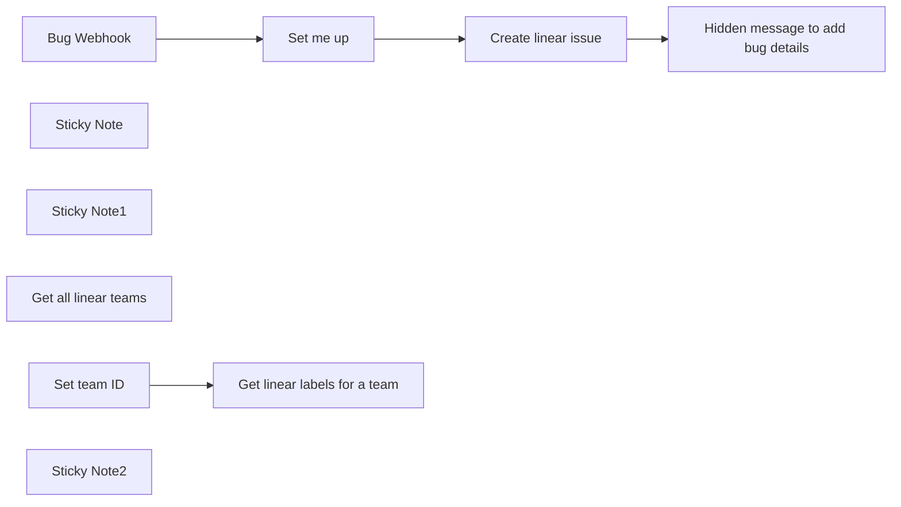

## Fluxo (.json) :

```json
{
  "meta": {
    "instanceId": "cb484ba7b742928a2048bf8829668bed5b5ad9787579adea888f05980292a4a7"
  },
  "nodes": [
    {
      "id": "72c8c4a7-ee03-4e43-97db-f6fc8904e5e0",
      "name": "Bug Webhook",
      "type": "n8n-nodes-base.webhook",
      "position": [
        1100,
        360
      ],
      "webhookId": "e6d88547-5423-4b01-bc7f-e1f94274c4b2",
      "parameters": {
        "path": "e6d88547-5423-4b01-bc7f-e1f94274c4b2",
        "options": {},
        "httpMethod": "POST"
      },
      "typeVersion": 1
    },
    {
      "id": "d1f3a8c8-d4af-452f-b4df-1e2dc73f7bd3",
      "name": "Hidden message to add bug details",
      "type": "n8n-nodes-base.httpRequest",
      "position": [
        1840,
        360
      ],
      "parameters": {
        "url": "={{ $('Bug Webhook').item.json.body.response_url }}",
        "method": "POST",
        "options": {},
        "sendBody": true,
        "bodyParameters": {
          "parameters": [
            {
              "name": "text",
              "value": "=Thanks for adding the bug `{{$node[\"Bug Webhook\"].json[\"body\"][\"text\"]}}` <@{{$node[\"Bug Webhook\"].json[\"body\"][\"user_id\"]}}> :rocket: Please make sure to add a way to reproduce, expected behavior and current behavior.\n\n:point_right: <{{ $json[\"data\"][\"issueCreate\"][\"issue\"][\"url\"] }}|Add your details here>"
            }
          ]
        }
      },
      "typeVersion": 3
    },
    {
      "id": "42977fb4-389f-4cef-855d-104f4cf0754f",
      "name": "Create linear issue",
      "type": "n8n-nodes-base.httpRequest",
      "position": [
        1660,
        360
      ],
      "parameters": {
        "url": "https://api.linear.app/graphql",
        "method": "POST",
        "options": {},
        "jsonBody": "={\n    \"query\":\"mutation IssueCreate($input: IssueCreateInput!) {issueCreate(input: $input) {issue {id title url}}}\",\n    \"variables\":{\"input\":{\"title\":\"{{ $json[\"body\"][\"text\"].replaceAll('\"',\"'\") }}\",\"teamId\":\"7a330c36-4b39-4bf1-922e-b4ceeb91850a\", \"description\":\"## Description  \\n [Add a description here]  \\n## Expected  \\n [What behavior did you expect?]  \\n## Actual  \\n [What was the actual behavior? Use screenshots or videos to show the behavior]  \\n## Steps or workflow to reproduce (with screenshots/recordings)  \\n **n8n version:** [Deployment type] [version]  \\n 1. [Replace me]   \\n  \\n Created by: {{ $json[\"body\"][\"user_name\"].toSentenceCase() }}\", \"labelIds\": [\"f2b6e3e9-b42d-4106-821c-6a08dcb489a9\"]}} \n}",
        "sendBody": true,
        "specifyBody": "json",
        "authentication": "predefinedCredentialType",
        "nodeCredentialType": "linearOAuth2Api"
      },
      "credentials": {
        "linearOAuth2Api": {
          "id": "02MqKUMdPxr9t3mX",
          "name": "Nik's Linear Creds"
        }
      },
      "typeVersion": 3
    },
    {
      "id": "ff733f62-3381-46c1-af9f-53d35f4b76ec",
      "name": "Sticky Note",
      "type": "n8n-nodes-base.stickyNote",
      "position": [
        580,
        140
      ],
      "parameters": {
        "color": 7,
        "width": 446,
        "height": 321,
        "content": "## Needed pre-work: Add a Slack App\n1. Visit https://api.slack.com/apps, click on `New App` and choose a name and workspace.\n2. Click on `OAuth & Permissions` and scroll down to Scopes -> Bot token Scopes\n3. Add the `chat:write` scope\n4. Head over to `Slash Commands` and click on `Create New Command`\n5. Use `/bug` as the command\n6. Copy the test URL from the **Webhook** node into `Request URL`\n7. Add whatever feels best to the description and usage hint\n8. Go to `Install app` and click install"
      },
      "typeVersion": 1
    },
    {
      "id": "eca6f08d-fa8d-4ac7-a048-42ce839d3e01",
      "name": "Sticky Note1",
      "type": "n8n-nodes-base.stickyNote",
      "position": [
        580,
        540
      ],
      "parameters": {
        "color": 7,
        "width": 599.3676814988288,
        "height": 298.0562060889928,
        "content": "## Helper nodes\nRun these to find the IDs of your team and wanted labels"
      },
      "typeVersion": 1
    },
    {
      "id": "9d42e8ea-0f35-4c46-bb75-9c6a6123f4d5",
      "name": "Set me up",
      "type": "n8n-nodes-base.set",
      "position": [
        1380,
        360
      ],
      "parameters": {
        "options": {},
        "assignments": {
          "assignments": [
            {
              "id": "38e3a1ba-fd53-43f7-949d-427425727c7e",
              "name": "labelIds",
              "type": "array",
              "value": "[\"f2b6e3e9-b42d-4106-821c-6a08dcb489a9\"]"
            },
            {
              "id": "3825e332-a905-48d3-ac9a-46b0ce3439f6",
              "name": "teamId",
              "type": "string",
              "value": "7a330c36-4b39-4bf1-922e-b4ceeb91850a"
            }
          ]
        }
      },
      "typeVersion": 3.3
    },
    {
      "id": "b95148b2-17e0-444e-a642-a4319df9c4c5",
      "name": "Get all linear teams",
      "type": "n8n-nodes-base.httpRequest",
      "position": [
        634,
        660
      ],
      "parameters": {
        "url": "https://api.linear.app/graphql",
        "method": "POST",
        "options": {},
        "sendBody": true,
        "authentication": "predefinedCredentialType",
        "bodyParameters": {
          "parameters": [
            {
              "name": "query",
              "value": "{ teams { nodes { id name } } }"
            }
          ]
        },
        "nodeCredentialType": "linearOAuth2Api"
      },
      "credentials": {
        "linearOAuth2Api": {
          "id": "02MqKUMdPxr9t3mX",
          "name": "Nik's Linear Creds"
        }
      },
      "typeVersion": 3
    },
    {
      "id": "04ad2f49-ef78-4d08-ab6b-d0384aee5b80",
      "name": "Get linear labels for a team",
      "type": "n8n-nodes-base.httpRequest",
      "position": [
        1014,
        660
      ],
      "parameters": {
        "url": "https://api.linear.app/graphql",
        "method": "POST",
        "options": {},
        "sendBody": true,
        "authentication": "predefinedCredentialType",
        "bodyParameters": {
          "parameters": [
            {
              "name": "query",
              "value": "query { team(id: \"16de8638-2729-4245-b9f8-74daf4780cb3\") { labels { nodes { id name } } } }"
            }
          ]
        },
        "nodeCredentialType": "linearOAuth2Api"
      },
      "credentials": {
        "linearOAuth2Api": {
          "id": "02MqKUMdPxr9t3mX",
          "name": "Nik's Linear Creds"
        }
      },
      "typeVersion": 3
    },
    {
      "id": "4045dc92-4b9f-471c-8fb1-4d76942d0330",
      "name": "Set team ID",
      "type": "n8n-nodes-base.set",
      "position": [
        854,
        660
      ],
      "parameters": {
        "options": {},
        "assignments": {
          "assignments": [
            {
              "id": "25ed1c7d-e2c0-44b0-8b43-aa19122f6e88",
              "name": "teamId",
              "type": "string",
              "value": "38b31539-61e2-451c-ba06-ba8cf0d33650"
            }
          ]
        }
      },
      "typeVersion": 3.3
    },
    {
      "id": "e45fe192-6846-41ad-ad75-699184486b6f",
      "name": "Sticky Note2",
      "type": "n8n-nodes-base.stickyNote",
      "position": [
        1246.2295081967216,
        164.12177985948486
      ],
      "parameters": {
        "color": 5,
        "width": 372.78688524590143,
        "height": 358.12646370023407,
        "content": "## Setup\n1. Congifure your Slack bot using the sticky to the left\n2. Fill the `Set me up` node. You can find the IDs easily using the Helper nodes section\n3. Make sure to exchange the `Request URL` in your Slack with the Prod URL of the Webhook node before activating this workflow  "
      },
      "typeVersion": 1
    }
  ],
  "pinData": {
    "Bug Webhook": [
      {
        "body": {
          "text": "My bug",
          "token": "OROQZiopO3NiQVLFg0muEISq",
          "command": "/bug",
          "team_id": "TG9695PUK",
          "user_id": "U047V1J0E7J",
          "user_name": "niklas",
          "api_app_id": "A06MQ8S7QM6",
          "channel_id": "C03600UUFSS",
          "trigger_id": "6716864450738.553213193971.0ef33a2db05a1d2dcf02c178d8efc534",
          "team_domain": "n8nio",
          "channel_name": "updates-workflow-templates",
          "response_url": "https://hooks.slack.com/commands/TG9695PUK/6713943368277/ogqoFMjMytSkbWNUdtg9Cp73",
          "is_enterprise_install": "false"
        },
        "query": {},
        "params": {},
        "headers": {
          "host": "internal.users.n8n.cloud",
          "accept": "application/json,*/*",
          "x-real-ip": "10.255.0.2",
          "user-agent": "Slackbot 1.0 (+https://api.slack.com/robots)",
          "content-type": "application/x-www-form-urlencoded",
          "content-length": "428",
          "accept-encoding": "gzip,deflate",
          "x-forwarded-for": "10.255.0.2",
          "x-forwarded-host": "internal.users.n8n.cloud",
          "x-forwarded-port": "443",
          "x-forwarded-proto": "https",
          "x-slack-signature": "v0=dae629e837d8585faf0feffd1778020aa7a47dfe759def3088179a4a70cf31db",
          "x-forwarded-server": "3d9f11a36e52",
          "x-slack-request-timestamp": "1709135352"
        }
      }
    ]
  },
  "connections": {
    "Set me up": {
      "main": [
        [
          {
            "node": "Create linear issue",
            "type": "main",
            "index": 0
          }
        ]
      ]
    },
    "Bug Webhook": {
      "main": [
        [
          {
            "node": "Set me up",
            "type": "main",
            "index": 0
          }
        ]
      ]
    },
    "Set team ID": {
      "main": [
        [
          {
            "node": "Get linear labels for a team",
            "type": "main",
            "index": 0
          }
        ]
      ]
    },
    "Create linear issue": {
      "main": [
        [
          {
            "node": "Hidden message to add bug details",
            "type": "main",
            "index": 0
          }
        ]
      ]
    }
  }
}
```

<a id="template-814"></a>

## Template 814 - Validação de endereço postal de contatos

- **Nome:** Validação de endereço postal de contatos
- **Descrição:** Automatiza a validação do endereço postal de novos contatos recebidos via webhook e atualiza o CRM indicando se o endereço é entregável ou não.
- **Funcionalidade:** • Recebimento de webhook do CRM: Inicia o fluxo ao receber os dados do contato com campos de endereço.
• Mapeamento de campos de endereço: Organiza e prepara primary_line, secondary_line, cidade, estado e CEP para a verificação.
• Consulta à API de verificação de endereços: Envia os campos ao serviço de verificação (US) para validar formato e entregabilidade.
• Avaliação do resultado de entregabilidade: Analisa a resposta da API para determinar se o endereço é deliverable ou não.
• Atualização do CRM com o resultado: Marca o contato no CRM aplicando tags ou acionando automações conforme deliverability (entregável / não entregável).
• Requisitos de credenciais: Exige criação e configuração de chave de API do serviço de verificação para chamadas autenticadas.
- **Ferramentas:** • Lob: Serviço de verificação de endereços (API us_verifications) usado para validar e confirmar entregabilidade de endereços nos EUA.
• HighLevel: CRM que envia os webhooks de novos contatos e recebe atualizações (tags/automação) indicando o resultado da verificação.

## Fluxo visual

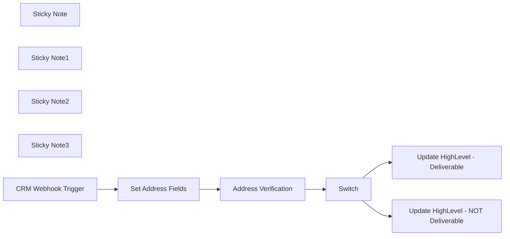

## Fluxo (.json) :

```json
{
  "meta": {
    "instanceId": "041bccf206a3546a759ec4c0a3bf1256e62051945bb270c48f91f3acb13dc080"
  },
  "nodes": [
    {
      "id": "401dbfb3-5475-4b00-b2df-3aa685815b05",
      "name": "Sticky Note",
      "type": "n8n-nodes-base.stickyNote",
      "position": [
        340,
        -260
      ],
      "parameters": {
        "width": 747,
        "height": 428,
        "content": "## Purpose \nTo verify the mailing address for new contacts in HighLevel. \n\nWhenever I add a new contact to HighLevel, I run this automation to ensure I have a valid mailing address. It also helps me check for misspellings if the contact address was manually entered.\n\nQuick Video Overview:\nhttps://www.loom.com/share/8995ca0b41ce473ebbad9c1973109c0f\n"
      },
      "typeVersion": 1
    },
    {
      "id": "abca87a6-91ca-4597-aec7-28913c3a33b8",
      "name": "Sticky Note1",
      "type": "n8n-nodes-base.stickyNote",
      "position": [
        1480,
        -180
      ],
      "parameters": {
        "color": 5,
        "width": 515,
        "height": 763,
        "content": "Update HighLevel to indicate if the address is deliverable.\nYou could: \n- Add Tag\n- Start Automation\n- Update a Field\n\nFor Deliverable Addresses - I apply a tag that the address was verified.\n\nFor Non Deliverable Addresses - I apply a tag, which triggers an automation for my team to manually verify the address. You could also trigger an automation to reach out to the contact to verify their address.\n\n"
      },
      "typeVersion": 1
    },
    {
      "id": "0f21121c-c7fb-4697-9663-8ecf03ca76a5",
      "name": "Sticky Note2",
      "type": "n8n-nodes-base.stickyNote",
      "position": [
        520,
        200
      ],
      "parameters": {
        "color": 4,
        "height": 339,
        "content": "Receive a webhook from your CRM with the contact address fields"
      },
      "typeVersion": 1
    },
    {
      "id": "47c9e17d-0b30-41a3-bf83-eb4558fa7b85",
      "name": "Set Address Fields",
      "type": "n8n-nodes-base.set",
      "position": [
        840,
        280
      ],
      "parameters": {
        "options": {},
        "assignments": {
          "assignments": [
            {
              "id": "8216105e-23ad-4c5c-8f4a-4f97658e0947",
              "name": "address",
              "type": "string",
              "value": "={{ $json.address }}"
            },
            {
              "id": "111da971-2473-4c5e-a106-22589cf47daf",
              "name": "address2",
              "type": "string",
              "value": ""
            },
            {
              "id": "ed62cf39-10f1-42f6-b18f-bfa58b4fe646",
              "name": "city",
              "type": "string",
              "value": "={{ $json.city }}"
            },
            {
              "id": "d9550200-04ac-4cf4-b7e6-cd40b793ce97",
              "name": "state",
              "type": "string",
              "value": "={{ $json.state }}"
            },
            {
              "id": "62269d11-c98c-4016-83ef-291176f2fc12",
              "name": "zip",
              "type": "string",
              "value": "={{ $json.zip_code }}"
            }
          ]
        },
        "includeOtherFields": true
      },
      "typeVersion": 3.3
    },
    {
      "id": "1ee9fabf-a456-4877-8f2c-1150b8e43c7a",
      "name": "Sticky Note3",
      "type": "n8n-nodes-base.stickyNote",
      "position": [
        1000,
        480
      ],
      "parameters": {
        "color": 3,
        "width": 430,
        "height": 216,
        "content": "1. Create an Account a LOB.com\n2. Create API Key (https://help.lob.com/account-management/api-keys)\n3. Update Node with your Credentials (Basic Auth)"
      },
      "typeVersion": 1
    },
    {
      "id": "6bc67404-b292-4211-a8f9-568802e12786",
      "name": "CRM Webhook Trigger",
      "type": "n8n-nodes-base.webhook",
      "position": [
        620,
        280
      ],
      "webhookId": "912a0210-7d6a-4517-9055-b8633c59a631",
      "parameters": {
        "path": "727deb6f-9d10-4492-92e6-38f3292510b0",
        "options": {},
        "httpMethod": "POST"
      },
      "typeVersion": 1.1
    },
    {
      "id": "9ab388c0-8e84-45da-9475-9b83d3f2852d",
      "name": "Address Verification",
      "type": "n8n-nodes-base.httpRequest",
      "position": [
        1060,
        280
      ],
      "parameters": {
        "url": "https://api.lob.com/v1/us_verifications",
        "method": "POST",
        "options": {},
        "sendBody": true,
        "bodyParameters": {
          "parameters": [
            {
              "name": "primary_line",
              "value": "={{ $json.address }}"
            },
            {
              "name": "secondary_line",
              "value": "={{ $json.address2 }}"
            },
            {
              "name": "city",
              "value": "={{ $json.city }}"
            },
            {
              "name": "state",
              "value": "={{ $json.state }}"
            },
            {
              "name": "zip_code",
              "value": "={{ $json.zip_code }}"
            }
          ]
        }
      },
      "typeVersion": 4.1
    },
    {
      "id": "50921e14-2fdf-4bac-8ef7-06fcb9e73176",
      "name": "Update HighLevel - Deliverable",
      "type": "n8n-nodes-base.highLevel",
      "position": [
        1580,
        160
      ],
      "parameters": {
        "email": "={{ $('CRM Webhook Trigger').item.json.email }}",
        "phone": "={{ $('CRM Webhook Trigger').item.json.phone }}",
        "additionalFields": {
          "tags": "Mailing Address Deliverable"
        }
      },
      "credentials": {
        "highLevelApi": {
          "id": "qJqOS89WQuqj4wXh",
          "name": "Test"
        }
      },
      "typeVersion": 1
    },
    {
      "id": "c81889cb-aeff-4afe-ae1c-747b30a4b6b1",
      "name": "Update HighLevel - NOT Deliverable",
      "type": "n8n-nodes-base.highLevel",
      "position": [
        1580,
        380
      ],
      "parameters": {
        "email": "={{ $('CRM Webhook Trigger').item.json.email }}",
        "phone": "={{ $('CRM Webhook Trigger').item.json.phone }}",
        "additionalFields": {
          "tags": "Mailing Address NOT Deliverable"
        }
      },
      "credentials": {
        "highLevelApi": {
          "id": "qJqOS89WQuqj4wXh",
          "name": "Test"
        }
      },
      "typeVersion": 1
    },
    {
      "id": "9f896b41-eeb9-4cde-9fc8-e1ba000a2b61",
      "name": "Switch",
      "type": "n8n-nodes-base.switch",
      "position": [
        1280,
        280
      ],
      "parameters": {
        "rules": {
          "rules": [
            {
              "value2": "=deliverable",
              "outputKey": "deliverable"
            },
            {
              "value2": "deliverable",
              "operation": "notEqual",
              "outputKey": "NOT deliverable"
            }
          ]
        },
        "value1": "={{ $json.deliverability }}",
        "dataType": "string"
      },
      "typeVersion": 2
    }
  ],
  "pinData": {
    "CRM Webhook Trigger": [
      {
        "city": "Washington",
        "email": "mr.president@gmail.com",
        "phone": "877-555-1212",
        "state": "DC",
        "address": "1600 Pennsylvania Avenue NW",
        "zip_code": "20500",
        "contact_id": "5551212"
      }
    ]
  },
  "connections": {
    "Switch": {
      "main": [
        [
          {
            "node": "Update HighLevel - Deliverable",
            "type": "main",
            "index": 0
          }
        ],
        [
          {
            "node": "Update HighLevel - NOT Deliverable",
            "type": "main",
            "index": 0
          }
        ]
      ]
    },
    "Set Address Fields": {
      "main": [
        [
          {
            "node": "Address Verification",
            "type": "main",
            "index": 0
          }
        ]
      ]
    },
    "CRM Webhook Trigger": {
      "main": [
        [
          {
            "node": "Set Address Fields",
            "type": "main",
            "index": 0
          }
        ]
      ]
    },
    "Address Verification": {
      "main": [
        [
          {
            "node": "Switch",
            "type": "main",
            "index": 0
          }
        ]
      ]
    }
  }
}
```

<a id="template-815"></a>

## Template 815 - Recuperar contatos do Keap

- **Nome:** Recuperar contatos do Keap
- **Descrição:** Ao ser executado manualmente, este fluxo consulta e retorna todos os contatos armazenados no Keap utilizando credenciais OAuth2.
- **Funcionalidade:** • Execução manual: inicia o fluxo quando o usuário aciona a execução.
• Recuperação de contatos: obtém a lista completa de contatos do Keap (recurso contact, operação getAll).
• Autenticação via OAuth2: utiliza credenciais OAuth2 configuradas para autorizar chamadas à API do Keap.
- **Ferramentas:** • Keap: plataforma de CRM para gerenciar contatos; usada aqui para listar todos os contatos via API autenticada.

## Fluxo visual

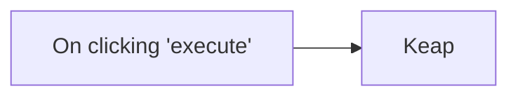

## Fluxo (.json) :

```json
{
  "nodes": [
    {
      "name": "On clicking 'execute'",
      "type": "n8n-nodes-base.manualTrigger",
      "position": [
        250,
        300
      ],
      "parameters": {},
      "typeVersion": 1
    },
    {
      "name": "Keap",
      "type": "n8n-nodes-base.keap",
      "position": [
        450,
        300
      ],
      "parameters": {
        "options": {},
        "resource": "contact",
        "operation": "getAll"
      },
      "credentials": {
        "keapOAuth2Api": "keap_creds"
      },
      "typeVersion": 1
    }
  ],
  "connections": {
    "On clicking 'execute'": {
      "main": [
        [
          {
            "node": "Keap",
            "type": "main",
            "index": 0
          }
        ]
      ]
    }
  }
}
```

<a id="template-816"></a>

## Template 816 - Processamento de novos leads e notificação por email

- **Nome:** Processamento de novos leads e notificação por email
- **Descrição:** Fluxo que recebe novos leads, analisa as notas do lead, identifica contatos responsáveis e envia uma notificação por email com o resumo da consulta. Classifica leads inválidos quando não estão relacionados a produtos, serviços ou soluções.
- **Funcionalidade:** • Detecção e recepção de leads: o fluxo recebe dados via webhook quando um novo lead é criado.\n• Análise de notas do lead: extrai detalhes como nome, organização, contatos e pedido, e determina se é relativo a produtos, serviços ou soluções.\n• Localização de contatos responsáveis: busca no cadastro os responsáveis e retorna emails únicos ou múltiplos separados por vírgulas.\n• Geração de notificação por email: compõe um email do sistema com o resumo da solicitação e informações relevantes para o destinatário.\n• Classificação de leads inválidos: se não houver relação com produtos/serviços/soluções, classifica como inválido com a mensagem correspondente.\n• Preparação de dados para envio: formatação do corpo do email em HTML e inclusão de informações do lead para facilitar o atendimento.
- **Ferramentas:** • ERPNext API: integração para obter dados de Lead e disparar ações com Lead.\n• Serviço de envio de email (Outlook/SMTP): envio de notificações por email com conteúdo formatado.\n• Base de contatos: base de dados de responsáveis pelos produtos/soluções para recuperação de emails.

## Fluxo (.json) :

```json
{
  "\"id\"": "\"2b4c1e91-c64b-43cb-aba2-c6f8f5a17c79\",",
  "\"url\"": "\"=https://erpnext.syncbricks.com/api/resource/Lead/{{ $('Source Website and Status Open').item.json.body.name }}\",",
  "\"__rl\"": "true,",
  "\"main\"": "[",
  "\"meta\"": "{",
  "\"mode\"": "\"id\",",
  "\"name\"": "\"Webhook\",",
  "\"node\"": "\"Email Body for Outlook\",",
  "\"path\"": "\"new-lead-generated-in-erpnext\",",
  "\"text\"": "\"=**System Prompt:**\\n\\nYou are an AI assistant designed to process new leads and generate appropriate responses. Your role includes analyzing lead notes, categorizing them, and generating an email from the system to inform the relevant contact about the inquiry. Do not send the email as if it is directly from the customer; instead, draft it as a notification from the system summarizing the inquiry.\\n\\n### **Process Flow**\\n\\n1. **Analyzing Lead Notes:**\\n - Extract key details such as the customer name, organization, contact information, and their specific request. \\n - Determine if the inquiry relates to products, services, or solutions offered by the company.\\n\\n2. **Finding the Appropriate Contact(s):**\\n - Search the contact database to find the responsible person(s) for the relevant product, service, or solution. \\n - If one person is responsible, provide their email. \\n - If multiple people are responsible, list all emails separated by commas.\\n\\n3. **Generating an Email Notification:**\\n - Draft a professional email as a notification from the system.\\n - Summarize the customer’s inquiry.\\n - Include all relevant details to assist the recipient in addressing the inquiry.\\n\\n4. **Handling Invalid Leads:**\\n - If the inquiry is unrelated to products, services, or solutions (e.g., job inquiries or general product inquiries), classify it as invalid and return: \\n `\\\"Invalid Lead - Not related to products, services, or solutions.\\\"`\\n\\n### **Output Requirements**\\n\\n1. **For Relevant Leads:**\\n - **Email Address(es):** Provide the appropriate email(s). \\n - **Email Message Body:** Generate an email notification from the system summarizing the inquiry.\\n\\n2. **For Invalid Leads:**\\n - Return: `\\\"Invalid Lead - Not related to products, services, or solutions.\\\"`\\n\\n\\n### **Email Template for Relevant Leads**\\n\\n**Email Address(es):** [Relevant Email IDs]\\n\\n**Email Message Body:**\\n\\n_Subject: New Inquiry from Customer Regarding [Product/Service/Solution]_ \\n\\nDear [Recipient(s)], \\n\\nWe have received a new inquiry from a customer through our system. Below are the details: \\n\\n**Customer Name:** [Customer Name] \\n**Organization:** [Organization Name] \\n**Contact Information:** [Contact Details] \\n\\n**Inquiry Summary:** \\n[Summarized description of the customer's request, e.g., “The customer is seeking to upgrade their restroom facilities with touchless soap dispensers and tissue holders installed behind mirrors. They have requested a site visit to assess the location and provide a proposal.”] \\n\\n**Action Required:** \\nPlease prioritize this inquiry and reach out to the customer promptly to address their requirements. \\n\\nThank you, \\n[Your System Name] \\n\\n\\n### **Example Output**\\n\\n**Input Lead Notes:**\\n*\\\"Dear Syncbricks, We are looking to Develop Workflow Automation Soluition for our company, can you let us know the details what do you offer in tems of this.\\\"*\\n\\n**Output:**\\n\\n- **Email Address(es):** employee@syncbricks.com\\n\\n- **Email Message Body:** \\n\\n_Subject: Workflow Automation Platform Integration_ \\n\\nDear -Emploiyee Name (s) --, \\n\\nWe have received a new inquiry from a customer through our system. Below are the details: \\n\\n**Customer Name:** Amjid Ali \\n**Organization:** Syncbricks LLC\\n**Contact Information:** 123456789 \\n\\n**Inquiry Summary:** \\nThe customer is asking for workflow automation for their company \\n\\n**Action Required:** \\nPlease prioritize this inquiry and reach out to the customer promptly to address their requirements. \\n\\nThank you, \\nSyncbricks LLC\\n\\n---\\nHere are the Lead Details\\nLead Name : {{ $json.data.lead_name }}\\nCompany : {{ $json.data.company_name }}\\nSource : {{ $json.data.source }}\\nNotes : {{ $json.data.notes }}\\nCity : {{ $json.data.city }}\\nCountry : {{ $json.data.country }}\\nMobile : {{ $json.data.mobile_no }}\",",
  "\"type\"": "\"main\",",
  "\"color\"": "3,",
  "\"index\"": "0",
  "\"nodes\"": "[",
  "\"value\"": "\"=Telephone Directory\"",
  "\"width\"": "302.58963031819115,",
  "\"height\"": "660,",
  "\"jsCode\"": "\"// Input email body\\nconst emailBody = $json.email_body || '';\\n\\n// Function to convert plain text email body into HTML\\nfunction formatEmailBodyAsHtml(body) {\\n // Replace markdown-like sections with corresponding HTML\\n let htmlBody = body\\n .replace(/\\\\*\\\\*Customer Name:\\\\*\\\\* (.+)/, '<p><strong>Customer Name:</strong> $1</p>')\\n .replace(/\\\\*\\\\*Organization:\\\\*\\\\* (.+)/, '<p><strong>Organization:</strong> $1</p>')\\n .replace(/\\\\*\\\\*Contact Information:\\\\*\\\\* (.+)/, '<p><strong>Contact Information:</strong> $1</p>')\\n .replace(/\\\\*\\\\*Inquiry Summary:\\\\*\\\\*\\\\s*([\\\\s\\\\S]+?)(?=\\\\n\\\\n\\\\*\\\\*Action Required:)/, '<p><strong>Inquiry Summary:</strong> $1</p>')\\n .replace(/\\\\*\\\\*Action Required:\\\\*\\\\*\\\\s*([\\\\s\\\\S]+)/, '<p><strong>Action Required:</strong> $1</p>');\\n\\n // Wrap each paragraph in `<p>` tags for better readability\\n htmlBody = htmlBody\\n .replace(/Dear (.+?),/, '<p>Dear <strong>$1</strong>,</p>')\\n .replace(/Thank you,\\\\s+(.+)/, '<p>Thank you,<br><strong>$1</strong></p>');\\n\\n return htmlBody;\\n}\\n\\n// Convert the email body into HTML\\nconst formattedHtmlBody = formatEmailBodyAsHtml(emailBody);\\n\\n// Return the formatted HTML\\nreturn {\\n html: formattedHtmlBody\\n};\\n\"",
  "\"Webhook\"": "{",
  "\"ai_tool\"": "[",
  "\"content\"": "\"### Prepare for Email\\nThis node will get approprate Fields for Email \\nEmail Addresses:\\nSubject : \\nEmail Body : \"",
  "\"options\"": "{},",
  "\"pinData\"": "{},",
  "\"subject\"": "\"={{ $('Fields for Outlook').item.json.subject }}\",",
  "\"version\"": "2,",
  "\"operator\"": "{",
  "\"position\"": "[",
  "\"Lead Body\"": "{",
  "\"leftValue\"": "\"={{ $json.output }}\",",
  "\"openAiApi\"": "{",
  "\"operation\"": "\"get\",",
  "\"sheetName\"": "{",
  "\"webhookId\"": "\"a39ea4e2-99b7-4ae1-baff-9fb370333e2a\",",
  "\"combinator\"": "\"and\",",
  "\"conditions\"": "[",
  "\"documentId\"": "{",
  "\"erpNextApi\"": "{",
  "\"httpMethod\"": "\"POST\"",
  "\"instanceId\"": "\"e4f78845dfed9ddcfba1945ae00d12e9a7d76eab052afd19299228ce02349d86\"",
  "\"parameters\"": "{",
  "\"promptType\"": "\"define\"",
  "\"rightValue\"": "\"**Invalid Lead - Not related to products, services, or solutions.**\"",
  "\"assignments\"": "[",
  "\"bodyContent\"": "\"={{ $json.html }}\\n<a href=\\\"https://erpnext.syncbricks.com/app/lead/{{ $('Webhook').item.json.body.name }}\\\" target=\\\"_blank\\\" rel=\\\"noopener noreferrer\\\">Here is Lead {{ $('Source Website and Status Open').item.json.body.name }} </a>\\n\",",
  "\"connections\"": "{",
  "\"credentials\"": "{",
  "\"documentURL\"": "\"you-must-provide-the-doc-id\"",
  "\"singleValue\"": "true",
  "\"typeVersion\"": "2",
  "\"toRecipients\"": "\"= {{ $('Fields for Outlook').item.json.email_addresses }}\",",
  "\"Abbriviations\"": "{",
  "\"caseSensitive\"": "true,",
  "\"authentication\"": "\"predefinedCredentialType\",",
  "\"typeValidation\"": "\"strict\"",
  "\"Company Profile\"": "{",
  "\"bodyContentType\"": "\"html\"",
  "\"cachedResultUrl\"": "\"\",",
  "\"Company Policies\"": "{",
  "\"additionalFields\"": "{",
  "\"ai_languageModel\"": "[",
  "\"cachedResultName\"": "\"\"",
  "\"Inquiry has Notes\"": "{",
  "\"Inquiry is Valid?\"": "{",
  "\"OpenAI Chat Model\"": "{",
  "\"Fields for Outlook\"": "{",
  "\"nodeCredentialType\"": "\"erpNextApi\"",
  "\"googleDocsOAuth2Api\"": "{",
  "\"googleSheetsOAuth2Api\"": "{",
  "\"Customer Lead AI Agent\"": "{",
  "\"Email Body for Outlook\"": "{",
  "\"Company Contact Database\"": "{",
  "\"microsoftOutlookOAuth2Api\"": "{",
  "\"Get Lead Data from ERPNext\"": "{",
  "\"Source Website and Status Open\"": "{",
  "\"Email Body Text Generated by AI\"": "{"
}
```

<a id="template-817"></a>

## Template 817 - Buscar quadro do Monday.com

- **Nome:** Buscar quadro do Monday.com
- **Descrição:** Ao ser acionado manualmente, o fluxo recupera os dados de um quadro específico no Monday.com usando a API configurada.
- **Funcionalidade:** • Acionamento manual: Inicia o fluxo quando o usuário clica em executar.
• Recuperação de quadro: Consulta a API para obter informações do quadro com ID 663435997.
• Autenticação: Utiliza credenciais configuradas para autenticar a requisição à API do serviço.
- **Ferramentas:** • Monday.com: Plataforma de gerenciamento de projetos e trabalho colaborativo; a API é usada para consultar e retornar dados do quadro (itens, colunas e configurações).


## Fluxo visual


## Fluxo (.json) :

```json
{
  "nodes": [
    {
      "name": "On clicking 'execute'",
      "type": "n8n-nodes-base.manualTrigger",
      "position": [
        250,
        300
      ],
      "parameters": {},
      "typeVersion": 1
    },
    {
      "name": "Monday.com",
      "type": "n8n-nodes-base.mondayCom",
      "position": [
        450,
        300
      ],
      "parameters": {
        "boardId": "663435997",
        "operation": "get"
      },
      "credentials": {
        "mondayComApi": "monday"
      },
      "typeVersion": 1
    }
  ],
  "connections": {
    "On clicking 'execute'": {
      "main": [
        [
          {
            "node": "Monday.com",
            "type": "main",
            "index": 0
          }
        ]
      ]
    }
  }
}
```

<a id="template-818"></a>

## Template 818 - Validação de endereço postal (Groundhogg)

- **Nome:** Validação de endereço postal (Groundhogg)
- **Descrição:** Valida endereços postais de novos contatos recebidos do Groundhogg CRM e atualiza o CRM indicando se o endereço é entregável ou não.
- **Funcionalidade:** • Recepção de webhook do CRM: Inicia o fluxo ao receber os dados do contato com os campos de endereço.
• Mapeamento de campos de endereço: Normaliza e prepara os campos (address, address2, city, state, zip) para verificação.
• Verificação de endereço externa: Envia os dados para a API de verificação de endereços (serviço externo) e recebe o resultado de entregabilidade.
• Avaliação de entregabilidade: Analisa o campo de resposta para decidir se o endereço é 'deliverable' ou não.
• Atualização do CRM conforme resultado: Aplica tag indicando 'Mailing Address Deliverable' ou 'Mailing Address NOT Deliverable' via webhook para o Groundhogg.
• Ações para endereços não entregáveis: Permite acionar automações adicionais, adicionar notas ou sinalizar para verificação manual da equipe.
• Requisito de credenciais: Exige conta e chave de API no serviço de verificação (autenticação básica) para funcionar.
- **Ferramentas:** • Groundhogg CRM: CRM que envia os webhooks com os dados dos contatos e recebe atualizações/tags para marcar o status do endereço.
• Lob API: Serviço externo de verificação de endereços nos EUA (endpoint us_verifications) utilizado para validar a entregabilidade dos endereços.


## Fluxo visual


## Fluxo (.json) :

```json
{
  "meta": {
    "instanceId": "041bccf206a3546a759ec4c0a3bf1256e62051945bb270c48f91f3acb13dc080"
  },
  "nodes": [
    {
      "id": "8a22d40f-5b09-485a-8d58-70f36821ee9f",
      "name": "Sticky Note",
      "type": "n8n-nodes-base.stickyNote",
      "position": [
        340,
        -260
      ],
      "parameters": {
        "width": 747,
        "height": 428,
        "content": "## Purpose \nTo verify the mailing address for new contacts in Groundhogg CRM. \n\nWhenever I add a new contact to Groundhogg CRM, I run this automation to ensure I have a valid mailing address. It also helps me check for misspellings if the contact address was manually entered.\n\nQuick Video Overview:\n\nhttps://www.youtube.com/watch?v=nrV0P0Yz8FI"
      },
      "typeVersion": 1
    },
    {
      "id": "d59b4ac3-5b41-4913-8b41-401a4eac8cc0",
      "name": "Sticky Note1",
      "type": "n8n-nodes-base.stickyNote",
      "position": [
        1480,
        -180
      ],
      "parameters": {
        "color": 5,
        "width": 561.9462602626872,
        "height": 763,
        "content": "Update Groundhogg CRM to indicate if the address is deliverable.\n\nPossible Options: \n- Add Tag\n- Add Note\n- Start Automation\n- Update a Field\n\nFor Deliverable Addresses - I apply a tag that the address was verified.\n\nFor Non Deliverable Addresses - I apply a tag, which triggers an automation for my team to manually verify the address. You could also trigger an automation to reach out to the contact to verify their address.\n\n"
      },
      "typeVersion": 1
    },
    {
      "id": "6a5d3833-a256-4b57-96dc-6a08886b65ee",
      "name": "Sticky Note2",
      "type": "n8n-nodes-base.stickyNote",
      "position": [
        520,
        200
      ],
      "parameters": {
        "color": 4,
        "height": 339,
        "content": "Receive a webhook from your CRM with the contact address fields"
      },
      "typeVersion": 1
    },
    {
      "id": "4fe1597b-ea03-439a-898b-a968cbd84511",
      "name": "Set Address Fields",
      "type": "n8n-nodes-base.set",
      "position": [
        840,
        280
      ],
      "parameters": {
        "options": {},
        "assignments": {
          "assignments": [
            {
              "id": "8216105e-23ad-4c5c-8f4a-4f97658e0947",
              "name": "address",
              "type": "string",
              "value": "={{ $json.address }}"
            },
            {
              "id": "111da971-2473-4c5e-a106-22589cf47daf",
              "name": "address2",
              "type": "string",
              "value": ""
            },
            {
              "id": "ed62cf39-10f1-42f6-b18f-bfa58b4fe646",
              "name": "city",
              "type": "string",
              "value": "={{ $json.city }}"
            },
            {
              "id": "d9550200-04ac-4cf4-b7e6-cd40b793ce97",
              "name": "state",
              "type": "string",
              "value": "={{ $json.state }}"
            },
            {
              "id": "62269d11-c98c-4016-83ef-291176f2fc12",
              "name": "zip",
              "type": "string",
              "value": "={{ $json.zip_code }}"
            }
          ]
        },
        "includeOtherFields": true
      },
      "typeVersion": 3.3
    },
    {
      "id": "ac13a2be-07fa-4861-99ab-9af8fe797db3",
      "name": "Sticky Note3",
      "type": "n8n-nodes-base.stickyNote",
      "position": [
        1000,
        480
      ],
      "parameters": {
        "color": 3,
        "width": 430,
        "height": 216,
        "content": "1. Create an Account a LOB.com\n2. Create API Key (https://help.lob.com/account-management/api-keys)\n3. Update Node with your Credentials (Basic Auth)"
      },
      "typeVersion": 1
    },
    {
      "id": "04c286c0-8862-40f9-960d-902b3c89a6ee",
      "name": "CRM Webhook Trigger",
      "type": "n8n-nodes-base.webhook",
      "position": [
        600,
        280
      ],
      "webhookId": "a2df5279-0c49-49c1-83a3-cb1179930e91",
      "parameters": {
        "path": "727deb6f-9d10-4492-92e6-38f3292510b0",
        "options": {},
        "httpMethod": "POST"
      },
      "typeVersion": 1.1
    },
    {
      "id": "c091dc5f-5527-43ca-b257-c977d654c13b",
      "name": "Update Groundhogg - Deliverable",
      "type": "n8n-nodes-base.httpRequest",
      "position": [
        1800,
        140
      ],
      "parameters": {
        "url": "=webhook listener from Groundhogg funnel",
        "method": "POST",
        "options": {},
        "sendBody": true,
        "bodyParameters": {
          "parameters": [
            {
              "name": "tag",
              "value": "Mailing Address Deliverable"
            },
            {
              "name": "id",
              "value": "={{ $('CRM Webhook Trigger').item.json.id }}"
            }
          ]
        }
      },
      "typeVersion": 4.1
    },
    {
      "id": "1449b6e2-1c4f-4f75-8280-aab3c993f0ac",
      "name": "Update Groundhogg - NOT Deliverable",
      "type": "n8n-nodes-base.httpRequest",
      "position": [
        1800,
        360
      ],
      "parameters": {
        "url": "=webhook listener from Groundhogg funnel",
        "method": "POST",
        "options": {},
        "sendBody": true,
        "bodyParameters": {
          "parameters": [
            {
              "name": "tag",
              "value": "Mailing Address NOT Deliverable"
            },
            {
              "name": "id",
              "value": "={{ $('CRM Webhook Trigger').item.json.id }}"
            }
          ]
        }
      },
      "typeVersion": 4.1
    },
    {
      "id": "a79eb361-7dc8-4838-bb40-b34bf35c3102",
      "name": "Address Verification",
      "type": "n8n-nodes-base.httpRequest",
      "position": [
        1140,
        280
      ],
      "parameters": {
        "url": "https://api.lob.com/v1/us_verifications",
        "method": "POST",
        "options": {},
        "sendBody": true,
        "bodyParameters": {
          "parameters": [
            {
              "name": "primary_line",
              "value": "={{ $json.address }}"
            },
            {
              "name": "secondary_line",
              "value": "={{ $json.address2 }}"
            },
            {
              "name": "city",
              "value": "={{ $json.city }}"
            },
            {
              "name": "state",
              "value": "={{ $json.state }}"
            },
            {
              "name": "zip_code",
              "value": "={{ $json.zip_code }}"
            }
          ]
        }
      },
      "typeVersion": 4.1
    },
    {
      "id": "71c9199f-823c-451b-baf5-a2b5de1697c1",
      "name": "Switch",
      "type": "n8n-nodes-base.switch",
      "position": [
        1500,
        280
      ],
      "parameters": {
        "rules": {
          "rules": [
            {
              "value2": "=deliverable",
              "outputKey": "deliverable"
            },
            {
              "value2": "deliverable",
              "operation": "notEqual",
              "outputKey": "NOT deliverable"
            }
          ]
        },
        "value1": "={{ $json.deliverability }}",
        "dataType": "string"
      },
      "typeVersion": 2
    }
  ],
  "pinData": {
    "CRM Webhook Trigger": [
      {
        "id": "5551212",
        "city": "Washington",
        "email": "mr.president@gmail.com",
        "phone": "877-555-1212",
        "state": "DC",
        "address": "1600 Pennsylvania Avenue NW",
        "zip_code": "20500"
      }
    ]
  },
  "connections": {
    "Switch": {
      "main": [
        [
          {
            "node": "Update Groundhogg - Deliverable",
            "type": "main",
            "index": 0
          }
        ],
        [
          {
            "node": "Update Groundhogg - NOT Deliverable",
            "type": "main",
            "index": 0
          }
        ]
      ]
    },
    "Set Address Fields": {
      "main": [
        [
          {
            "node": "Address Verification",
            "type": "main",
            "index": 0
          }
        ]
      ]
    },
    "CRM Webhook Trigger": {
      "main": [
        [
          {
            "node": "Set Address Fields",
            "type": "main",
            "index": 0
          }
        ]
      ]
    },
    "Address Verification": {
      "main": [
        [
          {
            "node": "Switch",
            "type": "main",
            "index": 0
          }
        ]
      ]
    }
  }
}
```

<a id="template-819"></a>

## Template 819 - Análise de Competidores via Avaliações de Clientes

- **Nome:** Análise de Competidores via Avaliações de Clientes
- **Descrição:** Coleta e análise de avaliações de clientes de diferentes plataformas para entender o desempenho de concorrentes, extraindo métricas como número de avaliações, menções positivas/negativas, principais prós e contras, países e plataformas mais atuantes.
- **Funcionalidade:** • Detecção de sites de avaliações e coleta de URLs: identifica fontes relevantes onde avaliações de clientes são postadas e coleta os links de resultados.
• Extração de avaliações das páginas: acessa as páginas de avaliações para extrair conteúdos relevantes.
• Cálculo de métricas de avaliações: computa número total de avaliações, porcentagens de menções positivas e negativas, e identifica top prós e contras.
• Identificação de tendências por país e plataforma: analisa as avaliações para mapear países com maior volume e plataformas mais ativas.
• Consolidação e geração de relatório: organiza os dados coletados em um formato pronto para revisão, facilitando a comparação entre concorrentes.
- **Ferramentas:** • SerpAPI: serviço de busca para localizar sites de avaliações e coletar URLs.
• Plataformas de avaliações online (Trustpilot, Google Reviews, Yelp): fontes de avaliações usadas para coleta.
• Ferramentas de extração de conteúdo da web: técnicas utilizadas para extrair as avaliações das páginas.


## Fluxo (.json) :

```json
{
  "\"id\"": "\"787bb405-1744-43b7-8c47-1a2c23331e05\",",
  "\"key\"": "\"Cons|rich_text\",",
  "\"url\"": "\"https://serpapi.com/search\",",
  "\"2sec\"": "{",
  "\"__rl\"": "true,",
  "\"main\"": "[",
  "\"meta\"": "{",
  "\"mode\"": "\"list\",",
  "\"name\"": "\"Sticky Note8\",",
  "\"node\"": "\"Set Source Company\",",
  "\"text\"": "\"={{ $('Loop Over Items').item.json.url }}\",",
  "\"type\"": "\"main\",",
  "\"Limit\"": "{",
  "\"color\"": "7,",
  "\"index\"": "0",
  "\"model\"": "\"gpt-4o\",",
  "\"nodes\"": "[",
  "\"title\"": "\"={{ $json.output.company_name }}\",",
  "\"value\"": "\"={{\\n {\\n ...$('Company Overview Agent').item.json.output,\\n ...$('Company Product Offering Agent').item.json.output,\\n ...$('Company Product Reviews Agent').item.json.output,\\n }\\n}}\"",
  "\"width\"": "181.85939799093455,",
  "\"amount\"": "2",
  "\"fields\"": "\"position,title,link,snippet,source\",",
  "\"height\"": "308.12010511833364,",
  "\"method\"": "\"POST\",",
  "\"values\"": "[",
  "\"ai_tool\"": "[",
  "\"blockUi\"": "{",
  "\"compare\"": "\"selectedFields\",",
  "\"content\"": "\"\\n\\n\\n\\n\\n\\n\\n\\n\\n\\n\\n\\n\\n\\n\\n### 🚨Required!\\nRemember to set your Notion Database here.\"",
  "\"options\"": "{",
  "\"pinData\"": "{},",
  "\"serpApi\"": "{",
  "\"maxItems\"": "10",
  "\"position\"": "[",
  "\"resource\"": "\"databasePage\",",
  "\"sendBody\"": "true,",
  "\"dataField\"": "\"organic_results\",",
  "\"notionApi\"": "{",
  "\"openAiApi\"": "{",
  "\"sendQuery\"": "true,",
  "\"webhookId\"": "\"94b5b09f-0599-4585-b83b-f669726bc2ef\",",
  "\"databaseId\"": "{",
  "\"instanceId\"": "\"26ba763460b97c249b82942b23b6384876dfeb9327513332e743c5f6219c2b8e\"",
  "\"parameters\"": "{",
  "\"promptType\"": "\"define\",",
  "\"assignments\"": "[",
  "\"blockValues\"": "[",
  "\"connections\"": "{",
  "\"credentials\"": "{",
  "\"description\"": "\"the url or lik to the review site webpage.\"",
  "\"temperature\"": "0",
  "\"textContent\"": "\"={{ $json.output.top_cons.join(', ') }}\"",
  "\"typeVersion\"": "1",
  "\"propertiesUi\"": "{",
  "\"systemMessage\"": "\"Your role is customer reviews agent. Your goal is to gather and collect online customer reviews for a company or their product or service.\\n* number of reviews\\n* Positive mentions, %\\n* Negative mentions, %\\n* Top pros\\n* Top cons\\n* Top countries\\n* Top social media platforms\\n\\n## steps\\n1. search for review sites that may have reviews for the company or product in question. retrieve the links or urls of the serch results where the reviews are found.\\n2. Identify relevant items in the search result and and extract the urls from the search results.\\n2. using the extracted urls from the search results, fetch the webpage of the review sites containing reviews for the company or product.\\n3. extract the reviews from the fetched review sites to populate the required data points.\\n\\nIf a data point is not found after completing all the above steps, do not use null values in your final response. Use either an empty array, object or string depending on the required schema for the data point.\\nDo not retry any link that returns a 400,401,403 or 500 error code.\"",
  "\"valueProvider\"": "\"fieldValue\"",
  "\"Extract Domain\"": "{",
  "\"authentication\"": "\"predefinedCredentialType\",",
  "\"bodyParameters\"": "{",
  "\"httpHeaderAuth\"": "{",
  "\"parametersBody\"": "{",
  "\"propertyValues\"": "[",
  "\"Collect Results\"": "{",
  "\"Loop Over Items\"": "{",
  "\"Results to List\"": "{",
  "\"Search LinkedIn\"": "{",
  "\"Webscraper Tool\"": "{",
  "\"ai_outputParser\"": "[",
  "\"cachedResultUrl\"": "\"https://www.notion.so/2d1c3c726e8e42f3aecec6338fd24333\",",
  "\"fieldToSplitOut\"": "\"results\"",
  "\"fieldsToCompare\"": "\"url\"",
  "\"fieldsToInclude\"": "\"selected\",",
  "\"genericAuthType\"": "\"httpHeaderAuth\"",
  "\"hasOutputParser\"": "true",
  "\"parametersQuery\"": "{",
  "\"toolDescription\"": "\"Call this tool to search for the latest news articles of a company.\",",
  "\"Get Company News\"": "{",
  "\"Search WellFound\"": "{",
  "\"Webscraper Tool1\"": "{",
  "\"Webscraper Tool2\"": "{",
  "\"ai_languageModel\"": "[",
  "\"cachedResultName\"": "\"n8n Competitor Analysis\"",
  "\"optimizeResponse\"": "true,",
  "\"OpenAI Chat Model\"": "{",
  "\"Remove Duplicates\"": "{",
  "\"Search Crunchbase\"": "{",
  "\"jsonSchemaExample\"": "\"{\\n \\\"number_of_reviews\\\": 0,\\n \\\"positive_mentions_%\\\": \\\"\\\",\\n \\\"negative_mentions_%\\\": \\\"\\\",\\n \\\"top_pros\\\": [\\\"\\\"],\\n \\\"top_cons\\\": [\\\"\\\"],\\n \\\"top_countries\\\": [\\\"\\\"],\\n \\\"top_social_media_platforms\\\": [\\\"\\\"]\\n}\"",
  "\"Insert Into Notion\"": "{",
  "\"OpenAI Chat Model1\"": "{",
  "\"OpenAI Chat Model2\"": "{",
  "\"Set Source Company\"": "{",
  "\"nodeCredentialType\"": "\"serpApi\"",
  "\"Company Overview Agent\"": "{",
  "\"Search Company Website\"": "{",
  "\"placeholderDefinitions\"": "{",
  "\"Structured Output Parser\"": "{",
  "\"Structured Output Parser1\"": "{",
  "\"Structured Output Parser2\"": "{",
  "\"Search Product Review Sites\"": "{",
  "\"Check Company Profiles Exist\"": "{",
  "\"Competitor Search via Exa.ai\"": "{",
  "\"Company Product Reviews Agent\"": "{",
  "\"Company Product Offering Agent\"": "{",
  "\"When clicking ‘Test workflow’\"": "{"
}
```

<a id="template-820"></a>

## Template 820 - Listar todas as caixas de correio do Help Scout

- **Nome:** Listar todas as caixas de correio do Help Scout
- **Descrição:** Ao executar manualmente, o fluxo obtém a lista completa de caixas de correio associadas à conta do Help Scout.
- **Funcionalidade:** • Gatilho manual: Inicia o fluxo quando o usuário clica em executar.
• Recuperação de caixas de correio: Consulta a API do Help Scout para obter todas as mailboxes da conta.
• Autenticação via OAuth2: Utiliza credenciais OAuth2 configuradas para autorizar o acesso à API.
- **Ferramentas:** • Help Scout: Plataforma de suporte ao cliente cuja API é consultada para listar caixas de correio (acesso via OAuth2).


## Fluxo visual

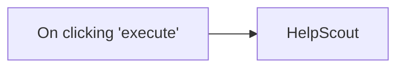

## Fluxo (.json) :

```json
{
  "nodes": [
    {
      "name": "On clicking 'execute'",
      "type": "n8n-nodes-base.manualTrigger",
      "position": [
        250,
        300
      ],
      "parameters": {},
      "typeVersion": 1
    },
    {
      "name": "HelpScout",
      "type": "n8n-nodes-base.helpScout",
      "position": [
        450,
        300
      ],
      "parameters": {
        "resource": "mailbox",
        "operation": "getAll"
      },
      "credentials": {
        "helpScoutOAuth2Api": "helpscout_creds"
      },
      "typeVersion": 1
    }
  ],
  "connections": {
    "On clicking 'execute'": {
      "main": [
        [
          {
            "node": "HelpScout",
            "type": "main",
            "index": 0
          }
        ]
      ]
    }
  }
}
```

<a id="template-821"></a>

## Template 821 - Recuperar todas as linhas do Excel

- **Nome:** Recuperar todas as linhas do Excel
- **Descrição:** Fluxo manual que, ao ser executado, conecta-se a uma conta Microsoft e obtém todas as linhas de uma planilha do Excel.
- **Funcionalidade:** • Início manual: aciona o fluxo quando o usuário clica em executar.
• Leitura completa da planilha: obtém todas as linhas/entradas de uma planilha do Microsoft Excel.
• Autenticação via OAuth2: utiliza credenciais Microsoft para permitir acesso seguro ao arquivo.
- **Ferramentas:** • Microsoft Excel: serviço de planilhas utilizado para armazenar os dados que serão lidos pelo fluxo.
• Conta Microsoft (OAuth2): fornece autenticação e autorização para acessar arquivos do Excel armazenados na conta (via API).


## Fluxo visual


## Fluxo (.json) :

```json
{
  "nodes": [
    {
      "name": "On clicking 'execute'",
      "type": "n8n-nodes-base.manualTrigger",
      "position": [
        250,
        300
      ],
      "parameters": {},
      "typeVersion": 1
    },
    {
      "name": "Microsoft Excel",
      "type": "n8n-nodes-base.microsoftExcel",
      "position": [
        450,
        300
      ],
      "parameters": {
        "filters": {},
        "operation": "getAll"
      },
      "credentials": {
        "microsoftExcelOAuth2Api": "ms-oauth-creds"
      },
      "typeVersion": 1
    }
  ],
  "connections": {
    "On clicking 'execute'": {
      "main": [
        [
          {
            "node": "Microsoft Excel",
            "type": "main",
            "index": 0
          }
        ]
      ]
    }
  }
}
```
