# PACK 1999 TEMPLATES PARTE 05 - Bloco 2

Templates neste bloco: 20

## Sumário

- [Template 822 - Validação de endereço postal (Keap)](#template-822)
- [Template 823 - Notificação diária de 'Show HN'](#template-823)
- [Template 824 - Execução manual de workflow](#template-824)
- [Template 825 - Ler e converter CSV local](#template-825)
- [Template 826 - Inserir e consultar dados no Google Sheets](#template-826)
- [Template 827 - Monitoramento de sentimento em issues do Linear](#template-827)
- [Template 828 - Assistente Airtable com OpenAI](#template-828)
- [Template 829 - Geração de palavras-chave com volumes mensais](#template-829)
- [Template 830 - Validação de e-mail e criação de Lead + Notificações](#template-830)
- [Template 831 - Pesquisa profunda com aprendizados e registro](#template-831)
- [Template 832 - Gerador de artigo de blog com pesquisa Perplexity](#template-832)
- [Template 833 - Converter página web em PDF](#template-833)
- [Template 834 - Listar sessões Stripe e filtrar custom_fields](#template-834)
- [Template 835 - Novo contato para Airtable](#template-835)
- [Template 836 - Sincronização periódica de workflows para Notion](#template-836)
- [Template 837 - Notificações de lançamentos do GitHub no Slack](#template-837)
- [Template 838 - Copiar line items de negócio ganho para novo negócio](#template-838)
- [Template 839 - Transcrição automatizada com registro em planilha](#template-839)
- [Template 840 - Criar, atualizar e obter issue no Taiga](#template-840)
- [Template 841 - Watermark central sobre Fundo](#template-841)

---

<a id="template-822"></a>

## Template 822 - Validação de endereço postal (Keap)

- **Nome:** Validação de endereço postal (Keap)
- **Descrição:** Automação que recebe endereços de contatos novos, valida a entregabilidade do endereço e atualiza o CRM indicando se o endereço é entregável.
- **Funcionalidade:** • Recebimento via webhook do CRM: Inicia a automação ao receber os campos do contato (nome, endereço, cidade, estado, CEP, etc.).
• Normalização dos campos de endereço: Mapeia e organiza os campos address, address2, city, state e zip para envio à verificação.
• Validação externa de endereço: Envia os dados para um serviço de verificação de endereços nos EUA para avaliar entregabilidade.
• Decisão baseada na resposta: Avalia o campo de entregabilidade e separa o fluxo em entregável ou não entregável.
• Atualização do CRM com resultado: Aplica tags ao contato indicando "Deliverable" ou "NOT Deliverable" para gatilhar ações internas.
• Ações pós-validação para não entregáveis: Permite acionar automações internas (p.ex. tarefa de revisão manual, contato com o cliente ou atualização de campo) quando o endereço não for entregável.
• Instruções de configuração: Inclui orientação para criar conta no serviço de verificação e adicionar a chave de API antes de ativar o fluxo.
- **Ferramentas:** • Keap: CRM usado para armazenar contatos, receber os dados via webhook, aplicar tags ao contato e iniciar automações internas.
• Lob: Serviço de verificação de endereços (API) usado para validar linhas de endereço nos EUA e determinar se o endereço é entregável.


## Fluxo visual

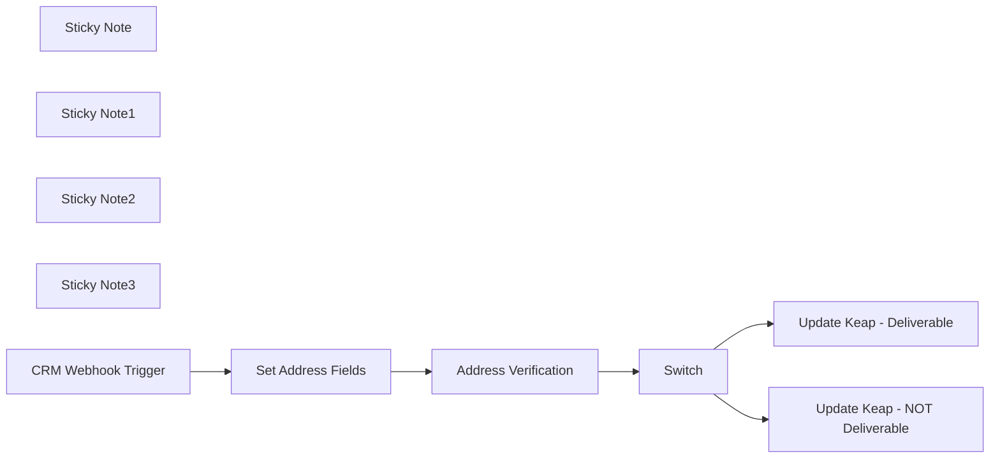

## Fluxo (.json) :

```json
{
  "meta": {
    "instanceId": "041bccf206a3546a759ec4c0a3bf1256e62051945bb270c48f91f3acb13dc080"
  },
  "nodes": [
    {
      "id": "82d5281b-a4a3-4407-859e-49cb16567b28",
      "name": "Sticky Note",
      "type": "n8n-nodes-base.stickyNote",
      "position": [
        340,
        -260
      ],
      "parameters": {
        "width": 747,
        "height": 428,
        "content": "## Purpose \nTo verify the mailing address for new contacts in Keap. \n\nWhenever I add a new contact to Keap, I run this automation to ensure I have a valid mailing address. It also helps me check for misspellings if the contact address was manually entered.\n\nQuick Video Overview:\n\nhttps://www.youtube.com/watch?v=YyIpQw5gyhk\n"
      },
      "typeVersion": 1
    },
    {
      "id": "78fbe4ae-e72b-4bf9-8387-0d126316b148",
      "name": "Sticky Note1",
      "type": "n8n-nodes-base.stickyNote",
      "position": [
        1480,
        -180
      ],
      "parameters": {
        "color": 5,
        "width": 515,
        "height": 763,
        "content": "Update Keap to indicate if the address is deliverable.\n\nPossible Options: \n- Add Tag\n- Add Note\n- Start Automation\n- Update a Field\n\nFor Deliverable Addresses - I apply a tag that the address was verified.\n\nFor Non Deliverable Addresses - I apply a tag, which triggers an automation for my team to manually verify the address. You could also trigger an automation to reach out to the contact to verify their address.\n\n"
      },
      "typeVersion": 1
    },
    {
      "id": "b6313993-fa07-463d-a77a-a3c273ebc2c5",
      "name": "Sticky Note2",
      "type": "n8n-nodes-base.stickyNote",
      "position": [
        520,
        200
      ],
      "parameters": {
        "color": 4,
        "height": 339,
        "content": "Receive a webhook from your CRM with the contact address fields"
      },
      "typeVersion": 1
    },
    {
      "id": "f79e9d7a-7ce9-49f3-bd0f-b827ce04b5e2",
      "name": "Set Address Fields",
      "type": "n8n-nodes-base.set",
      "position": [
        840,
        280
      ],
      "parameters": {
        "options": {},
        "assignments": {
          "assignments": [
            {
              "id": "8216105e-23ad-4c5c-8f4a-4f97658e0947",
              "name": "address",
              "type": "string",
              "value": "={{ $json.address }}"
            },
            {
              "id": "111da971-2473-4c5e-a106-22589cf47daf",
              "name": "address2",
              "type": "string",
              "value": "={{ $json.address2 }}"
            },
            {
              "id": "ed62cf39-10f1-42f6-b18f-bfa58b4fe646",
              "name": "city",
              "type": "string",
              "value": "={{ $json.city }}"
            },
            {
              "id": "d9550200-04ac-4cf4-b7e6-cd40b793ce97",
              "name": "state",
              "type": "string",
              "value": "={{ $json.state }}"
            },
            {
              "id": "62269d11-c98c-4016-83ef-291176f2fc12",
              "name": "zip",
              "type": "string",
              "value": "={{ $json.zip_code }}"
            }
          ]
        },
        "includeOtherFields": true
      },
      "typeVersion": 3.3
    },
    {
      "id": "61d0ba59-dff6-4357-b085-a6d129171060",
      "name": "Sticky Note3",
      "type": "n8n-nodes-base.stickyNote",
      "position": [
        1000,
        480
      ],
      "parameters": {
        "color": 3,
        "width": 430,
        "height": 216,
        "content": "1. Create an Account a https://www.lob.com/pricing\n2. Create API Key (https://help.lob.com/account-management/api-keys)\n3. Update Node with your Credentials (Basic Auth)"
      },
      "typeVersion": 1
    },
    {
      "id": "4275e2a4-60a9-447e-8d64-f0073b9abe6b",
      "name": "Address Verification",
      "type": "n8n-nodes-base.httpRequest",
      "position": [
        1060,
        280
      ],
      "parameters": {
        "url": "https://api.lob.com/v1/us_verifications",
        "method": "POST",
        "options": {},
        "sendBody": true,
        "bodyParameters": {
          "parameters": [
            {
              "name": "primary_line",
              "value": "={{ $json.address }}"
            },
            {
              "name": "secondary_line",
              "value": "={{ $json.address2 }}"
            },
            {
              "name": "city",
              "value": "={{ $json.city }}"
            },
            {
              "name": "state",
              "value": "={{ $json.state }}"
            },
            {
              "name": "zip_code",
              "value": "={{ $json.zip_code }}"
            }
          ]
        }
      },
      "typeVersion": 4.1
    },
    {
      "id": "89da689e-1f96-4aa6-9236-150dc087caf0",
      "name": "Update Keap - Deliverable",
      "type": "n8n-nodes-base.keap",
      "position": [
        1580,
        140
      ],
      "parameters": {
        "tagIds": "=Mailing Address Deliverable",
        "resource": "contactTag",
        "contactId": "={{ $('CRM Webhook Trigger').item.json.id }}"
      },
      "credentials": {
        "keapOAuth2Api": {
          "id": "5gXMihvp2f0IT5i1",
          "name": "Blank"
        }
      },
      "typeVersion": 1
    },
    {
      "id": "67ca486b-fc17-43e0-a2ae-757ab65422f7",
      "name": "Update Keap - NOT Deliverable",
      "type": "n8n-nodes-base.keap",
      "position": [
        1580,
        360
      ],
      "parameters": {
        "tagIds": "=Mailing Address NOT Deliverable",
        "resource": "contactTag",
        "contactId": "={{ $('CRM Webhook Trigger').item.json.id }}"
      },
      "credentials": {
        "keapOAuth2Api": {
          "id": "5gXMihvp2f0IT5i1",
          "name": "Blank"
        }
      },
      "typeVersion": 1
    },
    {
      "id": "bd2a2468-80d5-4a76-81b5-ea9cb181eb7a",
      "name": "CRM Webhook Trigger",
      "type": "n8n-nodes-base.webhook",
      "position": [
        600,
        280
      ],
      "webhookId": "fd51bba5-929d-4610-bd3f-a3032bcf16c3",
      "parameters": {
        "path": "727deb6f-9d10-4492-92e6-38f3292510b0",
        "options": {},
        "httpMethod": "POST"
      },
      "typeVersion": 1.1
    },
    {
      "id": "15221022-7eb3-40db-85b3-cf310e8bc2d2",
      "name": "Switch",
      "type": "n8n-nodes-base.switch",
      "position": [
        1280,
        280
      ],
      "parameters": {
        "rules": {
          "rules": [
            {
              "value2": "=deliverable",
              "outputKey": "deliverable"
            },
            {
              "value2": "deliverable",
              "operation": "notEqual",
              "outputKey": "NOT deliverable"
            }
          ]
        },
        "value1": "={{ $json.deliverability }}",
        "dataType": "string"
      },
      "typeVersion": 2
    }
  ],
  "pinData": {
    "CRM Webhook Trigger": [
      {
        "id": "5551212",
        "city": "Washington",
        "email": "mr.president@gmail.com",
        "phone": "877-555-1212",
        "state": "DC",
        "address": "1600 Pennsylvania Avenue NW",
        "zip_code": "20500"
      }
    ]
  },
  "connections": {
    "Switch": {
      "main": [
        [
          {
            "node": "Update Keap - Deliverable",
            "type": "main",
            "index": 0
          }
        ],
        [
          {
            "node": "Update Keap - NOT Deliverable",
            "type": "main",
            "index": 0
          }
        ]
      ]
    },
    "Set Address Fields": {
      "main": [
        [
          {
            "node": "Address Verification",
            "type": "main",
            "index": 0
          }
        ]
      ]
    },
    "CRM Webhook Trigger": {
      "main": [
        [
          {
            "node": "Set Address Fields",
            "type": "main",
            "index": 0
          }
        ]
      ]
    },
    "Address Verification": {
      "main": [
        [
          {
            "node": "Switch",
            "type": "main",
            "index": 0
          }
        ]
      ]
    }
  }
}
```

<a id="template-823"></a>

## Template 823 - Notificação diária de 'Show HN'

- **Nome:** Notificação diária de 'Show HN'
- **Descrição:** Envia um e-mail diário com os posts 'Show HN' que aparecem em alta no Hacker News.
- **Funcionalidade:** • Agendamento diário: Executa a rotina em horário definido (diariamente às 13h).
• Captura da página inicial: Faz requisição à página principal do Hacker News para obter o HTML mais recente.
• Extração de itens: Identifica e separa cada entrada de post na página para processamento individual.
• Coleta de dados do post: Extrai título, URL e posição (rank) de cada item listado.
• Filtragem por título: Seleciona apenas os posts cujo título contém "Show HN:".
• Montagem de corpo do e-mail: Agrupa os posts filtrados em um texto formatado com rank, título e link.
• Envio de e-mail: Envia o resumo dos posts filtrados para o destinatário configurado quando houver resultados.
- **Ferramentas:** • Hacker News (news.ycombinator.com): Fonte pública de posts e onde são consultados os itens 'Show HN'.
• Serviço de e-mail (SMTP ou provedor configurado): Responsável pelo envio das notificações por e-mail.

## Fluxo visual

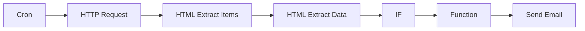

## Fluxo (.json) :

```json
{
  "nodes": [
    {
      "name": "IF",
      "type": "n8n-nodes-base.if",
      "position": [
        1050,
        500
      ],
      "parameters": {
        "conditions": {
          "string": [
            {
              "value1": "={{$node[\"HTML Extract Data\"].data[\"title\"]}}",
              "value2": "Show HN:",
              "operation": "contains"
            }
          ]
        }
      },
      "typeVersion": 1
    },
    {
      "name": "Send Email",
      "type": "n8n-nodes-base.emailSend",
      "position": [
        1450,
        400
      ],
      "parameters": {
        "text": "={{$node[\"Function\"].data[\"emailText\"]}}",
        "options": {},
        "subject": "Trending Show HN"
      },
      "typeVersion": 1
    },
    {
      "name": "Cron",
      "type": "n8n-nodes-base.cron",
      "position": [
        250,
        500
      ],
      "parameters": {
        "triggerTimes": {
          "item": [
            {
              "hour": 13
            }
          ]
        }
      },
      "typeVersion": 1
    },
    {
      "name": "Function",
      "type": "n8n-nodes-base.function",
      "position": [
        1250,
        400
      ],
      "parameters": {
        "functionCode": "let emailText = 'Currently trending \"Show HN\":\\n\\n';\n\nfor (let item of items) {\n  emailText += `${item.json.rank} ${item.json.title}\\n${item.json.url}\\n\\n`;\n}\n\nreturn [{json: {emailText}}]\n"
      },
      "typeVersion": 1
    },
    {
      "name": "HTTP Request",
      "type": "n8n-nodes-base.httpRequest",
      "position": [
        450,
        500
      ],
      "parameters": {
        "url": "https://news.ycombinator.com/",
        "options": {},
        "responseFormat": "string"
      },
      "typeVersion": 1
    },
    {
      "name": "HTML Extract Items",
      "type": "n8n-nodes-base.htmlExtract",
      "position": [
        650,
        500
      ],
      "parameters": {
        "options": {},
        "extractionValues": {
          "values": [
            {
              "key": "item",
              "cssSelector": "tr.athing",
              "returnArray": true,
              "returnValue": "html"
            }
          ]
        }
      },
      "typeVersion": 1
    },
    {
      "name": "HTML Extract Data",
      "type": "n8n-nodes-base.htmlExtract",
      "position": [
        850,
        500
      ],
      "parameters": {
        "options": {},
        "dataPropertyName": "item",
        "extractionValues": {
          "values": [
            {
              "key": "title",
              "cssSelector": "a"
            },
            {
              "key": "url",
              "attribute": "href",
              "cssSelector": "a.storylink",
              "returnValue": "attribute"
            },
            {
              "key": "rank",
              "cssSelector": ".rank"
            }
          ]
        }
      },
      "typeVersion": 1
    }
  ],
  "connections": {
    "IF": {
      "main": [
        [
          {
            "node": "Function",
            "type": "main",
            "index": 0
          }
        ]
      ]
    },
    "Cron": {
      "main": [
        [
          {
            "node": "HTTP Request",
            "type": "main",
            "index": 0
          }
        ]
      ]
    },
    "Function": {
      "main": [
        [
          {
            "node": "Send Email",
            "type": "main",
            "index": 0
          }
        ]
      ]
    },
    "HTTP Request": {
      "main": [
        [
          {
            "node": "HTML Extract Items",
            "type": "main",
            "index": 0
          }
        ]
      ]
    },
    "HTML Extract Data": {
      "main": [
        [
          {
            "node": "IF",
            "type": "main",
            "index": 0
          }
        ]
      ]
    },
    "HTML Extract Items": {
      "main": [
        [
          {
            "node": "HTML Extract Data",
            "type": "main",
            "index": 0
          }
        ]
      ]
    }
  }
}
```

<a id="template-824"></a>

## Template 824 - Execução manual de workflow

- **Nome:** Execução manual de workflow
- **Descrição:** Este fluxo permite iniciar manualmente a execução de outro fluxo identificado pelo ID 1.
- **Funcionalidade:** • Acionamento manual: Permite que um usuário inicie o fluxo clicando em executar.
• Encadeamento de workflows: Executa outro fluxo (ID 1), possibilitando modularidade e reutilização de automações.
- **Ferramentas:** • Nenhuma: Não utiliza ferramentas externas; apenas orquestra a execução de um fluxo interno.

## Fluxo visual

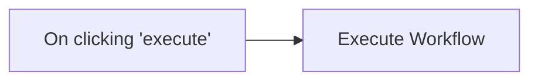

## Fluxo (.json) :

```json
{
  "nodes": [
    {
      "name": "On clicking 'execute'",
      "type": "n8n-nodes-base.manualTrigger",
      "position": [
        220,
        340
      ],
      "parameters": {},
      "typeVersion": 1
    },
    {
      "name": "Execute Workflow",
      "type": "n8n-nodes-base.executeWorkflow",
      "position": [
        410,
        340
      ],
      "parameters": {
        "workflowId": "1"
      },
      "typeVersion": 1
    }
  ],
  "connections": {
    "On clicking 'execute'": {
      "main": [
        [
          {
            "node": "Execute Workflow",
            "type": "main",
            "index": 0
          }
        ]
      ]
    }
  }
}
```

<a id="template-825"></a>

## Template 825 - Ler e converter CSV local

- **Nome:** Ler e converter CSV local
- **Descrição:** Fluxo iniciado manualmente que lê um arquivo CSV localizado no sistema e converte seu conteúdo para formato de planilha/tabular para processamento posterior.
- **Funcionalidade:** • Disparo manual: inicia o fluxo quando o usuário aciona a execução.
• Leitura de arquivo binário: acessa e lê o arquivo localizado em /data/sample_spreadsheet.csv.
• Conversão para planilha: transforma o conteúdo CSV binário em dados tabulares prontos para uso.
- **Ferramentas:** • Sistema de arquivos local: armazena e fornece acesso ao arquivo /data/sample_spreadsheet.csv.
• Arquivo CSV (sample_spreadsheet.csv): fonte de dados em formato CSV utilizada como entrada para o fluxo.

## Fluxo visual

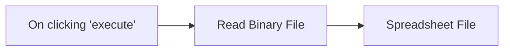

## Fluxo (.json) :

```json
{
  "nodes": [
    {
      "name": "On clicking 'execute'",
      "type": "n8n-nodes-base.manualTrigger",
      "position": [
        250,
        320
      ],
      "parameters": {},
      "typeVersion": 1
    },
    {
      "name": "Spreadsheet File",
      "type": "n8n-nodes-base.spreadsheetFile",
      "position": [
        650,
        320
      ],
      "parameters": {
        "options": {}
      },
      "typeVersion": 1
    },
    {
      "name": "Read Binary File",
      "type": "n8n-nodes-base.readBinaryFile",
      "position": [
        450,
        320
      ],
      "parameters": {
        "filePath": "/data/sample_spreadsheet.csv"
      },
      "typeVersion": 1
    }
  ],
  "connections": {
    "Read Binary File": {
      "main": [
        [
          {
            "node": "Spreadsheet File",
            "type": "main",
            "index": 0
          }
        ]
      ]
    },
    "On clicking 'execute'": {
      "main": [
        [
          {
            "node": "Read Binary File",
            "type": "main",
            "index": 0
          }
        ]
      ]
    }
  }
}
```

<a id="template-826"></a>

## Template 826 - Inserir e consultar dados no Google Sheets

- **Nome:** Inserir e consultar dados no Google Sheets
- **Descrição:** Fluxo acionado manualmente que prepara dados e os envia para uma planilha do Google, seguido por uma operação adicional na mesma planilha.
- **Funcionalidade:** • Disparo manual: Inicia o fluxo quando o usuário clica em executar.
• Preparação de dados: Define campos a serem enviados (por exemplo, id e name).
• Inserção na planilha: Anexa os dados preparados à faixa A:B da planilha especificada.
• Operação subsequente na planilha: Executa uma ação adicional na mesma planilha (por exemplo, leitura ou validação após o append).
- **Ferramentas:** • Google Sheets: Serviço de planilhas online usado para armazenar e recuperar linhas de dados.

## Fluxo visual

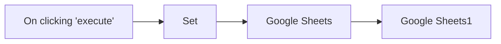

## Fluxo (.json) :

```json
{
  "nodes": [
    {
      "name": "On clicking 'execute'",
      "type": "n8n-nodes-base.manualTrigger",
      "position": [
        250,
        300
      ],
      "parameters": {},
      "typeVersion": 1
    },
    {
      "name": "Google Sheets",
      "type": "n8n-nodes-base.googleSheets",
      "position": [
        650,
        300
      ],
      "parameters": {
        "range": "A:B",
        "options": {},
        "sheetId": "1ijnLMy6htVTX_68e2lsdGYiA5_6ZG72FXUbxAy_DC94",
        "operation": "append",
        "authentication": "oAuth2"
      },
      "credentials": {
        "googleSheetsOAuth2Api": "Amudhan-GoogleSheets"
      },
      "typeVersion": 1
    },
    {
      "name": "Set",
      "type": "n8n-nodes-base.set",
      "position": [
        450,
        300
      ],
      "parameters": {
        "values": {
          "number": [
            {
              "name": "id"
            }
          ],
          "string": [
            {
              "name": "name",
              "value": "n8n"
            }
          ]
        },
        "options": {}
      },
      "typeVersion": 1,
      "alwaysOutputData": true
    },
    {
      "name": "Google Sheets1",
      "type": "n8n-nodes-base.googleSheets",
      "position": [
        850,
        300
      ],
      "parameters": {
        "range": "A:B",
        "options": {},
        "sheetId": "1ijnLMy6htVTX_68e2lsdGYiA5_6ZG72FXUbxAy_DC94",
        "authentication": "oAuth2"
      },
      "credentials": {
        "googleSheetsOAuth2Api": "Amudhan-GoogleSheets"
      },
      "typeVersion": 1
    }
  ],
  "connections": {
    "Set": {
      "main": [
        [
          {
            "node": "Google Sheets",
            "type": "main",
            "index": 0
          }
        ]
      ]
    },
    "Google Sheets": {
      "main": [
        [
          {
            "node": "Google Sheets1",
            "type": "main",
            "index": 0
          }
        ]
      ]
    },
    "On clicking 'execute'": {
      "main": [
        [
          {
            "node": "Set",
            "type": "main",
            "index": 0
          }
        ]
      ]
    }
  }
}
```

<a id="template-827"></a>

## Template 827 - Monitoramento de sentimento em issues do Linear

- **Nome:** Monitoramento de sentimento em issues do Linear
- **Descrição:** Monitora issues atualizadas no Linear, realiza análise de sentimento das conversas, armazena os resultados em uma base de dados e notifica a equipe quando o sentimento transita para negativo.
- **Funcionalidade:** • Monitoramento contínuo de issues atualizadas: Busca issues atualizadas recentemente para analisar mudanças na conversa.
• Extração de sentimento das conversas: Analisa os comentários de cada issue para determinar sentimento (positivo, negativo ou neutro) e gerar um resumo.
• Consolidação de dados da issue com análise: Combina o resultado da análise com os dados da issue (título, responsável, timestamps) para armazenamento.
• Armazenamento e atualização incremental: Cria ou atualiza registros em uma base de dados, movendo o valor anterior de sentimento para uma coluna de "Previous Sentiment" e salvando o novo como "Current Sentiment".
• Detecção de transição de sentimento: Identifica quando uma issue muda de um estado não-negativo para negativo.
• Notificações para equipe: Envia mensagens formatadas à equipe quando ocorre uma transição para sentimento negativo.
• Evita notificações duplicadas: Remove notificações repetidas combinando identificador da issue e data de modificação para evitar repetição de alertas.
- **Ferramentas:** • Linear: Fonte das issues e comentários via API GraphQL para obter dados atualizados das conversas.
• OpenAI: Serviço de linguagem para realizar a análise e sumarização de sentimento das mensagens.
• Airtable: Base de dados para armazenar e versionar os estados de sentimento e metadados das issues.
• Slack: Canal de comunicação para enviar notificações e alertas formatados para a equipe.

## Fluxo visual

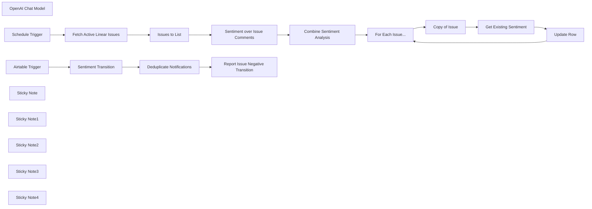

## Fluxo (.json) :

```json
{
  "nodes": [
    {
      "id": "82fd6023-2cc3-416e-83b7-fda24d07d77a",
      "name": "Issues to List",
      "type": "n8n-nodes-base.splitOut",
      "position": [
        40,
        -100
      ],
      "parameters": {
        "options": {},
        "fieldToSplitOut": "data.issues.nodes"
      },
      "typeVersion": 1
    },
    {
      "id": "9cc77786-e14f-47c6-a3cf-60c2830612e6",
      "name": "OpenAI Chat Model",
      "type": "@n8n/n8n-nodes-langchain.lmChatOpenAi",
      "position": [
        360,
        80
      ],
      "parameters": {
        "options": {}
      },
      "credentials": {
        "openAiApi": {
          "id": "8gccIjcuf3gvaoEr",
          "name": "OpenAi account"
        }
      },
      "typeVersion": 1
    },
    {
      "id": "821d4a60-81a4-4915-9c13-3d978cc0114b",
      "name": "Combine Sentiment Analysis",
      "type": "n8n-nodes-base.set",
      "position": [
        700,
        -80
      ],
      "parameters": {
        "mode": "raw",
        "options": {},
        "jsonOutput": "={{\n{\n ...$('Issues to List').item.json,\n ...$json.output\n}\n}}"
      },
      "typeVersion": 3.4
    },
    {
      "id": "fe6560f6-2e1b-4442-a2af-bd5a1623f213",
      "name": "Sentiment over Issue Comments",
      "type": "@n8n/n8n-nodes-langchain.informationExtractor",
      "position": [
        360,
        -80
      ],
      "parameters": {
        "text": "={{\n$json.comments.nodes.map(node => [\n `${node.user.displayName} commented on ${node.createdAt}:`,\n node.body\n].join('\\n')).join('---\\n')\n}}",
        "options": {},
        "attributes": {
          "attributes": [
            {
              "name": "sentiment",
              "required": true,
              "description": "One of positive, negative or neutral"
            },
            {
              "name": "sentimentSummary",
              "description": "Describe the sentiment of the conversation"
            }
          ]
        }
      },
      "typeVersion": 1
    },
    {
      "id": "4fd0345d-e5bf-426d-8403-e2217e19bbea",
      "name": "Copy of Issue",
      "type": "n8n-nodes-base.set",
      "position": [
        1200,
        -60
      ],
      "parameters": {
        "mode": "raw",
        "options": {},
        "jsonOutput": "={{ $json }}"
      },
      "typeVersion": 3.4
    },
    {
      "id": "6d103d67-451e-4780-8f52-f4dba4b42860",
      "name": "For Each Issue...",
      "type": "n8n-nodes-base.splitInBatches",
      "position": [
        1020,
        -60
      ],
      "parameters": {
        "options": {}
      },
      "typeVersion": 3
    },
    {
      "id": "032702d9-27d8-4735-b978-20b55bc1a74f",
      "name": "Get Existing Sentiment",
      "type": "n8n-nodes-base.airtable",
      "position": [
        1380,
        -60
      ],
      "parameters": {
        "base": {
          "__rl": true,
          "mode": "list",
          "value": "appViDaeaFw4qv9La",
          "cachedResultUrl": "https://airtable.com/appViDaeaFw4qv9La",
          "cachedResultName": "Sentiment Analysis over Issue Comments"
        },
        "table": {
          "__rl": true,
          "mode": "list",
          "value": "tblhO0sfRhKP6ibS8",
          "cachedResultUrl": "https://airtable.com/appViDaeaFw4qv9La/tblhO0sfRhKP6ibS8",
          "cachedResultName": "Table 1"
        },
        "options": {
          "fields": [
            "Issue ID",
            "Current Sentiment"
          ]
        },
        "operation": "search",
        "filterByFormula": "={Issue ID} = '{{ $json.identifier || 'XYZ' }}'"
      },
      "credentials": {
        "airtableTokenApi": {
          "id": "Und0frCQ6SNVX3VV",
          "name": "Airtable Personal Access Token account"
        }
      },
      "typeVersion": 2.1,
      "alwaysOutputData": true
    },
    {
      "id": "f2ded6fa-8b0f-4a34-868c-13c19f725c98",
      "name": "Update Row",
      "type": "n8n-nodes-base.airtable",
      "position": [
        1560,
        -60
      ],
      "parameters": {
        "base": {
          "__rl": true,
          "mode": "list",
          "value": "appViDaeaFw4qv9La",
          "cachedResultUrl": "https://airtable.com/appViDaeaFw4qv9La",
          "cachedResultName": "Sentiment Analysis over Issue Comments"
        },
        "table": {
          "__rl": true,
          "mode": "list",
          "value": "tblhO0sfRhKP6ibS8",
          "cachedResultUrl": "https://airtable.com/appViDaeaFw4qv9La/tblhO0sfRhKP6ibS8",
          "cachedResultName": "Table 1"
        },
        "columns": {
          "value": {
            "Summary": "={{ $('Copy of Issue').item.json.sentimentSummary || '' }}",
            "Assigned": "={{ $('Copy of Issue').item.json.assignee.name }}",
            "Issue ID": "={{ $('Copy of Issue').item.json.identifier }}",
            "Issue Title": "={{ $('Copy of Issue').item.json.title }}",
            "Issue Created": "={{ $('Copy of Issue').item.json.createdAt }}",
            "Issue Updated": "={{ $('Copy of Issue').item.json.updatedAt }}",
            "Current Sentiment": "={{ $('Copy of Issue').item.json.sentiment.toSentenceCase() }}",
            "Previous Sentiment": "={{ !$json.isEmpty() ? $json['Current Sentiment'] : 'N/A' }}"
          },
          "schema": [
            {
              "id": "id",
              "type": "string",
              "display": true,
              "removed": true,
              "readOnly": true,
              "required": false,
              "displayName": "id",
              "defaultMatch": true
            },
            {
              "id": "Issue ID",
              "type": "string",
              "display": true,
              "removed": false,
              "readOnly": false,
              "required": false,
              "displayName": "Issue ID",
              "defaultMatch": false,
              "canBeUsedToMatch": true
            },
            {
              "id": "Previous Sentiment",
              "type": "options",
              "display": true,
              "options": [
                {
                  "name": "Positive",
                  "value": "Positive"
                },
                {
                  "name": "Negative",
                  "value": "Negative"
                },
                {
                  "name": "Neutral",
                  "value": "Neutral"
                },
                {
                  "name": "N/A",
                  "value": "N/A"
                }
              ],
              "removed": false,
              "readOnly": false,
              "required": false,
              "displayName": "Previous Sentiment",
              "defaultMatch": false,
              "canBeUsedToMatch": true
            },
            {
              "id": "Current Sentiment",
              "type": "options",
              "display": true,
              "options": [
                {
                  "name": "Positive",
                  "value": "Positive"
                },
                {
                  "name": "Negative",
                  "value": "Negative"
                },
                {
                  "name": "Neutral",
                  "value": "Neutral"
                },
                {
                  "name": "N/A",
                  "value": "N/A"
                }
              ],
              "removed": false,
              "readOnly": false,
              "required": false,
              "displayName": "Current Sentiment",
              "defaultMatch": false,
              "canBeUsedToMatch": true
            },
            {
              "id": "Summary",
              "type": "string",
              "display": true,
              "removed": false,
              "readOnly": false,
              "required": false,
              "displayName": "Summary",
              "defaultMatch": false,
              "canBeUsedToMatch": true
            },
            {
              "id": "Issue Title",
              "type": "string",
              "display": true,
              "removed": false,
              "readOnly": false,
              "required": false,
              "displayName": "Issue Title",
              "defaultMatch": false,
              "canBeUsedToMatch": true
            },
            {
              "id": "Issue Created",
              "type": "dateTime",
              "display": true,
              "removed": false,
              "readOnly": false,
              "required": false,
              "displayName": "Issue Created",
              "defaultMatch": false,
              "canBeUsedToMatch": true
            },
            {
              "id": "Issue Updated",
              "type": "dateTime",
              "display": true,
              "removed": false,
              "readOnly": false,
              "required": false,
              "displayName": "Issue Updated",
              "defaultMatch": false,
              "canBeUsedToMatch": true
            },
            {
              "id": "Assigned",
              "type": "string",
              "display": true,
              "removed": false,
              "readOnly": false,
              "required": false,
              "displayName": "Assigned",
              "defaultMatch": false,
              "canBeUsedToMatch": true
            },
            {
              "id": "Created",
              "type": "string",
              "display": true,
              "removed": true,
              "readOnly": true,
              "required": false,
              "displayName": "Created",
              "defaultMatch": false,
              "canBeUsedToMatch": true
            },
            {
              "id": "Last Modified",
              "type": "string",
              "display": true,
              "removed": true,
              "readOnly": true,
              "required": false,
              "displayName": "Last Modified",
              "defaultMatch": false,
              "canBeUsedToMatch": true
            }
          ],
          "mappingMode": "defineBelow",
          "matchingColumns": [
            "Issue ID"
          ]
        },
        "options": {},
        "operation": "upsert"
      },
      "credentials": {
        "airtableTokenApi": {
          "id": "Und0frCQ6SNVX3VV",
          "name": "Airtable Personal Access Token account"
        }
      },
      "typeVersion": 2.1
    },
    {
      "id": "e6fb0b8f-2469-4b66-b9e2-f4f3c0a613af",
      "name": "Airtable Trigger",
      "type": "n8n-nodes-base.airtableTrigger",
      "position": [
        1900,
        -40
      ],
      "parameters": {
        "baseId": {
          "__rl": true,
          "mode": "id",
          "value": "appViDaeaFw4qv9La"
        },
        "tableId": {
          "__rl": true,
          "mode": "id",
          "value": "tblhO0sfRhKP6ibS8"
        },
        "pollTimes": {
          "item": [
            {
              "mode": "everyHour"
            }
          ]
        },
        "triggerField": "Current Sentiment",
        "authentication": "airtableTokenApi",
        "additionalFields": {}
      },
      "credentials": {
        "airtableTokenApi": {
          "id": "Und0frCQ6SNVX3VV",
          "name": "Airtable Personal Access Token account"
        }
      },
      "typeVersion": 1
    },
    {
      "id": "669762c4-860b-43ad-b677-72d4564e1c29",
      "name": "Sentiment Transition",
      "type": "n8n-nodes-base.switch",
      "position": [
        2080,
        -40
      ],
      "parameters": {
        "rules": {
          "values": [
            {
              "outputKey": "NON-NEGATIVE to NEGATIVE",
              "conditions": {
                "options": {
                  "version": 2,
                  "leftValue": "",
                  "caseSensitive": true,
                  "typeValidation": "strict"
                },
                "combinator": "and",
                "conditions": [
                  {
                    "operator": {
                      "type": "boolean",
                      "operation": "true",
                      "singleValue": true
                    },
                    "leftValue": "={{ $json.fields[\"Previous Sentiment\"] !== 'Negative' && $json.fields[\"Current Sentiment\"] === 'Negative' }}",
                    "rightValue": ""
                  }
                ]
              },
              "renameOutput": true
            }
          ]
        },
        "options": {
          "fallbackOutput": "none"
        }
      },
      "typeVersion": 3.2
    },
    {
      "id": "2fbcfbea-3989-459b-8ca7-b65c130a479b",
      "name": "Fetch Active Linear Issues",
      "type": "n8n-nodes-base.graphql",
      "position": [
        -140,
        -100
      ],
      "parameters": {
        "query": "=query (\n $filter: IssueFilter\n) {\n issues(\n filter: $filter\n ) {\n nodes {\n id\n identifier\n title\n description\n url\n createdAt\n updatedAt\n assignee {\n name\n }\n comments {\n nodes {\n id\n createdAt\n user {\n displayName\n }\n body\n }\n }\n }\n }\n}",
        "endpoint": "https://api.linear.app/graphql",
        "variables": "={{\n{\n \"filter\": {\n updatedAt: { gte: $now.minus(30, 'minutes').toISO() }\n }\n}\n}}",
        "requestFormat": "json",
        "authentication": "headerAuth"
      },
      "credentials": {
        "httpHeaderAuth": {
          "id": "XME2Ubkuy9hpPEM5",
          "name": "Linear.app (heightio)"
        }
      },
      "typeVersion": 1
    },
    {
      "id": "aaf1c25e-c398-4715-88bf-bd98daafc10f",
      "name": "Schedule Trigger",
      "type": "n8n-nodes-base.scheduleTrigger",
      "position": [
        -340,
        -100
      ],
      "parameters": {
        "rule": {
          "interval": [
            {
              "field": "minutes",
              "minutesInterval": 30
            }
          ]
        }
      },
      "typeVersion": 1.2
    },
    {
      "id": "b3e2df39-90ce-4ebf-aa68-05499965ec30",
      "name": "Deduplicate Notifications",
      "type": "n8n-nodes-base.removeDuplicates",
      "position": [
        2280,
        -40
      ],
      "parameters": {
        "options": {},
        "operation": "removeItemsSeenInPreviousExecutions",
        "dedupeValue": "={{ $json.fields[\"Issue ID\"] }}:{{ $json.fields['Last Modified'] }}"
      },
      "typeVersion": 2
    },
    {
      "id": "2a116475-32cd-4c9d-bfc1-3bd494f79a49",
      "name": "Report Issue Negative Transition",
      "type": "n8n-nodes-base.slack",
      "position": [
        2480,
        -40
      ],
      "webhookId": "612f1001-3fcc-480b-a835-05f9e2d56a5f",
      "parameters": {
        "text": "={{ $('Deduplicate Notifications').all().length }} Issues have transitions to Negative Sentiment",
        "select": "channel",
        "blocksUi": "={{\n{\n \"blocks\": [\n {\n \"type\": \"section\",\n \"text\": {\n \"type\": \"mrkdwn\",\n \"text\": \":rotating_light: The following Issues transitioned to Negative Sentiment\"\n }\n },\n {\n \"type\": \"divider\"\n },\n ...($('Deduplicate Notifications').all().map(item => (\n {\n \"type\": \"section\",\n \"text\": {\n \"type\": \"mrkdwn\",\n \"text\": `*<https://linear.app/myOrg/issue/${$json.fields['Issue ID']}|${$json.fields['Issue ID']} ${$json.fields['Issue Title']}>*\\n${$json.fields.Summary}`\n }\n }\n )))\n ]\n}\n}}",
        "channelId": {
          "__rl": true,
          "mode": "list",
          "value": "C0749JVFERK",
          "cachedResultName": "n8n-tickets"
        },
        "messageType": "block",
        "otherOptions": {}
      },
      "credentials": {
        "slackApi": {
          "id": "VfK3js0YdqBdQLGP",
          "name": "Slack account"
        }
      },
      "executeOnce": true,
      "typeVersion": 2.3
    },
    {
      "id": "1f3d30b6-de31-45a8-a872-554c339f112f",
      "name": "Sticky Note",
      "type": "n8n-nodes-base.stickyNote",
      "position": [
        -420,
        -320
      ],
      "parameters": {
        "color": 7,
        "width": 660,
        "height": 440,
        "content": "## 1. Continuously Monitor Active Linear Issues\n[Learn more about the GraphQL node](https://docs.n8n.io/integrations/builtin/core-nodes/n8n-nodes-base.graphql)\n\nTo keep up with the latest changes in our active Linear tickets, we'll need to use Linear's GraphQL endpoint because filtering is currently unavailable in the official Linear.app node.\n\nFor this demonstration, we'll check for updated tickets every 30mins."
      },
      "typeVersion": 1
    },
    {
      "id": "9024512d-5cb9-4e9f-b6e1-495d1a32118a",
      "name": "Sticky Note1",
      "type": "n8n-nodes-base.stickyNote",
      "position": [
        260,
        -320
      ],
      "parameters": {
        "color": 7,
        "width": 640,
        "height": 560,
        "content": "## 2. Sentiment Analysis on Current Issue Activity\n[Learn more about the Information Extractor node](https://docs.n8n.io/integrations/builtin/cluster-nodes/root-nodes/n8n-nodes-langchain.information-extractor)\n\nWith our recently updated posts, we can use our AI to perform a quick sentiment analysis on the ongoing conversation to check the overall mood of the support issue. This is a great way to check how things are generally going in the support queue; positive should be normal but negative could indicate some uncomfortableness or even frustration."
      },
      "typeVersion": 1
    },
    {
      "id": "233ebd6d-38cb-4f2d-84b5-29c97d30d77b",
      "name": "Sticky Note2",
      "type": "n8n-nodes-base.stickyNote",
      "position": [
        920,
        -320
      ],
      "parameters": {
        "color": 7,
        "width": 840,
        "height": 560,
        "content": "## 3. Capture and Track Results in Airtable\n[Learn more about the Airtable node](https://docs.n8n.io/integrations/builtin/app-nodes/n8n-nodes-base.airtable)\n\nNext, we can capture this analysis in our insights database as means for human review. When the issue is new, we can create a new row but if the issue exists, we will update it's existing row instead.\n\nWhen updating an existing row, we move its previous \"current sentiment\" value into the \"previous sentiment\" column and replace with our new current sentiment. This gives us a \"sentiment transition\" which will be useful in the next step.\n\nCheck out the Airtable here: https://airtable.com/appViDaeaFw4qv9La/shrq6HgeYzpW6uwXL"
      },
      "typeVersion": 1
    },
    {
      "id": "a2229225-b580-43cb-b234-4f69cb5924fd",
      "name": "Sticky Note3",
      "type": "n8n-nodes-base.stickyNote",
      "position": [
        1800,
        -320
      ],
      "parameters": {
        "color": 7,
        "width": 920,
        "height": 560,
        "content": "## 4. Get Notified when Sentiment becomes Negative\n[Learn more about the Slack node](https://docs.n8n.io/integrations/builtin/app-nodes/n8n-nodes-base.slack/)\n\nA good use-case for tracking sentiment transitions could be to be alerted if ever an issue moves from a non-negative sentiment to a negative one. This could be a signal of issue handling troubles which may require attention before it escalates.\n\nIn this demonstration, we use the Airtable trigger to catch rows which have their sentiment column updated and check for the non-negative-to-negative sentiment transition using the switch node. For those matching rows, we combine add send a notification via slack. A cool trick is to use the \"remove duplication\" node to prevent repeat notifications for the same updates - here we combine the Linear issue key and the row's last modified date."
      },
      "typeVersion": 1
    },
    {
      "id": "6f26769e-ec5d-46d0-ae0a-34148b24e6a2",
      "name": "Sticky Note4",
      "type": "n8n-nodes-base.stickyNote",
      "position": [
        -940,
        -720
      ],
      "parameters": {
        "width": 480,
        "height": 840,
        "content": "## Try It Out!\n### This n8n template performs continous monitoring on Linear Issue conversations performing sentiment analysis and alerting when the sentiment becomes negative.\nThis is helpful to quickly identify difficult customer support situations early and prioritising them before they get out of hand.\n\n## How it works\n* A scheduled trigger is used to fetch recently updated issues in Linear using the GraphQL node.\n* Each issue's comments thread is passed into a simple Information Extractor node to identify the overall sentiment.\n* The resulting sentiment analysis combined with the some issue details are uploaded to Airtable for review.\n* When the template is re-run at a later date, each issue is re-analysed for sentiment\n* Each issue's new sentiment state is saved to the airtable whilst its previous state is moved to the \"previous sentiment\" column.\n* An Airtable trigger is used to watch for recently updated rows\n* Each matching Airtable row is filtered to check if it has a previous non-negative state but now has a negative state in its current sentiment.\n* The results are sent via notification to a team slack channel for priority.\n\n**Check out the sample Airtable here**: https://airtable.com/appViDaeaFw4qv9La/shrq6HgeYzpW6uwXL\n\n## How to use\n* Modify the GraphQL filter to fetch issues to a relevant issue type, team or person.\n* Update the Slack channel to ensure messages are sent to the correct location.\n\n### Need Help?\nJoin the [Discord](https://discord.com/invite/XPKeKXeB7d) or ask in the [Forum](https://community.n8n.io/)!\n\nHappy Hacking!"
      },
      "typeVersion": 1
    }
  ],
  "pinData": {},
  "connections": {
    "Update Row": {
      "main": [
        [
          {
            "node": "For Each Issue...",
            "type": "main",
            "index": 0
          }
        ]
      ]
    },
    "Copy of Issue": {
      "main": [
        [
          {
            "node": "Get Existing Sentiment",
            "type": "main",
            "index": 0
          }
        ]
      ]
    },
    "Issues to List": {
      "main": [
        [
          {
            "node": "Sentiment over Issue Comments",
            "type": "main",
            "index": 0
          }
        ]
      ]
    },
    "Airtable Trigger": {
      "main": [
        [
          {
            "node": "Sentiment Transition",
            "type": "main",
            "index": 0
          }
        ]
      ]
    },
    "Schedule Trigger": {
      "main": [
        [
          {
            "node": "Fetch Active Linear Issues",
            "type": "main",
            "index": 0
          }
        ]
      ]
    },
    "For Each Issue...": {
      "main": [
        [],
        [
          {
            "node": "Copy of Issue",
            "type": "main",
            "index": 0
          }
        ]
      ]
    },
    "OpenAI Chat Model": {
      "ai_languageModel": [
        [
          {
            "node": "Sentiment over Issue Comments",
            "type": "ai_languageModel",
            "index": 0
          }
        ]
      ]
    },
    "Sentiment Transition": {
      "main": [
        [
          {
            "node": "Deduplicate Notifications",
            "type": "main",
            "index": 0
          }
        ]
      ]
    },
    "Get Existing Sentiment": {
      "main": [
        [
          {
            "node": "Update Row",
            "type": "main",
            "index": 0
          }
        ]
      ]
    },
    "Deduplicate Notifications": {
      "main": [
        [
          {
            "node": "Report Issue Negative Transition",
            "type": "main",
            "index": 0
          }
        ]
      ]
    },
    "Combine Sentiment Analysis": {
      "main": [
        [
          {
            "node": "For Each Issue...",
            "type": "main",
            "index": 0
          }
        ]
      ]
    },
    "Fetch Active Linear Issues": {
      "main": [
        [
          {
            "node": "Issues to List",
            "type": "main",
            "index": 0
          }
        ]
      ]
    },
    "Sentiment over Issue Comments": {
      "main": [
        [
          {
            "node": "Combine Sentiment Analysis",
            "type": "main",
            "index": 0
          }
        ]
      ]
    }
  }
}
```

<a id="template-828"></a>

## Template 828 - Assistente Airtable com OpenAI

- **Nome:** Assistente Airtable com OpenAI
- **Descrição:** Fluxo que recebe solicitações de usuários, gerencia credenciais e fluxos, consulta esquemas e dados em bases Airtable e utiliza o OpenAI para gerar respostas e mensagens, coordenando ações entre bases e ferramentas.
- **Funcionalidade:** • Detecção e processamento de pedidos: inicia a automação ao receber a mensagem do usuário e planeja as ações. 
• Organização de fluxos: separa partes do fluxo em fluxos diferentes para manter clareza e evitar conflitos. 
• Atualização de credenciais: substitui conexões e credenciais em todos os nós para manter o acesso atualizado. 
• Interação com o usuário: faz perguntas para esclarecer solicitações e evitar erros. 
• Validação de base e tabelas: verifica IDs corretos de base e tabela antes de consultas. 
• Obtenção de esquema da base: busca o esquema de tabelas de uma base específica. 
• Busca de registros com filtros: tenta localizar registros com filtros; se não houver resultados, realiza busca sem filtro. 
• Agregação e visualização de dados: usa código para agregação (contar, somar, média) e gera gráficos/imagens. 
• Referência de origem de dados: sempre informa o nome da Base e Tabela de onde os registros foram obtidos.
- **Ferramentas:** • Airtable: Base de dados e plataformas de tabelas utilizadas para armazenar, consultar e obter esquemas. 
• OpenAI API: Serviço para gerar respostas, mensagens e interagir com o usuário por meio de chat.

## Fluxo (.json) :

```json
{
  "\"id\"": "\"vBLHyjEnMK9EaWwQ\",",
  "\"If1\"": "{",
  "\"url\"": "\"https://api.openai.com/v1/threads\",",
  "\"__rl\"": "true,",
  "\"base\"": "{",
  "\"main\"": "[",
  "\"mode\"": "\"id\",",
  "\"name\"": "\"Mark OpenAi \"",
  "\"node\"": "\"Merge\",",
  "\"text\"": "\"={{ $('When chat message received').item.json.chatInput }}\",",
  "\"type\"": "\"main\",",
  "\"Merge\"": "{",
  "\"agent\"": "\"openAiFunctionsAgent\",",
  "\"color\"": "7,",
  "\"index\"": "1",
  "\"nodes\"": "[",
  "\"rules\"": "{",
  "\"value\"": "\"assistants=v2\"",
  "\"width\"": "280,",
  "\"Switch\"": "{",
  "\"fields\"": "{",
  "\"height\"": "346,",
  "\"jsCode\"": "\"// Example: convert the incoming query to uppercase and return it\\n\\nreturn `https://api.mapbox.com/styles/v1/mapbox/streets-v12/static/${query.markers}/-96.9749,41.8219,3.31,0/800x500?before_layer=admin-0-boundary&access_token=<your_public_key>`;\",",
  "\"method\"": "\"POST\",",
  "\"values\"": "[",
  "\"ai_tool\"": "[",
  "\"content\"": "\"### Set up steps\\n\\n1. **Separate workflows**:\\n\\t- Create additional workflow and move there Workflow 2.\\n\\n2. **Replace credentials**:\\n\\t- Replace connections and credentials in all nodes.\\n\\n3. **Start chat**:\\n\\t- Ask questions and don't forget to mention required base name.\"",
  "\"onError\"": "\"continueRegularOutput\",",
  "\"options\"": "{},",
  "\"pinData\"": "{},",
  "\"version\"": "2,",
  "\"jsonBody\"": "\"={\\n \\\"model\\\": \\\"gpt-4o-mini\\\",\\n \\\"messages\\\": [\\n {\\n \\\"role\\\": \\\"system\\\",\\n \\\"content\\\": {{ JSON.stringify($('Set schema and prompt').item.json.prompt) }}\\n },\\n {\\n \\\"role\\\": \\\"user\\\",\\n \\\"content\\\": \\\"{{ $('Execute Workflow Trigger').item.json.query.filter_desc }}\\\"\\n }],\\n \\\"response_format\\\":{ \\\"type\\\": \\\"json_schema\\\", \\\"json_schema\\\": {{ $('Set schema and prompt').item.json.schema }}\\n\\n }\\n }\",",
  "\"operator\"": "{",
  "\"position\"": "[",
  "\"resource\"": "\"base\",",
  "\"sendBody\"": "true,",
  "\"Aggregate\"": "{",
  "\"Get Bases\"": "{",
  "\"aggregate\"": "\"aggregateAllItemData\"",
  "\"ai_memory\"": "[",
  "\"leftValue\"": "\"={{ $('Execute Workflow Trigger').item.json.query.filter_desc }}\",",
  "\"openAiApi\"": "{",
  "\"operation\"": "\"notExists\",",
  "\"outputKey\"": "\"code\",",
  "\"webhookId\"": "\"abf9ab75-eaca-4b91-b3ba-c0f83d3daba4\",",
  "\"Aggregate1\"": "{",
  "\"Aggregate2\"": "{",
  "\"combinator\"": "\"and\",",
  "\"conditions\"": "[",
  "\"mergeLists\"": "true",
  "\"pagination\"": "{",
  "\"parameters\"": "[",
  "\"promptType\"": "\"define\"",
  "\"rightValue\"": "\"\"",
  "\"schemaType\"": "\"manual\",",
  "\"sessionKey\"": "\"={{ $('When chat message received').item.json.sessionId }}\",",
  "\"workflowId\"": "{",
  "\"assignments\"": "[",
  "\"connections\"": "{",
  "\"contentType\"": "\"multipart-form-data\",",
  "\"credentials\"": "{",
  "\"description\"": "\"Fetches the schema of tables in a specific base by id.\\n\\nInput:\\nbase_id: appHwXgLVrBujox4J\\n\\nOutput:\\ntable 1: field 1 - type string, fields 2 - type number\",",
  "\"inputSchema\"": "\"{\\n \\\"type\\\": \\\"object\\\",\\n \\\"properties\\\": {\\n \\\"base_id\\\": {\\n \\\"type\\\": \\\"string\\\",\\n \\\"description\\\": \\\"ID of the base to retrieve the schema for. Format - appHwXgLVrBujox4J\\\"\\n }\\n },\\n \\\"required\\\": [\\\"base_id\\\"]\\n}\",",
  "\"sendHeaders\"": "true,",
  "\"singleValue\"": "true",
  "\"specifyBody\"": "\"json\",",
  "\"stringValue\"": "\"get_base_tables_schema\"",
  "\"typeVersion\"": "4.2",
  "\"renameOutput\"": "true",
  "\"caseSensitive\"": "true,",
  "\"httpQueryAuth\"": "{",
  "\"maxIterations\"": "10,",
  "\"parameterType\"": "\"formBinaryData\",",
  "\"sessionIdType\"": "\"customKey\"",
  "\"systemMessage\"": "\"You are Airtable assistant. \\nYou need to process user's requests and run relevant tools for that. \\n\\nPlan and execute in right order runs of tools to get data for user's request.\\n\\nFeel free to ask questions before do actions - especially if you noticed some inconcistency in user requests that might be error/misspelling. \\n\\nIMPORTANT Always check right table and base ids before doing queries.\\n\\nIMPORTANT Use Code function to do aggregation functions that requires math like - count, sum, average and etc. Aggegation function could be recognized by words like \\\"how many\\\",\\\"count\\\",\\\"what number\\\" and etc.\\nUse Code function to generate graph and images.\\n\\nIMPORTANT If search with filter failed - try to fetch records without filter\\n\\nIMPORTANT Ask yourself before answering - am I did everything is possible? Is the answer is right? Is the answer related to user request?\\n\\nIMPORTANT Always return in response name of Base and Table where records from. \"",
  "\"Search records\"": "{",
  "\"authentication\"": "\"predefinedCredentialType\",",
  "\"bodyParameters\"": "{",
  "\"typeValidation\"": "\"strict\"",
  "\"Get base schema\"": "{",
  "\"Create map image\"": "{",
  "\"ai_languageModel\"": "[",
  "\"airtableTokenApi\"": "{",
  "\"cachedResultName\"": "\"Airtable Agent Tools\"",
  "\"fieldToAggregate\"": "\"records\"",
  "\"headerParameters\"": "{",
  "\"Get list of bases\"": "{",
  "\"OpenAI Chat Model\"": "{",
  "\"fieldsToAggregate\"": "{",
  "\"completeExpression\"": "\"={{ $response.body.offset==undefined}}\",",
  "\"includeOtherFields\"": "true",
  "\"inputDataFieldName\"": "\"data\"",
  "\"nodeCredentialType\"": "\"openAiApi\"",
  "\"specifyInputSchema\"": "true",
  "\"Window Buffer Memory\"": "{",
  "\"OpenAI - Get messages\"": "{",
  "\"OpenAI - Send message\"": "{",
  "\"Set schema and prompt\"": "{",
  "\"Get Base/Tables schema\"": "{",
  "\"OpenAI - Create thread\"": "{",
  "\"OpenAI - Download File\"": "{",
  "\"OpenAI - Run assistant\"": "{",
  "\"Process data with code\"": "{",
  "\"paginationCompleteWhen\"": "\"other\"",
  "\"Upload file to get link\"": "{",
  "\"Execute Workflow Trigger\"": "{",
  "\"Airtable - Search records\"": "{",
  "\"When chat message received\"": "{",
  "\"If filter description exists\"": "{",
  "\"OpenAI - Generate search filter\"": "{"
}
```

<a id="template-829"></a>

## Template 829 - Geração de palavras-chave com volumes mensais

- **Nome:** Geração de palavras-chave com volumes mensais
- **Descrição:** Gera novas ideias de palavras‑chave, obtém métricas de volume de busca e outras métricas relevantes, e grava os resultados em uma planilha para uso em SEO e campanhas.
- **Funcionalidade:** • Receber lista de palavras‑chave: aceita um array de termos como entrada para processamento.
• Gerar ideias via Google Ads: consulta o endpoint de geração de ideias de palavras‑chave com parâmetros de local e idioma.
• Obter métricas de pesquisa: extrai avgMonthlySearches, competition, competitionIndex e estimativas de lance (low/high) para cada palavra.
• Mapear e formatar dados: converte e formata campos (por exemplo, converter valores em micros para valores monetários legíveis).
• Processamento individualizado: divide os resultados e trata cada ideia separadamente para posterior manipulação.
• Armazenamento e upsert: insere ou adiciona os resultados em uma planilha para acompanhamento e uso posterior.
• Configuração de autenticação e cabeçalhos: permite configurar developer token e login customer id necessários para a API.
• Retentativa em falhas: inclui tentativa de nova execução em chamadas que falham para aumentar resiliência.
- **Ferramentas:** • Google Ads API: serviço que gera ideias de palavras‑chave e fornece métricas de volume, competição e estimativas de lance.
• Google Sheets: planilha usada para armazenar e atualizar os resultados das palavras‑chave.

## Fluxo visual

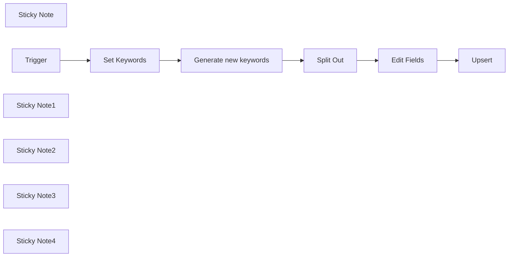

## Fluxo (.json) :

```json
{
  "id": "SiQUWOBCyXCAA5f9",
  "meta": {
    "instanceId": "db80165df40cb07c0377167c050b3f9ab0b0fb04f0e8cae0dc53f5a8527103ca"
  },
  "name": "Generate New Keywords with Search Volumes⚒️⚒️🟢🟢",
  "tags": [
    {
      "id": "bNah9fcKNwQQBzJ1",
      "name": "SEO DOCTOR",
      "createdAt": "2024-12-04T12:32:00.284Z",
      "updatedAt": "2024-12-04T12:32:00.284Z"
    },
    {
      "id": "L5zcJfTllY0jsuUO",
      "name": "SEO REPORTS",
      "createdAt": "2024-12-07T05:13:55.254Z",
      "updatedAt": "2024-12-07T05:13:55.254Z"
    },
    {
      "id": "koKAFcp5uch8EPTB",
      "name": "Public",
      "createdAt": "2024-12-03T14:36:18.275Z",
      "updatedAt": "2024-12-03T14:36:18.275Z"
    },
    {
      "id": "kOC8RBaSMppaZ55G",
      "name": "Template",
      "createdAt": "2024-12-14T05:16:52.018Z",
      "updatedAt": "2024-12-14T05:16:52.018Z"
    },
    {
      "id": "ntzMTw91GMiOdxEa",
      "name": "Tools",
      "createdAt": "2024-12-08T05:39:07.599Z",
      "updatedAt": "2024-12-08T05:39:07.599Z"
    }
  ],
  "nodes": [
    {
      "id": "43c6b3ba-ebea-4bd0-ac27-1468d953dc60",
      "name": "Split Out",
      "type": "n8n-nodes-base.splitOut",
      "position": [
        580,
        60
      ],
      "parameters": {
        "options": {},
        "fieldToSplitOut": "results"
      },
      "typeVersion": 1
    },
    {
      "id": "fbae5d2f-cc74-40b1-bab5-67775f7b377b",
      "name": "Sticky Note",
      "type": "n8n-nodes-base.stickyNote",
      "position": [
        -20,
        320
      ],
      "parameters": {
        "color": 4,
        "width": 360,
        "height": 500,
        "content": "## Generate new keywords for SEO with the monthly Search volumes\n\nThis workflow is an improvement on the workflows below. It can be used to generate new keywords that you can use for your SEO campaigns or Google ads campaigns\n\n\n[Generate SEO Keyword Search Volume Data using Google API](https://n8n.io/workflows/2494-generate-seo-keyword-search-volume-data-using-google-api/) and [Generating Keywords using Google Autosuggest](https://n8n.io/workflows/2155-generating-keywords-using-google-autosuggest/)\n\n## Usage\n1. Send the keywords you need as an array to this workflow\n2. Pin the data and map it to the `set Keywords`  node\n3. Map the keywords to the Google ads API with the location and Language of your choice\n4. Split the results and set them data \n5. Pass this to the next nodes as needed for storage\n6. Make a copy of this [spreedsheet](https://docs.google.com/spreadsheets/d/10mXXLB987b7UySHtS9F4EilxeqbQjTkLOfMabnR2i5s/edit?usp=sharing) and update the data accordingly\n\n## Having challenges with the google Ads API? Read this [blog ](https://funautomations.io/workflows/automating-keyword-generation-with-n8n-google-ads-api/)\n\nMade by [@Imperol](https://www.linkedin.com/in/zacharia-kimotho/)"
      },
      "typeVersion": 1
    },
    {
      "id": "b7f0cd29-9475-4871-ad66-dc1bb58e7db3",
      "name": "Generate new keywords",
      "type": "n8n-nodes-base.httpRequest",
      "notes": "Call the endpoint: \n\nhttps://googleads.googleapis.com/v18/customers/{customer_id}:generateKeywordIdeas \n\nwith your Customer id",
      "position": [
        360,
        60
      ],
      "parameters": {
        "url": "https://googleads.googleapis.com/v18/customers/{customer-id}:generateKeywordIdeas",
        "method": "POST",
        "options": {},
        "jsonBody": "={\n  \"geoTargetConstants\": [\"geoTargetConstants/2840\"], \n  \"includeAdultKeywords\": false,\n  \"pageToken\": \"\",\n  \"pageSize\": 2,\n  \"keywordPlanNetwork\": \"GOOGLE_SEARCH\",\n  \"language\": \"languageConstants/1000\", \n  \"keywordSeed\": {\n    \"keywords\": {{ $json.Keyword }}\n  }\n}",
        "sendBody": true,
        "sendHeaders": true,
        "specifyBody": "json",
        "authentication": "predefinedCredentialType",
        "headerParameters": {
          "parameters": [
            {
              "name": "content-type",
              "value": "application/json"
            },
            {
              "name": "developer-token",
              "value": "{developer-token}"
            },
            {
              "name": "login-customer-id",
              "value": "{login-customer-id}"
            }
          ]
        },
        "nodeCredentialType": "googleAdsOAuth2Api"
      },
      "credentials": {
        "googleAdsOAuth2Api": {
          "id": "8e6pmlvbsswPATxV",
          "name": "Google Ads account 2"
        }
      },
      "notesInFlow": true,
      "retryOnFail": true,
      "typeVersion": 4.2
    },
    {
      "id": "26ab01fa-b16c-410b-b2cb-e31d81e40c1d",
      "name": "Edit Fields",
      "type": "n8n-nodes-base.set",
      "position": [
        800,
        60
      ],
      "parameters": {
        "options": {},
        "assignments": {
          "assignments": [
            {
              "id": "7413e132-d68a-4f28-91f6-d6e814f95343",
              "name": "keyword",
              "type": "string",
              "value": "={{ $json.text }}"
            },
            {
              "id": "21526a09-e58d-48e0-b7f7-9766772e3c1d",
              "name": "competition",
              "type": "string",
              "value": "={{ $json.keywordIdeaMetrics.competition }}"
            },
            {
              "id": "88771e43-8429-49cb-bc49-90b10b3a399c",
              "name": "avgMonthlySearches",
              "type": "string",
              "value": "={{ $json.keywordIdeaMetrics.avgMonthlySearches }}"
            },
            {
              "id": "41437fb7-4de4-4820-835d-c3fa459dc7ed",
              "name": "competitionIndex",
              "type": "string",
              "value": "={{ $json.keywordIdeaMetrics.competitionIndex }}"
            },
            {
              "id": "6237440a-cf99-4c25-8b09-015df07f42ef",
              "name": "lowTopOfPageBidMicros",
              "type": "string",
              "value": "={{ ($json[\"keywordIdeaMetrics\"].lowTopOfPageBidMicros / 1000000).toFixed(2) }}"
            },
            {
              "id": "68fc20e6-ffff-4e72-9da1-7132aad57ca1",
              "name": "highTopOfPageBidMicros",
              "type": "string",
              "value": "={{ ($json.keywordIdeaMetrics.highTopOfPageBidMicros  / 1000000).toFixed(2) }}"
            }
          ]
        }
      },
      "typeVersion": 3.4
    },
    {
      "id": "fa983780-9b3d-4213-b672-bf2f049b162a",
      "name": "Set Keywords",
      "type": "n8n-nodes-base.set",
      "position": [
        140,
        60
      ],
      "parameters": {
        "options": {},
        "assignments": {
          "assignments": [
            {
              "id": "973e949e-1afd-4378-8482-d2168532eff6",
              "name": "Keyword",
              "type": "string",
              "value": "={{ $json.query.Keyword }}"
            }
          ]
        }
      },
      "notesInFlow": true,
      "typeVersion": 3.4
    },
    {
      "id": "2a6c342a-d471-4a88-aea0-382d4688632f",
      "name": "Upsert",
      "type": "n8n-nodes-base.googleSheets",
      "notes": "Upsert the new keywords to sheets",
      "position": [
        1000,
        60
      ],
      "parameters": {
        "columns": {
          "value": {},
          "schema": [
            {
              "id": "keyword",
              "type": "string",
              "display": true,
              "required": false,
              "displayName": "keyword",
              "defaultMatch": false,
              "canBeUsedToMatch": true
            },
            {
              "id": "domain",
              "type": "string",
              "display": true,
              "required": false,
              "displayName": "domain",
              "defaultMatch": false,
              "canBeUsedToMatch": true
            },
            {
              "id": "uuid",
              "type": "string",
              "display": true,
              "required": false,
              "displayName": "uuid",
              "defaultMatch": false,
              "canBeUsedToMatch": true
            },
            {
              "id": "keywordAnnotations",
              "type": "string",
              "display": true,
              "removed": false,
              "required": false,
              "displayName": "keywordAnnotations",
              "defaultMatch": false,
              "canBeUsedToMatch": true
            },
            {
              "id": "closeVariants",
              "type": "string",
              "display": true,
              "removed": false,
              "required": false,
              "displayName": "closeVariants",
              "defaultMatch": false,
              "canBeUsedToMatch": true
            },
            {
              "id": "competition",
              "type": "string",
              "display": true,
              "removed": false,
              "required": false,
              "displayName": "competition",
              "defaultMatch": false,
              "canBeUsedToMatch": true
            },
            {
              "id": "monthlySearchVolumes",
              "type": "string",
              "display": true,
              "removed": false,
              "required": false,
              "displayName": "monthlySearchVolumes",
              "defaultMatch": false,
              "canBeUsedToMatch": true
            },
            {
              "id": "avgMonthlySearches",
              "type": "string",
              "display": true,
              "removed": false,
              "required": false,
              "displayName": "avgMonthlySearches",
              "defaultMatch": false,
              "canBeUsedToMatch": true
            },
            {
              "id": "competitionIndex",
              "type": "string",
              "display": true,
              "removed": false,
              "required": false,
              "displayName": "competitionIndex",
              "defaultMatch": false,
              "canBeUsedToMatch": true
            },
            {
              "id": "lowTopOfPageBidMicros",
              "type": "string",
              "display": true,
              "removed": false,
              "required": false,
              "displayName": "lowTopOfPageBidMicros",
              "defaultMatch": false,
              "canBeUsedToMatch": true
            },
            {
              "id": "highTopOfPageBidMicros",
              "type": "string",
              "display": true,
              "removed": false,
              "required": false,
              "displayName": "highTopOfPageBidMicros",
              "defaultMatch": false,
              "canBeUsedToMatch": true
            }
          ],
          "mappingMode": "autoMapInputData",
          "matchingColumns": []
        },
        "options": {},
        "operation": "append",
        "sheetName": {
          "__rl": true,
          "mode": "list",
          "value": 1475484115,
          "cachedResultUrl": "https://docs.google.com/spreadsheets/d/10mXXLB987b7UySHtS9F4EilxeqbQjTkLOfMabnR2i5s/edit#gid=1475484115",
          "cachedResultName": "Keyword"
        },
        "documentId": {
          "__rl": true,
          "mode": "list",
          "value": "10mXXLB987b7UySHtS9F4EilxeqbQjTkLOfMabnR2i5s",
          "cachedResultUrl": "https://docs.google.com/spreadsheets/d/10mXXLB987b7UySHtS9F4EilxeqbQjTkLOfMabnR2i5s/edit?usp=drivesdk",
          "cachedResultName": "SEO DOCTOR: Keyword Tool"
        }
      },
      "credentials": {
        "googleSheetsOAuth2Api": {
          "id": "ZAI2a6Qt80kX5a9s",
          "name": "Google Sheets account✅ "
        }
      },
      "typeVersion": 4.5
    },
    {
      "id": "81f7aea8-8bd4-42da-8115-0e6ffb6a69d2",
      "name": "Trigger",
      "type": "n8n-nodes-base.executeWorkflowTrigger",
      "position": [
        -80,
        60
      ],
      "parameters": {},
      "typeVersion": 1
    },
    {
      "id": "d043b3ab-682b-49d6-93b3-a65e1a52ce9d",
      "name": "Sticky Note1",
      "type": "n8n-nodes-base.stickyNote",
      "position": [
        360,
        320
      ],
      "parameters": {
        "color": 4,
        "width": 340,
        "height": 500,
        "content": "## Setup\n\n1. Replace the trigger with your desired trigger eg a webhook or manual trigger\n\n2. Map the data correctly to the `set Keywords` node\n3. On the `Generate new keywords`, Update the `{customer_id} on the url and login-customer-id with your actual one. Update the `developer-token` also with your values. \n\nThe url should be corrected as below https://googleads.googleapis.com/v18/customers/{customer-id}:generateKeywordIdeas\n\nYou should send the headers as below\n\n```\n\n\n            {\n              \"name\": \"content-type\",\n              \"value\": \"application/json\"\n            },\n            {\n              \"name\": \"developer-token\",\n              \"value\": \"{developer-token}\"\n            },\n            {\n              \"name\": \"login-customer-id\",\n              \"value\": \"{login-customer-id}\"\n            }\n         \n    \n\n\n```\n\nand the json body should take the following format \n\n```\n\n{\n  \"geoTargetConstants\": [\"geoTargetConstants/2840\"], \n  \"includeAdultKeywords\": false,\n  \"pageToken\": \"\",\n  \"pageSize\": 2,\n  \"keywordPlanNetwork\": \"GOOGLE_SEARCH\",\n  \"language\": \"languageConstants/1000\", \n  \"keywordSeed\": {\n    \"keywords\": {{ $json.Keyword }}\n  }\n}\n\n```"
      },
      "typeVersion": 1
    },
    {
      "id": "b1403cba-2a5c-4e51-b230-166b40eb9b1b",
      "name": "Sticky Note2",
      "type": "n8n-nodes-base.stickyNote",
      "position": [
        720,
        320
      ],
      "parameters": {
        "color": 3,
        "width": 320,
        "height": 500,
        "content": "## Troubleshooting\n\n1. If you get an error with the workflow, check the credentials you are using\n\n2. Check the account you are using eg the right customer id and developer token\n\n3. Follow the [guide ](https://funautomations.io/workflows/automating-keyword-generation-with-n8n-google-ads-api/)on the blog to set up your Google ads account "
      },
      "typeVersion": 1
    },
    {
      "id": "991eeabe-dc2b-49ad-9a00-354a3fc4e9f0",
      "name": "Sticky Note3",
      "type": "n8n-nodes-base.stickyNote",
      "position": [
        300,
        -20
      ],
      "parameters": {
        "color": 4,
        "width": 660,
        "height": 260,
        "content": "### Generate new keywords and split the data out to set only the keyword and average monthly search "
      },
      "typeVersion": 1
    },
    {
      "id": "ba21d189-e34d-468c-8694-7ed4fcc87335",
      "name": "Sticky Note4",
      "type": "n8n-nodes-base.stickyNote",
      "position": [
        -120,
        -20
      ],
      "parameters": {
        "color": 4,
        "width": 400,
        "height": 260,
        "content": "### Set up a new trigger and map the data with a column name as keyword"
      },
      "typeVersion": 1
    }
  ],
  "active": false,
  "pinData": {
    "Trigger": [
      {
        "json": {
          "query": {
            "Keyword": [
              "workflow automation software",
              "enterprise workflow automation",
              "finance automation software",
              "saas automation platform",
              "automation roi calculator",
              "hr process automation",
              "data synchronization software",
              "n8n workflow automation",
              "scalable business operations",
              "n8n vs zapier",
              "lead generation automation",
              "automation consulting services",
              "n8n automation",
              "marketing automation tools",
              "custom automation solutions",
              "ecommerce automation solutions",
              "business process automation",
              "small business automation",
              "no code automation",
              "crm automation integration"
            ]
          }
        }
      }
    ]
  },
  "settings": {
    "executionOrder": "v1"
  },
  "versionId": "22da1523-1b93-4f95-af67-cd553a744835",
  "connections": {
    "Trigger": {
      "main": [
        [
          {
            "node": "Set Keywords",
            "type": "main",
            "index": 0
          }
        ]
      ]
    },
    "Split Out": {
      "main": [
        [
          {
            "node": "Edit Fields",
            "type": "main",
            "index": 0
          }
        ]
      ]
    },
    "Edit Fields": {
      "main": [
        [
          {
            "node": "Upsert",
            "type": "main",
            "index": 0
          }
        ]
      ]
    },
    "Set Keywords": {
      "main": [
        [
          {
            "node": "Generate new keywords",
            "type": "main",
            "index": 0
          }
        ]
      ]
    },
    "Generate new keywords": {
      "main": [
        [
          {
            "node": "Split Out",
            "type": "main",
            "index": 0
          }
        ]
      ]
    }
  }
}
```

<a id="template-830"></a>

## Template 830 - Validação de e-mail e criação de Lead + Notificações

- **Nome:** Validação de e-mail e criação de Lead + Notificações
- **Descrição:** Recebe submissões de formulário, valida o e-mail recebido, notifica quando necessário, cria um lead no SuiteCRM e sincroniza o contato no Brevo, com avisos em uma discussão do NextCloud.
- **Funcionalidade:** • Gatilho de formulário: Inicia o fluxo ao receber uma submissão do formulário.
• Validação de e-mail: Chama um serviço externo para verificar se o e-mail fornecido é válido.
• Verificação de créditos da API de validação: Confere o saldo de créditos da conta de verificação e notifica quando estiver baixo.
• Notificação de e-mail inválido: Envia mensagem para uma discussão no NextCloud quando o e-mail é considerado inválido.
• Autenticação no CRM: Obtém token de acesso no SuiteCRM para operações autenticadas.
• Criação de Lead no SuiteCRM: Cria um lead usando dados do formulário quando o e-mail é válido.
• Sincronização com Brevo: Cria/atualiza contato no Brevo e armazena o id do lead do SuiteCRM em um campo personalizado.
• Notificação de lead criado: Envia mensagem para uma discussão no NextCloud confirmando a criação do lead.
- **Ferramentas:** • Tally Forms: Fonte do webhook/trigger que envia os dados preenchidos pelo usuário.
• CaptainVerify: Serviço de verificação de e-mail e gestão de créditos para validar endereços.
• NextCloud Talk (API OCS/spreed): Plataforma de discussão usada para enviar notificações sobre créditos, e-mails inválidos e leads criados.
• SuiteCRM (API V8): Sistema CRM utilizado para autenticação via token e criação de registros de Lead.
• Brevo (SendinBlue): Plataforma de e-mail/marketing para criar ou atualizar contatos e armazenar referência ao lead do CRM.

## Fluxo visual

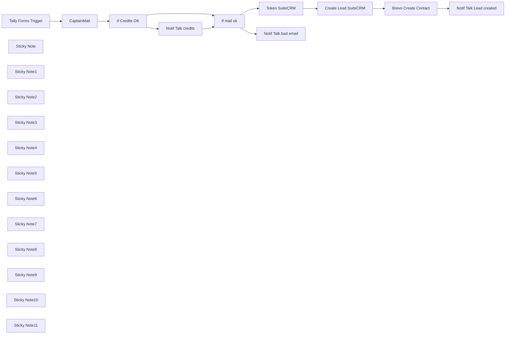

## Fluxo (.json) :

```json
{
  "meta": {
    "instanceId": "2490ba08907e49e216e6667acbe7f8867d372c76c9bd95e87bb8d210bd552e80"
  },
  "nodes": [
    {
      "id": "3ebbf865-26f6-456f-83bd-33fa72bc09ea",
      "name": "Token SuiteCRM",
      "type": "n8n-nodes-base.httpRequest",
      "position": [
        480,
        800
      ],
      "parameters": {
        "url": "=https://SUITECRMURLSERVER/Api/access_token",
        "options": {},
        "requestMethod": "POST",
        "bodyParametersUi": {
          "parameter": [
            {
              "name": "grant_type",
              "value": "client_credentials"
            },
            {
              "name": "client_id",
              "value": "IDVALUE"
            },
            {
              "name": "client_secret",
              "value": "PWDVALUE"
            }
          ]
        },
        "allowUnauthorizedCerts": true
      },
      "notesInFlow": true,
      "typeVersion": 1
    },
    {
      "id": "763bd0bc-7c08-496d-82b7-1fb021c1e6e1",
      "name": "CaptainMail",
      "type": "n8n-nodes-base.httpRequest",
      "position": [
        -360,
        560
      ],
      "parameters": {
        "url": "=https://api.captainverify.com/v2/verify?apikey=YOURAPIKEY&email={{ $json.body.data.fields[0].value }}",
        "options": {
          "response": {
            "response": {
              "responseFormat": "json"
            }
          }
        }
      },
      "typeVersion": 4.2
    },
    {
      "id": "9d1f03eb-4be2-4e72-bc86-723d92869888",
      "name": "If mail ok",
      "type": "n8n-nodes-base.if",
      "position": [
        220,
        580
      ],
      "parameters": {
        "options": {},
        "conditions": {
          "options": {
            "leftValue": "",
            "caseSensitive": true,
            "typeValidation": "strict"
          },
          "combinator": "and",
          "conditions": [
            {
              "id": "ea7e2b2b-35cc-469c-b01b-eeb4f0030aa5",
              "operator": {
                "name": "filter.operator.equals",
                "type": "string",
                "operation": "equals"
              },
              "leftValue": "={{ $json.result }}",
              "rightValue": "invalid"
            }
          ]
        }
      },
      "typeVersion": 2
    },
    {
      "id": "03ffff8c-401a-4723-80c6-df702cda2ba5",
      "name": "If Credits OK",
      "type": "n8n-nodes-base.if",
      "position": [
        -180,
        560
      ],
      "parameters": {
        "options": {},
        "conditions": {
          "options": {
            "leftValue": "",
            "caseSensitive": true,
            "typeValidation": "strict"
          },
          "combinator": "and",
          "conditions": [
            {
              "id": "007b0ec4-870d-48d6-a961-adff23ceabd4",
              "operator": {
                "type": "number",
                "operation": "lt"
              },
              "leftValue": "={{ $json.credits }}",
              "rightValue": 100
            }
          ]
        }
      },
      "typeVersion": 2
    },
    {
      "id": "487b4746-48d3-40c2-a21c-0a3aa38ba780",
      "name": "Tally Forms Trigger",
      "type": "n8n-nodes-base.executeWorkflowTrigger",
      "position": [
        -600,
        560
      ],
      "parameters": {},
      "typeVersion": 1
    },
    {
      "id": "2ff81440-ffb4-4d92-8fb0-0a46f6488a2e",
      "name": "Sticky Note",
      "type": "n8n-nodes-base.stickyNote",
      "position": [
        -420,
        382.5935162094766
      ],
      "parameters": {
        "width": 221.29675810473822,
        "height": 324.588528678304,
        "content": "## CaptainVerify \n**Verify your email !** To reduce bounce email for your future campains. [Link](https://captainverify.com)\n\nChange **YOURAPIKEY** with yours"
      },
      "typeVersion": 1
    },
    {
      "id": "73d00252-c081-451c-84df-67e44bf0bb11",
      "name": "Sticky Note1",
      "type": "n8n-nodes-base.stickyNote",
      "position": [
        -60,
        180
      ],
      "parameters": {
        "color": 5,
        "width": 266.18453865336653,
        "height": 395.6608478802989,
        "content": "## Warning about your credits \nNotify with a message and level of credits in your NextCloud Discussion\n\nChange **URLSERVERNEXTCLOUD** with yours\nand **DISCUSSIONCODE** with the code of target discussion"
      },
      "typeVersion": 1
    },
    {
      "id": "da8758f6-82f6-481c-97cc-40292579d723",
      "name": "Notif Talk credits",
      "type": "n8n-nodes-base.httpRequest",
      "position": [
        20,
        420
      ],
      "parameters": {
        "url": "=https://URLSERVERNEXTCLOUD/ocs/v2.php/apps/spreed/api/v1/chat/DISCUSSIONCODE",
        "options": {
          "bodyContentType": "json",
          "bodyContentCustomMimeType": "application/json"
        },
        "requestMethod": "POST",
        "authentication": "basicAuth",
        "jsonParameters": true,
        "bodyParametersJson": "={\n\"message\":\"Low credits for CaptainVerify Mail. Balance = {{ $json[\"credits\"] }}\"\n}",
        "headerParametersJson": "={\"OCS-APIRequest\":\"true\"}"
      },
      "notesInFlow": true,
      "typeVersion": 1,
      "continueOnFail": true
    },
    {
      "id": "569b9fd4-85d0-4300-8dc1-ab71fc5c2d09",
      "name": "Notif Talk bad email",
      "type": "n8n-nodes-base.httpRequest",
      "position": [
        420,
        420
      ],
      "parameters": {
        "url": "=https://URLSERVERNEXTCLOUD/ocs/v2.php/apps/spreed/api/v1/chat/DISCUSSIONCODE",
        "options": {
          "bodyContentType": "json",
          "bodyContentCustomMimeType": "application/json"
        },
        "requestMethod": "POST",
        "authentication": "basicAuth",
        "jsonParameters": true,
        "bodyParametersJson": "={\n\"message\":\"Invalid mail on submission form for contact : {{ $('Execute Workflow Trigger').item.json[\"body\"][\"data\"][\"fields\"][1][\"value\"] }} et mail : {{ $('CaptainMail').item.json[\"email\"] }} \"\n}",
        "headerParametersJson": "={\"OCS-APIRequest\":\"true\"}"
      },
      "notesInFlow": true,
      "typeVersion": 1,
      "continueOnFail": true
    },
    {
      "id": "6b555580-b66d-485d-b1b7-dd9fbd580294",
      "name": "Sticky Note2",
      "type": "n8n-nodes-base.stickyNote",
      "position": [
        340,
        180
      ],
      "parameters": {
        "color": 5,
        "width": 266.18453865336653,
        "height": 395.6608478802989,
        "content": "## Warning bad email \nNotify with a message for contact with invalid mail in your NextCloud Discussion\n\nChange **URLSERVERNEXTCLOUD** with yours\nand **DISCUSSIONCODE** with the code of target discussion"
      },
      "typeVersion": 1
    },
    {
      "id": "fcc84bdb-9ae2-44c9-a038-c9282cfe1373",
      "name": "Sticky Note3",
      "type": "n8n-nodes-base.stickyNote",
      "position": [
        420,
        600
      ],
      "parameters": {
        "color": 3,
        "width": 226.00997506234387,
        "height": 358.40399002493757,
        "content": "## Auth SuiteCRM \n**Get Token** with V8 API. [Guide](https://docs.suitecrm.com/developer/api/developer-setup-guide/)\n\nChange **SUITECRMURLSERVER** with yours\nChange **IDVALUE** and **PWDVALUE** with a specific user in SuiteCRM"
      },
      "typeVersion": 1
    },
    {
      "id": "d9a96370-f545-4daf-a2e2-af7efd5fda42",
      "name": "Sticky Note4",
      "type": "n8n-nodes-base.stickyNote",
      "position": [
        -680,
        461.97007481296754
      ],
      "parameters": {
        "color": 7,
        "height": 252.8428927680797,
        "content": "## WEBHOOK \n**TRIGGER** with the FormsTool of your choice."
      },
      "typeVersion": 1
    },
    {
      "id": "8e50db5a-5945-468c-ae92-239b8eb74f31",
      "name": "Sticky Note5",
      "type": "n8n-nodes-base.stickyNote",
      "position": [
        1060,
        120
      ],
      "parameters": {
        "width": 221.29675810473822,
        "height": 80,
        "content": "## CaptainVerify \n"
      },
      "typeVersion": 1
    },
    {
      "id": "81deb53f-4161-42ef-9eec-d075e694aa04",
      "name": "Sticky Note6",
      "type": "n8n-nodes-base.stickyNote",
      "position": [
        1060,
        220
      ],
      "parameters": {
        "color": 5,
        "width": 220.39900249376552,
        "height": 80,
        "content": "## NextCloud\n"
      },
      "typeVersion": 1
    },
    {
      "id": "2aea4eaf-d7fa-4e87-ae75-e52bc3f385c2",
      "name": "Sticky Note7",
      "type": "n8n-nodes-base.stickyNote",
      "position": [
        660,
        600
      ],
      "parameters": {
        "color": 3,
        "width": 226.00997506234387,
        "height": 358.40399002493757,
        "content": "## Create Leads \nAdjust **Json** with your data\n\nChange **SUITECRMURLSERVER** with yours\nChange **IDVALUE** and **PWDVALUE** with a specific user in SuiteCRM"
      },
      "typeVersion": 1
    },
    {
      "id": "2550bf07-3d3b-497a-b14e-8626ab478659",
      "name": "Sticky Note8",
      "type": "n8n-nodes-base.stickyNote",
      "position": [
        1060,
        320
      ],
      "parameters": {
        "color": 3,
        "width": 223.46633416458826,
        "height": 80,
        "content": "## SuiteCRM \n"
      },
      "typeVersion": 1
    },
    {
      "id": "18324e1a-6873-466c-9eab-2292eb2fe1f4",
      "name": "Sticky Note9",
      "type": "n8n-nodes-base.stickyNote",
      "position": [
        920,
        600
      ],
      "parameters": {
        "color": 4,
        "height": 357.1321695760598,
        "content": "## Brevo\nCreate Contact with data and **Link with the id of SuiteCRM** Lead in a dedicated custom field in Brevo"
      },
      "typeVersion": 1
    },
    {
      "id": "df474fee-be22-4fda-9cfc-61e46492e30c",
      "name": "Create Lead SuiteCRM",
      "type": "n8n-nodes-base.httpRequest",
      "position": [
        720,
        800
      ],
      "parameters": {
        "url": "https://SUITECRMURLSERVER/Api/V8/module",
        "method": "POST",
        "options": {
          "response": {
            "response": {
              "responseFormat": "json"
            }
          }
        },
        "jsonBody": "={\"data\": {\n\"type\": \"Leads\",\n\"attributes\": { \n\"last_name\": \"{{ $('Tally Forms Trigger').item.json[\"body\"][\"data\"][\"fields\"][1][\"value\"] }}\",\n\"status\": \"Hot\",\n\"email1\": \"{{ $('CaptainMail').item.json[\"email\"] }}\",\n\"lead_source\": \"FormsChoice\",\n\"assigned_user_id\": \"491cf554-4d5e-b06a-7a61-605210d85367\",\n\"lead_source_description\": \"FORMNAME Submission\"}\n}\n}",
        "sendBody": true,
        "sendHeaders": true,
        "specifyBody": "json",
        "headerParameters": {
          "parameters": [
            {
              "name": "Authorization",
              "value": "=Bearer {{$node[\"Token SuiteCRM\"].json[\"access_token\"]}}"
            },
            {
              "name": "Content-Type",
              "value": "application/vnd.api+json"
            }
          ]
        }
      },
      "notesInFlow": true,
      "typeVersion": 3
    },
    {
      "id": "635665d3-f35b-42b7-b9d5-427f46d1867f",
      "name": "Notif Talk Lead created",
      "type": "n8n-nodes-base.httpRequest",
      "position": [
        1260,
        800
      ],
      "parameters": {
        "url": "=https://URLSERVERNEXTCLOUD/ocs/v2.php/apps/spreed/api/v1/chat/DISCUSSIONCODE",
        "options": {
          "bodyContentType": "json",
          "bodyContentCustomMimeType": "application/json"
        },
        "requestMethod": "POST",
        "authentication": "basicAuth",
        "jsonParameters": true,
        "bodyParametersJson": "={\n\"message\":\"Lead créé ! Saisie du Formulaire choix séance. Contact : {{ $('Tally Forms Trigger').item.json[\"body\"][\"data\"][\"fields\"][1][\"value\"] }} et mail : {{ $('CaptainMail').item.json[\"email\"] }} \"\n}",
        "headerParametersJson": "={\"OCS-APIRequest\":\"true\"}"
      },
      "notesInFlow": true,
      "typeVersion": 1,
      "continueOnFail": true
    },
    {
      "id": "84fda59b-5d9c-42aa-9ce6-2c3fc837e04e",
      "name": "Sticky Note10",
      "type": "n8n-nodes-base.stickyNote",
      "position": [
        1180,
        600
      ],
      "parameters": {
        "color": 5,
        "width": 266.18453865336653,
        "height": 357.50623441396476,
        "content": "## Notify lead created \nMessage for a lead created in your selected NextCloud discussion\n\nChange **URLSERVERNEXTCLOUD** with yours\nand **DISCUSSIONCODE** with the code of target discussion"
      },
      "typeVersion": 1
    },
    {
      "id": "2f55803e-bb3a-482a-9d12-5fdeefbbac6c",
      "name": "Sticky Note11",
      "type": "n8n-nodes-base.stickyNote",
      "position": [
        1060,
        420
      ],
      "parameters": {
        "color": 4,
        "width": 224.73815461346635,
        "height": 80,
        "content": "## Brevo"
      },
      "typeVersion": 1
    },
    {
      "id": "fbf39f60-e895-4477-9f62-9ec6965a84cc",
      "name": "Brevo Create Contact",
      "type": "n8n-nodes-base.sendInBlue",
      "position": [
        980,
        800
      ],
      "parameters": {
        "email": "{{ $('CaptainMail').item.json[\"email\"] }}",
        "resource": "contact",
        "createContactAttributes": {
          "attributesValues": [
            {
              "fieldName": "NOM",
              "fieldValue": "={{ $('Tally Forms Trigger').item.json.body.data.fields[1].value }}"
            },
            {
              "fieldName": "PRENOM",
              "fieldValue": "={{ $('Tally Forms Trigger').item.json.body.data.fields[2].value }}"
            },
            {
              "fieldName": "LEADS_ID",
              "fieldValue": "={{ $('Create Lead SuiteCRM').item.json.data.id }}"
            }
          ]
        }
      },
      "notesInFlow": true,
      "typeVersion": 1
    }
  ],
  "pinData": {},
  "connections": {
    "If mail ok": {
      "main": [
        [
          {
            "node": "Notif Talk bad email",
            "type": "main",
            "index": 0
          }
        ],
        [
          {
            "node": "Token SuiteCRM",
            "type": "main",
            "index": 0
          }
        ]
      ]
    },
    "CaptainMail": {
      "main": [
        [
          {
            "node": "If Credits OK",
            "type": "main",
            "index": 0
          }
        ]
      ]
    },
    "If Credits OK": {
      "main": [
        [
          {
            "node": "Notif Talk credits",
            "type": "main",
            "index": 0
          }
        ],
        [
          {
            "node": "If mail ok",
            "type": "main",
            "index": 0
          }
        ]
      ]
    },
    "Token SuiteCRM": {
      "main": [
        [
          {
            "node": "Create Lead SuiteCRM",
            "type": "main",
            "index": 0
          }
        ]
      ]
    },
    "Notif Talk credits": {
      "main": [
        [
          {
            "node": "If mail ok",
            "type": "main",
            "index": 0
          }
        ]
      ]
    },
    "Tally Forms Trigger": {
      "main": [
        [
          {
            "node": "CaptainMail",
            "type": "main",
            "index": 0
          }
        ]
      ]
    },
    "Brevo Create Contact": {
      "main": [
        [
          {
            "node": "Notif Talk Lead created",
            "type": "main",
            "index": 0
          }
        ]
      ]
    },
    "Create Lead SuiteCRM": {
      "main": [
        [
          {
            "node": "Brevo Create Contact",
            "type": "main",
            "index": 0
          }
        ]
      ]
    }
  }
}
```

<a id="template-831"></a>

## Template 831 - Pesquisa profunda com aprendizados e registro

- **Nome:** Pesquisa profunda com aprendizados e registro
- **Descrição:** Fluxo que coleta conteúdos de SERP, gera aprendizados concisos (máximo de 3), formata em Markdown e registra os resultados em uma base no Notion, com controle de dados e configuração de profundidade de pesquisa.
- **Funcionalidade:** • Coleta de conteúdos via SERP: obtém conteúdos relevantes dos resultados de busca para processamento.
• Geração de aprendizados concisos: produz até 3 aprendizados distintos, com entidades, números e datas relevantes.
• Limite de aprendizados: retorna no máximo 3 aprendizados, quando aplicável.
• Formatação em Markdown: converte aprendizados para Markdown para publicação/registro.
• Armazenamento em Notion: grava aprendizados e metadados em uma base de dados de referência.
• Configuração de profundidade de pesquisa: permite ajustar o número de fontes exploradas (1-5) pela interface.
• Rastreamento de identificação: utiliza um ID de requisição para correlacionar resultados e logs.
- **Ferramentas:** • Notion: Serviço de gestão de páginas e bases de dados para armazenar aprendizados.
• Google Gemini: Modelo de IA usado para gerar aprendizados e resumos a partir do conteúdo coletado.
• Google Palm API: API de IA para suportar chamadas de geração de conteúdo.
• Resultados da busca na web: fontes externas de SERP utilizadas para extrair conteúdos relevantes.

## Fluxo (.json) :

```json
{
  "\"id\"": "\"23bca6e2-e16a-48a4-a7fc-96ce25846764\",",
  "\"key\"": "\"Request ID|rich_text\",",
  "\"url\"": "\"=https://api.notion.com/v1/blocks/{{ $('Get Existing Row1').first().json.id }}/children\",",
  "\"__rl\"": "true,",
  "\"data\"": "\"={{ $json }}\",",
  "\"date\"": "\"={{ $now.toISO() }}\"",
  "\"html\"": "\"<div class=\\\"form-group\\\" style=\\\"margin-bottom:16px;\\\">\\n <label class=\\\"form-label\\\" for=\\\"field-2\\\">\\n Enter research breadth (Default 2)\\n </label>\\n <p style=\\\"font-size:12px;color:#666;text-align:left\\\">\\n This value determines how many sources to explore.\\n </p>\\n <input\\n class=\\\"form-input\\\"\\n type=\\\"range\\\"\\n id=\\\"field-2\\\"\\n name=\\\"field-2\\\"\\n value=\\\"2\\\"\\n step=\\\"1\\\"\\n max=\\\"5\\\"\\n min=\\\"1\\\"\\n list=\\\"breadth-markers\\\"\\n >\\n <datalist\\n id=\\\"breadth-markers\\\"\\n style=\\\"display: flex;\\n flex-direction: row;\\n justify-content: space-between;\\n writing-mode: horizontal-tb;\\n margin-top: -10px;\\n text-align: center;\\n font-size: 10px;\\n margin-left: 16px;\\n margin-right: 16px;\\\"\\n >\\n <option value=\\\"1\\\" label=\\\"1\\\"></option>\\n <option value=\\\"2\\\" label=\\\"2\\\"></option>\\n <option value=\\\"3\\\" label=\\\"3\\\"></option>\\n <option value=\\\"4\\\" label=\\\"4\\\"></option>\\n <option value=\\\"5\\\" label=\\\"5\\\"></option>\\n </datalist>\\n</div>\\n\\n\",",
  "\"main\"": "[",
  "\"meta\"": "{",
  "\"mode\"": "\"id\",",
  "\"name\"": "\"Sticky Note20\",",
  "\"node\"": "\"Report Page Generator\",",
  "\"path\"": "\"deep_research\",",
  "\"text\"": "\"=Given the following contents from a SERP search for the query <query>{{ $('Item Ref').first().json.query }}</query>, generate a list of learnings from the contents. Return a maximum of 3 learnings, but feel free to return less if the contents are clear. Make sure each learning is unique and not similar to each other. The learnings should be concise and to the point, as detailed and infromation dense as possible. Make sure to include any entities like people, places, companies, products, things, etc in the learnings, as well as any exact metrics, numbers, or dates. The learnings will be used to research the topic further.\\n\\n<contents>\\n{{\\n$('Convert to Markdown')\\n .all()\\n .map(item =>`<content>\\\\n${item.json.markdown.substr(0, 25_000)}\\\\n</content>`)\\n .join('\\\\n')\\n}}\\n</contents>\",",
  "\"type\"": "\"ai_outputParser\",",
  "\"color\"": "7,",
  "\"index\"": "0",
  "\"limit\"": "1,",
  "\"model\"": "{",
  "\"nodes\"": "[",
  "\"rules\"": "{",
  "\"title\"": "\"={{ $json.output.title }}\"",
  "\"value\"": "\"={{ [] }}\"",
  "\"width\"": "180,",
  "\"height\"": "260,",
  "\"ignore\"": "\"a,img,picture,svg,video,audio,iframe\"",
  "\"jsCode\"": "\"const urls = $('JobType Router').first().json.data.all_urls;\\nconst chunksize = 50;\\nconst splits = Math.max(1, Math.floor(urls.length/chunksize));\\n\\nconst blocks = Array(splits).fill(0)\\n .map((_, idx) => {\\n const block = urls\\n .slice(\\n idx * chunksize, \\n (idx * chunksize) + chunksize - 1\\n )\\n .map(url => {\\n return {\\n object: \\\"block\\\",\\n type: \\\"bulleted_list_item\\\",\\n bulleted_list_item: {\\n rich_text: [\\n { type: \\\"text\\\", text: { content: url } }\\n ]\\n }\\n }\\n });\\n return { json: { block } }\\n });\\n\\nreturn [\\n { json: {\\n block:[{\\n \\\"object\\\": \\\"block\\\",\\n \\\"type\\\": \\\"heading_2\\\",\\n \\\"heading_2\\\": {\\n \\\"rich_text\\\": [\\n {\\n \\\"type\\\": \\\"text\\\",\\n \\\"text\\\": {\\n \\\"content\\\": \\\"Sources\\\"\\n }\\n }\\n ]\\n }\\n }]\\n } },\\n ...blocks\\n];\"",
  "\"method\"": "\"PATCH\",",
  "\"option\"": "\"=I understand higher depth and breath values I've selected may incur longer wait times and higher costs. I acknowledging this and wish to proceed with the research request.\"",
  "\"pageId\"": "{",
  "\"schema\"": "[",
  "\"tables\"": "true",
  "\"values\"": "[",
  "\"content\"": "\"\\n\\n\\n\\n\\n\\n\\n\\n\\n\\n\\n\\n### UPDATE NOTION CREDENTIAL HERE!\"",
  "\"display\"": "true,",
  "\"filters\"": "{",
  "\"jobType\"": "\"deepresearch_learnings\",",
  "\"message\"": "\"=You are an expert researcher. Today is {{ $now.toLocaleString() }}. Follow these instructions when responding:\\n - You may be asked to research subjects that is after your knowledge cutoff, assume the user is right when presented with news.\\n - The user is a highly experienced analyst, no need to simplify it, be as detailed as possible and make sure your response is correct.\\n - Be highly organized.\\n - Suggest solutions that I didn't think about.\\n - Be proactive and anticipate my needs.\\n - Treat me as an expert in all subject matter.\\n - Mistakes erode my trust, so be accurate and thorough.\\n - Provide detailed explanations, I'm comfortable with lots of detail.\\n - Value good arguments over authorities, the source is irrelevant.\\n - Consider new technologies and contrarian ideas, not just the conventional wisdom.\\n - You may use high levels of speculation or prediction, just flag it for me.\"",
  "\"onError\"": "\"continueRegularOutput\",",
  "\"options\"": "{}",
  "\"pinData\"": "{},",
  "\"removed\"": "false,",
  "\"timeout\"": "\"={{ 1000 * 60 }}\"",
  "\"version\"": "2,",
  "\"Item Ref\"": "{",
  "\"jsonBody\"": "\"={{\\n{\\n \\\"children\\\": $json.block\\n}\\n}}\",",
  "\"markdown\"": "\"={{ $json.text }}\"",
  "\"maxTries\"": "2,",
  "\"messages\"": "{",
  "\"operator\"": "{",
  "\"position\"": "[",
  "\"required\"": "false,",
  "\"resource\"": "\"databasePage\",",
  "\"sendBody\"": "true,",
  "\"aggregate\"": "\"aggregateAllItemData\"",
  "\"condition\"": "\"equals\",",
  "\"fieldType\"": "\"dropdown\",",
  "\"formTitle\"": "\"DeepResearcher\",",
  "\"leftValue\"": "\"={{ $json }}\",",
  "\"matchType\"": "\"allFilters\",",
  "\"modelName\"": "\"models/gemini-2.0-flash\"",
  "\"notionApi\"": "{",
  "\"openAiApi\"": "{",
  "\"operation\"": "\"notEmpty\",",
  "\"outputKey\"": "\"report\",",
  "\"requestId\"": "\"={{ $('JobType Router').first().json.requestId }}\"",
  "\"sendQuery\"": "true,",
  "\"webhookId\"": "\"d4ea875f-83cb-49a8-8992-c08b4114c9bd\",",
  "\"Create Row\"": "{",
  "\"Web Search\"": "{",
  "\"combinator\"": "\"and\",",
  "\"conditions\"": "[",
  "\"dataToSave\"": "{",
  "\"databaseId\"": "{",
  "\"fieldLabel\"": "\"={{ \\\"\\\" }}\",",
  "\"filterType\"": "\"manual\"",
  "\"formFields\"": "{",
  "\"ignoreBots\"": "true,",
  "\"instanceId\"": "\"408f9fb9940c3cb18ffdef0e0150fe342d6e655c3a9fac21f0f644e8bedabcd9\",",
  "\"jsonOutput\"": "\"={{ $('Generate Learnings').item.json }}\"",
  "\"parameters\"": "{",
  "\"promptType\"": "\"define\",",
  "\"rightValue\"": "\"\"",
  "\"schemaType\"": "\"manual\",",
  "\"workflowId\"": "{",
  "\"Valid Pages\"": "{",
  "\"assignments\"": "[",
  "\"buttonLabel\"": "\"Done\",",
  "\"connections\"": "{",
  "\"credentials\"": "{",
  "\"displayName\"": "\"data\",",
  "\"executeOnce\"": "true,",
  "\"inputSchema\"": "\"{\\n \\\"type\\\": \\\"object\\\",\\n \\\"properties\\\": {\\n \\\"title\\\": {\\n \\\"type\\\": \\\"string\\\",\\n \\\"description\\\":\\\" A short title summarising the research topic\\\"\\n },\\n \\\"description\\\": {\\n \\\"type\\\": \\\"string\\\",\\n \\\"description\\\": \\\"A short description to summarise the research topic\\\"\\n }\\n }\\n}\"",
  "\"mappingMode\"": "\"defineBelow\",",
  "\"multiselect\"": "true,",
  "\"placeholder\"": "\"=\",",
  "\"retryOnFail\"": "true,",
  "\"sendHeaders\"": "true,",
  "\"singleValue\"": "true",
  "\"specifyBody\"": "\"json\",",
  "\"statusValue\"": "\"Done\"",
  "\"textContent\"": "\"={{ $('Set Variables').first().json.request_id }}\"",
  "\"typeVersion\"": "1",
  "\"Confirmation\"": "{",
  "\"Has Content?\"": "{",
  "\"Has Results?\"": "{",
  "\"Valid Blocks\"": "{",
  "\"defaultMatch\"": "false,",
  "\"fieldOptions\"": "{",
  "\"propertiesUi\"": "{",
  "\"renameOutput\"": "true",
  "\"Append Blocks\"": "{",
  "\"HTML to Array\"": "{",
  "\"Page Contents\"": "{",
  "\"SERP to Items\"": "{",
  "\"Set Variables\"": "{",
  "\"Tags to Items\"": "{",
  "\"URLs to Items\"": "{",
  "\"caseSensitive\"": "true,",
  "\"googlePalmApi\"": "{",
  "\"httpQueryAuth\"": "{",
  "\"messageValues\"": "[",
  "\"requiredField\"": "true",
  "\"richTextValue\"": "\"={{ $json.requestId.toString() }}\"",
  "\"Empty Response\"": "{",
  "\"Execution Data\"": "{",
  "\"JobType Router\"": "{",
  "\"authentication\"": "\"predefinedCredentialType\",",
  "\"bodyParameters\"": "{",
  "\"destinationKey\"": "\"markdown\"",
  "\"httpHeaderAuth\"": "{",
  "\"propertyValues\"": "[",
  "\"typeValidation\"": "\"strict\"",
  "\"workflowInputs\"": "{",
  "\"Convert to HTML\"": "{",
  "\"Set In-Progress\"": "{",
  "\"ai_outputParser\"": "[",
  "\"cachedResultUrl\"": "\"https://www.notion.so/19486dd60c0c80da9cb7eb1468ea9afd\",",
  "\"completionTitle\"": "\"=Thank you for using DeepResearcher.\",",
  "\"fieldToSplitOut\"": "\"tag\"",
  "\"formDescription\"": "\"=\"",
  "\"genericAuthType\"": "\"httpQueryAuth\",",
  "\"hasOutputParser\"": "true",
  "\"matchingColumns\"": "[],",
  "\"queryParameters\"": "{",
  "\"Get Existing Row\"": "{",
  "\"Research Request\"": "{",
  "\"Results to Items\"": "{",
  "\"Set Next Queries\"": "{",
  "\"ai_languageModel\"": "[",
  "\"alwaysOutputData\"": "true",
  "\"cachedResultName\"": "\"n8n DeepResearch\"",
  "\"canBeUsedToMatch\"": "true",
  "\"headerParameters\"": "{",
  "\"waitBetweenTries\"": "3000",
  "\"Feedback to Items\"": "{",
  "\"For Each Block...\"": "{",
  "\"For Each Query...\"": "{",
  "\"Get Existing Row1\"": "{",
  "\"Get Initial Query\"": "{",
  "\"Is Depth Reached?\"": "{",
  "\"OpenAI Chat Model\"": "{",
  "\"Parse JSON blocks\"": "{",
  "\"Set Initial Query\"": "{",
  "\"completionMessage\"": "\"=You may now close this window.\"",
  "\"Accumulate Results\"": "{",
  "\"Generate Learnings\"": "{",
  "\"On form submission\"": "{",
  "\"OpenAI Chat Model1\"": "{",
  "\"OpenAI Chat Model2\"": "{",
  "\"OpenAI Chat Model3\"": "{",
  "\"OpenAI Chat Model4\"": "{",
  "\"nodeCredentialType\"": "\"notionApi\"",
  "\"waitForSubWorkflow\"": "true",
  "\"Convert to Markdown\"": "{",
  "\"DeepResearch Report\"": "{",
  "\"Clarifying Questions\"": "{",
  "\"DeepResearch Results\"": "{",
  "\"For Each Question...\"": "{",
  "\"Get Research Results\"": "{",
  "\"URL Sources to Lists\"": "{",
  "\"Ask Clarity Questions\"": "{",
  "\"Generate SERP Queries\"": "{",
  "\"Initiate DeepResearch\"": "{",
  "\"Report Page Generator\"": "{",
  "\"Top 5 Organic Results\"": "{",
  "\"Upload to Notion Page\"": "{",
  "\"attemptToConvertTypes\"": "false,",
  "\"convertFieldsToString\"": "true",
  "\"DeepResearch Learnings\"": "{",
  "\"Notion Block Generator\"": "{",
  "\"DeepResearch Subworkflow\"": "{",
  "\"Google Gemini Chat Model\"": "{",
  "\"Structured Output Parser\"": "{",
  "\"Research Goal + Learnings\"": "{",
  "\"Structured Output Parser1\"": "{",
  "\"Structured Output Parser2\"": "{",
  "\"Structured Output Parser4\"": "{",
  "\"templateCredsSetupCompleted\"": "true"
}
```

<a id="template-832"></a>

## Template 832 - Gerador de artigo de blog com pesquisa Perplexity

- **Nome:** Gerador de artigo de blog com pesquisa Perplexity
- **Descrição:** Este fluxo coleta dados de um artigo (categoria, título, metadata e conteúdo com seções) e utiliza uma pesquisa externa para embasar o conteúdo. Em seguida, organiza o texto e converte tudo para HTML pronto para publicação.
- **Funcionalidade:** • Recepção e validação dos dados do artigo: recebe categoria, título, metadata (timePosted, author, tag) e conteúdo com mainText, seções e quotes. 
• Pesquisa de tópico e enriquecimento de conteúdo: consulta externa (Perplexity) para obter informações relevantes, citações e dados de pesquisa dentro do período recente. 
• Estruturação do artigo: organiza título, metadata e conteúdo em seções com títulos, textos e quotes. 
• Conversão para HTML: transforma a estrutura do artigo em HTML com tags apropriadas (h1, h2, p, blockquote) e respeita diretrizes de formatação. 
• Saída pronta para publicação: entrega apenas o título e o conteúdo em HTML.
- **Ferramentas:** • Perplexity: Serviço de pesquisa de tópicos utilizado para coletar informações relevantes, gerar conteúdo e fornecer citações para o artigo.

## Fluxo (.json) :

```json
{
  "\"If\"": "{",
  "\"id\"": "\"wokWVLDQUDi0DC7I\",",
  "\"If2\"": "{",
  "\"url\"": "\"https://api.perplexity.ai/chat/completions\",",
  "\"__rl\"": "true,",
  "\"main\"": "[",
  "\"meta\"": "{",
  "\"mode\"": "\"id\",",
  "\"name\"": "\"Perplexity\"",
  "\"node\"": "\"Perplexity Topic Agent\",",
  "\"path\"": "\"pblog\",",
  "\"tags\"": "[],",
  "\"text\"": "\"=Convert this verbatim into HTML: {{ $json.article.toJsonString() }}\\n\\n## Formatting Guidelines\\n- HTML document must be single line document without tabs or line breaks\\n- Use proper HTML tags throughout\\n- Do not use these tags: <html> <body> <style> <head>\\n- Use <h1> tag for main title\\n- Use <h2> tags for secondary titles\\n- Structure with <p> tags for paragraphs\\n- Include appropriate spacing\\n- Use <blockquote> for direct quotes\\n- Maintain consistent formatting\\n- Write in clear, professional tone\\n- Break up long paragraphs\\n- Use engaging subheadings\\n- Include transitional phrases\\n\\nThe final JSON response should contain only the title and content fields, with the content including all HTML formatting.\\n{\\n\\t\\\"title\\\": \\\"the title\\\",\\n\\t\\\"content\\\": \\\"the HTML\\\"\\n}\",",
  "\"topP\"": "1,",
  "\"type\"": "\"ai_tool\",",
  "\"agent\"": "\"conversationalAgent\",",
  "\"color\"": "3,",
  "\"index\"": "0",
  "\"model\"": "\"gpt-4o-mini-2024-07-18\",",
  "\"nodes\"": "[",
  "\"value\"": "\"=Error. No topic provided.\"",
  "\"width\"": "420,",
  "\"active\"": "false,",
  "\"chatId\"": "\"={{ $json.telegram_chat_id }}\",",
  "\"fields\"": "{",
  "\"height\"": "340,",
  "\"method\"": "\"POST\",",
  "\"values\"": "[",
  "\"Article\"": "{",
  "\"Chat Id\"": "{",
  "\"If HTML\"": "{",
  "\"Prompts\"": "{",
  "\"Webhook\"": "{",
  "\"ai_tool\"": "[",
  "\"content\"": "\"## Optional\"",
  "\"options\"": "{},",
  "\"pinData\"": "{},",
  "\"timeout\"": "60000,",
  "\"version\"": "2,",
  "\"Chat Id1\"": "{",
  "\"Contents\"": "{",
  "\"If Topic\"": "{",
  "\"jsonBody\"": "\"={\\n \\\"model\\\": \\\"llama-3.1-sonar-small-128k-online\\\",\\n \\\"messages\\\": [\\n {\\n \\\"role\\\": \\\"system\\\",\\n \\\"content\\\": \\\"{{ $json.system }}\\\"\\n },\\n {\\n \\\"role\\\": \\\"user\\\",\\n \\\"content\\\": \\\"{{ $json.user }}\\\"\\n }\\n ],\\n \\\"max_tokens\\\": \\\"4000\\\",\\n \\\"temperature\\\": 0.2,\\n \\\"top_p\\\": 0.9,\\n \\\"return_citations\\\": true,\\n \\\"search_domain_filter\\\": [\\n \\\"perplexity.ai\\\"\\n ],\\n \\\"return_images\\\": false,\\n \\\"return_related_questions\\\": false,\\n \\\"search_recency_filter\\\": \\\"month\\\",\\n \\\"top_k\\\": 0,\\n \\\"stream\\\": false,\\n \\\"presence_penalty\\\": 0,\\n \\\"frequency_penalty\\\": 1\\n}\",",
  "\"operator\"": "{",
  "\"position\"": "[",
  "\"sendBody\"": "true,",
  "\"settings\"": "{",
  "\"Get Topic\"": "{",
  "\"Telegram2\"": "{",
  "\"leftValue\"": "\"\",",
  "\"maxTokens\"": "-1,",
  "\"openAiApi\"": "{",
  "\"operation\"": "\"equals\"",
  "\"versionId\"": "\"9ebf0569-4d9d-4783-b797-e5df2a8e8415\",",
  "\"webhookId\"": "\"6a8e3ae7-02ae-4663-a27a-07df448550ab\",",
  "\"If Article\"": "{",
  "\"Perplexity\"": "{",
  "\"combinator\"": "\"and\",",
  "\"conditions\"": "[",
  "\"instanceId\"": "\"03907a25f048377a8789a4332f28148522ba31ee907fababf704f1d88130b1b6\",",
  "\"maxRetries\"": "2,",
  "\"parameters\"": "{",
  "\"parse_mode\"": "\"HTML\",",
  "\"promptType\"": "\"define\"",
  "\"rightValue\"": "\"\"",
  "\"schemaType\"": "\"manual\",",
  "\"workflowId\"": "{",
  "\"assignments\"": "[",
  "\"connections\"": "{",
  "\"credentials\"": "{",
  "\"description\"": "\"Call this tool to perform Perplexity research.\",",
  "\"gpt-4o-mini\"": "{",
  "\"inputSchema\"": "\"{\\n \\\"type\\\": \\\"object\\\",\\n \\\"properties\\\": {\\n \\\"article\\\": {\\n \\\"type\\\": \\\"object\\\",\\n \\\"required\\\": [\\\"category\\\", \\\"title\\\", \\\"metadata\\\", \\\"content\\\", \\\"hashtags\\\"],\\n \\\"properties\\\": {\\n \\\"category\\\": {\\n \\\"type\\\": \\\"string\\\",\\n \\\"description\\\": \\\"Article category\\\"\\n },\\n \\\"title\\\": {\\n \\\"type\\\": \\\"string\\\",\\n \\\"description\\\": \\\"Article title\\\"\\n },\\n \\\"metadata\\\": {\\n \\\"type\\\": \\\"object\\\",\\n \\\"properties\\\": {\\n \\\"timePosted\\\": {\\n \\\"type\\\": \\\"string\\\",\\n \\\"description\\\": \\\"Time since article was posted\\\"\\n },\\n \\\"author\\\": {\\n \\\"type\\\": \\\"string\\\",\\n \\\"description\\\": \\\"Article author name\\\"\\n },\\n \\\"tag\\\": {\\n \\\"type\\\": \\\"string\\\",\\n \\\"description\\\": \\\"Article primary tag\\\"\\n }\\n },\\n \\\"required\\\": [\\\"timePosted\\\", \\\"author\\\", \\\"tag\\\"]\\n },\\n \\\"content\\\": {\\n \\\"type\\\": \\\"object\\\",\\n \\\"properties\\\": {\\n \\\"mainText\\\": {\\n \\\"type\\\": \\\"string\\\",\\n \\\"description\\\": \\\"Main article content\\\"\\n },\\n \\\"sections\\\": {\\n \\\"type\\\": \\\"array\\\",\\n \\\"items\\\": {\\n \\\"type\\\": \\\"object\\\",\\n \\\"properties\\\": {\\n \\\"title\\\": {\\n \\\"type\\\": \\\"string\\\",\\n \\\"description\\\": \\\"Section title\\\"\\n },\\n \\\"text\\\": {\\n \\\"type\\\": \\\"string\\\",\\n \\\"description\\\": \\\"Section content\\\"\\n },\\n \\\"quote\\\": {\\n \\\"type\\\": \\\"string\\\",\\n \\\"description\\\": \\\"Blockquote text\\\"\\n }\\n },\\n \\\"required\\\": [\\\"title\\\", \\\"text\\\", \\\"quote\\\"]\\n }\\n }\\n },\\n \\\"required\\\": [\\\"mainText\\\", \\\"sections\\\"]\\n },\\n \\\"hashtags\\\": {\\n \\\"type\\\": \\\"array\\\",\\n \\\"items\\\": {\\n \\\"type\\\": \\\"string\\\"\\n },\\n \\\"description\\\": \\\"Article hashtags\\\"\\n }\\n }\\n }\\n }\\n}\"",
  "\"respondWith\"": "\"text\",",
  "\"retryOnFail\"": "true,",
  "\"singleValue\"": "true",
  "\"specifyBody\"": "\"json\",",
  "\"stringValue\"": "\"= {{ $json.text }}\"",
  "\"telegramApi\"": "{",
  "\"temperature\"": "0,",
  "\"typeVersion\"": "4.2",
  "\"Extract JSON\"": "{",
  "\"gpt-4o-mini1\"": "{",
  "\"gpt-4o-mini2\"": "{",
  "\"gpt-4o-mini3\"": "{",
  "\"gpt-4o-mini5\"": "{",
  "\"responseBody\"": "\"={{ $json.text }}\"",
  "\"responseMode\"": "\"responseNode\"",
  "\"caseSensitive\"": "true,",
  "\"systemMessage\"": "\"Use the perplexity_research_tool to provide research on the users topic.\\n\\n\"",
  "\"authentication\"": "\"genericCredentialType\",",
  "\"executionOrder\"": "\"v1\"",
  "\"httpCustomAuth\"": "{",
  "\"httpHeaderAuth\"": "{",
  "\"responseFormat\"": "\"text\",",
  "\"typeValidation\"": "\"strict\"",
  "\"Basic LLM Chain\"": "{",
  "\"If Topic Exists\"": "{",
  "\"ai_outputParser\"": "[",
  "\"genericAuthType\"": "\"httpHeaderAuth\"",
  "\"hasOutputParser\"": "true",
  "\"presencePenalty\"": "0,",
  "\"additionalFields\"": "{",
  "\"ai_languageModel\"": "[",
  "\"frequencyPenalty\"": "0",
  "\"appendAttribution\"": "false",
  "\"jsonSchemaExample\"": "\"{\\n \\\"topic\\\": \\\"\\\"\\n}\"",
  "\"includeOtherFields\"": "true",
  "\"Create HTML Article\"": "{",
  "\"Improve Users Topic\"": "{",
  "\"Perplexity Topic Agent\"": "{",
  "\"Execute Workflow Trigger\"": "{",
  "\"No Operation, do nothing\"": "{",
  "\"Structured Output Parser1\"": "{",
  "\"Call Perplexity Researcher\"": "{",
  "\"templateCredsSetupCompleted\"": "true"
}
```

<a id="template-833"></a>

## Template 833 - Converter página web em PDF

- **Nome:** Converter página web em PDF
- **Descrição:** Converte uma página web especificada em PDF e salva o arquivo resultante no disco local.
- **Funcionalidade:** • Início manual: Executa o fluxo manualmente ao acionar o gatilho de teste.
• Conversão de URL para PDF: Envia uma requisição autenticada ao serviço de conversão para transformar a URL fornecida em um arquivo PDF.
• Configuração de parâmetros: Permite definir o parâmetro 'url' da página a ser convertida e ajustar cabeçalhos como 'Accept'.
• Recebimento e gravação de arquivo: Recebe a resposta em formato de arquivo (PDF) e grava como 'document.pdf' no disco.
- **Ferramentas:** • ConvertAPI: Serviço online que converte páginas web em PDFs via API, recebendo a URL e retornando o arquivo PDF (requisição autenticada).

## Fluxo visual

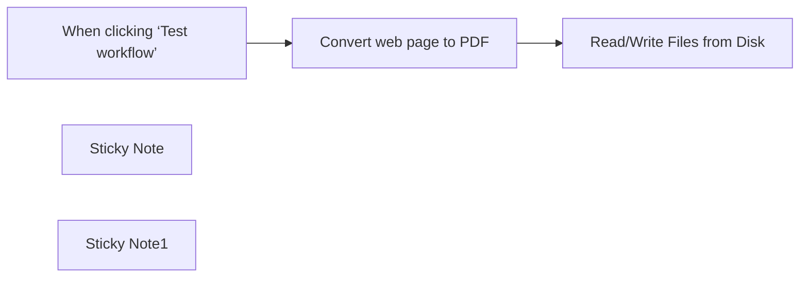

## Fluxo (.json) :

```json
{
  "meta": {
    "instanceId": "1dd912a1610cd0376bae7bb8f1b5838d2b601f42ac66a48e012166bb954fed5a",
    "templateId": "2310"
  },
  "nodes": [
    {
      "id": "df9d04c7-2116-421a-9061-f3ae9118817a",
      "name": "Convert web page to PDF",
      "type": "n8n-nodes-base.httpRequest",
      "position": [
        560,
        240
      ],
      "parameters": {
        "url": "https://v2.convertapi.com/convert/web/to/pdf",
        "method": "POST",
        "options": {
          "response": {
            "response": {
              "responseFormat": "file"
            }
          }
        },
        "sendBody": true,
        "contentType": "multipart-form-data",
        "sendHeaders": true,
        "authentication": "genericCredentialType",
        "bodyParameters": {
          "parameters": [
            {
              "name": "url",
              "value": "https://n8n.io"
            }
          ]
        },
        "genericAuthType": "httpQueryAuth",
        "headerParameters": {
          "parameters": [
            {
              "name": "Accept",
              "value": "application/octet-stream"
            }
          ]
        }
      },
      "credentials": {
        "httpQueryAuth": {
          "id": "WdAklDMod8fBEMRk",
          "name": "Query Auth account"
        }
      },
      "typeVersion": 4.2
    },
    {
      "id": "2f559bbd-54ca-40db-bb7c-3a00481a017d",
      "name": "When clicking ‘Test workflow’",
      "type": "n8n-nodes-base.manualTrigger",
      "position": [
        380,
        240
      ],
      "parameters": {},
      "typeVersion": 1
    },
    {
      "id": "d265d2b7-0079-4db8-a208-88bbeb965475",
      "name": "Read/Write Files from Disk",
      "type": "n8n-nodes-base.readWriteFile",
      "position": [
        960,
        240
      ],
      "parameters": {
        "options": {},
        "fileName": "document.pdf",
        "operation": "write",
        "dataPropertyName": "=data"
      },
      "typeVersion": 1
    },
    {
      "id": "6e17fb0d-cc52-4e33-b0e0-7256cdef1240",
      "name": "Sticky Note",
      "type": "n8n-nodes-base.stickyNote",
      "position": [
        520,
        80
      ],
      "parameters": {
        "width": 218,
        "height": 132,
        "content": "## Authentication\nConversion requests must be authenticated. Please create \n[ConvertAPI account to get authentication secret](https://www.convertapi.com/a/signin)"
      },
      "typeVersion": 1
    },
    {
      "id": "13d9a34a-7516-4fb2-9e5b-62cc8f5259ac",
      "name": "Sticky Note1",
      "type": "n8n-nodes-base.stickyNote",
      "position": [
        500,
        420
      ],
      "parameters": {
        "width": 281,
        "content": "## Set Url to Webpage\nSet the url to the webpage, that should be converted to pdf in the parameter `url`"
      },
      "typeVersion": 1
    }
  ],
  "pinData": {},
  "connections": {
    "Convert web page to PDF": {
      "main": [
        [
          {
            "node": "Read/Write Files from Disk",
            "type": "main",
            "index": 0
          }
        ]
      ]
    },
    "When clicking ‘Test workflow’": {
      "main": [
        [
          {
            "node": "Convert web page to PDF",
            "type": "main",
            "index": 0
          }
        ]
      ]
    }
  }
}
```

<a id="template-834"></a>

## Template 834 - Listar sessões Stripe e filtrar custom_fields

- **Nome:** Listar sessões Stripe e filtrar custom_fields
- **Descrição:** Busca sessões de checkout no Stripe dentro de um intervalo de tempo configurável e filtra os resultados com base em campos personalizados.
- **Funcionalidade:** • Listagem paginada de sessões de checkout: Recupera todas as sessões dentro do período definido usando paginação para obter todos os resultados.
• Consulta por intervalo de criação: Permite ajustar o parâmetro "created" para definir o período de busca (ex.: últimos dias).
• Separação dos registros retornados: Divide a lista de sessões em itens individuais para processamento mais simples.
• Expansão dos campos personalizados: Separa os custom_fields de cada sessão em itens distintos para visualização e filtragem.
• Filtro por chave de campo personalizado: Mantém apenas os itens que contêm campos personalizados específicos (ex.: nickname e job_title).
- **Ferramentas:** • Stripe: API para listar sessões de checkout, consultar por data e acessar campos personalizados, usando autenticação por chave.

## Fluxo visual

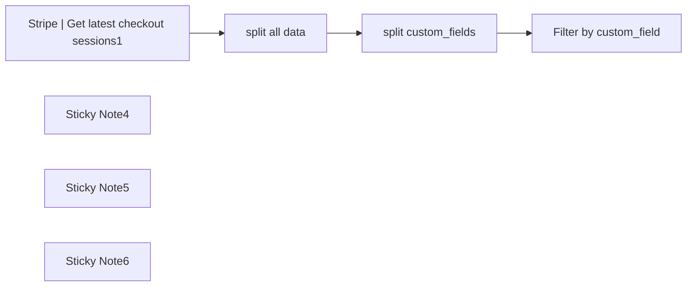

## Fluxo (.json) :

```json
{
  "meta": {
    "instanceId": "84ba6d895254e080ac2b4916d987aa66b000f88d4d919a6b9c76848f9b8a7616",
    "templateId": "2359"
  },
  "nodes": [
    {
      "id": "654e210f-08b1-4ba4-b464-9499084092a2",
      "name": "split custom_fields",
      "type": "n8n-nodes-base.splitOut",
      "position": [
        980,
        640
      ],
      "parameters": {
        "include": "allOtherFields",
        "options": {},
        "fieldToSplitOut": "custom_fields"
      },
      "typeVersion": 1
    },
    {
      "id": "9b1a4071-7dd8-4d60-b077-d686fff40d24",
      "name": "Stripe | Get latest checkout sessions1",
      "type": "n8n-nodes-base.httpRequest",
      "position": [
        460,
        640
      ],
      "parameters": {
        "url": "=https://api.stripe.com/v1/checkout/sessions",
        "options": {
          "pagination": {
            "pagination": {
              "parameters": {
                "parameters": [
                  {
                    "name": "starting_after",
                    "value": "={{ $response.body.data.last().id }}"
                  }
                ]
              },
              "completeExpression": "={{ $response.body.has_more == false }}",
              "paginationCompleteWhen": "other"
            }
          }
        },
        "jsonQuery": "={\n  \"created\": {\n    \"gte\":{{ $today.minus(20, 'days').toSeconds() }},\n    \"lte\":{{ $today.toSeconds() }}\n  }\n}",
        "sendQuery": true,
        "specifyQuery": "json",
        "authentication": "predefinedCredentialType",
        "nodeCredentialType": "stripeApi"
      },
      "typeVersion": 4.2
    },
    {
      "id": "17016a73-5338-49c7-af8d-8587c778c2f6",
      "name": "Sticky Note4",
      "type": "n8n-nodes-base.stickyNote",
      "position": [
        380,
        240
      ],
      "parameters": {
        "color": 7,
        "width": 252.741654751449,
        "height": 593.3373455805055,
        "content": "## Retrieve all checkout sessions from the last 7 days.\n\nYou can adjust the period by changing the \"created\" value.\n\n[🔍 Learn more about the \"created\" parameter](https://docs.stripe.com/api/checkout/sessions/list?lang=curl#list_checkout_sessions-created)\n\n\nAnd this node uses pagination to get all results. You want to keep those settings at the bottom."
      },
      "typeVersion": 1
    },
    {
      "id": "e46a5332-a008-4617-be57-eb22e713022d",
      "name": "Sticky Note5",
      "type": "n8n-nodes-base.stickyNote",
      "position": [
        700,
        545
      ],
      "parameters": {
        "color": 7,
        "width": 451.2991079615292,
        "height": 267.24226082469556,
        "content": "## Split data for easier visualization"
      },
      "typeVersion": 1
    },
    {
      "id": "ebf8a12a-787c-4ab8-9060-2241bbf38489",
      "name": "Sticky Note6",
      "type": "n8n-nodes-base.stickyNote",
      "position": [
        1220,
        237
      ],
      "parameters": {
        "color": 7,
        "height": 598.2429925878827,
        "content": "## Select the custom fields you want\n\nHere you can choose to filter your contacts to keep only the ones who contain certain custom_fields.\n\nLet's say you only want the ones who have filled their nickname and job title."
      },
      "typeVersion": 1
    },
    {
      "id": "e9c54905-dadb-4b5e-9ce0-cfe7d436c51e",
      "name": "Filter by custom_field",
      "type": "n8n-nodes-base.filter",
      "position": [
        1280,
        640
      ],
      "parameters": {
        "options": {},
        "conditions": {
          "options": {
            "leftValue": "",
            "caseSensitive": true,
            "typeValidation": "strict"
          },
          "combinator": "and",
          "conditions": [
            {
              "id": "4579d72e-8d48-4146-952d-9b5b400f5bce",
              "operator": {
                "type": "string",
                "operation": "equals"
              },
              "leftValue": "={{ $json.custom_fields.key }}",
              "rightValue": "nickname"
            },
            {
              "id": "34197f40-9b41-46e4-8796-be3a86e4dcca",
              "operator": {
                "type": "string",
                "operation": "equals"
              },
              "leftValue": "={{ $json.custom_fields.key }}",
              "rightValue": "job_title"
            }
          ]
        }
      },
      "typeVersion": 2
    },
    {
      "id": "14915079-68ba-48ab-9a9d-fe627aa2bd33",
      "name": "split all data",
      "type": "n8n-nodes-base.splitOut",
      "position": [
        760,
        640
      ],
      "parameters": {
        "options": {},
        "fieldToSplitOut": "data"
      },
      "typeVersion": 1
    }
  ],
  "pinData": {},
  "connections": {
    "split all data": {
      "main": [
        [
          {
            "node": "split custom_fields",
            "type": "main",
            "index": 0
          }
        ]
      ]
    },
    "split custom_fields": {
      "main": [
        [
          {
            "node": "Filter by custom_field",
            "type": "main",
            "index": 0
          }
        ]
      ]
    },
    "Stripe | Get latest checkout sessions1": {
      "main": [
        [
          {
            "node": "split all data",
            "type": "main",
            "index": 0
          }
        ]
      ]
    }
  }
}
```

<a id="template-835"></a>

## Template 835 - Novo contato para Airtable

- **Nome:** Novo contato para Airtable
- **Descrição:** Este fluxo registra novos contatos recebidos via Autopilot em uma base do Airtable, salvando nome, sobrenome e e-mail.
- **Funcionalidade:** • Detecção de evento: Inicia a automação quando um novo contato é adicionado no Autopilot.
• Mapeamento de dados do contato: Extrai FirstName, LastName e Email do payload.
• Registro no Airtable: Insere uma nova linha em Table 1 com os campos do contato.
- **Ferramentas:** • Autopilot: Plataforma de automação de marketing que aciona a automação ao adicionar um novo contato.
• Airtable: Base de dados online onde cada novo contato é registrado como uma nova linha em Table 1.

## Fluxo visual

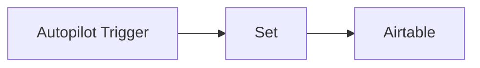

## Fluxo (.json) :

```json
{
  "nodes": [
    {
      "name": "Autopilot Trigger",
      "type": "n8n-nodes-base.autopilotTrigger",
      "position": [
        470,
        200
      ],
      "webhookId": "d7aa9691-49cb-4b01-8ecc-9a38fd708cf2",
      "parameters": {
        "event": "contactAdded"
      },
      "credentials": {
        "autopilotApi": "Autopilot API Credentials"
      },
      "typeVersion": 1
    },
    {
      "name": "Set",
      "type": "n8n-nodes-base.set",
      "position": [
        670,
        200
      ],
      "parameters": {
        "values": {
          "string": [
            {
              "name": "First Name",
              "value": "={{$json[\"contact\"][\"FirstName\"]}}"
            },
            {
              "name": "Last Name",
              "value": "={{$json[\"contact\"][\"LastName\"]}}"
            },
            {
              "name": "Email",
              "value": "={{$json[\"contact\"][\"Email\"]}}"
            }
          ]
        },
        "options": {},
        "keepOnlySet": true
      },
      "typeVersion": 1
    },
    {
      "name": "Airtable",
      "type": "n8n-nodes-base.airtable",
      "position": [
        870,
        200
      ],
      "parameters": {
        "table": "Table 1",
        "options": {},
        "operation": "append",
        "application": "appflT9EkWRGsSFM2"
      },
      "credentials": {
        "airtableApi": "Airtable Credentials n8n"
      },
      "typeVersion": 1
    }
  ],
  "connections": {
    "Set": {
      "main": [
        [
          {
            "node": "Airtable",
            "type": "main",
            "index": 0
          }
        ]
      ]
    },
    "Autopilot Trigger": {
      "main": [
        [
          {
            "node": "Set",
            "type": "main",
            "index": 0
          }
        ]
      ]
    }
  }
}
```

<a id="template-836"></a>

## Template 836 - Sincronização periódica de workflows para Notion

- **Nome:** Sincronização periódica de workflows para Notion
- **Descrição:** Busca workflows com uma tag específica e cria ou atualiza páginas em uma base do Notion com informações e metadados dos workflows.
- **Funcionalidade:** • Agendamento periódico: Executa a rotina a cada 15 minutos para verificar atualizações.
• Filtragem por tag: Seleciona apenas workflows marcados com a tag "sync-to-notion".
• Extração e formatação de campos: Prepara campos como id (env id), URL do workflow, nome, flags (ativo, configuração de erro) e datas de criação/atualização.
• Consulta no Notion por env id: Verifica se já existe uma página correspondente no banco de dados do Notion usando o campo env id.
• Criação de página no Notion: Quando não existe página correspondente, cria uma nova com as propriedades mapeadas (texto, URL, checkbox, datas).
• Atualização de página no Notion: Quando já existe, atualiza propriedades como nome, URL, status ativo, data de atualização e flag de erro.
• Construção de URL de acesso: Gera a URL direta do workflow baseada na variável de instância para inclusão na página do Notion.
- **Ferramentas:** • Notion: Plataforma de banco de dados usada como destino para criar, consultar e atualizar páginas via API.
• API da instância de automação: Fonte de dados que fornece os workflows e seus metadados (id, nome, datas, configurações) para sincronização.

## Fluxo visual

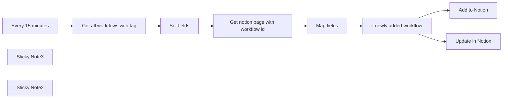

## Fluxo (.json) :

```json
{
  "nodes": [
    {
      "id": "2c3549c1-99c1-4255-a02d-2f454e6ced5e",
      "name": "Every 15 minutes",
      "type": "n8n-nodes-base.scheduleTrigger",
      "position": [
        560,
        340
      ],
      "parameters": {
        "rule": {
          "interval": [
            {
              "field": "minutes",
              "minutesInterval": 15
            }
          ]
        }
      },
      "typeVersion": 1.1
    },
    {
      "id": "3380272e-5631-44aa-b7da-5e23e0966978",
      "name": "Get all workflows with tag",
      "type": "n8n-nodes-base.n8n",
      "position": [
        780,
        340
      ],
      "parameters": {
        "filters": {
          "tags": "sync-to-notion"
        }
      },
      "credentials": {
        "n8nApi": {
          "id": "230",
          "name": "n8n admin account"
        }
      },
      "typeVersion": 1
    },
    {
      "id": "d702f13e-8e93-4142-87c7-49fbb6031e19",
      "name": "Set fields",
      "type": "n8n-nodes-base.set",
      "position": [
        1000,
        340
      ],
      "parameters": {
        "options": {},
        "assignments": {
          "assignments": [
            {
              "id": "1744510d-7ed7-46d8-acd3-f975ab73f298",
              "name": "active",
              "type": "boolean",
              "value": "={{ $json.active }}"
            },
            {
              "id": "7e76f5dc-0c32-4b26-a289-975155b80112",
              "name": "url",
              "type": "string",
              "value": "={{ $vars.instance_url }}workflow/{{ $json.id }}"
            },
            {
              "id": "a7b069bf-8090-4dca-a432-f4fd7aa84e6f",
              "name": "errorWorkflow",
              "type": "boolean",
              "value": "={{ !!$json.settings?.errorWorkflow }}"
            },
            {
              "id": "0bff7a9b-0860-4552-b0f6-5fc279fc75d6",
              "name": "name",
              "type": "string",
              "value": "={{ $json.name }}"
            },
            {
              "id": "3065ee2f-d1bb-42b7-b341-7bb38b0f6720",
              "name": "updatedAt",
              "type": "string",
              "value": "={{ $json.updatedAt }}"
            },
            {
              "id": "ea9d39e4-50ca-4c79-b6ab-8b22cafd0257",
              "name": "createdAt",
              "type": "string",
              "value": "={{ $json.createdAt }}"
            },
            {
              "id": "265d66cd-1796-40eb-ae5b-dca8d1a91871",
              "name": "envId",
              "type": "string",
              "value": "=internal-{{ $json.id }}"
            }
          ]
        }
      },
      "typeVersion": 3.3
    },
    {
      "id": "4527dc91-bad5-4214-b210-ea8f89504fbf",
      "name": "Get notion page with workflow id",
      "type": "n8n-nodes-base.httpRequest",
      "position": [
        1220,
        340
      ],
      "parameters": {
        "url": "https://api.notion.com/v1/databases/fa25c53eac9a416eab3961b2f5c0c647/query",
        "method": "POST",
        "options": {},
        "jsonBody": "={\n    \"filter\": { \"and\": [\n    {\n        \"property\": \"env id\",\n        \"rich_text\": { \"contains\": \"{{ $json.envId }}\" }\n    }]\n}\n}",
        "sendBody": true,
        "sendHeaders": true,
        "specifyBody": "json",
        "authentication": "predefinedCredentialType",
        "headerParameters": {
          "parameters": [
            {
              "name": "Notion-Version",
              "value": "2022-06-28"
            }
          ]
        },
        "nodeCredentialType": "notionApi"
      },
      "credentials": {
        "notionApi": {
          "id": "1exvaAn7wzyBgkXZ",
          "name": "Nik's Notion Cred"
        }
      },
      "typeVersion": 4.1
    },
    {
      "id": "ced49644-b18f-4984-8dfd-199d88e3ded7",
      "name": "Map fields",
      "type": "n8n-nodes-base.set",
      "position": [
        1440,
        340
      ],
      "parameters": {
        "options": {},
        "assignments": {
          "assignments": [
            {
              "id": "49092f3a-7f42-4067-b8ea-1073ef1d1bb8",
              "name": "input",
              "type": "object",
              "value": "={{ $('Set fields').item.json }}"
            }
          ]
        },
        "includeOtherFields": true
      },
      "typeVersion": 3.3
    },
    {
      "id": "b890dacf-2ac2-4802-b96a-5097119d35ee",
      "name": "if newly added workflow",
      "type": "n8n-nodes-base.if",
      "position": [
        1660,
        340
      ],
      "parameters": {
        "options": {},
        "conditions": {
          "options": {
            "leftValue": "",
            "caseSensitive": true,
            "typeValidation": "strict"
          },
          "combinator": "and",
          "conditions": [
            {
              "id": "88337d36-8cf6-4cd5-bec1-5123cf612934",
              "operator": {
                "type": "array",
                "operation": "empty",
                "singleValue": true
              },
              "leftValue": "={{ $json.results }}",
              "rightValue": ""
            }
          ]
        }
      },
      "typeVersion": 2
    },
    {
      "id": "86edfe55-9a88-49ed-82de-df0c44a65d53",
      "name": "Add to Notion",
      "type": "n8n-nodes-base.notion",
      "position": [
        1920,
        240
      ],
      "parameters": {
        "title": "={{ $json.input.name }}",
        "options": {},
        "resource": "databasePage",
        "databaseId": {
          "__rl": true,
          "mode": "list",
          "value": "fa25c53e-ac9a-416e-ab39-61b2f5c0c647",
          "cachedResultUrl": "https://www.notion.so/fa25c53eac9a416eab3961b2f5c0c647",
          "cachedResultName": "Workflows maintained"
        },
        "propertiesUi": {
          "propertyValues": [
            {
              "key": "env id|rich_text",
              "textContent": "={{ $json.input.envId }}"
            },
            {
              "key": "URL (dev)|url",
              "urlValue": "={{ $json.input.url }}"
            },
            {
              "key": "isActive (dev)|checkbox",
              "checkboxValue": "={{ $json.input.active }}"
            },
            {
              "key": "Workflow created at|date",
              "date": "={{ $json.input.createdAt }}"
            },
            {
              "key": "Workflow updatded at|date",
              "date": "={{ $json.input.updatedAt }}"
            },
            {
              "key": "Error workflow setup|checkbox",
              "checkboxValue": "={{ $json.input.errorWorkflow }}"
            }
          ]
        }
      },
      "credentials": {
        "notionApi": {
          "id": "1exvaAn7wzyBgkXZ",
          "name": "Nik's Notion Cred"
        }
      },
      "typeVersion": 2.1
    },
    {
      "id": "9d547270-37dd-41ee-98b7-13001c954ffa",
      "name": "Update in Notion",
      "type": "n8n-nodes-base.notion",
      "position": [
        1920,
        440
      ],
      "parameters": {
        "pageId": {
          "__rl": true,
          "mode": "url",
          "value": "={{ $json.results[0].url }}"
        },
        "options": {},
        "resource": "databasePage",
        "operation": "update",
        "propertiesUi": {
          "propertyValues": [
            {
              "key": "isActive (dev)|checkbox",
              "checkboxValue": "={{ $json.input.active }}"
            },
            {
              "key": "Name|title",
              "title": "={{ $json.input.name }}"
            },
            {
              "key": "URL (dev)|url",
              "urlValue": "={{ $json.input.url }}"
            },
            {
              "key": "isActive (dev)|checkbox",
              "checkboxValue": "={{ $json.input.active }}"
            },
            {
              "key": "Workflow updatded at|date",
              "date": "={{ $json.input.updatedAt }}"
            },
            {
              "key": "Error workflow setup|checkbox",
              "checkboxValue": "={{ false }}"
            }
          ]
        }
      },
      "credentials": {
        "notionApi": {
          "id": "1exvaAn7wzyBgkXZ",
          "name": "Nik's Notion Cred"
        }
      },
      "typeVersion": 2.1
    },
    {
      "id": "9e4d88f6-aff8-48f1-9470-8b18aae7b83a",
      "name": "Sticky Note3",
      "type": "n8n-nodes-base.stickyNote",
      "position": [
        540,
        100
      ],
      "parameters": {
        "color": 5,
        "width": 445.6145160912248,
        "height": 193.68880276091272,
        "content": "### 👨‍🎤 Setup\n1. Add your n8n api creds\n2. Add your notion creds\n3. create notion database with fields `env id` as `text`, `isActive (dev)` as `boolean`, `URL (dev)` as `url`, `Workflow created at` as `date`, `Workflow updated at` as `date`, `Error workflow setup` as `boolean`\n4. Add tag `sync-to-notion` to some workflows"
      },
      "typeVersion": 1
    },
    {
      "id": "c212f6ec-22e3-41cf-b1a5-03f261715444",
      "name": "Sticky Note2",
      "type": "n8n-nodes-base.stickyNote",
      "position": [
        1000,
        540
      ],
      "parameters": {
        "color": 7,
        "width": 368.0997057335963,
        "height": 80,
        "content": "### 👆 Set instance url instead of `{{ $vars.instance_url }}` (or set the env variable if you have that feature)"
      },
      "typeVersion": 1
    }
  ],
  "pinData": {},
  "connections": {
    "Map fields": {
      "main": [
        [
          {
            "node": "if newly added workflow",
            "type": "main",
            "index": 0
          }
        ]
      ]
    },
    "Set fields": {
      "main": [
        [
          {
            "node": "Get notion page with workflow id",
            "type": "main",
            "index": 0
          }
        ]
      ]
    },
    "Every 15 minutes": {
      "main": [
        [
          {
            "node": "Get all workflows with tag",
            "type": "main",
            "index": 0
          }
        ]
      ]
    },
    "if newly added workflow": {
      "main": [
        [
          {
            "node": "Add to Notion",
            "type": "main",
            "index": 0
          }
        ],
        [
          {
            "node": "Update in Notion",
            "type": "main",
            "index": 0
          }
        ]
      ]
    },
    "Get all workflows with tag": {
      "main": [
        [
          {
            "node": "Set fields",
            "type": "main",
            "index": 0
          }
        ]
      ]
    },
    "Get notion page with workflow id": {
      "main": [
        [
          {
            "node": "Map fields",
            "type": "main",
            "index": 0
          }
        ]
      ]
    }
  }
}
```

<a id="template-837"></a>

## Template 837 - Notificações de lançamentos do GitHub no Slack

- **Nome:** Notificações de lançamentos do GitHub no Slack
- **Descrição:** Este fluxo verifica os últimos lançamentos de repositórios configurados e envia uma mensagem no Slack quando há um novo release nas últimas 24 horas.
- **Funcionalidade:** • Carregamento da configuração de repositórios: carrega a lista de orgs/repositórios a monitorar a partir de uma configuração codificada.
• Agendamento diário: inicia a verificação de lançamentos em intervalo diário para manter as informações atualizadas.
• Consulta do último lançamento: obtém o nome, descrição e URL do último release de cada repositório configurado.
• Detecção de novos lançamentos em 24h: verifica se o lançamento ocorreu após as últimas 24 horas.
• Notificação de lançamento: envia uma mensagem para o canal Slack com detalhes do novo release (nome do repo, título do release, descrição e link).
- **Ferramentas:** • GitHub API: Acesso à API de lançamentos para obter o último release de cada repositório configurado.
• Slack: Envio de mensagens para o canal de notificações com detalhes do lançamento.

## Fluxo visual

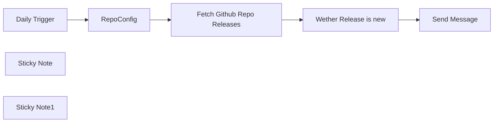

## Fluxo (.json) :

```json
{
  "meta": {
    "instanceId": "84ba6d895254e080ac2b4916d987aa66b000f88d4d919a6b9c76848f9b8a7616",
    "templateId": "2353"
  },
  "nodes": [
    {
      "id": "8a36e8d4-a3bf-44e1-894a-db00bad99151",
      "name": "Fetch Github Repo Releases",
      "type": "n8n-nodes-base.httpRequest",
      "position": [
        880,
        240
      ],
      "parameters": {
        "url": "=https://api.github.com/repos/{{ $json[\"github-org\"] }}/{{ $json[\"github-repo\"] }}/releases/latest",
        "options": {}
      },
      "typeVersion": 4.2,
      "alwaysOutputData": false
    },
    {
      "id": "4803248b-3ff7-4994-a105-3d8ef68bd45d",
      "name": "Daily Trigger",
      "type": "n8n-nodes-base.scheduleTrigger",
      "position": [
        380,
        240
      ],
      "parameters": {
        "rule": {
          "interval": [
            {}
          ]
        }
      },
      "typeVersion": 1.2
    },
    {
      "id": "0b2122d7-18cf-49b8-b10e-a8132df8ceb9",
      "name": "RepoConfig",
      "type": "n8n-nodes-base.code",
      "position": [
        620,
        240
      ],
      "parameters": {
        "jsCode": "return [\n  {\n    \"github-org\": \"n8n-io\",\n    \"github-repo\": \"n8n\"\n  },\n  {\n    \"github-org\": \"home-assistant\",\n    \"github-repo\": \"core\"\n  }\n];"
      },
      "typeVersion": 2
    },
    {
      "id": "60918b67-76bb-4c9e-bc84-845d59fced76",
      "name": "Sticky Note",
      "type": "n8n-nodes-base.stickyNote",
      "position": [
        540,
        100
      ],
      "parameters": {
        "width": 269,
        "height": 278,
        "content": "### Setup repos here to check releases for.\n\nAdd a new json object to the array setting the org and repo, these will be used by the following nodes"
      },
      "typeVersion": 1
    },
    {
      "id": "66fbb663-cd52-471c-be8b-4175f754d02d",
      "name": "Sticky Note1",
      "type": "n8n-nodes-base.stickyNote",
      "position": [
        1300,
        120
      ],
      "parameters": {
        "height": 254,
        "content": "### Setup Slack notification\n\nUpdate this node to customise your Slack notification"
      },
      "typeVersion": 1
    },
    {
      "id": "9b04cdd2-e369-4862-b376-9945e93c0aaf",
      "name": "Wether Release is new",
      "type": "n8n-nodes-base.if",
      "position": [
        1080,
        240
      ],
      "parameters": {
        "options": {},
        "conditions": {
          "options": {
            "leftValue": "",
            "caseSensitive": true,
            "typeValidation": "strict"
          },
          "combinator": "and",
          "conditions": [
            {
              "id": "014670a7-6f9e-466c-a403-24ad4e230dff",
              "operator": {
                "type": "dateTime",
                "operation": "after"
              },
              "leftValue": "={{ $json.published_at.toDateTime() }}",
              "rightValue": "={{ DateTime.utc().minus(1, 'days') }}"
            }
          ]
        }
      },
      "typeVersion": 2
    },
    {
      "id": "4ad55bb4-89d2-4f1d-bcb5-fe60aa4f8c79",
      "name": "Send Message",
      "type": "n8n-nodes-base.slack",
      "position": [
        1380,
        220
      ],
      "parameters": {
        "text": "=:tada: New release for *{{ $('RepoConfig').item.json[\"github-repo\"] }}* - {{ $('Fetch Github Repo Releases').item.json[\"name\"] }}\n\n{{ $json.body.slice(0, 500) }}\n\n{{ $('Fetch Github Repo Releases').item.json[\"url\"] }}",
        "select": "channel",
        "channelId": {
          "__rl": true,
          "mode": "name",
          "value": "#dk-test"
        },
        "otherOptions": {
          "mrkdwn": true
        }
      },
      "typeVersion": 2.2
    }
  ],
  "pinData": {},
  "connections": {
    "RepoConfig": {
      "main": [
        [
          {
            "node": "Fetch Github Repo Releases",
            "type": "main",
            "index": 0
          }
        ]
      ]
    },
    "Daily Trigger": {
      "main": [
        [
          {
            "node": "RepoConfig",
            "type": "main",
            "index": 0
          }
        ]
      ]
    },
    "Wether Release is new": {
      "main": [
        [
          {
            "node": "Send Message",
            "type": "main",
            "index": 0
          }
        ]
      ]
    },
    "Fetch Github Repo Releases": {
      "main": [
        [
          {
            "node": "Wether Release is new",
            "type": "main",
            "index": 0
          }
        ]
      ]
    }
  }
}
```

<a id="template-838"></a>

## Template 838 - Copiar line items de negócio ganho para novo negócio

- **Nome:** Copiar line items de negócio ganho para novo negócio
- **Descrição:** Ao receber um webhook do HubSpot, o fluxo copia os itens de linha (line items) de um negócio marcado como ganho para um novo negócio criado, mantendo associações e notificando por Slack.
- **Funcionalidade:** • Receber webhook do HubSpot: inicia a automação com parâmetros contendo os IDs dos negócios (ganho e criado).
• Extrair IDs dos negócios: captura e normaliza os IDs recebidos nos parâmetros da requisição.
• Recuperar line items do negócio ganho: consulta as associações para obter os IDs dos itens de linha.
• Ler line items em lote para obter SKUs: recupera propriedades dos line items incluindo hs_sku.
• Buscar produtos por SKU em lote: consulta produtos para obter IDs de produto e propriedades relevantes.
• Criar line items para o novo negócio em lote: gera novos itens de linha com product IDs e associa ao negócio criado.
• Notificar no Slack: envia mensagem com links para o workflow e para os negócios processados.
• Uso de autenticação por token do aplicativo HubSpot: realiza chamadas às APIs autenticadas para leitura e criação em lote.
- **Ferramentas:** • HubSpot: Plataforma CRM usada para disparar o webhook, consultar deals, line items e produtos via API e criar associações entre objetos.
• Slack: Plataforma de mensagens usada para enviar notificação de sucesso ao canal configurado.

## Fluxo visual

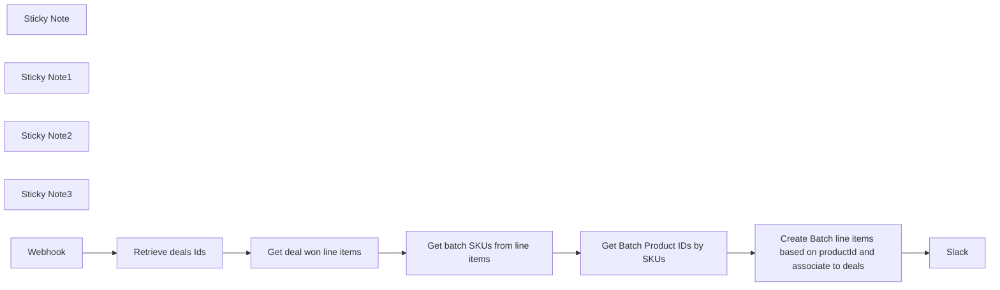

## Fluxo (.json) :

```json
{
  "meta": {
    "instanceId": "8e95de061dd3893a50b8b4c150c8084a7848fb1df63f53533941b7c91a8ab996"
  },
  "nodes": [
    {
      "id": "6f938c83-45fd-4189-b9ec-c7a6de4beb2d",
      "name": "Retrieve deals Ids",
      "type": "n8n-nodes-base.set",
      "position": [
        660,
        440
      ],
      "parameters": {
        "options": {},
        "assignments": {
          "assignments": [
            {
              "id": "bad2435b-ec9b-4995-ab39-2dac1c2daa3a",
              "name": "deal_id_won",
              "type": "string",
              "value": "={{ $json.query.deal_id_won }}"
            },
            {
              "id": "2376fad4-c305-4c38-8daa-fd86014ae14b",
              "name": "deal_id_created",
              "type": "string",
              "value": "={{ $json.query.deal_id_created.match(/0-3-(\\d+)$/)[1] }}"
            }
          ]
        }
      },
      "typeVersion": 3.4
    },
    {
      "id": "abc534f2-03b4-4f34-8292-bc8011c62c44",
      "name": "Get deal won line items",
      "type": "n8n-nodes-base.httpRequest",
      "position": [
        920,
        440
      ],
      "parameters": {
        "url": "https://api.hubapi.com/crm/v4/associations/deals/line_items/batch/read",
        "method": "POST",
        "options": {},
        "jsonBody": "={\n  \"inputs\": [\n    {\n      \"id\": \"{{ $json.deal_id_won }}\"\n    }\n  ]\n}",
        "sendBody": true,
        "specifyBody": "json",
        "authentication": "predefinedCredentialType",
        "nodeCredentialType": "hubspotAppToken"
      },
      "credentials": {
        "hubspotAppToken": {
          "id": "yIpa7XqurpoIimjq",
          "name": "HubSpot App Token account"
        },
        "hubspotOAuth2Api": {
          "id": "2",
          "name": "HubSpot account OAuth - Arnaud"
        }
      },
      "typeVersion": 4.2
    },
    {
      "id": "eb5ae93e-3b52-4a92-9506-5379bbca8e0b",
      "name": "Slack",
      "type": "n8n-nodes-base.slack",
      "position": [
        1740,
        440
      ],
      "parameters": {
        "text": "=:white_check_mark: {{ `<https://arnaud-growth.app.n8n.cloud/workflow/${$workflow.id}|${$workflow.name}> sucessfull on <https://app-eu1.hubspot.com/contacts/3418361/record/0-3/${$('Retrieve deals Ids').item.json[\"deal_id_won\"]}|Deal won> and <https://app-eu1.hubspot.com/contacts/3418361/record/0-3/${$('Retrieve deals Ids').item.json[\"deal_id_created\"]}|Deal created>`}}\n",
        "select": "channel",
        "channelId": {
          "__rl": true,
          "mode": "id",
          "value": "C051YHBJ1G8"
        },
        "otherOptions": {
          "includeLinkToWorkflow": false
        }
      },
      "credentials": {
        "slackApi": {
          "id": "5",
          "name": "Slack account"
        }
      },
      "typeVersion": 2.2
    },
    {
      "id": "d18841d0-a270-4db5-9256-17026985c13b",
      "name": "Get batch SKUs from line items",
      "type": "n8n-nodes-base.httpRequest",
      "position": [
        1100,
        440
      ],
      "parameters": {
        "url": "https://api.hubapi.com/crm/v3/objects/line_items/batch/read",
        "method": "POST",
        "options": {},
        "jsonBody": "={{ \n\n{\n  \"idProperty\": \"hs_object_id\",\n  \"inputs\": $jmespath($json.results,`[].to[].{id: to_string(toObjectId)}`),\n  \"properties\": [\n    \"hs_object_id\",\n    \"name\",\n    \"hs_sku\"\n  ]\n}\n\n}}",
        "sendBody": true,
        "sendQuery": true,
        "specifyBody": "json",
        "authentication": "predefinedCredentialType",
        "queryParameters": {
          "parameters": [
            {
              "name": "archived",
              "value": "false"
            }
          ]
        },
        "nodeCredentialType": "hubspotAppToken"
      },
      "credentials": {
        "hubspotAppToken": {
          "id": "yIpa7XqurpoIimjq",
          "name": "HubSpot App Token account"
        }
      },
      "typeVersion": 4.2
    },
    {
      "id": "58a9ae81-26d5-47fb-9de7-bf108cb41f8d",
      "name": "Get Batch Product IDs by SKUs",
      "type": "n8n-nodes-base.httpRequest",
      "position": [
        1320,
        440
      ],
      "parameters": {
        "url": "https://api.hubapi.com/crm/v3/objects/products/batch/read",
        "method": "POST",
        "options": {},
        "jsonBody": "={{ {\n  \"idProperty\": \"hs_sku\",\n  \"inputs\":  $jmespath($json.results,\"[].properties.{id:to_string(hs_sku)}\") \n,\n  \"properties\": [\n    \"idProperty\",\n    \"name\",\n    \"hs_object_id\",\n    \"recurringbillingfrequency\",\n\"hs_price_eur\"\n  ]\n}\n\n}}",
        "sendBody": true,
        "specifyBody": "json",
        "authentication": "predefinedCredentialType",
        "nodeCredentialType": "hubspotAppToken"
      },
      "credentials": {
        "hubspotAppToken": {
          "id": "yIpa7XqurpoIimjq",
          "name": "HubSpot App Token account"
        }
      },
      "typeVersion": 4.2
    },
    {
      "id": "27b2619a-af84-475a-9bdc-c86462ea57d3",
      "name": "Create Batch line items based on productId and associate to deals",
      "type": "n8n-nodes-base.httpRequest",
      "position": [
        1540,
        440
      ],
      "parameters": {
        "url": "https://api.hubapi.com/crm/v3/objects/line_items/batch/create",
        "method": "POST",
        "options": {},
        "jsonBody": "={{ {\"inputs\":$jmespath($json.results,\"[].id\")\n.map(id => ({\n    \"associations\": [\n        {\n            \"types\": [\n                {\n                    \"associationCategory\": \"HUBSPOT_DEFINED\",\n                    \"associationTypeId\": 20\n                }\n            ],\n            \"to\": {\n                \"id\": $('Retrieve deals Ids').item.json[\"deal_id_created\"]\n            }\n        }\n    ],\n    \"properties\": {\n        \"hs_product_id\": id,\n        \"quantity\": \"1\"\n    }\n})) } \n\n}}",
        "sendBody": true,
        "specifyBody": "json",
        "authentication": "predefinedCredentialType",
        "nodeCredentialType": "hubspotAppToken"
      },
      "credentials": {
        "hubspotAppToken": {
          "id": "yIpa7XqurpoIimjq",
          "name": "HubSpot App Token account"
        }
      },
      "typeVersion": 4.2
    },
    {
      "id": "f6776d74-c818-4f2b-b05a-5e6b53c2ad5f",
      "name": "Sticky Note",
      "type": "n8n-nodes-base.stickyNote",
      "position": [
        -280,
        200
      ],
      "parameters": {
        "width": 565.8142732633208,
        "height": 838.7224568543345,
        "content": "# Replicate Line Items on New Deal in HubSpot Workflow\n\n## Use Case\nThis workflow solves the problem of manually copying line items from one deal to another in HubSpot, reducing manual work and minimizing errors.\n\n## What this workflow does\n- **Triggers** upon receiving a webhook with deal IDs.\n- **Retrieves** the IDs of the won and created deals.\n- **Fetches** line items associated with the won deal.\n- **Extracts** product SKUs from the retrieved line items.\n- **Fetches** product details based on SKUs.\n- **Creates** new line items for the created deal and associates them.\n- **Sends** a Slack notification with success details.\n\n## Step up steps\n1. Create a HubSpot Deal Workflow\n 1.1 Set up your trigger (ex: when deal stage = Won)\n 1.2 Add step : Create Record (deal)\n 1.3 Add Step : Send webhook. The webhook should be a Get to your n8n first trigger. Set two query parameter : \n   - `deal_id_won` as the Record ID of the deal triggering the HubSpot Workflow\n    - `deal_id_create` as the Record ID of the deal created above. Click Insert Data -> The created object\n2. Set up your HubSpot App token in HubSpot -> Settings -> Integration -> Private Apps\n3. Set up your HubSpot Token integration using the predefined model.\n4. Set up your Slack connection\n5. Add an error Workflow to monitor errors"
      },
      "typeVersion": 1
    },
    {
      "id": "eefcd96e-c182-4362-bc60-6b5bca42e8a4",
      "name": "Sticky Note1",
      "type": "n8n-nodes-base.stickyNote",
      "position": [
        340,
        300
      ],
      "parameters": {
        "height": 393.4378126446013,
        "content": "**Step 1.**\nTriggered by HubSpot Workflow"
      },
      "typeVersion": 1
    },
    {
      "id": "9fedd8cf-6d97-428e-8391-aedff191ba5d",
      "name": "Sticky Note2",
      "type": "n8n-nodes-base.stickyNote",
      "position": [
        600,
        300
      ],
      "parameters": {
        "height": 393.4378126446013,
        "content": "**Step 2.**\nSet the Ids of the deal won and the deal created"
      },
      "typeVersion": 1
    },
    {
      "id": "b00a8849-0a13-40d3-a714-49f0afc54cea",
      "name": "Sticky Note3",
      "type": "n8n-nodes-base.stickyNote",
      "position": [
        860,
        300
      ],
      "parameters": {
        "width": 819.2253746903481,
        "height": 393.4378126446013,
        "content": "**Step 3.**\n- Get line items IDs from the deal won\n- Retrieve the SKUs from those line items\n- Get product based on SKUs\n- Create new line items from Product IDs and associate to the new deal\n"
      },
      "typeVersion": 1
    },
    {
      "id": "8dc60064-83a1-488e-b1a5-7be57d734e88",
      "name": "Webhook",
      "type": "n8n-nodes-base.webhook",
      "position": [
        420,
        440
      ],
      "webhookId": "833df60e-a78f-4a59-8244-9694f27cf8ae",
      "parameters": {
        "path": "833df60e-a78f-4a59-8244-9694f27cf8ae",
        "options": {}
      },
      "typeVersion": 2
    }
  ],
  "pinData": {},
  "connections": {
    "Webhook": {
      "main": [
        [
          {
            "node": "Retrieve deals Ids",
            "type": "main",
            "index": 0
          }
        ]
      ]
    },
    "Retrieve deals Ids": {
      "main": [
        [
          {
            "node": "Get deal won line items",
            "type": "main",
            "index": 0
          }
        ]
      ]
    },
    "Get deal won line items": {
      "main": [
        [
          {
            "node": "Get batch SKUs from line items",
            "type": "main",
            "index": 0
          }
        ]
      ]
    },
    "Get Batch Product IDs by SKUs": {
      "main": [
        [
          {
            "node": "Create Batch line items based on productId and associate to deals",
            "type": "main",
            "index": 0
          }
        ]
      ]
    },
    "Get batch SKUs from line items": {
      "main": [
        [
          {
            "node": "Get Batch Product IDs by SKUs",
            "type": "main",
            "index": 0
          }
        ]
      ]
    },
    "Create Batch line items based on productId and associate to deals": {
      "main": [
        [
          {
            "node": "Slack",
            "type": "main",
            "index": 0
          }
        ]
      ]
    }
  }
}
```

<a id="template-839"></a>

## Template 839 - Transcrição automatizada com registro em planilha

- **Nome:** Transcrição automatizada com registro em planilha
- **Descrição:** Este fluxo monitora a criação de arquivos em uma pasta, faz upload para armazenamento na nuvem, inicia uma transcrição, espera o resultado via webhook e registra informações na planilha.
- **Funcionalidade:** • Monitorar novo arquivo no Drive: aciona a automação quando um arquivo é criado na pasta monitorada.
• Fazer upload do arquivo para o bucket S3: envia o arquivo para armazenamento na nuvem.
• Listar objetos do bucket S3: obtém a lista de arquivos no bucket para determinar o arquivo a transcrever.
• Iniciar Transcrição de áudio: cria uma tarefa de transcrição para o arquivo no S3.
• Aguardar conclusão da transcrição via webhook: pausa a automação até receber o transcript.
• Recuperar texto transcrito e metadados: extrai o transcript e informações de tempo/nomes.
• Registrar dados na planilha: adiciona as informações na linha da planilha.
- **Ferramentas:** • Google Drive: Serviço de armazenamento na nuvem utilizado para monitorar e referenciar arquivos.
• AWS S3: Armazenamento de objetos para upload e acesso aos arquivos para transcrição.
• AWS Transcribe: Serviço de transcrição de áudio para gerar o texto.
• Google Sheets: Planilha usada para registrar informações transcritas.

## Fluxo visual

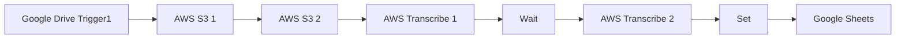

## Fluxo (.json) :

```json
{
  "nodes": [
    {
      "name": "Google Sheets",
      "type": "n8n-nodes-base.googleSheets",
      "position": [
        1240,
        1120
      ],
      "parameters": {
        "range": "A:D",
        "options": {},
        "sheetId": "qwertz",
        "operation": "append",
        "authentication": "oAuth2"
      },
      "credentials": {
        "googleSheetsOAuth2Api": {
          "id": "2",
          "name": "google_sheets_oauth"
        }
      },
      "typeVersion": 1
    },
    {
      "name": "AWS Transcribe 2",
      "type": "n8n-nodes-base.awsTranscribe",
      "position": [
        920,
        1120
      ],
      "parameters": {
        "operation": "get",
        "transcriptionJobName": "={{$json[\"Key\"]}}"
      },
      "credentials": {
        "aws": {
          "id": "9",
          "name": "aws"
        }
      },
      "typeVersion": 1
    },
    {
      "name": "AWS Transcribe 1",
      "type": "n8n-nodes-base.awsTranscribe",
      "position": [
        600,
        1120
      ],
      "parameters": {
        "options": {},
        "mediaFileUri": "=s3://{{$node[\"AWS S3 2\"].parameter[\"bucketName\"]}}/{{$json[\"Key\"]}}",
        "transcriptionJobName": "={{$json[\"Key\"]}}"
      },
      "credentials": {
        "aws": {
          "id": "9",
          "name": "aws"
        }
      },
      "typeVersion": 1
    },
    {
      "name": "AWS S3 1",
      "type": "n8n-nodes-base.awsS3",
      "position": [
        280,
        1120
      ],
      "parameters": {
        "tagsUi": {
          "tagsValues": [
            {
              "key": "source",
              "value": "gdrive"
            }
          ]
        },
        "fileName": "={{$json[\"name\"]}}",
        "operation": "upload",
        "binaryData": false,
        "bucketName": "mybucket",
        "fileContent": "street",
        "additionalFields": {}
      },
      "credentials": {
        "aws": {
          "id": "9",
          "name": "aws"
        }
      },
      "typeVersion": 1
    },
    {
      "name": "AWS S3 2",
      "type": "n8n-nodes-base.awsS3",
      "position": [
        440,
        1120
      ],
      "parameters": {
        "options": {},
        "operation": "getAll",
        "bucketName": "mybucket"
      },
      "credentials": {
        "aws": {
          "id": "9",
          "name": "aws"
        }
      },
      "typeVersion": 1
    },
    {
      "name": "Set",
      "type": "n8n-nodes-base.set",
      "position": [
        1080,
        1120
      ],
      "parameters": {
        "values": {
          "number": [
            {
              "name": "transcription_date",
              "value": "={{$node[\"AWS Transcribe 1\"].json[\"CreationTime\"]}}"
            }
          ],
          "string": [
            {
              "name": "recording_name",
              "value": "={{$node[\"AWS Transcribe 1\"].json[\"TranscriptionJobName\"]}}"
            },
            {
              "name": "recording_link",
              "value": "={{$node[\"Google Drive Trigger\"].json[\"webContentLink\"]}}"
            },
            {
              "name": "transcription",
              "value": "={{$json[\"transcript\"]}}"
            }
          ]
        },
        "options": {}
      },
      "typeVersion": 1
    },
    {
      "name": "Google Drive Trigger1",
      "type": "n8n-nodes-base.googleDriveTrigger",
      "position": [
        120,
        1120
      ],
      "parameters": {
        "event": "fileCreated",
        "options": {},
        "triggerOn": "specificFolder",
        "folderToWatch": "https://drive.google.com/drive/folders/[your_id]"
      },
      "credentials": {
        "googleDriveOAuth2Api": {
          "id": "59",
          "name": "Google Drive account"
        }
      },
      "typeVersion": 1
    },
    {
      "name": "Wait",
      "type": "n8n-nodes-base.wait",
      "position": [
        760,
        1120
      ],
      "webhookId": "12345",
      "parameters": {
        "resume": "webhook",
        "options": {
          "responsePropertyName": "transcript"
        },
        "responseMode": "lastNode"
      },
      "typeVersion": 1
    }
  ],
  "connections": {
    "Set": {
      "main": [
        [
          {
            "node": "Google Sheets",
            "type": "main",
            "index": 0
          }
        ]
      ]
    },
    "Wait": {
      "main": [
        [
          {
            "node": "AWS Transcribe 2",
            "type": "main",
            "index": 0
          }
        ]
      ]
    },
    "AWS S3 1": {
      "main": [
        [
          {
            "node": "AWS S3 2",
            "type": "main",
            "index": 0
          }
        ]
      ]
    },
    "AWS S3 2": {
      "main": [
        [
          {
            "node": "AWS Transcribe 1",
            "type": "main",
            "index": 0
          }
        ]
      ]
    },
    "AWS Transcribe 1": {
      "main": [
        [
          {
            "node": "Wait",
            "type": "main",
            "index": 0
          }
        ]
      ]
    },
    "AWS Transcribe 2": {
      "main": [
        [
          {
            "node": "Set",
            "type": "main",
            "index": 0
          }
        ]
      ]
    },
    "Google Drive Trigger1": {
      "main": [
        [
          {
            "node": "AWS S3 1",
            "type": "main",
            "index": 0
          }
        ]
      ]
    }
  }
}
```

<a id="template-840"></a>

## Template 840 - Criar, atualizar e obter issue no Taiga

- **Nome:** Criar, atualizar e obter issue no Taiga
- **Descrição:** Fluxo acionado manualmente para criar uma issue em um projeto do Taiga, atualizar sua descrição e recuperar os dados atualizados.
- **Funcionalidade:** • Gatilho manual: Inicia o fluxo ao clicar em executar.
• Criação de issue: Cria uma nova issue no projeto especificado com o assunto definido.
• Atualização de issue: Atualiza a issue criada usando seu ID, modificando campos como descrição.
• Recuperação de issue: Consulta a issue atualizada para obter os dados finais.
• Encadeamento de ações: Utiliza o ID retornado pela criação para garantir que a atualização e a recuperação atuem sobre a mesma issue.
- **Ferramentas:** • Taiga: Plataforma de gerenciamento de projetos usada para criar, atualizar e consultar issues via API.

## Fluxo visual

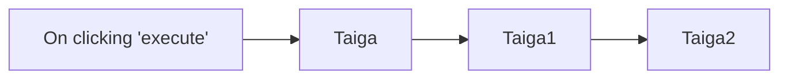

## Fluxo (.json) :

```json
{
  "id": "69",
  "name": "Create, update, and get an issue on Taiga",
  "nodes": [
    {
      "name": "On clicking 'execute'",
      "type": "n8n-nodes-base.manualTrigger",
      "position": [
        430,
        260
      ],
      "parameters": {},
      "typeVersion": 1
    },
    {
      "name": "Taiga",
      "type": "n8n-nodes-base.taiga",
      "position": [
        630,
        260
      ],
      "parameters": {
        "subject": "n8n-docs",
        "projectId": 385605,
        "additionalFields": {}
      },
      "credentials": {
        "taigaCloudApi": "taiga"
      },
      "typeVersion": 1
    },
    {
      "name": "Taiga1",
      "type": "n8n-nodes-base.taiga",
      "position": [
        830,
        260
      ],
      "parameters": {
        "issueId": "={{$node[\"Taiga\"].json[\"id\"]}}",
        "operation": "update",
        "projectId": "={{$node[\"Taiga\"].json[\"project\"]}}",
        "updateFields": {
          "description": "This ticket is for the documentation for the Taiga node"
        }
      },
      "credentials": {
        "taigaCloudApi": "taiga"
      },
      "typeVersion": 1
    },
    {
      "name": "Taiga2",
      "type": "n8n-nodes-base.taiga",
      "position": [
        1030,
        260
      ],
      "parameters": {
        "issueId": "={{$node[\"Taiga\"].json[\"id\"]}}",
        "operation": "get"
      },
      "credentials": {
        "taigaCloudApi": "taiga"
      },
      "typeVersion": 1
    }
  ],
  "active": false,
  "settings": {},
  "connections": {
    "Taiga": {
      "main": [
        [
          {
            "node": "Taiga1",
            "type": "main",
            "index": 0
          }
        ]
      ]
    },
    "Taiga1": {
      "main": [
        [
          {
            "node": "Taiga2",
            "type": "main",
            "index": 0
          }
        ]
      ]
    },
    "On clicking 'execute'": {
      "main": [
        [
          {
            "node": "Taiga",
            "type": "main",
            "index": 0
          }
        ]
      ]
    }
  }
}
```

<a id="template-841"></a>

## Template 841 - Watermark central sobre Fundo

- **Nome:** Watermark central sobre Fundo
- **Descrição:** Este fluxo recupera um background e uma imagem de watermark, obtém seus metadados, calcula o centro, e sobrepõe o watermark no centro do background, gerando uma imagem combinada.
- **Funcionalidade:** • Requisição das imagens: baixar o background e o overlay para processamento.
• Extração de metadados: obter dimensões das imagens para posicionamento.
• Cálculo da posição central: determinar o ponto exato onde o overlay ficará sobre o background.
• Composição das imagens: sobrepor o overlay no background na posição calculada.
• Geração da imagem final: salvar a imagem resultante (out.png).
- **Ferramentas:** • Fundo de imagem remoto: URL https://cloud.let-the-work-flow.com/workflow-data/robot-1.png (imagem de fundo a ser processada).
• Logo/overlay remoto: URL https://cloud.let-the-work-flow.com/workflow-data/logo-shadow.png (overlay a ser usado como watermark).

## Fluxo visual

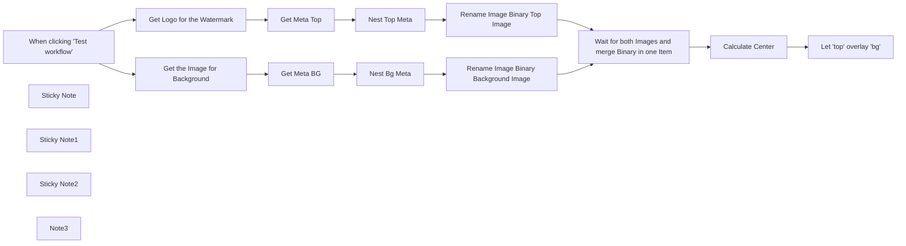

## Fluxo (.json) :

```json
{
  "meta": {
    "instanceId": "ecec1cfe760b632dcb0132ecf2ac7c047c6f290f3f4a5640e2e2466f0269ccaf"
  },
  "nodes": [
    {
      "id": "a30e02b0-b807-4a4c-b2a6-19bacf5f2f8f",
      "name": "When clicking \"Test workflow\"",
      "type": "n8n-nodes-base.manualTrigger",
      "position": [
        800,
        180
      ],
      "parameters": {},
      "typeVersion": 1
    },
    {
      "id": "558afdb5-7311-48f1-9464-01b6933eaffe",
      "name": "Get Meta BG",
      "type": "n8n-nodes-base.editImage",
      "position": [
        1300,
        60
      ],
      "parameters": {
        "operation": "information"
      },
      "typeVersion": 1
    },
    {
      "id": "66bf1414-725b-40e3-be08-76f02a5d130f",
      "name": "Nest Top Meta",
      "type": "n8n-nodes-base.set",
      "position": [
        1480,
        320
      ],
      "parameters": {
        "options": {
          "includeBinary": true
        },
        "assignments": {
          "assignments": [
            {
              "id": "2fb3fd91-c13d-45ce-a7ec-612319a008fc",
              "name": "metaTop",
              "type": "object",
              "value": "={{ $json }}"
            }
          ]
        }
      },
      "typeVersion": 3.3
    },
    {
      "id": "29e77ce2-15a0-47a8-8b1c-8f457ae435c6",
      "name": "Nest Bg Meta",
      "type": "n8n-nodes-base.set",
      "position": [
        1480,
        60
      ],
      "parameters": {
        "options": {
          "includeBinary": true
        },
        "assignments": {
          "assignments": [
            {
              "id": "2fb3fd91-c13d-45ce-a7ec-612319a008fc",
              "name": "metaBg",
              "type": "object",
              "value": "={{ $json }}"
            }
          ]
        }
      },
      "typeVersion": 3.3
    },
    {
      "id": "dcdf4737-f881-4414-8fdb-1ce334e60093",
      "name": "Calculate Center",
      "type": "n8n-nodes-base.code",
      "position": [
        2280,
        180
      ],
      "parameters": {
        "mode": "runOnceForEachItem",
        "jsCode": "\n\n  const centerX = ($input.item.json.metaBg.size.width + $input.item.json.metaTop.size.width) / 2;\n  const centerY = ($input.item.json.metaBg.size.height + $input.item.json.metaTop.size.height) / 2;\n\n  $input.item.json.center = { x: centerX, y: centerY };\n\nreturn $input.item"
      },
      "typeVersion": 2
    },
    {
      "id": "7b146616-cbc7-4e21-a899-46fdc8e5c914",
      "name": "Get Logo for the Watermark",
      "type": "n8n-nodes-base.httpRequest",
      "position": [
        1100,
        320
      ],
      "parameters": {
        "url": "https://cloud.let-the-work-flow.com/workflow-data/logo-shadow.png",
        "options": {}
      },
      "typeVersion": 4.2
    },
    {
      "id": "7167d1b8-f0c4-4068-b5c8-bb23d5a5a589",
      "name": "Get the Image for Background",
      "type": "n8n-nodes-base.httpRequest",
      "position": [
        1100,
        60
      ],
      "parameters": {
        "url": "https://cloud.let-the-work-flow.com/workflow-data/robot-1.png",
        "options": {}
      },
      "typeVersion": 4.2
    },
    {
      "id": "df6b4e01-76aa-42dd-bf1f-8eb259cd4079",
      "name": "Wait for both Images and merge Binary in one Item",
      "type": "n8n-nodes-base.merge",
      "position": [
        1980,
        180
      ],
      "parameters": {
        "mode": "combine",
        "options": {},
        "combinationMode": "mergeByPosition"
      },
      "typeVersion": 2.1
    },
    {
      "id": "d5161149-275c-4e2d-9d55-7f1c18716933",
      "name": "Rename Image Binary Top Image",
      "type": "n8n-nodes-base.code",
      "position": [
        1660,
        320
      ],
      "parameters": {
        "mode": "runOnceForEachItem",
        "jsCode": "$input.item.binary.top = $input.item.binary.data;\ndelete $input.item.binary.data;\nreturn $input.item;"
      },
      "typeVersion": 2
    },
    {
      "id": "90b0e990-d330-4875-b492-28d52019784d",
      "name": "Rename Image Binary Background Image",
      "type": "n8n-nodes-base.code",
      "position": [
        1660,
        60
      ],
      "parameters": {
        "mode": "runOnceForEachItem",
        "jsCode": "$input.item.binary.bg = $input.item.binary.data;\ndelete $input.item.binary.data;\nreturn $input.item;"
      },
      "typeVersion": 2
    },
    {
      "id": "a2b3eaa3-61bb-4e91-a225-b6a9b5dd725c",
      "name": "Get Meta Top",
      "type": "n8n-nodes-base.editImage",
      "position": [
        1300,
        320
      ],
      "parameters": {
        "operation": "information"
      },
      "typeVersion": 1
    },
    {
      "id": "46b4e344-8ea6-4d87-9dc3-c3d80f17a9d5",
      "name": "Let \"top\" overlay \"bg\"",
      "type": "n8n-nodes-base.editImage",
      "position": [
        2600,
        180
      ],
      "parameters": {
        "options": {
          "format": "jpeg",
          "fileName": "out.png"
        },
        "operation": "composite",
        "positionX": "={{ $json.center.x - $json.metaTop.size.width }}",
        "positionY": "={{ $json.center.y - $json.metaTop.size.height }}",
        "dataPropertyName": "bg",
        "dataPropertyNameComposite": "top"
      },
      "typeVersion": 1
    },
    {
      "id": "ee7787f1-c717-416c-b076-18200e3109a0",
      "name": "Sticky Note",
      "type": "n8n-nodes-base.stickyNote",
      "position": [
        1020,
        -69.74382694102701
      ],
      "parameters": {
        "width": 820.7320856852112,
        "height": 612.1135700636542,
        "content": "## Retrieve the Background Image and fetch Meta from the File\n### Like Sizes, to properly place the \"Top Image\" a.k.a \"Watermark\" a.k.a \"Overlay\" above the \"Background\"-Image"
      },
      "typeVersion": 1
    },
    {
      "id": "80925b86-42dc-4cf9-8a3b-b8df913d4d8c",
      "name": "Sticky Note1",
      "type": "n8n-nodes-base.stickyNote",
      "position": [
        2180,
        60
      ],
      "parameters": {
        "width": 296.5141962579569,
        "height": 568.2663488290325,
        "content": "## Calculate the Position for the \"Top\" Image\n\n\n\n\n\n\n\n\n\n\n\n\n\nWe want to place the \"Top\"-Image it dead-center on the \"Background\"-Image. But the upper-left-corner is the origin for the operation. \n\nYou may adjust it to your needs, to – for example adjust the size of your Overlay-Image, or place it in some corner. Adjust the Formular to your needs.\n\n**⚠️ Limitation:** The Image that Overlays the Background-Image has to be <= the size of the background image to work properly."
      },
      "typeVersion": 1
    },
    {
      "id": "89dafe6a-d49a-43f7-94d2-3c5de5b67c9f",
      "name": "Sticky Note2",
      "type": "n8n-nodes-base.stickyNote",
      "position": [
        2520,
        360
      ],
      "parameters": {
        "color": 4,
        "width": 257.68541919015513,
        "height": 99.86957475347333,
        "content": "### 🖼️ Binary Property *bg* should now be the composite image and be overlayed by *top*"
      },
      "typeVersion": 1
    },
    {
      "id": "384bd626-fdbb-4073-ad9d-671b4aefe19e",
      "name": "Note3",
      "type": "n8n-nodes-base.stickyNote",
      "position": [
        301.53703835383794,
        -60
      ],
      "parameters": {
        "width": 448.40729941128825,
        "height": 745.9248098393447,
        "content": "## Instructions\n\nThis automation *overlays* a `background` image with another image, making it easy to add watermarks or logos.\n\nYou can use this automation to **watermark** your images by overlaying them with a transparent version of your logo. If you'd like to **place your logo in a specific corner**, feel free to _adjust the position_ of the overlay image in the code node.\n\n### How it Works\n\n1. Both images are downloaded, so we can process binary files (you can modify the source, tho.)\n2. We extract metadata, focusing on the dimensions of each image.\n3. The position of the overlay image is calculated (default: dead center of the background image).\n4. The two images are *composited* together.\n\n### Limitations and Optimization Opportunities\n\n1. The overlay image must be the same size or smaller than the background image for proper alignment.\n2. The overlay image does not automatically scale to match the proportions of the background image.\n\n  \nEnjoy the workflow! ❤️  \n[let the workf low](https://let-the-work-flow.com) — Workflow Automation & Development"
      },
      "typeVersion": 1
    }
  ],
  "pinData": {},
  "connections": {
    "Get Meta BG": {
      "main": [
        [
          {
            "node": "Nest Bg Meta",
            "type": "main",
            "index": 0
          }
        ]
      ]
    },
    "Get Meta Top": {
      "main": [
        [
          {
            "node": "Nest Top Meta",
            "type": "main",
            "index": 0
          }
        ]
      ]
    },
    "Nest Bg Meta": {
      "main": [
        [
          {
            "node": "Rename Image Binary Background Image",
            "type": "main",
            "index": 0
          }
        ]
      ]
    },
    "Nest Top Meta": {
      "main": [
        [
          {
            "node": "Rename Image Binary Top Image",
            "type": "main",
            "index": 0
          }
        ]
      ]
    },
    "Calculate Center": {
      "main": [
        [
          {
            "node": "Let \"top\" overlay \"bg\"",
            "type": "main",
            "index": 0
          }
        ]
      ]
    },
    "Get Logo for the Watermark": {
      "main": [
        [
          {
            "node": "Get Meta Top",
            "type": "main",
            "index": 0
          }
        ]
      ]
    },
    "Get the Image for Background": {
      "main": [
        [
          {
            "node": "Get Meta BG",
            "type": "main",
            "index": 0
          }
        ]
      ]
    },
    "Rename Image Binary Top Image": {
      "main": [
        [
          {
            "node": "Wait for both Images and merge Binary in one Item",
            "type": "main",
            "index": 1
          }
        ]
      ]
    },
    "When clicking \"Test workflow\"": {
      "main": [
        [
          {
            "node": "Get the Image for Background",
            "type": "main",
            "index": 0
          },
          {
            "node": "Get Logo for the Watermark",
            "type": "main",
            "index": 0
          }
        ]
      ]
    },
    "Rename Image Binary Background Image": {
      "main": [
        [
          {
            "node": "Wait for both Images and merge Binary in one Item",
            "type": "main",
            "index": 0
          }
        ]
      ]
    },
    "Wait for both Images and merge Binary in one Item": {
      "main": [
        [
          {
            "node": "Calculate Center",
            "type": "main",
            "index": 0
          }
        ]
      ]
    }
  }
}
```
