# PACK 1999 TEMPLATES PARTE 05 - Bloco 3

Templates neste bloco: 20

## Sumário

- [Template 842 - Gerenciamento de contatos e tags (Systeme.io)](#template-842)
- [Template 843 - Drive para upload automático no S3](#template-843)
- [Template 844 - Baixar S3 e ZIP](#template-844)
- [Template 845 - Coletor de perfis LinkedIn](#template-845)
- [Template 846 - Criar página Confluence a partir de template](#template-846)
- [Template 847 - Envio de SMS via MessageBird](#template-847)
- [Template 848 - Gatilho SNS para tópico n8n-rocks](#template-848)
- [Template 849 - Varredura periódica de propriedades de alto potencial](#template-849)
- [Template 850 - Publicar post com imagens no Bluesky](#template-850)
- [Template 851 - Processamento de imagens do Telegram para Airtable](#template-851)
- [Template 852 - Assinatura com IA e Airtable](#template-852)
- [Template 853 - Obter faixa do Spotify](#template-853)
- [Template 854 - Checagem de URL e pré-visualização Peekalink](#template-854)
- [Template 855 - Geração de banner IA e publicação no Discord](#template-855)
- [Template 856 - Extrair leads do Google Maps para Google Sheets](#template-856)
- [Template 857 - Geração de banner IA com Cloudinary e BannerBear](#template-857)
- [Template 858 - Atualizar Markdown para HTML no Baserow](#template-858)
- [Template 859 - Relay de webhooks públicos para endpoint local](#template-859)
- [Template 860 - Beeminder datapoint a partir de Strava](#template-860)
- [Template 861 - Criar novo contato no Agile CRM](#template-861)

---

<a id="template-842"></a>

## Template 842 - Gerenciamento de contatos e tags (Systeme.io)

- **Nome:** Gerenciamento de contatos e tags (Systeme.io)
- **Descrição:** Fluxo para recuperar todos os contatos, listar todas as tags, filtrar contatos por tags específicas e adicionar contatos em lote usando a API do Systeme.io.
- **Funcionalidade:** • Recuperar todos os contatos: Consulta o endpoint de contatos repetidamente até coletar todos os registros usando paginação baseada em 'startingAfter'.
• Listar todas as tags: Consulta o endpoint de tags com paginação para obter todos os rótulos da conta.
• Filtrar contatos por tag: Busca apenas os contatos que possuam um ou mais IDs de tag fornecidos como parâmetro.
• Adicionar contatos em lote: Envia múltiplos contatos em requisições em lote para criar ou atualizar leads em massa, incluindo campos personalizados.
• Tratamento de limites e espera entre requisições: Introduz intervalos entre chamadas e condições de conclusão para respeitar limites de taxa da API.
• Processamento item a item: Divide os resultados em itens individuais para possibilitar processamento ou ações adicionais por contato.
- **Ferramentas:** • Systeme.io API: API REST usada para gerenciar contatos e tags, com endpoints para listagem de contacts e tags, filtragem por tags e criação em massa de contatos.

## Fluxo visual

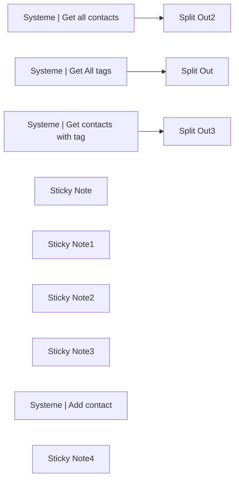

## Fluxo (.json) :

```json
{
  "meta": {
    "instanceId": "f9c40bccfbfb973b8ba2bfd7b70b906c2376bb9900216d1ce424582c3097fb66"
  },
  "nodes": [
    {
      "id": "89a2f8d1-a2fd-452b-8187-aec9e72efba5",
      "name": "Systeme | Get all contacts",
      "type": "n8n-nodes-base.httpRequest",
      "position": [
        480,
        80
      ],
      "parameters": {
        "url": "https://api.systeme.io/api/contacts",
        "options": {
          "pagination": {
            "pagination": {
              "parameters": {
                "parameters": [
                  {
                    "name": "startingAfter",
                    "value": "={{ $response.body.items.last().id }}"
                  }
                ]
              },
              "requestInterval": 1000,
              "completeExpression": "={{ $response.body.hasMore == false }}",
              "paginationCompleteWhen": "other"
            }
          }
        },
        "sendQuery": true,
        "authentication": "genericCredentialType",
        "genericAuthType": "httpHeaderAuth",
        "queryParameters": {
          "parameters": [
            {
              "name": "limit",
              "value": "100"
            }
          ]
        }
      },
      "retryOnFail": true,
      "typeVersion": 4.2
    },
    {
      "id": "56ad906f-0309-469a-8509-96ea6d56c0ba",
      "name": "Split Out2",
      "type": "n8n-nodes-base.splitOut",
      "position": [
        680,
        80
      ],
      "parameters": {
        "options": {},
        "fieldToSplitOut": "items"
      },
      "typeVersion": 1
    },
    {
      "id": "b2ffb152-c3f2-4d74-a25e-9ec3162b8dbe",
      "name": "Systeme | Get All tags",
      "type": "n8n-nodes-base.httpRequest",
      "position": [
        480,
        340
      ],
      "parameters": {
        "url": "https://api.systeme.io/api/tags",
        "options": {
          "pagination": {
            "pagination": {
              "parameters": {
                "parameters": [
                  {
                    "name": "startingAfter",
                    "value": "={{ $response.body.items.last().id }}"
                  }
                ]
              },
              "requestInterval": 1000,
              "completeExpression": "={{ $response.body.hasMore == false }}",
              "paginationCompleteWhen": "other"
            }
          }
        },
        "sendQuery": true,
        "authentication": "genericCredentialType",
        "genericAuthType": "httpHeaderAuth",
        "queryParameters": {
          "parameters": [
            {
              "name": "limit",
              "value": "100"
            }
          ]
        }
      },
      "typeVersion": 4.2
    },
    {
      "id": "0e284595-ae1c-4f48-a276-d5059319226b",
      "name": "Split Out",
      "type": "n8n-nodes-base.splitOut",
      "position": [
        680,
        340
      ],
      "parameters": {
        "options": {},
        "fieldToSplitOut": "items"
      },
      "typeVersion": 1
    },
    {
      "id": "b7b231c7-11e6-4dbd-aa0a-720ce1ba418b",
      "name": "Split Out3",
      "type": "n8n-nodes-base.splitOut",
      "position": [
        680,
        580
      ],
      "parameters": {
        "options": {},
        "fieldToSplitOut": "items"
      },
      "typeVersion": 1
    },
    {
      "id": "bed54e99-ceaa-4a3a-a3b1-403a1573ba4d",
      "name": "Systeme | Get contacts with tag",
      "type": "n8n-nodes-base.httpRequest",
      "position": [
        480,
        580
      ],
      "parameters": {
        "url": "https://api.systeme.io/api/contacts",
        "options": {
          "pagination": {
            "pagination": {
              "parameters": {
                "parameters": [
                  {
                    "name": "startingAfter",
                    "value": "={{ $response.body.items.last().id }}"
                  }
                ]
              },
              "requestInterval": 1000,
              "completeExpression": "={{ $response.body.hasMore == false }}",
              "paginationCompleteWhen": "other"
            }
          }
        },
        "sendQuery": true,
        "authentication": "genericCredentialType",
        "genericAuthType": "httpHeaderAuth",
        "queryParameters": {
          "parameters": [
            {
              "name": "limit",
              "value": "100"
            },
            {
              "name": "tags",
              "value": "1012751"
            }
          ]
        }
      },
      "retryOnFail": true,
      "typeVersion": 4.2
    },
    {
      "id": "725bd82d-22fd-4276-906b-273c8e3ce0e6",
      "name": "Sticky Note",
      "type": "n8n-nodes-base.stickyNote",
      "position": [
        220,
        80
      ],
      "parameters": {
        "color": 7,
        "width": 233.58287051218554,
        "height": 80,
        "content": "### Use this to get all your contacts 👉"
      },
      "typeVersion": 1
    },
    {
      "id": "830d9509-1fc2-4ea5-9061-bdc9f41aacd6",
      "name": "Sticky Note1",
      "type": "n8n-nodes-base.stickyNote",
      "position": [
        -240,
        340
      ],
      "parameters": {
        "color": 7,
        "width": 254.8031770750764,
        "height": 214.14625940040065,
        "content": "All these nodes take the API rate limits and pagination into consideration.\n\nThis allows you to:\n- always get all the data from your account\n- perform many requests without reaching the rate limit"
      },
      "typeVersion": 1
    },
    {
      "id": "a8dcd1dc-9c70-4cb1-a01d-b537063bb67d",
      "name": "Sticky Note2",
      "type": "n8n-nodes-base.stickyNote",
      "position": [
        220,
        340
      ],
      "parameters": {
        "color": 7,
        "width": 233.58287051218554,
        "height": 80,
        "content": "### Use this to get all your tags 👉"
      },
      "typeVersion": 1
    },
    {
      "id": "358bd219-2fd3-4d3b-8901-0ce1a8bd6328",
      "name": "Sticky Note3",
      "type": "n8n-nodes-base.stickyNote",
      "position": [
        220,
        580
      ],
      "parameters": {
        "color": 7,
        "width": 203.622937338547,
        "height": 255.07789053421138,
        "content": "### Use this to get only the contacts that have a certain tag 👉\n\nTo filter by more than one tag, just add more tag IDs to the tags parameter, like this:\n\n1012751,1012529"
      },
      "typeVersion": 1
    },
    {
      "id": "3b1f6f68-baf0-4357-9f05-74cda41037e3",
      "name": "Systeme | Add contact",
      "type": "n8n-nodes-base.httpRequest",
      "position": [
        480,
        1000
      ],
      "parameters": {
        "url": "https://api.systeme.io/api/contacts",
        "method": "POST",
        "options": {
          "batching": {
            "batch": {
              "batchSize": 9
            }
          }
        },
        "jsonBody": "={\n  \"email\": \"{{ $json.emails }}\",\n  \"fields\": [\n    {\n      \"slug\": \"utm_source\",\n      \"value\": \"API\"\n    }\n  ]\n}",
        "sendBody": true,
        "specifyBody": "json",
        "authentication": "genericCredentialType",
        "genericAuthType": "httpHeaderAuth"
      },
      "retryOnFail": true,
      "typeVersion": 4.2
    },
    {
      "id": "d4ae7c37-9044-4623-8051-2b0ef557ce57",
      "name": "Sticky Note4",
      "type": "n8n-nodes-base.stickyNote",
      "position": [
        220,
        1000
      ],
      "parameters": {
        "color": 7,
        "width": 203.622937338547,
        "height": 396.06618898998505,
        "content": "### Use this to add many contacts at once 👉\n\nAdding thousands of contacts can be tricky, specially if you have many fields to add.\n\nThis node is an alternative to the native import functionality from Systeme.io.\n\nIf you need some custom data added to your leads, maybe using the API will be better than using the import tool they provide in Systeme."
      },
      "typeVersion": 1
    }
  ],
  "pinData": {},
  "connections": {
    "Systeme | Get All tags": {
      "main": [
        [
          {
            "node": "Split Out",
            "type": "main",
            "index": 0
          }
        ]
      ]
    },
    "Systeme | Get all contacts": {
      "main": [
        [
          {
            "node": "Split Out2",
            "type": "main",
            "index": 0
          }
        ]
      ]
    },
    "Systeme | Get contacts with tag": {
      "main": [
        [
          {
            "node": "Split Out3",
            "type": "main",
            "index": 0
          }
        ]
      ]
    }
  }
}
```

<a id="template-843"></a>

## Template 843 - Drive para upload automático no S3

- **Nome:** Drive para upload automático no S3
- **Descrição:** Este fluxo observa atualizações de arquivos em uma pasta do Google Drive, compara com itens em um bucket no AWS S3 e envia arquivos atualizados para o bucket com criptografia AES256.
- **Funcionalidade:** • Detecção de atualização de arquivo na pasta monitorada do Google Drive.
• Leitura de itens existentes no bucket AWS S3 para evitar duplicatas.
• Mesclagem/filtragem para remover correspondências entre nomes de arquivos.
• Upload de arquivos para o bucket AWS S3 com criptografia do servidor AES256.
- **Ferramentas:** • Google Drive: Serviço de armazenamento em nuvem utilizado para monitorar alterações de arquivos na pasta especificada.
• AWS S3: Serviço de armazenamento de objetos utilizado para armazenar arquivos, com criptografia AES256 no servidor.

## Fluxo visual

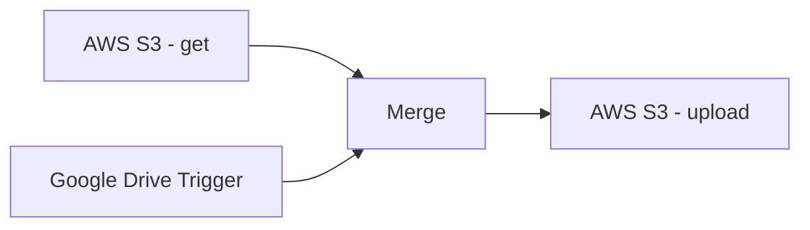

## Fluxo (.json) :

```json
{
  "nodes": [
    {
      "name": "Google Drive Trigger",
      "type": "n8n-nodes-base.googleDriveTrigger",
      "position": [
        480,
        1480
      ],
      "parameters": {
        "event": "fileUpdated",
        "options": {},
        "triggerOn": "specificFolder",
        "folderToWatch": "https://drive.google.com/drive/folders/[your_id]"
      },
      "credentials": {
        "googleDriveOAuth2Api": {
          "id": "12",
          "name": "Google Drive account"
        }
      },
      "typeVersion": 1
    },
    {
      "name": "Merge",
      "type": "n8n-nodes-base.merge",
      "position": [
        680,
        1560
      ],
      "parameters": {
        "mode": "removeKeyMatches",
        "propertyName1": "name.value",
        "propertyName2": "Key.value"
      },
      "typeVersion": 1
    },
    {
      "name": "AWS S3  - get",
      "type": "n8n-nodes-base.awsS3",
      "position": [
        480,
        1660
      ],
      "parameters": {
        "options": {},
        "operation": "getAll",
        "bucketName": "mybucket"
      },
      "credentials": {
        "aws": {
          "id": "9",
          "name": "aws"
        }
      },
      "typeVersion": 1
    },
    {
      "name": "AWS S3 - upload",
      "type": "n8n-nodes-base.awsS3",
      "position": [
        860,
        1560
      ],
      "parameters": {
        "tagsUi": {
          "tagsValues": [
            {
              "key": "source",
              "value": "gdrive"
            }
          ]
        },
        "fileName": "={{$json[\"name\"]}}",
        "operation": "upload",
        "binaryData": false,
        "bucketName": "mybucket",
        "additionalFields": {
          "serverSideEncryption": "AES256"
        }
      },
      "credentials": {
        "aws": {
          "id": "9",
          "name": "aws"
        }
      },
      "typeVersion": 1
    }
  ],
  "connections": {
    "Merge": {
      "main": [
        [
          {
            "node": "AWS S3 - upload",
            "type": "main",
            "index": 0
          }
        ]
      ]
    },
    "AWS S3  - get": {
      "main": [
        [
          {
            "node": "Merge",
            "type": "main",
            "index": 1
          }
        ]
      ]
    },
    "Google Drive Trigger": {
      "main": [
        [
          {
            "node": "Merge",
            "type": "main",
            "index": 0
          }
        ]
      ]
    }
  }
}
```

<a id="template-844"></a>

## Template 844 - Baixar S3 e ZIP

- **Nome:** Baixar S3 e ZIP
- **Descrição:** Este fluxo baixa todos os arquivos de uma pasta específica de um bucket S3 e os compacta em um único arquivo ZIP para download ou processamento adicional.
- **Funcionalidade:** • Início por disparo manual: o fluxo é iniciado quando o usuário clica em Test workflow.
• Listar arquivos no bucket S3: obtém a lista de todos os arquivos na pasta especificada.
• Baixar arquivos da pasta: faz o download de cada arquivo listado para processamento.
• Consolidar conteúdos em um único item com binários: agrupa os arquivos em um item único mantendo os dados binários.
• Criar ZIP: comprime os arquivos consolidados em um arquivo ZIP nomeado s3-export.zip.
- **Ferramentas:** • Amazon S3: serviço de armazenamento em nuvem utilizado para listar, baixar e consolidar arquivos da pasta especificada.

## Fluxo visual

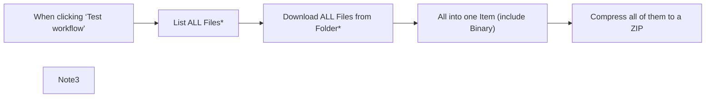

## Fluxo (.json) :

```json
{
  "meta": {
    "instanceId": "9e331a89ae45a204c6dee51c77131d32a8c962ec20ccf002135ea60bd285dba9"
  },
  "nodes": [
    {
      "id": "5dbcd30b-7f84-4932-9dff-b5e9865f9b07",
      "name": "When clicking ‘Test workflow’",
      "type": "n8n-nodes-base.manualTrigger",
      "position": [
        860,
        680
      ],
      "parameters": {},
      "typeVersion": 1
    },
    {
      "id": "639dd225-ae36-4d2b-b341-8662ffe39836",
      "name": "List ALL Files*",
      "type": "n8n-nodes-base.awsS3",
      "position": [
        1080,
        680
      ],
      "parameters": {
        "options": {
          "folderKey": "=yourFolder"
        },
        "operation": "getAll",
        "returnAll": true,
        "bucketName": "=yourBucket"
      },
      "typeVersion": 2
    },
    {
      "id": "cb8b4b07-af86-45b0-9621-a02c22107741",
      "name": "Download ALL Files from Folder*",
      "type": "n8n-nodes-base.awsS3",
      "position": [
        1300,
        680
      ],
      "parameters": {
        "fileKey": "={{ $json.Key }}",
        "bucketName": "=yourBucket"
      },
      "typeVersion": 2
    },
    {
      "id": "df2a3f56-7656-427c-a3b1-df3f1f4997e9",
      "name": "All into one Item (include Binary)",
      "type": "n8n-nodes-base.aggregate",
      "position": [
        1520,
        680
      ],
      "parameters": {
        "options": {
          "includeBinaries": true
        },
        "aggregate": "aggregateAllItemData"
      },
      "typeVersion": 1
    },
    {
      "id": "ca0085aa-77f0-4339-8821-11b8e53588da",
      "name": "Note3",
      "type": "n8n-nodes-base.stickyNote",
      "position": [
        420,
        560
      ],
      "parameters": {
        "width": 367.15098241985504,
        "height": 363.66522445338995,
        "content": "## Instructions\n\nThis workflow downloads all Files from a specific folder in a S3 Bucket and compresses them so you can download it via n8n or do further processings.\n\nFill in your **Credentials and Settings** in the Nodes marked with _\"*\"_.\n\n\nEnjoy the Workflow! ❤️ \nhttps://let-the-work-flow.com\nWorkflow Automation & Development"
      },
      "typeVersion": 1
    },
    {
      "id": "9b12152d-46b8-4e03-9a4b-5bbc0289c78c",
      "name": "Compress all of them to a ZIP",
      "type": "n8n-nodes-base.compression",
      "position": [
        1740,
        680
      ],
      "parameters": {
        "fileName": "=s3-export.zip",
        "operation": "compress",
        "binaryPropertyName": "={{ Object.keys($binary).join(',') }}"
      },
      "typeVersion": 1.1
    }
  ],
  "pinData": {},
  "connections": {
    "List ALL Files*": {
      "main": [
        [
          {
            "node": "Download ALL Files from Folder*",
            "type": "main",
            "index": 0
          }
        ]
      ]
    },
    "Download ALL Files from Folder*": {
      "main": [
        [
          {
            "node": "All into one Item (include Binary)",
            "type": "main",
            "index": 0
          }
        ]
      ]
    },
    "When clicking ‘Test workflow’": {
      "main": [
        [
          {
            "node": "List ALL Files*",
            "type": "main",
            "index": 0
          }
        ]
      ]
    },
    "All into one Item (include Binary)": {
      "main": [
        [
          {
            "node": "Compress all of them to a ZIP",
            "type": "main",
            "index": 0
          }
        ]
      ]
    }
  }
}
```

<a id="template-845"></a>

## Template 845 - Coletor de perfis LinkedIn

- **Nome:** Coletor de perfis LinkedIn
- **Descrição:** Coleta perfis do LinkedIn a partir de pesquisas Google, processa e normaliza informações (ex.: seguidores e empresa) e entrega os resultados em Excel e em uma tabela NocoDB.
- **Funcionalidade:** • Coleta de perfis via busca Google: Executa buscas parametrizadas (site:linkedin.com/in + palavra-chave + local) para encontrar perfis relevantes.
• Parametrização de busca: Permite definir palavra-chave, localização, número de resultados, idioma e geolocalização da pesquisa.
• Separação de resultados orgânicos: Transforma a lista de resultados orgânicos em itens individuais para processamento posterior.
• Extração de campos relevantes: Captura nome do perfil, URL, snippet, palavras destacadas e informações exibidas nos resultados.
• Normalização de seguidores e extração de empresa: Usa um modelo de linguagem para converter formatos de seguidores (ex.: "3.3k+") em números e extrair o nome da empresa quando possível.
• Limpeza de metadados: Descarta metadados irrelevantes mantendo apenas os dados necessários ao registro.
• Geração de arquivo Excel: Constrói um arquivo .xlsx com os perfis coletados para download.
• Armazenamento em banco: Insere os registros processados em uma tabela em NocoDB para uso posterior.
• Gatilho manual: Permite iniciar a execução manualmente quando desejado.
- **Ferramentas:** • SerpAPI (Google Search): Executa as buscas no Google e retorna resultados estruturados para evitar bloqueios e facilitar o processamento.
• OpenAI: Modelo de linguagem usado para transformar contagens de seguidores em números e extrair o nome da empresa a partir do título e snippet.
• NocoDB: Armazena os registros processados em uma tabela acessível para consultas e integrações.
• Excel (XLSX): Gera um arquivo de planilha para download contendo os perfis e campos finais.

## Fluxo visual

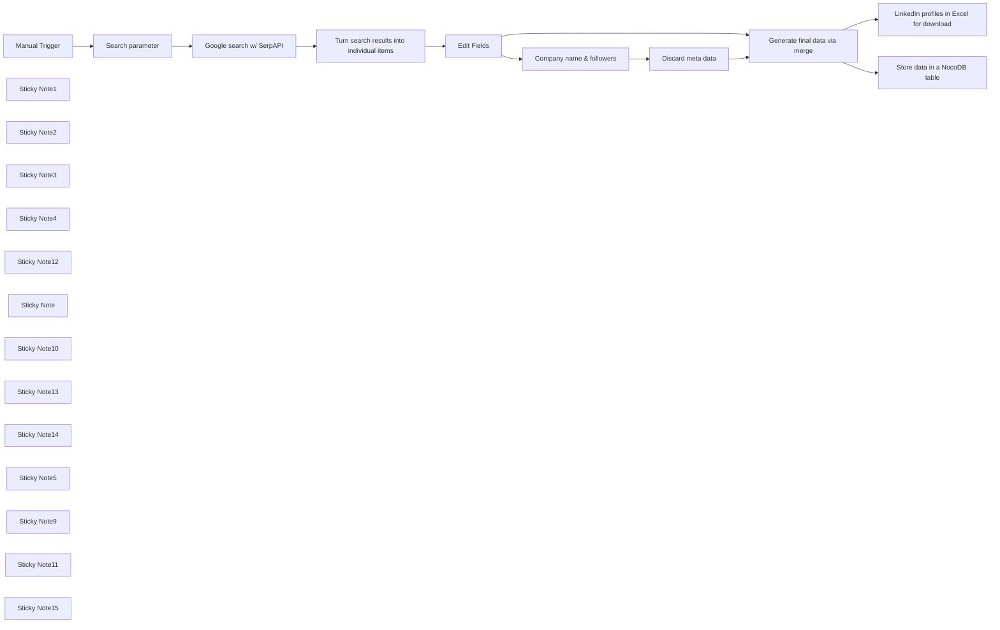

## Fluxo (.json) :

```json
{
  "id": "W5cevjhP3xIQdMhT",
  "meta": {
    "instanceId": "b8ef33547995f2a520f12118ac1f7819ea58faa7a1096148cac519fa08be8e99",
    "templateCredsSetupCompleted": true
  },
  "name": "Simple LinkedIn profile collector",
  "tags": [
    {
      "id": "DDb2eQi5fXOMcVD6",
      "name": "LinkedIn",
      "createdAt": "2025-04-27T16:44:17.404Z",
      "updatedAt": "2025-04-27T16:44:17.404Z"
    },
    {
      "id": "WvVrZMOsmCMjmf8G",
      "name": "leads",
      "createdAt": "2025-05-05T13:14:14.918Z",
      "updatedAt": "2025-05-05T13:14:14.918Z"
    },
    {
      "id": "hIooJnHTaPcNsX7s",
      "name": "SERP",
      "createdAt": "2025-05-05T13:14:29.068Z",
      "updatedAt": "2025-05-05T13:14:29.068Z"
    }
  ],
  "nodes": [
    {
      "id": "6a120c5d-3405-467e-8073-80bf30f2f0fc",
      "name": "Manual Trigger",
      "type": "n8n-nodes-base.manualTrigger",
      "position": [
        -580,
        160
      ],
      "parameters": {},
      "typeVersion": 1
    },
    {
      "id": "5a4cb9af-faff-4fba-a5ce-d2c9bc25a070",
      "name": "Google search w/ SerpAPI",
      "type": "n8n-nodes-base.httpRequest",
      "position": [
        -100,
        160
      ],
      "parameters": {
        "url": "https://serpapi.com/search",
        "options": {},
        "sendQuery": true,
        "authentication": "predefinedCredentialType",
        "queryParameters": {
          "parameters": [
            {
              "name": "q",
              "value": "=site:{{ $json.site }} {{ $json.Keyword }} {{ $json.Location }}"
            },
            {
              "name": "hl",
              "value": "={{ $json['Host langauge'] }}"
            },
            {
              "name": "gl",
              "value": "={{ $json.Geolocation }}"
            },
            {
              "name": "num",
              "value": "={{ $json['Number of search results to be returned'] }}"
            },
            {
              "name": "engine",
              "value": "={{ $json['Search engine'] }}"
            }
          ]
        },
        "nodeCredentialType": "serpApi"
      },
      "credentials": {
        "serpApi": {
          "id": "mL117f55z8IG4i1V",
          "name": "SerpAPI account"
        }
      },
      "typeVersion": 4.2
    },
    {
      "id": "300e3483-0f7b-427d-9f95-bf631dbda3d3",
      "name": "Edit Fields",
      "type": "n8n-nodes-base.set",
      "position": [
        340,
        160
      ],
      "parameters": {
        "options": {},
        "assignments": {
          "assignments": [
            {
              "id": "ab7399a3-8fe8-447b-b9c6-33240e07e2b6",
              "name": "NameInLinkedinProfile",
              "type": "string",
              "value": "={{ $json.title }}"
            },
            {
              "id": "6f9a2bd6-e46d-4294-adbf-29aec0b8b2eb",
              "name": "linkedinUrl",
              "type": "string",
              "value": "={{ $json.link }}"
            },
            {
              "id": "e1e87eb4-ecc8-4b50-ab74-4c0a0016f84d",
              "name": "Snippet",
              "type": "string",
              "value": "={{ $json.snippet }}"
            },
            {
              "id": "632ee133-06be-4730-9178-6edde40e087a",
              "name": "linkedinUrl",
              "type": "string",
              "value": "={{ $json.link }}"
            },
            {
              "id": "9ce26329-eedf-47ae-815b-f19fc34b2e83",
              "name": "Followers",
              "type": "string",
              "value": "={{ $json.displayed_link }}"
            },
            {
              "id": "39b81062-afd1-468d-95aa-e158bd34b773",
              "name": "Keyword",
              "type": "string",
              "value": "={{ $('Search parameter').item.json.Keyword }}"
            },
            {
              "id": "9e1ab1fc-86eb-44c0-bdcb-bc5dc63f069c",
              "name": "Location",
              "type": "string",
              "value": "={{ $('Search parameter').item.json.Location }}"
            },
            {
              "id": "f9e0eb5e-e81d-4cd3-8b47-d301ae7920e8",
              "name": "Rich snippet",
              "type": "string",
              "value": "={{ $json.rich_snippet.top.extensions }}"
            },
            {
              "id": "fca0eaa4-70e0-4c1e-99a9-bf66477aad0f",
              "name": "snippet_highlighted_words",
              "type": "string",
              "value": "={{ $json.snippet_highlighted_words }}"
            }
          ]
        }
      },
      "typeVersion": 3.4
    },
    {
      "id": "ca824e0a-dddd-401a-a48a-debe4821d24e",
      "name": "Sticky Note1",
      "type": "n8n-nodes-base.stickyNote",
      "position": [
        -160,
        -200
      ],
      "parameters": {
        "width": 220,
        "height": 520,
        "content": "### Adaptation required\nGet a free tier for serpAPI (Google Search) at serpapi.com\n\nSet up the credentials for serpAPI\n\nExplanations in the [n8n docs](https://docs.n8n.io/integrations/builtin/cluster-nodes/sub-nodes/n8n-nodes-langchain.toolserpapi/)"
      },
      "typeVersion": 1
    },
    {
      "id": "b8feccbd-6d14-4838-afc3-7fb9a1cd4f04",
      "name": "Sticky Note2",
      "type": "n8n-nodes-base.stickyNote",
      "position": [
        80,
        -200
      ],
      "parameters": {
        "width": 180,
        "height": 520,
        "content": "### NO adaptation required\nThe search metadata is being discarded and only the \"organic results\" being preserved as individual list items as they are containing the relevant data\n"
      },
      "typeVersion": 1
    },
    {
      "id": "a5eb2f30-37e1-43b9-8e2c-dde0227908c5",
      "name": "Sticky Note3",
      "type": "n8n-nodes-base.stickyNote",
      "position": [
        300,
        -200
      ],
      "parameters": {
        "width": 180,
        "height": 520,
        "content": "### NO adaptation required\nDiscard irrelevant search result (meta)data\n"
      },
      "typeVersion": 1
    },
    {
      "id": "94232837-e5b8-484e-b453-17952b3d8fbe",
      "name": "Sticky Note4",
      "type": "n8n-nodes-base.stickyNote",
      "position": [
        500,
        -200
      ],
      "parameters": {
        "width": 520,
        "height": 520,
        "content": "### Adaptation required\n\n**This node does the following**:\n- Identify where possible the company name the LinkedIn profile is working in.\n- Turn the number of followers into a real number, e.g. \"3.3k+\" &rarr; 3300\n\n\n\n**Set up**\n- Get API credentials from openai.com\n- Set up credentials in n8n\n- Select the OpenAI model you want to use, e.g. GPT-4o\n- The prompt is already included but can be improved\n\n\n[n8n documentation](https://docs.n8n.io/integrations/builtin/cluster-nodes/sub-nodes/n8n-nodes-langchain.lmchatopenai/) for more explanations"
      },
      "typeVersion": 1
    },
    {
      "id": "3e3214b0-ace5-47e2-bb17-2db3c3db1de3",
      "name": "Discard meta data",
      "type": "n8n-nodes-base.set",
      "position": [
        1080,
        160
      ],
      "parameters": {
        "options": {},
        "assignments": {
          "assignments": [
            {
              "id": "a821b4a3-d4e2-4f37-a154-8606426078ef",
              "name": "followers_number",
              "type": "number",
              "value": "={{ $json.message.content.followers }}"
            },
            {
              "id": "e1ac8cc3-4a51-4c01-9e75-8d92dff3b70d",
              "name": "NameOfCompany",
              "type": "string",
              "value": "={{ $json.message.content.company_name }}"
            }
          ]
        }
      },
      "typeVersion": 3.4
    },
    {
      "id": "2b1a66c3-be8a-4b00-86ee-3438022ad775",
      "name": "LinkedIn profiles in Excel for download",
      "type": "n8n-nodes-base.convertToFile",
      "position": [
        1600,
        160
      ],
      "parameters": {
        "options": {},
        "operation": "xlsx"
      },
      "typeVersion": 1.1
    },
    {
      "id": "b1b982f2-eeb7-4816-be25-aee5568d2283",
      "name": "Sticky Note12",
      "type": "n8n-nodes-base.stickyNote",
      "position": [
        -1220,
        -200
      ],
      "parameters": {
        "color": 4,
        "width": 540,
        "height": 260,
        "content": "## What problem does this solve? \n\nIt fetches **LinkedIn profiles** based on a keyword and location via Google search and stores them in an Excel file for download and in a NocoDB database.\nIt tries to avoid using costly services and should be n8n **beginner friendly**.\nIt uses the SerpAPI.com to avoid being blocked by Google Search and to process the data in an easier way.\n"
      },
      "typeVersion": 1
    },
    {
      "id": "15340d73-272d-45a1-b96f-b75569bae0b5",
      "name": "Sticky Note",
      "type": "n8n-nodes-base.stickyNote",
      "position": [
        1040,
        -200
      ],
      "parameters": {
        "width": 180,
        "height": 520,
        "content": "### NO adaption required\nThis node discards irrelevant OpenAI metadata"
      },
      "typeVersion": 1
    },
    {
      "id": "da183064-0eb2-4e7d-ad83-7aca8f9b9e36",
      "name": "Sticky Note10",
      "type": "n8n-nodes-base.stickyNote",
      "position": [
        -420,
        120
      ],
      "parameters": {
        "height": 760,
        "content": "\n\n\n\n\n\n\n\n\n\n\n\n\n\n\n\n## Setting the parameters for Google search via SerpAPI\n\nSearching **LinkedIn profiles** by setting the following **parameters** for the Google query in the next node\n\n- Keyword on what to look for \n- Location or region to look into\n- Number of search results\n- Host language\n- Geolocation\n- Search engine\n\n\nMore on search parameters: https://serpapi.com/blog/google-search-parameters/ or in the [n8n docs](https://docs.n8n.io/integrations/builtin/cluster-nodes/sub-nodes/n8n-nodes-langchain.toolserpapi/)"
      },
      "typeVersion": 1
    },
    {
      "id": "1fc2f6f8-df39-47c5-92a1-c1a14cbe0d65",
      "name": "Sticky Note13",
      "type": "n8n-nodes-base.stickyNote",
      "position": [
        -1220,
        100
      ],
      "parameters": {
        "color": 4,
        "width": 540,
        "height": 200,
        "content": "## What does it do?\n\n- Based on criteria input, it searches LinkedIn profiles\n- It discards unnecessary data and turns the follower count into a real number\n- The output is provided as an Excel table for download and in a NocoDB database"
      },
      "typeVersion": 1
    },
    {
      "id": "a522ed81-9d50-464e-b872-42a4c66a8584",
      "name": "Sticky Note14",
      "type": "n8n-nodes-base.stickyNote",
      "position": [
        -1220,
        640
      ],
      "parameters": {
        "color": 4,
        "width": 540,
        "height": 500,
        "content": "## Step-by-step instruction\n\n\n1. Import the Workflow:\nCopy the workflow JSON from the \"Template Code\" section below.\nImport it into n8n via \"Import from File\" or \"Import from URL\".\n\n2. Set up a free account at serpapi.com and get API credentials to enable good Google search results\n\n3. Set up an API account at openai.com and get API key\n\n4. Set up a nocodb.com account (or self-host) and get the API credentials\n\n4. Create the credentials for serpapi.com, opemnai.com and nocodb.com in n8n.\n\n5. Set up a table in NocoDB with the fields indicated in the note above the NocoDB node\n\n5. Follow the instructions as detailed in the notes above individual nodes \n\n6. When the workflow is finished, open the Excel node and click download if you need the Excel file\n\n"
      },
      "typeVersion": 1
    },
    {
      "id": "69696205-5ed2-4891-8cf3-1bcf9fc83ebd",
      "name": "Search parameter",
      "type": "n8n-nodes-base.set",
      "position": [
        -360,
        160
      ],
      "parameters": {
        "options": {},
        "assignments": {
          "assignments": [
            {
              "id": "d4c0a5dc-c656-45e7-bcd1-2cee3fbc9aa5",
              "name": "Keyword",
              "type": "string",
              "value": "nocode"
            },
            {
              "id": "f5365eff-7e79-411c-8ebb-a7d244e9e1fa",
              "name": "Location",
              "type": "string",
              "value": "Germany"
            },
            {
              "id": "24b4046f-7083-416d-8ae9-bc72c5323b14",
              "name": "Number of search results to be returned",
              "type": "string",
              "value": 20
            },
            {
              "id": "25c114e6-7628-4eb9-9b3e-a6bb5fbae1dc",
              "name": "Host langauge",
              "type": "string",
              "value": "en"
            },
            {
              "id": "ac29cb67-89ec-41ae-870c-196a4bf524a6",
              "name": "Geolocation",
              "type": "string",
              "value": "de"
            },
            {
              "id": "d1e78115-f788-4ffd-9374-60b83e7e2b8a",
              "name": "Search engine",
              "type": "string",
              "value": "google"
            },
            {
              "id": "7af59bb4-548b-4061-8095-3261b2ce8227",
              "name": "site",
              "type": "string",
              "value": "linkedin.com/in"
            }
          ]
        }
      },
      "typeVersion": 3.4
    },
    {
      "id": "0b588ebc-eddf-4c4c-a0c2-81cc0e8ae9d1",
      "name": "Turn search results into individual items",
      "type": "n8n-nodes-base.splitOut",
      "position": [
        120,
        160
      ],
      "parameters": {
        "options": {},
        "fieldToSplitOut": "organic_results"
      },
      "typeVersion": 1
    },
    {
      "id": "daef5714-3e40-4ac1-a02e-f3dacddeb5e8",
      "name": "Company name & followers",
      "type": "@n8n/n8n-nodes-langchain.openAi",
      "position": [
        620,
        160
      ],
      "parameters": {
        "modelId": {
          "__rl": true,
          "mode": "list",
          "value": "gpt-4o",
          "cachedResultName": "GPT-4O"
        },
        "options": {},
        "messages": {
          "values": [
            {
              "content": "=Transform  {{ $json.Followers }} into a number and extract where possible the name of the company in {{ $json.NameInLinkedinProfile }} or in {{ $json.Snippet }} Do not output things like location or name, only followers and company_name"
            }
          ]
        },
        "jsonOutput": true
      },
      "credentials": {
        "openAiApi": {
          "id": "0Vdk5RlVe7AoUdAM",
          "name": "OpenAi account"
        }
      },
      "typeVersion": 1.8
    },
    {
      "id": "2f204f01-836c-41ab-97c1-38fee34adffc",
      "name": "Generate final data via merge",
      "type": "n8n-nodes-base.merge",
      "position": [
        1300,
        280
      ],
      "parameters": {
        "mode": "combine",
        "options": {},
        "combineBy": "combineByPosition"
      },
      "typeVersion": 3.1
    },
    {
      "id": "f52e65b5-1369-4410-99fe-0cb0c11f5da5",
      "name": "Sticky Note5",
      "type": "n8n-nodes-base.stickyNote",
      "position": [
        1260,
        -60
      ],
      "parameters": {
        "width": 180,
        "height": 520,
        "content": "### NO adaption required\nThis node creates the final data output "
      },
      "typeVersion": 1
    },
    {
      "id": "de7ace7e-ba9b-4abb-a54b-8996fc9b88a6",
      "name": "Sticky Note9",
      "type": "n8n-nodes-base.stickyNote",
      "position": [
        1540,
        -60
      ],
      "parameters": {
        "width": 220,
        "height": 520,
        "content": "### NO adaption required\nThis node creates stores all the data in an Excel file which can be downloaded. \n- Open the node\n- Click on download button"
      },
      "typeVersion": 1
    },
    {
      "id": "17a32318-e1bc-4c07-b6a2-59f47a68a595",
      "name": "Sticky Note11",
      "type": "n8n-nodes-base.stickyNote",
      "position": [
        1540,
        480
      ],
      "parameters": {
        "width": 780,
        "height": 920,
        "content": "\n\n\n\n\n\n\n\n\n\n\n\n\n\n\n\n\n## Adaption required\n\n- This node creates stores all the data in an NocoDB database for further utilization.\n- In case the database is not needed, just delete this node.\n\n\n\n**Set up part 1**\n\n- Create an NocoDB account, either via nocodb.com or self-hosted\n- Create the credentials in n8n along the [n8n documentation](https://docs.n8n.io/integrations/builtin/app-nodes/n8n-nodes-base.nocodb/)\n- Set up a table with a name of your choice\n\n\n**Set up part 2**\n\nCreate the following fields in this table: \n- NameInLinkedinProfile (type: Single line text): name of the person\n- NameOfCompany: the name of the company as generated by OpenAI\n- linkedinUrl (type: url): the link to the LinkedIn profile\n- Followers: the number of followers as text and indicated by LinkedIn \n- followers_number (type: Number): the number of followers as a number\n- Keyword: the keyword used for searching LinkedIn profiles\n- Location: the location used for searching LinkedIn profiles \n- Rich snippet (type: Long text): \n- snippet_highlighted_words (type: Long text): \n\n\n**Adaptations in the node itself**\n- Make sure that the right table is selected\n- Select \"row\" in the \"Resources\" field\n- Select \"create\" in the field \"Operation\"\n- Select \"Auto map ....\" in the field \"Data to Send\""
      },
      "typeVersion": 1
    },
    {
      "id": "d41f26fe-9068-4202-9677-a355c5276999",
      "name": "Store data in a NocoDB table",
      "type": "n8n-nodes-base.nocoDb",
      "position": [
        1600,
        520
      ],
      "parameters": {
        "table": "mttbkp3hxy9rnwx",
        "operation": "create",
        "projectId": "puqzjel7f0swv1t",
        "dataToSend": "autoMapInputData",
        "authentication": "nocoDbApiToken"
      },
      "credentials": {
        "nocoDbApiToken": {
          "id": "gjNns0VJMS3P2RQ3",
          "name": "NocoDB Token account"
        }
      },
      "typeVersion": 3
    },
    {
      "id": "98212dd7-5449-4fc1-b96f-3f1b94931c32",
      "name": "Sticky Note15",
      "type": "n8n-nodes-base.stickyNote",
      "position": [
        -1220,
        320
      ],
      "parameters": {
        "color": 4,
        "width": 540,
        "height": 280,
        "content": "## How does it do it?\n\n- Based on criteria input, it uses serpAPI.com to conduct Google search of the respective LinkedI profiles\n- With OpenAI.com the name of the respective company is being added\n- With OpenAI.com the follower number e.g., 300+ is turned into a real number: 300\n- All unnecessary metadata is being discarded\n- As an output an Excel file is being created\n- The output is stored in a nocodb.com table"
      },
      "typeVersion": 1
    }
  ],
  "active": false,
  "pinData": {},
  "settings": {
    "executionOrder": "v1"
  },
  "versionId": "ba732d3f-968b-445d-83cc-e58a47b97e30",
  "connections": {
    "Edit Fields": {
      "main": [
        [
          {
            "node": "Company name & followers",
            "type": "main",
            "index": 0
          },
          {
            "node": "Generate final data via merge",
            "type": "main",
            "index": 1
          }
        ]
      ]
    },
    "Manual Trigger": {
      "main": [
        [
          {
            "node": "Search parameter",
            "type": "main",
            "index": 0
          }
        ]
      ]
    },
    "Search parameter": {
      "main": [
        [
          {
            "node": "Google search w/ SerpAPI",
            "type": "main",
            "index": 0
          }
        ]
      ]
    },
    "Discard meta data": {
      "main": [
        [
          {
            "node": "Generate final data via merge",
            "type": "main",
            "index": 0
          }
        ]
      ]
    },
    "Company name & followers": {
      "main": [
        [
          {
            "node": "Discard meta data",
            "type": "main",
            "index": 0
          }
        ]
      ]
    },
    "Google search w/ SerpAPI": {
      "main": [
        [
          {
            "node": "Turn search results into individual items",
            "type": "main",
            "index": 0
          }
        ]
      ]
    },
    "Generate final data via merge": {
      "main": [
        [
          {
            "node": "LinkedIn profiles in Excel for download",
            "type": "main",
            "index": 0
          },
          {
            "node": "Store data in a NocoDB table",
            "type": "main",
            "index": 0
          }
        ]
      ]
    },
    "Turn search results into individual items": {
      "main": [
        [
          {
            "node": "Edit Fields",
            "type": "main",
            "index": 0
          }
        ]
      ]
    }
  }
}
```

<a id="template-846"></a>

## Template 846 - Criar página Confluence a partir de template

- **Nome:** Criar página Confluence a partir de template
- **Descrição:** Recebe dados via webhook e cria uma nova página no Confluence a partir de um template de espaço, substituindo placeholders no título e no corpo com os dados recebidos.
- **Funcionalidade:** • Recepção de webhook: inicia o fluxo ao receber um payload HTTP POST com os dados necessários.
• Configuração de parâmetros: define URL base do Confluence, ID do template, chave do espaço alvo e ID da página pai.
• Recuperação do template: obtém o conteúdo e metadados do template via API REST do Confluence.
• Substituição de placeholders: varre o título e o corpo do template e substitui placeholders no formato $campo.subcampo$ pelos valores do webhook.
• Criação de página: cria uma nova página no espaço alvo usando a representação 'storage', define título dinâmico e associa a página a um ancestral específico.
• Autenticação segura: realiza chamadas à API do Confluence utilizando autenticação básica com token de API como senha.
- **Ferramentas:** • Atlassian Confluence (REST API): plataforma de colaboração onde o fluxo busca templates e cria páginas programaticamente.
• Conta Atlassian / Tokens de API: credenciais (token) usadas para autenticar as requisições HTTP à API do Confluence.
• Serviço emissor de webhook: qualquer sistema externo que envie o payload JSON via POST para acionar a automação.

## Fluxo visual

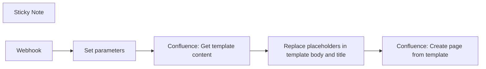

## Fluxo (.json) :

```json
{
  "meta": {
    "instanceId": "0000"
  },
  "nodes": [
    {
      "id": "b2015e98-23bf-4bdb-b588-2991ee4d69d5",
      "name": "Confluence: Get template content",
      "type": "n8n-nodes-base.httpRequest",
      "position": [
        1460,
        660
      ],
      "parameters": {
        "url": "={{ $('Set parameters').item.json.confluence_base_url }}/wiki/rest/api/template/{{ $json.template_id }}",
        "options": {},
        "authentication": "genericCredentialType",
        "genericAuthType": "httpBasicAuth"
      },
      "credentials": {
        "httpBasicAuth": {
          "id": "wQWJ3gbaDYd4nNIK",
          "name": "Atlassian"
        }
      },
      "typeVersion": 4.2
    },
    {
      "id": "b5b665d6-f92e-43f1-bfd8-5de4155b73d4",
      "name": "Confluence: Create page from template",
      "type": "n8n-nodes-base.httpRequest",
      "position": [
        1900,
        660
      ],
      "parameters": {
        "url": "={{ $('Set parameters').item.json.confluence_base_url }}/wiki/rest/api/content/",
        "method": "POST",
        "options": {},
        "sendBody": true,
        "authentication": "genericCredentialType",
        "bodyParameters": {
          "parameters": [
            {
              "name": "type",
              "value": "page"
            },
            {
              "name": "title",
              "value": "={{ $now.format(\"yyyy-MM-dd-HH-mm\") }}-{{ $('Replace placeholders in template body and title').item.json.page_title }}"
            },
            {
              "name": "space",
              "value": "={{ { \"key\" : $('Set parameters').item.json.target_space_key } }}"
            },
            {
              "name": "body",
              "value": "={{ { \"storage\" : { \"value\" : $('Replace placeholders in template body and title').item.json.page_body, \"representation\" : \"storage\" } } }}"
            },
            {
              "name": "ancestors",
              "value": "={{ [{\"type\" : \"page\", \"id\" : $('Set parameters').item.json.target_parent_page_id} ] }}"
            }
          ]
        },
        "genericAuthType": "httpBasicAuth"
      },
      "credentials": {
        "httpBasicAuth": {
          "id": "wQWJ3gbaDYd4nNIK",
          "name": "Atlassian"
        }
      },
      "typeVersion": 4.2
    },
    {
      "id": "571a104e-4112-4898-8e63-08dd8809b328",
      "name": "Sticky Note",
      "type": "n8n-nodes-base.stickyNote",
      "position": [
        1000,
        300
      ],
      "parameters": {
        "color": 2,
        "width": 610,
        "height": 315,
        "content": "## Create Atlassian Confluence page from template\n\nCreates a new page in Confluence from a space template.\n\n### Setup\nAll parameters you need to change are defined in the _Set parameters_ node\nFor detailled setup instructions and explanation how it all works --> [🎥 Video](https://www.tella.tv/video/automate-confluence-page-creation-e994)\n\n### Credentials\nAs the password for the basic auth credential, you need to use an API key. \nDocumentation on those is [here](https://support.atlassian.com/atlassian-account/docs/manage-api-tokens-for-your-atlassian-account/).\n[Here's](https://id.atlassian.com/manage-profile/security/api-tokens) where you create and manage Atlassian API keys."
      },
      "typeVersion": 1
    },
    {
      "id": "eac6d0bc-0ea5-4e23-977c-8e06b346ea79",
      "name": "Set parameters",
      "type": "n8n-nodes-base.set",
      "position": [
        1240,
        660
      ],
      "parameters": {
        "options": {},
        "assignments": {
          "assignments": [
            {
              "id": "01116d20-ddaf-405a-99ec-81197f71cd4f",
              "name": "confluence_base_url",
              "type": "string",
              "value": "https://your-domain.atlassian.net"
            },
            {
              "id": "4a5a8737-5694-40ef-99c5-d5aa4fab1220",
              "name": "template_id",
              "type": "string",
              "value": "834764824"
            },
            {
              "id": "27c1681d-4f44-4b6f-9e6b-6013bfcac6a0",
              "name": "target_space_key",
              "type": "string",
              "value": "~5f5915647187b8006ffffe8e"
            },
            {
              "id": "5de1868b-ee33-4ef4-aa45-0d951b5ce5ff",
              "name": "target_parent_page_id",
              "type": "string",
              "value": "312344667"
            }
          ]
        }
      },
      "typeVersion": 3.4
    },
    {
      "id": "c28299ef-8ce7-497f-98d8-356a741f461d",
      "name": "Replace placeholders in template body and title",
      "type": "n8n-nodes-base.code",
      "position": [
        1680,
        660
      ],
      "parameters": {
        "mode": "runOnceForEachItem",
        "jsCode": "function replacePlaceholders(template, values) {\n    // Regular expression to find placeholders in the format $some.place.holder$\n    const placeholderPattern = /\\$(.*?)\\$/g;\n\n    // Replace function to look up the value from the object\n    return template.replace(placeholderPattern, (match, p1) => {\n        // Split the placeholder into parts by dot notation\n        const keys = p1.split('.');\n        let value = values;\n\n        // Traverse the object based on the dot notation\n        for (const key of keys) {\n            if (value && key in value) {\n                value = value[key];\n            } else {\n                // If the key is not found, return the original placeholder\n                return match;\n            }\n        }\n        // Return the value found in the object\n        return value;\n    });\n}\n\nconst templateTitle = $('Confluence: Get template content').item.json.name;\nconst templateBody = $('Confluence: Get template content').item.json.body.storage.value;\nconst values = $('Webhook').item.json;\n\nconst pageTitle = replacePlaceholders(templateTitle, values); \nconst pageBody = replacePlaceholders(templateBody, values);\n\nreturn { \"page_title\": pageTitle, \"page_body\" :  pageBody};"
      },
      "typeVersion": 2
    },
    {
      "id": "42bbd727-e3ea-4e36-be11-1f7def28f134",
      "name": "Webhook",
      "type": "n8n-nodes-base.webhook",
      "position": [
        1020,
        660
      ],
      "webhookId": "d291ef27-c27f-42cf-90cf-4dad7dd71a7c",
      "parameters": {
        "path": "d291ef27-c27f-42cf-90cf-4dad7dd71a7c",
        "options": {},
        "httpMethod": "POST"
      },
      "typeVersion": 2
    }
  ],
  "pinData": {
    "Webhook": [
      {
        "user": {
          "name": "Alice",
          "messages": {
            "count": 5
          }
        }
      }
    ]
  },
  "connections": {
    "Webhook": {
      "main": [
        [
          {
            "node": "Set parameters",
            "type": "main",
            "index": 0
          }
        ]
      ]
    },
    "Set parameters": {
      "main": [
        [
          {
            "node": "Confluence: Get template content",
            "type": "main",
            "index": 0
          }
        ]
      ]
    },
    "Confluence: Get template content": {
      "main": [
        [
          {
            "node": "Replace placeholders in template body and title",
            "type": "main",
            "index": 0
          }
        ]
      ]
    },
    "Replace placeholders in template body and title": {
      "main": [
        [
          {
            "node": "Confluence: Create page from template",
            "type": "main",
            "index": 0
          }
        ]
      ]
    }
  }
}
```

<a id="template-847"></a>

## Template 847 - Envio de SMS via MessageBird

- **Nome:** Envio de SMS via MessageBird
- **Descrição:** Este fluxo envia uma mensagem SMS através da API do MessageBird quando é acionado manualmente.
- **Funcionalidade:** • Acionamento manual: Inicia o fluxo ao ser executado manualmente.
• Envio de SMS: Envia uma mensagem para um ou mais destinatários usando as informações fornecidas.
• Personalização do remetente e destinatários: Permite definir o originator (remetente) e os recipients (destinatários).
• Campos adicionais configuráveis: Suporta parâmetros extras para ajuste do envio (por exemplo, opções avançadas de envio).
• Autenticação via API: Utiliza credenciais da API para autorizar e autenticar o envio de mensagens.
- **Ferramentas:** • MessageBird: Plataforma/API para envio de mensagens SMS e comunicação móvel, utilizada para entregar as mensagens aos destinatários.

## Fluxo visual

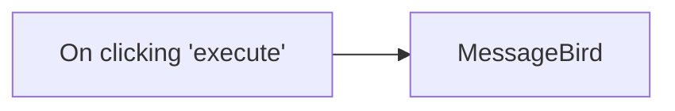

## Fluxo (.json) :

```json
{
  "id": "85",
  "name": "Sending an SMS with MessageBird",
  "nodes": [
    {
      "name": "On clicking 'execute'",
      "type": "n8n-nodes-base.manualTrigger",
      "position": [
        250,
        300
      ],
      "parameters": {},
      "typeVersion": 1
    },
    {
      "name": "MessageBird",
      "type": "n8n-nodes-base.messageBird",
      "position": [
        450,
        300
      ],
      "parameters": {
        "message": "",
        "originator": "",
        "recipients": "",
        "additionalFields": {}
      },
      "credentials": {
        "messageBirdApi": ""
      },
      "typeVersion": 1
    }
  ],
  "active": false,
  "settings": {},
  "connections": {
    "On clicking 'execute'": {
      "main": [
        [
          {
            "node": "MessageBird",
            "type": "main",
            "index": 0
          }
        ]
      ]
    }
  }
}
```

<a id="template-848"></a>

## Template 848 - Gatilho SNS para tópico n8n-rocks

- **Nome:** Gatilho SNS para tópico n8n-rocks
- **Descrição:** Este fluxo define um gatilho que é acionado quando mensagens são publicadas no tópico SNS especificado, servindo como ponto de entrada para processar eventos externos.
- **Funcionalidade:** • Gatilho de mensagens via SNS: o fluxo é acionado quando chega uma mensagem publicada no tópico SNS especificado.
• Autenticação/credenciais AWS: utiliza credenciais configuradas para acessar o serviço SNS.
• Ponto de entrada para automação: serve como porta de entrada para iniciar rotinas de processamento com base no conteúdo da mensagem.
- **Ferramentas:** • AWS SNS: Serviço de mensagens da nuvem da Amazon que envia notificações para tópicos aos quais assinantes podem se inscrever.


## Fluxo visual

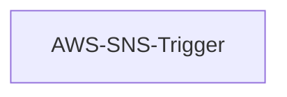

## Fluxo (.json) :

```json
{
  "nodes": [
    {
      "name": "AWS-SNS-Trigger",
      "type": "n8n-nodes-base.awsSnsTrigger",
      "position": [
        440,
        300
      ],
      "parameters": {
        "topic": "arn:aws:sns:ap-south-1:100558637562:n8n-rocks"
      },
      "credentials": {
        "aws": "amudhan-aws"
      },
      "typeVersion": 1
    }
  ],
  "connections": {}
}
```

<a id="template-849"></a>

## Template 849 - Varredura periódica de propriedades de alto potencial

- **Nome:** Varredura periódica de propriedades de alto potencial
- **Descrição:** Este fluxo realiza buscas periódicas por propriedades em uma determinada área, identifica novas ou alteradas, filtra leads de alto potencial e notifica a equipe de vendas com detalhes.
- **Funcionalidade:** • Agendamento de varreduras: Executa buscas em intervalos regulares (horário) para monitoramento contínuo do mercado.
• Consulta de propriedades via API: Envia parâmetros de busca (cidade, estado, faixa de valor, tipo de imóvel, etc.) e obtém lista de propriedades.
• Armazenamento de resultados anteriores: Mantém um histórico dos resultados da última execução para comparação com os resultados atuais.
• Comparação de resultados: Identifica propriedades novas e propriedades alteradas (ex.: valor de mercado, status, situação do proprietário, data da última venda).
• Filtragem de alto potencial: Aplica critérios para selecionar leads relevantes (ex.: porcentagem de equity alta e proprietário ausente).
• Obtenção de detalhes por propriedade: Busca informações detalhadas de cada propriedade selecionada para compor relatórios completos.
• Formatação de conteúdo de notificação: Gera assunto e corpo de e-mail em HTML e mensagem para Slack com dados essenciais e link para visualização no mapa.
• Entrega de alertas: Envia notificações por e-mail para a equipe de vendas e publica mensagens em canal de comunicação para ação rápida.
• Atualização do histórico: Atualiza o registro de propriedades para uso na próxima execução do fluxo.
- **Ferramentas:** • BatchData API: Serviço de dados imobiliários usado para pesquisar propriedades e obter detalhes individuais.
• Google Maps: Serviço de mapas usado para gerar links de visualização da localização das propriedades.
• Serviço de Email (SMTP ou equivalente): Plataforma para envio de alertas por e-mail à equipe de vendas.
• Slack: Plataforma de comunicação para envio de notificações rápidas à equipe.


## Fluxo visual

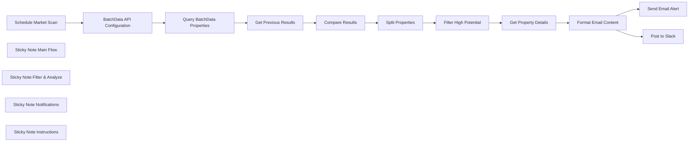

## Fluxo (.json) :

```json
{
  "id": "WUFuYk56jNNpjfZm",
  "meta": {
    "instanceId": "bb9853d4d7d87207561a30bc6fe4ece20b295264f7d27d4a62215de2f3846a56"
  },
  "name": "Real Estate Market Scanning",
  "tags": [],
  "nodes": [
    {
      "id": "db8f34be-8475-4be6-b070-79a8185fad69",
      "name": "Schedule Market Scan",
      "type": "n8n-nodes-base.scheduleTrigger",
      "position": [
        -1580,
        260
      ],
      "parameters": {
        "rule": {
          "interval": [
            {
              "field": "hours"
            }
          ]
        }
      },
      "typeVersion": 1.1
    },
    {
      "id": "36f4babd-3441-4da7-b485-3f9f561cb929",
      "name": "BatchData API Configuration",
      "type": "n8n-nodes-base.set",
      "position": [
        -1380,
        260
      ],
      "parameters": {
        "options": {},
        "assignments": {
          "assignments": [
            {
              "id": "f44f6a90-6de5-4c02-909d-73cfce0c0c9a",
              "name": "apiKey",
              "type": "string",
              "value": "YOUR_BATCHDATA_API_KEY"
            },
            {
              "id": "9356ff74-9783-40cf-a8af-94e45f1ac83e",
              "name": "searchParameters",
              "type": "object",
              "value": "={\n  \"city\": \"Austin\",\n  \"state\": \"TX\",\n  \"minimumMarketValue\": 250000,\n  \"maximumMarketValue\": 600000,\n  \"minimumEquity\": 30,\n  \"propertyType\": [\"SFR\"],\n  \"limit\": 100\n}"
            }
          ]
        }
      },
      "typeVersion": 3.4
    },
    {
      "id": "e34c4c84-4b31-451f-ad16-11db76f67dce",
      "name": "Query BatchData Properties",
      "type": "n8n-nodes-base.httpRequest",
      "position": [
        -1180,
        260
      ],
      "parameters": {
        "url": "https://api.batchdata.com/api/v1/properties/search",
        "method": "POST",
        "options": {},
        "sendBody": true,
        "authentication": "genericCredentialType",
        "bodyParameters": {
          "parameters": [
            {
              "name": "city",
              "value": "={{ $json.searchParameters.city }}"
            },
            {
              "name": "state",
              "value": "={{ $json.searchParameters.state }}"
            },
            {
              "name": "minimumMarketValue",
              "value": "={{ $json.searchParameters.minimumMarketValue }}"
            },
            {
              "name": "maximumMarketValue",
              "value": "={{ $json.searchParameters.maximumMarketValue }}"
            },
            {
              "name": "minimumEquity",
              "value": "={{ $json.searchParameters.minimumEquity }}"
            },
            {
              "name": "propertyType",
              "value": "={{ $json.searchParameters.propertyType }}"
            },
            {
              "name": "limit",
              "value": "={{ $json.searchParameters.limit }}"
            }
          ]
        },
        "genericAuthType": "httpHeaderAuth"
      },
      "typeVersion": 4.1
    },
    {
      "id": "c6d4c4ee-51d4-41f5-a975-e979785e9166",
      "name": "Get Previous Results",
      "type": "n8n-nodes-base.code",
      "position": [
        -980,
        260
      ],
      "parameters": {
        "jsCode": "// Get the stored data from previous runs\nconst workflowStaticData = getWorkflowStaticData('global');\n\n// If no previous data exists, initialize it\nif (!workflowStaticData.hasOwnProperty('previousProperties')) {\n  workflowStaticData.previousProperties = [];\n}\n\n// Add the previous properties data to the current item\nreturn [\n  {\n    json: {\n      ...items[0].json,\n      previousProperties: workflowStaticData.previousProperties,\n      currentProperties: items[0].json.data.properties || [],\n    }\n  }\n];"
      },
      "typeVersion": 2
    },
    {
      "id": "a77dfe55-8a01-4b83-9395-ab533e1b7b24",
      "name": "Compare Results",
      "type": "n8n-nodes-base.code",
      "position": [
        -780,
        260
      ],
      "parameters": {
        "jsCode": "// Get the current and previous property lists\nconst currentProperties = items[0].json.currentProperties;\nconst previousProperties = items[0].json.previousProperties;\n\n// Create a map of previous properties by their ID for easier comparison\nconst previousPropertiesMap = {};\nfor (const property of previousProperties) {\n  previousPropertiesMap[property.id] = property;\n}\n\n// Find new properties (those in current but not in previous)\nconst newProperties = currentProperties.filter(property => \n  !previousPropertiesMap[property.id]\n);\n\n// Find changed properties (those in both but with different values)\nconst changedProperties = currentProperties.filter(property => {\n  const previousProperty = previousPropertiesMap[property.id];\n  if (!previousProperty) return false;\n  \n  // Check if important values changed (price, status, etc.)\n  return (\n    property.marketValue !== previousProperty.marketValue ||\n    property.status !== previousProperty.status ||\n    property.ownerStatus !== previousProperty.ownerStatus ||\n    property.lastSaleDate !== previousProperty.lastSaleDate\n  );\n});\n\n// Update the static data for the next run\nconst workflowStaticData = getWorkflowStaticData('global');\nworkflowStaticData.previousProperties = currentProperties;\n\n// Return the combined results\nreturn [\n  {\n    json: {\n      ...items[0].json,\n      newProperties,\n      changedProperties,\n      allChanges: [...newProperties, ...changedProperties]\n    }\n  }\n];"
      },
      "typeVersion": 2
    },
    {
      "id": "c8c01396-58e8-4782-b1aa-0cc3059ef80f",
      "name": "Split Properties",
      "type": "n8n-nodes-base.splitOut",
      "position": [
        -560,
        260
      ],
      "parameters": {
        "options": {},
        "fieldToSplitOut": "allChanges"
      },
      "typeVersion": 1
    },
    {
      "id": "7971a981-d2e8-4d96-b3ef-ad6e532d95fe",
      "name": "Filter High Potential",
      "type": "n8n-nodes-base.filter",
      "position": [
        -380,
        260
      ],
      "parameters": {
        "options": {},
        "conditions": {
          "options": {
            "leftValue": "",
            "caseSensitive": true,
            "typeValidation": "strict"
          },
          "combinator": "and",
          "conditions": [
            {
              "id": "83c15f54-20d9-460c-a3f5-82f6c98d3d63",
              "operator": {
                "type": "number",
                "operation": "larger"
              },
              "leftValue": "={{ $json.equityPercentage || 0 }}",
              "rightValue": 40
            },
            {
              "id": "53bf77b8-4c78-4f87-a518-0e9a56c77a70",
              "operator": {
                "type": "string",
                "operation": "contains"
              },
              "leftValue": "={{ $json.ownerStatus || '' }}",
              "rightValue": "absentee"
            }
          ]
        }
      },
      "typeVersion": 2.1
    },
    {
      "id": "f5c20b50-d514-4d26-a3e7-874f228578e9",
      "name": "Get Property Details",
      "type": "n8n-nodes-base.httpRequest",
      "position": [
        -180,
        260
      ],
      "parameters": {
        "url": "=https://api.batchdata.com/api/v1/properties/{{ $json.id }}",
        "options": {},
        "authentication": "genericCredentialType",
        "genericAuthType": "httpHeaderAuth"
      },
      "typeVersion": 4.1
    },
    {
      "id": "f83e4ccb-4457-4e00-97b7-ad411decba80",
      "name": "Format Email Content",
      "type": "n8n-nodes-base.set",
      "position": [
        20,
        260
      ],
      "parameters": {
        "options": {},
        "assignments": {
          "assignments": [
            {
              "id": "ad37cef8-0359-4fb8-8c54-e5a5a0aa1082",
              "name": "emailSubject",
              "type": "string",
              "value": "=New Property Opportunity: {{ $json.address.street }}, {{ $json.address.city }}, {{ $json.address.state }}"
            },
            {
              "id": "9c1b6e34-b31e-4e46-a6b3-ea7c34b4456a",
              "name": "emailContent",
              "type": "string",
              "value": "=<h2>High Potential Property Opportunity</h2>\n\n<p><strong>Address:</strong> {{ $json.address.street }}, {{ $json.address.city }}, {{ $json.address.state }} {{ $json.address.zip }}</p>\n\n<p><strong>Property Details:</strong></p>\n<ul>\n  <li>Market Value: ${{ $json.marketValue }}</li>\n  <li>Equity: {{ $json.equityPercentage }}%</li>\n  <li>Owner Status: {{ $json.ownerStatus }}</li>\n  <li>Square Feet: {{ $json.squareFeet }}</li>\n  <li>Bedrooms: {{ $json.bedrooms }}</li>\n  <li>Bathrooms: {{ $json.bathrooms }}</li>\n  <li>Year Built: {{ $json.yearBuilt }}</li>\n  <li>Last Sale Date: {{ $json.lastSaleDate }}</li>\n  <li>Last Sale Price: ${{ $json.lastSalePrice }}</li>\n</ul>\n\n<p><strong>Owner Information:</strong></p>\n<ul>\n  <li>Owner Name: {{ $json.owner.name }}</li>\n  <li>Mailing Address: {{ $json.owner.mailingAddress }}</li>\n  <li>Phone Numbers: {{ $json.owner.phoneNumbers ? $json.owner.phoneNumbers.join(', ') : 'N/A' }}</li>\n  <li>Email: {{ $json.owner.email || 'N/A' }}</li>\n</ul>\n\n<p>This property appears to be a high-potential opportunity based on:</p>\n<ul>\n  <li>High equity percentage</li>\n  <li>Absentee owner</li>\n</ul>\n\n<p><a href=\"https://maps.google.com/?q={{ $json.address.street }}, {{ $json.address.city }}, {{ $json.address.state }} {{ $json.address.zip }}\">View on Google Maps</a></p>"
            },
            {
              "id": "eac4a51e-edfe-457a-9b38-a6c6f9e17ffd",
              "name": "slackMessage",
              "type": "string",
              "value": "=*New High Potential Property Lead*\n\n*Address:* {{ $json.address.street }}, {{ $json.address.city }}, {{ $json.address.state }} {{ $json.address.zip }}\n*Market Value:* ${{ $json.marketValue }}\n*Equity:* {{ $json.equityPercentage }}%\n*Owner Status:* {{ $json.ownerStatus }}\n\n<https://maps.google.com/?q={{ $json.address.street }}, {{ $json.address.city }}, {{ $json.address.state }} {{ $json.address.zip }}|View on Google Maps>"
            }
          ]
        }
      },
      "typeVersion": 3.4
    },
    {
      "id": "3f69ccd0-24c8-490f-a1ec-305f14819d39",
      "name": "Send Email Alert",
      "type": "n8n-nodes-base.emailSend",
      "position": [
        400,
        180
      ],
      "webhookId": "efb002e7-21e3-483c-9a4f-f95f400ad203",
      "parameters": {
        "options": {},
        "subject": "={{ $json.emailSubject }}",
        "toEmail": "salesteam@yourcompany.com",
        "fromEmail": "alerts@yourcompany.com"
      },
      "typeVersion": 2
    },
    {
      "id": "416661ac-8068-44fd-b95f-6b978834eed9",
      "name": "Post to Slack",
      "type": "n8n-nodes-base.slack",
      "position": [
        280,
        320
      ],
      "webhookId": "b50cadef-1223-47fa-bf5f-1512b4c323f0",
      "parameters": {
        "text": "={{ $json.slackMessage }}",
        "otherOptions": {}
      },
      "typeVersion": 2
    },
    {
      "id": "f6b33048-3224-4b2d-a3e3-fd21dc1f42aa",
      "name": "Sticky Note Main Flow",
      "type": "n8n-nodes-base.stickyNote",
      "position": [
        -1660,
        120
      ],
      "parameters": {
        "width": 1040,
        "height": 340,
        "content": "## Main Workflow Flow\nThis part of the workflow handles the regular scanning and processing of property data. It runs on a schedule to detect new properties or changes to existing ones, then passes the filtered results along for detailed analysis."
      },
      "typeVersion": 1
    },
    {
      "id": "82472e40-7132-40ac-9c9b-4635f604d92a",
      "name": "Sticky Note Filter & Analyze",
      "type": "n8n-nodes-base.stickyNote",
      "position": [
        -600,
        120
      ],
      "parameters": {
        "width": 760,
        "height": 340,
        "content": "## Property Filtering & Analysis\nHere we filter the properties based on criteria for high-potential leads (high equity %, absentee owners, etc.) and fetch detailed information about each property to prepare comprehensive reports for the sales team."
      },
      "typeVersion": 1
    },
    {
      "id": "4538e728-f86c-4cf3-a69e-ce42ca5bb83e",
      "name": "Sticky Note Notifications",
      "type": "n8n-nodes-base.stickyNote",
      "position": [
        180,
        -40
      ],
      "parameters": {
        "width": 440,
        "height": 500,
        "content": "## Notifications\nThis section delivers the property leads to the sales team through multiple channels:\n\n1. Email alerts with detailed property and owner information\n2. Slack notifications for quick updates\n\nBoth include Google Maps links to quickly view the property location."
      },
      "typeVersion": 1
    },
    {
      "id": "4e09ea20-a6a3-4e6c-a67c-95cbd79f9151",
      "name": "Sticky Note Instructions",
      "type": "n8n-nodes-base.stickyNote",
      "position": [
        -1660,
        -220
      ],
      "parameters": {
        "width": 1040,
        "height": 300,
        "content": "## Setup Instructions\n\n1. **API Keys & Credentials**:\n   - Add your BatchData API Key to the BatchData API Configuration node\n   - Set up SMTP credentials for email delivery\n   - Configure Slack API credentials for team notifications\n\n2. **Customize Search Parameters**:\n   - Adjust property search criteria in the BatchData API Configuration node\n   - Modify the filtering conditions in the Filter High Potential node\n\n3. **Notification Recipients**:\n   - Update email recipients in the Send Email Alert node\n   - Set appropriate Slack channel in the Post to Slack node"
      },
      "typeVersion": 1
    }
  ],
  "active": false,
  "pinData": {},
  "settings": {
    "executionOrder": "v1"
  },
  "versionId": "21dfe7cd-d858-4954-a4da-b0dd11d17aff",
  "connections": {
    "Compare Results": {
      "main": [
        [
          {
            "node": "Split Properties",
            "type": "main",
            "index": 0
          }
        ]
      ]
    },
    "Split Properties": {
      "main": [
        [
          {
            "node": "Filter High Potential",
            "type": "main",
            "index": 0
          }
        ]
      ]
    },
    "Format Email Content": {
      "main": [
        [
          {
            "node": "Send Email Alert",
            "type": "main",
            "index": 0
          },
          {
            "node": "Post to Slack",
            "type": "main",
            "index": 0
          }
        ]
      ]
    },
    "Get Previous Results": {
      "main": [
        [
          {
            "node": "Compare Results",
            "type": "main",
            "index": 0
          }
        ]
      ]
    },
    "Get Property Details": {
      "main": [
        [
          {
            "node": "Format Email Content",
            "type": "main",
            "index": 0
          }
        ]
      ]
    },
    "Schedule Market Scan": {
      "main": [
        [
          {
            "node": "BatchData API Configuration",
            "type": "main",
            "index": 0
          }
        ]
      ]
    },
    "Filter High Potential": {
      "main": [
        [
          {
            "node": "Get Property Details",
            "type": "main",
            "index": 0
          }
        ]
      ]
    },
    "Query BatchData Properties": {
      "main": [
        [
          {
            "node": "Get Previous Results",
            "type": "main",
            "index": 0
          }
        ]
      ]
    },
    "BatchData API Configuration": {
      "main": [
        [
          {
            "node": "Query BatchData Properties",
            "type": "main",
            "index": 0
          }
        ]
      ]
    }
  }
}
```

<a id="template-850"></a>

## Template 850 - Publicar post com imagens no Bluesky

- **Nome:** Publicar post com imagens no Bluesky
- **Descrição:** Cria um post no Bluesky com imagens: obtém imagens a partir de URLs, faz upload como blobs e publica um feed post com legenda e imagens embutidas.
- **Funcionalidade:** • Autenticação com Bluesky: cria uma sessão usando identificador e senha de aplicativo para obter token de acesso.
• Definição de legenda: permite especificar o texto do post (ex.: até 300 caracteres).
• Especificação de imagens por URL: aceita uma lista de URLs de imagens (configurável, exemplo com até 4 imagens).
• Download de imagens: baixa cada imagem a partir do URL informado.
• Upload de imagens como blobs: envia cada imagem individualmente para a API de upload de blobs do Bluesky usando o token obtido.
• Agregação de metadados das imagens: coleta as respostas de upload (referências/IDs) e monta o objeto de imagens para inserir no post.
• Criação do post com embed de imagens: publica um registro no feed do usuário contendo o texto e o embed de imagens retornado pelos uploads.
• Processamento por item: divide a lista de imagens e processa cada uma em sequência para upload e montagem do post.
- **Ferramentas:** • Bluesky (bsky.social): plataforma social e API usada para criar sessão, fazer upload de blobs e criar posts no feed (app.bsky.feed.post).
• Serviços de hospedagem de imagens (ex.: picsum.photos): fontes públicas de imagens via URL usadas como exemplo para download das imagens.
• APIs HTTP genéricas: chamadas HTTP para baixar imagens e interagir com os endpoints de autenticação, upload de blobs e criação de registros no serviço.


## Fluxo visual

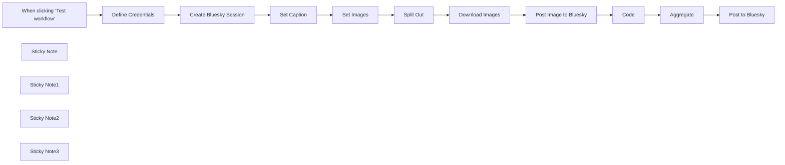

## Fluxo (.json) :

```json
{
  "id": "XGFs5jZNCeURd4OT",
  "meta": {
    "instanceId": "c5e9c1178f3b42f080c51c81bcfa62e1fbd48abf38103a7a4cd8e15abc64df08",
    "templateCredsSetupCompleted": true
  },
  "name": "Publish Image Post to Bluesky",
  "tags": [],
  "nodes": [
    {
      "id": "afd666fc-8f79-488d-a295-4bfdd6883924",
      "name": "When clicking ‘Test workflow’",
      "type": "n8n-nodes-base.manualTrigger",
      "position": [
        35,
        260
      ],
      "parameters": {},
      "typeVersion": 1
    },
    {
      "id": "d31bfe18-5acc-4f72-80d0-d85111dd62cc",
      "name": "Create Bluesky Session",
      "type": "n8n-nodes-base.httpRequest",
      "position": [
        435,
        260
      ],
      "parameters": {
        "url": "https://bsky.social/xrpc/com.atproto.server.createSession",
        "method": "POST",
        "options": {},
        "jsonBody": "={{ $('Define Credentials').item.json.credentials }}",
        "sendBody": true,
        "specifyBody": "json"
      },
      "typeVersion": 4.2
    },
    {
      "id": "514ac077-3c96-41f0-b178-afefe2f9faae",
      "name": "Download Images",
      "type": "n8n-nodes-base.httpRequest",
      "position": [
        1260,
        260
      ],
      "parameters": {
        "url": "={{ $json.url }}",
        "options": {}
      },
      "typeVersion": 4.2
    },
    {
      "id": "67e77e91-3a53-44c3-a474-2cd3b4977cf2",
      "name": "Code",
      "type": "n8n-nodes-base.code",
      "position": [
        1580,
        260
      ],
      "parameters": {
        "jsCode": "return $input.all().map( item => ({\n    alt: \"-\",\n    image: {\n      ...item.json.blob\n    }\n}));"
      },
      "typeVersion": 2
    },
    {
      "id": "b8540b04-afe8-4455-8fec-fcab5ffff1ae",
      "name": "Sticky Note",
      "type": "n8n-nodes-base.stickyNote",
      "position": [
        640,
        102.39520958083813
      ],
      "parameters": {
        "color": 4,
        "width": 391.0892880786254,
        "height": 335.5179928232044,
        "content": "## Define Your Post Caption Here\nYou can set\n* the text caption of your post (max 300 characters)\n* image URLs (max of 4 images at 1MB each)"
      },
      "typeVersion": 1
    },
    {
      "id": "2a6e60ef-4042-4648-85bb-143d226aa736",
      "name": "Split Out",
      "type": "n8n-nodes-base.splitOut",
      "position": [
        1100,
        260
      ],
      "parameters": {
        "options": {},
        "fieldToSplitOut": "photos"
      },
      "typeVersion": 1
    },
    {
      "id": "5c3a6c2f-7b60-4448-9d85-4174e9f5f770",
      "name": "Post to Bluesky",
      "type": "n8n-nodes-base.httpRequest",
      "position": [
        1940,
        260
      ],
      "parameters": {
        "url": "https://bsky.social/xrpc/com.atproto.repo.createRecord",
        "method": "POST",
        "options": {},
        "jsonBody": "={\n  \"repo\": \"{{ $('Create Bluesky Session').item.json.did }}\",\n  \"collection\": \"app.bsky.feed.post\",\n  \"record\": {\n      \"$type\": \"app.bsky.feed.post\",\n      \"text\": \"{{ $('Set Caption').item.json['Post Text'].trim()}}\",\n      \"createdAt\": \"{{ $now }}\",\n\"embed\": {\n\"$type\": \"app.bsky.embed.images\",\n\"images\":{{ $('Aggregate').item.json.data.toJsonString() }}\n}\n  }\n}",
        "sendBody": true,
        "sendHeaders": true,
        "specifyBody": "json",
        "headerParameters": {
          "parameters": [
            {
              "name": "Authorization",
              "value": "=Bearer {{ $('Create Bluesky Session').item.json.accessJwt }}"
            }
          ]
        }
      },
      "typeVersion": 4.2
    },
    {
      "id": "266ef5cb-18df-45b0-b5c4-59782e571d40",
      "name": "Sticky Note1",
      "type": "n8n-nodes-base.stickyNote",
      "position": [
        180,
        -2.994011976047659
      ],
      "parameters": {
        "color": 3,
        "width": 418.7983637184758,
        "height": 440.36620487216396,
        "content": "## Set Bluesky Credentials\nYou'll need to set 2 values...\n1. _Identifier_ \nThis is your Bluesky username, e.g. \"username.bsky.social\"\n2. _App Password_\nThis is _not_ your sign-in password, but something created in [your Bluesky account](https://bsky.app/settings/app-passwords)\n\n\nA Bluesky session is then opened for image uploading and posting."
      },
      "typeVersion": 1
    },
    {
      "id": "3a7fc037-02f6-4091-bcdc-5b22d43269ef",
      "name": "Sticky Note2",
      "type": "n8n-nodes-base.stickyNote",
      "position": [
        1063.9520958083824,
        160
      ],
      "parameters": {
        "color": 7,
        "width": 814.7806424732389,
        "height": 269.1258097879526,
        "content": "### Handling image attachments\nBluesky doesn't attach images directly to the post, they're first individually uploaded [then embedded in the post](https://docs.bsky.app/docs/tutorials/creating-a-post#images-embeds)."
      },
      "typeVersion": 1
    },
    {
      "id": "aa7796b3-9cc7-4219-85af-a9ae3613f891",
      "name": "Define Credentials",
      "type": "n8n-nodes-base.set",
      "position": [
        235,
        260
      ],
      "parameters": {
        "mode": "raw",
        "options": {},
        "jsonOutput": "{\"credentials\":\n  {\n    \"identifier\": \"username.bsky.social\",\n    \"password\": \"XXXX-YYYY-ZZZZ-XXXX\"\n  }\n}"
      },
      "typeVersion": 3.4
    },
    {
      "id": "4bcf77ef-b40e-485e-b444-659f77cf9d69",
      "name": "Aggregate",
      "type": "n8n-nodes-base.aggregate",
      "position": [
        1740,
        260
      ],
      "parameters": {
        "options": {},
        "aggregate": "aggregateAllItemData"
      },
      "typeVersion": 1
    },
    {
      "id": "eb2730e5-cad7-47f0-96d2-f2ae1dee6dd5",
      "name": "Set Images",
      "type": "n8n-nodes-base.set",
      "position": [
        880,
        260
      ],
      "parameters": {
        "mode": "raw",
        "options": {},
        "jsonOutput": "{  \"photos\":[\n    {\n      \"url\":\"https://picsum.photos/800/600?random=234234\"\n    },\n    {\n      \"url\":\"https://picsum.photos/800/600?random=676855\"\n    },\n    {\n      \"url\":\"https://picsum.photos/800/600?random=4564\"\n    },\n    {\n      \"url\":\"https://picsum.photos/800/600?random=12124\"\n    }\n  ]}"
      },
      "typeVersion": 3.4
    },
    {
      "id": "0d3a030e-1ac6-420d-a850-d267928f4072",
      "name": "Post Image to Bluesky",
      "type": "n8n-nodes-base.httpRequest",
      "position": [
        1420,
        260
      ],
      "parameters": {
        "url": "https://bsky.social/xrpc/com.atproto.repo.uploadBlob",
        "method": "POST",
        "options": {},
        "sendBody": true,
        "contentType": "binaryData",
        "sendHeaders": true,
        "headerParameters": {
          "parameters": [
            {
              "name": "Authorization",
              "value": "=Bearer {{ $('Create Bluesky Session').item.json.accessJwt }}"
            }
          ]
        },
        "inputDataFieldName": "data"
      },
      "typeVersion": 4.2
    },
    {
      "id": "31124777-ee35-4ceb-b0e7-75f7cef4b481",
      "name": "Sticky Note3",
      "type": "n8n-nodes-base.stickyNote",
      "position": [
        680,
        -260
      ],
      "parameters": {
        "width": 880.0000000000002,
        "height": 207.9041916167665,
        "content": "# Create a new post with images on Bluesky\nThis workflow will \n1. retrieve images from URLs you specify\n2. upload them 1 by 1 as blobs to BlueSky\n3. let you specify the basic text of a post\n3. use your Bluesky credentials to post to your feed"
      },
      "typeVersion": 1
    },
    {
      "id": "f8e54515-c9ec-474d-aa2b-fe357cbd4775",
      "name": "Set Caption",
      "type": "n8n-nodes-base.set",
      "position": [
        688,
        260
      ],
      "parameters": {
        "options": {},
        "assignments": {
          "assignments": [
            {
              "id": "6135981d-82d9-47bb-9eb5-ce9a4220f108",
              "name": "Caption Text",
              "type": "string",
              "value": "Here is the amazing content of my post, max of 300 characters!"
            }
          ]
        }
      },
      "typeVersion": 3.4
    }
  ],
  "active": false,
  "pinData": {},
  "settings": {
    "executionOrder": "v1"
  },
  "versionId": "86d8df08-3f73-40a5-9c5b-d2ebda3f3b13",
  "connections": {
    "Code": {
      "main": [
        [
          {
            "node": "Aggregate",
            "type": "main",
            "index": 0
          }
        ]
      ]
    },
    "Aggregate": {
      "main": [
        [
          {
            "node": "Post to Bluesky",
            "type": "main",
            "index": 0
          }
        ]
      ]
    },
    "Split Out": {
      "main": [
        [
          {
            "node": "Download Images",
            "type": "main",
            "index": 0
          }
        ]
      ]
    },
    "Set Images": {
      "main": [
        [
          {
            "node": "Split Out",
            "type": "main",
            "index": 0
          }
        ]
      ]
    },
    "Set Caption": {
      "main": [
        [
          {
            "node": "Set Images",
            "type": "main",
            "index": 0
          }
        ]
      ]
    },
    "Download Images": {
      "main": [
        [
          {
            "node": "Post Image to Bluesky",
            "type": "main",
            "index": 0
          }
        ]
      ]
    },
    "Define Credentials": {
      "main": [
        [
          {
            "node": "Create Bluesky Session",
            "type": "main",
            "index": 0
          }
        ]
      ]
    },
    "Post Image to Bluesky": {
      "main": [
        [
          {
            "node": "Code",
            "type": "main",
            "index": 0
          }
        ]
      ]
    },
    "Create Bluesky Session": {
      "main": [
        [
          {
            "node": "Set Caption",
            "type": "main",
            "index": 0
          }
        ]
      ]
    },
    "When clicking ‘Test workflow’": {
      "main": [
        [
          {
            "node": "Define Credentials",
            "type": "main",
            "index": 0
          }
        ]
      ]
    }
  }
}
```

<a id="template-851"></a>

## Template 851 - Processamento de imagens do Telegram para Airtable

- **Nome:** Processamento de imagens do Telegram para Airtable
- **Descrição:** Este fluxo recebe mensagens do Telegram com imagens, faz upload da imagem para um bucket S3, utiliza o Textract para extrair texto da imagem e registra os resultados em uma tabela do Airtable.
- **Funcionalidade:** • Detecção e recebimento de mensagens com imagens via Telegram: o fluxo capta mensagens enviadas e baixa as informações necessárias.
• Upload de imagem para o bucket S3: armazena a imagem recebida para processamento posterior.
• Extração de texto com Textract: realiza OCR na imagem para extrair conteúdo textual.
• Registro dos resultados no Airtable: adiciona os dados extraídos na tabela receipts da base qwertz.
- **Ferramentas:** • Telegram: Plataforma de mensagens usada para enviar imagens que iniciam o fluxo.
• AWS S3: Serviço de armazenamento de arquivos, usado para armazenar a imagem recebida.
• AWS Textract: Serviço de OCR para extrair texto da imagem.
• Airtable: Base de dados para armazenar os resultados.


## Fluxo visual

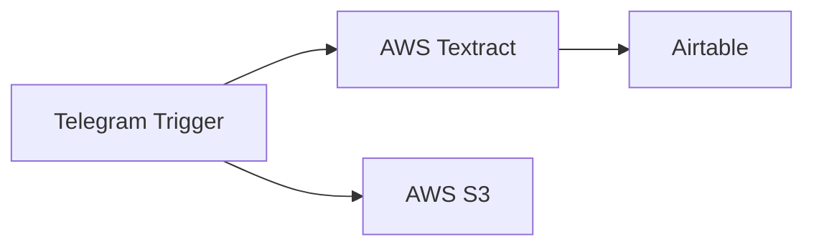

## Fluxo (.json) :

```json
{
  "nodes": [
    {
      "name": "AWS Textract",
      "type": "n8n-nodes-base.awsTextract",
      "position": [
        700,
        340
      ],
      "parameters": {},
      "credentials": {
        "aws": {
          "id": "9",
          "name": "aws"
        }
      },
      "typeVersion": 1
    },
    {
      "name": "Telegram Trigger",
      "type": "n8n-nodes-base.telegramTrigger",
      "position": [
        520,
        220
      ],
      "webhookId": "12345",
      "parameters": {
        "updates": [
          "*"
        ],
        "additionalFields": {
          "download": true,
          "imageSize": "medium"
        }
      },
      "credentials": {
        "telegramApi": {
          "id": "49",
          "name": "Telegram mybot"
        }
      },
      "typeVersion": 1
    },
    {
      "name": "Airtable",
      "type": "n8n-nodes-base.airtable",
      "position": [
        880,
        340
      ],
      "parameters": {
        "table": "receipts",
        "options": {},
        "operation": "append",
        "application": "qwertz",
        "addAllFields": false
      },
      "credentials": {
        "airtableApi": {
          "id": "6",
          "name": "airtable_nodeqa"
        }
      },
      "typeVersion": 1
    },
    {
      "name": "AWS S3",
      "type": "n8n-nodes-base.awsS3",
      "position": [
        700,
        100
      ],
      "parameters": {
        "fileName": "={{$binary.data.fileName}}",
        "operation": "upload",
        "bucketName": "textract-demodata",
        "additionalFields": {}
      },
      "credentials": {
        "aws": {
          "id": "9",
          "name": "aws"
        }
      },
      "typeVersion": 1
    }
  ],
  "connections": {
    "AWS Textract": {
      "main": [
        [
          {
            "node": "Airtable",
            "type": "main",
            "index": 0
          }
        ]
      ]
    },
    "Telegram Trigger": {
      "main": [
        [
          {
            "node": "AWS S3",
            "type": "main",
            "index": 0
          },
          {
            "node": "AWS Textract",
            "type": "main",
            "index": 0
          }
        ]
      ]
    }
  }
}
```

<a id="template-852"></a>

## Template 852 - Assinatura com IA e Airtable

- **Nome:** Assinatura com IA e Airtable
- **Descrição:** Automatiza o fluxo de assinatura de usuários para receber conteúdos periódicos, usando formulários para coleta de dados, Airtable para armazenamento, geração de conteúdo e imagem com IA, e envio de emails com unsubscribe. Suporta envio diário, semanal e surpresa, com execução paralela de envios.
- **Funcionalidade:** • Submissão de assinatura via formulário: coleta email, tópico e frequência e cria/atualiza registro de assinante no Airtable.
• Armazenamento e atualização de assinantes: gerencia Email, Topic, Status e Interval no Airtable.
• Confirmação por email: envia confirmação de inscrição.
• Execução programada diária: dispara busca de assinantes com base no intervalo às 9h.
• Busca de assinantes por frequência: consultando Airtable para daily, weekly e surprise.
• Geração de conteúdo e imagem via IA: cria factoid único e imagem correspondente.
• Envio de email com conteúdo e imagem: envia mensagem com HTML e unsubscribe link.
• Registro de Last Sent: atualiza Airtable com a data/hora do envio.
• Desinscrição via formulário: recebe ID e desativa assinatura no Airtable.
• Execução concorrente via subworkflows: envia envios em paralelo para diferentes assinantes.
- **Ferramentas:** • Airtable: Base e tabela para armazenar assinantes e logs.
• Gmail: Serviço de envio de emails.
• OpenAI: Geração de imagens e conteúdo via API de IA.
• Groq: Modelo de linguagem Groq para auxiliar na geração de conteúdo.
• Wikipedia: Busca de informações para enriquimento do conteúdo.


## Fluxo visual

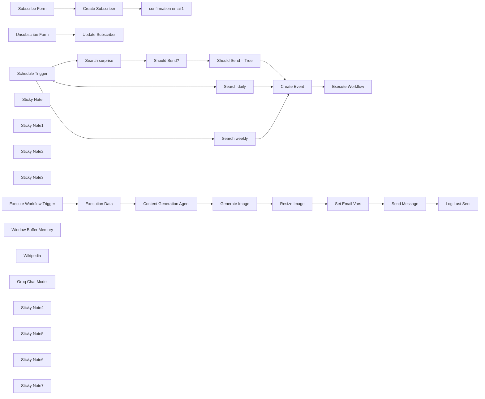

## Fluxo (.json) :

```json
{
  "nodes": [
    {
      "id": "4dd52c72-9a9b-4db4-8de5-5b12b1e5c4be",
      "name": "Schedule Trigger",
      "type": "n8n-nodes-base.scheduleTrigger",
      "position": [
        180,
        1480
      ],
      "parameters": {
        "rule": {
          "interval": [
            {
              "triggerAtHour": 9
            }
          ]
        }
      },
      "typeVersion": 1.2
    },
    {
      "id": "9226181c-b84c-4ea1-a5b4-eedb6c62037b",
      "name": "Search daily",
      "type": "n8n-nodes-base.airtable",
      "position": [
        440,
        1480
      ],
      "parameters": {
        "base": {
          "__rl": true,
          "mode": "list",
          "value": "appL3dptT6ZTSzY9v",
          "cachedResultUrl": "https://airtable.com/appL3dptT6ZTSzY9v",
          "cachedResultName": "Scheduled Emails"
        },
        "table": {
          "__rl": true,
          "mode": "list",
          "value": "tblzR9vSuFUzlQNMI",
          "cachedResultUrl": "https://airtable.com/appL3dptT6ZTSzY9v/tblzR9vSuFUzlQNMI",
          "cachedResultName": "Table 1"
        },
        "options": {},
        "operation": "search",
        "filterByFormula": "AND({Status} = 'active', {Interval} = 'daily')"
      },
      "credentials": {
        "airtableTokenApi": {
          "id": "Und0frCQ6SNVX3VV",
          "name": "Airtable Personal Access Token account"
        }
      },
      "typeVersion": 2.1
    },
    {
      "id": "1a3b6224-2f66-41c6-8b3d-be286cf16370",
      "name": "Search weekly",
      "type": "n8n-nodes-base.airtable",
      "position": [
        440,
        1660
      ],
      "parameters": {
        "base": {
          "__rl": true,
          "mode": "list",
          "value": "appL3dptT6ZTSzY9v",
          "cachedResultUrl": "https://airtable.com/appL3dptT6ZTSzY9v",
          "cachedResultName": "Scheduled Emails"
        },
        "table": {
          "__rl": true,
          "mode": "list",
          "value": "tblzR9vSuFUzlQNMI",
          "cachedResultUrl": "https://airtable.com/appL3dptT6ZTSzY9v/tblzR9vSuFUzlQNMI",
          "cachedResultName": "Table 1"
        },
        "options": {},
        "operation": "search",
        "filterByFormula": "=AND(\n  {Status} = 'active', \n  {Interval} = 'weekly', \n  {Last Sent} <= DATEADD(TODAY(), -7, 'days')\n)"
      },
      "credentials": {
        "airtableTokenApi": {
          "id": "Und0frCQ6SNVX3VV",
          "name": "Airtable Personal Access Token account"
        }
      },
      "typeVersion": 2.1
    },
    {
      "id": "1ea47e14-0a28-4780-95c7-31e24eb724d5",
      "name": "confirmation email1",
      "type": "n8n-nodes-base.gmail",
      "position": [
        620,
        820
      ],
      "webhookId": "dd8bd6df-2013-4f8d-a2cc-cd9b3913e3d2",
      "parameters": {
        "sendTo": "={{ $('Subscribe Form').item.json.email }}",
        "message": "=This is to confirm your request to subscribe to \"Learn something every day!\" - a free service to send you facts about your favourite topics.\n\nTopic: {{ $('Subscribe Form').item.json.topic }}\nSchedule: {{ $('Subscribe Form').item.json.frequency }}",
        "options": {
          "appendAttribution": false
        },
        "subject": "Learn something every day confirmation"
      },
      "credentials": {
        "gmailOAuth2": {
          "id": "Sf5Gfl9NiFTNXFWb",
          "name": "Gmail account"
        }
      },
      "typeVersion": 2.1
    },
    {
      "id": "d95262af-1b52-4f9c-8346-183b4eee8544",
      "name": "Execute Workflow",
      "type": "n8n-nodes-base.executeWorkflow",
      "position": [
        1140,
        1480
      ],
      "parameters": {
        "mode": "each",
        "options": {
          "waitForSubWorkflow": false
        },
        "workflowId": {
          "__rl": true,
          "mode": "id",
          "value": "={{ $workflow.id }}"
        }
      },
      "typeVersion": 1.1
    },
    {
      "id": "075292af-7a66-4275-ac2d-3c392189a10c",
      "name": "Create Event",
      "type": "n8n-nodes-base.set",
      "position": [
        980,
        1480
      ],
      "parameters": {
        "options": {},
        "assignments": {
          "assignments": [
            {
              "id": "b28a0142-a028-471a-8180-9883e930feea",
              "name": "email",
              "type": "string",
              "value": "={{ $json.Email }}"
            },
            {
              "id": "970f5495-05df-42b6-a422-b2ac27f8eb95",
              "name": "topic",
              "type": "string",
              "value": "={{ $json.Topic }}"
            },
            {
              "id": "e871c431-948f-4b80-aa17-1e4266674663",
              "name": "interval",
              "type": "string",
              "value": "={{ $json.Interval }}"
            },
            {
              "id": "9b72597d-1446-4ef3-86e5-0a071c69155b",
              "name": "id",
              "type": "string",
              "value": "={{ $json.id }}"
            },
            {
              "id": "b17039c2-14a2-4811-9528-88ae963e44f7",
              "name": "created_at",
              "type": "string",
              "value": "={{ $json.Created }}"
            }
          ]
        }
      },
      "typeVersion": 3.4
    },
    {
      "id": "28776aaf-6bd9-4f9f-bcf0-3d4401a74219",
      "name": "Execute Workflow Trigger",
      "type": "n8n-nodes-base.executeWorkflowTrigger",
      "position": [
        1360,
        1480
      ],
      "parameters": {},
      "typeVersion": 1
    },
    {
      "id": "0eb62e75-228b-452b-80ab-f9ef3ad33204",
      "name": "Unsubscribe Form",
      "type": "n8n-nodes-base.formTrigger",
      "position": [
        180,
        1160
      ],
      "webhookId": "e64db96d-5e61-40d5-88fb-761621a829ab",
      "parameters": {
        "options": {
          "path": "free-factoids-unsubscribe"
        },
        "formTitle": "Unsubscribe from Learn Something Every Day",
        "formFields": {
          "values": [
            {
              "fieldLabel": "ID",
              "requiredField": true
            },
            {
              "fieldType": "dropdown",
              "fieldLabel": "Reason For Unsubscribe",
              "multiselect": true,
              "fieldOptions": {
                "values": [
                  {
                    "option": "Emails not relevant"
                  },
                  {
                    "option": "Too many Emails"
                  },
                  {
                    "option": "I did not sign up to this service"
                  }
                ]
              }
            }
          ]
        },
        "formDescription": "We're sorry to see you go! Please take a moment to help us improve the service."
      },
      "typeVersion": 2.2
    },
    {
      "id": "f889efe9-dc3c-428b-ad8e-4f7d17f23e75",
      "name": "Set Email Vars",
      "type": "n8n-nodes-base.set",
      "position": [
        2500,
        1480
      ],
      "parameters": {
        "options": {},
        "assignments": {
          "assignments": [
            {
              "id": "62a684fb-16f9-4326-8eeb-777d604b305a",
              "name": "to",
              "type": "string",
              "value": "={{ $('Execute Workflow Trigger').first().json.email }},jim@height.io"
            },
            {
              "id": "4270849e-c805-4580-9088-e8d1c3ef2fb4",
              "name": "subject",
              "type": "string",
              "value": "=Your {{ $('Execute Workflow Trigger').first().json.interval }} factoid"
            },
            {
              "id": "81d0e897-2496-4a3c-b16c-9319338f899f",
              "name": "message",
              "type": "string",
              "value": "=<p>\n<strong>You asked about \"{{ $('Execution Data').first().json.topic.replace('\"','') }}\"</strong>\n</p>\n<p>\n<i>{{ $('Content Generation Agent').first().json.output }}</i>\n</p>"
            },
            {
              "id": "ee05de7b-5342-4deb-8118-edaf235d92cc",
              "name": "unsubscribe_link",
              "type": "string",
              "value": "=https://<MY_HOST>/form/inspiration-unsubscribe?ID={{ $('Execute Workflow Trigger').first().json.id }}"
            }
          ]
        },
        "includeOtherFields": true
      },
      "typeVersion": 3.4
    },
    {
      "id": "84741e6d-f5be-440d-8633-4eb30ccce170",
      "name": "Log Last Sent",
      "type": "n8n-nodes-base.airtable",
      "position": [
        2860,
        1480
      ],
      "parameters": {
        "base": {
          "__rl": true,
          "mode": "list",
          "value": "appL3dptT6ZTSzY9v",
          "cachedResultUrl": "https://airtable.com/appL3dptT6ZTSzY9v",
          "cachedResultName": "Scheduled Emails"
        },
        "table": {
          "__rl": true,
          "mode": "list",
          "value": "tblzR9vSuFUzlQNMI",
          "cachedResultUrl": "https://airtable.com/appL3dptT6ZTSzY9v/tblzR9vSuFUzlQNMI",
          "cachedResultName": "Table 1"
        },
        "columns": {
          "value": {
            "id": "={{ $('Execute Workflow Trigger').first().json.id }}",
            "Last Sent": "2024-11-29T13:34:11"
          },
          "schema": [
            {
              "id": "id",
              "type": "string",
              "display": true,
              "removed": false,
              "readOnly": true,
              "required": false,
              "displayName": "id",
              "defaultMatch": true
            },
            {
              "id": "Name",
              "type": "string",
              "display": true,
              "removed": true,
              "readOnly": false,
              "required": false,
              "displayName": "Name",
              "defaultMatch": false,
              "canBeUsedToMatch": true
            },
            {
              "id": "Email",
              "type": "string",
              "display": true,
              "removed": true,
              "readOnly": false,
              "required": false,
              "displayName": "Email",
              "defaultMatch": false,
              "canBeUsedToMatch": true
            },
            {
              "id": "Status",
              "type": "options",
              "display": true,
              "options": [
                {
                  "name": "inactive",
                  "value": "inactive"
                },
                {
                  "name": "active",
                  "value": "active"
                }
              ],
              "removed": true,
              "readOnly": false,
              "required": false,
              "displayName": "Status",
              "defaultMatch": false,
              "canBeUsedToMatch": true
            },
            {
              "id": "Interval",
              "type": "options",
              "display": true,
              "options": [
                {
                  "name": "daily",
                  "value": "daily"
                },
                {
                  "name": "weekly",
                  "value": "weekly"
                },
                {
                  "name": "surprise",
                  "value": "surprise"
                }
              ],
              "removed": true,
              "readOnly": false,
              "required": false,
              "displayName": "Interval",
              "defaultMatch": false,
              "canBeUsedToMatch": true
            },
            {
              "id": "Start Day",
              "type": "options",
              "display": true,
              "options": [
                {
                  "name": "Mon",
                  "value": "Mon"
                },
                {
                  "name": "Tue",
                  "value": "Tue"
                },
                {
                  "name": "Wed",
                  "value": "Wed"
                },
                {
                  "name": "Thu",
                  "value": "Thu"
                },
                {
                  "name": "Fri",
                  "value": "Fri"
                },
                {
                  "name": "Sat",
                  "value": "Sat"
                },
                {
                  "name": "Sun",
                  "value": "Sun"
                }
              ],
              "removed": true,
              "readOnly": false,
              "required": false,
              "displayName": "Start Day",
              "defaultMatch": false,
              "canBeUsedToMatch": true
            },
            {
              "id": "Topic",
              "type": "string",
              "display": true,
              "removed": true,
              "readOnly": false,
              "required": false,
              "displayName": "Topic",
              "defaultMatch": false,
              "canBeUsedToMatch": true
            },
            {
              "id": "Created",
              "type": "string",
              "display": true,
              "removed": true,
              "readOnly": true,
              "required": false,
              "displayName": "Created",
              "defaultMatch": false,
              "canBeUsedToMatch": true
            },
            {
              "id": "Last Modified",
              "type": "string",
              "display": true,
              "removed": true,
              "readOnly": true,
              "required": false,
              "displayName": "Last Modified",
              "defaultMatch": false,
              "canBeUsedToMatch": true
            },
            {
              "id": "Last Sent",
              "type": "dateTime",
              "display": true,
              "removed": false,
              "readOnly": false,
              "required": false,
              "displayName": "Last Sent",
              "defaultMatch": false,
              "canBeUsedToMatch": true
            }
          ],
          "mappingMode": "defineBelow",
          "matchingColumns": [
            "id"
          ]
        },
        "options": {},
        "operation": "update"
      },
      "credentials": {
        "airtableTokenApi": {
          "id": "Und0frCQ6SNVX3VV",
          "name": "Airtable Personal Access Token account"
        }
      },
      "typeVersion": 2.1
    },
    {
      "id": "88f864d6-13fb-4f09-b22d-030d016678e1",
      "name": "Search surprise",
      "type": "n8n-nodes-base.airtable",
      "position": [
        440,
        1840
      ],
      "parameters": {
        "base": {
          "__rl": true,
          "mode": "list",
          "value": "appL3dptT6ZTSzY9v",
          "cachedResultUrl": "https://airtable.com/appL3dptT6ZTSzY9v",
          "cachedResultName": "Scheduled Emails"
        },
        "table": {
          "__rl": true,
          "mode": "list",
          "value": "tblzR9vSuFUzlQNMI",
          "cachedResultUrl": "https://airtable.com/appL3dptT6ZTSzY9v/tblzR9vSuFUzlQNMI",
          "cachedResultName": "Table 1"
        },
        "options": {},
        "operation": "search",
        "filterByFormula": "=AND(\n  {Status} = 'active', \n  {Interval} = 'surprise'\n)"
      },
      "credentials": {
        "airtableTokenApi": {
          "id": "Und0frCQ6SNVX3VV",
          "name": "Airtable Personal Access Token account"
        }
      },
      "typeVersion": 2.1
    },
    {
      "id": "28238d9a-7bc0-4a22-bb4e-a7a2827e4da3",
      "name": "Should Send = True",
      "type": "n8n-nodes-base.filter",
      "position": [
        800,
        1840
      ],
      "parameters": {
        "options": {},
        "conditions": {
          "options": {
            "version": 2,
            "leftValue": "",
            "caseSensitive": true,
            "typeValidation": "strict"
          },
          "combinator": "and",
          "conditions": [
            {
              "id": "9aaf9ae2-8f96-443a-8294-c04270296b22",
              "operator": {
                "type": "boolean",
                "operation": "true",
                "singleValue": true
              },
              "leftValue": "={{ $json.should_send }}",
              "rightValue": ""
            }
          ]
        }
      },
      "typeVersion": 2.2
    },
    {
      "id": "3a46dd3d-48a6-40ca-8823-0516aa9f73a4",
      "name": "Should Send?",
      "type": "n8n-nodes-base.code",
      "position": [
        620,
        1840
      ],
      "parameters": {
        "mode": "runOnceForEachItem",
        "jsCode": "const luckyPick = Math.floor(Math.random() * 10) + 1;\n$input.item.json.should_send = luckyPick == 8;\nreturn $input.item;"
      },
      "typeVersion": 2
    },
    {
      "id": "3611da19-920b-48e6-84a4-f7be0b3a78fc",
      "name": "Create Subscriber",
      "type": "n8n-nodes-base.airtable",
      "position": [
        440,
        820
      ],
      "parameters": {
        "base": {
          "__rl": true,
          "mode": "list",
          "value": "appL3dptT6ZTSzY9v",
          "cachedResultUrl": "https://airtable.com/appL3dptT6ZTSzY9v",
          "cachedResultName": "Scheduled Emails"
        },
        "table": {
          "__rl": true,
          "mode": "list",
          "value": "tblzR9vSuFUzlQNMI",
          "cachedResultUrl": "https://airtable.com/appL3dptT6ZTSzY9v/tblzR9vSuFUzlQNMI",
          "cachedResultName": "Table 1"
        },
        "columns": {
          "value": {
            "Email": "={{ $json.email }}",
            "Topic": "={{ $json.topic }}",
            "Status": "active",
            "Interval": "={{ $json.frequency }}",
            "Start Day": "={{ $json.submittedAt.toDateTime().format('EEE') }}"
          },
          "schema": [
            {
              "id": "Name",
              "type": "string",
              "display": true,
              "removed": true,
              "readOnly": false,
              "required": false,
              "displayName": "Name",
              "defaultMatch": false,
              "canBeUsedToMatch": true
            },
            {
              "id": "Email",
              "type": "string",
              "display": true,
              "removed": false,
              "readOnly": false,
              "required": false,
              "displayName": "Email",
              "defaultMatch": false,
              "canBeUsedToMatch": true
            },
            {
              "id": "Status",
              "type": "options",
              "display": true,
              "options": [
                {
                  "name": "inactive",
                  "value": "inactive"
                },
                {
                  "name": "active",
                  "value": "active"
                }
              ],
              "removed": false,
              "readOnly": false,
              "required": false,
              "displayName": "Status",
              "defaultMatch": false,
              "canBeUsedToMatch": true
            },
            {
              "id": "Interval",
              "type": "options",
              "display": true,
              "options": [
                {
                  "name": "daily",
                  "value": "daily"
                },
                {
                  "name": "weekly",
                  "value": "weekly"
                },
                {
                  "name": "surprise",
                  "value": "surprise"
                }
              ],
              "removed": false,
              "readOnly": false,
              "required": false,
              "displayName": "Interval",
              "defaultMatch": false,
              "canBeUsedToMatch": true
            },
            {
              "id": "Start Day",
              "type": "options",
              "display": true,
              "options": [
                {
                  "name": "Mon",
                  "value": "Mon"
                },
                {
                  "name": "Tue",
                  "value": "Tue"
                },
                {
                  "name": "Wed",
                  "value": "Wed"
                },
                {
                  "name": "Thu",
                  "value": "Thu"
                },
                {
                  "name": "Fri",
                  "value": "Fri"
                },
                {
                  "name": "Sat",
                  "value": "Sat"
                },
                {
                  "name": "Sun",
                  "value": "Sun"
                }
              ],
              "removed": false,
              "readOnly": false,
              "required": false,
              "displayName": "Start Day",
              "defaultMatch": false,
              "canBeUsedToMatch": true
            },
            {
              "id": "Topic",
              "type": "string",
              "display": true,
              "removed": false,
              "readOnly": false,
              "required": false,
              "displayName": "Topic",
              "defaultMatch": false,
              "canBeUsedToMatch": true
            },
            {
              "id": "Created",
              "type": "string",
              "display": true,
              "removed": true,
              "readOnly": true,
              "required": false,
              "displayName": "Created",
              "defaultMatch": false,
              "canBeUsedToMatch": true
            },
            {
              "id": "Last Modified",
              "type": "string",
              "display": true,
              "removed": true,
              "readOnly": true,
              "required": false,
              "displayName": "Last Modified",
              "defaultMatch": false,
              "canBeUsedToMatch": true
            },
            {
              "id": "Last Sent",
              "type": "dateTime",
              "display": true,
              "removed": true,
              "readOnly": false,
              "required": false,
              "displayName": "Last Sent",
              "defaultMatch": false,
              "canBeUsedToMatch": true
            }
          ],
          "mappingMode": "defineBelow",
          "matchingColumns": [
            "Email"
          ]
        },
        "options": {},
        "operation": "upsert"
      },
      "credentials": {
        "airtableTokenApi": {
          "id": "Und0frCQ6SNVX3VV",
          "name": "Airtable Personal Access Token account"
        }
      },
      "typeVersion": 2.1
    },
    {
      "id": "2213a81f-53a9-4142-9586-e87b88710eec",
      "name": "Update Subscriber",
      "type": "n8n-nodes-base.airtable",
      "position": [
        440,
        1160
      ],
      "parameters": {
        "base": {
          "__rl": true,
          "mode": "list",
          "value": "appL3dptT6ZTSzY9v",
          "cachedResultUrl": "https://airtable.com/appL3dptT6ZTSzY9v",
          "cachedResultName": "Scheduled Emails"
        },
        "table": {
          "__rl": true,
          "mode": "list",
          "value": "tblzR9vSuFUzlQNMI",
          "cachedResultUrl": "https://airtable.com/appL3dptT6ZTSzY9v/tblzR9vSuFUzlQNMI",
          "cachedResultName": "Table 1"
        },
        "columns": {
          "value": {
            "id": "={{ $json.ID }}",
            "Status": "inactive"
          },
          "schema": [
            {
              "id": "id",
              "type": "string",
              "display": true,
              "removed": false,
              "readOnly": true,
              "required": false,
              "displayName": "id",
              "defaultMatch": true
            },
            {
              "id": "Name",
              "type": "string",
              "display": true,
              "removed": true,
              "readOnly": false,
              "required": false,
              "displayName": "Name",
              "defaultMatch": false,
              "canBeUsedToMatch": true
            },
            {
              "id": "Email",
              "type": "string",
              "display": true,
              "removed": true,
              "readOnly": false,
              "required": false,
              "displayName": "Email",
              "defaultMatch": false,
              "canBeUsedToMatch": true
            },
            {
              "id": "Status",
              "type": "options",
              "display": true,
              "options": [
                {
                  "name": "inactive",
                  "value": "inactive"
                },
                {
                  "name": "active",
                  "value": "active"
                }
              ],
              "removed": false,
              "readOnly": false,
              "required": false,
              "displayName": "Status",
              "defaultMatch": false,
              "canBeUsedToMatch": true
            },
            {
              "id": "Interval",
              "type": "options",
              "display": true,
              "options": [
                {
                  "name": "daily",
                  "value": "daily"
                },
                {
                  "name": "weekly",
                  "value": "weekly"
                }
              ],
              "removed": true,
              "readOnly": false,
              "required": false,
              "displayName": "Interval",
              "defaultMatch": false,
              "canBeUsedToMatch": true
            },
            {
              "id": "Start Day",
              "type": "options",
              "display": true,
              "options": [
                {
                  "name": "Mon",
                  "value": "Mon"
                },
                {
                  "name": "Tue",
                  "value": "Tue"
                },
                {
                  "name": "Wed",
                  "value": "Wed"
                },
                {
                  "name": "Thu",
                  "value": "Thu"
                },
                {
                  "name": "Fri",
                  "value": "Fri"
                },
                {
                  "name": "Sat",
                  "value": "Sat"
                },
                {
                  "name": "Sun",
                  "value": "Sun"
                }
              ],
              "removed": true,
              "readOnly": false,
              "required": false,
              "displayName": "Start Day",
              "defaultMatch": false,
              "canBeUsedToMatch": true
            },
            {
              "id": "Topic",
              "type": "string",
              "display": true,
              "removed": true,
              "readOnly": false,
              "required": false,
              "displayName": "Topic",
              "defaultMatch": false,
              "canBeUsedToMatch": true
            },
            {
              "id": "Created",
              "type": "string",
              "display": true,
              "removed": true,
              "readOnly": true,
              "required": false,
              "displayName": "Created",
              "defaultMatch": false,
              "canBeUsedToMatch": true
            },
            {
              "id": "Last Modified",
              "type": "string",
              "display": true,
              "removed": true,
              "readOnly": true,
              "required": false,
              "displayName": "Last Modified",
              "defaultMatch": false,
              "canBeUsedToMatch": true
            }
          ],
          "mappingMode": "defineBelow",
          "matchingColumns": [
            "id"
          ]
        },
        "options": {},
        "operation": "update"
      },
      "credentials": {
        "airtableTokenApi": {
          "id": "Und0frCQ6SNVX3VV",
          "name": "Airtable Personal Access Token account"
        }
      },
      "typeVersion": 2.1
    },
    {
      "id": "c94ec18b-e0cf-4859-8b89-23abdd63739c",
      "name": "Sticky Note",
      "type": "n8n-nodes-base.stickyNote",
      "position": [
        900,
        1280
      ],
      "parameters": {
        "color": 7,
        "width": 335,
        "height": 173,
        "content": "### 4. Using Subworkflows to run executions concurrently\nThis configuration is desired when sequential execution is slow and unnecessary. Also if one email fails, it doesn't fail the execution for everyone else."
      },
      "typeVersion": 1
    },
    {
      "id": "c14cab28-13eb-4d91-8578-8187a95a8909",
      "name": "Sticky Note1",
      "type": "n8n-nodes-base.stickyNote",
      "position": [
        180,
        700
      ],
      "parameters": {
        "color": 7,
        "width": 380,
        "height": 80,
        "content": "### 1. Subscribe flow\nUse a form to allow users to subscribe to the service."
      },
      "typeVersion": 1
    },
    {
      "id": "0e44ada0-f8a7-440e-aded-33b446190a08",
      "name": "Sticky Note2",
      "type": "n8n-nodes-base.stickyNote",
      "position": [
        180,
        1020
      ],
      "parameters": {
        "color": 7,
        "width": 355,
        "height": 115,
        "content": "### 2. Unsubscribe flow\n* Uses Form's pre-fill field feature to identify user\n* Doesn't use \"email\" as identifier so you can't unsubscribe others"
      },
      "typeVersion": 1
    },
    {
      "id": "e67bdffe-ccfc-4818-990d-b2a5ab613035",
      "name": "Sticky Note3",
      "type": "n8n-nodes-base.stickyNote",
      "position": [
        180,
        1340
      ],
      "parameters": {
        "color": 7,
        "width": 347,
        "height": 114,
        "content": "### 3. Scheduled Trigger\n* Runs every day at 9am\n* Handles all 3 frequency types\n* Send emails concurrently"
      },
      "typeVersion": 1
    },
    {
      "id": "ce7d5310-7170-46d3-b8d8-3f97407f9dfd",
      "name": "Subscribe Form",
      "type": "n8n-nodes-base.formTrigger",
      "position": [
        180,
        820
      ],
      "webhookId": "c6abe3e3-ba87-4124-a227-84e253581b58",
      "parameters": {
        "options": {
          "path": "free-factoids-subscribe",
          "appendAttribution": false,
          "respondWithOptions": {
            "values": {
              "formSubmittedText": "Thanks! Your factoid is on its way!"
            }
          }
        },
        "formTitle": "Learn something every day!",
        "formFields": {
          "values": [
            {
              "fieldType": "textarea",
              "fieldLabel": "topic",
              "placeholder": "What topic(s) would you like to learn about?",
              "requiredField": true
            },
            {
              "fieldType": "email",
              "fieldLabel": "email",
              "placeholder": "eg. jim@example.com",
              "requiredField": true
            },
            {
              "fieldType": "dropdown",
              "fieldLabel": "frequency",
              "fieldOptions": {
                "values": [
                  {
                    "option": "daily"
                  },
                  {
                    "option": "weekly"
                  },
                  {
                    "option": "surprise me"
                  }
                ]
              },
              "requiredField": true
            }
          ]
        },
        "formDescription": "Get a fact a day (or week) about any subject sent to your inbox."
      },
      "typeVersion": 2.2
    },
    {
      "id": "a5d50886-7d6b-4bf8-b376-b23c12a60608",
      "name": "Execution Data",
      "type": "n8n-nodes-base.executionData",
      "position": [
        1560,
        1480
      ],
      "parameters": {
        "dataToSave": {
          "values": [
            {
              "key": "email",
              "value": "={{ $json.email }}"
            }
          ]
        }
      },
      "typeVersion": 1
    },
    {
      "id": "69b40d8d-7734-47f1-89fe-9ea0378424b7",
      "name": "Window Buffer Memory",
      "type": "@n8n/n8n-nodes-langchain.memoryBufferWindow",
      "position": [
        1860,
        1680
      ],
      "parameters": {
        "sessionKey": "=scheduled_send_{{ $json.email }}",
        "sessionIdType": "customKey"
      },
      "typeVersion": 1.3
    },
    {
      "id": "f83cff18-f41f-4a63-9d43-7e3947aae386",
      "name": "Wikipedia",
      "type": "@n8n/n8n-nodes-langchain.toolWikipedia",
      "position": [
        2020,
        1680
      ],
      "parameters": {},
      "typeVersion": 1
    },
    {
      "id": "77457037-e3ab-42f1-948b-b994d42f2f6e",
      "name": "Content Generation Agent",
      "type": "@n8n/n8n-nodes-langchain.agent",
      "position": [
        1780,
        1460
      ],
      "parameters": {
        "text": "=Generate an new factoid on the following topic: \"{{ $json.topic.replace('\"','') }}\"\nEnsure it is unique and not one generated previously.",
        "options": {},
        "promptType": "define"
      },
      "typeVersion": 1.7
    },
    {
      "id": "cdfdd870-48b6-4c7d-a7d1-a22d70423e37",
      "name": "Groq Chat Model",
      "type": "@n8n/n8n-nodes-langchain.lmChatGroq",
      "position": [
        1720,
        1680
      ],
      "parameters": {
        "model": "llama-3.3-70b-versatile",
        "options": {}
      },
      "credentials": {
        "groqApi": {
          "id": "02xZ4o87lUMUFmbT",
          "name": "Groq account"
        }
      },
      "typeVersion": 1
    },
    {
      "id": "87df322d-a544-476f-b2ff-83feb619fe7f",
      "name": "Generate Image",
      "type": "@n8n/n8n-nodes-langchain.openAi",
      "position": [
        2120,
        1460
      ],
      "parameters": {
        "prompt": "=Generate a child-friendly illustration which compliments the following paragraph:\n{{ $json.output }}",
        "options": {},
        "resource": "image"
      },
      "credentials": {
        "openAiApi": {
          "id": "8gccIjcuf3gvaoEr",
          "name": "OpenAi account"
        }
      },
      "typeVersion": 1.7
    },
    {
      "id": "5c8d9e72-4015-44da-b5d5-829864d33672",
      "name": "Resize Image",
      "type": "n8n-nodes-base.editImage",
      "position": [
        2280,
        1460
      ],
      "parameters": {
        "width": 480,
        "height": 360,
        "options": {},
        "operation": "resize"
      },
      "typeVersion": 1
    },
    {
      "id": "a9939fad-98b3-4894-aae0-c11fa40d09da",
      "name": "Send Message",
      "type": "n8n-nodes-base.gmail",
      "position": [
        2680,
        1480
      ],
      "webhookId": "dd8bd6df-2013-4f8d-a2cc-cd9b3913e3d2",
      "parameters": {
        "sendTo": "={{ $json.to }}",
        "message": "=<!DOCTYPE html>\n<html lang=\"en\">\n<head>\n    <meta charset=\"UTF-8\">\n    <meta name=\"viewport\" content=\"width=device-width, initial-scale=1.0\">\n    <title>{{ $json.subject }}</title>\n</head>\n<body>\n    {{ $json.message }}\n<p>\n<a href=\"{{ $json.unsubscribe_link }}\">Unsubscribe</a>\n</p>\n</body>\n</html>\n",
        "options": {
          "attachmentsUi": {
            "attachmentsBinary": [
              {}
            ]
          },
          "appendAttribution": false
        },
        "subject": "={{ $json.subject }}"
      },
      "credentials": {
        "gmailOAuth2": {
          "id": "Sf5Gfl9NiFTNXFWb",
          "name": "Gmail account"
        }
      },
      "typeVersion": 2.1
    },
    {
      "id": "10b6ad35-fc1c-47a2-b234-5de3557d1164",
      "name": "Sticky Note4",
      "type": "n8n-nodes-base.stickyNote",
      "position": [
        1320,
        1660
      ],
      "parameters": {
        "color": 7,
        "width": 335,
        "height": 113,
        "content": "### 5. Use Execution Data to Filter Logs\nIf you've registered for community+ or are on n8n cloud, best practice is to use execution node to allow filtering of execution logs."
      },
      "typeVersion": 1
    },
    {
      "id": "e3563fae-ff35-457b-9fb1-784eda637518",
      "name": "Sticky Note5",
      "type": "n8n-nodes-base.stickyNote",
      "position": [
        1780,
        1280
      ],
      "parameters": {
        "color": 7,
        "width": 340,
        "height": 140,
        "content": "### 6. Use AI to Generate Factoid and Image\nUse an AI agent to automate the generation of factoids as requested by the user. This is a simple example but we recommend a adding a unique touch to stand out from the crowd!"
      },
      "typeVersion": 1
    },
    {
      "id": "d1016c5d-c855-44c5-8ad3-a534bedaa8cf",
      "name": "Sticky Note6",
      "type": "n8n-nodes-base.stickyNote",
      "position": [
        2500,
        1040
      ],
      "parameters": {
        "color": 7,
        "width": 460,
        "height": 400,
        "content": "### 7. Send Email to User\nFinally, send a message to the user with both text and image.\nLog the event in the Airtable for later analysis if required.\n\n"
      },
      "typeVersion": 1
    },
    {
      "id": "773075fa-e5a2-4d4f-8527-eb07c7038b00",
      "name": "Sticky Note7",
      "type": "n8n-nodes-base.stickyNote",
      "position": [
        -420,
        680
      ],
      "parameters": {
        "width": 480,
        "height": 900,
        "content": "## Try It Out!\n\n### This n8n templates demonstrates how to build a simple subscriber service entirely in n8n using n8n forms as a frontend, n8n generally as the backend and Airtable as the storage layer.\n\nThis template in particular shows a fully automated service to send automated messages containing facts about a topic the user requested for.\n\n### How it works\n* An n8n form is setup up to allow users to subscribe with a desired topic and interval of which to recieve messages via n8n forms which is then added to the Airtable.\n* A scheduled trigger is executed every morning and searches for subscribers to send messages for based on their desired intervals.\n* Once found, Subscribers are sent to a subworkflow which performs the text content generation via an AI agent and also uses a vision model to generate an image.\n* Both are attached to an email which is sent to the subscriber. This email also includes an unsubscribe link.\n* The unsubscribe flow works similarly via n8n form interface which when submitted disables further scheduled emails to the user.\n\n## How to use\n* Make a copy of sample Airtable here: https://airtable.com/appL3dptT6ZTSzY9v/shrLukHafy5bwDRfD\n* Make sure the workflow is \"activated\" and the forms are available and reachable by your audience.\n\n\n### Need Help?\nJoin the [Discord](https://discord.com/invite/XPKeKXeB7d) or ask in the [Forum](https://community.n8n.io/)!\n\nHappy Hacking!"
      },
      "typeVersion": 1
    }
  ],
  "pinData": {},
  "connections": {
    "Wikipedia": {
      "ai_tool": [
        [
          {
            "node": "Content Generation Agent",
            "type": "ai_tool",
            "index": 0
          }
        ]
      ]
    },
    "Create Event": {
      "main": [
        [
          {
            "node": "Execute Workflow",
            "type": "main",
            "index": 0
          }
        ]
      ]
    },
    "Resize Image": {
      "main": [
        [
          {
            "node": "Set Email Vars",
            "type": "main",
            "index": 0
          }
        ]
      ]
    },
    "Search daily": {
      "main": [
        [
          {
            "node": "Create Event",
            "type": "main",
            "index": 0
          }
        ]
      ]
    },
    "Send Message": {
      "main": [
        [
          {
            "node": "Log Last Sent",
            "type": "main",
            "index": 0
          }
        ]
      ]
    },
    "Should Send?": {
      "main": [
        [
          {
            "node": "Should Send = True",
            "type": "main",
            "index": 0
          }
        ]
      ]
    },
    "Search weekly": {
      "main": [
        [
          {
            "node": "Create Event",
            "type": "main",
            "index": 0
          }
        ]
      ]
    },
    "Execution Data": {
      "main": [
        [
          {
            "node": "Content Generation Agent",
            "type": "main",
            "index": 0
          }
        ]
      ]
    },
    "Generate Image": {
      "main": [
        [
          {
            "node": "Resize Image",
            "type": "main",
            "index": 0
          }
        ]
      ]
    },
    "Set Email Vars": {
      "main": [
        [
          {
            "node": "Send Message",
            "type": "main",
            "index": 0
          }
        ]
      ]
    },
    "Subscribe Form": {
      "main": [
        [
          {
            "node": "Create Subscriber",
            "type": "main",
            "index": 0
          }
        ]
      ]
    },
    "Groq Chat Model": {
      "ai_languageModel": [
        [
          {
            "node": "Content Generation Agent",
            "type": "ai_languageModel",
            "index": 0
          }
        ]
      ]
    },
    "Search surprise": {
      "main": [
        [
          {
            "node": "Should Send?",
            "type": "main",
            "index": 0
          }
        ]
      ]
    },
    "Schedule Trigger": {
      "main": [
        [
          {
            "node": "Search surprise",
            "type": "main",
            "index": 0
          },
          {
            "node": "Search daily",
            "type": "main",
            "index": 0
          },
          {
            "node": "Search weekly",
            "type": "main",
            "index": 0
          }
        ]
      ]
    },
    "Unsubscribe Form": {
      "main": [
        [
          {
            "node": "Update Subscriber",
            "type": "main",
            "index": 0
          }
        ]
      ]
    },
    "Create Subscriber": {
      "main": [
        [
          {
            "node": "confirmation email1",
            "type": "main",
            "index": 0
          }
        ]
      ]
    },
    "Should Send = True": {
      "main": [
        [
          {
            "node": "Create Event",
            "type": "main",
            "index": 0
          }
        ]
      ]
    },
    "Window Buffer Memory": {
      "ai_memory": [
        [
          {
            "node": "Content Generation Agent",
            "type": "ai_memory",
            "index": 0
          }
        ]
      ]
    },
    "Content Generation Agent": {
      "main": [
        [
          {
            "node": "Generate Image",
            "type": "main",
            "index": 0
          }
        ]
      ]
    },
    "Execute Workflow Trigger": {
      "main": [
        [
          {
            "node": "Execution Data",
            "type": "main",
            "index": 0
          }
        ]
      ]
    }
  }
}
```

<a id="template-853"></a>

## Template 853 - Obter faixa do Spotify

- **Nome:** Obter faixa do Spotify
- **Descrição:** Ao executar manualmente, o fluxo recupera informações de uma faixa específica no Spotify.
- **Funcionalidade:** • Acionamento manual: Inicia o fluxo quando o usuário executa a ação de 'execute'.
• Recuperar faixa por URI: Consulta a API do Spotify usando o URI 'spotify:track:6SPOM20nWbQSBvTwzgIzqg' para obter detalhes da faixa.
• Autenticação OAuth2: Utiliza credenciais OAuth2 configuradas para autorizar a requisição à API do Spotify.
- **Ferramentas:** • Spotify: Serviço de streaming de música que fornece uma API para obter informações de faixas, artistas e álbuns com base em identificadores ou URIs.


## Fluxo visual

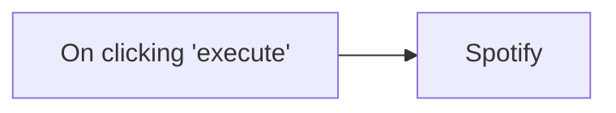

## Fluxo (.json) :

```json
{
  "id": "8",
  "name": "Sample Spotify",
  "nodes": [
    {
      "name": "On clicking 'execute'",
      "type": "n8n-nodes-base.manualTrigger",
      "position": [
        500,
        310
      ],
      "parameters": {},
      "typeVersion": 1
    },
    {
      "name": "Spotify",
      "type": "n8n-nodes-base.spotify",
      "position": [
        780,
        310
      ],
      "parameters": {
        "id": "spotify:track:6SPOM20nWbQSBvTwzgIzqg"
      },
      "credentials": {
        "spotifyOAuth2Api": "spotifyOAuth2"
      },
      "typeVersion": 1
    }
  ],
  "active": false,
  "settings": {},
  "connections": {
    "On clicking 'execute'": {
      "main": [
        [
          {
            "node": "Spotify",
            "type": "main",
            "index": 0
          }
        ]
      ]
    }
  }
}
```

<a id="template-854"></a>

## Template 854 - Checagem de URL e pré-visualização Peekalink

- **Nome:** Checagem de URL e pré-visualização Peekalink
- **Descrição:** Verifica se uma URL específica está disponível e, caso positivo, obtém dados de pré-visualização/metadados da página via Peekalink; se não estiver disponível, não realiza ação adicional.
- **Funcionalidade:** • Gatilho manual: inicia o fluxo mediante execução manual.
• Verificação de disponibilidade da URL: consulta se a URL configurada (https://n8n1.io) está disponível.
• Roteamento condicional: encaminha a execução para diferentes caminhos com base na disponibilidade.
• Recuperar pré-visualização/metadados: quando a URL estiver disponível, solicita informações detalhadas sobre a página ao serviço.
• Caminho inativo quando indisponível: encerra sem ação adicional caso a URL não esteja acessível.
- **Ferramentas:** • Peekalink API: serviço que verifica disponibilidade de URLs e fornece pré-visualizações e metadados de páginas web.


## Fluxo visual

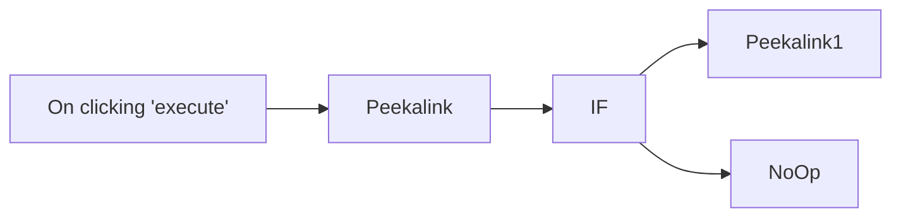

## Fluxo (.json) :

```json
{
  "nodes": [
    {
      "name": "On clicking 'execute'",
      "type": "n8n-nodes-base.manualTrigger",
      "position": [
        310,
        300
      ],
      "parameters": {},
      "typeVersion": 1
    },
    {
      "name": "Peekalink",
      "type": "n8n-nodes-base.peekalink",
      "position": [
        510,
        300
      ],
      "parameters": {
        "url": "https://n8n1.io",
        "operation": "isAvailable"
      },
      "credentials": {
        "peekalinkApi": "Peekalink API Credentials"
      },
      "typeVersion": 1
    },
    {
      "name": "IF",
      "type": "n8n-nodes-base.if",
      "position": [
        710,
        300
      ],
      "parameters": {
        "conditions": {
          "string": [],
          "boolean": [
            {
              "value1": "={{$json[\"isAvailable\"]}}",
              "value2": true
            }
          ]
        }
      },
      "typeVersion": 1
    },
    {
      "name": "Peekalink1",
      "type": "n8n-nodes-base.peekalink",
      "position": [
        910,
        200
      ],
      "parameters": {
        "url": "={{$node[\"Peekalink\"].parameter[\"url\"]}}"
      },
      "credentials": {
        "peekalinkApi": "Peekalink API Credentials"
      },
      "typeVersion": 1
    },
    {
      "name": "NoOp",
      "type": "n8n-nodes-base.noOp",
      "position": [
        910,
        400
      ],
      "parameters": {},
      "typeVersion": 1
    }
  ],
  "connections": {
    "IF": {
      "main": [
        [
          {
            "node": "Peekalink1",
            "type": "main",
            "index": 0
          }
        ],
        [
          {
            "node": "NoOp",
            "type": "main",
            "index": 0
          }
        ]
      ]
    },
    "Peekalink": {
      "main": [
        [
          {
            "node": "IF",
            "type": "main",
            "index": 0
          }
        ]
      ]
    },
    "On clicking 'execute'": {
      "main": [
        [
          {
            "node": "Peekalink",
            "type": "main",
            "index": 0
          }
        ]
      ]
    }
  }
}
```

<a id="template-855"></a>

## Template 855 - Geração de banner IA e publicação no Discord

- **Nome:** Geração de banner IA e publicação no Discord
- **Descrição:** Fluxo que coleta dados de um evento via formulário, gera uma imagem com IA, hospeda e aplica em um template de banner, e publica o banner final no Discord.
- **Funcionalidade:** • Coleta de dados do evento via formulário: captura template, título, localização, data e prompt de imagem.
• Geração de imagem IA: cria a imagem do banner a partir do prompt fornecido.
• Upload da imagem gerada para armazenamento: envia a imagem para o Cloudinary.
• Renderização do banner: aplica os dados no template do BannerBear para criar o banner final.
• Obtenção da URL do banner final: obtém o link da imagem gerada pelo BannerBear.
• Publicação no Discord: posta o banner final com uma mensagem sobre o evento.
• Otimização de imagens: reduz o tamanho do arquivo para facilitar envio e uso de banda.
- **Ferramentas:** • Cloudinary: serviço de hospedagem de imagens e transformação usadas para armazenar e transformar a imagem gerada.
• BannerBear: serviço de templates de banner e placeholders dinâmicos para criar a imagem final.
• OpenAI: geração de imagens por IA a partir de prompts.
• Discord: plataforma de comunicação onde o banner é publicado.


## Fluxo visual

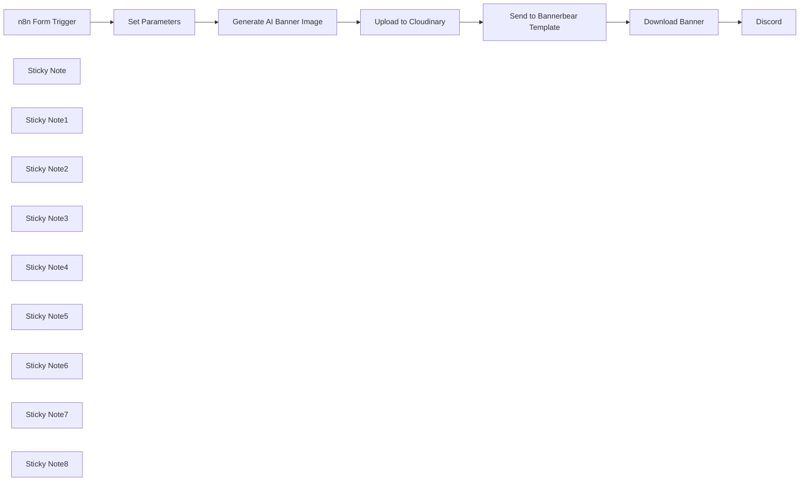

## Fluxo (.json) :

```json
{
  "meta": {
    "instanceId": "26ba763460b97c249b82942b23b6384876dfeb9327513332e743c5f6219c2b8e"
  },
  "nodes": [
    {
      "id": "81ea4c6a-d603-4688-8b72-d9c79faf7adf",
      "name": "n8n Form Trigger",
      "type": "n8n-nodes-base.formTrigger",
      "position": [
        1272,
        455
      ],
      "webhookId": "d280e773-3bd8-44ce-a147-8b404251fce9",
      "parameters": {
        "path": "d280e773-3bd8-44ce-a147-8b404251fce9",
        "options": {},
        "formTitle": "BannerBear Clone",
        "formFields": {
          "values": [
            {
              "fieldType": "dropdown",
              "fieldLabel": "Template",
              "fieldOptions": {
                "values": [
                  {
                    "option": "n8n Meetup Template"
                  },
                  {
                    "option": "AI Meetup Template"
                  }
                ]
              }
            },
            {
              "fieldType": "textarea",
              "fieldLabel": "Title of Event",
              "requiredField": true
            },
            {
              "fieldType": "textarea",
              "fieldLabel": "Location of Event",
              "requiredField": true
            },
            {
              "fieldType": "textarea",
              "fieldLabel": "Date of Event",
              "requiredField": true
            },
            {
              "fieldType": "textarea",
              "fieldLabel": "Image Prompt",
              "requiredField": true
            }
          ]
        },
        "formDescription": "Generate an image and apply text"
      },
      "typeVersion": 2
    },
    {
      "id": "dea26687-4060-488b-a09f-e21900fec2fc",
      "name": "Upload to Cloudinary",
      "type": "n8n-nodes-base.httpRequest",
      "position": [
        1920,
        480
      ],
      "parameters": {
        "url": "https://api.cloudinary.com/v1_1/daglih2g8/image/upload",
        "method": "POST",
        "options": {},
        "sendBody": true,
        "sendQuery": true,
        "contentType": "multipart-form-data",
        "authentication": "genericCredentialType",
        "bodyParameters": {
          "parameters": [
            {
              "name": "file",
              "parameterType": "formBinaryData",
              "inputDataFieldName": "data"
            }
          ]
        },
        "genericAuthType": "httpQueryAuth",
        "queryParameters": {
          "parameters": [
            {
              "name": "upload_preset",
              "value": "n8n-workflows-preset"
            }
          ]
        }
      },
      "credentials": {
        "httpQueryAuth": {
          "id": "sT9jeKzZiLJ3bVPz",
          "name": "Cloudinary API"
        }
      },
      "typeVersion": 4.2
    },
    {
      "id": "4b73ba35-eac9-467b-b711-49061da30fbc",
      "name": "Send to Bannerbear Template",
      "type": "n8n-nodes-base.bannerbear",
      "position": [
        2260,
        440
      ],
      "parameters": {
        "templateId": "={{ $('Set Parameters').item.json.template_id }}",
        "modificationsUi": {
          "modificationsValues": [
            {
              "name": "placeholder_image",
              "text": "=",
              "imageUrl": "={{ $json.secure_url.replace('upload/','upload/f_auto,q_auto/') }}"
            },
            {
              "name": "placeholder_text",
              "text": "={{ $('Set Parameters').item.json.title }}"
            },
            {
              "name": "placeholder_location",
              "text": "={{ $('Set Parameters').item.json.location }}"
            },
            {
              "name": "placeholder_date",
              "text": "={{ $('Set Parameters').item.json.date }}"
            }
          ]
        },
        "additionalFields": {
          "waitForImage": true,
          "waitForImageMaxTries": 10
        }
      },
      "credentials": {
        "bannerbearApi": {
          "id": "jXg71GVWN3F4PvI8",
          "name": "Bannerbear account"
        }
      },
      "typeVersion": 1
    },
    {
      "id": "d9b8f63b-ee0f-40d6-9b1a-8213c7043b3a",
      "name": "Set Parameters",
      "type": "n8n-nodes-base.set",
      "position": [
        1452,
        455
      ],
      "parameters": {
        "options": {},
        "assignments": {
          "assignments": [
            {
              "id": "8c526649-b8a8-4b9f-a805-41de053bb642",
              "name": "template_id",
              "type": "string",
              "value": "={{ {\n'AI Meetup Template': 'lzw71BD6VNLgD0eYkn',\n'n8n Meetup Template': 'n1MJGd52o696D7LaPV'\n}[$json.Template] ?? '' }}"
            },
            {
              "id": "f5a3c285-719b-4a12-a669-47a63a880ac4",
              "name": "title",
              "type": "string",
              "value": "={{ $json[\"Title of Event\"] }}"
            },
            {
              "id": "6713a88e-815c-416a-b838-b07006a090a3",
              "name": "location",
              "type": "string",
              "value": "={{ $json[\"Location of Event\"] }}"
            },
            {
              "id": "3c331756-1f1f-4e27-b769-e3de860bfdf0",
              "name": "date",
              "type": "string",
              "value": "={{ $json[\"Date of Event\"] }}"
            },
            {
              "id": "b933df30-8067-4a0a-bff1-64441490478d",
              "name": "image_prompt",
              "type": "string",
              "value": "={{ $json[\"Image Prompt\"] }}"
            }
          ]
        }
      },
      "typeVersion": 3.3
    },
    {
      "id": "3290571f-e858-4b73-b27d-7077d4efad15",
      "name": "Sticky Note",
      "type": "n8n-nodes-base.stickyNote",
      "position": [
        1220,
        280
      ],
      "parameters": {
        "color": 7,
        "width": 392.4891967891814,
        "height": 357.1079372601395,
        "content": "## 1. Start with n8n Forms\n[Read more about using forms](https://docs.n8n.io/integrations/builtin/core-nodes/n8n-nodes-base.formtrigger/)\n\nFor this demo, we'll use the form trigger for simple data capture but you could use webhooks for better customisation and/or integration into other workflows."
      },
      "typeVersion": 1
    },
    {
      "id": "560a6c43-07bd-4a5c-8af7-0cda78f345d4",
      "name": "Sticky Note1",
      "type": "n8n-nodes-base.stickyNote",
      "position": [
        1640,
        215.68990043281633
      ],
      "parameters": {
        "color": 7,
        "width": 456.99271465116215,
        "height": 475.77059293291677,
        "content": "## 2. Use AI to Generate an Image\n[Read more about using OpenAI](https://docs.n8n.io/integrations/builtin/app-nodes/n8n-nodes-langchain.openai)\n\nGenerating AI images is just as easy as generating text thanks for n8n's OpenAI node. Once completed, OpenAI will return a binary image file. We'll have to store this image externally however since we can't upload it directly BannerBear. I've chosen to use Cloudinary CDN but S3 is also a good choice."
      },
      "typeVersion": 1
    },
    {
      "id": "0ffe2ada-9cb6-4d4c-9d15-df83d5a596ce",
      "name": "Sticky Note2",
      "type": "n8n-nodes-base.stickyNote",
      "position": [
        2120,
        168.04517481270597
      ],
      "parameters": {
        "color": 7,
        "width": 387.4250119152741,
        "height": 467.21699325771294,
        "content": "## 3. Create Social Media Banners with BannerBear.com\n[Read more about the BannerBear Node](https://docs.n8n.io/integrations/builtin/app-nodes/n8n-nodes-base.bannerbear)\n\nNow with your generated AI image and template variables, we're ready to send them to BannerBear which will use a predefined template to create our social media banner.\n"
      },
      "typeVersion": 1
    },
    {
      "id": "e8269a57-caab-40c6-bf47-95b64eccde81",
      "name": "Sticky Note3",
      "type": "n8n-nodes-base.stickyNote",
      "position": [
        2540,
        299.6729638445606
      ],
      "parameters": {
        "color": 7,
        "width": 404.9582850950252,
        "height": 356.8876009810222,
        "content": "## 4. Post directly to Social Media\n[Read more about using the Discord Node](https://docs.n8n.io/integrations/builtin/app-nodes/n8n-nodes-base.discord)\n\nWe'll share our event banner with our community in Discord. You can also choose to post this on your favourite social media channels."
      },
      "typeVersion": 1
    },
    {
      "id": "457a0744-4c08-4489-af50-5a746fa4b756",
      "name": "Sticky Note4",
      "type": "n8n-nodes-base.stickyNote",
      "position": [
        2120,
        40
      ],
      "parameters": {
        "color": 5,
        "width": 388.96199194175017,
        "height": 122.12691731521146,
        "content": "### 🙋‍♂️ Optimise your images!\nAI generated images can get quite large (20mb+) which may hit filesize limits for some services. I've used Cloudinary's optimise API to reduce the file size before sending to BannerBear."
      },
      "typeVersion": 1
    },
    {
      "id": "c38cc2c6-a595-48c8-a5be-668fd609c76b",
      "name": "Sticky Note5",
      "type": "n8n-nodes-base.stickyNote",
      "position": [
        2960,
        220
      ],
      "parameters": {
        "color": 5,
        "width": 391.9308945140308,
        "height": 288.0739771936459,
        "content": "### Result!\nHere is a screenshot of the generated banner.\n"
      },
      "typeVersion": 1
    },
    {
      "id": "29ce299d-3444-4e71-b83c-edbe867e833f",
      "name": "Sticky Note6",
      "type": "n8n-nodes-base.stickyNote",
      "position": [
        800,
        240
      ],
      "parameters": {
        "width": 392.9673182916798,
        "height": 404.96428251481916,
        "content": "## Try It Out!\n### This workflow does the following:\n* Uses an n8n form to capture an event to be announced.\n* Form includes imagery required for the event and this is sent to OpenAI Dalle-3 service to generate.\n* Event details as well as the ai-generated image is then sent to the BannerBear.com service where a template is used.\n* The final event poster is created and posted to X (formerly Twitter)\n\n### Need Help?\nJoin the [Discord](https://discord.com/invite/XPKeKXeB7d) or ask in the [Forum](https://community.n8n.io/)!\n\nHappy Hacking!"
      },
      "typeVersion": 1
    },
    {
      "id": "c01d1ac0-5ebe-4ef1-bece-d6ad8bbff94e",
      "name": "Sticky Note7",
      "type": "n8n-nodes-base.stickyNote",
      "position": [
        2200,
        400
      ],
      "parameters": {
        "width": 221.3032167915293,
        "height": 368.5789698912447,
        "content": "\n\n\n\n\n\n\n\n\n\n\n\n\n\n\n\n\n🚨**Required**\n* You'll need to create a template in BannerBear.\n* Once you have, map the template variables to fields in this node!"
      },
      "typeVersion": 1
    },
    {
      "id": "c929d9c4-1e18-4806-9fc6-fb3bf0fa75ad",
      "name": "Download Banner",
      "type": "n8n-nodes-base.httpRequest",
      "position": [
        2600,
        480
      ],
      "parameters": {
        "url": "={{ $json.image_url_jpg }}",
        "options": {}
      },
      "typeVersion": 4.2
    },
    {
      "id": "79d19004-7d82-42be-89d5-dcb3af5e3fb1",
      "name": "Sticky Note8",
      "type": "n8n-nodes-base.stickyNote",
      "position": [
        1857.0197380966872,
        440
      ],
      "parameters": {
        "width": 224.2834786948422,
        "height": 368.5789698912447,
        "content": "\n\n\n\n\n\n\n\n\n\n\n\n\n\n\n\n\n🚨**Required**\n* You'll need to change all ids and references to your own Cloudinary instance.\n* Feel free to change this to another service!"
      },
      "typeVersion": 1
    },
    {
      "id": "18ccd15f-65b6-46eb-8235-7fe19b13649d",
      "name": "Discord",
      "type": "n8n-nodes-base.discord",
      "position": [
        2780,
        480
      ],
      "parameters": {
        "files": {
          "values": [
            {}
          ]
        },
        "content": "=📅 New Event Alert!  {{ $('Set Parameters').item.json.title }} being held at  {{ $('Set Parameters').item.json.location }} on the  {{ $('Set Parameters').item.json.date }}! Don't miss it!",
        "guildId": {
          "__rl": true,
          "mode": "list",
          "value": "1248678443432808509",
          "cachedResultUrl": "https://discord.com/channels/1248678443432808509",
          "cachedResultName": "Datamoldxyz"
        },
        "options": {},
        "resource": "message",
        "channelId": {
          "__rl": true,
          "mode": "list",
          "value": "1248678443432808512",
          "cachedResultUrl": "https://discord.com/channels/1248678443432808509/1248678443432808512",
          "cachedResultName": "general"
        }
      },
      "credentials": {
        "discordBotApi": {
          "id": "YUwD52E3oHsSUWdW",
          "name": "Discord Bot account"
        }
      },
      "typeVersion": 2
    },
    {
      "id": "7122fac9-4b4d-4fcf-a188-21af025a7fa8",
      "name": "Generate AI Banner Image",
      "type": "@n8n/n8n-nodes-langchain.openAi",
      "position": [
        1700,
        480
      ],
      "parameters": {
        "prompt": "={{ $json.image_prompt }}",
        "options": {
          "size": "1024x1024",
          "quality": "standard"
        },
        "resource": "image"
      },
      "credentials": {
        "openAiApi": {
          "id": "8gccIjcuf3gvaoEr",
          "name": "OpenAi account"
        }
      },
      "typeVersion": 1.3
    }
  ],
  "pinData": {},
  "connections": {
    "Set Parameters": {
      "main": [
        [
          {
            "node": "Generate AI Banner Image",
            "type": "main",
            "index": 0
          }
        ]
      ]
    },
    "Download Banner": {
      "main": [
        [
          {
            "node": "Discord",
            "type": "main",
            "index": 0
          }
        ]
      ]
    },
    "n8n Form Trigger": {
      "main": [
        [
          {
            "node": "Set Parameters",
            "type": "main",
            "index": 0
          }
        ]
      ]
    },
    "Upload to Cloudinary": {
      "main": [
        [
          {
            "node": "Send to Bannerbear Template",
            "type": "main",
            "index": 0
          }
        ]
      ]
    },
    "Generate AI Banner Image": {
      "main": [
        [
          {
            "node": "Upload to Cloudinary",
            "type": "main",
            "index": 0
          }
        ]
      ]
    },
    "Send to Bannerbear Template": {
      "main": [
        [
          {
            "node": "Download Banner",
            "type": "main",
            "index": 0
          }
        ]
      ]
    }
  }
}
```

<a id="template-856"></a>

## Template 856 - Extrair leads do Google Maps para Google Sheets

- **Nome:** Extrair leads do Google Maps para Google Sheets
- **Descrição:** Pesquisa locais no Google Maps usando a API do Dumpling AI e registra os resultados estruturados em uma planilha do Google Sheets.
- **Funcionalidade:** • Execução manual: Inicia o fluxo manualmente para testes e execuções pontuais.
• Pesquisa no Google Maps via Dumpling AI: Envia uma consulta (ex.: "best+restaurants+in+New+York") para obter uma lista de lugares com dados detalhados.
• Processamento item a item: Divide a lista de resultados para tratar cada estabelecimento individualmente e preparar os campos a serem gravados.
• Registro em Google Sheets: Adiciona cada lugar a uma aba específica da planilha com colunas como nome, endereço, telefone, website, avaliação, preço, posição, links de reserva e descrição.
• Personalização de consulta e idioma: Permite ajustar o termo de busca e o idioma da pesquisa para obter resultados diferentes conforme necessidade.
• Facilita automação periódica: Pode ser adaptado para execução agendada substituindo o gatilho manual e fornecendo consultas dinâmicas.
- **Ferramentas:** • Dumpling AI: API que realiza buscas no Google Maps e retorna dados estruturados sobre lugares (nome, endereço, telefone, website, avaliações, horários, links de reserva, etc.).
• Google Sheets: Planilha online usada para armazenar, organizar e consultar os resultados extraídos.


## Fluxo visual

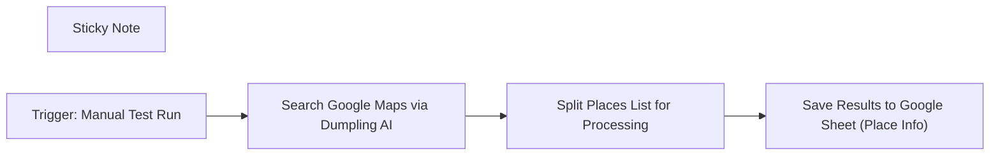

## Fluxo (.json) :

```json
{
  "id": "YZpFvpXOTYkBpiUU",
  "meta": {
    "instanceId": "a1ae5c8dc6c65e674f9c3947d083abcc749ef2546dff9f4ff01de4d6a36ebfe6"
  },
  "name": "Extract Business Leads from Google Maps with Dumpling AI to Google Sheets",
  "tags": [
    {
      "id": "TlcNkmb96fUfZ2eA",
      "name": "Tutorials",
      "createdAt": "2025-04-15T17:02:00.249Z",
      "updatedAt": "2025-04-15T17:02:00.249Z"
    }
  ],
  "nodes": [
    {
      "id": "3a49e594-6c62-4128-825e-99cdfd7e6ed5",
      "name": "Sticky Note",
      "type": "n8n-nodes-base.stickyNote",
      "position": [
        -660,
        -200
      ],
      "parameters": {
        "width": 600,
        "height": 700,
        "content": "#### 🔍 Workflow Goal\nAutomatically search Google Maps using Dumpling AI based on a keyword (e.g., best restaurants in New York), extract results, and log them into a structured Google Sheet.\n\n## 🚀 Workflow Steps\n1. **Manual Trigger**\n   - Starts the workflow when testing manually.\n\n2. **Dumpling AI Google Search**\n   - Sends a POST request to Dumpling AI to search for locations on Google Maps based on your query.\n\n3. **Split Out Node**\n   - Breaks the `places[]` array into individual items so each result can be handled separately.\n\n4. **Google Sheets Node**\n   - Appends each place’s data (name, address, phone, website, rating, etc.) into a specific tab of your Google Sheets.\n\n##### 🧠 Notes\n- The search query is currently set to: `\"best+restaurants+in+New+York\"`\n- Output columns include rating, price level, website, phone, booking links, etc.\n- Each run consumes Dumpling AI credits per query.\n- You can customize search keywords or location in the HTTP Request body.\n\n#### ✅ Tip\nTo automate this regularly, change the trigger node to a **Schedule Trigger** and add dynamic query input using a **Set** or **Webhook** node.\n\n"
      },
      "typeVersion": 1
    },
    {
      "id": "0a4ee00a-19cf-4d1e-a145-b5c5619ce636",
      "name": "Trigger: Manual Test Run",
      "type": "n8n-nodes-base.manualTrigger",
      "position": [
        0,
        120
      ],
      "parameters": {},
      "typeVersion": 1
    },
    {
      "id": "26fdb640-93a0-4312-beaf-4c07fff87751",
      "name": "Search Google Maps via Dumpling AI",
      "type": "n8n-nodes-base.httpRequest",
      "position": [
        220,
        120
      ],
      "parameters": {
        "url": "https://app.dumplingai.com/api/v1/search-maps",
        "method": "POST",
        "options": {},
        "jsonBody": "={\n  \"query\": \"best+restaurants+in+New+York\", \n  \"language\": \"en\"\n}",
        "sendBody": true,
        "specifyBody": "json",
        "authentication": "genericCredentialType",
        "genericAuthType": "httpHeaderAuth"
      },
      "credentials": {
        "httpHeaderAuth": {
          "id": "xamyMqCpAech5BeT",
          "name": "Header Auth account"
        }
      },
      "typeVersion": 4.2
    },
    {
      "id": "d3fafc2c-0b9d-4e83-83aa-de24d11fc0e1",
      "name": "Split Places List for Processing",
      "type": "n8n-nodes-base.splitOut",
      "position": [
        440,
        120
      ],
      "parameters": {
        "options": {},
        "fieldToSplitOut": "places"
      },
      "typeVersion": 1
    },
    {
      "id": "83b48532-b1fb-4ab3-9596-6e96526bfd49",
      "name": "Save Results to Google Sheet (Place Info)",
      "type": "n8n-nodes-base.googleSheets",
      "position": [
        660,
        120
      ],
      "parameters": {
        "columns": {
          "value": {
            "type": "={{ $json.type }}",
            "Name ": "={{ $json.title }}",
            "rating": "={{ $json.rating }}",
            "Address": "={{ $json.address }}",
            "Website": "={{ $json.website }}",
            "Position": "={{ $json.position }}",
            "priceLevel": "={{ $json.priceLevel }}",
            "Booking Link": "={{ $json.bookingLinks[0] }}",
            "Phone number": "={{ $json.phoneNumber }}"
          },
          "schema": [
            {
              "id": "Name ",
              "type": "string",
              "display": true,
              "required": false,
              "displayName": "Name ",
              "defaultMatch": false,
              "canBeUsedToMatch": true
            },
            {
              "id": "Address",
              "type": "string",
              "display": true,
              "required": false,
              "displayName": "Address",
              "defaultMatch": false,
              "canBeUsedToMatch": true
            },
            {
              "id": "rating",
              "type": "string",
              "display": true,
              "required": false,
              "displayName": "rating",
              "defaultMatch": false,
              "canBeUsedToMatch": true
            },
            {
              "id": "priceLevel",
              "type": "string",
              "display": true,
              "required": false,
              "displayName": "priceLevel",
              "defaultMatch": false,
              "canBeUsedToMatch": true
            },
            {
              "id": "type",
              "type": "string",
              "display": true,
              "required": false,
              "displayName": "type",
              "defaultMatch": false,
              "canBeUsedToMatch": true
            },
            {
              "id": "I use an HTTP request in n8n, I returned up to 10",
              "type": "string",
              "display": true,
              "removed": false,
              "required": false,
              "displayName": "I use an HTTP request in n8n, I returned up to 10",
              "defaultMatch": false,
              "canBeUsedToMatch": true
            },
            {
              "id": "Booking Link",
              "type": "string",
              "display": true,
              "required": false,
              "displayName": "Booking Link",
              "defaultMatch": false,
              "canBeUsedToMatch": true
            },
            {
              "id": "Website",
              "type": "string",
              "display": true,
              "removed": false,
              "required": false,
              "displayName": "Website",
              "defaultMatch": false,
              "canBeUsedToMatch": true
            },
            {
              "id": "Phone number",
              "type": "string",
              "display": true,
              "removed": false,
              "required": false,
              "displayName": "Phone number",
              "defaultMatch": false,
              "canBeUsedToMatch": true
            },
            {
              "id": "Position",
              "type": "string",
              "display": true,
              "removed": false,
              "required": false,
              "displayName": "Position",
              "defaultMatch": false,
              "canBeUsedToMatch": true
            }
          ],
          "mappingMode": "defineBelow",
          "matchingColumns": [],
          "attemptToConvertTypes": false,
          "convertFieldsToString": false
        },
        "options": {},
        "operation": "append",
        "sheetName": {
          "__rl": true,
          "mode": "list",
          "value": "",
          "cachedResultUrl": "https://docs.google.com/spreadsheets/d/1pb4WLqv2EruLM1z9-utehcINolSj0vlUqZionyLoRUs/edit#gid=1069765279",
          "cachedResultName": "Google Maps"
        },
        "documentId": {
          "__rl": true,
          "mode": "list",
          "value": "",
          "cachedResultUrl": "https://docs.google.com/spreadsheets/d/1pb4WLqv2EruLM1z9-utehcINolSj0vlUqZionyLoRUs/edit?usp=drivesdk",
          "cachedResultName": "Places"
        }
      },
      "credentials": {
        "googleSheetsOAuth2Api": {
          "id": "GaJqJHuS5mQxap7q",
          "name": "Google Sheets account"
        }
      },
      "typeVersion": 4.5
    }
  ],
  "active": false,
  "pinData": {
    "Search Google Maps via Dumpling AI": [
      {
        "json": {
          "ll": "@40.7381076,-73.9928178,13z",
          "places": [
            {
              "cid": "14366891226444778354",
              "fid": "0x89c25993862d9fab:0xc76173738eeacb72",
              "type": "French restaurant",
              "title": "Boucherie West Village",
              "types": [
                "French restaurant"
              ],
              "rating": 4.7,
              "address": "99 7th Ave S, New York, NY 10014",
              "placeId": "ChIJq58thpNZwokRcsvqjnNzYcc",
              "website": "https://www.boucherieus.com/",
              "latitude": 40.733047,
              "position": 1,
              "longitude": -74.0028772,
              "priceLevel": "$50–100",
              "description": "Two-floor bistro serving dry-aged steaks and other French fare, with a bar that's strong on absinthe.",
              "phoneNumber": "(212) 837-1616",
              "ratingCount": 6138,
              "bookingLinks": [
                "https://www.opentable.com/restaurant/profile/346609?ref=1068",
                "https://www.google.com/maps/reserve/v/dine/c/ECNC2O-BTkI?source=pa&opi=79508299"
              ],
              "openingHours": {
                "Friday": "11 AM–12 AM",
                "Monday": "11 AM–12 AM",
                "Sunday": "10 AM–12 AM",
                "Tuesday": "11 AM–12 AM",
                "Saturday": "10 AM–12 AM",
                "Thursday": "11 AM–12 AM",
                "Wednesday": "11 AM–12 AM"
              },
              "thumbnailUrl": "https://lh3.googleusercontent.com/p/AF1QipOIjrjzX_gCxhEnqpn_1KwaVrrTIdgTOZv9FrJY"
            },
            {
              "cid": "13799948123386944265",
              "fid": "0x89c259892cccb7b7:0xbf8343b3f54c1b09",
              "type": "French restaurant",
              "title": "Balthazar",
              "types": [
                "French restaurant",
                "Bakery",
                "Seafood restaurant"
              ],
              "rating": 4.4,
              "address": "80 Spring St, New York, NY 10012",
              "placeId": "ChIJt7fMLIlZwokRCRtM9bNDg78",
              "website": "http://www.balthazarny.com/",
              "latitude": 40.722668,
              "position": 2,
              "longitude": -73.99822979999999,
              "priceLevel": "$50–100",
              "description": "Iconic French brasserie with steak frites, brunch & pastries in a classy space with red banquettes.",
              "phoneNumber": "(212) 965-1414",
              "ratingCount": 7020,
              "bookingLinks": [
                "https://resy.com/cities/new-york-ny/venues/balthazar-nyc?rwg_token=AAiGsoaFc5Wv1TTL-PUVXIuvsKOdGTH7uz27wICtr-QZZbjYmtOgFXVt1boLwB31S7tdch1sPVym_QaoNS3VfiwZhmQrQOLWbA%3D%3D"
              ],
              "openingHours": {
                "Friday": "8 AM–12 AM",
                "Monday": "8 AM–12 AM",
                "Sunday": "9 AM–12 AM",
                "Tuesday": "8 AM–12 AM",
                "Saturday": "9 AM–12 AM",
                "Thursday": "8 AM–12 AM",
                "Wednesday": "8 AM–12 AM"
              },
              "thumbnailUrl": "https://lh3.googleusercontent.com/p/AF1QipMPYp_acWrBa6fa2F0TsosyYI-wDt_rL9wFVcvC"
            },
            {
              "cid": "3132777853886366741",
              "fid": "0x89c259a1820824bd:0x2b79dcdc251b8415",
              "type": "Restaurant",
              "title": "Gramercy Tavern",
              "types": [
                "Restaurant",
                "American restaurant",
                "Bar",
                "Fine dining restaurant",
                "Lunch restaurant",
                "New American restaurant"
              ],
              "rating": 4.6,
              "address": "42 E 20th St, New York, NY 10003",
              "placeId": "ChIJvSQIgqFZwokRFYQbJdzceSs",
              "website": "http://www.gramercytavern.com/?utm_source=GoogleBusinessProfile&utm_medium=Website&utm_campaign=MapLabs",
              "latitude": 40.7384555,
              "position": 3,
              "longitude": -73.98850639999999,
              "priceLevel": "$100+",
              "description": "Danny Meyer's Flatiron District tavern with a fixed-price-only dining room & a bustling bar area.",
              "phoneNumber": "(212) 477-0777",
              "ratingCount": 4319,
              "openingHours": {
                "Friday": "11:30 AM–10:30 PM",
                "Monday": "11:30 AM–10:30 PM",
                "Sunday": "11:30 AM–10:30 PM",
                "Tuesday": "11:30 AM–10:30 PM",
                "Saturday": "11:30 AM–10:30 PM",
                "Thursday": "11:30 AM–10:30 PM",
                "Wednesday": "11:30 AM–10:30 PM"
              },
              "thumbnailUrl": "https://lh3.googleusercontent.com/p/AF1QipP-6Q-5hmlzRWjc4E5FDa7K2OeNqJS3BxQMp_ln"
            },
            {
              "cid": "7298340055988969067",
              "fid": "0x89c25947ea10b457:0x6548e99cd73a1e6b",
              "type": "French restaurant",
              "title": "Le Bernardin",
              "types": [
                "French restaurant",
                "Fine dining restaurant",
                "Restaurant"
              ],
              "rating": 4.6,
              "address": "155 W 51st St, New York, NY 10019",
              "placeId": "ChIJV7QQ6kdZwokRax4615zpSGU",
              "website": "https://www.le-bernardin.com/home",
              "latitude": 40.7614218,
              "position": 4,
              "longitude": -73.9817558,
              "priceLevel": "$100+",
              "description": "Elite French restaurant offers chef Eric Ripert's refined seafood, expert service & luxurious decor.",
              "phoneNumber": "(212) 554-1515",
              "ratingCount": 3762,
              "openingHours": {
                "Friday": "12–2:30 PM, 5–11 PM",
                "Monday": "12–2:30 PM, 5–10:30 PM",
                "Sunday": "Closed",
                "Tuesday": "12–2:30 PM, 5–10:30 PM",
                "Saturday": "5–11 PM",
                "Thursday": "12–2:30 PM, 5–10:30 PM",
                "Wednesday": "12–2:30 PM, 5–10:30 PM"
              },
              "thumbnailUrl": "https://lh3.googleusercontent.com/p/AF1QipMC-dJ9gfcpFIX8PS-8yPYhjCMfjl6q35zAn1t8"
            },
            {
              "cid": "3442553861032018645",
              "fid": "0x89c259a1ec5f5573:0x2fc6687f46f682d5",
              "type": "French restaurant",
              "title": "Boucherie Union Square",
              "types": [
                "French restaurant",
                "Steak house"
              ],
              "rating": 4.7,
              "address": "225 Park Ave S, New York, NY 10003",
              "placeId": "ChIJc1Vf7KFZwokR1YL2Rn9oxi8",
              "website": "https://www.boucherieus.com/",
              "latitude": 40.7372552,
              "position": 5,
              "longitude": -73.9882246,
              "priceLevel": "$50–100",
              "description": "Bistro for dry-aged steaks and other French fare, with a bar that's strong on absinthe.",
              "phoneNumber": "(212) 353-0200",
              "ratingCount": 3890,
              "bookingLinks": [
                "https://www.opentable.com/restaurant/profile/1004143?ref=1068",
                "https://www.google.com/maps/reserve/v/dine/c/4rmpVcuKUVY?source=pa&opi=79508299"
              ],
              "openingHours": {
                "Friday": "11 AM–12 AM",
                "Monday": "11 AM–12 AM",
                "Sunday": "11 AM–12 AM",
                "Tuesday": "11 AM–12 AM",
                "Saturday": "11 AM–12 AM",
                "Thursday": "11 AM–12 AM",
                "Wednesday": "11 AM–12 AM"
              },
              "thumbnailUrl": "https://lh3.googleusercontent.com/p/AF1QipOa4JTlKpkY1_xlxnfahmd6H2FquTfCHzJJWto7"
            },
            {
              "cid": "5472139628830047106",
              "fid": "0x89c2598c596508a3:0x4bf0f1fff1c0bb82",
              "type": "Italian restaurant",
              "title": "Piccola Cucina Osteria Siciliana",
              "types": [
                "Italian restaurant",
                "Sicilian restaurant"
              ],
              "rating": 4.6,
              "address": "196 Spring St, New York, NY 10012",
              "placeId": "ChIJowhlWYxZwokRgrvA8f_x8Es",
              "website": "http://www.piccolacucinagroup.com/",
              "latitude": 40.7250308,
              "position": 6,
              "longitude": -74.0032774,
              "priceLevel": "$30–50",
              "description": "Simple Italian outpost serving salads & homestyle pastas along with an extensive wine list.",
              "phoneNumber": "(646) 478-7488",
              "ratingCount": 2199,
              "bookingLinks": [
                "https://www.opentable.com/restaurant/profile/105838?ref=1068",
                "https://www.google.com/maps/reserve/v/dine/c/Psao8Sv98GA?source=pa&opi=79508299"
              ],
              "openingHours": {
                "Friday": "11:30 AM–11 PM",
                "Monday": "11:30 AM–11 PM",
                "Sunday": "11:30 AM–11 PM",
                "Tuesday": "11:30 AM–11 PM",
                "Saturday": "11:30 AM–11 PM",
                "Thursday": "11:30 AM–11 PM",
                "Wednesday": "11:30 AM–11 PM"
              },
              "thumbnailUrl": "https://lh3.googleusercontent.com/p/AF1QipMk3ppXOP_aW2Yrb-krDInf1tjUY6K8adRhg5XT"
            },
            {
              "cid": "12751425680490052044",
              "fid": "0x89c258fbc4a06f31:0xb0f62a18b16739cc",
              "type": "Restaurant",
              "title": "The Modern",
              "types": [
                "Restaurant",
                "American restaurant",
                "Fine dining restaurant",
                "French restaurant",
                "Lunch restaurant",
                "New American restaurant"
              ],
              "rating": 4.6,
              "address": "9 W 53rd St, New York, NY 10019",
              "placeId": "ChIJMW-gxPtYwokRzDlnsRgq9rA",
              "website": "https://www.themodernnyc.com/?utm_source=GoogleBusinessProfile&utm_medium=Website&utm_campaign=MapLabs",
              "latitude": 40.761081,
              "position": 7,
              "longitude": -73.976753,
              "priceLevel": "$100+",
              "description": "French/New American fare in a modernist space with garden views at the Museum of Modern Art.",
              "phoneNumber": "(212) 333-1220",
              "ratingCount": 2477,
              "bookingLinks": [
                "https://resy.com/cities/new-york-ny/venues/the-modern?rwg_token=AAiGsobdabLYAQWI0wKR3bXQzJR2xZTshjVp3Uxere391AzDkVal9-Ur8wUduvr_d8bjXUYgsQ2UBTV3fUaQ4cK8AL4sIDHf9g%3D%3D",
                "https://www.google.com/maps/reserve/v/dine/c/IqhMF1j7prg?source=pa&opi=79508299"
              ],
              "openingHours": {
                "Friday": "12–2 PM, 5–9 PM",
                "Monday": "12–2 PM, 5:30–9 PM",
                "Sunday": "12–2 PM",
                "Tuesday": "12–2 PM, 5:30–9 PM",
                "Saturday": "12–2 PM, 5–9 PM",
                "Thursday": "12–2 PM, 5:30–9 PM",
                "Wednesday": "12–2 PM, 5:30–9 PM"
              },
              "thumbnailUrl": "https://lh3.googleusercontent.com/p/AF1QipPFegcqnHSeW_Ngyd9kDff_bofmJx6cA0Woh95o"
            },
            {
              "cid": "12769026215543562150",
              "fid": "0x89c259941967edc9:0xb134b1b0991fdfa6",
              "type": "French restaurant",
              "title": "Petite Boucherie",
              "types": [
                "French restaurant"
              ],
              "rating": 4.7,
              "address": "First Floor, 14 Christopher St, New York, NY 10014",
              "placeId": "ChIJye1nGZRZwokRpt8fmbCxNLE",
              "website": "https://www.boucherieus.com/",
              "latitude": 40.733870599999996,
              "position": 8,
              "longitude": -74.0004319,
              "priceLevel": "$50–100",
              "description": "Parisian-style cafe serving comforting French fare in a snug space with an open kitchen.",
              "phoneNumber": "(646) 756-4145",
              "ratingCount": 1787,
              "bookingLinks": [
                "https://www.opentable.com/restaurant/profile/157048?ref=1068",
                "https://www.google.com/maps/reserve/v/dine/c/E_LrlO_LqlY?source=pa&opi=79508299"
              ],
              "openingHours": {
                "Friday": "11 AM–12 AM",
                "Monday": "11 AM–12 AM",
                "Sunday": "10 AM–12 AM",
                "Tuesday": "11 AM–12 AM",
                "Saturday": "10 AM–12 AM",
                "Thursday": "11 AM–12 AM",
                "Wednesday": "11 AM–12 AM"
              },
              "thumbnailUrl": "https://lh3.googleusercontent.com/p/AF1QipO9zp1up2rYreJpE-GCYOSwGAiFxyl_iQO2No91"
            },
            {
              "cid": "6967162704871465124",
              "fid": "0x89c25bc797d635a1:0x60b055910436a0a4",
              "type": "Restaurant",
              "title": "Manhatta",
              "types": [
                "Restaurant",
                "Bar",
                "Cocktail bar",
                "Event venue",
                "Fine dining restaurant",
                "New American restaurant",
                "Wine bar"
              ],
              "rating": 4.7,
              "address": "28 Liberty St 60th floor, New York, NY 10005",
              "placeId": "ChIJoTXWl8dbwokRpKA2BJFVsGA",
              "website": "https://www.manhattarestaurant.com/?utm_source=GoogleBusinessProfile&utm_medium=Website&utm_campaign=MapLabs",
              "latitude": 40.707997399999996,
              "position": 9,
              "longitude": -74.00888259999999,
              "priceLevel": "$100+",
              "description": "Set on the 60th floor, this ritzy, high-end restaurant features New American cuisine and city views.",
              "phoneNumber": "(212) 230-5788",
              "ratingCount": 2764,
              "bookingLinks": [
                "https://www.google.com/maps/reserve/v/dine/c/pyjjUZqJ9lQ?source=pa&opi=79508299"
              ],
              "openingHours": {
                "Friday": "11:30 AM–10:30 PM",
                "Monday": "11:30 AM–9:30 PM",
                "Sunday": "11:30 AM–9:30 PM",
                "Tuesday": "11:30 AM–9:30 PM",
                "Saturday": "11:30 AM–10:30 PM",
                "Thursday": "11:30 AM–9:30 PM",
                "Wednesday": "11:30 AM–9:30 PM"
              },
              "thumbnailUrl": "https://lh3.googleusercontent.com/p/AF1QipObmWt-zmje4apfGS8o6xO7AQ2Y38KE_0Nzlo3L"
            },
            {
              "cid": "8813431814842646952",
              "fid": "0x89c25986daaa7ce7:0x7a4f998a3fd281a8",
              "type": "American restaurant",
              "title": "Russ & Daughters Cafe",
              "types": [
                "American restaurant",
                "Breakfast restaurant",
                "Brunch restaurant",
                "Jewish restaurant",
                "Lunch restaurant",
                "Restaurant"
              ],
              "rating": 4.6,
              "address": "127 Orchard St, New York, NY 10002",
              "placeId": "ChIJ53yq2oZZwokRqIHSP4qZT3o",
              "website": "https://russanddaughterscafe.com/",
              "latitude": 40.7196181,
              "position": 10,
              "longitude": -73.9895779,
              "priceLevel": "$20–30",
              "description": "From a legendary appetizing shop comes this retro, full-service outpost serving Jewish comfort food.",
              "phoneNumber": "(212) 475-4881",
              "ratingCount": 3319,
              "openingHours": {
                "Friday": "8:30 AM–3:30 PM",
                "Monday": "8:30 AM–2:30 PM",
                "Sunday": "8:30 AM–3:30 PM",
                "Tuesday": "8:30 AM–2:30 PM",
                "Saturday": "8:30 AM–3:30 PM",
                "Thursday": "8:30 AM–2:30 PM",
                "Wednesday": "8:30 AM–2:30 PM"
              },
              "thumbnailUrl": "https://lh3.googleusercontent.com/p/AF1QipPCCdN4u4VxmoNVS3aFIXzgR3lvU2XOcmHf_our"
            },
            {
              "cid": "2975234135803511093",
              "fid": "0x89c25996bd0915fd:0x294a27aedc2f4135",
              "type": "Italian restaurant",
              "title": "OLIO E PIÙ",
              "types": [
                "Italian restaurant",
                "Restaurant"
              ],
              "rating": 4.7,
              "address": "3 Greenwich Ave, New York, NY 10014",
              "placeId": "ChIJ_RUJvZZZwokRNUEv3K4nSik",
              "website": "https://www.olioepiu.com/",
              "latitude": 40.7338208,
              "position": 11,
              "longitude": -73.99979309999999,
              "priceLevel": "$50–100",
              "description": "Naples meets NYC at this trattoria with thin-crust pizza, Italian wines & ample sidewalk seating.",
              "phoneNumber": "(212) 243-6546",
              "ratingCount": 8301,
              "bookingLinks": [
                "https://www.opentable.com/restaurant/profile/55837?ref=1068",
                "https://www.google.com/maps/reserve/v/dine/c/2Ujk-qKjG0Y?source=pa&opi=79508299"
              ],
              "openingHours": {
                "Friday": "11 AM–12 AM",
                "Monday": "11 AM–12 AM",
                "Sunday": "10 AM–12 AM",
                "Tuesday": "11 AM–12 AM",
                "Saturday": "10 AM–12 AM",
                "Thursday": "11 AM–12 AM",
                "Wednesday": "11 AM–12 AM"
              },
              "thumbnailUrl": "https://lh3.googleusercontent.com/p/AF1QipNdy8VOWBkFpkuFzY4WdZ0v7TRcquFXviC1hFyW"
            },
            {
              "cid": "5618924015427954654",
              "fid": "0x89c2585492286ae9:0x4dfa6d9f277ea7de",
              "type": "Taco restaurant",
              "title": "LOS TACOS No.1",
              "types": [
                "Taco restaurant",
                "Mexican restaurant"
              ],
              "rating": 4.8,
              "address": "229 W 43rd St, New York, NY 10036",
              "placeId": "ChIJ6WooklRYwokR3qd-J59t-k0",
              "website": "http://www.lostacos1.com/",
              "latitude": 40.757321399999995,
              "position": 12,
              "longitude": -73.98765399999999,
              "priceLevel": "$10–20",
              "description": "Small pit stop with standing tables serving authentic Mexican street food.",
              "ratingCount": 12659,
              "openingHours": {
                "Friday": "11 AM–11 PM",
                "Monday": "11 AM–11 PM",
                "Sunday": "11 AM–9 PM",
                "Tuesday": "11 AM–11 PM",
                "Saturday": "11 AM–11 PM",
                "Thursday": "11 AM–11 PM",
                "Wednesday": "11 AM–11 PM"
              },
              "thumbnailUrl": "https://lh3.googleusercontent.com/p/AF1QipPaLR3wTNi8SIIqvDFYGFJ-nG_sAiR6sZCOFqOZ"
            },
            {
              "cid": "16472713729583313083",
              "fid": "0x89c259937f4eb1af:0xe49ad5dc628370bb",
              "type": "Italian restaurant",
              "title": "Via Carota",
              "types": [
                "Italian restaurant"
              ],
              "rating": 4.4,
              "address": "51 Grove St, New York, NY 10014",
              "placeId": "ChIJr7FOf5NZwokRu3CDYtzVmuQ",
              "website": "http://viacarota.com/",
              "latitude": 40.7331437,
              "position": 13,
              "longitude": -74.0036671,
              "priceLevel": "$50–100",
              "description": "Italian trattoria serving traditional plates & apéritifs in a rustic, cozy space.",
              "phoneNumber": "(212) 255-1962",
              "ratingCount": 2842,
              "openingHours": {
                "Friday": "10 AM–11 PM",
                "Monday": "11 AM–11 PM",
                "Sunday": "10 AM–11 PM",
                "Tuesday": "11 AM–11 PM",
                "Saturday": "10 AM–11 PM",
                "Thursday": "11 AM–11 PM",
                "Wednesday": "11 AM–11 PM"
              },
              "thumbnailUrl": "https://lh3.googleusercontent.com/p/AF1QipOpMXlOGFvZovcoxb-XjqCV2kdYQHODTlpUbc8I"
            },
            {
              "cid": "9312603855358623759",
              "fid": "0x89c259f337272b95:0x813d03ddbc95800f",
              "type": "American restaurant",
              "title": "RH Rooftop Restaurant at RH New York",
              "types": [
                "American restaurant",
                "Restaurant"
              ],
              "rating": 4.4,
              "address": "9 9th Ave, New York, NY 10014",
              "placeId": "ChIJlSsnN_NZwokRD4CVvN0DPYE",
              "website": "http://www.rh.com/newyork/restaurant",
              "latitude": 40.73985,
              "position": 14,
              "longitude": -74.00639,
              "priceLevel": "$50–100",
              "description": "Glamorous rooftop restaurant offering American fare amid chandeliers, greenery, and skyline views.",
              "phoneNumber": "(212) 217-2210",
              "ratingCount": 2176,
              "bookingLinks": [
                "https://www.opentable.com/restaurant/profile/1050247?ref=1068",
                "https://www.google.com/maps/reserve/v/dine/c/YEEToh7bBlo?source=pa&opi=79508299"
              ],
              "openingHours": {
                "Friday": "11:30 AM–9 PM",
                "Monday": "11:30 AM–9 PM",
                "Sunday": "10 AM–9 PM",
                "Tuesday": "11:30 AM–9 PM",
                "Saturday": "10 AM–9 PM",
                "Thursday": "11:30 AM–9 PM",
                "Wednesday": "11:30 AM–9 PM"
              },
              "thumbnailUrl": "https://lh3.googleusercontent.com/p/AF1QipNrIo_odwUa7D5xnOrEfdeOq7vGMprNLMPnyOhT"
            },
            {
              "cid": "18303949408079626176",
              "fid": "0x89c25b5ac3fc353f:0xfe04b102174ebfc0",
              "type": "Taco restaurant",
              "title": "LOS TACOS No.1",
              "types": [
                "Taco restaurant",
                "Restaurant"
              ],
              "rating": 4.7,
              "address": "75 9th Ave, New York, NY 10011",
              "placeId": "ChIJPzX8w1pbwokRwL9OFwKxBP4",
              "website": "https://www.lostacos1.com/",
              "latitude": 40.742252099999995,
              "position": 15,
              "longitude": -74.0059635,
              "priceLevel": "$10–20",
              "description": "Bustling taqueria serving tacos, quesadillas & aguas frescas in a street-style setup (no seating).",
              "ratingCount": 4772,
              "openingHours": {
                "Friday": "11 AM–10 PM",
                "Monday": "11 AM–10 PM",
                "Sunday": "11 AM–9 PM",
                "Tuesday": "11 AM–10 PM",
                "Saturday": "11 AM–10 PM",
                "Thursday": "11 AM–10 PM",
                "Wednesday": "11 AM–10 PM"
              },
              "thumbnailUrl": "https://lh3.googleusercontent.com/p/AF1QipPqkAkh_eP9f-WUBiRoN-_nlyKVWCSTUp-47dpu"
            },
            {
              "cid": "1412917795118885020",
              "fid": "0x89c2598c5dde0695:0x139bb13faae3a89c",
              "type": "Italian restaurant",
              "title": "Piccola Cucina Estiatorio",
              "types": [
                "Italian restaurant",
                "Seafood market"
              ],
              "rating": 4.7,
              "address": "75 Thompson St, New York, NY 10012",
              "placeId": "ChIJlQbeXYxZwokRnKjjqj-xmxM",
              "website": "http://www.piccolacucinagroup.com/",
              "latitude": 40.7246336,
              "position": 16,
              "longitude": -74.00297619999999,
              "priceLevel": "$30–50",
              "phoneNumber": "(646) 781-9183",
              "ratingCount": 1660,
              "bookingLinks": [
                "https://www.opentable.com/restaurant/profile/343939?ref=1068",
                "https://www.google.com/maps/reserve/v/dine/c/pcvDAa-RKIU?source=pa&opi=79508299"
              ],
              "openingHours": {
                "Friday": "11:30 AM–12 AM",
                "Monday": "11:30 AM–11 PM",
                "Sunday": "11:30 AM–11 PM",
                "Tuesday": "11:30 AM–11 PM",
                "Saturday": "11:30 AM–12 AM",
                "Thursday": "11:30 AM–11 PM",
                "Wednesday": "11:30 AM–11 PM"
              },
              "thumbnailUrl": "https://lh3.googleusercontent.com/p/AF1QipNoIV4fOazNCv4q04hA-CLCxMmuV9q3-ua81HR8"
            },
            {
              "cid": "6783566240304368229",
              "fid": "0x89c258f62fec73a7:0x5e24118dffac8a65",
              "type": "Fine dining restaurant",
              "title": "Per Se",
              "types": [
                "Fine dining restaurant",
                "French restaurant"
              ],
              "rating": 4.5,
              "address": "10 Columbus Cir, New York, NY 10019",
              "placeId": "ChIJp3PsL_ZYwokRZYqs_40RJF4",
              "website": "https://www.thomaskeller.com/perseny",
              "latitude": 40.768217799999995,
              "position": 17,
              "longitude": -73.9828988,
              "priceLevel": "$100+",
              "description": "Chef Thomas Keller's New American restaurant offers luxe fixed-price menus, with Central Park views.",
              "phoneNumber": "(212) 823-9335",
              "ratingCount": 1863,
              "openingHours": {
                "Friday": "4:30–8:30 PM",
                "Monday": "4:30–8:30 PM",
                "Sunday": "4:30–8:30 PM",
                "Tuesday": "4:30–8:30 PM",
                "Saturday": "4:30–8:30 PM",
                "Thursday": "4:30–8:30 PM",
                "Wednesday": "4:30–8:30 PM"
              },
              "thumbnailUrl": "https://lh3.googleusercontent.com/p/AF1QipO7nQNiCyD5Fw4CUQ17RSfRfjX-pDQkD26wXJHy"
            },
            {
              "cid": "3538632692129109557",
              "fid": "0x89c258f6339d1b6f:0x311bbfaf5cf09635",
              "type": "American restaurant",
              "title": "ROBERT",
              "types": [
                "American restaurant"
              ],
              "rating": 4.5,
              "address": "2 Columbus Cir, New York, NY 10019",
              "placeId": "ChIJbxudM_ZYwokRNZbwXK-_GzE",
              "website": "https://robertnyc.com/",
              "latitude": 40.767438,
              "position": 18,
              "longitude": -73.9819871,
              "priceLevel": "$$$",
              "description": "New American fare & city views in an arty space on the top-floor of the Museum of Arts & Design.",
              "phoneNumber": "(212) 299-7730",
              "ratingCount": 1719,
              "bookingLinks": [
                "https://www.opentable.com/r/robert-new-york"
              ],
              "openingHours": {
                "Friday": "12–11 PM",
                "Monday": "12–10 PM",
                "Sunday": "11 AM–11 PM",
                "Tuesday": "12–10 PM",
                "Saturday": "11 AM–11 PM",
                "Thursday": "12–10 PM",
                "Wednesday": "12–10 PM"
              },
              "thumbnailUrl": "https://lh3.googleusercontent.com/p/AF1QipMn17D7rwlR14fK8bCmgxV_UqzsK4fBzNP6fFaw"
            },
            {
              "cid": "3545819340560108778",
              "fid": "0x89c2598f7ff4aa09:0x313547e757cb8cea",
              "type": "Restaurant",
              "title": "Katz's Delicatessen",
              "types": [
                "Restaurant",
                "American restaurant",
                "Jewish restaurant",
                "Deli",
                "Sandwich shop"
              ],
              "rating": 4.5,
              "address": "205 E Houston St, New York, NY 10002",
              "placeId": "ChIJCar0f49ZwokR6ozLV-dHNTE",
              "website": "https://katzsdelicatessen.com/",
              "latitude": 40.722232999999996,
              "position": 19,
              "longitude": -73.98742899999999,
              "priceLevel": "$20–30",
              "description": "No-frills deli with theatrically cranky service serving mile-high sandwiches since 1888.",
              "phoneNumber": "(212) 254-2246",
              "ratingCount": 44962,
              "openingHours": {
                "Friday": "8 AM–11:30 PM",
                "Monday": "8 AM–11 PM",
                "Sunday": "12 AM–11 PM",
                "Tuesday": "8 AM–11 PM",
                "Saturday": "Open 24 hours",
                "Thursday": "8 AM–11 PM",
                "Wednesday": "8 AM–11 PM"
              },
              "thumbnailUrl": "https://lh3.googleusercontent.com/p/AF1QipNedb29MPPEqzCoheQ79l26VPnn6dcTGtcvF4w7"
            },
            {
              "cid": "1614607817747620329",
              "fid": "0x89c25a1f689722d3:0x16683d41746a61e9",
              "type": "Cajun restaurant",
              "title": "1803 NYC",
              "types": [
                "Cajun restaurant",
                "Bar",
                "Brunch restaurant",
                "Creole restaurant",
                "Event venue",
                "Live music venue",
                "Lunch restaurant",
                "Restaurant",
                "Seafood restaurant",
                "Soul food restaurant"
              ],
              "rating": 4.5,
              "address": "82 Reade St, New York, NY 10007",
              "placeId": "ChIJ0yKXaB9awokR6WFqdEE9aBY",
              "website": "https://1803nyc.com/",
              "latitude": 40.7154539,
              "position": 20,
              "longitude": -74.00733009999999,
              "priceLevel": "$30–50",
              "description": "Elevated Cajun-Creole food and drinks served in a New Orleans's French quarters-inspired restaurant.",
              "phoneNumber": "(212) 267-3000",
              "ratingCount": 1791,
              "bookingLinks": [
                "https://1803nyc.com/#reservation",
                "https://resy.com/cities/new-york-ny/venues/1803?rwg_token=AAiGsoZQZUVMZ4dhDz6Sg9qsvG6tjLIhQZvXBSU9opEklGTc20X2Oby6LmmRgAp1IrhjAUd79G_k3s0VP3tEuEu5J_T1DCCazwmMhQpGVRyVaiJWH8RBrM0%3D",
                "https://www.google.com/maps/reserve/v/dine/c/knKVX6xdexM?source=pa&opi=79508299"
              ],
              "openingHours": {
                "Friday": "11:30 AM–11 PM",
                "Monday": "11:30 AM–11 PM",
                "Sunday": "11 AM–11 PM",
                "Tuesday": "11:30 AM–11 PM",
                "Saturday": "11 AM–12 AM",
                "Thursday": "11:30 AM–11 PM",
                "Wednesday": "11:30 AM–11 PM"
              },
              "thumbnailUrl": "https://lh3.googleusercontent.com/p/AF1QipMD6CTvhAgGtyrqyIkqwTB_iiJh1FKAdDcV_XKA"
            }
          ],
          "credits": 3,
          "searchParameters": {
            "q": "best+restaurants+in+New+York",
            "hl": "en",
            "type": "maps",
            "engine": "google"
          }
        }
      }
    ],
    "Save Results to Google Sheet (Place Info)": [
      {
        "json": {
          "type": "French restaurant",
          "Name ": "Boucherie West Village",
          "rating": 4.7,
          "Address": "99 7th Ave S, New York, NY 10014",
          "Website": "https://www.boucherieus.com/",
          "Position": 1,
          "priceLevel": "$50–100",
          "Description": "Two-floor bistro serving dry-aged steaks and other French fare, with a bar that's strong on absinthe.",
          "Booking Link": "https://www.opentable.com/restaurant/profile/346609?ref=1068",
          "Phone number": "(212) 837-1616"
        }
      },
      {
        "json": {
          "type": "French restaurant",
          "Name ": "Balthazar",
          "rating": 4.4,
          "Address": "80 Spring St, New York, NY 10012",
          "Website": "http://www.balthazarny.com/",
          "Position": 2,
          "priceLevel": "$50–100",
          "Description": "Iconic French brasserie with steak frites, brunch & pastries in a classy space with red banquettes.",
          "Booking Link": "https://resy.com/cities/new-york-ny/venues/balthazar-nyc?rwg_token=AAiGsoaFc5Wv1TTL-PUVXIuvsKOdGTH7uz27wICtr-QZZbjYmtOgFXVt1boLwB31S7tdch1sPVym_QaoNS3VfiwZhmQrQOLWbA%3D%3D",
          "Phone number": "(212) 965-1414"
        }
      },
      {
        "json": {
          "type": "Restaurant",
          "Name ": "Gramercy Tavern",
          "rating": 4.6,
          "Address": "42 E 20th St, New York, NY 10003",
          "Website": "http://www.gramercytavern.com/?utm_source=GoogleBusinessProfile&utm_medium=Website&utm_campaign=MapLabs",
          "Position": 3,
          "priceLevel": "$100+",
          "Description": "Danny Meyer's Flatiron District tavern with a fixed-price-only dining room & a bustling bar area.",
          "Phone number": "(212) 477-0777"
        }
      },
      {
        "json": {
          "type": "French restaurant",
          "Name ": "Le Bernardin",
          "rating": 4.6,
          "Address": "155 W 51st St, New York, NY 10019",
          "Website": "https://www.le-bernardin.com/home",
          "Position": 4,
          "priceLevel": "$100+",
          "Description": "Elite French restaurant offers chef Eric Ripert's refined seafood, expert service & luxurious decor.",
          "Phone number": "(212) 554-1515"
        }
      },
      {
        "json": {
          "type": "French restaurant",
          "Name ": "Boucherie Union Square",
          "rating": 4.7,
          "Address": "225 Park Ave S, New York, NY 10003",
          "Website": "https://www.boucherieus.com/",
          "Position": 5,
          "priceLevel": "$50–100",
          "Description": "Bistro for dry-aged steaks and other French fare, with a bar that's strong on absinthe.",
          "Booking Link": "https://www.opentable.com/restaurant/profile/1004143?ref=1068",
          "Phone number": "(212) 353-0200"
        }
      },
      {
        "json": {
          "type": "Italian restaurant",
          "Name ": "Piccola Cucina Osteria Siciliana",
          "rating": 4.6,
          "Address": "196 Spring St, New York, NY 10012",
          "Website": "http://www.piccolacucinagroup.com/",
          "Position": 6,
          "priceLevel": "$30–50",
          "Description": "Simple Italian outpost serving salads & homestyle pastas along with an extensive wine list.",
          "Booking Link": "https://www.opentable.com/restaurant/profile/105838?ref=1068",
          "Phone number": "(646) 478-7488"
        }
      },
      {
        "json": {
          "type": "Restaurant",
          "Name ": "The Modern",
          "rating": 4.6,
          "Address": "9 W 53rd St, New York, NY 10019",
          "Website": "https://www.themodernnyc.com/?utm_source=GoogleBusinessProfile&utm_medium=Website&utm_campaign=MapLabs",
          "Position": 7,
          "priceLevel": "$100+",
          "Description": "French/New American fare in a modernist space with garden views at the Museum of Modern Art.",
          "Booking Link": "https://resy.com/cities/new-york-ny/venues/the-modern?rwg_token=AAiGsobdabLYAQWI0wKR3bXQzJR2xZTshjVp3Uxere391AzDkVal9-Ur8wUduvr_d8bjXUYgsQ2UBTV3fUaQ4cK8AL4sIDHf9g%3D%3D",
          "Phone number": "(212) 333-1220"
        }
      },
      {
        "json": {
          "type": "French restaurant",
          "Name ": "Petite Boucherie",
          "rating": 4.7,
          "Address": "First Floor, 14 Christopher St, New York, NY 10014",
          "Website": "https://www.boucherieus.com/",
          "Position": 8,
          "priceLevel": "$50–100",
          "Description": "Parisian-style cafe serving comforting French fare in a snug space with an open kitchen.",
          "Booking Link": "https://www.opentable.com/restaurant/profile/157048?ref=1068",
          "Phone number": "(646) 756-4145"
        }
      },
      {
        "json": {
          "type": "Restaurant",
          "Name ": "Manhatta",
          "rating": 4.7,
          "Address": "28 Liberty St 60th floor, New York, NY 10005",
          "Website": "https://www.manhattarestaurant.com/?utm_source=GoogleBusinessProfile&utm_medium=Website&utm_campaign=MapLabs",
          "Position": 9,
          "priceLevel": "$100+",
          "Description": "Set on the 60th floor, this ritzy, high-end restaurant features New American cuisine and city views.",
          "Booking Link": "https://www.google.com/maps/reserve/v/dine/c/pyjjUZqJ9lQ?source=pa&opi=79508299",
          "Phone number": "(212) 230-5788"
        }
      },
      {
        "json": {
          "type": "American restaurant",
          "Name ": "Russ & Daughters Cafe",
          "rating": 4.6,
          "Address": "127 Orchard St, New York, NY 10002",
          "Website": "https://russanddaughterscafe.com/",
          "Position": 10,
          "priceLevel": "$20–30",
          "Description": "From a legendary appetizing shop comes this retro, full-service outpost serving Jewish comfort food.",
          "Phone number": "(212) 475-4881"
        }
      },
      {
        "json": {
          "type": "Italian restaurant",
          "Name ": "OLIO E PIÙ",
          "rating": 4.7,
          "Address": "3 Greenwich Ave, New York, NY 10014",
          "Website": "https://www.olioepiu.com/",
          "Position": 11,
          "priceLevel": "$50–100",
          "Description": "Naples meets NYC at this trattoria with thin-crust pizza, Italian wines & ample sidewalk seating.",
          "Booking Link": "https://www.opentable.com/restaurant/profile/55837?ref=1068",
          "Phone number": "(212) 243-6546"
        }
      },
      {
        "json": {
          "type": "Taco restaurant",
          "Name ": "LOS TACOS No.1",
          "rating": 4.8,
          "Address": "229 W 43rd St, New York, NY 10036",
          "Website": "http://www.lostacos1.com/",
          "Position": 12,
          "priceLevel": "$10–20",
          "Description": "Small pit stop with standing tables serving authentic Mexican street food."
        }
      },
      {
        "json": {
          "type": "Italian restaurant",
          "Name ": "Via Carota",
          "rating": 4.4,
          "Address": "51 Grove St, New York, NY 10014",
          "Website": "http://viacarota.com/",
          "Position": 13,
          "priceLevel": "$50–100",
          "Description": "Italian trattoria serving traditional plates & apéritifs in a rustic, cozy space.",
          "Phone number": "(212) 255-1962"
        }
      },
      {
        "json": {
          "type": "American restaurant",
          "Name ": "RH Rooftop Restaurant at RH New York",
          "rating": 4.4,
          "Address": "9 9th Ave, New York, NY 10014",
          "Website": "http://www.rh.com/newyork/restaurant",
          "Position": 14,
          "priceLevel": "$50–100",
          "Description": "Glamorous rooftop restaurant offering American fare amid chandeliers, greenery, and skyline views.",
          "Booking Link": "https://www.opentable.com/restaurant/profile/1050247?ref=1068",
          "Phone number": "(212) 217-2210"
        }
      },
      {
        "json": {
          "type": "Taco restaurant",
          "Name ": "LOS TACOS No.1",
          "rating": 4.7,
          "Address": "75 9th Ave, New York, NY 10011",
          "Website": "https://www.lostacos1.com/",
          "Position": 15,
          "priceLevel": "$10–20",
          "Description": "Bustling taqueria serving tacos, quesadillas & aguas frescas in a street-style setup (no seating)."
        }
      },
      {
        "json": {
          "type": "Italian restaurant",
          "Name ": "Piccola Cucina Estiatorio",
          "rating": 4.7,
          "Address": "75 Thompson St, New York, NY 10012",
          "Website": "http://www.piccolacucinagroup.com/",
          "Position": 16,
          "priceLevel": "$30–50",
          "Booking Link": "https://www.opentable.com/restaurant/profile/343939?ref=1068",
          "Phone number": "(646) 781-9183"
        }
      },
      {
        "json": {
          "type": "Fine dining restaurant",
          "Name ": "Per Se",
          "rating": 4.5,
          "Address": "10 Columbus Cir, New York, NY 10019",
          "Website": "https://www.thomaskeller.com/perseny",
          "Position": 17,
          "priceLevel": "$100+",
          "Description": "Chef Thomas Keller's New American restaurant offers luxe fixed-price menus, with Central Park views.",
          "Phone number": "(212) 823-9335"
        }
      },
      {
        "json": {
          "type": "American restaurant",
          "Name ": "ROBERT",
          "rating": 4.5,
          "Address": "2 Columbus Cir, New York, NY 10019",
          "Website": "https://robertnyc.com/",
          "Position": 18,
          "priceLevel": "$$$",
          "Description": "New American fare & city views in an arty space on the top-floor of the Museum of Arts & Design.",
          "Booking Link": "https://www.opentable.com/r/robert-new-york",
          "Phone number": "(212) 299-7730"
        }
      },
      {
        "json": {
          "type": "Restaurant",
          "Name ": "Katz's Delicatessen",
          "rating": 4.5,
          "Address": "205 E Houston St, New York, NY 10002",
          "Website": "https://katzsdelicatessen.com/",
          "Position": 19,
          "priceLevel": "$20–30",
          "Description": "No-frills deli with theatrically cranky service serving mile-high sandwiches since 1888.",
          "Phone number": "(212) 254-2246"
        }
      },
      {
        "json": {
          "type": "Cajun restaurant",
          "Name ": "1803 NYC",
          "rating": 4.5,
          "Address": "82 Reade St, New York, NY 10007",
          "Website": "https://1803nyc.com/",
          "Position": 20,
          "priceLevel": "$30–50",
          "Description": "Elevated Cajun-Creole food and drinks served in a New Orleans's French quarters-inspired restaurant.",
          "Booking Link": "https://1803nyc.com/#reservation",
          "Phone number": "(212) 267-3000"
        }
      }
    ]
  },
  "settings": {
    "executionOrder": "v1"
  },
  "versionId": "171ef405-bac6-42c0-a3c3-c28cb49ff21a",
  "connections": {
    "Trigger: Manual Test Run": {
      "main": [
        [
          {
            "node": "Search Google Maps via Dumpling AI",
            "type": "main",
            "index": 0
          }
        ]
      ]
    },
    "Split Places List for Processing": {
      "main": [
        [
          {
            "node": "Save Results to Google Sheet (Place Info)",
            "type": "main",
            "index": 0
          }
        ]
      ]
    },
    "Search Google Maps via Dumpling AI": {
      "main": [
        [
          {
            "node": "Split Places List for Processing",
            "type": "main",
            "index": 0
          }
        ]
      ]
    }
  }
}
```

<a id="template-857"></a>

## Template 857 - Geração de banner IA com Cloudinary e BannerBear

- **Nome:** Geração de banner IA com Cloudinary e BannerBear
- **Descrição:** Fluxo que coleta dados de evento, gera uma imagem por IA a partir de um prompt, faz o upload da imagem, monta o banner com um template e posta o banner final em Discord.
- **Funcionalidade:** • Coleta de dados de evento via formulário: captura título, local, data e prompt de imagem, além da escolha do template.
• Geração de imagem AI a partir do prompt: utiliza IA para criar uma imagem com base no prompt fornecido.
• Upload da imagem gerada para hospedagem (Cloudinary): armazena a imagem gerada e obtém URL.
• Criação do banner final com template (BannerBear): aplica as variáveis do evento e a imagem gerada para criar o banner.
• Postagem do banner final no Discord: envia o banner para o canal escolhido com uma mensagem de alerta.
- **Ferramentas:** • Cloudinary: serviço de hospedagem de imagens, transformação/otimização e entrega do banner gerado.
• BannerBear: serviço para criar banners a partir de templates e variáveis.
• OpenAI: geração de imagens a partir de prompts (IA de imagem).
• Discord: envio do banner final para um canal com mensagem.


## Fluxo visual


## Fluxo (.json) :

```json
{
  "meta": {
    "instanceId": "26ba763460b97c249b82942b23b6384876dfeb9327513332e743c5f6219c2b8e"
  },
  "nodes": [
    {
      "id": "81ea4c6a-d603-4688-8b72-d9c79faf7adf",
      "name": "n8n Form Trigger",
      "type": "n8n-nodes-base.formTrigger",
      "position": [
        1272,
        455
      ],
      "webhookId": "d280e773-3bd8-44ce-a147-8b404251fce9",
      "parameters": {
        "path": "d280e773-3bd8-44ce-a147-8b404251fce9",
        "options": {},
        "formTitle": "BannerBear Clone",
        "formFields": {
          "values": [
            {
              "fieldType": "dropdown",
              "fieldLabel": "Template",
              "fieldOptions": {
                "values": [
                  {
                    "option": "n8n Meetup Template"
                  },
                  {
                    "option": "AI Meetup Template"
                  }
                ]
              }
            },
            {
              "fieldType": "textarea",
              "fieldLabel": "Title of Event",
              "requiredField": true
            },
            {
              "fieldType": "textarea",
              "fieldLabel": "Location of Event",
              "requiredField": true
            },
            {
              "fieldType": "textarea",
              "fieldLabel": "Date of Event",
              "requiredField": true
            },
            {
              "fieldType": "textarea",
              "fieldLabel": "Image Prompt",
              "requiredField": true
            }
          ]
        },
        "formDescription": "Generate an image and apply text"
      },
      "typeVersion": 2
    },
    {
      "id": "dea26687-4060-488b-a09f-e21900fec2fc",
      "name": "Upload to Cloudinary",
      "type": "n8n-nodes-base.httpRequest",
      "position": [
        1920,
        480
      ],
      "parameters": {
        "url": "https://api.cloudinary.com/v1_1/daglih2g8/image/upload",
        "method": "POST",
        "options": {},
        "sendBody": true,
        "sendQuery": true,
        "contentType": "multipart-form-data",
        "authentication": "genericCredentialType",
        "bodyParameters": {
          "parameters": [
            {
              "name": "file",
              "parameterType": "formBinaryData",
              "inputDataFieldName": "data"
            }
          ]
        },
        "genericAuthType": "httpQueryAuth",
        "queryParameters": {
          "parameters": [
            {
              "name": "upload_preset",
              "value": "n8n-workflows-preset"
            }
          ]
        }
      },
      "credentials": {
        "httpQueryAuth": {
          "id": "sT9jeKzZiLJ3bVPz",
          "name": "Cloudinary API"
        }
      },
      "typeVersion": 4.2
    },
    {
      "id": "4b73ba35-eac9-467b-b711-49061da30fbc",
      "name": "Send to Bannerbear Template",
      "type": "n8n-nodes-base.bannerbear",
      "position": [
        2260,
        440
      ],
      "parameters": {
        "templateId": "={{ $('Set Parameters').item.json.template_id }}",
        "modificationsUi": {
          "modificationsValues": [
            {
              "name": "placeholder_image",
              "text": "=",
              "imageUrl": "={{ $json.secure_url.replace('upload/','upload/f_auto,q_auto/') }}"
            },
            {
              "name": "placeholder_text",
              "text": "={{ $('Set Parameters').item.json.title }}"
            },
            {
              "name": "placeholder_location",
              "text": "={{ $('Set Parameters').item.json.location }}"
            },
            {
              "name": "placeholder_date",
              "text": "={{ $('Set Parameters').item.json.date }}"
            }
          ]
        },
        "additionalFields": {
          "waitForImage": true,
          "waitForImageMaxTries": 10
        }
      },
      "credentials": {
        "bannerbearApi": {
          "id": "jXg71GVWN3F4PvI8",
          "name": "Bannerbear account"
        }
      },
      "typeVersion": 1
    },
    {
      "id": "d9b8f63b-ee0f-40d6-9b1a-8213c7043b3a",
      "name": "Set Parameters",
      "type": "n8n-nodes-base.set",
      "position": [
        1452,
        455
      ],
      "parameters": {
        "options": {},
        "assignments": {
          "assignments": [
            {
              "id": "8c526649-b8a8-4b9f-a805-41de053bb642",
              "name": "template_id",
              "type": "string",
              "value": "={{ {\n'AI Meetup Template': 'lzw71BD6VNLgD0eYkn',\n'n8n Meetup Template': 'n1MJGd52o696D7LaPV'\n}[$json.Template] ?? '' }}"
            },
            {
              "id": "f5a3c285-719b-4a12-a669-47a63a880ac4",
              "name": "title",
              "type": "string",
              "value": "={{ $json[\"Title of Event\"] }}"
            },
            {
              "id": "6713a88e-815c-416a-b838-b07006a090a3",
              "name": "location",
              "type": "string",
              "value": "={{ $json[\"Location of Event\"] }}"
            },
            {
              "id": "3c331756-1f1f-4e27-b769-e3de860bfdf0",
              "name": "date",
              "type": "string",
              "value": "={{ $json[\"Date of Event\"] }}"
            },
            {
              "id": "b933df30-8067-4a0a-bff1-64441490478d",
              "name": "image_prompt",
              "type": "string",
              "value": "={{ $json[\"Image Prompt\"] }}"
            }
          ]
        }
      },
      "typeVersion": 3.3
    },
    {
      "id": "3290571f-e858-4b73-b27d-7077d4efad15",
      "name": "Sticky Note",
      "type": "n8n-nodes-base.stickyNote",
      "position": [
        1220,
        280
      ],
      "parameters": {
        "color": 7,
        "width": 392.4891967891814,
        "height": 357.1079372601395,
        "content": "## 1. Start with n8n Forms\n[Read more about using forms](https://docs.n8n.io/integrations/builtin/core-nodes/n8n-nodes-base.formtrigger/)\n\nFor this demo, we'll use the form trigger for simple data capture but you could use webhooks for better customisation and/or integration into other workflows."
      },
      "typeVersion": 1
    },
    {
      "id": "560a6c43-07bd-4a5c-8af7-0cda78f345d4",
      "name": "Sticky Note1",
      "type": "n8n-nodes-base.stickyNote",
      "position": [
        1640,
        215.68990043281633
      ],
      "parameters": {
        "color": 7,
        "width": 456.99271465116215,
        "height": 475.77059293291677,
        "content": "## 2. Use AI to Generate an Image\n[Read more about using OpenAI](https://docs.n8n.io/integrations/builtin/app-nodes/n8n-nodes-langchain.openai)\n\nGenerating AI images is just as easy as generating text thanks for n8n's OpenAI node. Once completed, OpenAI will return a binary image file. We'll have to store this image externally however since we can't upload it directly BannerBear. I've chosen to use Cloudinary CDN but S3 is also a good choice."
      },
      "typeVersion": 1
    },
    {
      "id": "0ffe2ada-9cb6-4d4c-9d15-df83d5a596ce",
      "name": "Sticky Note2",
      "type": "n8n-nodes-base.stickyNote",
      "position": [
        2120,
        168.04517481270597
      ],
      "parameters": {
        "color": 7,
        "width": 387.4250119152741,
        "height": 467.21699325771294,
        "content": "## 3. Create Social Media Banners with BannerBear.com\n[Read more about the BannerBear Node](https://docs.n8n.io/integrations/builtin/app-nodes/n8n-nodes-base.bannerbear)\n\nNow with your generated AI image and template variables, we're ready to send them to BannerBear which will use a predefined template to create our social media banner.\n"
      },
      "typeVersion": 1
    },
    {
      "id": "e8269a57-caab-40c6-bf47-95b64eccde81",
      "name": "Sticky Note3",
      "type": "n8n-nodes-base.stickyNote",
      "position": [
        2540,
        299.6729638445606
      ],
      "parameters": {
        "color": 7,
        "width": 404.9582850950252,
        "height": 356.8876009810222,
        "content": "## 4. Post directly to Social Media\n[Read more about using the Discord Node](https://docs.n8n.io/integrations/builtin/app-nodes/n8n-nodes-base.discord)\n\nWe'll share our event banner with our community in Discord. You can also choose to post this on your favourite social media channels."
      },
      "typeVersion": 1
    },
    {
      "id": "457a0744-4c08-4489-af50-5a746fa4b756",
      "name": "Sticky Note4",
      "type": "n8n-nodes-base.stickyNote",
      "position": [
        2120,
        40
      ],
      "parameters": {
        "color": 5,
        "width": 388.96199194175017,
        "height": 122.12691731521146,
        "content": "### 🙋‍♂️ Optimise your images!\nAI generated images can get quite large (20mb+) which may hit filesize limits for some services. I've used Cloudinary's optimise API to reduce the file size before sending to BannerBear."
      },
      "typeVersion": 1
    },
    {
      "id": "c38cc2c6-a595-48c8-a5be-668fd609c76b",
      "name": "Sticky Note5",
      "type": "n8n-nodes-base.stickyNote",
      "position": [
        2960,
        220
      ],
      "parameters": {
        "color": 5,
        "width": 391.9308945140308,
        "height": 288.0739771936459,
        "content": "### Result!\nHere is a screenshot of the generated banner.\n"
      },
      "typeVersion": 1
    },
    {
      "id": "29ce299d-3444-4e71-b83c-edbe867e833f",
      "name": "Sticky Note6",
      "type": "n8n-nodes-base.stickyNote",
      "position": [
        800,
        240
      ],
      "parameters": {
        "width": 392.9673182916798,
        "height": 404.96428251481916,
        "content": "## Try It Out!\n### This workflow does the following:\n* Uses an n8n form to capture an event to be announced.\n* Form includes imagery required for the event and this is sent to OpenAI Dalle-3 service to generate.\n* Event details as well as the ai-generated image is then sent to the BannerBear.com service where a template is used.\n* The final event poster is created and posted to X (formerly Twitter)\n\n### Need Help?\nJoin the [Discord](https://discord.com/invite/XPKeKXeB7d) or ask in the [Forum](https://community.n8n.io/)!\n\nHappy Hacking!"
      },
      "typeVersion": 1
    },
    {
      "id": "c01d1ac0-5ebe-4ef1-bece-d6ad8bbff94e",
      "name": "Sticky Note7",
      "type": "n8n-nodes-base.stickyNote",
      "position": [
        2200,
        400
      ],
      "parameters": {
        "width": 221.3032167915293,
        "height": 368.5789698912447,
        "content": "\n\n\n\n\n\n\n\n\n\n\n\n\n\n\n\n\n🚨**Required**\n* You'll need to create a template in BannerBear.\n* Once you have, map the template variables to fields in this node!"
      },
      "typeVersion": 1
    },
    {
      "id": "c929d9c4-1e18-4806-9fc6-fb3bf0fa75ad",
      "name": "Download Banner",
      "type": "n8n-nodes-base.httpRequest",
      "position": [
        2600,
        480
      ],
      "parameters": {
        "url": "={{ $json.image_url_jpg }}",
        "options": {}
      },
      "typeVersion": 4.2
    },
    {
      "id": "79d19004-7d82-42be-89d5-dcb3af5e3fb1",
      "name": "Sticky Note8",
      "type": "n8n-nodes-base.stickyNote",
      "position": [
        1857.0197380966872,
        440
      ],
      "parameters": {
        "width": 224.2834786948422,
        "height": 368.5789698912447,
        "content": "\n\n\n\n\n\n\n\n\n\n\n\n\n\n\n\n\n🚨**Required**\n* You'll need to change all ids and references to your own Cloudinary instance.\n* Feel free to change this to another service!"
      },
      "typeVersion": 1
    },
    {
      "id": "18ccd15f-65b6-46eb-8235-7fe19b13649d",
      "name": "Discord",
      "type": "n8n-nodes-base.discord",
      "position": [
        2780,
        480
      ],
      "parameters": {
        "files": {
          "values": [
            {}
          ]
        },
        "content": "=📅 New Event Alert! {{ $('Set Parameters').item.json.title }} being held at {{ $('Set Parameters').item.json.location }} on the {{ $('Set Parameters').item.json.date }}! Don't miss it!",
        "guildId": {
          "__rl": true,
          "mode": "list",
          "value": "1248678443432808509",
          "cachedResultUrl": "https://discord.com/channels/1248678443432808509",
          "cachedResultName": "Datamoldxyz"
        },
        "options": {},
        "resource": "message",
        "channelId": {
          "__rl": true,
          "mode": "list",
          "value": "1248678443432808512",
          "cachedResultUrl": "https://discord.com/channels/1248678443432808509/1248678443432808512",
          "cachedResultName": "general"
        }
      },
      "credentials": {
        "discordBotApi": {
          "id": "YUwD52E3oHsSUWdW",
          "name": "Discord Bot account"
        }
      },
      "typeVersion": 2
    },
    {
      "id": "7122fac9-4b4d-4fcf-a188-21af025a7fa8",
      "name": "Generate AI Banner Image",
      "type": "@n8n/n8n-nodes-langchain.openAi",
      "position": [
        1700,
        480
      ],
      "parameters": {
        "prompt": "={{ $json.image_prompt }}",
        "options": {
          "size": "1024x1024",
          "quality": "standard"
        },
        "resource": "image"
      },
      "credentials": {
        "openAiApi": {
          "id": "8gccIjcuf3gvaoEr",
          "name": "OpenAi account"
        }
      },
      "typeVersion": 1.3
    }
  ],
  "pinData": {},
  "connections": {
    "Set Parameters": {
      "main": [
        [
          {
            "node": "Generate AI Banner Image",
            "type": "main",
            "index": 0
          }
        ]
      ]
    },
    "Download Banner": {
      "main": [
        [
          {
            "node": "Discord",
            "type": "main",
            "index": 0
          }
        ]
      ]
    },
    "n8n Form Trigger": {
      "main": [
        [
          {
            "node": "Set Parameters",
            "type": "main",
            "index": 0
          }
        ]
      ]
    },
    "Upload to Cloudinary": {
      "main": [
        [
          {
            "node": "Send to Bannerbear Template",
            "type": "main",
            "index": 0
          }
        ]
      ]
    },
    "Generate AI Banner Image": {
      "main": [
        [
          {
            "node": "Upload to Cloudinary",
            "type": "main",
            "index": 0
          }
        ]
      ]
    },
    "Send to Bannerbear Template": {
      "main": [
        [
          {
            "node": "Download Banner",
            "type": "main",
            "index": 0
          }
        ]
      ]
    }
  }
}
```

<a id="template-858"></a>

## Template 858 - Atualizar Markdown para HTML no Baserow

- **Nome:** Atualizar Markdown para HTML no Baserow
- **Descrição:** Este fluxo lê descrições em Markdown dos registros do Baserow, converte em HTML e atualiza o(s) registro(s). Pode processar um único registro ou todos os registros de uma tabela, acionado por um webhook.
- **Funcionalidade:** • Disparo por webhook: o fluxo é iniciado quando o webhook 'Baserow sync video description' é acionado.
• Verificação de modo single/all: um nó condicional determina se o processamento é para 1 registro ou para todos.
• Obtenção do registro único: quando for 1 registro, busca o registro correspondente pelo ID.
• Obtenção de todos os registros: quando for todos, busca todos os registros da tabela.
• Conversão de Markdown para HTML: transforma o conteúdo da coluna '📥 Video Description' de Markdown para HTML.
• Atualização do registro único: atualiza o registro com o HTML convertido.
• Atualização de todos os registros: atualiza todos os registros com o HTML convertido.
- **Ferramentas:** • Baserow: Serviço de banco de dados usado para ler e atualizar registros.

## Fluxo visual

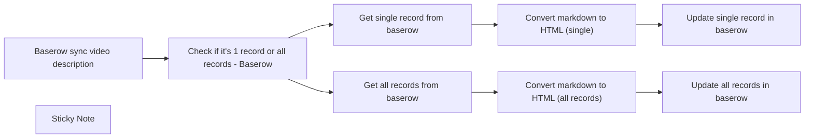

## Fluxo (.json) :

```json
{
  "id": "cMccNWyyvptrhRt6",
  "meta": {
    "instanceId": "7d362a334cd7fabe145eb8ec1b9c6b483cd4fa9315ab54f45d181e73340a0ebc",
    "templateCredsSetupCompleted": true
  },
  "name": "Baserow markdown to html",
  "tags": [],
  "nodes": [
    {
      "id": "57d42202-e74b-4103-b872-fbd4ea151e41",
      "name": "Get single record from baserow",
      "type": "n8n-nodes-base.baserow",
      "position": [
        1660,
        1200
      ],
      "parameters": {
        "rowId": "={{ $('Baserow sync video description').item.json.query.rec }}",
        "tableId": 260956,
        "operation": "get",
        "databaseId": 94671
      },
      "credentials": {
        "baserowApi": {
          "id": "ZtSVpTPWpIusSF9B",
          "name": "baserowCloud"
        }
      },
      "typeVersion": 1
    },
    {
      "id": "eaa051ad-1644-4c5b-b0bd-35d55d93b83a",
      "name": "Update single record in baserow",
      "type": "n8n-nodes-base.baserow",
      "position": [
        2100,
        1200
      ],
      "parameters": {
        "rowId": "={{ $json.id }}",
        "tableId": 260956,
        "fieldsUi": {
          "fieldValues": [
            {
              "fieldId": 2314683,
              "fieldValue": "={{ $json.data }}"
            }
          ]
        },
        "operation": "update",
        "databaseId": 94671
      },
      "credentials": {
        "baserowApi": {
          "id": "ZtSVpTPWpIusSF9B",
          "name": "baserowCloud"
        }
      },
      "typeVersion": 1
    },
    {
      "id": "5c52950c-eab3-48e7-84be-2dfef26f798c",
      "name": "Update all records in baserow",
      "type": "n8n-nodes-base.baserow",
      "position": [
        2100,
        1420
      ],
      "parameters": {
        "rowId": "={{ $json.id }}",
        "tableId": 260956,
        "fieldsUi": {
          "fieldValues": [
            {
              "fieldId": 2314683,
              "fieldValue": "={{ $json.data }}"
            }
          ]
        },
        "operation": "update",
        "databaseId": 94671
      },
      "credentials": {
        "baserowApi": {
          "id": "ZtSVpTPWpIusSF9B",
          "name": "baserowCloud"
        }
      },
      "typeVersion": 1
    },
    {
      "id": "eea44e7c-7dcc-4e46-a378-e4efded207b0",
      "name": "Check if it's 1 record or all records - Baserow",
      "type": "n8n-nodes-base.if",
      "position": [
        1460,
        1220
      ],
      "parameters": {
        "options": {},
        "conditions": {
          "options": {
            "leftValue": "",
            "caseSensitive": true,
            "typeValidation": "strict"
          },
          "combinator": "and",
          "conditions": [
            {
              "id": "bb614e16-f239-4ced-b50f-15be13493099",
              "operator": {
                "type": "string",
                "operation": "exists",
                "singleValue": true
              },
              "leftValue": "={{ $json.query.rec }}",
              "rightValue": ""
            }
          ]
        }
      },
      "typeVersion": 2
    },
    {
      "id": "b8e66259-2a04-471a-8886-20de5793c9ad",
      "name": "Get all records from baserow",
      "type": "n8n-nodes-base.baserow",
      "position": [
        1660,
        1420
      ],
      "parameters": {
        "tableId": 260956,
        "returnAll": true,
        "databaseId": 94671,
        "additionalOptions": {}
      },
      "credentials": {
        "baserowApi": {
          "id": "ZtSVpTPWpIusSF9B",
          "name": "baserowCloud"
        }
      },
      "typeVersion": 1
    },
    {
      "id": "3a5e6b2b-8cbd-41e0-9452-b60647554db6",
      "name": "Baserow sync video description",
      "type": "n8n-nodes-base.webhook",
      "position": [
        1240,
        1220
      ],
      "webhookId": "d4858ac8-2d80-41c5-a9d9-06b8e1a14347",
      "parameters": {
        "path": "d4858ac8-2d80-41c5-a9d9-06b8e1a14347",
        "options": {}
      },
      "typeVersion": 2
    },
    {
      "id": "6853027d-4b66-4cf8-a521-6e1869a47b03",
      "name": "Convert markdown to HTML (single)",
      "type": "n8n-nodes-base.markdown",
      "position": [
        1880,
        1200
      ],
      "parameters": {
        "mode": "markdownToHtml",
        "options": {
          "emoji": true,
          "simpleLineBreaks": true,
          "backslashEscapesHTMLTags": true
        },
        "markdown": "={{ $json['📥 Video Description'] }}"
      },
      "typeVersion": 1
    },
    {
      "id": "a9c35d29-dc0e-432d-8116-6b52d64a8a34",
      "name": "Convert markdown to HTML (all records)",
      "type": "n8n-nodes-base.markdown",
      "position": [
        1880,
        1420
      ],
      "parameters": {
        "mode": "markdownToHtml",
        "options": {},
        "markdown": "={{ $json['📥 Video Description'] }}"
      },
      "typeVersion": 1
    },
    {
      "id": "ff0893ca-6bd0-4ab3-b526-6347702815ff",
      "name": "Sticky Note",
      "type": "n8n-nodes-base.stickyNote",
      "position": [
        1240,
        1000
      ],
      "parameters": {
        "content": "# Tutorial\n[Youtube video](https://www.youtube.com/watch?v=PAoxZjICd7o)"
      },
      "typeVersion": 1
    }
  ],
  "active": false,
  "pinData": {},
  "settings": {
    "executionOrder": "v1"
  },
  "versionId": "7172dabc-5b15-478f-b956-9ac736af4745",
  "connections": {
    "Get all records from baserow": {
      "main": [
        [
          {
            "node": "Convert markdown to HTML (all records)",
            "type": "main",
            "index": 0
          }
        ]
      ]
    },
    "Baserow sync video description": {
      "main": [
        [
          {
            "node": "Check if it's 1 record or all records - Baserow",
            "type": "main",
            "index": 0
          }
        ]
      ]
    },
    "Get single record from baserow": {
      "main": [
        [
          {
            "node": "Convert markdown to HTML (single)",
            "type": "main",
            "index": 0
          }
        ]
      ]
    },
    "Convert markdown to HTML (single)": {
      "main": [
        [
          {
            "node": "Update single record in baserow",
            "type": "main",
            "index": 0
          }
        ]
      ]
    },
    "Convert markdown to HTML (all records)": {
      "main": [
        [
          {
            "node": "Update all records in baserow",
            "type": "main",
            "index": 0
          }
        ]
      ]
    },
    "Check if it's 1 record or all records - Baserow": {
      "main": [
        [
          {
            "node": "Get single record from baserow",
            "type": "main",
            "index": 0
          }
        ],
        [
          {
            "node": "Get all records from baserow",
            "type": "main",
            "index": 0
          }
        ]
      ]
    }
  }
}
```

<a id="template-859"></a>

## Template 859 - Relay de webhooks públicos para endpoint local

- **Nome:** Relay de webhooks públicos para endpoint local
- **Descrição:** Recebe requisições públicas via webhook.site e as encaminha para um endpoint local, mantendo controle do token de autenticação e do último registro processado.
- **Funcionalidade:** • Polling periódico: Executa verificações regulares para buscar novas requisições públicas.
• Obtenção e armazenamento do token de autenticação: Recupera um token público e o salva para uso posterior.
• Recuperação das requisições mais recentes: Consulta a API pública para listar requests recebidas no token.
• Filtragem de requisições não processadas: Seleciona apenas requisições posteriores ao último timestamp processado e permite filtrar por método (ex.: POST).
• Replicação do payload para endpoint local: Reenvia o corpo da requisição para um endereço de webhook local configurável.
• Atualização do marcador de último processamento: Armazena o timestamp da última requisição processada para evitar duplicados.
• Configuração fácil do destino: Permite definir o endereço do workflow local a ser acionado.
- **Ferramentas:** • webhook.site: Serviço público que recebe webhooks e fornece um token/URL para acessar as requisições.
• Endpoint local (ex.: http://localhost:porta/webhook/...): Destino onde as requisições recebidas são encaminhadas para processamento interno.
• Armazenamento key-value persistente (arquivo ou serviço de KV): Usado para salvar o token de autenticação e o timestamp do último item processado entre execuções.

## Fluxo visual

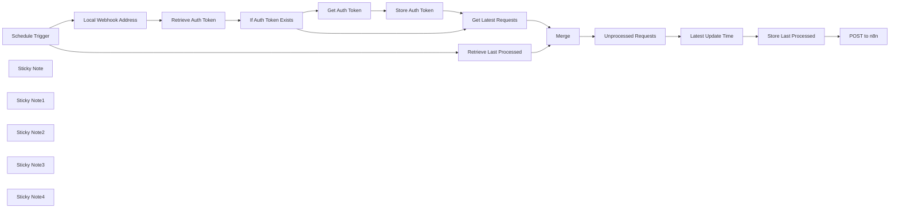

## Fluxo (.json) :

```json
{
  "meta": {
    "instanceId": "7858a8e25b8fc4dae485c1ef345e6fe74effb1f5060433ef500b4c186c965c18"
  },
  "nodes": [
    {
      "id": "4a82b490-3550-4700-8e9a-5ae1ef7c327f",
      "name": "Schedule Trigger",
      "type": "n8n-nodes-base.scheduleTrigger",
      "position": [
        -100,
        600
      ],
      "parameters": {
        "rule": {
          "interval": [
            {
              "field": "seconds",
              "secondsInterval": 10
            }
          ]
        }
      },
      "typeVersion": 1.2
    },
    {
      "id": "bfe180f2-329c-4d00-9d93-3a87d694cb4e",
      "name": "Get Auth Token",
      "type": "n8n-nodes-base.httpRequest",
      "position": [
        720,
        1080
      ],
      "parameters": {
        "url": "https://webhook.site/token",
        "method": "POST",
        "options": {}
      },
      "typeVersion": 4.2
    },
    {
      "id": "26089f68-9d3c-4abd-8541-1d63a8a303c1",
      "name": "Unprocessed Requests",
      "type": "n8n-nodes-base.code",
      "position": [
        1420,
        680
      ],
      "parameters": {
        "jsCode": "let filter_method = \"POST\"\nlet last_processed = $json.value ? $json.value : 0\nlet data = $json.data\n\nfunction dateToTime(datetime){\n  return new Date(datetime.replace(\" \", \"T\") + \"Z\").getTime()\n}\n\n//Convert datetimes to timestamps\ndata.forEach(datum=>{datum.created_at = dateToTime(datum.created_at)})\n\n//Filter all new POST requests\nreturn data.filter(datum=>!last_processed || datum.created_at > last_processed).filter(datum=>!filter_method || datum.method==filter_method)"
      },
      "typeVersion": 2
    },
    {
      "id": "00a5c01c-0cc1-4a56-9b5b-b90cc778ee36",
      "name": "Get Latest Requests",
      "type": "n8n-nodes-base.httpRequest",
      "position": [
        1060,
        800
      ],
      "parameters": {
        "url": "=https://webhook.site/token/{{ $json.value }}/requests",
        "options": {}
      },
      "typeVersion": 4.2
    },
    {
      "id": "42fbb0c3-34c9-4d97-8761-1b9c84c2f8f7",
      "name": "POST to n8n",
      "type": "n8n-nodes-base.httpRequest",
      "position": [
        2000,
        680
      ],
      "parameters": {
        "url": "={{ $('Local Webhook Address').first().json.webhook }}",
        "body": "={{ $('Unprocessed Requests').item.json.content }}",
        "method": "POST",
        "options": {},
        "sendBody": true,
        "contentType": "raw",
        "rawContentType": "=application/json"
      },
      "typeVersion": 4.2
    },
    {
      "id": "fd38a00e-2d7f-4621-8f18-47d1770ef3ac",
      "name": "Merge",
      "type": "n8n-nodes-base.merge",
      "position": [
        1220,
        680
      ],
      "parameters": {
        "mode": "combine",
        "options": {
          "includeUnpaired": true
        },
        "combineBy": "combineByPosition"
      },
      "typeVersion": 3
    },
    {
      "id": "ef347c09-9870-42db-9109-934277290e0b",
      "name": "Local Webhook Address",
      "type": "n8n-nodes-base.set",
      "position": [
        160,
        700
      ],
      "parameters": {
        "options": {},
        "assignments": {
          "assignments": [
            {
              "id": "3c53386d-23a8-4c8a-b5e9-dfbb755e2be1",
              "name": "webhook",
              "type": "string",
              "value": "http://localhost:5678/webhook/66210723-bd48-473c-8f8d-73d39d5012db"
            }
          ]
        }
      },
      "typeVersion": 3.4
    },
    {
      "id": "89baa16d-4a06-4f98-9735-9cc9fda5ff09",
      "name": "Latest Update Time",
      "type": "n8n-nodes-base.code",
      "position": [
        1600,
        680
      ],
      "parameters": {
        "jsCode": "var datetimes = $('Unprocessed Requests').all().map(x=>x.json.created_at)\nreturn {last_time: Math.max(...datetimes)}"
      },
      "typeVersion": 2
    },
    {
      "id": "c826677d-317f-4ad4-959d-153862de4ff7",
      "name": "Sticky Note",
      "type": "n8n-nodes-base.stickyNote",
      "position": [
        620,
        980
      ],
      "parameters": {
        "width": 460.2964713549969,
        "height": 288.34663983291097,
        "content": "## 1. Retrieve existing or get new auth token for webhook.site"
      },
      "typeVersion": 1
    },
    {
      "id": "f4bc9a8c-d9dc-4969-9251-ce892a5ed41e",
      "name": "Sticky Note1",
      "type": "n8n-nodes-base.stickyNote",
      "position": [
        1080,
        517.8563272190441
      ],
      "parameters": {
        "width": 483.2839292355176,
        "height": 384.1277143350834,
        "content": "## 2. Check if any new requests to webhook that came later than the last checked request"
      },
      "typeVersion": 1
    },
    {
      "id": "adaf19be-cb2f-4727-9881-1a3e4098c528",
      "name": "Sticky Note2",
      "type": "n8n-nodes-base.stickyNote",
      "position": [
        1608.5062710597388,
        518.9281636095216
      ],
      "parameters": {
        "width": 395.16534069351894,
        "height": 380.2964713549969,
        "content": "## 3. Relay the request to the local n8n workflow set in *Local Webhook Address*"
      },
      "typeVersion": 1
    },
    {
      "id": "4e7add8c-1e95-4ebb-b7c8-35cee3cdeed5",
      "name": "Sticky Note3",
      "type": "n8n-nodes-base.stickyNote",
      "position": [
        -760,
        340
      ],
      "parameters": {
        "color": 4,
        "width": 566.9804381508956,
        "height": 859.1365566530386,
        "content": "# Public Webhook Relay\n## How it Works\nUtilizes webhook.site to receive public webhook requests and relays them to your local n8n workflow\n\n## How to Use\n- To use with local key-value store:\n Go to settings > community nodes and enter ```@horka.tv/n8n-nodes-storage-kv``` to install the key-value store node\n- To use with a different storage method:\n Replace the four key-value nodes with a temporary storage option of your choice (Airtable, Notion, Firebase, etc). This is required to save data between runs.\n- Set **Schedule Trigger** with a polling interval (default is every 10 seconds).\n- Set your local workflow address in Local Webhook Address.\n\n## How to Test\n- Set the workflow to *Active*.\n- After workflow executes at least once, you can check the input to **Get Latest Requests** for your auth token.\n- Run this command: ```curl -X POST -H \"Content-Type: application/json\" -d '{\"foo\":\"bar\"}'  https://webhook.site/[THE AUTH TOKEN YOU JUST GOT]```\n- Now check **Executions** and confirm that the workflow ran all the way to the end. Confirm in **Unprocessed Requests** that your data was retrieved (data[0].content should be equal to {\"foo\":\"bar\"})\n- Now check your other local workflow and confirm that it was triggered with the correct data packet ```{\"foo\":\"bar\"}```.\n- *You're done!*\n\n## Caveats\nAt present, the relay expects a POST with form/json data. If you wish to relay raw data or GET requests, please alter the **Unprocessed Requests** and **POST to n8n** nodes accordingly."
      },
      "typeVersion": 1
    },
    {
      "id": "5d8db2a1-569e-47c0-99a1-d66cb8b86897",
      "name": "Sticky Note4",
      "type": "n8n-nodes-base.stickyNote",
      "position": [
        40,
        608.688533362355
      ],
      "parameters": {
        "color": 3,
        "width": 304.23688498154337,
        "height": 264.4911255434983,
        "content": "### 0. Set this to your local workflow address (Production URL or Test URL in your Workflow Trigger node)"
      },
      "typeVersion": 1
    },
    {
      "id": "e728e8fe-1a7d-4f44-96b8-7344b70b0452",
      "name": "Store Auth Token",
      "type": "@horka.tv/n8n-nodes-storage-kv.keyValueStorage",
      "position": [
        880,
        1080
      ],
      "parameters": {
        "key": "auth_token",
        "value": "={{ $json.uuid }}",
        "fileName": "savefile"
      },
      "typeVersion": 1
    },
    {
      "id": "1c19ff08-d6ed-4874-9c1a-69e92b25138a",
      "name": "Store Last Processed",
      "type": "@horka.tv/n8n-nodes-storage-kv.keyValueStorage",
      "position": [
        1800,
        680
      ],
      "parameters": {
        "key": "last_processed",
        "value": "={{ $json.last_time }}",
        "fileName": "savefile"
      },
      "typeVersion": 1
    },
    {
      "id": "ea927186-6147-42c7-8873-029616bdbe6d",
      "name": "Retrieve Auth Token",
      "type": "@horka.tv/n8n-nodes-storage-kv.keyValueStorage",
      "position": [
        380,
        860
      ],
      "parameters": {
        "key": "auth_token",
        "fileName": "savefile",
        "operation": "read"
      },
      "typeVersion": 1
    },
    {
      "id": "f217889c-7104-4183-8adb-4459f6cdc3d6",
      "name": "Retrieve Last Processed",
      "type": "@horka.tv/n8n-nodes-storage-kv.keyValueStorage",
      "position": [
        680,
        620
      ],
      "parameters": {
        "key": "last_processed",
        "fileName": "savefile",
        "operation": "read"
      },
      "typeVersion": 1
    },
    {
      "id": "12293fc3-8964-40da-8326-85c36dade0df",
      "name": "If Auth Token Exists",
      "type": "n8n-nodes-base.if",
      "position": [
        580,
        860
      ],
      "parameters": {
        "options": {},
        "conditions": {
          "options": {
            "leftValue": "",
            "caseSensitive": true,
            "typeValidation": "strict"
          },
          "combinator": "and",
          "conditions": [
            {
              "id": "4356f226-da36-418b-957d-880872ddc420",
              "operator": {
                "type": "string",
                "operation": "exists",
                "singleValue": true
              },
              "leftValue": "={{ $json.value }}",
              "rightValue": ""
            }
          ]
        }
      },
      "typeVersion": 2.1
    }
  ],
  "pinData": {},
  "connections": {
    "Merge": {
      "main": [
        [
          {
            "node": "Unprocessed Requests",
            "type": "main",
            "index": 0
          }
        ]
      ]
    },
    "Get Auth Token": {
      "main": [
        [
          {
            "node": "Store Auth Token",
            "type": "main",
            "index": 0
          }
        ]
      ]
    },
    "Schedule Trigger": {
      "main": [
        [
          {
            "node": "Local Webhook Address",
            "type": "main",
            "index": 0
          },
          {
            "node": "Retrieve Last Processed",
            "type": "main",
            "index": 0
          }
        ]
      ]
    },
    "Store Auth Token": {
      "main": [
        [
          {
            "node": "Get Latest Requests",
            "type": "main",
            "index": 0
          }
        ]
      ]
    },
    "Latest Update Time": {
      "main": [
        [
          {
            "node": "Store Last Processed",
            "type": "main",
            "index": 0
          }
        ]
      ]
    },
    "Get Latest Requests": {
      "main": [
        [
          {
            "node": "Merge",
            "type": "main",
            "index": 1
          }
        ]
      ]
    },
    "Retrieve Auth Token": {
      "main": [
        [
          {
            "node": "If Auth Token Exists",
            "type": "main",
            "index": 0
          }
        ]
      ]
    },
    "If Auth Token Exists": {
      "main": [
        [
          {
            "node": "Get Latest Requests",
            "type": "main",
            "index": 0
          }
        ],
        [
          {
            "node": "Get Auth Token",
            "type": "main",
            "index": 0
          }
        ]
      ]
    },
    "Store Last Processed": {
      "main": [
        [
          {
            "node": "POST to n8n",
            "type": "main",
            "index": 0
          }
        ]
      ]
    },
    "Unprocessed Requests": {
      "main": [
        [
          {
            "node": "Latest Update Time",
            "type": "main",
            "index": 0
          }
        ]
      ]
    },
    "Local Webhook Address": {
      "main": [
        [
          {
            "node": "Retrieve Auth Token",
            "type": "main",
            "index": 0
          }
        ]
      ]
    },
    "Retrieve Last Processed": {
      "main": [
        [
          {
            "node": "Merge",
            "type": "main",
            "index": 0
          }
        ]
      ]
    }
  }
}
```

<a id="template-860"></a>

## Template 860 - Beeminder datapoint a partir de Strava

- **Nome:** Beeminder datapoint a partir de Strava
- **Descrição:** Este fluxo envia um datapoint para Beeminder toda vez que uma nova atividade é criada no Strava, usando o nome da atividade como comentário.
- **Funcionalidade:** • Detecção de criação de atividade no Strava: aciona o fluxo quando uma nova atividade é criada.
• Registro de datapoint no Beeminder: envia o datapoint para a meta especificada com o nome da atividade no comentário.
- **Ferramentas:** • Strava: Plataforma de atividades físicas que dispara gatilhos quando uma nova atividade é criada.
• Beeminder: Serviço de metas que recebe datapoints para acompanhar o progresso.

## Fluxo visual

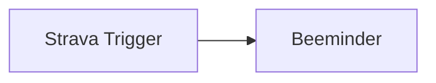

## Fluxo (.json) :

```json
{
  "id": "208",
  "name": "Add a datapoint to Beeminder when new activity is added to Strava",
  "nodes": [
    {
      "name": "Strava Trigger",
      "type": "n8n-nodes-base.stravaTrigger",
      "position": [
        470,
        300
      ],
      "webhookId": "2b0c6812-ac24-42e5-b15e-8d1fb7606908",
      "parameters": {
        "event": "create",
        "options": {}
      },
      "credentials": {
        "stravaOAuth2Api": "strava"
      },
      "typeVersion": 1
    },
    {
      "name": "Beeminder",
      "type": "n8n-nodes-base.beeminder",
      "position": [
        670,
        300
      ],
      "parameters": {
        "goalName": "testing",
        "additionalFields": {
          "comment": "={{$json[\"object_data\"][\"name\"]}}"
        }
      },
      "credentials": {
        "beeminderApi": "Beeminder credentials"
      },
      "typeVersion": 1
    }
  ],
  "active": false,
  "settings": {},
  "connections": {
    "Strava Trigger": {
      "main": [
        [
          {
            "node": "Beeminder",
            "type": "main",
            "index": 0
          }
        ]
      ]
    }
  }
}
```

<a id="template-861"></a>

## Template 861 - Criar novo contato no Agile CRM

- **Nome:** Criar novo contato no Agile CRM
- **Descrição:** Ao ser executado manualmente, o fluxo cria um novo contato na conta do Agile CRM usando os dados fornecidos.
- **Funcionalidade:** • Acionamento manual: inicia o fluxo quando o usuário clica em 'execute'.
• Criação de contato: insere um novo registro de contato na conta do Agile CRM.
• Mapeamento de campos básicos: permite preencher nome e sobrenome e incluir campos adicionais conforme necessário.
- **Ferramentas:** • Agile CRM: plataforma de gestão de relacionamento com clientes para armazenar e gerenciar contatos.

## Fluxo visual

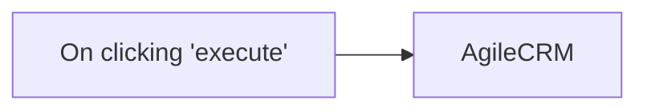

## Fluxo (.json) :

```json
{
  "id": "96",
  "name": "Create a new contact in Agile CRM",
  "nodes": [
    {
      "name": "On clicking 'execute'",
      "type": "n8n-nodes-base.manualTrigger",
      "position": [
        250,
        300
      ],
      "parameters": {},
      "typeVersion": 1
    },
    {
      "name": "AgileCRM",
      "type": "n8n-nodes-base.agileCrm",
      "position": [
        450,
        300
      ],
      "parameters": {
        "operation": "create",
        "additionalFields": {
          "lastName": "",
          "firstName": ""
        }
      },
      "credentials": {
        "agileCrmApi": ""
      },
      "typeVersion": 1
    }
  ],
  "active": false,
  "settings": {},
  "connections": {
    "On clicking 'execute'": {
      "main": [
        [
          {
            "node": "AgileCRM",
            "type": "main",
            "index": 0
          }
        ]
      ]
    }
  }
}
```
