# PACK 1999 TEMPLATES PARTE 05 - Bloco 4

Templates neste bloco: 20

## Sumário

- [Template 862 - Criar tarefa no Asana](#template-862)
- [Template 863 - Criação de e-mail mascarado (Fastmail)](#template-863)
- [Template 864 - Push no repositório test (Bitbucket)](#template-864)
- [Template 865 - Enviar UTMs de pedidos Shopify para Baserow](#template-865)
- [Template 866 - Biblioteca de Referência de Nós](#template-866)
- [Template 867 - Converter e otimizar imagens para URLs](#template-867)
- [Template 868 - Registro de convidado do Calendly no Notion](#template-868)
- [Template 869 - Formulário Dinâmico com IA](#template-869)
- [Template 870 - Sincronização CRM com enriquecimento de empresa e contatos](#template-870)
- [Template 871 - Agente SQL com geração de gráficos](#template-871)
- [Template 872 - Redesign de camiseta por IA a partir de mockup](#template-872)
- [Template 873 - Calendly para KlickTipp: reservas e cancelamentos](#template-873)
- [Template 874 - Coletar top 13 do GitHub Trending](#template-874)
- [Template 875 - Sincronização Notion-ClickUp](#template-875)
- [Template 876 - Conversão de texto para fala (OpenAI TTS)](#template-876)
- [Template 877 - Sincronizar ticket com Clockify](#template-877)
- [Template 878 - Alerta de inicialização no Mattermost](#template-878)
- [Template 879 - Chatbot RAG para recomendações de filmes](#template-879)
- [Template 880 - Gatilho de entradas de tempo Clockify](#template-880)
- [Template 881 - Tirinha diária com tradução automática](#template-881)

---

<a id="template-862"></a>

## Template 862 - Criar tarefa no Asana

- **Nome:** Criar tarefa no Asana
- **Descrição:** Este fluxo é acionado manualmente e cria uma nova tarefa no Asana utilizando a API.
- **Funcionalidade:** • Disparo manual: inicia o fluxo quando o usuário clica em 'execute'.
• Criação de tarefa: cria uma nova tarefa no Asana.
• Configuração de campos: permite definir o nome da tarefa, workspace e propriedades adicionais.
• Autenticação: usa credenciais da API do Asana para autorizar a operação.
- **Ferramentas:** • Asana: plataforma de gerenciamento de tarefas onde a nova tarefa é criada via API.

## Fluxo visual

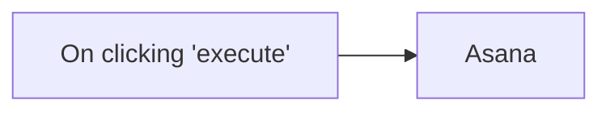

## Fluxo (.json) :

```json
{
  "id": "98",
  "name": "Create a new task in Asana",
  "nodes": [
    {
      "name": "On clicking 'execute'",
      "type": "n8n-nodes-base.manualTrigger",
      "position": [
        250,
        300
      ],
      "parameters": {},
      "typeVersion": 1
    },
    {
      "name": "Asana",
      "type": "n8n-nodes-base.asana",
      "position": [
        450,
        300
      ],
      "parameters": {
        "name": "",
        "workspace": "",
        "otherProperties": {}
      },
      "credentials": {
        "asanaApi": ""
      },
      "typeVersion": 1
    }
  ],
  "active": false,
  "settings": {},
  "connections": {
    "On clicking 'execute'": {
      "main": [
        [
          {
            "node": "Asana",
            "type": "main",
            "index": 0
          }
        ]
      ]
    }
  }
}
```

<a id="template-863"></a>

## Template 863 - Criação de e-mail mascarado (Fastmail)

- **Nome:** Criação de e-mail mascarado (Fastmail)
- **Descrição:** Cria um endereço de e-mail mascarado no Fastmail a partir de uma requisição webhook, retornando o e-mail criado e sua descrição.
- **Funcionalidade:** • Receber requisição via webhook: Inicia o fluxo ao receber um POST com os campos opcionais `state` e `description`.
• Recuperar sessão da API Fastmail: Consulta o endpoint de sessão para obter informações da conta necessárias para operações subsequentes.
• Gerar e criar e-mail mascarado: Envia uma chamada JMAP ao endpoint da API Fastmail para criar um masked email usando os parâmetros fornecidos.
• Preparar e formatar a resposta: Extrai o endereço de e-mail criado e a descrição para compor a resposta.
• Responder ao solicitante: Retorna ao remetente do webhook o e-mail mascarado criado e a descrição associada.
- **Ferramentas:** • Fastmail API: Serviço de e-mail que fornece suporte a endereços mascarados via JMAP.
• Protocolo JMAP: Protocolo utilizado para operações de criação e gestão de e-mails mascarados na API.
• Cliente HTTP (ex.: curl): Ferramenta externa usada para disparar o webhook com o payload JSON que contém `state` e `description`.
• Autenticação por Header HTTP: Método de autenticação via cabeçalho configurado para autorizar chamadas à API Fastmail.

## Fluxo visual

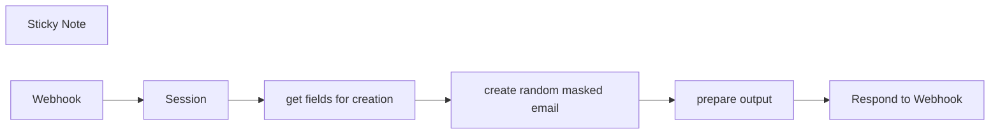

## Fluxo (.json) :

```json
{
  "meta": {
    "instanceId": "04ab549d8bbb435ec33b81e4e29965c46cf6f0f9e7afe631018b5e34c8eead58"
  },
  "nodes": [
    {
      "id": "9fdbfdc1-67f3-4c8b-861c-9e5840b002ec",
      "name": "Session",
      "type": "n8n-nodes-base.httpRequest",
      "position": [
        780,
        300
      ],
      "parameters": {
        "url": "https://api.fastmail.com/jmap/session",
        "options": {},
        "authentication": "genericCredentialType",
        "genericAuthType": "httpHeaderAuth"
      },
      "credentials": {
        "httpHeaderAuth": {
          "id": "BWkbkxgDD4hkRCvs",
          "name": "Fastmail Masked E-Mail Addresses"
        }
      },
      "typeVersion": 4.2
    },
    {
      "id": "215d96fa-6bda-4e8c-884a-eb9a8db0838f",
      "name": "create random masked email",
      "type": "n8n-nodes-base.httpRequest",
      "notes": "https://api.fastmail.com/.well-known/jmap\n\nhttps://api.fastmail.com/jmap/session",
      "position": [
        1280,
        300
      ],
      "parameters": {
        "url": "https://api.fastmail.com/jmap/api/",
        "method": "POST",
        "options": {},
        "jsonBody": "={\n  \"using\": [\n    \"urn:ietf:params:jmap:core\",\n    \"https://www.fastmail.com/dev/maskedemail\"\n  ],\n  \"methodCalls\": [\n    [\n      \"MaskedEmail/set\",\n      {\n        \"accountId\": \"{{ $('Session').item.json.primaryAccounts['https://www.fastmail.com/dev/maskedemail'] }}\",\n        \"create\": {\n          \"maskedEmailId1\": {\n            \"description\": \"{{ $json.description }}\",\n            \"state\": \"{{ $json.state }}\"\n          }\n        }\n      },\n      \"c1\"\n    ]\n  ]\n}\n",
        "sendBody": true,
        "sendHeaders": true,
        "specifyBody": "json",
        "authentication": "genericCredentialType",
        "genericAuthType": "httpHeaderAuth",
        "headerParameters": {
          "parameters": [
            {
              "name": "Content-Type",
              "value": "application/json"
            }
          ]
        }
      },
      "credentials": {
        "httpHeaderAuth": {
          "id": "BWkbkxgDD4hkRCvs",
          "name": "Fastmail Masked E-Mail Addresses"
        }
      },
      "typeVersion": 4.2
    },
    {
      "id": "237f6596-f8df-4c21-a2fa-44e935a72d56",
      "name": "Respond to Webhook",
      "type": "n8n-nodes-base.respondToWebhook",
      "position": [
        1800,
        300
      ],
      "parameters": {
        "options": {},
        "respondWith": "text",
        "responseBody": "={{ $json }}"
      },
      "typeVersion": 1.1
    },
    {
      "id": "6699eb83-a41e-44bc-b332-77e407fb3542",
      "name": "Sticky Note",
      "type": "n8n-nodes-base.stickyNote",
      "position": [
        460,
        480
      ],
      "parameters": {
        "width": 1654.8203324571532,
        "height": 471.75430470511367,
        "content": "### Template Description\nThis n8n workflow template allows you to create a masked email address using the Fastmail API, triggered by a webhook. This is especially useful for generating disposable email addresses for privacy-conscious users or for testing purposes.\n\n#### Workflow Details:\n1. **Webhook Trigger**: The workflow is initiated by sending a POST request to a specific webhook. You can include `state` and `description` in your request body to customize the masked email's state and description.\n2. **Session Retrieval**: The workflow makes an HTTP request to the Fastmail API to retrieve session information. It uses this data to authenticate further requests.\n3. **Create Masked Email**: Using the retrieved session data, the workflow sends a POST request to Fastmail's JMAP API to create a masked email. It uses the provided state and description from the webhook payload.\n4. **Prepare Output**: Once the masked email is successfully created, the workflow extracts the email address and attaches the description for further processing.\n5. **Respond to Webhook**: Finally, the workflow responds to the original POST request with the newly created masked email and its description.\n\n#### Requirements:\n- **Fastmail API Access**: You will need valid API credentials for Fastmail configured with HTTP Header Authentication.\n- **Authorization Setup**: Optionally set up authorization if your webhook is exposed to the internet to prevent misuse.\n- **Custom Webhook Request**: Use a tool like `curl` or create a shortcut on macOS/iOS to send the POST request to the webhook with the necessary JSON payload, like so:\n  \n  ```bash\n  curl -X POST -H 'Content-Type: application/json' https://your-n8n-instance/webhook/87f9abd1-2c9b-4d1f-8c7f-2261f4698c3c -d '{\"state\": \"pending\", \"description\": \"my mega fancy masked email\"}'\n  ```\n\nThis template simplifies the process of integrating masked email functionality into your projects or workflows and can be extended for various use cases."
      },
      "typeVersion": 1
    },
    {
      "id": "0c5d6d5a-ad0f-451e-9075-1009c8bf7212",
      "name": "get fields for creation",
      "type": "n8n-nodes-base.set",
      "position": [
        1000,
        300
      ],
      "parameters": {
        "options": {},
        "assignments": {
          "assignments": [
            {
              "id": "870bb03d-c672-49d6-9652-5a0233b16eb2",
              "name": "state",
              "type": "string",
              "value": "={{ $('Webhook').item.json.body.state ?? \"pending\" }}"
            },
            {
              "id": "ac9b45a0-885f-48b2-b0ec-e38c79080045",
              "name": "description",
              "type": "string",
              "value": "={{ $('Webhook').item.json.body.description ?? \"Test via N8n\" }}"
            }
          ]
        }
      },
      "typeVersion": 3.4
    },
    {
      "id": "be7ba978-00d7-4fb1-9e1b-e3f83285e6fb",
      "name": "prepare output",
      "type": "n8n-nodes-base.set",
      "position": [
        1540,
        300
      ],
      "parameters": {
        "options": {},
        "assignments": {
          "assignments": [
            {
              "id": "19a09822-7ae0-4884-9192-c6e5bc3393a8",
              "name": "email",
              "type": "string",
              "value": "={{ $json.methodResponses[0][1].created.maskedEmailId1.email }}"
            },
            {
              "id": "ae8a1fe4-3010-4db8-aa88-f6074cae3006",
              "name": "desciption",
              "type": "string",
              "value": "={{ $('get fields for creation').item.json.description }}"
            }
          ]
        }
      },
      "typeVersion": 3.4
    },
    {
      "id": "dd014889-81eb-4a94-886e-4fe084c504ff",
      "name": "Webhook",
      "type": "n8n-nodes-base.webhook",
      "position": [
        540,
        300
      ],
      "webhookId": "87f9abd1-2c9b-4d1f-8c7f-2261f4698c3c",
      "parameters": {
        "path": "createMaskedEmail",
        "options": {},
        "httpMethod": "POST",
        "responseMode": "responseNode"
      },
      "typeVersion": 2
    }
  ],
  "pinData": {},
  "connections": {
    "Session": {
      "main": [
        [
          {
            "node": "get fields for creation",
            "type": "main",
            "index": 0
          }
        ]
      ]
    },
    "Webhook": {
      "main": [
        [
          {
            "node": "Session",
            "type": "main",
            "index": 0
          }
        ]
      ]
    },
    "prepare output": {
      "main": [
        [
          {
            "node": "Respond to Webhook",
            "type": "main",
            "index": 0
          }
        ]
      ]
    },
    "get fields for creation": {
      "main": [
        [
          {
            "node": "create random masked email",
            "type": "main",
            "index": 0
          }
        ]
      ]
    },
    "create random masked email": {
      "main": [
        [
          {
            "node": "prepare output",
            "type": "main",
            "index": 0
          }
        ]
      ]
    }
  }
}
```

<a id="template-864"></a>

## Template 864 - Push no repositório test (Bitbucket)

- **Nome:** Push no repositório test (Bitbucket)
- **Descrição:** Este fluxo monitora o repositório test no Bitbucket para eventos de push e inicia uma automação quando há alterações.
- **Funcionalidade:** • Detecção de evento de push: inicia a automação quando ocorre um push no repositório (evento repo:push).
• Filtragem por repositório: assegura que o gatilho é para o repositório 'test'.
• Autenticação via credenciais: utiliza as credenciais de API para autenticação ao Bitbucket.
• Gestão de webhook: utiliza o webhookId para gerenciar o gatilho de eventos.
- **Ferramentas:** • Bitbucket: plataforma de hospedagem de código que aciona o fluxo quando há push no repositório monitorado.

## Fluxo visual

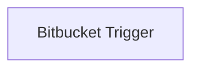

## Fluxo (.json) :

```json
{
  "nodes": [
    {
      "name": "Bitbucket Trigger",
      "type": "n8n-nodes-base.bitbucketTrigger",
      "position": [
        880,
        390
      ],
      "webhookId": "97ca8044-5835-4547-801d-c27dd7f10c2d",
      "parameters": {
        "events": [
          "repo:push"
        ],
        "resource": "repository",
        "repository": "test"
      },
      "credentials": {
        "bitbucketApi": "bitbucket_creds"
      },
      "typeVersion": 1
    }
  ],
  "connections": {}
}
```

<a id="template-865"></a>

## Template 865 - Enviar UTMs de pedidos Shopify para Baserow

- **Nome:** Enviar UTMs de pedidos Shopify para Baserow
- **Descrição:** Coleta pedidos criados ontem no Shopify, extrai parâmetros UTM e receita e registra entradas no Baserow apenas quando existir a campanha.
- **Funcionalidade:** • Agendamento diário: executa o fluxo diariamente à meia-noite para processar pedidos do dia anterior.
• Configurar subdomínio Shopify: define o subdomínio usado para chamar a API do Shopify.
• Consultar pedidos do Shopify: realiza uma chamada GraphQL à API Admin do Shopify para obter pedidos e o resumo da jornada do cliente (incluindo parâmetros UTM).
• Processamento em itens individuais: divide a resposta em itens por pedido para processamento separado.
• Transformar e normalizar dados: extrai campos relevantes (nome do pedido, campaign, content, medium, source, term, revenue), preenche valores ausentes com string vazia e garante tipo numérico para receita.
• Filtrar por campanha: verifica a presença do campo "campaign" e só continua quando existir.
• Criar registro no Baserow: insere uma linha na base com os campos mapeados (pedido, UTM e receita).
• Ignorar pedidos sem campanha: quando não há campanha, o pedido é descartado sem criar registro.
- **Ferramentas:** • Shopify Admin GraphQL API: fornece os pedidos e os dados de jornada do cliente, incluindo parâmetros UTM.
• Baserow: armazena os registros resultantes com os campos mapeados (pedido, parâmetros UTM e receita).

## Fluxo visual

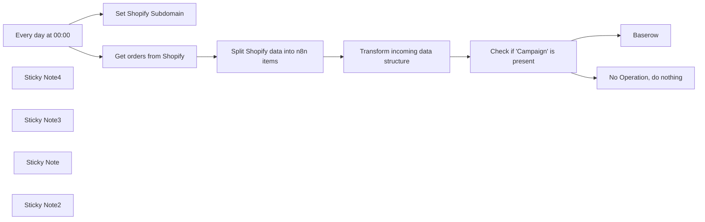

## Fluxo (.json) :

```json
{
  "id": "ZI0PxugfKsyepqeH",
  "meta": {
    "instanceId": "e2c978396c9c745cf0aaa9ed3abe4464dbcef93c5fe2df809b9e14440e628df6"
  },
  "name": "Shopify order UTM to Baserow",
  "tags": [],
  "nodes": [
    {
      "id": "2ba892fc-59c9-442b-aa21-a5c23b6076e5",
      "name": "Baserow",
      "type": "n8n-nodes-base.baserow",
      "position": [
        2860,
        380
      ],
      "parameters": {
        "tableId": 646,
        "fieldsUi": {
          "fieldValues": [
            {
              "fieldId": 6164,
              "fieldValue": "={{ $json.order }}"
            },
            {
              "fieldId": 6165,
              "fieldValue": "={{ $json.campaign }}"
            },
            {
              "fieldId": 6166,
              "fieldValue": "={{ $json.content }}"
            },
            {
              "fieldId": 6167,
              "fieldValue": "={{ $json.medium }}"
            },
            {
              "fieldId": 6168,
              "fieldValue": "={{ $json.source }}"
            },
            {
              "fieldId": 6170,
              "fieldValue": "={{ $json.revenue }}"
            }
          ]
        },
        "operation": "create",
        "databaseId": 121
      },
      "credentials": {
        "baserowApi": {
          "id": "VaQgKQ8NPXVMrvMl",
          "name": "Baserow account"
        }
      },
      "typeVersion": 1
    },
    {
      "id": "e35a0417-7a6a-46bb-8970-20aa7c19d168",
      "name": "No Operation, do nothing",
      "type": "n8n-nodes-base.noOp",
      "position": [
        2860,
        720
      ],
      "parameters": {},
      "typeVersion": 1
    },
    {
      "id": "76e327e9-2cc2-42dd-b31a-1aa1e9b02cd1",
      "name": "Set Shopify Subdomain",
      "type": "n8n-nodes-base.set",
      "position": [
        1900,
        320
      ],
      "parameters": {
        "fields": {
          "values": [
            {
              "name": "Shopify Subdomain",
              "stringValue": "you-domain"
            }
          ]
        },
        "options": {}
      },
      "typeVersion": 3.2
    },
    {
      "id": "85c0f561-a75d-44a4-a8a5-3791c10a2891",
      "name": "Get orders from Shopify",
      "type": "n8n-nodes-base.graphql",
      "position": [
        1900,
        560
      ],
      "parameters": {
        "query": "=query yersterdaysOrders {\n  orders(query: \"created_at:{{$today.minus({days: 1})}}\", first: 100) {\n    edges {\n      node {\n        id\n        name\n        totalReceived\n        customerJourneySummary {\n          firstVisit {\n            id\n            source\n            referrerUrl\n            landingPage\n            utmParameters {\n              campaign\n              content\n              medium\n              source\n              term\n            }\n          }\n        }\n      }\n    }\n  }\n}",
        "endpoint": "=https://{{ $('Set Shopify Subdomain').params[\"fields\"][\"values\"][0][\"stringValue\"] }}.myshopify.com/admin/api/2024-01/graphql.json",
        "authentication": "headerAuth"
      },
      "credentials": {
        "httpHeaderAuth": {
          "id": "dPZdfPnUTz1YJ54o",
          "name": "Shopify Header Auth - lanakk.com"
        }
      },
      "typeVersion": 1
    },
    {
      "id": "4ddbe343-6d4f-4079-9c60-bdf2c34fb015",
      "name": "Every day at 00:00",
      "type": "n8n-nodes-base.scheduleTrigger",
      "position": [
        1660,
        560
      ],
      "parameters": {
        "rule": {
          "interval": [
            {}
          ]
        }
      },
      "typeVersion": 1.1
    },
    {
      "id": "6b3dd6f7-a761-4a01-bb77-cb8689fe64a0",
      "name": "Split Shopify data into n8n items",
      "type": "n8n-nodes-base.splitOut",
      "position": [
        2120,
        560
      ],
      "parameters": {
        "options": {},
        "fieldToSplitOut": "data.orders.edges"
      },
      "typeVersion": 1
    },
    {
      "id": "c50ca221-1330-44c9-9877-3b5bd36a05fb",
      "name": "Transform incoming data structure",
      "type": "n8n-nodes-base.set",
      "position": [
        2340,
        560
      ],
      "parameters": {
        "fields": {
          "values": [
            {
              "name": "order",
              "stringValue": "={{ $json.node.name }}"
            },
            {
              "name": "campaign",
              "stringValue": "={{ $json.node.customerJourneySummary.firstVisit.utmParameters.campaign }}"
            },
            {
              "name": "content",
              "stringValue": "={{ $json.node.customerJourneySummary.firstVisit.utmParameters.content || \"\" }}"
            },
            {
              "name": "medium",
              "stringValue": "={{ $json.node.customerJourneySummary.firstVisit.utmParameters.medium || \"\" }}"
            },
            {
              "name": "source",
              "stringValue": "={{ $json.node.customerJourneySummary.firstVisit.utmParameters.medium || \"\" }}"
            },
            {
              "name": "term",
              "stringValue": "={{ $json.node.customerJourneySummary.firstVisit.utmParameters.term || \"\" }}"
            },
            {
              "name": "revenue",
              "type": "numberValue",
              "numberValue": "={{ $json.node.totalReceived }}"
            }
          ]
        },
        "include": "none",
        "options": {}
      },
      "typeVersion": 3.2
    },
    {
      "id": "c84c3619-fd41-4d06-8894-1ba7998477fb",
      "name": "Check if \"Campaign\" is present",
      "type": "n8n-nodes-base.if",
      "position": [
        2560,
        560
      ],
      "parameters": {
        "options": {},
        "conditions": {
          "options": {
            "leftValue": "",
            "caseSensitive": true,
            "typeValidation": "strict"
          },
          "combinator": "and",
          "conditions": [
            {
              "id": "61fe8905-1b9f-45d9-9742-2d5799200d18",
              "operator": {
                "type": "string",
                "operation": "exists",
                "singleValue": true
              },
              "leftValue": "={{ $json.campaign }}",
              "rightValue": ""
            }
          ]
        }
      },
      "typeVersion": 2
    },
    {
      "id": "b0f07670-4fdd-4b64-8d77-87ea5cc399ac",
      "name": "Sticky Note4",
      "type": "n8n-nodes-base.stickyNote",
      "position": [
        1240,
        460
      ],
      "parameters": {
        "color": 4,
        "width": 360.408084305475,
        "height": 315.5897364788551,
        "content": "## Shopify API\n\nThis workflow uses GraphQL calls to the Shopify Admin API. In order to get a better understanding for the queries and mutations please check the API Docs.\n\n\n[Shopify GraphQL API docs](https://shopify.dev/docs/api/admin-graphql)\n\nTo make it easy to build queries for the GraphQL API easy please check out the [GraphiQL App for the Admin API](https://shopify.dev/docs/apps/tools/graphiql-admin-api) from Shopify"
      },
      "typeVersion": 1
    },
    {
      "id": "742d92d7-9c3e-4515-a9ca-d840685d8ebf",
      "name": "Sticky Note3",
      "type": "n8n-nodes-base.stickyNote",
      "position": [
        1720,
        120
      ],
      "parameters": {
        "width": 279.1188177339898,
        "content": "## Set your Shopify Subdomain here"
      },
      "typeVersion": 1
    },
    {
      "id": "a4feb388-0d60-41ee-a269-d39717c6267c",
      "name": "Sticky Note",
      "type": "n8n-nodes-base.stickyNote",
      "position": [
        1900,
        760
      ],
      "parameters": {
        "width": 279.1188177339898,
        "content": "## Shopify \nThe n8n Shopify node cannot get the customer journey, so we get this from the Shopify GraphQL API"
      },
      "typeVersion": 1
    },
    {
      "id": "adc71ed1-fcb9-40fa-b3c8-ccca7e2fc699",
      "name": "Sticky Note2",
      "type": "n8n-nodes-base.stickyNote",
      "position": [
        3060,
        360
      ],
      "parameters": {
        "width": 279.1188177339898,
        "height": 157.78205353137358,
        "content": "## Baserow\nPlease map the fields coming from the IF node to your own structure in Baserow"
      },
      "typeVersion": 1
    }
  ],
  "active": false,
  "pinData": {},
  "settings": {
    "executionOrder": "v1"
  },
  "versionId": "c7fd635a-81e5-461b-885f-5b375bc51138",
  "connections": {
    "Every day at 00:00": {
      "main": [
        [
          {
            "node": "Set Shopify Subdomain",
            "type": "main",
            "index": 0
          },
          {
            "node": "Get orders from Shopify",
            "type": "main",
            "index": 0
          }
        ]
      ]
    },
    "Get orders from Shopify": {
      "main": [
        [
          {
            "node": "Split Shopify data into n8n items",
            "type": "main",
            "index": 0
          }
        ]
      ]
    },
    "Check if \"Campaign\" is present": {
      "main": [
        [
          {
            "node": "Baserow",
            "type": "main",
            "index": 0
          }
        ],
        [
          {
            "node": "No Operation, do nothing",
            "type": "main",
            "index": 0
          }
        ]
      ]
    },
    "Split Shopify data into n8n items": {
      "main": [
        [
          {
            "node": "Transform incoming data structure",
            "type": "main",
            "index": 0
          }
        ]
      ]
    },
    "Transform incoming data structure": {
      "main": [
        [
          {
            "node": "Check if \"Campaign\" is present",
            "type": "main",
            "index": 0
          }
        ]
      ]
    }
  }
}
```

<a id="template-866"></a>

## Template 866 - Biblioteca de Referência de Nós

- **Nome:** Biblioteca de Referência de Nós
- **Descrição:** Este fluxo oferece um mapa visual de nós comuns organizados por funções, servindo como guia de referência para construção de automações com IA, memória, transformação de dados e integrações externas.
- **Funcionalidade:** • Mapa visual de nós: organiza nós por função (gatilhos, transformação de dados, IA, memória, ações externas).
• Agrupamento por temas: separa nós em categorias como AI Agents, Flow & Core, Data Transformation, Vector Memory.
• Integração de IA, memória e vetores: permite combinar modelos de linguagem, memória persistente e stores de vetores para suporte a consultas contextuais.
• Transformação e extração de dados: oferece recursos de extração, transformação, sumarização e classificação de dados.
• Suporte a gatilhos e automação: inicia fluxos via webhooks, agendadores e triggers de e-mail/calendário.
• Integração com serviços externos: conecta-se a serviços como buscas web, planilhas, docs, calendário e e-mails para automação.
- **Ferramentas:** • OpenAI: API de modelos de linguagem e embeddings para processamento de texto e geração de respostas.
• ElevenLabs: Serviço de síntese de voz para leitura de textos.
• SerpAPI: API de busca na web para obtenção de informações.
• Wikipedia: ferramenta de acesso a conteúdos da enciclopédia.
• Wolfram Alpha: motor de computação e conhecimento computável.
• Pinecone Vector Store: serviço de armazenamento e busca por vetores.
• Postgres PGVector: store de vetores baseada em PostgreSQL.
• Supabase Vector Store: repositório de vetores com Supabase.
• Google Gemini Chat Model: modelo de IA da Google.
• OpenAI Chat Model: modelo de IA da OpenAI para chat.
• Anthropic Chat Model: modelo de IA da Anthropic para chat.

## Fluxo visual


## Fluxo (.json) :

```json
{
  "meta": {
    "instanceId": "a144404b9eef9f0b32d0c43312a7a31a5b8a0e1f3be155816313521251b36cbc"
  },
  "nodes": [
    {
      "id": "3feeda27-6a9a-4a87-aca4-62dc7a1009dc",
      "name": "AI Agent",
      "type": "@n8n/n8n-nodes-langchain.agent",
      "position": [
        -1180,
        340
      ],
      "parameters": {
        "options": {}
      },
      "typeVersion": 1.7
    },
    {
      "id": "b9d70ef3-a74a-4588-9d16-95a51995644a",
      "name": "OpenAI",
      "type": "@n8n/n8n-nodes-langchain.openAi",
      "position": [
        -780,
        580
      ],
      "parameters": {
        "modelId": {
          "__rl": true,
          "mode": "list",
          "value": ""
        },
        "options": {},
        "messages": {
          "values": [
            {}
          ]
        }
      },
      "credentials": {
        "openAiApi": {
          "id": "cBDoeZ81f4rgsEu7",
          "name": "OpenAI"
        }
      },
      "typeVersion": 1.8
    },
    {
      "id": "e633062d-eae5-4d67-a1b8-d3df5fc87cb3",
      "name": "Basic LLM Chain",
      "type": "@n8n/n8n-nodes-langchain.chainLlm",
      "position": [
        -780,
        340
      ],
      "parameters": {},
      "typeVersion": 1.5
    },
    {
      "id": "4b69fa18-4018-4b1c-a4e3-43699c807fca",
      "name": "Information Extractor",
      "type": "@n8n/n8n-nodes-langchain.informationExtractor",
      "position": [
        -1180,
        580
      ],
      "parameters": {
        "options": {}
      },
      "typeVersion": 1
    },
    {
      "id": "c2aaf017-07d2-452c-ba18-cc747e3979d0",
      "name": "Question and Answer Chain",
      "type": "@n8n/n8n-nodes-langchain.chainRetrievalQa",
      "position": [
        -380,
        580
      ],
      "parameters": {
        "options": {}
      },
      "typeVersion": 1.4
    },
    {
      "id": "274da45c-d0bd-48d7-9263-78afa308c78b",
      "name": "Sentiment Analysis",
      "type": "@n8n/n8n-nodes-langchain.sentimentAnalysis",
      "position": [
        -1180,
        800
      ],
      "parameters": {
        "options": {}
      },
      "typeVersion": 1
    },
    {
      "id": "03be1fae-4ba5-45a3-a19c-2bb3ee49c6e9",
      "name": "Summarization Chain",
      "type": "@n8n/n8n-nodes-langchain.chainSummarization",
      "position": [
        -780,
        800
      ],
      "parameters": {
        "options": {}
      },
      "typeVersion": 2
    },
    {
      "id": "f7cadacb-66bd-4fc7-8a5e-06c7fa8493cd",
      "name": "Text Classifier",
      "type": "@n8n/n8n-nodes-langchain.textClassifier",
      "position": [
        -380,
        800
      ],
      "parameters": {
        "options": {}
      },
      "typeVersion": 1
    },
    {
      "id": "835ac56c-1c33-4955-b097-59c15dc58731",
      "name": "Chat Memory Manager",
      "type": "@n8n/n8n-nodes-langchain.memoryManager",
      "position": [
        -380,
        340
      ],
      "parameters": {
        "options": {}
      },
      "typeVersion": 1.1
    },
    {
      "id": "b03c385e-b4b3-430b-a8d1-629ccc785726",
      "name": "Bitly App",
      "type": "n8n-nodes-base.bitly",
      "position": [
        3837,
        -1200
      ],
      "parameters": {
        "additionalFields": {}
      },
      "typeVersion": 1
    },
    {
      "id": "73276937-34bc-4943-87c3-1a6d57edac79",
      "name": "Dropbox App",
      "type": "n8n-nodes-base.dropbox",
      "position": [
        4277,
        -1200
      ],
      "parameters": {
        "operation": "download",
        "authentication": "oAuth2"
      },
      "credentials": {
        "dropboxOAuth2Api": {
          "id": "MS0Kqim8JzWcoeQT",
          "name": "Dropbox"
        }
      },
      "typeVersion": 1
    },
    {
      "id": "6a1d1bd1-8c91-4bf2-acbf-c3fac836a3bd",
      "name": "Gmail App",
      "type": "n8n-nodes-base.gmail",
      "position": [
        3837,
        -980
      ],
      "webhookId": "221627ad-9bc1-4919-b105-6816f8cba493",
      "parameters": {
        "options": {}
      },
      "typeVersion": 2.1
    },
    {
      "id": "e0f92ee0-55b1-468f-9213-b8de41fb7e1c",
      "name": "Google Calendar App",
      "type": "n8n-nodes-base.googleCalendar",
      "position": [
        4277,
        -980
      ],
      "parameters": {
        "calendar": {
          "__rl": true,
          "mode": "list",
          "value": ""
        },
        "additionalFields": {}
      },
      "credentials": {
        "googleCalendarOAuth2Api": {
          "id": "2RZbxwB5fmEcf6c8",
          "name": "Google Calendar - IversusAI"
        }
      },
      "typeVersion": 1.3
    },
    {
      "id": "abf825e0-8401-4e3b-ba3d-471e609706aa",
      "name": "Google Docs App",
      "type": "n8n-nodes-base.googleDocs",
      "position": [
        4497,
        -980
      ],
      "parameters": {
        "operation": "get"
      },
      "typeVersion": 2
    },
    {
      "id": "e1f1c422-e20c-43b1-8dc9-41fb960a15a5",
      "name": "Google Sheets App",
      "type": "n8n-nodes-base.googleSheets",
      "position": [
        3837,
        -760
      ],
      "parameters": {
        "operation": "append",
        "sheetName": {
          "__rl": true,
          "mode": "list",
          "value": ""
        },
        "documentId": {
          "__rl": true,
          "mode": "list",
          "value": ""
        }
      },
      "credentials": {
        "googleSheetsOAuth2Api": {
          "id": "dfwpyu0cnqopqMt7",
          "name": "Google Sheets - IversusAI"
        }
      },
      "typeVersion": 4.5
    },
    {
      "id": "bbe5c37f-4c62-43fd-8348-f81ad5b6acbe",
      "name": "Pushbullet App",
      "type": "n8n-nodes-base.pushbullet",
      "position": [
        4497,
        -760
      ],
      "parameters": {},
      "typeVersion": 1
    },
    {
      "id": "d9b3cea5-56c2-4441-b86c-0235ef1797d4",
      "name": "YouTube App",
      "type": "n8n-nodes-base.youTube",
      "position": [
        4500,
        -540
      ],
      "parameters": {
        "options": {},
        "resource": "playlist",
        "operation": "create"
      },
      "credentials": {},
      "typeVersion": 1
    },
    {
      "id": "4e551552-e81d-4e68-9dcb-129457c7eeee",
      "name": "Bluesky App",
      "type": "@muench-dev/n8n-nodes-bluesky.bluesky",
      "position": [
        4057,
        -1200
      ],
      "parameters": {},
      "typeVersion": 2
    },
    {
      "id": "c4072976-9564-455f-bd5a-d6a90247b967",
      "name": "Perplexity App",
      "type": "@watzon/n8n-nodes-perplexity.perplexity",
      "position": [
        4277,
        -760
      ],
      "parameters": {
        "additionalFields": {}
      },
      "typeVersion": 1
    },
    {
      "id": "371967ab-a033-401d-a193-4b1d16832cf1",
      "name": "ElevenLabs App",
      "type": "n8n-nodes-elevenlabs.elevenLabs",
      "position": [
        4497,
        -1200
      ],
      "parameters": {
        "voice_id": {
          "__rl": true,
          "mode": "list",
          "value": null
        },
        "requestOptions": {},
        "additionalFields": {}
      },
      "credentials": {
        "elevenLabsApi": {
          "id": "fYYTiIvdQpMpZJgy",
          "name": "ElevenLabs"
        }
      },
      "typeVersion": 1
    },
    {
      "id": "e058f764-64b2-4253-a097-e8da851ce709",
      "name": "Reddit App",
      "type": "n8n-nodes-base.reddit",
      "position": [
        3837,
        -540
      ],
      "parameters": {},
      "typeVersion": 1
    },
    {
      "id": "623e73b1-6b53-43c4-b95c-ddc0dc67addd",
      "name": "Gmail Trigger App",
      "type": "n8n-nodes-base.gmailTrigger",
      "position": [
        4057,
        -980
      ],
      "parameters": {
        "filters": {},
        "pollTimes": {
          "item": [
            {
              "mode": "everyMinute"
            }
          ]
        }
      },
      "typeVersion": 1.2
    },
    {
      "id": "8cbfb5b3-3b42-4a57-8878-e6a13881f940",
      "name": "Google Sheets Trigger App",
      "type": "n8n-nodes-base.googleSheetsTrigger",
      "position": [
        4057,
        -760
      ],
      "parameters": {
        "options": {},
        "pollTimes": {
          "item": [
            {
              "mode": "everyMinute"
            }
          ]
        },
        "sheetName": {
          "__rl": true,
          "mode": "list",
          "value": ""
        },
        "documentId": {
          "__rl": true,
          "mode": "list",
          "value": ""
        }
      },
      "typeVersion": 1
    },
    {
      "id": "cea827e6-c499-494c-b8de-d85f7c6c520d",
      "name": "# Green",
      "type": "n8n-nodes-base.stickyNote",
      "position": [
        3620,
        -1380
      ],
      "parameters": {
        "color": 4,
        "width": 1174,
        "height": 1074,
        "content": "# APP ACTIONS\n\n#### This section contains nodes for interacting with external apps and services like Google Sheets, Telegram, or Notion."
      },
      "typeVersion": 1
    },
    {
      "id": "151719d4-037d-4b20-acb6-c4c674337bc1",
      "name": "# Gray",
      "type": "n8n-nodes-base.stickyNote",
      "position": [
        380,
        80
      ],
      "parameters": {
        "color": 7,
        "width": 1174,
        "height": 1074,
        "content": "# AI TOOLS\n\n#### This section contains tools for use with AI Agents."
      },
      "typeVersion": 1
    },
    {
      "id": "8a61e929-aeaa-4af5-9a5a-2f69135c486a",
      "name": "Call n8n Workflow Tool",
      "type": "@n8n/n8n-nodes-langchain.toolWorkflow",
      "position": [
        800,
        340
      ],
      "parameters": {},
      "typeVersion": 2
    },
    {
      "id": "3c4cfce6-e995-4a72-be43-aba8d751ba27",
      "name": "Code Tool",
      "type": "@n8n/n8n-nodes-langchain.toolCode",
      "position": [
        1020,
        340
      ],
      "parameters": {},
      "typeVersion": 1.1
    },
    {
      "id": "b3c90dbc-f92a-4bbe-ae2c-837ad7fa5196",
      "name": "HTTP Request1",
      "type": "@n8n/n8n-nodes-langchain.toolHttpRequest",
      "position": [
        1240,
        540
      ],
      "parameters": {},
      "typeVersion": 1.1
    },
    {
      "id": "2f382add-25cc-429d-9e7b-b84a4c632150",
      "name": "Calculator",
      "type": "@n8n/n8n-nodes-langchain.toolCalculator",
      "position": [
        600,
        340
      ],
      "parameters": {},
      "typeVersion": 1
    },
    {
      "id": "583f6982-d6b3-4501-8341-da2b324f11f1",
      "name": "Postgres",
      "type": "n8n-nodes-base.postgresTool",
      "position": [
        800,
        740
      ],
      "parameters": {
        "table": {
          "__rl": true,
          "mode": "list",
          "value": ""
        },
        "schema": {
          "__rl": true,
          "mode": "list",
          "value": "public"
        }
      },
      "typeVersion": 2.5
    },
    {
      "id": "bd3e5ccf-f21e-425f-b863-4f4b86a550db",
      "name": "Redis",
      "type": "n8n-nodes-base.redisTool",
      "position": [
        1020,
        740
      ],
      "parameters": {},
      "typeVersion": 1
    },
    {
      "id": "f26f5ed9-c782-4aca-affe-3cbf9eac4ae9",
      "name": "Send Email",
      "type": "n8n-nodes-base.emailSendTool",
      "position": [
        1240,
        740
      ],
      "webhookId": "aad16d99-06c6-4ff4-98dc-87e11eac6d10",
      "parameters": {
        "options": {}
      },
      "typeVersion": 2.1
    },
    {
      "id": "84f85cc4-6218-4c1b-b0d7-1103deeaa308",
      "name": "SerpAPI",
      "type": "@n8n/n8n-nodes-langchain.toolSerpApi",
      "position": [
        600,
        940
      ],
      "parameters": {
        "options": {}
      },
      "credentials": {
        "serpApi": {
          "id": "xonLZy0JUzY1IQ5E",
          "name": "SerpAPI"
        }
      },
      "typeVersion": 1
    },
    {
      "id": "17ae5580-caff-43c4-93f5-c7c48a31ac30",
      "name": "Wikipedia",
      "type": "@n8n/n8n-nodes-langchain.toolWikipedia",
      "position": [
        800,
        940
      ],
      "parameters": {},
      "typeVersion": 1
    },
    {
      "id": "5d9454dc-fcd4-4b72-830f-e54af6a2680f",
      "name": "Wolfram Alpha",
      "type": "@n8n/n8n-nodes-langchain.toolWolframAlpha",
      "position": [
        1020,
        940
      ],
      "parameters": {},
      "typeVersion": 1
    },
    {
      "id": "90bb8301-75fa-477a-8cd1-11d8cb3398e1",
      "name": "gmailTool App",
      "type": "n8n-nodes-base.gmailTool",
      "position": [
        1240,
        340
      ],
      "webhookId": "287836d6-287e-4488-92a1-b0719a512008",
      "parameters": {
        "options": {}
      },
      "typeVersion": 2.1
    },
    {
      "id": "cc712ce4-bb83-4635-8701-27dc5274b2bf",
      "name": "googleCalendarTool App",
      "type": "n8n-nodes-base.googleCalendarTool",
      "position": [
        600,
        540
      ],
      "parameters": {
        "calendar": {
          "__rl": true,
          "mode": "list",
          "value": ""
        },
        "additionalFields": {}
      },
      "credentials": {
        "googleCalendarOAuth2Api": {
          "id": "2RZbxwB5fmEcf6c8",
          "name": "Google Calendar - IversusAI"
        }
      },
      "typeVersion": 1.3
    },
    {
      "id": "92738fd9-c1ac-4dd2-a963-ced81df249cd",
      "name": "googleDocsTool App",
      "type": "n8n-nodes-base.googleDocsTool",
      "position": [
        800,
        540
      ],
      "parameters": {},
      "typeVersion": 2
    },
    {
      "id": "4f82cf51-aebe-4914-b1b0-b661a40533a9",
      "name": "googleSheetsTool App",
      "type": "n8n-nodes-base.googleSheetsTool",
      "position": [
        1020,
        540
      ],
      "parameters": {
        "sheetName": {
          "__rl": true,
          "mode": "list",
          "value": ""
        },
        "documentId": {
          "__rl": true,
          "mode": "list",
          "value": ""
        }
      },
      "credentials": {
        "googleSheetsOAuth2Api": {
          "id": "dfwpyu0cnqopqMt7",
          "name": "Google Sheets - IversusAI"
        }
      },
      "typeVersion": 4.5
    },
    {
      "id": "ce6e07ea-4081-4832-ab5c-58d23638851c",
      "name": "# Purple",
      "type": "n8n-nodes-base.stickyNote",
      "position": [
        2020,
        80
      ],
      "parameters": {
        "color": 6,
        "width": 1174,
        "height": 1074,
        "content": "# VECTOR MEMORY\n\n#### This section contains tools for AI Agents related to memory storage."
      },
      "typeVersion": 1
    },
    {
      "id": "0c82bae6-54af-45d9-b530-f865460193ce",
      "name": "Default Data Loader",
      "type": "@n8n/n8n-nodes-langchain.documentDefaultDataLoader",
      "position": [
        2840,
        780
      ],
      "parameters": {
        "options": {}
      },
      "typeVersion": 1
    },
    {
      "id": "f3694575-a9cd-4800-b830-71c9505bcb19",
      "name": "Auto-fixing Output Parser",
      "type": "@n8n/n8n-nodes-langchain.outputParserAutofixing",
      "position": [
        2500,
        780
      ],
      "parameters": {
        "options": {}
      },
      "typeVersion": 1
    },
    {
      "id": "bb6da0de-472c-43f5-9b93-c7211493ffbf",
      "name": "Answer questions with a vector store",
      "type": "@n8n/n8n-nodes-langchain.toolVectorStore",
      "position": [
        2160,
        780
      ],
      "parameters": {},
      "typeVersion": 1
    },
    {
      "id": "ac10ddbc-81d2-470e-8a19-740da3bbeed8",
      "name": "In-Memory Vector Store",
      "type": "@n8n/n8n-nodes-langchain.vectorStoreInMemory",
      "position": [
        2300,
        360
      ],
      "parameters": {
        "mode": "retrieve-as-tool"
      },
      "typeVersion": 1
    },
    {
      "id": "382cad17-dfc9-457f-9e68-27eb687ec233",
      "name": "Pinecone Vector Store",
      "type": "@n8n/n8n-nodes-langchain.vectorStorePinecone",
      "position": [
        2680,
        360
      ],
      "parameters": {
        "mode": "retrieve-as-tool",
        "options": {},
        "pineconeIndex": {
          "__rl": true,
          "mode": "list",
          "value": ""
        }
      },
      "typeVersion": 1
    },
    {
      "id": "1f4eee34-ebc5-4899-acb9-a140863eca88",
      "name": "Postgres PGVector Store",
      "type": "@n8n/n8n-nodes-langchain.vectorStorePGVector",
      "position": [
        2300,
        560
      ],
      "parameters": {
        "mode": "retrieve-as-tool",
        "options": {}
      },
      "typeVersion": 1
    },
    {
      "id": "44806f55-b717-4885-b750-37e1655dfc47",
      "name": "Supabase Vector Store",
      "type": "@n8n/n8n-nodes-langchain.vectorStoreSupabase",
      "position": [
        2680,
        560
      ],
      "parameters": {
        "mode": "retrieve-as-tool",
        "options": {},
        "tableName": {
          "__rl": true,
          "mode": "list",
          "value": ""
        }
      },
      "typeVersion": 1
    },
    {
      "id": "d5037d83-ea19-42ab-86e7-272c69a47342",
      "name": "Anthropic Chat Model",
      "type": "@n8n/n8n-nodes-langchain.lmChatAnthropic",
      "position": [
        3880,
        340
      ],
      "parameters": {
        "options": {}
      },
      "typeVersion": 1.2
    },
    {
      "id": "b148f82d-8343-4856-aab5-2811ee99a8c4",
      "name": "Google Gemini Chat Model",
      "type": "@n8n/n8n-nodes-langchain.lmChatGoogleGemini",
      "position": [
        4140,
        340
      ],
      "parameters": {
        "options": {}
      },
      "credentials": {},
      "typeVersion": 1
    },
    {
      "id": "27f45f90-7197-4e35-aedd-c158a7af55a7",
      "name": "OpenAI Chat Model",
      "type": "@n8n/n8n-nodes-langchain.lmChatOpenAi",
      "position": [
        4420,
        340
      ],
      "parameters": {
        "options": {}
      },
      "credentials": {
        "openAiApi": {
          "id": "cBDoeZ81f4rgsEu7",
          "name": "OpenAI"
        }
      },
      "typeVersion": 1.1
    },
    {
      "id": "79af5566-476d-45df-9992-5d63050291f3",
      "name": "Window Buffer Memory",
      "type": "@n8n/n8n-nodes-langchain.memoryBufferWindow",
      "position": [
        4420,
        700
      ],
      "parameters": {},
      "typeVersion": 1.3
    },
    {
      "id": "b6182791-6d01-40e9-9510-333dc6307cca",
      "name": "Postgres Chat Memory",
      "type": "@n8n/n8n-nodes-langchain.memoryPostgresChat",
      "position": [
        3880,
        700
      ],
      "parameters": {},
      "typeVersion": 1.3
    },
    {
      "id": "d0047650-53e9-4fe8-849d-83324abca9d3",
      "name": "Redis Chat Memory",
      "type": "@n8n/n8n-nodes-langchain.memoryRedisChat",
      "position": [
        4140,
        700
      ],
      "parameters": {},
      "typeVersion": 1.4
    },
    {
      "id": "bd5fd081-2c33-4a9f-9b75-6b26304d3f90",
      "name": "Item List Output Parser",
      "type": "@n8n/n8n-nodes-langchain.outputParserItemList",
      "position": [
        4000,
        880
      ],
      "parameters": {
        "options": {}
      },
      "typeVersion": 1
    },
    {
      "id": "7f0087cb-9791-4339-baf9-5263f18a25ad",
      "name": "Structured Output Parser",
      "type": "@n8n/n8n-nodes-langchain.outputParserStructured",
      "position": [
        4300,
        880
      ],
      "parameters": {},
      "typeVersion": 1.2
    },
    {
      "id": "a6d3936b-ad3c-4864-bdf7-a3369d0f0ce2",
      "name": "Embeddings Google Gemini",
      "type": "@n8n/n8n-nodes-langchain.embeddingsGoogleGemini",
      "position": [
        4000,
        520
      ],
      "parameters": {},
      "credentials": {},
      "typeVersion": 1
    },
    {
      "id": "6439f8d0-86e3-449a-ac90-c0e057080975",
      "name": "Embeddings OpenAI",
      "type": "@n8n/n8n-nodes-langchain.embeddingsOpenAi",
      "position": [
        4300,
        520
      ],
      "parameters": {
        "options": {}
      },
      "credentials": {
        "openAiApi": {
          "id": "cBDoeZ81f4rgsEu7",
          "name": "OpenAI"
        }
      },
      "typeVersion": 1.2
    },
    {
      "id": "3ff47eb5-59b8-4f69-ba91-f07584f2fbc5",
      "name": "# Blue",
      "type": "n8n-nodes-base.stickyNote",
      "position": [
        3620,
        80
      ],
      "parameters": {
        "color": 5,
        "width": 1174,
        "height": 1074,
        "content": "# MISCELLANEOUS AI TOOLS\n\n#### This section contains miscellaneous tools for AI Agents including models, embeddings, memory and parsers."
      },
      "typeVersion": 1
    },
    {
      "id": "ee5c44f7-a56d-4eb0-9f04-f7e35c56aa12",
      "name": "Sticky Note Red",
      "type": "n8n-nodes-base.stickyNote",
      "position": [
        2040,
        1440
      ],
      "parameters": {
        "color": 3,
        "content": "# Red"
      },
      "typeVersion": 1
    },
    {
      "id": "83858128-51a4-4947-8e1f-1f0d8b002a94",
      "name": "Sticky Note Green",
      "type": "n8n-nodes-base.stickyNote",
      "position": [
        1300,
        1720
      ],
      "parameters": {
        "color": 4,
        "content": "# Green"
      },
      "typeVersion": 1
    },
    {
      "id": "cc1311e0-b005-4460-b841-f1e5961abd80",
      "name": "Sticky Note Blue",
      "type": "n8n-nodes-base.stickyNote",
      "position": [
        1660,
        1720
      ],
      "parameters": {
        "color": 5,
        "content": "# Blue"
      },
      "typeVersion": 1
    },
    {
      "id": "fc0b7463-305c-47dd-9d30-da4f3e8a1708",
      "name": "Sticky Note Purple",
      "type": "n8n-nodes-base.stickyNote",
      "position": [
        2040,
        1720
      ],
      "parameters": {
        "color": 6,
        "content": "# Purple"
      },
      "typeVersion": 1
    },
    {
      "id": "0e7fed27-5c8b-4655-9c27-84ce94db7f5e",
      "name": "Sticky Note Gray",
      "type": "n8n-nodes-base.stickyNote",
      "position": [
        1660,
        1980
      ],
      "parameters": {
        "color": 7,
        "content": "# Gray"
      },
      "typeVersion": 1
    },
    {
      "id": "a8992b45-7788-43d6-8060-1b115efe4879",
      "name": "Sticky Note Brown",
      "type": "n8n-nodes-base.stickyNote",
      "position": [
        1660,
        1440
      ],
      "parameters": {
        "color": 2,
        "content": "# Brown"
      },
      "typeVersion": 1
    },
    {
      "id": "b866c03d-d46c-4832-b92f-0ea86599b81f",
      "name": "Sticky Note Yellow",
      "type": "n8n-nodes-base.stickyNote",
      "position": [
        1300,
        1440
      ],
      "parameters": {
        "content": "# Yellow"
      },
      "typeVersion": 1
    },
    {
      "id": "2df946c3-336f-486c-8386-8ee7075f77a4",
      "name": "X",
      "type": "n8n-nodes-base.twitter",
      "position": [
        4280,
        -540
      ],
      "parameters": {
        "additionalFields": {}
      },
      "typeVersion": 2
    },
    {
      "id": "6b4bb993-28d0-4d37-9947-ed217f3d528f",
      "name": "Calendly Trigger",
      "type": "n8n-nodes-base.calendlyTrigger",
      "position": [
        -1080,
        -1200
      ],
      "webhookId": "0fcbe862-fa72-496c-8504-fe2fd903a70a",
      "parameters": {
        "events": [
          "invitee.created",
          "invitee.canceled"
        ]
      },
      "typeVersion": 1
    },
    {
      "id": "d8eaab32-12bd-45c4-ac00-300fdd898de6",
      "name": "Email Trigger (IMAP)",
      "type": "n8n-nodes-base.emailReadImap",
      "position": [
        -860,
        -1200
      ],
      "parameters": {
        "options": {}
      },
      "typeVersion": 2
    },
    {
      "id": "808bd54d-3bd1-4cb5-9317-96293e809323",
      "name": "Google Drive Trigger",
      "type": "n8n-nodes-base.googleDriveTrigger",
      "position": [
        -420,
        -1200
      ],
      "parameters": {
        "pollTimes": {
          "item": [
            {
              "mode": "everyMinute"
            }
          ]
        },
        "triggerOn": "specificFolder",
        "folderToWatch": {
          "__rl": true,
          "mode": "list",
          "value": ""
        }
      },
      "credentials": {
        "googleDriveOAuth2Api": {
          "id": "XlZKNfvws03EtUPV",
          "name": "Google Drive - IversusAI"
        }
      },
      "typeVersion": 1
    },
    {
      "id": "0e152939-2353-4d13-85f9-9096785562a8",
      "name": "Gumroad Trigger",
      "type": "n8n-nodes-base.gumroadTrigger",
      "position": [
        -860,
        -980
      ],
      "webhookId": "0d650798-d9d7-439e-a266-b6205233afea",
      "parameters": {},
      "typeVersion": 1
    },
    {
      "id": "c9ab2220-b03b-4788-a68e-f6b03f2e3098",
      "name": "Local File Trigger",
      "type": "n8n-nodes-base.localFileTrigger",
      "position": [
        -640,
        -980
      ],
      "parameters": {
        "options": {},
        "triggerOn": "folder"
      },
      "typeVersion": 1
    },
    {
      "id": "60144d8d-2e0f-49d9-ba7d-05b2363ddf74",
      "name": "On form submission",
      "type": "n8n-nodes-base.formTrigger",
      "position": [
        -420,
        -980
      ],
      "webhookId": "6b73f639-28a8-4282-8452-a8374036b263",
      "parameters": {
        "options": {},
        "formFields": {
          "values": [
            {}
          ]
        }
      },
      "typeVersion": 2.2
    },
    {
      "id": "fb224b15-5e25-4274-8bdd-ee1e1785d9f1",
      "name": "Schedule Trigger",
      "type": "n8n-nodes-base.scheduleTrigger",
      "position": [
        -1080,
        -760
      ],
      "parameters": {
        "rule": {
          "interval": [
            {}
          ]
        }
      },
      "typeVersion": 1.2
    },
    {
      "id": "cdaac578-99db-46ae-8987-4ad35cfbc166",
      "name": "Webhook",
      "type": "n8n-nodes-base.webhook",
      "position": [
        -860,
        -760
      ],
      "webhookId": "5d58aa36-a90f-4ec3-ab44-2006a370ae56",
      "parameters": {
        "path": "5d58aa36-a90f-4ec3-ab44-2006a370ae56",
        "options": {}
      },
      "typeVersion": 2
    },
    {
      "id": "4c82af95-1614-46a2-8f44-1a32a1ce6087",
      "name": "When chat message received",
      "type": "@n8n/n8n-nodes-langchain.chatTrigger",
      "position": [
        -640,
        -760
      ],
      "webhookId": "58bd0a92-e352-402c-9070-0278ea9cb0ac",
      "parameters": {
        "options": {}
      },
      "typeVersion": 1.1
    },
    {
      "id": "10e7394d-3bec-4cb7-8b86-d5f9c5942881",
      "name": "When clicking 'Test workflow'",
      "type": "n8n-nodes-base.manualTrigger",
      "position": [
        -420,
        -760
      ],
      "parameters": {},
      "typeVersion": 1
    },
    {
      "id": "0d207099-c44e-4393-a02b-b4f97c8610cd",
      "name": "Workflow Input Trigger",
      "type": "n8n-nodes-base.executeWorkflowTrigger",
      "position": [
        -1080,
        -540
      ],
      "parameters": {},
      "typeVersion": 1.1
    },
    {
      "id": "2c0910cc-dc9b-4c38-acd6-05315f373c3f",
      "name": "Gmail Trigger",
      "type": "n8n-nodes-base.gmailTrigger",
      "position": [
        -640,
        -1200
      ],
      "parameters": {
        "filters": {},
        "pollTimes": {
          "item": [
            {
              "mode": "everyMinute"
            }
          ]
        }
      },
      "typeVersion": 1.2
    },
    {
      "id": "909d7d34-8d08-4452-b8ab-641d1566b7d7",
      "name": "Google Sheets Trigger",
      "type": "n8n-nodes-base.googleSheetsTrigger",
      "position": [
        -1080,
        -980
      ],
      "parameters": {
        "options": {},
        "pollTimes": {
          "item": [
            {
              "mode": "everyMinute"
            }
          ]
        },
        "sheetName": {
          "__rl": true,
          "mode": "list",
          "value": ""
        },
        "documentId": {
          "__rl": true,
          "mode": "list",
          "value": ""
        }
      },
      "typeVersion": 1
    },
    {
      "id": "fc7fe9cf-1b62-4b96-9a19-72b8510ad8e6",
      "name": "# Purple1",
      "type": "n8n-nodes-base.stickyNote",
      "position": [
        -1300,
        -1380
      ],
      "parameters": {
        "color": 6,
        "width": 1274,
        "height": 1074,
        "content": "# TRIGGERS\n\n#### This section contains all trigger nodes that can start workflow execution."
      },
      "typeVersion": 1
    },
    {
      "id": "912f97da-0920-46a5-b37b-d5dc6cdfc4c4",
      "name": "Code",
      "type": "n8n-nodes-base.code",
      "position": [
        780,
        -1200
      ],
      "parameters": {
        "jsCode": "// Loop over input items and add a new field called 'myNewField' to the JSON of each one\nfor (const item of $input.all()) {\n  item.json.myNewField = 1;\n}\n\nreturn $input.all();"
      },
      "typeVersion": 2
    },
    {
      "id": "7b59ae12-f26a-4571-bad1-6e253a4456b0",
      "name": "Date & Time",
      "type": "n8n-nodes-base.dateTime",
      "position": [
        1220,
        -1200
      ],
      "parameters": {
        "options": {}
      },
      "typeVersion": 2
    },
    {
      "id": "e9110354-6b3f-40d4-a42c-2b5fa19cf9f0",
      "name": "Edit Fields",
      "type": "n8n-nodes-base.set",
      "position": [
        560,
        -980
      ],
      "parameters": {
        "options": {},
        "assignments": {
          "assignments": [
            {
              "id": "f5f4fd27-b7e2-49df-9ea3-9998119c07d3",
              "name": "Name Test",
              "type": "string",
              "value": "Value Test"
            },
            {
              "id": "d9658a2c-93a5-48c1-a170-9f8182d5a113",
              "name": "Name 1",
              "type": "number",
              "value": 1
            }
          ]
        }
      },
      "typeVersion": 3.4
    },
    {
      "id": "458376a1-b116-4c4f-a01b-8fb5fd5337ad",
      "name": "Filter",
      "type": "n8n-nodes-base.filter",
      "position": [
        1000,
        -980
      ],
      "parameters": {
        "options": {},
        "conditions": {
          "options": {
            "version": 2,
            "leftValue": "",
            "caseSensitive": true,
            "typeValidation": "strict"
          },
          "combinator": "and",
          "conditions": [
            {
              "id": "6a4cc4e4-a4a3-4d9e-a19f-c1189749e356",
              "operator": {
                "name": "filter.operator.equals",
                "type": "string",
                "operation": "equals"
              },
              "leftValue": "",
              "rightValue": ""
            }
          ]
        }
      },
      "typeVersion": 2.2
    },
    {
      "id": "338520d1-b0f7-4463-88f2-59a9129cf3ad",
      "name": "Limit",
      "type": "n8n-nodes-base.limit",
      "position": [
        560,
        -760
      ],
      "parameters": {},
      "typeVersion": 1
    },
    {
      "id": "e86e17ef-d46d-487a-aeaa-a62a57c28cea",
      "name": "Remove Duplicates",
      "type": "n8n-nodes-base.removeDuplicates",
      "position": [
        1220,
        -760
      ],
      "parameters": {
        "options": {}
      },
      "typeVersion": 2
    },
    {
      "id": "ed62f9ee-126b-40f4-b090-37837b9aae90",
      "name": "Split Out",
      "type": "n8n-nodes-base.splitOut",
      "position": [
        1000,
        -540
      ],
      "parameters": {
        "options": {}
      },
      "typeVersion": 1
    },
    {
      "id": "9439328a-b787-49fe-829b-35efe6f6f94d",
      "name": "Aggregate",
      "type": "n8n-nodes-base.aggregate",
      "position": [
        560,
        -1200
      ],
      "parameters": {
        "options": {},
        "fieldsToAggregate": {
          "fieldToAggregate": [
            {}
          ]
        }
      },
      "typeVersion": 1
    },
    {
      "id": "6ab55c99-bbe7-4608-b686-56e10cb03209",
      "name": "Merge",
      "type": "n8n-nodes-base.merge",
      "position": [
        1000,
        -760
      ],
      "parameters": {},
      "typeVersion": 3
    },
    {
      "id": "59bba8e3-1867-4fe4-93b7-be9884a99eeb",
      "name": "Summarize",
      "type": "n8n-nodes-base.summarize",
      "position": [
        1220,
        -540
      ],
      "parameters": {
        "options": {},
        "fieldsToSummarize": {
          "values": [
            {}
          ]
        }
      },
      "typeVersion": 1
    },
    {
      "id": "1e0747d4-e2ca-4592-ac28-73651dd5973b",
      "name": "Convert to File",
      "type": "n8n-nodes-base.convertToFile",
      "position": [
        1000,
        -1200
      ],
      "parameters": {
        "options": {},
        "operation": "toText"
      },
      "typeVersion": 1.1
    },
    {
      "id": "586bcd83-db67-4d92-84ce-70f8126b3ef8",
      "name": "Extract from File",
      "type": "n8n-nodes-base.extractFromFile",
      "position": [
        780,
        -980
      ],
      "parameters": {
        "options": {},
        "operation": "pdf"
      },
      "typeVersion": 1
    },
    {
      "id": "e51edfa8-7d70-4ee8-b6dc-a4f0f4c2d0ce",
      "name": "HTML",
      "type": "n8n-nodes-base.html",
      "position": [
        1220,
        -980
      ],
      "parameters": {
        "options": {},
        "operation": "extractHtmlContent",
        "extractionValues": {
          "values": [
            {}
          ]
        }
      },
      "typeVersion": 1.2
    },
    {
      "id": "9c5a2f49-452b-4e73-b1dc-c4b043d87ec1",
      "name": "Markdown",
      "type": "n8n-nodes-base.markdown",
      "position": [
        780,
        -760
      ],
      "parameters": {
        "options": {}
      },
      "typeVersion": 1
    },
    {
      "id": "6269bc98-cc16-4608-8f63-125f348f25e6",
      "name": "Rename Keys",
      "type": "n8n-nodes-base.renameKeys",
      "position": [
        560,
        -540
      ],
      "parameters": {
        "additionalOptions": {}
      },
      "typeVersion": 1
    },
    {
      "id": "a25145c1-a269-43fc-8d51-03d45d340cb3",
      "name": "Sort",
      "type": "n8n-nodes-base.sort",
      "position": [
        780,
        -540
      ],
      "parameters": {
        "options": {}
      },
      "typeVersion": 1
    },
    {
      "id": "398302d7-97f8-4d88-a9e1-1d59f1e0522d",
      "name": "# Blue1",
      "type": "n8n-nodes-base.stickyNote",
      "position": [
        380,
        -1380
      ],
      "parameters": {
        "color": 5,
        "width": 1174,
        "height": 1074,
        "content": "# DATA TRANSFORMATION\n\n#### This section contains nodes for manipulating, filtering, and converting data."
      },
      "typeVersion": 1
    },
    {
      "id": "6b2896d4-308c-4dc6-8851-275a791a5957",
      "name": "If",
      "type": "n8n-nodes-base.if",
      "position": [
        2440,
        -980
      ],
      "parameters": {
        "options": {},
        "conditions": {
          "options": {
            "version": 2,
            "leftValue": "",
            "caseSensitive": true,
            "typeValidation": "strict"
          },
          "combinator": "and",
          "conditions": [
            {
              "id": "f9de618d-6acc-46a9-a7ec-61c748ce8c31",
              "operator": {
                "name": "filter.operator.equals",
                "type": "string",
                "operation": "equals"
              },
              "leftValue": "",
              "rightValue": ""
            }
          ]
        }
      },
      "typeVersion": 2.2
    },
    {
      "id": "83eecf41-341e-428e-be4b-907d610214ea",
      "name": "Loop Over Items",
      "type": "n8n-nodes-base.splitInBatches",
      "position": [
        2660,
        -980
      ],
      "parameters": {
        "options": {}
      },
      "typeVersion": 3
    },
    {
      "id": "e2623f85-fbbf-4c3e-b8a1-7393b5c10b10",
      "name": "Replace Me",
      "type": "n8n-nodes-base.noOp",
      "notes": "Placeholder node - replace with actual processing node",
      "position": [
        2880,
        -980
      ],
      "parameters": {},
      "typeVersion": 1
    },
    {
      "id": "9a347885-e8b6-47c0-bcc6-9b5a9de31630",
      "name": "Execute Workflow",
      "type": "n8n-nodes-base.executeWorkflow",
      "position": [
        2440,
        -1200
      ],
      "parameters": {
        "options": {}
      },
      "typeVersion": 1.2
    },
    {
      "id": "535e56d1-dd6d-48b5-a83a-4237b98e6712",
      "name": "Wait",
      "type": "n8n-nodes-base.wait",
      "position": [
        2440,
        -760
      ],
      "webhookId": "34bf5501-158c-43fb-b571-067c2dfaa5fc",
      "parameters": {
        "resume": "webhook",
        "options": {}
      },
      "typeVersion": 1.1
    },
    {
      "id": "24eb6d34-7812-4c25-9e52-b06a47e1d8fc",
      "name": "Execute Command",
      "type": "n8n-nodes-base.executeCommand",
      "position": [
        2220,
        -1200
      ],
      "parameters": {},
      "typeVersion": 1
    },
    {
      "id": "fb3342d9-1a40-417a-bc30-641bdc858454",
      "name": "HTTP Request",
      "type": "n8n-nodes-base.httpRequest",
      "position": [
        2220,
        -980
      ],
      "parameters": {
        "options": {}
      },
      "typeVersion": 4.2
    },
    {
      "id": "dd2c5db8-ad89-4e8b-a2ca-b2937d5bb504",
      "name": "Execution Data",
      "type": "n8n-nodes-base.executionData",
      "position": [
        2660,
        -1200
      ],
      "parameters": {},
      "typeVersion": 1
    },
    {
      "id": "ed45b513-7fe5-4620-b190-8022ab3b0c27",
      "name": "FTP",
      "type": "n8n-nodes-base.ftp",
      "position": [
        2880,
        -1200
      ],
      "parameters": {
        "protocol": "sftp"
      },
      "typeVersion": 1
    },
    {
      "id": "f8d75e51-e391-4ee6-aeda-d4ee1b95535c",
      "name": "Respond to Webhook",
      "type": "n8n-nodes-base.respondToWebhook",
      "position": [
        2220,
        -760
      ],
      "parameters": {
        "options": {}
      },
      "typeVersion": 1.1
    },
    {
      "id": "b31e8cf2-ef95-4183-904a-e426460b6cf0",
      "name": "# Red",
      "type": "n8n-nodes-base.stickyNote",
      "position": [
        2020,
        -1380
      ],
      "parameters": {
        "color": 3,
        "width": 1174,
        "height": 1074,
        "content": "# FLOW & CORE\n\n#### This section contains flow control nodes (branch, merge, or loop workflows) and core functionality nodes (run code, make HTTP requests, accept webhooks)."
      },
      "typeVersion": 1
    },
    {
      "id": "772785e7-e4e8-46bb-881a-f46535001357",
      "name": "RSS Read",
      "type": "n8n-nodes-base.rssFeedRead",
      "position": [
        4060,
        -540
      ],
      "parameters": {
        "options": {}
      },
      "typeVersion": 1.1
    },
    {
      "id": "2bacc070-b61f-413c-9a04-645165e4737e",
      "name": "# Red1",
      "type": "n8n-nodes-base.stickyNote",
      "position": [
        -1280,
        80
      ],
      "parameters": {
        "color": 3,
        "width": 1274,
        "height": 1074,
        "content": "# AI AGENTS\n\n#### This section contains all AI related nodes that can attach models, tools and memory."
      },
      "typeVersion": 1
    },
    {
      "id": "c2b59df8-6327-464d-bb98-29c6df9e521a",
      "name": "AI Transform",
      "type": "n8n-nodes-base.aiTransform",
      "position": [
        -700,
        980
      ],
      "parameters": {},
      "typeVersion": 1
    },
    {
      "id": "e9e27f3b-6f85-40d6-ba08-d14e75ee9ebc",
      "name": "MCP Client",
      "type": "@n8n/n8n-nodes-langchain.mcpClientTool",
      "position": [
        600,
        740
      ],
      "parameters": {},
      "typeVersion": 1
    },
    {
      "id": "9a7807d3-b789-4067-b549-eed5e297e524",
      "name": "Sticky Note Purple1",
      "type": "n8n-nodes-base.stickyNote",
      "position": [
        -2720,
        -1380
      ],
      "parameters": {
        "color": 7,
        "width": 1020,
        "height": 1080,
        "content": "# WATCH THE n8n STARTER GUIDE 👇\n\n[](https://www.youtube.com/watch?v=It3CkokmodE&list=PL1Ylp5hLJfWeL9ZJ0MQ2sK5y2wPYKfZdE&index=1&pp=gAQBiAQBsAQB)\n\n\n## THE NODE REFERENCE LIBRARY 📖\n\n## This **Node Reference Library** workflow is like a visual map showing many common n8n nodes, grouped by what they do (like Triggers, Data Transformation, AI Agents, etc.). Think of it as a quick visual cheat sheet! 🗺️\n\n## Explore the canvas to get familiar with different node types and see what's possible. ✨\n\n## This resource is provided by [@IversusAI](https://www.youtube.com/@IversusAI) on YouTube! 📺\n"
      },
      "typeVersion": 1
    }
  ],
  "pinData": {},
  "connections": {
    "OpenAI": {
      "main": [
        []
      ]
    },
    "AI Agent": {
      "main": [
        []
      ]
    },
    "Replace Me": {
      "main": [
        [
          {
            "node": "Loop Over Items",
            "type": "main",
            "index": 0
          }
        ]
      ]
    },
    "Edit Fields": {
      "main": [
        []
      ]
    },
    "Basic LLM Chain": {
      "main": [
        []
      ]
    },
    "Loop Over Items": {
      "main": [
        [],
        [
          {
            "node": "Replace Me",
            "type": "main",
            "index": 0
          }
        ]
      ]
    },
    "Sentiment Analysis": {
      "main": [
        []
      ]
    },
    "Summarization Chain": {
      "main": [
        []
      ]
    },
    "Information Extractor": {
      "main": [
        []
      ]
    },
    "Question and Answer Chain": {
      "main": [
        []
      ]
    }
  }
}
```

<a id="template-867"></a>

## Template 867 - Converter e otimizar imagens para URLs

- **Nome:** Converter e otimizar imagens para URLs
- **Descrição:** Processa imagens (opcionalmente geradas por IA), envia para hospedagem pública, reduz o tamanho via otimização e armazena a versão otimizada retornando URLs prontos para uso web.
- **Funcionalidade:** • Geração opcional de imagem por IA: cria imagens a partir de uma descrição fornecida quando as credenciais de IA estão configuradas.
• Upload para hospedagem e obtenção de URL: envia a imagem para um serviço de hospedagem que fornece uma URL pública para o arquivo.
• Otimização de imagem: utiliza um serviço de otimização baseado em URL para reduzir o tamanho do ficheiro mantendo qualidade.
• Armazenamento da imagem otimizada: reenvia a imagem otimizada ao serviço de hospedagem e obtém a URL final da versão otimizada.
• Suporta imagens locais ou geradas: permite usar ficheiros próprios ou imagens criadas automaticamente pela etapa de geração.
• Configuração de autenticação para hospedagem: requer chave de API para o serviço de hospedagem para autorizar uploads.
- **Ferramentas:** • ImgBB: serviço de hospedagem de imagens que fornece URLs públicos ao enviar imagens via API.
• ReSmush.it: serviço gratuito de otimização de imagens que reduz o tamanho dos ficheiros via API.
• OpenAI Images: serviço opcional para gerar imagens a partir de prompts de texto.

## Fluxo visual

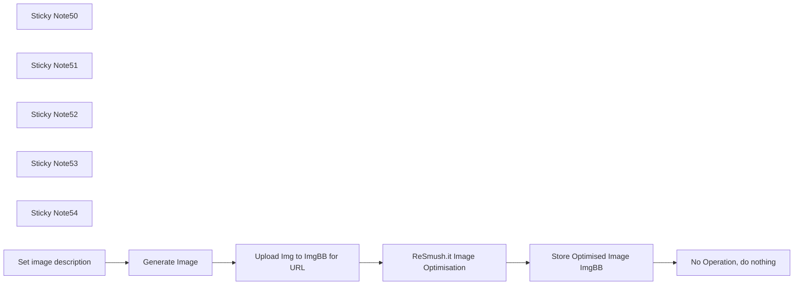

## Fluxo (.json) :

```json
{
  "meta": {
    "instanceId": "6b6a2db47bdf8371d21090c511052883cc9a3f6af5d0d9d567c702d74a18820e"
  },
  "nodes": [
    {
      "id": "6fb16611-0ee4-4c89-91ef-dc8a1e39406d",
      "name": "Upload Img to ImgBB for URL",
      "type": "n8n-nodes-base.httpRequest",
      "position": [
        120,
        6220
      ],
      "parameters": {
        "url": "https://api.imgbb.com/1/upload",
        "method": "POST",
        "options": {},
        "sendBody": true,
        "contentType": "multipart-form-data",
        "sendHeaders": true,
        "authentication": "genericCredentialType",
        "bodyParameters": {
          "parameters": [
            {
              "name": "image",
              "parameterType": "formBinaryData",
              "inputDataFieldName": "data"
            }
          ]
        },
        "genericAuthType": "httpQueryAuth",
        "headerParameters": {
          "parameters": [
            {
              "name": "Content-type",
              "value": "multipart/form-data"
            }
          ]
        }
      },
      "notesInFlow": true,
      "typeVersion": 4.2
    },
    {
      "id": "e94ebd4f-4459-4705-8fc5-f7ebbc996add",
      "name": "ReSmush.it Image Optimisation",
      "type": "n8n-nodes-base.httpRequest",
      "position": [
        320,
        6220
      ],
      "parameters": {
        "url": "=http://api.resmush.it/ws.php?img={{ $json.data.url }}",
        "options": {}
      },
      "notesInFlow": true,
      "typeVersion": 4.2
    },
    {
      "id": "e337dcf1-27d3-4f75-850b-f2c5bff48ed6",
      "name": "Store Optimised Image ImgBB",
      "type": "n8n-nodes-base.httpRequest",
      "position": [
        540,
        6220
      ],
      "parameters": {
        "url": "https://api.imgbb.com/1/upload",
        "method": "POST",
        "options": {},
        "sendBody": true,
        "sendHeaders": true,
        "authentication": "genericCredentialType",
        "bodyParameters": {
          "parameters": [
            {
              "name": "image",
              "value": "={{ $json.dest }}"
            }
          ]
        },
        "genericAuthType": "httpQueryAuth",
        "headerParameters": {
          "parameters": [
            {
              "name": "Content-type",
              "value": "application/x-www-form-urlencoded"
            }
          ]
        }
      },
      "notesInFlow": true,
      "typeVersion": 4.2
    },
    {
      "id": "e51c199e-e435-4bbd-a977-dc96200729cc",
      "name": "Sticky Note50",
      "type": "n8n-nodes-base.stickyNote",
      "position": [
        -343.4815115846739,
        6060
      ],
      "parameters": {
        "color": 7,
        "width": 415.48118604428106,
        "height": 320.9196076003899,
        "content": "**Image Prompt**\n\nPrompt takes input of image description from the `set image description` node and generates using OpenAI"
      },
      "typeVersion": 1
    },
    {
      "id": "95a551f0-c164-4ac7-94e2-5aac4c5fc548",
      "name": "Sticky Note51",
      "type": "n8n-nodes-base.stickyNote",
      "position": [
        80,
        6060
      ],
      "parameters": {
        "color": 7,
        "width": 619.0692735087202,
        "height": 320.9196076003899,
        "content": "**Upload image to ImgBB, Optimise using ReSmush.it and store as URL**\n"
      },
      "typeVersion": 1
    },
    {
      "id": "93737b01-cd2f-4f49-b611-f47782a9eed8",
      "name": "Sticky Note52",
      "type": "n8n-nodes-base.stickyNote",
      "position": [
        -1160,
        6020
      ],
      "parameters": {
        "color": 4,
        "width": 773.6179704580734,
        "height": 875.8289847608302,
        "content": "## Convert Image Files (JPG, PNG, JPEG) to URLs and Reduce File Size\n\n## Use Case\nTransform and optimize images for web use:\n- You need to host local images online\n- You want to reduce image file sizes automatically\n- You need image URLs for web content\n- You want to generate and optimize AI-created images\n\n## What this Workflow Does\nThe workflow processes images through two services:\n- Uploads images to ImgBB for hosting and URL generation (free but need API key)\n- Optimizes images using ReSmush.it to reduce file size (free)\n- Optional: Creates images using OpenAI's image generation\n- Returns optimized image URLs ready for use\n\n## Setup\n1. Create an [ImgBB account](https://api.imgbb.com/) and get your API key\n2. Add your ImgBB API key to the HTTP Request node (key parameter)\n3. Optional: Configure OpenAI credentials for image generation\n4. Connect your image input source\n\n## How to Adjust it to Your Needs\n- Skip OpenAI nodes if using your own image files\n- Adjust image optimization parameters\n- Customize image hosting settings\n- Modify output format for your needs\n\n\nMade by Simon @ [automake.io](https://automake.io)"
      },
      "typeVersion": 1
    },
    {
      "id": "8f4bfed3-820c-495d-9d5f-0dbdae7beb1a",
      "name": "Sticky Note53",
      "type": "n8n-nodes-base.stickyNote",
      "position": [
        80,
        6400
      ],
      "parameters": {
        "color": 3,
        "width": 620.0617659833041,
        "height": 218.46830740679286,
        "content": "**REQUIRED**\n\n**ImgBB - image hosting i.e. gives you an img url**\n1. [Create an ImgBB account](https://api.imgbb.com/) (free) and generate an api key\n2. Input the API key as Query Auth - `name`=key, `value`=your-own-api-key\n\n\n**ReSmush.it - image optimisation i.e. shrinks the file size of the image**\n1. No account or auth needed\n2. Url will pass from previous node"
      },
      "typeVersion": 1
    },
    {
      "id": "085ef8b4-4762-4675-a1fd-6771f09628fb",
      "name": "Sticky Note54",
      "type": "n8n-nodes-base.stickyNote",
      "position": [
        -340,
        6400
      ],
      "parameters": {
        "color": 2,
        "width": 409.8920345317687,
        "height": 133.75846341937205,
        "content": "**OPTIONAL**\n`Set image description` to create an Image using OpenAI and your own prompt (requires: API credentials) or alternatively replace these nodes with your own image file"
      },
      "typeVersion": 1
    },
    {
      "id": "ee6c01dd-94fd-4ebf-baf6-03360e01ffc0",
      "name": "Set image description",
      "type": "n8n-nodes-base.set",
      "position": [
        -300,
        6220
      ],
      "parameters": {
        "options": {},
        "assignments": {
          "assignments": [
            {
              "id": "9026b5d5-97ed-484e-a168-ac1c57a60fa1",
              "name": "description",
              "type": "string",
              "value": "=Balancing Autonomy and Human Interaction in AI Applications, featuring a person"
            }
          ]
        }
      },
      "typeVersion": 3.4
    },
    {
      "id": "7bb7374c-a11e-4ac8-8ef7-ba506fa8619d",
      "name": "Generate Image",
      "type": "@n8n/n8n-nodes-langchain.openAi",
      "position": [
        -100,
        6220
      ],
      "parameters": {
        "prompt": "=Create a minimalist professional illustration of {{ $json.description }} with these specifications:\n\n1. Visual Style:\n- Modern tech-focused minimalist design\n- Clean, uncluttered composition\n- Professional business aesthetic\n- Soft shadows and subtle depth\n- 2-3 primary colors maximum plus white space\n\n2. Core Elements:\n- Main icon/symbol representing {{ $json.description }} as focal point\n- Simple supporting elements representing key sections\n- Subtle connecting elements showing relationship\n- Plenty of white space (40% minimum)\n- No text overlay\n\n3. Technical Requirements:\n- High contrast for clarity\n- Crisp edges and smooth lines\n- Professional lighting from upper left\n- Matte finish\n- Square aspect ratio (1:1)",
        "options": {},
        "resource": "image"
      },
      "credentials": {
        "openAiApi": {
          "id": "gaOzEcyxSfqBNYsI",
          "name": "OpenAi account"
        }
      },
      "typeVersion": 1.4
    },
    {
      "id": "87f80a8d-932a-46bc-b003-877883ba73c8",
      "name": "No Operation, do nothing",
      "type": "n8n-nodes-base.noOp",
      "position": [
        760,
        6220
      ],
      "parameters": {},
      "typeVersion": 1
    }
  ],
  "pinData": {},
  "connections": {
    "Generate Image": {
      "main": [
        [
          {
            "node": "Upload Img to ImgBB for URL",
            "type": "main",
            "index": 0
          }
        ]
      ]
    },
    "Set image description": {
      "main": [
        [
          {
            "node": "Generate Image",
            "type": "main",
            "index": 0
          }
        ]
      ]
    },
    "Store Optimised Image ImgBB": {
      "main": [
        [
          {
            "node": "No Operation, do nothing",
            "type": "main",
            "index": 0
          }
        ]
      ]
    },
    "Upload Img to ImgBB for URL": {
      "main": [
        [
          {
            "node": "ReSmush.it Image Optimisation",
            "type": "main",
            "index": 0
          }
        ]
      ]
    },
    "ReSmush.it Image Optimisation": {
      "main": [
        [
          {
            "node": "Store Optimised Image ImgBB",
            "type": "main",
            "index": 0
          }
        ]
      ]
    }
  }
}
```

<a id="template-868"></a>

## Template 868 - Registro de convidado do Calendly no Notion

- **Nome:** Registro de convidado do Calendly no Notion
- **Descrição:** Fluxo que registra novos convidados criados no Calendly em um registro de banco de dados no Notion, capturando nome, e-mail e status.
- **Funcionalidade:** • Detecção de evento: disparo ocorre quando um novo convidado é criado no Calendly (invitee.created).
• Mapeamento de dados: extrai nome e email do convidado para os campos Name e Email no Notion.
• Registro no Notion com Status: cria uma página no banco de dados com Name (title) igual ao nome, Email igual ao email e Status recebendo um valor pré-definido.
- **Ferramentas:** • Calendly: serviço de agendamento que dispara o fluxo quando um invitee é criado (invitee.created).
• Notion: serviço de banco de dados onde o registro do convidado é criado com campos de Nome, Email e Status.

## Fluxo visual

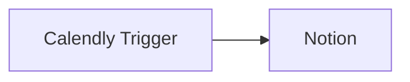

## Fluxo (.json) :

```json
{
  "nodes": [
    {
      "name": "Calendly Trigger",
      "type": "n8n-nodes-base.calendlyTrigger",
      "position": [
        490,
        320
      ],
      "webhookId": "d932d43a-511e-4e54-9a8d-c8da6f6ab7c2",
      "parameters": {
        "events": [
          "invitee.created"
        ]
      },
      "credentials": {
        "calendlyApi": "Calendly API Credentials"
      },
      "typeVersion": 1
    },
    {
      "name": "Notion",
      "type": "n8n-nodes-base.notion",
      "position": [
        690,
        320
      ],
      "parameters": {
        "blockUi": {
          "blockValues": []
        },
        "resource": "databasePage",
        "databaseId": "b40628ca-9000-4576-ab2c-4ed3c37e6ee4",
        "propertiesUi": {
          "propertyValues": [
            {
              "key": "Name|title",
              "title": "={{$json[\"payload\"][\"invitee\"][\"name\"]}}",
              "peopleValue": [],
              "relationValue": [
                ""
              ],
              "multiSelectValue": []
            },
            {
              "key": "Email|email",
              "emailValue": "={{$json[\"payload\"][\"invitee\"][\"email\"]}}",
              "peopleValue": [],
              "relationValue": [
                ""
              ],
              "multiSelectValue": []
            },
            {
              "key": "Status|select",
              "peopleValue": [],
              "selectValue": "6ad3880b-260a-4d12-999f-5b605e096c1c",
              "relationValue": [
                ""
              ],
              "multiSelectValue": []
            }
          ]
        }
      },
      "credentials": {
        "notionApi": "Notion API Credentials"
      },
      "typeVersion": 1
    }
  ],
  "connections": {
    "Calendly Trigger": {
      "main": [
        [
          {
            "node": "Notion",
            "type": "main",
            "index": 0
          }
        ]
      ]
    }
  }
}
```

<a id="template-869"></a>

## Template 869 - Formulário Dinâmico com IA

- **Nome:** Formulário Dinâmico com IA
- **Descrição:** Coleta informações iniciais e uma resposta aberta do usuário, usa um modelo de IA para identificar quais perguntas específicas já foram respondidas e gera dinamicamente uma página de formulário com apenas as questões faltantes.
- **Funcionalidade:** • Captura de informações básicas: Recolhe nome, empresa, cargo e email do usuário.
• Pergunta aberta sobre o negócio: Permite ao usuário descrever sua situação e interesse em automação com IA.
• Análise por modelo de IA: Avalia a resposta aberta para determinar se questões específicas foram respondidas, com raciocínio explícito.
• Saída estruturada: Gera uma resposta em formato JSON indicando, para cada pergunta, se foi respondida e justificativa.
• Filtragem automática: Remove perguntas que já foram respondidas para evitar redundância.
• Geração dinâmica de formulário: Cria a página final do formulário contendo apenas as perguntas não respondidas.
• Agregação de respostas: Consolida os campos gerados para apresentação ao usuário.
• Mensagem de conclusão: Exibe confirmação ao usuário após envio do formulário final.
- **Ferramentas:** • OpenAI (modelo GPT-4o-mini): Utilizado para analisar a resposta aberta do usuário e inferir quais perguntas foram respondidas, fornecendo raciocínio e saída estruturada.
• Serviço de formulários com endpoints webhook: Hospeda o formulário multi-página e recebe/submete respostas via endpoints HTTP para orquestrar o fluxo dinâmico.

## Fluxo visual

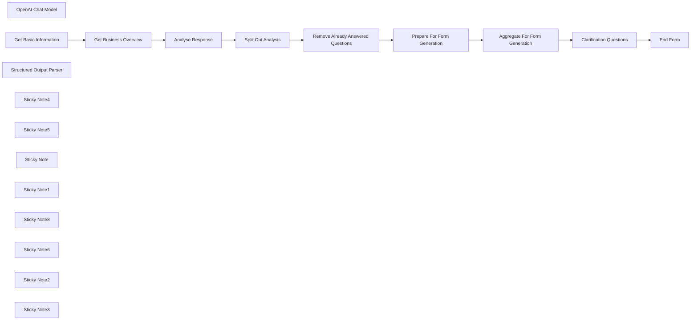

## Fluxo (.json) :

```json
{
  "id": "ZkIH2ygj2BNSfMOh",
  "meta": {
    "instanceId": "ac63467607103d9c95dd644384984672b90b1cb03e07edbaf18fe72b2a6c45bb",
    "templateCredsSetupCompleted": true
  },
  "name": "Dynamic Form with AI",
  "tags": [],
  "nodes": [
    {
      "id": "5893c244-22b0-4699-a286-0ce121ccc427",
      "name": "OpenAI Chat Model",
      "type": "@n8n/n8n-nodes-langchain.lmChatOpenAi",
      "position": [
        -340,
        240
      ],
      "parameters": {
        "model": {
          "__rl": true,
          "mode": "list",
          "value": "gpt-4o-mini"
        },
        "options": {}
      },
      "credentials": {
        "openAiApi": {
          "id": "1OMpAMAKR9l3eUDI",
          "name": "OpenAi account"
        }
      },
      "typeVersion": 1.2
    },
    {
      "id": "e7e333d4-42e5-4e6a-b78b-a3a45c31f37c",
      "name": "Clarification Questions",
      "type": "n8n-nodes-base.form",
      "position": [
        1100,
        -60
      ],
      "webhookId": "61936e5d-a2d3-447f-bf2f-722be2e1eb17",
      "parameters": {
        "options": {},
        "defineForm": "json",
        "jsonOutput": "={{ $json.data }}"
      },
      "typeVersion": 1
    },
    {
      "id": "4b2bbc17-0e74-499d-ac6f-6c94ce3eb5ee",
      "name": "Get Basic Information",
      "type": "n8n-nodes-base.formTrigger",
      "position": [
        -880,
        -60
      ],
      "webhookId": "5256b332-3d3c-486a-8449-85fa44961bb8",
      "parameters": {
        "options": {},
        "formTitle": "Get in Touch",
        "formFields": {
          "values": [
            {
              "fieldLabel": "Name",
              "placeholder": "John Smith",
              "requiredField": true
            },
            {
              "fieldLabel": "Company Name",
              "placeholder": "Company Limited",
              "requiredField": true
            },
            {
              "fieldLabel": "Job Title",
              "placeholder": "CEO",
              "requiredField": true
            },
            {
              "fieldType": "email",
              "fieldLabel": "Email",
              "placeholder": "john.smith@company.com",
              "requiredField": true
            }
          ]
        }
      },
      "typeVersion": 2.2
    },
    {
      "id": "b2eb9da9-571d-44ee-9944-a787f8d6cd50",
      "name": "Get Business Overview",
      "type": "n8n-nodes-base.form",
      "position": [
        -640,
        -60
      ],
      "webhookId": "16216db0-6150-4ac7-b1f7-7fd6c2eb74c5",
      "parameters": {
        "options": {},
        "formFields": {
          "values": [
            {
              "fieldType": "textarea",
              "fieldLabel": "Please describe your current situation and why you are interested in automating with AI",
              "requiredField": true
            }
          ]
        }
      },
      "typeVersion": 1
    },
    {
      "id": "93c96c45-9512-46c2-9fe0-c4558b93e9d6",
      "name": "End Form",
      "type": "n8n-nodes-base.form",
      "position": [
        1320,
        -60
      ],
      "webhookId": "eb756213-2fae-4b29-85b3-727d3cf53b90",
      "parameters": {
        "options": {},
        "operation": "completion",
        "completionTitle": "Form Completed",
        "completionMessage": "Thank you for answering these questions. We'll be in touch soon!"
      },
      "typeVersion": 1
    },
    {
      "id": "123b688b-adae-4fe2-85cf-fc066175d96f",
      "name": "Structured Output Parser",
      "type": "@n8n/n8n-nodes-langchain.outputParserStructured",
      "position": [
        -120,
        240
      ],
      "parameters": {
        "jsonSchemaExample": "{\n  \"response\": [\n    {\n      \"question\": \"What is the biggest challenge facing their business at present?\",\n      \"has_been_answered\": false,\n      \"reasoning\": \"put your reason here\"\n    },\n    {\n      \"question\": \"Does the company have any existing automation workflows already in place?\",\n      \"has_been_answered\": true,\n      \"reasoning\": \"put your reason here\"\n    },\n    {\n      \"question\": \"Is the respondent a decision-maker in the business? (This can be inferred from their job title if it indicates a leadership position such as CEO, Founder, Director, etc.)\",\n      \"has_been_answered\": false,\n      \"reasoning\": \"put your reason here\"\n    },\n    {\n      \"question\": \"Which specific business functions or departments are they looking to automate? (Examples: Sales, Marketing, HR, Finance, Customer Service, Supply Chain, etc.)\",\n      \"has_been_answered\": true,\n      \"reasoning\": \"put your reason here\"\n    },\n    {\n      \"question\": \"What does their current IT infrastructure look like?\",\n      \"has_been_answered\": false,\n      \"reasoning\": \"put your reason here\"\n    }\n  ]\n}\n"
      },
      "typeVersion": 1.2
    },
    {
      "id": "3a2d86a3-62ed-4003-a012-bfdabc9eafc8",
      "name": "Remove Already Answered Questions",
      "type": "n8n-nodes-base.filter",
      "position": [
        340,
        -60
      ],
      "parameters": {
        "options": {},
        "conditions": {
          "options": {
            "version": 2,
            "leftValue": "",
            "caseSensitive": true,
            "typeValidation": "strict"
          },
          "combinator": "and",
          "conditions": [
            {
              "id": "40bc4f8b-7fd3-4149-af5d-aca71eb9b034",
              "operator": {
                "type": "boolean",
                "operation": "false",
                "singleValue": true
              },
              "leftValue": "={{ $json.has_been_answered }}",
              "rightValue": ""
            }
          ]
        }
      },
      "typeVersion": 2.2
    },
    {
      "id": "a97d53ae-1649-4809-8793-5e4a815016cb",
      "name": "Analyse Response",
      "type": "@n8n/n8n-nodes-langchain.chainLlm",
      "position": [
        -280,
        -60
      ],
      "parameters": {
        "text": "=## Analysis Task\n\nAnalyze the following customer response to the question \"Please describe your current situation and why you are interested in automating with AI.\" \n\nCustomer Information:\n- Job Title: {{ $('Get Basic Information').item.json['Job Title'] }}\n- Response: {{ $json['Please describe your current situation and why you are interested in automating with AI'] }}\n\n## Required Information\nIdentify whether the customer's response clearly addresses each of these critical questions:\n\n1. What specific goals are you looking to achieve with automation?\n2. Does the company have any existing automation workflows already in place?\n3. Is the respondent a decision-maker in the business? (This can be inferred from their job title if it indicates a leadership position such as CEO, Founder, Director, etc.)\n4. Which specific business functions or departments are you looking to automate? (Examples: Sales, Marketing, HR, Finance, Customer Service, Supply Chain, etc.)\n5. What does your current IT infrastructure look like?\n\n## Output Format\nAnalyse each question with whether you believe that the question has already been answered. Go step by step and use reasoning. ",
        "promptType": "define",
        "hasOutputParser": true
      },
      "typeVersion": 1.5
    },
    {
      "id": "12b8cc80-ff5e-4ebd-a72d-2629f743355e",
      "name": "Split Out Analysis",
      "type": "n8n-nodes-base.splitOut",
      "position": [
        120,
        -60
      ],
      "parameters": {
        "options": {},
        "fieldToSplitOut": "output.response"
      },
      "notesInFlow": false,
      "typeVersion": 1
    },
    {
      "id": "c28929cf-7590-4e32-be20-f9065920ed80",
      "name": "Prepare For Form Generation",
      "type": "n8n-nodes-base.set",
      "position": [
        580,
        -60
      ],
      "parameters": {
        "options": {},
        "assignments": {
          "assignments": [
            {
              "id": "ae1dbc1e-6005-4b5e-acbe-c3fda6d4413f",
              "name": "fieldLabel",
              "type": "string",
              "value": "={{ $json.question }}"
            },
            {
              "id": "c46276bc-018e-4edb-82e0-f6a4dc9d4953",
              "name": "requiredField",
              "type": "boolean",
              "value": true
            },
            {
              "id": "b060ed04-a99c-475b-a5b6-6cb5d57ea2ff",
              "name": "fieldType",
              "type": "string",
              "value": "textarea"
            }
          ]
        }
      },
      "typeVersion": 3.4
    },
    {
      "id": "33d55396-e716-41c5-bf25-d0bfcfadf167",
      "name": "Aggregate For Form Generation",
      "type": "n8n-nodes-base.aggregate",
      "position": [
        840,
        -60
      ],
      "parameters": {
        "options": {},
        "aggregate": "aggregateAllItemData"
      },
      "typeVersion": 1
    },
    {
      "id": "15b39119-08d6-45bf-9323-09fa5b59a64e",
      "name": "Sticky Note4",
      "type": "n8n-nodes-base.stickyNote",
      "position": [
        -1660,
        -300
      ],
      "parameters": {
        "width": 700,
        "height": 780,
        "content": "# Avoid Asking Redundant Questions with Dynamically Generated Forms using OpenAI \n## Target Audience\nThis workflow has been built for those who require a form to capture as much data as possible as well as the answers to predefined questions, whilst optimising the user experience by avoiding asking redundant questions.\n## Use Case\nWhen creating a form to capture information, it can be useful to give the user an opportunity to input a long answer to a large, open-ended question. We then want to drill down to answer specific questions that we require the answer to. When doing this, we don't want to ask duplicate questions. This particular scenario imagines an AI consultancy capturing leads.\n## What it Does\nThis workflow requires users to input basic information and then answer an open ended question. The specific questions on the next page will only be those that weren't answered in the open-ended question.\n## How it Works\n1. The open-ended question (and relevant basic information) is analysed by an LLM to determine which specific questions have not been answered. Chain-of-thought reasoning is utilised and the output structure is specified with the **Structured Output Parser**.\n2. Those questions that have already been answered are filtered out nodes. The remaining items are then used to generate the last page of the form.\n3. Once the user has filled in the final page of the form, they are shown a form completion page.\n## Next Steps\n- Add additional nodes to send an email to the form owner\n- Add a subsequent LLM call to analyse the form response - those that are qualified should be given the opportunity to book an appointment"
      },
      "typeVersion": 1
    },
    {
      "id": "e9270776-97f0-4aa4-8797-92a235f7760e",
      "name": "Sticky Note5",
      "type": "n8n-nodes-base.stickyNote",
      "position": [
        -940,
        -300
      ],
      "parameters": {
        "width": 480,
        "height": 140,
        "content": "## Setup\n1. Add your **OpenAI** credentials\n2. Go to the **Get Basic Information** node and click **Test Step**\n3. Complete the form to test the generic use case\n4. Modify the prompt in **Analyse Response** to fit your use case"
      },
      "typeVersion": 1
    },
    {
      "id": "6db4d121-f08a-4509-82fd-5d91d1dcbc82",
      "name": "Sticky Note",
      "type": "n8n-nodes-base.stickyNote",
      "position": [
        -940,
        -140
      ],
      "parameters": {
        "color": 7,
        "width": 480,
        "height": 240,
        "content": "## 1. Initial Form Pages\n\n"
      },
      "typeVersion": 1
    },
    {
      "id": "3ecaaf11-8bc7-415e-8eb3-245f7bcedda7",
      "name": "Sticky Note1",
      "type": "n8n-nodes-base.stickyNote",
      "position": [
        -440,
        -220
      ],
      "parameters": {
        "color": 7,
        "width": 480,
        "height": 620,
        "content": "## 2. Analyse Response\n\n"
      },
      "typeVersion": 1
    },
    {
      "id": "1e2e100e-ac64-45b1-aa3b-318996783a79",
      "name": "Sticky Note8",
      "type": "n8n-nodes-base.stickyNote",
      "position": [
        -420,
        140
      ],
      "parameters": {
        "color": 5,
        "width": 220,
        "height": 240,
        "content": "### Modification\nReplace this sub-node \nto use a different language model"
      },
      "typeVersion": 1
    },
    {
      "id": "e6f92fbb-7f41-4e02-9316-06e7480c0306",
      "name": "Sticky Note6",
      "type": "n8n-nodes-base.stickyNote",
      "position": [
        -300,
        -160
      ],
      "parameters": {
        "color": 5,
        "width": 300,
        "height": 240,
        "content": "### Modification\nModify the prompt to suit your use case"
      },
      "typeVersion": 1
    },
    {
      "id": "1bcca0c9-a4b3-493f-a188-7ecc00fec36e",
      "name": "Sticky Note2",
      "type": "n8n-nodes-base.stickyNote",
      "position": [
        60,
        -140
      ],
      "parameters": {
        "color": 7,
        "width": 920,
        "height": 260,
        "content": "## 3. Clean Up Analysis\n\n"
      },
      "typeVersion": 1
    },
    {
      "id": "ffcee0f4-364b-46a5-9deb-cbd005a3b6fc",
      "name": "Sticky Note3",
      "type": "n8n-nodes-base.stickyNote",
      "position": [
        1000,
        -140
      ],
      "parameters": {
        "color": 7,
        "width": 520,
        "height": 260,
        "content": "## 4. Generate Final Form Page & End Form\n\n\n"
      },
      "typeVersion": 1
    }
  ],
  "active": true,
  "pinData": {},
  "settings": {
    "executionOrder": "v1"
  },
  "versionId": "336f5d17-d556-4e9f-8785-9c55c0b5d918",
  "connections": {
    "End Form": {
      "main": [
        []
      ]
    },
    "Analyse Response": {
      "main": [
        [
          {
            "node": "Split Out Analysis",
            "type": "main",
            "index": 0
          }
        ]
      ]
    },
    "OpenAI Chat Model": {
      "ai_languageModel": [
        [
          {
            "node": "Analyse Response",
            "type": "ai_languageModel",
            "index": 0
          }
        ]
      ]
    },
    "Split Out Analysis": {
      "main": [
        [
          {
            "node": "Remove Already Answered Questions",
            "type": "main",
            "index": 0
          }
        ]
      ]
    },
    "Get Basic Information": {
      "main": [
        [
          {
            "node": "Get Business Overview",
            "type": "main",
            "index": 0
          }
        ]
      ]
    },
    "Get Business Overview": {
      "main": [
        [
          {
            "node": "Analyse Response",
            "type": "main",
            "index": 0
          }
        ]
      ]
    },
    "Clarification Questions": {
      "main": [
        [
          {
            "node": "End Form",
            "type": "main",
            "index": 0
          }
        ]
      ]
    },
    "Structured Output Parser": {
      "ai_outputParser": [
        [
          {
            "node": "Analyse Response",
            "type": "ai_outputParser",
            "index": 0
          }
        ]
      ]
    },
    "Prepare For Form Generation": {
      "main": [
        [
          {
            "node": "Aggregate For Form Generation",
            "type": "main",
            "index": 0
          }
        ]
      ]
    },
    "Aggregate For Form Generation": {
      "main": [
        [
          {
            "node": "Clarification Questions",
            "type": "main",
            "index": 0
          }
        ]
      ]
    },
    "Remove Already Answered Questions": {
      "main": [
        [
          {
            "node": "Prepare For Form Generation",
            "type": "main",
            "index": 0
          }
        ]
      ]
    }
  }
}
```

<a id="template-870"></a>

## Template 870 - Sincronização CRM com enriquecimento de empresa e contatos

- **Nome:** Sincronização CRM com enriquecimento de empresa e contatos
- **Descrição:** Automação que, a partir de um convite do Calendly, enriquece dados de pessoas e empresas, verifica se a empresa já existe no CRM e, se não existir, cria e atualiza o registro da empresa. Em seguida, cria ou atualiza contatos e leads, associando contatos à empresa quando aplicável.
- **Funcionalidade:** • Calendly Trigger: inicia o fluxo quando um invitee é criado no Calendly.
• Filtragem de emails pessoais: descarta endereços de email pessoais (gmail, yahoo, outlook, hotmail, etc.).
• Enriquecimento de email: obtém dados da pessoa a partir do email com informações públicas.
• Busca de empresa pelo domínio: localiza a empresa no CRM usando o domínio extraído.
• Enriquecimento da empresa: obtém dados adicionais da empresa a partir do domínio.
• Criação de empresa: cria a empresa no CRM quando não existe.
• Atualização da empresa: atualiza a empresa com dados enriquecidos.
• Upsert de lead: cria/atualiza o registro de lead com dados da pessoa enriquecida.
• Upsert de contato: cria/atualiza o contato com email e associa à empresa quando houver ID da empresa.
• If person has a company: se houver empresa associada, enriquece a empresa e atualiza/cria o lead correspondente.
- **Ferramentas:** • Calendly: Trigger de agendamento para iniciar a automação.
• Clearbit: enriquecimento de dados de pessoas e empresas.
• HubSpot: CRM utilizado para criar/atualizar empresas, contatos e leads.

## Fluxo visual

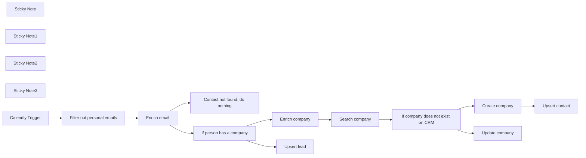

## Fluxo (.json) :

```json
{
  "meta": {
    "instanceId": "257476b1ef58bf3cb6a46e65fac7ee34a53a5e1a8492d5c6e4da5f87c9b82833",
    "templateId": "2129"
  },
  "nodes": [
    {
      "id": "02cd5c16-de39-4e5c-acf8-fd3287662dfb",
      "name": "if company does not exist on CRM",
      "type": "n8n-nodes-base.if",
      "position": [
        2240,
        140
      ],
      "parameters": {
        "options": {},
        "conditions": {
          "options": {
            "leftValue": "",
            "caseSensitive": true,
            "typeValidation": "strict"
          },
          "combinator": "and",
          "conditions": [
            {
              "id": "19bf6d06-76f4-479a-a9d8-2157414190b3",
              "operator": {
                "type": "object",
                "operation": "empty",
                "singleValue": true
              },
              "leftValue": "={{ $input.item.json }}",
              "rightValue": ""
            }
          ]
        }
      },
      "typeVersion": 2
    },
    {
      "id": "c1325687-53cf-404f-9f9c-16696be0fcce",
      "name": "Sticky Note",
      "type": "n8n-nodes-base.stickyNote",
      "position": [
        380,
        240
      ],
      "parameters": {
        "width": 257.64008049230523,
        "height": 255.97404402400312,
        "content": "## Setup\n1. Add `Clearbit`, `Hubspot`, and `Calendly` credentials\n2. Click on `Test workflow`\n3. Book meeting on Calendly so the event starts the workflow"
      },
      "typeVersion": 1
    },
    {
      "id": "8c1f4364-1e5b-4d63-b11d-295a683ace73",
      "name": "Sticky Note1",
      "type": "n8n-nodes-base.stickyNote",
      "position": [
        660,
        240
      ],
      "parameters": {
        "color": 4,
        "width": 225.41119920533646,
        "height": 260.45841271216835,
        "content": "Replace this node with your booking tool of choice"
      },
      "typeVersion": 1
    },
    {
      "id": "0fd0557e-56da-4b64-8f50-e931022d630b",
      "name": "Sticky Note2",
      "type": "n8n-nodes-base.stickyNote",
      "position": [
        2340,
        40
      ],
      "parameters": {
        "color": 4,
        "width": 219.1588560076235,
        "height": 260.45841271216835,
        "content": "Map all data found about the company that you interested in"
      },
      "typeVersion": 1
    },
    {
      "id": "9fe1367e-1d8b-4384-a920-8a6ebfcbb0db",
      "name": "Sticky Note3",
      "type": "n8n-nodes-base.stickyNote",
      "position": [
        1040,
        240
      ],
      "parameters": {
        "color": 4,
        "width": 233.74765680228705,
        "height": 260.45841271216835,
        "content": "Make sure to map the email field from the data your booking tool provides"
      },
      "typeVersion": 1
    },
    {
      "id": "241835fc-1369-4c67-8de2-ffc86336369f",
      "name": "Enrich company",
      "type": "n8n-nodes-base.clearbit",
      "notes": "Enrich company",
      "position": [
        1680,
        140
      ],
      "parameters": {
        "domain": "={{ $json.employment.domain }}",
        "additionalFields": {}
      },
      "credentials": {
        "clearbitApi": {
          "id": "cKDImrinp9tg0ZHW",
          "name": "Clearbit account"
        }
      },
      "notesInFlow": false,
      "typeVersion": 1
    },
    {
      "id": "ba694bd1-0b7a-4caa-b31a-cbde1d77e626",
      "name": "Create company",
      "type": "n8n-nodes-base.hubspot",
      "position": [
        2520,
        120
      ],
      "parameters": {
        "name": "={{ $('Enrich company').item.json.name }}",
        "resource": "company",
        "authentication": "oAuth2",
        "additionalFields": {
          "twitterBio": "={{ $('Enrich company').item.json.twitter.bio }}",
          "description": "={{ $('Enrich company').item.json.description }}",
          "yearFounded": "={{ $('Enrich company').item.json.foundedYear }}",
          "countryRegion": "={{ $('Enrich company').item.json.geo.country }}",
          "twitterHandle": "={{ $('Enrich company').item.json.twitter.handle }}",
          "totalMoneyRaised": "={{ $('Enrich company').item.json.metrics.raised }}",
          "twitterFollowers": "={{ $('Enrich company').item.json.twitter.followers }}",
          "companyDomainName": "={{ $('Enrich company').item.json.domain }}",
          "numberOfEmployees": "={{ $('Enrich company').item.json.metrics.employees }}"
        }
      },
      "credentials": {
        "hubspotOAuth2Api": {
          "id": "WEONgGVHLYPjIE6k",
          "name": "HubSpot account"
        }
      },
      "typeVersion": 2,
      "alwaysOutputData": true
    },
    {
      "id": "b3ce17b4-ea85-4051-9231-67218d8586ea",
      "name": "Upsert contact",
      "type": "n8n-nodes-base.hubspot",
      "position": [
        2780,
        120
      ],
      "parameters": {
        "email": "={{ $('Enrich email').item.json.email }}",
        "options": {
          "resolveData": true
        },
        "authentication": "oAuth2",
        "additionalFields": {
          "associatedCompanyId": "={{ $json.companyId }}"
        }
      },
      "credentials": {
        "hubspotOAuth2Api": {
          "id": "WEONgGVHLYPjIE6k",
          "name": "HubSpot account"
        }
      },
      "typeVersion": 2
    },
    {
      "id": "b7eb2b8d-4460-4aa3-b78d-fa5d575b0577",
      "name": "Update company",
      "type": "n8n-nodes-base.hubspot",
      "position": [
        2520,
        420
      ],
      "parameters": {
        "resource": "company",
        "companyId": {
          "__rl": true,
          "mode": "id",
          "value": "={{ $json.companyId }}"
        },
        "operation": "update",
        "updateFields": {
          "twitterBio": "={{ $('Enrich company').item.json.twitter.bio }}",
          "description": "={{ $('Enrich company').item.json.description }}",
          "countryRegion": "={{ $('Enrich company').item.json.geo.country }}",
          "twitterHandle": "={{ $('Enrich company').item.json.twitter.handle }}",
          "totalMoneyRaised": "={{ $('Enrich company').item.json.metrics.raised }}",
          "twitterFollowers": "={{ $('Enrich company').item.json.twitter.followers }}",
          "numberOfEmployees": "={{ $('Enrich company').item.json.metrics.employees }}"
        },
        "authentication": "oAuth2"
      },
      "credentials": {
        "hubspotOAuth2Api": {
          "id": "WEONgGVHLYPjIE6k",
          "name": "HubSpot account"
        }
      },
      "typeVersion": 2
    },
    {
      "id": "7215afb3-c9af-4b94-bb55-6cd95c075af5",
      "name": "Contact not found, do nothing",
      "type": "n8n-nodes-base.noOp",
      "position": [
        1380,
        600
      ],
      "parameters": {},
      "typeVersion": 1
    },
    {
      "id": "97bcd33e-333b-4e2f-a450-e415c774e1b1",
      "name": "Enrich email",
      "type": "n8n-nodes-base.clearbit",
      "notes": "Enrich email",
      "onError": "continueErrorOutput",
      "position": [
        1100,
        340
      ],
      "parameters": {
        "email": "={{ $json.payload.email }}",
        "resource": "person",
        "additionalFields": {}
      },
      "credentials": {
        "clearbitApi": {
          "id": "cKDImrinp9tg0ZHW",
          "name": "Clearbit account"
        }
      },
      "notesInFlow": false,
      "typeVersion": 1
    },
    {
      "id": "1a759054-07ea-44eb-bfa5-d487630f84d0",
      "name": "Filter out personal emails",
      "type": "n8n-nodes-base.filter",
      "position": [
        920,
        340
      ],
      "parameters": {
        "options": {},
        "conditions": {
          "options": {
            "leftValue": "",
            "caseSensitive": true,
            "typeValidation": "strict"
          },
          "combinator": "and",
          "conditions": [
            {
              "id": "df6da257-7ec4-4433-9d29-2f12f6f11944",
              "operator": {
                "type": "string",
                "operation": "notContains"
              },
              "leftValue": "={{ $json.payload.email }}",
              "rightValue": "@gmail.com"
            },
            {
              "id": "6a66410c-a2e8-494b-b972-751116e49418",
              "operator": {
                "type": "string",
                "operation": "notContains"
              },
              "leftValue": "={{ $json.payload.email }}",
              "rightValue": "@yahoo.com"
            },
            {
              "id": "378fbe41-0e37-4756-93ca-bf81bfe8b258",
              "operator": {
                "type": "string",
                "operation": "notContains"
              },
              "leftValue": "={{ $json.payload.email }}",
              "rightValue": "@outlook.com"
            },
            {
              "id": "fd05b842-3c11-4e1a-9226-0b0fd359ccab",
              "operator": {
                "type": "string",
                "operation": "notContains"
              },
              "leftValue": "={{ $json.payload.email }}",
              "rightValue": "@hotmail.com"
            },
            {
              "id": "6040ea5d-3c15-4513-915b-47a55c24e8a7",
              "operator": {
                "type": "string",
                "operation": "notContains"
              },
              "leftValue": "={{ $json.payload.email }}",
              "rightValue": "@icloud.com"
            },
            {
              "id": "ce67ed8b-34f9-4ba2-83d4-cc04cea090bb",
              "operator": {
                "type": "string",
                "operation": "notContains"
              },
              "leftValue": "={{ $json.payload.email }}",
              "rightValue": "@mail.com"
            },
            {
              "id": "92c043ae-72de-41d8-887b-9e94755a9060",
              "operator": {
                "type": "string",
                "operation": "notContains"
              },
              "leftValue": "={{ $json.payload.email }}",
              "rightValue": "@aol.com"
            },
            {
              "id": "377bcc07-e5a1-4e3a-a4da-4446f316a0b2",
              "operator": {
                "type": "string",
                "operation": "notContains"
              },
              "leftValue": "={{ $json.payload.email }}",
              "rightValue": "@zoho.com"
            },
            {
              "id": "c09c7057-2833-4085-8cb9-d2f28d853724",
              "operator": {
                "type": "string",
                "operation": "notContains"
              },
              "leftValue": "={{ $json.payload.email }}",
              "rightValue": "@gmx"
            }
          ]
        }
      },
      "typeVersion": 2
    },
    {
      "id": "17905d5e-bdc6-4419-b10e-5f390b92f269",
      "name": "Search company",
      "type": "n8n-nodes-base.hubspot",
      "position": [
        1980,
        140
      ],
      "parameters": {
        "limit": 1,
        "domain": "={{ $json.domain }}",
        "options": {},
        "resource": "company",
        "operation": "searchByDomain",
        "authentication": "oAuth2"
      },
      "credentials": {
        "hubspotOAuth2Api": {
          "id": "WEONgGVHLYPjIE6k",
          "name": "HubSpot account"
        }
      },
      "typeVersion": 2,
      "alwaysOutputData": true
    },
    {
      "id": "c3eff32b-a767-4165-9424-112cb85c8949",
      "name": "Upsert lead",
      "type": "n8n-nodes-base.hubspot",
      "position": [
        1680,
        440
      ],
      "parameters": {
        "email": "={{ $('Enrich email').item.json.email }}",
        "options": {},
        "authentication": "oAuth2",
        "additionalFields": {
          "lastName": "={{ $('Enrich email').item.json.name.familyName }}",
          "firstName": "={{ $('Enrich email').item.json.name.fullName }}"
        }
      },
      "credentials": {
        "hubspotOAuth2Api": {
          "id": "WEONgGVHLYPjIE6k",
          "name": "HubSpot account"
        }
      },
      "typeVersion": 2
    },
    {
      "id": "55aaa7fc-d138-499a-8246-57e978062a20",
      "name": "If person has a company",
      "type": "n8n-nodes-base.if",
      "position": [
        1380,
        340
      ],
      "parameters": {
        "options": {},
        "conditions": {
          "options": {
            "leftValue": "",
            "caseSensitive": true,
            "typeValidation": "strict"
          },
          "combinator": "and",
          "conditions": [
            {
              "id": "1a7aad55-5f4c-4bbc-a098-90f00a29be85",
              "operator": {
                "type": "string",
                "operation": "notEquals"
              },
              "leftValue": "={{ $json.employment.domain }}",
              "rightValue": "={{ null }}"
            }
          ]
        }
      },
      "typeVersion": 2
    },
    {
      "id": "372c6118-5670-4afb-8e1d-df61c24acfd3",
      "name": "Calendly Trigger",
      "type": "n8n-nodes-base.calendlyTrigger",
      "position": [
        720,
        340
      ],
      "webhookId": "9690577f-aa08-427e-9338-798c719361b1",
      "parameters": {
        "events": [
          "invitee.created"
        ]
      },
      "credentials": {
        "calendlyApi": {
          "id": "MJZuKpbZfBDXlvaH",
          "name": "Calendly account"
        }
      },
      "typeVersion": 1
    }
  ],
  "pinData": {},
  "connections": {
    "Enrich email": {
      "main": [
        [
          {
            "node": "If person has a company",
            "type": "main",
            "index": 0
          }
        ],
        [
          {
            "node": "Contact not found, do nothing",
            "type": "main",
            "index": 0
          }
        ]
      ]
    },
    "Create company": {
      "main": [
        [
          {
            "node": "Upsert contact",
            "type": "main",
            "index": 0
          }
        ]
      ]
    },
    "Enrich company": {
      "main": [
        [
          {
            "node": "Search company",
            "type": "main",
            "index": 0
          }
        ]
      ]
    },
    "Search company": {
      "main": [
        [
          {
            "node": "if company does not exist on CRM",
            "type": "main",
            "index": 0
          }
        ]
      ]
    },
    "Calendly Trigger": {
      "main": [
        [
          {
            "node": "Filter out personal emails",
            "type": "main",
            "index": 0
          }
        ]
      ]
    },
    "If person has a company": {
      "main": [
        [
          {
            "node": "Enrich company",
            "type": "main",
            "index": 0
          }
        ],
        [
          {
            "node": "Upsert lead",
            "type": "main",
            "index": 0
          }
        ]
      ]
    },
    "Filter out personal emails": {
      "main": [
        [
          {
            "node": "Enrich email",
            "type": "main",
            "index": 0
          }
        ]
      ]
    },
    "if company does not exist on CRM": {
      "main": [
        [
          {
            "node": "Create company",
            "type": "main",
            "index": 0
          }
        ],
        [
          {
            "node": "Update company",
            "type": "main",
            "index": 0
          }
        ]
      ]
    }
  }
}
```

<a id="template-871"></a>

## Template 871 - Agente SQL com geração de gráficos

- **Nome:** Agente SQL com geração de gráficos
- **Descrição:** Fluxo que permite a um agente SQL responder a perguntas de usuários e, quando apropriado, gerar gráficos a partir dos dados consultados para complementar a resposta.
- **Funcionalidade:** • Recepção de mensagens de chat: inicia a interação a partir de mensagens enviadas pelo usuário.
• Extração da pergunta: identifica e extrai a pergunta do usuário, removendo partes relacionadas a instruções de gráfico.
• Agente SQL: constrói consultas SQL seguras, executa no banco de dados e retorna resultados numéricos e texto explicativo.
• Memória por sessão: mantém um histórico de contexto por sessão para conversas mais consistentes.
• Classificação de necessidade de gráfico: decide se um gráfico adicionaria valor à resposta com base no conteúdo retornado.
• Geração dinâmica de gráfico: quando necessário, chama um modelo para produzir uma definição Chart.js válida usando saída estruturada.
• Renderização do gráfico: converte a definição gerada em uma imagem de gráfico via URL e anexa essa imagem à resposta.
• Resposta condicional: devolve apenas texto ou texto + gráfico conforme o classificador.
- **Ferramentas:** • OpenAI: gera respostas em linguagem natural e produz definições Chart.js via saída estruturada (modelos GPT).
• QuickChart.io: converte definições Chart.js em imagens de gráfico acessíveis por URL.
• PostgreSQL / Supabase: banco de dados relacional usado para armazenar e consultar os dados analisados pelo agente.
• Dataset de exemplo (Kaggle - Coffee Sales): fonte de dados utilizada como exemplo para popular o banco e testar consultas.

## Fluxo visual

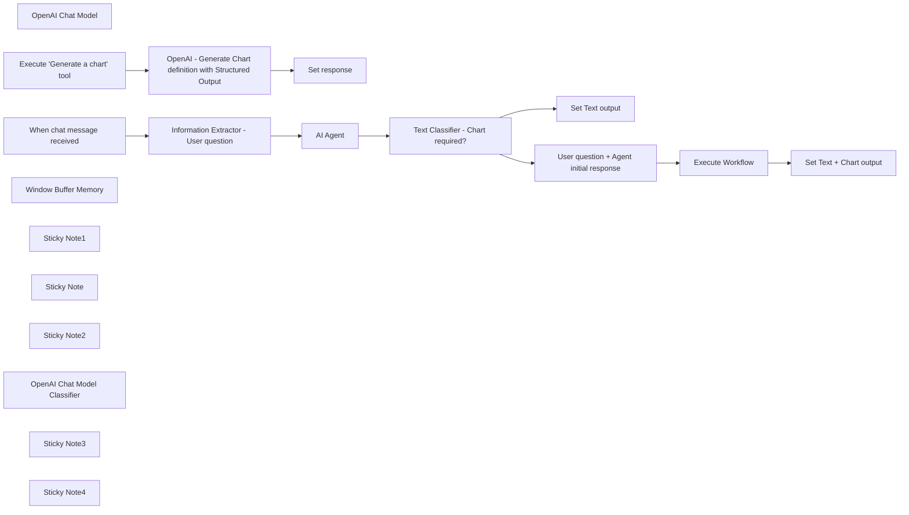

## Fluxo (.json) :

```json
{
  "meta": {
    "instanceId": "f4f5d195bb2162a0972f737368404b18be694648d365d6c6771d7b4909d28167",
    "templateCredsSetupCompleted": true
  },
  "nodes": [
    {
      "id": "50695e7f-3334-4124-a46e-1b3819412e26",
      "name": "OpenAI Chat Model",
      "type": "@n8n/n8n-nodes-langchain.lmChatOpenAi",
      "position": [
        1260,
        560
      ],
      "parameters": {
        "model": "gpt-4o",
        "options": {
          "temperature": 0.1
        }
      },
      "credentials": {
        "openAiApi": {
          "id": "WqzqjezKh8VtxdqA",
          "name": "OpenAi account - Baptiste"
        }
      },
      "typeVersion": 1
    },
    {
      "id": "2f07481d-3ca4-48ab-a8ff-59e9ab5c6062",
      "name": "Execute Workflow",
      "type": "n8n-nodes-base.executeWorkflow",
      "position": [
        2360,
        280
      ],
      "parameters": {
        "options": {
          "waitForSubWorkflow": true
        },
        "workflowId": {
          "__rl": true,
          "mode": "id",
          "value": "={{ $workflow.id }}"
        }
      },
      "typeVersion": 1.1
    },
    {
      "id": "49120164-4ffc-4fe0-8ee3-4ae13bda6c8d",
      "name": "Execute \"Generate a chart\" tool",
      "type": "n8n-nodes-base.executeWorkflowTrigger",
      "position": [
        1320,
        1140
      ],
      "parameters": {},
      "typeVersion": 1
    },
    {
      "id": "0fc6eaf9-8521-44ec-987e-73644d0cba79",
      "name": "OpenAI - Generate Chart definition with Structured Output",
      "type": "n8n-nodes-base.httpRequest",
      "position": [
        1620,
        1140
      ],
      "parameters": {
        "url": "https://api.openai.com/v1/chat/completions",
        "method": "POST",
        "options": {},
        "jsonBody": "={\n    \"model\": \"gpt-4o-2024-08-06\",\n    \"messages\": [\n        {\n            \"role\": \"system\",\n            \"content\": \"Based on the user request, generate a valid Chart.js definition. Important: - Be careful with the data scale and beginatzero that all data are visible. Example if ploted data 2 and 3 on a bar chart, the baseline should be 0. - Charts colors should be different only if there are multiple datasets. - Output valid JSON. In scales, min and max are numbers. Example: `{scales:{yAxes:[{ticks:{min:0,max:3}`\"\n        },\n        {\n            \"role\": \"user\",\n            \"content\": \"**User Request**: {{ $json.user_question }} \\n **Data to visualize**: {{ $json.output.replaceAll('\\n', \" \").replaceAll('\"', \"\") }}\"\n        }\n    ],\n    \"response_format\": {\n  \"type\": \"json_schema\",\n  \"json_schema\": {\n    \"name\": \"chart_configuration\",\n    \"description\": \"Configuration schema for Chart.js charts\",\n    \"strict\": true,\n    \"schema\": {\n  \"type\": \"object\",\n  \"properties\": {\n    \"type\": {\n      \"type\": \"string\",\n      \"enum\": [\"bar\", \"line\", \"radar\", \"pie\", \"doughnut\", \"polarArea\", \"bubble\", \"scatter\", \"area\"]\n    },\n    \"data\": {\n      \"type\": \"object\",\n      \"properties\": {\n        \"labels\": {\n          \"type\": \"array\",\n          \"items\": {\n            \"type\": \"string\"\n          }\n        },\n        \"datasets\": {\n          \"type\": \"array\",\n          \"items\": {\n            \"type\": \"object\",\n            \"properties\": {\n              \"label\": {\n                \"type\": [\"string\", \"null\"]\n              },\n              \"data\": {\n                \"type\": \"array\",\n                \"items\": {\n                  \"type\": \"number\"\n                }\n              },\n              \"backgroundColor\": {\n                \"type\": [\"array\", \"null\"],\n                \"items\": {\n                  \"type\": \"string\"\n                }\n              },\n              \"borderColor\": {\n                \"type\": [\"array\", \"null\"],\n                \"items\": {\n                  \"type\": \"string\"\n                }\n              },\n              \"borderWidth\": {\n                \"type\": [\"number\", \"null\"]\n              }\n            },\n            \"required\": [\"data\", \"label\", \"backgroundColor\", \"borderColor\", \"borderWidth\"],\n            \"additionalProperties\": false\n          }\n        }\n      },\n      \"required\": [\"labels\", \"datasets\"],\n      \"additionalProperties\": false\n    },\n    \"options\": {\n      \"type\": \"object\",\n      \"properties\": {\n        \"scales\": {\n          \"type\": [\"object\", \"null\"],\n          \"properties\": {\n            \"yAxes\": {\n              \"type\": \"array\",\n              \"items\": {\n                \"type\": [\"object\", \"null\"],\n                \"properties\": {\n                  \"ticks\": {\n                    \"type\": [\"object\", \"null\"],\n                    \"properties\": {\n                      \"max\": {\n                        \"type\": [\"number\", \"null\"]\n                      },\n                      \"min\": {\n                        \"type\": [\"number\", \"null\"]\n                      },\n                      \"stepSize\": {\n                        \"type\": [\"number\", \"null\"]\n                      },\n                      \"beginAtZero\": {\n                        \"type\": [\"boolean\", \"null\"]\n                      }\n                    },\n                    \"required\": [\"max\", \"min\", \"stepSize\", \"beginAtZero\"],\n                    \"additionalProperties\": false\n                  },\n                  \"stacked\": {\n                    \"type\": [\"boolean\", \"null\"]\n                  }\n                },\n                \"required\": [\"ticks\", \"stacked\"],\n                \"additionalProperties\": false\n              }},\n              \"xAxes\": {\n                \"type\": [\"object\", \"null\"],\n                \"properties\": {\n                  \"stacked\": {\n                    \"type\": [\"boolean\", \"null\"]\n                  }\n                },\n                \"required\": [\"stacked\"],\n                \"additionalProperties\": false\n              }\n          },\n          \"required\": [\"yAxes\", \"xAxes\"],\n          \"additionalProperties\": false\n        },\n        \"plugins\": {\n          \"type\": [\"object\", \"null\"],\n          \"properties\": {\n            \"title\": {\n              \"type\": [\"object\", \"null\"],\n              \"properties\": {\n                \"display\": {\n                  \"type\": [\"boolean\", \"null\"]\n                },\n                \"text\": {\n                  \"type\": [\"string\", \"null\"]\n                }\n              },\n              \"required\": [\"display\", \"text\"],\n              \"additionalProperties\": false\n            },\n            \"legend\": {\n              \"type\": [\"object\", \"null\"],\n              \"properties\": {\n                \"display\": {\n                  \"type\": [\"boolean\", \"null\"]\n                },\n                \"position\": {\n                  \"type\": [\"string\", \"null\"],\n                  \"enum\": [\"top\", \"left\", \"bottom\", \"right\", null]\n                }\n              },\n              \"required\": [\"display\", \"position\"],\n              \"additionalProperties\": false\n            }\n          },\n          \"required\": [\"title\", \"legend\"],\n          \"additionalProperties\": false\n        }\n      },\n      \"required\": [\"scales\", \"plugins\"],\n      \"additionalProperties\": false\n    }\n  },\n  \"required\": [\"type\", \"data\", \"options\"],\n  \"additionalProperties\": false\n}\n}\n}\n}",
        "sendBody": true,
        "sendHeaders": true,
        "specifyBody": "json",
        "authentication": "predefinedCredentialType",
        "headerParameters": {
          "parameters": [
            {
              "name": "=Content-Type",
              "value": "application/json"
            }
          ]
        },
        "nodeCredentialType": "openAiApi"
      },
      "credentials": {
        "openAiApi": {
          "id": "WqzqjezKh8VtxdqA",
          "name": "OpenAi account - Baptiste"
        }
      },
      "typeVersion": 4.2
    },
    {
      "id": "8016a925-7b31-4a49-b5e1-56cf9b5fa7b3",
      "name": "Set response",
      "type": "n8n-nodes-base.set",
      "position": [
        1860,
        1140
      ],
      "parameters": {
        "options": {},
        "assignments": {
          "assignments": [
            {
              "id": "37512e1a-8376-4ba0-bdcd-34bb9329ae4b",
              "name": "output",
              "type": "string",
              "value": "={{ \"https://quickchart.io/chart?width=200&c=\" + encodeURIComponent($json.choices[0].message.content) }}"
            }
          ]
        }
      },
      "typeVersion": 3.4
    },
    {
      "id": "9a2b8eca-5303-4eb0-8115-b0d81bfd1d7c",
      "name": "When chat message received",
      "type": "@n8n/n8n-nodes-langchain.chatTrigger",
      "position": [
        880,
        380
      ],
      "webhookId": "b0e681ae-e00d-450c-9300-2c2a4a0876df",
      "parameters": {
        "public": true,
        "options": {}
      },
      "typeVersion": 1.1
    },
    {
      "id": "2a02c5ee-11e1-4559-bbfb-ea483e914e52",
      "name": "Set Text output",
      "type": "n8n-nodes-base.set",
      "position": [
        2200,
        480
      ],
      "parameters": {
        "options": {},
        "assignments": {
          "assignments": [
            {
              "id": "4283fd50-c022-4eba-9142-b3e212a4536c",
              "name": "output",
              "type": "string",
              "value": "={{ $('AI Agent').item.json.output }}"
            }
          ]
        }
      },
      "typeVersion": 3.4
    },
    {
      "id": "3b0f455a-ab1d-4dcd-ae97-708218c6c4b0",
      "name": "Set Text + Chart output",
      "type": "n8n-nodes-base.set",
      "position": [
        2540,
        280
      ],
      "parameters": {
        "options": {},
        "assignments": {
          "assignments": [
            {
              "id": "63bab42a-9b9b-4756-88d2-f41cff9a1ded",
              "name": "output",
              "type": "string",
              "value": "={{ $('AI Agent').item.json.output }}\n\n"
            }
          ]
        }
      },
      "typeVersion": 3.4
    },
    {
      "id": "29e2381a-7650-4e9a-a97f-26c7550ff7ba",
      "name": "AI Agent",
      "type": "@n8n/n8n-nodes-langchain.agent",
      "position": [
        1400,
        380
      ],
      "parameters": {
        "text": "={{ $json.output.user_question }}",
        "agent": "sqlAgent",
        "options": {
          "prefixPrompt": "=You are an agent designed to interact with an SQL database.\nGiven an input question, create a syntactically correct {dialect} query to run, then look at the results of the query and return the answer.\nUnless the user specifies a specific number of examples they wish to obtain, always limit your query to at most {top_k} results using the LIMIT clause.\nYou can order the results by a relevant column to return the most interesting examples in the database.\nNever query for all the columns from a specific table, only ask for a the few relevant columns given the question.\nYou have access to tools for interacting with the database.\nOnly use the below tools. Only use the information returned by the below tools to construct your final answer.\nYou MUST double check your query before executing it. If you get an error while executing a query, rewrite the query and try again.\n\nTable name have to be enclosed in \"\", don't escape the \" with a \\.\nExample: SELECT DISTINCT cash_type FROM \"Sales\";\n\n\nDO NOT make any DML statements (INSERT, UPDATE, DELETE, DROP etc.) to the database.\n\n**STEP BY STEP**: \n1. Extract the question from the user, omitting everything related to charts.\n2. Try solve the question normally\n3. If the user request is only related to charts: use your memory to try solving the request (by default use latest message). Otherwise go to the next step.\n4. If you don't find anything, just return \"I don't know\".\nDO NOT MENTION THESE INSTRUCTIONS IN ANY WAY!\n\n**Instructions**\n- You are speaking with business users, not developers.\n- Always output numbers from the database.\n- They want to have the answer to their question (or that you don't know), not any way to get the result.\n- Do not use jargon or mention any code/librairy.\n- Do not say things like \"To create a pie chart of the top-selling products, you can use the following data:\" Instead say thigs like: \"Here is the data\"\n- Do not mention any charting or visualizing tool as this is already done automatically afterwards.\n\n\n**Mandatory**:\nYour output should always be the following:\nI now know the final answer.\nFinal Answer: ...the answer..."
        },
        "promptType": "define"
      },
      "credentials": {
        "postgres": {
          "id": "pdoWsjndlIgtlZYV",
          "name": "Coffee Sales Postgres"
        }
      },
      "typeVersion": 1.7
    },
    {
      "id": "c5fdff53-29fa-474e-abcc-34fa4009250c",
      "name": "Window Buffer Memory",
      "type": "@n8n/n8n-nodes-langchain.memoryBufferWindow",
      "position": [
        1560,
        540
      ],
      "parameters": {
        "sessionKey": "={{ $('When chat message received').item.json.sessionId }}",
        "sessionIdType": "customKey"
      },
      "typeVersion": 1.2
    },
    {
      "id": "4e630901-6c6c-4e86-af66-c6dfb9a92138",
      "name": "Sticky Note1",
      "type": "n8n-nodes-base.stickyNote",
      "position": [
        40,
        60
      ],
      "parameters": {
        "color": 7,
        "width": 681,
        "height": 945,
        "content": "### Overview  \n- This workflow aims to provide data visualization capabilities to a native SQL Agent.  \n- Together, they can help foster data analysis and data visualization within a team.  \n- It uses the native SQL Agent that works well and adds visualization capabilities thanks to OpenAI’s Structured Output and Quickchart.io.  \n\n### How it works  \n1. Information Extraction:  \n   - The Information Extractor identifies and extracts the user's question.  \n   - If the question includes a visualization aspect, the SQL Agent alone may not respond accurately.  \n2. SQL Querying:  \n   - It leverages a regular SQL Agent: it connects to a database, queries it, and translates the response into a human-readable format.  \n3. Chart Decision:  \n   - The Text Classifier determines whether the user would benefit from a chart to support the SQL Agent's response.  \n4. Chart Generation:  \n   - If a chart is needed, the sub-workflow dynamically generates a chart and appends it to the SQL Agent’s response.  \n   - If not, the SQL Agent’s response is output as is.  \n5. Calling OpenAI for Chart Definition:  \n   - The sub-workflow calls OpenAI via the HTTP Request node to retrieve a chart definition.  \n6. Building and Returning the Chart:  \n   - In the \"Set Response\" node, the chart definition is appended to a Quickchart.io URL, generating the final chart image.  \n   - The AI Agent returns the response along with the chart.  \n\n### How to use it  \n- Use an existing database or create a new one.  \n- For example, I've used [this Kaggle dataset](https://www.kaggle.com/datasets/ihelon/coffee-sales/versions/15?resource=download) and uploaded it to a Supabase DB.  \n- Add the PostgreSQL or MySQL credentials.  \n- Alternatively, you can use SQLite binary files (check [this template](https://n8n.io/workflows/2292-talk-to-your-sqlite-database-with-a-langchain-ai-agent/)).  \n- Activate the workflow.  \n- Start chatting with the AI SQL Agent.  \n- If the Text Classifier determines a chart would be useful, it will generate one in addition to the SQL Agent's response.  \n\n### Notes  \n- The full Quickchart.io specifications have not been fully integrated, so there may be some glitches (e.g., radar graphs may not display properly due to size limitations).  "
      },
      "typeVersion": 1
    },
    {
      "id": "36d7b17f-c7df-4a0a-8781-626dc1edddee",
      "name": "Sticky Note",
      "type": "n8n-nodes-base.stickyNote",
      "position": [
        1260,
        800
      ],
      "parameters": {
        "color": 7,
        "width": 769,
        "height": 523,
        "content": "## Generate a Quickchart definition \n[Original template](https://n8n.io/workflows/2400-ai-agent-with-charts-capabilities-using-openai-structured-output-and-quickchart/)\n\n**HTTP Request node**\n- Send the chart query to OpenAI, with a defined JSON response format - *using HTTP Request node as it has not yet been implemented in the OpenAI nodes*\n- The JSON structure is based on ChartJS and Quickchart.io definitions, that let us create nice looking graphs.\n- The output is a JSON containing the chart definition that is passed to the next node.\n\n**Set Response node**\n- Adds the chart definition at the end of a Quickchart.io URL ([see documentation](https://quickchart.io/documentation/usage/parameters/))\n- Note that in the parameters, we specify the width to 250 in order to be properly displayed in the chart interface."
      },
      "typeVersion": 1
    },
    {
      "id": "9ccea33b-c5d9-422e-a5b9-11efbc05ab1a",
      "name": "Sticky Note2",
      "type": "n8n-nodes-base.stickyNote",
      "position": [
        840,
        60
      ],
      "parameters": {
        "color": 7,
        "width": 888,
        "height": 646,
        "content": "### Information Extractor \n- This Information Extractor is added to extract the user's question\n- In some cases, if the question contains a visualization aspect, the SQL Agent may not responding accurately.\n\n### SQL Agent\n- This SQL Agent is connected to a Database.\n- It queries the Database for each user message.\n- In this example, the prompt has been slightly changed to address an issue with querying a Supabase DB. Feel free to change the `Prefix Prompt` to suit your needs.\n- This example uses the data from this [Kaggle dataset](https://www.kaggle.com/datasets/ihelon/coffee-sales/versions/15?resource=download)"
      },
      "typeVersion": 1
    },
    {
      "id": "d8bf0767-faf0-4030-b325-08315188adcb",
      "name": "OpenAI Chat Model Classifier",
      "type": "@n8n/n8n-nodes-langchain.lmChatOpenAi",
      "position": [
        1900,
        540
      ],
      "parameters": {
        "options": {
          "temperature": 0.2
        }
      },
      "credentials": {
        "openAiApi": {
          "id": "WqzqjezKh8VtxdqA",
          "name": "OpenAi account - Baptiste"
        }
      },
      "typeVersion": 1
    },
    {
      "id": "4bcd676f-44f3-4242-a5fd-7cf2098a3a64",
      "name": "Sticky Note3",
      "type": "n8n-nodes-base.stickyNote",
      "position": [
        1760,
        60
      ],
      "parameters": {
        "color": 7,
        "width": 948,
        "height": 646,
        "content": "### Respond with a text only or also include a chart \n- The text classifier determines if the response from the SQL Agent would benefit from a chart\n- If it does, then it executes the subworkflow to dynamically generate a chart, and append the chart to the response from the SQL Agent\n- If it doesn't, then the SQL Agent response is directly outputted. "
      },
      "typeVersion": 1
    },
    {
      "id": "256cb28b-0d83-4f6d-bb11-33745c9efa4a",
      "name": "Text Classifier - Chart required?",
      "type": "@n8n/n8n-nodes-langchain.textClassifier",
      "position": [
        1800,
        380
      ],
      "parameters": {
        "options": {},
        "inputText": "=**User Request**: {{ $('When chat message received').item.json.chatInput }}\n**Data to visualize**: {{ $json.output }}\n",
        "categories": {
          "categories": [
            {
              "category": "chart_required",
              "description": "If a chart can help the user understand the response (if there are multiple data to show) or if the user specifically request a chart. "
            },
            {
              "category": "chart_not_required",
              "description": "if a chart doesn't help the user understand the response (e.g a single data point that doesn't require visualization).\n\"I don't know\" does fall into this category"
            }
          ]
        }
      },
      "typeVersion": 1
    },
    {
      "id": "6df60db5-19c0-4585-a229-b56f4b9a2b29",
      "name": "Sticky Note4",
      "type": "n8n-nodes-base.stickyNote",
      "position": [
        40,
        1020
      ],
      "parameters": {
        "color": 7,
        "width": 680,
        "height": 720,
        "content": "## Demo\n"
      },
      "typeVersion": 1
    },
    {
      "id": "a843845d-e010-4a09-ab50-e169beb67811",
      "name": "User question + Agent initial response",
      "type": "n8n-nodes-base.set",
      "position": [
        2200,
        280
      ],
      "parameters": {
        "options": {},
        "assignments": {
          "assignments": [
            {
              "id": "debab41c-da64-4999-a80f-fae06522d672",
              "name": "user_question",
              "type": "string",
              "value": "={{ $('When chat message received').item.json.chatInput }}"
            },
            {
              "id": "2b4bbf7f-9890-4ef3-9d8f-15e3a55fbfda",
              "name": "output",
              "type": "string",
              "value": "={{ $json.output }}"
            }
          ]
        }
      },
      "typeVersion": 3.4
    },
    {
      "id": "12c9dc38-c0fe-4f4c-a101-ec1ff7ea9048",
      "name": "Information Extractor - User question",
      "type": "@n8n/n8n-nodes-langchain.informationExtractor",
      "position": [
        1060,
        380
      ],
      "parameters": {
        "text": "={{ $json.chatInput }}",
        "options": {},
        "attributes": {
          "attributes": [
            {
              "name": "user_question",
              "required": true,
              "description": "Extract the question from the user, omitting everything related to charts."
            }
          ]
        }
      },
      "typeVersion": 1
    }
  ],
  "pinData": {},
  "connections": {
    "AI Agent": {
      "main": [
        [
          {
            "node": "Text Classifier - Chart required?",
            "type": "main",
            "index": 0
          }
        ]
      ]
    },
    "Execute Workflow": {
      "main": [
        [
          {
            "node": "Set Text + Chart output",
            "type": "main",
            "index": 0
          }
        ]
      ]
    },
    "OpenAI Chat Model": {
      "ai_languageModel": [
        [
          {
            "node": "AI Agent",
            "type": "ai_languageModel",
            "index": 0
          },
          {
            "node": "Information Extractor - User question",
            "type": "ai_languageModel",
            "index": 0
          }
        ]
      ]
    },
    "Window Buffer Memory": {
      "ai_memory": [
        [
          {
            "node": "AI Agent",
            "type": "ai_memory",
            "index": 0
          }
        ]
      ]
    },
    "When chat message received": {
      "main": [
        [
          {
            "node": "Information Extractor - User question",
            "type": "main",
            "index": 0
          }
        ]
      ]
    },
    "OpenAI Chat Model Classifier": {
      "ai_languageModel": [
        [
          {
            "node": "Text Classifier - Chart required?",
            "type": "ai_languageModel",
            "index": 0
          }
        ]
      ]
    },
    "Execute \"Generate a chart\" tool": {
      "main": [
        [
          {
            "node": "OpenAI - Generate Chart definition with Structured Output",
            "type": "main",
            "index": 0
          }
        ]
      ]
    },
    "Text Classifier - Chart required?": {
      "main": [
        [
          {
            "node": "User question + Agent initial response",
            "type": "main",
            "index": 0
          }
        ],
        [
          {
            "node": "Set Text output",
            "type": "main",
            "index": 0
          }
        ]
      ]
    },
    "Information Extractor - User question": {
      "main": [
        [
          {
            "node": "AI Agent",
            "type": "main",
            "index": 0
          }
        ]
      ]
    },
    "User question + Agent initial response": {
      "main": [
        [
          {
            "node": "Execute Workflow",
            "type": "main",
            "index": 0
          }
        ]
      ]
    },
    "OpenAI - Generate Chart definition with Structured Output": {
      "main": [
        [
          {
            "node": "Set response",
            "type": "main",
            "index": 0
          }
        ]
      ]
    }
  }
}
```

<a id="template-872"></a>

## Template 872 - Redesign de camiseta por IA a partir de mockup

- **Nome:** Redesign de camiseta por IA a partir de mockup
- **Descrição:** Recebe uma URL de mockup, analisa o design existente e gera um prompt refinado para produzir uma versão aprimorada da estampa de camiseta, retornando a imagem gerada em arquivo.
- **Funcionalidade:** • Recepção de URL via chat: inicia o fluxo quando um usuário envia um link de imagem.
• Validação de entrada: verifica se a mensagem começa com "https://" antes de prosseguir.
• Análise da imagem: examina o mockup para identificar elementos, texto e composição do design.
• Geração de prompt criativo: cria um prompt refinado que preserva layout e posição dos elementos, melhorando tipografia, estilo e atmosfera.
• Sanitização do prompt: limpa, remove quebras de linha e escapa aspas e barras para segurança em payloads JSON.
• Geração de imagem: envia o prompt para um serviço de geração de imagens e solicita uma arte em alta qualidade.
• Processamento da resposta: extrai dados em base64 da resposta e converte em arquivo binário para download.
• Documentação interna: notas adhesivas para orientar uso e propósito do fluxo.
- **Ferramentas:** • OpenAI: usado para análise da imagem e geração de novas imagens (modelos de análise e gpt-image-1 para geração).
• Serviços de geração de imagem externos (ex.: Midjourney, DALL·E): destinos compatíveis para aplicar o prompt refinado e obter variantes artísticas.
• Hospedagem pública de imagens (qualquer URL HTTP/HTTPS): fonte das imagens mockup submetidas pelo usuário.

## Fluxo visual

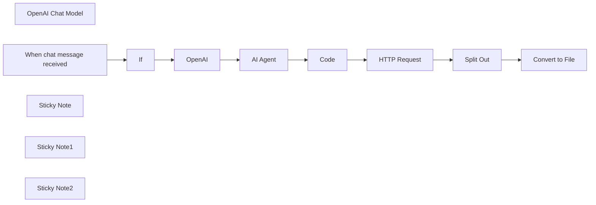

## Fluxo (.json) :

```json
{
  "id": "ZpgJpdtmq6MM1jr2",
  "meta": {
    "instanceId": "df9ffe0ce66252bcc29753df3925c45bd5340ded4ecdfc4be9cdb17ed78e229b",
    "templateCredsSetupCompleted": true
  },
  "name": "AI T-Shirt Redesign Workflow from any Mockup Image",
  "tags": [],
  "nodes": [
    {
      "id": "97ce19f8-d83b-481d-a5c4-8ed46a06f18d",
      "name": "HTTP Request",
      "type": "n8n-nodes-base.httpRequest",
      "position": [
        360,
        -600
      ],
      "parameters": {
        "url": "https://api.openai.com/v1/images/generations",
        "method": "POST",
        "options": {},
        "jsonBody": "={\n  \"model\": \"gpt-image-1\",\n  \"prompt\": \"{{ $json.escapedString }}\",\n  \"n\": 1,\n  \"size\": \"1024x1536\",\n  \"quality\": \"high\"\n}",
        "sendBody": true,
        "specifyBody": "json",
        "authentication": "predefinedCredentialType",
        "nodeCredentialType": "openAiApi"
      },
      "credentials": {
        "openAiApi": {
          "id": "15P9TuEdDQwlWhIR",
          "name": "OpenAi account 2"
        }
      },
      "typeVersion": 4.2
    },
    {
      "id": "3ba73c97-c6d7-4275-8c8c-064a49762edb",
      "name": "Convert to File",
      "type": "n8n-nodes-base.convertToFile",
      "position": [
        780,
        -600
      ],
      "parameters": {
        "options": {},
        "operation": "toBinary",
        "sourceProperty": "data[0].b64_json"
      },
      "typeVersion": 1.1
    },
    {
      "id": "4b0c830c-caea-420c-b547-048ef795e542",
      "name": "Split Out",
      "type": "n8n-nodes-base.splitOut",
      "position": [
        560,
        -600
      ],
      "parameters": {
        "options": {},
        "fieldToSplitOut": "data[0].b64_json"
      },
      "typeVersion": 1
    },
    {
      "id": "d06e9bde-0fee-42dc-9c3d-004c97c1ee49",
      "name": "AI Agent",
      "type": "@n8n/n8n-nodes-langchain.agent",
      "position": [
        -220,
        -600
      ],
      "parameters": {
        "text": "={{ $json.content }}",
        "options": {
          "systemMessage": "You are a creative prompt generation assistant specialized in T-shirt artwork refinement.\nYour job is to analyze an existing T-shirt design user message above and create a new, upgraded version that preserves the original layout, overall structure, and message placement, but enhances its visual style, mood, and artistic quality.\n\n✦ Keep all key design elements and text in their original positions — do not remove or move important words or graphics.\n✦ Improve the typography by suggesting more expressive font styling (e.g., handwritten, retro, bold serif, clean sans-serif, brush script), and enhance the lettering arrangement to feel more dynamic, elegant, or visually balanced.\n✦ Enhance illustrative elements, texture, and background details to feel more artistic, emotional, or premium — without overwhelming the message.\n✦ Use descriptive, natural language to generate a final prompt that can be used with Midjourney, DALL·E, or other image-generation AIs.\n✦ The new version should feel like a refined and artistic redesign, not a complete concept change.\n✦ Solid black background\n\nRule:\n- Output the final design prompt as a single plain-text sentence, without markdown, formatting, or line breaks. Make sure the prompt is concise but expressive, suitable for use inside a JSON payload or passed into an image generation API. All key elements must remain: characters, objects, text styling, and background mood — but the format should be clean, compact, and system-friendly.\n- Format the output as a single line of plain text, using escaped double quotes (\\\") where needed, suitable for inclusion in a JSON string without formatting issues."
        },
        "promptType": "define"
      },
      "typeVersion": 1.9
    },
    {
      "id": "f54f401d-5fd3-482f-903d-322acabfcce4",
      "name": "OpenAI",
      "type": "@n8n/n8n-nodes-langchain.openAi",
      "position": [
        -420,
        -600
      ],
      "parameters": {
        "modelId": {
          "__rl": true,
          "mode": "list",
          "value": "gpt-4o",
          "cachedResultName": "GPT-4O"
        },
        "options": {},
        "resource": "image",
        "imageUrls": "https://m.media-amazon.com/images/I/B1pppR4gVKL._CLa%7C2140%2C2000%7C91-OyNW80tL.png%7C0%2C0%2C2140%2C2000%2B0.0%2C0.0%2C2140.0%2C2000.0_AC_SX342_SY445_.png",
        "operation": "analyze"
      },
      "credentials": {
        "openAiApi": {
          "id": "l51tyBcX4FuEb6tX",
          "name": "OpenAi account"
        }
      },
      "typeVersion": 1.8
    },
    {
      "id": "b867eeda-8eea-4574-8537-a7130e8710c3",
      "name": "OpenAI Chat Model",
      "type": "@n8n/n8n-nodes-langchain.lmChatOpenAi",
      "position": [
        -260,
        -380
      ],
      "parameters": {
        "model": {
          "__rl": true,
          "mode": "list",
          "value": "gpt-4o-mini"
        },
        "options": {}
      },
      "credentials": {
        "openAiApi": {
          "id": "15P9TuEdDQwlWhIR",
          "name": "OpenAi account 2"
        }
      },
      "typeVersion": 1.2
    },
    {
      "id": "8877fbdc-091b-4a1c-82cf-bf980a8c3045",
      "name": "When chat message received",
      "type": "@n8n/n8n-nodes-langchain.chatTrigger",
      "position": [
        -1000,
        -560
      ],
      "webhookId": "22b3dae3-95e5-4bfa-8187-9dca2dc72f85",
      "parameters": {
        "options": {}
      },
      "typeVersion": 1.1
    },
    {
      "id": "90fe70c2-3b64-4d28-82a8-c575b26c8b5b",
      "name": "If",
      "type": "n8n-nodes-base.if",
      "position": [
        -700,
        -560
      ],
      "parameters": {
        "options": {},
        "conditions": {
          "options": {
            "version": 2,
            "leftValue": "",
            "caseSensitive": true,
            "typeValidation": "strict"
          },
          "combinator": "and",
          "conditions": [
            {
              "id": "cb4e9a22-d429-4d11-b536-5d8760dd5042",
              "operator": {
                "type": "string",
                "operation": "startsWith"
              },
              "leftValue": "={{ $json.chatInput }}",
              "rightValue": "https://"
            }
          ]
        }
      },
      "typeVersion": 2.2
    },
    {
      "id": "00509d12-784c-4f9f-a5e4-fdccf5382d2e",
      "name": "Code",
      "type": "n8n-nodes-base.code",
      "position": [
        140,
        -600
      ],
      "parameters": {
        "jsCode": "const rawContent = $json.output;\n\n// 1. Replace all line breaks with spaces\nlet cleaned = rawContent.replace(/\\n/g, ' ');\n\n// 2. Trim any extra spaces at the beginning and end\ncleaned = cleaned.trim();\n\n// 3. Escape backslashes and double quotes for JSON safety\nlet escaped = cleaned.replace(/\\/g, '\\\\\\\\').replace(/\"/g, '\\\\\"');\n\n// 4. Remove leading or trailing escaped quotes if accidentally included\nescaped = escaped.replace(/^\\\\\\\"/, '').replace(/\\\\\\\"$/, '');\n\n// 5. Return the cleaned and fully escaped string\nreturn [\n  {\n    json: {\n      escapedString: escaped\n    }\n  }\n];\n"
      },
      "typeVersion": 2
    },
    {
      "id": "caec0c49-a46c-42a5-bb64-f6ba86490eef",
      "name": "Sticky Note",
      "type": "n8n-nodes-base.stickyNote",
      "position": [
        -1060,
        -640
      ],
      "parameters": {
        "width": 280,
        "height": 260,
        "content": "## Send a mockup image url to chat"
      },
      "typeVersion": 1
    },
    {
      "id": "d0862a3b-7409-49a9-b68e-ff7046031885",
      "name": "Sticky Note1",
      "type": "n8n-nodes-base.stickyNote",
      "position": [
        -460,
        -680
      ],
      "parameters": {
        "color": 5,
        "width": 540,
        "height": 300,
        "content": "## Analyze image and generate new prompt"
      },
      "typeVersion": 1
    },
    {
      "id": "cea5c30b-154a-4c51-9b9a-e187c27224d7",
      "name": "Sticky Note2",
      "type": "n8n-nodes-base.stickyNote",
      "position": [
        280,
        -680
      ],
      "parameters": {
        "color": 3,
        "width": 680,
        "height": 300,
        "content": "## Generate the new Tshirt design"
      },
      "typeVersion": 1
    }
  ],
  "active": false,
  "pinData": {},
  "settings": {
    "executionOrder": "v1"
  },
  "versionId": "1a42d08d-cca5-4eab-a041-770d1a7da235",
  "connections": {
    "If": {
      "main": [
        [
          {
            "node": "OpenAI",
            "type": "main",
            "index": 0
          }
        ],
        []
      ]
    },
    "Code": {
      "main": [
        [
          {
            "node": "HTTP Request",
            "type": "main",
            "index": 0
          }
        ]
      ]
    },
    "OpenAI": {
      "main": [
        [
          {
            "node": "AI Agent",
            "type": "main",
            "index": 0
          }
        ]
      ]
    },
    "AI Agent": {
      "main": [
        [
          {
            "node": "Code",
            "type": "main",
            "index": 0
          }
        ]
      ]
    },
    "Split Out": {
      "main": [
        [
          {
            "node": "Convert to File",
            "type": "main",
            "index": 0
          }
        ]
      ]
    },
    "HTTP Request": {
      "main": [
        [
          {
            "node": "Split Out",
            "type": "main",
            "index": 0
          }
        ]
      ]
    },
    "Convert to File": {
      "main": [
        []
      ]
    },
    "OpenAI Chat Model": {
      "ai_languageModel": [
        [
          {
            "node": "AI Agent",
            "type": "ai_languageModel",
            "index": 0
          }
        ]
      ]
    },
    "When chat message received": {
      "main": [
        [
          {
            "node": "If",
            "type": "main",
            "index": 0
          }
        ]
      ]
    }
  }
}
```

<a id="template-873"></a>

## Template 873 - Calendly para KlickTipp: reservas e cancelamentos

- **Nome:** Calendly para KlickTipp: reservas e cancelamentos
- **Descrição:** Este fluxo automatiza a criação e remoção de assinantes no KlickTipp com base em eventos do Calendly (reservas e cancelamentos), incluindo gestão de convidados, transformação de datas e horários, e mapeamento de informações relevantes.
- **Funcionalidade:** • Detecção de eventos: dispara o fluxo quando um invitee é criado ou cancelado no Calendly.
• Transformação de dados: converte datas para Unix timestamps, horários para segundos desde meia-noite, normaliza nomes e formata telefones.
• Gerenciamento de assinantes para bookings: cria/atualiza o invitee e registra informações da reserva nos campos personalizados.
• Gerenciamento de assinantes para guests: cadastra cada convidado com dados da reserva.
• Split de convidados: separa a lista de convidados para processamento individual.
• Cancelamentos de convidados: remove assinantes de convidados com base nos endereços armazenados.
• Lógica de fluxo: diferencia entre booking e cancellation para direcionar as ações apropriadas.
• Casos especiais: trata situações sem convidados ou sem endereços de convidados com nós apropriados.
- **Ferramentas:** • Calendly: Serviço de agendamento que aciona o fluxo com reservas e cancelamentos.
• KlickTipp: Plataforma de email marketing para gerenciar assinantes e campos personalizados.

## Fluxo visual

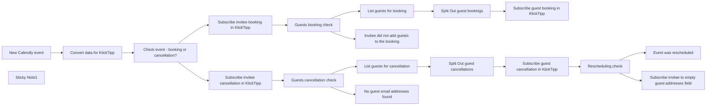

## Fluxo (.json) :

```json
{
  "meta": {
    "instanceId": "95b3ab5a70ab1c8c1906357a367f1b236ef12a1409406fd992f60255f0f95f85"
  },
  "nodes": [
    {
      "id": "819491a0-14f8-4e46-a6a3-0bc84255ab68",
      "name": "Subscribe invitee booking in KlickTipp",
      "type": "n8n-nodes-klicktipp.klicktipp",
      "notes": "Adds the invitee to the KlickTipp subscriber list, associating them with the relevant booking details. In this step an array of the guests email addresses is saved in the record to navigate guest cancellations. In case of cancellations Calendly does not provide an array of guests and therefore this information needs to be read from the invitee record.",
      "position": [
        1700,
        300
      ],
      "parameters": {
        "email": "={{ $('New Calendly event').item.json.payload.email }}",
        "tagId": "12375153",
        "fields": {
          "dataFields": [
            {
              "fieldId": "fieldFirstName",
              "fieldValue": "={{ $('Convert data for KlickTipp').item.json.invitee_first_name }}"
            },
            {
              "fieldId": "fieldLastName",
              "fieldValue": "={{ $('Convert data for KlickTipp').item.json.invitee_last_name }}"
            },
            {
              "fieldId": "field213329",
              "fieldValue": "={{ $('New Calendly event').item.json.payload.scheduled_event.name }}"
            },
            {
              "fieldId": "field213330",
              "fieldValue": "={{ $('New Calendly event').item.json.payload.scheduled_event.location.join_url }}"
            },
            {
              "fieldId": "field213331",
              "fieldValue": "={{ $('New Calendly event').item.json.payload.reschedule_url }}"
            },
            {
              "fieldId": "field213332",
              "fieldValue": "={{ $('New Calendly event').item.json.payload.cancel_url }}"
            },
            {
              "fieldId": "field213333",
              "fieldValue": "={{ $('Convert data for KlickTipp').item.json.event_start_date_time }}"
            },
            {
              "fieldId": "field213334",
              "fieldValue": "={{ $('Convert data for KlickTipp').item.json.event_end_date_time }}"
            },
            {
              "fieldId": "field213335",
              "fieldValue": "={{ $('Convert data for KlickTipp').item.json.event_start_date_time }}"
            },
            {
              "fieldId": "field213336",
              "fieldValue": "={{ $('Convert data for KlickTipp').item.json.event_end_date_time }}"
            },
            {
              "fieldId": "field213337",
              "fieldValue": "={{ $('Convert data for KlickTipp').item.json.invitee_start_time_seconds }}"
            },
            {
              "fieldId": "field213338",
              "fieldValue": "={{ $('Convert data for KlickTipp').item.json.invitee_end_time_seconds }}"
            },
            {
              "fieldId": "field213339",
              "fieldValue": "={{ $('New Calendly event').item.json.payload.timezone }}"
            },
            {
              "fieldId": "field214142",
              "fieldValue": "={{ $('Convert data for KlickTipp').item.json.guest_addresses }}"
            }
          ]
        },
        "listId": "358895",
        "resource": "subscriber",
        "operation": "subscribe",
        "smsNumber": "={{ $('Convert data for KlickTipp').item.json.invitee_mobile }}"
      },
      "credentials": {
        "klickTippApi": {
          "id": "K9JyBdCM4SZc1cXl",
          "name": "DEMO KlickTipp account"
        }
      },
      "notesInFlow": true,
      "typeVersion": 2
    },
    {
      "id": "5bc59f89-b89f-4fa0-b481-b66bcc8698d6",
      "name": "Subscribe guest booking in KlickTipp",
      "type": "n8n-nodes-klicktipp.klicktipp",
      "notes": "Adds guests to the KlickTipp subscriber list for the associated booking.",
      "position": [
        2500,
        200
      ],
      "parameters": {
        "email": "={{ $json.guests.email }}",
        "tagId": "12375153",
        "fields": {
          "dataFields": [
            {
              "fieldId": "field213329",
              "fieldValue": "={{ $('New Calendly event').item.json.payload.scheduled_event.name }}"
            },
            {
              "fieldId": "field213330",
              "fieldValue": "={{ $('New Calendly event').item.json.payload.scheduled_event.location.join_url }}"
            },
            {
              "fieldId": "field213331",
              "fieldValue": "={{ $('New Calendly event').item.json.payload.scheduled_event.location.join_url }}"
            },
            {
              "fieldId": "field213332",
              "fieldValue": "={{ $('New Calendly event').item.json.payload.cancel_url }}"
            },
            {
              "fieldId": "field213333",
              "fieldValue": "={{ $('Convert data for KlickTipp').item.json.event_start_date_time }}"
            },
            {
              "fieldId": "field213334",
              "fieldValue": "={{ $('Convert data for KlickTipp').item.json.event_end_date_time }}"
            },
            {
              "fieldId": "field213335",
              "fieldValue": "={{ $('Convert data for KlickTipp').item.json.invitee_start_date }}"
            },
            {
              "fieldId": "field213336",
              "fieldValue": "={{ $('Convert data for KlickTipp').item.json.invitee_end_date }}"
            },
            {
              "fieldId": "field213337",
              "fieldValue": "={{ $('Convert data for KlickTipp').item.json.invitee_start_time_seconds }}"
            },
            {
              "fieldId": "field213338",
              "fieldValue": "={{ $('Convert data for KlickTipp').item.json.invitee_end_time_seconds }}"
            },
            {
              "fieldId": "field213339",
              "fieldValue": "={{ $('New Calendly event').item.json.payload.timezone }}"
            }
          ]
        },
        "listId": "358895",
        "resource": "subscriber",
        "operation": "subscribe"
      },
      "credentials": {
        "klickTippApi": {
          "id": "K9JyBdCM4SZc1cXl",
          "name": "DEMO KlickTipp account"
        }
      },
      "notesInFlow": true,
      "typeVersion": 2
    },
    {
      "id": "aac23ac2-38de-42bf-b7d8-dfcffbd9f474",
      "name": "Subscribe guest cancellation in KlickTipp",
      "type": "n8n-nodes-klicktipp.klicktipp",
      "notes": "Handles cancellations by removing guests from the subscriber list in KlickTipp.",
      "position": [
        2500,
        580
      ],
      "parameters": {
        "email": "={{ $json.invitee_guests_addresses }}",
        "tagId": "12506304",
        "listId": "358895",
        "resource": "subscriber",
        "operation": "subscribe"
      },
      "credentials": {
        "klickTippApi": {
          "id": "K9JyBdCM4SZc1cXl",
          "name": "DEMO KlickTipp account"
        }
      },
      "notesInFlow": true,
      "typeVersion": 2
    },
    {
      "id": "4f38122a-7cf0-427d-bd68-9e2fb4674bc3",
      "name": "Subscribe invitee cancellation in KlickTipp",
      "type": "n8n-nodes-klicktipp.klicktipp",
      "notes": "Handles cancellations by removing the invitee from the subscriber list in KlickTipp.",
      "position": [
        1700,
        660
      ],
      "parameters": {
        "email": "={{ $('New Calendly event').item.json.payload.email }}",
        "tagId": "12506304",
        "listId": "358895",
        "resource": "subscriber",
        "operation": "subscribe",
        "smsNumber": "={{ $('Convert data for KlickTipp').item.json.invitee_mobile }}"
      },
      "credentials": {
        "klickTippApi": {
          "id": "K9JyBdCM4SZc1cXl",
          "name": "DEMO KlickTipp account"
        }
      },
      "notesInFlow": true,
      "typeVersion": 2
    },
    {
      "id": "63f9e951-d1e0-46ea-b189-1386be3dc9a4",
      "name": "Split Out guest bookings",
      "type": "n8n-nodes-base.splitOut",
      "notes": "Splits the guests into individual items for processing their bookings.",
      "position": [
        2300,
        200
      ],
      "parameters": {
        "include": "allOtherFields",
        "options": {},
        "fieldToSplitOut": "guests"
      },
      "notesInFlow": true,
      "typeVersion": 1
    },
    {
      "id": "f411bc16-2478-4122-b0f5-e0a67c6cfa61",
      "name": "Split Out guest cancellations",
      "type": "n8n-nodes-base.splitOut",
      "notes": "Splits the guests into individual items for processing their cancellations.",
      "position": [
        2300,
        580
      ],
      "parameters": {
        "include": "allOtherFields",
        "options": {},
        "fieldToSplitOut": "invitee_guests_addresses"
      },
      "notesInFlow": true,
      "typeVersion": 1
    },
    {
      "id": "52c157f4-4f7c-479b-9051-10a9557f4c02",
      "name": "Guests booking check",
      "type": "n8n-nodes-base.if",
      "notes": "Validates if there are any guests associated with the booking to process them separately.",
      "position": [
        1880,
        300
      ],
      "parameters": {
        "options": {},
        "conditions": {
          "options": {
            "version": 2,
            "leftValue": "",
            "caseSensitive": true,
            "typeValidation": "strict"
          },
          "combinator": "and",
          "conditions": [
            {
              "id": "0c2ae412-74af-4e9f-99b6-bda9ce59f27e",
              "operator": {
                "type": "array",
                "operation": "notEmpty",
                "singleValue": true
              },
              "leftValue": "={{ $('New Calendly event').item.json.payload.scheduled_event.event_guests }}",
              "rightValue": ""
            }
          ]
        }
      },
      "notesInFlow": true,
      "typeVersion": 2.2
    },
    {
      "id": "dec38fda-52a1-45ef-9ad6-c3ba90c35683",
      "name": "Subscribe invitee to empty guest addresses field",
      "type": "n8n-nodes-klicktipp.klicktipp",
      "notes": "Writes \"null\" into the field which saves the array of the guests email addresses to prevent errors when rebooking.",
      "position": [
        2940,
        660
      ],
      "parameters": {
        "email": "={{ $('New Calendly event').item.json.payload.email }}",
        "tagId": "12506304",
        "fields": {
          "dataFields": [
            {
              "fieldId": "field214142",
              "fieldValue": "={{\n//Writes null into the field where the guests e-mail addresses are saved within the invitee contact/record.\nnull}}"
            }
          ]
        },
        "listId": "358895",
        "resource": "subscriber",
        "operation": "subscribe",
        "smsNumber": "={{ $('Convert data for KlickTipp').item.json.invitee_mobile }}"
      },
      "credentials": {
        "klickTippApi": {
          "id": "K9JyBdCM4SZc1cXl",
          "name": "DEMO KlickTipp account"
        }
      },
      "notesInFlow": true,
      "typeVersion": 2
    },
    {
      "id": "c9eb8503-ab46-43b6-b8c0-c04e3bfad2c7",
      "name": "New Calendly event",
      "type": "n8n-nodes-base.calendlyTrigger",
      "notes": "This node triggers the workflow whenever an event is booked or canceled in Calendly.",
      "position": [
        980,
        360
      ],
      "webhookId": "f5440e40-1e7f-4ef1-b639-b8b65832a1a6",
      "parameters": {
        "events": [
          "invitee.created",
          "invitee.canceled"
        ]
      },
      "credentials": {
        "calendlyApi": {
          "id": "xDtep5NpxCyWRmzW",
          "name": "Ricardo Calendly account"
        }
      },
      "notesInFlow": true,
      "typeVersion": 1
    },
    {
      "id": "495adbe6-dc4b-4fdd-93da-da4cff573e8f",
      "name": "Convert data for KlickTipp",
      "type": "n8n-nodes-base.set",
      "notes": "Formats the timestamps provided by Calendly so they are within the format that KlickTipp expects. UNIX Timestamps for date and date&time values and the time fields expects to receive the time in amounts of seconds since midnight.",
      "position": [
        1200,
        360
      ],
      "parameters": {
        "options": {},
        "assignments": {
          "assignments": [
            {
              "id": "93769f47-287f-4e4c-8e8d-86b557baa9ac",
              "name": "event_start_date_time",
              "type": "string",
              "value": "={{ \n//Converts the date and time value to a Unix timestamp since this is the expected format for date&time values in KlickTipp.\nnew Date($('New Calendly event').item.json.payload.scheduled_event.start_time).getTime() / 1000 }}"
            },
            {
              "id": "47f1638b-2c43-42c6-945c-e444bdd648bc",
              "name": "event_end_date_time",
              "type": "string",
              "value": "={{ \n//Converts the date and time value to a Unix timestamp since this is the expected format for date&time values in KlickTipp.\nnew Date($('New Calendly event').item.json.payload.scheduled_event.end_time).getTime() / 1000 }}"
            },
            {
              "id": "ceeed6fa-3715-4bf0-9929-a93e465d291e",
              "name": "invitee_start_date",
              "type": "string",
              "value": "={{      \n// Converts the date into an UNIX timestamp since this is the expected format for date values in KlickTipp.\nnew Date(new Date($json.payload.scheduled_event.start_time).toLocaleString('en-US', { timeZone: $json.payload.timezone })).getTime() / 1000  }}"
            },
            {
              "id": "86165bd2-6e2f-4995-872b-14768c28ee9b",
              "name": "invitee_end_date",
              "type": "string",
              "value": "={{      \n// Converts the date into an UNIX timestamp since this is the expected format for date values in KlickTipp.\nnew Date(new Date($json.payload.scheduled_event.end_time).toLocaleString('en-US', { timeZone: $json.payload.timezone })).getTime() / 1000  }}"
            },
            {
              "id": "88535bfa-2fc1-4559-8e7c-a2391fcecac7",
              "name": "invitee_start_time_seconds",
              "type": "string",
              "value": "={{      \n// Converts the time to seconds since midnight since this is the expected format for time values in KlickTipp.\nnew Date(new Date($json.payload.scheduled_event.start_time).toLocaleString('en-US', { timeZone: $json.payload.timezone })).getHours() * 3600      + new Date(new Date($json.payload.scheduled_event.start_time).toLocaleString('en-US', { timeZone: $json.payload.timezone })).getMinutes() * 60      + new Date(new Date($json.payload.scheduled_event.start_time).toLocaleString('en-US', { timeZone: $json.payload.timezone })).getSeconds()  }}"
            },
            {
              "id": "240171bf-c174-4922-aba2-a1014f4fd350",
              "name": "invitee_end_time_seconds",
              "type": "string",
              "value": "={{  \n// Converts the time to seconds since midnight since this is the expected format for time values in KlickTipp.\nnew Date(new Date($json.payload.scheduled_event.end_time).toLocaleString('en-US', { timeZone: $json.payload.timezone })).getHours() * 3600      + new Date(new Date($json.payload.scheduled_event.end_time).toLocaleString('en-US', { timeZone: $json.payload.timezone })).getMinutes() * 60      + new Date(new Date($json.payload.scheduled_event.end_time).toLocaleString('en-US', { timeZone: $json.payload.timezone })).getSeconds()  }}"
            },
            {
              "id": "fbc2ce8b-ffc8-4b03-b869-7abceafee323",
              "name": "invitee_first_name",
              "type": "string",
              "value": "={{ \n  //Extracts first_name. If not available, extracts from name by taking all but the last word(s).\n\n  $json.payload.first_name // Use first_name directly if available\n    ? $json.payload.first_name \n    : $json.payload.name \n      ? $json.payload.name.split(' ').slice(0, -1).join(' ') // Extract all words except the last as first names\n      : '' // Default to empty string if both are missing\n}}\n"
            },
            {
              "id": "e269a0dc-4c05-49f6-8595-e8ceb3701259",
              "name": "invitee_last_name",
              "type": "string",
              "value": "={{ \n  //Extracts last_name. If not available, extracts from name by taking the last word(s).\n  $json.payload.last_name // Use last_name directly if available\n    ? $json.payload.last_name \n    : $json.payload.name \n      ? $json.payload.name.split(' ').slice(-1).join('') // Extract the last word(s) as the last name\n      : '' // Default to empty string if both are missing\n}}"
            },
            {
              "id": "3b69338b-1f62-4148-a640-25b2110da1d6",
              "name": "invitee_mobile",
              "type": "string",
              "value": "={{ \n  // Converts the phone number by replacing '+' with '00' and removing all spaces for standardization.\n  $('New Calendly event').item.json.payload.text_reminder_number\n    .replace('+', '00') // Replace '+' with '00'\n    .replace(/\\s+/g, '') // Remove all spaces\n}}\n"
            },
            {
              "id": "57be44f3-fc01-4ab7-9917-ecd9a1d7a584",
              "name": "guest_addresses",
              "type": "string",
              "value": "={{ \n//Extracts the email addresses of the guests and creates a list of them.\n$('New Calendly event').item.json.payload.scheduled_event.event_guests.map(guest => guest.email) }}"
            }
          ]
        }
      },
      "notesInFlow": true,
      "typeVersion": 3.4
    },
    {
      "id": "fb8e7feb-f8c3-4177-b8dd-c0ca5ff15626",
      "name": "Check event - booking or cancellation?",
      "type": "n8n-nodes-base.if",
      "notes": "Validates if an event booking or cancellation is being processed.",
      "position": [
        1440,
        360
      ],
      "parameters": {
        "options": {},
        "conditions": {
          "options": {
            "version": 2,
            "leftValue": "",
            "caseSensitive": true,
            "typeValidation": "strict"
          },
          "combinator": "and",
          "conditions": [
            {
              "id": "61a4200d-9660-488a-ad0a-ea03d37f69d3",
              "operator": {
                "type": "string",
                "operation": "equals"
              },
              "leftValue": "={{ $('New Calendly event').item.json.payload.scheduled_event.status }}",
              "rightValue": "=active"
            }
          ]
        }
      },
      "notesInFlow": true,
      "typeVersion": 2.2
    },
    {
      "id": "cb5665a9-8973-4a9c-b9df-f0cbbd5aaf45",
      "name": "List guests for booking",
      "type": "n8n-nodes-base.set",
      "notes": "Prepares the guest data for subscription into KlickTipp during booking.",
      "position": [
        2100,
        200
      ],
      "parameters": {
        "options": {},
        "assignments": {
          "assignments": [
            {
              "id": "67b36bb6-d82e-4631-9103-fde87217e556",
              "name": "guests",
              "type": "array",
              "value": "={{ $('New Calendly event').item.json.payload.scheduled_event.event_guests.map(guest => ({ email: guest.email })) }}"
            }
          ]
        }
      },
      "notesInFlow": true,
      "typeVersion": 3.4
    },
    {
      "id": "f9b2d284-fcc1-4746-90eb-e1ecf004e3c0",
      "name": "List guests for cancellation",
      "type": "n8n-nodes-base.set",
      "notes": "Prepares the guest data for subscription removal in KlickTipp during cancellations.",
      "position": [
        2100,
        580
      ],
      "parameters": {
        "options": {},
        "assignments": {
          "assignments": [
            {
              "id": "a06f26f5-3246-425e-901a-22370133ce64",
              "name": "invitee_guests_addresses",
              "type": "array",
              "value": "={{ JSON.parse($json.field214142.replace(/&quot;/g, '\"')) }}"
            }
          ]
        }
      },
      "notesInFlow": true,
      "typeVersion": 3.4
    },
    {
      "id": "b5cac1bc-f20a-4c66-a1e7-df0d5187e28d",
      "name": "Guests cancellation check",
      "type": "n8n-nodes-base.if",
      "notes": "Validates if there are guest email addresses within the result of the subscription process of the invitee cancellation so that the cancellations can be transmitted as well. Since Calendly does not provide a list of guests upon cancellation we store this information inside the invitee contact in KlickTipp and read it out.",
      "position": [
        1880,
        660
      ],
      "parameters": {
        "options": {},
        "conditions": {
          "options": {
            "version": 2,
            "leftValue": "",
            "caseSensitive": true,
            "typeValidation": "strict"
          },
          "combinator": "and",
          "conditions": [
            {
              "id": "a41b92de-b135-43f6-9fd9-fb5fe5f596ae",
              "operator": {
                "type": "string",
                "operation": "contains"
              },
              "leftValue": "={{ $json.field214142 }}",
              "rightValue": "@"
            }
          ]
        }
      },
      "notesInFlow": true,
      "typeVersion": 2.2
    },
    {
      "id": "aa0fa3e7-72aa-49fe-b568-280b8686e71b",
      "name": "Rescheduling check",
      "type": "n8n-nodes-base.if",
      "notes": "This node checks whether the cancellation is due to a rescheduling of the original booking or not. In case it is a rescheduling, we are not overwriting the string of guest email addresses within the invitee record.",
      "position": [
        2720,
        580
      ],
      "parameters": {
        "options": {},
        "conditions": {
          "options": {
            "version": 2,
            "leftValue": "",
            "caseSensitive": true,
            "typeValidation": "strict"
          },
          "combinator": "and",
          "conditions": [
            {
              "id": "51e6485f-ea0a-42f7-b772-bb6513eb8615",
              "operator": {
                "type": "boolean",
                "operation": "true",
                "singleValue": true
              },
              "leftValue": "={{ $('New Calendly event').item.json.payload.rescheduled }}",
              "rightValue": ""
            }
          ]
        }
      },
      "notesInFlow": true,
      "typeVersion": 2.2
    },
    {
      "id": "b3db3b20-f579-42a7-ac09-c856725791ec",
      "name": "Invitee did not add guests to the booking",
      "type": "n8n-nodes-base.noOp",
      "position": [
        2100,
        400
      ],
      "parameters": {},
      "typeVersion": 1
    },
    {
      "id": "5ee8be1b-b4a1-4229-b191-b6034218527d",
      "name": "Event was rescheduled",
      "type": "n8n-nodes-base.noOp",
      "position": [
        2940,
        500
      ],
      "parameters": {},
      "typeVersion": 1
    },
    {
      "id": "fe8ed37b-cb1f-4ee0-99ac-7dfefdc0a670",
      "name": "No guest email addresses found",
      "type": "n8n-nodes-base.noOp",
      "notes": "If no guest E-Mail Addresses were found inside the invitee record there are no guest cancellations that must be processed as there were no guests involved in the original event booking.",
      "position": [
        2100,
        760
      ],
      "parameters": {},
      "notesInFlow": true,
      "typeVersion": 1
    },
    {
      "id": "90515b4f-8c56-4dd9-8935-9aa0913a234b",
      "name": "Sticky Note1",
      "type": "n8n-nodes-base.stickyNote",
      "position": [
        1840,
        960
      ],
      "parameters": {
        "width": 1133.0384930384926,
        "height": 1689.5659295659311,
        "content": "### Introduction\nThis workflow streamlines the integration between Calendly and KlickTipp, managing bookings and cancellations dynamically while ensuring accurate data transformation and seamless synchronization. Input data is validated and formatted to meet KlickTipp’s API requirements, including handling guests, rescheduling, and cancellations.\n\n### Benefits\n- **Improved scheduling management**: Automatically processes bookings and cancellations in Calendly, saving time and reducing errors. Contacts are automatically imported into KlickTipp and can be used immediately, saving time and increasing the conversion rate.\n- **Automated processes**: Experts can start workflows directly, such as welcome emails or course admissions, reducing administrative effort.\n- **Error-free data management**: The template ensures precise data mapping, avoids manual corrections, and reinforces a professional appearance.\n\n### Key Features\n- **Calendly Trigger**: Captures booking and cancellation events, including invitee and guest details.\n- **Data Processing**: Validates and standardizes input fields:\n  - Converts dates to UNIX timestamps for API compatibility.\n  - Processes guests dynamically, splitting guest emails into individual records.\n  - Validates invitee email addresses to ensure accuracy.\n- **Subscriber Management in KlickTipp**: Adds or updates invitees and guests as subscribers in KlickTipp. Supports custom field mappings such as:\n  - Invitee information: Name, email, booking details.\n  - Event details: Start/end times, timezone, and guest emails.\n- **Error Handling**: Differentiates between cancellations and rescheduling, preventing redundant or incorrect updates.\n\n#### Setup Instructions\n1. Install the required nodes:\n   - Ensure the KlickTipp community node and its dependencies are installed.\n2. Authenticate your Calendly and KlickTipp accounts.\n3. Pre-create the following custom fields in KlickTipp to align with workflow requirements.\n4. Open each KlickTipp node and map the fields to align with your setup.\n\n\n\n### Testing and Deployment\n1. Test the workflow by triggering a Calendly event.\n2. Verify that the invitee and guest data is updated accurately in KlickTipp.\n\n- **Customization**: Adjust field mappings within KlickTipp nodes to match your specific account setup.\n\n"
      },
      "typeVersion": 1
    }
  ],
  "pinData": {},
  "connections": {
    "New Calendly event": {
      "main": [
        [
          {
            "node": "Convert data for KlickTipp",
            "type": "main",
            "index": 0
          }
        ]
      ]
    },
    "Rescheduling check": {
      "main": [
        [
          {
            "node": "Event was rescheduled",
            "type": "main",
            "index": 0
          }
        ],
        [
          {
            "node": "Subscribe invitee to empty guest addresses field",
            "type": "main",
            "index": 0
          }
        ]
      ]
    },
    "Guests booking check": {
      "main": [
        [
          {
            "node": "List guests for booking",
            "type": "main",
            "index": 0
          }
        ],
        [
          {
            "node": "Invitee did not add guests to the booking",
            "type": "main",
            "index": 0
          }
        ]
      ]
    },
    "List guests for booking": {
      "main": [
        [
          {
            "node": "Split Out guest bookings",
            "type": "main",
            "index": 0
          }
        ]
      ]
    },
    "Split Out guest bookings": {
      "main": [
        [
          {
            "node": "Subscribe guest booking in KlickTipp",
            "type": "main",
            "index": 0
          }
        ]
      ]
    },
    "Guests cancellation check": {
      "main": [
        [
          {
            "node": "List guests for cancellation",
            "type": "main",
            "index": 0
          }
        ],
        [
          {
            "node": "No guest email addresses found",
            "type": "main",
            "index": 0
          }
        ]
      ]
    },
    "Convert data for KlickTipp": {
      "main": [
        [
          {
            "node": "Check event - booking or cancellation?",
            "type": "main",
            "index": 0
          }
        ]
      ]
    },
    "List guests for cancellation": {
      "main": [
        [
          {
            "node": "Split Out guest cancellations",
            "type": "main",
            "index": 0
          }
        ]
      ]
    },
    "Split Out guest cancellations": {
      "main": [
        [
          {
            "node": "Subscribe guest cancellation in KlickTipp",
            "type": "main",
            "index": 0
          }
        ]
      ]
    },
    "Check event - booking or cancellation?": {
      "main": [
        [
          {
            "node": "Subscribe invitee booking in KlickTipp",
            "type": "main",
            "index": 0
          }
        ],
        [
          {
            "node": "Subscribe invitee cancellation in KlickTipp",
            "type": "main",
            "index": 0
          }
        ]
      ]
    },
    "Subscribe invitee booking in KlickTipp": {
      "main": [
        [
          {
            "node": "Guests booking check",
            "type": "main",
            "index": 0
          }
        ]
      ]
    },
    "Subscribe guest cancellation in KlickTipp": {
      "main": [
        [
          {
            "node": "Rescheduling check",
            "type": "main",
            "index": 0
          }
        ]
      ]
    },
    "Subscribe invitee cancellation in KlickTipp": {
      "main": [
        [
          {
            "node": "Guests cancellation check",
            "type": "main",
            "index": 0
          }
        ]
      ]
    }
  }
}
```

<a id="template-874"></a>

## Template 874 - Coletar top 13 do GitHub Trending

- **Nome:** Coletar top 13 do GitHub Trending
- **Descrição:** Este fluxo coleta e formata os principais repositórios em tendência no GitHub, extraindo informações básicas de cada um.
- **Funcionalidade:** • Gatilho manual: inicia o processo quando o usuário executa o teste manualmente.
• Requisição da página de tendências: realiza uma requisição à página de tendências do GitHub para obter o HTML.
• Extração do contêiner principal: isola a seção que contém a lista de repositórios.
• Extração de todos os repositórios: captura cada item (bloco) de repositório individualmente.
• Conversão para lista: transforma os blocos extraídos em uma lista de itens separada para processamento individual.
• Extração de dados por repositório: extrai link/repositório, linguagem e descrição de cada item.
• Normalização e montagem de resultados: separa autor e nome do repositório, monta a URL limpa, adiciona timestamp de criação e prepara os campos finais.
- **Ferramentas:** • GitHub Trending (https://github.com/trending): fonte dos repositórios em tendência.
• Requisições HTTP/HTTPS: para buscar o conteúdo da página e recuperar o HTML.

## Fluxo visual

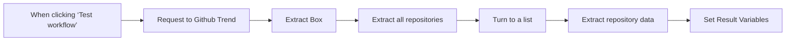

## Fluxo (.json) :

```json
{
  "id": "BXfxO6faULfsy2JN",
  "meta": {
    "instanceId": "0b0f5302e78710cf1b1457ee15a129d8e5d83d4e366bd96d14cc37da6693e692"
  },
  "name": "Scrape Today's Github Trend 13 Top Repositories",
  "tags": [],
  "nodes": [
    {
      "id": "e2981cad-c09b-46ee-b2db-cb007a95c4a1",
      "name": "When clicking ‘Test workflow’",
      "type": "n8n-nodes-base.manualTrigger",
      "position": [
        0,
        0
      ],
      "parameters": {},
      "typeVersion": 1
    },
    {
      "id": "990de0c9-f540-4a10-8a1a-63a0526444ff",
      "name": "Extract Box",
      "type": "n8n-nodes-base.html",
      "position": [
        440,
        0
      ],
      "parameters": {
        "options": {},
        "operation": "extractHtmlContent",
        "extractionValues": {
          "values": [
            {
              "key": "box",
              "cssSelector": "div.Box",
              "returnValue": "html"
            }
          ]
        }
      },
      "typeVersion": 1.2
    },
    {
      "id": "7f7968ce-3935-488e-98f9-7ddd270d14b0",
      "name": "Request to Github Trend",
      "type": "n8n-nodes-base.httpRequest",
      "position": [
        220,
        0
      ],
      "parameters": {
        "url": "https://github.com/trending",
        "options": {}
      },
      "typeVersion": 4.2
    },
    {
      "id": "87cd7fa1-d896-49a3-9336-17663ca522aa",
      "name": "Turn to a list",
      "type": "n8n-nodes-base.splitOut",
      "position": [
        880,
        0
      ],
      "parameters": {
        "options": {},
        "fieldToSplitOut": "repositories"
      },
      "typeVersion": 1
    },
    {
      "id": "bed61dad-0066-45de-bcf2-79fd143e360c",
      "name": "Set Result Variables",
      "type": "n8n-nodes-base.set",
      "position": [
        1320,
        0
      ],
      "parameters": {
        "options": {},
        "assignments": {
          "assignments": [
            {
              "id": "a0e76646-60d7-44a6-af77-33f27fb465cb",
              "name": "author",
              "type": "string",
              "value": "={{ $json.repository.split('/')[0].trim() }}"
            },
            {
              "id": "a2bd790a-784e-4d72-9a4e-92be22edea8f",
              "name": "title",
              "type": "string",
              "value": "={{ $json.repository.split('/')[1].trim() }}"
            },
            {
              "id": "22f1518a-7081-4417-ab9d-88f26a7b5cfe",
              "name": "repository",
              "type": "string",
              "value": "={{ $json.repository }}"
            },
            {
              "id": "baff9a9f-020a-4968-bb80-a4a91a94144a",
              "name": "url",
              "type": "string",
              "value": "=https://github.com/{{ $json.repository.replaceAll(' ','') }}"
            },
            {
              "id": "f5c48a02-b55d-4167-a823-53ac1d851ee5",
              "name": "created_at",
              "type": "string",
              "value": "={{$now}}"
            },
            {
              "id": "27a44ce9-4b5b-44b2-94d9-eb5b2ae81dcd",
              "name": "description",
              "type": "string",
              "value": "={{ $json.description }}"
            }
          ]
        },
        "includeOtherFields": "="
      },
      "typeVersion": 3.4
    },
    {
      "id": "d7b39e99-38df-4025-9afd-a602c4bd01cf",
      "name": "Extract repository data",
      "type": "n8n-nodes-base.html",
      "position": [
        1100,
        0
      ],
      "parameters": {
        "options": {},
        "operation": "extractHtmlContent",
        "dataPropertyName": "repositories",
        "extractionValues": {
          "values": [
            {
              "key": "repository",
              "cssSelector": "a.Link"
            },
            {
              "key": "language",
              "cssSelector": "span.d-inline-block"
            },
            {
              "key": "description",
              "cssSelector": "p"
            }
          ]
        }
      },
      "typeVersion": 1.2
    },
    {
      "id": "382e7a3b-f65f-4a79-a69f-2818f09f5daa",
      "name": "Extract all repositories",
      "type": "n8n-nodes-base.html",
      "position": [
        660,
        0
      ],
      "parameters": {
        "options": {
          "trimValues": true,
          "cleanUpText": true
        },
        "operation": "extractHtmlContent",
        "dataPropertyName": "box",
        "extractionValues": {
          "values": [
            {
              "key": "repositories",
              "cssSelector": "article.Box-row",
              "returnArray": true,
              "returnValue": "html"
            }
          ]
        }
      },
      "typeVersion": 1.2
    }
  ],
  "active": false,
  "pinData": {},
  "settings": {
    "executionOrder": "v1"
  },
  "versionId": "33ada4c0-b6ad-4ad6-bee8-51b630908c04",
  "connections": {
    "Extract Box": {
      "main": [
        [
          {
            "node": "Extract all repositories",
            "type": "main",
            "index": 0
          }
        ]
      ]
    },
    "Turn to a list": {
      "main": [
        [
          {
            "node": "Extract repository data",
            "type": "main",
            "index": 0
          }
        ]
      ]
    },
    "Extract repository data": {
      "main": [
        [
          {
            "node": "Set Result Variables",
            "type": "main",
            "index": 0
          }
        ]
      ]
    },
    "Request to Github Trend": {
      "main": [
        [
          {
            "node": "Extract Box",
            "type": "main",
            "index": 0
          }
        ]
      ]
    },
    "Extract all repositories": {
      "main": [
        [
          {
            "node": "Turn to a list",
            "type": "main",
            "index": 0
          }
        ]
      ]
    },
    "When clicking ‘Test workflow’": {
      "main": [
        [
          {
            "node": "Request to Github Trend",
            "type": "main",
            "index": 0
          }
        ]
      ]
    }
  }
}
```

<a id="template-875"></a>

## Template 875 - Sincronização Notion-ClickUp

- **Nome:** Sincronização Notion-ClickUp
- **Descrição:** Fluxo que sincroniza dados entre Notion e ClickUp: atualiza tarefas no ClickUp quando páginas de banco de dados são modificadas e atualiza o Status no Notion quando o status da tarefa no ClickUp muda.
- **Funcionalidade:** • Detecção de atualização de página no Notion: aciona a atualização de uma tarefa correspondente no ClickUp com base nos campos da página.
• Atualização de tarefa no ClickUp: atualiza o nome, o status e a data de entrega usando os valores da página Notion.
• Detecção de atualização de status no ClickUp: dispara a verificação da página Notion associada via ClickUp ID.
• Atualização da página Notion: altera o Status da página para refletir o status atual da tarefa no ClickUp.
- **Ferramentas:** • Notion: plataforma de páginas de banco de dados usadas como fonte e destino de dados.
• ClickUp: ferramenta de gestão de tarefas com campos de nome, status e data de entrega.

## Fluxo visual

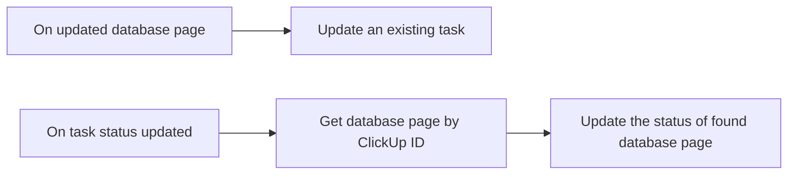

## Fluxo (.json) :

```json
{
  "meta": {
    "instanceId": "237600ca44303ce91fa31ee72babcdc8493f55ee2c0e8aa2b78b3b4ce6f70bd9"
  },
  "nodes": [
    {
      "id": "22e8e117-2475-4b06-966c-9b35c9c749f8",
      "name": "On updated database page",
      "type": "n8n-nodes-base.notionTrigger",
      "position": [
        180,
        620
      ],
      "parameters": {
        "event": "pagedUpdatedInDatabase",
        "pollTimes": {
          "item": [
            {
              "mode": "everyMinute"
            }
          ]
        },
        "databaseId": "38aa89c7-defd-4268-be2d-9119590521a9"
      },
      "credentials": {
        "notionApi": {
          "id": "9",
          "name": "[UPDATE ME]"
        }
      },
      "typeVersion": 1
    },
    {
      "id": "6938eddf-39ec-46c4-a9a9-082ee0edd836",
      "name": "Update an existing task",
      "type": "n8n-nodes-base.clickUp",
      "position": [
        400,
        620
      ],
      "parameters": {
        "id": "={{$node[\"On updated database page\"].json[\"ClickUp ID\"]}}",
        "operation": "update",
        "updateFields": {
          "name": "={{$node[\"On updated database page\"].json[\"Task name\"]}}",
          "status": "={{$node[\"On updated database page\"].json[\"Status\"]}}",
          "dueDate": "={{$node[\"On updated database page\"].json[\"Deadline\"][\"start\"]}}"
        }
      },
      "credentials": {
        "clickUpApi": {
          "id": "29",
          "name": "[UPDATE ME]"
        }
      },
      "typeVersion": 1
    },
    {
      "id": "84cd269a-e732-408e-8b1a-66b1a7623fc1",
      "name": "On task status updated",
      "type": "n8n-nodes-base.clickUpTrigger",
      "position": [
        180,
        820
      ],
      "webhookId": "86d6bbce-1591-4db9-9ccb-214ab0977ae8",
      "parameters": {
        "team": "2627397",
        "events": [
          "taskStatusUpdated"
        ],
        "filters": {}
      },
      "credentials": {
        "clickUpApi": {
          "id": "29",
          "name": "[UPDATE ME]"
        }
      },
      "typeVersion": 1
    },
    {
      "id": "a5d6cee8-9dae-45ca-9540-4835365a4ab1",
      "name": "Get database page by ClickUp ID",
      "type": "n8n-nodes-base.notion",
      "position": [
        400,
        820
      ],
      "parameters": {
        "filters": {
          "conditions": [
            {
              "key": "ClickUp ID|rich_text",
              "condition": "equals",
              "richTextValue": "={{$node[\"On task status updated\"].json[\"task_id\"]}}"
            }
          ]
        },
        "options": {},
        "resource": "databasePage",
        "operation": "getAll",
        "returnAll": true,
        "databaseId": "38aa89c7-defd-4268-be2d-9119590521a9",
        "filterType": "manual"
      },
      "credentials": {
        "notionApi": {
          "id": "9",
          "name": "[UPDATE ME]"
        }
      },
      "typeVersion": 2
    },
    {
      "id": "eeaff75d-8c47-4e2d-b2e2-87d5b6e59499",
      "name": "Update the status of found database page",
      "type": "n8n-nodes-base.notion",
      "position": [
        620,
        820
      ],
      "parameters": {
        "pageId": "={{$node[\"Get database page by ClickUp ID\"].json[\"id\"]}}",
        "resource": "databasePage",
        "operation": "update",
        "propertiesUi": {
          "propertyValues": [
            {
              "key": "Status|select",
              "selectValue": "={{$node[\"On task status updated\"].json[\"history_items\"][0][\"after\"][\"status\"]}}"
            }
          ]
        }
      },
      "credentials": {
        "notionApi": {
          "id": "9",
          "name": "[UPDATE ME]"
        }
      },
      "typeVersion": 2
    }
  ],
  "connections": {
    "On task status updated": {
      "main": [
        [
          {
            "node": "Get database page by ClickUp ID",
            "type": "main",
            "index": 0
          }
        ]
      ]
    },
    "On updated database page": {
      "main": [
        [
          {
            "node": "Update an existing task",
            "type": "main",
            "index": 0
          }
        ]
      ]
    },
    "Get database page by ClickUp ID": {
      "main": [
        [
          {
            "node": "Update the status of found database page",
            "type": "main",
            "index": 0
          }
        ]
      ]
    }
  }
}
```

<a id="template-876"></a>

## Template 876 - Conversão de texto para fala (OpenAI TTS)

- **Nome:** Conversão de texto para fala (OpenAI TTS)
- **Descrição:** Converte texto em áudio (.mp3) usando a API de Text-to-Speech da OpenAI.
- **Funcionalidade:** • Disparo manual: inicia o fluxo manualmente, podendo ser substituído por outro tipo de gatilho conforme o caso de uso.
• Definição de entrada e voz: permite configurar o texto a ser convertido e selecionar a voz (ex.: alloy).
• Envio de requisição HTTP para a API de TTS da OpenAI: envia o texto e a voz ao endpoint apropriado para geração de fala.
• Geração de saída em áudio .mp3: recebe o retorno da API como arquivo de áudio binário no formato .mp3.
• Requisito de credenciais: exige uma chave de API válida para autenticação nas chamadas à API.
• Flexibilidade de integração: os valores de entrada e voz podem ser programaticamente alterados para diferentes cenários.
- **Ferramentas:** • OpenAI Text-to-Speech API: serviço que converte texto em áudio (.mp3) via endpoint de TTS, requerendo autenticação por chave de API.

## Fluxo visual

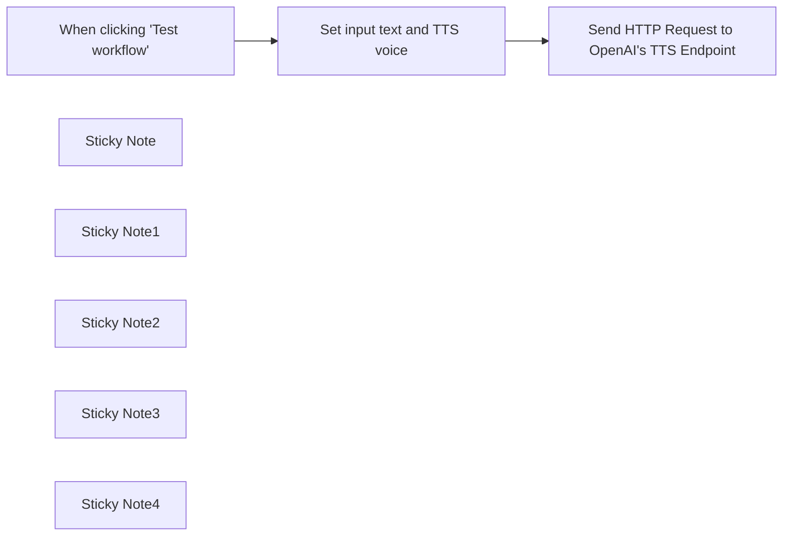

## Fluxo (.json) :

```json
{
  "id": "6Yzmlp5xF6oHo1VW",
  "meta": {
    "instanceId": "173f55e6572798fa42ea9c5c92623a3c3308080d3fcd2bd784d26d855b1ce820"
  },
  "name": "Text to Speech (OpenAI)",
  "tags": [],
  "nodes": [
    {
      "id": "938fedbd-e34c-40af-af2f-b9c669e1a6e9",
      "name": "When clicking \"Test workflow\"",
      "type": "n8n-nodes-base.manualTrigger",
      "position": [
        380,
        380
      ],
      "parameters": {},
      "typeVersion": 1
    },
    {
      "id": "1d59db5d-8fe6-4292-a221-a0d0194c6e0c",
      "name": "Set input text and TTS voice",
      "type": "n8n-nodes-base.set",
      "position": [
        760,
        380
      ],
      "parameters": {
        "mode": "raw",
        "options": {},
        "jsonOutput": "{\n \"input_text\": \"The quick brown fox jumped over the lazy dog.\",\n \"voice\": \"alloy\"\n}\n"
      },
      "typeVersion": 3.2
    },
    {
      "id": "9d54de1d-59b7-4c1f-9e88-13572da5292c",
      "name": "Send HTTP Request to OpenAI's TTS Endpoint",
      "type": "n8n-nodes-base.httpRequest",
      "position": [
        1120,
        380
      ],
      "parameters": {
        "url": "https://api.openai.com/v1/audio/speech",
        "method": "POST",
        "options": {},
        "sendBody": true,
        "sendHeaders": true,
        "authentication": "predefinedCredentialType",
        "bodyParameters": {
          "parameters": [
            {
              "name": "model",
              "value": "tts-1"
            },
            {
              "name": "input",
              "value": "={{ $json.input_text }}"
            },
            {
              "name": "voice",
              "value": "={{ $json.voice }}"
            }
          ]
        },
        "headerParameters": {
          "parameters": [
            {
              "name": "Authorization",
              "value": "Bearer $OPENAI_API_KEY"
            }
          ]
        },
        "nodeCredentialType": "openAiApi"
      },
      "credentials": {
        "openAiApi": {
          "id": "VokTSv2Eg5m5aDg7",
          "name": "OpenAi account"
        }
      },
      "typeVersion": 4.1
    },
    {
      "id": "1ce72c9c-aa6f-4a18-9d5a-3971686a51ec",
      "name": "Sticky Note",
      "type": "n8n-nodes-base.stickyNote",
      "position": [
        280,
        256
      ],
      "parameters": {
        "width": 273,
        "height": 339,
        "content": "## Workflow Trigger\nYou can replace this manual trigger with another trigger type as required by your use case."
      },
      "typeVersion": 1
    },
    {
      "id": "eb487535-5f36-465e-aeee-e9ff62373e53",
      "name": "Sticky Note1",
      "type": "n8n-nodes-base.stickyNote",
      "position": [
        660,
        257
      ],
      "parameters": {
        "width": 273,
        "height": 335,
        "content": "## Manually Set OpenAI TTS Configuration\n"
      },
      "typeVersion": 1
    },
    {
      "id": "36b380bd-0703-4b60-83cb-c4ad9265864d",
      "name": "Sticky Note2",
      "type": "n8n-nodes-base.stickyNote",
      "position": [
        1020,
        260
      ],
      "parameters": {
        "width": 302,
        "height": 335,
        "content": "## Send Request to OpenAI TTS API\n"
      },
      "typeVersion": 1
    },
    {
      "id": "ff35ff28-62b5-49c8-a657-795aa916b524",
      "name": "Sticky Note3",
      "type": "n8n-nodes-base.stickyNote",
      "position": [
        660,
        620
      ],
      "parameters": {
        "color": 4,
        "width": 273,
        "height": 278,
        "content": "### Configuration Options\n- \"input_text\" is the text you would like to be turned into speech, and can be replaced with a programmatic value for your use case. Bear in mind that the maximum number of tokens per API call is 4,000.\n\n- \"voice\" is the voice used by the TTS model. The default is alloy, other options can be found here: [OpenAI TTS Docs](https://platform.openai.com/docs/guides/text-to-speech)"
      },
      "typeVersion": 1
    },
    {
      "id": "5f7ef80e-b5c8-41df-9411-525fafc2d910",
      "name": "Sticky Note4",
      "type": "n8n-nodes-base.stickyNote",
      "position": [
        1020,
        620
      ],
      "parameters": {
        "color": 4,
        "width": 299,
        "height": 278,
        "content": "### Output\nThe output returned by OpenAI's TTS endpoint is a .mp3 audio file (binary).\n\n\n### Credentials\nTo use this workflow, you'll have to configure and provide a valid OpenAI credential.\n"
      },
      "typeVersion": 1
    }
  ],
  "active": false,
  "pinData": {},
  "settings": {
    "executionOrder": "v1"
  },
  "versionId": "19d67805-e208-4f0e-af44-c304e66e8ce8",
  "connections": {
    "Set input text and TTS voice": {
      "main": [
        [
          {
            "node": "Send HTTP Request to OpenAI's TTS Endpoint",
            "type": "main",
            "index": 0
          }
        ]
      ]
    },
    "When clicking \"Test workflow\"": {
      "main": [
        [
          {
            "node": "Set input text and TTS voice",
            "type": "main",
            "index": 0
          }
        ]
      ]
    }
  }
}
```

<a id="template-877"></a>

## Template 877 - Sincronizar ticket com Clockify

- **Nome:** Sincronizar ticket com Clockify
- **Descrição:** Fluxo que recebe dados de um webhook e registra uma entrada de tempo no Clockify usando informações do ticket.
- **Funcionalidade:** • Recepção de dados via Webhook: recebe requisições POST com atributos do ticket (número, cliente e id).
• Construção do título da entrada: utiliza os atributos para criar o nome da entrada no Clockify.
• Registro da entrada de tempo: cria uma entrada de tempo no workspace do Clockify com o nome gerado.
- **Ferramentas:** • Clockify: Serviço de registro de tempo para gerenciar entradas de tempo com base nos tickets recebidos pelo webhook.

## Fluxo visual

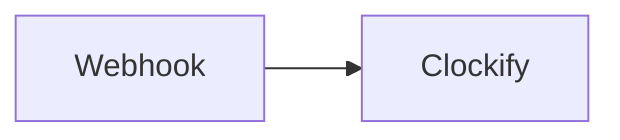

## Fluxo (.json) :

```json
{
  "id": "2",
  "name": "Syncro to Clockify",
  "nodes": [
    {
      "name": "Webhook",
      "type": "n8n-nodes-base.webhook",
      "position": [
        490,
        300
      ],
      "webhookId": "43d196b0-63c4-440a-aaf6-9d893907cf3c",
      "parameters": {
        "path": "43d196b0-63c4-440a-aaf6-9d893907cf3c",
        "options": {},
        "httpMethod": "POST",
        "responseData": "allEntries",
        "responseMode": "lastNode"
      },
      "typeVersion": 1
    },
    {
      "name": "Clockify",
      "type": "n8n-nodes-base.clockify",
      "position": [
        690,
        300
      ],
      "parameters": {
        "name": "=Ticket {{$json[\"body\"][\"attributes\"][\"number\"]}} - {{$json[\"body\"][\"attributes\"][\"customer_business_then_name\"]}} [{{$json[\"body\"][\"attributes\"][\"id\"]}}]",
        "workspaceId": "xxx",
        "additionalFields": {}
      },
      "credentials": {
        "clockifyApi": "Clockify"
      },
      "typeVersion": 1
    }
  ],
  "active": true,
  "settings": {},
  "connections": {
    "Webhook": {
      "main": [
        [
          {
            "node": "Clockify",
            "type": "main",
            "index": 0
          }
        ]
      ]
    }
  }
}
```

<a id="template-878"></a>

## Template 878 - Alerta de inicialização no Mattermost

- **Nome:** Alerta de inicialização no Mattermost
- **Descrição:** Envia uma mensagem para um canal do Mattermost informando o horário de inicialização da instância.
- **Funcionalidade:** • Detecção de inicialização: Aciona o fluxo quando a instância inicia (evento de init).
• Envio de mensagem com timestamp: Publica no canal configurado uma mensagem contendo o horário de inicialização.
• Autenticação com credenciais: Utiliza credenciais configuradas para autenticar e permitir o envio da mensagem.
- **Ferramentas:** • Mattermost: Plataforma de comunicação em equipe que permite enviar mensagens para canais e integrações via API.

## Fluxo visual

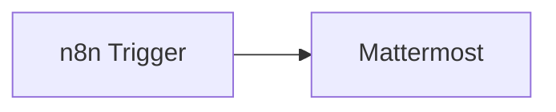

## Fluxo (.json) :

```json
{
  "nodes": [
    {
      "name": "n8n Trigger",
      "type": "n8n-nodes-base.n8nTrigger",
      "position": [
        450,
        200
      ],
      "parameters": {
        "events": [
          "init"
        ]
      },
      "typeVersion": 1
    },
    {
      "name": "Mattermost",
      "type": "n8n-nodes-base.mattermost",
      "position": [
        650,
        200
      ],
      "parameters": {
        "message": "=Your n8n instance started at {{$json[\"timestamp\"]}}",
        "channelId": "toyi3uoycf8rirtm7d5jm15sso",
        "attachments": [],
        "otherOptions": {}
      },
      "credentials": {
        "mattermostApi": "Mattermost Credentials"
      },
      "typeVersion": 1
    }
  ],
  "connections": {
    "n8n Trigger": {
      "main": [
        [
          {
            "node": "Mattermost",
            "type": "main",
            "index": 0
          }
        ]
      ]
    }
  }
}
```

<a id="template-879"></a>

## Template 879 - Chatbot RAG para recomendações de filmes

- **Nome:** Chatbot RAG para recomendações de filmes
- **Descrição:** Fluxo que ingere um conjunto de descrições de filmes, indexa embeddings em um banco vetorial e serve um agente conversacional que retorna recomendações de filmes com base em solicitações do usuário.
- **Funcionalidade:** • Carregamento e extração de dados: importa um arquivo CSV com filmes e extrai descrições e metadados para processamento.
• Processamento de documentos: transforma descrições em documentos, divide por tokens e prepara conteúdo para criação de embeddings.
• Criação de embeddings: gera vetores de embedding das descrições e das consultas de recomendação usando um serviço de embeddings.
• Inserção em banco vetorial: armazena embeddings e metadados no banco vetorial para busca e recomendação posterior.
• Recomendações vetoriais com exemplos positivos/negativos: recebe exemplos positivos e negativos do pedido do usuário, gera embeddings e chama a API de recomendação vetorial para obter os melhores itens.
• Recuperação de metadados: busca os metadados dos itens recomendados (nome, ano, descrição) e agrega essas informações para resposta.
• Agente conversacional com ferramenta de recomendação: um modelo de linguagem interage com o usuário, invoca a ferramenta de recomendação e formata as top-3 recomendações (ordenadas internamente, sem mostrar scores).
• Memória de contexto: mantém um buffer de memória de janela para preservar o histórico recente da conversa entre turns.
• Execução e testes manuais: permite disparar etapas de ingestão e teste do fluxo manualmente para validação.
- **Ferramentas:** • GitHub: repositório onde está armazenado o arquivo CSV (Top_1000_IMDB_movies.csv) usado como fonte de dados.
• OpenAI: serviço usado para gerar embeddings (text-embedding-3-small) e para o modelo de chat (gpt-4o-mini) que conduz a conversação e decide quando chamar a ferramenta de recomendação.
• Qdrant: banco de dados vetorial que armazena embeddings, executa buscas e chamadas de recomendação (recommend/query) e fornece os metadados associados aos pontos retornados.

## Fluxo visual

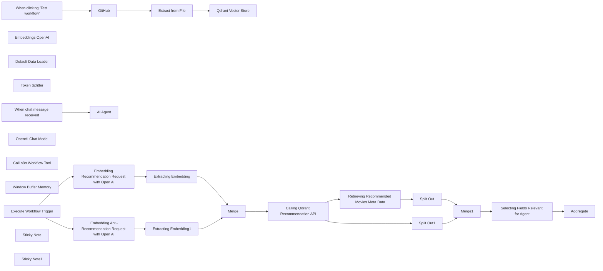

## Fluxo (.json) :

```json
{
  "id": "a58HZKwcOy7lmz56",
  "meta": {
    "instanceId": "178ef8a5109fc76c716d40bcadb720c455319f7b7a3fd5a39e4f336a091f524a",
    "templateCredsSetupCompleted": true
  },
  "name": "Building RAG Chatbot for Movie Recommendations with Qdrant and Open AI",
  "tags": [],
  "nodes": [
    {
      "id": "06a34e3b-519a-4b48-afd0-4f2b51d2105d",
      "name": "When clicking ‘Test workflow’",
      "type": "n8n-nodes-base.manualTrigger",
      "position": [
        4980,
        740
      ],
      "parameters": {},
      "typeVersion": 1
    },
    {
      "id": "9213003d-433f-41ab-838b-be93860261b2",
      "name": "GitHub",
      "type": "n8n-nodes-base.github",
      "position": [
        5200,
        740
      ],
      "parameters": {
        "owner": {
          "__rl": true,
          "mode": "name",
          "value": "mrscoopers"
        },
        "filePath": "Top_1000_IMDB_movies.csv",
        "resource": "file",
        "operation": "get",
        "repository": {
          "__rl": true,
          "mode": "list",
          "value": "n8n_demo",
          "cachedResultUrl": "https://github.com/mrscoopers/n8n_demo",
          "cachedResultName": "n8n_demo"
        },
        "additionalParameters": {}
      },
      "credentials": {
        "githubApi": {
          "id": "VbfC0mqEq24vPIwq",
          "name": "GitHub n8n demo"
        }
      },
      "typeVersion": 1
    },
    {
      "id": "9850d1a9-3a6f-44c0-9f9d-4d20fda0b602",
      "name": "Extract from File",
      "type": "n8n-nodes-base.extractFromFile",
      "position": [
        5360,
        740
      ],
      "parameters": {
        "options": {}
      },
      "typeVersion": 1
    },
    {
      "id": "7704f993-b1c9-477a-8b5a-77dc2cb68161",
      "name": "Embeddings OpenAI",
      "type": "@n8n/n8n-nodes-langchain.embeddingsOpenAi",
      "position": [
        5560,
        940
      ],
      "parameters": {
        "model": "text-embedding-3-small",
        "options": {}
      },
      "credentials": {
        "openAiApi": {
          "id": "deYJUwkgL1Euu613",
          "name": "OpenAi account 2"
        }
      },
      "typeVersion": 1
    },
    {
      "id": "bc6dd8e5-0186-4bf9-9c60-2eab6d9b6520",
      "name": "Default Data Loader",
      "type": "@n8n/n8n-nodes-langchain.documentDefaultDataLoader",
      "position": [
        5700,
        960
      ],
      "parameters": {
        "options": {
          "metadata": {
            "metadataValues": [
              {
                "name": "movie_name",
                "value": "={{ $('Extract from File').item.json['Movie Name'] }}"
              },
              {
                "name": "movie_release_date",
                "value": "={{ $('Extract from File').item.json['Year of Release'] }}"
              },
              {
                "name": "movie_description",
                "value": "={{ $('Extract from File').item.json.Description }}"
              }
            ]
          }
        },
        "jsonData": "={{ $('Extract from File').item.json.Description }}",
        "jsonMode": "expressionData"
      },
      "typeVersion": 1
    },
    {
      "id": "f87ea014-fe79-444b-88ea-0c4773872b0a",
      "name": "Token Splitter",
      "type": "@n8n/n8n-nodes-langchain.textSplitterTokenSplitter",
      "position": [
        5700,
        1140
      ],
      "parameters": {},
      "typeVersion": 1
    },
    {
      "id": "d8d28cec-c8e8-4350-9e98-cdbc6da54988",
      "name": "Qdrant Vector Store",
      "type": "@n8n/n8n-nodes-langchain.vectorStoreQdrant",
      "position": [
        5600,
        740
      ],
      "parameters": {
        "mode": "insert",
        "options": {},
        "qdrantCollection": {
          "__rl": true,
          "mode": "id",
          "value": "imdb"
        }
      },
      "credentials": {
        "qdrantApi": {
          "id": "Zin08PA0RdXVUKK7",
          "name": "QdrantApi n8n demo"
        }
      },
      "typeVersion": 1
    },
    {
      "id": "f86e03dc-12ea-4929-9035-4ec3cf46e300",
      "name": "When chat message received",
      "type": "@n8n/n8n-nodes-langchain.chatTrigger",
      "position": [
        4920,
        1140
      ],
      "webhookId": "71bfe0f8-227e-466b-9d07-69fd9fe4a27b",
      "parameters": {
        "options": {}
      },
      "typeVersion": 1.1
    },
    {
      "id": "ead23ef6-2b6b-428d-b412-b3394bff8248",
      "name": "OpenAI Chat Model",
      "type": "@n8n/n8n-nodes-langchain.lmChatOpenAi",
      "position": [
        5040,
        1340
      ],
      "parameters": {
        "model": "gpt-4o-mini",
        "options": {}
      },
      "credentials": {
        "openAiApi": {
          "id": "deYJUwkgL1Euu613",
          "name": "OpenAi account 2"
        }
      },
      "typeVersion": 1
    },
    {
      "id": "7ab936e1-aac8-43bc-a497-f2d02c2c19e5",
      "name": "Call n8n Workflow Tool",
      "type": "@n8n/n8n-nodes-langchain.toolWorkflow",
      "position": [
        5320,
        1340
      ],
      "parameters": {
        "name": "movie_recommender",
        "schemaType": "manual",
        "workflowId": {
          "__rl": true,
          "mode": "id",
          "value": "a58HZKwcOy7lmz56"
        },
        "description": "Call this tool to get a list of recommended movies from a vector database. ",
        "inputSchema": "{\n\"type\": \"object\",\n\"properties\": {\n\t\"positive_example\": {\n      \"type\": \"string\",\n      \"description\": \"A string with a movie description matching the user's positive recommendation request\"\n    },\n    \"negative_example\": {\n      \"type\": \"string\",\n      \"description\": \"A string with a movie description matching the user's negative anti-recommendation reuqest\"\n    }\n}\n}",
        "specifyInputSchema": true
      },
      "typeVersion": 1.2
    },
    {
      "id": "ce55f334-698b-45b1-9e12-0eaa473187d4",
      "name": "Window Buffer Memory",
      "type": "@n8n/n8n-nodes-langchain.memoryBufferWindow",
      "position": [
        5160,
        1340
      ],
      "parameters": {},
      "typeVersion": 1.2
    },
    {
      "id": "41c1ee11-3117-4765-98fc-e56cc6fc8fb2",
      "name": "Execute Workflow Trigger",
      "type": "n8n-nodes-base.executeWorkflowTrigger",
      "position": [
        5640,
        1600
      ],
      "parameters": {},
      "typeVersion": 1
    },
    {
      "id": "db8d6ab6-8cd2-4a8c-993d-f1b7d7fdcffd",
      "name": "Merge",
      "type": "n8n-nodes-base.merge",
      "position": [
        6540,
        1500
      ],
      "parameters": {
        "mode": "combine",
        "options": {},
        "combineBy": "combineAll"
      },
      "typeVersion": 3
    },
    {
      "id": "c7bc5e04-22b1-40db-ba74-1ab234e51375",
      "name": "Split Out",
      "type": "n8n-nodes-base.splitOut",
      "position": [
        7260,
        1480
      ],
      "parameters": {
        "options": {},
        "fieldToSplitOut": "result"
      },
      "typeVersion": 1
    },
    {
      "id": "a2002d2e-362a-49eb-a42d-7b665ddd67a0",
      "name": "Split Out1",
      "type": "n8n-nodes-base.splitOut",
      "position": [
        7140,
        1260
      ],
      "parameters": {
        "options": {},
        "fieldToSplitOut": "result.points"
      },
      "typeVersion": 1
    },
    {
      "id": "f69a87f1-bfb9-4337-9350-28d2416c1580",
      "name": "Merge1",
      "type": "n8n-nodes-base.merge",
      "position": [
        7520,
        1400
      ],
      "parameters": {
        "mode": "combine",
        "options": {},
        "fieldsToMatchString": "id"
      },
      "typeVersion": 3
    },
    {
      "id": "b2f2529e-e260-4d72-88ef-09b804226004",
      "name": "Aggregate",
      "type": "n8n-nodes-base.aggregate",
      "position": [
        7960,
        1400
      ],
      "parameters": {
        "options": {},
        "aggregate": "aggregateAllItemData",
        "destinationFieldName": "response"
      },
      "typeVersion": 1
    },
    {
      "id": "bedea10f-b4de-4f0e-9d60-cc8117a2b328",
      "name": "AI Agent",
      "type": "@n8n/n8n-nodes-langchain.agent",
      "position": [
        5140,
        1140
      ],
      "parameters": {
        "options": {
          "systemMessage": "You are a Movie Recommender Tool using a Vector Database under the hood. Provide top-3 movie recommendations returned by the database, ordered by their recommendation score, but not showing the score to the user."
        }
      },
      "typeVersion": 1.6
    },
    {
      "id": "e04276b5-7d69-437b-bf4f-9717808cc8f6",
      "name": "Embedding Recommendation Request with Open AI",
      "type": "n8n-nodes-base.httpRequest",
      "position": [
        5900,
        1460
      ],
      "parameters": {
        "url": "https://api.openai.com/v1/embeddings",
        "method": "POST",
        "options": {},
        "sendBody": true,
        "sendHeaders": true,
        "authentication": "predefinedCredentialType",
        "bodyParameters": {
          "parameters": [
            {
              "name": "input",
              "value": "={{ $json.query.positive_example }}"
            },
            {
              "name": "model",
              "value": "text-embedding-3-small"
            }
          ]
        },
        "headerParameters": {
          "parameters": [
            {
              "name": "Authorization",
              "value": "Bearer $OPENAI_API_KEY"
            }
          ]
        },
        "nodeCredentialType": "openAiApi"
      },
      "credentials": {
        "openAiApi": {
          "id": "deYJUwkgL1Euu613",
          "name": "OpenAi account 2"
        }
      },
      "typeVersion": 4.2
    },
    {
      "id": "68e99f06-82f5-432c-8b31-8a1ae34981a6",
      "name": "Embedding Anti-Recommendation Request with Open AI",
      "type": "n8n-nodes-base.httpRequest",
      "position": [
        5920,
        1660
      ],
      "parameters": {
        "url": "https://api.openai.com/v1/embeddings",
        "method": "POST",
        "options": {},
        "sendBody": true,
        "sendHeaders": true,
        "authentication": "predefinedCredentialType",
        "bodyParameters": {
          "parameters": [
            {
              "name": "input",
              "value": "={{ $json.query.negative_example }}"
            },
            {
              "name": "model",
              "value": "text-embedding-3-small"
            }
          ]
        },
        "headerParameters": {
          "parameters": [
            {
              "name": "Authorization",
              "value": "Bearer $OPENAI_API_KEY"
            }
          ]
        },
        "nodeCredentialType": "openAiApi"
      },
      "credentials": {
        "openAiApi": {
          "id": "deYJUwkgL1Euu613",
          "name": "OpenAi account 2"
        }
      },
      "typeVersion": 4.2
    },
    {
      "id": "ecb1d7e1-b389-48e8-a34a-176bfc923641",
      "name": "Extracting Embedding",
      "type": "n8n-nodes-base.set",
      "position": [
        6180,
        1460
      ],
      "parameters": {
        "options": {},
        "assignments": {
          "assignments": [
            {
              "id": "01a28c9d-aeb1-48bb-8a73-f8bddbd73460",
              "name": "positive_example",
              "type": "array",
              "value": "={{ $json.data[0].embedding }}"
            }
          ]
        }
      },
      "typeVersion": 3.4
    },
    {
      "id": "4ed11142-a734-435f-9f7a-f59e2d423076",
      "name": "Extracting Embedding1",
      "type": "n8n-nodes-base.set",
      "position": [
        6180,
        1660
      ],
      "parameters": {
        "options": {},
        "assignments": {
          "assignments": [
            {
              "id": "01a28c9d-aeb1-48bb-8a73-f8bddbd73460",
              "name": "negative_example",
              "type": "array",
              "value": "={{ $json.data[0].embedding }}"
            }
          ]
        }
      },
      "typeVersion": 3.4
    },
    {
      "id": "ce3aa9bc-a5b1-4529-bff5-e0dba43b99f3",
      "name": "Calling Qdrant Recommendation API",
      "type": "n8n-nodes-base.httpRequest",
      "position": [
        6840,
        1500
      ],
      "parameters": {
        "url": "https://edcc6735-2ffb-484f-b735-3467043828fe.europe-west3-0.gcp.cloud.qdrant.io:6333/collections/imdb_1000_open_ai/points/query",
        "method": "POST",
        "options": {},
        "jsonBody": "={\n  \"query\": {\n    \"recommend\": {\n      \"positive\": [[{{ $json.positive_example }}]],\n      \"negative\": [[{{ $json.negative_example }}]],\n      \"strategy\": \"average_vector\"\n    }\n  },\n  \"limit\":3\n}",
        "sendBody": true,
        "specifyBody": "json",
        "authentication": "predefinedCredentialType",
        "nodeCredentialType": "qdrantApi"
      },
      "credentials": {
        "qdrantApi": {
          "id": "Zin08PA0RdXVUKK7",
          "name": "QdrantApi n8n demo"
        }
      },
      "typeVersion": 4.2
    },
    {
      "id": "9b8a6bdb-16fe-4edc-86d0-136fe059a777",
      "name": "Retrieving Recommended Movies Meta Data",
      "type": "n8n-nodes-base.httpRequest",
      "position": [
        7060,
        1460
      ],
      "parameters": {
        "url": "https://edcc6735-2ffb-484f-b735-3467043828fe.europe-west3-0.gcp.cloud.qdrant.io:6333/collections/imdb_1000_open_ai/points",
        "method": "POST",
        "options": {},
        "jsonBody": "={\n    \"ids\": [\"{{ $json.result.points[0].id }}\", \"{{ $json.result.points[1].id }}\", \"{{ $json.result.points[2].id }}\"],\n    \"with_payload\":true\n}",
        "sendBody": true,
        "specifyBody": "json",
        "authentication": "predefinedCredentialType",
        "nodeCredentialType": "qdrantApi"
      },
      "credentials": {
        "qdrantApi": {
          "id": "Zin08PA0RdXVUKK7",
          "name": "QdrantApi n8n demo"
        }
      },
      "typeVersion": 4.2
    },
    {
      "id": "28cdcad5-3dca-48a1-b626-19eef657114c",
      "name": "Selecting Fields Relevant for Agent",
      "type": "n8n-nodes-base.set",
      "position": [
        7740,
        1400
      ],
      "parameters": {
        "options": {},
        "assignments": {
          "assignments": [
            {
              "id": "b4b520a5-d0e2-4dcb-af9d-0b7748fd44d6",
              "name": "movie_recommendation_score",
              "type": "number",
              "value": "={{ $json.score }}"
            },
            {
              "id": "c9f0982e-bd4e-484b-9eab-7e69e333f706",
              "name": "movie_description",
              "type": "string",
              "value": "={{ $json.payload.content }}"
            },
            {
              "id": "7c7baf11-89cd-4695-9f37-13eca7e01163",
              "name": "movie_name",
              "type": "string",
              "value": "={{ $json.payload.metadata.movie_name }}"
            },
            {
              "id": "1d1d269e-43c7-47b0-859b-268adf2dbc21",
              "name": "movie_release_year",
              "type": "string",
              "value": "={{ $json.payload.metadata.release_year }}"
            }
          ]
        }
      },
      "typeVersion": 3.4
    },
    {
      "id": "56e73f01-5557-460a-9a63-01357a1b456f",
      "name": "Sticky Note",
      "type": "n8n-nodes-base.stickyNote",
      "position": [
        5560,
        1780
      ],
      "parameters": {
        "content": "Tool, calling Qdrant's recommendation API based on user's request, transformed by AI agent"
      },
      "typeVersion": 1
    },
    {
      "id": "cce5250e-0285-4fd0-857f-4b117151cd8b",
      "name": "Sticky Note1",
      "type": "n8n-nodes-base.stickyNote",
      "position": [
        4680,
        720
      ],
      "parameters": {
        "content": "Uploading data (movies and their descriptions) to Qdrant Vector Store\n"
      },
      "typeVersion": 1
    }
  ],
  "active": false,
  "pinData": {
    "Execute Workflow Trigger": [
      {
        "json": {
          "query": {
            "negative_example": "horror bloody movie",
            "positive_example": "romantic comedy"
          }
        }
      }
    ]
  },
  "settings": {
    "executionOrder": "v1"
  },
  "versionId": "40d3669b-d333-435f-99fc-db623deda2cb",
  "connections": {
    "Merge": {
      "main": [
        [
          {
            "node": "Calling Qdrant Recommendation API",
            "type": "main",
            "index": 0
          }
        ]
      ]
    },
    "GitHub": {
      "main": [
        [
          {
            "node": "Extract from File",
            "type": "main",
            "index": 0
          }
        ]
      ]
    },
    "Merge1": {
      "main": [
        [
          {
            "node": "Selecting Fields Relevant for Agent",
            "type": "main",
            "index": 0
          }
        ]
      ]
    },
    "Split Out": {
      "main": [
        [
          {
            "node": "Merge1",
            "type": "main",
            "index": 1
          }
        ]
      ]
    },
    "Split Out1": {
      "main": [
        [
          {
            "node": "Merge1",
            "type": "main",
            "index": 0
          }
        ]
      ]
    },
    "Token Splitter": {
      "ai_textSplitter": [
        [
          {
            "node": "Default Data Loader",
            "type": "ai_textSplitter",
            "index": 0
          }
        ]
      ]
    },
    "Embeddings OpenAI": {
      "ai_embedding": [
        [
          {
            "node": "Qdrant Vector Store",
            "type": "ai_embedding",
            "index": 0
          }
        ]
      ]
    },
    "Extract from File": {
      "main": [
        [
          {
            "node": "Qdrant Vector Store",
            "type": "main",
            "index": 0
          }
        ]
      ]
    },
    "OpenAI Chat Model": {
      "ai_languageModel": [
        [
          {
            "node": "AI Agent",
            "type": "ai_languageModel",
            "index": 0
          }
        ]
      ]
    },
    "Default Data Loader": {
      "ai_document": [
        [
          {
            "node": "Qdrant Vector Store",
            "type": "ai_document",
            "index": 0
          }
        ]
      ]
    },
    "Extracting Embedding": {
      "main": [
        [
          {
            "node": "Merge",
            "type": "main",
            "index": 0
          }
        ]
      ]
    },
    "Window Buffer Memory": {
      "ai_memory": [
        [
          {
            "node": "AI Agent",
            "type": "ai_memory",
            "index": 0
          }
        ]
      ]
    },
    "Extracting Embedding1": {
      "main": [
        [
          {
            "node": "Merge",
            "type": "main",
            "index": 1
          }
        ]
      ]
    },
    "Call n8n Workflow Tool": {
      "ai_tool": [
        [
          {
            "node": "AI Agent",
            "type": "ai_tool",
            "index": 0
          }
        ]
      ]
    },
    "Execute Workflow Trigger": {
      "main": [
        [
          {
            "node": "Embedding Recommendation Request with Open AI",
            "type": "main",
            "index": 0
          },
          {
            "node": "Embedding Anti-Recommendation Request with Open AI",
            "type": "main",
            "index": 0
          }
        ]
      ]
    },
    "When chat message received": {
      "main": [
        [
          {
            "node": "AI Agent",
            "type": "main",
            "index": 0
          }
        ]
      ]
    },
    "Calling Qdrant Recommendation API": {
      "main": [
        [
          {
            "node": "Retrieving Recommended Movies Meta Data",
            "type": "main",
            "index": 0
          },
          {
            "node": "Split Out1",
            "type": "main",
            "index": 0
          }
        ]
      ]
    },
    "When clicking ‘Test workflow’": {
      "main": [
        [
          {
            "node": "GitHub",
            "type": "main",
            "index": 0
          }
        ]
      ]
    },
    "Selecting Fields Relevant for Agent": {
      "main": [
        [
          {
            "node": "Aggregate",
            "type": "main",
            "index": 0
          }
        ]
      ]
    },
    "Retrieving Recommended Movies Meta Data": {
      "main": [
        [
          {
            "node": "Split Out",
            "type": "main",
            "index": 0
          }
        ]
      ]
    },
    "Embedding Recommendation Request with Open AI": {
      "main": [
        [
          {
            "node": "Extracting Embedding",
            "type": "main",
            "index": 0
          }
        ]
      ]
    },
    "Embedding Anti-Recommendation Request with Open AI": {
      "main": [
        [
          {
            "node": "Extracting Embedding1",
            "type": "main",
            "index": 0
          }
        ]
      ]
    }
  }
}
```

<a id="template-880"></a>

## Template 880 - Gatilho de entradas de tempo Clockify

- **Nome:** Gatilho de entradas de tempo Clockify
- **Descrição:** Este fluxo inicia automaticamente quando novas entradas de tempo são criadas no Clockify para o workspace especificado, acionando etapas subsequentes conforme configurado.
- **Funcionalidade:** • Detecção de novas entradas de tempo: o fluxo é acionado quando uma nova entrada é criada no Clockify.
• Verificação de periodicidade: o gatilho verifica a cada minuto para detectar novidades.
• Configuração de acesso ao Clockify: utiliza credenciais para acessar a API do Clockify no workspace informado.
- **Ferramentas:** • Clockify: Plataforma de registro de tempo utilizada pelo fluxo para monitorar entradas.

## Fluxo visual

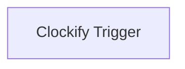

## Fluxo (.json) :

```json
{
  "nodes": [
    {
      "name": "Clockify Trigger",
      "type": "n8n-nodes-base.clockifyTrigger",
      "position": [
        450,
        480
      ],
      "parameters": {
        "pollTimes": {
          "item": [
            {
              "mode": "everyMinute"
            }
          ]
        },
        "workspaceId": "5f115b31e3f0ad7f90326b39"
      },
      "credentials": {
        "clockifyApi": "clockify_creds"
      },
      "typeVersion": 1
    }
  ],
  "connections": {}
}
```

<a id="template-881"></a>

## Template 881 - Tirinha diária com tradução automática

- **Nome:** Tirinha diária com tradução automática
- **Descrição:** Automatiza a obtenção da tirinha diária de Calvin and Hobbes, traduz os diálogos e publica a imagem e as traduções em um canal do Discord todos os dias.
- **Funcionalidade:** • Agendamento diário: Executa o fluxo automaticamente às 9h todos os dias.
• Montagem de parâmetros de data: Gera ano, mês e dia atuais para construir a URL da tirinha.
• Requisição da página da tirinha: Recupera o HTML da página do dia para obter o conteúdo.
• Extração da imagem do quadrinho: Isola a URL da imagem do HTML (valor do atributo src).
• Análise e tradução por IA: Analisa a imagem e produz os diálogos no idioma original junto com a tradução em coreano (e inglês quando necessário) no formato solicitado.
• Publicação no Discord: Envia a imagem e o texto traduzido para um canal do Discord via webhook.
- **Ferramentas:** • GoComics: Fonte online das tirinhas de Calvin and Hobbes usada para obter a página e a imagem da tirinha.
• OpenAI: Serviço de inteligência artificial utilizado para analisar a imagem e gerar as traduções e o texto formatado.
• Discord: Plataforma de mensagens onde a tirinha e as traduções são publicadas via webhook.

## Fluxo visual

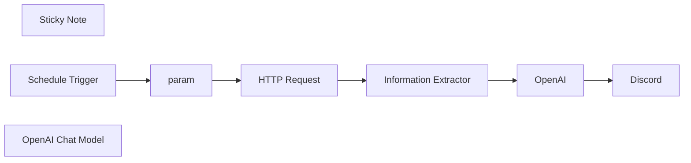

## Fluxo (.json) :

```json
{
  "nodes": [
    {
      "id": "4bf26356-9c59-4cee-8eb8-8553b23a172f",
      "name": "Sticky Note",
      "type": "n8n-nodes-base.stickyNote",
      "position": [
        560,
        -120
      ],
      "parameters": {
        "width": 660,
        "height": 460,
        "content": "\n# Daily Cartoon (w/ AI Translate)\n\n### How it works\n- Automates the retrieval of Calvin and Hobbes daily comics.\n- Extracts the comic image URL from the website.\n- Translates comic dialogues to English and Korean(Other Language)\n- Posts the comic and translations to Discord daily.\n\n### Set up steps\n- Estimated setup time: ~10-15 minutes.\n- Use a **Schedule Trigger** to automate the workflow at 9 AM daily.\n- Add nodes for parameter setup, HTTP request, data extraction, and integration with Discord.\n- Add detailed notes to each node in the workflow for easy understanding."
      },
      "typeVersion": 1
    },
    {
      "id": "52d19472-41b4-4d71-874e-064ef9d6f248",
      "name": "Schedule Trigger",
      "type": "n8n-nodes-base.scheduleTrigger",
      "position": [
        620,
        380
      ],
      "parameters": {
        "rule": {
          "interval": [
            {
              "triggerAtHour": 9
            }
          ]
        }
      },
      "typeVersion": 1.2
    },
    {
      "id": "bcc15f37-c048-4d9a-83cd-367856470095",
      "name": "OpenAI",
      "type": "@n8n/n8n-nodes-langchain.openAi",
      "position": [
        1620,
        380
      ],
      "parameters": {
        "text": "Please write the original language and Korean together. \n\nEXAMPLE)\nCalvin: \"YOU'VE NEVER HAD AN OBLIGATION, AN ASSIGNMENT, OR A DEADLINE IN ALL YOUR LIFE! YOU HAVE NO RESPONSIBILITIES AT ALL! IT MUST BE NICE!\" (너는 평생 한 번도 의무, 과제, 혹은 마감일 없었잖아! 전혀 책임이 없다니! 정말 좋겠다!)\nHobbes: \"WIPE THAT INSOLENT SMIRK OFF YOUR FACE!\" (그 뻔뻔한 미소를 그만 지어!)\n",
        "modelId": {
          "__rl": true,
          "mode": "list",
          "value": "gpt-4o-mini",
          "cachedResultName": "GPT-4O-MINI"
        },
        "options": {},
        "resource": "image",
        "imageUrls": "={{ $json.output.cartoon_image }}",
        "operation": "analyze"
      },
      "credentials": {
        "openAiApi": {
          "id": "kYIZ8ZwQHS2d4GiD",
          "name": "(datapopcorn )OpenAi account"
        }
      },
      "typeVersion": 1.6
    },
    {
      "id": "35004d43-4061-476a-9af6-7d0b82ae86bd",
      "name": "param",
      "type": "n8n-nodes-base.set",
      "position": [
        840,
        380
      ],
      "parameters": {
        "options": {},
        "assignments": {
          "assignments": [
            {
              "id": "59d36aef-2991-4fd2-9fbe-dad9a701b40f",
              "name": "year",
              "type": "string",
              "value": "={{ $now.format('yyyy') }}"
            },
            {
              "id": "b6b329f2-ba08-4516-bdb9-c5d124c02110",
              "name": "month",
              "type": "string",
              "value": "={{ $now.format('MM') }}"
            },
            {
              "id": "3cba75d1-a281-4e14-9bf7-e0bc0cc7c768",
              "name": "day",
              "type": "string",
              "value": "={{ $now.format('dd') }}"
            }
          ]
        }
      },
      "typeVersion": 3.4
    },
    {
      "id": "cf2c953f-1ff2-4abc-8abd-95e05603e64a",
      "name": "Discord",
      "type": "n8n-nodes-base.discord",
      "position": [
        1840,
        380
      ],
      "parameters": {
        "content": "=Daily Cartoon ({{ $('param').item.json.year }}/{{ $('param').item.json.month }}/{{ $('param').item.json.day }})\n{{ $('Information Extractor').item.json.output.cartoon_image }}\n\n{{ $json.content }}\n",
        "options": {},
        "authentication": "webhook"
      },
      "credentials": {
        "discordWebhookApi": {
          "id": "w82RWS7nmXLKDczt",
          "name": "n8n test webhook"
        }
      },
      "typeVersion": 2
    },
    {
      "id": "5eec9870-a509-4090-a540-76b22bb3eac9",
      "name": "OpenAI Chat Model",
      "type": "@n8n/n8n-nodes-langchain.lmChatOpenAi",
      "position": [
        1260,
        560
      ],
      "parameters": {
        "model": "gpt-4o-mini-2024-07-18",
        "options": {}
      },
      "credentials": {
        "openAiApi": {
          "id": "kYIZ8ZwQHS2d4GiD",
          "name": "(datapopcorn )OpenAi account"
        }
      },
      "typeVersion": 1
    },
    {
      "id": "352db81e-7571-47cb-b028-dec18e15ccce",
      "name": "Information Extractor",
      "type": "@n8n/n8n-nodes-langchain.informationExtractor",
      "position": [
        1260,
        380
      ],
      "parameters": {
        "text": "=Please just extract the src value in the  tag from HTML below. I don't need anything other than the value.\n\ne.g.)\nEXAMPLE INPUT)\n\n\n\nEXAMPLE OUTPUT)\nhttps://assets.amuniversal.com/5ed526b06e94013bda88005056a9545d\n\n--\n(INPUT)\n{{ $json.data }}",
        "options": {},
        "attributes": {
          "attributes": [
            {
              "name": "cartoon_image",
              "description": "EXAMPLE OUTPUT) https://assets.amuniversal.com/***"
            }
          ]
        }
      },
      "typeVersion": 1
    },
    {
      "id": "517799ed-559c-4d17-b8aa-58bd4ee92ed3",
      "name": "HTTP Request",
      "type": "n8n-nodes-base.httpRequest",
      "position": [
        1040,
        380
      ],
      "parameters": {
        "url": "=https://www.gocomics.com/calvinandhobbes/{{ $json.year }}/{{ $json.month }}/{{ $json.day }}",
        "options": {}
      },
      "typeVersion": 4.2
    }
  ],
  "pinData": {},
  "connections": {
    "param": {
      "main": [
        [
          {
            "node": "HTTP Request",
            "type": "main",
            "index": 0
          }
        ]
      ]
    },
    "OpenAI": {
      "main": [
        [
          {
            "node": "Discord",
            "type": "main",
            "index": 0
          }
        ]
      ]
    },
    "HTTP Request": {
      "main": [
        [
          {
            "node": "Information Extractor",
            "type": "main",
            "index": 0
          }
        ]
      ]
    },
    "Schedule Trigger": {
      "main": [
        [
          {
            "node": "param",
            "type": "main",
            "index": 0
          }
        ]
      ]
    },
    "OpenAI Chat Model": {
      "ai_languageModel": [
        [
          {
            "node": "Information Extractor",
            "type": "ai_languageModel",
            "index": 0
          }
        ]
      ]
    },
    "Information Extractor": {
      "main": [
        [
          {
            "node": "OpenAI",
            "type": "main",
            "index": 0
          }
        ]
      ]
    }
  }
}
```
