# PACK 1999 TEMPLATES PARTE 05 - Bloco 5

Templates neste bloco: 20

## Sumário

- [Template 882 - Triagem automática de CVs com OpenAI](#template-882)
- [Template 883 - Enriquecimento AI de fotos do inventário](#template-883)
- [Template 884 - Geração e enriquecimento de leads](#template-884)
- [Template 885 - Registrar pagamento Stripe como Sales Receipt no QuickBooks](#template-885)
- [Template 886 - Playlist mensal automática Spotify/DB](#template-886)
- [Template 887 - Controlar Spotify via Telegram com IA](#template-887)
- [Template 888 - Enviar mensagem no Larksuite](#template-888)
- [Template 889 - Importar Threads para Notion com checagem de duplicatas](#template-889)
- [Template 890 - Criação automática de eventos Zoom com pagamento via Stripe](#template-890)
- [Template 891 - Mapeamento Typeform para Pipedrive com criação de Lead](#template-891)
- [Template 892 - Adicionar assinantes Beehiiv a partir de vendas Gumroad](#template-892)
- [Template 893 - Resumo automático de documentos do Drive por e-mail](#template-893)
- [Template 894 - Conversão 3-vistas para vídeo rotativo](#template-894)
- [Template 895 - Envio diário de afirmações por Telegram](#template-895)
- [Template 896 - Sincronizar tickets Zendesk com threads no Slack](#template-896)
- [Template 897 - Criação e publicação automática de vídeos sociais com IA](#template-897)
- [Template 898 - Resumo de vídeo YouTube](#template-898)
- [Template 899 - Backup de fluxos para GitHub](#template-899)
- [Template 900 - Postar RSS no Mastodon](#template-900)
- [Template 901 - Sincronizar cobranças Stripe com contatos HubSpot](#template-901)

---

<a id="template-882"></a>

## Template 882 - Triagem automática de CVs com OpenAI

- **Nome:** Triagem automática de CVs com OpenAI
- **Descrição:** Analisa currículos usando um modelo de linguagem para gerar uma avaliação estruturada (pontuação, resumos e motivos) e possibilitar armazenamento dos resultados.
- **Funcionalidade:** • Download de CV por link direto: baixa o arquivo do candidato a partir de uma URL pública.
• Extração de texto do PDF: converte o conteúdo do currículo em texto legível para análise.
• Configuração de variáveis: armazena dados essenciais como URL do arquivo, descrição da vaga, prompt e esquema JSON para a resposta.
• Análise com modelo de linguagem: envia o texto extraído e a descrição da vaga ao modelo para obter uma avaliação crítica e estruturada.
• Geração de avaliação estruturada: produz porcentagem de compatibilidade em passos de 10%, resumo curto, motivos de adequação e motivos de não adequação.
• Interpretação e parsing JSON: valida e transforma a resposta do modelo em um objeto JSON utilizável.
• Armazenamento dos resultados: possibilita salvar a análise e os dados extraídos em um armazenamento externo para uso posterior.
- **Ferramentas:** • OpenAI: modelo de linguagem (ex.: gpt-4o-mini) usado para analisar o texto do currículo e gerar uma resposta estruturada conforme esquema JSON.
• Supabase (armazenamento e banco): hospeda arquivos (CVs) em URLs públicos e pode ser usado para salvar resultados estruturados da análise.
• Serviço de hospedagem de arquivos via URL direto: fornece links públicos para os currículos (por exemplo, armazenamento em nuvem ou serviços de arquivos) permitindo download automático.
• Chamadas HTTP/HTTPS: utilizadas tanto para baixar arquivos quanto para enviar requisições à API do modelo de linguagem.

## Fluxo visual

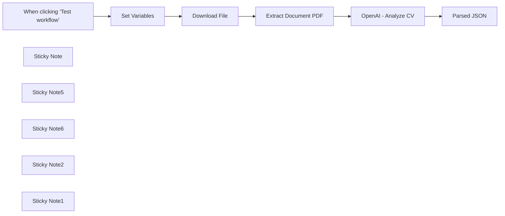

## Fluxo (.json) :

```json
{
  "meta": {
    "instanceId": "6a2a7715680b8313f7cb4676321c5baa46680adfb913072f089f2766f42e43bd"
  },
  "nodes": [
    {
      "id": "0f3b39af-2802-462c-ac54-a7bccf5b78c5",
      "name": "Extract Document PDF",
      "type": "n8n-nodes-base.extractFromFile",
      "position": [
        520,
        400
      ],
      "parameters": {
        "options": {},
        "operation": "pdf"
      },
      "typeVersion": 1,
      "alwaysOutputData": false
    },
    {
      "id": "6f76e3a6-a3be-4f9f-a0db-3f002eafc2ad",
      "name": "Download File",
      "type": "n8n-nodes-base.httpRequest",
      "position": [
        340,
        400
      ],
      "parameters": {
        "url": "={{ $json.file_url }}",
        "options": {}
      },
      "typeVersion": 4.2
    },
    {
      "id": "2c4e0b0f-28c7-48f5-b051-6e909ac878d2",
      "name": "When clicking ‘Test workflow’",
      "type": "n8n-nodes-base.manualTrigger",
      "position": [
        -20,
        400
      ],
      "parameters": {},
      "typeVersion": 1
    },
    {
      "id": "a70d972b-ceb4-4f4d-8737-f0be624d6234",
      "name": "Sticky Note",
      "type": "n8n-nodes-base.stickyNote",
      "position": [
        120,
        280
      ],
      "parameters": {
        "width": 187.37066290133808,
        "height": 80,
        "content": "**Add direct link to CV and Job description**"
      },
      "typeVersion": 1
    },
    {
      "id": "9fdff1be-14cf-4167-af2d-7c5e60943831",
      "name": "Sticky Note5",
      "type": "n8n-nodes-base.stickyNote",
      "position": [
        -800,
        140
      ],
      "parameters": {
        "color": 7,
        "width": 280.2462120317618,
        "height": 438.5821431288714,
        "content": "### Setup\n\n1. **Download File**: Fetch the CV using its direct URL.\n2. **Extract Data**: Use N8N’s PDF or text extraction nodes to retrieve text from the CV.\n3. **Send to OpenAI**:\n   - **URL**: POST to OpenAI’s API for analysis.\n   - **Parameters**:\n     - Include the extracted CV data and job description.\n     - Use JSON Schema to structure the response.\n4. **Save Results**:\n   - Store the extracted data and OpenAI's analysis in Supabase for further use."
      },
      "typeVersion": 1
    },
    {
      "id": "b1ce4a61-270f-480b-a716-6618e6034581",
      "name": "Sticky Note6",
      "type": "n8n-nodes-base.stickyNote",
      "position": [
        -800,
        -500
      ],
      "parameters": {
        "color": 7,
        "width": 636.2128494576581,
        "height": 598.6675280064023,
        "content": ".png)\n## CV Screening with OpenAI\n**Made by [Mark Shcherbakov](https://www.linkedin.com/in/marklowcoding/) from community [5minAI](https://www.skool.com/5minai-2861)**\n\nThis workflow is ideal for recruitment agencies, HR professionals, and hiring managers looking to automate the initial screening of CVs. It is especially useful for organizations handling large volumes of applications and seeking to streamline their recruitment process.\n\nThis workflow automates the resume screening process using OpenAI for analysis and Supabase for structured data storage. It provides a matching score, a summary of candidate suitability, and key insights into why the candidate fits (or doesn’t fit) the job. \n\n1. **Retrieve Resume**: The workflow downloads CVs from a direct link (e.g., Supabase storage or Dropbox).\n2. **Extract Data**: Extracts text data from PDF or DOC files for analysis.\n3. **Analyze with OpenAI**: Sends the extracted data and job description to OpenAI to:\n   - Generate a matching score.\n   - Summarize candidate strengths and weaknesses.\n   - Provide actionable insights into their suitability for the job.\n4. **Store Results in Supabase**: Saves the analysis and raw data in a structured format for further processing or integration into other tools.\n"
      },
      "typeVersion": 1
    },
    {
      "id": "747591cd-76b1-417e-ab9d-0a3935d3db03",
      "name": "Sticky Note2",
      "type": "n8n-nodes-base.stickyNote",
      "position": [
        -500,
        140
      ],
      "parameters": {
        "color": 7,
        "width": 330.5152611046425,
        "height": 240.6839895136402,
        "content": "### ... or watch set up video [8 min]\n[](https://youtu.be/TWuI3dOcn0E)\n"
      },
      "typeVersion": 1
    },
    {
      "id": "051d8cb0-2557-4e35-9045-c769ec5a34f9",
      "name": "Sticky Note1",
      "type": "n8n-nodes-base.stickyNote",
      "position": [
        660,
        280
      ],
      "parameters": {
        "width": 187.37066290133808,
        "height": 80,
        "content": "**Replace OpenAI connection**"
      },
      "typeVersion": 1
    },
    {
      "id": "865f4f69-e13d-49c1-8bb4-9f98facbf75c",
      "name": "OpenAI - Analyze CV",
      "type": "n8n-nodes-base.httpRequest",
      "position": [
        700,
        400
      ],
      "parameters": {
        "url": "=https://api.openai.com/v1/chat/completions",
        "method": "POST",
        "options": {},
        "jsonBody": "={\n    \"model\": \"gpt-4o-mini\",\n    \"messages\": [\n      {\n        \"role\": \"system\",\n        \"content\": \"{{ $('Set Variables').item.json.prompt }}\"\n      },\n      {\n        \"role\": \"user\",\n        \"content\": {{ JSON.stringify(encodeURIComponent($json.text))}}\n      }\n    ],\n  \"response_format\":{ \"type\": \"json_schema\", \"json_schema\":  {{ $('Set Variables').item.json.json_schema }}\n\n }\n  }",
        "sendBody": true,
        "specifyBody": "json",
        "authentication": "predefinedCredentialType",
        "nodeCredentialType": "openAiApi"
      },
      "credentials": {
        "openAiApi": {
          "id": "SphXAX7rlwRLkiox",
          "name": "Test club key"
        }
      },
      "typeVersion": 4.2
    },
    {
      "id": "68b7fc08-506d-4816-9a8f-db7ab89e4589",
      "name": "Set Variables",
      "type": "n8n-nodes-base.set",
      "position": [
        160,
        400
      ],
      "parameters": {
        "options": {},
        "assignments": {
          "assignments": [
            {
              "id": "83274f6f-c73e-4d5e-946f-c6dfdf7ed1c4",
              "name": "file_url",
              "type": "string",
              "value": "https://cflobdhpqwnoisuctsoc.supabase.co/storage/v1/object/public/my_storage/software_engineer_resume_example.pdf"
            },
            {
              "id": "6e44f3e5-a0df-4337-9f7e-7cfa91b3cc37",
              "name": "job_description",
              "type": "string",
              "value": "Melange is a venture-backed startup building a brand new search infrastructure for the patent system. Leveraging recent and ongoing advancements in machine learning and natural language processing, we are building systems to conduct patent search faster and more accurately than any human currently can. We are a small team with a friendly, mostly-remote culture\\n\\nAbout the team\\nMelange is currently made up of 9 people. We are remote but headquartered in Brooklyn, NY. We look for people who are curious and earnest.\\n\\nAbout the role\\nJoin the team at Melange, a startup with a focus on revolutionizing patent search through advanced technology. As a software engineer in this role, you will be responsible for developing conversation graphs, integrating grammar processes, and maintaining a robust codebase. The ideal candidate will have experience shipping products, working with cloud platforms, and have familiarity with containerization tools. Additionally, experience with prompting tools, NLP packages, and cybersecurity is a plus.\\n\\nCandidate location - the US. Strong preference if they're in NYC, Boston or SF but open to anywhere else but needs to be rockstar\\n\\nYou will \\n\\n* Ship high-quality products.\\n* Utilize prompting libraries such as Langchain and Langgraph to develop conversation graphs and evaluation flows.\\n* Collaborate with linguists to integrate our in-house grammar and entity mapping processes into an iterable patent search algorithm piloted by AI patent agents.\\n* Steward the codebase, ensuring that it remains robust as it scales.\\n\\n\\nCandidate requirements\\nMinimum requirements a candidate must meet\\nHad ownership over aspects of product development in both small and large organizations at differing points in your career.\\n\\nHave used Langchain, LangGraph, or other prompting tools in production or for personal projects.\\n\\nFamiliarity with NLP packages such as Spacy, Stanza, PyTorch, and/or Tensorflow.\\n\\nShipped a working product to users, either as part of a team or on your own. \\nThis means you have: \\nproficiency with one of AWS, Azure, or Google Cloud, \\nfamiliarity with containerization and orchestration tools like Docker and Kubernetes, and \\nbuilt and maintained CI/CD pipelines.\\n5+ years of experience as a software engineer\\n\\nNice-to-haves\\nWhat could make your candidate stand out\\nExperience with cybersecurity.\\n\\nIdeal companies\\nSuccessful b2b growth stage startups that have a strong emphasis on product and design. Orgs with competent management where talent is dense and protected.\\n\\nRamp, Rippling, Brex, Carta, Toast, Asana, Airtable, Benchling, Figma, Gusto, Stripe, Plaid, Monday.com, Smartsheet, Bill.com, Freshworks, Intercom, Sprout Social, Sisense, InsightSquared, DocuSign, Dropbox, Slack, Trello, Qualtrics, Datadog, HubSpot, Shopify, Zendesk, SurveyMonkey, Squarespace, Mixpanel, Github, Atlassian, Zapier, PagerDuty, Box, Snowflake, Greenhouse, Lever, Pendo, Lucidchart, Asana, New Relic, Kajabi, Veeva Systems, Adyen, Twilio, Workday, ServiceNow, Confluent.\\n"
            },
            {
              "id": "c597c502-9a3c-48e6-a5f5-8a2a8be7282c",
              "name": "prompt",
              "type": "string",
              "value": "You are the recruiter in recruiting agency, you are strict and you pay extra attention on details in a resume. You work with companies and find talents for their jobs. You asses any resume really attentively and critically. If the candidate is a jumper, you notice that and say us.   You need to say if the candidate from out base is suitable for this job.  Return 4 things: 1. Percentage (10% step) of matching candidate resume with job. 2. Short summary - should use simple language and be short. Provide final decision on candidate based on matching percentage and candidate skills vs job requirements. 3. Summary why this candidate suits this jobs. 4. Summary why this candidate doesn't suit this jobs."
            },
            {
              "id": "1884eed1-9111-4ce1-8d07-ed176611f2d8",
              "name": "json_schema",
              "type": "string",
              "value": "{   \"name\": \"candidate_evaluation\",   \"description\": \"Structured data for evaluating a candidate based on experience and fit\",   \"strict\": true,   \"schema\": {     \"type\": \"object\",     \"properties\": {       \"percentage\": {         \"type\": \"integer\",         \"description\": \"Overall suitability percentage score for the candidate\"       },       \"summary\": {         \"type\": \"string\",         \"description\": \"A brief summary of the candidate's experience, personality, and any notable strengths or concerns\"       },       \"reasons-suit\": {         \"type\": \"array\",         \"items\": {           \"type\": \"object\",           \"properties\": {             \"name\": { \"type\": \"string\", \"description\": \"Title of the strength or reason for suitability\" },             \"text\": { \"type\": \"string\", \"description\": \"Description of how this experience or skill matches the job requirements\" }           },           \"required\": [\"name\", \"text\"],           \"additionalProperties\": false         },         \"description\": \"List of reasons why the candidate is suitable for the position\"       },       \"reasons-notsuit\": {         \"type\": \"array\",         \"items\": {           \"type\": \"object\",           \"properties\": {             \"name\": { \"type\": \"string\", \"description\": \"Title of the concern or reason for unsuitability\" },             \"text\": { \"type\": \"string\", \"description\": \"Description of how this factor may not align with the job requirements\" }           },           \"required\": [\"name\", \"text\"],           \"additionalProperties\": false         },         \"description\": \"List of reasons why the candidate may not be suitable for the position\"       }     },     \"required\": [\"percentage\", \"summary\", \"reasons-suit\", \"reasons-notsuit\"],     \"additionalProperties\": false   } }"
            }
          ]
        }
      },
      "typeVersion": 3.4
    },
    {
      "id": "22dedac7-c44b-430f-b9c7-57d0c55328fa",
      "name": "Parsed JSON",
      "type": "n8n-nodes-base.set",
      "position": [
        880,
        400
      ],
      "parameters": {
        "options": {},
        "assignments": {
          "assignments": [
            {
              "id": "83274f6f-c73e-4d5e-946f-c6dfdf7ed1c4",
              "name": "json_parsed",
              "type": "object",
              "value": "={{ JSON.parse($json.choices[0].message.content) }}"
            }
          ]
        }
      },
      "typeVersion": 3.4
    }
  ],
  "pinData": {},
  "connections": {
    "Download File": {
      "main": [
        [
          {
            "node": "Extract Document PDF",
            "type": "main",
            "index": 0
          }
        ]
      ]
    },
    "Set Variables": {
      "main": [
        [
          {
            "node": "Download File",
            "type": "main",
            "index": 0
          }
        ]
      ]
    },
    "OpenAI - Analyze CV": {
      "main": [
        [
          {
            "node": "Parsed JSON",
            "type": "main",
            "index": 0
          }
        ]
      ]
    },
    "Extract Document PDF": {
      "main": [
        [
          {
            "node": "OpenAI - Analyze CV",
            "type": "main",
            "index": 0
          }
        ]
      ]
    },
    "When clicking ‘Test workflow’": {
      "main": [
        [
          {
            "node": "Set Variables",
            "type": "main",
            "index": 0
          }
        ]
      ]
    }
  }
}
```

<a id="template-883"></a>

## Template 883 - Enriquecimento AI de fotos do inventário

- **Nome:** Enriquecimento AI de fotos do inventário
- **Descrição:** Automatiza a leitura de fotos armazenadas em uma base do Airtable, usa modelos de visão e um agente para pesquisar na web e enriquece as linhas com atributos de produto.
- **Funcionalidade:** • Varredura da base: Procura linhas no Airtable que contenham imagens e que ainda não foram processadas pelo AI.
• Análise de imagem: Usa um modelo de visão para gerar descrição, modelo, material, cor e condição do objeto na foto.
• Agente de identificação: Utiliza um agente com capacidade de decisão para determinar quando usar ferramentas externas para obter mais informações.
• Busca reversa de imagem: Executa buscas reversas para localizar páginas com produtos similares e possíveis correspondências.
• Raspagem de páginas: Recupera e converte conteúdo de páginas web relevantes em formato legível para análise adicional.
• Parser de saída estruturada: Converte a resposta do agente em campos estruturados (título, descrição, modelo, material, cor, condição).
• Atualização automática: Sobrescreve as linhas no Airtable com os dados enriquecidos e marca o registro como processado.
• Tratamento de falhas: Fornece respostas de fallback quando ferramentas externas não estão disponíveis ou falham.
- **Ferramentas:** • Airtable: Banco de dados para armazenar registros com imagens e atualizar atributos dos produtos.
• OpenAI: Modelos de visão e linguagem (incluindo agente) para analisar imagens, interpretar resultados e orquestrar ações.
• SerpAPI: Serviço de busca reversa de imagem para encontrar páginas que contenham imagens similares.
• Firecrawl: Serviço de raspagem web que extrai conteúdo de páginas e retorna texto/markdown para análise.

## Fluxo visual

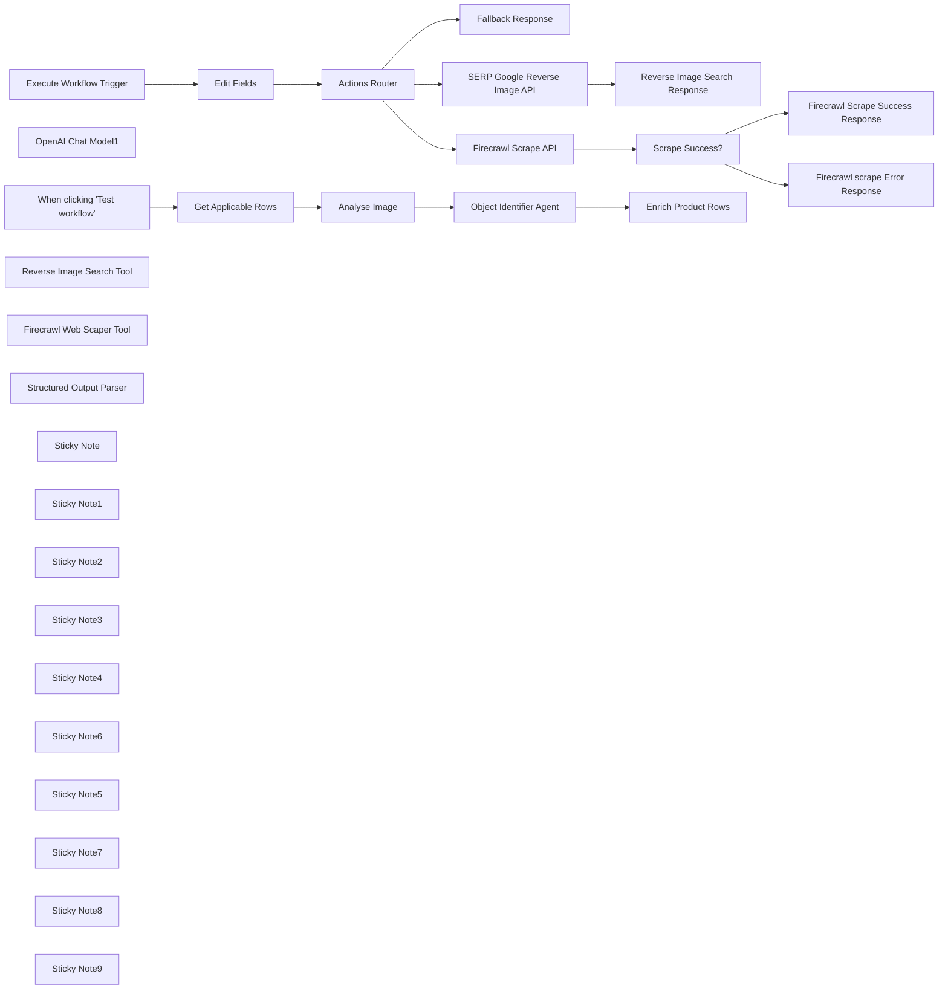

## Fluxo (.json) :

```json
{
  "meta": {
    "instanceId": "26ba763460b97c249b82942b23b6384876dfeb9327513332e743c5f6219c2b8e"
  },
  "nodes": [
    {
      "id": "192d3e4f-6bb0-4b87-a1fa-e32c9efb49cc",
      "name": "When clicking \"Test workflow\"",
      "type": "n8n-nodes-base.manualTrigger",
      "position": [
        336,
        34
      ],
      "parameters": {},
      "typeVersion": 1
    },
    {
      "id": "32a7a772-76a6-4614-a6ab-d2b152a5811f",
      "name": "OpenAI Chat Model1",
      "type": "@n8n/n8n-nodes-langchain.lmChatOpenAi",
      "position": [
        1220,
        180
      ],
      "parameters": {
        "model": "gpt-4o",
        "options": {
          "temperature": 0
        }
      },
      "credentials": {
        "openAiApi": {
          "id": "8gccIjcuf3gvaoEr",
          "name": "OpenAi account"
        }
      },
      "typeVersion": 1
    },
    {
      "id": "8c444314-ed7d-4ca0-b0fa-b6d1e964c698",
      "name": "Get Applicable Rows",
      "type": "n8n-nodes-base.airtable",
      "position": [
        516,
        34
      ],
      "parameters": {
        "base": {
          "__rl": true,
          "mode": "list",
          "value": "appbgxPBurOmQK3E7",
          "cachedResultUrl": "https://airtable.com/appbgxPBurOmQK3E7",
          "cachedResultName": "Building Inventory Survey Example"
        },
        "table": {
          "__rl": true,
          "mode": "id",
          "value": "tblEHkoTvKpa4Aa0Q"
        },
        "options": {},
        "operation": "search",
        "returnAll": false,
        "filterByFormula": "AND(Image!=\"\", AI_status=FALSE())"
      },
      "credentials": {
        "airtableTokenApi": {
          "id": "Und0frCQ6SNVX3VV",
          "name": "Airtable Personal Access Token account"
        }
      },
      "typeVersion": 2
    },
    {
      "id": "f90578fa-b886-4653-8ff7-0c91884dc517",
      "name": "Execute Workflow Trigger",
      "type": "n8n-nodes-base.executeWorkflowTrigger",
      "position": [
        1257,
        733
      ],
      "parameters": {},
      "typeVersion": 1
    },
    {
      "id": "8f5959eb-45bd-4185-a959-10268827e41d",
      "name": "Edit Fields",
      "type": "n8n-nodes-base.set",
      "position": [
        1417,
        733
      ],
      "parameters": {
        "options": {},
        "assignments": {
          "assignments": [
            {
              "id": "7263764b-8409-4cea-8db3-3278dd7ef9d8",
              "name": "=route",
              "type": "string",
              "value": "={{ $json.route }}"
            },
            {
              "id": "55c3b207-2e98-4137-8413-f72cbff17986",
              "name": "query",
              "type": "string",
              "value": "={{ $json.query }}"
            },
            {
              "id": "6eb873de-3c3a-4135-9dc0-1d441c63647c",
              "name": "",
              "type": "string",
              "value": ""
            }
          ]
        }
      },
      "typeVersion": 3.3
    },
    {
      "id": "2c7f7274-12e9-4dd3-8ee4-679b408d5430",
      "name": "Fallback Response",
      "type": "n8n-nodes-base.set",
      "position": [
        1580,
        875
      ],
      "parameters": {
        "mode": "raw",
        "options": {},
        "jsonOutput": "{\n \"response\": {\n \"ok\": false,\n \"error\": \"The requested tool was not found or the service may be unavailable. Do not retry.\"\n }\n}\n"
      },
      "typeVersion": 3.3
    },
    {
      "id": "09f36f4d-eb88-4d93-a8b3-e9ba66b46b54",
      "name": "SERP Google Reverse Image API",
      "type": "n8n-nodes-base.httpRequest",
      "position": [
        1860,
        549
      ],
      "parameters": {
        "url": "https://serpapi.com/search.json",
        "options": {},
        "sendQuery": true,
        "authentication": "predefinedCredentialType",
        "queryParameters": {
          "parameters": [
            {
              "name": "engine",
              "value": "google_reverse_image"
            },
            {
              "name": "image_url",
              "value": "={{ $json.query }}"
            }
          ]
        },
        "nodeCredentialType": "serpApi"
      },
      "credentials": {
        "serpApi": {
          "id": "aJCKjxx6U3K7ydDe",
          "name": "SerpAPI account"
        }
      },
      "typeVersion": 4.2
    },
    {
      "id": "8e3a0f38-8663-4f5c-837f-4b9aa21f14fb",
      "name": "Reverse Image Search Response",
      "type": "n8n-nodes-base.set",
      "position": [
        2037,
        547
      ],
      "parameters": {
        "options": {},
        "assignments": {
          "assignments": [
            {
              "id": "de99a504-713f-4c78-8679-08139b2def31",
              "name": "response",
              "type": "string",
              "value": "={{ JSON.stringify($json.image_results.map(x => ({ position: x.position, title: x.title, link: x.link, description: x.snippet }))) }}"
            }
          ]
        }
      },
      "typeVersion": 3.3
    },
    {
      "id": "0cd2269a-5b1f-4f10-b180-7f9cff9b1102",
      "name": "Reverse Image Search Tool",
      "type": "@n8n/n8n-nodes-langchain.toolWorkflow",
      "position": [
        1300,
        340
      ],
      "parameters": {
        "name": "reverse_image_search",
        "fields": {
          "values": [
            {
              "name": "route",
              "stringValue": "serp.google_reverse_image"
            }
          ]
        },
        "workflowId": "={{ $workflow.id }}",
        "description": "Call this tool to perform a reverse image search. Reverse image searches return urls where similar looking products exists. Fetch the returned urls to gather more information. This tool requires the following object request body.\n```\n{\n \"type\": \"object\",\n \"properties\": {\n \"image_url\": { \"type\": \"string\" },\n }\n}\n```\nimage_url should be an absolute URL to the image."
      },
      "typeVersion": 1.1
    },
    {
      "id": "9825651e-b382-4e0a-97ef-37764cb5be9e",
      "name": "Firecrawl Scrape API",
      "type": "n8n-nodes-base.httpRequest",
      "position": [
        1860,
        889
      ],
      "parameters": {
        "url": "https://api.firecrawl.dev/v0/scrape",
        "method": "POST",
        "options": {},
        "sendBody": true,
        "sendHeaders": true,
        "authentication": "genericCredentialType",
        "bodyParameters": {
          "parameters": [
            {
              "name": "url",
              "value": "={{ $json.query }}"
            }
          ]
        },
        "genericAuthType": "httpHeaderAuth",
        "headerParameters": {
          "parameters": [
            {
              "name": "Content-Type",
              "value": "application/json"
            }
          ]
        }
      },
      "credentials": {
        "httpHeaderAuth": {
          "id": "OUOnyTkL9vHZNorB",
          "name": "Firecrawl API"
        }
      },
      "typeVersion": 4.2
    },
    {
      "id": "7f61d60b-b052-4b7c-abfd-9eb8e05a45a2",
      "name": "Scrape Success?",
      "type": "n8n-nodes-base.if",
      "position": [
        2020,
        889
      ],
      "parameters": {
        "options": {},
        "conditions": {
          "options": {
            "leftValue": "",
            "caseSensitive": true,
            "typeValidation": "strict"
          },
          "combinator": "and",
          "conditions": [
            {
              "id": "a15a164f-d0c5-478f-8b27-f3d51746c214",
              "operator": {
                "type": "boolean",
                "operation": "true",
                "singleValue": true
              },
              "leftValue": "={{ $json.success }}",
              "rightValue": ""
            }
          ]
        }
      },
      "typeVersion": 2
    },
    {
      "id": "29c65ef4-6350-490a-b8e3-a5c869e656b2",
      "name": "Firecrawl Scrape Success Response",
      "type": "n8n-nodes-base.set",
      "position": [
        2180,
        889
      ],
      "parameters": {
        "options": {},
        "assignments": {
          "assignments": [
            {
              "id": "7db5c81f-de90-40e1-8086-3f13d40451c7",
              "name": "response",
              "type": "string",
              "value": "={{ $json.data.markdown.substring(0, 3000) }}"
            }
          ]
        }
      },
      "typeVersion": 3.3
    },
    {
      "id": "229b4008-d8a8-4609-854a-fc244a4ed630",
      "name": "Firecrawl scrape Error Response",
      "type": "n8n-nodes-base.set",
      "position": [
        2180,
        1049
      ],
      "parameters": {
        "options": {},
        "assignments": {
          "assignments": [
            {
              "id": "e691d86a-d366-44a2-baa6-3dba42527f6e",
              "name": "response",
              "type": "string",
              "value": "{ error: \"Unable to scrape website due to unknown error. Do not retry.\" }"
            }
          ]
        }
      },
      "typeVersion": 3.3
    },
    {
      "id": "f080069b-e849-45e0-88cf-03707d22c704",
      "name": "Firecrawl Web Scaper Tool",
      "type": "@n8n/n8n-nodes-langchain.toolWorkflow",
      "position": [
        1440,
        340
      ],
      "parameters": {
        "name": "webpage_url_scraper_tool",
        "fields": {
          "values": [
            {
              "name": "route",
              "stringValue": "firecrawl.scrape"
            }
          ]
        },
        "workflowId": "={{ $workflow.id }}",
        "description": "Call this tool to retrieve page contents of a url.\n```\n{\n \"type\": \"object\",\n \"properties\": {\n \"url\": { \"type\": \"string\" },\n }\n}\n```\nurl should be an absolute URL."
      },
      "typeVersion": 1.1
    },
    {
      "id": "4eff88bb-bd5e-4d6a-b5e1-8521632c461f",
      "name": "Structured Output Parser",
      "type": "@n8n/n8n-nodes-langchain.outputParserStructured",
      "position": [
        1500,
        180
      ],
      "parameters": {
        "jsonSchema": "{\n \"type\": \"object\",\n \"properties\": {\n \"title\": { \"type\": \"string\" },\n \"description\": { \"type\": \"string\" },\n \"model\": { \"type\": \"string\" },\n \"material\": { \"type\": \"string\" },\n \"color\": { \"type\": \"string\" },\n \"condition\": { \"type\": \"string\" }\n }\n}"
      },
      "typeVersion": 1.1
    },
    {
      "id": "328d106b-a473-4f54-82fd-55c30d813da9",
      "name": "Sticky Note",
      "type": "n8n-nodes-base.stickyNote",
      "position": [
        280,
        -260
      ],
      "parameters": {
        "color": 7,
        "width": 402.5984702109446,
        "height": 495.4071184783251,
        "content": "## 1. Use Airtable to Capture Survey Photos\n[Read more about AirTable](https://docs.n8n.io/integrations/builtin/app-nodes/n8n-nodes-base.airtable)\n\nTo enable this workflow, we need a database where we can retreive the title and photo to analyse and write the generate values back to. Airtable is perfect for this since it has a robust API we can work with.\n\nFor this demo, we'll manually trigger but this can be changed for forms or other triggers."
      },
      "typeVersion": 1
    },
    {
      "id": "e358775d-ff83-411d-9364-b43c87d98134",
      "name": "Sticky Note1",
      "type": "n8n-nodes-base.stickyNote",
      "position": [
        716.3106363781314,
        -160
      ],
      "parameters": {
        "color": 7,
        "width": 359.40869874940336,
        "height": 428.4787925736586,
        "content": "## 2. Use AI Vision Model to Analyse the Photo.\n[Read more about OpenAI Vision](https://docs.n8n.io/integrations/builtin/app-nodes/n8n-nodes-langchain.openai)\n\nWe'll use OpenAi vision model to create a detailed description of the product in the photo. We split this step from the agent because it uses an image model rather than the usual text-based one."
      },
      "typeVersion": 1
    },
    {
      "id": "51b4a70c-9583-4e8a-8e8d-896a80ad53c3",
      "name": "Sticky Note2",
      "type": "n8n-nodes-base.stickyNote",
      "position": [
        1111.3914848823072,
        -293.9250474768817
      ],
      "parameters": {
        "color": 7,
        "width": 593.0683948010671,
        "height": 803.956942672397,
        "content": "## 3. Build an AI Agent who Searches the Internet\n[Read more about OpenAI Agents](https://docs.n8n.io/integrations/builtin/app-nodes/n8n-nodes-langchain.openai)\n\nThis AI Agent has the ability to perform reverse image searches using our captured photos as well visit external webpages in order to obtain accurate product names and attributes. The Agent along with the tools might mimic what the average human user would carry out the same task.\n\n* For reverse image search, we're using SERP API service however we won't use the built-in SERP node as we need to specify custom parameters. \n* For scraping, we'll use [Firecrawl](https://www.firecrawl.dev/) as this service also helps to parse and return the page as markdown which is more efficient."
      },
      "typeVersion": 1
    },
    {
      "id": "adfb519b-a5c7-432c-be32-5acfcc388b49",
      "name": "Sticky Note3",
      "type": "n8n-nodes-base.stickyNote",
      "position": [
        1740,
        -149.28190375244515
      ],
      "parameters": {
        "color": 7,
        "width": 373.3601237414979,
        "height": 397.7168664109706,
        "content": "## 4. Overwrite our Rows with Enriched Results\n\nAnd Viola! Our AI agent has potentially saved hours of manual data entry work for our surveyor. This technique can be used for many other usecases."
      },
      "typeVersion": 1
    },
    {
      "id": "6444e217-b944-450e-892a-5822d4d390ce",
      "name": "Sticky Note4",
      "type": "n8n-nodes-base.stickyNote",
      "position": [
        1200,
        549
      ],
      "parameters": {
        "color": 7,
        "width": 554.6092633638649,
        "height": 490.7010880746526,
        "content": "## 5. Using the Custom Workflow Tool\n[Read more about Workflow Tools](https://docs.n8n.io/integrations/builtin/cluster-nodes/sub-nodes/n8n-nodes-langchain.toolworkflow)\n\nAI Agents rely on Tools to make decisions and become exponentially more powerful the more tools they have. A common pattern to manage multiple tools is to create a routing system for tools using the API pattern."
      },
      "typeVersion": 1
    },
    {
      "id": "bf2459cf-a931-4232-9504-b36b15721194",
      "name": "Enrich Product Rows",
      "type": "n8n-nodes-base.airtable",
      "position": [
        1880,
        60
      ],
      "parameters": {
        "base": {
          "__rl": true,
          "mode": "list",
          "value": "appbgxPBurOmQK3E7",
          "cachedResultUrl": "https://airtable.com/appbgxPBurOmQK3E7",
          "cachedResultName": "Building Inventory Survey Example"
        },
        "table": {
          "__rl": true,
          "mode": "id",
          "value": "tblEHkoTvKpa4Aa0Q"
        },
        "columns": {
          "value": {
            "id": "={{ $('Get Applicable Rows').item.json.id }}",
            "Color": "={{ $json.output.output.color }}",
            "Model": "={{ $json.output.output.model }}",
            "Title": "={{ $json.output.output.title }}",
            "Material": "={{ $json.output.output.material }}",
            "AI_status": true,
            "Condition": "={{ $json.output.output.condition }}",
            "Description": "={{ $json.output.output.description }}"
          },
          "schema": [
            {
              "id": "id",
              "type": "string",
              "display": true,
              "removed": false,
              "readOnly": true,
              "required": false,
              "displayName": "id",
              "defaultMatch": true
            },
            {
              "id": "Title",
              "type": "string",
              "display": true,
              "removed": false,
              "readOnly": false,
              "required": false,
              "displayName": "Title",
              "defaultMatch": false,
              "canBeUsedToMatch": true
            },
            {
              "id": "Image",
              "type": "array",
              "display": true,
              "removed": false,
              "readOnly": false,
              "required": false,
              "displayName": "Image",
              "defaultMatch": false,
              "canBeUsedToMatch": true
            },
            {
              "id": "Description",
              "type": "string",
              "display": true,
              "removed": false,
              "readOnly": false,
              "required": false,
              "displayName": "Description",
              "defaultMatch": false,
              "canBeUsedToMatch": true
            },
            {
              "id": "Model",
              "type": "string",
              "display": true,
              "removed": false,
              "readOnly": false,
              "required": false,
              "displayName": "Model",
              "defaultMatch": false,
              "canBeUsedToMatch": true
            },
            {
              "id": "Material",
              "type": "string",
              "display": true,
              "removed": false,
              "readOnly": false,
              "required": false,
              "displayName": "Material",
              "defaultMatch": false,
              "canBeUsedToMatch": true
            },
            {
              "id": "Color",
              "type": "string",
              "display": true,
              "removed": false,
              "readOnly": false,
              "required": false,
              "displayName": "Color",
              "defaultMatch": false,
              "canBeUsedToMatch": true
            },
            {
              "id": "Condition",
              "type": "string",
              "display": true,
              "removed": false,
              "readOnly": false,
              "required": false,
              "displayName": "Condition",
              "defaultMatch": false,
              "canBeUsedToMatch": true
            },
            {
              "id": "AI_status",
              "type": "boolean",
              "display": true,
              "removed": false,
              "readOnly": false,
              "required": false,
              "displayName": "AI_status",
              "defaultMatch": false,
              "canBeUsedToMatch": true
            }
          ],
          "mappingMode": "defineBelow",
          "matchingColumns": [
            "id"
          ]
        },
        "options": {},
        "operation": "update"
      },
      "credentials": {
        "airtableTokenApi": {
          "id": "Und0frCQ6SNVX3VV",
          "name": "Airtable Personal Access Token account"
        }
      },
      "typeVersion": 2
    },
    {
      "id": "19d736bf-c29d-46a2-93bc-b536ff28c4b5",
      "name": "Sticky Note6",
      "type": "n8n-nodes-base.stickyNote",
      "position": [
        -100,
        -260
      ],
      "parameters": {
        "width": 359.6648027457353,
        "height": 381.0536322713287,
        "content": "## Try It Out!\n### This workflow does the following:\n* Scans an Airtable spreadsheet for rows with product photo images.\n* Uses an AI vision model to attempt to identify the product.\n* Uses an AI Agent to research the product on the internet to enrich the product data.\n* Overwrites our Airtable spreadsheet with the enriched data.\n\n### Need Help?\nJoin the [Discord](https://discord.com/invite/XPKeKXeB7d) or ask in the [Forum](https://community.n8n.io/)!\n\nHappy Hacking!"
      },
      "typeVersion": 1
    },
    {
      "id": "25f15c48-16bf-4f92-942d-c224ed88d208",
      "name": "Analyse Image",
      "type": "@n8n/n8n-nodes-langchain.openAi",
      "position": [
        840,
        80
      ],
      "parameters": {
        "text": "=Focus on the {{ $json.Title }} in the image - we'll refer to this as the \"object\". Identify the following attributes of the object. If you cannot determine confidently, then leave blank and move to next attribute.\n* Decription of the object.\n* The model/make of the object.\n* The material(s) used in the construction of the object.\n* The color(s) of the object\n* The condition of the object. Use one of poor, good, excellent.\n",
        "options": {},
        "resource": "image",
        "imageUrls": "={{ $json.Image[0].thumbnails.large.url }}",
        "operation": "analyze"
      },
      "credentials": {
        "openAiApi": {
          "id": "8gccIjcuf3gvaoEr",
          "name": "OpenAi account"
        }
      },
      "typeVersion": 1.3
    },
    {
      "id": "e6c99f71-ccc9-426e-b916-cc38864e3224",
      "name": "Object Identifier Agent",
      "type": "@n8n/n8n-nodes-langchain.agent",
      "position": [
        1260,
        20
      ],
      "parameters": {
        "text": "=system: Your role is to help an building surveyor perform a object classification and data collection task whereby the surveyor will take photos of various objects and your job is to try and identify accurately certain product attributes of the objects as detailed below.\n\nThe surveyor has given you the following:\n1) photo url ```{{ $('Get Applicable Rows').item.json.Image[0].thumbnails.large.url }}```.\n2) photo description ```{{ $json.content }}```.\n\nFor each product attribute the surveyor is unable to determine, you may:\n1) use the reverse image search tool to search the product on the internet via the provided image url.\n2) use the web scraper tool to read webpages on the internet which may be relevant to the product.\n3) If after using these tools, you are still unable to determine the required product attributes then leave the data blank.\n\nUse all the information provided and gathered, to extract the following product attributes: title, description, model, material, color and condition.",
        "agent": "openAiFunctionsAgent",
        "options": {},
        "promptType": "define",
        "hasOutputParser": true
      },
      "typeVersion": 1.5
    },
    {
      "id": "661b14bd-6511-4f20-981c-2e68a7c34ec5",
      "name": "Actions Router",
      "type": "n8n-nodes-base.switch",
      "position": [
        1577,
        733
      ],
      "parameters": {
        "rules": {
          "values": [
            {
              "outputKey": "serp.google_reverse_image",
              "conditions": {
                "options": {
                  "leftValue": "",
                  "caseSensitive": true,
                  "typeValidation": "strict"
                },
                "combinator": "and",
                "conditions": [
                  {
                    "operator": {
                      "type": "string",
                      "operation": "equals"
                    },
                    "leftValue": "={{ $json.route }}",
                    "rightValue": "serp.google_reverse_image"
                  }
                ]
              },
              "renameOutput": true
            },
            {
              "outputKey": "firecrawl.scrape",
              "conditions": {
                "options": {
                  "leftValue": "",
                  "caseSensitive": true,
                  "typeValidation": "strict"
                },
                "combinator": "and",
                "conditions": [
                  {
                    "id": "0a1f54ae-39f1-468d-ba6e-1376d13e4ee8",
                    "operator": {
                      "name": "filter.operator.equals",
                      "type": "string",
                      "operation": "equals"
                    },
                    "leftValue": "={{ $json.route }}",
                    "rightValue": "firecrawl.scrape"
                  }
                ]
              },
              "renameOutput": true
            }
          ]
        },
        "options": {
          "fallbackOutput": "extra"
        }
      },
      "typeVersion": 3
    },
    {
      "id": "c5078221-9239-4ec0-b25e-7cd880b58216",
      "name": "Sticky Note5",
      "type": "n8n-nodes-base.stickyNote",
      "position": [
        480,
        20
      ],
      "parameters": {
        "width": 181.2788838920522,
        "height": 297.0159375852115,
        "content": "\n\n\n\n\n\n\n\n\n\n\n\n\n\n\n\n🚨**Required**\n* Set Airtable Base and Table IDs here."
      },
      "typeVersion": 1
    },
    {
      "id": "c58c0db4-9b99-4a77-90ae-66fa3981b684",
      "name": "Sticky Note7",
      "type": "n8n-nodes-base.stickyNote",
      "position": [
        1840,
        40
      ],
      "parameters": {
        "width": 181.2788838920522,
        "height": 297.0159375852115,
        "content": "\n\n\n\n\n\n\n\n\n\n\n\n\n\n\n\n🚨**Required**\n* Set Airtable Base and Table IDs here."
      },
      "typeVersion": 1
    },
    {
      "id": "e3a666d7-d7a5-43f5-8f04-7972332f8916",
      "name": "Sticky Note8",
      "type": "n8n-nodes-base.stickyNote",
      "position": [
        1780,
        440
      ],
      "parameters": {
        "color": 7,
        "width": 460.3301604548244,
        "height": 298.81538450684064,
        "content": "## 5.1 Google Reverse Image Tool\nThis tool uses Google's reverse image API to return websites where similar images are found."
      },
      "typeVersion": 1
    },
    {
      "id": "d7407cdb-16bb-4bd9-a28e-7a72a5289354",
      "name": "Sticky Note9",
      "type": "n8n-nodes-base.stickyNote",
      "position": [
        1780,
        769.9385328672522
      ],
      "parameters": {
        "color": 7,
        "width": 575.3216480295998,
        "height": 463.34699288922565,
        "content": "## 5.2 Webscraper Tool\nThis tool uses Firecrawl.dev API to crawl webpages and returns those pages in markdown format."
      },
      "typeVersion": 1
    }
  ],
  "pinData": {},
  "connections": {
    "Edit Fields": {
      "main": [
        [
          {
            "node": "Actions Router",
            "type": "main",
            "index": 0
          }
        ]
      ]
    },
    "Analyse Image": {
      "main": [
        [
          {
            "node": "Object Identifier Agent",
            "type": "main",
            "index": 0
          }
        ]
      ]
    },
    "Actions Router": {
      "main": [
        [
          {
            "node": "SERP Google Reverse Image API",
            "type": "main",
            "index": 0
          }
        ],
        [
          {
            "node": "Firecrawl Scrape API",
            "type": "main",
            "index": 0
          }
        ],
        [
          {
            "node": "Fallback Response",
            "type": "main",
            "index": 0
          }
        ]
      ]
    },
    "Scrape Success?": {
      "main": [
        [
          {
            "node": "Firecrawl Scrape Success Response",
            "type": "main",
            "index": 0
          }
        ],
        [
          {
            "node": "Firecrawl scrape Error Response",
            "type": "main",
            "index": 0
          }
        ]
      ]
    },
    "OpenAI Chat Model1": {
      "ai_languageModel": [
        [
          {
            "node": "Object Identifier Agent",
            "type": "ai_languageModel",
            "index": 0
          }
        ]
      ]
    },
    "Get Applicable Rows": {
      "main": [
        [
          {
            "node": "Analyse Image",
            "type": "main",
            "index": 0
          }
        ]
      ]
    },
    "Firecrawl Scrape API": {
      "main": [
        [
          {
            "node": "Scrape Success?",
            "type": "main",
            "index": 0
          }
        ]
      ]
    },
    "Object Identifier Agent": {
      "main": [
        [
          {
            "node": "Enrich Product Rows",
            "type": "main",
            "index": 0
          }
        ]
      ]
    },
    "Execute Workflow Trigger": {
      "main": [
        [
          {
            "node": "Edit Fields",
            "type": "main",
            "index": 0
          }
        ]
      ]
    },
    "Structured Output Parser": {
      "ai_outputParser": [
        [
          {
            "node": "Object Identifier Agent",
            "type": "ai_outputParser",
            "index": 0
          }
        ]
      ]
    },
    "Firecrawl Web Scaper Tool": {
      "ai_tool": [
        [
          {
            "node": "Object Identifier Agent",
            "type": "ai_tool",
            "index": 0
          }
        ]
      ]
    },
    "Reverse Image Search Tool": {
      "ai_tool": [
        [
          {
            "node": "Object Identifier Agent",
            "type": "ai_tool",
            "index": 0
          }
        ]
      ]
    },
    "SERP Google Reverse Image API": {
      "main": [
        [
          {
            "node": "Reverse Image Search Response",
            "type": "main",
            "index": 0
          }
        ]
      ]
    },
    "When clicking \"Test workflow\"": {
      "main": [
        [
          {
            "node": "Get Applicable Rows",
            "type": "main",
            "index": 0
          }
        ]
      ]
    }
  }
}
```

<a id="template-884"></a>

## Template 884 - Geração e enriquecimento de leads

- **Nome:** Geração e enriquecimento de leads
- **Descrição:** Fluxo que coleta e enriquece leads em massa, filtra registros sem e-mail, padroniza campos relevantes e salva os leads validados em uma base centralizada.
- **Funcionalidade:** • Disparo manual do fluxo: inicia a execução quando o teste é acionado manualmente.
• Coleta e enriquecimento de leads: solicita registros a um serviço externo com opção de obter e-mails pessoais e de trabalho e definir o total de registros desejados.
• Filtragem de leads sem e-mail: remove automaticamente contatos que não possuem endereço de e-mail.
• Padronização e mapeamento de campos: renomeia e organiza campos como first_name, last_name, email, cargo, empresa, site, LinkedIn, cidade e país.
• Armazenamento em base: cria novos registros na base principal (Mastersheet) com os campos mapeados para posterior uso ou follow-up.
• Documentação integrada: inclui notas explicativas para orientar a configuração e uso do template.
- **Ferramentas:** • Serviço de enriquecimento de leads: API externa responsável por buscar e enriquecer dados de contato (e-mails pessoais e de trabalho, título, empresa, LinkedIn, etc.).
• Airtable: base "Lead Gen - Mastersheet" utilizada para armazenar e organizar os leads coletados.

## Fluxo visual

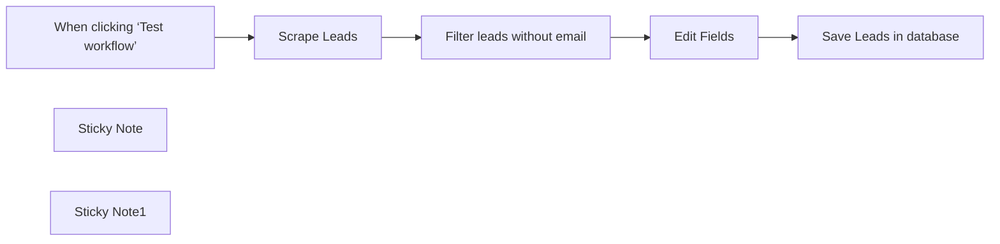

## Fluxo (.json) :

```json
{
  "id": "EWIrJ8e9z7AijmTu",
  "meta": {
    "instanceId": "e8ec316b54e91908f34cbfdc330e5d1d5e97aa0ea8f7277c00d8a8a3892c9983",
    "templateCredsSetupCompleted": true
  },
  "name": "Lead Generation System (Template)",
  "tags": [],
  "nodes": [
    {
      "id": "03eabaeb-ad13-4764-98de-183325e32cbd",
      "name": "When clicking ‘Test workflow’",
      "type": "n8n-nodes-base.manualTrigger",
      "position": [
        160,
        -80
      ],
      "parameters": {},
      "typeVersion": 1
    },
    {
      "id": "e7df072c-fba8-4dc2-94ce-ae20a135a633",
      "name": "Edit Fields",
      "type": "n8n-nodes-base.set",
      "position": [
        840,
        -80
      ],
      "parameters": {
        "options": {},
        "assignments": {
          "assignments": [
            {
              "id": "ab7e33d5-986e-4fba-b4d0-bc47bcd1cf82",
              "name": "first_name",
              "type": "string",
              "value": "={{ $json.first_name }}"
            },
            {
              "id": "f29e8cf7-3cd0-4ffc-a071-96be9dd1da50",
              "name": "last_name",
              "type": "string",
              "value": "={{ $json.last_name }}"
            },
            {
              "id": "54ee5cec-ccaf-4f34-8030-d17206abef5d",
              "name": "email",
              "type": "string",
              "value": "={{ $json.email }}"
            },
            {
              "id": "daf1fa7c-a7fc-4b96-8184-a5569b9ab9a0",
              "name": "email_status",
              "type": "string",
              "value": "={{ $json.email_status }}"
            },
            {
              "id": "2c7e31e5-42a2-4295-ae8b-108d8a7d409a",
              "name": "linkedin_url",
              "type": "string",
              "value": "={{ $json.linkedin_url }}"
            },
            {
              "id": "4002f912-0581-4219-8443-96c13133dc76",
              "name": "headline",
              "type": "string",
              "value": "={{ $json.headline }}"
            },
            {
              "id": "fa92887f-fff5-4ee4-9b80-05115b83f718",
              "name": "organization",
              "type": "string",
              "value": "={{ $json.organization_name }}"
            },
            {
              "id": "c274e875-6a53-484a-87b1-3c672101603f",
              "name": "organization_website",
              "type": "string",
              "value": "={{ $json.organization_website_url }}"
            },
            {
              "id": "af6208a2-d064-471b-a417-7d96e9d05803",
              "name": "organization_linkedin_url",
              "type": "string",
              "value": "={{ $json.organization_linkedin_url }}"
            },
            {
              "id": "d61f2ddb-4c50-4548-8a7f-08261c60c429",
              "name": "current_job_title",
              "type": "string",
              "value": "={{ $json.title }}"
            },
            {
              "id": "838c77f2-618e-43b2-9df6-e5e1bde39105",
              "name": "country",
              "type": "string",
              "value": "={{ $json.country }}"
            },
            {
              "id": "9dc784cf-ae01-44e3-afed-16a95192bf71",
              "name": "city",
              "type": "string",
              "value": "={{ $json.city }}"
            }
          ]
        }
      },
      "typeVersion": 3.4
    },
    {
      "id": "3aaa9ea7-0c5d-4ea3-aa10-6cd0125ea91a",
      "name": "Sticky Note",
      "type": "n8n-nodes-base.stickyNote",
      "position": [
        80,
        -280
      ],
      "parameters": {
        "color": 5,
        "width": 1200,
        "height": 520,
        "content": "## Lead Generation\nGet thousands of enriched leads in seconds."
      },
      "typeVersion": 1
    },
    {
      "id": "42e3f6de-4ec4-46a7-a7f9-c028d27a677b",
      "name": "Scrape Leads",
      "type": "n8n-nodes-base.httpRequest",
      "position": [
        380,
        -80
      ],
      "parameters": {
        "url": "=",
        "options": {},
        "jsonBody": "{\n    \"getPersonalEmails\": true,\n    \"getWorkEmails\": true,\n    \"totalRecords\": 500,\n    \"url\": \"\"\n}",
        "sendBody": true,
        "specifyBody": "json"
      },
      "typeVersion": 4.2
    },
    {
      "id": "dfd580f6-99b5-414a-b6f3-77c73edc85ec",
      "name": "Save Leads in database",
      "type": "n8n-nodes-base.airtable",
      "position": [
        1040,
        -80
      ],
      "parameters": {
        "base": {
          "__rl": true,
          "mode": "list",
          "value": "appy1hlfTk0UuYwRb",
          "cachedResultUrl": "https://airtable.com/appy1hlfTk0UuYwRb",
          "cachedResultName": "Lead Gen - Mastersheet"
        },
        "table": {
          "__rl": true,
          "mode": "list",
          "value": "tbl0rwfpUYkqMiysR",
          "cachedResultUrl": "https://airtable.com/appy1hlfTk0UuYwRb/tbl0rwfpUYkqMiysR",
          "cachedResultName": "Leads"
        },
        "columns": {
          "value": {
            "city": "={{ $json.city }}",
            "country": "={{ $json.country }}",
            "headline": "={{ $json.headline }}",
            "last_name": "={{ $json.last_name }}",
            "first_name": "={{ $json.first_name }}",
            "email_status": "={{ $json.email_status }}",
            "linkedin_url": "={{ $json.linkedin_url }}",
            "email_address": "={{ $json.email }}",
            "current_job_title": "={{ $json.current_job_title }}",
            "organization_name": "={{ $json.organization }}",
            "organization_website": "={{ $json.organization_website }}",
            "organization_linkedin_url": "={{ $json.organization_linkedin_url }}"
          },
          "schema": [
            {
              "id": "email_address",
              "type": "string",
              "display": true,
              "removed": false,
              "readOnly": false,
              "required": false,
              "displayName": "email_address",
              "defaultMatch": false,
              "canBeUsedToMatch": true
            },
            {
              "id": "first_name",
              "type": "string",
              "display": true,
              "removed": false,
              "readOnly": false,
              "required": false,
              "displayName": "first_name",
              "defaultMatch": false,
              "canBeUsedToMatch": true
            },
            {
              "id": "last_name",
              "type": "string",
              "display": true,
              "removed": false,
              "readOnly": false,
              "required": false,
              "displayName": "last_name",
              "defaultMatch": false,
              "canBeUsedToMatch": true
            },
            {
              "id": "headline",
              "type": "string",
              "display": true,
              "removed": false,
              "readOnly": false,
              "required": false,
              "displayName": "headline",
              "defaultMatch": false,
              "canBeUsedToMatch": true
            },
            {
              "id": "linkedin_url",
              "type": "string",
              "display": true,
              "removed": false,
              "readOnly": false,
              "required": false,
              "displayName": "linkedin_url",
              "defaultMatch": false,
              "canBeUsedToMatch": true
            },
            {
              "id": "organization_name",
              "type": "string",
              "display": true,
              "removed": false,
              "readOnly": false,
              "required": false,
              "displayName": "organization_name",
              "defaultMatch": false,
              "canBeUsedToMatch": true
            },
            {
              "id": "organization_website",
              "type": "string",
              "display": true,
              "removed": false,
              "readOnly": false,
              "required": false,
              "displayName": "organization_website",
              "defaultMatch": false,
              "canBeUsedToMatch": true
            },
            {
              "id": "organization_linkedin_url",
              "type": "string",
              "display": true,
              "removed": false,
              "readOnly": false,
              "required": false,
              "displayName": "organization_linkedin_url",
              "defaultMatch": false,
              "canBeUsedToMatch": true
            },
            {
              "id": "current_job_title",
              "type": "string",
              "display": true,
              "removed": false,
              "readOnly": false,
              "required": false,
              "displayName": "current_job_title",
              "defaultMatch": false,
              "canBeUsedToMatch": true
            },
            {
              "id": "country",
              "type": "string",
              "display": true,
              "removed": false,
              "readOnly": false,
              "required": false,
              "displayName": "country",
              "defaultMatch": false,
              "canBeUsedToMatch": true
            },
            {
              "id": "email_status",
              "type": "string",
              "display": true,
              "removed": false,
              "readOnly": false,
              "required": false,
              "displayName": "email_status",
              "defaultMatch": false,
              "canBeUsedToMatch": true
            },
            {
              "id": "city",
              "type": "string",
              "display": true,
              "removed": false,
              "readOnly": false,
              "required": false,
              "displayName": "city",
              "defaultMatch": false,
              "canBeUsedToMatch": true
            }
          ],
          "mappingMode": "defineBelow",
          "matchingColumns": [],
          "attemptToConvertTypes": false,
          "convertFieldsToString": false
        },
        "options": {},
        "operation": "create"
      },
      "credentials": {
        "airtableTokenApi": {
          "id": "WKxw33bpSEDiQEaU",
          "name": "Airtable Personal Access Token account"
        }
      },
      "typeVersion": 2.1
    },
    {
      "id": "ff009ef3-c7da-460a-80e5-ba1330631c00",
      "name": "Sticky Note1",
      "type": "n8n-nodes-base.stickyNote",
      "position": [
        -400,
        -280
      ],
      "parameters": {
        "color": 3,
        "width": 460,
        "height": 180,
        "content": "## 🚨 readMeFirst 🚨\nThis template is built by [Not Another Marketer](https://notanothermarketer.com)\n\nStep-by-step setup guide: https://notanothermarketer.gitbook.io/\n\nAny questions? [Reach out on X](https://x.com/notanothermrktr) "
      },
      "typeVersion": 1
    },
    {
      "id": "0915cea5-746a-4dde-9208-885e08644ae2",
      "name": "Filter leads without email",
      "type": "n8n-nodes-base.if",
      "position": [
        600,
        -80
      ],
      "parameters": {
        "options": {},
        "conditions": {
          "options": {
            "version": 2,
            "leftValue": "",
            "caseSensitive": true,
            "typeValidation": "strict"
          },
          "combinator": "and",
          "conditions": [
            {
              "id": "231ec40a-bd12-46e2-ab6b-a8c4d6728983",
              "operator": {
                "type": "string",
                "operation": "exists",
                "singleValue": true
              },
              "leftValue": "={{ $json.email }}",
              "rightValue": ""
            }
          ]
        }
      },
      "typeVersion": 2.2
    }
  ],
  "active": false,
  "pinData": {},
  "settings": {
    "executionOrder": "v1"
  },
  "versionId": "f574ed33-bd0a-496b-865e-e6be2c1e3060",
  "connections": {
    "Edit Fields": {
      "main": [
        [
          {
            "node": "Save Leads in database",
            "type": "main",
            "index": 0
          }
        ]
      ]
    },
    "Scrape Leads": {
      "main": [
        [
          {
            "node": "Filter leads without email",
            "type": "main",
            "index": 0
          }
        ]
      ]
    },
    "Filter leads without email": {
      "main": [
        [
          {
            "node": "Edit Fields",
            "type": "main",
            "index": 0
          }
        ]
      ]
    },
    "When clicking ‘Test workflow’": {
      "main": [
        [
          {
            "node": "Scrape Leads",
            "type": "main",
            "index": 0
          }
        ]
      ]
    }
  }
}
```

<a id="template-885"></a>

## Template 885 - Registrar pagamento Stripe como Sales Receipt no QuickBooks

- **Nome:** Registrar pagamento Stripe como Sales Receipt no QuickBooks
- **Descrição:** Recebe eventos de pagamento bem-sucedido do Stripe e registra recibos de venda no QuickBooks, criando o cliente no QuickBooks quando necessário.
- **Funcionalidade:** • Detecção de pagamento: Inicia quando um payment_intent.succeeded é recebido do Stripe.
• Recuperação de cliente Stripe: Busca os dados do cliente associado ao pagamento.
• Busca de cliente no QuickBooks por e-mail: Consulta o QuickBooks para verificar se o cliente já existe.
• Criação de cliente no QuickBooks: Se não houver cliente correspondente, cria um novo registro no QuickBooks com nome e e-mail do cliente Stripe.
• Preparação do Sales Receipt: Constrói um recibo de venda com item (Subscription), descrição, quantidade, preço unitário e conversão de valores em centavos para unidades monetárias.
• Envio do Sales Receipt ao QuickBooks: Publica o recibo para o cliente apropriado e inclui nota privada com o ID do Payment Intent do Stripe.
- **Ferramentas:** • Stripe: Plataforma de pagamentos usada para receber eventos de pagamento e obter os dados do cliente e do payment intent.
• QuickBooks Online (Intuit API): Sistema de contabilidade usado para consultar/criar clientes e registrar sales receipts.

## Fluxo visual

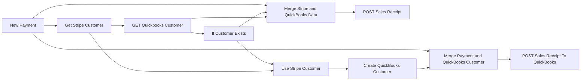

## Fluxo (.json) :

```json
{
  "meta": {
    "instanceId": "6f3fb2495ae05d668c93cbf9e1649128d6e08178f8a900941cf97e588f18fdfc",
    "templateCredsSetupCompleted": true
  },
  "nodes": [
    {
      "id": "7fe02521-c46a-4314-9387-b7b4983fa859",
      "name": "POST Sales Receipt",
      "type": "n8n-nodes-base.httpRequest",
      "position": [
        1320,
        -120
      ],
      "parameters": {
        "url": "https://sandbox-quickbooks.api.intuit.com/v3/company/9341453851324714/salesreceipt?minorversion=73",
        "method": "POST",
        "options": {},
        "jsonBody": "={\n  \"Line\": [\n    {\n      \"Description\": \"{{ $json.data.object.description }}\",\n      \"DetailType\": \"SalesItemLineDetail\",\n      \"SalesItemLineDetail\": {\n        \"TaxCodeRef\": {\n          \"value\": \"NON\"\n        },\n        \"Qty\": 1,\n        \"UnitPrice\": {{ $json.data.object.amount_received / 100 }},\n        \"ItemRef\": {\n          \"name\": \"Subscription\", \n          \"value\": \"10\"\n        }\n      },\n      \"Amount\": {{ $json.data.object.amount / 100 }},\n      \"LineNum\": 1\n    }\n  ],\n  \"CustomerRef\": {\n    \"value\": {{ $input.all()[2].json.QueryResponse.Customer[0].BillAddr.Id }},\n    \"name\": \"{{ $input.all()[2].json.QueryResponse.Customer[0].DisplayName }}\"\n  },\n  \"CurrencyRef\": {\n    \"value\": \"{{ $json.data.object.currency.toUpperCase() }}\"\n  },\n  \"PrivateNote\": \"Payment from Stripe Payment Intent ID: {{ $json.data.object.id }}\"\n}",
        "sendBody": true,
        "specifyBody": "json",
        "authentication": "predefinedCredentialType",
        "nodeCredentialType": "quickBooksOAuth2Api"
      },
      "credentials": {
        "quickBooksOAuth2Api": {
          "id": "IUNAfwwSgnbwWygB",
          "name": "QuickBooks Online account"
        }
      },
      "executeOnce": true,
      "typeVersion": 4.2
    },
    {
      "id": "5ed429d7-c93d-48c8-b603-ca8d7efb57ed",
      "name": "GET Quickbooks Customer",
      "type": "n8n-nodes-base.httpRequest",
      "position": [
        400,
        -20
      ],
      "parameters": {
        "url": "=https://sandbox-quickbooks.api.intuit.com/v3/company/9341453851324714/query?query=select * from Customer Where PrimaryEmailAddr = '{{ $json.email }}'&minorversion=73\n\n",
        "options": {},
        "authentication": "predefinedCredentialType",
        "nodeCredentialType": "quickBooksOAuth2Api"
      },
      "credentials": {
        "httpCustomAuth": {
          "id": "hqXGCVkt6W41KDDK",
          "name": "Custom Auth account"
        },
        "quickBooksOAuth2Api": {
          "id": "IUNAfwwSgnbwWygB",
          "name": "QuickBooks Online account"
        }
      },
      "typeVersion": 4.2
    },
    {
      "id": "bef5b4c3-4948-4294-bd80-7039342edf0d",
      "name": "Get Stripe Customer",
      "type": "n8n-nodes-base.stripe",
      "position": [
        240,
        -140
      ],
      "parameters": {
        "resource": "customer",
        "customerId": "={{ $json.data.object.customer }}"
      },
      "credentials": {
        "stripeApi": {
          "id": "o6KHVZiU8S7O38wq",
          "name": "Stripe account"
        }
      },
      "typeVersion": 1
    },
    {
      "id": "042fff2c-b5e7-4877-b935-f6a707118c4a",
      "name": "New Payment",
      "type": "n8n-nodes-base.stripeTrigger",
      "position": [
        80,
        -260
      ],
      "webhookId": "5cc15770-f762-4389-8372-1b2926de4570",
      "parameters": {
        "events": [
          "payment_intent.succeeded"
        ]
      },
      "credentials": {
        "stripeApi": {
          "id": "o6KHVZiU8S7O38wq",
          "name": "Stripe account"
        }
      },
      "typeVersion": 1
    },
    {
      "id": "12235c25-712b-4e84-b744-60573e00d381",
      "name": "If Customer Exists",
      "type": "n8n-nodes-base.if",
      "position": [
        560,
        100
      ],
      "parameters": {
        "options": {},
        "conditions": {
          "options": {
            "version": 2,
            "leftValue": "",
            "caseSensitive": true,
            "typeValidation": "strict"
          },
          "combinator": "and",
          "conditions": [
            {
              "id": "aef7393c-c4ff-4196-887d-6a9b057381f8",
              "operator": {
                "type": "string",
                "operation": "exists",
                "singleValue": true
              },
              "leftValue": "={{ $json.QueryResponse.Customer[0].PrimaryEmailAddr.Address }}",
              "rightValue": ""
            }
          ]
        }
      },
      "typeVersion": 2.2
    },
    {
      "id": "68f63246-cb95-494f-918c-c0c6da5a64f9",
      "name": "Use Stripe Customer",
      "type": "n8n-nodes-base.merge",
      "position": [
        880,
        120
      ],
      "parameters": {},
      "executeOnce": true,
      "typeVersion": 3
    },
    {
      "id": "e9eea332-7109-479f-8f50-65b3b9438e0e",
      "name": "Create QuickBooks Customer",
      "type": "n8n-nodes-base.quickbooks",
      "position": [
        1100,
        120
      ],
      "parameters": {
        "operation": "create",
        "displayName": "={{ $input.all()[0].json.name }}",
        "additionalFields": {
          "Balance": "={{ $input.all()[0].json.balance }}",
          "PrimaryEmailAddr": "={{ $input.all()[0].json.email }}"
        }
      },
      "credentials": {
        "quickBooksOAuth2Api": {
          "id": "IUNAfwwSgnbwWygB",
          "name": "QuickBooks Online account"
        }
      },
      "executeOnce": true,
      "typeVersion": 1
    },
    {
      "id": "f805f03d-93b7-4e3b-8b6a-37d9dd802368",
      "name": "Merge Stripe and QuickBooks Data",
      "type": "n8n-nodes-base.merge",
      "position": [
        1100,
        -120
      ],
      "parameters": {
        "numberInputs": 3
      },
      "typeVersion": 3
    },
    {
      "id": "b9c31838-2bb7-4882-bd15-c096cb97e225",
      "name": "Merge Payment and QuickBooks Customer",
      "type": "n8n-nodes-base.merge",
      "position": [
        1320,
        120
      ],
      "parameters": {},
      "executeOnce": true,
      "typeVersion": 3
    },
    {
      "id": "cb69fcee-8d5d-47ab-be76-9e25cb0a7f42",
      "name": "POST Sales Receipt To QuickBooks",
      "type": "n8n-nodes-base.httpRequest",
      "position": [
        1540,
        120
      ],
      "parameters": {
        "url": "https://sandbox-quickbooks.api.intuit.com/v3/company/9341453851324714/salesreceipt?minorversion=73",
        "method": "POST",
        "options": {},
        "jsonBody": "={\n  \"Line\": [\n    {\n      \"Description\": \"{{ $json.data.object.description }}\",\n      \"DetailType\": \"SalesItemLineDetail\",\n      \"SalesItemLineDetail\": {\n        \"TaxCodeRef\": {\n          \"value\": \"NON\"\n        },\n        \"Qty\": 1,\n        \"UnitPrice\": {{ $json.data.object.amount_received / 100 }},\n        \"ItemRef\": {\n          \"name\": \"Subscription\", \n          \"value\": \"10\"\n        }\n      },\n      \"Amount\": {{ $json.data.object.amount / 100 }},\n      \"LineNum\": 1\n    }\n  ],\n  \"CustomerRef\": {\n    \"value\": {{ $input.all()[1].json.Id}},\n    \"name\": \"{{ $input.all()[1].json.DisplayName }}\"\n  },\n  \"CurrencyRef\": {\n    \"value\": \"{{ $json.data.object.currency.toUpperCase() }}\"\n  },\n  \"PrivateNote\": \"Payment from Stripe Payment Intent ID: {{ $json.data.object.id }}\"\n}",
        "sendBody": true,
        "specifyBody": "json",
        "authentication": "predefinedCredentialType",
        "nodeCredentialType": "quickBooksOAuth2Api"
      },
      "credentials": {
        "quickBooksOAuth2Api": {
          "id": "IUNAfwwSgnbwWygB",
          "name": "QuickBooks Online account"
        }
      },
      "executeOnce": true,
      "typeVersion": 4.2
    }
  ],
  "pinData": {
    "New Payment": [
      {
        "id": "evt_3Qjf7fJJNVDH5POn01Am9Q1x",
        "data": {
          "object": {
            "id": "pi_3Qjf54D14htxZ8341jkWWJJs",
            "amount": 9500,
            "object": "payment_intent",
            "review": null,
            "source": null,
            "status": "succeeded",
            "created": 1737456794,
            "invoice": "in_1Qje8QD14htxZ834S3Gh3Nn6",
            "currency": "usd",
            "customer": "cus_R4OkhTTT1ebzPl",
            "livemode": false,
            "metadata": {},
            "shipping": null,
            "processing": null,
            "application": null,
            "canceled_at": null,
            "description": "Subscription update",
            "next_action": null,
            "on_behalf_of": null,
            "client_secret": "pi_3Qjf54D14htxZ8341jkWWJJs_secret_FXltcZHFUDM8I4F0AQjRPE9Vz",
            "latest_charge": "ch_3Qjf54D14htxZ8341xwQhggm",
            "receipt_email": null,
            "transfer_data": null,
            "amount_details": {
              "tip": {}
            },
            "capture_method": "automatic",
            "payment_method": "pm_1Qh6nED14htxZ834bTgSzUQy",
            "transfer_group": null,
            "amount_received": 9500,
            "amount_capturable": 0,
            "last_payment_error": null,
            "setup_future_usage": null,
            "cancellation_reason": null,
            "confirmation_method": "automatic",
            "payment_method_types": [
              "amazon_pay",
              "card",
              "cashapp",
              "link"
            ],
            "statement_descriptor": null,
            "application_fee_amount": null,
            "payment_method_options": {
              "card": {
                "network": null,
                "installments": null,
                "mandate_options": null,
                "request_three_d_secure": "automatic"
              },
              "link": {
                "persistent_token": null
              },
              "cashapp": {},
              "amazon_pay": {
                "express_checkout_element_session_id": null
              }
            },
            "automatic_payment_methods": null,
            "statement_descriptor_suffix": null,
            "payment_method_configuration_details": null
          }
        },
        "type": "payment_intent.succeeded",
        "object": "event",
        "created": 1737456956,
        "request": {
          "id": "req_vbXfG1vUORKZJ6",
          "idempotency_key": "e63d5e07-f753-429c-bd06-c642e23d9ff8"
        },
        "livemode": false,
        "api_version": "2020-08-27",
        "pending_webhooks": 3
      }
    ],
    "Get Stripe Customer": [
      {
        "id": "cus_R4OkhTTT1ebzPl",
        "name": "Test Usershvili",
        "email": "Birds@Intuit.com",
        "phone": null,
        "object": "customer",
        "address": {
          "city": null,
          "line1": null,
          "line2": null,
          "state": null,
          "country": "GE",
          "postal_code": null
        },
        "balance": 0,
        "created": 1729495354,
        "currency": "usd",
        "discount": null,
        "livemode": false,
        "metadata": {},
        "shipping": null,
        "delinquent": false,
        "tax_exempt": "none",
        "test_clock": null,
        "description": null,
        "default_source": null,
        "invoice_prefix": "F73B0901",
        "default_currency": "usd",
        "invoice_settings": {
          "footer": null,
          "custom_fields": null,
          "rendering_options": null,
          "default_payment_method": null
        },
        "preferred_locales": [
          "en-GB"
        ]
      }
    ]
  },
  "connections": {
    "New Payment": {
      "main": [
        [
          {
            "node": "Get Stripe Customer",
            "type": "main",
            "index": 0
          },
          {
            "node": "Merge Stripe and QuickBooks Data",
            "type": "main",
            "index": 0
          },
          {
            "node": "Merge Payment and QuickBooks Customer",
            "type": "main",
            "index": 0
          }
        ]
      ]
    },
    "If Customer Exists": {
      "main": [
        [
          {
            "node": "Merge Stripe and QuickBooks Data",
            "type": "main",
            "index": 2
          }
        ],
        [
          {
            "node": "Use Stripe Customer",
            "type": "main",
            "index": 0
          }
        ]
      ]
    },
    "POST Sales Receipt": {
      "main": [
        []
      ]
    },
    "Get Stripe Customer": {
      "main": [
        [
          {
            "node": "GET Quickbooks Customer",
            "type": "main",
            "index": 0
          },
          {
            "node": "Use Stripe Customer",
            "type": "main",
            "index": 1
          }
        ]
      ]
    },
    "Use Stripe Customer": {
      "main": [
        [
          {
            "node": "Create QuickBooks Customer",
            "type": "main",
            "index": 0
          }
        ]
      ]
    },
    "GET Quickbooks Customer": {
      "main": [
        [
          {
            "node": "If Customer Exists",
            "type": "main",
            "index": 0
          },
          {
            "node": "Merge Stripe and QuickBooks Data",
            "type": "main",
            "index": 1
          }
        ]
      ]
    },
    "Create QuickBooks Customer": {
      "main": [
        [
          {
            "node": "Merge Payment and QuickBooks Customer",
            "type": "main",
            "index": 1
          }
        ]
      ]
    },
    "Merge Stripe and QuickBooks Data": {
      "main": [
        [
          {
            "node": "POST Sales Receipt",
            "type": "main",
            "index": 0
          }
        ]
      ]
    },
    "Merge Payment and QuickBooks Customer": {
      "main": [
        [
          {
            "node": "POST Sales Receipt To QuickBooks",
            "type": "main",
            "index": 0
          }
        ]
      ]
    }
  }
}
```

<a id="template-886"></a>

## Template 886 - Playlist mensal automática Spotify/DB

- **Nome:** Playlist mensal automática Spotify/DB
- **Descrição:** Fluxo que cria uma playlist mensal baseada no mês atual, sincroniza informações com o DB e adiciona as últimas faixas curtidas ao playlist, mantendo os dados atualizados.
- **Funcionalidade:** • Detecção do mês atual: obtém o mês e o ano para nomear a playlist mensal.
• Verificação de existência da playlist mensal: verifica se a playlist do mês já existe no Spotify e no DB.
• Criação da playlist mensal no Spotify: cria a playlist com o nome do mês atual e descrição padrão.
• Registro da playlist no DB: grava a nova playlist no DB com uri, nome e descrição.
• Busca das últimas 10 faixas curtidas: obtém as faixas mais recentes curtidas pelo usuário.
• Verificação de cada faixa no DB: checa se cada faixa já está cadastrada no DB.
• Cadastro de novas faixas no DB: cria entradas para faixas não cadastradas com uri, data de adição e nome da playlist.
• Adição de faixas ao playlist mensal: adiciona as faixas cadastradas à playlist recém-criada no Spotify.
• Sincronização entre Spotify e DB: utiliza fluxos de merge/loop para processar faixas e manter consistência dos dados.
- **Ferramentas:** • Spotify: serviço de streaming para gerenciar playlists, buscar faixas curtidas e adicionar faixas a playlists.
• NocoDB: banco de dados/planilha para armazenar informações de playlists e faixas, integrando com o fluxo.


## Fluxo visual

```mermaid
flowchart LR
    N1["Get current date"]
    N2["Sticky Note3"]
    N3["Get last 10 liked tracks"]
    N4["Check if track is saved"]
    N5["Is not saved"]
    N6["Create song entry"]
    N7["Get all user playlist"]
    N8["Sticky Note4"]
    N9["Get monthly playlist"]
    N10["Get playlist in DB"]
    N11["Monthly playlist exist in Spotify ?"]
    N12["Playlist exist  in DB ?"]
    N13["Create playlist in Spotify"]
    N14["Create playlist in DB1"]
    N15["Create playlist in DB"]
    N16["Merge"]
    N17["Clean op"]
    N18["Clean op2"]
    N19["Get this month playlist in DB"]
    N20["Get this month tracks in DB"]
    N21["Add song to the playlist"]
    N22["For each tracks in liked song"]
    N23["For each monthly tracks in DB"]
    N24["Get this month tracks in Spotify"]
    N25["Filter1"]
    N26["Song is not present in the playlist ?"]
    N27["Clean op1"]
    N28["Sticky Note5"]
    N29["Schedule Trigger"]
    N30["End"]

    N16 --> N19
    N25 --> N26
    N17 --> N16
    N27 --> N23
    N18 --> N22
    N5 --> N6
    N5 --> N18
    N1 --> N7
    N1 --> N3
    N29 --> N1
    N6 --> N18
    N10 --> N12
    N9 --> N11
    N15 --> N17
    N7 --> N9
    N14 --> N17
    N4 --> N5
    N12 --> N17
    N12 --> N15
    N21 --> N27
    N3 --> N22
    N13 --> N14
    N20 --> N23
    N23 --> N30
    N23 --> N24
    N22 --> N16
    N22 --> N4
    N19 --> N20
    N24 --> N25
    N11 --> N10
    N11 --> N13
    N26 --> N21
    N26 --> N27
```

## Fluxo (.json) :

```json
{
  "meta": {
    "instanceId": "0c99324b4b0921a9febd4737c606882881f3ca11d9b1d7e22b0dad4784eb24c7"
  },
  "nodes": [
    {
      "id": "f418ae01-01ea-4794-8903-d5709a29c735",
      "name": "Get current date",
      "type": "n8n-nodes-base.code",
      "position": [
        240,
        2460
      ],
      "parameters": {
        "jsCode": "const monthNames = [\n  'January',\n  'February',\n  'March',\n  'April',\n  'May',\n  'June',\n  'July',\n  'August',\n  'September',\n  'October',\n  'November',\n  'December',\n]\n\nconst date = new Date()\nconst year = date.getFullYear()\nconst month = date.getMonth()\n\nlet currentDate = {\n  month: month,\n  year: year,\n  text: `${monthNames[month]} '${year.toString().slice(-2)}`\n}\n\nitems[0].json.currentDate = currentDate\n\nreturn items\n\n// Month > Number e.g. July = 6, December = 11\n// Year > Text\n// Text > Playlist name\n\n// let currentDate = {\n//   month: 8, \n//   year: '2024',\n//   text: `September '23`\n// }\n\n// items[0].json.currentDate = currentDate\n\n// return items\n\n"
      },
      "typeVersion": 1
    },
    {
      "id": "855e493a-a232-45ef-8fdd-4a8225065c95",
      "name": "Sticky Note3",
      "type": "n8n-nodes-base.stickyNote",
      "position": [
        460,
        2580
      ],
      "parameters": {
        "width": 1290.936043660723,
        "height": 407.6508589002549,
        "content": "## Check if the song is present in the database"
      },
      "typeVersion": 1
    },
    {
      "id": "672ef06c-b812-41c8-8501-cde8b61a4aef",
      "name": "Get last 10 liked tracks",
      "type": "n8n-nodes-base.spotify",
      "position": [
        500,
        2680
      ],
      "parameters": {
        "limit": 10,
        "resource": "library"
      },
      "credentials": {
        "spotifyOAuth2Api": {
          "id": "zQrMRwwU6DLh4W77",
          "name": "Spotify account"
        }
      },
      "typeVersion": 1
    },
    {
      "id": "da13c571-6af4-49bf-b8ff-2d54245f6d3e",
      "name": "Check if track is saved",
      "type": "n8n-nodes-base.nocoDb",
      "position": [
        940,
        2780
      ],
      "parameters": {
        "table": "m0dm2y304t7vmuk",
        "options": {
          "where": "=(uri,eq,{{ $json.track.uri }})",
          "fields": [
            "uri"
          ]
        },
        "operation": "getAll",
        "projectId": "pepq760y5lwt5tm",
        "returnAll": true,
        "authentication": "nocoDbApiToken"
      },
      "credentials": {
        "nocoDbApiToken": {
          "id": "9uSbSrDz8EL2OIL7",
          "name": "NocoDB Token account"
        }
      },
      "typeVersion": 3,
      "alwaysOutputData": true
    },
    {
      "id": "9144cda9-f18f-46d9-be2d-9fca4b192dbb",
      "name": "Is not saved",
      "type": "n8n-nodes-base.if",
      "position": [
        1160,
        2780
      ],
      "parameters": {
        "options": {},
        "conditions": {
          "options": {
            "leftValue": "",
            "caseSensitive": true,
            "typeValidation": "strict"
          },
          "combinator": "and",
          "conditions": [
            {
              "id": "dbb259d9-e2ec-4a7b-b375-601346dc2571",
              "operator": {
                "type": "object",
                "operation": "empty",
                "singleValue": true
              },
              "leftValue": "={{ $json }}",
              "rightValue": ""
            }
          ]
        }
      },
      "typeVersion": 2
    },
    {
      "id": "66b430e2-f46c-43b2-84e7-35c85d2b4403",
      "name": "Create song entry",
      "type": "n8n-nodes-base.nocoDb",
      "position": [
        1380,
        2700
      ],
      "parameters": {
        "table": "m0dm2y304t7vmuk",
        "fieldsUi": {
          "fieldValues": [
            {
              "fieldName": "uri",
              "fieldValue": "={{ $('For each tracks in liked song').item.json.track.uri }}"
            },
            {
              "fieldName": "added_at",
              "fieldValue": "={{ $('For each tracks in liked song').item.json.added_at }}"
            },
            {
              "fieldName": "playlistName",
              "fieldValue": "={{ $('Get current date').item.json.currentDate.text }}"
            }
          ]
        },
        "operation": "create",
        "projectId": "pepq760y5lwt5tm",
        "authentication": "nocoDbApiToken"
      },
      "credentials": {
        "nocoDbApiToken": {
          "id": "9uSbSrDz8EL2OIL7",
          "name": "NocoDB Token account"
        }
      },
      "typeVersion": 3
    },
    {
      "id": "9bd883ea-2e87-45aa-b8a0-b361ba7c5d9f",
      "name": "Get all user playlist",
      "type": "n8n-nodes-base.spotify",
      "position": [
        500,
        2220
      ],
      "parameters": {
        "resource": "playlist",
        "operation": "getUserPlaylists",
        "returnAll": true
      },
      "credentials": {
        "spotifyOAuth2Api": {
          "id": "zQrMRwwU6DLh4W77",
          "name": "Spotify account"
        }
      },
      "typeVersion": 1
    },
    {
      "id": "3a0dad98-4571-4fb7-b366-0060d35b65fe",
      "name": "Sticky Note4",
      "type": "n8n-nodes-base.stickyNote",
      "position": [
        460,
        2080
      ],
      "parameters": {
        "width": 1481.5336029736159,
        "height": 416.7665808180022,
        "content": "## Check if the playlist present in the database"
      },
      "typeVersion": 1
    },
    {
      "id": "e793b97c-cc29-47b0-8aa7-015fa631bc37",
      "name": "Get monthly playlist",
      "type": "n8n-nodes-base.filter",
      "position": [
        720,
        2220
      ],
      "parameters": {
        "options": {},
        "conditions": {
          "options": {
            "leftValue": "",
            "caseSensitive": true,
            "typeValidation": "strict"
          },
          "combinator": "and",
          "conditions": [
            {
              "id": "56173299-d774-4cb4-b26f-4dca294dda1d",
              "operator": {
                "name": "filter.operator.equals",
                "type": "string",
                "operation": "equals"
              },
              "leftValue": "={{ $json.name }}",
              "rightValue": "={{ $('Get current date').item.json.currentDate.text }}"
            }
          ]
        }
      },
      "typeVersion": 2,
      "alwaysOutputData": true
    },
    {
      "id": "502ea9e2-7f03-4a8a-860e-90d63e42ee33",
      "name": "Get playlist in DB",
      "type": "n8n-nodes-base.nocoDb",
      "position": [
        1160,
        2120
      ],
      "parameters": {
        "table": "mchan0xys9h7h7e",
        "options": {
          "where": "=(name,eq,{{ $('Get current date').item.json.currentDate.text }})"
        },
        "operation": "getAll",
        "projectId": "pepq760y5lwt5tm",
        "returnAll": true,
        "authentication": "nocoDbApiToken"
      },
      "credentials": {
        "nocoDbApiToken": {
          "id": "9uSbSrDz8EL2OIL7",
          "name": "NocoDB Token account"
        }
      },
      "typeVersion": 3,
      "alwaysOutputData": true
    },
    {
      "id": "3d2bece0-8096-4ee1-a3b9-ae91b83f0957",
      "name": "Monthly playlist exist in Spotify ?",
      "type": "n8n-nodes-base.if",
      "position": [
        940,
        2220
      ],
      "parameters": {
        "options": {},
        "conditions": {
          "options": {
            "leftValue": "",
            "caseSensitive": true,
            "typeValidation": "strict"
          },
          "combinator": "and",
          "conditions": [
            {
              "id": "a2d9e3e0-a906-4ed9-9e23-166f781c86b1",
              "operator": {
                "type": "object",
                "operation": "notEmpty",
                "singleValue": true
              },
              "leftValue": "={{ $json }}",
              "rightValue": ""
            }
          ]
        }
      },
      "typeVersion": 2
    },
    {
      "id": "d983b940-2f8d-4823-aaaf-d1bfa4428b41",
      "name": "Playlist exist  in DB ?",
      "type": "n8n-nodes-base.if",
      "position": [
        1380,
        2120
      ],
      "parameters": {
        "options": {},
        "conditions": {
          "options": {
            "leftValue": "",
            "caseSensitive": true,
            "typeValidation": "strict"
          },
          "combinator": "and",
          "conditions": [
            {
              "id": "9485c9d4-ecdc-4d0e-a576-c7db5787c069",
              "operator": {
                "type": "object",
                "operation": "notEmpty",
                "singleValue": true
              },
              "leftValue": "={{ $json }}",
              "rightValue": ""
            }
          ]
        }
      },
      "typeVersion": 2
    },
    {
      "id": "c694ab19-bca7-4dd4-8d10-cf8a1adab341",
      "name": "Create playlist in Spotify",
      "type": "n8n-nodes-base.spotify",
      "position": [
        1160,
        2320
      ],
      "parameters": {
        "name": "={{ $('Get current date').item.json.currentDate.text }}",
        "resource": "playlist",
        "operation": "create",
        "additionalFields": {
          "description": "Monthly playlist"
        }
      },
      "credentials": {
        "spotifyOAuth2Api": {
          "id": "zQrMRwwU6DLh4W77",
          "name": "Spotify account"
        }
      },
      "typeVersion": 1
    },
    {
      "id": "dc9dc3b5-cef7-412b-b3f8-5ec011c2746d",
      "name": "Create playlist in DB1",
      "type": "n8n-nodes-base.nocoDb",
      "position": [
        1380,
        2320
      ],
      "parameters": {
        "table": "mchan0xys9h7h7e",
        "fieldsUi": {
          "fieldValues": [
            {
              "fieldName": "uri",
              "fieldValue": "={{ $json.uri }}"
            },
            {
              "fieldName": "name",
              "fieldValue": "={{ $json.name }}"
            },
            {
              "fieldName": "description",
              "fieldValue": "={{ $json.description}}"
            }
          ]
        },
        "operation": "create",
        "projectId": "pepq760y5lwt5tm",
        "authentication": "nocoDbApiToken"
      },
      "credentials": {
        "nocoDbApiToken": {
          "id": "9uSbSrDz8EL2OIL7",
          "name": "NocoDB Token account"
        }
      },
      "typeVersion": 3
    },
    {
      "id": "0356c3a4-dc20-42b0-b069-045048768939",
      "name": "Create playlist in DB",
      "type": "n8n-nodes-base.nocoDb",
      "position": [
        1600,
        2200
      ],
      "parameters": {
        "table": "mchan0xys9h7h7e",
        "fieldsUi": {
          "fieldValues": [
            {
              "fieldName": "uri",
              "fieldValue": "={{ $('Get monthly playlist').item.json.uri }}"
            },
            {
              "fieldName": "name",
              "fieldValue": "={{ $('Get monthly playlist').item.json.name }}"
            },
            {
              "fieldName": "description",
              "fieldValue": "={{ $('Get monthly playlist').item.json.description }}"
            }
          ]
        },
        "operation": "create",
        "projectId": "pepq760y5lwt5tm",
        "authentication": "nocoDbApiToken"
      },
      "credentials": {
        "nocoDbApiToken": {
          "id": "9uSbSrDz8EL2OIL7",
          "name": "NocoDB Token account"
        }
      },
      "typeVersion": 3
    },
    {
      "id": "e2c86f04-725c-4af7-b3c2-9c22e2dc64bf",
      "name": "Merge",
      "type": "n8n-nodes-base.merge",
      "position": [
        2040,
        2460
      ],
      "parameters": {
        "mode": "chooseBranch",
        "output": "empty"
      },
      "typeVersion": 2.1
    },
    {
      "id": "036e0d74-3383-44e9-991d-7e062b982b51",
      "name": "Clean op",
      "type": "n8n-nodes-base.noOp",
      "position": [
        1820,
        2200
      ],
      "parameters": {},
      "typeVersion": 1
    },
    {
      "id": "323c9746-f713-4a3d-9af5-9579ec767fca",
      "name": "Clean op2",
      "type": "n8n-nodes-base.noOp",
      "position": [
        1600,
        2800
      ],
      "parameters": {},
      "typeVersion": 1
    },
    {
      "id": "3b0be7ca-c47b-4524-b72a-c37f25c5e4d0",
      "name": "Get this month playlist in DB",
      "type": "n8n-nodes-base.nocoDb",
      "position": [
        2260,
        2460
      ],
      "parameters": {
        "table": "mchan0xys9h7h7e",
        "options": {
          "where": "=(name,eq,{{ $('Get current date').item.json.currentDate.text }})"
        },
        "operation": "getAll",
        "projectId": "pepq760y5lwt5tm",
        "returnAll": true,
        "authentication": "nocoDbApiToken"
      },
      "credentials": {
        "nocoDbApiToken": {
          "id": "9uSbSrDz8EL2OIL7",
          "name": "NocoDB Token account"
        }
      },
      "typeVersion": 3
    },
    {
      "id": "733077e4-c474-4c95-ba05-d0b2375475ad",
      "name": "Get this month tracks in DB",
      "type": "n8n-nodes-base.nocoDb",
      "position": [
        2480,
        2460
      ],
      "parameters": {
        "table": "m0dm2y304t7vmuk",
        "options": {
          "where": "=(playlistName,eq,{{ $('Get current date').item.json.currentDate.text }})"
        },
        "operation": "getAll",
        "projectId": "pepq760y5lwt5tm",
        "returnAll": true,
        "authentication": "nocoDbApiToken"
      },
      "credentials": {
        "nocoDbApiToken": {
          "id": "9uSbSrDz8EL2OIL7",
          "name": "NocoDB Token account"
        }
      },
      "typeVersion": 3
    },
    {
      "id": "6c8ef70f-542d-4454-9ae6-8f4e9778beb0",
      "name": "Add song to the playlist",
      "type": "n8n-nodes-base.spotify",
      "position": [
        3580,
        2460
      ],
      "parameters": {
        "id": "={{ $('Get this month playlist in DB').item.json.uri }}",
        "trackID": "={{ $('For each monthly tracks in DB').item.json.uri }}",
        "resource": "playlist",
        "additionalFields": {}
      },
      "credentials": {
        "spotifyOAuth2Api": {
          "id": "zQrMRwwU6DLh4W77",
          "name": "Spotify account"
        }
      },
      "typeVersion": 1
    },
    {
      "id": "034cd38d-4800-4f9c-9b67-453fdb2afa3c",
      "name": "For each tracks in liked song",
      "type": "n8n-nodes-base.splitInBatches",
      "position": [
        720,
        2680
      ],
      "parameters": {
        "options": {
          "reset": false
        }
      },
      "typeVersion": 3
    },
    {
      "id": "90ff5c0b-e842-437f-be85-a5938288c513",
      "name": "For each monthly tracks in DB",
      "type": "n8n-nodes-base.splitInBatches",
      "position": [
        2700,
        2460
      ],
      "parameters": {
        "options": {}
      },
      "typeVersion": 3
    },
    {
      "id": "decf36a4-fb8c-41eb-ae15-7ba36d621ad7",
      "name": "Get this month tracks in Spotify",
      "type": "n8n-nodes-base.spotify",
      "position": [
        2920,
        2560
      ],
      "parameters": {
        "id": "={{ $('Get this month playlist in DB').item.json.uri }}",
        "resource": "playlist",
        "operation": "getTracks",
        "returnAll": true
      },
      "credentials": {
        "spotifyOAuth2Api": {
          "id": "zQrMRwwU6DLh4W77",
          "name": "Spotify account"
        }
      },
      "typeVersion": 1,
      "alwaysOutputData": true
    },
    {
      "id": "d322a655-e80b-4277-87d9-93e927b2f372",
      "name": "Filter1",
      "type": "n8n-nodes-base.filter",
      "position": [
        3140,
        2560
      ],
      "parameters": {
        "options": {},
        "conditions": {
          "options": {
            "leftValue": "",
            "caseSensitive": true,
            "typeValidation": "strict"
          },
          "combinator": "and",
          "conditions": [
            {
              "id": "a11640e1-f22a-4ce9-abff-976efc57e1d3",
              "operator": {
                "name": "filter.operator.equals",
                "type": "string",
                "operation": "equals"
              },
              "leftValue": "={{ $('For each monthly tracks in DB').item.json.uri }}",
              "rightValue": "={{ $json.track.uri }}"
            }
          ]
        }
      },
      "executeOnce": false,
      "typeVersion": 2,
      "alwaysOutputData": true
    },
    {
      "id": "5027f98d-b973-405f-81cf-534df794325f",
      "name": "Song is not present in the playlist ?",
      "type": "n8n-nodes-base.if",
      "position": [
        3360,
        2560
      ],
      "parameters": {
        "options": {},
        "conditions": {
          "options": {
            "leftValue": "",
            "caseSensitive": true,
            "typeValidation": "strict"
          },
          "combinator": "and",
          "conditions": [
            {
              "id": "1beb843e-53da-48ce-9717-d7797232e4ae",
              "operator": {
                "type": "object",
                "operation": "empty",
                "singleValue": true
              },
              "leftValue": "={{ $json }}",
              "rightValue": ""
            }
          ]
        }
      },
      "typeVersion": 2
    },
    {
      "id": "cd2e3a28-24c1-47d7-ad30-c836e08ad40f",
      "name": "Clean op1",
      "type": "n8n-nodes-base.noOp",
      "position": [
        3800,
        2560
      ],
      "parameters": {},
      "typeVersion": 1
    },
    {
      "id": "56bbb0e9-3ee5-48e3-b0bf-48e8d026daa9",
      "name": "Sticky Note5",
      "type": "n8n-nodes-base.stickyNote",
      "position": [
        2220,
        2400
      ],
      "parameters": {
        "width": 1733.785946789966,
        "height": 351.94195615011336,
        "content": "## Check if the song is in the Spotify playlist. If not, add it."
      },
      "typeVersion": 1
    },
    {
      "id": "9834163b-0991-4910-bb4f-cf4557bfa0d5",
      "name": "Schedule Trigger",
      "type": "n8n-nodes-base.scheduleTrigger",
      "position": [
        20,
        2460
      ],
      "parameters": {
        "rule": {
          "interval": [
            {
              "field": "minutes"
            }
          ]
        }
      },
      "typeVersion": 1.2
    },
    {
      "id": "72a3c48f-a759-4e0c-b7bb-9f69a5f4377e",
      "name": "End",
      "type": "n8n-nodes-base.noOp",
      "position": [
        4100,
        2260
      ],
      "parameters": {},
      "typeVersion": 1
    }
  ],
  "pinData": {},
  "connections": {
    "Merge": {
      "main": [
        [
          {
            "node": "Get this month playlist in DB",
            "type": "main",
            "index": 0
          }
        ]
      ]
    },
    "Filter1": {
      "main": [
        [
          {
            "node": "Song is not present in the playlist ?",
            "type": "main",
            "index": 0
          }
        ]
      ]
    },
    "Clean op": {
      "main": [
        [
          {
            "node": "Merge",
            "type": "main",
            "index": 0
          }
        ]
      ]
    },
    "Clean op1": {
      "main": [
        [
          {
            "node": "For each monthly tracks in DB",
            "type": "main",
            "index": 0
          }
        ]
      ]
    },
    "Clean op2": {
      "main": [
        [
          {
            "node": "For each tracks in liked song",
            "type": "main",
            "index": 0
          }
        ]
      ]
    },
    "Is not saved": {
      "main": [
        [
          {
            "node": "Create song entry",
            "type": "main",
            "index": 0
          }
        ],
        [
          {
            "node": "Clean op2",
            "type": "main",
            "index": 0
          }
        ]
      ]
    },
    "Get current date": {
      "main": [
        [
          {
            "node": "Get all user playlist",
            "type": "main",
            "index": 0
          },
          {
            "node": "Get last 10 liked tracks",
            "type": "main",
            "index": 0
          }
        ]
      ]
    },
    "Schedule Trigger": {
      "main": [
        [
          {
            "node": "Get current date",
            "type": "main",
            "index": 0
          }
        ]
      ]
    },
    "Create song entry": {
      "main": [
        [
          {
            "node": "Clean op2",
            "type": "main",
            "index": 0
          }
        ]
      ]
    },
    "Get playlist in DB": {
      "main": [
        [
          {
            "node": "Playlist exist  in DB ?",
            "type": "main",
            "index": 0
          }
        ]
      ]
    },
    "Get monthly playlist": {
      "main": [
        [
          {
            "node": "Monthly playlist exist in Spotify ?",
            "type": "main",
            "index": 0
          }
        ]
      ]
    },
    "Create playlist in DB": {
      "main": [
        [
          {
            "node": "Clean op",
            "type": "main",
            "index": 0
          }
        ]
      ]
    },
    "Get all user playlist": {
      "main": [
        [
          {
            "node": "Get monthly playlist",
            "type": "main",
            "index": 0
          }
        ]
      ]
    },
    "Create playlist in DB1": {
      "main": [
        [
          {
            "node": "Clean op",
            "type": "main",
            "index": 0
          }
        ]
      ]
    },
    "Check if track is saved": {
      "main": [
        [
          {
            "node": "Is not saved",
            "type": "main",
            "index": 0
          }
        ]
      ]
    },
    "Playlist exist  in DB ?": {
      "main": [
        [
          {
            "node": "Clean op",
            "type": "main",
            "index": 0
          }
        ],
        [
          {
            "node": "Create playlist in DB",
            "type": "main",
            "index": 0
          }
        ]
      ]
    },
    "Add song to the playlist": {
      "main": [
        [
          {
            "node": "Clean op1",
            "type": "main",
            "index": 0
          }
        ]
      ]
    },
    "Get last 10 liked tracks": {
      "main": [
        [
          {
            "node": "For each tracks in liked song",
            "type": "main",
            "index": 0
          }
        ]
      ]
    },
    "Create playlist in Spotify": {
      "main": [
        [
          {
            "node": "Create playlist in DB1",
            "type": "main",
            "index": 0
          }
        ]
      ]
    },
    "Get this month tracks in DB": {
      "main": [
        [
          {
            "node": "For each monthly tracks in DB",
            "type": "main",
            "index": 0
          }
        ]
      ]
    },
    "For each monthly tracks in DB": {
      "main": [
        [
          {
            "node": "End",
            "type": "main",
            "index": 0
          }
        ],
        [
          {
            "node": "Get this month tracks in Spotify",
            "type": "main",
            "index": 0
          }
        ]
      ]
    },
    "For each tracks in liked song": {
      "main": [
        [
          {
            "node": "Merge",
            "type": "main",
            "index": 1
          }
        ],
        [
          {
            "node": "Check if track is saved",
            "type": "main",
            "index": 0
          }
        ]
      ]
    },
    "Get this month playlist in DB": {
      "main": [
        [
          {
            "node": "Get this month tracks in DB",
            "type": "main",
            "index": 0
          }
        ]
      ]
    },
    "Get this month tracks in Spotify": {
      "main": [
        [
          {
            "node": "Filter1",
            "type": "main",
            "index": 0
          }
        ]
      ]
    },
    "Monthly playlist exist in Spotify ?": {
      "main": [
        [
          {
            "node": "Get playlist in DB",
            "type": "main",
            "index": 0
          }
        ],
        [
          {
            "node": "Create playlist in Spotify",
            "type": "main",
            "index": 0
          }
        ]
      ]
    },
    "Song is not present in the playlist ?": {
      "main": [
        [
          {
            "node": "Add song to the playlist",
            "type": "main",
            "index": 0
          }
        ],
        [
          {
            "node": "Clean op1",
            "type": "main",
            "index": 0
          }
        ]
      ]
    }
  }
}
```

<a id="template-887"></a>

## Template 887 - Controlar Spotify via Telegram com IA

- **Nome:** Controlar Spotify via Telegram com IA
- **Descrição:** Permite que usuários solicitem músicas pelo Telegram (por nome, artista ou descrição). O fluxo usa IA para identificar a faixa, busca no Spotify, controla a reprodução e responde no Telegram.
- **Funcionalidade:** • Receber mensagens no Telegram: inicia o fluxo ao receber texto do usuário.
• Interpretação com IA: extrai artista e nome da música (ou infere a faixa a partir de uma descrição) usando um modelo de linguagem.
• Buscar faixa no Spotify: pesquisa a faixa identificada no catálogo do Spotify.
• Adicionar e controlar reprodução: adiciona a faixa encontrada à reprodução/filа, pula para a próxima faixa e retoma a reprodução quando necessário.
• Verificar faixa atual: obtém a música atualmente em reprodução para confirmar o resultado.
• Enviar resposta ao usuário: retorna mensagens de confirmação ou erro no chat do Telegram (ex.: música não encontrada ou "Now playing ...").
• Tratamento de erros: continua a execução em casos comuns de erro (por exemplo, player já tocando ou busca sem resultados).
- **Ferramentas:** • Telegram: plataforma de mensagens usada para receber comandos dos usuários e enviar respostas.
• OpenAI: modelo de linguagem usado para interpretar texto do usuário e extrair artista e nome da música ou identificar a faixa a partir de uma descrição.
• Spotify: serviço de streaming usado para buscar faixas, adicionar à fila e controlar a reprodução do usuário.


## Fluxo visual

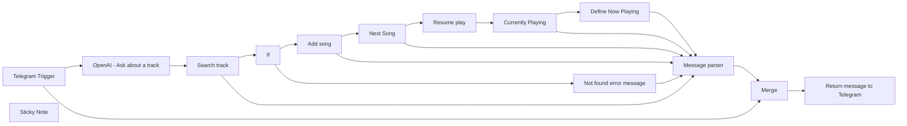

## Fluxo (.json) :

```json
{
  "id": "F7CfIF10XjXhqbGb",
  "meta": {
    "instanceId": "ba8f1362d8ed4c2ce84171d2f481098de4ee775241bdc1660d1dce80434ec7d4",
    "templateCredsSetupCompleted": true
  },
  "name": "Play with Spotify from Telegram",
  "tags": [],
  "nodes": [
    {
      "id": "0395b3e4-94ef-49ea-9b4c-8f908e62f8c6",
      "name": "Telegram Trigger",
      "type": "n8n-nodes-base.telegramTrigger",
      "position": [
        -60,
        20
      ],
      "webhookId": "e7aa284b-5eef-4ac1-94bf-8e4d307a3b14",
      "parameters": {
        "updates": [
          "message"
        ],
        "additionalFields": {}
      },
      "credentials": {
        "telegramApi": {
          "id": "gblW5oACGEPuccja",
          "name": "Telegram account"
        }
      },
      "typeVersion": 1.1
    },
    {
      "id": "263edf45-58a0-45e8-91f8-601bc62c7d6f",
      "name": "OpenAI - Ask about a track",
      "type": "@n8n/n8n-nodes-langchain.openAi",
      "position": [
        120,
        -120
      ],
      "parameters": {
        "modelId": {
          "__rl": true,
          "mode": "list",
          "value": "gpt-4o-mini",
          "cachedResultName": "GPT-4O-MINI"
        },
        "options": {},
        "messages": {
          "values": [
            {
              "content": "=get artist and song name from '{{ $json.message.text }}'. Reply only eg. 'track:song name artist:artist name'"
            }
          ]
        }
      },
      "credentials": {
        "openAiApi": {
          "id": "vDcge3EgslxfX3EC",
          "name": "OpenAi account"
        }
      },
      "typeVersion": 1.6
    },
    {
      "id": "086aef8b-533a-4c33-9952-29d5adb152c8",
      "name": "Search track",
      "type": "n8n-nodes-base.spotify",
      "onError": "continueErrorOutput",
      "position": [
        540,
        -200
      ],
      "parameters": {
        "limit": 1,
        "query": "={{ $json.message.content }}",
        "filters": {},
        "resource": "track",
        "operation": "search"
      },
      "credentials": {
        "spotifyOAuth2Api": {
          "id": "wylKghFNQa8IKy1U",
          "name": "Spotify account"
        }
      },
      "typeVersion": 1,
      "alwaysOutputData": true
    },
    {
      "id": "08af6055-ba52-4cb2-a561-ea04ac55279f",
      "name": "Add song",
      "type": "n8n-nodes-base.spotify",
      "onError": "continueErrorOutput",
      "position": [
        780,
        -240
      ],
      "parameters": {
        "id": "=spotify:track:{{ $json.id }}"
      },
      "credentials": {
        "spotifyOAuth2Api": {
          "id": "wylKghFNQa8IKy1U",
          "name": "Spotify account"
        }
      },
      "typeVersion": 1
    },
    {
      "id": "2dbdafa4-3b6f-4a14-813c-4e10da10abad",
      "name": "Next Song",
      "type": "n8n-nodes-base.spotify",
      "onError": "continueErrorOutput",
      "position": [
        980,
        -280
      ],
      "parameters": {
        "operation": "nextSong"
      },
      "credentials": {
        "spotifyOAuth2Api": {
          "id": "wylKghFNQa8IKy1U",
          "name": "Spotify account"
        }
      },
      "typeVersion": 1
    },
    {
      "id": "cb8d42aa-0c7e-45a5-90b5-b91e483dd13a",
      "name": "Resume play",
      "type": "n8n-nodes-base.spotify",
      "notes": "We don't have to stop here on error. An error is thrown from Spotify if the player is already playing.",
      "onError": "continueRegularOutput",
      "position": [
        1240,
        -380
      ],
      "parameters": {
        "operation": "resume"
      },
      "credentials": {
        "spotifyOAuth2Api": {
          "id": "wylKghFNQa8IKy1U",
          "name": "Spotify account"
        }
      },
      "typeVersion": 1
    },
    {
      "id": "089e1070-b013-454c-9f6c-55b909e06c1d",
      "name": "Currently Playing",
      "type": "n8n-nodes-base.spotify",
      "onError": "continueErrorOutput",
      "position": [
        1420,
        -300
      ],
      "parameters": {
        "operation": "currentlyPlaying"
      },
      "credentials": {
        "spotifyOAuth2Api": {
          "id": "wylKghFNQa8IKy1U",
          "name": "Spotify account"
        }
      },
      "typeVersion": 1
    },
    {
      "id": "e9df0dcf-b166-45a3-910b-787b3718bbcf",
      "name": "Sticky Note",
      "type": "n8n-nodes-base.stickyNote",
      "position": [
        120,
        -300
      ],
      "parameters": {
        "color": 5,
        "width": 254.05813953488382,
        "content": "## Telegram to Spotify \nAsk AI about a track with artist and song name or if you can't remember describe it and AI does it's thing.\n"
      },
      "typeVersion": 1
    },
    {
      "id": "77bae9be-2d92-4028-ae78-7887b6a2d394",
      "name": "Merge",
      "type": "n8n-nodes-base.merge",
      "position": [
        440,
        220
      ],
      "parameters": {
        "mode": "combine",
        "options": {},
        "combineBy": "combineAll"
      },
      "typeVersion": 3
    },
    {
      "id": "0d95000d-7efd-402a-9a34-47ababb2f53e",
      "name": "If",
      "type": "n8n-nodes-base.if",
      "position": [
        620,
        -440
      ],
      "parameters": {
        "options": {},
        "conditions": {
          "options": {
            "version": 2,
            "leftValue": "",
            "caseSensitive": true,
            "typeValidation": "strict"
          },
          "combinator": "and",
          "conditions": [
            {
              "id": "02af5387-07d2-4a16-bd83-e1359d091165",
              "operator": {
                "type": "string",
                "operation": "notEmpty",
                "singleValue": true
              },
              "leftValue": "={{ $json?.id }}",
              "rightValue": ""
            }
          ]
        }
      },
      "typeVersion": 2.2
    },
    {
      "id": "363f89ad-34d0-4445-8ff3-693d991dad09",
      "name": "Message parser",
      "type": "n8n-nodes-base.set",
      "position": [
        1280,
        -40
      ],
      "parameters": {
        "options": {},
        "assignments": {
          "assignments": [
            {
              "id": "93cd2545-c6e9-4717-96b7-d49eb056ac70",
              "name": "message",
              "type": "string",
              "value": "={{ $json.error }}"
            }
          ]
        }
      },
      "typeVersion": 3.4
    },
    {
      "id": "8b80f80d-8c8e-44de-9838-6d05199bb734",
      "name": "Not found error message",
      "type": "n8n-nodes-base.set",
      "position": [
        880,
        -460
      ],
      "parameters": {
        "mode": "raw",
        "options": {},
        "jsonOutput": "{\n \"error\": \"Song not found\"\n}\n"
      },
      "typeVersion": 3.4
    },
    {
      "id": "f1785140-8e97-43e1-9d84-aedc8b8d5e06",
      "name": "Return message to Telegram",
      "type": "n8n-nodes-base.telegram",
      "position": [
        760,
        220
      ],
      "parameters": {
        "text": "={{ $('Message parser').item.json.message }}",
        "chatId": "={{ $json.message.chat.id }}",
        "additionalFields": {}
      },
      "credentials": {
        "telegramApi": {
          "id": "gblW5oACGEPuccja",
          "name": "Telegram account"
        }
      },
      "typeVersion": 1.2
    },
    {
      "id": "e3e16535-094b-41bf-88c6-166bb6805d53",
      "name": "Define Now Playing",
      "type": "n8n-nodes-base.set",
      "notes": "We use the object \"error\" as a returned bject so we can re-use the Message Parser node.",
      "position": [
        1660,
        -240
      ],
      "parameters": {
        "mode": "raw",
        "options": {},
        "jsonOutput": "={\n \"error\": \"Now playing {{ $json.item.name }} - {{ $json.item.artists[0].name }} - {{ $json.item.album.name }}\"\n}\n"
      },
      "typeVersion": 3.4
    }
  ],
  "active": true,
  "pinData": {},
  "settings": {
    "executionOrder": "v1"
  },
  "versionId": "6f219c9e-f17a-45b1-ab8d-09d991fd8e34",
  "connections": {
    "If": {
      "main": [
        [
          {
            "node": "Add song",
            "type": "main",
            "index": 0
          }
        ],
        [
          {
            "node": "Not found error message",
            "type": "main",
            "index": 0
          }
        ]
      ]
    },
    "Merge": {
      "main": [
        [
          {
            "node": "Return message to Telegram",
            "type": "main",
            "index": 0
          }
        ]
      ]
    },
    "Add song": {
      "main": [
        [
          {
            "node": "Next Song",
            "type": "main",
            "index": 0
          }
        ],
        [
          {
            "node": "Message parser",
            "type": "main",
            "index": 0
          }
        ]
      ]
    },
    "Next Song": {
      "main": [
        [
          {
            "node": "Resume play",
            "type": "main",
            "index": 0
          }
        ],
        [
          {
            "node": "Message parser",
            "type": "main",
            "index": 0
          }
        ]
      ]
    },
    "Resume play": {
      "main": [
        [
          {
            "node": "Currently Playing",
            "type": "main",
            "index": 0
          }
        ],
        []
      ]
    },
    "Search track": {
      "main": [
        [
          {
            "node": "If",
            "type": "main",
            "index": 0
          }
        ],
        [
          {
            "node": "Message parser",
            "type": "main",
            "index": 0
          }
        ]
      ]
    },
    "Message parser": {
      "main": [
        [
          {
            "node": "Merge",
            "type": "main",
            "index": 0
          }
        ]
      ]
    },
    "Telegram Trigger": {
      "main": [
        [
          {
            "node": "OpenAI - Ask about a track",
            "type": "main",
            "index": 0
          },
          {
            "node": "Merge",
            "type": "main",
            "index": 1
          }
        ]
      ]
    },
    "Currently Playing": {
      "main": [
        [
          {
            "node": "Define Now Playing",
            "type": "main",
            "index": 0
          }
        ],
        [
          {
            "node": "Message parser",
            "type": "main",
            "index": 0
          }
        ]
      ]
    },
    "Define Now Playing": {
      "main": [
        [
          {
            "node": "Message parser",
            "type": "main",
            "index": 0
          }
        ]
      ]
    },
    "Not found error message": {
      "main": [
        [
          {
            "node": "Message parser",
            "type": "main",
            "index": 0
          }
        ]
      ]
    },
    "OpenAI - Ask about a track": {
      "main": [
        [
          {
            "node": "Search track",
            "type": "main",
            "index": 0
          }
        ]
      ]
    }
  }
}
```

<a id="template-888"></a>

## Template 888 - Enviar mensagem no Larksuite

- **Nome:** Enviar mensagem no Larksuite
- **Descrição:** Este fluxo autentica na API do Larksuite e envia uma mensagem de texto para um chat especificado.
- **Funcionalidade:** • Entrada de parâmetros: recebe app_id, app_secret, chat_id e o texto da mensagem.
• Obtenção de token: solicita um tenant_access_token à API do Larksuite usando app_id e app_secret.
• Envio de mensagem: envia uma mensagem de texto para o chat_id especificado usando o token obtido.
• Execução de teste manual: permite iniciar o fluxo manualmente para validar o envio e as configurações.
- **Ferramentas:** • Larksuite Open APIs: fornece endpoints para autenticação (tenant_access_token) e envio de mensagens (message/v4/send) através do domínio open.larksuite.com.
• Larksuite API Explorer: interface web para localizar chat_id e testar endpoints da API.


## Fluxo visual

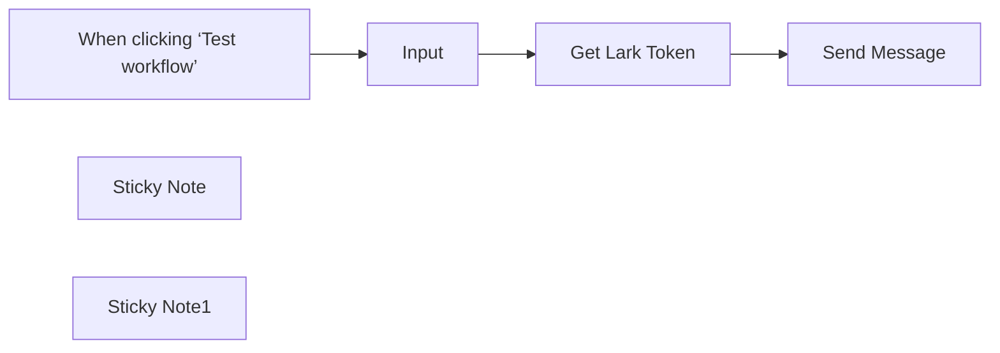

## Fluxo (.json) :

```json
{
  "id": "IjQRdNu2ItwNnGL2",
  "meta": {
    "instanceId": "18735a589159672fb9dbd8b6f953d0efdca888157c3b8b26943fb0e0e7c1edbb",
    "templateCredsSetupCompleted": true
  },
  "name": "[hiroshidigital.com] Send Message In Larksuite",
  "tags": [
    {
      "id": "96KbUn85yy8jivyf",
      "name": "Creator",
      "createdAt": "2024-10-22T04:22:34.463Z",
      "updatedAt": "2024-10-22T04:22:34.463Z"
    }
  ],
  "nodes": [
    {
      "id": "9fd838b3-18f7-4056-bbb9-8a9fd843590b",
      "name": "When clicking ‘Test workflow’",
      "type": "n8n-nodes-base.manualTrigger",
      "position": [
        240,
        220
      ],
      "parameters": {},
      "typeVersion": 1
    },
    {
      "id": "7afa44a2-28ec-4e3d-a8bd-a63721648eb2",
      "name": "Get Lark Token",
      "type": "n8n-nodes-base.httpRequest",
      "position": [
        640,
        220
      ],
      "parameters": {
        "url": "https://open.larksuite.com/open-apis/auth/v3/tenant_access_token/internal",
        "method": "POST",
        "options": {},
        "jsonBody": "={\n  \"app_id\": \"{{ $json.app_id }}\",\n  \"app_secret\": \"{{ $json.app_secret }}\"\n} ",
        "sendBody": true,
        "sendHeaders": true,
        "specifyBody": "json",
        "headerParameters": {
          "parameters": [
            {
              "name": "Content-Type",
              "value": "application/json"
            }
          ]
        }
      },
      "typeVersion": 4.1
    },
    {
      "id": "4e1fdbef-b881-445c-90ce-95bc9b745772",
      "name": "Input",
      "type": "n8n-nodes-base.set",
      "position": [
        440,
        220
      ],
      "parameters": {
        "options": {},
        "assignments": {
          "assignments": [
            {
              "id": "322bfa44-ee2a-4ddf-b747-0f7f3405e294",
              "name": "app_id",
              "type": "string",
              "value": "cli_8cdb09dec256ca40"
            },
            {
              "id": "c8faab22-235b-412c-8dc8-8142c6e2e0c4",
              "name": "app_secret",
              "type": "string",
              "value": "H5SEZr8O67zuqdIdBKSPhTkoeEBCRNy4"
            },
            {
              "id": "121fcf72-2a13-4082-a66b-47d56bd4a675",
              "name": "chat_id",
              "type": "string",
              "value": "oc_1d97ee99bffdce243a95b4ebe3ddef7a"
            },
            {
              "id": "c22bf4f3-eac7-4c04-8b2e-8c0e5011bc1e",
              "name": "text",
              "type": "string",
              "value": "https://hiroshidigital.com/"
            }
          ]
        }
      },
      "typeVersion": 3.4
    },
    {
      "id": "92a62eef-e8ec-4e31-b70e-a80dd83d3bba",
      "name": "Sticky Note",
      "type": "n8n-nodes-base.stickyNote",
      "position": [
        380,
        40
      ],
      "parameters": {
        "content": "You can get app_id and app_secret in Lark here: https://open.larksuite.com/"
      },
      "typeVersion": 1
    },
    {
      "id": "9cde6452-7221-4d43-9e68-afa70fdebc27",
      "name": "Sticky Note1",
      "type": "n8n-nodes-base.stickyNote",
      "position": [
        760,
        40
      ],
      "parameters": {
        "content": "You can get chat_id https://open.larksuite.com/api-explorer/"
      },
      "typeVersion": 1
    },
    {
      "id": "87d2cc29-6318-4fb7-b430-f4b825649133",
      "name": "Send Message",
      "type": "n8n-nodes-base.httpRequest",
      "position": [
        840,
        220
      ],
      "parameters": {
        "url": "https://open.larksuite.com/open-apis/message/v4/send/",
        "method": "POST",
        "options": {},
        "jsonBody": "={\n  \"chat_id\": \"{{ $('Input').item.json.chat_id }}\",\n  \"msg_type\": \"text\",\n  \"content\": {\n      \"text\": \"{{ $('Input').item.json.text }}\"\n  }\n}",
        "sendBody": true,
        "specifyBody": "json",
        "authentication": "genericCredentialType",
        "genericAuthType": "httpHeaderAuth"
      },
      "credentials": {
        "httpHeaderAuth": {
          "id": "srBVlMVQpuZrtnXn",
          "name": "Header Auth"
        }
      },
      "typeVersion": 4.1
    }
  ],
  "active": false,
  "pinData": {},
  "settings": {
    "executionOrder": "v1"
  },
  "versionId": "ecf9cc74-9aa6-4fa0-b887-f41dc47f5632",
  "connections": {
    "Input": {
      "main": [
        [
          {
            "node": "Get Lark Token",
            "type": "main",
            "index": 0
          }
        ]
      ]
    },
    "Get Lark Token": {
      "main": [
        [
          {
            "node": "Send Message",
            "type": "main",
            "index": 0
          }
        ]
      ]
    },
    "When clicking ‘Test workflow’": {
      "main": [
        [
          {
            "node": "Input",
            "type": "main",
            "index": 0
          }
        ]
      ]
    }
  }
}
```

<a id="template-889"></a>

## Template 889 - Importar Threads para Notion com checagem de duplicatas

- **Nome:** Importar Threads para Notion com checagem de duplicatas
- **Descrição:** Fluxo que coleta posts do Threads, filtra por tipo de conteúdo, verifica duplicatas no Notion e, se novo, cria uma página com dados do post e faz o upload de mídias associadas.
- **Funcionalidade:** • Autenticação e gestão de token de acesso: obtém e refresh de token de acesso de longa duração para acessar a API do Threads.
• Consulta de posts do Threads: busca posts desde uma data especificada.
• Processamento de dados: filtra pelos tipos de mídia relevantes e extrai id, permalink e timestamp.
• Verificação de duplicatas no Notion: verifica se o post já existe com base no Threads ID.
• Criação de página no Notion: cria uma nova página com dados do post (título, data, autor, permalink).
• Upload de mídias: adiciona media URLs como blocos embed na página.
• Atualização de página existente: atualiza ou evita duplicatas se o post já existir.
- **Ferramentas:** • Threads API: Serviço para acessar a API do Threads, incluindo obtenção de token de longa duração e refresh.
• Notion API: Serviço para criar páginas e blocos no Notion, conectando-se a um database.


## Fluxo visual

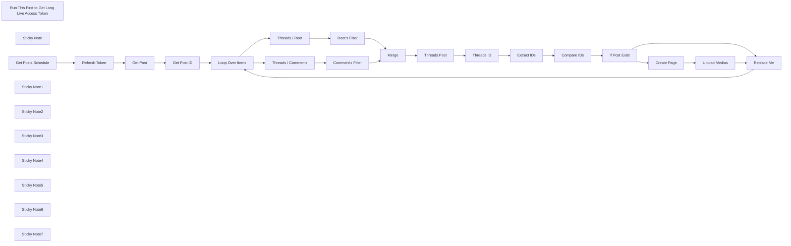

## Fluxo (.json) :

```json
{
  "meta": {
    "instanceId": "e0be1457dbb383bea07059c263a59b383a5b9420e6a22d3e5f1d80ae7f4f6629"
  },
  "nodes": [
    {
      "id": "200098a9-1a49-49c1-8703-eea0c496a020",
      "name": "Refresh Token",
      "type": "n8n-nodes-base.httpRequest",
      "position": [
        -1300,
        100
      ],
      "parameters": {
        "url": "https://graph.threads.net/refresh_access_token",
        "options": {},
        "queryParametersUi": {
          "parameter": [
            {
              "name": "grant_type",
              "value": "th_refresh_token"
            },
            {
              "name": "access_token",
              "value": "=Your Threads Long-Live Token"
            }
          ]
        }
      },
      "typeVersion": 1
    },
    {
      "id": "58373d28-8f22-4224-8ef1-aca9c24d5777",
      "name": "Get Post",
      "type": "n8n-nodes-base.httpRequest",
      "position": [
        -960,
        100
      ],
      "parameters": {
        "url": "https://graph.threads.net/v1.0/<Your Threads ID>/threads?fields=id,media_product_type,media_type,media_url,permalink,owner,username,text,timestamp,shortcode,thumbnail_url,children,is_quote_post",
        "options": {},
        "queryParametersUi": {
          "parameter": [
            {
              "name": "since",
              "value": "={{ new Date(new Date().setDate(new Date().getDate() - 1)).toISOString().split('T')[0] }}"
            },
            {
              "name": "access_token",
              "value": "={{ $json.access_token }}"
            }
          ]
        }
      },
      "typeVersion": 1
    },
    {
      "id": "7d9923b5-2fdc-46d4-8734-fe044a5a8951",
      "name": "Get Post ID",
      "type": "n8n-nodes-base.function",
      "position": [
        -640,
        100
      ],
      "parameters": {
        "functionCode": "// 獲取 API 返回的完整資料 (假設只有一個 \"data\" 陣列)\nconst allData = items[0].json.data;\n\n// 過濾符合條件的貼文：\n// 條件 1: media_type = \"TEXT_POST\" 或 \"VIDEO\"\n// 條件 2: is_quote_post = false\nconst filteredPosts = allData.filter(post => {\n  return (\npost.media_type === \"TEXT_POST\" || \npost.media_type === \"IMAGE\" || \npost.media_type === \"VIDEO\" || \npost.media_type === \"CAROUSEL_ALBUM\" || \npost.media_type === \"AUDIO\");\n});\n\n// 抽取所需的欄位：id, permalink, timestamp\nconst extractedData = filteredPosts.map(post => {\n  return {\n    id: post.id,\n    type: post.media_type,\n    permalink: post.permalink,\n    timestamp: post.timestamp,\n  };\n});\n\n// 將結果以 n8n 所需格式輸出\nreturn extractedData.map(post => ({ json: post }));\n"
      },
      "typeVersion": 1
    },
    {
      "id": "95ed0a59-7a6d-4358-aded-7ce49ef04916",
      "name": "Loop Over Items",
      "type": "n8n-nodes-base.splitInBatches",
      "position": [
        -300,
        100
      ],
      "parameters": {
        "options": {}
      },
      "typeVersion": 3
    },
    {
      "id": "77720564-acf5-4a55-afa9-ae559965a5b9",
      "name": "Replace Me",
      "type": "n8n-nodes-base.noOp",
      "position": [
        2820,
        200
      ],
      "parameters": {},
      "typeVersion": 1
    },
    {
      "id": "3b4e5eda-f354-4ef4-a260-378c06708cb5",
      "name": "Threads / Comments",
      "type": "n8n-nodes-base.httpRequest",
      "position": [
        0,
        180
      ],
      "parameters": {
        "url": "=https://graph.threads.net/v1.0/{{ $json.id }}/conversation?fields=id,text,username,permalink,timestamp,media_product_type,media_type,media_url,children{media_url}&reverse=false",
        "options": {},
        "queryParametersUi": {
          "parameter": [
            {
              "name": "access_token",
              "value": "={{ $('Refresh Token').first().json.access_token }}"
            }
          ]
        }
      },
      "typeVersion": 1
    },
    {
      "id": "6331c1f6-e1a4-4749-a17a-c129ab7ab0e0",
      "name": "Threads / Root",
      "type": "n8n-nodes-base.httpRequest",
      "position": [
        0,
        0
      ],
      "parameters": {
        "url": "=https://graph.threads.net/v1.0/{{ $json.id }}?fields=id,media_product_type,media_type,media_url,children{media_url},permalink,owner,username,text,timestamp,children",
        "options": {},
        "queryParametersUi": {
          "parameter": [
            {
              "name": "access_token",
              "value": "={{ $('Refresh Token').first().json.access_token }}"
            }
          ]
        }
      },
      "typeVersion": 1
    },
    {
      "id": "76c518b6-3c21-4879-8f0a-080fab60895a",
      "name": "Comment's Filter",
      "type": "n8n-nodes-base.code",
      "position": [
        240,
        180
      ],
      "parameters": {
        "jsCode": "// 確保 items 是否有內容\nif (!items || items.length === 0) {\n  console.log('No items found');\n  return [];\n}\n\n// 取得輸入數據\nconst inputData = items[0].json;\nconsole.log('Input data:', JSON.stringify(inputData, null, 2));\n\nif (!inputData || !inputData.data || !Array.isArray(inputData.data)) {\n  console.log('Invalid data structure');\n  return [];\n}\n\n// 過濾出 username 為 yourThreadsName 的資料\nconst filteredPosts = inputData.data.filter(post => post.username === 'geekaz');\nconsole.log('Filtered posts count:', filteredPosts.length);\n\n// 處理每個 post，提取所需的資料\nconst processedData = filteredPosts.map(post => {\n  // 初始化 mediaUrls，用來存放所有的 media_url\n  let mediaUrls = [];\n\n  // 如果有 children，則提取 children 裡的 media_url\n  if (post.children?.data && Array.isArray(post.children.data)) {\n    mediaUrls = post.children.data\n      .map(child => child.media_url) // 提取每個 child 的 media_url\n      .filter(url => url); // 過濾掉 undefined 或 null 的 URL\n  } else if (post.media_url) {\n    // 如果沒有 children，使用最外層的 media_url\n    mediaUrls.push(post.media_url);\n  }\n\n  // 返回每個 post 的處理後結果\n  return {\n    text: post.text || '',\n    media_urls: mediaUrls\n  };\n});\n\nconsole.log('Processed data:', JSON.stringify(processedData, null, 2));\n\n// 將結果轉換為 n8n 所需格式\nreturn processedData.map(post => ({ json: post }));"
      },
      "typeVersion": 2
    },
    {
      "id": "c0cae676-acff-493e-b957-26df0366cf98",
      "name": "Root's Filter",
      "type": "n8n-nodes-base.code",
      "position": [
        240,
        0
      ],
      "parameters": {
        "jsCode": "// 確保 items 是否有內容\nif (!items || items.length === 0) {\n  return [];\n}\n\n// 確保 items 的資料結構是正確的\nconst allData = items.map(item => item.json);\n\nconst processedData = allData.map(post => {\n  // 初始化 mediaUrls，用來存放所有的 media_url\n  let mediaUrls = [];\n\n  // 如果有 children，則提取 children 裡的 media_url\n  if (post.children?.data && Array.isArray(post.children.data)) {\n    mediaUrls = post.children.data\n      .map(child => child.media_url) // 提取每個 child 的 media_url\n      .filter(url => url); // 過濾掉 undefined 或 null 的 URL\n  } else if (post.media_url) {\n    // 如果沒有 children，使用最外層的 media_url\n    mediaUrls.push(post.media_url);\n  }\n\n  // 返回每個 post 的處理後結果\n  return {\n    id: post.id || null,\n    username: post.username || null,\n    text: post.text || null,\n    timestamp: post.timestamp || null,\n    media_type: post.media_type || null,\n    media_urls: mediaUrls, // 包含所有的媒體 URL\n    permalink: post.permalink || null,\n  };\n});\n\n// 將結果轉換為 n8n 所需格式\nreturn processedData.map(post => ({ json: post }));\n"
      },
      "typeVersion": 2
    },
    {
      "id": "367c2475-4dff-4858-9756-ad8f8383521c",
      "name": "Threads ID",
      "type": "n8n-nodes-base.notion",
      "position": [
        1060,
        100
      ],
      "parameters": {
        "simple": false,
        "options": {},
        "resource": "databasePage",
        "operation": "getAll",
        "returnAll": true,
        "databaseId": {
          "__rl": true,
          "mode": "list",
          "value": "175931b1-f5b8-8047-8620-f0e7ccde8407",
          "cachedResultUrl": "https://www.notion.so/175931b1f5b880478620f0e7ccde8407",
          "cachedResultName": "Posts Automation"
        }
      },
      "credentials": {
        "notionApi": {
          "id": "P3mnylwFncmx1P3h",
          "name": "Notion account"
        }
      },
      "typeVersion": 2.2,
      "alwaysOutputData": false
    },
    {
      "id": "2aaa224f-598b-4f8a-a247-03a873ac19a3",
      "name": "Extract IDs",
      "type": "n8n-nodes-base.function",
      "position": [
        1260,
        100
      ],
      "parameters": {
        "functionCode": "// 檢查輸入是否存在\nif (!items?.length) return [{ json: { threadsIds: [] } }];\n\n// 取得所有頁面\nconst pages = items.map(item => item.json).flat();\nconsole.log('Number of pages:', pages.length);\n\n// 提取所有 Threads ID\nconst threadsIds = pages\n  .map(page => {\n    if (!page?.properties) return null;\n    const threadsIdField = page.properties['Threads ID'];\n    if (!threadsIdField?.rich_text?.length) return null;\n    return threadsIdField.rich_text[0]?.text?.content || null;\n  })\n  .filter(Boolean);\n\nconsole.log('Found Threads IDs:', threadsIds);\n\n// 將結果轉換為 n8n 所需格式\nreturn [{ json: { threadsIds } }];"
      },
      "typeVersion": 1
    },
    {
      "id": "83fdaf18-47e7-4b1c-8f1b-523f87a439f3",
      "name": "Compare IDs",
      "type": "n8n-nodes-base.function",
      "position": [
        1500,
        100
      ],
      "parameters": {
        "functionCode": "// 檢查輸入是否存在\nif (!items?.length) return [{ json: { isExist: false } }];\n\n// 從 Threads Post 節點取得 ID\nconst newId = $('Threads Post').last().json.id;\nconst existingIds = $json.threadsIds || [];\n\n// 檢查是否重複\nconst isExist = existingIds.includes(newId);\n\nreturn [{ json: { isExist } }];\n"
      },
      "typeVersion": 1
    },
    {
      "id": "f1a831b1-fc5f-4569-9b9b-7de0bce9b9cd",
      "name": "Create Page",
      "type": "n8n-nodes-base.notion",
      "position": [
        2080,
        20
      ],
      "parameters": {
        "simple": false,
        "options": {
          "iconType": "emoji"
        },
        "resource": "databasePage",
        "databaseId": {
          "__rl": true,
          "mode": "list",
          "value": "175931b1-f5b8-8047-8620-f0e7ccde8407",
          "cachedResultUrl": "https://www.notion.so/175931b1f5b880478620f0e7ccde8407",
          "cachedResultName": "Posts Automation"
        },
        "propertiesUi": {
          "propertyValues": [
            {
              "key": "Name|title",
              "title": "={{ $('Threads Post').first().json.permalink }}"
            },
            {
              "key": "Threads ID|rich_text",
              "textContent": "={{ $('Threads Post').first().json.id }}"
            },
            {
              "key": "Post Date|date",
              "date": "={{ $('Threads Post').first().json.timestamp }}",
              "timezone": "America/Los_Angeles",
              "includeTime": false
            },
            {
              "key": "Source|multi_select",
              "multiSelectValue": "=Threads"
            },
            {
              "key": "Import Check|checkbox"
            },
            {
              "key": "Username|rich_text",
              "textContent": "={{ $('Threads Post').first().json.username }}"
            }
          ]
        }
      },
      "credentials": {
        "notionApi": {
          "id": "P3mnylwFncmx1P3h",
          "name": "Notion account"
        }
      },
      "typeVersion": 1
    },
    {
      "id": "8a5e4752-a8fa-480f-8271-c15a66679e00",
      "name": "Upload Medias",
      "type": "n8n-nodes-base.httpRequest",
      "position": [
        2560,
        20
      ],
      "parameters": {
        "url": "=https://api.notion.com/v1/blocks/{{ $('Create Page').item.json.id }}/children",
        "options": {},
        "requestMethod": "PATCH",
        "jsonParameters": true,
        "bodyParametersJson": "={{ { \"children\": $('Threads Post').last().json.blocks } }}",
        "queryParametersJson": "=",
        "headerParametersJson": "{\n  \"Authorization\": \"bearer Your Notion Token\",\n  \"Content-Type\": \"application/json\",\n  \"Notion-Version\": \"2022-06-28\"\n}"
      },
      "typeVersion": 1
    },
    {
      "id": "f3f3a8f7-1137-4013-83dd-b5efc18ab095",
      "name": "If Post Exist",
      "type": "n8n-nodes-base.switch",
      "position": [
        1740,
        100
      ],
      "parameters": {
        "rules": {
          "values": [
            {
              "outputKey": "Create Page",
              "conditions": {
                "options": {
                  "version": 2,
                  "leftValue": "",
                  "caseSensitive": true,
                  "typeValidation": "strict"
                },
                "combinator": "and",
                "conditions": [
                  {
                    "operator": {
                      "type": "boolean",
                      "operation": "false",
                      "singleValue": true
                    },
                    "leftValue": "={{ $json.isExist }}",
                    "rightValue": "=false"
                  }
                ]
              },
              "renameOutput": true
            },
            {
              "outputKey": "Update Page",
              "conditions": {
                "options": {
                  "version": 2,
                  "leftValue": "",
                  "caseSensitive": true,
                  "typeValidation": "strict"
                },
                "combinator": "and",
                "conditions": [
                  {
                    "id": "38564f41-157d-46ed-843f-4e5a43415e21",
                    "operator": {
                      "type": "boolean",
                      "operation": "true",
                      "singleValue": true
                    },
                    "leftValue": "={{ $json.isExist }}",
                    "rightValue": ""
                  }
                ]
              },
              "renameOutput": true
            }
          ]
        },
        "options": {}
      },
      "typeVersion": 3.2
    },
    {
      "id": "a378c107-d3f5-43cd-bc8c-ad9a39a9ec60",
      "name": "Threads Post",
      "type": "n8n-nodes-base.code",
      "position": [
        800,
        100
      ],
      "parameters": {
        "jsCode": "// 確保 items 是否有內容\nif (!items || items.length === 0) {\n  console.log('No items found');\n  return [];\n}\n\n// 取得所有貼文\nconst posts = items.map(item => item.json).flat();\nconsole.log('Number of posts:', posts.length);\n\n// 取得第一篇貼文的基本資訊\nconst firstPost = posts[0] || {};\n\n// 生成 blocks 結構\nconst blocks = [];\n\n// 處理每個貼文\nposts.forEach(post => {\n  // 如果有文字，加入文字區塊\n  if (post.text) {\n    blocks.push({\n      object: \"block\",\n      type: \"paragraph\",\n      paragraph: {\n        rich_text: [{\n          type: \"text\",\n          text: { content: post.text }\n        }]\n      }\n    });\n  }\n  \n  // 如果有媒體連結，加入 embed 區塊\n  if (post.media_urls && post.media_urls.length > 0) {\n    post.media_urls.forEach(url => {\n      blocks.push({\n        object: \"block\",\n        type: \"embed\",\n        embed: { url }\n      });\n    });\n  }\n});\n\n// 合併基本資訊和 blocks\nconst combinedPost = {\n  id: firstPost.id || '',\n  permalink: firstPost.permalink || '',\n  username: firstPost.username || '',\n  timestamp: firstPost.timestamp || '',\n  blocks\n};\n\n// 將結果轉換為 n8n 所需格式\nreturn [{ json: combinedPost }];"
      },
      "typeVersion": 2
    },
    {
      "id": "d2e6c8dd-5751-48f9-a158-c3b39f279f60",
      "name": "Merge",
      "type": "n8n-nodes-base.merge",
      "position": [
        540,
        100
      ],
      "parameters": {},
      "typeVersion": 3
    },
    {
      "id": "a79e46eb-bb45-4d80-9f99-adae1e51f94d",
      "name": "Run This First to Get Long Live Access Token",
      "type": "n8n-nodes-base.httpRequest",
      "position": [
        -940,
        -340
      ],
      "parameters": {
        "url": "https://graph.threads.net/access_token",
        "options": {},
        "queryParametersUi": {
          "parameter": [
            {
              "name": "grant_type",
              "value": "th_exchange_token"
            },
            {
              "name": "client_secret",
              "value": "=Threads App Secret"
            },
            {
              "name": "access_token",
              "value": "=Short Live Access Token"
            }
          ]
        }
      },
      "typeVersion": 1
    },
    {
      "id": "6b7a17d2-c58c-45f6-9ab1-1e39fbc7e18c",
      "name": "Sticky Note",
      "type": "n8n-nodes-base.stickyNote",
      "position": [
        -1260,
        -380
      ],
      "parameters": {
        "height": 240,
        "content": "## Get Threads API Access Token\n\nGet Threads Access Token Tutorial and ID/教學 [Link](https://nijialin.com/2024/08/17/python-threads-sdk-introduction/)\n\nPlease get your access token and Threads ID first before you start\n(It only need to run once)"
      },
      "typeVersion": 1
    },
    {
      "id": "a8b5b6f0-b2ec-4aa3-bd9d-375acffd6655",
      "name": "Get Posts Schedule",
      "type": "n8n-nodes-base.scheduleTrigger",
      "position": [
        -1660,
        100
      ],
      "parameters": {
        "rule": {
          "interval": [
            {}
          ]
        }
      },
      "typeVersion": 1.2
    },
    {
      "id": "a86f7373-3a98-4ec2-bf66-88dd835ad17f",
      "name": "Sticky Note1",
      "type": "n8n-nodes-base.stickyNote",
      "position": [
        -1360,
        260
      ],
      "parameters": {
        "height": 180,
        "content": "## Refresh Token\n\nUpdate your long live token here / 在此放上剛剛拿到的長期 Token\n\n[Check Facebook Docs Refresh Token](https://developers.facebook.com/docs/threads/get-started/long-lived-tokens/)"
      },
      "typeVersion": 1
    },
    {
      "id": "1b9b7fe0-78d3-4a70-8df7-a06b0c0f6fda",
      "name": "Sticky Note2",
      "type": "n8n-nodes-base.stickyNote",
      "position": [
        -1020,
        260
      ],
      "parameters": {
        "height": 600,
        "content": "## Set your Theads ID & Post Time\n\nChage the your with your Threads ID to get your posts / 請先透過上方教學獲取 Threads ID\n\nSet the time of the Post you wanna get / 設置抓取的貼文時間\n\n[Check Facebook Docs Post API](https://developers.facebook.com/docs/threads/threads-media)\n\nsince is scrape the post after the date /\nsince 為抓取日期之後的貼文\n\nuntil is scrape the post before the date /\nuntil 為抓取日期之前的貼文\n\nsince can set\n\n{{ new Date(new Date().setDate(new Date().getDate() - 1)).toISOString().split('T')[0] }}\n\nit will scrape the post since one day ago"
      },
      "typeVersion": 1
    },
    {
      "id": "eed94a4e-7fc4-4a23-8581-d5903e7a2ec4",
      "name": "Sticky Note3",
      "type": "n8n-nodes-base.stickyNote",
      "position": [
        1000,
        -60
      ],
      "parameters": {
        "height": 140,
        "content": "## Set Notion Acc\n\nSet your notion account and database you wanna save the post"
      },
      "typeVersion": 1
    },
    {
      "id": "51bada43-0a37-48fa-b5f6-18731f605afb",
      "name": "Sticky Note4",
      "type": "n8n-nodes-base.stickyNote",
      "position": [
        2000,
        -140
      ],
      "parameters": {
        "height": 140,
        "content": "## Create Page\n\nBefore create page, please the properties of your post by your demands"
      },
      "typeVersion": 1
    },
    {
      "id": "144b494d-515a-44e1-9720-35cc50d457da",
      "name": "Sticky Note5",
      "type": "n8n-nodes-base.stickyNote",
      "position": [
        2500,
        -200
      ],
      "parameters": {
        "height": 200,
        "content": "## Support Medias\n\nIt also can scrape the Threads Media like Images and Videos\n\nUpdate your Notion token here:\n\nbearer <your notion token>"
      },
      "typeVersion": 1
    },
    {
      "id": "44657b1e-6537-4344-9f78-3e9ef440e27b",
      "name": "Sticky Note6",
      "type": "n8n-nodes-base.stickyNote",
      "position": [
        -2360,
        80
      ],
      "parameters": {
        "width": 600,
        "height": 180,
        "content": "## Get your Threads Post automatically\n\nCreator: [Geekaz](https://www.threads.net/@geekaz?hl=zh-tw)\n\nIf your have any problems or question, please send message to my instagram!\n有任何問題都歡迎透過 Instagram 私訊詢問！"
      },
      "typeVersion": 1
    },
    {
      "id": "6eeb4af1-7c4f-4f63-8386-384fd3549459",
      "name": "Sticky Note7",
      "type": "n8n-nodes-base.stickyNote",
      "position": [
        180,
        400
      ],
      "parameters": {
        "height": 140,
        "content": "## Comment's Filter\n\nSet your Threads Username"
      },
      "typeVersion": 1
    }
  ],
  "pinData": {},
  "connections": {
    "Merge": {
      "main": [
        [
          {
            "node": "Threads Post",
            "type": "main",
            "index": 0
          }
        ]
      ]
    },
    "Get Post": {
      "main": [
        [
          {
            "node": "Get Post ID",
            "type": "main",
            "index": 0
          }
        ]
      ]
    },
    "Replace Me": {
      "main": [
        [
          {
            "node": "Loop Over Items",
            "type": "main",
            "index": 0
          }
        ]
      ]
    },
    "Threads ID": {
      "main": [
        [
          {
            "node": "Extract IDs",
            "type": "main",
            "index": 0
          }
        ]
      ]
    },
    "Compare IDs": {
      "main": [
        [
          {
            "node": "If Post Exist",
            "type": "main",
            "index": 0
          }
        ]
      ]
    },
    "Create Page": {
      "main": [
        [
          {
            "node": "Upload Medias",
            "type": "main",
            "index": 0
          }
        ]
      ]
    },
    "Extract IDs": {
      "main": [
        [
          {
            "node": "Compare IDs",
            "type": "main",
            "index": 0
          }
        ]
      ]
    },
    "Get Post ID": {
      "main": [
        [
          {
            "node": "Loop Over Items",
            "type": "main",
            "index": 0
          }
        ]
      ]
    },
    "Threads Post": {
      "main": [
        [
          {
            "node": "Threads ID",
            "type": "main",
            "index": 0
          }
        ]
      ]
    },
    "If Post Exist": {
      "main": [
        [
          {
            "node": "Create Page",
            "type": "main",
            "index": 0
          }
        ],
        [
          {
            "node": "Replace Me",
            "type": "main",
            "index": 0
          }
        ]
      ]
    },
    "Refresh Token": {
      "main": [
        [
          {
            "node": "Get Post",
            "type": "main",
            "index": 0
          }
        ]
      ]
    },
    "Root's Filter": {
      "main": [
        [
          {
            "node": "Merge",
            "type": "main",
            "index": 0
          }
        ]
      ]
    },
    "Upload Medias": {
      "main": [
        [
          {
            "node": "Replace Me",
            "type": "main",
            "index": 0
          }
        ]
      ]
    },
    "Threads / Root": {
      "main": [
        [
          {
            "node": "Root's Filter",
            "type": "main",
            "index": 0
          }
        ]
      ]
    },
    "Loop Over Items": {
      "main": [
        [],
        [
          {
            "node": "Threads / Root",
            "type": "main",
            "index": 0
          },
          {
            "node": "Threads / Comments",
            "type": "main",
            "index": 0
          }
        ]
      ]
    },
    "Comment's Filter": {
      "main": [
        [
          {
            "node": "Merge",
            "type": "main",
            "index": 1
          }
        ]
      ]
    },
    "Get Posts Schedule": {
      "main": [
        [
          {
            "node": "Refresh Token",
            "type": "main",
            "index": 0
          }
        ]
      ]
    },
    "Threads / Comments": {
      "main": [
        [
          {
            "node": "Comment's Filter",
            "type": "main",
            "index": 0
          }
        ]
      ]
    }
  }
}
```

<a id="template-890"></a>

## Template 890 - Criação automática de eventos Zoom com pagamento via Stripe

- **Nome:** Criação automática de eventos Zoom com pagamento via Stripe
- **Descrição:** Automatiza a criação de reuniões Zoom, a geração de páginas de pagamento no Stripe e o gerenciamento de participantes em planilhas, com notificações por email.
- **Funcionalidade:** • Formulário de criação: Permite criar um evento através de um formulário web com título, preço e data.
• Criação de reunião Zoom: Gera uma reunião Zoom com link, ID, senha (senha aleatória) e horário calculado.
• Geração de produto e preço no Stripe: Cria um produto e define preço com base nos dados do formulário.
• Criação de link de pagamento: Gera um link de pagamento no Stripe que inclui metadados com as informações da reunião e do evento.
• Criação e organização de lista de participantes: Cria uma aba específica na planilha para cada evento e armazena os participantes.
• Processamento de pagamento via webhook: Detecta pagamentos concluídos e recupera dados do comprador e metadados do evento.
• Confirmações e notificações por email: Envia confirmação ao participante e notifica o professor com detalhes do evento e link para a lista de participantes.
• Registro do evento: Armazena informações resumidas do evento em uma planilha mestre para controle.
- **Ferramentas:** • Zoom: Plataforma de videoconferência para criar reuniões, links, IDs e senhas.
• Stripe: Plataforma de pagamentos para criar produtos, preços e links de pagamento, além de receber webhooks de confirmação.
• Google Sheets: Planilhas online usadas para armazenar eventos e listas de participantes.
• Gmail: Serviço de email usado para enviar confirmações e notificações ao professor e aos participantes.


## Fluxo visual

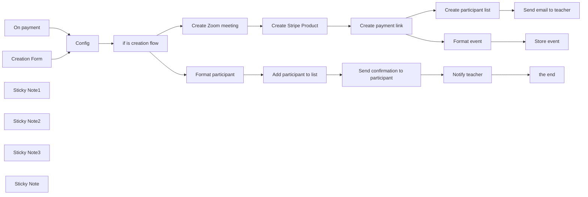

## Fluxo (.json) :

```json
{
  "id": "2DT5BW5tOdy87AUl",
  "meta": {
    "instanceId": "8418cffce8d48086ec0a73fd90aca708aa07591f2fefa6034d87fe12a09de26e"
  },
  "name": "Streamline Your Zoom Meetings with Secure, Automated Stripe Payments",
  "tags": [],
  "nodes": [
    {
      "id": "fcc38ae8-0dbf-4676-b47b-ba77f97a38b8",
      "name": "Create Zoom meeting",
      "type": "n8n-nodes-base.zoom",
      "position": [
        180,
        480
      ],
      "parameters": {
        "topic": "={{ $('Creation Form').item.json.title }}",
        "authentication": "oAuth2",
        "additionalFields": {
          "password": "={{ Math.random().toString(36).slice(-4); }}",
          "startTime": "={{ new Date(new Date($('Creation Form').item.json.date_start).getTime() + ($('Creation Form').item.json.hour * 3600000) + ($('Creation Form').item.json.minute * 60000)).toISOString() }}"
        }
      },
      "credentials": {
        "zoomOAuth2Api": {
          "id": "JQ9fG5WNTVssHxGj",
          "name": "Zoom account"
        }
      },
      "typeVersion": 1
    },
    {
      "id": "3d2dea09-c463-447b-9a9d-daca8fdcac06",
      "name": "Create Stripe Product",
      "type": "n8n-nodes-base.httpRequest",
      "position": [
        400,
        480
      ],
      "parameters": {
        "url": "https://api.stripe.com/v1/products",
        "method": "POST",
        "options": {},
        "sendBody": true,
        "contentType": "form-urlencoded",
        "authentication": "predefinedCredentialType",
        "bodyParameters": {
          "parameters": [
            {
              "name": "name",
              "value": "={{ $('Creation Form').item.json.title }}"
            },
            {
              "name": "default_price_data[unit_amount]",
              "value": "={{ $('Creation Form').item.json.price * 100 }}"
            },
            {
              "name": "default_price_data[currency]",
              "value": "={{ $('Config').item.json.currency }}"
            }
          ]
        },
        "nodeCredentialType": "stripeApi"
      },
      "credentials": {
        "stripeApi": {
          "id": "qjose8z3RR7Xzm7b",
          "name": "Stripe Dev"
        }
      },
      "typeVersion": 4.1
    },
    {
      "id": "01ab74fb-19a1-42ef-a0ad-31107c7ded3f",
      "name": "Config",
      "type": "n8n-nodes-base.set",
      "notes": "Setup your flow",
      "position": [
        -220,
        640
      ],
      "parameters": {
        "options": {},
        "assignments": {
          "assignments": [
            {
              "id": "038b54b7-9559-444e-8653-c5256a5b784e",
              "name": "currency",
              "type": "string",
              "value": "EUR"
            },
            {
              "id": "64d1eeee-cabe-403b-a634-f3238f586f58",
              "name": "sheet_url",
              "type": "string",
              "value": "https://docs.google.com/spreadsheets/d/1ZliqqBNo6X0iM9yXBOiCG1e4Q7L7bQKMFmjvbSgUSnA/edit#gid=0"
            },
            {
              "id": "997fe5a1-f601-458d-899c-673dff4acb04",
              "name": "teacher_email",
              "type": "string",
              "value": "emm.bernard@gmail.com"
            }
          ]
        }
      },
      "notesInFlow": true,
      "typeVersion": 3.3
    },
    {
      "id": "2aa87b96-924b-472c-8cc6-2de028ce0195",
      "name": "Send email to teacher",
      "type": "n8n-nodes-base.gmail",
      "position": [
        1040,
        480
      ],
      "parameters": {
        "sendTo": "={{ $('Config').item.json.teacher_email }}",
        "message": "=<b>Congratulations, your event has been succesfully created 🎉</b><br/><br/>\n\nTitle: {{ $('Creation Form').item.json.title }}<br/>\nPrice:  {{ $('Creation Form').item.json.price }} {{ $('Config').item.json.currency }}<br/>\nStart date: {{ $('Creation Form').item.json.date_start }}<br/><br/>\n\n<b>Payment link:</b><br/>\n {{ $('Create payment link').item.json.url }}<br/>\n<i>Start sharing this link to get subscriptions</i><br/><br/>\n<b>Participant list:</b><br/>\n{{ $('Config').item.json.sheet_url }}#gid={{ $('Create Stripe Product').item.json.created }}\n<br/><br/>\n<b>Zoom infos:</b><br/>\nLink: {{ $('Create Zoom meeting').item.json.join_url }}<br/>\nSession ID: {{ $('Create Zoom meeting').item.json.id }}<br/>\nPassword: {{ $('Create Zoom meeting').item.json.password }}<br/> ",
        "options": {},
        "subject": "=🎉 {{ $('Creation Form').item.json.title }} has been created!"
      },
      "credentials": {
        "gmailOAuth2": {
          "id": "DMcPDN0IHPwGmI7f",
          "name": "Gmail account"
        }
      },
      "typeVersion": 2.1
    },
    {
      "id": "40f66f09-19c9-40eb-a9c4-138464ccd371",
      "name": "Create participant list",
      "type": "n8n-nodes-base.googleSheets",
      "position": [
        840,
        480
      ],
      "parameters": {
        "title": "={{ $('Creation Form').item.json.date_start }} - {{ $('Creation Form').item.json.title }} - {{ $('Create Stripe Product').item.json.created }}",
        "options": {
          "index": 0,
          "sheetId": "={{ $('Create Stripe Product').item.json.created }}"
        },
        "operation": "create",
        "documentId": {
          "__rl": true,
          "mode": "url",
          "value": "={{ $('Config').item.json.sheet_url }}"
        }
      },
      "credentials": {
        "googleSheetsOAuth2Api": {
          "id": "RICzFHixgHXMuKmg",
          "name": "Google Sheets account"
        }
      },
      "typeVersion": 4.3,
      "alwaysOutputData": true
    },
    {
      "id": "67ff21d2-57b8-4ccd-91ee-a1bff1ea23b2",
      "name": "Add participant to list",
      "type": "n8n-nodes-base.googleSheets",
      "position": [
        400,
        800
      ],
      "parameters": {
        "columns": {
          "value": {},
          "schema": [
            {
              "id": "city",
              "type": "string",
              "display": true,
              "removed": false,
              "required": false,
              "displayName": "city",
              "defaultMatch": false,
              "canBeUsedToMatch": true
            },
            {
              "id": "email",
              "type": "string",
              "display": true,
              "removed": false,
              "required": false,
              "displayName": "email",
              "defaultMatch": false,
              "canBeUsedToMatch": true
            },
            {
              "id": "name",
              "type": "string",
              "display": true,
              "removed": false,
              "required": false,
              "displayName": "name",
              "defaultMatch": false,
              "canBeUsedToMatch": true
            },
            {
              "id": "country",
              "type": "string",
              "display": true,
              "removed": false,
              "required": false,
              "displayName": "country",
              "defaultMatch": false,
              "canBeUsedToMatch": true
            },
            {
              "id": "postal_code",
              "type": "string",
              "display": true,
              "removed": false,
              "required": false,
              "displayName": "postal_code",
              "defaultMatch": false,
              "canBeUsedToMatch": true
            },
            {
              "id": "amount",
              "type": "string",
              "display": true,
              "removed": false,
              "required": false,
              "displayName": "amount",
              "defaultMatch": false,
              "canBeUsedToMatch": true
            },
            {
              "id": "currency",
              "type": "string",
              "display": true,
              "removed": false,
              "required": false,
              "displayName": "currency",
              "defaultMatch": false,
              "canBeUsedToMatch": true
            }
          ],
          "mappingMode": "autoMapInputData",
          "matchingColumns": []
        },
        "options": {},
        "operation": "append",
        "sheetName": {
          "__rl": true,
          "mode": "id",
          "value": "={{ $('On payment').item.json.data.object.metadata.event_sheet_id }}"
        },
        "documentId": {
          "__rl": true,
          "mode": "url",
          "value": "={{ $('Config').item.json.sheet_url }}"
        }
      },
      "credentials": {
        "googleSheetsOAuth2Api": {
          "id": "RICzFHixgHXMuKmg",
          "name": "Google Sheets account"
        }
      },
      "typeVersion": 4.3
    },
    {
      "id": "67e317ba-77d5-4f77-8fe2-d38e1a68c6f1",
      "name": "Send confirmation to participant",
      "type": "n8n-nodes-base.gmail",
      "position": [
        620,
        800
      ],
      "parameters": {
        "sendTo": "={{ $('On payment').item.json.data.object.customer_details.email }}",
        "message": "=Dear {{ $('On payment').item.json.data.object.customer_details.name }},<br/><br/>\n\nWe are very happy to announce that your subscription to our event <b>{{ $json.title }}</b> starting on <b>{{ $json.start }}</b> is now confirmed.<br/><br/>\n\nHere are the infos you will need to participate:<br/> \nZoom link:  {{ $('On payment').item.json.data.object.metadata.zoom_link }}<br/>\nZoom password:{{ $('On payment').item.json.data.object.metadata.zoom_password }}<br/>\nZoom ID: {{ $('On payment').item.json.data.object.metadata.zoom_id }}<br/><br/> \n\nLooking forward to see you there!<br/>\nKind regards<br/>",
        "options": {
          "appendAttribution": false
        },
        "subject": "Than you for your subscription 🙏"
      },
      "credentials": {
        "gmailOAuth2": {
          "id": "DMcPDN0IHPwGmI7f",
          "name": "Gmail account"
        }
      },
      "typeVersion": 2.1
    },
    {
      "id": "ac5ca5f3-f9ca-494f-8e78-33dd663111ab",
      "name": "Notify teacher",
      "type": "n8n-nodes-base.gmail",
      "position": [
        840,
        800
      ],
      "parameters": {
        "sendTo": "={{ $('Config').item.json.teacher_email }}",
        "message": "=<b>A new participant registred for the event {{ $('Retrieve event infos').item.json.title }} ({{ $('Retrieve event infos').item.json.start }})!</b><br/><br/>\n\n<b>Name: {{ $('On payment').item.json.data.object.customer_details.name }}</b><br/>\n<b>Email: {{ $('On payment').item.json.data.object.customer_details.email }}</b><br/><br/>\n\n<b>Participant list:</b><br/>\n{{ $('Config').item.json.sheet_url }}#gid={{ $('On payment').item.json.data.object.metadata.event_sheet_id }} ",
        "options": {},
        "subject": "New participant registred ☝️"
      },
      "credentials": {
        "gmailOAuth2": {
          "id": "DMcPDN0IHPwGmI7f",
          "name": "Gmail account"
        }
      },
      "typeVersion": 2.1
    },
    {
      "id": "33e5283f-3854-4ada-8412-858c205f1d1e",
      "name": "Create payment link",
      "type": "n8n-nodes-base.httpRequest",
      "position": [
        620,
        480
      ],
      "parameters": {
        "url": "https://api.stripe.com/v1/payment_links",
        "method": "POST",
        "options": {},
        "sendBody": true,
        "contentType": "form-urlencoded",
        "authentication": "predefinedCredentialType",
        "bodyParameters": {
          "parameters": [
            {
              "name": "line_items[0][price]",
              "value": "={{ $json.default_price }}"
            },
            {
              "name": "line_items[0][quantity]",
              "value": "1"
            },
            {
              "name": "metadata[event_sheet_id]",
              "value": "={{ $('Create Stripe Product').item.json.created }}"
            },
            {
              "name": "metadata[zoom_link]",
              "value": "={{ $('Create Zoom meeting').item.json.join_url }}"
            },
            {
              "name": "metadata[zoom_password]",
              "value": "={{ $('Create Zoom meeting').item.json.password }}"
            },
            {
              "name": "metadata[zoom_id]",
              "value": "={{ $('Create Zoom meeting').item.json.id }}"
            },
            {
              "name": "metadata[title]",
              "value": "={{ $('Creation Form').item.json.title }}"
            },
            {
              "name": "metadata[start_time]",
              "value": "={{ $('Create Zoom meeting').item.json.start_time }}"
            },
            {
              "name": "metadata[price]",
              "value": "={{ $('Creation Form').item.json.price }}"
            },
            {
              "name": "metadata[currency]",
              "value": "={{ $('Config').item.json.currency }}"
            }
          ]
        },
        "nodeCredentialType": "stripeApi"
      },
      "credentials": {
        "stripeApi": {
          "id": "qjose8z3RR7Xzm7b",
          "name": "Stripe Dev"
        }
      },
      "typeVersion": 4.1
    },
    {
      "id": "600c5382-bdac-4131-a784-399f5be2b54b",
      "name": "Format participant",
      "type": "n8n-nodes-base.set",
      "position": [
        180,
        800
      ],
      "parameters": {
        "options": {},
        "assignments": {
          "assignments": [
            {
              "id": "dabd3bc2-ca92-4d99-a223-b0ad18945121",
              "name": "email",
              "type": "string",
              "value": "={{ $('On payment').item.json.data.object.customer_details.email }}"
            },
            {
              "id": "d40709f6-ffcd-4055-a374-9044a9a5e3b2",
              "name": "name",
              "type": "string",
              "value": "={{ $('On payment').item.json.data.object.customer_details.name }}"
            }
          ]
        }
      },
      "typeVersion": 3.3
    },
    {
      "id": "c8a90ac5-14cd-4ff2-bd5b-c35724f085d1",
      "name": "Format event",
      "type": "n8n-nodes-base.set",
      "position": [
        840,
        280
      ],
      "parameters": {
        "options": {},
        "assignments": {
          "assignments": [
            {
              "id": "a29943ba-b516-41a8-8f85-5bcee5eda0d1",
              "name": "title",
              "type": "string",
              "value": "={{ $('Creation Form').item.json.title }}"
            },
            {
              "id": "bf642fde-c4c2-42b4-beed-ef65efdab55b",
              "name": "start",
              "type": "string",
              "value": "={{ $('Creation Form').item.json.date_start }}"
            },
            {
              "id": "33f7a58e-624d-4ccc-bbea-ed3365cede20",
              "name": "price",
              "type": "number",
              "value": "={{ $('Creation Form').item.json.price }}"
            },
            {
              "id": "c948f71e-3b12-4c6a-a1f9-ee9a511fe262",
              "name": "currency",
              "type": "string",
              "value": "={{ $('Config').item.json.currency }}"
            },
            {
              "id": "887461ca-db0d-442e-8008-5fe6a6fbdd8f",
              "name": "zoom_link",
              "type": "string",
              "value": "={{ $('Create Zoom meeting').item.json.join_url }}"
            },
            {
              "id": "4b2bd5e2-3bd5-443a-94a3-9ababfd9d881",
              "name": "zoom_id",
              "type": "string",
              "value": "={{ $('Create Zoom meeting').item.json.id }}"
            },
            {
              "id": "a1cea8e2-9954-4143-b71f-5ea194a873dd",
              "name": "zoom_password",
              "type": "string",
              "value": "={{ $('Create Zoom meeting').item.json.password }}"
            },
            {
              "id": "faa52bc6-dfbe-49e2-bc95-dae198a61293",
              "name": "payment_link",
              "type": "string",
              "value": "={{ $json.url }}"
            },
            {
              "id": "d7f5f0f5-cc7b-436a-9ad1-0b8f410c62c6",
              "name": "payment_id",
              "type": "string",
              "value": "={{ $json.id }}"
            },
            {
              "id": "020b22d0-f525-4120-9f8b-2fa33e88c2e1",
              "name": "event_sheet_id",
              "type": "string",
              "value": "={{ $json.metadata.event_sheet_id }}"
            }
          ]
        }
      },
      "typeVersion": 3.3
    },
    {
      "id": "def10b04-98c3-46cc-bdeb-9592c7466992",
      "name": "Store event",
      "type": "n8n-nodes-base.googleSheets",
      "position": [
        1040,
        280
      ],
      "parameters": {
        "columns": {
          "value": {},
          "schema": [],
          "mappingMode": "autoMapInputData",
          "matchingColumns": []
        },
        "options": {},
        "operation": "append",
        "sheetName": {
          "__rl": true,
          "mode": "id",
          "value": "0"
        },
        "documentId": {
          "__rl": true,
          "mode": "url",
          "value": "={{ $('Config').item.json.sheet_url }}"
        }
      },
      "credentials": {
        "googleSheetsOAuth2Api": {
          "id": "RICzFHixgHXMuKmg",
          "name": "Google Sheets account"
        }
      },
      "typeVersion": 4.3,
      "alwaysOutputData": true
    },
    {
      "id": "594fc7a1-f299-49c4-a25b-07cf2ced16f7",
      "name": "Creation Form",
      "type": "n8n-nodes-base.formTrigger",
      "position": [
        -500,
        480
      ],
      "webhookId": "1c6fe52c-48ab-4688-b5ae-7e24361aa603",
      "parameters": {
        "path": "1c6fe52c-48ab-4688-b5ae-7e24361aa602",
        "options": {},
        "formTitle": "Create a new meeting",
        "formFields": {
          "values": [
            {
              "fieldLabel": "title",
              "requiredField": true
            },
            {
              "fieldType": "number",
              "fieldLabel": "price",
              "requiredField": true
            },
            {
              "fieldType": "date",
              "fieldLabel": "date_start",
              "requiredField": true
            },
            {
              "fieldType": "number",
              "fieldLabel": "hour"
            },
            {
              "fieldType": "number",
              "fieldLabel": "minute"
            }
          ]
        },
        "responseMode": "lastNode",
        "formDescription": "This automates the creation of a Zoom Meeting and a Stripe Payment page, streamlining your event setup process."
      },
      "typeVersion": 2
    },
    {
      "id": "18fec11b-da39-4fe2-afab-d1585e3d9a99",
      "name": "On payment",
      "type": "n8n-nodes-base.stripeTrigger",
      "disabled": true,
      "position": [
        -500,
        780
      ],
      "webhookId": "ee7d6932-0583-47a3-b442-8bc161eee5e9",
      "parameters": {
        "events": [
          "checkout.session.completed"
        ]
      },
      "credentials": {
        "stripeApi": {
          "id": "qjose8z3RR7Xzm7b",
          "name": "Stripe Dev"
        }
      },
      "typeVersion": 1
    },
    {
      "id": "1d95a7a5-7ddc-4338-9784-1d0554f39808",
      "name": "Sticky Note1",
      "type": "n8n-nodes-base.stickyNote",
      "position": [
        -220,
        118
      ],
      "parameters": {
        "color": 6,
        "width": 275.01592825011585,
        "height": 468.76027109756643,
        "content": "# Setup\n### 1/ Add Your credentials\n[Zoom](https://docs.n8n.io/integrations/builtin/credentials/zoom/)\n[Google](https://docs.n8n.io/integrations/builtin/credentials/google/)\n[Stripe](https://docs.n8n.io/integrations/builtin/credentials/stripe/)\n\nNote: For Google, you need to add Gmail and Google Sheet.\n\n### 2/ Create a [new Google Sheet](https://sheets.new/).\nKeep this sheet blank for now; it contains your meeting and participant information. Place it wherever it fits best in your organization.\n\n### 3/ And fill the config node\n# 👇"
      },
      "typeVersion": 1
    },
    {
      "id": "58312523-1bee-4a56-9ab2-dc166fe30573",
      "name": "Sticky Note2",
      "type": "n8n-nodes-base.stickyNote",
      "position": [
        -920,
        500
      ],
      "parameters": {
        "color": 6,
        "width": 372,
        "height": 200.14793114506386,
        "content": "# Create a meeting 👉🏻\n\nYour journey to easy event management starts here.\n\nClick this node, copy the production URL, and keep it handy. It's your personal admin tool for quickly creating new meetings. Simple and efficient!"
      },
      "typeVersion": 1
    },
    {
      "id": "09153c6b-33cb-4fd1-8fa2-3513bca01f0c",
      "name": "Sticky Note3",
      "type": "n8n-nodes-base.stickyNote",
      "position": [
        620,
        660
      ],
      "parameters": {
        "color": 6,
        "width": 519.9859025074911,
        "height": 106.11515926602786,
        "content": "# 🖋️ Customize\n### Feel free to adapt email contents to your needs."
      },
      "typeVersion": 1
    },
    {
      "id": "da13aadc-eb3c-4d99-8e2b-3e56a40d09f3",
      "name": "if is creation flow",
      "type": "n8n-nodes-base.if",
      "position": [
        -20,
        640
      ],
      "parameters": {
        "options": {
          "looseTypeValidation": true
        },
        "conditions": {
          "options": {
            "leftValue": "",
            "caseSensitive": true,
            "typeValidation": "loose"
          },
          "combinator": "and",
          "conditions": [
            {
              "id": "40ddf809-1602-4120-ae7e-8be61437b50d",
              "operator": {
                "type": "boolean",
                "operation": "true",
                "singleValue": true
              },
              "leftValue": "={{ $(\"Creation Form\").isExecuted }}",
              "rightValue": ""
            }
          ]
        }
      },
      "typeVersion": 2
    },
    {
      "id": "ca62dd52-cb79-45c1-a26a-91ba4c16b6ed",
      "name": "Sticky Note",
      "type": "n8n-nodes-base.stickyNote",
      "position": [
        180,
        340
      ],
      "parameters": {
        "color": 7,
        "width": 202.64787116404852,
        "height": 85.79488430601403,
        "content": "### Crafted by the\n## [🥷 n8n.ninja](https://n8n.ninja)"
      },
      "typeVersion": 1
    },
    {
      "id": "aebdc1b5-ccf7-4299-a8ec-10eb448c4d72",
      "name": "the end",
      "type": "n8n-nodes-base.noOp",
      "position": [
        1040,
        800
      ],
      "parameters": {},
      "typeVersion": 1
    }
  ],
  "active": true,
  "pinData": {
    "On payment": [
      {
        "json": {
          "id": "evt_1Ou0e4BH8XCwzsfXEKVN0GkI",
          "data": {
            "object": {
              "id": "cs_test_a1G73c0pSu8hnD8y4we2ZVGy3MdmDuam1jLT07DqcBgYkuH1vOpWSkclBr",
              "url": null,
              "mode": "payment",
              "locale": "auto",
              "object": "checkout.session",
              "status": "complete",
              "consent": null,
              "created": 1710370285,
              "invoice": null,
              "ui_mode": "hosted",
              "currency": "eur",
              "customer": null,
              "livemode": false,
              "metadata": {
                "zoom_id": "86579738722",
                "zoom_link": "https://us06web.zoom.us/j/86579738722?pwd=i8QeOxKGO8GODInTP3gsYUjvrCYarA.1",
                "zoom_password": "260j",
                "event_sheet_id": "1710369993"
              },
              "shipping": null,
              "cancel_url": "https://stripe.com",
              "expires_at": 1710456685,
              "custom_text": {
                "submit": null,
                "after_submit": null,
                "shipping_address": null,
                "terms_of_service_acceptance": null
              },
              "submit_type": "auto",
              "success_url": "https://stripe.com",
              "amount_total": 2000,
              "payment_link": "plink_1Ou0ZCBH8XCwzsfXUongWL67",
              "setup_intent": null,
              "subscription": null,
              "automatic_tax": {
                "status": null,
                "enabled": false,
                "liability": null
              },
              "client_secret": null,
              "custom_fields": [],
              "shipping_rate": null,
              "total_details": {
                "amount_tax": 0,
                "amount_discount": 0,
                "amount_shipping": 0
              },
              "customer_email": null,
              "payment_intent": "pi_3Ou0e2BH8XCwzsfX14Vi1Pak",
              "payment_status": "paid",
              "recovered_from": null,
              "amount_subtotal": 2000,
              "after_expiration": null,
              "customer_details": {
                "name": "Emmanuel Bern",
                "email": "emm.bernard@gmail.com",
                "phone": null,
                "address": {
                  "city": "Lausanne",
                  "line1": "Avenue Charles Dickens 10",
                  "line2": null,
                  "state": null,
                  "country": "CH",
                  "postal_code": "1006"
                },
                "tax_ids": [],
                "tax_exempt": "none"
              },
              "invoice_creation": {
                "enabled": false,
                "invoice_data": {
                  "footer": null,
                  "issuer": null,
                  "metadata": {},
                  "description": null,
                  "custom_fields": null,
                  "account_tax_ids": null,
                  "rendering_options": null
                }
              },
              "shipping_options": [],
              "customer_creation": "if_required",
              "consent_collection": null,
              "client_reference_id": null,
              "currency_conversion": null,
              "payment_method_types": [
                "card",
                "bancontact",
                "eps",
                "giropay",
                "ideal",
                "link",
                "klarna"
              ],
              "allow_promotion_codes": false,
              "payment_method_options": {
                "card": {
                  "request_three_d_secure": "automatic"
                }
              },
              "phone_number_collection": {
                "enabled": false
              },
              "payment_method_collection": "always",
              "billing_address_collection": "auto",
              "shipping_address_collection": null,
              "payment_method_configuration_details": {
                "id": "pmc_1Om7TPBH8XCwzsfXBB30jrJh",
                "parent": null
              }
            }
          },
          "type": "checkout.session.completed",
          "object": "event",
          "created": 1710370296,
          "request": {
            "id": null,
            "idempotency_key": null
          },
          "livemode": false,
          "api_version": "2020-08-27",
          "pending_webhooks": 4
        }
      }
    ]
  },
  "settings": {
    "executionOrder": "v1"
  },
  "versionId": "9e350a8f-30e0-43ab-8dab-a7edbfd637d8",
  "connections": {
    "Config": {
      "main": [
        [
          {
            "node": "if is creation flow",
            "type": "main",
            "index": 0
          }
        ]
      ]
    },
    "On payment": {
      "main": [
        [
          {
            "node": "Config",
            "type": "main",
            "index": 0
          }
        ]
      ]
    },
    "Format event": {
      "main": [
        [
          {
            "node": "Store event",
            "type": "main",
            "index": 0
          }
        ]
      ]
    },
    "Creation Form": {
      "main": [
        [
          {
            "node": "Config",
            "type": "main",
            "index": 0
          }
        ]
      ]
    },
    "Notify teacher": {
      "main": [
        [
          {
            "node": "the end",
            "type": "main",
            "index": 0
          }
        ]
      ]
    },
    "Format participant": {
      "main": [
        [
          {
            "node": "Add participant to list",
            "type": "main",
            "index": 0
          }
        ]
      ]
    },
    "Create Zoom meeting": {
      "main": [
        [
          {
            "node": "Create Stripe Product",
            "type": "main",
            "index": 0
          }
        ]
      ]
    },
    "Create payment link": {
      "main": [
        [
          {
            "node": "Create participant list",
            "type": "main",
            "index": 0
          },
          {
            "node": "Format event",
            "type": "main",
            "index": 0
          }
        ]
      ]
    },
    "if is creation flow": {
      "main": [
        [
          {
            "node": "Create Zoom meeting",
            "type": "main",
            "index": 0
          }
        ],
        [
          {
            "node": "Format participant",
            "type": "main",
            "index": 0
          }
        ]
      ]
    },
    "Create Stripe Product": {
      "main": [
        [
          {
            "node": "Create payment link",
            "type": "main",
            "index": 0
          }
        ]
      ]
    },
    "Add participant to list": {
      "main": [
        [
          {
            "node": "Send confirmation to participant",
            "type": "main",
            "index": 0
          }
        ]
      ]
    },
    "Create participant list": {
      "main": [
        [
          {
            "node": "Send email to teacher",
            "type": "main",
            "index": 0
          }
        ]
      ]
    },
    "Send confirmation to participant": {
      "main": [
        [
          {
            "node": "Notify teacher",
            "type": "main",
            "index": 0
          }
        ]
      ]
    }
  }
}
```

<a id="template-891"></a>

## Template 891 - Mapeamento Typeform para Pipedrive com criação de Lead

- **Nome:** Mapeamento Typeform para Pipedrive com criação de Lead
- **Descrição:** Este fluxo captura dados de um formulário, mapeia o tamanho da empresa para um campo personalizado do CRM e cria organização, pessoa, lead e nota vinculados às informações da submissão.
- **Funcionalidade:** • Detecção de envio de formulário: inicia a automação ao submeter o formulário.
• Mapeamento do tamanho da empresa para código do campo personalizado: traduz o tamanho em um ID compatível no CRM.
• Criação de Organização com o campo customProperties preenchido.
• Criação de Pessoa associada à Organização usando nome e email.
• Criação de Lead vinculado à Organização e à Pessoa com o título da empresa.
• Criação de Nota associada ao Lead contendo detalhes da submissão (perguntas, tamanho da empresa e outros dados).
- **Ferramentas:** • Typeform: plataforma de formulário que aciona a automação.
• Pipedrive: CRM utilizado para criar Organização, Pessoa, Lead e Nota com as informações recebidas.


## Fluxo visual

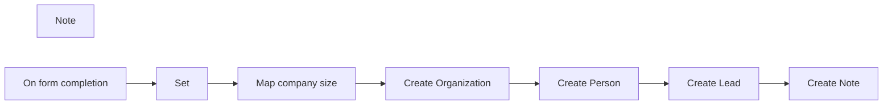

## Fluxo (.json) :

```json
{
  "meta": {
    "instanceId": "8c8c5237b8e37b006a7adce87f4369350c58e41f3ca9de16196d3197f69eabcd"
  },
  "nodes": [
    {
      "id": "7917ccbb-ef43-4784-adb9-7347be1f1e20",
      "name": "Set",
      "type": "n8n-nodes-base.set",
      "position": [
        580,
        560
      ],
      "parameters": {
        "values": {
          "string": [
            {
              "name": "company",
              "value": "={{$json[\"What *company* are you contacting us from?\"]}}"
            },
            {
              "name": "name",
              "value": "={{$json[\"Let's start with your *first and last name.*\"]}}"
            },
            {
              "name": "email",
              "value": "={{$json[\"What *email address* can we reach you at?\"]}}"
            },
            {
              "name": "n8nFamiliar",
              "value": "={{$json[\"How familiar are you with*  n8n*?\"]}}"
            },
            {
              "name": "questions",
              "value": "={{$json[\"Do you have any *specific questions* about embedding n8n at this stage?\"]}}"
            },
            {
              "name": "employees",
              "value": "={{$json[\"How many employees?\"]}}"
            }
          ]
        },
        "options": {},
        "keepOnlySet": true
      },
      "typeVersion": 1
    },
    {
      "id": "c0cc18d0-fdd1-4ef8-aabe-33bd13667c7d",
      "name": "Note",
      "type": "n8n-nodes-base.stickyNote",
      "position": [
        540,
        360
      ],
      "parameters": {
        "width": 760,
        "height": 440,
        "content": "## Format Typeform inputs to Pipedrive\nIn this example, we ask for the number of employees at a company. \n\nTo map this to Pipedrive, we need the unique item number coming from Pipedrive for each of these sections. This is what the function node does. \n\nIn the Pipedrive: Organization, we map this under the custom property.\n\n\n\n\n\n\n\n\n"
      },
      "typeVersion": 1
    },
    {
      "id": "92646ffb-73fb-4fee-a2b4-5060c7e04b59",
      "name": "Create Organization",
      "type": "n8n-nodes-base.pipedrive",
      "position": [
        1060,
        560
      ],
      "parameters": {
        "name": "={{$node[\"Map company size\"].json[\"company\"]}}",
        "resource": "organization",
        "additionalFields": {
          "customProperties": {
            "property": [
              {
                "name": "eb7a7fb64081a9b9100c0622c696c159330cf3d2",
                "value": "={{$node[\"Map company size\"].json[\"pipedriveemployees\"]}}"
              }
            ]
          }
        }
      },
      "credentials": {
        "pipedriveApi": {
          "id": "96",
          "name": "Pipedrive account"
        }
      },
      "typeVersion": 1
    },
    {
      "id": "4c1b7376-cc1f-4974-9110-7e1481e3fdbe",
      "name": "Create Person",
      "type": "n8n-nodes-base.pipedrive",
      "position": [
        1400,
        560
      ],
      "parameters": {
        "name": "={{$node[\"Map company size\"].json[\"name\"]}}",
        "resource": "person",
        "additionalFields": {
          "email": [
            "={{$node[\"On form completion\"].json[\"What *email address* can we reach you at?\"]}}"
          ],
          "org_id": "={{$json.id}}"
        }
      },
      "credentials": {
        "pipedriveApi": {
          "id": "96",
          "name": "Pipedrive account"
        }
      },
      "typeVersion": 1
    },
    {
      "id": "5c463f99-38e0-4c2e-a34c-86fc199b9d1f",
      "name": "Create Lead",
      "type": "n8n-nodes-base.pipedrive",
      "position": [
        1600,
        560
      ],
      "parameters": {
        "title": "={{$node[\"Map company size\"].json[\"company\"]}} lead",
        "resource": "lead",
        "organization_id": "={{$node[\"Create Organization\"].json.id}}",
        "additionalFields": {
          "person_id": "={{$json.id}}"
        }
      },
      "credentials": {
        "pipedriveApi": {
          "id": "96",
          "name": "Pipedrive account"
        }
      },
      "typeVersion": 1
    },
    {
      "id": "d63383ca-a71e-4384-a3fb-942c25d7fe01",
      "name": "Create Note",
      "type": "n8n-nodes-base.pipedrive",
      "position": [
        1800,
        560
      ],
      "parameters": {
        "content": "=Website form submitted\n\nQuestion:\n{{$node[\"Map company size\"].json[\"questions\"]}}\n\nCompany Size:\n{{$node[\"Set\"].json[\"employees\"]}}",
        "resource": "note",
        "additionalFields": {
          "lead_id": "={{$json.id}}"
        }
      },
      "credentials": {
        "pipedriveApi": {
          "id": "96",
          "name": "Pipedrive account"
        }
      },
      "typeVersion": 1
    },
    {
      "id": "78568df6-1c6b-493d-b186-9f9246de518a",
      "name": "On form completion",
      "type": "n8n-nodes-base.typeformTrigger",
      "position": [
        380,
        560
      ],
      "webhookId": "[UPDATE ME]",
      "parameters": {
        "formId": "[UPDATE ME]"
      },
      "credentials": {
        "typeformApi": {
          "id": "21",
          "name": "Typeform account"
        }
      },
      "typeVersion": 1
    },
    {
      "id": "6bc56059-6ae7-48bd-838c-08e717bd6bd4",
      "name": "Map company size",
      "type": "n8n-nodes-base.code",
      "position": [
        820,
        560
      ],
      "parameters": {
        "mode": "runOnceForEachItem",
        "jsCode": "switch ($input.item.json.employees) {\n  case '< 20':\n  // small\n    $input.item.json.pipedriveemployees='59' \n    break;\n  case '20 - 100':\n    // medium\n    $input.item.json.pipedriveemployees='60' \n    break;\n  case '101 - 500':\n    // large\n    $input.item.json.pipedriveemployees='73' \n    break;\n  case '501 - 1000':\n    // xlarge\n    $input.item.json.pipedriveemployees='74' \n    break;\n  case '1000+':\n    // Enterprise\n    $input.item.json.pipedriveemployees='61' \n    break;\n}\nreturn $input.item;\n"
      },
      "typeVersion": 1
    }
  ],
  "connections": {
    "Set": {
      "main": [
        [
          {
            "node": "Map company size",
            "type": "main",
            "index": 0
          }
        ]
      ]
    },
    "Create Lead": {
      "main": [
        [
          {
            "node": "Create Note",
            "type": "main",
            "index": 0
          }
        ]
      ]
    },
    "Create Person": {
      "main": [
        [
          {
            "node": "Create Lead",
            "type": "main",
            "index": 0
          }
        ]
      ]
    },
    "Map company size": {
      "main": [
        [
          {
            "node": "Create Organization",
            "type": "main",
            "index": 0
          }
        ]
      ]
    },
    "On form completion": {
      "main": [
        [
          {
            "node": "Set",
            "type": "main",
            "index": 0
          }
        ]
      ]
    },
    "Create Organization": {
      "main": [
        [
          {
            "node": "Create Person",
            "type": "main",
            "index": 0
          }
        ]
      ]
    }
  }
}
```

<a id="template-892"></a>

## Template 892 - Adicionar assinantes Beehiiv a partir de vendas Gumroad

- **Nome:** Adicionar assinantes Beehiiv a partir de vendas Gumroad
- **Descrição:** Ao detectar uma nova venda no Gumroad, o fluxo adiciona o comprador como inscrito em uma publicação do Beehiiv, registra a venda em uma planilha CRM e notifica o time no Telegram.
- **Funcionalidade:** • Detecção de nova venda no Gumroad: Inicia o processo quando uma venda é registrada.
• Listagem de publicações do Beehiiv: Recupera publicações disponíveis para determinar onde adicionar o assinante.
• Criação de assinatura no Beehiiv: Insere o e-mail do comprador como assinante na publicação selecionada.
• Registro da venda no CRM (planilha): Adiciona uma linha na planilha com data, e-mail, país e nome do produto.
• Notificação no Telegram: Envia mensagem ao chat configurado com detalhes da venda.
• Configuração do Chat ID: Define o chat ID usado para envio das notificações no Telegram.
- **Ferramentas:** • Gumroad: Plataforma de venda de produtos digitais utilizada para detectar transações e obter dados do comprador.
• Beehiiv: Serviço de newsletter onde são criadas as inscrições dos compradores.
• Google Sheets: Planilha usada como CRM para armazenar registros das vendas.
• Telegram: Canal de mensagens usado para notificar a equipe sobre novas vendas.


## Fluxo visual

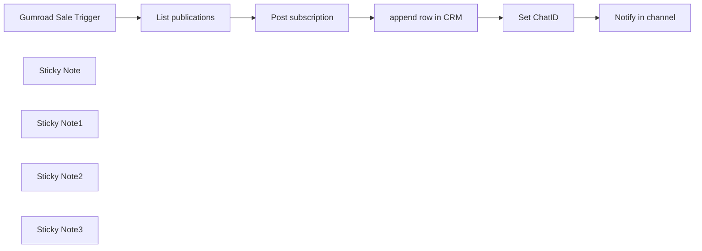

## Fluxo (.json) :

```json
{
  "id": "W1xEzKKEd1qV2D7V",
  "meta": {
    "instanceId": "dfec462482c1b16c8ef1928d51584c7f0ae64b3bfaa72e08675b15754b903bd2",
    "templateCredsSetupCompleted": true
  },
  "name": "2. Add Beehiiv newsletter subscribers from Gumroad sales",
  "tags": [
    {
      "id": "IQNCfEb2qHXxw7NO",
      "name": "template",
      "createdAt": "2025-04-26T14:50:39.694Z",
      "updatedAt": "2025-04-26T14:50:39.694Z"
    },
    {
      "id": "K4VMFA2Vwk2LRKCu",
      "name": "1node",
      "createdAt": "2025-04-26T11:57:21.772Z",
      "updatedAt": "2025-04-26T11:57:21.772Z"
    },
    {
      "id": "mAtRn7JRKGsmOL3v",
      "name": "gumroad",
      "createdAt": "2025-04-26T11:57:16.167Z",
      "updatedAt": "2025-04-26T11:57:16.167Z"
    }
  ],
  "nodes": [
    {
      "id": "18e8530e-d04f-47d4-b406-b2961d45f1c1",
      "name": "Gumroad Sale Trigger",
      "type": "n8n-nodes-base.gumroadTrigger",
      "position": [
        -380,
        -280
      ],
      "webhookId": "98ba7c08-2193-4ddf-9249-af7899716925",
      "parameters": {
        "resource": "sale"
      },
      "credentials": {
        "gumroadApi": {
          "id": "wgjGSvLjsRBJImsQ",
          "name": "Gumroad account"
        }
      },
      "typeVersion": 1
    },
    {
      "id": "6e464a73-a5c0-4a5d-95ce-c3cc2547a373",
      "name": "append row in CRM",
      "type": "n8n-nodes-base.googleSheets",
      "position": [
        300,
        -280
      ],
      "parameters": {
        "columns": {
          "value": {
            "date": "={{ $('Gumroad Sale Trigger').item.json.sale_timestamp }}",
            "email": "={{ $('Gumroad Sale Trigger').item.json.email }}",
            "country": "={{ $('Gumroad Sale Trigger').item.json.ip_country }}",
            "product name": "={{ $('Gumroad Sale Trigger').item.json.product_name }}"
          },
          "schema": [
            {
              "id": "date",
              "type": "string",
              "display": true,
              "removed": false,
              "required": false,
              "displayName": "date",
              "defaultMatch": false,
              "canBeUsedToMatch": true
            },
            {
              "id": "product name",
              "type": "string",
              "display": true,
              "removed": false,
              "required": false,
              "displayName": "product name",
              "defaultMatch": false,
              "canBeUsedToMatch": true
            },
            {
              "id": "email",
              "type": "string",
              "display": true,
              "removed": false,
              "required": false,
              "displayName": "email",
              "defaultMatch": false,
              "canBeUsedToMatch": true
            },
            {
              "id": "country",
              "type": "string",
              "display": true,
              "removed": false,
              "required": false,
              "displayName": "country",
              "defaultMatch": false,
              "canBeUsedToMatch": true
            }
          ],
          "mappingMode": "defineBelow",
          "matchingColumns": [],
          "attemptToConvertTypes": false,
          "convertFieldsToString": false
        },
        "options": {},
        "operation": "append",
        "sheetName": {
          "__rl": true,
          "mode": "list",
          "value": "gid=0",
          "cachedResultUrl": "https://docs.google.com/spreadsheets/d/1XYMstoZ4j3O5T-UYz21ky7P5bkUtzYXQGYCQTRVWCI4/edit#gid=0",
          "cachedResultName": "Sheet1"
        },
        "documentId": {
          "__rl": true,
          "mode": "list",
          "value": "1XYMstoZ4j3O5T-UYz21ky7P5bkUtzYXQGYCQTRVWCI4",
          "cachedResultUrl": "https://docs.google.com/spreadsheets/d/1XYMstoZ4j3O5T-UYz21ky7P5bkUtzYXQGYCQTRVWCI4/edit?usp=drivesdk",
          "cachedResultName": "Gumroad sales CRM"
        }
      },
      "credentials": {
        "googleSheetsOAuth2Api": {
          "id": "Ou2SgvNZctBeYWT5",
          "name": "Google Sheets account"
        }
      },
      "typeVersion": 4.5
    },
    {
      "id": "1f1b0840-0da9-4118-96d5-62a1a36f902b",
      "name": "Sticky Note",
      "type": "n8n-nodes-base.stickyNote",
      "position": [
        -560,
        -580
      ],
      "parameters": {
        "width": 320,
        "height": 460,
        "content": "## Trigger on a new Gumroad sale\n### Requirements\n- A [Gumroad]() account\n- A product listed. We used ours [here](https://1node.gumroad.com/l/topaitools)\n- Head to Settings > Advanced, and create a new application\n\n### Set up\n- Paste your access token on this Gumroad sale trigger"
      },
      "typeVersion": 1
    },
    {
      "id": "35f93009-1960-4cde-bfa6-dc7dfed5e194",
      "name": "Sticky Note1",
      "type": "n8n-nodes-base.stickyNote",
      "position": [
        -220,
        -500
      ],
      "parameters": {
        "color": 4,
        "width": 400,
        "height": 380,
        "content": "## Connection to [Beehiiv](https://www.beehiiv.com?via=1node-ai) newsletter \n### Requirements\n- A [Beehiiv](https://www.beehiiv.com?via=1node-ai) account\n- A publication created\n- Generate a new API"
      },
      "typeVersion": 1
    },
    {
      "id": "bbfcab7c-92fa-4a23-abc2-480c286905ac",
      "name": "Sticky Note2",
      "type": "n8n-nodes-base.stickyNote",
      "position": [
        200,
        -540
      ],
      "parameters": {
        "color": 4,
        "width": 320,
        "height": 420,
        "content": "## Load into CRM\n### Requirements\n- Set up your api and credentials for Google Sheets. You can find the n8n docs [here](https://docs.n8n.io/integrations/builtin/app-nodes/n8n-nodes-base.googlesheets/?utm_source=n8n_app&utm_medium=node_settings_modal-credential_link&utm_campaign=n8n-nodes-base.googleSheets)\n- Append the row to your table with your desired data collected previously"
      },
      "typeVersion": 1
    },
    {
      "id": "46a7cfcf-a042-4fe3-9f76-62eb46ecbbd0",
      "name": "List publications",
      "type": "n8n-nodes-base.httpRequest",
      "position": [
        -160,
        -280
      ],
      "parameters": {
        "url": "https://api.beehiiv.com/v2/publications",
        "options": {},
        "authentication": "genericCredentialType",
        "genericAuthType": "httpHeaderAuth"
      },
      "credentials": {
        "httpBearerAuth": {
          "id": "ZcZlbMhodQQpmBk3",
          "name": "Bearer Beehiiv"
        },
        "httpHeaderAuth": {
          "id": "Qvu08SMoEOK2V2xB",
          "name": "Beehiiv newsletter"
        }
      },
      "typeVersion": 4.2
    },
    {
      "id": "ab7bede8-0019-4cb4-ad16-b9ccbbe8b15a",
      "name": "Post subscription",
      "type": "n8n-nodes-base.httpRequest",
      "position": [
        20,
        -280
      ],
      "parameters": {
        "url": "=https://api.beehiiv.com/v2/publications/{{ $json.data[0].id }}/subscriptions",
        "method": "POST",
        "options": {},
        "sendBody": true,
        "authentication": "genericCredentialType",
        "bodyParameters": {
          "parameters": [
            {
              "name": "email",
              "value": "={{ $('Gumroad Sale Trigger').item.json.email }}"
            }
          ]
        },
        "genericAuthType": "httpHeaderAuth"
      },
      "credentials": {
        "httpHeaderAuth": {
          "id": "Qvu08SMoEOK2V2xB",
          "name": "Beehiiv newsletter"
        }
      },
      "typeVersion": 4.2
    },
    {
      "id": "cafb7301-06fe-49f9-a033-434459b181e5",
      "name": "Notify in channel",
      "type": "n8n-nodes-base.telegram",
      "position": [
        760,
        -280
      ],
      "webhookId": "16dedd5e-7f93-45fb-8add-2928a53f125f",
      "parameters": {
        "text": "=🔔 New Gumroad sale!\nProduct: {{ $('Gumroad Sale Trigger').item.json.product_name }} \nEmail: {{ $('Gumroad Sale Trigger').item.json.email }} \nCountry: {{ $('Gumroad Sale Trigger').item.json.ip_country }}",
        "chatId": "={{ $json.telegramChatId }}",
        "additionalFields": {
          "appendAttribution": false
        }
      },
      "credentials": {
        "telegramApi": {
          "id": "TbJJ7DHhEE1GwKQQ",
          "name": "Telegram account"
        }
      },
      "typeVersion": 1.2
    },
    {
      "id": "912c8a8f-074e-486f-b337-b828ae19b6af",
      "name": "Sticky Note3",
      "type": "n8n-nodes-base.stickyNote",
      "position": [
        540,
        -440
      ],
      "parameters": {
        "width": 360,
        "height": 320,
        "content": "## Notify team in Telegram\nSet up your Telegram bot and add to a channel as admin to notify everyone about the updates."
      },
      "typeVersion": 1
    },
    {
      "id": "5613a93b-f5ae-4478-86a8-4ea87ac5b9bd",
      "name": "Set ChatID",
      "type": "n8n-nodes-base.set",
      "position": [
        580,
        -280
      ],
      "parameters": {
        "options": {},
        "assignments": {
          "assignments": [
            {
              "id": "089c1b05-3ac3-419e-a25e-e98d0b7fa49c",
              "name": "telegramChatId",
              "type": "string",
              "value": "<your chat id>"
            }
          ]
        }
      },
      "typeVersion": 3.4
    }
  ],
  "active": true,
  "pinData": {},
  "settings": {
    "executionOrder": "v1"
  },
  "versionId": "34946f82-9af3-4e1b-bf98-67fb4c55a26c",
  "connections": {
    "Set ChatID": {
      "main": [
        [
          {
            "node": "Notify in channel",
            "type": "main",
            "index": 0
          }
        ]
      ]
    },
    "List publications": {
      "main": [
        [
          {
            "node": "Post subscription",
            "type": "main",
            "index": 0
          }
        ]
      ]
    },
    "Post subscription": {
      "main": [
        [
          {
            "node": "append row in CRM",
            "type": "main",
            "index": 0
          }
        ]
      ]
    },
    "append row in CRM": {
      "main": [
        [
          {
            "node": "Set ChatID",
            "type": "main",
            "index": 0
          }
        ]
      ]
    },
    "Gumroad Sale Trigger": {
      "main": [
        [
          {
            "node": "List publications",
            "type": "main",
            "index": 0
          }
        ]
      ]
    }
  }
}
```

<a id="template-893"></a>

## Template 893 - Resumo automático de documentos do Drive por e-mail

- **Nome:** Resumo automático de documentos do Drive por e-mail
- **Descrição:** Baixa um arquivo do Google Drive, gera um resumo usando Mistral AI e envia o resultado por email ao destinatário configurado.
- **Funcionalidade:** • Acionamento manual: inicia o fluxo ao clicar em 'Test workflow'.
• Download de arquivo do Google Drive: recupera o arquivo especificado para processamento.
• Processamento e fragmentação do conteúdo: divide o arquivo em trechos para facilitar a análise.
• Sumarização com modelo de linguagem: utiliza o serviço de IA para gerar um resumo conciso do conteúdo.
• Envio do resumo por Gmail: envia o texto resumido em formato HTML ao destinatário com data de processamento.
• Uso de credenciais conectadas: gera operações autenticadas para acessar o Drive, o serviço de IA e o Gmail.
- **Ferramentas:** • Google Drive: Armazenamento em nuvem usado como fonte do documento a ser resumido.
• Mistral Cloud: Serviço de modelo de linguagem usado para gerar o resumo do conteúdo.
• Gmail: Serviço de email usado para enviar o resumo formatado ao destinatário.

## Fluxo visual

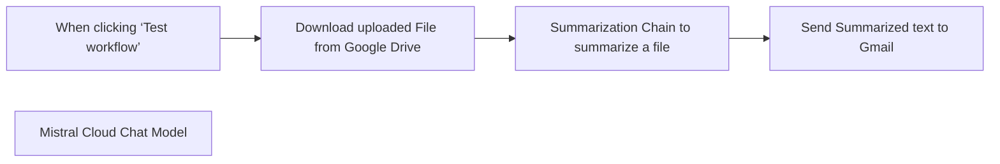

## Fluxo (.json) :

```json
{
  "id": "Jy1RMuri0WJO5aO4",
  "meta": {
    "instanceId": "c4e0aa659a8ba8396fb6bfa469d1eafbfbfff96c330631376e31cb897259826e",
    "templateCredsSetupCompleted": true
  },
  "name": "Summarize Google Drive Documents with Mistral AI and Send via Gmail",
  "tags": [
    {
      "id": "USkRpjRpntFcI8VH",
      "name": "working",
      "createdAt": "2025-03-09T00:24:01.723Z",
      "updatedAt": "2025-03-09T00:24:01.723Z"
    }
  ],
  "nodes": [
    {
      "id": "680f9002-94fa-48c1-af5f-d2a5305b6291",
      "name": "When clicking ‘Test workflow’",
      "type": "n8n-nodes-base.manualTrigger",
      "position": [
        0,
        0
      ],
      "parameters": {},
      "typeVersion": 1
    },
    {
      "id": "3fa4ad1a-ce87-44db-b016-bd172c2318eb",
      "name": "Mistral Cloud Chat Model",
      "type": "@n8n/n8n-nodes-langchain.lmChatMistralCloud",
      "position": [
        500,
        240
      ],
      "parameters": {
        "options": {}
      },
      "credentials": {
        "mistralCloudApi": {
          "id": "temjibUluGywOSoS",
          "name": "Mistral Cloud account"
        }
      },
      "typeVersion": 1
    },
    {
      "id": "124d62ae-3b46-4e75-a04e-155849fe280d",
      "name": "Download uploaded File from Google Drive",
      "type": "n8n-nodes-base.googleDrive",
      "position": [
        220,
        0
      ],
      "parameters": {
        "fileId": {
          "__rl": true,
          "mode": "list",
          "value": "1d0njBA2ZM0zYyJOEbUeFwQmHSYIO7IM2",
          "cachedResultUrl": "https://drive.google.com/file/d/1d0njBA2ZM0zYyJOEbUeFwQmHSYIO7IM2/view?usp=drivesdk",
          "cachedResultName": "Goods and Services Receipt(WCC).pdf"
        },
        "options": {},
        "operation": "download"
      },
      "credentials": {
        "googleDriveOAuth2Api": {
          "id": "7xFbFgdSc78zERPk",
          "name": "Google Drive account"
        }
      },
      "typeVersion": 3
    },
    {
      "id": "69b7621b-a273-4b0a-be61-4d45bf87618d",
      "name": "Summarization Chain to summarize a file",
      "type": "@n8n/n8n-nodes-langchain.chainSummarization",
      "position": [
        480,
        0
      ],
      "parameters": {
        "options": {
          "binaryDataKey": "data"
        },
        "chunkSize": 800,
        "chunkOverlap": 0,
        "operationMode": "nodeInputBinary"
      },
      "typeVersion": 2
    },
    {
      "id": "573194cd-5f37-422f-b3fa-957187ac3538",
      "name": "Send Summarized text to Gmail",
      "type": "n8n-nodes-base.gmail",
      "position": [
        840,
        0
      ],
      "webhookId": "215c6c67-612c-4b8d-9849-0b796570003d",
      "parameters": {
        "sendTo": "swot.ai25@gmail.com",
        "message": "=<h1 style=\"color: #4CAF50;\">📌 Quick Summary of Your Document! ✨</h1>\n<p>\n<h2>📝 Summary:</h2>\n<p>\n{{ $json['response']['text'].replace(\"\\n\", \"<br>\") }}\n<p>\n\n<h3>📅 Date Processed: </h3>\n{{ new Date().toLocaleString('en-GB', { timeZone: 'Africa/Lagos' }) }}\n\n\n\n\n\n    ",
        "options": {
          "senderName": "Swot.AI",
          "appendAttribution": false
        },
        "subject": "Here is Your Summarized Response"
      },
      "credentials": {
        "gmailOAuth2": {
          "id": "G3K9RkKiyLHtyVzi",
          "name": "Gmail account"
        }
      },
      "typeVersion": 2.1
    }
  ],
  "active": false,
  "pinData": {},
  "settings": {
    "executionOrder": "v1"
  },
  "versionId": "8446e524-8468-4515-8778-be94db41d3e3",
  "connections": {
    "Mistral Cloud Chat Model": {
      "ai_languageModel": [
        [
          {
            "node": "Summarization Chain to summarize a file",
            "type": "ai_languageModel",
            "index": 0
          }
        ]
      ]
    },
    "When clicking ‘Test workflow’": {
      "main": [
        [
          {
            "node": "Download uploaded File from Google Drive",
            "type": "main",
            "index": 0
          }
        ]
      ]
    },
    "Summarization Chain to summarize a file": {
      "main": [
        [
          {
            "node": "Send Summarized text to Gmail",
            "type": "main",
            "index": 0
          }
        ]
      ]
    },
    "Download uploaded File from Google Drive": {
      "main": [
        [
          {
            "node": "Summarization Chain to summarize a file",
            "type": "main",
            "index": 0
          }
        ]
      ]
    }
  }
}
```

<a id="template-894"></a>

## Template 894 - Conversão 3-vistas para vídeo rotativo

- **Nome:** Conversão 3-vistas para vídeo rotativo
- **Descrição:** Fluxo que gera vistas frontal e lateral a partir de uma imagem de entrada e converte essas imagens em um vídeo rotativo final, extraindo também versão sem marca d'água.
- **Funcionalidade:** • Entrada de parâmetros básicos: Recebe chave de API e URL da imagem inicial para iniciar o processo.
• Geração de vista frontal: Solicita ao modelo de visão/linguagem a captura da vista frontal da imagem original.
• Extração de URL de imagem do stream: Processa respostas em streaming para identificar e extrair a URL da imagem gerada.
• Retentativa de geração frontal: Verifica se a geração falhou e reenvia a solicitação enquanto necessário.
• Geração de vista lateral: Solicita ao modelo a criação da vista lateral da imagem original e extrai sua URL do stream.
• Retentativa de geração lateral: Verifica e repete a geração lateral em caso de falha.
• Solicitação de geração de vídeo: Envia as imagens (frontal e lateral/tail) ao serviço de vídeo (modelo Kling) para criar um vídeo rotativo com parâmetros como duração e direção de rotação.
• Polling e espera de conclusão: Aguarda e consulta periodicamente o status da tarefa de vídeo até que esteja concluída.
• Extração do vídeo final: Ao completar a tarefa, recupera a URL do vídeo gerado e a URL da versão sem marca d'água.
- **Ferramentas:** • PiAPI - Chat Completions (gpt-4o-image-preview): Serviço de API usado para gerar novas imagens (vistas frontal e lateral) a partir da imagem de entrada, retornando URLs em respostas streaming.
• PiAPI - Task API (modelo Kling para video_generation): Serviço de API usado para converter imagens em vídeos dinâmicos rotativos, gerenciar tarefas de geração e fornecer URLs do vídeo final e da versão sem marca d'água.

## Fluxo visual


## Fluxo (.json) :

```json
{
  "id": "KWFLpcJytH7qjheD",
  "meta": {
    "instanceId": "1e003a7ea4715b6b35e9947791386a7d07edf3b5bf8d4c9b7ee4fdcbec0447d7"
  },
  "name": "(Not published) Three-View Orthographic Projection to Dynamic Video Conversion",
  "tags": [],
  "nodes": [
    {
      "id": "442e12af-531d-4000-9e74-d9bfaa3515ca",
      "name": "When clicking ‘Test workflow’",
      "type": "n8n-nodes-base.manualTrigger",
      "position": [
        -1960,
        -160
      ],
      "parameters": {},
      "typeVersion": 1
    },
    {
      "id": "39c46540-7dee-4237-921e-3b6bd9821302",
      "name": "Generate Kling Video",
      "type": "n8n-nodes-base.httpRequest",
      "position": [
        -400,
        0
      ],
      "parameters": {
        "url": "https://api.piapi.ai/api/v1/task",
        "method": "POST",
        "options": {},
        "jsonBody": "={\n    \"model\": \"kling\",\n    \"task_type\": \"video_generation\",\n    \"input\": {\n        \"version\": \"1.6\",\n        \"mode\": \"pro\",\n        \"image_url\": \"{{ $('Get Image URL of Front Image').item.json.image_url }}\",\n        \"image_tail_url\": \"{{ $json.image_url }}\",\n        \"duration\":5,\n        \"prompt\": \"The character rotates smoothly, stay original facial expression. Apply anticlockwise rotation\"\n    }\n} ",
        "sendBody": true,
        "sendHeaders": true,
        "specifyBody": "json",
        "headerParameters": {
          "parameters": [
            {
              "name": "x-api-key",
              "value": "={{ $('Basic Params').item.json[\"x-api-key\"] }}"
            }
          ]
        }
      },
      "typeVersion": 4.2
    },
    {
      "id": "cfc726ee-e6f2-4016-a4fe-7123a4520fda",
      "name": "Get Kling Video",
      "type": "n8n-nodes-base.httpRequest",
      "position": [
        -220,
        0
      ],
      "parameters": {
        "url": "=https://api.piapi.ai/api/v1/task/{{ $json.data.task_id }}",
        "options": {},
        "sendHeaders": true,
        "headerParameters": {
          "parameters": [
            {
              "name": "x-api-key",
              "value": "72858adea87ad16865d5b0a24c3d9b9f58a6e7b1a8a8a8a0d6b81a9f3a9812f3"
            }
          ]
        }
      },
      "typeVersion": 4.2
    },
    {
      "id": "90d1cc4f-3d74-4a2a-9b02-3255ec9fc553",
      "name": "Verify Task Status",
      "type": "n8n-nodes-base.if",
      "position": [
        -40,
        0
      ],
      "parameters": {
        "options": {},
        "conditions": {
          "options": {
            "version": 2,
            "leftValue": "",
            "caseSensitive": true,
            "typeValidation": "strict"
          },
          "combinator": "and",
          "conditions": [
            {
              "id": "f36fa981-22e0-46db-af8c-c2ac55242c27",
              "operator": {
                "name": "filter.operator.equals",
                "type": "string",
                "operation": "equals"
              },
              "leftValue": "={{ $json.data.status }}",
              "rightValue": "completed"
            },
            {
              "id": "637ea756-1ad9-434c-b6b2-b100ee4c3cad",
              "operator": {
                "name": "filter.operator.equals",
                "type": "string",
                "operation": "equals"
              },
              "leftValue": "",
              "rightValue": ""
            }
          ]
        }
      },
      "typeVersion": 2.2
    },
    {
      "id": "6931c1b2-c4f4-47d6-9ff4-e6019e465c3e",
      "name": "Get Final Video",
      "type": "n8n-nodes-base.code",
      "position": [
        260,
        140
      ],
      "parameters": {
        "jsCode": "// Process the entire response\nreturn {\n  video_url: $input.all()[0].json.data.output.video_url,\n  watermark_free_url: $input.all()[0].json.data.output.works[0].video.resource_without_watermark\n};"
      },
      "typeVersion": 2
    },
    {
      "id": "adae02a4-dedc-4415-9409-88193090e2dc",
      "name": "GPT-4o Generator: Front View",
      "type": "n8n-nodes-base.httpRequest",
      "position": [
        -1560,
        20
      ],
      "parameters": {
        "url": "https://api.piapi.ai/v1/chat/completions",
        "method": "POST",
        "options": {},
        "jsonBody": "={\n    \"model\": \"gpt-4o-image-preview\",\n    \"messages\": [\n        {\n            \"role\": \"user\",\n            \"content\": [\n                {\n                    \"type\": \"image_url\",\n                    \"image_url\": {\n                        \"url\": \"{{ $json.image_url }}\"\n                    }\n                },\n                {\n                    \"type\": \"text\",\n                    \"text\": \"Capture front view of the image, then split them into two separate images for me.\"\n                }\n            ]\n        }\n    ],\n    \"stream\": true\n}",
        "sendBody": true,
        "sendHeaders": true,
        "specifyBody": "json",
        "authentication": "genericCredentialType",
        "genericAuthType": "httpHeaderAuth",
        "headerParameters": {
          "parameters": [
            {
              "name": "Authorization",
              "value": "=Bearer {{ $json[\"x-api-key\"] }}"
            }
          ]
        }
      },
      "credentials": {
        "httpHeaderAuth": {
          "id": "fsJeCNd9BkJ1CIrt",
          "name": "Header Auth account 2"
        }
      },
      "typeVersion": 4.2
    },
    {
      "id": "63320b08-62bc-4faf-a3ff-4069785c41f5",
      "name": "GPT-4o Generator: Side View",
      "type": "n8n-nodes-base.httpRequest",
      "position": [
        -1000,
        320
      ],
      "parameters": {
        "url": "https://api.piapi.ai/v1/chat/completions",
        "method": "POST",
        "options": {},
        "jsonBody": "={\n    \"model\": \"gpt-4o-image-preview\",\n    \"messages\": [\n        {\n            \"role\": \"user\",\n            \"content\": [\n                {\n                    \"type\": \"image_url\",\n                    \"image_url\": {\n                        \"url\": \"{{ $('Basic Params').item.json.image_url }}\"\n                    }\n                },\n                {\n                    \"type\": \"text\",\n                    \"text\": \"Generate side view of the image\"\n                }\n            ]\n        }\n    ],\n    \"stream\": true\n}",
        "sendBody": true,
        "sendHeaders": true,
        "specifyBody": "json",
        "headerParameters": {
          "parameters": [
            {
              "name": "Authorization",
              "value": "=Bearer {{ $('Basic Params').item.json[\"x-api-key\"] }}"
            }
          ]
        }
      },
      "typeVersion": 4.2
    },
    {
      "id": "8fd1fb74-a149-4af6-9da5-e0dc3daa91c9",
      "name": "Get Image URL of Front Image",
      "type": "n8n-nodes-base.code",
      "position": [
        -1380,
        20
      ],
      "parameters": {
        "jsCode": "const chunks = $input.first().json.data.split('\\n\\n');\n\nlet imageUrl = null;\n\nfor (let i = chunks.length - 1; i >= 0; i--) {\n    const chunk = chunks[i];\n    \n    if (!chunk.startsWith('data: ')) continue;\n    \n    try {\n        const jsonStr = chunk.substring(6); \n        if (jsonStr.trim() === '[DONE]') continue;\n        \n        const data = JSON.parse(jsonStr);\n        \n\n        if (data.choices && data.choices[0].delta.content) {\n            const content = data.choices[0].delta.content;\n            const urlMatch = content.match(/!\\[.*?\\]\\((https?://[^\\s]+)\\)/);\n            \n            if (urlMatch && urlMatch[1]) {\n                imageUrl = urlMatch[1];\n                break;\n            }\n        }\n    } catch (e) {\n        continue;\n    }\n}\n\nreturn {\n    image_url: imageUrl,\n    finish_reason: imageUrl ? \"success\" : \"not_found\"\n};"
      },
      "typeVersion": 2
    },
    {
      "id": "b5b41a20-aba1-4fbb-aaf9-47d18a38a727",
      "name": "Get Image URL of Side Image",
      "type": "n8n-nodes-base.code",
      "position": [
        -800,
        320
      ],
      "parameters": {
        "jsCode": "const chunks = $input.first().json.data.split('\\n\\n');\n\nlet imageUrl = null;\n\n// 反向遍历 chunks (从最新数据开始检查)\nfor (let i = chunks.length - 1; i >= 0; i--) {\n    const chunk = chunks[i];\n    \n    if (!chunk.startsWith('data: ')) continue;\n    \n    try {\n        const jsonStr = chunk.substring(6); // 去掉 \"data: \" 前缀\n        if (jsonStr.trim() === '[DONE]') continue;\n        \n        const data = JSON.parse(jsonStr);\n        \n        // 检查是否包含图片标记（Markdown 图片语法）\n        if (data.choices && data.choices[0].delta.content) {\n            const content = data.choices[0].delta.content;\n            const urlMatch = content.match(/!\\[.*?\\]\\((https?://[^\\s]+)\\)/);\n            \n            if (urlMatch && urlMatch[1]) {\n                imageUrl = urlMatch[1];\n                break;\n            }\n        }\n    } catch (e) {\n        continue;\n    }\n}\n\nreturn {\n    image_url: imageUrl,\n    finish_reason: imageUrl ? \"success\" : \"not_found\"\n};"
      },
      "typeVersion": 2
    },
    {
      "id": "6428385c-19ac-478c-af87-904de1e35b61",
      "name": "Verify Generation Status of Front View",
      "type": "n8n-nodes-base.if",
      "position": [
        -1160,
        20
      ],
      "parameters": {
        "options": {},
        "conditions": {
          "options": {
            "version": 2,
            "leftValue": "",
            "caseSensitive": true,
            "typeValidation": "strict"
          },
          "combinator": "and",
          "conditions": [
            {
              "id": "08a2ebe6-dc95-4b8a-ada1-1173645cc3f4",
              "operator": {
                "name": "filter.operator.equals",
                "type": "string",
                "operation": "equals"
              },
              "leftValue": "={{ $json.finish_reason }}",
              "rightValue": "not_found"
            }
          ]
        }
      },
      "typeVersion": 2.2
    },
    {
      "id": "395dbc5c-89e7-4eb7-a726-617250ebd02f",
      "name": "Verify Generation Status of Side View",
      "type": "n8n-nodes-base.if",
      "position": [
        -600,
        320
      ],
      "parameters": {
        "options": {},
        "conditions": {
          "options": {
            "version": 2,
            "leftValue": "",
            "caseSensitive": true,
            "typeValidation": "strict"
          },
          "combinator": "and",
          "conditions": [
            {
              "id": "08a2ebe6-dc95-4b8a-ada1-1173645cc3f4",
              "operator": {
                "name": "filter.operator.equals",
                "type": "string",
                "operation": "equals"
              },
              "leftValue": "={{ $json.finish_reason }}",
              "rightValue": "not_found"
            }
          ]
        }
      },
      "typeVersion": 2.2
    },
    {
      "id": "7287b4a9-8309-4984-8328-ecc569d4aa00",
      "name": "Wait for Video Generation",
      "type": "n8n-nodes-base.wait",
      "position": [
        -20,
        240
      ],
      "webhookId": "c7b2590d-96a3-4c7c-8821-3023fead254b",
      "parameters": {
        "amount": 20
      },
      "typeVersion": 1.1
    },
    {
      "id": "9ed98c97-6a73-4f74-9cbd-5e19179aba9d",
      "name": "Basic Params",
      "type": "n8n-nodes-base.set",
      "position": [
        -1760,
        -160
      ],
      "parameters": {
        "mode": "raw",
        "options": {},
        "jsonOutput": "{\n  \"x-api-key\":\"\",\n  \"image_url\": \"\"\n}\n"
      },
      "typeVersion": 3.4
    }
  ],
  "active": false,
  "pinData": {},
  "settings": {
    "executionOrder": "v1"
  },
  "versionId": "71081f7e-7805-497b-9167-eba0b3a7c0e4",
  "connections": {
    "Basic Params": {
      "main": [
        [
          {
            "node": "GPT-4o Generator: Front View",
            "type": "main",
            "index": 0
          }
        ]
      ]
    },
    "Get Kling Video": {
      "main": [
        [
          {
            "node": "Verify Task Status",
            "type": "main",
            "index": 0
          }
        ]
      ]
    },
    "Verify Task Status": {
      "main": [
        [
          {
            "node": "Get Final Video",
            "type": "main",
            "index": 0
          }
        ],
        [
          {
            "node": "Wait for Video Generation",
            "type": "main",
            "index": 0
          }
        ]
      ]
    },
    "Generate Kling Video": {
      "main": [
        [
          {
            "node": "Get Kling Video",
            "type": "main",
            "index": 0
          }
        ]
      ]
    },
    "Wait for Video Generation": {
      "main": [
        [
          {
            "node": "Get Kling Video",
            "type": "main",
            "index": 0
          }
        ]
      ]
    },
    "GPT-4o Generator: Side View": {
      "main": [
        [
          {
            "node": "Get Image URL of Side Image",
            "type": "main",
            "index": 0
          }
        ]
      ]
    },
    "Get Image URL of Side Image": {
      "main": [
        [
          {
            "node": "Verify Generation Status of Side View",
            "type": "main",
            "index": 0
          }
        ]
      ]
    },
    "GPT-4o Generator: Front View": {
      "main": [
        [
          {
            "node": "Get Image URL of Front Image",
            "type": "main",
            "index": 0
          }
        ]
      ]
    },
    "Get Image URL of Front Image": {
      "main": [
        [
          {
            "node": "Verify Generation Status of Front View",
            "type": "main",
            "index": 0
          }
        ]
      ]
    },
    "When clicking ‘Test workflow’": {
      "main": [
        [
          {
            "node": "Basic Params",
            "type": "main",
            "index": 0
          }
        ]
      ]
    },
    "Verify Generation Status of Side View": {
      "main": [
        [
          {
            "node": "GPT-4o Generator: Side View",
            "type": "main",
            "index": 0
          }
        ],
        [
          {
            "node": "Generate Kling Video",
            "type": "main",
            "index": 0
          }
        ]
      ]
    },
    "Verify Generation Status of Front View": {
      "main": [
        [
          {
            "node": "GPT-4o Generator: Front View",
            "type": "main",
            "index": 0
          }
        ],
        [
          {
            "node": "GPT-4o Generator: Side View",
            "type": "main",
            "index": 0
          }
        ]
      ]
    }
  }
}
```

<a id="template-895"></a>

## Template 895 - Envio diário de afirmações por Telegram

- **Nome:** Envio diário de afirmações por Telegram
- **Descrição:** Envia diariamente uma afirmação positiva por mensagem ao usuário.
- **Funcionalidade:** • Agendamento diário: Dispara o fluxo todos os dias às 09:00.
• Busca de afirmação: Solicita uma afirmação ao serviço externo de afirmações.
• Composição de mensagem: Monta uma mensagem personalizada incluindo a afirmação retornada.
• Envio via Telegram: Entrega a mensagem ao destinatário através do Telegram.
- **Ferramentas:** • Affirmations.dev: Serviço que fornece afirmações positivas via API pública.
• Telegram: Plataforma de mensagens utilizada para enviar a afirmação ao usuário.


## Fluxo visual

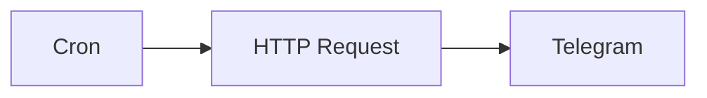

## Fluxo (.json) :

```json
{
  "id": "2",
  "name": "Daily Text Affirmations",
  "nodes": [
    {
      "name": "Cron",
      "type": "n8n-nodes-base.cron",
      "position": [
        350,
        380
      ],
      "parameters": {
        "triggerTimes": {
          "item": [
            {
              "hour": 9
            }
          ]
        }
      },
      "typeVersion": 1
    },
    {
      "name": "HTTP Request",
      "type": "n8n-nodes-base.httpRequest",
      "position": [
        760,
        380
      ],
      "parameters": {
        "url": "https://affirmations.dev",
        "options": {}
      },
      "typeVersion": 1
    },
    {
      "name": "Telegram",
      "type": "n8n-nodes-base.telegram",
      "position": [
        1140,
        380
      ],
      "parameters": {
        "text": "=Hey Daniel, here's your daily affirmation...\n\n{{$node[\"HTTP Request\"].json[\"affirmation\"]}}",
        "additionalFields": {}
      },
      "credentials": {
        "telegramApi": "Telegram Token"
      },
      "typeVersion": 1
    }
  ],
  "active": false,
  "settings": {},
  "connections": {
    "Cron": {
      "main": [
        [
          {
            "node": "HTTP Request",
            "type": "main",
            "index": 0
          }
        ]
      ]
    },
    "HTTP Request": {
      "main": [
        [
          {
            "node": "Telegram",
            "type": "main",
            "index": 0
          }
        ]
      ]
    }
  }
}
```

<a id="template-896"></a>

## Template 896 - Sincronizar tickets Zendesk com threads no Slack

- **Nome:** Sincronizar tickets Zendesk com threads no Slack
- **Descrição:** Este fluxo sincroniza tickets criados no Zendesk com threads no Slack, criando uma thread ao receber o ticket ou respondendo em threads existentes, e atualizando o ticket com o ID da thread do Slack.
- **Funcionalidade:** • Detecção de novo ticket no Zendesk via webhook: inicia a automação quando um ticket é criado.
• Recuperação de informações do ticket: busca os dados do ticket usando o ID informado.
• Verificação de existência de thread no Slack: lê o campo customizado do ticket para saber se já há uma thread associada.
• Envio de mensagem para thread existente: se já houver thread, posta a resposta do ticket na thread existente.
• Criação de nova thread no Slack: se não houver thread, cria uma nova thread no canal configurado com o assunto do ticket.
• Atualização do ticket Zendesk: após criar a thread, atualiza o ticket com o Slack thread ID no campo customizado 7022397804317.
- **Ferramentas:** • Zendesk: Plataforma de suporte para gerenciar tickets, ler e atualizar informações de tickets.
• Slack: Plataforma de mensagens para criar threads, responder em threads e manter conversas conectadas.

## Fluxo visual

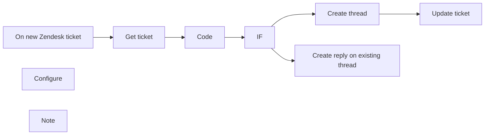

## Fluxo (.json) :

```json
{
  "meta": {
    "instanceId": "237600ca44303ce91fa31ee72babcdc8493f55ee2c0e8aa2b78b3b4ce6f70bd9"
  },
  "nodes": [
    {
      "id": "b220e0c7-3c34-4221-8fee-11c133a5345b",
      "name": "Get ticket",
      "type": "n8n-nodes-base.zendesk",
      "position": [
        740,
        540
      ],
      "parameters": {
        "id": "={{$node[\"On new Zendesk ticket\"].json[\"body\"][\"id\"]}}",
        "operation": "get"
      },
      "credentials": {
        "zendeskApi": {
          "id": "24",
          "name": "[UPDATE ME]"
        }
      },
      "typeVersion": 1
    },
    {
      "id": "e58834a7-1a94-429f-a50c-2e27293c32a0",
      "name": "IF",
      "type": "n8n-nodes-base.if",
      "position": [
        1140,
        540
      ],
      "parameters": {
        "conditions": {
          "string": [
            {
              "value1": "={{$node[\"Determine\"].json[\"Slack Thread ID\"]}}",
              "operation": "isNotEmpty"
            }
          ]
        }
      },
      "typeVersion": 1
    },
    {
      "id": "c6f82ab9-54f4-4f91-a4d9-018739c6519d",
      "name": "Update ticket",
      "type": "n8n-nodes-base.zendesk",
      "notes": "Update the Zendesk ticket by adding the Jira issue key to the \"Jira Issue Key\" field.",
      "position": [
        1540,
        640
      ],
      "parameters": {
        "id": "={{$node[\"On new Zendesk ticket\"].json[\"body\"][\"id\"]}}",
        "operation": "update",
        "updateFields": {
          "customFieldsUi": {
            "customFieldsValues": [
              {
                "id": 7022397804317,
                "value": "={{$node[\"Create thread\"].json[\"ts\"]}}"
              }
            ]
          }
        }
      },
      "credentials": {
        "zendeskApi": {
          "id": "24",
          "name": "[UPDATE ME]"
        }
      },
      "notesInFlow": true,
      "typeVersion": 1
    },
    {
      "id": "74d93ba5-d82d-4cc4-a177-bd86dbc18534",
      "name": "On new Zendesk ticket",
      "type": "n8n-nodes-base.webhook",
      "position": [
        540,
        540
      ],
      "webhookId": "b7845b15-0a44-4be5-b513-f4f4bb8989a6",
      "parameters": {
        "path": "b7845b15-0a44-4be5-b513-f4f4bb8989a6",
        "options": {},
        "httpMethod": "POST"
      },
      "typeVersion": 1
    },
    {
      "id": "65d387cd-5c7a-4567-9a3c-9fa033f98ac9",
      "name": "Create thread",
      "type": "n8n-nodes-base.slack",
      "position": [
        1340,
        640
      ],
      "parameters": {
        "text": "={{$node[\"Get ticket\"].json[\"subject\"]}}",
        "channel": "={{$node[\"Configure\"].parameter[\"values\"][\"string\"][0][\"value\"]}}",
        "attachments": [],
        "otherOptions": {},
        "authentication": "oAuth2"
      },
      "credentials": {
        "slackOAuth2Api": {
          "id": "28",
          "name": "[UPDATE ME]"
        }
      },
      "typeVersion": 1
    },
    {
      "id": "50f5aa84-70bc-4b08-a9cc-576fbed72636",
      "name": "Create reply on existing thread",
      "type": "n8n-nodes-base.slack",
      "position": [
        1340,
        440
      ],
      "parameters": {
        "text": "={{$node[\"On new Zendesk ticket\"].json[\"body\"][\"comment\"]}}",
        "channel": "={{$node[\"Configure\"].parameter[\"values\"][\"string\"][0][\"value\"]}}",
        "attachments": [],
        "otherOptions": {
          "thread_ts": "={{$node[\"Determine\"].json[\"Slack Thread ID\"]}}"
        },
        "authentication": "oAuth2"
      },
      "credentials": {
        "slackOAuth2Api": {
          "id": "28",
          "name": "[UPDATE ME]"
        }
      },
      "typeVersion": 1
    },
    {
      "id": "6d5e8df0-4b0b-487c-81be-93359976dd90",
      "name": "Configure",
      "type": "n8n-nodes-base.set",
      "position": [
        540,
        360
      ],
      "parameters": {
        "values": {
          "string": [
            {
              "name": "Slack channel",
              "value": "#zendesk-updates"
            }
          ]
        },
        "options": {
          "dotNotation": false
        }
      },
      "typeVersion": 1
    },
    {
      "id": "934b95bb-2ffa-40a4-a2ca-02cfd646dd78",
      "name": "Note",
      "type": "n8n-nodes-base.stickyNote",
      "position": [
        -20,
        360
      ],
      "parameters": {
        "width": 469.4813676974197,
        "height": 268.2900466166276,
        "content": "## Sync Zendesk tickets to Slack threads\n### Setup\n1. Add your [Zendesk credential](https://docs.n8n.io/integrations/builtin/credentials/zendesk/) to the `Get ticket` and `Update ticket` nodes.\n2. Add your [Slack credential](https://docs.n8n.io/integrations/builtin/credentials/slack/) to `Create Thread` and `Create reply on existing thread` nodes.\n3. Open `Configure` node and change \"Slack channel\" value to your slack channel (like #zendesk-updates).\n4. Activate the workflow so it runs automatically each time a Zendesk ticket is created."
      },
      "typeVersion": 1
    },
    {
      "id": "b582f7ff-7cc6-48dc-89fc-bc8bde13b06e",
      "name": "Code",
      "type": "n8n-nodes-base.code",
      "notes": "if thread was created already in Slack",
      "position": [
        940,
        540
      ],
      "parameters": {
        "jsCode": "/* configure here =========================================================== */\n/*  Zendesk field ID which represents the \"Slack Thread ID\" field.\n*/\nconst ISSUE_KEY_FIELD_ID = 7022397804317;\n\n/* ========================================================================== */\nnew_items = [];\n\nfor (item of $items(\"Get ticket\")) {\n    \n    // instantiate a new variable for status\n    var custom_fields = item.json[\"custom_fields\"];\n    var slack_thread_id = \"\";\n    for (var i = 0; i < custom_fields.length; i++) {\n        if (custom_fields[i].id == ISSUE_KEY_FIELD_ID) {\n            slack_thread_id = custom_fields[i].value;\n            break;\n        }\n    }\n\n    // push the new item to the new_items array\n    new_items.push({\n        \"Slack Thread ID\": slack_thread_id\n    });\n}\n\nreturn new_items;"
      },
      "notesInFlow": true,
      "typeVersion": 1
    }
  ],
  "connections": {
    "IF": {
      "main": [
        [
          {
            "node": "Create reply on existing thread",
            "type": "main",
            "index": 0
          }
        ],
        [
          {
            "node": "Create thread",
            "type": "main",
            "index": 0
          }
        ]
      ]
    },
    "Code": {
      "main": [
        [
          {
            "node": "IF",
            "type": "main",
            "index": 0
          }
        ]
      ]
    },
    "Get ticket": {
      "main": [
        [
          {
            "node": "Code",
            "type": "main",
            "index": 0
          }
        ]
      ]
    },
    "Create thread": {
      "main": [
        [
          {
            "node": "Update ticket",
            "type": "main",
            "index": 0
          }
        ]
      ]
    },
    "On new Zendesk ticket": {
      "main": [
        [
          {
            "node": "Get ticket",
            "type": "main",
            "index": 0
          }
        ]
      ]
    }
  }
}
```

<a id="template-897"></a>

## Template 897 - Criação e publicação automática de vídeos sociais com IA

- **Nome:** Criação e publicação automática de vídeos sociais com IA
- **Descrição:** Automatiza a criação de vídeos curtos a partir de um prompt de texto ou imagem no Telegram, gera áudio e legendas com IA, salva metadados e publica automaticamente em várias plataformas sociais.
- **Funcionalidade:** • Gatilho via Telegram: Inicia o fluxo ao receber uma mensagem de texto ou imagem em um chat.
• Análise e separação do input: Extrai prompt do vídeo, ideia de legenda e estilo musical a partir da mensagem.
• Suporte a imagem ou texto: Decide a rota de processamento conforme o tipo de entrada (imagem ou texto).
• Download e upload de imagem: Baixa imagens do Telegram e envia para armazenamento (Cloudinary) quando necessário.
• Geração de vídeo por imagem: Converte imagens em vídeos usando um serviço de geração de vídeo (Piapi) e aguarda o processamento.
• Geração de vídeo por script: Cria vídeos a partir de prompts textuais via Blotato e recupera URL quando pronto.
• Geração de música/áudio: Gera trilha ou áudio com base no estilo desejado usando Piapi e obtém o ficheiro final.
• Geração de texto para sobreposição: Usa um modelo de linguagem para criar linhas curtas de texto a serem exibidas como sobreposições (hook e payoff).
• Fusão de elementos: Combina vídeo, áudio e textos (legendas/sobreposições) em um único arquivo final via serviço de edição (json2video).
• Geração de legenda social e título SEO: Cria uma legenda atraente e um título otimizado para plataformas usando modelos de linguagem.
• Registro e rastreamento: Salva URL do vídeo, título e legenda em uma planilha do Google para controle.
• Envio de validação para Telegram: Envia o link e o arquivo de vídeo final ao chat original para revisão ou download.
• Preparação e upload para publicação: Atribui IDs de contas e carrega o vídeo em um serviço de distribuição (Blotato).
• Publicação multi-plataforma automática: Publica o vídeo em múltiplas redes (Instagram, YouTube, TikTok, Facebook, Threads, X, LinkedIn, Bluesky, Pinterest) via API do serviço de distribuição.
- **Ferramentas:** • Telegram: Recebe prompts e imagens dos usuários e entrega o resultado final no chat.
• Blotato: Serviço de criação e distribuição de vídeos usados para gerar vídeos a partir de texto e publicar em várias plataformas.
• Piapi (piapi.ai): API para geração de vídeo a partir de imagens e para síntese de áudio/música.
• Cloudinary: Armazenamento e hospedagem de imagens usadas no processo de geração de vídeo.
• json2video (api.json2video.com): Serviço de montagem/edição que combina vídeo, áudio e textos para criar o arquivo final.
• OpenAI (GPT-4 / gpt-4o-mini): Gera roteiros curtos, textos de sobreposição, legendas sociais e títulos otimizados.
• Google Sheets: Armazena metadados dos vídeos (URL, título, legenda) para rastreamento e organização.

## Fluxo visual

```mermaid
flowchart LR
    N1["Upload Video to Blotato"]
    N2["Post to Instagram"]
    N3["Post to YouTube"]
    N4["Post to TikTok"]
    N5["Post to Facebook Page"]
    N6["Post to Threads"]
    N7["Post to Twitter (X)"]
    N8["Post to LinkedIn"]
    N9["Post to Bluesky"]
    N10["Post to Pinterest"]
    N11["Sticky Note3"]
    N12["Sticky Note"]
    N13["Sticky Note1"]
    N14["Sticky Note2"]
    N15["Sticky Note4"]
    N16["Trigger Telegram Prompt or Image"]
    N17["Split Prompt or Image Input"]
    N18["Condition Input Type (Image or Text)"]
    N19["Download Image from Telegram"]
    N20["Extract Image File URL"]
    N21["Upload Image to Cloudinary"]
    N22["Convert Image to Video"]
    N23["Wait for Image-to-Video Rendering"]
    N24["Get Image-Based Video URL"]
    N25["Generate Video with blotato"]
    N26["Wait for blotato Video Rendering"]
    N27["Get blotato Video URL"]
    N28["Merge Video Data (Image or Prompt)"]
    N29["Generate Music with Piapi"]
    N30["Wait for Music Generation"]
    N31["Get Music File URL"]
    N32["Generate Script (GPT-4o-mini)"]
    N33["Split Script"]
    N34["Merge Video + Music"]
    N35["Wait for Fusion Completion"]
    N36["Get Final Video URL"]
    N37["Generate Social Caption (GPT-4)"]
    N38["Generate SEO Title (GPT-4)"]
    N39["Append Video Data to Google Sheet"]
    N40["Send Final Video to Telegram"]
    N41["Send Caption to Telegram"]
    N42["Assign Platform IDs for Blotato"]

    N33 --> N34
    N31 --> N32
    N36 --> N37
    N34 --> N35
    N27 --> N28
    N22 --> N23
    N20 --> N21
    N1 --> N2
    N1 --> N3
    N1 --> N4
    N1 --> N5
    N1 --> N6
    N1 --> N7
    N1 --> N8
    N1 --> N9
    N1 --> N10
    N41 --> N42
    N29 --> N30
    N24 --> N28
    N30 --> N31
    N38 --> N39
    N21 --> N22
    N35 --> N36
    N25 --> N26
    N17 --> N18
    N19 --> N20
    N40 --> N41
    N32 --> N33
    N42 --> N1
    N37 --> N38
    N16 --> N17
    N26 --> N27
    N39 --> N40
    N23 --> N24
    N28 --> N29
    N18 --> N25
    N18 --> N19
```

## Fluxo (.json) :

```json
{
  "id": "hiCTcf6srJl3Xsxh",
  "meta": {
    "instanceId": "a2b23892dd6989fda7c1209b381f5850373a7d2b85609624d7c2b7a092671d44"
  },
  "name": "Auto-create and publish AI social videos with Telegram, GPT-4 and Blotato",
  "tags": [],
  "nodes": [
    {
      "id": "b8a41b63-8c48-4964-befe-b949f3e9b755",
      "name": "Upload Video to Blotato",
      "type": "n8n-nodes-base.httpRequest",
      "position": [
        2580,
        920
      ],
      "parameters": {
        "url": "https://backend.blotato.com/v2/media",
        "method": "POST",
        "options": {},
        "sendBody": true,
        "sendHeaders": true,
        "bodyParameters": {
          "parameters": [
            {
              "name": "url",
              "value": "={{ $('Append Video Data to Google Sheet').item.json['url '] }}"
            }
          ]
        },
        "headerParameters": {
          "parameters": [
            {
              "name": "blotato-api-key"
            }
          ]
        }
      },
      "typeVersion": 4.2
    },
    {
      "id": "ac7a8bf1-b9ec-4a25-8c14-6d90abbc5568",
      "name": "Post to Instagram",
      "type": "n8n-nodes-base.httpRequest",
      "position": [
        2800,
        120
      ],
      "parameters": {
        "url": "https://backend.blotato.com/v2/posts",
        "method": "POST",
        "options": {},
        "jsonBody": "={\n  \"post\": {\n    \"accountId\": \"{{ $('Assign Platform IDs for Blotato').item.json.instagram_id }}\",\n    \"target\": {\n      \"targetType\": \"instagram\"\n    },\n    \"content\": {\n      \"text\": \"{{ $('Append Video Data to Google Sheet').item.json.caption }}\",\n      \"platform\": \"instagram\",\n      \"mediaUrls\": [\n        \"{{ $json.url }}\"\n      ]\n    }\n  }\n}\n",
        "sendBody": true,
        "sendHeaders": true,
        "specifyBody": "json",
        "headerParameters": {
          "parameters": [
            {
              "name": "blotato-api-key"
            }
          ]
        }
      },
      "typeVersion": 4.2
    },
    {
      "id": "be0a1831-c0e3-4753-b114-2cd7cc66fae2",
      "name": "Post to YouTube",
      "type": "n8n-nodes-base.httpRequest",
      "position": [
        2800,
        320
      ],
      "parameters": {
        "url": "https://backend.blotato.com/v2/posts",
        "method": "POST",
        "options": {},
        "jsonBody": "={\n  \"post\": {\n    \"accountId\": \"{{ $('Assign Platform IDs for Blotato').item.json.youtube_id }}\",\n    \"target\": {\n      \"targetType\": \"youtube\",\n      \"title\": \"{{ $('Append Video Data to Google Sheet').item.json.Title }}\",\n      \"privacyStatus\": \"unlisted\",\n      \"shouldNotifySubscribers\": \"false\"\n    },\n    \"content\": {\n      \"text\": \"{{ $('Append Video Data to Google Sheet').item.json.caption }}\",\n      \"platform\": \"youtube\",\n      \"mediaUrls\": [\n        \"{{ $json.url }}\"\n      ]\n    }\n  }\n}",
        "sendBody": true,
        "sendHeaders": true,
        "specifyBody": "json",
        "headerParameters": {
          "parameters": [
            {
              "name": "blotato-api-key"
            }
          ]
        }
      },
      "typeVersion": 4.2
    },
    {
      "id": "62087008-dd5a-49f4-a764-a10b1c82e4e0",
      "name": "Post to TikTok",
      "type": "n8n-nodes-base.httpRequest",
      "position": [
        2800,
        520
      ],
      "parameters": {
        "url": "https://backend.blotato.com/v2/posts",
        "method": "POST",
        "options": {},
        "jsonBody": "={\n  \"post\": {\n    \"accountId\": \"{{ $('Assign Platform IDs for Blotato').item.json.tiktok_id }}\",\n    \"target\": {\n      \"targetType\": \"tiktok\",\n      \"isYourBrand\": \"false\", \n      \"disabledDuet\": \"false\",\n      \"privacyLevel\": \"PUBLIC_TO_EVERYONE\",\n      \"isAiGenerated\": \"true\",\n      \"disabledStitch\": \"false\",\n      \"disabledComments\": \"false\",\n      \"isBrandedContent\": \"false\"\n      \n    },\n    \"content\": {\n      \"text\": \"{{ $('Append Video Data to Google Sheet').item.json.caption }}\",\n      \"platform\": \"tiktok\",\n      \"mediaUrls\": [\n        \"{{ $json.url }}\"\n      ]\n    }\n  }\n}\n",
        "sendBody": true,
        "sendHeaders": true,
        "specifyBody": "json",
        "headerParameters": {
          "parameters": [
            {
              "name": "blotato-api-key"
            }
          ]
        }
      },
      "typeVersion": 4.2
    },
    {
      "id": "976b075d-c98b-45a4-bf76-06a34d5ccbf3",
      "name": "Post to Facebook Page",
      "type": "n8n-nodes-base.httpRequest",
      "position": [
        2800,
        720
      ],
      "parameters": {
        "url": "https://backend.blotato.com/v2/posts",
        "method": "POST",
        "options": {},
        "jsonBody": "={\n  \"post\": {\n    \"accountId\": \"{{ $('Assign Platform IDs for Blotato').item.json.facebook_id }}\",\n    \"target\": {\n      \"targetType\": \"facebook\",\n      \"pageId\": \"{{ $('Assign Platform IDs for Blotato').item.json.facebook_page_id }}\"\n\n      \n    },\n    \"content\": {\n      \"text\": \"{{ $('Append Video Data to Google Sheet').item.json.caption }}\",\n      \"platform\": \"facebook\",\n      \"mediaUrls\": [\n        \"{{ $json.url }}\"\n      ]\n    }\n  }\n}",
        "sendBody": true,
        "sendHeaders": true,
        "specifyBody": "json",
        "headerParameters": {
          "parameters": [
            {
              "name": "blotato-api-key"
            }
          ]
        }
      },
      "typeVersion": 4.2
    },
    {
      "id": "c689c5d4-f63c-4fc2-b2d6-e1d2d03a236a",
      "name": "Post to Threads",
      "type": "n8n-nodes-base.httpRequest",
      "position": [
        2800,
        920
      ],
      "parameters": {
        "url": "https://backend.blotato.com/v2/posts",
        "method": "POST",
        "options": {},
        "jsonBody": "={\n  \"post\": {\n    \"accountId\": \"{{ $('Assign Platform IDs for Blotato').item.json.threads_id }}\",\n    \"target\": {\n      \"targetType\": \"threads\"\n      \n    },\n    \"content\": {\n      \"text\": \"{{ $('Append Video Data to Google Sheet').item.json.caption }}\",\n      \"platform\": \"threads\",\n      \"mediaUrls\": [\n        \"{{ $json.url }}\"\n      ]\n    }\n  }\n}",
        "sendBody": true,
        "sendHeaders": true,
        "specifyBody": "json",
        "headerParameters": {
          "parameters": [
            {
              "name": "blotato-api-key"
            }
          ]
        }
      },
      "typeVersion": 4.2
    },
    {
      "id": "88c8bd03-342e-4844-9489-28a5a93426e0",
      "name": "Post to Twitter (X)",
      "type": "n8n-nodes-base.httpRequest",
      "position": [
        2800,
        1120
      ],
      "parameters": {
        "url": "https://backend.blotato.com/v2/posts",
        "method": "POST",
        "options": {},
        "jsonBody": "={\n  \"post\": {\n    \"accountId\": \"{{ $('Assign Platform IDs for Blotato').item.json.twitter_id }}\",\n    \"target\": {\n      \"targetType\": \"twitter\"\n      \n    },\n    \"content\": {\n      \"text\": \"{{ $('Append Video Data to Google Sheet').item.json.caption }}\",\n      \"platform\": \"twitter\",\n      \"mediaUrls\": [\n        \"{{ $json.url }}\"\n      ]\n    }\n  }\n}\n",
        "sendBody": true,
        "sendHeaders": true,
        "specifyBody": "json",
        "headerParameters": {
          "parameters": [
            {
              "name": "blotato-api-key"
            }
          ]
        }
      },
      "typeVersion": 4.2
    },
    {
      "id": "db6fb042-731e-46ce-8f4d-07e2b427739c",
      "name": "Post to LinkedIn",
      "type": "n8n-nodes-base.httpRequest",
      "position": [
        2800,
        1320
      ],
      "parameters": {
        "url": "https://backend.blotato.com/v2/posts",
        "method": "POST",
        "options": {},
        "jsonBody": "={\n  \"post\": {\n    \"accountId\": \"{{ $('Assign Platform IDs for Blotato').item.json.linkedin_id }}\",\n    \"target\": {\n      \"targetType\": \"linkedin\"\n      \n    },\n    \"content\": {\n      \"text\": \"{{ $('Append Video Data to Google Sheet').item.json.caption }}\",\n      \"platform\": \"linkedin\",\n      \"mediaUrls\": [\n        \"{{ $json.url }}\"\n      ]\n    }\n  }\n}\n",
        "sendBody": true,
        "sendHeaders": true,
        "specifyBody": "json",
        "headerParameters": {
          "parameters": [
            {
              "name": "blotato-api-key"
            }
          ]
        }
      },
      "typeVersion": 4.2
    },
    {
      "id": "2102531c-624a-49b6-8b99-7a43e5067585",
      "name": "Post to Bluesky",
      "type": "n8n-nodes-base.httpRequest",
      "position": [
        2800,
        1520
      ],
      "parameters": {
        "url": "https://backend.blotato.com/v2/posts",
        "method": "POST",
        "options": {},
        "jsonBody": "={\n  \"post\": {\n    \"accountId\": \"{{ $('Assign Platform IDs for Blotato').item.json.bluesky_id }}\",\n    \"target\": {\n      \"targetType\": \"bluesky\"\n      \n    },\n    \"content\": {\n      \"text\": \"{{ $('Append Video Data to Google Sheet').item.json.caption }}\",\n      \"platform\": \"bluesky\",\n      \"mediaUrls\": [\n        \"https://pbs.twimg.com/media/GE8MgIiWEAAfsK3.jpg\"\n      ]\n    }\n  }\n}\n",
        "sendBody": true,
        "sendHeaders": true,
        "specifyBody": "json",
        "headerParameters": {
          "parameters": [
            {
              "name": "blotato-api-key"
            }
          ]
        }
      },
      "typeVersion": 4.2
    },
    {
      "id": "a9826150-6e26-4174-af74-1b4dd8016638",
      "name": "Post to Pinterest",
      "type": "n8n-nodes-base.httpRequest",
      "position": [
        2800,
        1720
      ],
      "parameters": {
        "url": "https://backend.blotato.com/v2/posts",
        "method": "POST",
        "options": {},
        "jsonBody": "={\n  \"post\": {\n    \"accountId\": \"{{ $('Assign Platform IDs for Blotato').item.json.pinterest_id }}\",\n    \"target\": {\n      \"targetType\": \"pinterest\",\n      \"boardId\": \"{{ $('Assign Platform IDs for Blotato').item.json.pinterest_board_id }}\"      \n    },\n    \"content\": {\n      \"text\": \"{{ $('Append Video Data to Google Sheet').item.json.caption }}\",\n      \"platform\": \"pinterest\",\n      \"mediaUrls\": [\n        \"https://pbs.twimg.com/media/GE8MgIiWEAAfsK3.jpg\"\n      ]\n    }\n  }\n}\n",
        "sendBody": true,
        "sendHeaders": true,
        "specifyBody": "json",
        "headerParameters": {
          "parameters": [
            {
              "name": "blotato-api-key"
            }
          ]
        }
      },
      "typeVersion": 4.2
    },
    {
      "id": "fcd6f25a-f6e9-4952-8be8-37eafbf7d07f",
      "name": "Sticky Note3",
      "type": "n8n-nodes-base.stickyNote",
      "position": [
        2320,
        0
      ],
      "parameters": {
        "color": 3,
        "width": 880,
        "height": 1900,
        "content": "# 🟥 STEP 5 — Auto-Publish to 9 Social Platforms\n## The final step automates distribution using Blotato’s API.\n"
      },
      "typeVersion": 1
    },
    {
      "id": "eb822c9d-cb51-4df7-98d6-a0941a9833bd",
      "name": "Sticky Note",
      "type": "n8n-nodes-base.stickyNote",
      "position": [
        0,
        0
      ],
      "parameters": {
        "width": 2260,
        "height": 760,
        "content": "# 🟫 STEP 1 — Create Video Using AI (image or text)\n## This step handles the full video creation pipeline using AI.\n### It starts from a Telegram message containing a prompt or image, \n"
      },
      "typeVersion": 1
    },
    {
      "id": "1c209fe5-fd5a-45d7-9546-421710eb501d",
      "name": "Sticky Note1",
      "type": "n8n-nodes-base.stickyNote",
      "position": [
        0,
        840
      ],
      "parameters": {
        "width": 1500,
        "height": 520,
        "content": "# 🟫 STEP 2 — Create Music\n## Here, a short-form voice-over script is generated using GPT-4 based on the topic.\n### The script is converted to speech, uploaded, and merged with the AI-generated video — resulting in a fully narrated visual asset.\n"
      },
      "typeVersion": 1
    },
    {
      "id": "0bf198f2-16f9-4ae9-aef3-919b5755da5a",
      "name": "Sticky Note2",
      "type": "n8n-nodes-base.stickyNote",
      "position": [
        0,
        1440
      ],
      "parameters": {
        "width": 1500,
        "height": 460,
        "content": "# 🟫 STEP 3 — Add Captions to Enhance Engagement\n## To increase accessibility and boost social engagement, \n## this step overlays professional-looking subtitles on the video using a styling template.\n### This results in a final video that includes visuals, voice-over, and captions.\n"
      },
      "typeVersion": 1
    },
    {
      "id": "00c67803-c937-491e-bf2a-2d76774de07f",
      "name": "Sticky Note4",
      "type": "n8n-nodes-base.stickyNote",
      "position": [
        1580,
        840
      ],
      "parameters": {
        "color": 4,
        "width": 680,
        "height": 1060,
        "content": "\n\n\n\n\n\n\n\n\n\n\n\n\n\n\n\n\n\n\n\n\n\n\n\n\n\n\n\n\n\n\n\n\n\n\n\n\n\n\n\n\n\n\n\n# 🟫 STEP 4 — Save Video & Notify via Telegram\n## This step generates a title and caption for the video, \n## saves the content metadata to a Google Sheet for future tracking, \n### And sends both the final video and its description to a Telegram chat for validation or reuse.\n### The script is converted to speech, uploaded, and merged with the AI-generated video — resulting in a fully narrated visual asset.\n"
      },
      "typeVersion": 1
    },
    {
      "id": "5a08a003-68b1-48e5-8851-bb1a77d18a37",
      "name": "Trigger Telegram Prompt or Image",
      "type": "n8n-nodes-base.telegramTrigger",
      "position": [
        80,
        280
      ],
      "webhookId": "20261394-b809-4b76-9b7b-36a20af57673",
      "parameters": {
        "updates": [
          "message"
        ],
        "additionalFields": {}
      },
      "credentials": {
        "telegramApi": {
          "id": "hcYH7o64erx701LY",
          "name": "Telegram account 3"
        }
      },
      "typeVersion": 1.1
    },
    {
      "id": "6c4d7dd5-7676-465a-ac02-cf7192bf70ab",
      "name": "Split Prompt or Image Input",
      "type": "n8n-nodes-base.code",
      "position": [
        280,
        280
      ],
      "parameters": {
        "jsCode": "const input = $input.first().json.message.text || $input.first().json.message.caption;\n\n// Remove optional \"generate video\" prefix\nconst cleaned = input.replace(/^generate video[:]?/i, '').trim();\n\n// Split by comma\nconst parts = cleaned.split(',').map(p => p.trim());\n\n// Assign values even if missing\nconst videoPrompt = parts[0] || \"\";\nconst captionIdea = parts[1] || \"\";\nconst musicStyle = parts[2] || \"\";\n\nreturn [\n  {\n    json: {\n      videoPrompt,\n      captionIdea,\n      musicStyle\n    }\n  }\n];\n"
      },
      "typeVersion": 2
    },
    {
      "id": "3c203e0c-d133-4c6f-a801-2e5dab690b8a",
      "name": "Condition Input Type (Image or Text)",
      "type": "n8n-nodes-base.if",
      "position": [
        460,
        280
      ],
      "parameters": {
        "options": {},
        "conditions": {
          "options": {
            "version": 2,
            "leftValue": "",
            "caseSensitive": true,
            "typeValidation": "strict"
          },
          "combinator": "and",
          "conditions": [
            {
              "id": "8b4d3f92-c9e0-45e6-8b6a-4fa487e6b32f",
              "operator": {
                "type": "string",
                "operation": "notEmpty",
                "singleValue": true
              },
              "leftValue": "={{ $('Trigger Telegram Prompt or Image').item.json.message.text }}",
              "rightValue": ""
            }
          ]
        }
      },
      "typeVersion": 2.2
    },
    {
      "id": "1898fd9c-2164-44d0-8ada-192107565b64",
      "name": "Download Image from Telegram",
      "type": "n8n-nodes-base.telegram",
      "position": [
        760,
        440
      ],
      "webhookId": "1d115d8e-62c9-4f43-898e-20892b25fdb9",
      "parameters": {
        "fileId": "={{ $('Trigger Telegram Prompt or Image').item.json.message.photo[3].file_id }}",
        "resource": "file"
      },
      "credentials": {
        "telegramApi": {
          "id": "hcYH7o64erx701LY",
          "name": "Telegram account 3"
        }
      },
      "typeVersion": 1.2
    },
    {
      "id": "6f9755e0-db11-4c3e-9d1b-f9c97c832cbd",
      "name": "Extract Image File URL",
      "type": "n8n-nodes-base.httpRequest",
      "position": [
        960,
        440
      ],
      "parameters": {
        "url": "=https://api.telegram.org/file/bot_YOURTOKEN/{{ $('Download Image from Telegram').item.json.result.file_path }}",
        "options": {}
      },
      "typeVersion": 4.2
    },
    {
      "id": "66abae9c-10ae-4845-9070-cd5f2d208782",
      "name": "Upload Image to Cloudinary",
      "type": "n8n-nodes-base.httpRequest",
      "position": [
        1120,
        440
      ],
      "parameters": {
        "url": "https://api.cloudinary.com/v1_1/dc5wapno3/image/upload",
        "method": "POST",
        "options": {},
        "sendBody": true,
        "contentType": "multipart-form-data",
        "authentication": "genericCredentialType",
        "bodyParameters": {
          "parameters": [
            {
              "name": "file",
              "parameterType": "formBinaryData",
              "inputDataFieldName": "data"
            },
            {
              "name": "upload_preset",
              "value": "n8n_video"
            }
          ]
        },
        "genericAuthType": "httpBasicAuth"
      },
      "credentials": {
        "httpBasicAuth": {
          "id": "K1UGehJnDI8N25UA",
          "name": "Unnamed credential"
        }
      },
      "typeVersion": 4.2
    },
    {
      "id": "26979ac8-6f1d-4a9b-b0b5-42b4d7165ffe",
      "name": "Convert Image to Video",
      "type": "n8n-nodes-base.httpRequest",
      "position": [
        1320,
        440
      ],
      "parameters": {
        "url": "https://api.piapi.ai/api/v1/task",
        "method": "POST",
        "options": {},
        "jsonBody": "={\n\"model\": \"kling\",\n\"task_type\": \"video_generation\",\n\"input\": {\n\"prompt\": \"{{ $('Split Prompt or Image Input').item.json.videoPrompt }}\",\n\"image_url\": \"{{ $json.secure_url }}\",\n\"negative_prompt\": \"\",\n\"cfg_scale\": 0.5,\n\"duration\": 5,\n\"version\": \"1.6\",\n\"camera_control\": {\n\"type\": \"simple\",\n\"config\": {\n\"horizontal\": 0,\n\"vertical\": 0,\n\"pan\": 0,\n\"tilt\": 0,\n\"roll\": 0,\n\"zoom\": 0\n}\n},\n\"mode\": \"std\"\n},\n\"config\": {\n\"service_mode\": \"\",\n\"webhook_config\": {\n\"endpoint\": \"\",\n\"secret\": \"\"\n}\n}\n}",
        "sendBody": true,
        "specifyBody": "json",
        "authentication": "genericCredentialType",
        "genericAuthType": "httpHeaderAuth"
      },
      "credentials": {
        "httpBasicAuth": {
          "id": "K1UGehJnDI8N25UA",
          "name": "Unnamed credential"
        },
        "httpHeaderAuth": {
          "id": "aoHHS9dlGs8ViUeX",
          "name": "Header Auth account 3"
        }
      },
      "typeVersion": 4.2
    },
    {
      "id": "36168808-54e8-4826-a3f5-bd8148da9a55",
      "name": "Wait for Image-to-Video Rendering",
      "type": "n8n-nodes-base.wait",
      "position": [
        1520,
        440
      ],
      "webhookId": "adf3489e-21ed-42de-8cc6-70c706cacbbf",
      "parameters": {
        "unit": "minutes",
        "amount": 2
      },
      "typeVersion": 1.1
    },
    {
      "id": "dd364492-ffcb-47e4-a24e-fb5b3c5b4ab5",
      "name": "Get Image-Based Video URL",
      "type": "n8n-nodes-base.httpRequest",
      "position": [
        1720,
        440
      ],
      "parameters": {
        "url": "=https://api.piapi.ai/api/v1/task/{{ $json.data.task_id }}",
        "options": {
          "response": {
            "response": {
              "responseFormat": "json"
            }
          }
        },
        "authentication": "genericCredentialType",
        "genericAuthType": "httpHeaderAuth"
      },
      "credentials": {
        "httpHeaderAuth": {
          "id": "aoHHS9dlGs8ViUeX",
          "name": "Header Auth account 3"
        }
      },
      "typeVersion": 4.2
    },
    {
      "id": "8a6b0c07-8304-403e-842e-ea60b0d5e939",
      "name": "Generate Video with blotato",
      "type": "n8n-nodes-base.httpRequest",
      "position": [
        760,
        120
      ],
      "parameters": {
        "url": "https://backend.blotato.com/v2/videos/creations",
        "method": "POST",
        "options": {},
        "jsonBody": "={\n  \"script\": \"{{ $json.videoPrompt }}\",\n  \"style\": \"cinematic\",\n  \"template\": {\n    \"id\": \"base/pov/wakeup\"\n  }\n}\n",
        "sendBody": true,
        "sendHeaders": true,
        "specifyBody": "json",
        "headerParameters": {
          "parameters": [
            {
              "name": "blotato-api-key"
            }
          ]
        }
      },
      "typeVersion": 4.2
    },
    {
      "id": "14f39088-402d-477e-afe7-1fa8a3f0edf5",
      "name": "Wait for blotato Video Rendering",
      "type": "n8n-nodes-base.wait",
      "position": [
        1520,
        120
      ],
      "webhookId": "00fc9999-cacc-4c9b-b71b-75757c56f31e",
      "parameters": {
        "unit": "minutes",
        "amount": 2
      },
      "typeVersion": 1.1
    },
    {
      "id": "540a8cbf-0b41-4102-b2c3-a69480603cb6",
      "name": "Get blotato Video URL",
      "type": "n8n-nodes-base.httpRequest",
      "position": [
        1720,
        120
      ],
      "parameters": {
        "url": "=https://backend.blotato.com/v2/videos/creations/{{ $json.item.id }}",
        "options": {
          "response": {
            "response": {
              "responseFormat": "json"
            }
          }
        },
        "sendHeaders": true,
        "headerParameters": {
          "parameters": [
            {
              "name": "blotato-api-key"
            }
          ]
        }
      },
      "typeVersion": 4.2
    },
    {
      "id": "e549069b-0acb-44dd-ba58-d6fe76b4b782",
      "name": "Merge Video Data (Image or Prompt)",
      "type": "n8n-nodes-base.set",
      "position": [
        2060,
        440
      ],
      "parameters": {
        "options": {},
        "assignments": {
          "assignments": [
            {
              "id": "5ca907c0-f556-488d-ad59-714089b2a594",
              "name": "url_video",
              "type": "string",
              "value": "={{ $json.item.mediaUrl }}{{ $json.data.output.video_url }} "
            }
          ]
        }
      },
      "typeVersion": 3.4
    },
    {
      "id": "4482e940-fdee-498a-9b4c-dd44a12f04a9",
      "name": "Generate Music with Piapi",
      "type": "n8n-nodes-base.httpRequest",
      "position": [
        60,
        1040
      ],
      "parameters": {
        "url": "https://api.piapi.ai/api/v1/task",
        "method": "POST",
        "options": {},
        "jsonBody": "={\n  \"model\": \"Qubico/diffrhythm\",\n  \"task_type\": \"txt2audio-base\",\n  \"input\": {\n    \"style_prompt\": \"{{ $('Split Prompt or Image Input').item.json.musicStyle }}\",\n    \"lyrics\": \"\",\n    \"style_audio\": \"\"\n  },\n  \"config\": {\n    \"webhook_config\": {\n      \"endpoint\": \"\",\n      \"secret\": \"\"\n    }\n  }\n}\n",
        "sendBody": true,
        "specifyBody": "json",
        "authentication": "genericCredentialType",
        "genericAuthType": "httpHeaderAuth"
      },
      "credentials": {
        "httpHeaderAuth": {
          "id": "aoHHS9dlGs8ViUeX",
          "name": "Header Auth account 3"
        }
      },
      "typeVersion": 4.2
    },
    {
      "id": "e2187d71-aace-4cf4-8ef3-b4b14d255f54",
      "name": "Wait for Music Generation",
      "type": "n8n-nodes-base.wait",
      "position": [
        480,
        1040
      ],
      "webhookId": "ecf06ea7-0f87-42f6-939f-688e7eb20da1",
      "parameters": {
        "unit": "minutes",
        "amount": 2
      },
      "typeVersion": 1.1
    },
    {
      "id": "8ea22e87-0803-4618-a4cb-08a6b720838e",
      "name": "Get Music File URL",
      "type": "n8n-nodes-base.httpRequest",
      "position": [
        700,
        1040
      ],
      "parameters": {
        "url": "=https://api.piapi.ai/api/v1/task/{{ $json.data.task_id }}",
        "options": {
          "response": {
            "response": {
              "responseFormat": "json"
            }
          }
        },
        "authentication": "genericCredentialType",
        "genericAuthType": "httpHeaderAuth"
      },
      "credentials": {
        "httpHeaderAuth": {
          "id": "aoHHS9dlGs8ViUeX",
          "name": "Header Auth account 3"
        }
      },
      "typeVersion": 4.2
    },
    {
      "id": "61b49201-e9d5-44b8-be6c-d0175596d261",
      "name": "Generate Script (GPT-4o-mini)",
      "type": "@n8n/n8n-nodes-langchain.openAi",
      "position": [
        920,
        1040
      ],
      "parameters": {
        "modelId": {
          "__rl": true,
          "mode": "list",
          "value": "gpt-4o-mini",
          "cachedResultName": "GPT-4O-MINI"
        },
        "options": {},
        "messages": {
          "values": [
            {
              "content": "=You are a copywriter for short-form vertical videos.\nVideo topic:\n{{ $('Split Prompt or Image Input').first().json.captionIdea }}\nWrite two short lines of overlay text:\n\ntext1: Hook (no period)\n\ntext2: Emotional or curiosity payoff (ends with \"...\")\n\nExample:\ntext1: Why I broke up with ChatGPT\ntext2: this other AI gets me so much better...\n\nRules:\n\nMax 50 characters per line\n\nOutput only:\ntext1: ...\ntext2: ...\n\nNo quotes, brackets, emojis, hashtags, or titles\n\n"
            }
          ]
        }
      },
      "credentials": {
        "openAiApi": {
          "id": "6h3DfVhNPw9I25nO",
          "name": "OpenAi account"
        }
      },
      "typeVersion": 1.8
    },
    {
      "id": "30394110-bc11-4139-8303-f536e22733d4",
      "name": "Split Script",
      "type": "n8n-nodes-base.code",
      "position": [
        1300,
        1040
      ],
      "parameters": {
        "jsCode": "const input = $input.first().json;\n\n// Auto-detect AI output path\nlet aiOutput = \"\";\n\nif (input?.choices?.[0]?.message?.content) {\n  aiOutput = input.choices[0].message.content;\n} else if (input?.message?.content) {\n  aiOutput = input.message.content;\n} else if (typeof input?.content === \"string\") {\n  aiOutput = input.content;\n} else {\n  // Optional: expose the input in case of failure for debug\n  throw new Error(\"❌ No valid AI output found. Check the structure of the input.\");\n}\n\nconst lines = aiOutput.split('\\n').map(l => l.trim());\nlet text1 = \"\";\nlet text2 = \"\";\n\nfor (const line of lines) {\n  if (line.toLowerCase().startsWith(\"text1:\")) {\n    text1 = line.replace(/^text1:\\s*/i, '');\n  } else if (line.toLowerCase().startsWith(\"text2:\")) {\n    text2 = line.replace(/^text2:\\s*/i, '');\n  }\n}\n\nreturn [\n  {\n    json: {\n      text1,\n      text2\n    }\n  }\n];\n"
      },
      "typeVersion": 2
    },
    {
      "id": "15d7845c-0e0b-4f06-b48e-5ea8add6501a",
      "name": "Merge Video + Music",
      "type": "n8n-nodes-base.httpRequest",
      "position": [
        80,
        1640
      ],
      "parameters": {
        "url": "https://api.json2video.com/v2/movies",
        "method": "POST",
        "options": {},
        "jsonBody": "={\n  \"id\": \"qbaasr7s\",\n  \"resolution\": \"instagram-story\",\n  \"quality\": \"high\",\n  \"scenes\": [\n    {\n      \"id\": \"qyjh9lwj\",\n      \"comment\": \"Scene 1\",\n      \"elements\": []\n    }\n  ],\n  \"elements\": [\n    {\n      \"id\": \"q6dznzcv\",\n      \"type\": \"video\",\n      \"src\": \"{{ $('Merge Video Data (Image or Prompt)').item.json.url_video }}\",\n      \"resize\": \"cover\"\n    },\n    {\n      \"id\": \"top-text\",\n      \"type\": \"text\",\n      \"text\": \"{{ $json.text1 }}\",\n      \"settings\": {\n        \"font-family\": \"Libre Baskerville\",\n        \"font-size\": \"80px\",\n        \"color\": \"#ffffff\",\n        \"horizontal-position\": \"center\",\n        \"vertical-position\": \"top\",\n        \"margin-top\": \"100px\",\n        \"word-break\": \"break-word\",\n        \"overflow-wrap\": \"break-word\",\n        \"font-weight\": \"normal\",\n        \"text-shadow\": \"3px 3px 0 #000, -3px -3px 0 #000, 3px -3px 0 #000, -3px 3px 0 #000, 0px 3px 0 #000, 3px 0px 0 #000, -3px 0px 0 #000, 0px -3px 0 #000\"\n      }\n    },\n    {\n      \"id\": \"bottom-text\",\n      \"type\": \"text\",\n      \"text\": \"{{ $json.text2 }}\",\n      \"settings\": {\n        \"font-family\": \"Libre Baskerville\",\n        \"font-size\": \"80px\",\n        \"color\": \"#ffffff\",\n        \"horizontal-position\": \"center\",\n        \"vertical-position\": \"bottom\",\n        \"margin-bottom\": \"250px\",\n        \"word-break\": \"break-word\",\n        \"overflow-wrap\": \"break-word\",\n        \"font-weight\": \"normal\",\n        \"text-shadow\": \"3px 3px 0 #000, -3px -3px 0 #000, 3px -3px 0 #000, -3px 3px 0 #000, 0px 3px 0 #000, 3px 0px 0 #000, -3px 0px 0 #000, 0px -3px 0 #000\"\n      }\n    },\n    {\n      \"id\": \"music-track\",\n      \"type\": \"audio\",\n      \"src\": \"{{ $('Get Music File URL').item.json.data.output.audio_url }}\",\n      \"volume\": 0.5,\n      \"duration\": -2\n    }\n  ]\n}\n",
        "sendBody": true,
        "specifyBody": "json",
        "authentication": "genericCredentialType",
        "genericAuthType": "httpCustomAuth"
      },
      "credentials": {
        "httpCustomAuth": {
          "id": "GELGbE2ThQ80HY5A",
          "name": "Custom Auth account"
        }
      },
      "typeVersion": 4.2
    },
    {
      "id": "5b014111-3dfc-4190-83cf-b5915a47df1b",
      "name": "Wait for Fusion Completion",
      "type": "n8n-nodes-base.wait",
      "position": [
        260,
        1640
      ],
      "webhookId": "8d188124-8aeb-49b0-bdf8-5a9f42e205e5",
      "parameters": {
        "unit": "minutes",
        "amount": 1
      },
      "typeVersion": 1.1
    },
    {
      "id": "fdc02ec0-b3ce-49e3-9f20-096c679eacbe",
      "name": "Get Final Video URL",
      "type": "n8n-nodes-base.httpRequest",
      "position": [
        500,
        1640
      ],
      "parameters": {
        "url": "=https://api.json2video.com/v2/movies?id={{ $json.project }}",
        "options": {},
        "authentication": "genericCredentialType",
        "genericAuthType": "httpCustomAuth"
      },
      "credentials": {
        "httpCustomAuth": {
          "id": "GELGbE2ThQ80HY5A",
          "name": "Custom Auth account"
        }
      },
      "typeVersion": 4.2
    },
    {
      "id": "9b865654-337a-4dd5-89d4-4a131f6eed75",
      "name": "Generate Social Caption (GPT-4)",
      "type": "@n8n/n8n-nodes-langchain.openAi",
      "position": [
        720,
        1640
      ],
      "parameters": {
        "modelId": {
          "__rl": true,
          "mode": "list",
          "value": "gpt-4o-mini",
          "cachedResultName": "GPT-4O-MINI"
        },
        "options": {},
        "messages": {
          "values": [
            {
              "content": "=Write a short social media caption from this topic:\n{{ $('Split Prompt or Image Input').first().json.captionIdea }}\n\nMake it actionable, not generic or motivational.\nAdd 1 problem + 1 specific solution.\nUse 1 sentence per line, with an empty line between each.\ndon't asking them to comment.\nMaximum 150 characters\n\n🧠 Caption Guidelines:\nKeep it short, compelling, and value-driven.\n\nAvoid generic motivational fluff — focus on real, actionable insight or highlight a problem/solution pattern.\n\n\nStructure:\n\nOne sentence per line.\n\nNote: Do not use this character: \" in the result.\nReturn a single short paragraph with no line breaks and no special characters.\nNote: Do not use this character: \" in the result."
            }
          ]
        }
      },
      "credentials": {
        "openAiApi": {
          "id": "6h3DfVhNPw9I25nO",
          "name": "OpenAi account"
        }
      },
      "typeVersion": 1.8
    },
    {
      "id": "99a4282b-5d68-4f4d-8b1e-c7975221b92f",
      "name": "Generate SEO Title (GPT-4)",
      "type": "@n8n/n8n-nodes-langchain.openAi",
      "position": [
        1160,
        1640
      ],
      "parameters": {
        "modelId": {
          "__rl": true,
          "mode": "list",
          "value": "gpt-4o-mini",
          "cachedResultName": "GPT-4O-MINI"
        },
        "options": {},
        "messages": {
          "values": [
            {
              "content": "=Act as a YouTube Title Expert.\nBased on the following video description:\n{{ $('Split Prompt or Image Input').first().json.captionIdea }}\nGenerate a short, punchy, and curiosity-driven YouTube video title that makes people want to click.\nMake it feel urgent, valuable, or surprising — and avoid generic or boring phrases.\nKeep it under 70 characters. Return only the title, no explanations.\nNote: The title must be free of special characters and the character \". Return only a plain text title.\n- Do not start the title with this character : \"\n- Do not finish the title with this character : \"\n- You Never user this character : \" in the title\n"
            }
          ]
        }
      },
      "credentials": {
        "openAiApi": {
          "id": "6h3DfVhNPw9I25nO",
          "name": "OpenAi account"
        }
      },
      "typeVersion": 1.8
    },
    {
      "id": "3cbe9fb8-1685-4169-9ee1-3ae72f3190e3",
      "name": "Append Video Data to Google Sheet",
      "type": "n8n-nodes-base.googleSheets",
      "position": [
        1640,
        920
      ],
      "parameters": {
        "columns": {
          "value": {
            "url ": "={{ $('Get Final Video URL').item.json.movie.url }}",
            "Title": "={{ $json.message.content }}",
            "caption": "={{ $('Generate Social Caption (GPT-4)').item.json.message.content }}"
          },
          "schema": [
            {
              "id": "url ",
              "type": "string",
              "display": true,
              "required": false,
              "displayName": "url ",
              "defaultMatch": false,
              "canBeUsedToMatch": true
            },
            {
              "id": "caption",
              "type": "string",
              "display": true,
              "required": false,
              "displayName": "caption",
              "defaultMatch": false,
              "canBeUsedToMatch": true
            },
            {
              "id": "Title",
              "type": "string",
              "display": true,
              "removed": false,
              "required": false,
              "displayName": "Title",
              "defaultMatch": false,
              "canBeUsedToMatch": true
            },
            {
              "id": "status",
              "type": "string",
              "display": true,
              "removed": true,
              "required": false,
              "displayName": "status",
              "defaultMatch": false,
              "canBeUsedToMatch": true
            }
          ],
          "mappingMode": "defineBelow",
          "matchingColumns": [],
          "attemptToConvertTypes": false,
          "convertFieldsToString": false
        },
        "options": {},
        "operation": "append",
        "sheetName": {
          "__rl": true,
          "mode": "id",
          "value": "="
        },
        "documentId": {
          "__rl": true,
          "mode": "id",
          "value": "="
        }
      },
      "credentials": {
        "googleSheetsOAuth2Api": {
          "id": "51us92xkOlrvArhV",
          "name": "Google Sheets account"
        }
      },
      "typeVersion": 4.5
    },
    {
      "id": "dd947cd3-747f-484f-93ea-990d977ab113",
      "name": "Send Final Video to Telegram",
      "type": "n8n-nodes-base.telegram",
      "position": [
        1860,
        920
      ],
      "webhookId": "3046e11e-60db-4fcf-9351-22758c833f83",
      "parameters": {
        "text": "=Here's your scheduled video:\n----------------\nCaption Text: {{ $json.caption }}\n----------------\nVideo Link: {{ $json['url '] }}",
        "chatId": "={{ $('Trigger Telegram Prompt or Image').first().json.message.chat.id }}",
        "additionalFields": {}
      },
      "credentials": {
        "telegramApi": {
          "id": "hcYH7o64erx701LY",
          "name": "Telegram account 3"
        }
      },
      "typeVersion": 1.2
    },
    {
      "id": "c17efd9a-2428-4c36-acd8-69c47d01b961",
      "name": "Send Caption to Telegram",
      "type": "n8n-nodes-base.telegram",
      "position": [
        2060,
        920
      ],
      "webhookId": "1282505d-dcc3-4dbd-9657-fb1362033382",
      "parameters": {
        "file": "={{ $('Append Video Data to Google Sheet').item.json['url '] }}",
        "chatId": "={{ $json.result.chat.id }}",
        "operation": "sendVideo",
        "additionalFields": {}
      },
      "credentials": {
        "telegramApi": {
          "id": "hcYH7o64erx701LY",
          "name": "Telegram account 3"
        }
      },
      "typeVersion": 1.2
    },
    {
      "id": "b3311fa9-c473-4bd1-8de7-0930c4e799cd",
      "name": "Assign Platform IDs for Blotato",
      "type": "n8n-nodes-base.set",
      "position": [
        2360,
        920
      ],
      "parameters": {
        "mode": "raw",
        "options": {},
        "jsonOutput": "{\n  \"instagram_id\": \"1111\",\n  \"youtube_id\": \"2222\",\n  \"threads_id\": \"3333\",\n  \"tiktok_id\": \"4444\",\n  \"facebook_id\": \"5555\",\n  \"facebook_page_id\": \"6666\",\n  \"twitter_id\": \"7777\",\n  \"linkedin_id\": \"8888\",\n  \"pinterest_id\": \"9999\",\n  \"pinterest_board_id\": \"1010\",\n  \"bluesky_id\": \"11111111\"\n}\n"
      },
      "typeVersion": 3.4
    }
  ],
  "active": false,
  "pinData": {},
  "settings": {
    "executionOrder": "v1"
  },
  "versionId": "2e5e291a-63f6-4680-9cf5-a3baa2ee917d",
  "connections": {
    "Split Script": {
      "main": [
        [
          {
            "node": "Merge Video + Music",
            "type": "main",
            "index": 0
          }
        ]
      ]
    },
    "Get Music File URL": {
      "main": [
        [
          {
            "node": "Generate Script (GPT-4o-mini)",
            "type": "main",
            "index": 0
          }
        ]
      ]
    },
    "Get Final Video URL": {
      "main": [
        [
          {
            "node": "Generate Social Caption (GPT-4)",
            "type": "main",
            "index": 0
          }
        ]
      ]
    },
    "Merge Video + Music": {
      "main": [
        [
          {
            "node": "Wait for Fusion Completion",
            "type": "main",
            "index": 0
          }
        ]
      ]
    },
    "Get blotato Video URL": {
      "main": [
        [
          {
            "node": "Merge Video Data (Image or Prompt)",
            "type": "main",
            "index": 0
          }
        ]
      ]
    },
    "Convert Image to Video": {
      "main": [
        [
          {
            "node": "Wait for Image-to-Video Rendering",
            "type": "main",
            "index": 0
          }
        ]
      ]
    },
    "Extract Image File URL": {
      "main": [
        [
          {
            "node": "Upload Image to Cloudinary",
            "type": "main",
            "index": 0
          }
        ]
      ]
    },
    "Upload Video to Blotato": {
      "main": [
        [
          {
            "node": "Post to Instagram",
            "type": "main",
            "index": 0
          },
          {
            "node": "Post to YouTube",
            "type": "main",
            "index": 0
          },
          {
            "node": "Post to TikTok",
            "type": "main",
            "index": 0
          },
          {
            "node": "Post to Facebook Page",
            "type": "main",
            "index": 0
          },
          {
            "node": "Post to Threads",
            "type": "main",
            "index": 0
          },
          {
            "node": "Post to Twitter (X)",
            "type": "main",
            "index": 0
          },
          {
            "node": "Post to LinkedIn",
            "type": "main",
            "index": 0
          },
          {
            "node": "Post to Bluesky",
            "type": "main",
            "index": 0
          },
          {
            "node": "Post to Pinterest",
            "type": "main",
            "index": 0
          }
        ]
      ]
    },
    "Send Caption to Telegram": {
      "main": [
        [
          {
            "node": "Assign Platform IDs for Blotato",
            "type": "main",
            "index": 0
          }
        ]
      ]
    },
    "Generate Music with Piapi": {
      "main": [
        [
          {
            "node": "Wait for Music Generation",
            "type": "main",
            "index": 0
          }
        ]
      ]
    },
    "Get Image-Based Video URL": {
      "main": [
        [
          {
            "node": "Merge Video Data (Image or Prompt)",
            "type": "main",
            "index": 0
          }
        ]
      ]
    },
    "Wait for Music Generation": {
      "main": [
        [
          {
            "node": "Get Music File URL",
            "type": "main",
            "index": 0
          }
        ]
      ]
    },
    "Generate SEO Title (GPT-4)": {
      "main": [
        [
          {
            "node": "Append Video Data to Google Sheet",
            "type": "main",
            "index": 0
          }
        ]
      ]
    },
    "Upload Image to Cloudinary": {
      "main": [
        [
          {
            "node": "Convert Image to Video",
            "type": "main",
            "index": 0
          }
        ]
      ]
    },
    "Wait for Fusion Completion": {
      "main": [
        [
          {
            "node": "Get Final Video URL",
            "type": "main",
            "index": 0
          }
        ]
      ]
    },
    "Generate Video with blotato": {
      "main": [
        [
          {
            "node": "Wait for blotato Video Rendering",
            "type": "main",
            "index": 0
          }
        ]
      ]
    },
    "Split Prompt or Image Input": {
      "main": [
        [
          {
            "node": "Condition Input Type (Image or Text)",
            "type": "main",
            "index": 0
          }
        ]
      ]
    },
    "Download Image from Telegram": {
      "main": [
        [
          {
            "node": "Extract Image File URL",
            "type": "main",
            "index": 0
          }
        ]
      ]
    },
    "Send Final Video to Telegram": {
      "main": [
        [
          {
            "node": "Send Caption to Telegram",
            "type": "main",
            "index": 0
          }
        ]
      ]
    },
    "Generate Script (GPT-4o-mini)": {
      "main": [
        [
          {
            "node": "Split Script",
            "type": "main",
            "index": 0
          }
        ]
      ]
    },
    "Assign Platform IDs for Blotato": {
      "main": [
        [
          {
            "node": "Upload Video to Blotato",
            "type": "main",
            "index": 0
          }
        ]
      ]
    },
    "Generate Social Caption (GPT-4)": {
      "main": [
        [
          {
            "node": "Generate SEO Title (GPT-4)",
            "type": "main",
            "index": 0
          }
        ]
      ]
    },
    "Trigger Telegram Prompt or Image": {
      "main": [
        [
          {
            "node": "Split Prompt or Image Input",
            "type": "main",
            "index": 0
          }
        ]
      ]
    },
    "Wait for blotato Video Rendering": {
      "main": [
        [
          {
            "node": "Get blotato Video URL",
            "type": "main",
            "index": 0
          }
        ]
      ]
    },
    "Append Video Data to Google Sheet": {
      "main": [
        [
          {
            "node": "Send Final Video to Telegram",
            "type": "main",
            "index": 0
          }
        ]
      ]
    },
    "Wait for Image-to-Video Rendering": {
      "main": [
        [
          {
            "node": "Get Image-Based Video URL",
            "type": "main",
            "index": 0
          }
        ]
      ]
    },
    "Merge Video Data (Image or Prompt)": {
      "main": [
        [
          {
            "node": "Generate Music with Piapi",
            "type": "main",
            "index": 0
          }
        ]
      ]
    },
    "Condition Input Type (Image or Text)": {
      "main": [
        [
          {
            "node": "Generate Video with blotato",
            "type": "main",
            "index": 0
          }
        ],
        [
          {
            "node": "Download Image from Telegram",
            "type": "main",
            "index": 0
          }
        ]
      ]
    }
  }
}
```

<a id="template-898"></a>

## Template 898 - Resumo de vídeo YouTube

- **Nome:** Resumo de vídeo YouTube
- **Descrição:** Recebe um video_id do YouTube, obtém as transcrições correspondentes e gera um resumo consolidado usando um modelo de linguagem.
- **Funcionalidade:** • Recebe video_id: Inicia a execução a partir de um identificador de vídeo do YouTube.
• Recupera transcrições: Busca as transcrições do vídeo a partir de um serviço externo.
• Separa e concatena texto: Extrai os campos de texto das transcrições e concatena para processamento.
• Divide em blocos para sumarização: Usa chunking avançado para preparar o texto em partes apropriadas.
• Gera resumo consolidado: Envia o texto preparado para um modelo de linguagem e recebe um resumo final.
• Aceita video_id dinâmico: Permite receber o video_id de nós anteriores para automações mais flexíveis.
- **Ferramentas:** • SearchApi.io: Serviço utilizado para recuperar dados e transcrições de vídeos do YouTube a partir do video_id.
• OpenAI: Provedor de modelos de linguagem utilizado para realizar a sumarização (ex.: modelo gpt-4o-mini).

## Fluxo visual

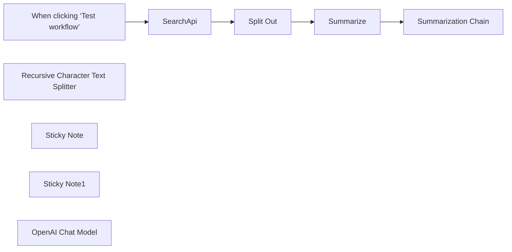

## Fluxo (.json) :

```json
{
  "id": "MkZ77sIELEO2kQx1",
  "meta": {
    "instanceId": "d58ea5647f14a122a558f2a99ce9c999af3b31f43e8079989af146576e4a2268"
  },
  "name": "SearchApi Youtube Video Summary",
  "tags": [],
  "nodes": [
    {
      "id": "2b0a439f-4b6e-4473-a6d5-9b0ec8db676b",
      "name": "When clicking ‘Test workflow’",
      "type": "n8n-nodes-base.manualTrigger",
      "position": [
        20,
        280
      ],
      "parameters": {},
      "typeVersion": 1
    },
    {
      "id": "662f79e0-d450-4d9e-a537-0e8f1a0870b6",
      "name": "Summarization Chain",
      "type": "@n8n/n8n-nodes-langchain.chainSummarization",
      "position": [
        900,
        280
      ],
      "parameters": {
        "options": {},
        "chunkingMode": "advanced"
      },
      "typeVersion": 2
    },
    {
      "id": "fe17b482-8031-4d46-829b-59fe69dc8786",
      "name": "Recursive Character Text Splitter",
      "type": "@n8n/n8n-nodes-langchain.textSplitterRecursiveCharacterTextSplitter",
      "position": [
        1080,
        500
      ],
      "parameters": {
        "options": {},
        "chunkSize": 6000
      },
      "typeVersion": 1
    },
    {
      "id": "4829c2e9-c23a-452a-b409-7efc2e1e135d",
      "name": "Split Out",
      "type": "n8n-nodes-base.splitOut",
      "position": [
        460,
        280
      ],
      "parameters": {
        "options": {},
        "fieldToSplitOut": "transcripts"
      },
      "typeVersion": 1
    },
    {
      "id": "6a48cee3-d2a1-417d-a278-e95394519864",
      "name": "Summarize",
      "type": "n8n-nodes-base.summarize",
      "position": [
        680,
        280
      ],
      "parameters": {
        "options": {},
        "fieldsToSummarize": {
          "values": [
            {
              "field": "text",
              "separateBy": " ",
              "aggregation": "concatenate"
            }
          ]
        }
      },
      "typeVersion": 1.1
    },
    {
      "id": "f6d8f00c-ea89-4111-96fa-f1d8db468060",
      "name": "Sticky Note",
      "type": "n8n-nodes-base.stickyNote",
      "position": [
        0,
        0
      ],
      "parameters": {
        "color": 5,
        "width": 320,
        "content": "## Youtube Video Summary\nGiven a **video_id** from Youtube, we concatenate the data and pass it to a summarization chain. To run this workflow, you need to have the credentials for SearchApi.io and some LLM provider."
      },
      "typeVersion": 1
    },
    {
      "id": "4b3c0abf-e670-4dcb-b69d-a76e58db2b7e",
      "name": "Sticky Note1",
      "type": "n8n-nodes-base.stickyNote",
      "position": [
        220,
        500
      ],
      "parameters": {
        "height": 120,
        "content": "## Tip \nYou can pass the **video_id** from previous nodes to make a better automation"
      },
      "typeVersion": 1
    },
    {
      "id": "f95d330f-ec72-4d26-9f42-63a8a34dff3d",
      "name": "SearchApi",
      "type": "@searchapi/n8n-nodes-searchapi.searchApi",
      "position": [
        240,
        280
      ],
      "parameters": {
        "parameters": {
          "parameter": [
            {
              "name": "video_id",
              "value": "aigDyaxGsRo"
            }
          ]
        },
        "requestOptions": {}
      },
      "typeVersion": 1
    },
    {
      "id": "84f8bce6-0d62-49bd-8169-936358ee3734",
      "name": "OpenAI Chat Model",
      "type": "@n8n/n8n-nodes-langchain.lmChatOpenAi",
      "position": [
        900,
        500
      ],
      "parameters": {
        "model": {
          "__rl": true,
          "mode": "list",
          "value": "gpt-4o-mini"
        },
        "options": {}
      },
      "typeVersion": 1.2
    }
  ],
  "active": false,
  "pinData": {},
  "settings": {
    "executionOrder": "v1"
  },
  "versionId": "23db14e8-b72c-43fc-b934-cf1733b66bc4",
  "connections": {
    "SearchApi": {
      "main": [
        [
          {
            "node": "Split Out",
            "type": "main",
            "index": 0
          }
        ]
      ]
    },
    "Split Out": {
      "main": [
        [
          {
            "node": "Summarize",
            "type": "main",
            "index": 0
          }
        ]
      ]
    },
    "Summarize": {
      "main": [
        [
          {
            "node": "Summarization Chain",
            "type": "main",
            "index": 0
          }
        ]
      ]
    },
    "OpenAI Chat Model": {
      "ai_languageModel": [
        [
          {
            "node": "Summarization Chain",
            "type": "ai_languageModel",
            "index": 0
          }
        ]
      ]
    },
    "Recursive Character Text Splitter": {
      "ai_textSplitter": [
        [
          {
            "node": "Summarization Chain",
            "type": "ai_textSplitter",
            "index": 0
          }
        ]
      ]
    },
    "When clicking ‘Test workflow’": {
      "main": [
        [
          {
            "node": "SearchApi",
            "type": "main",
            "index": 0
          }
        ]
      ]
    }
  }
}
```

<a id="template-899"></a>

## Template 899 - Backup de fluxos para GitHub

- **Nome:** Backup de fluxos para GitHub
- **Descrição:** Este fluxo grava cópias de todos os workflows da instância como arquivos JSON no repositório GitHub, atualizando ou criando arquivos conforme necessário.
- **Funcionalidade:** • Percorrer todos os workflows da instância: utiliza um loop para iterar sobre cada workflow e preparar o backup.
• Obter conteúdo existente no repositório: busca o arquivo JSON correspondente pelo ID do workflow.
• Comparar conteúdos JSON: verifica se o workflow atual difere do existente para decidir entre manter, atualizar ou criar.
• Criar novo arquivo quando não existe: cria o arquivo JSON com o conteúdo do workflow quando o arquivo não está presente.
• Atualizar arquivo existente quando houver diferença: edita o arquivo existente com o conteúdo do workflow atual.
• Salvar com nomenclatura ID.json: armazena cada workflow com o nome baseado no seu ID.
• Subworkflow para reduzir uso de memória: utiliza um subfluxo para processar cada item individualmente.
• Retornar status de backup: retorna status como same, different ou new para cada iteração.
- **Ferramentas:** • GitHub: serviço de hospedagem de código utilizado para armazenar os JSONs dos fluxos no repositório remoto.
• GitHub API: interface de programação usada para realizar operações de get, create e edit dos arquivos no repositório.

## Fluxo visual

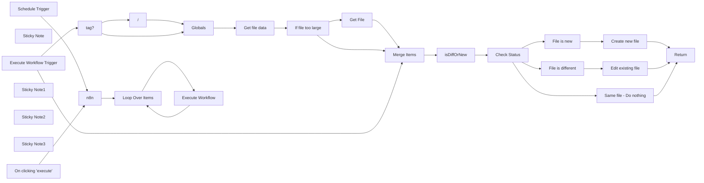

## Fluxo (.json) :

```json
{
  "meta": {
    "instanceId": "a7dcffb2764d1b10c84b837267686e7094bf753c8ca242421ba2029587943438",
    "templateId": "2652"
  },
  "nodes": [
    {
      "id": "42cc4260-626e-4f83-b1c3-c78c99b78b38",
      "name": "On clicking 'execute'",
      "type": "n8n-nodes-base.manualTrigger",
      "position": [
        820,
        486.1164603611751
      ],
      "parameters": {},
      "typeVersion": 1
    },
    {
      "id": "f21386ff-f8db-4f5d-a44c-15484d1e4ab7",
      "name": "Sticky Note",
      "type": "n8n-nodes-base.stickyNote",
      "position": [
        380,
        866.1164603611751
      ],
      "parameters": {
        "color": 6,
        "width": 2547,
        "height": 751,
        "content": "## Subworkflow"
      },
      "typeVersion": 1
    },
    {
      "id": "82851e4a-33a1-461b-965f-f51efcb5af90",
      "name": "n8n",
      "type": "n8n-nodes-base.n8n",
      "position": [
        1080,
        580
      ],
      "parameters": {
        "filters": {},
        "requestOptions": {}
      },
      "credentials": {
        "n8nApi": {
          "id": "hYWXj2T43Yhf6coc",
          "name": "Hirempire"
        }
      },
      "typeVersion": 1
    },
    {
      "id": "90cac8e2-9509-4d48-9038-bb653ffbdf9d",
      "name": "Return",
      "type": "n8n-nodes-base.set",
      "position": [
        2720,
        1080
      ],
      "parameters": {
        "options": {},
        "assignments": {
          "assignments": [
            {
              "id": "8d513345-6484-431f-afb7-7cf045c90f4f",
              "name": "Done",
              "type": "boolean",
              "value": true
            }
          ]
        }
      },
      "typeVersion": 3.3
    },
    {
      "id": "11046021-89ba-4e61-b03f-d606e7dd0a56",
      "name": "Get File",
      "type": "n8n-nodes-base.httpRequest",
      "position": [
        1820,
        960
      ],
      "parameters": {
        "url": "={{ $json.download_url }}",
        "options": {}
      },
      "typeVersion": 4.2
    },
    {
      "id": "08af670c-ac82-422f-9938-c649dfdfbcf6",
      "name": "If file too large",
      "type": "n8n-nodes-base.if",
      "position": [
        1620,
        980
      ],
      "parameters": {
        "options": {},
        "conditions": {
          "options": {
            "version": 1,
            "leftValue": "",
            "caseSensitive": true,
            "typeValidation": "strict"
          },
          "combinator": "and",
          "conditions": [
            {
              "id": "45ce825e-9fa6-430c-8931-9aaf22c42585",
              "operator": {
                "type": "string",
                "operation": "empty",
                "singleValue": true
              },
              "leftValue": "={{ $json.content }}",
              "rightValue": ""
            },
            {
              "id": "9619a55f-7fb1-4f24-b1a7-7aeb82365806",
              "operator": {
                "type": "string",
                "operation": "notExists",
                "singleValue": true
              },
              "leftValue": "={{ $json.error }}",
              "rightValue": ""
            }
          ]
        }
      },
      "typeVersion": 2
    },
    {
      "id": "795fd895-94b2-46f1-b559-748b0db01c49",
      "name": "Merge Items",
      "type": "n8n-nodes-base.merge",
      "position": [
        1620,
        1240
      ],
      "parameters": {},
      "typeVersion": 2
    },
    {
      "id": "3d3399f3-bbfb-48ab-8644-91b28e731026",
      "name": "isDiffOrNew",
      "type": "n8n-nodes-base.code",
      "position": [
        1820,
        1240
      ],
      "parameters": {
        "jsCode": "const orderJsonKeys = (jsonObj) => {\n  const ordered = {};\n  Object.keys(jsonObj).sort().forEach(key => {\n    ordered[key] = jsonObj[key];\n  });\n  return ordered;\n}\n\n// Check if file returned with content\nif (Object.keys($input.all()[0].json).includes(\"content\")) {\n  // Decode base64 content and parse JSON\n  const origWorkflow = JSON.parse(Buffer.from($input.all()[0].json.content, 'base64').toString());\n  const n8nWorkflow = $input.all()[1].json;\n  \n  // Order JSON objects\n  const orderedOriginal = orderJsonKeys(origWorkflow);\n  const orderedActual = orderJsonKeys(n8nWorkflow);\n\n  // Determine difference\n  if (JSON.stringify(orderedOriginal) === JSON.stringify(orderedActual)) {\n    $input.all()[0].json.github_status = \"same\";\n  } else {\n    $input.all()[0].json.github_status = \"different\";\n    $input.all()[0].json.n8n_data_stringy = JSON.stringify(orderedActual, null, 2);\n  }\n  $input.all()[0].json.content_decoded = orderedOriginal;\n// No file returned / new workflow\n} else if (Object.keys($input.all()[0].json).includes(\"data\")) {\n  const origWorkflow = JSON.parse($input.all()[0].json.data);\n  const n8nWorkflow = $input.all()[1].json;\n  \n  // Order JSON objects\n  const orderedOriginal = orderJsonKeys(origWorkflow);\n  const orderedActual = orderJsonKeys(n8nWorkflow);\n\n  // Determine difference\n  if (JSON.stringify(orderedOriginal) === JSON.stringify(orderedActual)) {\n    $input.all()[0].json.github_status = \"same\";\n  } else {\n    $input.all()[0].json.github_status = \"different\";\n    $input.all()[0].json.n8n_data_stringy = JSON.stringify(orderedActual, null, 2);\n  }\n  $input.all()[0].json.content_decoded = orderedOriginal;\n\n} else {\n  // Order JSON object\n  const n8nWorkflow = $input.all()[1].json;\n  const orderedActual = orderJsonKeys(n8nWorkflow);\n  \n  // Proper formatting\n  $input.all()[0].json.github_status = \"new\";\n  $input.all()[0].json.n8n_data_stringy = JSON.stringify(orderedActual, null, 2);\n}\n\n// Return items\nreturn $input.all();"
      },
      "typeVersion": 1
    },
    {
      "id": "2f2f42d0-d27c-4856-a263-4d5e9eda2c4c",
      "name": "Check Status",
      "type": "n8n-nodes-base.switch",
      "position": [
        2040,
        1240
      ],
      "parameters": {
        "rules": {
          "rules": [
            {
              "value2": "same"
            },
            {
              "output": 1,
              "value2": "different"
            },
            {
              "output": 2,
              "value2": "new"
            }
          ]
        },
        "value1": "={{$json.github_status}}",
        "dataType": "string"
      },
      "typeVersion": 1
    },
    {
      "id": "5316029f-f32f-4a8d-95de-50ee57051a08",
      "name": "Same file - Do nothing",
      "type": "n8n-nodes-base.noOp",
      "position": [
        2260,
        1080
      ],
      "parameters": {},
      "typeVersion": 1
    },
    {
      "id": "37c5983b-48fe-41d5-8e3a-eb56dec2140b",
      "name": "File is different",
      "type": "n8n-nodes-base.noOp",
      "position": [
        2260,
        1240
      ],
      "parameters": {},
      "typeVersion": 1
    },
    {
      "id": "a4dcce9e-b0d0-4b9e-ab16-9142e641c73d",
      "name": "File is new",
      "type": "n8n-nodes-base.noOp",
      "position": [
        2260,
        1400
      ],
      "parameters": {},
      "typeVersion": 1
    },
    {
      "id": "03fcfdc4-2e52-42f0-a129-3ebaf8dd8fc1",
      "name": "Create new file",
      "type": "n8n-nodes-base.github",
      "position": [
        2480,
        1400
      ],
      "parameters": {
        "owner": {
          "__rl": true,
          "mode": "name",
          "value": "={{ $('Globals').item.json.repo.owner }}"
        },
        "filePath": "={{ $('Globals').item.json.repo.path }}{{$('Execute Workflow Trigger').first().json.id}}.json",
        "resource": "file",
        "repository": {
          "__rl": true,
          "mode": "name",
          "value": "={{ $('Globals').item.json.repo.name }}"
        },
        "fileContent": "={{$('isDiffOrNew').item.json[\"n8n_data_stringy\"]}}",
        "commitMessage": "={{$('Execute Workflow Trigger').first().json.name}} ({{$json.github_status}})"
      },
      "credentials": {
        "githubApi": {
          "id": "YDLAGVFazg3z5vF9",
          "name": "islamnazmi"
        }
      },
      "typeVersion": 1
    },
    {
      "id": "dd35cc39-4ab4-4d53-b439-b425a2177e8f",
      "name": "Edit existing file",
      "type": "n8n-nodes-base.github",
      "position": [
        2480,
        1220
      ],
      "parameters": {
        "owner": {
          "__rl": true,
          "mode": "name",
          "value": "={{ $('Globals').item.json.repo.owner }}"
        },
        "filePath": "={{ $('Globals').item.json.repo.path }}{{$('Execute Workflow Trigger').first().json.id}}.json",
        "resource": "file",
        "operation": "edit",
        "repository": {
          "__rl": true,
          "mode": "name",
          "value": "={{ $('Globals').item.json.repo.name }}"
        },
        "fileContent": "={{$('isDiffOrNew').item.json[\"n8n_data_stringy\"]}}",
        "commitMessage": "={{$('Execute Workflow Trigger').first().json.name}} ({{$json.github_status}})"
      },
      "credentials": {
        "githubApi": {
          "id": "YDLAGVFazg3z5vF9",
          "name": "islamnazmi"
        }
      },
      "typeVersion": 1
    },
    {
      "id": "d05e2a25-24be-43fb-baa4-9c3391840e70",
      "name": "Loop Over Items",
      "type": "n8n-nodes-base.splitInBatches",
      "position": [
        1280,
        586.1164603611751
      ],
      "parameters": {
        "options": {}
      },
      "typeVersion": 3
    },
    {
      "id": "2a139d59-1387-4899-88b3-21106cd01099",
      "name": "Schedule Trigger",
      "type": "n8n-nodes-base.scheduleTrigger",
      "position": [
        820,
        686.1164603611751
      ],
      "parameters": {
        "rule": {
          "interval": [
            {
              "triggerAtHour": 7
            }
          ]
        }
      },
      "typeVersion": 1.2
    },
    {
      "id": "04e6c245-3117-4ef8-a181-754e616e958b",
      "name": "Sticky Note1",
      "type": "n8n-nodes-base.stickyNote",
      "position": [
        380,
        240
      ],
      "parameters": {
        "color": 4,
        "width": 371.1995072042308,
        "height": 600.88409546716,
        "content": "## Backup to GitHub \nThis workflow will backup all instance workflows to GitHub.\n\nThe files are saved `ID.json` for the filename.\n\n### Setup\nOpen `Globals` node and update the values below 👇\n\n- **repo.owner:** your Github username\n- **repo.name:** the name of your repository\n- **repo.path:** the folder to use within the repository. If it doesn't exist it will be created.\n\n\nIf your username was `john-doe` and your repository was called `n8n-backups` and you wanted the workflows to go into a `workflows` folder you would set:\n\n- repo.owner - john-doe\n- repo.name - n8n-backups\n- repo.path - workflows/\n\n\nThe workflow calls itself using a subworkflow, to help reduce memory usage."
      },
      "typeVersion": 1
    },
    {
      "id": "3d996985-0064-4749-85a1-2191c73746c9",
      "name": "Sticky Note2",
      "type": "n8n-nodes-base.stickyNote",
      "position": [
        780,
        406.1164603611751
      ],
      "parameters": {
        "color": 7,
        "width": 886.4410237965205,
        "height": 434.88564057365943,
        "content": "## Main workflow loop"
      },
      "typeVersion": 1
    },
    {
      "id": "c9bfa393-e120-4bfe-b957-702756b91aaf",
      "name": "Get file data",
      "type": "n8n-nodes-base.github",
      "position": [
        1420,
        980
      ],
      "parameters": {
        "owner": {
          "__rl": true,
          "mode": "name",
          "value": "={{ $json.repo.owner }}"
        },
        "filePath": "={{ $json.repo.path }}{{ $('Execute Workflow Trigger').item.json.id }}.json",
        "resource": "file",
        "operation": "get",
        "repository": {
          "__rl": true,
          "mode": "name",
          "value": "={{ $json.repo.name }}"
        },
        "asBinaryProperty": false,
        "additionalParameters": {}
      },
      "credentials": {
        "githubApi": {
          "id": "YDLAGVFazg3z5vF9",
          "name": "islamnazmi"
        }
      },
      "typeVersion": 1,
      "continueOnFail": true,
      "alwaysOutputData": true
    },
    {
      "id": "d42ddc37-3bd9-4f19-8831-695bec4d0137",
      "name": "Globals",
      "type": "n8n-nodes-base.set",
      "position": [
        1200,
        1140
      ],
      "parameters": {
        "options": {},
        "assignments": {
          "assignments": [
            {
              "id": "6cf546c5-5737-4dbd-851b-17d68e0a3780",
              "name": "repo.owner",
              "type": "string",
              "value": "islamnazmi"
            },
            {
              "id": "452efa28-2dc6-4ea3-a7a2-c35d100d0382",
              "name": "repo.name",
              "type": "string",
              "value": "n8n"
            },
            {
              "id": "81c4dc54-86bf-4432-a23f-22c7ea831e74",
              "name": "repo.path",
              "type": "string",
              "value": "=workflows/{{ $json.tags[0].name }}"
            }
          ]
        }
      },
      "typeVersion": 3.4
    },
    {
      "id": "e970c63c-2aa2-46f9-be04-f045b6a938de",
      "name": "Sticky Note3",
      "type": "n8n-nodes-base.stickyNote",
      "position": [
        1180,
        1020
      ],
      "parameters": {
        "color": 4,
        "width": 150,
        "height": 80,
        "content": "## Edit this node 👇"
      },
      "typeVersion": 1
    },
    {
      "id": "5b1991f7-0351-44de-908d-9aa8b8262d60",
      "name": "Execute Workflow Trigger",
      "type": "n8n-nodes-base.executeWorkflowTrigger",
      "position": [
        480,
        1320
      ],
      "parameters": {
        "inputSource": "passthrough"
      },
      "typeVersion": 1.1
    },
    {
      "id": "8e5b3f71-0c5e-4e78-a3f7-0b574c9ddf06",
      "name": "Execute Workflow",
      "type": "n8n-nodes-base.executeWorkflow",
      "position": [
        1500,
        580
      ],
      "parameters": {
        "mode": "each",
        "options": {},
        "workflowId": {
          "__rl": true,
          "mode": "id",
          "value": "={{ $workflow.id }}"
        },
        "workflowInputs": {
          "value": {},
          "schema": [],
          "mappingMode": "defineBelow",
          "matchingColumns": [],
          "attemptToConvertTypes": false,
          "convertFieldsToString": true
        }
      },
      "typeVersion": 1.2
    },
    {
      "id": "399bd193-4886-4292-be71-6f996f00a6d2",
      "name": "/",
      "type": "n8n-nodes-base.set",
      "position": [
        960,
        1040
      ],
      "parameters": {
        "options": {},
        "assignments": {
          "assignments": [
            {
              "id": "12cad226-e091-4bbb-aed9-a8e01311772c",
              "name": "tags[0].name",
              "type": "string",
              "value": "={{ $('Execute Workflow Trigger').item.json.tags[0].name }}/"
            }
          ]
        }
      },
      "typeVersion": 3.4
    },
    {
      "id": "e90328e1-4ada-424b-879a-20fb2a7270c0",
      "name": "tag?",
      "type": "n8n-nodes-base.switch",
      "position": [
        720,
        1140
      ],
      "parameters": {
        "rules": {
          "values": [
            {
              "outputKey": "tag",
              "conditions": {
                "options": {
                  "version": 2,
                  "leftValue": "",
                  "caseSensitive": true,
                  "typeValidation": "strict"
                },
                "combinator": "and",
                "conditions": [
                  {
                    "operator": {
                      "type": "object",
                      "operation": "exists",
                      "singleValue": true
                    },
                    "leftValue": "={{ $json.tags[0] }}",
                    "rightValue": ""
                  }
                ]
              },
              "renameOutput": true
            },
            {
              "outputKey": "none",
              "conditions": {
                "options": {
                  "version": 2,
                  "leftValue": "",
                  "caseSensitive": true,
                  "typeValidation": "strict"
                },
                "combinator": "and",
                "conditions": [
                  {
                    "id": "2656fbe3-fe35-4770-9c03-9a455ec618e4",
                    "operator": {
                      "type": "object",
                      "operation": "notExists",
                      "singleValue": true
                    },
                    "leftValue": "={{ $json.tags[0] }}",
                    "rightValue": ""
                  }
                ]
              },
              "renameOutput": true
            }
          ]
        },
        "options": {}
      },
      "typeVersion": 3.2
    }
  ],
  "pinData": {},
  "connections": {
    "/": {
      "main": [
        [
          {
            "node": "Globals",
            "type": "main",
            "index": 0
          }
        ]
      ]
    },
    "n8n": {
      "main": [
        [
          {
            "node": "Loop Over Items",
            "type": "main",
            "index": 0
          }
        ]
      ]
    },
    "tag?": {
      "main": [
        [
          {
            "node": "/",
            "type": "main",
            "index": 0
          }
        ],
        [
          {
            "node": "Globals",
            "type": "main",
            "index": 0
          }
        ]
      ]
    },
    "Globals": {
      "main": [
        [
          {
            "node": "Get file data",
            "type": "main",
            "index": 0
          }
        ]
      ]
    },
    "Get File": {
      "main": [
        [
          {
            "node": "Merge Items",
            "type": "main",
            "index": 0
          }
        ]
      ]
    },
    "File is new": {
      "main": [
        [
          {
            "node": "Create new file",
            "type": "main",
            "index": 0
          }
        ]
      ]
    },
    "Merge Items": {
      "main": [
        [
          {
            "node": "isDiffOrNew",
            "type": "main",
            "index": 0
          }
        ]
      ]
    },
    "isDiffOrNew": {
      "main": [
        [
          {
            "node": "Check Status",
            "type": "main",
            "index": 0
          }
        ]
      ]
    },
    "Check Status": {
      "main": [
        [
          {
            "node": "Same file - Do nothing",
            "type": "main",
            "index": 0
          }
        ],
        [
          {
            "node": "File is different",
            "type": "main",
            "index": 0
          }
        ],
        [
          {
            "node": "File is new",
            "type": "main",
            "index": 0
          }
        ]
      ]
    },
    "Get file data": {
      "main": [
        [
          {
            "node": "If file too large",
            "type": "main",
            "index": 0
          }
        ]
      ]
    },
    "Create new file": {
      "main": [
        [
          {
            "node": "Return",
            "type": "main",
            "index": 0
          }
        ]
      ]
    },
    "Loop Over Items": {
      "main": [
        [],
        [
          {
            "node": "Execute Workflow",
            "type": "main",
            "index": 0
          }
        ]
      ]
    },
    "Execute Workflow": {
      "main": [
        [
          {
            "node": "Loop Over Items",
            "type": "main",
            "index": 0
          }
        ]
      ]
    },
    "Schedule Trigger": {
      "main": [
        [
          {
            "node": "n8n",
            "type": "main",
            "index": 0
          }
        ]
      ]
    },
    "File is different": {
      "main": [
        [
          {
            "node": "Edit existing file",
            "type": "main",
            "index": 0
          }
        ]
      ]
    },
    "If file too large": {
      "main": [
        [
          {
            "node": "Get File",
            "type": "main",
            "index": 0
          }
        ],
        [
          {
            "node": "Merge Items",
            "type": "main",
            "index": 0
          }
        ]
      ]
    },
    "Edit existing file": {
      "main": [
        [
          {
            "node": "Return",
            "type": "main",
            "index": 0
          }
        ]
      ]
    },
    "On clicking 'execute'": {
      "main": [
        [
          {
            "node": "n8n",
            "type": "main",
            "index": 0
          }
        ]
      ]
    },
    "Same file - Do nothing": {
      "main": [
        [
          {
            "node": "Return",
            "type": "main",
            "index": 0
          }
        ]
      ]
    },
    "Execute Workflow Trigger": {
      "main": [
        [
          {
            "node": "Merge Items",
            "type": "main",
            "index": 1
          },
          {
            "node": "tag?",
            "type": "main",
            "index": 0
          }
        ]
      ]
    }
  }
}
```

<a id="template-900"></a>

## Template 900 - Postar RSS no Mastodon

- **Nome:** Postar RSS no Mastodon
- **Descrição:** Verifica periodicamente um feed RSS público e publica novos itens em uma instância Mastodon.
- **Funcionalidade:** • Agendamento periódico: dispara a cada 10 minutos para verificar novo conteúdo.
• Leitura de feed RSS público: obtém itens do feed especificado.
• Filtragem de itens novos: compara o ID de cada item com o último ID salvo para identificar novidades.
• Atualização do estado: salva o último ID processado em armazenamento estático para evitar repostagens.
• Publicação automática: envia título e link dos novos itens para a API da instância Mastodon.
• Ramificação de fluxo: quando não há itens novos, segue por um caminho que não realiza publicação.
- **Ferramentas:** • Tiny Tiny RSS (ou outro serviço de feed RSS público): fonte dos itens a serem monitorados.
• Mastodon: instância/serviço para publicar status via API (requer URL da instância e token de acesso).

## Fluxo visual

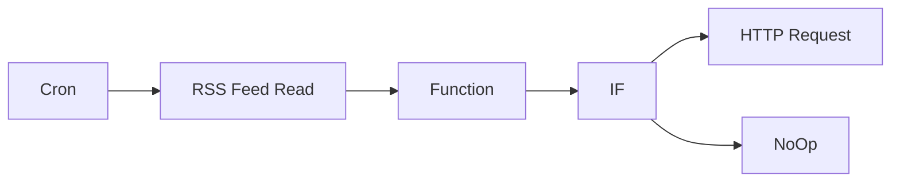

## Fluxo (.json) :

```json
{
  "id": "2",
  "name": "post to mattermost v2",
  "nodes": [
    {
      "name": "RSS Feed Read",
      "type": "n8n-nodes-base.rssFeedRead",
      "position": [
        580,
        150
      ],
      "parameters": {
        "url": "{HERE YOUR TINY TINY RSS PUBLIC FEED}"
      },
      "typeVersion": 1
    },
    {
      "name": "HTTP Request",
      "type": "n8n-nodes-base.httpRequest",
      "position": [
        1170,
        90
      ],
      "parameters": {
        "url": "=https://{HERE YOUR MASTONDON INSTANCE URL}/api/v1/statuses?access_token={HERE YOUR MASTODON ACCESS TOKEN}",
        "options": {},
        "requestMethod": "POST",
        "queryParametersUi": {
          "parameter": [
            {
              "name": "status",
              "value": "={{$node[\"RSS Feed Read\"].json[\"title\"]}} \n{{$node[\"RSS Feed Read\"].json[\"link\"]}}"
            }
          ]
        }
      },
      "typeVersion": 1
    },
    {
      "name": "Cron",
      "type": "n8n-nodes-base.cron",
      "position": [
        400,
        150
      ],
      "parameters": {
        "triggerTimes": {
          "item": [
            {
              "mode": "everyX",
              "unit": "minutes",
              "value": 10
            }
          ]
        }
      },
      "typeVersion": 1
    },
    {
      "name": "Function",
      "type": "n8n-nodes-base.function",
      "position": [
        790,
        150
      ],
      "parameters": {
        "functionCode": "// Get the global workflow static data\nconst staticData = getWorkflowStaticData('global');\n\n// Access its data\nconst lastRssId = staticData.lastRssId\n\nlet list = []\n\n\nfor (const item of $items(\"RSS Feed Read\")){\n  let currentId = item.json[\"id\"].split('/').pop()\n  if(currentId == lastRssId) break;\n  list.push({'json': {\n    'id': currentId,\n    'lastId': lastRssId,\n    'title': item.json[\"title\"],\n    'url': item.json[\"link\"]\n  }})\n}\n\n\n// Get the last ID from Rss Feed\nlet currentRssId = $item(0).$node[\"RSS Feed Read\"].json[\"id\"].split('/').pop()\n\n// TODO: make a loop to get all the items beyond the last saved id\nif(!lastRssId || currentRssId != lastRssId)\n{  \n  // Update its data\n  staticData.lastRssId = currentRssId;\n  \n}\nelse { list = [{'json':{'id': 'NaN', 'lastId': staticData.lastRssId }}] }\nreturn list;\n\n"
      },
      "typeVersion": 1
    },
    {
      "name": "IF",
      "type": "n8n-nodes-base.if",
      "position": [
        960,
        150
      ],
      "parameters": {
        "conditions": {
          "string": [
            {
              "value1": "={{$node[\"Function\"].json[\"id\"]}}",
              "value2": "NaN",
              "operation": "notEqual"
            }
          ],
          "boolean": []
        }
      },
      "typeVersion": 1
    },
    {
      "name": "NoOp",
      "type": "n8n-nodes-base.noOp",
      "position": [
        1180,
        280
      ],
      "parameters": {},
      "typeVersion": 1
    }
  ],
  "active": true,
  "settings": {},
  "connections": {
    "IF": {
      "main": [
        [
          {
            "node": "HTTP Request",
            "type": "main",
            "index": 0
          }
        ],
        [
          {
            "node": "NoOp",
            "type": "main",
            "index": 0
          }
        ]
      ]
    },
    "Cron": {
      "main": [
        [
          {
            "node": "RSS Feed Read",
            "type": "main",
            "index": 0
          }
        ]
      ]
    },
    "Function": {
      "main": [
        [
          {
            "node": "IF",
            "type": "main",
            "index": 0
          }
        ]
      ]
    },
    "RSS Feed Read": {
      "main": [
        [
          {
            "node": "Function",
            "type": "main",
            "index": 0
          }
        ]
      ]
    }
  }
}
```

<a id="template-901"></a>

## Template 901 - Sincronizar cobranças Stripe com contatos HubSpot

- **Nome:** Sincronizar cobranças Stripe com contatos HubSpot
- **Descrição:** Fluxo agendado que coleta cobranças do Stripe, agrega o total gasto por contato (por email) e atualiza um campo personalizado em HubSpot com esse total. Cria o campo se necessário.
- **Funcionalidade:** • Agendamento diário: o fluxo inicia automaticamente em uma programação diária.
• Filtragem de cobranças sem cliente: apenas cobranças com cliente são processadas.
• Agrupamento por contato: remove duplicatas de clientes e soma o valor total por contato (email).
• Obtenção de dados do cliente: busca informações do cliente para associar cobranças aos contatos via email.
• Mesclagem de dados: une cobranças com dados de clientes para cálculo por contato.
• Atualização de HubSpot: cria ou atualiza o campo de total gasto nos contatos com o total agregado.
• Criação automática de campo no HubSpot: cria o campo personalizado se não existir.
- **Ferramentas:** • Stripe: obtém cobranças e dados de clientes para calcular o total gasto por contato.
• HubSpot: atualiza contatos com o total gasto e cria o campo personalizado quando necessário.

## Fluxo visual

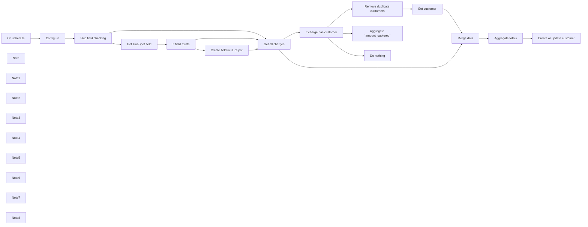

## Fluxo (.json) :

```json
{
  "meta": {
    "instanceId": "a2434c94d549548a685cca39cc4614698e94f527bcea84eefa363f1037ae14cd"
  },
  "nodes": [
    {
      "id": "9be821db-fbc7-4168-962f-26c8382cefbf",
      "name": "If charge has customer",
      "type": "n8n-nodes-base.if",
      "position": [
        1560,
        880
      ],
      "parameters": {
        "conditions": {
          "string": [
            {
              "value1": "={{ $json[\"customer\"] }}",
              "operation": "isNotEmpty"
            }
          ]
        }
      },
      "typeVersion": 1
    },
    {
      "id": "d06bae31-6856-4941-b86c-c611fc9d3da6",
      "name": "Get customer",
      "type": "n8n-nodes-base.stripe",
      "position": [
        2160,
        920
      ],
      "parameters": {
        "resource": "customer",
        "customerId": "={{ $json[\"customer\"] }}"
      },
      "credentials": {
        "stripeApi": {
          "id": "22",
          "name": "[UPDATE ME]"
        }
      },
      "typeVersion": 1
    },
    {
      "id": "4e0d87bf-084f-4958-b2d3-cf7985f8c901",
      "name": "On schedule",
      "type": "n8n-nodes-base.scheduleTrigger",
      "position": [
        -400,
        1400
      ],
      "parameters": {
        "rule": {
          "interval": [
            {}
          ]
        }
      },
      "typeVersion": 1
    },
    {
      "id": "fb620c92-5e22-4a9c-9320-847442b5e955",
      "name": "Remove duplicate customers",
      "type": "n8n-nodes-base.itemLists",
      "position": [
        1880,
        920
      ],
      "parameters": {
        "compare": "selectedFields",
        "options": {
          "removeOtherFields": true
        },
        "operation": "removeDuplicates",
        "fieldsToCompare": {
          "fields": [
            {
              "fieldName": "customer"
            }
          ]
        }
      },
      "typeVersion": 1
    },
    {
      "id": "3ad7554d-24b3-4ee2-8136-6a151bf06c71",
      "name": "Aggregate `amount_captured`",
      "type": "n8n-nodes-base.itemLists",
      "position": [
        1880,
        540
      ],
      "parameters": {
        "options": {},
        "operation": "aggregateItems",
        "fieldsToAggregate": {
          "fieldToAggregate": [
            {
              "fieldToAggregate": "amount_captured"
            }
          ]
        }
      },
      "typeVersion": 1
    },
    {
      "id": "c8448580-40f2-4cf6-87ba-80903555d5a5",
      "name": "Aggregate totals",
      "type": "n8n-nodes-base.code",
      "position": [
        2820,
        1360
      ],
      "parameters": {
        "jsCode": "// aggregate `amounts_captured` with the customer, taking note \n// that `aggregateAmountsPerContact` is the value in cents\nconst aggregateAmountsPerContact = new Object();\nfor (const item of $input.all()) {\n  if (aggregateAmountsPerContact[item.json.email] == null) {\n    aggregateAmountsPerContact[item.json.email] = 0;\n  }\n  aggregateAmountsPerContact[item.json.email] += item.json.amount_captured;\n}\n\n// parse the data in a way that is usable in future nodes, and\n// converts amounts from cents to dollars\nconst parsed = [];\nfor (const contact of Object.keys(aggregateAmountsPerContact)) {\n    parsed.push({\n        email: contact,\n        amount_captured: aggregateAmountsPerContact[contact] / 100\n    });\n}\n\nreturn parsed;"
      },
      "typeVersion": 1
    },
    {
      "id": "dedaf89e-84d1-4964-9c87-94beea4adf26",
      "name": "Create or update customer",
      "type": "n8n-nodes-base.hubspot",
      "position": [
        3140,
        1360
      ],
      "parameters": {
        "email": "={{$node[\"Aggregate totals\"].json[\"email\"]}}",
        "resource": "contact",
        "authentication": "oAuth2",
        "additionalFields": {
          "customPropertiesUi": {
            "customPropertiesValues": [
              {
                "value": "={{$node[\"Aggregate totals\"].json[\"amount_captured\"]}}",
                "property": "={{$(\"Configure\").first().json[\"contactPropertyId\"]}}"
              }
            ]
          }
        }
      },
      "credentials": {
        "hubspotOAuth2Api": {
          "id": "11",
          "name": "[UPDATE ME]"
        }
      },
      "notesInFlow": false,
      "typeVersion": 1
    },
    {
      "id": "4c419e90-facc-4a64-83f2-d349264338c6",
      "name": "Merge data",
      "type": "n8n-nodes-base.merge",
      "position": [
        2520,
        1360
      ],
      "parameters": {
        "mode": "combine",
        "options": {},
        "mergeByFields": {
          "values": [
            {
              "field1": "id",
              "field2": "customer"
            }
          ]
        }
      },
      "typeVersion": 2
    },
    {
      "id": "6a21495f-e567-4b0f-b584-34306bf7fa18",
      "name": "Note",
      "type": "n8n-nodes-base.stickyNote",
      "position": [
        2460,
        1160
      ],
      "parameters": {
        "width": 219.61431588546765,
        "height": 378.32426823578305,
        "content": "### `Merge data`\nMore specifically, we merge the Stripe data from `Get charges` and `Get customer` nodes. Only the charges with customers on them will continue."
      },
      "typeVersion": 1
    },
    {
      "id": "7319c8fe-9e55-43d9-a634-3a7884268016",
      "name": "Note1",
      "type": "n8n-nodes-base.stickyNote",
      "position": [
        2760,
        1160
      ],
      "parameters": {
        "width": 218.46574043407196,
        "height": 379.1631729345614,
        "content": "### `Aggregate totals`\nGiven the merged data, we now aggregate the amounts from charges to the customers/contacts."
      },
      "typeVersion": 1
    },
    {
      "id": "c24d972b-270d-4467-9352-4ced18e377c0",
      "name": "Note2",
      "type": "n8n-nodes-base.stickyNote",
      "position": [
        1780,
        400
      ],
      "parameters": {
        "width": 297.57428772569784,
        "height": 325.06310253513686,
        "content": "### ``Aggregate `amount_captured` ``\nThis does nothing. It is an alternative way to find the totals of every charge in existence in Stripe. Potentially useful for debugging purposes."
      },
      "typeVersion": 1
    },
    {
      "id": "43da8885-fac3-4cb7-9f01-c4770cd0b030",
      "name": "Get all charges",
      "type": "n8n-nodes-base.stripe",
      "position": [
        1300,
        1380
      ],
      "parameters": {
        "resource": "charge",
        "operation": "getAll",
        "returnAll": true
      },
      "credentials": {
        "stripeApi": {
          "id": "22",
          "name": "[UPDATE ME]"
        }
      },
      "typeVersion": 1
    },
    {
      "id": "abfe75f5-c36f-4904-a703-cb8d1d83b686",
      "name": "Note3",
      "type": "n8n-nodes-base.stickyNote",
      "position": [
        -960,
        1220
      ],
      "parameters": {
        "width": 504,
        "height": 510.0404950205649,
        "content": "## Sync Stripe charges to HubSpot contacts\nThis workflow pushes Stripe charges to HubSpot contacts. It uses the Stripe API to get all charges and the HubSpot API to update the contacts. The workflow will create a new HubSpot property to store the total amount charged. If the property already exists, it will update the property.\n\n### How it works\n1. On a schedule, the first Stripe node gets all charges. The default schedule is once a day at midnight.\n2. Once the charges are returned, the second Stripe node gets extra customer information.\n3. Once the customer information is returned, `Merge data` node will merge the customer information with the charges so that the next node `Aggregate totals` can calculate the total amount charged per contact.\n4. Once we have the total amount charged per contact, the `Create or update customer` node will create a new HubSpot property to store the total amount charged. If the property already exists, it will update the property.\n\n\n\nWorkflow written by [David Sha](https://davidsha.me)."
      },
      "typeVersion": 1
    },
    {
      "id": "67e44a47-18db-48a3-a08e-c4f2afb13a30",
      "name": "Note4",
      "type": "n8n-nodes-base.stickyNote",
      "position": [
        1780,
        760
      ],
      "parameters": {
        "width": 298.2919335506821,
        "height": 339.6783118583311,
        "content": "### `Remove duplicate customers`\nEnsures that we do not poll Stripe too many times unnecessarily. If multiple charges have the same customer, we ensure that we do not ask for the same information again."
      },
      "typeVersion": 1
    },
    {
      "id": "02d46492-f3ba-47fe-ba88-f2baad30fc73",
      "name": "Get HubSpot field",
      "type": "n8n-nodes-base.httpRequest",
      "position": [
        580,
        1540
      ],
      "parameters": {
        "url": "=https://api.hubapi.com/crm/v3/properties/contact/{{$(\"Configure\").first().json[\"contactPropertyId\"]}}",
        "options": {},
        "authentication": "predefinedCredentialType",
        "nodeCredentialType": "hubspotOAuth2Api"
      },
      "credentials": {
        "hubspotOAuth2Api": {
          "id": "11",
          "name": "[UPDATE ME]"
        }
      },
      "typeVersion": 3,
      "continueOnFail": true
    },
    {
      "id": "827882c4-5d3f-4cc6-b876-ae575a9a1b36",
      "name": "Create field in HubSpot",
      "type": "n8n-nodes-base.httpRequest",
      "position": [
        980,
        1660
      ],
      "parameters": {
        "url": "https://api.hubapi.com/crm/v3/properties/contact",
        "method": "POST",
        "options": {
          "response": {
            "response": {
              "neverError": true
            }
          }
        },
        "sendBody": true,
        "authentication": "predefinedCredentialType",
        "bodyParameters": {
          "parameters": [
            {
              "name": "name",
              "value": "={{$(\"Configure\").first().json[\"contactPropertyId\"]}}"
            },
            {
              "name": "label",
              "value": "={{$(\"Configure\").first().json[\"contactPropertyLabelName\"]}}"
            },
            {
              "name": "type",
              "value": "number"
            },
            {
              "name": "fieldType",
              "value": "number"
            },
            {
              "name": "groupName",
              "value": "contactinformation"
            },
            {
              "name": "formField",
              "value": "false"
            },
            {
              "name": "description",
              "value": "=The total spend determined by the charges in Stripe. This is a field required for \"{{$workflow.name}}\" n8n workflow."
            }
          ]
        },
        "nodeCredentialType": "hubspotOAuth2Api"
      },
      "credentials": {
        "hubspotOAuth2Api": {
          "id": "11",
          "name": "[UPDATE ME]"
        }
      },
      "typeVersion": 3
    },
    {
      "id": "b4092718-bf35-49b5-aefa-b9900596fcb5",
      "name": "Note5",
      "type": "n8n-nodes-base.stickyNote",
      "position": [
        500,
        1480
      ],
      "parameters": {
        "width": 656.5118956254801,
        "height": 367.20468504951214,
        "content": "### Create HubSpot field if required\n\n\n\n\n\n\n\n\n\n\n\n\n\n\n\n\n_These nodes create a HubSpot field if required.\nIt makes the contact field that this workflow uses \nto store the Stripe information. To disable this \nsection, in `Configure` node change `checkFields`\nto false._"
      },
      "typeVersion": 1
    },
    {
      "id": "6d74e2e3-bd95-4ccb-89c0-3d6f8f1e01f9",
      "name": "Configure",
      "type": "n8n-nodes-base.set",
      "position": [
        -80,
        1400
      ],
      "parameters": {
        "values": {
          "string": [
            {
              "name": "contactPropertyId",
              "value": "stripe___total_spend"
            },
            {
              "name": "contactPropertyLabelName",
              "value": "Stripe - Total Spend"
            }
          ],
          "boolean": [
            {
              "name": "checkFields",
              "value": true
            }
          ]
        },
        "options": {}
      },
      "typeVersion": 1
    },
    {
      "id": "8a8262bc-0742-4529-9f10-328c338854fe",
      "name": "Note6",
      "type": "n8n-nodes-base.stickyNote",
      "position": [
        -200,
        1340
      ],
      "parameters": {
        "width": 338.8262165118159,
        "height": 505.43603897947025,
        "content": "### Configuration\n\n\n\n\n\n\n\n\n\n\n\n\nBy default, this does not need to be updated. \n\n__`contactPropertyId` (required)__: Only change if the specific HubSpot field ID has been taken.\n\n__`contactPropertyLabelName` (required)__: Change if you would like a different display name.\n\n__`checkFields` (required)__: Turn to false if you would like to optimise this workflow, provided this workflow has run once before with this configurable enabled. This will disable the section of this workflow which deals with creating a HubSpot field."
      },
      "typeVersion": 1
    },
    {
      "id": "fc640a31-2050-4276-a1f7-8154f61d2729",
      "name": "Note7",
      "type": "n8n-nodes-base.stickyNote",
      "position": [
        3080,
        1160
      ],
      "parameters": {
        "width": 219.86482940052417,
        "height": 377.58888520886353,
        "content": "### `Create or update customer`\nBy default, the only field updated is \"Stripe - Total Spend\". The contact is identified by its email."
      },
      "typeVersion": 1
    },
    {
      "id": "c91295e6-0306-4f3d-adcf-923fbef1c173",
      "name": "Skip field checking",
      "type": "n8n-nodes-base.if",
      "position": [
        240,
        1400
      ],
      "parameters": {
        "conditions": {
          "boolean": [
            {
              "value1": "={{$node[\"Configure\"].json[\"checkFields\"]}}",
              "value2": "={{false}}"
            }
          ]
        }
      },
      "typeVersion": 1
    },
    {
      "id": "8f8b5a15-4895-4c5a-b8ba-8592dd754aca",
      "name": "Do nothing",
      "type": "n8n-nodes-base.noOp",
      "position": [
        1880,
        1240
      ],
      "parameters": {},
      "typeVersion": 1
    },
    {
      "id": "b953e439-955c-4046-9000-32cbb3577c27",
      "name": "Note8",
      "type": "n8n-nodes-base.stickyNote",
      "position": [
        1780,
        1140
      ],
      "parameters": {
        "width": 298.2919335506821,
        "height": 247.94509463108915,
        "content": "### `Do nothing`\nThis is useful to know what Stripe charges had no customer assigned."
      },
      "typeVersion": 1
    },
    {
      "id": "ec2116e5-2a4a-4edf-a816-b15c349f23e0",
      "name": "If field exists",
      "type": "n8n-nodes-base.if",
      "position": [
        780,
        1540
      ],
      "parameters": {
        "conditions": {
          "number": [
            {
              "value1": "={{ $json[\"error\"][\"httpCode\"] }}",
              "value2": "404",
              "operation": "notEqual"
            }
          ]
        }
      },
      "typeVersion": 1
    }
  ],
  "connections": {
    "Configure": {
      "main": [
        [
          {
            "node": "Skip field checking",
            "type": "main",
            "index": 0
          }
        ]
      ]
    },
    "Merge data": {
      "main": [
        [
          {
            "node": "Aggregate totals",
            "type": "main",
            "index": 0
          }
        ]
      ]
    },
    "On schedule": {
      "main": [
        [
          {
            "node": "Configure",
            "type": "main",
            "index": 0
          }
        ]
      ]
    },
    "Get customer": {
      "main": [
        [
          {
            "node": "Merge data",
            "type": "main",
            "index": 0
          }
        ]
      ]
    },
    "Get all charges": {
      "main": [
        [
          {
            "node": "If charge has customer",
            "type": "main",
            "index": 0
          },
          {
            "node": "Merge data",
            "type": "main",
            "index": 1
          }
        ]
      ]
    },
    "If field exists": {
      "main": [
        [
          {
            "node": "Get all charges",
            "type": "main",
            "index": 0
          }
        ],
        [
          {
            "node": "Create field in HubSpot",
            "type": "main",
            "index": 0
          }
        ]
      ]
    },
    "Aggregate totals": {
      "main": [
        [
          {
            "node": "Create or update customer",
            "type": "main",
            "index": 0
          }
        ]
      ]
    },
    "Get HubSpot field": {
      "main": [
        [
          {
            "node": "If field exists",
            "type": "main",
            "index": 0
          }
        ]
      ]
    },
    "Skip field checking": {
      "main": [
        [
          {
            "node": "Get all charges",
            "type": "main",
            "index": 0
          }
        ],
        [
          {
            "node": "Get HubSpot field",
            "type": "main",
            "index": 0
          }
        ]
      ]
    },
    "If charge has customer": {
      "main": [
        [
          {
            "node": "Remove duplicate customers",
            "type": "main",
            "index": 0
          },
          {
            "node": "Aggregate `amount_captured`",
            "type": "main",
            "index": 0
          }
        ],
        [
          {
            "node": "Do nothing",
            "type": "main",
            "index": 0
          }
        ]
      ]
    },
    "Create field in HubSpot": {
      "main": [
        [
          {
            "node": "Get all charges",
            "type": "main",
            "index": 0
          }
        ]
      ]
    },
    "Remove duplicate customers": {
      "main": [
        [
          {
            "node": "Get customer",
            "type": "main",
            "index": 0
          }
        ]
      ]
    }
  }
}
```
