# PACK 1999 TEMPLATES PARTE 05 - Bloco 7

Templates neste bloco: 20

## Sumário

- [Template 922 - Conversão automática de PDF para HTML](#template-922)
- [Template 923 - Monitorar avaliações da G2 e registrar/alertar](#template-923)
- [Template 924 - Criação de Droplet no DigitalOcean via API](#template-924)
- [Template 925 - Monitor de estoque Shopify (baixo/esgotado)](#template-925)
- [Template 926 - Qualificação de respostas de cold email e criação de deal](#template-926)
- [Template 927 - Reativação automática de workflows desativados](#template-927)
- [Template 928 - Compartilhar receita de coquetel semanal](#template-928)
- [Template 929 - Raspagem de Lugares do Google Maps com SERPAPI](#template-929)
- [Template 930 - Notícias da empresa antes de reuniões](#template-930)
- [Template 931 - Resumo diário de notícias AI e envio por Telegram](#template-931)
- [Template 932 - Importar CSV de URL e converter para Excel](#template-932)
- [Template 933 - Follow-ups automatizados por email com placeholders](#template-933)
- [Template 934 - Relatório AI de threads #damus para Gmail e Telegram](#template-934)
- [Template 935 - Resumos, transcrições e insights de vídeos YouTube](#template-935)
- [Template 936 - Busca de email única no Icypeas](#template-936)
- [Template 937 - Importar issues do Linear a partir do Notion](#template-937)
- [Template 938 - Exportar cotações agrícolas para Google Sheets](#template-938)
- [Template 939 - Verificar parâmetros com expressões afetadas por v1](#template-939)
- [Template 940 - Receita diária de cocktail no Telegram](#template-940)
- [Template 941 - Geração avançada de RSS do canal YouTube](#template-941)

---

<a id="template-922"></a>

## Template 922 - Conversão automática de PDF para HTML

- **Nome:** Conversão automática de PDF para HTML
- **Descrição:** Automatiza a conversão de arquivos PDF adicionados a uma pasta do Google Drive em arquivos HTML e salva o resultado de volta no Drive.
- **Funcionalidade:** • Monitoramento de pasta no Google Drive: verifica periodicamente (a cada minuto) se há novos arquivos em uma pasta específica.
• Identificação de arquivos PDF: filtra eventos para processar apenas arquivos com mimeType application/pdf.
• Envio para conversão por API: envia o link do arquivo para um serviço externo de conversão PDF→HTML com parâmetros de execução (por exemplo, inline=true, async=false, pages=0-).
• Conversão da resposta para arquivo binário: transforma o HTML retornado pela API em um arquivo binário com nome e tipo MIME apropriados.
• Armazenamento do HTML no Google Drive: faz o upload do arquivo HTML convertido para a pasta ou drive definido.
- **Ferramentas:** • Google Drive: armazenamento em nuvem utilizado para detectar uploads de PDFs e armazenar os arquivos HTML convertidos.
• PDF.co: serviço/API externa usada para realizar a conversão de PDF para HTML via requisição HTTP.


## Fluxo visual

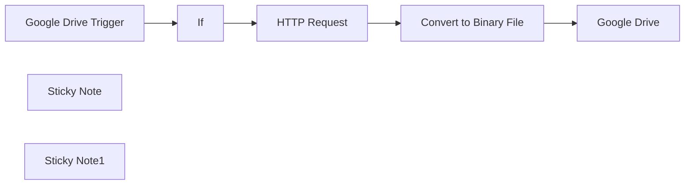

## Fluxo (.json) :

```json
{
  "id": "3McL3itHTso0Cy10",
  "meta": {
    "instanceId": "14e4c77104722ab186539dfea5182e419aecc83d85963fe13f6de862c875ebfa",
    "templateCredsSetupCompleted": true
  },
  "name": "Automated PDF to HTML Conversion",
  "tags": [],
  "nodes": [
    {
      "id": "43950636-79d1-43c3-b5a1-44ace016257d",
      "name": "Google Drive Trigger",
      "type": "n8n-nodes-base.googleDriveTrigger",
      "position": [
        0,
        0
      ],
      "parameters": {
        "event": "fileCreated",
        "options": {},
        "pollTimes": {
          "item": [
            {
              "mode": "everyMinute"
            }
          ]
        },
        "triggerOn": "specificFolder",
        "folderToWatch": {
          "__rl": true,
          "mode": "url",
          "value": ""
        }
      },
      "credentials": {
        "googleDriveOAuth2Api": {
          "id": "",
          "name": ""
        }
      },
      "typeVersion": 1
    },
    {
      "id": "b5e1c616-a809-4e38-a1dd-0f91123bd846",
      "name": "If",
      "type": "n8n-nodes-base.if",
      "position": [
        220,
        0
      ],
      "parameters": {
        "options": {},
        "conditions": {
          "options": {
            "version": 2,
            "leftValue": "",
            "caseSensitive": true,
            "typeValidation": "strict"
          },
          "combinator": "and",
          "conditions": [
            {
              "id": "4fd733d3-d393-4aea-bc25-c1e8bda32b54",
              "operator": {
                "type": "string",
                "operation": "equals"
              },
              "leftValue": "={{ $json.mimeType }}",
              "rightValue": "application/pdf"
            }
          ]
        }
      },
      "typeVersion": 2.2
    },
    {
      "id": "d13a2481-9c21-43f0-beb8-1881b6a6843b",
      "name": "HTTP Request",
      "type": "n8n-nodes-base.httpRequest",
      "position": [
        480,
        -20
      ],
      "parameters": {
        "url": "https://api.pdf.co/v1/pdf/convert/to/html",
        "method": "POST",
        "options": {
          "redirect": {
            "redirect": {}
          }
        },
        "sendBody": true,
        "sendHeaders": true,
        "authentication": "genericCredentialType",
        "bodyParameters": {
          "parameters": [
            {
              "name": "url",
              "value": "={{ $json.webViewLink }}"
            },
            {
              "name": "inline",
              "value": "true"
            },
            {
              "name": "async",
              "value": false
            },
            {
              "name": "unwrap"
            },
            {
              "name": "pages",
              "value": "0-"
            },
            {
              "name": "rect"
            },
            {
              "name": "async",
              "value": "false"
            },
            {
              "name": "name",
              "value": "result.csv"
            },
            {
              "name": "password"
            },
            {
              "name": "lineGrouping"
            },
            {
              "name": "profiles"
            }
          ]
        },
        "genericAuthType": "httpHeaderAuth",
        "headerParameters": {
          "parameters": [
            {}
          ]
        }
      },
      "credentials": {
        "httpHeaderAuth": {
          "id": "zTHQFpHDdUNXJ49g",
          "name": "Header Auth account 2"
        }
      },
      "typeVersion": 4.2
    },
    {
      "id": "66d49dae-d282-4854-8674-69784110ee0b",
      "name": "Google Drive",
      "type": "n8n-nodes-base.googleDrive",
      "position": [
        1080,
        -20
      ],
      "parameters": {
        "name": "sample.html",
        "driveId": {
          "__rl": true,
          "mode": "url",
          "value": "",
          "__regex": "https://drive\\.google\\.com(?:/.*|)/folders/([0-9a-zA-Z\\-_]+)(?:/.*|)"
        },
        "options": {},
        "folderId": {
          "__rl": true,
          "mode": "url",
          "value": ""
        }
      },
      "credentials": {
        "googleDriveOAuth2Api": {
          "id": "",
          "name": ""
        }
      },
      "typeVersion": 3
    },
    {
      "id": "461222d4-7a73-412f-aceb-81745f17f7ea",
      "name": "Convert to Binary File",
      "type": "n8n-nodes-base.code",
      "position": [
        780,
        -20
      ],
      "parameters": {
        "jsCode": "// Convert the HTML string to a Buffer\nconst buffer = Buffer.from($json.body, 'utf-8');\n\n// Return the buffer as binary data\nreturn [\n  {\n    binary: {\n      data: {\n        data: buffer.toString('base64'), // Convert buffer to base64 string\n        mimeType: 'text/html',\n        fileName: 'sample.html'\n      }\n    }\n  }\n];\n"
      },
      "typeVersion": 2
    },
    {
      "id": "543dd2ff-011f-4f83-a5c7-ffb80fc3910d",
      "name": "Sticky Note",
      "type": "n8n-nodes-base.stickyNote",
      "position": [
        -60,
        -120
      ],
      "parameters": {
        "width": 1340,
        "height": 280,
        "content": "## Automated PDF to HTML Conversion\n"
      },
      "typeVersion": 1
    },
    {
      "id": "f0d02b89-71d2-4239-833d-9e5235024291",
      "name": "Sticky Note1",
      "type": "n8n-nodes-base.stickyNote",
      "position": [
        -60,
        200
      ],
      "parameters": {
        "width": 1340,
        "height": 180,
        "content": "## Description: \nThis n8n workflow automates the process of converting a newly stored PDF file from Google Drive into an HTML file and saving it back to Google Drive. The workflow is triggered whenever a new PDF is uploaded to a specific folder, ensuring seamless conversion and storage without any manual intervention.\n\nThis workflow provides an efficient, automated solution for converting PDFs to HTML, eliminating the need for manual file handling and ensuring a smooth document transformation process. It is particularly useful for scenarios where PDFs need to be dynamically converted and stored in an organized manner for web usage, archiving, or further processing.\n\n"
      },
      "typeVersion": 1
    }
  ],
  "active": false,
  "pinData": {},
  "settings": {
    "executionOrder": "v1"
  },
  "versionId": "224c9b46-dc5e-44de-8ec4-956d48f4f4f1",
  "connections": {
    "If": {
      "main": [
        [
          {
            "node": "HTTP Request",
            "type": "main",
            "index": 0
          }
        ]
      ]
    },
    "HTTP Request": {
      "main": [
        [
          {
            "node": "Convert to Binary File",
            "type": "main",
            "index": 0
          }
        ]
      ]
    },
    "Google Drive Trigger": {
      "main": [
        [
          {
            "node": "If",
            "type": "main",
            "index": 0
          }
        ]
      ]
    },
    "Convert to Binary File": {
      "main": [
        [
          {
            "node": "Google Drive",
            "type": "main",
            "index": 0
          }
        ]
      ]
    }
  }
}
```

<a id="template-923"></a>

## Template 923 - Monitorar avaliações da G2 e registrar/alertar

- **Nome:** Monitorar avaliações da G2 e registrar/alertar
- **Descrição:** Fluxo que coleta avaliações recentes da G2 para uma lista de concorrentes, extrai dados relevantes, converte conteúdo para Markdown, verifica duplicatas, envia notificações no Slack e registra novas avaliações em uma planilha.
- **Funcionalidade:** • Obter URLs de avaliações para cada concorrente: gera a URL da G2 para cada concorrente listado e busca as avaliações mais recentes.
• Extrair dados estruturados das avaliações: extrai data, corpo da avaliação, usuário, rating, links relevantes.
• Converter HTML da avaliação em Markdown: converte o conteúdo da avaliação para Markdown para facilitar leitura.
• Verificar se a avaliação é nova: compara com avaliações já registradas para evitar duplicatas.
• Notificar sobre novas avaliações: envia mensagem com detalhes da avaliação para o Slack.
• Registrar novas avaliações: adiciona as novas avaliações a uma planilha do Google Sheets.
• Executar periodicamente: agenda o fluxo para rodar diariamente.
• Monitorar várias URLs de concorrentes: permite adicionar/remover concorrentes para monitoramento.
- **Ferramentas:** • ScrapingBee: Serviço de scraping utilizado para obter as avaliações da G2 por cada concorrente.
• Slack: Canal de comunicação para envio de notificações das novas avaliações.
• Google Sheets: Planilha para registrar as avaliações coletadas.


## Fluxo visual

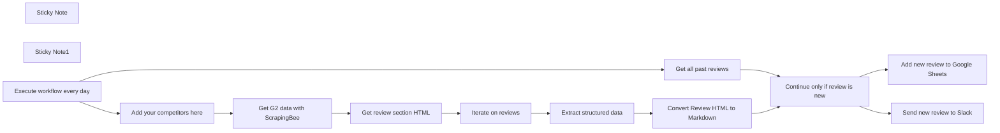

## Fluxo (.json) :

```json
{
  "meta": {
    "instanceId": "cb484ba7b742928a2048bf8829668bed5b5ad9787579adea888f05980292a4a7"
  },
  "nodes": [
    {
      "id": "bd34c2fb-9892-408e-be1f-a25f6f9970ad",
      "name": "Add your competitors here",
      "type": "n8n-nodes-base.code",
      "position": [
        1260,
        800
      ],
      "parameters": {
        "jsCode": "return [\n  {\"competitor\":\"zendesk\"},\n  {\"competitor\":\"intercom\"},\n  {\"competitor\":\"dixa\"}\n]"
      },
      "typeVersion": 2
    },
    {
      "id": "ec726fe0-e85f-47b3-8cd9-05b94fc5f8ab",
      "name": "Sticky Note",
      "type": "n8n-nodes-base.stickyNote",
      "position": [
        1400,
        600
      ],
      "parameters": {
        "color": 7,
        "width": 235.65210573476693,
        "height": 396.04301075268825,
        "content": "Add your API key here\n\n1. Sign up here\nhttps://app.scrapingbee.com/\n\n2. Get your API key\n\n3. Paste it the node"
      },
      "typeVersion": 1
    },
    {
      "id": "fd7b88e5-ef30-488e-803e-aec43334c41b",
      "name": "Sticky Note1",
      "type": "n8n-nodes-base.stickyNote",
      "position": [
        460,
        460
      ],
      "parameters": {
        "width": 465,
        "height": 342.8125,
        "content": "# Read me\nThis workflow monitor G2 reviews URLS. \n\nWhen a new review is published, it will: \n- trigger a Slack notification \n- record the review in Google Sheets\n\n\nTo install it, you'll need access to Slack, Google Sheets and ScrapingBee\n\n### Full guide here: https://lempire.notion.site/Scrape-G2-reviews-with-n8n-3f46e280e8f24a68b3797f98d2fba433?pvs=4"
      },
      "typeVersion": 1
    },
    {
      "id": "925c9ce9-1691-47bd-b184-5532cfa85da5",
      "name": "Execute workflow every day",
      "type": "n8n-nodes-base.scheduleTrigger",
      "position": [
        980,
        560
      ],
      "parameters": {
        "rule": {
          "interval": [
            {
              "triggerAtHour": 8
            }
          ]
        }
      },
      "typeVersion": 1.1
    },
    {
      "id": "2dc9997d-fd94-4beb-b5be-8ec16b70f060",
      "name": "Get G2 data with ScrapingBee",
      "type": "n8n-nodes-base.httpRequest",
      "position": [
        1460,
        800
      ],
      "parameters": {
        "url": "https://app.scrapingbee.com/api/v1",
        "options": {
          "batching": {
            "batch": {
              "batchSize": 3
            }
          }
        },
        "sendQuery": true,
        "queryParameters": {
          "parameters": [
            {
              "name": "api_key",
              "value": "YOUR_API_KEY"
            },
            {
              "name": "url",
              "value": "=https://www.g2.com/products/{{ $json.competitor }}/reviews?utf8=%E2%9C%93&order=most_recent "
            },
            {
              "name": "premium_proxy",
              "value": "true"
            },
            {
              "name": "country_code",
              "value": "us"
            },
            {
              "name": "stealth_proxy",
              "value": "true"
            }
          ]
        }
      },
      "typeVersion": 4.1
    },
    {
      "id": "b7472e8d-5abb-489b-bf32-5d36e7bce5cc",
      "name": "Get review section HTML",
      "type": "n8n-nodes-base.html",
      "position": [
        1680,
        800
      ],
      "parameters": {
        "options": {},
        "operation": "extractHtmlContent",
        "extractionValues": {
          "values": [
            {
              "key": "divs",
              "cssSelector": "div.paper.paper--white.paper--box.mb-2.position-relative.border-bottom",
              "returnArray": true,
              "returnValue": "html"
            }
          ]
        }
      },
      "typeVersion": 1
    },
    {
      "id": "9ad1fb30-c388-4ad9-a299-9fb508b01a57",
      "name": "Iterate on reviews",
      "type": "n8n-nodes-base.itemLists",
      "position": [
        1840,
        800
      ],
      "parameters": {
        "options": {},
        "fieldToSplitOut": "divs"
      },
      "typeVersion": 3
    },
    {
      "id": "cb25b05d-2543-4d42-9c7e-2db5f534db2a",
      "name": "Extract structured data",
      "type": "n8n-nodes-base.html",
      "position": [
        2020,
        800
      ],
      "parameters": {
        "options": {},
        "operation": "extractHtmlContent",
        "dataPropertyName": "divs",
        "extractionValues": {
          "values": [
            {
              "key": "date",
              "cssSelector": "div.d-f.mb-1"
            },
            {
              "key": "reviewHtml",
              "cssSelector": "div[itemprop=reviewBody]",
              "returnValue": "html"
            },
            {
              "key": "user_profile",
              "attribute": "href",
              "cssSelector": "a.td-n",
              "returnValue": "attribute"
            },
            {
              "key": "rating",
              "attribute": "content",
              "cssSelector": "meta[itemprop=ratingValue]",
              "returnValue": "attribute"
            },
            {
              "key": "reviewUrl",
              "attribute": "href",
              "cssSelector": "a.pjax",
              "returnValue": "attribute"
            }
          ]
        }
      },
      "typeVersion": 1
    },
    {
      "id": "4b2d088c-afc8-4bd9-80e1-0ef78fe94597",
      "name": "Convert Review HTML to Markdown",
      "type": "n8n-nodes-base.markdown",
      "position": [
        2200,
        800
      ],
      "parameters": {
        "html": "={{ $json.reviewHtml }}",
        "options": {},
        "destinationKey": "review"
      },
      "typeVersion": 1
    },
    {
      "id": "0c03c9a2-0ee8-4700-bf9d-f07b01fd9590",
      "name": "Get all past reviews",
      "type": "n8n-nodes-base.googleSheets",
      "position": [
        1260,
        460
      ],
      "parameters": {
        "options": {},
        "sheetName": {
          "__rl": true,
          "mode": "list",
          "value": "gid=0",
          "cachedResultUrl": "https://docs.google.com/spreadsheets/d/1Khbjjt_Dw0LdggwEE6sj300McXelmSR1ttoG8UNojyY/edit#gid=0",
          "cachedResultName": "Sheet1"
        },
        "documentId": {
          "__rl": true,
          "mode": "url",
          "value": "https://docs.google.com/spreadsheets/d/1Khbjjt_Dw0LdggwEE6sj300McXelmSR1ttoG8UNojyY/edit#gid=0"
        }
      },
      "typeVersion": 4
    },
    {
      "id": "27d41c8f-694b-49bf-9ea7-24964e00b9b4",
      "name": "Continue only if review is new",
      "type": "n8n-nodes-base.merge",
      "position": [
        2420,
        480
      ],
      "parameters": {
        "mode": "combine",
        "options": {},
        "joinMode": "keepNonMatches",
        "mergeByFields": {
          "values": [
            {
              "field1": "reviewUrl",
              "field2": "reviewUrl"
            }
          ]
        },
        "outputDataFrom": "input2"
      },
      "typeVersion": 2.1
    },
    {
      "id": "f4574136-c4ab-44ce-bf06-17b3c487867c",
      "name": "Send new review to Slack",
      "type": "n8n-nodes-base.slack",
      "position": [
        2760,
        480
      ],
      "parameters": {
        "text": "=🚨 New review in G2\n\nRating: {{ $json[\"rating\"] }}\n<{{ $json[\"user_profile\"]}}|See user in G2>\n<{{$json[\"reviewUrl\"]}}|See review in G2>\n\nReview Content:\n{{ $json.review }}",
        "select": "channel",
        "channelId": {
          "__rl": true,
          "mode": "name",
          "value": "g2_reviews"
        },
        "otherOptions": {
          "botProfile": {
            "imageValues": {
              "icon_url": "https://upload.wikimedia.org/wikipedia/en/thumb/3/38/G2_Crowd_logo.svg/640px-G2_Crowd_logo.svg.png",
              "profilePhotoType": "image"
            }
          },
          "includeLinkToWorkflow": false
        }
      },
      "typeVersion": 2.1
    },
    {
      "id": "09076f69-32a4-4ddf-a662-10c0c0e35e7f",
      "name": "Add new review to Google Sheets",
      "type": "n8n-nodes-base.googleSheets",
      "position": [
        2760,
        700
      ],
      "parameters": {
        "columns": {
          "value": {
            "date": "={{ $json.date }}",
            "rating": "={{ $json.rating }}",
            "review": "={{ $json.review }}",
            "reviewUrl": "={{ $json.reviewUrl }}",
            "user_profile": "={{ $json.user_profile }}"
          },
          "schema": [
            {
              "id": "date",
              "type": "string",
              "display": true,
              "required": false,
              "displayName": "date",
              "defaultMatch": false,
              "canBeUsedToMatch": true
            },
            {
              "id": "rating",
              "type": "string",
              "display": true,
              "removed": false,
              "required": false,
              "displayName": "rating",
              "defaultMatch": false,
              "canBeUsedToMatch": true
            },
            {
              "id": "review",
              "type": "string",
              "display": true,
              "required": false,
              "displayName": "review",
              "defaultMatch": false,
              "canBeUsedToMatch": true
            },
            {
              "id": "user_profile",
              "type": "string",
              "display": true,
              "removed": false,
              "required": false,
              "displayName": "user_profile",
              "defaultMatch": false,
              "canBeUsedToMatch": true
            },
            {
              "id": "reviewUrl",
              "type": "string",
              "display": true,
              "removed": false,
              "required": false,
              "displayName": "reviewUrl",
              "defaultMatch": false,
              "canBeUsedToMatch": true
            }
          ],
          "mappingMode": "defineBelow",
          "matchingColumns": [
            "reviewUrl"
          ]
        },
        "options": {},
        "operation": "append",
        "sheetName": {
          "__rl": true,
          "mode": "list",
          "value": "gid=0",
          "cachedResultUrl": "https://docs.google.com/spreadsheets/d/1Khbjjt_Dw0LdggwEE6sj300McXelmSR1ttoG8UNojyY/edit#gid=0",
          "cachedResultName": "Sheet1"
        },
        "documentId": {
          "__rl": true,
          "mode": "url",
          "value": "https://docs.google.com/spreadsheets/d/1Khbjjt_Dw0LdggwEE6sj300McXelmSR1ttoG8UNojyY/edit#gid=0"
        }
      },
      "typeVersion": 4
    }
  ],
  "pinData": {},
  "connections": {
    "Iterate on reviews": {
      "main": [
        [
          {
            "node": "Extract structured data",
            "type": "main",
            "index": 0
          }
        ]
      ]
    },
    "Get all past reviews": {
      "main": [
        [
          {
            "node": "Continue only if review is new",
            "type": "main",
            "index": 0
          }
        ]
      ]
    },
    "Extract structured data": {
      "main": [
        [
          {
            "node": "Convert Review HTML to Markdown",
            "type": "main",
            "index": 0
          }
        ]
      ]
    },
    "Get review section HTML": {
      "main": [
        [
          {
            "node": "Iterate on reviews",
            "type": "main",
            "index": 0
          }
        ]
      ]
    },
    "Add your competitors here": {
      "main": [
        [
          {
            "node": "Get G2 data with ScrapingBee",
            "type": "main",
            "index": 0
          }
        ]
      ]
    },
    "Execute workflow every day": {
      "main": [
        [
          {
            "node": "Get all past reviews",
            "type": "main",
            "index": 0
          },
          {
            "node": "Add your competitors here",
            "type": "main",
            "index": 0
          }
        ]
      ]
    },
    "Get G2 data with ScrapingBee": {
      "main": [
        [
          {
            "node": "Get review section HTML",
            "type": "main",
            "index": 0
          }
        ]
      ]
    },
    "Continue only if review is new": {
      "main": [
        [
          {
            "node": "Add new review to Google Sheets",
            "type": "main",
            "index": 0
          },
          {
            "node": "Send new review to Slack",
            "type": "main",
            "index": 0
          }
        ]
      ]
    },
    "Convert Review HTML to Markdown": {
      "main": [
        [
          {
            "node": "Continue only if review is new",
            "type": "main",
            "index": 1
          }
        ]
      ]
    }
  }
}
```

<a id="template-924"></a>

## Template 924 - Criação de Droplet no DigitalOcean via API

- **Nome:** Criação de Droplet no DigitalOcean via API
- **Descrição:** Envia uma solicitação POST para a API do DigitalOcean para criar um droplet com parâmetros especificados.
- **Funcionalidade:** • Envio de solicitação POST para criar droplet: envia uma requisição POST para o endpoint https://api.digitalocean.com/v2/droplets com corpo em JSON.
• Definição de parâmetros do droplet: especifica name, region, size e image para configurar o droplet.
• Autenticação via token Bearer: inclui o cabeçalho Authorization com o token de acesso pessoal.
• Configuração do corpo como JSON: define o tipo de conteúdo do corpo como JSON para envio dos parâmetros.
- **Ferramentas:** • DigitalOcean API: API REST para gerenciar recursos de infraestrutura em nuvem, permitindo criar e configurar droplets (servidores virtuais).


## Fluxo visual

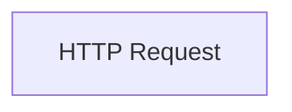

## Fluxo (.json) :

```json
{
  "nodes": [
    {
      "name": "HTTP Request",
      "type": "n8n-nodes-base.httpRequest",
      "position": [
        450,
        300
      ],
      "parameters": {
        "url": "https://api.digitalocean.com/v2/droplets",
        "options": {
          "bodyContentType": "json"
        },
        "requestMethod": "POST",
        "bodyParametersUi": {
          "parameter": [
            {
              "name": "name",
              "value": "API-creation-test"
            },
            {
              "name": "region",
              "value": "blr1"
            },
            {
              "name": "size",
              "value": "s-1vcpu-1gb"
            },
            {
              "name": "image",
              "value": "ubuntu-20-04-x64"
            }
          ]
        },
        "headerParametersUi": {
          "parameter": [
            {
              "name": "Authorization",
              "value": "Bearer {your_personal_access_token}"
            }
          ]
        }
      },
      "typeVersion": 1
    }
  ],
  "connections": {}
}
```

<a id="template-925"></a>

## Template 925 - Monitor de estoque Shopify (baixo/esgotado)

- **Nome:** Monitor de estoque Shopify (baixo/esgotado)
- **Descrição:** Fluxo que monitora o inventário de produtos no Shopify e envia notificações no Discord quando o estoque está baixo ou esgotado, incluindo detalhes do produto e imagem.
- **Funcionalidade:** • Detecção de atualização de inventário: recebe dados de Shopify e prepara as informações de stock.
• Análise de estoque: determina se está baixo (menos de 4) ou fora de estoque (0).
• Recuperação de detalhes do item: consulta GraphQL para obter título, variante, quantidade em estoque e imagem do produto.
• Gatilho de notificação: dispara notificações para o canal Discord quando estoque é baixo ou esgotado.
• Notificação com contexto: envia embed com título do produto, variante, estoque restante, imagem e descrição.
- **Ferramentas:** • Shopify GraphQL API: consulta dados de inventário, variante, produto e imagem.
• Discord: envia mensagens com embeds para canais via bot.
• Shopify Webhook: envia atualizações de inventário para acionar a automação.


## Fluxo visual

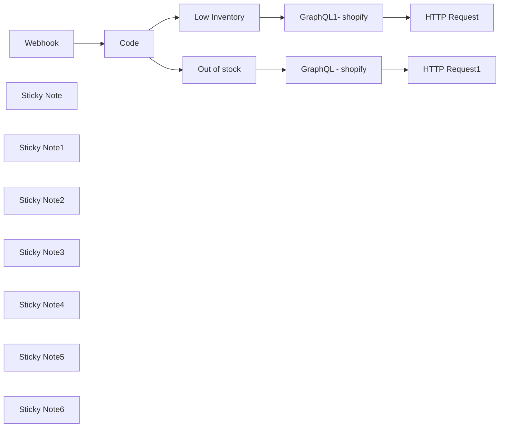

## Fluxo (.json) :

```json
{
  "meta": {
    "instanceId": "dbd43d88d26a9e30d8aadc002c9e77f1400c683dd34efe3778d43d27250dde50"
  },
  "nodes": [
    {
      "id": "174f80b5-6c84-47b3-a906-eeb4fc5207b8",
      "name": "Webhook",
      "type": "n8n-nodes-base.webhook",
      "position": [
        -840,
        620
      ],
      "webhookId": "5dc2467c-0b39-43e9-bdbd-399231f69c4e",
      "parameters": {
        "path": "5dc2467c-0b39-43e9-bdbd-399231f69c4e",
        "options": {},
        "httpMethod": "POST",
        "responseCode": null
      },
      "typeVersion": 1
    },
    {
      "id": "e03fc5ca-9446-44b7-9c0a-44c8696ec06a",
      "name": "Code",
      "type": "n8n-nodes-base.code",
      "position": [
        -540,
        620
      ],
      "parameters": {
        "jsCode": "\nconst available = items[0].json.body.available;\nconst inventory_item = items[0].json.body.inventory_item_id;\nconst lowInventory = available > 0 && available < 4;\nconst outOfStock = available === 0;\n\nreturn [\n  {\n    json: {\n      available: available,\n      inventory_tem: inventory_item,\n      low_inventory: lowInventory,\n      out_of_stock: outOfStock,\n    },\n  },\n];"
      },
      "typeVersion": 1
    },
    {
      "id": "2e8b6898-87aa-4e27-80df-647f022e7810",
      "name": "Low Inventory",
      "type": "n8n-nodes-base.if",
      "position": [
        -180,
        500
      ],
      "parameters": {
        "conditions": {
          "boolean": [
            {
              "value1": "={{ $json.low_inventory }}",
              "value2": "={{ true }}"
            }
          ]
        }
      },
      "typeVersion": 1
    },
    {
      "id": "02c33a4d-e806-4447-a754-5d2027ebfc2b",
      "name": "Out of stock",
      "type": "n8n-nodes-base.if",
      "position": [
        -180,
        780
      ],
      "parameters": {
        "conditions": {
          "boolean": [
            {
              "value1": "={{ $json.out_of_stock }}",
              "value2": "={{ true }}"
            }
          ]
        }
      },
      "typeVersion": 1
    },
    {
      "id": "ce6a4937-ce78-486e-adcb-a0d11a856cd9",
      "name": "HTTP Request",
      "type": "n8n-nodes-base.httpRequest",
      "position": [
        560,
        400
      ],
      "parameters": {
        "body": "={\n  \"embeds\": [\n    {\n      \"title\":  \"{{ $json.data.inventoryItem.variant.product.title }}\",\n      \"description\": \"This product is running out of stock!\",\n      \"color\": 16776960,\n      \"fields\": [\n        {\n          \"name\": \"Remaining Inventory\",\n          \"value\": \"{{ $json.data.inventoryItem.variant.inventoryQuantity }}\",\n          \"inline\": false\n        },\n        {\n          \"name\": \"Product Variant\",\n          \"value\": \"{{ $json.data.inventoryItem.variant.title }}\",\n          \"inline\": true\n        }\n      ],\n      \"image\": {\n        \"url\": \"{{ $json.data.inventoryItem.variant.product.images.edges[0].node.originalSrc }}\"\n      },\n      \"footer\": {\n        \"text\": \"Alert from inventory management system\"\n      }\n    }\n  ]\n}",
        "method": "POST",
        "options": {},
        "sendBody": true,
        "contentType": "raw",
        "authentication": "predefinedCredentialType",
        "rawContentType": "application/json",
        "nodeCredentialType": "discordBotApi"
      },
      "credentials": {
        "discordBotApi": {
          "id": "opA36m6ZPvLM8V3I",
          "name": "Discord Bot account"
        }
      },
      "typeVersion": 4.1
    },
    {
      "id": "4a571564-03a1-44de-a06d-b5142911d6f4",
      "name": "HTTP Request1",
      "type": "n8n-nodes-base.httpRequest",
      "position": [
        560,
        860
      ],
      "parameters": {
        "body": "={\n  \"embeds\": [\n    {\n      \"title\":  \"{{ $json.data.inventoryItem.variant.product.title }}\",\n      \"description\": \"This product is sold out!\",\n      \"color\": 16711680,\n      \"fields\": [\n        {\n          \"name\": \"Remaining Inventory\",\n          \"value\": \"{{ $json.data.inventoryItem.variant.inventoryQuantity }}\",\n          \"inline\": false\n        },\n        {\n          \"name\": \"Product Variant\",\n          \"value\": \"{{ $json.data.inventoryItem.variant.title }}\",\n          \"inline\": true\n        }\n      ],\n      \"image\": {\n        \"url\": \"{{ $json.data.inventoryItem.variant.product.images.edges[0].node.originalSrc }}\"\n      },\n      \"footer\": {\n        \"text\": \"Alert from inventory management system\"\n      }\n    }\n  ]\n}",
        "method": "POST",
        "options": {},
        "sendBody": true,
        "contentType": "raw",
        "authentication": "predefinedCredentialType",
        "rawContentType": "application/json",
        "nodeCredentialType": "discordBotApi"
      },
      "credentials": {
        "discordBotApi": {
          "id": "opA36m6ZPvLM8V3I",
          "name": "Discord Bot account"
        }
      },
      "typeVersion": 4.1
    },
    {
      "id": "703b259c-e655-41e2-abb0-9ad80d2224a5",
      "name": "GraphQL1- shopify",
      "type": "n8n-nodes-base.graphql",
      "position": [
        180,
        400
      ],
      "parameters": {
        "query": "={\n  inventoryItem(id: \"gid://shopify/InventoryItem/{{ $json.inventory_tem }}\") {\n    id\n    variant {\n      id\n      title\n      inventoryQuantity  # This line adds the inventory quantity field\n      product {\n        id\n        title\n        images(first: 1) {\n          edges {\n            node {\n              originalSrc\n            }\n          }\n        }\n      }\n    }\n  }\n}",
        "endpoint": "https://store.myshopify.com/admin/api/2023-10/graphql.json",
        "authentication": "headerAuth"
      },
      "typeVersion": 1
    },
    {
      "id": "eb4c0d15-85b8-42cf-9c0d-d53e3e787cf9",
      "name": "GraphQL -  shopify",
      "type": "n8n-nodes-base.graphql",
      "position": [
        200,
        860
      ],
      "parameters": {
        "query": "={\n  inventoryItem(id: \"gid://shopify/InventoryItem/{{ $json.inventory_tem }}\") {\n    id\n    variant {\n      id\n      title\n      inventoryQuantity  # This line adds the inventory quantity field\n      product {\n        id\n        title\n        images(first: 1) {\n          edges {\n            node {\n              originalSrc\n            }\n          }\n        }\n      }\n    }\n  }\n}",
        "endpoint": "https://store.myshopify.com/admin/api/2023-10/graphql.json",
        "authentication": "headerAuth"
      },
      "typeVersion": 1
    },
    {
      "id": "b06a4e50-f640-48a3-92e1-f41584a2e89b",
      "name": "Sticky Note",
      "type": "n8n-nodes-base.stickyNote",
      "position": [
        -1160,
        600
      ],
      "parameters": {
        "color": 7,
        "width": 253.05487804878055,
        "height": 376,
        "content": "### Webhook Node (Shopify Listener)\nSetup Requirement: First, add the \"Inventory Level Update\" event in Shopify\n\nPurpose: Listens for inventory updates from Shopify\n\nSetup: Configured in Shopify settings; linked to n8n URL\n\nAction: Triggers workflow on inventory level changes\n\nNote: Ensure correct URL setup in Shopify for accurate triggers"
      },
      "typeVersion": 1
    },
    {
      "id": "a4e7c588-56f2-4d4f-8531-8969f0667b79",
      "name": "Sticky Note1",
      "type": "n8n-nodes-base.stickyNote",
      "position": [
        -600,
        780
      ],
      "parameters": {
        "color": 7,
        "width": 246.67682926829286,
        "height": 318,
        "content": "### Function Node (Inventory Check)\n\nPurpose: Processes inventory data from Shopify.\nAction: Extracts available inventory and item ID\n\nLogic: Determines if inventory is low (<4 items) or out of stock (0 items)\n\nNote: Adjust thresholds as needed for different stock levels"
      },
      "typeVersion": 1
    },
    {
      "id": "3e25dfbf-38b3-4206-891f-194f175db418",
      "name": "Sticky Note2",
      "type": "n8n-nodes-base.stickyNote",
      "position": [
        -240,
        400
      ],
      "parameters": {
        "color": 7,
        "width": 185,
        "height": 80,
        "content": "Checks if low_inventory is true (almost out of stock)"
      },
      "typeVersion": 1
    },
    {
      "id": "2527ba84-ba49-4a08-a9d4-cb8af9b9723d",
      "name": "Sticky Note3",
      "type": "n8n-nodes-base.stickyNote",
      "position": [
        -220,
        920
      ],
      "parameters": {
        "color": 7,
        "width": 180,
        "height": 80,
        "content": "Checks if out_of_stock is true (no stock left)"
      },
      "typeVersion": 1
    },
    {
      "id": "a879f649-abd0-4b72-86de-deac6b6b4dc6",
      "name": "Sticky Note4",
      "type": "n8n-nodes-base.stickyNote",
      "position": [
        120,
        560
      ],
      "parameters": {
        "color": 7,
        "width": 272,
        "height": 258.34634146341466,
        "content": "### Shopify graphql\n\nRetrieves product variant, title, inventory quantity, and image.\nUses Shopify's GraphQL API for detailed data retrieval.\n\nEndpoint to be customized: Replace store.myshopify.com in https://store.myshopify.com/admin/api/2023-10/graphql.json with your actual Shopify store's myshopify URL."
      },
      "typeVersion": 1
    },
    {
      "id": "5b7fa7ff-61e3-44c3-9bd3-2ac1c058df8c",
      "name": "Sticky Note5",
      "type": "n8n-nodes-base.stickyNote",
      "position": [
        520,
        580
      ],
      "parameters": {
        "color": 7,
        "width": 214,
        "height": 145,
        "content": "Discord1: Configured to send messages to Channel A\n\nDiscord2: Configured to send messages to Channel B."
      },
      "typeVersion": 1
    },
    {
      "id": "809838f1-70ee-46ab-9cf4-2a8cb4fe35a2",
      "name": "Sticky Note6",
      "type": "n8n-nodes-base.stickyNote",
      "position": [
        -1160,
        260
      ],
      "parameters": {
        "width": 361.2353658536575,
        "height": 305.7548780487801,
        "content": "## Low Stock & Sold Out Watcher for Shopify\nThis n8n workflow automates the process of monitoring inventory levels for Shopify products, ensuring timely updates and efficient stock management. \n\nIt is designed to alert users when inventory levels are low or out of stock, integrating with Shopify's webhook system and providing notifications through Discord (can be changed to any messaging platform) with product images and details.\n"
      },
      "typeVersion": 1
    }
  ],
  "connections": {
    "Code": {
      "main": [
        [
          {
            "node": "Low Inventory",
            "type": "main",
            "index": 0
          },
          {
            "node": "Out of stock",
            "type": "main",
            "index": 0
          }
        ]
      ]
    },
    "Webhook": {
      "main": [
        [
          {
            "node": "Code",
            "type": "main",
            "index": 0
          }
        ]
      ]
    },
    "Out of stock": {
      "main": [
        [
          {
            "node": "GraphQL -  shopify",
            "type": "main",
            "index": 0
          }
        ]
      ]
    },
    "Low Inventory": {
      "main": [
        [
          {
            "node": "GraphQL1- shopify",
            "type": "main",
            "index": 0
          }
        ]
      ]
    },
    "GraphQL1- shopify": {
      "main": [
        [
          {
            "node": "HTTP Request",
            "type": "main",
            "index": 0
          }
        ]
      ]
    },
    "GraphQL -  shopify": {
      "main": [
        [
          {
            "node": "HTTP Request1",
            "type": "main",
            "index": 0
          }
        ]
      ]
    }
  }
}
```

<a id="template-926"></a>

## Template 926 - Qualificação de respostas de cold email e criação de deal

- **Nome:** Qualificação de respostas de cold email e criação de deal
- **Descrição:** Este fluxo lê respostas de campanhas de cold email, utiliza IA para avaliar o interesse do lead em uma reunião e, se houver interesse, cria um negócio no CRM associado ao contato.
- **Funcionalidade:** • Monitoramento de respostas de campanhas de cold email em múltiplas caixas de entrada: observa novas respostas de diferentes caixas de entrada de email.
• Busca e recuperação de contatos no CRM: localiza o contato existente pelo email recebido.
• Verificação de participação na campanha: confirma se o contato está marcado como parte da campanha (campo in_campaign).
• Avaliação automática de interesse: usa IA para determinar se o lead está interessado em uma reunião.
• Extração de decisão e justificativa: extrai o status de interesse e a justificativa fornecida pela IA.
• Gatilho de criação de deal no CRM: cria um negócio no CRM quando há interesse.
- **Ferramentas:** • Gmail: serviço de email utilizado para receber respostas das campanhas.
• Pipedrive: CRM utilizado para buscar contatos existentes e criar negócios.
• OpenAI: modelo de IA utilizado para classificar o interesse do lead.


## Fluxo visual

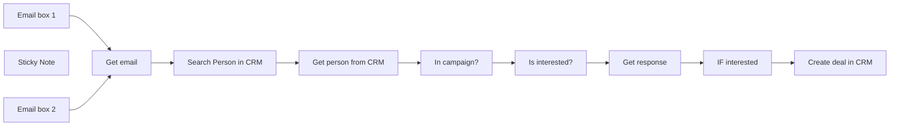

## Fluxo (.json) :

```json
{
  "meta": {
    "instanceId": "0bd9e607aabfd58640f9f5a370e768a7755e93315179f5bcc6d1f8f114b3567a"
  },
  "nodes": [
    {
      "id": "97b36168-7fa8-4a97-a6cc-c42496918c4c",
      "name": "Search Person in CRM",
      "type": "n8n-nodes-base.pipedrive",
      "position": [
        -880,
        400
      ],
      "parameters": {
        "term": "={{ $json.from.value[0].address }}",
        "limit": 1,
        "resource": "person",
        "operation": "search",
        "additionalFields": {
          "includeFields": ""
        }
      },
      "credentials": {
        "pipedriveApi": {
          "id": "MdJQDtRDHnpwuVYP",
          "name": "Pipedrive LinkedUp"
        }
      },
      "typeVersion": 1
    },
    {
      "id": "2a17582b-9375-4a01-87d9-a50f573b83db",
      "name": "In campaign?",
      "type": "n8n-nodes-base.if",
      "position": [
        -420,
        400
      ],
      "parameters": {
        "conditions": {
          "string": [
            {
              "value1": "={{ $json.in_campaign }}",
              "value2": "True"
            }
          ]
        }
      },
      "typeVersion": 1
    },
    {
      "id": "2a8d509f-8ac2-4f45-a905-f34552833381",
      "name": "Get person from CRM",
      "type": "n8n-nodes-base.pipedrive",
      "position": [
        -640,
        400
      ],
      "parameters": {
        "personId": "={{ $json.id }}",
        "resource": "person",
        "operation": "get",
        "resolveProperties": true
      },
      "credentials": {
        "pipedriveApi": {
          "id": "MdJQDtRDHnpwuVYP",
          "name": "Pipedrive LinkedUp"
        }
      },
      "typeVersion": 1
    },
    {
      "id": "b9c6f3d3-1a6d-4144-8e77-3a3c6e5282d8",
      "name": "Is interested?",
      "type": "n8n-nodes-base.openAi",
      "position": [
        -180,
        380
      ],
      "parameters": {
        "model": "gpt-4",
        "prompt": {
          "messages": [
            {
              "content": "=You are the best sales development representative in the world. You send cold email messages daily to CEOs and founders of companies. You do this to persuade them to make contact. This could be a phone call or a video meeting. \n\nYour task is to assess whether someone is interested in meeting up or calling sometime. You do this by attentively evaluating their response.\n\nThis is the email:\n{{ $('Get email').item.json.text }}\n\nThe response format should be:\n{\"interested\": [yes/no],\n\"reason\": reason\n}\n\nJSON:"
            }
          ]
        },
        "options": {},
        "resource": "chat"
      },
      "credentials": {
        "openAiApi": {
          "id": "qPBzqgpCRxncJ90K",
          "name": "OpenAi account 2"
        }
      },
      "typeVersion": 1
    },
    {
      "id": "f1eb438d-f002-4082-8481-51565df13f5c",
      "name": "Get email",
      "type": "n8n-nodes-base.set",
      "position": [
        -1100,
        400
      ],
      "parameters": {
        "fields": {
          "values": [
            {
              "name": "email",
              "stringValue": "={{ $json.text }}"
            }
          ]
        },
        "options": {}
      },
      "typeVersion": 3.2
    },
    {
      "id": "78461c36-ba54-4f0f-a38e-183bfafa576c",
      "name": "Create deal in CRM",
      "type": "n8n-nodes-base.pipedrive",
      "position": [
        460,
        360
      ],
      "parameters": {
        "title": "={{ $('Get person from CRM').item.json.Name }} Deal",
        "additionalFields": {}
      },
      "credentials": {
        "pipedriveApi": {
          "id": "MdJQDtRDHnpwuVYP",
          "name": "Pipedrive LinkedUp"
        }
      },
      "typeVersion": 1
    },
    {
      "id": "efe07661-9afc-4184-b558-e1f547b6721f",
      "name": "IF interested",
      "type": "n8n-nodes-base.if",
      "position": [
        240,
        380
      ],
      "parameters": {
        "conditions": {
          "string": [
            {
              "value1": "={{ $json.interested }}",
              "value2": "yes"
            }
          ]
        }
      },
      "typeVersion": 1
    },
    {
      "id": "7c2b7b59-9d68-4d8c-9b9f-a36ea47526c9",
      "name": "Get response",
      "type": "n8n-nodes-base.code",
      "position": [
        20,
        380
      ],
      "parameters": {
        "mode": "runOnceForEachItem",
        "jsCode": "let interested = JSON.parse($json[\"message\"][\"content\"]).interested\nlet reason = JSON.parse($json[\"message\"][\"content\"]).reason\n\nreturn {json:{\n  interested: interested,\n  reason: reason\n}}"
      },
      "typeVersion": 1
    },
    {
      "id": "53f51f8c-5995-4bcd-a038-3018834942e6",
      "name": "Email box 1",
      "type": "n8n-nodes-base.gmailTrigger",
      "position": [
        -1300,
        400
      ],
      "parameters": {
        "simple": false,
        "filters": {
          "labelIds": []
        },
        "options": {},
        "pollTimes": {
          "item": [
            {
              "mode": "everyMinute"
            }
          ]
        }
      },
      "typeVersion": 1
    },
    {
      "id": "bb1254ec-676a-4edc-bf4a-a1c66bac78bb",
      "name": "Sticky Note",
      "type": "n8n-nodes-base.stickyNote",
      "position": [
        -1880,
        360
      ],
      "parameters": {
        "width": 452.37174177689576,
        "height": 462.1804790107177,
        "content": "## About the workflow\nThe workflow reads every reply that is received from a cold email campaign and qualifies if the lead is interested in a meeting. If the lead is interested, a deal is made in pipedrive. You can add as many email inboxes as you need!\n\n## Setup:\n- Add credentials to the Gmail, OpenAI and Pipedrive Nodes.\n- Add a in_campaign field in Pipedrive for persons. In Pipedrive click on your credentials at the top right, go to company settings > Data fields > Person and click on add custom field. Single option [TRUE/FALSE].\n- If you have only one email inbox, you can delete one of the Gmail nodes.\n- If you have more than two email inboxes, you can duplicate a Gmail node as many times as you like. Just connect it to the Get email node, and you are good to go!\n- In the Gmail inbox nodes, select Inbox under label names and uncheck Simplify."
      },
      "typeVersion": 1
    },
    {
      "id": "c1aaee97-11f4-4e9d-9a71-90ca3f5773a9",
      "name": "Email box 2",
      "type": "n8n-nodes-base.gmailTrigger",
      "position": [
        -1300,
        600
      ],
      "parameters": {
        "simple": false,
        "filters": {
          "labelIds": []
        },
        "options": {},
        "pollTimes": {
          "item": [
            {
              "mode": "everyMinute"
            }
          ]
        }
      },
      "typeVersion": 1
    }
  ],
  "pinData": {},
  "connections": {
    "Get email": {
      "main": [
        [
          {
            "node": "Search Person in CRM",
            "type": "main",
            "index": 0
          }
        ]
      ]
    },
    "Email box 1": {
      "main": [
        [
          {
            "node": "Get email",
            "type": "main",
            "index": 0
          }
        ]
      ]
    },
    "Email box 2": {
      "main": [
        [
          {
            "node": "Get email",
            "type": "main",
            "index": 0
          }
        ]
      ]
    },
    "Get response": {
      "main": [
        [
          {
            "node": "IF interested",
            "type": "main",
            "index": 0
          }
        ]
      ]
    },
    "In campaign?": {
      "main": [
        [
          {
            "node": "Is interested?",
            "type": "main",
            "index": 0
          }
        ]
      ]
    },
    "IF interested": {
      "main": [
        [
          {
            "node": "Create deal in CRM",
            "type": "main",
            "index": 0
          }
        ]
      ]
    },
    "Is interested?": {
      "main": [
        [
          {
            "node": "Get response",
            "type": "main",
            "index": 0
          }
        ]
      ]
    },
    "Get person from CRM": {
      "main": [
        [
          {
            "node": "In campaign?",
            "type": "main",
            "index": 0
          }
        ]
      ]
    },
    "Search Person in CRM": {
      "main": [
        [
          {
            "node": "Get person from CRM",
            "type": "main",
            "index": 0
          }
        ]
      ]
    }
  }
}
```

<a id="template-927"></a>

## Template 927 - Reativação automática de workflows desativados

- **Nome:** Reativação automática de workflows desativados
- **Descrição:** Este fluxo busca workflows marcados para reativação e ativa automaticamente aqueles que estiverem desativados.
- **Funcionalidade:** • Verificação agendada: Executa a checagem automaticamente a cada 4 horas.
• Disparo manual de teste: Permite executar o fluxo manualmente ao clicar em testar.
• Busca por tag específica: Lista workflows que possuem a tag "auto_resume:true".
• Filtragem de inativos: Seleciona apenas workflows cujo estado esteja desativado (active = false).
• Ativação automática: Ativa cada workflow desativado chamando a API da plataforma usando o ID do workflow.
• Re-tentativa em falhas: Tenta novamente chamadas à API em caso de falha nas operações.
- **Ferramentas:** • API da plataforma de automações: Serviço usado para listar workflows por tags e para ativar workflows por ID, acessado com credenciais de conta.

## Fluxo visual

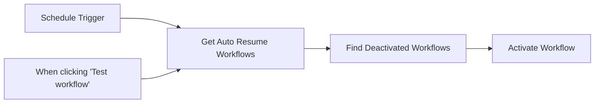

## Fluxo (.json) :

```json
{
  "id": "kZarev2IMUaKHhCI",
  "meta": {
    "instanceId": "f4b99447bb6b56ad425b30ab755dc982ee1c258e7ce783958190eabedd1bcbb0"
  },
  "name": "Auto - Resume Disabled Workflows",
  "tags": [
    {
      "id": "YZS563bPtiBYp1aL",
      "name": "auto_resume:true",
      "createdAt": "2024-02-29T19:38:26.858Z",
      "updatedAt": "2024-02-29T19:38:26.858Z"
    },
    {
      "id": "53XXAtg9v7XIaREI",
      "name": "owner:darien",
      "createdAt": "2024-02-10T03:20:58.515Z",
      "updatedAt": "2024-02-10T03:20:58.515Z"
    }
  ],
  "nodes": [
    {
      "id": "fc7224f0-96d6-4c6d-a7c5-afbd49d60fc8",
      "name": "When clicking \"Test workflow\"",
      "type": "n8n-nodes-base.manualTrigger",
      "position": [
        820,
        700
      ],
      "parameters": {},
      "typeVersion": 1
    },
    {
      "id": "50661eea-325f-4131-92f6-0e3112ea6714",
      "name": "Get Auto Resume Workflows",
      "type": "n8n-nodes-base.n8n",
      "position": [
        1040,
        600
      ],
      "parameters": {
        "filters": {
          "tags": "auto_resume:true"
        }
      },
      "credentials": {
        "n8nApi": {
          "id": "r2RZq6ObikiqFu1y",
          "name": "n8n account"
        }
      },
      "retryOnFail": true,
      "typeVersion": 1
    },
    {
      "id": "3c845ca2-4a6d-40ed-ad11-b92c425f852d",
      "name": "Find Deactivated Workflows",
      "type": "n8n-nodes-base.filter",
      "position": [
        1260,
        600
      ],
      "parameters": {
        "options": {},
        "conditions": {
          "options": {
            "leftValue": "",
            "caseSensitive": true,
            "typeValidation": "strict"
          },
          "combinator": "and",
          "conditions": [
            {
              "id": "ce7b707c-d74e-4ca8-8081-53b15ff3f8a3",
              "operator": {
                "type": "boolean",
                "operation": "false",
                "singleValue": true
              },
              "leftValue": "={{ $json.active }}",
              "rightValue": ""
            }
          ]
        }
      },
      "typeVersion": 2
    },
    {
      "id": "74b79f56-532e-4446-9b28-77874098ba10",
      "name": "Schedule Trigger",
      "type": "n8n-nodes-base.scheduleTrigger",
      "position": [
        820,
        520
      ],
      "parameters": {
        "rule": {
          "interval": [
            {
              "field": "hours",
              "hoursInterval": 4
            }
          ]
        }
      },
      "notesInFlow": false,
      "typeVersion": 1.1
    },
    {
      "id": "318960c8-e2bb-4486-ad5a-8c3a7e6db8a3",
      "name": "Activate Workflow",
      "type": "n8n-nodes-base.n8n",
      "position": [
        1460,
        600
      ],
      "parameters": {
        "operation": "activate",
        "workflowId": {
          "__rl": true,
          "mode": "id",
          "value": "={{ $json.id }}"
        }
      },
      "credentials": {
        "n8nApi": {
          "id": "r2RZq6ObikiqFu1y",
          "name": "n8n account"
        }
      },
      "retryOnFail": true,
      "typeVersion": 1
    }
  ],
  "active": true,
  "pinData": {},
  "settings": {
    "executionOrder": "v1"
  },
  "versionId": "ff4414a4-de17-43a6-9da2-144a6e4cb773",
  "connections": {
    "Schedule Trigger": {
      "main": [
        [
          {
            "node": "Get Auto Resume Workflows",
            "type": "main",
            "index": 0
          }
        ]
      ]
    },
    "Get Auto Resume Workflows": {
      "main": [
        [
          {
            "node": "Find Deactivated Workflows",
            "type": "main",
            "index": 0
          }
        ]
      ]
    },
    "Find Deactivated Workflows": {
      "main": [
        [
          {
            "node": "Activate Workflow",
            "type": "main",
            "index": 0
          }
        ]
      ]
    },
    "When clicking \"Test workflow\"": {
      "main": [
        [
          {
            "node": "Get Auto Resume Workflows",
            "type": "main",
            "index": 0
          }
        ]
      ]
    }
  }
}
```

<a id="template-928"></a>

## Template 928 - Compartilhar receita de coquetel semanal

- **Nome:** Compartilhar receita de coquetel semanal
- **Descrição:** Busca uma receita de coquetel aleatória semanalmente, gera uma imagem com os dados e publica no canal de chat.
- **Funcionalidade:** • Agendamento semanal: Executa o fluxo toda sexta-feira às 18:00.
• Obtenção de receita aleatória: Consulta uma API pública para recuperar um coquetel e suas informações (nome, imagem e instruções).
• Geração de imagem personalizada: Preenche um template de imagem com a foto do coquetel, título e receita.
• Espera pelo processamento da imagem: Aguarda o serviço externo finalizar a geração da imagem antes de prosseguir.
• Publicação no chat: Envia a imagem gerada como anexo para um canal de chat.
- **Ferramentas:** • TheCocktailDB: API pública para obter receitas e imagens de coquetéis aleatórios.
• Bannerbear: Serviço de geração de imagens a partir de templates, usado para criar a imagem com título e receita.
• Rocket.Chat: Plataforma de chat onde a imagem gerada é publicada como anexo.

## Fluxo visual

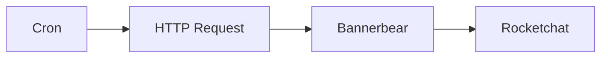

## Fluxo (.json) :

```json
{
  "id": "46",
  "name": "Cocktail Recipe Sharing",
  "nodes": [
    {
      "name": "Bannerbear",
      "type": "n8n-nodes-base.bannerbear",
      "position": [
        650,
        300
      ],
      "parameters": {
        "templateId": "",
        "modificationsUi": {
          "modificationsValues": [
            {
              "name": "cocktail-image",
              "imageUrl": "={{$node[\"HTTP Request\"].json[\"drinks\"][0][\"strDrinkThumb\"]}}"
            },
            {
              "name": "title",
              "text": "={{$node[\"HTTP Request\"].json[\"drinks\"][0][\"strDrink\"]}}"
            },
            {
              "name": "recipe",
              "text": "={{$node[\"HTTP Request\"].json[\"drinks\"][0][\"strInstructions\"]}}"
            }
          ]
        },
        "additionalFields": {
          "waitForImage": true
        }
      },
      "credentials": {
        "bannerbearApi": "Bannerbear"
      },
      "typeVersion": 1
    },
    {
      "name": "HTTP Request",
      "type": "n8n-nodes-base.httpRequest",
      "position": [
        450,
        300
      ],
      "parameters": {
        "url": "https://www.thecocktaildb.com/api/json/v1/1/random.php",
        "options": {}
      },
      "typeVersion": 1
    },
    {
      "name": "Cron",
      "type": "n8n-nodes-base.cron",
      "position": [
        250,
        300
      ],
      "parameters": {
        "triggerTimes": {
          "item": [
            {
              "hour": 18,
              "mode": "everyWeek",
              "weekday": "5"
            }
          ]
        }
      },
      "typeVersion": 1
    },
    {
      "name": "Rocketchat",
      "type": "n8n-nodes-base.rocketchat",
      "position": [
        850,
        300
      ],
      "parameters": {
        "channel": "",
        "options": {},
        "attachments": [
          {
            "imageUrl": "={{$node[\"Bannerbear\"].json[\"image_url\"]}}"
          }
        ]
      },
      "credentials": {
        "rocketchatApi": "Rocket"
      },
      "typeVersion": 1
    }
  ],
  "active": false,
  "settings": {},
  "connections": {
    "Cron": {
      "main": [
        [
          {
            "node": "HTTP Request",
            "type": "main",
            "index": 0
          }
        ]
      ]
    },
    "Bannerbear": {
      "main": [
        [
          {
            "node": "Rocketchat",
            "type": "main",
            "index": 0
          }
        ]
      ]
    },
    "HTTP Request": {
      "main": [
        [
          {
            "node": "Bannerbear",
            "type": "main",
            "index": 0
          }
        ]
      ]
    }
  }
}
```

<a id="template-929"></a>

## Template 929 - Raspagem de Lugares do Google Maps com SERPAPI

- **Nome:** Raspagem de Lugares do Google Maps com SERPAPI
- **Descrição:** Este fluxo automatiza a coleta de dados de lugares do Google Maps usando SERPAPI, lendo buscas de uma planilha, executando buscas, processando os resultados e gravando os dados de volta na planilha, com suporte a paginação e atualização de status.
- **Funcionalidade:** • Agendamento e execução periódica: O fluxo é iniciado automaticamente em intervalos de tempo definidos.
• Leitura de buscas a scrap a partir de planilha: Carrega as URLs/consultas para scrap de uma planilha.
• Extração de keyword e localização da URL: Separa palavras-chave e localidade a partir da URL.
• Scraping de Google Maps via SERPAPI: Realiza chamadas para o SERPAPI para obter dados de cada item.
• Tratamento e transformação de dados: Converte os dados retornados em um formato consistente.
• Remoção de duplicatas: Elimina itens repetidos com base no place_id.
• Gravação de resultados na planilha: Insere/atualiza as linhas com os dados coletados.
• Atualização de status na planilha: Marca cada busca como Sucesso ou Erro.
• Gerenciamento de paginação: Continua buscando enquanto houver next pagina na SERPAPI.
• Encadeamento de etapas com verificação de conclusão: Fluxo usa verificação de conclusão para continuar com a próxima página.
- **Ferramentas:** • Google Sheets: Gerencia buscas, atualiza Status e grava resultados em planilhas.
• SerpAPI: API usada para extrair dados do Google Maps.

## Fluxo visual

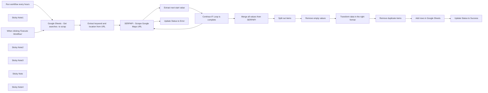

## Fluxo (.json) :

```json
{
  "meta": {
    "instanceId": "f0a68da631efd4ed052a324b63ff90f7a844426af0398a68338f44245d1dd9e5"
  },
  "nodes": [
    {
      "id": "edef59f6-0197-408e-a819-141c1ca8dedd",
      "name": "When clicking \"Execute Workflow\"",
      "type": "n8n-nodes-base.manualTrigger",
      "position": [
        -1820,
        780
      ],
      "parameters": {},
      "typeVersion": 1
    },
    {
      "id": "d56deaf5-1ad8-45a2-bbf0-3b71560f8036",
      "name": "Extract next start value",
      "type": "n8n-nodes-base.code",
      "position": [
        -640,
        480
      ],
      "parameters": {
        "mode": "runOnceForEachItem",
        "jsCode": "let nextUrl\n\nif ($json && $json[\"serpapi_pagination\"] && $json[\"serpapi_pagination\"][\"next\"]) {\n    nextUrl = $json[\"serpapi_pagination\"][\"next\"];\n\n$input.item.json.start = nextUrl.split('&').find(param => param.startsWith('start=')).split('=')[1];\n}\n\n\nreturn $input.item;"
      },
      "typeVersion": 2
    },
    {
      "id": "6562c236-c957-437b-91a9-15e98af09858",
      "name": "Merge all values from SERPAPI",
      "type": "n8n-nodes-base.code",
      "position": [
        -140,
        680
      ],
      "parameters": {
        "jsCode": "const allData = []\n\nlet counter = 0;\ndo {\n  try {\n    const items = $items(\"SERPAPI - Scrape Google Maps URL\", 0, counter).map(item => item.json.local_results);\n    allData.push.apply(allData, items);\n  } catch (error) {\n    return [{json: {allData}}];  \n  }\n\n  counter++;\n} while(true);\nreturn $input.all();"
      },
      "typeVersion": 2
    },
    {
      "id": "357e8a57-dbb5-4241-b9c2-863b3ae3fd96",
      "name": "Transform data in the right format",
      "type": "n8n-nodes-base.code",
      "position": [
        380,
        680
      ],
      "parameters": {
        "jsCode": "console.log($input.all())\n\n\nconst data = $input.all()\n\nconsole.log(\"error\",data)\n\nfunction mergeData(data) {\n    let merged = [];\n    data.forEach(entry => {\n        for (const key in entry.json) {\n            merged.push(entry.json[key]);\n        }\n    });\n    return merged;\n}\n\nconst mergedData = mergeData(data);\nconsole.log(mergedData);\n\n\nreturn mergedData.filter(item => item !== null);"
      },
      "typeVersion": 2
    },
    {
      "id": "4e8e9ae9-f5e3-4bfd-b0d4-9403a1c38d39",
      "name": "Add rows in Google Sheets",
      "type": "n8n-nodes-base.googleSheets",
      "position": [
        760,
        680
      ],
      "parameters": {
        "columns": {
          "value": {},
          "schema": [
            {
              "id": "position",
              "type": "string",
              "display": true,
              "required": false,
              "displayName": "position",
              "defaultMatch": false,
              "canBeUsedToMatch": true
            },
            {
              "id": "title",
              "type": "string",
              "display": true,
              "required": false,
              "displayName": "title",
              "defaultMatch": false,
              "canBeUsedToMatch": true
            },
            {
              "id": "phone",
              "type": "string",
              "display": true,
              "required": false,
              "displayName": "phone",
              "defaultMatch": false,
              "canBeUsedToMatch": true
            },
            {
              "id": "website",
              "type": "string",
              "display": true,
              "required": false,
              "displayName": "website",
              "defaultMatch": false,
              "canBeUsedToMatch": true
            },
            {
              "id": "rating",
              "type": "string",
              "display": true,
              "required": false,
              "displayName": "rating",
              "defaultMatch": false,
              "canBeUsedToMatch": true
            },
            {
              "id": "reviews",
              "type": "string",
              "display": true,
              "required": false,
              "displayName": "reviews",
              "defaultMatch": false,
              "canBeUsedToMatch": true
            },
            {
              "id": "place_id",
              "type": "string",
              "display": true,
              "removed": false,
              "required": false,
              "displayName": "place_id",
              "defaultMatch": false,
              "canBeUsedToMatch": true
            },
            {
              "id": "data_id",
              "type": "string",
              "display": true,
              "required": false,
              "displayName": "data_id",
              "defaultMatch": false,
              "canBeUsedToMatch": true
            },
            {
              "id": "data_cid",
              "type": "string",
              "display": true,
              "required": false,
              "displayName": "data_cid",
              "defaultMatch": false,
              "canBeUsedToMatch": true
            },
            {
              "id": "reviews_link",
              "type": "string",
              "display": true,
              "required": false,
              "displayName": "reviews_link",
              "defaultMatch": false,
              "canBeUsedToMatch": true
            },
            {
              "id": "photos_link",
              "type": "string",
              "display": true,
              "required": false,
              "displayName": "photos_link",
              "defaultMatch": false,
              "canBeUsedToMatch": true
            },
            {
              "id": "gps_coordinates",
              "type": "string",
              "display": true,
              "required": false,
              "displayName": "gps_coordinates",
              "defaultMatch": false,
              "canBeUsedToMatch": true
            },
            {
              "id": "place_id_search",
              "type": "string",
              "display": true,
              "required": false,
              "displayName": "place_id_search",
              "defaultMatch": false,
              "canBeUsedToMatch": true
            },
            {
              "id": "provider_id",
              "type": "string",
              "display": true,
              "required": false,
              "displayName": "provider_id",
              "defaultMatch": false,
              "canBeUsedToMatch": true
            },
            {
              "id": "price",
              "type": "string",
              "display": true,
              "required": false,
              "displayName": "price",
              "defaultMatch": false,
              "canBeUsedToMatch": true
            },
            {
              "id": "type",
              "type": "string",
              "display": true,
              "required": false,
              "displayName": "type",
              "defaultMatch": false,
              "canBeUsedToMatch": true
            },
            {
              "id": "types",
              "type": "string",
              "display": true,
              "required": false,
              "displayName": "types",
              "defaultMatch": false,
              "canBeUsedToMatch": true
            },
            {
              "id": "address",
              "type": "string",
              "display": true,
              "required": false,
              "displayName": "address",
              "defaultMatch": false,
              "canBeUsedToMatch": true
            },
            {
              "id": "open_state",
              "type": "string",
              "display": true,
              "required": false,
              "displayName": "open_state",
              "defaultMatch": false,
              "canBeUsedToMatch": true
            },
            {
              "id": "hours",
              "type": "string",
              "display": true,
              "required": false,
              "displayName": "hours",
              "defaultMatch": false,
              "canBeUsedToMatch": true
            },
            {
              "id": "operating_hours",
              "type": "string",
              "display": true,
              "required": false,
              "displayName": "operating_hours",
              "defaultMatch": false,
              "canBeUsedToMatch": true
            },
            {
              "id": "description",
              "type": "string",
              "display": true,
              "required": false,
              "displayName": "description",
              "defaultMatch": false,
              "canBeUsedToMatch": true
            },
            {
              "id": "service_options",
              "type": "string",
              "display": true,
              "required": false,
              "displayName": "service_options",
              "defaultMatch": false,
              "canBeUsedToMatch": true
            },
            {
              "id": "order_online",
              "type": "string",
              "display": true,
              "required": false,
              "displayName": "order_online",
              "defaultMatch": false,
              "canBeUsedToMatch": true
            },
            {
              "id": "thumbnail",
              "type": "string",
              "display": true,
              "required": false,
              "displayName": "thumbnail",
              "defaultMatch": false,
              "canBeUsedToMatch": true
            },
            {
              "id": "editorial_reviews",
              "type": "string",
              "display": true,
              "required": false,
              "displayName": "editorial_reviews",
              "defaultMatch": false,
              "canBeUsedToMatch": true
            },
            {
              "id": "unclaimed_listing",
              "type": "string",
              "display": true,
              "required": false,
              "displayName": "unclaimed_listing",
              "defaultMatch": false,
              "canBeUsedToMatch": true
            }
          ],
          "mappingMode": "autoMapInputData",
          "matchingColumns": [
            "place_id"
          ]
        },
        "options": {
          "cellFormat": "RAW"
        },
        "operation": "appendOrUpdate",
        "sheetName": {
          "__rl": true,
          "mode": "list",
          "value": 2023033319,
          "cachedResultUrl": "https://docs.google.com/spreadsheets/d/170osqaLBql9M-4RAH3_lBKR7ZMaQqyLUkAD-88xGuEQ/edit#gid=2023033319",
          "cachedResultName": "Results"
        },
        "documentId": {
          "__rl": true,
          "mode": "url",
          "value": "https://docs.google.com/spreadsheets/d/170osqaLBql9M-4RAH3_lBKR7ZMaQqyLUkAD-88xGuEQ/edit#gid=2023033319"
        }
      },
      "credentials": {
        "googleSheetsOAuth2Api": {
          "id": "2",
          "name": "Google Sheets account lucas"
        }
      },
      "typeVersion": 4.2
    },
    {
      "id": "90194aa3-5960-47bd-9e0e-efee827004c4",
      "name": "SERPAPI - Scrape Google Maps URL",
      "type": "n8n-nodes-base.httpRequest",
      "onError": "continueErrorOutput",
      "position": [
        -920,
        500
      ],
      "parameters": {
        "url": "https://serpapi.com/search.json",
        "options": {},
        "sendQuery": true,
        "authentication": "predefinedCredentialType",
        "queryParameters": {
          "parameters": [
            {
              "name": "engine",
              "value": "google_maps"
            },
            {
              "name": "q",
              "value": "={{$json?.search_parameters?.q || $json.keyword }} "
            },
            {
              "name": "ll",
              "value": "={{ $json?.search_parameters?.ll|| $json.geo }}"
            },
            {
              "name": "type",
              "value": "search"
            },
            {
              "name": "start",
              "value": "={{ $json.start|| 0 }}"
            }
          ]
        },
        "nodeCredentialType": "serpApi"
      },
      "credentials": {
        "serpApi": {
          "id": "MP9W6wBcEfhc6ofn",
          "name": "SerpAPI account"
        }
      },
      "typeVersion": 4.1
    },
    {
      "id": "9cfd1e76-2d7c-4618-86d6-e1f3c7729044",
      "name": "Remove duplicate items",
      "type": "n8n-nodes-base.itemLists",
      "position": [
        580,
        680
      ],
      "parameters": {
        "compare": "selectedFields",
        "options": {},
        "operation": "removeDuplicates",
        "fieldsToCompare": "place_id"
      },
      "typeVersion": 3.1
    },
    {
      "id": "e47dfa17-fc84-4694-950d-165302a9075f",
      "name": "Split out items",
      "type": "n8n-nodes-base.itemLists",
      "position": [
        40,
        680
      ],
      "parameters": {
        "options": {},
        "fieldToSplitOut": "allData"
      },
      "typeVersion": 3.1
    },
    {
      "id": "decc89ee-f836-4ec2-9a1a-0371a8889ef5",
      "name": "Remove empty values",
      "type": "n8n-nodes-base.filter",
      "position": [
        200,
        680
      ],
      "parameters": {
        "conditions": {
          "string": [
            {
              "value1": "={{ $json[0] }}",
              "operation": "isNotEmpty"
            }
          ]
        }
      },
      "typeVersion": 1
    },
    {
      "id": "bd7ca3a5-2697-4653-abf6-372088d925e6",
      "name": "Google Sheets - Get searches  to scrap",
      "type": "n8n-nodes-base.googleSheets",
      "position": [
        -1380,
        500
      ],
      "parameters": {
        "options": {},
        "filtersUI": {
          "values": [
            {
              "lookupColumn": "Status"
            }
          ]
        },
        "sheetName": {
          "__rl": true,
          "mode": "list",
          "value": "gid=0",
          "cachedResultUrl": "https://docs.google.com/spreadsheets/d/170osqaLBql9M-4RAH3_lBKR7ZMaQqyLUkAD-88xGuEQ/edit#gid=0",
          "cachedResultName": "Add your search here"
        },
        "documentId": {
          "__rl": true,
          "mode": "url",
          "value": "https://docs.google.com/spreadsheets/d/170osqaLBql9M-4RAH3_lBKR7ZMaQqyLUkAD-88xGuEQ/edit#gid=0"
        }
      },
      "credentials": {
        "googleSheetsOAuth2Api": {
          "id": "2",
          "name": "Google Sheets account lucas"
        }
      },
      "typeVersion": 4.2
    },
    {
      "id": "6d0be482-b1ad-4fa0-8d2e-bef9a4414924",
      "name": "Extract keyword and location from URL",
      "type": "n8n-nodes-base.set",
      "position": [
        -1160,
        500
      ],
      "parameters": {
        "fields": {
          "values": [
            {
              "name": "keyword",
              "stringValue": "={{ $json.URL.match(//search/(.*?)//)[1] }}"
            },
            {
              "name": "geo",
              "stringValue": "={{ $json.URL.match(/(@[^/?]+)/)[1]}}"
            }
          ]
        },
        "options": {}
      },
      "typeVersion": 3.2
    },
    {
      "id": "f6fb8db2-8444-4605-af9d-22ca71c7937d",
      "name": "Sticky Note1",
      "type": "n8n-nodes-base.stickyNote",
      "position": [
        -1920,
        200
      ],
      "parameters": {
        "width": 312.2965981499806,
        "height": 266.8807730722022,
        "content": "## Adjust frequency to your own needs"
      },
      "typeVersion": 1
    },
    {
      "id": "234b5d18-75d7-495b-960f-06192d9e7c61",
      "name": "Run workflow every hours",
      "type": "n8n-nodes-base.scheduleTrigger",
      "position": [
        -1800,
        300
      ],
      "parameters": {
        "rule": {
          "interval": [
            {
              "field": "hours"
            }
          ]
        }
      },
      "typeVersion": 1.1
    },
    {
      "id": "ea2e9b89-e52c-4e25-803a-ce33c41c20fc",
      "name": "Sticky Note2",
      "type": "n8n-nodes-base.stickyNote",
      "position": [
        -1460,
        200
      ],
      "parameters": {
        "height": 511.2196121145973,
        "content": "## Copy my template and connect it to n8n\n\nTemplate link: \n https://docs.google.com/spreadsheets/d/170osqaLBql9M-4RAH3_lBKR7ZMaQqyLUkAD-88xGuEQ/edit?usp=sharing"
      },
      "typeVersion": 1
    },
    {
      "id": "de515d8d-641d-4b91-9472-608ad3878e32",
      "name": "Sticky Note3",
      "type": "n8n-nodes-base.stickyNote",
      "position": [
        -980,
        169.3107006491615
      ],
      "parameters": {
        "height": 535.9388810024284,
        "content": "## Add your SERPAPI API Key\n\nStart a free trial at serpapi.com and get your API key in \"Your account\" section"
      },
      "typeVersion": 1
    },
    {
      "id": "a5a63861-7ff3-4072-a669-acce938939d8",
      "name": "Update Status to Success",
      "type": "n8n-nodes-base.googleSheets",
      "position": [
        940,
        680
      ],
      "parameters": {
        "columns": {
          "value": {
            "URL": "={{ $('Google Sheets - Get searches  to scrap').first().json.URL }}",
            "Status": "✅"
          },
          "schema": [
            {
              "id": "URL",
              "type": "string",
              "display": true,
              "removed": false,
              "required": false,
              "displayName": "URL",
              "defaultMatch": false,
              "canBeUsedToMatch": true
            },
            {
              "id": "Status",
              "type": "string",
              "display": true,
              "required": false,
              "displayName": "Status",
              "defaultMatch": false,
              "canBeUsedToMatch": true
            },
            {
              "id": "row_number",
              "type": "string",
              "display": true,
              "removed": true,
              "readOnly": true,
              "required": false,
              "displayName": "row_number",
              "defaultMatch": false,
              "canBeUsedToMatch": true
            }
          ],
          "mappingMode": "defineBelow",
          "matchingColumns": [
            "URL"
          ]
        },
        "options": {},
        "operation": "update",
        "sheetName": {
          "__rl": true,
          "mode": "list",
          "value": "gid=0",
          "cachedResultUrl": "https://docs.google.com/spreadsheets/d/170osqaLBql9M-4RAH3_lBKR7ZMaQqyLUkAD-88xGuEQ/edit#gid=0",
          "cachedResultName": "Add your search url here"
        },
        "documentId": {
          "__rl": true,
          "mode": "url",
          "value": "https://docs.google.com/spreadsheets/d/170osqaLBql9M-4RAH3_lBKR7ZMaQqyLUkAD-88xGuEQ/edit#gid=0"
        }
      },
      "credentials": {
        "googleSheetsOAuth2Api": {
          "id": "2",
          "name": "Google Sheets account lucas"
        }
      },
      "executeOnce": true,
      "typeVersion": 4.2
    },
    {
      "id": "2bdc5b63-e3bb-453e-a236-9c83cd12cc03",
      "name": "Update Status to Error",
      "type": "n8n-nodes-base.googleSheets",
      "position": [
        -640,
        620
      ],
      "parameters": {
        "columns": {
          "value": {
            "URL": "={{ $('Google Sheets - Get searches  to scrap').first().json.URL }}",
            "Status": "❌"
          },
          "schema": [
            {
              "id": "URL",
              "type": "string",
              "display": true,
              "removed": false,
              "required": false,
              "displayName": "URL",
              "defaultMatch": false,
              "canBeUsedToMatch": true
            },
            {
              "id": "Status",
              "type": "string",
              "display": true,
              "required": false,
              "displayName": "Status",
              "defaultMatch": false,
              "canBeUsedToMatch": true
            },
            {
              "id": "row_number",
              "type": "string",
              "display": true,
              "removed": true,
              "readOnly": true,
              "required": false,
              "displayName": "row_number",
              "defaultMatch": false,
              "canBeUsedToMatch": true
            }
          ],
          "mappingMode": "defineBelow",
          "matchingColumns": [
            "URL"
          ]
        },
        "options": {},
        "operation": "update",
        "sheetName": {
          "__rl": true,
          "mode": "list",
          "value": "gid=0",
          "cachedResultUrl": "https://docs.google.com/spreadsheets/d/170osqaLBql9M-4RAH3_lBKR7ZMaQqyLUkAD-88xGuEQ/edit#gid=0",
          "cachedResultName": "Add your search url here"
        },
        "documentId": {
          "__rl": true,
          "mode": "url",
          "value": "https://docs.google.com/spreadsheets/d/170osqaLBql9M-4RAH3_lBKR7ZMaQqyLUkAD-88xGuEQ/edit#gid=0"
        }
      },
      "credentials": {
        "googleSheetsOAuth2Api": {
          "id": "2",
          "name": "Google Sheets account lucas"
        }
      },
      "executeOnce": true,
      "typeVersion": 4.2
    },
    {
      "id": "f413f4ef-fd6d-4967-8df7-a4fee4361246",
      "name": "Sticky Note",
      "type": "n8n-nodes-base.stickyNote",
      "position": [
        -1920,
        640
      ],
      "parameters": {
        "width": 312.2965981499806,
        "height": 310.4703136043695,
        "content": "## Click on Execute Workflow to run the workflow manually"
      },
      "typeVersion": 1
    },
    {
      "id": "cbc53e43-f141-434c-a655-feb1f7d3c65b",
      "name": "Continue IF Loop is complete",
      "type": "n8n-nodes-base.if",
      "position": [
        -380,
        620
      ],
      "parameters": {
        "conditions": {
          "number": [
            {
              "value1": "={{ $json.search_parameters.start }}",
              "operation": "isNotEmpty"
            }
          ],
          "string": [
            {
              "value1": "={{ $json.serpapi_pagination.next }}",
              "operation": "isNotEmpty"
            }
          ]
        }
      },
      "typeVersion": 1
    },
    {
      "id": "229f9652-b703-490e-aa3c-c28b0fe1f2e8",
      "name": "Sticky Note4",
      "type": "n8n-nodes-base.stickyNote",
      "position": [
        -2340,
        200
      ],
      "parameters": {
        "width": 357.33341618921213,
        "height": 532.3420004517685,
        "content": "## Read Me\n\nThis workflow allows to scrape Google Maps data in an efficient way using SerpAPI. \n\nYou'll get all data from Gmaps at a cheaper cost than Google Maps API.\n\nAdd as input, your Google Maps search URL and you'll get a list of places with many data points such as:\n- phone number\n- website\n- rating\n- reviews\n- address\n\nAnd much more.\n\n\n**Full guide to implement the workflow is here**: \n\nhttps://lempire.notion.site/Scrape-Google-Maps-places-with-n8n-b7f1785c3d474e858b7ee61ad4c21136?pvs=4"
      },
      "typeVersion": 1
    }
  ],
  "pinData": {},
  "connections": {
    "Split out items": {
      "main": [
        [
          {
            "node": "Remove empty values",
            "type": "main",
            "index": 0
          }
        ]
      ]
    },
    "Remove empty values": {
      "main": [
        [
          {
            "node": "Transform data in the right format",
            "type": "main",
            "index": 0
          }
        ]
      ]
    },
    "Remove duplicate items": {
      "main": [
        [
          {
            "node": "Add rows in Google Sheets",
            "type": "main",
            "index": 0
          }
        ]
      ]
    },
    "Extract next start value": {
      "main": [
        [
          {
            "node": "Continue IF Loop is complete",
            "type": "main",
            "index": 0
          }
        ]
      ]
    },
    "Run workflow every hours": {
      "main": [
        [
          {
            "node": "Google Sheets - Get searches  to scrap",
            "type": "main",
            "index": 0
          }
        ]
      ]
    },
    "Add rows in Google Sheets": {
      "main": [
        [
          {
            "node": "Update Status to Success",
            "type": "main",
            "index": 0
          }
        ]
      ]
    },
    "Continue IF Loop is complete": {
      "main": [
        [
          {
            "node": "SERPAPI - Scrape Google Maps URL",
            "type": "main",
            "index": 0
          }
        ],
        [
          {
            "node": "Merge all values from SERPAPI",
            "type": "main",
            "index": 0
          }
        ]
      ]
    },
    "Merge all values from SERPAPI": {
      "main": [
        [
          {
            "node": "Split out items",
            "type": "main",
            "index": 0
          }
        ]
      ]
    },
    "SERPAPI - Scrape Google Maps URL": {
      "main": [
        [
          {
            "node": "Extract next start value",
            "type": "main",
            "index": 0
          }
        ],
        [
          {
            "node": "Update Status to Error",
            "type": "main",
            "index": 0
          }
        ]
      ]
    },
    "When clicking \"Execute Workflow\"": {
      "main": [
        [
          {
            "node": "Google Sheets - Get searches  to scrap",
            "type": "main",
            "index": 0
          }
        ]
      ]
    },
    "Transform data in the right format": {
      "main": [
        [
          {
            "node": "Remove duplicate items",
            "type": "main",
            "index": 0
          }
        ]
      ]
    },
    "Extract keyword and location from URL": {
      "main": [
        [
          {
            "node": "SERPAPI - Scrape Google Maps URL",
            "type": "main",
            "index": 0
          }
        ]
      ]
    },
    "Google Sheets - Get searches  to scrap": {
      "main": [
        [
          {
            "node": "Extract keyword and location from URL",
            "type": "main",
            "index": 0
          }
        ]
      ]
    }
  }
}
```

<a id="template-930"></a>

## Template 930 - Notícias da empresa antes de reuniões

- **Nome:** Notícias da empresa antes de reuniões
- **Descrição:** O fluxo obtém as últimas notícias da empresa para cada reunião do dia, formata os artigos em HTML e envia um resumo por e-mail para contatos cadastrados.
- **Funcionalidade:** • Agenda diária de reuniões: obtém os compromissos do dia a partir do calendário e filtra apenas aqueles relevantes para envio de notícias.
• Filtragem por título: restringe as reuniões para as que começam com 'Meeting with' ou 'Call with'.
• Extração do nome da empresa: remove as palavras-chave da agenda para obter o nome da empresa alvo.
• Busca de notícias recentes: consulta uma API externa para obter artigos sobre a empresa nos últimos dias configurados.
• Formatação HTML do resumo: monta uma tabela em HTML com os artigos para envio por e-mail.
• Envio do resumo por e-mail: envia o HTML para os contatos configurados.
- **Ferramentas:** • News API: serviço de pesquisa de notícias utilizado para obter artigos sobre a empresa.
• Gmail: serviço de envio de e-mails com o resumo das notícias.
• Google Calendar: agenda para obter os compromissos do dia e definir quais empresas pesquisar.

## Fluxo visual

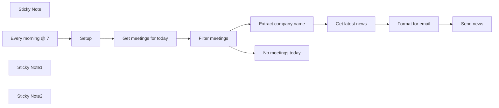

## Fluxo (.json) :

```json
{
  "meta": {
    "instanceId": "3c58c896c9089c8fb4d7f2b069bf3119193f239a1f538829758e2f4d6b5f5b24"
  },
  "nodes": [
    {
      "id": "9aa9fa6c-5ccb-4f2b-b6a8-2b91f4a58355",
      "name": "Setup",
      "type": "n8n-nodes-base.set",
      "position": [
        420,
        680
      ],
      "parameters": {
        "fields": {
          "values": [
            {
              "name": "apiKey",
              "stringValue": "32aa914c947342169c4998b6701a77e0"
            },
            {
              "name": "newsAge",
              "type": "numberValue",
              "numberValue": "10"
            },
            {
              "name": "maxArticles",
              "stringValue": "20"
            },
            {
              "name": "emails"
            }
          ]
        },
        "options": {}
      },
      "typeVersion": 3.2
    },
    {
      "id": "6f471217-b69b-4f67-981d-c7c1e2d710b6",
      "name": "Extract company name",
      "type": "n8n-nodes-base.set",
      "position": [
        1100,
        480
      ],
      "parameters": {
        "fields": {
          "values": [
            {
              "name": "companyName",
              "stringValue": "={{ $json.summary.toLowerCase().replace('meeting with', '').replace('call with', '').trim() }}"
            }
          ]
        },
        "options": {}
      },
      "typeVersion": 3.2
    },
    {
      "id": "9bb5adfa-5a36-453e-ad8d-59229ca2f1ab",
      "name": "Sticky Note",
      "type": "n8n-nodes-base.stickyNote",
      "position": [
        200,
        320
      ],
      "parameters": {
        "color": 4,
        "width": 436,
        "height": 192,
        "content": "### Latest company news before a call\n\nThis workflow will send you a list of latest news about a company for every meeting in your calendar each day, keeping you up to date with your leads and meeting partners.\n"
      },
      "typeVersion": 1
    },
    {
      "id": "ddfa92e0-ff37-4733-9002-65fe21989d8a",
      "name": "Every morning @ 7",
      "type": "n8n-nodes-base.scheduleTrigger",
      "position": [
        200,
        680
      ],
      "parameters": {
        "rule": {
          "interval": [
            {
              "triggerAtHour": 7
            }
          ]
        }
      },
      "typeVersion": 1.1
    },
    {
      "id": "b71c3683-6077-41b4-ab23-66ee22f64532",
      "name": "Filter meetings",
      "type": "n8n-nodes-base.if",
      "position": [
        840,
        680
      ],
      "parameters": {
        "options": {},
        "conditions": {
          "options": {
            "leftValue": "",
            "caseSensitive": true,
            "typeValidation": "strict"
          },
          "combinator": "or",
          "conditions": [
            {
              "id": "bcfb06b1-d365-43a8-9802-869529baca98",
              "operator": {
                "type": "string",
                "operation": "startsWith"
              },
              "leftValue": "={{ $json.summary.toLowerCase() }}",
              "rightValue": "call with"
            },
            {
              "id": "4ea43ccf-d586-4985-87db-fc1e9f734351",
              "operator": {
                "type": "string",
                "operation": "startsWith"
              },
              "leftValue": "={{ $json.summary.toLowerCase() }}",
              "rightValue": "meeting with"
            }
          ]
        }
      },
      "typeVersion": 2
    },
    {
      "id": "34c4241e-e29a-4d9a-b8a8-130b9f19383f",
      "name": "Get latest news",
      "type": "n8n-nodes-base.httpRequest",
      "position": [
        1300,
        480
      ],
      "parameters": {
        "url": "=https://newsapi.org/v2/everything?apiKey={{ $('Setup').first().json.apiKey }}&q={{ $json.companyName }}&from={{ DateTime.now().minus({ days: $('Setup').first().json.newsAge }).toFormat('yyyy-MM-dd') }}&sortBy=publishedAt&language=en&pageSize={{ $('Setup').first().json.maxArticles }}&searchIn=title",
        "options": {}
      },
      "typeVersion": 4.1
    },
    {
      "id": "51059db7-5fec-4287-bf3f-a6a4e76ac5a4",
      "name": "Format for email",
      "type": "n8n-nodes-base.code",
      "position": [
        1500,
        480
      ],
      "parameters": {
        "mode": "runOnceForEachItem",
        "jsCode": "let html = `<table style=\"width: 100%\">`;\nhtml += '</table>';\n\nfor(article of $input.item.json.articles) {\n  console.log(article)\n  html += `\n    <tr>\n      <td style=\"display: flex; background-color: #f2f4f8; font-family: sans-serif; padding: 0.3em 0.5em\">\n        <div style=\"padding: 1em\">\n          <a style=\"display: block; margin-bottom: 10px; font-size: 1.2em\" href=\"${article.url}\">${article.title}</a>\n          <i>\n            ${article.description ? article.description : article.content}\n          </i>\n          <div style=\"margin-top: 1em\">\n            ${ article.source?.name ? '<b>Source:</b> ' + article.source?.name : '' }\n          </div>\n        </div>\n      </td>\n    </tr>\n  `\n}\nreturn { \"html\": html };"
      },
      "typeVersion": 2
    },
    {
      "id": "9b4351a8-edf9-49ef-829e-6998cb1eea2c",
      "name": "Send news",
      "type": "n8n-nodes-base.gmail",
      "position": [
        1700,
        480
      ],
      "parameters": {
        "sendTo": "={{ $('Setup').first().json.emails }}",
        "message": "={{ $json.html }}",
        "options": {},
        "subject": "=Latest news for '{{ $('Extract company name').item.json.summary }}'"
      },
      "credentials": {
        "gmailOAuth2": {
          "id": "10",
          "name": "mrdosija@gmail.com"
        }
      },
      "typeVersion": 2.1
    },
    {
      "id": "182504b0-3cf6-4afe-ba93-1d2bf7a02fa3",
      "name": "Sticky Note1",
      "type": "n8n-nodes-base.stickyNote",
      "position": [
        360,
        640
      ],
      "parameters": {
        "height": 511.499984507795,
        "content": "\n\n\n\n\n\n\n\n\n\n\n\n\n\n\n### Configure your workflow here\n1. `apiKey` - Your API key for [News API](https://newsapi.org)\n2. `newsAge` - How old should news be, in days\n3. `maxArticles` - Number of articles that will be sent, max 100\n4. `emails`- List of email addresses that should receive the news, separated by commas"
      },
      "typeVersion": 1
    },
    {
      "id": "604bc73b-f805-40df-baa0-eb3de4c515f3",
      "name": "Sticky Note2",
      "type": "n8n-nodes-base.stickyNote",
      "position": [
        820,
        660
      ],
      "parameters": {
        "width": 231.52514020446353,
        "height": 275.2500697149263,
        "content": "\n\n\n\n\n\n\n\n\n\n\n\n\nThis will get all meetings that start with *Meeting with* or *Call with* but feel free to update the filter to suit your needs."
      },
      "typeVersion": 1
    },
    {
      "id": "318b2bdc-712f-42a8-b224-8f0dc2c9c4e5",
      "name": "No meetings today",
      "type": "n8n-nodes-base.noOp",
      "position": [
        1700,
        700
      ],
      "parameters": {},
      "typeVersion": 1
    },
    {
      "id": "96b075cd-5c16-453e-93a6-348b22b704bb",
      "name": "Get meetings for today",
      "type": "n8n-nodes-base.googleCalendar",
      "position": [
        660,
        680
      ],
      "parameters": {
        "options": {
          "timeMax": "={{ $today.plus({ days: 1 }) }}",
          "timeMin": "={{ $today }}",
          "singleEvents": true
        },
        "calendar": {
          "__rl": true,
          "mode": "list",
          "value": "milorad.filipovic19@gmail.com",
          "cachedResultName": "milorad.filipovic19@gmail.com"
        },
        "operation": "getAll"
      },
      "credentials": {
        "googleCalendarOAuth2Api": {
          "id": "22",
          "name": "Google Calendar account"
        }
      },
      "typeVersion": 1
    }
  ],
  "pinData": {},
  "connections": {
    "Setup": {
      "main": [
        [
          {
            "node": "Get meetings for today",
            "type": "main",
            "index": 0
          }
        ]
      ]
    },
    "Filter meetings": {
      "main": [
        [
          {
            "node": "Extract company name",
            "type": "main",
            "index": 0
          }
        ],
        [
          {
            "node": "No meetings today",
            "type": "main",
            "index": 0
          }
        ]
      ]
    },
    "Get latest news": {
      "main": [
        [
          {
            "node": "Format for email",
            "type": "main",
            "index": 0
          }
        ]
      ]
    },
    "Format for email": {
      "main": [
        [
          {
            "node": "Send news",
            "type": "main",
            "index": 0
          }
        ]
      ]
    },
    "Every morning @ 7": {
      "main": [
        [
          {
            "node": "Setup",
            "type": "main",
            "index": 0
          }
        ]
      ]
    },
    "Extract company name": {
      "main": [
        [
          {
            "node": "Get latest news",
            "type": "main",
            "index": 0
          }
        ]
      ]
    },
    "Get meetings for today": {
      "main": [
        [
          {
            "node": "Filter meetings",
            "type": "main",
            "index": 0
          }
        ]
      ]
    }
  }
}
```

<a id="template-931"></a>

## Template 931 - Resumo diário de notícias AI e envio por Telegram

- **Nome:** Resumo diário de notícias AI e envio por Telegram
- **Descrição:** Busca diariamente notícias sobre IA, seleciona e resume os principais artigos, traduz os resumos para Chinês Tradicional usando GPT-4.1 e envia o resultado para um chat do Telegram.
- **Funcionalidade:** • Agendamento diário: Executa o fluxo automaticamente às 08:00 todos os dias.
• Coleta de notícias de múltiplas fontes: Busca artigos recentes relacionados a IA de duas APIs de notícias distintas.
• Normalização e combinação de resultados: Padroniza o formato dos resultados e combina as listas de artigos para análise conjunta.
• Seleção dos mais relevantes: Escolhe os 15 artigos mais relevantes sobre progresso e aplicações em IA.
• Tradução e resumo com modelo avançado: Gera resumos e traduz para Chinês Tradicional mantendo termos técnicos em inglês quando apropriado.
• Inclusão de referências: Mantém a URL de cada artigo junto ao resumo para consulta.
• Entrega via Telegram: Envia o boletim resultante para um chat, começando com a data e uma saudação.
- **Ferramentas:** • GNews (gnews.io): API de notícias para pesquisar artigos recentes por palavra-chave.
• NewsAPI (newsapi.org): Serviço de agregação de notícias para obter artigos e metadados.
• OpenAI GPT-4.1: Modelo de linguagem usado para selecionar, resumir e traduzir os artigos.
• Telegram Bot API: Canal para enviar automaticamente a mensagem final ao chat alvo.

## Fluxo visual

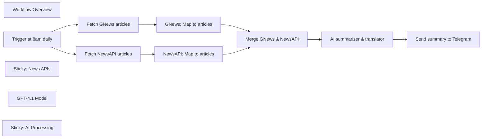

## Fluxo (.json) :

```json
{
  "id": "4AG83ybt0S3WQbkS",
  "meta": {
    "instanceId": "a943fc71a4dfb51cc3424882233bcd72e7a73857958af1cf464f7c21580c726e",
    "templateCredsSetupCompleted": true
  },
  "name": "Daily AI News Translation & Summary with GPT-4 and Telegram Delivery",
  "tags": [
    {
      "id": "WuWMTipHMvadNrvh",
      "name": "Other",
      "createdAt": "2025-04-18T13:34:41.761Z",
      "updatedAt": "2025-04-18T13:34:41.761Z"
    }
  ],
  "nodes": [
    {
      "id": "894ceed6-8fcd-484e-bf6f-9c3eee81119e",
      "name": "Workflow Overview",
      "type": "n8n-nodes-base.stickyNote",
      "position": [
        -40,
        200
      ],
      "parameters": {
        "color": 7,
        "width": 720,
        "height": 600,
        "content": "### Setup\n\n1. **Add NewsAPI and GNews API Keys**\n    - Register for accounts on [NewsAPI.org](https://newsapi.org/) and [GNews](https://gnews.io/) to obtain your API keys.\n    - Input your NewsAPI key directly into the `Fetch NewsAPI articles` node.\n    - Input your GNews API key into the `Fetch GNews articles` node.\n2. **Set up your Telegram Bot**\n    - Create a Telegram Bot via [BotFather](https://core.telegram.org/bots#6-botfather) and copy the generated Bot Token.\n    - In n8n, create Telegram Bot credentials using this token.\n    - In the `Send summary to Telegram` node, enter the chat ID of your target user, group, or channel to receive the messages.\n3. **Configure OpenAI Credentials**\n    - In n8n, create a new credential using your OpenAI API key.\n    - Assign this credential to the `GPT-4.1 Model` node (or equivalent OpenAI/AI nodes).\n\nAfter completing these steps, your workflow is fully configured to fetch, summarize, and deliver daily AI news to your selected Telegram chat automatically.\n\n### How to customize this workflow\n\n- **Change the topic:** Update the keywords in the NewsAPI and GNews nodes for other subjects (e.g., “blockchain”, “quantum computing”).\n- **Adjust delivery time:** Modify the scheduled trigger to your preferred hour.\n- **Tweak summary style or language:** Refine the prompt in the AI summarizer node for different tones or translate into other languages as needed."
      },
      "typeVersion": 1
    },
    {
      "id": "9de68856-a2e1-4b06-a738-92e8db23f9ea",
      "name": "Trigger at 8am daily",
      "type": "n8n-nodes-base.scheduleTrigger",
      "position": [
        760,
        520
      ],
      "parameters": {
        "rule": {
          "interval": [
            {
              "triggerAtHour": 8
            }
          ]
        }
      },
      "typeVersion": 1.2
    },
    {
      "id": "d2a13562-9f21-4f99-8698-d5ba58245b02",
      "name": "Fetch GNews articles",
      "type": "n8n-nodes-base.httpRequest",
      "position": [
        980,
        420
      ],
      "parameters": {
        "url": "https://gnews.io/api/v4/search",
        "options": {},
        "sendQuery": true,
        "queryParameters": {
          "parameters": [
            {
              "name": "q",
              "value": "AI"
            },
            {
              "name": "lang",
              "value": "en"
            },
            {
              "name": "apikey"
            }
          ]
        }
      },
      "typeVersion": 4.2
    },
    {
      "id": "0895bda6-5268-4454-a49f-732a3025947b",
      "name": "Fetch NewsAPI articles",
      "type": "n8n-nodes-base.httpRequest",
      "position": [
        980,
        620
      ],
      "parameters": {
        "url": "https://newsapi.org/v2/everything",
        "options": {},
        "sendQuery": true,
        "sendHeaders": true,
        "queryParameters": {
          "parameters": [
            {
              "name": "q",
              "value": "AI"
            },
            {
              "name": "language",
              "value": "en"
            },
            {
              "name": "sortBy",
              "value": "publishedAt"
            },
            {
              "name": "pageSize",
              "value": "20"
            }
          ]
        },
        "headerParameters": {
          "parameters": [
            {
              "name": "X-Api-Key"
            }
          ]
        }
      },
      "typeVersion": 4.2
    },
    {
      "id": "3cd42b1a-348a-486d-8217-592ce2b35e6c",
      "name": "GNews: Map to articles",
      "type": "n8n-nodes-base.set",
      "position": [
        1200,
        420
      ],
      "parameters": {
        "options": {},
        "assignments": {
          "assignments": [
            {
              "name": "articles",
              "type": "string",
              "value": "={{ $json.articles }}"
            }
          ]
        }
      },
      "typeVersion": 3.4
    },
    {
      "id": "40692e2f-9289-448b-a5cb-ce4846b20264",
      "name": "NewsAPI: Map to articles",
      "type": "n8n-nodes-base.set",
      "position": [
        1200,
        620
      ],
      "parameters": {
        "options": {},
        "assignments": {
          "assignments": [
            {
              "name": "articles",
              "type": "string",
              "value": "={{ $json.articles }}"
            }
          ]
        }
      },
      "typeVersion": 3.4
    },
    {
      "id": "d42b4e2d-87f4-4a0e-a6c3-ab1b3501bcfa",
      "name": "Merge GNews & NewsAPI",
      "type": "n8n-nodes-base.merge",
      "position": [
        1420,
        520
      ],
      "parameters": {},
      "typeVersion": 3.1
    },
    {
      "id": "985ec49b-b127-44b9-8f63-62486d0bf864",
      "name": "Sticky: News APIs",
      "type": "n8n-nodes-base.stickyNote",
      "position": [
        900,
        210
      ],
      "parameters": {
        "color": 5,
        "width": 480,
        "height": 570,
        "content": "### Data Source Nodes\n- `Fetch GNews articles` and `Fetch NewsAPI articles` get up to 20 latest AI-related English news each from two different APIs using your API keys.\n- Both sources are standardized to an `articles` property for merging.\n"
      },
      "typeVersion": 1
    },
    {
      "id": "430c8ddc-948e-4770-b816-591c6c43c617",
      "name": "AI summarizer & translator",
      "type": "@n8n/n8n-nodes-langchain.agent",
      "position": [
        1640,
        520
      ],
      "parameters": {
        "text": "=You are an AI news assistant. Your tasks:\n1. Select the 15 most relevant articles on AI technology progress and applications from {{$json.articles}}.\n2. Translate them to accurate Traditional Chinese; don't translate commonly used technical English terms.\n3. Make sure to include the article URL for each item.\n4. Begin output with today's date (e.g., '早安，這是 {{ $now.format('yyyy/MM/dd') }} 的 AI 新聞：')\nOutput only the summary.",
        "options": {},
        "promptType": "define"
      },
      "typeVersion": 1.8
    },
    {
      "id": "5dfacf8a-25d4-43fd-9b96-a34eeed45d39",
      "name": "GPT-4.1 Model",
      "type": "@n8n/n8n-nodes-langchain.lmChatOpenAi",
      "position": [
        1728,
        740
      ],
      "parameters": {
        "model": {
          "__rl": true,
          "mode": "list",
          "value": "gpt-4.1",
          "cachedResultName": "gpt-4.1"
        },
        "options": {}
      },
      "credentials": {
        "openAiApi": {
          "id": "RjawTJt2ILjgM4Wx",
          "name": "[Template] OpenAi account"
        }
      },
      "typeVersion": 1.2
    },
    {
      "id": "66fedd82-5fbf-4d17-a7f5-78c41d7d5949",
      "name": "Sticky: AI Processing",
      "type": "n8n-nodes-base.stickyNote",
      "position": [
        1568,
        300
      ],
      "parameters": {
        "color": 2,
        "width": 400,
        "height": 580,
        "content": "### AI Assistant Logic\nThe summarization uses the latest GPT-4.1 model to select, translate, and enrich the top 15 AI news links from both GNews and NewsAPI. Controlled by a tailored prompt for concise, readable output."
      },
      "typeVersion": 1
    },
    {
      "id": "7a742531-4a08-408e-8b2c-558be75c1a8f",
      "name": "Send summary to Telegram",
      "type": "n8n-nodes-base.telegram",
      "position": [
        2016,
        520
      ],
      "webhookId": "21eb8e1c-87de-45af-888d-699fbd443bc8",
      "parameters": {
        "text": "={{ $json.output }}",
        "additionalFields": {
          "appendAttribution": false
        }
      },
      "credentials": {
        "telegramApi": {
          "id": "tpF8PHPxMfdld3NA",
          "name": "[Template] Telegram Bot"
        }
      },
      "typeVersion": 1.2
    }
  ],
  "active": false,
  "pinData": {},
  "settings": {
    "executionOrder": "v1"
  },
  "versionId": "deee909a-9cfe-409d-8201-b9b7194ec9bc",
  "connections": {
    "GPT-4.1 Model": {
      "ai_languageModel": [
        [
          {
            "node": "AI summarizer & translator",
            "type": "ai_languageModel",
            "index": 0
          }
        ]
      ]
    },
    "Fetch GNews articles": {
      "main": [
        [
          {
            "node": "GNews: Map to articles",
            "type": "main",
            "index": 0
          }
        ]
      ]
    },
    "Trigger at 8am daily": {
      "main": [
        [
          {
            "node": "Fetch GNews articles",
            "type": "main",
            "index": 0
          },
          {
            "node": "Fetch NewsAPI articles",
            "type": "main",
            "index": 0
          }
        ]
      ]
    },
    "Merge GNews & NewsAPI": {
      "main": [
        [
          {
            "node": "AI summarizer & translator",
            "type": "main",
            "index": 0
          }
        ]
      ]
    },
    "Fetch NewsAPI articles": {
      "main": [
        [
          {
            "node": "NewsAPI: Map to articles",
            "type": "main",
            "index": 0
          }
        ]
      ]
    },
    "GNews: Map to articles": {
      "main": [
        [
          {
            "node": "Merge GNews & NewsAPI",
            "type": "main",
            "index": 0
          }
        ]
      ]
    },
    "NewsAPI: Map to articles": {
      "main": [
        [
          {
            "node": "Merge GNews & NewsAPI",
            "type": "main",
            "index": 1
          }
        ]
      ]
    },
    "AI summarizer & translator": {
      "main": [
        [
          {
            "node": "Send summary to Telegram",
            "type": "main",
            "index": 0
          }
        ]
      ]
    }
  }
}
```

<a id="template-932"></a>

## Template 932 - Importar CSV de URL e converter para Excel

- **Nome:** Importar CSV de URL e converter para Excel
- **Descrição:** Fluxo que baixa um arquivo CSV de uma URL pública, importa os dados e converte para um arquivo Excel (.xlsx).
- **Funcionalidade:** • Iniciação manual: Permite executar o processo sob demanda.
• Download de arquivo CSV via URL: Recupera o CSV hospedado em um serviço público.
• Importação de CSV para estrutura de dados: Lê o conteúdo CSV (delimitador ponto e vírgula, primeira linha como cabeçalho) e o transforma em formato estruturado (JSON/objetos).
• Conversão para Excel (.xlsx): Gera um arquivo .xlsx a partir dos dados importados, definindo nome de arquivo e nome da planilha.
• Configurações de formato: Suporta especificação de delimitador e indicação de linha de cabeçalho para interpretar corretamente os campos.
- **Ferramentas:** • Serviço de dados público (Potsdam Open Data): Fonte hospedada que fornece o arquivo CSV acessível via URL.
• Protocolo HTTP/HTTPS: Método para baixar o arquivo CSV remoto.
• Formato CSV: Formato de entrada contendo os registros delimitados por ponto e vírgula.
• Formato Excel (.xlsx): Formato de saída gerado a partir dos dados importados.

## Fluxo visual

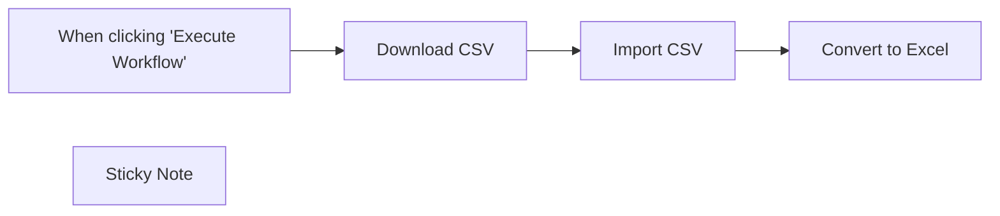

## Fluxo (.json) :

```json
{
  "id": "xcl8D1sukz9Rak69",
  "meta": {
    "instanceId": "fb924c73af8f703905bc09c9ee8076f48c17b596ed05b18c0ff86915ef8a7c4a"
  },
  "name": "Import CSV from URL to Excel",
  "tags": [],
  "nodes": [
    {
      "id": "580d8a47-32cc-4976-a464-793523ae3d1e",
      "name": "When clicking \"Execute Workflow\"",
      "type": "n8n-nodes-base.manualTrigger",
      "position": [
        860,
        380
      ],
      "parameters": {},
      "typeVersion": 1
    },
    {
      "id": "2ca1b012-db79-415a-8983-53ac23cd42d1",
      "name": "Import CSV",
      "type": "n8n-nodes-base.spreadsheetFile",
      "position": [
        1260,
        380
      ],
      "parameters": {
        "options": {
          "delimiter": ";",
          "headerRow": true
        },
        "fileFormat": "csv"
      },
      "typeVersion": 2
    },
    {
      "id": "5bc0a423-91bc-4b52-af05-2869223bbbff",
      "name": "Download CSV",
      "type": "n8n-nodes-base.httpRequest",
      "position": [
        1060,
        380
      ],
      "parameters": {
        "url": "https://opendata.potsdam.de/api/v2/catalog/datasets/veranstaltungsplaetze-potsdam/exports/csv",
        "options": {
          "response": {
            "response": {
              "responseFormat": "file"
            }
          }
        }
      },
      "typeVersion": 4.1
    },
    {
      "id": "d403206d-e53c-44d7-b39e-361fa8fc3a23",
      "name": "Convert to Excel",
      "type": "n8n-nodes-base.spreadsheetFile",
      "position": [
        1460,
        380
      ],
      "parameters": {
        "options": {
          "fileName": "=converted_csv.{{ $parameter.fileFormat }}",
          "headerRow": true,
          "sheetName": "csv_page"
        },
        "operation": "toFile",
        "fileFormat": "xlsx"
      },
      "typeVersion": 2
    },
    {
      "id": "66279cfc-4bde-45af-910f-84854eca9a70",
      "name": "Sticky Note",
      "type": "n8n-nodes-base.stickyNote",
      "position": [
        820,
        177
      ],
      "parameters": {
        "width": 808,
        "height": 385,
        "content": "## Convert CSV to Excel (.xlsx)\n1. Click Execute Workflow to begin\n2. Download the data from the Web\n3. Import CSV binary data as a JSON\n4. Convert JSON to .xlsx file\n\nSource:\nhttps://data.europa.eu/data/datasets/veranstaltungsplaetze-potsdam-potsdam?locale=en"
      },
      "typeVersion": 1
    }
  ],
  "active": false,
  "pinData": {
    "Download CSV": [
      {
        "json": {},
        "binary": {
          "data": {
            "data": "ZmlkO25hbWU7d2VibGluaztwZGY7ZHdnO3NoYXBlX2FyZWE7c2hhcGVfbGVuZ3RoO2dlb19zaGFwZTtnZW9fcG9pbnRfMmQNCjE7QWx0ZXIgTWFya3Q7aHR0cHM6Ly93d3cucG90c2RhbS5kZS9hbHRlci1tYXJrdC1hbHMtdmVyYW5zdGFsdHVuZ3NvcnQ7aHR0cHM6Ly9kZS5mdHAub3BlbmRhdGFzb2Z0LmNvbS9wb3RzZGFtL1ZlcmFuc3RhbHR1bmdzb3J0ZS9BbHRlci1NYXJrdC5wZGY7aHR0cHM6Ly9kZS5mdHAub3BlbmRhdGFzb2Z0LmNvbS9wb3RzZGFtL1ZlcmFuc3RhbHR1bmdzb3J0ZS9BbHRlci1NYXJrdC5EV0c7OTQyMS4yNzgzMjAzMTI1OzM5NS45NjM0NDY0MTM4MTk7InsiImNvb3JkaW5hdGVzIiI6IFtbWzEzLjA2MDUyODA5MTM3MjMsIDUyLjM5NTg4NTQyNDEyOF0sIFsxMy4wNjE0OTA0ODc1MTAzLCA1Mi4zOTYwNzk3ODkwMjEzXSwgWzEzLjA2MTY5NzQyNzUyNTEsIDUyLjM5NTc3MDIyNTg1NDVdLCBbMTMuMDYxNzI5MzI2NDIxLCA1Mi4zOTU3MDIyOTc1MjQ1XSwgWzEzLjA2MTc0MTI0NTM2ODMsIDUyLjM5NTYyNzkzMzA0MV0sIFsxMy4wNjE3MzEzODk0NzAzLCA1Mi4zOTU1NTg3NzU4NzM2XSwgWzEzLjA2MTY4ODc5MTY2MDIsIDUyLjM5NTQ3NDk4MjM0MzRdLCBbMTMuMDYxMDAxMDM0NDI0MSwgNTIuMzk1NTYyMzc4MDE0NF0sIFsxMy4wNjA5Mjc3MzAyMzUxLCA1Mi4zOTU2MTkwNjAwMTg4XSwgWzEzLjA2MDgzMTMwMDg0ODMsIDUyLjM5NTY2MTIyMzEzNjddLCBbMTMuMDYwNzE5MzM2MTMyMywgNTIuMzk1Njg1MzcwNzc4XSwgWzEzLjA2MDYwODY2ODM0ODEsIDUyLjM5NTY4OTg3NDkxMzhdLCBbMTMuMDYwNTI4MDkxMzcyMywgNTIuMzk1ODg1NDI0MTI4XV1dLCAiInR5cGUiIjogIiJQb2x5Z29uIiJ9Ijs1Mi4zOTU3NzAzMTk2NTgwODQsIDEzLjA2MTIxMjI3NjEyODMyNw0KNjtEci4tUnVkb2xmLVRzY2jDpHBlLVBsYXR6O2h0dHBzOi8vd3d3LnBvdHNkYW0uZGUvZHItcnVkb2xmLXRzY2hhZXBlLXBsYXR6LWFscy12ZXJhbnN0YWx0dW5nc29ydDtodHRwczovL2RlLmZ0cC5vcGVuZGF0YXNvZnQuY29tL3BvdHNkYW0vVmVyYW5zdGFsdHVuZ3NvcnRlL0RyLVJ1ZG9sZi1Uc2NoYWVwZS1QbGF0ei5wZGY7aHR0cHM6Ly9kZS5mdHAub3BlbmRhdGFzb2Z0LmNvbS9wb3RzZGFtL1ZlcmFuc3RhbHR1bmdzb3J0ZS9Eci1SdWRvbGYtVHNjaGFlcGUtUGxhdHouRFdHOzQ1ODkuNTQ3ODUxNTYyNTsyNzQuMjgwNzUzNzg3Njk3OyJ7IiJjb29yZGluYXRlcyIiOiBbW1sxMy4wMzU3MDEyNzkzNzU1LCA1Mi4zOTU4NjY4MTgxNDQzXSwgWzEzLjAzNTY2MzE4ODIzMTMsIDUyLjM5NjE3MTgzNTY3Nl0sIFsxMy4wMzU3OTA5MzIwMDIyLCA1Mi4zOTYxNzkxMDYzMTM4XSwgWzEzLjAzNTgyNjEyNjkzMTEsIDUyLjM5NjI0MDg1OTg3XSwgWzEzLjAzNTkwNzU0ODE2MzMsIDUyLjM5NjMwMDUxNzA5NTldLCBbMTMuMDM2MDA1MDkzNDUyNCwgNTIuMzk2MzMzMDE1ODUzXSwgWzEzLjAzNjEyMTg0MzgyMSwgNTIuMzk2MzQyMDE0NTY4XSwgWzEzLjAzNjIzNjMxNjc0NDYsIDUyLjM5NjMxNTUxOTM5MzVdLCBbMTMuMDM2MzMzMDI5MzU0MSwgNTIuMzk2MjYyMzkzNTI1XSwgWzEzLjAzNjM5MjExMTgzOTcsIDUyLjM5NjIwMjA0NTYyNjVdLCBbMTMuMDM2MzkyMzYzNTUzNSwgNTIuMzk2MTMzMDkxODg3OF0sIFsxMy4wMzYzNTg2NjkyNjksIDUyLjM5NjA3NzIxNjEzMThdLCBbMTMuMDM2MzEzMjE1NTA3MiwgNTIuMzk2MDM1NTU1NjI0OV0sIFsxMy4wMzYyNDM5MjU1NDcsIDUyLjM5NTk5OTYzOTgzNzNdLCBbMTMuMDM2MTIxNjUxOTA4NCwgNTIuMzk1OTc1Mjk0MDIyN10sIFsxMy4wMzU5OTgwNTE4Njg4LCA1Mi4zOTU5Njc5MDY5NzA5XSwgWzEzLjAzNTkxNjI0MjgzNTEsIDUyLjM5NTk0NTY4MjcxMDVdLCBbMTMuMDM1ODU0MjcyMTk5MSwgNTIuMzk1OTA2MTY5MjMxOV0sIFsxMy4wMzU4Mjg3MDA1NzcyLCA1Mi4zOTU4NzMwNDM5NTQ3XSwgWzEzLjAzNTcwMTI3OTM3NTUsIDUyLjM5NTg2NjgxODE0NDNdXV0sICIidHlwZSIiOiAiIlBvbHlnb24iIn0iOzUyLjM5NjEyMDEzOTk0NTg4LCAxMy4wMzYwMTUzNzMxMTUxMDINCjk7SG9sbMOkbmRpc2NoZXMgVmllcnRlbDtodHRwczovL3d3dy5wb3RzZGFtLmRlL2hvbGxhZW5kaXNjaGVzLXZpZXJ0ZWwtYWxzLXZlcmFuc3RhbHR1bmdzb3J0O2h0dHBzOi8vZGUuZnRwLm9wZW5kYXRhc29mdC5jb20vcG90c2RhbS9WZXJhbnN0YWx0dW5nc29ydGUvSG9sbGFlbmRpc2NoZXMtVmllcnRlbF9QREYuemlwO2h0dHBzOi8vZGUuZnRwLm9wZW5kYXRhc29mdC5jb20vcG90c2RhbS9WZXJhbnN0YWx0dW5nc29ydGUvSG9sbGFlbmRpc2NoZXMtVmllcnRlbF9EV0cuemlwOzI5NTYyLjg2OTE0MDYyNTsyMjkxLjgzODgyMDkxOTY0OyJ7IiJjb29yZGluYXRlcyIiOiBbW1sxMy4wNTgwMjU2MzcxMTIzLCA1Mi40MDI2MDcwMDgzMDk5XSwgWzEzLjA1ODAzNDc0OTg0MjYsIDUyLjQwMjc0NDkwNDkwMjJdLCBbMTMuMDYwNDA1MTIxOTYwNiwgNTIuNDAzMDUxMDIwODQ3NF0sIFsxMy4wNjAxNjYyNjU0MDU3LCA1Mi40MDM3NTM1Njg0MDM0XSwgWzEzLjA2MDQzMTcyNTAyNTQsIDUyLjQwMzgwMjY1MTI3MDVdLCBbMTMuMDYwNjcxNzA4MjAwOCwgNTIuNDAzMDg1MzM5ODg3M10sIFsxMy4wNjI1MDY1OTI1NDMzLCA1Mi40MDMzMjMxMjUzNDgyXSwgWzEzLjA2MjU0NTQzOTA5NjIsIDUyLjQwMzE5MTEzMDM3NzVdLCBbMTMuMDYwNzE2NDA4MDA3NSwgNTIuNDAyOTU0MTQ1MzI2OV0sIFsxMy4wNjEwMTQ3MTQ3NzgsIDUyLjQwMjA2Nzk1MDUwMTNdLCBbMTMuMDU3OTY2Mjc1MTk3OCwgNTIuNDAxNjg5MzY3OTE4NV0sIFsxMy4wNTc5Nzg3OTE3MjU0LCA1Mi40MDE4Mjk0NjE2MTIxXSwgWzEzLjA2MDY5MzkwMDIyMTYsIDUyLjQwMjE3NDQzOTk1OTZdLCBbMTMuMDYwNDQ4ODMxMDIzOSwgNTIuNDAyOTE5ODE4MDUzXSwgWzEzLjA1ODAyNTYzNzExMjMsIDUyLjQwMjYwNzAwODMwOTldXV0sICIidHlwZSIiOiAiIlBvbHlnb24iIn0iOzUyLjQwMjY2OTc2NjA0ODUzLCAxMy4wNjAxMjgyODUyMDc4NjMNCjEwO0pvaGFubmVzLUtlcGxlci1QbGF0ejtodHRwczovL3d3dy5wb3RzZGFtLmRlL2pvaGFubmVzLWtlcGxlci1wbGF0ei1hbHMtdmVyYW5zdGFsdHVuZ3NvcnQ7aHR0cHM6Ly9kZS5mdHAub3BlbmRhdGFzb2Z0LmNvbS9wb3RzZGFtL1ZlcmFuc3RhbHR1bmdzb3J0ZS9Kb2hhbm5lcy1LZXBsZXItUGxhdHoucGRmO2h0dHBzOi8vZGUuZnRwLm9wZW5kYXRhc29mdC5jb20vcG90c2RhbS9WZXJhbnN0YWx0dW5nc29ydGUvSm9oYW5uZXMtS2VwbGVyLVBsYXR6LkRXRzs0NTcxLjU1OTU3MDMxMjU7MjcyLjYxNDE5NDgxNjIzOyJ7IiJjb29yZGluYXRlcyIiOiBbW1sxMy4xMjk4NzQwNzA3NjA4LCA1Mi4zNzYxOTk0MDAwODM3XSwgWzEzLjEzMDQyOTM5NTE0ODgsIDUyLjM3NjIwNDM4MzA3MjFdLCBbMTMuMTMwNDMyMzc5MTY5NiwgNTIuMzc2MDc5OTA2NTQ4M10sIFsxMy4xMzA0ODA1NTAxMDY2LCA1Mi4zNzYwNjkzNTYzOTQ1XSwgWzEzLjEzMDQ4Njk3NjkwODQsIDUyLjM3NTgxNzE0NjcyODNdLCBbMTMuMTI5ODgyNDEzMjQzNCwgNTIuMzc1ODIwNTI1NTkxN10sIFsxMy4xMjk4NzQwNzA3NjA4LCA1Mi4zNzYxOTk0MDAwODM3XV1dLCAiInR5cGUiIjogIiJQb2x5Z29uIiJ9Ijs1Mi4zNzYwMDY4Mzk3MTM2NywgMTMuMTMwMTczNzM4NTUxNTM3DQoxNTtXZWJlcnBsYXR6O2h0dHBzOi8vd3d3LnBvdHNkYW0uZGUvd2ViZXJwbGF0ei1hbHMtdmVyYW5zdGFsdHVuZ3NvcnQ7aHR0cHM6Ly9kZS5mdHAub3BlbmRhdGFzb2Z0LmNvbS9wb3RzZGFtL1ZlcmFuc3RhbHR1bmdzb3J0ZS9XZWJlcnBsYXR6LnBkZjtodHRwczovL2RlLmZ0cC5vcGVuZGF0YXNvZnQuY29tL3BvdHNkYW0vVmVyYW5zdGFsdHVuZ3NvcnRlL1dlYmVycGxhdHouRFdHOzYzNjQuNTY4MzU5Mzc1OzM1NC4wNTQ2ODY4MDU0MjM7InsiImNvb3JkaW5hdGVzIiI6IFtbWzEzLjA5NTA3MTQ2MjE4NjgsIDUyLjM5NDAxMDEzODEyMzNdLCBbMTMuMDk1MDk1OTA5MTUwMSwgNTIuMzk0MDA0NTE0MDUwN10sIFsxMy4wOTU2NDkzNzQ2NDM2LCA1Mi4zOTM0ODQ5OTY2Mzg2XSwgWzEzLjA5NTY0NTcxNTAzODIsIDUyLjM5MzQ2NzkyNTUyMTFdLCBbMTMuMDk1NjI2ODU0NDQ1NywgNTIuMzkzNDYyNTQxMzI0OV0sIFsxMy4wOTQ3MDgwODA3NTEsIDUyLjM5MzM2NDk3MzEyMTldLCBbMTMuMDk0Njc2ODMyNDIzNCwgNTIuMzkzMzcwNzU2Mjg2XSwgWzEzLjA5NDY3MjY3MDg3NiwgNTIuMzkzMzgzMDgxNDc0M10sIFsxMy4wOTUwNTkxNTE4NzksIDUyLjM5NDAwMzQzNjAwMzVdLCBbMTMuMDk1MDcxNDYyMTg2OCwgNTIuMzk0MDEwMTM4MTIzM11dXSwgIiJ0eXBlIiI6ICIiUG9seWdvbiIifSI7NTIuMzkzNjE3NTYwMDkwMzUsIDEzLjA5NTEzMzQwODg2MDQ5DQoxNjtTdGV1YmVucGxhdHo7aHR0cHM6Ly93d3cucG90c2RhbS5kZS9zdGV1YmVucGxhdHotYWxzLXZlcmFuc3RhbHR1bmdzb3J0O2h0dHBzOi8vZGUuZnRwLm9wZW5kYXRhc29mdC5jb20vcG90c2RhbS9WZXJhbnN0YWx0dW5nc29ydGUvU3RldWJlbnBsYXR6LnBkZjtodHRwczovL2RlLmZ0cC5vcGVuZGF0YXNvZnQuY29tL3BvdHNkYW0vVmVyYW5zdGFsdHVuZ3NvcnRlL1N0ZXViZW5wbGF0ei5EV0c7MjYzNy41MjUzOTA2MjU7MjQ3LjQ4NDE3MjIzMDE1ODsieyIiY29vcmRpbmF0ZXMiIjogW1tbMTMuMDU5MzI4ODc5MjY3NiwgNTIuMzk1MTQ3ODk4NDI3NV0sIFsxMy4wNTk3NDM1MjQ2MzYzLCA1Mi4zOTUwOTI4NTE2MzQ2XSwgWzEzLjA1OTU3ODMwOTMxOTgsIDUyLjM5NDYwMzg2MTE3NjddLCBbMTMuMDU5NDg0NDE2NjI2NSwgNTIuMzk0NjE2NTkzNzQxOF0sIFsxMy4wNTkzMjg4NzkyNjc2LCA1Mi4zOTUxNDc4OTg0Mjc1XV1dLCAiInR5cGUiIjogIiJQb2x5Z29uIiJ9Ijs1Mi4zOTQ5MTg5MjYxMTQ3NSwgMTMuMDU5NTM0MzA5MjUxNzU0DQoxODtTdGFkdGhlaWRlOzs7OzIxOTcuNDM5NDUzMTI1OzE4OC42Nzc1NzM5NTc3MzsieyIiY29vcmRpbmF0ZXMiIjogW1tbMTMuMDE4NjE5MTk2Nzk4OSwgNTIuMzgzMTI0NDM5OTExNl0sIFsxMy4wMTg3ODgzNzg5NTM3LCA1Mi4zODMzNjA4MDQ4NjAzXSwgWzEzLjAxOTE4NTMwNjA2MjQsIDUyLjM4MzE4NDI3Mjc5OTFdLCBbMTMuMDE4OTU2OTk4MTU1OSwgNTIuMzgyOTk2MjM5OTM0NV0sIFsxMy4wMTg2MTkxOTY3OTg5LCA1Mi4zODMxMjQ0Mzk5MTE2XV1dLCAiInR5cGUiIjogIiJQb2x5Z29uIiJ9Ijs1Mi4zODMxNzEwODQ1OTM0OSwgMTMuMDE4ODg4Mzg1NzM4MTk2DQoyO0FtIFNjaGxhYXR6IC0gU3RhZHRwbGF0ejtodHRwczovL3d3dy5wb3RzZGFtLmRlL2FtLXNjaGxhYXR6LXN0YWR0cGxhdHotYWxzLXZlcmFuc3RhbHR1bmdzb3J0O2h0dHBzOi8vZGUuZnRwLm9wZW5kYXRhc29mdC5jb20vcG90c2RhbS9WZXJhbnN0YWx0dW5nc29ydGUvU2NobGFhdHoucGRmO2h0dHBzOi8vZGUuZnRwLm9wZW5kYXRhc29mdC5jb20vcG90c2RhbS9WZXJhbnN0YWx0dW5nc29ydGUvU2NobGFhdHouRFdHOzQzMDUuMjkxMDE1NjI1OzI2Ny4wMDk3MjI2NTA3NjM7InsiImNvb3JkaW5hdGVzIiI6IFtbWzEzLjA5NDUwNzk0MzEwMDcsIDUyLjM3NzM4ODA4NDI0NjhdLCBbMTMuMDkzOTUzOTA3OTcxMiwgNTIuMzc3MjkzODgwNDk3OF0sIFsxMy4wOTM3NjE1NDU4MzcxLCA1Mi4zNzcyOTkyNTgwNl0sIFsxMy4wOTM3ODQ5NDE4MTc0LCA1Mi4zNzc2Mjc0MTE2NzUxXSwgWzEzLjA5NDUyMDQ2NDc1OTksIDUyLjM3NzYwNTU0MjYyNzldLCBbMTMuMDk0NTA3OTQzMTAwNywgNTIuMzc3Mzg4MDg0MjQ2OF1dXSwgIiJ0eXBlIiI6ICIiUG9seWdvbiIifSI7NTIuMzc3NDcxMjg0MTI0MTIsIDEzLjA5NDExNjQ5ODM2NTAxOA0KMztCYXNzaW5wbGF0ejtodHRwczovL3d3dy5wb3RzZGFtLmRlL2Jhc3NpbnBsYXR6LWFscy12ZXJhbnN0YWx0dW5nc29ydDtodHRwczovL2RlLmZ0cC5vcGVuZGF0YXNvZnQuY29tL3BvdHNkYW0vVmVyYW5zdGFsdHVuZ3NvcnRlL0Jhc3NpbnBsYXR6X1BERi56aXA7aHR0cHM6Ly9kZS5mdHAub3BlbmRhdGFzb2Z0LmNvbS9wb3RzZGFtL1ZlcmFuc3RhbHR1bmdzb3J0ZS9CYXNzaW5wbGF0el9EV0cuemlwOzgwMjg5LjAzOTA2MjU7MTEzOS43OTI1NTYzODc5NzsieyIiY29vcmRpbmF0ZXMiIjogW1tbMTMuMDU5Mzg1NDc4MTgzNCwgNTIuNDAwMTA3MDQzNDc2M10sIFsxMy4wNTg3NjE1Mjk4OTg2LCA1Mi40MDE3OTYyNzE2Mjg3XSwgWzEzLjA2MTAxNDcxNDc3OCwgNTIuNDAyMDY3OTUwNTAxM10sIFsxMy4wNjE2MjUwMzYxNzQxLCA1Mi40MDAzOTAwMjg0MzE4XSwgWzEzLjA1OTM4NTQ3ODE4MzQsIDUyLjQwMDEwNzA0MzQ3NjNdXV0sICIidHlwZSIiOiAiIlBvbHlnb24iIn0iOzUyLjQwMTA5MDcxOTUyNDc4LCAxMy4wNjAxOTUxMDA0MDQxMDENCjg7SGVpbmVyLUNhcm93LVBsYXR6O2h0dHBzOi8vd3d3LnBvdHNkYW0uZGUvaGVpbmVyLWNhcm93LXBsYXR6LWFscy12ZXJhbnN0YWx0dW5nc29ydDtodHRwczovL2RlLmZ0cC5vcGVuZGF0YXNvZnQuY29tL3BvdHNkYW0vVmVyYW5zdGFsdHVuZ3NvcnRlL0hlaW5lci1DYXJvdy1QbGF0ei5wZGY7aHR0cHM6Ly9kZS5mdHAub3BlbmRhdGFzb2Z0LmNvbS9wb3RzZGFtL1ZlcmFuc3RhbHR1bmdzb3J0ZS9IZWluZXItQ2Fyb3ctUGxhdHouRFdHOzU1NDQuNzkwMDM5MDYyNTszMjEuNTg3NDY0OTgxNjE3OyJ7IiJjb29yZGluYXRlcyIiOiBbW1sxMy4xMzU0MTE3NTYzMTUyLCA1Mi4zNjIxOTc2NjE4NDZdLCBbMTMuMTM1NTIxMzg4NjYzLCA1Mi4zNjIwMjI3NjA4NTk5XSwgWzEzLjEzNTUyNTcwMTIwODgsIDUyLjM2MTgzODYzMTMwODJdLCBbMTMuMTM1MzgyNzQ3MTg5OSwgNTIuMzYxODM3MTI5Njk4NF0sIFsxMy4xMzUzODcwNjU1NTUxLCA1Mi4zNjE2ODc0MjQ0NTU0XSwgWzEzLjEzNTAyMzg1NzYyOTYsIDUyLjM2MTY4Mjc2ODcwNDZdLCBbMTMuMTM1MDE5MjQ0NzY1OSwgNTIuMzYxODMyMDMwNzQ3NV0sIFsxMy4xMzQ4NzMwOTEzNTgxLCA1Mi4zNjE4Mjk5ODAyOTcxXSwgWzEzLjEzNDg2MTYyODYzMDYsIDUyLjM2MjE0MjIxMjg3MjVdLCBbMTMuMTM1MDIzMjgxNDc2MiwgNTIuMzYyMTQ1OTQyNjgzNF0sIFsxMy4xMzUwMjE0MDE5NzE4LCA1Mi4zNjIxOTE2NDc5NDRdLCBbMTMuMTM1NDExNzU2MzE1MiwgNTIuMzYyMTk3NjYxODQ2XV1dLCAiInR5cGUiIjogIiJQb2x5Z29uIiJ9Ijs1Mi4zNjE5NTU0NzA5MjY4OCwgMTMuMTM1MTkzMDUyMzAyOTAzDQoxMztOZXVlciBNYXJrdDtodHRwczovL3d3dy5wb3RzZGFtLmRlL25ldWVyLW1hcmt0LWFscy12ZXJhbnN0YWx0dW5nc29ydDtodHRwczovL2RlLmZ0cC5vcGVuZGF0YXNvZnQuY29tL3BvdHNkYW0vVmVyYW5zdGFsdHVuZ3NvcnRlL05ldWVyLU1hcmt0LnBkZjtodHRwczovL2RlLmZ0cC5vcGVuZGF0YXNvZnQuY29tL3BvdHNkYW0vVmVyYW5zdGFsdHVuZ3NvcnRlL05ldWVyLU1hcmt0LkRXRzs2NTcwLjQwNTI3MzQzNzU7MzI2Ljc4Nzk5NTAwNjMwMzsieyIiY29vcmRpbmF0ZXMiIjogW1tbMTMuMDU3MTk5Nzg3OTE0MiwgNTIuMzk2NTY4NTA5Mjc5OF0sIFsxMy4wNTgwMTA1OTIxODI0LCA1Mi4zOTY0Njk1NzEyNTk4XSwgWzEzLjA1Nzg3MTM1Mzk0MzUsIDUyLjM5NjA5ODUyOTQ1N10sIFsxMy4wNTcwNjM5NTcyNzE4LCA1Mi4zOTYxNjg1MzI0NzAzXSwgWzEzLjA1NzE5OTc4NzkxNDIsIDUyLjM5NjU2ODUwOTI3OThdXV0sICIidHlwZSIiOiAiIlBvbHlnb24iIn0iOzUyLjM5NjMyNzMxNDMyMDEyNSwgMTMuMDU3NTMxNzkxMzU3MzQ3DQoxNDtSdXNzaXNjaGUgS29sb25pZTtodHRwczovL3d3dy5wb3RzZGFtLmRlL3J1c3Npc2NoZS1rb2xvbmllLWFsZXhhbmRyb3drYS0wO2h0dHBzOi8vZGUuZnRwLm9wZW5kYXRhc29mdC5jb20vcG90c2RhbS9WZXJhbnN0YWx0dW5nc29ydGUvUnVzc2lzY2hlLUtvbG9uaWUucGRmO2h0dHBzOi8vZGUuZnRwLm9wZW5kYXRhc29mdC5jb20vcG90c2RhbS9WZXJhbnN0YWx0dW5nc29ydGUvUnVzc2lzY2hlLUtvbG9uaWUuRFdHOzkwOTAuMzA0Njg3NTsxMjE4LjQwMTMxNTM2NjY2OyJ7IiJjb29yZGluYXRlcyIiOiBbW1sxMy4wNTgxMjUxNTAwNDI4LCA1Mi40MTE0Nzg3Njk1MzczXSwgWzEzLjA1ODIwMTMyMTkxMzMsIDUyLjQxMTQ0MzA1NjMzMTRdLCBbMTMuMDU3MTg4MzY1NzE3MSwgNTIuNDEwNjI3NjIzNzIyNF0sIFsxMy4wNTc3MzU1NTkxNTc2LCA1Mi40MTAwMDY2MzEwOTE5XSwgWzEzLjA1NzYzNTk5MzY4MDUsIDUyLjQwOTk3MDgzODAwNzNdLCBbMTMuMDU3MjU0ODM3ODI5NCwgNTIuNDEwNDAzNTQzOTA4NV0sIFsxMy4wNTY5MDM1MDU5OTkyLCA1Mi40MTA0NjI3NTgyNTQ0XSwgWzEzLjA1NjI1NjIzNjA2MywgNTIuNDEwMDg5NzM4MjM3M10sIFsxMy4wNTYxOTM2MzE1NjYzLCA1Mi40MTAxMzQzNDg3MTc5XSwgWzEzLjA1NzA1MTYxMjAyNTcsIDUyLjQxMDY1NTYyMzY1MThdLCBbMTMuMDU2NTcxODc5MzE5OSwgNTIuNDExNjE1Njg2NDkyXSwgWzEzLjA1NjY3NTc4OTA0MDksIDUyLjQxMTYzNjM1ODMwNzldLCBbMTMuMDU3MDMzMDMxMjg1NSwgNTIuNDEwOTI3Mjk4ODY0OV0sIFsxMy4wNTczOTc1MjY1MjA3LCA1Mi40MTA5MDA0Mjk4MTldLCBbMTMuMDU4MTI1MTUwMDQyOCwgNTIuNDExNDc4NzY5NTM3M11dXSwgIiJ0eXBlIiI6ICIiUG9seWdvbiIifSI7NTIuNDEwNzU4NzI0OTc0NjQsIDEzLjA1NzE1NDY1NjExOTM1OQ0KNDtCcmFuZGVuYnVyZ2VyIFN0cmHDn2U7aHR0cHM6Ly93d3cucG90c2RhbS5kZS9icmFuZGVuYnVyZ2VyLXN0cmFzc2UtYWxzLXZlcmFuc3RhbHR1bmdzb3J0O2h0dHBzOi8vZGUuZnRwLm9wZW5kYXRhc29mdC5jb20vcG90c2RhbS9WZXJhbnN0YWx0dW5nc29ydGUvQnJhbmRlbmJ1cmdlci1TdHJhc3NlX1BERi56aXA7aHR0cHM6Ly9kZS5mdHAub3BlbmRhdGFzb2Z0LmNvbS9wb3RzZGFtL1ZlcmFuc3RhbHR1bmdzb3J0ZS9CcmFuZGVuYnVyZ2VyLVN0cmFzc2VfRFdHLnppcDsyNzk5MC4zMzQ5NjA5Mzc1OzIzNTIuODE2MDA1OTY4MTk7InsiImNvb3JkaW5hdGVzIiI6IFtbWzEzLjA1ODg0ODk1MTI2NzQsIDUyLjQwMDk4NjUzNjI5XSwgWzEzLjA1ODg4ODgzMTU3OSwgNTIuNDAwODU3NzcxMTEwNF0sIFsxMy4wNTc1ODE0ODkwOTE3LCA1Mi40MDA2OTE2NDUwNzE3XSwgWzEzLjA0ODc1NjQwNDE3ODIsIDUyLjM5OTU3MjkxNDg0NjhdLCBbMTMuMDQ4NzEzMzk1ODQ4LCA1Mi4zOTk3MDUyOTE5MzYyXSwgWzEzLjA1ODg0ODk1MTI2NzQsIDUyLjQwMDk4NjUzNjI5XV1dLCAiInR5cGUiIjogIiJQb2x5Z29uIiJ9Ijs1Mi40MDAyNzc1OTg1NjA1LCAxMy4wNTM3Nzg2MjkyOTE0OTUNCjU7QnJhbmRlbmJ1cmdlciBUb3IgLSBWb3JwbGF0ejtodHRwczovL3d3dy5wb3RzZGFtLmRlL2JyYW5kZW5idXJnZXItdG9yLXZvcnBsYXR6LWFscy12ZXJhbnN0YWx0dW5nc29ydDtodHRwczovL2RlLmZ0cC5vcGVuZGF0YXNvZnQuY29tL3BvdHNkYW0vVmVyYW5zdGFsdHVuZ3NvcnRlL0JyYW5kZW5idXJnZXItVG9yLVZvcnBsYXR6LnBkZjtodHRwczovL2RlLmZ0cC5vcGVuZGF0YXNvZnQuY29tL3BvdHNkYW0vVmVyYW5zdGFsdHVuZ3NvcnRlL0JyYW5kZW5idXJnZXItVG9yLVZvcnBsYXR6LkRXRzszNDYyLjM5MzU1NDY4NzU7MjM2LjcxODczNTI1MDY0MzsieyIiY29vcmRpbmF0ZXMiIjogW1tbMTMuMDQ4MTEyMDQ3MjI3OSwgNTIuMzk5NzEwODY1MDI2MV0sIFsxMy4wNDg2OTAwODQyMzIyLCA1Mi4zOTk3Nzk2NDg5MTk1XSwgWzEzLjA0ODc4MDcyOTU0MzcsIDUyLjM5OTQ5NzA4NjczNzVdLCBbMTMuMDQ4MjA1MTg1MzgxMywgNTIuMzk5NDI0Nzc1ODUyNl0sIFsxMy4wNDgxMTIwNDcyMjc5LCA1Mi4zOTk3MTA4NjUwMjYxXV1dLCAiInR5cGUiIjogIiJQb2x5Z29uIiJ9Ijs1Mi4zOTk2MDMwNzEzNzkzOTYsIDEzLjA0ODQ0NjM3MTE2MDY0NA0KNztFcm5zdC1CdXNjaC1QbGF0ejtodHRwczovL3d3dy5wb3RzZGFtLmRlL2VybnN0LWJ1c2NoLXBsYXR6LWFscy12ZXJhbnN0YWx0dW5nc29ydDtodHRwczovL2RlLmZ0cC5vcGVuZGF0YXNvZnQuY29tL3BvdHNkYW0vVmVyYW5zdGFsdHVuZ3NvcnRlL0VybnN0LUJ1c2NoLVBsYXR6LnBkZjtodHRwczovL2RlLmZ0cC5vcGVuZGF0YXNvZnQuY29tL3BvdHNkYW0vVmVyYW5zdGFsdHVuZ3NvcnRlL0VybnN0LUJ1c2NoLVBsYXR6LkRXRzs1MzE0LjE3NzczNDM3NTsyOTcuODAzNTY1MTczNjY4OyJ7IiJjb29yZGluYXRlcyIiOiBbW1sxMy4xNDA3NTE0MzI4MzM2LCA1Mi4zNjkwMDkwNjcyNzU4XSwgWzEzLjE0MDMxNTgyNTk1MTYsIDUyLjM2ODczMjYyNDQ5MjhdLCBbMTMuMTQwMjM5MjM4OTc1MiwgNTIuMzY4Nzc3ODk3NzU4M10sIFsxMy4xNDAxNDg2NDU4Mjc0LCA1Mi4zNjg3MTgzNjkyNzRdLCBbMTMuMTM5ODI1MTU2MDI0OSwgNTIuMzY4OTQ1ODU2Mzk0Nl0sIFsxMy4xNDAzMjM2MDQxNzkyLCA1Mi4zNjkyNjE4MjMzMDU5XSwgWzEzLjE0MDc1MTQzMjgzMzYsIDUyLjM2OTAwOTA2NzI3NThdXV0sICIidHlwZSIiOiAiIlBvbHlnb24iIn0iOzUyLjM2ODk3ODQ2MDczNTkxLCAxMy4xNDAyODM0NDMzMDkzNA0KMTE7THVpc2VucGxhdHo7aHR0cHM6Ly93d3cucG90c2RhbS5kZS9sdWlzZW5wbGF0ei1hbHMtdmVyYW5zdGFsdHVuZ3NvcnQ7aHR0cHM6Ly9kZS5mdHAub3BlbmRhdGFzb2Z0LmNvbS9wb3RzZGFtL1ZlcmFuc3RhbHR1bmdzb3J0ZS9MdWlzZW5wbGF0ei5wZGY7aHR0cHM6Ly9kZS5mdHAub3BlbmRhdGFzb2Z0LmNvbS9wb3RzZGFtL1ZlcmFuc3RhbHR1bmdzb3J0ZS9MdWlzZW5wbGF0ei5EV0c7NjkyMi4yNjk1MzEyNTszMzIuODM3NTYyMzYyMzA1OyJ7IiJjb29yZGluYXRlcyIiOiBbW1sxMy4wNDY4NTgzNzM0NTY4LCA1Mi4zOTk2MjQwNjMyNjAzXSwgWzEzLjA0NzU5NjQ3OTQxOTQsIDUyLjM5OTcyMTg3NjM2OV0sIFsxMy4wNDc3NjE1NTQyNTc0LCA1Mi4zOTkyNzc0ODUwNzMxXSwgWzEzLjA0NzAzNzAwOTMzMjUsIDUyLjM5OTE4MTgxNzY2NTFdLCBbMTMuMDQ2ODU4MzczNDU2OCwgNTIuMzk5NjI0MDYzMjYwM11dXSwgIiJ0eXBlIiI6ICIiUG9seWdvbiIifSI7NTIuMzk5NDUyMDA4MjczMDgsIDEzLjA0NzMxMzEzMjAyMzM5NA0KMTI7TmF1ZW5lciBUb3IgLSBWb3JwbGF0ejtodHRwczovL3d3dy5wb3RzZGFtLmRlL25hdWVuZXItdG9yLXZvcnBsYXR6LWFscy12ZXJhbnN0YWx0dW5nc29ydDtodHRwczovL2RlLmZ0cC5vcGVuZGF0YXNvZnQuY29tL3BvdHNkYW0vVmVyYW5zdGFsdHVuZ3NvcnRlL05hdWVuZXItVG9yLnBkZjtodHRwczovL2RlLmZ0cC5vcGVuZGF0YXNvZnQuY29tL3BvdHNkYW0vVmVyYW5zdGFsdHVuZ3NvcnRlL05hdWVuZXItVG9yLkRXRzsxNzI3LjUxNzU3ODEyNTsxNzEuNDM5MzYyODUzOTcyOyJ7IiJjb29yZGluYXRlcyIiOiBbW1sxMy4wNTc0Mzg3NDYxMDI5LCA1Mi40MDM0NzQyNTIwOTEzXSwgWzEzLjA1NzU4MDQyMzcxNTIsIDUyLjQwMzQ4MTAyODIxMTldLCBbMTMuMDU3NTc5ODI3MDQ4MywgNTIuNDAzNDU1NjA3ODQwNF0sIFsxMy4wNTc3ODIwOTg2MjM3LCA1Mi40MDM0NTE2Mzk4MzY0XSwgWzEzLjA1Nzg0MjM0NzQ2ODcsIDUyLjQwMzQyODEzNjY1NDRdLCBbMTMuMDU3ODM0MTg5NjkzOSwgNTIuNDAzMjExMTgyOTQxOV0sIFsxMy4wNTc1MzUxMTk3MDI1LCA1Mi40MDMyMjAzMDI2Nzc0XSwgWzEzLjA1NzQzODc0NjEwMjksIDUyLjQwMzQ3NDI1MjA5MTNdXV0sICIidHlwZSIiOiAiIlBvbHlnb24iIn0iOzUyLjQwMzM0NDE4NzE3OTQ5LCAxMy4wNTc2NTc1NTQ2MzE4NDUNCjE3O0pvaGFuLUJvdW1hbi1QbGF0ejtodHRwczovL3d3dy5wb3RzZGFtLmRlL2pvaGFuLWJvdW1hbi1wbGF0ei1hbHMtdmVyYW5zdGFsdHVuZ3NvcnQ7aHR0cHM6Ly9kZS5mdHAub3BlbmRhdGFzb2Z0LmNvbS9wb3RzZGFtL1ZlcmFuc3RhbHR1bmdzb3J0ZS9Kb2hhbi1Cb3VtYW4tUGxhdHoucGRmO2h0dHBzOi8vZGUuZnRwLm9wZW5kYXRhc29mdC5jb20vcG90c2RhbS9WZXJhbnN0YWx0dW5nc29ydGUvSm9oYW4tQm91bWFuLVBsYXR6LkRXRzszNTIxLjIzOTI1NzgxMjU7MjU5Ljg1ODYxMDY0NzU1ODsieyIiY29vcmRpbmF0ZXMiIjogW1tbMTMuMDM4MzgzNjY5NDcwMywgNTIuNDEzMzE1NzYxODEzOV0sIFsxMy4wMzgwMjA0NzAzODE5LCA1Mi40MTMzODQ4MjU1NzQ2XSwgWzEzLjAzODE5NDk2NzAxNTEsIDUyLjQxMzczMTMxMTg4NDJdLCBbMTMuMDM4MjM0NTk5NDUzMywgNTIuNDEzNzIzODIyMTg3OF0sIFsxMy4wMzgyNjM2MDQxNTUyLCA1Mi40MTM3ODEyMjkwODA3XSwgWzEzLjAzODMzMTYzODIwODgsIDUyLjQxMzc2ODE1MjE3ODRdLCBbMTMuMDM4MzU5OTQ0MjI2MSwgNTIuNDEzODIzNjYwMzk1Nl0sIFsxMy4wMzg2MTMyNTIzOTk0LCA1Mi40MTM3NzUzMjU0MDMzXSwgWzEzLjAzODM4MzY2OTQ3MDMsIDUyLjQxMzMxNTc2MTgxMzldXV0sICIidHlwZSIiOiAiIlBvbHlnb24iIn0iOzUyLjQxMzU2ODc1NDc4MzczLCAxMy4wMzgzMTk0MzU4MTc3MjgNCg==",
            "fileName": "veranstaltungsplaetze-potsdam.csv",
            "fileSize": "12.3 kB",
            "fileType": "text",
            "mimeType": "text/csv",
            "fileExtension": "csv"
          }
        },
        "pairedItem": {
          "item": 0
        }
      }
    ]
  },
  "settings": {
    "executionOrder": "v1"
  },
  "versionId": "bf39a01f-0bb5-48e1-914c-8eec4d91cf35",
  "connections": {
    "Import CSV": {
      "main": [
        [
          {
            "node": "Convert to Excel",
            "type": "main",
            "index": 0
          }
        ]
      ]
    },
    "Download CSV": {
      "main": [
        [
          {
            "node": "Import CSV",
            "type": "main",
            "index": 0
          }
        ]
      ]
    },
    "When clicking \"Execute Workflow\"": {
      "main": [
        [
          {
            "node": "Download CSV",
            "type": "main",
            "index": 0
          }
        ]
      ]
    }
  }
}
```

<a id="template-933"></a>

## Template 933 - Follow-ups automatizados por email com placeholders

- **Nome:** Follow-ups automatizados por email com placeholders
- **Descrição:** Fluxo que envia uma sequência de emails personalizados aos contatos listados em uma planilha, atualiza o tempo do último contato, gera mensagens com placeholders, gerencia respostas com base no histórico de threads e aciona um fluxo filho para envio de mensagens subsequentes.
- **Funcionalidade:** • Leitura de contatos e configuração de parâmetros de envio: carrega destinatário, assunto, remetente e identificadores a partir da planilha para o envio inicial.
• Gestão de placeholders: extrai placeholders usados nas mensagens e preenche com dados da planilha.
• Geração de mensagens iniciais e de resposta: prepara templates de mensagem, ID de mensagem de resposta e remetente para envios novos ou replies.
• Envio de mensagens: envia emails com o assunto e conteúdo preenchido.
• Leitura de threads anteriores: obtém threads de conversas para entender o estado da interação.
• Classificação de threads e determinação do próximo envio: analisa mensagens existentes para calcular o próximo número da sequência e se a próxima mensagem deve ser enviada com base no tempo decorrido.
• Atualização do tempo de contato: registra na planilha a data do último contato.
• Agendamento do fluxo: executa a cada hora, com exceção de fins de semana.
• Encaminhamento para sub-workflow de envio: aciona um fluxo filho para o envio efetivo das mensagens.
- **Ferramentas:** • Gmail: Serviço de envio, recebimento e gestão de mensagens, incluindo envio de novas mensagens e respostas.
• Planilhas Google: Armazenamento de contatos, configuração de variáveis e rastreamento de interações.

## Fluxo visual

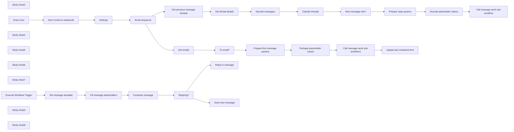

## Fluxo (.json) :

```json
{
  "meta": {
    "instanceId": "cb484ba7b742928a2048bf8829668bed5b5ad9787579adea888f05980292a4a7"
  },
  "nodes": [
    {
      "id": "8565747a-4108-4467-98e4-f57d441f66af",
      "name": "Update last contacted time",
      "type": "n8n-nodes-base.googleSheets",
      "position": [
        2380,
        140
      ],
      "parameters": {
        "columns": {
          "value": {
            "row_number": "={{ $('To email?').item.json.row_number }}",
            "first_emailed": "={{ $now.format('yyyy-MM-dd') }}"
          },
          "schema": [
            {
              "id": "email",
              "type": "string",
              "display": true,
              "removed": true,
              "required": false,
              "displayName": "email",
              "defaultMatch": false,
              "canBeUsedToMatch": true
            },
            {
              "id": "first_emailed",
              "type": "string",
              "display": true,
              "removed": false,
              "required": false,
              "displayName": "first_emailed",
              "defaultMatch": false,
              "canBeUsedToMatch": true
            },
            {
              "id": "name",
              "type": "string",
              "display": true,
              "removed": true,
              "required": false,
              "displayName": "name",
              "defaultMatch": false,
              "canBeUsedToMatch": true
            },
            {
              "id": "company",
              "type": "string",
              "display": true,
              "removed": true,
              "required": false,
              "displayName": "company",
              "defaultMatch": false,
              "canBeUsedToMatch": true
            },
            {
              "id": "row_number",
              "type": "string",
              "display": true,
              "removed": false,
              "readOnly": true,
              "required": false,
              "displayName": "row_number",
              "defaultMatch": false,
              "canBeUsedToMatch": true
            }
          ],
          "mappingMode": "defineBelow",
          "matchingColumns": [
            "row_number"
          ]
        },
        "options": {},
        "operation": "update",
        "sheetName": {
          "__rl": true,
          "mode": "url",
          "value": "={{ $('Settings').item.json.sheet_url }}"
        },
        "documentId": {
          "__rl": true,
          "mode": "url",
          "value": "={{ $('Settings').item.json.sheet_url }}"
        }
      },
      "credentials": {
        "googleSheetsOAuth2Api": {
          "id": "196",
          "name": "Google Sheets account (David)"
        }
      },
      "typeVersion": 4.2
    },
    {
      "id": "5f079ac7-1bef-4bb8-8efe-1f3803357fb1",
      "name": "Set message template",
      "type": "n8n-nodes-base.set",
      "disabled": true,
      "position": [
        1500,
        1120
      ],
      "parameters": {
        "fields": {
          "values": [
            {
              "name": "message_template",
              "stringValue": "={{ $('Email sequence').first().json.emails[0].message }}"
            },
            {
              "name": "email",
              "stringValue": "david@thedavid.co.uk"
            },
            {
              "name": "name",
              "stringValue": "Daffyd"
            },
            {
              "name": "company",
              "stringValue": "Davey Enterprises"
            },
            {
              "name": "subject",
              "stringValue": "={{ $('Settings').item.json.subject }}"
            },
            {
              "name": "sender_name",
              "stringValue": "={{ $('Settings').item.json.sender_name }}"
            },
            {
              "name": "mail_id",
              "stringValue": "={{ $('Settings').item.json.mail_id }}"
            },
            {
              "name": "mail_seq",
              "stringValue": "0"
            }
          ]
        },
        "include": "none",
        "options": {}
      },
      "typeVersion": 3.2
    },
    {
      "id": "7ff4eabc-f49a-4adc-9a4b-750585b72070",
      "name": "Email sequence",
      "type": "n8n-nodes-base.set",
      "position": [
        1000,
        140
      ],
      "parameters": {
        "mode": "raw",
        "options": {},
        "jsonOutput": "{\n  \"emails\": [\n    {\n      \"message\": \"Hi {name}, hope you're well!<br />\\n<br />\\nYou're doing some great things at {company}, and I wanted to touch base to see if you wanted to chat.<br />\\n<br />\\nWould it make sense to jump on a quick call?<br />\\n<br />\\nRegards,<br />\\n<br />\\nNathan<br />\\n\",\n      \"send_on_day\": 0\n    },\n    {\n      \"message\": \"Hi {name},<br />\\n<br />\\nJust wanted to follow up on this, since it would be great to talk.<br />\\n<br />\\nRegards,<br />\\n<br />\\nNathan<br />\\n\",\n      \"send_on_day\": 3\n    },\n    {\n      \"message\": \"Just thought I'd give this one last try :)<br />\\n<br />\\nNathan\\n\",\n      \"send_on_day\": 8\n    }\n  ]\n}\n"
      },
      "typeVersion": 3.2
    },
    {
      "id": "7b038199-cf02-4536-a351-b86d51b0d367",
      "name": "Fill message placeholders",
      "type": "n8n-nodes-base.code",
      "position": [
        1720,
        1120
      ],
      "parameters": {
        "mode": "runOnceForEachItem",
        "jsCode": "function extractPlaceholders(str) {\n    // Regular expression to match placeholders\n    // It matches any alphanumeric character including dashes and underscores between {}\n    const regex = /\\{([a-zA-Z0-9_-]+)\\}/g;\n    \n    // Set to store unique placeholders\n    const uniquePlaceholders = new Set();\n\n    // Extract and store unique placeholders\n    let match;\n    while ((match = regex.exec(str)) !== null) {\n        uniquePlaceholders.add(match[1]);\n    }\n\n    // Convert the Set to an array and return\n    return Array.from(uniquePlaceholders);\n}\n\nlet placeholders = Object.keys(item.json.placeholders)\nconsole.log(placeholders)\n\n// Substitute all the placeholders in the message\n  item.json.message = item.json.message_template\n  for (let key of extractPlaceholders(item.json.message_template)) {\n    if(!placeholders.includes(key)) throw new Error(`Missing data for placeholder '{${key}}'`)\n    const regex = new RegExp(`\\\\{${key}\\\\}`, 'g'); // Create a regex to match the exact word surrounded by {}\n    item.json.message = item.json.message.replaceAll(regex, item.json.placeholders[key]);\n  }\n\nreturn item"
      },
      "typeVersion": 2
    },
    {
      "id": "42fe4448-1a44-47aa-a04b-927d441b265a",
      "name": "Compose message",
      "type": "n8n-nodes-base.set",
      "position": [
        1940,
        1120
      ],
      "parameters": {
        "fields": {
          "values": [
            {
              "name": "message",
              "stringValue": "=<span data-cam='{{ $json.mail_id }}' data-seq='{{ $json.mail_seq }}' data-ph='{{ JSON.stringify($json.placeholders) }}'></span>{{ $json.message }}"
            }
          ]
        },
        "options": {}
      },
      "typeVersion": 3.2
    },
    {
      "id": "bccf2e89-852e-49b4-ad98-194008c47760",
      "name": "Get previous message threads",
      "type": "n8n-nodes-base.gmail",
      "position": [
        1280,
        620
      ],
      "parameters": {
        "filters": {
          "q": "=subject:{{ $json.subject }} after:{{ $now.minus({'days': $json.emails.last().send_on_day+1}).toSQL().substr(0, 10) }}"
        },
        "resource": "thread",
        "returnAll": true
      },
      "credentials": {
        "gmailOAuth2": {
          "id": "198",
          "name": "Gmail account (David)"
        }
      },
      "typeVersion": 2.1
    },
    {
      "id": "3ce6c45f-a257-4270-a84d-6a19ec35b2eb",
      "name": "Get thread details",
      "type": "n8n-nodes-base.gmail",
      "position": [
        1500,
        620
      ],
      "parameters": {
        "simple": false,
        "options": {},
        "resource": "thread",
        "threadId": "={{ $json.id }}",
        "operation": "get"
      },
      "credentials": {
        "gmailOAuth2": {
          "id": "198",
          "name": "Gmail account (David)"
        }
      },
      "typeVersion": 2
    },
    {
      "id": "9224bb16-fbc2-45b5-a2cb-f63cb440f46f",
      "name": "Classify threads",
      "type": "n8n-nodes-base.code",
      "position": [
        1940,
        620
      ],
      "parameters": {
        "jsCode": "// Because emails are sent slightly after the schedule trigger runs, we'll end up waiting an extra day to send unless we take into account the execution time of the workflow\nlet buffer_mins = 20\n\nlet templates = $('Email sequence').first().json.emails\n\nfunction next_sequence_number(messages, mail_id, sender_name) {\n  for (let i = 0; i < messages.length; i++) {\n    if(!('html' in messages[i])) return -1;\n    let in_campaign = messages[i].html.includes(\"data-cam='\"+mail_id+\"'\")\n    let valid_seq = messages[i].html.includes(\"data-seq='\"+i+\"'\")\n    let from_us = messages[i].From.includes(sender_name)\n    console.log(in_campaign + \", \" + valid_seq + \", \" + from_us)\n    if(!(from_us && in_campaign && valid_seq)) {\n      return -1;\n    }\n  }\n  return messages.length;\n}\n\n\nfor (const item of $input.all()) {\n  item.json.first_message_at = DateTime.fromMillis($('Get thread details').item.json.messages[0].internalDate*1)\n  item.json.days_since_first_message = DateTime.now().diff(item.json.first_message_at, 'days').days\n  item.json.next_sequence_number = next_sequence_number(\n    item.json.messages,\n    $('Settings').first().json.mail_id,\n    $('Settings').first().json.sender_name\n  );\n  item.json.next_message_due = (\n    item.json.next_sequence_number > 0\n    && item.json.next_sequence_number < templates.length\n    && templates[item.json.next_sequence_number].send_on_day <= item.json.days_since_first_message + (buffer_mins/60/24)\n  )\n\n  // Retrieve the placeholder values from the snippet, for use in future messages\n  const ph_matches = item.json.messages[0].snippet.match(/data-ph='([^']*)'/)\n  if(ph_matches?.length > 1) {\n    const placeholders = JSON.parse(ph_matches[1])\n    for(key of placeholders.keys()) {\n      item.json[key] = placeholders[key]\n    }\n  }\n\n}\n\nreturn $input.all();"
      },
      "typeVersion": 2
    },
    {
      "id": "776cb743-339d-49f6-af3c-9ae2b464d01a",
      "name": "Next message due?",
      "type": "n8n-nodes-base.filter",
      "position": [
        2160,
        620
      ],
      "parameters": {
        "options": {},
        "conditions": {
          "options": {
            "leftValue": "",
            "caseSensitive": true,
            "typeValidation": "strict"
          },
          "combinator": "and",
          "conditions": [
            {
              "id": "00cf6401-f45a-4496-803c-70a5b2d7daf5",
              "operator": {
                "type": "boolean",
                "operation": "true",
                "singleValue": true
              },
              "leftValue": "={{ $json.next_message_due }}",
              "rightValue": ""
            }
          ]
        }
      },
      "typeVersion": 2
    },
    {
      "id": "2ecf68b5-f5bf-4961-a849-7c0d29940387",
      "name": "Sticky Note2",
      "type": "n8n-nodes-base.stickyNote",
      "position": [
        1906,
        427
      ],
      "parameters": {
        "color": 7,
        "width": 181.66573318934627,
        "height": 344.96230939963334,
        "content": "Follow-up is due if:\n- All the messages in the thread are automated (no-one has replied yet)\n- Enough time has passed for the next message to be sent"
      },
      "typeVersion": 1
    },
    {
      "id": "a3a78abb-0691-4152-a349-658b8286df2f",
      "name": "Execute Workflow Trigger",
      "type": "n8n-nodes-base.executeWorkflowTrigger",
      "position": [
        1280,
        1120
      ],
      "parameters": {},
      "typeVersion": 1
    },
    {
      "id": "a62bff23-2742-4a5e-8896-e1a3be5915fd",
      "name": "Replying?",
      "type": "n8n-nodes-base.if",
      "position": [
        2160,
        1120
      ],
      "parameters": {
        "options": {},
        "conditions": {
          "options": {
            "leftValue": "",
            "caseSensitive": true,
            "typeValidation": "strict"
          },
          "combinator": "and",
          "conditions": [
            {
              "id": "dc8ec88f-daef-46be-b3da-1407d5e1c0b1",
              "operator": {
                "type": "string",
                "operation": "exists",
                "singleValue": true
              },
              "leftValue": "={{ $json.reply_message_id }}",
              "rightValue": ""
            }
          ]
        }
      },
      "typeVersion": 2
    },
    {
      "id": "76d25df2-4472-40a6-80c6-f2e3dc8702a3",
      "name": "Send new message",
      "type": "n8n-nodes-base.gmail",
      "position": [
        2380,
        1240
      ],
      "parameters": {
        "sendTo": "={{ $json.to_email }}",
        "message": "={{ $json.message }}",
        "options": {
          "senderName": "={{ $json.sender_name }}",
          "appendAttribution": false
        },
        "subject": "={{ $json.subject }}"
      },
      "credentials": {
        "gmailOAuth2": {
          "id": "198",
          "name": "Gmail account (David)"
        }
      },
      "typeVersion": 2.1
    },
    {
      "id": "ceefaf78-28b8-4711-b50e-b5487862dba6",
      "name": "Call message send sub-workflow",
      "type": "n8n-nodes-base.executeWorkflow",
      "position": [
        2820,
        620
      ],
      "parameters": {
        "options": {},
        "workflowId": "={{ $workflow.id }}"
      },
      "typeVersion": 1
    },
    {
      "id": "809e9df8-881a-4b32-a3c0-e55c669bd8d1",
      "name": "Prepare reply params",
      "type": "n8n-nodes-base.set",
      "position": [
        2380,
        620
      ],
      "parameters": {
        "fields": {
          "values": [
            {
              "name": "message_template",
              "stringValue": "={{ $('Email sequence').first().json.emails[$json.next_sequence_number].message }}"
            },
            {
              "name": "reply_message_id",
              "stringValue": "={{ $json.messages.last().id }}"
            },
            {
              "name": "sender_name",
              "stringValue": "={{ $('Settings').item.json.sender_name }}"
            },
            {
              "name": "mail_id",
              "stringValue": "={{ $('Settings').item.json.mail_id }}"
            },
            {
              "name": "mail_seq",
              "stringValue": "={{ $json.next_sequence_number }}"
            },
            {
              "name": "to",
              "stringValue": "={{ $json.messages[0].To }}"
            }
          ]
        },
        "include": "none",
        "options": {}
      },
      "typeVersion": 3.2
    },
    {
      "id": "cdda96f1-e0a2-4ce8-bc78-da8e80f7029f",
      "name": "Prepare first message params",
      "type": "n8n-nodes-base.set",
      "position": [
        1720,
        140
      ],
      "parameters": {
        "fields": {
          "values": [
            {
              "name": "message_template",
              "stringValue": "={{ $('Email sequence').first().json.emails[0].message }}"
            },
            {
              "name": "to_email",
              "stringValue": "={{ $('Get emails').item.json[$('Settings').item.json.email_column_name] }}"
            },
            {
              "name": "subject",
              "stringValue": "={{ $('Settings').item.json.subject }}"
            },
            {
              "name": "sender_name",
              "stringValue": "={{ $('Settings').item.json.sender_name }}"
            },
            {
              "name": "mail_id",
              "stringValue": "={{ $('Settings').item.json.mail_id }}"
            },
            {
              "name": "mail_seq",
              "stringValue": "0"
            }
          ]
        },
        "options": {}
      },
      "typeVersion": 3.2
    },
    {
      "id": "c2d9869e-0608-472a-a124-26e9e6f1820a",
      "name": "Sticky Note4",
      "type": "n8n-nodes-base.stickyNote",
      "position": [
        1240,
        -100
      ],
      "parameters": {
        "color": 7,
        "width": 181.66573318934627,
        "height": 410.4105111871959,
        "content": "Columns the sheet needs\n- email\n- first_emailed (leave blank - will be filled in automatically)\n- Other columns matching placeholders in email sequence"
      },
      "typeVersion": 1
    },
    {
      "id": "26bc2c58-fea5-4ee0-b9ea-264ad00e8d32",
      "name": "Call message send sub-workflow1",
      "type": "n8n-nodes-base.executeWorkflow",
      "position": [
        2160,
        140
      ],
      "parameters": {
        "mode": "each",
        "options": {},
        "workflowId": "={{ $workflow.id }}"
      },
      "typeVersion": 1
    },
    {
      "id": "e7e7d9bd-79c6-4534-b88d-b54cc695c7bf",
      "name": "To email?",
      "type": "n8n-nodes-base.filter",
      "position": [
        1500,
        140
      ],
      "parameters": {
        "options": {},
        "conditions": {
          "options": {
            "leftValue": "",
            "caseSensitive": true,
            "typeValidation": "strict"
          },
          "combinator": "and",
          "conditions": [
            {
              "id": "eeec5901-5ff0-47b1-926b-e93097d64434",
              "operator": {
                "type": "boolean",
                "operation": "true",
                "singleValue": true
              },
              "leftValue": "={{ $json.first_emailed.isEmpty() }}",
              "rightValue": ""
            }
          ]
        }
      },
      "typeVersion": 2
    },
    {
      "id": "db4b6481-5fdb-4bc3-a10f-b6ccfb5b0bf0",
      "name": "Decode messages",
      "type": "n8n-nodes-base.code",
      "position": [
        1720,
        620
      ],
      "parameters": {
        "jsCode": "// TODO: Some messages have an empty payload and a parts field instead (containing an array)\n\nfor (const item of $input.all()) {\n  for (const message of item.json.messages) {\n    console.log('message', message.payload.body.data || \"\")\n    let buffer = Buffer.from(message.payload.body.data || \"\", \"base64\");\n    message.html = buffer.toString(\"utf8\")\n  }\n}\n\nreturn $input.all();"
      },
      "typeVersion": 2
    },
    {
      "id": "fc4868f0-845d-4f76-a566-b0db3d2676f8",
      "name": "Decode placeholder values",
      "type": "n8n-nodes-base.code",
      "position": [
        2600,
        620
      ],
      "parameters": {
        "mode": "runOnceForEachItem",
        "jsCode": "const html = $('Decode messages').item.json.messages[0].html\nconst matches = html.match(/data-ph='([^']*)'/)\nlet placeholders = {}\nif(matches?.length > 0) {\n  ph = JSON.parse(matches[1])\n  for(k of Object.keys(ph)) {\n    placeholders[k] = ph[k]\n  }\n}\nitem.json.placeholders = placeholders\n\nreturn item;"
      },
      "typeVersion": 2
    },
    {
      "id": "5af9b08e-6c5d-4701-a44a-794e96216948",
      "name": "Package placeholder values",
      "type": "n8n-nodes-base.code",
      "position": [
        1940,
        140
      ],
      "parameters": {
        "mode": "runOnceForEachItem",
        "jsCode": "function extractPlaceholders(str) {\n    // Regular expression to match placeholders\n    // It matches any alphanumeric character including dashes and underscores between {}\n    const regex = /\\{([a-zA-Z0-9_-]+)\\}/g;\n    \n    // Set to store unique placeholders\n    const uniquePlaceholders = new Set();\n\n    // Extract and store unique placeholders\n    let match;\n    while ((match = regex.exec(str)) !== null) {\n        uniquePlaceholders.add(match[1]);\n    }\n\n    // Convert the Set to an array and return\n    return Array.from(uniquePlaceholders);\n}\n\n\n// Gather all the placeholder values for passing on\nconst all_ph_raw = $('Email sequence').first().json.emails.flatMap(e => extractPlaceholders(e.message))\nconst all_ph = [...new Set(all_ph_raw)];\nlet placeholders = {}\nfor(ph of all_ph) {\n  if($('Get emails').item.json[ph] == undefined) throw new Error(`Message placeholder '{${ph}}' requires a column called '${ph}' in the Google Sheet`)\n  placeholders[ph] = $('Get emails').item.json[ph]\n}\n\nitem.json.placeholders = placeholders\n\nreturn item;"
      },
      "typeVersion": 2
    },
    {
      "id": "e655a9c2-617b-4119-9582-45f1db2cc6d2",
      "name": "Settings",
      "type": "n8n-nodes-base.set",
      "position": [
        780,
        140
      ],
      "parameters": {
        "options": {},
        "assignments": {
          "assignments": [
            {
              "id": "5e327a1d-3f2e-40f1-aaa1-9ce888349eb0",
              "name": "sheet_url",
              "type": "string",
              "value": "https://docs.google.com/spreadsheets/d/12dsbRpvtVFDdPmyZ7-39vuHuFpM1eMyfOqGGGdsnrtc/edit#gid=0"
            },
            {
              "id": "3255270a-3ac2-4c59-8215-ea79256b55cc",
              "name": "subject",
              "type": "string",
              "value": "My amazing campaign"
            },
            {
              "id": "76b40b74-acef-49f1-a0e2-0be9a461319a",
              "name": "sender_name",
              "type": "string",
              "value": "Nathan Automat"
            },
            {
              "id": "4532eb84-5ebc-4011-8c65-d97aeae21256",
              "name": "email_column_name",
              "type": "string",
              "value": "email"
            },
            {
              "id": "83de0ceb-39ec-426a-afba-13d66bce101d",
              "name": "mail_id",
              "type": "string",
              "value": "123456"
            }
          ]
        }
      },
      "typeVersion": 3.3
    },
    {
      "id": "a8975f91-6413-448b-bc3f-1084959b8b31",
      "name": "Reply to message",
      "type": "n8n-nodes-base.gmail",
      "position": [
        2380,
        1020
      ],
      "parameters": {
        "message": "={{ $json.message }}",
        "options": {
          "senderName": "David Roberts"
        },
        "messageId": "={{ $json.reply_message_id }}",
        "operation": "reply"
      },
      "credentials": {
        "gmailOAuth2": {
          "id": "198",
          "name": "Gmail account (David)"
        }
      },
      "typeVersion": 2
    },
    {
      "id": "d453661e-25f7-471c-90dc-633270f14396",
      "name": "Get emails",
      "type": "n8n-nodes-base.googleSheets",
      "position": [
        1280,
        140
      ],
      "parameters": {
        "options": {},
        "sheetName": {
          "__rl": true,
          "mode": "url",
          "value": "={{ $('Settings').item.json.sheet_url }}"
        },
        "documentId": {
          "__rl": true,
          "mode": "url",
          "value": "={{ $('Settings').item.json.sheet_url }}"
        }
      },
      "credentials": {
        "googleSheetsOAuth2Api": {
          "id": "196",
          "name": "Google Sheets account (David)"
        }
      },
      "typeVersion": 4.2
    },
    {
      "id": "7a838728-38e1-45f9-8bac-19c6ad005a38",
      "name": "Sticky Note5",
      "type": "n8n-nodes-base.stickyNote",
      "position": [
        1220,
        -180
      ],
      "parameters": {
        "color": 7,
        "width": 1790.5345476157208,
        "height": 515.1374038700677,
        "content": "## Send initial emails"
      },
      "typeVersion": 1
    },
    {
      "id": "5d8823c1-00a7-43a2-963d-90e971167ef8",
      "name": "Sticky Note6",
      "type": "n8n-nodes-base.stickyNote",
      "position": [
        1220,
        360
      ],
      "parameters": {
        "color": 7,
        "width": 1797.4980261229769,
        "height": 515.1374038700677,
        "content": "## Send follow-up emails if appropriate"
      },
      "typeVersion": 1
    },
    {
      "id": "fd2bb0b2-a313-45ed-ad58-935d803237e5",
      "name": "Sticky Note7",
      "type": "n8n-nodes-base.stickyNote",
      "position": [
        1220,
        920
      ],
      "parameters": {
        "color": 7,
        "width": 1797.4980261229769,
        "height": 515.1374038700677,
        "content": "## Sub-workflow for sending the emails\nThis is called by the sections above - you shouldn't need to touch it"
      },
      "typeVersion": 1
    },
    {
      "id": "be4a4bbb-1e10-4c9e-afb9-cc4a46a78113",
      "name": "Every hour",
      "type": "n8n-nodes-base.scheduleTrigger",
      "position": [
        320,
        140
      ],
      "parameters": {
        "rule": {
          "interval": [
            {
              "field": "hours",
              "triggerAtMinute": 12
            }
          ]
        }
      },
      "typeVersion": 1.1
    },
    {
      "id": "be582e38-6da2-4c64-8804-981936f71d88",
      "name": "Sticky Note3",
      "type": "n8n-nodes-base.stickyNote",
      "position": [
        2120,
        958
      ],
      "parameters": {
        "color": 7,
        "width": 181.66573318934627,
        "height": 306.5470605243249,
        "content": "If reply_message_id is set, will reply to that message.\n\nOtherwise, will send a new message to the user in the 'email' field"
      },
      "typeVersion": 1
    },
    {
      "id": "88e9ff03-62f0-4dcf-9e28-62c95386df66",
      "name": "Don't email on weekends",
      "type": "n8n-nodes-base.filter",
      "position": [
        540,
        140
      ],
      "parameters": {
        "options": {},
        "conditions": {
          "options": {
            "leftValue": "",
            "caseSensitive": true,
            "typeValidation": "strict"
          },
          "combinator": "and",
          "conditions": [
            {
              "id": "195ce0cf-9d25-4e02-9f20-aa6edbc2d561",
              "operator": {
                "type": "boolean",
                "operation": "false",
                "singleValue": true
              },
              "leftValue": "={{ $now.isWeekend() }}",
              "rightValue": ""
            }
          ]
        }
      },
      "typeVersion": 2
    },
    {
      "id": "7a5822f3-b2ea-42d7-8034-21a92e283112",
      "name": "Sticky Note8",
      "type": "n8n-nodes-base.stickyNote",
      "position": [
        740,
        -120
      ],
      "parameters": {
        "width": 404.04123613412946,
        "height": 418.96364526464185,
        "content": "# Try me out\n1. Clone [this Google worksheet](https://docs.google.com/spreadsheets/d/12dsbRpvtVFDdPmyZ7-39vuHuFpM1eMyfOqGGGdsnrtc/edit#gid=0) and update the 'Settings' node with its URL (plus change any other settings there you need to)\n2. Adjust the sequence of emails you want to send in the 'Email Sequence' node\n\nMake sure you set how many days after the previous email to wait before sending, and note that the emails are in HTML format."
      },
      "typeVersion": 1
    }
  ],
  "pinData": {},
  "connections": {
    "Settings": {
      "main": [
        [
          {
            "node": "Email sequence",
            "type": "main",
            "index": 0
          }
        ]
      ]
    },
    "Replying?": {
      "main": [
        [
          {
            "node": "Reply to message",
            "type": "main",
            "index": 0
          }
        ],
        [
          {
            "node": "Send new message",
            "type": "main",
            "index": 0
          }
        ]
      ]
    },
    "To email?": {
      "main": [
        [
          {
            "node": "Prepare first message params",
            "type": "main",
            "index": 0
          }
        ]
      ]
    },
    "Every hour": {
      "main": [
        [
          {
            "node": "Don't email on weekends",
            "type": "main",
            "index": 0
          }
        ]
      ]
    },
    "Get emails": {
      "main": [
        [
          {
            "node": "To email?",
            "type": "main",
            "index": 0
          }
        ]
      ]
    },
    "Email sequence": {
      "main": [
        [
          {
            "node": "Get previous message threads",
            "type": "main",
            "index": 0
          },
          {
            "node": "Get emails",
            "type": "main",
            "index": 0
          }
        ]
      ]
    },
    "Compose message": {
      "main": [
        [
          {
            "node": "Replying?",
            "type": "main",
            "index": 0
          }
        ]
      ]
    },
    "Decode messages": {
      "main": [
        [
          {
            "node": "Classify threads",
            "type": "main",
            "index": 0
          }
        ]
      ]
    },
    "Classify threads": {
      "main": [
        [
          {
            "node": "Next message due?",
            "type": "main",
            "index": 0
          }
        ]
      ]
    },
    "Next message due?": {
      "main": [
        [
          {
            "node": "Prepare reply params",
            "type": "main",
            "index": 0
          }
        ]
      ]
    },
    "Get thread details": {
      "main": [
        [
          {
            "node": "Decode messages",
            "type": "main",
            "index": 0
          }
        ]
      ]
    },
    "Prepare reply params": {
      "main": [
        [
          {
            "node": "Decode placeholder values",
            "type": "main",
            "index": 0
          }
        ]
      ]
    },
    "Set message template": {
      "main": [
        [
          {
            "node": "Fill message placeholders",
            "type": "main",
            "index": 0
          }
        ]
      ]
    },
    "Don't email on weekends": {
      "main": [
        [
          {
            "node": "Settings",
            "type": "main",
            "index": 0
          }
        ]
      ]
    },
    "Execute Workflow Trigger": {
      "main": [
        [
          {
            "node": "Set message template",
            "type": "main",
            "index": 0
          }
        ]
      ]
    },
    "Decode placeholder values": {
      "main": [
        [
          {
            "node": "Call message send sub-workflow",
            "type": "main",
            "index": 0
          }
        ]
      ]
    },
    "Fill message placeholders": {
      "main": [
        [
          {
            "node": "Compose message",
            "type": "main",
            "index": 0
          }
        ]
      ]
    },
    "Package placeholder values": {
      "main": [
        [
          {
            "node": "Call message send sub-workflow1",
            "type": "main",
            "index": 0
          }
        ]
      ]
    },
    "Get previous message threads": {
      "main": [
        [
          {
            "node": "Get thread details",
            "type": "main",
            "index": 0
          }
        ]
      ]
    },
    "Prepare first message params": {
      "main": [
        [
          {
            "node": "Package placeholder values",
            "type": "main",
            "index": 0
          }
        ]
      ]
    },
    "Call message send sub-workflow1": {
      "main": [
        [
          {
            "node": "Update last contacted time",
            "type": "main",
            "index": 0
          }
        ]
      ]
    }
  }
}
```

<a id="template-934"></a>

## Template 934 - Relatório AI de threads #damus para Gmail e Telegram

- **Nome:** Relatório AI de threads #damus para Gmail e Telegram
- **Descrição:** Coleta threads do Nostr com a hashtag #damus, analisa-os com modelos de linguagem para extrair temas e gerar um relatório detalhado, e entrega os resultados por e-mail e Telegram.
- **Funcionalidade:** • Agendamento de leitura: executa buscas periódicas por threads com a hashtag #damus.
• Disparo manual de teste: permite iniciar a coleta e processamento manualmente para validação.
• Coleta de threads: obtém posts do Nostr filtrando pela hashtag #damus.
• Agregação de conteúdo: consolida múltiplos conteúdos em um único conjunto para análise.
• Extração de temas: usa um modelo de linguagem para identificar e listar temas recorrentes nas threads.
• Análise aprofundada: gera um relatório detalhado com tema geral, tópicos comuns, trechos exemplares, insights e sugestões.
• Conversão para HTML: transforma o resultado em HTML para formatação do relatório.
• Envio por e-mail: envia o conteúdo formatado por Gmail para destinatários configurados.
• Publicação em Telegram: publica os temas e o relatório em um chat do Telegram.
• Mesclagem de dados: combina a lista de temas com o conteúdo agregado para produzir o relatório final.
- **Ferramentas:** • Nostr: rede social descentralizada usada como fonte de threads.
• Damus: cliente/aplicativo Nostr foco das discussões analisadas.
• Google Gemini (PaLM): modelo de linguagem usado para extrair temas e gerar análises.
• Gmail: serviço de e-mail utilizado para enviar resultados aos destinatários.
• Telegram: plataforma de mensagens usada para publicar os temas e o relatório em um chat.

## Fluxo visual

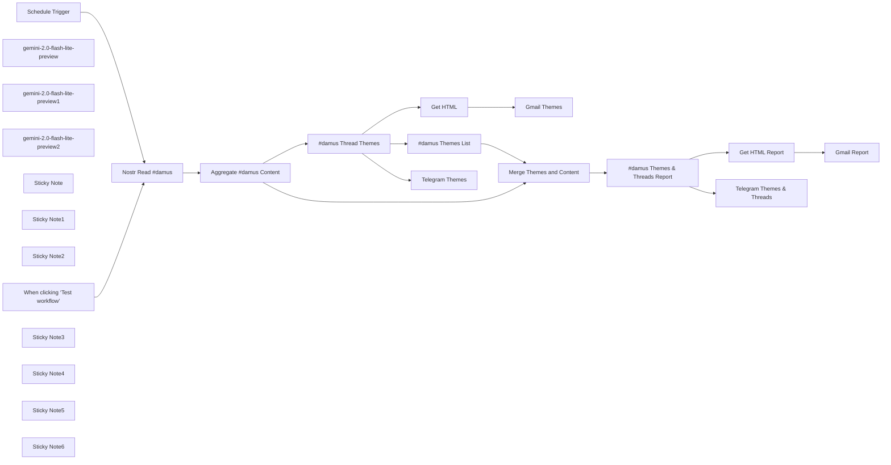

## Fluxo (.json) :

```json
{
  "id": "02GdRzvsuHmSSgBw",
  "meta": {
    "instanceId": "31e69f7f4a77bf465b805824e303232f0227212ae922d12133a0f96ffeab4fef",
    "templateCredsSetupCompleted": true
  },
  "name": "#️⃣Nostr #damus AI Powered Reporting + Gmail + Telegram",
  "tags": [],
  "nodes": [
    {
      "id": "e9c4c7bf-0cce-456e-9b95-726669e4b260",
      "name": "When clicking ‘Test workflow’",
      "type": "n8n-nodes-base.manualTrigger",
      "position": [
        -500,
        -60
      ],
      "parameters": {},
      "typeVersion": 1
    },
    {
      "id": "b8f57e15-8a6e-4a29-a6e8-745bebbd1f44",
      "name": "Get HTML",
      "type": "n8n-nodes-base.markdown",
      "position": [
        880,
        -840
      ],
      "parameters": {
        "mode": "markdownToHtml",
        "options": {},
        "markdown": "={{ $json.text }}"
      },
      "typeVersion": 1
    },
    {
      "id": "8b212119-9b69-449c-8a3b-4fdc5b085f30",
      "name": "Gmail Themes",
      "type": "n8n-nodes-base.gmail",
      "position": [
        1080,
        -840
      ],
      "webhookId": "e07f9378-bfa5-48ac-88fd-0ef88a725ede",
      "parameters": {
        "sendTo": "joe@example.com",
        "message": "={{ $json.data }}",
        "options": {
          "appendAttribution": false
        },
        "subject": "#damus"
      },
      "credentials": {
        "gmailOAuth2": {
          "id": "1xpVDEQ1yx8gV022",
          "name": "Gmail account"
        }
      },
      "typeVersion": 2.1
    },
    {
      "id": "b7fc214b-72cb-4caf-8563-7b2f13a1110d",
      "name": "Get HTML Report",
      "type": "n8n-nodes-base.markdown",
      "position": [
        880,
        80
      ],
      "parameters": {
        "mode": "markdownToHtml",
        "options": {},
        "markdown": "={{ $json.text }}"
      },
      "typeVersion": 1
    },
    {
      "id": "dd7580bc-f97c-4ad1-8556-2329f88bea75",
      "name": "#damus Themes List",
      "type": "@n8n/n8n-nodes-langchain.chainLlm",
      "position": [
        500,
        -400
      ],
      "parameters": {
        "text": "=Extract a list of themes from this: {{ $json.text }}\n\nDo not include any preamble or further explanation.",
        "promptType": "define"
      },
      "typeVersion": 1.5
    },
    {
      "id": "60a9d8fe-4ba0-4450-8073-4108b832981e",
      "name": "#damus Thread Themes",
      "type": "@n8n/n8n-nodes-langchain.chainLlm",
      "position": [
        500,
        -840
      ],
      "parameters": {
        "text": "=Tell me the theme and highlight some common threads associated with these Nostr threads that are all #damus.  Specifically mention the main reason #damus is hashtagged.  These are the threads: {{ $json.content.toJsonString() }}",
        "promptType": "define"
      },
      "typeVersion": 1.5
    },
    {
      "id": "72ab08a7-f729-46e3-8a4d-56005cabaf17",
      "name": "#damus Themes & Threads Report",
      "type": "@n8n/n8n-nodes-langchain.chainLlm",
      "position": [
        500,
        80
      ],
      "parameters": {
        "text": "=**Task:** Analyze the attached file containing Nostr threads using the hashtag #damus. Provide a detailed report with examples thread based on the following themes.  Got deep and seek out the underlying motivation of the users who posted the threads: \n\n## Themes\n{{ $json.text }}\n\n1. **Overall Theme:** Summarize the central topic(s) discussed across the threads.\n2. **Common Threads:** Identify recurring topics or ideas that unify the posts.\n3. **Key Highlights:** Extract specific examples or quotes that illustrate prominent themes.\n4. **Insights and Observations:** Offer insights on how the #damus community engages with the app and its ecosystem.\n5. **Suggestions for Improvement:** If applicable, suggest ways to enhance user experience or community engagement based on the analysis.\n\n**Requirements:**\n- Expand on each theme with comprehensive details and analysis.\n- Use bullet points or numbered lists for clarity.\n- Include relevant quotes or examples from the text to support your analysis.\n- Ensure your response is detailed, well-structured, and easy to read.\n\n**Context:** The analysis should focus on understanding how users interact with Damus, their appreciation for its features, challenges they face, and how it fits into the broader Nostr ecosystem.\n\n## Nostr thread with hashtag #damus: \n{{ $json.content.toJsonString() }}\n\n",
        "promptType": "define"
      },
      "typeVersion": 1.5
    },
    {
      "id": "55362e03-ca0b-4f5e-a7ff-02828522fc7d",
      "name": "gemini-2.0-flash-lite-preview",
      "type": "@n8n/n8n-nodes-langchain.lmChatGoogleGemini",
      "position": [
        600,
        -680
      ],
      "parameters": {
        "options": {
          "temperature": 0.4
        },
        "modelName": "=models/gemini-2.0-flash-lite-preview"
      },
      "credentials": {
        "googlePalmApi": {
          "id": "L9UNQHflYlyF9Ngd",
          "name": "Google Gemini(PaLM) Api account"
        }
      },
      "typeVersion": 1
    },
    {
      "id": "7f457b3f-d39b-4062-ada0-5e81f3768857",
      "name": "gemini-2.0-flash-lite-preview1",
      "type": "@n8n/n8n-nodes-langchain.lmChatGoogleGemini",
      "position": [
        600,
        -240
      ],
      "parameters": {
        "options": {
          "temperature": 0.4
        },
        "modelName": "models/gemini-2.0-flash-lite-preview"
      },
      "credentials": {
        "googlePalmApi": {
          "id": "L9UNQHflYlyF9Ngd",
          "name": "Google Gemini(PaLM) Api account"
        }
      },
      "typeVersion": 1
    },
    {
      "id": "bd68e36a-2fa7-4b78-96d8-9c4f97388249",
      "name": "gemini-2.0-flash-lite-preview2",
      "type": "@n8n/n8n-nodes-langchain.lmChatGoogleGemini",
      "position": [
        600,
        240
      ],
      "parameters": {
        "options": {
          "temperature": 0.4
        },
        "modelName": "models/gemini-2.0-flash-lite-preview"
      },
      "credentials": {
        "googlePalmApi": {
          "id": "L9UNQHflYlyF9Ngd",
          "name": "Google Gemini(PaLM) Api account"
        }
      },
      "typeVersion": 1
    },
    {
      "id": "24f378ca-8a10-441f-886d-136314fa30de",
      "name": "Gmail Report",
      "type": "n8n-nodes-base.gmail",
      "position": [
        1080,
        80
      ],
      "webhookId": "e07f9378-bfa5-48ac-88fd-0ef88a725ede",
      "parameters": {
        "sendTo": "joe@example.com",
        "message": "={{ $json.data }}",
        "options": {
          "appendAttribution": false
        },
        "subject": "#damus"
      },
      "credentials": {
        "gmailOAuth2": {
          "id": "1xpVDEQ1yx8gV022",
          "name": "Gmail account"
        }
      },
      "typeVersion": 2.1
    },
    {
      "id": "f4814872-577a-4243-ac1b-e152e147dca0",
      "name": "Aggregate #damus Content",
      "type": "n8n-nodes-base.aggregate",
      "position": [
        120,
        -140
      ],
      "parameters": {
        "options": {},
        "fieldsToAggregate": {
          "fieldToAggregate": [
            {
              "fieldToAggregate": "content"
            }
          ]
        }
      },
      "typeVersion": 1
    },
    {
      "id": "d2079c9e-b743-4353-bda9-e269168f5461",
      "name": "Sticky Note",
      "type": "n8n-nodes-base.stickyNote",
      "position": [
        360,
        -940
      ],
      "parameters": {
        "color": 6,
        "width": 960,
        "height": 420,
        "content": "## #damus Threads Themes"
      },
      "typeVersion": 1
    },
    {
      "id": "5f69afb5-6e3c-4f65-84bb-8c1f4544b2c5",
      "name": "Sticky Note1",
      "type": "n8n-nodes-base.stickyNote",
      "position": [
        360,
        -480
      ],
      "parameters": {
        "color": 5,
        "width": 520,
        "height": 420,
        "content": "## #damus Threads Themes"
      },
      "typeVersion": 1
    },
    {
      "id": "6de3d9d2-98be-4102-9ed5-cda48b37eee7",
      "name": "Sticky Note2",
      "type": "n8n-nodes-base.stickyNote",
      "position": [
        360,
        -20
      ],
      "parameters": {
        "color": 4,
        "width": 960,
        "height": 420,
        "content": "## #damus Threads & Threads Report"
      },
      "typeVersion": 1
    },
    {
      "id": "42f333ce-bdd7-4950-9ef1-ae797a671f5d",
      "name": "Merge Themes and Content",
      "type": "n8n-nodes-base.merge",
      "position": [
        1000,
        -160
      ],
      "parameters": {
        "mode": "combine",
        "options": {},
        "combineBy": "combineByPosition"
      },
      "typeVersion": 3
    },
    {
      "id": "7ff77e60-03ed-4937-b923-74a7f588fd2a",
      "name": "Schedule Trigger",
      "type": "n8n-nodes-base.scheduleTrigger",
      "position": [
        -500,
        -260
      ],
      "parameters": {
        "rule": {
          "interval": [
            {}
          ]
        }
      },
      "typeVersion": 1.2
    },
    {
      "id": "d1939a96-1e68-4d90-a456-55852c941e28",
      "name": "Sticky Note3",
      "type": "n8n-nodes-base.stickyNote",
      "position": [
        -280,
        -580
      ],
      "parameters": {
        "color": 6,
        "width": 340,
        "height": 700,
        "content": "## Get Nostr Threads with Hashtag #damus\n\nThe social network you control\nYour very own social network for your friends or business.\nAvailable Now on iOS, iPad and macOS (M1/M2)\n\nhttps://nostr.com/\nhttps://damus.io/\nhttps://damus.io/notedeck/\n\n### n8n Community Node https://github.com/ocknamo/n8n-nodes-nostrobots\n"
      },
      "typeVersion": 1
    },
    {
      "id": "89905442-bf8d-40d2-a9b1-fb3cf3a2ac44",
      "name": "Sticky Note4",
      "type": "n8n-nodes-base.stickyNote",
      "position": [
        940,
        -640
      ],
      "parameters": {
        "width": 320,
        "height": 280,
        "content": "## Telegram \n"
      },
      "typeVersion": 1
    },
    {
      "id": "aee0f3eb-7b0e-4df1-968d-5abe1c22e26a",
      "name": "Sticky Note5",
      "type": "n8n-nodes-base.stickyNote",
      "position": [
        940,
        280
      ],
      "parameters": {
        "width": 320,
        "height": 280,
        "content": "## Telegram \n"
      },
      "typeVersion": 1
    },
    {
      "id": "f6b00109-74ef-4522-b568-6426b054bea3",
      "name": "Telegram Themes",
      "type": "n8n-nodes-base.telegram",
      "position": [
        1040,
        -560
      ],
      "webhookId": "8406b3d2-5ac6-452d-847f-c0886c8cd058",
      "parameters": {
        "text": "={{ $json.text.slice(0, 4000) }}",
        "chatId": "={{ $env.TELEGRAM_CHAT_ID }}",
        "additionalFields": {
          "parse_mode": "HTML",
          "appendAttribution": false
        }
      },
      "credentials": {
        "telegramApi": {
          "id": "pAIFhguJlkO3c7aQ",
          "name": "Telegram account"
        }
      },
      "typeVersion": 1.2
    },
    {
      "id": "3e7e9c70-43c6-4074-be9a-2f5ed6c4fb0e",
      "name": "Telegram Themes & Threads",
      "type": "n8n-nodes-base.telegram",
      "position": [
        1040,
        360
      ],
      "webhookId": "8406b3d2-5ac6-452d-847f-c0886c8cd058",
      "parameters": {
        "text": "={{ $json.text.slice(0, 4000) }}",
        "chatId": "={{ $env.TELEGRAM_CHAT_ID }}",
        "additionalFields": {
          "parse_mode": "HTML",
          "appendAttribution": false
        }
      },
      "credentials": {
        "telegramApi": {
          "id": "pAIFhguJlkO3c7aQ",
          "name": "Telegram account"
        }
      },
      "typeVersion": 1.2
    },
    {
      "id": "5bc52456-7bbc-445a-8ffd-f47403a4b978",
      "name": "Sticky Note6",
      "type": "n8n-nodes-base.stickyNote",
      "position": [
        -580,
        -340
      ],
      "parameters": {
        "color": 4,
        "width": 260,
        "height": 460,
        "content": "## Try Me!"
      },
      "typeVersion": 1
    },
    {
      "id": "3b61555e-4e20-41d2-8fb7-490a2488f5f2",
      "name": "Nostr Read #damus",
      "type": "n8n-nodes-nostrobots.nostrobotsread",
      "position": [
        -160,
        -140
      ],
      "parameters": {
        "from": 180,
        "hashtag": "#damus",
        "strategy": "hashtag"
      },
      "typeVersion": 1
    }
  ],
  "active": true,
  "pinData": {},
  "settings": {
    "executionOrder": "v1"
  },
  "versionId": "06d6edc0-ed5c-48d1-abe6-22b04368d19b",
  "connections": {
    "Get HTML": {
      "main": [
        [
          {
            "node": "Gmail Themes",
            "type": "main",
            "index": 0
          }
        ]
      ]
    },
    "Get HTML Report": {
      "main": [
        [
          {
            "node": "Gmail Report",
            "type": "main",
            "index": 0
          }
        ]
      ]
    },
    "Schedule Trigger": {
      "main": [
        [
          {
            "node": "Nostr Read #damus",
            "type": "main",
            "index": 0
          }
        ]
      ]
    },
    "Nostr Read #damus": {
      "main": [
        [
          {
            "node": "Aggregate #damus Content",
            "type": "main",
            "index": 0
          }
        ]
      ]
    },
    "#damus Themes List": {
      "main": [
        [
          {
            "node": "Merge Themes and Content",
            "type": "main",
            "index": 0
          }
        ]
      ]
    },
    "#damus Thread Themes": {
      "main": [
        [
          {
            "node": "Get HTML",
            "type": "main",
            "index": 0
          },
          {
            "node": "#damus Themes List",
            "type": "main",
            "index": 0
          },
          {
            "node": "Telegram Themes",
            "type": "main",
            "index": 0
          }
        ]
      ]
    },
    "Aggregate #damus Content": {
      "main": [
        [
          {
            "node": "#damus Thread Themes",
            "type": "main",
            "index": 0
          },
          {
            "node": "Merge Themes and Content",
            "type": "main",
            "index": 1
          }
        ]
      ]
    },
    "Merge Themes and Content": {
      "main": [
        [
          {
            "node": "#damus Themes & Threads Report",
            "type": "main",
            "index": 0
          }
        ]
      ]
    },
    "gemini-2.0-flash-lite-preview": {
      "ai_languageModel": [
        [
          {
            "node": "#damus Thread Themes",
            "type": "ai_languageModel",
            "index": 0
          }
        ]
      ]
    },
    "#damus Themes & Threads Report": {
      "main": [
        [
          {
            "node": "Get HTML Report",
            "type": "main",
            "index": 0
          },
          {
            "node": "Telegram Themes & Threads",
            "type": "main",
            "index": 0
          }
        ]
      ]
    },
    "gemini-2.0-flash-lite-preview1": {
      "ai_languageModel": [
        [
          {
            "node": "#damus Themes List",
            "type": "ai_languageModel",
            "index": 0
          }
        ]
      ]
    },
    "gemini-2.0-flash-lite-preview2": {
      "ai_languageModel": [
        [
          {
            "node": "#damus Themes & Threads Report",
            "type": "ai_languageModel",
            "index": 0
          }
        ]
      ]
    },
    "When clicking ‘Test workflow’": {
      "main": [
        [
          {
            "node": "Nostr Read #damus",
            "type": "main",
            "index": 0
          }
        ]
      ]
    }
  }
}
```

<a id="template-935"></a>

## Template 935 - Resumos, transcrições e insights de vídeos YouTube

- **Nome:** Resumos, transcrições e insights de vídeos YouTube
- **Descrição:** Recebe uma URL de vídeo do YouTube, envia o conteúdo para a API generativa do Google com prompts configuráveis e retorna transcrições, resumos, timestamps, descrições de cena e sugestões de clipes para redes sociais.
- **Funcionalidade:** • Definição de variáveis iniciais: Configura identificador de automação, chave de API, URL do YouTube e tipo de prompt desejado.
• Seleção de prompt por tipo: Encaminha o processamento para transcrição, transcrição com timestamps, resumo, descrição de cena, extração de clipes ou opção fallback com base no valor de promptType.
• Templates de prompts prontos: Vários prompts pré-definidos para cada finalidade (transcrição literal, timestamps, resumo em bullets, descrição de cena detalhada, clipes para redes sociais).
• Envio para API generativa: Constrói e envia requisição contendo o prompt e o URI do vídeo para o serviço de geração de conteúdo.
• Mesclagem de dados de resposta: Une os dados retornados pela API com valores previamente definidos para não perder contexto.
• Normalização do resultado: Extrai e renomeia campos importantes (resposta gerada, contagem de tokens, versão do modelo) para uso posterior.
• Tratamento opcional de erros: Estrutura preparada para detectar e agir sobre erros retornados pela API.
• Flexibilidade de saída: Permite encaminhar ou integrar o resultado a outros destinos (webhook, bases ou documentos) conforme necessidade.
• Documentação e notas internas: Inclui instruções e exemplos de prompts para facilitar personalização e testes.
- **Ferramentas:** • YouTube: Fonte pública dos vídeos a serem processados via URL.
• Google Generative Language (Gemini): Serviço que processa o vídeo e gera transcrições, resumos e descrições a partir dos prompts.
• Chave de API Google: Credencial necessária para autenticar chamadas ao serviço generativo.
• AI Studio (opcional): Plataforma sugerida para obtenção de chave de API e experimentação de prompts.
• Destinos de integração (opcionais): Webhooks, Google Docs, Notion, Airtable e outros CMS para armazenar ou publicar os resultados.

## Fluxo visual

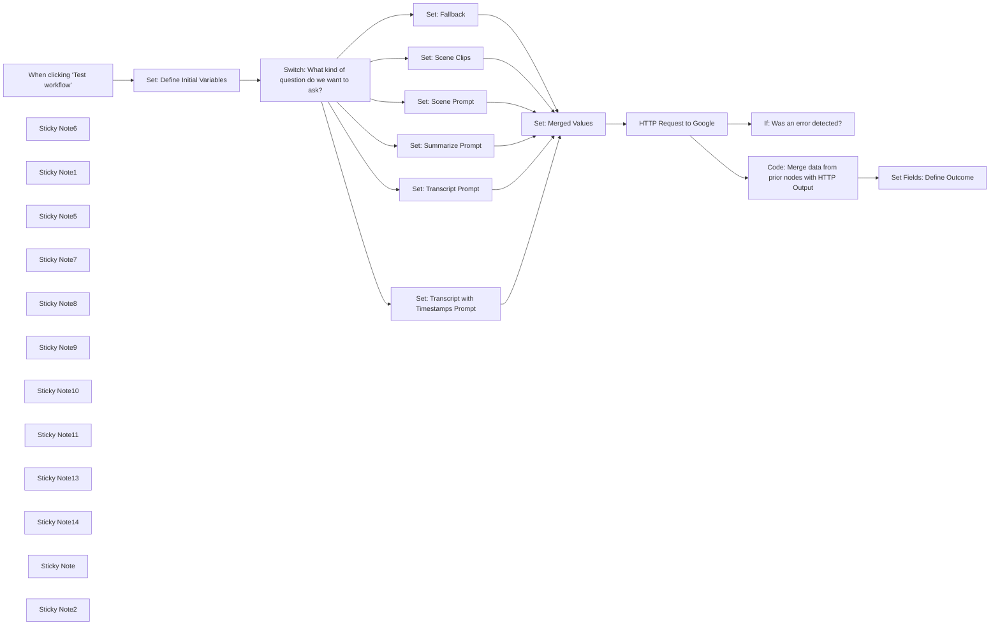

## Fluxo (.json) :

```json
{
  "id": "wZBgoWrBZveMmzYi",
  "meta": {
    "instanceId": "147b9b53621dbd6fca5f762b57fc3fabf293d676d0c08463ec52c91332ab391f",
    "templateCredsSetupCompleted": true
  },
  "name": "Turn YouTube Videos into Summaries, Transcripts, and Visual Insights",
  "tags": [],
  "nodes": [
    {
      "id": "61c56de7-0d8e-44fe-baf3-3e33ddd35b21",
      "name": "When clicking ‘Test workflow’",
      "type": "n8n-nodes-base.manualTrigger",
      "position": [
        -1340,
        120
      ],
      "parameters": {},
      "typeVersion": 1
    },
    {
      "id": "4e43030c-16cd-4b77-8c58-c3b703646a16",
      "name": "Set: Define Initial Variables",
      "type": "n8n-nodes-base.set",
      "position": [
        -840,
        120
      ],
      "parameters": {
        "options": {},
        "assignments": {
          "assignments": [
            {
              "id": "72590fa0-cf12-4249-80fc-7aaec9992390",
              "name": "automationID",
              "type": "string",
              "value": "optional-enter-reference-tracking-identifier"
            },
            {
              "id": "24e9b1c3-2955-4e0b-9b4b-a6b9d046fb72",
              "name": "apiKey",
              "type": "string",
              "value": "enter-your-api-key-here"
            },
            {
              "id": "b6600a42-1b8d-486a-a51d-0868bc45452e",
              "name": "youtubeURL",
              "type": "string",
              "value": "https://www.youtube.com/watch?v=Ovg_KfKxnC8"
            },
            {
              "id": "ce9a9a40-5ae4-4106-ae61-0daba2ec185f",
              "name": "promptType",
              "type": "string",
              "value": "transcript"
            }
          ]
        }
      },
      "typeVersion": 3.4
    },
    {
      "id": "add611c6-c053-464c-b12b-f0f20b4c3c4f",
      "name": "Switch: What kind of question do we want to ask?",
      "type": "n8n-nodes-base.switch",
      "onError": "continueRegularOutput",
      "position": [
        -200,
        60
      ],
      "parameters": {
        "rules": {
          "values": [
            {
              "outputKey": "Transcript",
              "conditions": {
                "options": {
                  "version": 2,
                  "leftValue": "",
                  "caseSensitive": true,
                  "typeValidation": "strict"
                },
                "combinator": "and",
                "conditions": [
                  {
                    "id": "4ba139e4-2fd7-473f-869d-f27a1a2f3823",
                    "operator": {
                      "type": "string",
                      "operation": "equals"
                    },
                    "leftValue": "={{ $json.promptType.toLowerCase() }}",
                    "rightValue": "transcript"
                  }
                ]
              },
              "renameOutput": true
            },
            {
              "outputKey": "Transcript with Timestamps",
              "conditions": {
                "options": {
                  "version": 2,
                  "leftValue": "",
                  "caseSensitive": true,
                  "typeValidation": "strict"
                },
                "combinator": "and",
                "conditions": [
                  {
                    "id": "486f3c1c-7203-4bc5-a796-87939d4360c5",
                    "operator": {
                      "name": "filter.operator.equals",
                      "type": "string",
                      "operation": "equals"
                    },
                    "leftValue": "={{ $json.promptType.toLowerCase() }}",
                    "rightValue": "timestamps"
                  }
                ]
              },
              "renameOutput": true
            },
            {
              "outputKey": "Summary",
              "conditions": {
                "options": {
                  "version": 2,
                  "leftValue": "",
                  "caseSensitive": true,
                  "typeValidation": "strict"
                },
                "combinator": "and",
                "conditions": [
                  {
                    "id": "814597ad-12ff-450d-a4bc-cd2eb2836d8f",
                    "operator": {
                      "name": "filter.operator.equals",
                      "type": "string",
                      "operation": "equals"
                    },
                    "leftValue": "={{ $json.promptType.toLowerCase() }}",
                    "rightValue": "summary"
                  }
                ]
              },
              "renameOutput": true
            },
            {
              "outputKey": "Scene Description",
              "conditions": {
                "options": {
                  "version": 2,
                  "leftValue": "",
                  "caseSensitive": true,
                  "typeValidation": "strict"
                },
                "combinator": "and",
                "conditions": [
                  {
                    "id": "759debf2-3dfb-4bdd-b41f-7ef0a709e25e",
                    "operator": {
                      "name": "filter.operator.equals",
                      "type": "string",
                      "operation": "equals"
                    },
                    "leftValue": "={{ $json.promptType.toLowerCase() }}",
                    "rightValue": "scene"
                  }
                ]
              },
              "renameOutput": true
            },
            {
              "outputKey": "Clips",
              "conditions": {
                "options": {
                  "version": 2,
                  "leftValue": "",
                  "caseSensitive": true,
                  "typeValidation": "strict"
                },
                "combinator": "and",
                "conditions": [
                  {
                    "id": "5c66a390-2566-461d-b9bc-b0e7ebdc4af8",
                    "operator": {
                      "name": "filter.operator.equals",
                      "type": "string",
                      "operation": "equals"
                    },
                    "leftValue": "={{ $json.promptType.toLowerCase() }}",
                    "rightValue": "clips"
                  }
                ]
              },
              "renameOutput": true
            }
          ]
        },
        "options": {
          "fallbackOutput": "extra"
        }
      },
      "typeVersion": 3.2,
      "alwaysOutputData": false
    },
    {
      "id": "96b6a6c7-3b4f-412d-b200-526971782346",
      "name": "Set: Scene Prompt",
      "type": "n8n-nodes-base.set",
      "position": [
        480,
        220
      ],
      "parameters": {
        "options": {},
        "assignments": {
          "assignments": [
            {
              "id": "8be68e95-53df-492f-a88a-14c06f51f531",
              "name": "prompt",
              "type": "string",
              "value": "=Please provide a detailed description of the scene in the video, including:\n\nSetting: Where the scene takes place (e.g., indoors, outdoors, specific location). Be specific - is it a forest, a city street, a living room?\n\nObjects: Prominent objects visible in the scene (e.g., furniture, vehicles, natural elements). Include details like color, size, and material if discernible.\n\nPeople: Description of any people present, including their appearance (clothing, hair, etc.), approximate age, and any actions they are performing.\n\nLighting: The overall lighting of the scene (e.g., bright, dim, natural, artificial). Note any specific light sources (lamps, sunlight).\n\nColors: Dominant colors and color palettes used in the scene.\n\nCamera Angle/Movement: Describe the camera perspective (e.g., close-up, wide shot, aerial view) and any camera movement (panning, zooming, static).\n\nStart output directly with the response -- do not include any introductory text or explanations."
            },
            {
              "id": "bfa3b421-643d-4a52-93e9-0830f794140b",
              "name": "model",
              "type": "string",
              "value": "gemini-1.5-flash"
            }
          ]
        },
        "includeOtherFields": true
      },
      "typeVersion": 3.4
    },
    {
      "id": "7506b5fa-be12-4d34-8583-027bc782db0d",
      "name": "Set: Summarize Prompt",
      "type": "n8n-nodes-base.set",
      "position": [
        480,
        20
      ],
      "parameters": {
        "options": {},
        "assignments": {
          "assignments": [
            {
              "id": "8be68e95-53df-492f-a88a-14c06f51f531",
              "name": "prompt",
              "type": "string",
              "value": "=Provide a concise summary of the main points in nested bullets, using quotes only when absolutely essential for clarity. Start output directly with the response."
            },
            {
              "id": "ccc44699-0918-4837-89a6-c763b157fc8c",
              "name": "model",
              "type": "string",
              "value": "gemini-1.5-flash"
            }
          ]
        },
        "includeOtherFields": true
      },
      "typeVersion": 3.4
    },
    {
      "id": "2aaf482d-af31-4cd8-9014-7b77efbf3021",
      "name": "Set: Transcript Prompt",
      "type": "n8n-nodes-base.set",
      "position": [
        480,
        -380
      ],
      "parameters": {
        "options": {},
        "assignments": {
          "assignments": [
            {
              "id": "8be68e95-53df-492f-a88a-14c06f51f531",
              "name": "prompt",
              "type": "string",
              "value": "=Transcribe the video. Return only the spoken dialogue, verbatim. Omit any additional text or descriptions."
            },
            {
              "id": "b445c2da-934f-4a78-a57b-f383d8950f8a",
              "name": "model",
              "type": "string",
              "value": "gemini-1.5-flash"
            }
          ]
        },
        "includeOtherFields": true
      },
      "typeVersion": 3.4
    },
    {
      "id": "75a6ac10-00c2-45ab-88b7-dfec3cd58bf2",
      "name": "Set: Fallback",
      "type": "n8n-nodes-base.set",
      "position": [
        480,
        620
      ],
      "parameters": {
        "options": {},
        "assignments": {
          "assignments": [
            {
              "id": "8be68e95-53df-492f-a88a-14c06f51f531",
              "name": "prompt",
              "type": "string",
              "value": "=Summarize this YouTube video with a focus on actionable insights. Use nested bullets and include relevant quotes. Specifically, highlight any recommended tools, strategies, or resources mentioned."
            },
            {
              "id": "da626eb8-a097-4a65-834d-4d1709aed260",
              "name": "model",
              "type": "string",
              "value": "gemini-1.5-flash"
            }
          ]
        },
        "includeOtherFields": true
      },
      "typeVersion": 3.4
    },
    {
      "id": "29ef7f9f-34c9-46f5-96f9-17b42feea381",
      "name": "Set: Transcript with Timestamps Prompt",
      "type": "n8n-nodes-base.set",
      "position": [
        480,
        -180
      ],
      "parameters": {
        "options": {},
        "assignments": {
          "assignments": [
            {
              "id": "8be68e95-53df-492f-a88a-14c06f51f531",
              "name": "prompt",
              "type": "string",
              "value": "=Generate a timestamped transcript of the video. Each line must follow this format precisely:  [hh:mm:ss] Dialogue. Return only the timestamp and spoken content; omit any other text or formatting.  "
            },
            {
              "id": "98ca7af8-0fbd-4ba8-8fc8-f914e5bbe48a",
              "name": "model",
              "type": "string",
              "value": "gemini-1.5-flash"
            }
          ]
        },
        "includeOtherFields": true
      },
      "typeVersion": 3.4
    },
    {
      "id": "e10524ed-09dd-4c0f-86b0-9161fa347821",
      "name": "Set: Scene Clips",
      "type": "n8n-nodes-base.set",
      "position": [
        480,
        420
      ],
      "parameters": {
        "options": {},
        "assignments": {
          "assignments": [
            {
              "id": "8be68e95-53df-492f-a88a-14c06f51f531",
              "name": "prompt",
              "type": "string",
              "value": "=Extract shareable clips for social media. Each clip must include:\n\n* **Timestamp:** [hh:mm:ss]-[hh:mm:ss]\n* **Transcript:** Verbatim dialogue/text within the clip.\n* **Rationale:**  A concise explanation (under 20 words) of the clip's social media appeal (e.g., \"humorous,\" \"controversial,\" \"inspiring,\" \"informative\").  Focus on virality, engagement potential (shares, likes, comments).\n\nStart output directly with the response -- do not include any introductory text or explanations."
            },
            {
              "id": "0493ffa7-4fef-4e48-b9d7-7f0891660325",
              "name": "model",
              "type": "string",
              "value": "gemini-1.5-flash"
            }
          ]
        },
        "includeOtherFields": true
      },
      "typeVersion": 3.4
    },
    {
      "id": "be66d323-9035-4123-8086-dde14e528dc8",
      "name": "Sticky Note6",
      "type": "n8n-nodes-base.stickyNote",
      "position": [
        -2340,
        -600
      ],
      "parameters": {
        "width": 780,
        "height": 820,
        "content": "# How to Use This Workflow\n\nVideo Overview: [https://www.youtube.com/watch?v=Ovg_KfKxnC8](https://www.youtube.com/watch?v=Ovg_KfKxnC8)\n\nUse this workflow to analyze YouTube videos effortlessly. Start by requesting a summary or transcript—then refine the prompts to fit your needs and the type of content you're working with.\n\nEven more impressive? You can ask specific questions about what’s happening in a video—identifying people, scenes, and visual details. The ability to extract this level of insight is game-changing.\n\nThis workflow is highly adaptable—actions adjust based on the values you set. With a single flow, you can generate transcripts, create detailed YouTube descriptions, and draft summary blog posts.\n\nTriggers are flexible, too. Run it manually, connect it to a webhook, or automate it through Airtable or another system. The output can go anywhere -- Notion, Google Docs, CMS platforms -- or simply stay in n8n for on-the-fly analysis.\n\nThis workflow was created using n8n 1.82.3.\n\n## Requirements\n* [Google API key](https://console.developers.google.com/) (or obtain via [AI Studio](https://aistudio.google.com/apikey))\n\n## Testing\n* This workflow was tested on an assortment of public YouTube videos from shorts up to about an hour in length.\n\n## Future-proofing\n* This workflow was created for use with gemini-1.5-flash. In the future, the set nodes for prompts could be updated to use different models and possibly add in what API endpoint should be used in the http node.\n\n## Documentation\n* [Explore vision capabilities with the Gemini API](https://ai.google.dev/gemini-api/docs/vision?lang=python)\n* [Pricing](https://ai.google.dev/gemini-api/docs/pricing)"
      },
      "typeVersion": 1
    },
    {
      "id": "a8f5541c-d267-4998-bb31-32f2684b0874",
      "name": "Set Fields: Define Outcome",
      "type": "n8n-nodes-base.set",
      "position": [
        2800,
        120
      ],
      "parameters": {
        "include": "except",
        "options": {},
        "assignments": {
          "assignments": [
            {
              "id": "300bfbe7-8d13-41ba-8828-17bba1d0eabe",
              "name": "answerAIGenerated",
              "type": "string",
              "value": "={{ $json.candidates?.[0]?.content?.parts?.[0]?.text ? $json.candidates[0].content.parts[0].text : ($json.error ? $json.error : \"No content or error found\") }}"
            },
            {
              "id": "a54eeb5d-e4de-4fd9-a15c-be51cc414c46",
              "name": "promptTokenCount",
              "type": "string",
              "value": "={{ $json.usageMetadata?.promptTokenCount ? $json.usageMetadata.promptTokenCount : ($json.error ? $json.error : \"No content or error found\") }}"
            },
            {
              "id": "dd590788-069e-48d9-adb2-6a5d10f8af2f",
              "name": "candidatesTokenCount",
              "type": "string",
              "value": "={{ $json.usageMetadata?.candidatesTokenCount ? $json.usageMetadata.candidatesTokenCount : ($json.error ? $json.error : \"No content or error found\") }}"
            },
            {
              "id": "23766495-25df-4d3d-bc62-9e79a860ee19",
              "name": "totalTokenCount",
              "type": "string",
              "value": "={{ $json.usageMetadata?.totalTokenCount ? $json.usageMetadata.totalTokenCount : ($json.error ? $json.error : \"No content or error found\") }}"
            },
            {
              "id": "cfad5ba2-a2c5-48ff-b64b-9131a51fd23c",
              "name": "modelVersionUsed",
              "type": "string",
              "value": "={{ $json.modelVersion ? $json.modelVersion : ($json.error ? $json.error : \"No content or error found\") }}"
            }
          ]
        },
        "excludeFields": "candidates, usageMetadata",
        "includeOtherFields": true
      },
      "typeVersion": 3.4
    },
    {
      "id": "062b5d41-27bb-4e67-8ffa-6e3e392fb437",
      "name": "HTTP Request to Google",
      "type": "n8n-nodes-base.httpRequest",
      "onError": "continueRegularOutput",
      "position": [
        1740,
        120
      ],
      "parameters": {
        "url": "=https://generativelanguage.googleapis.com/v1beta/models/{{ $json.model }}:generateContent?key={{ $json.apiKey }}",
        "method": "POST",
        "options": {},
        "jsonBody": "={\n  \"contents\": [{\n    \"parts\": [\n      { \"text\": {{ JSON.stringify($json.prompt) }} },\n      { \"file_data\": { \"file_uri\": \"{{ $json.youtubeURL }}\" } }\n    ]\n  }]\n}",
        "sendBody": true,
        "sendHeaders": true,
        "specifyBody": "json",
        "headerParameters": {
          "parameters": [
            {
              "name": "Content-Type",
              "value": "application/json"
            }
          ]
        }
      },
      "typeVersion": 4.2,
      "alwaysOutputData": true
    },
    {
      "id": "0a204e60-674a-453d-81e1-9eb59a3214e2",
      "name": "Set: Merged Values",
      "type": "n8n-nodes-base.set",
      "position": [
        1380,
        120
      ],
      "parameters": {
        "options": {},
        "includeOtherFields": true
      },
      "typeVersion": 3.4
    },
    {
      "id": "48ed5162-61e1-4077-a13a-b2cf135fc11e",
      "name": "If: Was an error detected?",
      "type": "n8n-nodes-base.if",
      "disabled": true,
      "position": [
        2560,
        780
      ],
      "parameters": {
        "options": {},
        "conditions": {
          "options": {
            "version": 2,
            "leftValue": "",
            "caseSensitive": true,
            "typeValidation": "strict"
          },
          "combinator": "and",
          "conditions": [
            {
              "id": "148e9a72-f826-468c-86a3-471873717ed4",
              "operator": {
                "type": "string",
                "operation": "exists",
                "singleValue": true
              },
              "leftValue": "={{ $json.error }}",
              "rightValue": ""
            }
          ]
        }
      },
      "typeVersion": 2.2
    },
    {
      "id": "f9c0ef37-da99-4100-bd04-b5f2ac93a694",
      "name": "Sticky Note1",
      "type": "n8n-nodes-base.stickyNote",
      "position": [
        -2340,
        280
      ],
      "parameters": {
        "width": 780,
        "height": 3580,
        "content": "## Prompt Inspiration Ideas\n\nUse these prompts as inspiration for your workflow. A quick way to iterate on ideas is to try them in [https://aistudio.google.com/](https://aistudio.google.com/).\n\n### 📝 Essential Video Summarizer (Quick Content Digestion)\nProvide a concise summary of the main points of this YouTube video in nested bullets, using quotes only when absolutely essential for clarity.\n\nStart output directly with the response -- do not include any introductory text or explanations.\n\n### 🚀 Complete YouTube SEO Package Generator (Content Marketing)\n\nGenerate a complete YouTube package (Title, Description, Keywords, and Timestamps) based on the following transcript:\n\n**Instructions:**\n\n* **Title:** Craft a concise and engaging title (under 60 characters) that accurately reflects the video's content and will attract viewers.  \n* **Description:** Write a detailed description (around 150-200 words) summarizing the key topics covered in the video.  This description should:\n    * Clearly outline the value proposition for the viewer (what they will learn or gain).\n    * Include relevant keywords to improve searchability.\n    * Feature a strong call to action (e.g., subscribe, visit a website, follow on social media).\n    * Optionally include a brief, intriguing hook at the beginning to grab the viewer's attention.\n* **Keywords:** Generate a list of relevant keywords and tags (around 10-15) that accurately describe the video's content and will help viewers find it in search results.  Consider:\n    * Specific topics discussed\n    * Related terms and concepts\n    * Industry jargon (if applicable)\n    * Names of people or products mentioned\n* **Timestamps:**  Generate timestamps for key topics or sections within the video. These should be formatted clearly for easy navigation.  For example:\n    * 0:00 Introduction\n    * 1:15 Topic 1\n    * 3:45 Topic 2 ...etc.  \n\n**Important Considerations:**\n\n* **Target Audience:** Assume the target audience is [Describe your target audience – e.g., beginners learning Python, experienced marketers, people interested in gardening].\n* **Overall Tone:** The tone of the entire package should be [Specify the desired tone – e.g., informative and educational, enthusiastic and engaging, humorous and lighthearted].\n* **Video's Purpose:** The primary goal of the video is to [State the video's objective – e.g., teach a skill, provide information, entertain, persuade].\n\n\n**Optional:**\n* If the video promotes a product, service, or other content, include relevant links in the description.\n* If there are any specific phrases or branding elements that should be included, specify them here.\n\nStart output directly with the response -- do not include any introductory text or explanations.\n\n### 🗺️ Structured Video Content Map (Educational Organization)\n\nSummarize the key points of this YouTube video with no introductory text. Follow this structured format:\n\nMain Topics\n* Organize content using Level 2 headers (##) based on key themes.\n\nUnder each header:\n* List only the most essential concepts using concise bullet points.\n* Ensure technical accuracy while maintaining clarity.\n\nOrganize sections in this order when applicable:\n* Overview & Context\n* Core Concepts & Features\n* How It Works\n* Benefits & Drawbacks\n\nFormatting Rules:\n* Use Markdown for structured readability.\n* Keep bullet points simple (avoid nesting).\n* No summaries, conclusions, or extra explanations -- just structured content.\n\n### 🎯 Goal-Oriented Learning Digest (Personal Development)\n\nI'm trying to learn about [Specific Goal, e.g., \"how to improve my public speaking skills,\" \"the latest trends in web development\"]. Summarize the relevant information using nested bullets and quotes, focusing on how it helps me achieve this goal.\n\nStart output directly with the response -- do not include any introductory text or explanations.\n\n### ⚙️ Actionable Insights Framework (Implementation Planning)\n\nExtract actionable insights with a focus on practical applications and recommendations.\n\nStart output directly with the response—do not include any introductory text or explanations.\n\nFormat the summary using markdown and follow this structure:\n\nProblem Statement\n* Summarize the core issue or topic addressed.\n\nKey Solutions & Recommendations\n* Use separate ## headers for each major solution or recommendation.\n\nImplementation Steps:\n* Under each solution, list key steps using bullet points.\n\nExpected Outcomes & Benefits:\n* Describe the potential impact and advantages of each solution.\n\nResources & Tools\n* List any relevant tools, frameworks, or resources mentioned.\n\n### 💡 Concept Extractor with Supporting Quotes (Deep Content Analysis)\n\nExtract the core concepts presented using nested bullets. Include supporting quotes for each concept. Focus on [Specific Topic/Area, e.g., \"the impact of AI on marketing,\" \"the principles of effective communication,\" etc.].\n\nStart output directly with the response -- do not include any introductory text or explanations.\n\n\n### 👥 Audience-Targeted Video Analysis (Professional Development)\n\nAnalyze this video for a target audience of [Specify Target Audience, e.g., \"software engineers,\" \"marketing professionals,\" \"general readers\"].\n\nFormat the summary using markdown and structure it as follows:\n\nMain Topics\nOrganize key points under Level 2 headers (##), focusing on essential insights.\nSuggested sections (adjust as needed):\nOverview (context & background)\nKey Concepts & Features\nHow It Works (technical or practical explanation)\nBenefits & Challenges\nKey Instructions:\n\nTailor content to the [Target Audience] and their expected level of expertise.\nUse bullet points for clarity and conciseness.\nBold key terms to emphasize important ideas.\nEnsure technical accuracy, simplifying complex ideas only when needed.\nUse tables when making comparisons.\nLength Guidance:\n\nSummarize in approximately [Specify Desired Length, e.g., \"200 words,\" \"500 words,\" \"one page\"].\n\nStart output directly with the response -- do not include any introductory text or explanations.\n\n### 🧠 Knowledge Extension Analyzer (Advanced Learning & Analysis)\n\nAssuming I already understand [briefly state relevant background knowledge], provide specific insights that build upon this knowledge. Use nested bullets and relevant quotes.\n\nStart output directly with the response -- do not include any introductory text or explanations.\n\n### 🔍 Argument Analysis Blueprint (Critical Thinking)\n\nAnalyze the argument presented in this video. Outline the main claims and supporting evidence using nested bullets. Include direct quotes to illustrate key points. Identify any potential counterarguments or weaknesses in the reasoning.\n\nStart output directly with the response -- do not include any introductory text or explanations.\n\n### ⚖️ YouTube Argument Analyzer (Debate & Rhetoric)\n\nAnalyze the argument presented in this YouTube video. Outline the main claims and supporting evidence using nested bullets. Include direct quotes to illustrate key points. Identify any potential counterarguments or weaknesses in the reasoning.\n\nStart output directly with the response -- do not include any introductory text or explanations.\n\n### 🎭 Rhetorical Technique Evaluator (Communication Analysis)\n\nAnalyze the speaker's [e.g., presentation style, persuasive techniques, use of rhetoric]. Use nested bullets and include specific quotes to illustrate your observations. Focus on how these techniques contribute to (or detract from) the video's overall message.\n\nStart output directly with the response -- do not include any introductory text or explanations.\n\n"
      },
      "typeVersion": 1
    },
    {
      "id": "d15f5fa4-731d-4d63-a065-e81a5248e8d8",
      "name": "Code: Merge data from prior nodes with HTTP Output",
      "type": "n8n-nodes-base.code",
      "position": [
        2340,
        120
      ],
      "parameters": {
        "mode": "runOnceForEachItem",
        "jsCode": "return {\n  json: {\n    ...$json, // Keep data from http request\n    ...$('Set: Merged Values').item.json, // Keep data from before http request\n  }\n};\n\n\n\n"
      },
      "typeVersion": 2
    },
    {
      "id": "eb3b45bc-c59e-45f7-a352-97f62ae079f2",
      "name": "Sticky Note5",
      "type": "n8n-nodes-base.stickyNote",
      "position": [
        -1080,
        -80
      ],
      "parameters": {
        "width": 560,
        "height": 520,
        "content": "## ✏️ Set Values For Use in Flow\n1. automationID: Use this to reference the automation. Useful for troubleshooting when you have lots of flows running.\n2. apiKey: API key from Google\n3. youtubeURL: Public URL for video to be processed\n4. promptType: Used by switch node and determines which prompt is sent as part of API call."
      },
      "typeVersion": 1
    },
    {
      "id": "440539da-e658-404f-8f85-9e28e9acffc9",
      "name": "Sticky Note7",
      "type": "n8n-nodes-base.stickyNote",
      "position": [
        -460,
        -80
      ],
      "parameters": {
        "width": 560,
        "height": 520,
        "content": "## ℹ️ Determine which prompt will be passed in API call based on promptType value\n"
      },
      "typeVersion": 1
    },
    {
      "id": "ba3f3e35-d691-449e-9f62-d2246223ff5e",
      "name": "Sticky Note8",
      "type": "n8n-nodes-base.stickyNote",
      "position": [
        280,
        -580
      ],
      "parameters": {
        "width": 560,
        "height": 1520,
        "content": "## ✏️ Set Values For Prompts & Model\n1. prompt: What do you want to know about a video\n2. model: Which model to use (gemini-1.5-flash)"
      },
      "typeVersion": 1
    },
    {
      "id": "b33de065-16d5-4b29-8117-91cfd9d9034a",
      "name": "Sticky Note9",
      "type": "n8n-nodes-base.stickyNote",
      "position": [
        1300,
        -60
      ],
      "parameters": {
        "width": 260,
        "height": 520,
        "content": "## ℹ️ Making it easier to reference values in the http node\n"
      },
      "typeVersion": 1
    },
    {
      "id": "eb6788d8-4b99-42e5-b0c1-0430a8d786e6",
      "name": "Sticky Note10",
      "type": "n8n-nodes-base.stickyNote",
      "position": [
        2420,
        580
      ],
      "parameters": {
        "width": 560,
        "height": 520,
        "content": "## ℹ️ If you want to add special processing when errors occur (Optional)\n\n"
      },
      "typeVersion": 1
    },
    {
      "id": "432ef0bf-8c85-4f72-a771-42b3b2173094",
      "name": "Sticky Note11",
      "type": "n8n-nodes-base.stickyNote",
      "position": [
        1680,
        -60
      ],
      "parameters": {
        "width": 260,
        "height": 520,
        "content": "## ℹ️ Makes call to Google endpoint using values set in earlier nodes\n\n"
      },
      "typeVersion": 1
    },
    {
      "id": "57f29827-7f1f-4b73-b700-51af8bd1e582",
      "name": "Sticky Note13",
      "type": "n8n-nodes-base.stickyNote",
      "position": [
        2240,
        -60
      ],
      "parameters": {
        "width": 300,
        "height": 520,
        "content": "## ℹ️ Merges data from returned by Google with values set in prior nodes so that earlier data isn't lost"
      },
      "typeVersion": 1
    },
    {
      "id": "c42daf8b-2d9e-4258-91be-97b830c4eff4",
      "name": "Sticky Note14",
      "type": "n8n-nodes-base.stickyNote",
      "position": [
        2700,
        -60
      ],
      "parameters": {
        "width": 300,
        "height": 520,
        "content": "## ℹ️ Gives returned data meaningful names; Simplifies amount of data available to follow-on nodes"
      },
      "typeVersion": 1
    },
    {
      "id": "fb246216-645d-4c01-adc7-9b2be2920bcd",
      "name": "Sticky Note",
      "type": "n8n-nodes-base.stickyNote",
      "position": [
        -1460,
        280
      ],
      "parameters": {
        "width": 360,
        "content": "#### 💡 Trigger Ideas\nYou can change the trigger to meet your use case. If you need to run it once in awhile, can leave in current format. Try one of n8n's YouTube nodes, a form, a webhook, etc. for running more frequently as part of an automation."
      },
      "typeVersion": 1
    },
    {
      "id": "ba228de2-c2de-475c-95c3-20ef712edcc9",
      "name": "Sticky Note2",
      "type": "n8n-nodes-base.stickyNote",
      "position": [
        3120,
        100
      ],
      "parameters": {
        "width": 360,
        "height": 240,
        "content": "#### 💡 Next Step Ideas\nUse a webhook to send data to another destination or use one of n8n's other nodes to send to Airtable, Notion, etc."
      },
      "typeVersion": 1
    }
  ],
  "active": false,
  "pinData": {},
  "settings": {
    "executionOrder": "v1"
  },
  "versionId": "5d83e29e-caf0-4c3a-be04-9da966904a5a",
  "connections": {
    "Set: Fallback": {
      "main": [
        [
          {
            "node": "Set: Merged Values",
            "type": "main",
            "index": 0
          }
        ]
      ]
    },
    "Set: Scene Clips": {
      "main": [
        [
          {
            "node": "Set: Merged Values",
            "type": "main",
            "index": 0
          }
        ]
      ]
    },
    "Set: Scene Prompt": {
      "main": [
        [
          {
            "node": "Set: Merged Values",
            "type": "main",
            "index": 0
          }
        ]
      ]
    },
    "Set: Merged Values": {
      "main": [
        [
          {
            "node": "HTTP Request to Google",
            "type": "main",
            "index": 0
          }
        ]
      ]
    },
    "Set: Summarize Prompt": {
      "main": [
        [
          {
            "node": "Set: Merged Values",
            "type": "main",
            "index": 0
          }
        ]
      ]
    },
    "HTTP Request to Google": {
      "main": [
        [
          {
            "node": "Code: Merge data from prior nodes with HTTP Output",
            "type": "main",
            "index": 0
          },
          {
            "node": "If: Was an error detected?",
            "type": "main",
            "index": 0
          }
        ]
      ]
    },
    "Set: Transcript Prompt": {
      "main": [
        [
          {
            "node": "Set: Merged Values",
            "type": "main",
            "index": 0
          }
        ]
      ]
    },
    "Set: Define Initial Variables": {
      "main": [
        [
          {
            "node": "Switch: What kind of question do we want to ask?",
            "type": "main",
            "index": 0
          }
        ]
      ]
    },
    "When clicking ‘Test workflow’": {
      "main": [
        [
          {
            "node": "Set: Define Initial Variables",
            "type": "main",
            "index": 0
          }
        ]
      ]
    },
    "Set: Transcript with Timestamps Prompt": {
      "main": [
        [
          {
            "node": "Set: Merged Values",
            "type": "main",
            "index": 0
          }
        ]
      ]
    },
    "Switch: What kind of question do we want to ask?": {
      "main": [
        [
          {
            "node": "Set: Transcript Prompt",
            "type": "main",
            "index": 0
          }
        ],
        [
          {
            "node": "Set: Transcript with Timestamps Prompt",
            "type": "main",
            "index": 0
          }
        ],
        [
          {
            "node": "Set: Summarize Prompt",
            "type": "main",
            "index": 0
          }
        ],
        [
          {
            "node": "Set: Scene Prompt",
            "type": "main",
            "index": 0
          }
        ],
        [
          {
            "node": "Set: Scene Clips",
            "type": "main",
            "index": 0
          }
        ],
        [
          {
            "node": "Set: Fallback",
            "type": "main",
            "index": 0
          }
        ]
      ]
    },
    "Code: Merge data from prior nodes with HTTP Output": {
      "main": [
        [
          {
            "node": "Set Fields: Define Outcome",
            "type": "main",
            "index": 0
          }
        ]
      ]
    }
  }
}
```

<a id="template-936"></a>

## Template 936 - Busca de email única no Icypeas

- **Nome:** Busca de email única no Icypeas
- **Descrição:** Realiza uma pesquisa de endereço de email no Icypeas usando credenciais da conta e parâmetros do contato.
- **Funcionalidade:** • Disparo manual da busca: Permite iniciar o processo manualmente quando necessário.
• Autenticação com API: Usa API Key, API Secret e User ID da conta para preparar as credenciais.
• Geração de assinatura HMAC SHA1: Cria uma assinatura baseada em método, caminho e timestamp para validar a requisição.
• Montagem do cabeçalho de autorização: Combina chave e assinatura para formar o valor de autenticação enviado no cabeçalho.
• Busca de email por parâmetros: Envia uma requisição POST com lastname, firstname e domainOrCompany para localizar o email.
• Retorno de resultado e link ao painel: Recebe a resposta da busca e fornece o link para visualizar o resultado no painel do Icypeas.
- **Ferramentas:** • Icypeas: Serviço que oferece pesquisa e verificação de endereços de email a partir de dados de contato.

## Fluxo visual

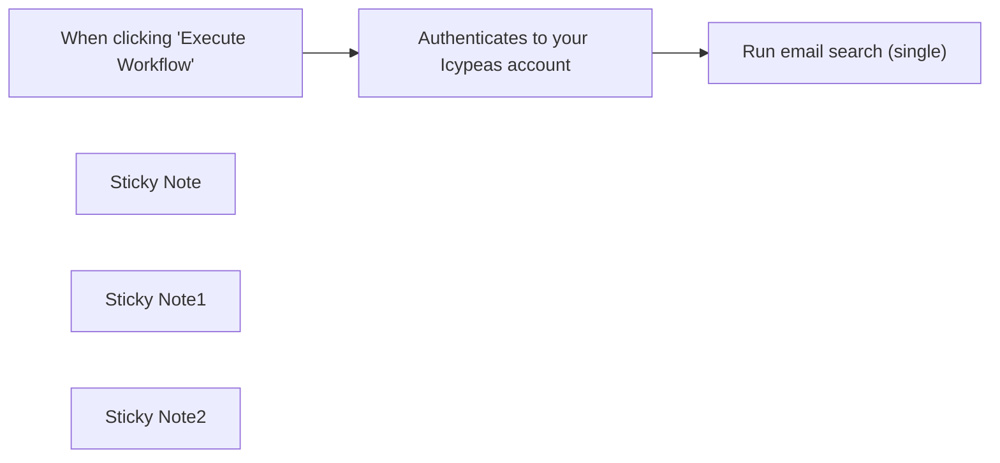

## Fluxo (.json) :

```json
{
  "id": "zAkPoRdcG5M5x4KT",
  "meta": {
    "instanceId": "a897062ac3223eacd9c7736276b653c446bc776a63cde2a42a2949ad984f7092"
  },
  "name": "Perform an email search with Icypeas (single)",
  "tags": [],
  "nodes": [
    {
      "id": "7bd55522-62dd-40da-939d-e10c185dd44d",
      "name": "When clicking \"Execute Workflow\"",
      "type": "n8n-nodes-base.manualTrigger",
      "position": [
        1220,
        480
      ],
      "parameters": {},
      "typeVersion": 1
    },
    {
      "id": "422bb377-afe7-4332-a134-15af150e8006",
      "name": "Sticky Note",
      "type": "n8n-nodes-base.stickyNote",
      "position": [
        1060,
        220
      ],
      "parameters": {
        "height": 243.6494382022472,
        "content": "## Perform an email search with Icypeas (single)\n\nThis workflow demonstrates how to perform an email search using Icypeas. Visit https://icypeas.com to create your account.\n\n\n"
      },
      "typeVersion": 1
    },
    {
      "id": "a95bd610-e5e3-4343-afcc-4af22dca1f8f",
      "name": "Sticky Note1",
      "type": "n8n-nodes-base.stickyNote",
      "position": [
        1367,
        296
      ],
      "parameters": {
        "width": 506,
        "height": 1042.9602832148855,
        "content": "## Authenticates to your Icypeas account\n\nThis code node utilizes your API key, API secret, and User ID to establish a connection with your Icypeas account.\n\n\n\n\n\n\n\n\n\n\n\n\n\n\n\n\n\nOpen this node and insert your API Key, API secret, and User ID within the quotation marks. You can locate these credentials on your Icypeas profile at https://app.icypeas.com/bo/profile. Here is the extract of what you have to change :\n\nconst API_KEY = \"**PUT_API_KEY_HERE**\";\nconst API_SECRET = \"**PUT_API_SECRET_HERE**\";\nconst USER_ID = \"**PUT_USER_ID_HERE**\";\n\nDo not change any other line of the code.\n\nIf you are a self-hosted user, follow these steps to activate the crypto module :\n\n1.Access your n8n instance:\nLog in to your n8n instance using your web browser by navigating to the URL of your instance, for example: http://your-n8n-instance.com.\n\n2.Go to Settings:\nIn the top-right corner, click on your username, then select \"Settings.\"\n\n3.Select General Settings:\nIn the left menu, click on \"General.\"\n\n4.Enable the Crypto module:\nScroll down to the \"Additional Node Packages\" section. You will see an option called \"crypto\" with a checkbox next to it. Check this box to enable the Crypto module.\n\n5.Save the changes:\nAt the bottom of the page, click \"Save\" to apply the changes.\n\nOnce you've followed these steps, the Crypto module should be activated for your self-hosted n8n instance. Make sure to save your changes and optionally restart your n8n instance for the changes to take effect.\n\n\n\n\n\n\n\n\n\n\n\n"
      },
      "typeVersion": 1
    },
    {
      "id": "f0951515-48cf-4c1b-82fd-960959a51bb7",
      "name": "Sticky Note2",
      "type": "n8n-nodes-base.stickyNote",
      "position": [
        1873,
        300
      ],
      "parameters": {
        "width": 492,
        "height": 961.061974298911,
        "content": "## Performs an email search on your Icypeas account\n\n\nThis node executes an HTTP request (POST) to search for an email address using Icypeas.\n\n\n\n\n\n\n\n\n\n\n\n\n\n### You need to create credentials in the HTTP Request node :\n\n➔ In the Credential for Header Auth, click on - Create new Credential -.\n➔ In the Name section, write “Authorization”\n➔ In the Value section, select expression (located just above the field on the right when you hover on top of it) and write {{ $json.api.key + ':' + $json.api.signature }} .\n➔ Then click on “Save” to save the changes.\n\n### To search for the email address :\n\n➔ go to the Body Parameters section,\n➔ create a new parameter,\n➔ enter \"lastname\" in the Name field.\n➔ put the lastname of the person whose email you want.\n\n➔ go to the Body Parameters section,\n➔ create a new parameter,\n➔ enter \"firstname\" in the Name field.\n➔ put the firstname of the person whose email you want.\n\n➔ go to the Body Parameters section,\n➔ create a new parameter,\n➔ enter \"domainOrCompany\" in the Name field.\n➔ put the domain/company name of the person whose email you want.\n\n\n\nYou will find the result here : https://app.icypeas.com/bo/singlesearch?task=email-search\n"
      },
      "typeVersion": 1
    },
    {
      "id": "6d12e09f-143a-46f1-9790-512d4f10f51f",
      "name": "Authenticates to your Icypeas account",
      "type": "n8n-nodes-base.code",
      "position": [
        1560,
        480
      ],
      "parameters": {
        "jsCode": "const BASE_URL = \"https://app.icypeas.com\";\nconst PATH = \"/api/domain-search\";\nconst METHOD = \"POST\";\n\n// Change here\nconst API_KEY = \"PUT_API_KEY_HERE\";\nconst API_SECRET = \"PUT_API_SECRET_HERE\";\nconst USER_ID = \"PUT_USER_ID_HERE\";\n////////////////\n\nconst genSignature = (\n    path,\n    method,\n    secret,\n    timestamp = new Date().toISOString()\n) => {\n    const Crypto = require('crypto');\n    const payload = `${method}${path}${timestamp}`.toLowerCase();\n    const sign = Crypto.createHmac(\"sha1\", secret).update(payload).digest(\"hex\");\n\n    return sign;\n};\n\nconst fullPath = `${BASE_URL}${PATH}`;\n$input.first().json.api = {\n  timestamp: new Date().toISOString(),\n  secret: API_SECRET,\n  key: API_KEY,\n  userId: USER_ID,\n  url: fullPath,\n};\n$input.first().json.api.signature = genSignature(PATH, METHOD, API_SECRET, $input.first().json.api.timestamp);\nreturn $input.first();"
      },
      "typeVersion": 1
    },
    {
      "id": "5f62f87f-7a25-4030-bcd4-d87b24269504",
      "name": "Run email search (single)",
      "type": "n8n-nodes-base.httpRequest",
      "position": [
        1940,
        480
      ],
      "parameters": {
        "url": "={{ $json.api.url }}",
        "method": "POST",
        "options": {},
        "sendBody": true,
        "sendHeaders": true,
        "authentication": "genericCredentialType",
        "bodyParameters": {
          "parameters": [
            {
              "name": "lastname",
              "value": "=Landoin"
            },
            {
              "name": "firstname",
              "value": "Pierre"
            },
            {
              "name": "domainOrCompany",
              "value": "icypeas"
            }
          ]
        },
        "genericAuthType": "httpHeaderAuth",
        "headerParameters": {
          "parameters": [
            {
              "name": "X-ROCK-TIMESTAMP",
              "value": "={{ $json.api.timestamp }}"
            }
          ]
        }
      },
      "credentials": {
        "httpHeaderAuth": {
          "id": "KGXtUrqC6lNLwW2w",
          "name": "Header Auth account"
        }
      },
      "typeVersion": 4.1
    }
  ],
  "active": false,
  "pinData": {},
  "settings": {
    "executionOrder": "v1"
  },
  "versionId": "34ee6b2d-673e-4d5d-a0b2-7c7a4af14d3c",
  "connections": {
    "When clicking \"Execute Workflow\"": {
      "main": [
        [
          {
            "node": "Authenticates to your Icypeas account",
            "type": "main",
            "index": 0
          }
        ]
      ]
    },
    "Authenticates to your Icypeas account": {
      "main": [
        [
          {
            "node": "Run email search (single)",
            "type": "main",
            "index": 0
          }
        ]
      ]
    }
  }
}
```

<a id="template-937"></a>

## Template 937 - Importar issues do Linear a partir do Notion

- **Nome:** Importar issues do Linear a partir do Notion
- **Descrição:** Este fluxo lê itens de uma página do Notion, verifica detalhes da equipe no Linear, cria issues no Linear para cada tarefa pendente indicada na página do Notion, e atualiza os blocos do Notion com links para as issues criadas.
- **Funcionalidade:** • Entrada do usuário: recebe Notion page URL e o nome da equipe Linear a partir de um formulário.
• Busca de detalhes da equipe Linear: obtém o ID da equipe e membros com base no nome informado.
• Carregamento do conteúdo da página Notion: busca todos os blocos da página para processar.
• Filtragem de to-dos não importados: seleciona apenas to-dos não marcados e não já importados.
• Conversão de conteúdo em Markdown: transforma blocos Notion em Markdown com indentação hierárquica.
• Geração de título e descrição do issue: constrói título com base no conteúdo do to-do e descrição com link para Notion.
• Criação de issues no Linear: cria uma nova issue na equipe correspondente com título, descrição e atribuição.
• Relacionar assignee com o Notion: encontra o usuário correspondente na equipe Linear com base no rótulo entre colchetes.
• Atualização de Notion com link da issue: adiciona link da issue Linear ao bloco Notion.
• Obtenção da URL da issue: consulta a URL da issue criada para uso no Notion.
• Tratamento de falha de equipe: retorna erro se a equipe não for encontrada.
- **Ferramentas:** • Linear: API GraphQL para gerenciar equipes, membros e issues.
• Notion: API para ler e atualizar blocos e páginas do Notion.
• OpenAI: serviço de IA usado para encurtar títulos.

## Fluxo visual

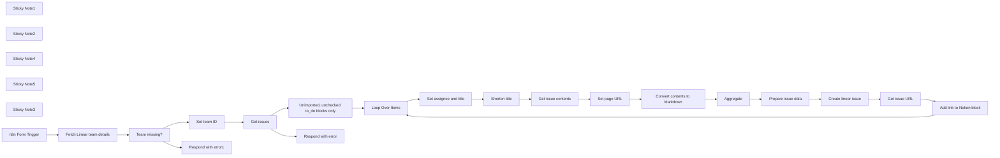

## Fluxo (.json) :

```json
{
  "meta": {
    "instanceId": "cb484ba7b742928a2048bf8829668bed5b5ad9787579adea888f05980292a4a7"
  },
  "nodes": [
    {
      "id": "7d11aa76-c7bf-4aa3-9f94-fb2231f5055b",
      "name": "Loop Over Items",
      "type": "n8n-nodes-base.splitInBatches",
      "position": [
        -1460,
        2080
      ],
      "parameters": {
        "options": {}
      },
      "typeVersion": 3
    },
    {
      "id": "bea6febe-077f-4b90-887c-9c82954ef5d9",
      "name": "Fetch Linear team details",
      "type": "n8n-nodes-base.graphql",
      "position": [
        -1220,
        1760
      ],
      "parameters": {
        "query": "=query GetTeamsAndProjects {\n  teams(filter: {name: {contains: \"{{ $json['Linear team name'] }}\"}}) {\n    nodes {\n      id\n      name\n      members {\n        nodes {\n          id\n          name\n          email\n        }\n      }\n      projects {\n        nodes {\n          id\n          name\n          description\n        }\n      }\n    }\n  }\n}\n",
        "endpoint": "https://api.linear.app/graphql",
        "requestMethod": "GET",
        "authentication": "headerAuth"
      },
      "credentials": {
        "httpHeaderAuth": {
          "id": "zYILrk4RKFqdP66s",
          "name": "[Omar] Notion credentials for GraphQL API"
        }
      },
      "executeOnce": true,
      "typeVersion": 1,
      "continueOnFail": true
    },
    {
      "id": "27a2111b-716b-4150-af92-ab90d7e83642",
      "name": "Get issue contents",
      "type": "n8n-nodes-base.notion",
      "position": [
        -1220,
        2340
      ],
      "parameters": {
        "blockId": {
          "__rl": true,
          "mode": "id",
          "value": "={{ $('Set assignee and title').item.json.id }}"
        },
        "resource": "block",
        "operation": "getAll",
        "returnAll": true,
        "simplifyOutput": false,
        "fetchNestedBlocks": true
      },
      "credentials": {
        "notionApi": {
          "id": "80",
          "name": "Notion david-internal"
        }
      },
      "typeVersion": 2.1,
      "alwaysOutputData": true
    },
    {
      "id": "96bde9b1-b84e-445a-b90c-6dd4031076aa",
      "name": "Aggregate",
      "type": "n8n-nodes-base.aggregate",
      "position": [
        -560,
        2340
      ],
      "parameters": {
        "options": {},
        "fieldsToAggregate": {
          "fieldToAggregate": [
            {
              "fieldToAggregate": "markdown"
            }
          ]
        }
      },
      "typeVersion": 1
    },
    {
      "id": "45c63a2d-d457-4882-ac99-4b8e4a63ae43",
      "name": "Prepare issue data",
      "type": "n8n-nodes-base.set",
      "position": [
        -1220,
        2620
      ],
      "parameters": {
        "options": {},
        "assignments": {
          "assignments": [
            {
              "id": "e1b44489-ee32-4da4-816e-f56d640a9731",
              "name": "title",
              "type": "string",
              "value": "={{ $if($('Set assignee and title').item.json.title.length <= 70, $('Set assignee and title').item.json.title, $('Shorten title').item.json.message.content) }}"
            },
            {
              "id": "f3fab4f6-8ea3-4b93-91ea-ec08c2d9eded",
              "name": "description",
              "type": "string",
              "value": "=_Issue created automatically from a [Notion block]({{ $('Set page URL').last().json.page_url + '?pvs=4#' + $('Loop Over Items').item.json.id.replaceAll('-', '') }})_ {{ $if($('Set assignee and title').item.json.assignee_fragment && !$('Set assignee and title').item.json.assignee, \"\\nAssignee '\" + $('Set assignee and title').item.json.assignee_fragment + \"' not found\", '') }}\n\n{{ $json.markdown?.join('\\n') }}"
            }
          ]
        }
      },
      "typeVersion": 3.3
    },
    {
      "id": "ce619c7d-8363-48ec-86c8-a1f16097eb3e",
      "name": "Create linear issue",
      "type": "n8n-nodes-base.linear",
      "position": [
        -1000,
        2620
      ],
      "parameters": {
        "title": "={{ $json.title }}",
        "teamId": "={{ $('Set team ID').item.json.team_id }}",
        "additionalFields": {
          "assigneeId": "={{ $('Set assignee and title').item.json.assignee.id }}",
          "description": "={{ $json.description }}"
        }
      },
      "credentials": {
        "linearApi": {
          "id": "218",
          "name": "Linear account (David)"
        }
      },
      "typeVersion": 1
    },
    {
      "id": "cc365fa1-a2cc-430c-8cb4-5d708b7a66b9",
      "name": "Set assignee and title",
      "type": "n8n-nodes-base.code",
      "position": [
        -1220,
        2080
      ],
      "parameters": {
        "mode": "runOnceForEachItem",
        "jsCode": "// Set the title and the assignee based on the first line of the item\n\nlet firstLine = $json[$json.type].text.reduce((s, o) => {\n  return s + o.text.content\n}, \"\")\nconsole.log('firstLin', firstLine)\nconst regex = /^(\\[[^\\]]*\\]\\s)?(.+)$/;\nconst match = firstLine.match(regex);\nconsole.log('match', match)\n\nif (match) {\n  // If the first part is not present, match[1] will be undefined\n  item.json.assignee_fragment = match[1]?.slice(1, -2) || null;\n  item.json.title = match[2];\n} else {\n  item.json.title = firstLine;\n  item.json.assignee_fragment = null;\n}\n\n// Set the new title in Notion format\n// $url will be set later, once we have it\nconst prefix_link = [\n  {\"text\":{\"content\":\"[\"}},\n  {\"text\":{\"content\":\"In Linear\", \"link\":{\"url\": \"$url\"} }},\n  {\"text\":{\"content\":\"] \"}}\n]\nitem.json.new_content = {\n  \"rich_text\": [...prefix_link, ...item.json.to_do.text]\n}\n\n// Find a matching assignee\nconst members = $('Fetch Linear team details').item.json.data.teams.nodes[0].members.nodes\nconsole.log('people', members)\nconsole.log('fragment', item.json.assignee_fragment)\nconst matching_people = members.filter(p => \n  p.name.toLowerCase().startsWith(item.json.assignee_fragment?.toLowerCase())\n)\nconsole.log('mpeople', matching_people)\nif (matching_people.length > 0) {\n  item.json.assignee = matching_people[0]\n}\n\nitem.pairedItem = 0\n\nreturn item"
      },
      "typeVersion": 2
    },
    {
      "id": "15d9c526-95f3-4209-9a9f-a0ba4c09a67e",
      "name": "Team missing?",
      "type": "n8n-nodes-base.if",
      "position": [
        -1000,
        1760
      ],
      "parameters": {
        "options": {},
        "conditions": {
          "options": {
            "leftValue": "",
            "caseSensitive": true,
            "typeValidation": "strict"
          },
          "combinator": "and",
          "conditions": [
            {
              "id": "047fbe62-ebab-44ab-89b1-232f5f15874d",
              "operator": {
                "type": "boolean",
                "operation": "true",
                "singleValue": true
              },
              "leftValue": "={{ $json.data.teams?.nodes?.length < 1 }}",
              "rightValue": ""
            }
          ]
        }
      },
      "typeVersion": 2
    },
    {
      "id": "491a1176-18a7-442a-8f64-a8c946ac25dc",
      "name": "Set page URL",
      "type": "n8n-nodes-base.set",
      "position": [
        -1000,
        2340
      ],
      "parameters": {
        "options": {},
        "assignments": {
          "assignments": [
            {
              "id": "0b0ced59-14c9-43e9-a5ee-f4b1862fccd6",
              "name": "page_url",
              "type": "string",
              "value": "={{ $('n8n Form Trigger').item.json['Notion block URL'].substr(0, $('n8n Form Trigger').item.json['Notion block URL'].indexOf('?')) || $('n8n Form Trigger').item.json['Notion block URL'] }}"
            },
            {
              "id": "3df2b2e6-38ca-4fb6-b00c-e3a6ceb3f9b3",
              "name": "root_content",
              "type": "object",
              "value": "={{ $('Set assignee and title').item.json[$('Set assignee and title').item.json.type] }}"
            },
            {
              "id": "41a18b43-49fd-45a5-850d-55b9f08f9b93",
              "name": "root_id",
              "type": "string",
              "value": "={{ $('Set assignee and title').item.json.id }}"
            }
          ]
        },
        "includeOtherFields": true
      },
      "typeVersion": 3.3
    },
    {
      "id": "bd107990-b009-4b81-8fee-a80c9ab09b4c",
      "name": "Set team ID",
      "type": "n8n-nodes-base.set",
      "position": [
        -740,
        1760
      ],
      "parameters": {
        "options": {},
        "assignments": {
          "assignments": [
            {
              "id": "b22a4a67-67b5-415a-ab38-4d7f781e8b7e",
              "name": "team_id",
              "type": "string",
              "value": "={{ $json.data.teams.nodes[0].id }}"
            }
          ]
        }
      },
      "typeVersion": 3.3
    },
    {
      "id": "010105b6-38a2-4859-9e5d-b9624addeacc",
      "name": "Add link to Notion block",
      "type": "n8n-nodes-base.httpRequest",
      "position": [
        -560,
        2620
      ],
      "parameters": {
        "url": "=https://api.notion.com/v1/blocks/{{ $('Loop Over Items').item.json.id }}",
        "method": "PATCH",
        "options": {},
        "jsonBody": "={\n  \"to_do\":\n    {{ JSON.stringify($('Set assignee and title').item.json.new_content).replace('$url', $json.data.issue.url) }}\n}",
        "sendBody": true,
        "sendHeaders": true,
        "specifyBody": "json",
        "authentication": "predefinedCredentialType",
        "headerParameters": {
          "parameters": [
            {
              "name": "Notion-Version",
              "value": "2022-06-28"
            }
          ]
        },
        "nodeCredentialType": "notionApi"
      },
      "credentials": {
        "notionApi": {
          "id": "80",
          "name": "Notion david-internal"
        }
      },
      "typeVersion": 4.1
    },
    {
      "id": "bb88f7df-deef-4c9d-b8af-3e59bf0e0b7d",
      "name": "Get issue URL",
      "type": "n8n-nodes-base.graphql",
      "position": [
        -780,
        2620
      ],
      "parameters": {
        "query": "=query IssueDetails {\n  issue(id: \"{{ $json.id }}\") {\n    url\n  }\n}",
        "endpoint": "https://api.linear.app/graphql",
        "requestMethod": "GET",
        "authentication": "headerAuth"
      },
      "credentials": {
        "httpHeaderAuth": {
          "id": "zYILrk4RKFqdP66s",
          "name": "[Omar] Notion credentials for GraphQL API"
        }
      },
      "executeOnce": true,
      "typeVersion": 1,
      "continueOnFail": true
    },
    {
      "id": "00736596-08ee-4ff6-b907-bd454dd406d9",
      "name": "Shorten title",
      "type": "@n8n/n8n-nodes-langchain.openAi",
      "position": [
        -1000,
        2080
      ],
      "parameters": {
        "modelId": {
          "__rl": true,
          "mode": "list",
          "value": "gpt-4",
          "cachedResultName": "GPT-4"
        },
        "options": {},
        "messages": {
          "values": [
            {
              "content": "=Make the following text more concise, so that it's max 150 chars long. If it's already less than 70 chars long, just return the original text. Do not return anything else other than the text.\n\nTEXT:\n{{ $json.title }}"
            }
          ]
        }
      },
      "credentials": {
        "openAiApi": {
          "id": "VQtv7frm7eLiEDnd",
          "name": "OpenAi account 7"
        }
      },
      "typeVersion": 1
    },
    {
      "id": "729928a2-8a5e-4b25-82be-ba1916b9953f",
      "name": "Sticky Note1",
      "type": "n8n-nodes-base.stickyNote",
      "position": [
        -1260,
        2020
      ],
      "parameters": {
        "color": 7,
        "width": 877.8549621677266,
        "height": 214.7985362687051,
        "content": "### Figure out issue assignee and title (shortening if necessary)"
      },
      "typeVersion": 1
    },
    {
      "id": "86d3b72f-f235-4b37-877f-c8ab1f39ba30",
      "name": "Sticky Note2",
      "type": "n8n-nodes-base.stickyNote",
      "position": [
        -1260,
        2280
      ],
      "parameters": {
        "color": 7,
        "width": 877.8549621677266,
        "height": 216.9904777194533,
        "content": "### Compose issue description"
      },
      "typeVersion": 1
    },
    {
      "id": "01c06352-76fa-4d63-b37b-2a0239d81302",
      "name": "Sticky Note4",
      "type": "n8n-nodes-base.stickyNote",
      "position": [
        -1260,
        2560
      ],
      "parameters": {
        "color": 7,
        "width": 877.8549621677266,
        "height": 216.9904777194533,
        "content": "### Create issue and add link to it in Notion"
      },
      "typeVersion": 1
    },
    {
      "id": "1f152f08-0c5a-4806-bd85-7e9a5e386fe4",
      "name": "Sticky Note5",
      "type": "n8n-nodes-base.stickyNote",
      "position": [
        -1260,
        1500
      ],
      "parameters": {
        "color": 7,
        "width": 1164.99929221574,
        "height": 442.760447146518,
        "content": "### Get the issues to create from Notion (and load Linear team details)"
      },
      "typeVersion": 1
    },
    {
      "id": "839d1815-419d-4acb-8668-94f1cbe45f1f",
      "name": "Sticky Note3",
      "type": "n8n-nodes-base.stickyNote",
      "position": [
        -1780,
        1700
      ],
      "parameters": {
        "height": 278.9250421966361,
        "content": "# Try me out\n1. In the form trigger node, enter the names of your Linear team(s) to display on the form \n2. Make sure your Notion page is formatted according to the [spec](https://www.notion.so/n8n/Template-for-design-review-automatic-Linear-import-8848dd09892341969faedd1313eea586?pvs=4) and shared with your Notion integration\n2. Click the 'test workflow' button below"
      },
      "typeVersion": 1
    },
    {
      "id": "f9bc6e67-a9f0-4c9b-a9b3-fdea1fd9de3e",
      "name": "Unimported, unchecked to_do blocks only",
      "type": "n8n-nodes-base.filter",
      "position": [
        -220,
        1760
      ],
      "parameters": {
        "options": {},
        "conditions": {
          "options": {
            "leftValue": "",
            "caseSensitive": true,
            "typeValidation": "strict"
          },
          "combinator": "and",
          "conditions": [
            {
              "id": "d7e85c09-8548-4fc8-a8a9-636e4529e9d9",
              "operator": {
                "name": "filter.operator.equals",
                "type": "string",
                "operation": "equals"
              },
              "leftValue": "={{ $json.type }}",
              "rightValue": "to_do"
            },
            {
              "id": "13fb565d-8951-4c89-9684-85c357459794",
              "operator": {
                "type": "boolean",
                "operation": "true",
                "singleValue": true
              },
              "leftValue": "={{ !$json.to_do.text.reduce((s, o) => s + o.plain_text, \"\").startsWith('[In Linear]') }}",
              "rightValue": ""
            },
            {
              "id": "0a9c8e94-11ec-4317-8de5-f22862555b78",
              "operator": {
                "type": "boolean",
                "operation": "false",
                "singleValue": true
              },
              "leftValue": "={{ $json.to_do.checked }}",
              "rightValue": ""
            }
          ]
        }
      },
      "typeVersion": 2
    },
    {
      "id": "186a4272-4550-441e-9ef2-66de2dac5b8a",
      "name": "n8n Form Trigger",
      "type": "n8n-nodes-base.formTrigger",
      "position": [
        -1460,
        1760
      ],
      "webhookId": "5a631d63-f899-4967-acad-69924674e96a",
      "parameters": {
        "path": "5a631d63-f899-4967-acad-69924674e96a",
        "formTitle": "Import Linear issues from Notion",
        "formFields": {
          "values": [
            {
              "fieldLabel": "Notion page URL",
              "requiredField": true
            },
            {
              "fieldType": "dropdown",
              "fieldLabel": "Linear team name",
              "fieldOptions": {
                "values": [
                  {
                    "option": "AI"
                  },
                  {
                    "option": "Adore"
                  },
                  {
                    "option": "Payday"
                  },
                  {
                    "option": "NODES"
                  }
                ]
              },
              "requiredField": true
            }
          ]
        },
        "responseMode": "responseNode",
        "formDescription": "More information on Notion formatting required here: https://www.notion.so/n8n/8848dd09892341969faedd1313eea586"
      },
      "typeVersion": 2
    },
    {
      "id": "0fed5dbe-54e9-4bc3-8ab3-6175347ecce7",
      "name": "Get issues",
      "type": "n8n-nodes-base.notion",
      "onError": "continueErrorOutput",
      "position": [
        -500,
        1760
      ],
      "parameters": {
        "blockId": {
          "__rl": true,
          "mode": "url",
          "value": "={{ $('n8n Form Trigger').item.json['Notion page URL'] }}"
        },
        "resource": "block",
        "operation": "getAll",
        "returnAll": true,
        "simplifyOutput": false
      },
      "credentials": {
        "notionApi": {
          "id": "80",
          "name": "Notion david-internal"
        }
      },
      "typeVersion": 2.1
    },
    {
      "id": "7cc756ad-55f3-4596-989a-df90d4c829c7",
      "name": "Convert contents to Markdown",
      "type": "n8n-nodes-base.code",
      "position": [
        -780,
        2340
      ],
      "parameters": {
        "jsCode": "function extractMarkdown(obj) {\n  console.log('obj', obj.text)\n  return obj.text.reduce((s, o) => {\n    if(o.text?.link) {\n      return s + '[' + o.text.content + '](' + o.text.link?.url + ')'\n    }\n    return s + o.text.content\n  }, \"\")\n}\n\n\nconst indent = \"    \"; // Four spaces\nlet parent_ids = [$input.all()[0].json.root_id]\n\nfor(item of $input.all()){\n\n  // Generate the markdown\n\n  if(item.json.type) {\n  \n    const type = item.json.type\n    \n    if(type == 'bulleted_list_item' || type == 'toggle') {\n      item.json.markdown = '* ' + extractMarkdown(item.json[type])\n    } else if(type == 'numbered_list_item') {\n      item.json.markdown = '1. ' + extractMarkdown(item.json[type])\n    } else if(type == 'to_do') {\n      item.json.markdown = '+ [ ] ' + extractMarkdown(item.json[type])\n    } else if(type == 'image') {\n      item.json.markdown = ''\n    } else if(type == 'video') {\n      item.json.markdown = '[🎬 Video]('+$input.all()[0].json.page_url + '?pvs=4#' + item.json.id.replaceAll('-', '') +')'\n    } else {\n      item.json.markdown = extractMarkdown(item.json[type])\n    }\n  \n    // Figure out how much to indent it\n    // If parent ID is in list, remove everything after that ID\n    // If parent ID is not in list, add it\n    // If parent is the same, do nothing\n    const parent_id_index = parent_ids.indexOf(item.json.parent_id);\n  \n    // Check if the value is found\n    if (parent_id_index !== -1) {\n      // Remove all elements after the first occurrence\n      parent_ids.splice(parent_id_index + 1);\n    } else {\n      parent_ids.push(item.json.parent_id)\n    }\n  \n    // Indent the markdown\n    //if (type != \"image\") {\n      item.json.markdown = indent.repeat(parent_ids.length - 1) + item.json.markdown\n    //}\n  }\n}\n\n// On returning, add in the root block content at the beginning\nreturn [\n  ...[\n    {\n      \"json\": {\n        \"markdown\":\nextractMarkdown($input.all()[0].json.root_content)\n      },\n      \"pairedItem\": 0\n    }\n  ],\n  ...$input.all()\n]"
      },
      "typeVersion": 2
    },
    {
      "id": "2bbd43a2-aebe-4ee5-8682-d76791214168",
      "name": "Respond with error",
      "type": "n8n-nodes-base.respondToWebhook",
      "position": [
        -220,
        1580
      ],
      "parameters": {
        "options": {},
        "respondWith": "json",
        "responseBody": "{\n  \"formSubmittedText\": \"Couldn't fetch page content from Notion. Is it shared with your Notion integration?\"\n}"
      },
      "typeVersion": 1
    },
    {
      "id": "c39912c4-d33f-4d79-9d5c-e71bd0f2517d",
      "name": "Respond with error1",
      "type": "n8n-nodes-base.respondToWebhook",
      "position": [
        -740,
        1580
      ],
      "parameters": {
        "options": {},
        "respondWith": "json",
        "responseBody": "={\n  \"formSubmittedText\": \"Couldn't find the team called '\" + {{ $('n8n Form Trigger').item.json['Linear team name'] }} + \"'\"\n} "
      },
      "typeVersion": 1
    }
  ],
  "pinData": {},
  "connections": {
    "Aggregate": {
      "main": [
        [
          {
            "node": "Prepare issue data",
            "type": "main",
            "index": 0
          }
        ]
      ]
    },
    "Get issues": {
      "main": [
        [
          {
            "node": "Unimported, unchecked to_do blocks only",
            "type": "main",
            "index": 0
          }
        ],
        [
          {
            "node": "Respond with error",
            "type": "main",
            "index": 0
          }
        ]
      ]
    },
    "Set team ID": {
      "main": [
        [
          {
            "node": "Get issues",
            "type": "main",
            "index": 0
          }
        ]
      ]
    },
    "Set page URL": {
      "main": [
        [
          {
            "node": "Convert contents to Markdown",
            "type": "main",
            "index": 0
          }
        ]
      ]
    },
    "Get issue URL": {
      "main": [
        [
          {
            "node": "Add link to Notion block",
            "type": "main",
            "index": 0
          }
        ]
      ]
    },
    "Shorten title": {
      "main": [
        [
          {
            "node": "Get issue contents",
            "type": "main",
            "index": 0
          }
        ]
      ]
    },
    "Team missing?": {
      "main": [
        [
          {
            "node": "Respond with error1",
            "type": "main",
            "index": 0
          }
        ],
        [
          {
            "node": "Set team ID",
            "type": "main",
            "index": 0
          }
        ]
      ]
    },
    "Loop Over Items": {
      "main": [
        null,
        [
          {
            "node": "Set assignee and title",
            "type": "main",
            "index": 0
          }
        ]
      ]
    },
    "n8n Form Trigger": {
      "main": [
        [
          {
            "node": "Fetch Linear team details",
            "type": "main",
            "index": 0
          }
        ]
      ]
    },
    "Get issue contents": {
      "main": [
        [
          {
            "node": "Set page URL",
            "type": "main",
            "index": 0
          }
        ]
      ]
    },
    "Prepare issue data": {
      "main": [
        [
          {
            "node": "Create linear issue",
            "type": "main",
            "index": 0
          }
        ]
      ]
    },
    "Create linear issue": {
      "main": [
        [
          {
            "node": "Get issue URL",
            "type": "main",
            "index": 0
          }
        ]
      ]
    },
    "Set assignee and title": {
      "main": [
        [
          {
            "node": "Shorten title",
            "type": "main",
            "index": 0
          }
        ]
      ]
    },
    "Add link to Notion block": {
      "main": [
        [
          {
            "node": "Loop Over Items",
            "type": "main",
            "index": 0
          }
        ]
      ]
    },
    "Fetch Linear team details": {
      "main": [
        [
          {
            "node": "Team missing?",
            "type": "main",
            "index": 0
          }
        ]
      ]
    },
    "Convert contents to Markdown": {
      "main": [
        [
          {
            "node": "Aggregate",
            "type": "main",
            "index": 0
          }
        ]
      ]
    },
    "Unimported, unchecked to_do blocks only": {
      "main": [
        [
          {
            "node": "Loop Over Items",
            "type": "main",
            "index": 0
          }
        ]
      ]
    }
  }
}
```

<a id="template-938"></a>

## Template 938 - Exportar cotações agrícolas para Google Sheets

- **Nome:** Exportar cotações agrícolas para Google Sheets
- **Descrição:** Coleta cotações (SheepQuotation) de uma API pública para um intervalo de datas e mercado específicos e adiciona os registros em uma planilha do Google Sheets.
- **Funcionalidade:** • Acionamento manual: inicia a execução do fluxo quando o usuário dispara o teste.
• Consulta à API de cotações: recupera dados de cotações usando parâmetros de data, nome do mercado e chave de API.
• Expansão de resultados: separa o array de dados retornado em registros individuais para processamento.
• Mapeamento de campos e inserção: mapeia campos como TransDate, CropName, MarketName, preços e quantidade e adiciona cada registro como nova linha na planilha.
• Parâmetros configuráveis: permite definir intervalo de datas e mercado para filtrar a consulta antes da inserção na planilha.
- **Ferramentas:** • data.moa.gov.tw (API do Ministério da Agricultura de Taiwan): fornece o endpoint SheepQuotation para obter cotações por intervalo de datas e mercado, retornando dados em formato JSON.
• Google Sheets: serviço de planilhas online usado como destino para armazenar os registros recuperados (documento e aba específica configurados para append).

## Fluxo visual

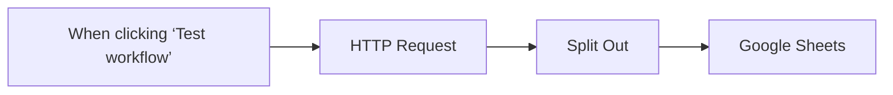

## Fluxo (.json) :

```json
{
  "id": "ziJG3tgG91Gkbina",
  "meta": {
    "instanceId": "fddb3e91967f1012c95dd02bf5ad21f279fc44715f47a7a96a33433621caa253"
  },
  "name": "n8n-農產品",
  "tags": [
    {
      "id": "YaVjRtdJOQvaEnU3",
      "name": "testing",
      "createdAt": "2024-12-29T07:47:44.069Z",
      "updatedAt": "2024-12-29T07:47:44.069Z"
    }
  ],
  "nodes": [
    {
      "id": "07d7241d-480b-4d53-96ba-485d1dc469f6",
      "name": "When clicking ‘Test workflow’",
      "type": "n8n-nodes-base.manualTrigger",
      "position": [
        0,
        0
      ],
      "parameters": {},
      "typeVersion": 1
    },
    {
      "id": "02dfaea7-be8c-49fd-a869-39cccf6e6dde",
      "name": "HTTP Request",
      "type": "n8n-nodes-base.httpRequest",
      "position": [
        220,
        0
      ],
      "parameters": {
        "url": "https://data.moa.gov.tw/api/v1/SheepQuotation",
        "options": {},
        "sendQuery": true,
        "sendHeaders": true,
        "queryParameters": {
          "parameters": [
            {
              "name": "Start_time",
              "value": "2024/12/01"
            },
            {
              "name": "End_time",
              "value": "2024/12/31"
            },
            {
              "name": "MarketName",
              "value": "台北二"
            },
            {
              "name": "api_key",
              "value": "3AFID4BGE9PDQ2WTFDO1X61H4RNQLE"
            }
          ]
        },
        "headerParameters": {
          "parameters": [
            {
              "name": "accept",
              "value": "application/json"
            }
          ]
        }
      },
      "typeVersion": 4.2
    },
    {
      "id": "69a1d5c6-a59f-4b4b-9e51-d75f319a75c6",
      "name": "Split Out",
      "type": "n8n-nodes-base.splitOut",
      "position": [
        440,
        0
      ],
      "parameters": {
        "options": {},
        "fieldToSplitOut": "Data"
      },
      "typeVersion": 1
    },
    {
      "id": "082828e0-4cc6-465c-bfe4-561f8e4e3c50",
      "name": "Google Sheets",
      "type": "n8n-nodes-base.googleSheets",
      "position": [
        660,
        0
      ],
      "parameters": {
        "columns": {
          "value": {},
          "schema": [
            {
              "id": "TransDate",
              "type": "string",
              "display": true,
              "required": false,
              "displayName": "TransDate",
              "defaultMatch": false,
              "canBeUsedToMatch": true
            },
            {
              "id": "TcType",
              "type": "string",
              "display": true,
              "required": false,
              "displayName": "TcType",
              "defaultMatch": false,
              "canBeUsedToMatch": true
            },
            {
              "id": "CropCode",
              "type": "string",
              "display": true,
              "required": false,
              "displayName": "CropCode",
              "defaultMatch": false,
              "canBeUsedToMatch": true
            },
            {
              "id": "CropName",
              "type": "string",
              "display": true,
              "required": false,
              "displayName": "CropName",
              "defaultMatch": false,
              "canBeUsedToMatch": true
            },
            {
              "id": "MarketCode",
              "type": "string",
              "display": true,
              "required": false,
              "displayName": "MarketCode",
              "defaultMatch": false,
              "canBeUsedToMatch": true
            },
            {
              "id": "MarketName",
              "type": "string",
              "display": true,
              "required": false,
              "displayName": "MarketName",
              "defaultMatch": false,
              "canBeUsedToMatch": true
            },
            {
              "id": "Upper_Price",
              "type": "string",
              "display": true,
              "required": false,
              "displayName": "Upper_Price",
              "defaultMatch": false,
              "canBeUsedToMatch": true
            },
            {
              "id": "Middle_Price",
              "type": "string",
              "display": true,
              "required": false,
              "displayName": "Middle_Price",
              "defaultMatch": false,
              "canBeUsedToMatch": true
            },
            {
              "id": "Lower_Price",
              "type": "string",
              "display": true,
              "required": false,
              "displayName": "Lower_Price",
              "defaultMatch": false,
              "canBeUsedToMatch": true
            },
            {
              "id": "Avg_Price",
              "type": "string",
              "display": true,
              "required": false,
              "displayName": "Avg_Price",
              "defaultMatch": false,
              "canBeUsedToMatch": true
            },
            {
              "id": "Trans_Quantity",
              "type": "string",
              "display": true,
              "required": false,
              "displayName": "Trans_Quantity",
              "defaultMatch": false,
              "canBeUsedToMatch": true
            }
          ],
          "mappingMode": "autoMapInputData",
          "matchingColumns": []
        },
        "options": {},
        "operation": "append",
        "sheetName": {
          "__rl": true,
          "mode": "list",
          "value": "gid=0",
          "cachedResultUrl": "https://docs.google.com/spreadsheets/d/17EJTOetBsfoGkzADCUHPoXaQW7FLQziYmQxKNJNnDIU/edit#gid=0",
          "cachedResultName": "Sheet1"
        },
        "documentId": {
          "__rl": true,
          "mode": "list",
          "value": "17EJTOetBsfoGkzADCUHPoXaQW7FLQziYmQxKNJNnDIU",
          "cachedResultUrl": "https://docs.google.com/spreadsheets/d/17EJTOetBsfoGkzADCUHPoXaQW7FLQziYmQxKNJNnDIU/edit?usp=drivesdk",
          "cachedResultName": "n8n爬蟲-農產品"
        }
      },
      "credentials": {
        "googleSheetsOAuth2Api": {
          "id": "atsKA0m2aQXeL6i6",
          "name": "Google Sheets account"
        }
      },
      "typeVersion": 4.5
    }
  ],
  "active": false,
  "pinData": {},
  "settings": {
    "executionOrder": "v1"
  },
  "versionId": "b7991044-da7e-425f-a2ea-692e3d8d642b",
  "connections": {
    "Split Out": {
      "main": [
        [
          {
            "node": "Google Sheets",
            "type": "main",
            "index": 0
          }
        ]
      ]
    },
    "HTTP Request": {
      "main": [
        [
          {
            "node": "Split Out",
            "type": "main",
            "index": 0
          }
        ]
      ]
    },
    "When clicking ‘Test workflow’": {
      "main": [
        [
          {
            "node": "HTTP Request",
            "type": "main",
            "index": 0
          }
        ]
      ]
    }
  }
}
```

<a id="template-939"></a>

## Template 939 - Verificar parâmetros com expressões afetadas por v1

- **Nome:** Verificar parâmetros com expressões afetadas por v1
- **Descrição:** Este fluxo procura em workflows ativos parâmetros que usam extensões de expressão afetadas por mudanças na versão v1 e retorna as localizações encontradas.
- **Funcionalidade:** • Inicio manual: permite executar a verificação sob demanda.
• Listagem de workflows ativos: consulta a conta/configuração de API para obter workflows em execução.
• Detecção de expressões afetadas: analisa parâmetros procurando por expressões que começam com '={{' e contêm extensões específicas (beginningOf, endOfMonth, minus, plus).
• Coleta de localizações: retorna nomes do workflow, do nó e do parâmetro para cada ocorrência encontrada.
• Aviso pós-atualização: indicado para execução após migrar para v1 para revisar comportamentos impactados.
- **Ferramentas:** • API de Workflows/Conta API: usada para listar workflows ativos e recuperar seus nós e parâmetros.
• JavaScript (função customizada): utilizada para analisar os parâmetros, identificar expressões afetadas e compilar a lista de localizações.

## Fluxo visual

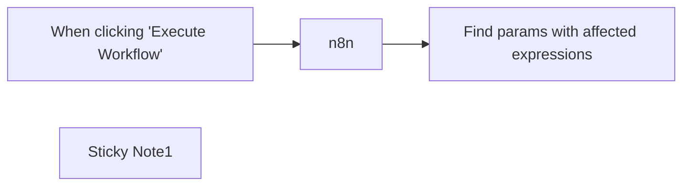

## Fluxo (.json) :

```json
{
  "id": "zlHbtHIcCZ9enKwg",
  "meta": {
    "instanceId": "406f1bca875c48c0fa12bf65a32e67f001617a6df6d6fd6dd72bff9d20014812"
  },
  "name": "v1 helper - Find params with affected expressions",
  "tags": [],
  "nodes": [
    {
      "id": "b3dd44ca-960f-4689-9545-30a05dc0441e",
      "name": "When clicking \"Execute Workflow\"",
      "type": "n8n-nodes-base.manualTrigger",
      "position": [
        580,
        320
      ],
      "parameters": {},
      "typeVersion": 1
    },
    {
      "id": "96db239d-05b6-4e1d-b101-e66c2a9708f6",
      "name": "n8n",
      "type": "n8n-nodes-base.n8n",
      "position": [
        800,
        320
      ],
      "parameters": {
        "filters": {
          "activeWorkflows": true
        }
      },
      "credentials": {
        "n8nApi": {
          "id": "hcJ2iZYYgs54eCaT",
          "name": "n8n account"
        }
      },
      "typeVersion": 1
    },
    {
      "id": "b2286f6b-ba37-433c-b22a-95032bc25b6e",
      "name": "Find params with affected expressions",
      "type": "n8n-nodes-base.code",
      "position": [
        1040,
        320
      ],
      "parameters": {
        "jsCode": "const AFFECTED_EXTENSIONS = ['beginningOf', 'endOfMonth', 'minus', 'plus'];\n\nconst isExpression = (value) => typeof value === 'string' && value.startsWith('={{');\n\nconst containsAny = (str, substrings) => {\n  for (const substring of substrings) {\n    if (str.includes(substring)) return true;\n  }\n  \n  return false;\n}\n\nconst isAffected = (value) => isExpression(value) && containsAny(value, AFFECTED_EXTENSIONS);\n\nfunction findParamsByTest(target, test) {\n  const parameterNames = [];\n\n  function search(obj) {\n    if (typeof obj === 'object') {\n      for (const key in obj) {\n        const value = obj[key];\n\n        if (test(value)) {\n          parameterNames.push(key);\n        } else if (typeof value === 'object') {\n          search(value);\n        }\n      }\n    }\n  }\n\n  search(target);\n\n  return parameterNames;\n}\n\nreturn $input.all().reduce((allLocations, { json: workflow }) => {\n  const perWorkflow = workflow.nodes.reduce((allLocationsPerWorkflow, node) => {\n    const perNode = findParamsByTest(node.parameters, isAffected).map(\n      (parameterName) => {\n\t\treturn {\n\t\t\tworkflowName: workflow.name,\n\t\t\tnodeName: node.name,\n\t\t\tparameterName,\n        };\n      },\n    );\n\n    return [...allLocationsPerWorkflow, ...perNode];\n  }, []);\n\n  return [...allLocations, ...perWorkflow];\n}, []);"
      },
      "typeVersion": 1
    },
    {
      "id": "ee189fa0-cf89-4b8d-8351-ed9598f18502",
      "name": "Sticky Note1",
      "type": "n8n-nodes-base.stickyNote",
      "position": [
        600,
        92
      ],
      "parameters": {
        "width": 548.6551724137931,
        "height": 191.08045977011497,
        "content": "## v1 Helper\n\nℹ️ This workflow is to be run **after upgrading to n8n v1**.\n\nThis workflow returns all locations where a node in an active workflow contains a parameter using an **expression extension affected by [v1 changes](https://github.com/n8n-io/n8n/pull/6435)**. For every location, please check that the workflow still behaves as intended."
      },
      "typeVersion": 1
    }
  ],
  "active": false,
  "pinData": {},
  "settings": {},
  "versionId": "da694734-30ae-46b1-8e29-877c95b670ab",
  "connections": {
    "n8n": {
      "main": [
        [
          {
            "node": "Find params with affected expressions",
            "type": "main",
            "index": 0
          }
        ]
      ]
    },
    "When clicking \"Execute Workflow\"": {
      "main": [
        [
          {
            "node": "n8n",
            "type": "main",
            "index": 0
          }
        ]
      ]
    }
  }
}
```

<a id="template-940"></a>

## Template 940 - Receita diária de cocktail no Telegram

- **Nome:** Receita diária de cocktail no Telegram
- **Descrição:** Agenda e envia diariamente uma receita de cocktail aleatória para um chat do Telegram.
- **Funcionalidade:** • Agendamento diário: dispara todos os dias às 20:00 para iniciar o envio.
• Obtenção de cocktail aleatório: consulta uma API pública para recuperar uma receita aleatória, incluindo imagem e instruções.
• Envio para Telegram: envia a imagem do cocktail para um chat ou grupo com as instruções como legenda.
- **Ferramentas:** • TheCocktailDB: API pública que fornece receitas de cocktails, imagens e instruções.
• Telegram: serviço de mensagens usado para enviar a foto e a legenda ao chat ou grupo.

## Fluxo visual

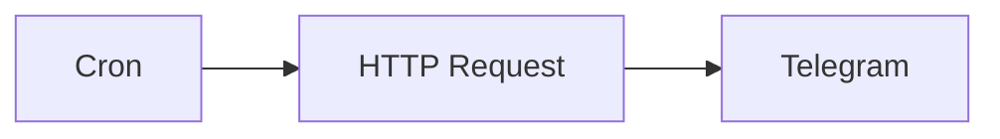

## Fluxo (.json) :

```json
{
  "id": "57",
  "name": "Send a cocktail recipe every day via a Telegram",
  "nodes": [
    {
      "name": "Telegram",
      "type": "n8n-nodes-base.telegram",
      "position": [
        930,
        300
      ],
      "parameters": {
        "file": "={{$node[\"HTTP Request\"].json[\"drinks\"][0][\"strDrinkThumb\"]}}",
        "chatId": "-485396236",
        "operation": "sendPhoto",
        "additionalFields": {
          "caption": "={{$node[\"HTTP Request\"].json[\"drinks\"][0][\"strInstructions\"]}}"
        }
      },
      "credentials": {
        "telegramApi": "telegram-bot"
      },
      "typeVersion": 1
    },
    {
      "name": "Cron",
      "type": "n8n-nodes-base.cron",
      "position": [
        530,
        300
      ],
      "parameters": {
        "triggerTimes": {
          "item": [
            {
              "hour": 20
            }
          ]
        }
      },
      "typeVersion": 1
    },
    {
      "name": "HTTP Request",
      "type": "n8n-nodes-base.httpRequest",
      "position": [
        730,
        300
      ],
      "parameters": {
        "url": "https://www.thecocktaildb.com/api/json/v1/1/random.php",
        "options": {}
      },
      "typeVersion": 1
    }
  ],
  "active": false,
  "settings": {},
  "connections": {
    "Cron": {
      "main": [
        [
          {
            "node": "HTTP Request",
            "type": "main",
            "index": 0
          }
        ]
      ]
    },
    "HTTP Request": {
      "main": [
        [
          {
            "node": "Telegram",
            "type": "main",
            "index": 0
          }
        ]
      ]
    }
  }
}
```

<a id="template-941"></a>

## Template 941 - Geração avançada de RSS do canal YouTube

- **Nome:** Geração avançada de RSS do canal YouTube
- **Descrição:** Este fluxo gera feeds RSS para um canal público do YouTube a partir de entradas diversas (URL, username, ID ou vídeo ID). Ele converte a entrada em ID do canal, obtém as informações necessárias e produz feeds de vídeos e de comunidade em múltiplos formatos, apresentando os resultados em uma tabela HTML através de webhook.
- **Funcionalidade:** • Entrada flexível: aceita diferentes formatos de entrada (nome de usuário, ID de canal, URL de vídeo ou URL de canal) e identifica o tipo.
• Conversão para ID de canal: utiliza serviço externo para converter a entrada em um ID de canal do YouTube.
• Geração de feed XML: gera a URL do feed de vídeos do YouTube para o canal com base no ID.
• Geração de feeds em formatos múltiplos: cria URLs para HTML, Atom, JSON, MRSS, Plaintext, SFeed e XML através de um gerador de feeds externo.
• Geração de feeds de comunidade: gera feeds da aba Comunidade em vários formatos.
• Agregação de feeds: consolida as URLs geradas em um conjunto único.
• Validação de entrada: valida e extrai informações da entrada fornecida pelo usuário.
• Saída formatada em HTML: transforma os feeds em uma tabela HTML legível.
• Resposta via webhook: retorna a tabela de feeds como resposta do webhook.
- **Ferramentas:** • CommentPicker: Serviço externo utilizado para converter entradas em IDs de canal e fornecer tokens para requisições adicionais.
• RSS-Bridge: Serviço externo que transforma IDs de canal em feeds RSS em formatos variados (HTML, Atom, JSON, MRSS, Plaintext, SFEED, XML).
• YouTube Data API v3: API da Google usada para obter informações de canais e vídeos a partir do ID do canal (snippet, statistics, contentDetails, etc.).

## Fluxo visual

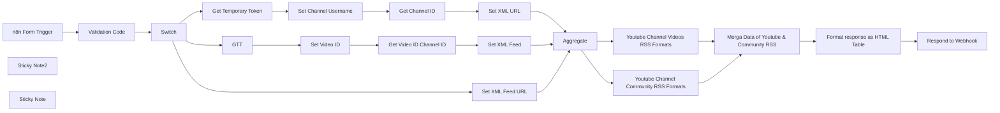

## Fluxo (.json) :

```json
{
  "meta": {},
  "name": "[n8n] YouTube Channel Advanced RSS Feeds Generator",
  "tags": [
    {
      "id": "Q29tbWVudHBpY2tlcg",
      "name": "Commentpicker",
      "createdAt": "2024-04-16T14:29:17.942Z",
      "updatedAt": "2024-04-16T14:29:17.942Z"
    },
    {
      "id": "Rm9ybVRyaWdnZXI",
      "name": "FormTrigger",
      "createdAt": "2024-04-16T14:29:17.942Z",
      "updatedAt": "2024-04-16T14:29:17.942Z"
    },
    {
      "id": "SHR0cFJlcXVlc3Q",
      "name": "HttpRequest",
      "createdAt": "2024-04-16T14:29:17.942Z",
      "updatedAt": "2024-04-16T14:29:17.942Z"
    },
    {
      "id": "QWdncmVnYXRl",
      "name": "Aggregate",
      "createdAt": "2024-04-16T14:29:17.942Z",
      "updatedAt": "2024-04-16T14:29:17.942Z"
    },
    {
      "id": "UmVzcG9uZFRvV2ViaG9vaw",
      "name": "RespondToWebhook",
      "createdAt": "2024-04-16T14:29:17.942Z",
      "updatedAt": "2024-04-16T14:29:17.942Z"
    },
    {
      "id": "Q29kZQ",
      "name": "Code",
      "createdAt": "2024-04-16T14:29:17.942Z",
      "updatedAt": "2024-04-16T14:29:17.942Z"
    }
  ],
  "nodes": [
    {
      "name": "n8n Form Trigger",
      "type": "n8n-nodes-base.formTrigger",
      "position": [
        -300,
        -260
      ],
      "webhookId": "68a70315-9f74-4cf5-9c68-828396b0f23b",
      "parameters": {
        "path": "Youtube",
        "formTitle": "Youtube RSS Generator",
        "formFields": {
          "values": [
            {
              "fieldLabel": "youtube Channel username or ID",
              "requiredField": true
            }
          ]
        },
        "responseMode": "responseNode",
        "formDescription": "=Youtube Username Example: @username\n\nYoutube ID Example: UCxxxxxxxxxxxxxxxxxx\n\nYoutube Video URL Example 1: https://www.youtube.com/watch?v=mn-br82ENxc\n\nYoutube Video URL Example 2: https://youtu.be/mn-br82ENxc\n\nYoutube Channel URL Example 1: https://www.youtube.com/@NewMedia_Life\n\nYoutube Channel URL Example 2: https://www.youtube.com/channel/UC_UDAiqQj-QfgTixKkW51qA"
      },
      "typeVersion": 2
    },
    {
      "name": "Get Channel ID",
      "type": "n8n-nodes-base.httpRequest",
      "notes": "3rd party API request",
      "position": [
        700,
        -440
      ],
      "parameters": {
        "url": "https://commentpicker.com/actions/youtube-channel-id.php",
        "options": {
          "response": {
            "response": {
              "responseFormat": "json"
            }
          }
        },
        "sendQuery": true,
        "sendHeaders": true,
        "queryParameters": {
          "parameters": [
            {
              "name": "url",
              "value": "=https://www.googleapis.com/youtube/v3/channels?part=id,snippet,statistics,contentDetails,status&forHandle={{ $item(\"0\").$node[\"Set Channel Username\"].json[\"channel name\"] }}"
            },
            {
              "name": "token",
              "value": "={{ $item(\"0\").$node[\"Get Temporary Token\"].json[\"data\"] }}"
            },
            {
              "name": "isPremium",
              "value": "false"
            }
          ]
        },
        "headerParameters": {
          "parameters": [
            {
              "name": "authority",
              "value": "commentpicker.com"
            },
            {
              "name": "cookie",
              "value": "ezosuibasgeneris-1=690da322-c7c8-44e2-6154-8591a44d12aa; ezoab_186623=mod99-c; active_template::186623=pub_site.1711138973; lp_186623=https://commentpicker.com/youtube-channel-id.php; fontsLoaded=true; PHPSESSID=12ltjv3rr293h943c8h35nh3cg"
            },
            {
              "name": "referer",
              "value": "https://commentpicker.com/youtube-channel-id.php"
            },
            {
              "name": "user-agent",
              "value": "Mozilla/5.0 (Windows NT 10.0; Win64; x64) AppleWebKit/537.36 (KHTML, like Gecko) Chrome/122.0.0.0 Safari/537.36 Edg/122.0.0.0"
            }
          ]
        }
      },
      "notesInFlow": true,
      "typeVersion": 4.1
    },
    {
      "name": "Set XML URL",
      "type": "n8n-nodes-base.set",
      "notes": "🤖Generate XML Feed URL",
      "position": [
        900,
        -440
      ],
      "parameters": {
        "options": {},
        "assignments": {
          "assignments": [
            {
              "id": "bf0ea151-e325-4860-af02-76e51f692f2c",
              "name": "rss",
              "type": "string",
              "value": "=https://www.youtube.com/feeds/videos.xml?channel_id={{ $json.items[0].id }}"
            }
          ]
        }
      },
      "notesInFlow": true,
      "typeVersion": 3.3
    },
    {
      "name": "Set Channel Username",
      "type": "n8n-nodes-base.set",
      "position": [
        520,
        -440
      ],
      "parameters": {
        "options": {},
        "assignments": {
          "assignments": [
            {
              "id": "0837a847-4c6b-4b39-bb90-f200233bf7e1",
              "name": "channel name",
              "type": "string",
              "value": "={{ $item(\"0\").$node[\"Switch\"].json[\"value\"] }}"
            }
          ]
        }
      },
      "typeVersion": 3.3
    },
    {
      "name": "Set XML Feed URL",
      "type": "n8n-nodes-base.set",
      "notes": "🤖Generate XML Feed URL",
      "position": [
        900,
        -260
      ],
      "parameters": {
        "options": {},
        "assignments": {
          "assignments": [
            {
              "id": "bf0ea151-e325-4860-af02-76e51f692f2c",
              "name": "rss",
              "type": "string",
              "value": "=https://www.youtube.com/feeds/videos.xml?channel_id={{ $item(\"0\").$node[\"Switch\"].json[\"value\"] }}"
            }
          ]
        }
      },
      "notesInFlow": true,
      "typeVersion": 3.3
    },
    {
      "name": "Set Video ID",
      "type": "n8n-nodes-base.set",
      "position": [
        520,
        -80
      ],
      "parameters": {
        "options": {},
        "assignments": {
          "assignments": [
            {
              "id": "0837a847-4c6b-4b39-bb90-f200233bf7e1",
              "name": "Video ID",
              "type": "string",
              "value": "={{ $item(\"0\").$node[\"Switch\"].json[\"value\"] }}"
            }
          ]
        }
      },
      "typeVersion": 3.3
    },
    {
      "name": "Get Video ID Channel ID",
      "type": "n8n-nodes-base.httpRequest",
      "notes": "3rd party API request",
      "position": [
        700,
        -80
      ],
      "parameters": {
        "url": "https://commentpicker.com/actions/youtube-channel-id.php",
        "options": {
          "response": {
            "response": {
              "responseFormat": "json"
            }
          }
        },
        "sendQuery": true,
        "sendHeaders": true,
        "queryParameters": {
          "parameters": [
            {
              "name": "url",
              "value": "=https://www.googleapis.com/youtube/v3/videos?part=snippet&id={{ $json[\"Video ID\"] }}"
            },
            {
              "name": "token",
              "value": "={{ $item(\"0\").$node[\"GTT\"].json[\"data\"] }}"
            },
            {
              "name": "isPremium",
              "value": "true"
            }
          ]
        },
        "headerParameters": {
          "parameters": [
            {
              "name": "authority",
              "value": "commentpicker.com"
            },
            {
              "name": "cookie",
              "value": "ezosuibasgeneris-1=690da322-c7c8-44e2-6154-8591a44d12aa; ezoab_186623=mod99-c; active_template::186623=pub_site.1711138973; lp_186623=https://commentpicker.com/youtube-channel-id.php; fontsLoaded=true; PHPSESSID=12ltjv3rr293h943c8h35nh3cg"
            },
            {
              "name": "referer",
              "value": "https://commentpicker.com/youtube-channel-id.php"
            },
            {
              "name": "user-agent",
              "value": "Mozilla/5.0 (Windows NT 10.0; Win64; x64) AppleWebKit/537.36 (KHTML, like Gecko) Chrome/122.0.0.0 Safari/537.36 Edg/122.0.0.0"
            }
          ]
        }
      },
      "notesInFlow": true,
      "typeVersion": 4.1
    },
    {
      "name": "Set XML Feed",
      "type": "n8n-nodes-base.set",
      "notes": "🤖Generate XML Feed URL",
      "position": [
        900,
        -80
      ],
      "parameters": {
        "options": {},
        "assignments": {
          "assignments": [
            {
              "id": "bf0ea151-e325-4860-af02-76e51f692f2c",
              "name": "rss",
              "type": "string",
              "value": "=https://www.youtube.com/feeds/videos.xml?channel_id={{ $item(\"0\").$node[\"Get Video ID Channel ID\"].json[\"items\"][\"0\"][\"snippet\"][\"channelId\"] }}"
            }
          ]
        }
      },
      "notesInFlow": true,
      "typeVersion": 3.3
    },
    {
      "name": "Get Temporary Token",
      "type": "n8n-nodes-base.httpRequest",
      "notes": "3rd party API request",
      "position": [
        320,
        -440
      ],
      "parameters": {
        "url": "https://commentpicker.com/actions/token.php",
        "options": {},
        "sendHeaders": true,
        "headerParameters": {
          "parameters": [
            {
              "name": "authority",
              "value": "commentpicker.com"
            },
            {
              "name": "cookie",
              "value": "ezosuibasgeneris-1=690da322-c7c8-44e2-6154-8591a44d12aa; fontsLoaded=true; PHPSESSID=12ltjv3rr293h943c8h35nh3cg; ezoab_186623=mod54-c; active_template::186623=pub_site.1711191989"
            },
            {
              "name": "referer",
              "value": "https://commentpicker.com/youtube-channel-id.php"
            },
            {
              "name": "user-agent",
              "value": "Mozilla/5.0 (Windows NT 10.0; Win64; x64) AppleWebKit/537.36 (KHTML, like Gecko) Chrome/122.0.0.0 Safari/537.36 Edg/122.0.0.0"
            }
          ]
        }
      },
      "notesInFlow": true,
      "typeVersion": 4.1
    },
    {
      "name": "GTT",
      "type": "n8n-nodes-base.httpRequest",
      "notes": "3rd party API request",
      "position": [
        320,
        -80
      ],
      "parameters": {
        "url": "https://commentpicker.com/actions/token.php",
        "options": {},
        "sendHeaders": true,
        "headerParameters": {
          "parameters": [
            {
              "name": "authority",
              "value": "commentpicker.com"
            },
            {
              "name": "cookie",
              "value": "ezosuibasgeneris-1=690da322-c7c8-44e2-6154-8591a44d12aa; fontsLoaded=true; PHPSESSID=12ltjv3rr293h943c8h35nh3cg; ezoab_186623=mod54-c; active_template::186623=pub_site.1711191989"
            },
            {
              "name": "referer",
              "value": "https://commentpicker.com/youtube-channel-id.php"
            },
            {
              "name": "user-agent",
              "value": "Mozilla/5.0 (Windows NT 10.0; Win64; x64) AppleWebKit/537.36 (KHTML, like Gecko) Chrome/122.0.0.0 Safari/537.36 Edg/122.0.0.0"
            }
          ]
        }
      },
      "notesInFlow": true,
      "typeVersion": 4.1
    },
    {
      "name": "Aggregate",
      "type": "n8n-nodes-base.aggregate",
      "notes": "🤖Combine results in one",
      "position": [
        1080,
        -260
      ],
      "parameters": {
        "options": {},
        "fieldsToAggregate": {
          "fieldToAggregate": [
            {
              "renameField": true,
              "outputFieldName": "rss url",
              "fieldToAggregate": "rss"
            }
          ]
        }
      },
      "notesInFlow": true,
      "typeVersion": 1
    },
    {
      "name": "Youtube Channel Videos RSS Formats",
      "type": "n8n-nodes-base.set",
      "notes": "RSS Feed for channel Posts",
      "position": [
        1260,
        -180
      ],
      "parameters": {
        "options": {},
        "assignments": {
          "assignments": [
            {
              "id": "6af1de72-9940-4843-9a98-94e36b2878a3",
              "name": "=Videos - HTML format response",
              "type": "string",
              "value": "=https://rss-bridge.org/bridge01/?action=display&bridge=YoutubeBridge&context=By+channel+id&c={{ $item(\"0\").$node[\"Aggregate\"].json[\"rss url\"][\"0\"].match(/channel_id=([^&?/]+)/)[1] }}&duration_min=&duration_max=&format=Html"
            },
            {
              "id": "2b486723-1dff-4525-8169-6d977dee6862",
              "name": "Videos - ATOM format response",
              "type": "string",
              "value": "=https://rss-bridge.org/bridge01/?action=display&bridge=YoutubeBridge&context=By+channel+id&c={{ $item(\"0\").$node[\"Aggregate\"].json[\"rss url\"][\"0\"].match(/channel_id=([^&?/]+)/)[1] }}&duration_min=&duration_max=&format=Atom"
            },
            {
              "id": "10b3c04a-2c8c-4533-944b-13123bd22743",
              "name": "Videos - JSON format response",
              "type": "string",
              "value": "=https://rss-bridge.org/bridge01/?action=display&bridge=YoutubeBridge&context=By+channel+id&c={{ $item(\"0\").$node[\"Aggregate\"].json[\"rss url\"][\"0\"].match(/channel_id=([^&?/]+)/)[1] }}&duration_min=&duration_max=&format=Json"
            },
            {
              "id": "ee8910de-76ab-47a3-b23f-1a1e837fb885",
              "name": "Videos - MRSS format response",
              "type": "string",
              "value": "=https://rss-bridge.org/bridge01/?action=display&bridge=YoutubeBridge&context=By+channel+id&c={{ $item(\"0\").$node[\"Aggregate\"].json[\"rss url\"][\"0\"].match(/channel_id=([^&?/]+)/)[1] }}&duration_min=&duration_max=&format=Mrss"
            },
            {
              "id": "8684437c-11f0-4cc2-b9b2-00ecb6768175",
              "name": "Videos - TEXT format response",
              "type": "string",
              "value": "=https://rss-bridge.org/bridge01/?action=display&bridge=YoutubeBridge&context=By+channel+id&c={{ $item(\"0\").$node[\"Aggregate\"].json[\"rss url\"][\"0\"].match(/channel_id=([^&?/]+)/)[1] }}&duration_min=&duration_max=&format=Plaintext"
            },
            {
              "id": "a53d1d0a-bfd1-41f4-9ab3-edd1e20adaa2",
              "name": "Videos - SFEED format response",
              "type": "string",
              "value": "=https://rss-bridge.org/bridge01/?action=display&bridge=YoutubeBridge&context=By+channel+id&c={{ $item(\"0\").$node[\"Aggregate\"].json[\"rss url\"][\"0\"].match(/channel_id=([^&?/]+)/)[1] }}&duration_min=&duration_max=&format=Sfeed"
            },
            {
              "id": "d17fd2e0-0e4a-45c9-bc60-86ca6a7940d4",
              "name": "Videos - XML format response",
              "type": "string",
              "value": "={{ $json[\"rss url\"][\"0\"] }}"
            }
          ]
        }
      },
      "notesInFlow": true,
      "typeVersion": 3.3
    },
    {
      "name": "Youtube Channel Community RSS Formats",
      "type": "n8n-nodes-base.set",
      "notes": "RSS Feed for channel Posts",
      "position": [
        1260,
        -400
      ],
      "parameters": {
        "options": {},
        "assignments": {
          "assignments": [
            {
              "id": "6af1de72-9940-4843-9a98-94e36b2878a3",
              "name": "=Community - HTML format response",
              "type": "string",
              "value": "=https://rss-bridge.org/bridge01/?action=display&bridge=YouTubeCommunityTabBridge&context=By+channel+ID&channel={{ $item(\"0\").$node[\"Aggregate\"].json[\"rss url\"][\"0\"].match(/channel_id=([^&?/]+)/)[1] }}&format=HTML"
            },
            {
              "id": "2b486723-1dff-4525-8169-6d977dee6862",
              "name": "Community - ATOM format response",
              "type": "string",
              "value": "=https://rss-bridge.org/bridge01/?action=display&bridge=YouTubeCommunityTabBridge&context=By+channel+ID&channel={{ $item(\"0\").$node[\"Aggregate\"].json[\"rss url\"][\"0\"].match(/channel_id=([^&?/]+)/)[1] }}&format=Atom"
            },
            {
              "id": "10b3c04a-2c8c-4533-944b-13123bd22743",
              "name": "Community - JSON format response",
              "type": "string",
              "value": "=https://rss-bridge.org/bridge01/?action=display&bridge=YouTubeCommunityTabBridge&context=By+channel+ID&channel={{ $item(\"0\").$node[\"Aggregate\"].json[\"rss url\"][\"0\"].match(/channel_id=([^&?/]+)/)[1] }}&format=Json"
            },
            {
              "id": "ee8910de-76ab-47a3-b23f-1a1e837fb885",
              "name": "Community - MRSS format response",
              "type": "string",
              "value": "=https://rss-bridge.org/bridge01/?action=display&bridge=YouTubeCommunityTabBridge&context=By+channel+ID&channel={{ $item(\"0\").$node[\"Aggregate\"].json[\"rss url\"][\"0\"].match(/channel_id=([^&?/]+)/)[1] }}&format=Mrss"
            },
            {
              "id": "8684437c-11f0-4cc2-b9b2-00ecb6768175",
              "name": "Community - TEXT format response",
              "type": "string",
              "value": "=https://rss-bridge.org/bridge01/?action=display&bridge=YouTubeCommunityTabBridge&context=By+channel+ID&channel={{ $item(\"0\").$node[\"Aggregate\"].json[\"rss url\"][\"0\"].match(/channel_id=([^&?/]+)/)[1] }}&format=Plaintext"
            },
            {
              "id": "a53d1d0a-bfd1-41f4-9ab3-edd1e20adaa2",
              "name": "Community - SFEED format response",
              "type": "string",
              "value": "=https://rss-bridge.org/bridge01/?action=display&bridge=YouTubeCommunityTabBridge&context=By+channel+ID&channel={{ $item(\"0\").$node[\"Aggregate\"].json[\"rss url\"][\"0\"].match(/channel_id=([^&?/]+)/)[1] }}&format=Sfeed"
            }
          ]
        }
      },
      "notesInFlow": true,
      "typeVersion": 3.3
    },
    {
      "name": "Respond to Webhook",
      "type": "n8n-nodes-base.respondToWebhook",
      "notes": "Reply to the webhook request with table",
      "position": [
        1900,
        -280
      ],
      "parameters": {
        "options": {},
        "respondWith": "text",
        "responseBody": "={{ $json[\"html\"] }}"
      },
      "notesInFlow": true,
      "typeVersion": 1
    },
    {
      "name": "Sticky Note2",
      "type": "n8n-nodes-base.stickyNote",
      "position": [
        -360,
        140
      ],
      "parameters": {
        "color": 7,
        "width": 2425.409405354546,
        "height": 200.24482670360715,
        "content": "## ℹ️ **Workarounds And Information**\n\n### - **No need to acquire Google Cloud API** to retrieve channel data. I have implemented a free workaround method.\n### - The workflow code has been **tested and proven to work** with all YouTube methods, whether for videos or channels. Regardless of whether you input URLs or usernames, the result will always be the channel ID.\n### - Please be aware that the provided workarounds may become **obsolete or non-functional** in the future. I will ensure to stay updated; however, if this workflow does not work for you, please reach out to me on the n8n community.\n### - We have utilized a 3rd party method to generate **multiple syntaxes of RSS feeds** as outlined below. (*The mentioned source is also capable of constructing multi-channel YouTube RSS feeds*, which I will create later for BULK channel RSS.)"
      },
      "typeVersion": 1
    },
    {
      "name": "Switch",
      "type": "n8n-nodes-base.switch",
      "position": [
        60,
        -260
      ],
      "parameters": {
        "rules": {
          "values": [
            {
              "outputKey": "Username",
              "conditions": {
                "options": {
                  "leftValue": "",
                  "caseSensitive": true,
                  "typeValidation": "strict"
                },
                "combinator": "and",
                "conditions": [
                  {
                    "operator": {
                      "type": "string",
                      "operation": "equals"
                    },
                    "leftValue": "={{ $json.type }}",
                    "rightValue": "channel username"
                  }
                ]
              },
              "renameOutput": true
            },
            {
              "outputKey": "Direct",
              "conditions": {
                "options": {
                  "leftValue": "",
                  "caseSensitive": true,
                  "typeValidation": "strict"
                },
                "combinator": "and",
                "conditions": [
                  {
                    "id": "5af4921b-6266-436a-901c-ab52de68aaf4",
                    "operator": {
                      "name": "filter.operator.equals",
                      "type": "string",
                      "operation": "equals"
                    },
                    "leftValue": "={{ $json.type }}",
                    "rightValue": "=channel ID"
                  }
                ]
              },
              "renameOutput": true
            },
            {
              "outputKey": "Video-ID",
              "conditions": {
                "options": {
                  "leftValue": "",
                  "caseSensitive": true,
                  "typeValidation": "strict"
                },
                "combinator": "and",
                "conditions": [
                  {
                    "id": "a5baa5e6-879f-484a-b521-af802b6d79a9",
                    "operator": {
                      "name": "filter.operator.equals",
                      "type": "string",
                      "operation": "equals"
                    },
                    "leftValue": "={{ $json.type }}",
                    "rightValue": "=video ID"
                  }
                ]
              },
              "renameOutput": true
            }
          ]
        },
        "options": {}
      },
      "typeVersion": 3
    },
    {
      "name": "Sticky Note",
      "type": "n8n-nodes-base.stickyNote",
      "position": [
        -360,
        -520
      ],
      "parameters": {
        "color": 3,
        "width": 2429.6732915601406,
        "height": 644.5128280596109,
        "content": "## 🌐 **Generate RSS Feeds for Public Youtube Channel (No API Or Administrator permissions Required 😉)**\n**``Yes, As you heard``** This Workflow using `3rd party` APIs & Solutions to get the job done. **``no need to setup anything``.**\n\n## Workflow Steps:\n- Run **`Test Workflow`**.\n- Enter Channel or Video URL or ID or Username.\n- Finally, the result will provide **``13 URLs (6x Community + 6x Videos + 1 XML)``**:\n  - 6 Formats Types is: `ATOM`, `JSON`, `MRSS`, `PLAINTEXT`, `SFEED`\n  - The **``13th URL``** is from YouTube Directly that contain XML file data.\n\n\n\n\n\n\n\n\n\n\n\n\n\n\n[](https://n8n.io/creators/nskha)"
      },
      "typeVersion": 1
    },
    {
      "name": "Validation Code",
      "type": "n8n-nodes-base.code",
      "notes": "🤓Validate the YouTube input",
      "position": [
        -120,
        -260
      ],
      "parameters": {
        "jsCode": "// JavaScript code to extract YouTube channel ID, username, or video ID from a given input and return in n8n compatible format\n\n// Initialize an array to hold the output items\nconst items = [];\n\n// Extract the input value from the previous node's output using the $input API\nconst inputData = $input.all(); // Get all input data\n// Assuming 'youtube Channel username or ID' is the correct key, and it's in the first input item\nconst input = inputData.length > 0 ? inputData[0].json[\"youtube Channel username or ID\"] : null;\n\n// Check if input exists\nif (!input) {\n    throw new Error('Input is undefined or not provided');\n}\n\n// Regular expressions for different YouTube URL and input formats\nconst usernamePattern = /^@?([a-zA-Z0-9_-]+)$/;\nconst channelIdPattern = /^(UC[a-zA-Z0-9_-]{22})$/; // Ensure channel ID starts with \"UC\"\nconst videoUrlPattern1 = /(?:https?://)?www\\.youtube\\.com/watch\\?v=([a-zA-Z0-9_-]+)/;\nconst videoUrlPattern2 = /(?:https?://)?youtu\\.be/([a-zA-Z0-9_-]+)/;\nconst channelUrlPattern1 = /(?:https?://)?www\\.youtube\\.com/@([a-zA-Z0-9_-]+)/;\nconst channelUrlPattern2 = /(?:https?://)?www\\.youtube\\.com/channel/(UC[a-zA-Z0-9_-]{22})/;\nconst customChannelUrlPattern = /(?:https?://)?www\\.youtube\\.com/c/([a-zA-Z0-9_-]+)/; // Pattern for custom channel URLs\n\n// Function to determine the type and value of the input\nfunction determineTypeAndValue(input) {\n    if (channelIdPattern.test(input)) {\n        return { type: 'channel ID', value: input };\n    } else if (usernamePattern.test(input)) {\n        return { type: 'channel username', value: input };\n    } else if (videoUrlPattern1.test(input) || videoUrlPattern2.test(input)) {\n        const videoId = videoUrlPattern1.test(input) ? input.match(videoUrlPattern1)[1] : input.match(videoUrlPattern2)[1];\n        return { type: 'video ID', value: videoId };\n    } else if (channelUrlPattern1.test(input) || customChannelUrlPattern.test(input)) {\n        const username = channelUrlPattern1.test(input) ? input.match(channelUrlPattern1)[1] : input.match(customChannelUrlPattern)[1];\n        return { type: 'channel username', value: username };\n    } else if (channelUrlPattern2.test(input)) {\n        return { type: 'channel ID', value: input.match(channelUrlPattern2)[1] };\n    } else {\n        return { error: 'Invalid input or unsupported format.' };\n    }\n}\n\n// Process the input and add the result to the items array\nconst result = determineTypeAndValue(input);\nitems.push({ json: result });\n\nreturn items; // Return the array of items\n"
      },
      "notesInFlow": true,
      "typeVersion": 2
    },
    {
      "name": "Format response as HTML Table",
      "type": "n8n-nodes-base.code",
      "position": [
        1680,
        -280
      ],
      "parameters": {
        "jsCode": "// Assuming inputData is dynamically retrieved as follows\nconst inputData = $item(\"0\").$node[\"Merga Data of Youtube & Community RSS\"].json;\n\n// Initialize HTML with a modern styled table\nlet html = `\n<style>\n  table {\n    width: 100%;\n    border-collapse: collapse;\n    font-family: 'Segoe UI', Tahoma, Geneva, Verdana, sans-serif;\n    box-shadow: 0 2px 15px rgba(0,0,0,0.1);\n    border-radius: 8px;\n    overflow: hidden;\n    margin-top: 20px;\n  }\n  th, td {\n    border: 1px solid #ddd;\n    padding: 8px 16px;\n    text-align: left;\n    color: #333;\n  }\n  th {\n    background-color: #f0f0f0;\n    color: #000;\n    font-weight: 600;\n  }\n  tr:nth-child(even) {background-color: #f9f9f9;}\n  tr:hover {background-color: #f1f1f1;}\n  a {\n    text-decoration: none;\n    color: #0645AD;\n  }\n  a:hover {\n    text-decoration: underline;\n  }\n</style>\n<table>\n<tr>\n  <th>Type</th>\n  <th>Format</th>\n  <th>URL</th>\n</tr>`;\n\n// Function to process each item and add it to the HTML table\nObject.entries(inputData).forEach(([key, value]) => {\n  // Extract type and format from the key, assuming key format 'Category - Format'\n  const [type, format] = key.split(' - ');\n  html += `<tr>\n    <td>${type} RSS</td>\n    <td>${format}</td>\n    <td><a href=\"${value}\" target=\"_blank\">${value}</a></td>\n  </tr>`;\n});\n\n// Close the HTML table tag\nhtml += `</table>`;\n\n// Return the HTML string as output\nreturn [{json: {html: html}}];\n"
      },
      "typeVersion": 2
    },
    {
      "name": "Merga Data of Youtube & Community RSS",
      "type": "n8n-nodes-base.merge",
      "position": [
        1480,
        -280
      ],
      "parameters": {
        "mode": "combine",
        "options": {},
        "combinationMode": "multiplex"
      },
      "typeVersion": 2.1
    }
  ],
  "active": "false",
  "pinData": {},
  "settings": {
    "timezone": "Asia/Baghdad",
    "executionOrder": "v1"
  },
  "staticData": "",
  "connections": {
    "GTT": {
      "main": [
        [
          {
            "node": "Set Video ID",
            "type": "main",
            "index": 0
          }
        ]
      ]
    },
    "Switch": {
      "main": [
        [
          {
            "node": "Get Temporary Token",
            "type": "main",
            "index": 0
          }
        ],
        [
          {
            "node": "Set XML Feed URL",
            "type": "main",
            "index": 0
          }
        ],
        [
          {
            "node": "GTT",
            "type": "main",
            "index": 0
          }
        ]
      ]
    },
    "Aggregate": {
      "main": [
        [
          {
            "node": "Youtube Channel Community RSS Formats",
            "type": "main",
            "index": 0
          },
          {
            "node": "Youtube Channel Videos RSS Formats",
            "type": "main",
            "index": 0
          }
        ]
      ]
    },
    "Set XML URL": {
      "main": [
        [
          {
            "node": "Aggregate",
            "type": "main",
            "index": 0
          }
        ]
      ]
    },
    "Set Video ID": {
      "main": [
        [
          {
            "node": "Get Video ID Channel ID",
            "type": "main",
            "index": 0
          }
        ]
      ]
    },
    "Set XML Feed": {
      "main": [
        [
          {
            "node": "Aggregate",
            "type": "main",
            "index": 0
          }
        ]
      ]
    },
    "Get Channel ID": {
      "main": [
        [
          {
            "node": "Set XML URL",
            "type": "main",
            "index": 0
          }
        ]
      ]
    },
    "Validation Code": {
      "main": [
        [
          {
            "node": "Switch",
            "type": "main",
            "index": 0
          }
        ]
      ]
    },
    "Set XML Feed URL": {
      "main": [
        [
          {
            "node": "Aggregate",
            "type": "main",
            "index": 0
          }
        ]
      ]
    },
    "n8n Form Trigger": {
      "main": [
        [
          {
            "node": "Validation Code",
            "type": "main",
            "index": 0
          }
        ]
      ]
    },
    "Get Temporary Token": {
      "main": [
        [
          {
            "node": "Set Channel Username",
            "type": "main",
            "index": 0
          }
        ]
      ]
    },
    "Set Channel Username": {
      "main": [
        [
          {
            "node": "Get Channel ID",
            "type": "main",
            "index": 0
          }
        ]
      ]
    },
    "Get Video ID Channel ID": {
      "main": [
        [
          {
            "node": "Set XML Feed",
            "type": "main",
            "index": 0
          }
        ]
      ]
    },
    "Format response as HTML Table": {
      "main": [
        [
          {
            "node": "Respond to Webhook",
            "type": "main",
            "index": 0
          }
        ]
      ]
    },
    "Youtube Channel Videos RSS Formats": {
      "main": [
        [
          {
            "node": "Merga Data of Youtube & Community RSS",
            "type": "main",
            "index": 1
          }
        ]
      ]
    },
    "Merga Data of Youtube & Community RSS": {
      "main": [
        [
          {
            "node": "Format response as HTML Table",
            "type": "main",
            "index": 0
          }
        ]
      ]
    },
    "Youtube Channel Community RSS Formats": {
      "main": [
        [
          {
            "node": "Merga Data of Youtube & Community RSS",
            "type": "main",
            "index": 0
          }
        ]
      ]
    }
  }
}
```
