# PACK 1999 TEMPLATES PARTE 05 - Bloco 8

Templates neste bloco: 20

## Sumário

- [Template 942 - Agrupamento semanal para café virtual](#template-942)
- [Template 943 - Sincronizar status do Syncro com projetos do Clockify](#template-943)
- [Template 944 - Substituição dinâmica de imagens no Google Slides](#template-944)
- [Template 945 - Análise de headers de e-mail para IPs e spoofing](#template-945)
- [Template 946 - Obter página web em Markdown](#template-946)
- [Template 947 - Geração e edição de imagens com OpenAI](#template-947)
- [Template 948 - Sincronização Notion para Webflow por slug](#template-948)
- [Template 949 - Resolver incidente e notificar equipe](#template-949)
- [Template 950 - Alerta de erro via Mattermost e SMS](#template-950)
- [Template 951 - Baixar imagens, compactar e enviar ao Dropbox](#template-951)
- [Template 952 - Notificar novas linhas do Google Sheet](#template-952)
- [Template 953 - Conversão de HTML para PDF](#template-953)
- [Template 954 - IA para agendamento, emails e PDFs com embeddings](#template-954)
- [Template 955 - Backup Zigbee2MQTT agendado para SFTP](#template-955)
- [Template 956 - Registro por minuto da posição da ISS](#template-956)
- [Template 957 - Resumo diário de pedidos com Airtable](#template-957)
- [Template 958 - Tradução de instruções de drink aleatório](#template-958)
- [Template 959 - Digest de podcast com resumo, tópicos e perguntas](#template-959)
- [Template 960 - Sincronização de clientes WooCommerce para Mautic](#template-960)
- [Template 961 - Legenda de imagem com overlay](#template-961)

---

<a id="template-942"></a>

## Template 942 - Agrupamento semanal para café virtual

- **Nome:** Agrupamento semanal para café virtual
- **Descrição:** Organiza encontros de café virtuais semanalmente: obtém participantes de uma sala, forma grupos aleatórios e anuncia os grupos na sala.
- **Funcionalidade:** • Gatilho semanal: inicia o fluxo toda segunda-feira às 10h para organizar o café virtual.
• Enviar saudação: publica uma mensagem de boas-vindas na sala antes de listar os grupos.
• Obter participantes do canal: recupera a lista de membros de uma sala específica para inclusão nos grupos.
• Agrupar participantes aleatoriamente: embaralha a lista de usuários e divide em grupos com tamanho ideal de 3 pessoas.
• Ajuste de grupos pequenos: evita criar grupos com apenas uma pessoa redistribuindo membros entre grupos.
• Anunciar grupos: envia a lista de grupos formados para a sala do evento.
- **Ferramentas:** • Matrix: serviço de comunicação usado para ler membros de salas e enviar mensagens de saudação e anúncios.

## Fluxo visual

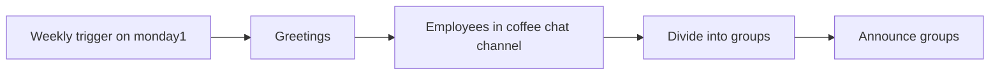

## Fluxo (.json) :

```json
{
  "id": "9",
  "name": "Coffee Bot (Matrix)",
  "nodes": [
    {
      "name": "Greetings",
      "type": "n8n-nodes-base.matrix",
      "position": [
        670,
        240
      ],
      "parameters": {
        "text": "👋 Happy Monday Groups for this week's virtual coffee are:",
        "roomId": "Enter your Room ID"
      },
      "credentials": {
        "matrixApi": "Matrix Creds"
      },
      "typeVersion": 1
    },
    {
      "name": "Employees in coffee chat channel",
      "type": "n8n-nodes-base.matrix",
      "position": [
        880,
        240
      ],
      "parameters": {
        "roomId": "Enter your Room ID",
        "filters": {
          "membership": ""
        },
        "resource": "roomMember"
      },
      "credentials": {
        "matrixApi": "Enter Your Matrix Credentials"
      },
      "typeVersion": 1
    },
    {
      "name": "Weekly trigger on monday1",
      "type": "n8n-nodes-base.cron",
      "position": [
        480,
        240
      ],
      "parameters": {
        "triggerTimes": {
          "item": [
            {
              "hour": 10,
              "mode": "everyWeek"
            }
          ]
        }
      },
      "typeVersion": 1
    },
    {
      "name": "Divide into groups",
      "type": "n8n-nodes-base.function",
      "notes": "This still needs to be reconfigured to grab the information from the second Matrix node. Have an issue with the ",
      "position": [
        1090,
        240
      ],
      "parameters": {
        "functionCode": "const ideal_group_size = 3;\nlet groups = [];\nlet data_as_array = [];\nlet newItems = [];\n\n// Take all the users and add them to an array\nfor (let j = 0; j < items.length; j++) {\n  data_as_array.push({username: items[j].json.user_id});\n}\n\n// Fisher-Yates (aka Knuth) Shuffle\nfunction shuffle(array) {\n  var currentIndex = array.length, temporaryValue, randomIndex;\n\n  // While there remain elements to shuffle...\n  while (0 !== currentIndex) {\n\n    // Pick a remaining element...\n    randomIndex = Math.floor(Math.random() * currentIndex);\n    currentIndex -= 1;\n\n    // And swap it with the current element.\n    temporaryValue = array[currentIndex];\n    array[currentIndex] = array[randomIndex];\n    array[randomIndex] = temporaryValue;\n  }\n\n  return array;\n}\n\n// Randomize the sequence of names in the array\ndata_as_array = shuffle(data_as_array);\n\n// Create groups of ideal group size (3)\nfor (let i = 0; i < data_as_array.length; i += ideal_group_size) {\n  groups.push(data_as_array.slice(i, i + ideal_group_size));\n}\n\n// Make sure that no group has just one person. If it does, take\n// one from previous group and add it to that group \nfor (let k = 0; k < groups.length; k++) {\n  if (groups[k].length === 1) {\n    groups[k].push(groups[k-1].shift());\n  }\n}\n\nfor (let l = 0; l < groups.length; l++) {\n    newItems.push({json: {groupsUsername: groups[l].map(a=> a.username)}})\n}\n\nreturn newItems;\n"
      },
      "typeVersion": 1
    },
    {
      "name": "Announce groups",
      "type": "n8n-nodes-base.matrix",
      "position": [
        1290,
        240
      ],
      "parameters": {
        "text": "=☀️ {{$node[\"Divide into groups\"].json[\"groupsUsername\"].join(', ')}}",
        "roomId": "!hobuowPzLuKnojiyfV:matrix.org"
      },
      "credentials": {
        "matrixApi": "Matrix Creds"
      },
      "typeVersion": 1
    }
  ],
  "active": true,
  "settings": {},
  "connections": {
    "Greetings": {
      "main": [
        [
          {
            "node": "Employees in coffee chat channel",
            "type": "main",
            "index": 0
          }
        ]
      ]
    },
    "Divide into groups": {
      "main": [
        [
          {
            "node": "Announce groups",
            "type": "main",
            "index": 0
          }
        ]
      ]
    },
    "Weekly trigger on monday1": {
      "main": [
        [
          {
            "node": "Greetings",
            "type": "main",
            "index": 0
          }
        ]
      ]
    },
    "Employees in coffee chat channel": {
      "main": [
        [
          {
            "node": "Divide into groups",
            "type": "main",
            "index": 0
          }
        ]
      ]
    }
  }
}
```

<a id="template-943"></a>

## Template 943 - Sincronizar status do Syncro com projetos do Clockify

- **Nome:** Sincronizar status do Syncro com projetos do Clockify
- **Descrição:** Atualiza o estado de projetos no Clockify com base no status de tickets recebidos por webhook do Syncro.
- **Funcionalidade:** • Recebe eventos via webhook do Syncro: inicia o fluxo quando um ticket é atualizado.
• Verifica o status do ticket: determina se o status é "Resolved" ou não.
• Identifica projeto no Clockify pelo nome gerado: utiliza número do ticket, nome do cliente e ID para buscar o projeto correspondente.
• Desarquiva projeto no Clockify: se o ticket não estiver como "Resolved", atualiza o projeto para archived=false e isPublic=true via requisição HTTP PUT.
• Arquiva projeto no Clockify: se o ticket estiver como "Resolved", atualiza o projeto para archived=true e isPublic=true via requisição HTTP PUT.
• Utiliza workspaceId e projectId na chamada à API para atualizar o projeto correto.
- **Ferramentas:** • Syncro: Sistema de tickets que envia notificações via webhook quando há alterações em tickets.
• Clockify: Plataforma de rastreamento de tempo onde projetos podem ser arquivados ou desarquivados através da API.

## Fluxo visual

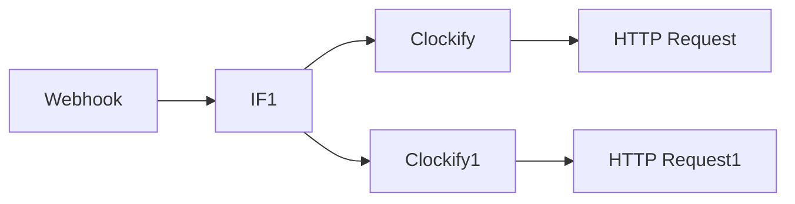

## Fluxo (.json) :

```json
{
  "id": "5",
  "name": "Syncro Status Update Clockify",
  "nodes": [
    {
      "name": "Webhook",
      "type": "n8n-nodes-base.webhook",
      "position": [
        560,
        310
      ],
      "webhookId": "3300d16f-5d43-4ae7-887e-376eecaeec17",
      "parameters": {
        "path": "4500d16f-5d43-4ae7-887e-376eecaeec17",
        "options": {},
        "httpMethod": "POST",
        "responseData": "allEntries",
        "responseMode": "lastNode"
      },
      "typeVersion": 1
    },
    {
      "name": "Clockify",
      "type": "n8n-nodes-base.clockify",
      "position": [
        960,
        310
      ],
      "parameters": {
        "operation": "getAll",
        "returnAll": true,
        "workspaceId": "xxx",
        "additionalFields": {
          "name": "=Ticket {{$node[\"Webhook\"].json[\"body\"][\"attributes\"][\"number\"]}} - {{$node[\"Webhook\"].json[\"body\"][\"attributes\"][\"customer_business_then_name\"]}} [{{$node[\"Webhook\"].json[\"body\"][\"attributes\"][\"id\"]}}]",
          "archived": true
        }
      },
      "credentials": {
        "clockifyApi": "Clockify"
      },
      "typeVersion": 1
    },
    {
      "name": "HTTP Request",
      "type": "n8n-nodes-base.httpRequest",
      "position": [
        1130,
        310
      ],
      "parameters": {
        "url": "=https://api.clockify.me/api/v1/workspaces/{{$node[\"Clockify\"].parameter[\"workspaceId\"]}}/projects/{{$json[\"id\"]}}",
        "options": {},
        "requestMethod": "PUT",
        "authentication": "headerAuth",
        "bodyParametersUi": {
          "parameter": [
            {
              "name": "archived",
              "value": "false"
            },
            {
              "name": "isPublic",
              "value": "true"
            }
          ]
        },
        "headerParametersUi": {
          "parameter": []
        }
      },
      "credentials": {
        "httpHeaderAuth": "Clockify API"
      },
      "typeVersion": 1
    },
    {
      "name": "IF1",
      "type": "n8n-nodes-base.if",
      "position": [
        730,
        310
      ],
      "parameters": {
        "conditions": {
          "string": [
            {
              "value1": "={{$json[\"body\"][\"attributes\"][\"status\"]}}",
              "value2": "Resolved",
              "operation": "notEqual"
            }
          ]
        }
      },
      "typeVersion": 1
    },
    {
      "name": "Clockify1",
      "type": "n8n-nodes-base.clockify",
      "position": [
        960,
        540
      ],
      "parameters": {
        "operation": "getAll",
        "returnAll": true,
        "workspaceId": "xxx",
        "additionalFields": {
          "name": "=Ticket {{$node[\"Webhook\"].json[\"body\"][\"attributes\"][\"number\"]}} - {{$node[\"Webhook\"].json[\"body\"][\"attributes\"][\"customer_business_then_name\"]}} [{{$node[\"Webhook\"].json[\"body\"][\"attributes\"][\"id\"]}}]",
          "archived": false
        }
      },
      "credentials": {
        "clockifyApi": "Clockify"
      },
      "typeVersion": 1
    },
    {
      "name": "HTTP Request1",
      "type": "n8n-nodes-base.httpRequest",
      "position": [
        1130,
        540
      ],
      "parameters": {
        "url": "=https://api.clockify.me/api/v1/workspaces/{{$node[\"Clockify1\"].parameter[\"workspaceId\"]}}/projects/{{$node[\"Clockify1\"].json[\"id\"]}}",
        "options": {},
        "requestMethod": "PUT",
        "authentication": "headerAuth",
        "bodyParametersUi": {
          "parameter": [
            {
              "name": "archived",
              "value": "true"
            },
            {
              "name": "isPublic",
              "value": "true"
            }
          ]
        },
        "headerParametersUi": {
          "parameter": []
        }
      },
      "credentials": {
        "httpHeaderAuth": "Clockify API"
      },
      "typeVersion": 1
    }
  ],
  "active": true,
  "settings": {},
  "connections": {
    "IF1": {
      "main": [
        [
          {
            "node": "Clockify",
            "type": "main",
            "index": 0
          }
        ],
        [
          {
            "node": "Clockify1",
            "type": "main",
            "index": 0
          }
        ]
      ]
    },
    "Webhook": {
      "main": [
        [
          {
            "node": "IF1",
            "type": "main",
            "index": 0
          }
        ]
      ]
    },
    "Clockify": {
      "main": [
        [
          {
            "node": "HTTP Request",
            "type": "main",
            "index": 0
          }
        ]
      ]
    },
    "Clockify1": {
      "main": [
        [
          {
            "node": "HTTP Request1",
            "type": "main",
            "index": 0
          }
        ]
      ]
    }
  }
}
```

<a id="template-944"></a>

## Template 944 - Substituição dinâmica de imagens no Google Slides

- **Nome:** Substituição dinâmica de imagens no Google Slides
- **Descrição:** Este fluxo recebe uma requisição via webhook contendo a presentation_id, image_key e image_url, identifica as imagens correspondentes no Google Slides pela descrição igual à image_key, substitui a imagem pelo URL fornecido e atualiza o texto descritivo associado, retornando uma resposta de sucesso ao solicitante.
- **Funcionalidade:** • Verificação de parâmetros: valida se presentation_id, image_key e image_url foram fornecidos no corpo da requisição.
• Busca de imagens correspondentes: lê a apresentação e encontra os elementos de slide que são imagens e possuem descrição igual à image_key.
• Substituição de imagem: utiliza a API para substituir a imagem pelo URL fornecido, mantendo o layout.
• Atualização de metadados: atualiza o texto alternativo (descrição) da imagem com a image_key.
• Confirmação de conclusão: envia resposta de sucesso ao solicitante.
- **Ferramentas:** • Google Slides API: API que permite ler elementos de slides, substituir imagens e atualizar metadados dentro de apresentações do Google Slides.

## Fluxo visual

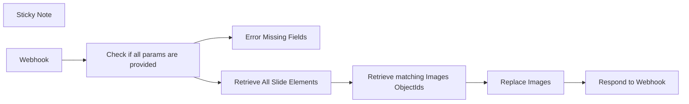

## Fluxo (.json) :

```json
{
  "nodes": [
    {
      "id": "aea55995-2c2c-4f59-8b68-43fa1871bb4c",
      "name": "Replace Images",
      "type": "n8n-nodes-base.httpRequest",
      "position": [
        860,
        140
      ],
      "parameters": {
        "url": "=https://slides.googleapis.com/v1/presentations/{{ $('Webhook').item.json[\"body\"][\"presentation_id\"] }}:batchUpdate ",
        "method": "POST",
        "options": {},
        "jsonBody": "={\n  \"requests\": [\n    {\n        \"replaceImage\": {\n          \"imageObjectId\": \"{{ $json.objectId }}\",\n          \"url\": \"{{ $('Webhook').item.json[\"body\"][\"image_url\"] }}\",\n          \"imageReplaceMethod\": \"CENTER_CROP\"\n        }\n    },\n    {\n      \"updatePageElementAltText\": {\n        \"objectId\": \"{{ $json.objectId }}\",\n        \"description\": \"{{ $('Webhook').item.json[\"body\"][\"image_key\"] }}\"\n      }\n    }\n  ]\n}  \n   ",
        "sendBody": true,
        "specifyBody": "json",
        "authentication": "predefinedCredentialType",
        "nodeCredentialType": "googleSlidesOAuth2Api"
      },
      "credentials": {
        "googleSlidesOAuth2Api": {
          "id": "XnM5YeAtI5QnYrMh",
          "name": "Google Slides account"
        }
      },
      "typeVersion": 4.2
    },
    {
      "id": "92eeca3a-47b2-4daa-ac51-5b957c8d7d56",
      "name": "Error Missing Fields",
      "type": "n8n-nodes-base.respondToWebhook",
      "position": [
        500,
        340
      ],
      "parameters": {
        "options": {
          "responseCode": 500
        },
        "respondWith": "json",
        "responseBody": "{\n  \"error\": \"Missing fields.\"\n}"
      },
      "typeVersion": 1.1
    },
    {
      "id": "14878542-6a42-4fe4-8dd6-328450a883eb",
      "name": "Respond to Webhook",
      "type": "n8n-nodes-base.respondToWebhook",
      "position": [
        1040,
        140
      ],
      "parameters": {
        "options": {},
        "respondWith": "json",
        "responseBody": "{\n  \"message\": \"Image replaced.\"\n}"
      },
      "typeVersion": 1.1
    },
    {
      "id": "ac42249b-3c7d-4ba1-be7d-ba6e1ae652cd",
      "name": "Sticky Note",
      "type": "n8n-nodes-base.stickyNote",
      "position": [
        60,
        -540
      ],
      "parameters": {
        "width": 596.8395976509729,
        "height": 654.4370838798395,
        "content": "## Dynamically Replace Images in Google Slides\nThis workflow exposes an API endpoint that lets you dynamically replace an image in Google Slides, perfect for automating deck presentations like updating backgrounds or client logos.\n\n### Step 1: Set Up a Key Identifier in Google Slides\nAdd a unique key identifier to the images you want to replace.\n1. Click on the image.\n2. Go to **Format Options** and then **Alt Text**.\n3. Enter your unique identifier, like `client_logo` or `background`.\n\n### Step 2: Use a POST Request to Update the Image\nSend a POST request to the workflow endpoint with the following parameters in the body:\n- `presentation_id`: The ID of your Google Slides presentation.\nYou can find it in the URL of your Google presentation : `https://docs.google.com/presentation/d/{this-part}/edit#slide=id.p`)\n- `image_key`: The unique identifier you created.\n- `image_url`: The URL of the new image.\n\nThat's it! The specified image in your Google Slides presentation will be replaced with the new one from the provided URL.\n\nThis workflow is designed to be flexible, allowing you to use the same identifier across multiple slides and presentations. I hope it streamlines your slide automation process!\n\nHappy automating!\nThe n8Ninja"
      },
      "typeVersion": 1
    },
    {
      "id": "735c5c4e-df8f-47ad-b0d7-ed57453a84d0",
      "name": "Webhook",
      "type": "n8n-nodes-base.webhook",
      "position": [
        60,
        160
      ],
      "webhookId": "df3b8b83-fd6d-40f8-be13-42bae85dcf63",
      "parameters": {
        "path": "replace-image-in-slide",
        "options": {},
        "httpMethod": "POST",
        "responseMode": "responseNode"
      },
      "typeVersion": 2
    },
    {
      "id": "22d1dd70-0716-4407-8e25-703355969e95",
      "name": "Retrieve matching Images ObjectIds",
      "type": "n8n-nodes-base.code",
      "position": [
        680,
        140
      ],
      "parameters": {
        "jsCode": "const key = $('Webhook').item.json.body.image_key;\n\nconst pageElements = $input\n  .all()\n  .flatMap(item => item.json.slides)\n  .flatMap(slide => slide.pageElements.filter(el => el.image && el.description === key));\n\nconst objectIds = pageElements.map(el => ({ objectId: el.objectId }));\n\nreturn objectIds"
      },
      "typeVersion": 2
    },
    {
      "id": "f942a8de-9fa8-4855-9be1-4247bae887e5",
      "name": "Retrieve All Slide Elements",
      "type": "n8n-nodes-base.httpRequest",
      "position": [
        500,
        140
      ],
      "parameters": {
        "url": "=https://slides.googleapis.com/v1/presentations/{{ $('Webhook').item.json.body.presentation_id }}",
        "options": {},
        "authentication": "predefinedCredentialType",
        "nodeCredentialType": "googleSlidesOAuth2Api"
      },
      "credentials": {
        "googleSlidesOAuth2Api": {
          "id": "XnM5YeAtI5QnYrMh",
          "name": "Google Slides account"
        }
      },
      "typeVersion": 4.2
    },
    {
      "id": "ddcbe7ed-9abc-49ac-98e5-4d5222a641d4",
      "name": "Check if all params are provided",
      "type": "n8n-nodes-base.if",
      "position": [
        260,
        160
      ],
      "parameters": {
        "options": {},
        "conditions": {
          "options": {
            "leftValue": "",
            "caseSensitive": true,
            "typeValidation": "strict"
          },
          "combinator": "and",
          "conditions": [
            {
              "id": "3272f7e8-4bc2-44bd-9760-437b2992e6e7",
              "operator": {
                "type": "string",
                "operation": "exists",
                "singleValue": true
              },
              "leftValue": "={{ $json.body.presentation_id }}",
              "rightValue": ""
            },
            {
              "id": "9e8abf56-622d-4704-95ea-c0f5f31683dd",
              "operator": {
                "type": "string",
                "operation": "exists",
                "singleValue": true
              },
              "leftValue": "={{ $json.body.image_key }}",
              "rightValue": ""
            },
            {
              "id": "d2cec4c9-2a90-4a24-ab6c-628689419698",
              "operator": {
                "type": "string",
                "operation": "exists",
                "singleValue": true
              },
              "leftValue": "={{ $json.body.image_url }}",
              "rightValue": ""
            }
          ]
        }
      },
      "typeVersion": 2
    }
  ],
  "pinData": {},
  "connections": {
    "Webhook": {
      "main": [
        [
          {
            "node": "Check if all params are provided",
            "type": "main",
            "index": 0
          }
        ]
      ]
    },
    "Replace Images": {
      "main": [
        [
          {
            "node": "Respond to Webhook",
            "type": "main",
            "index": 0
          }
        ]
      ]
    },
    "Retrieve All Slide Elements": {
      "main": [
        [
          {
            "node": "Retrieve matching Images ObjectIds",
            "type": "main",
            "index": 0
          }
        ]
      ]
    },
    "Check if all params are provided": {
      "main": [
        [
          {
            "node": "Retrieve All Slide Elements",
            "type": "main",
            "index": 0
          }
        ],
        [
          {
            "node": "Error Missing Fields",
            "type": "main",
            "index": 0
          }
        ]
      ]
    },
    "Retrieve matching Images ObjectIds": {
      "main": [
        [
          {
            "node": "Replace Images",
            "type": "main",
            "index": 0
          }
        ]
      ]
    }
  }
}
```

<a id="template-945"></a>

## Template 945 - Análise de headers de e-mail para IPs e spoofing

- **Nome:** Análise de headers de e-mail para IPs e spoofing
- **Descrição:** Este fluxo analisa headers de e-mail para identificar IPs de origem, avaliar reputação de IP, coletar dados de geolocalização e reputação, além de verificar SPF, DKIM e DMARC para confirmar autenticidade, consolidando os resultados e retornando um relatório através de webhook.
- **Funcionalidade:** • Detecção e extração de IPs a partir de headers de Received: identifica os endereços IP envolvidos na transmissão do e-mail.
• Enriquecimento de IPs com reputação: consulta IP Quality Score para fraud_score, recent_abuse e status de IP.
• Localização e contexto de IP: consulta IP-API para ISP e geolocalização.
• Avaliação de autenticação de e-mails: analisa SPF, DKIM e DMARC a partir de Authentication-Results e Received-SPF.
• Consolidação de dados: agrega informações de IP e autenticação em um único objeto JSON para facilitar a leitura.
• Resposta automática: envia o relatório consolidado de volta através de um webhook com status 200.
- **Ferramentas:** • IP Quality Score: API de avaliação de IP que oferece fraud_score, recent_abuse e reputação de IP.
• IP-API: Serviço de geolocalização de IP que fornece ISP, cidade, país etc.

## Fluxo visual

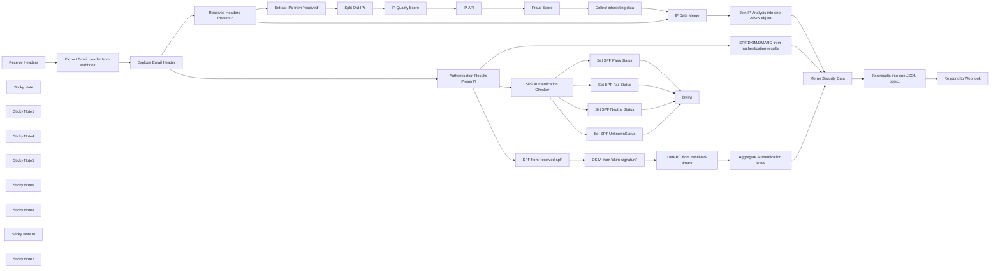

## Fluxo (.json) :

```json
{
  "id": "3tJcVzt2OqeyjfnH",
  "meta": {
    "instanceId": "03e9d14e9196363fe7191ce21dc0bb17387a6e755dcc9acc4f5904752919dca8"
  },
  "name": "Analyze_email_headers_for_IPs_and_spoofing__3",
  "tags": [
    {
      "id": "GCHVocImoXoEVnzP",
      "name": "🛠️ In progress",
      "createdAt": "2023-10-31T02:17:21.618Z",
      "updatedAt": "2023-10-31T02:17:21.618Z"
    },
    {
      "id": "QPJKatvLSxxtrE8U",
      "name": "Secops",
      "createdAt": "2023-10-31T02:15:11.396Z",
      "updatedAt": "2023-10-31T02:15:11.396Z"
    }
  ],
  "nodes": [
    {
      "id": "a2dca82d-f2b4-41f7-942a-2713a5ae012e",
      "name": "Receive Headers",
      "type": "n8n-nodes-base.webhook",
      "position": [
        -320,
        740
      ],
      "webhookId": "1bde44ab-1360-48b3-9b2f-260a82629bfa",
      "parameters": {
        "path": "90e9e395-1d40-4575-b2a0-fbf52c534167",
        "options": {},
        "httpMethod": "POST",
        "responseMode": "responseNode"
      },
      "typeVersion": 1
    },
    {
      "id": "8cb2e9f4-6954-4812-a443-47cc83e7db0a",
      "name": "Sticky Note",
      "type": "n8n-nodes-base.stickyNote",
      "position": [
        2900,
        420
      ],
      "parameters": {
        "width": 528.410729274179,
        "height": 545.969373616973,
        "content": "## Output\nReturns output like:\n```\n[\n    {\n        \"ipAnalysis\": [\n            {\n                \"IP\": \"104.245.209.248\",\n                \"fraud_score\": 87,\n                \"recent_abuse\": true,\n                \"Organization\": \"Deft Hosting\",\n                \"tor\": false,\n                \"ISP\": \"Server Central Network\",\n                \"recent_spam_activity\": \"Identified spam in the past 24-48 hours\",\n                \"ip_sender_reputation\": \"Bad\"\n            },\n            {\n                \"IP\": \"09.06.05.41\",\n                \"recent_spam_activity\": \"unknown\",\n                \"ip_sender_reputation\": \"unknown\"\n            }\n        ]\n    },\n    {\n        \"spf\": \"pass\",\n        \"dkim\": \"pass\",\n        \"dmarc\": \"pass\"\n    }\n]\n```"
      },
      "typeVersion": 1
    },
    {
      "id": "2464403b-5cb9-4090-b923-912bb8af673a",
      "name": "Fraud Score",
      "type": "n8n-nodes-base.code",
      "position": [
        1340,
        560
      ],
      "parameters": {
        "mode": "runOnceForEachItem",
        "jsCode": "let recentSpamActivity = \"undefined\";\nlet ipSenderReputation = \"undefined\";\n\ntry {\n  if ($('IP Quality Score')) {\n    const fraudScore = $('IP Quality Score').item.json.fraud_score;\n\n    recentSpamActivity = \"Not associated with recent spam activity\";\n    \n    if( fraudScore >= 85 ) {\n      recentSpamActivity = \"Identified spam in the past 24-48 hours\";\n    } else if( fraudScore >= 75 ) {\n      recentSpamActivity = \"Identified spam in the past month\";\n    }\n\n    if(!fraudScore) recentSpamActivity = \"unknown\";\n    \n    ipSenderReputation = \"unknown\";\n    \n    if( fraudScore >= 85 ) {\n      ipSenderReputation = \"Bad\";\n    } else if( fraudScore >= 75 ) {\n      ipSenderReputation = \"Poor\";  \n    } else if( fraudScore >= 50 ) {\n      ipSenderReputation = \"Suspicious\";  \n    } else if( fraudScore >= 11 ) {\n      ipSenderReputation = \"OK\";  \n    } else if( fraudScore <= 10 ) {\n      ipSenderReputation = \"Good\";  \n    }\n  }\n} catch (error) {\n  return {\n    \"recent_spam_activity\": recentSpamActivity,\n    \"ip_sender_reputation\": ipSenderReputation\n  };\n}\n\nreturn {\n  \"recent_spam_activity\": recentSpamActivity,\n  \"ip_sender_reputation\": ipSenderReputation\n};"
      },
      "typeVersion": 2
    },
    {
      "id": "70e3e88a-001a-40fc-a771-ace7696f54eb",
      "name": "Respond to Webhook",
      "type": "n8n-nodes-base.respondToWebhook",
      "position": [
        2680,
        760
      ],
      "parameters": {
        "options": {
          "responseCode": 200
        },
        "respondWith": "text",
        "responseBody": "={{ $json.result }}"
      },
      "typeVersion": 1
    },
    {
      "id": "4e16523d-a7e1-44d1-840a-3df3a44bd034",
      "name": "Sticky Note1",
      "type": "n8n-nodes-base.stickyNote",
      "position": [
        460,
        -39.5
      ],
      "parameters": {
        "width": 628.6931617686989,
        "height": 834.0576186324413,
        "content": "\n## IP Reputation and Email Security Analysis\nThis critical part of the workflow specializes in fortifying email security by extracting IP addresses from received headers. With a refined process, it analyzes the extracted IPs against the IP Quality Score API, assessing potential risks and preventing fraudulent activities.\n\nThe `Extract IPs from \"received\"` node initiates the process by isolating IP addresses from email headers, demonstrating n8n's capacity to dissect and parse complex data. The `Split Out IPs` node then prepares these IPs for individual scrutiny, showcasing the flexibility of n8n to handle data at granular levels. Finally, the `IP Quality Score` node queries an external API to evaluate each IP, reinforcing the security parameters by providing detailed risk assessments.\n\n### Authentication - Free Tier Available (5000 credits/month)\n\nIP Quality Score uses the API key as part of the website URL. Since n8n does not currently allow for exposing credentials in the URL, you will need to hardcode your API key in the fake expression snippet in the `IP Quality Score` node.\n\nThe API key can be found by [visiting their documentation here](https://www.ipqualityscore.com/documentation/proxy-detection-api/overview), logging in, and then scrolling down to the Private Key. "
      },
      "typeVersion": 1
    },
    {
      "id": "2e8ead40-a97a-4c7e-953c-33546b83eaf6",
      "name": "Explode Email Header",
      "type": "n8n-nodes-base.code",
      "position": [
        80,
        740
      ],
      "parameters": {
        "jsCode": "// Takes the Header string and splits it into various items for analysis.\nlet returnArray = [];\n\nfor (const item of $input.all()) {\n  const headerStr = item.json.header;\n  const headerLines = headerStr.split('\\n');\n    const headerObj = {};\n\n    let currentKey = null;\n    let currentValue = '';\n\n    headerLines.forEach((line) => {\n        const match = line.match(/^([\\w-]+):\\s*(.*)/);\n\n        if (match) {\n            if (currentKey) {\n                if (!headerObj[currentKey]) headerObj[currentKey] = [];\n                headerObj[currentKey].push({ [`${currentKey}`]: currentValue });\n            }\n\n            currentKey = match[1].toLowerCase();\n            currentValue = match[2];\n        } else {\n            currentValue += ' ' + line.trim();\n        }\n    });\n\n    if (currentKey) {\n        if (!headerObj[currentKey]) headerObj[currentKey] = [];\n        headerObj[currentKey].push({ [`${currentKey}Item`]: currentValue });\n    }\n  returnArray.push({\"header\":headerObj});\n}\n\nreturn returnArray;"
      },
      "typeVersion": 2
    },
    {
      "id": "1118176d-a315-439d-a3b6-fe4d40c900c6",
      "name": "Split Out IPs",
      "type": "n8n-nodes-base.itemLists",
      "position": [
        740,
        560
      ],
      "parameters": {
        "options": {
          "destinationFieldName": "ip"
        },
        "fieldToSplitOut": "ips"
      },
      "typeVersion": 3
    },
    {
      "id": "ef118900-11a6-418a-b1b3-159933d62cbf",
      "name": "Extract IPs from \"received\"",
      "type": "n8n-nodes-base.code",
      "position": [
        540,
        560
      ],
      "parameters": {
        "jsCode": "let ips = []\n\nfor (const item of $input.all()) {\n  const header = JSON.stringify(item.json.header.received);\n  console.log(header)\n  const ipRegex = /\\b\\d{1,3}\\.\\d{1,3}\\.\\d{1,3}\\.\\d{1,3}\\b/g;\n  const ipAddresses = header.match(ipRegex) || [];\n  ips.push(...ipAddresses);\n}\n\nreturn [\n  {\n    ips: ips\n  }\n];"
      },
      "typeVersion": 2,
      "alwaysOutputData": true
    },
    {
      "id": "ffefc1e2-214c-47d7-a7a3-104fefdccda1",
      "name": "IP Quality Score",
      "type": "n8n-nodes-base.httpRequest",
      "position": [
        920,
        560
      ],
      "parameters": {
        "url": "=https://ipqualityscore.com/api/json/ip/{{ Replace me with your API key, it can be found inside the api documentation, leave json.ip alone }}/{{ $json.ip }}?strictness=1&allow_public_access_points=true&lighter_penalties=true",
        "options": {}
      },
      "typeVersion": 4.1
    },
    {
      "id": "2f1c5b30-950c-4e0d-81a6-bf4c2c64f968",
      "name": "IP-API",
      "type": "n8n-nodes-base.httpRequest",
      "position": [
        1140,
        560
      ],
      "parameters": {
        "url": "=http://ip-api.com/json/{{ $('Split Out IPs').item.json.ip }}",
        "method": "POST",
        "options": {}
      },
      "typeVersion": 4.1
    },
    {
      "id": "c9cae845-63e8-475a-bc08-ba0552712394",
      "name": "Collect interesting data",
      "type": "n8n-nodes-base.set",
      "position": [
        1520,
        560
      ],
      "parameters": {
        "values": {
          "string": [
            {
              "name": "IP",
              "value": "={{ $('Split Out IPs').item.json.ip }}"
            },
            {
              "name": "fraud_score",
              "value": "={{ $('IP Quality Score').item.json.fraud_score }}"
            },
            {
              "name": "recent_abuse",
              "value": "={{ $('IP Quality Score').item.json.recent_abuse }}"
            },
            {
              "name": "Organization",
              "value": "={{ $('IP Quality Score').item.json.organization }}"
            },
            {
              "name": "tor",
              "value": "={{ $('IP Quality Score').item.json.tor }}"
            },
            {
              "name": "ISP",
              "value": "={{ $('IP-API').item.json.isp }}"
            },
            {
              "name": "recent_spam_activity",
              "value": "={{ $json.recent_spam_activity }}"
            },
            {
              "name": "ip_sender_reputation",
              "value": "={{ $json.ip_sender_reputation }}"
            }
          ]
        },
        "options": {
          "dotNotation": true
        },
        "keepOnlySet": true
      },
      "typeVersion": 2
    },
    {
      "id": "01b33cc9-b7b3-44e6-b683-b753e6daa2dc",
      "name": "SPF/DKIM/DMARC from \"authentication-results\"",
      "type": "n8n-nodes-base.code",
      "position": [
        520,
        1160
      ],
      "parameters": {
        "jsCode": "let mailAuth = [];\n\nfor (const item of $input.all()) {\n  // SPF\n  let spf = \"unknown\";\n  if( JSON.stringify(item.json.header[\"authentication-results\"]).includes(\"spf=pass\") ) {\n    spf = \"pass\";\n  } else if ( JSON.stringify(item.json.header[\"authentication-results\"]).includes(\"spf=fail\") ) {\n    spf = \"fail\";    \n  } else if ( JSON.stringify(item.json.header[\"authentication-results\"]).includes(\"spf=neutral\") ) {\n    spf = \"neutral\";\n  }\n\n  // DKIM\n  let dkim = \"unknown\";\n  if( JSON.stringify(item.json.header[\"authentication-results\"]).includes(\"dkim=pass\") ) {\n    dkim = \"pass\";\n  } else if ( JSON.stringify(item.json.header[\"authentication-results\"]).includes(\"dkim=fail\") ) {\n    dkim = \"fail\";    \n  } else if ( JSON.stringify(item.json.header[\"authentication-results\"]).includes(\"dkim=temperror\") ) {\n    dkim = \"error\";\n  }\n\n  // DMARC\n  let dmarc = \"unknown\";\n  if( JSON.stringify(item.json.header[\"authentication-results\"]).includes(\"dmarc=pass\") ) {\n    dmarc = \"pass\";\n  } else if ( JSON.stringify(item.json.header[\"authentication-results\"]).includes(\"dmarc=fail\") ) {\n    dmarc = \"fail\";    \n  }\n  \n  mailAuth.push({\n    \"spf\": spf,\n    \"dkim\": dkim,\n    \"dmarc\": dmarc\n  });\n}\n\nreturn mailAuth;"
      },
      "typeVersion": 2
    },
    {
      "id": "33923ec2-10db-4799-9b5e-a369cdd74640",
      "name": "SPF from \"received-spf\"",
      "type": "n8n-nodes-base.code",
      "position": [
        500,
        1858
      ],
      "parameters": {
        "jsCode": "let spfArray = [];\n\nfor (const item of $('Authentication Results Present?').all()) {\n    const spfList = item.json.header[\"received-spf\"];\n\n    if (!spfList || spfList.length == 0) {\n        spfArray.push(\"not-found\");\n    } else {\n        for (const spfItem of spfList) {\n            if (spfItem[\"received-spf\"].toLowerCase().includes(\"fail\")) {\n                spfArray.push(\"fail\");\n            } else if (spfItem[\"received-spf\"].toLowerCase().includes(\"pass\")) {\n                spfArray.push(\"pass\");\n            } else {\n                spfArray.push(\"found\");\n            }\n        }\n    }\n}\nreturn [{spf:spfArray.join(\",\")}];\n"
      },
      "typeVersion": 2,
      "alwaysOutputData": true
    },
    {
      "id": "9cec1f09-3887-46ec-aa25-b03a0ab34190",
      "name": "DKIM from \"dkim-signature\"",
      "type": "n8n-nodes-base.code",
      "position": [
        760,
        1858
      ],
      "parameters": {
        "jsCode": "let dkimArray = [];\n\nfor (const item of $('Authentication Results Present?').all()) {\n    const dkimList = item.json.header[\"dkim-signature\"];\n\n    if (!dkimList || dkimList.length == 0) { dkimArray.push(\"not-found\") } else {\n        dkimArray.push(\"found\");\n        return dkimArray;\n    }\n\n}\nreturn [{dkim:dkimArray.join(\",\")}];\n"
      },
      "typeVersion": 2,
      "alwaysOutputData": true
    },
    {
      "id": "0f856808-c044-4547-bc81-5e6d1208d9ad",
      "name": "DMARC from \"received-dmarc\"",
      "type": "n8n-nodes-base.code",
      "position": [
        1020,
        1858
      ],
      "parameters": {
        "jsCode": "let dmarcArray = [];\n\nfor (const item of $('Authentication Results Present?').all()) {\n    const dmarcList = item.json.header[\"received-dmarc\"];\n\n    if (!dmarcList || dmarcList.length == 0) {\n        dmarcArray.push(\"not-found\");\n    } else {\n        for (const dmarcItem of dmarcList) {\n            if (dmarcItem[\"received-dmarc\"].toLowerCase().includes(\"fail\")) {\n                dmarcArray.push(\"fail\");\n            } else if (dmarcItem[\"received-dmarc\"].toLowerCase().includes(\"pass\")) {\n                dmarcArray.push(\"pass\");\n            } else {\n                dmarcArray.push(\"found\");\n            }\n        }\n    }\n}\nreturn [{dmarc:dmarcArray.join(\",\")}];"
      },
      "typeVersion": 2,
      "alwaysOutputData": true
    },
    {
      "id": "0780dc59-8a4c-4355-9cdc-35b2505043a6",
      "name": "DKIM",
      "type": "n8n-nodes-base.switch",
      "position": [
        1260,
        2718
      ],
      "parameters": {
        "rules": {
          "rules": [
            {
              "value2": "spf=pass",
              "operation": "contains"
            },
            {
              "output": 1,
              "value2": "spf=fail",
              "operation": "contains"
            },
            {
              "output": 2,
              "value2": "spf=neutral",
              "operation": "contains"
            }
          ]
        },
        "value1": "={{ $('Authentication Results Present?').item.json.header['authentication-results'] }}",
        "dataType": "string",
        "fallbackOutput": 3
      },
      "typeVersion": 1
    },
    {
      "id": "b0be02f9-ae6c-460e-9e1c-0be8f878f81b",
      "name": "Sticky Note4",
      "type": "n8n-nodes-base.stickyNote",
      "position": [
        -359.7001600000003,
        -46.60400000000038
      ],
      "parameters": {
        "width": 811.1951544353835,
        "height": 1042.0833160085729,
        "content": "\n## Workflow Overview\nThis n8n workflow is adept at dissecting email headers to assess security risks. It employs a webhook to receive data, then diverges into two thorough investigative paths based on specific header contents. For emails with `received` headers, it extracts IP details and consults the IP Quality Score API for comprehensive risk assessments, including potential fraud or abuse and geolocation insights via the IP-API.\n\nConversely, when `authentication-results` headers are present, it meticulously evaluates SPF, DKIM, and DMARC verifications, categorizing each email based on the authentication checks.\n\nFinally, the workflow converges the data from both paths to provide a cohesive analysis, which is then relayed back through the webhook, furnishing a detailed report on IP reputation and email authentication status.\n\n`Please note that the workflow is not yet complete, but should still work without the DKIM analysis.`\n\n## Triggered Via Webhook\nThe workflow is triggered on-demand by incoming webhook queries or can be used inside of the `Execute Workflow` node by replacing the `webhook trigger` with an `Execute Workflow Trigger` and the `respond to webhook` node with a `Set node` set to only keep the set node data. This allows you to use it as part of a larger workflow, in which this portion handles the header analysis. Simply add the  Example input looks like:\n\n```\n[\n  {\n    \"headers\": {\n      \"host\": \"internal.users.n8n.cloud\"\n    },\n    \"params\": {},\n    \"query\": {},\n    \"body\": \"Delivered-To: g.andreini@gmail.com\\nReceived: by 2002:a05:7412:be08:b0:df:2c3c:4cc with SMTP id la8csp2349351rdb;\\n        Tue, 5 Sep 2023 15:06:08 -0700 (PDT)\\nX-Google-Smtp-Source: AGHT+IEHz2WAE5kssnJSpwJyhbuq3ZjNQTqZfo6OFeCd5w2EKOdnF3nICb1zIL4Y1tahQpr5xY6+\\nX-Received: by 2002:a17:907:78c3:b0:9a1:f2d3:ade9 with SMTP id kv3-20020a17090778c300b009a1f2d3ade9mr802685ejc.42.1693951567785;\\n        Tue, 05 Sep 2023 15:06:07 -0700 (PDT)\\nARC-Seal: i=1; a=rsa-sha256; t=1693951567; cv=none;\\n        d=google.com; s=arc-20160816;\\n        b=zsD04giTt/gbOxX6IW6/ETi7zkiuLYPaM6nYtckkcCfhqz5H7qvNN1NkDrlbnsXEr2\\n         3jVLDlhAZCXVg4qGNEWTjfzLwn5eQoUdW7iy//8XZU3Xy2xtORLBKKWs+Pjzx2sBP9KS\\n         zsy0Tg+rlAqi/aOH8+D+ANC0dCibsPau92zLS6GIvil700hvAJ7KB9fw0s/Ntx4z8VGv\\n         0P+BodOQDO9kdHtuMkgu/waF86Xe0ImcxtvMHQ/mNjbTSRDTa0d04+X7ILVf4q0B5gFg\\n         tnykE51GIS8Ey8ElAd4z/it1E/ffMJ7QAgiDSO0tZRc2NnM0QQ1oYrO9IL0cNuW1P33Q\\n         PfNA==\\nARC-Message-Signature: i=1; a=rsa-sha256; c=relaxed/relaxed; d=google.com; s=arc-20160816;\\n        h=mime-version:date:subject:to:from:reply-to:message-id;\\n        bh=f9tT4LpRqlQSioyOCLufJC57T1y2rwgsPezOJPbokDM=;\\n        fh=syfPZFOxHm03Bg8T666hpPsY3BFS1EZPTr8jKyQ7bFk=;\\n        b=fsZErxdmb95VXJpAyI8Pff38Ifu47WaONvSwpYaSstYbRoKDZSS3SH247NHt/+uyq+\\n         7UUF37XenbcZif1p3iOa96JxcYBtLLp3cI9pe8NRQjJtceXQk70PVcCGNXORiAxoCGT+\\n         iCMzUoFjTAfhK729rSldyFJ+I+WU3k+W/CjL1+geJkU5fEmg+eBEo8hDifqW3Iv73auq\\n         uDnxkLZ55yX9W2ARwv/204qqqxYHKfdXDIWGDyeXE10NHLTr/GAR8DWVx6qD8b4U0Zc3\\n         MC+SZxGsIcSCr5ouXIovuQBYcdmqDgDxAaN9VTfYdnXobblN6bo3OcC0rqiiyVJnV3ZA\\n         BYoQ==\\nARC-Authentication-Results: i=1; mx.google.com;\\n       spf=fail (google.com: domain of eljyzxd@molkase.de does not designate 89.31.72.29 as permitted sender) smtp.mailfrom=eljyzxd@molkase.de\\nReturn-Path: <eljyzxd@molkase.de>\\nReceived: from mail19.interhost.it (mail19.interhost.it. [89.31.72.29])\\n        by mx.google.com with ESMTPS id k15-20020a170906578f00b00992aaed9f81si7955121ejq.356.2023.09.05.15.06.07\\n        for <g.andreini@gmail.com>\\n        (version=TLS1_2 cipher=ECDHE-ECDSA-AES128-GCM-SHA256 bits=128/128);\\n        Tue, 05 Sep 2023 15:06:07 -0700 (PDT)\\nReceived-SPF: fail (google.com: domain of eljyzxd@molkase.de does not designate 89.31.72.29 as permitted sender) client-ip=89.31.72.29;\\nAuthentication-Results: mx.google.com;\\n       spf=fail (google.com: domain of eljyzxd@molkase.de does not designate 89.31.72.29 as permitted sender) smtp.mailfrom=eljyzxd@molkase.de\\nReceived: from mailfront2.interhost.it (mailfront2.interhost.it [89.31.72.21]) (using TLSv1.2 with cipher ADH-AES256-GCM-SHA384 (256/256 bits)) (No client certificate requested) by mail19.interhost.it (Postfix) with ESMTPS id 7BA73561D21 for <info@thepund.it>; Wed,\\n  6 Sep 2023 00:06:06 +0200 (CEST)\\nReceived: from mailfront2.interhost.it (localhost [127.0.0.1]) by mailfront2.interhost.it (Postfix) with ESMTP id 5AEE1835B2 for <info@thepund.it>; Wed,\\n  6 Sep 2023 00:06:06 +0200 (CEST)\\nReceived-SPF: Pass (mailfrom) identity=mailfrom; client-ip=62.173.139.164; helo=mail.molkase.de; envelope-from=eljyzxd@molkase.de; receiver=<UNKNOWN>\\nReceived: from mail.molkase.de (mail.molkase.de [62.173.139.164]) by mailfront2.interhost.it (Postfix) with ESMTP id A8BC3835B5 for <info@thepund.it>; Wed,\\n  6 Sep 2023 00:06:05 +0200 (CEST)\\nReceived: from molkase.de (mail.molkase.de [62.173.139.164]) by mail.molkase.de (Postfix) with ESMTPA id A561D80FB872; Tue,\\n  5 Sep 2023 23:08:50 +0300 (EEST)\\nMessage-ID: <15404342A12424728J51235153O87748181D@ideljyzxd>\\nReply-To: Legal Casino <eljyzxd@molkase.de>\\nFrom: Legal Casino <eljyzxd@molkase.de>\\nTo: <info@tevassociati.it>\\nSubject: Bonus for all European residents\\nDate: Tue, 05 Sep 2023 23:08:55 +0300\\nMIME-Version: 1.0\\nContent-Type: multipart/related; type=\\\"multipart/alternative\\\"; boundary=\\\"----=_NextPart_000_0018_01D9E04D.79971B70\\\"\\nX-Virus-Scanned: ClamAV using ClamSMTP\"\n  }\n]\n```"
      },
      "typeVersion": 1
    },
    {
      "id": "3c8fe0f3-0b65-4366-9c1e-a2a7bcc35ed5",
      "name": "Extract Email Header from webhook",
      "type": "n8n-nodes-base.set",
      "position": [
        -99,
        740
      ],
      "parameters": {
        "values": {
          "string": [
            {
              "name": "header",
              "value": "={{ $json.body }}"
            }
          ]
        },
        "options": {},
        "keepOnlySet": true
      },
      "typeVersion": 2
    },
    {
      "id": "4eef6457-27cf-442f-bccf-75663170401b",
      "name": "Sticky Note5",
      "type": "n8n-nodes-base.stickyNote",
      "position": [
        1100,
        20
      ],
      "parameters": {
        "width": 610.1426815377504,
        "height": 772.7590323462559,
        "content": "\n## IP Reputation and Fraud Analysis\nThis workflow section performs an in-depth reputation assessment of each IP address. The `IP-API` node retrieves geolocation data, while the `Fraud Score` node evaluates the risk associated with the IP, flagging any potential spam or abuse activities.\n\n### Consolidation of Findings\nKey data points such as fraud scores and ISP information are synthesized by the `Collect interesting data` node, providing a clear profile of each IP for informed decision-making.\n\n### Authentication - Free Tier Available (45 requests/min)\nThis endpoint is limited to `45 requests per minute from an IP address`.\n\nIf you go over the limit your requests will be throttled `(HTTP 429)` until your rate limit window is reset. If you constantly go over the limit your IP address will be banned for 1 hour.\n\nNo authentication needed, [Click here to view documentation.](https://ip-api.com/docs)"
      },
      "typeVersion": 1
    },
    {
      "id": "764de66e-8e40-44d1-8c09-fb099753d800",
      "name": "Sticky Note6",
      "type": "n8n-nodes-base.stickyNote",
      "position": [
        1720,
        141.75
      ],
      "parameters": {
        "width": 1153.9919748350057,
        "height": 818.3738794326835,
        "content": "\n## Analyze and Respond to Email Header Analysis\nThe concluding segment of the `Analyze Email Headers For IPs and Spoofing` workflow integrates sophisticated data processing to analyze and respond to the collected email header information. This part of the workflow is crucial as it synthesizes the data gathered from email headers and prepares it for actionable insights.\n\n- `Data Aggregation and Merging:` The nodes `Merge1` and Item `Lists2` are pivotal for aggregating the data from previous steps. These nodes effectively concatenate various items and compile the IP analysis data. This operation is essential for creating a comprehensive view of the email headers, focusing particularly on IPs and potential spoofing indicators.\n\n- `Further Merging and Response Preparation:` Another merge operation is performed by `Merge3`, which prepares the data for the final output. Following this, Item Lists3 further concatenates items to form a single, coherent result. This step ensures that all the relevant information is accurately compiled and ready for the final response.\n\n- `Final Response to Webhook:` The Respond to Webhook node serves as the endpoint of this workflow. It is configured to respond with the analyzed data, encapsulated in a text format. The response is set to return a 200 HTTP status code, signaling a successful operation. This node exemplifies n8n's capability in not just processing and analyzing data, but also in seamlessly communicating results back to a designated receiver, be it a webhook or any other endpoint.\n\n\nBy the end of this workflow, you have a structured and detailed analysis of email headers, specifically tailored to identify IPs and potential spoofing threats. This underscores n8n's effectiveness as a cybersecurity tool, providing not just data processing capabilities but also actionable insights crucial for maintaining email security."
      },
      "typeVersion": 1
    },
    {
      "id": "2fa3c912-f478-48a1-9b2e-5e3f51c6a363",
      "name": "Sticky Note8",
      "type": "n8n-nodes-base.stickyNote",
      "position": [
        460,
        800
      ],
      "parameters": {
        "width": 630.5819800503231,
        "height": 535.80387776221,
        "content": "\n## Authentication Analysis\n\nThis section assesses the presence and validity of SPF, DKIM, and DMARC records within email headers to confirm authentication. `SPF/DKIM/DMARC from \"authentication-results\"` node evaluates the authentication results, ensuring that emails meet the set security standards for sender verification. \n\nThe n8n code nodes use either a version of `Javascript` called `node.js` or a version of `Python` called `Pyodide`. In this case we are using Javascript."
      },
      "typeVersion": 1
    },
    {
      "id": "5297e5a0-f2d1-4ee3-b931-9b1abe75b2cc",
      "name": "Sticky Note10",
      "type": "n8n-nodes-base.stickyNote",
      "position": [
        460,
        2038
      ],
      "parameters": {
        "width": 983.9576126829675,
        "height": 1039.0141642262715,
        "content": "\n## SPF and DKIM Authentication Routing\nThis group of nodes orchestrates the authentication status routing for SPF and DKIM records found in email headers.\n\nSPF Validation Decision-Making\nThe `SPF` switch node evaluates the SPF results from the email header, directing the flow to different paths based on whether SPF passes, fails, or is neutral. The `\"Set1,\" \"Set2,\" and \"Set4\"` nodes then assign the respective SPF authentication statuses, marking emails for further processing based on their security verification.\n\nDKIM Evaluation Handling\nAlthough not explicitly processing DKIM, the `\"DKIM\" switch node` is likely misnamed and should be adjusted to reflect its role correctly. It seems to be set up for similar routing logic as the SPF node, which suggests it should handle DKIM results. If it's indeed for DKIM, ensure it's checking for `\"dkim=pass/fail/neutral\"` within the authentication results.\n\nUnknown SPF Status Assignment\nFinally, the `\"Set5\"` node appears to handle cases where SPF results are not found or are indeterminate, setting the status to `\"unknown.\"`"
      },
      "typeVersion": 1
    },
    {
      "id": "f6c06bc5-048c-433e-9bfa-f155ca6735e4",
      "name": "Received Headers Present?",
      "type": "n8n-nodes-base.if",
      "position": [
        300,
        660
      ],
      "parameters": {
        "conditions": {
          "number": [
            {
              "value1": "={{ $json.header.received.length }}",
              "operation": "larger"
            }
          ]
        }
      },
      "typeVersion": 1
    },
    {
      "id": "a92ef09c-0cc6-469c-98ff-8c6172615a4b",
      "name": "Authentication Results Present?",
      "type": "n8n-nodes-base.if",
      "position": [
        300,
        820
      ],
      "parameters": {
        "conditions": {
          "number": [
            {
              "value1": "={{ $json.header[\"authentication-results\"].length }}",
              "operation": "larger"
            }
          ]
        }
      },
      "typeVersion": 1
    },
    {
      "id": "aef7f739-dfef-40b1-b01f-29adad4a9bda",
      "name": "Aggregate Authentication Data",
      "type": "n8n-nodes-base.set",
      "position": [
        1280,
        1858
      ],
      "parameters": {
        "values": {
          "string": [
            {
              "name": "spf",
              "value": "={{ $('SPF from \"received-spf\"').all() }}"
            },
            {
              "name": "dkim",
              "value": "={{ $('DKIM from \"dkim-signature\"').all() }}"
            },
            {
              "name": "dmarc",
              "value": "={{ $('DMARC from \"received-dmarc\"').all() }}"
            }
          ]
        },
        "options": {},
        "keepOnlySet": true
      },
      "typeVersion": 2
    },
    {
      "id": "5d7ce661-3bdf-45e5-a1e2-335602e62b5d",
      "name": "Sticky Note2",
      "type": "n8n-nodes-base.stickyNote",
      "position": [
        460,
        1349.3807407407407
      ],
      "parameters": {
        "width": 984.4210239195738,
        "height": 672.6925241611406,
        "content": "\n## Email Authentication Assessment\nThis set of nodes is dedicated to evaluating the authentication of email headers, specifically focusing on SPF, DKIM, and DMARC validations.\n\n### SPF, DKIM, and DMARC Extraction\nStarting with `SPF from 'received-spf',` this node analyzes the email's SPF records for compliance. Following this, `DKIM from 'dkim-signature'` examines the DKIM signatures to verify their presence and status. Next, `DMARC from 'received-dmarc'` checks DMARC records for alignment with expected security practices.\n\n### Data Aggregation\nOnce the assessments are complete, `Aggregate Authentication Data` compiles the findings into a cohesive dataset, providing clear indicators of each email's authentication status.\n\n### Key Focus\nThese nodes are essential in filtering out potentially harmful emails by verifying their authenticity, a key step in protecting against phishing and spoofing attempts.\n"
      },
      "typeVersion": 1
    },
    {
      "id": "88888a82-815b-423a-85d3-8c86756d10cd",
      "name": "IP Data Merge",
      "type": "n8n-nodes-base.merge",
      "position": [
        1800,
        660
      ],
      "parameters": {},
      "typeVersion": 2.1
    },
    {
      "id": "b7add244-9759-450f-8b01-6ec4555a5971",
      "name": "Merge Security Data",
      "type": "n8n-nodes-base.merge",
      "position": [
        2171,
        760
      ],
      "parameters": {},
      "typeVersion": 2.1
    },
    {
      "id": "ef679cda-9420-44fd-90cc-23be1b166e2c",
      "name": "Join IP Analysis into one JSON object",
      "type": "n8n-nodes-base.itemLists",
      "position": [
        1960,
        660
      ],
      "parameters": {
        "options": {},
        "aggregate": "aggregateAllItemData",
        "operation": "concatenateItems",
        "destinationFieldName": "ipAnalysis"
      },
      "typeVersion": 3
    },
    {
      "id": "1e5ae57b-948c-40c8-8248-fcbda80264e2",
      "name": "Join results into one JSON object",
      "type": "n8n-nodes-base.itemLists",
      "position": [
        2391,
        760
      ],
      "parameters": {
        "options": {},
        "aggregate": "aggregateAllItemData",
        "operation": "concatenateItems",
        "destinationFieldName": "result"
      },
      "typeVersion": 3
    },
    {
      "id": "7fef7675-1350-4886-b184-f907dacf08b1",
      "name": "SPF Authentication Checker",
      "type": "n8n-nodes-base.switch",
      "position": [
        500,
        2718
      ],
      "parameters": {
        "rules": {
          "rules": [
            {
              "value2": "spf=pass",
              "operation": "contains"
            },
            {
              "output": 1,
              "value2": "spf=fail",
              "operation": "contains"
            },
            {
              "output": 2,
              "value2": "spf=neutral",
              "operation": "contains"
            }
          ]
        },
        "value1": "={{ JSON.stringify($json.header[\"authentication-results\"]) }}",
        "dataType": "string",
        "fallbackOutput": 3
      },
      "typeVersion": 1
    },
    {
      "id": "410ccb8c-a551-45a3-a487-b0ce15a56882",
      "name": "Set SPF Pass Status",
      "type": "n8n-nodes-base.set",
      "position": [
        920,
        2518
      ],
      "parameters": {
        "values": {
          "string": [
            {
              "name": "spf",
              "value": "pass"
            }
          ]
        },
        "options": {}
      },
      "typeVersion": 2
    },
    {
      "id": "127c0c91-162c-4cbb-b692-eb0675a55c42",
      "name": "Set SPF Fail Status",
      "type": "n8n-nodes-base.set",
      "position": [
        920,
        2658
      ],
      "parameters": {
        "values": {
          "string": [
            {
              "name": "spf",
              "value": "fail"
            }
          ]
        },
        "options": {}
      },
      "typeVersion": 2
    },
    {
      "id": "7a15ae91-012f-4fc8-9075-7f855b15d979",
      "name": "Set SPF Neutral Status",
      "type": "n8n-nodes-base.set",
      "position": [
        920,
        2798
      ],
      "parameters": {
        "values": {
          "string": [
            {
              "name": "spf",
              "value": "neutral"
            }
          ]
        },
        "options": {}
      },
      "typeVersion": 2
    },
    {
      "id": "2ac1e5ce-83a4-4205-9774-76506f06108e",
      "name": "Set SPF UnknownStatus",
      "type": "n8n-nodes-base.set",
      "position": [
        920,
        2938
      ],
      "parameters": {
        "values": {
          "string": [
            {
              "name": "spf",
              "value": "unknown"
            }
          ]
        },
        "options": {}
      },
      "typeVersion": 2
    }
  ],
  "active": false,
  "pinData": {
    "Receive Headers": [
      {
        "json": {
          "body": "Delivered-To: g.andreini@gmail.com\nReceived: by 2002:a05:7412:be08:b0:df:2c3c:4cc with SMTP id la8csp2349351rdb;\n        Tue, 5 Sep 2023 15:06:08 -0700 (PDT)\nX-Google-Smtp-Source: AGHT+IEHz2WAE5kssnJSpwJyhbuq3ZjNQTqZfo6OFeCd5w2EKOdnF3nICb1zIL4Y1tahQpr5xY6+\nX-Received: by 2002:a17:907:78c3:b0:9a1:f2d3:ade9 with SMTP id kv3-20020a17090778c300b009a1f2d3ade9mr802685ejc.42.1693951567785;\n        Tue, 05 Sep 2023 15:06:07 -0700 (PDT)\nARC-Seal: i=1; a=rsa-sha256; t=1693951567; cv=none;\n        d=google.com; s=arc-20160816;\n        b=zsD04giTt/gbOxX6IW6/ETi7zkiuLYPaM6nYtckkcCfhqz5H7qvNN1NkDrlbnsXEr2\n         3jVLDlhAZCXVg4qGNEWTjfzLwn5eQoUdW7iy//8XZU3Xy2xtORLBKKWs+Pjzx2sBP9KS\n         zsy0Tg+rlAqi/aOH8+D+ANC0dCibsPau92zLS6GIvil700hvAJ7KB9fw0s/Ntx4z8VGv\n         0P+BodOQDO9kdHtuMkgu/waF86Xe0ImcxtvMHQ/mNjbTSRDTa0d04+X7ILVf4q0B5gFg\n         tnykE51GIS8Ey8ElAd4z/it1E/ffMJ7QAgiDSO0tZRc2NnM0QQ1oYrO9IL0cNuW1P33Q\n         PfNA==\nARC-Message-Signature: i=1; a=rsa-sha256; c=relaxed/relaxed; d=google.com; s=arc-20160816;\n        h=mime-version:date:subject:to:from:reply-to:message-id;\n        bh=f9tT4LpRqlQSioyOCLufJC57T1y2rwgsPezOJPbokDM=;\n        fh=syfPZFOxHm03Bg8T666hpPsY3BFS1EZPTr8jKyQ7bFk=;\n        b=fsZErxdmb95VXJpAyI8Pff38Ifu47WaONvSwpYaSstYbRoKDZSS3SH247NHt/+uyq+\n         7UUF37XenbcZif1p3iOa96JxcYBtLLp3cI9pe8NRQjJtceXQk70PVcCGNXORiAxoCGT+\n         iCMzUoFjTAfhK729rSldyFJ+I+WU3k+W/CjL1+geJkU5fEmg+eBEo8hDifqW3Iv73auq\n         uDnxkLZ55yX9W2ARwv/204qqqxYHKfdXDIWGDyeXE10NHLTr/GAR8DWVx6qD8b4U0Zc3\n         MC+SZxGsIcSCr5ouXIovuQBYcdmqDgDxAaN9VTfYdnXobblN6bo3OcC0rqiiyVJnV3ZA\n         BYoQ==\nARC-Authentication-Results: i=1; mx.google.com;\n       spf=fail (google.com: domain of eljyzxd@molkase.de does not designate 89.31.72.29 as permitted sender) smtp.mailfrom=eljyzxd@molkase.de\nReturn-Path: <eljyzxd@molkase.de>\nReceived: from mail19.interhost.it (mail19.interhost.it. [89.31.72.29])\n        by mx.google.com with ESMTPS id k15-20020a170906578f00b00992aaed9f81si7955121ejq.356.2023.09.05.15.06.07\n        for <g.andreini@gmail.com>\n        (version=TLS1_2 cipher=ECDHE-ECDSA-AES128-GCM-SHA256 bits=128/128);\n        Tue, 05 Sep 2023 15:06:07 -0700 (PDT)\nReceived-SPF: fail (google.com: domain of eljyzxd@molkase.de does not designate 89.31.72.29 as permitted sender) client-ip=89.31.72.29;\nAuthentication-Results: mx.google.com;\n       spf=fail (google.com: domain of eljyzxd@molkase.de does not designate 89.31.72.29 as permitted sender) smtp.mailfrom=eljyzxd@molkase.de\nReceived: from mailfront2.interhost.it (mailfront2.interhost.it [89.31.72.21]) (using TLSv1.2 with cipher ADH-AES256-GCM-SHA384 (256/256 bits)) (No client certificate requested) by mail19.interhost.it (Postfix) with ESMTPS id 7BA73561D21 for <info@thepund.it>; Wed,\n  6 Sep 2023 00:06:06 +0200 (CEST)\nReceived: from mailfront2.interhost.it (localhost [127.0.0.1]) by mailfront2.interhost.it (Postfix) with ESMTP id 5AEE1835B2 for <info@thepund.it>; Wed,\n  6 Sep 2023 00:06:06 +0200 (CEST)\nReceived-SPF: Pass (mailfrom) identity=mailfrom; client-ip=62.173.139.164; helo=mail.molkase.de; envelope-from=eljyzxd@molkase.de; receiver=<UNKNOWN>\nReceived: from mail.molkase.de (mail.molkase.de [62.173.139.164]) by mailfront2.interhost.it (Postfix) with ESMTP id A8BC3835B5 for <info@thepund.it>; Wed,\n  6 Sep 2023 00:06:05 +0200 (CEST)\nReceived: from molkase.de (mail.molkase.de [62.173.139.164]) by mail.molkase.de (Postfix) with ESMTPA id A561D80FB872; Tue,\n  5 Sep 2023 23:08:50 +0300 (EEST)\nMessage-ID: <15404342A12424728J51235153O87748181D@ideljyzxd>\nReply-To: Legal Casino <eljyzxd@molkase.de>\nFrom: Legal Casino <eljyzxd@molkase.de>\nTo: <info@tevassociati.it>\nSubject: Bonus for all European residents\nDate: Tue, 05 Sep 2023 23:08:55 +0300\nMIME-Version: 1.0\nContent-Type: multipart/related; type=\"multipart/alternative\"; boundary=\"----=_NextPart_000_0018_01D9E04D.79971B70\"\nX-Virus-Scanned: ClamAV using ClamSMTP",
          "query": {},
          "params": {},
          "headers": {
            "host": "internal.users.n8n.cloud",
            "accept": "*/*",
            "x-real-ip": "10.255.0.2",
            "user-agent": "PostmanRuntime/7.32.3",
            "content-type": "text/plain",
            "authorization": "1234567890",
            "postman-token": "8701ef86-2136-4c79-941a-bc8ed79bcc9e",
            "content-length": "3900",
            "accept-encoding": "gzip, deflate, br",
            "x-forwarded-for": "10.255.0.2",
            "x-forwarded-host": "internal.users.n8n.cloud",
            "x-forwarded-port": "443",
            "x-forwarded-proto": "https",
            "x-forwarded-server": "e591fa1c2d01"
          }
        },
        "pairedItem": {
          "item": 0
        }
      }
    ]
  },
  "settings": {
    "executionOrder": "v1"
  },
  "versionId": "6e01f4f9-d42b-4168-91a1-0bfe850c43ea",
  "connections": {
    "IP-API": {
      "main": [
        [
          {
            "node": "Fraud Score",
            "type": "main",
            "index": 0
          }
        ]
      ]
    },
    "Fraud Score": {
      "main": [
        [
          {
            "node": "Collect interesting data",
            "type": "main",
            "index": 0
          }
        ]
      ]
    },
    "IP Data Merge": {
      "main": [
        [
          {
            "node": "Join IP Analysis into one JSON object",
            "type": "main",
            "index": 0
          }
        ]
      ]
    },
    "Split Out IPs": {
      "main": [
        [
          {
            "node": "IP Quality Score",
            "type": "main",
            "index": 0
          }
        ]
      ]
    },
    "Receive Headers": {
      "main": [
        [
          {
            "node": "Extract Email Header from webhook",
            "type": "main",
            "index": 0
          }
        ]
      ]
    },
    "IP Quality Score": {
      "main": [
        [
          {
            "node": "IP-API",
            "type": "main",
            "index": 0
          }
        ]
      ]
    },
    "Merge Security Data": {
      "main": [
        [
          {
            "node": "Join results into one JSON object",
            "type": "main",
            "index": 0
          }
        ]
      ]
    },
    "Set SPF Fail Status": {
      "main": [
        [
          {
            "node": "DKIM",
            "type": "main",
            "index": 0
          }
        ]
      ]
    },
    "Set SPF Pass Status": {
      "main": [
        [
          {
            "node": "DKIM",
            "type": "main",
            "index": 0
          }
        ]
      ]
    },
    "Explode Email Header": {
      "main": [
        [
          {
            "node": "Received Headers Present?",
            "type": "main",
            "index": 0
          },
          {
            "node": "Authentication Results Present?",
            "type": "main",
            "index": 0
          }
        ]
      ]
    },
    "Set SPF UnknownStatus": {
      "main": [
        [
          {
            "node": "DKIM",
            "type": "main",
            "index": 0
          }
        ]
      ]
    },
    "Set SPF Neutral Status": {
      "main": [
        [
          {
            "node": "DKIM",
            "type": "main",
            "index": 0
          }
        ]
      ]
    },
    "SPF from \"received-spf\"": {
      "main": [
        [
          {
            "node": "DKIM from \"dkim-signature\"",
            "type": "main",
            "index": 0
          }
        ]
      ]
    },
    "Collect interesting data": {
      "main": [
        [
          {
            "node": "IP Data Merge",
            "type": "main",
            "index": 0
          }
        ]
      ]
    },
    "Received Headers Present?": {
      "main": [
        [
          {
            "node": "Extract IPs from \"received\"",
            "type": "main",
            "index": 0
          }
        ],
        [
          {
            "node": "IP Data Merge",
            "type": "main",
            "index": 1
          }
        ]
      ]
    },
    "DKIM from \"dkim-signature\"": {
      "main": [
        [
          {
            "node": "DMARC from \"received-dmarc\"",
            "type": "main",
            "index": 0
          }
        ]
      ]
    },
    "SPF Authentication Checker": {
      "main": [
        [
          {
            "node": "Set SPF Pass Status",
            "type": "main",
            "index": 0
          }
        ],
        [
          {
            "node": "Set SPF Fail Status",
            "type": "main",
            "index": 0
          }
        ],
        [
          {
            "node": "Set SPF Neutral Status",
            "type": "main",
            "index": 0
          }
        ],
        [
          {
            "node": "Set SPF UnknownStatus",
            "type": "main",
            "index": 0
          }
        ]
      ]
    },
    "DMARC from \"received-dmarc\"": {
      "main": [
        [
          {
            "node": "Aggregate Authentication Data",
            "type": "main",
            "index": 0
          }
        ]
      ]
    },
    "Extract IPs from \"received\"": {
      "main": [
        [
          {
            "node": "Split Out IPs",
            "type": "main",
            "index": 0
          }
        ]
      ]
    },
    "Aggregate Authentication Data": {
      "main": [
        [
          {
            "node": "Merge Security Data",
            "type": "main",
            "index": 1
          }
        ]
      ]
    },
    "Authentication Results Present?": {
      "main": [
        [
          {
            "node": "SPF/DKIM/DMARC from \"authentication-results\"",
            "type": "main",
            "index": 0
          },
          {
            "node": "SPF Authentication Checker",
            "type": "main",
            "index": 0
          }
        ],
        [
          {
            "node": "SPF from \"received-spf\"",
            "type": "main",
            "index": 0
          }
        ]
      ]
    },
    "Extract Email Header from webhook": {
      "main": [
        [
          {
            "node": "Explode Email Header",
            "type": "main",
            "index": 0
          }
        ]
      ]
    },
    "Join results into one JSON object": {
      "main": [
        [
          {
            "node": "Respond to Webhook",
            "type": "main",
            "index": 0
          }
        ]
      ]
    },
    "Join IP Analysis into one JSON object": {
      "main": [
        [
          {
            "node": "Merge Security Data",
            "type": "main",
            "index": 0
          }
        ]
      ]
    },
    "SPF/DKIM/DMARC from \"authentication-results\"": {
      "main": [
        [
          {
            "node": "Merge Security Data",
            "type": "main",
            "index": 1
          }
        ]
      ]
    }
  }
}
```

<a id="template-946"></a>

## Template 946 - Obter página web em Markdown

- **Nome:** Obter página web em Markdown
- **Descrição:** Recebe uma URL em entrada, solicita um scrape ao serviço externo para obter o conteúdo da página em Markdown e expõe esse conteúdo no campo 'response' para uso posterior.
- **Funcionalidade:** • Receber URL de entrada: aceita um payload JSON com a chave "url" para indicar a página a ser obtida.
• Solicitar scraping externo: faz uma requisição POST ao serviço de scraping fornecendo a URL e solicitando o formato Markdown.
• Extrair conteúdo em Markdown: captura o campo de resposta contendo o Markdown (data.markdown) retornado pelo serviço.
• Padronizar saída: armazena o Markdown no campo 'response' para ser reutilizado por agentes de IA ou outros sistemas.
• Documentação integrada: inclui uma nota explicativa sobre o formato de entrada esperado (JSON com "url").
- **Ferramentas:** • Firecrawl API: serviço externo de scraping que recebe uma URL via endpoint de API e retorna o conteúdo da página em formatos solicitados (neste fluxo, Markdown), normalmente acessado via requisição HTTP autenticada.

## Fluxo visual

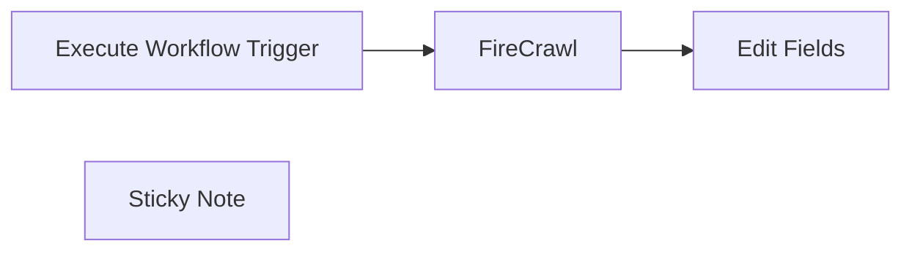

## Fluxo (.json) :

```json
{
  "id": "7DPLpEkww5Uctcml",
  "meta": {
    "instanceId": "75d76ac1fb686d403c2294ca007b62282f34c3e15dc3528cc1dbe36a827c0c6e"
  },
  "name": "get_a_web_page",
  "tags": [
    {
      "id": "7v5QbLiQYkQ7zGTK",
      "name": "tools",
      "createdAt": "2025-01-08T16:33:21.887Z",
      "updatedAt": "2025-01-08T16:33:21.887Z"
    }
  ],
  "nodes": [
    {
      "id": "290cc9b8-e4b1-4124-ab0e-afbb02a9072b",
      "name": "Execute Workflow Trigger",
      "type": "n8n-nodes-base.executeWorkflowTrigger",
      "position": [
        -460,
        -100
      ],
      "parameters": {},
      "typeVersion": 1
    },
    {
      "id": "f256ed59-ba61-4912-9a75-4e7703547de5",
      "name": "FireCrawl",
      "type": "n8n-nodes-base.httpRequest",
      "position": [
        -220,
        -100
      ],
      "parameters": {
        "url": "https://api.firecrawl.dev/v1/scrape",
        "method": "POST",
        "options": {},
        "jsonBody": "={\n  \"url\": \"{{ $json.query.url }}\",\n  \"formats\": [\n    \"markdown\"\n  ]\n} ",
        "sendBody": true,
        "sendHeaders": true,
        "specifyBody": "json",
        "authentication": "genericCredentialType",
        "genericAuthType": "httpHeaderAuth",
        "headerParameters": {
          "parameters": [
            {}
          ]
        }
      },
      "credentials": {
        "httpHeaderAuth": {
          "id": "RoJ6k6pWBzSVp9JK",
          "name": "Firecrawl"
        }
      },
      "typeVersion": 4.2
    },
    {
      "id": "a28bdbe6-fa59-4bf1-b0ab-c34ebb10cf0f",
      "name": "Edit Fields",
      "type": "n8n-nodes-base.set",
      "position": [
        -20,
        -100
      ],
      "parameters": {
        "options": {},
        "assignments": {
          "assignments": [
            {
              "id": "1af62ef9-7385-411a-8aba-e4087f09c3a9",
              "name": "response",
              "type": "string",
              "value": "={{ $json.data.markdown }}"
            }
          ]
        }
      },
      "typeVersion": 3.4
    },
    {
      "id": "fcd26213-038a-453f-80e5-a3936e4c2d06",
      "name": "Sticky Note",
      "type": "n8n-nodes-base.stickyNote",
      "position": [
        -480,
        -340
      ],
      "parameters": {
        "width": 620,
        "height": 200,
        "content": "## Send URL got Crawl\nThis can be reused by Ai Agents and any Workspace to crawl a site. All that Workspace has to do is send a request:\n\n```json\n {\n    \"url\": \"Some URL to Get\"\n  }\n```"
      },
      "typeVersion": 1
    }
  ],
  "active": false,
  "pinData": {
    "Execute Workflow Trigger": [
      {
        "json": {
          "query": {
            "url": "https://en.wikipedia.org/wiki/Linux"
          }
        }
      }
    ]
  },
  "settings": {
    "executionOrder": "v1"
  },
  "versionId": "396f46a7-3120-42f9-b3d5-2021e6e995b8",
  "connections": {
    "FireCrawl": {
      "main": [
        [
          {
            "node": "Edit Fields",
            "type": "main",
            "index": 0
          }
        ]
      ]
    },
    "Execute Workflow Trigger": {
      "main": [
        [
          {
            "node": "FireCrawl",
            "type": "main",
            "index": 0
          }
        ]
      ]
    }
  }
}
```

<a id="template-947"></a>

## Template 947 - Geração e edição de imagens com OpenAI

- **Nome:** Geração e edição de imagens com OpenAI
- **Descrição:** Fluxo que recebe uma mensagem de chat com imagem e prompt, chama a API de edição/geração de imagens da OpenAI e converte o resultado em arquivo pronto para uso ou distribuição.
- **Funcionalidade:** • Receber mensagem de chat com upload de arquivo: Aceita entradas de texto e imagens enviadas pelo usuário, permitindo qualquer tipo MIME.
• Configurar chave de API: Armazena a chave secreta da OpenAI para autenticação das chamadas externas.
• Chamar API de edição de imagens da OpenAI: Envia a imagem e o prompt em multipart/form-data para o endpoint de edits usando o modelo gpt-image-1, com parâmetros como tamanho e qualidade.
• Converter resposta Base64 em arquivo binário: Transforma a resposta b64_json em um arquivo utilizável para armazenamento ou envio.
• Preparado para automações pós-processamento: Permite encaminhar a imagem resultante para e-mail, armazenamento (S3/Supabase), publicações em Slack/Discord, marca d'água, redimensionamento ou outras automações.
- **Ferramentas:** • OpenAI: API de geração/edição de imagens (modelo gpt-image-1) usada para criar ou editar imagens a partir de um prompt e imagem fonte.
• Email: Canal para enviar imagens geradas diretamente para usuários ou listas.
• Amazon S3: Armazenamento escalável para salvar imagens geradas.
• Supabase: Armazenamento privado e backend para manter imagens e dados de clientes.
• Slack: Plataforma de comunicação para postar imagens e notificações.
• Discord: Plataforma de comunidade para compartilhar imagens automaticamente.
• Stripe: Plataforma de pagamentos e webhooks mencionada para monetização do serviço.
• Vercel / Next.js / Tailwind: Tecnologias de frontend e hospedagem citadas para a interface do usuário.
• Gumroad: Canal de distribuição/comercialização do template mencionado no conteúdo.

## Fluxo visual

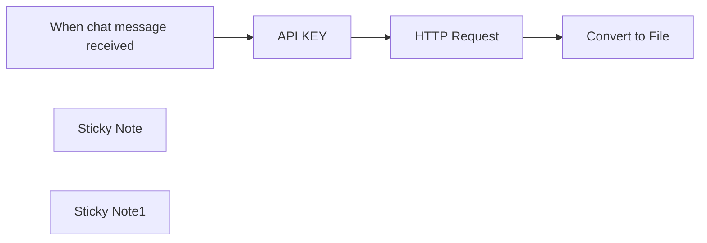

## Fluxo (.json) :

```json
{
  "id": "81aN6oJGMho5kCvQ",
  "meta": {
    "instanceId": "32e39908afbcb49d79cc3b05576c030ecc2871395b7aec4e0fdc88778498f80e"
  },
  "name": "OpenAI ImageGen1 Template",
  "tags": [],
  "nodes": [
    {
      "id": "179754ad-eae5-447a-b225-46145370e79b",
      "name": "HTTP Request",
      "type": "n8n-nodes-base.httpRequest",
      "position": [
        -440,
        80
      ],
      "parameters": {
        "url": "https://api.openai.com/v1/images/edits",
        "method": "POST",
        "options": {},
        "sendBody": true,
        "contentType": "multipart-form-data",
        "sendHeaders": true,
        "bodyParameters": {
          "parameters": [
            {
              "name": "image",
              "parameterType": "formBinaryData",
              "inputDataFieldName": "data0"
            },
            {
              "name": "prompt",
              "value": "={{ $('When chat message received').item.json.chatInput }}"
            },
            {
              "name": "model",
              "value": "gpt-image-1"
            },
            {
              "name": "n",
              "value": "1"
            },
            {
              "name": "size",
              "value": "1024x1024"
            },
            {
              "name": "quality",
              "value": "high"
            }
          ]
        },
        "headerParameters": {
          "parameters": [
            {
              "name": "Authorization",
              "value": "=Bearer {{ $json.openAIKey }}"
            }
          ]
        }
      },
      "typeVersion": 4.2
    },
    {
      "id": "0aca28af-1325-4391-bee6-3ab636c34f6a",
      "name": "Convert to File",
      "type": "n8n-nodes-base.convertToFile",
      "position": [
        -220,
        80
      ],
      "parameters": {
        "options": {},
        "operation": "toBinary",
        "sourceProperty": "data[0].b64_json"
      },
      "typeVersion": 1.1
    },
    {
      "id": "7bc8dbf1-eb81-4f9b-9563-7ae568034221",
      "name": "When chat message received",
      "type": "@n8n/n8n-nodes-langchain.chatTrigger",
      "position": [
        -860,
        80
      ],
      "webhookId": "449bbfbc-0523-406f-94a2-089bca9d7295",
      "parameters": {
        "options": {
          "allowFileUploads": true,
          "allowedFilesMimeTypes": "*"
        }
      },
      "typeVersion": 1.1
    },
    {
      "id": "79b3e008-758c-4c24-adac-eb514fedf2c8",
      "name": "Sticky Note",
      "type": "n8n-nodes-base.stickyNote",
      "position": [
        -820,
        -440
      ],
      "parameters": {
        "width": 660,
        "height": 460,
        "content": "### 🖼️ Edit Images with the **OpenAI ImageGen v1** API\n\n1. **Verify Your Organization**  \n   Log in to the OpenAI Platform and confirm your org is verified:  \n   [OpenAI Settings → Organization](https://platform.openai.com/settings/organization/general)\n\n2. **Add Your API Key**  \n   In the n8n credentials, paste a valid **OpenAI secret key** into the `API_KEY` field.\n\n3. **Run “Open Chat”**  \n   Trigger the **`Open Chat`** node, supply your **text prompt** and **source image**, then execute.\n\n4. **Preview & Automate**  \n   The new image appears in the **`Convert to File`** node. From here you can:  \n   - Send it by email  \n   - Push to S3, Supabase, or any storage  \n   - Post straight to Slack, Discord, etc.\n\n> *Tip — chain additional n8n nodes to watermark, resize, or schedule social-media posts automatically.*\n"
      },
      "typeVersion": 1
    },
    {
      "id": "8b75f205-dcfb-4c43-b8bf-942419b96633",
      "name": "API KEY",
      "type": "n8n-nodes-base.set",
      "position": [
        -640,
        80
      ],
      "parameters": {
        "options": {},
        "assignments": {
          "assignments": [
            {
              "id": "b943d609-b213-4531-912f-e721db4d2cc7",
              "name": "openAIKey",
              "type": "string",
              "value": "sk-proj-..."
            }
          ]
        },
        "includeOtherFields": true
      },
      "typeVersion": 3.4
    },
    {
      "id": "fb19daaf-a425-4d0c-9141-fefee17be117",
      "name": "Sticky Note1",
      "type": "n8n-nodes-base.stickyNote",
      "position": [
        40,
        -440
      ],
      "parameters": {
        "color": 5,
        "width": 660,
        "height": 1380,
        "content": "[](https://drauscher.gumroad.com/l/PremiumAISaaSTemplateBeginnerFriendlyCustomizable)\n\n\n\n### This is just the core of our bigger ⭐ AI Image Cash Machine Template ⭐\n\n## 🚀 Launch Your **AI-Image Cash Machine** This Weekend\n\n**Customizable · Beginner Friendly**\n\n💸 **Special Summer Deal — 10 % off with code `SUMMER25` (just €5+)**\n\n[Grab the template on Gumroad →](https://drauscher.gumroad.com/l/PremiumAISaaSTemplateBeginnerFriendlyCustomizable)\n\n---\n\n### Why You’ll Love It\n- **Plug-and-Play App** – Next.js front-end on Vercel, wired to Supabase, Stripe, n8n & OpenAI  \n- **No-Code Automation** – drag-drop n8n workflow delivers images instantly after payment  \n- **Built-In Payments** – Stripe keys + webhooks included, start charging the moment you deploy  \n- **Scalable Storage** – private Supabase bucket keeps every customer image secure  \n- **Own the Source** – MIT license lets you tweak, brand, even resell without lock-in  \n\n> **Try it live:** **Pixarify Online** – see the template in action!  \n\n---\n\n### What’s Inside\n- Production-ready **frontend UI** (Next.js + Tailwind)  \n- Pre-configured **n8n backend** triggered by Stripe webhook  \n- Step-by-step **PDF setup guide**  \n- Sample environment file (`.env.example`)  \n\n---\n\n### 3-Step Fast-Track Setup\n1. **Clone the repo** & run `vercel deploy` — live site in 5 min  \n2. **Paste your Stripe + OpenAI keys**  \n3. **Activate the n8n workflow** — start selling AI images immediately  \n\n"
      },
      "typeVersion": 1
    }
  ],
  "active": false,
  "pinData": {},
  "settings": {
    "executionOrder": "v1"
  },
  "versionId": "6e7f19b0-042a-4c63-9375-36d62290eb3e",
  "connections": {
    "API KEY": {
      "main": [
        [
          {
            "node": "HTTP Request",
            "type": "main",
            "index": 0
          }
        ]
      ]
    },
    "HTTP Request": {
      "main": [
        [
          {
            "node": "Convert to File",
            "type": "main",
            "index": 0
          }
        ]
      ]
    },
    "Convert to File": {
      "main": [
        []
      ]
    },
    "When chat message received": {
      "main": [
        [
          {
            "node": "API KEY",
            "type": "main",
            "index": 0
          }
        ]
      ]
    }
  }
}
```

<a id="template-948"></a>

## Template 948 - Sincronização Notion para Webflow por slug

- **Nome:** Sincronização Notion para Webflow por slug
- **Descrição:** Automatiza a criação ou atualização de posts entre Notion e Webflow com base no slug, convertendo blocos do Notion em rich text, mantendo slug único e atualizando o conteúdo no Webflow.
- **Funcionalidade:** • Schedule Trigger: Dispara o fluxo periodicamente para buscar e processar posts.
• Obter posts do Notion: Busca todos os posts da base para processar.
• Is sync checked?: Filtra apenas posts marcados para sincronização com Webflow.
• Slug uniqueness checker and differentiator: Garante slug único adicionando sufixos quando necessário.
• For each blog post: Itera sobre cada post para processamento individual.
• Take cover url: Extrai a URL da capa do Notion para uso nas imagens.
• Craft the rich text element: Constrói o conteúdo rico a partir dos blocos do Notion.
• Turn blocks into HTML: Converte blocos do Notion em HTML compatível com Webflow.
• Get blocks: Obtém os blocos de conteúdo do Notion.
• Create post: Cria/atualiza o post no Webflow com título, slug, conteúdo e imagens.
• Compare by slug: Compara slug entre Notion e Webflow para decidir criar ou atualizar.
• Add slug to posts: Atualiza o slug no Notion após geração.
• Data transporter, Notion posts to sync: Encaminha dados entre Notion e Webflow para sincronização.
• Final Notion post data: Mescla dados finais do post do Notion para envio.
• Update in "Blog Posts": Atualiza o post correspondente no Webflow.
• Get all collection posts: Busca todos os posts da coleção no Webflow para referência.
• Data transporter, Notion posts to sync: (repetição de traslado de dados entre Notion e Webflow).
• Success message: Envia notificação de sucesso ao Slack após a sincronização.
- **Ferramentas:** • Notion: API para acessar páginas, blocos e propriedades de posts.
• Webflow: API para criar, atualizar e consultar posts na coleção.
• Slack: Envia notificações de sucesso da sincronização.

## Fluxo visual

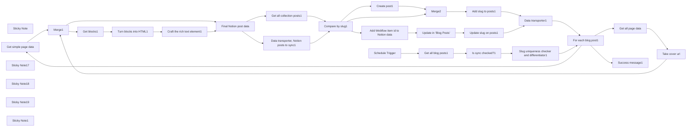

## Fluxo (.json) :

```json
{
  "nodes": [
    {
      "id": "adb2d3bc-c6ab-4bb6-b954-61956ca2836d",
      "name": "Sticky Note",
      "type": "n8n-nodes-base.stickyNote",
      "position": [
        -1528.3572519550153,
        3540
      ],
      "parameters": {
        "width": 830.4857444594224,
        "height": 495.4835100729081,
        "content": "## Workflow installation\n* Add a \"slug\" text property to each blog post (this parameter will be synced with Webflow and will be used to determine if a post is new or already present in your Webflow collection)\n* Add a \"Sync to Webflow?\" checkbox to each blog post\n* Connect your accounts and run a test to fill Webflow nodes with the right fields\n\n[](https://postimg.cc/BLbbxpJp)"
      },
      "typeVersion": 1
    },
    {
      "id": "a5a79fd3-7adb-4e56-8aa7-2fd0cfc22927",
      "name": "Get simple page data",
      "type": "n8n-nodes-base.notion",
      "position": [
        -80,
        4520
      ],
      "parameters": {
        "pageId": {
          "__rl": true,
          "mode": "id",
          "value": "={{ $json.id }}"
        },
        "resource": "databasePage",
        "operation": "get"
      },
      "credentials": {
        "notionApi": {
          "id": "rxtaEXgFPg96muhy",
          "name": "My Notion account"
        }
      },
      "executeOnce": true,
      "typeVersion": 2.2
    },
    {
      "id": "dbb56719-e091-4475-94fb-430cd58ce8bb",
      "name": "Get all page data",
      "type": "n8n-nodes-base.notion",
      "position": [
        -120,
        4840
      ],
      "parameters": {
        "pageId": {
          "__rl": true,
          "mode": "id",
          "value": "={{ $json.id }}"
        },
        "simple": false,
        "resource": "databasePage",
        "operation": "get"
      },
      "credentials": {
        "notionApi": {
          "id": "rxtaEXgFPg96muhy",
          "name": "My Notion account"
        }
      },
      "executeOnce": true,
      "typeVersion": 2.2
    },
    {
      "id": "af3fd27a-642e-4ec6-bc07-5d02076830e2",
      "name": "Take cover url",
      "type": "n8n-nodes-base.set",
      "position": [
        100,
        4840
      ],
      "parameters": {
        "options": {},
        "assignments": {
          "assignments": [
            {
              "id": "7f9960fb-9898-4d1a-b4d9-29c95fb7c144",
              "name": "cover_url",
              "type": "string",
              "value": "={{ $json.cover.external.url }}"
            }
          ]
        }
      },
      "typeVersion": 3.3
    },
    {
      "id": "5910292c-2548-4ca2-b7e4-304f99712e8d",
      "name": "Merge1",
      "type": "n8n-nodes-base.merge",
      "position": [
        320,
        4640
      ],
      "parameters": {
        "mode": "combine",
        "options": {},
        "combinationMode": "mergeByPosition"
      },
      "typeVersion": 2.1
    },
    {
      "id": "65c81d79-770c-48d4-97b9-f22328c22465",
      "name": "Data transporter1",
      "type": "n8n-nodes-base.noOp",
      "position": [
        3220,
        4900
      ],
      "parameters": {},
      "typeVersion": 1
    },
    {
      "id": "1bc81efb-d293-4c97-bcb8-e114de0e482c",
      "name": "Get all blog posts1",
      "type": "n8n-nodes-base.notion",
      "position": [
        -1220,
        4640
      ],
      "parameters": {
        "options": {},
        "resource": "databasePage",
        "operation": "getAll",
        "returnAll": true,
        "databaseId": {
          "__rl": true,
          "mode": "list",
          "value": "4587b66c-d670-45b5-93f0-69ba1b0f3924",
          "cachedResultUrl": "https://www.notion.so/4587b66cd67045b593f069ba1b0f3924",
          "cachedResultName": "My blog"
        }
      },
      "credentials": {
        "notionApi": {
          "id": "rxtaEXgFPg96muhy",
          "name": "My Notion account"
        }
      },
      "typeVersion": 2.2
    },
    {
      "id": "56392232-05c7-477f-911f-7713d6cfa25f",
      "name": "Is sync checked?1",
      "type": "n8n-nodes-base.filter",
      "position": [
        -940,
        4640
      ],
      "parameters": {
        "options": {},
        "conditions": {
          "options": {
            "leftValue": "",
            "caseSensitive": true,
            "typeValidation": "strict"
          },
          "combinator": "and",
          "conditions": [
            {
              "id": "461a5a59-f894-4dda-9233-175a1e228d23",
              "operator": {
                "type": "boolean",
                "operation": "true",
                "singleValue": true
              },
              "leftValue": "={{ $json.property_sync_to_webflow }}",
              "rightValue": ""
            }
          ]
        }
      },
      "typeVersion": 2
    },
    {
      "id": "2a9fab27-612e-4eb9-935c-fd802f39c96e",
      "name": "For each blog post1",
      "type": "n8n-nodes-base.splitInBatches",
      "position": [
        -360,
        4640
      ],
      "parameters": {
        "options": {}
      },
      "typeVersion": 3
    },
    {
      "id": "8f6d8e51-b92b-4780-b782-3f72203f40aa",
      "name": "Sticky Note17",
      "type": "n8n-nodes-base.stickyNote",
      "position": [
        540,
        4720
      ],
      "parameters": {
        "width": 777.880012347261,
        "height": 287.94399632670337,
        "content": "### ⚙️ Turn blocks into rich text\nThis is where the magic happens — Notion blocks are mapped and turned into their respective html version. Works with all the major rich text elements: headings 1, headings 2, headings 3, normal, bold and italic text, quotes, bulleted lists, numbered lists and images with captions."
      },
      "typeVersion": 1
    },
    {
      "id": "9592c56d-9bb2-433e-b49c-ec634e3d1db2",
      "name": "Sticky Note18",
      "type": "n8n-nodes-base.stickyNote",
      "position": [
        1980,
        4420
      ],
      "parameters": {
        "width": 218.00983675699544,
        "height": 394.8629861599825,
        "content": "### ✅ Create a new post or update an existing one?\nThis node compares (by slug) your Notion post with all your Webflow posts and chooses whether to create a new one (in \"A only\" branch) or update an existing one (in \"different\" branch)."
      },
      "typeVersion": 1
    },
    {
      "id": "3ffb06d2-c1f1-4ce1-961f-8ece894d6cca",
      "name": "Create post1",
      "type": "n8n-nodes-base.webflow",
      "position": [
        2400,
        4460
      ],
      "parameters": {
        "siteId": "65a40576635069142ed11d7c",
        "fieldsUi": {
          "fieldValues": [
            {
              "fieldId": "name",
              "fieldValue": "={{ $json[\"name\"] }}"
            },
            {
              "fieldId": "slug",
              "fieldValue": "={{ $json.property_slug }}"
            },
            {
              "fieldId": "blog-post-richt-text",
              "fieldValue": "={{ $json.newRichText }}"
            },
            {
              "fieldId": "_archived",
              "fieldValue": "false"
            },
            {
              "fieldId": "_draft",
              "fieldValue": "true"
            },
            {
              "fieldId": "blog-post-featured-image-photo",
              "fieldValue": "={{ $json.cover_url }}"
            },
            {
              "fieldId": "blog-post-thumbnail-image-photo",
              "fieldValue": "={{ $json.cover_url }}"
            }
          ]
        },
        "operation": "create",
        "collectionId": "65a40577635069142ed11dd8",
        "authentication": "oAuth2"
      },
      "credentials": {
        "webflowOAuth2Api": {
          "id": "cGhEXKKL99szTUa1",
          "name": "Webflow account"
        }
      },
      "retryOnFail": true,
      "typeVersion": 1
    },
    {
      "id": "e6490f39-b420-488c-b407-948425615764",
      "name": "Sticky Note19",
      "type": "n8n-nodes-base.stickyNote",
      "position": [
        -140,
        3960
      ],
      "parameters": {
        "width": 233.87813121439967,
        "height": 389.3234455133497,
        "content": "### 🎉 Success\nSend a success message where you want.\n\nYou can remove this node.\n\nNote: If you're on it, you may need to refresh the Webflow page."
      },
      "typeVersion": 1
    },
    {
      "id": "13568b0a-9665-4149-b848-2dc355b91126",
      "name": "Update slug on posts1",
      "type": "n8n-nodes-base.notion",
      "position": [
        2920,
        4760
      ],
      "parameters": {
        "pageId": {
          "__rl": true,
          "mode": "id",
          "value": "={{ $('Compare by slug1').item.json.different.id.inputA }}"
        },
        "options": {},
        "resource": "databasePage",
        "operation": "update",
        "propertiesUi": {
          "propertyValues": [
            {
              "key": "slug|rich_text",
              "textContent": "={{ $json.slug }}"
            }
          ]
        }
      },
      "credentials": {
        "notionApi": {
          "id": "rxtaEXgFPg96muhy",
          "name": "My Notion account"
        }
      },
      "retryOnFail": true,
      "typeVersion": 2.2
    },
    {
      "id": "8574c1d2-491d-4bbb-bcc1-0bef64b321a2",
      "name": "Slug uniqueness checker and differentiator1",
      "type": "n8n-nodes-base.code",
      "notes": "Add a number to the slug if it's not unique",
      "position": [
        -660,
        4640
      ],
      "parameters": {
        "jsCode": "const data = $input.all().map(item => item.json)\nconst slugCount = {};\n\nreturn data.map(item => {\n  let slug = item.property_slug;\n  \n  if (slugCount[slug]) {\n    slugCount[slug] += 1;\n    slug = `${slug}-${slugCount[slug]}`;\n  } else {\n    slugCount[slug] = 1;\n  }\n  \n  item.property_slug = slug;\n  return item;\n});"
      },
      "notesInFlow": true,
      "typeVersion": 2
    },
    {
      "id": "21755856-9123-4acd-b343-3af878d665ad",
      "name": "Success message1",
      "type": "n8n-nodes-base.slack",
      "position": [
        -80,
        4175
      ],
      "parameters": {
        "text": "=[Notion to Webflow] — \"{{ $json.name }}\" successfully synced 🎉",
        "select": "channel",
        "channelId": {
          "__rl": true,
          "mode": "list",
          "value": "C07719A0GF5",
          "cachedResultName": "general"
        },
        "otherOptions": {},
        "authentication": "oAuth2"
      },
      "credentials": {
        "slackOAuth2Api": {
          "id": "qY28oJXU3BH6OrP3",
          "name": "Desengineers Account"
        }
      },
      "typeVersion": 2.2
    },
    {
      "id": "6c232d4a-464b-4d5a-992b-f649d955eb1e",
      "name": "Merge2",
      "type": "n8n-nodes-base.merge",
      "position": [
        2660,
        4540
      ],
      "parameters": {
        "mode": "combine",
        "options": {},
        "combinationMode": "mergeByPosition"
      },
      "typeVersion": 2.1
    },
    {
      "id": "6af0cab5-8f70-435f-a341-c22d157d9200",
      "name": "Compare by slug1",
      "type": "n8n-nodes-base.compareDatasets",
      "position": [
        2040,
        4640
      ],
      "parameters": {
        "options": {},
        "mergeByFields": {
          "values": [
            {
              "field1": "property_slug",
              "field2": "slug"
            }
          ]
        }
      },
      "typeVersion": 2.3
    },
    {
      "id": "54a7dcf6-188e-4ca5-bc1e-3e76d5536236",
      "name": "Add slug to posts1",
      "type": "n8n-nodes-base.notion",
      "position": [
        2900,
        4540
      ],
      "parameters": {
        "pageId": {
          "__rl": true,
          "mode": "id",
          "value": "={{ $json.id }}"
        },
        "options": {},
        "resource": "databasePage",
        "operation": "update",
        "propertiesUi": {
          "propertyValues": [
            {
              "key": "slug|rich_text",
              "textContent": "={{ $json.slug }}"
            }
          ]
        }
      },
      "credentials": {
        "notionApi": {
          "id": "rxtaEXgFPg96muhy",
          "name": "My Notion account"
        }
      },
      "retryOnFail": true,
      "typeVersion": 2.2
    },
    {
      "id": "f9a66b20-ce82-4f36-b145-283dadf97d34",
      "name": "Get all collection posts1",
      "type": "n8n-nodes-base.webflow",
      "position": [
        1720,
        4780
      ],
      "parameters": {
        "siteId": "65a40576635069142ed11d7c",
        "operation": "getAll",
        "returnAll": true,
        "collectionId": "65a40577635069142ed11dd8",
        "authentication": "oAuth2"
      },
      "credentials": {
        "webflowOAuth2Api": {
          "id": "cGhEXKKL99szTUa1",
          "name": "Webflow account"
        }
      },
      "typeVersion": 1
    },
    {
      "id": "c09f3782-12a1-4a91-945d-cd1ed14bfeb3",
      "name": "Data transporter, Notion posts to sync1",
      "type": "n8n-nodes-base.noOp",
      "position": [
        1720,
        4480
      ],
      "parameters": {},
      "typeVersion": 1
    },
    {
      "id": "9dc3ee15-4b4c-463c-a3b5-17b1dcb275da",
      "name": "Craft the rich text element1",
      "type": "n8n-nodes-base.code",
      "position": [
        1160,
        4836
      ],
      "parameters": {
        "jsCode": "const blocks = $input.all().map(item => item.json);\n\nlet newRichText = '';\nlet bulletedListItems = [];\nlet numberedListItems = [];\n\nblocks.forEach(block => {\n  if (block.type === 'bulleted_list_item') {\n    bulletedListItems.push(block.html);\n  } else if (block.type === 'numbered_list_item') {\n    numberedListItems.push(block.html);\n  } else {\n    if (bulletedListItems.length > 0) {\n      newRichText += `<ul>${bulletedListItems.join('')}</ul>`;\n      bulletedListItems = [];\n    }\n    if (numberedListItems.length > 0) {\n      newRichText += `<ol>${numberedListItems.join('')}</ol>`;\n      numberedListItems = [];\n    }\n    newRichText += block.html;\n  }\n});\n\nif (bulletedListItems.length > 0) {\n  newRichText += `<ul>${bulletedListItems.join('')}</ul>`;\n}\nif (numberedListItems.length > 0) {\n  newRichText += `<ol>${numberedListItems.join('')}</ol>`;\n}\n\nconst output = [{ newRichText }];\nreturn output;\n\n"
      },
      "typeVersion": 2
    },
    {
      "id": "e4ca0e5a-21bb-4d38-8448-8195b8994c12",
      "name": "Turn blocks into HTML1",
      "type": "n8n-nodes-base.code",
      "position": [
        860,
        4840
      ],
      "parameters": {
        "jsCode": "const blocks = $input.all().map(item => item.json);\nconst output = [];\n\nblocks.forEach(block => {\n  let html = '';\n  \n  switch (block.type) {\n    case 'heading_1':\n      html = block.heading_1.text.map(item => item.text.content).join(' ');\n      html = `<h1>${html}</h1>`;\n      break;\n    case 'heading_2':\n      html = block.heading_2.text.map(item => item.text.content).join(' ');\n      html = `<h2>${html}</h2>`;\n      break;\n    case 'heading_3':\n      html = block.heading_3.text.map(item => item.text.content).join(' ');\n      html = `<h3>${html}</h3>`;\n      break;\n    case 'paragraph':\n      html = `<p>${block.paragraph.text.map(item => {\n        let content = item.text.content.trim();\n        if (item.annotations.bold) content = `<b>${content}</b>`;\n        if (item.annotations.italic) content = `<i>${content}</i>`;\n        if (item.text.link) content = `<a href=\"${item.text.link.url}\">${content}</a>`;\n        return content;\n      }).join(' ') || '   '}</p>`; // the space inside the apostrophes is on purpose, otherwise Webflow will automatically delete the empty blocks\n      break;\n    case 'quote':\n      html = block.quote.text.map(item => item.text.content).join(' ');\n      html = `<blockquote>${html}</blockquote>`;\n      break;\n    case 'bulleted_list_item':\n      html = block.bulleted_list_item.text.map(item => item.text.content).join(' ');\n      html = `<li>${html}</li>`;\n      break;\n    case 'numbered_list_item':\n      html = block.numbered_list_item.text.map(item => item.text.content).join(' ');\n      html = `<li>${html}</li>`;\n      break;\n    case 'image':\n      const caption = block.image.caption.map(item => item.text.content).join(' ');\n      html = `<figure><figcaption>${caption}</figcaption></figure>`;\n      break;\n    case 'code':\n      const codeContent = block.code.text.map(item => item.text.content).join('\\n')\n      html = `<pre><code>${codeContent}</code></pre>`\n      break\n    default:\n      html = block.content ? `<div>${block.content}</div>` : '';\n  }\n\n  if (html) {\n    output.push({\n      block_id: block.id,\n      type: block.type,\n      html\n    });\n  }\n});\n\nreturn output;\n"
      },
      "typeVersion": 2
    },
    {
      "id": "719f5116-5e60-488c-81c2-d55cea2e2646",
      "name": "Get blocks1",
      "type": "n8n-nodes-base.notion",
      "position": [
        580,
        4837
      ],
      "parameters": {
        "blockId": {
          "__rl": true,
          "mode": "id",
          "value": "={{ $json.id }}"
        },
        "resource": "block",
        "operation": "getAll",
        "returnAll": true,
        "simplifyOutput": false
      },
      "credentials": {
        "notionApi": {
          "id": "rxtaEXgFPg96muhy",
          "name": "My Notion account"
        }
      },
      "typeVersion": 2.2
    },
    {
      "id": "23f88f9c-ef4a-4158-bff5-728e2cf0383a",
      "name": "Update in \"Blog Posts\"",
      "type": "n8n-nodes-base.webflow",
      "maxTries": 3,
      "position": [
        2660,
        4780
      ],
      "parameters": {
        "itemId": "={{ $json.webflow_item_id }}",
        "siteId": "65a40576635069142ed11d7c",
        "fieldsUi": {
          "fieldValues": [
            {
              "fieldId": "_draft",
              "fieldValue": "true"
            },
            {
              "fieldId": "_archived",
              "fieldValue": "false"
            },
            {
              "fieldId": "name",
              "fieldValue": "={{ $json.name }}"
            },
            {
              "fieldId": "slug",
              "fieldValue": "={{ $json.property_slug }}"
            },
            {
              "fieldId": "blog-post-richt-text",
              "fieldValue": "={{ $json.newRichText }}"
            },
            {
              "fieldId": "blog-post-featured-image-photo",
              "fieldValue": "={{ $json.cover_url }}"
            },
            {
              "fieldId": "blog-post-thumbnail-image-photo",
              "fieldValue": "={{ $json.cover_url }}"
            }
          ]
        },
        "operation": "update",
        "collectionId": "65a40577635069142ed11dd8",
        "authentication": "oAuth2"
      },
      "credentials": {
        "webflowOAuth2Api": {
          "id": "cGhEXKKL99szTUa1",
          "name": "Webflow account"
        }
      },
      "retryOnFail": true,
      "typeVersion": 1,
      "alwaysOutputData": false
    },
    {
      "id": "6db40a4d-4acd-40f3-8830-f17e00678e39",
      "name": "Add Webflow item id to Notion data",
      "type": "n8n-nodes-base.code",
      "position": [
        2400,
        4760
      ],
      "parameters": {
        "mode": "runOnceForEachItem",
        "jsCode": "const compareResult = $json\nconst notionData = $('Final Notion post data').item.json\n\nconst output = {\n  ...notionData, // spread notion data\n  webflow_item_id: compareResult.different._id.inputB // add the webflow item id\n}\n\nreturn output"
      },
      "typeVersion": 2
    },
    {
      "id": "49e3d52c-a95a-4ac0-ae6a-69e4a722a628",
      "name": "Final Notion post data",
      "type": "n8n-nodes-base.merge",
      "position": [
        1380,
        4640
      ],
      "parameters": {
        "mode": "combine",
        "options": {},
        "combinationMode": "mergeByPosition"
      },
      "typeVersion": 2.1
    },
    {
      "id": "23755e8c-0012-4a72-ad9e-f450ceca1de4",
      "name": "Sticky Note1",
      "type": "n8n-nodes-base.stickyNote",
      "position": [
        -146,
        4720
      ],
      "parameters": {
        "width": 366.7438380520149,
        "height": 282.04364735085795,
        "content": "### No wastes\nThese nodes extract the cover image url of the Notion page to make it easy for you to use it in the collection fields."
      },
      "typeVersion": 1
    },
    {
      "id": "cb16a61b-73bc-491b-b4ce-b4dc5a5f21fc",
      "name": "Schedule Trigger",
      "type": "n8n-nodes-base.scheduleTrigger",
      "position": [
        -1480,
        4640
      ],
      "parameters": {
        "rule": {
          "interval": [
            {}
          ]
        }
      },
      "typeVersion": 1.2
    }
  ],
  "connections": {
    "Merge1": {
      "main": [
        [
          {
            "node": "Final Notion post data",
            "type": "main",
            "index": 0
          },
          {
            "node": "Get blocks1",
            "type": "main",
            "index": 0
          }
        ]
      ]
    },
    "Merge2": {
      "main": [
        [
          {
            "node": "Add slug to posts1",
            "type": "main",
            "index": 0
          }
        ]
      ]
    },
    "Get blocks1": {
      "main": [
        [
          {
            "node": "Turn blocks into HTML1",
            "type": "main",
            "index": 0
          }
        ]
      ]
    },
    "Create post1": {
      "main": [
        [
          {
            "node": "Merge2",
            "type": "main",
            "index": 0
          }
        ]
      ]
    },
    "Take cover url": {
      "main": [
        [
          {
            "node": "Merge1",
            "type": "main",
            "index": 1
          }
        ]
      ]
    },
    "Compare by slug1": {
      "main": [
        [
          {
            "node": "Create post1",
            "type": "main",
            "index": 0
          },
          {
            "node": "Merge2",
            "type": "main",
            "index": 1
          }
        ],
        null,
        [
          {
            "node": "Add Webflow item id to Notion data",
            "type": "main",
            "index": 0
          }
        ]
      ]
    },
    "Schedule Trigger": {
      "main": [
        [
          {
            "node": "Get all blog posts1",
            "type": "main",
            "index": 0
          }
        ]
      ]
    },
    "Data transporter1": {
      "main": [
        [
          {
            "node": "For each blog post1",
            "type": "main",
            "index": 0
          }
        ]
      ]
    },
    "Get all page data": {
      "main": [
        [
          {
            "node": "Take cover url",
            "type": "main",
            "index": 0
          }
        ]
      ]
    },
    "Is sync checked?1": {
      "main": [
        [
          {
            "node": "Slug uniqueness checker and differentiator1",
            "type": "main",
            "index": 0
          }
        ]
      ]
    },
    "Add slug to posts1": {
      "main": [
        [
          {
            "node": "Data transporter1",
            "type": "main",
            "index": 0
          }
        ]
      ]
    },
    "For each blog post1": {
      "main": [
        [
          {
            "node": "Success message1",
            "type": "main",
            "index": 0
          }
        ],
        [
          {
            "node": "Get simple page data",
            "type": "main",
            "index": 0
          },
          {
            "node": "Get all page data",
            "type": "main",
            "index": 0
          }
        ]
      ]
    },
    "Get all blog posts1": {
      "main": [
        [
          {
            "node": "Is sync checked?1",
            "type": "main",
            "index": 0
          }
        ]
      ]
    },
    "Get simple page data": {
      "main": [
        [
          {
            "node": "Merge1",
            "type": "main",
            "index": 0
          }
        ]
      ]
    },
    "Update slug on posts1": {
      "main": [
        [
          {
            "node": "Data transporter1",
            "type": "main",
            "index": 0
          }
        ]
      ]
    },
    "Final Notion post data": {
      "main": [
        [
          {
            "node": "Data transporter, Notion posts to sync1",
            "type": "main",
            "index": 0
          },
          {
            "node": "Get all collection posts1",
            "type": "main",
            "index": 0
          }
        ]
      ]
    },
    "Turn blocks into HTML1": {
      "main": [
        [
          {
            "node": "Craft the rich text element1",
            "type": "main",
            "index": 0
          }
        ]
      ]
    },
    "Update in \"Blog Posts\"": {
      "main": [
        [
          {
            "node": "Update slug on posts1",
            "type": "main",
            "index": 0
          }
        ]
      ]
    },
    "Get all collection posts1": {
      "main": [
        [
          {
            "node": "Compare by slug1",
            "type": "main",
            "index": 1
          }
        ]
      ]
    },
    "Craft the rich text element1": {
      "main": [
        [
          {
            "node": "Final Notion post data",
            "type": "main",
            "index": 1
          }
        ]
      ]
    },
    "Add Webflow item id to Notion data": {
      "main": [
        [
          {
            "node": "Update in \"Blog Posts\"",
            "type": "main",
            "index": 0
          }
        ]
      ]
    },
    "Data transporter, Notion posts to sync1": {
      "main": [
        [
          {
            "node": "Compare by slug1",
            "type": "main",
            "index": 0
          }
        ]
      ]
    },
    "Slug uniqueness checker and differentiator1": {
      "main": [
        [
          {
            "node": "For each blog post1",
            "type": "main",
            "index": 0
          }
        ]
      ]
    }
  }
}
```

<a id="template-949"></a>

## Template 949 - Resolver incidente e notificar equipe

- **Nome:** Resolver incidente e notificar equipe
- **Descrição:** Ao receber um webhook, o fluxo resolve um incidente no PagerDuty, atualiza o status da issue correspondente no Jira e envia notificações no Mattermost.
- **Funcionalidade:** • Recepção de webhook: Inicia o fluxo ao receber um POST contendo contexto com IDs do incidente e da issue.
• Resolução do incidente no PagerDuty: Marca o incidente referenciado no payload como 'resolved'.
• Atualização da issue no Jira: Atualiza o status da issue identificada pelo jira_key recebido para o status configurado (statusId 31).
• Notificações no Mattermost: Envia uma mensagem de encerramento para o canal informado no webhook e uma mensagem comemorativa para um canal fixo com o resumo do incidente.
• Encadeamento seguro das ações: Garante que a atualização do Jira e as notificações só ocorram após a resolução do incidente.
- **Ferramentas:** • PagerDuty: Plataforma de gestão de incidentes usada para resolver o incidente especificado no payload.
• Jira: Sistema de rastreamento de issues usado para atualizar o status da issue relacionada.
• Mattermost: Plataforma de chat utilizada para enviar notificações e mensagens de status/celebração às equipes.

## Fluxo visual

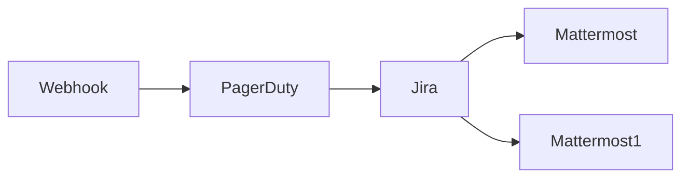

## Fluxo (.json) :

```json
{
  "nodes": [
    {
      "name": "Mattermost",
      "type": "n8n-nodes-base.mattermost",
      "position": [
        1050,
        200
      ],
      "parameters": {
        "message": "💪 This issue got closed in PagerDuty and Jira.",
        "channelId": "={{$node[\"Webhook\"].json[\"body\"][\"channel_id\"]}}",
        "attachments": [],
        "otherOptions": {}
      },
      "credentials": {
        "mattermostApi": "Mattermost Credentials"
      },
      "typeVersion": 1
    },
    {
      "name": "Mattermost1",
      "type": "n8n-nodes-base.mattermost",
      "position": [
        1050,
        400
      ],
      "parameters": {
        "message": "=🎉 The incident ({{$node[\"PagerDuty\"].json[\"summary\"]}}) was resolved by the lovely folks in the on-call team!",
        "channelId": "k1h3du9r9byyfg7sys8ib6p3ey",
        "attachments": [],
        "otherOptions": {}
      },
      "credentials": {
        "mattermostApi": "Mattermost Credentials"
      },
      "typeVersion": 1
    },
    {
      "name": "Jira",
      "type": "n8n-nodes-base.jira",
      "position": [
        850,
        300
      ],
      "parameters": {
        "issueKey": "={{$node[\"Webhook\"].json[\"body\"][\"context\"][\"jira_key\"]}}",
        "operation": "update",
        "updateFields": {
          "statusId": "31"
        }
      },
      "credentials": {
        "jiraSoftwareCloudApi": "jira"
      },
      "typeVersion": 1
    },
    {
      "name": "PagerDuty",
      "type": "n8n-nodes-base.pagerDuty",
      "position": [
        650,
        300
      ],
      "parameters": {
        "email": "n8ndocsburner@gmail.com",
        "operation": "update",
        "incidentId": "={{$json[\"body\"][\"context\"][\"pagerduty_incident\"]}}",
        "updateFields": {
          "status": "resolved"
        }
      },
      "credentials": {
        "pagerDutyApi": "PagerDuty Credentials"
      },
      "typeVersion": 1
    },
    {
      "name": "Webhook",
      "type": "n8n-nodes-base.webhook",
      "position": [
        450,
        300
      ],
      "webhookId": "1bd40693-c7dd-43f5-97d9-6d8986e62fc1",
      "parameters": {
        "path": "1bd40693-c7dd-43f5-97d9-6d8986e62fc1",
        "options": {},
        "httpMethod": "POST"
      },
      "typeVersion": 1
    }
  ],
  "connections": {
    "Jira": {
      "main": [
        [
          {
            "node": "Mattermost",
            "type": "main",
            "index": 0
          },
          {
            "node": "Mattermost1",
            "type": "main",
            "index": 0
          }
        ]
      ]
    },
    "Webhook": {
      "main": [
        [
          {
            "node": "PagerDuty",
            "type": "main",
            "index": 0
          }
        ]
      ]
    },
    "PagerDuty": {
      "main": [
        [
          {
            "node": "Jira",
            "type": "main",
            "index": 0
          }
        ]
      ]
    }
  }
}
```

<a id="template-950"></a>

## Template 950 - Alerta de erro via Mattermost e SMS

- **Nome:** Alerta de erro via Mattermost e SMS
- **Descrição:** Ao detectar um erro em um fluxo, o sistema envia notificações para um canal do Mattermost e também envia um SMS informando detalhes do fluxo afetado.
- **Funcionalidade:** • Detecção de erro: Aciona automaticamente quando ocorre um erro em outro fluxo, capturando informações do fluxo afetado.
• Notificação no Mattermost: Envia uma mensagem para um canal do Mattermost com o nome do fluxo, o ID e o último nó que foi executado.
• Envio de SMS: Dispara uma mensagem SMS contendo o nome e o ID do fluxo para alertar responsáveis ou equipes.
- **Ferramentas:** • Mattermost: Plataforma de comunicação em equipe utilizada para enviar mensagens de alerta a canais ou usuários.
• Twilio: Serviço de comunicação para envio de mensagens SMS a números de telefone.

## Fluxo visual

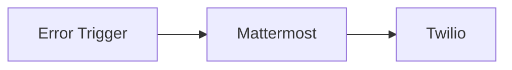

## Fluxo (.json) :

```json
{
  "nodes": [
    {
      "name": "Twilio",
      "type": "n8n-nodes-base.twilio",
      "position": [
        900,
        300
      ],
      "parameters": {
        "message": "=The workflow named '{{$node[\"Error Trigger\"].json[\"workflow\"][\"name\"]}}' with the ID {{$node[\"Error Trigger\"].json[\"workflow\"][\"id\"]}} has encountered an error."
      },
      "credentials": {
        "twilioApi": "Twilio"
      },
      "typeVersion": 1
    },
    {
      "name": "Mattermost",
      "type": "n8n-nodes-base.mattermost",
      "position": [
        650,
        300
      ],
      "parameters": {
        "message": "=The workflow named '{{$json[\"workflow\"][\"name\"]}}' with the ID {{$json[\"workflow\"][\"id\"]}} has encountered an error. The last node that was executed was {{$json[\"execution\"][\"lastNodeExecuted\"]}}.",
        "attachments": [],
        "otherOptions": {}
      },
      "credentials": {
        "mattermostApi": "Mattermost"
      },
      "typeVersion": 1
    },
    {
      "name": "Error Trigger",
      "type": "n8n-nodes-base.errorTrigger",
      "position": [
        450,
        300
      ],
      "parameters": {},
      "typeVersion": 1
    }
  ],
  "connections": {
    "Mattermost": {
      "main": [
        [
          {
            "node": "Twilio",
            "type": "main",
            "index": 0
          }
        ]
      ]
    },
    "Error Trigger": {
      "main": [
        [
          {
            "node": "Mattermost",
            "type": "main",
            "index": 0
          }
        ]
      ]
    }
  }
}
```

<a id="template-951"></a>

## Template 951 - Baixar imagens, compactar e enviar ao Dropbox

- **Nome:** Baixar imagens, compactar e enviar ao Dropbox
- **Descrição:** Baixa duas imagens da web, compacta-as em um arquivo ZIP e envia o ZIP para uma conta do Dropbox.
- **Funcionalidade:** • Início manual: O fluxo é iniciado manualmente ao clicar em executar.
• Download de imagens: Faz requisições HTTP para obter duas imagens a partir de URLs públicas.
• Compressão de arquivos: Combina as imagens baixadas como dados binários e as compacta em um arquivo ZIP.
• Upload para armazenamento em nuvem: Envia o arquivo ZIP gerado para um caminho específico no Dropbox.
- **Ferramentas:** • Servidores HTTP públicos: Hospedam as imagens que são baixadas pelo fluxo.
• Dropbox: Serviço de armazenamento em nuvem usado para armazenar o arquivo ZIP gerado.

## Fluxo visual

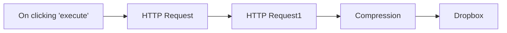

## Fluxo (.json) :

```json
{
  "nodes": [
    {
      "name": "Dropbox",
      "type": "n8n-nodes-base.dropbox",
      "position": [
        1090,
        290
      ],
      "parameters": {
        "path": "/images.zip",
        "binaryData": true
      },
      "credentials": {
        "dropboxApi": "Dropbox Tokens Test"
      },
      "typeVersion": 1
    },
    {
      "name": "Compression",
      "type": "n8n-nodes-base.compression",
      "position": [
        890,
        290
      ],
      "parameters": {
        "fileName": "images.zip",
        "operation": "compress",
        "outputFormat": "zip",
        "binaryPropertyName": "logo, workflow_image"
      },
      "typeVersion": 1
    },
    {
      "name": "HTTP Request1",
      "type": "n8n-nodes-base.httpRequest",
      "position": [
        690,
        290
      ],
      "parameters": {
        "url": "https://n8n.io/n8n-logo.png",
        "options": {},
        "responseFormat": "file",
        "dataPropertyName": "logo"
      },
      "typeVersion": 1
    },
    {
      "name": "HTTP Request",
      "type": "n8n-nodes-base.httpRequest",
      "position": [
        490,
        290
      ],
      "parameters": {
        "url": "https://docs.n8n.io/assets/img/final-workflow.f380b957.png",
        "options": {},
        "responseFormat": "file",
        "dataPropertyName": "workflow_image"
      },
      "typeVersion": 1
    },
    {
      "name": "On clicking 'execute'",
      "type": "n8n-nodes-base.manualTrigger",
      "position": [
        290,
        290
      ],
      "parameters": {},
      "typeVersion": 1
    }
  ],
  "connections": {
    "Compression": {
      "main": [
        [
          {
            "node": "Dropbox",
            "type": "main",
            "index": 0
          }
        ]
      ]
    },
    "HTTP Request": {
      "main": [
        [
          {
            "node": "HTTP Request1",
            "type": "main",
            "index": 0
          }
        ]
      ]
    },
    "HTTP Request1": {
      "main": [
        [
          {
            "node": "Compression",
            "type": "main",
            "index": 0
          }
        ]
      ]
    },
    "On clicking 'execute'": {
      "main": [
        [
          {
            "node": "HTTP Request",
            "type": "main",
            "index": 0
          }
        ]
      ]
    }
  }
}
```

<a id="template-952"></a>

## Template 952 - Notificar novas linhas do Google Sheet

- **Nome:** Notificar novas linhas do Google Sheet
- **Descrição:** Monitora uma planilha do Google em intervalos regulares e notifica um canal do Mattermost quando novas linhas são detectadas.
- **Funcionalidade:** • Agendamento periódico: Executa o fluxo a cada 45 minutos para verificar atualizações.
• Leitura de dados da planilha: Acessa uma planilha do Google Sheets para obter as entradas atuais.
• Detecção de novos registros: Compara IDs presentes com um cache estático para identificar linhas adicionadas desde a última execução.
• Preparação de payload: Extrai e formata os campos ID, Name e Email dos novos registros.
• Envio de notificação: Publica uma mensagem no canal do Mattermost contendo os detalhes dos novos registros.
- **Ferramentas:** • Google Sheets: Planilha online usada como fonte de dados onde novas linhas são adicionadas.
• Mattermost: Plataforma de mensagens utilizada para receber notificações com os dados novos.


## Fluxo visual

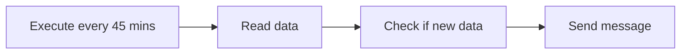

## Fluxo (.json) :

```json
{
  "nodes": [
    {
      "name": "Send message",
      "type": "n8n-nodes-base.mattermost",
      "position": [
        910,
        260
      ],
      "parameters": {
        "message": "=New information was added to your Google Sheet.\nID: {{$json[\"id\"]}}\nName: {{$json[\"name\"]}}\nEmail: {{$json[\"email\"]}}",
        "attachments": [],
        "otherOptions": {}
      },
      "credentials": {
        "mattermostApi": "Mattermost Credentials"
      },
      "typeVersion": 1
    },
    {
      "name": "Check if new data",
      "type": "n8n-nodes-base.function",
      "position": [
        710,
        260
      ],
      "parameters": {
        "functionCode": "const new_items = [];\n// Get static data stored with the workflow\n\nconst data = this.getWorkflowStaticData(\"node\");\ndata.ids = data.ids || [];\nfor (let i = items.length - 1; i >= 0; i--) {\n\n// Check if data is already present\n  if (data.ids.includes(items[i].json.ID)) {\n    break;\n  } else {\n\n// if new data then add it to an array\n    new_items.push({\n      json: {\n        id: items[i].json.ID,\n        name: items[i].json.Name,\n        email: items[i].json.Email\n      },\n    });\n  }\n}\ndata.ids = items.map((item) => item.json.ID);\n\n// return new items\nreturn new_items;\n"
      },
      "typeVersion": 1
    },
    {
      "name": "Read data",
      "type": "n8n-nodes-base.googleSheets",
      "position": [
        510,
        260
      ],
      "parameters": {
        "options": {},
        "sheetId": "1PyC-U1lXSCbxVmHuwFbkKDF9e3PW_iUn8T-iAd_MYjQ",
        "authentication": "oAuth2"
      },
      "credentials": {
        "googleSheetsOAuth2Api": "google-sheets"
      },
      "typeVersion": 1
    },
    {
      "name": "Execute every 45 mins",
      "type": "n8n-nodes-base.interval",
      "position": [
        310,
        260
      ],
      "parameters": {
        "unit": "minutes"
      },
      "typeVersion": 1
    }
  ],
  "connections": {
    "Read data": {
      "main": [
        [
          {
            "node": "Check if new data",
            "type": "main",
            "index": 0
          }
        ]
      ]
    },
    "Check if new data": {
      "main": [
        [
          {
            "node": "Send message",
            "type": "main",
            "index": 0
          }
        ]
      ]
    },
    "Execute every 45 mins": {
      "main": [
        [
          {
            "node": "Read data",
            "type": "main",
            "index": 0
          }
        ]
      ]
    }
  }
}
```

<a id="template-953"></a>

## Template 953 - Conversão de HTML para PDF

- **Nome:** Conversão de HTML para PDF
- **Descrição:** O fluxo gera HTML de teste, converte esse HTML em PDF através de uma API externa e salva o resultado como document.pdf no disco.
- **Funcionalidade:** • Geração de HTML de teste: cria uma página HTML simples para converter.
• Conversão de HTML para arquivo binário: transforma o HTML em um arquivo binário para envio na requisição.
• Conversão de HTML para PDF através de API externa: envia o arquivo HTML para obter um PDF.
• Gravação do PDF no disco: salva o PDF resultante como document.pdf.
- **Ferramentas:** • ConvertAPI: Serviço para converter HTML em PDF via requisição HTTP.


## Fluxo visual

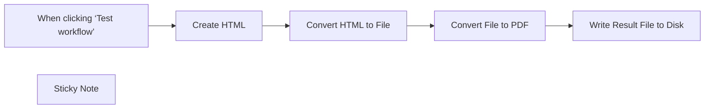

## Fluxo (.json) :

```json
{
  "meta": {
    "instanceId": "1dd912a1610cd0376bae7bb8f1b5838d2b601f42ac66a48e012166bb954fed5a",
    "templateId": "2314"
  },
  "nodes": [
    {
      "id": "3409b6e3-aef1-4eb4-acfb-72a73101e109",
      "name": "When clicking ‘Test workflow’",
      "type": "n8n-nodes-base.manualTrigger",
      "position": [
        380,
        240
      ],
      "parameters": {},
      "typeVersion": 1
    },
    {
      "id": "4942cdfc-bc9a-43ac-a60d-06e1ddf52d07",
      "name": "Write Result File to Disk",
      "type": "n8n-nodes-base.readWriteFile",
      "position": [
        1360,
        240
      ],
      "parameters": {
        "options": {},
        "fileName": "document.pdf",
        "operation": "write",
        "dataPropertyName": "=data"
      },
      "typeVersion": 1
    },
    {
      "id": "1467a9ab-144d-48cc-a52f-3dca86ca0e8b",
      "name": "Sticky Note",
      "type": "n8n-nodes-base.stickyNote",
      "position": [
        880,
        100
      ],
      "parameters": {
        "width": 218,
        "height": 132,
        "content": "## Authentication\nConversion requests must be authenticated. Please create \n[ConvertAPI account to get authentication secret](https://www.convertapi.com/a/signin)"
      },
      "typeVersion": 1
    },
    {
      "id": "4d85a311-8e39-48ce-868e-95efec509247",
      "name": "Create HTML",
      "type": "n8n-nodes-base.set",
      "position": [
        580,
        240
      ],
      "parameters": {
        "options": {},
        "assignments": {
          "assignments": [
            {
              "id": "ad325c1b-1597-45ab-98cd-1801da32e3f1",
              "name": "data",
              "type": "string",
              "value": "=<!DOCTYPE html>\n<html lang=\"en\">\n<head>\n    <meta charset=\"UTF-8\">\n    <meta name=\"viewport\" content=\"width=device-width, initial-scale=1.0\">\n    <title>ConvertAPI Test Document</title>\n</head>\n<body>\n    <h1>ConvertAPI Test Document</h1>\n    <p>This is a minimal HTML5 document used for testing ConvertAPI's conversion capabilities.</p>\n    <section>\n        <h2>Section Title</h2>\n        <p>This is a section within the document.</p>\n    </section>\n    <footer>\n        <p>&copy; 2024 Test Document</p>\n    </footer>\n</body>\n</html>"
            }
          ]
        }
      },
      "typeVersion": 3.3
    },
    {
      "id": "a0e4e17a-097f-4127-9b60-c6ae637816a0",
      "name": "Convert HTML to File",
      "type": "n8n-nodes-base.code",
      "position": [
        760,
        240
      ],
      "parameters": {
        "jsCode": "const text = $node[\"Create HTML\"].json[\"data\"]\nconst buffer = Buffer.from(text, 'utf8');\nconst binaryData = {\n  data: buffer.toString('base64'),\n  mimeType: 'application/octet-stream',\n  fileName: 'file.html',\n};\nitems[0].binary = { data: binaryData };\nreturn items;\n"
      },
      "typeVersion": 2
    },
    {
      "id": "653b21eb-dae5-44e0-858a-a2905f495911",
      "name": "Convert File to PDF",
      "type": "n8n-nodes-base.httpRequest",
      "position": [
        940,
        240
      ],
      "parameters": {
        "url": "https://v2.convertapi.com/convert/html/to/pdf",
        "method": "POST",
        "options": {
          "response": {
            "response": {
              "responseFormat": "file"
            }
          }
        },
        "sendBody": true,
        "contentType": "multipart-form-data",
        "sendHeaders": true,
        "authentication": "genericCredentialType",
        "bodyParameters": {
          "parameters": [
            {
              "name": "file",
              "parameterType": "formBinaryData",
              "inputDataFieldName": "data"
            }
          ]
        },
        "genericAuthType": "httpQueryAuth",
        "headerParameters": {
          "parameters": [
            {
              "name": "Accept",
              "value": "application/octet-stream"
            }
          ]
        }
      },
      "credentials": {
        "httpQueryAuth": {
          "id": "WdAklDMod8fBEMRk",
          "name": "Query Auth account"
        }
      },
      "notesInFlow": true,
      "typeVersion": 4.2
    }
  ],
  "pinData": {},
  "connections": {
    "Create HTML": {
      "main": [
        [
          {
            "node": "Convert HTML to File",
            "type": "main",
            "index": 0
          }
        ]
      ]
    },
    "Convert File to PDF": {
      "main": [
        [
          {
            "node": "Write Result File to Disk",
            "type": "main",
            "index": 0
          }
        ]
      ]
    },
    "Convert HTML to File": {
      "main": [
        [
          {
            "node": "Convert File to PDF",
            "type": "main",
            "index": 0
          }
        ]
      ]
    },
    "When clicking ‘Test workflow’": {
      "main": [
        [
          {
            "node": "Create HTML",
            "type": "main",
            "index": 0
          }
        ]
      ]
    }
  }
}
```

<a id="template-954"></a>

## Template 954 - IA para agendamento, emails e PDFs com embeddings

- **Nome:** IA para agendamento, emails e PDFs com embeddings
- **Descrição:** Este fluxo usa IA para classificar emails, gerenciar agendas e pesquisar conteúdo de PDFs através de embeddings, oferecendo respostas embasadas e suporte ao agendamento.
- **Funcionalidade:** • Detecção de intenção de agendamento: inicia o fluxo a partir de um gatilho de chat para marcar compromissos.
• Verificação de disponibilidade e agendamento: consulta o calendário, verifica horários livres e cria o evento com os participantes.
• Ingestão de PDFs e embeddings: baixa PDFs, extrai o texto, divide em trechos e gera embeddings para indexação.
• Recuperação de conhecimento e QA com PDFs: utiliza o vetor store para responder perguntas com base no conteúdo indexado.
• Classificação de emails com IA e rotulagem: analisa o conteúdo das mensagens e aplica rótulos automaticamente.
• Comunicação e contexto: gerencia memória de sessão e envia notificações quando necessário.
- **Ferramentas:** • Google Calendar: serviço para consultar disponibilidade e criar eventos de agenda.
• Gmail: serviço de email utilizado para rotular mensagens com IA.
• Pinecone: armazenamento e recuperação de vetores para pesquisa baseada em conteúdo.
• OpenAI Embeddings: geração de vetores de conteúdo para indexação e busca.
• OpenAI Chat (GPT-4o): modelo de linguagem para conversação, QA e suporte ao agendamento.
• Anthropic Chat Model: modelo de linguagem alternativo utilizado para respostas.
• Slack: canal de comunicação para envio de mensagens.
• HTTP (downloads de PDFs): solicitações para baixar PDFs a partir de URLs.

## Fluxo visual

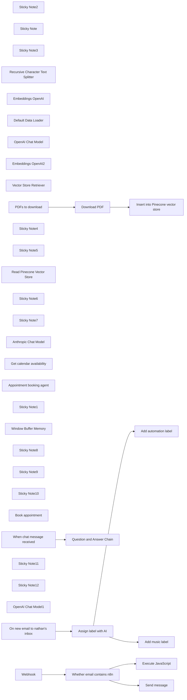

## Fluxo (.json) :

```json
{
  "meta": {
    "instanceId": "84ba6d895254e080ac2b4916d987aa66b000f88d4d919a6b9c76848f9b8a7616",
    "templateId": "2358"
  },
  "nodes": [
    {
      "id": "fb774d11-da48-4481-ad4e-8c93274f123e",
      "name": "Send message",
      "type": "n8n-nodes-base.slack",
      "position": [
        2340,
        580
      ],
      "parameters": {
        "text": "=Data from webhook:  {{ $json.query.email }}",
        "select": "channel",
        "channelId": {
          "__rl": true,
          "mode": "list",
          "value": "C079GL6K3U6",
          "cachedResultName": "general"
        },
        "otherOptions": {},
        "authentication": "oAuth2"
      },
      "typeVersion": 2.2
    },
    {
      "id": "5a3ad8f1-eba7-4076-80fc-0c1237aab50b",
      "name": "Sticky Note2",
      "type": "n8n-nodes-base.stickyNote",
      "position": [
        380,
        240
      ],
      "parameters": {
        "color": 7,
        "width": 1163.3132111854613,
        "height": 677.0358687053997,
        "content": ""
      },
      "typeVersion": 1
    },
    {
      "id": "01c59396-0fef-4d1c-aa1f-787669300650",
      "name": "Sticky Note",
      "type": "n8n-nodes-base.stickyNote",
      "position": [
        1860,
        240
      ],
      "parameters": {
        "color": 7,
        "width": 437,
        "height": 99,
        "content": "# What is n8n?\n### Low-code Automation Platform for technical teams"
      },
      "typeVersion": 1
    },
    {
      "id": "0bdd4a35-7f5c-443c-a14a-4e6f7ed18712",
      "name": "Execute JavaScript",
      "type": "n8n-nodes-base.code",
      "position": [
        2340,
        380
      ],
      "parameters": {
        "jsCode": "// Loop over input items and add a new field called 'myNewField' to the JSON of each one\nfor (const item of $input.all()) {\n  item.json.myNewField = 1;\n}\n\nreturn $input.all();"
      },
      "typeVersion": 2
    },
    {
      "id": "4b1b6cc1-1a9f-4a0c-96d5-fd179c84c79d",
      "name": "Sticky Note3",
      "type": "n8n-nodes-base.stickyNote",
      "position": [
        4440,
        240
      ],
      "parameters": {
        "color": 6,
        "width": 318,
        "height": 106,
        "content": "# Example #2\n### RAG with PDF as source"
      },
      "typeVersion": 1
    },
    {
      "id": "7e9e7802-5695-4240-83b9-d6f02192ad2b",
      "name": "Recursive Character Text Splitter",
      "type": "@n8n/n8n-nodes-langchain.textSplitterRecursiveCharacterTextSplitter",
      "position": [
        5120,
        1000
      ],
      "parameters": {
        "options": {},
        "chunkSize": 3000,
        "chunkOverlap": 200
      },
      "typeVersion": 1
    },
    {
      "id": "63783c21-af6d-4e70-8dec-c861641c53fb",
      "name": "Embeddings OpenAI",
      "type": "@n8n/n8n-nodes-langchain.embeddingsOpenAi",
      "position": [
        4880,
        820
      ],
      "parameters": {
        "options": {}
      },
      "typeVersion": 1
    },
    {
      "id": "5742ce9c-2f73-4129-85eb-876f562cf6b1",
      "name": "Default Data Loader",
      "type": "@n8n/n8n-nodes-langchain.documentDefaultDataLoader",
      "position": [
        5100,
        820
      ],
      "parameters": {
        "loader": "pdfLoader",
        "options": {
          "metadata": {
            "metadataValues": [
              {
                "name": "document-title",
                "value": "={{ $('PDFs to download').item.json.whitepaper_title }}"
              },
              {
                "name": "document-publish-year",
                "value": "={{ $('PDFs to download').item.json.publish_year }}"
              },
              {
                "name": "document-author",
                "value": "={{ $('PDFs to download').item.json.author }}"
              }
            ]
          }
        },
        "dataType": "binary"
      },
      "typeVersion": 1
    },
    {
      "id": "686c63fa-4672-4107-bd58-ffbb0650b44b",
      "name": "OpenAI Chat Model",
      "type": "@n8n/n8n-nodes-langchain.lmChatOpenAi",
      "position": [
        5840,
        840
      ],
      "parameters": {
        "model": "gpt-4o",
        "options": {
          "temperature": 0.3
        }
      },
      "typeVersion": 1
    },
    {
      "id": "73a7df02-aa2c-4f0f-aa88-38cbbbf3b1cb",
      "name": "Embeddings OpenAI2",
      "type": "@n8n/n8n-nodes-langchain.embeddingsOpenAi",
      "position": [
        5980,
        1140
      ],
      "parameters": {
        "options": {}
      },
      "typeVersion": 1
    },
    {
      "id": "42737305-fd39-4ec7-b4ba-53f70085dd5f",
      "name": "Vector Store Retriever",
      "type": "@n8n/n8n-nodes-langchain.retrieverVectorStore",
      "position": [
        6040,
        840
      ],
      "parameters": {},
      "typeVersion": 1
    },
    {
      "id": "2c7a3666-e123-439d-8b74-41eb375f066c",
      "name": "Download PDF",
      "type": "n8n-nodes-base.httpRequest",
      "position": [
        4700,
        600
      ],
      "parameters": {
        "url": "={{ $json.file_url }}",
        "options": {}
      },
      "typeVersion": 4.2
    },
    {
      "id": "866eaeb9-6a7c-4209-b485-8ef13ed006b4",
      "name": "PDFs to download",
      "type": "n8n-nodes-base.noOp",
      "notes": "BTC Whitepaper + metadata",
      "position": [
        4440,
        600
      ],
      "parameters": {},
      "notesInFlow": true,
      "typeVersion": 1
    },
    {
      "id": "e78f2191-096c-4575-9d48-fb891fd18698",
      "name": "Sticky Note4",
      "type": "n8n-nodes-base.stickyNote",
      "position": [
        4440,
        440
      ],
      "parameters": {
        "color": 4,
        "width": 414.36616595939887,
        "height": 91.0723900084547,
        "content": "## A. Load PDF into Pinecone\nDownload the PDF, then text embeddings into Pincecone"
      },
      "typeVersion": 1
    },
    {
      "id": "7c3ccf27-32b1-4ea7-b2ef-6997793de733",
      "name": "Sticky Note5",
      "type": "n8n-nodes-base.stickyNote",
      "position": [
        5600,
        460
      ],
      "parameters": {
        "color": 4,
        "width": 284.62109466374466,
        "height": 86.95121951219511,
        "content": "## B. Chat with PDF\nUse GPT4o to chat with Pinecone index"
      },
      "typeVersion": 1
    },
    {
      "id": "6063d009-da6e-4cbf-899f-c86b879931a7",
      "name": "Read Pinecone Vector Store",
      "type": "@n8n/n8n-nodes-langchain.vectorStorePinecone",
      "position": [
        5980,
        980
      ],
      "parameters": {
        "options": {
          "pineconeNamespace": "whitepaper"
        },
        "pineconeIndex": {
          "__rl": true,
          "mode": "list",
          "value": "whitepapers",
          "cachedResultName": "whitepapers"
        }
      },
      "typeVersion": 1
    },
    {
      "id": "8aa52156-264d-4911-993c-ac5117a76b21",
      "name": "Question and Answer Chain",
      "type": "@n8n/n8n-nodes-langchain.chainRetrievalQa",
      "position": [
        5840,
        620
      ],
      "parameters": {
        "text": "={{ $json.chatInput }}. \nOnly use vector store knowledge to answer the question. Don't make anything up. If you don't know the answer, tell the user that you don't know.",
        "promptType": "define"
      },
      "typeVersion": 1.3
    },
    {
      "id": "b394ee1d-a2ca-4db0-8caa-981f8f066787",
      "name": "Sticky Note6",
      "type": "n8n-nodes-base.stickyNote",
      "position": [
        7380,
        240
      ],
      "parameters": {
        "color": 6,
        "width": 504.25,
        "height": 106,
        "content": "# Example #3\n### AI Assistant that knows how to use predefined API endpoints "
      },
      "typeVersion": 1
    },
    {
      "id": "37a8b8f2-c444-4c6e-9b02-b97a5c616e84",
      "name": "Sticky Note7",
      "type": "n8n-nodes-base.stickyNote",
      "position": [
        3020,
        220
      ],
      "parameters": {
        "color": 6,
        "width": 318,
        "height": 111,
        "content": "# Example #1\n### Categorize incoming emails with AI"
      },
      "typeVersion": 1
    },
    {
      "id": "07123e8e-8760-4c89-acda-aaef6de68be2",
      "name": "Anthropic Chat Model",
      "type": "@n8n/n8n-nodes-langchain.lmChatAnthropic",
      "position": [
        7580,
        700
      ],
      "parameters": {
        "options": {
          "temperature": 0.4
        }
      },
      "typeVersion": 1.2
    },
    {
      "id": "e338a175-e823-4cd4-b77d-f5acbfcbdb9d",
      "name": "Get calendar availability",
      "type": "@n8n/n8n-nodes-langchain.toolHttpRequest",
      "position": [
        7900,
        700
      ],
      "parameters": {
        "url": "https://www.googleapis.com/calendar/v3/freeBusy",
        "method": "POST",
        "jsonBody": "={\n  \"timeMin\": \"{timeMin}\",\n  \"timeMax\": \"{timeMax}\",\n  \"timeZone\": \"Europe/Berlin\",\n  \"groupExpansionMax\": 20,\n  \"calendarExpansionMax\": 10,\n  \"items\": [\n    {\n      \"id\": \"max@n8n.io\"\n    }\n  ]\n}",
        "sendBody": true,
        "specifyBody": "json",
        "authentication": "predefinedCredentialType",
        "toolDescription": "Call this tool to get the appointment availability for a particular period on the calendar. The tool may refer to availability as \"Free\" or \"Busy\". \n\nUse {timeMin} and {timeMax} to specify the window for the availability query. For example, to get availability for 25 July, 2024 the {timeMin} would be 2024-07-25T09:00:00+02:00 and {timeMax} would be 2024-07-25T17:00:00+02:00.\n\nIf the tool returns an empty response, it means that something went wrong. It does not mean that there is no availability.",
        "nodeCredentialType": "googleCalendarOAuth2Api"
      },
      "typeVersion": 1
    },
    {
      "id": "ae05933c-dfa9-4272-b610-8b5fc94d76fe",
      "name": "Appointment booking agent",
      "type": "@n8n/n8n-nodes-langchain.agent",
      "position": [
        7680,
        480
      ],
      "parameters": {
        "options": {
          "systemMessage": "=You are an efficient and courteous assistant tasked with scheduling appointments with Max Tkacz.\n\nWhen users mention an appointment or meeting, they are referring to a meeting with Max.\nWhen users refer to the calendar or \"your schedule,\" they are referring to Max's calendar. \n\nYou can use various tools to access and manage Max's calendar. Your primary goal is to assist users in successfully booking an appointment with Max, ensuring no scheduling conflicts. Only book an appointment if the requested time slot is available (the tool may refer to this as \"Free\")\n\nToday's date is {{ $today.format('dd LLL yyyy') }}.\nAppointments are always 30 minutes in length. \n\n\nProvide accurate information at all times. If the tools are not functioning correctly, inform the user that you are unable to assist them at the moment.\n"
        }
      },
      "typeVersion": 1.6
    },
    {
      "id": "7e3b1797-150e-4c7c-93a5-306b981e0b6c",
      "name": "Sticky Note1",
      "type": "n8n-nodes-base.stickyNote",
      "position": [
        8300,
        440
      ],
      "parameters": {
        "color": 7,
        "width": 327.46658341463433,
        "height": 571.8601927804875,
        "content": "\n[Open Calendar](https://calendar.google.com/calendar/u/0/r/day/2024/7/26)"
      },
      "typeVersion": 1
    },
    {
      "id": "afe8d14d-d0d0-4a11-bb4f-57358de66bc1",
      "name": "Window Buffer Memory",
      "type": "@n8n/n8n-nodes-langchain.memoryBufferWindow",
      "position": [
        7720,
        700
      ],
      "parameters": {
        "contextWindowLength": 10
      },
      "typeVersion": 1.2
    },
    {
      "id": "53d131ea-3235-4e4e-828b-dc22c9021e50",
      "name": "Sticky Note8",
      "type": "n8n-nodes-base.stickyNote",
      "position": [
        6380,
        640
      ],
      "parameters": {
        "color": 7,
        "width": 615.2162978341456,
        "height": 403.1877919219511,
        "content": "\nBTC Whitepaper references"
      },
      "typeVersion": 1
    },
    {
      "id": "55a0f180-bb35-4b35-b72c-b9361698e5ad",
      "name": "Sticky Note9",
      "type": "n8n-nodes-base.stickyNote",
      "position": [
        9660,
        240
      ],
      "parameters": {
        "color": 7,
        "width": 345.33741540309194,
        "height": 398.9629539487597,
        "content": "### Connect with me or explore this demo 👇\n"
      },
      "typeVersion": 1
    },
    {
      "id": "14b3231d-aa96-4783-be8f-cb2f70b0bc7f",
      "name": "Sticky Note10",
      "type": "n8n-nodes-base.stickyNote",
      "position": [
        9220,
        240
      ],
      "parameters": {
        "color": 7,
        "width": 411.2946586626259,
        "height": 197.19036476628202,
        "content": "# Thank you and happy flowgramming 🤘\n\n### Max Tkacz | Senior Developer Advocate @ n8n"
      },
      "typeVersion": 1
    },
    {
      "id": "c9a2fcdc-c8ab-4b9d-9979-4fd7cca1e8a8",
      "name": "Insert into Pinecone vector store",
      "type": "@n8n/n8n-nodes-langchain.vectorStorePinecone",
      "position": [
        4920,
        600
      ],
      "parameters": {
        "mode": "insert",
        "options": {
          "clearNamespace": true,
          "pineconeNamespace": "whitepaper"
        },
        "pineconeIndex": {
          "__rl": true,
          "mode": "list",
          "value": "whitepapers",
          "cachedResultName": "whitepapers"
        }
      },
      "typeVersion": 1
    },
    {
      "id": "6a890c74-67f9-4eee-bb56-7c9a68921ae1",
      "name": "Book appointment",
      "type": "@n8n/n8n-nodes-langchain.toolHttpRequest",
      "position": [
        8060,
        700
      ],
      "parameters": {
        "url": "https://www.googleapis.com/calendar/v3/calendars/max@n8n.io/events",
        "method": "POST",
        "jsonBody": "={\n  \"summary\": \"Appointment with {userName}\",\n  \"start\": {\n    \"dateTime\": \"{startTime}\",\n    \"timeZone\": \"Europe/Berlin\"\n  },\n  \"end\": {\n    \"dateTime\": \"{endTime}\",\n    \"timeZone\": \"Europe/Berlin\"\n  },\n  \"attendees\": [\n    {\"email\": \"max@n8n.io\"},\n    {\"email\": \"{userEmail}\"}\n  ]\n}",
        "sendBody": true,
        "specifyBody": "json",
        "authentication": "predefinedCredentialType",
        "toolDescription": "Call this tool to book an appointment in the calendar. ",
        "nodeCredentialType": "googleCalendarOAuth2Api",
        "placeholderDefinitions": {
          "values": [
            {
              "name": "userName",
              "description": "The full name of the user making the appointment. Like John Doe"
            },
            {
              "name": "startTime",
              "description": "The start time of the event in Europe/Berlin timezone. For example, 2024-07-24T10:00:00+02:00"
            },
            {
              "name": "endTime",
              "description": "The end time of the event in Europe/Berlin timezone. It should always be 30 minutes after the startTime. "
            },
            {
              "name": "userEmail",
              "description": "The email address of the user making the appointment"
            }
          ]
        }
      },
      "typeVersion": 1
    },
    {
      "id": "7f6e62f2-2d72-4fd2-a6ef-e57028d0055b",
      "name": "When chat message received",
      "type": "@n8n/n8n-nodes-langchain.chatTrigger",
      "position": [
        5600,
        620
      ],
      "webhookId": "c348693e-9c43-4bf2-90a5-23786273e809",
      "parameters": {
        "public": true,
        "options": {
          "title": "Book an appointment with Max"
        },
        "initialMessages": "Hi there! 👋\nI can help you schedule an appointment with Max Tkacz. On which day would you like to meet?"
      },
      "typeVersion": 1.1
    },
    {
      "id": "52c65975-479d-4c76-bcd3-23f5c9bb6acf",
      "name": "Sticky Note11",
      "type": "n8n-nodes-base.stickyNote",
      "position": [
        9220,
        460
      ],
      "parameters": {
        "color": 7,
        "width": 411.2946586626259,
        "height": 80,
        "content": "### Explore 100+ AI Workflow templates on n8n.io\n[Open Templates Library](https://n8n.io/workflows)"
      },
      "typeVersion": 1
    },
    {
      "id": "ba0635c0-2ca4-4b27-b960-3a0e0f93a56a",
      "name": "Sticky Note12",
      "type": "n8n-nodes-base.stickyNote",
      "position": [
        9220,
        560
      ],
      "parameters": {
        "color": 7,
        "width": 411.2946586626259,
        "height": 80,
        "content": "### Ask a question in our community (13k+ members)\n[Explore n8n community](https://community.n8n.io/)"
      },
      "typeVersion": 1
    },
    {
      "id": "29227c52-a9cc-4bd1-b1a3-78fb805b659c",
      "name": "OpenAI Chat Model1",
      "type": "@n8n/n8n-nodes-langchain.lmChatOpenAi",
      "position": [
        3260,
        660
      ],
      "parameters": {
        "model": "gpt-4o",
        "options": {
          "temperature": 0.5
        }
      },
      "typeVersion": 1
    },
    {
      "id": "494a2868-9ff5-402c-b83b-6dd2c3ddbcc9",
      "name": "Add automation label",
      "type": "n8n-nodes-base.gmail",
      "position": [
        3760,
        300
      ],
      "parameters": {
        "labelIds": [
          "Label_4763053241338138112"
        ],
        "messageId": "={{ $json.id }}",
        "operation": "addLabels"
      },
      "typeVersion": 2.1
    },
    {
      "id": "0f9d834d-ec47-43f5-945b-8c464d371122",
      "name": "On new email to nathan's inbox",
      "type": "n8n-nodes-base.gmailTrigger",
      "disabled": true,
      "position": [
        3040,
        460
      ],
      "parameters": {
        "simple": false,
        "filters": {},
        "options": {},
        "pollTimes": {
          "item": [
            {
              "mode": "everyMinute"
            }
          ]
        }
      },
      "typeVersion": 1.1
    },
    {
      "id": "142e2a49-40bd-4bf5-9ba3-f14ecd68618e",
      "name": "Add music label",
      "type": "n8n-nodes-base.gmail",
      "position": [
        3760,
        500
      ],
      "parameters": {
        "labelIds": [
          "Label_6822395192337188416"
        ],
        "messageId": "={{ $json.id }}",
        "operation": "addLabels"
      },
      "typeVersion": 2.1
    },
    {
      "id": "2eb46753-a0e8-43ec-a460-466b1dd265c9",
      "name": "Assign label with AI",
      "type": "@n8n/n8n-nodes-langchain.textClassifier",
      "position": [
        3280,
        460
      ],
      "parameters": {
        "options": {},
        "inputText": "={{ $json.text }}",
        "categories": {
          "categories": [
            {
              "category": "automation",
              "description": "email on the topic of automation or workflows and automated processes, includes newsletters on this topic"
            },
            {
              "category": "music",
              "description": "email on the topic of music, for example from an artist "
            }
          ]
        }
      },
      "typeVersion": 1
    },
    {
      "id": "576d8206-1b1e-4671-ba45-86e9d844a73b",
      "name": "Webhook",
      "type": "n8n-nodes-base.webhook",
      "position": [
        1860,
        460
      ],
      "webhookId": "74facfd7-0f51-4605-9724-2c300594fcf9",
      "parameters": {
        "path": "74facfd7-0f51-4605-9724-2c300594fcf9",
        "options": {}
      },
      "typeVersion": 2
    },
    {
      "id": "1e612376-1a3b-4c48-9cd3-97867ba4cad5",
      "name": "Whether email contains n8n",
      "type": "n8n-nodes-base.if",
      "position": [
        2060,
        460
      ],
      "parameters": {
        "options": {},
        "conditions": {
          "options": {
            "leftValue": "",
            "caseSensitive": true,
            "typeValidation": "strict"
          },
          "combinator": "and",
          "conditions": [
            {
              "id": "a0b16c44-03ea-4e96-9671-7b168697186d",
              "operator": {
                "type": "string",
                "operation": "contains"
              },
              "leftValue": "={{ $json.query.email }}",
              "rightValue": "@n8n"
            }
          ]
        }
      },
      "typeVersion": 2
    }
  ],
  "pinData": {},
  "connections": {
    "Webhook": {
      "main": [
        [
          {
            "node": "Whether email contains n8n",
            "type": "main",
            "index": 0
          }
        ]
      ]
    },
    "Download PDF": {
      "main": [
        [
          {
            "node": "Insert into Pinecone vector store",
            "type": "main",
            "index": 0
          }
        ]
      ]
    },
    "Book appointment": {
      "ai_tool": [
        [
          {
            "node": "Appointment booking agent",
            "type": "ai_tool",
            "index": 0
          }
        ]
      ]
    },
    "PDFs to download": {
      "main": [
        [
          {
            "node": "Download PDF",
            "type": "main",
            "index": 0
          }
        ]
      ]
    },
    "Embeddings OpenAI": {
      "ai_embedding": [
        [
          {
            "node": "Insert into Pinecone vector store",
            "type": "ai_embedding",
            "index": 0
          }
        ]
      ]
    },
    "OpenAI Chat Model": {
      "ai_languageModel": [
        [
          {
            "node": "Question and Answer Chain",
            "type": "ai_languageModel",
            "index": 0
          }
        ]
      ]
    },
    "Embeddings OpenAI2": {
      "ai_embedding": [
        [
          {
            "node": "Read Pinecone Vector Store",
            "type": "ai_embedding",
            "index": 0
          }
        ]
      ]
    },
    "OpenAI Chat Model1": {
      "ai_languageModel": [
        [
          {
            "node": "Assign label with AI",
            "type": "ai_languageModel",
            "index": 0
          }
        ]
      ]
    },
    "Default Data Loader": {
      "ai_document": [
        [
          {
            "node": "Insert into Pinecone vector store",
            "type": "ai_document",
            "index": 0
          }
        ]
      ]
    },
    "Anthropic Chat Model": {
      "ai_languageModel": [
        [
          {
            "node": "Appointment booking agent",
            "type": "ai_languageModel",
            "index": 0
          }
        ]
      ]
    },
    "Assign label with AI": {
      "main": [
        [
          {
            "node": "Add automation label",
            "type": "main",
            "index": 0
          }
        ],
        [
          {
            "node": "Add music label",
            "type": "main",
            "index": 0
          }
        ]
      ]
    },
    "Window Buffer Memory": {
      "ai_memory": [
        [
          {
            "node": "Appointment booking agent",
            "type": "ai_memory",
            "index": 0
          }
        ]
      ]
    },
    "Vector Store Retriever": {
      "ai_retriever": [
        [
          {
            "node": "Question and Answer Chain",
            "type": "ai_retriever",
            "index": 0
          }
        ]
      ]
    },
    "Get calendar availability": {
      "ai_tool": [
        [
          {
            "node": "Appointment booking agent",
            "type": "ai_tool",
            "index": 0
          }
        ]
      ]
    },
    "Read Pinecone Vector Store": {
      "ai_vectorStore": [
        [
          {
            "node": "Vector Store Retriever",
            "type": "ai_vectorStore",
            "index": 0
          }
        ]
      ]
    },
    "When chat message received": {
      "main": [
        [
          {
            "node": "Question and Answer Chain",
            "type": "main",
            "index": 0
          }
        ]
      ]
    },
    "Whether email contains n8n": {
      "main": [
        [
          {
            "node": "Execute JavaScript",
            "type": "main",
            "index": 0
          },
          {
            "node": "Send message",
            "type": "main",
            "index": 0
          }
        ]
      ]
    },
    "On new email to nathan's inbox": {
      "main": [
        [
          {
            "node": "Assign label with AI",
            "type": "main",
            "index": 0
          }
        ]
      ]
    },
    "Recursive Character Text Splitter": {
      "ai_textSplitter": [
        [
          {
            "node": "Default Data Loader",
            "type": "ai_textSplitter",
            "index": 0
          }
        ]
      ]
    }
  }
}
```

<a id="template-955"></a>

## Template 955 - Backup Zigbee2MQTT agendado para SFTP

- **Nome:** Backup Zigbee2MQTT agendado para SFTP
- **Descrição:** Automação que solicita backups do Zigbee2MQTT, recebe o backup e envia o arquivo ZIP resultante para um servidor SFTP com timestamp.
- **Funcionalidade:** • Agendamento: Dispara a automação às 02:45 toda segunda-feira.
• Solicitação de backup: Publica uma mensagem MQTT para solicitar o backup do Zigbee2MQTT.
• Recepção e parsing do backup: Captura a resposta MQTT e extrai o conteúdo do backup.
• Transformação do backup: Converte o conteúdo base64 do ZIP em binário.
• Upload SFTP: Envia o arquivo ZIP para o diretório de backups com timestamp.
- **Ferramentas:** • MQTT Broker: Serviço de mensageria utilizado para solicitar backups e receber respostas.
• Servidor SFTP: Destino seguro onde os backups são armazenados via upload.

## Fluxo visual

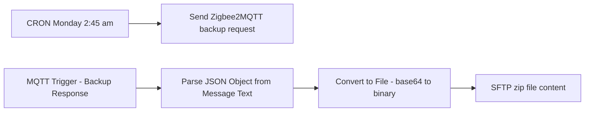

## Fluxo (.json) :

```json
{
  "nodes": [
    {
      "name": "SFTP zip file content",
      "type": "n8n-nodes-base.ftp",
      "position": [
        1520,
        680
      ],
      "parameters": {
        "path": "=zigbee_backups/zigbee_backup_{{ new Date().toISOString().replaceAll(':','_') }}.zip",
        "protocol": "sftp",
        "operation": "upload"
      },
      "credentials": {
        "sftp": {
          "name": "SFTP Zigbee Backups"
        }
      },
      "typeVersion": 1
    },
    {
      "name": "CRON Monday 2:45 am",
      "type": "n8n-nodes-base.scheduleTrigger",
      "position": [
        860,
        440
      ],
      "parameters": {
        "rule": {
          "interval": [
            {
              "field": "cronExpression",
              "expression": "45 2 * * 1"
            }
          ]
        }
      },
      "typeVersion": 1.1
    },
    {
      "name": "Send Zigbee2MQTT backup request",
      "type": "n8n-nodes-base.mqtt",
      "position": [
        1040,
        440
      ],
      "parameters": {
        "topic": "zigbee2mqtt/bridge/request/backup",
        "message": "getbackup",
        "options": {},
        "sendInputData": false
      },
      "credentials": {
        "mqtt": {
          "name": "MQTT account"
        }
      },
      "typeVersion": 1
    },
    {
      "name": "MQTT Trigger - Backup Response",
      "type": "n8n-nodes-base.mqttTrigger",
      "position": [
        860,
        680
      ],
      "parameters": {
        "topics": "zigbee2mqtt/bridge/response/backup",
        "options": {}
      },
      "credentials": {
        "mqtt": {
          "name": "MQTT account"
        }
      },
      "typeVersion": 1
    },
    {
      "name": "Parse JSON Object from Message Text",
      "type": "n8n-nodes-base.code",
      "position": [
        1080,
        680
      ],
      "parameters": {
        "mode": "runOnceForEachItem",
        "jsCode": "\nlet containerObject = JSON.parse($json.message);\nlet messageObject = containerObject.data;\nreturn messageObject;"
      },
      "typeVersion": 2
    },
    {
      "name": "Convert to File - base64 to binary",
      "type": "n8n-nodes-base.convertToFile",
      "position": [
        1300,
        680
      ],
      "parameters": {
        "options": {},
        "operation": "toBinary",
        "sourceProperty": "zip"
      },
      "typeVersion": 1
    }
  ],
  "connections": {
    "CRON Monday 2:45 am": {
      "main": [
        [
          {
            "node": "Send Zigbee2MQTT backup request",
            "type": "main",
            "index": 0
          }
        ]
      ]
    },
    "MQTT Trigger - Backup Response": {
      "main": [
        [
          {
            "node": "Parse JSON Object from Message Text",
            "type": "main",
            "index": 0
          }
        ]
      ]
    },
    "Convert to File - base64 to binary": {
      "main": [
        [
          {
            "node": "SFTP zip file content",
            "type": "main",
            "index": 0
          }
        ]
      ]
    },
    "Parse JSON Object from Message Text": {
      "main": [
        [
          {
            "node": "Convert to File - base64 to binary",
            "type": "main",
            "index": 0
          }
        ]
      ]
    }
  }
}
```

<a id="template-956"></a>

## Template 956 - Registro por minuto da posição da ISS

- **Nome:** Registro por minuto da posição da ISS
- **Descrição:** Coleta a posição atual da Estação Espacial Internacional a cada minuto e grava latitude, longitude e timestamp em um banco TimescaleDB.
- **Funcionalidade:** • Agendamento periódico: executa a coleta de dados a cada minuto.
• Consulta à API de posição: realiza uma requisição ao endpoint público que fornece a posição da ISS usando o timestamp atual.
• Extração e formatação dos dados: seleciona e mantém apenas os campos latitude, longitude e timestamp do retorno da API.
• Armazenamento em banco de séries temporais: insere os dados coletados na tabela 'iss' do TimescaleDB nas colunas latitude, longitude e timestamp.
- **Ferramentas:** • wheretheiss.at API: serviço público que fornece posições da Estação Espacial Internacional por meio de endpoints REST, aceitando parâmetros de timestamp.
• TimescaleDB: banco de dados relacional otimizado para séries temporais usado para armazenar os registros de posição.


## Fluxo visual

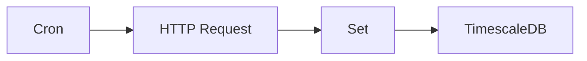

## Fluxo (.json) :

```json
{
  "nodes": [
    {
      "name": "TimescaleDB",
      "type": "n8n-nodes-base.timescaleDb",
      "position": [
        1110,
        260
      ],
      "parameters": {
        "table": "iss",
        "columns": "latitude, longitude, timestamp"
      },
      "credentials": {
        "timescaleDb": "TimescaleDB"
      },
      "typeVersion": 1
    },
    {
      "name": "Set",
      "type": "n8n-nodes-base.set",
      "position": [
        910,
        260
      ],
      "parameters": {
        "values": {
          "string": [
            {
              "name": "latitude",
              "value": "={{$json[\"0\"][\"latitude\"]}}"
            },
            {
              "name": "longitude",
              "value": "={{$json[\"0\"][\"longitude\"]}}"
            },
            {
              "name": "timestamp",
              "value": "={{$json[\"0\"][\"timestamp\"]}}"
            }
          ]
        },
        "options": {},
        "keepOnlySet": true
      },
      "typeVersion": 1
    },
    {
      "name": "HTTP Request",
      "type": "n8n-nodes-base.httpRequest",
      "position": [
        710,
        260
      ],
      "parameters": {
        "url": "https://api.wheretheiss.at/v1/satellites/25544/positions",
        "options": {},
        "queryParametersUi": {
          "parameter": [
            {
              "name": "timestamps",
              "value": "={{Date.now()}}"
            }
          ]
        }
      },
      "typeVersion": 1
    },
    {
      "name": "Cron",
      "type": "n8n-nodes-base.cron",
      "position": [
        510,
        260
      ],
      "parameters": {
        "triggerTimes": {
          "item": [
            {
              "mode": "everyMinute"
            }
          ]
        }
      },
      "typeVersion": 1
    }
  ],
  "connections": {
    "Set": {
      "main": [
        [
          {
            "node": "TimescaleDB",
            "type": "main",
            "index": 0
          }
        ]
      ]
    },
    "Cron": {
      "main": [
        [
          {
            "node": "HTTP Request",
            "type": "main",
            "index": 0
          }
        ]
      ]
    },
    "HTTP Request": {
      "main": [
        [
          {
            "node": "Set",
            "type": "main",
            "index": 0
          }
        ]
      ]
    }
  }
}
```

<a id="template-957"></a>

## Template 957 - Resumo diário de pedidos com Airtable

- **Nome:** Resumo diário de pedidos com Airtable
- **Descrição:** Este fluxo coleta pedidos recebidos via webhook ao longo do dia, armazena cada pedido em Airtable, e envia um resumo diário em HTML por e-mail às 19:00.
- **Funcionalidade:** • Detecção de novos pedidos via Webhook: recebe pedidos POST com orderID e orderPrice e prepara os dados para armazenamento.
• Armazenamento de pedidos: grava cada pedido em Airtable com campos time, orderID e orderPrice.
• Preparação do resumo diário: calcula o intervalo de tempo correspondente (das 19:00 do dia anterior até o momento) para coletar os pedidos.
• Geração de HTML de resumo: cria uma tabela com os pedidos do dia.
• Envio do resumo por e-mail: envia o HTML como corpo da mensagem com o assunto Daily Order Summary.
• Agendamento diário: dispara o fluxo todo dia às 19:00.
- **Ferramentas:** • Airtable: Serviço de banco de dados online utilizado para armazenar e consultar pedidos.
• Gmail: Serviço de e-mail utilizado para enviar o resumo diário.

## Fluxo visual

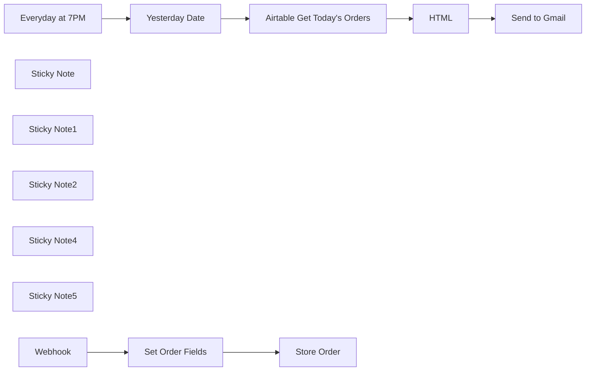

## Fluxo (.json) :

```json
{
  "meta": {
    "instanceId": "bb6a1286a4ce98dce786d6c2748b867c1252d53458c87d87fbf6824b862d4c9c"
  },
  "nodes": [
    {
      "id": "faade37e-908d-494c-af74-93c8f01adcc5",
      "name": "Everyday at 7PM",
      "type": "n8n-nodes-base.scheduleTrigger",
      "position": [
        440,
        520
      ],
      "parameters": {
        "rule": {
          "interval": [
            {
              "field": "cronExpression",
              "expression": "0 0 19 * * *"
            }
          ]
        }
      },
      "typeVersion": 1.2
    },
    {
      "id": "4abddfea-fee9-419c-92c4-3055faa2dd09",
      "name": "Airtable Get Today's Orders",
      "type": "n8n-nodes-base.airtable",
      "position": [
        900,
        520
      ],
      "parameters": {
        "base": {
          "__rl": true,
          "mode": "list",
          "value": "appdtUVSpfWswMwNC",
          "cachedResultUrl": "https://airtable.com/appdtUVSpfWswMwNC",
          "cachedResultName": "Untitled Base"
        },
        "table": {
          "__rl": true,
          "mode": "list",
          "value": "tblu6F5rLbR3Axtgj",
          "cachedResultUrl": "https://airtable.com/appdtUVSpfWswMwNC/tblu6F5rLbR3Axtgj",
          "cachedResultName": "orders"
        },
        "options": {},
        "operation": "search",
        "filterByFormula": "=AND(time < \"{{ $json.now }}\", time > \"{{ $json.yesterday }}\")"
      },
      "credentials": {
        "airtableTokenApi": {
          "id": "uSxVhc7fcMM7uPM2",
          "name": "Airtable Personal Access Token account"
        }
      },
      "typeVersion": 2.1
    },
    {
      "id": "ea29159e-3674-4385-a0bd-2a9df7d7117c",
      "name": "Yesterday Date",
      "type": "n8n-nodes-base.code",
      "position": [
        660,
        520
      ],
      "parameters": {
        "jsCode": "// Create a new date object for yesterday, 7pm\nconst yesterday = new Date();\nyesterday.setDate( new Date().getDate() - 1); \nyesterday.setHours(19, 0, 0, 0);\nconst isoString = yesterday.toISOString();\nreturn {yesterday:isoString, now:new Date().toISOString()}"
      },
      "typeVersion": 2
    },
    {
      "id": "8254aa63-2682-4c48-8843-c93830c724de",
      "name": "HTML",
      "type": "n8n-nodes-base.html",
      "position": [
        1120,
        520
      ],
      "parameters": {
        "html": "<!DOCTYPE html>\n<html>\n<head>\n  <meta charset=\"UTF-8\" />\n</head>\n<body>\n  <table>\n    <tr> \n      {{ Object.keys($input.first().json).map(propname=>'<td>'+propname+'</td>').join('')  \n      }}\n    </tr>\n      \n    {{ $input.all().map(order=>{\n        \n        return \"<tr>\"+Object.values(order.json).map(prop=>{\n            return \"<td>\"+prop+\"</td>\"\n          }).join('') +\"</tr>\"\n      }).join('') \n    }}\n  </table>\n</body>\n</html>\n\n<style>\n.container {\n  background-color: #ffffff;\n  text-align: center;\n  padding: 16px;\n  border-radius: 8px;\n}\n\nh1 {\n  color: #ff6d5a;\n  font-size: 24px;\n  font-weight: bold;\n  padding: 8px;\n}\n\nh2 {\n  color: #909399;\n  font-size: 18px;\n  font-weight: bold;\n  padding: 8px;\n}\n</style>\n"
      },
      "executeOnce": true,
      "typeVersion": 1.2
    },
    {
      "id": "5e9f6ad7-e4fc-41e3-991b-cae9210dfb71",
      "name": "Set Order Fields",
      "type": "n8n-nodes-base.set",
      "position": [
        660,
        220
      ],
      "parameters": {
        "options": {},
        "assignments": {
          "assignments": [
            {
              "id": "2c2f9e3c-696a-466a-8bfe-5c8aa942c9ab",
              "name": "time",
              "type": "string",
              "value": "={{ new Date().toISOString() }}"
            },
            {
              "id": "5618b2a7-8149-469d-87ee-535f1adac121",
              "name": "orderID",
              "type": "string",
              "value": "={{ $json.body.orderID }}"
            },
            {
              "id": "dc31db55-24e4-468f-a9fd-456298f5e5ab",
              "name": "orderPrice",
              "type": "number",
              "value": "={{ $json.body.orderPrice }}"
            }
          ]
        }
      },
      "typeVersion": 3.4
    },
    {
      "id": "68eaa8f7-3b67-484e-8bad-87e621adc1df",
      "name": "Send to Gmail",
      "type": "n8n-nodes-base.gmail",
      "position": [
        1340,
        520
      ],
      "parameters": {
        "sendTo": "axelrose20272027@gmail.com",
        "message": "={{ $json.html }}",
        "options": {},
        "subject": "Daily Order Summary"
      },
      "credentials": {
        "gmailOAuth2": {
          "id": "qMvN3j2E5MFAguNF",
          "name": "Gmail account"
        }
      },
      "typeVersion": 2.1
    },
    {
      "id": "9f22bedc-fbe1-421b-8212-189c7d436cab",
      "name": "Store Order",
      "type": "n8n-nodes-base.airtable",
      "position": [
        900,
        220
      ],
      "parameters": {
        "base": {
          "__rl": true,
          "mode": "list",
          "value": "appdtUVSpfWswMwNC",
          "cachedResultUrl": "https://airtable.com/appdtUVSpfWswMwNC",
          "cachedResultName": "Untitled Base"
        },
        "table": {
          "__rl": true,
          "mode": "list",
          "value": "tblu6F5rLbR3Axtgj",
          "cachedResultUrl": "https://airtable.com/appdtUVSpfWswMwNC/tblu6F5rLbR3Axtgj",
          "cachedResultName": "orders"
        },
        "columns": {
          "value": {
            "orderID": 0,
            "customerID": 0,
            "orderPrice": 0
          },
          "schema": [
            {
              "id": "time",
              "type": "dateTime",
              "display": true,
              "removed": false,
              "readOnly": false,
              "required": false,
              "displayName": "time",
              "defaultMatch": false,
              "canBeUsedToMatch": true
            },
            {
              "id": "orderID",
              "type": "number",
              "display": true,
              "removed": false,
              "readOnly": false,
              "required": false,
              "displayName": "orderID",
              "defaultMatch": false,
              "canBeUsedToMatch": true
            },
            {
              "id": "customerID",
              "type": "number",
              "display": true,
              "removed": false,
              "readOnly": false,
              "required": false,
              "displayName": "customerID",
              "defaultMatch": false,
              "canBeUsedToMatch": true
            },
            {
              "id": "orderPrice",
              "type": "number",
              "display": true,
              "removed": false,
              "readOnly": false,
              "required": false,
              "displayName": "orderPrice",
              "defaultMatch": false,
              "canBeUsedToMatch": true
            },
            {
              "id": "orderStatus",
              "type": "string",
              "display": true,
              "removed": false,
              "readOnly": false,
              "required": false,
              "displayName": "orderStatus",
              "defaultMatch": false,
              "canBeUsedToMatch": true
            }
          ],
          "mappingMode": "autoMapInputData",
          "matchingColumns": []
        },
        "options": {
          "typecast": true
        },
        "operation": "create"
      },
      "credentials": {
        "airtableTokenApi": {
          "id": "uSxVhc7fcMM7uPM2",
          "name": "Airtable Personal Access Token account"
        }
      },
      "typeVersion": 2.1
    },
    {
      "id": "6ace0e8f-85e1-45bc-ae81-331c5722ef46",
      "name": "Sticky Note",
      "type": "n8n-nodes-base.stickyNote",
      "position": [
        340,
        160
      ],
      "parameters": {
        "width": 857.9236217062975,
        "height": 220.18022408852067,
        "content": "### New order is sent to the Webhook via POST with params {orderID, orderPrice}"
      },
      "typeVersion": 1
    },
    {
      "id": "6907ae8d-90b7-4e07-883d-3ebd4440d811",
      "name": "Sticky Note1",
      "type": "n8n-nodes-base.stickyNote",
      "position": [
        340,
        460
      ],
      "parameters": {
        "width": 1202.2434730902464,
        "height": 235.62797364881823,
        "content": "### Daily summary sent to email at 7PM"
      },
      "typeVersion": 1
    },
    {
      "id": "848c6acb-2f9c-4d85-8349-a4a31204922b",
      "name": "Sticky Note2",
      "type": "n8n-nodes-base.stickyNote",
      "position": [
        -620,
        -80
      ],
      "parameters": {
        "color": 4,
        "width": 607.7708924207209,
        "height": 893.1187181589532,
        "content": "# Aggregate Daily Orders with Airtable\n### This workflow will collect order data as it is produced, then send a summary email of all orders at the end of every day, formatted in a table.\n\n## Setup:\n 1. Create a new table in Airtable and give it a field *time* with type date, *orderID* with type number, and *orderPrice* also with type number. \n 2. Create a new access token if you haven't already at https://airtable.com/create/tokens/new. Make sure to give the token the scopes *data.records:read*, *data.records:write*, *schema.bases:read* and access to whichever table you choose to store the orders. A pop-up window appears with the token. Use this token to make `Create New Credential` > `Access Token` for Airtable in the `Store Order` and `Airtable Get Today's Orders` nodes.\n 3. Create access credentials for your Gmail as described here: https://developers.google.com/workspace/guides/create-credentials. Use the credentials from your *client_secret.json* in the `Send to Gmail` node.\n 4. In the `Store Order` node, change *Base* and *Table* to the database and table in your Airtable account you wish to use to store orders. Make sure to use these same values in the `Airtable Get Today's Orders` node.\n 5. Every time an order is created in your system, send a POST request to Webhook from your order software. Each request must contain a single order containing fields *'orderID'* and *'orderPrice'* (or, edit `Set Order Fields` to select which incoming fields you wish to save)\n 6. Change the schedule time for sending email from `Everyday at 7PM` to whichever time you choose. \n \n\n## Test:\n- Activate the workflow.\n- From the node `Webhook`, copy *Production URL*\n- Send the following CURL request to the URL given to you:\n` curl -X POST   -H \"Content-Type: application/json\"   -d '{\"orderID\": 12345, \"orderPrice\": 99.99}' YOUR_URL_HERE`\n- It should say *Node executed successfully*. Now check your Airtable and confirm the order was stored in the right place."
      },
      "typeVersion": 1
    },
    {
      "id": "d9a5ef05-beba-480f-967e-840cf1b71248",
      "name": "Sticky Note4",
      "type": "n8n-nodes-base.stickyNote",
      "position": [
        200,
        240
      ],
      "parameters": {
        "color": 3,
        "width": 170,
        "height": 80,
        "content": "- New Order!"
      },
      "typeVersion": 1
    },
    {
      "id": "0f433e34-79cd-42d0-9b56-4a306eb91907",
      "name": "Sticky Note5",
      "type": "n8n-nodes-base.stickyNote",
      "position": [
        200,
        540
      ],
      "parameters": {
        "color": 3,
        "width": 170,
        "height": 80,
        "content": " - It's 7PM!"
      },
      "typeVersion": 1
    },
    {
      "id": "fb9c4b49-ee1f-4233-8277-4c35fb423fde",
      "name": "Webhook",
      "type": "n8n-nodes-base.webhook",
      "position": [
        440,
        220
      ],
      "webhookId": "e9e62c98-390d-4d16-bc77-a13b043bf1cf",
      "parameters": {
        "path": "e9e62c98-390d-4d16-bc77-a13b043bf1cf",
        "options": {},
        "httpMethod": "POST"
      },
      "typeVersion": 2
    }
  ],
  "pinData": {},
  "connections": {
    "HTML": {
      "main": [
        [
          {
            "node": "Send to Gmail",
            "type": "main",
            "index": 0
          }
        ]
      ]
    },
    "Webhook": {
      "main": [
        [
          {
            "node": "Set Order Fields",
            "type": "main",
            "index": 0
          }
        ]
      ]
    },
    "Yesterday Date": {
      "main": [
        [
          {
            "node": "Airtable Get Today's Orders",
            "type": "main",
            "index": 0
          }
        ]
      ]
    },
    "Everyday at 7PM": {
      "main": [
        [
          {
            "node": "Yesterday Date",
            "type": "main",
            "index": 0
          }
        ]
      ]
    },
    "Set Order Fields": {
      "main": [
        [
          {
            "node": "Store Order",
            "type": "main",
            "index": 0
          }
        ]
      ]
    },
    "Airtable Get Today's Orders": {
      "main": [
        [
          {
            "node": "HTML",
            "type": "main",
            "index": 0
          }
        ]
      ]
    }
  }
}
```

<a id="template-958"></a>

## Template 958 - Tradução de instruções de drink aleatório

- **Nome:** Tradução de instruções de drink aleatório
- **Descrição:** Busca instruções de preparo de um coquetel aleatório e traduz o texto para o francês.
- **Funcionalidade:** • Busca de receita aleatória: realiza uma requisição HTTP para obter um coquetel aleatório.
• Extração das instruções: seleciona o campo de instruções de preparo (strInstructions) da resposta retornada.
• Tradução para francês: envia o texto extraído ao serviço de tradução para obter a versão em francês.
• Uso de credenciais de tradução: autentica no serviço de tradução para processar a solicitação.
- **Ferramentas:** • TheCocktailDB: API pública que fornece informações sobre coquetéis, incluindo nome, ingredientes e instruções de preparo.
• DeepL: serviço de tradução que converte o texto original para o francês com alta qualidade.


## Fluxo visual

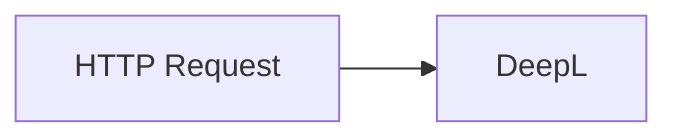

## Fluxo (.json) :

```json
{
  "nodes": [
    {
      "name": "HTTP Request",
      "type": "n8n-nodes-base.httpRequest",
      "position": [
        510,
        320
      ],
      "parameters": {
        "url": "https://www.thecocktaildb.com/api/json/v1/1/random.php",
        "options": {}
      },
      "typeVersion": 1
    },
    {
      "name": "DeepL",
      "type": "n8n-nodes-base.deepL",
      "position": [
        710,
        320
      ],
      "parameters": {
        "text": "={{$json[\"drinks\"][0][\"strInstructions\"]}}",
        "translateTo": "FR",
        "additionalFields": {}
      },
      "credentials": {
        "deepLApi": "DeepL API Credentials"
      },
      "typeVersion": 1
    }
  ],
  "connections": {
    "HTTP Request": {
      "main": [
        [
          {
            "node": "DeepL",
            "type": "main",
            "index": 0
          }
        ]
      ]
    }
  }
}
```

<a id="template-959"></a>

## Template 959 - Digest de podcast com resumo, tópicos e perguntas

- **Nome:** Digest de podcast com resumo, tópicos e perguntas
- **Descrição:** Fluxo que processa a transcrição de um podcast para gerar um digest com resumo, tópicos, perguntas, pesquisas de tópicos e envio por email.
- **Funcionalidade:** • Processar a transcrição do episódio para extrair conteúdo relevante.
• Dividir a transcrição em trechos gerenciáveis para processamento.
• Gerar um resumo refinado do episódio.
• Extrair tópicos e perguntas relevantes a partir do resumo.
• Pesquisar e explicar cada tópico usando fontes como Wikipedia.
• Formatar o digest em HTML com resumo, tópicos e perguntas.
• Enviar o digest final por email ao destinatário especificado.
• Validar a saída com um esquema estruturado para manter a consistência.
- **Ferramentas:** • OpenAI: Modelos de linguagem usados para resumo, extração e pesquisa.
• Wikipedia: Conteúdo para aprofundamento dos tópicos.
• Gmail: Envio do digest por email.

## Fluxo visual

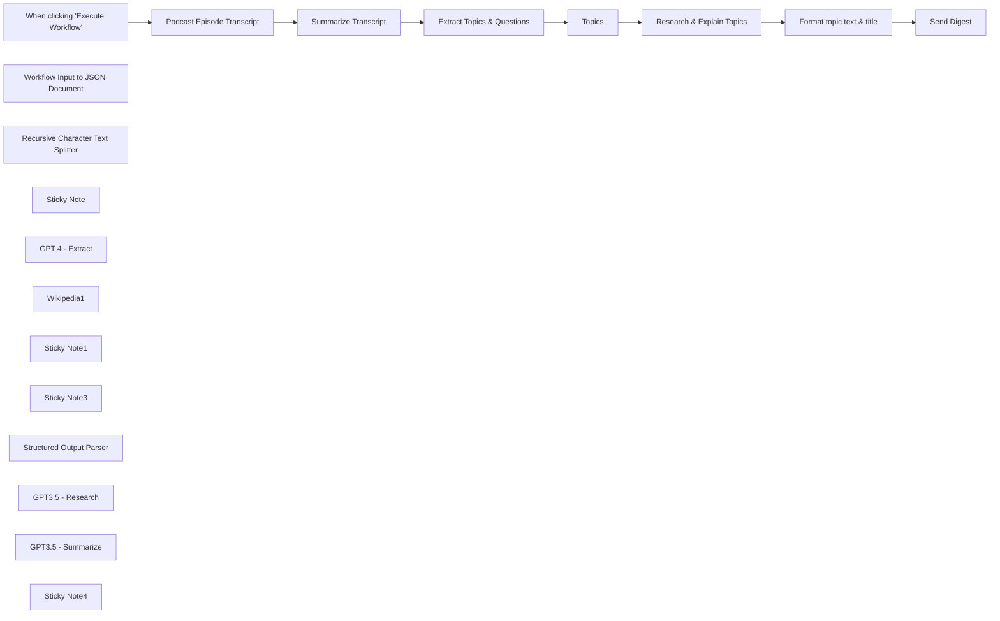

## Fluxo (.json) :

```json
{
  "id": "zFxUMqgvTXGIMzvh",
  "meta": {
    "instanceId": "ec7a5f4ffdb34436e59d23eaccb5015b5238de2a877e205b28572bf1ffecfe04"
  },
  "name": "Podcast Digest",
  "tags": [],
  "nodes": [
    {
      "id": "48bf1045-cfc1-4b37-9cce-86634bd97480",
      "name": "When clicking \"Execute Workflow\"",
      "type": "n8n-nodes-base.manualTrigger",
      "position": [
        -420,
        580
      ],
      "parameters": {},
      "typeVersion": 1
    },
    {
      "id": "75f2e528-e5fe-4508-b98f-e1f71f803e60",
      "name": "Podcast Episode Transcript",
      "type": "n8n-nodes-base.code",
      "position": [
        -220,
        580
      ],
      "parameters": {
        "jsCode": "return { transcript: `So throughout the last couple episodes we’ve been doing on the philosophy of mind…there’s been an IDEA that we’ve referenced MULTIPLE TIMES… and really just glossed over it as something, that’s PRACTICALLY self evident. \n\n\n\nThe idea… is that when we THINK about consciousness… we can SPLIT it into two different types…there’s ACCESS consciousness on the one hand… and PHENOMENAL consciousness on the other. This is what we’ve been saying. \n\n\n\nWhen it comes to ACCESS consciousness…that’s stuff we CAN explain with neuroscience things like memories, information processing, our field of visual awareness…we can CLEARLY EXPLAIN a bit about how all THAT stuff works.\n\n\n\nBut in this conversation so far, what KEEPS on being said… is that what we CAN’T SEEM to explain…is PHENOMENAL consciousness…you know, the subjective experience, that UNDERLIES conscious thought. That it FEELS like something to be me. There’s this idea…that this phenomenal consciousness is something separate…something fundamental, something in a category ALL IT’S OWN… that needs to be explained. You can explain a lot of stuff about access consciousness…but you can’t explain PHENOMENAL consciousness. \n\n\n\nBut if you were a good materialist listening to the discussions on this series so far…and you’re sitting in the back of the room, being SUPER PATIENT, NOT SAYING ANYTHING trying to be respectful to all the other ideas being presented…maybe there’s a part of you so far that’s just been BOILING inside, because you’re waiting for the part of the show where we’re ACTUALLY going to call that GIANT assumption that’s being made into question. \n\n\n\nBecause a materialist might say, SURE…phenomenal consciousness is PRETTY mysterious and all. But DOES that necessarily mean that it’s something that NEEDS a further explanation? \n\n\n\nThis is a good question. What is the difference… between EXPLAINING ALL of the component PARTS of our subjective experience again the thoughts, memories, information processing…what’s the difference between explaining all that and explaining phenomenal consciousness… in itself? Like what does that even mean?\n\n\n\nThat’s kinda like you saying…well… you can EXPLAIN the delicious waffle cone. You can EXPLAIN the creamy chocolatey goodness inside, you can EXPLAIN the RAINBOW colored SPRINKLES. But you CAN’T explain the ICE CREAM CONE…in ITSELF, now can you? \n\n\n\nI mean at a CERTAIN point what are we even talking about anymore? IS phenomenal consciousness REALLY something that’s ENTIRELY SEPARATE that needs to be explained? \n\n\n\nMaybe, it DOESN’T need to be explained. Maybe phenomenal consciousness is less a thing in itself…and MORE a sort of ATTRIBUTION we make… about a particular INTERSECTION of those component parts that we CAN study and explain. \n\n\n\nNow obviously there’s a bit to clarify there… and going over some popular arguments as to why that might be the case will take a good portion of the episode here today. But maybe a good place to start is to ask the question…if the hard problem of consciousness is to be able to explain why it FEELS like something to be me…and your SOLUTION to that is that maybe we don’t even need to explain that. One thing you’re gonna HAVE to explain no matter what… is why it SEEMS to MOST people living in today’s world…that phenomenal consciousness IS something that needs to be explained. \n\n\n\nRight before we began this series we did an episode on Susan Sontag and the power of the metaphors we casually use in conversations. And we talked about how these metaphors ACTUALLY go on to have a pretty huge impact on the way we contextualize the things in our lives. \n\n\n\nWell the philosopher Susan Blackmore, and apparently… I ONLY cover female philosophers by the name of Susan or Simone on this show…but anyway SUSAN BLACKMORE, huge player in these modern conversations about the mysteries of consciousness…and she thinks that if it’s DIFFICULT for someone to wrap their brain around the idea that phenomenal consciousness is NOT something that is conceptually distinct…it MAY BE because of the METAPHORS about consciousness that we use in everyday conversation that are directing the way you THINK about consciousness… into a particular lane that’s incorrect. \n\n\n\nFor example, there’s a way people think about consciousness… that’s TRAGICALLY common in today’s world…it’s become known as the Cartesian theater. So Cartesian obviously referring to Descartes. And when Descartes arrives at his substance dualism where the MIND is something ENTIRELY SEPARATE from the BODY…this EVENT in the history of philosophy goes on to CHANGE the way that people start to see their conscious experience. They start to think… well what I am…is I’m this conscious creature, sort of perched up here inside of this head…and I’m essentially…sitting in a theater, LOOKING OUT through a set of eyes which are kind of like the screen in a theater…and on the screen what I SEE is the outside world. \n\n\n\nNow nobody ACTUALLY believes this is what is happening. Every person on this god forsaken planet KNOWS that there isn’t a movie theater up in their heads. But hearing and using this metaphor DOES SHADE the way that they see their own conscious experience. The casual use of the metaphor… ALLOWS people to smuggle in assumptions about their subjective experience, that we REALLY have no evidence to be assuming. \n\n\n\nFor example, when the mind and body is totally separate…maybe it becomes EASIER for people to believe that they’re a SPIRIT that’s INHABITING a body. Maybe it just makes it easier for people to VIEW their subjective, phenomenal consciousness as something SEPARATE from the body that needs to be explained in itself. WHATEVER IT IS though…the point to Susan Blackmore is that metaphors you use have an IMPACT on your intuitions about consciousness. And she thinks there’s several OTHER examples that fall into the very same CATEGORY as the Cartesian Theater. \n\n\n\nHow about the idea that there’s a unified, single, STREAM of consciousness that you’re experiencing. The STREAM being the metaphor there. Susan Blackmore asks is a SINGLE, unified STREAM, REALLY the way that you experience your conscious thought? Like when you REALLY pay attention is that how you’re existing?\n\n\n\nShe says most likely the only reason people SEE their consciousness in terms of a stream…is because of the specific way that people are often asked to OBSERVE their own consciousness. There’s a BIAS built into the way that we’re checking in. How do people typically do it? Well they’ll take a moment…they’ll stop what they’re doing…and they’ll ask themselves: what does it feel like to be ME right now. They’ll pay attention, they’ll listen, they’ll try to come up with an answer to the question…and they’ll realize that there’s a PARTICULAR set of thoughts, feelings and perceptions that it FEELS like, to be YOU in THAT moment. \n\n\n\nBut then that person can wait for an hour…come back later, and ask the very SAME QUESTION in a different moment: what does it feel like to be me right now…and low and behold a totally DIFFERENT set of thoughts, feelings and perceptions come up. \n\n\n\nAnd then what we OFTEN DO as people at that point… is we FILL IN that empty space between those two moments with some ethereal STREAM of consciousness that we assume MUST HAVE existed between the two. \n\n\n\nBut at some OTHER level…RATIONALLY we KNOW…that for the whole time that we WEREN’T doing this accounting of what it FEELS like to be me…we KNOW that there were TONS of different unconscious meta-processes going on…all doing their own things, sometimes interacting with each other, most of the time not. We KNOW that our EXPERIENCE of consciousness is just directing our attention to one PIECE of our mental activity or another… and that all those pieces of mental activity KEEP on operating whether we’re FOCUSING on one of them or not. \n\n\n\nSo is there a specific LOCATION where there’s some sort of collective STREAM where all of this stuff is bound together HOLISTICALLY? Is there ANY good reason to ASSUME that it NEEDS to BE that way? Could it be that the continuity of this mental activity is more of an ILLUSION… than it is a reality?\n\n\n\nAnd if this sounds impossible at first…think of OTHER illusions that we KNOW go on in the brain. Think of how any SINGLE sector of the brain CREATES a similar sort of illusion. Memories. We KNOW that DIFFERENT parts of the brain are responsible for different types of memory. Semantic memory in the frontal cortex, episodic memory in the hippocampus, procedural memory in the cerebellum. ALL of these different areas work together in concert with each other, it’s ALL seemingly unified. \n\n\n\nWhen someone cuts me off in traffic and I’m choosing a reaction…I don’t CONSCIOUSLY, travel down to my cerebellum and say hey 200 million years ago how did my lizard grandfather react when a lizard cut him off in traffic…no MULTIPLE different parts of the brain work together and create an ILLUSION of continuity. And the SAME thing goes for our VISUAL experience of the world. The SAME thing happens with our emotions. \n\n\n\nHere’s Susan Blackmore saying: the traditional METAPHORS that we casually throw around about consciousness…even with just a LITTLE bit of careful observation of your own experience…being someone up in a theater in your head with a unified, continuous STREAM of your own consciousness…this ISN’T even how our experiences SEEM. \n\n\n\nNow it should be said if you were sufficiently COMMITTED to the process…you could ABSOLUTELY carry on in life with a complete LACK of self awareness fueled by the METAPHORS of pop-psychology and MOVIES and TV shows, and you could DEFINITELY LIVE in a state of illusion about it. But that DOESN’T make it right…and what happens she asks when those METAPHORS go on to impact the way we conduct science or break things down philosophically? She says:\n\n\n\n“Neuroscience and disciplined introspection give the same answer: there are multiple parallel processes with no clear distinction between conscious and unconscious ones. Consciousness is an attribution we make, not a property of only some special events or processes. Notions of the stream, contents, continuity and function of consciousness are all misguided as is the search for the neural correlates of consciousness.”\n\n\n\nThe MORE you think about the ILLUSIONS that our brains create for the sake of simplicity…the more the question starts to emerge: what if there is no CENTRALIZED HEADQUARTERS of the brain where the subjective experience of YOU…is being produced? \n\n\n\nWhat if consciousness…is an emergent property that exists…ONLY, when there is a VERY SPECIFIC organization of physical systems? \n\n\n\nThere are people that believe that phenomenal consciousness… is an ILLUSION, they’re often called Illusionists…and what someone like THAT may say is sure, fully acknowledge there are other theories about what may ultimately explain phenomenal consciousness…but isn’t it ALSO, ENTIRELY POSSIBLE…that what it FEELS like to be YOU…is an illusion created by several, distributed processes of the brain running in parallel? Multiple different channels, exerting simultaneous influence on a variety of subsystems of the brain. That these subsystems talk to each other, they compete with each other, they ebb and flow between various states of representation. \n\n\n\nBut that these different DRAFTS of cognitive processes come together, to create a type of simplification of what’s going on in aggregate… and that simplification is what YOU experience as… YOU. I mean we have our five senses that help us map the EXTERNAL world and they do so in a way that is often crude and incomplete. Could it be… that we SIMILARLY… have a crude misrepresentation of our own brain activity that SIMILARLY, allows us to be able to function efficiently as a person? \n\n\n\nIf you were looking for another METAPHOR to apply here that an illusionist might say is probably better for people to think of themselves in terms of… because its not gonna lead us down that rabbit hole of the cartesian theater…its to THINK of phenomenal CONSCIOUSNESS…as being SIMILAR to a USER INTERFACE or a DESKTOP on a computer. \n\n\n\nThe idea is: what IS the desktop of a computer? Well its a bunch of simplified ICONS on a screen, that allow you to essentially manipulate the ELECTRICAL VOLTAGE going on in between transistors on computer hardware. But AS you’re pushing buttons to CHANNEL this electricity, getting things DONE on the computer…you don’t ACTUALLY need to know ANYTHING ABOUT the complex inner workings of how the software and hardware are operating.\n\n\n\nThe philosopher Daniel Dennett INTRODUCES the metaphor here in his famous book called Consciousness Explained (1991). He says:\n\n\n\n“When I interact with the computer, I have limited access to the events occurring within it. Thanks to the schemes of presentation devised by the programmers, I am treated to an elaborate audiovisual metaphor, an interactive drama acted out on the stage of keyboard, mouse, and screen. I, the User, am subjected to a series of benign illusions: I seem to be able to move the cursor (a powerful and visible servant) to the very place in the computer where I keep my file, and once that I see that the cursor has arrived ‘there’, by pressing a key I get it to retrieve the file, spreading it out on a long scroll that unrolls in front of a window (the screen) at my command. I can make all sorts of things happen inside the computer by typing in various commands, pressing various buttons, and I don’t have to know the details; I maintain control by relying on my understanding of the detailed audiovisual metaphors provided by the User illusion.”\n\n\n\nSo if we take this metaphor seriously…then the idea that you are some sort of privileged observer of everything that’s going on in your mind…that starts to seem like it’s just FALSE. To Daniel Dennett…we don’t know what’s REALLY happening at the deepest levels of our brains…we only know what SEEMS to be happening. We are constantly acting in certain ways, doing things…and then AFTER the fact making up reasons for why we ACTED in the way that we did.\n\n\n\nPoint is: you don’t need to know EVERYTHING that’s going on at EVERY LEVEL of a computer… to be able to for example, drag a file that you don’t need anymore into the trash can on your desktop. You just drag the file into the trash can on this convenient, intuitive SCREEN. In fact you could make the argument that KNOWING about all the information being processed at other levels would get in the way of you being able to get things done that are USEFUL.\n\n\n\nBut… as its been said many times before…to RELATE this back to our subjective experience of consciousness…to an ILLUSIONIST… we have to acknowledge the fact…that there is NO MORE… a TRASH CAN inside of your computer screen…as there is a separate PHENOMENAL SUBJECT inside of your brain that needs to be explained. THAT…is an ILLUSION. What you HAVE… Daniel Dennett refers to as an EDITED DIGEST, of events that are going on inside your brain. \n\n\n\nSo again just to clarify…an ILLUSIONIST… doesn’t DOUBT the existence of access consciousness, they’re not saying that the OUTSIDE WORLD is an illusion… No, just the phenomenal REPRESENTATION of brain activity…just the subjective YOU that experiences the world phenomenologically.\n\n\n\nThe philosopher Keith Frankish gives the example of a television set to describe the type of illusion they’re talking about. He says: \n\n\n“Think of watching a movie. What your eyes are actually witnessing is a series of still images rapidly succeeding each other. But your visual system represents these images as a single fluid moving image. The motion is an illusion. Similarly, illusionists argue, your introspective system misrepresents complex patterns of brain activity as simple phenomenal properties. The phenomenality is an illusion.”\n\n\n\nWhen it FEELS LIKE SOMETHING to be you…these phenomena are “metaphorical representations” of REAL neural events that are going on…and they definitely help us navigate reality…they definitely ARE useful… but nothing about those phenomena… offer ANY sort of deep insight into the processes involved to produce that experience. So in THAT sense, they are an illusion. \n\n\n\nAnd Daniel Dennett goes HARD on ANYONE trying to smuggle in ANY MORE MAGIC than needs to be brought in to EXPLAIN consciousness. He wrote a GREAT entry in the journal of consciousness studies in 2016 called Illusionism as the obvious default theory of consciousness. \n\n\n\nNow what’s he GETTING at with that title? Why should consciousness being an ILLUSION… be the DEFAULT theory we should all START from? Well he COMPARES the possibility of consciousness being an illusion…with ANOTHER kind of illusion. The kind of illusion that you’d see in VEGAS at a MAGIC show. \n\n\n\nBecause what HAPPENS at a MAGIC show? Well there are GREAT efforts MADE by the magician you’re watching…to TRICK you into thinking that what you’re seeing is real. \n\n\n\nYou’re watching the magic show from a VERY specific point of view…CAREFULLY selected by the magician to LIMIT the information you have. They got lights and smoke and music to DISTRACT you, they’re usually wearing some kind of bedazzled, cowboy costume looks like they got it at spirit Halloween, their poor assistant is dressed in God knows what to distract you. \n\n\n\nAnd when they DO the trick and the ILLUSION is finally COMPLETE…and you’re sitting there AMAZED, WONDERING as to how they defied the laws of nature and actually sawed someone in half and put them back together in front of you…imagine someone in the crowd writing a REVIEW of the show the next day and saying, welp…I guess EVERYTHING we KNOW about science needs to be rethought…I mean this man is CLEARLY a wizard…he is CLEARLY outside the bounds of natural constraints that we THOUGHT existed…it’s time to RETHINK our ENTIRE theoretical model.\n\n\n\nDaniel Dennett says who would EVER TAKE that person seriously? They’d be laughed off the internet if they wrote that. And RIGHTFULLY SO. And SIMILARLY when it comes to these modern conversations about consciousness…why would we EVER assume that our entire theoretical MODEL is flawed? Why would we ASSUME the supernatural? Why wouldn’t we assume that anything that seems magical or mysterious definitely HAS a natural explanation…and that we just don’t understand it yet? \n\n\n\nIf you ONLY saw a magic trick from a single angle, like sitting in the audience of a theater…it would be silly for us to assume that there wasn’t a different perspective available that would SHOW how the trick was done. Similarly… we ONLY REALLY SEE the qualia of our subjective experience from the angle of introspection. \n\n\n\nThis is why to daniel dennett…the DEFAULT position we should be starting from…the MOST parsimonious explanation for a mystery that contradicts everything else we know…is that it’s an illusion. \n\n\n\nIt’s funny because it’s an argument that’s coming from a place that’s SIMILAR to where a panpsychist may be coming from, but it’s arriving at a totally different conclusion. Panpsychist might say that we don’t yet know enough about the human brain to write OFF the possibility that consciousness exists at some level underneath. Here’s an illusionist position that’s saying, yeah, we certainly HAVEN’T been doing science long enough to know EVERYTHING about the brain…and think of all the low hanging fruit in the sciences that could potentially EXPLAIN this mystery if only we have more time to study it. \n\n\n\nMore than that…to an illusionist…maybe there is something ABOUT the nature of the illusion that we’re experiencing, that is NOT fully explainable by studying the physical properties of the brain. Maybe studying the ILLUSION ITSELF… is where we should be focusing more of our attention. \n\n\n\nBut that said…there’s no shortage of people out there that have PROBLEMS with saying consciousness is an illusion. For example… the philosopher Massimo Pigliucci, who by the way fun trivia fact is the only person OTHER than phillip goff that we’ve ever interviewed on this show all the way back in our HUME series…anyway HE once wrote an article where he talks about how Illusionism…AS an ANSWER to the hard problem of consciousness…is something that HE thinks HEAVILY relies on the specific definition you’re using of what an ILLUSION is or what CONSCIOUSNESS is. \n\n\n\nTo explain what he means… let’s go back to the metaphor about the icons on the computer screen. Massimo Pigliucci says this metaphor that Daniel Dennett presents in Consciousness Explained…is a POWERFUL metaphor when it comes to describing the relationship between phenomenal consciousness… and the underlying neural machinery that makes it possible. It’s great. But what HE can’t seem to understand is why ANYONE would EVER CALL what’s going ON there…an “illusion”? Why USE the word illusion? \n\n\n\nWhen you hear the word illusion he says… you think of mind trickery, smoke and mirrors. But that’s not what’s happening when it comes to the user interface of a computer. He says, “computer icons, cursors and so forth are not illusions, they are causally efficacious representations… of underlying machine language processes.” \n\n\n\nWhat he’s getting at… is that there’s no ILLUSION going on here. There IS a connection between the underlying processes of the brain and our phenomenal experience of it. If it were truly an illusion, there would BE no real connection. But he says if you wanted to use that same logic…would you say that the wheel of your CAR is an illusion? I mean when you’re driving down the road and you turn the wheel…you’re not aware of the complexity of everything the car is doing, all of the internal communication going on to be able to turn the car in whatever direction you’re going. Does that make it an illusion when you turn the steering wheel left and everything moves that makes the car go left? No, the steering wheel is causally connected to the underlying machinery… and that steering wheel makes it POSSIBLE for you to actually be able to drive the car efficiently. So why would you ever choose the word ILLUSION… to describe… what’s going ON there? \n\n\n\nMassimo Pigliucci thinks there’s an easy trap for someone to fall into living in today’s world…he calls it a sort of reductionist temptation…we come from a LONG HISTORY in the sciences of progressively reducing things to a deeper, more fundamental level of their component parts… and then the assumption has usually been that if you can find a lower level of description about something…for example if we can explain what PHENOMENAL CONSCIOUSNESS is, with a neurobiological explanation…well then THAT explanation, must be MORE TRUE than anything going on at a more macro level…at the level of the consciousness we experience every day. It must be a more FUNDAMENTAL explanation, and therefore a BETTER explanation. \n\n\n\nYou’ll see this same kind of thinking going on when someone assumes the atoms that MAKE UP an apple… are more REAL in some sense than the apple in macroscopic reality…the assumption being that the apple as WE experience it is some kind of an illusion created by our flawed SENSES and that it’s somehow less valuable. \n\n\n\nBut this whole way of thinking…is UNWORKABLE he says. We’ve learned over the course of THOUSANDS of years of trying to STUDY the things around us…that different levels of description… are USEFUL for different purposes. \n\n\n\nHe gives a series of examples: he says, “If we are interested in the biochemistry of the brain, then the proper level of description is the subcellular one, taking lower levels (eg, the quantum one) as background conditions. If we want a broader picture of how the brain works, we need to move up to the anatomical level, which takes all previous levels, from the subcellular to the quantum one, as background conditions. But if we want to talk to other human beings about how we feel and what we are experiencing, then it is the psychological level of description (the equivalent of Dennett’s icons and cursors) that, far from being illusory, is the most valuable.”\n\n\n\nReality plays by different sets of rules at different scales. And different SCALES of reality are USEFUL for different types of inquiry. When you’re going about your everyday life do you assume that the ground is solid? Or do you use the lower level of description at the atomic level where the ground is really 99.9% empty space?\n\n\n\nSo when it comes to consciousness…if we’re gonna SAY that a neurobiological description of what’s going on invalidates the experience of what’s going on at the level of subjectivity, that subjectivity is nothing but an illusion…then why stop at the neurobiological level he says? Why not say that neurons are actually an illusion because they’re ultimately made up of molecules? Why not say that MOLECULES are illusions because they’re really made up of quarks and gluons. You can do this INFINITELY. \n\n\n\nAnd maybe on a more GENERAL note…JUST when it comes to this lifelong process of trying to be as clear thinking of a human being as you possibly CAN be…maybe part of that whole process… is accepting the fact that there is no, single, monistic way of analyzing reality that is the ULTIMATE METHOD of understanding it. Maybe understanding reality… just takes a more pluralistic approach, maybe GETTING as close to the truth as we can as people takes LOOKING at reality from many different angles at many different scales, and maybe phenomenal consciousness is an important scale of reality… that we need to be considering. \n\n\n\nSo from Daniel Dennett and Keith Frankish offering a take on HOW consciousness might be an illusion…to Susan Blackmore offering a take on WHY the illusion of consciousness is such an easy trap to FALL into…I think if anyone you’re in a conversation with calls themselves an illusionist…then unless you’re talking to David Copperfield I think you’ll at LEAST be able to understand the main reasons for why someone may THINK this way about consciousness. \n\n\n\nAnd this is the point in the conversation where we hit a bit of a crossroads…SAME crossroads that we’ve seen with OTHER theories of consciousness in the series so far. At a certain point...there are GOOD reasons to believe that phenomenal consciousness may be an illusion…and there are good reasons to DOUBT whether that is true or not. As we’ve talked about at a certain point with these conversations you just have to CHOOSE to believe in something, and then deal with the prescriptive implications of BELIEVING it after the fact…and one of the ones with Illusionism in particular is you can start to wonder, the more you think about it, how much consciousness being an illusion, ACTUALLY has an impact on ANYTHING going on in your everyday life or your relationship to society. \n\n\n\nIt’s actually pretty interesting to consider…how much the possibility of consciousness being an illusion…DIRECTLY MIRRORS, OTHER, unsolved conversations in the philosophy of mind more broadly. Like for example…the ongoing debate about whether FREE WILL is an illusion. \n\n\n\nIn fact in order to be able to talk about the societal impacts of consciousness being an illusion we have to talk about free will being one as well. \n\n\n\nNext episode we’re going to dive into it. Free will, free wont, hard determinism and the implications of ALL of these when it comes to structuring our societies. Keep your eyes open for it, it will be out soon! Thanks for everyone on Patreon and thanks for checking out the website at philosophizethis.org\n\n\n\nBut as always, thank you for listening. Talk to you next time. `}"
      },
      "typeVersion": 2
    },
    {
      "id": "70b657d9-5a8f-4a9e-8d4e-18940ba35683",
      "name": "Workflow Input to JSON Document",
      "type": "@n8n/n8n-nodes-langchain.documentJsonInputLoader",
      "position": [
        80,
        780
      ],
      "parameters": {
        "pointers": "/transcript"
      },
      "typeVersion": 1
    },
    {
      "id": "b05c5e26-5a1d-4717-868d-3b05783a0d24",
      "name": "Recursive Character Text Splitter",
      "type": "@n8n/n8n-nodes-langchain.textSplitterRecursiveCharacterTextSplitter",
      "position": [
        220,
        900
      ],
      "parameters": {
        "chunkSize": 6000,
        "chunkOverlap": 1000
      },
      "typeVersion": 1
    },
    {
      "id": "1b78b734-167e-4eb6-ba2e-19bbecd3a75e",
      "name": "Sticky Note",
      "type": "n8n-nodes-base.stickyNote",
      "position": [
        -100,
        460
      ],
      "parameters": {
        "width": 455.5091388435286,
        "height": 577.6862533692728,
        "content": "## Chunk the transcript into several parts, and refine-summarize it "
      },
      "typeVersion": 1
    },
    {
      "id": "86ac5fad-307f-4f95-ad1c-1ba00a29e807",
      "name": "Topics",
      "type": "n8n-nodes-base.itemLists",
      "position": [
        920,
        580
      ],
      "parameters": {
        "options": {},
        "fieldToSplitOut": "topics"
      },
      "typeVersion": 3
    },
    {
      "id": "078890f1-d840-479e-b702-ce6f9e3b4852",
      "name": "Summarize Transcript",
      "type": "@n8n/n8n-nodes-langchain.chainSummarization",
      "position": [
        -40,
        580
      ],
      "parameters": {
        "type": "refine"
      },
      "typeVersion": 1
    },
    {
      "id": "4a583efe-ff24-4bc1-b3e7-89651e3147c7",
      "name": "GPT 4 - Extract",
      "type": "@n8n/n8n-nodes-langchain.lmChatOpenAi",
      "position": [
        560,
        755
      ],
      "parameters": {
        "model": "gpt-4",
        "options": {
          "temperature": 0.8
        }
      },
      "credentials": {
        "openAiApi": {
          "id": "wJtZwsVKW5v6R2Iy",
          "name": "OpenAi account 2"
        }
      },
      "typeVersion": 1
    },
    {
      "id": "b658f2c1-3f60-4ff0-8b7b-2b2ebe1b1f5e",
      "name": "Wikipedia1",
      "type": "@n8n/n8n-nodes-langchain.toolWikipedia",
      "position": [
        1380,
        900
      ],
      "parameters": {},
      "typeVersion": 1
    },
    {
      "id": "5bffc33d-bb52-4432-bb82-ce2005be3c06",
      "name": "Sticky Note1",
      "type": "n8n-nodes-base.stickyNote",
      "position": [
        480,
        460
      ],
      "parameters": {
        "width": 615.8516011477997,
        "height": 443.66706715913415,
        "content": "## Generate Questions and Topics from the summary and make sure the response follows required schema."
      },
      "typeVersion": 1
    },
    {
      "id": "53626ccb-451d-4ed8-8512-2daa74baf556",
      "name": "Send Digest",
      "type": "n8n-nodes-base.gmail",
      "position": [
        1900,
        580
      ],
      "parameters": {
        "sendTo": "oleg@n8n.io",
        "message": "=Greetings 👋,\nHope you're doing well! Here's your digest for this week's episode of Philoshopy This! \n\n<h2>🎙 Episode Summary</h2>\n{{ $json.summary }}\n\n<h2>💡 Topics Discussed</h2>\n{{ $json.topics.join('\\n') }}\n\n<h2>❓ Questions to Ponder</h2>\n{{ $json.questions.join('\\n') }}",
        "options": {},
        "subject": "Podcast Digest",
        "emailType": "html"
      },
      "credentials": {
        "gmailOAuth2": {
          "id": "kLFedNEM8Zwkergv",
          "name": "Gmail account"
        }
      },
      "typeVersion": 2
    },
    {
      "id": "751ffffe-190e-4fc6-93ff-0021c98f225d",
      "name": "Sticky Note3",
      "type": "n8n-nodes-base.stickyNote",
      "position": [
        1220,
        460
      ],
      "parameters": {
        "width": 359.3751741576458,
        "height": 567.5105121293799,
        "content": "## Ask Agent to research and explain each topic using Wikipedia\n\n"
      },
      "typeVersion": 1
    },
    {
      "id": "0165bec2-f390-44a8-8435-ba718cf18465",
      "name": "Format topic text & title",
      "type": "n8n-nodes-base.code",
      "position": [
        1740,
        580
      ],
      "parameters": {
        "jsCode": "const inputItems = $input.all();\nconst topics = [];\nconst questions = [];\nconst summary = $('Summarize Transcript').item.json.response.output_text;\n// Format Topics\nfor (const [index, topic] of inputItems.entries()) {\n const title = $('Topics').all()[index].json.topic\n\n topics.push(`\n <h3>${title}</h3>\n <p>${topic.json.output}</p>`.trim()\n )\n}\n\n// Format Questions\nfor (const question of $('Extract Topics & Questions').item.json.questions) {\n questions.push(`\n <h3>${question.question}</h3>\n <p>${question.why}</p>`.trim()\n )\n}\n\nreturn { topics, summary, questions }"
      },
      "typeVersion": 2
    },
    {
      "id": "497c5a49-e4cb-4c1f-98c2-49088ced2e72",
      "name": "Structured Output Parser",
      "type": "@n8n/n8n-nodes-langchain.outputParserStructured",
      "position": [
        720,
        755
      ],
      "parameters": {
        "jsonSchema": "{\n \"$schema\": \"http://json-schema.org/draft-07/schema#\",\n \"title\": \"Generated schema for Root\",\n \"type\": \"object\",\n \"properties\": {\n \"questions\": {\n \"type\": \"array\",\n \"items\": {\n \"type\": \"object\",\n \"properties\": {\n \"question\": {\n \"type\": \"string\"\n },\n \"why\": {\n \"type\": \"string\",\n \"description\": \"Explanation of why this question is relevant for the context\"\n }\n },\n \"required\": [\n \"question\",\n \"why\"\n ]\n }\n },\n \"topics\": {\n \"type\": \"array\",\n \"items\": {\n \"type\": \"object\",\n \"properties\": {\n \"topic\": {\n \"type\": \"string\"\n },\n \"why\": {\n \"type\": \"string\",\n \"description\": \"A few sentences explanation of why this topic is relevant for the context\"\n }\n },\n \"required\": [\n \"topic\",\n \"why\"\n ]\n }\n }\n },\n \"required\": [\n \"questions\",\n \"topics\"\n ]\n}"
      },
      "typeVersion": 1
    },
    {
      "id": "6b42d3bf-912e-4df3-91c6-2eba06dbe27c",
      "name": "Extract Topics & Questions",
      "type": "@n8n/n8n-nodes-langchain.chainLlm",
      "position": [
        560,
        580
      ],
      "parameters": {
        "prompt": "=Come up with a list of questions and further topics to explore that are relevant for the context. Make sure questions are relevant to the topics but not verbatim. Think hard about what the appropriate questions should be and how it relates to the summarization.\nPodcast Summary: {{ $json.response.output_text }}"
      },
      "typeVersion": 1
    },
    {
      "id": "701c2977-0c17-4fa0-ad4b-afbbbaa6f044",
      "name": "GPT3.5 - Research",
      "type": "@n8n/n8n-nodes-langchain.lmChatOpenAi",
      "position": [
        1280,
        780
      ],
      "parameters": {
        "model": "gpt-3.5-turbo-16k",
        "options": {
          "temperature": 0.8
        }
      },
      "credentials": {
        "openAiApi": {
          "id": "wJtZwsVKW5v6R2Iy",
          "name": "OpenAi account 2"
        }
      },
      "typeVersion": 1
    },
    {
      "id": "0da11c5a-ffd3-47a0-a082-9eaf9d18fc10",
      "name": "GPT3.5 - Summarize",
      "type": "@n8n/n8n-nodes-langchain.lmChatOpenAi",
      "position": [
        -60,
        780
      ],
      "parameters": {
        "model": "gpt-3.5-turbo-16k",
        "options": {
          "temperature": 0
        }
      },
      "credentials": {
        "openAiApi": {
          "id": "wJtZwsVKW5v6R2Iy",
          "name": "OpenAi account 2"
        }
      },
      "typeVersion": 1
    },
    {
      "id": "bbb29b9f-f765-4f0c-926f-1b34a6eb999c",
      "name": "Sticky Note4",
      "type": "n8n-nodes-base.stickyNote",
      "position": [
        1700,
        460
      ],
      "parameters": {
        "width": 371.7094059635757,
        "height": 330.6932614555254,
        "content": "## Format as HTML and send via Gmail"
      },
      "typeVersion": 1
    },
    {
      "id": "cfdde2b8-5fb7-4eb6-b821-e5d0511bcabd",
      "name": "Research & Explain Topics",
      "type": "@n8n/n8n-nodes-langchain.agent",
      "position": [
        1260,
        580
      ],
      "parameters": {
        "text": "=Topic: {{ $json.topic }}\n\nContext: {{ $('Summarize Transcript').item.json.response.output_text }}\n",
        "agent": "openAiFunctionsAgent"
      },
      "typeVersion": 1
    }
  ],
  "active": false,
  "pinData": {},
  "settings": {
    "executionOrder": "v1"
  },
  "versionId": "d1a1ab93-2fb9-42f9-94a2-9d2c187eb41e",
  "connections": {
    "Topics": {
      "main": [
        [
          {
            "node": "Research & Explain Topics",
            "type": "main",
            "index": 0
          }
        ]
      ]
    },
    "Wikipedia1": {
      "ai_tool": [
        [
          {
            "node": "Research & Explain Topics",
            "type": "ai_tool",
            "index": 0
          }
        ]
      ]
    },
    "GPT 4 - Extract": {
      "ai_languageModel": [
        [
          {
            "node": "Extract Topics & Questions",
            "type": "ai_languageModel",
            "index": 0
          }
        ]
      ]
    },
    "GPT3.5 - Research": {
      "ai_languageModel": [
        [
          {
            "node": "Research & Explain Topics",
            "type": "ai_languageModel",
            "index": 0
          }
        ]
      ]
    },
    "GPT3.5 - Summarize": {
      "ai_languageModel": [
        [
          {
            "node": "Summarize Transcript",
            "type": "ai_languageModel",
            "index": 0
          }
        ]
      ]
    },
    "Summarize Transcript": {
      "main": [
        [
          {
            "node": "Extract Topics & Questions",
            "type": "main",
            "index": 0
          }
        ]
      ]
    },
    "Structured Output Parser": {
      "ai_outputParser": [
        [
          {
            "node": "Extract Topics & Questions",
            "type": "ai_outputParser",
            "index": 0
          }
        ]
      ]
    },
    "Format topic text & title": {
      "main": [
        [
          {
            "node": "Send Digest",
            "type": "main",
            "index": 0
          }
        ]
      ]
    },
    "Research & Explain Topics": {
      "main": [
        [
          {
            "node": "Format topic text & title",
            "type": "main",
            "index": 0
          }
        ]
      ]
    },
    "Extract Topics & Questions": {
      "main": [
        [
          {
            "node": "Topics",
            "type": "main",
            "index": 0
          }
        ]
      ]
    },
    "Podcast Episode Transcript": {
      "main": [
        [
          {
            "node": "Summarize Transcript",
            "type": "main",
            "index": 0
          }
        ]
      ]
    },
    "Workflow Input to JSON Document": {
      "ai_document": [
        [
          {
            "node": "Summarize Transcript",
            "type": "ai_document",
            "index": 0
          }
        ]
      ]
    },
    "When clicking \"Execute Workflow\"": {
      "main": [
        [
          {
            "node": "Podcast Episode Transcript",
            "type": "main",
            "index": 0
          }
        ]
      ]
    },
    "Recursive Character Text Splitter": {
      "ai_textSplitter": [
        [
          {
            "node": "Workflow Input to JSON Document",
            "type": "ai_textSplitter",
            "index": 0
          }
        ]
      ]
    }
  }
}
```

<a id="template-960"></a>

## Template 960 - Sincronização de clientes WooCommerce para Mautic

- **Nome:** Sincronização de clientes WooCommerce para Mautic
- **Descrição:** Escuta eventos de cliente no WooCommerce e cria ou atualiza contatos correspondentes no Mautic.
- **Funcionalidade:** • Detecção de evento de cliente: Inicia a automação ao receber eventos de cliente (criação/atualização) do WooCommerce.
• Busca por contato existente: Pesquisa no Mautic pelo email do cliente para verificar se já existe um contato.
• Decisão novo ou existente: Verifica se o contato retornado possui ID para determinar se deve criar ou atualizar.
• Criação de contato: Cria um novo contato no Mautic quando não existe, mapeando email, nome, sobrenome e empresa.
• Atualização de contato: Atualiza campos do contato existente (ex.: nome e sobrenome) usando o ID do contato no Mautic.
• Autenticação segura: Usa OAuth2 para autenticar a integração com o Mautic.
- **Ferramentas:** • WooCommerce: Plataforma de comércio eletrônico que gera eventos de clientes e fornece dados como email, nome e empresa.
• Mautic: Plataforma de automação de marketing usada para armazenar, criar e atualizar contatos.

## Fluxo visual

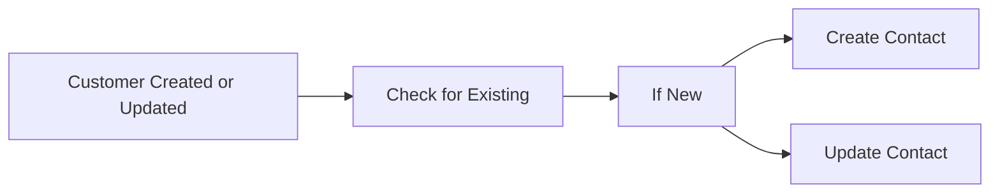

## Fluxo (.json) :

```json
{
  "id": 83,
  "name": "New WooCommerce Customer to Mautic",
  "nodes": [
    {
      "name": "Check for Existing",
      "type": "n8n-nodes-base.mautic",
      "position": [
        280,
        480
      ],
      "parameters": {
        "options": {
          "search": "={{$json[\"email\"]}}"
        },
        "operation": "getAll",
        "authentication": "oAuth2"
      },
      "credentials": {
        "mauticOAuth2Api": {
          "id": "54",
          "name": "Mautic account"
        }
      },
      "typeVersion": 1,
      "alwaysOutputData": true
    },
    {
      "name": "If New",
      "type": "n8n-nodes-base.if",
      "position": [
        460,
        480
      ],
      "parameters": {
        "conditions": {
          "string": [
            {
              "value1": "={{$json[\"id\"]}}",
              "operation": "isEmpty"
            }
          ]
        }
      },
      "typeVersion": 1
    },
    {
      "name": "Create Contact",
      "type": "n8n-nodes-base.mautic",
      "position": [
        680,
        320
      ],
      "parameters": {
        "email": "={{$node[\"Customer Created\"].json[\"email\"]}}",
        "company": "={{$node[\"Customer Created\"].json[\"billing\"][\"company\"]}}",
        "options": {},
        "lastName": "={{$node[\"Customer Created\"].json[\"last_name\"]}}",
        "firstName": "={{$node[\"Customer Created\"].json[\"first_name\"]}}",
        "authentication": "oAuth2",
        "additionalFields": {}
      },
      "credentials": {
        "mauticOAuth2Api": {
          "id": "54",
          "name": "Mautic account"
        }
      },
      "typeVersion": 1
    },
    {
      "name": "Update Contact",
      "type": "n8n-nodes-base.mautic",
      "position": [
        680,
        580
      ],
      "parameters": {
        "options": {},
        "contactId": "={{$json[\"id\"]}}",
        "operation": "update",
        "updateFields": {
          "lastName": "={{$node[\"Customer Created or Updated\"].json[\"last_name\"]}}",
          "firstName": "={{$node[\"Customer Created or Updated\"].json[\"first_name\"]}}"
        },
        "authentication": "oAuth2"
      },
      "credentials": {
        "mauticOAuth2Api": {
          "id": "54",
          "name": "Mautic account"
        }
      },
      "typeVersion": 1
    },
    {
      "name": "Customer Created or Updated",
      "type": "n8n-nodes-base.wooCommerceTrigger",
      "position": [
        100,
        480
      ],
      "webhookId": "5d89e322-a5e0-4cce-9eab-185e8375175b",
      "parameters": {
        "event": "customer.updated"
      },
      "credentials": {
        "wooCommerceApi": {
          "id": "48",
          "name": "WooCommerce account"
        }
      },
      "typeVersion": 1
    }
  ],
  "active": false,
  "settings": {},
  "connections": {
    "If New": {
      "main": [
        [
          {
            "node": "Create Contact",
            "type": "main",
            "index": 0
          }
        ],
        [
          {
            "node": "Update Contact",
            "type": "main",
            "index": 0
          }
        ]
      ]
    },
    "Check for Existing": {
      "main": [
        [
          {
            "node": "If New",
            "type": "main",
            "index": 0
          }
        ]
      ]
    },
    "Customer Created or Updated": {
      "main": [
        [
          {
            "node": "Check for Existing",
            "type": "main",
            "index": 0
          }
        ]
      ]
    }
  }
}
```

<a id="template-961"></a>

## Template 961 - Legenda de imagem com overlay

- **Nome:** Legenda de imagem com overlay
- **Descrição:** Este fluxo obtém uma imagem, gera uma legenda com IA e sobrepõe o texto gerado na própria imagem.
- **Funcionalidade:** • Obter imagem via requisição HTTP: Obtém uma imagem de uma URL de exemplo para uso no fluxo.
• Gerar legenda da imagem com IA: Usa um modelo de linguagem multimodal para criar uma legenda (título e texto) para a imagem.
• Calcular posicionamento da legenda: Executa código para determinar onde exibir a legenda na imagem, incluindo tamanho da fonte e margens.
• Sobrepor legenda na imagem: Desenha um retângulo de fundo e adiciona o texto gerado na posição calculada.
• Combinar imagem e legenda: Une a imagem com a legenda para produzir a imagem final com legendas sobrepostas.
- **Ferramentas:** • Pexels: Fonte de imagens de exemplo utilizadas para obter a imagem.
• Google Gemini (PaLM API): Modelo de linguagem multimodal usado para gerar a legenda da imagem.

## Fluxo visual

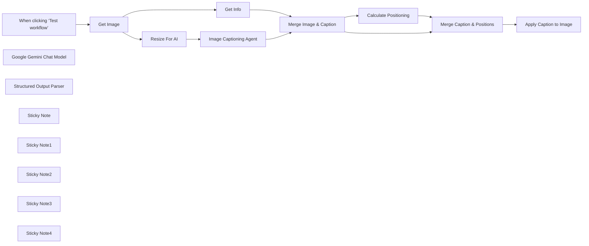

## Fluxo (.json) :

```json
{
  "meta": {
    "instanceId": "408f9fb9940c3cb18ffdef0e0150fe342d6e655c3a9fac21f0f644e8bedabcd9"
  },
  "nodes": [
    {
      "id": "0b64edf1-57e0-4704-b78c-c8ab2b91f74d",
      "name": "When clicking ‘Test workflow’",
      "type": "n8n-nodes-base.manualTrigger",
      "position": [
        480,
        300
      ],
      "parameters": {},
      "typeVersion": 1
    },
    {
      "id": "a875d1c5-ccfe-4bbf-b429-56a42b0ca778",
      "name": "Google Gemini Chat Model",
      "type": "@n8n/n8n-nodes-langchain.lmChatGoogleGemini",
      "position": [
        1280,
        720
      ],
      "parameters": {
        "options": {},
        "modelName": "models/gemini-1.5-flash"
      },
      "credentials": {
        "googlePalmApi": {
          "id": "dSxo6ns5wn658r8N",
          "name": "Google Gemini(PaLM) Api account"
        }
      },
      "typeVersion": 1
    },
    {
      "id": "a5e00543-dbaa-4e62-afb0-825ebefae3f3",
      "name": "Structured Output Parser",
      "type": "@n8n/n8n-nodes-langchain.outputParserStructured",
      "position": [
        1480,
        720
      ],
      "parameters": {
        "jsonSchemaExample": "{\n\t\"caption_title\": \"\",\n\t\"caption_text\": \"\"\n}"
      },
      "typeVersion": 1.2
    },
    {
      "id": "bb9af9c6-6c81-4e92-a29f-18ab3afbe327",
      "name": "Get Info",
      "type": "n8n-nodes-base.editImage",
      "position": [
        1100,
        400
      ],
      "parameters": {
        "operation": "information"
      },
      "typeVersion": 1
    },
    {
      "id": "8a0dbd5d-5886-484a-80a0-486f349a9856",
      "name": "Resize For AI",
      "type": "n8n-nodes-base.editImage",
      "position": [
        1100,
        560
      ],
      "parameters": {
        "width": 512,
        "height": 512,
        "options": {},
        "operation": "resize"
      },
      "typeVersion": 1
    },
    {
      "id": "d29f254a-5fa3-46fa-b153-19dfd8e8c6a7",
      "name": "Calculate Positioning",
      "type": "n8n-nodes-base.code",
      "position": [
        2020,
        720
      ],
      "parameters": {
        "mode": "runOnceForEachItem",
        "jsCode": "const { size, output } = $input.item.json;\n\nconst lineHeight = 35;\nconst fontSize = Math.round(size.height / lineHeight);\nconst maxLineLength = Math.round(size.width/fontSize) * 2;\nconst text = `\"${output.caption_title}\". ${output.caption_text}`;\nconst numLinesOccupied = Math.round(text.length / maxLineLength);\n\nconst verticalPadding = size.height * 0.02;\nconst horizontalPadding = size.width * 0.02;\nconst rectPosX = 0;\nconst rectPosY = size.height - (verticalPadding * 2.5) - (numLinesOccupied * fontSize);\nconst textPosX = horizontalPadding;\nconst textPosY = size.height - (numLinesOccupied * fontSize) - (verticalPadding/2);\n\nreturn {\n  caption: {\n    fontSize,\n    maxLineLength,\n    numLinesOccupied,\n    rectPosX,\n    rectPosY,\n    textPosX,\n    textPosY,\n    verticalPadding,\n    horizontalPadding,\n  }\n}\n"
      },
      "typeVersion": 2
    },
    {
      "id": "12a7f2d6-8684-48a5-aa41-40a8a4f98c79",
      "name": "Apply Caption to Image",
      "type": "n8n-nodes-base.editImage",
      "position": [
        2380,
        560
      ],
      "parameters": {
        "options": {},
        "operation": "multiStep",
        "operations": {
          "operations": [
            {
              "color": "=#0000008c",
              "operation": "draw",
              "endPositionX": "={{ $json.size.width }}",
              "endPositionY": "={{ $json.size.height }}",
              "startPositionX": "={{ $json.caption.rectPosX }}",
              "startPositionY": "={{ $json.caption.rectPosY }}"
            },
            {
              "font": "/usr/share/fonts/truetype/msttcorefonts/Arial.ttf",
              "text": "=\"{{ $json.output.caption_title }}\". {{ $json.output.caption_text }}",
              "fontSize": "={{ $json.caption.fontSize }}",
              "fontColor": "#FFFFFF",
              "operation": "text",
              "positionX": "={{ $json.caption.textPosX }}",
              "positionY": "={{ $json.caption.textPosY }}",
              "lineLength": "={{ $json.caption.maxLineLength }}"
            }
          ]
        }
      },
      "typeVersion": 1
    },
    {
      "id": "4d569ec8-04c2-4d21-96e1-86543b26892d",
      "name": "Sticky Note",
      "type": "n8n-nodes-base.stickyNote",
      "position": [
        -120,
        80
      ],
      "parameters": {
        "width": 423.75,
        "height": 431.76353488372104,
        "content": "## Try it out!\n\n### This workflow takes an image and generates a caption for it using AI. The OpenAI node has been able to do this for a while but this workflow demonstrates how to achieve the same with other multimodal vision models such as Google's Gemini.\n\nAdditional, we'll use the Edit Image node to overlay the generated caption onto the image. This can be useful for publications or can be repurposed for copyrights and/or watermarks.\n\n### Need Help?\nJoin the [Discord](https://discord.com/invite/XPKeKXeB7d) or ask in the [Forum](https://community.n8n.io/)!\n"
      },
      "typeVersion": 1
    },
    {
      "id": "45d37945-5a7a-42eb-8c8c-5940ea276072",
      "name": "Merge Image & Caption",
      "type": "n8n-nodes-base.merge",
      "position": [
        1620,
        400
      ],
      "parameters": {
        "mode": "combine",
        "options": {},
        "combineBy": "combineByPosition"
      },
      "typeVersion": 3
    },
    {
      "id": "53a26842-ad56-4c8d-a59d-4f6d3f9e2407",
      "name": "Merge Caption & Positions",
      "type": "n8n-nodes-base.merge",
      "position": [
        2200,
        560
      ],
      "parameters": {
        "mode": "combine",
        "options": {},
        "combineBy": "combineByPosition"
      },
      "typeVersion": 3
    },
    {
      "id": "b6c28913-b16a-4c59-aa49-47e9bb97f86d",
      "name": "Get Image",
      "type": "n8n-nodes-base.httpRequest",
      "position": [
        680,
        300
      ],
      "parameters": {
        "url": "https://images.pexels.com/photos/1267338/pexels-photo-1267338.jpeg?auto=compress&cs=tinysrgb&w=600",
        "options": {}
      },
      "typeVersion": 4.2
    },
    {
      "id": "6c25054d-8103-4be9-bea7-6c3dd47f49a3",
      "name": "Sticky Note1",
      "type": "n8n-nodes-base.stickyNote",
      "position": [
        340,
        80
      ],
      "parameters": {
        "color": 7,
        "width": 586.25,
        "height": 486.25,
        "content": "## 1. Import an Image \n[Read more about the HTTP request node](https://docs.n8n.io/integrations/builtin/core-nodes/n8n-nodes-base.httprequest)\n\nFor this demonstration, we'll grab an image off Pexels.com - a popular free stock photography site - by using the HTTP request node to download.\n\nIn your own workflows, this can be replaces by other triggers such as webhooks."
      },
      "typeVersion": 1
    },
    {
      "id": "d1b708e2-31c3-4cd1-a353-678bc33d4022",
      "name": "Sticky Note2",
      "type": "n8n-nodes-base.stickyNote",
      "position": [
        960,
        140
      ],
      "parameters": {
        "color": 7,
        "width": 888.75,
        "height": 783.75,
        "content": "## 2. Using Vision Model to Generate Caption\n[Learn more about the Basic LLM Chain](https://docs.n8n.io/integrations/builtin/cluster-nodes/root-nodes/n8n-nodes-langchain.chainllm)\n\nn8n's basic LLM node supports multimodal input by allowing you to specify either a binary or an image url to send to a compatible LLM. This makes it easy to start utilising this powerful feature for visual classification or OCR tasks which have previously depended on more dedicated OCR models.\n\nHere, we've simply passed our image binary as a \"user message\" option, asking the LLM to help us generate a caption title and text which is appropriate for the given subject. Once generated, we'll pass this text along with the image to combine them both."
      },
      "typeVersion": 1
    },
    {
      "id": "36a39871-340f-4c44-90e6-74393b9be324",
      "name": "Sticky Note3",
      "type": "n8n-nodes-base.stickyNote",
      "position": [
        1880,
        280
      ],
      "parameters": {
        "color": 7,
        "width": 753.75,
        "height": 635,
        "content": "## 3. Overlay Caption on Image \n[Read more about the Edit Image node](https://docs.n8n.io/integrations/builtin/core-nodes/n8n-nodes-base.editimage)\n\nFinally, we’ll perform some basic calculations to place the generated caption onto the image. With n8n's user-friendly image editing features, this can be done entirely within the workflow!\n\nThe Code node tool is ideal for these types of calculations and is used here to position the caption at the bottom of the image. To create the overlay, the Edit Image node enables us to insert text onto the image, which we’ll use to add the generated caption."
      },
      "typeVersion": 1
    },
    {
      "id": "d175fe97-064e-41da-95fd-b15668c330c4",
      "name": "Sticky Note4",
      "type": "n8n-nodes-base.stickyNote",
      "position": [
        2660,
        280
      ],
      "parameters": {
        "width": 563.75,
        "height": 411.25,
        "content": "**FIG 1.** Example input image with AI generated caption\n"
      },
      "typeVersion": 1
    },
    {
      "id": "23db0c90-45b6-4b85-b017-a52ad5a9ad5b",
      "name": "Image Captioning Agent",
      "type": "@n8n/n8n-nodes-langchain.chainLlm",
      "position": [
        1280,
        560
      ],
      "parameters": {
        "text": "Generate a caption for this image.",
        "messages": {
          "messageValues": [
            {
              "message": "=You role is to provide an appropriate image caption for user provided images.\n\nThe individual components of a caption are as follows: who, when, where, context and miscellaneous. For a really good caption, follow this template: who + when + where + context + miscellaneous\n\nGive the caption a punny title."
            },
            {
              "type": "HumanMessagePromptTemplate",
              "messageType": "imageBinary"
            }
          ]
        },
        "promptType": "define",
        "hasOutputParser": true
      },
      "typeVersion": 1.4
    }
  ],
  "pinData": {},
  "connections": {
    "Get Info": {
      "main": [
        [
          {
            "node": "Merge Image & Caption",
            "type": "main",
            "index": 0
          }
        ]
      ]
    },
    "Get Image": {
      "main": [
        [
          {
            "node": "Resize For AI",
            "type": "main",
            "index": 0
          },
          {
            "node": "Get Info",
            "type": "main",
            "index": 0
          }
        ]
      ]
    },
    "Resize For AI": {
      "main": [
        [
          {
            "node": "Image Captioning Agent",
            "type": "main",
            "index": 0
          }
        ]
      ]
    },
    "Calculate Positioning": {
      "main": [
        [
          {
            "node": "Merge Caption & Positions",
            "type": "main",
            "index": 1
          }
        ]
      ]
    },
    "Merge Image & Caption": {
      "main": [
        [
          {
            "node": "Calculate Positioning",
            "type": "main",
            "index": 0
          },
          {
            "node": "Merge Caption & Positions",
            "type": "main",
            "index": 0
          }
        ]
      ]
    },
    "Image Captioning Agent": {
      "main": [
        [
          {
            "node": "Merge Image & Caption",
            "type": "main",
            "index": 1
          }
        ]
      ]
    },
    "Google Gemini Chat Model": {
      "ai_languageModel": [
        [
          {
            "node": "Image Captioning Agent",
            "type": "ai_languageModel",
            "index": 0
          }
        ]
      ]
    },
    "Structured Output Parser": {
      "ai_outputParser": [
        [
          {
            "node": "Image Captioning Agent",
            "type": "ai_outputParser",
            "index": 0
          }
        ]
      ]
    },
    "Merge Caption & Positions": {
      "main": [
        [
          {
            "node": "Apply Caption to Image",
            "type": "main",
            "index": 0
          }
        ]
      ]
    },
    "When clicking ‘Test workflow’": {
      "main": [
        [
          {
            "node": "Get Image",
            "type": "main",
            "index": 0
          }
        ]
      ]
    }
  }
}
```
