# PACK 1999 TEMPLATES PARTE 05 - Bloco 9

Templates neste bloco: 20

## Sumário

- [Template 962 - Extração de dados de extrato bancário via PDF com VLM](#template-962)
- [Template 963 - Análise de comentários e relatório para vídeos do YouTube](#template-963)
- [Template 964 - Análise de Phishing e Ticket no Jira](#template-964)
- [Template 965 - Notificação de custos de projeto ausentes](#template-965)
- [Template 966 - Análise de Pitch Decks com IA](#template-966)
- [Template 967 - Extrator de logos e atributos para Airtable](#template-967)
- [Template 968 - Copiar PDFs do scanner para Nextcloud](#template-968)
- [Template 969 - Agente de IA para analisar vídeos do YouTube](#template-969)
- [Template 970 - Backup de workflows para repositório Git](#template-970)
- [Template 971 - Extrair e processar subitems e itens vinculados](#template-971)
- [Template 972 - Persistência de token com dados estáticos](#template-972)
- [Template 973 - Verificação periódica de URLs](#template-973)
- [Template 974 - Plano de refeições automático com Mealie](#template-974)
- [Template 975 - Receber mensagens MQTT](#template-975)
- [Template 976 - Agente de IA para consultar Google Sheet](#template-976)
- [Template 977 - Pesquisa aprofundada com Jina AI DeepSearch](#template-977)
- [Template 978 - Dados de campanha SMARTLEAD para HubSpot e analytics](#template-978)
- [Template 979 - Monitoramento de espaço em disco com alerta SMS](#template-979)
- [Template 980 - Geração de voz via Elevenlabs](#template-980)
- [Template 981 - Moderador de linguagem no Telegram](#template-981)

---

<a id="template-962"></a>

## Template 962 - Extração de dados de extrato bancário via PDF com VLM

- **Nome:** Extração de dados de extrato bancário via PDF com VLM
- **Descrição:** Este fluxo baixa um extrato bancário em PDF a partir de Google Drive, converte as páginas em imagens, descompacta o ZIP resultante, transcreve as imagens para Markdown usando um modelo de linguagem multimodal, agrega as páginas em um único texto e extrai as linhas de depósito, gerando uma lista estruturada de depósitos.
- **Funcionalidade:** • Baixar o extrato do Google Drive: obtém o PDF do extrato bancário para processamento.
• Converter páginas de PDF em imagens: envia o PDF para um serviço externo que retorna as imagens por página.
• Descompactar ZIP e preparar imagens: extrai os arquivos e gera uma lista de imagens com seus nomes.
• Redimensionar imagens para IA: ajusta o tamanho das imagens para melhor desempenho de OCR/ VLM.
• Transcrever imagens para Markdown: utiliza um modelo de linguagem multimodal para converter as imagens em texto estruturado (markdown).
• Combinar páginas: agrega as transcrições de todas as páginas em um único texto.
• Extrair dados de depósito: aplica uma extração de informações para identificar depósitos com data, descrição e valor.
• Gerar saída estruturada: fornece as linhas de depósito em um formato estruturado para uso posterior.
- **Ferramentas:** • Google Drive: serviço de armazenamento em nuvem para baixar o extrato.
• Stirling PDF: serviço web para converter PDFs em imagens.
• Gemini (PaLM) API: modelo de linguagem multimodal utilizado para transcrição de imagens e extração de dados.

## Fluxo visual

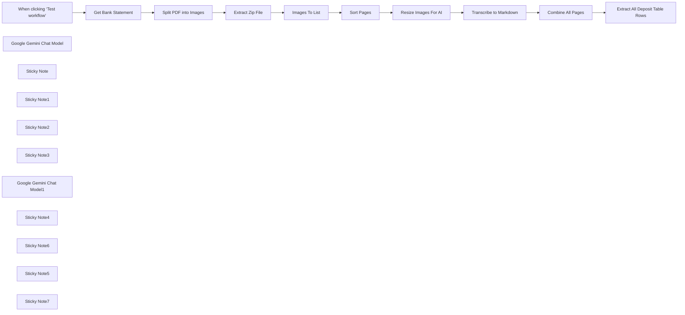

## Fluxo (.json) :

```json
{
  "meta": {
    "instanceId": "408f9fb9940c3cb18ffdef0e0150fe342d6e655c3a9fac21f0f644e8bedabcd9"
  },
  "nodes": [
    {
      "id": "490493d1-e9ac-458a-ac9e-a86048ce6169",
      "name": "When clicking ‘Test workflow’",
      "type": "n8n-nodes-base.manualTrigger",
      "position": [
        -700,
        260
      ],
      "parameters": {},
      "typeVersion": 1
    },
    {
      "id": "116f1137-632f-4021-ad0f-cf59ed1776fd",
      "name": "Google Gemini Chat Model",
      "type": "@n8n/n8n-nodes-langchain.lmChatGoogleGemini",
      "position": [
        980,
        440
      ],
      "parameters": {
        "options": {},
        "modelName": "models/gemini-1.5-pro-latest"
      },
      "credentials": {
        "googlePalmApi": {
          "id": "dSxo6ns5wn658r8N",
          "name": "Google Gemini(PaLM) Api account"
        }
      },
      "typeVersion": 1
    },
    {
      "id": "44695b4f-702c-4230-9ec3-e37447fed38e",
      "name": "Sort Pages",
      "type": "n8n-nodes-base.sort",
      "position": [
        400,
        320
      ],
      "parameters": {
        "options": {},
        "sortFieldsUi": {
          "sortField": [
            {
              "fieldName": "fileName"
            }
          ]
        }
      },
      "typeVersion": 1
    },
    {
      "id": "f2575b2c-0808-464e-b982-1eed8e0d9df7",
      "name": "Sticky Note",
      "type": "n8n-nodes-base.stickyNote",
      "position": [
        -1280,
        0
      ],
      "parameters": {
        "width": 437.0502325581392,
        "height": 430.522325581395,
        "content": "## Try Me Out!\n\n### This workflow converts a bank statement to markdown, faithfully capturing the details using the power of Vision Language Models (\"VLMs\"). The resulting markdown can then be parsed again by your standard LLM to extract data such as identifying all deposit table rows in the document.\n\nThis workflow is able to handle both downloaded PDFs as well as scanned PDFs. Be sure to protect sensitive data before running this workflow.\n\n### Need Help?\nJoin the [Discord](https://discord.com/invite/XPKeKXeB7d) or ask in the [Forum](https://community.n8n.io/)!"
      },
      "typeVersion": 1
    },
    {
      "id": "d62d7b0e-29eb-48a9-a471-4279e663c521",
      "name": "Get Bank Statement",
      "type": "n8n-nodes-base.googleDrive",
      "position": [
        -500,
        260
      ],
      "parameters": {
        "fileId": {
          "__rl": true,
          "mode": "id",
          "value": "1wS9U7MQDthj57CvEcqG_Llkr-ek6RqGA"
        },
        "options": {},
        "operation": "download"
      },
      "credentials": {
        "googleDriveOAuth2Api": {
          "id": "yOwz41gMQclOadgu",
          "name": "Google Drive account"
        }
      },
      "typeVersion": 3
    },
    {
      "id": "1329973b-a4e0-4272-9e24-3674bb9d4923",
      "name": "Split PDF into Images",
      "type": "n8n-nodes-base.httpRequest",
      "position": [
        -140,
        320
      ],
      "parameters": {
        "url": "http://stirling-pdf:8080/api/v1/convert/pdf/img",
        "method": "POST",
        "options": {},
        "sendBody": true,
        "contentType": "multipart-form-data",
        "bodyParameters": {
          "parameters": [
            {
              "name": "fileInput",
              "parameterType": "formBinaryData",
              "inputDataFieldName": "data"
            },
            {
              "name": "imageFormat",
              "value": "jpg"
            },
            {
              "name": "singleOrMultiple",
              "value": "multiple"
            },
            {
              "name": "dpi",
              "value": "300"
            }
          ]
        }
      },
      "typeVersion": 4.2
    },
    {
      "id": "4e263346-9f55-4316-a505-4a54061ccfbb",
      "name": "Extract Zip File",
      "type": "n8n-nodes-base.compression",
      "position": [
        40,
        320
      ],
      "parameters": {},
      "typeVersion": 1.1
    },
    {
      "id": "5e97072f-a7c5-45aa-99d1-3231a9230b53",
      "name": "Images To List",
      "type": "n8n-nodes-base.code",
      "position": [
        220,
        320
      ],
      "parameters": {
        "jsCode": "let results = [];\n\nfor (item of items) {\n    for (key of Object.keys(item.binary)) {\n        results.push({\n            json: {\n                fileName: item.binary[key].fileName\n            },\n            binary: {\n                data: item.binary[key],\n            }\n        });\n    }\n}\n\nreturn results;"
      },
      "typeVersion": 2
    },
    {
      "id": "62836c73-4cf7-4225-a45d-0cd62b7e227d",
      "name": "Resize Images For AI",
      "type": "n8n-nodes-base.editImage",
      "position": [
        800,
        280
      ],
      "parameters": {
        "width": 75,
        "height": 75,
        "options": {},
        "operation": "resize",
        "resizeOption": "percent"
      },
      "typeVersion": 1
    },
    {
      "id": "59fc6716-9826-4463-be33-923a8f6f33f1",
      "name": "Sticky Note1",
      "type": "n8n-nodes-base.stickyNote",
      "position": [
        -820,
        0
      ],
      "parameters": {
        "color": 7,
        "width": 546.4534883720931,
        "height": 478.89348837209275,
        "content": "## 1. Download Bank Statement PDF\n[Read more about Google Drive node](https://docs.n8n.io/integrations/builtin/app-nodes/n8n-nodes-base.googledrive)\n\nFor this demonstration, we'll pull an example bank statement off Google Drive however, you can also swap this out for other triggers such as webhook.\n\nYou can use the example bank statement created specifically for this workflow here: https://drive.google.com/file/d/1wS9U7MQDthj57CvEcqG_Llkr-ek6RqGA/view?usp=sharing"
      },
      "typeVersion": 1
    },
    {
      "id": "8e68a295-ff35-4d28-86bb-c8ea5664b3c6",
      "name": "Sticky Note2",
      "type": "n8n-nodes-base.stickyNote",
      "position": [
        -240,
        3.173953488372149
      ],
      "parameters": {
        "color": 7,
        "width": 848.0232558139535,
        "height": 533.5469767441862,
        "content": "## 2. Split PDF Pages into Seperate Images\n\nCurrently, the vision model we'll be using can't accept raw PDFs so we'll have to convert our PDF to a image in order to use it. To achieve this, we'll use the free [Stirling PDF webservice](https://stirlingpdf.io/) for convenience but if we need data privacy (recommended!), we could self-host our own [Stirling PDF instance](https://github.com/Stirling-Tools/Stirling-PDF/) instead. Alternatively, feel free to swap this service out for one of your own as long as it can convert PDFs into images!\n\nWe will ask the PDF service to return each page of our statement as separate images, which it does so as a zip file. Next steps is to just unzip the file and convert the output as a list of images."
      },
      "typeVersion": 1
    },
    {
      "id": "5286aa35-9687-4d5b-987c-79322a1ddc84",
      "name": "Sticky Note3",
      "type": "n8n-nodes-base.stickyNote",
      "position": [
        640,
        -40
      ],
      "parameters": {
        "color": 7,
        "width": 775.3441860465115,
        "height": 636.0809302325588,
        "content": "## 3. Convert PDF Pages to Markdown Using Vision Model\n[Learn more about using the Basic LLM node](https://docs.n8n.io/integrations/builtin/cluster-nodes/root-nodes/n8n-nodes-langchain.chainllm)\n\nUnlike traditional OCR, vision models (\"VLMs\") \"transcribe\" what they see so while we shouldn't expect an exact replication of a document, they may perform better making sense of complex document layouts ie. such as with horizontally stacked tables.\n \nIn this demonstration, we can transcribe our bank statement scans to markdown text for the purpose of further processing. With markdown, we can retain tables or columnar data found in the document. We'll employ two optimisations however as a workaround for token and timeout limits (1) we'll only transcribe one page at a time and (2) we'll shrink the pages just a little just enough to speed up processing but not enough to reduce our required resolution."
      },
      "typeVersion": 1
    },
    {
      "id": "49deef00-4617-4b19-a56f-08fd195dfb82",
      "name": "Google Gemini Chat Model1",
      "type": "@n8n/n8n-nodes-langchain.lmChatGoogleGemini",
      "position": [
        1760,
        480
      ],
      "parameters": {
        "options": {
          "safetySettings": {
            "values": [
              {
                "category": "HARM_CATEGORY_DANGEROUS_CONTENT",
                "threshold": "BLOCK_NONE"
              }
            ]
          }
        },
        "modelName": "models/gemini-1.5-pro-latest"
      },
      "credentials": {
        "googlePalmApi": {
          "id": "dSxo6ns5wn658r8N",
          "name": "Google Gemini(PaLM) Api account"
        }
      },
      "typeVersion": 1
    },
    {
      "id": "8e9c5d1d-d610-4bad-8feb-7ff0d5e1e64f",
      "name": "Sticky Note4",
      "type": "n8n-nodes-base.stickyNote",
      "position": [
        1440,
        80
      ],
      "parameters": {
        "color": 7,
        "width": 719.7534883720941,
        "height": 574.3134883720929,
        "content": "## 4. Extract Key Data Confidently From Statement\n[Read more about the Information Extractor](https://docs.n8n.io/integrations/builtin/cluster-nodes/root-nodes/n8n-nodes-langchain.information-extractor)\n\nWith our newly generated transcript, let's pull just the deposit line items from our statement. Processing all pages together as images may have been compute-extensive but as text, this is usually no problem at all for our LLM.\n\nFor our example bank statement PDF, the resulting extraction should be 8 table rows where a value exists in the \"deposits\" column."
      },
      "typeVersion": 1
    },
    {
      "id": "f849ad3c-69ec-443c-b7cd-ab24e210af73",
      "name": "Sticky Note6",
      "type": "n8n-nodes-base.stickyNote",
      "position": [
        -640,
        500
      ],
      "parameters": {
        "color": 5,
        "width": 366.00558139534894,
        "height": 125.41023255813957,
        "content": "### 💡 About the Example PDF\nScanned PDFs (ie. where each page is a scanned image) are a use-case where extracting PDF text content will not work. Vision models are a great solution as this workflow aims to demonstrate!"
      },
      "typeVersion": 1
    },
    {
      "id": "be6f529b-8220-4879-bd99-4333b4d764b6",
      "name": "Combine All Pages",
      "type": "n8n-nodes-base.aggregate",
      "position": [
        1580,
        320
      ],
      "parameters": {
        "options": {},
        "fieldsToAggregate": {
          "fieldToAggregate": [
            {
              "renameField": true,
              "outputFieldName": "pages",
              "fieldToAggregate": "text"
            }
          ]
        }
      },
      "typeVersion": 1
    },
    {
      "id": "2b35755c-7bae-4896-b9f9-1e9110209526",
      "name": "Sticky Note5",
      "type": "n8n-nodes-base.stickyNote",
      "position": [
        -190.1172093023256,
        280
      ],
      "parameters": {
        "width": 199.23348837209306,
        "height": 374.95069767441856,
        "content": "\n\n\n\n\n\n\n\n\n\n\n\n\n\n\n\n### Privacy Warning!\nThis example uses a public third party service. If your data is senstive, please swap this out for the self-hosted version!"
      },
      "typeVersion": 1
    },
    {
      "id": "f638ba05-9ae2-447f-82af-eb22d8b9d6f1",
      "name": "Extract All Deposit Table Rows",
      "type": "@n8n/n8n-nodes-langchain.informationExtractor",
      "position": [
        1760,
        320
      ],
      "parameters": {
        "text": "= {{ $json.pages.join('---') }}",
        "options": {
          "systemPromptTemplate": "This statement contains tables with rows showing deposit and withdrawal made to the user's account. Deposits and withdrawals are identified by have the amount in their respective columns. What are the deposits to the account found in this statement?"
        },
        "schemaType": "manual",
        "inputSchema": "{\n  \"type\": \"array\",\n  \"items\": {\n\t\"type\": \"object\",\n\t\"properties\": {\n      \"date\": { \"type\": \"string\" },\n      \"description\": { \"type\": \"string\" },\n      \"amount\": { \"type\": \"number\" }\n\t}\n  }\n}"
      },
      "typeVersion": 1
    },
    {
      "id": "cf1e8d85-5c92-469d-98af-7bdd5f469167",
      "name": "Sticky Note7",
      "type": "n8n-nodes-base.stickyNote",
      "position": [
        913.9944186046506,
        620
      ],
      "parameters": {
        "color": 5,
        "width": 498.18790697674433,
        "height": 130.35162790697677,
        "content": "### 💡 Don't use Google?\nFeel free to swap the model out for any state-of-the-art multimodal model which supports image inputs such as GPT4o(-mini) or Claude Sonnet/Opus. Note, I've found Gemini to produce the most accurate and consistent for this example use-case so no guarantees if you switch!"
      },
      "typeVersion": 1
    },
    {
      "id": "20f33372-a6b6-4f4d-987d-a94c85313fa8",
      "name": "Transcribe to Markdown",
      "type": "@n8n/n8n-nodes-langchain.chainLlm",
      "position": [
        980,
        280
      ],
      "parameters": {
        "text": "transcribe the image to markdown.",
        "messages": {
          "messageValues": [
            {
              "message": "=You help transcribe documents to markdown, keeping faithful to all text printed and visible to the best of your ability. Ensure you capture all headings, subheadings, titles as well as small print.\nFor any tables found with the document, convert them to markdown tables. If table row descriptions overflow into more than 1 row, concatanate and fit them into a single row. If two or more tables are adjacent horizontally, stack the tables vertically instead. There should be a newline after every markdown table.\nFor any graphics, use replace with a description of the image. Images of scanned checks should be converted to the phrase \"<scanned image of check>\"."
            },
            {
              "type": "HumanMessagePromptTemplate",
              "messageType": "imageBinary"
            }
          ]
        },
        "promptType": "define"
      },
      "typeVersion": 1.4
    }
  ],
  "pinData": {},
  "connections": {
    "Sort Pages": {
      "main": [
        [
          {
            "node": "Resize Images For AI",
            "type": "main",
            "index": 0
          }
        ]
      ]
    },
    "Images To List": {
      "main": [
        [
          {
            "node": "Sort Pages",
            "type": "main",
            "index": 0
          }
        ]
      ]
    },
    "Extract Zip File": {
      "main": [
        [
          {
            "node": "Images To List",
            "type": "main",
            "index": 0
          }
        ]
      ]
    },
    "Combine All Pages": {
      "main": [
        [
          {
            "node": "Extract All Deposit Table Rows",
            "type": "main",
            "index": 0
          }
        ]
      ]
    },
    "Get Bank Statement": {
      "main": [
        [
          {
            "node": "Split PDF into Images",
            "type": "main",
            "index": 0
          }
        ]
      ]
    },
    "Resize Images For AI": {
      "main": [
        [
          {
            "node": "Transcribe to Markdown",
            "type": "main",
            "index": 0
          }
        ]
      ]
    },
    "Split PDF into Images": {
      "main": [
        [
          {
            "node": "Extract Zip File",
            "type": "main",
            "index": 0
          }
        ]
      ]
    },
    "Transcribe to Markdown": {
      "main": [
        [
          {
            "node": "Combine All Pages",
            "type": "main",
            "index": 0
          }
        ]
      ]
    },
    "Google Gemini Chat Model": {
      "ai_languageModel": [
        [
          {
            "node": "Transcribe to Markdown",
            "type": "ai_languageModel",
            "index": 0
          }
        ]
      ]
    },
    "Google Gemini Chat Model1": {
      "ai_languageModel": [
        [
          {
            "node": "Extract All Deposit Table Rows",
            "type": "ai_languageModel",
            "index": 0
          }
        ]
      ]
    },
    "When clicking ‘Test workflow’": {
      "main": [
        [
          {
            "node": "Get Bank Statement",
            "type": "main",
            "index": 0
          }
        ]
      ]
    }
  }
}
```

<a id="template-963"></a>

## Template 963 - Análise de comentários e relatório para vídeos do YouTube

- **Nome:** Análise de comentários e relatório para vídeos do YouTube
- **Descrição:** Coleta detalhes do vídeo e comentários, analisa o feedback dos espectadores com IA e gera um relatório detalhado em Markdown/HTML que pode ser enviado por e-mail ou salvo no Drive.
- **Funcionalidade:** • Construção de URL da API do YouTube: Gera requisições para obter detalhes do vídeo usando uma chave de API.
• Coleta de comentários com paginação: Recupera comentários de um vídeo lidando com múltiplas páginas de resultados.
• Recuperação de detalhes do vídeo: Obtém metadados como título, descrição, estatísticas e tópicos relacionados.
• Mescla e agrega dados: Combina detalhes do vídeo, transcrição e comentários em um único objeto JSON.
• Análise com modelo de linguagem: Usa um modelo de IA (gpt-4o-mini) para analisar sentimentos, temas recorrentes e gerar recomendações acionáveis.
• Geração de relatório em Markdown: Cria um relatório estruturado conforme especificações (visão geral, análise de comentários, oportunidades, público, recomendações, palavras-chave, colaborações).
• Conversão para HTML: Transforma o Markdown gerado em HTML para envio ou armazenamento.
• Distribuição do relatório: Envia o relatório por e-mail e salva uma cópia em armazenamento na nuvem.
• Variáveis de fluxo configuráveis: Permite definir chave de API e ID do vídeo para execução dinâmica.
- **Ferramentas:** • YouTube Data API: Fonte dos detalhes do vídeo, transcrição e comentários.
• OpenAI (gpt-4o-mini): Modelo de linguagem usado para análise de comentários e geração do relatório.
• Gmail: Serviço utilizado para enviar o relatório por e-mail.
• Google Drive: Local de armazenamento para salvar o relatório gerado.

## Fluxo visual

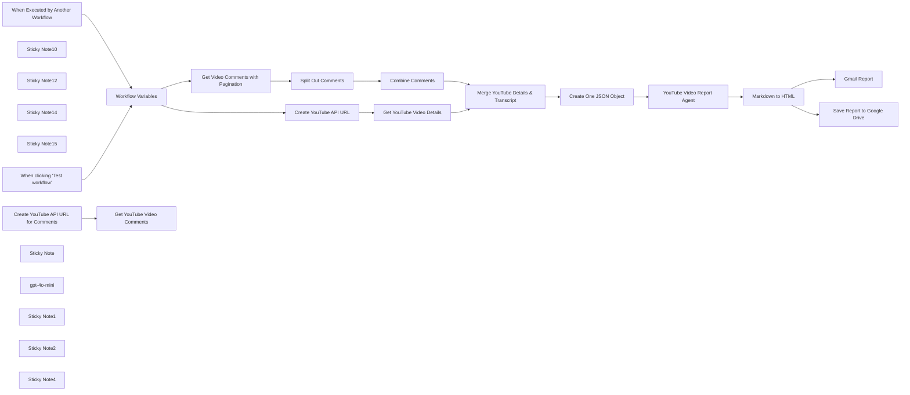

## Fluxo (.json) :

```json
{
  "id": "d23vz3qcBf6KfuZA",
  "meta": {
    "instanceId": "31e69f7f4a77bf465b805824e303232f0227212ae922d12133a0f96ffeab4fef",
    "templateCredsSetupCompleted": true
  },
  "name": "🎦🚀 YouTube Video Comment Analysis Agent",
  "tags": [],
  "nodes": [
    {
      "id": "6661e7c3-ec1e-43b0-8bc6-44abbefbbcea",
      "name": "When Executed by Another Workflow",
      "type": "n8n-nodes-base.executeWorkflowTrigger",
      "disabled": true,
      "position": [
        -160,
        80
      ],
      "parameters": {
        "inputSource": "jsonExample",
        "jsonExample": "{\n  \"query\": {\n\t\"videoId\": \"YouTube video id\"\n  }\n}"
      },
      "typeVersion": 1.1
    },
    {
      "id": "729edcc9-7eda-4ad0-b168-5e5a57cdbf6a",
      "name": "Sticky Note10",
      "type": "n8n-nodes-base.stickyNote",
      "position": [
        -300,
        -80
      ],
      "parameters": {
        "color": 7,
        "width": 1730,
        "height": 760,
        "content": "## 🛠️YouTube Video Details & Comments Processing Tool"
      },
      "typeVersion": 1
    },
    {
      "id": "454c3494-9808-475d-ad53-decd54d99783",
      "name": "Create YouTube API URL",
      "type": "n8n-nodes-base.code",
      "position": [
        500,
        100
      ],
      "parameters": {
        "jsCode": "// Define the base URL for the YouTube Data API\nconst BASE_URL = 'https://www.googleapis.com/youtube/v3/videos';\n\n// Get the first input item\nconst item = $input.first();\n\n// Extract the videoId and google_api_key from the input JSON\nconst VIDEO_ID = item.json.VIDEO_ID;\nconst GOOGLE_API_KEY = item.json.GOOGLE_API_KEY; // Dynamically retrieve API key\n\nif (!VIDEO_ID) {\n  throw new Error('The video ID parameter is empty.');\n}\n\nif (!GOOGLE_API_KEY) {\n  throw new Error('The Google API Key is missing.');\n}\n\n// Construct the API URL with the video ID and dynamically retrieved API key\nconst youtubeUrl = `${BASE_URL}?part=snippet,contentDetails,status,statistics,player,topicDetails&id=${VIDEO_ID}&key=${GOOGLE_API_KEY}`;\n\n// Return the constructed URL\nreturn [\n  {\n    json: {\n      youtubeUrl: youtubeUrl,\n    },\n  },\n];\n"
      },
      "typeVersion": 2
    },
    {
      "id": "d715b012-7842-498c-8fda-1b2812b7bc1e",
      "name": "Get YouTube Video Details",
      "type": "n8n-nodes-base.httpRequest",
      "position": [
        700,
        100
      ],
      "parameters": {
        "url": "={{ $json.youtubeUrl }}",
        "options": {}
      },
      "typeVersion": 4.2
    },
    {
      "id": "2c6598c4-11d1-4952-929e-2d08c439dee3",
      "name": "Merge YouTube Details & Transcript",
      "type": "n8n-nodes-base.merge",
      "position": [
        1200,
        120
      ],
      "parameters": {
        "mode": "combine",
        "options": {},
        "combineBy": "combineByPosition"
      },
      "typeVersion": 3
    },
    {
      "id": "60eea409-6744-4415-b9e8-e505f6406cd7",
      "name": "Create One JSON Object",
      "type": "n8n-nodes-base.aggregate",
      "position": [
        1200,
        440
      ],
      "parameters": {
        "options": {},
        "aggregate": "aggregateAllItemData"
      },
      "typeVersion": 1
    },
    {
      "id": "666e5a60-3c0e-4f70-8689-a1fdfb688ca4",
      "name": "Workflow Variables",
      "type": "n8n-nodes-base.set",
      "position": [
        160,
        260
      ],
      "parameters": {
        "options": {},
        "assignments": {
          "assignments": [
            {
              "id": "e656b8ef-4266-4f50-bd41-703b4bdb04df",
              "name": "GOOGLE_API_KEY",
              "type": "string",
              "value": "[YOUR_GOOGLE_API_KEY_GOES_HERE]"
            },
            {
              "id": "32db428d-a2e2-48a0-92c6-3880e744d140",
              "name": "VIDEO_ID",
              "type": "string",
              "value": "=c5dw_jsGNBk"
            }
          ]
        }
      },
      "typeVersion": 3.4
    },
    {
      "id": "a3d12a1c-8d9f-4afa-83a2-e61aaddc3977",
      "name": "Sticky Note12",
      "type": "n8n-nodes-base.stickyNote",
      "position": [
        60,
        20
      ],
      "parameters": {
        "width": 300,
        "height": 460,
        "content": "## 💡 Workflow Variables\nhttps://cloud.google.com/docs/get-started/access-apis\n\n- GOOGLE_API_KEY\n- VIDEO_ID - 🖐️CHANGE THIS!!!"
      },
      "typeVersion": 1
    },
    {
      "id": "fa87b1d0-368c-4d14-9138-2102df8fd285",
      "name": "Sticky Note14",
      "type": "n8n-nodes-base.stickyNote",
      "position": [
        400,
        -20
      ],
      "parameters": {
        "color": 3,
        "width": 500,
        "height": 300,
        "content": "## YouTube Video Details\nhttps://developers.google.com/youtube/v3/docs\nhttps://www.googleapis.com/youtube/v3/videos"
      },
      "typeVersion": 1
    },
    {
      "id": "846dc463-f989-4834-ab67-fc9d911b7cbd",
      "name": "Sticky Note15",
      "type": "n8n-nodes-base.stickyNote",
      "position": [
        400,
        320
      ],
      "parameters": {
        "color": 5,
        "width": 700,
        "height": 320,
        "content": "## YouTube Video Comments\nhttps://developers.google.com/youtube/v3/docs\nhttps://www.googleapis.com/youtube/v3/commentThreads"
      },
      "typeVersion": 1
    },
    {
      "id": "321c7aba-d22c-428c-ba0c-20852d80ad39",
      "name": "Combine Comments",
      "type": "n8n-nodes-base.summarize",
      "position": [
        900,
        440
      ],
      "parameters": {
        "options": {},
        "fieldsToSummarize": {
          "values": [
            {
              "field": "comments",
              "aggregation": "concatenate"
            }
          ]
        }
      },
      "typeVersion": 1
    },
    {
      "id": "28cc7f86-bd17-41a6-bf75-fc0a72b37b79",
      "name": "Split Out Comments",
      "type": "n8n-nodes-base.splitOut",
      "position": [
        700,
        440
      ],
      "parameters": {
        "options": {},
        "fieldToSplitOut": "comments"
      },
      "typeVersion": 1
    },
    {
      "id": "3a62fd7f-9185-4243-b9fd-34e0ad2046e6",
      "name": "Get YouTube Video Comments",
      "type": "n8n-nodes-base.httpRequest",
      "disabled": true,
      "position": [
        1200,
        820
      ],
      "parameters": {
        "url": "={{ $json.url }}",
        "options": {}
      },
      "typeVersion": 4.2
    },
    {
      "id": "4698558c-c50a-43b0-a027-fbbf37a69092",
      "name": "When clicking ‘Test workflow’",
      "type": "n8n-nodes-base.manualTrigger",
      "position": [
        -160,
        400
      ],
      "parameters": {},
      "typeVersion": 1
    },
    {
      "id": "ad68e98c-b870-4b7a-af3c-7d09c6bff29f",
      "name": "Create YouTube API URL for Comments",
      "type": "n8n-nodes-base.code",
      "disabled": true,
      "position": [
        980,
        820
      ],
      "parameters": {
        "jsCode": "// Define the base URL for the YouTube Data API\nconst BASE_URL = 'https://www.googleapis.com/youtube/v3/commentThreads';\n\n// Get the first input item\nconst item = $input.first();\n\n// Extract the videoId and google_api_key from the input JSON\nconst VIDEO_ID = item.json.VIDEO_ID;\nconst GOOGLE_API_KEY = item.json.GOOGLE_API_KEY; // Dynamically retrieve API key\nconst MAX_RESULTS = 100;  //item.json.MAX_RESULTS;\n\nconst url = `${BASE_URL}?part=snippet&videoId=${encodeURIComponent(VIDEO_ID)}&key=${encodeURIComponent(GOOGLE_API_KEY)}&maxResults=${encodeURIComponent(MAX_RESULTS)}`;\n\n// Now you can send this URL to the HTTP node for the GET request.\nreturn { json: { url } };\n"
      },
      "typeVersion": 2
    },
    {
      "id": "ccb00ab2-07cb-4f61-84ce-f51a45a6d2e9",
      "name": "Gmail Report",
      "type": "n8n-nodes-base.gmail",
      "position": [
        520,
        800
      ],
      "webhookId": "2bad33f7-38f8-40ca-9bcd-2f51179c8db5",
      "parameters": {
        "sendTo": "joe@example.com",
        "message": "={{ $json.html }}",
        "options": {
          "appendAttribution": false
        },
        "subject": "YouTube Video Report"
      },
      "credentials": {
        "gmailOAuth2": {
          "id": "1xpVDEQ1yx8gV022",
          "name": "Gmail account"
        }
      },
      "typeVersion": 2.1
    },
    {
      "id": "74b921e3-0a72-4af8-9b10-2488e479f999",
      "name": "Sticky Note",
      "type": "n8n-nodes-base.stickyNote",
      "position": [
        -300,
        720
      ],
      "parameters": {
        "color": 6,
        "width": 1100,
        "height": 500,
        "content": "## 📽️ YouTube Video Comment Reporting Agent"
      },
      "typeVersion": 1
    },
    {
      "id": "511827aa-aa4a-4e39-9795-cc5d8c21e661",
      "name": "gpt-4o-mini",
      "type": "@n8n/n8n-nodes-langchain.lmChatOpenAi",
      "position": [
        -120,
        1040
      ],
      "parameters": {
        "model": {
          "__rl": true,
          "mode": "list",
          "value": "gpt-4o-mini"
        },
        "options": {}
      },
      "credentials": {
        "openAiApi": {
          "id": "jEMSvKmtYfzAkhe6",
          "name": "OpenAi account"
        }
      },
      "typeVersion": 1.2
    },
    {
      "id": "006d50a7-33a1-4ca1-969e-a266b2567452",
      "name": "Sticky Note1",
      "type": "n8n-nodes-base.stickyNote",
      "position": [
        -240,
        320
      ],
      "parameters": {
        "color": 4,
        "width": 260,
        "height": 260,
        "content": "## 👍 Try Me!"
      },
      "typeVersion": 1
    },
    {
      "id": "1c054aa7-9b97-464b-a0d6-b514e4a2c7df",
      "name": "Markdown to HTML",
      "type": "n8n-nodes-base.markdown",
      "position": [
        280,
        860
      ],
      "parameters": {
        "mode": "markdownToHtml",
        "options": {},
        "markdown": "={{ $json.output }}",
        "destinationKey": "html"
      },
      "typeVersion": 1
    },
    {
      "id": "b84a52db-01d0-4711-8014-743b90b6c1b4",
      "name": "YouTube Video Report Agent",
      "type": "@n8n/n8n-nodes-langchain.agent",
      "position": [
        -100,
        860
      ],
      "parameters": {
        "text": "=This is the YouTube video detals and comments: {{ $json.data.toJsonString() }}",
        "agent": "conversationalAgent",
        "options": {
          "systemMessage": "**Objective:**  \nAnalyze the provided YouTube video data and comments to generate a **comprehensive and detailed report**. The report should help YouTube creators identify trends, viewer interests, and actionable insights for creating similar or related content that resonates with audiences. The report must provide **in-depth explanations, examples, and recommendations** to guide creators in producing engaging content.\n\n**Instructions for AI:**  \nYou are an advanced AI agent tasked with analyzing YouTube video details and comments. Your goal is to produce a **detailed and insightful report** based on the following structure. Use the provided data to extract meaningful insights, trends, and actionable recommendations. Ensure each section is thorough, well-explained, and includes examples where applicable.\n\n---\n\n### Report Structure\n\n#### 1. Video Overview\n   - Provide a summary of the video's title, description, and key topics.\n   - Highlight the video’s performance metrics (e.g., views, likes, comments) and explain what these metrics suggest about its success.\n   - Identify the primary themes or subjects discussed in the video. Explain why these themes might have resonated with viewers (e.g., relevance to current trends, novelty of the topic).\n\n#### 2. Comment Analysis\n   - **Sentiment Analysis:**  \n     Perform sentiment analysis on the comments to determine the overall tone (e.g., positive, negative, neutral). Provide percentages or counts for each sentiment category. Include examples of representative comments for each sentiment type.\n   - **Common Themes:**  \n     Identify recurring topics or questions in the comments (e.g., viewers asking for tutorials, expressing excitement, or suggesting improvements). Explain why these themes are significant and how they reflect viewer interests or needs.\n   - **Engagement Drivers:**  \n     Highlight specific aspects of the video that generated high engagement (e.g., unique features, clear explanations). Provide detailed examples of what viewers appreciated most.\n   - **Viewer Pain Points:**  \n     Extract comments that express confusion, issues, or requests for clarification. For example:\n       - Questions about technical aspects or processes covered in the video.\n       - Requests for additional details or resources.\n       - Critiques or suggestions for improvement.\n\n#### 3. Content Opportunities\n   - Based on comment analysis, suggest topics for future videos:\n     - Tutorials addressing unresolved questions (e.g., step-by-step guides on complex tasks).\n     - Deep dives into related tools or concepts mentioned in comments.\n     - Solutions for specific use cases requested by viewers.\n   - Highlight any niche interests or emerging trends observed in viewer feedback. Explain why these opportunities are valuable and how they align with audience preferences.\n   - Provide examples of potential video titles or formats (e.g., \"Top 5 Tools for Web Scraping Beginners\" or \"How to Scrape Dynamic Pages Without Coding\").\n\n#### 4. Audience Profile\n   - Infer characteristics of the audience based on their comments:\n     - Level of expertise (e.g., beginners asking basic questions vs. advanced users discussing technical details).\n     - Interests (e.g., AI tools, web scraping techniques).\n     - Geographic or cultural indicators if applicable (e.g., language used in comments).\n   - Explain how understanding this audience profile can help creators tailor their content.\n\n#### 5. Actionable Recommendations\n   - Provide a list of actionable steps for content creators with detailed explanations:\n     1. Create follow-up videos addressing common questions raised in comments. Explain how addressing these questions can build trust and engagement with viewers.\n     2. Develop content around highly praised aspects of the video. For example, if viewers appreciated a particular tool demonstration, suggest creating a series exploring similar tools.\n     3. Explore collaborations with other creators in similar niches to expand reach and tap into overlapping audiences.\n     4. Promote ethical practices (if relevant) to build credibility and trust with viewers.\n   - Include specific strategies for improving engagement (e.g., encouraging viewers to comment their questions or ideas for future videos).\n\n#### 6. Keywords and Tags\n   - Extract frequently mentioned terms from comments to suggest keywords/tags for optimization.\n   - Provide a list of suggested tags based on both video content and comment analysis.\n   - Explain how these tags can improve discoverability on YouTube.\n\n#### 7. Potential Collaborations\n   - Identify opportunities for partnerships based on viewer suggestions or related channels/topics mentioned in comments.\n   - Suggest creators or channels that align with the video's themes and audience interests.\n\n#### 8. Detailed Suggestions for Similar Content\n   - Analyze what made this video engaging (e.g., storytelling techniques, visuals, pacing) and explain how these elements can be replicated in future videos.\n   - Suggest new angles or formats that build on this video's success (e.g., live Q&A sessions, behind-the-scenes content).\n   - Recommend experimenting with different styles or approaches based on viewer feedback (e.g., shorter videos for quick tips vs. longer deep-dive tutorials).\n\n---\n\n**Data Input Format:**  \nProvide the AI with structured data containing:\n- Video details: title, description, tags, views, likes, comments.\n- Comment data: text of each comment, timestamp, likes/replies on each comment.\n\n**Output Requirements:**  \nThe AI should generate a well-organized report in natural language formatted with Markdown with clear headings and bullet points where appropriate. Ensure all insights are actionable and relevant to YouTube creators aiming to replicate the video's success. Each suggestion should include detailed explanations and examples to guide creators effectively.\n"
        },
        "promptType": "define"
      },
      "typeVersion": 1.7
    },
    {
      "id": "55ff5bae-1939-46e1-afe3-76bfeab98243",
      "name": "Sticky Note2",
      "type": "n8n-nodes-base.stickyNote",
      "position": [
        840,
        720
      ],
      "parameters": {
        "color": 5,
        "width": 580,
        "height": 320,
        "content": "## YouTube Video Comments (Alternate)\nGet latest 100 comments without pagination"
      },
      "typeVersion": 1
    },
    {
      "id": "347ff6dd-db5c-4d3a-8552-fb24cdd371e0",
      "name": "Get Video Comments with Pagination",
      "type": "n8n-nodes-base.code",
      "position": [
        500,
        440
      ],
      "parameters": {
        "jsCode": "// Define a helper function to build a query string from an object\nfunction buildQueryString(params) {\n\treturn Object.keys(params)\n\t\t.map(key => `${encodeURIComponent(key)}=${encodeURIComponent(params[key])}`)\n\t\t.join('&');\n}\n\n// Define the base URL for the YouTube Data API\nconst BASE_URL = \"https://www.googleapis.com/youtube/v3/commentThreads\";\n\n// Get the first input item\nconst item = $input.first();\n\n// Extract the videoId and google_api_key from the input JSON\nconst videoId = item.json.VIDEO_ID;\nconst apiKey = item.json.GOOGLE_API_KEY; // Dynamically retrieve API key\n\nconst comments = [];\nlet nextPageToken = undefined;\n\nwhile (true) {\n    // Construct URL parameters using an object literal\n    const params = {\n        part: \"snippet\",\n        videoId: videoId,\n        key: apiKey\n    };\n\n    if (nextPageToken) {\n        params.pageToken = nextPageToken;\n    }\n\n    // Build the full URL without using URLSearchParams\n    const queryString = buildQueryString(params);\n    const url = `${BASE_URL}?${queryString}`;\n    \n    // Set up the options for the HTTP request helper\n    const options = {\n        method: \"GET\",\n        uri: url,\n        json: true\n    };\n\n    // Use n8n's built-in HTTP request helper instead of fetch\n    const data = await this.helpers.request(options);\n\n    // console.log(data.items)\n\n    // Process each comment in the response\n    data.items.forEach(item => {\n        comments.push(item.snippet.topLevelComment.snippet.textOriginal);\n    });\n\n    // console.log(data.nextPageToken)\n\n    // Exit loop if no further pages exist\n    if (!data.nextPageToken) {\n        break;\n    }\n    nextPageToken = data.nextPageToken;\n}\n\n// Return the collected comments as an item output for n8n\nreturn [{ json: { comments } }];\n"
      },
      "typeVersion": 2
    },
    {
      "id": "91869f81-8d98-4221-9205-44e18c1ff9b8",
      "name": "Save Report to Google Drive",
      "type": "n8n-nodes-base.googleDrive",
      "position": [
        520,
        1000
      ],
      "parameters": {
        "name": "=YouTube Video Report - {{ $('Merge YouTube Details & Transcript').item.json.items.first().snippet.title }}",
        "content": "={{ $json.output }}",
        "driveId": {
          "__rl": true,
          "mode": "list",
          "value": "My Drive"
        },
        "options": {},
        "folderId": {
          "__rl": true,
          "mode": "list",
          "value": "root",
          "cachedResultName": "/ (Root folder)"
        },
        "operation": "createFromText"
      },
      "credentials": {
        "googleDriveOAuth2Api": {
          "id": "UhdXGYLTAJbsa0xX",
          "name": "Google Drive account"
        }
      },
      "typeVersion": 3
    },
    {
      "id": "3629f058-7034-4530-a6a1-f30f611a05bf",
      "name": "Sticky Note4",
      "type": "n8n-nodes-base.stickyNote",
      "position": [
        -860,
        -80
      ],
      "parameters": {
        "width": 520,
        "height": 760,
        "content": "# YouTube Video Comment Analysis Agent\n\nThis agent is designed to analyze YouTube video details and comments to generate a **comprehensive and actionable report** for content creators. The report provides insights into:\n\n- **Video performance**: Metrics such as views, likes, and comments.\n- **Audience engagement**: Identifying what resonates with viewers.\n- **Viewer feedback**: Highlighting trends, interests, and areas for improvement.\n\n### Key Features:\n1. **Sentiment Analysis**: Evaluates the tone of comments (positive, negative, neutral) to understand audience sentiment.\n2. **Recurring Themes**: Identifies common topics or questions in comments.\n3. **Engagement Drivers**: Highlights video elements that sparked high engagement.\n4. **Actionable Recommendations**: Offers specific strategies for improving content and addressing viewer needs.\n5. **Keyword Suggestions**: Extracts frequently mentioned terms for better discoverability.\n6. **Collaboration Opportunities**: Suggests potential partnerships based on viewer feedback or related channels.\n7. **Audience Profiling**: Infers audience characteristics such as expertise level and interests.\n\n### Objective:\nThe goal is to empower YouTube creators with **data-driven insights** to create engaging content that resonates with their audience while addressing viewer needs and preferences."
      },
      "typeVersion": 1
    }
  ],
  "active": false,
  "pinData": {
    "When Executed by Another Workflow": [
      {
        "json": {
          "query": {
            "videoId": "JWfNLF_g_V0"
          }
        }
      }
    ]
  },
  "settings": {
    "executionOrder": "v1"
  },
  "versionId": "929375b3-ca7e-49c3-9e7b-241864d27f62",
  "connections": {
    "gpt-4o-mini": {
      "ai_languageModel": [
        [
          {
            "node": "YouTube Video Report Agent",
            "type": "ai_languageModel",
            "index": 0
          }
        ]
      ]
    },
    "Combine Comments": {
      "main": [
        [
          {
            "node": "Merge YouTube Details & Transcript",
            "type": "main",
            "index": 1
          }
        ]
      ]
    },
    "Markdown to HTML": {
      "main": [
        [
          {
            "node": "Gmail Report",
            "type": "main",
            "index": 0
          },
          {
            "node": "Save Report to Google Drive",
            "type": "main",
            "index": 0
          }
        ]
      ]
    },
    "Split Out Comments": {
      "main": [
        [
          {
            "node": "Combine Comments",
            "type": "main",
            "index": 0
          }
        ]
      ]
    },
    "Workflow Variables": {
      "main": [
        [
          {
            "node": "Create YouTube API URL",
            "type": "main",
            "index": 0
          },
          {
            "node": "Get Video Comments with Pagination",
            "type": "main",
            "index": 0
          }
        ]
      ]
    },
    "Create One JSON Object": {
      "main": [
        [
          {
            "node": "YouTube Video Report Agent",
            "type": "main",
            "index": 0
          }
        ]
      ]
    },
    "Create YouTube API URL": {
      "main": [
        [
          {
            "node": "Get YouTube Video Details",
            "type": "main",
            "index": 0
          }
        ]
      ]
    },
    "Get YouTube Video Details": {
      "main": [
        [
          {
            "node": "Merge YouTube Details & Transcript",
            "type": "main",
            "index": 0
          }
        ]
      ]
    },
    "Get YouTube Video Comments": {
      "main": [
        []
      ]
    },
    "YouTube Video Report Agent": {
      "main": [
        [
          {
            "node": "Markdown to HTML",
            "type": "main",
            "index": 0
          }
        ]
      ]
    },
    "When Executed by Another Workflow": {
      "main": [
        [
          {
            "node": "Workflow Variables",
            "type": "main",
            "index": 0
          }
        ]
      ]
    },
    "When clicking ‘Test workflow’": {
      "main": [
        [
          {
            "node": "Workflow Variables",
            "type": "main",
            "index": 0
          }
        ]
      ]
    },
    "Get Video Comments with Pagination": {
      "main": [
        [
          {
            "node": "Split Out Comments",
            "type": "main",
            "index": 0
          }
        ]
      ]
    },
    "Merge YouTube Details & Transcript": {
      "main": [
        [
          {
            "node": "Create One JSON Object",
            "type": "main",
            "index": 0
          }
        ]
      ]
    },
    "Create YouTube API URL for Comments": {
      "main": [
        [
          {
            "node": "Get YouTube Video Comments",
            "type": "main",
            "index": 0
          }
        ]
      ]
    }
  }
}
```

<a id="template-964"></a>

## Template 964 - Análise de Phishing e Ticket no Jira

- **Nome:** Análise de Phishing e Ticket no Jira
- **Descrição:** Fluxo que captura emails de Gmail e Outlook, extrai dados, gera uma visualização do conteúdo, analisa com IA se é phishing e registra a ocorrência criando um ticket no Jira com a análise e anexando o screenshot.
- **Funcionalidade:** • Detecção e captura de novos emails (Gmail) e monitoramento de mensagens (Outlook): inicia a automação ao receber novas mensagens.
• Extração e organização de dados do email: subject, destinatário, corpo e cabeçalhos formatados.
• Geração de visualização do conteúdo do email: converte HTML em imagem para documentação e avaliação.
• Análise de phishing com IA: avalia o email e o cabeçalho, gerando um relatório de possível phishing.
• Criação de ticket no Jira com a análise: registra incidente com detalhes, subject, destinatário e a análise gerada pela IA.
• Anexo do screenshot ao ticket: adiciona a imagem do email ao ticket para referência visual.
- **Ferramentas:** • Gmail API: captura novos e-mails e inicia o fluxo.
• Microsoft Graph API: leitura de mensagens e obtenção de cabeçalhos (Outlook).
• hcti.io: geração de screenshot do conteúdo do e-mail a partir do HTML.
• OpenAI: análise automática do conteúdo e cabeçalhos para indicar phishing.
• Jira Cloud: criação de tickets e anexação de arquivos.

## Fluxo visual

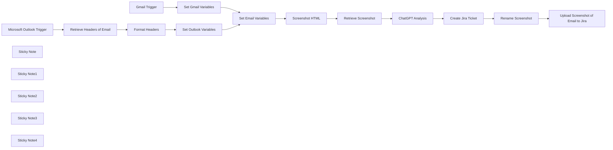

## Fluxo (.json) :

```json
{
  "meta": {
    "instanceId": "03e9d14e9196363fe7191ce21dc0bb17387a6e755dcc9acc4f5904752919dca8"
  },
  "nodes": [
    {
      "id": "1bad6bfc-9ec9-48a5-b8f7-73c4de3d08cf",
      "name": "Gmail Trigger",
      "type": "n8n-nodes-base.gmailTrigger",
      "position": [
        1480,
        160
      ],
      "parameters": {
        "simple": false,
        "filters": {},
        "options": {},
        "pollTimes": {
          "item": [
            {
              "mode": "everyMinute"
            }
          ]
        }
      },
      "credentials": {
        "gmailOAuth2": {
          "id": "kkhNhqKpZt6IUZd0",
          "name": " Gmail"
        }
      },
      "typeVersion": 1.2
    },
    {
      "id": "9ac747a1-4fd8-46ba-b4c1-75fd17aab2ed",
      "name": "Microsoft Outlook Trigger",
      "type": "n8n-nodes-base.microsoftOutlookTrigger",
      "disabled": true,
      "position": [
        1480,
        720
      ],
      "parameters": {
        "fields": [
          "body",
          "toRecipients",
          "subject",
          "bodyPreview"
        ],
        "output": "fields",
        "filters": {},
        "options": {},
        "pollTimes": {
          "item": [
            {
              "mode": "everyMinute"
            }
          ]
        }
      },
      "credentials": {
        "microsoftOutlookOAuth2Api": {
          "id": "vTCK0oVQ0WjFrI5H",
          "name": " Outlook Credential"
        }
      },
      "typeVersion": 1
    },
    {
      "id": "5bf9b0e8-b84e-44a2-aad2-45dde3e4ab1b",
      "name": "Screenshot HTML",
      "type": "n8n-nodes-base.httpRequest",
      "position": [
        2520,
        480
      ],
      "parameters": {
        "url": "https://hcti.io/v1/image",
        "method": "POST",
        "options": {},
        "sendBody": true,
        "sendQuery": true,
        "authentication": "genericCredentialType",
        "bodyParameters": {
          "parameters": [
            {
              "name": "html",
              "value": "={{ $json.htmlBody }}"
            }
          ]
        },
        "genericAuthType": "httpBasicAuth",
        "queryParameters": {
          "parameters": [
            {}
          ]
        }
      },
      "credentials": {
        "httpBasicAuth": {
          "id": "8tm8mUWmPvtmPFPk",
          "name": "hcti.io"
        }
      },
      "typeVersion": 4.2
    },
    {
      "id": "fc770d1d-6c18-4d14-8344-1dc042464df6",
      "name": "Retrieve Screenshot",
      "type": "n8n-nodes-base.httpRequest",
      "position": [
        2700,
        480
      ],
      "parameters": {
        "url": "={{ $json.url }}",
        "options": {},
        "authentication": "genericCredentialType",
        "genericAuthType": "httpBasicAuth"
      },
      "credentials": {
        "httpBasicAuth": {
          "id": "8tm8mUWmPvtmPFPk",
          "name": "hcti.io"
        }
      },
      "typeVersion": 4.2
    },
    {
      "id": "2f3e5cc0-24e8-450a-898b-71e2d6f7bb58",
      "name": "Set Outlook Variables",
      "type": "n8n-nodes-base.set",
      "position": [
        2020,
        720
      ],
      "parameters": {
        "options": {},
        "assignments": {
          "assignments": [
            {
              "id": "38bd3db2-1a8d-4c40-a2dd-336e0cc84224",
              "name": "htmlBody",
              "type": "string",
              "value": "={{ $('Microsoft Outlook Trigger').item.json.body.content }}"
            },
            {
              "id": "13bdd95b-ef02-486e-b38b-d14bd05a4a8a",
              "name": "headers",
              "type": "string",
              "value": "={{ $json}}"
            },
            {
              "id": "20566ad4-7eb7-42b1-8a0d-f8b759610f10",
              "name": "subject",
              "type": "string",
              "value": "={{ $('Microsoft Outlook Trigger').item.json.subject }}"
            },
            {
              "id": "7171998f-a5a2-4e23-946a-9c1ad75710e7",
              "name": "recipient",
              "type": "string",
              "value": "={{ $('Microsoft Outlook Trigger').item.json.toRecipients[0].emailAddress.address }}"
            },
            {
              "id": "cc262634-2470-4524-8319-abe2518a6335",
              "name": "textBody",
              "type": "string",
              "value": "={{ $('Retrieve Headers of Email').item.json.body.content }}"
            }
          ]
        }
      },
      "typeVersion": 3.4
    },
    {
      "id": "374e5b16-a666-4706-9fd2-762b2927012d",
      "name": "Set Gmail Variables",
      "type": "n8n-nodes-base.set",
      "position": [
        2040,
        160
      ],
      "parameters": {
        "options": {},
        "assignments": {
          "assignments": [
            {
              "id": "38bd3db2-1a8d-4c40-a2dd-336e0cc84224",
              "name": "htmlBody",
              "type": "string",
              "value": "={{ $json.html }}"
            },
            {
              "id": "18fbcf78-6d3c-4036-b3a2-fb5adf22176a",
              "name": "headers",
              "type": "string",
              "value": "={{ $json.headers }}"
            },
            {
              "id": "1d690098-be2a-4604-baf8-62f314930929",
              "name": "subject",
              "type": "string",
              "value": "={{ $json.subject }}"
            },
            {
              "id": "8009f00a-547f-4eb1-b52d-2e7305248885",
              "name": "recipient",
              "type": "string",
              "value": "={{ $json.to.text }}"
            },
            {
              "id": "1932e97d-b03b-4964-b8bc-8262aaaa1f7a",
              "name": "textBody",
              "type": "string",
              "value": "={{ $json.text }}"
            }
          ]
        }
      },
      "typeVersion": 3.4
    },
    {
      "id": "3166738e-d0a3-475b-8b19-51afd519ee3a",
      "name": "Retrieve Headers of Email",
      "type": "n8n-nodes-base.httpRequest",
      "position": [
        1680,
        720
      ],
      "parameters": {
        "url": "=https://graph.microsoft.com/v1.0/me/messages/{{ $json.id }}?$select=internetMessageHeaders,body",
        "options": {},
        "sendHeaders": true,
        "authentication": "predefinedCredentialType",
        "headerParameters": {
          "parameters": [
            {
              "name": "Accept",
              "value": "application/json"
            },
            {
              "name": "Prefer",
              "value": "outlook.body-content-type=\"text\""
            }
          ]
        },
        "nodeCredentialType": "microsoftOutlookOAuth2Api"
      },
      "credentials": {
        "microsoftOutlookOAuth2Api": {
          "id": "vTCK0oVQ0WjFrI5H",
          "name": " Outlook Credential"
        }
      },
      "typeVersion": 4.2
    },
    {
      "id": "25ae222c-088f-4565-98d6-803c8c1b0826",
      "name": "Format Headers",
      "type": "n8n-nodes-base.code",
      "position": [
        1860,
        720
      ],
      "parameters": {
        "jsCode": "const input = $('Retrieve Headers of Email').item.json.internetMessageHeaders;\n\nconst result = input.reduce((acc, { name, value }) => {\n if (!acc[name]) acc[name] = [];\n acc[name].push(value);\n return acc;\n}, {});\n\nreturn result;"
      },
      "typeVersion": 2
    },
    {
      "id": "8f14f267-1074-43ea-968d-26a6ab36fd7b",
      "name": "Set Email Variables",
      "type": "n8n-nodes-base.set",
      "position": [
        2360,
        480
      ],
      "parameters": {
        "options": {},
        "includeOtherFields": true
      },
      "typeVersion": 3.4
    },
    {
      "id": "45d156aa-91f4-483c-91d4-c9de4a4f595d",
      "name": "ChatGPT Analysis",
      "type": "@n8n/n8n-nodes-langchain.openAi",
      "position": [
        3100,
        480
      ],
      "parameters": {
        "text": "=Describe this image. Determine if the email could be a phishing email. The message headers are as follows:\n{{ $('Set Email Variables').item.json.headers }}\n\nFormat the response for Jira who uses a wiki-style renderer. Do not include ``` around your response.",
        "modelId": {
          "__rl": true,
          "mode": "list",
          "value": "chatgpt-4o-latest",
          "cachedResultName": "CHATGPT-4O-LATEST"
        },
        "options": {
          "maxTokens": 1500
        },
        "resource": "image",
        "inputType": "base64",
        "operation": "analyze"
      },
      "credentials": {
        "openAiApi": {
          "id": "76",
          "name": "OpenAi account"
        }
      },
      "typeVersion": 1.6
    },
    {
      "id": "62ca591b-6627-496c-96a7-95cb0081480d",
      "name": "Create Jira Ticket",
      "type": "n8n-nodes-base.jira",
      "position": [
        3500,
        480
      ],
      "parameters": {
        "project": {
          "__rl": true,
          "mode": "list",
          "value": "10001",
          "cachedResultName": "Support"
        },
        "summary": "=Phishing Email Reported: \"{{ $('Set Email Variables').item.json.subject }}\"",
        "issueType": {
          "__rl": true,
          "mode": "list",
          "value": "10008",
          "cachedResultName": "Task"
        },
        "additionalFields": {
          "description": "=A phishing email was reported by {{ $('Set Email Variables').item.json.recipient }} with the subject line \"{{ $('Set Email Variables').item.json.subject }}\" and body:\n{{ $('Set Email Variables').item.json.textBody }}\n\\\\\n\\\\\n\\\\\nh2. Here is ChatGPT's analysis of the email:\n{{ $json.content }}"
        }
      },
      "credentials": {
        "jiraSoftwareCloudApi": {
          "id": "BZmmGUrNIsgM9fDj",
          "name": "New Jira Cloud"
        }
      },
      "typeVersion": 1
    },
    {
      "id": "071380c8-8070-4f8f-86c6-87c4ee3bc261",
      "name": "Rename Screenshot",
      "type": "n8n-nodes-base.code",
      "position": [
        3680,
        480
      ],
      "parameters": {
        "mode": "runOnceForEachItem",
        "jsCode": "$('Retrieve Screenshot').item.binary.data.fileName = 'emailScreenshot.png'\n\nreturn $('Retrieve Screenshot').item;"
      },
      "typeVersion": 2
    },
    {
      "id": "05c57490-c1ee-48f0-9e38-244c9a995e22",
      "name": "Upload Screenshot of Email to Jira",
      "type": "n8n-nodes-base.jira",
      "position": [
        3860,
        480
      ],
      "parameters": {
        "issueKey": "={{ $('Create Jira Ticket').item.json.key }}",
        "resource": "issueAttachment"
      },
      "credentials": {
        "jiraSoftwareCloudApi": {
          "id": "BZmmGUrNIsgM9fDj",
          "name": "New Jira Cloud"
        }
      },
      "typeVersion": 1
    },
    {
      "id": "be02770d-a943-41f5-98a9-5c433a6a3dbf",
      "name": "Sticky Note",
      "type": "n8n-nodes-base.stickyNote",
      "position": [
        1420,
        -107.36679523834897
      ],
      "parameters": {
        "color": 7,
        "width": 792.3026315789474,
        "height": 426.314163659402,
        "content": "\n## Gmail Integration and Data Extraction\n\nThis section of the workflow connects to a Gmail account using the **Gmail Trigger** node, capturing incoming emails in real-time, with checks performed every minute. Once an email is detected, its key components—such as the subject, recipient, body, and headers—are extracted and assigned to variables using the **Set Gmail Variables** node. These variables are structured for subsequent analysis and processing in later steps."
      },
      "typeVersion": 1
    },
    {
      "id": "c1d2f691-669a-46de-9ef8-59ce4e6980c5",
      "name": "Sticky Note1",
      "type": "n8n-nodes-base.stickyNote",
      "position": [
        1420,
        380.6918768014301
      ],
      "parameters": {
        "color": 7,
        "width": 792.3026315789474,
        "height": 532.3344389880435,
        "content": "\n## Microsoft Outlook Integration and Email Header Processing\n\nThis section connects to a Microsoft Outlook account to monitor incoming emails using the **Microsoft Outlook Trigger** node, which checks for new messages every minute. Emails are then processed to retrieve detailed headers and body content via the **Retrieve Headers of Email** node. The headers are structured into a user-friendly format using the **Format Headers** code node, ensuring clarity for further analysis. Key details, including the email's subject, recipient, and body content, are assigned to variables with the **Set Outlook Variables** node for streamlined integration into subsequent workflow steps."
      },
      "typeVersion": 1
    },
    {
      "id": "c189e2e0-9f51-4bc0-a483-8b7f0528be70",
      "name": "Sticky Note2",
      "type": "n8n-nodes-base.stickyNote",
      "position": [
        2287.3684210526317,
        46.18421052631584
      ],
      "parameters": {
        "color": 7,
        "width": 580.4605263157906,
        "height": 615.460526315789,
        "content": "\n## HTML Screenshot Generation and Email Visualization\n\nThis section processes an email’s HTML content to create a visual representation, useful for documentation or phishing detection workflows. The **Set Email Variables** node organizes the email's HTML body into a format ready for processing. The **Screenshot HTML** node sends this HTML content to the **hcti.io** API, which generates a screenshot of the email's layout. The **Retrieve Screenshot** node then fetches the image URL for further use in the workflow. This setup ensures that the email's appearance is preserved in a visually accessible format, simplifying review and reporting. Keep in mind however that this exposes the email content to a third party. If you self host n8n, you can deploy a cli tool to rasterize locally instead."
      },
      "typeVersion": 1
    },
    {
      "id": "9076f9e9-f4fb-409a-9580-1ae459094c31",
      "name": "Sticky Note3",
      "type": "n8n-nodes-base.stickyNote",
      "position": [
        2880,
        123.72476075009968
      ],
      "parameters": {
        "color": 7,
        "width": 507.82894736842223,
        "height": 537.9199760920052,
        "content": "\n## AI-Powered Email Analysis with ChatGPT\n\nThis section leverages AI to analyze email content and headers for phishing indicators. The **ChatGPT Analysis** node utilizes the ChatGPT-4 model to review the email screenshot and associated metadata, including message headers. It generates a detailed report indicating whether the email might be a phishing attempt. The output is formatted specifically for Jira’s wiki-style renderer, making it ready for seamless integration into ticketing workflows. This ensures thorough and automated email threat assessments."
      },
      "typeVersion": 1
    },
    {
      "id": "ca2488af-e787-4675-802a-8b4f2d845376",
      "name": "Sticky Note4",
      "type": "n8n-nodes-base.stickyNote",
      "position": [
        3400,
        122.88662032580646
      ],
      "parameters": {
        "color": 7,
        "width": 692.434210526317,
        "height": 529.5475902005091,
        "content": "\n## Automated Jira Ticket Creation for Phishing Reports\n\nThis section streamlines the process of reporting phishing emails by automatically creating detailed Jira tickets. The **Create Jira Ticket** node compiles email information, including the subject, recipient, body text, and ChatGPT's phishing analysis, into a structured ticket. The **Rename Screenshot** node ensures that the email screenshot file is appropriately labeled for attachment. Finally, the **Upload Screenshot of Email to Jira** node attaches the email’s visual representation to the ticket, providing additional context for the security team. This integration ensures that phishing reports are logged with all necessary details, enabling efficient tracking and resolution."
      },
      "typeVersion": 1
    }
  ],
  "pinData": {},
  "connections": {
    "Gmail Trigger": {
      "main": [
        [
          {
            "node": "Set Gmail Variables",
            "type": "main",
            "index": 0
          }
        ]
      ]
    },
    "Format Headers": {
      "main": [
        [
          {
            "node": "Set Outlook Variables",
            "type": "main",
            "index": 0
          }
        ]
      ]
    },
    "Screenshot HTML": {
      "main": [
        [
          {
            "node": "Retrieve Screenshot",
            "type": "main",
            "index": 0
          }
        ]
      ]
    },
    "ChatGPT Analysis": {
      "main": [
        [
          {
            "node": "Create Jira Ticket",
            "type": "main",
            "index": 0
          }
        ]
      ]
    },
    "Rename Screenshot": {
      "main": [
        [
          {
            "node": "Upload Screenshot of Email to Jira",
            "type": "main",
            "index": 0
          }
        ]
      ]
    },
    "Create Jira Ticket": {
      "main": [
        [
          {
            "node": "Rename Screenshot",
            "type": "main",
            "index": 0
          }
        ]
      ]
    },
    "Retrieve Screenshot": {
      "main": [
        [
          {
            "node": "ChatGPT Analysis",
            "type": "main",
            "index": 0
          }
        ]
      ]
    },
    "Set Email Variables": {
      "main": [
        [
          {
            "node": "Screenshot HTML",
            "type": "main",
            "index": 0
          }
        ]
      ]
    },
    "Set Gmail Variables": {
      "main": [
        [
          {
            "node": "Set Email Variables",
            "type": "main",
            "index": 0
          }
        ]
      ]
    },
    "Set Outlook Variables": {
      "main": [
        [
          {
            "node": "Set Email Variables",
            "type": "main",
            "index": 0
          }
        ]
      ]
    },
    "Microsoft Outlook Trigger": {
      "main": [
        [
          {
            "node": "Retrieve Headers of Email",
            "type": "main",
            "index": 0
          }
        ]
      ]
    },
    "Retrieve Headers of Email": {
      "main": [
        [
          {
            "node": "Format Headers",
            "type": "main",
            "index": 0
          }
        ]
      ]
    }
  }
}
```

<a id="template-965"></a>

## Template 965 - Notificação de custos de projeto ausentes

- **Nome:** Notificação de custos de projeto ausentes
- **Descrição:** Envia notificações por e-mail quando existem projetos ativos externos sem custo orçamentado, agrupando por empresa e centro de custo.
- **Funcionalidade:** • Agendamento semanal: inicia o processo automaticamente em um horário programado (semanalmente às 08:00).
• Consulta ao banco de dados: executa uma query que identifica projetos com status 'Open', tipo 'External', ativos e com budgeted_project_cost = 0, agrupando por empresa e centro de custo e contando projetos por grupo.
• Roteamento por centro de custo: verifica o campo do centro de custo padrão e direciona o fluxo para diferentes caminhos conforme o valor (ex.: Cost Center A, B, C, D).
• Envio de e-mail HTML personalizado: envia mensagens em HTML contendo o nome do centro de custo e a quantidade de projetos com custo ausente, para os destinatários definidos.
• Tratamento de não correspondência: registros cujo centro de custo não corresponde a nenhum dos ramos configurados não geram envio de e-mail.
- **Ferramentas:** • MySQL: banco de dados relacional usado para consultar a tabela de projetos (tabProject) e obter os agrupamentos e contagens necessários.
• Microsoft Outlook: serviço de e-mail utilizado para enviar as notificações em formato HTML aos destinatários.

## Fluxo visual

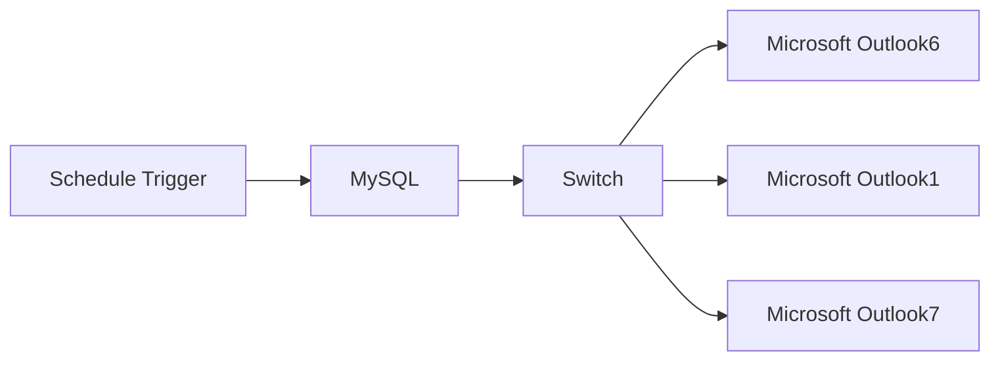

## Fluxo (.json) :

```json
{
  "meta": {
    "instanceId": "4359279a248a64f23ddf72d3bc2de4dead8a687e643e9296f8a007dd65120396"
  },
  "nodes": [
    {
      "id": "59b786fe-8e45-4616-aa45-9748df144c3a",
      "name": "MySQL",
      "type": "n8n-nodes-base.mySql",
      "position": [
        -80,
        220
      ],
      "parameters": {
        "query": "SELECT \n    company,\n    cost_center AS default_cost_center,\n    COUNT(*) AS project_count\nFROM \n    tabProject\nWHERE \n    status = 'Open' \n    AND project_type = 'External'\n    AND is_active = 'Yes'\n    AND budgeted_project_cost = 0\n    \nGROUP BY \n    company, cost_center\nORDER BY \n    company, project_count DESC;\n",
        "options": {},
        "operation": "executeQuery"
      },
      "typeVersion": 2.4
    },
    {
      "id": "48c20822-9f2e-4108-8bfb-b300689a9724",
      "name": "Schedule Trigger",
      "type": "n8n-nodes-base.scheduleTrigger",
      "position": [
        -360,
        220
      ],
      "parameters": {
        "rule": {
          "interval": [
            {
              "field": "weeks",
              "triggerAtHour": 8
            }
          ]
        }
      },
      "typeVersion": 1.2
    },
    {
      "id": "3757860b-b7a0-4617-a398-37ac42f1acea",
      "name": "Switch",
      "type": "n8n-nodes-base.switch",
      "position": [
        180,
        200
      ],
      "parameters": {
        "rules": {
          "values": [
            {
              "outputKey": "A",
              "conditions": {
                "options": {
                  "version": 2,
                  "leftValue": "",
                  "caseSensitive": true,
                  "typeValidation": "strict"
                },
                "combinator": "and",
                "conditions": [
                  {
                    "id": "423062ba-e116-4e22-aa00-29107e8c24ce",
                    "operator": {
                      "type": "string",
                      "operation": "equals"
                    },
                    "leftValue": "={{ $json.default_cost_center }}",
                    "rightValue": "Cost Center A"
                  }
                ]
              },
              "renameOutput": true
            },
            {
              "outputKey": "B",
              "conditions": {
                "options": {
                  "version": 2,
                  "leftValue": "",
                  "caseSensitive": true,
                  "typeValidation": "strict"
                },
                "combinator": "and",
                "conditions": [
                  {
                    "id": "e065ab84-61fd-4e6c-8835-92d08be3e359",
                    "operator": {
                      "name": "filter.operator.equals",
                      "type": "string",
                      "operation": "equals"
                    },
                    "leftValue": "={{ $json.default_cost_center }}",
                    "rightValue": "Cost Center B"
                  }
                ]
              },
              "renameOutput": true
            },
            {
              "outputKey": "C",
              "conditions": {
                "options": {
                  "version": 2,
                  "leftValue": "",
                  "caseSensitive": true,
                  "typeValidation": "strict"
                },
                "combinator": "and",
                "conditions": [
                  {
                    "id": "0ef8ce35-2507-4ff4-8dea-11380262098e",
                    "operator": {
                      "name": "filter.operator.equals",
                      "type": "string",
                      "operation": "equals"
                    },
                    "leftValue": "={{ $json.default_cost_center }}",
                    "rightValue": "=COST CENTER C"
                  }
                ]
              },
              "renameOutput": true
            },
            {
              "outputKey": "D",
              "conditions": {
                "options": {
                  "version": 2,
                  "leftValue": "",
                  "caseSensitive": true,
                  "typeValidation": "strict"
                },
                "combinator": "and",
                "conditions": [
                  {
                    "id": "9152e548-cca9-441c-b4b6-8903f449dc2b",
                    "operator": {
                      "name": "filter.operator.equals",
                      "type": "string",
                      "operation": "equals"
                    },
                    "leftValue": "={{ $json.default_cost_center }}",
                    "rightValue": "Cost Center D"
                  }
                ]
              },
              "renameOutput": true
            }
          ]
        },
        "options": {}
      },
      "typeVersion": 3.2
    },
    {
      "id": "bf8fd5f4-e107-44e8-af1a-be32596d664e",
      "name": "Microsoft Outlook6",
      "type": "n8n-nodes-base.microsoftOutlook",
      "position": [
        560,
        -20
      ],
      "webhookId": "dce42873-919a-4dac-9f9d-792b0a39b7f7",
      "parameters": {
        "subject": "Project Cost Missing",
        "bodyContent": "==<!DOCTYPE html>\n<html lang=\"en\">\n<head>\n  <meta charset=\"UTF-8\">\n  <title>Missing Budgeted Cost Notification</title>\n  <style>\n    body { font-family: Arial, sans-serif; background-color: #f4f4f4; margin: 0; padding: 0; }\n    .email-container { max-width: 600px; margin: 20px auto; background-color: #ffffff; border-radius: 8px; overflow: hidden; }\n    .email-header { background-color: #007BFF; color: #ffffff; padding: 20px; text-align: center; font-size: 18px; font-weight: bold; }\n    .email-body { padding: 20px; font-size: 16px; color: #333333; }\n    .email-body strong { color: #007BFF; }\n    .email-footer { padding: 10px 20px; font-size: 14px; color: #555555; text-align: left; }\n  </style>\n</head>\n<body>\n  <div class=\"email-container\">\n    <div class=\"email-header\">\n      {{ $json.default_cost_center }} - Project Data Missing\n    </div>\n    <div class=\"email-body\">\n      Dear {{ $json.default_cost_center }} Team,<br><br>\n      There are <strong>{{ $json.project_count }}</strong> active projects with missing <strong>Budgeted Cost</strong>.<br>\n      Kindly coordinate with the <strong>Accounts Team</strong> to update the missing values for accurate tracking.<br><br>\n      Your timely attention is appreciated.<br><br>\n      Regards,\n    </div>\n    <div class=\"email-footer\">\n      <strong>Amjid Ali</strong><br>\n      Automation Demo – n8n\n    </div>\n  </div>\n</body>\n</html>\n",
        "toRecipients": "amjid@amjidali.com",
        "additionalFields": {
          "bodyContentType": "html"
        }
      },
      "typeVersion": 2
    },
    {
      "id": "e4ffe557-0862-401e-9f65-7195a72db1d9",
      "name": "Microsoft Outlook1",
      "type": "n8n-nodes-base.microsoftOutlook",
      "position": [
        560,
        160
      ],
      "webhookId": "ea8b2720-cbb6-4712-b9ff-4b443958d0d0",
      "parameters": {
        "subject": "Projects Cost Missing",
        "bodyContent": "==<!DOCTYPE html>\n<html lang=\"en\">\n<head>\n  <meta charset=\"UTF-8\">\n  <title>Missing Budgeted Cost Notification</title>\n  <style>\n    body { font-family: Arial, sans-serif; background-color: #f4f4f4; margin: 0; padding: 0; }\n    .email-container { max-width: 600px; margin: 20px auto; background-color: #ffffff; border-radius: 8px; overflow: hidden; }\n    .email-header { background-color: #007BFF; color: #ffffff; padding: 20px; text-align: center; font-size: 18px; font-weight: bold; }\n    .email-body { padding: 20px; font-size: 16px; color: #333333; }\n    .email-body strong { color: #007BFF; }\n    .email-footer { padding: 10px 20px; font-size: 14px; color: #555555; text-align: left; }\n  </style>\n</head>\n<body>\n  <div class=\"email-container\">\n    <div class=\"email-header\">\n      {{ $json.default_cost_center }} - Project Data Missing\n    </div>\n    <div class=\"email-body\">\n      Dear {{ $json.default_cost_center }} Team,<br><br>\n      There are <strong>{{ $json.project_count }}</strong> active projects with missing <strong>Budgeted Cost</strong>.<br>\n      Kindly coordinate with the <strong>Accounts Team</strong> to update the missing values for accurate tracking.<br><br>\n      Your timely attention is appreciated.<br><br>\n      Regards,\n    </div>\n    <div class=\"email-footer\">\n      <strong>Amjid Ali</strong><br>\n      Automation Demo – n8n\n    </div>\n  </div>\n</body>\n</html>\n",
        "toRecipients": "amjid@amjidali.com",
        "additionalFields": {
          "bodyContentType": "html"
        }
      },
      "typeVersion": 2
    },
    {
      "id": "e0722ebd-1e05-4efe-a27a-e4db193dec80",
      "name": "Microsoft Outlook7",
      "type": "n8n-nodes-base.microsoftOutlook",
      "position": [
        560,
        380
      ],
      "webhookId": "46e6a678-d922-4dfc-b51d-864477e6b01e",
      "parameters": {
        "subject": "Projects Cost Missing",
        "bodyContent": "==<!DOCTYPE html>\n<html lang=\"en\">\n<head>\n  <meta charset=\"UTF-8\">\n  <title>Missing Budgeted Cost Notification</title>\n  <style>\n    body { font-family: Arial, sans-serif; background-color: #f4f4f4; margin: 0; padding: 0; }\n    .email-container { max-width: 600px; margin: 20px auto; background-color: #ffffff; border-radius: 8px; overflow: hidden; }\n    .email-header { background-color: #007BFF; color: #ffffff; padding: 20px; text-align: center; font-size: 18px; font-weight: bold; }\n    .email-body { padding: 20px; font-size: 16px; color: #333333; }\n    .email-body strong { color: #007BFF; }\n    .email-footer { padding: 10px 20px; font-size: 14px; color: #555555; text-align: left; }\n  </style>\n</head>\n<body>\n  <div class=\"email-container\">\n    <div class=\"email-header\">\n      {{ $json.default_cost_center }} - Project Data Missing\n    </div>\n    <div class=\"email-body\">\n      Dear {{ $json.default_cost_center }} Team,<br><br>\n      There are <strong>{{ $json.project_count }}</strong> active projects with missing <strong>Budgeted Cost</strong>.<br>\n      Kindly coordinate with the <strong>Accounts Team</strong> to update the missing values for accurate tracking.<br><br>\n      Your timely attention is appreciated.<br><br>\n      Regards,\n    </div>\n    <div class=\"email-footer\">\n      <strong>Amjid Ali</strong><br>\n      Automation Demo – n8n\n    </div>\n  </div>\n</body>\n</html>\n",
        "toRecipients": "amjid@amjidali.com",
        "additionalFields": {
          "bodyContentType": "html"
        }
      },
      "typeVersion": 2
    }
  ],
  "pinData": {},
  "connections": {
    "MySQL": {
      "main": [
        [
          {
            "node": "Switch",
            "type": "main",
            "index": 0
          }
        ]
      ]
    },
    "Switch": {
      "main": [
        [
          {
            "node": "Microsoft Outlook6",
            "type": "main",
            "index": 0
          }
        ],
        [
          {
            "node": "Microsoft Outlook1",
            "type": "main",
            "index": 0
          }
        ],
        [
          {
            "node": "Microsoft Outlook7",
            "type": "main",
            "index": 0
          }
        ],
        []
      ]
    },
    "Schedule Trigger": {
      "main": [
        [
          {
            "node": "MySQL",
            "type": "main",
            "index": 0
          }
        ]
      ]
    }
  }
}
```

<a id="template-966"></a>

## Template 966 - Análise de Pitch Decks com IA

- **Nome:** Análise de Pitch Decks com IA
- **Descrição:** Este fluxo automatiza o processamento de pitch decks armazenados no Airtable, convertendo PDFs em Markdown, extraindo dados-chave, atualizando o registro correspondente e construindo um índice vetorial para permitir perguntas e respostas sobre o pitch deck usando IA.
- **Funcionalidade:** • Detecção de novos pitch decks no Airtable e disparo do processamento.
• Download do PDF a partir do registro File.
• Conversão do PDF em imagens via serviço externo.
• Transcrição das imagens para Markdown mantendo títulos, tabelas e gráficos.
• Agrupamento das páginas em um único texto para análise.
• Geração de relatório com dados estruturados (Executive Summary, métricas) e atualização do Airtable.
• Criação de embeddings e indexação no repositório vetorial para buscas rápidas.
• Atualização de vetores existentes antes de inserir novos dados.
• Chatbot de perguntas sobre o pitch deck que utiliza o índice vetorial e memória de contexto.
- **Ferramentas:** • Airtable: base de dados para gerenciar pitch decks, triggers e atualizações.
• Stirling PDF: serviço para converter PDFs em imagens para processamento.
• Qdrant: armazenamento vetorial para suportar buscas e perguntas sobre o pitch deck.
• OpenAI API: modelos de linguagem e embeddings usados para transcrição, extração, resumos e perguntas.

## Fluxo visual

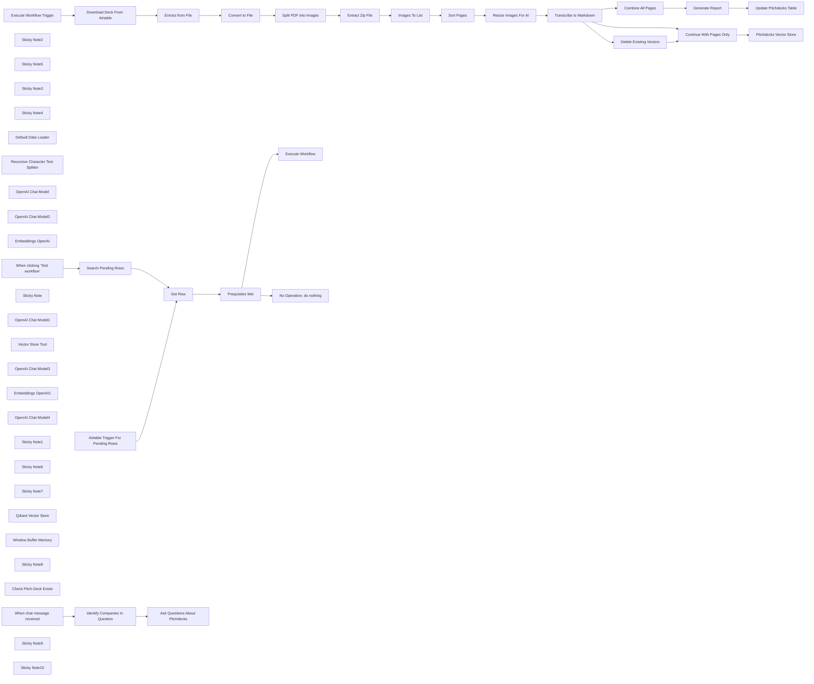

## Fluxo (.json) :

```json
{
  "meta": {
    "instanceId": "408f9fb9940c3cb18ffdef0e0150fe342d6e655c3a9fac21f0f644e8bedabcd9"
  },
  "nodes": [
    {
      "id": "9ce4eadf-7eef-43bd-bbe9-e25bc5a42df7",
      "name": "When clicking ‘Test workflow’",
      "type": "n8n-nodes-base.manualTrigger",
      "position": [
        -1076,
        594
      ],
      "parameters": {},
      "typeVersion": 1
    },
    {
      "id": "b8d12c00-4004-44b4-b793-e9608fd36d5d",
      "name": "Sort Pages",
      "type": "n8n-nodes-base.sort",
      "position": [
        1440,
        777
      ],
      "parameters": {
        "options": {},
        "sortFieldsUi": {
          "sortField": [
            {
              "fieldName": "fileName"
            }
          ]
        }
      },
      "typeVersion": 1
    },
    {
      "id": "27520282-af95-415e-a3d3-3cf9e4373813",
      "name": "Split PDF into Images",
      "type": "n8n-nodes-base.httpRequest",
      "position": [
        900,
        777
      ],
      "parameters": {
        "url": "http://stirlingpdf.io/api/v1/convert/pdf/img",
        "method": "POST",
        "options": {},
        "sendBody": true,
        "contentType": "multipart-form-data",
        "bodyParameters": {
          "parameters": [
            {
              "name": "fileInput",
              "parameterType": "formBinaryData",
              "inputDataFieldName": "data"
            },
            {
              "name": "imageFormat",
              "value": "jpg"
            },
            {
              "name": "singleOrMultiple",
              "value": "multiple"
            },
            {
              "name": "dpi",
              "value": "300"
            }
          ]
        }
      },
      "typeVersion": 4.2
    },
    {
      "id": "e3862292-3261-4876-b53e-acea88810afb",
      "name": "Extract Zip File",
      "type": "n8n-nodes-base.compression",
      "position": [
        1080,
        777
      ],
      "parameters": {},
      "typeVersion": 1.1
    },
    {
      "id": "2d949fb6-980f-409a-9b71-bf12927eaa6d",
      "name": "Images To List",
      "type": "n8n-nodes-base.code",
      "position": [
        1260,
        777
      ],
      "parameters": {
        "jsCode": "let results = [];\n\nfor (item of items) {\n    for (key of Object.keys(item.binary)) {\n        results.push({\n            json: {\n                fileName: item.binary[key].fileName\n            },\n            binary: {\n                data: item.binary[key],\n            }\n        });\n    }\n}\n\nreturn results;"
      },
      "typeVersion": 2
    },
    {
      "id": "115c202b-2496-4218-b54d-a6f8974b7698",
      "name": "Sticky Note2",
      "type": "n8n-nodes-base.stickyNote",
      "position": [
        800,
        460
      ],
      "parameters": {
        "color": 7,
        "width": 848.0232558139535,
        "height": 533.5469767441862,
        "content": "## 3. Split PDF Pages into Seperate Images\n\nCurrently, the vision model we'll be using can't accept raw PDFs so we'll have to convert our PDF to a image in order to use it. To achieve this, we'll use the free [Stirling PDF webservice](https://stirlingpdf.io/) for convenience but if we need data privacy (recommended!), we could self-host our own [Stirling PDF instance](https://github.com/Stirling-Tools/Stirling-PDF/) instead. Alternatively, feel free to swap this service out for one of your own as long as it can convert PDFs into images!\n\nWe will ask the PDF service to return each page of our statement as separate images, which it does so as a zip file. Next steps is to just unzip the file and convert the output as a list of images."
      },
      "typeVersion": 1
    },
    {
      "id": "186ba0b4-1857-457e-bc5a-e3f9e770a2bd",
      "name": "Sticky Note5",
      "type": "n8n-nodes-base.stickyNote",
      "position": [
        850,
        737
      ],
      "parameters": {
        "width": 199.23348837209306,
        "height": 374.95069767441856,
        "content": "\n\n\n\n\n\n\n\n\n\n\n\n\n\n\n\n### Privacy Warning!\nThis example uses a public third party service. If your data is senstive, please swap this out for the self-hosted version!"
      },
      "typeVersion": 1
    },
    {
      "id": "820bd16b-5311-40ba-9e75-3ca195a9a59b",
      "name": "Resize Images For AI",
      "type": "n8n-nodes-base.editImage",
      "position": [
        1840,
        820
      ],
      "parameters": {
        "width": 50,
        "height": 50,
        "options": {},
        "operation": "resize",
        "resizeOption": "percent"
      },
      "typeVersion": 1
    },
    {
      "id": "7f31fbf2-9ec1-42f9-83df-3a8e3f08e1ec",
      "name": "Sticky Note3",
      "type": "n8n-nodes-base.stickyNote",
      "position": [
        1680,
        500
      ],
      "parameters": {
        "color": 7,
        "width": 775.3441860465115,
        "height": 636.0809302325588,
        "content": "## 4. Convert PDF Pages to Markdown Using Vision Model\n[Learn more about using the Basic LLM node](https://docs.n8n.io/integrations/builtin/cluster-nodes/root-nodes/n8n-nodes-langchain.chainllm)\n\nPitch decks are fundamentally extravagant sales documents and as such, are incredibly varied in how they are styled, structured and presented. Traditional OCR has often struggled with parsing these kinds of documents as layers and graphical elements and when extracting their contents typically yields poor results; either garbled or missing texts.\n\nMultimodal LLMs are a solution as they use AI vision to \"read\" the pitch deck and can reason about it's layout and intent. Images can be understood and described with context and charts and graphs can also be interpreted. In this demonstration, we'll ask our LLM to transcribe each page in the pitch deck into markdown ensuring it also describes any images or charts it sees."
      },
      "typeVersion": 1
    },
    {
      "id": "187e350c-6526-43d6-b314-aa376a123694",
      "name": "Sticky Note4",
      "type": "n8n-nodes-base.stickyNote",
      "position": [
        2500,
        475.5341395348837
      ],
      "parameters": {
        "color": 7,
        "width": 814.0329302325591,
        "height": 518.7793488372092,
        "content": "## 5. Extract Key Data Confidently From Statement\n[Read more about the Information Extractor](https://docs.n8n.io/integrations/builtin/cluster-nodes/root-nodes/n8n-nodes-langchain.information-extractor)\n\nWith our generated markdown, we can use an information extractor node to extract required information or data point from the pitch deck. This can be useful to generate reports and later compare pitch decks against each other. Here, we'll retain the extracted data by updating the relevant row in our Airtable database."
      },
      "typeVersion": 1
    },
    {
      "id": "925a5cea-0c53-4756-94e8-c01bdf38dea7",
      "name": "Combine All Pages",
      "type": "n8n-nodes-base.aggregate",
      "position": [
        2580,
        680
      ],
      "parameters": {
        "options": {},
        "fieldsToAggregate": {
          "fieldToAggregate": [
            {
              "renameField": true,
              "outputFieldName": "pages",
              "fieldToAggregate": "text"
            }
          ]
        }
      },
      "typeVersion": 1
    },
    {
      "id": "5f521f14-7e0e-48cc-923f-e920343b4027",
      "name": "Default Data Loader",
      "type": "@n8n/n8n-nodes-langchain.documentDefaultDataLoader",
      "position": [
        3100,
        1500
      ],
      "parameters": {
        "options": {
          "metadata": {
            "metadataValues": [
              {
                "name": "name",
                "value": "={{ $('Execute Workflow Trigger').first().json.Name }}"
              }
            ]
          }
        },
        "jsonData": "={{ $json.text }}",
        "jsonMode": "expressionData"
      },
      "typeVersion": 1
    },
    {
      "id": "dad5928a-872d-43d2-ad17-5ac98ac6fb27",
      "name": "Recursive Character Text Splitter",
      "type": "@n8n/n8n-nodes-langchain.textSplitterRecursiveCharacterTextSplitter",
      "position": [
        3100,
        1640
      ],
      "parameters": {
        "options": {},
        "chunkSize": 2048
      },
      "typeVersion": 1
    },
    {
      "id": "95f26a88-96f8-42af-9b58-f8b76a45a619",
      "name": "OpenAI Chat Model",
      "type": "@n8n/n8n-nodes-langchain.lmChatOpenAi",
      "position": [
        4040,
        1457
      ],
      "parameters": {
        "model": "gpt-4o-mini",
        "options": {}
      },
      "credentials": {
        "openAiApi": {
          "id": "8gccIjcuf3gvaoEr",
          "name": "OpenAi account"
        }
      },
      "typeVersion": 1
    },
    {
      "id": "761dec49-a251-4727-9976-6e709bd6e030",
      "name": "OpenAI Chat Model2",
      "type": "@n8n/n8n-nodes-langchain.lmChatOpenAi",
      "position": [
        2760,
        840
      ],
      "parameters": {
        "model": "gpt-4o-2024-08-06",
        "options": {}
      },
      "credentials": {
        "openAiApi": {
          "id": "8gccIjcuf3gvaoEr",
          "name": "OpenAi account"
        }
      },
      "typeVersion": 1
    },
    {
      "id": "a05ee988-ea08-454d-b7dc-606af4ff4996",
      "name": "Embeddings OpenAI",
      "type": "@n8n/n8n-nodes-langchain.embeddingsOpenAi",
      "position": [
        2980,
        1500
      ],
      "parameters": {
        "model": "text-embedding-3-small",
        "options": {}
      },
      "credentials": {
        "openAiApi": {
          "id": "8gccIjcuf3gvaoEr",
          "name": "OpenAi account"
        }
      },
      "typeVersion": 1
    },
    {
      "id": "fde83717-68df-49f8-b3c2-d371fbe8a42b",
      "name": "Delete Existing Vectors",
      "type": "n8n-nodes-base.httpRequest",
      "position": [
        2620,
        1340
      ],
      "parameters": {
        "url": "http://qdrant:6333/collections/pitchdecks/points/delete",
        "method": "POST",
        "options": {},
        "jsonBody": "={{\n{\n  \"filter\": {\n    \"must\": {\n      \"key\": \"metadata.name\",\n      \"match\": {\n        \"value\": $('Execute Workflow Trigger').first().json.Name\n      }\n    }\n  }\n}\n}}",
        "sendBody": true,
        "specifyBody": "json",
        "authentication": "predefinedCredentialType",
        "nodeCredentialType": "qdrantApi"
      },
      "credentials": {
        "qdrantApi": {
          "id": "NyinAS3Pgfik66w5",
          "name": "QdrantApi account"
        }
      },
      "executeOnce": true,
      "typeVersion": 4.2
    },
    {
      "id": "2555d50b-6645-4990-a7dd-f47327b8a83b",
      "name": "Continue With Pages Only",
      "type": "n8n-nodes-base.merge",
      "position": [
        2800,
        1340
      ],
      "parameters": {
        "mode": "chooseBranch"
      },
      "typeVersion": 3
    },
    {
      "id": "f59777bf-6bfe-4d5f-a272-be549d6bd583",
      "name": "Update Pitchdecks Table",
      "type": "n8n-nodes-base.airtable",
      "position": [
        3100,
        680
      ],
      "parameters": {
        "base": {
          "__rl": true,
          "mode": "id",
          "value": "appCkqc2jc3MoVqDO"
        },
        "table": {
          "__rl": true,
          "mode": "id",
          "value": "tblI660SRJAOlSx3p"
        },
        "columns": {
          "value": {
            "DAUs": "={{ $json.output.current_number_of_DAU.toString() }}",
            "Name": "={{ $('Execute Workflow Trigger').first().json.Name }}",
            "Email": "={{ $json.output.email }}",
            "Phone": "={{ $json.output.phone }}",
            "Address": "={{ $json.output.address }}",
            "SignUps": "={{ $json.output.current_number_of_signups.toString() }}",
            "Twitter": "={{ $json.output.twitter }}",
            "Founders": "={{ $json.output.founders.join(', ') }}",
            "LinkedIn": "={{ $json.output.linkedin }}",
            "Traction": "={{ $json.output.traction }}",
            "Investors": "={{ $json.output.current_investors.join(', ') }}",
            "Team Size": "={{ $json.output.team_size.toString() }}",
            "Verticals": "={{ $json.output.verticals.join(', ') }}",
            "Location HQ": "={{ $json.output.location }}",
            "Amount Raised": "={{ $json.output.amount_raised }}",
            "Founding Year": "={{ $json.output.founding_year }}",
            "Funding Stage": "={{ $json.output.funding_stage }}",
            "Business Model": "={{ $json.output.business_model }}",
            "Is Interesting": "={{ $json.output.is_interesting }}",
            "Current Revenue": "={{ $json.output.current_revenue }}",
            "Amount Requested": "={{ $json.output.amount_requested }}",
            "Executive Summary": "={{ $json.output.executive_summary }}",
            "Market Validation": "={{ $json.output.market_validation_summary }}",
            "Value Proposition": "={{ $json.output.value_proposition }}",
            "Compatible with VC": "={{ $json.output.compatible_with_venture_capital }}",
            "Geographical Markets": "={{ $json.output.geographical_markets.join(', ') }}",
            "Requires Fact-Checking": "={{ $json.output.items_requiring_factchecking.join(', ') }}"
          },
          "schema": [
            {
              "id": "id",
              "type": "string",
              "display": true,
              "removed": true,
              "readOnly": true,
              "required": false,
              "displayName": "id",
              "defaultMatch": true
            },
            {
              "id": "Name",
              "type": "string",
              "display": true,
              "removed": false,
              "readOnly": false,
              "required": false,
              "displayName": "Name",
              "defaultMatch": false,
              "canBeUsedToMatch": true
            },
            {
              "id": "File",
              "type": "array",
              "display": true,
              "removed": true,
              "readOnly": false,
              "required": false,
              "displayName": "File",
              "defaultMatch": false,
              "canBeUsedToMatch": true
            },
            {
              "id": "Executive Summary",
              "type": "string",
              "display": true,
              "removed": false,
              "readOnly": false,
              "required": false,
              "displayName": "Executive Summary",
              "defaultMatch": false,
              "canBeUsedToMatch": true
            },
            {
              "id": "Is Interesting",
              "type": "boolean",
              "display": true,
              "removed": false,
              "readOnly": false,
              "required": false,
              "displayName": "Is Interesting",
              "defaultMatch": false,
              "canBeUsedToMatch": true
            },
            {
              "id": "Founding Year",
              "type": "string",
              "display": true,
              "removed": false,
              "readOnly": false,
              "required": false,
              "displayName": "Founding Year",
              "defaultMatch": false,
              "canBeUsedToMatch": true
            },
            {
              "id": "Funding Stage",
              "type": "string",
              "display": true,
              "removed": false,
              "readOnly": false,
              "required": false,
              "displayName": "Funding Stage",
              "defaultMatch": false,
              "canBeUsedToMatch": true
            },
            {
              "id": "Investors",
              "type": "string",
              "display": true,
              "removed": false,
              "readOnly": false,
              "required": false,
              "displayName": "Investors",
              "defaultMatch": false,
              "canBeUsedToMatch": true
            },
            {
              "id": "Amount Raised",
              "type": "string",
              "display": true,
              "removed": false,
              "readOnly": false,
              "required": false,
              "displayName": "Amount Raised",
              "defaultMatch": false,
              "canBeUsedToMatch": true
            },
            {
              "id": "Amount Requested",
              "type": "string",
              "display": true,
              "removed": false,
              "readOnly": false,
              "required": false,
              "displayName": "Amount Requested",
              "defaultMatch": false,
              "canBeUsedToMatch": true
            },
            {
              "id": "Current Revenue",
              "type": "string",
              "display": true,
              "removed": false,
              "readOnly": false,
              "required": false,
              "displayName": "Current Revenue",
              "defaultMatch": false,
              "canBeUsedToMatch": true
            },
            {
              "id": "SignUps",
              "type": "string",
              "display": true,
              "removed": false,
              "readOnly": false,
              "required": false,
              "displayName": "SignUps",
              "defaultMatch": false,
              "canBeUsedToMatch": true
            },
            {
              "id": "DAUs",
              "type": "string",
              "display": true,
              "removed": false,
              "readOnly": false,
              "required": false,
              "displayName": "DAUs",
              "defaultMatch": false,
              "canBeUsedToMatch": true
            },
            {
              "id": "Traction",
              "type": "string",
              "display": true,
              "removed": false,
              "readOnly": false,
              "required": false,
              "displayName": "Traction",
              "defaultMatch": false,
              "canBeUsedToMatch": true
            },
            {
              "id": "Compatible with VC",
              "type": "string",
              "display": true,
              "removed": false,
              "readOnly": false,
              "required": false,
              "displayName": "Compatible with VC",
              "defaultMatch": false,
              "canBeUsedToMatch": true
            },
            {
              "id": "Business Model",
              "type": "string",
              "display": true,
              "removed": false,
              "readOnly": false,
              "required": false,
              "displayName": "Business Model",
              "defaultMatch": false,
              "canBeUsedToMatch": true
            },
            {
              "id": "Value Proposition",
              "type": "string",
              "display": true,
              "removed": false,
              "readOnly": false,
              "required": false,
              "displayName": "Value Proposition",
              "defaultMatch": false,
              "canBeUsedToMatch": true
            },
            {
              "id": "Market Validation",
              "type": "string",
              "display": true,
              "removed": false,
              "readOnly": false,
              "required": false,
              "displayName": "Market Validation",
              "defaultMatch": false,
              "canBeUsedToMatch": true
            },
            {
              "id": "Geographical Markets",
              "type": "string",
              "display": true,
              "removed": false,
              "readOnly": false,
              "required": false,
              "displayName": "Geographical Markets",
              "defaultMatch": false,
              "canBeUsedToMatch": true
            },
            {
              "id": "Verticals",
              "type": "string",
              "display": true,
              "removed": false,
              "readOnly": false,
              "required": false,
              "displayName": "Verticals",
              "defaultMatch": false,
              "canBeUsedToMatch": true
            },
            {
              "id": "Founders",
              "type": "string",
              "display": true,
              "removed": false,
              "readOnly": false,
              "required": false,
              "displayName": "Founders",
              "defaultMatch": false,
              "canBeUsedToMatch": true
            },
            {
              "id": "Location HQ",
              "type": "string",
              "display": true,
              "removed": false,
              "readOnly": false,
              "required": false,
              "displayName": "Location HQ",
              "defaultMatch": false,
              "canBeUsedToMatch": true
            },
            {
              "id": "Address",
              "type": "string",
              "display": true,
              "removed": false,
              "readOnly": false,
              "required": false,
              "displayName": "Address",
              "defaultMatch": false,
              "canBeUsedToMatch": true
            },
            {
              "id": "Phone",
              "type": "string",
              "display": true,
              "removed": false,
              "readOnly": false,
              "required": false,
              "displayName": "Phone",
              "defaultMatch": false,
              "canBeUsedToMatch": true
            },
            {
              "id": "Email",
              "type": "string",
              "display": true,
              "removed": false,
              "readOnly": false,
              "required": false,
              "displayName": "Email",
              "defaultMatch": false,
              "canBeUsedToMatch": true
            },
            {
              "id": "LinkedIn",
              "type": "string",
              "display": true,
              "removed": false,
              "readOnly": false,
              "required": false,
              "displayName": "LinkedIn",
              "defaultMatch": false,
              "canBeUsedToMatch": true
            },
            {
              "id": "Twitter",
              "type": "string",
              "display": true,
              "removed": false,
              "readOnly": false,
              "required": false,
              "displayName": "Twitter",
              "defaultMatch": false,
              "canBeUsedToMatch": true
            },
            {
              "id": "Team Size",
              "type": "string",
              "display": true,
              "removed": false,
              "readOnly": false,
              "required": false,
              "displayName": "Team Size",
              "defaultMatch": false,
              "canBeUsedToMatch": true
            },
            {
              "id": "Requires Fact-Checking",
              "type": "string",
              "display": true,
              "removed": false,
              "readOnly": false,
              "required": false,
              "displayName": "Requires Fact-Checking",
              "defaultMatch": false,
              "canBeUsedToMatch": true
            },
            {
              "id": "Created",
              "type": "string",
              "display": true,
              "removed": true,
              "readOnly": true,
              "required": false,
              "displayName": "Created",
              "defaultMatch": false,
              "canBeUsedToMatch": true
            },
            {
              "id": "Last Modified",
              "type": "string",
              "display": true,
              "removed": true,
              "readOnly": true,
              "required": false,
              "displayName": "Last Modified",
              "defaultMatch": false,
              "canBeUsedToMatch": true
            }
          ],
          "mappingMode": "defineBelow",
          "matchingColumns": [
            "Name"
          ]
        },
        "options": {},
        "operation": "upsert"
      },
      "credentials": {
        "airtableTokenApi": {
          "id": "Und0frCQ6SNVX3VV",
          "name": "Airtable Personal Access Token account"
        }
      },
      "typeVersion": 2.1
    },
    {
      "id": "6f2728f4-5dfe-41d8-b4f0-47afd82b9899",
      "name": "Search Pending Rows",
      "type": "n8n-nodes-base.airtable",
      "position": [
        -876,
        594
      ],
      "parameters": {
        "base": {
          "__rl": true,
          "mode": "id",
          "value": "appCkqc2jc3MoVqDO"
        },
        "limit": 1,
        "table": {
          "__rl": true,
          "mode": "id",
          "value": "tblI660SRJAOlSx3p"
        },
        "options": {},
        "operation": "search",
        "returnAll": false,
        "filterByFormula": "=AND(\n  Name != \"\",\n  File,\n  OR(\n    {Executive Summary} = \"\",\n    {Executive Summary} = BLANK()\n  )\n)"
      },
      "credentials": {
        "airtableTokenApi": {
          "id": "Und0frCQ6SNVX3VV",
          "name": "Airtable Personal Access Token account"
        }
      },
      "typeVersion": 2.1
    },
    {
      "id": "8131dcb0-bf52-4789-a4d4-256c1c48c9d6",
      "name": "Get Row",
      "type": "n8n-nodes-base.set",
      "position": [
        -696,
        774
      ],
      "parameters": {
        "mode": "raw",
        "options": {},
        "jsonOutput": "={{ $json.fields || $json }}\n"
      },
      "typeVersion": 3.4
    },
    {
      "id": "b6c08ce3-b257-44a0-9f69-48a11c12f38f",
      "name": "Prequisites Met",
      "type": "n8n-nodes-base.if",
      "position": [
        -536,
        774
      ],
      "parameters": {
        "options": {},
        "conditions": {
          "options": {
            "version": 2,
            "leftValue": "",
            "caseSensitive": true,
            "typeValidation": "strict"
          },
          "combinator": "and",
          "conditions": [
            {
              "id": "2ef90345-6c34-4f2a-82e6-c79f6fe49975",
              "operator": {
                "type": "string",
                "operation": "notEmpty",
                "singleValue": true
              },
              "leftValue": "={{ $json.Name }}",
              "rightValue": ""
            },
            {
              "id": "4af233ee-0f4b-4de4-9eb4-cc9ed9f8ebe9",
              "operator": {
                "type": "array",
                "operation": "notEmpty",
                "singleValue": true
              },
              "leftValue": "={{ $json.File }}",
              "rightValue": ""
            }
          ]
        }
      },
      "typeVersion": 2.2
    },
    {
      "id": "9e0418ad-06cc-4a54-82e1-ea6b2a3f2ced",
      "name": "Execute Workflow",
      "type": "n8n-nodes-base.executeWorkflow",
      "position": [
        -336,
        594
      ],
      "parameters": {
        "mode": "each",
        "options": {},
        "workflowId": {
          "__rl": true,
          "mode": "id",
          "value": "={{ $workflow.id }}"
        }
      },
      "typeVersion": 1.1
    },
    {
      "id": "1d019927-9fdb-45a6-84e5-e3dd198483a2",
      "name": "No Operation, do nothing",
      "type": "n8n-nodes-base.noOp",
      "position": [
        -336,
        774
      ],
      "parameters": {},
      "typeVersion": 1
    },
    {
      "id": "ffc1fe69-01e4-4ea6-ae86-dd67d6520ec1",
      "name": "Execute Workflow Trigger",
      "type": "n8n-nodes-base.executeWorkflowTrigger",
      "position": [
        20,
        780
      ],
      "parameters": {},
      "typeVersion": 1
    },
    {
      "id": "2c27e01a-47c0-4efc-a7ab-6006c5d7886c",
      "name": "Extract from File",
      "type": "n8n-nodes-base.extractFromFile",
      "position": [
        380,
        780
      ],
      "parameters": {
        "options": {},
        "operation": "binaryToPropery"
      },
      "typeVersion": 1
    },
    {
      "id": "b0db2421-3b0b-4975-beba-39a34a05f31c",
      "name": "Convert to File",
      "type": "n8n-nodes-base.convertToFile",
      "position": [
        560,
        780
      ],
      "parameters": {
        "options": {
          "fileName": "data.pdf",
          "mimeType": "application/pdf"
        },
        "operation": "toBinary",
        "sourceProperty": "data"
      },
      "typeVersion": 1.1
    },
    {
      "id": "2cb33775-0602-4c24-b2cf-271992dcc501",
      "name": "Sticky Note",
      "type": "n8n-nodes-base.stickyNote",
      "position": [
        2500,
        1040
      ],
      "parameters": {
        "color": 7,
        "width": 910.9613023255822,
        "height": 769.9451162790697,
        "content": "## 6. Build a Vector Store Collection for the Pitch Deck\n[Read more about Qdrant Vector Store](https://docs.n8n.io/integrations/builtin/cluster-nodes/root-nodes/n8n-nodes-langchain.vectorstoreqdrant)\n\nWhen it comes to pitch deck, it may not be enough to capture static attributes in table. Wouldn't it be cool if we could also ask questions about the pitch deck itself? Well, thanks for n8n's first class support for vector stores, you can and quite easily too!\n\nIn this demonstration, we'll use the Qdrant Vector Store which you can either sign-up for a free instance at https://qdrant.tech or self-host via docker. Next, it's a simple case of just funneling our transcribed pages into the vector store using the Qdrant Vector Store node."
      },
      "typeVersion": 1
    },
    {
      "id": "5102a1d4-f64e-4614-9599-eb7e9a3ff1d3",
      "name": "OpenAI Chat Model1",
      "type": "@n8n/n8n-nodes-langchain.lmChatOpenAi",
      "position": [
        3740,
        1457
      ],
      "parameters": {
        "model": "gpt-4o-mini",
        "options": {}
      },
      "credentials": {
        "openAiApi": {
          "id": "8gccIjcuf3gvaoEr",
          "name": "OpenAi account"
        }
      },
      "typeVersion": 1
    },
    {
      "id": "224edb67-1a12-4ab4-a44f-381436d5e055",
      "name": "Vector Store Tool",
      "type": "@n8n/n8n-nodes-langchain.toolVectorStore",
      "position": [
        4280,
        1457
      ],
      "parameters": {
        "name": "get_company_pitchdeck",
        "description": "Call this tool to search for information contained in a startup/company's pitchdeck."
      },
      "typeVersion": 1
    },
    {
      "id": "51f2bb6c-ec1d-4f53-a852-96e83c243e5b",
      "name": "OpenAI Chat Model3",
      "type": "@n8n/n8n-nodes-langchain.lmChatOpenAi",
      "position": [
        4420,
        1597
      ],
      "parameters": {
        "model": "gpt-4o-mini",
        "options": {}
      },
      "credentials": {
        "openAiApi": {
          "id": "8gccIjcuf3gvaoEr",
          "name": "OpenAi account"
        }
      },
      "typeVersion": 1
    },
    {
      "id": "f4f26085-8e0f-4bba-913a-10fe0249f55d",
      "name": "Embeddings OpenAI1",
      "type": "@n8n/n8n-nodes-langchain.embeddingsOpenAi",
      "position": [
        4160,
        1717
      ],
      "parameters": {
        "model": "text-embedding-3-small",
        "options": {}
      },
      "credentials": {
        "openAiApi": {
          "id": "8gccIjcuf3gvaoEr",
          "name": "OpenAi account"
        }
      },
      "typeVersion": 1
    },
    {
      "id": "3671d902-21f6-407d-b651-beac854ff78c",
      "name": "OpenAI Chat Model4",
      "type": "@n8n/n8n-nodes-langchain.lmChatOpenAi",
      "position": [
        2020,
        980
      ],
      "parameters": {
        "model": "gpt-4o-2024-08-06",
        "options": {}
      },
      "credentials": {
        "openAiApi": {
          "id": "8gccIjcuf3gvaoEr",
          "name": "OpenAi account"
        }
      },
      "typeVersion": 1
    },
    {
      "id": "4916585b-e029-42b6-9391-aa6b81c4ff95",
      "name": "Generate Report",
      "type": "@n8n/n8n-nodes-langchain.informationExtractor",
      "position": [
        2760,
        680
      ],
      "parameters": {
        "text": "= {{ $json.pages.join('---') }}",
        "options": {
          "systemPromptTemplate": "You are playing the role of a Venture Capitalist with the following persona:\n\nLocation: San Francisco, California, USA\n\n## Background \n* Education: Bachelor's in Finance from the University of California, Berkeley. MBA from Stanford Graduate School of Business.\n* Career: Started as an investment banker at Goldman Sachs, then transitioned into venture capital as a junior partner at a mid-sized VC firm in Silicon Valley. Founded his own VC firm, Harper Capital, after several successful investments in early-stage startups. With over 15 years of experience, Jim has built a reputation for identifying promising startups and helping them scale.\n* Track Record: His early investments in fintech companies like Plaid and Robinhood brought significant returns. Currently managing a $500 million fund focused on early-stage startups.\n* Industry Focus: Fintech\n\nJim is particularly passionate about financial technology startups, especially those disrupting traditional banking, payment systems, and lending. He’s interested in companies that promote financial inclusion, simplify personal finance, or democratize investing. He believes the next major financial revolution will come from blockchain and decentralized finance (DeFi) platforms, but he remains cautious about overhyped cryptocurrencies.\n\n## Investment Style:\n* Stage: Seed to Series A\n* Check Size: $1 million to $10 million\n* Preferred Business Models: B2B SaaS and platform-driven fintech solutions\n* Founder Criteria: He looks for passionate, gritty founders who deeply understand the financial system and can navigate regulatory complexities.\n\n## Personality:\n\n### Strengths:\n* Analytical: Jim is highly data-driven and excels at performing thorough due diligence, meticulously analyzing financial projections and market data.\nHands-on Mentor: He takes an active role in the companies he invests in, offering strategic guidance on business models, scaling, and leadership development.\n* Networked: Jim has deep connections with major banks, hedge funds, and technology partners, helping his startups form crucial partnerships.\nPersonality Weakness: Overly Risk-Averse\n\nWhile Jim is known for his sharp financial acumen, he often hesitates to invest in more disruptive, experimental technologies. This risk aversion can cause him to miss out on breakthrough opportunities in early, unproven markets. He tends to favor startups with proven business models over \"moonshot\" ideas, which has occasionally led to regrets about passing on high-risk, high-reward ventures.\nJim Harper's experience, focus on fintech, and a disciplined investment approach have made him a trusted name in venture capital, though his cautious nature sometimes keeps him on the sidelines during tech's biggest waves.\n--\n\nAnalyse the pitch deck and provide an executive summary, fact checking review and judgement of if the pitching startup would be of interest to you based on your experience and investment strategy.\n\nFor any property not found, leave blank."
        },
        "schemaType": "manual",
        "inputSchema": "{\n\t\"type\": \"object\",\n\t\"properties\": {\n    \t\"startup_name\": { \"type\": \"string\" },\n        \"founders\": { \"type\": \"array\", \"items\": { \"type\": \"string\" } },\n\t\t\"founding_year\": { \"type\": \"string\" },\n        \"team_size\": { \"type\": \"number\" },\n        \"location\": { \"type\": \"string\" },\n        \"address\": { \"type\": \"string\" },\n        \"phone\": { \"type\": \"string\" },\n        \"email\": { \"type\": \"string\" },\n        \"linkedin\": { \"type\": \"string\" },\n        \"twitter\": { \"type\": \"string\" },\n\n        \"funding_stage\": { \"type\": \"string\" },\n        \"current_investors\": { \"type\": \"array\", \"items\": { \"type\": \"string\" } },\n        \"amount_raised\": { \"type\": \"string\" },\n        \"current_revenue\": { \"type\": \"string\" },\n        \"current_number_of_signups\": { \"type\": \"number\" },\n        \"current_number_of_DAU\": { \"type\": \"number\" },\n\n        \"business_model\": { \"type\": \"string\" },\n        \"geographical_markets\": { \"type\": \"array\", \"items\": { \"type\": \"string\" } },\n        \"verticals\": { \"type\": \"array\", \"items\": { \"type\": \"string\" } },   \n        \"value_proposition\": { \"type\": \"string\" },\n        \"market_validation_summary\": { \"type\": \"string\" },\n        \"traction\": { \"type\": \"string\", \"description\": \"a summary of the amount of traction claimed\" },\n        \"amount_requested\": { \"type\": \"string\", \"description\": \"A range\" },\n        \"compatible_with_venture_capital\": { \"type\": \"boolean\" },\n\n        \"executive_summary\": { \"type\": \"string\" },\n        \"items_requiring_factchecking\":  { \"type\": \"array\", \"items\": { \"type\": \"string\" } },\n        \"is_interesting\": { \"type\": \"boolean\" }\n \t}\n}"
      },
      "typeVersion": 1
    },
    {
      "id": "b31ab62d-655c-4b5d-aeb6-4c397b70b743",
      "name": "Sticky Note1",
      "type": "n8n-nodes-base.stickyNote",
      "position": [
        3440,
        1040
      ],
      "parameters": {
        "color": 7,
        "width": 1265.6381521804071,
        "height": 846.3684803288264,
        "content": "## 6. Offer a Pitch Deck Q&A Chatbot to your Team\n[Learn more about using AI Agents](https://docs.n8n.io/integrations/builtin/cluster-nodes/root-nodes/n8n-nodes-langchain.agent)\n\nTake your workflows to the next level with n8n's AI Agents! This step demonstrates how powerful and yet simple it is to spin up an AI-powered chatbot and RAG implementation over the pitch decks. This AI Agent connects to our Pitch deck vector store and because it able to filter by company, it is capable of answering any questions about any relevant pitch decks the user is enquirying about. This makes for a powerful workflow which goes beyond just reporting and is a way to engage all stakeholders!"
      },
      "typeVersion": 1
    },
    {
      "id": "6de1428a-4b0f-498c-8fb5-d9a9983be592",
      "name": "Sticky Note6",
      "type": "n8n-nodes-base.stickyNote",
      "position": [
        -60,
        564.0002976744187
      ],
      "parameters": {
        "color": 7,
        "width": 830.0502325581398,
        "height": 431.48621395348823,
        "content": "## 2. Download the Pitch Deck \n[Learn more about Execute Workflow Trigger](https://docs.n8n.io/integrations/builtin/core-nodes/n8n-nodes-base.executeworkflowtrigger)\n\nIn step 1 we triggered the subworkflow with the name and Airtable asset URL of the pitch deck. We'll use the HTTP request node to download the PDF of the pitch deck. Important to note that this template only handles PDF pitch decks and if you have pitchdecks in other formats such as PPT, you'll have to convert them to PDF."
      },
      "typeVersion": 1
    },
    {
      "id": "2f1aad79-f765-4678-bf38-d37982e3ffc7",
      "name": "Download Deck From Airtable",
      "type": "n8n-nodes-base.httpRequest",
      "position": [
        200,
        780
      ],
      "parameters": {
        "url": "={{ $json.File[0].url }}",
        "options": {
          "response": {
            "response": {
              "responseFormat": "file"
            }
          }
        }
      },
      "typeVersion": 4.2
    },
    {
      "id": "966f6673-7cfe-4bf0-9e72-8ad3b1cb389b",
      "name": "Sticky Note7",
      "type": "n8n-nodes-base.stickyNote",
      "position": [
        -1180,
        380
      ],
      "parameters": {
        "color": 7,
        "width": 1077.6820093023243,
        "height": 612.7294511627911,
        "content": "## 1. Trigger Workflow From Airtable \n[Read more about using Airtable](https://docs.n8n.io/integrations/builtin/app-nodes/n8n-nodes-base.airtable)\n\nThis workflow uses Airtable as the database to find and track which pitch decks are available and which need to be processed. You can find the example Airtable here: https://airtable.com/appCkqc2jc3MoVqDO/shrS21vGqlnqzzNUc. This workflow is also designed to run through multiple pitch decks using seperate executions. To do this, we'll send each pitch deck through the \"execute workflow\" to start a new subworkflow execution."
      },
      "typeVersion": 1
    },
    {
      "id": "951d48ee-5767-44af-af6e-eb4456803bf5",
      "name": "Airtable Trigger For Pending Rows",
      "type": "n8n-nodes-base.airtableTrigger",
      "position": [
        -1076,
        774
      ],
      "parameters": {
        "baseId": {
          "__rl": true,
          "mode": "id",
          "value": "appCkqc2jc3MoVqDO"
        },
        "tableId": {
          "__rl": true,
          "mode": "id",
          "value": "tblI660SRJAOlSx3p"
        },
        "pollTimes": {
          "item": [
            {
              "mode": "everyMinute"
            }
          ]
        },
        "triggerField": "File",
        "authentication": "airtableTokenApi",
        "additionalFields": {
          "fields": "Name,File,Executive Summary",
          "formula": "=AND(\n  Name != \"\",\n  File,\n  OR(\n    {Executive Summary} = \"\",\n    {Executive Summary} = BLANK()\n  )\n)"
        },
        "downloadFieldNames": "data",
        "downloadAttachments": true
      },
      "credentials": {
        "airtableTokenApi": {
          "id": "Und0frCQ6SNVX3VV",
          "name": "Airtable Personal Access Token account"
        }
      },
      "typeVersion": 1
    },
    {
      "id": "de2d910c-1307-408a-ba30-9dd30ec5b35f",
      "name": "Transcribe to Markdown",
      "type": "@n8n/n8n-nodes-langchain.chainLlm",
      "position": [
        2020,
        820
      ],
      "parameters": {
        "text": "transcribe the document to markdown.",
        "messages": {
          "messageValues": [
            {
              "message": "=You help transcribe documents to markdown, keeping faithful to all text printed and visible to the best of your ability.\n* Ensure you capture all headings, subheadings, titles as well as small print.\n* For any tables found with the document, convert them to markdown tables. If table row descriptions overflow into more than 1 row, concatanate and fit them into a single row. If two or more tables are adjacent horizontally, stack the tables vertically instead. There should be a newline after every markdown table.\n* For any charts, describe the chart type, purpose and result and capture all relevant titles, labels, legends and generaet a table for the datapoints if possible.\n* For images, describe the image along with any captions.\n* Label headers and footers with \"HEADER:\" and \"FOOTER:\" respectively."
            },
            {
              "type": "HumanMessagePromptTemplate",
              "messageType": "imageBinary"
            }
          ]
        },
        "promptType": "define"
      },
      "typeVersion": 1.4
    },
    {
      "id": "f3b7828e-39db-4e65-a512-4fa363043bf4",
      "name": "Identify Companies In Question",
      "type": "@n8n/n8n-nodes-langchain.informationExtractor",
      "position": [
        3740,
        1257
      ],
      "parameters": {
        "text": "={{ $json.chatInput }}",
        "options": {
          "systemPromptTemplate": "Help identify the names of one or more company who the user is interested in or is requesting the pitch deck of."
        },
        "schemaType": "manual",
        "inputSchema": "{\n\t\"type\": \"array\",\n\t\"items\": {\n\t\t\"type\": \"string\"\n    }\n}"
      },
      "typeVersion": 1
    },
    {
      "id": "83637db6-da8a-4424-9c8a-23a771e1a9b5",
      "name": "Qdrant Vector Store",
      "type": "@n8n/n8n-nodes-langchain.vectorStoreQdrant",
      "position": [
        4160,
        1597
      ],
      "parameters": {
        "options": {
          "searchFilterJson": "={{\n{\n  [$json.output.length > 1 ? \"should\" : \"must\"]: $json.output.map(item => ({\n     \"key\": \"metadata.name\",\n     \"match\": { \"value\": item }\n  }))\n}\n}}"
        },
        "qdrantCollection": {
          "__rl": true,
          "mode": "id",
          "value": "pitchdecks"
        }
      },
      "credentials": {
        "qdrantApi": {
          "id": "NyinAS3Pgfik66w5",
          "name": "QdrantApi account"
        }
      },
      "typeVersion": 1
    },
    {
      "id": "5b228dd3-1c24-4da9-bbe9-86926e603c8b",
      "name": "Ask Questions About Pitchdecks",
      "type": "@n8n/n8n-nodes-langchain.agent",
      "position": [
        4060,
        1257
      ],
      "parameters": {
        "text": "={{ $('When chat message received').item.json.chatInput }}\n",
        "options": {
          "systemMessage": "You help the user answer questions about a startup's pitch deck if it is available in our knowledge base. Assume all user questions are referring to the pitchdecks. Only use the knowledge base to answer questions. If you cannot find the requested information in the knowledge base, then let the user know.\n\nBefore answering any questions, ensure the user has specified a startup in which they want to enquire about and that the startup pitchdeck exists in the database. If the pitchdeck is not known to us, let the user know."
        },
        "promptType": "define"
      },
      "typeVersion": 1.6
    },
    {
      "id": "619f5ae1-476c-47b7-bdbe-b691732088cc",
      "name": "Window Buffer Memory",
      "type": "@n8n/n8n-nodes-langchain.memoryBufferWindow",
      "position": [
        4160,
        1457
      ],
      "parameters": {
        "sessionKey": "={{ $('When chat message received').first().json.sessionId }}",
        "sessionIdType": "customKey"
      },
      "typeVersion": 1.2
    },
    {
      "id": "0da11ff6-46b9-4cb3-9285-1e3b03c3ce6e",
      "name": "Sticky Note8",
      "type": "n8n-nodes-base.stickyNote",
      "position": [
        -1880,
        280
      ],
      "parameters": {
        "width": 671.0736854602326,
        "height": 705.4789168988943,
        "content": "## Try It Out!\n\n### This n8n template imports Pitch Decks and generates a report into Airtable as well as creates an AI Chatbot to ask questions about each Pitch Deck.\n\n* Airtable is used as the pitch deck database and PDF decks are downloaded from it.\n* An AI Vision model is used to transcribe each page of the pitch deck into markdown.\n* An Information Extractor is used to generate a report from the transcribed markdown and update required information back into pitch deck database.\n* The transcribed markdown is also uploaded to a vector store to build an AI chatbot which can be used to ask questions on the pitch deck.\n\nCheck out the sample Airtable here: https://airtable.com/appCkqc2jc3MoVqDO/shrS21vGqlnqzzNUc\n\n### How To Use\n* This template depends on the availability of the Airtable - make a duplicate of the airtable (https://airtable.com/appCkqc2jc3MoVqDO/shrS21vGqlnqzzNUc) and its columns before running the workflow.\n* When a new pitchdeck is received, enter the company name into the **Name** column and upload the pdf into the **File** column. Leave all other columns blank.\n* If you have the Airtable trigger active, the execution should start immediately once the file is uploaded. Otherwise, click the manual test trigger to start the workflow.\n* When manually triggered, all \"new\" pitch decks will be handled by the workflow as separate executions.\n\n### Need Help?\nJoin the [Discord](https://discord.com/invite/XPKeKXeB7d) or ask in the [Forum](https://community.n8n.io/)!"
      },
      "typeVersion": 1
    },
    {
      "id": "960b5909-84a2-4bb2-b86f-8c9d1d80e4ab",
      "name": "Check Pitch Deck Exists",
      "type": "n8n-nodes-base.airtableTool",
      "position": [
        4560,
        1457
      ],
      "parameters": {
        "base": {
          "__rl": true,
          "mode": "list",
          "value": "appCkqc2jc3MoVqDO",
          "cachedResultUrl": "https://airtable.com/appCkqc2jc3MoVqDO",
          "cachedResultName": "Pitchdecks"
        },
        "table": {
          "__rl": true,
          "mode": "list",
          "value": "tblI660SRJAOlSx3p",
          "cachedResultUrl": "https://airtable.com/appCkqc2jc3MoVqDO/tblI660SRJAOlSx3p",
          "cachedResultName": "Table 1"
        },
        "options": {},
        "operation": "search",
        "descriptionType": "manual",
        "filterByFormula": "=AND(Name=\"{{ $fromAI(\"company_name\", \"The name of the company\", \"string\", \"\") }}\")",
        "toolDescription": "Call this tool to check if a startup or company's pitchdeck exists in the knowledge base. This tool does not search for information inside the pitchdeck. An error or empty response indicates that the startup/company's pitchdeck does not exist."
      },
      "credentials": {
        "airtableTokenApi": {
          "id": "Und0frCQ6SNVX3VV",
          "name": "Airtable Personal Access Token account"
        }
      },
      "typeVersion": 2.1
    },
    {
      "id": "bb542537-ef88-4a4b-8af5-b679f6e42885",
      "name": "When chat message received",
      "type": "@n8n/n8n-nodes-langchain.chatTrigger",
      "position": [
        3560,
        1257
      ],
      "webhookId": "9322ad29-d67e-4ced-abb3-46fa569393f1",
      "parameters": {
        "public": true,
        "options": {
          "title": "Pitch Deck Analysis",
          "subtitle": "Ask question's about a startup's pitch deck"
        },
        "initialMessages": "This chat allows you to ask questions about a startup's pitch deck. Please start by giving the name of the startup."
      },
      "typeVersion": 1.1
    },
    {
      "id": "706fe30c-b725-4453-a3b4-4880380ceef0",
      "name": "Sticky Note9",
      "type": "n8n-nodes-base.stickyNote",
      "position": [
        -720,
        600
      ],
      "parameters": {
        "color": 5,
        "height": 91.86072082734213,
        "content": "### Change Me!\nRemember to update Airtable nodes to point  to your own."
      },
      "typeVersion": 1
    },
    {
      "id": "33fcc696-c25d-4141-82e0-b6c537e70a08",
      "name": "Pitchdecks Vector Store",
      "type": "@n8n/n8n-nodes-langchain.vectorStoreQdrant",
      "position": [
        3000,
        1340
      ],
      "parameters": {
        "mode": "insert",
        "options": {
          "collectionConfig": "={{\n{\n  \"vectors\": {\n    \"distance\": \"Cosine\",\n    \"size\": 1536\n  }\n}\n}}"
        },
        "qdrantCollection": {
          "__rl": true,
          "mode": "id",
          "value": "=pitchdecks"
        }
      },
      "credentials": {
        "qdrantApi": {
          "id": "NyinAS3Pgfik66w5",
          "name": "QdrantApi account"
        }
      },
      "typeVersion": 1
    },
    {
      "id": "6b0e7b83-e552-4809-bb38-0cc9921206e8",
      "name": "Sticky Note10",
      "type": "n8n-nodes-base.stickyNote",
      "position": [
        2300,
        1340
      ],
      "parameters": {
        "color": 5,
        "width": 278.26180226980307,
        "height": 91.64489634298351,
        "content": "### Change Me!\nYou'll need to update the Qdrant URL in the \"Delete Existing Vectors\" node."
      },
      "typeVersion": 1
    }
  ],
  "pinData": {},
  "connections": {
    "Get Row": {
      "main": [
        [
          {
            "node": "Prequisites Met",
            "type": "main",
            "index": 0
          }
        ]
      ]
    },
    "Sort Pages": {
      "main": [
        [
          {
            "node": "Resize Images For AI",
            "type": "main",
            "index": 0
          }
        ]
      ]
    },
    "Images To List": {
      "main": [
        [
          {
            "node": "Sort Pages",
            "type": "main",
            "index": 0
          }
        ]
      ]
    },
    "Convert to File": {
      "main": [
        [
          {
            "node": "Split PDF into Images",
            "type": "main",
            "index": 0
          }
        ]
      ]
    },
    "Generate Report": {
      "main": [
        [
          {
            "node": "Update Pitchdecks Table",
            "type": "main",
            "index": 0
          }
        ]
      ]
    },
    "Prequisites Met": {
      "main": [
        [
          {
            "node": "Execute Workflow",
            "type": "main",
            "index": 0
          }
        ],
        [
          {
            "node": "No Operation, do nothing",
            "type": "main",
            "index": 0
          }
        ]
      ]
    },
    "Extract Zip File": {
      "main": [
        [
          {
            "node": "Images To List",
            "type": "main",
            "index": 0
          }
        ]
      ]
    },
    "Combine All Pages": {
      "main": [
        [
          {
            "node": "Generate Report",
            "type": "main",
            "index": 0
          }
        ]
      ]
    },
    "Embeddings OpenAI": {
      "ai_embedding": [
        [
          {
            "node": "Pitchdecks Vector Store",
            "type": "ai_embedding",
            "index": 0
          }
        ]
      ]
    },
    "Extract from File": {
      "main": [
        [
          {
            "node": "Convert to File",
            "type": "main",
            "index": 0
          }
        ]
      ]
    },
    "OpenAI Chat Model": {
      "ai_languageModel": [
        [
          {
            "node": "Ask Questions About Pitchdecks",
            "type": "ai_languageModel",
            "index": 0
          }
        ]
      ]
    },
    "Vector Store Tool": {
      "ai_tool": [
        [
          {
            "node": "Ask Questions About Pitchdecks",
            "type": "ai_tool",
            "index": 0
          }
        ]
      ]
    },
    "Embeddings OpenAI1": {
      "ai_embedding": [
        [
          {
            "node": "Qdrant Vector Store",
            "type": "ai_embedding",
            "index": 0
          }
        ]
      ]
    },
    "OpenAI Chat Model1": {
      "ai_languageModel": [
        [
          {
            "node": "Identify Companies In Question",
            "type": "ai_languageModel",
            "index": 0
          }
        ]
      ]
    },
    "OpenAI Chat Model2": {
      "ai_languageModel": [
        [
          {
            "node": "Generate Report",
            "type": "ai_languageModel",
            "index": 0
          }
        ]
      ]
    },
    "OpenAI Chat Model3": {
      "ai_languageModel": [
        [
          {
            "node": "Vector Store Tool",
            "type": "ai_languageModel",
            "index": 0
          }
        ]
      ]
    },
    "OpenAI Chat Model4": {
      "ai_languageModel": [
        [
          {
            "node": "Transcribe to Markdown",
            "type": "ai_languageModel",
            "index": 0
          }
        ]
      ]
    },
    "Default Data Loader": {
      "ai_document": [
        [
          {
            "node": "Pitchdecks Vector Store",
            "type": "ai_document",
            "index": 0
          }
        ]
      ]
    },
    "Qdrant Vector Store": {
      "ai_vectorStore": [
        [
          {
            "node": "Vector Store Tool",
            "type": "ai_vectorStore",
            "index": 0
          }
        ]
      ]
    },
    "Search Pending Rows": {
      "main": [
        [
          {
            "node": "Get Row",
            "type": "main",
            "index": 0
          }
        ]
      ]
    },
    "Resize Images For AI": {
      "main": [
        [
          {
            "node": "Transcribe to Markdown",
            "type": "main",
            "index": 0
          }
        ]
      ]
    },
    "Window Buffer Memory": {
      "ai_memory": [
        [
          {
            "node": "Ask Questions About Pitchdecks",
            "type": "ai_memory",
            "index": 0
          }
        ]
      ]
    },
    "Split PDF into Images": {
      "main": [
        [
          {
            "node": "Extract Zip File",
            "type": "main",
            "index": 0
          }
        ]
      ]
    },
    "Transcribe to Markdown": {
      "main": [
        [
          {
            "node": "Combine All Pages",
            "type": "main",
            "index": 0
          },
          {
            "node": "Continue With Pages Only",
            "type": "main",
            "index": 0
          },
          {
            "node": "Delete Existing Vectors",
            "type": "main",
            "index": 0
          }
        ]
      ]
    },
    "Check Pitch Deck Exists": {
      "ai_tool": [
        [
          {
            "node": "Ask Questions About Pitchdecks",
            "type": "ai_tool",
            "index": 0
          }
        ]
      ]
    },
    "Delete Existing Vectors": {
      "main": [
        [
          {
            "node": "Continue With Pages Only",
            "type": "main",
            "index": 1
          }
        ]
      ]
    },
    "Continue With Pages Only": {
      "main": [
        [
          {
            "node": "Pitchdecks Vector Store",
            "type": "main",
            "index": 0
          }
        ]
      ]
    },
    "Execute Workflow Trigger": {
      "main": [
        [
          {
            "node": "Download Deck From Airtable",
            "type": "main",
            "index": 0
          }
        ]
      ]
    },
    "When chat message received": {
      "main": [
        [
          {
            "node": "Identify Companies In Question",
            "type": "main",
            "index": 0
          }
        ]
      ]
    },
    "Download Deck From Airtable": {
      "main": [
        [
          {
            "node": "Extract from File",
            "type": "main",
            "index": 0
          }
        ]
      ]
    },
    "Identify Companies In Question": {
      "main": [
        [
          {
            "node": "Ask Questions About Pitchdecks",
            "type": "main",
            "index": 0
          }
        ]
      ]
    },
    "Airtable Trigger For Pending Rows": {
      "main": [
        [
          {
            "node": "Get Row",
            "type": "main",
            "index": 0
          }
        ]
      ]
    },
    "Recursive Character Text Splitter": {
      "ai_textSplitter": [
        [
          {
            "node": "Default Data Loader",
            "type": "ai_textSplitter",
            "index": 0
          }
        ]
      ]
    },
    "When clicking ‘Test workflow’": {
      "main": [
        [
          {
            "node": "Search Pending Rows",
            "type": "main",
            "index": 0
          }
        ]
      ]
    }
  }
}
```

<a id="template-967"></a>

## Template 967 - Extrator de logos e atributos para Airtable

- **Nome:** Extrator de logos e atributos para Airtable
- **Descrição:** Recebe uma imagem com várias logos, usa um agente de IA para extrair nomes, atributos e relações de similaridade e salva/atualiza esses dados em uma base Airtable.
- **Funcionalidade:** • Recepção de imagem via formulário: Permite ao usuário enviar uma imagem contendo múltiplas logos e um prompt opcional.
• Preparação do input para o agente: Mapeia o prompt e a imagem para o agente de extração.
• Extração por agente de IA com visão: Identifica produtos/ferramentas na imagem e gera uma estrutura com nomes, atributos e similares.
• Parsers estruturados: Converte a resposta do agente em JSON estruturado padronizado para processamento subsequente.
• Separação e iteração sobre itens: Divide a lista de ferramentas e seus atributos para processamento individual em lotes.
• Criação/verificação de atributos: Verifica se cada atributo já existe na base e cria caso não exista, evitando duplicatas.
• Mapeamento de IDs de atributos: Substitui nomes de atributos por seus record IDs para uso em relacionamentos.
• Geração de identificador único para ferramentas: Cria um hash único (baseado no nome) para identificar e realizar upsert determinístico.
• Criação/atualização de ferramentas: Insere novas ferramentas ou atualiza existentes, ligando atributos e concorrentes (similares).
• Mapeamento de concorrentes (similares): Garante que ferramentas similares existam na base e cria relações entre elas.
• Evita duplicidade e faz merge: Compara dados existentes na base para salvar apenas novos atributos ou relações necessárias.
- **Ferramentas:** • Airtable: Banco de dados usado para armazenar e relacionar ferramentas, atributos e seus vínculos (upserts e links entre tabelas).
• OpenAI (modelo gpt-4o): Motor de IA utilizado para interpretar a imagem, extrair nomes, categorizar atributos e determinar similaridades.

## Fluxo visual

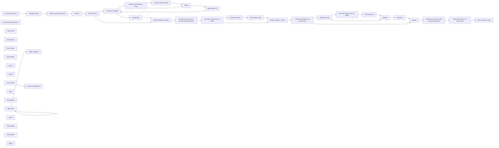

## Fluxo (.json) :

```json
{
  "id": "dDAqkobn2pqgdl2N",
  "meta": {
    "instanceId": "9e331a89ae45a204c6dee51c77131d32a8c962ec20ccf002135ea60bd285dba9"
  },
  "name": "AI Logo Sheet Extractor to Airtable",
  "tags": [],
  "nodes": [
    {
      "id": "f7ecadb8-dc5d-4e8c-96b8-52c1dbad49b6",
      "name": "On form submission",
      "type": "n8n-nodes-base.formTrigger",
      "position": [
        -660,
        -220
      ],
      "webhookId": "43837a27-f752-40a8-852a-d5d63d647bfd",
      "parameters": {
        "options": {
          "path": "logo-sheet-feeder"
        },
        "formTitle": "AI Logo Sheet Feeder",
        "formFields": {
          "values": [
            {
              "fieldType": "file",
              "fieldLabel": "The Logo-Sheet as Image",
              "requiredField": true
            },
            {
              "fieldLabel": "Addional Prompt (e.g.: What the meaning of the graphic?) *optional but helps from time to time.",
              "placeholder": "It's a graph chart comparing AI Tools"
            }
          ]
        },
        "formDescription": "Provide a Image with multiple Logos comparing or bringing multiple Tools into Context with one another."
      },
      "typeVersion": 2.2
    },
    {
      "id": "b1530578-bde9-4ee3-9cdb-545a621cdb84",
      "name": "Retrieve and Parser Agent",
      "type": "@n8n/n8n-nodes-langchain.agent",
      "position": [
        -180,
        -220
      ],
      "parameters": {
        "options": {
          "systemMessage": "Your task is to retrieve Information from the given Input. Extract Categories and Attributes of all given and shown Tools, Softwares or Products you've got by the user.\n\nProvide the Output Array of Tools with the following Structure as JSON:\n\n[{\n\"name\": \"Name of the Tool, Software, etc.\",\n\"attributes\": [\"Some category or attribute\", \"something else you can see from the context or image\"],\n\"similar\": [\"similar tool, product, etc. from shown context\", \"another similar software, product, tool from context\"]\n},{\n\"name\": \"Name of anotherTool, Software, etc.\",\n\"attributes\": [\"Some category, subcategory or general attribute\", \"something else you can see from the context or image\"],\n\"similar\": [\"similar tool, product, etc. from shown context\", \"another similar software, product, tool from context\"]\n}]\n\nList these structure for all the Products you see!\n\nHere a description of the JSON fields:\n\"name\": Just the Name of the Software.\n\"attribute\": Turn any information from the context or image into multiple useful Attributes for this tool. Could be a category, could be a feature, etc. Try to split this information in multiple specific Attributes or Categories.\n\"similar\": if multiple tools are shown that could compare to this one (like on the same level or in the same category), list those here\n\nTake a deep breath and think step by step.\nTry to extract every mentioned tool. There are for sure multiple listed.",
          "passthroughBinaryImages": true
        },
        "hasOutputParser": true
      },
      "typeVersion": 1.7
    },
    {
      "id": "51642a02-51a4-4894-adf0-f364736dabc1",
      "name": "JSON it",
      "type": "n8n-nodes-base.set",
      "position": [
        220,
        -220
      ],
      "parameters": {
        "mode": "raw",
        "options": {},
        "jsonOutput": "={{ $json.output }}"
      },
      "typeVersion": 3.4
    },
    {
      "id": "ec0f0575-eb33-48a9-b3fe-c4f5b71ff548",
      "name": "Structured Output Parser",
      "type": "@n8n/n8n-nodes-langchain.outputParserStructured",
      "position": [
        40,
        20
      ],
      "parameters": {
        "jsonSchemaExample": "{\n\t\"tools\": [{\n\"name\": \"Name of the Tool, Software, etc.\",\n\"attributes\": [\"Some category or attribute\", \"something else you can see from the context or image\"],\n\"similar\": [\"similar tool, product, etc. from shown context\", \"another similar software, product, tool from context\"]\n},{\n\"name\": \"Name of anotherTool, Software, etc.\",\n\"attributes\": [\"Some category, subcategory or general attribute\", \"something else you can see from the context or image\"],\n\"similar\": [\"similar tool, product, etc. from shown context\", \"another similar software, product, tool from context\"]\n}]}"
      },
      "typeVersion": 1.2
    },
    {
      "id": "6d78005e-7277-40a9-9f10-e3d8e475cbaf",
      "name": "Check if Attribute exists",
      "type": "n8n-nodes-base.airtable",
      "position": [
        1380,
        0
      ],
      "parameters": {
        "base": {
          "__rl": true,
          "mode": "list",
          "value": "appq0gcmxHAZQhswW",
          "cachedResultUrl": "https://airtable.com/appq0gcmxHAZQhswW",
          "cachedResultName": "AI Tools"
        },
        "table": {
          "__rl": true,
          "mode": "list",
          "value": "tblX2rj8yNAZZRhwt",
          "cachedResultUrl": "https://airtable.com/appq0gcmxHAZQhswW/tblX2rj8yNAZZRhwt",
          "cachedResultName": "Attributes"
        },
        "columns": {
          "value": {
            "Name": "={{$json.attributes}}"
          },
          "schema": [
            {
              "id": "id",
              "type": "string",
              "display": true,
              "removed": true,
              "readOnly": true,
              "required": false,
              "displayName": "id",
              "defaultMatch": true
            },
            {
              "id": "Name",
              "type": "string",
              "display": true,
              "removed": false,
              "readOnly": false,
              "required": false,
              "displayName": "Name",
              "defaultMatch": false,
              "canBeUsedToMatch": true
            },
            {
              "id": "Tools",
              "type": "array",
              "display": true,
              "removed": true,
              "readOnly": false,
              "required": false,
              "displayName": "Tools",
              "defaultMatch": false,
              "canBeUsedToMatch": true
            }
          ],
          "mappingMode": "defineBelow",
          "matchingColumns": [
            "Name"
          ]
        },
        "options": {},
        "operation": "upsert"
      },
      "credentials": {
        "airtableTokenApi": {
          "id": "jMqH6HkKUYTgyHVm",
          "name": "Airtable Personal Access Token account"
        }
      },
      "typeVersion": 2.1
    },
    {
      "id": "1c468a4b-4563-4f78-ba1b-138b18ac4821",
      "name": "Merge",
      "type": "n8n-nodes-base.merge",
      "position": [
        1620,
        80
      ],
      "parameters": {
        "mode": "combine",
        "options": {},
        "combineBy": "combineByPosition"
      },
      "typeVersion": 3
    },
    {
      "id": "4f597962-48e5-4367-a329-bc07d42ff86d",
      "name": "Map Attribute ID",
      "type": "n8n-nodes-base.set",
      "position": [
        1840,
        80
      ],
      "parameters": {
        "options": {},
        "assignments": {
          "assignments": [
            {
              "id": "675510b1-97e7-4a71-9c9e-d3ee792d9919",
              "name": "id",
              "type": "string",
              "value": "={{ $json.id }}"
            },
            {
              "id": "87cc9086-effd-4f4e-84c1-9adec5774e94",
              "name": "attribute",
              "type": "string",
              "value": "={{ $json.attributes }}"
            }
          ]
        }
      },
      "typeVersion": 3.4
    },
    {
      "id": "11679757-360c-468f-b624-a9f6853e29f4",
      "name": "Loop Over Attributes",
      "type": "n8n-nodes-base.splitInBatches",
      "position": [
        720,
        -40
      ],
      "parameters": {
        "options": {}
      },
      "typeVersion": 3
    },
    {
      "id": "835a09ae-2e51-488c-b0b3-d895696a135e",
      "name": "All Attributes",
      "type": "n8n-nodes-base.set",
      "position": [
        940,
        -60
      ],
      "parameters": {
        "mode": "raw",
        "options": {},
        "jsonOutput": "={{ $json }}"
      },
      "typeVersion": 3.4
    },
    {
      "id": "b8ca6d98-ab37-4393-8a2c-561912aeff2b",
      "name": "Wait for Attribute Creation",
      "type": "n8n-nodes-base.merge",
      "position": [
        1120,
        -200
      ],
      "parameters": {
        "mode": "chooseBranch"
      },
      "typeVersion": 3
    },
    {
      "id": "9eaf87d4-910b-4a6e-9cdf-ee51ff4180cc",
      "name": "Change each Attribute to the corresponding RecID",
      "type": "n8n-nodes-base.code",
      "position": [
        1340,
        -200
      ],
      "parameters": {
        "jsCode": "let knownAttributesOutput = $('All Attributes').all();\nlet knownAttributes = new Map();\nknownAttributesOutput.forEach((nodeOutput)=>{\nknownAttributes.set(nodeOutput.json.attribute.toString().trim(), nodeOutput.json.id);\n});\n\n\nfor (const item of $input.all()) {\n  item.json.attributes.forEach((attribute, index)=>{\n    item.json.attributes[index] = knownAttributes.get(attribute.toString().trim());\n  });\n}\n\nreturn $input.all();"
      },
      "typeVersion": 2
    },
    {
      "id": "ecfedff4-f6f9-429e-8514-cf8208e70048",
      "name": "Sticky Note",
      "type": "n8n-nodes-base.stickyNote",
      "position": [
        600,
        -280
      ],
      "parameters": {
        "color": 5,
        "width": 1460,
        "height": 600,
        "content": "## Attribute Creation and Mapping those created or existing Ids "
      },
      "typeVersion": 1
    },
    {
      "id": "ad2fafed-0a42-4615-a882-01306af7caf5",
      "name": "Sticky Note1",
      "type": "n8n-nodes-base.stickyNote",
      "position": [
        -260,
        -360
      ],
      "parameters": {
        "color": 6,
        "width": 420,
        "height": 540,
        "content": "## Eat the provided Images, Extract the Information out of them as \"Tool -> Attributes\" list."
      },
      "typeVersion": 1
    },
    {
      "id": "5eb89e50-7a2f-415c-82f2-99eb8a7ff82f",
      "name": "Split Out Tools",
      "type": "n8n-nodes-base.splitOut",
      "position": [
        440,
        -220
      ],
      "parameters": {
        "options": {},
        "fieldToSplitOut": "tools"
      },
      "typeVersion": 1
    },
    {
      "id": "680dfb4b-dde4-4d8f-852d-c3eba82e6607",
      "name": "Split Out each Attribute String",
      "type": "n8n-nodes-base.splitOut",
      "position": [
        1140,
        100
      ],
      "parameters": {
        "options": {},
        "fieldToSplitOut": "attributes"
      },
      "typeVersion": 1
    },
    {
      "id": "a33465e9-d469-498f-9178-7c30e15d2782",
      "name": "Sticky Note2",
      "type": "n8n-nodes-base.stickyNote",
      "position": [
        2120,
        -280
      ],
      "parameters": {
        "color": 4,
        "width": 880,
        "height": 600,
        "content": "## Create the Tools (if not exists)"
      },
      "typeVersion": 1
    },
    {
      "id": "5b5ab9f2-d4ac-437f-ab0a-b113a8af34ab",
      "name": "Generate Unique Hash for Name",
      "type": "n8n-nodes-base.crypto",
      "position": [
        2180,
        -200
      ],
      "parameters": {
        "value": "={{ $json.name.toLowerCase().trim() }}",
        "dataPropertyName": "hash"
      },
      "typeVersion": 1
    },
    {
      "id": "ea8f7e6f-9004-4271-80d3-333701cce488",
      "name": "Create if not Exist",
      "type": "n8n-nodes-base.airtable",
      "position": [
        2400,
        -100
      ],
      "parameters": {
        "base": {
          "__rl": true,
          "mode": "list",
          "value": "appq0gcmxHAZQhswW",
          "cachedResultUrl": "https://airtable.com/appq0gcmxHAZQhswW",
          "cachedResultName": "AI Tools"
        },
        "table": {
          "__rl": true,
          "mode": "list",
          "value": "tblrikRHbX1N6P2JI",
          "cachedResultUrl": "https://airtable.com/appq0gcmxHAZQhswW/tblrikRHbX1N6P2JI",
          "cachedResultName": "Tools"
        },
        "columns": {
          "value": {
            "Hash": "={{$json.hash}}",
            "Name": "={{$json.name}}"
          },
          "schema": [
            {
              "id": "id",
              "type": "string",
              "display": true,
              "removed": true,
              "readOnly": true,
              "required": false,
              "displayName": "id",
              "defaultMatch": true
            },
            {
              "id": "Name",
              "type": "string",
              "display": true,
              "removed": false,
              "readOnly": false,
              "required": false,
              "displayName": "Name",
              "defaultMatch": false,
              "canBeUsedToMatch": true
            },
            {
              "id": "Description",
              "type": "string",
              "display": true,
              "removed": true,
              "readOnly": false,
              "required": false,
              "displayName": "Description",
              "defaultMatch": false,
              "canBeUsedToMatch": true
            },
            {
              "id": "Website",
              "type": "string",
              "display": true,
              "removed": true,
              "readOnly": false,
              "required": false,
              "displayName": "Website",
              "defaultMatch": false,
              "canBeUsedToMatch": true
            },
            {
              "id": "Category",
              "type": "array",
              "display": true,
              "options": [],
              "removed": true,
              "readOnly": false,
              "required": false,
              "displayName": "Category",
              "defaultMatch": false,
              "canBeUsedToMatch": true
            },
            {
              "id": "Attributes",
              "type": "array",
              "display": true,
              "removed": true,
              "readOnly": false,
              "required": false,
              "displayName": "Attributes",
              "defaultMatch": false,
              "canBeUsedToMatch": true
            },
            {
              "id": "Hash",
              "type": "string",
              "display": true,
              "removed": false,
              "readOnly": false,
              "required": false,
              "displayName": "Hash",
              "defaultMatch": false,
              "canBeUsedToMatch": true
            }
          ],
          "mappingMode": "defineBelow",
          "matchingColumns": [
            "Hash"
          ]
        },
        "options": {},
        "operation": "upsert"
      },
      "credentials": {
        "airtableTokenApi": {
          "id": "jMqH6HkKUYTgyHVm",
          "name": "Airtable Personal Access Token account"
        }
      },
      "typeVersion": 2.1
    },
    {
      "id": "85ac3cbb-4103-4184-b686-9e5b8d48f421",
      "name": "Merge Old Data + RecID",
      "type": "n8n-nodes-base.merge",
      "position": [
        2820,
        -180
      ],
      "parameters": {
        "mode": "combine",
        "options": {},
        "fieldsToMatchString": "hash"
      },
      "typeVersion": 3
    },
    {
      "id": "29d6369f-f233-46f8-8bee-aa3be854bb0c",
      "name": "Only what we need",
      "type": "n8n-nodes-base.set",
      "position": [
        2600,
        -100
      ],
      "parameters": {
        "options": {},
        "assignments": {
          "assignments": [
            {
              "id": "0ff954ec-1d71-429b-b2e8-dca17ff0478d",
              "name": "hash",
              "type": "string",
              "value": "={{ $json.fields.Hash }}"
            },
            {
              "id": "a7f4c2e7-fa63-45d7-ad22-ce8c3aaae4d6",
              "name": "id",
              "type": "string",
              "value": "={{ $json.id }}"
            },
            {
              "id": "081a7613-7c06-4578-8aa4-25d21952b727",
              "name": "existingAttributes",
              "type": "array",
              "value": "={{ $json.fields.Attributes ? $json.fields.Attributes : [] }}"
            },
            {
              "id": "e3ace89b-d818-4448-8328-b36cdf08da2a",
              "name": "existingSimilars",
              "type": "array",
              "value": "={{ $json.fields.Similar ? $json.fields.Similar : [] }}"
            }
          ]
        }
      },
      "typeVersion": 3.4
    },
    {
      "id": "bdf9c435-3994-4c25-9520-8dfa76e625eb",
      "name": "Determine Attributes we should save",
      "type": "n8n-nodes-base.code",
      "position": [
        3040,
        -180
      ],
      "parameters": {
        "mode": "runOnceForEachItem",
        "jsCode": "let savingAttributes = $input.item.json.existingAttributes ? $input.item.json.existingAttributes : [];\n$input.item.json.attributes.forEach((attrId)=>{\nif($input.item.json.existingAttributes.indexOf(attrId) == -1) savingAttributes.push(attrId);\n});\n\n$input.item.json.savingAttributes = savingAttributes;\n\nreturn $input.item;"
      },
      "typeVersion": 2
    },
    {
      "id": "88e9f499-87d3-46e2-b3ea-1833c14aaa1b",
      "name": "Split Out similar",
      "type": "n8n-nodes-base.splitOut",
      "position": [
        3300,
        20
      ],
      "parameters": {
        "options": {},
        "fieldToSplitOut": "similar"
      },
      "typeVersion": 1
    },
    {
      "id": "733a8d0c-c6ea-4386-9fd1-075980289e9c",
      "name": "Merge1",
      "type": "n8n-nodes-base.merge",
      "position": [
        3960,
        0
      ],
      "parameters": {
        "mode": "combine",
        "options": {},
        "combineBy": "combineByPosition"
      },
      "typeVersion": 3
    },
    {
      "id": "dabb7e11-b4de-44d9-a80f-3302f49194fb",
      "name": "Generate Unique Hash for Similar",
      "type": "n8n-nodes-base.crypto",
      "position": [
        3520,
        -100
      ],
      "parameters": {
        "value": "={{ $json.similar.toLowerCase().trim() }}",
        "dataPropertyName": "hash"
      },
      "typeVersion": 1
    },
    {
      "id": "a1bbda24-f75c-4316-b2bd-645827d7af1f",
      "name": "It Should exists",
      "type": "n8n-nodes-base.airtable",
      "position": [
        3740,
        -100
      ],
      "parameters": {
        "base": {
          "__rl": true,
          "mode": "list",
          "value": "appq0gcmxHAZQhswW",
          "cachedResultUrl": "https://airtable.com/appq0gcmxHAZQhswW",
          "cachedResultName": "AI Tools"
        },
        "table": {
          "__rl": true,
          "mode": "list",
          "value": "tblrikRHbX1N6P2JI",
          "cachedResultUrl": "https://airtable.com/appq0gcmxHAZQhswW/tblrikRHbX1N6P2JI",
          "cachedResultName": "Tools"
        },
        "columns": {
          "value": {
            "Hash": "={{$json.hash}}",
            "Name": "={{$json.similar}}"
          },
          "schema": [
            {
              "id": "id",
              "type": "string",
              "display": true,
              "removed": true,
              "readOnly": true,
              "required": false,
              "displayName": "id",
              "defaultMatch": true
            },
            {
              "id": "Name",
              "type": "string",
              "display": true,
              "removed": false,
              "readOnly": false,
              "required": false,
              "displayName": "Name",
              "defaultMatch": false,
              "canBeUsedToMatch": true
            },
            {
              "id": "Description",
              "type": "string",
              "display": true,
              "removed": true,
              "readOnly": false,
              "required": false,
              "displayName": "Description",
              "defaultMatch": false,
              "canBeUsedToMatch": true
            },
            {
              "id": "Website",
              "type": "string",
              "display": true,
              "removed": true,
              "readOnly": false,
              "required": false,
              "displayName": "Website",
              "defaultMatch": false,
              "canBeUsedToMatch": true
            },
            {
              "id": "Category",
              "type": "array",
              "display": true,
              "options": [],
              "removed": true,
              "readOnly": false,
              "required": false,
              "displayName": "Category",
              "defaultMatch": false,
              "canBeUsedToMatch": true
            },
            {
              "id": "Attributes",
              "type": "array",
              "display": true,
              "removed": true,
              "readOnly": false,
              "required": false,
              "displayName": "Attributes",
              "defaultMatch": false,
              "canBeUsedToMatch": true
            },
            {
              "id": "Hash",
              "type": "string",
              "display": true,
              "removed": false,
              "readOnly": false,
              "required": false,
              "displayName": "Hash",
              "defaultMatch": false,
              "canBeUsedToMatch": true
            }
          ],
          "mappingMode": "defineBelow",
          "matchingColumns": [
            "Hash"
          ]
        },
        "options": {},
        "operation": "upsert"
      },
      "credentials": {
        "airtableTokenApi": {
          "id": "jMqH6HkKUYTgyHVm",
          "name": "Airtable Personal Access Token account"
        }
      },
      "typeVersion": 2.1
    },
    {
      "id": "9853b85d-fcb9-4183-8fe4-6e32d318ab01",
      "name": "All Similar",
      "type": "n8n-nodes-base.set",
      "position": [
        4180,
        0
      ],
      "parameters": {
        "options": {},
        "assignments": {
          "assignments": [
            {
              "id": "675510b1-97e7-4a71-9c9e-d3ee792d9919",
              "name": "id",
              "type": "string",
              "value": "={{ $json.id }}"
            },
            {
              "id": "87cc9086-effd-4f4e-84c1-9adec5774e94",
              "name": "similar",
              "type": "string",
              "value": "={{ $json.similar }}"
            }
          ]
        }
      },
      "typeVersion": 3.4
    },
    {
      "id": "0e98acd2-4aa5-4df0-b36b-6ac1a8a2263b",
      "name": "Merge2",
      "type": "n8n-nodes-base.merge",
      "position": [
        4400,
        -160
      ],
      "parameters": {
        "mode": "chooseBranch"
      },
      "typeVersion": 3
    },
    {
      "id": "ed94900a-78cd-4f61-a705-30f7cb8eb9b8",
      "name": "Sticky Note3",
      "type": "n8n-nodes-base.stickyNote",
      "position": [
        3200,
        -280
      ],
      "parameters": {
        "color": 2,
        "width": 1600,
        "height": 600,
        "content": "## Map Competitors"
      },
      "typeVersion": 1
    },
    {
      "id": "74f0f703-ce73-457c-9137-88d613d2e480",
      "name": "Change each Smiliar to the corresponding RecID",
      "type": "n8n-nodes-base.code",
      "position": [
        4600,
        -160
      ],
      "parameters": {
        "jsCode": "let knownSimilarsOutput = $('All Similar').all();\nlet knownSimilars = new Map();\nknownSimilarsOutput.forEach((nodeOutput)=>{\n  knownSimilars.set(nodeOutput.json.similar.toString().trim(), nodeOutput.json.id);\n});\n\nfor (const item of $input.all()) {\n  item.json.similar.forEach((similar, index)=>{\n    item.json.similar[index] = knownSimilars.get(similar.toString().trim());\n  });\n}\n\nreturn $input.all();"
      },
      "typeVersion": 2
    },
    {
      "id": "c9187902-f67f-4639-906b-d6b14ace6a0e",
      "name": "Determine Similar we should save",
      "type": "n8n-nodes-base.code",
      "position": [
        4880,
        -160
      ],
      "parameters": {
        "mode": "runOnceForEachItem",
        "jsCode": "let savingSimilar = $input.item.json.existingSimilars ? $input.item.json.existingSimilars : [];\n$input.item.json.similar.forEach((simId)=>{\nif($input.item.json.existingSimilars.indexOf(simId) == -1) savingSimilar.push(simId);\n});\n\n$input.item.json.savingSimilars = savingSimilar;\n\nreturn $input.item;"
      },
      "typeVersion": 2
    },
    {
      "id": "e925a388-05e2-49e4-92ad-984517f44057",
      "name": "Save all this juicy data",
      "type": "n8n-nodes-base.airtable",
      "position": [
        5120,
        -160
      ],
      "parameters": {
        "base": {
          "__rl": true,
          "mode": "list",
          "value": "appq0gcmxHAZQhswW",
          "cachedResultUrl": "https://airtable.com/appq0gcmxHAZQhswW",
          "cachedResultName": "AI Tools"
        },
        "table": {
          "__rl": true,
          "mode": "list",
          "value": "tblrikRHbX1N6P2JI",
          "cachedResultUrl": "https://airtable.com/appq0gcmxHAZQhswW/tblrikRHbX1N6P2JI",
          "cachedResultName": "Tools"
        },
        "columns": {
          "value": {
            "Hash": "={{$json.hash}}",
            "Name": "={{$json.name}}",
            "Similar": "={{ $json.savingSimilars }}",
            "Attributes": "={{ $json.savingAttributes }}"
          },
          "schema": [
            {
              "id": "id",
              "type": "string",
              "display": true,
              "removed": true,
              "readOnly": true,
              "required": false,
              "displayName": "id",
              "defaultMatch": true
            },
            {
              "id": "Name",
              "type": "string",
              "display": true,
              "removed": false,
              "readOnly": false,
              "required": false,
              "displayName": "Name",
              "defaultMatch": false,
              "canBeUsedToMatch": true
            },
            {
              "id": "Description",
              "type": "string",
              "display": true,
              "removed": true,
              "readOnly": false,
              "required": false,
              "displayName": "Description",
              "defaultMatch": false,
              "canBeUsedToMatch": true
            },
            {
              "id": "Website",
              "type": "string",
              "display": true,
              "removed": true,
              "readOnly": false,
              "required": false,
              "displayName": "Website",
              "defaultMatch": false,
              "canBeUsedToMatch": true
            },
            {
              "id": "Category",
              "type": "array",
              "display": true,
              "options": [],
              "removed": true,
              "readOnly": false,
              "required": false,
              "displayName": "Category",
              "defaultMatch": false,
              "canBeUsedToMatch": true
            },
            {
              "id": "Attributes",
              "type": "array",
              "display": true,
              "removed": false,
              "readOnly": false,
              "required": false,
              "displayName": "Attributes",
              "defaultMatch": false,
              "canBeUsedToMatch": true
            },
            {
              "id": "Hash",
              "type": "string",
              "display": true,
              "removed": false,
              "readOnly": false,
              "required": false,
              "displayName": "Hash",
              "defaultMatch": false,
              "canBeUsedToMatch": true
            },
            {
              "id": "Similar",
              "type": "array",
              "display": true,
              "removed": false,
              "readOnly": false,
              "required": false,
              "displayName": "Similar",
              "defaultMatch": false,
              "canBeUsedToMatch": true
            }
          ],
          "mappingMode": "defineBelow",
          "matchingColumns": [
            "Hash"
          ]
        },
        "options": {},
        "operation": "upsert"
      },
      "credentials": {
        "airtableTokenApi": {
          "id": "jMqH6HkKUYTgyHVm",
          "name": "Airtable Personal Access Token account"
        }
      },
      "typeVersion": 2.1
    },
    {
      "id": "d2532094-9c71-4fc0-8195-fb2e29169086",
      "name": "Map Agent Input",
      "type": "n8n-nodes-base.set",
      "position": [
        -440,
        -220
      ],
      "parameters": {
        "options": {},
        "assignments": {
          "assignments": [
            {
              "id": "ace29464-a2a1-44a1-87f9-255fbde042cf",
              "name": "chatInput",
              "type": "string",
              "value": "={{$json.Prompt}}"
            }
          ]
        },
        "includeOtherFields": true
      },
      "typeVersion": 3.4
    },
    {
      "id": "8fa7273b-ebc8-40e4-9f11-e4b26784f60d",
      "name": "gpt-4o",
      "type": "@n8n/n8n-nodes-langchain.lmChatOpenAi",
      "position": [
        -200,
        20
      ],
      "parameters": {
        "model": "gpt-4o",
        "options": {}
      },
      "credentials": {
        "openAiApi": {
          "id": "25",
          "name": "Key 3 vom 15. Jan. 2023\t"
        }
      },
      "typeVersion": 1
    },
    {
      "id": "fb282ffe-4871-4560-97ce-43cc381db874",
      "name": "Note3",
      "type": "n8n-nodes-base.stickyNote",
      "position": [
        -1440,
        -580
      ],
      "parameters": {
        "width": 668,
        "height": 786,
        "content": "## Instructions\n\nThis automation enables you to just upload any Image (via Form) of a Logo Sheet, containing multiple Images of Products, most likely and bringing them in some context to one another. \n\nAfter submitting an AI-Agent eats **that Logo Sheet**, turning it into an List of \"Productname\" and \"Attributes\", also checks if Tools are kind of similar to another, given the Context of the Image.\n\nWe utilize AI Vision capabilities for that. **NOTE:** It might not be able to extract all informations. For a \"upload and forget it\" Workflow it works for me. You can even run it multiple times, to be sure. \n\nBut if you need to make sure it extracts **everything** you might need to think about an Multi-Agent Setup with Validation-Agent Steps.\n\nOnce the Agent finishes the extraction, it will traditionally and deterministicly add those Attributes to Airtable (**Creates** those, if not already existing.) and also **Upserts** the Tool Informations.\n\nIt uses MD5 **Hashes** for turning Product Names into.. something fancy really, you could also use it without that, but I wanted to have something that looks atleast like an ID.  \n\n### Setup\n\n1. Set Up the Airtable like shown below.\n2. Update and set Credentials for all Airtable Nodes.\n3. Check or Adjust the Prompt of the Agent matching your use-case.\n4. Activate the Workflow. \n5. Open the Form (default: https://your-n8n.io/form/logo-sheet-feeder)\n6. Enjoy growing your Airtable.\n\n  \nEnjoy the workflow! ❤️  \n[let the workf low](https://let-the-work-flow.com) — Workflow Automation & Development"
      },
      "typeVersion": 1
    },
    {
      "id": "9ea45b9b-ac2a-4498-b96f-5f5de50acade",
      "name": "Table: Tools",
      "type": "n8n-nodes-base.noOp",
      "position": [
        -1340,
        340
      ],
      "parameters": {},
      "typeVersion": 1
    },
    {
      "id": "6dfbc02e-36b3-4640-b9f2-940c7cd6f86e",
      "name": "Table: Attributes",
      "type": "n8n-nodes-base.noOp",
      "position": [
        -1000,
        340
      ],
      "parameters": {},
      "typeVersion": 1
    },
    {
      "id": "d8ffeff8-8df7-4fc0-9f18-49a44d10eb7d",
      "name": "Note",
      "type": "n8n-nodes-base.stickyNote",
      "position": [
        -1440,
        240
      ],
      "parameters": {
        "color": 7,
        "width": 668,
        "height": 786,
        "content": "## Airtable Structure\n"
      },
      "typeVersion": 1
    },
    {
      "id": "7023be89-ee1d-41e6-bcf5-ee28f1284e07",
      "name": "Sticky Note4",
      "type": "n8n-nodes-base.stickyNote",
      "position": [
        -1420,
        580
      ],
      "parameters": {
        "color": 5,
        "width": 300,
        "height": 320,
        "content": "### Tools Table Fields\n\n**Required:**\nName (singleLineText) \nAttributes (multipleRecordLinks=Link to Attributes Table) \nHash (singleLineText) \nSimilar (multipleRecordLinks=Link to the Same Table:\"Tools\") \n\n_Description (multilineText)_ \n_Website (url)_\n_Category (multipleSelects)_"
      },
      "typeVersion": 1
    },
    {
      "id": "0c999f6f-11fb-472a-aa10-0915fbcd1254",
      "name": "make it a readable list",
      "type": "n8n-nodes-base.html",
      "disabled": true,
      "position": [
        -420,
        800
      ],
      "parameters": {
        "html": ""
      },
      "typeVersion": 1.2
    },
    {
      "id": "ae351db3-5c47-4e53-bf9e-e34434ad9522",
      "name": "Get Schema",
      "type": "n8n-nodes-base.airtable",
      "disabled": true,
      "position": [
        -640,
        800
      ],
      "parameters": {
        "base": {
          "__rl": true,
          "mode": "list",
          "value": "appq0gcmxHAZQhswW",
          "cachedResultUrl": "https://airtable.com/appq0gcmxHAZQhswW",
          "cachedResultName": "AI Tools"
        },
        "resource": "base",
        "operation": "getSchema"
      },
      "credentials": {
        "airtableTokenApi": {
          "id": "jMqH6HkKUYTgyHVm",
          "name": "Airtable Personal Access Token account"
        }
      },
      "typeVersion": 2.1
    },
    {
      "id": "9da286e2-2a06-4d2a-bd5b-b6c828683ff2",
      "name": "Note1",
      "type": "n8n-nodes-base.stickyNote",
      "position": [
        -720,
        660
      ],
      "parameters": {
        "color": 7,
        "width": 488,
        "height": 366,
        "content": "## Helper for Documentation (ignore or enjoy it)\n"
      },
      "typeVersion": 1
    },
    {
      "id": "901a0c48-82a9-4fd3-a007-8f4b257348d3",
      "name": "Sticky Note5",
      "type": "n8n-nodes-base.stickyNote",
      "position": [
        -1080,
        580
      ],
      "parameters": {
        "color": 5,
        "width": 280,
        "height": 320,
        "content": "### Attributes Table Fields\n\n**Required:**\nName (singleLineText)\nTools (multipleRecordLinks=Link to Tools Table) "
      },
      "typeVersion": 1
    },
    {
      "id": "966243fa-a1a3-4201-9df7-6a01aa762ae8",
      "name": "Sticky Note6",
      "type": "n8n-nodes-base.stickyNote",
      "position": [
        -160,
        -460
      ],
      "parameters": {
        "color": 3,
        "width": 220,
        "height": 80,
        "content": "### Might want to Adjust Prompt to your \"Use-Case\" 🤖"
      },
      "typeVersion": 1
    },
    {
      "id": "1a4e5b87-68a6-499e-9374-e067fae12c84",
      "name": "Note4",
      "type": "n8n-nodes-base.stickyNote",
      "position": [
        -2440,
        -580
      ],
      "parameters": {
        "color": 7,
        "width": 968,
        "height": 646,
        "content": "## Example Logo Sheet\n### For these kind of sheets the Prompt is designed per default\n\n  "
      },
      "typeVersion": 1
    }
  ],
  "active": true,
  "pinData": {
    "Retrieve and Parser Agent": [
      {
        "json": {
          "output": {
            "tools": [
              {
                "name": "airOps",
                "similar": [
                  "Cognition",
                  "Gradial"
                ],
                "attributes": [
                  "Agentic Application",
                  "AI infrastructure"
                ]
              },
              {
                "name": "Cognition",
                "similar": [
                  "airOps",
                  "Gradial"
                ],
                "attributes": [
                  "Agentic Application",
                  "AI infrastructure"
                ]
              },
              {
                "name": "Gradial",
                "similar": [
                  "Cognition",
                  "airOps"
                ],
                "attributes": [
                  "Agentic Application",
                  "AI infrastructure"
                ]
              },
              {
                "name": "Cognosys",
                "similar": [
                  "FIXIE",
                  "continuia"
                ],
                "attributes": [
                  "Agentic Application",
                  "AI infrastructure"
                ]
              },
              {
                "name": "FIXIE",
                "similar": [
                  "Cognosys",
                  "continuia"
                ],
                "attributes": [
                  "Agentic Application",
                  "AI infrastructure"
                ]
              },
              {
                "name": "continuia",
                "similar": [
                  "Cognosys",
                  "FIXIE"
                ],
                "attributes": [
                  "Agentic Application",
                  "AI infrastructure"
                ]
              },
              {
                "name": "Agentlabs",
                "similar": [
                  "OpenAI",
                  "LangChain"
                ],
                "attributes": [
                  "Presentation Tool",
                  "Utilizes OpenAI and LangChain"
                ]
              },
              {
                "name": "TINY FISH",
                "similar": [
                  "Superagent",
                  "basepilot"
                ],
                "attributes": [
                  "UI Automation",
                  "Agent as a Service"
                ]
              },
              {
                "name": "Superagent",
                "similar": [
                  "TINY FISH",
                  "basepilot"
                ],
                "attributes": [
                  "UI Automation",
                  "Agent as a Service"
                ]
              },
              {
                "name": "basepilot",
                "similar": [
                  "TINY FISH",
                  "Superagent"
                ],
                "attributes": [
                  "UI Automation",
                  "Agent as a Service"
                ]
              },
              {
                "name": "Browserbase",
                "similar": [
                  "browsersless",
                  "APIFY"
                ],
                "attributes": [
                  "Browser Infrastructure",
                  "Web services"
                ]
              },
              {
                "name": "browsersless",
                "similar": [
                  "Browserbase",
                  "APIFY"
                ],
                "attributes": [
                  "Browser Infrastructure",
                  "Web services"
                ]
              },
              {
                "name": "APIFY",
                "similar": [
                  "Browserbase",
                  "browsersless"
                ],
                "attributes": [
                  "Browser Infrastructure",
                  "Web services"
                ]
              },
              {
                "name": "Cloudflare",
                "similar": [
                  "bright data",
                  "platform.sh"
                ],
                "attributes": [
                  "Browser Infrastructure",
                  "Web services"
                ]
              },
              {
                "name": "bright data",
                "similar": [
                  "Cloudflare",
                  "platform.sh"
                ],
                "attributes": [
                  "Browser Infrastructure",
                  "Web services"
                ]
              },
              {
                "name": "platform.sh",
                "similar": [
                  "Cloudflare",
                  "bright data"
                ],
                "attributes": [
                  "Browser Infrastructure",
                  "Web services"
                ]
              },
              {
                "name": "ingest",
                "similar": [
                  "hatchet",
                  "Trigger.dev"
                ],
                "attributes": [
                  "Persistence Tool",
                  "Data management"
                ]
              },
              {
                "name": "hatchet",
                "similar": [
                  "ingest",
                  "Trigger.dev"
                ],
                "attributes": [
                  "Persistence Tool",
                  "Data management"
                ]
              },
              {
                "name": "Trigger.dev",
                "similar": [
                  "ingest",
                  "hatchet"
                ],
                "attributes": [
                  "Persistence Tool",
                  "Data management"
                ]
              },
              {
                "name": "DSPy",
                "similar": [
                  "AutoGen",
                  "Scma4.ai"
                ],
                "attributes": [
                  "Orchestration Tool",
                  "AI Workflow Management"
                ]
              },
              {
                "name": "AutoGen",
                "similar": [
                  "DSPy",
                  "Scma4.ai"
                ],
                "attributes": [
                  "Orchestration Tool",
                  "AI Workflow Management"
                ]
              },
              {
                "name": "Scma4.ai",
                "similar": [
                  "DSPy",
                  "AutoGen"
                ],
                "attributes": [
                  "Orchestration Tool",
                  "AI Workflow Management"
                ]
              },
              {
                "name": "WhyHowAI",
                "similar": [
                  "Graphlit",
                  "LangMem"
                ],
                "attributes": [
                  "Personalization Tool",
                  "Memory management"
                ]
              },
              {
                "name": "Graphlit",
                "similar": [
                  "WhyHowAI",
                  "LangMem"
                ],
                "attributes": [
                  "Personalization Tool",
                  "Memory management"
                ]
              },
              {
                "name": "LangMem",
                "similar": [
                  "WhyHowAI",
                  "Graphlit"
                ],
                "attributes": [
                  "Personalization Tool",
                  "Memory management"
                ]
              },
              {
                "name": "Pinecone",
                "similar": [
                  "Chroma",
                  "Weaviate"
                ],
                "attributes": [
                  "Storage Tool",
                  "Memory management"
                ]
              },
              {
                "name": "Chroma",
                "similar": [
                  "Pinecone",
                  "Weaviate"
                ],
                "attributes": [
                  "Storage Tool",
                  "Memory management"
                ]
              },
              {
                "name": "Weaviate",
                "similar": [
                  "Pinecone",
                  "Chroma"
                ],
                "attributes": [
                  "Storage Tool",
                  "Memory management"
                ]
              },
              {
                "name": "MongoDB",
                "similar": [
                  "WhiteLodge",
                  "Chroma"
                ],
                "attributes": [
                  "Context Management",
                  "Data storage"
                ]
              },
              {
                "name": "LangServe",
                "similar": [
                  "E2B",
                  "Ollama"
                ],
                "attributes": [
                  "Agent Hosting",
                  "Deployment platform"
                ]
              },
              {
                "name": "E2B",
                "similar": [
                  "LangServe",
                  "Ollama"
                ],
                "attributes": [
                  "Agent Hosting",
                  "Deployment platform"
                ]
              },
              {
                "name": "Ollama",
                "similar": [
                  "LangServe",
                  "E2B"
                ],
                "attributes": [
                  "Agent Hosting",
                  "Deployment platform"
                ]
              },
              {
                "name": "LangGraph",
                "similar": [
                  "Semantic Kernel",
                  "LlamaIndex"
                ],
                "attributes": [
                  "Framework Tool",
                  "Graph Management"
                ]
              },
              {
                "name": "LlamaIndex",
                "similar": [
                  "LangGraph",
                  "Semantic Kernel"
                ],
                "attributes": [
                  "Framework Tool",
                  "Graph Management"
                ]
              },
              {
                "name": "Semantic Kernel",
                "similar": [
                  "LangGraph",
                  "LlamaIndex"
                ],
                "attributes": [
                  "Framework Tool",
                  "Graph Management"
                ]
              },
              {
                "name": "agentops",
                "similar": [
                  "context",
                  "LangSmith"
                ],
                "attributes": [
                  "Agent Evaluation Tool",
                  "Performance Assessment"
                ]
              },
              {
                "name": "context",
                "similar": [
                  "agentops",
                  "LangSmith"
                ],
                "attributes": [
                  "Agent Evaluation Tool",
                  "Performance Assessment"
                ]
              },
              {
                "name": "LangSmith",
                "similar": [
                  "agentops",
                  "context"
                ],
                "attributes": [
                  "Agent Evaluation Tool",
                  "Performance Assessment"
                ]
              },
              {
                "name": "WHYLabs",
                "similar": [
                  "griptape",
                  "braintrust"
                ],
                "attributes": [
                  "Developer Tools",
                  "Data Management"
                ]
              },
              {
                "name": "griptape",
                "similar": [
                  "WHYLabs",
                  "braintrust"
                ],
                "attributes": [
                  "Developer Tools",
                  "Data Management"
                ]
              },
              {
                "name": "braintrust",
                "similar": [
                  "WHYLabs",
                  "griptape"
                ],
                "attributes": [
                  "Developer Tools",
                  "Data Management"
                ]
              }
            ]
          }
        }
      }
    ]
  },
  "settings": {
    "executionOrder": "v1"
  },
  "versionId": "cd74efad-4f0c-45ea-bc7e-3f7c5554c204",
  "connections": {
    "Merge": {
      "main": [
        [
          {
            "node": "Map Attribute ID",
            "type": "main",
            "index": 0
          }
        ]
      ]
    },
    "Merge1": {
      "main": [
        [
          {
            "node": "All Similar",
            "type": "main",
            "index": 0
          }
        ]
      ]
    },
    "Merge2": {
      "main": [
        [
          {
            "node": "Change each Smiliar to the corresponding RecID",
            "type": "main",
            "index": 0
          }
        ]
      ]
    },
    "gpt-4o": {
      "ai_languageModel": [
        [
          {
            "node": "Retrieve and Parser Agent",
            "type": "ai_languageModel",
            "index": 0
          }
        ]
      ]
    },
    "JSON it": {
      "main": [
        [
          {
            "node": "Split Out Tools",
            "type": "main",
            "index": 0
          }
        ]
      ]
    },
    "Get Schema": {
      "main": [
        [
          {
            "node": "make it a readable list",
            "type": "main",
            "index": 0
          }
        ]
      ]
    },
    "All Similar": {
      "main": [
        [
          {
            "node": "Merge2",
            "type": "main",
            "index": 1
          }
        ]
      ]
    },
    "Table: Tools": {
      "main": [
        [
          {
            "node": "Table: Tools",
            "type": "main",
            "index": 0
          },
          {
            "node": "Table: Attributes",
            "type": "main",
            "index": 0
          }
        ]
      ]
    },
    "All Attributes": {
      "main": [
        [
          {
            "node": "Wait for Attribute Creation",
            "type": "main",
            "index": 1
          }
        ]
      ]
    },
    "Map Agent Input": {
      "main": [
        [
          {
            "node": "Retrieve and Parser Agent",
            "type": "main",
            "index": 0
          }
        ]
      ]
    },
    "Split Out Tools": {
      "main": [
        [
          {
            "node": "Loop Over Attributes",
            "type": "main",
            "index": 0
          },
          {
            "node": "Wait for Attribute Creation",
            "type": "main",
            "index": 0
          }
        ]
      ]
    },
    "It Should exists": {
      "main": [
        [
          {
            "node": "Merge1",
            "type": "main",
            "index": 0
          }
        ]
      ]
    },
    "Map Attribute ID": {
      "main": [
        [
          {
            "node": "Loop Over Attributes",
            "type": "main",
            "index": 0
          }
        ]
      ]
    },
    "Only what we need": {
      "main": [
        [
          {
            "node": "Merge Old Data + RecID",
            "type": "main",
            "index": 1
          }
        ]
      ]
    },
    "Split Out similar": {
      "main": [
        [
          {
            "node": "Generate Unique Hash for Similar",
            "type": "main",
            "index": 0
          },
          {
            "node": "Merge1",
            "type": "main",
            "index": 1
          }
        ]
      ]
    },
    "Table: Attributes": {
      "main": [
        []
      ]
    },
    "On form submission": {
      "main": [
        [
          {
            "node": "Map Agent Input",
            "type": "main",
            "index": 0
          }
        ]
      ]
    },
    "Create if not Exist": {
      "main": [
        [
          {
            "node": "Only what we need",
            "type": "main",
            "index": 0
          }
        ]
      ]
    },
    "Loop Over Attributes": {
      "main": [
        [
          {
            "node": "All Attributes",
            "type": "main",
            "index": 0
          }
        ],
        [
          {
            "node": "Split Out each Attribute String",
            "type": "main",
            "index": 0
          }
        ]
      ]
    },
    "Merge Old Data + RecID": {
      "main": [
        [
          {
            "node": "Determine Attributes we should save",
            "type": "main",
            "index": 0
          }
        ]
      ]
    },
    "Structured Output Parser": {
      "ai_outputParser": [
        [
          {
            "node": "Retrieve and Parser Agent",
            "type": "ai_outputParser",
            "index": 0
          }
        ]
      ]
    },
    "Check if Attribute exists": {
      "main": [
        [
          {
            "node": "Merge",
            "type": "main",
            "index": 0
          }
        ]
      ]
    },
    "Retrieve and Parser Agent": {
      "main": [
        [
          {
            "node": "JSON it",
            "type": "main",
            "index": 0
          }
        ]
      ]
    },
    "Wait for Attribute Creation": {
      "main": [
        [
          {
            "node": "Change each Attribute to the corresponding RecID",
            "type": "main",
            "index": 0
          }
        ]
      ]
    },
    "Generate Unique Hash for Name": {
      "main": [
        [
          {
            "node": "Create if not Exist",
            "type": "main",
            "index": 0
          },
          {
            "node": "Merge Old Data + RecID",
            "type": "main",
            "index": 0
          }
        ]
      ]
    },
    "Split Out each Attribute String": {
      "main": [
        [
          {
            "node": "Check if Attribute exists",
            "type": "main",
            "index": 0
          },
          {
            "node": "Merge",
            "type": "main",
            "index": 1
          }
        ]
      ]
    },
    "Determine Similar we should save": {
      "main": [
        [
          {
            "node": "Save all this juicy data",
            "type": "main",
            "index": 0
          }
        ]
      ]
    },
    "Generate Unique Hash for Similar": {
      "main": [
        [
          {
            "node": "It Should exists",
            "type": "main",
            "index": 0
          }
        ]
      ]
    },
    "Determine Attributes we should save": {
      "main": [
        [
          {
            "node": "Split Out similar",
            "type": "main",
            "index": 0
          },
          {
            "node": "Merge2",
            "type": "main",
            "index": 0
          }
        ]
      ]
    },
    "Change each Smiliar to the corresponding RecID": {
      "main": [
        [
          {
            "node": "Determine Similar we should save",
            "type": "main",
            "index": 0
          }
        ]
      ]
    },
    "Change each Attribute to the corresponding RecID": {
      "main": [
        [
          {
            "node": "Generate Unique Hash for Name",
            "type": "main",
            "index": 0
          }
        ]
      ]
    }
  }
}
```

<a id="template-968"></a>

## Template 968 - Copiar PDFs do scanner para Nextcloud

- **Nome:** Copiar PDFs do scanner para Nextcloud
- **Descrição:** Copia periodicamente documentos escaneados, obtidos via API do scanner, para uma pasta "Scans" em um servidor Nextcloud.
- **Funcionalidade:** • Agendamento periódico: Executa a verificação em intervalos regulares para detectar novos scans.
• Listagem de arquivos do scanner: Consulta o endpoint do serviço de scanner para obter a lista de arquivos disponíveis.
• Download de cada arquivo: Solicita cada arquivo individualmente ao endpoint correspondente para recuperação do conteúdo.
• Upload para Nextcloud: Faz upload dos arquivos baixados para a pasta "/Scans/{{filename}}" no servidor Nextcloud, enviando os dados como binário.
• Uso de cabeçalhos HTTP: Define cabeçalhos adequados nas requisições para aceitar respostas JSON ou binárias conforme necessário.
- **Ferramentas:** • Nextcloud: Servidor de armazenamento em nuvem que recebe e guarda os arquivos escaneados via API.
• ScanServJS / API do scanner: Serviço que expõe endpoints (ex.: /api/v1/files e /api/v1/files/{nome}) para listar e baixar os documentos escaneados.
• Scanner USB: Dispositivo físico que realiza os scans, conectado ao servidor que executa o serviço de API do scanner.
• Servidor local (IP 192.168.1.100): Host onde o serviço de scanner/API está rodando e fornece os arquivos para download.

## Fluxo visual

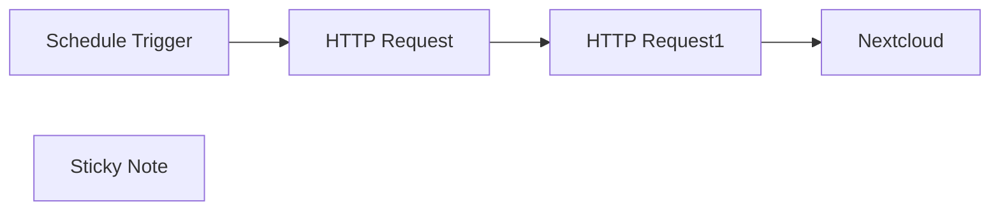

## Fluxo (.json) :

```json
{
  "id": "EJHT9UmGXNOyynV0",
  "meta": {
    "instanceId": "a67174bc280416abad7fd5fdbb66d968f3f284b847009b8f7b28adae86c50c98",
    "templateCredsSetupCompleted": true
  },
  "name": "Scans von PDF zu Nextcloud",
  "tags": [],
  "nodes": [
    {
      "id": "574d02f2-54c9-4f24-9c8b-4618ccdf2c7c",
      "name": "HTTP Request",
      "type": "n8n-nodes-base.httpRequest",
      "position": [
        -80,
        -80
      ],
      "parameters": {
        "url": "http://192.168.1.100:8080/api/v1/files",
        "options": {},
        "sendHeaders": true,
        "headerParameters": {
          "parameters": [
            {
              "name": "accept",
              "value": "application/json"
            }
          ]
        }
      },
      "typeVersion": 4.2
    },
    {
      "id": "7a1b5ef3-750f-45c5-b60e-34d463978abf",
      "name": "Nextcloud",
      "type": "n8n-nodes-base.nextCloud",
      "position": [
        340,
        -80
      ],
      "parameters": {
        "path": "=/Scans/{{ $json.name }}",
        "binaryDataUpload": true
      },
      "credentials": {
        "nextCloudApi": {
          "id": "P2d7981fwo6hiE8n",
          "name": "NextCloud account"
        }
      },
      "typeVersion": 1
    },
    {
      "id": "93a27a7e-d709-4ceb-b062-4136fcaa7c0a",
      "name": "HTTP Request1",
      "type": "n8n-nodes-base.httpRequest",
      "position": [
        140,
        -80
      ],
      "parameters": {
        "url": "=http://192.168.1.100:8080/api/v1/files/{{ $json.name }}",
        "options": {},
        "sendHeaders": true,
        "headerParameters": {
          "parameters": [
            {
              "name": "accept",
              "value": "*/*"
            }
          ]
        }
      },
      "typeVersion": 4.2
    },
    {
      "id": "77388051-b1b3-4a75-8190-628cb10c6734",
      "name": "Schedule Trigger",
      "type": "n8n-nodes-base.scheduleTrigger",
      "position": [
        -280,
        -80
      ],
      "parameters": {
        "rule": {
          "interval": [
            {
              "field": "hours"
            }
          ]
        }
      },
      "typeVersion": 1.2
    },
    {
      "id": "c49a991e-0faf-4326-9238-d3cf4a661ea5",
      "name": "Sticky Note",
      "type": "n8n-nodes-base.stickyNote",
      "position": [
        -340,
        -220
      ],
      "parameters": {
        "width": 900,
        "height": 380,
        "content": "## Copy Scanner Documents to Nextcloud\n** Needed USB-Scanner and Program ScanServJS with an API"
      },
      "typeVersion": 1
    }
  ],
  "active": true,
  "pinData": {},
  "settings": {
    "executionOrder": "v1"
  },
  "versionId": "1c982aa5-fffb-469b-8b2c-8f5b974f9f44",
  "connections": {
    "HTTP Request": {
      "main": [
        [
          {
            "node": "HTTP Request1",
            "type": "main",
            "index": 0
          }
        ]
      ]
    },
    "HTTP Request1": {
      "main": [
        [
          {
            "node": "Nextcloud",
            "type": "main",
            "index": 0
          }
        ]
      ]
    },
    "Schedule Trigger": {
      "main": [
        [
          {
            "node": "HTTP Request",
            "type": "main",
            "index": 0
          }
        ]
      ]
    }
  }
}
```

<a id="template-969"></a>

## Template 969 - Agente de IA para analisar vídeos do YouTube

- **Nome:** Agente de IA para analisar vídeos do YouTube
- **Descrição:** Fluxo que permite interagir via chat para buscar e analisar informações de canais e vídeos do YouTube, incluindo comentários, transcrições e avaliação de thumbnails por IA.
- **Funcionalidade:** • Atendimento via chat: Recebe solicitações do usuário por conversa e executa ações relevantes.
• Busca e listagem de vídeos: Pesquisa vídeos ou canais por consulta e retorna listas ordenadas.
• Obtenção de detalhes do canal: Recupera identificador, título e descrição do canal a partir de handle ou link.
• Obtenção de detalhes do vídeo: Recupera título, descrição, duração, estatísticas e URLs de thumbnails.
• Coleta e resumo de comentários: Extrai threads de comentários (top-level e replies) e compila em texto formatado.
• Transcrição de vídeos: Solicita transcrições de vídeos por serviço externo para permitir análise do conteúdo.
• Análise de thumbnail por IA: Envia a imagem do thumbnail para avaliação e recomendações de otimização.
• Filtragem de shorts: Identifica vídeos curtos (menos de 1 minuto) e permite filtrá-los quando necessário.
• Memória de conversa: Armazena contexto de sessão em banco de dados para manter histórico e continuidade.
• Roteamento por comando: Direciona diferentes tipos de pedidos para as ferramentas apropriadas (ex.: buscar, comentar, transcrever, analisar).
- **Ferramentas:** • YouTube Data API (Google Cloud): Plataforma para consultar vídeos, canais, descrições, estatísticas e comentários.
• Apify: Serviço de automação/scraping usado para obter transcrições e dados derivados de vídeos.
• OpenAI: Serviço de IA para processamento de linguagem e análise de imagens (avaliação de thumbnails e geração de resumos/insights).
• PostgreSQL: Banco de dados relacional usado para armazenar memória de sessão e histórico de conversas.

## Fluxo visual

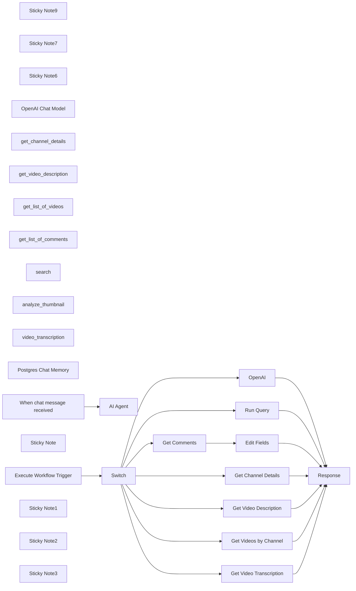

## Fluxo (.json) :

```json
{
  "meta": {
    "instanceId": "6a2a7715680b8313f7cb4676321c5baa46680adfb913072f089f2766f42e43bd"
  },
  "nodes": [
    {
      "id": "f4b3833b-cf25-4bbc-927c-080586c5713c",
      "name": "Sticky Note9",
      "type": "n8n-nodes-base.stickyNote",
      "position": [
        700,
        760
      ],
      "parameters": {
        "color": 7,
        "width": 330.5152611046425,
        "height": 239.5888196628349,
        "content": "### ... or watch set up video [13 min]\n[](https://youtu.be/6RmLZS8Yl4E)\n"
      },
      "typeVersion": 1
    },
    {
      "id": "64d96c53-b3e2-4aea-9a29-9b9e5c729f4f",
      "name": "Sticky Note7",
      "type": "n8n-nodes-base.stickyNote",
      "position": [
        400,
        240
      ],
      "parameters": {
        "color": 7,
        "width": 636.2128494576581,
        "height": 497.1532689930921,
        "content": "\n## AI Agent To Chat With Youtube\n**Made by [Mark Shcherbakov](https://www.linkedin.com/in/marklowcoding/) from community [5minAI](https://www.skool.com/5minai)**\n\nNavigating the content generation and optimization process can be complex, especially without significant audience insight. This workflow automates insights extraction from YouTube videos and comments, empowering users to create more engaging and relevant content effectively.\n\nThe workflow integrates various APIs to gather insights from YouTube videos, enabling automated commentary analysis, video transcription, and thumbnail evaluation. The main functionalities include:\n- Extracting user preferences from comments.\n- Transcribing video content for enhanced understanding.\n- Analyzing thumbnails via AI for maximum viewer engagement insights.\n\n"
      },
      "typeVersion": 1
    },
    {
      "id": "57d2ede9-1bf9-4449-9dc9-af1ccee763b6",
      "name": "Sticky Note6",
      "type": "n8n-nodes-base.stickyNote",
      "position": [
        400,
        760
      ],
      "parameters": {
        "color": 7,
        "width": 280.2462120317618,
        "height": 545.9087885077763,
        "content": "### Set up steps\n\n1. **API Setup**:\n - Create a [Google Cloud](https://console.cloud.google.com/apis/dashboard) project and enable the YouTube Data API.\n - Generate an API key for [Apify](https://www.apify.com?fpr=ujogj).\n - Generate API key for [OpenAI](https://platform.openai.com)\n - Create all credentials in N8N - OpenAI, Apify, Google Cloud.\n\n2. **YouTube Creator and Video Selection**:\n - Start by defining a request to identify top creators based on their video views.\n - Capture the YouTube video IDs for further analysis of comments and other video metrics.\n\n3. **Comment Analysis**:\n - Gather comments associated with the selected videos and analyze them for user insights.\n - Implement pagination to handle the maximum comment retrieval limits in API requests.\n\n4. **Video Transcription**:\n - Request transcriptions for videos of interest, ensuring to manage potential costs associated with longer video processing.\n - Utilize the insights from transcriptions to formulate content plans.\n\n5. **Thumbnail Analysis**:\n - Evaluate your video thumbnails by submitting the URL through the OpenAI API to gain insights into their effectiveness.\n\n6. **Data Management**:\n - Incorporate a database agent to organize video data and metrics, allowing efficient record management and future content planning."
      },
      "typeVersion": 1
    },
    {
      "id": "ca0fd549-88a7-44fd-ab81-7fd5ca140dae",
      "name": "OpenAI Chat Model",
      "type": "@n8n/n8n-nodes-langchain.lmChatOpenAi",
      "position": [
        1540,
        820
      ],
      "parameters": {
        "options": {}
      },
      "credentials": {
        "openAiApi": {
          "id": "zJhr5piyEwVnWtaI",
          "name": "OpenAi club"
        }
      },
      "typeVersion": 1
    },
    {
      "id": "7f2cf209-2e9d-4d6a-bc9e-d1bfd6df7266",
      "name": "get_channel_details",
      "type": "@n8n/n8n-nodes-langchain.toolWorkflow",
      "position": [
        1900,
        820
      ],
      "parameters": {
        "name": "get_channel_details",
        "fields": {
          "values": [
            {
              "name": "command",
              "stringValue": "=get_channel_details"
            }
          ]
        },
        "schemaType": "manual",
        "workflowId": {
          "__rl": true,
          "mode": "list",
          "value": "FgknOUpOBkpY85NX",
          "cachedResultName": "Youtube parser - tools"
        },
        "description": "Get channel_id, title and description by handle/username.\nChannel_id is required to find videos and details about this channel.\nIf Youtube link to channel provided - parse handle from there or return channel_id. (e.g. https://www.youtube.com/@example_handle - example_handle)\n\n\nExample Input:\nexample_handle\n\nExample Output:\nid:UCOgz_YflAsYnGbdvzXuKNCA\ntitle:Daniel Simmons\ndescription:Digital Diary 🤎\\n\\n\\nWeekly videos around fashion...",
        "inputSchema": "{\n \"type\": \"object\",\n \"properties\": {\n \"handle\": {\n \"type\": \"string\",\n \"description\": \"Handle/username of channel\"\n }},\n \"required\": [\"handle\"]\n}",
        "specifyInputSchema": true
      },
      "typeVersion": 1.2
    },
    {
      "id": "c02f5c19-6e50-4a06-95b9-eceb3eec1012",
      "name": "get_video_description",
      "type": "@n8n/n8n-nodes-langchain.toolWorkflow",
      "position": [
        2020,
        820
      ],
      "parameters": {
        "name": "get_video_description",
        "fields": {
          "values": [
            {
              "name": "command",
              "stringValue": "video_details"
            }
          ]
        },
        "schemaType": "manual",
        "workflowId": {
          "__rl": true,
          "mode": "list",
          "value": "FgknOUpOBkpY85NX",
          "cachedResultName": "Youtube parser - tools"
        },
        "description": "Fetch video details - the full description, title, and publish date of a video using its video_id.\n\nExample input:\nvideo_id:dQw4w9WgXcQ\n\nExample Output:\ntitle:Never Gonna Give You Up\ndescription: \"The official video for “Never Gonna Give You Up” by Rick Astley.\nduration:4 min\nviewCount:154\nlikeCount:6\nthumbnails: urls",
        "inputSchema": "{\n \"type\": \"object\",\n \"properties\": {\n \"video_id\": {\n \"type\": \"string\",\n \"description\": \"The ID of the video to fetch details for\"\n }\n },\n \"required\": [\"video_id\"]\n}",
        "specifyInputSchema": true
      },
      "typeVersion": 1.2
    },
    {
      "id": "2d61160b-3a65-4766-ace6-947a7c5de6e5",
      "name": "get_list_of_videos",
      "type": "@n8n/n8n-nodes-langchain.toolWorkflow",
      "position": [
        2140,
        820
      ],
      "parameters": {
        "name": "get_list_of_videos",
        "fields": {
          "values": [
            {
              "name": "command",
              "stringValue": "videos"
            }
          ]
        },
        "schemaType": "manual",
        "workflowId": {
          "__rl": true,
          "mode": "list",
          "value": "FgknOUpOBkpY85NX",
          "cachedResultName": "Youtube parser - tools"
        },
        "description": "Retrieve a list of videos from a channel using channel_id. Supports sorting by date, relevance, or view count.\n\nExample Input:\nchannel_id\": \"UCxxxxxxxxxxxxxxxx\"\nnumber_of_videos\": 5\norder: \"date\"\npublishedAfter: \"timestamp\"\n\nExample Output:\nvideo_id:abc123\ntitle:Latest Video\nshort cut description:Latest Video\npublished_at:2023-12-05T10:00:00Z",
        "inputSchema": "{\n \"type\": \"object\",\n \"properties\": {\n \"channel_id\": {\n \"type\": \"string\",\n \"description\": \"The ID of the channel to fetch videos from\"\n },\n \"number_of_videos\": {\n \"type\": \"integer\",\n \"description\": \"The maximum number of videos to retrieve (max 50)\"\n },\n \"order\": {\n \"type\": \"string\",\n \"enum\": [\"date\", \"relevance\", \"viewCount\"],\n \"description\": \"Order in which to fetch videos\"\n },\n \"publishedAfter\": {\n \"type\": \"string\",\n \"description\": \"Timestamp for filtering like 2023-11-03T15:28:05Z.\"\n }\n },\n \"required\": [\"channel_id\", \"number_of_videos\", \"order\"]\n}",
        "specifyInputSchema": true
      },
      "typeVersion": 1.2
    },
    {
      "id": "c5aa2f7c-7748-4f88-abb6-fd274ad1295a",
      "name": "get_list_of_comments",
      "type": "@n8n/n8n-nodes-langchain.toolWorkflow",
      "position": [
        2260,
        820
      ],
      "parameters": {
        "name": "get_list_of_comments",
        "fields": {
          "values": [
            {
              "name": "command",
              "stringValue": "comments"
            }
          ]
        },
        "schemaType": "manual",
        "workflowId": {
          "__rl": true,
          "mode": "list",
          "value": "FgknOUpOBkpY85NX",
          "cachedResultName": "Youtube parser - tools"
        },
        "description": "Retrieve a list of comments from a video using video_id.\n\nInput:\n \"video_id\": \"dQw4w9WgXcQ\"\n\nOutput:\n \"author\": \"John Doe\",\n \"comment\": \"This is an amazing video!\",\n \"published_at\": \"2023-12-04T12:00:00Z\"",
        "inputSchema": "{\n \"type\": \"object\",\n \"properties\": {\n \"video_id\": {\n \"type\": \"string\",\n \"description\": \"The ID of the video to fetch comments from\"\n }\n },\n \"required\": [\"video_id\"]\n}",
        "specifyInputSchema": true
      },
      "typeVersion": 1.2
    },
    {
      "id": "c68cad77-1d71-45a3-b94b-8f7c701f56fb",
      "name": "search",
      "type": "@n8n/n8n-nodes-langchain.toolWorkflow",
      "position": [
        2380,
        820
      ],
      "parameters": {
        "name": "search",
        "fields": {
          "values": [
            {
              "name": "command",
              "stringValue": "search"
            }
          ]
        },
        "schemaType": "manual",
        "workflowId": {
          "__rl": true,
          "mode": "list",
          "value": "FgknOUpOBkpY85NX",
          "cachedResultName": "Youtube parser - tools"
        },
        "description": "Search for videos or channels using a query. Supports filtering by type (video or channel) and sorting (date, viewCount, relevance). Use | for OR and - to exclude terms in the query.\n\nInput:\ntype: video or channel\nquery: search query\nsorting: date, viewCount, relevance\npublishedAfter: timestamp\n\nOutput:\n- id, title, short cut description, and published_at.",
        "inputSchema": "{\n \"type\": \"object\",\n \"properties\": {\n \"type\": {\n \"type\": \"string\",\n \"enum\": [\"video\", \"channel\"],\n \"description\": \"Type of results to retrieve: video or channel\"\n },\n \"query\": {\n \"type\": \"string\",\n \"description\": \"Search query. Supports | for OR and - to exclude terms\"\n },\n \"sorting\": {\n \"type\": \"string\",\n \"enum\": [\"date\", \"viewCount\", \"relevance\"],\n \"description\": \"Sorting criteria for search results\"\n },\n \"publishedAfter\": {\n \"type\": \"string\",\n \"description\": \"Timestamp for filtering like 2023-11-03T15:28:05Z\"\n }\n },\n \"required\": [\"type\", \"query\", \"sorting\"]\n}",
        "specifyInputSchema": true
      },
      "typeVersion": 1.2
    },
    {
      "id": "c87d5392-8a5c-4999-9e58-89a5e0700c40",
      "name": "analyze_thumbnail",
      "type": "@n8n/n8n-nodes-langchain.toolWorkflow",
      "position": [
        2500,
        820
      ],
      "parameters": {
        "name": "analyze_thumbnail",
        "fields": {
          "values": [
            {
              "name": "command",
              "stringValue": "analyze_thumbnail"
            }
          ]
        },
        "schemaType": "manual",
        "workflowId": {
          "__rl": true,
          "mode": "list",
          "value": "FgknOUpOBkpY85NX",
          "cachedResultName": "Youtube parser - tools"
        },
        "description": "Analyze a thumbnail image based on a given prompt. The prompt can be customized for specific analysis needs, such as design critique, color scheme evaluation, or content assessment.\nUse link of maxRes thumbnail. \n\nInput:\n- url: URL of the thumbnail image.\n- prompt: Customizable instruction for the analysis.\n\nOutput:\n- Results of the analysis based on the given prompt.",
        "inputSchema": "{\n \"type\": \"object\",\n \"properties\": {\n \"url\": {\n \"type\": \"string\",\n \"description\": \"URL of the thumbnail image to analyze\"\n },\n \"prompt\": {\n \"type\": \"string\",\n \"description\": \"Customizable instruction to guide the image analysis\"\n }\n },\n \"required\": [\"url\", \"prompt\"]\n}",
        "specifyInputSchema": true
      },
      "typeVersion": 1.2
    },
    {
      "id": "1be2fa35-9091-4db8-a8eb-50f822d618d3",
      "name": "video_transcription",
      "type": "@n8n/n8n-nodes-langchain.toolWorkflow",
      "position": [
        2620,
        820
      ],
      "parameters": {
        "name": "video_transcription",
        "fields": {
          "values": [
            {
              "name": "command",
              "stringValue": "video_transcription"
            }
          ]
        },
        "schemaType": "manual",
        "workflowId": {
          "__rl": true,
          "mode": "list",
          "value": "FgknOUpOBkpY85NX",
          "cachedResultName": "Youtube parser - tools"
        },
        "description": "Transcribe a video and retrieve its text transcription. Useful for analyzing video content or repurposing it for other formats.\n\nInput:\n- video_url: URL of the video to transcribe.\n\nOutput:\n- The text transcription of the video.",
        "inputSchema": "{\n \"type\": \"object\",\n \"properties\": {\n \"video_url\": {\n \"type\": \"string\",\n \"description\": \"URL of the video to transcribe\"\n }\n },\n \"required\": [\"video_url\"]\n}",
        "specifyInputSchema": true
      },
      "typeVersion": 1.2
    },
    {
      "id": "fbfcd82f-e247-4a21-be12-339df7afe681",
      "name": "Postgres Chat Memory",
      "type": "@n8n/n8n-nodes-langchain.memoryPostgresChat",
      "position": [
        1700,
        820
      ],
      "parameters": {
        "sessionKey": "={{ $('When chat message received').item.json.sessionId }}",
        "sessionIdType": "customKey"
      },
      "credentials": {
        "postgres": {
          "id": "AO9cER6p8uX7V07T",
          "name": "Postgres 5minai"
        }
      },
      "typeVersion": 1.3
    },
    {
      "id": "6a4bbad9-27ab-448b-9222-2c8843fe241a",
      "name": "AI Agent",
      "type": "@n8n/n8n-nodes-langchain.agent",
      "position": [
        1760,
        560
      ],
      "parameters": {
        "text": "={{ $('When chat message received').item.json.chatInput }}",
        "agent": "openAiFunctionsAgent",
        "options": {
          "systemMessage": "You are Youtube assistant. \nYou need to process user's requests and run relevant tools for that. \n\nPlan and execute in right order runs of tools to get data for user's request.\n\nIMPORTANT Search query and list of videos for channel tools returns all videos including shorts - use Get Video description tool to identify shorts (less than minute) and filter them out if needed.\n\nFeel free to ask questions before do actions - especially if you noticed some inconcistency in user requests that might be error/misspelling. "
        },
        "promptType": "define"
      },
      "typeVersion": 1.6
    },
    {
      "id": "739cc12a-27d1-48e9-b124-7f83fb372514",
      "name": "When chat message received",
      "type": "@n8n/n8n-nodes-langchain.chatTrigger",
      "position": [
        1460,
        600
      ],
      "webhookId": "6e95bc27-99a6-417c-8bf7-2831d7f7a4be",
      "parameters": {
        "options": {}
      },
      "typeVersion": 1.1
    },
    {
      "id": "613af9f2-77fa-42c4-86d3-87e20f2c0c89",
      "name": "Sticky Note",
      "type": "n8n-nodes-base.stickyNote",
      "position": [
        1380,
        500
      ],
      "parameters": {
        "width": 1430.34590072234,
        "height": 588.1344471094899,
        "content": "## Scenario 1: AI agent"
      },
      "typeVersion": 1
    },
    {
      "id": "54116346-bc73-4a6a-8bca-f2a6e6699374",
      "name": "Get Comments",
      "type": "n8n-nodes-base.httpRequest",
      "position": [
        2064,
        1598
      ],
      "parameters": {
        "url": "=https://www.googleapis.com/youtube/v3/commentThreads",
        "options": {},
        "sendQuery": true,
        "authentication": "genericCredentialType",
        "genericAuthType": "httpQueryAuth",
        "queryParameters": {
          "parameters": [
            {
              "name": "part",
              "value": "id,snippet,replies"
            },
            {
              "name": "videoId",
              "value": "={{ $('Execute Workflow Trigger').item.json.query.video_id }}"
            },
            {
              "name": "maxResults",
              "value": "100"
            }
          ]
        }
      },
      "credentials": {
        "httpQueryAuth": {
          "id": "1DXeuNaLSixqGPaU",
          "name": "Query Auth account Youtube"
        }
      },
      "typeVersion": 4.2
    },
    {
      "id": "faabf71a-69f2-4113-802e-124a09fa9a0a",
      "name": "Execute Workflow Trigger",
      "type": "n8n-nodes-base.executeWorkflowTrigger",
      "position": [
        1444,
        1598
      ],
      "parameters": {},
      "typeVersion": 1
    },
    {
      "id": "4b3ec3aa-7c69-4a72-a989-02f97acdf612",
      "name": "Get Channel Details",
      "type": "n8n-nodes-base.httpRequest",
      "position": [
        2064,
        1278
      ],
      "parameters": {
        "url": "=https://www.googleapis.com/youtube/v3/channels",
        "options": {},
        "sendQuery": true,
        "authentication": "genericCredentialType",
        "genericAuthType": "httpQueryAuth",
        "queryParameters": {
          "parameters": [
            {
              "name": "part",
              "value": "snippet"
            },
            {
              "name": "forHandle",
              "value": "={{ $('Execute Workflow Trigger').item.json.query.handle }}"
            }
          ]
        }
      },
      "credentials": {
        "httpQueryAuth": {
          "id": "1DXeuNaLSixqGPaU",
          "name": "Query Auth account Youtube"
        }
      },
      "typeVersion": 4.2
    },
    {
      "id": "ed8dec73-8c50-4eb9-8efe-68ee72c4d5e6",
      "name": "Get Video Description",
      "type": "n8n-nodes-base.httpRequest",
      "position": [
        2064,
        1438
      ],
      "parameters": {
        "url": "=https://www.googleapis.com/youtube/v3/videos",
        "options": {},
        "sendQuery": true,
        "authentication": "genericCredentialType",
        "genericAuthType": "httpQueryAuth",
        "queryParameters": {
          "parameters": [
            {
              "name": "part",
              "value": "snippet,contentDetails,statistics"
            },
            {
              "name": "id",
              "value": "={{ $('Execute Workflow Trigger').item.json.query.video_id }}"
            }
          ]
        }
      },
      "credentials": {
        "httpQueryAuth": {
          "id": "1DXeuNaLSixqGPaU",
          "name": "Query Auth account Youtube"
        }
      },
      "typeVersion": 4.2
    },
    {
      "id": "c1ff3837-8d7e-49ad-a333-c177833fcd05",
      "name": "Edit Fields",
      "type": "n8n-nodes-base.set",
      "position": [
        2224,
        1598
      ],
      "parameters": {
        "options": {},
        "assignments": {
          "assignments": [
            {
              "id": "469d89ba-23fc-482a-b4ae-ce5d3bc13579",
              "name": "response",
              "type": "string",
              "value": "={{ JSON.stringify(` Comments: ${$json.items.map(item => { const topLevelComment = `${item.snippet.topLevelComment.snippet.authorDisplayName}: ${item.snippet.topLevelComment.snippet.textOriginal}`; const replies = item.replies?.comments.map(reply => `${reply.snippet.authorDisplayName}: ${reply.snippet.textOriginal}` ).join('\\n') || ''; return [topLevelComment, replies].filter(Boolean).join('\\n'); }).join('\\n\\n')} `) }}"
            }
          ]
        }
      },
      "typeVersion": 3.4
    },
    {
      "id": "5f0c44fe-2523-4170-a27d-0ccd1bef24a7",
      "name": "Run Query",
      "type": "n8n-nodes-base.httpRequest",
      "position": [
        2064,
        1758
      ],
      "parameters": {
        "url": "=https://www.googleapis.com/youtube/v3/search",
        "options": {},
        "sendQuery": true,
        "authentication": "genericCredentialType",
        "genericAuthType": "httpQueryAuth",
        "queryParameters": {
          "parameters": [
            {
              "name": "part",
              "value": "snippet"
            },
            {
              "name": "q",
              "value": "={{ $('Execute Workflow Trigger').item.json.query.query }}"
            },
            {
              "name": "order",
              "value": "={{ $('Execute Workflow Trigger').item.json.query.order }}"
            },
            {
              "name": "type",
              "value": "={{ $('Execute Workflow Trigger').item.json.query.type }}"
            },
            {
              "name": "maxResults",
              "value": "={{ $('Execute Workflow Trigger').item.json.query.number_of_videos }}"
            },
            {
              "name": "publishedAfter",
              "value": "={{ $('Execute Workflow Trigger').item.json.query.publishedAfter }}"
            }
          ]
        }
      },
      "credentials": {
        "httpQueryAuth": {
          "id": "1DXeuNaLSixqGPaU",
          "name": "Query Auth account Youtube"
        }
      },
      "typeVersion": 4.2
    },
    {
      "id": "3e192718-6710-4143-ac6e-15df79ee5363",
      "name": "Get Videos by Channel",
      "type": "n8n-nodes-base.httpRequest",
      "position": [
        2064,
        1918
      ],
      "parameters": {
        "url": "=https://www.googleapis.com/youtube/v3/search",
        "options": {},
        "sendQuery": true,
        "authentication": "genericCredentialType",
        "genericAuthType": "httpQueryAuth",
        "queryParameters": {
          "parameters": [
            {
              "name": "part",
              "value": "snippet"
            },
            {
              "name": "channelId",
              "value": "={{ $('Execute Workflow Trigger').item.json.query.channel_id }}"
            },
            {
              "name": "order",
              "value": "={{ $('Execute Workflow Trigger').item.json.query.order }}"
            },
            {
              "name": "maxResults",
              "value": "={{ $('Execute Workflow Trigger').item.json.query.number_of_videos }}"
            },
            {
              "name": "type",
              "value": "video"
            },
            {
              "name": "publishedAfter",
              "value": "={{ $('Execute Workflow Trigger').item.json.query.publishedAfter }}"
            }
          ]
        }
      },
      "credentials": {
        "httpQueryAuth": {
          "id": "1DXeuNaLSixqGPaU",
          "name": "Query Auth account Youtube"
        }
      },
      "typeVersion": 4.2
    },
    {
      "id": "8bcb50a4-0cd1-4311-ac6a-2ee8653cfb71",
      "name": "Response",
      "type": "n8n-nodes-base.set",
      "position": [
        2564,
        1598
      ],
      "parameters": {
        "options": {},
        "assignments": {
          "assignments": [
            {
              "id": "cfdbe2f5-921e-496d-87bd-9c57fdc22a7a",
              "name": "response",
              "type": "object",
              "value": "={{$json}}"
            }
          ]
        }
      },
      "typeVersion": 3.4
    },
    {
      "id": "7f5a36d3-6710-4e69-8459-7c8c748ee7d9",
      "name": "Switch",
      "type": "n8n-nodes-base.switch",
      "position": [
        1624,
        1578
      ],
      "parameters": {
        "rules": {
          "values": [
            {
              "outputKey": "get_channel_details",
              "conditions": {
                "options": {
                  "version": 2,
                  "leftValue": "",
                  "caseSensitive": true,
                  "typeValidation": "strict"
                },
                "combinator": "and",
                "conditions": [
                  {
                    "operator": {
                      "type": "string",
                      "operation": "equals"
                    },
                    "leftValue": "={{ $('Execute Workflow Trigger').item.json.command }}",
                    "rightValue": "get_channel_details"
                  }
                ]
              },
              "renameOutput": true
            },
            {
              "outputKey": "video_details",
              "conditions": {
                "options": {
                  "version": 2,
                  "leftValue": "",
                  "caseSensitive": true,
                  "typeValidation": "strict"
                },
                "combinator": "and",
                "conditions": [
                  {
                    "id": "26a3ffe8-c8a6-4564-8d18-5494a8059372",
                    "operator": {
                      "name": "filter.operator.equals",
                      "type": "string",
                      "operation": "equals"
                    },
                    "leftValue": "={{ $('Execute Workflow Trigger').item.json.command }}",
                    "rightValue": "video_details"
                  }
                ]
              },
              "renameOutput": true
            },
            {
              "outputKey": "comments",
              "conditions": {
                "options": {
                  "version": 2,
                  "leftValue": "",
                  "caseSensitive": true,
                  "typeValidation": "strict"
                },
                "combinator": "and",
                "conditions": [
                  {
                    "id": "0f51cc26-2e42-42e1-a5c2-cb1d2e384962",
                    "operator": {
                      "name": "filter.operator.equals",
                      "type": "string",
                      "operation": "equals"
                    },
                    "leftValue": "={{ $('Execute Workflow Trigger').item.json.command }}",
                    "rightValue": "comments"
                  }
                ]
              },
              "renameOutput": true
            },
            {
              "outputKey": "search",
              "conditions": {
                "options": {
                  "version": 2,
                  "leftValue": "",
                  "caseSensitive": true,
                  "typeValidation": "strict"
                },
                "combinator": "and",
                "conditions": [
                  {
                    "id": "51031140-5ceb-48aa-9f33-d314131a9653",
                    "operator": {
                      "name": "filter.operator.equals",
                      "type": "string",
                      "operation": "equals"
                    },
                    "leftValue": "={{ $('Execute Workflow Trigger').item.json.command }}",
                    "rightValue": "search"
                  }
                ]
              },
              "renameOutput": true
            },
            {
              "outputKey": "videos",
              "conditions": {
                "options": {
                  "version": 2,
                  "leftValue": "",
                  "caseSensitive": true,
                  "typeValidation": "strict"
                },
                "combinator": "and",
                "conditions": [
                  {
                    "id": "f160bf0a-423f-448d-ab80-50a0b6a177ca",
                    "operator": {
                      "name": "filter.operator.equals",
                      "type": "string",
                      "operation": "equals"
                    },
                    "leftValue": "={{ $('Execute Workflow Trigger').item.json.command }}",
                    "rightValue": "videos"
                  }
                ]
              },
              "renameOutput": true
            },
            {
              "outputKey": "analyze_thumbnail",
              "conditions": {
                "options": {
                  "version": 2,
                  "leftValue": "",
                  "caseSensitive": true,
                  "typeValidation": "strict"
                },
                "combinator": "and",
                "conditions": [
                  {
                    "id": "29542ac4-7b9d-413f-aabb-a1cdabed2fa7",
                    "operator": {
                      "name": "filter.operator.equals",
                      "type": "string",
                      "operation": "equals"
                    },
                    "leftValue": "={{ $('Execute Workflow Trigger').item.json.command }}",
                    "rightValue": "analyze_thumbnail"
                  }
                ]
              },
              "renameOutput": true
            },
            {
              "outputKey": "video_transcription",
              "conditions": {
                "options": {
                  "version": 2,
                  "leftValue": "",
                  "caseSensitive": true,
                  "typeValidation": "strict"
                },
                "combinator": "and",
                "conditions": [
                  {
                    "id": "35fc39b8-6cf1-4ea6-9609-4a195c5526f8",
                    "operator": {
                      "name": "filter.operator.equals",
                      "type": "string",
                      "operation": "equals"
                    },
                    "leftValue": "={{ $('Execute Workflow Trigger').item.json.command }}",
                    "rightValue": "video_transcription"
                  }
                ]
              },
              "renameOutput": true
            }
          ]
        },
        "options": {}
      },
      "typeVersion": 3.2
    },
    {
      "id": "df432d53-33bf-4e91-9ead-7f4b36bd788a",
      "name": "Get Video Transcription",
      "type": "n8n-nodes-base.httpRequest",
      "position": [
        2064,
        2238
      ],
      "parameters": {
        "url": "=https://api.apify.com/v2/acts/dB9f4B02ocpTICIEY/run-sync-get-dataset-items",
        "method": "POST",
        "options": {},
        "jsonBody": "={\n \"startUrls\": [\n \"{{ $('Execute Workflow Trigger').item.json.query.video_url }}\"\n ]\n}",
        "sendBody": true,
        "specifyBody": "json",
        "authentication": "genericCredentialType",
        "genericAuthType": "httpQueryAuth"
      },
      "credentials": {
        "httpQueryAuth": {
          "id": "XDavOaI9qH5Zi3QC",
          "name": "Apify"
        }
      },
      "typeVersion": 4.2
    },
    {
      "id": "8079e5c9-4a52-45ce-ac41-7fc707177a5a",
      "name": "OpenAI",
      "type": "@n8n/n8n-nodes-langchain.openAi",
      "position": [
        2064,
        2078
      ],
      "parameters": {
        "text": "={{ $('Execute Workflow Trigger').item.json.query.prompt }}",
        "modelId": {
          "__rl": true,
          "mode": "list",
          "value": "gpt-4o",
          "cachedResultName": "GPT-4O"
        },
        "options": {},
        "resource": "image",
        "imageUrls": "={{ $('Execute Workflow Trigger').item.json.query.url }}",
        "operation": "analyze"
      },
      "credentials": {
        "openAiApi": {
          "id": "SphXAX7rlwRLkiox",
          "name": "Test club key"
        }
      },
      "typeVersion": 1.7
    },
    {
      "id": "7847e82a-fe82-498c-8c14-4c1c718d632c",
      "name": "Sticky Note1",
      "type": "n8n-nodes-base.stickyNote",
      "position": [
        1380,
        1140
      ],
      "parameters": {
        "width": 1427.3810326521016,
        "height": 1313.2689194736308,
        "content": "## Scenario 2: Agent tools"
      },
      "typeVersion": 1
    },
    {
      "id": "3a0fbbb0-4c0e-41f1-abb3-c87e955ad1b3",
      "name": "Sticky Note2",
      "type": "n8n-nodes-base.stickyNote",
      "position": [
        1540,
        960
      ],
      "parameters": {
        "color": 4,
        "width": 266.7375650720483,
        "height": 80,
        "content": "### Replace credentials"
      },
      "typeVersion": 1
    },
    {
      "id": "363eaca0-aaa5-4551-845f-528f19bba57a",
      "name": "Sticky Note3",
      "type": "n8n-nodes-base.stickyNote",
      "position": [
        2004,
        1178
      ],
      "parameters": {
        "color": 4,
        "width": 266.7375650720483,
        "height": 80,
        "content": "### Replace credentials in all nodes - Apify, OpenAI, Google"
      },
      "typeVersion": 1
    }
  ],
  "pinData": {
    "Execute Workflow Trigger": [
      {
        "query": {
          "type": "video",
          "query": "Web scraping data with n8n and Puppeteer",
          "sorting": "relevance"
        },
        "command": "search"
      }
    ]
  },
  "connections": {
    "OpenAI": {
      "main": [
        [
          {
            "node": "Response",
            "type": "main",
            "index": 0
          }
        ]
      ]
    },
    "Switch": {
      "main": [
        [
          {
            "node": "Get Channel Details",
            "type": "main",
            "index": 0
          }
        ],
        [
          {
            "node": "Get Video Description",
            "type": "main",
            "index": 0
          }
        ],
        [
          {
            "node": "Get Comments",
            "type": "main",
            "index": 0
          }
        ],
        [
          {
            "node": "Run Query",
            "type": "main",
            "index": 0
          }
        ],
        [
          {
            "node": "Get Videos by Channel",
            "type": "main",
            "index": 0
          }
        ],
        [
          {
            "node": "OpenAI",
            "type": "main",
            "index": 0
          }
        ],
        [
          {
            "node": "Get Video Transcription",
            "type": "main",
            "index": 0
          }
        ]
      ]
    },
    "search": {
      "ai_tool": [
        [
          {
            "node": "AI Agent",
            "type": "ai_tool",
            "index": 0
          }
        ]
      ]
    },
    "Run Query": {
      "main": [
        [
          {
            "node": "Response",
            "type": "main",
            "index": 0
          }
        ]
      ]
    },
    "Edit Fields": {
      "main": [
        [
          {
            "node": "Response",
            "type": "main",
            "index": 0
          }
        ]
      ]
    },
    "Get Comments": {
      "main": [
        [
          {
            "node": "Edit Fields",
            "type": "main",
            "index": 0
          }
        ]
      ]
    },
    "OpenAI Chat Model": {
      "ai_languageModel": [
        [
          {
            "node": "AI Agent",
            "type": "ai_languageModel",
            "index": 0
          }
        ]
      ]
    },
    "analyze_thumbnail": {
      "ai_tool": [
        [
          {
            "node": "AI Agent",
            "type": "ai_tool",
            "index": 0
          }
        ]
      ]
    },
    "get_list_of_videos": {
      "ai_tool": [
        [
          {
            "node": "AI Agent",
            "type": "ai_tool",
            "index": 0
          }
        ]
      ]
    },
    "Get Channel Details": {
      "main": [
        [
          {
            "node": "Response",
            "type": "main",
            "index": 0
          }
        ]
      ]
    },
    "get_channel_details": {
      "ai_tool": [
        [
          {
            "node": "AI Agent",
            "type": "ai_tool",
            "index": 0
          }
        ]
      ]
    },
    "video_transcription": {
      "ai_tool": [
        [
          {
            "node": "AI Agent",
            "type": "ai_tool",
            "index": 0
          }
        ]
      ]
    },
    "Postgres Chat Memory": {
      "ai_memory": [
        [
          {
            "node": "AI Agent",
            "type": "ai_memory",
            "index": 0
          }
        ]
      ]
    },
    "get_list_of_comments": {
      "ai_tool": [
        [
          {
            "node": "AI Agent",
            "type": "ai_tool",
            "index": 0
          }
        ]
      ]
    },
    "Get Video Description": {
      "main": [
        [
          {
            "node": "Response",
            "type": "main",
            "index": 0
          }
        ]
      ]
    },
    "Get Videos by Channel": {
      "main": [
        [
          {
            "node": "Response",
            "type": "main",
            "index": 0
          }
        ]
      ]
    },
    "get_video_description": {
      "ai_tool": [
        [
          {
            "node": "AI Agent",
            "type": "ai_tool",
            "index": 0
          }
        ]
      ]
    },
    "Get Video Transcription": {
      "main": [
        [
          {
            "node": "Response",
            "type": "main",
            "index": 0
          }
        ]
      ]
    },
    "Execute Workflow Trigger": {
      "main": [
        [
          {
            "node": "Switch",
            "type": "main",
            "index": 0
          }
        ]
      ]
    },
    "When chat message received": {
      "main": [
        [
          {
            "node": "AI Agent",
            "type": "main",
            "index": 0
          }
        ]
      ]
    }
  }
}
```

<a id="template-970"></a>

## Template 970 - Backup de workflows para repositório Git

- **Nome:** Backup de workflows para repositório Git
- **Descrição:** Este fluxo faz backup periódico dos workflows disponíveis em uma instância, salvando cada workflow como arquivo JSON no caminho especificado e realizando commits das alterações no repositório remoto.
- **Funcionalidade:** • Agendamento de backups: o fluxo é disparado periodicamente para realizar backups.
• Exportação de todos os workflows: o fluxo lê todos os workflows disponíveis na instância.
• Conversão para JSON: os conteúdos dos workflows são convertidos para JSON para armazenamento.
• Salvamento em arquivos com nomes baseados no workflow: cada workflow gera um arquivo JSON sob o caminho workflows/.
• Criação de novos arquivos e commits: novos backups são criados com mensagens de commit apropriadas.
• Atualização de arquivos existentes e commits: backups de workflows existentes atualizam arquivos e geram commits.
• Organização e versionamento via histórico de commits: o repositório mantém um registro de alterações com mensagens padronizadas.
- **Ferramentas:** • GitHub: Serviço para armazenar os backups dos workflows no repositório remoto.

## Fluxo visual

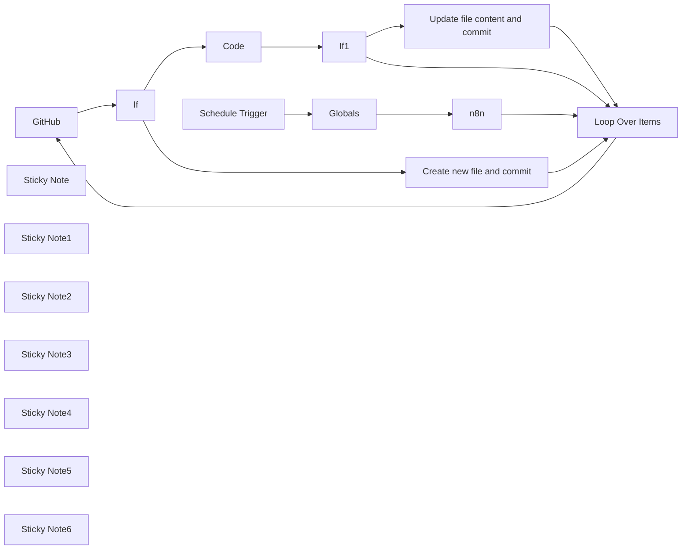

## Fluxo (.json) :

```json
{
  "name": "Backup workflows to git repository",
  "nodes": [
    {
      "id": "b09ae4c6-ad75-4b3b-a78a-4cc2d48b2d24",
      "name": "GitHub",
      "type": "n8n-nodes-base.github",
      "position": [
        -40,
        -20
      ],
      "parameters": {
        "owner": "={{$node[\"Globals\"].json[\"repo\"][\"owner\"]}}",
        "filePath": "={{$node[\"Globals\"].json[\"repo\"][\"path\"]}}{{$json[\"name\"]}}.json",
        "resource": "file",
        "operation": "get",
        "repository": "={{$node[\"Globals\"].json[\"repo\"][\"name\"]}}",
        "asBinaryProperty": false,
        "additionalParameters": {}
      },
      "credentials": {
        "githubApi": {
          "id": "lSdxakI6ik5M2np2",
          "name": "Shashikanth | GitHub account"
        }
      },
      "typeVersion": 1,
      "continueOnFail": true,
      "alwaysOutputData": true
    },
    {
      "id": "639582ef-f13e-4844-bd10-647718079121",
      "name": "Globals",
      "type": "n8n-nodes-base.set",
      "position": [
        -740,
        -100
      ],
      "parameters": {
        "values": {
          "string": [
            {
              "name": "repo.owner",
              "value": "shashikanth171"
            },
            {
              "name": "repo.name",
              "value": "n8n-backup"
            },
            {
              "name": "repo.path",
              "value": "workflows/"
            }
          ]
        },
        "options": {}
      },
      "typeVersion": 1
    },
    {
      "id": "9df89713-220e-43b9-b234-b8f5612629cf",
      "name": "n8n",
      "type": "n8n-nodes-base.n8n",
      "position": [
        -500,
        -100
      ],
      "parameters": {
        "filters": {},
        "requestOptions": {}
      },
      "credentials": {
        "n8nApi": {
          "id": "RgwFr3HsPUEjFJNO",
          "name": "n8n account"
        }
      },
      "typeVersion": 1
    },
    {
      "id": "43a60315-d381-4ac4-be4c-f6a158651a00",
      "name": "Loop Over Items",
      "type": "n8n-nodes-base.splitInBatches",
      "position": [
        -280,
        -100
      ],
      "parameters": {
        "options": {}
      },
      "executeOnce": false,
      "typeVersion": 3
    },
    {
      "id": "41a7da89-1c8c-4100-8c30-d0788962efc1",
      "name": "If",
      "type": "n8n-nodes-base.if",
      "position": [
        160,
        -20
      ],
      "parameters": {
        "options": {},
        "conditions": {
          "options": {
            "version": 2,
            "leftValue": "",
            "caseSensitive": true,
            "typeValidation": "strict"
          },
          "combinator": "and",
          "conditions": [
            {
              "id": "16a9182d-059d-4774-ba95-654fb4293fdb",
              "operator": {
                "type": "string",
                "operation": "notExists",
                "singleValue": true
              },
              "leftValue": "={{ $json.error }}",
              "rightValue": ""
            }
          ]
        }
      },
      "typeVersion": 2.2
    },
    {
      "id": "ab9246eb-a253-4d76-b33b-5f8f12342542",
      "name": "If1",
      "type": "n8n-nodes-base.if",
      "position": [
        1040,
        260
      ],
      "parameters": {
        "options": {},
        "conditions": {
          "options": {
            "version": 2,
            "leftValue": "",
            "caseSensitive": true,
            "typeValidation": "strict"
          },
          "combinator": "and",
          "conditions": [
            {
              "id": "e0c66624-429a-4f1f-bf7b-1cc1b32bad7b",
              "operator": {
                "type": "string",
                "operation": "notEquals"
              },
              "leftValue": "={{ $json.content }}",
              "rightValue": "={{ $('Loop Over Items').item.json.toJsonString() }}"
            }
          ]
        }
      },
      "typeVersion": 2.2
    },
    {
      "id": "72e4a5a4-6dfe-4b5c-b57b-7c1c9625e967",
      "name": "Code",
      "type": "n8n-nodes-base.code",
      "position": [
        720,
        -40
      ],
      "parameters": {
        "jsCode": "let items = $input.all()\n\nfor (item of items) {\n    item.json.content = Buffer.from(item.json.content, 'base64').toString('utf8')\n}\n\nreturn items;\n"
      },
      "typeVersion": 2
    },
    {
      "id": "68f14ac5-14d6-432e-9e6b-25df610eadac",
      "name": "Create new file and commit",
      "type": "n8n-nodes-base.github",
      "position": [
        340,
        140
      ],
      "parameters": {
        "owner": "={{$node[\"Globals\"].json[\"repo\"][\"owner\"]}}",
        "filePath": "={{$node[\"Globals\"].json[\"repo\"][\"path\"]}}{{ $('Loop Over Items').item.json.name }}.json",
        "resource": "file",
        "repository": "={{$node[\"Globals\"].json[\"repo\"][\"name\"]}}",
        "fileContent": "={{ $('Loop Over Items').item.json.toJsonString()  }}",
        "commitMessage": "=[N8N Backup] {{ $('Loop Over Items').item.json.name }}.json"
      },
      "credentials": {
        "githubApi": {
          "id": "lSdxakI6ik5M2np2",
          "name": "Shashikanth | GitHub account"
        }
      },
      "typeVersion": 1
    },
    {
      "id": "e50f00a3-292c-4285-b767-8d6ee4606575",
      "name": "Update file content and commit",
      "type": "n8n-nodes-base.github",
      "position": [
        1400,
        460
      ],
      "parameters": {
        "owner": "={{$node[\"Globals\"].json[\"repo\"][\"owner\"]}}",
        "filePath": "={{$node[\"Globals\"].json[\"repo\"][\"path\"]}}{{ $('Loop Over Items').item.json.name }}.json",
        "resource": "file",
        "operation": "edit",
        "repository": "={{$node[\"Globals\"].json[\"repo\"][\"name\"]}}",
        "fileContent": "={{ $('Loop Over Items').item.json.toJsonString()  }}",
        "commitMessage": "=[N8N Backup] {{ $('Loop Over Items').item.json.name }}.json"
      },
      "credentials": {
        "githubApi": {
          "id": "lSdxakI6ik5M2np2",
          "name": "Shashikanth | GitHub account"
        }
      },
      "typeVersion": 1
    },
    {
      "id": "4b2d375c-a339-404c-babd-555bd2fc4091",
      "name": "Schedule Trigger",
      "type": "n8n-nodes-base.scheduleTrigger",
      "position": [
        -960,
        -100
      ],
      "parameters": {
        "rule": {
          "interval": [
            {
              "field": "minutes"
            }
          ]
        }
      },
      "typeVersion": 1.2
    },
    {
      "id": "ea026e96-0db1-41fd-b003-2f2bf4662696",
      "name": "Sticky Note",
      "type": "n8n-nodes-base.stickyNote",
      "position": [
        1560,
        480
      ],
      "parameters": {
        "height": 80,
        "content": "Workflow changes committed to the repository"
      },
      "typeVersion": 1
    },
    {
      "id": "9c402daa-6d03-485d-b8a0-58f1b65d396d",
      "name": "Sticky Note1",
      "type": "n8n-nodes-base.stickyNote",
      "position": [
        1180,
        260
      ],
      "parameters": {
        "height": 80,
        "content": "Check if there are any changes in the workflow"
      },
      "typeVersion": 1
    },
    {
      "id": "1d9216d9-bf8d-4945-8a58-22fb1ffc9be8",
      "name": "Sticky Note2",
      "type": "n8n-nodes-base.stickyNote",
      "position": [
        460,
        160
      ],
      "parameters": {
        "height": 80,
        "content": "Create a new file for the workflow"
      },
      "typeVersion": 1
    },
    {
      "id": "60a3953b-d9f1-4afd-b299-e314116b96c6",
      "name": "Sticky Note3",
      "type": "n8n-nodes-base.stickyNote",
      "position": [
        160,
        -120
      ],
      "parameters": {
        "height": 80,
        "content": "Check if file exists in the repository"
      },
      "typeVersion": 1
    },
    {
      "id": "6df689fb-cb49-4634-9d1e-59648a1e7219",
      "name": "Sticky Note4",
      "type": "n8n-nodes-base.stickyNote",
      "position": [
        660,
        -140
      ],
      "parameters": {
        "height": 80,
        "content": "Convert the file contents to JSON string"
      },
      "typeVersion": 1
    },
    {
      "id": "f2340ad0-71a1-4c74-8d90-bcb974b8b305",
      "name": "Sticky Note5",
      "type": "n8n-nodes-base.stickyNote",
      "position": [
        -560,
        -200
      ],
      "parameters": {
        "height": 80,
        "content": "Get all workflows"
      },
      "typeVersion": 1
    },
    {
      "id": "617bea19-341a-4e9d-b6fd-6b417e58d756",
      "name": "Sticky Note6",
      "type": "n8n-nodes-base.stickyNote",
      "position": [
        -820,
        40
      ],
      "parameters": {
        "height": 80,
        "content": "Set variables"
      },
      "typeVersion": 1
    }
  ],
  "pinData": {},
  "connections": {
    "If": {
      "main": [
        [
          {
            "node": "Code",
            "type": "main",
            "index": 0
          }
        ],
        [
          {
            "node": "Create new file and commit",
            "type": "main",
            "index": 0
          }
        ]
      ]
    },
    "If1": {
      "main": [
        [
          {
            "node": "Update file content and commit",
            "type": "main",
            "index": 0
          }
        ],
        [
          {
            "node": "Loop Over Items",
            "type": "main",
            "index": 0
          }
        ]
      ]
    },
    "n8n": {
      "main": [
        [
          {
            "node": "Loop Over Items",
            "type": "main",
            "index": 0
          }
        ]
      ]
    },
    "Code": {
      "main": [
        [
          {
            "node": "If1",
            "type": "main",
            "index": 0
          }
        ]
      ]
    },
    "GitHub": {
      "main": [
        [
          {
            "node": "If",
            "type": "main",
            "index": 0
          }
        ]
      ]
    },
    "Globals": {
      "main": [
        [
          {
            "node": "n8n",
            "type": "main",
            "index": 0
          }
        ]
      ]
    },
    "Loop Over Items": {
      "main": [
        [],
        [
          {
            "node": "GitHub",
            "type": "main",
            "index": 0
          }
        ]
      ]
    },
    "Schedule Trigger": {
      "main": [
        [
          {
            "node": "Globals",
            "type": "main",
            "index": 0
          }
        ]
      ]
    },
    "Create new file and commit": {
      "main": [
        [
          {
            "node": "Loop Over Items",
            "type": "main",
            "index": 0
          }
        ]
      ]
    },
    "Update file content and commit": {
      "main": [
        [
          {
            "node": "Loop Over Items",
            "type": "main",
            "index": 0
          }
        ]
      ]
    }
  }
}
```

<a id="template-971"></a>

## Template 971 - Extrair e processar subitems e itens vinculados

- **Nome:** Extrair e processar subitems e itens vinculados
- **Descrição:** Fluxo que busca um item específico em um board, extrai colunas e relações, processa subitems e pulses vinculados, converte dados em arquivo e prepara upload de arquivos.
- **Funcionalidade:** • Início manual: inicia o fluxo via acionamento manual para testes.
• Recuperar item do board: obtém um item específico usando seu ID.
• Extrair colunas por nome e por ID: lê colunas como "Zoom Date", coluna de pessoa (id "person") e a relação "Additional Contacts".
• Puxar e processar subitems: lê a coluna de subitems, parseia os IDs, divide a lista e busca cada subitem individualmente.
• Puxar e processar pulses vinculados: extrai os linkedPulseIds da relação, divide os itens e busca cada pulse vinculado.
• Converter dados para arquivo: transforma dados em formato JSON em um arquivo para posterior uso.
• Mesclar dados e preparar upload: combina arquivos e metadados e prepara uma requisição multipart para enviar arquivo à coluna de arquivos (upload disponível como etapa, atualmente desabilitada).
- **Ferramentas:** • Monday.com: Plataforma utilizada para recuperar itens, subitems e relações do board, além de permitir o upload de arquivos via API.

## Fluxo visual

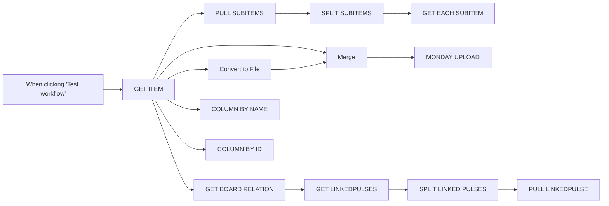

## Fluxo (.json) :

```json
{
  "id": "MmfWpcIegNgBjBpL",
  "meta": {
    "instanceId": "da824ad45fda1b156c8390a3c35cdfbb10059e671c074c19429dac59c5ae98f6"
  },
  "name": "TEMPLATES",
  "tags": [
    {
      "id": "uKg1PU2D27Vsr8ud",
      "name": "MONDAY",
      "createdAt": "2023-12-05T07:54:13.266Z",
      "updatedAt": "2023-12-05T07:54:13.266Z"
    }
  ],
  "nodes": [
    {
      "id": "de488298-e4f3-4b06-aef3-5d5d795382e9",
      "name": "When clicking \"Test workflow\"",
      "type": "n8n-nodes-base.manualTrigger",
      "position": [
        120,
        560
      ],
      "parameters": {},
      "typeVersion": 1
    },
    {
      "id": "7e8c25dc-7ccd-44b5-a4b1-33def99fc811",
      "name": "PULL SUBITEMS",
      "type": "n8n-nodes-base.code",
      "position": [
        640,
        460
      ],
      "parameters": {
        "jsCode": "//Search for \"Subitems\" column\nconst columnName = \"Subitems\"\nfunction getColumnValue(item, columnId) {\n    const column = item.column_values.find(column => column.column.title === columnId);\n    if (column) {\n          return column\n    } else {\n        return null;\n    }\n}\nconst columnValue = getColumnValue($input.last().json, columnName);\nreturn JSON.parse(columnValue.value);\n\n//ALT OPTION - direct access by column_values[0]\n//var ids = $input.last().json['column_values'][0]['value'];\n//return JSON.parse(ids)"
      },
      "typeVersion": 2
    },
    {
      "id": "82464748-cf9a-4792-8790-f07c06c1525d",
      "name": "SPLIT SUBITEMS",
      "type": "n8n-nodes-base.splitOut",
      "position": [
        840,
        460
      ],
      "parameters": {
        "include": "selectedOtherFields",
        "options": {},
        "fieldToSplitOut": "linkedPulseIds",
        "fieldsToInclude": "linkedPulseIds[0].linkedPulseId"
      },
      "typeVersion": 1
    },
    {
      "id": "96a780da-be73-41c8-bf53-b2a05061a340",
      "name": "GET EACH SUBITEM",
      "type": "n8n-nodes-base.mondayCom",
      "position": [
        1020,
        460
      ],
      "parameters": {
        "itemId": "=\n{{ $json.linkedPulseIds.linkedPulseId }}",
        "resource": "boardItem",
        "operation": "get"
      },
      "credentials": {
        "mondayComApi": {
          "id": "5nd48DKapWBLcUBx",
          "name": "Monday.com account"
        }
      },
      "notesInFlow": true,
      "typeVersion": 1
    },
    {
      "id": "5993e15a-1a1b-436e-b994-bf3acee16da0",
      "name": "MONDAY UPLOAD",
      "type": "n8n-nodes-base.httpRequest",
      "disabled": true,
      "position": [
        1020,
        600
      ],
      "parameters": {
        "url": "https://api.monday.com/v2/file",
        "method": "POST",
        "options": {},
        "sendBody": true,
        "contentType": "multipart-form-data",
        "authentication": "predefinedCredentialType",
        "bodyParameters": {
          "parameters": [
            {
              "name": "query",
              "value": "=mutation add_file($file: File!) {add_file_to_column (item_id:{{ $input.last().json[\"id\"] }} , column_id:\"file\" file: $file) {id}}"
            },
            {
              "name": "map",
              "value": "{\"image\":\"variables.file\"}"
            },
            {
              "name": "image",
              "parameterType": "formBinaryData",
              "inputDataFieldName": "data"
            }
          ]
        },
        "nodeCredentialType": "mondayComOAuth2Api"
      },
      "credentials": {
        "mondayComOAuth2Api": {
          "id": "C9hcle0ZoGsxR1ds",
          "name": "Monday.com account 2"
        }
      },
      "notesInFlow": true,
      "typeVersion": 4.1
    },
    {
      "id": "06099adf-7f2f-4c32-84b8-e2458e39f95c",
      "name": "Convert to File",
      "type": "n8n-nodes-base.convertToFile",
      "position": [
        640,
        660
      ],
      "parameters": {
        "options": {},
        "operation": "toJson"
      },
      "typeVersion": 1
    },
    {
      "id": "397c5d7b-76e4-4a0e-bd39-31c10571d68a",
      "name": "Merge",
      "type": "n8n-nodes-base.merge",
      "position": [
        840,
        600
      ],
      "parameters": {
        "mode": "combine",
        "options": {},
        "combinationMode": "mergeByPosition"
      },
      "typeVersion": 2.1
    },
    {
      "id": "a7bcc413-8d7e-4941-a81a-7a99fe14b01d",
      "name": "PULL LINKEDPULSE",
      "type": "n8n-nodes-base.mondayCom",
      "position": [
        1200,
        320
      ],
      "parameters": {
        "itemId": "=\n{{ $json.linkedPulse.linkedPulseId }}",
        "resource": "boardItem",
        "operation": "get"
      },
      "credentials": {
        "mondayComApi": {
          "id": "5nd48DKapWBLcUBx",
          "name": "Monday.com account"
        }
      },
      "notesInFlow": true,
      "typeVersion": 1
    },
    {
      "id": "a4d2e3a7-05a9-434a-a4e5-d6ed3d538091",
      "name": "GET ITEM",
      "type": "n8n-nodes-base.mondayCom",
      "position": [
        340,
        560
      ],
      "parameters": {
        "itemId": "5775061188",
        "resource": "boardItem",
        "operation": "get"
      },
      "credentials": {
        "mondayComApi": {
          "id": "5nd48DKapWBLcUBx",
          "name": "Monday.com account"
        }
      },
      "notesInFlow": true,
      "typeVersion": 1
    },
    {
      "id": "5ce40a46-1513-498a-9e92-8dd96e508f34",
      "name": "GET LINKEDPULSES",
      "type": "n8n-nodes-base.code",
      "position": [
        840,
        320
      ],
      "parameters": {
        "jsCode": "data = $input.last().json.value\nconst linkedPulseID = JSON.parse(data).linkedPulseIds\nreturn { \"linkedPulse\": linkedPulseID}\n"
      },
      "typeVersion": 2
    },
    {
      "id": "22e3ec96-4e83-42fa-aa25-ce0d7445df15",
      "name": "GET BOARD RELATION",
      "type": "n8n-nodes-base.code",
      "position": [
        640,
        320
      ],
      "parameters": {
        "jsCode": "const columnName = \"Additional Contacts\"\n\nfunction getColumnValue(item, columnId) {\n    const column = item.column_values.find(column => column.column.title === columnId);\n    if (column) {\n          return column\n    } else {\n        return null;\n    }\n}\n\nconst columnValue = getColumnValue($input.last().json, columnName);\nreturn (columnValue)"
      },
      "typeVersion": 2
    },
    {
      "id": "e55be301-0a6a-43a6-8a07-becc39e0a254",
      "name": "COLUMN BY NAME",
      "type": "n8n-nodes-base.code",
      "position": [
        640,
        40
      ],
      "parameters": {
        "jsCode": "const columnName = \"Zoom Date\"\n\nfunction getColumnValue(item, columnId) {\n    const column = item.column_values.find(column => column.column.title === columnId);\n    if (column) {\n          return column\n    } else {\n        return null;\n    }\n}\n\nconst columnValue = getColumnValue($input.last().json, columnName);\nreturn (columnValue)"
      },
      "typeVersion": 2
    },
    {
      "id": "463966c2-27e2-429c-8f8b-b3c279592f0d",
      "name": "COLUMN BY ID",
      "type": "n8n-nodes-base.code",
      "position": [
        640,
        180
      ],
      "parameters": {
        "jsCode": "const columnId = \"person\"\n\nfunction getColumnValue(item, columnId) {\n    const column = item.column_values.find(column => column.id === columnId);\n    if (column) {\n          return column\n    } else {\n        return null;\n    }\n}\n\nconst columnValue = getColumnValue($input.last().json, columnId);\nreturn (columnValue)"
      },
      "typeVersion": 2
    },
    {
      "id": "33b0aeff-18aa-4ee9-97b3-7c3a44cf96fc",
      "name": "SPLIT LINKED PULSES",
      "type": "n8n-nodes-base.splitOut",
      "position": [
        1020,
        320
      ],
      "parameters": {
        "include": "=",
        "options": {},
        "fieldToSplitOut": "linkedPulse"
      },
      "typeVersion": 1
    }
  ],
  "active": false,
  "pinData": {},
  "settings": {
    "executionOrder": "v1"
  },
  "versionId": "91cd2823-4b1c-4e94-9205-9a765846b789",
  "connections": {
    "Merge": {
      "main": [
        [
          {
            "node": "MONDAY UPLOAD",
            "type": "main",
            "index": 0
          }
        ]
      ]
    },
    "GET ITEM": {
      "main": [
        [
          {
            "node": "GET BOARD RELATION",
            "type": "main",
            "index": 0
          },
          {
            "node": "PULL SUBITEMS",
            "type": "main",
            "index": 0
          },
          {
            "node": "Convert to File",
            "type": "main",
            "index": 0
          },
          {
            "node": "Merge",
            "type": "main",
            "index": 0
          },
          {
            "node": "COLUMN BY NAME",
            "type": "main",
            "index": 0
          },
          {
            "node": "COLUMN BY ID",
            "type": "main",
            "index": 0
          }
        ]
      ]
    },
    "PULL SUBITEMS": {
      "main": [
        [
          {
            "node": "SPLIT SUBITEMS",
            "type": "main",
            "index": 0
          }
        ]
      ]
    },
    "SPLIT SUBITEMS": {
      "main": [
        [
          {
            "node": "GET EACH SUBITEM",
            "type": "main",
            "index": 0
          }
        ]
      ]
    },
    "Convert to File": {
      "main": [
        [
          {
            "node": "Merge",
            "type": "main",
            "index": 1
          }
        ]
      ]
    },
    "GET LINKEDPULSES": {
      "main": [
        [
          {
            "node": "SPLIT LINKED PULSES",
            "type": "main",
            "index": 0
          }
        ]
      ]
    },
    "GET BOARD RELATION": {
      "main": [
        [
          {
            "node": "GET LINKEDPULSES",
            "type": "main",
            "index": 0
          }
        ]
      ]
    },
    "SPLIT LINKED PULSES": {
      "main": [
        [
          {
            "node": "PULL LINKEDPULSE",
            "type": "main",
            "index": 0
          }
        ]
      ]
    },
    "When clicking \"Test workflow\"": {
      "main": [
        [
          {
            "node": "GET ITEM",
            "type": "main",
            "index": 0
          }
        ]
      ]
    }
  }
}
```

<a id="template-972"></a>

## Template 972 - Persistência de token com dados estáticos

- **Nome:** Persistência de token com dados estáticos
- **Descrição:** Fluxo que demonstra como manter um token de acesso entre execuções usando dados estáticos do fluxo, renovando o token quando expira e persistindo o valor com um timestamp.
- **Funcionalidade:** • Persistência de dados entre execuções: utiliza dados estáticos do fluxo para armazenar o token de acesso e o timestamp.
• Inicialização de dados estáticos: configura valor inicial do token e timestamp na primeira execução.
• Validação de validade do token: verifica se o token ainda é válido com base no timestamp (expiração de 1 minuto).
• Atualização do token: se o token expirou, busca novo token através de uma requisição externa e o armazena com novo timestamp.
• Continuidade do fluxo com token válido: prossegue com o token válido para as próximas etapas.
- **Ferramentas:** • API externa de token: serviço que fornece um novo token de acesso via requisição HTTP.

## Fluxo visual

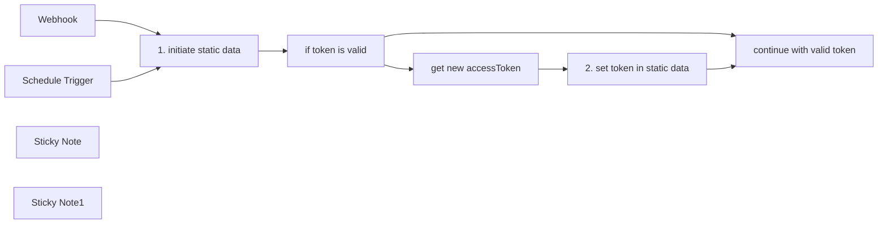

## Fluxo (.json) :

```json
{
  "nodes": [
    {
      "id": "517fad39-50ec-4eae-94c4-aca5b111a093",
      "name": "Webhook",
      "type": "n8n-nodes-base.webhook",
      "position": [
        -120,
        -100
      ],
      "webhookId": "a227afae-e16e-44c2-bb5c-e69fe553b455",
      "parameters": {
        "path": "a227afae-e16e-44c2-bb5c-e69fe553b455",
        "options": {}
      },
      "typeVersion": 2
    },
    {
      "id": "cbd978df-9b95-4148-a054-7772213f5b8f",
      "name": "continue with valid token",
      "type": "n8n-nodes-base.noOp",
      "position": [
        1020,
        -40
      ],
      "parameters": {},
      "typeVersion": 1
    },
    {
      "id": "65167cf9-3ec5-4727-a604-a318e86bb54e",
      "name": "get new accessToken",
      "type": "n8n-nodes-base.httpRequest",
      "position": [
        560,
        80
      ],
      "parameters": {
        "url": "http://your-api.com",
        "options": {
          "response": {
            "response": {
              "fullResponse": true
            }
          }
        }
      },
      "notesInFlow": false,
      "typeVersion": 4.2
    },
    {
      "id": "b17e01d2-c43a-486f-ab08-d81e05f8d110",
      "name": "2. set token in static data",
      "type": "n8n-nodes-base.code",
      "position": [
        780,
        80
      ],
      "parameters": {
        "jsCode": "const workflowStaticData = $getWorkflowStaticData('global');\n\n// get new access token\nworkflowStaticData.accessToken = $input.first().json.AccessToken;\n// set timestamp of new access token\nworkflowStaticData.timestamp = $now.toISO().toString();\n\nreturn [\n  {\n      // data: $input.all(),\n      accessToken: workflowStaticData.accessToken,\n      timestamp: workflowStaticData.timestamp,\n      // today: $today\n  }\n];"
      },
      "typeVersion": 2
    },
    {
      "id": "31fd494a-f323-47cc-8f89-0bb2f2332e0f",
      "name": "Schedule Trigger",
      "type": "n8n-nodes-base.scheduleTrigger",
      "position": [
        -120,
        60
      ],
      "parameters": {
        "rule": {
          "interval": [
            {}
          ]
        }
      },
      "typeVersion": 1.2
    },
    {
      "id": "77623419-99f9-4369-9546-375eaf6f5732",
      "name": "Sticky Note",
      "type": "n8n-nodes-base.stickyNote",
      "position": [
        -180,
        240
      ],
      "parameters": {
        "width": 660,
        "height": 400,
        "content": "# StaticData Demo\n\n\nThis workflow demonstrates how to use the [`workflowStaticData()` function](https://docs.n8n.io/code/cookbook/builtin/get-workflow-static-data/\n) to set any type of variable that will persist within workflow executions. \n\nThis can be useful for working with access tokens that expire after a certain time period. \n\nhttps://docs.n8n.io/code/cookbook/builtin/get-workflow-static-data/\n\n## Important\n\nStatic Data only persists across **_production_** executions, i.e. triggered by Webhooks or Schedule Triggers (not manual executions!)\nFor this the workflow will have to be activated. \n\n\n\n"
      },
      "typeVersion": 1
    },
    {
      "id": "e4cbdbf7-7b3d-4c52-9d41-bc427d63df5d",
      "name": "Sticky Note1",
      "type": "n8n-nodes-base.stickyNote",
      "position": [
        520,
        60
      ],
      "parameters": {
        "color": 5,
        "width": 180,
        "height": 420,
        "content": "\n\n\n\n\n\n\n\n\n\n\n\n\n\n\n\n### HTTP Request\n\nToggle \n`Include Response Headers and Status` \noption if access token is not sent in the body"
      },
      "typeVersion": 1
    },
    {
      "id": "bed68570-bf35-4fa9-984c-1b67a53b59ba",
      "name": "if token is valid",
      "type": "n8n-nodes-base.if",
      "notes": "(1 minute expiration)",
      "position": [
        340,
        -20
      ],
      "parameters": {
        "options": {},
        "conditions": {
          "options": {
            "version": 2,
            "leftValue": "",
            "caseSensitive": true,
            "typeValidation": "loose"
          },
          "combinator": "and",
          "conditions": [
            {
              "id": "65f5c979-3e7d-4e50-92c3-3ae39f1bba3d",
              "operator": {
                "type": "dateTime",
                "operation": "afterOrEquals"
              },
              "leftValue": "={{ $json.timestamp }}",
              "rightValue": "={{ $now.minus(1,'minute') }}"
            }
          ]
        },
        "looseTypeValidation": true
      },
      "notesInFlow": true,
      "typeVersion": 2.2
    },
    {
      "id": "57a4f5f9-eb77-4fd4-b6b1-55137f108374",
      "name": "1. initiate static data",
      "type": "n8n-nodes-base.code",
      "position": [
        120,
        -20
      ],
      "parameters": {
        "jsCode": "// initialize staticData object\nconst workflowStaticData = $getWorkflowStaticData('global');\n\n// initialize accessToken on staticData if it desn't exist yet\nif (!workflowStaticData.hasOwnProperty('accessToken')) {\n  workflowStaticData.accessToken = 0\n}\n\n// initializing any other variables on the staticData object\nif (!workflowStaticData.hasOwnProperty('timestamp')) {\n  workflowStaticData.timestamp = $now.toISO()\n}\n\nreturn [\n  {\n      // data: $input.all(),\n      accessToken: workflowStaticData.accessToken,\n      timestamp: workflowStaticData.timestamp,\n      // today: $today\n  }\n];"
      },
      "notesInFlow": false,
      "typeVersion": 2
    }
  ],
  "pinData": {
    "get new accessToken": [
      {
        "AccessToken": "5763273631"
      }
    ]
  },
  "connections": {
    "Webhook": {
      "main": [
        [
          {
            "node": "1. initiate static data",
            "type": "main",
            "index": 0
          }
        ]
      ]
    },
    "Schedule Trigger": {
      "main": [
        [
          {
            "node": "1. initiate static data",
            "type": "main",
            "index": 0
          }
        ]
      ]
    },
    "if token is valid": {
      "main": [
        [
          {
            "node": "continue with valid token",
            "type": "main",
            "index": 0
          }
        ],
        [
          {
            "node": "get new accessToken",
            "type": "main",
            "index": 0
          }
        ]
      ]
    },
    "get new accessToken": {
      "main": [
        [
          {
            "node": "2. set token in static data",
            "type": "main",
            "index": 0
          }
        ]
      ]
    },
    "1. initiate static data": {
      "main": [
        [
          {
            "node": "if token is valid",
            "type": "main",
            "index": 0
          }
        ]
      ]
    },
    "2. set token in static data": {
      "main": [
        [
          {
            "node": "continue with valid token",
            "type": "main",
            "index": 0
          }
        ]
      ]
    }
  }
}
```

<a id="template-973"></a>

## Template 973 - Verificação periódica de URLs

- **Nome:** Verificação periódica de URLs
- **Descrição:** Verifica periodicamente uma lista de URLs enviando requisições HTTP para monitorar disponibilidade e obter respostas.
- **Funcionalidade:** • Agendamento periódico: Executa o processo automaticamente a cada 15 minutos.
• Definição de lista de URLs: Mantém uma lista configurada de endereços a serem verificados.
• Iteração sobre a lista: Expande a lista em itens individuais para processamento separado de cada URL.
• Envio de requisições HTTP por URL: Realiza uma requisição para cada endereço para verificar disponibilidade e coletar resposta.
• Tolerância a erros por requisição: Continua o processamento mesmo se uma requisição falhar, evitando a interrupção completa do fluxo.
- **Ferramentas:** • Servidores web / Endpoints HTTP: Destinos que recebem as requisições para verificar disponibilidade e obter respostas.

## Fluxo visual


## Fluxo (.json) :

```json
{
  "id": "F2AEknC2Kc3ujuX4",
  "meta": {
    "instanceId": "8437bf0b955ff2039c820e1d56f4a2d7ce67e59f0897cc8ac064cfea1d9dbec6"
  },
  "name": "URL Pinger",
  "tags": [],
  "nodes": [
    {
      "id": "5b3b5251-d460-4eae-a931-e4772749a927",
      "name": "Split Out",
      "type": "n8n-nodes-base.splitOut",
      "position": [
        900,
        460
      ],
      "parameters": {
        "options": {
          "destinationFieldName": "url"
        },
        "fieldToSplitOut": "urls"
      },
      "typeVersion": 1
    },
    {
      "id": "b19bec9b-de09-42a7-8576-2cef3e0f9288",
      "name": "Schedule Trigger",
      "type": "n8n-nodes-base.scheduleTrigger",
      "position": [
        460,
        460
      ],
      "parameters": {
        "rule": {
          "interval": [
            {
              "field": "minutes",
              "minutesInterval": 15
            }
          ]
        }
      },
      "typeVersion": 1.2
    },
    {
      "id": "584a4340-7053-4afd-ae3e-f0c1f2de2586",
      "name": "HTTP Request",
      "type": "n8n-nodes-base.httpRequest",
      "onError": "continueRegularOutput",
      "position": [
        1100,
        460
      ],
      "parameters": {
        "url": "={{ $json.url }}",
        "options": {}
      },
      "typeVersion": 4.2
    },
    {
      "id": "d53b8c24-7408-4e09-8360-f13ecfa5deca",
      "name": "URLs List",
      "type": "n8n-nodes-base.set",
      "position": [
        680,
        460
      ],
      "parameters": {
        "options": {},
        "assignments": {
          "assignments": [
            {
              "id": "9e5e8792-c5ee-4ce2-9a9a-0b3ad274cae6",
              "name": "urls",
              "type": "array",
              "value": "={{ ['http://firsturl.com', 'https://secondurl.com', 'https://thirdurl.com'] }}"
            }
          ]
        }
      },
      "typeVersion": 3.3
    }
  ],
  "active": false,
  "pinData": {},
  "settings": {
    "executionOrder": "v1"
  },
  "versionId": "71356023-fe84-4b30-9df8-3c5dc25fbcca",
  "connections": {
    "Split Out": {
      "main": [
        [
          {
            "node": "HTTP Request",
            "type": "main",
            "index": 0
          }
        ]
      ]
    },
    "URLs List": {
      "main": [
        [
          {
            "node": "Split Out",
            "type": "main",
            "index": 0
          }
        ]
      ]
    },
    "Schedule Trigger": {
      "main": [
        [
          {
            "node": "URLs List",
            "type": "main",
            "index": 0
          }
        ]
      ]
    }
  }
}
```

<a id="template-974"></a>

## Template 974 - Plano de refeições automático com Mealie

- **Nome:** Plano de refeições automático com Mealie
- **Descrição:** Fluxo automatiza a busca de receitas, seleciona aleatoriamente itens e cria um plano de refeições para os próximos dias com base em configurações definidas.
- **Funcionalidade:** • Agendamento: Executa toda sexta-feira às 20h para gerar o plano.
• Busca de receitas: Busca receitas na API Mealie filtrando por categoria e limitando a 100 itens.
• Seleção aleatória de receitas: Seleciona um conjunto de receitas sem repetições até o número configurado.
• Geração de datas das refeições: Calcula as datas das jantares para os próximos dias com o offset configurado.
• Criação de planos de refeições: Envia os itens gerados para criar um novo plano de refeições na API Mealie.
• Configuração de parâmetros: Permite definir base URL, categoria, número de receitas e offset de dias.
• Teste manual: Possibilita executar o fluxo manualmente para validação.
- **Ferramentas:** • Mealie API: Serviço de gerenciamento de receitas utilizado para buscar receitas e criar planos de refeições.

## Fluxo visual

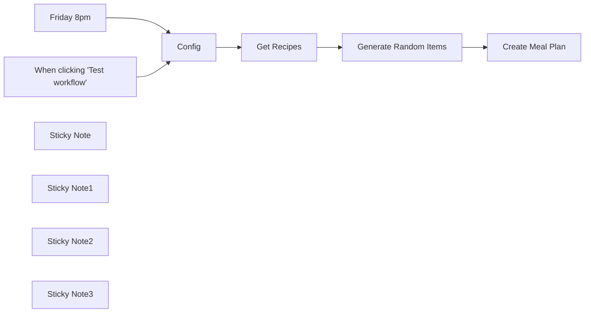

## Fluxo (.json) :

```json
{
  "nodes": [
    {
      "id": "396bb28b-e40d-4bea-aa80-4abd04db045a",
      "name": "Friday 8pm",
      "type": "n8n-nodes-base.scheduleTrigger",
      "position": [
        100,
        120
      ],
      "parameters": {
        "rule": {
          "interval": [
            {
              "field": "weeks",
              "triggerAtDay": [
                5
              ],
              "triggerAtHour": 20
            }
          ]
        }
      },
      "typeVersion": 1.1
    },
    {
      "id": "993f0d31-5639-4cea-b2f8-d1a41ecdeb83",
      "name": "Create Meal Plan",
      "type": "n8n-nodes-base.httpRequest",
      "position": [
        1080,
        120
      ],
      "parameters": {
        "url": "={{ $('Config').first().json.mealieBaseUrl }}/api/households/mealplans",
        "method": "POST",
        "options": {
          "response": {
            "response": {
              "responseFormat": "json"
            }
          }
        },
        "jsonBody": "={{ $json }}",
        "sendBody": true,
        "specifyBody": "json",
        "authentication": "genericCredentialType",
        "genericAuthType": "httpHeaderAuth"
      },
      "credentials": {
        "httpHeaderAuth": {
          "id": "oVwF1hVdy3Srvi9P",
          "name": "Mealie Header Auth"
        }
      },
      "typeVersion": 4.1
    },
    {
      "id": "ad53512d-7246-49f4-a86b-f258b7c1c47e",
      "name": "When clicking \"Test workflow\"",
      "type": "n8n-nodes-base.manualTrigger",
      "position": [
        100,
        320
      ],
      "parameters": {},
      "typeVersion": 1
    },
    {
      "id": "c0d1d7e0-9411-4e6a-871a-0374b8a9f5db",
      "name": "Get Recipes",
      "type": "n8n-nodes-base.httpRequest",
      "position": [
        640,
        120
      ],
      "parameters": {
        "url": "={{ $json.mealieBaseUrl }}/api/recipes",
        "options": {},
        "sendQuery": true,
        "authentication": "genericCredentialType",
        "genericAuthType": "httpHeaderAuth",
        "queryParameters": {
          "parameters": [
            {
              "name": "perPage",
              "value": "100"
            },
            {
              "name": "categories",
              "value": "={{ $json.mealieCategoryId }}"
            }
          ]
        }
      },
      "credentials": {
        "httpHeaderAuth": {
          "id": "oVwF1hVdy3Srvi9P",
          "name": "Mealie Header Auth"
        }
      },
      "typeVersion": 4.1
    },
    {
      "id": "2f9757fc-77f5-4bda-ae2e-7088ea5c114d",
      "name": "Config",
      "type": "n8n-nodes-base.set",
      "position": [
        380,
        120
      ],
      "parameters": {
        "options": {},
        "assignments": {
          "assignments": [
            {
              "id": "cd2665dd-b505-41e4-936d-cfa2de7bd09b",
              "name": "numberOfRecipes",
              "type": "number",
              "value": 5
            },
            {
              "id": "e09da5c5-3f0d-4cd3-909d-e3df2888abde",
              "name": "offsetPlanDays",
              "type": "number",
              "value": 3
            },
            {
              "id": "80e95139-83df-45ae-99a0-fc50d3e9475f",
              "name": "mealieCategoryId",
              "type": "string",
              "value": "6ec172b7-a87d-4877-8fe3-34cecc20f2c5"
            },
            {
              "id": "f511e874-c373-4648-9e49-120367474d6d",
              "name": "mealieBaseUrl",
              "type": "string",
              "value": "http://192.168.1.5:9925"
            }
          ]
        }
      },
      "typeVersion": 3.4
    },
    {
      "id": "fed805ea-0580-444d-8312-a68b25e91bbd",
      "name": "Generate Random Items",
      "type": "n8n-nodes-base.code",
      "position": [
        860,
        120
      ],
      "parameters": {
        "jsCode": "const numberOfRecipes = $('Config').first().json.numberOfRecipes;\nconst offsetPlanDays = $('Config').first().json.offsetPlanDays;\nconst items = $input.first().json.items;\n\nlet planFirstDate = new Date();\nplanFirstDate.setDate(planFirstDate.getDate() + offsetPlanDays);\n\nconst recipeList = [];\nconst randomNums = [];\nlet currentItem = 0;\n\nwhile (recipeList.length < numberOfRecipes) {\n  const randomNum = Math.floor(Math.random() * Math.floor(items.length));\n\n  if (!randomNums.includes(randomNum)) {\n    const thisRecipe = items[randomNum];\n\n    const newDate = new Date(planFirstDate);\n    newDate.setDate(planFirstDate.getDate() + currentItem);\n  \n    const planDate = [\n      newDate.getFullYear(),\n      ('0' + (newDate.getMonth() + 1)).slice(-2),\n      ('0' + newDate.getDate()).slice(-2)\n    ].join('-');\n  \n    const planDay = {\n      \"date\": planDate,\n      \"entryType\": \"dinner\",\n      \"recipeId\": thisRecipe.id,\n      \"name\": thisRecipe.name\n    };\n\n    currentItem++;\n    recipeList.push(planDay);\n    randomNums.push(randomNum);\n  }\n}\n\nreturn recipeList;"
      },
      "typeVersion": 2
    },
    {
      "id": "f440ce9d-cc27-4982-a0bd-b0ce2e5217d9",
      "name": "Sticky Note",
      "type": "n8n-nodes-base.stickyNote",
      "position": [
        40,
        -60
      ],
      "parameters": {
        "color": 4,
        "height": 340,
        "content": "## Trigger\nSet the trigger to run when you like"
      },
      "typeVersion": 1
    },
    {
      "id": "2bac2f08-2969-4f47-9fce-0e7de416cd09",
      "name": "Sticky Note1",
      "type": "n8n-nodes-base.stickyNote",
      "position": [
        280,
        -60
      ],
      "parameters": {
        "color": 5,
        "width": 300,
        "height": 340,
        "content": "## Update this Config\nSet the base Url of your Mealie instance\nSet number of recipes to generate and number of days to offset the plan (0 will start today).\nGrab a category id from Mealie (or leave blank for all categories)"
      },
      "typeVersion": 1
    },
    {
      "id": "a2850e39-c25f-4210-8f9e-a657c0c63bf5",
      "name": "Sticky Note2",
      "type": "n8n-nodes-base.stickyNote",
      "position": [
        40,
        -280
      ],
      "parameters": {
        "width": 540,
        "height": 220,
        "content": "## Get started\n* Set up a credential for your Mealie API token\n* Apply the credential to the 2 Http request nodes\n* Set schedule trigger and desired config"
      },
      "typeVersion": 1
    },
    {
      "id": "20d7301c-8946-45c3-8f5f-fbe2fc80cf37",
      "name": "Sticky Note3",
      "type": "n8n-nodes-base.stickyNote",
      "position": [
        580,
        -60
      ],
      "parameters": {
        "color": 7,
        "width": 660,
        "height": 340,
        "content": "## Workflow logic\n* Get all recipes from Mealie (within category if supplied)\n* Randomly pick out the number set in the config\n* Create dinner meal plans for the upcoming days"
      },
      "typeVersion": 1
    }
  ],
  "pinData": {},
  "connections": {
    "Config": {
      "main": [
        [
          {
            "node": "Get Recipes",
            "type": "main",
            "index": 0
          }
        ]
      ]
    },
    "Friday 8pm": {
      "main": [
        [
          {
            "node": "Config",
            "type": "main",
            "index": 0
          }
        ]
      ]
    },
    "Get Recipes": {
      "main": [
        [
          {
            "node": "Generate Random Items",
            "type": "main",
            "index": 0
          }
        ]
      ]
    },
    "Generate Random Items": {
      "main": [
        [
          {
            "node": "Create Meal Plan",
            "type": "main",
            "index": 0
          }
        ]
      ]
    },
    "When clicking \"Test workflow\"": {
      "main": [
        [
          {
            "node": "Config",
            "type": "main",
            "index": 0
          }
        ]
      ]
    }
  }
}
```

<a id="template-975"></a>

## Template 975 - Receber mensagens MQTT

- **Nome:** Receber mensagens MQTT
- **Descrição:** Recebe mensagens publicadas em uma fila/tópico MQTT e inicia um processo sempre que novas mensagens chegam.
- **Funcionalidade:** • Escutar fila MQTT: Mantém uma escuta ativa em um tópico ou fila para captar mensagens publicadas.
• Acionamento em tempo real: Dispara o fluxo imediatamente quando uma nova mensagem é recebida.
• Conexão autenticada: Utiliza credenciais configuradas para se conectar ao broker MQTT de forma autenticada.
- **Ferramentas:** • Broker MQTT: Sistema de mensagens que gerencia tópicos/filas e distribui mensagens entre publicadores e consumidores.

## Fluxo visual

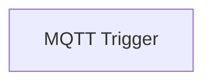

## Fluxo (.json) :

```json
{
  "id": "51",
  "name": "Receive messages for a MQTT queue",
  "nodes": [
    {
      "name": "MQTT Trigger",
      "type": "n8n-nodes-base.mqttTrigger",
      "position": [
        690,
        260
      ],
      "parameters": {
        "options": {}
      },
      "credentials": {
        "mqtt": "mqtt"
      },
      "typeVersion": 1
    }
  ],
  "active": false,
  "settings": {},
  "connections": {}
}
```

<a id="template-976"></a>

## Template 976 - Agente de IA para consultar Google Sheet

- **Nome:** Agente de IA para consultar Google Sheet
- **Descrição:** Fluxo que usa IA para responder perguntas com base nos dados de uma planilha Google, obtidos via URL e organizados por ferramentas de consulta.
- **Funcionalidade:** • Interação via chat: O usuário envia uma pergunta que aciona o agente de IA.
• Descoberta de colunas disponíveis: O fluxo consulta o cabeçalho da planilha para listar colunas disponíveis.
• Recuperação de dados de um cliente específico: O fluxo obtém uma linha correspondente ao cliente solicitado.
• Consulta de valores de uma coluna para todos os clientes: O fluxo retorna valores de uma coluna para filtragem e análise.
• Configuração e leitura da planilha: Define a URL da planilha e lê o conteúdo.
• Execução de subfluxo e formatação de saída: O fluxo executa o subfluxo para processar dados e prepara a saída para o usuário.
- **Ferramentas:** • Google Sheets: Serviço externo para ler conteúdos de planilhas a partir de uma URL.
• OpenAI: Serviço externo para gerar respostas com base em linguagem natural.

## Fluxo visual

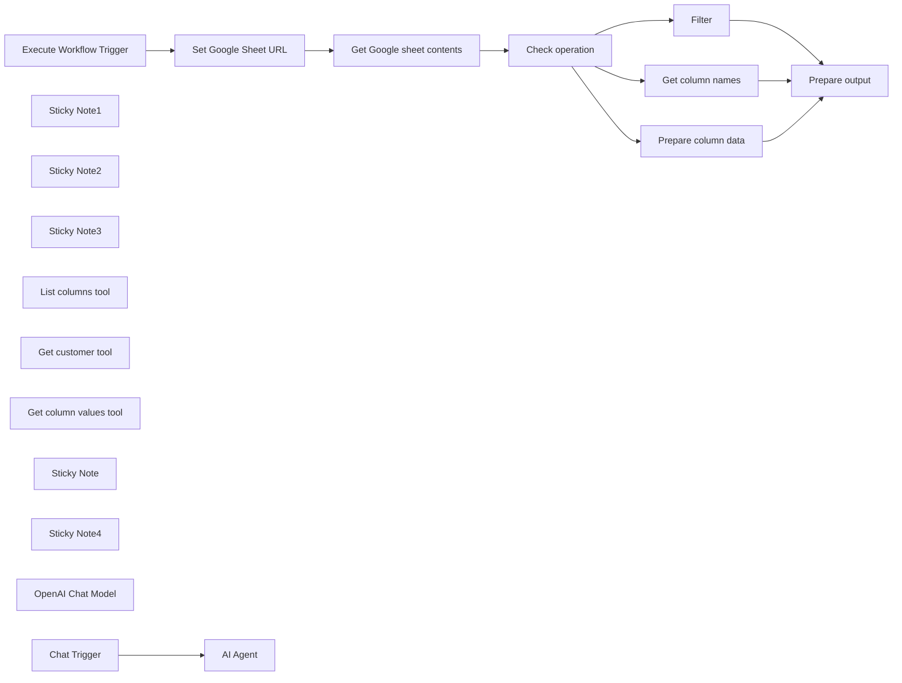

## Fluxo (.json) :

```json
{
  "id": "ZVUQL1bUQ8gBCZTl",
  "meta": {
    "instanceId": "23e6ce638471979c8a2c72a9fb50e44f4f2bfd5a9fc2f5b7f5c842b9abeb9393"
  },
  "name": "Chat with Google Sheet",
  "tags": [],
  "nodes": [
    {
      "id": "89af21df-1125-4df6-9d43-a643e02bb53f",
      "name": "Execute Workflow Trigger",
      "type": "n8n-nodes-base.executeWorkflowTrigger",
      "position": [
        540,
        1240
      ],
      "parameters": {},
      "typeVersion": 1
    },
    {
      "id": "f571d0cc-eb43-46c9-bdd5-45abc51dfbe7",
      "name": "Sticky Note1",
      "type": "n8n-nodes-base.stickyNote",
      "position": [
        461.9740563285368,
        970.616715060075
      ],
      "parameters": {
        "color": 7,
        "width": 1449.2963504228514,
        "height": 612.0936015224503,
        "content": "### Sub-workflow: Custom tool\nThis can be called by the agent above. It returns three different types of data from the Google Sheet, which can be used together for more complex queries without returning the whole sheet (which might be too big for GPT to handle)"
      },
      "typeVersion": 1
    },
    {
      "id": "8761e314-c1f2-4edd-88ea-bfeb02dc8f1a",
      "name": "Sticky Note2",
      "type": "n8n-nodes-base.stickyNote",
      "position": [
        460,
        460
      ],
      "parameters": {
        "color": 7,
        "width": 927.5,
        "height": 486.5625,
        "content": "### Main workflow: AI agent using custom tool"
      },
      "typeVersion": 1
    },
    {
      "id": "e793b816-68d9-42ef-b9b0-6fe22aa375e8",
      "name": "Sticky Note3",
      "type": "n8n-nodes-base.stickyNote",
      "position": [
        300,
        540
      ],
      "parameters": {
        "width": 185.9375,
        "height": 183.85014518022527,
        "content": "## Try me out\n\nClick the 'Chat' button at the bottom and enter:\n\n_Which is our biggest customer?_"
      },
      "typeVersion": 1
    },
    {
      "id": "f895d926-0f70-415b-9492-c3ecf186e761",
      "name": "Get Google sheet contents",
      "type": "n8n-nodes-base.googleSheets",
      "position": [
        980,
        1240
      ],
      "parameters": {
        "options": {},
        "sheetName": {
          "__rl": true,
          "mode": "url",
          "value": "={{ $json.sheetUrl }}"
        },
        "documentId": {
          "__rl": true,
          "mode": "url",
          "value": "={{ $json.sheetUrl }}"
        }
      },
      "credentials": {
        "googleSheetsOAuth2Api": {
          "id": "cTLaIZBSFJlHuZNs",
          "name": "Google Sheets account"
        }
      },
      "typeVersion": 4.2
    },
    {
      "id": "daca1624-6c35-473a-bf3a-5fa0686a0a62",
      "name": "Set Google Sheet URL",
      "type": "n8n-nodes-base.set",
      "position": [
        760,
        1240
      ],
      "parameters": {
        "fields": {
          "values": [
            {
              "name": "sheetUrl",
              "stringValue": "https://docs.google.com/spreadsheets/d/1GjFBV8HpraNWG_JyuaQAgTb3zUGguh0S_25nO0CMd8A/edit#gid=736425281"
            }
          ]
        },
        "options": {}
      },
      "typeVersion": 3.2
    },
    {
      "id": "68edca41-0196-47d8-9378-31fed0a70918",
      "name": "Get column names",
      "type": "n8n-nodes-base.set",
      "position": [
        1460,
        1060
      ],
      "parameters": {
        "fields": {
          "values": [
            {
              "name": "response",
              "stringValue": "={{ Object.keys($json) }}"
            }
          ]
        },
        "include": "none",
        "options": {}
      },
      "executeOnce": true,
      "typeVersion": 3.2
    },
    {
      "id": "7a9dea08-f9e9-4139-842a-9066a9cf04ea",
      "name": "Prepare output",
      "type": "n8n-nodes-base.code",
      "position": [
        1720,
        1240
      ],
      "parameters": {
        "jsCode": "return {\n 'response': JSON.stringify($input.all().map(x => x.json))\n}"
      },
      "typeVersion": 2
    },
    {
      "id": "616eebc5-5c5c-4fa1-b13f-61a477742c72",
      "name": "List columns tool",
      "type": "@n8n/n8n-nodes-langchain.toolWorkflow",
      "position": [
        940,
        780
      ],
      "parameters": {
        "name": "list_columns",
        "fields": {
          "values": [
            {
              "name": "operation",
              "stringValue": "column_names"
            }
          ]
        },
        "workflowId": "={{ $workflow.id }}",
        "description": "=List all column names in customer data\n\nCall this tool to find out what data is available for each customer. It should be called first at the beginning to understand which columns are available for querying."
      },
      "typeVersion": 1
    },
    {
      "id": "891ad3a8-72f0-45ad-8777-1647a7342c00",
      "name": "Get customer tool",
      "type": "@n8n/n8n-nodes-langchain.toolWorkflow",
      "position": [
        1220,
        780
      ],
      "parameters": {
        "name": "get_customer",
        "fields": {
          "values": [
            {
              "name": "operation",
              "stringValue": "row"
            }
          ]
        },
        "workflowId": "={{ $workflow.id }}",
        "description": "=Get all columns for a given customer\n\nThe input should be a stringified row number of the customer to fetch; only single string inputs are allowed. Returns a JSON object with all the column names and their values."
      },
      "typeVersion": 1
    },
    {
      "id": "0f3ca6ff-fc01-4f33-b1a7-cb82a0ec5c88",
      "name": "Get column values tool",
      "type": "@n8n/n8n-nodes-langchain.toolWorkflow",
      "position": [
        1080,
        780
      ],
      "parameters": {
        "name": "column_values",
        "fields": {
          "values": [
            {
              "name": "operation",
              "stringValue": "column_values"
            }
          ]
        },
        "workflowId": "={{ $workflow.id }}",
        "description": "=Get the specified column value for all customers\n\nUse this tool to find out which customers have a certain value for a given column. Returns an array of JSON objects, one per customer. Each JSON object includes the column being requested plus the row_number column. Input should be a single string representing the name of the column to fetch.\n"
      },
      "typeVersion": 1
    },
    {
      "id": "deef6eb4-2a11-4490-ad56-bc1ea9077843",
      "name": "Sticky Note",
      "type": "n8n-nodes-base.stickyNote",
      "position": [
        900,
        740.8693557231958
      ],
      "parameters": {
        "color": 7,
        "width": 432.3271051132649,
        "height": 179.21380662202682,
        "content": "These tools all call the sub-workflow below"
      },
      "typeVersion": 1
    },
    {
      "id": "94e4dbe5-dc41-4879-bffc-ec8f5341f3b5",
      "name": "Sticky Note4",
      "type": "n8n-nodes-base.stickyNote",
      "position": [
        723,
        1172
      ],
      "parameters": {
        "width": 179.99762227826224,
        "height": 226.64416053838073,
        "content": "Change the URL of the Google Sheet here"
      },
      "typeVersion": 1
    },
    {
      "id": "dbb887f0-93a7-466e-9c9f-8aa4e7da935d",
      "name": "Prepare column data",
      "type": "n8n-nodes-base.set",
      "position": [
        1460,
        1240
      ],
      "parameters": {
        "fields": {
          "values": [
            {
              "name": "={{ $('Execute Workflow Trigger').item.json.query }}",
              "stringValue": "={{ $json[$('Execute Workflow Trigger').item.json.query] }}"
            },
            {
              "name": "row_number",
              "stringValue": "={{ $json.row_number }}"
            }
          ]
        },
        "include": "none",
        "options": {}
      },
      "typeVersion": 3.2
    },
    {
      "id": "041d32ca-e59a-4b67-a3e6-4e2f19e3de72",
      "name": "Filter",
      "type": "n8n-nodes-base.filter",
      "position": [
        1460,
        1400
      ],
      "parameters": {
        "options": {
          "looseTypeValidation": true
        },
        "conditions": {
          "options": {
            "leftValue": "",
            "caseSensitive": true,
            "typeValidation": "loose"
          },
          "combinator": "and",
          "conditions": [
            {
              "id": "bf712098-97e4-42cb-8e08-2ee32d19d3e7",
              "operator": {
                "type": "number",
                "operation": "equals"
              },
              "leftValue": "={{ $json.row_number }}",
              "rightValue": "={{ $('Execute Workflow Trigger').item.json.query }}"
            }
          ]
        }
      },
      "typeVersion": 2,
      "alwaysOutputData": true
    },
    {
      "id": "69b9e70a-9104-4731-9f16-8324a3f7e423",
      "name": "Check operation",
      "type": "n8n-nodes-base.switch",
      "position": [
        1200,
        1240
      ],
      "parameters": {
        "rules": {
          "values": [
            {
              "outputKey": "col names",
              "conditions": {
                "options": {
                  "leftValue": "",
                  "caseSensitive": true,
                  "typeValidation": "strict"
                },
                "combinator": "and",
                "conditions": [
                  {
                    "operator": {
                      "type": "string",
                      "operation": "equals"
                    },
                    "leftValue": "={{ $('Execute Workflow Trigger').item.json.operation }}",
                    "rightValue": "column_names"
                  }
                ]
              },
              "renameOutput": true
            },
            {
              "outputKey": "col values",
              "conditions": {
                "options": {
                  "leftValue": "",
                  "caseSensitive": true,
                  "typeValidation": "strict"
                },
                "combinator": "and",
                "conditions": [
                  {
                    "id": "b7968ce7-0d20-43d0-bcca-7b66e0aec715",
                    "operator": {
                      "name": "filter.operator.equals",
                      "type": "string",
                      "operation": "equals"
                    },
                    "leftValue": "={{ $('Execute Workflow Trigger').item.json.operation }}",
                    "rightValue": "column_values"
                  }
                ]
              },
              "renameOutput": true
            },
            {
              "outputKey": "rows",
              "conditions": {
                "options": {
                  "leftValue": "",
                  "caseSensitive": true,
                  "typeValidation": "strict"
                },
                "combinator": "and",
                "conditions": [
                  {
                    "id": "de3bb9b5-edc6-4448-839e-eda07b72144a",
                    "operator": {
                      "name": "filter.operator.equals",
                      "type": "string",
                      "operation": "equals"
                    },
                    "leftValue": "={{ $('Execute Workflow Trigger').item.json.operation }}",
                    "rightValue": "row"
                  }
                ]
              },
              "renameOutput": true
            }
          ]
        },
        "options": {}
      },
      "typeVersion": 3
    },
    {
      "id": "d955e499-5a3e-45a3-9fc8-266e2f687ecc",
      "name": "OpenAI Chat Model",
      "type": "@n8n/n8n-nodes-langchain.lmChatOpenAi",
      "position": [
        800,
        780
      ],
      "parameters": {
        "model": "gpt-3.5-turbo-0125",
        "options": {
          "temperature": 0
        }
      },
      "credentials": {
        "openAiApi": {
          "id": "58qWzMjeNE8GjMmI",
          "name": "OpenAi account"
        }
      },
      "typeVersion": 1
    },
    {
      "id": "28fbda0b-1e01-4f59-af5b-fe02eba899b1",
      "name": "Chat Trigger",
      "type": "@n8n/n8n-nodes-langchain.chatTrigger",
      "position": [
        620,
        560
      ],
      "webhookId": "2b9d9c42-adf4-425d-b0a5-e4f60c750e63",
      "parameters": {},
      "typeVersion": 1
    },
    {
      "id": "c89614f4-d8b1-4f7b-9e7c-856e3f89eadb",
      "name": "AI Agent",
      "type": "@n8n/n8n-nodes-langchain.agent",
      "position": [
        900,
        560
      ],
      "parameters": {
        "agent": "reActAgent",
        "options": {
          "suffix": "Begin! Use `list_columns` tool first to determine which columns are available.\n\n\tQuestion: {input}\n\tThought:{agent_scratchpad}",
          "returnIntermediateSteps": false
        }
      },
      "typeVersion": 1.3
    }
  ],
  "active": false,
  "pinData": {
    "Execute Workflow Trigger": [
      {
        "json": {
          "query": "222",
          "operation": "row"
        }
      }
    ]
  },
  "settings": {
    "executionOrder": "v1"
  },
  "versionId": "94885609-92bb-498c-9628-35d9044593e7",
  "connections": {
    "Filter": {
      "main": [
        [
          {
            "node": "Prepare output",
            "type": "main",
            "index": 0
          }
        ]
      ]
    },
    "Chat Trigger": {
      "main": [
        [
          {
            "node": "AI Agent",
            "type": "main",
            "index": 0
          }
        ]
      ]
    },
    "Check operation": {
      "main": [
        [
          {
            "node": "Get column names",
            "type": "main",
            "index": 0
          }
        ],
        [
          {
            "node": "Prepare column data",
            "type": "main",
            "index": 0
          }
        ],
        [
          {
            "node": "Filter",
            "type": "main",
            "index": 0
          }
        ]
      ]
    },
    "Get column names": {
      "main": [
        [
          {
            "node": "Prepare output",
            "type": "main",
            "index": 0
          }
        ]
      ]
    },
    "Get customer tool": {
      "ai_tool": [
        [
          {
            "node": "AI Agent",
            "type": "ai_tool",
            "index": 0
          }
        ]
      ]
    },
    "List columns tool": {
      "ai_tool": [
        [
          {
            "node": "AI Agent",
            "type": "ai_tool",
            "index": 0
          }
        ]
      ]
    },
    "OpenAI Chat Model": {
      "ai_languageModel": [
        [
          {
            "node": "AI Agent",
            "type": "ai_languageModel",
            "index": 0
          }
        ]
      ]
    },
    "Prepare column data": {
      "main": [
        [
          {
            "node": "Prepare output",
            "type": "main",
            "index": 0
          }
        ]
      ]
    },
    "Set Google Sheet URL": {
      "main": [
        [
          {
            "node": "Get Google sheet contents",
            "type": "main",
            "index": 0
          }
        ]
      ]
    },
    "Get column values tool": {
      "ai_tool": [
        [
          {
            "node": "AI Agent",
            "type": "ai_tool",
            "index": 0
          }
        ]
      ]
    },
    "Execute Workflow Trigger": {
      "main": [
        [
          {
            "node": "Set Google Sheet URL",
            "type": "main",
            "index": 0
          }
        ]
      ]
    },
    "Get Google sheet contents": {
      "main": [
        [
          {
            "node": "Check operation",
            "type": "main",
            "index": 0
          }
        ]
      ]
    }
  }
}
```

<a id="template-977"></a>

## Template 977 - Pesquisa aprofundada com Jina AI DeepSearch

- **Nome:** Pesquisa aprofundada com Jina AI DeepSearch
- **Descrição:** Automatiza a pesquisa a partir de uma consulta do usuário, envia para análise profunda e entrega um relatório estruturado em Markdown, pronto para uso.
- **Funcionalidade:** • Entrada de consulta via chat: Recebe a pergunta ou tema de pesquisa fornecido pelo usuário.
• Envio para análise profunda: Encaminha a consulta para um serviço de DeepSearch para obter respostas e evidências relevantes.
• Suporte a streaming de resposta: Aceita e processa respostas em fluxo contínuo para capturar o conteúdo final gerado.
• Extração e agregação de conteúdo: Analisa os fragmentos recebidos, identifica e reúne o conteúdo relevante final.
• Limpeza e formatação Markdown: Ajusta notas de rodapé, formata links e prepara o texto em Markdown legível.
• Geração de relatório estruturado: Entrega um relatório conciso, fact-based e organizado, pronto para apresentação ou uso posterior.
- **Ferramentas:** • Jina AI DeepSearch: API de pesquisa e geração de respostas em linguagem natural que realiza buscas profundas, análise contextual e fornecimento de resultados em formato de chat com suporte a streaming.

## Fluxo visual

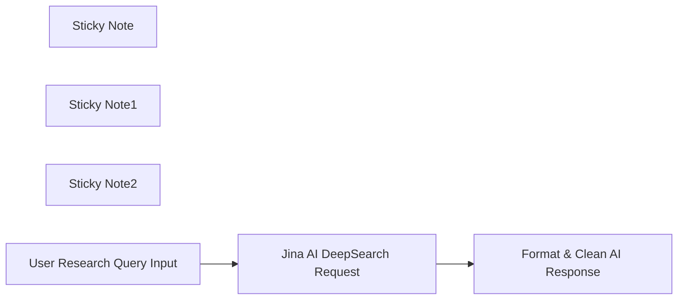

## Fluxo (.json) :

```json
{
  "id": "GToc9QTzJY1h1w3y",
  "meta": {
    "instanceId": "cba4a4a2eb5d7683330e2944837278938831ed3c042e20da6f5049c07ad14798",
    "templateCredsSetupCompleted": true
  },
  "name": "AI-Powered Research with Jina AI Deep Search",
  "tags": [],
  "nodes": [
    {
      "id": "c76a7993-e7b1-426e-bcb4-9a18d9c72b83",
      "name": "Sticky Note",
      "type": "n8n-nodes-base.stickyNote",
      "position": [
        -820,
        -140
      ],
      "parameters": {
        "color": 6,
        "width": 740,
        "height": 760,
        "content": "\n# **🚀 Developed by Leonard van Hemert**  \n\nThank you for using **FREE: Open Deep Research 2.0**! 🎉  \n\nThis workflow was created to **democratize AI-powered research** and make advanced **automated knowledge discovery** available to **everyone**, without **API restrictions** or **cost barriers**.  \n\nIf you find this useful, feel free to **connect with me on LinkedIn** and stay updated on my latest AI & automation projects!  \n\n🔗 **Follow me on LinkedIn**: [Leonard van Hemert](https://www.linkedin.com/in/leonard-van-hemert/)  \n\nI truly appreciate the support from the **n8n community**, and I can’t wait to see how you use and improve this workflow! 🚀  \n\nHappy researching,  \n**Leonard van Hemert** 💡"
      },
      "typeVersion": 1
    },
    {
      "id": "5620b6b5-1485-43a8-9acd-3368147bd742",
      "name": "Sticky Note1",
      "type": "n8n-nodes-base.stickyNote",
      "position": [
        -60,
        -140
      ],
      "parameters": {
        "width": 740,
        "height": 300,
        "content": "## 🚀 **FREE: Open Deep Research 2.0**  \nFully automated **AI-powered research workflow** using **Jina AI’s DeepSearch** to generate structured, fact-based reports—**no API key required!**  "
      },
      "typeVersion": 1
    },
    {
      "id": "dbe1cc91-34b4-4e5b-b404-dd86f47d1ebf",
      "name": "Sticky Note2",
      "type": "n8n-nodes-base.stickyNote",
      "position": [
        -60,
        180
      ],
      "parameters": {
        "width": 740,
        "height": 440,
        "content": "## 🧠 **How This Workflow Works**  \n\nThis workflow automates **deep research and report generation** using **Jina AI's DeepSearch API**, making **advanced knowledge discovery accessible for free**.  \n\n1️⃣ **User Input → AI Research**  \n- A user **enters a research query** via chat.  \n- The workflow **sends the query** to **Jina AI’s DeepSearch API** for **in-depth analysis**.  \n\n2️⃣ **AI-Powered Insights**  \n- DeepSearch **retrieves** and **analyzes** relevant information.  \n- The response includes **key insights, structured analysis, and sources**.  \n\n3️⃣ **Markdown Formatting & Cleanup**  \n- The response **passes through a Code Node** that extracts, cleans, and **formats** the AI-generated insights into **readable Markdown output**.  \n- URLs are properly formatted, footnotes are structured, and the report is easy to read.  \n\n4️⃣ **Final Output**  \n- The final, **well-structured research report** is ready for use, **fully automated and free of charge!**  "
      },
      "typeVersion": 1
    },
    {
      "id": "42fd2f04-7d83-44c9-a41b-48860efbcf79",
      "name": "Jina AI DeepSearch Request",
      "type": "n8n-nodes-base.httpRequest",
      "position": [
        220,
        0
      ],
      "parameters": {
        "url": "https://deepsearch.jina.ai/v1/chat/completions",
        "method": "POST",
        "options": {},
        "jsonBody": "={\n  \"model\": \"jina-deepsearch-v1\",\n  \"messages\": [\n    {\n      \"role\": \"user\",\n      \"content\": \"You are an advanced AI researcher that provides precise, well-structured, and insightful reports based on deep analysis. Your responses are factual, concise, and highly relevant.\"\n    },\n    {\n      \"role\": \"assistant\",\n      \"content\": \"Hi, how can I help you?\"\n    },\n    {\n      \"role\": \"user\",\n      \"content\": \"Provide a deep and insightful analysis on: \\\"{{ $json.chatInput }}\\\". Ensure the response is well-structured, fact-based, and directly relevant to the topic, with no unnecessary information.\"\n    }\n  ],\n  \"stream\": true,\n  \"reasoning_effort\": \"low\"\n}",
        "sendBody": true,
        "specifyBody": "json"
      },
      "typeVersion": 4.2
    },
    {
      "id": "1b7b3bbe-2068-4d3a-a962-134bbb6ee516",
      "name": "User Research Query Input",
      "type": "@n8n/n8n-nodes-langchain.chatTrigger",
      "position": [
        0,
        0
      ],
      "webhookId": "8a4b05af-cd63-4692-9924-e35aaed5f077",
      "parameters": {
        "options": {}
      },
      "typeVersion": 1.1
    },
    {
      "id": "218cbfe2-78de-4b00-875a-51761ac9f5c7",
      "name": "Format & Clean AI Response",
      "type": "n8n-nodes-base.code",
      "position": [
        440,
        0
      ],
      "parameters": {
        "jsCode": "function extractAndFormatMarkdown(input) {\n    let extractedContent = [];\n\n    // Extract raw data string from n8n input\n    let rawData = input.first().json.data;\n\n    // Split into individual JSON strings\n    let jsonStrings = rawData.split(\"\\n\\ndata: \").map(s => s.replace(/^data: /, ''));\n\n    let lastContent = \"\";\n    \n    // Reverse loop to find the last \"content\" field\n    for (let i = jsonStrings.length - 1; i >= 0; i--) {\n        try {\n            let parsedChunk = JSON.parse(jsonStrings[i]);\n\n            if (parsedChunk.choices && parsedChunk.choices.length > 0) {\n                for (let j = parsedChunk.choices.length - 1; j >= 0; j--) {\n                    let choice = parsedChunk.choices[j];\n\n                    if (choice.delta && choice.delta.content) {\n                        lastContent = choice.delta.content.trim();\n                        break;\n                    }\n                }\n            }\n\n            if (lastContent) break; // Stop once the last content is found\n        } catch (error) {\n            console.error(\"Failed to parse JSON string:\", jsonStrings[i], error);\n        }\n    }\n\n    // Clean and format Markdown\n    lastContent = lastContent.replace(/\\[\\^(\\d+)\\]: (.*?)\\n/g, \"[$1]: $2\\n\");  // Format footnotes\n    lastContent = lastContent.replace(/\\[\\^(\\d+)\\]/g, \"[^$1]\");  // Inline footnotes\n    lastContent = lastContent.replace(/(https?://[^\\s]+)(?=[^]]*\\])/g, \"<$1>\");  // Format links\n\n    // Return formatted content as an array of objects (n8n expects this format)\n    return [{ text: lastContent.trim() }];\n}\n\n// Execute function and return formatted output\nreturn extractAndFormatMarkdown($input);\n"
      },
      "typeVersion": 2
    }
  ],
  "active": false,
  "pinData": {},
  "settings": {
    "executionOrder": "v1"
  },
  "versionId": "e03d69b5-3304-4f28-b99f-970d6fd1225b",
  "connections": {
    "User Research Query Input": {
      "main": [
        [
          {
            "node": "Jina AI DeepSearch Request",
            "type": "main",
            "index": 0
          }
        ]
      ]
    },
    "Format & Clean AI Response": {
      "main": [
        []
      ]
    },
    "Jina AI DeepSearch Request": {
      "main": [
        [
          {
            "node": "Format & Clean AI Response",
            "type": "main",
            "index": 0
          }
        ]
      ]
    }
  }
}
```

<a id="template-978"></a>

## Template 978 - Dados de campanha SMARTLEAD para HubSpot e analytics

- **Nome:** Dados de campanha SMARTLEAD para HubSpot e analytics
- **Descrição:** Este fluxo coleta dados de campanhas SMARTLEAD, exporta leads, atualiza informações de campanhas e atividades, sincroniza com HubSpot e gera um relatório em uma planilha.
- **Funcionalidade:** • Extrair dados de campanhas: obtém campanhas e exporta leads via API com API KEY.
• Processar CSV de leads: transforma o CSV em registros estruturados para upserts.
• Atualizar campanhas: atualiza/inclui campanhas no banco ce_campaign.
• Registrar atividades de campanha: armazena mapeamentos de campanhas e atividades em ce_campaign_activity.
• Integrar com HubSpot: consulta dados e sincroniza informações de lifecycle e contatos.
• Atualizar hubspot activity: atualiza a tabela de atividades do HubSpot com o estado mais recente.
• Consultar e consolidar dados: executa consultas SQL para métricas por campanha.
• Gerar relatório em Google Sheets: envia dados processados para uma planilha de relatório.
- **Ferramentas:** • SmartLead API: serviço externo para exportar campanhas e leads.
• HubSpot: CRM utilizado para dados de contatos e lifecyclestage.
• PostgreSQL: banco de dados utilizado para armazenar e consolidar campanhas, atividades e hubspot data.
• Google Sheets: planilha para registro/relatório de métricas de campanhas.

## Fluxo visual

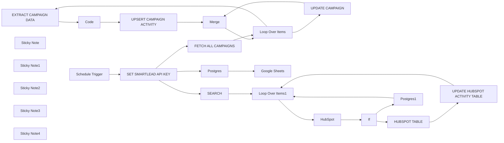

## Fluxo (.json) :

```json
{
  "meta": {
    "instanceId": "a2435d996b378e3a6fdef0468d70285e3aa0fbd0004de817bfc80e80afee4e7b"
  },
  "nodes": [
    {
      "id": "8a4ba8b8-b76e-4572-becd-e7f8fbea2651",
      "name": "EXTRACT CAMPAIGN DATA",
      "type": "n8n-nodes-base.httpRequest",
      "position": [
        500,
        960
      ],
      "parameters": {
        "url": "=https://server.smartlead.ai/api/v1/campaigns/{{ $json.id }}/leads-export",
        "options": {
          "batching": {
            "batch": {
              "batchSize": 0
            }
          }
        },
        "sendQuery": true,
        "queryParameters": {
          "parameters": [
            {
              "name": "api_key",
              "value": "={{ $json['API KEY'] }}"
            }
          ]
        }
      },
      "typeVersion": 4.2
    },
    {
      "id": "90011ed6-180d-4170-8932-ac3aa7d0e5df",
      "name": "FETCH ALL CAMPAIGNS",
      "type": "n8n-nodes-base.httpRequest",
      "position": [
        -20,
        940
      ],
      "parameters": {
        "url": "https://server.smartlead.ai/api/v1/campaigns",
        "options": {
          "batching": {
            "batch": {
              "batchSize": 0
            }
          }
        },
        "sendQuery": true,
        "queryParameters": {
          "parameters": [
            {
              "name": "api_key",
              "value": "={{ $json['API KEY'] }}"
            }
          ]
        }
      },
      "typeVersion": 4.2
    },
    {
      "id": "c41afcf1-9256-47fa-ad99-3e1af880e53d",
      "name": "Loop Over Items",
      "type": "n8n-nodes-base.splitInBatches",
      "position": [
        200,
        940
      ],
      "parameters": {
        "options": {
          "reset": "={{ $node['Loop Over Items'].context[\"done\"] }}"
        }
      },
      "typeVersion": 3
    },
    {
      "id": "606bfc18-1d70-4d64-ac70-ae6f42bf0dbb",
      "name": "UPDATE CAMPAIGN",
      "type": "n8n-nodes-base.postgres",
      "position": [
        720,
        1220
      ],
      "parameters": {
        "table": {
          "__rl": true,
          "mode": "list",
          "value": "ce_campaign",
          "cachedResultName": "ce_campaign"
        },
        "schema": {
          "__rl": true,
          "mode": "list",
          "value": "outbound_activities",
          "cachedResultName": "outbound_activities"
        },
        "columns": {
          "value": {
            "name": "={{ $json.name }}",
            "status": "={{ $json.status }}",
            "user_id": "={{ $json.user_id }}",
            "client_id": "={{ $json.client_id }}",
            "created_at": "={{ $json.created_at }}",
            "updated_at": "={{ $json.updated_at }}",
            "campaign_id": "={{ $json.id }}",
            "track_settings": "={{ $json.track_settings }}",
            "unsubscribe_text": "={{ $json.unsubscribe_text }}",
            "max_leads_per_day": "={{ $json.max_leads_per_day }}",
            "parent_campaign_id": "={{ $json.parent_campaign_id }}",
            "send_as_plain_text": "={{ $json.send_as_plain_text }}",
            "stop_lead_settings": "={{ $json.stop_lead_settings }}",
            "follow_up_percentage": "={{ $json.follow_up_percentage }}",
            "min_time_btwn_emails": "={{ $json.min_time_btwn_emails }}",
            "scheduler_cron_value": "={{ $json.scheduler_cron_value }}",
            "enable_ai_esp_matching": "={{ $json.enable_ai_esp_matching }}",
            "psg_last_update_timestamp": "={{ $now }}"
          },
          "schema": [
            {
              "id": "campaign_id",
              "type": "number",
              "display": true,
              "removed": false,
              "required": true,
              "displayName": "campaign_id",
              "defaultMatch": false,
              "canBeUsedToMatch": true
            },
            {
              "id": "user_id",
              "type": "number",
              "display": true,
              "required": false,
              "displayName": "user_id",
              "defaultMatch": false,
              "canBeUsedToMatch": false
            },
            {
              "id": "created_at",
              "type": "dateTime",
              "display": true,
              "required": true,
              "displayName": "created_at",
              "defaultMatch": false,
              "canBeUsedToMatch": false
            },
            {
              "id": "updated_at",
              "type": "dateTime",
              "display": true,
              "required": true,
              "displayName": "updated_at",
              "defaultMatch": false,
              "canBeUsedToMatch": false
            },
            {
              "id": "status",
              "type": "string",
              "display": true,
              "required": true,
              "displayName": "status",
              "defaultMatch": false,
              "canBeUsedToMatch": false
            },
            {
              "id": "name",
              "type": "string",
              "display": true,
              "required": false,
              "displayName": "name",
              "defaultMatch": false,
              "canBeUsedToMatch": false
            },
            {
              "id": "track_settings",
              "type": "array",
              "display": true,
              "required": false,
              "displayName": "track_settings",
              "defaultMatch": false,
              "canBeUsedToMatch": false
            },
            {
              "id": "scheduler_cron_value",
              "type": "object",
              "display": true,
              "required": false,
              "displayName": "scheduler_cron_value",
              "defaultMatch": false,
              "canBeUsedToMatch": false
            },
            {
              "id": "min_time_btwn_emails",
              "type": "number",
              "display": true,
              "required": false,
              "displayName": "min_time_btwn_emails",
              "defaultMatch": false,
              "canBeUsedToMatch": false
            },
            {
              "id": "max_leads_per_day",
              "type": "number",
              "display": true,
              "required": false,
              "displayName": "max_leads_per_day",
              "defaultMatch": false,
              "canBeUsedToMatch": false
            },
            {
              "id": "stop_lead_settings",
              "type": "string",
              "display": true,
              "required": false,
              "displayName": "stop_lead_settings",
              "defaultMatch": false,
              "canBeUsedToMatch": false
            },
            {
              "id": "enable_ai_esp_matching",
              "type": "boolean",
              "display": true,
              "required": false,
              "displayName": "enable_ai_esp_matching",
              "defaultMatch": false,
              "canBeUsedToMatch": false
            },
            {
              "id": "send_as_plain_text",
              "type": "boolean",
              "display": true,
              "required": false,
              "displayName": "send_as_plain_text",
              "defaultMatch": false,
              "canBeUsedToMatch": false
            },
            {
              "id": "follow_up_percentage",
              "type": "number",
              "display": true,
              "required": false,
              "displayName": "follow_up_percentage",
              "defaultMatch": false,
              "canBeUsedToMatch": false
            },
            {
              "id": "unsubscribe_text",
              "type": "string",
              "display": true,
              "required": false,
              "displayName": "unsubscribe_text",
              "defaultMatch": false,
              "canBeUsedToMatch": false
            },
            {
              "id": "parent_campaign_id",
              "type": "number",
              "display": true,
              "required": false,
              "displayName": "parent_campaign_id",
              "defaultMatch": false,
              "canBeUsedToMatch": false
            },
            {
              "id": "client_id",
              "type": "number",
              "display": true,
              "required": false,
              "displayName": "client_id",
              "defaultMatch": false,
              "canBeUsedToMatch": false
            },
            {
              "id": "psg_last_update_timestamp",
              "type": "dateTime",
              "display": true,
              "required": false,
              "displayName": "psg_last_update_timestamp",
              "defaultMatch": false,
              "canBeUsedToMatch": false
            }
          ],
          "mappingMode": "defineBelow",
          "matchingColumns": [
            "campaign_id"
          ]
        },
        "options": {
          "queryBatching": "independently"
        },
        "operation": "upsert"
      },
      "credentials": {
        "postgres": {
          "id": "z7VPpa7mFIGKNewM",
          "name": "Postgres Aikido"
        }
      },
      "typeVersion": 2.5
    },
    {
      "id": "b9f61fd6-9327-428e-9e78-4ca0779476ea",
      "name": "Merge",
      "type": "n8n-nodes-base.merge",
      "position": [
        1220,
        980
      ],
      "parameters": {
        "mode": "combine",
        "options": {},
        "combineBy": "combineByPosition"
      },
      "typeVersion": 3
    },
    {
      "id": "b8c1082d-a12f-4e56-af8c-73641b45da67",
      "name": "Code",
      "type": "n8n-nodes-base.code",
      "notes": "// Retrieve the CSV-like data from the 'data' field in the input\nconst csvData = $json['data']; // Ensure that 'data' is the correct field name\n\n// Check if csvData exists and is not empty\nif (!csvData) {\n  console.log(\"Input data structure:\", $json); // Debugging output to inspect input structure\n  throw new Error('No CSV data provided. Ensure the correct field reference is being used.');\n}\n\n// Split the CSV into rows\nconst rows = csvData.split('\\n');\n\n// Extract the headers\nconst headers = rows[0].replace(/\"/g, '').split(',');\n\n// Iterate over each data row and map it to an object\nconst output = rows.slice(1).map(row => {\n  const values = row.match(/(\".*?\"|[^\",]+)(?=\\s*,|\\s*$)/g).map(value => {\n    // Remove surrounding quotes from each value if present\n    return value.startsWith('\"') && value.endsWith('\"') ? value.slice(1, -1) : value;\n  });\n\n  const item = {};\n  headers.forEach((header, index) => {\n    item[header] = values[index] || null;\n  });\n\n  return { json: item };\n});\n\nreturn output;",
      "position": [
        720,
        960
      ],
      "parameters": {
        "jsCode": "// Retrieve the CSV-like data from the 'data' field in the input\nconst csvData = items[0].json.data; // Ensure that 'data' is the correct field name\n\n// Check if csvData exists and is not empty\nif (!csvData) {\n  console.log(\"Input data structure:\", ); // Debugging output to inspect input structure\n  throw new Error('No CSV data provided. Ensure the correct field reference is being used.');\n}\n\nif (typeof csvData !== 'string') {\n  throw new Error('CSV data is not a string. Please check the input data format.');\n}\n\n// Preprocess the CSV data to handle missing values\nconst preprocessedCsvData = csvData.replace(/,,/g, ',\"\",');\n\n// Split the CSV into rows\nconst rows = preprocessedCsvData.split(/\\r?\\n/); // Adjust to handle different line endings\n\n// Define the expected number of columns based on CSV structure\nconst expectedNumberOfColumns = 22;\n\n// Iterate over each data row starting from the second row (index 1) and map it to an object\nconst output = rows.slice(1).map((row, index) => {\n  // Split the row into values, accounting for empty columns using regex\n  const values = row.split(/,(?=(?:(?:[^\"]*\"){2})*[^\"]*$)/).map(value => {\n    // Remove surrounding quotes from each value if present and trim whitespace\n    return value.startsWith('\"') && value.endsWith('\"') ? value.slice(1, -1).trim() : value.trim();\n  });\n\n  // Ensure that the number of values matches the expected number of columns\n  while (values.length < expectedNumberOfColumns) {\n    values.push(\"\"); // Add empty strings for missing values\n  }\n\n  // Check if the number of values matches expected columns\n  if (values.length !== expectedNumberOfColumns) {\n    console.warn(`Row ${index + 1} doesn't have the expected number of columns. Skipping this entry.`);\n    return null; // Skip this row if it doesn't match the expected columns\n  }\n\n  // Create an item object with a fixed structure\n  const item = {\n    id: values[0] || null,\n    campaign_lead_map_id: values[1] || null,\n    status: values[2] || null,\n    category: values[3] || null,\n    is_interested: values[4] === 'true', // Convert to boolean\n    created_at: values[5] || null,\n    first_name: values[6] || null,\n    last_name: values[7] || null,\n    email: values[8] || null,\n    phone_number: values[9] || null,\n    company_name: values[10] || null,\n    website: values[11] || null,\n    location: values[12] || null,\n    custom_fields: values[13] || null,\n    linkedin_profile: values[14] || null,\n    company_url: values[15] || null,\n    is_unsubscribed: values[16] === 'true', // Convert to boolean\n    unsubscribed_client_id_map: values[17] || null,\n    last_email_sequence_sent: values[18] || null,\n    open_count: parseInt(values[19], 10) || 0, // Convert to number\n    click_count: parseInt(values[20], 10) || 0, // Convert to number\n    reply_count: parseInt(values[21], 10) || 0  // Convert to number\n  };\n\n  return { json: item };\n}).filter(item => item !== null); // Remove null entries from output\n\n// Return the structured output\nreturn output;\n"
      },
      "typeVersion": 2,
      "alwaysOutputData": true
    },
    {
      "id": "f6550deb-0479-475e-b3ba-9507a4ac8911",
      "name": "Loop Over Items1",
      "type": "n8n-nodes-base.splitInBatches",
      "position": [
        180,
        160
      ],
      "parameters": {
        "options": {
          "reset": "={{ $node['Loop Over Items1'].context[\"done\"] }}"
        }
      },
      "typeVersion": 3
    },
    {
      "id": "a183df85-17a2-4886-adc9-68b5ab5fa8b0",
      "name": "HubSpot",
      "type": "n8n-nodes-base.hubspot",
      "position": [
        420,
        180
      ],
      "parameters": {
        "operation": "getAll",
        "authentication": "oAuth2",
        "additionalFields": {}
      },
      "credentials": {
        "hubspotOAuth2Api": {
          "id": "JOrebC0LtzWrkgzz",
          "name": "Robaws"
        }
      },
      "executeOnce": false,
      "typeVersion": 2.1,
      "alwaysOutputData": true
    },
    {
      "id": "da7e2980-6f82-4867-a460-306095234f5f",
      "name": "If",
      "type": "n8n-nodes-base.if",
      "position": [
        640,
        180
      ],
      "parameters": {
        "options": {},
        "conditions": {
          "options": {
            "version": 2,
            "leftValue": "",
            "caseSensitive": true,
            "typeValidation": "strict"
          },
          "combinator": "and",
          "conditions": [
            {
              "id": "e77d0ee2-bb31-483b-98ee-b0acb0b54bb4",
              "operator": {
                "type": "boolean",
                "operation": "false",
                "singleValue": true
              },
              "leftValue": "={{ $json.companyId.isEmpty() }}",
              "rightValue": ""
            }
          ]
        }
      },
      "typeVersion": 2.2
    },
    {
      "id": "9247f4c5-05dd-48a4-8bf9-c67a8936570c",
      "name": "Schedule Trigger",
      "type": "n8n-nodes-base.scheduleTrigger",
      "position": [
        -1340,
        980
      ],
      "parameters": {
        "rule": {
          "interval": [
            {}
          ]
        }
      },
      "typeVersion": 1.2
    },
    {
      "id": "16623c02-5fb6-40cd-835b-2557eddbbf85",
      "name": "UPSERT CAMPAIGN ACTIVITY",
      "type": "n8n-nodes-base.postgres",
      "onError": "continueErrorOutput",
      "position": [
        980,
        960
      ],
      "parameters": {
        "table": {
          "__rl": true,
          "mode": "list",
          "value": "ce_campaign_activity",
          "cachedResultName": "ce_campaign_activity"
        },
        "schema": {
          "__rl": true,
          "mode": "list",
          "value": "outbound_activities",
          "cachedResultName": "outbound_activities"
        },
        "columns": {
          "value": {
            "id": "={{ $json.id }}",
            "email": "={{ $json.email }}",
            "status": "={{ $json.status }}",
            "website": "={{ $json.email.extractDomain() }}",
            "category": "={{ $json.category }}",
            "location": "={{ $json.location }}",
            "last_name": "={{ $json.last_name }}",
            "created_at": "={{ $json.created_at }}",
            "first_name": "={{ $json.first_name }}",
            "open_count": "={{ $json.open_count }}",
            "campaign_id": "={{ $('Loop Over Items').item.json.id }}",
            "click_count": "={{ $json.click_count }}",
            "company_url": "={{ $json.company_url }}",
            "reply_count": "={{ $json.reply_count }}",
            "company_name": "={{ $json.company_name }}",
            "phone_number": "={{ $json.phone_number }}",
            "custom_fields": "={{ JSON.stringify(JSON.parse($json.custom_fields.replace(/\"\"/g, '\"'))) }}",
            "is_interested": "={{ $json.is_interested }}",
            "is_unsubscribed": "={{ $json.is_unsubscribed }}",
            "linkedin_profile": "={{ $json.linkedin_profile }}",
            "campaign_lead_map_id": "={{ $json.campaign_lead_map_id }}",
            "last_email_sequence_sent": "={{ $json.last_email_sequence_sent }}",
            "psg_last_update_timestmap": "={{ $now }}",
            "unsubscribed_client_id_map": "={{ $json.unsubscribed_client_id_map }}"
          },
          "schema": [
            {
              "id": "id",
              "type": "number",
              "display": true,
              "removed": false,
              "required": true,
              "displayName": "id",
              "defaultMatch": true,
              "canBeUsedToMatch": true
            },
            {
              "id": "campaign_lead_map_id",
              "type": "number",
              "display": true,
              "required": false,
              "displayName": "campaign_lead_map_id",
              "defaultMatch": false,
              "canBeUsedToMatch": false
            },
            {
              "id": "status",
              "type": "string",
              "display": true,
              "required": false,
              "displayName": "status",
              "defaultMatch": false,
              "canBeUsedToMatch": false
            },
            {
              "id": "category",
              "type": "string",
              "display": true,
              "required": false,
              "displayName": "category",
              "defaultMatch": false,
              "canBeUsedToMatch": false
            },
            {
              "id": "is_interested",
              "type": "boolean",
              "display": true,
              "required": false,
              "displayName": "is_interested",
              "defaultMatch": false,
              "canBeUsedToMatch": false
            },
            {
              "id": "created_at",
              "type": "dateTime",
              "display": true,
              "required": true,
              "displayName": "created_at",
              "defaultMatch": false,
              "canBeUsedToMatch": false
            },
            {
              "id": "first_name",
              "type": "string",
              "display": true,
              "required": false,
              "displayName": "first_name",
              "defaultMatch": false,
              "canBeUsedToMatch": false
            },
            {
              "id": "last_name",
              "type": "string",
              "display": true,
              "required": false,
              "displayName": "last_name",
              "defaultMatch": false,
              "canBeUsedToMatch": false
            },
            {
              "id": "email",
              "type": "string",
              "display": true,
              "required": false,
              "displayName": "email",
              "defaultMatch": false,
              "canBeUsedToMatch": false
            },
            {
              "id": "phone_number",
              "type": "string",
              "display": true,
              "required": false,
              "displayName": "phone_number",
              "defaultMatch": false,
              "canBeUsedToMatch": false
            },
            {
              "id": "company_name",
              "type": "string",
              "display": true,
              "required": false,
              "displayName": "company_name",
              "defaultMatch": false,
              "canBeUsedToMatch": false
            },
            {
              "id": "website",
              "type": "string",
              "display": true,
              "required": false,
              "displayName": "website",
              "defaultMatch": false,
              "canBeUsedToMatch": false
            },
            {
              "id": "location",
              "type": "string",
              "display": true,
              "required": false,
              "displayName": "location",
              "defaultMatch": false,
              "canBeUsedToMatch": false
            },
            {
              "id": "custom_fields",
              "type": "object",
              "display": true,
              "required": false,
              "displayName": "custom_fields",
              "defaultMatch": false,
              "canBeUsedToMatch": false
            },
            {
              "id": "linkedin_profile",
              "type": "string",
              "display": true,
              "required": false,
              "displayName": "linkedin_profile",
              "defaultMatch": false,
              "canBeUsedToMatch": false
            },
            {
              "id": "company_url",
              "type": "string",
              "display": true,
              "required": false,
              "displayName": "company_url",
              "defaultMatch": false,
              "canBeUsedToMatch": false
            },
            {
              "id": "is_unsubscribed",
              "type": "boolean",
              "display": true,
              "required": false,
              "displayName": "is_unsubscribed",
              "defaultMatch": false,
              "canBeUsedToMatch": false
            },
            {
              "id": "unsubscribed_client_id_map",
              "type": "object",
              "display": true,
              "required": false,
              "displayName": "unsubscribed_client_id_map",
              "defaultMatch": false,
              "canBeUsedToMatch": false
            },
            {
              "id": "last_email_sequence_sent",
              "type": "number",
              "display": true,
              "required": false,
              "displayName": "last_email_sequence_sent",
              "defaultMatch": false,
              "canBeUsedToMatch": false
            },
            {
              "id": "open_count",
              "type": "number",
              "display": true,
              "required": false,
              "displayName": "open_count",
              "defaultMatch": false,
              "canBeUsedToMatch": false
            },
            {
              "id": "click_count",
              "type": "number",
              "display": true,
              "required": false,
              "displayName": "click_count",
              "defaultMatch": false,
              "canBeUsedToMatch": false
            },
            {
              "id": "reply_count",
              "type": "number",
              "display": true,
              "required": false,
              "displayName": "reply_count",
              "defaultMatch": false,
              "canBeUsedToMatch": false
            },
            {
              "id": "psg_last_update_timestmap",
              "type": "dateTime",
              "display": true,
              "required": false,
              "displayName": "psg_last_update_timestmap",
              "defaultMatch": false,
              "canBeUsedToMatch": false
            },
            {
              "id": "campaign_id",
              "type": "number",
              "display": true,
              "removed": false,
              "required": false,
              "displayName": "campaign_id",
              "defaultMatch": false,
              "canBeUsedToMatch": false
            }
          ],
          "mappingMode": "defineBelow",
          "matchingColumns": [
            "id"
          ]
        },
        "options": {
          "queryBatching": "independently"
        },
        "operation": "upsert"
      },
      "credentials": {},
      "typeVersion": 2.5
    },
    {
      "id": "be550807-7ec6-45bc-b522-ae958200e90e",
      "name": "HUBSPOT TABLE",
      "type": "n8n-nodes-base.postgres",
      "position": [
        900,
        160
      ],
      "parameters": {
        "table": {
          "__rl": true,
          "mode": "list",
          "value": "hubspot",
          "cachedResultName": "hubspot"
        },
        "schema": {
          "__rl": true,
          "mode": "list",
          "value": "outbound_activities",
          "cachedResultName": "outbound_activities"
        },
        "columns": {
          "value": {
            "campaign_id": "={{ $node['Loop Over Items1'].data.campaign_id}}",
            "lifecyclestage": "={{ $json.properties.lifecyclestage.value }}",
            "hs_num_open_deals": "={{ $json.properties.hs_num_open_deals.value }}",
            "hubspot_company_id": "={{ $json.companyId }}"
          },
          "schema": [
            {
              "id": "hubspot_company_id",
              "type": "number",
              "display": true,
              "removed": false,
              "required": true,
              "displayName": "hubspot_company_id",
              "defaultMatch": false,
              "canBeUsedToMatch": true
            },
            {
              "id": "campaign_id",
              "type": "number",
              "display": true,
              "required": false,
              "displayName": "campaign_id",
              "defaultMatch": false,
              "canBeUsedToMatch": false
            },
            {
              "id": "lifecyclestage",
              "type": "string",
              "display": true,
              "required": false,
              "displayName": "lifecyclestage",
              "defaultMatch": false,
              "canBeUsedToMatch": false
            },
            {
              "id": "hs_num_open_deals",
              "type": "number",
              "display": true,
              "required": false,
              "displayName": "hs_num_open_deals",
              "defaultMatch": false,
              "canBeUsedToMatch": false
            },
            {
              "id": "last_engagement_date",
              "type": "dateTime",
              "display": true,
              "removed": true,
              "required": false,
              "displayName": "last_engagement_date",
              "defaultMatch": false,
              "canBeUsedToMatch": false
            }
          ],
          "mappingMode": "defineBelow",
          "matchingColumns": [
            "hubspot_company_id"
          ]
        },
        "options": {
          "queryBatching": "independently"
        },
        "operation": "upsert"
      },
      "credentials": {
        "postgres": {
          "id": "VtxZTfSI4m2NFeN5",
          "name": "Postgres Personal Personal Folder"
        }
      },
      "typeVersion": 2.5
    },
    {
      "id": "328b900e-8c21-4578-b6a4-8c17fbccca26",
      "name": "SEARCH",
      "type": "n8n-nodes-base.postgres",
      "position": [
        -40,
        160
      ],
      "parameters": {
        "query": "SELECT\n    ca.id,\n    ca.campaign_id,\n    ca.email,\n    MIN(ca.first_name) AS first_name,\n    MIN(ca.last_name) AS last_name,\n    SUM(ca.reply_count) AS reply_count,\n    max(hb_lifecyclestage_check_timestamp) as hb_lifecyclestage_check_timestamp,\n    CASE\n        -- Check if there is a comma and handle the extraction first\n        WHEN MIN(ca.linkedin_profile) LIKE '%,%' \n            THEN \n                -- Replace /sales/people/ with /in/ on the extracted part before the comma\n                REPLACE(LEFT(MIN(ca.linkedin_profile), POSITION(',' IN MIN(ca.linkedin_profile)) - 1), '/sales/people/', '/in/')\n        ELSE \n            -- For profiles without a comma, check for the replacement directly\n            REPLACE(MIN(ca.linkedin_profile), '/sales/people/', '/in/')\n    END AS linkedin_profile,\n    MAX(ca.company_url) AS company_profile,\n    -- Extracting domain from email to create the website column\n    SUBSTRING(ca.email FROM POSITION('@' IN ca.email) + 1) AS website,\n    c.created_at,\n    c.updated_at,\n    c.status,\n    c.name\nFROM\n    outbound_activities.ce_campaign_activity ca\nJOIN\n    outbound_activities.ce_campaign c ON ca.campaign_id = c.campaign_id\n--left join outbound_activities.hubspot hb on \n\nWHERE \n  hb_lifecyclestage_check_timestamp IS NULL \n  OR hb_lifecyclestage_check_timestamp < NOW() - INTERVAL '24 hours'\n\n  \nGROUP BY\n    ca.id,\n    ca.campaign_id,\n    ca.email,\n    c.created_at,\n    c.updated_at,\n    c.status,\n    c.name\n\n\nlimit 5000",
        "options": {},
        "operation": "executeQuery"
      },
      "credentials": {
        "postgres": {
          "id": "VtxZTfSI4m2NFeN5",
          "name": "Postgres Personal Personal Folder"
        }
      },
      "typeVersion": 2.5
    },
    {
      "id": "c403ef52-894d-476a-aaba-6527c7cb2184",
      "name": "Postgres1",
      "type": "n8n-nodes-base.postgres",
      "position": [
        640,
        380
      ],
      "parameters": {
        "table": {
          "__rl": true,
          "mode": "list",
          "value": "ce_campaign_activity",
          "cachedResultName": "ce_campaign_activity"
        },
        "schema": {
          "__rl": true,
          "mode": "list",
          "value": "outbound_activities",
          "cachedResultName": "outbound_activities"
        },
        "columns": {
          "value": {
            "id": "={{ $('Loop Over Items1').item.json.id }}",
            "hb_lifecyclestage_check_timestamp": "={{ $now }}"
          },
          "schema": [
            {
              "id": "id",
              "type": "number",
              "display": true,
              "removed": false,
              "required": true,
              "displayName": "id",
              "defaultMatch": true,
              "canBeUsedToMatch": true
            },
            {
              "id": "campaign_lead_map_id",
              "type": "number",
              "display": true,
              "removed": true,
              "required": false,
              "displayName": "campaign_lead_map_id",
              "defaultMatch": false,
              "canBeUsedToMatch": true
            },
            {
              "id": "status",
              "type": "string",
              "display": true,
              "removed": true,
              "required": false,
              "displayName": "status",
              "defaultMatch": false,
              "canBeUsedToMatch": true
            },
            {
              "id": "category",
              "type": "string",
              "display": true,
              "removed": true,
              "required": false,
              "displayName": "category",
              "defaultMatch": false,
              "canBeUsedToMatch": true
            },
            {
              "id": "is_interested",
              "type": "boolean",
              "display": true,
              "removed": true,
              "required": false,
              "displayName": "is_interested",
              "defaultMatch": false,
              "canBeUsedToMatch": true
            },
            {
              "id": "created_at",
              "type": "dateTime",
              "display": true,
              "removed": true,
              "required": true,
              "displayName": "created_at",
              "defaultMatch": false,
              "canBeUsedToMatch": true
            },
            {
              "id": "first_name",
              "type": "string",
              "display": true,
              "removed": true,
              "required": false,
              "displayName": "first_name",
              "defaultMatch": false,
              "canBeUsedToMatch": true
            },
            {
              "id": "last_name",
              "type": "string",
              "display": true,
              "removed": true,
              "required": false,
              "displayName": "last_name",
              "defaultMatch": false,
              "canBeUsedToMatch": true
            },
            {
              "id": "email",
              "type": "string",
              "display": true,
              "removed": true,
              "required": false,
              "displayName": "email",
              "defaultMatch": false,
              "canBeUsedToMatch": true
            },
            {
              "id": "phone_number",
              "type": "string",
              "display": true,
              "removed": true,
              "required": false,
              "displayName": "phone_number",
              "defaultMatch": false,
              "canBeUsedToMatch": true
            },
            {
              "id": "company_name",
              "type": "string",
              "display": true,
              "removed": true,
              "required": false,
              "displayName": "company_name",
              "defaultMatch": false,
              "canBeUsedToMatch": true
            },
            {
              "id": "website",
              "type": "string",
              "display": true,
              "removed": true,
              "required": false,
              "displayName": "website",
              "defaultMatch": false,
              "canBeUsedToMatch": true
            },
            {
              "id": "location",
              "type": "string",
              "display": true,
              "removed": true,
              "required": false,
              "displayName": "location",
              "defaultMatch": false,
              "canBeUsedToMatch": true
            },
            {
              "id": "custom_fields",
              "type": "object",
              "display": true,
              "removed": true,
              "required": false,
              "displayName": "custom_fields",
              "defaultMatch": false,
              "canBeUsedToMatch": true
            },
            {
              "id": "linkedin_profile",
              "type": "string",
              "display": true,
              "removed": true,
              "required": false,
              "displayName": "linkedin_profile",
              "defaultMatch": false,
              "canBeUsedToMatch": true
            },
            {
              "id": "company_url",
              "type": "string",
              "display": true,
              "removed": true,
              "required": false,
              "displayName": "company_url",
              "defaultMatch": false,
              "canBeUsedToMatch": true
            },
            {
              "id": "is_unsubscribed",
              "type": "boolean",
              "display": true,
              "removed": true,
              "required": false,
              "displayName": "is_unsubscribed",
              "defaultMatch": false,
              "canBeUsedToMatch": true
            },
            {
              "id": "unsubscribed_client_id_map",
              "type": "object",
              "display": true,
              "removed": true,
              "required": false,
              "displayName": "unsubscribed_client_id_map",
              "defaultMatch": false,
              "canBeUsedToMatch": true
            },
            {
              "id": "last_email_sequence_sent",
              "type": "number",
              "display": true,
              "removed": true,
              "required": false,
              "displayName": "last_email_sequence_sent",
              "defaultMatch": false,
              "canBeUsedToMatch": true
            },
            {
              "id": "open_count",
              "type": "number",
              "display": true,
              "removed": true,
              "required": false,
              "displayName": "open_count",
              "defaultMatch": false,
              "canBeUsedToMatch": true
            },
            {
              "id": "click_count",
              "type": "number",
              "display": true,
              "removed": true,
              "required": false,
              "displayName": "click_count",
              "defaultMatch": false,
              "canBeUsedToMatch": true
            },
            {
              "id": "reply_count",
              "type": "number",
              "display": true,
              "removed": true,
              "required": false,
              "displayName": "reply_count",
              "defaultMatch": false,
              "canBeUsedToMatch": true
            },
            {
              "id": "psg_last_update_timestmap",
              "type": "dateTime",
              "display": true,
              "removed": true,
              "required": false,
              "displayName": "psg_last_update_timestmap",
              "defaultMatch": false,
              "canBeUsedToMatch": true
            },
            {
              "id": "campaign_id",
              "type": "number",
              "display": true,
              "removed": true,
              "required": false,
              "displayName": "campaign_id",
              "defaultMatch": false,
              "canBeUsedToMatch": true
            },
            {
              "id": "hb_lifecyclestage_check_timestamp",
              "type": "dateTime",
              "display": true,
              "required": false,
              "displayName": "hb_lifecyclestage_check_timestamp",
              "defaultMatch": false,
              "canBeUsedToMatch": true
            }
          ],
          "mappingMode": "defineBelow",
          "matchingColumns": [
            "id"
          ]
        },
        "options": {},
        "operation": "update"
      },
      "credentials": {
        "postgres": {
          "id": "VtxZTfSI4m2NFeN5",
          "name": "Postgres Personal Personal Folder"
        }
      },
      "typeVersion": 2.5
    },
    {
      "id": "671f168b-a720-42e6-964d-a7f2871d2d6e",
      "name": "UPDATE HUBSPOT ACTIVITY TABLE",
      "type": "n8n-nodes-base.postgres",
      "position": [
        1120,
        160
      ],
      "parameters": {
        "table": {
          "__rl": true,
          "mode": "list",
          "value": "ce_campaign_activity",
          "cachedResultName": "ce_campaign_activity"
        },
        "schema": {
          "__rl": true,
          "mode": "list",
          "value": "outbound_activities",
          "cachedResultName": "outbound_activities"
        },
        "columns": {
          "value": {
            "id": "={{ $('Loop Over Items1').item.json.id }}",
            "hb_lifecyclestage_check_timestamp": "={{ $now }}"
          },
          "schema": [
            {
              "id": "id",
              "type": "number",
              "display": true,
              "removed": false,
              "required": true,
              "displayName": "id",
              "defaultMatch": true,
              "canBeUsedToMatch": true
            },
            {
              "id": "campaign_lead_map_id",
              "type": "number",
              "display": true,
              "removed": true,
              "required": false,
              "displayName": "campaign_lead_map_id",
              "defaultMatch": false,
              "canBeUsedToMatch": true
            },
            {
              "id": "status",
              "type": "string",
              "display": true,
              "removed": true,
              "required": false,
              "displayName": "status",
              "defaultMatch": false,
              "canBeUsedToMatch": true
            },
            {
              "id": "category",
              "type": "string",
              "display": true,
              "removed": true,
              "required": false,
              "displayName": "category",
              "defaultMatch": false,
              "canBeUsedToMatch": true
            },
            {
              "id": "is_interested",
              "type": "boolean",
              "display": true,
              "removed": true,
              "required": false,
              "displayName": "is_interested",
              "defaultMatch": false,
              "canBeUsedToMatch": true
            },
            {
              "id": "created_at",
              "type": "dateTime",
              "display": true,
              "removed": true,
              "required": true,
              "displayName": "created_at",
              "defaultMatch": false,
              "canBeUsedToMatch": true
            },
            {
              "id": "first_name",
              "type": "string",
              "display": true,
              "removed": true,
              "required": false,
              "displayName": "first_name",
              "defaultMatch": false,
              "canBeUsedToMatch": true
            },
            {
              "id": "last_name",
              "type": "string",
              "display": true,
              "removed": true,
              "required": false,
              "displayName": "last_name",
              "defaultMatch": false,
              "canBeUsedToMatch": true
            },
            {
              "id": "email",
              "type": "string",
              "display": true,
              "removed": true,
              "required": false,
              "displayName": "email",
              "defaultMatch": false,
              "canBeUsedToMatch": true
            },
            {
              "id": "phone_number",
              "type": "string",
              "display": true,
              "removed": true,
              "required": false,
              "displayName": "phone_number",
              "defaultMatch": false,
              "canBeUsedToMatch": true
            },
            {
              "id": "company_name",
              "type": "string",
              "display": true,
              "removed": true,
              "required": false,
              "displayName": "company_name",
              "defaultMatch": false,
              "canBeUsedToMatch": true
            },
            {
              "id": "website",
              "type": "string",
              "display": true,
              "removed": true,
              "required": false,
              "displayName": "website",
              "defaultMatch": false,
              "canBeUsedToMatch": true
            },
            {
              "id": "location",
              "type": "string",
              "display": true,
              "removed": true,
              "required": false,
              "displayName": "location",
              "defaultMatch": false,
              "canBeUsedToMatch": true
            },
            {
              "id": "custom_fields",
              "type": "object",
              "display": true,
              "removed": true,
              "required": false,
              "displayName": "custom_fields",
              "defaultMatch": false,
              "canBeUsedToMatch": true
            },
            {
              "id": "linkedin_profile",
              "type": "string",
              "display": true,
              "removed": true,
              "required": false,
              "displayName": "linkedin_profile",
              "defaultMatch": false,
              "canBeUsedToMatch": true
            },
            {
              "id": "company_url",
              "type": "string",
              "display": true,
              "removed": true,
              "required": false,
              "displayName": "company_url",
              "defaultMatch": false,
              "canBeUsedToMatch": true
            },
            {
              "id": "is_unsubscribed",
              "type": "boolean",
              "display": true,
              "removed": true,
              "required": false,
              "displayName": "is_unsubscribed",
              "defaultMatch": false,
              "canBeUsedToMatch": true
            },
            {
              "id": "unsubscribed_client_id_map",
              "type": "object",
              "display": true,
              "removed": true,
              "required": false,
              "displayName": "unsubscribed_client_id_map",
              "defaultMatch": false,
              "canBeUsedToMatch": true
            },
            {
              "id": "last_email_sequence_sent",
              "type": "number",
              "display": true,
              "removed": true,
              "required": false,
              "displayName": "last_email_sequence_sent",
              "defaultMatch": false,
              "canBeUsedToMatch": true
            },
            {
              "id": "open_count",
              "type": "number",
              "display": true,
              "removed": true,
              "required": false,
              "displayName": "open_count",
              "defaultMatch": false,
              "canBeUsedToMatch": true
            },
            {
              "id": "click_count",
              "type": "number",
              "display": true,
              "removed": true,
              "required": false,
              "displayName": "click_count",
              "defaultMatch": false,
              "canBeUsedToMatch": true
            },
            {
              "id": "reply_count",
              "type": "number",
              "display": true,
              "removed": true,
              "required": false,
              "displayName": "reply_count",
              "defaultMatch": false,
              "canBeUsedToMatch": true
            },
            {
              "id": "psg_last_update_timestmap",
              "type": "dateTime",
              "display": true,
              "removed": true,
              "required": false,
              "displayName": "psg_last_update_timestmap",
              "defaultMatch": false,
              "canBeUsedToMatch": true
            },
            {
              "id": "campaign_id",
              "type": "number",
              "display": true,
              "removed": true,
              "required": false,
              "displayName": "campaign_id",
              "defaultMatch": false,
              "canBeUsedToMatch": true
            },
            {
              "id": "hb_lifecyclestage_check_timestamp",
              "type": "dateTime",
              "display": true,
              "required": false,
              "displayName": "hb_lifecyclestage_check_timestamp",
              "defaultMatch": false,
              "canBeUsedToMatch": true
            }
          ],
          "mappingMode": "defineBelow",
          "matchingColumns": [
            "id"
          ]
        },
        "options": {},
        "operation": "update"
      },
      "credentials": {
        "postgres": {
          "id": "VtxZTfSI4m2NFeN5",
          "name": "Postgres Personal Personal Folder"
        }
      },
      "typeVersion": 2.5
    },
    {
      "id": "6ebe6482-0f31-465a-8532-abaf3822ad72",
      "name": "Sticky Note",
      "type": "n8n-nodes-base.stickyNote",
      "position": [
        -140,
        -60
      ],
      "parameters": {
        "color": 3,
        "width": 1531.405758029468,
        "height": 669.051063941859,
        "content": "## HUBSPOT LIFECYCLESTAGE (LEAD STATUS)"
      },
      "typeVersion": 1
    },
    {
      "id": "31ea75c2-a228-4390-b125-8f2ac0b96a07",
      "name": "Sticky Note1",
      "type": "n8n-nodes-base.stickyNote",
      "position": [
        -140,
        760
      ],
      "parameters": {
        "color": 3,
        "width": 1831,
        "height": 669,
        "content": "## SMARTLEAD CAMPAIGN DATA"
      },
      "typeVersion": 1
    },
    {
      "id": "8d7e4883-74e2-4758-b2d9-504eb7301cbd",
      "name": "SET SMARTLEAD API KEY",
      "type": "n8n-nodes-base.set",
      "position": [
        -1040,
        980
      ],
      "parameters": {
        "options": {},
        "assignments": {
          "assignments": [
            {
              "id": "7f81531d-f76f-42c7-b536-2b7b70563e12",
              "name": "API KEY",
              "type": "string",
              "value": "<< ADD YOUR API KEY HERE >>"
            }
          ]
        }
      },
      "typeVersion": 3.4
    },
    {
      "id": "1742845b-2ce5-4184-a7b0-6f5606714fcb",
      "name": "Sticky Note2",
      "type": "n8n-nodes-base.stickyNote",
      "position": [
        -1100,
        780
      ],
      "parameters": {
        "height": 400,
        "content": "## Search for your smartlead API key [here](https://app.smartlead.ai/app/settings/profile)"
      },
      "typeVersion": 1
    },
    {
      "id": "e10205a7-3859-4a31-85ba-59c5cc0b69f7",
      "name": "Postgres",
      "type": "n8n-nodes-base.postgres",
      "position": [
        -40,
        1700
      ],
      "parameters": {
        "query": "SELECT \n    h.campaign_id,\n        c.status,\n    c.name,\n    COUNT(DISTINCT h.hubspot_company_id) AS total_companies,\n    SUM(CASE WHEN h.lifecyclestage = 'lead' AND h.hs_num_open_deals != 0 THEN 1 ELSE 0 END) AS lead_count,\n    SUM(CASE WHEN h.lifecyclestage = 'marketingqualifiedlead' AND h.hs_num_open_deals != 0 THEN 1 ELSE 0 END) AS marketingqualifiedlead_count,\n    SUM(CASE WHEN h.lifecyclestage = 'salesqualifiedlead' AND h.hs_num_open_deals != 0 THEN 1 ELSE 0 END) AS salesqualifiedlead_count,\n    SUM(CASE WHEN h.lifecyclestage = 'opportunity' AND h.hs_num_open_deals != 0 THEN 1 ELSE 0 END) AS opportunity_count,\n    SUM(CASE WHEN h.lifecyclestage = 'customer' AND h.hs_num_open_deals != 0 THEN 1 ELSE 0 END) AS customer_count,\n    SUM(CASE WHEN h.lifecyclestage = '140669943' AND h.hs_num_open_deals != 0 THEN 1 ELSE 0 END) AS lifecyclestage_140669943_count,\n    SUM(CASE WHEN h.lifecyclestage = '140669942' AND h.hs_num_open_deals != 0 THEN 1 ELSE 0 END) AS lifecyclestage_140669942_count\nFROM \n    outbound_activities.hubspot h\nJOIN \n    outbound_activities.ce_campaign c ON h.campaign_id = c.campaign_id\nGROUP BY \n    h.campaign_id, c.status, c.name",
        "options": {
          "queryBatching": "independently"
        },
        "operation": "executeQuery"
      },
      "credentials": {
        "postgres": {
          "id": "VtxZTfSI4m2NFeN5",
          "name": "Postgres Personal Personal Folder"
        }
      },
      "retryOnFail": true,
      "typeVersion": 2.5
    },
    {
      "id": "19a80be4-f81f-44f7-8108-a20f6af8e315",
      "name": "Sticky Note3",
      "type": "n8n-nodes-base.stickyNote",
      "position": [
        -1300,
        1340
      ],
      "parameters": {
        "width": 740,
        "height": 400,
        "content": "## POSTGRES INSTALATION [Guide](https://github.com/wukimidaire/postgres_table_templates)\n\n## Follow this step by step guide, focus on the next 3 table creations for this flow:\n## - ce_campaign_activity\n## - ce_campaign\n## - hubspot"
      },
      "typeVersion": 1
    },
    {
      "id": "7bc235d2-65c8-41fd-b429-26b2422cbfa8",
      "name": "Sticky Note4",
      "type": "n8n-nodes-base.stickyNote",
      "position": [
        -120,
        1580
      ],
      "parameters": {
        "color": 3,
        "width": 1060,
        "height": 1313.3157639300548,
        "content": "\n\n\n\n\n\n\n\n\n\n\n\n\n\n\n\n\n\n\n\n\n\n\n\n\n\n## Campaign Analytics Report Documentation\n\nOverview\n\nThis report provides a high-level summary of campaign performance, designed to help stakeholders quickly assess the outcomes of marketing or sales campaigns. It includes data on campaign activity, targeted audiences, and progression metrics, allowing for a holistic view of campaign effectiveness.\n\n## Key Metrics\n\n\t1\t**Campaign Identification and Status**\n\n        •\tCampaign ID: A unique identifier assigned to each campaign for tracking purposes.\n\t•\tStatus: Indicates the current state of the campaign:\n\t•\tActive: Campaign is ongoing.\n\t•\tPaused: Campaign is temporarily on hold.\n\t•\tArchived: Campaign has concluded.\n\n2       **Targeting and Reach**\n\n\t•\tTotal Companies: Number of companies targeted within the campaign scope.\n\n\n3\t**Pipeline Metrics**\n\n\t•\tLead Count: Total number of leads generated by the campaign.\n\t•\tMarketing Qualified Leads (MQLs): Leads that meet predefined marketing qualification criteria.\n\t•\tSales Qualified Leads (SQLs): Leads that are validated as sales-ready by the team.\n\t•\tOpportunities: Potential deals created from campaign engagement.\n\t•\tCustomers: Number of deals successfully closed, converting leads into customers.\n\n\n4\t**Lifecycle Stages**\n\n\t•\tLifecycle Stage Metrics: Counts of entities (e.g., leads, opportunities, or customers) at specific lifecycle stages. These stages represent the journey from lead generation to conversion.\n\n\n\n## How to Use This Report\n\n\t•\t**Evaluate Campaign Success**: Compare metrics like total companies, leads, and customers to understand campaign impact.\n\t•\t**Understand Pipeline Health**: Analyze how many entities progress through the funnel (e.g., from MQL to SQL to Opportunity).\n\t•\t**Monitor Campaign Status**: Use the status column to focus on active campaigns or review the outcomes of archived ones.\n\t•\t**Assess Engagement**: Check opportunity and customer counts to gauge how effective the campaign is in driving conversions."
      },
      "typeVersion": 1
    },
    {
      "id": "0af663c4-faa9-49ae-a5d3-3bcb6ea7888a",
      "name": "Google Sheets",
      "type": "n8n-nodes-base.googleSheets",
      "position": [
        180,
        1700
      ],
      "parameters": {
        "columns": {
          "value": {
            "name": "={{ $json.name }}",
            "status": "={{ $json.status }}",
            "lead_count": "={{ $json.lead_count }}",
            "campaign_id": "={{ $json.company_id }}",
            "customer_count": "={{ $json.customer_count\n}}\n",
            "total_companies": "={{ $json.total_companies }}",
            "opportunity_count": "={{ $json.opportunity_count\n }}",
            "salesqualifiedlead_count": "={{ $json.salesqualifiedlead_count }}",
            "marketingqualifiedlead_count": "={{ $json.marketingqualifiedlead_count }}",
            "lifecyclestage_140669942_count": "={{ $json.lifecyclestage_140669942_count\n}}\n",
            "lifecyclestage_140669943_count": "={{ $json.lifecyclestage_140669943_count\n}}\n"
          },
          "schema": [
            {
              "id": "campaign_id",
              "type": "string",
              "display": true,
              "removed": false,
              "required": false,
              "displayName": "campaign_id",
              "defaultMatch": false,
              "canBeUsedToMatch": true
            },
            {
              "id": "status",
              "type": "string",
              "display": true,
              "required": false,
              "displayName": "status",
              "defaultMatch": false,
              "canBeUsedToMatch": true
            },
            {
              "id": "name",
              "type": "string",
              "display": true,
              "required": false,
              "displayName": "name",
              "defaultMatch": false,
              "canBeUsedToMatch": true
            },
            {
              "id": "total_companies",
              "type": "string",
              "display": true,
              "required": false,
              "displayName": "total_companies",
              "defaultMatch": false,
              "canBeUsedToMatch": true
            },
            {
              "id": "lead_count",
              "type": "string",
              "display": true,
              "required": false,
              "displayName": "lead_count",
              "defaultMatch": false,
              "canBeUsedToMatch": true
            },
            {
              "id": "marketingqualifiedlead_count",
              "type": "string",
              "display": true,
              "required": false,
              "displayName": "marketingqualifiedlead_count",
              "defaultMatch": false,
              "canBeUsedToMatch": true
            },
            {
              "id": "salesqualifiedlead_count",
              "type": "string",
              "display": true,
              "required": false,
              "displayName": "salesqualifiedlead_count",
              "defaultMatch": false,
              "canBeUsedToMatch": true
            },
            {
              "id": "opportunity_count",
              "type": "string",
              "display": true,
              "required": false,
              "displayName": "opportunity_count",
              "defaultMatch": false,
              "canBeUsedToMatch": true
            },
            {
              "id": "customer_count",
              "type": "string",
              "display": true,
              "required": false,
              "displayName": "customer_count",
              "defaultMatch": false,
              "canBeUsedToMatch": true
            },
            {
              "id": "lifecyclestage_140669943_count",
              "type": "string",
              "display": true,
              "required": false,
              "displayName": "lifecyclestage_140669943_count",
              "defaultMatch": false,
              "canBeUsedToMatch": true
            },
            {
              "id": "lifecyclestage_140669942_count",
              "type": "string",
              "display": true,
              "required": false,
              "displayName": "lifecyclestage_140669942_count",
              "defaultMatch": false,
              "canBeUsedToMatch": true
            }
          ],
          "mappingMode": "defineBelow",
          "matchingColumns": [
            "campaign_id"
          ]
        },
        "options": {},
        "operation": "appendOrUpdate",
        "sheetName": {
          "__rl": true,
          "mode": "list",
          "value": "gid=0",
          "cachedResultUrl": "https://docs.google.com/spreadsheets/d/1kG5uXCzOJdUTapA6p-IbH3D8sjpGZ5MQm_IhhvPvIGE/edit#gid=0",
          "cachedResultName": "Sheet1"
        },
        "documentId": {
          "__rl": true,
          "mode": "list",
          "value": "1kG5uXCzOJdUTapA6p-IbH3D8sjpGZ5MQm_IhhvPvIGE",
          "cachedResultUrl": "https://docs.google.com/spreadsheets/d/1kG5uXCzOJdUTapA6p-IbH3D8sjpGZ5MQm_IhhvPvIGE/edit?usp=drivesdk",
          "cachedResultName": "Smartlead Reporting - TEMPLATE"
        }
      },
      "credentials": {
        "googleSheetsOAuth2Api": {
          "id": "qx3ux5eQ43R4Hmbq",
          "name": "Google Sheets account 2"
        }
      },
      "typeVersion": 4.5
    }
  ],
  "pinData": {},
  "connections": {
    "If": {
      "main": [
        [
          {
            "node": "HUBSPOT TABLE",
            "type": "main",
            "index": 0
          }
        ],
        [
          {
            "node": "Postgres1",
            "type": "main",
            "index": 0
          }
        ]
      ]
    },
    "Code": {
      "main": [
        [
          {
            "node": "UPSERT CAMPAIGN ACTIVITY",
            "type": "main",
            "index": 0
          }
        ]
      ]
    },
    "Merge": {
      "main": [
        [
          {
            "node": "Loop Over Items",
            "type": "main",
            "index": 0
          }
        ]
      ]
    },
    "SEARCH": {
      "main": [
        [
          {
            "node": "Loop Over Items1",
            "type": "main",
            "index": 0
          }
        ]
      ]
    },
    "HubSpot": {
      "main": [
        [
          {
            "node": "If",
            "type": "main",
            "index": 0
          }
        ]
      ]
    },
    "Postgres": {
      "main": [
        [
          {
            "node": "Google Sheets",
            "type": "main",
            "index": 0
          }
        ]
      ]
    },
    "Postgres1": {
      "main": [
        [
          {
            "node": "Loop Over Items1",
            "type": "main",
            "index": 0
          }
        ]
      ]
    },
    "HUBSPOT TABLE": {
      "main": [
        [
          {
            "node": "UPDATE HUBSPOT ACTIVITY TABLE",
            "type": "main",
            "index": 0
          }
        ]
      ]
    },
    "Loop Over Items": {
      "main": [
        null,
        [
          {
            "node": "EXTRACT CAMPAIGN DATA",
            "type": "main",
            "index": 0
          },
          {
            "node": "UPDATE CAMPAIGN",
            "type": "main",
            "index": 0
          }
        ]
      ]
    },
    "UPDATE CAMPAIGN": {
      "main": [
        [
          {
            "node": "Merge",
            "type": "main",
            "index": 1
          }
        ]
      ]
    },
    "Loop Over Items1": {
      "main": [
        null,
        [
          {
            "node": "HubSpot",
            "type": "main",
            "index": 0
          }
        ]
      ]
    },
    "Schedule Trigger": {
      "main": [
        [
          {
            "node": "SET SMARTLEAD API KEY",
            "type": "main",
            "index": 0
          }
        ]
      ]
    },
    "FETCH ALL CAMPAIGNS": {
      "main": [
        [
          {
            "node": "Loop Over Items",
            "type": "main",
            "index": 0
          }
        ]
      ]
    },
    "EXTRACT CAMPAIGN DATA": {
      "main": [
        [
          {
            "node": "Code",
            "type": "main",
            "index": 0
          }
        ]
      ]
    },
    "SET SMARTLEAD API KEY": {
      "main": [
        [
          {
            "node": "FETCH ALL CAMPAIGNS",
            "type": "main",
            "index": 0
          },
          {
            "node": "Postgres",
            "type": "main",
            "index": 0
          },
          {
            "node": "SEARCH",
            "type": "main",
            "index": 0
          }
        ]
      ]
    },
    "UPSERT CAMPAIGN ACTIVITY": {
      "main": [
        [
          {
            "node": "Merge",
            "type": "main",
            "index": 0
          }
        ],
        [
          {
            "node": "Merge",
            "type": "main",
            "index": 0
          }
        ]
      ]
    },
    "UPDATE HUBSPOT ACTIVITY TABLE": {
      "main": [
        [
          {
            "node": "Loop Over Items1",
            "type": "main",
            "index": 0
          }
        ]
      ]
    }
  }
}
```

<a id="template-979"></a>

## Template 979 - Monitoramento de espaço em disco com alerta SMS

- **Nome:** Monitoramento de espaço em disco com alerta SMS
- **Descrição:** Verifica o uso do disco do host em horários definidos e envia um SMS se o uso ultrapassar 80%.
- **Funcionalidade:** • Agendamento de verificação: Executa a verificação duas vezes ao dia (09:00 e 16:00).
• Coleta do uso de disco: Executa um comando no host para obter a porcentagem usada do disco raiz.
• Avaliação de limite: Compara a porcentagem obtida com o limite de 80%.
• Notificação por SMS: Envia uma mensagem informando a porcentagem atual quando o uso ultrapassa 80%.
• Caminho alternativo sem ação: Não realiza envio de alerta se o uso estiver abaixo ou igual a 80%.
- **Ferramentas:** • Twilio: Serviço de envio de mensagens SMS para notificar quando o disco estiver com alto uso.
• Shell do sistema (comandos df/awk): Utilizado no host para obter a porcentagem de uso do disco.

## Fluxo visual

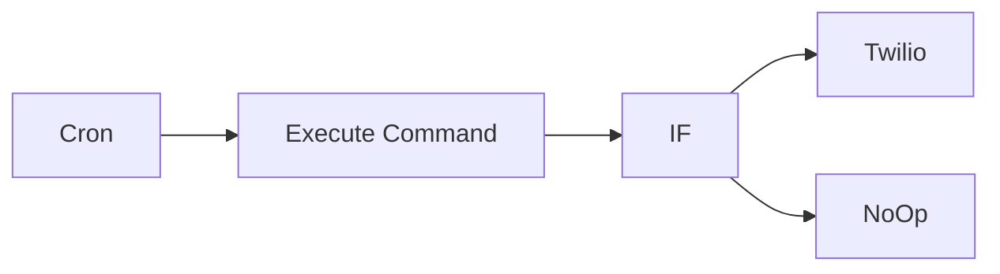

## Fluxo (.json) :

```json
{
  "id": "81",
  "name": "Execute a command that gives the hard disk memory used on the host machine",
  "nodes": [
    {
      "name": "Execute Command",
      "type": "n8n-nodes-base.executeCommand",
      "position": [
        670,
        300
      ],
      "parameters": {
        "command": "df -k / | tail -1 | awk '{print $5}'"
      },
      "typeVersion": 1
    },
    {
      "name": "Cron",
      "type": "n8n-nodes-base.cron",
      "position": [
        470,
        300
      ],
      "parameters": {
        "triggerTimes": {
          "item": [
            {
              "hour": 9
            },
            {
              "hour": 16
            }
          ]
        }
      },
      "typeVersion": 1
    },
    {
      "name": "IF",
      "type": "n8n-nodes-base.if",
      "position": [
        870,
        300
      ],
      "parameters": {
        "conditions": {
          "number": [
            {
              "value1": "={{parseInt($node[\"Execute Command\"].json[\"stdout\"])}}",
              "value2": 80,
              "operation": "larger"
            }
          ],
          "string": []
        }
      },
      "typeVersion": 1
    },
    {
      "name": "Twilio",
      "type": "n8n-nodes-base.twilio",
      "position": [
        1070,
        200
      ],
      "parameters": {
        "to": "+12345",
        "from": "+123",
        "message": "=Your hard disk space is filling up fast! Your hard disk is {{$node[\"Execute Command\"].json[\"stdout\"]}} full."
      },
      "credentials": {
        "twilioApi": "twilio-credentials"
      },
      "typeVersion": 1
    },
    {
      "name": "NoOp",
      "type": "n8n-nodes-base.noOp",
      "position": [
        1070,
        400
      ],
      "parameters": {},
      "typeVersion": 1
    }
  ],
  "active": false,
  "settings": {},
  "connections": {
    "IF": {
      "main": [
        [
          {
            "node": "Twilio",
            "type": "main",
            "index": 0
          }
        ],
        [
          {
            "node": "NoOp",
            "type": "main",
            "index": 0
          }
        ]
      ]
    },
    "Cron": {
      "main": [
        [
          {
            "node": "Execute Command",
            "type": "main",
            "index": 0
          }
        ]
      ]
    },
    "Execute Command": {
      "main": [
        [
          {
            "node": "IF",
            "type": "main",
            "index": 0
          }
        ]
      ]
    }
  }
}
```

<a id="template-980"></a>

## Template 980 - Geração de voz via Elevenlabs

- **Nome:** Geração de voz via Elevenlabs
- **Descrição:** Recebe requisições HTTP com texto e identificador de voz e retorna o áudio gerado pela Elevenlabs.
- **Funcionalidade:** • Receber requisição POST no endpoint /generate-voice: aceita parâmetros no corpo da requisição (voice_id e text).
• Validar parâmetros de entrada: verifica se voice_id e text existem antes de prosseguir.
• Enviar texto para conversão: faz uma chamada à API de texto-para-fala usando o voice_id fornecido e envia o texto no corpo JSON.
• Retornar áudio binário ao solicitante: encaminha a resposta de áudio gerada pela API como resposta binária à requisição original.
• Responder erro para entradas inválidas: quando faltam parâmetros, retorna um JSON de erro indicando "Invalid inputs.".
- **Ferramentas:** • Elevenlabs API: serviço de texto-para-fala que gera áudio a partir de texto usando um identificador de voz (voice_id) e requer chave de API (xi-api-key).

## Fluxo visual

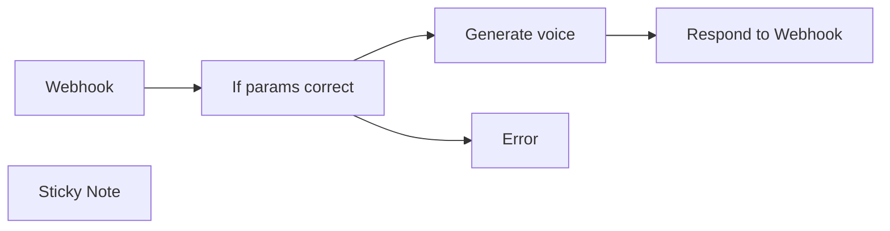

## Fluxo (.json) :

```json
{
  "nodes": [
    {
      "id": "73b64763-5e18-4ff1-bb52-ba25a08d3c3a",
      "name": "If params correct",
      "type": "n8n-nodes-base.if",
      "position": [
        500,
        200
      ],
      "parameters": {
        "options": {},
        "conditions": {
          "options": {
            "leftValue": "",
            "caseSensitive": true,
            "typeValidation": "strict"
          },
          "combinator": "and",
          "conditions": [
            {
              "id": "2e968b41-88f7-4b28-9837-af50ae130979",
              "operator": {
                "type": "string",
                "operation": "exists",
                "singleValue": true
              },
              "leftValue": "voice_id",
              "rightValue": ""
            },
            {
              "id": "ad961bc9-6db8-4cac-8c63-30930e8beca7",
              "operator": {
                "type": "string",
                "operation": "exists",
                "singleValue": true
              },
              "leftValue": "text",
              "rightValue": ""
            }
          ]
        }
      },
      "typeVersion": 2
    },
    {
      "id": "39079dec-54c5-458e-afa1-56ee5723f3a3",
      "name": "Respond to Webhook",
      "type": "n8n-nodes-base.respondToWebhook",
      "position": [
        960,
        180
      ],
      "parameters": {
        "options": {},
        "respondWith": "binary"
      },
      "typeVersion": 1.1
    },
    {
      "id": "b6a344f4-28ac-41a7-8e6a-a2782a5d1c68",
      "name": "Webhook",
      "type": "n8n-nodes-base.webhook",
      "position": [
        300,
        200
      ],
      "webhookId": "5acc6769-6c0f-42a8-a69c-b05e437e18a9",
      "parameters": {
        "path": "generate-voice",
        "options": {},
        "httpMethod": "POST",
        "responseMode": "responseNode"
      },
      "typeVersion": 2
    },
    {
      "id": "a25dec72-152b-4457-a18f-9cbbd31840ec",
      "name": "Generate voice",
      "type": "n8n-nodes-base.httpRequest",
      "position": [
        740,
        180
      ],
      "parameters": {
        "url": "=https://api.elevenlabs.io/v1/text-to-speech/{{ $json.body.voice_id }}",
        "method": "POST",
        "options": {},
        "jsonBody": "={\n \"text\": \"{{ $json.body.text }}\"\n} ",
        "sendBody": true,
        "sendHeaders": true,
        "specifyBody": "json",
        "authentication": "genericCredentialType",
        "genericAuthType": "httpCustomAuth",
        "headerParameters": {
          "parameters": [
            {
              "name": "Content-Type",
              "value": "application/json"
            }
          ]
        }
      },
      "credentials": {
        "httpCustomAuth": {
          "id": "nhkU37chaiBU6X3j",
          "name": "Custom Auth account"
        }
      },
      "typeVersion": 4.2
    },
    {
      "id": "e862955e-76d9-4a24-9501-0d5eb8fbe778",
      "name": "Sticky Note",
      "type": "n8n-nodes-base.stickyNote",
      "position": [
        280,
        -360
      ],
      "parameters": {
        "width": 806.0818150700699,
        "height": 495.17470523089514,
        "content": "## Generate Text-to-Speech Using Elevenlabs via API\nThis workflow provides an API endpoint to generate speech from text using [Elevenlabs.io](https://elevenlabs.io/), a popular text-to-speech service.\n\n### Step 1: Configure Custom Credentials in n8n\nTo set up your credentials in n8n, create a new custom authentication entry with the following JSON structure:\n```json\n{\n \"headers\": {\n \"xi-api-key\": \"your-elevenlabs-api-key\"\n }\n}\n```\nReplace `\"your-elevenlabs-api-key\"` with your actual Elevenlabs API key.\n\n### Step 2: Send a POST Request to the Webhook\nSend a POST request to the workflow's webhook endpoint with these two parameters:\n- `voice_id`: The ID of the voice from Elevenlabs that you want to use.\n- `text`: The text you want to convert to speech.\n\nThis workflow has been a significant time-saver in my video production tasks. I hope it proves just as useful to you!\n\nHappy automating! \nThe n8Ninja"
      },
      "typeVersion": 1
    },
    {
      "id": "275ca523-8b43-4723-9dc4-f5dc1832fcd1",
      "name": "Error",
      "type": "n8n-nodes-base.respondToWebhook",
      "position": [
        740,
        360
      ],
      "parameters": {
        "options": {},
        "respondWith": "json",
        "responseBody": "{\n \"error\": \"Invalid inputs.\"\n}"
      },
      "typeVersion": 1.1
    }
  ],
  "pinData": {},
  "connections": {
    "Webhook": {
      "main": [
        [
          {
            "node": "If params correct",
            "type": "main",
            "index": 0
          }
        ]
      ]
    },
    "Generate voice": {
      "main": [
        [
          {
            "node": "Respond to Webhook",
            "type": "main",
            "index": 0
          }
        ]
      ]
    },
    "If params correct": {
      "main": [
        [
          {
            "node": "Generate voice",
            "type": "main",
            "index": 0
          }
        ],
        [
          {
            "node": "Error",
            "type": "main",
            "index": 0
          }
        ]
      ]
    }
  }
}
```

<a id="template-981"></a>

## Template 981 - Moderador de linguagem no Telegram

- **Nome:** Moderador de linguagem no Telegram
- **Descrição:** Monitora mensagens do Telegram e responde quando o conteúdo é considerado profano pelo serviço de análise de linguagem.
- **Funcionalidade:** • Captura de mensagens do Telegram: Recebe mensagens novas, editadas e publicações de canal para análise.
• Análise de conteúdo: Avalia o texto usando um serviço de análise de linguagem para detectar identidade ofensiva, ameaças e palavrões.
• Verificação de profanidade: Compara a pontuação de profanidade com um limite (0.7) para determinar se a mensagem é tóxica.
• Resposta automática: Envia uma mensagem de aviso e responde diretamente à mensagem original quando o conteúdo ultrapassa o limite.
• Fluxo silencioso para mensagens não tóxicas: Não realiza nenhuma ação quando a mensagem não é considerada profana.
- **Ferramentas:** • Telegram: Plataforma de mensagens usada para receber as mensagens do usuário e enviar respostas de moderação.
• Perspective API: Serviço de análise de linguagem que fornece scores de toxicidade como profanidade, ameaça e ataque à identidade.

## Fluxo visual

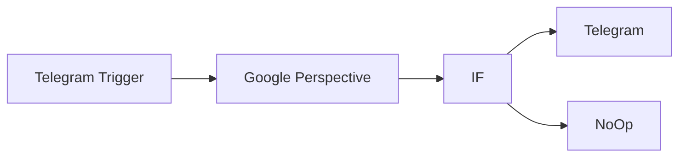

## Fluxo (.json) :

```json
{
  "nodes": [
    {
      "name": "Telegram Trigger",
      "type": "n8n-nodes-base.telegramTrigger",
      "position": [
        600,
        300
      ],
      "webhookId": "2d0805da-143e-40c9-b327-242b1f052c31",
      "parameters": {
        "updates": [
          "message",
          "edited_message",
          "channel_post",
          "edited_channel_post"
        ],
        "additionalFields": {}
      },
      "credentials": {
        "telegramApi": "telegram_habot"
      },
      "typeVersion": 1
    },
    {
      "name": "Google Perspective",
      "type": "n8n-nodes-base.googlePerspective",
      "position": [
        800,
        300
      ],
      "parameters": {
        "text": "={{$json[\"message\"][\"text\"]}}",
        "options": {
          "languages": "en"
        },
        "requestedAttributesUi": {
          "requestedAttributesValues": [
            {
              "attributeName": "identity_attack"
            },
            {
              "attributeName": "threat"
            },
            {
              "attributeName": "profanity"
            }
          ]
        }
      },
      "credentials": {
        "googlePerspectiveOAuth2Api": "perspective_api"
      },
      "typeVersion": 1
    },
    {
      "name": "IF",
      "type": "n8n-nodes-base.if",
      "position": [
        1000,
        300
      ],
      "parameters": {
        "conditions": {
          "number": [
            {
              "value1": "={{$json[\"attributeScores\"][\"PROFANITY\"][\"summaryScore\"][\"value\"]}}",
              "value2": 0.7,
              "operation": "larger"
            }
          ]
        }
      },
      "typeVersion": 1
    },
    {
      "name": "Telegram",
      "type": "n8n-nodes-base.telegram",
      "position": [
        1200,
        150
      ],
      "parameters": {
        "text": "I don't tolerate toxic language!",
        "chatId": "={{$node[\"Telegram Trigger\"].json[\"message\"][\"chat\"][\"id\"]}}",
        "additionalFields": {
          "reply_to_message_id": "={{$node[\"Telegram Trigger\"].json[\"message\"][\"message_id\"]}}"
        }
      },
      "credentials": {
        "telegramApi": "telegram_habot"
      },
      "typeVersion": 1
    },
    {
      "name": "NoOp",
      "type": "n8n-nodes-base.noOp",
      "position": [
        1200,
        400
      ],
      "parameters": {},
      "typeVersion": 1
    }
  ],
  "connections": {
    "IF": {
      "main": [
        [
          {
            "node": "Telegram",
            "type": "main",
            "index": 0
          }
        ],
        [
          {
            "node": "NoOp",
            "type": "main",
            "index": 0
          }
        ]
      ]
    },
    "Telegram Trigger": {
      "main": [
        [
          {
            "node": "Google Perspective",
            "type": "main",
            "index": 0
          }
        ]
      ]
    },
    "Google Perspective": {
      "main": [
        [
          {
            "node": "IF",
            "type": "main",
            "index": 0
          }
        ]
      ]
    }
  }
}
```
